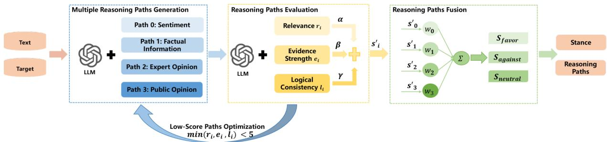
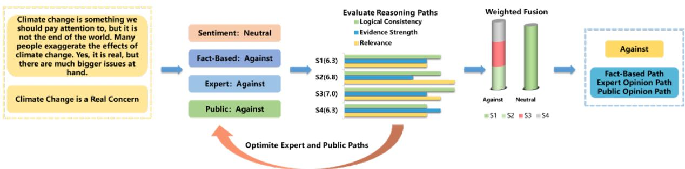

# MPRF: Interpretable Stance Detection through Multi-Path Reasoning Framework

Zhaodan Zhang1,2,3, Jin Zhang2,3,\*, Hui Xu2, Jiafeng Guo2,3, Xueqi Cheng2,3

1School of Advanced Interdisciplinary Sciences, University of Chinese Academy of Sciences

2State Key Laboratory of AI Safety,

Institute of Computing Technology, Chinese Academy of Sciences

3University of Chinese Academy of Sciences

{zhangzhaodan23s,jinzhang,xuhui,guojiafeng,cxq}@ict.ac.cn

## Abstract

Stance detection, a critical task in Natural Language Processing (NLP), aims to identify the attitude expressed in text toward specific targets. Despite advancements in Large Language Models (LLMs), challenges such as limited interpretability and handling nuanced content persist. To address these issues, we propose the Multi-Path Reasoning Framework (MPRF), a novel framework that generates, evaluates, and integrates multiple reasoning paths to improve accuracy, robustness, and transparency in stance detection. Unlike prior work that relies on single-path reasoning or static explanations, MPRF introduces a structured end-to-end pipeline: it first generates diverse reasoning paths through predefined perspectives, then dynamically evaluates and optimizes each path using LLM-based scoring, and finally fuses the results via weighted aggregation to produce interpretable and reliable predictions. Extensive experiments on the SEM16, VAST, and PStance datasets demonstrate that MPRF outperforms existing models. Ablation studies further validate the critical role of MPRF’s components, highlighting its effectiveness in enhancing interpretability and handling complex stance detection tasks.

## 1 Introduction

Stance detection (Hasan and Ng, 2014; Küçük and Can, 2020), the task of determining the attitude expressed in a text towards a specific target, plays a crucial role in applications such as opinion mining (Graells-Garrido et al., 2020), combating misinformation (Lai et al., 2020), and understanding public sentiment (Lei et al., 2024). By analyzing structural and linguistic patterns in stance reasoning, researchers can gain insights into opinion dynamics, address the evolution of harmful behaviors, and foster a more ethical online environment (De Vinco et al., 2024; Graells-Garrido and Baeza-Yates, 2022; Zhang et al., 2023b).

Existing stance detection methods often treat the task as a classification problem, where models output a stance label without providing interpretable reasoning paths (Allaway et al., 2021; De Vinco et al., 2024; Graells-Garrido and Baeza-Yates, 2022; Li and Zhang, 2024; Xu et al., 2022; Yang and Urbani, 2021; Zhang et al., 2023b). This lack of transparency is particularly problematic in complex tasks that involve subtle or ambiguous opinions, such as those expressed in social media content(Gatto et al., 2023).

Recent advances in large language models (LLMs), particularly those leveraging Chain-of-Thought (CoT) prompting (Wei et al., 2022), have demonstrated remarkable reasoning capabilities in tasks such as multihop question answering (Lu et al., 2022) and mathematical problem solving (Wei et al., 2022). These models achieve zero-shot and few-shot success across diverse tasks by utilizing machine-generated instruction-following data and reasoning mechanisms. While prior work has shown that explanations from models like GPT can improve interpretability in stance detection (Zhang et al., 2024a; Taranukhin et al., 2024), they often rely on single-path or heuristic-based reasoning, which may fail to capture diverse perspectives or provide robust explanations.

In this work, we introduce the Multi-Path Reasoning Framework (MPRF), a novel framework designed to address the interpretability challenges in stance detection by generating, evaluating, and integrating multiple reasoning paths. Unlike previous approaches (Ding et al., 2024a; Taranukhin et al., 2024), which often rely on static reasoning or single-path explanations, MPRF introduces a structured and dynamic pipeline: it first generates diverse reasoning paths through predefined perspectives (e.g., separating sentiment from factual analysis), then evaluates each path using LLM-based scoring (relevance, evidence strength, logical consistency), and finally fuses the results via weighted aggregation to produce interpretable and reliable predictions. This systematic integration of generation, evaluation, optimization, and fusion represents a meaningful system-level innovation beyond prompt engineering or isolated use of LLM capabilities.

Our contributions are as follows:

\- We propose the Multi-Path Reasoning Framework (MPRF), a novel end-to-end framework for stance detection that goes beyond traditional prompt engineering by combining multiple reasoning paths in a structured, iterative, and interpretable manner.

\- We design a dynamic evaluation and optimization mechanism that ensures high-quality reasoning paths through LLM-based scoring (relevance, evidence strength, logical consistency) and refinement of weak paths. We introduce a weighted fusion strategy that prioritizes well-supported reasoning paths, improving prediction reliability and interpretability.

\- Extensive experiments show that MPRF achieves state-of-the-art performance across multiple datasets in both zero-shot and few-shot settings, while providing interpretable reasoning chains for each prediction. Our detailed ablation studies highlight the importance of reasoning path evaluation and fusion in improving the accuracy and interpretability of stance detection predictions.

## 2 Related Work

Early stance detection approaches primarily treated the task as a classification problem, relying on traditional machine learning models with handcrafted features (Aldayel and Magdy, 2019; Dey et al., 2017). With the emergence of pretrained language models (PLMs) such as BERT (Devlin et al., 2019; Nguyen et al., 2020), these methods achieved significant improvements by learning features from in-domain or cross-domain datasets (Augenstein et al., 2016; Zhang et al., 2019; Allaway et al., 2021; Liu et al., 2021; Liang et al., 2022b). However, these models often lacked interpretability, as they treated stance detection as a black-box process without explicitly modeling the reasoning steps.

Recent advancements in large language models (LLMs) have significantly enhanced stance detection, with a focus on improving reasoning capabilities through Chain-of-Thought (CoT) prompting (Yao et al., 2024). CoT prompting enables LLMs to perform step-by-step reasoning, achieving state-ofthe-art results in complex tasks such as arithmetic, logical reasoning, and stance detection. For example, Wei et al. (2022) and Zhou et al. (2022) demonstrated CoT prompting’s effectiveness in multihop reasoning tasks. Ding et al. (2024a) applied multi-step CoT prompting to capture the positional perspective of targets in stance detection, while Fei et al. (2023) proposed decomposing tasks into multiple stages for better predictions. Similarly, Ling et al. (2023) introduced deductive reasoning and iterative verification to enhance task inference. Hardalov et al. (2022) designed a promptbased framework for cross-language stance detection, Zhu et al. (2024) incorporated soft knowledge during cue fine-tuning to improve context understanding, and Huang et al. (2023) expanded the verbalizer in prompt-tuning with external semantic knowledge. While these methods demonstrate the power of CoT prompting in LLMs, they often rely on static reasoning processes and struggle to adapt to tasks requiring diverse perspectives.

Building on these advancements, we propose the Multi-Path Reasoning Framework (MPRF), a novel framework that addresses the limitations of existing CoT-based methods by generating, evaluating, and integrating multiple reasoning paths.

## 3 Methodology

In this study, we propose a novel framework for stance detection, called Multi-Path Reasoning Framework (MPRF), which is designed to address the critical challenges in stance detection tasks, particularly the lack of transparency and interpretability. MPRF enhances the accuracy, robustness, and interpretability of stance detection by generating multiple reasoning paths, evaluating and optimizing these paths, and finally combining the results through a weighted fusion mechanism. Our approach is structured into five key steps: generating multiple reasoning paths (3.2), evaluating the paths (3.3), optimizing the paths (3.4), weighted fusion of the paths (3.5), and outputting the stance label along with the interpretable reasoning paths (3.6). MPRF shown in figure 1 ensures that the detected stance is not only accurate but also transparent, providing clear, traceable reasoning behind the final decision.

  
Figure 1: This is the Multi-Path Reasoning Framework. We generate four reasoning paths. A final score $s _ { i } ^ { \prime }$ is assigned to each path i by combining the relevance $r _ { i } .$ , evidence strength $e _ { i }$ , and logical consistency scores $l _ { i }$ weighted by $\alpha ,$ $\beta ,$ and $\gamma$ after optimization. $S _ { t }$ is the aggregated weighted score for label t, t favor, against, neutral . The label with the highest score is selected as the final stance.

## 3.1 Task Definition

Let $\mathcal { D } = \{ ( x _ { j } , p _ { j } , y _ { j } ) \} _ { j = 1 } ^ { N }$ be a dataset consisting of N instances, where each instance $( x _ { j } , p _ { j } , y _ { j } )$ represents the input text $x _ { j }$ for which the stance needs to be detected, the corresponding target $p _ { j }$ towards which the stance of $x _ { j }$ is to be determined, and the stance label $y _ { j }$ for the input $x _ { j }$ towards the target $p _ { j }$ , where $y _ { j } \in$ favor, against, neutral .

Stance detection aims to predict the stance label $y _ { j }$ for each input sentence $x _ { j }$ towards the given target $p _ { j }$ .

## 3.2 Generating Multiple Reasoning Paths

In this step, we generate multiple reasoning paths for stance detection, each representing a distinct chain of thought from a theoretically grounded perspective. This multi-path approach is designed to deconstruct the complex process of stance formation into its fundamental cognitive and social components, ensuring a more robust, accurate, and interpretable analysis. The specific prompts used to guide each reasoning path are detailed in $\mathsf { A p - }$ pendix B.

The first reasoning path is Sentiment Analysis. This path is rooted in the understanding that stance is often an expression of affective state. Emotions are powerful drivers of human judgment and decision-making, frequently serving as the primary motivator for taking a position on an issue (Dey et al., 2017). The model identifies key emotional lexicons in the text (e.g., "happy", "angry", "disappointed") to determine the overall valence - positive, negative, or neutral.

The second reasoning path is Factual Reasoning. This path addresses the cognitive process of evidence-based justification. It is grounded in the principle that rational argumentation relies on objective information to support a claim (Mohammad et al., 2016). The model acts as an analytical agent, extracting verifiable facts such as statistical data, scientific research findings, or legal precedents. It then evaluates whether this evidence logically supports or contradicts the target. This path is crucial for distinguishing between opinions based on truth claims and those based on mere assertion, thereby enhancing the logical rigor of the stance detection process.

The third reasoning path is Expert Opinion. This path models the social influence of authority and expertise, a cornerstone of persuasive communication. In contentious or complex domains, individuals often defer to the judgment of trusted professionals or institutions (e.g., scientists, medical doctors, legal scholars) (Wang et al., 2024a). The model identifies explicit or implicit references to such authoritative sources within the text. If the referenced expert’s position aligns with the target (e.g., a scientist stating that climate change is anthropogenic), the stance is inferred as "favor". This path captures the heuristic of "appeal to authority," a common and powerful mechanism in public discourse.

The fourth reasoning path is Public Opinion. This path reflects the powerful role of social conformity and normative influence in shaping individual stances. Humans are social beings, and their opinions are often influenced by perceived societal consensus, social media trends, or mainstream media narratives (Wang et al., 2024a). The model identifies phrases that indicate collective sentiment (e.g., "most people think", "everyone is talking about", "public opinion is shifting"). If the perceived public sentiment supports the target, the stance is classified as "favor". This path accounts for the bandwagon effect and the desire to align with the majority.

The selection of these four paths is not arbitrary but is grounded in a comprehensive analysis of human reasoning and empirical validation. They represent a spectrum of influence: from internal affective states (Sentiment) to external rational evidence (Factual), from institutional authority (Expert) to social consensus (Public). This holistic framework ensures that MPRF can capture the multifaceted nature of real-world arguments. Alternative paths, such as Metaphorical Analysis (Allaway and McKeown, 2020) and Temporal Reasoning (Allaway and McKeown, 2020), were explored but found to be less effective due to ambiguity and sparsity in short texts, respectively. The final four paths thus provide a balanced, theoretically sound, and empirically validated foundation for multi-perspective stance analysis.

## 3.3 Evaluating Reasoning Paths

Once multiple reasoning paths have been generated, each path is evaluated by a large language model (LLM) based on three main criteria: relevance, evidence strength, and logical consistency. These criteria are inspired by established frameworks in argumentation quality assessment (Hasan and $\mathrm { N g } .$ 2014) and are defined as follows:

\- Relevance Score $r _ { i } \mathbf { : }$ Measures how closely the reasoning aligns with the target stance. A higher score indicates stronger alignment.

\- Evidence Strength $e _ { i } { \cdot }$ Assesses the reliability and robustness of the evidence supporting the reasoning (e.g., factual references to studies or statistics).

\- Logical Consistency $l _ { i } { \mathrm { : } }$ : Evaluates whether the reasoning steps follow a coherent and logically sound structure without contradictions.

To ensure consistent and objective scoring across different paths, we designed standardized prompts (see Appendix B) that guide the LLM through structured evaluation steps for each criterion. While human annotation could provide additional validation, our experiments demonstrate a strong correlation between LLM-assigned scores and downstream performance, indicating the practical effectiveness of this automated approach.

After evaluating each reasoning path using these criteria, a final score $s _ { i }$ is assigned to each path by combining the relevance, evidence strength, and logical consistency scores:

$$
s _ { i } = \alpha \cdot r _ { i } + \beta \cdot e _ { i } + \gamma \cdot l _ { i }\tag{1}
$$

where $i \in \{ 0 , 1 , 2 , 3 \}$ represents the four reasoning paths being evaluated, and $\alpha , \beta ,$ , and $\gamma$ are weights determined through experiments on weighting configurations (Table 5) . The final score $s _ { i }$ reflects the overall quality and contribution of the path to the stance detection task.

## 3.4 Optimizing Reasoning Paths

After generating and evaluating reasoning paths, we focus on optimizing those that receive low scores in relevance, evidence strength, or logical consistency. Specifically, any path i that score below 5 in any of the evaluation criteria is considered a low-scoring path.

The optimization process involves re-prompting the LLM to refine the reasoning path using a dedicated prompt template (Appendix B), which guides the model to improve specific weak areas—such as enhancing relevance to the target, strengthening supporting evidence, or correcting logical inconsistencies:

$$
i ^ { \prime } = \mathbf { M } ( i , \mathrm { p r o m p t } _ { \mathrm { r e f i n e } } ) \quad \mathrm { i f ~ } \operatorname* { m i n } ( r _ { i } , e _ { i } , l _ { i } ) < 5\tag{2}
$$

Once refined, the updated path $i ^ { \prime }$ is re-evaluated using the same scoring criteria:

$$
s _ { i } ^ { \prime } = \alpha \cdot r _ { i } ^ { \prime } + \beta \cdot e _ { i } ^ { \prime } + \gamma \cdot l _ { i } ^ { \prime }\tag{3}
$$

where $r _ { i } ^ { \prime } , e _ { i } ^ { \prime } , l _ { i } ^ { \prime }$ denote the improved relevance, evidence strength, and logical consistency of the optimized path.

This iterative refinement ensures that only highquality reasoning paths contribute to the final stance prediction, significantly improving both interpretability and accuracy.

## 3.5 Fusing Reasoning Paths

In step 4, for each reasoning path $i ,$ we calculate the weighted score for each label $t \in$ favor, against, neutral . This is done by computing the weighted sum of the individual scores $s _ { i } ^ { \prime }$ for each path i assigned to label $t ,$ where $w _ { i }$ is the weight of each path based on its contribution to the reasoning process:

$$
S _ { t } = \sum _ { i \in P _ { t } } w _ { i } \cdot s _ { i } ^ { \prime }\tag{4}
$$

Here, $P _ { t }$ represents the set of paths assigned to label $t ,$ and $S _ { t }$ is the aggregated weighted score for label $t .$

Next, we calculate the weighted scores for each label (favor, against, neutral) based on the reevaluated scores for all the reasoning paths: $S _ { \mathrm { f a v o r } }$ $S _ { \mathrm { a g a i n s t } }$ and $S _ { \mathrm { n e u t r a l } }$

After the weighted scores for each label are computed, the label with the highest score is selected as the final stance prediction. For example, ${ \mathrm { i f ~ } } S _ { \mathrm { f a v o r } } > S _ { \mathrm { a g a i n s t } }$ and $S _ { \mathrm { f a v o r } } > S _ { \mathrm { n e u t r a l } }$ , then the final stance is favor. The same approach is applied for the other labels.

In the case where multiple labels have equal scores, the final stance label is determined by a majority vote. Specifically, the label associated with the most reasoning paths is chosen. Even when the scores are equal, the label with more supporting paths generally indicates stronger evidence, making it more likely to represent the true final stance. This voting mechanism resolves tie situations and enhances the robustness of the model by ensuring that the most evidence-backed label is selected.

## 3.6 Outputting Stance and Reasoning Paths

After determining the final stance prediction in Step 4, we now output both the selected stance label and the corresponding reasoning paths.The reasoning paths that contributed to the selected stance label, illustrating the logical progression and supporting evidence behind the decision. Specifically, the final output consists of:

Final Stance Label: The label selected in Step 4, which can be one of the following: favor, against, or neutral.

Reasoning Paths: The set of reasoning paths associated with the selected stance label, showing how the decision was made. These paths are the ones that contributed to the weighted score for the selected label.

## 4 Experiments

## 4.1 Datasets

We conduct experiments on the VAST, SEM16, and PStance datasets to evaluate our proposed method. The VAST dataset (Allaway and McKeown, 2020) includes a wide range of targets, each instance comprising a sentence r, a target t, and a stance label y (classified as ’Pro’, ’Con’ or ’Neutral’) towards t.

The SEM16 dataset (Mohammad et al., 2016) contains six predefined targets, including Donald Trump (DT), Hillary Clinton (HC), Feminist Movement (FM), Legalization of Abortion (LA), Atheism (A), and Climate Change (CC). Each instance is categorized as Favor, Against, or Neutral.

The PStance dataset (Li et al., 2021) focuses on the stance of individuals towards three prominent political figures in the United States: Donald Trump (trump), Joe Biden (biden), and Bernie Sanders (sanders). This large-scale dataset includes only two stance labels: favor or against. Detailed statistics of datasets can be found in Appendix A.

## 4.2 Evaluation Metrics

For the VAST dataset, following Allaway and McKeown (2020), we calculate the Macro-averaged F1 score across the $P r o ,$ , Con, and Neutral labels to evaluate the performance of the models on the test set. For the SEM16 and PStance datasets, we report the $F _ { \mathrm { a v g } } ,$ , which is the average of the F1 scores for the Favor and Against classes, in line with Mohammad et al. (2016); Li et al. (2021). We compute $F _ { \mathrm { a v g } }$ for each target. $F _ { \mathrm { m a c r o } }$ is calculated by averaging the $F _ { \mathrm { a v g } }$ across all targets.

## 4.3 Baselines

We compare our proposed Multi-Path Reasoning Framework (MPRF) against a comprehensive set of state-of-the-art baselines, categorized into statisticsbased models, BERT-based models, and LLMbased models.

Statistics-based models rely on traditional machine learning architectures. We include BiLSTM (Schuster and Paliwal, 1997), a bidirectional LSTM without target information; CNN (Kim, 2014), a convolutional network also without target modeling; TAN (Du et al., 2017), an attention-based LSTM for target-specific features; BiCond (Augenstein et al., 2016), which jointly encodes text and target with bidirectional LSTMs; CrossNet (Xu et al., 2018), a BiLSTM enhanced with selfattention; GCAE (Xue and Li, 2018), a CNN using a gating mechanism to filter irrelevant information; and PGCNN (Huang and Carley, 2018), a gated CNN that generates target-sensitive filters.

BERT-based models are built upon the BERT architecture and are typically fine-tuned. We include BERT (Devlin et al., 2019), the standard model; BERTweet (Nguyen et al., 2020), pretrained on tweets; PT-HCL (Liang et al., 2022a), which uses contrastive learning for zero-shot tasks; JointCL (Liang et al., 2022b), a joint contrastive learning framework; WS-BERT (He et al., 2022), which infuses Wikipedia knowledge; CKI (Yan et al., 2024), a collaborative knowledge infusion approach; TATA (Hanley and Durumeric, 2023), using topic-agnostic and topic-aware embeddings; KPatch (Lin et al., 2024), introducing a "knowledge patch" for zero-shot detection; CNet-Ad (Zhang et al., 2024c), a commonsense-based adversarial learning framework; and EZSD-CP (Yao et al., 2024), a model based on a gated MLP and prompt learning.

LLM-based models leverage the reasoning capabilities of LLMs, often through prompting. We include KEprompt (Huang et al., 2023), using knowledge-enhanced prompt-tuning; KASD (Li et al., 2023), integrating Wikipedia knowledge with retrieval; COLA (Lan et al., 2024), a collaborative role-infusion framework; Stanceformer (Garg and Caragea, 2024), a target-aware transformer; DEEM (Wang et al., 2024a), using dynamic expert modeling; GPT-3.5 and GPT-3.5+COT (Lan et al., 2024), the base and CoT-prompted versions; GPT-EDDA (Ding et al., 2024b), an encoder-decoder data augmentation framework; Llama-2-7b-chat and Llama-2-13b-chat (Garg and Caragea, 2024), the 7B and 13B chat models; Manual-CoT (Wei et al., 2022)and Auto-CoT (Zhang et al., 2023c), CoT methods with manual or automatic demonstrations; ExpertPrompt (Xu et al., 2023), instructing LLMs to act as experts; SPP (Wang et al., 2024b), a solo performance prompting method; and LC-CoT (Zhang et al., 2023a), a logically consistent CoT approach.

Detailed descriptions and performance results for these models across different datasets are provided in Appendix C.

## 4.4 Implementation Details

In our study, we utilize four large language models : GPT-3.5(Brown et al., 2020), Qwen2.5- 7B-Instruct(Qwen Team, 2024) Llama-3.3-70B-Instruct(Llama Team, 2024), and Mistral-7B-Instruct-v0.3(Jiang et al., 2023). The experiments were conducted on a single NVIDIA A800 GPU with 80GB of RAM, utilizing bfloat16 precision to optimize memory usage and computational efficiency. To ensure the reproducibility of the LLMs responses, we set the temperature parameter to 0 during inference. This configuration helps maintain consistent outputs across multiple runs. The results reported in our experiments are averaged over 5 repeated runs to ensure statistical reliability and mitigate the impact of any variance in model performance.

## 5 Results and Discussion

This section addresses the following research questions (RQs) based on our experimental results: RQ1: How does the performance of our MPRF compare to state-of-the-art stance detection models on PStance , SEM16 and VAST datasets? RQ2: Is each component of the MPRF effective and contributory to overall performance? RQ3: How do the weighting configurations of reasoning path scores $( s _ { i } ^ { \prime } )$ and path weights $( w _ { i } )$ affect the performance of MPRF? RQ4: How does the performance of MPRF vary across different models ?

<table><tr><td>Methods</td><td>DT</td><td>HC</td><td>FM</td><td>LA</td><td>A</td><td>CC</td></tr><tr><td colspan="7">Statistics-based Models</td></tr><tr><td>BiCond</td><td></td><td>30.5 32.7 40.6 34.4 31.0 15.0</td><td></td><td></td><td></td><td></td></tr><tr><td>CrossNet</td><td></td><td></td><td>35.6 38.3 41.7 38.5 39.7 22.8</td><td></td><td></td><td></td></tr><tr><td colspan="7">BERT-based Models</td></tr><tr><td>BERT</td><td></td><td>40.1 49.6 41.9 44.8 55.2 37.3</td><td></td><td></td><td></td><td></td></tr><tr><td>PT-HCL</td><td></td><td>50.1 54.5 54.6 50.9 56.5 38.9</td><td></td><td></td><td></td><td></td></tr><tr><td>TGA-Net</td><td></td><td>40.7 49.3 46.6 45.2 52.7 36.6</td><td></td><td></td><td></td><td></td></tr><tr><td>Joint-CL</td><td></td><td>50.5 54.8 53.8 49.5 54.5 39.7</td><td></td><td></td><td></td><td></td></tr><tr><td>KPatch</td><td></td><td>41.1 49.7 43.9 43.8 39.9 31.9</td><td></td><td></td><td></td><td></td></tr><tr><td>TATA</td><td></td><td>63.8 65.4 66.9 62.9 52.1 41.6</td><td></td><td></td><td></td><td></td></tr><tr><td>EZSD-CP</td><td></td><td>68.8 76.3 62.2 64.4 54.4 37.3</td><td></td><td></td><td></td><td></td></tr><tr><td>CNet-Ad</td><td></td><td>47.8 59.2 50.7 54.9 57.4 50.7</td><td></td><td></td><td></td><td></td></tr><tr><td>TarBK-BERT</td><td></td><td>50.8 55.1 53.8 48.7 56.2 39.5</td><td></td><td></td><td></td><td></td></tr><tr><td colspan="7">LLM-based Models</td></tr><tr><td>KASD-ChatGPT</td><td></td><td>80.3 70.4 62.7 -</td><td></td><td></td><td></td><td></td></tr><tr><td>COLA</td><td></td><td>68.5 81.7 63.4 71.0 70.8 65.5</td><td></td><td></td><td></td><td></td></tr><tr><td>GPT-3.5</td><td></td><td>62.5 68.7 44.7 51.5 9.1 31.1</td><td></td><td></td><td></td><td></td></tr><tr><td>GPT-3.5+COT</td><td></td><td>63.3 70.9 47.7 53.4 13.3 34.0</td><td></td><td></td><td></td><td></td></tr><tr><td>GPT-EDDA</td><td></td><td>69.5 80.1 69.2 62.7 67.2 68.5</td><td></td><td></td><td></td><td></td></tr><tr><td>LCDA</td><td></td><td>70.0 79.8 70.0 69.4</td><td></td><td></td><td></td><td></td></tr><tr><td>LC-CoT</td><td></td><td>71.7 82.9 70.4 63.2</td><td></td><td></td><td></td><td></td></tr><tr><td colspan="7">MPRF (Ours)</td></tr><tr><td>GPT-3.5</td><td>80.3 83.5 83.2 84.1 80.4 82.9</td><td></td><td></td><td></td><td></td><td></td></tr><tr><td>Qwen2.5-7B-Instruct</td><td></td><td>84.4* 83.1*84.5*82.583.9* 82.3*</td><td></td><td></td><td></td><td></td></tr><tr><td>LLaMA-3.3-70B</td><td></td><td>81.583.483.485.3*84.3*83.6*</td><td></td><td></td><td></td><td></td></tr><tr><td>Mistral-7B-Instruct-v0.3 82.684.5* 87.7* 83.2 82.783.4</td><td></td><td></td><td></td><td></td><td></td><td></td></tr></table>

Table 1: Zero-shot stance detection results on the SEM16 dataset. The best scores are in bold.Results with \* denote that MPRF significantly outperforms baselines with the p-value < 0.05.

Performance Comparison with State-of-the-Art Models As shown in Tables 1, 2, and 3, MPRF significantly outperforms state-of-the-art models across all three datasets—SEM16, VAST, and PStance—demonstrating both effectiveness and innovation in stance detection.

On SEM16, MPRF achieves the highest scores across multiple targets (e.g., FM: 87.7%, HC: 84.5%), surpassing strong LLM-based baselines such as GPT-EDDA and KASD by a large margin. In particular, our method shows robust generalization to challenging targets like "Atheism" and "Climate Change", where traditional models often struggle.

On VAST, MPRF achieves an overall F1 score of 83.5% with Mistral-7B-Instruct-v0.3, outperforming existing methods by more than 3%. Notably, it performs exceptionally well in zero-shot settings (85.4%), highlighting its ability to generalize without target-specific training data.

On PStance, MPRF sets a new state of the art with an $\mathrm { F } _ { \mathrm { m a c r o } }$ of 88.41%, surpassing DEEM by 3.26%. The model also achieves the best individual performance on Biden (89.36%) and Trump (89.33%), demonstrating strong adaptability to realworld political discourse. These results affirm that MPRF’s structured multi-path reasoning framework brings substantial improvements over conventional single-path or static prompting approaches, offering both enhanced accuracy and interpretability.

<table><tr><td colspan="4">Model Zero-Shot Few-Shot Overall</td></tr><tr><td>BiCond</td><td>42.8</td><td>40.0</td><td>41.5</td></tr><tr><td>CrossNet</td><td>43.4</td><td>47.4</td><td>45.5</td></tr><tr><td>TGA-Net</td><td>66.6</td><td>66.3</td><td>66.5</td></tr><tr><td>BERT-GCN</td><td>68.6</td><td>69.7</td><td>69.2</td></tr><tr><td>CKE-Net</td><td>70.2</td><td>70.1</td><td>70.1</td></tr><tr><td>GDA-CL</td><td>70.5</td><td></td><td></td></tr><tr><td>PT-HCL</td><td>71.6</td><td></td><td></td></tr><tr><td>WS-BERT</td><td>75.3</td><td>73.6</td><td>74.5</td></tr><tr><td>CNet-Ad</td><td>73.2</td><td>71.8</td><td>72.6</td></tr><tr><td>TarBK-BERT</td><td>73.6</td><td></td><td></td></tr><tr><td>Joint-CL</td><td>72.3</td><td>71.5</td><td></td></tr><tr><td>EZSD-CP</td><td>73.6</td><td></td><td></td></tr><tr><td>StSQA</td><td>68.9</td><td></td><td></td></tr><tr><td>COLA</td><td>73.4</td><td></td><td></td></tr><tr><td>TATA</td><td>77.1</td><td>74.1</td><td>76.3</td></tr><tr><td>GPT-3.5-Turbo</td><td>65.0</td><td></td><td></td></tr><tr><td>GPT-3.5-Turbo-CoT</td><td>66.4</td><td></td><td></td></tr><tr><td>KASD-BERT</td><td>76.8</td><td></td><td></td></tr><tr><td>LKI-BART</td><td>79.6</td><td></td><td></td></tr><tr><td>CKI</td><td>81.9</td><td>79.6</td><td>80.7</td></tr><tr><td>EDDA-LLaMA</td><td>70.3</td><td></td><td></td></tr><tr><td>LC-CoT</td><td>72.5</td><td></td><td></td></tr><tr><td>LCDA</td><td>80.3</td><td></td><td></td></tr><tr><td colspan="4">MPRF (Ours)</td></tr><tr><td>GPT-3.5</td><td>81.1</td><td>82.3</td><td>82.1</td></tr><tr><td>Qwen2.5-7B-Instruct</td><td>85.4*</td><td>82.0</td><td>83.2</td></tr><tr><td>LLaMA-3.3-70B</td><td>80.6</td><td>82.1</td><td>81.2</td></tr><tr><td>Mistral-7B-Instruct-v0.3</td><td>84.2*</td><td>83.1*</td><td>83.5*</td></tr></table>

Table 2: Stance detection performance (%) on VAST. The best scores are in bold.Results with \* denote that MPRF significantly outperforms baselines with the pvalue < 0.05.

Contribution of Each Component of MPRF To evaluate the effectiveness of each component, we conducted ablation studies on SEM16 (Table 4), with additional results for PStance and VAST in Appendix D. Removing any component leads to performance drops, confirming their importance.

Sentiment Path significantly influences targets involving emotional expression. Its removal causes a 4.6% drop on FM (from 87.7% to 83.1%) on SEM16 and a 1.9% drop on Trump (from 89.33% to 87.4%) on PStance.

<table><tr><td>Method</td><td>Trump</td><td>Biden Sanders Fmacro</td><td></td><td></td></tr><tr><td>BiLSTM</td><td>76.92</td><td>77.95</td><td>69.75</td><td>74.87</td></tr><tr><td>CNN</td><td>76.80</td><td>77.22</td><td>71.40</td><td>75.14</td></tr><tr><td>TAN</td><td>77.10</td><td>77.64</td><td>71.60</td><td>75.45</td></tr><tr><td>BiCond</td><td>77.15</td><td>77.69</td><td>71.24</td><td>75.36</td></tr><tr><td>PGCNN</td><td>76.87</td><td>76.60</td><td>72.13</td><td>75.20</td></tr><tr><td>GCAE</td><td>78.96</td><td>77.95</td><td>71.82</td><td>76.24</td></tr><tr><td>BERT</td><td>78.28</td><td>78.70</td><td>72.45</td><td>76.48</td></tr><tr><td>BERTweet</td><td>82.48</td><td>81.02</td><td>78.09</td><td>80.53</td></tr><tr><td>WS-BERT</td><td>84.97</td><td>82.86</td><td>79.97</td><td>82.60</td></tr><tr><td>TarBK-BERT</td><td>65.80</td><td>75.49</td><td>70.45</td><td>70.58</td></tr><tr><td>GPT-3.5</td><td>79.80</td><td>79.65</td><td>77.77</td><td>79.07</td></tr><tr><td>Llama-2-7b-chat-ft</td><td>72.00</td><td>67.96</td><td>65.57</td><td>68.51</td></tr><tr><td>Llama-2-13b-chat-ft</td><td>76.62</td><td>71.88</td><td>68.44</td><td>72.31</td></tr><tr><td>Stanceformer</td><td>85.35</td><td>83.96</td><td>80.57</td><td>83.30</td></tr><tr><td>CKI</td><td>86.2</td><td>84.1</td><td>80.5</td><td>83.6</td></tr><tr><td>Manual-CoT</td><td>85.4</td><td>83.8</td><td>80.9</td><td>83.37</td></tr><tr><td>StSQA</td><td>85.7</td><td>82.8</td><td>80.8</td><td>83.1</td></tr><tr><td>Auto-CoT</td><td>84.1</td><td>82.8</td><td>80.6</td><td>82.5</td></tr><tr><td>ExpertPrompt</td><td>84.7</td><td>84.7</td><td>81.2</td><td>83.53</td></tr><tr><td>SPP</td><td>85.1</td><td>84.6</td><td>81.5</td><td>83.73</td></tr><tr><td>DEEM</td><td>86.4</td><td>86.1</td><td>82.1</td><td>84.87</td></tr><tr><td>COLA</td><td>86.6</td><td>84.0</td><td>79.7</td><td>83.1</td></tr><tr><td>KASD-ChatGPT</td><td>85.06</td><td>84.59</td><td>79.96</td><td>83.2</td></tr><tr><td colspan="5">MPRF (Ours)</td></tr><tr><td>GPT-3.5</td><td>88.20</td><td>88.60</td><td>85.10</td><td>87.60</td></tr><tr><td>Qwen2.5-7B-Instruct</td><td>89.50*</td><td>88.15*</td><td>86.75*</td><td>88.13</td></tr><tr><td>LLaMA-3.3-70B</td><td>89.63*</td><td>88.26</td><td>85.35</td><td>87.75</td></tr><tr><td>Mistral-7B-Instruct-v0.3</td><td>89.33</td><td>89.36*</td><td>86.53</td><td>88.41*</td></tr></table>

Table 3: Comparison of different models on the PStance . The best scores are in bold.Results with \* denote that MPRF significantly outperforms baselines with the pvalue < 0.05.

Fact-Based Reasoning is crucial for evidencebased stance formation. Without it, FM drops by 3.7% on SEM16 and Trump drops by 1.6% on PStance.

Expert Opinion Path enhances predictions through authoritative viewpoints. Removing it leads to a 3.4% drop on FM and a 1.2% drop on Trump.

Public Opinion Path contributes moderate but consistent improvements, especially in social context modeling. Its removal results in a 3.3% drop on FM and a 1.3% drop on Trump.

Optimization plays a key role in refining lowquality paths. Without optimization, FM drops sharply by 7.1%, indicating its critical impact on reasoning quality.

Weighted Fusion has the most significant impact among all components. Removing it causes an 8.6% drop on FM and a 3.6% drop on Trump, highlighting its essential role in integrating diverse perspectives effectively.

<table><tr><td>Model</td><td>DT</td><td>HC</td><td>FM</td><td>LA</td><td>A CC</td></tr><tr><td>MPRF</td><td>82.6</td><td>84.5</td><td>87.7</td><td>83.2</td><td>82.7 83.4</td></tr><tr><td>w/o Sentiment Path</td><td>80.3</td><td>81.2</td><td>83.1</td><td>81.4</td><td>81.8 81.9</td></tr><tr><td>w/o Fact-Based Path</td><td>81.1</td><td>82.4</td><td>84.0</td><td>82.6</td><td>82.3 82.0</td></tr><tr><td>w/o Expert Opinion Path 81.5</td><td></td><td>82.8</td><td>84.3</td><td>82.9</td><td>83.1 82.6</td></tr><tr><td>w/o Public Opinion Path 81.7</td><td></td><td>83.1</td><td>84.4</td><td>83.0</td><td>83.3 82.9</td></tr><tr><td>w/o Optimization</td><td>79.7</td><td>80.4</td><td>80.6</td><td>80.3</td><td>80.5 80.0</td></tr><tr><td>w/o Weighted Fusion</td><td>78.9</td><td>79.8</td><td>79.1</td><td>79.6</td><td>79.8 78.5</td></tr></table>

Table 4: Ablation Study Results on SEM16 (%) using Mistral-7B-Instruct. The best scores are in bold.

Impact of Weighting Configurations on MPRF Performance Table 5 shows the impact of different weighting configurations on MPRF’s performance. The optimal configuration $( \alpha = 0 . 4 , \beta =$ $0 . 3 , \gamma = 0 . 3 )$ yields the highest F1 scores, including 87.7% for FM and 84.5% for HC, outperforming other configurations. This demonstrates that a balanced weighting prioritizes relevance while maintaining adequate consideration of evidence strength and logical consistency.

Other configurations, such as the equal weighting $( \alpha = 0 . 3 3 , \beta = 0 . 3 3 , \gamma = 0 . 3 3 )$ , result in significant performance drops, with FM and HC scores dropping to 83.1% and 81.2%, respectively. Skewed configurations that emphasize a single criterion—like relevance $( \alpha = 0 . 5 , \beta = 0 . 2 5 .$ , γ = 0.25), evidence $( \alpha = 0 . 2 5 , \beta = 0 . 5 , \gamma = 0 . 2 5 )$ , or logical consistency $( \alpha = 0 . 2 5 , \beta = 0 . 2 5 , \gamma = 0 . 5 )$ also perform poorly. These configurations fail to balance the complementary contributions of all components, leading to suboptimal results.

<table><tr><td>Weighting Configurations</td><td>DT HC FM LA A CC</td></tr><tr><td>MPRF</td><td>82.6 84.5 87.7 83.2 82.7 83.4</td></tr><tr><td>Balanced Weights</td><td>80.381.283.1 81.481.881.9</td></tr><tr><td>Enhanced Relevance</td><td>81.482.281.080.481.1 81.6 Enhanced Evidence Strength 81.8 83.5 82.181.3 80.0 82.0</td></tr><tr><td></td><td>Enhanced Logical Consistency 81.4 82.7 82.9 83.0 80.6 81.8</td></tr></table>

Table 5: Effect of Weighting Configurations on SEM16 (%) using Mistral-7B-Instruct. The best scores are in bold.

Table 6 illustrates the impact of different weighting configurations on the SEM16 dataset. The MPRF $( w _ { i } \ \propto \ s _ { i } ^ { \prime } )$ configuration, which dynamically adjusts path weights based on their scores $( s _ { i } ^ { \prime } )$ , achieves the best performance, with F1 scores of 87.7% for FM and 84.5% for HC, outperforming all other configurations.

In contrast, the Equal Weights configuration shows a significant performance drop, with FM and HC scores decreasing to 83.1% and 81.2%, respectively. Configurations assigning high weights (0.8) to specific paths, such as sentiment or fact-based reasoning, also fail to surpass the MPRF $( w _ { i } \propto s _ { i } )$

configuration.

The superiority of dynamic weighting highlights the importance of prioritizing high-quality reasoning paths. Equal weighting dilutes the contributions of critical paths, while overemphasizing a single path reduces the complementary contributions from other paths.

In conclusion, dynamically adjusting weights based on path scores is crucial for maximizing performance, while equal or skewed weighting results in significant performance decline, emphasizing the need for balanced contributions from multiple reasoning paths.

<table><tr><td colspan="2">Weighting Configurations DT HC</td><td>FM LA</td><td>A CC</td></tr><tr><td>MPRF  $\overline { { ( w _ { i } \propto s _ { i } ^ { \prime } ) } }$ </td><td>82.6 84.5 87.7 83.2 82.7 83.4</td><td></td><td></td></tr><tr><td>Equal Weights</td><td></td><td>80.3 81.2 83.1 81.4 81.8 81.9</td><td></td></tr><tr><td>High for Sentiment Path</td><td></td><td>81.4 82.884.3 81.9 81.6 82.1</td><td></td></tr><tr><td>High for Fact-Based Path</td><td></td><td>81.883.785.182.682.082.5</td><td></td></tr><tr><td>High for Expert Path</td><td></td><td>80.8 82.3 83.5 82.0 81.7 82.2</td><td></td></tr><tr><td>High for Public Path</td><td>80.9 82.5 83.8 81.8 81.5 81.9</td><td></td><td></td></tr></table>

Table 6: Comparison of Weighting Configurations (%) on SEM16 using Mistral-7B-Instruct. The best scores are in bold.

Performance of MPRF Across Different Models Table 1, Table 2, and Table 3 summarize the performance of MPRF across four distinct large language models on the SEM16, VAST, and PStance datasets. These results demonstrate that MPRF consistently improves stance detection performance across diverse model architectures, suggesting that its effectiveness stems from the framework design rather than specific model capabilities.

On SEM16, for example, all four models achieve strong results under MPRF, with Mistral-7B-Instruct-v0.3 performing best on FM (87.7%) and HC (84.5%), and Qwen2.5-7B-Instruct leading on DT (84.4%). The relatively smaller performance gaps between models suggest that MPRF mitigates inherent model-specific biases or limitations by leveraging structured reasoning paths and weighted fusion. Similarly, in zero-shot and fewshot settings on VAST and PStance, MPRF enables consistent improvements across models.

The key takeaway is that MPRF’s performance gains are not solely attributable to the choice of LLM, but rather to its ability to generate, evaluate, and integrate multiple reasoning paths effectively. This consistency across models confirms that MPRF provides a robust and model-agnostic enhancement to stance detection frameworks.

  
Figure 2: Stance Detection Process: Multi-Path Analysis of the Statement on Climate Change

Case Study: Stance Detection on "Climate Change is a Real Concern" To demonstrate the interpretability of our Multi-Path Reasoning Framework (MPRF), we present a detailed case study in Figure 2: "Climate change is something we should pay attention to, but it’s not the end of the world. Many people exaggerate the effects of climate change. Yes, it’s real, but there are much bigger issues at hand." Our goal is to detect the stance towards the target "Climate Change is a Real Concern".

MPRF analyzes this statement through four distinct, human-understandable reasoning paths, each representing a different dimension of opinion formation. First, the Sentiment Analysis path identifies the overall tone as neutral. The text acknowledges the reality of climate change ("it’s real") but tempers this with phrases like "not the end of the world" and "many people exaggerate," resulting in a balanced emotional expression and a stance prediction of Neutral. Second, the Factual Reasoning path focuses on the evidence presented. The claim that "many people exaggerate the effects" is interpreted as a direct challenge to the severity of the scientific consensus on climate change, leading to a stance prediction of Against. Third, the Expert Opinion path infers that the statement contradicts the overwhelming consensus of climate scientists. By downplaying the urgency and scale of the issue, the argument implicitly opposes the authoritative viewpoint, resulting in a stance of Against. Fourth, the Public Opinion path interprets the phrase "many people exaggerate" as a reflection of a perceived public sentiment that overstates the problem, thus classifying the stance as Against.

Crucially, MPRF does not treat these paths equally. Each path is rigorously evaluated by an LLM on three criteria: relevance, evidence strength, and logical consistency, and assigned a quantitative score. For instance, the Fact-Based path received a high relevance score (8) due to its direct engagement with the core issue, though its evidence strength was moderate (5). The Expert Opinion path scored highly in logical consistency (8), reflecting a coherent argument structure. These individual scores (s′) are then used in a weighted fusion mechanism. The paths predicting Against (Fact-Based, Expert Opinion, Public Opinion) collectively contribute a significantly higher aggregated weighted score $( S _ { \mathrm { a g a i n s t } } )$ than the single Neutral path. This transparent, score-driven aggregation process results in the final prediction of Against.

## 6 Conclusion

In this paper, we proposed the Multi-Path Reasoning Framework (MPRF), a novel framework for stance detection that enhances accuracy, robustness, and interpretability by generating, evaluating, and optimizing multiple reasoning paths. Through experiments on three datasets, SEM16, VAST, and PStance, MPRF consistently demonstrated strong performance across various models. The results highlight the adaptability and effectiveness of MPRF in both zero-shot and few-shot settings, achieving state-of-the-art performance and providing interpretable reasoning chains.

Despite these achievements, there are still some limitations to our approach. The reliance on manually designed prompts for path evaluation and scoring may limit scalability to more complex tasks or datasets. In future work, we aim to explore automated prompt optimization and more efficient reasoning strategies to further enhance MPRF’s scalability and performance in real-world applications.

## Limitations

While the Multi-Path Reasoning Framework (MPRF) demonstrates strong performance and adaptability across various datasets and models, there are several limitations to address. First, the reliance on manually designed prompts for evaluating and scoring reasoning paths may limit scalability to more complex tasks or domains where predefined prompts may not generalize well. Second, generating and optimizing multiple reasoning paths introduces additional computational overhead, which could hinder its deployment in large-scale or timesensitive applications. Lastly, the interpretability of MPRF, while improved compared to traditional black-box models, still requires further exploration to ensure that reasoning paths are both humanreadable and aligned with domain-specific requirements.

## Ethical Considerations

The Multi-Path Reasoning Framework(MPRF) aims to improve stance detection by enhancing transparency and interpretability in its decisionmaking process. However, the use of large language models (LLMs) in MPRF raises potential ethical concerns. First, LLMs are trained on vast amounts of internet data, which may include biased or harmful content, potentially influencing the reasoning paths generated by MPRF. Second, the interpretability of the reasoning paths may lead to unintended misuse, such as generating misleading or manipulative arguments. Finally, while MPRF strives for fairness, it inherits biases present in the underlying models and datasets, which could result in unfair or inaccurate stance detection in certain contexts. To mitigate these risks, we have carefully evaluated MPRF’s outputs and employed diverse datasets to reduce potential biases. Future work will focus on improving fairness, bias detection, and ethical safeguards to ensure responsible application of MPRF in real-world scenarios.

## Acknowledgments

This research was supported by funding from the National Natural Science Foundation of China under Grant No.62441229 for the project "Highquality Dataset Construction". This valuable resource significantly enhanced the reliability and robustness of our experimental results. We would like to extend our sincere gratitude to all those who contributed to this work.

## References

Abeer Aldayel and Walid Magdy. 2019. Your stance is exposed! analysing possible factors for stance detection on social media. Proc. ACM Hum.-Comput. Interact., 3(CSCW).

Emily Allaway and Kathleen McKeown. 2020. Zero-Shot Stance Detection: A Dataset and Model using Generalized Topic Representations. In Proceedings of the 2020 Conference on Empirical Methods in Natural Language Processing (EMNLP), pages 8913– 8931, Online. Association for Computational Linguistics.

Emily Allaway, Malavika Srikanth, and Kathleen McKeown. 2021. Adversarial learning for zero-shot stance detection on social media. In Proceedings ofthe 2021 Conference of the North American Chapter of the Associationfor Computational Linguistics: Human Language Technologies, pages 4756–4767, Online. Association for Computational Linguistics.

Isabelle Augenstein, Tim Rocktäschel, Andreas Vlachos, and Kalina Bontcheva. 2016. Stance detection with bidirectional conditional encoding. In Proceedings ofthe 2016 Conference on Empirical Methods in Natural Language Processing, pages 876–885, Austin, Texas. Association for Computational Linguistics.

Tom B. Brown, Benjamin Mann, Nick Ryder, Melanie Subbiah, Jared Kaplan, Prafulla Dhariwal, Arvind Neelakantan, Pranav Shyam, Girish Sastry, Amanda Askell, Sandhini Agarwal, Ariel Herbert-Voss, Gretchen Krueger, T. J. Henighan, Rewon Child, Aditya Ramesh, Daniel M. Ziegler, Jeff Wu, Clemens Winter, Christopher Hesse, Mark Chen, Eric Sigler, Ma teusz Litwin, Scott Gray, Benjamin Chess, Jack Clark, Christopher Berner, Sam McCandlish, Alec Radford, Ilya Sutskever, and Dario Amodei. 2020. Language models are few-shot learners. ArXiv, abs/2005.14165.

Daniele De Vinco, Alessia Antelmi, Carmine Spagnuolo, and Luca Maria Aiello. 2024. Deciphering conversational networks: Stance detection via hypergraphs and llms. In Companion Publication of the 16th ACM Web Science Conference, Websci Companion ’24, page 3–4, New York, NY, USA. Association for Computing Machinery.

Jacob Devlin, Ming-Wei Chang, Kenton Lee, and Kristina Toutanova. 2019. BERT: Pre-training of deep bidirectional transformers for language understanding. In Proceedings of the 2019 Conference of the North American Chapter of the Association for Computational Linguistics: Human Language Technologies, Volume 1 (Long and Short Papers), pages 4171–4186, Minneapolis, Minnesota. Association for Computational Linguistics.

Kuntal Dey, Ritvik Shrivastava, and Saroj Kaushik. 2017. Twitter stance detection — a subjectivity and sentiment polarity inspired two-phase approach. In

2017 IEEE International Conference on Data Mining Workshops (ICDMW), pages 365–372.

Daijun Ding, Rong Chen, Liwen Jing, Bowen Zhang, Xu Huang, Li Dong, Xiaowen Zhao, and Ge Song. 2024a. Cross-target stance detection by exploiting target analytical perspectives. In ICASSP 2024 - 2024 IEEE International Conference on Acoustics, Speech and Signal Processing (ICASSP), pages 10651–10655.

Daijun Ding, Li Dong, Zhichao Huang, Guangning Xu, Xu Huang, Bo Liu, Liwen Jing, and Bowen Zhang. 2024b. EDDA: An encoder-decoder data augmentation framework for zero-shot stance detection. In Proceedings ofthe 2024 Joint International Conference on Computational Linguistics, Language Resources and Evaluation (LREC-COLING 2024), pages 5484– 5494, Torino, Italia. ELRA and ICCL.

Jiachen Du, Ruifeng Xu, Yulan He, and Lin Gui. 2017. Stance classification with target-specific neural attention. In Proceedings of the Twenty-Sixth International Joint Conference on Artificial Intelligence, IJCAI-17, pages 3988–3994.

Hao Fei, Bobo Li, Qian Liu, Lidong Bing, Fei Li, and Tat-Seng Chua. 2023. Reasoning implicit sentiment with chain-of-thought prompting. In Proceedings of the 61st Annual Meeting of the Association for Computational Linguistics (Volume 2: Short Papers), pages 1171–1182, Toronto, Canada. Association for Computational Linguistics.

Krishna Garg and Cornelia Caragea. 2024. Stanceformer: Target-aware transformer for stance detection. In Findings of the Association for Computational Linguistics: EMNLP 2024, pages 4969–4984, Miami, Florida, USA. Association for Computational Linguistics.

Joseph Gatto, Omar Sharif, and Sarah Preum. 2023. Chain-of-thought embeddings for stance detection on social media. In Findings of the Association for Computational Linguistics: EMNLP 2023, pages 4154– 4161, Singapore. Association for Computational Linguistics.

Eduardo Graells-Garrido and Ricardo Baeza-Yates. 2022. Bots don’t vote, but they surely bother! a study of anomalous accounts in a national referendum. In Proceedings of the 14th ACM Web Science Conference 2022, WebSci ’22, page 302–306, New York, NY, USA. Association for Computing Machinery.

Eduardo Graells-Garrido, Ricardo Baeza-Yates, and Mounia Lalmas. 2020. Every colour you are: Stance prediction and turnaround in controversial issues. In Proceedings of the 12th ACM Conference on Web Science, WebSci ’20, page 174–183, New York, NY, USA. Association for Computing Machinery.

Hans Hanley and Zakir Durumeric. 2023. TATA: Stance detection via topic-agnostic and topic-aware embeddings. In Proceedings of the 2023 Conference on

Empirical Methods in Natural Language Processing, pages 11280–11294, Singapore. Association for Computational Linguistics.

Momchil Hardalov, Arnav Arora, Preslav Nakov, and Isabelle Augenstein. 2022. Few-shot cross-lingual stance detection with sentiment-based pre-training. In Proceedings of the AAAI Conference on Artificial Intelligence, volume 36, pages 10729–10737.

Kazi Saidul Hasan and Vincent Ng. 2014. Why are you taking this stance? identifying and classifying reasons in ideological debates. In Proceedings of the 2014 Conference on Empirical Methods in Natural Language Processing (EMNLP), pages 751–762, Doha, Qatar. Association for Computational Linguistics.

Zihao He, Negar Mokhberian, and Kristina Lerman. 2022. Infusing knowledge from Wikipedia to enhance stance detection. In Proceedings of the 12th Workshop on Computational Approaches to Subjectivity, Sentiment & Social Media Analysis, pages 71–77, Dublin, Ireland. Association for Computational Linguistics.

Binxuan Huang and Kathleen Carley. 2018. Parameterized convolutional neural networks for aspect level sentiment classification. In Proceedings of the 2018 Conference on Empirical Methods in Natural Language Processing, pages 1091–1096, Brussels, Belgium. Association for Computational Linguistics.

Hu Huang, Bowen Zhang, Yangyang Li, Baoquan Zhang, Yuxi Sun, Chuyao Luo, and Cheng Peng. 2023. Knowledge-enhanced prompt-tuning for stance detection. ACM Trans. Asian Low-Resour. Lang. Inf. Process., 22(6).

Albert Qiaochu Jiang, Alexandre Sablayrolles, Arthur Mensch, Chris Bamford, Devendra Singh Chaplot, Diego de Las Casas, Florian Bressand, Gianna Lengyel, Guillaume Lample, Lucile Saulnier, Lélio Renard Lavaud, Marie-Anne Lachaux, Pierre Stock, Teven Le Scao, Thibaut Lavril, Thomas Wang, Timothée Lacroix, and William El Sayed. 2023. Mistral 7b. ArXiv, abs/2310.06825.

Yoon Kim. 2014. Convolutional neural networks for sentence classification. In Proceedings of the 2014 Conference on Empirical Methods in Natural Language Processing (EMNLP), pages 1746–1751, Doha, Qatar. Association for Computational Linguistics.

Dilek Küçük and Fazli Can. 2020. Stance detection: A survey. ACM Comput. Surv., 53(1).

Mirko Lai, Alessandra Teresa Cignarella, Delia Irazú Hernández Farías, Cristina Bosco, Viviana Patti, and Paolo Rosso. 2020. Multilingual stance detection in social media political debates. Comput. Speech Lang., 63:101075.

Xiaochong Lan, Chen Gao, Depeng Jin, and Yong Li. 2024. Stance detection with collaborative roleinfused llm-based agents. In Proceedings ofthe Eighteenth International AAAI Conference on Web and Social Media, ICWSM 2024, Buffalo, New York, USA, June 3-6, 2024, pages 891–903. AAAI Press.

Yuanyuan Lei, Md Messal Monem Miah, Ayesha Qamar, Sai Ramana Reddy, Jonathan Tong, Haotian Xu, and Ruihong Huang. 2024. EMONA: Event-level moral opinions in news articles. In Proceedings ofthe 2024 Conference of the North American Chapter of the Associationfor Computational Linguistics: Human Language Technologies (Volume 1: Long Papers), pages 5239–5251, Mexico City, Mexico. Association for Computational Linguistics.

Ang Li, Bin Liang, Jingqian Zhao, Bowen Zhang, Min Yang, and Ruifeng Xu. 2023. Stance detection on social media with background knowledge. In Proceedings ofthe 2023 Conference on Empirical Methods in Natural Language Processing, pages 15703–15717, Singapore. Association for Computational Linguistics.

Yang Li and Jiawei Yuan. 2022. Generative data augmentation with contrastive learning for zero-shot stance detection. In Proceedings of the 2022 Conference on Empirical Methods in Natural Language Processing, pages 6985–6995, Abu Dhabi, United Arab Emirates. Association for Computational Linguistics.

Yingjie Li, Tiberiu Sosea, Aditya Sawant, Ajith Jayaraman Nair, Diana Inkpen, and Cornelia Caragea. 2021. P-stance: A large dataset for stance detection in political domain. In Findings ofthe Associationfor Computational Linguistics: ACL-IJCNLP 2021, pages 2355–2365, Online. Association for Computational Linguistics.

Yingjie Li and Yue Zhang. 2024. Pro-woman, antiman? identifying gender bias in stance detection. In Findings of the Association for Computational Linguistics: ACL 2024, pages 3229–3236, Bangkok, Thailand. Association for Computational Linguistics.

Bin Liang, Zixiao Chen, Lin Gui, Yulan He, Min Yang, and Ruifeng Xu. 2022a. Zero-shot stance detection via contrastive learning. In Proceedings of the ACM Web Conference 2022, WWW ’22, page 2738–2747, New York, NY, USA. Association for Computing Machinery.

Bin Liang, Qinglin Zhu, Xiang Li, Min Yang, Lin Gui, Yulan He, and Ruifeng Xu. 2022b. JointCL: A joint contrastive learning framework for zero-shot stance detection. In Proceedings ofthe 60th Annual Meeting ofthe Associationfor Computational Linguistics (Volume 1: Long Papers), pages 81–91, Dublin, Ireland. Association for Computational Linguistics.

Shuohao Lin, Wei Chen, Yunpeng Gao, Zhishu Jiang, Mengqi Liao, Zhiyu Zhang, Shuyuan Zhao, and Huaiyu Wan. 2024. KPatch: Knowledge patch to pretrained language model for zero-shot stance detection

on social media. In Proceedings of the 2024 Joint International Conference on Computational Linguistics, Language Resources and Evaluation (LREC-COLING 2024), pages 9961–9973, Torino, Italia. ELRA and ICCL.

Zhan Ling, Yunhao Fang, Xuanlin Li, Zhiao Huang, Mingu Lee, Roland Memisevic, and Hao Su. 2023. Deductive verification of chain-of-thought reasoning. In Proceedings ofthe 37th International Conference on Neural Information Processing Systems, NIPS ’23, Red Hook, NY, USA. Curran Associates Inc.

Rui Liu, Zheng Lin, Yutong Tan, and Weiping Wang. 2021. Enhancing zero-shot and few-shot stance detection with commonsense knowledge graph. In Findings of the Association for Computational Linguistics: ACL-IJCNLP 2021, pages 3152–3157, Online. Association for Computational Linguistics.

Llama Team. 2024. The llama 3 herd of models. Preprint, arXiv:2407.21783.

Pan Lu, Swaroop Mishra, Tony Xia, Liang Qiu, Kai-Wei Chang, Song-Chun Zhu, Oyvind Tafjord, Peter Clark, and Ashwin Kalyan. 2022. Learn to explain: multimodal reasoning via thought chains for science question answering. In Proceedings ofthe 36th International Conference on Neural Information Processing Systems, NIPS ’22, Red Hook, NY, USA. Curran Associates Inc.

Yun Luo, Zihan Liu, Yuefeng Shi, Stan Z. Li, and Yue Zhang. 2022. Exploiting sentiment and common sense for zero-shot stance detection. In Proceedings of the 29th International Conference on Computational Linguistics, pages 7112–7123, Gyeongju, Republic of Korea. International Committee on Computational Linguistics.

Saif Mohammad, Svetlana Kiritchenko, Parinaz Sobhani, Xiaodan Zhu, and Colin Cherry. 2016. SemEval-2016 task 6: Detecting stance in tweets. In Proceedings of the 10th International Workshop on Semantic Evaluation (SemEval-2016), pages 31– 41, San Diego, California. Association for Computational Linguistics.

Dat Quoc Nguyen, Thanh Vu, and Anh Tuan Nguyen. 2020. BERTweet: A pre-trained language model for English tweets. In Proceedings ofthe 2020 Conference on Empirical Methods in Natural Language Processing: System Demonstrations, pages 9–14, Online. Association for Computational Linguistics.

Qwen Team. 2024. Qwen2.5: A party of foundation models.

M. Schuster and K.K. Paliwal. 1997. Bidirectional recurrent neural networks. IEEE Transactions on Signal Processing, 45(11):2673–2681.

Maksym Taranukhin, Vered Shwartz, and Evangelos Milios. 2024. Stance reasoner: Zero-shot stance detection on social media with explicit reasoning.

In Proceedings ofthe 2024 Joint International Conference on Computational Linguistics, Language Resources and Evaluation (LREC-COLING 2024), pages 15257–15272, Torino, Italia. ELRA and ICCL.

Xiaolong Wang, Yile Wang, Sijie Cheng, Peng Li, and Yang Liu. 2024a. DEEM: Dynamic experienced expert modeling for stance detection. In Proceedings of the 2024 Joint International Conference on Computational Linguistics, Language Resources and Evaluation (LREC-COLING 2024), pages 4530–4541, Torino, Italia. ELRA and ICCL.

Zhenhailong Wang, Shaoguang Mao, Wenshan Wu, Tao Ge, Furu Wei, and Heng Ji. 2024b. Unleashing the emergent cognitive synergy in large language models: A task-solving agent through multi-persona selfcollaboration. In Proceedings ofthe 2024 Conference ofthe North American Chapter ofthe Associationfor Computational Linguistics: Human Language Technologies (Volume 1: Long Papers), pages 257–279, Mexico City, Mexico. Association for Computational Linguistics.

Jason Wei, Xuezhi Wang, Dale Schuurmans, Maarten Bosma, Brian Ichter, Fei Xia, Ed H. Chi, Quoc V. Le, and Denny Zhou. 2022. Chain-of-thought prompting elicits reasoning in large language models. In Proceedings ofthe 36th International Conference on Neural Information Processing Systems, NIPS ’22, Red Hook, NY, USA. Curran Associates Inc.

Benfeng Xu, An Yang, Junyang Lin, Quan Wang, Chang Zhou, Yongdong Zhang, and Zhendong Mao. 2023. Expertprompting: Instructing large language models to be distinguished experts. Preprint, arXiv:2305.14688.

Chang Xu, Cécile Paris, Surya Nepal, and Ross Sparks. 2018. Cross-target stance classification with selfattention networks. In Proceedings of the 56th Annual Meeting ofthe Associationfor Computational Linguistics (Volume 2: Short Papers), pages 778–783, Melbourne, Australia. Association for Computational Linguistics.

Hanzi Xu, Slobodan Vucetic, and Wenpeng Yin. 2022. OpenStance: Real-world zero-shot stance detection. In Proceedings of the 26th Conference on Computational Natural Language Learning (CoNLL), pages 314–324, Abu Dhabi, United Arab Emirates (Hybrid). Association for Computational Linguistics.

Wei Xue and Tao Li. 2018. Aspect based sentiment analysis with gated convolutional networks. In Proceedings of the 56th Annual Meeting of the Association for Computational Linguistics (Volume 1: Long Papers), pages 2514–2523, Melbourne, Australia. Association for Computational Linguistics.

Ming Yan, Tianyi Zhou Joey, and W. Tsang Ivor. 2024. Collaborative knowledge infusion for low-resource stance detection. Big Data Mining and Analytics, 7(3):682–698.

Song Yang and Jacopo Urbani. 2021. Tribrid: Stance classification with neural inconsistency detection. In Proceedings of the 2021 Conference on Empirical Methods in Natural Language Processing, pages 6831–6843, Online and Punta Cana, Dominican Republic. Association for Computational Linguistics.

Zhenyin Yao, Wenzhong Yang, and Fuyuan Wei. 2024. Enhancing zero-shot stance detection with contrastive and prompt learning. Entropy, 26(4).

Bowen Zhang, Daijun Ding, Liwen Jing, Genan Dai, and Nan Yin. 2024a. How would stance detection techniques evolve after the launch of chatgpt? Preprint, arXiv:2212.14548.

Bowen Zhang, Daijun Ding, Liwen Jing, and Hu Huang. 2023a. A logically consistent chain-of-thought approach for stance detection. CoRR, abs/2312.16054.

Bowen Zhang, Xianghua Fu, Daijun Ding, Hu Huang, Genan Dai, Nan Yin, Yangyang Li, and Liwen Jing. 2024b. Investigating chain-of-thought with chatgpt for stance detection on social media. Preprint, arXiv:2304.03087.

Bowen Zhang, Xu Li, Jun Ma, Xi Zhang, Genan Dai, and Jianhua Ye. 2025. Zero-shot stance detection with logically consistent data augmentation. In ICASSP 2025 - 2025 IEEE International Conference on Acoustics, Speech and Signal Processing (ICASSP), pages 1–5.

Chen Zhang, Qiuchi Li, and Dawei Song. 2019. Aspectbased sentiment classification with aspect-specific graph convolutional networks. In Proceedings of the 2019 Conference on Empirical Methods in Natural Language Processing and the 9th International Joint Conference on Natural Language Processing (EMNLP-IJCNLP), pages 4568–4578, Hong Kong, China. Association for Computational Linguistics.

Hao Zhang, Yizhou Li, Tuanfei Zhu, and Chuang Li. 2024c. Commonsense-based adversarial learning framework for zero-shot stance detection. Neurocomputing, 563:126943.

Hong Zhang, Haewoon Kwak, Wei Gao, and Jisun An. 2023b. Wearing masks implies refuting trump?: Towards target-specific user stance prediction across events in covid-19 and us election 2020. In Proceedings ofthe 15th ACM Web Science Conference 2023, WebSci ’23, page 23–32, New York, NY, USA. Association for Computing Machinery.

Zhao Zhang, Yiming Li, Jin Zhang, and Hui Xu. 2024d. LLM-driven knowledge injection advances zero-shot and cross-target stance detection. In Proceedings of the 2024 Conference of the North American Chapter of the Association for Computational Linguistics: Human Language Technologies (Volume 2: Short Papers), pages 371–378, Mexico City, Mexico. Association for Computational Linguistics.

Zhuosheng Zhang, Aston Zhang, Mu Li, and Alex Smola. 2023c. Automatic chain of thought prompting in large language models. In The Eleventh International Conference on Learning Representations, ICLR 2023, Kigali, Rwanda, May 1-5, 2023. Open-Review.net.

Denny Zhou, Nathanael Schärli, Le Hou, Jason Wei, Nathan Scales, Xuezhi Wang, Dale Schuurmans, Claire Cui, Olivier Bousquet, Quoc Le, and Ed Chi. 2022. Least-to-most prompting enables complex reasoning in large language models. Preprint, arXiv:2205.10625.

Yi Zhu, Ye Wang, Jianyuan Mu, Yun Li, Jipeng Qiang, Yunhao Yuan, and Xindong Wu. 2024. Short text classification with soft knowledgeable prompt-tuning. Expert Systems with Applications, 246:123248.

## A Dataset Statistics

<table><tr><td></td><td>Train</td><td>Dev</td><td>Test</td></tr><tr><td># Examples</td><td>13477</td><td>2062</td><td>3006</td></tr><tr><td># Unique Comments</td><td>1845</td><td>682</td><td>786</td></tr><tr><td># Zero-shot Topics</td><td>4003</td><td>383</td><td>600</td></tr><tr><td># Few-shot Topics</td><td>638</td><td>114</td><td>159</td></tr></table>

Table 7: Statistics of VAST dataset.

<table><tr><td>Target</td><td>Favor</td><td>Against</td><td>Neutral</td></tr><tr><td>DT</td><td>148</td><td>299</td><td>260</td></tr><tr><td>HC</td><td>163</td><td>565</td><td>256</td></tr><tr><td>FM</td><td>268</td><td>511</td><td>170</td></tr><tr><td>LA</td><td>167</td><td>544</td><td>222</td></tr><tr><td>A</td><td>124</td><td>464</td><td>145</td></tr><tr><td>CC</td><td>335</td><td>26</td><td>203</td></tr></table>

Table 8: Statistics of SEM16 dataset.

<table><tr><td colspan="2"></td><td>Trump</td><td>Biden</td><td>Sanders</td></tr><tr><td rowspan="2">Train</td><td>Favor</td><td>2,937</td><td>2,552</td><td>2,858</td></tr><tr><td>Against</td><td>3,425</td><td>3,254</td><td>2,198</td></tr><tr><td rowspan="2">Val</td><td>Favor</td><td>365</td><td>328</td><td>350</td></tr><tr><td>Against</td><td>430</td><td>417</td><td>284</td></tr><tr><td rowspan="2">Test</td><td>Favor</td><td>361</td><td>337</td><td>343</td></tr><tr><td>Against</td><td>435</td><td>408</td><td>292</td></tr><tr><td>Total</td><td></td><td>7,953</td><td>7,296</td><td>6,325</td></tr></table>

Table 9: Label distribution across different targets for P-Stance.

## B Prompts

We selected these four reasoning paths—sentiment analysis, factual reasoning, expert opinions, and public opinion—based on their semantic distinctiveness and empirical effectiveness in capturing key dimensions of stance reasoning. Each path addresses a unique aspect that commonly influences human judgment:

\- Sentiment Analysis Path: Captures emotional tone (e.g., "happy", "angry") to infer stance. Emotional language often strongly correlates with stance expression.

\- Factual Reasoning Path: Analyzes factual evidence (e.g., statistics, legal references) to determine alignment with the target stance. Stance decisions frequently hinge on objective claims or data.

\- Expert Opinion Path: Evaluates references to authoritative sources (e.g., scientists, legal scholars). Authority-driven arguments are particularly influential in contentious or technical topics.

\- Public Opinion Path: Reflects collective sentiment derived from social media, surveys, or news coverage. Public consensus can significantly shape individual stances through social influence.

## Prompt Template for Sentiment Path:

Your task is to classify the stance of the comment on the topic as “favor”, “against”, or “neutral”.

Topic: Target

Comment: Text

Stance:

Explain:

1. Analyze the emotional tone of the comment. Identify key emotional words such as “happy”, “sad”, “angry”, “disappointed”, “excited”, etc.

2. Based on the sentiment, determine if the comment expresses a positive, negative, or neutral emotion.

3. If the comment expresses a positive sentiment, classify the stance as “favor”; if negative, classify the stance as “against”; if neutral, classify the stance as “neutral”.

## Prompt Template for Fact-Based Reasoning Path:

Your task is to classify the stance of the comment on the topic as “favor”, “against”, or “neutral”.

Topic: Target

Comment: Text

Stance:

Explain:

1. Extract factual information from the comment, such as data, studies, or legal references related to the target.

2. Determine if the facts support or oppose the target stance.

3. If the facts present a positive outcome or support legalization, classify the stance as “favor”; if they present negative impacts or oppose it, classify the stance as “against”; if the facts are neutral or inconclusive, classify the stance as “neutral”.

## Prompt Template for Expert Opinion Path:

Your task is to classify the stance of the comment on the topic as “favor”, “against”, or “neutral”.

Topic: Target

Comment: Text

Stance:

Explain:

1. Identify expert opinions or references within the comment.

2. Determine if the expert opinions support or oppose the target stance.

3. If the expert opinions support the target, classify the stance as “favor”; if they oppose it, classify the stance as “against”; if the expert opinions are neutral or inconclusive, classify the stance as “neutral”.

## Prompt Template for Public Opinion Path:

Your task is to classify the stance of the comment on the topic as “favor”, “against”, or “neutral”.

Topic: Target

Comment: Text

Stance:

Explain:

1. Extract public opinion from the comment, such as social media reactions, public surveys, or common sentiments.

2. Determine if the public opinion supports or opposes the target.

3. If the public opinion supports target, classify the stance as “favor”; if it opposes, classify the stance as “against”; if the public opinion is neutral, classify the stance as “neutral”.

## Prompt for Relevance Score:

Please evaluate the relevance of the following reasoning path: reasoning path, in relation to the target Target, given the comment: Text.

How relevant is the reasoning path to the target Target? Please provide a relevance score from 1 to 10, where 1 represents low relevance and 10 represents high relevance.

## Prompt for Evidence Strength Score:

Evaluate the strength of the evidence in the following reasoning path :reasoning path for Target. Does the evidence strongly support the stance of target? Please provide an evidence strength score from 1 to 10, where 1 indicates weak or unreliable evidence and 10 indicates strong and reliable evidence.

## Prompt for Logical Consistency Score:

Evaluate the logical consistency of the following reasoning path:reasoning path for Target. Are the reasoning steps coherent and logically connected? Please provide a logical consistency score from 1 to 10, where 1 indicates poor consistency and 10 indicates excellent consistency.

## Prompt Template for Optimization of Low-Scoring Reasoning Paths:

Your task is to review and improve the following reasoning path for Target. This path has been evaluated and received low scores in one or more of the following areas: Relevance Score $r _ { i } ,$ Evidence Strength Score $e _ { i } ,$ or Logical Consistency Score $l _ { i } .$ The scores below 5 indicate weak areas that need optimization. The initial reasoning path is:

reasoning path

Please focus on improving the areas where the scores are low. Specifically, address the following:

1. Low Relevance Score $( r _ { i } ) \colon \ - \ \mathsf { R e } -$ view the reasoning steps that have been marked as irrelevant or weakly connected to the target stance. Adjust these steps to ensure they are directly relevant to the target. If necessary, provide stronger connections to the target stance.

2. Low Evidence Strength Score $( e _ { i } ) \colon -$ Identify reasoning steps that lack strong supporting evidence or facts. Propose more robust evidence, studies, or expert opinions to support these steps and strengthen the overall argument.

3. Low Logical Consistency Score $( l _ { i } ) \colon$ Examine any steps that show logical inconsistencies or errors. Identify these inconsistencies and suggest improvements to fix any logical flaws, ensuring the reasoning follows a consistent and sound structure.

After revising the weak areas, provide the updated reasoning path with all improvements incorporated.

Revised reasoning path:

## C Baselines

In this appendix, we provide detailed descriptions and performance results for the baseline models compared to MPRF across the SEM16, PStance, and VAST datasets.

## C.1 Statistics-based Models

We include BiLSTM(Schuster and Paliwal, 1997), which takes tweets as inputs without considering the target information; CNN(Kim, 2014), similar to BiLSTM, the vanilla CNN only takes tweets as inputs and does not consider the target information; TAN(Du et al., 2017) an attention-based LSTM model that extracts target specific features ; Bi-Cond (Augenstein et al., 2016), which uses bidirectional LSTM to encode both the text and the target; CrossNet (Xu et al., 2018), which enhances BiL-STM with self-attention mechanisms to improve focus on relevant text segments; GCAE(Xue and Li, 2018) , a CNN model that utilizes a gating mechanism to block targetunrelated information; PGCNN(Huang and Carley, 2018), which is based on gated convolutional networks and encodes target information by generating target-sensitive filters.

## C.2 BERT-based Models

We benchmark against BERT (Devlin et al., 2019), a transformer model fine-tuned for stance detection, PT-HCL (Liang et al., 2022a), which incorporates contrastive learning within a BERT framework targeting zero-shot and cross-target tasks. BERTjoint-ft(Liu et al., 2021) and TGA-Net-ft(Liu et al., 2021), in which BERT has been fine-tuned during the training process. BERTweet(Nguyen et al., 2020), CKE-Net(Liu et al., 2021), GDA-CL(Li and Yuan, 2022), WS-BERT(He et al., 2022), BS-RGCN(Luo et al., 2022), BERT-joint(Allaway and McKeown, 2020), TGA Net (Allaway and McKeown, 2020), JointCL (Liang et al., 2022b), KPatch(Lin et al., 2024), TATA(Hanley and Durumeric, 2023), EDDA-LLaMA(Ding et al., 2024b); EZSD-CP(Yao et al., 2024), a stance detection model underpinned by a gated multilayer perceptron and a prompt learning strategy ;CKI (Yan et al., 2024), a collaborative knowledge infusion approach , BERT-based models showing strong performance on datasets; CNet-Ad(Zhang et al., 2024c), a commonsense based adversarial learning framework that comprises a commonsense graph encoder and a feature separation adversarial network.

## C.3 LLM-based Models

We compare with KEprompt (Huang et al., 2023), which leverages knowledge-enhanced prompt tuning; KASD (Li et al., 2023), enhancing detection by integrating Wikipedia knowledge with retrievalenhanced generation; COLA (Lan et al., 2024), which employs a collaborative role-infusion framework with multiple LLMs;Llama-2-7b-chat2 , Llama-2-13b-chat and finetuned settings for the Llama models(Garg and Caragea, 2024);Manual-CoT (Wei et al., 2022) manually provides the explanations in demonstrations and enhances the chainof-thought reasoning ability of LLMs; StSQA(Zhang et al., 2024b) proposes automatic “thought-inducing” and add them to the demonstrations for step-by-step question answering; Auto-CoT (Zhang et al., 2023c) automatically selects demonstrations from training data according to semantic diversity; ExpertPrompt(Xu et al., 2023) introduces the identity of experts and customizes information descriptions for LLMs before giving responses; SPP (Wang et al., 2024b) proposes solo performance prompting by engaging in multiturn collaboration with multi-persona during reasoning; DEEM(Wang et al., 2024a), dynamic experienced expert modeling for stance detection; Stanceformer(Garg and Caragea, 2024), a targetaware transformer model; GPT-3.5 (Lan et al., 2024), GPT-3.5+COT (Lan et al., 2024), GPT-EDDA(Ding et al., 2024b), and LKI-BART(Zhang et al., 2024d) .LC-CoT(Zhang et al., 2023a) employs the structured chain-of-thought approach for stance detection. LCDA enhances data quality by maintaining logical coherence (Zhang et al., 2025)

## D Ablation Study Results

In this appendix, we present the ablation study results for the VAST and PStance datasets. These tables illustrate the performance of the model with various components removed. The results demonstrate the importance of each component in stance detection.

## D.1 Ablation Study Results on VAST

<table><tr><td colspan="4">Model Zero-Shot Few-Shot Overall</td></tr><tr><td>Mistral-7B-Instruct-v0.3</td><td>84.2</td><td>83.1</td><td>83.5</td></tr><tr><td>w/o Sentiment Path</td><td>82.7</td><td>81.4</td><td>81.9</td></tr><tr><td>w/o Fact-Based Path</td><td>83.2</td><td>82.1</td><td>82.5</td></tr><tr><td>w/o Expert Opinion Path</td><td>83.0</td><td>82.5</td><td>82.7</td></tr><tr><td>w/o Public Opinion Path</td><td>83.1</td><td>81.9</td><td>82.5</td></tr><tr><td>w/o Optimization</td><td>81.6</td><td>80.5</td><td>80.9</td></tr><tr><td>w/o Weighted Fusion</td><td>80.8</td><td>79.3</td><td>79.9</td></tr></table>

Table 10: Ablation Study Results on VAST (%) using Mistral-7B-Instruct-v0.3. The best scores are in bold.

The results on VAST using Mistral-7B-Instructv0.3 are shown in Table 10. The performance decreases when components like optimization and weighted fusion are omitted, highlighting their importance for improving the final stance prediction.

D.2 Ablation Study Results on PStance
<table><tr><td>Method</td><td colspan="3">Trump Biden Sanders Fr Fmacro</td></tr><tr><td>MPRF</td><td>89.33 89.36</td><td>86.53</td><td>88.41</td></tr><tr><td>w/o Sentiment Path</td><td>87.4 85.9</td><td>84.0</td><td>85.4</td></tr><tr><td>w/o Fact-Based Path</td><td>87.7 86.3</td><td>84.5</td><td>85.8</td></tr><tr><td>w/o Expert Opinion Path</td><td>88.1 87.0</td><td>85.1</td><td>86.2</td></tr><tr><td>w/o Public Opinion Path</td><td>88.0 86.5</td><td>84.8</td><td>85.8</td></tr><tr><td>w/o Optimization</td><td>86.5 85.1</td><td>83.4</td><td>84.6</td></tr><tr><td>w/o Weighted Fusion</td><td>85.7 84.2</td><td>82.8</td><td>83.8</td></tr></table>

Table 11: Ablation Study Results on PStance (%) using Mistral-7B-Instruct-v0.3. The best scores are in bold.

The results on PStance using Mistral-7B-Instruct-v0.3 are shown in Table 11. The table shows the performance drop when certain components, such as the sentiment path, fact-based path, and others, are removed.