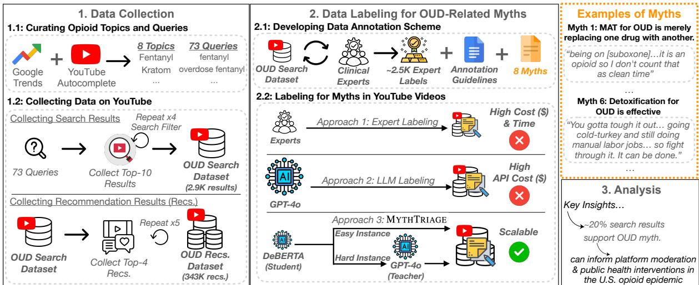
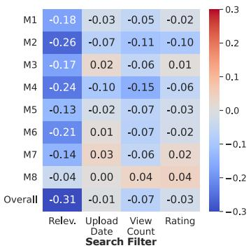
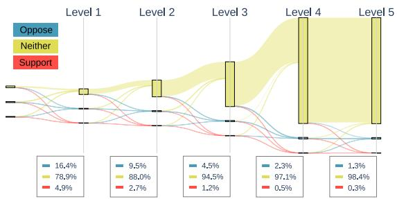
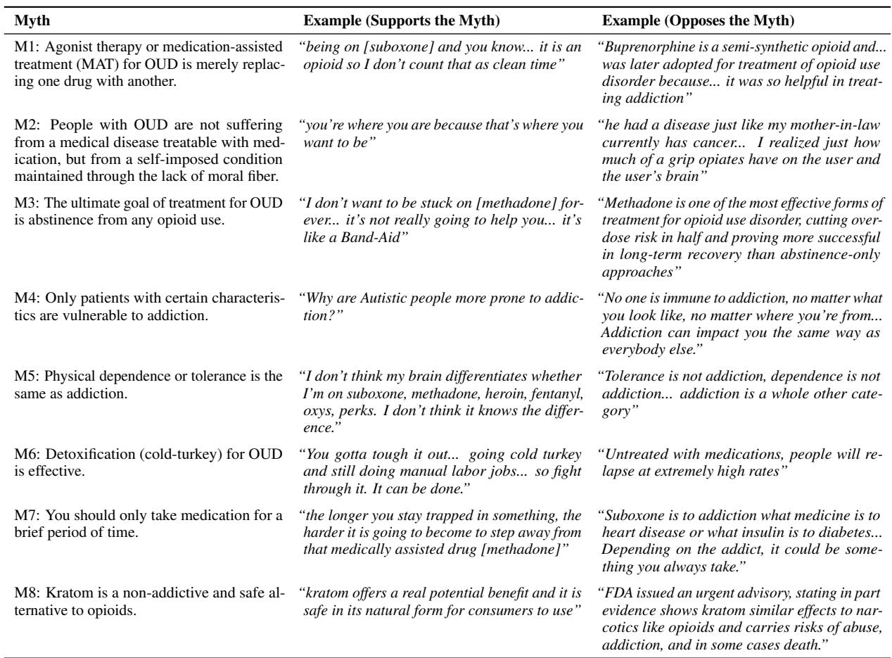
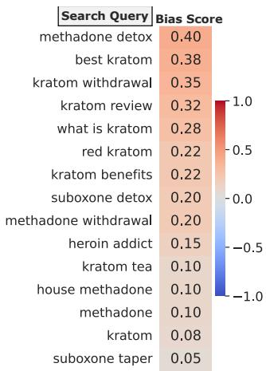
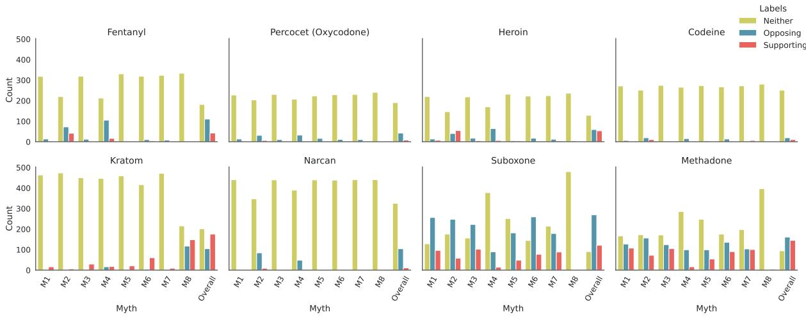
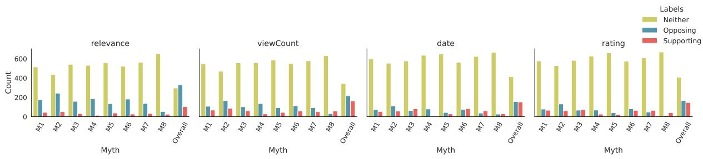
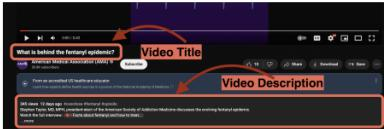
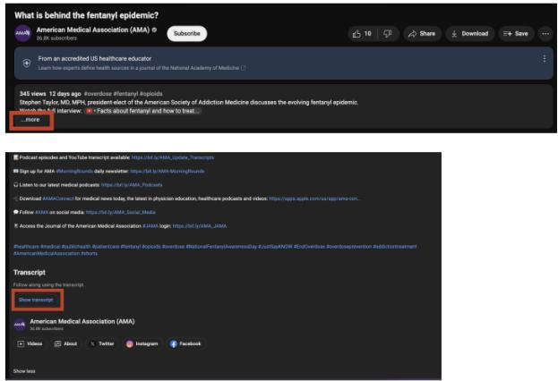
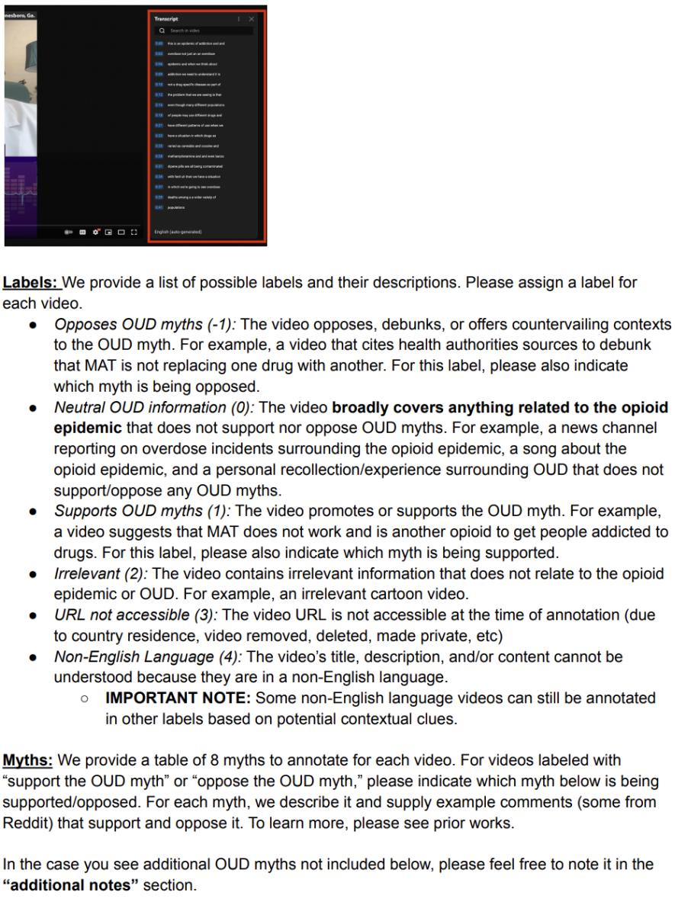

# MYTHTRIAGE: Scalable Detection of Opioid Use Disorder Myths on a Video-Sharing Platform

Hayoung Jung1† Shravika Mittal3 Ananya Aatreya2 Navreet Kaur2 Munmun De Choudhury3 Tanushree Mitra2

1Princeton University

2University of Washington

3Georgia Institute of Technology

Correspondence: hayoung@cs.princeton.edu, tmitra@uw.edu

## Abstract

Understanding the prevalence of misinformation in health topics online can inform public health policies and interventions. However, measuring such misinformation at scale remains a challenge, particularly for high-stakes but understudied topics like opioid-use disorder (OUD)—a leading cause of death in the U.S. We present the first large-scale study of OUDrelated myths on YouTube, a widely-used platform for health information. With clinical experts, we validate 8 pervasive myths and release an expert-labeled video dataset. To scale labeling, we introduce MYTHTRIAGE, an efficient triage pipeline that uses a lightweight model for routine cases and defers harder ones to a high-performing, but costlier, large language model (LLM). MYTHTRIAGE achieves up to 0.86 macro F1-score while estimated to reduce annotation time and financial cost by over 76% compared to experts and full LLM labeling. We analyze 2.9K search results and 343K recommendations, uncovering how myths persist on YouTube and offering actionable insights for public health and platform moderation.1

Warning: Some content ofthis paper, included to contextualize our data, is misleading.

## 1 Introduction

Online platforms are a key source of health information (Dubey et al., 2014), with video-sharing platforms like YouTube playing an increasingly prominent role in shaping public understanding during public health crises (Bora et al., 2018; Khatri et al., 2020). However, online platforms are also a conduit for widespread misinformation that can undermine public health efforts (Milmo, 2022). A particular instance is the case of opioid use disorder (OUD) – a leading cause of death in the U.S, with

108K drug overdose deaths in 2022 (NIDA, 2023). Facing offline stigma, individuals with OUD often rely on online platforms for health information and recovery guidance (Balsamo et al., 2023). But online myths—e.g., medicationfor addiction treatment (MAT) is simply replacing one drug with another—fuel treatment hesitancy, distrust in healthcare, and stigma (ElSherief et al., 2021; Woo et al., 2017). This has undermined efforts to promote clinically-approved MAT (NASEM, 2019).

Understanding the scale and spread of such misinformation is crucial for health officials and platforms seeking to design effective interventions (Juneja and Mitra, 2021). While prior works have acknowledged this gap and explored social dynamics and discourse in online health communities (Bunting et al., 2021; Chancellor et al., 2019), largescale analyses of the OUD-related myth prevalence, especially on video-sharing platforms, remain limited. Detecting misinformation on video platforms at scale remains challenging, as it requires domain expertise and intensive labeling of large volumes of content. While recent works highlight the potential of large language models (LLMs) to address this scale challenge in social science research (Ranjit et al., 2024; Dammu et al., 2024), their increasing compute demands and high API inference cost— especially on long-form video content—limit their widespread use for large-scale misinformation detection, particularly in high-stakes health issues.

To address these gaps, we present the first largescale study of OUD-related myths on YouTube, illustrated in Figure 1. We construct two datasets: OUD Search Dataset of 2.9K search results (1.8K unique videos) from 73 trending queries across four opioid and four treatment topics, and OUD Recommendation Dataset of 343K recommendations (164K unique videos) obtained by crawling the top-four recommendations per unique video in OUD Search Dataset, going five levels deep. In collaboration with clinical experts, we validate 8 pervasive myths (see Table 9 for the list of myths and examples), refine the annotation guidelines, and construct a gold-standard dataset of 310 videos labeled across all myths, totaling 2.5K expert labels.

  
Figure 1: Study Overview. (1.) We curated opioid-related topics and queries (1.1), then collected YouTube search and recommendation results (1.2). (2.) To label myths, clinical experts validated 8 myths (with examples shown in the orange box), refined the annotation guidelines, and provided 2.5K labels (2.1). We compare three potential labeling approaches: expert labeling, LLM labeling, and MYTHTRIAGE—a scalable pipeline using lightweight distilled models for easy cases and defers hard ones to high-performing, but costly LLM. (3.) Using MYTHTRIAGE, we analyzed the labeled dataset at scale, offering actionable insights for platform moderation and public health.

To scale beyond expert or full-LLM labeling, we introduce MYTHTRIAGE, an efficient triage pipeline inspired by model cascade architectures (Varshney and Baral, 2022; Mamou et al., 2022) (see Figure 1). MYTHTRIAGE uses a lightweight model for routine cases and defers harder ones to a high-performing, but costly LLM. We evaluate ten open-weight and proprietary LLMs (see Table 13) on our gold-standard dataset and distill a strong lightweight model from GPT-4o. MYTH-TRIAGE achieves strong performance across myths (0.68-0.86 macro F1-scores; median 0.81), while estimated to reduce the annotation cost by 98% and time by 96% compared to expert labeling—and achieving 94% cost and 76% time savings over full LLM labeling of the OUD Recommendation Dataset. MYTHTRIAGE offers scalable, costeffective detection of OUD myths across large video corpora, facilitating large-scale analysis.

Using the annotated labels, we offer the first large-scale empirical view into OUD-related myth prevalence on YouTube. Overall, nearly 20% of the search results support myths. Notably, videos related to Kratom, a widely-used drug falsely promoted as a non-addictive and safe alternative to opioids (Mayo Clinic, 2024), contained more mythsupporting content (36%) than those opposing (22%). We find that 12.7% of recommendations to myth-supporting videos lead to other supporting videos at the initial recommendation level, rising to 22% at deeper levels. These findings reveal the scale and persistence of OUD-related myths on the platform. Our results offer actionable insights for public health and platform moderation, demonstrating the value of MYTHTRIAGE and highlighting opportunities for intervention in the context of an ongoing and high-stakes opioid crisis.

## 2 Related Works

LLMs for Social Science and Health Applications. LLMs have been increasingly used in social science and health research (Park et al., 2024; Sharma et al., 2023; Li et al., 2024), particularly for data annotation tasks (Ranjit et al., 2024; Dammu et al., 2024; Ziems et al., 2024; Tan et al., 2024). However, their high compute demands and API costs limit their scalability for large-scale annotation tasks (Ding et al., 2024). To reduce costs, prior work has proposed model cascading frameworks that combine lightweight models with stronger models for uncertain predictions (Khalili et al., 2022; Varshney and Baral, 2022; Geifman and El-Yaniv, 2017; Berestizshevsky and Even, 2019; Mamou et al., 2022). Yet, few have integrated LLMs into these cascades to address the scalability challenge (Farr et al., 2024b), particularly for practical and high-stakes applications like large-scale misinformation detection for OUD.

In contrast to prior model cascading frameworks evaluated mainly on standard benchmarks such as CoLA (Varshney and Baral, 2022), SQuAD (Mamou et al., 2022), or CIFAR-10 (Berestizshevsky and Even, 2019), our work demonstrates the practical value of these frameworks by integrating and validating them in a real-world, high-stakes health contexts, contributing a scalable, extensible pipeline for large-scale OUD myth detection in video-sharing platforms.

Stigma and Misinformation in High-Stakes Health Contexts. Prior works have investigated online platforms and LLMs for stigma and misinformation in high-stakes health contexts (Jung et al., 2025; Nguyen et al., 2024; Kaur et al., 2024), with efforts to employ LLMs to reduce stigma and support well-being (Song et al., 2025; Mittal et al., 2025). Among health conditions, OUD is among the most stigmatized, often viewed as a result of “willful choice” rather than a chronic, treatable disease (Corrigan, 2017; Kennedy-Hendricks et al., 2017). Such a narrative fuels persistent myths that undermine harm reduction and MAT (Garett and Young, 2022; Kruis et al., 2021). To escape offline stigma, many turn to online recovery communities for support and information (D’Agostino et al., 2017; Balsamo et al., 2023), but these spaces also contain harmful OUD myths. A few studies have quantified OUD-related myths online (Mittal et al., 2024; ElSherief et al., 2021, 2024), but these efforts have been limited to a small set of myths and text-based platforms like Reddit and Twitter. Building on these efforts, we collaborate with clinical experts and introduce MYTHTRIAGE, a scalable pipeline for detecting 8 distinct OUD-related myths across large video corpora. This work presents the first large-scale empirical analysis of OUD-related myth prevalence on YouTube, a challenging task that requires collaboration with clinical experts.

## 3 Data Collection

To collect OUD-related data on YouTube, we outline a two-step process: 1) curating OUD-related topics and associated search queries, and 2) performing large-scale data collection on the platform.

## 3.1 Curating Opioid Topics and Queries

## 3.1.1 Selecting Topics

To identify opioid topics, we used a curated lexicon of 156 keywords covering opioid drugs, medication-assisted treatments (MAT), and prescription medicines. This lexicon—developed in consultation with public health experts and prior literature in ElSherief et al. (2021)—includes generic names (e.g., Oxycodone), trade names (e.g., Oxy-Contin), and street names (e.g., OC) to ensure comprehensive coverage of opioid-related topics.

<table><tr><td>Opioid Topics</td><td>Sample Search Queries</td></tr><tr><td>Fentanyl</td><td>fentanyl, overdose fentanyl</td></tr><tr><td>Percocet (Oxycodone)</td><td>percocet, oxycodone</td></tr><tr><td>Heroin</td><td>heroin addict, on heroin</td></tr><tr><td>Codeine</td><td>codeine, codeina</td></tr><tr><td>Kratom</td><td>kratom withdrawal, kratom</td></tr><tr><td>Narcan</td><td>narcan, narcan training</td></tr><tr><td>Suboxone</td><td>suboxone, suboxone withdrawal</td></tr><tr><td>Methadone</td><td>methadone, methadone clinic</td></tr></table>

Table 1: For each topic, we provide a sample of our curated search queries. The top four are opioid-related topics, and the bottom four are MAT-related. See Table 7 for the full 73 queries.

Since collecting data for all 156 keywords is impractical, we used Google Trends (Trends) to identify the four most popular opioid and four most popular MAT keywords, yielding eight keywords in total. Trends reflects real-world search interests and suggests related queries. We systematically filtered out overly broad keywords (e.g., “Water”), those lacking Trends data, or those with fewer than five related queries, filtering the set to 28 keywords (see Table 6). The complete set of the 28 keywords is shown in Appendix Table 6.

Using the set of 28 keywords, we conducted pairwise comparisons of keywords in Trends to rank them by popularity.2 For each pair, Trends returns relative interest scores (ranging from 0 to 100); the higher-scoring keyword is considered more popular and thus “wins.” We computed win-rates across all pairs (see Table 6). To identify the most popular topics across opioids and MAT, we selected the top 4 opioid and MAT keywords,3 with the highest winrates from the set of 28 keywords, yielding 8 final topics (Table 1). §A details Trends configuration and pairwise comparison.

## 3.1.2 Selecting Search Queries

To capture how users search for each topic on YouTube, we used Trends and YouTube autocomplete suggestions to identify representative queries (Hussein et al., 2020). Since Trends returns popular related queries on YouTube, we gathered related queries per topic (see §A.1 for details). To obtain additional trending queries, we also collected the top-10 autocomplete suggestions from YouTube search per topic. In total, this yielded 225 queries across 8 topics (see Table 1 for sample queries).

<table><tr><td>Dataset</td><td>Total</td><td>Unique</td><td>Expert</td><td>Synthetic</td></tr><tr><td>OUD Search</td><td>2,893</td><td>1,776</td><td>310</td><td>1,466</td></tr><tr><td>OUD Recommendation</td><td>342,707</td><td>164,085</td><td>0</td><td>164,085</td></tr></table>

Table 2: Summary of the OUD Search and OUD Recommendation Dataset, showing the number of total videos (Total), unique videos (Unique), expertannotated videos (Expert), and GPT-4o-labeled videos (Synthetic). Expert annotations were focused on the OUD Search Dataset to build a gold-standard dataset (§4.2). Both datasets require the same video labeling, but the OUD Recommendation Dataset is much larger (164K videos) and noisier, making expert annotation infeasible; we therefore used MYTHTRIAGE for efficient labeling.

To refine the query list, two researchers with prior experience in OUD-related myths qualitatively filtered queries following Jung et al. (2025). In particular, we excluded queries that were overly broad (e.g., “overdose”), overly specific (e.g., “percocet future lyrics”), non-English queries, duplicates, mentioned individuals (e.g., “lil wyte”), or fell outside the scope of OUD and MAT (e.g., “fentanyl cop”). Similar queries were manually merged (e.g., “the opioid crisis” and “opioid crisis”). This yielded 73 queries across 8 topics (see Table 7), capturing trending and relevant search interests.

## 3.2 Collecting Data on YouTube

With the topics and queries, we collected YouTube search and recommendation results to measure the prevalence of OUD-related myths. Table 2 summarizes the datasets, reporting counts of total, unique, expert-annotated, and GPT-4o-labeled videos.

## 3.2.1 Collecting Search Results

Next, we used the 73 curated queries (§3.1.2) to query and collect YouTube search results via the Data API (YouTube, 2025) to assess the prevalence of OUD myths. The API ranks content by query relevance and engagement metrics, without user data, ensuring results are not personalized (Google, 2024). The API allows sorting the search results by four search filters: “Relevance,” “Upload Date,” “View Count,” and “Rating.” For each query and search filter, we collected the top 10 search results, as nearly 95% of user traffic goes to the first page of the search results (Kaye, 2013).

<table><tr><td colspan="2">OUD-Related Myths</td></tr><tr><td>M1: MAT is merely replacing one drug with another.</td><td>M5: Physical dependence or tolerance is the same as addiction.</td></tr><tr><td>M2: OUD is a self-imposed condition, not a treatable disease.</td><td>M6: Detoxification for OUD is effective.</td></tr><tr><td>M3: The ultimate treatment goal for OUD is abstinence from any opioid use.</td><td>M7: You should only take medication for a brief period of time.</td></tr><tr><td>M4: Only patients with certain character- istics are vulnerable to addiction.</td><td>M8: Kratom is a non-addictive, safe al- ternative to opioids.</td></tr></table>

Table 3: List of 8 OUD-related myths examined in our study. Some myths were paraphrased for brevity. See Table 9 for representative examples.

For each video, we gathered metadata, including title, description, transcript, tags, and its rank in the results, creating the OUD Search Dataset with 2,893 search results (1,776 unique videos; see Table 2).

## 3.2.2 Collecting Recommendation Results

To measure the prevalence of myths in YouTube recommendations, we used a cascaded approach following Albadi et al. (2022) to gather recommendations from December 18th to 20th, 2024. Using Google’s InnerTube API (Bulled, 2025), we collected the top four recommended videos per unique video in the OUD Search Dataset, as in (Albadi et al., 2022). This yielded 6,356 level 1 video recommendations (3,107 unique videos). We repeated this process through level 5, collecting the top four recommendations per unique video at the previous level, resulting in a total of 342,707 recommendation links and 164,085 unique videos across all levels (Table 2). Detailed counts of videos per recommendation levels are provided in Table 8. We retrieved the metadata for these videos through the YouTube Data API to create the OUD Recommendation Dataset.4

## 4 Developing Data Annotation Scheme

To label videos for myths, we underwent extensive procedures to identify myths, develop the data annotation scheme, and create the expert-labeled gold standard dataset. For brevity, we detail the annotation scheme development, guidelines, and expert labeling process in §B.

## 4.1 How do we know what is a myth?

To identify myths, we drew from prior literature and clinical sources. ElSherief et al. (2024) conducted a systematic review of four online platforms, where three public health experts identified five prevalent OUD-related myths based on substance use literature (Heimer et al., 2019; Wakeman and Barnett, 2018). We supplemented these with three additional myths from clinical sources, debunking pervasive myths about MAT (National Addiction Specialist, 2023; SCTN, 2024; Hill, 2023; Peckham, 2022). All selected myths are recognized by major health organizations, such as the U.S. SAMHSA (2023) and Johns Hopkins Medicine (2020), and were validated by clinical researchers, as described below. Table 3 lists the 8 myths.

## 4.2 Expert-Annotated Gold Standard Dataset

Sampling YouTube Videos. Since acquiring expert labels is expensive, we devised a stratified sampling method to select videos likely to contain myths. Unlike random sampling, which often yields irrelevant videos, our method aimed to create a targeted evaluation set with a balanced label distribution. Following prior works (Shen et al., 2023; Park et al., 2024), we employed GPT-4o to predict labels5 (Table 10) for videos in the OUD Search Dataset, then evenly sampled videos across labels to ensure that relevant videos to OUD are more likely to be chosen. See Figure 5 for the prompt.

Creating the Gold Standard Dataset. With the sampled videos, we conducted multiple rounds of annotations with six clinical researchers as experts using our annotation scheme (§B.1), resulting in a gold-standard dataset of 2,480 high-quality labels (8 myths 310 videos). This represents a substantial annotation effort for a high-stakes health issue, exceeding or matching the scale of prior expertannotated studies (Chandra et al., 2025; Mittal et al., 2024; ElSherief et al., 2021), and contributing a rich, high-quality source of annotations. We detail annotation process in §B.3. Experts reported an average annotation time of 3 minutes per video.6

Across six experts, we found Krippendorff’s α score7 of 0.76 for all annotations across myths on the 310 videos. The α score indicates a moderate agreement (Krippendorff, 2018) and is comparable to, or exceeds, the level of agreement reported in prior work (Ostrowski et al., 2021; Muralikumar et al., 2023). See Table 11 for the complete list of α scores across myths. For each video, we used the label agreed upon by all experts. In cases of disagreements, the first author reviewed the expert annotations, watched the video, and assigned the final label. Table 12 provides the distribution of the expert-annotated labels in our gold standard dataset Consolidating from 4 to 3 Classes. Given our focus on detecting OUD-related myths, we follow Juneja et al. (2023) and merge the “neutral (0)” and “irrelevant (2)” classes into a single “neither (0)” category, since they neither support nor oppose myths. This yielded a 3-class setup: supporting the myth (1), opposing the myth (-1), and neither (0).

## 5 Labeling for Myths in YouTube Videos

With 164K videos in the OUD Recommendation Dataset, manual annotation by experts is infeasible. To scale the labeling of the OUD-related myths, we leverage LLMs for myth detection (§5.1), distill lightweight classifiers (§5.2), and implement MYTHTRIAGE, an efficient triage pipeline in which the lightweight classifiers route challenging cases to the LLM (§5.3). We apply MYTH-TRIAGE to the OUD Recommendation Dataset, evaluating its efficiency and cost effectiveness (§5.4).

## 5.1 LLM-Based Myth Detection

For each myth, we used LLMs to label videos through the three-class classification task. The inputs consisted of text-based video metadata: title, description, transcript, and tags. Due to limited high-quality annotations (Table 12) needed to finetune encoder-only models (e.g., DeBERTA), we used zero and few-shot prompting for in-context learning (Brown et al., 2020), which has shown strong performance in social science tasks against human experts (Dammu et al., 2024; Törnberg, 2023).

We constructed a task-specific prompt for each myth. In the few-shot setting, we included five annotated examples from our gold-standard dataset,8 following prior work (Mittal et al., 2024). To compare performance, we evaluated 10 widely-used LLMs: two each from OpenAI, Anthropic, Google, and Meta, plus models from DeepSeek and Qwen (see Table 13 for the models). We discuss the input features and prompt design considerations in §C and show prompts in Figures 10-11.

Results. Tables 20–22 present the full evaluation of 10 LLMs, with details in §C.3. GPT-4o with fewshot prompting consistently outperformed other models, achieving 0.82–0.87 macro F1-scores across myths (Table 4). These results validate the effectiveness of LLMs for our task, matching or even exceeding prior works (Jung et al., 2025; Nguyen et al., 2024). While GPT-4o offers a strong, scalable alternative to expert annotations and labels the remaining OUD Search Dataset, the API costs make it impractical for labeling the 164K-video OUD Recommendation Dataset, motivating the need for a lightweight model.

<table><tr><td>Myth</td><td>GPT-40</td><td>DeBERTA</td><td>MSP</td><td>VET</td><td>MSP+VET</td></tr><tr><td>M1</td><td>0.87 (1)</td><td>0.77 (0)</td><td>0.81 (0.31)</td><td>0.84 (0.53)</td><td>0.86 (0.60)</td></tr><tr><td>M2</td><td>0.85 (1)</td><td>0.70 (0)</td><td>0.72 (0.10)</td><td>0.79 (0.53)</td><td>0.80 (0.57)</td></tr><tr><td>M3</td><td>0.86 (1)</td><td>0.76 (0)</td><td>0.82 (0.31)</td><td>0.82 (0.52)</td><td>0.86 (0.67)</td></tr><tr><td>M4</td><td>0.82 (1)</td><td>0.62 (0)</td><td>0.66 (0.04)</td><td>0.76 (0.30)</td><td>0.76 (0.31)</td></tr><tr><td>M5</td><td>0.82 (1)</td><td>0.60 (0)</td><td>0.63 (0.13)</td><td>0.67 (0.23)</td><td>0.68 (0.28)</td></tr><tr><td>M6</td><td>0.86 (1)</td><td>0.76 (0)</td><td>0.80 (0.20)</td><td>0.80 (0.46)</td><td>0.83 (0.52)</td></tr><tr><td>M7</td><td>0.85 (1)</td><td>0.74 (0)</td><td>0.80 (0.15)</td><td>0.79 (0.37)</td><td>0.81 (0.44)</td></tr><tr><td>M8</td><td>0.87 (1)</td><td>0.78 (0)</td><td>0.78 (0.00)</td><td>0.81 (0.05)</td><td>0.81 (0.05)</td></tr></table>

Table 4: Macro F1-scores across myths using the best-performing LLM (GPT-4o), the distilled model (DeBERTa-v3-base), and MYTHTRIAGE: maximum softmax probability (MSP), validation error tendencies (VET), and MSP+VET. Each row reports performance on 305 expert-annotated videos. Parentheses indicate the proportion of examples handled by GPT-4o—lower is better, reflecting greater reliance on the lightweight model and reduced reliance on larger, expensive models.

## 5.2 Distillation for Myth Detection

While GPT-4o performs well, its financial and computational costs make the model impractical for large-scale labeling of our task. Meanwhile, we lack sufficient high-quality, expert-labeled data to fine-tune a model (Table 12). To address these challenges, we adopt a distillation approach, as prior works have shown that student models can be effectively trained from high-performing teacher models (Rao et al., 2023; Park et al., 2024; Zheng et al., 2023). As discussed in §5.1, GPT-4o achieved the strongest performance on our task (macro F1: 0.82- 0.87 across myths), making it a suitable teacher model. We therefore use GPT-4o to generate highquality synthetic labels (Zheng et al., 2023) for the 1,466 videos in OUD Search Dataset that were not annotated by experts and train a lightweight student model on this synthetic data.

This approach minimizes API and computational costs and avoids the instability of relying on proprietary, closed-source LLMs, whose behaviors can change over time (OpenAI, 2024b), while achieving strong performance on our gold-standard dataset. For each myth, we train a student model,

DeBERTa-v3-base (He et al., 2021), with training and experimental details in §D.

Results. Table 4 shows that DeBERTa-v3-base, trained on GPT-4o-generated synthetic labels, achieves macro F1-scores between 0.60 and 0.78 across myths, with scores $\geq 0 . 7 5$ on four myths. These results demonstrate strong performance despite the models’ smaller size (186M parameters) relative to GPT-4o and its usage of synthetic data, validating both the quality of the student model and the GPT-4o-generated labels. The results highlight the models’ effectiveness on a high-stake, complex video classification task and their suitability for large-scale labeling. Full evaluation metrics are in Table 15, with additional details in §D.3.

## 5.3 MYTHTRIAGE Implementation

With GPT-4o offering stronger performance and the distilled model enabling efficient large-scale labeling, MYTHTRIAGE can combine their strengths— using the lightweight model for routine cases and deferring harder ones to the strong, but costly LLM to optimize both cost and performance. To decide which examples to defer, we use two strategies: (1) Maximum Softmax Probability (MSP), which uses the predicted class softmax probability as a simple, effective proxy for model confidence (Lakshminarayanan et al., 2017), deferring examples below a chosen MSP threshold, and (2) Validation Error Tendencies (VET), which defers predictions from classes with low validation performance (e.g., class-specific F1 < 0.8). We also evaluated combining MSP and VET, deferring an example to the high-performing GPT-4o if either the MSP or VET condition is met. We discuss alternative deferral strategies, threshold selection method, and results motivating MSP and VET in §E.

Results. Table 4 summarizes the performance of MYTHTRIAGE using MSP, VET, and MSP+VET. Compared to DeBERTA, MSP improved macro F1 by an average of 0.036 ( 0.02) while deferring 0–31% of examples to GPT-4o. VET achieved greater gains, improving macro F1 by 0.069 ( 0.034) while deferring 5–53% of examples, reflecting its aggressive deferral strategy based on class-level performance. The combined MSP+VET approach yielded the best results, increasing macro F1 by 0.085 ( 0.03) with 5–67% of examples deferred. Using MSP+VET, the triage achieved macro F1-scores between 0.68–0.86; notably, on M3, it matched GPT-4o’s performance while only deferring 67% of examples. These results demonstrate that MYTHTRIAGE not only improves performance over the distilled model but also offers a scalable solution for annotating large datasets.

## 5.4 Applying MYTHTRIAGE

We applied MYTHTRIAGE using MSP+VET to label the 164K-video OUD Recommendation Dataset across 8 myths, totaling 1.3 million annotations. Of these, only 70,777 predictions (5.4%) were deferred to GPT-4o, with DeBERTA handling the rest. Below, we compare the estimated time and costs of MYTHTRIAGE to experts and full GPT-4o labeling. Detailed calculations, including estimated environmental cost savings, are in §F. In §G, we validated MYTHTRIAGE on 100 additional videos, observing comparable performance (0.77-1 macro F1) to that on the gold-standard dataset.

Having an expert label 1.3 million annotations would require 8,209 hours and cost \$59.5K,9 while GPT-4o labeling would take 1,240 hours and cost \$21.8K in API usage. In contrast, MYTH-TRIAGE—including DeBERTA training—reduced total time to 300 hours and cost to \$1,281.94. This represents a 98% financial cost reduction and 96% time savings compared to expert labeling, and a 94% financial cost reduction and 76% time savings compared to GPT-4o labeling. These results demonstrate that MYTHTRIAGE offers a highly scalable, practical solution for cost-efficient largescale labeling in high-stakes domains.

## 6 Assessing Overall Stance and Myth Bias

## 6.1 Determining Overall Stance

To assign each video a single overall stance label across the eight myths, we used the following heuristic: videos with only supporting or supporting+neither labels were marked as supporting; only opposing or opposing+neither as opposing; and only neither as neither. For videos with both supporting and opposing labels (63 in OUD Search, 193 in OUD Recommendation), we combined manual annotation and LLM-as-a-judge. Two authors annotated and arrived at a consensus on 63 videos; showing high agreement, an author labeled an additional 63; the remaining 130 were labeled using GPT-4.1, which achieved 0.79 macro F1 against human annotations (Table 18; full details in §H).

<table><tr><td>Label</td><td>M1</td><td>M2</td><td>M3</td><td>M4</td><td>M5</td><td>M6</td><td>M7</td><td>M8</td><td>Over.</td></tr><tr><td>Oppose</td><td>0.15</td><td>0.23</td><td>0.14</td><td>0.16</td><td>0.11</td><td>0.16</td><td>0.11</td><td>0.04</td><td>0.30</td></tr><tr><td>Neither</td><td>0.77</td><td>0.69</td><td>0.78</td><td>0.81</td><td>0.85</td><td>0.76</td><td>0.82</td><td>0.91</td><td>0.51</td></tr><tr><td>Support</td><td>0.08</td><td>0.09</td><td>0.09</td><td>0.03</td><td>0.05</td><td>0.08</td><td>0.07</td><td>0.05</td><td>0.20</td></tr></table>

Table 5: Distribution of labels for each OUD-related myths and overall (Over.), based on the 2.9K search results from the OUD Search Dataset.

## 6.2 Quantifying Myth Bias

Using the overall stance labels, we adapt the misinformation bias score from Hussein et al. (2020) to quantify myth prevalence in YouTube search results: $\frac { ( s - o ) } { ( s + n + o ) }$ , where s, o, and n denote the frequency of supporting (1), opposing (-1), and neither (0) videos, respectively. Thus, the bias score is a continuous value ranging from -1 (all videos oppose myths) to +1 (all videos support myths). Positive scores indicate a lean toward myths, negative scores indicate a lean toward opposing myths. Higher scores suggest a greater myth prevalence.

## 7 Analysis

Understanding the prevalence of myths on online platforms like YouTube is helpful for public health officials and platform developers to inform interventions and combat the opioid crisis (Raji and Buolamwini, 2019; Eysenbach et al., 2009). We use the predicted labels to analyze the prevalence of myths in 2.9K search results and 343K recommendations, uncovering actionable insights at scale and thereby demonstrating the utility of MYTHTRIAGE. We discuss additional analysis in § I.

## 7.1 Prevalence of Myths in Search Results

Overall, nearly 20% of search results support OUD-related myths (Table 5). Across individual myths, 3%-9% of search results support myths, reflecting a consistent presence of myth-supporting content. Meanwhile, 30% of search results oppose myths, with 4%-23% of content per myth countering. While opposing content is present, it could be insufficient to meaningfully offset the persistence of myth-supporting videos. This raises concerns about the quality of information on YouTube, where users may encounter inadequately challenged myths that can misinform decision-making around opioid use and treatment. These insights can inform YouTube’s content moderation strategies to reduce exposure to harmful myths and help public health officials design targeted health campaigns to proactively counter misinformation.

<table><tr><td colspan="2">Bias Score Topic</td><td></td><td>Support</td><td>Neither</td><td>Oppose</td></tr><tr><td rowspan="2">1.001</td><td rowspan="2">0.15 -0.02</td><td>Kratom</td><td>0.36</td><td>0.42</td><td>0.22</td></tr><tr><td>Heroin</td><td>0.22</td><td>0.53</td><td>0.25</td></tr><tr><td rowspan="2">0.50</td><td>-0.03</td><td>Codeine</td><td>0.04</td><td>0.90</td><td>0.07</td></tr><tr><td>-0.04</td><td>Methadone</td><td>0.36</td><td>0.24</td><td>0.40</td></tr><tr><td rowspan="2">0.00-</td><td>-0.14</td><td>Percocet</td><td>0.03</td><td>0.79</td><td>0.18</td></tr><tr><td>-0.20</td><td>Fentanyl</td><td>0.13</td><td>0.54</td><td>0.33</td></tr><tr><td rowspan="2">-0.50 -1.00</td><td>-0.21</td><td>Narcan</td><td>0.02</td><td>0.74</td><td>0.24</td></tr><tr><td>-0.31</td><td>Suboxone</td><td>0.25</td><td>0.19</td><td>0.56</td></tr></table>

Figure 2: For each topic, we show the label distribution and myth bias score, computed using the overall stance labels from search results collected within the topic. Topics are sorted in descending order by bias score; higher values indicate greater prevalence of myths.

Myth 2 shows the highest levels of support and opposition among all myths. In Table 5, 9% of search results support Myth 2, while 23% oppose it. This myth is especially harmful as it frames OUD as a personal failure rather than a treatable medical disease, reinforcing stigma that people with OUD are weak or irresponsible. For example, one video states: “you’re where you are because that’s where you want to $b e ^ { \prime \prime }$ (Table 9). Such narratives can deter individuals from seeking treatment, reduce public support, and foster discrimination in social services (Tsai et al., 2019; Woo et al., 2017). The high levels of supporting and opposing content suggest that this myth is contentious, motivating the need for targeted interventions. Platforms and officials can prioritize moderation and health campaigns to counter this myth; notably, LLM-based interventions show promise for increasing people’s propensity toward MAT (Mittal et al., 2025).

Kratom has the highest prevalence of myths across topics (Figure 2), with 36% of search results supporting and only 22% opposing OUD-related myths. This is concerning, given the widespread but debunked claims about Kratom’s effectiveness in treating OUD. The high prevalence of mythsupporting content may mislead users towards unsafe alternatives (Mayo Clinic, 2024), undermining evidence-based treatments like MAT. While Heroin and Methadone have slightly negative bias scores (-0.02 and -0.04), they still show high levels of myth-supporting content (22% and 36%). These findings can help platforms prioritize moderation on high-risk topics and inform public health officials where misinformation is most concentrated.

Switching from the default “Relevance” filter increases exposure to myths. In Figure 3, the “Relevance” filter consistently returns search results that lean towards opposing myths (bias scores from -0.04 to -0.26). In contrast, alternative filters—“Upload Date,” View Count,” and “Rating”—consistently shift bias scores in a more positive direction, indicating increased prevalence of myth. This finding aligns with prior work in the domain of COVID-19 misinformation (Jung et al., 2025), and suggests that users seeking recent, most-viewed, or highly-rated videos (more likes than dislikes) are more likely to encounter myths. This is concerning, as users may place more trust in popular content, and those seeking the latest information about OUD may be at greater risk of encountering myths. These findings present an opportunity for YouTube to improve moderation by enhancing safeguards in non-default search filters.

  
Figure 3: Bias scores for all 8 myths, including overall stance, and 4 search filters. Relevance (“Relev”) is YouTube’s default sorting filter for search results.

## 7.2 Prevalence of Myths in Recommendations

Level 1 recommendations contained the highest proportion of myth-supporting videos (4.9%), steadily declining to 0.3% by level 5 recommendations. Similarly, myth-opposing content dropped from 16.4% to 1.3% across the same levels. As shown in Figure 4, the rise in “neither” labels suggests the recommendation algorithm increasingly surfaces unrelated content over time, aligning with prior findings that recommendations can play a moderating role when amplifying problematic content (Hosseinmardi et al., 2024; Albadi et al., 2022). However, 4.9% of level 1 recommendations supporting myths is concerning, as prior work shows recommendations can shape user engagement and viewing trajectories (Ribeiro et al., 2020).

At level 1, 12.7% of recommendations to mythsupporting videos lead to other supporting videos, rising to 22.2% by level 5 (Appendix Table 19). While supporting videos are not the most prevalent overall (Figure 4), this trend suggests that continued engagement with such videos in the recommendations increases exposure to more supporting videos. Additionally, 5.43% of recommendations from opposing videos lead to supporting content at level 1, decreasing slightly to 3.25% by Level 5, suggesting limited but persistent exposure even from opposing sources. These findings can inform YouTube’s moderation efforts by helping identify recommendation pathways that may expose and reinforce users to myths.

  
Figure 4: Recommendation transitions across levels. The edges between levels indicate transitions from a video’s overall stance label to the labels of its recommended video. Node sizes increase across levels because more videos are recommended at each subsequent level. At the bottom, we display the distribution of overall stance labels within each recommendation level.

## 8 Conclusion & Future Work

We introduce MYTHTRIAGE, a scalable, costefficient pipeline for detecting 8 OUD-related myths across large video corpora. MYTHTRIAGE achieves strong performance on detecting OUD myths against expert labels, while greatly reducing annotation time and cost. Using MYTHTRIAGE, we present the first large-scale analysis of OUD myths on YouTube, revealing concerning levels of myth-supporting content and offering actionable insights for moderation and health interventions.

By combining advances in NLP, public health, and clinical expertise, our work contributes a robust, extensible method for large-scale annotation in high-stakes domains like OUD, opening up many possibilities for applications and future research.

Applications for Public Health. MYTHTRIAGE can empower public health practitioners to monitor real-time misinformation trends, identify emerging myths, and launch targeted interventions promptly. Such insights can help clinicians understand common myths patients may encounter online, enabling better-informed, trust-building interactions.

Platform Moderation and Auditing. Videosharing platforms like YouTube have introduced policies to address harmful and unsubstantiated content (Halprin and O’Conner, 2022), including medical misinformation policies targeting treatment-related claims (Google, 2025), indicating that misinformation mitigation is a platform priority. MYTHTRIAGE can be integrated into platform moderation workflows to flag high-risk content, support scalable content auditing, and provide actionable insights that can inform at-scale moderation improvements. Third-party researchers can use MYTHTRIAGE to evaluate how various algorithms and filter settings shape user exposure to misinformation at scale, informing platform transparency and algorithmic accountability.

## 9 Limitations

Focus On Opioid Use Disorder. We focus on OUD-related myths due to their high-stakes yet understudied nature on video-sharing platforms. However, there are several other important health domains, such as the COVID-19 pandemic (Jung et al., 2025) and mental health (Nguyen et al., 2024). Our methodology, such as MYTHTRIAGE and the experimental setup, can serve as blueprints for future work in other health domains

Expanding Myths and Topics. In this work, we examined 8 expert-validated OUD-related myths and 8 topics, consisting of 4 treatment and 4 opioid topics (§3.1). While this covers more ground than prior works (Mittal et al., 2024; ElSherief et al., 2021), many other myths, such as “It Is Expensive To Treat Patients With OUD” (AMCP, 2023), and topics (e.g., OxyContin) remain underexplored. Future works can extend MYTHTRIAGE and our annotation guidelines to cover a broader range of opioid-related myths and topics.

Exploring Deeper and Beyond YouTube. This work presents the first large-scale analysis of OUDrelated myths on YouTube. While prior research highlights the role of personalization in amplifying problematic content (Hussein et al., 2020), future work can examine how personalization—such as user demographics, search history, and prior engagement— shapes exposure to OUD-related myth. Other video-sharing platforms like BitChute (Nguyen et al., 2024) and TikTok (Boeker and Urman, 2022) also merit investigation. Extending this analysis across platforms would enable crossplatform comparisons of myth prevalence.

Google Trends Alignment. To curate search topics and queries, we use Google Trends, configured to reflect YouTube Search, to capture highly popular opioid-related queries based on real-world search interests. This ensures our analysis reflects the amount of misinformation many YouTube users are likely to encounter when seeking OUD information, but may bias the dataset toward mainstream searches and underrepresent niche queries, including those used by stigmatized or vulnerable populations. Future work could address this gap through crowdsourced audit (Juneja et al., 2023) or privacypreserving audits to capture how real users, including those from vulnerable populations, encounter and engage with OUD-related misinformation.

Scope of Language and Context. While our method, including MYTHTRIAGE, is not limited to any specific language or contexts, our use of English queries on YouTube likely contributed to the lack of non-English content in our dataset (Table 12). As the study centers on the U.S., where opioid overdose is a leading cause of death (NIDA, 2023), it reflects a Western-centric context. Given the growing opioid crisis in other regions, such as Bolivia and Guyana (Health-Americas, 2023), future works can adapt MYTHTRIAGE to other languages and contexts to support more in-depth crosscultural analyses of OUD-related myths online.

More Extensive Data Collection. In our work, we collected 2.9K search results and 343K recommendations, providing the first large-scale analyses on the OUD myth prevalence on YouTube. Future work can expand this by collecting data over longer periods to capture longitudinal trends and better understand how myths evolve over time.

Model Misclassification. We employ LLMs and distill lightweight classifiers validated on clinical expert-labeled datasets. Despite extensive model training and experimentation, the error rates in our MYTHTRIAGE pipeline may potentially influence the distillation of the lightweight classifiers and our downstream analysis. While our text-based approach using models like DeBERTA-v3 balances performance and efficiency (§5.3), future work can improve performance by incorporating multimodal features (e.g., thumbnails, video frames) (Abdali et al., 2024), though this would increase computational and financial costs of the pipeline by requiring multimodal LLMs, and integrating additional deferral mechanisms between experts and LLMs using uncertainty metrics from Farr et al. (2024a). MYTHTRIAGE can be adapted to use small, openweight LLMs such as Llama-3-8B (Zhan et al., 2025) for potentially better performance, though even models with 1B parameters would substantially increase training and inference costs.

## 10 Ethical Considerations

We avoided recruiting real-world users in the data collection to prevent potential contamination of their YouTube search and recommendation (Hussein et al., 2020). Instead, we used nonpersonalized tools, such as YouTube Data and InnerTube APIs.

To minimize exposure to harmful content, we did not involve crowd workers and instead worked with clinical researchers in substance use. Following Kirk et al. (2022), we conducted regular checkins and debriefs to safeguard all data handlers. All analyzed videos were publicly available at the time of collection, and we only used video metadata (titles, descriptions, transcripts), without accessing user-specific data. In line with best practices (Proferes et al., 2021), we will release only video IDs and labels to ensure reproducibility while protecting user privacy. Practitioners can use these IDs with the YouTube Data API to retrieve metadata and hydrate the released dataset.

We used publicly accessible LLMs to detect OUD-related myths. While our method enables scalable detection of myths, it is not intended to replace expert judgment. We emphasize that MYTHTRIAGE should be used as a research tool to support public health and inform platform moderation—with appropriate expert oversight.

## Acknowledgements

This paper was supported by the National Institute of Health’s NIDA grant DA056725-01A1 and the National Science Foundation grant CNS-2344925. We thank the Cavazos Lab at the Washington University School of Medicine for providing clinical research expertise and annotations in this study.

## References

Sara Abdali, Sina Shaham, and Bhaskar Krishnamachari. 2024. Multi-modal misinformation detection: Approaches, challenges and opportunities. ACM Comput. Surv., 57(3).

Nuha Albadi, Maram Kurdi, and Shivakant Mishra. 2022. Deradicalizing youtube: Characterization, detection, and personalization of religiously intolerant arabic videos. Proc. ACM Hum.-Comput. Interact., 6(CSCW2).

AMCP. 2023. Myths + misconceptions that impact appropriate treatment for opioid use disorder.

Hamid Ayub. 2024. Gpt-4o: Successor of gpt-4?

Duilio Balsamo, Paolo Bajardi, Gianmarco De Francisci Morales, Corrado Monti, and Rossano Schifanella. 2023. The pursuit of peer support for opioid use recovery on reddit. Proc. ICWSM.

Konstantin Berestizshevsky and Guy Even. 2019. Dynamically sacrificing accuracy for reduced computation: Cascaded inference based on softmax confidence. In Artificial Neural Networks and Machine Learning – ICANN 2019: Deep Learning: 28th International Conference on Artificial Neural Networks, Munich, Germany, September 17–19, 2019, Proceedings, Part II, page 306–320, Berlin, Heidelberg. Springer-Verlag.

Maximilian Boeker and Aleksandra Urman. 2022. An empirical investigation of personalization factors on tiktok. In Proceedings of the ACM Web Conference 2022, WWW ’22, page 2298–2309, New York, NY, USA. Association for Computing Machinery.

Kaustubh Bora and 1 others. 2018. Are internet videos useful sources of information during global public health emergencies? a case study of youtube videos during the 2015–16 zika virus pandemic. Pathogens and global health.

Tom Brown, Benjamin Mann, Nick Ryder, Melanie Subbiah, Jared D Kaplan, Prafulla Dhariwal, Arvind Neelakantan, Pranav Shyam, Girish Sastry, Amanda Askell, Sandhini Agarwal, Ariel Herbert-Voss, Gretchen Krueger, Tom Henighan, Rewon Child, Aditya Ramesh, Daniel Ziegler, Jeffrey Wu, Clemens Winter, and 12 others. 2020. Language models are few-shot learners. In Advances in Neural Information Processing Systems, volume 33, pages 1877–1901. Curran Associates, Inc.

Mateusz Buda, Atsuto Maki, and Maciej A. Mazurowski. 2018. A systematic study of the class imbalance problem in convolutional neural networks. Neural Networks, 106:249–259.

Tom Bulled. 2025. Innertube. https://github.com /tombulled/innertube.

Amanda M Bunting, David Frank, Joshua Arshonsky, Marie A Bragg, Samuel R Friedman, and Noa Krawczyk. 2021. Socially-supportive norms and mutual aid of people who use opioids: An analysis of reddit during the initial covid-19 pandemic. Drug and alcohol dependence.

Stevie Chancellor, George Nitzburg, Andrea Hu, Francisco Zampieri, and Munmun De Choudhury. 2019. Discovering alternative treatments for opioid use recovery using social media. In Proc. CHI.

Mohit Chandra, Siddharth Sriraman, Gaurav Verma, Harneet Singh Khanuja, Jose Suarez Campayo, Zihang Li, Michael L. Birnbaum, and Munmun De Choudhury. 2025. Lived experience not found: LLMs struggle to align with experts on addressing adverse drug reactions from psychiatric medication use. In Proceedings of the 2025 Conference of the Nations ofthe Americas Chapter ofthe Association

for Computational Linguistics: Human Language Technologies (Volume 1: Long Papers), pages 11083– 11113, Albuquerque, New Mexico. Association for Computational Linguistics.

Eun Cheol Choi, Ashwin Balasubramanian, Jinhu Qi, and Emilio Ferrara. 2025. Limited effectiveness of llm-based data augmentation for covid-19 misinformation stance detection. arXiv preprint arXiv:2503.02328.

Patrick W Corrigan. 2017. Making the most of contact to erase stigma. Clinical Psychology: Science and Practice.

Preetam Prabhu Srikar Dammu, Hayoung Jung, Anjali Singh, Monojit Choudhury, and Tanu Mitra. 2024. “they are uncultured”: Unveiling covert harms and social threats in LLM generated conversations. In Proceedings ofthe 2024 Conference on Empirical Methods in Natural Language Processing, pages 20339– 20369, Miami, Florida, USA. Association for Computational Linguistics.

Alex de Vries. 2023. The growing energy footprint of artificial intelligence. Joule, 7(10):2191–2194.

Yuyang Ding, Xinyu Shi, Xiaobo Liang, Juntao Li, Qiaoming Zhu, and Min Zhang. 2024. Unleashing reasoning capability of llms via scalable question synthesis from scratch. Preprint, arXiv:2410.18693.

Divyanshu Dubey and 1 others. 2014. Analysis of youtube as a source of information for west nile virus infection. Clinical medicine & research.

Alexandra R. D’Agostino, Allison R. Optican, Shaina J. Sowles, Melissa J. Krauss, Kiriam Escobar Lee, and Patricia A. Cavazos-Rehg. 2017. Social networking online to recover from opioid use disorder: A study of community interactions. Drug and Alcohol Dependence.

Mai ElSherief, Steven Sumner, Vikram Krishnasamy, Christopher Jones, Royal Law, Akadia Kacha-Ochana, Lyna Schieber, and Munmun De Choudhury. 2024. Identification of myths and misinformation about treatment for opioid use disorder on social media. JMIR Form Res.

Mai ElSherief, Steven A Sumner, Christopher M Jones, Royal K Law, Akadia Kacha-Ochana, Lyna Shieber, LeShaundra Cordier, Kelly Holton, and Munmun De Choudhury. 2021. Characterizing and identifying the prevalence of web-based misinformation relating to medication for opioid use disorder: Machine learning approach. J Med Internet Res, 23(12):e30753.

Gunther Eysenbach and 1 others. 2009. Infodemiology and infoveillance: framework for an emerging set of public health informatics methods to analyze search, communication and publication behavior on the internet. Journal of medical Internet research, 11(1):e1157.

David Farr, Iain Cruickshank, Nico Manzonelli, Nicholas Clark, Kate Starbird, and Jevin West. 2024a. Llm confidence evaluation measures in zero-shot css classification. Preprint, arXiv:2410.13047.

David Farr, Nico Manzonelli, Iain Cruickshank, Kate Starbird, and Jevin West. 2024b. Llm chain ensembles for scalable and accurate data annotation. Preprint, arXiv:2410.13006.

Yarin Gal and Zoubin Ghahramani. 2016. Dropout as a bayesian approximation: Representing model uncertainty in deep learning. In international conference on machine learning, pages 1050–1059. PMLR.

Renee Garett and Sean D. Young. 2022. The role of misinformation and stigma in opioid use disorder treatment uptake. Substance Use & Misuse.

Yonatan Geifman and Ran El-Yaniv. 2017. Selective classification for deep neural networks. Preprint, arXiv:1705.08500.

Google. 2022. Add tags to your youtube videos.

Google. 2024. Youtube data api - search: list.

Google. 2025. Medical misinformation policy.

M. Halprin and J O’Conner. 2022. On policy development at youtube.

Pengcheng He, Xiaodong Liu, Jianfeng Gao, and Weizhu Chen. 2021. Deberta: Decodingenhanced bert with disentangled attention. Preprint, arXiv:2006.03654.

The Lancet Regional Health-Americas. 2023. Opioid crisis: addiction, overprescription, and insufficient primary prevention. Lancet Regional Health-Americas, 23:100557.

Robert Heimer, Kathryn Hawk, and Sten H Vermund. 2019. Prevalent misconceptions about opioid use disorders in the united states produce failed policy and public health responses. Clinical infectious diseases.

Dan Hendrycks and Kevin Gimpel. 2017. A baseline for detecting misclassified and out-of-distribution examples in neural networks. In International Conference on Learning Representations.

Elena Hill. 2023. Common myths about suboxone treatment.

Homa Hosseinmardi, Amir Ghasemian, Miguel Rivera-Lanas, Manoel Horta Ribeiro, Robert West, and Duncan J. Watts. 2024. Causally estimating the effect of youtube’s recommender system using counterfactual bots. Proceedings of the National Academy of Sciences, 121(8):e2313377121.

Eslam Hussein, Prerna Juneja, and Tanushree Mitra. 2020. Measuring misinformation in video search platforms: An audit study on youtube. Proc. ACM Hum.-Comput. Interact., 4(CSCW1).

Md Saroar Jahan, Mourad Oussalah, Djamila Romaissa Beddia, Jhuma kabir Mim, and Nabil Arhab. 2024. A comprehensive study on nlp data augmentation for hate speech detection: Legacy methods, bert, and llms. Preprint, arXiv:2404.00303.

Johns Hopkins Medicine. 2020. Building Healthier Communities: Opioid Use Disorder. https://www. hopkinsmedicine.org/-/media/johns-hopkins -bayview/myths-about-opioid-use-disorder. pdf.

Prerna Juneja, Md Momen Bhuiyan, and Tanushree Mitra. 2023. Assessing enactment of content regulation policies: A post hoc crowd-sourced audit of election misinformation on youtube. In Proceedings of the 2023 CHI Conference on Human Factors in Computing Systems, CHI ’23, New York, NY, USA. Association for Computing Machinery.

Prerna Juneja and Tanushree Mitra. 2021. Auditing e-commerce platforms for algorithmically curated vaccine misinformation. In Proceedings of the 2021 CHI Conference on Human Factors in Computing Systems, CHI ’21, New York, NY, USA. Association for Computing Machinery.

Hayoung Jung, Prerna Juneja, and Tanushree Mitra. 2025. Algorithmic behaviors across regions: A geolocation audit of youtube search for covid-19 misinformation between the united states and south africa. Preprint, arXiv:2409.10168.

Navreet Kaur, Monojit Choudhury, and Danish Pruthi. 2024. Evaluating large language models for healthrelated queries with presuppositions. In Findings of the Associationfor Computational Linguistics: ACL 2024, pages 14308–14331, Bangkok, Thailand. Association for Computational Linguistics.

Lauren Kaye. 2013. 95 percent of web traffic goes to sites on page 1 of google serps.

Alene Kennedy-Hendricks, Colleen L Barry, Sarah E Gollust, Margaret E Ensminger, Margaret S Chisolm, and Emma E McGinty. 2017. Social stigma toward persons with prescription opioid use disorder: associations with public support for punitive and public health-oriented policies. Psychiatric services.

Leila Khalili, Yao You, and John Bohannon. 2022. Babybear: Cheap inference triage for expensive language models. Preprint, arXiv:2205.11747.

Priyanka Khatri and 1 others. 2020. Youtube as source of information on 2019 novel coronavirus outbreak: a cross sectional study of english and mandarin content. Travel Medicine and Infectious Disease, 35.

Hannah Rose Kirk, Abeba Birhane, Bertie Vidgen, and Leon Derczynski. 2022. Handling and presenting harmful text in nlp research. arXiv preprint arXiv:2204.14256.

Klaus Krippendorff. 2018. Content analysis: An introduction to its methodology. Sage publications.

Nathan E. Kruis, Katherine McLean, and Payton Perry. 2021. Exploring first responders’ perceptions of medication for addiction treatment: Does stigma influence attitudes? Journal of Substance Abuse Treatment, 131:108485.

Udo Kruschwitz and Maximilian Schmidhuber. 2024. LLM-based synthetic datasets: Applications and limitations in toxicity detection. In Proceedings ofthe Fourth Workshop on Threat, Aggression & Cyberbullying @ LREC-COLING-2024, pages 37–51, Torino, Italia. ELRA and ICCL.

Balaji Lakshminarayanan, Alexander Pritzel, and Charles Blundell. 2017. Simple and scalable predictive uncertainty estimation using deep ensembles. In Proceedings ofthe 31st International Conference on Neural Information Processing Systems, NIPS’17, page 6405–6416, Red Hook, NY, USA. Curran Associates Inc.

J. Richard Landis and Gary G. Koch. 1977. The measurement of observer agreement for categorical data. Biometrics, 33(1):159–174.

Stella Li, Vidhisha Balachandran, Shangbin Feng, Jonathan Ilgen, Emma Pierson, Pang Wei W Koh, and Yulia Tsvetkov. 2024. Mediq: Question-asking llms and a benchmark for reliable interactive clinical reasoning. Advances in Neural Information Processing Systems, 37:28858–28888.

Mayo Clinic. 2024. Kratom: Unsafe and ineffective.

Jonathan Mamou, Oren Pereg, Moshe Wasserblat, and Roy Schwartz. 2022. Tangobert: Reducing inference cost by using cascaded architecture. Preprint, arXiv:2204.06271.

Dan Milmo. 2022. Youtube is major conduit of fake news, factcheckers say. Accessed: 2023-06-03.

Shyamal Mishra and Preetha Chatterjee. 2023. Exploring chatgpt for toxicity detection in github. arXiv preprint arXiv:2312.13105.

Shravika Mittal, Hayoung Jung, Mai ElSherief, Tanushree Mitra, and Munmun De Choudhury. 2024. Online myths on opioid use disorder: A comparison of reddit and large language model.

Shravika Mittal, Darshi Shah, Shin Won Do, Mai ElSherief, Tanushree Mitra, and Munmun De Choudhury. 2025. Exposure to content written by large language models can reduce stigma around opioid use disorder in online communities. Preprint, arXiv:2504.10501.

Meena Devii Muralikumar, Yun Shan Yang, and David W. McDonald. 2023. A human-centered evaluation of a toxicity detection api: Testing transferability and unpacking latent attributes. Trans. Soc. Comput., 6(1–2).

Ryumei Nakada, Yichen Xu, Lexin Li, and Linjun Zhang. 2025. Synthetic oversampling: Theory and a practical approach using llms to address data imbalance. Preprint, arXiv:2406.03628.

NASEM. 2019. Medications for Opioid Use Disorder Save Lives. https://nap.nationalacademies.or g/catalog/25310/medications-for-opioid-u se-disorder-save-lives.

National Addiction Specialist. 2023. 8 myths about using suboxone to treat opioid addiction.

Viet Cuong Nguyen, Mini Jain, Abhijat Chauhan, Heather Jaime Soled, Santiago Alvarez Lesmes, Zihang Li, Michael L. Birnbaum, Sunny X. Tang, Srijan Kumar, and Munmun De Choudhury. 2024. Supporters and skeptics: Llm-based analysis of engagement with mental health (mis)information content on videosharing platforms. Preprint, arXiv:2407.02662.

NIDA. 2023. Drug Overdose Death Rates. https: //nida.nih.gov/research-topics/trends-sta tistics/overdose-death-rates.

NVIDIA. 2022. Nvidia a40. https://images.nvidi a.com/content/Solutions/data-center/a40/ nvidia-a40-datasheet.pdf.

OpenAI. 2024a. Best practices for prompt engineering with the openai api. https://help.openai.com/en/articles/6654000- best-practices-for-prompt-engineering-with-theopenai-api. Accessed:2024-01-11.

OpenAI. 2024b. Changelog - openai apia. https: //platform.openai.com/docs/changelog.

OpenAI. 2024c. Prompt engineering. https://plat form.openai.com/docs/guides/prompt-engin eering. Accessed:2024-01-11.

OpenAI. 2024. Text generation models. https://pl atform.openai.com/docs/guides/text-gener ation.

OpenAI. 2025. Api pricing. https://openai.com/a pi/pricing/.

Wojciech Ostrowski, Arnav Arora, Pepa Atanasova, and Isabelle Augenstein. 2021. Multi-hop fact checking of political claims. In Proceedings of the Thirtieth International Joint Conference on Artificial Intelligence, IJCAI-21, pages 3892–3898. International Joint Conferences on Artificial Intelligence Organization. Main Track.

Chan Young Park, Shuyue Stella Li, Hayoung Jung, Svitlana Volkova, Tanu Mitra, David Jurgens, and Yulia Tsvetkov. 2024. ValueScope: Unveiling implicit norms and values via return potential model of social interactions. In Findings of the Association for Computational Linguistics: EMNLP 2024, pages 16659–16695, Miami, Florida, USA. Association for Computational Linguistics.

Alyssa Peckham. 2022. What to know about using kratom to treat opiate withdrawal.

Nicholas Proferes, Naiyan Jones, Sarah Gilbert, Casey Fiesler, and Michael Zimmer. 2021. Studying reddit: A systematic overview of disciplines, approaches, methods, and ethics. Social Media + Society, 7(2):20563051211019004.

Inioluwa Deborah Raji and Joy Buolamwini. 2019. Actionable auditing: Investigating the impact of publicly naming biased performance results of commercial ai products. In Proceedings of the 2019 AAAI/ACM Conference on AI, Ethics, and Society, pages 429– 435.

Jaspreet Ranjit, Brihi Joshi, Rebecca Dorn, Laura Petry, Olga Koumoundouros, Jayne Bottarini, Peichen Liu, Eric Rice, and Swabha Swayamdipta. 2024. OATH-frames: Characterizing online attitudes towards homelessness with LLM assistants. In Proceedings of the 2024 Conference on Empirical Methods in Natural Language Processing, pages 13033–13059, Miami, Florida, USA. Association for Computational Linguistics.

Kavel Rao, Liwei Jiang, Valentina Pyatkin, Yuling Gu, Niket Tandon, Nouha Dziri, Faeze Brahman, and Yejin Choi. 2023. What makes it ok to set a fire? iterative self-distillation of contexts and rationales for disambiguating defeasible social and moral situations. In Findings of the Association for Computational Linguistics: EMNLP 2023, pages 12140–12159, Singapore. Association for Computational Linguistics.

Manoel Horta Ribeiro, Raphael Ottoni, Robert West, Virgílio A. F. Almeida, and Wagner Meira. 2020. Auditing radicalization pathways on youtube. In Proceedings of the 2020 Conference on Fairness, Accountability, and Transparency, FAT\* ’20, page 131–141, New York, NY, USA. Association for Computing Machinery.

RunProd. 2025. Gpu cloud pricing. https://www.ru npod.io/pricing.

SAMHSA. 2023. Myths + misconceptions: That impact appropriate treatment for opioid use disorder.

SCTN. 2024. Top 10 buprenorphine myths and misconceptions.

SerpApi. 2024. Google search api.

Ashish Sharma, Kevin Rushton, Inna Lin, David Wadden, Khendra Lucas, Adam Miner, Theresa Nguyen, and Tim Althoff. 2023. Cognitive reframing of negative thoughts through human-language model interaction. In Proceedings of the 61st Annual Meeting of the Associationfor Computational Linguistics (Volume 1: Long Papers), pages 9977–10000, Toronto, Canada. Association for Computational Linguistics.

Jocelyn Shen, Maarten Sap, Pedro Colon-Hernandez, Hae Park, and Cynthia Breazeal. 2023. Modeling empathic similarity in personal narratives. In Proceedings of the 2023 Conference on Empirical Methods in Natural Language Processing, pages 6237–6252, Singapore. Association for Computational Linguistics.

Inhwa Song, Sachin R. Pendse, Neha Kumar, and Munmun De Choudhury. 2025. The typing cure: Experiences with large language model chatbots for mental health support. Preprint, arXiv:2401.14362.

Zhen Tan, Dawei Li, Song Wang, Alimohammad Beigi, Bohan Jiang, Amrita Bhattacharjee, Mansooreh Karami, Jundong Li, Lu Cheng, and Huan Liu. 2024. Large language models for data annotation and synthesis: A survey. In Proceedings ofthe 2024 Conference on Empirical Methods in Natural Language Processing, pages 930–957, Miami, Florida, USA. Association for Computational Linguistics.

Petter Törnberg. 2023. Chatgpt-4 outperforms experts and crowd workers in annotating political twitter messages with zero-shot learning. arXiv preprint arXiv:2304.06588.

Alexander C Tsai, Mathew V Kiang, Michael L Barnett, Leo Beletsky, and 1 others. 2019. Stigma as a fundamental hindrance to the united states opioid overdose crisis response. PLoS medicine.

U.S. Department of Labor. 2025. Minimum wage.

U.S. Environmental Protection Agency. 2025. Greenhouse gas equivalencies calculator - calculations and references. https://epoch.ai/gradient-updat es/how-much-energy-does-chatgpt-use?utm\_s ource=chatgpt.com.

Neeraj Varshney and Chitta Baral. 2022. Model cascading: Towards jointly improving efficiency and accuracy of NLP systems. In Proceedings of the 2022 Conference on Empirical Methods in Natural Language Processing, pages 11007–11021, Abu Dhabi, United Arab Emirates. Association for Computational Linguistics.

Vast.ai. 2025. Rent a40 gpus. https://vast.ai/pric ing/gpu/A40.

Sarah E. Wakeman and Michael L. Barnett. 2018. Primary care and the opioid-overdose crisis: Buprenorphine myths and realities. New England Journal of Medicine.

Jason Wei, Xuezhi Wang, Dale Schuurmans, Maarten Bosma, Brian Ichter, Fei Xia, Ed H. Chi, Quoc V. Le, and Denny Zhou. 2022. Chain-of-thought prompting elicits reasoning in large language models. In Proceedings of the 36th International Conference on Neural Information Processing Systems, NIPS ’22, Red Hook, NY, USA. Curran Associates Inc.

Julia Woo, Anuja Bhalerao, Monica Bawor, Meha Bhatt, Brittany Dennis, Natalia Mouravska, Laura Zielinski, and Zainab Samaan. 2017. “don’t judge a book by its cover”: A qualitative study of methadone patients experiences of stigma. Substance Abuse: Research and Treatment.

YouTube. 2025. Youtube data api v3. https://deve lopers.google.com/youtube/v3.

Xianyang Zhan, Agam Goyal, Yilun Chen, Eshwar Chandrasekharan, and Koustuv Saha. 2025. SLMmod: Small language models surpass LLMs at content moderation. In Proceedings ofthe 2025 Conference ofthe Nations ofthe Americas Chapter ofthe Associationfor Computational Linguistics: Human Language Technologies (Volume 1: Long Papers), pages 8774–8790, Albuquerque, New Mexico. Association for Computational Linguistics.

Lianmin Zheng, Wei-Lin Chiang, Ying Sheng, Siyuan Zhuang, Zhanghao Wu, Yonghao Zhuang, Zi Lin, Zhuohan Li, Dacheng Li, Eric P. Xing, Hao Zhang, Joseph E. Gonzalez, and Ion Stoica. 2023. Judging llm-as-a-judge with mt-bench and chatbot arena. In Proceedings ofthe 37th International Conference on Neural Information Processing Systems, NIPS ’23, Red Hook, NY, USA. Curran Associates Inc.

Mingqian Zheng, Jiaxin Pei, Lajanugen Logeswaran, Moontae Lee, and David Jurgens. 2024. When ”a helpful assistant” is not really helpful: Personas in system prompts do not improve performances of large language models. In Findings of the Associationfor Computational Linguistics: EMNLP 2024, pages 15126–15154, Miami, Florida, USA. Association for Computational Linguistics.

Caleb Ziems, William Held, Omar Shaikh, Jiaao Chen, Zhehao Zhang, and Diyi Yang. 2024. Can large language models transform computational social science? Computational Linguistics, 50(1):237–291.

## A Details on Curating Topics and Queries

Here, we provide additional details on Trends configuration and keyword pairwise comparison results. In Table 7, we also include the final set of 73 search queries spanning the 8 opioid-related topics employed in our study.

## A.1 Google Trends Configuration.

We configured Trends to focus on: (1) the United States (US), given the context of the opioid epidemic; (2) the period from January 1, 2021 to December 31, 2023 to capture recent search patterns and obtain popular queries; and (3) the YouTube Search, aligning with the platform of interest.

Trends allows users to search keywords either as terms or topics. Searching as a term returns results that match the exact words in the query, while searching as a topic includes results for all terms with similar meanings. When selecting the OUDrelated topics (§3.1.1), we searched the keywords on Trends as terms rather than topics, as not all keywords had corresponding topics. WHen selecting the search queries (§3.1.2), we searched each keyword as both a term and, when available, topic to collect their top-10 related search queries. If a keyword (e.g., “Narcan”) lacked a topic, we used a synonymous topic (e.g., “Naloxone”) to gather their top-10 related search queries.

<table><tr><td>Keyword Topic</td><td>Category</td><td>Win-Rate</td></tr><tr><td>Fentanyl</td><td>Opioid</td><td>1.000</td></tr><tr><td>Percocet</td><td>Opioid</td><td>0.963</td></tr><tr><td>Heroin</td><td>Opioid</td><td>0.926</td></tr><tr><td>Codeine</td><td>Opioid</td><td>0.889</td></tr><tr><td>Opium</td><td>Opioid</td><td>0.852</td></tr><tr><td>Kratom</td><td>Treatment</td><td>0.815</td></tr><tr><td>Morphine</td><td>Opioid</td><td>0.778</td></tr><tr><td>Opiate</td><td>Opioid</td><td>0.667</td></tr><tr><td>Opioid</td><td>Opioid</td><td>0.593</td></tr><tr><td>China White</td><td>Opioid</td><td>0.593</td></tr><tr><td>Narcan</td><td>Treatment</td><td>0.593</td></tr><tr><td>Norco</td><td>Opioid</td><td>0.593</td></tr><tr><td>Suboxone</td><td>Treatment</td><td>0.556</td></tr><tr><td>Oxycodone</td><td>Opioid</td><td>0.519</td></tr><tr><td>Hydrocodone</td><td>Opioid</td><td>0.444</td></tr><tr><td>Tramadol</td><td>Opioid</td><td>0.407</td></tr><tr><td>Methadone</td><td>Treatment</td><td>0.407</td></tr><tr><td>Hydrochloride</td><td>Opioid</td><td>0.333</td></tr><tr><td>Opioids</td><td>Opioid</td><td>0.333</td></tr><tr><td>OxyContin</td><td>Opioid</td><td>0.296</td></tr><tr><td>Acetaminophen</td><td>Prescriptions</td><td>0.259</td></tr><tr><td>Naltrexone</td><td>Treatment</td><td>0.222</td></tr><tr><td>Vicodin</td><td>Opioid</td><td>0.185</td></tr><tr><td>Naloxone</td><td>Treatment</td><td>0.148</td></tr><tr><td>Ibogaine</td><td>Treatment</td><td>0.111</td></tr><tr><td>Vivitrol</td><td>Treatment</td><td>0.037</td></tr><tr><td>Imodium</td><td>Prescriptions</td><td>0.037</td></tr></table>

Table 6: Keyword popularity ranking based on pairwise comparisons using Trends. Win-rates were calculated across all possible pairwise comparisons among 28 opioid-related keywords. The table is ordered by win-rate, with fentanyl (1.00) being the most searched term and treatment medications (e.g., Vivitrol, ibogaine) generally ranking lower than opioid substances. We selected 8 keywords as topics: the top four opioid-related and top four treatment-related terms (bolded).

## A.2 Keyword Pairwise Comparison Results.

In §3.1, we used Trends to perform pairwise comparisons of 28 keywords based on relative search popularity and rank them by popularity. Since Trends provides comparative scores between two terms, we calculate win-rates—the proportion of comparisons a keyword wins—to rank all keywords. See Table 6 for the list of the 28 keywords and their corresponding win-rates.

Given our focus on detecting OUD-related misinformation, we selected 8 keywords as topics—the top four opioid and top four treatment keywords— capturing the most popular topics across both opioids and medication-assisted treatment. These opioid and MAT-related keywords are both widelysearched in the context of opioid use and treatment, which are often associated with OUD-related myths on social media platforms(ElSherief et al., 2024).

## B Obtaining Expert Annotations

In this section, we explain the procedure for refining the annotation scheme, discuss the annotation guidelines, and the process of obtaining expert annotations for our gold standard dataset.

## B.1 Refining Annotation Scheme

Developing the qualitative coding scheme for labeling videos required multiple iterations. An author with prior experience in health misinformation research initially sampled 50 videos from the OUD Search Dataset. Through repeated analysis and annotations, the author proposed a two-step annotation process. First, each video was labeled using a 6-point scale: “Opposes OUD Myths (-1),” “Neutral OUD information (0),” “Supports OUD Myths (1),” “Irrelevant (2),” “URL not accessible (3),” and “Non-English Language (4) (see Table 10 for examples). Second, if a video was labeled as “opposing (-1)” or “supporting (1)” a myth, annotators were required to specify which myth(s) were involved.

To refine our annotation task, six clinical researchers with expertise in substance use disorders independently annotated 20 videos, extensively discussed, and provided feedback, which we used to further refine our annotation guidelines.

## B.2 Annotation Guidelines

In our annotation task, experts assigned an annotation label to each YouTube video, extracted relevant excerpts from the video metadata, and provided a brief ( 10-word) justification. Following prior work (Jung et al., 2025; Juneja et al., 2023), they reviewed metadata in priority order: (1) video title and description, then (2) video content/transcript to understand the overall premise of the video.

After reviewing the video metadata, the experts followed a two-step annotation process. First, experts assigned one of six labels (Table 10). Second, for videos labeled as “Supports the OUD myths (1)” or “Opposes the OUD myths (-1),” they identified the relevant myth(s) involved in the video, citing excerpts or timestamps to justify each myth (Table 9). If a myth was not on the provided list, experts were instructed to note it explicitly. As shown in Figures 13-14, the annotation guidelines included the aforementioned instructions, labels, and myths. While refining and validating our annotation task, our task received positive feedback from the clinical researchers, who described it as a “straightforward coding task.” They found transcripts helpful and watched videos at 2x speed when transcripts were unavailable.

## B.3 Annotation Process

To construct the gold-standard dataset, six clinical researchers, as experts, annotated 310 videos over three rounds of annotations. The clinical experts constituted a mixture of one clinical research scientist with a PhD, four graduate-level clinical researchers with Master’s degrees, and one undergraduate research assistant based at a flagship medical school in the U.S. These clinical researchers, including an undergraduate research assistant (with > 1 year of research experience), regularly conduct clinical trials and perform research on substance use disorder and recovery, providing strong subject matter expertise. We did not provide payment, but we obtained their consent to use their annotations for our study.

In the first round, all six experts independently annotated 20 videos, familiarizing themselves with the annotation guidelines (Appendix B.2), providing feedback, and discussing disagreements. In the second round, they split into two groups of three annotators, annotating 40 videos per group. In the third round, they formed three pairs (e.g., groups of two), annotating 70 videos per group. Each round concluded with a debrief with the experts. Thus, in total, 210 videos had 2 annotators, 80 videos had 3 expert annotators, and 20 videos had 6 expert annotators. The annotation process spanned nearly three months and required close collaboration with clinical experts, who balanced these tasks alongside their own research.

Among the six experts, we found Krippendorff’s α score of 0.76 for all annotations across all 310 videos and 8 myths (see Table 11 for the complete list of scores per myth). Despite the challenges of identifying OUD-related myths in text (Mittal et al., 2024), our score indicates moderate agreement (Krippendorff, 2018), and is comparable to the level of agreement reported in prior work (Ostrowski et al., 2021; Muralikumar et al., 2023; Dammu et al., 2024). Table 12 contains the distribution of the expert-annotated labels across myths.

<table><tr><td rowspan=1 colspan=2>Topic                Search Queries</td></tr><tr><td rowspan=1 colspan=1>Fentanyl</td><td rowspan=2 colspan=1>fentanyl, overdose fentanyl, fentanyl drug, what is fentanyl, fentanyl documentary,fentanyl crisis, fentanyl addict, fentailo, fentynal</td></tr><tr><td rowspan=1 colspan=1></td></tr><tr><td rowspan=1 colspan=1>Percocet (Oxycodone)</td><td rowspan=1 colspan=1>percocet, oxycodone, oxycontin, oxy, oxycotton, oxycotin</td></tr><tr><td rowspan=1 colspan=1>Heroin</td><td rowspan=1 colspan=1>heroin addict, on heroin, heroin, heroin drug, heroin addiction, herion</td></tr><tr><td rowspan=1 colspan=1>Codeine</td><td rowspan=1 colspan=1>codeine, codeina, codine, codiene, codein, codien, codeine pills</td></tr><tr><td rowspan=1 colspan=1>Kratom</td><td rowspan=2 colspan=1>kratom withdrawal, kratom, what is kratom, kratom review, red kratom, kratom extract,best kratom, kratom tea, kratom high, kratom effects, kratom benefits, kratom psychosis</td></tr><tr><td rowspan=1 colspan=1></td></tr><tr><td rowspan=1 colspan=1>Narcan</td><td rowspan=2 colspan=1>narcan, narcan training, narcan video, narcan use, narcan overdose, how to use narcan,nasal narcan, naloxone, narcan rescue, narcan saves life, narcan reaction</td></tr><tr><td rowspan=1 colspan=1></td></tr><tr><td rowspan=1 colspan=1>Suboxone</td><td rowspan=2 colspan=1>suboxone, suboxone withdrawal, how to take suboxone, taking suboxone, suboxone clinic,how does suboxone work, suboxone detox, suboxone high, suboxone taper, suboxone strips,what is suboxone, suboxone film</td></tr><tr><td rowspan=1 colspan=1></td></tr><tr><td rowspan=1 colspan=1>Methadone</td><td rowspan=1 colspan=1>methadone, methadone clinic, methadone withdrawal, methadone detox, what is methadone,house methadone, methadone addiction, methadone high, methadone clinic experience,methadone nursing</td></tr></table>

Table 7: The final set of 73 search queries spanning 8 opioid-related topics employed in our study. For each topic, we utilized 6-12 search queries associated with the topic. Note that the top four represent opioid-related topics, while the bottom four represent treatment-related topics (e.g., MAT).

System Persona: You are a public health expert with comprehensive knowledge of opioid use disorder   
(OUD) and the myths surrounding it, especially on social media platforms like YouTube.   
You are tasked with carefully analyzing the provided video metadata to discern whether the   
provided YouTube video falls into one of four labels: opposes OUD myths, neutral OUD information,   
supporting OUD myths, and irrelevant.   
Using the provided LABEL DESCRIPTIONS, please evaluate the YOUTUBE VIDEO METADATA and assign a   
label. Below, we provided the LABEL DESCRIPTIONS and define what kind of videos would fall into   
the category:   
LABEL DESCRIPTIONS: [TABLE-LABELS]   
Potential OUD Myths: [TABLE-MYTHS]   
Note that these are not comprehensive and you may find other myths on opioid use disorders in the   
videos. Please include new potential myths in your justification.   
Now, given what you learned from the LABEL DESCRIPTIONS above, please evaluate and assign a label   
to the YOUTUBE VIDEO METADATA and provide justification on your label with direct and concise   
EXCERPT(s) extracted from the YOUTUBE VIDEO METADATA. ONLY EXTRACT INTENTIONAL, BRIEF EXCERPTS   
TO JUSTIFY YOUR LABEL; DO NOT USE THE ENTIRE EXCERPT. FORMAT your response as a JSON object in   
the following structure [(LABEL, EXCERPTS, JUSTIFICATION)]. Make sure to have the keys LABEL,   
EXCERPTS, JUSTIFICATION in the JSON structure.   
YOUTUBE VIDEO METADATA starts here \*\*\*\*\*:   
Video Title: [TITLE]   
Video Description: [DESCRIPTION]   
Video Transcript: [TRANSCRIPT]   
Video Tags: [TAGS]  
Figure 5: Zero-shot prompt used with GPT-4o-2024-08-06 to assign preliminary labels to YouTube videos. These labels were then used for stratified sampling across labels, ensuring that relevant videos to OUD are more likely to be chosen for expert annotation. The prompt included the list of myths from Table 9 and annotation labels and descriptions from Table 10.

## C Additional Details on LLM-Based Myth Detection

Here, we discuss the feature descriptions, prompt design considerations, and evaluation results for LLM-based myth detection (§5.1)

## C.1 Feature Descriptions.

In our prompts, we provide the following input features for the LLM.

• Video Title: The video’s title.

• Video Description: A brief description of the video content.

<table><tr><td>Level #</td><td># Recommendations</td><td># Unique Videos</td></tr><tr><td>1</td><td>6,356</td><td>3,107</td></tr><tr><td>2</td><td>12,412</td><td>8,489</td></tr><tr><td>3</td><td>33,916</td><td>21,849</td></tr><tr><td>4</td><td>87,224</td><td>55,248</td></tr><tr><td>5</td><td>202,799</td><td>126,585</td></tr><tr><td>All levels</td><td>342,707</td><td>164,085</td></tr></table>

Table 8: Number of recommendations and unique videos collected per recommendation level.

• Video Transcript: Transcript contains the text of the video’s content, from creator-provided or auto-generated subtitles, often reflecting the main themes discussed in the video.

• Video Tags: Descriptive keywords added by the content creators to help surface their video in search and recommendation (Google, 2022).

Prior work (Jung et al., 2025; Juneja et al., 2023) has consistently shown that using all textual metadata–titles, descriptions, transcripts, and tags–yields the best performance for misinformation detection. For example, Jung et al. (2025) conducted ablation studies and found that removing any metadata component reduced performance in detecting COVID-19 misinformation in YouTube videos, indicating that each component contributes a useful signal. Based on these findings, we used the full set of text metadata components without re-running similar ablations, as our focus was on triage performance.

## C.2 Prompt Design Considerations

Our prompt design considerations were guided by OpenAI’s prompt-engineering recommendations (OpenAI, 2024a) and prior works (Mishra and Chatterjee, 2023; Dammu et al., 2024; Jung et al., 2025; Park et al., 2024). For each myth, we designed a zero-shot prompt (Figure 10) and few-shot prompt (Figure 11) under these considerations. Below, we list the various prompt design features we considered:

• System Roles: While personas can improve model performance (OpenAI, 2024c), their effects are often unpredictable (Zheng et al., 2024). However, Zheng et al. (2024) suggests that “gender-neutral, in-domain, and workrelated roles” can lead to better performance than other types of persona. Given our clinical and public health focus of our OUD myth detection task, we prompted the GPT models with the persona of a public health expert: "You are a public health expert with specialized knowledge of opioid use disorder (OUD) and medication-assisted treatment (MAT)." See Appendix Figures 10 and 11 for the full persona.

• Contextual Details: Since providing proper contextual details is helpful to LLMs to reason and justify their decisions (OpenAI, 2024a), we provide the definition of each myth (Table 9) and descriptions of each label (Table 10).

• Temperature: Temperature influences how models generate text (OpenAI, 2024). Lower values (e.g., 0) makes the response more deterministic and consistent, while higher values produce more varied and creative outputs. Prior work (Mishra and Chatterjee, 2023; Dammu et al., 2024; Park et al., 2024; Jung et al., 2025) found that a temperature of 0.2 performed best for deterministic tasks like misinformation and harmful language detection. Following this, we set the temperature to 0.2 for our task.

• Zero-Shot vs. Few-Shot: For each myth, we evaluated both zero-shot and few-shot prompting. Zero-shot prompts present the task without examples, while few-shot prompts provide examples to support in-context learning without updating model weights (Brown et al., 2020). For few-shot prompting, we manually crafted and provided five few-shot examples per myth, each containing a video title, description, transcript, and tags (see §C.1), along with the assigned label (supporting, opposing, or neither) and their reasoning behind the provided label.

• Chain-of-Thought Reasoning: Prompting LLMs to generate a chain of thought and justify their reasoning has been shown to improve performance in tasks (Wei et al., 2022), including misinformation (Mittal et al., 2024; Jung et al., 2025) and harmful language detection (Dammu et al., 2024). Following this approach, we prompt the LLMs to output a label, extract a brief excerpt from the input video metadata, and provide a justification. To support full chainof-thought reasoning, we set the output limit to 1024 tokens, allowing the model to generate without short output constraints.

## C.3 LLM Evaluation Results

Using both zero-shot and few-shot prompts, we evaluated 10 LLMs on the gold-standard dataset across 8 OUD-related myths. Detailed performance results of all 10 LLMs are shown in Tables 20, 21, and 22, with a summary of the best macro

  
Table 9: List of 8 OUD-related myths investigated in our study. We identified these myths from prior literature and clinical sources on OUD (refer to §4.1). Each row presents a myth alongside video transcript examples from our dataset that either support or oppose it. Note that these video transcript examples were extracted by GPT-4o as part of the labeling process (§5.1).

## F1-scores by model in Table 13.

GPT-4o-2024-08-06 consistently surpassed other models, particularly with few-shot prompts. It achieved macro F1-scores between 0.818–0.871 and accuracies between 0.849–0.977 across myths, validating the quality of our prompts and the effectiveness of using LLMs for our task. Its strongest result was for M1 (e.g., Agonist therapy or MATfor OUD is merely replacing one drug with another.) with a macro F1-score of 0.871, and the weakest for M4 (e.g., Only patients with certain characteristics are vulnerable to addiction.) at 0.818.

Claude-3.5-Sonnet-20241022 performed comparably to GPT-4o, with macro F1- scores ranging from 0.741–0.864 and accuracies from 0.813–0.964. Despite their smaller sizes, GPT-4o-mini-2024-07-18 and Claude-3.5-Haiku-20241022 also demonstrated strong performance. Notably, GPT-4o-mini performed well on M1, M3, and M6, and Claude-3.5-Haiku on M1, M3, M6, M7, and M8 (all  0.75 macro F1-scores), suggesting they may serve as cost-effective alternatives to their larger, more expensive counterparts for specific myths.

Meta-Llama-3-8B-Instruct, the smallest model in our evaluation, had the weakest performance, with macro F1-scores ranging from 0.257–0.548 and accuracies from 0.382–0.721. This suggests that small language models may struggle to effectively detect misinformation without extensive fine-tuning (Zhan et al., 2025). Open-weight models like DeepSeek-V3 and Qwen-2.5-72B-Instruct performed strongly, achieving macro F1-scores 0.75 on multiple myths—M1, M3, M6, M7, and M8 for DeepSeek; and M1, M2, M3, M6, M7, and M8 for Qwen. These strong performance suggests that openweight models can offer competitive alternatives to proprietary LLMs for misinformation detection, especially in settings where transparency or customization is critical.

Few-shot prompting outperformed zero-shot prompting in nearly all cases. For example, GPT-4o saw macro F1-score improvements of 0.044–0.25 when using few-shot prompts compared to zeroshot prompts.

<table><tr><td>Scale</td><td>Annotation Label</td><td>Description</td><td>Example Video (Title)</td></tr><tr><td>-1</td><td>Opposes OUD Myths</td><td>The video opposes, debunks, or provides countervailing context to an OUD myth. For example, a video citing health authority sources to debunk the myth that MAT is simply replacing one drug with another. Annotators should specify which myth is being opposed.</td><td>Living Proof: Methadone and Buprenorphine for Opioid Addiction: Joseph</td></tr><tr><td>0</td><td>Neutral OUD Information</td><td>The video broadly covers anything related to the opioid epidemic without clearly supporting or opposing OUD myths. This includes news reports on overdoses, songs about the opioid crisis, or personal experiences without a definitive stance.</td><td>Opioid overdose treatment NARCAN demo with Mont- gomery County Fire &amp; Rescue Service | FOX 5 DC</td></tr><tr><td>1</td><td>Supports OUD Myths</td><td>The video promotes or affirms an OUD myth, such as claiming MAT substitutes one addiction for another. An- notators should specify which myth is being supported.</td><td>How to get off opiates, fent, methadone, subs, or KRATOM - sleep through withdrawals</td></tr><tr><td>2</td><td>Irrelevant</td><td>The video is unrelated to opioid use disorder or the broader opioid epidemic. For example, entertainment content or unrelated topics.</td><td>&quot;They&#x27;re The Arrogant Jerks That Saved Your Life&quot; | House M.D.</td></tr><tr><td>3</td><td>URL Not Accessible</td><td>The video could not be accessed at the time of anno- tation due to deletion, privacy settings, or geographic restrictions.</td><td></td></tr><tr><td>4</td><td>Non-English Video</td><td>The video is in a language other than English and cannot be interpreted by annotators.</td><td>STOP Resepkan Codeine untuk Batuk!</td></tr></table>

Table 10: Annotation labels used for video classification. For each label, we provide the numeric scale value, label description, and an example video title from our dataset.

<table><tr><td>Myths</td><td>Krippendorff&#x27;s α</td></tr><tr><td>M1</td><td>0.777</td></tr><tr><td>M2</td><td>0.689</td></tr><tr><td>M3</td><td>0.728</td></tr><tr><td>M4</td><td>0.687</td></tr><tr><td>M5</td><td>0.770</td></tr><tr><td>M6</td><td>0.670</td></tr><tr><td>M7</td><td>0.687</td></tr><tr><td>M8</td><td>0.806</td></tr><tr><td>Overall</td><td>0.760</td></tr></table>

Table 11: Krippendorff’s α scores among six expert annotators across 310 video annotations on 8 myths and overall. The agreement scores are comparable to, or surpass, those reported in prior work.

## D Distillation for Myth Detection

## D.1 Training Details

For our distillation, we used DeBERTa-v3-base model as the base model for our experiment. Prior works (Jung et al., 2025; Park et al., 2024) employed DeBERTa-v3-base for misinformation detection task and model distillation, respectively, reporting strong performances in both tasks. We fine-tuned a separate model for each myth, resulting in 8 final models for our task.

As detailed in §3.2.1, we collected 1,776 unique videos in our OUD Search Dataset, of which 310 were annotated by experts to form our goldstandard dataset. The remaining 1,466 videos were labeled by GPT-4o-2024-08-06, the bestperforming LLM for our task as described in the previous section, through the 3-class classification task for each myth. These synthetic labels were split 80:20 into training10 and validation sets, with the expert-annotated labels serving as the test set. Input features included concatenated video title, description, transcript, and tags (§C.1), truncated to the first 1,024 tokens to fit model constraints—an approach shown to retain high performance in prior work (Jung et al., 2025).

We trained models using the Adam optimizer and cross-entropy loss. We conducted a grid search over learning rates (5e-6, 1e-5, 1e-6) and weight decays (5e-4, 1e-4, 5e-5), with batch size (8) and epochs (20) fixed. Some myths in the training data exhibited class imbalance, which can hinder model performance across underrepresented classes. To address this, we tested data balancing strategies such as upsampling and class-weighted loss, which have shown effectiveness in prior work (Buda et al., 2018). In §D.2, we also experimented with LLMbased data augmentation to expand and balance the training data, given its potential to outperform traditional augmentation techniques. However, due to only marginal gains and high API costs, we prioritized simpler upsampling and class-weighted loss methods for training across the myths.

<table><tr><td>Myth</td><td>Opposes (-1)</td><td>Neutral (0)</td><td>Supports (1)</td><td>Irrelevant (2)</td><td>URL Not Accessible (3)</td><td>Non-English (4)</td></tr><tr><td>M1</td><td>94</td><td>131</td><td>70</td><td>13</td><td>1</td><td>1</td></tr><tr><td>M2</td><td>118</td><td>116</td><td>61</td><td>13</td><td>1</td><td>1</td></tr><tr><td>M3</td><td>92</td><td>124</td><td>79</td><td>13</td><td>1</td><td>1</td></tr><tr><td>M4</td><td>50</td><td>229</td><td>16</td><td>13</td><td>1</td><td>1</td></tr><tr><td>M5</td><td>60</td><td>193</td><td>42</td><td>13</td><td>1</td><td>1</td></tr><tr><td>M6</td><td>97</td><td>129</td><td>69</td><td>13</td><td>1</td><td>1</td></tr><tr><td>M7</td><td>59</td><td>170</td><td>66</td><td>13</td><td>1</td><td>1</td></tr><tr><td>M8</td><td>9</td><td>267</td><td>19</td><td>13</td><td>1</td><td>1</td></tr></table>

Table 12: Expert-annotated label distribution per myth across the 310 annotated YouTube videos. Labels include: Opposes OUD Myths (-1), Neutral OUD Information (0), Supports OUD Myths (1), Irrelevant (2), Non-English Language (4), and URL Not Accessible (3). Given our focus on detecting OUD-related myths on YouTube, we follow prior works (Jung et al., 2025; Juneja et al., 2023) and merge the “neutral (0)” and “irrelevant (2)” classes into a single “neither (0)” category, since they neither support nor oppose OUD-related myths. This yields a 3-class classification task: supporting OUD-related myths (1), opposing OUD-related myths (-1), and neither (0). In our evaluation and analysis, we assign the “URL not accessible” class a score of 0, since we do not know their stance, thus providing a conservative estimate of OUD-related myths in our data.
<table><tr><td>Myth</td><td>GPT-4o</td><td>GPT-4o-mini</td><td>Claude-Sonnet</td><td>Claude-Haiku</td><td>Llama-3-8B</td><td>Llama-3.3-70B</td><td>DeepSeek</td><td>Gemini-Pro</td><td>Gemini-Flash</td><td>Qwen-72B</td></tr><tr><td>M1</td><td>0.871</td><td>0.808</td><td>0.864</td><td>0.860</td><td>0.509</td><td>0.765</td><td>0.845</td><td>0.824</td><td>0.728</td><td>0.829</td></tr><tr><td>M2</td><td>0.854</td><td>0.690</td><td>0.818</td><td>0.717</td><td>0.333</td><td>0.759</td><td>0.728</td><td>0.692</td><td>0.679</td><td>0.791</td></tr><tr><td>M3</td><td>0.859</td><td>0.752</td><td>0.839</td><td>0.804</td><td>0.548</td><td>0.747</td><td>0.809</td><td>0.807</td><td>0.665</td><td>0.790</td></tr><tr><td>M4</td><td>0.818</td><td>0.628</td><td>0.741</td><td>0.578</td><td>0.340</td><td>0.630</td><td>0.587</td><td>0.561</td><td>0.588</td><td>0.617</td></tr><tr><td>M5</td><td>0.824</td><td>0.667</td><td>0.743</td><td>0.675</td><td>0.318</td><td>0.707</td><td>0.734</td><td>0.707</td><td>0.683</td><td>0.716</td></tr><tr><td>M6</td><td>0.857</td><td>0.791</td><td>0.832</td><td>0.807</td><td>0.376</td><td>0.767</td><td>0.838</td><td>0.830</td><td>0.791</td><td>0.764</td></tr><tr><td>M7</td><td>0.853</td><td>0.747</td><td>0.792</td><td>0.797</td><td>0.504</td><td>0.772</td><td>0.766</td><td>0.751</td><td>0.637</td><td>0.810</td></tr><tr><td>M8</td><td>0.866</td><td>0.680</td><td>0.758</td><td>0.860</td><td>0.409</td><td>0.766</td><td>0.809</td><td>0.752</td><td>0.754</td><td>0.792</td></tr></table>

Table 13: The best model performances (Macro F1-Score) across 8 OUD-related myths. For each myth, we bolded the best model performance. For each myth, we evaluate the performance on 305 videos from the expert-annotated gold standard dataset, excluding the five few-shot examples used in the prompt. Note that GPT-4o: GPT-4o-2024-08-06, GPT-4o-mini: GPT-4o-mini-2024-07-18, Claude-Sonnet: Claude-3.5-Sonnet-20241022, Claude-Haiku: Claude-3.5-Haiku-20241022, Llama-3-8B: Meta-Llama-3-8B-Instruct, Llama-3.3-70B: Meta-Llama-3.3-70B-Instruct, DeepSeek: DeepSeek-v3, Gemini-Pro: Gemini-1.5-Pro, Gemini-Flash: Gemini-1.5-Flash, Qwen-72B: Qwen-2.5-72b-instruct. Please refer to Tables 20-22 for the full performance metrics using both zero-shot and few-shot prompts.

For each myth, we selected hyperparameters based on macro F1-score on the validation set and chose the final model based on the test macro F1- score. All models were trained on a single NVIDIA A40 GPU with 48GB of memory, and each training session (20 epochs) took approximately 60 minutes.

## D.2 Experimenting with LLM Data Augmentation

Prior work has shown that LLMs can effectively augment and generate synthetic data, often outperforming traditional augmentation methods like back-translation and lexical substitution (Jahan et al., 2024; Nakada et al., 2025). To address class imbalance in our dataset and expand our training data, we use LLMs to generate synthetic examples grounded in existing training data.

## D.2.1 Experiment Setup

We focus on Myth 4 (e.g., Only patients with certain characteristics are vulnerable to addiction), which had poor performance and a severe class imbalance: 25 supporting, 1,261 neither, and 180 opposing examples among the 1,466 videos labeled by GPT-4o-2024-08-06 in the previous section. To balance the classes and expand the training data, we use GPT-4.1-2025-04-14 to generate synthetic metadata for the “supporting” and “opposing” classes, conditioning the generation on example metadata from the training set to match tone, structure, and content (see Figure 6).

We follow prior work (Mittal et al., 2024) and set the temperature to 0.7. In total, we generate 500 supporting examples (20 synthetic examples per 25 original) and 360 opposing examples (2 synthetic examples per 2 original).

<table><tr><td>Setting</td><td>Accuracy</td><td>Macro F1</td></tr><tr><td>Base</td><td>0.790</td><td>0.622</td></tr><tr><td>Class Weight Loss</td><td>0.790</td><td>0.603</td></tr><tr><td>Upsample</td><td>0.748</td><td>0.546</td></tr><tr><td>LLM Data Augmentation</td><td>0.816</td><td>0.613</td></tr></table>

Table 14: Performance of DeBERTa-v3-base on the three-class classification task for Myth 4, evaluated on the test set based on expert-annotated labels under the base supervised setup and various data balancing strategies (e.g., upsampling, class-weighted loss, and LLMbased data augmentation).

## D.2.2 Experimental Results

Using the LLM augmented data, we trained DeBERTa-v3-base following the training procedure in §D.1. As baselines, we compared models trained with upsampling, class-weighted loss function, and a base supervised setup without these techniques.

Table 14 reports the performance on the threeclass classification task for Myth 4, evaluated on the test set using expert-annotated labels. The base setup achieved the highest macro F1-score (0.622), while LLM-based augmentation yielded the highest accuracy (0.816). Given the class imbalance, macro F1 is a more informative metric, as it reflects balanced performance across all classes. These results are consistent with prior works (Choi et al., 2025; Kruschwitz and Schmidhuber, 2024), which found that LLM-generated data often yields minor improvements in misinformation and toxicity detection. Given the minor performance improvements and the API costs of generating synthetic data, we focused on the base, class-weighted loss, and upsampling strategies when training models across the remaining myths.

## D.3 Evaluation Results

Table 15 shows the evaluation results for the trained DeBERTa-v3-base models across the 8 myths. The validation accuracy and macro F1-scores (Val) are computed using a held-out set with GPT-4o generated labels, and the test accuracy and macro F1- scores (Test) are computed using the expert annotations from the gold-standard dataset (§4.2).11 The models perform reasonably well, achieving test macro F1-scores between 0.60 and 0.78 across myths. The close alignment between validation and test F1-scores further supports the high quality of the GPT-4o-generated labels.

<table><tr><td colspan="5">Myth Train Acc. Val Acc. Val F1 Test Acc. Test F1</td></tr><tr><td>M1</td><td>0.98</td><td>0.93 0.74</td><td>0.79</td><td>0.77</td></tr><tr><td>M2</td><td>0.96</td><td>0.88 0.72</td><td>0.73</td><td>0.70</td></tr><tr><td>M3</td><td>0.98</td><td>0.90 0.74</td><td>0.78</td><td>0.76</td></tr><tr><td>M4</td><td>0.97</td><td>0.90 0.61</td><td>0.79</td><td>0.62</td></tr><tr><td>M5</td><td>0.99</td><td>0.94 0.71</td><td>0.76</td><td>0.60</td></tr><tr><td>M6</td><td>0.99</td><td>0.94 0.81</td><td>0.79</td><td>0.76</td></tr><tr><td>M7</td><td>1.00</td><td>0.93 0.74</td><td>0.80</td><td>0.74</td></tr><tr><td>M8</td><td>0.97</td><td>0.95 0.70</td><td>0.97</td><td>0.78</td></tr></table>

Table 15: The best performance results achieved by DeBERTa-v3-base on the three-class classification task across myths. The training accuracy (Train Acc.), validation accuracy (Val Acc.), and validation macro F1- score (Val F1) are based on the GPT-4o-generated synthetic labels. The test accuracy (Test Acc.) and test macro F1-score (Test F1) are based on expert-annotated labels. All test results are evaluated on the same 305 videos from the expert-annotated gold-standard dataset per myth.

## E Additional Details on MYTHTRIAGE

To efficiently scale high-quality video classification while managing cost, we propose MYTHTRIAGE: a lightweight model handles confident predictions, and uncertain ones are deferred to GPT-4o. We evaluate four deferral strategies to estimate model uncertainty:

## E.1 MYTHTRIAGE Considerations

For MYTHTRIAGE, we considered four deferral approaches: (1) Maximum Softmax Probability (MSP), which defers predictions with low confidence based on the predicted class’ softmax probability (Hendrycks and Gimpel, 2017); (2) Validation Error Tendencies (VET), which defers predictions from classes with low validation performance, indicating systematic model weakness; (3) Monte Carlo Dropout (MC-Dropout), which estimates uncertainty via 20+ forward passes per input to capture prediction variability from dropped neurons in the model (Gal and Ghahramani, 2016); and (4) Softmax Entropy, which defers predictions with high entropy in the softmax probability distribution (indicating greater uncertainty). Prior works have shown that MSP is a strong method for selective predictions and model cascading (Varshney and Baral, 2022; Geifman and El-Yaniv, 2017)

System Persona: You are a content creator on YouTube on opioid use disorder (OUD) and   
medication-assisted treatment (MAT).   
You are given a myth and an example of video metadata. Your task is to generate new video metadata   
that [STANCE] the provided MYTH. Match the tone and style of the example metadata as closely as   
possible. Keep the total output under 1000 words.   
Format your output as a JSON object, where each key is a video metadata field and the corresponding   
value contains the generated metadata. Each metadata entry must include the fields: TITLE,   
DESCRIPTION, TRANSCRIPT, and TAGS.   
\*\*\*MYTH TO REFERENCE STARTS HERE. Note that the generated metadata should [STANCE] the myth.\*\*\*   
MYTH: [MYTH]   
\*\*\*MYTH TO REFERENCE ENDS HERE\*\*\*   
\*\*\*REFERENCE VIDEO METADATA STARTS HERE\*\*\*   
TITLE: [TITLE]   
DESCRIPTION: [DESCRIPTION]   
TRANSCRIPT: [TRANSCRIPT]   
TAGS: [TAGS]   
\*\*\*REFERENCE VIDEO METADATA ENDS\*\*\*  
Figure 6: Prompt used to generate synthetic video metadata for a given myth and stance (e.g., “suppport” or “oppose”), conditioned on example metadata to guide tone and structure.

## E.2 Methodological Details

For each method, we determine the optimal deferral threshold using the validation set, excluding examples that do not meet the threshold, computing the macro F1-score, and selecting the threshold value that maximizes macro F1-score based on the DeBERTA-v3 predictions.

• MSP. We use grid search to find the optimal softmax probability threshold for deferring predictions to GPT-4o. Thresholds from 0 to 1 (in 0.01 increments) are evaluated on the validation set. At inference time, any predictions with a softmax probability value that fall below the threshold are deferred to GPT-4o.

• VET. We compute per-class F1-scores on the validation set and identify low-performing classes with a per-class F1-score < 0.8. Prior works have often found F1-scores  0.8 for detecting misinformation in text (Jung et al., 2025; Mittal et al., 2024), motivating our use of this value to trigger deference in the VET strategy.12 At inference time, any prediction falling into these low-performing classes is deferred to GPT-4o.

• MC-Dropout. For each example, we conduct 20 forward passes with an active dropout layer. This produces 20 mean class probability distribution per input, capturing model uncertainty through output variability. We compute the entropy of the predicted class probabilities and use it as an uncertainty score. We perform a grid search to find the optimal entropy thresholds for deferring predictions to GPT-4o. Thresholds from 0 to 1 (in 0.01 increments) are evaluated on the validation set. At inference time, any predictions with an entropy value that is above the threshold are deferred to GPT-4o.

<table><tr><td>Uncertainty Metric</td><td>Macro F1</td><td>Deferral Rate</td></tr><tr><td>MSP</td><td>0.81</td><td>0.31</td></tr><tr><td>VET</td><td>0.84</td><td>0.53</td></tr><tr><td>MC-Dropout</td><td>0.87</td><td>0.90</td></tr><tr><td>Softmax Entropy</td><td>0.87</td><td>0.90</td></tr></table>

Table 16: Performance on Myth 1 using each deferral method. Deferral rate indicates the proportion of examples routed to GPT-4o.

• Softmax Entropy. Like MSP, we use grid search to find the optimal softmax entropy threshold for deferring predictions to GPT-4o. Thresholds from 0 to 1 (in 0.01 increments) are evaluated on the validation set. At inference time, any predictions with a softmax entropy value that is above the threshold are deferred to GPT-4o.

## E.3 Results

We apply each deferral method to the classification of Myth 1 on the gold-standard dataset to evaluate their performance. In Table 16, MC-Dropout and Softmax Entropy achieve the highest macro F1-score (0.87), but they do so by deferring 90% of predictions to GPT-4o. While this boosts performance, such high deferral rates severely undermine the purpose of MYTHTRIAGE—effectively shifting most of the work to the expensive LLM and compromising scalability and cost-efficiency. Additionally, MC-Dropout is computationally intensive, requiring multiple forward passes per input. This further increases computational cost and latency, making it an unattractive option despite its predictive performance.

In contrast, VET and MSP provides more practical trade-offs. VET offers strong performance (0.84 macro F1) while deferring 53% of the predictions, and MSP offers the lowest deferral rate (31%) with competitive performance (0.81 macro F1). MSP offers a simple yet effective proxy for model confidence, as correct predictions tend to have higher softmax scores than incorrect ones (Lakshminarayanan et al., 2017; Hendrycks and Gimpel, 2017). VET can complement MSP by providing class-level insights: by analyzing validation performance, we can defer predictions from classes where the model consistently underperforms (e.g., class-level F1 < 0.8), making it especially useful for handling systematic weaknesses. Thus, we prioritize MSP and VET for downstream use.

Importantly, combining MSP and VET further improves performance and coverage: in Table 4, the MSP+VET cascade achieves a macro F1-score of 0.86 while deferring only 60% of predictions. This approach retains most of the performance gains seen in MC-Dropout and Softmax Entropy, but at a substantially lower computational and financial cost. Thus, MSP+VET strikes an effective balance between accuracy, efficiency, and scalability, making it well-suited for large-scale labeling systems.

## F Cost Analysis

As described in §5.4, we applied MYTHTRIAGE to label 164K videos in the OUD Recommendation Dataset across 8 myths. Below, we compare the estimated time, financial, and environmental costs of three labeling strategies: clinical experts, GPT-4o, and MYTHTRIAGE.

## F.1 Approach 1: Clinical Expert

As noted in §4.2, clinical experts took approximately 3 minutes per video (or 22.5 seconds per myth) to annotate.

• Time Cost: Annotating the 164K-video OUD Recommendation Dataset would approximately take 164,085 videos 3 minutes per video = 8,209.25 hours.

• Financial Cost: At the U.S. federal minimum wage (\$7.25 per hour) as the lower-bound financial cost (U.S. Department of Labor, 2025), it would cost: \$7.25 per hour \* 8,209.25 hours = \$59,517.06 for a single expert to annotate.13

## F.2 Approach 2: GPT-4o

GPT-4o substantially reduces time and labor costs compared to clinical experts, but remains financially and computationally expensive due to its large size (estimated 200B+ parameters (Ayub, 2024)) and external API cost.

• Time Cost: On average, each few-shot prompt took 3.4 seconds (§C.3). Across 8 myths, this would total 3.4 seconds per prompt  8 myths = 27.2 seconds per video. For 164,085 videos, it is estimated: 164,085 27.2 seconds = 1,239.75 hours.

• Financial Cost: Each prompt used on average 6,066.92 input tokens and 144.01 output tokens. Using OpenAI API pricing (OpenAI, 2025), each myth-level prompt would roughly costs (6,066.92 input tokens $\mathrm { \nabla \times \frac { \$ 5 0 } { 1 M \ i n p u t \ t o k e n s } ) }$ + (144.01 output tokens $\mathrm { \nabla \times \frac { \$ 10.00 } { 1 M \ o u t p u t \ t o k e n s } } \big ) = \ S 0 . 0 1 6 6$ . For labeling 8 myths across all 164K videos, it is estimated to cost: $1 6 4 , 0 8 5 \times 8 \times \ S 0 . 0 1 6 6 =$ \$21,790.49.

• Environmental Cost: Each GPT-4o query is estimated to consume 3 watt-hours (Wh) (de Vries, 2023). Total usage across all 164K videos and 8 myths would suggest: 164,085 8 3Wh = 3, 938.04kWh. At 0.374 kg CO2/kWh for the U.S. national average carbon emission (U.S. Environmental Protection Agency, 2025), this estimates 3, 938.04kW h  0.374 kg $\mathrm { C O _ { 2 } } / k W h = 1 { , } 4 7 2 { , } 8 3 \mathrm { k g } \mathrm { C O _ { 2 } }$ in emissions.

## F.3 Approach 3: MYTHTRIAGE

MYTHTRIAGE combines a lightweight DeBERTA-v3-base model with selective deferral to GPT-4o, reducing both financial and environmental costs while maintaining strong performance. We account for (1) training and inference of DeBERTA, and (2) the cost of deferring 70,777 predictions to GPT-4o across 8 myths in the 164K-video OUD Recommendation Dataset.

• Time Cost: Training involved 27 models per myth (3 learning rates × 3 weight decays × 3 training setups), with each model taking 60 minutes (§D.1). Across 8 myths, this is estimated to take: $8 \times 2 7 \times 6 0$ minutes = 216 hours. Inference on the full dataset took 16.72 hours $( \mathrm { e . g . , } \sim 2 . 0 9$ hours per myth).

For the 70,777 deferred examples and each fewshot prompt taking roughly 3.4 seconds (§C.3), GPT-4o is estimated to require: $7 0 , 7 7 7 \times 3 . 4$ seconds = 66.84 hours.

Total time: $2 1 6 + 1 6 . 7 2 + 6 6 . 8 4 = 2 9 9 . 5 6$ hours.

• Financial Cost: As mentioned in §D.1, DeBERTA training and inference (232.72 hours) was run on NVIDIA A40 GPUs (\$0.46/hr),14 estimated to total: $2 3 2 . 7 2 \times \ S 0 . 4 6 = \ S 1 0 7 . 0 5$ GPT-4o inference cost, which costs \$0.01666 per prompt: $7 0 , 7 7 7 \times \ S 0 . 0 1 6 6 = \ S 1 , 1 7 4 . 8 9$ Total cost: $\$ 107.05 +\ S 1,174.89=\ S 1,28 1.94.$

• Environmental Cost: The training and inference process on NVIDIA A40 GPUs, with 300W power draw based on NVIDIA (2022), over 232.72 hours is estimated to consume approximately: $2 3 2 . 7 2 \times 3 0 0 = 6 9 . 8 2$ kWh. Additionally, deferring 70,777 instances to GPT-4o may consume an estimated 70, 777  3 Wh = 212.33 kWh, based on prior estimates of 3Wh per prompt (de Vries, 2023). In total, the process is estimated to use $6 9 . 8 2 + 2 1 2 . 3 3 = 2 8 2 . 1 5$ kWh.

At 0.374 kg CO2/kWh (U.S. Environmental Protection Agency, 2025), the estimated emissions $\mathrm { a r e } = 2 8 2 . 1 5 \times 0 . 3 7 4 = 1 0 5 . 5 2 \mathrm { k g } \mathrm { C O } _ { 2 }$

## G Additional Evaluation of MYTHTRIAGE

As an additional evaluation, we validated MYTH-TRIAGE on 100 randomly sampled videos from the OUD Recommendation Dataset, following prior works (Albadi et al., 2022; Dammu et al., 2024). Two authors independently annotated the videos using the annotation guidelines (§B.2), achieving a Cohen’s Kappa score of 0.545—indicating “moderate agreement” (Landis and Koch, 1977). Then, the authors reached a consensus on labels.

Table 17 summarizes the performance across the myths. Due to class imbalance with extensive amounts of videos labeled as “neither” (e.g., Myth 8 had only one “supporting” video and 99 “neither” videos), F1-scores are highly sensitive and have high variance. Nonetheless, the results indicate that MYTHTRIAGE reliably identified neutral or irrelevant content and showed performance comparable to results on the gold-standard dataset (§5.3).

<table><tr><td>Myth</td><td>Macro F1-Score</td><td>Accuracy</td></tr><tr><td>M1</td><td>0.773</td><td>0.97</td></tr><tr><td>M2</td><td>0.951</td><td>0.99</td></tr><tr><td>M3</td><td>0.885</td><td>0.98</td></tr><tr><td>M4</td><td>0.838</td><td>0.98</td></tr><tr><td>M5</td><td>1.000</td><td>1.00</td></tr><tr><td>M6</td><td>0.932</td><td>0.99</td></tr><tr><td>M7</td><td>0.887</td><td>0.99</td></tr><tr><td>M8</td><td>1.000</td><td>1.00</td></tr></table>

Table 17: Performance of MYTHTRIAGE on 100 randomly-sampled videos from the OUD Recommendation Dataset. Ground-truth labels were obtained through manual consensus annotation by two authors following established guidelines (§B.2). However, note that due to class imbalance with extensive amounts of videos labeled as “neither,” F1-scores are highly sensitive and have high variance.

## H Resolving Overall Stance

Since each video received one label per myth (8 total), we determined an overall stance label to reflect the video’s holistic stance towards OUD myths. As discussed in §6.1, we manually resolved the overall stance of videos containing both supporting and opposing labels. This applied to 63 videos in the OUD Search Dataset and 193 videos in the OUD Recommendation Dataset.

## H.1 Manual Annotations.

Two authors independently reviewed the 63 videos from the OUD Search Dataset. To determine the stance, reviewers examined GPT-4o’s extracted excerpts and justifications across all myths and watched each video in full. They evaluated the prominence, tone, and framing of each myth, considering how much emphasis the video placed on supporting or opposing content. Rather than simply counting myth stances, reviewers assessed the overall message. For instance, a video that opposes fewer myths may still be labeled opposing if that content is central and persuasive. Public health implications were also considered: for example, a video that debunks a minor myth (e.g., “Kratom is addictive”) but promotes a more harmful one (e.g., “cold turkey is a viable method”) was labeled as supporting OUD-related myths.

<table><tr><td>Model</td><td>Accuracy</td><td>F1 (Macro)</td><td>F1 (Weighted)</td></tr><tr><td>GPT-40</td><td>0.82</td><td>0.72</td><td>0.84</td></tr><tr><td>GPT-4.1</td><td>0.93</td><td>0.79</td><td>0.92</td></tr></table>

Table 18: Performance of GPT-4o and GPT-4.1 on labeling the overall stance of 126 videos related to OUD myths, evaluated against human annotations. Best performances are bolded.

After annotating the first 32 videos, the authors reached a Cohen’s Kappa score of 0.347, indicating fair agreement (Landis and Koch, 1977), and resolved a consensus label through discussion. After extensive discussion, they then annotated the remaining 31 videos, achieving a higher score of 0.688 (substantial agreement). Given the improved reliability and agreement, an author proceeded to annotate a random sample of 63 out of the remaining 193 videos in the OUD Recommendation Dataset, leaving 130 videos unannotated.

## H.2 Employing LLM-as-a-judge.

Prior work (Zheng et al., 2023) has explored the LLM-as-a-judge paradigm as a scalable alternative to human annotation for approximating human preferences. Following this approach, and in line with other works Park et al. (2024), we use the LLM-as-a-judge approach to assess and label the overall stance of the remaining 130 videos. Using the prompt shown in Figure H, we evaluate the effectiveness of GPT-4o and GPT-4.1 on a set of 126 human-annotated data (§H.1). As shown in Table 18, GPT-4.1 outperformed GPT-4o, achieving 0.93 accuracy and a macro F1-score of 0.79. Given its strong performance, we used GPT-4.1 to scale stance annotations for the remaining 130 videos.

## I Additional Analysis

Here, we analyze the prevalence of OUD myths across search queries, topics, search filters, and compare video engagement metrics across labels.

## I.1 Myth Bias Scores in Search Queries

Figure 7 displays the top 15 search queries with the highest myth bias scores, indicating a higher prevalence of myths. The query "methadone detox" has the highest bias score, implicitly reinforcing three myths: that methadone is as dangerous or addictive as opioids (Myth 1), that the ultimate goal of MAT is abstinence from any opioid use (Myth 3), and that detoxing is a safe and valid treatment approach (Myth 6). Notably, even seemingly neutral queries such as "methadone" and "kratom" yield search results biased toward misinformation, highlighting the pervasive influence of myth-supporting content in OUD-related search results.

  
Figure 7: Top 15 search queries when sorted by the myth bias score. These queries are the most problematic ones, containing the highest amounts of myths in the search results.

## I.2 Distribution of Labels Across Myths and Topics

Figure 8 shows the frequency of labels across the eight myths and overall stance, grouped by topic. Methadone and Suboxone have high counts of both supporting and opposing labels, highlighting their contentious nature. In contrast, Kratom shows a high frequency of supporting labels, especially for Myth 8 (Kratom is a non-addictive and safe alternative to opioids.).

## I.3 Distribution of Labels Across Myths and Filters

Figure 9 shows the frequency of labels across the eight myths and overall stance, grouped by filters. Sorting by relevance shows high counts of opposing labels across all myths, as discussed in §7.1. However, employing a different search filter returns relatively fewer opposing labels and more supporting labels.

## I.4 Engagement Analysis

A Shapiro-Wilk Test revealed that our data is not normal, so we used the non-parametric Kruskal-Wallis test to compare video engagement across stance labels (e.g., supporting, neither, and opposing). We found significant differences in views (KW H(2, N=1776)=10.93, p<0.01, $\eta ^ { 2 } { = } 0 . 0 0 5 )$ and number of comments (KW H(2, $\mathrm { N } { = } 1 7 7 6 ) { = } 1 2 . 3 8 , p { < } 0 . 0 1 , \eta ^ { 2 } { = } 0 . 0 0 6 )$ , but not in likes and like-to-view ratio. We conducted post-hoc Conover-Iman Test with Bonferroni adjustment, revealing that opposing videos tend to get more views than supporting and neither videos. Meanwhile, we found that supporting videos tend to get more comments than neither videos, indicating higher engagement and discussion around myth-supporting content.

<table><tr><td>Level</td><td>Opposing → Supporting (%)</td><td>Neutral → Supporting (%)</td><td>Supporting → Supporting (%)</td></tr><tr><td>Level 1</td><td>5.43</td><td>1.57</td><td>12.70</td></tr><tr><td>Level 2</td><td>6.35</td><td>1.21</td><td>19.65</td></tr><tr><td>Level 3</td><td>5.32</td><td>0.52</td><td>17.16</td></tr><tr><td>Level 4</td><td>3.63</td><td>0.29</td><td>20.08</td></tr><tr><td>Level 5</td><td>3.25</td><td>0.17</td><td>22.22</td></tr></table>

Table 19: Percentage of recommended videos labeled as supporting, broken down by the label of the source video and recommendation level (column “Level”). For example, “Supporting  Supporting” at Level 1 indicates that 12.7% of recommendations from supporting videos (e.g., source) led to another supporting video.

Figure 8: Frequency of labels across eight OUD-related myths and overall stance, broken down by topics. These are based on the 2.9K search results from the OUD Search Dataset. The subplots illustrate the variation in supporting and opposing labels across myths and topics. Topics “Suboxone” and “Methadone” consistently showed high levels of both supporting and opposing labels across myths, suggesting that they are contentious subjects in OUD-related content. Note that “Overall” refers to the overall stance labels, as created in §6.1.  
  
Figure 9: Frequency of labels across eight OUD-related myths and overall stance, broken down by search filters. These are based on the 2.9K search results from the OUD Search Dataset. The subplots illustrate the variation in supporting and opposing labels across myths and search filters.

System Persona: You are a public health expert with specialized knowledge of opioid use disorder   
(OUD) and medication-assisted treatment (MAT). You are well-versed in the common myths and   
misconceptions about OUD and MAT that circulate on online platforms like YouTube. Your task   
is to analyze the provided YouTube video metadata and identify the presence of the specified   
OUD-related myth within the video metadata.   
Using the provided LABEL DESCRIPTIONS, evaluate the YOUTUBE VIDEO METADATA based on its stance   
towards the MYTH and justify your label with brief EXCERPT(s) from the metadata. While evaluating   
the video, assign one of three labels based on the video’s stance towards the specified MYTH:   
label it as "Supports the OUD myth (1)" if it supports or promotes the MYTH, including subtle   
undertones and implications; "Opposes the OUD myth (-1)" if it debunks or opposes the MYTH; and   
"Neither (0)" if it is neither supporting nor opposing the MYTH.   
\*\*\*MYTH to evaluate starts here\*\*\*   
MYTH DEFINITION: [MYTH-DEFINITION]   
\*\*\*MYTH to evaluate ends here\*\*\*   
\*\*\*LABEL DESCRIPTIONS starts here \*\*\*   
Supports the OUD myth (1): The video promotes or supports the OUD myth, including subtle   
undertones and implications. For example, a video subtly implying and promoting the provided myth   
in the description and transcript.   
- Neither (0): The video neither supports nor opposes the OUD myth, including neutral information   
surrounding the opioid epidemic, irrelevant information that is not relevant to OUD, and unrelated   
information not related to the specified OUD myth. For example, news channels reporting on   
overdose incidents, cartoon shows, and videos that may promote other myths, but not the supporting   
nor opposing the specified myth.   
- Opposes the OUD myth (-1): The video opposes, debunks, or offers countervailing contexts to the   
OUD myth. For example, a video opposing the provided myth in the transcript.   
\*\*\*LABEL DESCRIPTIONS ends here \*\*\*   
Now, given what you learned from the LABEL DESCRIPTIONS above, please evaluate the YOUTUBE   
VIDEO METADATA on their stance towards the specified MYTH and provide justification on   
your label with direct, brief EXCERPT(s) from the YOUTUBE VIDEO METADATA. ONLY EXTRACT   
INTENTIONAL SHORT, BRIEF EXCERPTS TO JUSTIFY YOUR LABEL. Remember to assign a label based on   
the video’s stance: label it as "Supports the OUD myth (1)" if it supports or promotes the   
MYTH, including subtle undertones and implications; "Opposes the OUD myth (-1)" if it debunks   
or opposes the MYTH; and "Neither (0)" if it is neither supporting nor opposing the specified MYTH.   
FORMAT your response as a JSON object in the following structure [(LABEL, EXCERPTS, JUSTIFICATION)].   
Make sure to have the keys LABEL, EXCERPTS, JUSTIFICATION in the JSON structure.   
\*\*\*\*YOUTUBE VIDEO METADATA to be evaluated starts here \*\*\*\*:   
- Video Title: [TITLE]   
- Video Description: [DESCRIPTION]   
- Video Transcript: [TRANSCRIPT]   
- Video Tags: [TAGS]   
\*\*\*\*YOUTUBE VIDEO METADATA to be evaluated ends here \*\*\*\*.  
Figure 10: Zero-shot prompt used for the three-class classification task to detect an OUD-related myth in a video. In place of “[MYTH-DEFINITION],” we provided a specific OUD-related myths from Table 9.

System Persona: You are a public health expert with specialized knowledge of opioid use disorder   
(OUD) and medication-assisted treatment (MAT). You are well-versed in the common myths and   
misconceptions about OUD and MAT that circulate on online platforms like YouTube. Your task   
is to analyze the provided YouTube video metadata and identify the presence of the specified   
OUD-related myth within the video metadata.   
Using the provided LABEL DESCRIPTIONS, evaluate the YOUTUBE VIDEO METADATA based on its stance   
towards the MYTH and justify your label with brief EXCERPT(s) from the metadata. While evaluating   
the video, assign one of three labels based on the video’s stance towards the specified MYTH:   
label it as "Supports the OUD myth (1)" if it supports or promotes the MYTH, including subtle   
undertones and implications; "Opposes the OUD myth (-1)" if it debunks or opposes the MYTH; and   
"Neither (0)" if it is neither supporting nor opposing the MYTH.   
\*\*\*MYTH to evaluate starts here\*\*\*   
MYTH DEFINITION: [MYTH-DEFINITION]   
\*\*\*MYTH to evaluate ends here\*\*\*   
\*\*\*LABEL DESCRIPTIONS starts here \*\*\*   
Supports the OUD myth (1): The video promotes or supports the OUD myth, including subtle   
undertones and implications. For example, a video subtly implying and promoting the provided myth   
in the description and transcript.   
- Neither (0): The video neither supports nor opposes the OUD myth, including neutral information   
surrounding the opioid epidemic, irrelevant information that is not relevant to OUD, and unrelated   
information not related to the specified OUD myth. For example, news channels reporting on   
overdose incidents, cartoon shows, and videos that may promote other myths, but not the supporting   
nor opposing the specified myth.   
- Opposes the OUD myth (-1): The video opposes, debunks, or offers countervailing contexts to the   
OUD myth. For example, a video opposing the provided myth in the transcript.   
\*\*\*LABEL DESCRIPTIONS ends here \*\*\*   
Below, we provide 5 EXAMPLES of the task, each example including an assigned LABEL, relevant   
EXCERPT(s), and justification. These examples demonstrate the evaluations of YouTube video   
metadata based on their stance towards the MYTH.   
\*\*\*EXAMPLES of the task starts here\*\*\*   
EXAMPLE 1 starts here \*\*\*\*:   
VIDEO\_TITLE: [EXAMPLE1\_VIDEO\_TITLE]   
VIDEO\_DESCRIPTION: [EXAMPLE1\_VIDEO\_DESCRIPTION]   
VIDEO\_TRANSCRIPT: [EXAMPLE1\_VIDEO\_TRANSCRIPT]   
VIDEO\_TAGS: [EXAMPLE1\_VIDEO\_TAGS]   
LABEL: [EXAMPLE1\_LABEL]   
REASONING: [EXAMPLE1\_REASONING]   
EXAMPLE 5 starts here \*\*\*\*:   
\*\*\*EXAMPLES of the task ends here\*\*\*   
Now, given what you learned from the LABEL DESCRIPTIONS and the EXAMPLES above, please evaluate   
the YOUTUBE VIDEO METADATA on their stance towards the specified MYTH and provide justification   
on your label with direct, brief EXCERPT(s) from the YOUTUBE VIDEO METADATA. ONLY EXTRACT   
INTENTIONAL SHORT, BRIEF EXCERPTS TO JUSTIFY YOUR LABEL. Remember to assign a label based on   
the video’s stance: label it as "Supports the OUD myth (1)" if it supports or promotes the   
MYTH, including subtle undertones and implications; "Opposes the OUD myth (-1)" if it debunks   
or opposes the MYTH; and "Neither (0)" if it is neither supporting nor opposing the specified MYTH.   
FORMAT your response as a JSON object in the following structure [(LABEL, EXCERPTS, JUSTIFICATION)].   
Make sure to have the keys LABEL, EXCERPTS, JUSTIFICATION in the JSON structure.   
\*\*\*\*YOUTUBE VIDEO METADATA to be evaluated starts here \*\*\*\*:   
Video Title: [TITLE]   
Video Description: [DESCRIPTION]   
Video Transcript: [TRANSCRIPT]   
Video Tags: [TAGS]   
\*\*\*\*YOUTUBE VIDEO METADATA to be evaluated ends here \*\*\*\*.  
Figure 11: Few-shot prompt used for the three-class classification task to detect an OUD-related myth in a video. In place of “[MYTH-DEFINITION],” we provided a specific OUD-related myths from Table 9. In addition, we provided 5 examples of the task, each example accompanied by a video title, description, transcript, tags, assigned labels, and reasoning for the assigned label based on the video metadata.

<table><tr><td>Model</td><td>Prompt</td><td>Myth</td><td>Accuracy</td><td>F1-Score (Macro)</td><td>F1-Score (Weighted)</td></tr><tr><td> $\mathsf { G P T } \mathsf { - } 4 0 \mathsf { - } 2 \mathsf { 0 } 2 4 \mathsf { - } \mathsf { 0 } 8 \mathsf { - } \mathsf { 0 } 6$ </td><td>Zero-Shot</td><td>M1</td><td>0.830</td><td>0.812</td><td>0.824</td></tr><tr><td></td><td>Zero-Shot</td><td>M2</td><td>0.770</td><td>0.705</td><td>0.751</td></tr><tr><td></td><td>Zero-Shot</td><td>M3</td><td>0.813</td><td>0.802</td><td>0.810</td></tr><tr><td></td><td>Zero-Shot</td><td>M4</td><td>0.879</td><td>0.628</td><td>0.865</td></tr><tr><td></td><td>Zero-Shot</td><td>M5</td><td>0.787</td><td>0.574</td><td>0.741</td></tr><tr><td></td><td>Zero-Shot</td><td>M6</td><td>0.751</td><td>0.717</td><td>0.739</td></tr><tr><td></td><td>Zero-Shot</td><td>M7</td><td>0.852</td><td>0.809</td><td>0.847</td></tr><tr><td></td><td>Zero-Shot</td><td>M8</td><td>0.967</td><td>0.818</td><td>0.969</td></tr><tr><td></td><td>Few-Shot</td><td>M1</td><td>0.882</td><td>0.871</td><td>0.880</td></tr><tr><td></td><td>Few-Shot</td><td>M2</td><td>0.849</td><td>0.854</td><td>0.850</td></tr><tr><td></td><td>Few-Shot</td><td>M3</td><td>0.869</td><td>0.859</td><td>0.866</td></tr><tr><td></td><td>Few-Shot</td><td>M4 M5</td><td>0.905</td><td>0.818</td><td>0.907</td></tr><tr><td></td><td>Few-Shot Few-Shot</td><td>M6</td><td>0.889</td><td>0.824</td><td>0.882</td></tr><tr><td></td><td>Few-Shot</td><td>M7</td><td>0.869 0.889</td><td>0.857</td><td>0.866</td></tr><tr><td></td><td>Few-Shot</td><td>M8</td><td>0.977</td><td>0.853</td><td>0.884 0.977</td></tr><tr><td></td><td></td><td></td><td></td><td>0.866</td><td></td></tr><tr><td>GPT-4o-mini-2024-07-18</td><td>Zero-Shot</td><td>M1</td><td>0.715</td><td>0.691</td><td>0.711</td></tr><tr><td></td><td>Zero-Shot</td><td>M2</td><td>0.708</td><td>0.675</td><td>0.701</td></tr><tr><td></td><td>Zero-Shot</td><td>M3</td><td>0.652</td><td>0.633</td><td>0.649</td></tr><tr><td></td><td>Zero-Shot</td><td>M4</td><td>0.741</td><td>0.516</td><td>0.756</td></tr><tr><td></td><td>Zero-Shot</td><td>M5</td><td>0.685</td><td>0.586</td><td>0.695</td></tr><tr><td></td><td>Zero-Shot</td><td>M6</td><td>0.646</td><td>0.617</td><td>0.640</td></tr><tr><td></td><td>Zero-Shot</td><td>M7</td><td>0.662</td><td>0.623</td><td>0.673</td></tr><tr><td></td><td>Zero-Shot</td><td>M8</td><td>0.728</td><td>0.564</td><td>0.810</td></tr><tr><td></td><td>Few-Shot</td><td>M1</td><td>0.816</td><td>0.808</td><td>0.816</td></tr><tr><td></td><td>Few-Shot</td><td>M2</td><td>0.695</td><td>0.690</td><td>0.699</td></tr><tr><td></td><td>Few-Shot</td><td>M3</td><td>0.757</td><td>0.752</td><td>0.757</td></tr><tr><td></td><td>Few-Shot</td><td>M4</td><td>0.784</td><td>0.628</td><td>0.807</td></tr><tr><td></td><td>Few-Shot</td><td>M5</td><td>0.711</td><td>0.667</td><td>0.734</td></tr><tr><td></td><td>Few-Shot</td><td>M6</td><td>0.800</td><td>0.791</td><td>0.802</td></tr><tr><td></td><td>Few-Shot</td><td>M7</td><td>0.774</td><td>0.747</td><td>0.780</td></tr><tr><td></td><td>Few-Shot</td><td>M8</td><td>0.921</td><td>0.680</td><td>0.937</td></tr><tr><td>Claude-3.5-Sonnet-20241022</td><td>Zero-Shot</td><td>M1</td><td>0.790</td><td>0.769</td><td>0.784</td></tr><tr><td></td><td>Zero-Shot</td><td>M2</td><td>0.757</td><td>0.720</td><td>0.748</td></tr><tr><td></td><td>Zero-Shot</td><td>M3</td><td>0.761</td><td>0.747</td><td>0.754</td></tr><tr><td></td><td>Zero-Shot</td><td>M4</td><td>0.846</td><td>0.587</td><td>0.830</td></tr><tr><td></td><td>Zero-Shot</td><td>M5</td><td>0.731</td><td>0.619</td><td>0.726</td></tr><tr><td></td><td>Zero-Shot</td><td>M6</td><td>0.764</td><td>0.737</td><td>0.757</td></tr><tr><td></td><td>Zero-Shot</td><td>M7</td><td>0.790</td><td>0.708</td><td>0.775</td></tr><tr><td></td><td>Zero-Shot</td><td>M8</td><td>0.948</td><td>0.688</td><td>0.950</td></tr><tr><td></td><td>Few-Shot</td><td>M1</td><td>0.875</td><td>0.864</td><td>0.874</td></tr><tr><td></td><td>Few-Shot</td><td>M2</td><td>0.813</td><td>0.818</td><td>0.813</td></tr><tr><td></td><td>Few-Shot</td><td>M3</td><td>0.846</td><td>0.839</td><td>0.845</td></tr><tr><td></td><td>Few-Shot</td><td>M4</td><td>0.892</td><td>0.741</td><td>0.886</td></tr><tr><td></td><td>Few-Shot</td><td>M5</td><td>0.823</td><td>0.743</td><td>0.818</td></tr><tr><td></td><td>Few-Shot</td><td>M6</td><td>0.843</td><td>0.832</td><td>0.842</td></tr><tr><td></td><td>Few-Shot</td><td>M7</td><td>0.839</td><td>0.792</td><td>0.832</td></tr><tr><td></td><td>Few-Shot</td><td>M8</td><td>0.964</td><td>0.758</td><td>0.966</td></tr><tr><td>Claude-3.5-Haiku-20241022</td><td>Zero-Shot</td><td>M1</td><td>0.767</td><td>0.745</td><td></td></tr><tr><td></td><td>Zero-Shot</td><td>M2</td><td>0.708</td><td>0.684</td><td>0.765 0.701</td></tr><tr><td></td><td>Zero-Shot</td><td>M3</td><td>0.744</td><td>0.733</td><td>0.742</td></tr><tr><td></td><td>Zero-Shot</td><td>M4</td><td>0.744</td><td>0.548</td><td>0.763</td></tr><tr><td></td><td>Zero-Shot</td><td>M5</td><td>0.734</td><td>0.631</td><td>0.730</td></tr><tr><td></td><td>Zero-Shot</td><td>M6</td><td>0.738</td><td>0.714</td><td>0.727</td></tr><tr><td></td><td>Zero-Shot</td><td>M7</td><td>0.744</td><td>0.683</td><td>0.746</td></tr><tr><td></td><td>Zero-Shot</td><td>M8</td><td>0.954</td><td>0.784</td><td>0.957</td></tr><tr><td></td><td></td><td></td><td></td><td></td><td></td></tr><tr><td></td><td>Few-Shot</td><td>M1</td><td>0.866</td><td>0.860</td><td>0.866</td></tr><tr><td></td><td>Few-Shot</td><td>M2</td><td>0.721</td><td>0.717</td><td>0.718</td></tr><tr><td></td><td>Few-Shot</td><td>M3</td><td>0.810</td><td>0.804</td><td>0.810</td></tr><tr><td></td><td>Few-Shot Few-Shot</td><td>M4 M5</td><td>0.725 0.721</td><td>0.578 0.675</td><td>0.757 0.733</td></tr><tr><td>Few-Shot</td></tr><tr><td>Meta-Llama-3-8B-Instruct</td><td>Zero-Shot</td><td>M1</td><td>0.485</td><td>0.283</td><td>0.360</td></tr><tr><td></td><td>Zero-Shot</td><td>M2</td><td>0.439</td><td>0.266</td><td>0.315</td></tr><tr><td></td><td>Zero-Shot</td><td>M3</td><td>0.479</td><td>0.291</td><td>0.353</td></tr><tr><td></td><td>Zero-Shot</td><td>M4</td><td>0.763</td><td>0.340</td><td>0.705</td></tr><tr><td></td><td>Zero-Shot</td><td>M5</td><td>0.661</td><td>0.314</td><td>0.565</td></tr><tr><td></td><td>Zero-Shot</td><td>M6</td><td>0.446</td><td>0.252</td><td>0.328</td></tr><tr><td></td><td>Zero-Shot</td><td>M7</td><td>0.593</td><td>0.338</td><td>0.499</td></tr><tr><td></td><td>Zero-Shot</td><td>M8</td><td>0.849</td><td>0.409</td><td>0.867</td></tr><tr><td></td><td>Few-Shot</td><td>M1</td><td>0.541</td><td>0.509</td><td>0.542</td></tr><tr><td></td><td>Few-Shot</td><td>M2</td><td>0.407</td><td>0.333</td><td>0.314</td></tr><tr><td></td><td>Few-Shot</td><td>M3</td><td>0.554</td><td>0.548</td><td>0.559</td></tr><tr><td></td><td>Few-Shot</td><td>M4 M5</td><td>0.721</td><td>0.311</td><td>0.679</td></tr><tr><td></td><td>Few-Shot Few-Shot</td><td>M6</td><td>0.382 0.410</td><td>0.318</td><td>0.423</td></tr><tr><td></td><td>Few-Shot</td><td>M7</td><td>0.638</td><td>0.376</td><td>0.400</td></tr><tr><td></td><td>Few-Shot</td><td>M8</td><td>0.414</td><td>0.504</td><td>0.612</td></tr><tr><td></td><td></td><td></td><td></td><td>0.257</td><td>0.534</td></tr><tr><td>Meta-Llama-3.3-70B-Instruct</td><td>Zero-Shot</td><td>M1</td><td>0.761</td><td>0.712</td><td>0.744</td></tr><tr><td></td><td>Zero-Shot</td><td>M2</td><td>0.685</td><td>0.573</td><td>0.645</td></tr><tr><td></td><td>Zero-Shot</td><td>M3</td><td>0.675</td><td>0.590</td><td>0.636</td></tr><tr><td></td><td>Zero-Shot</td><td>M4</td><td>0.820</td><td>0.492</td><td>0.779</td></tr><tr><td></td><td>Zero-Shot</td><td>M5</td><td>0.741</td><td>0.524</td><td>0.700</td></tr><tr><td></td><td>Zero-Shot</td><td>M6</td><td>0.669</td><td>0.593</td><td>0.642</td></tr><tr><td></td><td>Zero-Shot</td><td>M7</td><td>0.715 0.954</td><td>0.536</td><td>0.667</td></tr><tr><td></td><td>Zero-Shot</td><td>M8</td><td></td><td>0.766</td><td>0.956</td></tr><tr><td></td><td>Few-Shot</td><td>M1</td><td>0.787</td><td>0.765</td><td>0.784</td></tr><tr><td></td><td>Few-Shot</td><td>M2</td><td>0.767</td><td>0.759</td><td>0.767</td></tr><tr><td></td><td>Few-Shot</td><td>M3 M4</td><td>0.780</td><td>0.747</td><td>0.769</td></tr><tr><td></td><td>Few-Shot</td><td>M5</td><td>0.846 0.784</td><td>0.630</td><td>0.835</td></tr><tr><td></td><td>Few-Shot</td><td>M6</td><td></td><td>0.707</td><td>0.784</td></tr><tr><td></td><td>Few-Shot</td><td>M7</td><td>0.810 0.833</td><td>0.767</td><td>0.798</td></tr><tr><td></td><td>Few-Shot Few-Shot</td><td>M8</td><td>0.961</td><td>0.772</td><td>0.826</td></tr><tr><td></td><td></td><td></td><td></td><td>0.762</td><td>0.964</td></tr><tr><td>Gemini-1.5-Pro</td><td>Zero-Shot</td><td>M1</td><td>0.711</td><td>0.674</td><td>0.703</td></tr><tr><td></td><td>Zero-Shot</td><td>M2</td><td>0.672</td><td>0.588</td><td>0.645</td></tr><tr><td></td><td>Zero-Shot</td><td>M3</td><td>0.689</td><td>0.655</td><td>0.673</td></tr><tr><td></td><td>Zero-Shot</td><td>M4</td><td>0.797</td><td>0.515</td><td>0.785</td></tr><tr><td></td><td>Zero-Shot</td><td>M5</td><td>0.734</td><td>0.574</td><td>0.715</td></tr><tr><td></td><td>Zero-Shot</td><td>M6</td><td>0.702</td><td>0.681</td><td>0.688</td></tr><tr><td></td><td>Zero-Shot</td><td>M7 M8</td><td>0.787 0.931</td><td>0.724</td><td>0.785</td></tr><tr><td></td><td>Zero-Shot</td><td></td><td></td><td>0.664</td><td>0.938</td></tr><tr><td></td><td>Few-Shot</td><td>M1</td><td>0.836</td><td>0.824</td><td>0.838</td></tr><tr><td></td><td>Few-Shot</td><td>M2</td><td>0.695</td><td>0.692</td><td>0.690</td></tr><tr><td></td><td>Few-Shot</td><td>M3</td><td>0.813</td><td>0.807</td><td>0.814</td></tr><tr><td></td><td>Few-Shot</td><td>M4 M5</td><td>0.803 0.777</td><td>0.561</td><td>0.781</td></tr><tr><td></td><td>Few-Shot</td><td>M6</td><td></td><td>0.707</td><td>0.781</td></tr><tr><td></td><td>Few-Shot</td><td>M7</td><td>0.846</td><td>0.830</td><td>0.845</td></tr><tr><td></td><td>Few-Shot</td><td></td><td>0.826</td><td>0.751</td><td>0.809</td></tr><tr><td></td><td>Few-Shot</td><td>M8</td><td>0.951</td><td>0.752</td><td>0.955</td></tr><tr><td>Gemini-1.5-Flash</td><td>Zero-Shot</td><td>M1</td><td>0.718</td><td>0.645</td><td>0.687</td></tr><tr><td></td><td>Zero-Shot</td><td>M2</td><td>0.711</td><td>0.578</td><td>0.664</td></tr><tr><td></td><td>Zero-Shot</td><td>M3</td><td>0.705</td><td>0.628</td><td>0.664</td></tr><tr><td></td><td>Zero-Shot</td><td>M4</td><td>0.800</td><td>0.394</td><td>0.735</td></tr><tr><td></td><td>Zero-Shot</td><td>M5</td><td>0.715</td><td>0.432</td><td>0.639</td></tr><tr><td></td><td>Zero-Shot</td><td>M6</td><td>0.652</td><td>0.592</td><td>0.613</td></tr><tr><td></td><td>Zero-Shot</td><td>M7</td><td>0.741</td><td>0.618</td><td>0.704</td></tr><tr><td></td><td>Zero-Shot</td><td>M8</td><td>0.957</td><td>0.754</td><td>0.955</td></tr><tr><td></td><td>Few-Shot</td><td>M1</td><td>0.780</td><td></td><td>0.767</td></tr><tr><td></td><td>Few-Shot</td><td>M2</td><td>0.721</td><td>0.728 0.679</td><td>0.711</td></tr><tr><td></td><td>Few-Shot</td><td>M3</td><td>0.728</td><td>0.665</td><td>0.702</td></tr><tr><td></td><td>Few-Shot</td><td>M4</td><td>0.836</td><td>0.588</td><td>0.802</td></tr><tr><td></td><td>Few-Shot</td><td>M5</td><td>0.780</td><td>0.683</td><td>0.776</td></tr><tr><td></td></tr><tr><td>DeepSeek-v3</td><td>Zero-Shot</td><td>M1</td><td>0.757</td><td>0.722</td><td>0.744</td></tr><tr><td></td><td>Zero-Shot</td><td>M2</td><td>0.698</td><td>0.618</td><td>0.672</td></tr><tr><td></td><td>Zero-Shot</td><td>M3</td><td>0.790</td><td>0.773</td><td>0.783</td></tr><tr><td></td><td>Zero-Shot</td><td>M4</td><td>0.823</td><td>0.458</td><td>0.774</td></tr><tr><td></td><td>Zero-Shot</td><td>M5</td><td>0.738</td><td>0.503</td><td>0.675</td></tr><tr><td></td><td>Zero-Shot</td><td>M6</td><td>0.649</td><td>0.591</td><td>0.613</td></tr><tr><td></td><td>Zero-Shot</td><td>M7</td><td>0.810</td><td>0.743</td><td>0.795</td></tr><tr><td></td><td>Zero-Shot</td><td>M8</td><td>0.967</td><td>0.800</td><td>0.968</td></tr><tr><td></td><td>Few-Shot</td><td>M1</td><td>0.852</td><td>0.845</td><td>0.851</td></tr><tr><td></td><td>Few-Shot</td><td>M2</td><td>0.741</td><td>0.728</td><td>0.735</td></tr><tr><td></td><td>Few-Shot</td><td>M3</td><td>0.823</td><td>0.809</td><td>0.819</td></tr><tr><td></td><td>Few-Shot</td><td>M4</td><td>0.839</td><td>0.587</td><td>0.815</td></tr><tr><td></td><td>Few-Shot</td><td>M5</td><td>0.820</td><td>0.734</td><td>0.811</td></tr><tr><td></td><td>Few-Shot</td><td>M6</td><td>0.849</td><td>0.838</td><td>0.847</td></tr><tr><td></td><td>Few-Shot</td><td>M7</td><td>0.833</td><td>0.766</td><td>0.819</td></tr><tr><td></td><td>Few-Shot</td><td>M8</td><td>0.967</td><td>0.809</td><td>0.970</td></tr><tr><td>Qwen-2.5-72b-instruct</td><td>Zero-Shot</td><td>M1</td><td>0.764</td><td>0.742</td><td>0.757</td></tr><tr><td></td><td>Zero-Shot</td><td>M2</td><td>0.751</td><td>0.740</td><td>0.748</td></tr><tr><td></td><td>Zero-Shot</td><td>M3</td><td>0.790</td><td>0.775</td><td>0.787</td></tr><tr><td></td><td>Zero-Shot</td><td>M4</td><td>0.823</td><td>0.567</td><td>0.816</td></tr><tr><td></td><td>Zero-Shot</td><td>M5</td><td>0.777</td><td>0.603</td><td>0.747</td></tr><tr><td></td><td>Zero-Shot</td><td>M6</td><td>0.675</td><td>0.597</td><td>0.647</td></tr><tr><td></td><td>Zero-Shot</td><td>M7</td><td>0.830</td><td>0.784</td><td>0.828</td></tr><tr><td></td><td>Zero-Shot</td><td>M8</td><td>0.951</td><td>0.776</td><td>0.953</td></tr><tr><td></td><td>Few-Shot</td><td>M1</td><td>0.846</td><td>0.829</td><td>0.843</td></tr><tr><td></td><td>Few-Shot</td><td>M2</td><td>0.793</td><td>0.791</td><td>0.794</td></tr><tr><td></td><td>Few-Shot</td><td>M3</td><td>0.807</td><td>0.790</td><td>0.801</td></tr><tr><td></td><td>Few-Shot</td><td>M4</td><td>0.807</td><td>0.617</td><td>0.801</td></tr><tr><td></td><td>Few-Shot</td><td>M5</td><td>0.803</td><td>0.716</td><td>0.798</td></tr><tr><td></td><td>Few-Shot</td><td>M6</td><td>0.787</td><td>0.764</td><td>0.779</td></tr><tr><td></td><td>Few-Shot</td><td>M7</td><td>0.859</td><td>0.810</td><td>0.853</td></tr><tr><td></td><td>Few-Shot</td><td>M8</td><td>0.967</td><td>0.792</td><td>0.968</td></tr></table>

Table 20: Performance of GPT-4o-2024-08-06, GPT-4o-mini-2024-07-18, Claude-3.5-Sonnet-20241022, and Claude-3.5-Haiku-20241022 on myth classification across different myths (M1-M8) using zero-shot and few-shot prompts. For each myth, we evaluate the performance on 305 videos from the expert-annotated gold standard dataset, excluding the five few-shot examples used in the prompt. Across all model evaluations, we found that using few-shot prompts with GPT-4o-2024-08-06 gave the best performance across myths (bolded).

Table 21: Performance of Meta-Llama-3-8B-Instruct, Meta-Llama-3.3-70B-Instruct, Gemini-1.5-Pro, and Gemini-1.5-Flash on myth classification across different myths (M1-M8) using zero-shot and few-shot prompts. For each myth, we evaluate the performance on 305 videos from the expert-annotated gold standard dataset, excluding the five few-shot examples used in the prompt.

Table 22: Performance of DeepSeek-v3 and Qwen-2.5-72b-instruct on myth classification across different myths (M1-M8) using zero-shot and few-shot prompts. For each myth, we evaluate the performance on 305 videos from the expert-annotated gold standard dataset, excluding the five few-shot examples used in the prompt.

System Persona: You are a public health expert with specialized knowledge of opioid use disorder   
(OUD) and medication-assisted treatment (MAT). You are well-versed in the common myths and   
misconceptions about OUD and MAT that circulate on online platforms like YouTube. Given the   
metadata of a YouTube video and prior assessments indicating whether the video supports, opposes,   
or is neither toward each of eight OUD-related myths, your task is to analyze the provided   
information and determine the video’s overall stance toward OUD myths. Carefully weigh the   
myth-level predictions and provide a reasoned judgment: does the video overall support, oppose,   
or remain neither toward OUD myths?   
You are given metadata of a YouTube videos along with prior assessments indicating the video’s   
stance towards 8 different opioid use disorder (OUD) myths. Your task is to determine the overall   
stance of the video toward OUD myths based on these assessments and the provided metadata.   
\*\*\*LABEL DESCRIPTIONS starts here \*\*\*   
- [LABEL DESCRIPTION]   
\*\*\*LABEL DESCRIPTIONS ends here \*\*\*   
\*\*\*LABELED ASSESSMENTS FOR EACH MYTH STARTS HERE\*\*\* For each myth, we provide their description,   
labeled assessments regarding their stance towards the myth, and select excerpts and justifications   
of the assessment. In some cases, such excerpts and justifications may not be provided, so   
please use the labels for these myths into consideration.// MYTH 1: "Agonist therapy or   
medication-assisted treatment (MAT) for OUD is merely replacing one drug with another."   
- [GPT-4o-generated labels, excerpts, and justification for Myth 1]   
MYTH 8: "Kratom is a non-addictive and safe alternative to opioids."   
- [GPT-4o-generated labels, excerpts, and justification for Myth 8]   
\*\*\*DESCRIPTIONS AND LABELED ASSESSMENTS FOR EACH MYTH ENDS HERE\*\*\*   
\*\*\*\*YOUTUBE VIDEO METADATA to be evaluated starts here \*\*\*\*:   
- [VIDEO METADATA]   
\*\*\*\*YOUTUBE VIDEO METADATA to be evaluated ends here \*\*\*\*.   
\*\*\*IMPORTANT GUIDELINES starts here\*\*\*   
1. Do not simply count the number of myths supported or opposed: A video may support more   
myths than it opposes, but still overall oppose OUD myths if the opposing content is especially   
prominent or central to the video’s message.   
2. Evaluate the prominence, tone, and framing of each myth: Consider how strongly the video   
supports or opposes each myth, and how much emphasis is given to particular myths.   
3. Context matters: A single opposed myth that is framed clearly, prominently, and persuasively   
may outweigh other myth stances that are only briefly mentioned or ambiguously framed. Also,   
consider how these myths can help or harm public health implication. For example, even if the   
video negates a myth like Myth 8 (e.g., "Kratom is addictive"), but promotes a more serious one   
(e.g., "cold turkey is viable method"), then you should resolve it as supporting OUD myths.   
4. Use holistic reasoning: Focus on what the video communicates overall about OUD myths, not just   
based on the model’s per-myth stance predictions and explanations. For example, between Myth 2   
and Myth 4, think about whether the video frames the person’s moral as the point of blame for   
them doing bad things (e.g., supporting OUD myths overall) vs. their addiction making them do bad   
things (e.g., opposing OUD myths overall).   
\*\*\*IMPORTANT GUIDELINES ends here\*\*\*   
Now, using what you’ve learned from the label descriptions, labeled assessments across myths,   
and video metadata, assign an overall stance toward OUD myths based on the label descriptions.   
Make sure to follow the important guidelines and provide justification on your label with direct,   
brief EXCERPT(s) from the YOUTUBE VIDEO METADATA and prior assessments. ONLY EXTRACT INTENTIONAL   
SHORT, BRIEF EXCERPTS TO JUSTIFY YOUR LABEL. Remember to assign a label based on the video’s   
overall stance towards OUD myths: label it as "Supports OUD myths (1)" if it supports or promotes   
OUD myths overall, including subtle undertones and implications; "Opposes OUD myths (-1)" if it   
debunks or opposes OUD myths overall; and "Neither (0)" if it is neither supporting nor opposing   
OUD myths overall. Be conservative with labeling "Neither (0)" given that these videos were   
previously assessed to be opposing and supporting some OUD myth, and thus should take these   
assessments into account.   
FORMAT your response as a JSON object in the following structure [(LABEL, EXCERPTS, JUSTIFICATION)].   
Make sure to have the keys LABEL, EXCERPTS, JUSTIFICATION in the JSON structure.  
Figure 12: We used an LLM-as-a-judge prompt to determine a video’s overall stance on OUD-related myths when both supporting and opposing labels were present. The prompt included the same label description and video metadata as in Figure 11, and filled in GPT-4o-generated labels, excerpts, and justifications from MYTHTRIAGE.

In this task, you will annotate the provided YouTube Video URL based on their stance towards 8 different myths about opioid use disorder (OUD)

## Annotation Guidelines

To annotate the video, please go through the metadata in the following priority order: 1) video title and description, 2) content of the video/video transcript (use the overall premise of the video). Then, you will go through a two-step annotation process:

1. Assign a label out of 6 potential labels. For each label, please provide specific excerpt(s) from the video metadata (e.g. title, description, transcript) and a brief justification (\~10 words) for your label assignment. If the video includes a personal experience, please include in the notes column as “Lived Experience."

2. If the label is “Opposes the OUD myth” or “Supports the OUD myth," identify which myth(s) the video opposes/supports. For each myth, please provide excerpt(s) and/or timestamps from the video metadata to justify your label.

Figure displaying the video title and description within the video.

To access the video transcripts, click on the “..more” button in the video description box, then scroll down to the “Show transcript" button, and finally you will see the transcript box which you can scroll through to understand the content of the video.

  
Figure 13: First page of the annotation guidelines provided to expert annotators.

  
Figure 14: Second page of the annotation guidelines provided to expert annotators.