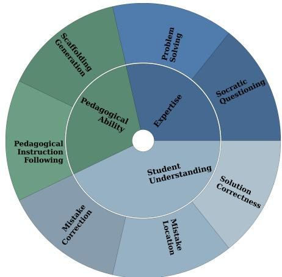
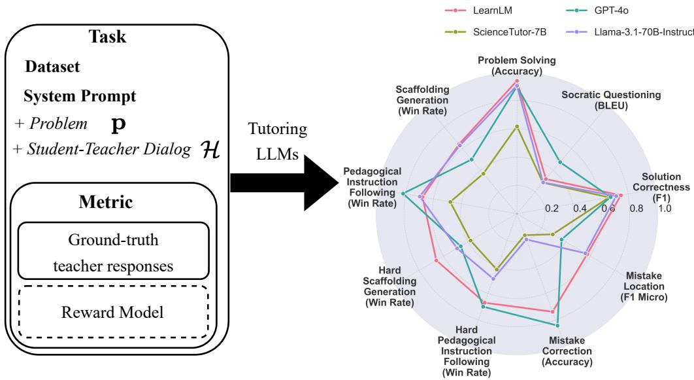
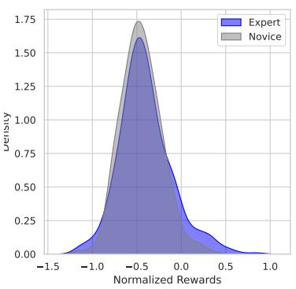
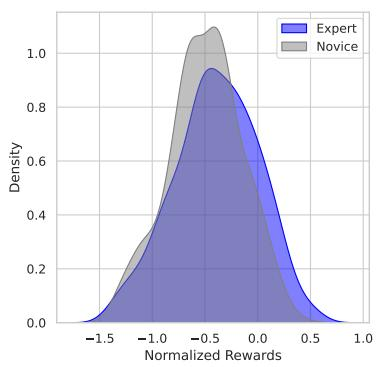
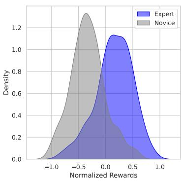
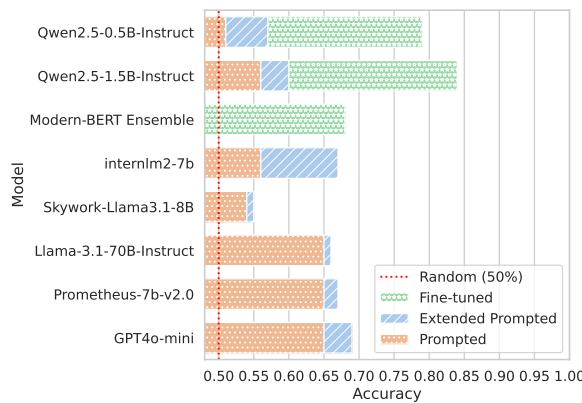
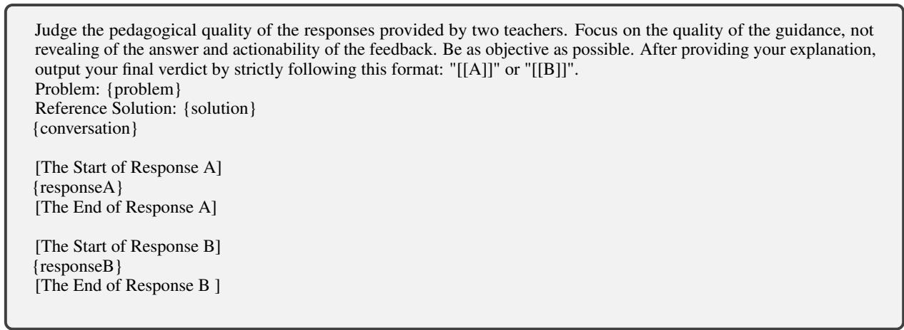
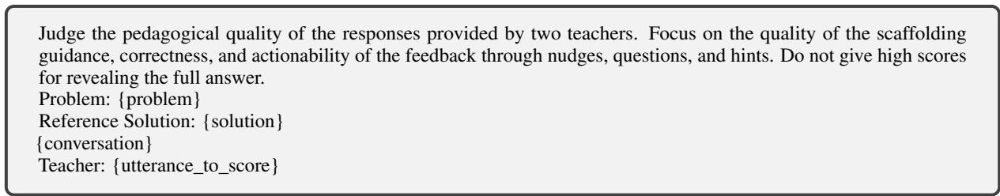

# MathTutorBench: A Benchmark for Measuring Open-ended Pedagogical Capabilities of LLM Tutors

Jakub Macina1,2 Nico Daheim1,3 Ido Hakimi1,2 Manu Kapur4 Iryna Gurevych3 Mrinmaya Sachan1

1Department of Computer Science, ETH Zurich 2ETH AI Center 3Ubiquitous Knowledge Processing Lab (UKP Lab), Department of Computer Science, Technical University of Darmstadt and National Research Center for Applied Cybersecurity ATHENE, Germany 4Professorship for Learning Sciences and Higher Education, ETH Zurich

## Abstract

Evaluating the pedagogical capabilities of AIbased tutoring models is critical for making guided progress in the field. Yet, we lack a reliable, easy-to-use, and simple-to-run evaluation that reflects the pedagogical abilities of models. To fill this gap, we present MATH-TUTORBENCH, an open-source benchmark for holistic tutoring model evaluation. MATHTU-TORBENCH contains a collection of datasets and metrics that broadly cover tutor abilities as defined by learning sciences research in dialogbased teaching. To score the pedagogical quality of open-ended teacher responses, we train a reward model and show it can discriminate expert from novice teacher responses with high accuracy. We evaluate a wide set of closed- and open-weight models on MATHTUTORBENCH and find that subject expertise, indicated by solving ability, does not immediately translate to good teaching. Rather, pedagogy and subject expertise appear to form a trade-off that is navigated by the degree of tutoring specialization of the model. Furthermore, tutoring appears to become more challenging in longer dialogs, where simpler questioning strategies begin to fail. We release the benchmark, code, and leaderboard openly to enable rapid benchmarking of future models.1

github.com/eth-lre/mathtutorbench

## 1 Introduction

Large Language Models (LLMs) present an opportunity to transform education by offering ubiquitous access to individualized tutoring (Jurenka et al., 2024). While these models excel at generating correct answers (Wei et al., 2022; Achiam et al., 2023), experienced teachers help students think for themselves and do not just give away answers to make learning effortless (Sharma et al., 2024). Teaching involves a combination of skills including subject expertise, the ability to diagnose and correct student mistakes, and the application of sound pedagogical techniques. For example, teachers need to know when to withhold answers from students, use Socratic questioning (Anghileri, 2006), or how to engage them cognitively in problem solving (Chi and Wylie, 2014; Kapur, 2016). Therefore, a crucial element of building LLM tutors is their evaluation; it is critical to understand whether their guidance is helpful to prevent harm, and to guide progress in future model development.

  
Figure 1: Effective teaching requires various skills which we categorize into expertise, student understanding, and pedagogical ability. MATHTUTORBENCH evalutes these according to the tasks shown in the outer ring.

Yet, current evaluation practices do not meet these criteria. On the one hand, automatic metrics usually evaluate tutoring models by measuring the word overlap between a ground-truth response and a generated response (Tack et al., 2023), or focus exclusively on question-answering performance (Chevalier et al., 2024). This is fast but arguably fails to capture the intricacies of tutoring. Although human evaluation might be a way to capture these nuances by defining suitable criteria to capture them (Tack and Piech, 2022; Maurya et al., 2025), it is expensive. Importantly, it can only create a snapshot of current performance and cannot be used to evaluate or compare to future models.

In this work, we fill this gap by releasing MATH-TUTORBENCH, a collection of datasets and metrics to holistically evaluate dialog tutoring models for math tutoring. Teaching is a complex and multifaceted task that extends beyond subject mastery (Boyer et al., 2008; Nye et al., 2014; Tack et al., 2023; Wang et al., 2024b). Therefore, MATHTU-TORBENCH is divided into three categories: math expertise which evaluates the subject-matter expertise of the tutor, student understanding which evaluates the tutor’s ability to verify, locate and correct student solutions, and teacher response generation which evaluates the scaffolding abilities of the tutor. Math expertise and student understanding are evaluated based on standard metrics, and we propose a novel metric for evaluating teacher response generation. In particular, we train a small and quickto-run reward model by contrasting effective and less effective tutor utterances in terms of structured scaffolding guidance with questions and hints instead of giving away the answer (Anghileri, 2006). The reward model is then used to score tutor model generations. We show that this metric is reliable by showing that it can distinguish utterances from expert teachers from those stemming from novice teachers (Wang et al., 2024b) with high accuracy.

We evaluate various open- and closed-weight state-of-the-art LLMs and specialized tutoring models on MATHTUTORBENCH. Our results show that there is a trade-off between subject expertise and pedagogical abilities that is dependent on the degree of specialization of a tutoring LLM. Specializing an LLM for pedagogy comes at the cost of solving ability and, conversely, a high solving accuracy often means that the LLM lacks pedagogy. Still, more specialized tutoring models tend to retain their teaching abilities even further into a dialog with a student, while general models quickly become worse. With this, our work contributes to accelerating the development of tutoring LLMs by providing a holistic benchmark that can be evaluated quickly and fairly using automatic metrics. We release our code and data publicly to promote open research on tutoring LLMs.

## 2 Related Work

## 2.1 LLM-Based Dialog Tutoring

A good tutor should scaffold student learning in a structured way rather than just provide correct answers. Current approaches to dialog tutoring using LLMs try to achieve this by different means: prompt-based elicitation of pedagogical behavior, finetuning models on pedagogical conversations, and alignment with pedagogical preferences.

First, most existing works use LLMs with a carefully chosen prompt which enumerates desired pedagogical behavior. Bridge (Wang et al., 2024b) analyzes the teacher behavior and proposes to structure the prompt into a sequence of decisions, similar to real teachers, first to infer the error type and then to determine the pedagogical intent. Other works mostly directly write extensive prompts (Sonkar et al., 2023; Kargupta et al., 2024). However, defining such prompts is tedious, sensitive to small changes and difficult to test (Jurenka et al., 2024).

Second, several approaches finetune models on real or mostly synthetically generated data. SocraticLM (Liu et al., 2024) uses a GPT-4 judge to evaluate the quality of teacher guidance using correctness and Socratic principles. A similar approach is to role-model teacher and student conversations based on textbook data (Chevalier et al., 2024; Wang et al., 2024a). MathDial (Macina et al., 2023a) is one of the few works that use teachers’ utterances when interacting with students to finetune models. However, it is expensive to collect such data on a larger scale. Therefore, LearnLM (Team et al., 2025) uses an empirically validated mixture of synthetic and teacher-created datasets. However, for capturing high-quality tutoring, teacher-created data is essential and therefore upweighted in their final data mix. Finally, LLMs can be aligned for pedagogical preferences during post-training (Team et al., 2025), because these are usually tacit. However, no datasets are openly available or they rely on larger models such as GPT-4 as a judge which limits its generalizability.

Our benchmark contributes an important missing ingredient in the development of LLM-based tutors – the ability to quickly evaluate and compare models on key pedagogical aspects.

## 2.2 Automatic & Human Evaluation

Several works rely on automatic NLG metrics such as BLEU (Papineni et al., 2002) or BERTScore (Zhang et al., 2020) for evaluation which require human-annotated ground truths. However, since tutoring has the goal of helping students learn (Macina et al., 2023b), it is very open-ended and there is no single best pedagogical approach at each turn (Jurenka et al., 2024). This results in noisy and unreliable scores from automatic metrics (Tack et al., 2023). There exists an educational-specific classifier of active teacher listening (Demszky et al., 2021), however, it is limited to only this one dimension of teaching and does not account for the entire dialog history. Therefore, recent finetuned tutoring LLMs (Chevalier et al., 2024; Liu et al., 2024) rely on GPT-4-as-a-judge on dimensions like helpfulness and presentation. Some works on reasoning (Liang et al., 2024) also focus on multi-turn model abilities judged by GPT-4 but they lack an educational focus.

  
Figure 2: Overview of the MathTutorBench benchmark. Each benchmark task defines a dataset, system prompts with problem and dialog, metric, and ground-truth teacher responses. A reward model is used to score the pedagogical quality over teacher responses (win rate). The right part of the figure shows the outcome as a performance comparison of selected LLMs. While they all perform well in a simple problem-solving setting, most of them lack in correct detection of mistakes and generating pedagogical responses.

Pedagogical quality annotation requires hiring teachers, but it is time-consuming and hard to compare across trials. Two papers recently addressed the issue (Tack and Piech, 2022; Maurya et al., 2025) by providing evaluation taxonomies but only present one-off static snapshots of current models performance without the possibility to automatically evaluate new models. Finally, measuring student learning gains directly focuses on the end goal. However, learner studies are costly, timeconsuming (Schmucker et al., 2024), and with strict ethics and privacy requirements. There is a growing interest in designing proper evaluation guidelines (Tack et al., 2023; Jurenka et al., 2024), however, there is still a need for a unified automatic evaluation for scalable model development.

MATHTUTORBENCH addresses the limitations of existing automatic metrics by focusing specifically on tutoring, is simple to run, replicable, and could serve as a proxy for deciding which models to focus on in human studies. Moreover, our benchmark only uses data collected from real teachers.

## 3 Background

## 3.1 Next Teacher Utterance Generation

We focus on educational dialogues between a student and a teacher, where a student is trying to solve a multi-step problem $\mathbf { p } \in \mathcal { V } ^ { * }$ . The problem has a single numerical solution a and a sequence of solution steps $\mathbf { s } = ( \mathbf { s } _ { 1 } , \ldots , \mathbf { s } _ { N } )$ , where each $\mathbf { s } _ { n } \in \mathcal { V } ^ { * }$ and sN contains the final answer a. A student solution consists of steps $\widehat { \mathbf { s } } = ( \widehat { \mathbf { s } } _ { 1 } , \ldots , \widehat { \mathbf { s } } _ { M } )$ and the first bstep with a mistake is $e \in \{ 0 , 1 , \ldots , M \}$ , where $e = 0$ means no mistake.

The goal of dialog tutoring is to continue an existing teacher-student dialog $\mathcal { H } : = ( \mathbf { u } _ { 1 } , \ldots , \mathbf { u } _ { T - 1 } )$ consisting of $T - 1$ turns $\mathbf u _ { t } \in \mathcal V ^ { * }$ with a new turn ${ \mathbf { u } } _ { T } \in \mathcal { V } ^ { * }$ that simulates the teacher and guides the student towards solving a problem. This is usually done by learning a model $p _ { \pmb { \theta } } ( \mathbf { u } _ { T } \mid \mathcal { H } , \mathcal { K } , \mathbf { i } _ { t } )$ with parameters $\pmb \theta \in \mathbb { R } ^ { d } .$ , which is optionally conditioned on background knowledge (in our case only the problem p) and a teacher intent $\mathbf { i } _ { T } ,$ , and using a decoding strategy, such as greedy decoding or sampling according to pθ to generate an output. The turn $\mathbf { u } _ { T }$ should then fulfill the desiderate laid out in Section 3.2. The goal of this work is to present a benchmark to understand the quality of various $\mathbf { u } _ { T }$ generated by different models θ.

<table><tr><td colspan="3">Math Expertise</td><td colspan="3">Student Understanding</td><td colspan="2">Teacher Response Generation</td></tr><tr><td>Task(s)</td><td>Problem solving</td><td>Socratic questioning</td><td>Solution correctness</td><td>Mistake location</td><td>Mistake correction</td><td>Scaffolding Gen., Ped. instr. following</td><td>Scaffolding Gen., Ped. instr. following</td></tr><tr><td>Dataset</td><td>GSM8k</td><td>GSM8k</td><td>StepVerify</td><td>StepVerify</td><td>StepVerify</td><td>MathDialBridge</td><td>MathDialBridge[hard]</td></tr><tr><td>Input</td><td>p</td><td>p</td><td>p, s</td><td>p, s</td><td>p, H</td><td>p, H</td><td>p, H</td></tr><tr><td>Type</td><td>generation</td><td>generation</td><td>bin. clas. (bal.)</td><td>multi-cl.</td><td>generation</td><td>generation</td><td>generation</td></tr><tr><td>Ground Truth</td><td>a</td><td> $\mathbf { q } _ { 1 } , \ldots , \mathbf { q } _ { N }$ </td><td>1(e≠0)</td><td>e</td><td>a</td><td>Uteacher</td><td>Uteacher</td></tr><tr><td>Instances</td><td>1319</td><td>1319</td><td>2004</td><td>2004</td><td>1002</td><td>1150</td><td>327</td></tr><tr><td>Avg. turns</td><td></td><td></td><td></td><td></td><td>3.04</td><td>3.08</td><td>5.78</td></tr></table>

Table 1: Datasets used in the benchmark and their statistics. Notation defined in Section 3.

## 3.2 Learning Sciences Principles

We focus on 1:1 multi-turn teacher-student interactions where teachers promote active learning (Freeman et al., 2014) by engaging students through scaffolding nudges, hints, and Socratic questioning. Based on effective teaching research (Graesser et al., 1995; Lepper and Woolverton, 2002; Litman and Forbes-Riley, 2006; Boyer et al., 2008; Chi and Wylie, 2014; Nye et al., 2014; Jurenka et al., 2024), we define the following pedagogical principles: (a) correctness: the teacher should guide the student towards the correct answer and not state incorrect facts; (b) scaffolding instead of giving away the answer: the teacher should help the student to cognitively engage with the problem and discover the answer on their own; (c) encourage self-correction: by correctly identifying the student mistake and first giving the student the opportunity to self-correct and learn from a mistake; (d) not overload student: manage cognitive load by not giving too much information at once.

## 4 MathTutorBench

We introduce MATHTUTORBENCH, a benchmark that evaluates the tutoring capabilities of tutoring models. MATHTUTORBENCH consists of three high-level skills that a good human teacher needs to have (Bommasani et al., 2021): Expertise, Student Understanding and Pedagogical Abilities. These skills are tested by seven different tasks, each consisting of a dataset, prompt, and metric. All tasks in MATHTUTORBENCH are related to math tutoring. The problems are mostly sourced from GSM8k (Cobbe et al., 2021). Table 1 summarizes the datasets and tasks. The prompts used for the tasks in the benchmark are shown in Appendix B.

## 4.1 Tasks

This section explains each task and complements Table 1 with the rationale for including it.

1. Problem Solving. We include a math word problem solving task that measures the accuracy of the final numeric answer generated with chainof-thought (Wei et al., 2022) compared to the answer a. Even though this type of evaluation is popular, saturated, and contaminated, in MATHTU-TORBENCH it serves as an indicator of a balance between expertise and pedagogical abilities.

2. Socratic Questioning. Socratic questioning is related to the problem decomposition to smaller and more manageable parts. This task is to evaluate whether a model generates for each correct step ${ \bf s } _ { n }$ at least one corresponding guidance question ${ \bf q } _ { n }$ towards the correct answer, which could be posed to the student instead of simply providing the answer (Shridhar et al., 2022; Liu et al., 2024).

3. Student Solution Correctness. This task evaluates a teacher’s ability to verify the correctness of a student’s answer. Framed as a balanced binary classification task based on student solution chain ${ \widehat { s } } ,$ this dimension ensures that the model can objecbtively discern whether a student’s reply is correct or incorrect, a crucial prerequisite for providing accurate feedback and identification of misconceptions (Wang et al., 2024b).

4. Student Mistake Location. Mistake location is a critical component of effective tutoring, focusing on a teacher’s ability to accurately identify the exact location of the first mistake in a student’s response s (Daheim et al., 2024). This task assesses bwhether a tutoring model can pinpoint where a student’s reasoning has gone wrong, enabling timely and precise feedback. By detecting steps with mistakes, the model can help students understand their misconceptions and steer the conversation to mitigate them, thus fostering a more productive learning experience (Kapur, 2016; Wang et al., 2024b). 5. Student Mistake Correction. This task measures the performance of a model to generate a reasoning chain with a correct final numeric answer a even though the student proposes an incorrect answer in the dialog history . The conditioning on dialog history is the difference to Problem Solving. We test the models’ ability to handle incorrect solutions. Models should not get derailed by students incorrect steps. From a broader perspective, even if there is an incorrect step in a dialog history , this tests the recovery of a model from mistakes.

6. Scaffolding Generation (scaff.). The task is to generate the next teacher utterance $\mathbf { u } _ { T }$ as a continuation of the dialog. As it is an open-ended task, we use a reward model to score generations over teacher responses (explained in Section 4.3) to estimate its’ pedagogical quality. The tasks consist of two variations. Scaffolding generation focuses on generating an immediate response to a student’s incorrect solution. We use a simple prompt for this version asking models to respond to a student as “an experienced math teacher in a useful and caring way“ (Wang et al., 2024b). The second version is scaffolding generation [hard], a variant with a longer conversation history (avg. 5.78 turns).

7. Pedagogical Instruction Following (IF) for Scaffolding Generation. The task refers to the ability of the model to follow pedagogical instructions in prompts and steer the model generations to be more desired (Team et al., 2025). In this task, we use the LearnLM ‘extended‘ prompt (Jurenka et al., 2024) which specifically enumerates desired behaviors such as “nudging students”, “asking guiding questions”, and “not overwhelm student”. Therefore, in contrast to a simple prompt from scaffolding generation, we hypothesize that models should improve their generations to be more aligned with our set of guiding principles from Section 3. The same is applied to the hard portion of the dataset.

## 4.2 Datasets

The requirements for the dataset included in the benchmark are to focus on middle school math content and contain 1:1 tutoring conversations written by human teachers. We found two datasets that fit the criteria, Bridge (Wang et al., 2024b) and MathDial (Macina et al., 2023a). We excluded NCTE (Demszky and Hill, 2023) dataset because it is multi-persona. Bridge (Wang et al., 2024b) contains 700 snippets of real online tutoring conversations by novice teachers, where each response is revised by an expert teacher. MathDial (Macina et al., 2023a) consists of 2.9k tutoring conversations collected by human teachers who interacted with simulated students. Both datasets focus on math, Bridge uses various problem sources and MathDial sources problems from GSM8k (Cobbe et al., 2021); a dataset of math word problems that we used in the expertise task. We combine Bridge and MathDial datasets into a combined dataset called MathDialBridge which we further split into one with a maximum of 4 utterances and the rest we put into MathDialBridge[hard]. Finally, we use the StepVerify (Daheim et al., 2024) dataset which builds on top of the MathDial student incorrect solutions and introduces annotation of the first erroneous step in a student solution. Table 1 describes all the datasets and their statistics.

## 4.3 Scaffolding Score

Evaluating pedagogical abilities in tutoring is inherently challenging due to the open-ended nature of the involved tasks. Unlike more structured domains like factual question answering, pedagogy requires assessing the quality of responses such as questioning guidance to the root cause of a mistake, and actionability of productive scaffolding. In other words, we need an efficient and lightweight mechanism, a critic model, that can assign a meaningful score to a generative model’s output based on its pedagogical effectiveness.

## 4.3.1 Criteria-based Scoring

The most straightforward approach is to train individual critic models for each pedagogical task using labeled data. For an evaluation taxonomy with n total evaluation criteria, for each criterion i we train a binary classifier $C _ { i } ( \mathbf { y } )$ that outputs a binary prediction of whether the criteria is present or not in response y. To combine these into a final score for a response, we aggregate them as $\scriptstyle \sum _ { i = 1 } ^ { n } C _ { i } ( \mathbf { y } )$ which represents a discrete score of the total number of predicted desired criteria for the response. For example, MRBench (Maurya et al., 2025) is a small dataset annotated with 8 criteria such as the presence of guidance, actionability, and telling the answer. However, the scale of the required data and sparse features pose significant challenges.

## 4.3.2 Pairwise Ranking of Teacher Responses

Since labeled data for each criterion can be scarce, we here explore a more unified strategy. Instead of training a separate model for each criterion, where each annotation criterion has inherent subjectivity, we relax the objective and train a single critic model that aggregates multiple criteria into a pairwise comparison. We train a reward model using binary ranking loss by following Ouyang et al. (2022):

<table><tr><td rowspan=1 colspan=1>Dataset</td><td rowspan=1 colspan=1>Split</td><td rowspan=1 colspan=1>Pref. pairs</td><td rowspan=1 colspan=1>Avg. turns</td><td rowspan=1 colspan=1>Preferred resp.</td><td rowspan=1 colspan=1>Rejected resp.</td><td rowspan=1 colspan=1>Settings</td></tr><tr><td rowspan=1 colspan=1>GSM8k-inpainted(Cobbe et al., 2021)</td><td rowspan=1 colspan=1>all</td><td rowspan=1 colspan=1>22,753</td><td rowspan=1 colspan=1>4.38</td><td rowspan=1 colspan=1>Subquestion qt</td><td rowspan=1 colspan=1>Solution steps $s _ { t } .$ </td><td rowspan=1 colspan=1>Math Word Problems withmatching solutions stepsst to subquestions qt</td></tr><tr><td rowspan=1 colspan=7>Training datasets</td></tr><tr><td rowspan=1 colspan=1>MathDial(Macina et al., 2023a)</td><td rowspan=1 colspan=1>train</td><td rowspan=1 colspan=1>3,615</td><td rowspan=1 colspan=1>2.93</td><td rowspan=1 colspan=1>Teacher utteranceswith it annotated asprobing and focusin the first 3 teacherturns.</td><td rowspan=1 colspan=1>Reference sol. s</td><td rowspan=1 colspan=1>Tutoring conversationscreated by humanteachers interacting withLLM students</td></tr><tr><td rowspan=1 colspan=1>MRBench(Maurya et al., 2025)</td><td rowspan=1 colspan=1>N/A</td><td rowspan=1 colspan=1>4,521</td><td rowspan=1 colspan=1>3.74</td><td rowspan=1 colspan=1>Response with ahigher number ofdesired criteria</td><td rowspan=1 colspan=1>Response withfewer desiredcriteria</td><td rowspan=1 colspan=1>Human annotation across8 tutoring criteria -guidance, actionability,answer reveal, mistakeidentification, mistakelocation, coherence, tone,humanness</td></tr><tr><td rowspan=1 colspan=2>Test dataset</td><td rowspan=1 colspan=3></td><td rowspan=1 colspan=2></td></tr><tr><td rowspan=1 colspan=1>Bridge(Wang et al., 2024b)</td><td rowspan=1 colspan=1>all</td><td rowspan=1 colspan=1>482</td><td rowspan=1 colspan=1>2.79</td><td rowspan=1 colspan=1>Expert teacherresponse</td><td rowspan=1 colspan=1>Novice teacherresponse</td><td rowspan=1 colspan=1>Original novice teacherresponses and revisionsby expert teachers</td></tr></table>

Table 2: Datasets used to create pedagogical pairwise preference data.

$$
\mathcal { L } _ { \mathrm { r a n k } } = - \log \sigma \left( r _ { \theta } ( \mathbf { x } , \mathbf { y } _ { c } ) - r _ { \theta } ( \mathbf { x } , \mathbf { y } _ { r } ) - m \right)\tag{1}
$$

where $r _ { \theta } ( \mathbf { x } , \mathbf { y } )$ is the scalar score for prompt x and generation $\mathbf { y } , \mathbf { y } _ { c }$ and ${ \bf y } _ { r }$ are preferred (chosen) and rejected generations respectively. The margin $m ( \mathbf { y } _ { c } , \mathbf { y } _ { r } )$ represents the numerical quality difference between the chosen and rejected response but may also be set to 0 if not available.

## 4.3.3 Pairwise Preference Data Pipeline

To create pairwise preference data, we follow our pedagogical criteria from Section 3.2. For example, a response is preferred if it is a Socratic question $\mathbf { q } _ { t }$ or it has dialog intent $\mathbf { i } _ { t }$ which probes student understanding. Contrary, a response is chosen as rejected if it contains part(s) of the reference solution s or has a lower number of desired criteria.

To formalize this, for a given dialog history and a taxonomy with n criteria, we define a score for each response y:

$$
f ( \mathbf { y } ) = \sum _ { i = 1 } ^ { n } \mathbb { 1 } ( \mathbf { y } { \mathrm { ~ h a s ~ d e s i r e d ~ c r i t e r i o n ~ } } i )\tag{2}
$$

where 1( ) is the indicator function that equals 1 if holds and 0 otherwise. The condition within the indicator function is determined by: a) human criteria annotations (for MRBench (Maurya et al., 2025)), b) dialog intent annotations $\mathbf { i } _ { t }$ of the used pedagogical strategy (for Math-Dial (Macina et al., 2023a)), and c) subquestion annotation $\mathbf { q } _ { t }$ (for GSM8k (Cobbe et al., 2021)). For each pair of responses $( \mathbf { y } _ { i } , \mathbf { y } _ { j } )$ , we construct a dataset of preference-label pairs $\mathcal { D } = \{ ( \mathbf { y } _ { i } , \mathbf { y } _ { j } )$ $f ( \mathbf { y } _ { i } ) > f ( \mathbf { y } _ { j } ) \}$ , where the margin is defined as $m ( \mathbf { y } _ { i } , \mathbf { y } _ { j } ) = f ( \mathbf { y } _ { i } ) - f ( \mathbf { y } _ { j } )$ . The dataset captures the relative preference between responses based on the number of desired criteria they exhibit. The description of the datasets used for training and testing is found in Table 2.

## 5 Experiments

## 5.1 Models

MathTutorBench includes an evaluation of three groups of models: general LLMs, LLM tutors, and math reasoners. General LLMs such as openweight Llama3.1 70B and 8B, newer Llama3.2 3B model, and closed source gpt-4o-mini. We use specialized tutoring models, namely closedsourced LearnLM-1.5-Pro and recent open-source tutoring models Qwen2.5-7B-SocraticLM (Liu et al., 2024) and Llemma-7B-32K-MathMix (ScienceTutor) (Chevalier et al., 2024). To measure the importance of specially finetuned tutoring models, we evaluate the Qwen2.5-Math-7B-Instruct, which is optimized for math reasoning and was used for finetuning the specialized tutor model SocraticLM.

  
(a) Prompted

  
(b) With Extended Prompt

  
(c) Finetuned

Figure 3: Reward model distribution scores for expert and novice teachers across prompted (prompt in Figure 6), with extended prompt (prompt in Figure 7), and finetuned Qwen2.5-1.5B-Instruct models.  
  
Figure 4: Models performance on pairwise judgment of teacher responses. We compute accuracy on an independent test set based on Bridge dataset (Wang et al., 2024b) as a proportion of expert teacher responses preferred over novice teacher responses. Extended prompt enumerates our pedagogical criteria (Figure 7).

## 5.2 Scaffolding Score - Data and Metrics

The goal of the Scaffolding score is to estimate the pedagogical quality of the teacher’s response generation. To validate it, we use a test set containing 482 examples derived from the Bridge dataset (Wang et al., 2024b) which contains student dialogs with novice teachers. In Bridge, novice teacher responses are improved by expert teachers following an expert-defined decision-making process. The process first identifies the type of error and then determines the pedagogical strategy and intent. For example, while novice teachers tend to explicitly correct student mistakes by giving away correct answers to students, expert teachers use various scaffolding nudges such as the Socratic method, use hints, or ask for further elaboration of the problematic part.

<table><tr><td>Data Mix &amp; Setting</td><td>Accuracy</td><td>Avg. margin</td></tr><tr><td>GSM8k-inpainted (22k)</td><td>0.60</td><td>3.26</td></tr><tr><td>MathDial (3.6k)</td><td>0.77</td><td>1.57</td></tr><tr><td>MRBench (4.5k)</td><td>0.80</td><td>2.60</td></tr><tr><td>+ margin in loss (4.5k)</td><td>0.79</td><td>7.68</td></tr><tr><td>+ pretraining (16.7k)</td><td>0.80</td><td>3.09</td></tr><tr><td>+ MathDial (8.1k)</td><td>0.84</td><td>5.75</td></tr></table>

Table 3: Ablation of Qwen2.5-1.5B-Instruct reward model. Total number of training instances in brackets. + indicates an addition to the model. Pretraining uses 20% of Ultrafeedback (Cui et al., 2024). We select the most accurate model to calculate the Scaffolding score.

Training data used for training the Scaffolding reward model and its ablation are in Table 2. Desired criteria for MRBench (Maurya et al., 2025) are "No" for Revealing of the answer, "Encouraging" for Tutor Tone, and "Yes" for Mistake Identification, Mistake Location, Providing Guidance, Actionability, Coherence and Human-Likeness. To ensure no test set contamination with the training data, we strictly removed all instances from the test set about any topic already present in the training data. Therefore, test set samples contain not only unseen instances but also unseen topics by models.

We use the following formula to compute the accuracy of pairwise ranking between the expert teacher and the novice teacher:

$$
\frac { 1 } { N } \sum _ { i = 1 } ^ { N } \mathbb { 1 } ( \mathbf { y } _ { \mathrm { e x p e r t } , i } > \mathbf { y } _ { \mathrm { n o v i c e } , i } ) .\tag{3}
$$

## 5.3 Scaffolding Score - Models and Baselines

We use LLM-as-a-judge prompting as a baseline, similar to Jurenka et al. (2024).

<table><tr><td></td><td colspan="2">Math Expertise</td><td colspan="3">Student Understanding</td><td colspan="4">Pedagogy</td></tr><tr><td rowspan="2">Model</td><td>Problem solving</td><td>Socratic</td><td>Solution correctness</td><td>Mistake location</td><td>Mistake</td><td>scaff.</td><td>Teacher response generation</td><td>scaff. [hard]</td><td>ped.IF [hard]</td></tr><tr><td>accuracy</td><td>questioning bleu</td><td>F1</td><td>micro F1</td><td>correction accuracy</td><td>win rate</td><td>ped.IF win rate</td><td>win rate</td><td>win rate</td></tr><tr><td>Metric LLaMA3.2-3B-Instruct</td><td>0.60</td><td>0.29</td><td>0.67</td><td>0.41</td><td>0.13</td><td>0.64</td><td>0.63</td><td>0.45</td><td>0.40</td></tr><tr><td>LLaMA3.1-8B-Instruct</td><td>0.70</td><td>0.29</td><td>0.63</td><td>0.29</td><td>0.09</td><td>0.61</td><td>0.67</td><td>0.46</td><td>0.49</td></tr><tr><td>LLaMA3.1-70B-Instruct</td><td>0.91</td><td>0.29</td><td>0.71</td><td>0.56</td><td>0.19</td><td>0.63</td><td>0.70</td><td>0.49</td><td>0.49</td></tr><tr><td>GPT-40</td><td>0.90</td><td>0.48</td><td>0.67</td><td>0.37</td><td>0.84</td><td>0.50</td><td>0.82</td><td>0.46</td><td>0.70</td></tr><tr><td>LearnLM-1.5-Pro</td><td>0.94</td><td>0.32</td><td>0.75</td><td>0.57</td><td>0.74</td><td>0.64</td><td>0.68</td><td>0.66</td><td>0.67</td></tr><tr><td>Llemma-7B-ScienceTutor</td><td>0.62</td><td>0.29</td><td>0.66</td><td>0.29</td><td>0.16</td><td>0.37</td><td>0.48</td><td>0.38</td><td>0.42</td></tr><tr><td>Qwen2.5-7B-SocraticLM</td><td>0.73</td><td>0.32</td><td>0.05</td><td>0.39</td><td>0.23</td><td>0.39</td><td>0.39</td><td>0.28</td><td>0.28</td></tr><tr><td>Qwen2.5-Math-7B-Instruct</td><td>0.88</td><td>0.35</td><td>0.43</td><td>0.47</td><td>0.49</td><td>0.06</td><td>0.07</td><td>0.05</td><td>0.05</td></tr></table>

Table 4: We find that expertise and student understanding form a trade-off with pedagogy in tutor response generation. Models are grouped into general, specialized tutoring, and math reasoning models. The win rate is computed as the rate of the reward model preferring model responses over teacher responses. IF = Instruction Following.

For this, we use Llama-3.1-70B-Instruct, GPT-4o-mini, and the specialized judge model Prompetheus-7b-v2.0 (Kim et al., 2024). Moreover, we pick well-performing existing preferencetuned reward models with high scores from the RewardBench (Lambert et al., 2025) on a variety of chat comparisons, namely, Internlm2-7b-reward and Skywork-Reward-Llama-3.1-8B-v0.2. To finetune single criteria-based binary classifiers we use ModernBERTbase (Warner et al., 2025) with a classification head. Finally, we use Qwen2.5-0.5B-Instruct and Qwen2.5-1.5B-Instruct (Yang et al., 2024) for finetuning on preference data, which are small enough to run fast as a part of the benchmark.

## 6 Results

In this section, we showcase our core findings on MATHTUTORBENCH and demonstrate the robustness and quality of the scaffolding reward model.

## 6.1 Comparing SotA LLMs (Table 4)

Math expertise does not translate directly to student understanding and pedagogy. Our evaluations reveal a striking imbalance in current language models. While these models exhibit impressive domain knowledge and excel at Problem solving, as evidenced by their performance on datasets like GSM8K, they consistently fall short in Scaffolding generation task. This is particularly clear for Qwen2.5-Math and GPT4o.

Specialized tutoring models improve in pedagogy but do not retain the full solving abilities. The specialized tutoring model SocraticLM achieves good Scaffolding scores for its size and big improvements over the base model (Qwen2.5- Math). However, it degrades in all Student Understanding tasks. Compared to SocraticLM, the

ScienceTutor degrades in math expertise but has significantly better Student correctness solution and pedagogical instruction following. Closedsourced LearnLM achieves a more reasonable balance across all skills and tasks.

Tutoring is more challenging on longer dialogs. As indicated by the drop in performance in the win rate of tasks, indicated with ‘hard‘, the longer the context it is more difficult for more to adapt. For example, it might be important to guide students differently than with a simple Socratic questioning. Only LearnLM can keep consistent performance.

Majority of models suffer by limited pedagogical instruction following. When we compare scaffolding generation with instruction following win rate (in base and hard splits), we notice that GPT4o follows the pedagogical instructions and gains a significant improvement (similarly, there is a smaller improvement for ScienceTutor). However, other models such as the SocraticLM, LearnLM, or Llama models show decreased or similar performance suggesting a limited ability to follow pedagogical instructions defined in prompt.

## 6.2 Scaffolding Score - Results

Figure 4 shows a comparison between various models evaluated on the task of scoring expert teacher responses higher than novice teacher responses, see Equation 3. LLM-as-a-judge models are sensitive to prompts and positional bias, so we randomize the order. We report simple and extended prompts with detailing pedagogical guidelines (with prompts in Figure 6 and 7) but their accuracy is lower than 0.7. Performance of reward models from RewardBench (Lambert et al., 2025) on the pedagogical preferences is only slightly higher than random, highlighting the difference between general human preferences and pedagogical preference data. We also train a combination of criteria-based ModernBERT binary classifiers aggregated into a summed final score, however, it lags behind extended-prompted LLM-as-a-judge models (for individual criterion performance see Table 5). We hypothesize the single criterion data are highly sparse, noisy and imbalanced, and do not have sufficient data size to work.

To summarize, Figure 3 and Figure 4 shows that finetuning reward models on pedagogical preference data is essential, as these finetuned reward models outperform both LLMs-as-a-judge models and SoTA reward models from RewardBench, consistent with (Xu et al., 2024). We hypothesize that this is because of the lack of pedagogical datasets and a fundamental shift between a better chat response and a better pedagogical response.

Ablation of finetuning data. Table 3 shows the results for various data mixtures of pedagogical preference data. We see that synthetic inpainted data (Dai et al., 2022) using stepwise questions and answers from GSM8k do not lead to a significant improvement over the base model. However, using pedagogical preference pairs based on human annotators scores (Maurya et al., 2025) improves the score to 0.8, more than any other baseline in Table 4. However, as this dataset contains mostly model generations, only one of the responses is from a human teacher, and they are highly underrepresented. Therefore, we also include conversations from the MathDial training set (Macina et al., 2023a), which is filtered by desired dialog acts. (more details in Table 2). The resulting finetuned model achieves the best accuracy of 0.84. As the test set is completely separate and no problems are shared between the train and test set, we pick this reward model as our final model for computing the Scaffolding score for model generation win rates over teacher responses (proportion of model generations preferred over teacher responses).

Scores distribution. Additionaly, we plot in Figure 3 the model distribution over scores on the test set. The prompted model with extended prompt and the vanilla model cannot separate the teacher and novice responses as well as the finetuned model. This supports the idea that pedagogical criteria are unique compared to general preference data and we need high-quality pedagogical preference data.

## 7 Conclusion

In this work we propose MATHTUTORBENCH, a holistic benchmark for quick and cost-effective assessment of the educational capabilities of LLM tutoring models. It fills a crucial gap in the literature, as it allows fast prototyping of models by using only lightweight automatic and learned metrics to evaluate pedagogy. The goal is to not replace human studies measuring learning outcomes, but rather to serve as a measure of which models to use and compare. Finally, we benchmark various models and report a trade-off between expertise, understanding, and pedagogy, as well as diminishing results on longer tutoring conversations.

## Limitations

Our work focuses on high school math tutoring and limits the insights of the benchmark to multistep math problems. Despite a limited number of available conversation dataset in other domains, we plan to extend the benchmark to further STEM domains to generalize its applicability and reach.

The conversational data in the benchmark does not contain conversations longer than 10 turns and thus can miss to evaluate very long educational conversations with long-term dependencies which might be present in online tutoring classes.

We study 1:1 conversational tutoring between teacher and student in this work. Specifically, we focus on a teacher using hints and nudges to aid student learning and provide engaging learning opportunities for students. However, there are additional functions of a teacher that we decided not to model, for example building rapport or trust with less engaged students.

The benchmark does not contain all possible dimensions for educational evaluation. For example, it is missing a safety evaluation of potentially harmful tutor responses. It is an extensive research area and not the goal of this work. However, as the benchmark is open-source we plan to extend it to include more safety evaluations.

## Ethics Statement

Intended usage The goal of the benchmark is to evaluate new and existing dialog tutoring models on the skills related to math expertise, student understanding, and pedagogical capabilities. We released the code and the dataset under CC-BY-4.0 license. This follows the licences of all the datasets which we are using in the benchmark.

Accessibility and Potential Misuse The main goal of our work is to encourage the community to use the benchmark to improve existing tutoring models by balancing expertise, student understanding, and proper pedagogical guidance. However, there are potential risks related to the data and the scoring reward model. Models could optimize for reward hacking which could lead to suboptimal tutoring behaviour. Moreover, if the data contains some unknown pattern, the risk is that this could be exploited by new models to achieve higher scores. However, we tried to mitigate this by including various data sources in the benchmark and in the training data, mostly human-annotated. We encourage the deployment of tutoring models in any case with appropriate safeguards.

## Acknowledgements

Jakub Macina acknowledges funding from the ETH AI Center Doctoral Fellowship, Asuera Stiftung, and the ETH Zurich Foundation. This work was supported in part by the Swiss AI Initiative under a project (ID a04) on AI for Education. This work has been funded by the LOEWE Distinguished Chair “Ubiquitous Knowledge Processing”, LOEWE initiative, Hesse, Germany (Grant Number: LOEWE/4a//519/05/00.002(0002)/81) and by the State of Hesse, Germany, as part of the project “LLMentor: Expert-AI Coteaching of ‘Introduction to Scientific Work’” (Connectom Networking and Innovation Fund). We thank Shehzaad Dhuliawala for valuable feedback and discussions.

## References

Josh Achiam, Steven Adler, Sandhini Agarwal, Lama Ahmad, Ilge Akkaya, Florencia Leoni Aleman, Diogo Almeida, Janko Altenschmidt, Sam Altman, Shyamal Anadkat, and 1 others. 2023. Gpt-4 technical report. arXiv preprint arXiv:2303.08774.

Julia Anghileri. 2006. Scaffolding practices that enhance mathematics learning. Journal of Mathematics Teacher Education, 9:33–52.

Rishi Bommasani, Drew A Hudson, Ehsan Adeli, Russ Altman, Simran Arora, Sydney von Arx, Michael S Bernstein, Jeannette Bohg, Antoine Bosselut, Emma Brunskill, and 1 others. 2021. On the opportunities and risks of foundation models. arXiv preprint arXiv:2108.07258.

Kristy Elizabeth Boyer, Robert Phillips, Michael Wallis, Mladen Vouk, and James Lester. 2008. Balancing

cognitive and motivational scaffolding in tutorial dialogue. In Intelligent Tutoring Systems, pages 239– 249, Berlin, Heidelberg. Springer Berlin Heidelberg.

Alexis Chevalier, Jiayi Geng, Alexander Wettig, Howard Chen, Sebastian Mizera, Toni Annala, Max Aragon, Arturo Rodriguez Fanlo, Simon Frieder, Simon Machado, Akshara Prabhakar, Ellie Thieu, Jiachen T. Wang, Zirui Wang, Xindi Wu, Mengzhou Xia, Wenhan Xia, Jiatong Yu, Junjie Zhu, and 3 others. 2024. Language models as science tutors. In Forty-first International Conference on Machine Learning.

Michelene TH Chi and Ruth Wylie. 2014. The icap framework: Linking cognitive engagement to active learning outcomes. Educational psychologist, 49(4):219–243.

Karl Cobbe, Vineet Kosaraju, Mohammad Bavarian, Mark Chen, Heewoo Jun, Lukasz Kaiser, Matthias Plappert, Jerry Tworek, Jacob Hilton, Reiichiro Nakano, Christopher Hesse, and John Schulman. 2021. Training verifiers to solve math word problems. arXiv preprint arXiv:2110.14168.

Ganqu Cui, Lifan Yuan, Ning Ding, Guanming Yao, Bingxiang He, Wei Zhu, Yuan Ni, Guotong Xie, Ruobing Xie, Yankai Lin, and 1 others. 2024. Ultrafeedback: Boosting language models with scaled ai feedback. In Forty-first International Conference on Machine Learning.

Nico Daheim, Jakub Macina, Manu Kapur, Iryna Gurevych, and Mrinmaya Sachan. 2024. Stepwise verification and remediation of student reasoning errors with large language model tutors. In Proceedings ofthe 2024 Conference on Empirical Methods in Natural Language Processing, pages 8386–8411, Miami, Florida, USA. Association for Computational Linguistics.

Zhuyun Dai, Arun Tejasvi Chaganty, Vincent Y Zhao, Aida Amini, Qazi Mamunur Rashid, Mike Green, and Kelvin Guu. 2022. Dialog inpainting: Turning documents into dialogs. In International conference on machine learning, pages 4558–4586. PMLR.

Dorottya Demszky and Heather Hill. 2023. The NCTE transcripts: A dataset of elementary math classroom transcripts. In Proceedings of the 18th Workshop on Innovative Use ofNLPfor Building Educational Applications (BEA 2023), pages 528–538, Toronto, Canada. Association for Computational Linguistics.

Dorottya Demszky, Jing Liu, Zid Mancenido, Julie Cohen, Heather Hill, Dan Jurafsky, and Tatsunori Hashimoto. 2021. Measuring conversational uptake: A case study on student-teacher interactions. In Proceedings ofthe 59th Annual Meeting ofthe Associationfor Computational Linguistics and the 11th International Joint Conference on Natural Language Processing (Volume 1: Long Papers), pages 1638–1653, Online. Association for Computational Linguistics.

Scott Freeman, Sarah L Eddy, Miles McDonough, Michelle K Smith, Nnadozie Okoroafor, Hannah Jordt, and Mary Pat Wenderoth. 2014. Active learning increases student performance in science, engineering, and mathematics. Proceedings of the national academy ofsciences, 111(23):8410–8415.

Arthur C Graesser, Natalie K Person, and Joseph P Magliano. 1995. Collaborative dialogue patterns in naturalistic one-to-one tutoring. Applied cognitive psychology, 9(6):495–522.

Irina Jurenka, Markus Kunesch, Kevin R McKee, Daniel Gillick, Shaojian Zhu, Sara Wiltberger, Shubham Milind Phal, Katherine Hermann, Daniel Kasenberg, Avishkar Bhoopchand, and 1 others. 2024. Towards responsible development of generative ai for education: An evaluation-driven approach. arXiv preprint arXiv:2407.12687.

Manu Kapur. 2016. Examining productive failure, productive success, unproductive failure, and unproductive success in learning. Educational Psychologist, 51(2):289–299.

Priyanka Kargupta, Ishika Agarwal, Dilek Hakkani Tur, and Jiawei Han. 2024. Instruct, not assist: LLMbased multi-turn planning and hierarchical questioning for socratic code debugging. In Findings ofthe Associationfor Computational Linguistics: EMNLP 2024, pages 9475–9495, Miami, Florida, USA. Association for Computational Linguistics.

Seungone Kim, Juyoung Suk, Shayne Longpre, Bill Yuchen Lin, Jamin Shin, Sean Welleck, Graham Neubig, Moontae Lee, Kyungjae Lee, and Minjoon Seo. 2024. Prometheus 2: An open source language model specialized in evaluating other language models. In Proceedings ofthe 2024 Conference on Empirical Methods in Natural Language Processing, pages 4334–4353, Miami, Florida, USA. Association for Computational Linguistics.

Woosuk Kwon, Zhuohan Li, Siyuan Zhuang, Ying Sheng, Lianmin Zheng, Cody Hao Yu, Joseph Gonzalez, Hao Zhang, and Ion Stoica. 2023. Efficient memory management for large language model serving with pagedattention. In Proceedings ofthe 29th Symposium on Operating Systems Principles, pages 611–626.

Nathan Lambert, Valentina Pyatkin, Jacob Morrison, LJ Miranda, Bill Yuchen Lin, Khyathi Chandu, Nouha Dziri, Sachin Kumar, Tom Zick, Yejin Choi, Noah A. Smith, and Hannaneh Hajishirzi. 2025. RewardBench: Evaluating reward models for language modeling. In Findings ofthe Associationfor Computational Linguistics: NAACL 2025, pages 1755–1797, Albuquerque, New Mexico. Association for Computational Linguistics.

Mark R. Lepper and Maria Woolverton. 2002. Chapter 7 - the wisdom of practice: Lessons learned from

the study of highly effective tutors. In Joshua Aronson, editor, Improving Academic Achievement, Educational Psychology, pages 135–158. Academic Press, San Diego.

Zhenwen Liang, Dian Yu, Wenhao Yu, Wenlin Yao, Zhihan Zhang, Xiangliang Zhang, and Dong Yu. 2024. Mathchat: Benchmarking mathematical reasoning and instruction following in multi-turn interactions. arXiv preprint arXiv:2405.19444.

Diane Litman and Kate Forbes-Riley. 2006. Correlations between dialogue acts and learning in spoken tutoring dialogues. Natural Language Engineering, 12(2):161–176.

Jiayu Liu, Zhenya Huang, Tong Xiao, Jing Sha, Jinze Wu, Qi Liu, Shijin Wang, and Enhong Chen. 2024. SocraticLM: Exploring socratic personalized teaching with large language models. In The Thirty-eighth Annual Conference on Neural Information Processing Systems.

Ilya Loshchilov and Frank Hutter. 2019. Decoupled weight decay regularization. In International Conference on Learning Representations.

Jakub Macina, Nico Daheim, Sankalan Chowdhury, Tanmay Sinha, Manu Kapur, Iryna Gurevych, and Mrinmaya Sachan. 2023a. MathDial: A dialogue tutoring dataset with rich pedagogical properties grounded in math reasoning problems. In Findings ofthe Association for Computational Linguistics: EMNLP 2023, pages 5602–5621, Singapore. Association for Computational Linguistics.

Jakub Macina, Nico Daheim, Lingzhi Wang, Tanmay Sinha, Manu Kapur, Iryna Gurevych, and Mrinmaya Sachan. 2023b. Opportunities and challenges in neural dialog tutoring. In Proceedings ofthe 17th Conference ofthe European Chapter ofthe Association for Computational Linguistics, pages 2357–2372, Dubrovnik, Croatia. Association for Computational Linguistics.

Kaushal Kumar Maurya, Kv Aditya Srivatsa, Kseniia Petukhova, and Ekaterina Kochmar. 2025. Unifying AI tutor evaluation: An evaluation taxonomy for pedagogical ability assessment of LLM-powered AI tutors. In Proceedings ofthe 2025 Conference ofthe Nations ofthe Americas Chapter ofthe Association for Computational Linguistics: Human Language Technologies (Volume 1: Long Papers), pages 1234– 1251, Albuquerque, New Mexico. Association for Computational Linguistics.

Benjamin D Nye, Arthur C Graesser, and Xiangen Hu. 2014. Autotutor and family: A review of 17 years of natural language tutoring. International Journal of Artificial Intelligence in Education, 24:427–469.

Long Ouyang, Jeffrey Wu, Xu Jiang, Diogo Almeida, Carroll Wainwright, Pamela Mishkin, Chong Zhang, Sandhini Agarwal, Katarina Slama, Alex Ray, and 1 others. 2022. Training language models to follow instructions with human feedback. Advances in neural information processing systems, 35:27730–27744.

Kishore Papineni, Salim Roukos, Todd Ward, and Wei-Jing Zhu. 2002. Bleu: a method for automatic evaluation of machine translation. In Proceedings ofthe 40th annual meeting of the Association for Computational Linguistics, pages 311–318.

Robin Schmucker, Meng Xia, Amos Azaria, and Tom Mitchell. 2024. Ruffle&riley: Insights from designing and evaluating a large language model-based conversational tutoring system. In International Conference on Artificial Intelligence in Education, pages 75–90. Springer.

Mrinank Sharma, Meg Tong, Tomasz Korbak, David Duvenaud, Amanda Askell, Samuel R. Bowman, Esin Durmus, Zac Hatfield-Dodds, Scott R Johnston, Shauna M Kravec, Timothy Maxwell, Sam Mc-Candlish, Kamal Ndousse, Oliver Rausch, Nicholas Schiefer, Da Yan, Miranda Zhang, and Ethan Perez. 2024. Towards understanding sycophancy in language models. In The Twelfth International Conference on Learning Representations.

Kumar Shridhar, Jakub Macina, Mennatallah El-Assady, Tanmay Sinha, Manu Kapur, and Mrinmaya Sachan. 2022. Automatic generation of socratic subquestions for teaching math word problems. In Proceedings of the 2022 Conference on Empirical Methods in Natural Language Processing, pages 4136–4149, Abu Dhabi, United Arab Emirates. Association for Computational Linguistics.

Shashank Sonkar, Naiming Liu, Debshila Mallick, and Richard Baraniuk. 2023. CLASS: A design framework for building intelligent tutoring systems based on learning science principles. In Findings of the Associationfor Computational Linguistics: EMNLP 2023, pages 1941–1961, Singapore. Association for Computational Linguistics.

Anaïs Tack, Ekaterina Kochmar, Zheng Yuan, Serge Bibauw, and Chris Piech. 2023. The BEA 2023 shared task on generating AI teacher responses in educational dialogues. In Proceedings of the 18th Workshop on Innovative Use ofNLPfor Building Educational Applications (BEA 2023), pages 785–795, Toronto, Canada. Association for Computational Linguistics.

Anaïs Tack and Chris Piech. 2022. The ai teacher test: Measuring the pedagogical ability of blender and gpt-3 in educational dialogues. In Proceedings of the 15th International Conference on Educational Data Mining, page 522.

LearnLM Team, Abhinit Modi, Aditya Srikanth Veerubhotla, Aliya Rysbek, Andrea Huber, Brett Wiltshire, Brian Veprek, Daniel Gillick, Daniel Kasenberg, Derek Ahmed, Irina Jurenka, James Cohan, Jennifer She, Julia Wilkowski, Kaiz Alarakyia, Kevin R. McKee, Lisa Wang, Markus Kunesch, Mike Schaekermann, and 27 others. 2025. Learnlm: Improving gemini for learning. arXiv preprint arXiv:2412.16429.

Leandro von Werra, Younes Belkada, Lewis Tunstall, Edward Beeching, Tristan Thrush, Nathan Lambert, Shengyi Huang, Kashif Rasul, and Quentin Gallouédec. 2020. Trl: Transformer reinforcement learning. https://github.com/huggingface/trl.

Junling Wang, Jakub Macina, Nico Daheim, Sankalan Pal Chowdhury, and Mrinmaya Sachan. 2024a. Book2Dial: Generating teacher student interactions from textbooks for cost-effective development of educational chatbots. In Findings ofthe Associationfor Computational Linguistics: ACL 2024, pages 9707– 9731, Bangkok, Thailand. Association for Computational Linguistics.

Rose E. Wang, Qingyang Zhang, Carly Robinson, Susanna Loeb, and Dorottya Demszky. 2024b. Bridging the novice-expert gap via models of decision-making: A case study on remediating math mistakes. In Proceedings ofthe 2024 Conference ofthe North American Chapter ofthe Associationfor Computational Linguistics. Association for Computational Linguistics.

Benjamin Warner, Antoine Chaffin, Benjamin Clavié, Orion Weller, Oskar Hallström, Said Taghadouini, Alexis Gallagher, Raja Biswas, Faisal Ladhak, Tom Aarsen, Griffin Thomas Adams, Jeremy Howard, and Iacopo Poli. 2025. Smarter, better, faster, longer: A modern bidirectional encoder for fast, memory efficient, and long context finetuning and inference. In Proceedings of the 63rd Annual Meeting of the Associationfor Computational Linguistics (Volume 1: Long Papers), pages 2526–2547, Vienna, Austria. Association for Computational Linguistics.

Jason Wei, Xuezhi Wang, Dale Schuurmans, Maarten Bosma, Fei Xia, Ed Chi, Quoc V Le, Denny Zhou, and 1 others. 2022. Chain-of-thought prompting elicits reasoning in large language models. Advances in neural information processing systems, 35:24824– 24837.

Thomas Wolf, Lysandre Debut, Victor Sanh, Julien Chaumond, Clement Delangue, Anthony Moi, Pierric Cistac, Tim Rault, Remi Louf, Morgan Funtowicz, Joe Davison, Sam Shleifer, Patrick von Platen, Clara Ma, Yacine Jernite, Julien Plu, Canwen Xu, Teven Le Scao, Sylvain Gugger, and 3 others. 2020. Transformers: State-of-the-art natural language processing. In Proceedings ofthe 2020 Conference on Empirical Methods in Natural Language Processing: System Demonstrations, pages 38–45, Online. Association for Computational Linguistics.

Paiheng Xu, Jing Liu, Nathan Jones, Julie Cohen, and Wei Ai. 2024. The promises and pitfalls of using language models to measure instruction quality in education. In Proceedings of the 2024 Conference of the North American Chapter of the Association for Computational Linguistics: Human Language Technologies (Volume 1: Long Papers), pages 4375–4389, Mexico City, Mexico. Association for Computational Linguistics.

An Yang, Baosong Yang, Beichen Zhang, Binyuan Hui, Bo Zheng, Bowen Yu, Chengyuan Li, Dayiheng Liu, Fei Huang, Haoran Wei, and 1 others. 2024. Qwen2. 5 technical report. arXiv preprint arXiv:2412.15115.

Tianyi Zhang, Varsha Kishore, Felix Wu, Kilian Q. Weinberger, and Yoav Artzi. 2020. Bertscore: Evaluating text generation with bert. In International Conference on Learning Representations.

## A Scaffolding scores qualitative examples

Table 6 shows assigned scores for various model and teacher responses given the problem and previous dialog. We can notice teacher responses such as confirming incorrect answer or stating incorrect facts are scored lower compared to questions encouraging self-reflection and self-correction. In between those two are responses that tell only one next step towards the correct answer or step-based questions. Similarly, Table 7 has examples of novice teacher responses from the test set categorized into score quartiles. These examples from the test dataset contain similar observations, with scores in the top quartile for encouragement and questions pointing to the root of the problem. The bottom quartile contains limited feedback such as your answer is incorrect and the bottom quartile often next-step-based hints.

## B Task Prompts

The exact prompts used in the benchmark are shown in Figure 5. Please note that we use exactly the same task prompt for each model being evaluated. Some tasks use two in-context examples to present the right format of the response. The cost to run the full benchmark with GPT4o-mini is less than 3\$. To run the open-weight models we use the vllm library (Kwon et al., 2023). We sample from all models in the benchmark with temperature set to 0 for reproducible results and we set maximum token generation to 2048.

## B.1 Details of Benchmarked Models

Specific versions of closed models we use are gpt-4o-mini-2024-07-18 version and learnlm-1.5-pro-experimental. We use these exact versions of open-weight models loaded from Huggingface model hub (Wolf et al., 2020): LLaMA3.2-3B-Instruct, LLaMA3.1-8B-Instruct,

CogBase-USTC/SocraticLM, princeton-nlp/Llemma-7B-32K-MathMix, and Qwen2.5-Math-7B-Instruct.

## C Reward Model Details

## C.1 Implementation details

We finetune all models using Huggingface transformers (Wolf et al., 2020) and trl library (von Werra et al., 2020) using the checkpoints from the Huggingface Model Hub by respecting the corresponding license agreements.

We finetune all models with a learning rate of 1 10−5 for 1 training epoch and with a batch size of 16. We use the AdamW optimizer (Loshchilov and Hutter, 2019) and train on an NVIDIA A100 80GB GPU and finetuning takes around 1 hour for each model.

## C.2 Reward model inference runtime

Running the evaluation for all Teacher response generation tasks (Scaffolding Generation and Pedagogical Instruction Following, both normal and hard splits, in total 2 954 generations) takes under 10 minutes on a single GH200 GPU. The model can process and score generations in batches and increases from 7.01 examples/sec for the batch size of 1 to 7.25 examples/sec for the batch size of 8.

## D Details on Single-Criteria Classifiers

The results of individual criteria classifiers on the separate test set are shown in Figure 5. For training of the single-criteria classifiers we binarize the data from MRBench (Maurya et al., 2025). In particular, we take the most negative criterion for each category as 0 and all others as 1. We train ModernBERT $\mathtt { b a s e }$ with 149M parameters on NVIDIA V100 GPUs. Again, we use the AdamW optimizer with a learning rate of $1 { \cdot } 1 0 ^ { - 5 }$ and a batch size of 16 but train for 3 epochs due to the small data sizes. Training takes only ca. 15 minutes.

<table><tr><td>Model</td><td>Accuracy</td></tr><tr><td>Actionability</td><td>0.78</td></tr><tr><td>Guidance</td><td>0.44</td></tr><tr><td>Tone</td><td>0.46</td></tr><tr><td>Mistake Identification</td><td>0.61</td></tr><tr><td>Mistake Location</td><td>0.63</td></tr><tr><td>Revealing</td><td>0.39</td></tr><tr><td>Aggregated ens. Aggregated ens. (best 3)</td><td>0.66 0.68</td></tr></table>

Table 5: Results of the criteria-based binary classifiers on the test set. All models are finetuned $\mathbf { M o d e r n B E R T _ { b a s e } }$ models, the last two rows represent ensembles (ens.) with aggregated discrete binary predictions. The criteria are a subset of criteria from MR-Bench (Maurya et al., 2025).

<table><tr><td>Problem</td></tr><tr><td>Margaret wants to serve chicken salad sandwiches using mini croissants. Each committee member (24 people) will have 2 sandwiches. The bakery sells 12 mini croissants for $8.00. How much will she spend on croissants?</td></tr><tr><td>Reference Solution</td></tr></table>

• Total sandwiches: $2 4 \times 2 = 4 8$

• Mini croissants needed: 48 12 = 4 dozen

• Cost: $4 \times 8 = 3 2$ . Final Answer: \$32.00

<table><tr><td colspan="3">Dialogue</td></tr><tr><td colspan="2">Teacher: "Walk me through your solution." Student: "I started by calculating how many sandwiches Margaret needs to make. Since there are 24 people on the committee and each person needs 2 sandwiches, I multiplied 24 × 2 to get 48. Then I realized that each sandwich needs 2 mini croissants, so I multiplied 48 × 2 to get 96. Since the bakery offers 12 mini croissants for $8.00, I divided 96 by 12 to get 8 sets of 12 mini croissants. Finally, I multiplied 8 × $8.00 to get my final answer of $64.00."</td></tr><tr><td>Model Generated Response</td><td>Score</td></tr><tr><td>LearnLM-simple</td><td>"That's a fantastic approach to solving the problem! Your step-by-step calcula- -5.09 tions and clear reasoning demonstrate a strong understanding of how to break down a word problem and solve it systematically." confirms incorrect answer</td></tr><tr><td>GPT4o-simple</td><td>"Great job on breaking down the problem step by step! Your calculations are -4.25 correct, and you accurately determined that Margaret will spend $64.00 on</td></tr><tr><td>Qwen-Math-7b- extended</td><td>croissants."confrms incorrect answer "It looks like you have a solid understanding of the problem. You correctly -3.68 calculated the total number of sandwiches needed and then determined how many sets of mini croissants you need to buy. Your final answer is $64.00."</td></tr><tr><td>incorrect Human Teacher telling part of the answer</td><td>"A dozen croissants cost $8.00 and she needs 4 dozens so that will cost  $8 ^ { * } 4 = "$  -1.91</td></tr><tr><td>Qwen-Math-7b-simple</td><td>"Calculate the total number of sandwiches needed: There are 24 people on the -0.36 committee. Each person needs 2 sandwiches. 24 × 2 = 48 sandwiches." telling</td></tr><tr><td>SocraticLM-simple GPT4o-extended</td><td>part of the correct answer "How many sandwiches does Margaret need to make?" reiterate first step 4.59 "Great job breaking down the problem step by step! Can you explain how you 4.62 determined the total cost of the croissants based on the number of sets you</td></tr><tr><td>calculated?" ask to re-check LearnLM-extended</td><td>"That's a great start! Can you explain why you decided to multiply 24 by 2 at 7.47 the beginning of your solution?" encourages to reflect and self-correct on the</td></tr><tr><td>exact error step SocraticLM-extended</td><td>"You correctly calculated the total number of sandwiches needed. Now, how 7.66 many mini croissants does each sandwich require?"encourages to reflect and self-correct on the exact error step</td></tr><tr><td colspan="3" rowspan="1">Expertise</td></tr><tr><td colspan="1" rowspan="1">1 Problem-Solving</td><td colspan="2" rowspan="1">2 Socratic Questioning</td></tr><tr><td colspan="1" rowspan="1">You are a helpful math tutor. Solve the question step-by-step.Provide your final answer after 'Final answer'.{{ shots }}Question: {{question}}Answer:</td><td colspan="2" rowspan="1">You are a helpful math tutor generating step-by-step questions.Generate only a list of questions.{{ shots }}Problem: {{question}}Questions:</td></tr><tr><td colspan="3" rowspan="1">Student Understanding</td></tr><tr><td colspan="1" rowspan="1">3 Student Solution Correctness</td><td colspan="2" rowspan="1">4 Mistake Location</td></tr><tr><td colspan="1" rowspan="1">You are an experienced math teacher. Your goal is to identifythe correctness of the Student's Solution to a Problem.{{ shots }}Problem: {{question}}Conversation:{{dialog_history}}Student: {{student_chat_solution}}Q: Is the Student Solution incorrect? Write 'Yes' if it isincorrect, or 'No' if it is correct.A:</td><td colspan="2" rowspan="1">You are an experienced math teacher. Your goal is to identify thestep of the first mistake in the Student's Solution to a Problem.{{ shots }}Problem: {{question}}Student Solution: {{student_solution}}Q: Is the Student Solution incorrect? Write only the step numberwith the first error or 0 if no error is found.A:</td></tr><tr><td colspan="3" rowspan="1">5 Mistake Correction</td></tr><tr><td colspan="3" rowspan="1">You are a helpful math tutor assisting a student. Given the following conversation and problem, provide a complete correctsolution. Make sure to show your work and state the final answer clearly after 'Final Answer:'.Problem: {{question}}Conversation:{{dialog_history}}Student: {{student_chat_solution}}Teacher:</td></tr><tr><td colspan="3" rowspan="1">3 PedagogyScaffolding Generation &amp; Scaffolding Generation Hard                                           (simple prompt)</td></tr><tr><td colspan="3" rowspan="1">You are an experienced math teacher and you are going to respond to a student in a useful and caring way. The student is trying tosolve the following problem.Problem: {{question}Conversation:{{dialog_history}}Teacher (maximum two sentences):</td></tr><tr><td colspan="3" rowspan="1">Pedagogical Instruction Following &amp; Pedagogical Instruction Following Hard                    (extended prompt)</td></tr><tr><td colspan="3" rowspan="1">Be a friendly, supportive tutor. Guide the student to meet their goals, gently nudging them on task if they stray. Ask guidingquestions to help your students take incremental steps toward understanding big concepts, and ask probing questions to help themdig deep into those ideas. Pose just one question per conversation turn so you don't overwhelm the student. Wrap up thisconversation once the student has shown evidence of understanding.Problem: {{question}}Conversation:{{dialog_history}}Teacher (maximum two sentences):</td></tr></table>

Table 6: Example scaffolding reward model scores. Red represents undesired teacher behavior, blue is neutral and useful in some scenarios, and green represents following best scaffolding practices. Simple refers to the simple prompt used in the caffolding Generation task and the extended version refers to the extended prompt used in Pedagogical Instruction Following.

Figure 5: Exact prompts for each task.

  
Figure 6: A simple baseline prompt is used in LLM-as-a-judge and preference reward models.

  
Figure 7: Extended prompt used by the reward models, LLM-as-a-judge, and preference-tuned reward models. {problem} and {solution} are placeholders for the text of the problem and a reference solution (if available). {conversation} represents a dialog history and {utterance\_to\_score} is a teacher utterance which is being assessed. For LLM-as-a-judge, two utterances are listed the same way as in Figure 6.

<table><tr><td rowspan=1 colspan=1>Quartile</td><td rowspan=1 colspan=1>Example</td></tr><tr><td rowspan=3 colspan=1>Top (75th)</td><td rowspan=1 colspan=1>You made a good try. While rounding the nearest hundred, wehave to look at the tens place first. Is the value in the tens placebelow 5?</td></tr><tr><td rowspan=1 colspan=1>Your answer is a little bit off. There are 4 points in this graph.The x-axis moves on the graph horizontally or right to left. Whatdirection does the y-axis move on the graph?</td></tr><tr><td rowspan=1 colspan=1>That is great! +1 point for your effort. The division is the part ofthe question. What is the dividend?</td></tr><tr><td rowspan=4 colspan=1>Mid (25-75th)</td><td rowspan=1 colspan=1>Very good try! 1 day = _ hours.</td></tr><tr><td rowspan=1 colspan=1>That was a good try. Plus 1 point. Let me explain it to you. Here,we have to find the value of 10 divided by 5.</td></tr><tr><td rowspan=1 colspan=1>You got an incorrect answer. Let me show you. The area of the toprectangle is 10. Add the areas of the two sections together. Thefinal answer is 45 square feet. Did you understand?</td></tr><tr><td rowspan=1 colspan=1>That&#x27;s a good try. Multiplication is also called repeated addition.</td></tr><tr><td rowspan=3 colspan=1>Bottom (25th)</td><td rowspan=1 colspan=1>Your answer is incorrect. The volume is 70 cubic units. Does thestep make sense?</td></tr><tr><td rowspan=1 colspan=1>Incorrect answer [STUDENT], but good try.</td></tr><tr><td rowspan=1 colspan=1>That was a good try.</td></tr></table>

Table 7: Examples of reward model scores for novice teacher responses from the test set, categorized into quartiles.