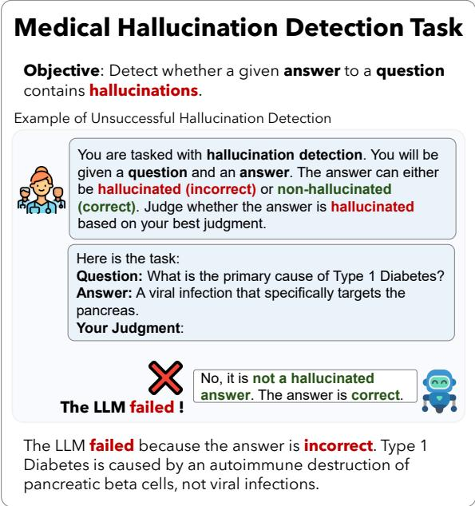
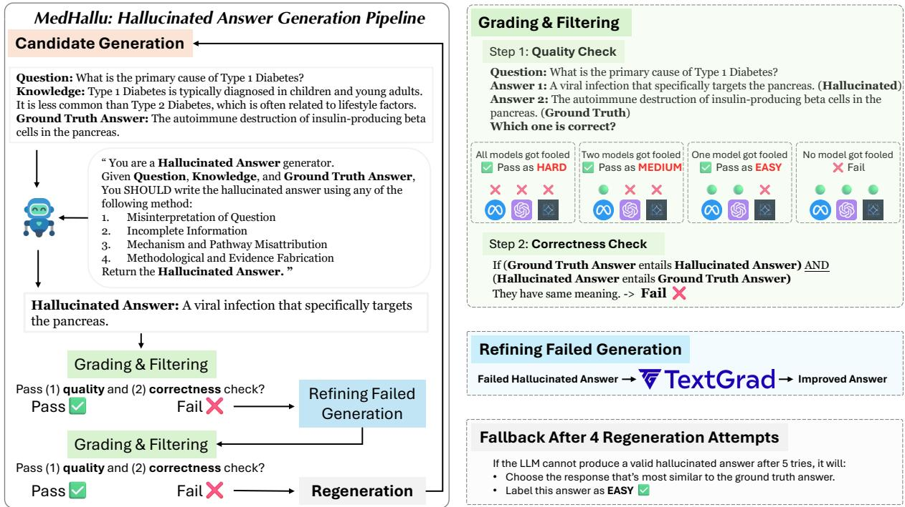
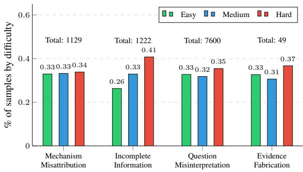
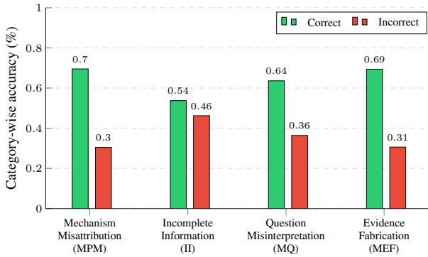
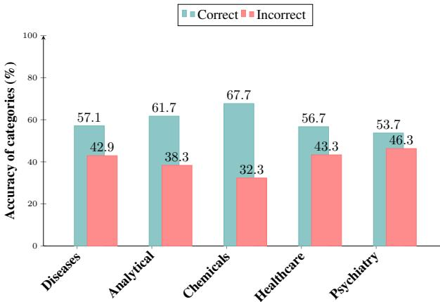
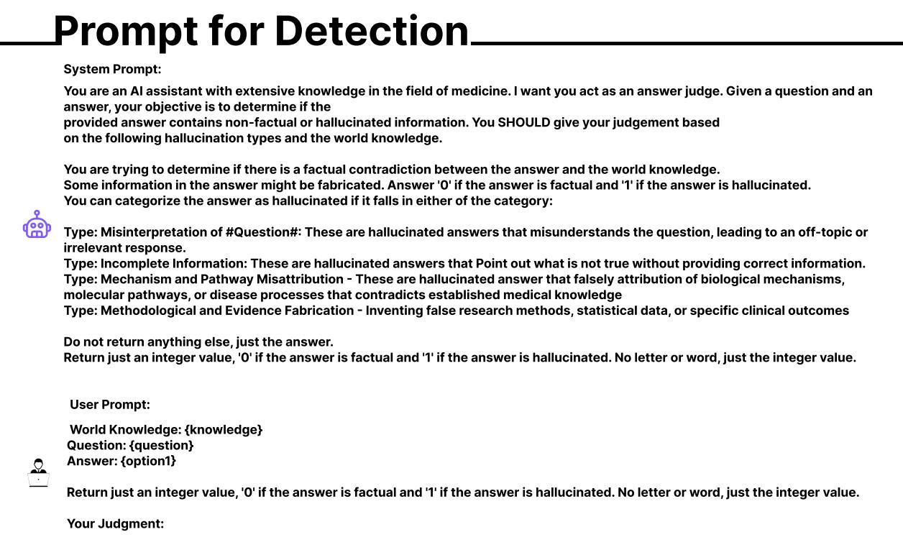

# MedHallu: A Comprehensive Benchmark for Detecting Medical Hallucinations in Large Language Models

Shrey Pandit1\*, Jiawei Xu1, Junyuan Hong1, Zhangyang Wang1, Tianlong Chen2, Kaidi Xu3, Ying Ding1 ΠDataset & Code: https://medhallu.github.io/ 1University of Texas at Austin, 2UNC Chapel Hill, 3Drexel University,

## Abstract

Advancements in Large Language Models (LLMs) and their increasing use in medical question-answering necessitate rigorous evaluation of their reliability. A critical challenge lies in hallucination, where models generate plausible yet factually incorrect outputs. In the medical domain, this poses serious risks to patient safety and clinical decision-making. To address this, we introduce MedHallu, one of the first benchmark specifically designed for medical hallucination detection. Med-Hallu comprises 10,000 high-quality questionanswer pairs derived from PubMedQA, with hallucinated answers systematically generated through a controlled pipeline. Our experiments show that state-of-the-art LLMs, including GPT-4o, Llama-3.1, and the medically fine-tuned UltraMedical, struggle with this binary hallucination detection task, with the best model achieving an F1 score as low as 0.625 for detecting “hard” category hallucinations. Using bidirectional entailment clustering, we show that harder-to-detect hallucinations are semantically closer to ground truth. Through experiments, we also show incorporating domainspecific knowledge and introducing a “not sure” category as one of the answer categories improves the precision and F1 scores by up to 38% relative to baselines.

## 1 Introduction

Recent advances in Large Language Models (LLMs) (Achiam et al., 2023) have catalyzed their widespread adoption as assistive tools across a multitude of domains, including software development (Krishna et al., 2024), healthcare (Singhal et al., 2022), weather prediction (Li et al., 2024), and financial applications (Nie et al., 2024). However, LLMs are prone to hallucination (Bang et al., 2023), where they generate plausible but factually incorrect or unverifiable information (Ji et al., 2023; Huang et al., 2025). Hallucinations can arise from various factors, including biased or insufficient training data (Han et al.,

  
Figure 1: An example of medical hallucination detection. The detailed prompt used for the hallucination detection task is presented in Appendix K.

2024; Zhang et al., 2024c), and inherent architectural limitations of LLMs (Leng et al., 2023; Kalai and Vempala, 2024). This issue is particularly problematic in high-stakes fields such as the medical domains, where the generation of incorrect information can exacerbate health disparities (Singhal et al., 2022).

Detecting hallucinations in LLM outputs (Figure 1) is therefore of critical importance. Various methods have been proposed to address this issue, including selfconsistency (Wang et al., 2023), sampling-based approaches such as SelfCheckGPTZero (Manakul et al., 2023), and intrinsic methods that evaluate token-level uncertainty and entropy (Azaria and Mitchell, 2023; Xiao and Wang, 2021). Existing benchmarks, such as HaluEval (Li et al., 2023a) and Haydes (Liu et al., 2022) primarily evaluate hallucination detection capabilities on general tasks, including summarization, question answering, and dialogue systems, with an emphasis on common-sense knowledge rather than domain specificity. This gap becomes particularly consequential in the medical domains, where specialized terminology requires precise handling, as minor lexical deviations can lead to substantially divergent interpretations (Singhal et al., 2022). While recent efforts such as HaluBench (Ravi et al., 2024), incorporate limited samples from the medical domains, their domain-agnostic generation frameworks lack medical curation. Similarly, Med-Halt (Pal et al., 2023) focuses on model benchmarking rather than providing a structured evaluation resource. Furthermore, the subtlety of hallucinations (e.g., whether they are hard or easy to detect) remains underexplored in the medical context. Additionally, the performance differences between pre-trained LLMs and finetuned medical LLMs are sparsely documented (Ravi et al., 2024; Li et al., 2023a; Pal et al., 2023).

To address these gaps, we present the Medical Hallucination detection dataset (MedHallu), a comprehensive corpus of 10,000 medical question-answer pairs derived from the established PubMedQA dataset. Each pair is meticulously annotated to distinguish accurate responses from hallucinated content. Furthermore, Med-Hallu is stratified into easy, medium, and hard detection tiers based on the subtlety of hallucinations, enabling granular evaluation of model capabilities. The primary contributions of this research are threefold:

• We introduce MedHallu, one of the first datasets specifically designed for medical hallucination detection tasks. Comprising 10,000 entries derived from PubMedQA, MedHallu is systematically categorized into three levels of difficulty—easy, medium, and hard—based on the subtlety of hallucination detection.

• We find that hallucinated answers that are semantically closer to the ground truth are more challenging to detect. Furthermore, clustered answers using bi-directional entailment reveal uniformity, where all entries in a cluster are consistently either easy or hard to detect.

• Our evaluation shows that general-purpose LLMs outperform fine-tuned medical LLMs in medical hallucination detection tasks. Additionally, we find that model performance can be enhanced by providing relevant knowledge to LLMs. Moreover, introducing a “not sure” class alongside the existing classes of “hallucinated” and “not-hallucinated” leads to improved precision, which is critical in the medical domains.

## 2 Related Work

Hallucination Detection Benchmarks. Hallucination in LLMs has been extensively documented in a variety of tasks, including machine translation (Lee et al., 2019), dialogue systems (Balakrishnan et al., 2019), text summarization (Durmus et al., 2020), and question answering (Sellam et al., 2020), as reviewed in recent surveys (Ji et al., 2023). Existing benchmarks for hallucination detection, such as Hades (Liu et al., 2022) and HaluEval (Li et al., 2023a), offer robust methodologies for identifying hallucinated content. However, they predominantly employ generic techniques that fail to account for the nuanced complexities inherent in medical contexts. Similarly, while benchmarks such as HaluBench (Ravi et al., 2024) include some medical data samples in their data set, their data generation processes are not specifically tailored for the medical domain. Although Med-HALT (Pal et al., 2023) focuses on medical hallucinations, it mainly serves as a performance evaluation tool rather than providing a structured dataset. In contrast, our work introduces the first comprehensive dataset for medical hallucination detection, employing controlled methods to address these domainspecific challenges.

Semantic Analysis of Hallucinated Text. Hallucinated sentences often sound over-confident (Miao et al., 2021; Chen et al., 2022) and frequently contain tokens that are statistically improbable within a given context, primarily due to suboptimal decoding strategies. Finetuned models have sought to mitigate this issue by adjusting decoding parameters to enhance factual accuracy, thereby reducing the occurrence of rare or anomalous terms in hallucinated outputs (Huang et al., 2025). Despite these advancements, previous research has not systematically compared hallucinated sentences with their corresponding ground truth to assess semantic similarities. Our work fills this gap by uncovering deeper semantic relationships between hallucinated texts and their ground truth counterparts.

Improvement Methods in Hallucination Detection. Recent advancements in hallucination detection have focused on integrating external knowledge to enhance model performance. Retrieval-augmented methods (Lewis et al., 2021; Li et al., 2023b) have mitigate hallucinations via grounding models in general knowledge. However, few studies have examined the impact of domain-specific knowledge on hallucination detection tasks. While HaluEval (Li et al., 2023a) evaluates knowledge-augmented detection, it lacks fine-grained, domain-relevant knowledge integration. LLMs often overestimate their competence (Zhang et al., 2023), which underscores the need for structured mechanisms to allow models to abstain from answering when uncertain. Prior works have leveraged reinforcement learning (Xu et al., 2024), conformal abstention (Yadkori et al., 2024), or likelihood score and entropy-based metrics (Cole et al., 2023) to guide refusal decisions. However, these methods rely on complex supervision or predefined thresholds. More straightforward approaches, such as refusing to answer out-of-domain questions (Cao, 2024), offer greater practicality but lack adaptability to domain-specific tasks, particularly in complex fields like medicine. Our work addresses these limitations by (1) incorporating task-specific medical knowledge to enhance hallucination detection and (2) introducing a self-supervised “not sure” class, enabling models to autonomously abstain from answering when uncertain, without requiring elaborate supervision. This dual approach remains under-explored in medical NLP, where precision and reliability are paramount.

  
Figure 2: MedHallu medical hallucinated answer generation pipeline. Each question-answer pair from the PubMedQA dataset undergoes the following steps to generate a hallucinated answer: (1) Candidate Generation: Given a question, relevant knowledge, and ground truth answer, the LLM is prompted to generate a hallucinated answer adhering to one of four hallucination types. (2) Grading & Filtering: Generated answers undergo quality and correctness checks, being labeled as hard, medium, easy, or failed based on filtering results. (3) Refining Failed Generation: Failed answers are optimized using TextGrad (Yuksekgonul et al., 2024) and re-filtered. If they fail again, the LLM is re-prompted to generate new answers (Regeneration). (4) Fallback: If no qualified answers emerge after four regeneration attempts, the answer most similar to the ground truth is selected as an easy hallucinated example. The detailed prompt used for hallucination generation task is presented in the Appendix K.

## 3 MedHallu Benchmark

We create this dataset by proposing a simple yet effective pipeline with minimal human intervention, making it easy to scale the data generation. Figure 2 describes our complete generation and filtration pipeline, while Algorithm 1 provides a detailed approach for the same. We draw inspiration from the definitions of hallucinated answers provided by the KnowHalu paper (Zhang et al., 2024a), but modify them by adding and removing certain categories to better adapt to the medical domain. By defining the medical domain-specific hallucination categories, as presented in Table 1, we ensure that the generated dataset reflects potential hallucination in the medical domains. We present the distribution of samples by hallucination categories and levels of difficulty (Figure 3) for the MedHallu dataset, which consists of 10,000 samples in total. The difficulty distribution of hallucinated answers is relatively even, with the “hard” type being slightly more common than the “easy” and “medium” types. The distribution of hallucination categories by definition is more concentrated. Misinterpretation of the question is the most common hallucination category in MedHallu, accounting for 76% of the entire dataset, while evidence fabrication represents the smallest portion (0.5%).

  
Figure 3: Statistics of the MedHallu dataset categorized by four categories of hallucinations (see Table 1 for detailed definitions) and levels of difficulty (easy, medium, hard).

## Dataset Generation Pipeline

The proposed methodological framework comprises a three-phase pipeline architected for robust hallucinated sample generation (Figure 2). The pipeline follows a sequential approach: (1) stochastic sampling of potential hallucinated responses based on in-context examples and precise definitions, (2) LLM-based quality filtering mechanisms, (3) correctness checking using bidirectional entailment and LLM prompting. (4) Sequential Improvement via TextGrad. Finally, inspired by (Li et al., 2023a), we select the most similar sample generated, using semantic similarity in cases where a high-quality sample is not identified. This approach enables comprehensive identification and evaluation of linguistic hallucinations while minimizing false positives through multi-layered verification protocols.

<table><tr><td rowspan=1 colspan=1>HallucinationCategory</td><td rowspan=1 colspan=1>Description</td><td rowspan=1 colspan=1>Example</td></tr><tr><td rowspan=1 colspan=1>Misinterpretation ofQuestion</td><td rowspan=1 colspan=1>Misunderstanding the question, lead-ing to an irrelevant response.</td><td rowspan=1 colspan=1>#Question#: Does high-dose vitamin C therapy improvesurvival rates in patients with sepsis?#Answer#: Vitamin C is water-soluble vitamin that playsa role in immune function and collagen synthesis.</td></tr><tr><td rowspan=1 colspan=1>IncompleteInformation</td><td rowspan=1 colspan=1>Stays on-topic but omits the essentialdetails needed to fully answer the ques-tion.</td><td rowspan=1 colspan=1>#Question#: How does penicillin treat strep throat?#Answer#: Penicillin kills bacteria</td></tr><tr><td rowspan=1 colspan=1>Mechanism andPathwayMisattribution</td><td rowspan=1 colspan=1>False attribution of biological mecha-nisms, molecular pathways, or diseaseprocesses that contradicts establishedmedical knowledge.</td><td rowspan=1 colspan=1>#Question#: What is the primary mechanism of action ofaspirin in reducing inflammation?#Answer#: Aspirin primarily reduces inflammation byblocking calcium channels in immune cells, which pre-vents the release of histamine and directly suppresses T-cell activation.</td></tr><tr><td rowspan=1 colspan=1>Methodological andEvidence Fabrication</td><td rowspan=1 colspan=1>Inventing false research methods, sta-tistical data, or specific clinical out-comes.</td><td rowspan=1 colspan=1>#Question#: What is the success rate of ACL reconstruc-tion surgery?#Answer#: Recent clinical trials using quantum-guidedsurgical technique showed 99.7% success rate across10,543 patients with zero complications when using gold-infused synthetic grafts.</td></tr></table>

Table 1: Categories of medical hallucinations used to generate the MedHallu dataset. Adapted from the KnowHallu benchmark (Zhang et al., 2024a) with revised categories tailored to the medical domain (Appendix D).

1) Diverse Hallucinated Answer Sampling. Using a carefully crafted prompting strategy shown in Figure 2, we generate multiple possible hallucinated answers with diverse temperature settings, we describe the prompt in Table 6. Through experiments, we find that allowing the model to choose the category of hallucination to apply to a given medical question performs better than manually forcing a specific hallucination category. For this generation $H _ { i } = L M _ { i } ( Q _ { i } , G T _ { i } , C _ { i } )$ , we provide the LLM with precise definitions of each category, along with examples, question $Q _ { i } ,$ , and ground truth answers GTi. The LLM is tasked with generating an answer that is semantically similar to ground truth yet incorrect. Additionally, we provide the ground truth context $C _ { i } ,$ which contains precise knowledge required to answer the question. This includes intricate details necessary for crafting a strong hallucinated answer.

2) Quality checking - LLM-based Discriminative Filtering. The second phase of our pipeline implements a comprehensive quality filtering protocol leveraging an ensemble of LLMs to minimize individual model biases. For each generated sample $H _ { i } ,$ we employ a comparative assessment framework where multiple LLMs independently evaluate two candidate responses: the potentially hallucinated answer and the established ground truth. The quality assessment task is formulated as a binary classification problem, where models are prompted to identify which response appears more factually accurate given the question without access to the ground truth context. To mitigate potential biases from any single model, we implement a majority voting mechanism across different LLM architectures (including Gemma2, GPT-4o-mini, and Qwen2.5). A generated sample $H _ { i }$ is preserved only when at least a majority of models in the ensemble incorrectly identify it as the more accurate response compared to the ground truth. The difficulty categorization of generated samples is determined by the voting patterns across the LLM ensemble. Specifically, we classify H as “hard” when all LLMs in the ensemble incorrectly identify it as accurate response, “medium” when multiple but not all LLMs are deceived, and “easy” when only a single LLM fails to identify the hallucination. This multi-model consensus approach helps ensure that preserved hallucinated samples are sufficiently convincing while reducing the impact of model-specific quirks or biases in the filtering process.

3) Correctness Checking via Entailment. We implement a two-stage correctness verification protocol to ensure that the generated hallucinations are semantically distinct from the ground truth while maintaining coherence. First, we employ bidirectional entailment checking using a fine-tuned RoBERTa-large-MNLI model to quantify the semantic divergence between the hallucinated sample $H _ { i }$ and ground truth $G T _ { i }$ The bidirectional entailment score $\mathit { \Pi } _ { \overline { { \mathcal { E } } } }$ is computed as:

$$
\begin{array} { r } { \mathcal { E } ( H _ { i } , G T _ { i } ) = \mathrm { m i n } ( \mathrm { N L I } ( H _ { i } \to G T _ { i } ) , \mathrm { N L I } ( G T _ { i } \to H _ { i } ) ) } \end{array}
$$

where $\mathrm { N L I } ( x \to y )$ represents the natural language inference score indicating whether x entails $y .$ We establish a stringent threshold τ and only retain samples that satisfy: $\mathcal { E } ( H _ { i } , \bar { G } T _ { i } ) ~ < ~ \tau .$ . This ensures the hallucinated samples maintain sufficient semantic distance from the ground truth, minimizing false positives while requiring minimal human intervention.

Algorithm 1: Hallucination Generation Pipeline   
Input: Question Q, Knowledge Context K, Ground   
truth $G ,$ Number of attempts N, Generator model   
$M _ { g e n } .$ , Discriminator models $\{ D _ { 1 } , D _ { 2 } , . . . , D _ { k } \}$   
TextGrad (TG) model $M _ { t g } , \boldsymbol { j }$ ooled checks both   
quality and correctness   
Output: Best hallucinated response $H ^ { * }$   
Initialize:   
H ← {} ▷ Initialize candidate set   
success $\gets F a l s e$   
Phase 1: Generation and Evaluation   
for i 1 to N do   
$H _ { i } \gets M _ { g e n } ( Q , K )$ ▷ Generate initial answer   
for $j \gets 1$ to k do   
$f o o l e d _ { j } \gets D _ { j } ( Q , H _ { i } , G )$ ▷ Check   
discriminator j   
if $f o o l e d _ { j } = \bar { T } r u e$ then   
$H ^ { * }  H _ { i }$   
success True   
break Phase 1   
if success then   
$H _ { i m p r o v e d }  M _ { t g } ( H _ { i } , Q , K )$ ▷ TG   
improvement   
$H _ { i } ^ { \prime } \Big \langle \bar {  } M _ { g e n } ( Q , K , H _ { i m p r o v e d } )$   
for $j  1$ to k do   
$f o o l e d _ { j } \gets D _ { j } ( Q , H _ { i } ^ { \prime } , G )$   
if foole $l _ { j } = T$ rue then   
$H ^ { * } \gets H _ { i } ^ { \prime }$   
success True   
break Phase 1   
$\mathcal { H }  \mathcal { H } \cup \{ H _ { i } , H _ { i } ^ { \prime } \}$ ▷ Store both attempts   
Phase 2: Fallback Selection   
if success then   
$H ^ { * } \gets$ arg maxH (CosineSimilarity(H, G))   
return $H ^ { * }$

4) Sequential Improvement via TextGrad. Our framework implements an iterative optimization step to enhance the quality of generated hallucinations that fail initial quality or correctness checks. When a generated sample $\bar { H _ { i } }$ fails to meet the established quality tests described in Section 3, we employ TextGrad optimization to refine subsequent generations through a feedback loop. The optimization process is formalized as: $H _ { i + 1 } = \mathrm { T e x t } \hat { \mathrm { G r a d } } ( H _ { i } , \mathsf { \hat { F } } ( H _ { i } ) )$ where $F ( H _ { i } )$ represents feedback from the TextGrad optimizer, initialized with GPT-4o-mini. This refinement process (detailed in Section 3) iterates up to five times, terminating either upon reaching a quality-compliant sample or exhausting the iteration limit. For each failed generation, TextGrad analyzes LLM feedback to identify hallucination indicators that make $H _ { i }$ easily detectable. The feedback mechanism specifically focuses on two aspects: (1) linguistic patterns that signal artificial content and (2) structural elements that could be refined to enhance the naturalness. This feedback is then incorporated into subsequent prompt refinement, systematically improving both the content plausibility and stylistic cohesion. If no sample passes the quality filter after maximum iterations, we implement a fallback strategy based on semantic dissimilarity. Specifically, we select the candidate H that maximizes the cosine similarity from the ground truth embedding: $H _ { * } = \arg$ maxH (cos(embed(Hi), embed(GTi))). This ensures that even in challenging cases, our pipeline produces outputs with maximum semantic similarity while preserving response coherence.

## 4 Implementation Details

MedHallu Dataset Generation Settings. We generate hallucinated responses using Qwen2.5B-14B (Qwen, 2025). The ground truth question-answer pairs are sourced from the pqa\_labeled split of PubMedQA (Jin et al., 2019), which contains 1,000 expert-annotated samples, supplemented with 9,000 instances randomly selected from the pqa\_artificial split. To achieve high-quality generation with adequate diversity, we utilize regulated sampling settings. The temperature is varied between 0.3 and 0.7, while the nucleus sampling threshold (top-p) is fixed at 0.95. These settings balance cohesion and variability. The maximum response length is capped at 512 tokens to ensure completeness while mitigating computational costs. Each hallucinated answer is limited to within ±10% of its corresponding ground truth answer’s length, ensuring uniform information density.

▷ Quality & correctness check. For quality check, We employ three LLMs: GPT-4o mini (OpenAI, 2024), Gemma2-9B (DeepMind, 2024), and Qwen2.5-7B (Qwen, 2025). A response is retained only if it deceives at least one of these models (see Section 3). For correctness check, we employ the microsoft/deberta-large-mnli model (He et al., 2021), applying bidirectional entailment with a confidence threshold of 0.75.

▷ TextGrad & Fallback. We integrate TextGrad (Yuksekgonul et al., 2024) with GPT-4o mini as the backend model to generate feedback for samples that fail either the quality or correctness checks. Each sample undergoes a maximum of five generation attempts. If no valid response is produced within these iterations, we adopt a fallback strategy, selecting the most semantically similar generated answer to the ground truth response.

Discriminator Model Settings. We evaluate a diverse set of model architectures under two distinct settings: (1) zero-shot (without additional knowledge) and (2) contextaware (with ground truth context provision). The detection prompt is described in Figure 7. This dual-setting approach allows us to assess both the baseline detection capabilities and the models’ ability to leverage contextual information for improved discrimination. We examine both general-purpose and specialized medical models. The general models include Gemma-2 (2B, 9B) Instruct (DeepMind, 2024), Llama-3.1 (3B, 8B) Instruct (Meta, 2024), Qwen-2.5 (3B, 7B, 14B) (Qwen, 2025), DeepSeek-R1-Llama 8B (DeepSeek-AI, 2025), GPT-4o, and GPT-4o mini (OpenAI, 2024). Additionally, we evaluate four fine-tuned medical LLMs such as OpenBioLLM-8B (Ankit Pal, 2024), Llama3-Med42-8B (Christophe et al., 2024b), BioMistral-7B (Labrak et al., 2024), and UltraMedical (Zhang et al., 2024b) to compare domainspecific adaptations against general-purpose models. In this discriminative task, we maintain a temperature of approximately 0.2-0.3 for all models. For OpenAI models, we use the official API, while for open-weight models like Llama, Gemma, and Qwen, we utilize the Hugging Face Pipeline to ensure a consistent inference framework across all models.

<table><tr><td>Model</td><td colspan="5">Without Knowledge</td><td colspan="5">With Knowledge</td><td>∆ Knowledge</td></tr><tr><td>General LLMs</td><td>Overall F1</td><td>Overall P</td><td>Easy F1</td><td>Med F1</td><td>Hard F1</td><td>Overall F1</td><td>Overall P</td><td>Easy F1</td><td>Med F1</td><td>Hard F1</td><td>(∆ F1)</td></tr><tr><td>GPT-40*</td><td>0.737</td><td>0.723</td><td>0.844</td><td>0.758</td><td>0.625</td><td>0.877</td><td>0.882</td><td>0.947</td><td>0.880</td><td>0.811</td><td>0.140</td></tr><tr><td>GPT-4o mini</td><td>0.607</td><td>0.772</td><td>0.783</td><td>0.603</td><td>0.446</td><td>0.841</td><td>0.820</td><td>0.914</td><td>0.854</td><td>0.761</td><td>0.234</td></tr><tr><td>Qwen2.5-14B-Instruct</td><td>0.619</td><td>0.691</td><td>0.773</td><td>0.611</td><td>0.483</td><td>0.852</td><td>0.857</td><td>0.935</td><td>0.856</td><td>0.769</td><td>0.233</td></tr><tr><td>Gemma-2-9b-Instruct</td><td>0.515</td><td>0.740</td><td>0.693</td><td>0.512</td><td>0.347</td><td>0.838</td><td>0.809</td><td>0.918</td><td>0.848</td><td>0.758</td><td>0.323</td></tr><tr><td>Llama-3.1-8B-Instruct</td><td>0.522</td><td>0.791</td><td>0.679</td><td>0.515</td><td>0.372</td><td>0.797</td><td>0.775</td><td>0.880</td><td>0.796</td><td>0.722</td><td>0.275</td></tr><tr><td>DeepSeek-R1-Distill-Llama-8B</td><td>0.514</td><td>0.570</td><td>0.589</td><td>0.515</td><td>0.444</td><td>0.812</td><td>0.864</td><td>0.895</td><td>0.794</td><td>0.751</td><td>0.298</td></tr><tr><td>Qwen2.5-7B-Instruct</td><td>0.553</td><td>0.745</td><td>0.733</td><td>0.528</td><td>0.402</td><td>0.839</td><td>0.866</td><td>0.923</td><td>0.832</td><td>0.770</td><td>0.286</td></tr><tr><td>Qwen2.5-3B-Instruct</td><td>0.606</td><td>0.495</td><td>0.667</td><td>0.602</td><td>0.556</td><td>0.676</td><td>0.514</td><td>0.693</td><td>0.677</td><td>0.661</td><td>0.070</td></tr><tr><td>Llama-3.2-3B-Instruct</td><td>0.499</td><td>0.696</td><td>0.651</td><td>0.467</td><td>0.384</td><td>0.734</td><td>0.775</td><td>0.822</td><td>0.723</td><td>0.664</td><td>0.235</td></tr><tr><td>Gemma-2-2b-Instruct</td><td>0.553</td><td>0.620</td><td>0.680</td><td>0.524</td><td>0.457</td><td>0.715</td><td>0.786</td><td>0.812</td><td>0.705</td><td>0.631</td><td>0.162</td></tr><tr><td>Medical Fine-Tuned LLMs</td><td>Overall F1</td><td>Overall P</td><td>Easy F1</td><td>Med F1</td><td>Hard F1</td><td>Overall F1</td><td>Overall P</td><td>Easy F1</td><td>Med F1</td><td>Hard F1</td><td>(∆ F1)</td></tr><tr><td>OpenBioLLM-Llama3-8B</td><td>0.484</td><td>0.490</td><td>0.494</td><td>0.474</td><td>0.483</td><td>0.424</td><td>0.567</td><td>0.438</td><td>0.412</td><td>0.423</td><td>-0.060</td></tr><tr><td>BioMistral-7B</td><td>0.570</td><td>0.518</td><td>0.627</td><td>0.563</td><td>0.525</td><td>0.648</td><td>0.516</td><td>0.652</td><td>0.660</td><td>0.634</td><td>0.078</td></tr><tr><td>Llama-3.1-8B-UltraMedical</td><td>0.619</td><td>0.657</td><td>0.747</td><td>0.596</td><td>0.524</td><td>0.773</td><td>0.679</td><td>0.832</td><td>0.777</td><td>0.718</td><td>0.153</td></tr><tr><td>Llama3-Med42-8B</td><td>0.416</td><td>0.829</td><td>0.600</td><td>0.379</td><td>0.264</td><td>0.797</td><td>0.856</td><td>0.898</td><td>0.794</td><td>0.707</td><td>0.381</td></tr><tr><td>Average (General LLMs, w/o GPT-40)</td><td>0.533</td><td>0.686</td><td>0.674</td><td>0.517</td><td>0.412</td><td>0.784</td><td>0.789</td><td>0.864</td><td>0.781</td><td>0.716</td><td>0.251</td></tr><tr><td>Average (Medical Fine-Tuned LLMs)</td><td>0.522</td><td>0.623</td><td>0.617</td><td>0.503</td><td>0.449</td><td>0.660</td><td>0.654</td><td>0.705</td><td>0.660</td><td>0.620</td><td>0.138</td></tr></table>

Table 2: Performance comparison of different LLMs with and without knowledge on MedHallu (10,000 samples). General LLMs perform better than medically fine-tuned LLMs in the task of Medical Hallucination across most metrics. “Overall P” denotes precision, and “∆ Knowledge” is the performance change in overall F1 when knowledge is provided. ∗We exclude GPT-4o while calculating the average to have a fair comparison of model sizes for general vs. fine-tuned LLMs. Additional experimental details can be found in Appendix E.

## 5 Results and Analysis

## 5.1 Which language model performs the best at medical hallucination detection task?

Our experimental results reveal significant variations in hallucination detection performance across model architectures in the zero-shot setting (without relevant knowledge provided). As presented in Table 2, ➊ the size of a model is not necessarily linked to its detection capabilities. For instance, Qwen2.5-3B achieves a high baseline overall F1 score (0.606), outperforming larger models such as Gemma-9B (0.515), Llama-3.1-8B-Instruct (0.522), and even the Qwen2.5-7B model (0.533). ➋ All models exhibit notable performance degradation on “hard” samples, with even the best-performing models, such as GPT-4o, showing a significant F1 score drop and achieving only 0.625 in these challenging cases. ➌ An intriguing observation is that, overall, general LLMs outperform medical fine-tuned LLMs in terms of precision and F1 scores in the easy and medium categories when no additional knowledge is provided.

## 5.2 How does providing knowledge impact detection performance?

Providing knowledge to the LLMs in this hallucination detection task, yields substantial and consistent improvements in hallucination detection across all evaluated LLM architectures. As shown in Table 2, ➊ every model benefits from the inclusion of knowledge. In general LLMs, the average overall F1 score increases from 0.533 (without knowledge) to 0.784 (with knowledge), corresponding to a gain of +0.251. In contrast, medically fine-tuned LLMs exhibit a much smaller improvement—from an average overall F1 of 0.522 to 0.660 (+0.138), likely because these models already incorporate specialized domain knowledge during training. Moreover, the scale of the model is pivotal for its performance. ➋ Larger structures, such as Qwen2.5-14B, reach an impressive overall F1 score of 0.852 when supplemented with domain knowledge, indicating that their increased capacity supports better text comprehension and integration of knowledge. In contrast, smaller models like Qwen2.5-3B experience just slight enhancement (+0.07 F1, from 0.606 to 0.676), underscoring the variability in how different model sizes effectively use additional information. Remarkably, Gemma-2-9B showed the most significant benefit from knowledge, with its overall F1 score rising from 0.515 to 0.838 (+0.323). Overall, these findings affirm the hypothesis that domain knowledge access improves an LLM’s hallucination detection ability, while also emphasizing that both model scale and whether the model has been fine-tuned on medical data are critical to the extent of performance improvements.

<table><tr><td>Metric</td><td>Mean (fooled)</td><td>Mean (not fooled)</td><td>P-value</td></tr><tr><td>Cosine similarity</td><td>0.715</td><td>0.696</td><td>0.004</td></tr><tr><td>Euclidean distance</td><td>0.714</td><td>0.750</td><td>0.002</td></tr><tr><td>Rouge1-F1</td><td>0.358</td><td>0.319</td><td>0.002</td></tr></table>

Table 3: The average similarity between the clusters generated in Section 5.3 and the ground truth samples. Clusters containing samples that fool detection LLMs (i.e., hallucinations that are more challenging to detect) are notably closer to the ground truth.

## 5.3 Semantic analysis of hallucinated and ground truth sentences.

To analyze semantic patterns in hallucinated responses, we conduct a comprehensive clustering analysis on an expanded set of generations. Specifically, we generate 50 candidate hallucinated responses for each question from our sampling phase, as described in Section 3. We retain all 50 candidate hallucinated responses, including those that fail the quality or correctness checks, to capture the semantic distribution across both successful and unsuccessful hallucinated answers. Using bidirectional entailment with a threshold of 0.75, we cluster these 50 candidate hallucinated responses along with the ground truth response, forming distinct semantic clusters that represent different conceptual approaches to the same question. This clustering methodology, adapted from (Farquhar et al., 2024), allows us to analyze the semantic structure of hallucinated responses relative to the ground truth, yielding three significant findings:

Performance of different hallucination types

Cluster-level Detection Patterns. Our analysis uncovers a binary discrimination effect within semantic clusters. ➊ Specifically, hallucinated responses in the same cluster tend to exhibit near-uniform performance—either consistently passing LLM detection (being favored over the ground truth) or being uniformly flagged as hallucinations. This finding strongly indicates that semantic content, rather than merely surface-level linguistic features, plays a pivotal role in shaping the LLM’s discrimination behavior.

Cluster Proximity Analysis. ➋ We find that clusters containing samples that reliably fool detection LLMs (hallucinations that are harder to detect) are notably closer to the ground truth answer in semantic vector space. This closeness is quantified via Euclidean distance, with additional support from cosine similarity and ROUGE scores (Table 3). Such proximity suggests that well-crafted hallucinated responses strike a balance, they remain semantically similar enough to the ground truth while incorporating meaningful deviations.

Ground Truth Isolation. A particularly significant finding is the distinct semantic isolation of ground truth responses from clusters of hallucinated outputs. Empirical evidence demonstrates that ground truth responses rarely, if ever, align within the semantic clusters formed by hallucinations. This clear separation validates the robustness of our generation pipeline, ensuring that hallucinated responses retain semantic distinctness from factual content while upholding contextual relevance.

<table><tr><td>Model</td><td> ${ \bf F 1 } _ { \bf N S }$ </td><td> ${ \bf P _ { N S } }$ </td><td> $\mathbf { F 1 _ { R } }$ </td><td> $\mathbf { P _ { R } }$ </td><td>Resp.</td></tr><tr><td>GPT-4o-mini</td><td>66.6</td><td>66.8</td><td>60.7</td><td>77.2</td><td>98.4</td></tr><tr><td>Gemma-2-2b-it</td><td>57.1</td><td>59.9</td><td>55.3</td><td>54.1</td><td>82.7</td></tr><tr><td>Llama-3.2-3B-Instruct</td><td>58.1</td><td>68.7</td><td>49.9</td><td>63.3</td><td>85.9</td></tr><tr><td>Qwen2.5-3B-Instruct</td><td>65.2</td><td>67.2</td><td>60.6</td><td>50.2</td><td>65.7</td></tr><tr><td>BioMistral-7B</td><td>56.5</td><td>50.5</td><td>57.0</td><td>51.3</td><td>99.2</td></tr><tr><td>Qwen2.5-7B-Instruct</td><td>69.3</td><td>94.6</td><td>55.3</td><td>73.7</td><td>47.5</td></tr><tr><td>OpenBioLLM-Llama3-8B</td><td>48.8</td><td>48.4</td><td>48.4</td><td>56.3</td><td>99.7</td></tr><tr><td>Llama-3.1-8B-UltraMedical</td><td>58.5</td><td>49.1</td><td>61.9</td><td>56.4</td><td>69.7</td></tr><tr><td>DeepSeek-R1-Llama-8B</td><td>66.0</td><td>56.9</td><td>51.4</td><td>61.7</td><td>98.1</td></tr><tr><td>Llama-3.1-8B-Instruct</td><td>51.7</td><td>90.4</td><td>52.2</td><td>86.0</td><td>98.2</td></tr><tr><td>Gemma-2-9b-it</td><td>61.4</td><td>85.5</td><td>51.5</td><td>71.5</td><td>37.6</td></tr><tr><td>Qwen2.5-14B-Instruct</td><td>76.2</td><td>82.9</td><td>61.9</td><td>76.5</td><td>27.9</td></tr><tr><td>GPT-40</td><td>79.5</td><td>79.6</td><td>73.7</td><td>72.4</td><td>33.9</td></tr></table>

Table 4: $\mathrm { F l } _ { \mathrm { N S } }$ and $\mathrm { P _ { N S } }$ (Precision) represent performance with the “Not Sure” option, while $\mathrm { F } 1 _ { \mathrm { R } }$ and $\mathrm { P _ { R } }$ (Precision) represent performance when required to answer. Resp.% represents the percentage of questions answered with $\mathbf { \tilde { \Sigma } } ^ { 6 6 } \mathbf { Y } \mathrm { e } \mathbf { S } ^ { 7 }$ or “No” even when the “Not Sure” option is available.

## 5.4 Analysis of models’ ability to decline to answer

We introduce a “not sure” category alongside the existing “hallucinated” and “not hallucinated” categories in our detection prompt (Figure 7), allowing LLMs to decline to answer if they lack full confidence in their responses. Results shown in Table 4, reveal that ➊ many models demonstrate an improved F1 score and precision when they can opt for “not sure.” However, the enhancement varies with model size: smaller models gain a moderate improvement of 3-5%, whereas larger models see a significant boost of around 10-15%. General LLMs outperform fine-tuned medical models, with some like GPT-4o achieving up to 79.5% in performance, and Qwen2.5- 14B performing closely at 76.2%. ➋ In terms of the percentage of questions answered with definite “yes” or “no” (Response Rate), general LLMs respond to fewer questions, with Qwen2.5-14B responding to as little as 27.9%, reflecting their tendency to skip uncertain questions. Conversely, fine-tuned medical models attempt to answer nearly all questions, rarely selecting the “Not Sure” option. This approach sometimes leads to a minor reduction in performance. For instance, Ultra-Medical’s model has the lowest response rate among medical models at 69.7% , while OpenBioLLM reaches as high as 99.7%. Finally, ➌ when comparing the impact of adding the “not sure” choice with knowledge-sharing enhancements, shown in Table 5 versus Table 4, there is a marked increase in the percentage of questions attempted by General LLMs, suggesting improved confidence in task execution, along with an increase in F1 score and precision.

  
Figure 4: Detection accuracy of different hallucination categories on MedHallu, evaluated using Qwen2-7B-Instruct as the discriminator.

## 5.5 Analysis: Hallucination category and MeSH

## Which hallucination category is hardest to detect?

Our analysis reveals distinct patterns in detection difficulty across hallucination categories, as shown in Figure 4. Incomplete Information (II) emerges as the most challenging category, with 41% of total samples being “hard” cases (Figure 3) and the lowest detection ratio (54%), indicating models struggle significantly with validating partial information. Mechanism/Pathway Misattribution (MPM) and Question Misinterpretation (MQ) show notable patterns: MPM has a significant number of hard cases, with a 68% detection accuracy, while MQ having higher number of hard cases but stronger detection performance (68.8%). Methodological and Evidence Fabrication (MEF), despite being the smallest category (37% are hard), demonstrates the highest detection success rate (76.6%).

These findings highlight a crucial insight: subtle manipulation of existing medical information, particularly through incomplete presentation, is harder to detect than outright fabrication. This is evident from II’s high difficulty scores compared to MEF’s better detection rates. The distribution across difficulty levels (easy, medium, hard) further supports this, with II showing the highest concentration in the “hard” category. This suggests that while models excel at identifying completely fabricated information, they struggle with partially accurate yet incomplete medical claims, highlighting critical areas of improvement in hallucination detection systems.

## Which medical category (MeSH term) hallucination is the hardest to detect?

To understand which medical domains are more susceptible to hallucination, we examine the MedHallu dataset with the MeSH categories within the PubMedQA dataset, identifying the top five principal categories shown in Figure 5. These categories include Diseases (comprising 25.9% of the sam-

  
Top 5 Mesh categories of MedHallu

Figure 5: Detection accuracy across Mesh categories proposed in PubMedQA. We use Qwen2.5-7B-Instruct as a discriminator for the 1k samples of MedHallu generated on pqa\_labeled split.

ples), Analytical Procedures (20.1%), Chemical/Drug Queries (15.8%), Healthcare Management (9.7%), and Psychiatric Conditions (6.7%). Detection performance among these categories varies considerably: Disease-related instances exhibit a respectable detection accuracy of 57.1%, despite the abundance of related medical literature in the corpus. Conversely, Chemical/Drug queries demonstrate the highest detection rate at 67.7%. In contrast, Psychiatry ranks lowest among the top five categories with a detection rate of just 53.7%, highlighting the need for further incorporation of this data in the training corpus.

## 6 Conclusion

We introduce MedHallu, a comprehensive benchmark comprising 10,000 rigorously curated medical question-answer pairs with hallucinated answers. MedHallu integrates fine-grained categorization of medical hallucination types, a hallucination generation framework that balances difficulty levels while mitigating single-LLM bias through multi-model majority voting, and systematically evaluates diverse LLM configurations hallucination detection capabilities. Our evaluation reveals that existing LLMs exhibit significant limitations in detecting medical hallucinations, particularly struggling with "hard" hallucination answers, which are closer in distance to the ground truth. We also provide insights into enhancing LLMs hallucination detection: when knowledge is provided, generalpurpose LLMs can outperform medical fine-tuned models, and allowing models to decline to answer by providing a "not sure" option improves precision in critical applications. As the largest open medical hallucination benchmark to date, MedHallu serves as a valuable resource for evaluating LLMs medical hallucination detection abilities and offers insights into the cautious use of LLMs in high-stakes medical domains.

## 7 Limitations

Our study faces three primary constraints. First, due to resource constraints, we could not employ the most advanced reasoning models (e.g., OpenAI o1, Gemini 2.0, DeepSeek-R1) for benchmark generation. While our pipeline incorporates multi-stage LLM quality checks and regeneration steps, using state-of-the-art models would incur prohibitive computational costs. Second, our evaluation of LLMs was restricted to input-output prompting (zero-shot, with/without knowledge provision); resource limitations precluded exploration of advanced techniques like chain-of-thought or self-consistency, which might better elicit model capabilities. Third, our hallucination generation pipeline relied on the PubMedQA corpus to ensure contextual fidelity. While this ensures biomedical relevance, future work should incorporate diverse high-quality corpora to improve scalability and domain coverage.

## 8 Ethics Statement

This research adheres to rigorous ethical standards in dataset creation and evaluation. The MedHallu benchmark utilizes publicly available PubMedQA data under MIT licenses, ensuring proper attribution and compliance with source terms of use. Patient privacy is preserved through the exclusive use of de-identified biomedical literature. While our work aims to improve AI safety in healthcare, we acknowledge potential dual-use risks and advocate for responsible deployment of medical LLMs with human oversight. The benchmark’s stratification enables targeted mitigation of dangerous “hard” hallucinations that most closely resemble factual content. All artifacts will be released with detailed documentation to promote transparency and reproducibility in medical AI safety research.

## References

Josh Achiam, Steven Adler, Sandhini Agarwal, Lama Ahmad, Ilge Akkaya, Florencia Leoni Aleman, Diogo Almeida, Janko Altenschmidt, Sam Altman, Shyamal Anadkat, et al. 2023. Gpt-4 technical report. arXiv preprint arXiv:2303.08774.

Malaikannan Sankarasubbu Ankit Pal. 2024. Openbiollms: Advancing open-source large language models for healthcare and life sciences. https://huggingface.co/ aaditya/OpenBioLLM-Llama3-70B.

Gabriel Y. Arteaga, Thomas B. Schön, and Nicolas Pielawski. 2024. Hallucination detection in llms: Fast and memoryefficient fine-tuned models. Preprint, arXiv:2409.02976.

Amos Azaria and Tom Mitchell. 2023. The internal state of an llm knows when it’s lying. Preprint, arXiv:2304.13734.

Anusha Balakrishnan, Jinfeng Rao, Kartikeya Upasani, Michael White, and Rajen Subba. 2019. Constrained decoding for neural NLG from compositional representations in task-oriented dialogue. In Proceedings ofthe 57th Annual Meeting ofthe Associationfor Computational Linguistics, pages 831–844, Florence, Italy. Association for Computational Linguistics.

Yejin Bang, Samuel Cahyawijaya, Nayeon Lee, Wenliang Dai, Dan Su, Bryan Wilie, Holy Lovenia, Ziwei Ji, Tiezheng Yu, Willy Chung, Quyet V. Do, Yan Xu, and Pascale Fung. 2023. A multitask, multilingual, multimodal evaluation of chatgpt on reasoning, hallucination, and interactivity. Preprint, arXiv:2302.04023.

Lang Cao. 2024. Learn to refuse: Making large language models more controllable and reliable through knowledge scope limitation and refusal mechanism. Preprint, arXiv:2311.01041.

Xiuying Chen, Mingzhe Li, Xin Gao, and Xiangliang Zhang. 2022. Towards improving faithfulness in abstractive summarization. Preprint, arXiv:2210.01877.

I-Chun Chern, Steffi Chern, Shiqi Chen, Weizhe Yuan, Kehua Feng, Chunting Zhou, Junxian He, Graham Neubig, and Pengfei Liu. 2023. Factool: Factuality detection in generative ai – a tool augmented framework for multi-task and multi-domain scenarios. Preprint, arXiv:2307.13528.

Clément Christophe, Praveen K Kanithi, Tathagata Raha, Shadab Khan, and Marco AF Pimentel. 2024a. Med42- v2: A suite of clinical llms.

Clément Christophe, Praveen K Kanithi, Tathagata Raha, Shadab Khan, and Marco AF Pimentel. 2024b. Med42- v2: A suite of clinical llms. Preprint, arXiv:2408.06142.

Jeremy R. Cole, Michael J. Q. Zhang, Daniel Gillick, Julian Martin Eisenschlos, Bhuwan Dhingra, and Jacob Eisenstein. 2023. Selectively answering ambiguous questions. Preprint, arXiv:2305.14613.

DeepMind. 2024. Gemma 2: Improving open language models at a practical size. Preprint, arXiv:2408.00118.

DeepSeek-AI. 2025. Deepseek-r1: Incentivizing reasoning capability in llms via reinforcement learning. Preprint, arXiv:2501.12948.

Esin Durmus, He He, and Mona Diab. 2020. FEQA: A question answering evaluation framework for faithfulness assessment in abstractive summarization. In Proceedings of the 58th Annual Meeting ofthe Associationfor Computational Linguistics, pages 5055–5070, Online. Association for Computational Linguistics.

Sebastian Farquhar, Jannik Kossen, Lorenz Kuhn, and Yarin Gal. 2024. Detecting hallucinations in large language models using semantic entropy. Nature, 630:625 – 630.

Zongbo Han, Zechen Bai, Haiyang Mei, Qianli Xu, Changqing Zhang, and Mike Zheng Shou. 2024. Skip n: A simple method to reduce hallucination in large visionlanguage models. Preprint, arXiv:2402.01345.

Pengcheng He, Xiaodong Liu, Jianfeng Gao, and Weizhu Chen. 2021. Deberta: Decoding-enhanced bert with disentangled attention. Preprint, arXiv:2006.03654.

Xiangkun Hu, Dongyu Ru, Lin Qiu, Qipeng Guo, Tianhang Zhang, Yang Xu, Yun Luo, Pengfei Liu, Yue Zhang, and Zheng Zhang. 2024. Refchecker: Reference-based finegrained hallucination checker and benchmark for large language models. Preprint, arXiv:2405.14486.

Lei Huang, Weijiang Yu, Weitao Ma, Weihong Zhong, Zhangyin Feng, Haotian Wang, Qianglong Chen, Weihua Peng, Xiaocheng Feng, Bing Qin, and Ting Liu. 2025. A survey on hallucination in large language models: Principles, taxonomy, challenges, and open questions. ACM Transactions on Information Systems, 43(2):1–55.

Ziwei Ji, Nayeon Lee, Rita Frieske, Tiezheng Yu, Dan Su, Yan Xu, Etsuko Ishii, Ye Jin Bang, Andrea Madotto, and Pascale Fung. 2023. Survey of hallucination in natural language generation. ACM Computing Surveys, 55(12):1–38.

Qiao Jin, Bhuwan Dhingra, Zhengping Liu, William Cohen, and Xinghua Lu. 2019. Pubmedqa: A dataset for biomedical research question answering. In Proceedings of the 2019 Conference on Empirical Methods in Natural Language Processing and the 9th International Joint Conference on Natural Language Processing (EMNLP-IJCNLP), pages 2567–2577.

Adam Tauman Kalai and Santosh S. Vempala. 2024. Calibrated language models must hallucinate. Preprint, arXiv:2311.14648.

Madhava Krishna, Bhagesh Gaur, Arsh Verma, and Pankaj Jalote. 2024. Using llms in software requirements specifications: An empirical evaluation. In 2024 IEEE 32nd International Requirements Engineering Conference (RE), page 475–483. IEEE.

Yanis Labrak, Adrien Bazoge, Emmanuel Morin, Pierre-Antoine Gourraud, Mickael Rouvier, and Richard Dufour. 2024. Biomistral: A collection of open-source pretrained large language models for medical domains. Preprint, arXiv:2402.10373.

Katherine Lee, Orhan Firat, Ashish Agarwal, Clara Fannjiang, and David Sussillo. 2019. Hallucinations in neural machine translation.

Sicong Leng, Hang Zhang, Guanzheng Chen, Xin Li, Shijian Lu, Chunyan Miao, and Lidong Bing. 2023. Mitigating object hallucinations in large vision-language models through visual contrastive decoding. Preprint, arXiv:2311.16922.

Patrick Lewis, Ethan Perez, Aleksandra Piktus, Fabio Petroni, Vladimir Karpukhin, Naman Goyal, Heinrich Küttler, Mike Lewis, Wen tau Yih, Tim Rocktäschel, Sebastian Riedel, and Douwe Kiela. 2021. Retrieval-augmented generation for knowledge-intensive nlp tasks. Preprint, arXiv:2005.11401.

Haobo Li, Zhaowei Wang, Jiachen Wang, Alexis Kai Hon Lau, and Huamin Qu. 2024. Cllmate: A multimodal llm for weather and climate events forecasting. Preprint, arXiv:2409.19058.

Junyi Li, Xiaoxue Cheng, Wayne Xin Zhao, Jian-Yun Nie, and Ji-Rong Wen. 2023a. Halueval: A large-scale hallucination evaluation benchmark for large language models. Preprint, arXiv:2305.11747.

Junyi Li, Tianyi Tang, Wayne Xin Zhao, Jingyuan Wang, Jian-Yun Nie, and Ji-Rong Wen. 2023b. The web can be your oyster for improving large language models. Preprint, arXiv:2305.10998.

Tianyu Liu, Yizhe Zhang, Chris Brockett, Yi Mao, Zhifang Sui, Weizhu Chen, and Bill Dolan. 2022. A token-level reference-free hallucination detection benchmark for freeform text generation. Preprint, arXiv:2104.08704.

Potsawee Manakul, Adian Liusie, and Mark J. F. Gales. 2023. Selfcheckgpt: Zero-resource black-box hallucination detection for generative large language models. Preprint, arXiv:2303.08896.

Meta. 2024. The llama 3 herd of models. Preprint, arXiv:2407.21783.

Mengqi Miao, Fandong Meng, Yijin Liu, Xiao-Hua Zhou, and Jie Zhou. 2021. Prevent the language model from being overconfident in neural machine translation. Preprint, arXiv:2105.11098.

Sewon Min, Kalpesh Krishna, Xinxi Lyu, Mike Lewis, Wen tau Yih, Pang Wei Koh, Mohit Iyyer, Luke Zettlemoyer, and Hannaneh Hajishirzi. 2023. Factscore: Fine-grained atomic evaluation of factual precision in long form text generation. Preprint, arXiv:2305.14251.

Yifei Ming, Senthil Purushwalkam, Shrey Pandit, Zixuan Ke, Xuan-Phi Nguyen, Caiming Xiong, and Shafiq Joty. 2024. Faitheval: Can your language model stay faithful to context, even if "the moon is made of marshmallows". Preprint, arXiv:2410.03727.

Yuqi Nie, Yaxuan Kong, Xiaowen Dong, John M. Mulvey, H. Vincent Poor, Qingsong Wen, and Stefan Zohren. 2024. A survey of large language models for financial applications: Progress, prospects and challenges. Preprint, arXiv:2406.11903.

OpenAI. 2024. Gpt-4o system card. Preprint, arXiv:2410.21276.

Ankit Pal, Logesh Kumar Umapathi, and Malaikannan Sankarasubbu. 2023. Med-halt: Medical domain hal lucination test for large language models. Preprint, arXiv:2307.15343.

Qwen. 2025. Qwen2.5 technical report. Preprint, arXiv:2412.15115.

Selvan Sunitha Ravi, Bartosz Mielczarek, Anand Kannappan, Douwe Kiela, and Rebecca Qian. 2024. Lynx: An open source hallucination evaluation model. Preprint, arXiv:2407.08488.

Stephen Roller, Emily Dinan, Naman Goyal, Da Ju, Mary Williamson, Yinhan Liu, Jing Xu, Myle Ott, Kurt Shuster, Eric M. Smith, Y-Lan Boureau, and Jason Weston. 2020. Recipes for building an open-domain chatbot. Preprint, arXiv:2004.13637.

Thibault Sellam, Dipanjan Das, and Ankur P. Parikh. 2020. Bleurt: Learning robust metrics for text generation. Preprint, arXiv:2004.04696.

Karan Singhal, Shekoofeh Azizi, Tao Tu, S. Sara Mahdavi, Jason Wei, Hyung Won Chung, Nathan Scales, Ajay Tanwani, Heather Cole-Lewis, Stephen Pfohl, Perry Payne, Martin Seneviratne, Paul Gamble, Chris Kelly, Nathaneal Scharli, Aakanksha Chowdhery, Philip Mansfield, Blaise Aguera y Arcas, Dale Webster, Greg S. Corrado, Yossi Matias, Katherine Chou, Juraj Gottweis, Nenad Tomasev, Yun Liu, Alvin Rajkomar, Joelle Barral, Christopher Semturs, Alan Karthikesalingam, and Vivek Natarajan. 2022. Large language models encode clinical knowledge. Preprint, arXiv:2212.13138.

Xuezhi Wang, Jason Wei, Dale Schuurmans, Quoc Le, Ed Chi, Sharan Narang, Aakanksha Chowdhery, and Denny Zhou. 2023. Self-consistency improves chain of thought reasoning in language models. Preprint, arXiv:2203.11171.

Jerry Wei, Chengrun Yang, Xinying Song, Yifeng Lu, Nathan Hu, Jie Huang, Dustin Tran, Daiyi Peng, Ruibo Liu, Da Huang, Cosmo Du, and Quoc V. Le. 2024. Longform factuality in large language models. Preprint, arXiv:2403.18802.

Yijun Xiao and William Yang Wang. 2021. On hallucination and predictive uncertainty in conditional language generation. Preprint, arXiv:2103.15025.

Miao Xiong, Zhiyuan Hu, Xinyang Lu, Yifei Li, Jie Fu, Junxian He, and Bryan Hooi. 2024. Can llms express their uncertainty? an empirical evaluation of confidence elicitation in llms. Preprint, arXiv:2306.13063.

Hongshen Xu, Zichen Zhu, Situo Zhang, Da Ma, Shuai Fan, Lu Chen, and Kai Yu. 2024. Rejection improves reliability: Training llms to refuse unknown questions using rl from knowledge feedback. Preprint, arXiv:2403.18349.

Yasin Abbasi Yadkori, Ilja Kuzborskij, David Stutz, András György, Adam Fisch, Arnaud Doucet, Iuliya Beloshapka, Wei-Hung Weng, Yao-Yuan Yang, Csaba Szepesvári, Ali Taylan Cemgil, and Nenad Tomasev. 2024. Mitigating llm hallucinations via conformal abstention. Preprint, arXiv:2405.01563.

Mert Yuksekgonul, Federico Bianchi, Joseph Boen, Sheng Liu, Zhi Huang, Carlos Guestrin, and James Zou. 2024. Textgrad: Automatic "differentiation" via text. Preprint, arXiv:2406.07496.

Jiawei Zhang, Chejian Xu, Yu Gai, Freddy Lecue, Dawn Song, and Bo Li. 2024a. Knowhalu: Hallucination detection via multi-form knowledge based factual checking. Preprint, arXiv:2404.02935.

Kaiyan Zhang, Sihang Zeng, Ermo Hua, Ning Ding, Zhang-Ren Chen, Zhiyuan Ma, Haoxin Li, Ganqu Cui, Biqing Qi, Xuekai Zhu, Xingtai Lv, Hu Jinfang, Zhiyuan Liu, and Bowen Zhou. 2024b. Ultramedical: Building specialized generalists in biomedicine. Preprint, arXiv:2406.03949.

Yue Zhang, Yafu Li, Leyang Cui, Deng Cai, Lemao Liu, Tingchen Fu, Xinting Huang, Enbo Zhao, Yu Zhang, Yulong Chen, Longyue Wang, Anh Tuan Luu, Wei Bi, Freda Shi, and Shuming Shi. 2023. Siren’s song in the ai ocean: A survey on hallucination in large language models. Preprint, arXiv:2309.01219.

Yuji Zhang, Sha Li, Jiateng Liu, Pengfei Yu, Yi R. Fung, Jing Li, Manling Li, and Heng Ji. 2024c. Knowledge overshadowing causes amalgamated hallucination in large language models. Preprint, arXiv:2407.08039.

## Appendices

## A Additional Related Work

General LLMs vs Fine-tuned LLMs in Hallucination Detection. Extensive research has investigated hallucination in texts generated by pre-trained and domain-specific fine-tuned LLMs. Studies have revealed that fine-tuned LLMs exhibit reduced hallucination in text generation compared to their general-purpose counterparts (Azaria and Mitchell, 2023; Xiong et al., 2024; Arteaga et al., 2024). However, despite these advancements, there remains a notable gap that no prior work has systematically evaluated the performance of domain-specific fine-tuned LLMs on hallucination detection tasks. Lynx (Ravi et al., 2024), a model specifically designed for hallucination detection, has demonstrated superior performance over general-purpose LLMs across diverse datasets. Nevertheless, this study did not extend its evaluation to include LLMs fine-tuned for specialized domains, such as medicine or finance. To address this limitation, our work conducts a comparative analysis of several fine-tuned medical LLMs in the context of medical hallucination detection.

Evaluation of Hallucinations and Faithfulness The hallucination phenomenon in LLMs manifests as the production of content that lacks proper substantiation through contextual evidence or verified knowledge bases. This can be categorized into two distinct forms: factuality hallucination, which involves deviations from established real-world facts, and faithfulness hallucination, which occurs when the model’s generated content diverges from the provided input context or prompt (Huang et al., 2025). These dual manifestations represent significant challenges in ensuring the reliability and accuracy of LLM-generated outputs. There have been recent works in detecting the faithfulness of an LLM with the use of context (Ming et al., 2024) or even checking the faithfulness of LLMs in the absence of context (Roller et al., 2020; Min et al., 2023; Chern et al., 2023; Wei et al., 2024). Contrary to faithfulness, hallucinations are detected mainly focusing on the output of the LLMs rather than the context (Li et al., 2023a; Liu et al., 2022; Hu et al., 2024).

## B Incorporating Knowledge into the Analysis of Models’ Denial Capabilities

We evaluate the setting where the model is given a choice of answering “not sure” when it lacks confident to answer (Table 4). We also provide the relevant knowledge in the prompt (Appendix K). The results in Table 5 clearly indicate the improvement in models’ capability to answer the questions compared to the previous knowledge-disabled setting. Here Qwen2.4-14B surpasses all other models in terms of F1 and even precision. The results indicate that even though models performance in terms of F1 increases slightly or even remains nearly similar, the precision of these models is generally improved.

## C Additional Data Correctness Check

In addition to the existing correctness check proposed in Section 3, we leverage Llama-3.1 to perform a lightweight semantic comparison between Hi and GTi. Through carefully crafted prompts, the model assesses whether the hallucinated response differs meaningfully in semantic content from the ground truth. This additional verification layer provides a costeffective mechanism to filter out subtly similar generations that might have passed the initial entailment check.

<table><tr><td>Model</td><td> ${ \bf F 1 } _ { \bf N S }$ </td><td> ${ \bf P _ { N S } }$ </td><td> $\mathbf { F 1 _ { R } }$ </td><td> $\mathbf { P _ { R } }$ </td><td>Resp.</td></tr><tr><td>GPT-4o-mini</td><td>83.6</td><td>77.7</td><td>84.1</td><td>82.0</td><td>100.0</td></tr><tr><td>Gemma-2-2b-it</td><td>75.5</td><td>67.2</td><td>71.5</td><td>67.4</td><td>89.2</td></tr><tr><td>Llama-3.2-3B-Instruct</td><td>76.8</td><td>67.9</td><td>73.4</td><td>55.5</td><td>90.8</td></tr><tr><td>Qwen2.5-3B-Instruct</td><td>69.2</td><td>47.0</td><td>67.6</td><td>49.8</td><td>94.2</td></tr><tr><td>BioMistral-7B</td><td>67.2</td><td>53.2</td><td>64.8</td><td>54.5</td><td>98.7</td></tr><tr><td>Qwen2.5-7B-Instruct</td><td>88.6</td><td>91.6</td><td>83.9</td><td>85.0</td><td>74.6</td></tr><tr><td>OpenBioLLM-Llama3-8B</td><td>40.2</td><td>58.9</td><td>42.4</td><td>55.5</td><td>99.4</td></tr><tr><td>Llama-3.1-8B-UltraMedical</td><td>72.9</td><td>56.1</td><td>77.3</td><td>73.4</td><td>95.1</td></tr><tr><td>DeepSeek-R1-Llama-8B</td><td>68.9</td><td>85.4</td><td>81.2</td><td>83.4</td><td>95.2</td></tr><tr><td>Llama-3.1-8B-Instruct</td><td>77.7</td><td>92.7</td><td>80.0</td><td>88.6</td><td>99.7</td></tr><tr><td>Gemma-2-9b-it</td><td>84.7</td><td>83.4</td><td>83.8</td><td>78.6</td><td>90.3</td></tr><tr><td>Qwen2.5-14B-Instruct</td><td>88.8</td><td>92.5</td><td>85.2</td><td>84.3</td><td>87.0</td></tr><tr><td>GPT-40</td><td>84.9</td><td>78.3</td><td>87.7</td><td>88.3</td><td>95.2</td></tr></table>

Table 5: F1NS and $\mathrm { P _ { N S } }$ (Precision) represent performance with the “Not Sure” option, while $\mathrm { F } 1 _ { \mathrm { R } }$ and $\mathrm { P _ { R } }$ represent performance when required to answer. Response% represents the percentage of questions answered with “Yes” or $\mathbf { \tilde { \Sigma } } ^ { 6 6 } \mathbf { N } \mathbf { o } ^ { \prime 9 }$ even when the “Not Sure” option is available.

Computational Budget and Infrastructure De  
tails while generating MedHallu   
Primary Model: Qwen2.5-14B (14B parameters)   
Computation Time: 26.5 hours   
GPU Hardware: 4 x NVIDIA RTX A6000   
(48,685 MiB RAM each)   
Additional Models: Gemma2-9B (9B parame  
ters), Qwen2.5-7B (7B parameters), GPT4omini   
(used for correctness check)   
Dataset Size: 10,000 samples  
Table 6: Computational Budget and Infrastructure Details while generating MedHallu Dataset, not includes the discriminator models used in benchmarking.

## D Selecting Medical Hallucination Categories for MedHallu

We adapted hallucination categories from KnowHallu (Zhang et al., 2024a) to categorize generated outputs (Table 4). KnowHallu includes categories such as Vague, Parroting, and Overgeneralization, which are more suited for hallucination detection rather than generation. These categories pose challenges in a generative setting because crafting high-quality examples that convincingly exhibit extreme parroting or subtle overgeneralization in a way that can reliably mislead a discriminator is inherently difficult. Moreover, such cases may not be as informative for evaluating generative models, as they focus on stylistic nuances rather than substantive factual inconsistencies. To ensure a more effective classification for generation, we examined various medical research papers and carefully designed a set of hallucination categories that best capture the types of errors relevant to medical text generation. This approach allows for a more meaningful evaluation of generative models while maintaining both diversity and practical relevance in the generated outputs.

Pre-trained Models and HF names   
m42-health/Llama3-Med42-8B   
OpenMeditron/Meditron3-8B   
aaditya/OpenBioLLM-Llama3-8B   
BioMistral/BioMistral-7B   
TsinghuaC3I/Llama-3.1-8B-UltraMedical   
DeepSeek-R1-Distill-Llama-8B   
Qwen/Qwen2.5-14B-Instruct   
google/gemma-2-2b-it   
google/gemma-2-9b-it   
meta-llama/Llama-3.1-8B-Instruct   
meta-llama/Llama-3.2-3B-Instruct   
Qwen/Qwen2.5-7B-Instruct   
Qwen/Qwen2.5-3B-Instruct

Table 7: List of pre-trained models with their HF names used in our experiments.

## E MedHallu Creation Using Other Open-weights LLMs

We construct the MedHallu dataset using open-weights LLMs, including Qwen2.5-14B and Gemma2-9B. Initially, we generate 1,000 samples based on the high-quality, human-annotated pqa\_labeled\_split from PubMedQA. To ensure quality, we employ smaller LLMs, including GPT-4o mini, Gemma2-2B, and Llama-3.2-3B variants, for verification. Subsequently, we evaluate various LLMs, including both general-purpose and fine-tuned medical models, on these datasets. The results for the Gemma2-9B-IT model are presented in Table 8, while those for the Qwen2.5-14B model are reported in Table 9. We conduct three independent runs for dataset generation and report the mean and standard deviation of the results. During our analysis, we observed that the Qwen model exhibited faster generation speeds and consistent generation quality with fewer cases that fail quality checks on average, thus saving up more on time and computing budget, so we decided to generate the entire dataset using Qwen2.5-14B. Consequently, we selected the Qwen2.5-14B to generate an expanded dataset comprising 10,000 samples. We see that the results in the Tables 8 and 9 are also in alignment with the observations we presented in Section 5 of the paper, thereby bolstering our claim and contribution.

## F Example Data from the MedHallu Dataset

In Table 10, we present several randomly selected examples from our MedHallu Dataset to illustrate specific hallucination categories. Each example is accompanied by its corresponding hallucination category and assigned difficulty level, providing a concise overview of the dataset’s diversity.

## G Hardware Resources and Computational Costs

We provide detailed information on our computational budget and infrastructure (see Table 6). During the dataset generation process, we primarily used the Qwen2.5-14B model, running it for 24 hours on an NVIDIA RTX A6000 GPU with 48,685 MiB of RAM. Additionally, we employed models such as Gemma2-9B, Qwen2.5-7B, and GPT-4o mini as verifiers, generating a total of 10,000 samples for our dataset. To enhance the efficiency and speed of our code execution, we utilized software tools like vLLM and implemented batching strategies. These optimizations were critical for managing the computational load and ensuring timely processing of our experiments.

## H LLMs Used in Discriminative Tasks

GPT-4o and GPT-4o mini. GPT-4o and GPT-4o mini (OpenAI, 2024) are a series of commercial LLMs developed by OpenAI. Renowned for their state-of-the-art performance, these models have been extensively utilized in tasks such as medical hallucination detection. Our study employs the official API provided by the OpenAI platform to access these models. For all other models below, we implement them through Hugging Face package.

Llama-3.1 and Llama-3.2. Llama-3.1 and Llama-3.2 (Meta, 2024) are part of Meta’s open-source multilingual LLMs, Llama 3.1 (July 2024) includes 8B, 70B, and 405B parameter models optimized for multilingual dialogue. Llama 3.2 (September 2024) offers 1B, 3B, 11B, and 90B models with enhanced accuracy and speed.

Qwen2.5. Qwen2.5 (Qwen, 2025) is an advanced LLM designed to handle complex language tasks efficiently. It has been applied in various domains, including medical hallucination detection. We use the 3B, 7B and 14B variants in our work.

Gemma2. Gemma2 (DeepMind, 2024) is a LLM known for its robust performance in discriminative tasks. There are various model sizes available, we use the 2B and the 9B variants.

DeepSeek-R1-Distill-Llama-8B. DeepSeek-R1-Distill-Llama-8B (DeepSeek-AI, 2025) is a fine-tuned model based on Llama 3.1-8B, developed by DeepSeek AI. This model is trained using samples generated by DeepSeek-R1, with slight modifications to its configuration and tokenizer to enhance performance in reasoning tasks.

OpenBioLLM-Llama3-8B. OpenBioLLM-Llama3- 8B (Ankit Pal, 2024) is a specialized LLM tailored for biomedical applications. It is fine-tuned from the Llama 3 architecture to understand and process biomedical texts effectively.

BioMistral-7B. BioMistral-7B (Labrak et al., 2024) is an LLM designed specifically for biomedical tasks. With 7 billion parameters, it offers a balance between performance and computational efficiency.

Llama-3.1-8B-UltraMedical. Llama-3.1-8B-UltraMedical (Zhang et al., 2024b) is a variant of Meta’s Llama 3.1-8B model, fine-tuned for medical applications. It is optimized to handle medical terminologies and contexts.

Llama3-Med42-8B. Llama3-Med42-8B (Christophe et al., 2024a) is a specialized version of the Llama 3 series, finetuned on medical datasets to enhance its performance in medical-related tasks.

## I Additional Implementation Details

Our experiments were conducted using PyTorch 2.4.0 with CUDA 12.2, ensuring state-of-the-art GPU acceleration and performance. For data and model access, we relied on Hugging Face resources, specifically using the qiaojin/PubMedQA dataset. In addition, we employed vLLM 0.6.3.post1 with a tensor\_parallel\_size of 4 and maintained a gpu\_memory\_utilization of 0.80, which was instrumental in optimizing our inference process. The list of pre-trained models’ huggingface names used in our experiments is provided in Table 7.

<table><tr><td rowspan="2">Model</td><td colspan="5">Without Knowledge</td><td colspan="5">With Knowledge</td><td rowspan="2">∆ F1</td></tr><tr><td>Overall F1</td><td>Overall P</td><td>Easy F1</td><td>Med F1</td><td>Hard F1</td><td>Overall F1</td><td>Overall P</td><td>Easy F1</td><td>Med F1</td><td>Hard F1</td></tr><tr><td>General LLMs</td><td></td><td></td><td></td><td></td><td></td><td></td><td></td><td></td><td></td><td></td><td></td></tr><tr><td>deepseek-ai/DeepSeek-R1-Distill-Llama-8B</td><td> $0 . 6 0 3 \pm 0 . 0 2 8$ </td><td> $0 . 4 7 9 \pm 0 . 0 2 7$ </td><td> $0 . 7 7 3 \pm 0 . 1 8 6$ </td><td> $0 . 6 3 5 \pm 0 . 0 2 4$ </td><td> $0 . 5 6 4 \pm 0 . 0 3 7$ </td><td>0.682 ± 0.002</td><td> $0 . 5 3 7 \pm 0 . 0 0 5$ </td><td> $0 . 8 3 1 \pm 0 . 1 7 8$ </td><td> $0 . 6 9 6 \pm 0 . 0 4 9$ </td><td> $0 . 6 7 1 \pm 0 . 0 0 7$ </td><td> $0 . 0 7 8 \pm 0 . 0 2 5$ </td></tr><tr><td>Qwen/Qwen2.5-14B-Instruct</td><td>0.646 ± 0.004</td><td>0.781 ± 0.007</td><td> $0 . 8 2 0 \pm 0 . 0 3 1$ </td><td>0.681 ± 0.012</td><td> $0 . 5 2 6 \pm 0 . 0 1 1$ </td><td>0.835 ± 0.017</td><td> $0 . 8 4 6 \pm 0 . 0 1 0$ </td><td>0.924 ± 0.022</td><td>0.879 ± 0.017</td><td>0.781 ± 0.021</td><td>0.189 ± 0.013</td></tr><tr><td>Qwen/Qwen2.5-3B-Instruct</td><td> $0 . 6 0 9 \pm 0 . 0 1 4$ </td><td> $0 . 4 8 9 \pm 0 . 0 1 1$ </td><td> $0 . 7 0 1 \pm 0 . 0 0 9$ </td><td> $0 . 6 2 7 \pm 0 . 0 1 6$ </td><td> $0 . 5 6 0 \pm 0 . 0 1 6$ </td><td> $0 . 6 8 6 \pm 0 . 0 1 0$ </td><td> $0 . 5 2 6 \pm 0 . 0 1 3$ </td><td> $0 . 6 9 2 \pm 0 . 0 0 9$ </td><td> $0 . 6 9 9 \pm 0 . 0 4 6$ </td><td> $0 . 6 7 6 \pm 0 . 0 0 7$ </td><td>0.077 ± 0.025</td></tr><tr><td>google/gemma-2-2b-it</td><td> $0 . 4 0 8 \pm 0 . 0 0 4$ </td><td> $0 . 5 5 1 \pm 0 . 0 1 3$ </td><td> $0 . 5 6 7 \pm 0 . 0 1 5$ </td><td> $0 . 3 4 7 \pm 0 . 0 8 6$ </td><td>0.302 ± 0.031</td><td> $0 . 6 0 7 \pm 0 . 0 0 4$ </td><td> $0 . 6 8 4 \pm 0 . 0 1 1$ </td><td> $0 . 7 1 0 \pm 0 . 0 1 2$ </td><td> $0 . 6 2 3 \pm 0 . 0 2 7$ </td><td> $0 . 5 4 5 \pm 0 . 0 1 6$ </td><td>0.199 ± 0.008</td></tr><tr><td>meta-llama/Llama-3.1-8B-Instruct</td><td> $0 . 4 8 4 \pm 0 . 0 0 5$ </td><td> $0 . 7 6 8 \pm 0 . 0 6 1$ </td><td>0.674 ± 0.046</td><td> $0 . 5 7 9 \pm 0 . 0 2 7$ </td><td> $0 . 2 6 9 \pm 0 . 0 5 0$ </td><td> $0 . 7 4 1 \pm 0 . 0 0 0$ </td><td> $0 . 8 7 3 \pm 0 . 0 0 0$ </td><td> $0 . 9 0 3 \pm 0 . 0 0 7$ </td><td> $0 . 8 4 3 \pm 0 . 0 6 8$ </td><td> $0 . 7 1 2 \pm 0 . 1 2 0$ </td><td>0.310 ± 0.070</td></tr><tr><td>meta-llama/Llama-3.2-3B-Instruct</td><td>0.410 ± 0.050</td><td>0.593 ± 0.083</td><td>0.527 ± 0.091</td><td>0.394 ± 0.143</td><td>0.369 ± 0.032</td><td>0.645 ± 0.001</td><td>0.584 ± 0.007</td><td>0.776 ± 0.068</td><td>0.731 ± 0.102</td><td>0.636 ± 0.053</td><td>0.235 ± 0.049</td></tr><tr><td>Average (General)</td><td>0.526</td><td>0.610</td><td>0.677</td><td>0.544</td><td>0.432</td><td>0.699</td><td>0.675</td><td>0.806</td><td>0.745</td><td>0.670</td><td>0.181</td></tr><tr><td>Medical Fine-Tuned LLMs</td><td></td><td></td><td></td><td></td><td></td><td></td><td></td><td></td><td></td><td></td><td></td></tr><tr><td>m42-health/Llama3-Med42-8B</td><td> $0 . 2 9 6 \pm 0 . 0 0 8$ </td><td> $0 . 6 3 3 \pm 0 . 0 3 1$ </td><td>0.500 ± 0.026</td><td>0.325 ± 0.023</td><td>0.184 ± 0.022</td><td>0.722 ± 0.008</td><td>0.786 ± 0.010</td><td> $0 . 8 0 5 \pm 0 . 0 1 4$ </td><td>0.788 ± 0.004</td><td> $0 . 6 5 4 \pm 0 . 0 0 4$ </td><td>0.425 ± 0.000</td></tr><tr><td>OpenMeditron/Meditron3-8B</td><td> $0 . 2 7 3 \pm 0 . 0 4 3$ </td><td> $0 . 8 3 5 \pm 0 . 0 2 6$ </td><td> $0 . 4 7 3 \pm 0 . 0 2 9$ </td><td> $0 . 2 8 5 \pm 0 . 0 7 8$ </td><td> $0 . 1 6 0 \pm 0 . 0 3 9$ </td><td> $0 . 6 8 5 \pm 0 . 0 0 9$ </td><td> $0 . 8 7 9 \pm 0 . 0 0 6$ </td><td> $0 . 8 2 7 \pm 0 . 0 0 4$ </td><td> $0 . 7 0 0 \pm 0 . 0 0 2$ </td><td> $0 . 6 1 1 \pm 0 . 0 2 2$ </td><td> $0 . 4 1 2 \pm 0 . 0 5 2$ </td></tr><tr><td>aaditya/OpenBioLLM-Llama3-8B</td><td>0.546 ± 0.039</td><td> $0 . 5 7 1 \pm 0 . 0 5 7$ </td><td> $0 . 5 5 6 \pm 0 . 0 0 1$ </td><td>0.555 ± 0.082</td><td> $0 . 5 3 6 \pm 0 . 0 3 7$ </td><td>0.566 ± 0.028</td><td> $0 . 5 5 5 \pm 0 . 0 2 1$ </td><td>0.578 ± 0.042</td><td> $0 . 5 5 5 \pm 0 . 0 5 5$ </td><td>0.565 ± 0.009</td><td>0.019 ±0.011  $\begin{array} { r } { \mathrm { ~ \psi ~ } _ { 0 . 0 0 1 + 0 . 0 6 6 } ^ { \mathrm { ~ U . U . U . } } } \\ { \mathrm { ~ \psi ~ } _ { 0 . 0 0 1 + 0 . 0 6 6 } ^ { \mathrm { ~ } } } \end{array}$ </td></tr><tr><td>BioMistral/BioMistral-7B</td><td> $0 . 6 1 7 \pm 0 . 0 0 7$   $0 . 6 1 1 \pm 0 . 0 2 6$ </td><td>0.540 ± 0.006</td><td> $0 . 7 6 0 \pm 0 . 0 0 0$ </td><td> $0 . 6 6 3 \pm 0 . 0 4 4$ </td><td> $0 . 5 7 7 \pm 0 . 0 1 6$ </td><td> $0 . 6 5 1 \pm 0 . 0 1 3$ </td><td>0.522 ± 0.015</td><td> $0 . 8 3 2 \pm 0 . 1 3 7$ </td><td>0.683 ± 0.009</td><td> $0 . 6 0 7 \pm 0 . 0 0 1$ </td><td></td></tr><tr><td>TsinghuaC3I/Llama-3.1-8B-UltraMedical</td><td></td><td> $0 . 6 4 9 \pm 0 . 0 3 7$ </td><td> $0 . 7 7 6 \pm 0 . 0 3 7$ </td><td> $0 . 6 6 8 \pm 0 . 0 1 0$ </td><td>0.501 ± 0.042</td><td> $0 . 7 0 4 \pm 0 . 0 1 3$ </td><td> $0 . 5 7 1 \pm 0 . 0 1 9$ </td><td> $0 . 7 6 0 \pm 0 . 0 2 4$ </td><td> $0 . 7 1 4 \pm 0 . 0 3 3$ </td><td> $0 . 6 7 2 \pm 0 . 0 0 2$ </td><td> $0 . 0 9 3 \pm 0 . 0 1 3$ </td></tr><tr><td>Average (Medical)</td><td>0.469</td><td>0.646</td><td>0.613</td><td>0.499</td><td>0.392</td><td>0.666</td><td>0.663</td><td>0.760</td><td>0.688</td><td>0.622</td><td>0.190</td></tr></table>

Table 8: Medhallu data generated by Gemma2-9B-it (1,000 samples of pqa\_labeled). Mean standard deviation of performance metrics (Overall F1, Overall Precision, Easy/Medium/Hard F1) for various LLMs under two conditions: without and with external knowledge. The final column (∆ F1) shows the difference in F1 scores (with knowledge minus without knowledge).
<table><tr><td rowspan="2">Model</td><td colspan="5">Without Knowledge</td><td colspan="5">With Knowledge</td><td rowspan="2">Δ F1</td></tr><tr><td>Overall F1</td><td>Overall P</td><td>Easy F1</td><td>Med F1</td><td>Hard F1</td><td>Overall F1</td><td>Overall P</td><td>Easy F1</td><td>Med F1</td><td>Hard F1</td></tr><tr><td>General LLMs</td><td></td><td></td><td></td><td></td><td></td><td></td><td></td><td></td><td></td><td></td><td></td></tr><tr><td>Owen/Owen2.5-14B-Instruct</td><td> $0 . 6 2 3 \pm 0 . 0 0 5$ </td><td> $0 . 7 2 1 \pm 0 . 0 4 3$ </td><td> $0 . 8 0 3 \pm 0 . 0 4 2$ </td><td> $0 . 6 2 0 \pm 0 . 0 1 4$ </td><td> $0 . 4 9 5 \pm 0 . 0 1 8$ </td><td>0.841 ± 0.015</td><td>0.843 ± 0.020</td><td>0.924 ± 0.016</td><td>0.874 ± 0.026</td><td>0.764 ± 0.007</td><td>0.218 ± 0.021</td></tr><tr><td>google/gemma-2-2b-it</td><td>0.482 ± 0.100</td><td>0.596 ± 0.033</td><td> $0 . 6 3 1 \pm 0 . 0 6 9$ </td><td>0.454 ± 0.099</td><td>0.398 ± 0.083</td><td>0.654 ± 0.086</td><td> $0 . 7 3 6 \pm 0 . 0 7 1$ </td><td>0.777 ± 0.050</td><td>0.668 ± 0.052</td><td>0.566 ± 0.093</td><td>0.172 ± 0.014</td></tr><tr><td>deepseek-ai/DeepSeek-R1-Distill-Llama-8B</td><td>0.641 ± 0.010</td><td> $0 . 5 1 0 \pm 0 . 0 1 0$ </td><td>0.711 ± 0.022</td><td> $0 . 6 8 7 \pm 0 . 0 1 1$ </td><td>0.580 ± 0.007</td><td> $0 . 6 7 9 \pm 0 . 0 0 1$ </td><td>0.522 ± 0.003</td><td>0.692 ± 0.008</td><td>0.686 ± 0.006</td><td>0.670 ± 0.000</td><td>0.038 ± 0.011</td></tr><tr><td>meta-llama/Llama-3.1-8B-Instruct</td><td> $0 . 5 0 1 \pm 0 . 0 2 9$  0.455 ± 0.061</td><td> $0 . 8 1 3 \pm 0 . 0 3 0$  0.646 ± 0.070</td><td> $0 . 6 9 1 \pm 0 . 0 1 7$ </td><td>0.536 ± 0.030</td><td>0.334 ± 0.054</td><td>0.763 ± 0.048</td><td> $0 . 8 1 5 \pm 0 . 0 5 7$ </td><td>0.866 ± 0.019</td><td> $0 . 8 0 4 \pm 0 . 0 1 0$ </td><td>0.670 ± 0.073 0.622 ± 0.058</td><td>0.262 ± 0.018</td></tr><tr><td>meta-llama/Llama-3.2-3B-Instruct Qwen/Qwen2.5-3B-Instruct</td><td>0.606 ± 0.000</td><td>0.495 ± 0.000</td><td> $0 . 6 1 6 \pm 0 . 0 5 0$  0.875 ± 0.000</td><td>0.445 ± 0.031 0.602 ± 0.000</td><td>0.354 ± 0.042 0.556 ± 0.000</td><td> $0 . 6 8 5 \pm 0 . 0 7 0$  0.676 ± 0.000</td><td> $0 . 6 7 0 \pm 0 . 1 4 8$  0.514 ± 0.000</td><td>0.759 ± 0.090 0.693 ± 0.000</td><td> $0 . 7 0 4 \pm 0 . 0 2 7$  0.677 ± 0.000</td><td>0.661 ± 0.000</td><td>0.230 ± 0.009 0.070 ± 0.000</td></tr><tr><td>Average (General)</td><td></td><td></td><td></td><td></td><td></td><td></td><td></td><td></td><td></td><td></td><td></td></tr><tr><td>Medical Fine-Tuned LLMs</td><td>0.554</td><td>0.641</td><td>0.724</td><td>0.566</td><td>0.450</td><td>0.728</td><td>0.691</td><td>0.796</td><td>0.748</td><td>0.672</td><td>0.175</td></tr><tr><td></td><td></td><td></td><td></td><td></td><td></td><td></td><td></td><td></td><td></td><td></td><td></td></tr><tr><td>m42-health/Llama3-Med42-8B</td><td>0.354 ± 0.088</td><td>0.733 ± 0.136</td><td>0.547 ± 0.075</td><td>0.311 ± 0.096</td><td>0.236 ± 0.040</td><td>0.768 ± 0.040</td><td>0.831 ± 0.036</td><td>0.874 ± 0.035</td><td>0.782 ± 0.016</td><td>0.688 ± 0.028</td><td>0.414 ± 0.048</td></tr><tr><td>OpenMeditron/Meditron3-8B</td><td>0.280 ± 0.000  $0 . 5 0 5 \pm 0 . 0 3 1$ </td><td>0.856 ± 0.000  $0 . 5 2 3 \pm 0 . 0 4 6$ </td><td>0.476 ± 0.000 0.519 ± 0.035</td><td>0.338 ± 0.000 0.499 ± 0.035</td><td> $0 . 1 6 4 \pm 0 . 0 0 0$   $0 . 5 0 2 \pm 0 . 0 2 8$ </td><td>0.651 ± 0.000 0.489 ± 0.093</td><td>0.840 ± 0.000  $0 . 5 5 0 \pm 0 . 0 2 4$ </td><td>0.790 ± 0.000 0.500 ± 0.087</td><td>0.690 ± 0.000 0.483 ± 0.101</td><td>0.557 ± 0.000 0.556 ± 0.006</td><td>0.372 ± 0.000 −0.016 ± 0.062</td></tr><tr><td>aaditya/OpenBioLLM-Llama3-8B BioMistral/BioMistral-7B</td><td> $0 . 5 8 4 \pm 0 . 0 1 9$ </td><td> $0 . 5 2 0 \pm 0 . 0 0 3$ </td><td> $0 . 6 1 5 \pm 0 . 0 1 8$ </td><td> $0 . 6 1 1 \pm 0 . 0 6 7$ </td><td> $0 . 5 4 5 \pm 0 . 0 2 8$ </td><td> $0 . 6 5 2 \pm 0 . 0 0 6$ </td><td> $0 . 5 1 9 \pm 0 . 0 0 4$ </td><td>0.652 ± 0.000</td><td> $0 . 6 7 6 \pm 0 . 0 2 4$ </td><td>0.637 ± 0.005</td><td>0.068 ± 0.013</td></tr><tr><td>TsinghuaC3I/Llama-3.1-8B-UltraMedical</td><td>0.619 ± 0.001</td><td> $0 . 6 6 2 \pm 0 . 0 0 6$ </td><td>0.775 ± 0.040</td><td>0.611 ± 0.021</td><td> $0 . 5 2 0 \pm 0 . 0 0 5$ </td><td> $0 . 7 2 5 \pm 0 . 0 6 8$ </td><td>0.609 ± 0.099</td><td>0.783 ± 0.069</td><td> $0 . 8 7 5 \pm 0 . 0 2 5$ </td><td>0.682 ± 0.051</td><td>0.106 ± 0.066</td></tr><tr><td></td><td></td><td>0.659</td><td></td><td></td><td></td><td>0.657</td><td>0.670</td><td>0.720</td><td>0.701</td><td></td><td></td></tr><tr><td>Average (Medical)</td><td>0.468</td><td></td><td>0.586</td><td>0.474</td><td>0.393</td><td></td><td></td><td></td><td></td><td>0.624</td><td>0.189</td></tr></table>

Table 9: Medhallu data generated by Qwen2.5-14B (1,000 samples of pqa\_labeled). Mean standard deviation of performance metrics (Overall F1, Overall Precision, Easy/Medium/Hard F1) for various LLMs under two conditions: without and with external knowledge. The final column (∆ F1) shows the difference in F1 scores (with knowledge minus without knowledge).

## J PubMedQA

## L The Clusters Formed for a Question Using Bidirectional Entailment.

PubMedQA (Jin et al., 2019) is a biomedical research QA dataset under the MIT license. It contains 1,000 expert-annotated questions (pqa\_labeled\_split) and 211K machine-labeled questions from PubMed abstracts (the most widely used biomedical literature resource). PubMedQA also provides relevant context (relevant knowledge) for each question-answer pair. We utilize this relevant knowledge to help generate the hallucinated answers (Figure 6). This relevant knowledge is also used in our hallucination detection task (Figure 7).

Following the methodology proposed in Section 5.3, we create clusters. Table 11 presents an example of some clusters formed for a specific question using bidirectional entailment, which clearly shows sentences in the same cluster are identical in meaning (semantically) but different in syntax. The table also shows an example (Cluster 2) showing examples for sentences that fail to fool a discriminator.

## K System Prompts for Hallucination Generation and Detection

Figure 6 shows the system prompt utilized to generate the Med-Hallu dataset, while Figure 7 illustrates the system prompt designed for the hallucination detection task. These prompts were critical in guiding the model’s behavior for both tasks. We incorporated the “knowledge” into various experiments, where it serves as the “context” provided in the original Pub-MedQA dataset.

Table 10: Examples from the MedHallu Dataset.
<table><tr><td rowspan=1 colspan=1>Question</td><td rowspan=1 colspan=1>Category of Hallucina-tion</td><td rowspan=1 colspan=1>Ground Truth</td><td rowspan=1 colspan=1>Hallucinated Example</td><td rowspan=1 colspan=1>Diff</td></tr><tr><td rowspan=1 colspan=1>Do mitochondria play a role in re-modelling lace plant leaves duringprogrammed cell death?</td><td rowspan=1 colspan=1>Mechanism and Path-way Misattribution</td><td rowspan=1 colspan=1>This is the first report of mitochondria and chloroplasts mov-ing on transvacuolar strands to form a ring structure sur-rounding the nucleus during developmental PCD. Also, forthe first time, we have shown the feasibility for the use ofCsA in a whole plant system. Overall, our findings impli-cate the mitochondria as playing a critical and early role indevelopmentally regulated PCD in the lace plant.</td><td rowspan=1 colspan=1>Mitochondria regulate the formationof perforations in lace plant leavesthrough the modulation of calciumchannels and by activating specificproteases that degrade cellular struc-tures, facilitating the PCD process.</td><td rowspan=1 colspan=1>Med.</td></tr><tr><td rowspan=1 colspan=1>Differentiation of nonalcoholic fromalcoholic steatohepatitis: are routinelaboratory markers useful?</td><td rowspan=1 colspan=1>Misinterpretation of#Question#</td><td rowspan=1 colspan=1>Higher MCVs and AST/ALT ratios in ASH reflect the sever-ity of underlying liver disease and do not differentiate NASHfrom ASH. Instead, these biomarkers might prove useful inguiding selection of patients for liver biopsy and in targetingtherapy.</td><td rowspan=1 colspan=1>Routine laboratory markers, par-ticularly mean corpuscular volume(MCV) and AST/ALT ratios, signifi-cantly aid in differentiating varioustypes of nonalcoholic steatohepatitis(NASH).</td><td rowspan=1 colspan=1>Hard</td></tr><tr><td rowspan=1 colspan=1>Amblyopia: is visual loss perma-nent?</td><td rowspan=1 colspan=1>Incomplete Information</td><td rowspan=1 colspan=1>Older people with a history of amblyopia who develop visualloss in the previously normal eye can experience recovery ofvisual function in the amblyopic eye over a period of time.This recovery in visual function occurs in the wake of visualloss in the fellow eye and the improvement appears to besustained.</td><td rowspan=1 colspan=1>Visual loss due to amblyopia is per-manent unless treated with early in-tervention during childhood.</td><td rowspan=1 colspan=1>Hard</td></tr></table>

Table 11: An example of clusters formed for a question using bidirectional entailment, as discussed in Section 5.3.   
Only three of the many clusters are shown.

## Question:

Prognosis of well differentiated small hepatocellular carcinoma–is well differentiated hepatocellular carcinoma clinically early cancer?

## Ground Truth Answer:

W-d HCCs were clinically demonstrated not to be early cancer, because there was no significant difference in disease free survival between the patients with w-d and l-d HCCs.

## Cluster 1 (Fooling)

1. W-d HCCs are indeed clinically early cancer, due to their smaller size and lower incidence of fibrous capsule formation.

2. W-d HCCs were clinically demonstrated to be early cancer due to their smaller tumor size and lower incidence of fibrous capsule formation.

3. Well-differentiated small hepatocellular carcinoma is indeed early cancer, due to its slow growth rate.

4. Well-differentiated hepatocellular carcinoma is clinically early cancer due to its low aggressive nature.

5. Well differentiated hepatocellular carcinoma appears to be clinically early cancer due to its low aggressiveness.

## Cluster 2 (That didn’t fool)

1. Well-differentiated hepatocellular carcinoma (HCC) is clinically early cancer due to its high histological grade.

2. Due to its high histological grade, well-differentiated hepatocellular carcinoma (HCC) is considered clinically early cancer.

## Cluster 3 (Fooling)

1. Well-differentiated hepatocellular carcinoma is indeed an early cancer, as it often lacks fibrous capsule formation.

2. Well-differentiated hepatocellular carcinomas (HCCs) are clinically early cancers due to their low incidence of fibrous capsule formation.

## System Prompt for Generation

I want you to act as a confident and subtle hallucination answer generator. Your objective is to create a hallucinated answer andit j tifi ti th t bl d l l ith l f t ki th d l ibl b t f t ll i t

Given a question, the right answer, and related knowledge, you should:

1. Justify the factually incorrect answer using detailed, nuanced, and technical language that aligns with real medical research and terminology.

2. Combine multiple hallucination techniques in a single response, such as citing a non-existent study while also referring to a fabricated expert opinion.

3. Use realistic-sounding journal names, dates, and author names to add credibility.

4. Ensure consistency between the hallucinated answer, its justification, and the related knowledge provided.

5. Avoid overly bold or outlandish claims; subtle inaccuracies are harder to detect.

6. Internally review the hallucinated answer and justification for plausibility before finalizing the response.

Make sure to output using the format \`#Hallucinated Answer#: <hallucinated answer>\` and \`#Justification of Hallucinated answer#: <justification>\`.

Here is an example of a question, the right answer, and related knowledge and its hallucinated answer and justification:

Ï Question: What is the primary cause of Type 1 DiabetesÄ

Ï Knowledge: Type 1 Diabetes is typically diagnosed in children and young adults. It is less common than Type 2 Diabetes, which is often related to lifestyle factors½

Ï Ground Truth Answer: The primary cause of Type 1 Diabetes is the autoimmune destruction of insulin-producing beta cells in the pancreas½

Ï Hallucinated Answer: The primary cause of Type 1 Diabetes is a viral infection that specifically targets the pancreas½

Ï Justification of Hallucinated answer: According to a study published in the Journal of Pancreatic Research in 2018, researchers found a strong correlation between the Coxsackievirus B4 and the onset of Type 1 Diabetes. The study suggested that the virus directly infects the pancreatic beta cells, leading to their destruction. This viral theory has gained traction in recent years, with several experts in the field, such as Dr. Emily Hartman from the University of Medical Sciences, advocating for further investigation into viral causes of Type 1 Diabetes.

You SHOULD write the hallucinated answer using any of the following method:

Type: Misinterpretation of Question, description: Misunderstanding the question, lead ing to an irrelevant response.

Ï Question: ..½

Ï Knowledge: ...½

Ï Ground Truth Answer: .....\$

Ï Hallucinated Answer: .....½

Ï Justification of Hallucinated answer: ......

Type: Incomplete Information: Pointing out what is not true without providing correct information.

(Example

Ï Question: ..½

Ï Knowledge: ...½

Ï Ground Truth Answer: .....\$

Ï Hallucinated Answer: .....½

Ï Justification of Hallucinated answer: ......

(More options)

You should try your best to make the answer become hallucinated using any type which seems appropriate for the question.

#Hallucinated Answer# can only have about 5 more words than #Ground truth answer#

Justification should not be more than 2 times longer than the hallucinated answer and should have citations or references that bolster the factually incorrect answer.

Nowhere in the hallucinated answer or the justification you should have any mention that the answer is hallucinated or incorrect.

Figure 6: System prompt used to generate MedHallu dataset. The “knowledge” refers to the relevant context of a specific question pair. The PubMedQA dataset provides this “knowledge”.

  
Figure 7: System prompt used for the hallucination detection task. The “knowledge” refers to the relevant context of a specific question pair. The PubMedQA dataset provides this “knowledge”.