# MemeReaCon: Probing Contextual Meme Understanding in Large Vision-Language Models

Zhengyi Zhao1,5\*, Shubo Zhang2\*, Yuxi Zhang2, Yanxi Zhao2, Yifan Zhang2, Zezhong Wang1,5, Huimin Wang3, Yutian Zhao3, Bin Liang1,5, Yefeng Zheng4, Binyang Li2†, Kam-Fai Wong1,5, Xian Wu3†

1 The Chinese University of Hong Kong 2 University of International Relations 3 Tencent Jarvis Lab 4 Westlake University

5 Ministry of Education Key Laboratory of High Confidence Software Technologies, CUHK {zyzhao,kfwong}@se.cuhk.edu.hk, byli@uir.edu.cn, kevinxwu@tencent.com

## Abstract

Memes have emerged as a popular form of multimodal online communication, where their interpretation heavily depends on the specific context in which they appear. Current approaches predominantly focus on isolated meme analysis, either for harmful content detection or standalone interpretation, overlooking a fundamental challenge: the same meme can express different intents depending on its conversational context. This oversight creates an evaluation gap: although humans intuitively recognize how context shapes meme interpretation, Large Vision Language Models (LVLMs) can hardly understand context-dependent meme intent. To address this critical limitation, we introduce MemeReaCon, a novel benchmark specifically designed to evaluate how LVLMs understand memes in their original context. We collected memes from five different Reddit communities, keeping each meme’s image, the post text, and user comments together. We carefully labeled how the text and meme work together, what the poster intended, how the meme is structured, and how the community responded. Our tests with leading LVLMs show a clear weakness: models either fail to interpret critical information in the contexts, or overly focus on visual details while overlooking communicative purpose. MemeReaCon thus serves both as a diagnostic tool exposing current limitations and as a challenging benchmark to drive develop ment toward more sophisticated LVLMs of the context-aware understanding.

## 1 Introduction

Memes are “amateur media artifacts, extensively remixed and recirculated by different participants on social media networks” (Milner, 2012) that have become a key part of how people communicate online. These combinations of images and text derive meaning not just from their content, but from their contextual placement: where they appear, why they are shared, and how communities respond to them. A meme posted in a programmer joke forum carries a fundamentally different meaning than the same meme shared in a generic community, as illustrated in Figure 1. While humans naturally process these contextual distinctions, developing computational models that can achieve similar understanding remains a significant challenge (Wang et al., 2024).

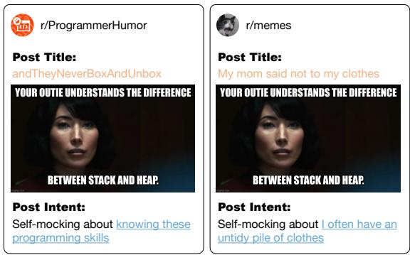  
Figure 1: Demo illustrating how a single meme’s interpretation changes across different contextual settings. Meme here literally indicates you know the difference between “Stack” and “Heap”. The “Stack” and “Heap” mean specific terms in programmer community, but can mean condition of an item in general talk.

Current meme-focused research has largely pursued two distinct paths, neither fully capturing the contextual richness of memes in real online communication. The first approach centers on detecting harmful or toxic meme content (Sharma et al., 2022; Hee et al., 2023; Huang et al., 2024). While crucial for content moderation systems, this research typically leverages context primarily as a classifier for harmfulness rather than for comprehensive meaning interpretation. The second research direction tackles isolated meme understanding through tasks like caption generation (Hwang and Shwartz, 2023), intent description (Park et al., 2024), and role explanation (Sharma et al., 2023). Despite their value, these efforts examine memes divorced from their original context, separating them from post text, creator intent, and community reactions that collectively shape their contextual meaning.

This decontextualization creates a fundamental evaluation gap: we lack methods to assess whether LVLMs can understand why particular memes are selected for specific communicative situations. As Park et al. (2024) observed, people create memes “with an intent to perform some action”. The same meme template can convey radically different meanings depending on its accompanying post title, community norms, or ongoing conversation thread (Lin et al., 2024). Without incorporating these contextual elements, we cannot effectively measure LVLMs’ capacity to process memes as humans naturally do in online environments.

To address these limitations, we developed MemeReaCon: Meme Reasoning in Context, a comprehensive benchmark specifically designed to evaluate LVLMs’ ability to understand memes within their original contexts. We constructed MemeReaCon using content from five diverse Reddit communities, encompassing varied topics, styles, and community norms. Each example preserves three critical contextual elements: the meme image itself, the complete post text, and the toprated community comments that reveal collective interpretation.

Through MemeReaCon, we investigate two fundamental questions about current LVLM limitations: (1) To what extent do models understand the meme? (2) To what extent does the post context affect models’ understanding of meme? To this end, we design four tasks ranging from post classification to intent generation to evaluate the how and what extent can LVLMs understand the meme.

Our extensive evaluation of leading LVLMs reveals a persistent weakness in contextual integration. Models frequently fail to establish meaningful connections between memes and their context, either fail to interpret critical information in the contexts, or overly focus on visual details while overlooking communicative purpose. Detailed error analysis reveals that models are sensitive to context type, such that models often fail in culturally dominant contexts rather than giving specific tags or communities. Our work makes following contributions:

• To our knowledge, we firstly identify how the post context and meme work together: post context mainly explains the meme, or the meme illustrates points made in the context. This helps us to evaluate models whether understand different ways people use memes to communicate.

• We propose a novel benchmark, MemeReaCon1, for meme understanding that maintains the essential relationship between meme images, post, and community reception, enabling the first systematic evaluation of how well LVLMs interpret memes as they actually function in online environments.

• We conduct comprehensive evaluation, revealing contextual-insensitive limitations in current LVLMs to connect multimodal elements for contextual interpretation.

## 2 Related Works

Meme Classification. The detection of harmful memes has emerged as a significant research area, supported by extensive benchmark datasets (Kiela et al., 2019; Pramanick et al., 2021a; Lin et al., 2024) and community initiatives such as Facebook’s Hateful Memes Challenge (Kiela et al., 2020). Research in this domain has evolved along several trajectories. Early approaches employed two-stream architectures that separately encode textual and visual features before applying attention mechanisms and multimodal fusion techniques for classification (Kiela et al., 2019; Suryawanshi et al., 2020; Pramanick et al., 2021b). A parallel line of work has focused on fine-tuning pre-trained multimodal models specifically for harmful content detection (Lippe et al., 2020; Velioglu and Rose, 2020; Hee et al., 2022, 2023). Both methods are conducted on multiple harmful categories such as trolling (Suryawanshi et al., 2020), hateful (Kiela et al., 2020), anti-semitism (Chandra et al., 2021), misogynous (Fersini et al., 2022), and antivaccinationism (Knuutila et al., 2024).

Meme Explanation. Another stream of research focuses on understanding memes as standalone units. Tasks include generating textual explanations (Sharma et al., 2023) or captions for memes (Hwang and Shwartz, 2023), classifying their sentiment or evoked emotions (Hee et al., 2023), identifying depicted entities (Sharma et al., 2023), or explaining their underlying humor (Sharma et al.,

<table><tr><td>Dataset</td><td>Task Type</td><td>Post Context</td><td>Comments</td><td>Size</td></tr><tr><td>MultiOFF (Suryawanshi et al., 2020)</td><td>classify: meme hatefulness</td><td>x</td><td>x</td><td>743</td></tr><tr><td>HatefulMemes (Kiela et al., 2020)</td><td>classify: meme hatefulness</td><td>x</td><td>x</td><td>10k</td></tr><tr><td>Jewtocracy (Chandra et al., 2021)</td><td>classify: meme hatefulness</td><td>x</td><td>x</td><td>6,611</td></tr><tr><td>HarMeme (Pramanick et al., 2021a)</td><td>classify: meme hatefulness/target</td><td>x</td><td>x</td><td>3,544</td></tr><tr><td>MAMI (Fersini et al., 2022)</td><td>classify: meme hatefulness</td><td>x</td><td>x</td><td>15k</td></tr><tr><td>FigMemes (Liu et al., 2022)</td><td>classify: meme political opinion</td><td>x</td><td>x</td><td>5,141</td></tr><tr><td>HVVMemes (Sharma et al., 2022)</td><td>classify: meme character role</td><td>x</td><td>x</td><td>7k</td></tr><tr><td>GOAT (Lin et al., 2024)</td><td>classify: meme hatefulness</td><td>x</td><td>x</td><td>6,626</td></tr><tr><td>HatReD (Hee et al., 2023)</td><td>explain: meme</td><td>x</td><td>x</td><td>3,228</td></tr><tr><td>ExHVV (Sharma et al., 2023)</td><td>explain: meme</td><td>x</td><td>x</td><td>4,680</td></tr><tr><td>MemeCap (Hwang and Shwartz, 2023)</td><td>explain: meme + metaphors</td><td></td><td>x</td><td>6,387</td></tr><tr><td>MemeIntent (Park et al., 2024)</td><td>explain: metaphors</td><td></td><td>x</td><td>950</td></tr><tr><td>MemeReaCon (ours)</td><td>classify: meme + post + comment type/affection explain: meme + metaphors + post + post intents</td><td>J</td><td>V</td><td>1,565</td></tr></table>

Table 1: Comparisons with other related meme benchmarks.

2022). These studies typically operate on decontextualized memes, removing them from the original posts and discussions where their meaning is shaped and negotiated. This methodological choice inherently limits the ability to assess if models grasp the social function of the meme (i.e., why it was used there).

MemeReaCon’s Position. Table 1 shows related meme benchmarks. MemeReaCon occupies a unique position by being the first benchmark, to our knowledge, specifically constructed to evaluate the fine-grained contextual reasoning required to understand memes as they are used in online posts. It mandates the integration of the meme image and the full original post text. Its detailed annotations concerning the context-meme relationship, meme structure, and comment interactions enable a more nuanced analysis of LVLM capabilities and failures than previously possible.

## 3 Constructing the MemeReaCon Benchmark

The central goal of MemeReaCon is to provide a robust resource for evaluating the contextual reasoning capabilities of LVLMs when interpreting memes. Achieving this requires a dataset that is not only large and diverse but also curated about the interplay between a meme and its surrounding textual context. The construction process is detailed below.

## 3.1 Data Collection

To capture authentic meme usage patterns within varied contexts, we selected Reddit2 as our primary data source. Reddit hosts a vast number of communities with distinct topics and communication styles, making it an ideal ecosystem for observing how the same meme template might be interpreted differently across contexts. We specifically chose five diverse, high-activity, English subreddits to ensure broad coverage:

• r/memes and r/meme: Two large, generalpurpose communities offering a baseline of popular meme formats and topics.

• r/ProgrammerHumor: A niche community focused on technology and programmer-specific context and humor.

• r/BritishMemes: A culturally specific community, requiring understanding of UK-related references, stereotypes, and events.

• r/RelationshipMemes: A social community centered on dating and interpersonal dynamics, often involving nuanced emotional expression.

This curated selection ensures variability in the types of contextual information (general knowledge, technical terms, cultural references, and social cues) required for successful interpretation.

We collected publicly available posts submitted between January 2022 and May 2025 using the Python Reddit API Wrapper. Our initial query targeted posts containing: (i) a textual title, (ii) an associated meme image, and (iii) the top-rated comments to filter out posts with community interaction. This initial pool contained over 3,000 potential candidates.

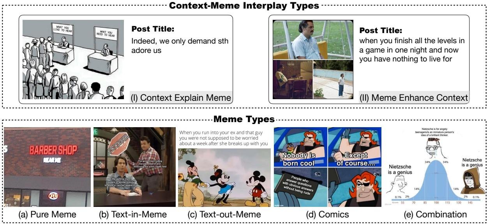  
Figure 2: Cases of each annotation scheme. Top-side (I) and (II) represent the label of Context-Meme Interplay (CMI). Bottom-side (a) to (e) show the label of Meme Composition (MC).

## 3.2 Filtering for Quality and Contextual Relevance

The raw data required careful filtering to isolate instances suitable for evaluating contextual reasoning. Our multi-stage filtering process aimed to maximize data quality and ensure that each instance contained sufficient context for meaningful analysis.

Firstly, we removed posts that were deleted (by user or admin), associated with suspended accounts, or contained broken image links. This step ensured the integrity and reproducibility of the dataset instances. Approximately 24% of the initial pool was removed here.

Besides, to ensure presence of textual context accompanying the meme. We filtered out posts with very short context (fewer than 3 words3), as these often lack the necessary linguistic cues to establish a specific context beyond the meme image itself. This step removed roughly 18% of the remaining posts, focusing the dataset on instances where textual context is explicitly provided.

While sourcing from meme-centric subreddits increases the likelihood of collecting actual memes, we implemented a verification step during annotation. Annotators removed non-meme images (e.g., selfie, advertisements) (in approximately 8% of filtered posts).

Then, for comments, we selected the single highest-voted, non-deleted comment (excluding bot comments) as a proxy for the dominant community reaction or interpretation. To ensure the comment provided substantive feedback, we required a minimum length of 3 words. Posts lacking such a comment were also included noted as [none].

Each resulting instance was structured to include the meme image, the post title, the post body (marked empty if absent), and the selected top comment text. All usernames were anonymized to protect user privacy.

## 3.3 Annotation Scheme

The annotation scheme is designed specifically to target the reasoning processes involved in understanding a meme within its post context. We developed labels that move beyond simple classification to capture the nuances of the context-meme connection and its intent. Our scheme includes five key dimensions:

• Context-Meme Interplay (CMI): to directly addresses the question: how does the context relate to the meme (shown in Figure 2 (I) and (II))?

– Context Explain Meme (CEM): The text is essential for understanding the meme’s relevance or specific meaning.

– Meme Enhance Context (MEC): The text establishes a point, and the meme serves to illustrate, emphasize, or add humor/emotion.

• Meme Types (MT): to understand how information is distributed in meme (shown in Figure 2

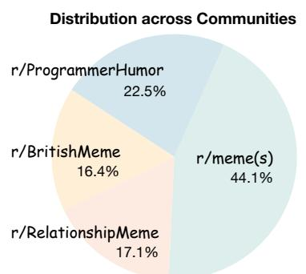

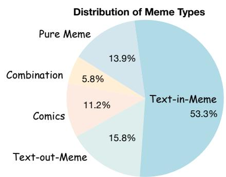  
Figure 3: Statistics of our MemeReaCon. Our MemeReaCon benchmark comprises 1,565 annotated instances collected from five diverse subreddits. Detailed statistics can be found in Appendix B.

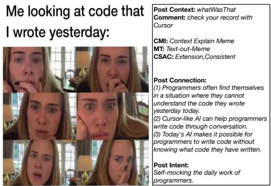  
Figure 4: Example of a meme in MemeReaCon.

(a) to (e)).

– Pure Meme: Visuals carry the primary load.

– Text-in-Meme: Embedded text is integral.

– Text-out-Meme: Post title/body acts as the primary caption for a reusable template.

– Comics: Multi-panel narrative structure.

– Combination: Multi-type figures are combined together to perform the unitary meaning.

• Comment Stance and Affective Consistence (CSAC): stance to assess the relationship between the top comment and the post. Affective consistence to assess the affection of a comment between its literal and its intended meaning.

(1) From stance-level:

– Support: Agrees with or reinforces the post.

– Deny: Disagrees with or challenges the post.

– Extension: Builds upon the post.

(2) From affection-level:

– Consistent: Same to its intent affection.

– Inconsistent: Different from its literal one to perform a sarcastic or complain.

• Post Connection (PC): to capture the logical or thematic linkages among the post context, meme, and comments, provided in key points that identify the specific connections between elements.

• Post Intent (PI): to identify the author’s purpose for creating and sharing the post, such as humor, experience sharing, and complaint.

Annotation Process and Quality Control. Figure 4 shows an example of our MemeReaCon4. Ensuring high-quality annotations was prominent. We recruited and trained 6 annotators (Englishspeaking Ph.D. students familiar with internet culture) using detailed guidelines and iteratively trained on 200 samples. The main annotation was conducted via a customized web interface displaying all components. To maximize reliability, each instance was independently annotated by 3 annotators. Disagreements were resolved by majority vote. For the rare cases of complete disagreement (3 unique labels for an instance), a senior annotator determined based on the guidelines and discussion. We calculated inter-annotator agreement (IAA) using Fleiss’ Kappa (κ) on a held-out set of 500 instances annotated by all 6 annotators prior to the main task. The achieved agreement was substantial: CMI (κ = 0.86), MT (κ = 0.88), CSAC (κ = 0.75), PC (κ = 0.79), and PI (κ = 0.81), indicating the robustness and clarity of our annotation scheme and process.

## 3.4 Dataset Statistics

The final MemeReaCon benchmark comprises 1,565 annotated instances collected from five diverse subreddits. Figure 3 provides statistics of our MemeReaCon. Detailed statistics and annotation guidelines can be found in Appendix B.

## 4 Experiments

Our experiments with MemeReaCon are designed to address two key research questions: (1) to what extent do models understand the meme? (2) to what extent does the post affect models’ understanding of meme?

## 4.1 Experimental Setup

Models Evaluated. We evaluated 10 diverse state-of-the-art models spanning three architectural paradigms, alongside two unimodal baselines to establish comparative foundations:

• Unimodal Baselines: Qwen2.5 (Yang et al., 2024) (text-only) and Flamingo (Alayrac et al., 2022) (image-only) establish performance boundaries for single-modality reasoning.

• Vision-Language Models (VLM): LLaVA-OneVision-7B (Li et al., 2024), Phi-4-MM-5.6B (Abdin et al., 2024), Qwen2.5-VL-7B (Bai et al., 2025), Qwen2.5-Omni-7B (Xu et al., 2025), and InternVL3-8B (Chen et al., 2024) represent approaches where vision and language capabilities are jointly trained.

• Vision Reasoning Models (VRM): QvQ-72B (Qwen, 2024), GPT-4o (Hurst et al., 2024), Grok3 (xAI, 2025), Claude-3.7-sonnet-thinking (Anthropic, 2025), and Gemini-2.5-Pro (Deep-Mind, 2025) integrate advanced reasoning mechanisms atop vision-language foundations, representing the current frontier.

Evaluation Settings. All evaluations were conducted in a zero-shot setting with no fine-tuning. For classification tasks, we report accuracy and macro F1-score to account for class imbalance. For generative tasks, we use BERTScore (B-S) (Zhang et al., 2020) and ROUGE-L (R-L) to evaluate semantic and lexical similarity.

Tasks. We designed four primary tasks of increasing complexity to systematically probe different dimensions of contextual meme understanding.

It is important to note the role of the Meme Types (MT) annotation. While MT is a crucial dimension for understanding the structural properties of memes, we do not define a direct classification task for it. Instead, MT serves as an analytical lens through which we evaluate model performance on the other defined tasks. This allows for a finegrained analysis of how different meme structures impact a model’s ability.

The four primary evaluation tasks are:

• Context-Meme Interplay Classification (CMI-C): Given the post context and the meme, models must classify the relationship as either Context Explain Meme (CEM) or Meme Enhance Context (MEC). This task evaluates the model’s basic understanding of how textual context and visual meme content depend on each other.

• Comment Stance and Affective Consistent Classification (CSAC-C): This is a two-part classification task. Given the original post (context + meme) and a top-level comment, models must: (1) determine the comment’s stance towards the post (Support, Deny, or Extension), and (2) identify whether the comment’s literal affection is Consistent or Inconsistent with its intended meaning. This task probes deeper social reasoning capabilities, including the ability to understand agreement, disagreement, and nuanced expressions like sarcasm.

• Post Connection Generation (PC-G): Given the post context, the meme, and a set of relevant comments, models are required to generate a free-form text. This text should explain the key logical or thematic connections linking these elements. This generative task evaluates the model’s overall understanding and its ability to articulate the reasoning chain.

• Post Intent Generation (PI-G): Based on all available evidence (post context, meme, and comments), models must generate the original poster’s communicative intent (e.g., humor, complaint). This task assesses the model’s ability to understand the overall purpose of the multimodal post.

These tasks are designed to progressively challenge models, moving from classifying direct relationships (CMI-C) to understanding complex social cues (CSAC-C), generating coherent explanations (PC-G), and inferring high-level intent (PI-G). Together, they provide a comprehensive benchmark for evaluating contextual reasoning abilities in the domain of internet memes. Detailed implementations can be found in Appendix C.

## 4.2 Overall Performance Comparison

Table 2 presents a comprehensive performance evaluation of various models on our MemeReaCon benchmark. Our analysis reveals critical insights into current LVLM capabilities and limitations in understanding social media posts with memes.

<table><tr><td rowspan="2">Model</td><td colspan="2">CMI-C</td><td colspan="2">CSAC-C</td><td colspan="2">PC-G</td><td colspan="2">PI-G</td></tr><tr><td>Acc (%)</td><td>MacF1 (%)</td><td>Acc (%)</td><td>MacF1 (%)</td><td>B-S (%)</td><td>R-L (%)</td><td>B-S (%)</td><td>R-L (%)</td></tr><tr><td colspan="9">Unimodal Baselines</td></tr><tr><td>Qwen2.5</td><td>54.83</td><td>53.92</td><td>59.27</td><td>41.24</td><td>46.48</td><td>46.37</td><td>22.63</td><td>17.82</td></tr><tr><td>Flamingo</td><td>52.14</td><td>51.58</td><td>31.73</td><td>22.79</td><td>25.42</td><td>18.13</td><td>9.31</td><td>8.47</td></tr><tr><td colspan="9">Vision-Language Models (VLM)</td></tr><tr><td>LLaVA-OneVision</td><td>56.32</td><td>55.76</td><td>38.91</td><td>29.08</td><td>20.19</td><td>22.53</td><td>12.68</td><td>10.91</td></tr><tr><td>Phi-4-MM</td><td>58.47</td><td>58.12</td><td>42.34</td><td>32.61</td><td>26.92</td><td>28.39</td><td>15.52</td><td>13.26</td></tr><tr><td>InternVL3</td><td>64.72</td><td>64.18</td><td>49.53</td><td>38.41</td><td>37.23</td><td>38.92</td><td>25.63</td><td>20.43</td></tr><tr><td>Qwen2.5-VL</td><td>61.43</td><td>60.97</td><td>46.15</td><td>35.83</td><td>33.74</td><td>31.27</td><td>19.76</td><td>16.04</td></tr><tr><td>Qwen2.5-Omni</td><td>68.86</td><td>68.47</td><td>54.32</td><td>42.13</td><td>43.04</td><td>44.79</td><td>30.43</td><td>24.18</td></tr><tr><td>Qwen2.5-Omni w/ CoT</td><td>71.35</td><td>70.96</td><td>57.68</td><td>44.72</td><td>47.19</td><td>48.23</td><td>33.76</td><td>26.95</td></tr><tr><td>Qwen2.5-Omni w/ SC</td><td>73.42</td><td>73.09</td><td>60.17</td><td>46.89</td><td>49.87</td><td>50.42</td><td>36.28</td><td>29.37</td></tr><tr><td colspan="9">Vision Reasoning Models (VRM)</td></tr><tr><td>gpt-4o</td><td>72.48</td><td>71.96</td><td>58.76</td><td>46.53</td><td>57.82</td><td>48.47</td><td>34.94</td><td>28.37</td></tr><tr><td>QvQ</td><td>75.29</td><td>74.87</td><td>62.61</td><td>49.74</td><td>60.13</td><td>51.25</td><td>39.52</td><td>32.64</td></tr><tr><td>Grok-3</td><td>78.36</td><td>78.09</td><td>65.73</td><td>53.21</td><td>62.29</td><td>54.03</td><td>43.19</td><td>36.47</td></tr><tr><td>Claude-3.7</td><td>80.97</td><td>80.56</td><td>68.39</td><td>55.93</td><td>64.48</td><td>57.14</td><td>47.59</td><td>40.31</td></tr><tr><td>Gemini-2.5-pro</td><td>83.21</td><td>82.86</td><td>71.28</td><td>59.42</td><td>66.89</td><td>60.38</td><td>52.34</td><td>44.86</td></tr></table>

Table 2: Performance comparison across model architectures on MemeReaCon tasks. Bold indicates the best performance.  
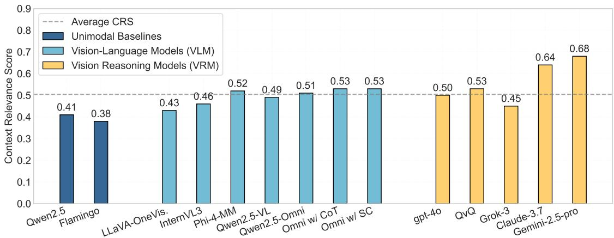  
Figure 5: Context relevance scores across model categories, measuring how effectively models integrate information from multiple contextual sources.

Surface-level Understanding vs. Deep Comprehension. While models demonstrate reasonable proficiency on simpler classification tasks (CMI-C, CSAC-C), their performance deteriorates substantially on generative tasks requiring deeper post comprehension (PC-G, PI-G). Even the topperforming Gemini-2.5-pro shows a big drop from classification (83.21% accuracy on CMI-C) to generative tasks (60.38% ROUGE-L on PC-G, 44.86% on PI-G). This performance cliff indicates that current models can identify superficial relationships between text and images but struggle to synthesize holistic interpretations that capture the post’s communicative intent and social context. The low PI-G scores particularly suggest that current models still fall short in understanding the nuanced social dynamics embedded in meme-based communication.

When applying Chain-of-Thought (CoT) and Self-Consistency (SC) techniques to Qwen2.5- Omni, we observe modest improvements across all tasks. However, these enhancements are more for classification tasks (+4.56% on CMI-C with SC) and less impactful for generative tasks (+3.85% on BERTScore on PI-G). This suggests that while structured reasoning approaches can help models better classify relationships, they offer limited benefits for the deeper contextual integration needed to understand post meaning and intent.

Post Components Integration Challenge. To quantitatively assess models’ ability to integrate information across modalities and contextual elements, we introduce the Context Relevance Score (CRS), defined as:

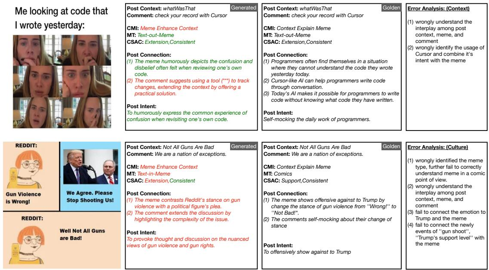  
Figure 6: Illustration of some cases in error. The green text indicates the correct answer. The red text indicates the wrong answer.

$$
\mathrm { C R S } = \frac { 1 } { N } \sum _ { i = 1 } ^ { N } w _ { i } \cdot \mathrm { R e l } ( r _ { i } , \{ c _ { j } \} _ { j = 1 } ^ { M } ) ,\tag{1}
$$

where N is the number of evaluation samples, $r _ { i }$ is the model’s response for sample i, $\{ c _ { j } \} _ { j = 1 } ^ { M }$ represents the M contextual elements (post text, image, comments) for sample i, Rel( ) measures the semantic relevance between the response and all contextual elements (computed using BERTScore with a threshold of 0.7 for relevance), and w is a difficulty weight based on the number of contextual elements requiring integration. CRS ranges from 0 to 1, with higher scores indicating better cross-contextual integration.

Our CRS analysis reveals significant gaps in contextual integration capabilities. As shown in Figure 5, VRMs achieve higher CRS values compared to VLMs. But the best models struggle with fully integrating information across modalities and contextual elements. This finding aligns with the poor performance on PC-G and PI-G tasks, confirming that contextual integration represents a fundamental bottleneck in current architectures. We show more analysis of performance in different communities (E.1), meme structure (E.2), meme text-density (E.3), comment affection (E.4), and modality contribution (E.5).

<table><tr><td>Model</td><td>Setting</td><td>CMI-C</td><td>CSAC-C</td><td>PC-G</td><td>PI-G</td></tr><tr><td rowspan="3">Qwen2.5</td><td>1-shot</td><td>56.21</td><td>60.84</td><td>47.92</td><td>23.87</td></tr><tr><td>3-shot</td><td>57.39</td><td>61.95</td><td>48.76</td><td>24.92</td></tr><tr><td>5-shot</td><td>58.12</td><td>62.47</td><td>49.33</td><td>25.41</td></tr><tr><td rowspan="3">Flamingo</td><td>1-shot</td><td>53.28</td><td>32.85</td><td>26.37</td><td>10.08</td></tr><tr><td>3-shot</td><td>54.56</td><td>33.92</td><td>27.65</td><td>11.24</td></tr><tr><td>5-shot</td><td>55.32</td><td>34.76</td><td>28.41</td><td>11.96</td></tr><tr><td rowspan="3">Omni</td><td>1-shot</td><td>70.12</td><td>55.67</td><td>44.38</td><td>31.72</td></tr><tr><td>3-shot</td><td>71.45</td><td>56.93</td><td>45.72</td><td>32.96</td></tr><tr><td>5-shot</td><td>72.31</td><td>57.85</td><td>46.58</td><td>33.87</td></tr><tr><td rowspan="3">Gemini</td><td>1-shot</td><td>84.46</td><td>72.63</td><td>68.25</td><td>53.78</td></tr><tr><td>3-shot</td><td>85.72</td><td>73.91</td><td>69.64</td><td>55.21</td></tr><tr><td>5-shot</td><td>86.34</td><td>74.83</td><td>70.42</td><td>56.07</td></tr></table>

Table 3: Few-shot learning results across different models and tasks.

## 4.3 Few-Shots Settings Results

To investigate whether providing examples improves model performance on our tasks, we conducted comprehensive few-shot experiments across four representative models spanning different architectural paradigms: (1) Unimodal Settings: Qwen2.5 and Flamingo; (2) Vision-Language Models: Qwen2.5-Omni; and (3) Vision-Reasoning Models: Gemini-2.5-pro. For each model, we explored 1-shot, 3-shot, and 5-shot settings, with examples strategically sampled from the same subreddit communities to provide relevant cultural context.

Table 3 presents the results across all four tasks. For classification tasks, we report accuracy, while for generation tasks, we use BERTScore as the evaluation metric. Our few-shot experiments reveal several key insights. First, providing examples consistently improves performance across all models and tasks, with gains ranging from 1.25% to 3.73%. The most substantial improvements occur when transitioning from zero-shot to 3-shot settings, while the performance gains from 3-shot to 5-shot are notably smaller, suggesting diminishing returns with additional examples. Despite these improvements, the relative performance patterns across models and tasks remain consistent with our zero-shot findings, indicating that the contextual integration challenges we identified are fundamental rather than artifacts of the evaluation setting. We also conduct fine-tuning experiments which can be found in Appendix D.

<table><tr><td>Participant Group</td><td>CMI-C</td><td>CSAC-C</td><td>PC-G</td><td>PI-G</td></tr><tr><td>Annotators</td><td>95.3</td><td>92.7</td><td>88.4</td><td>82.9</td></tr><tr><td>Campus Participants</td><td>89.7</td><td>82.3</td><td>82.6</td><td>78.3</td></tr><tr><td>Non-Meme-Familiar</td><td>85.2</td><td>78.6</td><td>78.4</td><td>73.7</td></tr><tr><td>Gemini-2.5-pro</td><td>83.2</td><td>71.3</td><td>66.9</td><td>52.3</td></tr><tr><td>Performance Gap</td><td>12.1</td><td>21.4</td><td>21.5</td><td>30.6</td></tr></table>

Table 4: Human evaluation results across different participant groups compared to the best-performing model. Performance gap represents the difference between Annotators and Gemini-2.5-pro.

## 4.4 Human Evaluation Results

To establish reliable human performance baselines and assess task difficulty, besides the original annotation settings, we recruited another two distinct groups: (1) Campus Participants: ten university students (ages 19-24) from diverse academic backgrounds with moderate meme exposure; and (2) Non-Meme-Familiar Participants: ten individuals (ages 35-62) with limited exposure to meme culture. All participants provided informed consent and received fair compensation.

Table 4 presents the performance results across all four tasks, comparing the three human groups against the best-performing model (Gemini-2.5- pro). For classification tasks, we report accuracy, while for generation tasks, we use BERTScore as the evaluation metric.

The human evaluation results yield several important insights. First, the high performance across all human groups validates the reliability of our dataset construction and annotation scheme. Second, we observe a clear correlation between meme familiarity and task performance, with Internet-Aware Annotators consistently outperforming other groups. Third, even Non-Meme-Familiar participants achieved substantially better results than the state-of-the-art Gemini-2.5-pro model, highlighting significant room for model improvement. The performance gap between expert humans and the best model ranges from 12.1 points on the CMI-C task to 30.6 points on the PI-G task. Nevertheless, the strong performance of Non-Meme-Familiar participants indicates that our annotation scheme captures interpretable relationships that do not necessarily require extensive meme culture knowledge, making the dataset valuable for general multimodal reasoning research.

## 4.5 Error Analysis

To gain deeper insights into how post context influences meme interpretation, we conducted a systematic error analysis across all evaluated models. This analysis reveals critical limitations in current models when processing contextually embedded memes and highlights failure patterns that occur at the intersection of visual humor and social context.

We categorized errors into four distinct patterns that emerged consistently across models: context error, visual error, semantic error, and cultural error. Appendix F shows detailed definition of these patterns and distributions of error types across models. Figure 6 shows the selected error cases. More cases can be found in Appendix G.

## 5 Conclusion

In this paper, we introduced MemeReaCon, a novel benchmark that addresses a critical gap in meme understanding research by preserving the post context for meme interpretation. Our findings revealed significant limitations in current LVLMs to integrate contextual information when explaining memes, with models often failing to establish meaningful connections between visual content and surrounding context or overlooking communicative purpose in favor of surface-level visual analysis. Besides, by identifying the dual relationship patterns between memes and their contexts, we provided a framework for evaluating how well models understand the diverse communicative functions of memes in online environments. This work not only highlights the context-insensitive limitations of current models but also establishes a foundation for future to more accurately capture how humans naturally process and interpret memes within their original discourse contexts.

## Limitations

Our work, while comprehensive, is subject to certain limitations, primarily concerning the nuances of annotation when dealing with complex connections and intents and the inherent subjectivity in meme interpretation. First, regarding the annotation of post connections, we observed that the explicit post connections was less consistent across annotations in some cases. This suggests a challenge in achieving widespread mutual agreement on a precise methodology for connecting posters context meaning with the meme meanings. Even when annotators possess the general knowledge to understand the meme’s overall message, a shared, systematic approach to deconstructing and codifying the specific metaphorical knowledge embedded in the memes may not be uniformly applied. Second, the interpretation of memes is deeply depend on annotator’s background knowledge, encompassing cultural, social, and contextual understanding, which inherently varies among annotators.

## Ethics Statement

The development of this benchmark for contextual meme understanding was guided by a commitment to responsible research practices. We have taken several steps to address potential ethical considerations related to data collection, annotation, and the potential impact of our work.

Data Collection and Provenance. The data for this benchmark was collected from Reddit, a publicly accessible platform, using its official Application Programming Interface (API). Our data collection adhered to Reddit’s API terms of service. We focused on collecting posts that included both textual context and a meme image. To protect the privacy of Reddit users, all usernames and any other personally identifiable information (PII) were removed from the collected data. The dataset primarily consists of content that users have chosen to share publicly. We acknowledge that internet memes can sometimes contain sensitive or controversial themes.

Annotation Process and Annotator Considerations. The annotation of the collected data was performed by 6 Ph.D. students, all of whom are proficient English speakers and have a good understanding of internet culture and memes. Annotators were recruited from our research institution. Prior to commencing the annotation task, all annotators were provided with detailed guidelines and training on the annotation scheme to ensure consistency and quality. They were made aware of the research objectives and how their contributions would be used.

Recognizing that prolonged exposure to online content can sometimes be taxing, and that memes can vary widely in their subject matter, annotators were instructed that they could skip any specific data instance they felt uncomfortable annotating, without any penalty. The annotation tasks were designed to be objective, focusing on the relationship between context, meme, and comments. The PhD students involved in annotation were part of the broader research effort and their contribution is acknowledged; this work formed part of their research activities.

We paid \$0.19 for each data annotation. The annotators were compensated with an average hourly wage of \$14.82, which is comparable to the local minimum wage. We did not collect any personal information from annotators without their permission. For other human evaluations, all participants provided informed consent and received fair compensation, \$120 for campus participants’ 8-hour sessions and \$50 for external participants’ 2-hour sessions).

## Acknowledgements

We thank the anonymous reviewers, the area chair, and the senoir are chair for their constructive comments. This work is partially supported by Hong Kong RGC GRF No.14206324, CUHK Knowledge Transfer Project Fund No.KPF23GWP20, and Research Funds for NSD Construction, University of International Relations (Grant numbers: 2024GA07).

## References

Marah Abdin, Jyoti Aneja, Harkirat Behl, Sébastien Bubeck, Ronen Eldan, Suriya Gunasekar, Michael Harrison, Russell J Hewett, Mojan Javaheripi, Piero Kauffmann, and et al. 2024. Phi-4 technical report. arXiv preprint arXiv:2412.08905.

Jean-Baptiste Alayrac, Jeff Donahue, Pauline Luc, Antoine Miech, Iain Barr, Yana Hasson, Karel Lenc, Arthur Mensch, Katherine Millican, Malcolm Reynolds, and et al. 2022. Flamingo: a visual language model for few-shot learning. Advances in neural information processing systems, 35:23716– 23736.

Anthropic. 2025. Claude 3.7 sonnet and claude code. https://www.anthropic.com/news/claude-3-7- sonnet.

Shuai Bai, Keqin Chen, Xuejing Liu, Jialin Wang, Wenbin Ge, Sibo Song, Kai Dang, Peng Wang, Shijie Wang, Jun Tang, and et al. 2025. Qwen2. 5-vl technical report. arXiv preprint arXiv:2502.13923.

Mohit Chandra, Dheeraj Pailla, Himanshu Bhatia, Aadilmehdi Sanchawala, Manish Gupta, Manish Shrivastava, and Ponnurangam Kumaraguru. 2021. “subverting the jewtocracy”: Online antisemitism detection using multimodal deep learning. In Proceedings of the 13th ACM Web Science Conference 2021, pages 148–157.

Zhe Chen, Jiannan Wu, Wenhai Wang, Weijie Su, Guo Chen, Sen Xing, Muyan Zhong, Qinglong Zhang, Xizhou Zhu, Lewei Lu, and et al. 2024. Internvl: Scaling up vision foundation models and aligning for generic visual-linguistic tasks. In Proceedings of the IEEE/CVF conference on computer vision and pattern recognition, pages 24185–24198.

Google DeepMind. 2025. Gemini 2.5 pro: Best for coding and complex prompts. https://deepmind.google/technologies/gemini/pro/.

Elisabetta Fersini, Francesca Gasparini, Giulia Rizzi, Aurora Saibene, Berta Chulvi, Paolo Rosso, Alyssa Lees, and Jeffrey Sorensen. 2022. Semeval-2022 task 5: Multimedia automatic misogyny identification. In Proceedings ofthe 16th International Workshop on Semantic Evaluation (SemEval-2022), pages 533– 549.

Ming Shan Hee, Wen-Haw Chong, and Roy Ka-Wei Lee. 2023. Decoding the underlying meaning of multimodal hateful memes. In Proceedings ofthe Thirty-Second International Joint Conference on Artificial Intelligence, pages 5995–6003.

Ming Shan Hee, Roy Ka-Wei Lee, and Wen-Haw Chong. 2022. On explaining multimodal hateful meme detection models. In Proceedings of the ACM Web Conference 2022, pages 3651–3655.

Jianzhao Huang, Hongzhan Lin, Liu Ziyan, Ziyang Luo, Guang Chen, and Jing Ma. 2024. Towards lowresource harmful meme detection with lmm agents. In Proceedings of the 2024 Conference on Empirical Methods in Natural Language Processing, pages 2269–2293.

Aaron Hurst, Adam Lerer, Adam P Goucher, Adam Perelman, Aditya Ramesh, Aidan Clark, AJ Ostrow, Akila Welihinda, Alan Hayes, Alec Radford, and et al. 2024. Gpt-4o system card. arXiv preprint arXiv:2410.21276.

EunJeong Hwang and Vered Shwartz. 2023. Memecap: A dataset for captioning and interpreting memes. In Proceedings of the 2023 Conference on Empirical Methods in Natural Language Processing, pages 1433–1445.

Douwe Kiela, Suvrat Bhooshan, Hamed Firooz, Ethan Perez, and Davide Testuggine. 2019. Supervised multimodal bitransformers for classifying images and text. arXiv preprint arXiv:1909.02950.

Douwe Kiela, Hamed Firooz, Aravind Mohan, Vedanuj Goswami, Amanpreet Singh, Pratik Ringshia, and Davide Testuggine. 2020. The hateful memes challenge: Detecting hate speech in multimodal memes. Advances in neural information processing systems, 33:2611–2624.

Aleksi Knuutila, Anna George, Jonathan Bright, Anna George, and Philip Howard. 2024. The spread of antivaccination memes on facebook. In Multidisciplinary International Symposium on Disinformation in Open Online Media, pages 86–100. Springer.

Bo Li, Yuanhan Zhang, Dong Guo, Renrui Zhang, Feng Li, Hao Zhang, Kaichen Zhang, Peiyuan Zhang, Yanwei Li, Ziwei Liu, and et al. 2024. Llavaonevision: Easy visual task transfer. arXiv preprint arXiv:2408.03326.

Hongzhan Lin, Ziyang Luo, Bo Wang, Ruichao Yang, and Jing Ma. 2024. Goat-bench: Safety insights to large multimodal models through meme-based social abuse. Preprint, arXiv:2401.01523.

Phillip Lippe, Nithin Holla, Shantanu Chandra, Santhosh Rajamanickam, Georgios Antoniou, Ekaterina Shutova, and Helen Yannakoudakis. 2020. A multimodal framework for the detection of hateful memes. arXiv preprint arXiv:2012.12871.

Chen Liu, Gregor Geigle, Robin Krebs, and Iryna Gurevych. 2022. Figmemes: A dataset for figurative language identification in politically-opinionated memes. In Proceedings of the 2022 conference on empirical methods in natural language processing, pages 7069–7086.

Ryan M Milner. 2012. The world made meme: Discourse and identity in participatory media.

Jeongsik Park, Khoi PN Nguyen, Terrence Li, Suyesh Shrestha, Megan Kim Vu, Jerry Yining Wang, and Vincent Ng. 2024. Memeintent: Benchmarking intent description generation for memes. In Proceedings of the 25th Annual Meeting of the Special Interest Group on Discourse and Dialogue, pages 631– 643.

Shraman Pramanick, Dimitar Dimitrov, Rituparna Mukherjee, Shivam Sharma, Md Shad Akhtar, Preslav Nakov, and Tanmoy Chakraborty. 2021a. Detecting harmful memes and their targets. In Findings of the Association for Computational Linguistics: ACL-IJCNLP 2021, pages 2783–2796.

Shraman Pramanick, Shivam Sharma, Dimitar Dimitrov, Md Shad Akhtar, Preslav Nakov, and Tanmoy Chakraborty. 2021b. Momenta: A multimodal framework for detecting harmful memes and their targets. In Findings of the Association for Computational Linguistics: EMNLP 2021, pages 4439–4455.

Qwen. 2024. Qvq: To see the world with wisdom. https://qwenlm.github.io/blog/qvq-72b-preview/.

Shivam Sharma, Siddhant Agarwal, Tharun Suresh, Preslav Nakov, Md Shad Akhtar, and Tanmoy Chakraborty. 2023. What do you meme? generating explanations for visual semantic role labelling in memes. In Proceedings ofthe AAAI Conference on Artificial Intelligence, volume 37, pages 9763–9771.

Shivam Sharma, Tharun Suresh, Atharva Kulkarni, Himanshi Mathur, Preslav Nakov, Md Shad Akhtar, and Tanmoy Chakraborty. 2022. Findings of the constraint 2022 shared task on detecting the hero, the villain, and the victim in memes. In Proceedings of the Workshop on Combating Online Hostile Posts in Regional Languages during Emergency Situations, pages 1–11.

Shardul Suryawanshi, Bharathi Raja Chakravarthi, Mihael Arcan, and Paul Buitelaar. 2020. Multimodal meme dataset (multioff) for identifying offensive content in image and text. In Proceedings of the second workshop on trolling, aggression and cyberbullying, pages 32–41.

Riza Velioglu and Jewgeni Rose. 2020. Detecting hate speech in memes using multimodal deep learning approaches: Prize-winning solution to hateful memes challenge. arXiv preprint arXiv:2012.12975.

Bingbing Wang, Shijue Huang, Bin Liang, Geng Tu, Min Yang, and Ruifeng Xu. 2024. What do they “meme”? a metaphor-aware multi-modal multi-task framework for fine-grained meme understanding. Knowledge-Based Systems, 294:111778.

xAI. 2025. Grok 3: The age of reasoning agents. https://x.ai.

Jin Xu, Zhifang Guo, Jinzheng He, Hangrui Hu, Ting He, Shuai Bai, Keqin Chen, Jialin Wang, Yang Fan, Kai Dang, and et al. 2025. Qwen2. 5-omni technical report. arXiv preprint arXiv:2503.20215.

An Yang, Baosong Yang, Binyuan Hui, Bo Zheng, Bowen Yu, Chang Zhou, Chengpeng Li, Chengyuan Li, Dayiheng Liu, Fei Huang, and et al. 2024. Qwen2 technical report. CoRR.

Tianyi Zhang, Varsha Kishore, Felix Wu, Kilian Q. Weinberger, and Yoav Artzi. 2020. Bertscore: Evaluating text generation with BERT. In 8th International Conference on Learning Representations, ICLR 2020, Addis Ababa, Ethiopia, April 26-30, 2020. OpenReview.net.

## A More Cases

Figure 7, 8, and 9 shows more examples from our proposed MemeReaCon.

## B Statistics of MemeReaCon

Tables 5, 7, and 6 provide comprehensive statistics about our dataset, including distributions across different categories, cross-category relationships, and textual characteristics.

Clarification of Annotation Settings. Table 8 shows our annotation guidelines.

## C Detailed Implementations

This section details the specific prompts and implementation procedures for each task in our MemeReaCon benchmark. The tasks are designed to systematically evaluate models’ abilities to understand contextual memes across different dimensions of complexity. All inferences are conducted through vLLM framework or Huggingface Transformers framework. For BERTScore, we use microsoft/deberta-xlarge-mnli as embedding model.

## C.1 Context-Meme Interplay Classification (CMI-C)

This fundamental task evaluates whether models can identify the primary relationship between the context (post text) and the meme image.

Task Description: Models must classify the relationship into one of two categories: (1) Context Explain Meme (CEM): The textual context provides necessary information to understand the meme. (2) Meme Enhance Context (MEC): The meme adds additional meaning or humor to the textual context.

Implementation Details: (1) Unimodal Baselines: For text-only models, we provide detailed descriptions of the meme images. We summarize the descriptions using gpt-4o model via OpenAI API. For image-only models, we render the post text onto the image as a composite manually. (2) VLM Models: Receive both the post text and meme image directly through their respective modality inputs. (3) VRM Models: Receive the same inputs as VLM models but are additionally instructed to explain their reasoning before providing the final classification.

The prompt is shown in Table 9.

## C.2 Comment Stance and Affective Consistence Classification (CSAC-C)

This dual-aspect task evaluates models’ abilities to analyze social dynamics in comments related to

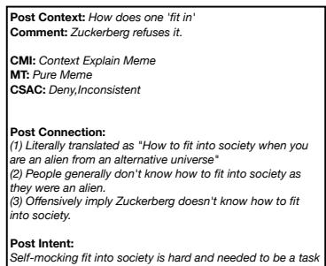

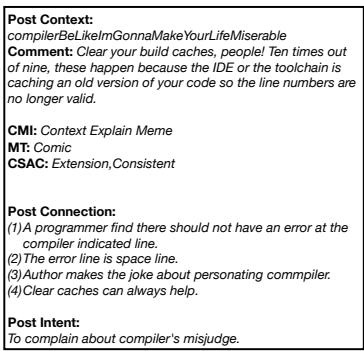

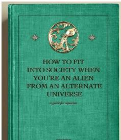  
AND REALIZE IT'S MONDAY

Me looking at code that I wrote yesterday:  
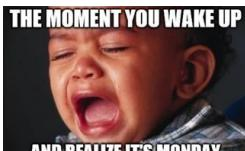

Post Context: whatWasThat Comment: check your record with Cursor

CMI: Context Explain Meme MT: Text-out-Meme CSAC: Extension,Consistent

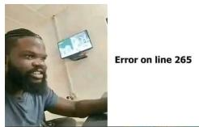

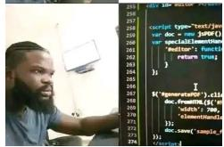

Figure 7: Examples of our proposed MemeReaCon (1/3).  
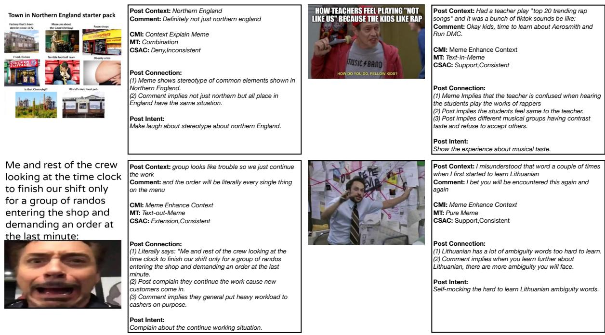  
Figure 8: Examples of our proposed MemeReaCon (2/3).

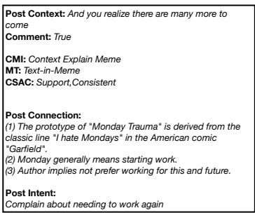  
meme posts.

## Implementation Details:

Task Description: Models must: (1) Determine the stance of a comment relative to the original post (support, deny, or extension). (2) Detect whether the comment’s literal meaning matches its intended meaning (consistent and inconsistent).

• Unimodal Baselines: Similar adaptations as in the CMI-C task, with comment text included.

• VLM Models: Process the entire post-memecomment triple as a unified input.

• VRM Models: Are additionally prompted to consider social and cultural contexts that might influence interpretation of stance and affection.

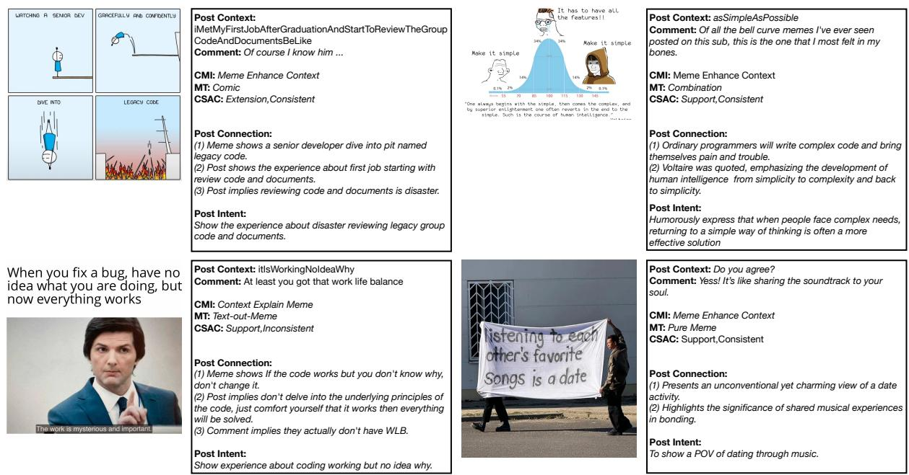

Figure 9: Examples of our proposed MemeReaCon (3/3).
<table><tr><td rowspan="2">Category</td><td rowspan="2">Total (%)</td><td colspan="4">Distribution Across Subreddits</td></tr><tr><td>r/meme(s)</td><td>r/ProgrammerHumor</td><td>r/BritishMemes</td><td>r/RelationshipMemes</td></tr><tr><td>Overall Distribution</td><td>1565 (100%)</td><td>690 (44.1%)</td><td>352 (22.5%)</td><td>256 (16.4%)</td><td>267 (17.1%)</td></tr><tr><td colspan="6">Context-Meme Interplay (CMI)</td></tr><tr><td>Context Explains Meme</td><td>796 (50.9%)</td><td>339 (49.1%)</td><td>187 (53.1%)</td><td>126 (49.2%)</td><td>144 (53.9%)</td></tr><tr><td>Meme Enhances Context</td><td>769 (49.1%)</td><td>351 (50.9%)</td><td>165 (46.9%)</td><td>130 (50.8%)</td><td>123 (46.1%)</td></tr><tr><td colspan="6">Meme Types (MT)</td></tr><tr><td>Pure Meme</td><td>218 (13.9%)</td><td>101 (14.6%)</td><td>32 (9.1%)</td><td>49 (19.1%)</td><td>36 (13.5%)</td></tr><tr><td>Text-in-Meme</td><td>834 (53.3%)</td><td>365 (52.9%)</td><td>189 (53.7%)</td><td>133 (52.0%)</td><td>147 (55.1%)</td></tr><tr><td>Text-out-Meme</td><td>247 (15.8%)</td><td>117 (17.0%)</td><td>57 (16.2%)</td><td>36 (14.1%)</td><td>37 (13.9%)</td></tr><tr><td>Comics</td><td>175 (11.2%)</td><td>68 (9.9%)</td><td>52 (14.8%)</td><td>24 (9.4%)</td><td>31 (11.6%)</td></tr><tr><td>Combination</td><td>91 (5.8%)</td><td>39 (5.6%)</td><td>22 (6.3%)</td><td>14 (5.5%)</td><td>16 (6.0%)</td></tr><tr><td colspan="6">Comment Stance (CS)</td></tr><tr><td>Support</td><td>732 (46.8%)</td><td>326 (47.2%)</td><td>162 (46.0%)</td><td>118 (46.1%)</td><td>126 (47.2%)</td></tr><tr><td>Denial</td><td>248 (15.8%)</td><td>109 (15.8%)</td><td>55 (15.6%)</td><td>41 (16.0%)</td><td>43 (16.1%)</td></tr><tr><td>Extension</td><td>585 (37.4%)</td><td>255 (37.0%)</td><td>135 (38.4%)</td><td>97 (37.9%)</td><td>98 (36.7%)</td></tr><tr><td colspan="6">Comment Affection (CA)</td></tr><tr><td>Consistent</td><td>1194 (76.3%)</td><td>526 (76.2%)</td><td>267 (75.9%)</td><td>196 (76.6%)</td><td>205 (76.8%)</td></tr><tr><td>Inconsistent</td><td>371 (23.7%)</td><td>164 (23.8%)</td><td>85 (24.1%)</td><td>60 (23.4%)</td><td>62 (23.2%)</td></tr></table>

Table 5: Comprehensive statistics of the MemeReaCon Benchmark Dataset showing distribution of all annotation categories across subreddits. Percentages in the “Total Count” column represent proportion of each category within its group, while percentages in subreddit columns show the distribution within that subreddit.

Evaluation Metrics: Accuracy and macro F1- score for the combined classification task with the following matrix (Table 10):

The prompt is shown in Table 11.

## C.3 Post Connections Generation (PC-G)

This generative task evaluates models’ abilities to articulate the relationships between all elements of a meme post.

Task Description: Models must generate a freeform explanation that demonstrates understanding of how the post text, meme image, and comments

<table><tr><td rowspan="2">Category</td><td colspan="2">Post Type</td><td colspan="2">Comment Stance</td><td colspan="2">Comment Affection</td></tr><tr><td>CEM</td><td>MEC</td><td>Support</td><td>Deny/Ext.</td><td>Consist.</td><td>Inconsist.</td></tr><tr><td>Pure Meme</td><td>103 (47.2%)</td><td>115 (52.8%)</td><td>97 (44.5%)</td><td>121 (55.5%)</td><td>167 (76.6%)</td><td>51 (23.4%)</td></tr><tr><td>Text-in-Meme</td><td>431 (51.7%)</td><td>403 (48.3%)</td><td>397 (47.6%)</td><td>437 (52.4%)</td><td>637 (76.4%)</td><td>197 (23.6%)</td></tr><tr><td>Text-out-Meme</td><td>128 (51.8%)</td><td>119 (48.2%)</td><td>118 (47.8%)</td><td>129 (52.2%)</td><td>189 (76.5%)</td><td>58 (23.5%)</td></tr><tr><td>Comics</td><td>87 (49.7%)</td><td>88 (50.3%)</td><td>79 (45.1%)</td><td>96 (54.9%)</td><td>133 (76.0%)</td><td>42 (24.0%)</td></tr><tr><td>Combination</td><td>47 (51.6%)</td><td>44 (48.4%)</td><td>41 (45.1%)</td><td>50 (54.9%)</td><td>68 (74.7%)</td><td>23 (25.3%)</td></tr></table>

Table 6: Cross-category distributions showing how different annotation dimensions relate to each other. Percentages represent row proportions.

<table><tr><td rowspan="2">Text</td><td colspan="3">Word Count</td><td colspan="3">Token Count</td></tr><tr><td>Avg.</td><td>Max</td><td>Min</td><td>Avg.</td><td>Max</td><td>Min</td></tr><tr><td>Post Title</td><td>7.8</td><td>24</td><td>3</td><td>10.3</td><td>54</td><td>3</td></tr><tr><td>Meme Text</td><td>14.3</td><td>68</td><td>3</td><td>19.1</td><td>91</td><td>4</td></tr><tr><td>Top Comment</td><td>16.5</td><td>89</td><td>4</td><td>21.7</td><td>112</td><td>5</td></tr><tr><td>Connection</td><td>75.4</td><td>231</td><td>25</td><td>80.4</td><td>246</td><td>32</td></tr><tr><td>Post Intent</td><td>16.8</td><td>92</td><td>11</td><td>22.9</td><td>103</td><td>14</td></tr></table>

Table 7: Text length statistics across different components of the MemeReaCon dataset. Measurements include both word count and tokenization using the Qwen2.5-32b-instruct tokenizer for consistent evaluation.

interrelate.

Implementation Details: All models receive adapted inputs as described in previous tasks. The prompt is shown in Table 12.

## C.4 Post Intent Generation (PI-G)

This advanced task tests models’ abilities to infer the implicit communicative intent behind meme posts.

Task Description: Models must identify the poster’s likely intent, and generate with free-form sentence to show the specific author’s intent.

Implementation Details: All models receive adapted inputs as described in previous tasks. The prompt is shown in Table 13.

## D Fine-tuning Experimental Results

To further investigate the potential of current models on our tasks, we conducted extensive finetuning experiments. For each model architecture, we implemented task-specific fine-tuning protocols tailored to their capabilities and constraints.

For open-source models (Qwen2.5, Flamingo, and Qwen2.5-Omni), we employed full parameter fine-tuning using our training split, with early stopping based on validation performance. We used the AdamW optimizer with a learning rate of $2 \times 1 0 ^ { - 5 }$ and a batch size of 2. For Qwen2.5 and Qwen2.5- Omni, we applied LoRA fine-tuning with a rank of 8 to reduce computational requirements while maintaining performance.

For API-based models (Gemini-2.5-pro), we utilized Google’s Vertex AI platform for fine-tuning, following their recommended hyperparameters for multimodal tasks. We employed their supervised fine-tuning endpoint with 1 epochs and a learning rate of $1 \times 1 0 ^ { - 5 }$ . Due to API constraints, we used a reduced training set of 100 examples per task, carefully sampled to maintain distribution balance across subreddits and difficulty levels.

Table 14 presents the fine-tuning results across all models and tasks, compared against human performance from our Internet-Aware annotators.

Fine-tuning yields substantial improvements over both zero-shot and few-shot performance across all models and tasks. The Gemini-2.5- pro model demonstrates the most significant gains, achieving 89.5% accuracy on the CMI-C task after fine-tuning—a 6.3% improvement over its zeroshot performance. However, despite these improvements, a considerable performance gap remains between even the best fine-tuned models and human performance, particularly for the more complex tasks.

The performance gap is smallest for the CMI-C task (5.8 points) and progressively widens for more complex tasks: CSAC-C (13.1 points), PC-G (17.1 points), and PI-G (23.1 points). This pattern suggests that while fine-tuning can help models better recognize patterns in meme content, the deeper cultural knowledge and contextual reasoning required for generating appropriate meme content remains challenging. The substantial gap in generation tasks (PC-G and PI-G) highlights the particular difficulty models face in producing culturally-appropriate creative content, even after task-specific fine-tuning.

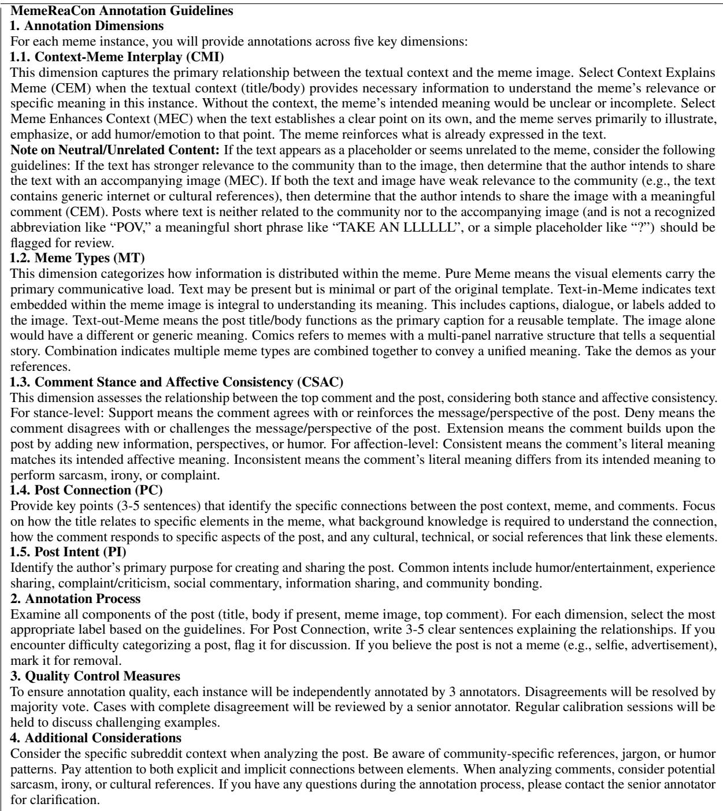  
Table 8: MemeReaCon annotation guidelines.

These findings reinforce our conclusion that understanding and generating meme content requires deeper cultural knowledge and contextual reasoning abilities that current models have yet to fully develop, particularly for tasks requiring creative generation within culturally-specific domains.

## E Further Analysis Experiments

## E.1 Community-Specific Performance Analysis

Understanding how models perform across different online communities provides critical insights into their ability to comprehend diverse social contexts. We analyze model performance across five popular subreddits to assess how communityspecific knowledge affects contextual understanding capabilities.

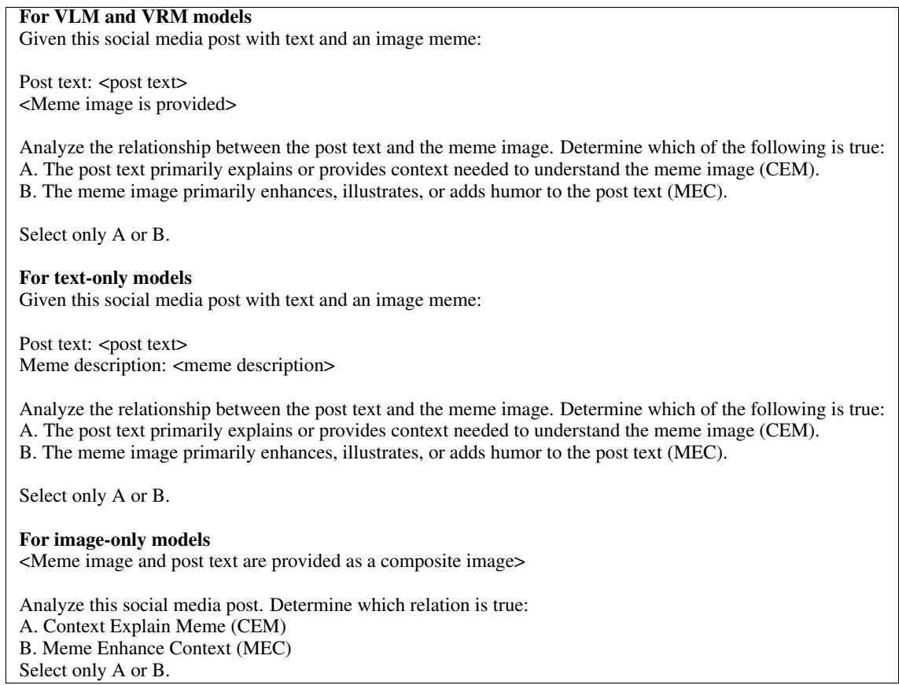  
Table 9: Prompt for Context-Meme Interplay task.

<table><tr><td></td><td>Support</td><td>Deny</td><td>Extension</td></tr><tr><td>Consistent</td><td>Support</td><td>Deny</td><td>Extension</td></tr><tr><td>Inconsistent</td><td>Deny</td><td>Support</td><td>Extension</td></tr></table>

Table 10: Real comments type matrix to show both literal meaning and intended meaning.

Table 15 reveals a consistent and significant performance drop across all models when processing content from specialized communities. All evaluated models perform substantially worse on r/ProgrammerHumor (requiring technical knowledge) and r/BritishMemes (requiring cultural context) compared to general meme communities. Interestingly, we observe that the performance gap between specialized and general communities widens as task complexity increases. For the generative PI-G task requiring deeper contextual reasoning, performance degradation is more severe than for the classification-based CMI-C task. This suggests that specialized knowledge gaps compound when models must perform multi-step reasoning, revealing a fundamental limitation in current contextual understanding capabilities.

The consistent performance differential across community types persists regardless of model scale or architecture, indicating that current pre-training approaches may not adequately capture the specialized knowledge and cultural contexts necessary for understanding community-specific content. This finding challenges the assumption that scaling alone can solve contextual understanding problems, suggesting that targeted approaches to incorporate domain-specific knowledge may be necessary for developing models with robust cross-community understanding capabilities.

## E.2 Meme Structure Performance Analysis

The structural configuration of memes significantly impacts model comprehension, revealing important insights about how LVLMs process multimodal content. Table 16 shows performance across five distinct meme structures: pure meme (PM), Textin-Meme (TIM), Text-out-Meme (TOM), comics (Comic), and combination (Comb).

Our analysis reveals a consistent pattern where Vision Reasoning Models (VRMs) substantially outperform standard Vision-Language Models (VLMs) across all structural configurations, with an average performance gap of 10-15%. This gap widens most dramatically for Text-in-Meme (TIM, ∆ = 14.87%), suggesting that VRMs possess superior capabilities for integrating visual and textual elements when they spatially overlap. Interestingly, all models struggle most with comic formats and combination formats (Comb), which require tracking narrative flow across sequential images and understanding relationships between multiple visual elements.

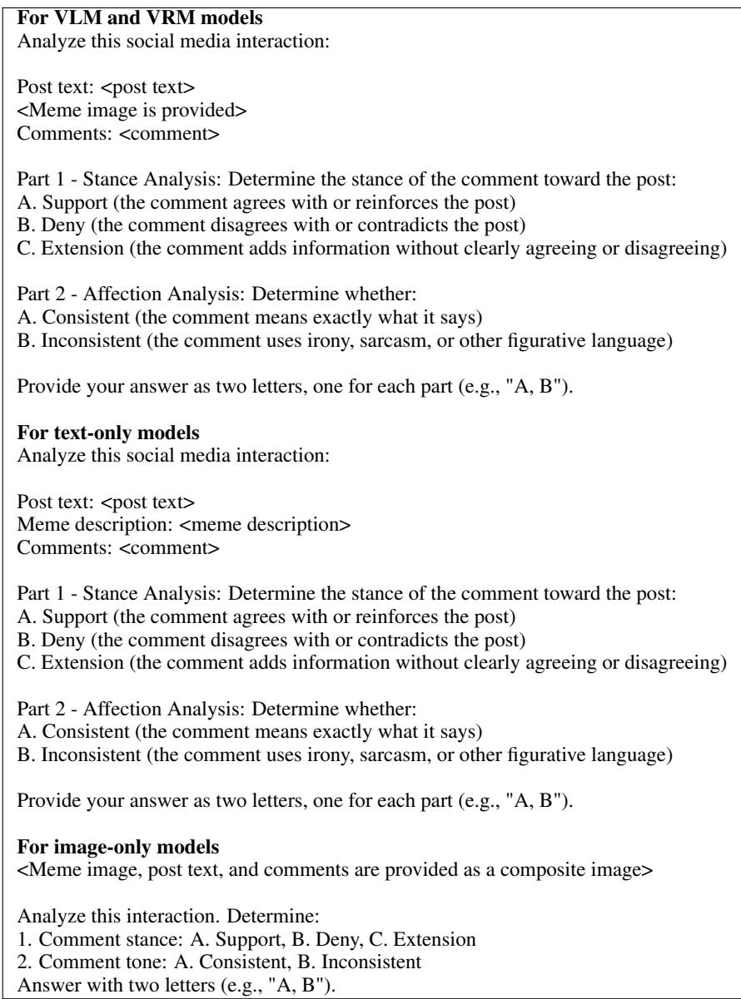  
Table 11: Prompt for Comment Stance + Affection task.

The performance hierarchy (TIM > TOM > PM > Comic > Comb) across model types indicates that current architectures find it easier to process memes where text and image are tightly integrated in a single visual space, compared to formats requiring sequential reasoning or cross-referencing between multiple visual elements. This finding highlights a critical limitation in current LVLMs: while they can effectively process localized multimodal information, they struggle with distributed multimodal reasoning tasks that more closely resemble how humans process complex social media content. The substantial performance degradation on combined formats (12.89% below TIM for VRMs) demonstrates that even state-of-the-art models have not yet bridged the gap between processing isolated multimodal elements and understanding holistic multimodal narratives.

## E.3 Meme Text-Density Analysis

Memes exhibit significant variation in text density, ranging from image-dominant formats with minimal text to text-heavy variants where the visual component serves primarily as a backdrop. This variability presents unique challenges for multimodal understanding. To systematically investigate how text density affects model performance, we categorized memes in our dataset into three distinct groups: low-text (0-10 words), medium-text (11-30 words), and high-text (>30 words). This analysis specifically focuses on the Post Intent Prediction (PI-G) tasks, as this requires comprehensive integration of visual and textual elements.

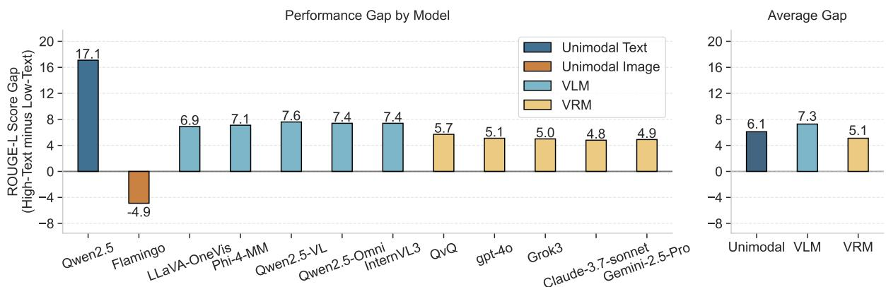

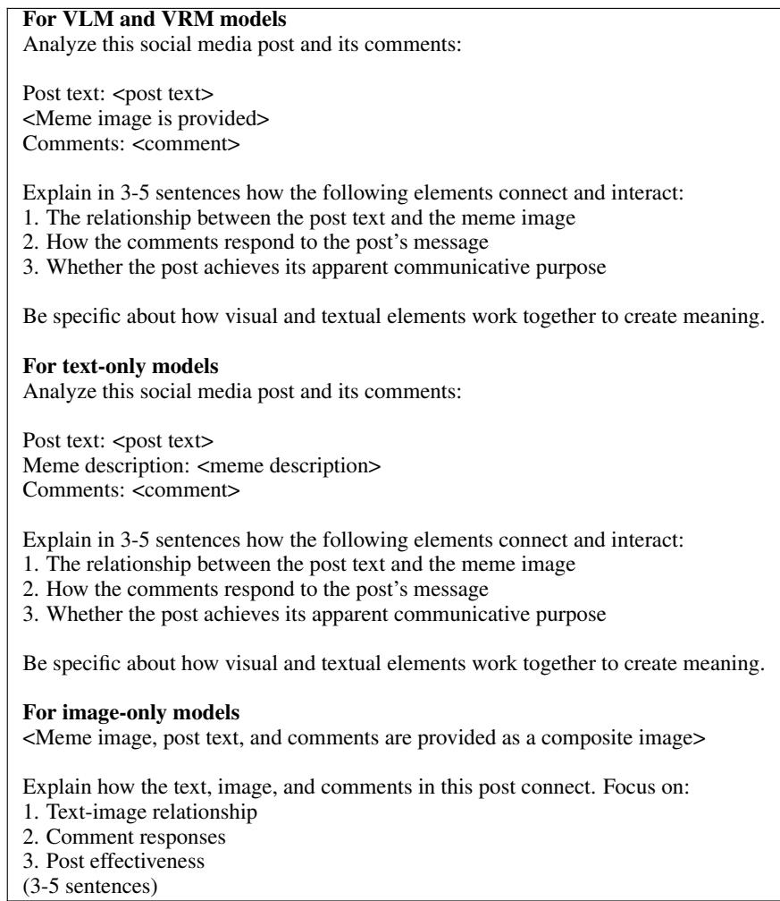  
Table 12: Prompt for Post Connection task.  
Figure 10: Performance gap between high-text and low-text memes across model categories. Positive values indicate better performance on high-text memes. The gap narrows significantly for Vision Reasoning Models, demonstrating their superior cross-modal integration capabilities.

As illustrated in Figure 10, the performance gap between high-text and low-text memes narrows significantly as model sophistication increases. While VLMs show an average ROUGE-L performance difference of 7.3 points between high-text and lowtext memes, this gap shrinks to just 4.7 points for VRMs. Claude-3.7-sonnet exhibits the smallest gap at 4.8 points, suggesting that advanced reasoning mechanisms enable more balanced processing of multimodal content regardless of text-image ratio. This finding has significant implications for meme understanding systems, indicating that sophisticated reasoning capabilities, rather than simply larger model size, are crucial for handling the diverse spectrum of meme formats encountered in real-world social media.

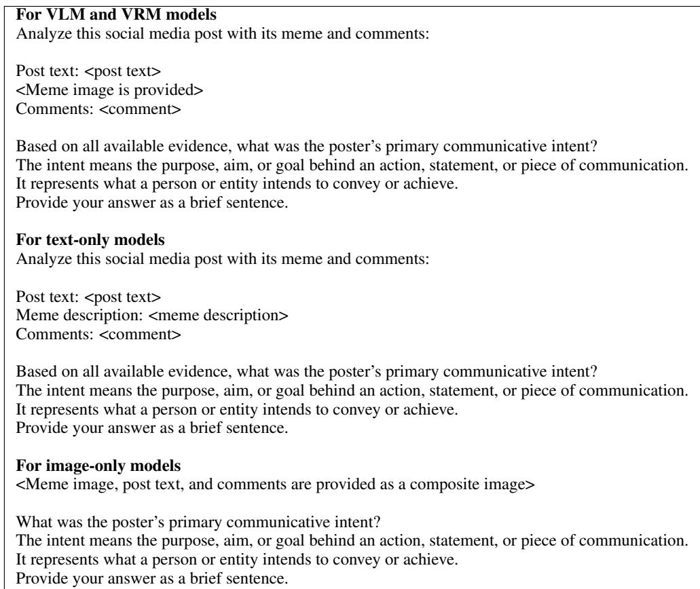

Table 13: Prompt for Post Intent Prediction task.
<table><tr><td>Model</td><td>CMI-C</td><td>CSAC-C</td><td>PC-G</td><td>PI-G</td></tr><tr><td>Qwen2.5</td><td>67.8</td><td>68.4</td><td>53.7</td><td>32.1</td></tr><tr><td>Flamingo</td><td>63.4</td><td>42.6</td><td>36.5</td><td>19.7</td></tr><tr><td>Qwen2.5-Omni</td><td>78.9</td><td>65.3</td><td>52.4</td><td>41.2</td></tr><tr><td>Gemini-2.5-pro</td><td>89.5</td><td>79.6</td><td>71.3</td><td>59.8</td></tr><tr><td>Human (Internet-Aware)</td><td>95.3</td><td>92.7</td><td>88.4</td><td>82.9</td></tr><tr><td>Performance Gap</td><td>5.8</td><td>13.1</td><td>17.1</td><td>23.1</td></tr></table>

Table 14: Fine-tuning results across different models compared to human performance. Performance gap represents the difference between Internet-Aware human annotators and the best fine-tuned model (Gemini-2.5-pro). For classification tasks (CMI-C and CSAC-C), we report accuracy (%), while for generation tasks (PC-G and PI-G), we use BERTScore.

## E.4 Comment Affection Analysis

Social media conversations often involve complex dynamics where comments may support, deny, or extend the original post while conveying affective meanings that can be inconsistent with their literal content. This section explores how these comment characteristics influence models’ ability to understand the relationship between posts and memes.

We designed experiments to analyze how models’ performance varies across different comment types (support, deny, extension) and affection patterns (consistent vs. inconsistent). Consistent affection occurs when the literal meaning aligns with the intended sentiment (e.g., sincere praise), while inconsistent affection involves misalignment (e.g., sarcastic “praise” that actually criticizes). We present data to models under three conditions: (1) without comments, (2) with consistent-affection comments, and (3) with inconsistent-affection comments. For each condition, we evaluated performance on the Post Intent Prediction (PI-G) task, which requires inferring the poster’s communicative intent.

<table><tr><td>Model</td><td>r/memes</td><td>r/meme</td><td>r/ProgrammerHumor</td><td>r/BritishMemes</td><td>r/RelationshipMemes</td></tr><tr><td colspan="6">CMI-C Task (Accuracy %)</td></tr><tr><td>Qwen2.5-VL</td><td>64.57</td><td>65.12</td><td>53.28</td><td>58.76</td><td>65.79</td></tr><tr><td>InternVL3</td><td>61.32</td><td>63.46</td><td>51.43</td><td>57.21</td><td>62.94</td></tr><tr><td>Gemini-2.5-pro</td><td>85.72</td><td>86.19</td><td>72.33</td><td>77.83</td><td>88.03</td></tr><tr><td>Max  $\bar { \Delta }$ </td><td>24.40</td><td>22.73</td><td>20.90</td><td>20.62</td><td>25.09</td></tr><tr><td colspan="6">PI-G Task (ROUGE-L %)</td></tr><tr><td>Qwen2.5-VL</td><td>18.34</td><td>19.07</td><td>12.52</td><td>14.79</td><td>17.63</td></tr><tr><td>InternVL3</td><td>15.87</td><td>16.92</td><td>10.28</td><td>12.44</td><td>15.97</td></tr><tr><td>Gemini-2.5-pro</td><td>45.41</td><td>46.13</td><td>35.04</td><td>39.54</td><td>45.59</td></tr><tr><td>Max∆</td><td>29.54</td><td>29.21</td><td>24.76</td><td>27.10</td><td>29.62</td></tr></table>

Table 15: Performance across subreddits for representative models. Best and worst performance for each model are highlighted. Max $\Delta$ shows the gap between highest and lowest performing models.

<table><tr><td>Model Type</td><td>PM</td><td>TIM</td><td>TOM</td><td>Comic</td><td>Comb</td></tr><tr><td>Qwen-VL</td><td>58.73</td><td>64.92</td><td>60.37</td><td>54.68</td><td>52.94</td></tr><tr><td>InternVL3</td><td>65.28</td><td>71.43</td><td>67.58</td><td>59.76</td><td>59.05</td></tr><tr><td>VLMs (avg)</td><td>58.42</td><td>65.31</td><td>60.73</td><td>55.14</td><td>52.87</td></tr><tr><td>VRMs (avg)</td><td>68.73</td><td>80.18</td><td>73.42</td><td>64.52</td><td>65.76</td></tr><tr><td> $\bar { \Delta } ^ { * }$ </td><td>10.31</td><td>14.87</td><td>12.69</td><td>9.38</td><td>12.89</td></tr></table>

Table 16: Impact of meme structural configuration on PC-G task performance. PM: Pure Memes without text overlay; TIM: Text-in-Meme; TOM: Text-out-Meme; Comic: comic format; Comb: Multiple images combination. $\Delta ^ { * }$ indicates average performance gap between VRMs and VLMs.

As shown in Table 17, both Gemini-2.5-pro and Qwen2.5-VL models experience a substantial performance disparity between consistent and inconsistent affection scenarios. When presented with comments whose affective meaning contradicts their literal content (inconsistent affection), even leading Vision Reasoning Models (VRMs) suffer performance drops of 20-25 percentage points compared to consistent affection scenarios. This gap, which we term the “Context-Affection Gap,” is most pronounced in deny comments with inconsistent affection (e.g., sarcastic agreement that actually contradicts). For instance, Gemini-2.5-Pro achieves 76.1% accuracy with consistent denial comments but only 52.0% with inconsistent denial comments.

This finding suggests that current LVLMs struggle with communication where literal meaning diverges from intended meaning. The narrower gap observed in VRMs compared to VLMs indicates that advanced reasoning models are hurt more by providing opposite points of view.

## E.5 Modality Contribution Analysis

To investigate how different elements of posts contribute to model understanding, we conducted systematic ablation experiments by removing or replacing key components. Table 18 shows performance changes when manipulating either textual context or visual elements.

Our findings reveal several interesting patterns. First, image removal causes dramatically larger performance drops than text removal, with PC-G task performance declining by 34.28% for Qwen2.5-VL compared to just 12.13% when text is removed. This suggests that memes serve as the primary information carrier in these multimodal posts, even for the “Meme to enhance context” setting. Second, models perform better with mismatched components than with missing ones: random text produces smaller drops (7.57% for Qwen2.5-VL on PC-G) than no text (12.13%). This indicates models use whatever context is available to create meaning, even when connections are tenuous.

Most surprisingly, we find that smaller models like Qwen2.5-VL show greater sensitivity to modality manipulation than larger ones like Gemini-2.5-Pro. When presented with random images,

<table><tr><td rowspan="2">Model</td><td rowspan="2">No Comments</td><td colspan="3">Consistent Affection</td><td colspan="3">Inconsistent Affection</td></tr><tr><td>Support</td><td>Deny</td><td>Extend</td><td>Support</td><td>Deny</td><td>Extend</td></tr><tr><td>Qwen2.5-VL</td><td>66.2</td><td>62.3</td><td>58.7</td><td>55.2</td><td>40.1</td><td>37.2</td><td>43.8</td></tr><tr><td>Gemini-2.5-Pro</td><td>83.2</td><td>82.7</td><td>76.1</td><td>73.8</td><td>58.2</td><td>52.0</td><td>61.3</td></tr></table>

Table 17: Model performance on Post Intent Prediction (PI-G) task with different comment types and affection patterns. Results show ROUGE-L (%).
<table><tr><td rowspan="2">Settings</td><td colspan="2">PC-G</td><td colspan="2">PI-G</td><td colspan="2">PC-G</td><td colspan="2">PI-G</td></tr><tr><td>R-L (%)</td><td>∆</td><td>R-L (%)</td><td>∆</td><td>R-L (%)</td><td>∆</td><td>R-L (%)</td><td>∆</td></tr><tr><td></td><td colspan="6">Qwen2.5-VL</td><td>Gemini-2.5-Pro</td><td></td></tr><tr><td>Original</td><td>60.38</td><td></td><td>44.86</td><td></td><td>38.92</td><td></td><td>20.43</td><td></td></tr><tr><td>No Text</td><td>48.25</td><td>-12.13</td><td>36.42</td><td>-8.44</td><td>30.47</td><td>-8.45</td><td>10.69</td><td>-9.74</td></tr><tr><td>Random Text</td><td>52.81</td><td>-7.57</td><td>38.67</td><td>-6.19</td><td>32.50</td><td>-6.42</td><td>15.30</td><td>-5.13</td></tr><tr><td>No Image</td><td>26.10</td><td>-34.28</td><td>21.69</td><td>-23.17</td><td>22.66</td><td>-16.26</td><td>14.98</td><td>-5.45</td></tr><tr><td>Random Image</td><td>28.34</td><td>-31.84</td><td>23.45</td><td>-21.21</td><td>26.88</td><td>-12.04</td><td>17.25</td><td>-3.18</td></tr></table>

Table 18: Performance of modality contribution analysis. “Original” uses the meme’s actual context; “Random Text” and “Random Image” uses mismatched context/image from a different post. “No Text” and “No Image” removes post title/image. Text modified for Meme to Enhance Context setting (MEC), while image modified for Context to explain meme setting (CEM).

Qwen2.5-VL’s performance drops by 31.84% on PC-G tasks, while Gemini-2.5-Pro decreases by only 12.04%. This suggests that reasoning models develop more robust internal representations that can partially recover from contextual mismatches, effectively “filtering out” irrelevant information. These findings highlight a critical gap in current models: while they can process multimodal inputs, they struggle to determine which elements should be contextually emphasized or disregarded, which is a fundamental aspect of human social media consumption that remains challenging for LVLMs.

## F Error Analysis Description and Performance

We categorized errors into four distinct patterns that emerged consistently across models (Figure 11). The distribution of these errors varies significantly between model architectures, revealing fundamental differences in contextual processing capabilities.

The four primary error patterns we identified are:

• Context: Models process the meme in isolation, disregarding crucial context from the post text or comments. This was most prevalent in VLMs (41.7%) and less common in VRMs (22.5%), suggesting that reasoning-enhanced architectures better incorporate textual context.

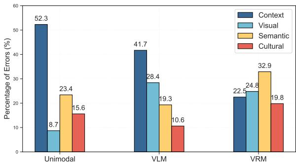  
Figure 11: Distribution of error types across model categories when interpreting memes in context. Vision Reasoning Models (VRMs) make fewer context-neglect errors but struggle more with contextual conflicts than Vision-Language Models (VLMs).

• Visual: Models overemphasize visually important but contextually irrelevant image elements. This error occurred when models focused on character objects rather than the socially relevant aspects indicated by the post.

• Semantic: Initially correct interpretations gradually go wrong as response length increases. Notably, this was highest among VRMs (32.9%), suggesting that more powerful generative capabilities sometimes lead to unfocused elaboration.

• Cultural: Models fail to recognize communityspecific references, slang, or humor conventions.

This affects all model classes but was most pronounced in VRMs (19.8%), possibly due to their attempts at more complex reasoning about unfamiliar cultural elements.

## G More Error Cases

We show more error cases covering each error type in Figure 12 and 13.

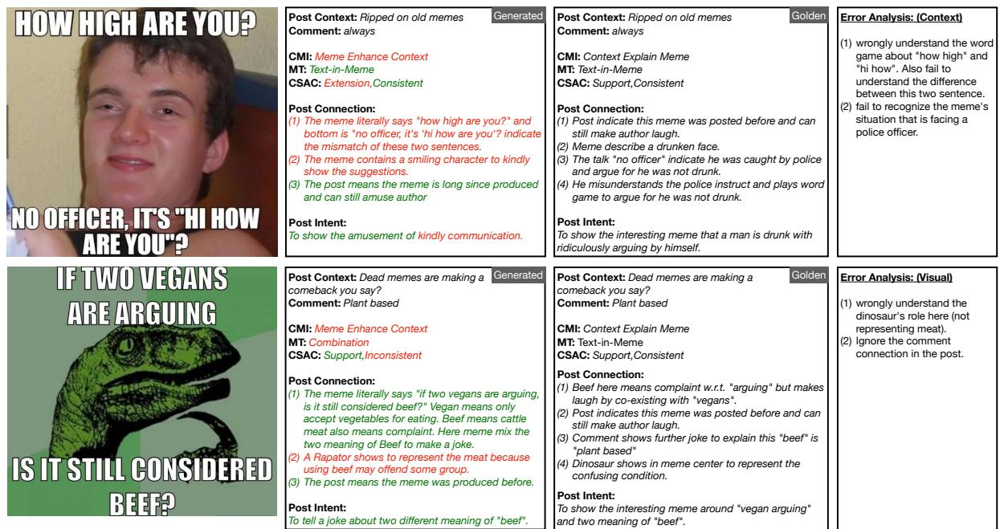  
Figure 12: Error cases for Context error and Visual error. The green text indicates the correct answer compared with golden. The red text indicates the wrong answer.

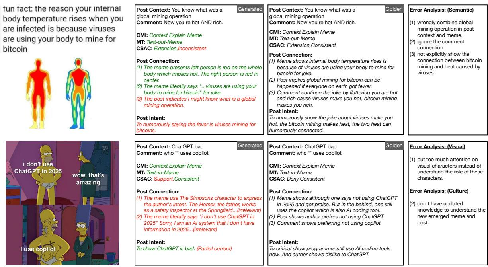  
Figure 13: Error cases for Semantic error and Culture error. The green text indicates the correct answer compared with golden. The red text indicates the wrong answer.