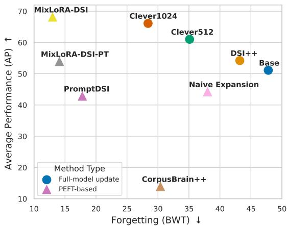
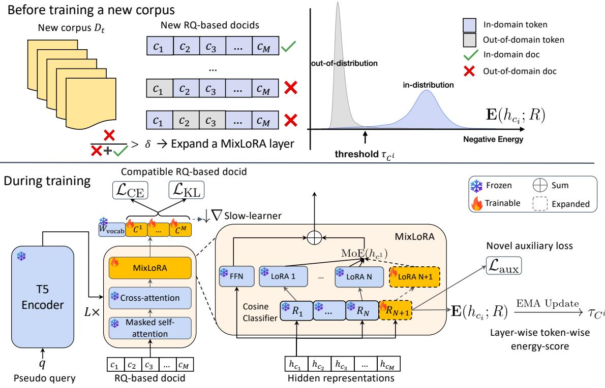
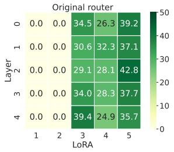
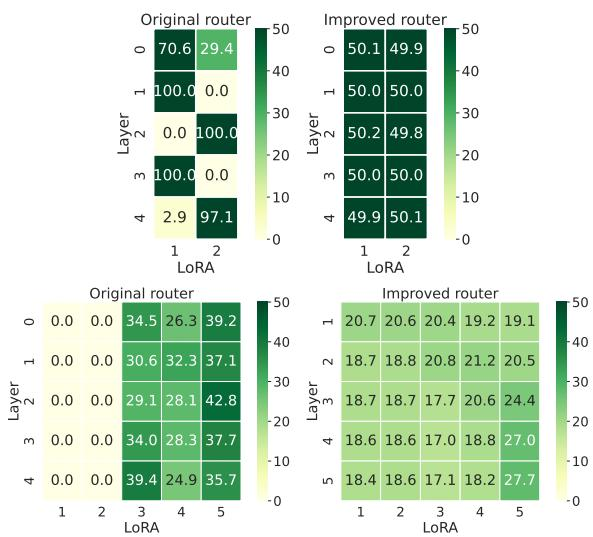
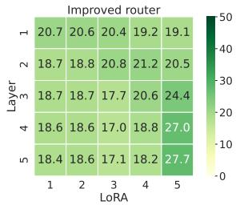

# MixLoRA-DSI: Dynamically Expandable Mixture-of-LoRA Experts for Rehearsal-Free Generative Retrieval over Dynamic Corpora

Tuan-Luc Huynh1 Thuy-Trang Vu1 Weiqing Wang1

Trung Le1 Dragan Gaševic´2 Yuan-Fang Li1 Thanh-Toan Do1

1 Department of Data Science & AI, Monash University, Australia

2 Department of Human Centred Computing, Monash University, Australia

{tuan.huynh1,trang.vu1,teresa.wang,

trunglm,dragan.gasevic,yuanfang.li,toan.do}@monash.edu

## Abstract

Continually updating model-based indexes in generative retrieval with new documents remains challenging, as full retraining is computationally expensive and impractical under resource constraints. We propose MixLoRA-DSI, a novel framework that combines an expandable mixture of Low-Rank Adaptation experts with a layer-wise out-of-distribution (OOD)- driven expansion strategy. Instead of allocating new experts for each new corpus, our proposed expansion strategy enables sublinear parameter growth by selectively introducing new experts only when significant number of OOD documents are detected. Experiments on NQ320k and MS MARCO Passage demonstrate that MixLoRA-DSI outperforms full-model update baselines, with minimal parameter overhead and substantially lower training costs.1

## 1 Introduction

Generative retrieval (GR) leverages pretrained Transformer models as model-based information retrieval (IR) index, also known as differential search index (DSI), to encode corpus information directly within the model parameters (Tay et al., 2022). However, GR methods primarily assume a static corpus, where the document set remains unchanged. This overlooks the real-world challenge of IR systems to handle dynamic corpora, where they need to continually integrate new documents.

Since GR methods perform indexing via model training, continually updating index may require expensive retraining. Recent works have explored continual learning (CL) approaches to mitigate catastrophic forgetting while efficiently updating the model without retraining from scratch (Mc-Closkey and Cohen, 1989; Mehta et al., 2023), such as rehearsal-based CL (Mehta et al., 2023; Kishore et al., 2023; Chen et al., 2023). However, these methods either adopt atomic document identifiers (docids) (Mehta et al., 2023) or only evaluate on small-scale datasets, limiting their scalability on large-scale retrieval benchmarks (Bajaj et al., 2016). Additionally, rehearsal-based methods require access to previous documents, raising privacy concerns (Shokri and Shmatikov, 2015), making them impractical for real-world applications. Furthermore, dynamic corpora naturally align with task-agnostic (i.e., task-free) CL, characterized by blurry task boundaries (Aljundi et al., 2019), since new documents may share high semantic similarity to previous indexed ones. These challenges collectively indicate the need for a task-agnostic, rehearsal-free, and scalable solution.

  
Figure 1: Continual learning performance of different Generative Retrieval methods on NQ320k (Recall@10). PEFT-based MixLoRA-DSI variants offer the best tradeoff between average performance and forgetting, while being significantly more parameter-efficient than fullmodel updates. See Table 1 for more detailed results.

In this work, we propose MixLoRA-DSI, a parameter-efficient fine-tuning (PEFT)-based dynamically expandable framework for rehearsal-free GR over dynamic corpora, which outperforms various GR methods (Figure 1). Our approach builds on mixture-of-experts (MoE) (Shazeer et al., 2017), where each expert is a low-rank adapter (Hu et al., 2022). MixLoRA-DSI replaces the standard topk linear router with a top-k cosine classifier (Gidaris and Komodakis, 2018) and introduces a novel auxiliary loss. This improved router alleviates the recency bias in MoE routing of the original router, while the novel auxiliary loss encourages accurate token-to-expert alignment and preserves expert diversity. As a result, MixLoRA-DSI is inherently task-agnostic as the top-k routers dynamically select experts per token without relying on rigid task-specific parameters. The use of LoRA experts ensures efficient indexing while preserving knowledge from previously indexed documents, mitigating catastrophic forgetting and enabling rehearsal-free CL. We enhance scalability by opting for residual quantization (RQ)-based docids (Zeng et al., 2024a) and developing CL strategies tailored to RQ-based docids by leveraging their structural properties.

MixLoRA-DSI views GR over dynamic corpora through the lens of out-of-distribution (OOD) detection. Naively adding new experts for each corpus update leads to linear parameter growth without ensuring efficient capacity utilization. However, in practice, queries often share structural patterns and differ mainly in OOD keywords associated with newly indexed documents, thus new docids may frequently overlap in latent space. Building on this insight, we propose an layer-wise OOD-driven expansion strategy that selectively adds new experts when existing ones fail to capture significant novel information from new documents. This decision is governed by the layer-wise energy scores (Liu et al., 2020) from the routers, enabling sublinear parameter growth while maintaining retrieval effectiveness. Overall, we make the following contributions:

• We propose MixLoRA-DSI, the first OOD-driven dynamic expansion framework for rehearsal-free GR over dynamic corpora, achieving sublinear parameter growth.

• We improve MoE routing by replacing the standard router with a top-k cosine classifier, jointly optimized with a novel auxiliary loss to encourage expert specialization while ensuring balanced token-to-expert assignments.

• We propose continual learning strategies tailored to RQ-based document identifiers.

• Experiments on NQ320k (Kwiatkowski et al.,

2019) and MS MARCO Passage dataset demonstrate that MixLoRA-DSI is significantly more parameter-efficient and robust to forgetting than full-model update baselines.

## 2 Preliminary

## 2.1 Generative Retrieval (GR)

Differentiable Search Index (DSI). DSI (Tay et al., 2022) is a representative method in generative retrieval (GR); we use DSI and GR interchangeably. Let $f _ { \theta }$ denote the T5 (Raffel et al., 2020)-based DSI model. During indexing, DSI is trained to map each document $d _ { i } \in D$ to a unique identifier $i d _ { i } \in I _ { D }$ . During the retrieval stage, given a set of query-docid pairs $Q _ { D } ^ { \mathrm { r e t r i e v a l } } = \{ ( q _ { i } , i d _ { q _ { i } } ) \}$ , DSI autoregressively generates a ranked list of top-k docids using constrained beam search, which are then mapped back to documents in D.

Document representations and document identifiers (docids) are two crucial design choices in DSI. At retrieval time, since DSI must process queries, which are typically much shorter and linguistically distinct from the training documents, it results in a distribution mismatch between indexing and retrieval. To address this issue, the current standard practice is to represent documents using pseudo-queries generated by off-the-shelf query generation models such as docT5query (Nogueira et al., 2019). These pseudo-queries are synthetic queries that simulate what users might ask to retrieve the corresponding documents. They serve as replacements for the original document content during indexing, helping to better align the training and inference distributions (Zhuang et al., 2022; Pradeep et al., 2023). We adopt Residual Quantization (RQ)-based docids, encoding documents as sequences of RQ codes (Babenko and Lempitsky, 2014), which is the first to show effectiveness on large-scale IR (Zeng et al., 2024a).

Dynamic corpora in GR. Dynamic corpora (Mehta et al., 2023) assumes there are $T + 1$ corpora $\{ D _ { 0 } , \hdots , D _ { T } \}$ , each associated with a set of docids $\{ I _ { 0 } , \ldots , I _ { T } \} . \quad D _ { 0 }$ is a large-scale corpus with annotated query-docid pairs, while $\begin{array} { c c c } { D _ { > 0 } } & { = } & { \{ D _ { 1 } , . . . , D _ { T } \} } \end{array}$ contains newly added documents without annotations. Let $\theta _ { t - 1 }$ denote the GR model parameters after indexing $\{ D _ { 0 } , \ldots , D _ { t - 1 } \}$ . At each timestep $t > 0 .$ the model must update to $\theta _ { t }$ to incorporate $D _ { t }$ Evaluation at timestep t is performed on retrieval queries $\{ Q _ { D _ { 0 } } ^ { \mathrm { r e t r i e v a l } } , \ldots , Q _ { D _ { t } } ^ { \mathrm { r e t r i e v a l } } \}$ using $\theta _ { t }$

## 2.2 Mixture of LoRA Experts

Mixture of Experts (MoE). An MoE layer (Shazeer et al., 2017) comprises of N feed-forward network (FFN) experts, denoted as $\{ E _ { i } \} _ { i = 1 } ^ { N }$ , and a router $R \in \mathbb { R } ^ { \mathrm { d i m } \times N }$ . Given token $x ,$ the router computes logits $R ( x ) = R ^ { \top } x$ . The gate value of the i-th expert is computed as:

$$
p _ { i } ( x ) = \frac { e ^ { R ( x ) _ { i } } } { \sum _ { j = 1 } ^ { N } e ^ { R ( x ) _ { j } } } ,
$$

where $p _ { i } ( x )$ represents the softmax-normalized probability for expert $E _ { i }$ . The token is routed to a subset of experts corresponding to the top-k gate logits. Let $T o p k ( \cdot )$ be a function that selects the top-k highest logits while setting the rest as zero. The output of a MoE layer is a weighted sum of the top-k experts, with the weights determined by the gate values:

$$
\mathbf { M o E } ( x ) = \sum _ { i = 1 } ^ { N } T o p k ( p _ { i } ( x ) ) E _ { i } ( x ) .
$$

MoE is often trained with an auxiliary load balancing loss to mitigate the unbalanced load for experts when training (Fedus et al., 2022). Given N experts and a batch B with $T$ tokens, the auxiliary loss $\mathcal { L } _ { \mathrm { a u x } }$ is computed as following:

$$
\begin{array} { r l r } {  { \mathcal { L } _ { \mathrm { a u x } } ^ { \mathrm { o r i g i n a l } } = a \cdot N \cdot \sum _ { i = 1 } ^ { N } \mathcal { F } _ { i } \cdot \mathcal { P } _ { i } , } } \\ & { } & { \mathcal { P } _ { i } = \frac { 1 } { T } \sum _ { x \in B } R ( x ) _ { i } , } \\ & { } & { \mathcal { F } _ { i } = \displaystyle \frac { 1 } { T } \sum _ { x \in B } 1 \{ \arg \operatorname* { m a x } R ( x ) _ { k } = i \} , } \end{array}\tag{1}
$$

where ${ \mathcal { F } } _ { i }$ is the fraction of tokens dispatched to expert $i , \mathcal { P } _ { i }$ is the fraction of the router probability allocated for expert i, and α stands for the weight coefficient of this auxiliary loss.

MixLoRA: Mixture of LoRA Experts. MixLoRA (Yu et al., 2024) employs LoRAs (Hu et al., 2022) as experts for parameter-efficient fine-tuning. Specifically, the pre-trained FFN remain frozen, and we apply a unique set of LoRAs to each FFN layer. For all experiments, we employ MixLoRA with top-2 router in specific T5’s decoder blocks, since the decoder is responsible for autoregressive docid generation. Our MixLoRA implementation is detailed in Appendix D.

## 3 Method

## 3.1 MixLoRA-DSI

Figure 2 presents the overview of MixLoRA-DSI, a novel dynamic expansion framework for rehearsalfree GR over dynamic corpora, equipped with an OOD-driven dynamic expansion mechanism, IRspecific improved routers, and RQ-based docids CL strategies.

Expanding MixLoRA. MixLoRA can be expanded with new LoRAs while maintaining nearly constant computational cost. Each expansion adds a new LoRA to the existing set and appends a weight vector $w ~ \in ~ \mathbb { R } ^ { \mathrm { d i m } }$ to the router: $R ^ { \prime } =$ $\{ R ; w \}$ Naively adding one expert per corpus to each MixLoRA layer causes linear parameter growth without guaranteed efficiency. To address this, we seek a principled criterion to determine: When should we expand a specific MixLoRA layer?

Energy-based OOD dynamic expansion. We observe that: (1) LoRA experts store knowledge, while the router selects which expert to activate, naturally making it responsible for deciding when expansion is needed. (2) In IR, queries often share structural similarities, with differences primarily in OOD keywords. Despite having unique docids, new documents frequently overlap in latent space. We thus propose a dynamic expansion strategy that detects OOD signals in the latent space relative to previously indexed documents, ensuring expert expansion only when necessary.

Among various OOD detection methods, we adopt the energy score (Liu et al., 2020), because of its two key advantages: (1) The router in each MixLoRA layer functions as a classifier, making the energy score a natural fit. (2) Unlike generative methods, it avoids computationally expensive and often unreliable density estimation (Lee et al., 2020; Ardywibowo et al., 2022; Nalisnick et al., 2019). Given an input token x to the router R of a MixLoRA layer, we treat the router as an N-class classifier. The energy score parameterized by the router R is computed as:

$$
\mathbf { E } ( x ; R ) = - T \cdot \log \sum _ { i = 1 } ^ { N } \exp ( \langle R _ { i } , x \rangle / T ) ,\tag{2}
$$

where $T$ is the temperature, typically set to 1.0 to ensure the energy score remains parameter-free, and $R _ { i }$ represents the weight vector of the router corresponding to the i-th expert.

  
Figure 2: Overview of MixLoRA-DSI. Before training, the model scans the new corpus to to perform energy-based OOD dynamic expansion (Section 3.1). During training, the new router weights are optimized with the novel auxiliary loss $\mathcal { L } _ { \mathrm { a u x } } \left( \mathrm { E q . ~ } 3 \right)$ , and the energy score thresholds are updated via exponential moving average (EMA). New LoRA experts and RQ-based docid embeddings $\{ C ^ { 1 } , \ldots , C ^ { M } \}$ are trained with the proposed RQ-based docids CL strategies (Section 3.2). Residual connections and layer normalizations are dropped without loss of generality.

The energy-based OOD dynamic expansion process is illustrated in the top-half of Figure 2.We compute energy scores for each token at every MixLoRA layer. During indexing, we maintain exponential moving averages of in-distribution (ID) energy scores $\{ \tau _ { C ^ { i } } \} _ { i = 1 } ^ { M }$ from previously indexed corpora from the router (i.e., the cosine classifier in a MixLoRA layer, bottom-half of Figure 2). Before indexing a new corpus, we iterate over its training pseudo-queries (i.e., the document representation) to detect OOD cases. Since energy scores are higher for OOD data, a token $c _ { i }$ is flagged as OOD if its energy score exceeds the corresponding threshold $\tau _ { C ^ { i } }$ (gray $c _ { i }$ in Figure 2). A query is considered OOD if it contains at least one OOD token (Out-of-domain doc, marked with red X marks). If the number of OOD queries for a MixLoRA layer exceeds a predefined threshold δ, we trigger expert expansion for that layer (dashed LoRA and dashed cosine classifier weight in the MixLoRA layer, bottom-half of Figure 2).

Improving the router of MixLoRA. The original MoE design incorporates an auxiliary load balancing loss (Eq. 1) to evenly distribute tokens across experts. However, we observe recency bias in the router, where tokens are predominantly routed to newly added experts while ignoring older ones. This issue is exacerbated by the softmax competition in the router, where the unfrozen logits of new router weights dominate over frozen ones, skewing expert selection. To address this, we propose replacing the original softmax router, which has unnormalized router weights and takes unnormalized inputs, with a cosine classifier (Gidaris and Komodakis, 2018). The cosine classifier router is optimized via cosine embedding loss to better align layer-wise token hidden representations with router weights, i.e., the first term of Eq. (3). Additionally, to prevent router weights from becoming overly similar, we introduce another loss term that encourages new router weights to remain distinct from previous ones, i.e., the second term of Eq. (3).

The auxiliary router loss for a MixLoRA layer with N experts is defined as:

$$
\begin{array} { l } { \displaystyle \mathcal { L } _ { \mathrm { a u x } } ( h _ { i d } ; R ) = \frac { 1 } { M } \sum _ { i = 1 } ^ { M } ( 1 - \cos ( R _ { N } , h _ { c _ { i } } ) ) } \\ { \displaystyle + \sum _ { j = 1 } ^ { N - 1 } \operatorname* { m a x } ( 0 , \cos ( R _ { j } , R _ { N } ) ) , } \end{array}\tag{3}
$$

where cos( , ) is the cosine function, $\begin{array} { r l } { h _ { i d } } & { { } = } \end{array}$ $\{ h _ { c _ { 1 } } , . . . , h _ { c _ { M } } \}$ denotes the docids’s hidden representations obtained from the previous Transformer decoder block. Each $h _ { c _ { i } } ~ \in ~ h _ { i d }$ and the column vectors of R are unit L -norm weight vectors.

## 3.2 RQ-based docids CL strategies

RQ-based docids. Mehta et al. (2023); Huynh et al. (2024) adopt atomic docids due to their robustness against forgetting compared to semantic docids. However, they scale poorly due to the required large softmax space. In this work, we challenge this observation and adopt scalable RQ-based docids. Following Zeng et al. (2024a), we train the document embeddings with M RQ codebooks $C ^ { m } : = \{ c _ { k } \} _ { k = 1 } ^ { K } \in \mathbb { R } ^ { \dim \times K }$ , each containing K centroids, to generate an RQ code of length M for each document. The learned RQ centroids are concatenated to the DSI’s vocabulary weights $W _ { \mathrm { v o c a b } }$ for subsequent optimization: $W _ { \mathrm { R Q } } ~ = ~ \{ W _ { \mathrm { v o c a b } } ; C ^ { 1 } ; \ldots ; C ^ { M } \}$ , where $\{ \cdot ; \cdot \}$ is concatenation. Please refer to Appendix C for more details about RQ-based docids.

RQ-based docids mask. RQ-based docids have a structured design, where each token $c _ { i }$ is predicted from a specific segment of the extended vocabulary $W _ { \mathrm { R Q } }$ , corresponding to its RQ codebook. To avoid requiring DSI to implicitly learn this structure, we apply a masking strategy that explicitly restricts the softmax computation to the relevant segment of the vocabulary at each decoding step, preventing unnecessary competition between logits. Specifically, for each token $c _ { i }$ at position i in the sequence, we define a binary mask m with the same shape as the output vocabulary, where:

$$
\begin{array} { r } { \mathbf { m } _ { i } [ j ] = \left\{ \begin{array} { l l } { 1 } & { \mathrm { i f } \ j \in C ^ { i } , } \\ { 0 } & { \mathrm { o t h e r w i s e } . } \end{array} \right. } \end{array}\tag{4}
$$

Let $\mathbf { z } _ { i } ~ \in ~ \mathbb { R } ^ { | W _ { R Q } | }$ represent the logits produced at decoding step i. During each decoding step, we apply the corresponding mask $\mathbf { m } _ { i }$ to invalidate

irrelevant indices by replacing them with :

$$
\begin{array} { r } { \mathbf { z } _ { i } ^ { \prime } [ j ] = \left\{ \begin{array} { l l } { \mathbf { z } _ { i } [ j ] } & { \mathrm { i f } \ \mathbf { m } _ { i } [ j ] = 1 , } \\ { - \infty } & { \mathrm { i f } \ \mathbf { m } _ { i } [ j ] = 0 . } \end{array} \right. } \end{array}\tag{5}
$$

Let us consider the docid 1 2, which has length $M = 2$ , and assume that there are K = 4 centroids per codebook. In the first decoding step, we mask the logits corresponding to the last 4 centroids in $W _ { R Q } \in \mathbb { R } ^ { 2 \times 4 }$ with  then apply softmax to generate the first code in the docid 1. Similarly, in the next decoding step, we mask the logits corresponding to the first 4 centroids in $W _ { R Q } \in \mathbb { R } ^ { 2 \times 4 }$ with $- \infty$ then apply softmax to generate the second code in the docid 2.

Learning compatible RQ-based docids embeddings. To enhance the CL performance of MixLoRA-DSI, we employ the slow-learner strategy (Zhang et al., 2023) by scaling down the gradient updates of the output vocabulary $W _ { \mathrm { R Q } }$ , while keeping the original portion $W _ { \mathrm { v o c a b } }$ frozen. Since we have access to the previous model parameters $\theta _ { t - 1 }$ before indexing a new corpus, we regularize the updates to the RQ embeddings using KL divergence, loosely aligning the posterior predictive distribution of the current model with that of the previous model at each decoding step:

$$
\begin{array} { c } { { \mathcal { L } _ { \mathrm { K L } } ( q , i d ; \theta _ { t } , \theta _ { t - 1 } ) = } } \\ { { { } } } \\ { { \displaystyle \frac { 1 } { M } \sum _ { i = 1 } ^ { M } D _ { K L } ( P ( c _ { i } | c _ { < i } , q ; \theta _ { t - 1 } ) \parallel P ( c _ { i } | c _ { < i } , q ; \theta _ { t } ) ) . } } \end{array}\tag{6}
$$

## 3.3 Optimization Objective

The optimization objective for MixLoRA-DSI is:

$$
\begin{array} { r l } { \displaystyle } & { \langle { \cal Q } _ { D _ { t } } ^ { \mathrm { r e t r i e v a l } } ; \theta _ { t } , \theta _ { t - 1 } ) = \sum _ { i = 1 } ^ { | { \cal Q } _ { D _ { t } } ^ { \mathrm { r e t r i e v a l } } | } \mathcal L _ { \mathrm { C E } } ( q _ { i } , i d _ { q _ { i } } ; \theta _ { t } ) } \\ & { + \alpha _ { 1 } \displaystyle \sum _ { l \in { \cal L } } \mathcal L _ { \mathrm { a u x } } ( h ^ { l - 1 } , R ^ { l } ) + \alpha _ { 2 } \mathcal L _ { \mathrm { K L } } ( q _ { i } , i d _ { q _ { i } } ; \theta _ { t } , \theta _ { t - 1 } ) , } \end{array}\tag{7}
$$

where $\mathcal { L } _ { \mathrm { C E } }$ is the log-softmax cross-entropy loss for seq2seq learning, L denotes the set of MixLoRA layers in DSI’s decoder, $h ^ { l - 1 }$ denotes the previous decoder block output, $R ^ { l }$ denotes the router of l-th MixLoRA layer, and $\alpha _ { 1 } , \alpha _ { 2 }$ are hyperparameters. During the pre-training stage on $D _ { 0 }$ , we do not employ ${ \mathcal { L } } _ { \mathrm { K L } }$ . During continual indexing, if there is expansion, we optimize only the expanded router weights, new LoRAs, and the extended RQ docids vocabulary weights; otherwise, we only optimize the extended RQ docids vocabulary weights (Section 3.2). All other parameters are frozen.

## 4 Experiments

## 4.1 Experimental setting

Datasets. We evaluate on Natural Questions (NQ320k) (Kwiatkowski et al., 2019) and MS-MARCO Passage (MSMARCO) (Bajaj et al., 2016). NQ320k is a small-scale GR benchmark (Sun et al., 2023; Kishore et al., 2023) with 320k query-document pairs from 108k documents, while MSMARCO is a large-scale IR benchmark with 8.8M passages and 503k queries, evaluated on its 6.9k-query development set. Following prior works (Kishore et al., 2023; Huynh et al., 2024), we simulate dynamic corpora by splitting each dataset into an initial corpus $D _ { 0 }$ (90% of documents) and four incremental corpora $D _ { 1 } { - } D _ { 4 }$ (each 2.5%). Test queries are partitioned accordingly. Further details are in Appendix A.

Metrics. Following Zeng et al. (2024a,b), we use Recall@10 (R@10) and MRR@10 (M@10) to evaluate the retrieval performance on both datasets. Following previous works (Mehta et al., 2023; Huynh et al., 2024), we adopt Average Performance (AP); Backward Transfer (BWT, aka Forgetting) to measure the effect of indexing current corpus on previous indexed corpora; and Forward Transfer (FWT, aka Learning Performance) to measures the model’s ability to index a new corpus. Let $P _ { t , i }$ denote the retrieval performance of the model on corpus $D _ { i }$ after indexing corpus $D _ { t }$ . With 0 i<t, the CL metrics are defined as follows:

$$
\mathsf { A P } _ { t } = \frac { 1 } { t } \sum _ { i = 0 } ^ { t } P _ { t , i } ; \quad \mathsf { F W T } _ { t } = \frac { 1 } { t } \sum _ { i = 1 } ^ { t } P _ { i , i } ;
$$

$$
\mathbf { B W T } _ { t } = \frac { 1 } { t - 1 } \sum _ { i = 1 } ^ { t - 1 } \operatorname* { m a x } _ { i ^ { \prime } \in \{ 0 , \dots , t - 1 \} } ( P _ { i ^ { \prime } , i } - P _ { t , i } ) .
$$

Baselines and model variants.

• Traditional IR models: (1) BM25 (Robertson et al., 2009) is a strong sparse retrieval baseline. (2) DPR (Karpukhin et al., 2020) is a popular BERT-based dual-encoder.

• GR models: BASE uses RQ-based docids (Zeng et al., 2024a) and is sequentially fine-tuned on new corpora. This setup is equivalent to RQbased docid Ultron (Zhou et al., 2022).

• Continual Learning Generative Retrieval (CLGR) models: we compare CLGR models in terms of the non-rehearsal CL strategies which starts from a T5 checkpoint pretrained on $D _ { 0 }$ (1) DSI++ (Mehta et al., 2023) continually fine-tunes DSI with Sharpness-Aware Minimization (Foret et al., 2020). (2) CLEVER (Chen et al., 2023) continually finetunes DSI with Elastic Weight Consolidation regularization (EWC) (Kirkpatrick et al., 2017), closely aligned with the CLEVER-MLE(d-) variant from the original work. (3) PromptDSI (Huynh et al., 2024) uses prefix-tuning (Li and Liang, 2021) and neural topic embeddings. (4) Corpus-Brain++ (Guo et al., 2024) continually fine-tunes a set of adapters (Houlsby et al., 2019) to adapt to new documents. (5) Naive Expansion: replaces selected T5’s FFNs with 2-expert MixLoRAs, expanding by one LoRA per layer for each new corpus; uses the original MoE router and load balancing loss.

• MixLoRA-DSI: starts from a 2-expert MixLoRA architecture checkpoint pre-trained on $D _ { 0 }$ with the proposed improved router, variants include: (1) MixL $\mathbf { \sigma _ { \sigma } _ { o R A - D S I } \mathbf { \tilde { \sigma } } ^ { P T } }$ starts from a normal T5 checkpoint pre-trained on $D _ { 0 }$ . (2) MixLoRA-DSI-Expand does not expand any further during continual indexing. (3) MixLoRA-DSI-OOD does not employ energy-based dynamic expansion.

Further implementation details are in Appendix E.

## 4.2 Main Results

Table 1 (NQ320k) and Table 2 (MSMARCO) show that even a non-learning baseline like BM25 suffers from performance drift; while zero-shot retrieval with DPR exhibits slight forgetting. Both highlight that forgetting is unavoidable in dynamic corpora.

NQ320k. Both GR and non-PEFT CLGR models fine-tune all parameters, exhibiting strong recency bias (Smith et al., 2023), where models overfit recent corpora and suffer catastrophic forgetting on earlier ones. While CLEVER better preserves performance on new corpora, it incurs substantial memory costs (Section 4.3) and struggles to retain $D _ { 0 }$ performance without rehearsal.

In contrast, PEFT-based CLGR methods prioritize retaining performance on the initial corpus $D _ { 0 }$ by freezing the pre-trained backbone, often at the expense of adaptability to new corpora. For example, CorpusBrain++ achieves the lowest forgetting (lowest $\mathrm { B W T _ { 4 } ) }$ , but lacks plasticity, resulting in poor $\mathrm { { A P _ { 4 } } }$ and $\mathrm { F W T _ { 4 } }$ . MixLoRA-DSI-PT outperforms Naive Expansion, PromptDSI, and CorpusBrain++ in terms of $\mathsf { A P } ,$ demonstrating the effectiveness of MixLoRA layers with improved routers even without pre-training. Despite finetuning fewer than 2 M parameters, MixLoRA-DSI variants exceed CLEVER in $\mathrm { { A P _ { 4 } } }$ while suffering much less from forgetting. MixLoRA-DSI-Expand further highlights the importance of expansion for incorporating novel information. With layer-wise OOD-driven dynamic expansion, MixLoRA-DSI achieves sublinear parameter growth: using just 60% of MixL $\mathrm { \Omega _ { \mathrm { { o R A - D S I } } } \mathrm { { \cdot O O D } \cdot _ { S } } }$ trainable parameters while maintaining over 98% of $\mathsf { A P _ { 4 } }$ and $\mathrm { F W T _ { 4 } }$ and better preserve performance on $D _ { 0 }$

<table><tr><td colspan="10">NQ320k (Recall@10/MRR@10)</td></tr><tr><td>Method</td><td>Params.↓</td><td> ${ { \bf { M } } _ { 0 } }$ </td><td> $\mathbf { D _ { 0 } } \uparrow$ </td><td> $\mathbf { D _ { 1 } } \uparrow$ </td><td> $\mathbf { D _ { 2 } } \uparrow$ </td><td> $\mathbf { D _ { 3 } } \uparrow$ </td><td> $\mathbf { D } _ { 4 } \uparrow$ </td><td> $\mathrm { { A P } _ { 4 } \uparrow }$ </td><td> $\mathrm { B W T _ { 4 } \downarrow }$ </td><td> $\mathrm { F W T _ { 4 } \uparrow }$ </td></tr><tr><td colspan="9">Traditional IR models (For reference)</td><td></td></tr><tr><td>BM25</td><td></td><td></td><td>61.3/42.460.5/41.454.1/34.3 60.3/40.2 79.0/48.4 67.1/47.4 64.2/42.3</td><td></td><td></td><td></td><td></td><td></td><td>1.2/0.4</td><td>66.1/42.7</td></tr><tr><td>DPR</td><td></td><td>70.4/51.7</td><td>69.6/50.7</td><td>68.3/47.0</td><td>66.2/49.6</td><td>67.7/48.5</td><td>70.8/52.9</td><td>68.5/49.7</td><td>0.9/0.9</td><td>68.7/50.1</td></tr><tr><td colspan="9"></td><td></td></tr><tr><td>Generative Retrieval (GR) models BASE</td><td></td><td></td><td>18.3/2.5</td><td>33.3/5.6</td><td></td><td></td><td></td><td></td><td></td><td>45.6/11.267.7/40.890.6/83.751.1/28.847.7/66.391.0/84.9</td></tr><tr><td colspan="9">235.4M 83.0/70.4</td></tr><tr><td>Non PEFT-based Continual Learning Generative Retrieval (CLGR) models</td><td></td><td></td><td></td><td></td><td></td><td></td><td></td><td></td><td></td><td></td></tr><tr><td>DSI++</td><td>235.4M 83.0/70.4 235.4M</td><td>83.0/70.4</td><td>29.7/5.6 31.0/6.1</td><td></td><td></td><td></td><td>56.3/26.457.4/30.374.2/49.885.9/81.661.0/38.9</td><td></td><td></td><td>41.7/10.1 48.5/17.545.9/66.1 85.6/80.3 50.3/35.945.6/55.2 87.9/82.7 35.0/53.690.6/84.8</td></tr><tr><td colspan="9"> $\mathrm { C L E V E R } ( n { = } 5 1 2 )$ </td></tr><tr><td>CLEVER(n=1024)</td><td>235.4M</td><td>83.0/70.4</td><td>40.4/11.1</td><td></td><td></td><td></td><td>67.2/46.362.5/40.274.2/58.585.9/81.1</td><td>66.1/47.428.2/42.5</td><td></td><td>90.2/84.4</td></tr><tr><td colspan="9">PEFT-based Continual Learning Generative Retrieval (CLGR) models</td></tr><tr><td>PromptDSI</td><td>4.8M</td><td></td><td>83.0/70.459.6/44.5</td><td>28.0/7.9</td><td>36.0/16.5</td><td></td><td>38.7/27.651.6/43.042.8/27.9</td><td></td><td>17.7/14.6</td><td>50.6/32.1</td></tr><tr><td>CorpusBrain++</td><td>0.8M</td><td>83.0/70.4</td><td>6.6/1.9</td><td>8.7/3.2</td><td>14.7/8.5</td><td>9.7/8.9</td><td>29.6/23.1</td><td>13.9/9.1</td><td>9.9/5.6</td><td>29.6/23.1</td></tr><tr><td>Naive Expansion</td><td>1.6M</td><td>83.0/70.4</td><td>48.7/21.0</td><td>26.3/6.5</td><td>33.1/12.0</td><td>43.5/24.6</td><td>69.3/62.1</td><td>44.2/25.2</td><td></td><td>38.0/50.072.5/64.0</td></tr><tr><td>MixLoRA-DSI-PT</td><td>1.2M</td><td>83.0/70.4</td><td>68.8/44.0</td><td>52.4/24.7</td><td></td><td></td><td>43.4/20.446.8/35.458.1/52.0</td><td>53.9/35.3</td><td>14.1/19.3</td><td>60.8/45.8</td></tr><tr><td>MixLoRA-DSI-Expand</td><td>0.6M</td><td>80.5/68.1</td><td>68.8/51.2</td><td>52.7/32.6</td><td>62.5/45.872.6/63.775.8/71.5</td><td></td><td></td><td>66.5/53.0</td><td></td><td>13.8/17.276.7/66.3</td></tr><tr><td> $\mathbf { M i x L o R A - D S I ^ { - O O D } }$  MixLoRA-DSI</td><td>1.6M</td><td>80.5/68.1</td><td>80.5/68.1 65.1/45.6</td><td>55.2/35.9</td><td>72.1/55.675.8/70.775.8/73.3</td><td></td><td></td><td>68.8/56.2</td><td></td><td>12.4/18.3 78.3/71.6</td></tr><tr><td></td><td>0.9M</td><td></td><td>66.1/47.2</td><td>54.1/33.8</td><td>68.4/52.775.8/69.176.2/73.068.1/55.2</td><td></td><td></td><td></td><td></td><td>13.0/18.1 78.0/70.0</td></tr></table>

Table 1: Models performance after indexing $\mathrm { N Q } 3 2 0 \mathrm { k } ^ { \circ } \mathrm { s } D _ { 4 } ,$ reported as {Recall@10}/{MRR@10}. Params. denotes the number of trainable parameters. For PEFT-based CLGR models, we report only the PEFT components, as RQ embeddings dominate the parameter count (i.e., 12.6 M). $\mathbf { M _ { 0 } }$ shows $D _ { 0 }$ performance of the initial checkpoint $P _ { 0 , 0 }$ $\mathbf { D _ { i } }$ represents $P _ { 4 , i }$ on $D _ { i } { ^ \bf { \circ } } { \bf { s } }$ test queries. n denotes the number of samples per corpus used to approximate Fisher Information Matrix in CLEVER. Best/Second-best CLGR models are highlighted/underscored, except in $\bf { M _ { 0 } }$

MSMARCO. Scaling to MSMARCO presents greater challenges due to its massive size. However, the overall trend mirrors NQ320k: non-PEFT methods suffer from severe forgetting, with CLEVER reducing this at the cost of substantial memory overhead. Interestingly, CorpusBrain++ demonstrates significant robustness to forgetting. We hypothesize this is due to its continual fine-tuning of adapters with massive amounts of new data, which contrasts with MixLoRA-DSI’s freeze-andexpand strategy. Our dynamic expansion strategy remains effective at controlling parameter growth. For MSMARCO, MixLoRA-DSI coincides with the non-expansion variant, outperforms PromptDSI and MixLoRA-DSI-OOD in terms of $\mathrm { \mathbf { A P _ { 4 } } }$ , ranking second only to CLEVER(n=1024), while exhibiting significantly lower forgetting. We attribute this gap to full-model updates providing greater capacity for memorizing large corpora.

## 4.3 Discussions

Memory comparison. In Table 3, we compare the memory usage of CLGR models. CLEVER incurs high memory costs in both storage and GPU usage due to EWC regularization, which scales with n (i.e., the number of prior samples used to estimate parameter importance via log-likelihood gradients). While a larger n helps mitigate forgetting, it significantly increases memory overhead. CLEVER must also store previous model checkpoints and their corresponding gradients. Corpus-Brain++ is efficient during training, but its adapters require high memory during inference. In contrast, MixLoRA-DSI is slightly more memory-intensive during training but significantly more efficient during inference. It requires saving only the latest model and a temporary copy during training to compute ${ \mathcal { L } } _ { \mathrm { K L } }$ (Eq. 6).

Ablation studies. Table 4 shows ablations of MixLoRA-DSI. The RQ-based docid mask provides a strong performance boost in $\mathsf { A P _ { 4 } }$ (+8.0 Recall@10) but does not mitigate forgetting. Incorporating RQ-based docid CL strategies further enhances retrieval (+8.4 Recall@10) while significantly reducing forgetting (-20.0 Recall@10). The improved router further increases overall performance. Pre-training on $D _ { 0 }$ has the most substantial impact on retrieval (+15.6 Recall@10), underscoring the importance of a strong initialization. OODdriven expansion limits unnecessary growth while preserving performance. Overall, all components contribute to the strong stability-plasticity trade-off of MixLoRA-DSI.

<table><tr><td colspan="10">MSMARCO (Recall@10/MRR@10)</td></tr><tr><td>Method</td><td>Params.↓</td><td> $\mathbf { M _ { 0 } }$ </td><td> $\mathbf { D _ { 0 } } \uparrow$ </td><td> $\mathbf { D _ { 1 } }$  ↑</td><td> $\mathbf { D _ { 2 } } \uparrow$ </td><td> $\mathbf { D _ { 3 } } \uparrow$ </td><td> $\mathbf { D } _ { 4 } \uparrow$ </td><td> $\mathrm { A P _ { 4 } \uparrow }$ </td><td> $\mathrm { B W T _ { 4 } \downarrow }$ </td><td> $\mathrm { F W T _ { 4 } \uparrow }$ </td></tr><tr><td colspan="9">Traditional IR models (For reference)</td></tr><tr><td>BM25</td><td></td><td></td><td></td><td></td><td></td><td></td><td></td><td></td><td></td><td></td></tr><tr><td>DPR</td><td></td><td></td><td>39.8/19.138.4/18.239.1/19.038.8/19.432.8/13.540.3/19.337.9/17.9 53.2/26.051.6/24.649.5/26.254.1/25.448.3/22.3</td><td></td><td></td><td></td><td></td><td>49.4/24.550.6/24.6</td><td>1.0/0.5 0.5/0.7</td><td>38.4/18.1 50.4/24.9</td></tr><tr><td colspan="9"></td></tr><tr><td>Generative Retrieval models</td><td></td><td></td><td>7.5/1.4</td><td>8.2/2.5</td><td></td><td></td><td></td><td></td><td></td><td>87.7/69.126.7/16.053.6/55.278.3/70.8</td></tr><tr><td colspan="9">BASE 235.4M 34.3/17.7</td></tr><tr><td>Non PEFT-based Continual Learning Generative Retrieval (CLGR)</td><td></td><td></td><td></td><td></td><td></td><td>) models</td><td></td><td></td><td></td><td></td></tr><tr><td>DSI++</td><td>235.4M 34.3/17.7 34.3/17.7</td><td></td><td>7.6/1.6</td><td>6.5/1.7 25.5/9.9</td><td>6.1/0.8</td><td>17.8/4.9</td><td>81.2/67.6</td><td>33.7/20.445.1/43.2</td><td></td><td>90.3/68.025.7/15.459.1/50.982.6/65.7 78.6/64.2</td></tr><tr><td colspan="9">CLEVER(n=512) 235.4M</td></tr><tr><td>CLEVER(n=1024)</td><td>235.4M</td><td>34.3/17.7</td><td>18.7/6.2</td><td>41.3/23.0</td><td>29.6/13.8</td><td>27.6/12.6 31.6/13.0</td><td>70.1/60.2</td><td></td><td>38.3/23.233.1/36.0</td><td>72.4/60.6</td></tr><tr><td colspan="9">PEFT-based Continual Learning Generative Retrieval (CLGR) models</td></tr><tr><td>PromptDSI</td><td>101.5M</td><td>34.3/17.7</td><td>17.6/7.5</td><td>18.5/8.6</td><td>12.8/5.1</td><td>14.4/5.1</td><td></td><td></td><td></td><td>39.0/34.320.4/12.132.0/31.348.9/42.0</td></tr><tr><td>Naive Expansion</td><td>1.6M</td><td>34.3/17.7</td><td>24.5/10.4</td><td>20.7/8.5</td><td>17.3/6.5</td><td>24.7/10.7</td><td></td><td></td><td></td><td>65.6/56.030.6/18.428.5/30.858.2/49.4</td></tr><tr><td>CorpusBrain++</td><td>0.8M</td><td>34.3/17.728.9/15.4</td><td></td><td>30.4/15.0</td><td>28.6/11.7</td><td>28.7/15.6</td><td>24.3/40.9</td><td>28.2/19.7</td><td>3.8/4.4</td><td>30.1/24.6</td></tr><tr><td>MixLoRA-DSI-PT</td><td>1.2M</td><td>34.3/17.7</td><td>25.0/12.1</td><td>26.1/12.0</td><td>20.9/7.5</td><td>27.6/14.2</td><td>47.4/41.6</td><td>29.4/17.5</td><td>14.4/18.1</td><td>42.6/35.5</td></tr><tr><td>MixLoRA-DSI -OOD</td><td>1.6M</td><td>34.0/17.827.9/13.6</td><td></td><td>29.9/13.4</td><td>25.5/10.8</td><td>33.3/17.7</td><td></td><td>58.4/44.535.0/20.0</td><td></td><td>16.6/19.851.9/40.3</td></tr><tr><td>MixLoRA-DSI</td><td>0.6M</td><td>34.0/17.828.1/13.6</td><td></td><td>31.0/13.5</td><td></td><td></td><td></td><td></td><td></td><td>29.1/11.434.5/18.259.1/46.336.4/20.616.5/20.453.5/41.7</td></tr></table>

Table 2: Models performance after indexing MSMARCO’s $D _ { 4 }$ . Refer to Table 1 for a detailed caption.

<table><tr><td>Method</td><td colspan="3">|EWC Train Inference Storage</td></tr><tr><td>DSI++</td><td>10.2 -</td><td>21.1</td><td>0.9</td></tr><tr><td rowspan="3">CLEVER(n=512) CLEVER(n=1024) PromptDSI</td><td>18.4 12.3</td><td>21.1</td><td>6.2</td></tr><tr><td>32.4 12.3</td><td>21.1</td><td>6.2</td></tr><tr><td>6.3</td><td>18.4</td><td>0.9</td></tr><tr><td rowspan="2">CorpusBrain++ MixLoRA-DSI</td><td>6.3 -</td><td>30.9</td><td>0.9</td></tr><tr><td>8.1 -</td><td>18.0</td><td>0.9</td></tr></table>

Table 3: Memory footprints (GiB) during training and inference measured with a batch size of 128; and storage. CLEVER requires significant GPU memory to approximate Fisher Information Matrix due to EWC, and demands more storage.

Token routing analysis. Figure 3 analyzes the routing behavior of the original and improved routers. Naive Expansion starts with 2-expert MixLoRAs on $D _ { 1 }$ and linearly adds new LoRAs per corpus. However, its softmax router, with unnormalized weights and inputs, induces competition, causing new tokens to be predominantly assigned to recently added experts. In contrast, our improved router, guided by a novel auxiliary loss, achieves a more balanced routing distribution while still prioritizing newly added LoRAs (e.g., the 5th for $D _ { 4 } )$ . This demonstrates that our approach effectively preserves prior experts’ knowledge while enabling new LoRAs to capture novel information.

<table><tr><td colspan="4">Methods Mask. CL. Rout. PT. OOD.</td><td colspan="3"> $\mathrm { { A P _ { 4 } } }$  ←  $\mathrm { B W T _ { 4 } \downarrow }$  .R@10 M@10 R@10 M@ 10</td></tr><tr><td>x √</td><td>x x</td><td>x x x x</td><td>x x</td><td>36.2 20.7 44.2 25.2</td><td>33.1 35.8</td><td>38.7 49.7</td></tr></table>

Table 4: Ablation results on NQ320k for MixLoRA-DSI’s design: RQ-based docid mask (Mask.), RQ-based docid CL strategies (CL.), Improved router (Rout.), Pretraining on $D _ { 0 }$ (PT.), and OOD-driven dynamic expansion (OOD.). Please refer to Appendix B.2 for ablation results on MSMARCO.

Layer-wise OOD queries analysis. Table 5 presents the percentage of OOD queries. In the lefthalf, MixLoRA-DSI, with five 2-expert MixLoRA layers in the decoder, expands only once before $D _ { 1 }$ resulting in total 15 LoRAs, as pre-training on $D _ { 0 }$ provides broad general knowledge. In contrast, MixLoRA- $. { \mathrm { D S I } } ^ { - { \bar { \mathrm { P T } } } }$ (right-half) starts from a pretrained T5 checkpoint, initializing all LoRAs and routers from scratch with no prior energy scores for OOD detection. Consequently, OOD estimation begins only after indexing $D _ { 1 }$ . As indexing progresses, energy scores stabilize, reducing OOD detections and slowing expansion, ensuring sublinear parameter growth.

  
Figure 3: Token routing analysis of the original MoE routers (left) and our proposed improved routers (right) when training on $D _ { 1 }$ (Top row) and $D _ { 4 }$ (Bottom row). Each cell indicates the percentage of tokens being routed to a LoRA expert in a layer. Our improved routers achieve balanced routing while the original router suffers from recency bias.

<table><tr><td rowspan=1 colspan=1>Layer</td><td rowspan=1 colspan=1>MixLoRA-DSI $D _ { 1 }$   $D _ { 2 }$   $D _ { 3 }$   $D _ { 4 }$ </td><td rowspan=1 colspan=1>MixLoRA-DSI $- \mathrm { P T }$  $D _ { 1 }$    $D _ { 2 }$    $D _ { 3 }$    $D _ { 4 }$ </td></tr><tr><td rowspan=1 colspan=1>1</td><td rowspan=1 colspan=1>3.6 0.0 0.0 0.0</td><td rowspan=1 colspan=1>– 81.2 55.8 22.0</td></tr><tr><td rowspan=1 colspan=1>2</td><td rowspan=1 colspan=1>1.6 0.0 0.0 0.0</td><td rowspan=1 colspan=1>- 43.1 19.3 5.6</td></tr><tr><td rowspan=1 colspan=1>3</td><td rowspan=1 colspan=1>1.2 0.0 0.0 0.0</td><td rowspan=1 colspan=1>- 33.06.9 7.1</td></tr><tr><td rowspan=1 colspan=1>4</td><td rowspan=1 colspan=1>1.3 0.0 0.0 0.0</td><td rowspan=1 colspan=1>1  35.85.9 5.3</td></tr><tr><td rowspan=1 colspan=1>5</td><td rowspan=1 colspan=1>2.0 0.0 0.0 0.0</td><td rowspan=1 colspan=1>- 47.2 14.62.8</td></tr><tr><td rowspan=1 colspan=1># LoRA</td><td rowspan=1 colspan=1>10151515</td><td rowspan=1 colspan=1>10 15  18  19</td></tr></table>

Table 5: Percentage of layer-wise OOD queries for MixLoRA-DSI and MixLoRA-DSI-PT from Table 1 before training on each new corpus of NQ320k. ‘-’ denotes cases where OOD detection are inapplicable.

## 5 Related Work

Generative Retrieval (GR). Docids remain a core research focus in GR (Bevilacqua et al., 2022; Li et al., 2023; Sun et al., 2023; Zhang et al., 2024; Zeng et al., 2024b; Liu et al., 2024). Recent works improve GR through learning-to-rank (Li et al., 2024; Zeng et al., 2024a) and multi-graded retrieval (Tang et al., 2024); however, these methods are not designed for dynamic corpora. GR over dynamic corpora is gaining traction (Mehta et al., 2023; Chen et al., 2023; Guo et al., 2024), with recent efforts addressing rehearsal-free CL (Huynh et al., 2024) and temporal IR (Kim et al., 2024). We note that related works such as IncDSI (Kishore et al., 2023), which differs from autoregressive

GR, and $\mathrm { L } ^ { 2 } \mathrm { R }$ (Cai et al., 2023), a rehearsal-based dense retrieval method, fall outside the scope of this work. MixLoRA-DSI pushes dynamic corpora GR towards task-agnostic, rehearsal-free, and scalable retrieval by leveraging RQ-based docids (Zeng et al., 2024a), introducing PEFT, and employing a dynamic expansion strategy. This challenges prior works that primarily adopt atomic docids and evaluate on small-scale datasets.

Parameter-efficient Fine-tuning (PEFT). PEFT introduces lightweight trainable components to efficiently train large models. The three major methods are Adapters (Houlsby et al., 2019), Prompts (Lester et al., 2021; Li and Liang, 2021), and LoRA (Hu et al., 2022). LoRA is recently integrated into MoE (Shazeer et al., 2017; Fedus et al., 2022), results in MixLoRA and its variants in vision and NLP (Dou et al., 2024; Yu et al., 2024; Wu et al., 2024). However, its application in IR remains unexplored. We pioneer its use in dynamic corpora GR, introducing IR-specific enhancements: an improved router with novel auxiliary loss and an energy-based dynamic expansion strategy to address the challenges of dynamic corpora.

## 6 Conclusion

We introduce MixLoRA-DSI, the first dynamically expandable framework for rehearsal-free GR over dynamic corpora, which is task-agnostic, rehearsalfree, and scalable. Our layer-wise OOD-driven expansion strategy ensures sublinear parameter growth, and the proposed cosine classifier with novel auxiliary loss improves expert specialization and balance routing. Integrating with CL strategies for RQ-based docids, MixLoRA-DSI outperforms prior GR methods in efficiency and robustness.

## Limitations

Our work does not incorporate recent ranking optimization techniques (Li et al., 2024; Zeng et al., 2024a), as state-of-the-art RQ-based docid methods often require multi-step training (Zeng et al., $^ { 2 0 2 4 \mathrm { a } , \mathrm { b } ) }$ , which may exacerbate forgetting in dynamic corpora. Consequently, all GR models lag behind traditional IR on MSMARCO in this realistic setting. Due to resource constraints, we experiment only with T5-base. Although prior work (Pradeep et al., 2023) suggests that GR performance does not scale linearly with model size, exploring larger models is left for future work. We also do not perform extensive hyperparameter tuning, yet observe consistent gains from each component. While we adopt a freeze-and-expand strategy, CorpusBrain++ shows that continually fine-tuning a fixed set of adapters yields strong robustness to forgetting. This raises an open question about the trade-off between dynamic expansion and parameter budget. We further acknowledge the need to assess generalization across diverse retrieval tasks (e.g., KILT (Petroni et al., 2021)) but defer this to future work due to space constraints. Finally, GR is not suitable for zero-shot retrieval, as indexing necessitates model updates. Addressing these challenges offers promising directions for future work.

## Acknowledgments

This material is based on research sponsored by Defense Advanced Research Projects Agency (DARPA) under agreement number HR0011-22- 2-0047. The U.S. Government is authorized to reproduce and distribute reprints for Governmental purposes notwithstanding any copyright notation thereon. The views and conclusions contained herein are those of the authors and should not be interpreted as necessarily representing the official policies or endorsements, either expressed or implied, of DARPA or the U.S. Government. This work is supported by the Australian Research Council Discovery Early Career Researcher Award DE250100032 and Monash eResearch capabilities, including M3. Trung Le was partly supported by the Air Force Office of Scientific Research under award number FA2386-23-1-4044.

## References

Rahaf Aljundi, Klaas Kelchtermans, and Tinne Tuytelaars. 2019. Task-free continual learning. In Proceedings of the IEEE/CVF conference on computer vision and pattern recognition, pages 11254–11263.

Randy Ardywibowo, Zepeng Huo, Zhangyang Wang, Bobak J Mortazavi, Shuai Huang, and Xiaoning Qian. 2022. Varigrow: Variational architecture growing for task-agnostic continual learning based on bayesian novelty. In International Conference on Machine Learning, pages 865–877. PMLR.

Jimmy Lei Ba. 2016. Layer normalization. arXiv preprint arXiv:1607.06450.

Artem Babenko and Victor Lempitsky. 2014. Additive quantization for extreme vector compression. In Proceedings of the IEEE Conference on Computer Vision and Pattern Recognition, pages 931–938.

Payal Bajaj, Daniel Campos, Nick Craswell, Li Deng, Jianfeng Gao, Xiaodong Liu, Rangan Majumder, Andrew McNamara, Bhaskar Mitra, Tri Nguyen, and 1 others. 2016. Ms marco: A human generated machine reading comprehension dataset. arXiv preprint arXiv:1611.09268.

Michele Bevilacqua, Giuseppe Ottaviano, Patrick Lewis, Scott Yih, Sebastian Riedel, and Fabio Petroni. 2022. Autoregressive search engines: Generating substrings as document identifiers. Advances in Neural Information Processing Systems, 35:31668–31683.

Yinqiong Cai, Keping Bi, Yixing Fan, Jiafeng Guo, Wei Chen, and Xueqi Cheng. 2023. L2r: Lifelong learning for first-stage retrieval with backward-compatible representations. In Proceedings of the 32nd ACM International Conference on Information and Knowledge Management, pages 183–192.

Jiangui Chen, Ruqing Zhang, Jiafeng Guo, Maarten de Rijke, Wei Chen, Yixing Fan, and Xueqi Cheng. 2023. Continual learning for generative retrieval over dynamic corpora. In Proceedings of the 32nd ACM International Conference on Information and Knowledge Management, pages 306–315.

Jacob Devlin, Ming-Wei Chang, Kenton Lee, and Kristina Toutanova. 2019. BERT: Pre-training of deep bidirectional transformers for language understanding. In Proceedings of the 2019 Conference of the North American Chapter ofthe Associationfor Computational Linguistics: Human Language Technologies, Volume 1 (Long and Short Papers), pages 4171–4186, Minneapolis, Minnesota. Association for Computational Linguistics.

Shihan Dou, Enyu Zhou, Yan Liu, Songyang Gao, Wei Shen, Limao Xiong, Yuhao Zhou, Xiao Wang, Zhiheng Xi, Xiaoran Fan, and 1 others. 2024. Loramoe: Alleviating world knowledge forgetting in large language models via moe-style plugin. In Proceedings of the 62nd Annual Meeting of the Association for Computational Linguistics (Volume 1: Long Papers), pages 1932–1945.

William Fedus, Barret Zoph, and Noam Shazeer. 2022. Switch transformers: Scaling to trillion parameter models with simple and efficient sparsity. Journal of Machine Learning Research, 23(120):1–39.

Tobias Fink, Florina Piroi, Alaa El-Ebshihy, Jüri Keller, Romain Devaud, David Iommi, Petra Galušcáková,ˇ Gabriela Gonzalez-Saez, Philippe Mulhem, Lorraine Goeuriot, and et al. 2025. Longeval 2025 web retrieval collection.

Pierre Foret, Ariel Kleiner, Hossein Mobahi, and Behnam Neyshabur. 2020. Sharpness-aware minimization for efficiently improving generalization. arXiv preprint arXiv:2010.01412.

Luyu Gao, Yunyi Zhang, Jiawei Han, and Jamie Callan. 2021. Scaling deep contrastive learning batch size under memory limited setup. In Proceedings of the 6th Workshop on Representation Learningfor NLP

(RepL4NLP-2021), pages 316–321, Online. Association for Computational Linguistics.

Spyros Gidaris and Nikos Komodakis. 2018. Dynamic few-shot visual learning without forgetting. In Proceedings of the IEEE conference on computer vision and pattern recognition, pages 4367–4375.

Maarten Grootendorst. 2022. Bertopic: Neural topic modeling with a class-based tf-idf procedure. arXiv preprint arXiv:2203.05794.

Jiafeng Guo, Changjiang Zhou, Ruqing Zhang, Jiangui Chen, Maarten de Rijke, Yixing Fan, and Xueqi Cheng. 2024. Corpusbrain++: A continual generative pre-training framework for knowledge-intensive language tasks. arXiv preprint arXiv:2402.16767.

Neil Houlsby, Andrei Giurgiu, Stanislaw Jastrzebski, Bruna Morrone, Quentin De Laroussilhe, Andrea Gesmundo, Mona Attariyan, and Sylvain Gelly. 2019. Parameter-efficient transfer learning for nlp. In International conference on machine learning, pages 2790–2799. PMLR.

Edward J Hu, yelong shen, Phillip Wallis, Zeyuan Allen-Zhu, Yuanzhi Li, Shean Wang, Lu Wang, and Weizhu Chen. 2022. LoRA: Low-rank adaptation of large language models. In International Conference on Learning Representations.

Tuan-Luc Huynh, Thuy-Trang Vu, Weiqing Wang, Yinwei Wei, Trung Le, Dragan Gasevic, Yuan-Fang Li, and Thanh-Toan Do. 2024. Promptdsi: Prompt-based rehearsal-free instance-wise incremental learning for document retrieval. arXiv preprint arXiv:2406.12593.

Jeff Johnson, Matthijs Douze, and Hervé Jégou. 2019. Billion-scale similarity search with GPUs. IEEE Transactions on Big Data, 7(3):535–547.

Vladimir Karpukhin, Barlas Oguz, Sewon Min, Patrick Lewis, Ledell Wu, Sergey Edunov, Danqi Chen, and Wen-tau Yih. 2020. Dense passage retrieval for opendomain question answering. In Proceedings of the 2020 Conference on Empirical Methods in Natural Language Processing (EMNLP), pages 6769–6781, Online. Association for Computational Linguistics.

Chaeeun Kim, Soyoung Yoon, Hyunji Lee, Joel Jang, Sohee Yang, and Minjoon Seo. 2024. Exploring the practicality of generative retrieval on dynamic corpora. In Proceedings of the 2024 Conference on Empirical Methods in Natural Language Processing, Miami, Florida, USA. Association for Computational Linguistics.

James Kirkpatrick, Razvan Pascanu, Neil Rabinowitz, Joel Veness, Guillaume Desjardins, Andrei A Rusu, Kieran Milan, John Quan, Tiago Ramalho, Agnieszka Grabska-Barwinska, and 1 others. 2017. Overcoming catastrophic forgetting in neural networks. Proceedings of the national academy of sciences, 114(13):3521–3526.

Varsha Kishore, Chao Wan, Justin Lovelace, Yoav Artzi, and Kilian Q. Weinberger. 2023. Incdsi: Incrementally updatable document retrieval. In Proceedings of the 40th International Conference on Machine Learning, ICML’23. JMLR.org.

Tom Kwiatkowski, Jennimaria Palomaki, Olivia Redfield, Michael Collins, Ankur Parikh, Chris Alberti, Danielle Epstein, Illia Polosukhin, Jacob Devlin, Kenton Lee, Kristina Toutanova, Llion Jones, Matthew Kelcey, Ming-Wei Chang, Andrew M. Dai, Jakob Uszkoreit, Quoc Le, and Slav Petrov. 2019. Natural questions: A benchmark for question answering research. Transactions ofthe Associationfor Computational Linguistics, 7:452–466.

Soochan Lee, Junsoo Ha, Dongsu Zhang, and Gunhee Kim. 2020. A neural dirichlet process mixture model for task-free continual learning. In International Conference on Learning Representations.

Brian Lester, Rami Al-Rfou, and Noah Constant. 2021. The power of scale for parameter-efficient prompt tuning. arXiv preprint arXiv:2104.08691.

Xiang Lisa Li and Percy Liang. 2021. Prefix-tuning: Optimizing continuous prompts for generation. arXiv preprint arXiv:2101.00190.

Yongqi Li, Nan Yang, Liang Wang, Furu Wei, and Wenjie Li. 2023. Multiview identifiers enhanced generative retrieval. arXiv preprint arXiv:2305.16675.

Yongqi Li, Nan Yang, Liang Wang, Furu Wei, and Wenjie Li. 2024. Learning to rank in generative retrieval. In Proceedings ofthe AAAI Conference on Artificial Intelligence, volume 38, pages 8716–8723.

Jimmy Lin, Xueguang Ma, Sheng-Chieh Lin, Jheng-Hong Yang, Ronak Pradeep, and Rodrigo Nogueira. 2021. Pyserini: A Python toolkit for reproducible information retrieval research with sparse and dense representations. In Proceedings ofthe 44th Annual International ACM SIGIR Conference on Research and Development in Information Retrieval (SIGIR 2021), pages 2356–2362.

Weitang Liu, Xiaoyun Wang, John Owens, and Yixuan Li. 2020. Energy-based out-of-distribution detection. Advances in neural information processing systems, 33:21464–21475.

Yuxuan Liu, Tianchi Yang, Zihan Zhang, Minghui Song, Haizhen Huang, Weiwei Deng, Feng Sun, and Qi Zhang. 2024. Asi++: Towards distributionally balanced end-to-end generative retrieval. arXiv preprint arXiv:2405.14280.

Ilya Loshchilov and Frank Hutter. 2017. Decoupled weight decay regularization. arXiv preprint arXiv:1711.05101.

Michael McCloskey and Neal J Cohen. 1989. Catastrophic interference in connectionist networks: The sequential learning problem. In Psychology of learning and motivation, volume 24, pages 109–165. Elsevier.

Sanket Mehta, Jai Gupta, Yi Tay, Mostafa Dehghani, Vinh Tran, Jinfeng Rao, Marc Najork, Emma Strubell, and Donald Metzler. 2023. DSI++: Updating transformer memory with new documents. In Proceedings of the 2023 Conference on Empirical Methods in Natural Language Processing, pages 8198–8213, Singapore. Association for Computational Linguistics.

Eric Nalisnick, Akihiro Matsukawa, Yee Whye Teh, Dilan Gorur, and Balaji Lakshminarayanan. 2019. Do deep generative models know what they don’t know? In International Conference on Learning Representations.

Rodrigo Nogueira, Jimmy Lin, and AI Epistemic. 2019. From doc2query to doctttttquery. Online preprint, 6(2).

Fabio Petroni, Aleksandra Piktus, Angela Fan, Patrick Lewis, Majid Yazdani, Nicola De Cao, James Thorne, Yacine Jernite, Vladimir Karpukhin, Jean Maillard, Vassilis Plachouras, Tim Rocktäschel, and Sebastian Riedel. 2021. KILT: a benchmark for knowledge intensive language tasks. In Proceedings ofthe 2021 Conference of the North American Chapter of the Associationfor Computational Linguistics: Human Language Technologies, pages 2523–2544, Online. Association for Computational Linguistics.

Ronak Pradeep, Kai Hui, Jai Gupta, Adam Lelkes, Honglei Zhuang, Jimmy Lin, Donald Metzler, and Vinh Tran. 2023. How does generative retrieval scale to millions of passages? In Proceedings of the 2023 Conference on Empirical Methods in Natural Language Processing, pages 1305–1321.

Colin Raffel, Noam Shazeer, Adam Roberts, Katherine Lee, Sharan Narang, Michael Matena, Yanqi Zhou, Wei Li, and Peter J Liu. 2020. Exploring the limits of transfer learning with a unified text-to-text transformer. Journal ofmachine learning research, 21(140):1–67.

Stephen Robertson, Hugo Zaragoza, and 1 others. 2009. The probabilistic relevance framework: Bm25 and beyond. Foundations and Trends® in Information Retrieval, 3(4):333–389.

Noam Shazeer, \*Azalia Mirhoseini, \*Krzysztof Maziarz, Andy Davis, Quoc Le, Geoffrey Hinton, and Jeff Dean. 2017. Outrageously large neural networks: The sparsely-gated mixture-of-experts layer. In International Conference on Learning Representations.

Reza Shokri and Vitaly Shmatikov. 2015. Privacypreserving deep learning. In Proceedings of the 22nd ACM SIGSAC conference on computer and communications security, pages 1310–1321.

James Seale Smith, Junjiao Tian, Shaunak Halbe, Yen-Chang Hsu, and Zsolt Kira. 2023. A closer look at rehearsal-free continual learning. In Proceedings of the IEEE/CVF Conference on Computer Vision and Pattern Recognition, pages 2409–2419.

Weiwei Sun, Lingyong Yan, Zheng Chen, Shuaiqiang Wang, Haichao Zhu, Pengjie Ren, Zhumin Chen, Dawei Yin, Maarten Rijke, and Zhaochun Ren. 2023. Learning to tokenize for generative retrieval. Advances in Neural Information Processing Systems, 36.

Yubao Tang, Ruqing Zhang, Jiafeng Guo, Maarten de Rijke, Wei Chen, and Xueqi Cheng. 2024. Generative retrieval meets multi-graded relevance. In The Thirty-eighth Annual Conference on Neural Information Processing Systems.

Yi Tay, Vinh Tran, Mostafa Dehghani, Jianmo Ni, Dara Bahri, Harsh Mehta, Zhen Qin, Kai Hui, Zhe Zhao, Jai Gupta, and 1 others. 2022. Transformer memory as a differentiable search index. Advances in Neural Information Processing Systems, 35:21831–21843.

Zifeng Wang, Zizhao Zhang, Sayna Ebrahimi, Ruoxi Sun, Han Zhang, Chen-Yu Lee, Xiaoqi Ren, Guolong Su, Vincent Perot, Jennifer Dy, and 1 others. 2022. Dualprompt: Complementary prompting for rehearsal-free continual learning. In European Conference on Computer Vision, pages 631– 648. Springer.

Thomas Wolf, Lysandre Debut, Victor Sanh, Julien Chaumond, Clement Delangue, Anthony Moi, Pierric Cistac, Tim Rault, Remi Louf, Morgan Funtowicz, Joe Davison, Sam Shleifer, Patrick von Platen, Clara Ma, Yacine Jernite, Julien Plu, Canwen Xu, Teven Le Scao, Sylvain Gugger, and 3 others. 2020. Transformers: State-of-the-art natural language processing. In Proceedings ofthe 2020 Conference on Empirical Methods in Natural Language Processing: System Demonstrations, pages 38–45, Online. Association for Computational Linguistics.

Xun Wu, Shaohan Huang, and Furu Wei. 2024. Mixture of loRA experts. In The Twelfth International Conference on Learning Representations.

Jiazuo Yu, Yunzhi Zhuge, Lu Zhang, Ping Hu, Dong Wang, Huchuan Lu, and You He. 2024. Boosting continual learning of vision-language models via mixture-of-experts adapters. In Proceedings of the IEEE/CVF Conference on Computer Vision and Pattern Recognition, pages 23219–23230.

Hansi Zeng, Chen Luo, Bowen Jin, Sheikh Muhammad Sarwar, Tianxin Wei, and Hamed Zamani. 2024a. Scalable and effective generative information retrieval. In Proceedings of the ACM on Web Conference 2024, pages 1441–1452.

Hansi Zeng, Chen Luo, and Hamed Zamani. 2024b. Planning ahead in generative retrieval: Guiding autoregressive generation through simultaneous decoding. In Proceedings ofthe 47th International ACM SIGIR Conference on Research and Development in Information Retrieval, pages 469–480.

Gengwei Zhang, Liyuan Wang, Guoliang Kang, Ling Chen, and Yunchao Wei. 2023. Slca: Slow learner with classifier alignment for continual learning on a

pre-trained model. In Proceedings ofthe IEEE/CVF International Conference on Computer Vision, pages 19148–19158.

Peitian Zhang, Zheng Liu, Yujia Zhou, Zhicheng Dou, Fangchao Liu, and Zhao Cao. 2024. Generative retrieval via term set generation. In Proceedings of the 47th International ACM SIGIR Conference on Research and Development in Information Retrieval, pages 458–468.

Yujia Zhou, Jing Yao, Zhicheng Dou, Ledell Wu, Peitian Zhang, and Ji-Rong Wen. 2022. Ultron: An ultimate retriever on corpus with a model-based indexer. arXiv preprint arXiv:2208.09257.

Shengyao Zhuang, Houxing Ren, Linjun Shou, Jian Pei, Ming Gong, Guido Zuccon, and Daxin Jiang. 2022. Bridging the gap between indexing and retrieval for differentiable search index with query generation. arXiv preprint arXiv:2206.10128.

## A Datasets

The detailed statistics of NQ320k (Kwiatkowski et al., 2019) and MSMARCO (Bajaj et al., 2016) are shown in Table 6 and 7, respectively. For reproducibility, we adopt pseudo-queries provided by previous works: MSMARCO uses 10 per document (Zeng et al., 2024a), and NQ320k up to 15 (Kishore et al., 2023).

It is worth noting that MSMARCO contains 28 times more documents but only 2 times more annotated queries than NQ320k. To prevent data leakage in the dynamic corpora setting, we ensure that the splits $( D _ { 0 } – D _ { 4 } )$ do not contain information from subsequent corpora, which results in fewer annotated queries, further impacting the quality of RQ-based docids construction.

## B Additional results

## B.1 Ablation on the choice of using RQ-based document identifiers

While MixLoRA-DSI is compatible with any semantic docid (i.e., docids derived from quantization or hierarchical clustering over document embeddings (Zeng et al., 2024a,b)), generative retrieval generally depends on high-quality docids, which are typically fixed after construction. We provide additional experiments on NQ320k to justify the choice of RQ-based docid in Table 9.

We explored another popular semantic docid representation, Product Quantization (PQ)-based docids, used in prior work such as CLEVER (Chen et al., 2023) and Ultron (Zhou et al., 2022). On $D _ { 0 }$ , even with exact search via FAISS (Johnson et al.,

2019), PQ-based docids achieved only 13.0% Recall@10 and 6.9% MRR@10, compared to 76.6% Recall@10 and 60.0% MRR@10 with RQ-based docids. As a result, MixLoRA-DSI-PT with PQbased docids yields poor overall performance.

Another widely used docid in continual learning for generative retrieval is the atomic docid, as adopted by DSI++ (Mehta et al., 2023), IncDSI (Kishore et al., 2023), and PromptDSI (Huynh et al., 2024). While atomic docid is less prone to forgetting, they come with a substantial memory cost: the vocabulary embedding matrix grows linearly with the number of documents. For example, in MSMARCO, this would require an approximately 25 GiB extended vocabulary to store 8.8 million unique document embeddings. This makes atomic docid impractical for large-scale applications, especially given our goal of efficiency and sub-linear parameter growth. In contrast, both PQ- and RQ-based docids use a fixed-size extended vocabulary, which adds minimal memory overhead and still manages a good stability-plasticity trade-off.

## B.2 Ablation studies on MSMARCO

We provide the ablation study on MS MARCO in Table 10. The results demonstrate that each proposed component contributes to the overall stability-plasticity tradeoff, leading to the improved performance of MixLoRA-DSI, similar to the findings on NQ320k in Table 4.

## B.3 Ablation studies on the auxiliary router loss

Table 13 provides a breakdown of the contribution of each term in the auxiliary loss:

Regarding NQ320k, using both terms achieves significantly lower BWT (i.e., less forgetting) while still improving AP (Average Performance) compared to not using any. In contrast, using only one term improves AP at the cost of exacerbating BWT (i.e., more forgetting). For MSMARCO, using both terms also achieves significantly lower BWT with only a minor impact on AP. In contrast, using only one term either decreases AP or increases BWT. In conclusion, both loss terms in the proposed auxiliary loss contribute meaningfully to achieving a balance stability–plasticity trade-off.

<table><tr><td colspan="4">NQ320k</td></tr><tr><td>Split</td><td>Document</td><td>Annotated Queries</td><td>Train Pseudo Queries</td><td>Test Queries</td></tr><tr><td> $D _ { 0 }$ </td><td>9,8743</td><td>276,493</td><td>1,480,538</td><td>6,998</td></tr><tr><td> $D _ { 1 }$ </td><td>2,743</td><td></td><td>41,132</td><td>357</td></tr><tr><td> $D _ { 2 }$ </td><td>2,743</td><td></td><td>41,136</td><td>136</td></tr><tr><td> $D _ { 3 }$ </td><td>2,743</td><td></td><td>41,138</td><td>62</td></tr><tr><td> $D _ { 4 }$ </td><td>2,743</td><td></td><td>41,141</td><td>277</td></tr></table>

Table 6: The NQ320k dataset statistics used in our study.
<table><tr><td colspan="4">MSMARCO</td></tr><tr><td>Split</td><td>Document</td><td>Annotated Queries</td><td>Train Pseudo Queries</td><td>Test Queries</td></tr><tr><td> $D _ { 0 }$ </td><td>7,957,640</td><td>452,746</td><td>79,576,202</td><td>6,247</td></tr><tr><td> $D _ { 1 }$ </td><td>221,045</td><td></td><td>2,210,445</td><td>184</td></tr><tr><td> $D _ { 2 }$ </td><td>221,045</td><td></td><td>2,210,445</td><td>196</td></tr><tr><td> $D _ { 3 }$ </td><td>221,045</td><td></td><td>2,210,447</td><td>174</td></tr><tr><td> $D _ { 4 }$ </td><td>221,048</td><td></td><td>2,210,471</td><td>154</td></tr></table>

Table 7: The MSMARCO dataset statistics used in our study.

## B.4 Ablation studies on optimization objective’s hyperparameters

We conduct experiments to study the impact of different $\alpha _ { 1 }$ (i.e., the auxiliary router loss) and $\alpha _ { 2 }$ (i.e., KL divergence to regularize the updates to the RQ embeddings) combinations in Equation (7) on NQ320k.

In practical continual learning settings, preserving past knowledge (lower BWT) is often as critical as learning new knowledge (higher AP). The results show a trade-off between AP (Table 11) and BWT (Table 12): generally, a larger $\alpha _ { 1 }$ slightly boosts AP performance but lowers BWT, while a larger $\alpha _ { 2 }$ negatively impacts AP but reduces BWT. Our default choice of $\alpha _ { 1 } = 1 . 0$ and $\alpha _ { 2 } = 0 . 1$ strikes a balance between the two metrics, achieving the best AP while maintaining relatively low BWT on both Recall@10 and MRR@10.

## B.5 Additional results on LongEval

As requested by the reviewers during the rebuttal and due to limited computational resources and time constraints, we conducted experiments on the LongEval Challenge (Fink et al., 2025) using 3 training epochs for selected methods. Following the DSI++ benchmark setup, we selected four timesteps (October 2022 to January 2023) to simulate a continual learning scenario. We could not use the latest LongEval 2025 test set, as it had not been released during the rebuttal period, nor could we access the 2024 test set.

Details of the dataset used in our experiments are summarized in Table 8. Each new split contains only newly added unique documents. The annotated queries are divided into an 80-20 train-test split, with only the annotated training queries from 2022-10 used to construct the RQ-based docids.

We compare our proposed methods against CLEVER, the strongest continual learning baseline for generative retrieval, in Table 14. Our findings on LongEval are consistent with trends observed on NQ320k and MSMARCO. Despite being rehearsalfree, MixLoRA-DSI-PT achieves competitive performance relative to CLEVER (n = 512) with EWC regularization. Furthermore, pre-training the experts substantially boosts MixLoRA-DSI’s performance, yielding the best results in this setup.

## C More details about residual quantization-based docids

We adopt Residual Quantization (RQ)-based docid (Zeng et al., 2024a). RQ-based docid is the first docid that is effective for large-scale standard IR datasets (Bajaj et al., 2016). while most GR works have only shown competitive performance on smaller-scale benchmarks (Pradeep et al., 2023). For each document $d \in D$ , we obtain its document embedding by treating the pre-trained backbone of DSI as a dense encoder:

$$
e _ { d } = { \mathrm { D e c o d e r } } ( < { \mathrm { b o s } } > ; { \mathrm { E n c o d e r } } ( d ) ) \in \mathbb { R } ^ { \dim } .\tag{8}
$$

After obtaining the set of document embeddings $E _ { D } = \{ e _ { d _ { 1 } } , \ldots , e _ { d _ { | D | } } \}$ , we train RQ with M codebooks, each containing K centroids (i.e., codewords), where the m-th codebook is defined as

<table><tr><td colspan="5">LongEval</td></tr><tr><td>Split</td><td>Document</td><td>Annotated Queries</td><td>Train Pseudo Queries</td><td>Test Queries</td></tr><tr><td> $D _ { 0 }$  (2022-10)</td><td>2,137,584</td><td>9,005</td><td>8,790,469</td><td>1,003</td></tr><tr><td> $D _ { 1 }$  (2022-11)</td><td>49,628</td><td></td><td>248,140</td><td>1,127</td></tr><tr><td> $D _ { 2 }$  (2022-12)</td><td>468,940</td><td></td><td>2,344,700</td><td>1,128</td></tr><tr><td> $D _ { 3 }$  (2023-01)</td><td>35,777</td><td></td><td>178,885</td><td>1,163</td></tr></table>

Table 8: The LongEval dataset statistics used in our study.
<table><tr><td>Docid variant</td><td colspan="3">AP↑ BWT↓ Recall@10 MRR@10 Recall@10 MRR@10</td><td>Extended vocab size ↓ MiB</td></tr><tr><td>Atomic</td><td>44.4</td><td>24.1</td><td>0.0 0.0</td><td>318</td></tr><tr><td>PQ-based</td><td>3.4</td><td>1.6</td><td>1.0 1.5</td><td>48</td></tr><tr><td>RQ-based</td><td>53.2</td><td>34.6 12.6</td><td>15.5</td><td>48</td></tr></table>

Table 9: MixL $\mathrm { \_ o R A - D S I ^ { - P T } }$ with different docid variants on $D _ { 0 }$ of NQ320k.

<table><tr><td colspan="4">Methods Mask. CL. Rout. PT. OOD.</td><td colspan="3"> $\mathrm { A P _ { 4 } \uparrow }$   $\mathrm { B W T _ { 4 } \downarrow }$  R@10 M@10R@10 M@10</td></tr><tr><td>x √</td><td>x x x</td><td>x x</td><td>x x</td><td>29.4 17.5 x 30.6</td><td>14.4 18.4 28.5</td><td>18.1 30.8</td></tr></table>

Table 10: Ablation results on MSMARCO for MixLoRA-DSI’s design: RQ-based docid mask (Mask.), RQ-based docid CL strategies (CL.), Improved router (Rout.), Pre-training on $D _ { 0 } \ ( \mathrm { P T } . )$ , and, OOD-driven dynamic expansion (OOD.).

<table><tr><td>AP</td><td> $\alpha _ { 2 } = 0 . 0 5$ </td><td> $\alpha _ { 2 } = 0 . 1$ </td><td> $\alpha _ { 2 } = 0 . 5$ </td><td></td></tr><tr><td>Metrics</td><td>|R@10 M@10|R@10 M@10|R@10 M@10</td><td></td><td></td><td rowspan="3">40.6</td></tr><tr><td> $\alpha _ { 1 } = 0 . 0 5$ </td><td>65.2 50.8</td><td>66.7 52.3</td><td>59.5</td></tr><tr><td> $\alpha _ { 1 } = 0 . 1$   $\alpha _ { 1 } = 0 . 5$ </td><td>64.9 50.2 66.4 51.8</td><td>67.0 52.3 68.1 55.2</td><td>59.7 40.8 61.9 45.3</td></tr></table>

Table 11: Average performance (AP) of MixLoRA-DSI on NQ320k under different combinations of $\alpha _ { 1 }$ and $\alpha _ { 2 }$

$C ^ { m } \ : = \ \{ c _ { k } \} _ { k = 1 } ^ { K } \ \in \ \mathbb { R } ^ { \mathrm { d i m } \times K }$ . We further denote the k-th centroid in the m-th codebook as $C ^ { m } [ k ] \in \mathbb { R } ^ { \dim }$ . The RQ codebooks are optimized to approximate the document embeddings:

$$
e _ { d } \approx \sum _ { m = 1 } ^ { M } C ^ { m } [ i _ { m } ] , \quad i _ { m } \in [ 1 , K ] .\tag{9}
$$

The trained RQ codebooks is used to generate an RQ code of length M for each document d. The learned RQ centroids are concatenated to the DSI’s vocabulary weights $W _ { v o c a b } \in$

<table><tr><td rowspan=2 colspan=1>BWTMetrics</td><td rowspan=1 colspan=1> $\alpha _ { 2 } = 0 . 0 5$ </td><td rowspan=1 colspan=1> $\alpha _ { 2 } = 0 . 1$ </td><td rowspan=1 colspan=1> $\alpha _ { 2 } = 0 . 5$ </td></tr><tr><td rowspan=1 colspan=1>|R@10 M@10|</td><td rowspan=1 colspan=1>R@10 M@10|</td><td rowspan=1 colspan=1>R@10 M@10</td></tr><tr><td rowspan=1 colspan=1> $\alpha _ { 1 } = 0 . 0 5$ </td><td rowspan=1 colspan=1>15.3 21.0</td><td rowspan=1 colspan=1>13.3 20.6</td><td rowspan=1 colspan=1>12.9 15.2</td></tr><tr><td rowspan=1 colspan=1> $\alpha _ { 1 } = 0 . 1$ </td><td rowspan=1 colspan=1>18.3 26.2</td><td rowspan=1 colspan=1>12.8 17.7</td><td rowspan=1 colspan=1>8.0   5.0</td></tr><tr><td rowspan=1 colspan=1> $\alpha _ { 1 } = 0 . 5$ </td><td rowspan=1 colspan=1>17.6 28.0</td><td rowspan=1 colspan=1>13.0 18.1</td><td rowspan=1 colspan=1>9.9  7.2</td></tr></table>

Table 12: Forgetting (BWT) of MixLoRA-DSI on NQ320k under different combinations of $\alpha _ { 1 }$ and $\alpha _ { 2 } .$

<table><tr><td>Methods First term Second term|]</td><td> $\mathrm { { A P } _ { 4 } \uparrow }$   $\mathrm { B W T _ { 4 } \downarrow }$  R@10 M@10R@10 M@10</td></tr><tr><td>x x</td><td>36.2 20.7 33.1 38.7</td></tr><tr><td>√ x</td><td>44.2 25.2 35.8 49.7</td></tr><tr><td> $\pmb { \chi }$  √</td><td>52.5 32.8 15.8 21.1</td></tr><tr><td> $\checkmark$  √</td><td>68.1 55.2 13.0 18.1</td></tr></table>

Table 13: Ablation results on the contribution of each term in the proposed auxiliary router loss (Eq. 3).

Rdim×|V | with length V  for subsequent optimization: $W _ { \bf R 0 } ~ = ~ \{ W _ { \mathrm { v o c a b } } ; C ^ { 1 } ; \ldots ; C ^ { M } \} ~ \in \mathrm { ~ \Omega ~ }$ $\mathbb { R } ^ { \mathrm { d i m } \times ( \vert V \vert + M \ast K ) }$ , where $\{ \cdot ; \cdot \}$ is concatenation.

## D MixLoRA: Mixture of LoRA Experts

In this section, we elaborate the our implementation of MixLoRA in MixLoRA-DSI. We extend the MoE formulation in Section 2.2 by introducing LoRAs as experts, namely MixLoRA. We replace selected Feed-Forward Network (FFN) layers of DSI with MixLoRA. Consider a T5-based (Raffel et al., 2020) DSI model, the Feed-Forward Network (FFN) is a two-layer Multi-Layer Perceptron (MLP) that processes an input x. For simplicity, we omit dropout and activation functions without

<table><tr><td colspan="8">LongEval (Recall@10/MRR@10)</td></tr><tr><td>Method</td><td> $\mathbf { D _ { 0 } } \uparrow$ </td><td> $\bar { \bf D } _ { 1 } \uparrow$ </td><td> $\mathbf { D _ { 2 } } \uparrow$ </td><td> $\mathbf { D _ { 3 } } \uparrow$ </td><td> $\mathrm { { A P _ { 3 } } \uparrow }$ </td><td> $\mathrm { B W T _ { 3 } \downarrow }$ </td><td> $\mathrm { F W T _ { 3 } \uparrow }$ </td></tr><tr><td>CLEVER(n=512)</td><td>5.7/3.2</td><td>6.8/4.2</td><td>6.2/4.5</td><td>9.9/8.5</td><td>7.1/5.1</td><td>2.0/4.9</td><td>8.9/8.3</td></tr><tr><td>CLEVER(n=1024)</td><td>6.4/5.0</td><td>8.6/7.4</td><td>6.8/5.9</td><td>9.5/9.1</td><td>7.8/6.8</td><td>1.3/2.7</td><td>9.1/8.5</td></tr><tr><td>MixLoRA-DSI-PT</td><td>6.4/6.7</td><td>8.4/8.5</td><td>7.0/7.5</td><td>9.3/9.4</td><td>7.3/6.0</td><td>1.1/1.8</td><td>8.2/6.4</td></tr><tr><td>MixLoRA-DSI</td><td></td><td>10.5/11.511.1/11.5 10.2/10.9 11.7/11.610.9/11.4</td><td></td><td></td><td></td><td>1.4/2.2</td><td>11.8/12.4</td></tr></table>

Table 14: Models’ performance after indexing LongEval’s $D _ { 3 }$

loss of generality:

$$
\mathrm { F F N } ( x ) = x + W _ { \mathrm { o u t } } ( W _ { \mathrm { i n } } ( \mathrm { L N } ( x ) ) ) ,\tag{10}
$$

where $\mathrm { L N } ( \cdot )$ denotes layer normalization (Ba, 2016); $W _ { \mathrm { i n } }$ and $W _ { \mathrm { o u t } }$ are the input and output weight matrix, respectively. In MixLoRA, each layer of the FFN is adapted with a corresponding set of $\mathrm { L o R A s } ^ { 2 }$ , while keeping the original layer weight frozen. Let $\mathbb { L } _ { \mathrm { i n } } ~ = ~ \{ \Delta _ { \mathrm { i n } } ^ { i } \} _ { i = 1 } ^ { N }$ and $\mathbb { L } _ { \mathrm { o u t } } = \{ \Delta _ { \mathrm { o u t } } ^ { i } \} _ { i = 1 } ^ { N }$ denote the sets of N LoRAs with $N \geq 2$ for adapting $W _ { \mathrm { i n } }$ and $W _ { \mathrm { o u t } }$ , respectively. The output of adapting $W _ { \mathrm { i n } }$ is:

$$
x ^ { \prime } = W _ { \mathrm { i n } } ( \mathbf { L N } ( x ) ) + \sum _ { i = 1 } ^ { N } T o p k ( p _ { i } ( x ) ) \Delta _ { \mathrm { i n } } ^ { i } ( x ) ,\tag{11}
$$

The final output of MixLoRA is computed as:

$$
\begin{array} { r l } { \displaystyle \mathrm { \cal M i x } \mathrm { \cal L o R A } ( \boldsymbol { x } ) = } & { } \\ { \displaystyle \boldsymbol { x } + \boldsymbol { W } _ { \mathrm { o u t } } ( \boldsymbol { x } ^ { \prime } ) + \sum _ { i = 1 } ^ { N } T o p \boldsymbol { k } ( p _ { i } ( \boldsymbol { x } ) ) \Delta _ { \mathrm { o u t } } ^ { i } ( \boldsymbol { x } ^ { \prime } ) . } \end{array}\tag{12}
$$

By sharing the gate values across both MLP layers, we avoid the need for another router.

## E Implementation details

All experiments are conducted on a single NVIDIA A100 80GB GPU, using the AdamW optimizer (Loshchilov and Hutter, 2017) with a weight decay of 0.01 and learning rate of 1e−3. We use linear learning rate schedule with 10% warm-up steps, and gradient norm clipping of 1.0. We use T5-base (Raffel et al., 2020) as the backbone for all generative retrieval (GR) models, initializing pre-trained checkpoints from Huggingface (Wolf et al., 2020). The maximum input sequence length is 256. For constrained beam search inference, we use a beam size of 10 and decode for up to 8 steps.

The initial checkpoint is prepared following the first two steps of RIPOR’s implementation (Zeng et al., 2024a) docid initialization and Seq2Seq pretraining. We construct RQ-based docids using RQ codebooks with $M = 8$ and $K = 2 0 4 8$ centroids per codebook. The initial checkpoint $M _ { 0 }$ is trained with a batch size of 1024 and a learning rate of 0.001. Training runs for 20K steps on NQ320k and 250K steps on MSMARCO.

## E.1 Traditional IR Models

• BM25: We use FAISS (Johnson et al., 2019) to index $D _ { 0 }$ and retrieve documents using Pyserini’s BM25 implementation (Lin et al., 2021).

• DPR: We train a BERT-based dual-encoder DPR (Devlin et al., 2019; Karpukhin et al., 2020) on $D _ { 0 }$ and use it for indexing and retrieval on new corpora with FAISS. The implementation follows Gao et al. (2021), using the BERT-base checkpoint from Huggingface.

## E.2 Generative Retrieval Models

We evaluate various GR models in our rehearsalfree dynamic corpus setting. During continual indexing, we train all models with with a learning rate of 0.001. We use a batch size of 128 and 512 for NQ320k and MSMARCO, respectively. Starting from $M _ { 0 }$ , GR and Non PEFT-based CLGR models are trained for 5 epochs on NQ320k and MS-MARCO; PEFT-based CLGR methods and PEFT are trained for 10 epochs on NQ320k and 5 epochs on MSMARCO.

• BASE: We reproduce using the code from Zeng et al. (2024b,a).

• DSI++: We exclude generative replay, as it requires training an additional model on $D _ { 0 }$ violating the rehearsal-free constraint. Since the source code is unavailable, we implement SAM (Foret et al., 2020) using an open-source repository3.

• CLEVER: We experiment with previous sample sizes n = 512 and n = 1024 for EWC regularization. We implement EWC based on open-source materials4.

• CorpusBrain++: We employ bottleneck adapters5 to all encoder and decoder blocks of T5. The reduction factor is set to 96 to match the rank-8 LoRAs used in MixLoRA-DSI.

• PromptDSI: since the source code is not released, we implement it according to the paper. Neural topic embeddings are obtained from BERTopic (Grootendorst, 2022), using M0 as the encoder to prevent data leakage during continual indexing.

## E.3 MixLoRA-DSI

For continual indexing, we use LoRAs with rank 8, a dropout rate of 0.05, and a scaling factor of 16. We build on an open-source MoE implementation6. We find α1 = 1, α2 = 0.1 to be robust (Appendix B.4). Regarding slow-learner in the RQ-based docids embeddings, we scale down the gradient of concatenated RQ token weights by a factor of 100.

Following insights from prior PEFT studies (Wang et al., 2022; Huynh et al., 2024), we apply MixLoRA to the first five layers of the decoder, as it is responsible for autoregressive decoding. By default, MixLoRA employs a top-2 router, initializing with two unique sets of LoRAs, discussed in Appendix D. The token-wise energy score OOD thresholds τ are set to the average exponential moving average of energy scores.

For NQ320k, all pre-trained MixLoRA-DSI variants use a batch size of 32, while other variants use a batch size of 128. All models are trained for 10 epochs. The layer-wise OOD query threshold δ is set to 1% for pre-trained variants and 5% for MixLoRA-DSIPT.

For MSMARCO, MixLoRA-DSI variants use a batch size of 512 and are trained for 5 epochs. The layer-wise OOD query threshold δ is set to 0.01% for pre-trained variants and 10% for MixLoRA-DSIPT.

The naive expansion baseline follows the same setup as MixLoRA-DSI but without pre-training on D0, expanding naively, and using the original MoE router with original load balancing loss.