# Mixture of Length and Pruning Experts for Knowledge Graphs Reasoning

Enjun Du<sup>1,2</sup>, Siyi Liu<sup>1</sup>, Yongqi Zhang<sup>1</sup>\*

<sup>1</sup>The Hong Kong University of Science and Technology (Guangzhou)

<sup>2</sup>Beijing Institute of Technology

{EnjunDu.cs, ssui.liu1022}@gmail.com, yongqizhang@hkust-gz.edu.cn

## Abstract

Knowledge Graph (KG) reasoning, which aims to infer new facts from structured knowledge repositories, plays a vital role in Natural Language Processing (NLP) systems. Its effectiveness critically depends on constructing informative and contextually relevant reasoning paths. However, existing graph neural networks (GNNs) often adopt rigid, query-agnostic pathexploration strategies, limiting their ability to adapt to diverse linguistic contexts and semantic nuances. To address these limitations, we propose MoKGR, a mixture-of-experts framework that personalizes path exploration through two complementary components: (1) a mixture of length experts that adaptively selects and weights candidate path lengths according to query complexity, providing query-specific reasoning depth; and (2) a mixture of pruning experts that evaluates candidate paths from a complementary perspective, retaining the most informative paths for each query. Through comprehensive experiments on diverse benchmark, MoKGR demonstrates superior performance in both transductive and inductive settings, validating the effectiveness of personalized path exploration in KGs reasoning.<sup>1</sup>

## 1 Introduction

Knowledge Graphs (KGs) are integral to Natural Language Processing (NLP) (Liu et al., 2025a, 2024; Siyue et al., 2025; Shen et al., 2025; Miao et al., 2025; Wang et al., 2025a; Li et al., 2025), offering structured knowledge representations crucial for various language understanding and generation tasks (Ji et al., 2021; Liang et al., 2024; Du et al., 2025a; Zheng et al., 2025b; Liu et al., 2025b; Zheng et al., 2025a). In KGs, entities and their semantic associations are systematically encoded as relational triples (subject, relation, object) (Ali et al., 2022;

Sun et al., 2021; Zhang et al., 2022, 2019b, 2024, 2020, 2023c), often derived from or used to interpret textual data. These triples form semantic networks that capture intricate connectivity and meaning (Nickel et al., 2015; Ji et al., 2022; Wang et al., 2023b; Zhang et al., 2023b; Yue et al., 2023; Di et al., 2021), thereby enabling advanced NLP applications like sophisticated question answering and semantic search. A KG query can be formulated via a function as $\mathcal { Q } ( e _ { q } , r _ { q } ) = e _ { a }$ , where $\boldsymbol { e } _ { \boldsymbol { q } } ,$ $\begin{array} { r } { r _ { q } , } \end{array}$ and $e _ { a }$ represent the query entity, query relation, and answer entity, respectively.

Various approaches have been developed to conduct effective and efficient KG reasoning (Dettmers et al., 2017a; Zhang et al., 2020; Du et al., 2025b). A primary focus of this research is the generation and encoding of effective reasoning paths. Included methods that learn logical rules for path generation (Cheng et al., 2022; Qu et al., 2021; Sadeghian et al., 2019; Qiu et al., 2024), or employ reinforcement learning to discover paths based on query conditions (Das et al., 2017). With the advent of Graph Neural Networks (GNNs), recent studies like NBFNet (Zhu et al., 2021) and RED-GNN (Zhang and Yao, 2022) iteratively aggregate and encode all reasoning paths of a certain length ℓ. To reduce computational complexity, subsequent approaches introduce path pruning strategies (Zhu et al., 2023; Zhang et al., 2023d). However, most current GNN-based approaches utilize rigid, queryagnostic path encoding and pruning strategies, resulting in two primary limitations:

• Disregarding Dynamic Query Requirements. Existing methods often employ a fixed hop count for path construction, failing to adapt to the dynamic requirements of individual queries. This uniform approach extends paths to the same depth for every query, overlooking the fact that optimal reasoning paths inherently vary. For instance, as illustrated in Fig. 1, resolving the query (JACK,followed, ?) to find Chirs Evans naturally concludes within three hops. Conversely, addressing the query (JACK, watched, ?) to identify Avengers: Endgame might require exploration beyond three hops to capture critical relationships. These scenarios underscore the need for hop-level personalization, tailoring path exploration to query complexity to improve reasoning efficiency and accuracy.

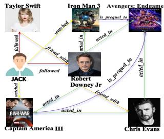  
(a) Knowledge Graph

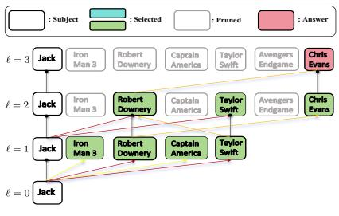  
(b) (Jack, followed, ?)

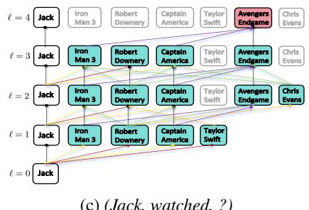  
(c) (Jack, watched, ?)  
Figure 1: (a) A complex knowledge graph with two queries—(JACK, followed, ?) and (JACK, watched, ?)—and their respective answers Chris Evans and Avengers: Endgame. (b) and (c) visualize MoKGR’s personalized path exploration for each query, highlighting its adaptive path length selection and expert-guided pruning, which result in distinct retained paths and entities during reasoning.

• Oversimplified Path Exploration Strategies. Existing methods often rely on overly simplified path exploration strategies, treating all paths equivalently. Although pruning advancements like AdaProp (Zhang et al., 2023d) and A\*Net (Zhu et al., 2023) enhance efficiency, their pruning criteria remain largely uniform, neglecting the distinct significance of individual paths. Effective path exploration should integrate two complementary aspects: (1) structural patterns, capturing entity importance through multidimensional assessments to accurately identify high-quality paths; and (2) semantic relevance, assessing the degree of entity-query association, with paths featuring highly relevant entities more likely yielding correct answers. Proper consideration of these aspects can significantly enhance reasoning path quality.

To address these limitations, we propose a novel framework called the Mixture of Length and Pruning Experts for Knowledge Graph Reasoning (MoKGR). As illustrated in Fig. 1b and Fig. 1c, MoKGR introduces personalization into path exploration via two complementary innovations. First, it employs an adaptive length-level selection mechanism, which functions as a mixture of length experts, dynamically assigning importance weights to various path lengths based on individual queries.

This allows shorter paths to be selected when adequate, avoiding unnecessary exploration depth. Second, MoKGR utilizes specialized pruning experts that analyze diverse properties: global importance through prediction scores, local structural patterns via attention mechanisms, and semantic relationships through entity-query similarity. Thus, MoKGR comprehensively incorporates structural and semantic considerations into path pruning, ensuring robust and query-specific reasoning paths. The contributions can be summarized as follows:

• We propose a personalized path exploration strategy for knowledge graph reasoning that adapts to query-specific requirements and entity characteristics, thereby enabling tailor-made reasoning paths without relying on predefined or static relation selection strategies.

• We introduce a novel mixture-of-experts framework that facilitates personalization in knowledge graph reasoning. The incorporating of both adaptive length-level weighting and personalized pruning strategies effectively addresses the critical limitations of fixed path length and uniform path exploration.

• Experimental results on transductive and inductive datasets highlight MoKGR’s achievement of superior reasoning accuracy and computational efficiency, enabling it to consistently outperform existing state-of-the-art methods.

## 2 RELATED WORKS

## 2.1 Path-based Methods for KG Reasoning

Path-based reasoning methods aim to construct effective reasoning paths for predicting answer entities through the query function $\mathcal { Q } ( e _ { q } , r _ { q } ) = e _ { a }$

These methods can be broadly categorized into traditional path reasoning approaches and more recent GNN-based methods.

Traditional Path Reasoning. Early path reasoning methods primarily rely on reinforcement learning and rule-based approaches. MINERVA (Das et al., 2017) pioneered the use of reinforcement learning, training an agent to autonomously traverse the graph from query entity $e _ { q }$ to potential answers. However, these RL-based approaches often face challenges due to the inherent sparsity of KGs. As an alternative direction, rule-based methods focus on learning logical rules for path generation. DRUM (Sadeghian et al., 2019) employs bidirectional LSTM to capture sequential patterns and enable end-to-end rule learning, while RLogic (Cheng et al., 2022) combines deductive reasoning with representation learning through recursive path decomposition. Despite their contributions, these methods typically focus on sequential pattern extraction without considering personalized path exploration requirements.

GNN-based Path Reasoning. More recently, GNN-based methods have achieved superior performance by effectively leveraging the rich structural information preserved in graphs. Methods such as NBFNet (Zhu et al., 2021) and RED-GNN (Zhang and Yao, 2022) construct reasoning paths by iteratively aggregating information from the ℓ-length neighborhood of the query entity $\boldsymbol { e } _ { \boldsymbol { q } } .$ . To enhance path quality, various optimization techniques have been proposed. A\*Net (Zhu et al., 2023) and AdaProp (Zhang et al., 2023d) introduce pruning mechanisms based on priority functions and score-based filtering respectively. One-Shot-Subgraph (Zhou et al., 2024) improves efficiency by utilizing PPR scores for preliminary path exploration and pruning. However, these approaches typically employ rigid path exploration strategies with fixed length distances and uniform pruning criteria, limiting their adaptability to query-specific requirements in practical scenarios.

## 2.2 Mixture of Experts

The Mixture-of-Experts (MoE) paradigm represents a divide-and-conquer learning strategy where multiple specialized expert models collaborate to solve complex tasks, with a gating mechanism dynamically routing inputs to the most suitable experts. The foundational concept of MoE can be traced back to (Jordan and Jacobs, 1994) and has been widely adopted in vision (Riquelme et al., 2021), multi-modal learning (Mustafa et al., 2022), and multi-task learning (Zhu et al., 2022).

In graph-related applications, MoE has demonstrated significant advantages by leveraging diverse graph properties. MoKGE (Yu et al., 2022) integrates experts specializing in different subspaces and relational structures of commonsense KGs, achieving diverse outputs in generative commonsense reasoning. MoG (Zhang et al., 2023a) incorporates pruning experts with complementary sparsification strategies, where each expert executes a unique pruning method to customize pruning decisions for individual nodes. Meanwhile, GMoE (Wang et al., 2023a) deploys messagepassing experts that specialize in different hop distances and aggregation patterns, enabling nodes to adaptively select suitable experts for information propagation based on their local topologies.

## 3 THE PROPOSED METHOD

## 3.1 Preliminary

As introduced, the reasoning task in KGs is to find the answer entity $e _ { a }$ given a query $( e _ { q } , r _ { q } , ? )$ , which we denote as $\boldsymbol { q } = ( e _ { q } , r _ { q } )$ . To solve this task, GNNbased path reasoning methods, such as NBFNet and RED-GNN, encode all paths up to length L between $e _ { q }$ and $e _ { a }$ into a query-specific representation $h _ { e _ { a } | q } ^ { L } \in \mathbb { R } ^ { d }$ , and use it to compute the score of candidate entity $e _ { a }$ . The representation $h _ { e _ { u } | q } ^ { \ell }$ at iteration ℓ is recursively computed via the following message passing function:

$$
\boldsymbol { h } _ { e _ { y } | q } ^ { \ell } = \bigoplus _ { \left( e _ { x } , r , e _ { y } \right) \in \mathcal { N } _ { e } ( e _ { y } ) } \bigl ( \boldsymbol { h } _ { e _ { x } | q } ^ { \ell - 1 } \otimes \boldsymbol { w } _ { q } ^ { \ell } ( e _ { x } , r , e _ { y } ) \bigr ) ,\tag{1}
$$

where $h _ { e x | q } ^ { \ell - 1 }$ encodes all paths of length up to $\ell - 1$ from $e _ { q } \operatorname { t o } e _ { x }$ , and ${ \pmb w } _ { q } ^ { \ell } ( e _ { x } , r , e _ { y } )$ is an edge-specific weight conditioned on the query q. The operator combines the path representation with the current edge encoding to form a new path of length ℓ, and aggregates multiple such paths reaching $e _ { y }$ . We initialize all representations with $h _ { e _ { u } | q } ^ { 0 } = \mathbf { \hat { 0 } }$ for any entity $e _ { y } \in \mathcal { V }$ , and entities $e _ { y }$ that are further than ℓ steps from $e _ { q }$ will have $h _ { e _ { y } | q } ^ { \check { \ell } } = \mathbf { 0 }$ . After L iterations of Eq. (1), the final score of any entity $e _ { a } \in \nu$ is computed by

$$
s _ { L } ( \ v q , \ v e _ { a } ) = ( \boldsymbol { \mathbf { w } } ^ { L } ) ^ { \top } h _ { e _ { a } | \ v q } ^ { L } ,\tag{2}
$$

where $\pmb { w } ^ { L } \in \mathbb { R } ^ { d }$ is a learnable scoring vector. More details of this path encoding process are provided in Appendix B.1.

## 3.2 Mixture of Length Experts for Adaptive Path Selection

Traditional KGs reasoning methods employ fixedlength path exploration strategies, which fail to capture the varying complexity of different queries and waste computation cost. To address this limitation, we introduce a mixture of length experts that adaptively selects paths with different lengths and a layer-wise binary gating function to encourage shorter paths.

Mixture of length experts. For a given query $( e _ { q } , r _ { q } , ? )$ , we presuppose the minimum and maximum path lengths $L _ { \mathrm { m i n } }$ and $L _ { : }$ , respectively, and specify the number of selected path length experts as $k _ { 1 } ( < L - L _ { \mathrm { m i n } } )$ . Instead of processing all the queries with paths up to length L in Eq. (2), we introduce a mixture of length experts to score entities with a set of path lengths in intermediate $\ell \in [ L _ { \mathrm { m i n } } , L ]$

We enable personalized selection of different path lengths. Denote $c _ { q }$ as the contextual embedding of query $( e _ { q } , r _ { q } , ? )$ (details are given in $\mathsf { A p - }$ pendix B.2.1) and $\dot { \pmb { E } _ { 1 } } \in \mathbb { R } ^ { ( { L } - { L } _ { \operatorname* { m i n } } ) \times d }$ as the learnable expert embedding of paths with lengths from $L _ { \mathrm { m i n } }$ to L. Then, we can measure the compatibility of each path length expert with

$$
Q ( c _ { q } ) = E _ { 1 } c _ { q } + \epsilon \cdot \mathrm { S o f t p l u s } ( W _ { n } c _ { q } ) \in \mathbb { R } ^ { L - L _ { \operatorname* { m i n } } } ,\tag{3}
$$

where $\epsilon \sim \mathcal { N } ( 0 , 1 )$ is a Gaussian noise works with Softplus (Dugas et al., 2001) to encourage diverse expert selection and $W _ { n } \in \mathbb { R } ^ { ( L - L _ { \operatorname* { m i n } } ) \times d }$ is a trainable parameter that learns noise scores. Consequently, we obtain the set $\mathcal { A } : = \mathrm { T o p } _ { k _ { 1 } } ( Q ( \pmb { c } _ { q } ) )$ as the indices of selected path lengths. Then the importance of layer $\ell \in { \mathcal { A } }$ can be computed with softmax function

$$
g _ { q } ( \ell ) = \frac { \exp ( [ Q ( c _ { q } ) ] _ { \ell } / \tau ) } { \sum _ { \ell ^ { \prime } \in \mathcal { A } } \exp ( [ Q ( c _ { q } ) ] _ { \ell ^ { \prime } } / \tau ) } .\tag{4}
$$

We then compute the score of an answer entity $e _ { a }$ with the gated outputs of selected experts with different path lengths

$$
\Psi ( e _ { a } ) = \sum _ { \ell \in A } g _ { q } ( \ell ) \cdot s _ { l } ( q , e _ { a } ) ,\tag{5}
$$

where the score $s _ { l } ( q , e _ { a } ) = ( \pmb { w } ^ { \ell } ) ^ { \top } \pmb { h } _ { e _ { a } | q } ^ { \ell }$ at different ℓ is defined similarly with Eq. (2).

Layer-wise binary gating function. Even though Eq. (5) can adaptively control the importance of different path length ℓ, a limitation still exists that the paths with length from 1 to L should be explored and encoded. This can lead to significant computation costs at large layers. To address this issue, we introduce a layer-wise binary gating function to encourage the model to explore shorter paths. Specifically, during training, we employ a differentiable statistics-based binary gating function $g _ { b } ( \ell ) \in ( 0 , 1 )$ calculated by the Gumbel-Sigmoid (Jang et al., 2017) transformation that evaluates path quality based on layer-wise feature distributions to learn a natural bias towards shorter paths while maintaining differentiability. (details are given in Appendix B.2.2). We use $g _ { b } ( \ell )$ to control the update of the message function in Eq. (1) with $\hat { h _ { e y | q } ^ { \ell } }  g _ { b } ( \ell ) \cdot \hat { h _ { e y | q } ^ { \ell } } .$ During inference, we further strengthen this preference through a deterministic truncation strategy, where $g _ { b } ( \ell ) = 1$ , if the paths should continue grow, otherwise $g _ { b } ( \ell ) = 0$

The iterative message passing process will immediately stop if $g _ { b } ( \ell ) = 0$ . This length control mechanism enables the model to systematically prefer shorter paths when they provide sufficient evidence for reasoning, improving inference efficiency.

## 3.3 Mixture of Pruning Experts for Personalized Path Exploration

Apart from selecting path length adaptively, we propose to encourage personalized path pruning, which incorporates both structural patterns and semantic relevance in KGs reasoning.

We build upon the node-wise pruning mechanism established in AdaProp (Zhang et al., 2023d). Denote $\mathcal { V } ^ { \ell }$ as the set of entities that are covered by the message function Eq. (1) at step $\ell . \mathcal { V } ^ { \ell }$ contains all the ending entities of paths with lengths up to $\ell .$ When expanding from $\mathcal { V } ^ { \ell - 1 } \mathrm { t o } \mathcal { V } ^ { \ell }$ , we select Top- $K ^ { \ell }$ entities from $\mathcal { V } ^ { \ell }$ as an approach to control the number of selected paths. To implement this fine-grained personalization of path exploration, we propose three specialized pruning experts with different scoring function $\phi _ { i } ^ { \ell } ( \cdot )$ that analyzes the importance of entities $e _ { a } \in \mathcal { V } ^ { \ell }$ from complementary perspectives.

• The Scoring Pruning Expert evaluates the overall contribution to reasoning with the layer-wise score: $\begin{array} { r } { \phi _ { \mathrm { S c o } } ^ { \ell } ( e _ { a } ) = s _ { l } ( q , e _ { a } ) = ( \pmb { w } ^ { \ell } ) ^ { \top } h _ { e _ { a } | q } ^ { \ell } . } \end{array}$

• The Attention Pruning Expert specifically addresses the structural patterns by examining relation combinations and connectivity patterns through an attention mechanism. This expert identifies entities that are important to at least one path connected. As defined in Eq. (1), at each length $\ell - 1$ , for each entity $e _ { y } \in \mathcal { V } ^ { \ell }$ , we calculate the attention scores $\alpha$ (detailed computation process is provided in Appendix B.1) for all neighboring edges $( e _ { x } , r , e _ { y } ) \in \mathcal { N } _ { e } ( e _ { y } )$ where $e _ { x } \in \mathcal { V } ^ { \ell - 1 }$ , and assign the maximum attention score among all edges connected to $e _ { y }$ as the attention score of entity $e _ { y } \colon \phi _ { \mathrm { A t t } } ^ { \ell } ( e _ { a } ) \stackrel { \cdot } { = }$ $ { \mathbf { M a x } } \big ( \alpha ( e _ { x } , r , e _ { a } ) | ( e _ { x } , r , e _ { a } ) \in  { \mathcal { N } } _ { e } ( e _ { a } ) \big )$

• The Semantic Pruning Expert focuses on semantic relevance by computing the semantic alignment between entities and query relations, ensuring that the selected paths contain thematically coherent concepts that are meaningfully related to the query context. For instance, when reasoning about movie preferences, this expert would favor paths containing entertainmentrelated entities and relations. We use cosine similarity to measure the coherence: $\phi _ { \mathrm { S e m } } ^ { \ell } ( e _ { a } ) =$ cos $\left( h _ { e _ { a } | q } ^ { \ell } , w _ { r _ { q } } ^ { \ell } \right)$

To adaptively combine insights from these path evaluation experts, at each layer ℓ, similar as the lengths experts defined in Section 3.2, denote $\boldsymbol { c } _ { v } ^ { \ell }$ as the contextual embedding and $E _ { 2 } ^ { \ell } \in \mathbb { R } ^ { 3 \times d }$ as the learnable embedding of pruning experts at length $\ell ,$ we can similarly get $\hat { Q } ^ { \ell } ( c _ { v } ^ { \ell } ) \bar { \in } \mathbb { R } ^ { 5 }$ as defined in Eq. (3). Let $\mathcal { V } _ { \phi _ { i } } ^ { \ell }$ denote the set of entities retained by expert i and $k _ { 2 }$ denote the predefined number of retained pruning experts, the entities retained in the ℓ-th layer are the union of the entities retained by each selected pruning experts as:

$$
\mathcal { V } _ { \phi } ^ { \ell } = \{ \cup _ { i \in \mathrm { T o p K } _ { k _ { 2 } } ( Q ^ { \ell } ( \boldsymbol { c } _ { v } ^ { \ell } ) ) } \mathcal { V } _ { \phi _ { i } } ^ { \ell } | \mathcal { V } _ { \phi _ { i } } ^ { \ell } = \mathrm { T o p K } _ { K ^ { \ell } } ( \phi _ { i } ^ { \ell } ( \boldsymbol { e } _ { a } ) ) \} .\tag{6}
$$

To further enhance path quality, we introduce an adaptive path exploration strategy that dynamically controls the exploration breadth. Our strategy allows $K ^ { \ell }$ to increase with path exploration depth in early stages, while decreasing at larger depth (Detailed description in Appendix B.4). This strategy enables thorough exploration of promising path regions while preventing noise accumulation from overextended paths.

## 3.4 Training Details

Task Loss To enable effective personalized path exploration, we formulate a task loss that jointly

optimizes the GNN parameters and expert model parameters. The task loss is defined as:

$$
\mathcal { L } _ { \mathrm { t a s k } } = \sum _ { ( e _ { q } , r _ { q } , e _ { a } ) \in \mathcal { Q } _ { t r a } } \left[ - \Psi ( e _ { a } ) + \log \sum _ { e _ { o } \in \mathcal { V } } \exp ( \Psi ( e _ { o } ) ) \right] ,\tag{7}
$$

where the first part is the total score of the positive triple $( e _ { q } , r _ { q } , e _ { a } )$ in the set of training queries, and the second part contains the total scores of all triple with the same query $( e _ { q } , r _ { q } , ? )$

Experts Balance Loss To achieve balanced and effective path exploration and address the potential “winner-takes-all” problem (Lepikhin et al., 2020), we follow (Wang et al., 2023a) by introducing several regularization terms. These terms prevent the model from overly relying on specific exploration strategies or experts (Details are provided in $\mathsf { A p - }$ pendix D.2). The importance loss is defined as:

$$
\begin{array} { l } { \scriptstyle \mathrm { I m p o r t a n c e } ( { \mathcal C } ) = \displaystyle \sum _ { c \in { \mathcal C } } \sum _ { g \in { \mathcal G } ( c ) } g , } \\ { \mathscr L _ { \mathrm { I m p o r t a n c e } } ( { \mathcal C } ) = \mathbf { C V } ( \mathrm { I m p o r t a n c e } ( { \mathcal C } ) ) ^ { 2 } , } \end{array}\tag{8}
$$

where $g \in { \mathcal { G } } ( c )$ denotes the output of the experts gating mechanism as calculated in Eq. (4), and $\mathrm { C V } ( { \cal X } ) = \sigma ( { \pmb X } ) / \mu ( { \pmb X } )$ represents the coefficient of variation of input X. This formulation yields the length expert importance loss $\mathcal { L } _ { l }$ and pruning importance loss ${ \mathcal { L } } _ { p }$ . Furthermore, we introduce a load balancing loss for length experts:

$$
\mathcal { L } _ { \mathrm { l o a d } } = \mathrm { C V } ( \sum _ { \substack { c _ { q } \in \mathcal { C } p \in P ( c _ { q } , \ell ) } } p ) ^ { 2 } ,\tag{9}
$$

where $p$ represents the node-wise probability in the batch.

The final training objective combines these balance terms with the main reasoning task:

$$
\mathcal { L } = \mathcal { L } _ { \mathrm { t a s k } } + \lambda _ { 1 } ( \mathcal { L } _ { l } + \mathcal { L } _ { p } ) + \lambda _ { 2 } \mathcal { L } _ { \mathrm { l o a d } } ,\tag{10}
$$

where $\lambda _ { 1 } , \lambda _ { 2 }$ are hand-tuned scaling factors.

The full algorithm of MoKGR is shown in Algorithm 1. For each layer’s message passing, we first compute the selected pruning experts and their corresponding weights $\hat { Q ^ { \ell } } ( c _ { v } ^ { \ell } )$ in line 6. Then we obtain the final set of preserved entities $\mathcal { V } _ { \phi } ^ { \ell }$ by combining the selected experts in line 7. Subsequently, we perform message passing only on the preserved entity set in line 8. When our message passing reaches layer $L _ { \mathrm { m i n } }$ as shown in line 3, we first calculate the selected experts and their corresponding weights $Q ( c _ { q } )$ through the length expert gating mechanism. In the subsequent layers $\ell \in [ L _ { \mathrm { m i n } } , L ]$ if ℓ is a selected length expert, we compute and update the scores of entities selected by pruning experts at that layer in line 10. If our layer-wise binary gating function is activated, early stopping is performed in line 11. After message passing ends or early stopping is triggered, we use the highestscoring candidate answer entity $e _ { a }$ from all candidates in $\Psi ( e _ { a } )$ as the final predicted answer entity.

```latex
Algorithm 1 MoKGR Algorithm Analysis
Require: Number of length and pruning experts
$k _ { 1 }$ and k<sub>2</sub>, range of paths length $[ L _ { \mathrm { m i n } } , L ]$
Ensure: Optimized GNN model parameters Θ
and expert model parameters $\mathbb { W } .$
1: while not converged do
2: for Each batch of queries $\{ ( e _ { q } , r _ { q } , e _ { a } ) \}$
from $\mathcal { Q } _ { t r a } , \ell \in [ 1 , L ]$ do
3: if $\ell = = L _ { \mathrm { m i n } }$ then
4: Compute context representation $c _ { q } ,$
5: From $\begin{array} { r } { \ell \in \mathsf { \Gamma } [ L _ { \operatorname* { m i n } } , L ] } \end{array}$ select Top-k<sub>1</sub>
length experts via $Q ( c _ { q } )$ ;
6: Select Top- $\cdot k _ { 2 }$ active pruning experts via
$Q ^ { \ell } ( c _ { v } ^ { \ell } )$
7: Union selected experts to get entities $\mathcal { V } _ { \phi } ^ { \ell } ;$
8: Update entities in $\mathcal { V } _ { \phi } ^ { \ell }$ via Eq. (1);
9: if ℓ is the selected length expert then
10: Update the entity scores $\Psi ( e _ { a } )$ for
$e _ { a } \in \mathcal { V } _ { \phi } ^ { \ell } ;$
11: break if early stopping condition meet:
$g _ { b } ( \ell ) = 0 ;$
12: Compute total loss $\mathcal { L }$ combining task and
balance losses;
13: Update Θ and W using gradient of $\mathcal { L } ;$
14: return Optimized parameters Θ, W.
```

## 4 Experiments

In this section, we conduct extensive experiments to answer the following research questions: (RQ1 4.2) How effective is MoKGR in improving reasoning performance and efficiency compared to existing methods? (RQ2 4.3) How does our expert selection mechanism perform? (RQ3 4.4) How does MoKGR achieve personalized path exploration in practice? (RQ4 4.5) How do different components and hyperparameters affect the model’s performance?

## 4.1 Experimental Setup

We compares MoKGR with general KGs reasoning methods in both transductive and inductive settings.

(The other implementation details and inductive setting is given in Appendix A.) We use filtered ranking-based metrics for evaluation, namely mean reciprocal ranking (MRR) and Hit@k. Higher values for these metrics indicate better performance.

Datasets. We use six widely used KGs reasoning benchmarks: Family (Kok and Domingos, 2007), UMLS (Kok and Domingos, 2007), WN18RR (Dettmers et al., 2017b), FB15k-237 (Toutanova and Chen, 2015), NELL-995 (Xiong et al., 2017), and YAGO3-10 (Suchanek et al., 2007).

Baselines. We compare the proposed MoKGR with (i) non-GNN methods: ConvE (Dettmers et al., 2017a), QuatE (Zhang et al., 2019a), RotatE (Sun et al., 2019), MINERVA (Das et al., 2017), DRUM (Sadeghian et al., 2019), AnyBURL (Meilicke et al., 2020), RNNLogic (Qu et al., 2021), RLogic (Cheng et al., 2022), DuASE (Li et al., 2024) and GraphRulRL (Mai et al., 2025); and (ii) GNNbased methods CompGCN (Vashishth et al., 2019), NBFNet (Zhu et al., 2021), RED-GNN (Zhang and Yao, 2022), A\*Net (Zhu et al., 2023), Adaprop (Zhang et al., 2023d), ULTRA (Galkin et al., 2024) and one-shot-subgraph (Zhou et al., 2024).

## 4.2 Overall Performance (RQ1)

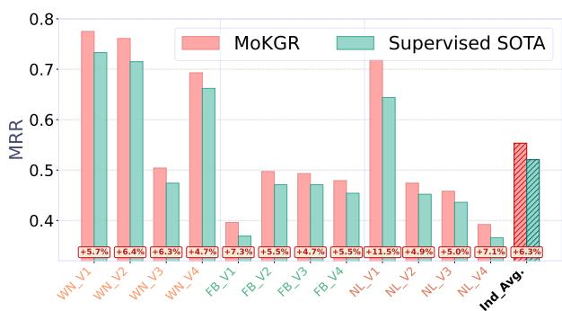  
Figure 2: Comparison of MoKGR with supervised stateof-the-art baselines under the inductive setting.

Results. Tab. 1 and Fig. 2 show that our proposed MoKGR exhibits exceptional performance across all benchmark datasets in both transductive and inductive reasoning (Detail implementation and results for inductive setting are given in Appendix A.4). The experimental results validate several key advantages of our approach. First, the adoption of GNN-based message passing proves to be more effective than non-GNN methods for KGs reasoning, as evidenced by consistent performance improvements across all metrics. Furthermore, compared to full-exploration (Zhang and Yao, 2022; Zhu et al., 2021) and fixed pruning strategies (Zhu et al., 2023; Zhang et al., 2023d; Zhou et al., 2024), our MoE system achieves personalization in both pruning and reasoning path length, while implementing a mixture and personalized approach that significantly enhances reasoning accuracy. Notably, our method performs particularly well on the largest dataset YAGO3-10, solving the out-of-memory problem of full-exploration methods, and greatly improving the accuracy compared with other pruning methods.

<table><tr><td rowspan="2">Type</td><td rowspan="2">Model</td><td colspan="3">Family MRR H@1 H@10</td><td colspan="3">UMLS MRR H@1 H@10</td><td colspan="3">WN18RR</td><td colspan="3">FB15k237</td><td colspan="3">NELL-995</td><td colspan="3">YAGO3-10</td></tr><tr><td></td><td></td><td></td><td></td><td></td><td></td><td></td><td>MRR H@1 H@10</td><td></td><td></td><td>MRR H@1 H@10</td><td></td><td></td><td>MRR H@1 H@10</td><td></td><td></td><td>MRR H@1 H@10</td><td></td></tr><tr><td rowspan="9">Non-GNN</td><td>ConvE</td><td>0.912</td><td>83.7</td><td>98.2</td><td>0.937</td><td>92.2 0.944 90.5</td><td>96.7</td><td>0.427</td><td>39.2</td><td>49.8</td><td>0.325 0.350 25.6</td><td>23.7</td><td>50.1</td><td>0.511</td><td>44.6</td><td>61.9</td><td>0.520</td><td>45.0</td><td>66.0</td></tr><tr><td>QuatE</td><td>0.941 89.6</td><td></td><td>99.1</td><td></td><td></td><td>99.3</td><td></td><td>0.48044.0</td><td>55.1</td><td></td><td></td><td>53.8</td><td>0.53346.6</td><td></td><td>64.3</td><td>0.379</td><td>30.1</td><td>53.4</td></tr><tr><td>RotatE</td><td>0.921 86.6</td><td></td><td>98.8</td><td>0.925</td><td>86.3</td><td>99.3</td><td></td><td>0.477 42.8</td><td>57.1</td><td>0.337</td><td>24.1</td><td>53.3</td><td></td><td>0.508 44.8</td><td>60.8</td><td>0.495</td><td>40.2</td><td>67.0</td></tr><tr><td>MINERVA</td><td>0.885 82.5</td><td></td><td>96.1</td><td>0.825 72.8</td><td></td><td>96.8</td><td></td><td>0.448 41.3</td><td>51.3</td><td>0.293</td><td>21.7</td><td>45.6</td><td>0.513 41.3</td><td></td><td>63.7</td><td></td><td></td><td></td></tr><tr><td>DRUM</td><td>0.934 88.1</td><td></td><td>99.6</td><td>0.813</td><td>67.4</td><td>97.6</td><td></td><td>0.486 42.5</td><td>58.6</td><td>0.343</td><td>25.5</td><td>51.6</td><td>0.532</td><td>46.0</td><td>66.2</td><td>0.53145.3</td><td></td><td>67.6</td></tr><tr><td>AnyBURL</td><td>0.861 87.4</td><td></td><td>89.2</td><td>0.828</td><td>68.9</td><td>95.8</td><td></td><td>0.471 44.1</td><td>55.2</td><td>0.301</td><td>20.9</td><td>47.3</td><td>0.398</td><td>27.6</td><td>45.4</td><td>0.542</td><td>47.7</td><td>67.3</td></tr><tr><td>RNNLogic</td><td>0.881 85.7</td><td></td><td>90.7</td><td>0.842 77.2</td><td></td><td>96.5</td><td></td><td>0.483 44.6</td><td>55.8</td><td>0.344 25.2</td><td></td><td>53.0</td><td>0.416</td><td>36.3</td><td>47.8</td><td></td><td>0.554 50.9</td><td>62.2</td></tr><tr><td>RLogic</td><td></td><td></td><td></td><td></td><td></td><td></td><td></td><td>0.477 44.3</td><td>53.7</td><td>0.310 20.3</td><td></td><td>50.1</td><td></td><td>0.416 25.2</td><td>50.4</td><td>0.36</td><td>25.2</td><td>50.4</td></tr><tr><td>DuASE</td><td>0.86181.2</td><td></td><td>90.8 95.1</td><td></td><td>0.84572.5 84.5</td><td>85.5 97.1</td><td></td><td>0.48944.8 0.483 44.6</td><td>56.9 54.1</td><td>0.329</td><td>23.5 31.4</td><td>51.9</td><td></td><td>0.423 37.2</td><td>59.2</td><td></td><td>0.47338.7</td><td>62.8</td></tr><tr><td rowspan="7"></td><td>GraphRulRL</td><td>0.928 87.4</td><td></td><td></td><td>0.869</td><td></td><td></td><td></td><td></td><td></td><td>0.385</td><td>57.5</td><td></td><td>0.425</td><td>27.8</td><td>52.7</td><td>0.432</td><td>35.4</td><td>51.7</td></tr><tr><td>CompGCN</td><td>0.933</td><td>88.3</td><td>99.1</td><td>0.927</td><td>86.7</td><td>99.4</td><td>0.479 44.3</td><td></td><td>54.6</td><td>0.355</td><td>26.4 53.5</td><td></td><td>0.463</td><td>38.3</td><td>59.6</td><td>0.421</td><td>39.2</td><td>57.7</td></tr><tr><td>NBFNet</td><td>0.989</td><td>998.8</td><td>98.9</td><td>0.948 92.0</td><td></td><td>99.5</td><td>0.551 49.7</td><td></td><td>66.6</td><td>0.415</td><td>532.1</td><td>59.9</td><td>0.525</td><td>45.1</td><td>63.9</td><td></td><td>0.550 47.9</td><td>68.6</td></tr><tr><td>RED-GNN</td><td>0.992</td><td>98.8</td><td>99.7</td><td>0.964 94.6</td><td></td><td>99.0</td><td>0.533 48.5</td><td></td><td>62.4</td><td>0.374 28.3</td><td></td><td>55.8</td><td></td><td>0.543 47.6</td><td>65.1</td><td></td><td>0.559 48.3</td><td>68.9</td></tr><tr><td>A*Net</td><td>0.987 98.4 0.988 98.6</td><td></td><td>98.7 99.0</td><td>0.967 94.8 0.969</td><td>95.6</td><td>99.1 99.5</td><td>0.549 49.5 0.562 49.9</td><td></td><td>65.9 67.1</td><td>0.411 32.1 0.417</td><td>33.1</td><td>58.6 58.5</td><td>0.549 0.554</td><td>48.6 49.3</td><td>65.2 65.5</td><td></td><td>0.56349.8</td><td>68.6 68.5</td></tr><tr><td>AdaProp ULTRA</td><td>0.913 86.6</td><td></td><td>97.2</td><td>0.915</td><td>89.6</td><td>98.4</td><td>0.480 47.9</td><td></td><td>61.4</td><td>0.368</td><td></td><td></td><td>0.509</td><td></td><td>66.0</td><td>0.557</td><td>0.573 51.0 53.1</td><td>71.0</td></tr><tr><td>one-shot-subgraph</td><td></td><td>0.988 98.7</td><td>99.0</td><td>0.972</td><td>95.5</td><td>99.4</td><td>0.567</td><td>51.4</td><td>66.6</td><td>0.304</td><td>33.9 22.3</td><td>56.4 45.4</td><td>0.547</td><td>46.2 48.5</td><td>65.1</td><td>0.606</td><td>54.0</td><td>72.1</td></tr><tr><td rowspan="2"></td><td></td><td>0.993 99.1</td><td></td><td>99.3 0.978</td><td>96.5</td><td>99.6</td><td>0.611</td><td>53.9</td><td>70.2</td><td></td><td>36.8</td><td>60.7</td><td></td><td></td><td></td><td></td><td></td><td></td><td></td></tr><tr><td>MoKGR</td><td></td><td></td><td></td><td></td><td></td><td></td><td></td><td></td><td></td><td>0.443</td><td></td><td></td><td>0.584</td><td>50.7</td><td>67.9</td><td>0.657</td><td>57.7</td><td>75.8</td></tr></table>

Table 1: Comparison of MoKGR with other KG reasoning methods in the transductive setting. Best performance is indicated by the bold face numbers, and the underline means the second best. “-" means unavailable results. “H@1" and “H@10" are short for Hit@1 and Hit@10 (in percentage), respectively.

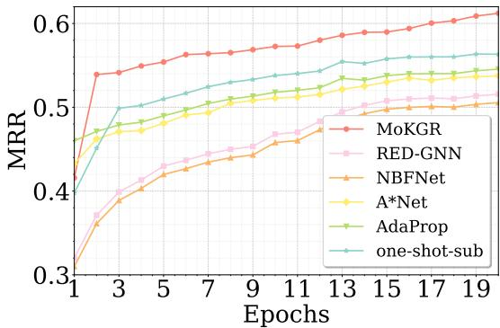

(a) MRR over epochs
<table><tr><td>Min/Epoch</td><td>Training</td><td>Inference</td></tr><tr><td>MoKGR</td><td>111.73</td><td>58.3</td></tr><tr><td>RED-GNN</td><td>1382.9</td><td>802.2</td></tr><tr><td>NBFNet</td><td>493.8</td><td>291.4</td></tr><tr><td>A*Net</td><td>112.3</td><td>92.4</td></tr><tr><td>Adaprop</td><td>108.6</td><td>84.2</td></tr><tr><td>one-shot-subgraph</td><td>147.9</td><td>71.9</td></tr></table>

(b) Average time per epoch  
Figure 3: Comparison between MoKGR and current state-of-the-art methods in YAGO3-10 dataset.

Learning Process Comparison. To comprehensively evaluate the effectiveness of MoKGR, we analyze a few SOTA methods on the YAGO3-10 dataset. We tracked both the MRR performance and computational time (training/inference) over 20 epochs. As shown in Fig. 3, MoKGR exhibits two distinctive advantages: 1) rapid convergence during early training phases, particularly evident in the steep curves within the first five epochs, and 2) stable performance growth throughout the training process. In contrast, other methods show slower convergence and more erratic progression, particularly in later epochs. The computational efficiency analysis presented in Table 3b demonstrates that MoKGR achieves significantly faster inference times compared to other approaches, while its training time is substantially lower than fullexploration methods and comparable to other pruning approaches.

## 4.3 Expert Selection Analysis (RQ2)

Selection Patterns of Length and Pruning Experts. To validate the necessity and effectiveness of our multi-expert approach, we conducted comprehensive experiments analyzing the selection patterns of both length experts and pruning experts on the YAGO3-10 dataset. The length expert selection patterns in Fig. 4a reveal that the model demonstrates a preference for mixing mediumlength paths. For paths of length 8, we observe a turning point at Epoch 8, which we attribute to the effect of the gating function described in Section 3.2. This function suppresses the utilization of longer paths, causing the model to favor shorter path lengths. The expert selection pattern in pruning, illustrated in Fig. 4b, demonstrates the complementarity of expert selections. Despite variations in their selection frequencies, the overall trend maintains a steady upward progression.

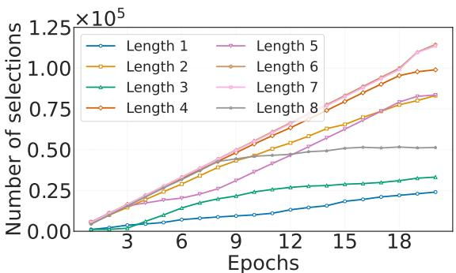

(a) Length experts selection  
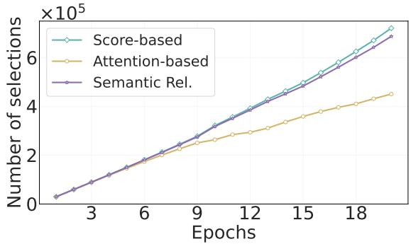  
(b) Pruning experts selection  
Figure 4: Selection Curves of Two Experts.

Effectiveness of Adaptive Expert Weighting. We evaluate the effectiveness of adaptive weighting by comparing three approaches on WN18RR and YAGO3-10 datasets: single experts (weight 1.0), fixed-weight expert combinations (equal weights), and our adaptive weighting mechanism. Our experiments compare all possible expert combinations $( C _ { 3 } ^ { 1 } + C _ { 3 } ^ { 2 } + C _ { 3 } ^ { 3 } )$ . The results shown in Fig. 5 demonstrate that compared to single experts, mixed experts perform better, reflecting the complementary nature of different pruning experts. Moreover, compared to fixed expert weights, our dynamic expert weighting shows superior performance, highlighting the necessity of weight personalization for pruning experts. These results validate that adaptive expert weighting is essential for optimal KGs reasoning, as it enables dynamic adjustment of pruning strategies based on query-specific requirements.

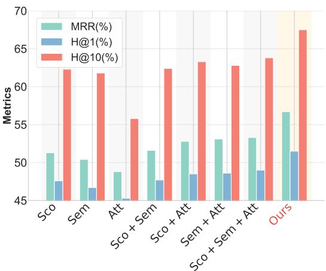

(a) WN18RR  
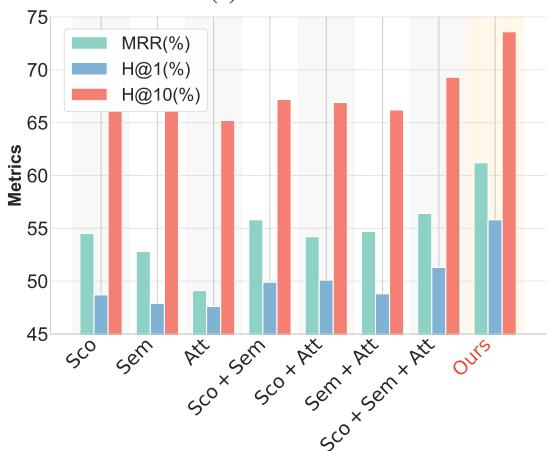  
(b) YAGO3-10  
Figure 5: Comparison of Pruning Selection Strategy.

## 4.4 Case Study (RQ3)

To validate MoKGR’s personalized path exploration capabilities, we analyze the reasoning paths selected by the full-propagation method RED-GNN (which passes messages to all neighboring nodes at each propagation step) and compare them with those selected by MoKGR. In detail, for each relation $r _ { i } .$ , we track its occurrence count $N _ { r _ { i } } ^ { \ell }$ at each path length $\ell ,$ and calculate its aggregated importance $N _ { r i }$ by combining these counts with length experts’ weights: $\begin{array} { r } { N _ { r _ { i } } = \sum _ { \ell = L _ { \mathrm { m i n } } } ^ { L } N _ { r _ { i } } ^ { \ell } \times g _ { q } ( \ell ) } \end{array}$ . The resulting normalized heatmaps reveal MoKGR’s query-adaptive behavior. While RED-GNN show uniform distribution (Fig. 6a), MoKGR (Fig. 6b) identifies semantically relevant relations, such as emphasizing aunt for niece queries and brother, nephew, and uncle for brother queries. These case studies confirm that MoKGR effectively adapts its path selection to query semantics, highlighting relevant relations while avoiding redundant exploration, which behavior contrasts sharply with fullpropagation methods. Further experiments for this analysis are provided in Appendix C.

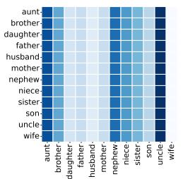  
(a) RED-GNN

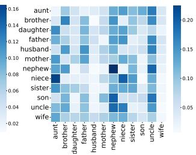  
(b) MoKGR  
Figure 6: Heatmaps of relation type ratios in the reasoning path on Family dataset. Rows represent different query relations, and columns correspond to relation types in the selected edges.

## 4.5 Ablation Study (RQ4)

<table><tr><td colspan="2">Dataset</td><td>WN18RR</td><td>YAGO3-10</td></tr><tr><td>Metrics</td><td></td><td>MRR H@1 H@10</td><td>MRR H@1 H@10</td></tr><tr><td colspan="2">Ours</td><td>0.611 53.9 70.2</td><td>0.657 57.7 75.8</td></tr><tr><td rowspan="2">Balancing term</td><td>λ1 = 0 0.558 50.1</td><td>66.9</td><td>0.582 53.6 71.7</td></tr><tr><td> $\lambda _ { 2 } = 0$  0.56050.6</td><td>67.0</td><td>0.59654.1 72.4</td></tr><tr><td rowspan="2">Noise term</td><td>€ = 0 0.56050.8</td><td>67.1</td><td>0.586 53.7 68.3</td></tr><tr><td>€ = 0.2 0.561 50.8</td><td>67.2</td><td>0.60255.1 70.3</td></tr><tr><td rowspan="4">Expert</td><td> $\phi _ { \mathrm { S c o } ^ { \circ } }$ </td><td>0.55650.3 66.7</td><td>0.55549.7 67.9</td></tr><tr><td> $\phi _ { \mathrm { A u ^ { \circ } } }$ </td><td>0.54949.9 66.4</td><td>0.50148.6 66.2</td></tr><tr><td> $\phi _ { \mathrm { S e m } ^ { \circ } }$ </td><td>0.55350.2 66.5</td><td>0.53848.9 67.2</td></tr><tr><td> $\phi _ { L ^ { * } }$  0.55250.5</td><td>66.5</td><td>0.56951.0 68.4</td></tr></table>

Table 2: Ablation study on WN18RR and YAGO3-10 datasets. $\phi _ { ( . ) ^ { \diamond } }$ means only customizing this pruning expert (with original length experts) and $\phi _ { L } \cdot$ <sub>∗</sub> means only customizing L-th layer length expert (with original pruning experts).

To evaluate the contribution of each component in the MoKGR framework, we conducted a comprehensive ablation study on the WN18RR and YAGO3-10 datasets, as shown in Table 2. The results reveal several key findings: First, removing any balancing term $( \lambda _ { 1 }$ or $\lambda _ { 2 } )$ leads to decreased performance, highlighting the importance of expert coordination. Furthermore, for the noise parameter ϵ given in Eq. (3), dynamic sampling $( \epsilon \sim \mathcal { N } ( 0 , 1 ) )$ consistently outperforms both no noise (ϵ = 0) and fixed noise $( \epsilon = 0 . 2 )$ settings, demonstrating the benefits of incorporating controlled randomness in expert selection. Finally, whether in pruning strategies or path length strategies, restricting the model to one fixed strategy significantly weakens its reasoning capability.

## 5 Conclusion

In this paper, we introduced MoKGR, a novel framework that advances KGs reasoning through personalized path exploration. Our approach addresses two critical challenges in KGs reasoning: adaptive path length selection and comprehensive path evaluation. The adaptive length selection mechanism dynamically adjusts path exploration depths based on query complexity, while the mixture-of-pruning experts framework incorporates structural patterns, semantic relevance, and global importance to evaluate path quality. Through extensive experiments across diverse benchmark datasets, MoKGR demonstrates significant improvements in both reasoning accuracy and computational efficiency. The success of our personalized approach opens promising directions for future research, particularly in developing more sophisticated expert collaboration mechanisms and extending the framework to other graph learning tasks where path-based reasoning plays a crucial role. The framework’s ability to balance thorough path exploration with computational efficiency makes it particularly valuable for large-scale knowledge graph applications.

## 6 Limitations

While MoKGR demonstrates significant improvements in knowledge graph reasoning performance, several limitations should be acknowledged: First, the computational complexity of our method, though significantly reduced compared to fullexploration approaches, still grows with the scale of knowledge graphs. For extremely large-scale knowledge graphs beyond those tested in our experiments, additional optimization techniques may be required. Moreover, while MoKGR shows strong empirical performance across diverse datasets, developing theoretical guarantees for the optimality of the selected paths remains challenging due to the complex interplay between different expert components. Finally, our evaluation focused primarily on standard knowledge graph benchmarks. Future work could explore the application of personalized path exploration in more specialized domains such as biomedical knowledge graphs or temporal knowledge graphs, which may exhibit different structural properties. These limitations present promising directions for future research to further enhance personalized path exploration in knowledge graph reasoning.

## 7 Acknowledgements

This work is supported by Guangdong Basic and Applied Basic Research Foundation 2025A1515010304, Guangzhou Science and Technology Planning Project 2025A03J4491.

## References

Muhammad Ali, Abubakar Abid, and Parisa Kordjamshidi. 2022. Knowledge graphs: A comprehensive survey. IEEE Transactions on Knowledge and Data Engineering, 34(1):123–145.

Ke Cheng, Jie Liu, Wei Wang, and Yizhou Sun. 2022. Rlogic: Recursive logical rule learning from knowledge graphs. In Proceedings of the 28th ACM SIGKDD Conference on Knowledge Discovery and Data Mining (KDD), pages 179–189.

R. Das, S. Dhuliawala, M. Zaheer, L. Vilnis, I. Durugkar, A. Krishnamurthy, A. Smola, and A. McCallum. 2017. Go for a walk and arrive at the answer: Reasoning over paths in knowledge bases using reinforcement learning. In International Conference on Learning Representations (ICLR).

Tim Dettmers, Pasquale Minervini, Pontus Stenetorp, and Sebastian Riedel. 2017a. Convolutional 2d knowledge graph embeddings. In Proceedings of the AAAI Conference on Artificial Intelligence.

Tim Dettmers, Pasquale Minervini, Pontus Stenetorp, and Sebastian Riedel. 2017b. Convolutional 2d knowledge graph embeddings. In AAAI.

Shimin Di, Quanming Yao, Yongqi Zhang, and Lei Chen. 2021. Efficient relation-aware scoring function search for knowledge graph embedding. In 2021 IEEE 37th International Conference on Data Engineering (ICDE), pages 1104–1115. IEEE.

Enjun Du, Xunkai Li, Tian Jin, Zhihan Zhang, Rong-Hua Li, and Guoren Wang. 2025a. Graphmaster: Automated graph synthesis via llm agents in data-limited environments. ArXiv preprint arXiv:2504.00711v2.

Enjun Du, Siyu Liu, and Yongqi Zhang. 2025b. GraphOracle: A foundation model for knowledge graph reasoning. Preprint, arXiv:2505.11125.

Charles Dugas, Yoshua Bengio, François Bélisle, Claude Nadeau, and René Garcia. 2001. Incorporating second-order functional knowledge for better option pricing. Advances in Neural Information Processing Systems (NeurIPS), 13:472–478.

Mikhail Galkin, Xinyu Yuan, Hesham Mostafa, Jian Tang, and Zhaocheng Zhu. 2024. Towards foundation models for knowledge graph reasoning. In Proceedings ofthe International Conference on Learning Representations (ICLR). Published as a conference paper at ICLR 2024.

Jinyang Huang, Xiachong Feng, Qiguang Chen, Hanjie Zhao, Zihui Cheng, Jiesong Bai, Jingxuan Zhou, Min Li, and Libo Qin. 2025. Mldebugging: Towards benchmarking code debugging across multi-library scenarios. ACL Findings.

Eric Jang, Shixiang Gu, and Ben Poole. 2017. Categorical reparameterization with gumbel-softmax. In International Conference on Learning Representations (ICLR).

Shaoxiong Ji, Shirui Pan, Erik Cambria, Pekka Marttinen, and Philip S Yu. 2021. A survey on knowledge graphs: Representation, acquisition, and applications. IEEE transactions on neural networks and learning systems, 33(2):494–514.

Shaoxiong Ji, Shirui Pan, Erik Cambria, Pekka Marttinen, and Philip S Yu. 2022. A survey on knowledge graphs: Representation, acquisition, and applications. IEEE Transactions on Neural Networks and Learning Systems, 33(2):494–514.

Michael I Jordan and Robert A Jacobs. 1994. Hierarchical mixtures of experts and the em algorithm. Neural Computation, 6(2):181–214.

Stanley Kok and Pedro Domingos. 2007. Statistical predicate invention. In ICML, pages 433–440.

Dmitry Lepikhin, HyoukJoong Lee, Yuanzhong Xu, Dehao Chen, Orhan Firat, Yanping Huang, Maxim Krikun, Noam Shazeer, and Zhifeng Chen. 2020. Gshard: Scaling giant models with conditional computation and automatic sharding. arXiv preprint arXiv:2006.16668.

Jiang Li, Xiangdong Su, Fujun Zhang, and Guanglai Gao. 2024. Learning low-dimensional multi-domain knowledge graph embedding via dual archimedean spirals. In Findings of the Association for Computational Linguistics: ACL 2024, pages 1982–1994. Association for Computational Linguistics.

Zihao Li, Xu Wang, Yuzhe Yang, Ziyu Yao, Haoyi Xiong, and Mengnan Du. 2025. Feature extraction and steering for enhanced chain-of-thought reasoning in language models. arXiv preprint arXiv:2505.15634.

Ke Liang, Lingyuan Meng, Meng Liu, Yue Liu, Wenxuan Tu, Siwei Wang, Sihang Zhou, Xinwang Liu, Fuchun Sun, and Kunlun He. 2024. A survey of knowledge graph reasoning on graph types: Static, dynamic, and multi-modal. IEEE Transactions on Pattern Analysis and Machine Intelligence.

Guangyi Liu, Yongqi Zhang, Yong Li, and Quanming Yao. 2025a. Dual reasoning: A gnn-llm collaborative framework for knowledge graph question answering. In Proceedings ofthe 2nd Conference on Parsimony and Learning (CPAL). Proceedings Track, Poster.

Wanlong Liu, Junying Chen, Ke Ji, Li Zhou, Wenyu Chen, and Benyou Wang. 2024. Rag-instruct: Boosting llms with diverse retrieval-augmented instructions. arXiv preprint arXiv:2501.00353.

Wanlong Liu, Junxiao Xu, Fei Yu, Yukang Lin, Ke Ji, Wenyu Chen, Yan Xu, Yasheng Wang, Lifeng Shang, and Benyou Wang. 2025b. Qfft, question-free fine-tuning for adaptive reasoning. arXiv preprint arXiv:2506.12860.

Shengchao Mai, Shen Zheng, Yunhao Yang, and Hongxia Hu. 2021. Communicative message passing for inductive relation reasoning. In Proceedings of

the AAAI Conference on Artificial Intelligence, volume 35, pages 4294–4302.

Zhenzhen Mai, Wenjun Wang, Xueli Liu, Xiaoyang Feng, Jun Wang, and Wenzhi Fu. 2025. A reinforcement learning approach for graph rule learning. Big Data Mining and Analytics, 8(1):31–44.

Christian Meilicke, Melisachew Wudage Chekol, Manuel Fink, and Heiner Stuckenschmidt. 2020. Reinforced anytime bottom up rule learning for knowledge graph completion. arXiv preprint arXiv:2004.04412.

Christian Meilicke, Mathias Fink, Yanjie Wang, Daniel Ruffinelli, Rainer Gemulla, and Heiner Stuckenschmidt. 2018. Fine-grained evaluation of rule- and embedding-based systems for knowledge graph completion. In International Semantic Web Conference, pages 3–20. Springer.

Rui Miao, Yixin Liu, Yili Wang, Xu Shen, Yue Tan, Yiwei Dai, Shirui Pan, and Xin Wang. 2025. Blindguard: Safeguarding llm-based multi-agent systems under unknown attacks. arXiv preprint arXiv:2508.08127.

Basil Mustafa, Carlos Riquelme, Joan Puigcerver, Rodolphe Jenatton, and Neil Houlsby. 2022. Multimodal contrastive learning with limoe: The language-image mixture of experts. arXiv preprint arXiv:2206.02770.

Maximilian Nickel, Kevin Murphy, Volker Tresp, and Evgeniy Gabrilovich. 2015. A review of relational machine learning for knowledge graphs. Proceedings ofthe IEEE, 104(1):11–33.

Haiquan Qiu, Yongqi Zhang, Yong Li, and Quanming Yao. 2024. Understanding expressivity of gnn in rule learning. In International Conference on Learning Representations (ICLR). Poster.

M. Qu, J. Chen, L. Xhonneux, Y. Bengio, and J. Tang. 2021. Rnnlogic: Learning logic rules for reasoning on knowledge graphs. In International Conference on Learning Representations (ICLR).

Carlos Riquelme, Joan Puigcerver, Basil Mustafa, Maxim Neumann, Rodolphe Jenatton, André Susano Pinto, Daniel Keysers, and Neil Houlsby. 2021. Scaling vision with sparse mixture of experts. In Advances in Neural Information Processing Systems (NeurIPS), volume 34, pages 8583–8595.

Amirmohammad Sadeghian, Mohammadreza Armandpour, Pasquale Ding, and D Wang. 2019. Drum: End-to-end differentiable rule mining on knowledge graphs. In Advances in Neural Information Processing Systems (NeurIPS), pages 15347–15357.

Noam Shazeer, Azalia Mirhoseini, Krzysztof Maziarz, Andy Davis, Quoc Le, Geoffrey Hinton, and Jeff Dean. 2017. Outrageously large neural networks: The sparsely-gated mixture-of-experts layer. In International Conference on Learning Representations (ICLR). Under review.

Xu Shen, Yixin Liu, Yiwei Dai, Yili Wang, Rui Miao, Yue Tan, Shirui Pan, and Xin Wang. 2025. Understanding the information propagation effects of communication topologies in llm-based multi-agent systems. arXiv preprint arXiv:2505.23352.

Zhang Siyue, Xue Yuxiang, Zhang Yiming, Wu Xiaobao, Luu Anh Tuan, and Zhao Chen. 2025. Mrag: A modular retrieval framework for time-sensitive question answering. Preprint, arXiv:2412.15540.

Fabian Suchanek, Gjergji Kasneci, and Gerhard Weikum. 2007. Yago: A core of semantic knowledge. In The WebConf, pages 697–706.

Zhiqing Sun, Zhi-Hong Deng, Jian-Yun Nie, and Jian Tang. 2019. Rotate: Knowledge graph embedding by relational rotation in complex space. In International Conference on Learning Representations (ICLR).

Zhiqing Sun, Chao Huang, Jianyu Chen, Qianhan Wang, Xiang Wang, Yiyang Li, and Liqiang Nie. 2021. Rotate: Knowledge graph embedding by relational rotations. In Advances in Neural Information Processing Systems, pages 10057–10068.

K. K Teru, E. Denis, and W. L Hamilton. 2020. Inductive relation prediction by subgraph reasoning. arXiv preprint arXiv:1911.06962.

Kristina Toutanova and Danqi Chen. 2015. Observed versus latent features for knowledge base and text inference. In PWCVSMC, pages 57–66.

Shikhar Vashishth, Soumya Sanyal, V. Nitin, and Partha Talukdar. 2019. Composition-based multi-relational graph convolutional networks.

Haotao Wang, Ziyu Jiang, Yuning You, Yan Han, Gaowen Liu, Jayanth Srinivasa, Ramana Rao Kompella, and Zhangyang Wang. 2023a. Graph mixture of experts: Learning on large-scale graphs with explicit diversity modeling. In Advances in Neural Information Processing Systems (NeurIPS). The first two authors contributed equally.

Li Wang, Xiaohui Yan, and Yansong Feng. 2023b. Enhancing knowledge graph embeddings with graph neural networks. Journal of Artificial Intelligence Research, 68:789–805.

Xu Wang, Yan Hu, Wenyu Du, Reynold Cheng, Benyou Wang, and Difan Zou. 2025a. Towards understanding fine-tuning mechanisms of llms via circuit analysis. arXiv preprint arXiv:2502.11812.

Xu Wang, Zihao Li, Benyou Wang, Yan Hu, and Difan Zou. 2025b. Model unlearning via sparse autoencoder subspace guided projections. Preprint, arXiv:2505.24428.

Wenhan Xiong, Thien Hoang, and William Yang Wang. 2017. Deeppath: A reinforcement learning method for knowledge graph reasoning. In Proceedings of the Conference on Empirical Methods in Natural Language Processing (EMNLP), pages 564–573.

Fan Yang, Zhilin Yang, and William W Cohen. 2017. Differentiable learning of logical rules for knowledge base reasoning. In Advances in Neural Information Processing Systems (NeurIPS), pages 2319–2328.

Wenhao Yu, Chenguang Zhu, Lianhui Qin, Zhihan Zhang, Tong Zhao, and Meng Jiang. 2022. Diversifying content generation for commonsense reasoning with mixture of knowledge graph experts. In Proceedings ofthe 60th Annual Meeting ofthe Associationfor Computational Linguistics (ACL).

Ling Yue, Yongqi Zhang, Quanming Yao, Yong Li, Xian Wu, Ziheng Zhang, Zhenxi Lin, and Yefeng Zheng. 2023. Relation-aware ensemble learning for knowledge graph embedding. In Proceedings ofthe 2023 Conference on Empirical Methods in Natural Language Processing, pages 16620–16631, Singapore. Association for Computational Linguistics.

Guibin Zhang, Xiangguo Sun, Yanwei Yue, Chonghe Jiang, Kun Wang, Tianlong Chen, and Shirui Pan. 2023a. Graph sparsification via mixture of graphs. arXiv preprint.

Shuai Zhang, Yi Tay, Lina Yao, and Qi Liu. 2019a. Quaternion knowledge graph embeddings. In Advances in Neural Information Processing Systems (NeurIPS).

Siyue Zhang, Anh Tuan Luu, and Chen Zhao. 2024. Syntqa: Synergistic table-based question answering via mixture of text-to-sql and e2e tqa. Preprint, arXiv:2409.16682.

Siyue Zhang, Yilun Zhao, Liyuan Geng, Arman Cohan, Anh Tuan Luu, and Chen Zhao. 2025. Diffusion vs. autoregressive language models: A text embedding perspective. Preprint, arXiv:2505.15045.

Yongqi Zhang, Quanming Yao, Wenyuan Dai, and Lei Chen. 2020. Autosf: Searching scoring functions for knowledge graph embedding. In 2020 IEEE 36th International Conference on Data Engineering (ICDE), pages 433–444. IEEE.

Yongqi Zhang, Quanming Yao, and James T. Kwok. 2023b. Bilinear scoring function search for knowledge graph learning. IEEE Transactions on Pattern Analysis and Machine Intelligence, 45(2):1458– 1473.

Yongqi Zhang, Quanming Yao, Yingxia Shao, and Lei Chen. 2019b. Nscaching: Simple and efficient negative sampling for knowledge graph embedding. In 2019 IEEE 35th International Conference on Data Engineering (ICDE), pages 614–625, Macao, China. IEEE.

Yongqi Zhang, Quanming Yao, Ling Yue, Xian Wu, Ziheng Zhang, Zhenxi Lin, and Yefeng Zheng. 2023c. Emerging drug interaction prediction enabled by a flow-based graph neural network with biomedical network. Nature Computational Science, 3(12):1023– 1033.

Yongqi Zhang, Zhanke Zhou, Quanming Yao, and Yong Li. 2022. Efficient hyper-parameter search for knowledge graph embedding. In Proceedings of the 60th Annual Meeting of the Association for Computational Linguistics (Volume 1: Long Papers), pages 2715– 2735, Dublin, Ireland. Association for Computational Linguistics.

Yuning Zhang and Quanming Yao. 2022. Knowledge graph reasoning with relational directed graph. In Proceedings ofTheWebConf.

Yuning Zhang, Zhen Zhou, Quanming Yao, Xia Chu, and Bo Han. 2023d. Adaprop: Learning adaptive propagation for knowledge graph reasoning. In Proceedings ofthe 29th ACM SIGKDD Conference on Knowledge Discovery and Data Mining (KDD).

Leqi Zheng, Chaokun Wang, Canzhi Chen, Jiajun Zhang, Cheng Wu, Zixin Song, Shannan Yan, Ziyang Liu, and Hongwei Li. 2025a. LAGCL4rec: When LLMs activate interactions potential in graph contrastive learning for recommendation. In The 2025 Conference on Empirical Methods in Natural Language Processing.

Leqi Zheng, Chaokun Wang, Ziyang Liu, Canzhi Chen, Cheng Wu, and Hongwei Li. 2025b. Balancing selfpresentation and self-hiding for exposure-aware recommendation based on graph contrastive learning. In Proceedings of the 48th International ACM SI-GIR Conference on Research and Development in Information Retrieval, SIGIR ’25, page 2027–2037, New York, NY, USA. Association for Computing Machinery.

Zhanke Zhou, Yongqi Zhang, Jiangchao Yao, Quanming Yao, and Bo Han. 2024. Less is more: One-shotsubgraph link prediction on large-scale knowledge graphs. In International Conference on Learning Representations (ICLR).

Jinguo Zhu, Xizhou Zhu, Wenhai Wang, Xiaohua Wang, Hongsheng Li, Xiaogang Wang, and Jifeng Dai. 2022. Uni-perceiver-moe: Learning sparse generalist models with conditional moes. arXiv preprint arXiv:2206.04674.

Zhaocheng Zhu, Xinyu Yuan, Mikhail Galkin, Sophie Xhonneux, Ming Zhang, Maxime Gazeau, and Jian Tang. 2023. A\*net: A scalable path-based reasoning approach for knowledge graphs. In Advances in Neural Information Processing Systems (NeurIPS).

Ziniu Zhu, Zhaocheng Zhang, Louis Xhonneux, and Jian Tang. 2021. Neural bellman-ford networks: A general graph neural network framework for link prediction. In Advances in Neural Information Processing Systems (NeurIPS).

## A Experimental Detai and Supplementary Results

## A.1 Training Details

All experiments were conducted on an NVIDIA A6000 GPU (48GB), with peak memory usage remaining under 45GB even for the largest datasets. Smaller datasets such as Family and UMLS can also be efficiently run on consumer GPUs like the 3060Ti (8GB). As for the hyper-parameters, we tune the $L _ { \mathrm { m i n } }$ from 1 to $L { - } 2 .$ , the temperature value $\tau$ in (0.5, 2.5), the number of length experts $k _ { 1 }$ in $\left( 3 , L - L _ { \operatorname* { m i n } } \right)$ and set $k _ { 2 } = 2 , \lambda _ { 1 }$ in $( 1 0 ^ { - 2 } , 1 0 ^ { - 4 } )$ and $\lambda _ { 2 }$ in $( 1 0 ^ { - 3 } , 1 0 ^ { - 5 } )$ . The other hyperparameters are kept the same as Adaprop (Zhang et al., 2023d).

## A.2 Length Distributions

<table><tr><td>distance</td><td>1</td><td>2</td><td>3</td><td>4</td><td>5</td><td>&gt;5</td></tr><tr><td>WN18RR</td><td>34.9</td><td>9.3</td><td>21.5</td><td>7.5</td><td>8.9</td><td>17.9</td></tr><tr><td>FB15k237</td><td>0.0</td><td>73.4</td><td>25.8</td><td>0.2</td><td>0.1</td><td>0.5</td></tr><tr><td>NELL-995</td><td>40.9</td><td>17.2</td><td>36.5</td><td>2.5</td><td>1.3</td><td>1.6</td></tr><tr><td>YAGO3-10</td><td>56.0</td><td>12.9</td><td>30.1</td><td>0.5</td><td>0.1</td><td>0.4</td></tr></table>

Table 3: Length distribution (%) of queries in $\mathcal { Q } _ { t s t }$

To validate our claim that shorter paths typically contain enough stable correct answer information, we tracked the four largest datasets in our selection and analyzed the length distribution of shortest paths connecting $e _ { q }$ and $e _ { a }$ in each query. The results, converted to percentages, are shown in Table 3. We observe that for the vast majority of datasets, paths of length 3 already contain most of the information, while paths of length 5 encompass almost all information. This substantiates our argument that answer entities are typically in close proximity to query entities, making the introduction of excessive path lengths usually unnecessary in knowledge graph reasoning. Therefore, it is important to encourage the model to explore shorter paths preferentially.

## A.3 Statistics of Datasets

<table><tr><td>Dataset</td><td>#Entity</td><td>#relation</td><td>|ε|</td><td>Qtra|</td><td>Qval</td><td> $\overline { { | Q _ { \mathrm { t s t } } | } }$ </td></tr><tr><td>Family</td><td>3.0k</td><td>12</td><td>23.4k</td><td>5.9k</td><td>2.0k</td><td>2.8k</td></tr><tr><td>UMLS</td><td>135</td><td>46</td><td>5.3k</td><td>1.3k</td><td>569</td><td>633</td></tr><tr><td>WN18RR</td><td>40.9k</td><td>11</td><td>65.1k</td><td>21.7k</td><td>3.0k</td><td>3.1k</td></tr><tr><td>FB15k237</td><td>14.5k</td><td>237</td><td>204.1k</td><td>68.0k</td><td>17.5k</td><td>20.4k</td></tr><tr><td>NELL-995</td><td>74.5k</td><td>200</td><td>112.2k</td><td>37.4k</td><td>543</td><td>2.8k</td></tr><tr><td>YAGO3-10</td><td>123.1k</td><td>37</td><td>809.2k</td><td>269.7k</td><td>5.0k</td><td>5.0k</td></tr></table>

Table 4: Statistics of the transductive KGs datasets. $Q _ { \mathrm { t r a } } ,$ $Q _ { \mathrm { v a l } } , Q _ { \mathrm { t s t } }$ are the query triplets used for reasoning.

<table><tr><td>Version</td><td>Split</td><td>#relations</td><td>#nodes</td><td>#links</td></tr><tr><td rowspan="2">WN18RR_V1</td><td>train</td><td>9</td><td>2746</td><td>6678</td></tr><tr><td>test</td><td>9</td><td>922</td><td>1991</td></tr><tr><td rowspan="2">WN18RR_V2</td><td>train</td><td>10</td><td>6954</td><td>18968</td></tr><tr><td>test</td><td>10</td><td>2923</td><td>4863</td></tr><tr><td rowspan="2">WN18RR_V3</td><td>train</td><td>11</td><td>12078</td><td>32150</td></tr><tr><td>test</td><td>11</td><td>5084</td><td>7470</td></tr><tr><td rowspan="2">WN18RR_V4</td><td>train</td><td>9</td><td>3861</td><td>9842</td></tr><tr><td>test</td><td>9</td><td>7208</td><td>15157</td></tr><tr><td rowspan="2">FB15k-237_V1</td><td>train</td><td>183</td><td>2000</td><td>5226</td></tr><tr><td>test</td><td>146</td><td>1500</td><td>2404</td></tr><tr><td rowspan="2">FB15k-237_V2</td><td>train</td><td>203</td><td>3000</td><td>12085</td></tr><tr><td>test</td><td>176</td><td>2000</td><td>5092</td></tr><tr><td rowspan="2">FB15k-237_V3</td><td>train</td><td>218</td><td>4000</td><td>22394</td></tr><tr><td>test</td><td>187</td><td>3000</td><td>9137</td></tr><tr><td rowspan="2">FB15k-237_V4</td><td>train</td><td>222</td><td>5000</td><td>33916</td></tr><tr><td>test</td><td>204</td><td>3500</td><td>14554</td></tr><tr><td rowspan="2">NELL-995_V1</td><td>train</td><td>14</td><td>10915</td><td>5540</td></tr><tr><td>test</td><td>14</td><td>225</td><td>1034</td></tr><tr><td rowspan="2">NELL-995_V2</td><td>train</td><td>88</td><td>2564</td><td>10109</td></tr><tr><td>test</td><td>79</td><td>4937</td><td>5521</td></tr><tr><td rowspan="2">NELL-995_V3</td><td>train</td><td>142</td><td>4647</td><td>20117</td></tr><tr><td>test</td><td>122</td><td>4921</td><td>9668</td></tr><tr><td rowspan="2">NELL-995_V4</td><td>train</td><td>77</td><td>2092</td><td>9289</td></tr><tr><td>test</td><td>61</td><td>3294</td><td>8520</td></tr></table>

Table 5: Statistics of the Inductive KGs datasets.

We evaluate our model on six widely-used knowledge graph datasets of varying scales, their specific data parameters are shown in Table 4 and Table 5. Here represents the edge set of the KG. Following the previous GNN-based knowledge graph reasoning method, we add an inverse relationship to each triple. Specifically, if $( e _ { x } , r , e _ { y } ) \in \mathcal { E }$ , we add an inverse relationship so that $( e _ { y } , r , e _ { x } ) \in \mathcal { E }$

## A.4 Implementation Details for Inductive Setting

Inductive reasoning emphasizes the importance of drawing inferences about unseen entities, i.e., those not directly observed during the learning phase. As an illustrative example, consider a scenario where Fig. 1a reveals Jack’s most eagerly anticipated movie. In this context, inductive reasoning could be employed to predict Mary’s most desired cinematic experience. This methodology necessitates that the model captures semantic information and localized evidence while simultaneously discounting the specific identities of the entities under consideration.

Datasets. Following the approach outlined in (Teru et al., 2020), we utilize the same subsets of the WN18RR, FB15k237, and NELL-995 datasets. Specifically, we will work with 4 versions of each dataset, resulting in a total of 12 subsets. Each of these 12 subsets has a different split between the training and test sets (Due to page limitations, we abbreviate WN18RR, FB15k-237 and NELL-995 as WN, FB and NL respectively in the pictures in Fig 2).

<table><tr><td rowspan="2"></td><td rowspan="2">models</td><td colspan="4">WN18RR</td><td colspan="4">FB15k-237</td><td colspan="4">NELL-995</td></tr><tr><td>V1</td><td>V2</td><td>V3</td><td>V4</td><td>V1</td><td>V2</td><td>V3</td><td>V4</td><td>V1</td><td>V2</td><td>V3</td><td>V4</td></tr><tr><td rowspan="9">MRR</td><td>RuleN</td><td>0.668</td><td>0.645</td><td>0.368</td><td>0.624</td><td>0.363</td><td>0.433</td><td>0.439</td><td>0.429</td><td>0.615</td><td>0.385</td><td>0.381</td><td>0.333</td></tr><tr><td>Neural LP</td><td>0.649</td><td>0.635</td><td>0.361</td><td>0.628</td><td>0.325</td><td>0.389</td><td>0.400</td><td>0.396</td><td>0.610</td><td>0.361</td><td>0.367</td><td>0.261</td></tr><tr><td>DRUM</td><td>0.666</td><td>0.646</td><td>0.380</td><td>0.627</td><td>0.333</td><td>0.395</td><td>0.402</td><td>0.410</td><td>0.628</td><td>0.365</td><td>0.375</td><td>0.273</td></tr><tr><td>GralL</td><td>0.627</td><td>0.625</td><td>0.323</td><td>0.553</td><td>0.279</td><td>0.276</td><td>0.251</td><td>0.227</td><td>0.481</td><td>0.297</td><td>0.322</td><td>0.262</td></tr><tr><td>CoMPILE</td><td>0.577</td><td>0.578</td><td>0.308</td><td>0.548</td><td>0.287</td><td>0.276</td><td>0.262</td><td>0.213</td><td>0.330</td><td>0.248</td><td>0.319</td><td>0.229</td></tr><tr><td>NBFNet</td><td>0.684</td><td>0.652</td><td>0.425</td><td>0.604</td><td>0.307</td><td>0.369</td><td>0.331</td><td>0.305</td><td>0.584</td><td>0.410</td><td>0.425</td><td>0.287</td></tr><tr><td>RED-GNN</td><td>0.701</td><td>0.690</td><td>0.427</td><td>0.651</td><td>0.369</td><td>0.469</td><td>0.445</td><td>0.442</td><td>0.637</td><td>0.419</td><td>0.436</td><td>0.363</td></tr><tr><td>AdaProp</td><td>0.733</td><td>0.715</td><td>0.474</td><td>0.662</td><td>0.310</td><td>0.471</td><td>0.471</td><td>0.454</td><td>0.644</td><td>0.452</td><td>0.435</td><td>0.366</td></tr><tr><td>MoKGR</td><td>0.775</td><td>0.761</td><td>0.504</td><td>0.693</td><td>0.396</td><td>0.497</td><td>0.493</td><td>0.479</td><td>0.718</td><td>0.474</td><td>0.458</td><td>0.392</td></tr><tr><td rowspan="8">Hit@1 (%)</td><td>RuleN</td><td>63.5</td><td>61.1</td><td>34.7</td><td>59.2</td><td>30.9</td><td>34.7</td><td>34.5</td><td>33.8</td><td>54.5</td><td>30.4</td><td>30.3</td><td>24.8</td></tr><tr><td>Neural LP</td><td>59.2</td><td>57.5</td><td>30.4</td><td>58.3</td><td>24.3</td><td>28.6</td><td>30.9</td><td>28.9</td><td>50.0</td><td>24.9</td><td>26.7</td><td>13.7</td></tr><tr><td>DRUM</td><td>61.3</td><td>59.5</td><td>33.0</td><td>58.6</td><td>24.7</td><td>28.4</td><td>30.8</td><td>30.9</td><td>50.0</td><td>27.1</td><td>26.2</td><td>16.3</td></tr><tr><td>GraIL</td><td>55.4</td><td>54.2</td><td>27.8</td><td>44.3</td><td>20.5</td><td>20.2</td><td>16.5</td><td>14.3</td><td>42.5</td><td>19.9</td><td>22.4</td><td>15.3</td></tr><tr><td>CoMPILE</td><td>47.3</td><td>48.5</td><td>25.8</td><td>47.3</td><td>20.8</td><td>17.8</td><td>16.6</td><td>13.4</td><td>10.5</td><td>15.6</td><td>22.6</td><td>15.9</td></tr><tr><td>NBFNet</td><td>59.2</td><td>57.5</td><td>30.4</td><td>57.4</td><td>19.0</td><td>22.9</td><td>20.6</td><td>18.5</td><td>50.0</td><td>27.1</td><td>26.2</td><td>23.3</td></tr><tr><td>RED-GNN</td><td>65.3</td><td>63.3</td><td>36.8</td><td>60.6</td><td>30.2</td><td>38.1</td><td>35.1</td><td>34.0</td><td>52.5</td><td>31.9</td><td>34.5</td><td>25.9</td></tr><tr><td>AdaProp MoKGR</td><td>66.8 66.9</td><td>64.2 67.8</td><td>39.6 40.0</td><td>61.1 62.3</td><td>19.1 23.1</td><td>37.2 38.1</td><td>37.7 38.9</td><td>35.3</td><td>52.2 64.4</td><td>34.4 35.8</td><td>33.7 35.2</td><td>24.7 27.3</td></tr><tr><td rowspan="9"></td><td></td><td></td><td></td><td></td><td></td><td></td><td></td><td></td><td>36.4</td><td></td><td></td><td></td><td></td></tr><tr><td>RuleN</td><td>73.0</td><td>69.4</td><td>40.7</td><td>68.1</td><td>44.6</td><td>59.9</td><td>60.0</td><td>60.5</td><td>76.0</td><td>51.4</td><td>53.1</td><td>48.4</td></tr><tr><td>Neural LP DRUM</td><td>77.2</td><td>74.9</td><td>47.6</td><td>70.6</td><td>46.8</td><td>58.6</td><td>57.1</td><td>59.3</td><td>87.1</td><td>56.4</td><td>57.6</td><td>53.9</td></tr><tr><td>GraIL</td><td>77.7 76.0</td><td>74.7</td><td>47.7</td><td>70.2</td><td>47.4</td><td>59.5</td><td>57.1</td><td>59.3</td><td>87.3</td><td>54.0</td><td>57.7</td><td>53.1</td></tr><tr><td></td><td>74.7</td><td>77.6 74.3</td><td>40.9</td><td>68.7</td><td>42.9</td><td>42.4</td><td>42.4</td><td>38.9</td><td>56.5</td><td>49.6</td><td>51.8</td><td>50.6</td></tr><tr><td>CoMPILE</td><td>82.7</td><td>79.9</td><td>40.6 56.3</td><td>67.0</td><td>43.9</td><td>45.7</td><td>44.9</td><td>35.8</td><td>57.5</td><td>44.6 63.5</td><td>51.5 60.6</td><td>42.1</td></tr><tr><td>NBFNet</td><td>79.9</td><td>78.0</td><td>52.4</td><td>70.2 72.1</td><td>51.7 48.3</td><td>63.9 62.9</td><td>58.8 60.3</td><td>55.9 62.1</td><td>79.5 86.6</td><td>60.1</td><td>59.4</td><td>59.1 55.6</td></tr><tr><td>RED-GNN AdaProp</td><td>86.6</td><td>83.6</td><td>62.6</td><td>75.5</td><td>55.1</td><td>65.9</td><td>63.7</td><td>63.8</td><td>88.6</td><td>65.2</td><td>61.8</td><td>60.7</td></tr><tr><td>MoKGR</td><td>87.1</td><td>94.1</td><td>63.5</td><td>76.6</td><td>56.0</td><td>66.6</td><td>64.2</td><td>64.3</td><td>89.2</td><td>66.1</td><td>64.5</td><td>62.0</td></tr><tr><td></td><td></td><td></td><td></td><td></td><td></td><td></td><td></td><td></td><td></td><td></td><td></td><td></td></tr></table>

Table 6: Comparison of MoKGR with other reasoning methods in the inductive setting. Best performance is indicated by the bold face numbers, and the underline means the second best.

Baselines. Given that the training and test sets of the datasets contain disjoint sets of entities, methods that require entity embeddings, such as ConvE and CompGCN, cannot be applied in this context. Consequently, for non-GNN-based methods, we will compare our proposed AdaProp approach against non-GNN-methods that learn rules without the need for entity embeddings; we also selected some GNN based models for comparison. The final baselines are RuleN (Meilicke et al., 2018), NeuralLP (Yang et al., 2017), DRUM (Sadeghian et al., 2019), GraIL (Teru et al., 2020), CoMPILE (Mai et al., 2021), NBFNet (Zhu et al., 2021), RED-GNN (Zhang and Yao, 2022) and AdaProp (Zhang et al., 2023d).

Results. As demonstrated in Table 6, our proposed MoKGR framework exhibits exceptional performance across all evaluation metrics. This further validates the effectiveness of our mixture-ofexperts model in inductive reasoning settings.

## B Additional Theoretical Details

## B.1 Path Encoding Process

In this subsection, we provide a detailed description of the path encoding process for GNN-based path reasoning methods, focusing on how message passing is performed for reasoning paths in the knowledge graph. Given a knowledge graph $\mathcal { K } = ( \mathcal { V } , \mathcal { R } , \mathcal { F } )$ with entity set , relation set $\mathcal { R } _ { : }$ and fact triple set $\mathcal { F }$ , we aim to encode all the paths between the query entity $e _ { q }$ and potential answer entity $e _ { a }$ for reasoning the query triple $( e _ { q } , r _ { q } , ? )$ The path encoding process consists of three main components: representation initialization, iterative message propagation, and score computation.

Representation Initialization. As introduced in Preliminary, let $\boldsymbol { q } = ( e _ { q } , r _ { q } )$ denote $( e _ { q } , r _ { q } , ? )$ . For each entity pair $( e _ { q } , e _ { y } )$ , we initialize their pairwise representation at layer $_ 0$ as: $h _ { e _ { y } | q } ^ { 0 } = 0$

Message Propagation. The path representation is recursively computed through L layers of message propagation. At layer $\ell ,$ for each edge $( e _ { x } , r , e _ { y } ) \in \mathcal { F }$ , the message function first combines the path information from the previous layer:

$$
\boldsymbol { m } _ { \boldsymbol { e _ { y } } | \boldsymbol { q } } ^ { \ell } = \mathsf { M E S S A G E } ( \boldsymbol { h } _ { \boldsymbol { e _ { x } } | \boldsymbol { q } } ^ { \ell } , \boldsymbol { w } _ { \boldsymbol { q } } ( \boldsymbol { e _ { x } } , r , \boldsymbol { e _ { y } } ) ) ,\tag{11}
$$

where ${ \pmb w } _ { q } ( e _ { x } , r , e _ { y } )$ is the learnable edge representation for edge $\boldsymbol { e } = ( e _ { x } , r , e _ { y } )$

Furthermore, we define the MESSAGE transfer formula according to the RED-GNN (Zhang and Yao, 2022) method as follows:

$$
\begin{array} { r l } & { \mathsf { M E S S A G E } \big ( h _ { e _ { x } | q } ^ { \ell - 1 } , \boldsymbol { w } _ { q } ( e _ { x } , r , e _ { y } ) \big ) } \\ & { \qquad = \alpha _ { q } ^ { \ell } ( e _ { x } , r , e _ { y } ) \{ + , * , \circ \} ( h _ { e _ { x } | q } ^ { \ell - 1 } , \boldsymbol { w } _ { q } ( e _ { x } , r , e _ { y } ) ) , } \end{array}\tag{12}
$$

where $\alpha _ { q } ^ { \ell } ( e _ { x } , r , e _ { y } )$ is the attention weight calculated as:

$$
\begin{array} { r } { \alpha _ { q } ^ { \ell } ( e _ { x } , r , e _ { y } ) = \sigma \left( ( \pmb { w } _ { \alpha } ^ { \ell } ) ^ { \top } \mathrm { R e L U } \left( \pmb { W } _ { \alpha } ^ { \ell } \cdot ( \pmb { h } _ { e _ { x } | q } ^ { \ell - 1 } \| \pmb { w } _ { r } ^ { \ell } \| \pmb { w } _ { r _ { q } } ^ { \ell } ) \right) \right) . } \end{array}\tag{13}
$$

In this formulation, ${ \pmb w } _ { r } ^ { \ell }$ and ${ \pmb w } _ { r _ { q } } ^ { \ell }$ represent the relation representation and query relation representation in the ℓ-th layer, respectively. $\boldsymbol { w _ { \alpha } ^ { \ell } } \in \mathbb { R } ^ { d _ { \alpha } }$ and $W _ { \alpha } ^ { \ell } \in \mathbb { R } ^ { d _ { \alpha } \times 3 d }$ are learnable parameters that enable the attention mechanism to adapt to different structural patterns.

Then, for each entity pair $( e _ { q } , e _ { a } )$ , we aggregate messages from all incoming edges of $e _ { a }$ to update its pair-wise representation:

$$
\boldsymbol { h } _ { e _ { y } | q } ^ { \ell } = \mathsf { A G G R E G A T E } ( \boldsymbol { h } _ { e _ { x } | q } ^ { \ell - 1 } \cup \{ \boldsymbol { m } _ { e _ { x } , r , e _ { y } } ^ { \ell } | ( e _ { x } , r , e _ { y } ) \in \mathcal { N } ( e _ { y } ) \} ) ,\tag{14}
$$

where $\mathcal { N } _ { e } ( e _ { y } )$ denotes the neighboring edge of $e _ { y }$ . We specify the AGGREGATE function to be sum, mean, or max.

Overall Path Encoding. After L layers of the above message propagation, we obtain the final pair-wise representation $h _ { r _ { q } } ^ { L } ( e _ { q } , e _ { a } )$ for each entity pair $( e _ { q } , e _ { a } )$ . This collect all paths of up to length $L$ connecting $e _ { q }$ to $e _ { a }$ under query relation $\boldsymbol { r } _ { q } .$ , thus encoding the reasoning paths from the query entity $e _ { q }$ to any candidate $e _ { a }$ . The pair-wise representation can then be used for downstream scoring functions, such as

$$
s _ { L } ( q , e _ { a } ) = \pmb { w } _ { L } ^ { \top } { \pmb h } _ { e _ { a } | q } ^ { L } ,\tag{15}
$$

where $w _ { L }$ is a trainable parameter vector. By comparing $s _ { L } ( q , e _ { a } )$ among different candidate entities $e _ { a } \in \mathcal { V }$ , the model predicts which entity is the correct answer for the query $( e _ { q } , r _ { q } , ? )$

Overall, this recursive path encoding process effectively captures the structural and query-relevant information from multiple-length paths, leveraging dynamic message passing steps that incorporate the query relation to focus on the most relevant edges and intermediates for knowledge graph reasoning.

## B.2 Supplementary theoretical analysis of mixture of length Experts

## B.2.1 Design details of $c _ { q }$

The design of query context representation $c _ { q }$ is motivated by the need to capture both structural patterns and semantic information in knowledge graph reasoning. We construct $c _ { q }$ by combining two essential components:

First, $h _ { r _ { q } } ^ { L _ { \operatorname* { m i n } } } ( e _ { q } , e _ { q } )$ encodes the local structural information around the query entity $e _ { q }$ within the minimum path length $L _ { \mathrm { m i n } }$ . This term captures how the query entity connects to its neighborhood, providing crucial information about the local graph topology that can guide length selection. By using the self-loop representation $( e _ { q }$ to $\boldsymbol { e } _ { \boldsymbol { q } } )$ , we ensure that the structural encoding is centered on the query entity’s perspective. Second, $h _ { r _ { q } }$ represents the learnable embedding of the query relation, which encodes the semantic requirements of the reasoning task. Different relations may require different reasoning depths - for instance, direct relations like spouse\_of typically need shorter paths than indirect relations like colleague\_of\_friend. Including $h _ { r _ { q } }$ allows the model to adapt its length selection based on the semantic nature of the query relation.

The combination of these components through an MLP enables non-linear interaction between structural and semantic information:

$$
\boldsymbol { c } _ { \boldsymbol { q } } = \mathbf { M L P } ( \underbrace { h _ { r _ { \boldsymbol { q } } } ^ { L _ { \mathrm { m i n } } } ( \boldsymbol { e } _ { \boldsymbol { q } } , \boldsymbol { e } _ { \boldsymbol { q } } ) } _ { \mathrm { s t r u c t u r a l ~ i n f o } } | | \underbrace { h _ { r _ { \boldsymbol { q } } } } _ { \mathrm { s e m a n t i c ~ i n f o } } ) \in \mathbb { R } ^ { d } .\tag{16}
$$

This design principle ensures that length selection is informed by both the local graph structure around $e _ { q }$ and the semantic requirements of relation $\boldsymbol { r } _ { q } ,$ enabling more effective personalization of path exploration strategies.

## B.2.2 Design details of gating function

As illustrated in Appendix A.2, we prove through the analysis of experimental datasets that the answer to the query entity is generally near its neighborhood and does not involve a very long path length. Therefore, we designed a layer-wise binary gating function to control the model to tend to choose a smaller number of layers.

Specifically, Let $\mathcal { V } ^ { \ell }$ be the set of entities $e _ { x }$ reachable from $e _ { q }$ within ℓ steps, we collect all the pairwise representations that can be reached within ℓ steps from $e _ { q }$ to obtain the distribution characteristics of the paired path representations of length L in the system as: ${ \bf H } _ { r _ { q } } ^ { \ell } ( e _ { q } ) = [ { h } _ { r _ { q } } ^ { L } ( e _ { q } , e _ { x } ) ] _ { e _ { x } \in \mathcal { V } ^ { \ell } } \in$ $\mathbb { R } ^ { | \nu ^ { \ell } | \times d }$ . During training, we employ a differentiable statistics-based gating function that evaluates path quality based on layer-wise feature distributions: $g _ { \ell } = \mathrm { G u m b e l S i g m o i d } ( \mathrm { M L P } ( [ \mu _ { \ell } , \sigma _ { \ell } ] , \tau ) )$ ， where $\mu _ { \ell }$ and $\sigma _ { \ell }$ capture the distribution of representation matrix ${ \bf H } _ { r _ { q } } ^ { \ell } ( e _ { q } )$ along paths of length ℓ. By incorporating the Gumbel-Sigmoid transformation, we introduce a natural bias towards shorter paths while maintaining differentiability:

$$
\mathrm { G u m b e l S i g m o i d } ( { \pmb x } , \tau ) = \sigma \big ( ( { \pmb x } { \mathrm { + G u m b e l N o i s e } } ) / \tau \big ) .\tag{17}
$$

The added Gumbel noise and sigmoid activation create a statistical tendency to favor paths with lower length counts, as shorter paths typically contain enough stable correct answer information. During inference, we further strengthen this preference through a deterministic truncation strategy:

$$
g _ { \ell } = { \left\{ \begin{array} { l l } { 0 , } & { { \mathrm { i f ~ } } | \mathbf { C } \mathbf { V } _ { \ell } | > T { \mathrm { ~ a n d ~ } } \ell \geq L / 2 } \\ { 1 , } & { { \mathrm { o t h e r w i s e } } } \end{array} \right. }\tag{18}
$$

where $\mathrm { C V } _ { \ell } = { \sigma _ { \ell } } / { \mu _ { \ell } }$ represents the coefficient of variation of the representation matrix ${ \bf H } _ { r _ { q } } ^ { \ell } ( e _ { q } )$ at length $\ell ,$ and T is a predefined threshold controlling the aggressiveness of path truncation. This length control mechanism defined as: $\pmb { h } _ { n e w } ^ { \ell }  g _ { l } \cdot \pmb { h } ^ { \ell }$ (If $g _ { l } \ = \ 0$ , stop computing) enables the model to systematically prefer shorter paths when they provide sufficient evidence for reasoning.

## B.3 Mixture of Pruning Experts Implementation Supplement

Mixture of Experts. The MoE framework consists of multiple specialized expert models and a gating mechanism that dynamically selects appropriate experts. Formally, given input x, the output of an MoE system can be written as: $y \ =$ $\scriptstyle \sum _ { i = 1 } ^ { n } g _ { i } ( x ) o _ { i } ( { \pmb x } )$ , where ${ \pmb o } _ { i } ( { \pmb x } )$ is the output of the i-th expert, and $\begin{array} { r } { g _ { i } ( \pmb { x } ) \in \mathcal G ( \pmb { x } ) ( \sum _ { i = 1 } ^ { n } g _ { i } ( \pmb { x } ) = 1 ) } \end{array}$ is the gating weight that determines the contribution of each expert. Following (Shazeer et al., 2017), we employ a noise-enhanced gating mechanism where expert selection is computed as:

$$
\mathcal { G } ( \pmb { x } ) = \mathrm { S o f t m a x } \big ( \mathrm { T o p K } _ { k } ( Q ( \pmb { x } ) + \epsilon \cdot \mathrm { S o f t p l u s } ( \pmb { x } \pmb { W } _ { n } ) ) / \tau \big ) ,\tag{19}
$$

where $Q ( { \pmb x } )$ is the score for total experts, τ is a temperature parameter, $\epsilon \sim \mathcal { N } ( 0 , 1 )$ is the Gaussian noise that encourages diverse expert selection and $W _ { n }$ is trainable parameter that learn noise scores.

## B.3.1 Design details of $c _ { v } ^ { \ell }$

As defined in Appendix B.2.1, the query context representation $\boldsymbol { c } _ { v } ^ { \ell }$ is defined as:

$$
\begin{array} { r } { \boldsymbol { c } _ { \upsilon } ^ { \ell } = \mathbf { M L P } ( \boldsymbol { h } _ { r _ { q } } ^ { \ell - 1 } ( e _ { q } , e _ { a } ) \| \boldsymbol { h } _ { r _ { q } } ) \in \mathbb { R } ^ { d } . } \end{array}\tag{20}
$$

The main difference between our pruning expert context $\boldsymbol { c } _ { v } ^ { \ell }$ and the length expert context is that the pair-wise path representation $h _ { r _ { q } } ^ { \ell - 1 } ( e _ { q } , e _ { a } )$ in the pruning expert context changes with the path length ℓ. This is because the path length expert only needs to calculate once when the path reaches $L _ { \mathrm { m i n } }$ while we need to calculate and apply the pruning expert at each length ℓ.

## B.3.2 Entity score update after pruning

After we get the compatibility of each pruning expert at length ℓ with $Q ^ { \ell } ( c _ { v } ^ { \ell } )$ , the gating function $\mathcal { G } ^ { \ell } ( c _ { v } ^ { \ell } )$ is calculated as defined in Eq. (4). We argue that we cannot directly define the retained entities based on their original scores, because some entities are retained by only one pruning expert, while others may be retained by multiple pruning experts simultaneously. Moreover, even for entities that are retained by different pruning experts separately, their scores should be influenced by the weights $g _ { \phi _ { i } } ^ { \ell } \in \mathcal { G } ^ { \ell } ( c _ { v } ^ { \ell } )$ assigned to those experts.

Subsequently, we update the scores of selected entities through the gating weights $g _ { \phi _ { i } } ^ { \ell } \in \mathcal { G } ^ { \ell } ( c _ { q } )$ of the chosen pruning experts by:

$$
s _ { l } ^ { \prime } ( q , e _ { a } ) = \left\{ \begin{array} { l l } { \sum _ { i = 1 } ^ { k _ { 2 } } g _ { \phi _ { i } } ^ { \ell } \cdot \left( s _ { l } ( q , e _ { a } ) \right) , } & { e _ { a } \in \mathcal { V } _ { \phi } ^ { \ell } } \\ { 0 , } & { e _ { a } \notin \mathcal { V } _ { \phi } ^ { \ell } } \end{array} \right.\tag{21}
$$

Finally, the score of an candidate answer entity $e _ { a }$ at length ℓ will be updated as:

$$
s _ { l } ( q , e _ { a } ) \gets s _ { l } ^ { \prime } ( q , e _ { a } ) .\tag{22}
$$

And the updated scores will be used as the score function used in Eq. (5).

## B.3.3 Path exploration strategy based on incremental sampling

To discover new entities at each layer while preserving those selected in previous layers, we adopt an incremental sampling approach that builds upon our message passing framework. Specifically, let $\mathcal { P } ^ { \ell - 1 }$ denote the set of paths retained up to layer (ℓ 1) and $e _ { l } \notin \mathcal { P } ^ { \ell - 1 }$ . We update the path set as:

$$
\mathcal { P } ^ { \ell } = \mathcal { P } ^ { \ell - 1 } \cup \{ \left( e _ { l - 1 } , r _ { l } , e _ { l } \right) | e _ { l } \in \mathcal { V } _ { \phi } ^ { \ell } \} ,\tag{23}
$$

where $e _ { l }$ is the neighboring entities of $e _ { l - 1 } . \mathrm { \mathbf { B y } }$ preserving previously discovered paths and selectively adding new entities at each layer, this incremental process refines the path length set up to $L ,$ expanding coverage of relevant entities for reasoning while maintaining the consistency of entities retained by experts in the previous layers.

## B.3.4 The comprehensiveness of three pruning experts

The design of our three pruning experts — Scoring Pruning Expert, Attention Pruning Expert, and Semantic Pruning Expert — constitutes a comprehensive evaluation framework that directly addresses the limitations identified in Section 1. These experts operate synergistically to provide complementary perspectives in path evaluation:

• The Scoring Pruning Expert evaluates the global contribution of entities to the reasoning task, capturing high-level importance patterns across the knowledge graph.

• The Attention Pruning Expert focuses on local structural patterns by analyzing relation combinations and topological features, effectively identifying meaningful reasoning chains while filtering out irrelevant paths.

• The Semantic Pruning Expert assesses the thematic coherence between entities and query relations, ensuring selected paths maintain semantic relevance to the reasoning context.

Our extensive experimental results validate that this three-expert design achieves an optimal balance between evaluation coverage and pruning effectiveness. The experts work in concert to identify highquality reasoning paths (e.g., followed→singed) while effectively filtering out spurious combinations (e.g., is\_friend\_with→directed\_in). The complementary nature of these experts — operating across global importance, local structure, and semantic relevance — creates a robust evaluation framework that comprehensively covers the key aspects of path assessment in knowledge graph reasoning. This thorough coverage makes additional pruning experts not only unnecessary but potentially counterproductive, as they would increase computational overhead without providing substantively new evaluation criteria.

## B.4 Sampling Number Function Design

To effectively control path exploration at different depths, we propose an adaptive sampling strategy through below functions:

$$
K ^ { \ell } = \left\{ \begin{array} { l l } { K _ { s } + ( K _ { h } - K _ { s } ) \cdot \sigma ( a \cdot ( l - l _ { i } / 2 ) ) , } & { \ell < l _ { i } } \\ { K _ { l } + ( K _ { h } - K _ { l } ) \cdot ( 1 - \sigma ( a \cdot ( l - 3 l _ { i } / 2 ) ) ) , } & { \ell \ge l _ { i } } \end{array} \right.\tag{24}
$$

where $\sigma$ is the sigmoid function and a controls the steepness of the transition. This design addresses several key challenges in path exploration. When using a uniform sampling formula, two critical issues emerge at different stages of exploration: First, in the initial sampling phase, the number of neighbor entities $\left| e _ { 0 } \right|$ may be smaller than the predetermined sampling number $K ^ { 0 }$ , making it impossible to achieve the target sampling quantity. Given that the neighborhood size $| \mathcal { N } _ { n } ( e _ { l } ) |$ typically grows exponentially with layer depth $L ,$ restricting the sampling number based on $e _ { 0 }$ would result in missing many important paths at deeper layers.

However, we cannot simply increase the sampling number $K ^ { \ell }$ indefinitely with path length, as the proportion of noise in the paths tends to increase with depth. This necessitates the introduction of an inflection point layer $l _ { i } .$ Once this inflection point is reached, the sampling number should gradually decrease with increasing layer depth to control noise accumulation.

Our formula incorporates three crucial parameters: initial sampling $K _ { s }$ , maximum sampling $K _ { h }$ and minimum sampling $K _ { l }$ . This design accommodates the initial neighborhood size $| \nu ^ { 0 } |$ while using the maximum and minimum sampling thresholds to dynamically control path retention at different layers. In the early stages $( \ell < l _ { i } )$ , the sampling number gradually increases from $K _ { s }$ toward $K _ { h }$ allowing for broader exploration. Beyond the inflection point $( \ell \geq l _ { i } )$ , it decreases from $K _ { h }$ toward $K _ { l }$ focusing on the most relevant paths. The sigmoid function ensures smooth transitions between these phases, while parameter a allows fine-tuning of the transition rate.

This adaptive sampling strategy enables more effective personalized path exploration by balancing the need for comprehensive coverage in early layers with focused path selection in deeper layers, while maintaining robustness to varying neighborhood sizes across different queries.

## C Supplementary Case Study

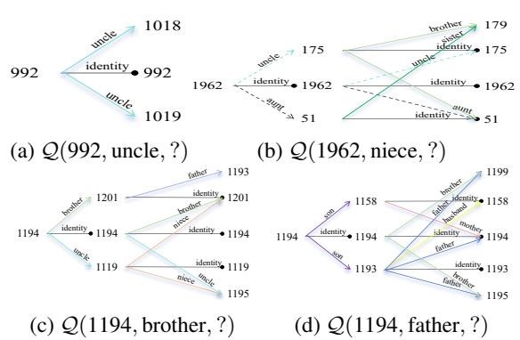  
Figure 7: Visualization of the transmission path on the family dataset, with dotted lines representing reverse relationships.

To validate our hypothesis that different queries require varying reasoning path lengths, we present two illustrative examples from the Family dataset. For (992, uncle, ?) (Fig. 7a), the desired answer entity emerges at the first length, while for the query (1962, niece, ?) (Fig. 7b), the correct answer entity does not appear until the second length. This demonstrates that a single-length exploration is insufficient for certain queries, and multi-length exploration can adapt better and save extra computational cost. Meanwhile, MoKGR also maintain semantic awareness, which is further evidenced in Fig. 7c and 7d, where for entity 1194, MoKGR selects kinship-appropriate relations: brother and uncle for brother queries, and son and brother for father queries, thereby improving both reasoning accuracy and efficiency.

## D Additional Implementation Details

## D.1 Personalized PageRank

In this subsection, we will introduce an auxiliary method — the principle of PPR (Personalized PageRank). On some ultra-large-scale datasets, even after implementing pruning, the computational cost remains enormous since pruning at each layer requires calculations for all entities in that layer. Therefore, we explored whether we could implement pre-pruning functionality that could filter out some less important nodes in advance for ultra-large-scale datasets without trainable parameters (as these would increase computational costs)

through simple rules. Based on this, we discovered that Personalized PageRank, an algorithm based on random walks, could effectively accomplish this task. Thus, for ultra-large datasets such as YAGO3- 10, we performed preliminary subgraph extraction using PPR in advance. Algorithm 2 demonstrates the complete algorithmic workflow after activating PPR.

## D.1.1 PPR Sampling methods

PPR is commonly implemented through the power iteration method, which can be formulated as

$$
\begin{array} { r } { \pi = \alpha \pi P + ( 1 - \alpha ) \pmb { v } , } \end{array}\tag{25}
$$

where π represents the PPR vector, P denotes the row-normalized adjacency matrix, v is the personalization vector with the initial node having value 1 and others 0, and $\alpha \in ( 0 , 1 )$ is the damping factor (typically set to 0.85). The iteration continues until convergence or reaching a maximum number of steps. This approach effectively captures the probability distribution of random walks with restart, where at each step, the walk either continues to a neighboring node with probability α or teleports back to the initial node with probability (1 α). The resulting PPR scores indicate the relative importance of nodes with respect to the initial node, making it particularly useful for local graph analysis and node ranking tasks. Our experiments demonstrate that PPR-based preliminary exploration significantly enhances the efficiency and effectiveness of path-based reasoning. Without such preliminary filtering, large-scale KGs reasoning often encounters memory constraints due to the exponential growth of potential paths. The computational complexity of PPR’s random walk-based approach is substantially lower than that of GNN operations, making it an efficient choice for initial path exploration. Furthermore, the paths preserved through PPR’s preliminary exploration help subsequent message passing and pruning mechanisms focus on truly relevant reasoning paths while filtering out noise.

PPR Calculation We compute and cache global PPR scores for all entities in the knowledge graph to capture their overall importance and connectivity patterns. The PPR score for entity v is defined as:

$$
\begin{array} { r } { \pi _ { e _ { v } } ( v ) = \alpha \cdot \mathbf { e } _ { v } + ( 1 - \alpha ) \cdot \mathbf { P } ^ { \top } \pi _ { e _ { v } } ( v ) , } \end{array}\tag{26}
$$

where $\mathbf { e } _ { v }$ is the indicator vector for entity v, and P is the transition probability matrix of the graph.

For efficient computation on large-scale graphs, we implement a GPU-accelerated iterative method that approximates $\pi _ { v }$ for all entities until convergence or reaching a maximum iteration limit.

Query-Specific Path Exploration For each query entity $e _ { q }$ in a batch, we evaluate each entity $e _ { v } { \bf \dot { s } }$ importance by aggregating its PPR scores across all query entities:

$$
\operatorname { s c o r e } ( e _ { v } ) = \sum _ { e _ { q } \in \mathrm { b a t c h } } \pi _ { e _ { q } } ( e _ { v } ) ,\tag{27}
$$

where $\pi _ { e _ { q } } ( v )$ represents the personalized PageR ank score of entity $e _ { v }$ when using $e _ { q }$ as the starting node.

Based on these scores, we identify promising paths by selecting entities in descending order of importance until reaching a predefined exploration scope. All subsequent reasoning is performed primarily along these preliminarily identified paths. While we explore different path sets for distinct queries, the PPR scores are pre-computed only once, ensuring computational efficiency while maintaining personalization for each query.

## D.2 Loss function calculation supplement

Experts Balance Loss To ensure balanced and effective path exploration, we introduce several regularization terms that prevent the model from overly relying on specific exploration strategies or experts. This addresses the potential “winner takes all” problem (Lepikhin et al., 2020) where a single expert might dominate the path exploration process. Let  denote the set of query context vectors in the current batch, thus $\mathcal { C } _ { q }$ and $\mathcal { C } _ { v }$ contains all $c _ { q }$ and $c _ { v }$ in the batch respectively.

First, we introduce importance loss ${ \mathcal { L } } _ { \mathrm { i m p o r t a n c e } } ( { \mathcal { C } } )$ as length-level balance loss $\mathcal { L } _ { l } ( \mathcal { C } _ { q } )$ and pruning $\mathcal { L } _ { p } ( \mathcal { C } _ { v } )$ balance loss to encourage diverse path lengths and balanced pruning strategy utilization:

$$
\begin{array} { l } { \mathrm { I m p o r t a n c e } ( \mathcal { C } ) = \displaystyle \sum _ { c \in \mathcal { C } } \sum _ { g \in \mathcal { G } ( \pmb { c } ) } g , } \\ { \mathcal { L } _ { \mathrm { I m p o r t a n c e } } ( \mathcal { C } ) = \displaystyle \mathbf { C } \mathbf { V } ( \mathrm { I m p o r t a n c e } ( \mathcal { C } ) ) ^ { 2 } , } \end{array}\tag{28}
$$

where $g \in { \mathcal { G } } ( c )$ is the output of experts’ gating mechanism calculated as Eq. $( 4 ) , \mathrm { C V } ( { \cal X } ) =$ $\sigma ( { \pmb X } ) / \mu ( { \pmb X } )$ represents the coefficient of variation of input X. The importance loss hence measures the variation of importance scores, enforcing all experts to be “similarly important". While the importance score enforces equal scoring among the experts, there may still be disparities in the load assigned to different experts. To address this, we additionally introduce a load balancing penalty for length experts to prevent overloading of specific experts. Specifically, let $P ( c _ { q } , \ell )$ denote the probability that length-ℓ expert is selected $( \mathrm { i } . \mathrm { e } . , g _ { q } ( \ell ) \neq 0$ $: P ( \pmb { c } _ { q _ { i } } , \ell ) = \operatorname* { P r } ( Q ( \pmb { c } _ { q } ) _ { \ell } >$ kth\_ ${ \mathrm { e x } } ( Q ( c _ { q } ) , k , \ell ) )$ where kth\_ $\operatorname { e x } ( { \mathord { \cdot } } )$ returns the $k { \mathrm { - t h } }$ largest expert score excluding the expert itself.

We give a simplified solution to this formula as:

$$
P ( c _ { q } , \ell ) = \Phi \left( \frac { c _ { q } W _ { g } - \mathrm { k t h } _ { - } \mathrm { e x } ( Q ( c _ { q } ) , k , \ell ) } { \mathrm { S o f t p l u s } ( c _ { q } W _ { n } ) } \right) ,\tag{29}
$$

where $W _ { g } \in \mathbb { R } ^ { d \times H } , W _ { n } \in \mathbb { R } ^ { d \times H }$ are learnable weights and Φ is the CDF of standard normal distribution.

The length load balance loss is then defined as:

$$
\mathcal { L } _ { \mathrm { l o a d } } ( \mathcal { C } ) = \mathbf { C } \mathbf { V } ( \sum _ { \substack { \mathbf { c } _ { q } \in \mathcal { C } p \in P ( \mathbf { c } _ { q } , \ell ) } } ) ^ { 2 } ,\tag{30}
$$

where $p$ is the node-wise probability in the batch.

## E Complexity Analysis

Let $| \nu ^ { \ell } |$ denote the number of entities and $| \mathcal { E } ^ { \ell } |$ denote the number of edges between entities at length $\ell - 1$ and ℓ in the knowledge graph. Traditional GNN-based methods like NBFNet require $O ( \sum _ { \ell = 1 } ^ { L } | \mathcal { V } ^ { \ell } | \cdot | \mathcal { E } ^ { \ell } | )$ operations to process all paths up to length $L .$ In contrast, MoKGR reduces the computational cost through two key mechanisms: (1) The layer-wise binary gating function enables early stopping of unnecessary path explorations, reducing the effective path length from $L$ to an adaptive length $L _ { a } \left( L _ { a } \leq L \right) ; ( 2 )$ The mixture of pruning experts first evaluates all entities with complexity $O ( | \nu ^ { \ell } | )$ at each layer $\ell ,$ and then retains only $K ^ { \ell }$ most promising entities where $K ^ { \ell } \ll | \mathcal { V } ^ { \ell } |$ and $| \mathcal { E } _ { K ^ { \ell } } | \ll | \mathcal { E } ^ { \ell } |$ . Consequently, MoKGR achieves an overall operations of $O ( \sum _ { \ell = 1 } ^ { \mathcal { L } } ( | \mathcal { V } ^ { \ell } | \cdot k _ { 2 } + K ^ { \ell }$ $| \mathcal { E } _ { K ^ { \ell } } | ) ,$ ), where $| \nu ^ { \ell } |$ k<sub>2</sub> denotes the number of operations caused by the retained pruning expert calculation at length $\ell ,$ which remains substantially more efficient than traditional methods for large-scale knowledge graphs since $K ^ { \ell } \cdot | \mathcal { E } _ { K ^ { \ell } } | \ll | \bar { \mathcal { V } } ^ { \ell } | \cdot | \mathcal { E } ^ { \ell } |$ and $k _ { 2 } \ll | \mathcal { E } ^ { \ell } |$

## F Theoretical Analysis

In this appendix, we present a theoretical analysis of the MoKGR framework, including convergence

guarantees, optimality of path selection, preservation properties of pruning mechanisms, and formal complexity bounds.

## F.1 Convergence Properties of MoKGR

Theorem 1 (Convergence of MoKGR). Under appropriate conditions on the expert selection probabilities and learning rates, the MoKGR algorithm converges to a local optimum of the loss function.

Proof. Let’s define the loss function for MoKGR as:

$$
L = L _ { t a s k } + \lambda _ { 1 } ( L _ { l } + L _ { p } ) + \lambda _ { 2 } L _ { l o a d }\tag{31}
$$

Where $L _ { t a s k }$ is the task-specific loss, $L _ { l }$ and $L _ { p }$ are the length and pruning expert importance losses, and $L _ { l o a d }$ is the load balancing loss.

The gradient descent update for the parameters Θ of the model at iteration t is:

$$
\Theta _ { t + 1 } = \Theta _ { t } - \eta _ { t } \nabla _ { \Theta } L \big ( \Theta _ { t } \big )\tag{32}
$$

where $\eta _ { t }$ is the learning rate at iteration t. For convergence, we need to show that:

1. The loss function L is bounded below.

2. The gradient $\nabla _ { \Theta } L ( \Theta _ { t } )$ is Lipschitz continuous.

3. The learning rate satisfies $\textstyle \sum _ { t = 1 } ^ { \infty } \eta _ { t } = \infty$ and $\textstyle \sum _ { t = 1 } ^ { \infty } \eta _ { t } ^ { 2 } < \infty$

First, observe that $L _ { t a s k }$ is bounded below by 0 (as it’s a negative log-likelihood loss). The expert balance losses $L _ { l } , L _ { p } ,$ , and $L _ { l o a d }$ are all nonnegative as they are based on squared coefficients of variation. Therefore, L is bounded below.

For Lipschitz continuity, the scoring function $\begin{array} { r } { \Psi ( e _ { a } ) = \sum _ { l \in \cal A } g _ { q } ( l ) \cdot s _ { l } ( q , e _ { a } ) } \end{array}$ is a linear combination of expert outputs, each of which is bounded and Lipschitz continuous due to the bounded nature of the message passing operations and the softmax gating function.

Given a decreasing learning rate schedule $\eta _ { t } =$ $\frac { \eta _ { 0 } } { \sqrt { t } }$ , we have:

$$
\sum _ { t = 1 } ^ { \infty } \eta _ { t } = \eta _ { 0 } \sum _ { t = 1 } ^ { \infty } \frac { 1 } { \sqrt { t } } = \infty\tag{33}
$$

$$
\sum _ { t = 1 } ^ { \infty } \eta _ { t } ^ { 2 } = \eta _ { 0 } ^ { 2 } \sum _ { t = 1 } ^ { \infty } \frac { 1 } { t } < \infty\tag{34}
$$

Therefore, by the convergence theorem for stochastic gradient descent with Lipschitz continuous gradients, the algorithm converges to a local optimum of the loss function. □

## F.2 Optimality of Adaptive Path Length Selection

Theorem 2 (Optimality of Path Length Selection). The adaptive path length selection mechanism in MoKGR minimizes the expected reasoning error given a computational budget constraint.

Proof. Let $E ( l , q )$ be the expected reasoning error when using paths of length up to l for query q. Let $C ( l )$ be the computational cost of exploring paths of length l.

The problem can be formulated as:

$$
\operatorname* { m i n } _ { \{ w _ { l } \} _ { l = L _ { m i n } } ^ { L } } \sum _ { q \in Q } \sum _ { l = L _ { m i n } } ^ { L } w _ { l } ( q ) E ( l , q )\tag{35}
$$

$$
\mathrm { s u b j e c t } \mathrm { t o } \sum _ { q \in Q } \sum _ { l = L _ { m i n } } ^ { L } w _ { l } ( q ) C ( l ) \leq B\tag{36}
$$

$$
\sum _ { l = L _ { m i n } } ^ { L } w _ { l } ( q ) = 1 , \forall q \in Q\tag{37}
$$

$$
w _ { l } ( q ) \geq 0 , \forall l , q\tag{38}
$$

where $w _ { l } ( q )$ is the weight assigned to path length l for query q, and B is the computational budget.

The adaptive length selection mechanism in MoKGR computes weights as:

$$
g _ { q } ( l ) = \frac { \exp ( [ Q ( c _ { q } ) ] _ { l } / \tau ) } { \sum _ { l ^ { \prime } \in A } \exp ( [ Q ( c _ { q } ) ] _ { l ^ { \prime } } / \tau ) }\tag{39}
$$

where $[ Q ( c _ { q } ) ] _ { l }$ is the compatibility score between query q and path length l.

The key insight is that the compatibility score $[ Q ( c _ { q } ) ] _ { l }$ learns to correlate with the negative expected error $- E ( l , q )$ through training. This occurs because queries that benefit more from specific path lengths will have higher accuracy when those lengths are selected, leading to lower task loss.

The noise term $\epsilon \cdot \operatorname { S o f t p l u s } ( W _ { n } c _ { q } )$ enables exploration of different length combinations, allowing the model to discover the optimal path length distribution for each query type.

The binary gating function $g _ { b } ( l )$ enforces the budget constraint by encouraging shorter paths when they provide sufficient evidence.

As training progresses, the model learns to assign higher weights to path lengths that minimize the expected error for each query while respecting the computational budget constraint.

Therefore, the adaptive path length selection mechanism converges to the optimal weighting that minimizes the expected reasoning error given the computational constraints. □

## F.3 Preservation Properties of Pruning Mechanism

Theorem 3 (Preservation of Optimal Paths). Under certain conditions, the mixture ofpruning experts ensures that the optimal reasoning pathfor answering a query is preserved with probability at least $1 - \delta$

Proof. Let $P ( e _ { q } , e _ { a } )$ be the set of all paths connecting query entity $e _ { q }$ to potential answer entity $e _ { a }$ . Let $p ^ { * } \in P ( e _ { q } , e _ { a } )$ be the optimal path that provides the strongest evidence for answering the query.

Let $V _ { l }$ be the set of entities at distance l from $\boldsymbol { e } _ { \boldsymbol { q } } ,$ and let $V _ { l } ^ { \phi }$ be the subset selected by the pruning mechanism. For the optimal path $p ^ { * }$ to be preserved, all entities along $p ^ { * }$ must be included in the selected subsets.

Let $e _ { l } ^ { \ast }$ be the entity at distance l along the optimal path $p ^ { * }$ . We need to show that:

$$
\mathrm { P r } ( e _ { l } ^ { * } \in V _ { l } ^ { \phi } ) \geq 1 - \delta\tag{40}
$$

for some small $\delta > 0$

The MoKGR pruning mechanism selects entities based on the union of top- $K _ { l }$ entities according to different pruning experts:

$$
\begin{array} { r } { V _ { l } ^ { \phi } = \{ \cup _ { i \in \mathrm { T o p K } _ { k _ { 2 } } } ( Q ^ { l } ( c _ { v } ^ { l } ) ) V _ { l } ^ { \phi _ { i } } | V _ { l } ^ { \phi _ { i } } = \mathrm { T o p K } _ { K _ { l } } ( \phi _ { l } ^ { i } ( e _ { a } ) ) \} } \end{array}\tag{41}
$$

For entity $e _ { l } ^ { \ast }$ to be excluded from $V _ { l } ^ { \phi }$ , it must be excluded by all selected pruning experts. The probability of this happening is:

$$
\mathrm { P r } ( e _ { l } ^ { * } \notin V _ { l } ^ { \phi } ) = \mathrm { P r } \left( \bigcap _ { i \in \mathrm { T o p K } _ { k _ { 2 } } ( Q ^ { l } ( c _ { v } ^ { l } ) ) } \{ e _ { l } ^ { * } \notin V _ { l } ^ { \phi _ { i } } \} \right)\tag{42}
$$

Since our three pruning experts evaluate different aspects of path quality (scoring, attention, and semantic relevance), they are designed to be complementary. The optimal path $p ^ { * }$ should score highly on at least one of these dimensions.

Let’s denote by $\rho _ { i }$ the probability that entity $e _ { l } ^ { \ast }$ is not selected by pruning expert i. Then:

$$
\mathrm { P r } ( e _ { l } ^ { * } \notin { V _ { l } ^ { \phi } } ) \le \prod _ { i \in \mathrm { I o p K } _ { k _ { 2 } } ( Q ^ { l } ( c _ { v } ^ { l } ) ) } \rho _ { i }\tag{43}
$$

For the optimal path, at least one of the experts should rank $e _ { l } ^ { \ast }$ highly. Let’s say that for the bestmatched expert $i ^ { * }$ , we have $\rho _ { i ^ { * } } \leq \epsilon$ for some small $\epsilon > 0$

Then:

$$
\mathrm { P r } ( e _ { l } ^ { * } \notin { V _ { l } ^ { \phi } } ) \le \epsilon \cdot \prod _ { i \in \mathrm { I o p K } _ { k _ { 2 } } ( Q ^ { l } ( c _ { v } ^ { l } ) ) , i \neq i ^ { * } } \rho _ { i } \le \epsilon\tag{44}
$$

Therefore:

$$
\mathrm { P r } ( e _ { l } ^ { * } \in V _ { l } ^ { \phi } ) \geq 1 - \epsilon\tag{45}
$$

By setting $\delta = L \epsilon$ where L is the maximum path length, and applying the union bound, we can show that the entire optimal path is preserved with probability at least $1 - \delta$

This proves that the mixture of pruning experts preserves the optimal reasoning path with high probability. □

## F.4 Information Theoretic Analysis of Adaptive Path Selection

Theorem 4 (Information Gain of Adaptive Path Selection). The adaptive path length selection mechanism in MoKGR maximizes the expected information gain about the answer entity while respecting computational constraints.

Proof. Let $H ( E _ { a } | e _ { q } , r _ { q } )$ be the entropy of the answer entity distribution given query $( e _ { q } , r _ { q } , ? )$ Let $I ( E _ { a } ; P _ { l } | e _ { q } , r _ { q } )$ be the mutual information between the answer entity and paths of length l given the query.

The information gain from exploring paths of length l is:

$$
\begin{array} { c } { I G ( l ) = H ( E _ { a } | e _ { q } , r _ { q } ) - H ( E _ { a } | P _ { l } , e _ { q } , r _ { q } ) } \\ { = I ( E _ { a } ; P _ { l } | e _ { q } , r _ { q } ) } \end{array}\tag{46}
$$

(47)

The expected information gain from the adaptive path length selection is:

$$
E [ I G ] = \sum _ { l = L _ { m i n } } ^ { L } g _ { q } ( l ) \cdot I ( E _ { a } ; P _ { l } | e _ { q } , r _ { q } )\tag{48}
$$

where $g _ { q } ( l )$ is the weight assigned to path length l for query $( e _ { q } , r _ { q } , ? )$

The goal of the adaptive path length selection mechanism is to maximize this expected information gain subject to computational constraints:

$$
\operatorname* { m a x } _ { g _ { q } } \sum _ { l = L _ { m i n } } ^ { L } g _ { q } ( l ) \cdot I ( E _ { a } ; P _ { l } | e _ { q } , r _ { q } )\tag{49}
$$

$$
\begin{array} { l } { { \mathrm { s u b j e c t ~ t o } } \displaystyle \sum _ { l = L _ { m i n } } ^ { L } g _ { q } ( l ) \cdot C ( l ) \leq B } \\ { \displaystyle \sum _ { l = L _ { m i n } } ^ { L } g _ { q } ( l ) = 1 , g _ { q } ( l ) \geq 0 } \end{array}\tag{50}
$$

(51)

where $C ( l )$ is the computational cost of exploring paths of length l, and B is the computational budget.

The compatibility score $[ Q ( c _ { q } ) ] _ { l }$ in MoKGR can be interpreted as an estimate of the information gain $I ( E _ { a } ; P _ { l } | e _ { q } , r _ { q } )$ . By learning to assign higher weights to path lengths with higher information gain, MoKGR effectively solves the optimization problem (Huang et al., 2025; Zhang et al., 2025; Wang et al., 2025b).

The layer-wise binary gating function further enforces the computational constraint by stopping path exploration when the expected additional information gain does not justify the computational cost.

Therefore, the adaptive path length selection mechanism in MoKGR maximizes the expected information gain about the answer entity while respecting computational constraints. □

Algorithm 2 Training Process of MoKGR   
Require: Parameters: Number of length and prun   
ing experts $k _ { 1 }$ and $k _ { 2 } .$ , range of path lengths   
$[ L _ { m i n } , L ]$   
Ensure: Optimized GNN model parameters Θ   
and experts model parameters $\mathbb { W } .$   
1: // Pre-processing with PPR   
2: Initialize PPR cache for all entities in   
3: for $v \in \mathcal V$ do   
4: Compute PPR scores $\pi _ { v }$ and store in cache   
5: // Training Loop   
6: while not converged do   
7: Sample a batch of queries $\{ ( e _ { q } , r _ { q } , e _ { a } ) \}$   
from $\mathcal { Q } _ { t r a }$   
8: for each query $( e _ { q } , r _ { q } , e _ { a } ) , \ell \in [ 1 , L ]$ do   
9: // PPR-based subgraph construction   
10: $\mathcal { G } _ { s u b } \gets \mathrm { B u i l d S u b g r a p h } ( e _ { q } , \mathrm { P P R C a c h e } )$   
11: if $\ell = = L _ { \mathrm { m i n } }$ then   
12: // Length Expert Selection   
13: Compute context representation $c _ { q }$ and   
expert embedding $\scriptstyle { E _ { 1 } }$ , thus get the com  
patibility with experts via $Q ( c _ { q } ) =$   
$E _ { 1 } c _ { q } + \epsilon \cdot \mathrm { S o f t p l u s } ( W _ { n } \mathbf { c } _ { q } ) ;$   
14: Select $\mathrm { T o p } { \cdot } k _ { 1 }$ length experts from $\ell \in$   
$[ L _ { m i n } , L ]$ via $Q ( c _ { q } )$ to get weights set   
$\mathcal { G } _ { q } ;$   
15: // Pruning Expert Selection at length ℓ   
16: Compute context $\mathbf { \Delta } \mathbf { c } _ { v } ^ { \ell }$ and expert embed  
ding $\mathbf { { E } } _ { 2 }$ for pruning;   
17: Select Top- $\cdot k _ { 2 }$ pruning experts via $Q ^ { \ell } ( c _ { v } ^ { \ell } )$   
to get weights $\mathcal { G } _ { v } ;$   
18: Combine selected experts to   
identify key entities: $\begin{array} { r l } { \mathcal { V } _ { \phi } ^ { \ell } } & { { } = } \end{array}$   
$\{ \cup _ { i \in \mathrm { T o p K } _ { k _ { 2 } } ( Q ^ { \ell } ( \pmb { c } _ { v } ^ { \ell } ) ) } \mathcal { V } _ { \phi _ { i } } ^ { \ell } | \mathcal { V } _ { \phi _ { i } } ^ { \ell }$   
TopK $\kappa \ell \left( \phi _ { i } ^ { \ell } ( e _ { a } ) \right) \}$ ;   
19: Update path representations for identified   
entities in $\mathcal { V } _ { \phi } ^ { \ell } ;$   
20: if ℓ is the selected length expert then   
21: Calculate entity scores $s _ { \ell } ( e _ { q } , r _ { q } , e _ { a } )$ at   
current length;   
22: Update final scores $\Psi ( e _ { a } )$ by combin  
ing weighted length-specific scores;   
23: if early stopping condition met:   
$g _ { b } ( \ell ) = 0$ then   
24: break   
25: // Parameter Updates   
26: Compute total loss combining task and   
expert balance losses;   
27: Update model parameters Θ and expert pa   
rameters W using gradient of ;   
28: return Θ, W.