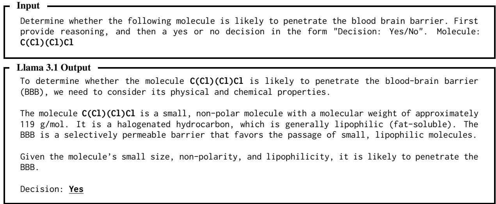
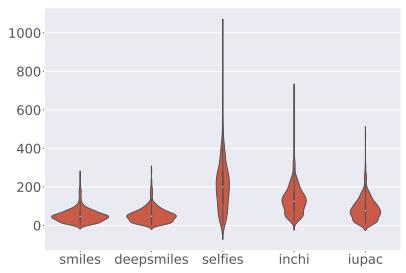
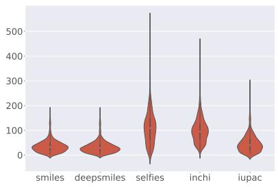
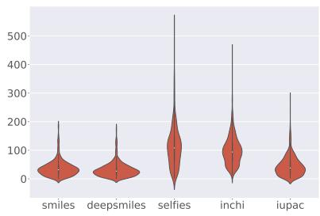
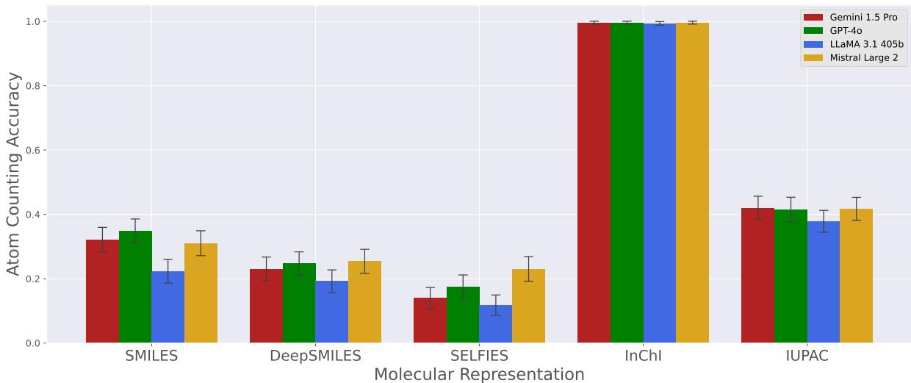

# Molecular String Representation Preferences in Pretrained LLMs: A Comparative Study in Zero- & Few-Shot Molecular Property Prediction

George Baker,† Mario Sanz-Guerrero,‡ Katharina von der Wense†, ‡

†University of Colorado Boulder ‡Johannes Gutenberg University Mainz Correspondence: george.baker@colorado.edu

## Abstract

Large Language Models (LLMs) have demonstrated capabilities for natural language formulations of molecular property prediction tasks, but little is known about how performance depends on the representation of input molecules to the model; the status quo approach is to use SMILES strings, although alternative chemical notations convey molecular information differently, each with their own strengths and weaknesses. To learn more about molecular string representation preferences in LLMs, we compare the performance of four recent models— GPT-4o, Gemini 1.5 Pro, Llama 3.1 405b, and Mistral Large 2—on molecular property prediction tasks from the MoleculeNet benchmark across five different molecular string representations: SMILES, DeepSMILES, SELF-IES, InChI, and IUPAC names. We find statistically significant zero- and few-shot preferences for InChI and IUPAC names, potentially due to representation granularity, favorable tokenization, and prevalence in pretraining corpora. This contradicts previous assumptions that molecules should be presented to LLMs as SMILES strings. When these preferences are taken advantage of, few-shot performance rivals or surpasses many previous conventional approaches to property prediction, with the advantage of explainable predictions through chain-of-thought reasoning not held by taskspecific models.

## 1 Introduction

Molecular property prediction plays a crucial role in medicinal chemistry, enabling the careful selection of drug candidates for experimental evaluation in clinical studies. Traditional machine learning approaches do not involve natural language and often suffer from overfitting due to the small size of experimentally measured molecular property datasets (Wu et al., 2018). However, recently, general-purpose large language models (LLMs) have become capable of reasoning over and understanding molecular structures (Guo et al., 2023; Jablonka et al., 2024; Mirza et al., 2024) as string formats such as SMILES (Weininger, 1988), which has been suggested to yield more generalizable predictions (Jablonka et al., 2024). As interest in the molecular question-answering capabilities of general-purpose LLMs grows (Lu et al., 2024; Saikh et al., 2022; Chen et al., 2024; Zhou et al., 2021; Wei et al., 2020; Mirza et al., 2024), one question that remains unexplored is how performance varies with the representation of molecular structures, which has downstream implications for the integration of LLMs in molecular applications like drug design and chemical education.

<table><tr><td>Notation Example</td></tr><tr><td>SMILES C(C1)Cl</td></tr><tr><td>DeepSMILES CC1)Cl</td></tr><tr><td>SELFIES [C][Branch1][C][C1][C1]</td></tr><tr><td>InChI 1S/CH2C12/c2-1-3/h1H2</td></tr><tr><td>IUPAC Name dichloromethane</td></tr></table>

Table 1: An example molecule represented in the notation of five molecular string representations.

In this work, we aim to address this question with an evaluation of contemporary LLMs—GPT-4o, Gemini 1.5 Pro, Llama 3.1 405b, and Mistral Large 2—on five key molecular property prediction tasks formulated in natural language: blood–brain barrier penetration (BBBP; Martins et al., 2012), beta-secretase binding (BACE; Subramanian et al., 2016), clinical toxicity (ClinTox; Wu et al., 2018), water solubility (ESOL; Delaney, 2004), and hydration free energy (FreeSolv; Mobley and Guthrie, 2014). We compare the performance of these models across five popular molecular string representations: SMILES, DeepSMILES, SELFIES, InChI, and IUPAC names. Unlike previous work, which focuses on engineering top benchmark performance, our comparative study aims to uncover and explain molecular representation preferences in pretrained LLMs.

Our results (Section 4) show previously unobserved zero- and few-shot preferences in LLMs for the InChI and IUPAC name representations, which is a useful insight for a broad range of downstream molecular and chemical applications, including question-answering and LLM-assisted drug design. Follow-up experiments and analyses in Section 5 indicate that these preferences stem from a complex combination of factors, potentially including the prevalence of representations in pretraining data, tokenization challenges, and representation granularity, all of which contribute differently, depending on the specifics of the molecular task at hand.

## 2 Related Work

## 2.1 Molecular String Representations

Since the 1950s, there has been significant interest in representing molecular structures as strings (Wiswesser, 1952) to enable indexing, cataloging, and computational processing. More recently, these representations have been used to train machine learning models to predict molecular properties and generate new drug-like molecules (e.g., Pinheiro et al. 2020; Wu et al. 2018; Elton et al. 2019; Chen et al. 2018). This section summarizes key stringbased molecular representations. Table 1 depicts an example molecule represented in the notations considered in this work.

SMILES (Simplified Molecular Input Line Entry System; Weininger, 1988) is one of the earliest and most widely adopted machine-readable string-based representations for molecules. It encodes atoms as their chemical symbols and bonds, using " " (single, or more commonly, implicit), "=" (double), "#" (triple), and "\$" (quadruple). Rings are represented by appending a number to the first atom in the ring, while branches are enclosed in parentheses (Wigh et al., 2022). SMILES is inherently non-canonical, allowing for multiple syntactically valid representations—or “synonyms”— of the same molecule, which has led to various suggested improvements and canonicalization algorithms (Hagan et al., 2016; Schneider et al., 2015; Weininger et al., 1989).

SMILES Variants DeepSMILES (O’Boyle and Dalke, 2018) and SELFIES (SELF-referencIng Embedded Strings; Krenn et al., 2020) are syntaxes derived from SMILES to address the large proportion of SMILES strings corresponding to invalid molecules. DeepSMILES modifies ring and branch representation to reduce the probability of generative models producing invalid molecules. To avoid unpaired parentheses, parenthesis pairs are replaced with only closing parentheses, the number of which represents the size of the branch, and paired ring closure symbols are likewise replaced with single symbols. SELFIES is a truly canonical representation in which every string corresponds to a valid molecule. Guo et al. (2023) and Yu et al. (2024) observe that zero- and few-shot performance of LLMs suffers when using SELFIES instead of SMILES, which they attribute to lack of SELFIES examples in the models’ pretraining data.

InChI (International Chemical Identifier; Heller et al. 2015) was proposed as a unique, canonical representation for molecules, aiming for compactness. However, as discussed in Section 5, the InChI strings for molecules in this study are not substantially shorter in terms of characters or tokenized inputs than their counterparts in other representations. Standard InChI uses a hierarchical structure with four “layers” separated by “/” characters. Each layer represents different information about the molecule such as chemical formula, connectivity, charge, and isotopes; additional non-standard layers may also be included, although in the present work we only consider standard layers.

IUPAC Nomenclature IUPAC names employ words instead of characters to represent functional groups (e.g., “dichloromethane” “di- + chloro- + methane” (two chlorine, one carbon)). The names are assigned following a set of rules created and maintained by the International Union of Pure and Applied Chemistry (Favre and Powell, 2013). Theoretically, every molecule should be programmatically assignable an IUPAC name, although the extent of the ruleset and its occasional updates have been noted to cause inconsistency and difficulty for chemists. Recent work explores neural translation from SMILES to IUPAC names to address this (Rajan et al., 2021, 2024).

## 2.2 Molecular Property Prediction

Traditional machine learning approaches for molecular property prediction involve either extracting features from molecular graphs and training nondeep-learning models, such as random forests, decision trees, or logistic regression models (e.g. ,Wu et al. 2018), or using graph neural networks (e.g., Wieder et al. 2020; Wu et al. 2018) to learn directly from the molecular graphs. These methods often achieve high performance but suffer from limited interpretability due to their black-box nature. Additionally, they are prone to “heavy overfitting” (Wu et al., 2018), largely because of the small sizes of molecular datasets. Recent studies have also criticized dataset splitting strategies that result in overestimated performance (Guo et al., 2024).

In recent years, transformer-based models have been applied to chemical languages (discussed further in the next subsection), such as SMILES, using large-scale pretraining on chemical datasets, often resulting in more general models with better performance. Most recently, large general-purpose language models without chemistry-specific pretraining have been shown to be capable of reasoning over molecular structures in natural language to predict properties (Guo et al., 2023), which has substantial benefits in terms of prediction interpretability and generalization.

## 2.3 Large Language Models in Chemistry

LLMs have demonstrated remarkable performance across a diverse range of tasks, extending beyond traditional NLP to include specialized domainspecific applications (Brown et al., 2020). Built on the Transformer architecture (Vaswani et al., 2017), these models excel at processing sequential data, such as molecular representations encoded as text strings. This architectural advantage, combined with the extensive knowledge acquired during pretraining, makes LLMs promising tools for chemical reasoning tasks.

Numerous efforts have focused on training domain-specific models for chemistry tasks. Chem-BERTa (Chithrananda et al., 2020; Ahmad et al., 2022) applies masked language modeling to SMILES strings to generate molecular embeddings, while MolT5 (Edwards et al., 2022) focuses on bidirectional translation between molecular structures and natural language descriptions. MolGPT (Bagal et al., 2021) adopts a GPT-style architecture specifically for molecular generation tasks. Jablonka et al. (2024) fine-tune GPT-3 on a suite of property prediction tasks, observing performance gains as a result of training on multiple representations at once. More comprehensive models like Galactica (Taylor et al., 2022), BioT5 (Pei et al., 2023, 2024), and nach0 (Livne et al., 2024) are designed to handle a broader range of chemical tasks, all operating on string-based molecular representations. However, these models typically must be fine-tuned on specific tasks, are trained on relatively small, domain-specific datasets, and have fewer parameters than the largest general-purpose LLMs, which may constrain their general knowledge and limit their performance on diverse chemical tasks. Furthermore, task-specific models lack instruction tuning and are therefore unable to easily generalize to tasks other than those they were trained for.

Given these limitations, there is a growing interest in leveraging general-purpose LLMs for chemical applications to benefit from their extensive pretraining. Recent work with GPT-4 (Achiam et al., 2023) has shown promising results in molecular property prediction (Guo et al., 2023; Jablonka et al., 2024), suggesting that large-scale pretraining on diverse text corpora may enable these models to develop useful chemical intuition. However, further research is needed to fully understand their strengths, limitations, and optimal utilization in molecular sciences, particularly regarding their ability to process different molecular representations and generalize across the chemical space. In this work, we focus on understanding how these models process different molecular string representations, which is crucial for optimizing their application in molecular sciences and advancing LLM-assisted chemical research.

## 3 Methodology

Models We evaluate recent LLMs, including both open-weight models – Llama 3.1 (Dubey et al., 2024) and Mistral Large 2 (Mistral AI, 2024) – and proprietary models – Gemini 1.5 (Reid et al., 2024) and GPT-4o (OpenAI et al., 2024). These LLMs have demonstrated state-of-the-art performance on textbook-style natural language chemistry benchmarks (Hendrycks et al., 2020; Wang et al., 2024; Shaier et al., 2025).

Datasets We examine 5 molecular property prediction datasets from the MoleculeNet (Wu et al., 2018) benchmark: BBBP (Martins et al., 2012), for which we predict binary labels for blood–brain barrier penetration from molecules; BACE (Subramanian et al., 2016), for which we predict binary binding results for inhibition of human β-secretase 1 (a treatment approach for Alzheimer’s disease); ClinTox (Wu et al., 2018), for which we predict clinical toxicity; ESOL (Delaney, 2004), for which we predict log water solubility; and FreeSolv (Mobley and Guthrie, 2014), for which we predict hydration free energy. As the datasets only come with SMILES representations of molecules, we translate SMILES into the other representations using the deepsmiles,1 selfies,2 and pubchempy3 libraries. For molecules where the PubChem API is unable to produce an IUPAC name (details in Appendix B), we generate an IUPAC name using STOUT (Rajan et al., 2024). We use the standard test sets from the literature for comparison with previous approaches. Notably, molecular property prediction datasets are generally smaller than typical benchmarks in NLP due to the expense and difficulty in experimentally measuring molecular properties. To address significance concerns related to dataset size, we conduct significance testing, as detailed subsequently.

  
Figure 1: An example in which Llama 3.1 correctly predicts the blood–brain barrier penetration of chloroform, which is represented in SMILES as C(Cl)(Cl)Cl.

Evaluation Following previous work (Wu et al., 2018), we report the ROC-AUC score for classification tasks and RMSE for regression tasks. The models are instructed to format their predictions as chain-of-thought reasoning (Wei et al., 2022), followed by a true/false or numeric prediction that can be extracted with string operations. An example prompt and model output are shown in Figure 1 (all prompt templates available in Appendix A).

<table><tr><td>Dataset</td><td>Task Type</td><td>Test Set Size</td></tr><tr><td>BBBP</td><td>Binary Classification</td><td>194</td></tr><tr><td>BACE</td><td>Binary Classification</td><td>152</td></tr><tr><td></td><td>ClinTox Binary Classification</td><td>143</td></tr><tr><td>ESOL</td><td>Regression</td><td>113</td></tr><tr><td>FreeSolv</td><td>Regression</td><td>65</td></tr></table>

Table 2: A summary of the molecular property prediction datasets considered in this work.

In-Context Learning In addition to zero-shot chain-of-thought prompting, we evaluate models on prompts with five in-context examples from the same representation. We retrieve examples from the training sets of each task based on the Tanimoto similarity (Tanimoto, 1958) to the target molecules’ Morgan fingerprints (Morgan, 1965). This approach exposes the model to molecules similar to the target one, along with their corresponding ground-truth labels, to enable the model to leverage structural similarities to improve its predictions; non-chemical work has consistently demonstrated that tailoring examples to target queries improves performance over static or random selections (e.g., Liu et al. 2022). Tanimoto similarity is widely used for comparing molecular fingerprints (Bajusz et al., 2015), making it a suitable choice for the similarity selection.

<table><tr><td>Model</td><td>Task</td><td>SMILES</td><td>DeepSMILES</td><td>SELFIES</td><td>InChI</td><td>IUPAC</td></tr><tr><td rowspan="5">Gemini 1.5 Pro</td><td>BBBP↑</td><td>63.9/68.1</td><td>55.5 / 69.2</td><td>54.5 / 58.8</td><td>66.5 / 74.3</td><td>69.2/ 77.3</td></tr><tr><td>BACE↑</td><td>54.1 / 69.2</td><td>50.0/ 71.5</td><td>54.1 / 71.5</td><td>49.7 / 74.7</td><td>67.1 / 73.1</td></tr><tr><td>ClinTox ↑</td><td>50.8 / 68.8</td><td>54.6 / 67.3</td><td>50.0/ 58.1</td><td>63.8 / 60.4</td><td>49.2/51.2</td></tr><tr><td>ESOL↓</td><td>1.47 /1.0</td><td>2.38 / 1.21</td><td>1.717 1.06</td><td>1.41 /0.92</td><td>1.07/ 0.9</td></tr><tr><td>FreeSolv ↓</td><td>4.76 / 2.2</td><td>7.18/ 2.18</td><td>6.32 / 1.98</td><td>4.05 / 2.1</td><td>3.98 / 2.23</td></tr><tr><td rowspan="5">GPT-40</td><td>BBBP↑</td><td>63.8/ 79.8</td><td>54.5 / 73.0</td><td>55.4/ 70.5</td><td>71.1/77.5</td><td>68.9 / 84.2</td></tr><tr><td>BACE↑</td><td>58.4/ 73.9</td><td>54.4/ 76.9</td><td>48.9 / 77.4</td><td>54.8 / 67.8</td><td>52.3 / 77.0</td></tr><tr><td>ClinTox ↑</td><td>50.4 / 55.4</td><td>43.8 / 68.8</td><td>47.3 / 65.8</td><td>54.2 / 55.8</td><td>49.6 / 53.8</td></tr><tr><td>ESOL↓</td><td>1.64/0.93</td><td>1.7/1.14</td><td>1.57 / 1.04</td><td>1.52 / 0.82</td><td>1.2 / 0.76</td></tr><tr><td>FreeSolv ↓</td><td>3.82/1.58</td><td>5.22 / 1.58</td><td>12.24 / 1.57</td><td>3.9/ 1.66</td><td>4.06 / 1.45</td></tr><tr><td rowspan="4">Llama 3.1 405b</td><td>BBBP↑</td><td>65.1 / 85.4</td><td>59.7 / 80.3</td><td>52.0 / 87.4</td><td>72.1 /84.4</td><td>73.3/83.7</td></tr><tr><td>BACE↑</td><td>51.1/74.9</td><td>49.6 / 78.7</td><td>51.7 /74.4</td><td>57.9/ 79.7</td><td>50.0 / 80.1</td></tr><tr><td>ClinTox ↑</td><td>49.2 / 59.6</td><td>47.7 / 70.4</td><td>50.0/54.2</td><td>43.1 / 58.5</td><td>54.6 / 55.8</td></tr><tr><td>ESOL↓</td><td>1.34/0.99</td><td>1.61 / 0.96</td><td>1.7771.18</td><td>1.15 /0.85</td><td>0.93 / 0.88</td></tr><tr><td rowspan="5">Mistral Large 2</td><td>FreeSolv ↓</td><td>4.46 /1.71</td><td>6.19/1.6</td><td>6.08 / 2.34</td><td>3.32/1.73</td><td>4.27 / 1.6</td></tr><tr><td>BBBP↑</td><td>60.5/74.1</td><td>55.0 / 70.7</td><td>54.5 / 70.8</td><td>69.4/79.2</td><td>66.4 / 82.2</td></tr><tr><td>BACE↑</td><td>52.8 / 61.8</td><td>48.0/ 74.2</td><td>48.8 / 71.5</td><td>59.9/74.0</td><td>54.1 / 76.4</td></tr><tr><td>ClinTox ↑</td><td>50.8 / 50.4</td><td>45.8 / 70.0</td><td>46.9 / 53.5</td><td>48.8 / 51.5</td><td>45.8 / 48.5</td></tr><tr><td>ESOL↓ FreeSolv ↓</td><td>1.7 / 1.56</td><td>1.96 / 1.67</td><td>1.8 / 1.78</td><td>1.31/1.12</td><td>2.42 / 1.25</td></tr><tr><td rowspan="5">Conventional Baseline⁴</td><td>BBBP↑</td><td>5.74/3.81</td><td>10.68 / 1.83</td><td>55.88 / 1.65</td><td>7.15 / 2.07</td><td>42.8 / 1.43</td></tr><tr><td>BACE↑</td><td>72.9</td><td></td><td></td><td></td><td></td></tr><tr><td>ClinTox ↑</td><td>86.7</td><td></td><td></td><td></td><td></td></tr><tr><td>ESOL↓</td><td>82.7</td><td></td><td></td><td></td><td></td></tr><tr><td>FreeSolv ↓</td><td>0.99 1.74</td><td></td><td></td><td></td><td></td></tr><tr><td rowspan="5">MolTRES (Park et al., 2024a)</td><td>BBBP↑</td><td></td><td></td><td></td><td></td><td></td></tr><tr><td>BACE↑</td><td>96.1</td><td></td><td></td><td></td><td></td></tr><tr><td>ClinTox ↑</td><td>91.7</td><td></td><td></td><td></td><td></td></tr><tr><td>ESOL↓</td><td>96.7</td><td></td><td></td><td></td><td></td></tr><tr><td>FreeSolv ↓</td><td>0.27</td><td></td><td></td><td></td><td></td></tr><tr><td rowspan="5">Moleco (Park et al., 2024b)</td><td></td><td>0.23</td><td></td><td></td><td></td><td></td></tr><tr><td>BBBP↑</td><td>92.9</td><td></td><td></td><td></td><td></td></tr><tr><td>BACE↑</td><td>89.1</td><td></td><td></td><td></td><td></td></tr><tr><td>ClinTox ↑ ESOL↓</td><td>95.0</td><td></td><td></td><td></td><td></td></tr><tr><td>FreeSolv ↓</td><td>0.26 0.30</td><td></td><td></td><td></td><td></td></tr></table>

Table 3: Results for all models, tasks, and representations, given as [0-shot] / [5-shot]. Classification tasks (BBBP, BACE, ClinTox) are scored with ROC-AUC (higher is better); regression tasks (ESOL, FreeSolv) are scored with RMSE (lower is better). The best representation for each model/task is underlined for the 0-shot setting and bolded for the 5-shot setting. The best-scoring conventional approaches from Wu et al. (2018) and recent fine-tuned SMILES models are provided for context, although we stress that the objective of this study is not to directly outperform these.

Significance Testing Due to the limited test set sizes of existing molecular property prediction datasets—and to provide actionable results for future work—we conduct almost stochastic order (ASO) significance testing (Dror et al., 2019; Del Barrio et al., 2018) as implemented by Ulmer et al. (2022). ASO testing compares empirical score cumulative distribution functions obtained from deep learning approaches at a given confidence level (95% in our case) and formally tests the hypothesis that one is stochastically dominant over another (by some proportion 1  τ ). For each comparison, ASO returns an $\epsilon _ { m i n }$ value representing an upper bound to the proportion of violation of stochastic order; if, for the comparison of algorithms A and $B , \epsilon _ { m i n }$ is less than some value $\tau \leq 0 . 5 .$ , we can reject the null hypothesis and accept the hypothesis that algorithm A is better than algorithm B. Following the guidance of Ulmer et al. (2022), we set $\tau = 0 . 2$ for a lower Type I error rate. As we perform comparisons between SMILES and four other molecular string representations, the results are Bonferroni corrected (Bonferroni, 1936) to address the multiple comparisons problem.

Specifically, we amalgamate example-level scores (accuracy for classification, absolute error for regression) across tasks and models and compare the stochastic order of the approach using SMILES to each of the other representation approaches to attempt to reject the null hypothesis that, across all models, $\mathcal { M } _ { r e p . }$ does not stochastically dominate SMILES,

$$
H _ { 0 } : \varepsilon _ { w _ { 2 } } ( \mathbb { S } _ { \mathcal { M } _ { r e p . } } , \mathbb { S } _ { \mathcal { M } _ { S M I L E S } } ) \geq \tau = 0 . 2 ,
$$

and accept the alternate hypothesis that $\mathcal { M } _ { r e p . }$ . does stochastically dominate SMILES,

$$
H _ { a } : \varepsilon _ { w _ { 2 } } ( \mathbb { S } _ { \mathcal { M } _ { r e p . } } , \mathbb { S } _ { \mathcal { M } _ { S M I L E S } } ) < \tau = 0 . 2 .
$$

## 4 Results

Table 3 shows the task-wise results by model and molecular string representation. The scores for classification tasks (BBBP, BACE, and ClinTox) are reported as ROC-AUC (higher is better), while the scores for regression tasks (ESOL and FreeSolv) are reported as RMSE (lower is better).

In the zero-shot setting, we observe that most models and tasks achieve higher scores with the InChI or IUPAC name representations, although there are cases where SMILES remains the preferred format. Interestingly, while no model achieves top performance on any task with either the DeepSMILES or SELFIES representations in the zero-shot setting, their performance in the fiveshot setting often matches or surpasses the baseline SMILES representation.

Significance The results of the ASO testing on the zero-shot scores yield $\epsilon _ { m i n } ~ = ~ { \underline { { { 1 . 0 } } } } ~$ for both the DeepSMILES and SELFIES representation approaches, so we fail to reject the null hypotheses that they do not stochastically dominate the SMILES approach. The InChI and IUPAC name tests yield $\epsilon _ { m i n } = \underline { { 0 . 1 7 } } , \underline { { 0 . 0 6 } }$ respectively, so at the $\tau = 0 . 2$ level, we reject the null hypotheses and accept the alternative hypotheses that InChI and IU-PAC name representations are superior in general to SMILES for pretrained general-purpose LLMs performing zero-shot molecular property prediction.

Conducting the same test on the few-shot scores yields $\epsilon _ { m i n } ~ = ~ \underline { { { 0 . 9 1 } } }$ for DeepSMILES, 1.0 for SELFIES, 0.36 for InChI, and 0.16 for IUPAC names, meaning that, in the few-shot setting, IU-PAC names are still strongly preferred to SMILES, while InChI are somewhat preferred although not significantly at the $\tau = 0 . 2$ level.

## 5 Analysis

The results in Section 4 demonstrate that the evaluated models are not only capable of reasoning over InChI and IUPAC names, but in many cases prefer them to the status quo SMILES.

We confirm previous findings that SMILESvariants such as DeepSMILES and SELFIES are not particularly useful to LLMs in zero-shot settings (Guo et al., 2023), likely due to their scarcity within the training data. However, when given incontext examples, performance increases greatly to around the same level of the baseline SMILES approach. We additionally note that the reported improvements of the DeepSMILES and SELFIES notations over SMILES are generally aimed at reducing the likelihood of generative models producing semantically invalid molecules, but not necessarily to be more useful as textual inputs.

Representation Prevalence in Pretraining Data One potential factor of the observed IUPAC name preference is that, in biomedical corpora, IUPAClike names are used more frequently than SMILES or InChI (Klinger et al., 2008). In Appendix F, we analyze the open-source Dolma pretraining corpus (Soldaini et al., 2024), showing that IUPAC mentions are indeed the most common in LLM pretraining data (43%); although they are closely followed by SMILES at 36%. We additionally evaluate the largest instruction-tuned OLMo 2 model (OLMo et al., 2024), which was trained on Dolma, on the studied molecular property prediction tasks and representations; we observe similar preferences, although OLMo 2 struggles to compete with the larger models studied.

In-Context Learning Although zero-shot performance using the two SMILES variants is poor as in previous work (Guo et al., 2023), our results show that, when given in-context examples of predictions based on the SMILES variants, LLMs can use these representations similarly well or even better in some cases (e.g., in Table 3, the highest score on ClinTox is achieved by Llama 3.1 with the DeepSMILES representation).

Representation Token Efficiency Previous work in non-chemical NLP has shown that the task difficulty for LLMs tends to increase with the length of the inputs (Zhang et al. 2024; Liu et al. 2024a; inter alia), so it seems plausible that a more token-efficient representation would benefit molecular property prediction. The design documents of InChI and IUPAC nomenclature state relative conciseness as design goals (Favre and Powell, 2013; Heller et al., 2015), which could partially explain the observed preferences.

To attempt to verify this, we count the tokens of all molecules in the studied test sets using character counts, the GPT-4o tokenizer (via the tiktoken5 library), and the Llama 3.1 tokenizer.

  
(a) Characters.

  
(b) Llama 3.1 tokens.

  
(c) GPT-4o tokens.

Figure 2: Token count distributions of the molecular string representations; in terms of characters (2a, left), Llama 3.1 tokens (2b, center), and GPT-4o tokens (2c, right). We note that the relative token-efficiency does not vary substantially across tokenization schemes.  
  
Figure 3: Atom counting accuracy by representation and model. Across models, IUPAC names are easier to extract atomic counts from, while InChI identifiers explicitly provide atom counts and yield near perfect accuracy. Error bars represent 1 SE under binomial distribution assumptions.

Figure 2 shows that, in the presently studied datasets, InChI and IUPAC names are not more token- or character-efficient in comparison to SMILES strings.

Representation Atom Count Explicitness Although we find no evidence that the number of tokens contributes to the observed preferences, recent work shows that the LLMs’ tokenization schemes cause models to struggle to capture implicit character counts (Zhang et al., 2024; Xu and Ma, 2025; Schwartz et al., 2024; Singh and Strouse, 2024). This poses a challenge for representations like SMILES and its variants, where individual atoms are encoded as 1-2 character symbols, and the exact counts of atoms are crucial to reason about molecular structures and properties (Wojtuch et al., 2023). In contrast, the InChI and IUPAC name representations mitigate this reliance on counting by explicitly providing atom counts. For example, the 8 carbon atoms in the octane molecule are implicitly represented by the SMILES “CCCCCCCC”, but explicitly in “octane” (“oct-” = 8; IUPAC nomenclature) and “C8H18” (the chemical formula in InChI).

To quantify the impact of representation on atom counting capabilities, we conduct an additional experiment using the same datasets, representations, and models, in which we ask each model to count the occurrences of each atom (exact prompt in Appendix A.3). We then compare the predicted counts with ground truths obtained using RDKit;6 if all counts are correct, we assign an “atom counting accuracy” score of 1, else 0.

Figure 3 highlights that, across all models, the two superior representations (InChI and IUPAC names) are easier than SMILES for the studied LLMs to count atoms from. Models score nearly perfectly on molecules represented as InChI, presumably because the chemical formula directly provides exact atom counts; IUPAC names are also substantially easier to count from than SMILES variants, but at around 40% accuracy there is still much room for improvement.

<table><tr><td>Dataset</td><td>Pearson&#x27;s r</td><td>P-value</td></tr><tr><td>BBBP</td><td>0.05</td><td>0.46</td></tr><tr><td>BACE</td><td>0.11</td><td>0.19</td></tr><tr><td>ClinTox</td><td>-0.12</td><td>0.16</td></tr><tr><td>ESOL</td><td>-0.04</td><td>0.70</td></tr><tr><td>FreeSolv</td><td>-0.49</td><td>4e-05</td></tr></table>

Table 4: Pearson’s correlation coefficients and P-values between the studied molecular property tasks and the “countability” of atoms in the corresponding molecules. Results that are statistically significant at the conventional α = 0.05 level are underlined and bolded.

For example, GPT-4o incorrectly counts the carbon atoms in the SMILES string “NNc1nncc2ccccc12”, which is tokenized as [‘NN’, ‘c’, ‘1’, ‘nn’, ‘cc’, ‘2’, ‘cc’, ‘ccc’, ‘12’], but it correctly predicts the atomic counts from the IUPAC name, “phthalazin-1-ylhydrazine”. In contrast, humans can easily count the number of ‘c’ characters in the SMILES string with minimal chemical knowledge, whereas extracting the same count from the IUPAC name requires more advanced expertise.

In Table 4 we present task-wise Pearson’s correlation coefficients and associated p-values for atom counting accuracy and task performance (accuracy in classification tasks, absolute error in regression tasks), aggregated across models. We observe that most of these are not statistically significant at the α = 0.05 level. While the coefficients are generally in directions that support the idea that the countability of atoms in a molecule contributes to property prediction performance, the mixed significance indicates that the influence of atom counting capabilities varies from task to task; as a result, it is unlikely that “atom countability” is the sole contributing factor to molecular representation preferences, although it may act as a proxy for a model’s ability to extract detailed structural information.

Does Token Manipulation Help SMILES Use? Previous work proposes tokenization manipulation strategies to aid LLMs in arithmetic and wordbased counting problems on which they struggle due to unfavorable tokenization (Zhang et al., 2024; Xu and Ma, 2025; Schwartz et al., 2024; Singh and Strouse, 2024). These generally revolve around breaking up inputs by inserting character-level perturbations. In order to gain insight as to whether these can apply to traditionally SMILES-based tasks like property prediction, we conduct a followup experiment using GPT-4o and three such strategies. Two are previously proposed strategies which involve separating tokens with space characters or commas; we note that the insertion of spaces and commas alters or invalidates the SMILES representation, and, therefore, propose a new tokenization manipulation approach specific to SMILES strings that forces explicit representation of bonds that are by default implicit, preserving the validity and semantics of the SMILES molecule (detailed in Appendix D) while separating atomic symbols.

<table><tr><td>Task</td><td>SMILES</td><td>Spaces</td><td>Commas</td><td>Explicit</td></tr><tr><td>BBBP↑</td><td>79.8</td><td>75.7</td><td>74.8</td><td>76.5</td></tr><tr><td>BACE↑</td><td>73.9</td><td>70.3</td><td>71.9</td><td>75.7</td></tr><tr><td>ClinTox ↑</td><td>55.4</td><td>52.7</td><td>61.2</td><td>56.5</td></tr><tr><td>ESOL↓</td><td>0.93</td><td>0.96</td><td>1.04</td><td>1.00</td></tr><tr><td>FreeSolv ↓</td><td>1.58</td><td>1.72</td><td>1.61</td><td>1.48</td></tr></table>

Table 5: GPT-4o’s property prediction performance under token manipulation strategies. Top scores for each task are underlined and bolded.

In Table 5 we report the results. We find that tokenization manipulation approaches generally have minimal impact on property prediction performance and are unable to draw strong conclusions about the impact of tokenization; however, this does not necessarily rule out tokenization issues as sources of SMILES utilization difficulties, but instead shows that existing tokenization manipulation techniques are insufficient to quantify or address these alone.

## 6 Conclusion

In this study, we evaluated the molecular string representation preferences of four state-of-the-art LLMs on natural language formulations of five molecular property prediction tasks, which represent a critical phase in the drug discovery process. Our findings highlight the importance of careful selection of molecular representation when working with LLMs. Notably, we observe statistically significant preferences for InChI and IU-PAC names over the traditional SMILES-based approach, which contradicts previous assumptions that molecules should be presented to LLMs as SMILES strings for property prediction tasks. Follow-up experiments suggest that these preferences stem from a complex combination of multiple causes, potentially including atom-counting capabilities, tokenization issues, information granularity, and pretraining corpora prevalence.

These results have important implications for the use of general-purpose LLMs in chemical tasks: by understanding LLMs’ preferences for different molecular representations, we can better harness their potential in domains like drug design and discovery. Furthermore, the growing interest in chemical question-answering underscores the values of parametric knowledge and reasoning capabilities in general-purpose LLMs, which may offer a broader, more general, more explainable alternative to smaller, specialized models for tackling complex chemistry-related questions.

## Limitations

Task Selection Due to large model sizes, API rate limits, and limited availability of molecular property prediction tasks, we limited this study to 5 tasks. In order to ensure that our findings generalize, the tasks were carefully selected to cover major categories of property prediction, including physical chemistry (ESOL, FreeSolv), biophysics (BACE), and physiology (ClinTox, BBBP). We acknowledge that some larger datasets for individual property prediction tasks exist (e.g., QM9 (Ruddigkeit et al., 2012)); but, the goal of our work is to provide a general assessment of molecular representation preferences, and including the test set of a single large dataset would invalidate the generalization of our claims. We believe that, in combination with the diversity of studied tasks, our significance testing procedure obviates the need for larger datasets and allows for a larger selection of models and representations.

We acknowledge that our experiments are specific to molecular property prediction tasks, and the findings of this study may not generalize to other tasks, such as molecule captioning or generation; these questions may be of interest to future work.

Model Selection In this work, we evaluate four state-of-the-art LLMs, including open-source (Llama 3.1 405b, Mistral Large 2) and closedsource (GPT-4o, Gemini 1.5) models. We do not include results for smaller models from the same families as we have no reason to believe that molecular representation preferences will vary by model size, and previous work finds that these smaller models are practically incapable of competitive molecular property prediction (Guo et al., 2023). We also do not evaluate science- or chemistry-specific models such as Galactica (Taylor et al., 2022) or nach0 (Livne et al., 2024), as we are interested in zeroand few-shot preferences, and these models have also been shown to perform worse at property prediction than general-purpose LLMs (Guo et al., 2023).

Molecular Representation Selection We study what we believe to be the five most popular and widely used string-based molecular representations that convey structure, but we concede that other representations (e.g., Wiswesser Line Notation (Wiswesser, 1952), or the recently proposed Groupbased Molecular Representation (Liu et al., 2024b)) exist. We do not report scores for chemical common names as these 1) do not necessarily convey chemical structure and 2) do not exist for novel molecules and, therefore, are not of interest for drug design which relies on the prediction of properties of previously unseen molecules. We believe that the examination of tabular (e.g., MDL) and visual (e.g., images of 2D and 3D structure) representations could be interesting topics for future work.

## Acknowledgments

This work was enabled in part by API credit grants through OpenAI’s Researcher Access Program. Mario Sanz-Guerrero and Katharina von der Wense have received funding from the Carl Zeiss Foundation, grant number P2022-08-009 (MAINCE project).

## References

Josh Achiam, Steven Adler, Sandhini Agarwal, Lama Ahmad, Ilge Akkaya, Florencia Leoni Aleman, Diogo Almeida, Janko Altenschmidt, Sam Altman, Shyamal Anadkat, et al. 2023. Gpt-4 technical report. arXiv preprint arXiv:2303.08774.

Walid Ahmad, Elana Simon, Seyone Chithrananda, Gabriel Grand, and Bharath Ramsundar. 2022. Chemberta-2: Towards chemical foundation models. arXiv preprint arXiv:2209.01712.

Viraj Bagal, Rishal Aggarwal, P. K. Vinod, and U. Deva Priyakumar. 2021. Molgpt: Molecular generation us-

ing a transformer-decoder model. Journal ofChemical Information and Modeling, 62(9):2064–2076.

Dávid Bajusz, Anita Rácz, and Károly Héberger. 2015. Why is tanimoto index an appropriate choice for fingerprint-based similarity calculations? Journal of cheminformatics, 7:1–13.

Carlo Emilio Bonferroni. 1936. Theoria statistica classi e calcolo delle probabilita. pubbl. r. Int. Super. Sci. Econ. Comm. Firenze, 8(1):62.

Tom Brown, Benjamin Mann, Nick Ryder, Melanie Subbiah, Jared D Kaplan, Prafulla Dhariwal, Arvind Neelakantan, Pranav Shyam, Girish Sastry, Amanda Askell, et al. 2020. Language models are few-shot learners. In Advances in Neural Information Processing Systems, volume 33, pages 1877–1901. Curran Associates, Inc.

Hongming Chen, Ola Engkvist, Yinhai Wang, Marcus Olivecrona, and Thomas Blaschke. 2018. The rise of deep learning in drug discovery. Drug discovery today, 23(6):1241–1250.

Xiuying Chen, Tairan Wang, Taicheng Guo, Kehan Guo, Juexiao Zhou, Haoyang Li, Mingchen Zhuge, Jürgen Schmidhuber, Xin Gao, and Xiangliang Zhang. 2024. Scholarchemqa: Unveiling the power of language models in chemical research question answering. arXiv preprint arXiv:2407.16931.

Seyone Chithrananda, Gabriel Grand, and Bharath Ramsundar. 2020. ChemBERTa: large-scale selfsupervised pretraining for molecular property prediction. arXiv preprint arXiv:2010.09885.

Eustasio Del Barrio, Juan A Cuesta-Albertos, and Carlos Matrán. 2018. An optimal transportation approach for assessing almost stochastic order. In The Mathematics of the Uncertain, pages 33–44. Springer.

John S Delaney. 2004. Esol: estimating aqueous solubility directly from molecular structure. Journal of chemical information and computer sciences, 44(3):1000–1005.

Rotem Dror, Segev Shlomov, and Roi Reichart. 2019. Deep dominance - how to properly compare deep neural models. In Proceedings ofthe 57th Conference of the Associationfor Computational Linguistics, ACL 2019, Florence, Italy, July 28- August 2, 2019, Volume 1: Long Papers, pages 2773–2785. Association for Computational Linguistics.

Abhimanyu Dubey, Abhinav Jauhri, Abhinav Pandey, Abhishek Kadian, Ahmad Al-Dahle, Aiesha Letman, Akhil Mathur, Alan Schelten, Amy Yang, Angela Fan, et al. 2024. The llama 3 herd of models. arXiv preprint arXiv:2407.21783.

Carl Edwards, Tuan Lai, Kevin Ros, Garrett Honke, Kyunghyun Cho, and Heng Ji. 2022. Translation between molecules and natural language. In Proceedings of the 2022 Conference on Empirical Methods in Natural Language Processing, pages 375–413,

Abu Dhabi, United Arab Emirates. Association for Computational Linguistics.

Daniel C Elton, Zois Boukouvalas, Mark D Fuge, and Peter W Chung. 2019. Deep learning for molecular design—a review of the state of the art. Molecular Systems Design & Engineering, 4(4):828–849.

Henri A Favre and Warren H Powell. 2013. Nomenclature oforganic chemistry: IUPAC recommendations and preferred names 2013. Royal Society of Chemistry.

Qianrong Guo, Saiveth Hernandez-Hernandez, and Pedro J Ballester. 2024. Scaffold splits overestimate virtual screening performance. In International Conference on Artificial Neural Networks, pages 58–72. Springer.

Taicheng Guo, Bozhao Nan, Zhenwen Liang, Zhichun Guo, Nitesh Chawla, Olaf Wiest, Xiangliang Zhang, et al. 2023. What can large language models do in chemistry? a comprehensive benchmark on eight tasks. Advances in Neural Information Processing Systems, 36:59662–59688.

Patrick S Hagan, Deep Kumar, Andrew S Lesniewski, and Diana E Woodward. 2016. Universal smiles. Wilmott, 2016(84):40–55.

Stephen R Heller, Alan McNaught, Igor Pletnev, Stephen Stein, and Dmitrii Tchekhovskoi. 2015. Inchi, the iupac international chemical identifier. Journal ofcheminformatics, 7:1–34.

Dan Hendrycks, Collin Burns, Steven Basart, Andy Zou, Mantas Mazeika, Dawn Song, and Jacob Steinhardt. 2020. Measuring massive multitask language understanding. In International Conference on Learning Representations.

Kevin Maik Jablonka, Philippe Schwaller, Andres Ortega-Guerrero, and Berend Smit. 2024. Leveraging large language models for predictive chemistry. Nature Machine Intelligence, 6(2):161–169.

Roman Klinger, Corinna Koláˇrik, Juliane Fluck, Martin Hofmann-Apitius, and Christoph M Friedrich. 2008. Detection of iupac and iupac-like chemical names. Bioinformatics, 24(13):i268–i276.

Mario Krenn, Florian Häse, AkshatKumar Nigam, Pascal Friederich, and Alan Aspuru-Guzik. 2020. Selfreferencing embedded strings (selfies): A 100% robust molecular string representation. Machine Learning: Science and Technology, 1(4):045024.

Jiachang Liu, Dinghan Shen, Yizhe Zhang, Bill Dolan, Lawrence Carin, and Weizhu Chen. 2022. What makes good in-context examples for GPT-3? In Proceedings of Deep Learning Inside Out (DeeLIO 2022): The 3rd Workshop on Knowledge Extraction and Integration for Deep Learning Architectures, pages 100–114, Dublin, Ireland and Online. Association for Computational Linguistics.

Nelson F Liu, Kevin Lin, John Hewitt, Ashwin Paranjape, Michele Bevilacqua, Fabio Petroni, and Percy Liang. 2024a. Lost in the middle: How language models use long contexts. Transactions ofthe Associationfor Computational Linguistics, 12:157–173.

Xianggen Liu, Yan Guo, Haoran Li, Jin Liu, Shudong Huang, Bowen Ke, and Jiancheng Lv. 2024b. Drugllm: Open large language model for few-shot molecule generation. arXiv preprint arXiv:2405.06690.

Micha Livne, Zulfat Miftahutdinov, Elena Tutubalina, Maksim Kuznetsov, Daniil Polykovskiy, Annika Brundyn, Aastha Jhunjhunwala, Anthony Costa, Alex Aliper, Alán Aspuru-Guzik, and Alex Zhavoronkov. 2024. nach0: multimodal natural and chemical languages foundation model. Chem. Sci., 15:8380–8389.

Xingyu Lu, He Cao, Zijing Liu, Shengyuan Bai, Leqing Chen, Yuan Yao, Hai-Tao Zheng, and Yu Li. 2024. MoleculeQA: A dataset to evaluate factual accuracy in molecular comprehension. In Findings ofthe Associationfor Computational Linguistics: EMNLP 2024, pages 3769–3789, Miami, Florida, USA. Association for Computational Linguistics.

Ines Filipa Martins, Ana L Teixeira, Luis Pinheiro, and Andre O Falcao. 2012. A bayesian approach to in silico blood-brain barrier penetration modeling. Journal of chemical information and modeling, 52(6):1686–1697.

Adrian Mirza, Nawaf Alampara, Sreekanth Kunchapu, Martiño Ríos-García, Benedict Emoekabu, Aswanth Krishnan, Tanya Gupta, Mara Schilling-Wilhelmi, Macjonathan Okereke, Anagha Aneesh, et al. 2024. Are large language models superhuman chemists? arXiv preprint.

Mistral AI. 2024. Large Enough | Mistral AI.

David L Mobley and J Peter Guthrie. 2014. Freesolv: a database of experimental and calculated hydration free energies, with input files. Journal of computeraided molecular design, 28:711–720.

Harry L Morgan. 1965. The generation of a unique machine description for chemical structures-a technique developed at chemical abstracts service. Journal of chemical documentation, 5(2):107–113.

Noel O’Boyle and Andrew Dalke. 2018. Deepsmiles: an adaptation of smiles for use in machine-learning of chemical structures.

Team OLMo, Pete Walsh, Luca Soldaini, Dirk Groeneveld, Kyle Lo, Shane Arora, Akshita Bhagia, Yuling Gu, Shengyi Huang, Matt Jordan, Nathan Lambert, Dustin Schwenk, Oyvind Tafjord, Taira Anderson, David Atkinson, Faeze Brahman, Christopher Clark, Pradeep Dasigi, Nouha Dziri, Michal Guerquin, Hamish Ivison, Pang Wei Koh, Jiacheng Liu, Saumya Malik, William Merrill, Lester James V. Miranda, Jacob Morrison, Tyler Murray, Crystal

Nam, Valentina Pyatkin, Aman Rangapur, Michael Schmitz, Sam Skjonsberg, David Wadden, Christopher Wilhelm, Michael Wilson, Luke Zettlemoyer, Ali Farhadi, Noah A. Smith, and Hannaneh Hajishirzi. 2024. 2 olmo 2 furious.

OpenAI, Aaron Hurst, Adam Lerer, Adam P. Goucher, Adam Perelman, Aditya Ramesh, Aidan Clark, AJ Ostrow, Akila Welihinda, Alan Hayes, et al. 2024. Gpt-4o system card. Preprint, arXiv:2410.21276.

Jun-Hyung Park, Yeachan Kim, Mingyu Lee, Hyuntae Park, and SangKeun Lee. 2024a. MolTRES: Improving chemical language representation learning for molecular property prediction. In Proceedings ofthe 2024 Conference on Empirical Methods in Natural Language Processing, pages 14241–14254, Miami, Florida, USA. Association for Computational Linguistics.

Jun-Hyung Park, Hyuntae Park, Yeachan Kim, Woosang Lim, and SangKeun Lee. 2024b. Moleco: Molecular contrastive learning with chemical language models for molecular property prediction. In Proceedings of the 2024 Conference on Empirical Methods in Natural Language Processing: Industry Track, pages 408–420, Miami, Florida, US. Association for Computational Linguistics.

Qizhi Pei, Lijun Wu, Kaiyuan Gao, Xiaozhuan Liang, Yin Fang, Jinhua Zhu, Shufang Xie, Tao Qin, and Rui Yan. 2024. Biot5+: Towards generalized biological understanding with iupac integration and multi-task tuning. In Findings of the Association for Computational Linguistics ACL 2024, pages 1216–1240.

Qizhi Pei, Wei Zhang, Jinhua Zhu, Kehan Wu, Kaiyuan Gao, Lijun Wu, Yingce Xia, and Rui Yan. 2023. Biot5: Enriching cross-modal integration in biology with chemical knowledge and natural language associations. In Proceedings ofthe 2023 Conference on Empirical Methods in Natural Language Processing, pages 1102–1123. Association for Computational Linguistics.

Gabriel A Pinheiro, Johnatan Mucelini, Marinalva D Soares, Ronaldo C Prati, Juarez LF Da Silva, and Marcos G Quiles. 2020. Machine learning prediction of nine molecular properties based on the smiles representation of the qm9 quantum-chemistry dataset. The Journal of Physical Chemistry A, 124(47):9854– 9866.

Kohulan Rajan, Achim Zielesny, and Christoph Steinbeck. 2021. Stout: Smiles to iupac names using neural machine translation. Journal ofCheminformatics, 13(1):34.

Kohulan Rajan, Achim Zielesny, and Christoph Steinbeck. 2024. Stout v2. 0: Smiles to iupac name conversion using transformer models.

Machel Reid, Nikolay Savinov, Denis Teplyashin, Dmitry Lepikhin, Timothy Lillicrap, Jean-baptiste

Alayrac, Radu Soricut, Angeliki Lazaridou, Orhan Firat, Julian Schrittwieser, et al. 2024. Gemini 1.5: Unlocking multimodal understanding across millions of tokens of context. arXiv preprint arXiv:2403.05530.

Lars Ruddigkeit, Ruud Van Deursen, Lorenz C Blum, and Jean-Louis Reymond. 2012. Enumeration of 166 billion organic small molecules in the chemical universe database gdb-17. Journal of chemical information and modeling, 52(11):2864–2875.

Tanik Saikh, Tirthankar Ghosal, Amish Mittal, Asif Ekbal, and Pushpak Bhattacharyya. 2022. Scienceqa: A novel resource for question answering on scholarly articles. International Journal on Digital Libraries, 23(3):289–301.

Nadine Schneider, Roger A Sayle, and Gregory A Landrum. 2015. Get your atoms in order—an opensource implementation of a novel and robust molecular canonicalization algorithm. Journal ofchemical information and modeling, 55(10):2111–2120.

Eli Schwartz, Leshem Choshen, Joseph Shtok, Sivan Doveh, Leonid Karlinsky, and Assaf Arbelle. 2024. NumeroLogic: Number encoding for enhanced LLMs’ numerical reasoning. In Proceedings ofthe 2024 Conference on Empirical Methods in Natural Language Processing, pages 206–212, Miami, Florida, USA. Association for Computational Linguistics.

Sagi Shaier, George Arthur Baker, Chiranthan Sridhar, Lawrence Hunter, and Katharina Von Der Wense. 2025. MALAMUTE: A multilingual, highlygranular, template-free, education-based probing dataset. In Findings of the Association for Computational Linguistics: ACL 2025, pages 4051–4069, Vienna, Austria. Association for Computational Linguistics.

Aaditya K Singh and DJ Strouse. 2024. Tokenization counts: the impact of tokenization on arithmetic in frontier llms. arXiv preprint arXiv:2402.14903.

Luca Soldaini, Rodney Kinney, Akshita Bhagia, Dustin Schwenk, David Atkinson, Russell Authur, Ben Bogin, Khyathi Chandu, Jennifer Dumas, Yanai Elazar, Valentin Hofmann, Ananya Harsh Jha, Sachin Kumar, Li Lucy, Xinxi Lyu, Nathan Lambert, Ian Magnusson, Jacob Morrison, Niklas Muennighoff, Aakanksha Naik, Crystal Nam, Matthew E. Peters, Abhilasha Ravichander, Kyle Richardson, Zejiang Shen, Emma Strubell, Nishant Subramani, Oyvind Tafjord, Pete Walsh, Luke Zettlemoyer, Noah A. Smith, Hannaneh Hajishirzi, Iz Beltagy, Dirk Groeneveld, Jesse Dodge, and Kyle Lo. 2024. Dolma: an Open Corpus of Three Trillion Tokens for Language Model Pretraining Research. arXiv preprint.

Govindan Subramanian, Bharath Ramsundar, Vijay Pande, and Rajiah Aldrin Denny. 2016. Computational modeling of β-secretase 1 (bace-1) inhibitors using ligand based approaches. Journal of chemical information and modeling, 56(10):1936–1949.

T.T. Tanimoto. 1958. An Elementary Mathematical Theory of Classification and Prediction. International Business Machines Corporation.

Ross Taylor, Marcin Kardas, Guillem Cucurull, Thomas Scialom, Anthony Hartshorn, Elvis Saravia, Andrew Poulton, Viktor Kerkez, and Robert Stojnic. 2022. Galactica: A large language model for science. arXiv preprint arXiv:2211.09085.

Dennis Ulmer, Christian Hardmeier, and Jes Frellsen. 2022. deep-significance-easy and meaningful statistical significance testing in the age of neural networks. arXiv preprint arXiv:2204.06815.

Ashish Vaswani, Noam Shazeer, Niki Parmar, Jakob Uszkoreit, Llion Jones, Aidan N Gomez, Ł ukasz Kaiser, and Illia Polosukhin. 2017. Attention is all you need. In Advances in Neural Information Processing Systems, volume 30. Curran Associates, Inc.

Xuezhi Wang, Jason Wei, Dale Schuurmans, Quoc V Le, Ed H Chi, Sharan Narang, Aakanksha Chowdhery, and Denny Zhou. 2023. Self-consistency improves chain of thought reasoning in language models. In The Eleventh International Conference on Learning Representations.

Yubo Wang, Xueguang Ma, Ge Zhang, Yuansheng Ni, Abhranil Chandra, Shiguang Guo, Weiming Ren, Aaran Arulraj, Xuan He, Ziyan Jiang, et al. 2024. Mmlu-pro: a more robust and challenging multi-task language understanding benchmark. In Proceedings of the 38th International Conference on Neural Information Processing Systems, pages 95266–95290.

Jason Wei, Xuezhi Wang, Dale Schuurmans, Maarten Bosma, Fei Xia, Ed Chi, Quoc V Le, Denny Zhou, et al. 2022. Chain-of-thought prompting elicits reasoning in large language models. Advances in neural information processing systems, 35:24824–24837.

Zhuoyu Wei, Wei Ji, Xiubo Geng, Yining Chen, Baihua Chen, Tao Qin, and Daxin Jiang. 2020. Chemistryqa: A complex question answering dataset from chemistry.

David Weininger. 1988. Smiles, a chemical language and information system. 1. introduction to methodology and encoding rules. Journal of chemical information and computer sciences, 28(1):31–36.

David Weininger, Arthur Weininger, and Joseph L Weininger. 1989. Smiles. 2. algorithm for generation of unique smiles notation. Journal of chemical information and computer sciences, 29(2):97–101.

Oliver Wieder, Stefan Kohlbacher, Mélaine Kuenemann, Arthur Garon, Pierre Ducrot, Thomas Seidel, and Thierry Langer. 2020. A compact review of molecular property prediction with graph neural networks. Drug Discovery Today: Technologies, 37:1–12.

Daniel S Wigh, Jonathan M Goodman, and Alexei A Lapkin. 2022. A review of molecular representation

in the age of machine learning. Wiley Interdisciplinary Reviews: Computational Molecular Science, 12(5):e1603.

William J Wiswesser. 1952. The wiswesser line formula notation. Chem. Eng. News, 30(34):3523–3526.

Agnieszka Wojtuch, Tomasz Danel, Sabina Podlewska, and Łukasz Maziarka. 2023. Extended study on atomic featurization in graph neural networks for molecular property prediction. Journal of Cheminformatics, 15(1).

Zhenqin Wu, Bharath Ramsundar, Evan N Feinberg, Joseph Gomes, Caleb Geniesse, Aneesh S Pappu, Karl Leswing, and Vijay Pande. 2018. Moleculenet: a benchmark for molecular machine learning. Chemical science, 9(2):513–530.

Nan Xu and Xuezhe Ma. 2025. LLM the genius paradox: A linguistic and math expert’s struggle with simple word-based counting problems. In Proceedings ofthe 2025 Conference ofthe Nations ofthe Americas Chapter of the Association for Computational Linguistics: Human Language Technologies (Volume 1: Long Papers), pages 3344–3370, Albuquerque, New Mexico. Association for Computational Linguistics.

Botao Yu, Frazier N. Baker, Ziqi Chen, Xia Ning, and Huan Sun. 2024. LlaSMol: Advancing large language models for chemistry with a large-scale, comprehensive, high-quality instruction tuning dataset. In First Conference on Language Modeling.

Xiang Zhang, Juntai Cao, and Chenyu You. 2024. Counting ability of large language models and impact of tokenization. arXiv preprint arXiv:2410.19730.

Xiaochi Zhou, Daniel Nurkowski, Sebastian Mosbach, Jethro Akroyd, and Markus Kraft. 2021. Question answering system for chemistry. Journal of Chemical Information and Modeling, 61(8):3868–3880.

## A Prompts

## A.1 Property Prediction Prompts

## BBBP Prompt

Determine whether the following molecule is likely to penetrate the blood brain barrier. First provide reasoning, and then a yes or no decision in the form "Decision: Yes/No". Molecule: {molecule\_string}.

## BACE Prompt

Determine whether the following molecule is likely to inhibit the Human beta-secretase 1 enzyme. First provide reasoning, and then a yes or no decision in the form "Decision: Yes/No". Molecule: {molecule\_string}

## ClinTox Prompt

Determine whether the following molecule is likely to be toxic to humans. First provide reasoning, and then a yes or no decision in the form "Decision: Yes/No". Molecule: {molecule\_string}

## ESOL Prompt

Predict the log water solubility in mols per litre. First provide reasoning, and then a numeric value in the form "Decision: X". Molecule: {molecule\_string}

## FreeSolv Prompt

Predict the hydration free energy in kcal/mol of the following molecule. First provide reasoning, and then a numeric value in the form "Decision: X". Molecule: {molecule\_string}"

## A.2 In-Context Learning Prompt

The in-context learning prompts used in this work are created by prepending the first instruction to several exemplars. In this section we give the ESOL ICL prompt as an example.

## In-Context Learning Prompt

Predict the log water solubility in mols per litre.

Molecule: {example\_molecule\_1}

Decision: {label\_1}

Molecule: {example\_molecule\_2}

Decision: {label\_2}

Molecule: {example\_molecule\_3}

Decision: {label\_3}

Molecule: {example\_molecule\_4}

Decision: {label\_4}

Molecule: {example\_molecule\_5}

Decision: {label\_5}

Predict the log water solubility in mols per litre. First provide reasoning, and then a numeric value in the form "Decision: X". Molecule: {molecule\_string}

## A.3 Atom Counting Prompt

## Atom Counting Prompt

Count the atoms in the following molecule. Your response should be only a JSON dictionary. They keys of the dictionary should be the atomic symbols, and the values should be how many are in the molecule. Molecule: {molecule\_string}

## B Non-existant IUPAC names in PubChem

Although procedural methods for assigning IU-PAC names to molecules exist (e.g., OpenEye Software’s LexiChem), PubChem’s API works off of a database and so it is possible that certain molecules are not associated with IUPAC names. In this section, we present the proportions of the presently studied datasets for which our methodology did not initially return IUPAC names and which were replaced with IUPAC names generated by STOUT (Rajan et al., 2021, 2024).

<table><tr><td>Dataset</td><td>Replaced IUPAC</td></tr><tr><td>BBBP</td><td>3.61%</td></tr><tr><td>BACE</td><td>50.00%</td></tr><tr><td>ClinTox</td><td>11.89%</td></tr><tr><td>ESOL</td><td>0.88%</td></tr><tr><td>FreeSolv</td><td>0.00%</td></tr></table>

Table 6: Proportion of IUPAC values generated with STOUT in each dataset.

## C DeepSMILES-ClinTox Performance Anomalies

In the main results of the paper (Table 3) we observe that 3/4 of the best-scoring combinations for the ClinTox task are with the DeepSMILES representation, which is unusual as on other tasks DeepSMILES is consistently one of the poorer representations. The ClinTox dataset is also the only one with an unexpectedly negative correlation coefficient with atom counting accuracy in Table 4.

On closer inspection, we determined qualitatively that this is due to two things:

1. The ClinTox test set is heavily imbalanced in favor of negative examples (non-toxic molecules; 130:13).

2. The models frequently respond to DeepSMILES molecules with negative labels because they perceive them as malformed or corrupted SMILES strings (shown below).

Gemini Response to DeepSMILES   
The provided molecular formula   
“ccnccn6)Cl))N)))N))C=O)NC=[NH2+])N”   
is not a valid chemical representation. It   
appears to be a corrupted or incorrectly   
typed SMILES string or some other format.   
It’s impossible to determine the structure   
of the molecule with this input, and   
therefore impossible to assess its   
toxicity. Proper chemical notation is   
crucial for identifying a molecule and   
understanding its properties.   
Decision: No (Cannot be determined)

This suggests that the observed high performance on the ClinTox task with the DeepSMILES representation is likely to be deceptive.

## D Token Manipulation via Explicit Bonds

We create explicit bond SMILES by setting the RDKit parameter ‘allBondsExplicit’ to True. This causes single and aromatic bonds, which are by default implicit, to be represented explicitly. For example, the SMILES “c1cc[nH]c1” becomes “c1:c:c:[nH]:c:1” (“:” representing aromatic bonds).

## E Ensemble Predictions

“Self-consistency prompting” (Wang et al., 2023) has been shown to improve performance on complex reasoning tasks by sampling multiple lines of reasoning and taking a majority of final predictions. To see if molecular property prediction performance can be improved by ensembling predictions across representations, we adapt self-consistency prompting to our setup by taking a majority vote in classification tasks, and average the predictions in regression tasks. We include two settings, one across all five representations, and a reduced setting in which we only count SMILES, InChI, and IUPAC names to avoid over-representing the “SMILES-like” representations. Table 7 shows that by ensembling predictions across representations, performance is often marginally improved.

## F Pretraining Corpus Prevalence

Here we examine the relative prevalence of the studied molecular representations in the Dolma corpus (Soldaini et al., 2024), which was used to pretrain the OLMo 2 family of models (OLMo et al., 2024). Unlike the studied “open-weight” Llama and Mistral, OLMo 2’s training process including data is fully open-source, allowing for closer examination.

<table><tr><td>Model</td><td>Task</td><td>SMILES</td><td>InChI</td><td>IUPAC</td><td>Majority Voting (5)</td><td>Majority Voting (3)</td></tr><tr><td rowspan="5">Gemini 1.5 Pro</td><td>BBBP↑</td><td>68.1</td><td>74.3</td><td>77.3</td><td>69.1</td><td>76.8</td></tr><tr><td>BACE↑</td><td>69.2</td><td>74.7</td><td>73.1</td><td>74.6</td><td>74.0</td></tr><tr><td>ClinTox ↑</td><td>68.8</td><td>60.4</td><td>51.2</td><td>62.7</td><td>58.1</td></tr><tr><td>ESOL↓</td><td>1.0</td><td>0.92</td><td>0.9</td><td>0.82</td><td>0.84</td></tr><tr><td>FreeSolv ↓</td><td>2.2</td><td>2.1</td><td>2.23</td><td>1.82</td><td>1.94</td></tr><tr><td rowspan="5">GPT-40</td><td>BBBP↑</td><td>80.8</td><td>77.7</td><td>81.3</td><td>76.8</td><td>79.9</td></tr><tr><td>BACE↑</td><td>75.9</td><td>73.6</td><td>78.8</td><td>78.9</td><td>76.9</td></tr><tr><td>ClinTox ↑</td><td>58.1</td><td>54.6</td><td>56.9</td><td>66.9</td><td>57.7</td></tr><tr><td>ESOL↓</td><td>0.98</td><td>0.79</td><td>0.75</td><td>0.82</td><td>0.77</td></tr><tr><td>FreeSolv ↓</td><td>1.62</td><td>1.65</td><td>1.54</td><td>1.52</td><td>1.55</td></tr><tr><td rowspan="5">Llama 3.1 405b</td><td>BBBP↑</td><td>85.4</td><td>84.4</td><td>83.3</td><td>86.1</td><td>85.0</td></tr><tr><td>BACE↑</td><td>74.9</td><td>79.7</td><td>68.7</td><td>79.7</td><td>78.1</td></tr><tr><td>ClinTox ↑</td><td>59.6</td><td>58.5</td><td>60.8</td><td>59.6</td><td>59.6</td></tr><tr><td>ESOL↓</td><td>1.41</td><td>1.02</td><td>1.05</td><td>1.12</td><td>1.01</td></tr><tr><td>FreeSolv ↓</td><td>4.67</td><td>2.86</td><td>4.08</td><td>3.18</td><td>3.23</td></tr><tr><td rowspan="5">Mistral Large 2</td><td>BBBP↑</td><td>74.1</td><td>79.2</td><td>82.2</td><td>77.0</td><td>80.8</td></tr><tr><td>BACE↑</td><td>61.8</td><td>74.0</td><td>76.4</td><td>78.3</td><td>76.0</td></tr><tr><td>ClinTox ↑</td><td>50.4</td><td>51.5</td><td>48.5</td><td>59.2</td><td>49.2</td></tr><tr><td>ESOL↓</td><td>1.56</td><td>1.12</td><td>1.25</td><td>1.22</td><td>1.04</td></tr><tr><td>FreeSolv ↓</td><td>3.81</td><td>2.07</td><td>1.43</td><td>1.68</td><td>1.94</td></tr></table>

Table 7: Score comparison of representation ensemble methods to single representation methods.

We operationalize representation prevalence by the number of mentions of the representation’s name, as representation-granular chemical namedentity recognition models don’t currently exist, and running such a model over the trillions of tokens in Dolma would likely be computationally infeasible; our simple substring matching approach ran in approximately 150 hours.

Table 8 presents the obtained representation mention counts and relative prevalences.
<table><tr><td></td><td>SMILES</td><td>DeepSMILES</td><td>SELFIES</td><td>InChI</td><td>IUPAC</td></tr><tr><td>#</td><td>251,226</td><td>515</td><td>12,274</td><td>116,160</td><td>287,949</td></tr><tr><td>%</td><td>37.60%</td><td>0.08%</td><td>1.84%</td><td>17.39%</td><td>43.10%</td></tr></table>

Table 8: Counts and relative prevalences of molecular string representation mentions in Dolma v1.7.

These results show that IUPAC names are indeed more common than SMILES strings in language model pretraining corpora, which may contribute to their observed preferences; however, InChIs appear to be less frequent than SMILES even though they are also preferred. Based on this, we conclude that pretraining corpus prevalence can not be the sole contributing factor to the observed preferences.

We additionally evaluate the largest instruction-tuned OLMo 2 model (OLMo-2-0325-32B-Instruct) over the studied property prediction tasks, as described in Section 3. These results are presented in Table 9.

We note that, although OLMo 2 is often worse at molecular property prediction than random guessing, the relative preferences of representations ap-

<table><tr><td>Task</td><td>SMILES</td><td>DeepSMILES</td><td>SELFIES</td><td>InChI</td><td>IUPAC</td></tr><tr><td>BBBP↑</td><td>52.1</td><td>48.3</td><td>51.6</td><td>53.0</td><td>52.8</td></tr><tr><td>BACE↑</td><td>53.7</td><td>54.8</td><td>56.9</td><td>53.4</td><td>44.3</td></tr><tr><td>ClinTox ↑</td><td>45.4</td><td>46.2</td><td>48.8</td><td>45.0</td><td>54.6</td></tr><tr><td>ESOL↓</td><td>4.47</td><td>13.66</td><td>4.09</td><td>4.76</td><td>3.76</td></tr><tr><td>FreeSolv ↓</td><td>18.37</td><td>10.29</td><td>21.64</td><td>16.97</td><td>29.43</td></tr></table>

Table 9: OLMo 2 molecular property prediction scores.

pear to be similar.