# MovieCORE: COgnitive REasoning in Movies

Gueter Josmy Faure1, Min-Hung Chen2, Jia-Fong Yeh1, Ying Cheng3, Hung-Ting Su1, Yung-Hao Tang, Shang-Hong Lai3, Winston H. Hsu1

1National Taiwan University, 2NVIDIA, 3National Tsing Hua University

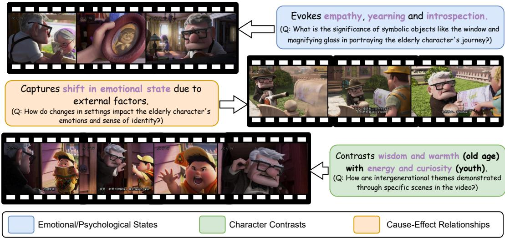  
Figure 1: Beyond Shallow Video Understanding: The proposed benchmark, MovieCORE, challenges visionlanguage models (VLMs) to understand the subtle interplay between emotions (Top, Middle), character dynamics and causality (Middle, Bottom), and psychological complexity (Top, Middle). From empathy to introspection, from wisdom to curiosity MovieCORE tests VLMs’ ability to comprehend the deeper elements of movies.

## Abstract

This paper introduces MovieCORE, a novel video question answering (VQA) dataset designed to probe deeper cognitive understand ing of movie content. Unlike existing datasets that focus on surface-level comprehension, MovieCORE emphasizes questions that engage System-2 thinking while remaining specific to the video material. We present an innovative agentic brainstorming approach, utilizing multiple large language models (LLMs) as thought agents to generate and refine high-quality question-answer pairs. To evaluate dataset quality, we develop a set of cognitive tests assessing depth, thought-provocation potential, and syntactic complexity. We also propose a comprehensive evaluation scheme for assessing VQA model performance on deeper cognitive tasks. To address the limitations of existing video-language models (VLMs), we introduce an agentic enhancement module, Agentic

Choice Enhancement (ACE), which improves model reasoning capabilities post-training by 25%. Our work contributes to advancing movie understanding in AI systems and provides valuable insights into the capabilities and limitations of current VQA models when faced with more challenging, nuanced questions about cinematic content. Our project page, dataset and code can be found at https://joslefaure. github.io/assets/html/moviecore.html

## 1 Introduction

Movie audiences consciously or subconsciously absorb information about actors’ states of mind, body language, and expressions to infer their moods and empathize with their situations. Most people would agree that such inferences are crucial to truly understanding a movie. Despite the significance of this deeper level of understanding, existing moviebased VQA datasets have yet to explore this aspect of film comprehension.

Recent movie-based VQA datasets (Wu and Krahenbuhl, 2021; Song et al., 2024; Rawal et al., 2024) primarily focus on surface-level understanding, neglecting the challenge of comprehending movies at a deeper cognitive level. They predominantly address the “what” by posing questions such as “What is the relationship between the actors?” or “What time does the video take place?”, and largely overlook the “how,” “why,” and “why not” questions crucial for achieving a profound understanding of movies. While EgoSchema (Mangalam et al., 2023) attempts to delve beyond the obvious, its more profound questions often remain general.

We propose MovieCORE, a novel VQA dataset designed to engage System-2 thinking—the slow, deliberate, and logical cognitive processes—while maintaining strict relevance to specific video content. Unlike existing datasets, MovieCORE embraces the inherent subjectivity of "why" and "why not" questions as a feature rather than a limitation, creating both meaningful challenges and research opportunities. To generate comprehensive and faithful question-answer pairs, we develop an agentic brainstorming approach that leverages multiple large language models (LLMs) as interactive thought agents that engage in continuous discussions to refine QA pairs. We validate the quality of the QAs through rigorous human review of a representative subset. Additionally, we employ quantitative cognitive metrics to measure our dataset’s depth and syntactic complexity relative to existing benchmarks. Our evaluation of current VQA models on MovieCOREreveals critical insights about their performance on these challenging cognitive tasks. To address identified limitations and improve existing VLMs’ deeper cognitive reasoning capabilities, we introduce Agentic Choice Enhancement (ACE), which demonstrates relative performance improvements of up to 25% compared to baseline approaches.

Our key contributions are the following:

• We introduce MovieCORE, a VQA dataset focused on thought-provoking questions and answers specific to movie content.

• We develop an agentic brainstorming approach using multiple LLMs as agents to generate and refine high-quality QA pairs.

• We implement a set of cognitive tests to evaluate the depth, thought-provocation, and complexity of VQA datasets.

• We design a comprehensive evaluation scheme to assess the accuracy, comprehensiveness, depth, and coherence of answers from existing Vision Language Models (VLMs).

• We evaluate several VLMs on our dataset in both zero-shot and fully-supervised settings, offering insights into their performance on deeper cognitive tasks.

• We propose a post-training "agentic selection" plugin to improve existing VLMs and show a relative improvement of up to 25% compared to the baseline.

## 2 Related Work

Movie-Based Question-Answering Datasets. Recent video understanding benchmarks are often based on movie scenes because films offer a rich blend of multimodal content, combining visual, linguistic, and temporal elements within complex narratives. Early efforts like MovieQA (Tapaswi et al., 2016) explores entire movie understanding but were limited by questions heavily relying on dialogue. TVQA (Lei et al., 2018) requires reasoning over multiple events in short TV series clips, integrating visuals and subtitles. LVU (Wu and Krahenbuhl, 2021) addresses scaling video comprehension to extended sequences, necessitating models to process long temporal contexts. MAD (Soldan et al., 2022) and its extension (Han et al., 2023) focus on scene-level descriptions through audio and visuals but were mainly used for scene annotation tasks with limited narrative comprehension. MoVQA (Zhang et al., 2023) introduces multi-level questions, challenging models in temporal perception, causal reasoning, and narrative synthesis. CinePile (Rawal et al., 2024) automates large-scale question generation across varied scenes and question type and MovieChat-1k (Song et al., 2024) focuses on basic understanding of cinematic contexts.

Video Question-Answering Reasoning. Textbased reasoning datasets like DROP (Dua et al., 2019) and GSM8K (Cobbe et al., 2021) handle discrete reasoning tasks, including counting and arithmetic, but are limited to textual inputs and do not address the complexities involved in integrating visual reasoning. Egocentric datasets, such as EpicKitchens (Damen et al., 2018), Ego4D (Grauman et al., 2022), and EgoSchema (Mangalam et al., 2023), challenge models to interpret subjective interactions and continuous activities from a first-person perspective, requiring both perceptual understanding and intention reasoning. Perception Test (Patraucean et al., 2024) broadens perceptual reasoning to varied video contexts, assessing highlevel reasoning abilities. Multi-task and complex video benchmarks, such as MVBench (Li et al., 2024), Video-MME (Fu et al., 2024), and MLVU (Zhou et al., 2024), integrate multiple reasoning challenges, requiring predictive reasoning, memory recall, and cross-modal inference over long video sequences. While these datasets have advanced various aspects of video understanding, they predominantly rely on surface-level comprehension of video content. Our work introduces the first dataset specifically designed to evaluate System-2 reasoning in the video domain, requiring models to engage in slow, deliberate, and analytical thinking processes aiming to mirror human approaches to complex movie understanding.

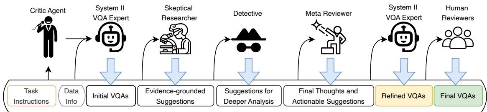  
Figure 2: The Critic Agent, acting as the master of ceremonies (MC), orchestrates interactions among specialized agents using video context and task instructions. It sequentially engages the System II VQA Expert, Skeptical Researcher, Detective, and Meta Reviewer, accumulating insights at each stage. Upon receiving final recommendations from the Meta Reviewer, the MC relays them to the System II VQA Expert for VQA refinement. Subsequently, a subset of these refined VQAs undergoes evaluation by human experts for final validation.

## 3 MovieCORE Creation and Curation

To address the challenge of obtaining questionanswer pairs that delve into deeper levels of movie understanding, we propose an agentic annotation workflow. This approach leverages the deliberative capabilities of multiple LLMs acting as specialized agents, each contributing unique perspectives to the annotation process. We start with video context extraction to make sure our text-only annotation agents have enough information about the video.

## 3.1 Video Context Extraction

The videos for our dataset are sourced from MovieChat-1k (Song et al., 2024), a collection of 1,000 movie clips averaging 10 minutes each. We use 986 of these clips, as 14 were either unavailable or lacked necessary annotations. MovieChat-1k, already provides high-level information for each video, such as temporal setting (e.g., ancient or modern) and metadata like the movie’s genre. Although some videos in the original dataset include captions, we observe inaccuracies and imbalanced descriptions. Therefore, we exclude these captions, focusing instead on the existing QA pairs and movie metadata.

To provide video context, we utilize MiniCPMv2.6 (Yao et al., 2024), an open-source model with visual capabilities comparable to GPT-4V. We prompt it with a carefully curated set of eight questions (shown in Figure S1 in the supplementary material) designed to extract a multi-dimensional understanding of the video. These questions address narrative structure, thematic focus, emotional tone, key events, character dynamics, genre, and target audience. The extracted information serves as Data Info priors for our agents.

## 3.2 Agentic Annotation Workflow

Our workflow, illustrated in Figure 2, employs a multi-agent system orchestrated by a Critic Agent acting as the master of ceremonies (MC). Using the Agentic AI framework autogen (Wu et al., 2024), we deploy instances of GPT4-o for the VQA Expert and Meta Reviewer roles (as these positions demand superior reasoning capabilities), with GPT4- o-mini powering the other expert agents. The process begins as the Critic Agent receives task instructions and video context (Data Info) extracted as described in Section 3.1 and sends them to the System II VQA Expert who generates questions that engage System-2 thinking. These initial QA pairs are then scrutinized by the Skeptical Researcher, who evaluates their contextual relevance and accuracy, often challenging the VQA Expert to provide more concrete evidence. The Detective agent follows, suggesting additional questions to uncover underlying motivations and biases. The Meta Reviewer synthesizes these insights, proposing enhancements to the initial VQAs. The Critic Agent then consolidates this feedback for the VQA Expert to refine the QAs. The process concludes with human expert evaluation of a subset of the refined VQAs, assessing their clarity, depth, relevance, and answerability. This agentic annotation workflow mimics collaborative human expert discussions by harnessing collective intelligence and mitigating potential biases of any single agent1.

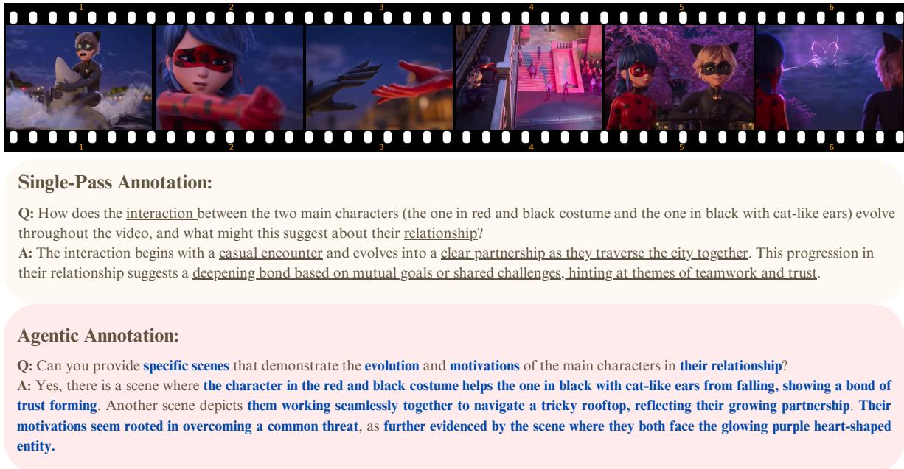  
Figure 3: Comparison of single-pass and agentic annotation. The agentic method (bottom) elicits specific scene details, concrete examples, and detailed story elements, demonstrating the enhanced granularity achieved through multi-agent refinement. Text in blue indicates new, specific details absent in the single-pass version. The single-pass annotation (top), on the other hand, while also attempting to ask deeper questions, remains at a more abstract level.

To ensure the quality and reliability of our dataset, we implement a rigorous human verification process. Seven graduate students were recruited to assess a subset of 30 videos, 30 captions and 150 QA pairs. The final human validation ensures that the resulting VQAs meet the highest standards of quality and depth. We provide more details on the human validation in Appendix II.3.

## 3.3 Agentic versus Single-Pass Annotation

To illustrate the effectiveness of the proposed Agentic Annotation workflow, we compare the quality of the VQAs generated by the System II VQA Expert in the initial round (single-pass) and those produced through our workflow after the agent has gathered feedback and enhancement ideas from other experts (agentic). As shown in Figure 3, the agentic annotation approach demonstrates clear advantages over its single-pass counterpart. While the latter provides a general, abstract description of character relationships, the agentic annotation generates questions that ask for and answers that deliver specific, concrete details about key scenes that support the relationship development of the characters – including the falling scene, rooftop navigation, and confrontation with the purple heart-shaped entity. The agentic process elicits richer context and more granular evidence, making the annotations more specific and faithful to the movie content. It also makes the dataset much more valuable for training and evaluating AI systems’ understanding of narrative progression and character dynamics. This suggests that using multiple AI agents as thought partners leads to more detailed and substantive annotations compared to traditional single-pass methods used by other auto-annotated datasets such as (Rawal et al., 2024) and (Mangalam et al., 2023). More comparisons between agentic and single-pass annotation can be found in Appendix II.4.

<table><tr><td rowspan="2">Dataset</td><td colspan="3">Parse Tree Depth</td><td colspan="3">F–K Grade Score</td><td rowspan="2">BT Level</td><td rowspan="2">HO-QA (%)</td></tr><tr><td>Q</td><td>A</td><td>Avg</td><td>Q</td><td>A</td><td>Avg</td></tr><tr><td>MovieChat-1k (Song et al., 2024)</td><td>3.58</td><td>1.31</td><td>2.45</td><td>3.19</td><td>-0.39</td><td>1.4</td><td>1.8</td><td>0.0</td></tr><tr><td>ActivityNetQA (Yu et al., 2019)</td><td>4.24</td><td>0.27</td><td>2.26</td><td>2.69</td><td>0.98</td><td>1.84</td><td>1.9</td><td>0.2</td></tr><tr><td>MVBench (Li et al., 2024)</td><td>3.96</td><td>1.71</td><td>2.84</td><td>4.74</td><td>1.47</td><td>3.11</td><td>2.2</td><td>3.4</td></tr><tr><td>EgoSchema (Mangalam et al., 2023)</td><td>6.56</td><td>4.38</td><td>5.47</td><td>10.52</td><td>6.08</td><td>8.30</td><td>3.1</td><td>33.1</td></tr><tr><td>MovieCORE</td><td>5.38</td><td>6.39</td><td>5.88</td><td>12.98</td><td>15.07</td><td>14.03</td><td>4.9</td><td>99.2</td></tr></table>

Table 1: Syntactic Complexity and Cognitive Demand Comparison: Parse tree depth, Flesch-Kincaid (F-K) grade scores, average Bloom’s Taxonomy (BT) level, and percentage of higher-order questions and answers (HO-QA) across various VQA datasets. Q and A represent questions and answers respectively. Best results are in bold, second-best are underlined.

## 3.4 Dataset Description

MovieCORE is a video question-answering (VQA) dataset designed to probe deeper cognitive understanding of movie content. The dataset comprises 986 videos paired with 4,930 corresponding questions and answers and 986 captions. Following the splits of the original MovieChat-1k dataset (Song et al., 2024), we split MovieCORE into 4080 QAs for training (816 videos) and 850 for testing (170 videos). The primary application of MovieCORE lies in training and evaluating VQA models’ capabilities in deeper cognitive tasks. The questions are specifically designed to assess models’ abilities to comprehend complex narrative elements, character motivations, and subtle contextual cues – skills that are crucial for achieving human-like understanding of cinematic content. A wordcloud of MovieCORE is shown in Figure 4 suggesting complex themes regarding character dynamics, emotional resonance, and societal implications through terms like “tension,” “psychological,” “cultural,” and “emotional.” Also, the prominence of analytical terms such as “underscore”,“depth,” and “critical,” suggests questions that probe deeper interpretations and thematic elements rather than just literal plot descriptions.

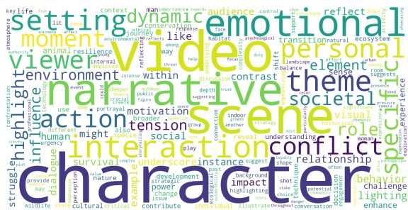  
Figure 4: Wordcloud illustrating key themes and concepts of MovieCORE with terms such as "emotional", "character" and "influence" very prominent.

## 4 Experiments

## 4.1 Linguistic and Cognitive Complexity

To evaluate the effectiveness of MovieCORE in engaging System-2 thinking and promoting deeper cognitive processing, we conduct a series of tests designed to assess the complexity, readability, and cognitive demand of our questions and answers. These tests include well-established metrics such as parse tree depth, Flesch-Kincaid grade score, and Bloom’s taxonomy classification. Each provides unique insights into different aspects of our dataset’s ability to stimulate higher-order thinking. Table 1 presents a comparative analysis of MovieCORE against other VQA datasets.

Parse Tree Depth measures the syntactic complexity of sentences by analyzing their hierarchical structure. We utilize this metric to assess the structural intricacy of our questions and answers. We employ the spaCy library to generate parse trees for each question and answer in our dataset and recursively compute their depth as follows. Let d(t) be the depth of a token t in the tree. For a token with children C(t), the depth is defined as:

$$
d ( t ) = { \left\{ \begin{array} { l l } { 0 } & { { \mathrm { i f ~ } } C ( t ) = \emptyset } \\ { 1 + \operatorname* { m a x } _ { c \in C ( t ) } d ( c ) } & { { \mathrm { i f ~ } } C ( t ) \neq \emptyset } \end{array} \right. }\tag{1}
$$

where d(t) = 0 if t is a leaf node (no children), $d ( t ) = 1 + \operatorname* { m a x } _ { c \in C ( t ) } d ( c )$ if t has children C(t), with $\operatorname* { m a x } _ { c \in C ( t ) } d ( c )$ representing the maximum depth of the children of t. For a sentence with multiple tokens, the depth of the parse tree D rooted at the token r (root of the sentence) is $D = d ( r )$

The depth of these trees are then averaged across the dataset. A greater parse tree depth often correlates with more complex sentence structures, which typically require more cognitive resources to process. By measuring this, we aim to quantify the linguistic sophistication of our VQAs as compared to existing datasets’, hypothesizing that questions and answers with higher parse tree depths are more likely to engage System-2 thinking. Table 1 shows that MovieCORE has the highest average parse tree depth compared to the other VQA datasets.

The Flesch-Kincaid (F-K) Grade Score is a readability measure that indicates the U.S. grade level needed to understand a text. We calculate this score for both questions and answers in our dataset using the standard Flesch-Kincaid formula below

$$
{ \begin{array} { r l } { { \mathrm { F - K ~ G r a d e ~ S c o r e } } = 0 . 3 9 \left( { \cfrac { W } { S } } \right) } \\ { + 1 1 . 8 \left( { \cfrac { Y } { W } } \right) - 1 5 . 5 9 } \end{array} }\tag{2}
$$

where $W$ is the total number of words in the text, $S _ { \ast }$ total number of sentences and $Y$ the total number of syllables.

While our goal is not to make the content unnecessarily difficult, a moderately high Flesch-Kincaid score indicates that the QAs require a more advanced level of comprehension and thinking. As shown in Table 1, MovieCORE substantially outperforms other datasets with an average grade score of 14.03, with its closest competitor – EgoSchema (Mangalam et al., 2023) – standing at 8.3.

Bloom’s Taxonomy is a hierarchical model used to classify educational learning objectives into levels of complexity and specificity (Mcdaniel, 1970). We prompt GPT-4o-mini2 with a comprehensive breakdown of the Bloom’s Taxonomy and ask it to classify each question and answer into one of six cognitive levels: Remember (1), Understand (2), Apply (3), Analyze (4), Evaluate (5), and Create (6). Such classification helps us assess the cognitive demand of the QAs. Questions falling into higher levels of Bloom’s Taxonomy (Analyze, Evaluate, Create) require deeper analysis and critical thinking skills susceptible to trigger System-2 thinking. MovieCORE achieves the highest average Bloom Taxonomy Level (BT Level) of 4.9, indicating that our questions and answers predominantly engage higher-order cognitive skills, significantly surpassing the other datasets. Additionally, we report the percentage of higher-order questions and answers (HO-QA), representing the proportion of both questions and answers that fall into the upper levels of Bloom’s Taxonomy (levels 4-6). MovieCORE excels in this metric with 99.2% of its questions and answers classified as higher-order.

Algorithm 1 ACE: Agentic Choice Enhancement   
1: Input: Video V, Question Q, Beam width   
$k = 5$   
2: Output: Best response $R ^ { * }$   
3: C VLM.generate(V, Q, beam\_width = k)   
4: S Llama-3.2.score(C) ▷ Score candidates   
5: $R ^ { * } \gets \arg \operatorname* { m a x } _ { c \in C } S ( c )$ ▷ Select best   
response   
6: return $R ^ { * }$

## 5 ACE: Agentic Choice Enhancement

We propose ACE, a straightforward yet effective approach to improving existing video language model (VLM) outputs through post-generation refinement. Our approach, detailed in Algorithm 1, uses an existing VLM and leverages beam search with a width of 5 to generate diverse candidate responses, which are then re-ranked using the compact 1B-parameter Llama-3.2 (MetaAI, 2024) language model. We hypothesize that, when engaging in a task requiring deeper deliberation, it is advisable to have a second pair of eyes to refine one’s thinking. The lightweight nature of Llama-3.2 (1B) ensures that this enhancement remains computationally efficient while significantly improving the quality of generated responses. We prompt the model without specific evaluation guidelines, allowing it to leverage its inherent understanding of “answer quality”. Table 2 show that this “agentic selection” approach paired with HERMES (Faure et al., 2024) (HER-MES + ACE) registers an absolute gain of 0.48 compared to the baseline VLM, which translates to roughly a 16 percent improvement in answer quality. It also improves InstructBLIP (Dai et al., 2023) by 25% (2.63→3.29) and MA-LMM (He et al., 2024) by 20% (2.79→3.35). These results suggest that existing VLMs have untapped potential that can be realized through a simple post-generation “second pair of eyes” strategy, offering a practical path to training-free improvement.

Table 3 shows similar performance across beam widths (3, 5 and 7) for HERMES, suggesting ACE’s effectiveness stems from the agentic selection mechanism itself rather than hyperparameter choices. These results validate our framework’s fundamental premise: lightweight post-generation refinement can unlock significant untapped potential in existing VLMs.

<table><tr><td>Model</td><td>Acc.</td><td>Comprehensiveness</td><td>Depth</td><td>Evidence</td><td>Coherence</td><td>Avg.</td></tr><tr><td colspan="7">Proprietary Models</td></tr><tr><td>Gemini 2.5-flash (DeepMind, 2025b)</td><td>4.26</td><td>4.50</td><td>4.00</td><td>4.03</td><td>3.84</td><td>4.13</td></tr><tr><td>Gemini-1.5-pro (DeepMind, 2025a)</td><td>3.91</td><td>3.81</td><td>3.90</td><td>3.87</td><td>3.79</td><td>3.86</td></tr><tr><td>GPT-4o (08-06) (OpenAI, 2025)</td><td>4.18</td><td>4.00</td><td>3.98</td><td>3.96</td><td>3.96</td><td>4.02</td></tr><tr><td colspan="7">Zero-Shot Results.</td></tr><tr><td>InstructBlip (Dai et al., 2023)</td><td>1.03</td><td>0.43</td><td>0.85</td><td>0.33</td><td>0.40</td><td>0.61</td></tr><tr><td>MA-LMM (He et al., 2024)</td><td>1.14</td><td>0.63</td><td>0.93</td><td>0.57</td><td>0.67</td><td>0.79</td></tr><tr><td>HERMES (Faure et al., 2024)</td><td>1.77</td><td>1.21</td><td>1.41</td><td>1.28</td><td>0.37</td><td>1.41</td></tr><tr><td>LongVU (Shen et al., 2024)</td><td>2.95</td><td>2.01</td><td>1.94</td><td>2.06</td><td>2.12</td><td>2.22</td></tr><tr><td>mPlug-Ow13 (Ye et al., 2024)</td><td>3.55</td><td>2.75</td><td>2.39</td><td>2.78</td><td>2.82</td><td>2.86</td></tr><tr><td>Qwen2.5-VL (Bai et al., 2025)</td><td>3.78</td><td>3.54</td><td>3.36</td><td>3.42</td><td>3.50</td><td>3.52</td></tr><tr><td>InternVL2 (IntenVL, 2024)</td><td>3.80</td><td>3.42</td><td>3.10</td><td>3.37</td><td>3.51</td><td>3.44</td></tr><tr><td>InternVL2.5 (IntenVL, 2024)</td><td>3.87</td><td>3.54</td><td>3.37</td><td>3.65</td><td>3.65</td><td>3.62</td></tr><tr><td colspan="7">Fully-Supervised Results</td></tr><tr><td>InstructBlip (Dai et al., 2023)</td><td>3.25</td><td>2.43</td><td>2.47</td><td>2.61</td><td>2.38</td><td>2.63</td></tr><tr><td>MA-LMM (He et al., 2024)</td><td>3.42</td><td>2.54</td><td>2.66</td><td>2.81</td><td>2.50</td><td>2.79</td></tr><tr><td>HERMES (Faure et al., 2024)</td><td>3.52</td><td>2.72</td><td>2.83</td><td>2.98</td><td>2.62</td><td>2.93</td></tr><tr><td colspan="7">Fully-Supervised Results + ACE (Ours)</td></tr><tr><td>InstructBlip (Dai et al., 2023)</td><td>3.71</td><td>3.15</td><td>3.02</td><td>3.30</td><td>3.25</td><td>3.29 (+0.66)</td></tr><tr><td>MA-LMM (He et al., 2024)</td><td>3.76</td><td>3.24</td><td>3.09</td><td>3.39</td><td>3.30</td><td>3.35 (+0.56)</td></tr><tr><td>HERMES (Faure et al., 2024)</td><td>3.81</td><td>3.30</td><td>3.12</td><td>3.38</td><td>3.42</td><td>3.41 (+0.48)</td></tr></table>

Table 2: Performance Comparison of Video Question-Answering Models. We evaluate various open-source and proprietary Vision-Language Models (VLMs) on five criteria: Accuracy (Acc.), Comprehensiveness, Depth, Evidence, and Coherence. We use the 7B version of the open-source VLMs (8B for InternVL2.5).

<table><tr><td>w/ ACE Acc. </td><td>Com. Dep. Evi.</td><td></td><td>Coh. Avg.</td></tr><tr><td>Beam=3 3.81</td><td>3.40 3.19</td><td>3.42 3.43</td><td>3.45</td></tr><tr><td>Beam=5 3.81</td><td>3.30 3.12</td><td>3.38 3.42</td><td>3.41</td></tr><tr><td>Beam=73 3.79</td><td>3.29 3.08</td><td>3.36</td><td>3.35 3.37</td></tr></table>

Table 3: ACE Beam size ablations on HERMES. ACE improves performance across all evaluation dimensions regardless of the beam size, with no clear winner among the different beam values.

## 6 Quantitative Evaluation

VQA datasets usually use top-1 accuracy as metrics, but a valid match has to be a perfect match. For instance, there can be one strict answer to the question “Does sea appear in the video?”, which is “Yes” or “No”. However, in the age of LLMs and especially for zero-shot evaluation settings, we might get answers such as “it does” or “no sea appears in the video”. In such cases the accuracy would be 0. Recently, LLM-assisted evaluation schemes such as the one introduced by (Maaz et al., 2023), attempt to solve this issue by considering synonyms or paraphrases as valid matches. This works for VQAs where there is a perfect answer, and would not work in our case, especially since accuracy for a System-2 answer is not binary but exists in a spectrum. Furthermore, we posit that accuracy alone is insufficient, therefore we design four other LLM-assisted metrics: depth to assess the depth of reasoning in the answers, comprehensiveness to assess how fully the answer covers all key points and relevant details, coherence and clarity, and evidence to evaluate the quality and relevance of the evidence provided. For all of these metrics, we prompt GPT-4o-mini (2024-07-18) (OpenAI, 2024) to assign a score between 0 to 5 to each.

Table 2 presents a comprehensive evaluation of model performance across our five assessment criteria. Several key insights emerge from these results: (1) Proprietary models significantly outperform their open-source counterparts. This performance gap indicates that large-scale proprietary training data likely contains more diverse reasoning tasks than those available in public datasets. (2) In the zero-shot setting, most open-source models struggle considerably with complex reasoning, except for the more recent InternVL2.5 and Qwen2.5-VL models. The particularly low scores in Depth and Evidence metrics highlight these models’ difficulty in formulating multi-step inferences and grounding their responses in specific visual content. (3) Fine-tuning on MovieCORE yields substantial improvements for all models, with HERMES showing the strongest performance. However, even with full supervision, these models still underperform compared to proprietary alternatives, suggesting architectural limitations in handling complex reasoning tasks. (4) Our proposed ACE post-generation strategy delivers consistent and substantial improvements across models and metrics.

<table><tr><td>Model</td><td>BLEU-4</td><td>CIDEr</td><td>METEOR</td></tr><tr><td colspan="4">Zero-shot</td></tr><tr><td>InternVL2.5 (8B)</td><td>0.0645</td><td>0.1865</td><td>0.1026</td></tr><tr><td>mPlugOwl3 (7b)</td><td>0.0602</td><td>0.1579</td><td>0.1462</td></tr><tr><td colspan="4">Fully-supervised</td></tr><tr><td>HERMES</td><td>0.0308</td><td>0.1230</td><td>0.0983</td></tr><tr><td>HERMES + ACE</td><td>0.0654</td><td>0.1622</td><td>0.2138</td></tr><tr><td>MA-LMM + ACE</td><td>0.0634</td><td>0.1587</td><td>0.1948</td></tr><tr><td>InstructBLIP + ACE</td><td>0.0605</td><td>0.1572</td><td>0.1893</td></tr></table>

Table 4: Traditional Metrics Results. BLEU-4, CIDEr, and METEOR scores for several models on MovieCORE. These results are consistent with the trends observed in our primary evaluation.

## 6.1 Evaluation with Traditional Metrics

While our primary evaluation in Table 2 emphasizes metrics tailored for System-2 reasoning, we also report standard VQA and video captioning metrics to enable broader comparison with prior work. Specifically, we compute BLEU-4, CIDEr, and METEOR for several models.

These n-gram-based metrics, while limited in capturing the semantic richness and reasoning depth demanded by MovieCORE, provide a familiar point of reference relative to traditional VQA benchmarks. As shown in Table 4, the relative ranking of models is consistent with our primary cognitive-oriented evaluation from Table 2: methods enhanced with ACE outperform their baselines, and both zero-shot and fully-supervised models exhibit similar performance trends.

## 6.2 System-2 vs. System-1 Ablation Study

To validate the unique challenges posed by MovieCORE, we conduct a comparative evaluation against a “System-1” baseline using the MovieChat-1k dataset, which is built from the exact same set of video clips but contains simpler, surface-level questions such as “Does it happen during the day or night?”. For MovieChat-1k, we use the officially reported performance of HERMES (Faure et al., 2024) from its original paper. Since MovieChat-1k reports accuracy (using LLM-assisted evaluation), we convert its accuracy scores into an equivalent 0–5 scale for direct comparison with our multidimensional MovieCORE evaluation.

<table><tr><td></td><td>MovieCORE (Score)</td><td>MovieChat-1k (Acc./Score)</td></tr><tr><td>Zero-Shot</td><td>1.14</td><td>78.6% (~3.93)</td></tr><tr><td>Fully-Supervised</td><td>3.52</td><td>84.9% (~4.25)</td></tr></table>

Table 5: Comparison of HERMES on MovieCORE (System-2) versus MovieChat-1k (System-1). MovieChat-1k results are converted to a 0–5 scale for comparability.

The results in Table 5 reveal a stark performance gap. While HERMES achieves high scores on the surface-level MovieChat-1k benchmark, its performance drops dramatically on MovieCORE’s questions, even with identical video content. This substantial gap highlights MovieCORE’s emphasis on System-2 reasoning. While HERMES excels on datasets with simple recall (e.g., “Do stars appear in the video?”), it struggles with MovieCORE’s questions that demand deeper causal, motivational, and evidential reasoning, despite being based on the same underlying video content.

## 7 Qualitative Results

Figure 5 provides a qualitative comparison between different models’ responses to questions that require understanding of complex animal behaviors. The figure illustrates how different approaches handle the same queries about cheetah social structures and survival strategies. InternVL-2, a strong zero-shot model, provides basic observations but lacks sufficient depth and details. HERMES, a fully-supervised model, also struggles with the details and performs worse than InternVL. HER-MES+ACE, demonstrates enhanced response quality by incorporating specific visual evidence and richer contextual details. As highlighted in the responses, ACE significantly improves the model’s ability to reference specific scenes and provide concrete examples to support its assertions.

## 8 Conclusion

We introduce MovieCORE, a novel VQA dataset that fills a critical gap in existing movie-based VQA datasets by emphasizing questions designed to engage System-2 thinking. Our agentic workflow, which leverages brainstorming agents, enables the generation and refinement of high-quality QA pairs.

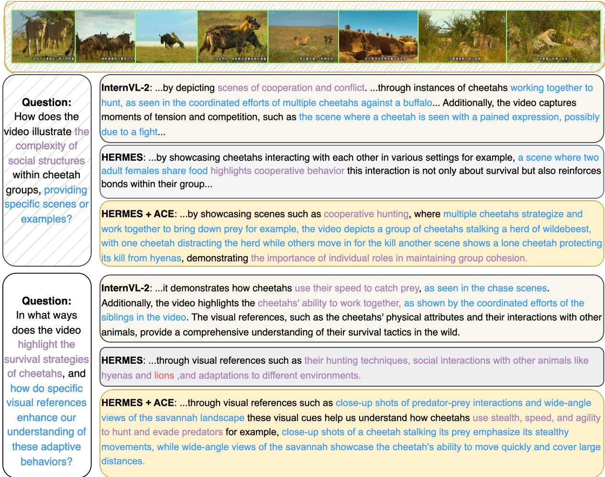  
Figure 5: Qualitative Comparison of Model Responses. This figure contrasts responses from InternVL-2 (zeroshot), HERMES (fully-supervised), and HERMES+ACE on two questions about cheetah behaviors. Purple text highlights conceptual understanding while blue text indicates specific visual evidence and contextual details. Note how ACE enhances responses with more precise scene descriptions and behavioral insights.

To measure the cognitive depth of VQA datasets, we devise a set of tests that demonstrate the superiority of MovieCORE over existing datasets. Additionally, we propose a comprehensive evaluation framework to assess the performance of VQA models on this dataset. To tackle the challenges posed by MovieCORE, we propose ACE, a lightweight inference-time agentic answer selection plug-in which yields up to 25% relative improvement in answer quality compared to baseline methods, providing insights for future works on this topic.

## 9 Limitations

While MovieCORE offers a significant advancement in video question-answering by targeting deeper cognitive understanding, it is not without limitations. First, although we incorporate human verification for a subset of the dataset, only 30 videos, and 150 QA pairs were manually verified. This improves dataset quality control by averting potential systematic issues; however, the majority of annotations still rely on automated processes. Second, because the dataset is constructed in part from the MovieChat-1k collection, its genre coverage may be constrained. Certain cinematic genres or narrative styles could be overrepresented, limiting the dataset’s generalizability. Finally, MovieCORE ’s evaluation is partly LLMassisted, which, while enabling scalability, may inherit the limitations and biases of the judge model.

Acknowledgment This work was supported in part by the National Science and Technology Council, Taiwan, under Grant NSTC 113-2634-F-002- 007. We are grateful to the National Center for High-performance Computing.

## References

Shuai Bai, Keqin Chen, Xuejing Liu, Jialin Wang, Wenbin Ge, Sibo Song, Kai Dang, Peng Wang, Shijie Wang, Jun Tang, and 1 others. 2025. Qwen2. 5-vl technical report. arXiv preprint arXiv:2502.13923.

Karl Cobbe, Vineet Kosaraju, Mohammad Bavarian, Mark Chen, Heewoo Jun, Lukasz Kaiser, Matthias Plappert, Jerry Tworek, Jacob Hilton, Reiichiro Nakano, and 1 others. 2021. Training verifiers to solve math word problems. arXiv preprint arXiv:2110.14168.

Wenliang Dai, Junnan Li, Dongxu Li, Anthony Meng Huat Tiong, Junqi Zhao, Weisheng Wang, Boyang Li, Pascale Fung, and Steven Hoi. 2023. Instructblip: Towards general-purpose visionlanguage models with instruction tuning. Preprint, arXiv:2305.06500.

Dima Damen, Hazel Doughty, Giovanni Maria Farinella, Sanja Fidler, Antonino Furnari, Evangelos Kazakos, Davide Moltisanti, Jonathan Munro, Toby Perrett, Will Price, and 1 others. 2018. Scaling egocentric vision: The epic-kitchens dataset. In Proceedings of the European conference on computer vision (ECCV), pages 720–736.

Google DeepMind. 2025a. Gemini 1.5 Pro: Large language model. Accessed: 2025-08-28.

Google DeepMind. 2025b. Gemini 2.5 Flash: Large language model. Accessed: 2025-08-28.

Dheeru Dua, Yizhong Wang, Pradeep Dasigi, Gabriel Stanovsky, Sameer Singh, and Matt Gardner. 2019. Drop: A reading comprehension benchmark requiring discrete reasoning over paragraphs. arXiv preprint arXiv:1903.00161.

Gueter Josmy Faure, Jia-Fong Yeh, Min-Hung Chen, Hung-Ting Su, Winston H. Hsu, and Shang-Hong Lai. 2024. Hermes: temporal-coherent long-form understanding with episodes and semantics. Preprint, arXiv:2408.17443.

Chaoyou Fu, Yuhan Dai, Yondong Luo, Lei Li, Shuhuai Ren, Renrui Zhang, Zihan Wang, Chenyu Zhou, Yunhang Shen, Mengdan Zhang, and 1 others. 2024. Video-mme: The first-ever comprehensive evaluation benchmark of multi-modal llms in video analysis. arXiv preprint arXiv:2405.21075.

Kristen Grauman, Andrew Westbury, Eugene Byrne, Zachary Chavis, Antonino Furnari, Rohit Girdhar, Jackson Hamburger, Hao Jiang, Miao Liu, Xingyu Liu, and 1 others. 2022. Ego4d: Around the world in 3,000 hours of egocentric video. In Proceedings of the IEEE/CVF Conference on Computer Vision and Pattern Recognition, pages 18995–19012.

Tengda Han, Max Bain, Arsha Nagrani, Gül Varol, Weidi Xie, and Andrew Zisserman. 2023. Autoad: Movie description in context. In Proceedings ofthe IEEE/CVF Conference on Computer Vision and Pattern Recognition, pages 18930–18940.

Bo He, Hengduo Li, Young Kyun Jang, Menglin Jia, Xuefei Cao, Ashish Shah, Abhinav Shrivastava, and Ser-Nam Lim. 2024. Ma-lmm: Memory-augmented large multimodal model for long-term video understanding. In Proceedings ofthe IEEE/CVF Conference on Computer Vision and Pattern Recognition, pages 13504–13514.

IntenVL. 2024. InternVL2: Better than the Best—Expanding Performance Boundaries of Open-Source Multimodal Models with the Progressive Scaling Strategy.

Jie Lei, Licheng Yu, Mohit Bansal, and Tamara L Berg. 2018. Tvqa: Localized, compositional video question answering. arXiv preprint arXiv:1809.01696.

Kunchang Li, Yali Wang, Yinan He, Yizhuo Li, Yi Wang, Yi Liu, Zun Wang, Jilan Xu, Guo Chen, Ping Luo, and 1 others. 2024. Mvbench: A comprehensive multi-modal video understanding benchmark. In Proceedings ofthe IEEE/CVF Conference on Computer Vision and Pattern Recognition, pages 22195–22206.

Muhammad Maaz, Hanoona Rasheed, Salman Khan, and Fahad Shahbaz Khan. 2023. Video-chatgpt: Towards detailed video understanding via large vision and language models. arXiv preprint arXiv:2306.05424.

Karttikeya Mangalam, Raiymbek Akshulakov, and Jitendra Malik. 2023. Egoschema: A diagnostic benchmark for very long-form video language understanding. Advances in Neural Information Processing Systems, 36:46212–46244.

Rhett Mcdaniel. 1970. Bloom’s taxonomy. https: //cft.vanderbilt.edu/guides-sub-pages/ blooms-taxonomy/.

MetaAI. 2024. Llama 3.2: Revolutionizing edge AI and vision with open, customizable models — ai.meta.com. [Accessed 03-11-2024].

OpenAI. 2024. Hello gpt-4o. https://openai.com/ index/hello-gpt-4o/. [Accessed 01-11-2024].

OpenAI. 2025. GPT-4o: Large language model. Accessed: 2025-08-28.

Viorica Patraucean, Lucas Smaira, Ankush Gupta, Adria Recasens, Larisa Markeeva, Dylan Banarse, Skanda Koppula, Mateusz Malinowski, Yi Yang, Carl Doersch, and 1 others. 2024. Perception test: A diagnostic benchmark for multimodal video models. Advances in Neural Information Processing Systems, 36.

Ruchit Rawal, Khalid Saifullah, Ronen Basri, David Jacobs, Gowthami Somepalli, and Tom Goldstein. 2024. Cinepile: A long video question answering dataset and benchmark. arXiv preprint arXiv:2405.08813.

Xiaoqian Shen, Yunyang Xiong, Changsheng Zhao, Lemeng Wu, Jun Chen, Chenchen Zhu, Zechun Liu,

Fanyi Xiao, Balakrishnan Varadarajan, Florian Bordes, and 1 others. 2024. Longvu: Spatiotemporal adaptive compression for long video-language understanding. arXiv preprint arXiv:2410.17434.

Mattia Soldan, Alejandro Pardo, Juan León Alcázar, Fabian Caba, Chen Zhao, Silvio Giancola, and Bernard Ghanem. 2022. Mad: A scalable dataset for language grounding in videos from movie audio descriptions. In Proceedings ofthe IEEE/CVF Conference on Computer Vision and Pattern Recognition, pages 5026–5035.

Enxin Song, Wenhao Chai, Guanhong Wang, Yucheng Zhang, Haoyang Zhou, Feiyang Wu, Haozhe Chi, Xun Guo, Tian Ye, Yanting Zhang, and 1 others. 2024. Moviechat: From dense token to sparse memory for long video understanding. In Proceedings of the IEEE/CVF Conference on Computer Vision and Pattern Recognition, pages 18221–18232.

Makarand Tapaswi, Yukun Zhu, Rainer Stiefelhagen, Antonio Torralba, Raquel Urtasun, and Sanja Fidler. 2016. Movieqa: Understanding stories in movies through question-answering. In Proceedings ofthe IEEE conference on computer vision and pattern recognition, pages 4631–4640.

Chao-Yuan Wu and Philipp Krahenbuhl. 2021. Towards long-form video understanding. In Proceedings of the IEEE/CVF Conference on Computer Vision and Pattern Recognition, pages 1884–1894.

Qingyun Wu, Gagan Bansal, Jieyu Zhang, Yiran Wu, Beibin Li, Erkang Zhu, Li Jiang, Xiaoyun Zhang, Shaokun Zhang, Jiale Liu, Ahmed Hassan Awadallah, Ryen W White, Doug Burger, and Chi Wang. 2024. Autogen: Enabling next-gen llm applications via multi-agent conversation framework. In COLM.

Yuan Yao, Tianyu Yu, Ao Zhang, Chongyi Wang, Junbo Cui, Hongji Zhu, Tianchi Cai, Haoyu Li, Weilin Zhao, Zhihui He, and 1 others. 2024. Minicpm-v: A gpt-4v level mllm on your phone. arXiv preprint arXiv:2408.01800.

Jiabo Ye, Haiyang Xu, Haowei Liu, Anwen Hu, Ming Yan, Qi Qian, Ji Zhang, Fei Huang, and Jingren Zhou. 2024. mplug-owl3: Towards long image-sequence understanding in multi-modal large language models. arXiv preprint arXiv:2408.04840.

Zhou Yu, Dejing Xu, Jun Yu, Ting Yu, Zhou Zhao, Yueting Zhuang, and Dacheng Tao. 2019. Activitynet-qa: A dataset for understanding complex web videos via question answering. In Proceedings ofthe AAAI Conference on Artificial Intelligence, pages 9127–9134.

Hongjie Zhang, Yi Liu, Lu Dong, Yifei Huang, Zhen-Hua Ling, Yali Wang, Limin Wang, and Yu Qiao. 2023. Movqa: A benchmark of versatile questionanswering for long-form movie understanding. arXiv preprint arXiv:2312.04817.

Junjie Zhou, Yan Shu, Bo Zhao, Boya Wu, Shitao Xiao, Xi Yang, Yongping Xiong, Bo Zhang, Tiejun Huang,

and Zheng Liu. 2024. Mlvu: A comprehensive benchmark for multi-task long video understanding. arXiv preprint arXiv:2406.04264.

The Supplementary material is organized as follows:

• I Reproducibility Statement

• II More Details on MovieCORE

• III Details on the Bloom’s Taxonomy

• IV Evaluation Methodology

• VI Licence

## I Reproducibility Statement

The dataset will be made public as soon as this paper is accepted (or rejected) for publication, as well as the evaluation scheme with clear examples. We will also release the annotation agents used for generating and refining question-answer pairs, including the code and configurations for the large language models (LLMs) employed in the agentic brainstorming process. Additionally, we provide detailed instructions for data preprocessing, agent configuration, and evaluation protocols, enabling reproduction of both the dataset generation process and the evaluation scheme. Our annotation system is scalable and has the potential to inspire other researchers to create massive video benchmarks.

## II More Details on MovieCORE

## II.1 Extracting “Video Info"

To generate meaningful interpretations of video content, we employ a structured question framework designed to probe various aspects of the video’s narrative, emotional tone, and intended purpose. This framework consists of eight prompts, each targeting specific dimensions of video understanding. The prompts and a continuation of the sample answers they elicit are listed in Figure S1 and roughly contains the following:

1. Step-by-step explanation: Encourages a chronological breakdown of events in the video.

2. Main subject or focus: Identifies the central theme or entity in the video.

3. Overall mood or atmosphere: Captures the emotional tone conveyed by the video.

4. Significant events or actions: Highlights key actions and turning points within the narrative.

5. Main characters or entities: Focuses on the individuals or groups driving the video’s story.

6. Settings and locations: Explores the physical or contextual backdrop of the video.

7. Genre or category: Classifies the video into a relevant category or type.

8. Intended audience: Identifies the target demographic for the video.

## II.2 Agentic Annotation Details

Figure S2 depicts the system messages for the different agents involved in the task of creating system-2 thinking VQAs from system-1 VQAs. The agents and their respective roles are:

System-2 Video Question Answering Assistant Responsible for generating up to five system-2 thinking VQA pairs from the given system-1 VQAs. The focus is on creating questions and answers that encourage deeper analysis, critical thinking, and meaningful reflection, while ensuring the insights are grounded in the actual video content.

Critic Agent Evaluates the system-2 VQAs created by the System-2 Video Question Answering Assistant and passes them to various Expert Agents for detailed analysis. The Critic Agent then compiles the constructive feedback from the experts and returns it to the System-2 Video Question Answering Assistant, emphasizing the importance of aligning the VQAs with the actual video context.

Skeptical Researcher Reviews the questions and answers in the context of the video, analyzing the context and evaluating the system-2 VQAs for their contextual relevance and accuracy. The Skeptical Researcher challenges the assumptions behind the QAs and encourages further evidence-based exploration, providing concise and relevant suggestions.

Detective Given the video information and the system-2 VQAs, the Detective identifies additional questions that could uncover underlying causes, motivations, or potential biases. The suggestions should be concise, realistic, and directly relevant to the video’s actual content.

Meta Reviewer Aggregates the feedback and suggestions from all reviewers (Skeptical Researcher, Detective) and provides final insights and suggestions to refine and improve the system-2 VQAs. The Meta Reviewer ensures the feedback is comprehensive, constructive, and truthful to the video’s context and content, filtering out any speculative suggestions.

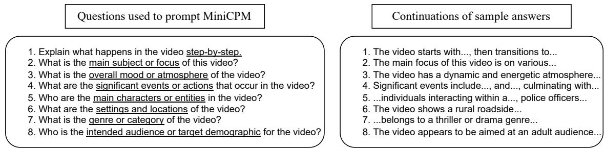

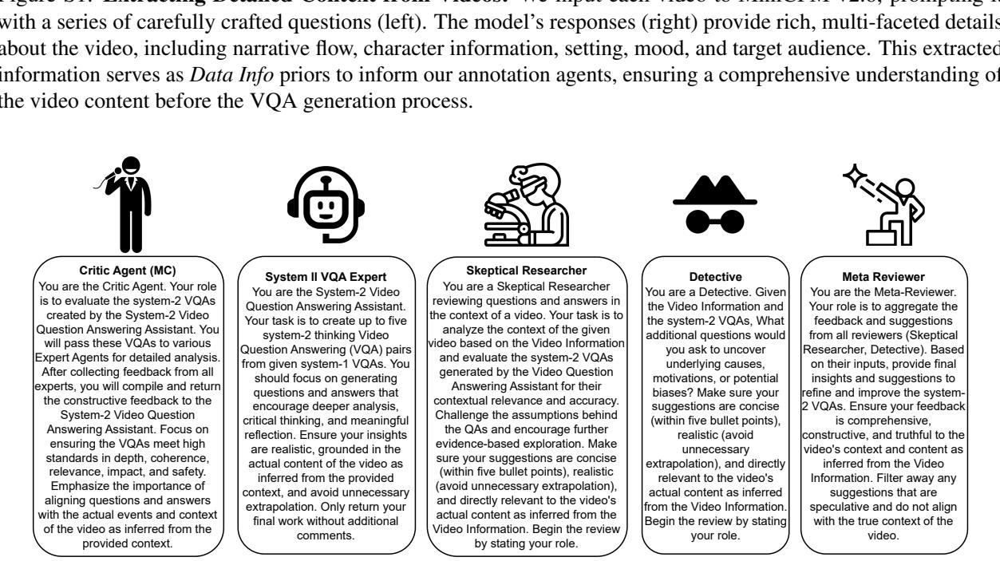  
Figure S2: System Messages for the Annotation Agents

## II.3 Human Verification

Verification Rules To ensure the quality and reliability of our dataset, we implemented a rigorous human verification process. Seven qualified evaluators, each holding at least a Bachelor’s degree, were recruited to assess a subset of 30 videos and 150 QA pairs. The verification was conducted through a standardized evaluation form (Figure S4) that assessed four key dimensions:

• Relevance (1-5): Evaluates how directly the question/answer relates to the video content

• Clarity (1-5): Measures the linguistic clarity and absence of ambiguity

• Depth (1-5): Assesses the level of cognitive analysis required

• Answerability (1-5): Determines whether the question can be answered solely from the video content

As for the captions, we assessed accuracy, clarity and depth.

Evaluators were instructed to watch each video in its entirety and carefully consider the scenes, characters, actions, and dialogues before rating the associated QA pairs. To maintain objectivity, evaluators were required to focus solely on the video content when reviewing the QA pairs and encouraged to replay videos when necessary. The evaluation process also included assessing the accuracy and clarity of video captions to ensure comprehensive content accessibility.

Verification Result The human verification process (the rules and interface are illustrated in Figure S4) yields consistently high scores across all evaluated dimensions, as shown in Table S1. Questions and answers received notably high scores in clarity (4.3) and depth (4.5 and 4.2 respectively), validating our dataset’s emphasis on deep cognitive understanding. The captions also demonstrate strong quality with scores above 3.8 across applicable metrics. While answerability scores were slightly lower (3.8 for questions), they remain well above acceptable thresholds, confirming that the questions can be reasonably answered from the video content alone.

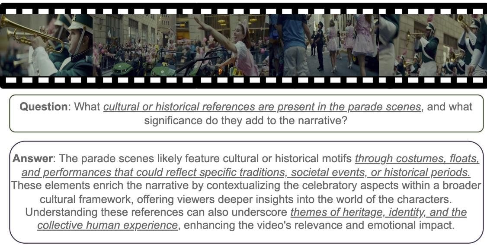

Figure S3: A parade scene from MovieCORE featuring various cultural and historical elements. This particular QA receives low answerability and relevance scores from one of our reviewers but was still kept following thorough review by a human meta-reviewer.
<table><tr><td>Metric</td><td>Captions</td><td>Questions</td><td>Answers</td></tr><tr><td>Accuracy</td><td>3.9</td><td></td><td></td></tr><tr><td>Clarity</td><td>4.0</td><td>4.3</td><td>4.3</td></tr><tr><td>Depth</td><td>4.1</td><td>4.5</td><td>4.2</td></tr><tr><td>Relevance</td><td>一</td><td>4.0</td><td>3.8</td></tr><tr><td>Answerability</td><td>一</td><td>3.8</td><td>4.1</td></tr></table>

Table S1: Human verification scores across different dimensions for captions, questions, and answers. Scores range from 1 to 5, with 5 being the highest quality. Dashes (–) indicate metrics not applicable to that content type. The scores, being above 3.8 indicate strong quality across all evaluated dimensions.

The sample QA pair for the video depicted in Figure S3 received low scores of 2 each for Answerability and Relevance from the human evaluators. However, our human meta-reviewer has determined that the question and answer offer meaningful insights and contextual relevance (underlined in the figure).

## II.4 Agentic versus Single-Pass Annotation

As shown in Figure S5, the single-pass annotation provides a general interpretation of the themes suggested by the presence of the hippopotamus, focusing on human-animal conflict and critiques of captivity. In contrast, the agentic annotation delves deeper by exploring how the hippopotamus functions as a symbol throughout the video, detailing its evolution from a chaotic force to a representation of innocence and victimhood. This nuanced analysis offers specific, concrete details about the symbolic transformation, enhancing the understanding of the narrative’s thematic complexity. In the other example shown in Figure S6, the single-pass annotation mentions general visual and narrative elements like close-ups and quick scene transitions to build suspense. The agentic annotation specifies how visual techniques such as dramatic lighting, shadow play, and strategic camera angles enhance the emotional weight and suspense of key scenes. By providing detailed examples—like capturing a character’s raw emotion through close-ups or creating an ominous atmosphere with dim lighting—the agentic approach offers a more granular and faithful depiction of the cinematic techniques used. These comparisons further illustrate that the agentic annotation process elicits richer context and more detailed evidence, reinforcing the idea that using multiple AI agents as thought partners leads to more substantive annotations compared to traditional single-pass methods.

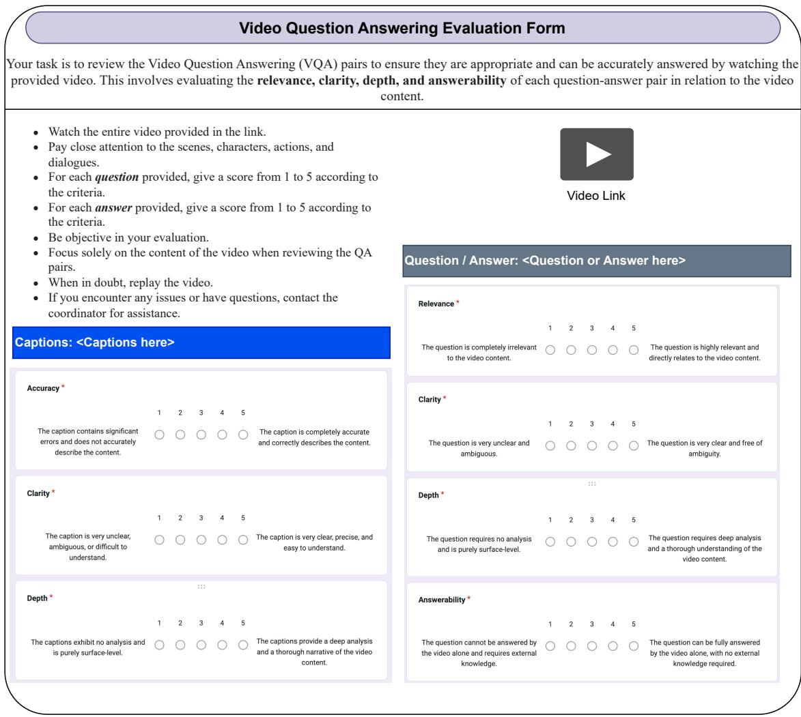  
Figure S4: Video Question Answering Evaluation Form used in our human verification process. The form assesses four critical dimensions (relevance, clarity, depth, and answerability) on a 5-point scale. Each dimension is clearly defined with anchored endpoints to ensure consistent evaluation. The form includes sections for both question/answer assessment and caption verification to ensure comprehensive content quality. Evaluators use this standardized form to systematically review each QA pair while referring to the corresponding video content.

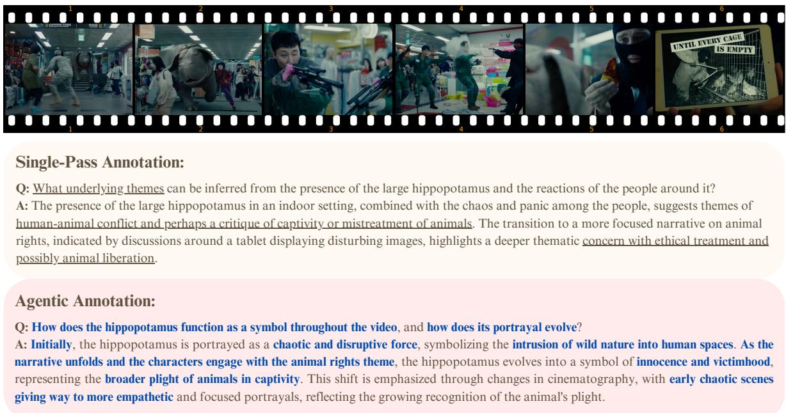

Figure S5: Additional Comparison of single-pass and agentic annotation. The agentic method (bottom) delves into specific scene details, such as the hippopotamus’s evolution from a chaotic force to a symbol of innocence, and highlights changes in cinematography that reflect this transformation. The single-pass annotation (top) provides a general interpretation of themes like human-animal conflict without specific scene references.  
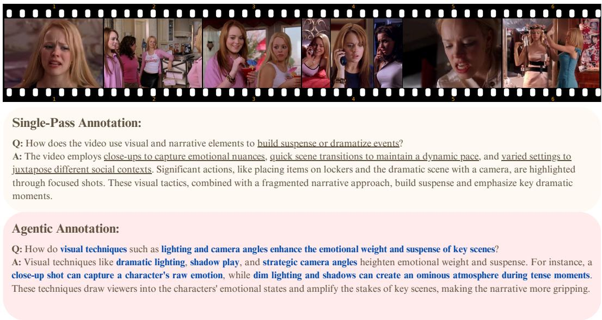  
Figure S6: Additional Comparison of single-pass and agentic annotation. The agentic method (bottom) specifies visual techniques like dramatic lighting, shadow play, and strategic camera angles that enhance emotional weight and suspense, offering concrete examples like close-up shots capturing raw emotion. The single-pass annotation (top) mentions general visual elements but lacks a detailed analysis of how these techniques impact the narrative.

Here we provide a more explicit, step-by-step illustration of how each agent contributes to the refinement of a final question.

Step-by-Step Example The following example demonstrates how a question evolves as each agent contributes for the example shown in Figure 3:

• Initial Question (Single-Pass): “How does the interaction between the two main characters evolve throughout the video, and what might this suggest about their relationship?” This version is abstract and lacks grounding in the specific video content.

• + Skeptical Researcher: “How does the interaction between the two main characters evolve, and can you provide specific scenes as evidencefor their relationship?” This agent enforces verifiability, pushing for concrete references to the video.

• + Detective: “What are the underlying motivations that drive the two main characters toform a partnership?” This role introduces causal reasoning, shifting the focus from observable actions to underlying causes.

• Final Agentic Question (Full Workflow): “Can you provide specific scenes that demonstrate the evolution and motivations of the main characters in their relationship?” The final result synthesizes evidence-grounding and causal reasoning into a more challenging, cognitively rich query.

## II.5 Why these Specific Agents

Careful examination of the agents interactions reveals distinct contributions: For the video in Figure S5, System-2 Video Question Answering Assistant transforms surface observations into deeper inquiries, exemplified by advancing from simply noting the hippopotamus to asking "How does the hippopotamus function as a symbol throughout the video, and how does its portrayal evolve?" The Critic Agent ensures analytical quality, as evident in the transition from merely identifying "human-animal conflict" to explicating how the hippo evolves from "chaotic and disruptive force" to "innocence and victimhood." The Skeptical Researcher challenges assumptions, demonstrated by refining the initial "critique of captivity" interpretation into a more nuanced analysis of "the growing recognition of the animal’s plight." The Detective uncovers underlying narrative patterns, illustrated by connecting the "early chaotic scenes giving way to more empathetic portrayals" with cinematographic techniques. The Meta Reviewer synthesizes these insights into cohesive annotations, balancing the single-pass observation of "humananimal conflict" with the richer agentic interpretation of "intrusion of wild nature into human spaces." (We find similar examples while analyzing the conversations that led to the QAs in S63). Users can swap agents, but we recommend roles that enforce rigor.

## III Details on the Bloom’s Taxonomy

Figure S7 illustrates Bloom’s pyramid of cognition levels and Figure S8 relays the prompts we use to ask GPT-4o-mini to score the QAs. Bloom’s Taxonomy is a hierarchical classification of cognitive skills used in education to structure learning objectives. The taxonomy is divided into six levels, progressing from lower-order to higher-order thinking skills:

1. Remembering: Recalling facts and basic concepts.

2. Understanding: Explaining ideas or concepts.

3. Applying: Using information in new situations.

4. Analyzing: Breaking information into parts to explore relationships.

5. Evaluating: Justifying decisions or opinions.

6. Creating: Producing new or original work.

Our dataset scores very high in this metric suggesting its propensity to deeply engage the AI system (VLM)’s cognitive skills.

## IV Evaluation Methodology

The MovieCORE benchmark employs a comprehensive multi-dimensional evaluation framework for assessing VLMs. The evaluation consists of five key dimensions summarized below. We also include the full prompts for each dimension in Figure S10 and Figure S9.

1. Accuracy Dimension: Evaluates semantic correctness of predicted answers using a 6- point scoring rubric (0–5):

• 5: Perfect semantic match

• 4: Mostly correct with minor inaccuracies

• 3: Partially correct, capturing key elements

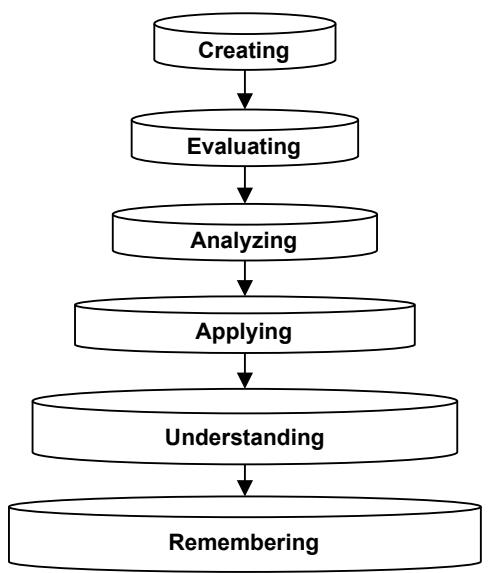

Figure S7: Bloom’s Taxonomy Pyramid. The pyramid illustrates the hierarchical nature of cognitive skills, progressing from lower-order to higher-order thinking.  
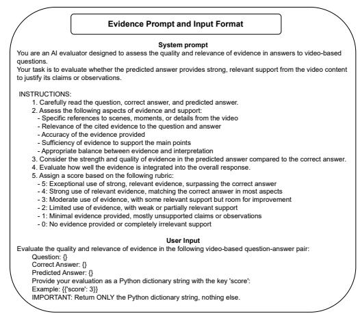  
Figure S9: Prompt to evaluate the quality and relevance of the evidence provided in the answers.

• 2: Mostly incorrect but with some relevant information

• 1: Completely incorrect or unrelated

• 0: No answer or irrelevant response

## 2. Depth of Reasoning Dimension: Assesses the level of analytical depth and interpretative insight, scored from 0–5:

• 5: Exceptional depth, surpassing ground

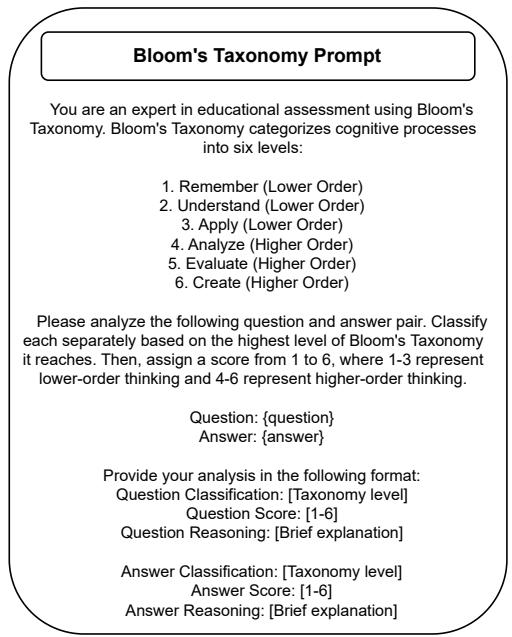  
Figure S8: Prompts we use to instruct GPT4-o-mini to compute the Bloom’s taxonomy level for the different datasets we show in Table 1 of the main paper.

## truth

• 4: Deep analysis matching ground truth

• 3: Moderate depth beyond surface level

• 2: Limited depth, stating obvious details

• 1: Superficial analysis

• 0: No answer or completely irrelevant

## 3. Comprehensiveness Dimension: Evaluates the thoroughness of answer coverage, scored from 0–5:

• 5: Fully comprehensive, covering all key points

• 4: Mostly comprehensive with minor omissions

• 3: Moderately comprehensive

• 2: Limited comprehensiveness

• 1: Minimal comprehensiveness

• 0: Not comprehensive or no answer

## 4. Coherence Dimension: Measures clarity, logical organization, and articulation, scored from 0–5:

• 5: Exceptionally coherent, surpassing ground truth

• 4: Very coherent, matching ground truth

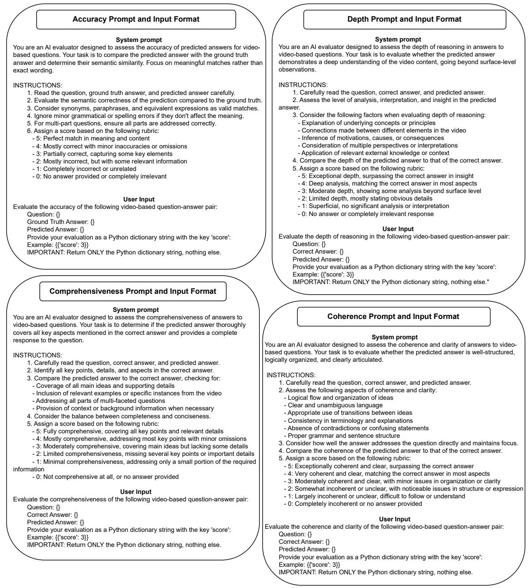  
Figure S10: Evaluation Prompts: These figures illustrate the prompts we use for each of the evaluation methods we employ. The prompt for Evidence is shown in Figure S9.

• 3: Moderately coherent with minor issues

• 2: Somewhat incoherent

• 1: Largely incoherent

• 0: Completely incoherent or no answer

5. Evidence Dimension: Assesses quality and relevance of video content evidence, scored from 0–5:

• 5: Exceptional use of strong, relevant

evidence

• 4: Strong, relevant evidence matching ground truth

• 3: Moderate evidence with room for improvement

• 2: Limited, weak evidence support

• 1: Minimal evidence

• 0: No evidence or irrelevant support

Each dimension provides a nuanced evaluation

of different aspects of question-answering performance, enabling a comprehensive assessment of the system’s capabilities.

## V LLM Usage Disclosure

In preparing this work, we made limited use of Large Language Models (LLMs), specifically OpenAI’s ChatGPT, to assist with grammar checking, style refinement, and minor restructuring of text. All technical content, ideas, analyses, experimental designs, and conclusions were conceived and validated by the authors. The LLM was not used to generate novel research insights, create data, design experiments, or perform evaluations. The authors take full responsibility for the accuracy and integrity of the final manuscript.

## VI Licence

The annotations are released under the MIT licence, and the videos follow MovieChat, which is under the BSD 3-Clause. We do not directly host the videos, those can be found in the MovieChat HuggingFace repository.