# NL-Debugging: Exploiting Natural Language as an Intermediate Representation for Code Debugging

Weiming Zhang1\*, Qingyao Li1\*, Xinyi Dai1, Jizheng Chen1, Kounianhua Du1, Weiwen Liu1†, Yasheng Wang2, Ruiming Tang2, Yong Yu1, Weinan Zhang1

1Shanghai Jiao Tong University, 2Huawei Noah’s Ark Lab

Shanghai, China

{WeimingZhang\_2020, ly890306, wwliu}@sjtu.edu.cn

## Abstract

Debugging is a critical aspect of LLM’s coding ability. Early debugging efforts primarily focused on code-level analysis, which often falls short when addressing complex programming errors that require a deeper understanding of algorithmic logic. Recent advancements in large language models (LLMs) have shifted attention toward leveraging natural language reasoning to enhance code-related tasks. However, two fundamental questions remain unanswered: What type of natural language format is most effective for debugging tasks? And what specific benefits does natural language reasoning bring to the debugging process? In this paper, we introduce NL-DEBUGGING, a novel framework that employs natural language as an intermediate representation to improve code debugging. By debugging at a natural language level, we demonstrate that NL-DEBUGGING outperforms traditional debugging methods and enables a broader modification space through direct refinement guided by execution feedback. Our findings highlight the potential of natural language reasoning to advance automated code debugging and address complex programming challenges.

## 1 Introduction

Code generation is a challenging task that requires strong reasoning abilities and a deep understanding of programming languages. While large language models (LLMs) demonstrate potential in this domain (Achiam et al., 2023; Zhu et al., 2024; Li et al., 2023), they often struggle to produce fully correct code implementations in one attempt (Liu et al., 2024; Dou et al., 2024). This limitation has driven recent research toward iterative refinement approaches for code generation (Chen et al., 2023; Zhong et al., 2024; Chen et al., 2025), where the debugging process—transforming flawed code into correct implementations—has emerged as a critical research focus.

Early debugging methodologies primarily relied on execution feedback for code-level analysis (Zhang et al., 2023a; Chen et al., 2023; Zhong et al., 2024). Although effective for identifying syntax errors or fundamental logical flaws, these approaches show limited capability in detecting deeper algorithmic design issues (Finder and Fey, 2010; Tian et al., 2024). Inspired by the success of natural language reasoning in LLMs (Jaech et al., 2024; Guo et al., 2025; Qin et al., 2024), recent advancements have shifted focus to natural languagebased code optimization (Wang et al., 2024; Li et al., 2024, 2025a). This trend reflects a growing recognition of the potential for natural language to serve as a powerful medium for guiding and improving code-related tasks.

Despite promising progress, two fundamental research questions about natural language reasoning in debugging remain unanswered: (1) What type of natural language format is most effective for debugging tasks? Existing work often assumes a specific natural language format, such as pseudocode (Zhang et al., 2024), thought points (Wang et al., 2024), or sketches, without exploring why these formats are effective or whether alternatives might perform better. (2) What specific benefits does natural language reasoning bring to the debugging process? While empirical results validate the utility of natural language reasoning, its underlying mechanisms for improving debugging success remain unclear.

In this paper, we propose Natural Language for Code Debugging (NL-DEBUGGING), a framework that debugs code at the natural language level. The framework contains three key phases: Backtranslation, Natural Language Refinement, and Regeneration. Specifically, the framework first translates buggy code into natural language representations. It then debugs these representations in the natural language space, producing a refined natural language version of the code. Finally, the corrected code is regenerated based on the refined natural language representation.

The main contributions of this paper are novel methods to debug code at the natural language level and findings that shed light on how natural language helps LLMs debug as an intermediate representation. We conduct extensive experiments using our framework to systematically investigate the limitations, underlying principles, and key factors for effectively leveraging natural language as an intermediate representation in code debugging. And we summarize key findings as follows:

Sketch as Intermediate Natural Language Representation Brings Substantial Debugging Performance Gains. Comparing to other debugging methods, Sketch-based NL-debugging significantly improves in a large margin for debugging in natural language space.

Natural Language Debugging Enhances Modification Space and Diversity. The effectiveness of natural language reasoning lies in its ability to provide a broader modification space, increasing diversity and enabling more effective corrections, especially for complex algorithmic errors.

Feedback and Step-wise Analysis Drive NL-Debugging Efficacy. Combining execution feedback with iterative natural language refinement yields enhanced debugging results, supporting more structured and iterative improvements.

Our findings highlight the critical role of natural language in bridging the gap between LLM-based debugging and human-like reasoning, paving the way for future research on enhancing code debugging through semantic refinement.

## 2 Related Work

## 2.1 LLMs for Code Debugging

Code debugging is essential in software development, focusing on the automatic correction of code bugs (Gupta et al., 2020; Yasunaga and Liang, 2021). Two primary approaches utilize large language models (LLMs) for this purpose. The first approach involves training LLMs on task-specific datasets (Huang et al., 2023; Jiang et al., 2024; Zheng et al., 2024; Kumar et al., 2024). However, its effectiveness is constrained by the quality and scope of the training data, which directly impacts the model’s ability to handle various bugs. The second approach capitalizes on the reasoning capabilities of pretrained LLMs, which analyze buggy code and suggest fixes based on prior knowledge and execution feedback (Zhang et al., 2023a; Madaan et al., 2024; Chen et al., 2023; Zhong et al., 2024; Hu et al., 2024). Recent advancements have explored various techniques that harness these reasoning abilities. For instance, Self-Debugging (Chen et al., 2023) prompts LLMs to explain or dry-run generated programs, similar to rubber duck debugging. LDB (Zhong et al., 2024) segments programs into basic blocks and tracks variable values during runtime to verify correctness against task descriptions. MGDB (Shi et al., 2024) decomposes problematic code into a hierarchical tree structure of subfunctions for bottom-up analysis.

While these methods have significantly advanced automatic program repair, they primarily rely on local code analysis, limiting their effectiveness in complex programming scenarios (Xia et al., 2023; Hossain et al., 2024). To address these challenges, we investigate approaches that utilize natural language as an intermediary to facilitate more comprehensive and scalable debugging processes. This strategy aims to overcome the limitations of traditional code-level analysis and tackle more intricate debugging tasks.

## 2.2 Code Generation with Natural Language Reasoning

Recent advances in LLM reasoning have demonstrated strong potential in handling complex tasks, with natural language playing a central role (Huang and Chang, 2022; Yang et al., 2025). Initially, Chain-of-Thought (CoT) methods (Wei et al., 2022; Wang et al., 2022) organized reasoning into stepby-step natural language explanations. Building on this, plan-based approaches like Tree-of-Thought (ToT) (Yao et al., 2024) and Graph-of-Thought (Besta et al., 2024) introduced structured search spaces to explore multiple reasoning paths, expanding the solution space. More recent methods such as o1 (Jaech et al., 2024), STaR (Zelikman et al., 2022), and Iter-MCTS (Xie et al., 2024) focus on iterative refinement, enabling models to progressively improve reasoning (Li et al., 2025b; Zhu et al., 2025).

Recent research has started incorporating natural language reasoning explicitly into code generation. For instance, explorations like RethinkMCTS (Li et al., 2024) and CodeTree (Li et al., 2025a) employ tree search techniques within the natural language space, iteratively refining reasoning steps to improve code quality. However, many existing methods assume a fixed natural language format and overlook how different structures can impact reasoning effectiveness. This motivates our investigation into how varying natural language representations can better support LLM-driven code generation and debugging.

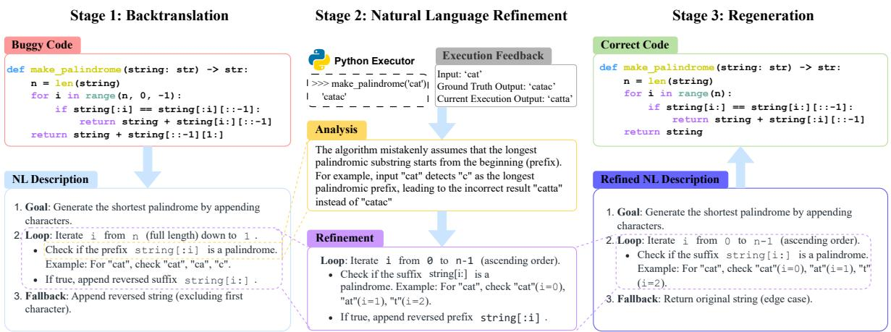  
Figure 1: The NL-DEBUGGING framework. This iterative process includes backtranslation, refinement, and regeneration, ultimately improving debugging efficiency by utilizing natural language reasoning.

## 3 Method

We propose NL-DEBUGGING that enhances code debugging by utilizing natural language as an intermediate representation. The workflow of NL-DEBUGGING is illustrated in Figure 1. In the Backtranslation stage, the buggy code is converted into a natural language version that captures its underlying logic. Next, in the Natural Language Refinement stage, execution feedback is used to analyze the natural language representation, identifying discrepancies between the intended behavior and the actual execution. Based on this analysis, the erroneous representation is modified to correct identified errors. Finally, in the Regeneration stage, the refined natural language representation is translated back into executable code, generating a new implementation to resolve the identified issues. This iterative process continues until the program passes all visible test cases or reaches a predefined iteration limit, with the final solution evaluated against hidden test cases to assess its generalizability.

## 3.1 Backtranslation

The first step in our framework involves backtranslating the buggy code into a natural language form. This transformation captures the intent and structure of the code. We facilitate semantic reasoning and high-level debugging by representing the program logic in natural language. This natural language representation can take various forms, such as sketches, pseudocode, or key thought points, and we present the details in Appendix G.

As illustrated in Figure 1, this process translates a function implementation into a natural language format that provides an interpretable description of how the function is expected to behave. This representation allows us to concentrate on the overall problem-solving strategy rather than getting bogged down in syntax-specific details. Detailed information on backtranslating to these different natural language forms can be found in Appendix G.2.

## 3.2 Natural Language Refinement

After generating the initial natural language version of the buggy code, the next step is refinement, which improves the representation based on execution feedback. This process consists of three key stages:

1. Execution Feedback Collection: The buggy code is executed against a set of test cases, and runtime feedback is systematically collected by comparing the predicted output against the ground truth. As shown in Figure 1, each feedback explicitly contains input, ground truth output, and current execution output, allowing for precise identification of discrepancies (e.g., an erroneous character duplication on line 3).

2. Problem Analysis and Reasoning: Based on the problem description, the buggy code with natural language representation, and the execution feedback, we analyze the nature of the issue and reason about its root causes. This involves logical deductions about the errors in the code and how they relate to the problem requirements.

3. Refinement of the Natural Language Sketch: After completing the analysis, we refine the natural language representation to produce an updated version, which better aligns with the correct solution logic.

By integrating execution feedback and problem analysis, the natural language representation evolves, improving its alignment with the correct solution and addressing previously identified logical flaws.

## 3.3 Regeneration

After refinement, we regenerate the corrected code using the refined natural language representation containing the correct implementation logic. The process involves translating the refined natural language representation back into executable code.

The framework iteratively runs the backtranslation, refinement, and regeneration steps until the program passes all visible test cases or reaches the maximum allowed debugging iterations. The finalized solution is then evaluated against hidden test cases to assess its robustness. If the solution passes the hidden test cases, it is considered correct.

## 4 Experiment

In this section, we conduct a series of experiments to answer the following research questions (RQs):

RQ1 How does NL-DEBUGGING framework perform against other code debugging methods?

RQ2 What type of natural language format is most effective for debugging tasks?

RQ3 Why is natural language beneficial for code debugging process?

RQ4 How does natural language work better with code execution feedback?

RQ5 Is o1-like long-CoT beneficial for NL-DEBUGGING?

## 4.1 Experiment Settings

## 4.1.1 Datasets

We evaluate our NL-DEBUGGING framework on two widely used code datasets: APPS (Hendrycks et al., 2021) and Codeforces (Team, 2024). The

APPS dataset consists of three difficulty levels—introductory, interview, and competition. From each difficulty level, we selected 100 problems to ensure a balanced assessment. The Codeforces dataset includes problems from online programming contests categorized by "ratings". We chose problems with ratings of 1200, 1500, and 1800 and selected 100 problems per rating level. Within each difficulty and rating category, problems were randomly selected to ensure balanced coverage, following Zhang et al. (2023b); Islam et al. (2024). We choose the first 100 problems per difficulty or rating level to maintain randomness.

## 4.1.2 Metrics

We use two common evaluation metrics to assess code correctness: pass rate and pass@1 following Zhang et al. (2023b). The pass rate is the average percentage of private test cases the generated programs pass across all problems. At the same time, pass@1 is the percentage of problems where the generated programs pass all private test cases, the standard metric in code-related tasks (Chen et al., 2021; Dong et al., 2025).

## 4.1.3 Baselines

To investigate how NL-DEBUGGING performs, we compare it with a series of code debugging methods, which use code execution feedback to refine code iteratively. These include: Self-Editing (Zhang et al., 2023a), Self-Debugging (Trace) (Chen et al., 2023), Self-Debugging (Explanation) (Chen et al., 2023), LDB(Zhong et al., 2024), MGDebugger (Shi et al., 2024), and Reflexion (Shinn et al., 2023).

## 4.1.4 Implementation

We select GPT-4o-mini (OpenAI, 2024), Claude-3.5-sonnet (Anthoropic, 2024), and DeepSeek-Coder-V2-Lite (Zhu et al., 2024) as the LLM backbones for our experiments. GPT-4o-mini and Claude-3.5-sonnet are accessed via their respective API forms, while DeepSeek-Coder-V2-Lite (16B) is locally deployed. Since all the methods utilize an iterative debugging process, we set the maximum debugging time to 5 iterations. All models are run with a temperature of 0.

## 4.2 Code Debugging Performance (RQ1)

We compare the performance of NL-DEBUGGING and other code debugging methods in Table 1. Our findings are organized into three key observations:

Table 1: Code debugging performance comparison of NL-DEBUGGING and other code debugging methods on APPS and Codeforces. We report pass rate and pass@1 on both datasets and all difficulties.
<table><tr><td rowspan="3">Arch</td><td rowspan="3">Method</td><td colspan="6">APPS</td><td colspan="6">Codeforces</td></tr><tr><td colspan="3">Pass Rate(%)</td><td colspan="3">Pass@1(%)</td><td colspan="2">Pass Rate(%)</td><td colspan="3">Pass@1(%)</td></tr><tr><td>Intro.</td><td>Inter.</td><td>Comp.</td><td>Intro.</td><td>Inter.</td><td>Comp.</td><td>1200</td><td>1500</td><td>1800</td><td>1200</td><td>1500</td><td>1800</td></tr><tr><td rowspan="7">GPT-40-mini</td><td>Base(w/o debugging)</td><td>56.45</td><td>54.57</td><td>34.67</td><td>35</td><td>28</td><td>16</td><td>64.06</td><td>47.60</td><td>36.60</td><td>42</td><td>23</td><td>15</td></tr><tr><td>Self-Edit</td><td>64.85</td><td>61.14</td><td>40.00</td><td>47</td><td>34</td><td>20</td><td>71.32</td><td>55.12</td><td>43.67</td><td>52</td><td>30</td><td>19</td></tr><tr><td>Self-Debugging(Expl.)</td><td>66.78</td><td>68.39</td><td>43.17</td><td>48</td><td>44</td><td>22</td><td>76.01</td><td>61.72</td><td>45.81</td><td>60</td><td>37</td><td>23</td></tr><tr><td>Self-Debugging(Trace)</td><td>65.63</td><td>64.57</td><td>36.33</td><td>47</td><td>42</td><td>19</td><td>76.09</td><td>60.78</td><td>47.68</td><td>59</td><td>37</td><td>22</td></tr><tr><td>LDB</td><td>64.53</td><td>63.11</td><td>38.85</td><td>47</td><td>38</td><td>19</td><td>73.91</td><td>56.42</td><td>43.58</td><td>53</td><td>32</td><td>20</td></tr><tr><td>MGDB</td><td>61.13</td><td>59.57</td><td>41.33</td><td>45</td><td>35</td><td>20</td><td>69.13</td><td>54.99</td><td>42.33</td><td>48</td><td>28</td><td>17</td></tr><tr><td>Reflexion</td><td>64.48</td><td>62.08</td><td>42.50</td><td>45</td><td>36</td><td>21</td><td>74.21</td><td>55.47</td><td>41.89</td><td>56</td><td>29</td><td>17</td></tr><tr><td rowspan="7"></td><td>NL-DEBUGGING</td><td>71.36</td><td>69.96</td><td>44.17</td><td>51</td><td>48</td><td>23</td><td>79.57</td><td>64.01</td><td>48.69</td><td>63</td><td>41</td><td>25</td></tr><tr><td>Base(w/o debugging)</td><td>60.01</td><td>61.47</td><td>45.33</td><td>41</td><td>36</td><td>30</td><td>68.59</td><td>56.33</td><td>42.06</td><td>56</td><td>33</td><td>24</td></tr><tr><td>Self-Edit</td><td>70.61</td><td>76.57</td><td>56.83</td><td>51</td><td>57</td><td>40</td><td>81.83</td><td>66.25</td><td>54.60</td><td>73</td><td>44</td><td>40</td></tr><tr><td>Self-Debugging(Expl.)</td><td>71.43</td><td>75.12</td><td>59.17</td><td>56</td><td>61</td><td>42</td><td>83.32</td><td>70.92</td><td>59.11</td><td>75</td><td>53</td><td>44</td></tr><tr><td>Self-Debugging(Trace)</td><td>73.04 70.29</td><td>75.23</td><td>56.83</td><td>58</td><td>60</td><td>42</td><td>84.29</td><td>71.00</td><td>58.32</td><td>76</td><td>51</td><td>44</td></tr><tr><td>LDB</td><td>70.27</td><td>73.20</td><td>58.33</td><td>55</td><td>53</td><td>42</td><td>83.93</td><td>69.94</td><td>60.75</td><td>73</td><td>53</td><td>46</td></tr><tr><td>MGDB Reflexion</td><td>75.99</td><td>68.45 74.42</td><td>55.67 54.17</td><td>53 55</td><td>44 55</td><td>40 39</td><td>77.35 83.58</td><td>65.10 72.01</td><td>55.14 59.78</td><td>66 74</td><td>43 56</td><td>39</td></tr><tr><td rowspan="2"></td><td>NL-DEBUGGING</td><td>77.98</td><td>76.72</td><td>59.67</td><td>62</td><td>62</td><td>44</td><td>85.82</td><td>74.16</td><td>61.28</td><td>79</td><td>58</td><td>44 47</td></tr><tr><td></td><td></td><td></td><td></td><td></td><td></td><td></td><td>52.64</td><td></td><td></td><td></td><td></td><td></td></tr><tr><td rowspan="7">DeepSeek-Coder-V2-Lite</td><td>Base(w/o debugging) Self-Edit</td><td>50.79 53.30</td><td>45.42 47.51</td><td>21.33 22.83</td><td>33 34</td><td>24 25</td><td>6 7</td><td>54.40</td><td>38.33 42.37</td><td>19.75 23.27</td><td>33</td><td>17 21</td><td>5 8</td></tr><tr><td></td><td>59.63</td><td>57.43</td><td>25.00</td><td>41</td><td>30</td><td>10</td><td>58.39</td><td></td><td>29.78</td><td>36</td><td>22</td><td></td></tr><tr><td>Self-Debugging(Expl.)</td><td>55.90</td><td></td><td></td><td></td><td></td><td>7</td><td>55.77</td><td>45.08</td><td></td><td>41</td><td></td><td>7</td></tr><tr><td>Self-Debugging(Trace)</td><td>56.78</td><td>49.83 49.39</td><td>23.83 19.67</td><td>41</td><td>27 27</td><td>7</td><td>54.40</td><td>43.89</td><td>25.27</td><td>37 35</td><td>22</td><td>7</td></tr><tr><td>LDB</td><td>56.29</td><td>54.78</td><td>26.50</td><td>39 36</td><td>29</td><td>8</td><td>57.28</td><td>40.68 42.24</td><td>24.65 24.13</td><td>43</td><td>20</td><td>7</td></tr><tr><td>MGDB</td><td>54.01</td><td>49.82</td><td>20.83</td><td>35</td><td>26</td><td>7</td><td>56.17</td><td>42.18</td><td>23.74</td><td>38</td><td>21</td><td>6</td></tr><tr><td>Reflexion NL-DEBUGGING</td><td>62.23</td><td>59.23</td><td>27.60</td><td>40</td><td>32</td><td>12</td><td>63.65</td><td>50.92</td><td>32.80</td><td>48</td><td>20 27</td><td>6 12</td></tr></table>

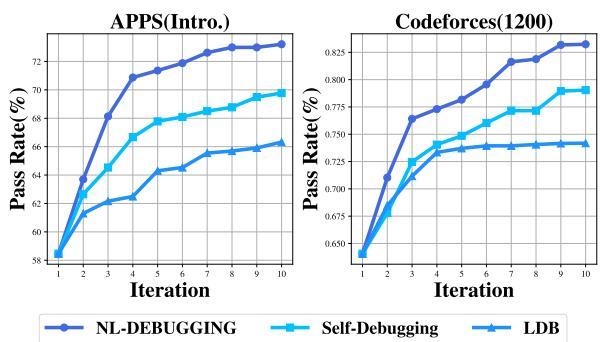  
Figure 2: Pass rate (%) comparison of NL-DEBUGGING and other code-level debugging methods with more debugging iterations.

• NL-DEBUGGING shows significant improvements on contest-level programming tasks across all datasets, demonstrating its effectiveness in complex problem-solving scenarios where traditional code-level debugging struggles.

• Self-Debugging generally outperforms other baselines by reasoning directly at the code level. While methods like LDB and MGDB focus on detailed structural analysis of code components, they lack natural language optimization. NL-DEBUGGING advances beyond Self-Debugging by leveraging backtranslated natural language representations of buggy code, enabling a more global reasoning strategy than code-level stepwise refinements.

• At the APPS Introductory level, DeepSeek-Coder-V2-Lite shows minimal improvement in pass@1 compared to baseline methods. While its pass rate surpasses some baselines, its debugging gains are less significant than those of GPT-4o-mini and Claude3.5-Sonnet. This likely stems from DeepSeek-Coder-V2-Lite’s smaller parameter size and coder-focused design, which may limit its capacity for complex reasoning.

We further analyze how different debugging methods scale with the number of iterations, as shown in Figure 2. Compared to competitive baselines, NL-DEBUGGING consistently maintains a performance advantage across iterations. Notably, as the number of iterations increases to 10, its performance improves steadily, demonstrating strong scalability and robustness in iterative refinement.

## 4.3 What Format of Natural Language Representation Works the Best? (RQ2)

To investigate which type of text is most effective for code debugging, we examine three natural language formats: pseudocode, key points, and sketches. We summarize the key features and characteristics of each type below, and the prompting details are presented in Appendix G:

Table 2: Performance comparison of different types of natural language in NL-DEBUGGING.
<table><tr><td rowspan="3">Arch</td><td rowspan="3">NL Type</td><td colspan="4">APPS</td><td colspan="8">Codeforces</td></tr><tr><td colspan="3">Pass Rate(%)</td><td colspan="3">Pass@1(%)</td><td colspan="3">Pass Rate(%)</td><td colspan="3">Pass@1(%)</td></tr><tr><td>Intro.</td><td>Inter.</td><td>Comp.</td><td>Intro.</td><td>Inter.</td><td>Comp.</td><td>1200</td><td>1500</td><td>1800</td><td>1200</td><td>1500</td><td>1800</td></tr><tr><td></td><td>Pseudocode</td><td>65.32</td><td>65.28</td><td>40.50</td><td>46</td><td>42</td><td>18</td><td>70.22</td><td>60.32</td><td>43.32</td><td>52</td><td>32</td><td>23</td></tr><tr><td>GPT-40-mini</td><td>Key points</td><td>68.97</td><td>68.85</td><td>40.67</td><td>48</td><td>44</td><td>21</td><td>75.27</td><td>61.04</td><td>43.98</td><td>59</td><td>37</td><td>21</td></tr><tr><td></td><td>Sketch</td><td>71.36</td><td>69.96</td><td>44.17</td><td>51</td><td>48</td><td>23</td><td>79.57</td><td>64.01</td><td>48.69</td><td>63</td><td>41</td><td>25</td></tr><tr><td>Claude3.5-Sonnet</td><td>Pseudocode</td><td>74.07</td><td>73.97</td><td>59.83</td><td>58</td><td>58</td><td>45</td><td>80.74</td><td>68.02</td><td>57.23</td><td>71</td><td>52</td><td>43</td></tr><tr><td></td><td>Key points</td><td>74.71</td><td>74.74</td><td>58.17</td><td>58</td><td>55</td><td>41</td><td>80.92</td><td>70.72</td><td>58.42</td><td>72</td><td>51</td><td>45</td></tr><tr><td></td><td>Sketch</td><td>77.98</td><td>76.72</td><td>59.67</td><td>62</td><td>62</td><td>44</td><td>85.82</td><td>74.16</td><td>61.28</td><td>79</td><td>58</td><td>47</td></tr><tr><td>DeepSeek-Coder-V2-Lite</td><td>Pseudocode</td><td>57.73</td><td>50.62</td><td>21.00</td><td>33</td><td>27</td><td>6</td><td>58.78</td><td>45.02</td><td>28.68</td><td>39</td><td>21</td><td>10</td></tr><tr><td></td><td>Key points</td><td>61.13</td><td>59.95</td><td>26.67</td><td>40</td><td>32</td><td>9</td><td>63.30</td><td>47.60</td><td>29.95</td><td>49</td><td>25</td><td>11</td></tr><tr><td></td><td>Sketch</td><td>62.23</td><td>59.23</td><td>27.60</td><td>40</td><td>32</td><td>12</td><td>63.65</td><td>50.92</td><td>32.80</td><td>48</td><td>27</td><td>12</td></tr></table>

• Pseudocode: Pseudocode retains most of the structural elements of the code while incorporating natural language components to enhance clarity (Wen et al., 2024). It provides a highlevel overview of the algorithm, making the logic more comprehensible by blending code-like syntax with descriptive elements.

• Key points: This format abstracts the code’s main logic into concise key points, summarizing the key thought steps and operations (Li et al., 2024). Key points are iteratively added and refined during debugging to provide a simplified, high-level view of the algorithm.

• Sketch: The sketch format gives a more detailed natural language description, outlining the structure and specific implementation details (Wang et al., 2024). As debugging progresses, the description is refined for greater clarity and completeness, offering a flexible representation of the logic of the code.

The results in Table 2 show that the Sketch format achieves the best overall performance. Compared to Pseudocode, Sketch offers more detailed natural language descriptions, making debugging more intuitive. Compared to Key points, Sketch provides a richer representation of code structure, enabling greater flexibility and a larger modification space, which supports more accurate natural language reasoning.

Moreover, for the DeepSeek-Coder-V2-Lite model, Key points and Sketch perform similarly, likely due to the model’s limited natural language reasoning ability. In this context, the simpler and more abstract Key points format is better suited for debugging. This suggests that when a model’s reasoning capacity is constrained, abstract natural language representations may be more effective as debugging aids.

## 4.4 Why Natural Language Debugging Works? (RQ3)

## 4.4.1 NL2NL vs. NL2C

NL-DEBUGGING pipeline could be decomposed into two stages. The first stage, NL2NL, involves refining the initial natural language representation (i.e., the sketch) derived from the buggy code into an improved and corrected natural language form. The second stage, NL2C, refers to transforming this refined natural language representation into executable code. To analyze the relative importance of these stages, we employ multiple sampling attempts at each step and compare the performance gains they bring.

Our experiments reveal that sampling during the NL2NL phase consistently results in greater improvements across all difficulty levels, as illustrated in Figure 3. This indicates that the performance gains are primarily driven by effective refinement in the natural language space, rather than by generating multiple candidate programs during the NL2C stage. In other words, the key to successful natural language debugging mainly lies in enhancing the quality of the underlying natural language abstraction.

## 4.4.2 NL-DEBUGGING Enhances Diversity to Improve Debugging Performance

To investigate natural language representations’ benefits, we look into the specific change that NL-DEBUGGING brings. Table 3 presents a comparative analysis between code-level debugging and NL-DEBUGGING across three key metrics to quantitatively evaluate the changes that debugging meth-

Pass Rate(%) Comparison of NL2NL and NL2C Sampling Across Different Difficulty Levels

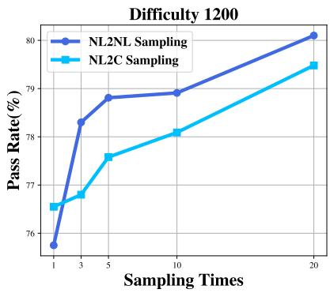

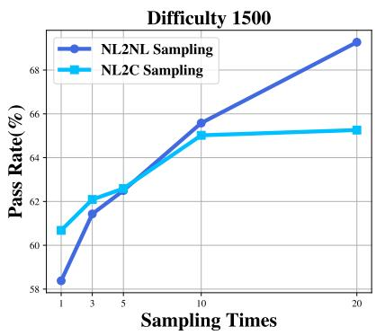

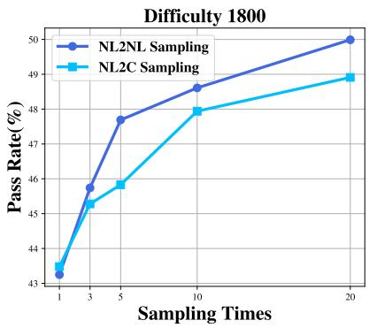  
Figure 3: Pass rate (%) comparison of NL2NL and NL2C sampling across different difficulty levels.

Table 3: Comparison of code-Level and NL-DEBUGGING in terms of structural and similarity metrics.
<table><tr><td rowspan="2">Dataset</td><td rowspan="2">Method</td><td colspan="3">AST Edit Distance</td><td colspan="3">Control Flow Depth Difference</td><td colspan="3">BLEU Score</td></tr><tr><td>Intro./1200</td><td>Inter./1500</td><td>Comp./1800</td><td>Intro./1200</td><td>Inter./1500</td><td>Comp./1800</td><td>Intro./1200</td><td>Inter./1500</td><td>Comp./1800</td></tr><tr><td rowspan="2">APPS</td><td>Code Level</td><td>3.03</td><td>4.68</td><td>2.86</td><td>0.27</td><td>0.23</td><td>0.12</td><td>0.8776</td><td>0.8496</td><td>0.9363</td></tr><tr><td>NL-DEBUGGING</td><td>5.57</td><td>7.31</td><td>4.94</td><td>0.33</td><td>0.37</td><td>0.25</td><td>0.7842</td><td>0.7318</td><td>0.8485</td></tr><tr><td rowspan="2">Codeforces</td><td>Code Level</td><td>2.19</td><td>3.24</td><td>3.34</td><td>0.13</td><td>0.18</td><td>0.20</td><td>0.9021</td><td>0.8928</td><td>0.8965</td></tr><tr><td>NL-DEBUGGING</td><td>5.25</td><td>6.15</td><td>5.87</td><td>0.21</td><td>0.37</td><td>0.31</td><td>0.8109</td><td>0.7767</td><td>0.8051</td></tr></table>

Table 4: Statistical results comparing modification distances and BLEU score between samples with pass rate growth greater than 0.5 and samples with no change.
<table><tr><td></td><td>Edit Distance</td><td>CFG Distance</td><td>BLEU Score</td></tr><tr><td>Pass Rate Growth &gt;0.5</td><td>7.21</td><td>0.57</td><td>0.6779</td></tr><tr><td>No Change</td><td>0.53</td><td>0.05</td><td>0.9724</td></tr></table>

ods bring, following Pan et al. (2025); Gong et al. (2024): AST Edit Distance, Control Flow Depth Difference, and BLEU Score. Detailed explanations of these metrics can be found in Appendix C. Table 4 presents a statistical analysis comparing two sets of samples processed with code-level debugging: one with a significant pass rate improvement (greater than 0.5) and another where the pass rate did not change.

Our findings are organized into the following observations:

• NL-DEBUGGING Brings More Diverse Changes: Table 3 shows significantly larger AST Edit Distance values, higher Control Flow Depth Difference, and lower BLEU Score for NL-DEBUGGING, indicating more extensive and flexible modifications and more meaningful structural adjustments compared to code-level debugging.

• Greater Diversity in Modifications Correlates with Better Debugging Performance: As shown in Table 4, samples with significant pass rate improvement exhibit notably higher Edit Distance and Control Flow Depth Difference, along with lower BLEU Score, compared to samples where the pass rate did not change. This highlights the critical role of diversity in achieving effective debugging outcomes.

In summary, by introducing more diverse modifications, NL-DEBUGGING enhances debugging performance. These diverse changes enable more meaningful adjustments, especially for complex bugs, improving overall debugging effectiveness in addressing deeper logical or reasoning issues.

## 4.5 How does Natural Language Work Better with Code Execution Feedback? (RQ4)

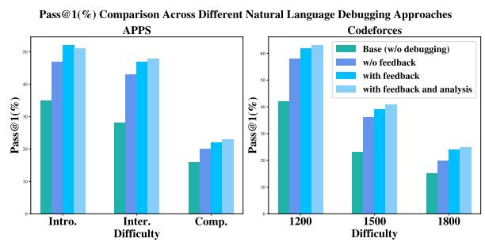  
Figure 4: Pass@1 (%) comparison across different natural language debugging approaches.

To investigate how natural language can work better for debugging, we focus on the impact of execution feedback within NL-DEBUGGING. Figure 4 compares pass@1 performance across different debugging strategies on the APPS and Codeforces benchmarks, with varying feedback mechanisms.

Table 5: Performance comparison of NL-DEBUGGING and long CoT Approaches on APPS and Codeforces datasets.
<table><tr><td></td><td colspan="5">APPS</td><td colspan="6">Codeforces</td></tr><tr><td>Method</td><td colspan="3">Pass Rate(%)</td><td colspan="3">Pass@1(%)</td><td colspan="3">Pass Rate(%)</td><td colspan="3">Pass@1(%)</td></tr><tr><td></td><td>Intro.</td><td>Inter.</td><td>Comp.</td><td>Intro.</td><td>Inter.</td><td>Comp.</td><td>1200</td><td>1500</td><td>1800</td><td>1200</td><td>1500</td><td>1800</td></tr><tr><td>NL-DEBUGGING</td><td>71.36</td><td>69.96</td><td>44.17</td><td>51</td><td>48</td><td>23</td><td>79.57</td><td>64.00</td><td>48.69</td><td>65</td><td>41</td><td>25</td></tr><tr><td>Long CoT(Direct)</td><td>67.05</td><td>63.73</td><td>42.50</td><td>48</td><td>40</td><td>23</td><td>74.50</td><td>62.14</td><td>43.79</td><td>55</td><td>37</td><td>21</td></tr><tr><td>Long CoT(Sketch)</td><td>71.08</td><td>68.16</td><td>45.17</td><td>51</td><td>47</td><td>26</td><td>77.36</td><td>63.96</td><td>45.12</td><td>60</td><td>38</td><td>22</td></tr></table>

The results show that incorporating execution feedback significantly improves debugging performance, confirming its importance in natural language-based debugging. Specifically, execution feedback information is crucial, providing the foundation for effective reasoning.

Additionally, adding an analysis step to raw execution feedback leads to further performance improvements. This analysis step, akin to selfdebugging as opposed to self-editing, helps the model reason more deeply about the code, underscoring the value of deeper reasoning for more accurate debugging.

## 4.6 Is O1-like Long-CoT Beneficial for NL-DEBUGGING? (RQ5)

Inspired by o1-like reasoning methods (Jaech et al., 2024; Qin et al., 2024; Guo et al., 2025), which incorporate reflection and iterative refinement of thought chains, we investigated whether similar approaches could enhance debugging in natural language. In the context of NL-DEBUGGING, where execution feedback is available, we aimed to emulate this reflective reasoning process by incorporating feedback to allow the model to pause, analyze, and refine its reasoning. To assess the effectiveness of long chains of thought in debugging, we propose two approaches:

• Lont CoT (Direct): This approach simulates iterative reasoning by analyzing execution feedback and appending insights to an ongoing reasoning chain, incrementally refining the model’s understanding.

• Lont CoT (Sketch): This method uses the iteratively grown chain of thought from the first approach as a basis for generating structured natural language sketches. The goal is to stimulate critical thinking in sketch refinement and develop

more comprehensive problem-solving strategies. Based on the results in Table 5, we make the following observations:

• Long CoT Approaches Underperform NL-DEBUGGING: Simply appending iterative trialand-error reflections does not improve debugging effectiveness. The longer reasoning chains fail to consistently enhance performance, indicating that added context alone is insufficient.

• Long CoT Structure is Less Effective than Sketch as Intermediary for Code Regeneration: Directly appending execution feedback to Long CoT (Long CoT Direct) yields worse results than using these chains to produce a coherent sketch (Long CoT Sketch). This suggests that the natural language sketch format better supports code generation, while manually appended Long CoT lacks the necessary coherence.

In summary, manual appending of reasoning chains fails to stimulate LLMs’ critical selfreflection reliably without parameter tuning. Therefore, NL-DEBUGGING’s focus on direct refinement of natural language sketches proves more effective for debugging.

## 5 Conclusion

In this paper, we introduce NL-DEBUGGING, which leverages natural language as an intermediate representation to enhance code debugging efficiency and accuracy significantly. Experimental results show that NL-DEBUGGING outperforms traditional code-level debugging, especially in addressing deep algorithmic flaws. Our results suggest that using natural language sketches is the most effective format for code debugging. Further, we demonstrate that NL-DEBUGGING facilitates a broader modification space, enabling more diverse corrections and more effective debugging performance. Overall, NL-DEBUGGING demonstrates the important potential of natural language reasoning in code debugging, offering a promising direction for future research in automated debugging.

## Acknowledgements

The Shanghai Jiao Tong University team is partially supported by National Key R&D Program of China (2022ZD0114804), Shanghai Municipal Science and Technology Major Project (2021SHZDZX0102) and National Natural Science Foundation of China (62322603, 62177033, 62502310).

## Limitations

Expanding Modification Space through Tree Search While our approach utilizes iterative refinement for natural language representations, enhancing the modification space could be achieved by integrating tree search mechanisms into the reasoning process. By implementing tree search strategies, we could facilitate a more structured exploration of potential modifications based on natural language, allowing for a broader range of solutions.

Integrating Debugging Methods at Different Granularities Integrating debugging methods at different granularities presents an opportunity for further enhancement. While code-level debugging has its advantages, natural language reasoning offers unique strengths. Combining analyses at various levels may facilitate a more effective resolution of unknown bugs by leveraging the strengths of both approaches, potentially leading to improved debugging outcomes.

Further Exploring Long Chains of Thought Our experiments revealed that manually constructed trial-and-error reasoning processes did not yield successful outcomes. However, this indicates a limitation in our current approach rather than a dismissal of long chains of thought. Methods like journey learning, as demonstrated in the O1-Journey project (Qin et al., 2024), suggest that LLMs can be trained with relatively few samples to produce coherent long reasoning chains through exploration and reflection. Applying these insights to the code domain could enhance our understanding of effectively implementing long chains of thought in debugging scenarios.

Generalizing to Software Reasoning Tasks Our current exploration primarily focuses on debugging algorithmic programming challenges with execution feedback. While this focus has allowed us to address specific code generation practices, the methodologies and insights derived from this work could generalize to other software reasoning tasks. For instance, applying our framework to debugging software issues in development environments or addressing problems in legacy codebases (Jimenez et al., 2023) could yield significant benefits, highlighting the broader applicability of natural language reasoning in diverse programming contexts.

## References

Josh Achiam, Steven Adler, Sandhini Agarwal, Lama Ahmad, Ilge Akkaya, Florencia Leoni Aleman, Diogo Almeida, Janko Altenschmidt, Sam Altman, Shyamal Anadkat, et al. 2023. Gpt-4 technical report. arXiv preprint arXiv:2303.08774.

Anthoropic. 2024. Claude 3.5 sonnet. https:// www.anthropic.com/claude/sonnet/. Accessed: 2024-06-21.

Maciej Besta, Nils Blach, Ales Kubicek, Robert Gerstenberger, Michal Podstawski, Lukas Gianinazzi, Joanna Gajda, Tomasz Lehmann, Hubert Niewiadomski, Piotr Nyczyk, et al. 2024. Graph of thoughts: Solving elaborate problems with large language models. In Proceedings of the AAAI Conference on Artificial Intelligence, volume 38, pages 17682–17690.

Jizheng Chen, Kounianhua Du, Xinyi Dai, Weiming Zhang, Xihuai Wang, Yasheng Wang, Ruiming Tang, Weinan Zhang, and Yong Yu. 2025. Debatecoder: Towards collective intelligence of llms via test case driven llm debate for code generation. In Proceedings of the 63rd Annual Meeting of the Association for Computational Linguistics (Volume 1: Long Papers), pages 12055–12065.

Mark Chen, Jerry Tworek, Heewoo Jun, Qiming Yuan, Henrique Ponde De Oliveira Pinto, Jared Kaplan, Harri Edwards, Yuri Burda, Nicholas Joseph, Greg Brockman, et al. 2021. Evaluating large language models trained on code. arXiv preprint arXiv:2107.03374.

Xinyun Chen, Maxwell Lin, Nathanael Schärli, and Denny Zhou. 2023. Teaching large language models to self-debug. arXiv preprint arXiv:2304.05128.

Yihong Dong, Jiazheng Ding, Xue Jiang, Ge Li, Zhuo Li, and Zhi Jin. 2025. Codescore: Evaluating code generation by learning code execution. ACM Transactions on Software Engineering and Methodology, 34(3):1–22.

Shihan Dou, Haoxiang Jia, Shenxi Wu, Huiyuan Zheng, Weikang Zhou, Muling Wu, Mingxu Chai, Jessica Fan, Caishuang Huang, Yunbo Tao, et al. 2024. What’s wrong with your code generated by large language models? an extensive study. arXiv preprint arXiv:2407.06153.

Alexander Finder and Görschwin Fey. 2010. Evaluating debugging algorithms from a qualitative perspective. In 2010 Forum on Specification & Design Languages (FDL 2010), pages 1–6. IET.

Linyuan Gong, Mostafa Elhoushi, and Alvin Cheung. 2024. Ast-t5: Structure-aware pretraining for code generation and understanding. arXiv preprint arXiv:2401.03003.

Daya Guo, Dejian Yang, Haowei Zhang, Junxiao Song, Ruoyu Zhang, Runxin Xu, Qihao Zhu, Shirong Ma, Peiyi Wang, Xiao Bi, et al. 2025. Deepseek-r1: Incentivizing reasoning capability in llms via reinforcement learning. arXiv preprint arXiv:2501.12948.

Kavi Gupta, Peter Ebert Christensen, Xinyun Chen, and Dawn Song. 2020. Synthesize, execute and debug: Learning to repair for neural program synthesis. Advances in Neural Information Processing Systems, 33:17685–17695.

Dan Hendrycks, Steven Basart, Saurav Kadavath, Mantas Mazeika, Akul Arora, Ethan Guo, Collin Burns, Samir Puranik, Horace He, Dawn Song, et al. 2021. Measuring coding challenge competence with apps. arXiv preprint arXiv:2105.09938.

Soneya Binta Hossain, Nan Jiang, Qiang Zhou, Xiaopeng Li, Wen-Hao Chiang, Yingjun Lyu, Hoan Nguyen, and Omer Tripp. 2024. A deep dive into large language models for automated bug localization and repair. Proceedings of the ACM on Software Engineering, 1(FSE):1471–1493.

Xueyu Hu, Kun Kuang, Jiankai Sun, Hongxia Yang, and Fei Wu. 2024. Leveraging print debugging to improve code generation in large language models. arXiv preprint arXiv:2401.05319.

Jie Huang and Kevin Chen-Chuan Chang. 2022. Towards reasoning in large language models: A survey. arXiv preprint arXiv:2212.10403.

Kai Huang, Xiangxin Meng, Jian Zhang, Yang Liu, Wenjie Wang, Shuhao Li, and Yuqing Zhang. 2023. An empirical study on fine-tuning large language models of code for automated program repair. In 2023 38th IEEE/ACM International Conference on Automated Software Engineering (ASE), pages 1162–1174. IEEE.

Md. Ashraful Islam, Mohammed Eunus Ali, and Md Rizwan Parvez. 2024. MapCoder: Multi-agent code generation for competitive problem solving. In Proceedings of the 62nd Annual Meeting of the Association for Computational Linguistics (Volume 1: Long Papers), pages 4912–4944.

Aaron Jaech, Adam Kalai, Adam Lerer, Adam Richardson, Ahmed El-Kishky, Aiden Low, Alec Helyar, Aleksander Madry, Alex Beutel, Alex Carney, et al. 2024. Openai o1 system card. arXiv preprint arXiv:2412.16720.

Nan Jiang, Xiaopeng Li, Shiqi Wang, Qiang Zhou, Soneya B Hossain, Baishakhi Ray, Varun Kumar, Xiaofei Ma, and Anoop Deoras. 2024. Ledex: Training llms to better self-debug and explain code. Advances in Neural Information Processing Systems, 37:35517–35543.

Carlos E Jimenez, John Yang, Alexander Wettig, Shunyu Yao, Kexin Pei, Ofir Press, and Karthik Narasimhan. 2023. Swe-bench: Can language models resolve real-world github issues? arXiv preprint arXiv:2310.06770.

Aviral Kumar, Vincent Zhuang, Rishabh Agarwal, Yi Su, John D Co-Reyes, Avi Singh, Kate Baumli, Shariq Iqbal, Colton Bishop, Rebecca Roelofs, et al. 2024. Training language models to selfcorrect via reinforcement learning. arXiv preprint arXiv:2409.12917.

Jierui Li, Hung Le, Yingbo Zhou, Caiming Xiong, Silvio Savarese, and Doyen Sahoo. 2025a. CodeTree: Agent-guided tree search for code generation with large language models. In Proceedings of the 2025 Conference of the Nations of the Americas Chapter of the Association for Computational Linguistics: Human Language Technologies (Volume 1: Long Papers), pages 3711–3726.

Qingyao Li, Xinyi Dai, Xiangyang Li, Weinan Zhang, Yasheng Wang, Ruiming Tang, and Yong Yu. 2025b. Codeprm: Execution feedback-enhanced process reward model for code generation. In Findings of the Association for Computational Linguistics: ACL 2025, pages 8169–8182.

Qingyao Li, Wei Xia, Kounianhua Du, Xinyi Dai, Ruiming Tang, Yasheng Wang, Yong Yu, and Weinan Zhang. 2024. Rethinkmcts: Refining erroneous thoughts in monte carlo tree search for code generation. arXiv preprint arXiv:2409.09584.

Raymond Li, Loubna Ben Allal, Yangtian Zi, Niklas Muennighoff, Denis Kocetkov, Chenghao Mou, Marc Marone, Christopher Akiki, Jia Li, Jenny Chim, et al. 2023. Starcoder: may the source be with you! arXiv preprint arXiv:2305.06161.

Jiawei Liu, Chunqiu Steven Xia, Yuyao Wang, and Lingming Zhang. 2024. Is your code generated by chatgpt really correct? rigorous evaluation of large language models for code generation. Advances in Neural Information Processing Systems, 36.

Aman Madaan, Niket Tandon, Prakhar Gupta, Skyler Hallinan, Luyu Gao, Sarah Wiegreffe, Uri Alon, Nouha Dziri, Shrimai Prabhumoye, Yiming Yang, et al. 2024. Self-refine: Iterative refinement with self-feedback. Advances in Neural Information Processing Systems, 36.

OpenAI. 2024. Gpt-4o-mini. Accessed: 2024-07-18.

Ruwei Pan, Hongyu Zhang, and Chao Liu. 2025. Codecor: An llm-based self-reflective multi-agent framework for code generation. arXiv preprint arXiv:2501.07811.

Kishore Papineni, Salim Roukos, Todd Ward, and Wei-Jing Zhu. 2002. Bleu: a method for automatic evaluation of machine translation. In Proceedings of the 40th annual meeting of the Association for Computational Linguistics, pages 311–318.

Yiwei Qin, Xuefeng Li, Haoyang Zou, Yixiu Liu, Shijie Xia, Zhen Huang, Yixin Ye, Weizhe Yuan, Hector Liu, Yuanzhi Li, et al. 2024. O1 replication journey: A strategic progress report–part 1. arXiv preprint arXiv:2410.18982.

Yuling Shi, Songsong Wang, Chengcheng Wan, and Xiaodong Gu. 2024. From code to correctness: Closing the last mile of code generation with hierarchical debugging. arXiv preprint arXiv:2410.01215.

Noah Shinn, Federico Cassano, Ashwin Gopinath, Karthik Narasimhan, and Shunyu Yao. 2023. Reflexion: Language agents with verbal reinforcement learning. Advances in Neural Information Processing Systems, 36:8634–8652.

Codeforces Team. 2024. Codeforces. https:// codeforces.com/.

Runchu Tian, Yining Ye, Yujia Qin, Xin Cong, Yankai Lin, Yinxu Pan, Yesai Wu, Haotian Hui, Weichuan Liu, Zhiyuan Liu, et al. 2024. Debugbench: Evaluating debugging capability of large language models. arXiv preprint arXiv:2401.04621.

Evan Wang, Federico Cassano, Catherine Wu, Yunfeng Bai, Will Song, Vaskar Nath, Ziwen Han, Sean Hendryx, Summer Yue, and Hugh Zhang. 2024. Planning in natural language improves llm search for code generation. arXiv preprint arXiv:2409.03733.

Xuezhi Wang, Jason Wei, Dale Schuurmans, Quoc Le, Ed Chi, Sharan Narang, Aakanksha Chowdhery, and Denny Zhou. 2022. Self-consistency improves chain of thought reasoning in language models. arXiv preprint arXiv:2203.11171.

Jason Wei, Xuezhi Wang, Dale Schuurmans, Maarten Bosma, Fei Xia, Ed Chi, Quoc V Le, Denny Zhou, et al. 2022. Chain-of-thought prompting elicits reasoning in large language models. Advances in neural information processing systems, 35:24824–24837.

Jiaxin Wen, Jian Guan, Hongning Wang, Wei Wu, and Minlie Huang. 2024. Unlocking reasoning potential in large langauge models by scaling code-form planning. arXiv preprint arXiv:2409.12452.

Chunqiu Steven Xia, Yuxiang Wei, and Lingming Zhang. 2023. Automated program repair in the era of large pre-trained language models. In 2023 IEEE/ACM 45th International Conference on Software Engineering (ICSE), pages 1482–1494. IEEE.

Yuxi Xie, Anirudh Goyal, Wenyue Zheng, Min-Yen Kan, Timothy P Lillicrap, Kenji Kawaguchi, and Michael Shieh. 2024. Monte carlo tree search boosts reasoning via iterative preference learning. arXiv preprint arXiv:2405.00451.

Yingxuan Yang, Huacan Chai, Shuai Shao, Yuanyi Song, Siyuan Qi, Renting Rui, and Weinan Zhang. 2025. Agentnet: Decentralized evolutionary coordination for llm-based multi-agent systems. arXiv preprint arXiv:2504.00587.

Shunyu Yao, Dian Yu, Jeffrey Zhao, Izhak Shafran, Tom Griffiths, Yuan Cao, and Karthik Narasimhan. 2024. Tree of thoughts: Deliberate problem solving with large language models. Advances in Neural Information Processing Systems, 36.

Michihiro Yasunaga and Percy Liang. 2021. Break-itfix-it: Unsupervised learning for program repair. In International conference on machine learning, pages 11941–11952. PMLR.

Eric Zelikman, Yuhuai Wu, Jesse Mu, and Noah Goodman. 2022. Star: Bootstrapping reasoning with reasoning. Advances in Neural Information Processing Systems, 35:15476–15488.

Kechi Zhang, Zhuo Li, Jia Li, Ge Li, and Zhi Jin. 2023a. Self-edit: Fault-aware code editor for code generation. arXiv preprint arXiv:2305.04087.

Shun Zhang, Zhenfang Chen, Yikang Shen, Mingyu Ding, Joshua B Tenenbaum, and Chuang Gan. 2023b. Planning with large language models for code generation. arXiv preprint arXiv:2303.05510.

Yuxiang Zhang, Shangxi Wu, Yuqi Yang, Jiangming Shu, Jinlin Xiao, Chao Kong, and Jitao Sang. 2024. o1-coder: an o1 replication for coding. arXiv preprint arXiv:2412.00154.

Tianyu Zheng, Ge Zhang, Tianhao Shen, Xueling Liu, Bill Yuchen Lin, Jie Fu, Wenhu Chen, and Xiang Yue. 2024. Opencodeinterpreter: Integrating code generation with execution and refinement. arXiv preprint arXiv:2402.14658.

Li Zhong, Zilong Wang, and Jingbo Shang. 2024. Debug like a human: A large language model debugger via verifying runtime execution step by step. In Findings of the Association for Computational Linguistics: ACL 2024, pages 851–870.

Jiachen Zhu, Congmin Zheng, Jianghao Lin, Kounianhua Du, Ying Wen, Yong Yu, Jun Wang, and Weinan Zhang. 2025. Retrieval-augmented process reward model for generalizable mathematical reasoning. In Findings of the Association for Computational Linguistics: ACL 2025, pages 8453–8468.

Qihao Zhu, Daya Guo, Zhihong Shao, Dejian Yang, Peiyi Wang, Runxin Xu, Y Wu, Yukun Li, Huazuo Gao, Shirong Ma, et al. 2024. Deepseek-coder-v2: Breaking the barrier of closed-source models in code intelligence. arXiv preprint arXiv:2406.11931.

## Appendix

## A Dataset Details

We evaluate our NL-DEBUGGING framework on two widely used code datasets: APPS (Hendrycks et al., 2021) and Codeforces (Team, 2024). The APPS dataset includes three difficulty levels—introductory, interview, and competition—with a total of 5000 programming problems for training and 5000 for testing. The Codeforces dataset contains problems from the Codeforces online programming contest, with varying difficulty levels categorized by "ratings", from which we choose 1200, 1500, and 1800 for evaluation.

For both datasets, we select 100 problems from each difficulty level for evaluation to ensure a balanced assessment. Both datasets use the same set of test cases for algorithm optimization (public test cases) and performance evaluation (private test cases). The public test cases are used during the algorithm running, while the private test cases are reserved for evaluating the generated codes.

## B Baseline Details

To provide a comprehensive understanding of our experimental setup, we present a detailed overview of each baseline code debugging method used for comparison with NL-DEBUGGING. All baselines leverage code execution feedback to refine code iteratively.

Self-Edit (Zhang et al., 2023a) This method utilizes the execution results from test cases to regenerate code, aiming to correct errors based on observed failures. The model iteratively edits code based on execution feedback but does not explicitly reason beyond localized fixes.

Self-Debug(Explanation) (Chen et al., 2023) This method augments the code-level analysis by prompting the model to generate natural language explanations of its code. While it introduces a reasoning step, the process still centers on interpreting and modifying the code.

Self-Debug(Trace) (Chen et al., 2023) This variant performs execution tracing to follow the flow of control and variable states. The reasoning it enables is constrained to analyzing runtime behavior within the original program structure.

LDB (Zhong et al., 2024) LDB decomposes code into basic blocks and performs execution analysis on each block. Its reasoning is fine-grained and structural, but strictly within the code block domain.

MGDebugger (Shi et al., 2024) This method builds a hierarchical tree of subfunctions and performs bottom-up debugging. The reasoning is hierarchical but still grounded in the syntactic and structural composition of the buggy code.

Reflexion (Shinn et al., 2023) Reflexion leverages past execution traces to guide future code modifications. Although it reflects on previous failures, the reasoning process remains code-centric and operates directly on the source program.

In contrast to baseline methods that perform reasoning directly on buggy code, NL-DEBUGGING distinguishes itself by conducting reasoning on a natural language abstraction of the code. This shift allows NL-DEBUGGING to operate at a higher level of semantic understanding, facilitating more global and flexible reasoning about the algorithm’s intent rather than being confined to localized codelevel analysis.

We note that NL-DEBUGGING adopts a multiround iterative refinement process, consistent with baselines like Self-Debugging (Chen et al., 2023) and LDB (Zhong et al., 2024) to ensure fairness. At each iteration, NL-DEBUGGING refines the natural language representation using execution feedback, regenerates code, and continues this process until a solution passes all visible test cases or reaches a maximum iteration limit.

## C Metric Details

To provide a clear understanding of how we assessed the impact of NL-DEBUGGING, we provide a description of each metric that is evaluated.

## AST Edit Distance

AST Edit Distance measures the structural difference between the original code’s Abstract Syntax Trees (ASTs) and the debugged code (Pan et al., 2025). A higher AST Edit Distance indicates that the debugging process has resulted in more significant structural modifications to the code, suggesting more extensive changes to the code’s implementation. It is calculated as the number of edits (insertions, deletions, and substitutions) required to transform one AST into another.

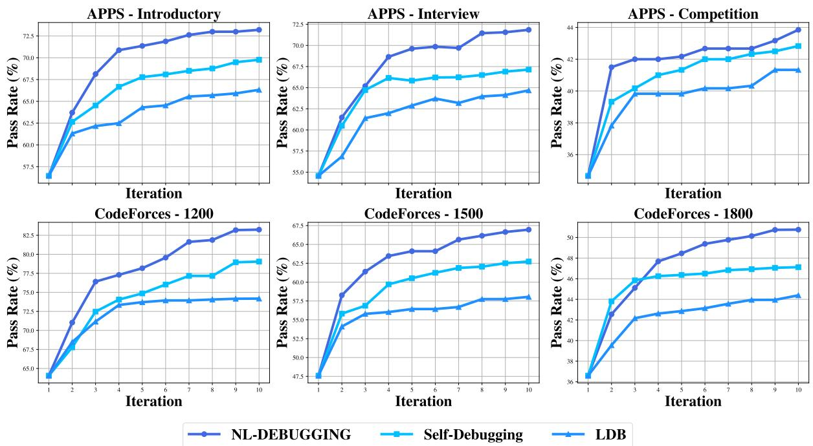  
Figure 5: Pass rate (%) comparison of NL-DEBUGGING and other code debugging methods with more debugging iterations on both datasets.

## Control Flow Depth Difference

Control Flow Depth Difference quantifies the change in the depth of the control flow within the code (Gong et al., 2024). It is calculated as the absolute difference between the original code’s control flow graph (CFG) ’s maximum depth and the CFG of the debugged code. A higher Control Flow Depth Difference suggests that debugging leads to more significant alterations in the code’s control structure.

## BLEU Score

BLEU (Bilingual Evaluation Understudy) Score is a metric used to evaluate the similarity between the original and debugged code (Papineni et al., 2002). It measures the n-gram overlap between the two code snippets, with higher scores indicating greater similarity. In our analysis, a lower BLEU score suggests that NL-DEBUGGING results in more substantial modifications, leading to more flexible and impactful error corrections.

## D More Experimental Results

In this section, we present the complete experimental results comparing the performance of NL-DEBUGGING with two code-level debugging approaches. Figure 5 provides a comprehensive analysis across three difficulty levels on two datasets, illustrating the robustness and consistency of our method.

The experimental findings yield the following conclusions:

• NL-DEBUGGING consistently outperforms codelevel debugging approaches at various iteration stages, demonstrating its robustness and scalability.

• With increasing iterations, NL-DEBUGGING exhibits a sustained improvement in performance, maintaining a consistent lead over competing approaches in both datasets. This highlights its ability to adapt and enhance debugging outcomes over iterative refinements.

## E Case Study

This section presents a case study illustrating the effectiveness of NL-DEBUGGING in addressing logical errors. The case focuses on a buggy code snippet (Figure 6) that fails to prioritize exams by their deadlines, leading to potential scheduling conflicts. Sorting exams according to their deadlines was identified as a key solution. Self-Debugging (Chen et al., 2023), a representative code-level debugging approach, attempts to fix local issues such as marking exam days and allocating preparation time. However, it fails to detect the root cause—the absence of a prioritization mechanism for handling overlapping preparation days among multiple exams. This highlights the limitations of code-level debugging in resolving complex logical errors.

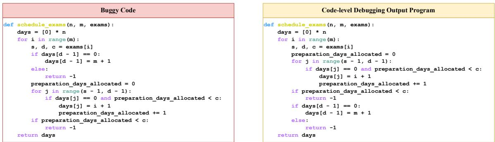

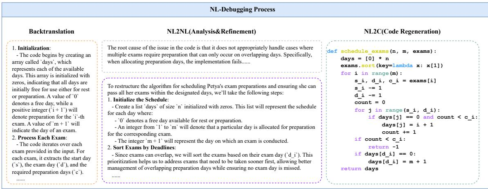  
Figure 6: A case study for NL-DEBUGGING.

In contrast, NL-DEBUGGING adopts a systematic approach. During the Sketch refinement phase, natural language reasoning reveals the missing prioritization logic responsible for scheduling conflicts. By regenerating code based on the corrected sketch and successfully passing test cases, NL-DEBUGGING demonstrates its ability to address deeper logical flaws. This case exemplifies how NL-DEBUGGING surpasses traditional code-level debugging by identifying and resolving fundamental logical inconsistencies often overlooked by conventional methods.

## F More Details on Experimental Settings

To further clarify our experimental setting and methodological scope, this section provides additional context regarding the relationship between debugging and code generation and the distinction between our work and traditional automated pro-

gram repair (APR).

## F.1 Code Debugging vs. Code Generation: Their Connection

Code debugging is a specific step within the broader code generation process. The common paradigm in code generation follows the sequence: problem → seed program → debugged program. Our approach focuses specifically on transforming the seed program into the final program. Both debugging and code generation use the same evaluation metrics: pass rate and pass@1. While the settings for debugging and code generation differ, the key distinction is that debugging starts from a fixed seed program for all methods, where analysis and reasoning are performed to correct the buggy code. The pass rate improvement directly reflects the debugging process’s effectiveness, demonstrating the ability to generate a fixed version of the buggy code.

## F.2 Code Debugging vs. Automatic Program Repair: Their Difference

Automated Program Repair (APR) methods typically focus on repairing well-defined errors, such as syntax or semantic issues, that prevent code from executing correctly. These methods work with curated bug benchmarks, generating patches based on predefined error patterns. APR mainly addresses execution-related faults, such as missing return statements or incorrect variable initialization.

Table 6: Distribution of logical and runtime errors in LLM-generated code across different models.
<table><tr><td>Model</td><td>APPS(Intro.)</td><td>APPS(Inter.)</td><td>APPS(Comp.)</td><td>CodeForce-1200</td><td>CodeForce-1500</td><td>CodeForce-1800</td></tr><tr><td>GPT-4o-mini</td><td>100% Logical / 0% Runtime</td><td>100% Logical / 0% Runtime</td><td>100% Logical / 0% Runtime</td><td>100% Logical / 0% Runtime</td><td>99% Logical / 1% Runtime</td><td>100% Logical / 0% Runtime</td></tr><tr><td>GPT-3.5-turbo</td><td>100% Logical / 0% Runtime</td><td>100% Logical / 0% Runtime</td><td>98% Logical / 2% Runtime</td><td>100% Logical / 0% Runtime</td><td>100% Logical / 0% Runtime</td><td>100% Logical / 0% Runtime</td></tr><tr><td>DeepSeek-Coder-V2-Lite</td><td>100% Logical / 0% Runtime</td><td>100% Logical / 0% Runtime</td><td>99% Logical / 1% Runtime</td><td>100% Logical / 0% Runtime</td><td>99% Logical / 1% Runtime</td><td>100% Logical / 0% Runtime</td></tr></table>

In contrast, our Code Debugging setting targets LLM-generated code, which often contains logical rather than runtime errors. These errors occur when the code logic fails to align with the intended functionality, even if the code is syntactically correct and executes without crashing. As shown in Table 6, LLM-generated code predominantly contains logical errors, with very few runtime errors. This emphasizes our approach’s focus on correcting logical flaws at the natural language level, rather than dealing with execution failures.

## G Prompts

## G.1 Prompts for NL-DEBUGGING

Tables 7, 8, 9, and 10 present prompts that represent the entire framework’s operation process, including steps for backtranslation, execution analysis, refinement, and code regeneration. In this framework, we adopt the Sketch format as the default natural language representation of the program throughout the pipeline.

## G.2 Prompts for Different Types of Natural Language

Tables 11, 12, 13, and 14 define the backtranslation and refinement prompts for key points and pseudocode generation. The corresponding prompts for the Sketch format, which serves as the default representation in our framework, are provided in Appendix G.1.

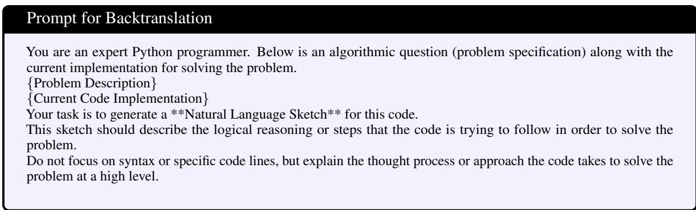  
Table 7: Prompt for Basktranslation.

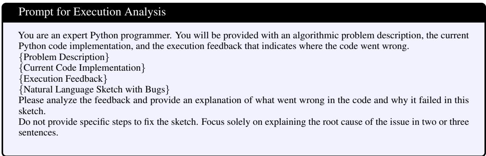  
Table 8: Prompt for Execution Analysis.

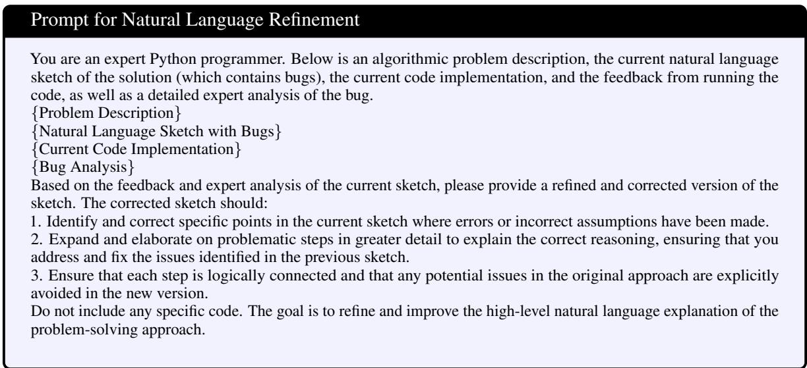

Table 9: Prompt for Natural Language Refinement.  
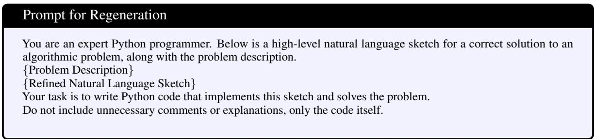  
Table 10: Prompt for Regeneration.

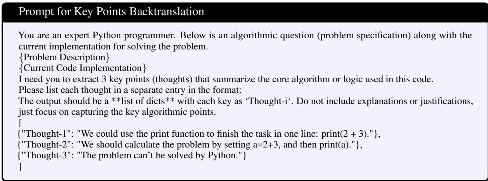  
Table 11: Prompt for Key Points Refinement.

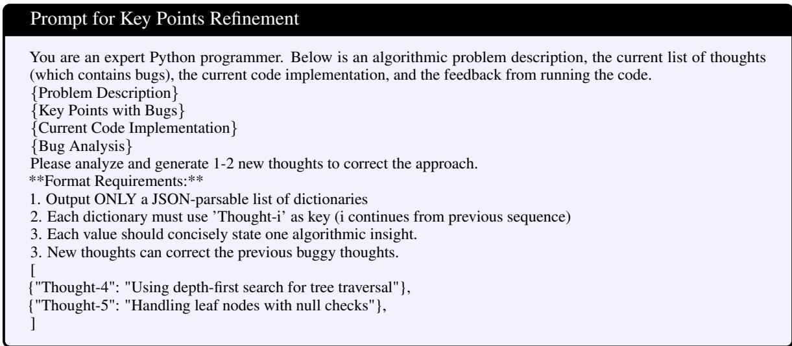

Table 12: Prompt for Key Points Refinement.  
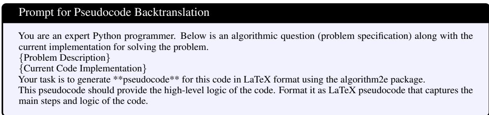

Table 13: Prompt for Pseudocode Backtranslation.  
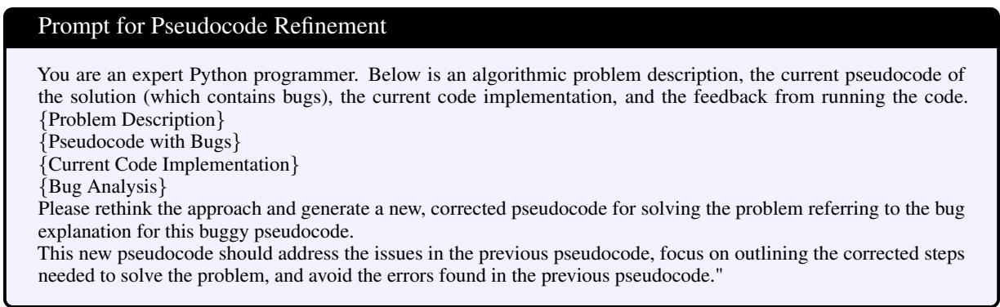  
Table 14: Prompt for Pseudocode Refinement.