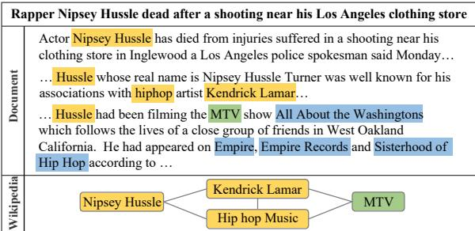
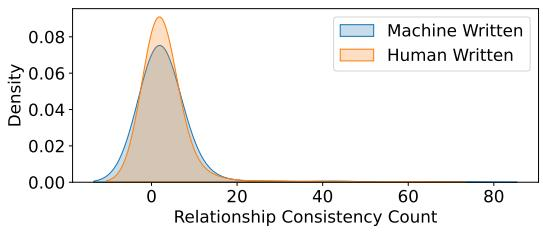
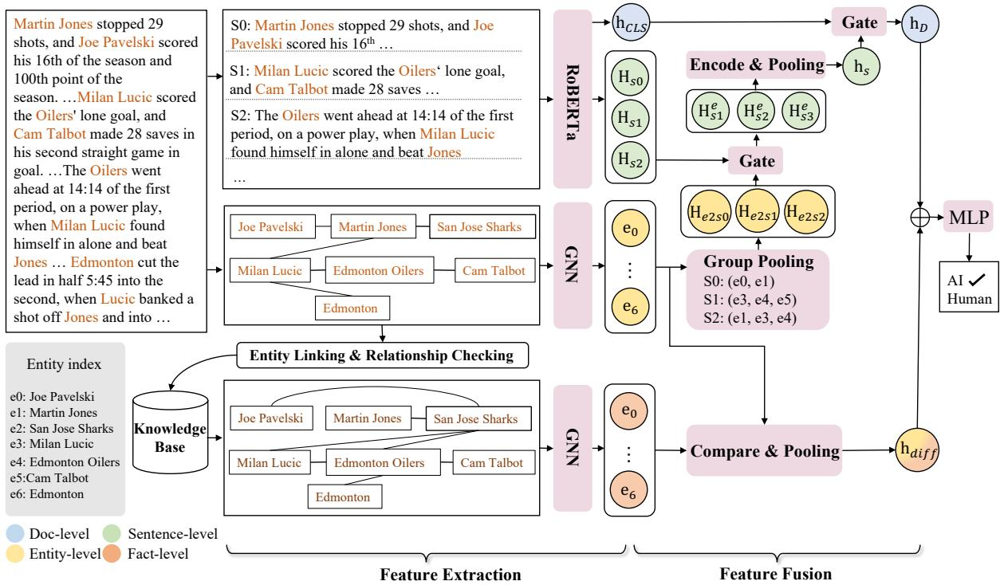
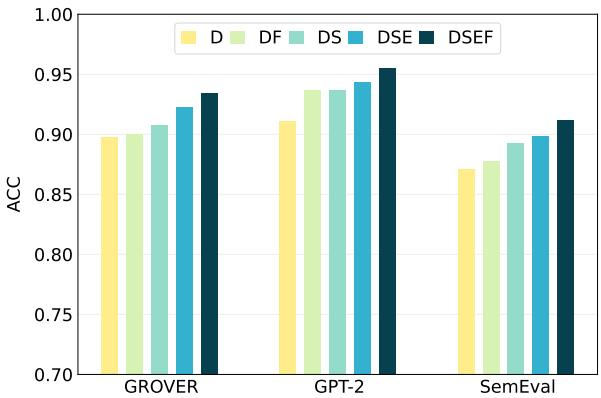
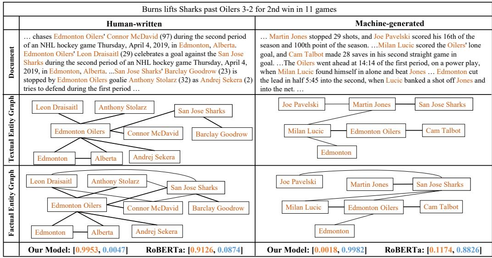
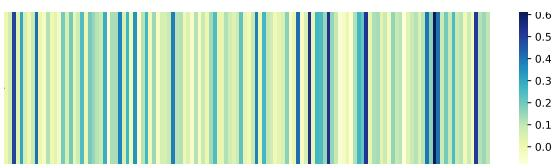
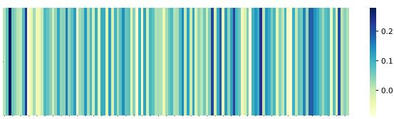

# Non-Existent Relationship: Fact-Aware Multi-Level Machine-Generated Text Detection

Yang Wu1, Ruijia Wang1, Jie Wu1,2\*,

1China Telecom Cloud Computing Research Institute, 2Temple University, {wuy92,wangrj12}@chinatelecom.cn, jiewu@temple.edu

## Abstract

Machine-generated text detection is critical for preventing misuse of large language models (LLMs). Although LLMs have recently excelled at mimicking human writing styles, they still suffer from factual hallucinations manifested as entity-relation inconsistencies with real-world knowledge. Current detection methods inadequately address the authenticity of the entity graph, which is a key discriminative feature for identifying machine-generated content. To bridge this gap, we propose a fact-aware model that assesses discrepancies between textual and factual entity graphs through graph comparison. In order to holistically analyze context information, our approach employs hierarchical feature extraction with gating units, enabling the adaptive fusion of multi-grained features from entity, sentence, and document levels. Experimental results on two public datasets demonstrate that our approach outperforms the state-of-the-art methods. Interpretability analysis shows that our model can capture the differences in entity graphs between machine-generated and human-written texts.

## 1 Introduction

LLMs (Touvron et al., 2023; OpenAI, 2024) have the ability to understand and generate human language, powering applications such as intelligent assistants (Dong et al., 2023), smart customer service (Kolasani, 2023), and machine translation (Wang et al., 2023). However, as LLMgenerated text increasingly mimics human writing, concerns about their misuse have grown, including the creation of fake news (Sun et al., 2024), spam (Roy et al., 2024), and content plagiarism (Dehouche, 2021). Such misuse could exacerbate existing social, political, and security challenges, highlighting the need for effective machinegenerated text detectors to help mitigate potential harm.

  
Figure 1: An example of machine-generated fake news. We can observe that some relationships between entities exist in machine-generated text but not in Wikipedia. Entities highlighted in yellow, green, and blue represent direct, indirect, and no relationships with Hussle in Wikipedia, respectively.

The machine-generated text detection task that we studied is a binary classification task that distinguishes machine-generated text from humanwritten text. Previous research has primarily finetuned Transformer (Vaswani et al., 2017)-based models, such as RoBERTa (Liu, 2019), GPT-2 (Radford et al., 2019), and XLNet (Yang, 2019), to generate a document-level feature representation for classification. Some studies argue that simply fine-tuning these models does not capture text’s fine-grained features. Therefore, they propose to extend the fine-tuning approach by learning entity consistency in the text (Zhong et al., 2020; Liu et al., 2023). They observe that human-written text tends to repeat the same entities across consecutive sentences, while machine-generated text often introduces new entities without revisiting earlier ones. Thus, they build an entity graph based on the co-occurrence of entities to learn this difference. Although these methods perform better than simple fine-tuning, they still face two limitations:

(1) Factuality. As LLMs’ memory capacity increases, this phenomenon of inconsistent contextual entities will be easily improved. Therefore, new strategies need to be found. Human-written texts inherently preserve factual accuracy in entity relationships through verifiable real-world grounding. In contrast, machine-generated texts often suffer from entity-relation distortions, which is an artifact of LLM factuality hallucination that produces semantically plausible but factually ungrounded connections (Rawte et al., 2023; Alkaissi and Mc-Farlane, 2023; Huang et al., 2025). As shown in Figure 1, although the machine-generated text appears coherent, some entities may not have a real-world connection. We analyze 5,000 pairs of human-written and machine-generated news documents with the same title. Figure 2 shows the statistical results for the number of entity relationships that coexist in the documents and Wikipedia. We can see that human-written texts have a higher relationship consistency count. Therefore, one promising approach is to consider whether the relationships between entities in the text correspond to realworld connections, as this could help distinguish between human-written and machine-generated text.

  
Figure 2: Statistical analysis about relationship consistency. The x-axis is the value of the consistency count and the y-axis indicates probability density.

(2) Integrity. Fine-tuned LLMs have input length restrictions, such as RoBERTa-base’s maximum input length of 512 tokens. Existing methods can only capture text and entity information within this limited range, which means that any text exceeding the limit will be discarded. We posit that capturing more textual information will help the model better understand the context and build a more complete entity graph, which in turn aids in identifying machine-generated text.

Based on the aforementioned analysis, we propose a Fact-Aware Multi-Level machine-generated text detection model, FAML. (1) To effectively capture discrepancies between textual and factual entity graph relationships, we propose an entity graph comparison module. The process begins with aligning the nodes in two entity graphs. We compare the differences between the two graphs and obtain the entity comparison features. Notably, the degree of discrepancy in edge relationships is directly linked to the divergence in feature values. (2) To fully harness contextual information, we propose a multilevel architecture encompassing entity, sentence, and document levels. After extracting multi-level features, a learnable gating mechanism dynamically regulates hierarchical information flow, enabling progressive feature fusion from local entity patterns to global document semantics.

The main contributions of this work can be summarized as follows: (1) We are the first to consider real-world entity relations in machine-generated text detection. The observed entity-relation inconsistency emerges as a potential avenue for future exploration since it reflects the factuality hallucination problem in LLMs. (2) Our proposed model achieves machine-generated text detection by factaware entity graph comparison module and hierarchical multi-level fusion architecture, enabling entity relationship consistency verification and comprehensive contextual awareness. (3) Extensive experiments on three public datasets validate the effectiveness of our approach, which outperforms other methods.

## 2 Related Works

## 2.1 Machine-generated Text Detection

Machine-generated text detection has received considerable attention and many methods have been proposed to solve it. These methods can be categorized into watermarking, statistical, and supervised algorithms. Watermarking algorithms add token-level watermarks to machine-generated text for detection (Peng et al., 2023; Kirchenbauer et al., 2023). Statistical algorithms compare the statistical differences between human-written text and machine-generated text in linguistic characteristics, including n-gram frequency (Yang et al., 2023), token log probability (Venkatraman et al., 2023; Mitchell et al., 2023; Shi et al., 2024), and perplexity (Xu and Sheng, 2024).

Most supervised methods fine-tune Transformerbased models and can only extract coarse-grained feature representations of text. Zhong et al. (2020) propose a graph-based model to encode entity consistency information into text representation for classification. On this basis, Liu et al. (2023) utilize contrastive learning to improve model performance in low-resource situations. Jawahar et al. (2022) combine knowledge graphs to identify manipulated human-written texts whose entities were replaced by GPT-2. Our work focuses on detecting machinegenerated text within a supervised learning framework. Unlike existing approaches, our method delves into the relationships between entities within textual and factual entity graphs, leveraging finegrained feature analysis to distinguish between human-written and machine-generated content.

## 2.2 Fact Verification

Fact verification involves determining whether a claim is true or false based on supporting evidence, which may include text (Jiang et al., 2020; Park et al., 2021), tables (Wang et al., 2021), and knowledge graphs (Kim et al., 2023). Vedula and Parthasarathy (2021) integrate the entityrelationship structure of knowledge graphs with retrieved textual content to enhance fact verification. Hu et al. (2021) construct directed heterogeneous graphs comprising topics, sentences, and entities, comparing entity representations with knowledgebased entity representations. Similarly, Zou et al. (2023) build a heterogeneous graph that incorporates claims, entities retrieved from knowledge graphs, and factual texts to support fact verification.

The key difference between our approach and fact verification methods is the nature of the task. Rather than assessing the truthfulness of machinegenerated or human-written text, our method focuses on verifying whether the entity relationships described in the text align with those in the knowledge graph. In contrast, fact verification methods primarily emphasize extracting entity feature representations from the knowledge graph, paying less attention to the relationships between entities in the claim.

## 3 Methodology

This section provides a detailed explanation of our proposed approach. As illustrated in Figure 3, our method, FAML, comprises two main modules: feature extraction and feature fusion. Given a document, we first perform multi-level feature extraction: At the document and sentence levels, we use RoBERTa to extract initial representations. At the entity and fact levels, we construct a textual entity graph and further obtain a factual entity graph through entity linking and relationship checking. Entity features are extracted from both graphs using graph neural networks. Next, we learn the differences between textual and factual entity features via a comparison network, hierarchically fuse multi-level features using gating units, and concatenate the two feature sets for classification.

## 3.1 Feature Extraction

3.1.1 Document and Sentence Representations Pre-trained LLMs have excellent text understanding and representation capabilities. Thus, given a document $x = [ s _ { 1 } , s _ { 2 } , . . . , s _ { n } ]$ , where $s _ { i }$ indicates i-th sentence, n is the number of sentences, we employ pre-trained RoBERTa to extract the document initial representation $\mathbf { h } _ { C L S } \in \mathbb { R } ^ { d }$ and the sentence initial representation matrix $\mathbf { H } _ { s } ^ { i n i } \in \mathbb { R } ^ { n \times d }$

## 3.1.2 Graph Construction

Next, we seek to analyze the edge differences between the entity graph of the given document and the corresponding entity graph from the knowledge base. The steps to construct textual and factual graphs are as follows: (1) We employ a named entity recognition and relation extraction model, REBEL (Cabot and Navigli, 2021), to parse entities and their relationships in the document. Taking the document as input, we get a set of relation triplets < subject, relation, object > from REBEL and construct a textual entity graph. Each entity is regarded as a node in the graph, and there is an edge between two nodes with a relationship. (2) To verify the existence of entities in the knowledge base, we use the entity linking tool TAGME1 to map entities to Wikipedia and remove any entities from the textual entity graph that fail to establish a link. (3) We construct a factual entity graph using the nodes that are successfully linked. For these entities, we query Wikipedia to determine if a relationship exists between them. If a relationship is found, an edge is added between the corresponding entity nodes in the factual entity graph.

To distinguish the textual entity graph from the factual entity graph, we define the textual graph as $\mathcal { G } _ { t } ~ = ~ \langle \mathcal { V } _ { t } , \mathcal { E } _ { t } \rangle$ and the factual graph as $\mathcal { G } _ { f } ~ =$ $\langle \mathcal { V } _ { f } , \mathcal { E } _ { f } \rangle$ , where $\nu _ { t }$ and $\mathcal { V } _ { f }$ are the same set of entity nodes, $\mathcal { E } _ { t }$ and $\mathcal { E } _ { f }$ are corresponding sets of edges.

## 3.1.3 Entity Representation

Graph Convolutional Neural Networks (GCNs) (Kipf and Welling, 2016) are capable of capturing and integrating information from neighboring nodes into node features, facilitating the learning of global representations. After constructing the textual and factual entity graphs, we employ multi-layer GCNs to extract node feature representations from both graphs. The node representations are initialized using pre-trained Word2Vec vectors trained on a subset of the Google News dataset2. If an entity node consists of a span of words, we calculate the average of the vectors for these words to serve as the entity’s initial embedding. Thus, initial feature matrices of entities are denoted as $\textbf { H } \in \ \mathbb { R } ^ { m \times d }$ , where m denotes the number of nodes, and d is the dimension. For convenience of representation, we remove t in the following calculation process of the textual entity graph.

  
Figure 3: The overview of our proposed model FAML.

Given $\mathcal { G } = \langle \nu , \mathcal { E } \rangle$ , we transform the edge set $\mathcal { E }$ to an adjacency matrix $\mathbf { A } \in \mathbb { R } ^ { m \times m }$ , where ${ \bf A } _ { i j } =$ 1 if an edge exists between two nodes. Then, entity representations are updated by two-layer GCNs. The calculations are as follows:

$$
\mathbf { H } _ { 1 } = \sigma ( \hat { \mathbf { A } } \mathbf { H } \mathbf { W } _ { 1 } )
$$

$$
\begin{array} { r } { \mathbf { H } _ { 2 } = \sigma ( \hat { \mathbf { A } } \mathbf { H } _ { 1 } \mathbf { W } _ { 2 } ) } \end{array}\tag{1}
$$

(2)

where $\hat { \bf A } = \tilde { \bf D } ^ { - \frac { 1 } { 2 } } \tilde { \bf A } \tilde { \bf D } ^ { - \frac { 1 } { 2 } }$ is the normalized symmetric weight matrix $( \tilde { \textbf { A } } = \textbf { A } + \textbf { I } _ { m } , \tilde { \textbf { D } } _ { i i } \ =$ $\begin{array} { r } { \sum _ { j } \tilde { \mathbf { A } } _ { i j } } \end{array}$ , where ${ \mathbf I } _ { m }$ is the identity matrix). $\mathbf { H } _ { 1 } \in$ $\mathbb { R } ^ { m \times d }$ and $\mathbf { H } _ { 2 } \in \mathbb { R } ^ { m \times d }$ are the hidden feature matrices of all nodes in the first and second layer, respectively. $\mathbf { W } _ { 1 }$ and $\mathbf { W } _ { 2 }$ are layer-specific trainable weight matrices. σ is an activation function, e.g., the GELU function.

For the factual entity graph, the calculation of two-layer GCNs is similar to Equation 1 and Equation 2. Finally, we obtain textual entity representation $\mathbf { H } _ { t } \in \mathbb { R } ^ { m \times d }$ and factual entity representation $\mathbf { H } _ { f } \in \mathbb { R } ^ { m \times d }$

## 3.2 Feature Fusion

After acquiring features from the fact, entity, sentence, and document layers, we need to integrate them to create a more comprehensive representation effectively. On the one hand, we derive factaware entity difference features by comparing the fact layer’s features with those of the entity layer. On the other hand, coarse-grained features provide a global perspective but lack detail, while finegrained features concentrate on specific elements. Therefore, when considering the full-text data, we utilize a multi-level feature fusion module to enhance the strengths of the multi-granular features across the entity, sentence, and document layers.

## 3.2.1 Entity Comparison

Based on our previous analysis, human-written texts generally maintain factual accuracy, while machine-generated texts often present non-existent relationships between entities due to hallucination issues. Consequently, even though the entity nodes of $\mathcal { G } _ { t }$ and $\mathcal { G } _ { f }$ are the same and share the same initial embeddings, the final representations, $\mathbf { H } _ { t }$ and $\mathbf { H } _ { f }$ will differ due to the varying edge relationships. We believe that fact-aware differences in entity representation are more apparent in machine-generated texts than in human-written ones. Therefore, we employ a comparison function to evaluate the discrepancies between entity pairs.

$$
\mathbf { H } _ { d i f f } = ( \mathbf { H } _ { t } - \mathbf { H } _ { f } ) \mathbf { W } _ { d i f f }\tag{3}
$$

$$
{ \bf h } _ { d i f f } = m a x p o o l i n g ( { \bf H } _ { d i f f } )\tag{4}
$$

where ${ \bf W } _ { d i f f }$ is a transformation matrix. $\mathbf { h } _ { d i f f } \in$ $\mathbb { R } ^ { d }$ is the comparison feature representation across all entities.

## 3.2.2 Entity-to-Sentence Fusion

The first step in fusing entity-to-sentence features is to apply average pooling to the entity features within each sentence. We use average pooling for two main reasons: (1) Each sentence contains only a few entities, so average pooling helps retain more comprehensive entity information; (2) Compared to maximum pooling, which requires extracting entity features from each sentence for separate calculations, average pooling can be processed in parallel. The group average pooling calculation proceeds as follows:

$$
\mathbf { H } _ { e 2 s } = \frac { \mathbf { A } ^ { e 2 s } \mathbf { H } _ { t } } { \epsilon + \sum _ { j = 1 } ^ { m } \mathbf { A } _ { : , j } ^ { e 2 s } }\tag{5}
$$

where $\mathbf { H } _ { e 2 s } \in \mathbb { R } ^ { n \times d } ,$ each row in $\mathbf { H } _ { e 2 s }$ s represents the entity pooling feature corresponding to a sentence, $\mathbf { A } ^ { \bar { e } 2 \bar { s } } \in \mathbb { R } ^ { n \times m }$ is an adjacency matrix, $\mathbf { A } _ { i j } ^ { e 2 s } \ = \ 1$ denotes i-th sentence has j-th entity. $\Sigma _ { j = 1 } ^ { m } \mathbf { A } _ { : , j } ^ { e 2 s }$ denotes to sum each row of the matrix, and ϵ is a small non-zero number to prevent the denominator from being zero.

Next, we utilize a gating unit to fuse the entity feature corresponding to each sentence with its initial feature.

$$
\mathbf { g } _ { s } = s i g m o i d ( [ \mathbf { H } _ { e 2 s } ; \mathbf { H } _ { s } ^ { i n i } \mathbf { W } _ { s } ] \mathbf { W } _ { g _ { s } } )\tag{6}
$$

$$
\mathbf { H } _ { s } ^ { e } = \mathbf { g } _ { s } \odot \mathbf { H } _ { e 2 s } + \left( 1 - \mathbf { g } _ { s } \right) \odot \mathbf { H } _ { s } ^ { i n i }\tag{7}
$$

where ${ \mathbf W _ { s } }$ and $\mathbf { W } _ { g _ { s } }$ are weight matrices, denotes Hadamard product, sigmoid is utilized to control the value of each element in [0,1].

## 3.2.3 Sentence-to-Document Fusion

We treat the sentences in the document as nodes and construct a fully connected graph. After enriching the sentence representation with entity features, we update the representations of all sentences using a Transformer encoder. This encoder preserves the order of the sentences while learning global sentence representations. It consists of a multi-headed self-attention mechanism and a fully connected feed-forward network. For the i-th head, the selfattention calculation process is as follows:

$$
\mathbf { H } _ { i } ^ { s } = s o f t m a x ( \frac { ( \mathbf { H } _ { s } ^ { e } \mathbf { W } _ { i } ^ { Q } ) ( \mathbf { H } _ { s } ^ { e } \mathbf { W } _ { i } ^ { K } ) ^ { \mathsf { T } } } { \sqrt { d ^ { \prime } } } ) ( \mathbf { H } _ { s } ^ { e } \mathbf { W } _ { i } ^ { V } )\tag{8}
$$

where $\mathbf { W } _ { i } ^ { Q } , \mathbf { W } _ { i } ^ { K }$ , and $\mathbf { W } _ { i } ^ { V }$ are weight matrices for the i-th head, $d ^ { \prime } = d / h$ is the dimensionality of each head feature representation, h is the number of heads. Multi-headed features are concatenated as $\mathbf { H } _ { s } ^ { \prime } = \mathbf { H } _ { s } ^ { e } + [ \mathbf { H } _ { 1 } ^ { s } ; \mathbf { H } _ { 2 } ^ { s } ; . . . ; \mathbf { H } _ { h } ^ { s } ] \mathbf { W } ^ { O }$ , where $\mathbf { W } ^ { O }$ is a weight matrix to be learned.

The fully connected feed-forward network consists of two linear transformations with a non-linear activation function in between, that is $F F N ( \mathbf { x } ) =$ $\sigma ( \mathbf { x W } _ { 1 } ) \mathbf { W } _ { 2 }$ , where $\sigma$ is ReLU function. Both the two blocks use a residual connection followed by a normalization layer:

$$
\mathbf { H } _ { s } ^ { a t t } = n o r m ( F F N ( n o r m ( \mathbf { H } _ { s } ^ { \prime } ) ) + n o r m ( \mathbf { H } _ { s } ^ { \prime } ) )\tag{9}
$$

$$
\mathbf { h } _ { S } = m a x p o o l i n g ( \mathbf { H } _ { s } ^ { a t t } )\tag{10}
$$

where $\mathbf { h } _ { S }$ indicates the updated sentence-level representation.

Then, we utilize another gating unit to fuse sentence and document features.

$$
\mathbf { g } _ { d } = s i g m o i d ( [ \mathbf { h } _ { S } ; \mathbf { h } _ { C L S } \mathbf { W } _ { d } ] \mathbf { W } _ { g _ { d } } )\tag{11}
$$

$$
\mathbf { h } _ { D } = \mathbf { g } _ { d } \odot \mathbf { h } _ { S } + \left( 1 - \mathbf { g } _ { d } \right) \odot \mathbf { h } _ { C L S }\tag{12}
$$

where $\mathbf { W } _ { d }$ and $\mathbf { W } _ { g _ { d } }$ are learnable weight matrices. $\mathbf { h } _ { D }$ is the undated document representation that fused multi-level features.

## 3.2.4 Prediction and Model Learning

Finally, we concatenate $\mathbf { h } _ { D }$ and the entity comparison vector $\mathbf { h } _ { d i f f }$ to make prediction:

$$
\hat { y } = s o f t m a x \left( \sigma ( [ \mathbf { h } _ { D } ; \mathbf { h } _ { d i f f } ] W _ { l _ { 1 } } ) W _ { l _ { 2 } } \right)\tag{13}
$$

where $\mathbf { W } _ { l _ { 1 } }$ and $\mathbf { W } _ { l _ { 2 } }$ are parameters of classification layer, σ is ReLU function. The loss function is devised to minimize the cross-entropy value:

$$
\mathcal { L } = - y \log { ( \hat { y } ) } - ( 1 - y ) \log { ( 1 - \hat { y } ) }\tag{14}
$$

where y is the ground truth, with 1 representing machine-generated text and 0 representing humanwritten text.

## 4 Experiments

## 4.1 Datasets

To evaluate the effectiveness of the proposed approach, FAML, we conduct experiments on two public datasets. The GROVER dataset is a newsstyle dataset (Zellers et al., 2019). It includes human-written texts sourced from RealNews, a large corpus of news articles compiled from Common Crawl. The machine-generated texts, on the other hand, are produced by Grover-Mega, a powerful Transformer-based model. The GPT-2 dataset, introduced by OpenAI3, follows a WebText-style format. Human-written texts are sourced from Web-Text, while machine-generated texts are created using GPT-2 XLM-1542M (Radford et al., 2019), which is trained on a corpus gathered from popular web pages. The SemEval dataset (Wang et al., 2024) is used for machine-generated text detection in subtask A. The machine-generated text models include davinci-003, ChatGPT, Cohere, Dolly-v2, BLOOMz, and GPT-4. In the training set, validation set, and test set, we randomly sampled 500 texts generated by each model in each source from the original datasets.

The statistics of the three datasets are presented in Table 3 and Table 4 in Appendix A. HWT and MGT refer to human-written and machinegenerated texts, respectively.

## 4.2 Baselines

To validate the effectiveness of our approach, we choose three categories of baseline models: statistics-based, knowledge-based, and Transformer-based models, which are listed as follows: (1) GLTR (Gehrmann et al., 2019) is a statistical model that analyzes the top-k tokens based on their rankings in the predicted probability distributions generated by GPT-2 medium. (2) DetectGPT (Mitchell et al., 2023) is a statistical method that leverages the difference in a model’s log probabilities before and after text perturbations. (3) CompareNet (Hu et al., 2021) is a knowledge-based model for fake news detection that constructs a directed topic-sentence-entity graph and evaluates news articles against a knowledge base. (4) XLNet (Yang, 2019), GPT-2 (Radford et al., 2019) and RoBERTa (Liu, 2019) are pre-trained Transformer-based models fine-tuned on the two datasets. (5) FAST (Zhong et al.,

<table><tr><td rowspan="2">Method</td><td colspan="2">GROVER</td><td colspan="2">GPT-2</td><td colspan="2">SemEval</td></tr><tr><td>ACC</td><td>F1</td><td>ACC</td><td>F1</td><td>ACC</td><td>F1</td></tr><tr><td>GLTR</td><td>0.6040</td><td>0.5182</td><td>0.7784</td><td>0.7691</td><td>0.83</td><td>0.83</td></tr><tr><td>DetectGPT</td><td>0.6142</td><td>0.5018</td><td>0.7939</td><td>0.7002</td><td>0.8491</td><td>0.8460</td></tr><tr><td>CompareNet</td><td>0.5851</td><td>0.5306</td><td>0.6112</td><td>0.6103</td><td>0.7056</td><td>0.7042</td></tr><tr><td>XLNet</td><td>0.8156</td><td>0.7493</td><td>0.9091</td><td>0.9027</td><td>0.8451</td><td>0.8429</td></tr><tr><td>GPT-2</td><td>0.8274</td><td>0.8003</td><td>0.8913</td><td>0.8839</td><td>0.8743</td><td>0.8731</td></tr><tr><td>RoBERTa</td><td>0.8970</td><td>0.8963</td><td>0.9110</td><td>0.9104</td><td>0.871</td><td>0.8708</td></tr><tr><td>FAST</td><td>0.9270</td><td>0.9108</td><td>0.9357</td><td>0.9222</td><td>0.8767</td><td>0.8648</td></tr><tr><td>COCO</td><td>0.9275</td><td>0.9110</td><td>0.9418</td><td>0.9307</td><td>0.8893</td><td>0.8893</td></tr><tr><td>USTC-BUPT</td><td>0.6666</td><td>0.4</td><td>0.5</td><td>0.3333</td><td>0.8376</td><td>0.8334</td></tr><tr><td>FAML(ours)</td><td>0.9340</td><td>0.9339</td><td>0.9551</td><td>0.9550</td><td>0.9116</td><td>0.9116</td></tr></table>

Table 1: Performance on the test set of three datasets.

2020) is a Transformer-based model that combines RoBERTa with GCNs. FAST establishes connections between entity node pairs within and across sentences to capture co-occurrence patterns. (6) COCO (Liu et al., 2023) is an enhanced version of FAST, incorporating contrastive loss to bolster the model’s robustness in low-resource environments. (7) USTC-BUPT (Guo et al., 2024) is the second-ranked model from the competition on SemEval dataset, which is a fine-tuned RoBERTa model with category loss and domain classification loss. The implementation details of our approach and baselines are in Appendix B and Appendix C, respectively.

## 4.3 Performance Comparison

Table 1 presents the results of the baselines and our proposed model on three datasets. We observe that the proposed FAML outperforms all the baselines across all metrics in three datasets.

There are numerous similar trends in the three datasets. Transformer-based methods generally outperform statistics-based and knowledge-based methods. Statistical methods focus on limited, overly compressed features and depend on pretrained token probabilities without fine-tuning the entire model. In contrast, Transformer-based methods show significant improvements as training data increases, while statistical methods exhibit minimal gains. Although CompareNet effectively captures entity consistency between text content and the knowledge base, its text features are encoded using LSTM, which tends to underperform in comparison to Transformer models. This limitation may affect CompareNet’s overall performance.

Compared to pure fine-tuning of LLMs such as XLNet, GPT-2, and RoBERTa, models like FAST, COCO, and FAML demonstrate superior detection performance through the fine-tuning paradigm. This enhancement occurs because pure fine-tuning of LLMs mainly captures coarsegrained features, while FAST, COCO, and FAML refine this paradigm by incorporating fine-grained feature extraction. This added layer of granularity significantly enriches the detection features, which boosts overall performance. USTC-BUPT performs differently across the three datasets. On the GROVER and GPT-2 datasets, USTC-BUPT makes significant prediction errors. It performs adequately on the SemEval dataset, but still falls short compared to the pure fine-tuning RoBERTa. We analyze the reason for this phenomenon, noting that the domain classification loss designed by the author (0 for the training set and 1 for the validation set) is more beneficial for addressing the out-ofdistribution issues of the training and validation sets (that is, the SemEval dataset). In contrast, this domain loss may hinder the model’s training effectiveness for independent and identically distributed datasets.

FAST and COCO emphasize the connections between entities within and across sentences but overlook the authenticity of entity relationships. FAML surpasses FAST and COCO, demonstrating that analyzing machine-generated text characteristics from the perspective of entity relationships is an effective approach.

## 4.4 Ablation Analysis

To evaluate the effectiveness of each component of our FAML model, we conduct the ablation study by removing each component from the entire model. (1) FAML(document, D) is our backbone model, focusing solely on document-level features extracted from RoBERTa. (2) FAML(document+diff, DF) concatenates document-level and entity comparison features, where entity-level and sentence-level features are not fused. (3) FAML(document+sentence, DS) calculates a global representation by fusing document-level and sentence-level features without accounting for entity information. (4) FAML(document+sentence+entity, DSE) is our FAML model without entity comparison feature. (5) FAML(document+sentence+entity+diff, DSEF) is the complete model presented in this paper.

As shown in Figure 4, each component of FAML contributes to improving the model’s overall performance. The addition of entity comparison features enhances the performance of both D and DSE on three datasets, highlighting the benefit of incorporating factual information in detecting machinegenerated text. Furthermore, integrating entitylevel and sentence-level features leads to further improvements, demonstrating that fusing multi-level fine-grained features is more effective than relying solely on coarse-grained document features. The results details are in Appendix D.

Figure 4: Ablation study of FAML on three datasets in terms of binary classification accuracy.
<table><tr><td rowspan="2">Fusion Units</td><td colspan="2">GROVER</td><td colspan="2">GPT-2</td><td colspan="2">SemEval</td></tr><tr><td>ACC</td><td>F1</td><td>ACC</td><td>F1</td><td>ACC</td><td>F1</td></tr><tr><td>Gating</td><td>0.9340</td><td>0.9339</td><td>0.9551</td><td>0.9550</td><td>0.9116</td><td>0.9116</td></tr><tr><td>Concatenation</td><td>0.8670</td><td>0.8668</td><td>0.9412</td><td>0.9411</td><td>0.8563</td><td>0.8541</td></tr><tr><td>Add&amp;Norm</td><td>0.9176</td><td>0.9174</td><td>0.9320</td><td>0.9318</td><td>0.8898</td><td>0.8897</td></tr></table>

Table 2: Performance of FAML w.r.t different fusion units.

## 4.5 Different Fusion Units

In this section, we compare the effects of various feature fusion units on model performance. Table 2 presents the results of comparing the gating unit, concatenation method, and Add&Norm. Gating units are utilized in our method (Equations 6, 7, 11, 12), with the information flow of features regulated by calculating gating coefficients. The concatenation method involves replacing the gating unit by concatenating two features (represented as [; ] in Equation 6). Add&Norm consists of adding the two features and subsequently applying layer normalization (see Equation 9). The design of our gating unit yields the best performance for the model. Compared to the direct concatenation and Add&Norm methods, our gating unit acquires adaptive gating coefficients through learning, effectively managing the fusion process between coarse and fine granular features.

## 4.6 Case Studies

As shown in Figure 5, we conduct a case study by presenting an example from the GROVER test set that compares human-written news with machinegenerated news sharing the same title. Our model correctly predicted the labels of both documents. We can observe that although the contents of the machine-generated news appear coherent, some entity relationships are absent in the knowledge base. In contrast, the textual entity graph of the human-written news is a subgraph of the factual entity graph. Some relationships are not mentioned in the human-written news but exist in the knowledge base. Therefore, the entity features derived from the textual and factual entity graphs in human-written news will differ, but the difference is smaller than that found in machine-generated text. We visualize the entity comparison features ${ \bf h } _ { d i f f }$ of the two news articles learned by our model in Figure 6. The entity comparison feature in human-written news has more zero values, indicating that the difference between its textual and factual entity feature is small. Conversely, the feature values for machine-generated news are larger. This finding aligns with the analysis presented in Figure 5. These observations demonstrate that our model can effectively distinguish between humanwritten and machine-generated text.

  
Figure 5: A case study of our approach. Continuous words in orange indicate entity nodes extracted by REBEL and can be linked to the knowledge base. Bold black lines indicate edges that exist in both the text entity graph and the fact entity graph. Numbers in orange and blue indicate the predicted probabilities for the human-written text and the machine-generated text, respectively.

  
1 1 1 1(a) Human-written news

  
1 1 1 1 1 1(b) Machine-generated news  
Figure 6: Entity comparison features $\mathbf { h } _ { d i f f }$ of humanwritten news and machine-generated news. The x-axis is the dimension of the feature vector.

## 5 Conclusions

In this paper, we introduce FAML, a novel factaware neural network designed to detect machinegenerated text by leveraging multi-level features. We investigate the distinctions between machinegenerated and human-written text, with a particular focus on the presence of entity relationships. We first extract fact-level, entity-level, sentencelevel, and document-level features using GCNs, Transformer encoders, and the RoBERTa model. These features are then fused, progressing from fine-grained to coarse-grained representations. Entity comparison features are incorporated further to enhance the document representation for the final prediction. Experimental results demonstrate that the components of our model collectively contribute to performance improvements, with the full model achieving substantial superiority over stateof-the-art baselines across three datasets.

## Limitations

In this work, we investigate if adopting a factual perspective can enhance the accuracy of identify ing machine-generated text. However, some limitations remain in the application of this work. First, the quality of the extracted entities and relationships in the textual entity graph is limited by the performance of the entity relationship extraction model. There are instances where the extraction of entities and relations is incomplete or inaccurate, preventing the entity graph produced by the model from fully representing the entity relationship characteristics of the text. Incorrect entities and relations can disrupt the model’s learning pro cess, so exploring more robust models in the future may help address this issue. Second, since the Wikipedia API limits request frequency and concurrent connections, a DBpedia knowledge base containing Wikipedia data needs to be built locally during training. This knowledge base contains lim ited information, which may result in incomplete queries for the factual entity graph. Entity linking can also lead to incomplete entity mappings. However, appropriate incomplete queries may enhance the model’s generalization performance. In the future, we can explore improved methods for utiliz ing knowledge bases to aid decision-making. Third, our method is limited to detecting hallucinations of inconsistent entity relations while excluding other hallucinations, such as logical inconsistencies or factual errors unrelated to entities. Forth, as research into knowledge graph-assisted training and reasoning for large language models continues, the problem of factuality hallucination might gradually diminish. This may reduce the effectiveness of the fact-awareness strategy we propose. As large language models evolve, this process will require continuous adjustments to our strategy to keep pace with new developments.

## References

Hussam Alkaissi and Samy I McFarlane. 2023. Artificial hallucinations in chatgpt: implications in scientific writing. Cureus, 15(2).

Pere-Lluís Huguet Cabot and Roberto Navigli. 2021. Rebel: Relation extraction by end-to-end language generation. In Findings of the Association for Computational Linguistics: EMNLP 2021, pages 2370– 2381.

Nassim Dehouche. 2021. Plagiarism in the age of massive generative pre-trained transformers (gpt-3).

Ethics in Science and Environmental Politics, 21:17– 23.

Xin Luna Dong, Seungwhan Moon, Yifan Ethan Xu, Kshitiz Malik, and Zhou Yu. 2023. Towards nextgeneration intelligent assistants leveraging llm techniques. In Proceedings of the 29th ACM SIGKDD Conference on Knowledge Discovery and Data Mining, pages 5792–5793.

Sebastian Gehrmann, Hendrik Strobelt, and Alexander M Rush. 2019. Gltr: Statistical detection and visualization of generated text. arXiv preprint arXiv:1906.04043.

Biyang Guo, Xin Zhang, Ziyuan Wang, Minqi Jiang, Jinran Nie, Yuxuan Ding, Jianwei Yue, and Yupeng Wu. 2023. How close is chatgpt to human experts? comparison corpus, evaluation, and detection. Preprint, arXiv:2301.07597.

Zikang Guo, Kaijie Jiao, Xingyu Yao, Yuning Wan, Haoran Li, Benfeng Xu, Licheng Zhang, Quan Wang, Yongdong Zhang, and Zhendong Mao. 2024. USTC-BUPT at SemEval-2024 task 8: Enhancing machinegenerated text detection via domain adversarial neural networks and LLM embeddings. In Proceedings of the 18th International Workshop on Semantic Evaluation (SemEval-2024), pages 1511–1522, Mexico City, Mexico. Association for Computational Linguistics.

Linmei Hu, Tianchi Yang, Luhao Zhang, Wanjun Zhong, Duyu Tang, Chuan Shi, Nan Duan, and Ming Zhou. 2021. Compare to the knowledge: Graph neural fake news detection with external knowledge. In Proceedings ofthe 59th Annual Meeting ofthe Associationfor Computational Linguistics and the 11th International Joint Conference on Natural Language Processing (Volume 1: Long Papers), pages 754–763.

Lei Huang, Weijiang Yu, Weitao Ma, Weihong Zhong, Zhangyin Feng, Haotian Wang, Qianglong Chen, Weihua Peng, Xiaocheng Feng, Bing Qin, and Ting Liu. 2025. A survey on hallucination in large language models: Principles, taxonomy, challenges, and open questions. ACM Transactions on Information Systems, 43(2):1–55.

Ganesh Jawahar, Muhammad Abdul-Mageed, and Laks VS Lakshmanan. 2022. Automatic detection of entity-manipulated text using factual knowledge. arXiv preprint arXiv:2203.10343.

Yichen Jiang, Shikha Bordia, Zheng Zhong, Charles Dognin, Maneesh Singh, and Mohit Bansal. 2020. Hover: A dataset for many-hop fact extraction and claim verification. arXiv preprint arXiv:2011.03088.

Jiho Kim, Sungjin Park, Yeonsu Kwon, Yohan Jo, James Thorne, and Edward Choi. 2023. Factkg: Fact verification via reasoning on knowledge graphs. arXiv preprint arXiv:2305.06590.

Thomas N Kipf and Max Welling. 2016. Semisupervised classification with graph convolutional networks. arXiv preprint arXiv:1609.02907.

John Kirchenbauer, Jonas Geiping, Yuxin Wen, Jonathan Katz, Ian Miers, and Tom Goldstein. 2023. A watermark for large language models. In International Conference on Machine Learning, pages 17061–17084. PMLR.

Saydulu Kolasani. 2023. Optimizing natural language processing, large language models (llms) for efficient customer service, and hyper-personalization to enable sustainable growth and revenue. Transactions on Latest Trends in Artificial Intelligence, 4(4).

Xiaoming Liu, Zhaohan Zhang, Yichen Wang, Hang Pu, Yu Lan, and Chao Shen. 2023. Coco: Coherenceenhanced machine-generated text detection under low resource with contrastive learning. In Proceedings of the 2023 Conference on Empirical Methods in Natural Language Processing, pages 16167–16188.

Yinhan Liu. 2019. Roberta: A robustly optimized bert pretraining approach. arXiv preprint arXiv:1907.11692, 364.

I Loshchilov. 2017. Decoupled weight decay regularization. arXiv preprint arXiv:1711.05101.

Eric Mitchell, Yoonho Lee, Alexander Khazatsky, Christopher D Manning, and Chelsea Finn. 2023. Detectgpt: Zero-shot machine-generated text detection using probability curvature. In International Conference on Machine Learning, pages 24950–24962. PMLR.

OpenAI. 2024. Gpt-4 technical report. Preprint, arXiv:2303.08774.

Jungsoo Park, Sewon Min, Jaewoo Kang, Luke Zettlemoyer, and Hannaneh Hajishirzi. 2021. Faviq: Fact verification from information-seeking questions. arXiv preprint arXiv:2107.02153.

Wenjun Peng, Jingwei Yi, Fangzhao Wu, Shangxi Wu, Bin Zhu, Lingjuan Lyu, Binxing Jiao, Tong Xu, Guangzhong Sun, and Xing Xie. 2023. Are you copying my model? protecting the copyright of large language models for eaas via backdoor watermark. arXiv preprint arXiv:2305.10036.

Alec Radford, Jeffrey Wu, Rewon Child, David Luan, Dario Amodei, Ilya Sutskever, et al. 2019. Language models are unsupervised multitask learners. OpenAI blog, 1(8):9.

Vipula Rawte, Amit Sheth, and Amitava Das. 2023. A survey of hallucination in large foundation models. arXiv preprint arXiv:2309.05922.

Sayak Saha Roy, Poojitha Thota, Krishna Vamsi Naragam, and Shirin Nilizadeh. 2024. From chatbots to phishbots?: Phishing scam generation in commercial large language models. In 2024 IEEE Symposium on Security and Privacy (SP), pages 221–221. IEEE Computer Society.

Yuhui Shi, Qiang Sheng, Juan Cao, Hao Mi, Beizhe Hu, and Danding Wang. 2024. Ten words only still help: Improving black-box ai-generated text detection via proxy-guided efficient re-sampling. arXiv preprint arXiv:2402.09199.

Yanshen Sun, Jianfeng He, Limeng Cui, Shuo Lei, and Chang-Tien Lu. 2024. Exploring the deceptive power of llm-generated fake news: A study of real-world detection challenges. arXiv preprint arXiv:2403.18249.

Hugo Touvron, Louis Martin, Kevin Stone, Peter Albert, Amjad Almahairi, Yasmine Babaei, Nikolay Bashlykov, Soumya Batra, Prajjwal Bhargava, Shruti Bhosale, et al. 2023. Llama 2: Open foundation and fine-tuned chat models. arXiv preprint arXiv:2307.09288.

Ashish Vaswani, Noam Shazeer, Niki Parmar, Jakob Uszkoreit, Llion Jones, Aidan N Gomez, Ł ukasz Kaiser, and Illia Polosukhin. 2017. Attention is all you need. In Advances in Neural Information Processing Systems, volume 30. Curran Associates, Inc.

Nikhita Vedula and Srinivasan Parthasarathy. 2021. Face-keg: Fact checking explained using knowledge graphs. In Proceedings of the 14th ACM International Conference on Web Search and Data Mining, pages 526–534.

Petar Velickoviˇ c, Guillem Cucurull, Arantxa Casanova,´ Adriana Romero, Pietro Liò, and Yoshua Bengio. 2018. Graph attention networks. Preprint, arXiv:1710.10903.

Saranya Venkatraman, Adaku Uchendu, and Dongwon Lee. 2023. Gpt-who: An information density-based machine-generated text detector. arXiv preprint arXiv:2310.06202.

Longyue Wang, Chenyang Lyu, Tianbo Ji, Zhirui Zhang, Dian Yu, Shuming Shi, and Zhaopeng Tu. 2023. Document-level machine translation with large language models. arXiv preprint arXiv:2304.02210.

Nancy XR Wang, Diwakar Mahajan, Marina Danilevsky, and Sara Rosenthal. 2021. Semeval-2021 task 9: Fact verification and evidence finding for tabular data in scientific documents (sem-tab-facts). arXiv preprint arXiv:2105.13995.

Yuxia Wang, Jonibek Mansurov, Petar Ivanov, Jinyan Su, Artem Shelmanov, Akim Tsvigun, Osama Mohammed Afzal, Tarek Mahmoud, Giovanni Puccetti, and Thomas Arnold. 2024. SemEval-2024 task 8: Multidomain, multimodel and multilingual machinegenerated text detection. In Proceedings of the 18th International Workshop on Semantic Evaluation (SemEval-2024), pages 2057–2079, Mexico City, Mexico. Association for Computational Linguistics.

Zhenyu Xu and Victor S Sheng. 2024. Detecting aigenerated code assignments using perplexity of large language models. In Proceedings of the AAAI Conference on Artificial Intelligence, volume 38, pages 23155–23162.

Xianjun Yang, Wei Cheng, Yue Wu, Linda Petzold, William Yang Wang, and Haifeng Chen. 2023. Dnagpt: Divergent n-gram analysis for training-free detection of gpt-generated text. arXiv preprint arXiv:2305.17359.

Zhilin Yang. 2019. Xlnet: Generalized autoregressive pretraining for language understanding. arXiv preprint arXiv:1906.08237.

Rowan Zellers, Ari Holtzman, Hannah Rashkin, Yonatan Bisk, Ali Farhadi, Franziska Roesner, and Yejin Choi. 2019. Defending against neural fake news. Advances in neural information processing systems, 32.

Wanjun Zhong, Duyu Tang, Zenan Xu, Ruize Wang, Nan Duan, Ming Zhou, Jiahai Wang, and Jian Yin. 2020. Neural deepfake detection with factual structure of text. arXiv preprint arXiv:2010.07475.

Anni Zou, Zhuosheng Zhang, and Hai Zhao. 2023. Decker: Double check with heterogeneous knowledge for commonsense fact verification. arXiv preprint arXiv:2305.05921.

## A Statistics of the datasets

<table><tr><td rowspan="2">Dataset</td><td colspan="3">GROVER</td><td colspan="3">GPT-2</td></tr><tr><td>Train</td><td>Val</td><td>Test</td><td>Train</td><td>Val</td><td>Test</td></tr><tr><td>#HWT</td><td>5,000</td><td>2,000</td><td>4,000</td><td>25,000</td><td>5,000</td><td>5,000</td></tr><tr><td>#MGT</td><td>5,000</td><td>1,000</td><td>4,000</td><td>25,000</td><td>5,000</td><td>5,000</td></tr><tr><td>Total</td><td>10,000</td><td>3,000</td><td>8,000</td><td>50,000</td><td>10,000</td><td>10,000</td></tr></table>

Table 3: Statistics of the GROVER and GPT-2 datasets.

<table><tr><td></td><td colspan="3">Train</td><td colspan="3">Val</td><td>Test</td></tr><tr><td>Source</td><td>Wikipedia</td><td>Wikihow</td><td>Reddit</td><td>wikipedia</td><td>wikihow</td><td>Reddit</td><td>Outfox</td></tr><tr><td>davinci-003</td><td>500</td><td>500</td><td>500</td><td>0</td><td>0</td><td>0</td><td>500</td></tr><tr><td>ChatGPT</td><td>500</td><td>500</td><td>500</td><td>0</td><td>0</td><td>0</td><td>500</td></tr><tr><td>Cohere</td><td>500</td><td>500</td><td>500</td><td>0</td><td>0</td><td>0</td><td>500</td></tr><tr><td>Dolly-v2</td><td>500</td><td>500</td><td>500</td><td>0</td><td>0</td><td>0</td><td>500</td></tr><tr><td>BLOOMz</td><td>0</td><td>0</td><td>0</td><td>500</td><td>500</td><td>500</td><td>500</td></tr><tr><td>GPT-4</td><td>0</td><td>0</td><td>0</td><td>0</td><td>0</td><td>0</td><td>500</td></tr><tr><td>#HWT</td><td colspan="3">6,000</td><td colspan="3">1,500</td><td>3,000</td></tr><tr><td>#MGT</td><td colspan="3">6,000</td><td colspan="3">1,500</td><td>3,000</td></tr><tr><td>Total</td><td colspan="3">12,000</td><td colspan="3">3,000</td><td>6,000</td></tr></table>

Table 4: Statistics of the SemEval dataset.

## B Experimental Settings

We utilize the pre-trained RoBERTa to extract the initial representations of sentences and fine-tune the parameters during training to obtain documentlevel representations. The optimizer used for model training is AdamW (Loshchilov, 2017). We set the learning rate to 1e-5 and the batch size to 16. The dimensions of the fact-level, entity-level, sentencelevel, and document-level representations are 128. The number of heads and layers in the Transformer encoder is 4 and 6, respectively. We conduct experiments on 5 different seeds and report the average test results. The knowledge base for querying entity relationships uses DBpedia4, which contains labels, wikilinks, and wikipedia-links data. The REBEL model we used is the large version5. In our experiments, all models fine-tuning RoBERTa employ RoBERTa-Large. Compared to RoBERTa-Base, RoBERTa-Large offers enhanced expressiveness and generalization capabilities. Table 5 displays the experimental results of RoBERTa-Base and RoBERTa-Large on two datasets. RoBERTa-Large significantly outperforms RoBERTa-Base on the Grover dataset but shows only a slight improvement on the GPT-2 and SemEval datasets. This discrepancy may stem from differences in the datasets: Grover contains news data with domainspecific features, while GPT-2 and SemEval consists of web page data. As a general language model, RoBERTa benefits from larger parameters and more pre-training data, which enhances generalization, particularly for domain-specific tasks. On the web page dataset, RoBERTa-Base already performs well, and the main advantage of the larger model—deeper model layers—has limited impact, resulting in less improvement. We train and do experiments on one NVIDIA A100 GPU on one Ubuntu-based server. The maximum training epoch is 30, and we apply early stopping when the validation loss stopped decreasing for 7 epochs. Our model has the similar model complexity with baselines, like FAST and COCO. The total budgets for training, validating, and testing the model on the GROVER, GPT-2, and SemEval datasets are 2.8 hours, 14.4 hours, and 2.4 hours, respectively.

<table><tr><td rowspan="2">Model</td><td colspan="2">GROVER</td><td colspan="2">GPT2</td><td colspan="2">SemEval</td></tr><tr><td>ACC</td><td>F1</td><td>ACC</td><td>F1</td><td>ACC</td><td>F1</td></tr><tr><td>Base</td><td>0.8290</td><td>0.8021</td><td>0.9081</td><td>0.9015</td><td>0.8625</td><td>0.8623</td></tr><tr><td>Large</td><td>0.8970</td><td>0.8963</td><td>0.9110</td><td>0.9104</td><td>0.871</td><td>0.8708</td></tr></table>

Table 5: Compariation results between RoBERTa Base and Large versions.

## C Details of the baseline models

• GLTR: we follow the settings of (Guo et al., 2023) and select the number of tokens in the Top-10, Top-100, Top-1000, and 1000+ ranks from the GPT-2 medium predicted probability distributions as features for training a logistic regression classifier.

• DetectGPT: we follow the settings of Liu

4https://downloads.dbpedia.org/repo/dbpedia/generic/ 5https://huggingface.co/Babelscape/rebel-large

et al. (2023) and use T5-3B to perturb texts, and Pythia-12B for scoring in the model. And finally train a logistic regression classifier for predictions.

• CompareNet: we follow the settings of the original paper except for the dimensions of entity embedding and node embedding, which are 50 and 64, respectively. To ensure a fair comparison, we exclude entity description information from the entity features.

• XLNet, GPT-2, RoBERTa: we fine-tune the XLNet-base, GPT-2 small, RoBERTa-base and -large, following the same fully connected layer classifier as ours.

• FAST: we largely follow the settings of the original paper and remove the next sentence prediction score used to weigh sentences.

• COCO: we follow the settings of the original paper and reproduce the results based on the author’s open source code6.

• USTC-BUPT: we follow the settings of the original paper and adopt the same classifier as ours. The hyperparameter λ that balances the predictor loss and the domain classifier loss is searched in [0.1, 0.5, 1], and the best result is finally achieved when λ = 0.1.

## D Results Details of Ablation Analysis

<table><tr><td rowspan="2">Model</td><td colspan="2">GROVER</td><td colspan="2">GPT2</td><td colspan="2">SemEval</td></tr><tr><td>ACC</td><td>F1</td><td>ACC</td><td>F1</td><td>ACC</td><td>F1</td></tr><tr><td>FAML</td><td>0.9340</td><td>0.9339</td><td>0.9551</td><td>0.9550</td><td>0.9116</td><td>0.9116</td></tr><tr><td>DSE</td><td>0.9227</td><td>0.9226</td><td>0.9433</td><td>0.9432</td><td>0.8986</td><td>0.8983</td></tr><tr><td>DS</td><td>0.9078</td><td>0.9078</td><td>0.9363</td><td>0.9361</td><td>0.892</td><td>0.8914</td></tr><tr><td>DF</td><td>0.9003</td><td>0.8996</td><td>0.9365</td><td>0.9363</td><td>0.8775</td><td>0.8770</td></tr><tr><td>D</td><td>0.8970</td><td>0.8963</td><td>0.9110</td><td>0.9104</td><td>0.871</td><td>0.8708</td></tr></table>

Table 6: Result Details of Ablation Analysis.

## E Discussion on the GNN Model Used

Considering that the GCN model is straightforward, we aimed to explore the impact of other GNN models on overall model performance by using Graph Attention Networks (GAT) (Velickoviˇ c et al.´ , 2018) instead of GCN to see if it can enhance the model’s performance. The experimental results show that the model’s performance deteriorated after adopting GAT, and the training did not converge. We analyzed the reasons and concluded it was due to the instability of fine-tuning LLM and GAT joint training. The entity and fact graphs we constructed are not big in scale and are simple in structure. For this type of graph data, GCN’s learning capability is adequate. Meanwhile, GAT involves numerous attention calculations, which increase the model’s complexity and heighten its susceptibility to overfitting. Furthermore, all related baselines utilize GCN. After thorough consideration, we opted for GCN instead of GAT.