# On Relation-Specific Neurons in Large Language Models

Yihong Liu1,2,\*, Runsheng Chen3,\*, Lea Hirlimann1,2, Ahmad Dawar Hakimi1,2, Mingyang Wang1,2,4, Amir Hossein Kargaran1,2, Sascha Rothe5,†, François Yvon6,†, and Hinrich Schütze1,2,†

1Center for Information and Language Processing, LMU Munich 2Munich Center for Machine Learning (MCML) 3Technical University of Munich 4Bosch Center for Artificial Intelligence 5Google DeepMind, Zürich, Switzerland 6Sorbonne Université, CNRS, ISIR, France {yihong, hirlimann}@cis.lmu.de runsheng.chen@tum.de

## Abstract

In large language models (LLMs), certain neurons can store distinct pieces of knowledge learned during pretraining. While factual knowledge typically appears as a combination of relations and entities, it remains unclear whether some neurons focus on a relation itself – independent of any entity. We hypothesize such neurons detect a relation in the input text and guide generation involving such a relation. To investigate this, we study the LLama-2 family on a chosen set of relations, with a statistics-based method. Our experiments demonstrate the existence of relation-specific neurons. We measure the effect of selectively deactivating candidate neurons specific to relation r on the LLM's ability to handle (1) facts involving relation r and (2) facts involving a different relation r' ≠ r. With respect to their capacity for encoding relation information, we give evidence for the following three properties of relation-specific neurons. (i) Neuron cumulativity. Multiple neurons jointly contribute to processing facts involving relation r, with no single neuron fully encoding a fact in r on its own. (ii) Neuron versatility. Neurons can be shared across multiple closely related as well as less related relations. In addition, some relation neurons transfer across languages. (iii) Neuron interference. Deactivating neurons specific to one relation can improve LLMs' factual recall performance for facts of other relations. We make our code and data publicly available at https://github.com/ cisnlp/relation-specific-neurons.

## 1 Introduction

Large text corpora like Wikipedia contain abundant factual knowledge. LLMs, pretrained on such corpora, can function as knowledge bases that retrieve information and generate text involving factual content (Petroni et al., 2019; Jiang et al., 2020). Recent studies suggest that some knowledge is parameterized by LLMs (Dai et al., 2022; Geva et al., 2023), especially within the feed-forward layers of the Transformer architecture (Vaswani et al., 2017), which act as key-value memory (Geva et al., 2021). Factual knowledge is often expressed as a relational fact in triple form: subject, relation, and object, e.g., (NVIDIA, company\_ceo, Jensen Huang). However, it remains unclear whether each fact is stored and processed separately through knowledge neurons (Dai et al., 2022), i.e., neurons that are responsible for encoding each fact individually; or whether there exist relation-specific neurons (referred to as RelSpec neurons), i.e., neurons that do not represent specific facts but rather focus on the relation and guide generating the object once the subject and relation of a triple have been detected.

In this work, we examine the existence of Rel-Spec neurons in decoder-only LLMs. Our study focuses on the LLama-2 family (7B and 13B) (Touvron et al., 2023) and examines factual knowledge grouped into 12 types of relations. To pinpoint RelSpec neurons for these relations, we adopt the neuron identification method proposed by Cuadros et al. (2022), which identifies the neurons that are uniquely activated in one group of sentences (positive examples) while not in another (negative examples). Kojima et al. (2024) successfully applied this method to uncover language-specific neurons Following this line of work, we construct zero-shot prompts featuring a specific relation for the positive examples and prompts with other relations for the negative examples. Neurons whose activation patterns are positively correlated with positive examples are regarded as RelSpec neurons.

To understand the impact of RelSpec neurons, we perform factual recall on held-out prompts. These prompts for each relation share the same relation as the positive examples used for neuron identification but have no entity overlap; this disentangles the effects of entities and relations. For each relation, we compare performance between the original model and the model in which RelSpec neurons for that relation are deactivated – intra-relation results. We also study how deactivating neurons for one relation influences performance on others – interrelation results. Our experiments reveal several key properties of RelSpec neurons:

Neuron cumulativity. RelSpec neurons present a cumulative effect – a phenomenon where an LLM distributes relational knowledge across multiple neurons. RelSpec neurons jointly contribute to dealing with facts belonging to a relation, with no single neuron fully encoding a fact on its own. This property aligns with the evidence of the existence of redundant and self-repair neurons (Dalvi et al., 2020; McGrath et al., 2023; He et al., 2024).

Neuron versatility. As the total number of neurons is finite, while the number of possible relations is vast, some RelSpec neurons strongly associate with multiple relations. Surprisingly, these relations need not be closely linked – two weakly related relations can share a group of neurons, leading to performance drops in both relations if those neurons are deactivated. RelSpec neurons also generalize across languages – RelSpec neurons identified from English have a similar effect on other languages. This property aligns with neuron polysemanticity and superposition (Mu and Andreas, 2020; Elhage et al., 2022b; Scherlis et al., 2025).

Neuron interference. Some RelSpec neurons appear to “confuse" the model when it processes other relations. Deactivating such neurons can yield improved performance on these other relations. This property aligns with broader evidence that sub-networks or circuits within LLMs may serve several different functional roles (Wang et al., 2023a; Bayazit et al., 2024; Mondorf et al., 2024).

## 2 Methodology

## 2.1 Dataset Manipulation

We use the factual knowledge dataset from Hernandez et al. (2024) for this research, which contains 25 relations. Each relation has a different number of facts. Each fact can be represented as a subjectrelation-object triple $( s , r _ { i } , o )$ . We only consider relations that have more than 300 facts to ensure the reliability of our findings. This results in 12 relations. We refer to the set of triples for relation $r _ { i }$ as $\mathcal { D } _ { r _ { i } }$ . We then perform the following steps for each relation $r _ { i }$ to construct the data used to identify its corresponding RelSpec neurons.

Step 1: Creating Evaluation Data. For each triple set $\mathcal { D } _ { r _ { i } } .$ , we randomly select 50 triples as a held-out set for evaluation (cf. §2.3). We refer to the selected triples as $\mathcal { D } _ { r _ { i } } ^ { \mathrm { e v a } }$ (for evaluation) and all other triples as $\mathcal { D } _ { r _ { i } } ^ { \mathrm { d e t } }$ (for detection). To ensure disjointness, $\mathcal { D } _ { r _ { i } } ^ { \mathrm { e v a } }$ and $\mathcal { D } _ { r _ { i } } ^ { \mathrm { d e t } }$ do not share any subjects.

Step 2: Formulating Prompts. For each triple $( s , r _ { i } , o )$ in $\mathcal { D } _ { r _ { i } } ^ { \mathrm { d e t } }$ , we create prompts containing the subject s and the relation $r _ { i }$ using the templates provided by Hernandez et al. (2024). Note that the object o is not included in the prompt. For example, we construct a prompt “The CEO of NVIDIA is? Answer:" for the triple (NVIDIA, company\_CEO, Jensen Huang) with an expected answer “Jensen Huang". We also create prompts for $\mathcal { D } _ { r _ { i } } ^ { \mathrm { e v a } }$ in the same way. We refer to the resulting prompt sets as $\mathcal { P } _ { r _ { i } } ^ { \mathrm { d e t } }$ and $\mathcal { P } _ { r _ { i } } ^ { \mathrm { e v a } }$

Step 3: Validating Prompts. We hypothesize that the model will leverage RelSpec neurons to generate the correct answer, i.e., the object. Therefore, such neurons should “fire" for those prompts for which the model answers correctly. For the prompt selection, we feed each prompt in $\mathcal { P } _ { r _ { i } } ^ { \mathrm { d e t } }$ to the model and set the maximum generation length to be 2.1 We then check if the predicted 2 tokens are a prefix of the object: if they are, we regard the output as being correct. We exclude prompts that the model answers wrongly from $\mathcal { P } _ { r _ { i } } ^ { \mathrm { d e f } ~ 2 }$

## 2.2 Relation-Specific Neuron Identification

This work's purpose is to identify RelSpec neurons – neurons that solely focus on the relation rather than specific relational facts concerning the subject-relation-object triple. Therefore, these neurons are different from knowledge neurons (which encode certain facts) or entity neurons (which encode certain subject entities). Following Cuadros et al. (2022), we identify RelSpec neurons using statistical association measures. This method assigns a score for each neuron, representing its level of “expertise" in distinguishing a specific relation from other considered relations.

Defining Neurons. A neural network, or specifically a Transformer (Vaswani et al., 2017), consists of many weight matrices. For a given weight matrix $W \in \mathbb { R } ^ { d _ { 1 } \times d _ { 2 } }$ , we define a neuron as a column, mapping a representation from $\mathbb { R } ^ { d _ { 1 } }$ to R. We assign a unique index $m \in M$ to each neuron and investigate its output value. We only consider the neurons in feed-forward networks (FFNs), i.e., neurons in up\_proj, gate\_proj, and down\_proj, since previous studies have shown that knowledge is mostly stored there (Dai et al., 2022). We also investigate neurons in other modules, e.g., attention heads, but find they are less relation-specific (see §G).

Grouping Prompts. For each relation $r _ { i } .$ we collect positive and negative examples. Specifically, we regard $\mathcal { P } _ { r _ { i } } ^ { \mathrm { d e t } }$ as positive examples and randomly sample $4 \times | \mathcal { P } _ { r _ { i } } ^ { \mathrm { d e t } } |$ prompts from the prompt sets of other relations as negative examples.3 We refer to the positive and negative examples selected for relation $r _ { i }$ as $\mathcal { E } _ { r _ { i } } ^ { + }$ and $\mathcal { E } _ { r _ { i } } ^ { - } . { } ^ { 4 }$ The final data used to detect RelSpec neurons for relation $r _ { i }$ is then $\mathcal { E } _ { r _ { i } } = \mathcal { E } _ { r _ { i } } ^ { + } \cup \mathcal { E } _ { r _ { i } } ^ { - }$ . Each example $e _ { r _ { i } } ^ { j }$ is associated with binary label $b _ { r _ { i } : 1 } ^ { j }$ if $e _ { r _ { i } } ^ { j } \in \mathcal { E } _ { r _ { i } } ^ { + }$ , 0 otherwise.

Neuron Output Values. Let $o _ { r _ { i } } ^ { m , j , t }$ be the output value of neuron m for the t-th token in $e _ { r _ { i } } ^ { j }$ when feeding the example to the model. Following Kojima et al. (2024), we average the outputs over tokens to form the final output value of neuron m for the entire example $\begin{array} { r } { e _ { r _ { i } } ^ { j } \colon \hat { o } _ { r _ { i } } ^ { m , j } = \frac { 1 } { T } \sum _ { t = 1 } ^ { T } o _ { r _ { i } } ^ { m , j , t } } \end{array}$ where T is the number of effective tokens in $e _ { r _ { i } } ^ { j }$

Computing Experts. The level of expertise of each neuron for relation $r _ { i }$ is computed by formulating a classification task. Specifically, we regard the output value $o _ { r _ { i } } ^ { m , j }$ as the prediction score with $e _ { r _ { i } } ^ { j }$ as input and $b _ { r _ { i } } ^ { j }$ as its ground-truth label. In this way, for an individual neuron m, we have the following data: $\{ o _ { r _ { i } } ^ { m , j } , b _ { r _ { i } } ^ { j } \} _ { j = 1 } ^ { | \mathcal { E } _ { r _ { i } } | }$ . We then measure this neuron's performance by setting all output values as classification thresholds and comparing the predictions with the ground truth labels. Average precision (AP) is used as the metric (the area under the precision-recall curve). By doing this, we obtain $A P _ { r _ { i } } ^ { m }$ for all $m \in M$ , allowing us to rank them by their level of expertise in differentiating relation $r _ { i }$ from others. The top k neurons are regarded as RelSpec neurons in descending order.

<table><tr><td>Model</td><td></td><td></td><td>#Layers #Neurons (FFNs) #Neurons (total)</td></tr><tr><td>LLama-2-7B</td><td>32</td><td>835,584</td><td>1,359,872</td></tr><tr><td>LLama-2-13B</td><td>40</td><td>1,310,720</td><td>2,129,920</td></tr></table>

Table 1: LLama-2 model neuron statistics

## 2.3 Controlled Generation

For each relation $r _ { i } .$ ,we want to investigate the impact of the identified top-k RelSpec neurons. Therefore, we control text generation by overriding their output values with 0 during inference, aiming to deactivate or suppress these neurons. Specifically, we feed $\mathcal { P } _ { r _ { i } } ^ { \mathrm { e v a } }$ , the prompts from the held-out evaluation prompt set for relation $r _ { i } .$ , into the model. During inference, we simply set the output values of all top-k RelSpec neurons to a constant 0 and set the maximum generation length to 2 (similar to the setup in validating prompts, cf. §2). The predicted 2 tokens are then compared to the object. The prediction is regarded as correct if the predicted 2 tokens are a prefix of the object.

## 3 Experimental Setup

## 3.1 Models

We consider the 7B and 13B models from the LLama-2 family (Touvron et al., 2023).⁵ As mentioned in §2.2, we consider the neurons in FFNs, which account for more than half of neurons in both 7B and 13B models, as shown in Table 1. We also report our preliminary results when considering neurons in other modules, i.e., attention heads, in §G. Their effectiveness tends to be unsatisfactory compared with FFNs, supporting our choice.

## 3.2 Datasets

We manipulate the relational knowledge datasets from Hernandez et al. (2024) using the procedure described in §2.1. Recall that we cover 12 relations in our experiments. Prompt sets $\mathcal { P } _ { r _ { i } } ^ { \mathrm { d e t } }$ (for neuron identification) and $\mathcal { P } _ { r _ { i } } ^ { \mathrm { e v a } }$ (for evaluation) are constructed for each relation $r _ { i } ,$ yielding varying numbers $\vert \mathcal { P } _ { r _ { i } } ^ { \mathrm { d e t } } \vert$ of prompts. $\mathcal { P } _ { r _ { i } } ^ { \mathrm { e v a } }$ is constructed by randomly selecting 50 triples for each relation. Since these 50 triples are not used when creating $\mathcal { P } _ { r _ { i } } ^ { \mathrm { d e t } }$ , this setup ensures no subject entity overlap between $\mathcal { P } _ { r _ { i } } ^ { \bf d e t }$ and $\mathcal { P } _ { r _ { i } } ^ { \bf e v a }$ for the same relation $r _ { i }$ The elimination of subject entity overlap allows us to disentangle the effect of entities and focus on the only shared attribute between $\mathcal { P } _ { r _ { i } } ^ { \mathrm { d e t } }$ and $\mathcal { P } _ { r _ { j } } ^ { \mathrm { d e t } } -$ the relation itself. In addition, we ensure minimal subject entity overlap across relations (mostly 0 between $\mathcal { P } _ { r _ { i } } ^ { \mathrm { d e t } }$ and $\mathcal { P } _ { r _ { j } } ^ { \mathrm { d e t } } )$ The only exception is between person\_mother and person\_father, which share a lot of subject entities in $\mathcal { P } _ { r _ { i } } ^ { \mathrm { d e t } }$ ; however, the two relations share no subject entities in $\mathcal { P } _ { r _ { i } } ^ { \bf e v a }$ . A detailed analysis of entity overlap is presented in §B.

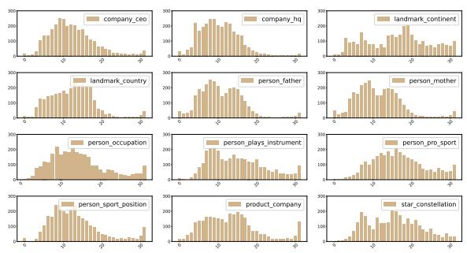  
Figure 1: Distribution of RelSpec neurons across layers in the 7B model. Most are located in the middle layers.

## 4 Results and Discussion

We apply our identification method to both LLama-2 7B and 13B models for all 12 relations. We regard the top 3,000 neurons with the highest $A P$ values as the RelSpec neurons; for this threshold, we achieve good coverage of relation-specific neurons with a set of neurons that is not too large. We discuss the impact of this meta-parameter in §5.1.

## 4.1 Identified Relation-Specific Neurons

Distribution Across Layers. We display the distribution of relation-specific neurons across layers in the 7B model in Figure 1 (see §D for the 13B model). Most neurons are located in the model's middle layers. Such a distribution differs from language-specific neurons, which are mostly located in the first and last few layers (Kojima et al., 2024). We hypothesize that relational knowledge requires more than surface-level information that is mainly encoded and processed in the first and last few layers. Therefore, RelSpec neurons naturally emerge in the middle layers, where the model has integrated enough lexical and syntactic signals to model and process the relation.

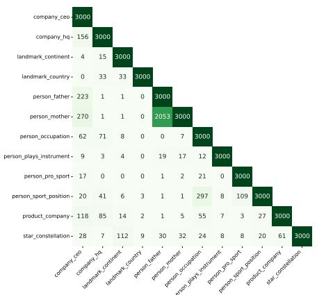  
Figure 2: Neuron overlap of RelSpec neurons across 12 relations in the 7B model. For example, the number of neurons shared between the 3,000 identified neurons for person\_father and the 3,000 for person\_mother is 2053 (in green).

This finding is consistent with several studies that show functional mapping vectors can be extracted from the middle layers of LLMs (Merullo et al., 2024; Hernandez et al., 2024; Todd et al., 2024).

Neuron Overlap Across Relations. We display the overlap of RelSpec neurons across relations for the 7B model in Figure 2 (13B is in §D). We see that person\_mother and person\_father share many neurons, possibly due to the large overlap between their subject entities, (see §B). However, even though there is almost no subject overlap between any other relations, many relations still share some neurons with others. For instance, person\_occupation and person\_sport\_position share 297 neurons, possibly because they are similar relations – a sport is a kind of occupation. Extensive neuron overlap can also be observed when two relations are mapping from the same type of subjects, e.g., company\_ceo and company\_hq, or mapping to the same type of objects, e.g., company\_ceo and person\_father. However, we show in §4.2.2 that a high neuron overlap does not necessarily imply a high level of mutual interference.

## 4.2 Controlled Generation

For each relation, we set the output values of its identified 3,000 RelSpec neurons to 0, and observe how the deactivation impacts the relation itself and other relations in terms of accuracy.

## 4.2.1 Intra-Relation Results

In addition to intra-relation results, i.e., deactivating the 3,000 identified RelSpec neurons for a relation and evaluating the same relation, we also create a baseline by randomly deactivating 3,000 neurons in the model. Results for the original models and for the two interventions are in Figure 3.

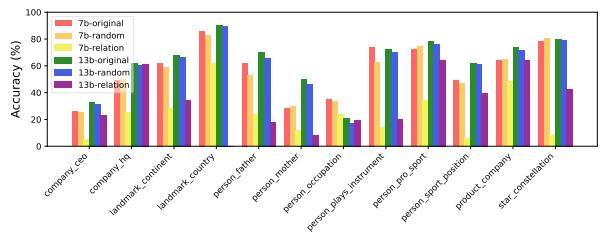  
(a) Held-out evaluation prompts $\mathcal { P } _ { r _ { i } } ^ { \mathrm { e v a } }$

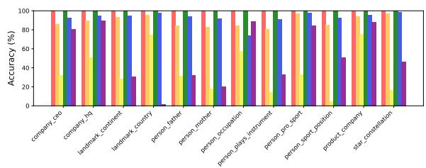  
(b) Identification prompts $\mathcal { P } _ { r _ { i } } ^ { \mathrm { d e t } }$

Figure 3: Intra-relation results. The left (resp. right) figure displays the results of held-out evaluation prompt set $\mathcal { P } _ { r _ { i } } ^ { \mathrm { e v a } }$ (resp. identification prompt set $\mathcal { P } _ { r _ { i } } ^ { \mathrm { d e t } } )$ . We report the performance of the original model (without any deactivation), e.g., 7b-original, the model with 3,000 random neurons deactivated (averaged over 10 seeds), e.g., 7b-random, and the model with RelSpec neurons deactivated, e.g., 7b-relation.  
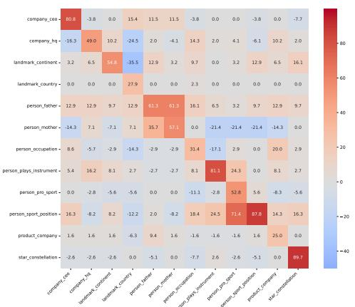

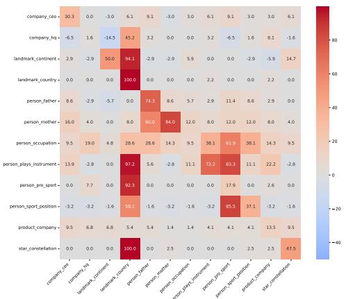  
Figure 4: Inter-relation results. Accuracy drops (in %) for the 7B (left) and the 13B model (right) on $\mathcal { P } _ { r _ { i } } ^ { \mathrm { e v a } }$ . The number in cell $( r _ { i } , r _ { j } )$ indicates the accuracy drop of relation $r _ { i }$ when deactivating the relation neurons of $r _ { j }$ .

We can observe a clear performance drop on the identification prompt set $\mathcal { P } _ { r _ { i } } ^ { \mathrm { d e t } }$ when comparing the accuracy of the original model and the model whose RelSpec neurons are deactivated.6 On the other hand, the model with 3,000 random deactivated neurons does not show much difference compared with the original model, indicating the 3,000 relation neurons are closely associated with the facts included in $\mathcal { P } _ { r _ { i } } ^ { \mathrm { d e t } }$ . On the evaluation set $\mathcal { P } _ { r _ { i } } ^ { \mathrm { e v a } }$ we also observe a notable accuracy drop across models for most relations. As $\mathcal { P } _ { r _ { i } } ^ { \bf e v a }$ and $\mathcal { P } _ { r _ { i } } ^ { \bf d e t }$ do not share any subject entities, this drop can only be attributed to the fact that deactivating 3,000 neurons affects the relation itself – the common characteristic between $\mathcal { P } _ { r _ { i } } ^ { \bf e v a }$ and $\mathcal { P } _ { r _ { i } } ^ { \mathbf { d e t } } . .$ We thus argue that RelSpec neurons exist in LLMs: they are entity-irrelevant and focus on specific relations.

On the other hand, the accuracy does not drop to 0 for any relation (except landmark\_country in the 13B model) when its identified RelSpec neurons are deactivated. This indicates these 3,000 neurons do not equally influence all facts that belong to a certain relation, which highlights that LLMs do not uniformly encode all facts belonging to a given relation, but rather distribute relational knowledge across neurons in a manner that can vary significantly from fact to fact. We validate this by showing that the accuracy further drops by deactivating more neurons in §5.1. We also show that the sensitivity of a fact to a given population of neurons may correlate with how frequently it appears in the pretraining data in §E.

## 4.2.2 Inter-Relation Results

To understand how RelSpec neurons influence the model's ability to answer prompts across multiple relations, we use accuracy drop as a metric: acc\_ $\begin{array} { r } { \mathrm { d r o p } _ { r _ { i } , r _ { j } } \ = \ \frac { \mathrm { a c c } _ { r _ { i } } ^ { \mathrm { o r i g i n a l } } - \mathrm { a c c } _ { r _ { i } } ^ { \mathrm { d e a c t i v a t e d } - r _ { j } } } { \mathrm { a c c } _ { r _ { i } } ^ { \mathrm { o r i g i n a l } } } } \end{array}$ , where $\mathrm { a c c } _ { r _ { i } } ^ { \mathrm { o r i g i n a l } }$ and accdeactivated-rj are the respective accuracy for $\mathcal { P } _ { r _ { i } } ^ { \mathrm { e v a } }$ of (a) the original model and (b)

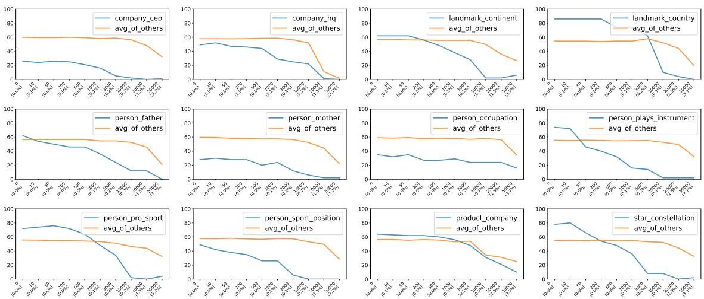  
Figure 5: Influence of deactivating different numbers of RelSpec neurons for each relation. On the x-axis, we report both the absolute number of deactivated neurons and the corresponding percentage of the model's total neurons. We show accuracy on the relation itself and the average accuracy on other relations. Increasing the number clearly affects the relation itself, while noticeable effects on other relations emerge only beyond 3,000–10,000 neurons.

when the RelSpec neurons of $r _ { j }$ are deactivated. Results are displayed in Figure 4.8

When we compare the 7B and 13B models, no consistent pattern emerges across relations. This indicates that, though being trained on the same data, differences in model size and parameter initialization appear to substantially change the functionality of neurons. Particularly, most relations in the 13B model are less influenced when neurons of other relations are deactivated than in the 7B model, except in the following cases: deactivating neurons of landmark\_country strongly affects several other relations concerning the notion of “location"; person\_mother and person\_occupation are sensitive to the deactivation of neurons of other relations. Despite these divergences, we propose two hypotheses that hold across both models.

Neuron versatility. We observe that deactivating neurons for one relation can strongly affect not only that relation but also others, both closely and loosely related relations. E.g., disabling person\_pro\_sport neurons has a large effect on person\_sport\_position (but not vice versa) in both models, likely because a model first needs to understand “sport" before inferring “position". Similarly, deactivating person\_father neurons reduces accuracy on person\_mother, as both share the concept of a parental relationship. Even loosely related relations can exhibit a clear accuracy drop:

deactivating star\_constellation neurons affects landmark\_continent in both models, possibly because both involve the abstract notion of “location".

Neuron interference. Deactivating RelSpec neurons for one relation can sometimes improve the accuracy for others – a phenomenon more pronounced in the 7B model, likely because its smaller parameter space is less capable of isolating different relations. In the 7B model, several relations frequently benefit from this effect: for instance, person\_mother improves when neurons from 5 out of 11 other relations – mostly “less related" ones - are deactivated. This effect is also observed for closely related relations: disabling company\_ceo neurons slightly boosts accuracy on company\_hq for both models. Interestingly, the 13B model shows the opposite effect for landmark\_continent when disabling landmark\_country, implying that country information can help predict a continent for the larger model. These findings indicate that neuron interference happens across model sizes, but its specific patterns vary.

## 5 Complementary Analyses

## 5.1 Influence of the Numbers of Neurons

In this section, we investigate the effect of varying the number of RelSpec neurons on the 7B model (see §D for 13B). Specifically, we consider ten values: 10, 50, 200, 500, 1,000, 3,000, 10,000, 20,000, and 50,000. When deactivating varying numbers of neurons for a relation, we report accuracy for that relation and the average accuracy for all other relations in Figure 5. Results for all relation-relation pairs are in Figure 22.

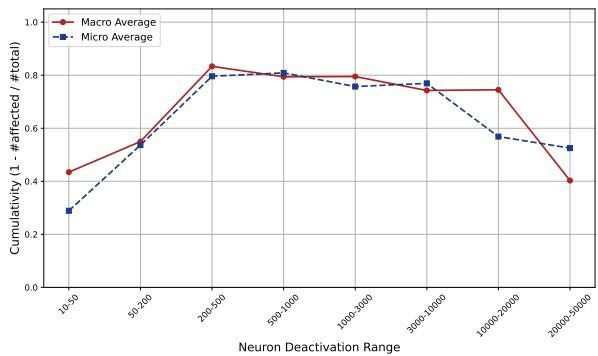  
Figure 6: Macro and micro averaged neuron cumulativity for each neuron deactivation range. Cumulativity is defined as $1 - { \frac { \# \mathrm { a f f e c t e d } } { \# \mathrm { t o t a l } } }$ , with macro averaging across relations and micro averaging across prompts. Both trends show that cumulativity increases as the range increases.

Neuron cumulativity. By increasing the number of neurons for deactivation, we see a consistent accuracy drop in all relations. This suggests neuron cumulativity: LLMs distribute relational knowledge across multiple neurons, which jointly contribute to dealing with facts belonging to a relation. However, cumulativity varies across relations. Some relations are far more sensitive to a smallerscale deactivation than other relations, indicating a smaller set of neurons is specifically leveraged for those relations. We hypothesize that this sensitivity may correlate with the frequency of the facts in each relation in the pretraining data: more frequent facts may be memorized more robustly and thus remain less sensitive to deactivation. We empirically verify this hypothesis in §E.

Deactivating RelSpec neurons has a marginal effect on other relations until certain thresholds are reached. Typically, these thresholds lie between 3,000 and 10,000 as shown in Figure 5, below which the accuracy on other relations remains stable – supporting the choice of 3,000 neurons in §3. Once more neurons are deactivated, other relations also deteriorate, consistent with our neuron versatility hypothesis. However, even deactivating up to 50,000 neurons seldom reduces other relations to near-zero accuracy, suggesting a high degree of relation-specificity. One exception is company\_hq, for which disabling 50,000 neurons causes all relations’ accuracies to approach zero – possibly because some of these neurons underlie more general generation capabilities of the model (Sun et al., 2024; Yu et al., 2024).

Validation of the cumulative effect. It remains unclear whether the further accuracy drop between any two thresholds in Figure 5 is driven by the newly deactivated neurons (the isolated effect of deactivated neurons) or the cumulative effect of all deactivated neurons. To further validate our neuron cumulativity hypothesis, we conduct an experiment on each consecutive pair of thresholds, e.g., 1000-3000. Specifically, we identify prompts from $\mathcal { P } _ { r _ { i } } ^ { \mathrm { e v a } }$ where the model answers correctly with neurons of the smaller range being deactivated, but fails when neurons of the larger range are deactivated (#total). We then deactivate only the neurons from the intermediate difference and measure the number of affected prompts – prompts for which the model answers wrongly (#affected). Figure 6 shows the macro and micro averaged cumulativity, defined as $1 - { \frac { \# \mathrm { a f f e c t e d } } { \# \mathrm { t o t a l } } }$ . We notice that neuron behavior becomes increasingly cumulative as the range increases, indicating that only deactivating neurons from the intermediate difference is not enough to make the model answer wrongly. There is a drop after the ranges 10000-20000 and 20000- 50000, which can be explained by the fact that many more neurons are deactivated compared with the earlier ranges. We also show the individual number of #total/#affected prompts in each relation in each range in Table 3. Thus, our results favor the cumulative effect over the isolated effect – multiple neurons jointly contribute to dealing with facts belonging to a relation, with no single neuron fully encoding a fact on its own.

## 5.2 Are These Neurons Multilingual?

Recent studies suggest that some neurons encoding factual knowledge or handling specific tasks are language-agnostic (Stanczak et al., 2022; Zhang et al., 2024; Wang et al., 2024a). A natural question is whether RelSpec neurons – identified solely via English prompts – also function across languages. To explore this, we translate $\mathcal { P } _ { r _ { i } } ^ { \mathrm { e v a } }$ to 5 languages: German (deu), Spanish (esp), French (fra), Chinese (zho), and Japanese (jpn) (see §F for details). We then deactivate the previously identified 3,000 neurons in the 7B model and measure the effect on these languages, as shown in Figure 7.

Although the model's accuracy is generally lower in non-English languages, it still shows good factual recall for most relations (except for jpn and zho). Once the neurons for a given relation are deactivated, the accuracy drops across nearly all languages – supporting our neuron versatility hypothesis. Our findings align with recent explanations that LLMs tend to translate the input text from any language into English for task solving in the middle layers based on a shared representation space (Wendler et al., 2024; Dumas et al., 2024; Zhao et al., 2024). As a result, deactivating “English" neurons naturally disrupts this shared space, impairing the model's capability to generalize across languages for the affected relation.

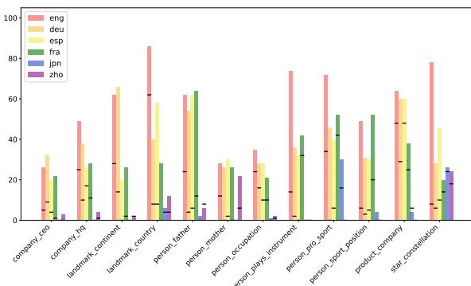  
Figure 7: Accuracy on 12 relations across 6 languages. The bars show the accuracy of the original 7B model. The horizontal line in each bar indicates the performance after deactivation of 3,000 RelSpec neurons. Even though these neurons are identified using English prompts, they usually influence other languages, indicating multilinguality of these neurons.

## 5.3 Effect of Prompt Templates

There is a possible confounding variable: the identified relation-specific neurons could be associated with the prompt templates used in $\mathcal { P } _ { r _ { i } } ^ { \mathrm { d e t } }$ . The degradation in $\mathcal { P } _ { r _ { i } } ^ { \mathrm { e v a } }$ would then be due to the identified neurons encoding syntactic structure rather than abstract relation semantics. To exclude this confounding variable, we create an additional evaluation set $\mathcal { P } _ { r _ { i } } ^ { \mathrm { e v a - } 2 }$ where the same triples as $\mathcal { P } _ { r _ { i } } ^ { \mathrm { e v a } }$ but different prompt templates are used for each relation. We then deactivate the previously identified 3,000 neurons in the 7B model and measure the effect on the new prompts. Figure 8 presents the results. We observe that the accuracy with new prompts is a bit different from the accuracy when the original templates are used. This is not surprising since LLMs are sensitive to the prompt templates (Sclar et al., 2024). Nevertheless, we still see that the deactivation of neurons results in consistent accuracy drops for new prompts across relations. Therefore, the neurons are not subject to the templates used to describe the relation. Instead, the identified neurons are only associated with the abstract relation semantics.

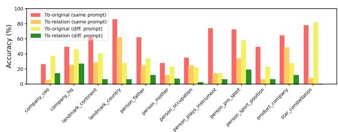  
Figure 8: Intra-relation results on original prompts $\mathcal { P } _ { r _ { i } } ^ { \mathrm { e v a } }$ and additional prompts $\mathcal { P } _ { r _ { i } } ^ { \mathrm { e v a - } 2 } . \mathcal { P } _ { r _ { i } } ^ { \mathrm { e v a - } 2 }$ is constructed with same triples as $\mathcal { P } _ { r _ { i } } ^ { \mathrm { e v a } }$ but different prompt templates are used. A consistent decrease across relations indicates that the identified neurons are not specific to prompts.

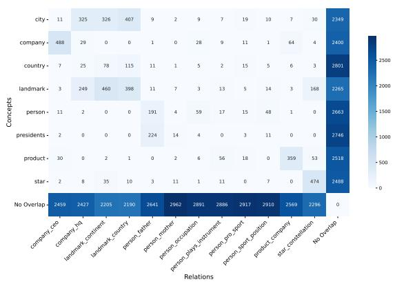  
Figure 9: Overlap between the top 3000 neurons of relations and concepts in the 13B model.

## 5.4 Relations vs. Concepts

We saw in Figure 2 that the storage of relations is generally well separated, but there are exceptions. We can view a relation as relating two concepts or topics, $\mathrm { e . g . }$ , company\_ceo relates instances of the subject concept “company" to instances of the object concept $" \mathrm { C E O } ^ { \prime \prime }$ . From this perspective, the exceptions in Figure 2, i.e., cases where a relation $r _ { 1 }$ overlaps with a relation $r _ { 2 } .$ , are generally cases where the concepts of $r _ { 1 }$ and $r _ { 2 }$ are the same or overlap. To further explore this hypothesis empirically, we again use the method applied in $\ S 2$ to relations, but now use it for subject concepts.9 That is, we identify sets of concept-specific neurons. We group the triples by their subjects, resulting in 9 different concepts. We then create prompts with novel relations such as “can" and “has $\mathbf { a } ^ { \prime \prime }$ , balanced across positive and negative samples. This ensures that the model's completion for a prompt like (“Lincoln has $\mathbf { a } ^ { \prime \prime } )$ depends on the concept instance “Lincoln", not on the relation.

Figure 9 shows the overlap between relation neurons and concept neurons. Most of the cells with large counts support our hypothesis that the overlaps between relations we observe are rooted in these relations being representationally associated with their concepts. Clear examples include company\_ceo and its subject concept company; company\_hq and its object concept city (assuming that hq is a subcategory of city); and landmark\_continent and its subject concept landmark. There is little overlap of person with relations like person\_mother, potentially because person is a more general and semantically unspecific concept than the others. However, most identified neurons are only concept neurons or only relation neurons, suggesting that relational and conceptual representations are largely separate.

## 5.5 Effect on General Language Modeling

<table><tr><td>Relation</td><td># Sentences</td><td>PPL (Before)</td><td>PPL (After)</td></tr><tr><td>person_sport_position</td><td>8</td><td>87.67</td><td>95.18</td></tr><tr><td>person_pro_sport</td><td>5</td><td>34.42</td><td>45.54</td></tr><tr><td>person_occupation</td><td>19</td><td>62.71</td><td>84.31</td></tr><tr><td>company_hq</td><td>50</td><td>63.97</td><td>61.27</td></tr><tr><td>product_company</td><td>23</td><td>100.65</td><td>95.37</td></tr><tr><td>person_mother</td><td>50</td><td>141.31</td><td>146.99</td></tr><tr><td>person_father</td><td>50</td><td>90.14</td><td>83.54</td></tr><tr><td>landmark_continent</td><td>4</td><td>90.19</td><td>73.82</td></tr><tr><td>landmark_country</td><td>50</td><td>58.57</td><td>51.12</td></tr><tr><td>company_ceo</td><td>50</td><td>102.32</td><td>110.71</td></tr><tr><td>person_plays_instrument</td><td>5</td><td>69.97</td><td>63.91</td></tr><tr><td>star_constellation</td><td>26</td><td>47.12</td><td>57.48</td></tr></table>

Table 2: Perplexity before and after ablation of RelSpec neurons on synthetic sentences where the object appears in a context without subject or relation.

One potential concern with ablating RelSpec neurons is the risk of inadvertently impairing general language modeling, particularly for tokens associated with the object entity in contexts unrelated to the original subject-relation pair. To investigate this, we design a new experiment to measure perplexity on synthetic sentences where the object appears in naturalistic but relation-neutral context – without the original subject or relation. For each of the 12 covered relations, we construct up to 50 sentences (using distinct objects from $\mathcal { P } _ { r _ { i } } ^ { \mathrm { d e t } } )$ with fixed templates, such that the object entity appears as the final token (see §K for prompt templates). We then compute the perplexity of these sentences before and after ablating the RelSpec neurons. The results are summarized in Table 2, which reports average perplexity across sentences for each relation. The results show no systematic degradation in perplexity after ablation. For several relations (e.g., company\_hq, landmark\_country, product\_company), the perplexity even slightly decreases. This suggests that the object-token generation ability is preserved, and that the ablation primarily targets mechanisms specific to the factual relation rather than disrupting broader lexical or contextual knowledge of the models.

## 6 Conclusion

This work highlights the existence of relationspecific neurons in LLMs – neurons that focus on relations rather than entities. Our experiments show that RelSpec neurons primarily reside in the middle layers and can be shared across multiple relations. Through systematic deactivation, we reveal their influence on both the targeted and other relations, leading to three key hypotheses: neuron cumulativity (multiple neurons jointly contribute to dealing with facts belonging to a relation), neuron versatility (neurons are shared across relations and languages), and neuron interference (neurons from one relation can disrupt the processing of another). These findings shed new light on how LLMs handle relational facts at the neuron level, contributing to the interpretability of LLMs.

## Limitations

While our findings provide valuable insights, several limitations remain and offer opportunities for future research. First, this work focuses on factual knowledge grouped into 12 relations because the reliability of the neuron identification method requires enough facts in each relation. Although this selection does not diminish the validity of our findings and hypotheses, it represents a relatively narrow set of relations. Future work can explore a broader range of relations and analyze how relation-specific neurons behave across a more diverse set of relations. Second, our multilingual analysis includes only five languages. While these languages demonstrate neuron versatility, they do not fully capture linguistic diversity. Future research could investigate additional languages, particularly low-resource ones, to determine whether relation-specific neurons exhibit similar relational functionality across these languages. Thirdly, we draw our findings from the LLama-2 family in the main content due to page limit and resource constraints. We also conduct the same investigation on Gemma-7B (Gemma Team et al., 2024) (cf. §C), which shows similar trends as we observe for models from the LLama-2 family. Future work can explore even larger models or models with posttraining techniques like instruction-tuning. Lastly, we observe that more frequent facts tend to be more robust to the deactivation of relation-specific neurons in both the 7B and 13B models (cf. §E). Fact frequency is approximated using the Dolma corpus (Soldaini et al., 2024) in this study. However, LLama-2 models may incorporate a larger and more diverse pretraining dataset, potentially leading to some discrepancies between these approximated fact frequencies and their actual frequencies.

## Acknowledgments

This research was supported by DFG (grant SCHU 2246/14-1). We gratefully acknowledge support from Google through a generous research grant. We appreciate suggestions and comments from other members of CIS, LMU Munich. We want to thank Lixi Liu's suggestions for figure design.

## References

Omer Antverg and Yonatan Belinkov. 2022. On the pitfalls of analyzing individual neurons in language models. In The Tenth International Conference on Learning Representations, ICLR 2022, Virtual Event April 25-29, 2022. OpenReview.net.

Anthony Bau, Yonatan Belinkov, Hassan Sajjad, Nadir Durrani, Fahim Dalvi, and James R. Glass. 2019. Identifying and controlling important neurons in neural machine translation. In 7th International Conference on Learning Representations, ICLR 2019, New Orleans, LA, USA, May 6-9, 2019. OpenReview.net.

Deniz Bayazit, Negar Foroutan, Zeming Chen, Gail Weiss, and Antoine Bosselut. 2024. Discovering knowledge-critical subnetworks in pretrained language models. In Proceedings of the 2024 Conference on Empirical Methods in Natural Language Processing, pages 6549–6583, Miami, Florida, USA. Association for Computational Linguistics.

Steven Bills, Nick Cammarata, Dan Mossing, Henk Tillman, Leo Gao, Gabriel Goh, Ilya Sutskever, Jan Leike, Jeff Wu, and William Saunders. 2023. Language models can explain neurons in language models.

Xavier Suau Cuadros, Luca Zappella, and Nicholas Apostoloff. 2022. Self-conditioning pre-trained language models. In International Conference on Machine Learning, ICML 2022, 17-23 July 2022, Baltimore, Maryland, USA, volume 162 of Proceedings of Machine Learning Research, pages 4455–4473. PMLR.

Damai Dai, Li Dong, Yaru Hao, Zhifang Sui, Baobao Chang, and Furu Wei. 2022. Knowledge neurons in

pretrained transformers. In Proceedings of the 60th Annual Meeting of the Association for Computational Linguistics (Volume 1: Long Papers), pages 8493– 8502, Dublin, Ireland. Association for Computational Linguistics.

Fahim Dalvi, Nadir Durrani, Hassan Sajjad, Yonatan Belinkov, Anthony Bau, and James R. Glass. 2019. What is one grain of sand in the desert? analyzing individual neurons in deep NLP models. In The Thirty-Third AAAI Conference on Artificial Intelligence, AAAI 2019, The Thirty-First Innovative Applications of Artificial Intelligence Conference, IAAI 2019, The Ninth AAAI Symposium on Educational Advances in Artificial Intelligence, EAAI 2019, Honolulu, Hawaii, USA, January 27 - February 1, 2019, pages 6309–6317. AAAI Press.

Fahim Dalvi, Hassan Sajjad, Nadir Durrani, and Yonatan Belinkov. 2020. Analyzing redundancy in pretrained transformer models. In Proceedings of the 2020 Conference on Empirical Methods in Natural Language Processing (EMNLP), pages 4908–4926, Online. Association for Computational Linguistics.

Clément Dumas, Veniamin Veselovsky, Giovanni Monea, Robert West, and Chris Wendler. 2024. How do llamas process multilingual text? a latent exploration through activation patching. In ICML 2024 Workshop on Mechanistic Interpretability.

Nadir Durrani, Hassan Sajjad, Fahim Dalvi, and Yonatan Belinkov. 2020. Analyzing individual neurons in pre-trained language models. In Proceedings of the 2020 Conference on Empirical Methods in Natural Language Processing (EMNLP), pages 4865–4880, Online. Association for Computational Linguistics.

Yanai Elazar, Akshita Bhagia, Ian Magnusson, Abhilasha Ravichander, Dustin Schwenk, Alane Suhr, Evan Pete Walsh, Dirk Groeneveld, Luca Soldaini, Sameer Singh, Hannaneh Hajishirzi, Noah A. Smith, and Jesse Dodge. 2024. What's in my big data? In The Twelfth International Conference on Learning Representations, ICLR 2024, Vienna, Austria, May 7-11, 2024. OpenReview.net.

Nelson Elhage, Tristan Hume, Catherine Olsson, Neel Nanda, Tom Henighan, Scott Johnston, Sheer ElShowk, Nicholas Joseph, Nova DasSarma, Ben Mann, Danny Hernandez, Amanda Askell, Kamal Ndousse, Andy Jones, Dawn Drain, Anna Chen, Yuntao Bai, Deep Ganguli, Liane Lovitt, and 14 others. 2022a. Softmax linear units. Transformer Circuits Thread.

Nelson Elhage, Tristan Hume, Catherine Olsson, Nicholas Schiefer, Tom Henighan, Shauna Kravec, Zac Hatfield-Dodds, Robert Lasenby, Dawn Drain, Carol Chen, Roger Grosse, Sam McCandlish, Jared Kaplan, Dario Amodei, Martin Wattenberg, and Christopher Olah. 2022b. Toy models of superposition. Preprint, arXiv:2209.10652.

Nelson Elhage, Neel Nanda, Catherine Olsson, Tom Henighan, Nicholas Joseph, Ben Mann, Amanda Askell, Yuntao Bai, Anna Chen, Tom Conerly, Nova DasSarma, Dawn Drain, Deep Ganguli, Zac Hatfield-Dodds, Danny Hernandez, Andy Jones, Jackson Kernion, Liane Lovitt, Kamal Ndousse, and 6 others. 2021. A mathematical framework for transformer circuits. Transformer Circuits Thread.

Amit Elhelo and Mor Geva. 2024. Inferring functionality of attention heads from their parameters. Preprint, arXiv:2412.11965.

Gemma Team, Thomas Mesnard, Cassidy Hardin, Robert Dadashi, Surya Bhupatiraju, Shreya Pathak, Laurent Sifre, Morgane Rivière, Mihir Sanjay Kale, Juliette Love, Pouya Tafti, Léonard Hussenot, Pier Giuseppe Sessa, Aakanksha Chowdhery, Adam Roberts, Aditya Barua, Alex Botev, Alex Castro-Ros, Ambrose Slone, and 89 others. 2024. Gemma: Open models based on gemini research and technology. Preprint, arXiv:2403.08295.

Mor Geva, Jasmijn Bastings, Katja Filippova, and Amir Globerson. 2023. Dissecting recall of factual associations in auto-regressive language models. In Proceedings of the 2023 Conference on Empirical Methods in Natural Language Processing, pages 12216–12235, Singapore. Association for Computational Linguistics.

Mor Geva, Roei Schuster, Jonathan Berant, and Omer Levy. 2021. Transformer feed-forward layers are keyvalue memories. In Proceedings of the 2021 Conference on Empirical Methods in Natural Language Processing, pages 5484–5495, Online and Punta Cana, Dominican Republic. Association for Computational Linguistics.

Wes Gurnee, Theo Horsley, Zifan Carl Guo, Tara Rezaei Kheirkhah, Qinyi Sun, Will Hathaway, Neel Nanda, and Dimitris Bertsimas. 2024. Universal neurons in GPT2 language models. Trans. Mach. Learn. Res., 2024.

Wes Gurnee, Neel Nanda, Matthew Pauly, Katherine Harvey, Dmitrii Troitskii, and Dimitris Bertsimas. 2023. Finding neurons in a haystack: Case studies with sparse probing. Trans. Mach. Learn. Res., 2023.

Shwai He, Guoheng Sun, Zheyu Shen, and Ang Li. 2024. What Matters in Transformers? Not All Attention is Needed. Preprint, arXiv:2406.15786.

Evan Hernandez, Arnab Sen Sharma, Tal Haklay, Kevin Meng, Martin Wattenberg, Jacob Andreas, Yonatan Belinkov, and David Bau. 2024. Linearity of relation decoding in transformer language models. In The Twelfth International Conference on Learning Representations, ICLR 2024, Vienna, Austria, May 7-11, 2024. OpenReview.net.

Zhengbao Jiang, Frank F. Xu, Jun Araki, and Graham Neubig. 2020. How can we know what language models know? Transactions of the Association for Computational Linguistics, 8:423–438.

Takeshi Kojima, Itsuki Okimura, Yusuke Iwasawa, Hitomi Yanaka, and Yutaka Matsuo. 2024. On the multilingual ability of decoder-based pre-trained language models: Finding and controlling language-specific neurons. In Proceedings of the 2024 Conference of the North American Chapter of the Association for Computational Linguistics: Human Language Technologies (Volume 1: Long Papers), pages 6919–6971, Mexico City, Mexico. Association for Computational Linguistics.

János Kramár, Tom Lieberum, Rohin Shah, and Neel Nanda. 2024. AtP\*: An efficient and scalable method for localizing LLM behaviour to components. Preprint, arXiv:2403.00745.

Tom Lieberum, Matthew Rahtz, János Kramár, Neel Nanda, Geoffrey Irving, Rohin Shah, and Vladimir Mikulik. 2023. Does Circuit Analysis Interpretability Scale? Evidence from Multiple Choice Capabilities in Chinchilla. Preprint, arXiv:2307.09458.

Weize Liu, Yinlong Xu, Hongxia Xu, Jintai Chen, Xuming Hu, and Jian Wu. 2024. Unraveling babel: Exploring multilingual activation patterns of LLMs and their applications. In Proceedings of the 2024 Conference on Empirical Methods in Natural Language Processing, pages 11855–11881, Miami, Florida, USA. Association for Computational Linguistics.

Ang Lv, Yuhan Chen, Kaiyi Zhang, Yulong Wang, Lifeng Liu, Ji-Rong Wen, Jian Xie, and Rui Yan. 2024. Interpreting key mechanisms of factual recall in transformer-based language models. Preprint, arXiv:2403.19521

Thomas McGrath, Matthew Rahtz, Janos Kramar, Vladimir Mikulik, and Shane Legg. 2023. The Hydra Effect: Emergent Self-repair in Language Model Computations. Preprint, arXiv:2307.15771.

Kevin Meng, David Bau, Alex Andonian, and Yonatan Belinkov. 2022. Locating and editing factual associations in GPT. In Advances in Neural Information Processing Systems 35: Annual Conference on Neural Information Processing Systems 2022, NeurIPS 2022, New Orleans, LA, USA, November 28 - December 9, 2022.

Kevin Meng, Arnab Sen Sharma, Alex J. Andonian, Yonatan Belinkov, and David Bau. 2023. Massediting memory in a transformer. In The Eleventh International Conference on Learning Representations, ICLR 2023, Kigali, Rwanda, May 1-5, 2023. OpenReview.net.

Jack Merullo, Carsten Eickhoff, and Ellie Pavlick. 2024. Language models implement simple Word2Vec-style vector arithmetic. In Proceedings of the 2024 Conference of the North American Chapter of the Association for Computational Linguistics: Human Language Technologies (Volume 1: Long Papers), pages 5030–5047, Mexico City, Mexico. Association for Computational Linguistics.

Philipp Mondorf, Sondre Wold, and Barbara Plank. 2024. Circuit Compositions: Exploring Modular Structures in Transformer-Based Language Models. Preprint, arXiv:2410.01434.

Jesse Mu and Jacob Andreas. 2020. Compositional explanations of neurons. In Advances in Neural Information Processing Systems 33: Annual Conference on Neural Information Processing Systems 2020, NeurIPS 2020, December 6-12, 2020, virtual.

Chris Olah, Nick Cammarata, Ludwig Schubert, Gabriel Goh, Michael Petrov, and Shan Carter. 2020. Zoom in: An introduction to circuits. Distill.

Catherine Olsson, Nelson Elhage, Neel Nanda, Nicholas Joseph, Nova DasSarma, Tom Henighan, Ben Mann, Amanda Askell, Yuntao Bai, Anna Chen, Tom Conerly, Dawn Drain, Deep Ganguli, Zac Hatfield-Dodds, Danny Hernandez, Scott Johnston, Andy Jones, Jackson Kernion, Liane Lovitt, and 7 others. 2022. Incontext learning and induction heads. Transformer Circuits Thread.

Fabio Petroni, Tim Rocktäschel, Sebastian Riedel, Patrick Lewis, Anton Bakhtin, Yuxiang Wu, and Alexander Miller. 2019. Language models as knowledge bases? In Proceedings of the 2019 Conference on Empirical Methods in Natural Language Processing and the 9th International Joint Conference on Natural Language Processing (EMNLP-IJCNLP), pages 2463–2473, Hong Kong, China. Association for Computational Linguistics.

Daking Rai, Yilun Zhou, Shi Feng, Abulhair Saparov, and Ziyu Yao. 2024. A practical review of mechanistic interpretability for transformer-based language models. Preprint, arXiv:2407.02646.

Hassan Sajjad, Nadir Durrani, and Fahim Dalvi. 2022. Neuron-level interpretation of deep NLP models: A survey. Transactions of the Association for Computational Linguistics, 10:1285–1303.

Adam Scherlis, Kshitij Sachan, Adam S. Jermyn, Joe Benton, and Buck Shlegeris. 2025. Polysemanticity and capacity in neural networks. Preprint, arXiv:2210.01892.

Melanie Sclar, Yejin Choi, Yulia Tsvetkov, and Alane Suhr. 2024. Quantifying language models' sensitivity to spurious features in prompt design or: How I learned to start worrying about prompt formatting. In The Twelfth International Conference on Learning Representations, ICLR 2024, Vienna, Austria, May 7-11, 2024. OpenReview.net.

Luca Soldaini, Rodney Kinney, Akshita Bhagia, Dustin Schwenk, David Atkinson, Russell Authur, Ben Bogin, Khyathi Chandu, Jennifer Dumas, Yanai Elazar, Valentin Hofmann, Ananya Jha, Sachin Kumar, Li Lucy, Xinxi Lyu, Nathan Lambert, Ian Magnusson, Jacob Morrison, Niklas Muennighoff, and 17 others. 2024. Dolma: an open corpus of three trillion tokens for language model pretraining research. In

Proceedings of the 62nd Annual Meeting of the Association for Computational Linguistics (Volume 1: Long Papers), pages 15725–15788, Bangkok, Thailand. Association for Computational Linguistics.

Ran Song, Shizhu He, Shuting Jiang, Yantuan Xian, Shengxiang Gao, Kang Liu, and Zhengtao Yu. 2024. Does large language model contain task-specific neurons? In Proceedings of the 2024 Conference on Empirical Methods in Natural Language Processing, pages 7101–7113, Miami, Florida, USA. Association for Computational Linguistics.

Karolina Stanczak, Edoardo Ponti, Lucas Torroba Hennigen, Ryan Cotterell, and Isabelle Augenstein. 2022. Same neurons, different languages: Probing morphosyntax in multilingual pre-trained models. In Proceedings of the 2022 Conference of the North American Chapter of the Association for Computational Linguistics: Human Language Technologies, pages 1589–1598, Seattle, United States. Association for Computational Linguistics.

Mingjie Sun, Xinlei Chen, J. Zico Kolter, and Zhuang Liu. 2024. Massive activations in large language models. Preprint, arXiv:2402.17762.

Tianyi Tang, Wenyang Luo, Haoyang Huang, Dongdong Zhang, Xiaolei Wang, Xin Zhao, Furu Wei, and Ji-Rong Wen. 2024. Language-specific neurons: The key to multilingual capabilities in large language models. In Proceedings of the 62nd Annual Meeting of the Association for Computational Linguistics (Volume 1: Long Papers), pages 5701–5715, Bangkok, Thailand. Association for Computational Linguistics.

Eric Todd, Millicent L. Li, Arnab Sen Sharma, Aaron Mueller, Byron C. Wallace, and David Bau. 2024. Function vectors in large language models. In The Twelfth International Conference on Learning Representations, ICLR 2024, Vienna, Austria, May 7-11, 2024. OpenReview.net.

Hugo Touvron, Louis Martin, Kevin Stone, Peter Albert, Amjad Almahairi, Yasmine Babaei, Nikolay Bashlykov, Soumya Batra, Prajjwal Bhargava, Shruti Bhosale, Dan Bikel, Lukas Blecher, Cristian Canton Ferrer, Moya Chen, Guillem Cucurull, David Esiobu, Jude Fernandes, Jeremy Fu, Wenyin Fu, and 49 others. 2023. Llama 2: Open foundation and fine-tuned chat models. Preprint, arXiv:2307.09288.

Ashish Vaswani, Noam Shazeer, Niki Parmar, Jakob Uszkoreit, Llion Jones, Aidan N. Gomez, Lukasz Kaiser, and Illia Polosukhin. 2017. Attention is all you need. In Advances in Neural Information Processing Systems 30: Annual Conference on Neural Information Processing Systems 2017, December 4-9, 2017, Long Beach, CA, USA, pages 5998–6008.

Jesse Vig, Sebastian Gehrmann, Yonatan Belinkov, Sharon Qian, Daniel Nevo, Yaron Singer, and Stuart M. Shieber. 2020. Investigating gender bias in language models using causal mediation analysis. In Advances in Neural Information Processing Systems 33: Annual Conference on Neural Information

Processing Systems 2020, NeurIPS 2020, December 6-12, 2020, virtual.

Kevin Ro Wang, Alexandre Variengien, Arthur Conmy, Buck Shlegeris, and Jacob Steinhardt. 2023a. Interpretability in the wild: a circuit for indirect object identification in GPT-2 small. In The Eleventh International Conference on Learning Representations, ICLR 2023, Kigali, Rwanda, May 1-5, 2023. Open-Review.net.

Kevin Ro Wang, Alexandre Variengien, Arthur Conmy, Buck Shlegeris, and Jacob Steinhardt. 2023b. Interpretability in the wild: a circuit for indirect object identification in GPT-2 small. In The Eleventh International Conference on Learning Representations, ICLR 2023, Kigali, Rwanda, May 1-5, 2023. Open-Review.net.

Weixuan Wang, Barry Haddow, Minghao Wu, Wei Peng, and Alexandra Birch. 2024a. Sharing matters: Analysing neurons across languages and tasks in 1lms. Preprint, arXiv:2406.09265.

Yifei Wang, Yuheng Chen, Wanting Wen, Yu Sheng, Linjing Li, and Daniel Dajun Zeng. 2024b. Unveiling factual recall behaviors of large language models through knowledge neurons. In Proceedings of the 2024 Conference on Empirical Methods in Natural Language Processing, pages 7388–7402, Miami, Florida, USA. Association for Computational Linguistics.

Chris Wendler, Veniamin Veselovsky, Giovanni Monea, and Robert West. 2024. Do llamas work in English? on the latent language of multilingual transformers. In Proceedings of the 62nd Annual Meeting of the Association for Computational Linguistics (Volume 1: Long Papers), pages 15366–15394, Bangkok, Thailand. Association for Computational Linguistics.

Robert F Woolson. 2005. Wilcoxon signed-rank test. Encyclopedia of Biostatistics, 8.

Mengxia Yu, De Wang, Qi Shan, Colorado Reed, and Alvin Wan. 2024. The super weight in large language models. Preprint, arXiv:2411.07191.

Qinan Yu, Jack Merullo, and Ellie Pavlick. 2023. Characterizing mechanisms for factual recall in language models. In Proceedings of the 2023 Conference on Empirical Methods in Natural Language Processing, pages 9924–9959, Singapore. Association for Computational Linguistics.

Zeping Yu and Sophia Ananiadou. 2024. Neuron-level knowledge attribution in large language models. In Proceedings of the 2024 Conference on Empirical Methods in Natural Language Processing, pages 3267–3280, Miami, Florida, USA. Association for Computational Linguistics.

Xue Zhang, Yunlong Liang, Fandong Meng, Songming Zhang, Yufeng Chen, Jinan Xu, and Jie Zhou. 2024. Multilingual knowledge editing with language-agnostic factual neurons. Preprint, arXiv:2406.16416.

Yiran Zhao, Wenxuan Zhang, Guizhen Chen, Kenji Kawaguchi, and Lidong Bing. 2024. How do large language models handle multilingualism? Preprint, arXiv:2402.18815.

## A Related Work

Mechanistic interpretability (MI) is a growing subfield of interpretability that aims to understand LLMs by breaking them down into smaller components and fundamental computations. It has gained significant attention for studying how LLMs recall factual knowledge learned during pretraining (Meng et al., 2022; Dai et al., 2022; Geva et al., 2023; Yu et al., 2023; Lv et al., 2024; Wang et al., 2024b). Following Olah et al. (2020); Rai et al. (2024), MI research can be categorized into two areas: the study of features and the study of circuits, based on the type of decomposed components. Features refer to human-interpretable properties encoded in model representations or represented by model components, such as neurons and attention heads (Elhage et al., 2022a; Gurnee et al., 2023). Circuits are subgraphs of the model's computation graph responsible for implementing specific behaviors (Wang et al., 2023b; Elhage et al., 2021).

In this work, we focus on neuron-level featurebased interpretability analysis to localize relationspecific neurons, which are responsible for encoding and recalling specific types of factual knowledge. Existing studies have utilized various approaches for neuron interpretation, each offering unique advantages and limitations (Sajjad et al., 2022; Rai et al., 2024). The visualization method (Olsson et al., 2022; Elhage et al., 2022a; Lieberum et al., 2023; Bills et al., 2023; Liu et al., 2024) involves visualizing neuron activations and manually identifying the underlying concept across input text. While being straightforward, it relies heavily on human effort and risks overgeneralization. Statistics-based methods (Bau et al., 2019; Cuadros et al., 2022; Kojima et al., 2024; Yu and Ananiadou, 2024; Tang et al., 2024; Wang et al., 2024b), on the other hand, aggregate activation statistics across data to establish connections between neurons and concepts, identifying patterns through the co-occurrence of neuron activation values and specific input features. Probing-based methods (Dalvi et al., 2019; Durrani et al., 2020; Antverg and Belinkov, 2022; Gurnee et al., 2024) train diagnostic classifiers on neuron activations to identify neurons associated with predefined concepts. These methods are scalable, enabling the discovery of neuron sets across large datasets, though they depend on supervised data annotations. Causationbased methods (Vig et al., 2020; Meng et al., 2022, 2023; Kramár et al., 2024; Song et al., 2024) take a different approach by directly varying the values of specific neurons or components and analyzing changes in model behavior; significant changes indicate the importance of these neurons or components to particular functionalities.

Building on this foundation, our work adopts the statistics-based method proposed by Cuadros et al. (2022) to identify relation-specific neurons – neurons uniquely “fired" for queries concerning facts sharing the same relation. This approach facilitates a scalable and targeted analysis of neuron behavior in relation to factual knowledge recall.

## B Entity Analysis Across Relations

We show the number of distinct subjects (resp. objects) in each relation and the number of overlapping subjects (resp. objects) between any two relations in the identification prompt set $\mathcal { P } _ { r _ { i } } ^ { \mathrm { d e t } }$ of the 7B model and the 13B model in Figure 10 and 11 respectively. Most two relations have no common or very limited overlapping (less than 11) subjects, except for person\_mother and person\_father, which are mostly celebrities, possibly resulting in extensive neuron overlap between the two relations as we show in §4.1. Similarly, no two relations share many objects.

Additionally, we show the number of overlapping entities in the evaluation set $\mathcal { P } _ { r _ { i } } ^ { \mathrm { e v a } }$ (the 7B and 13B models share the same evaluation set) in Figure 12. The results also show almost no entity overlap across different relations: among all relations, only person\_mother and person\_father share one subject, and the rest of the relations do not share any subject or object overlap.

The diagonal values of the object overlap subfigures (Figures 10, 11, 12, right) reflect the number of distinct objects, while those of the subject overlap subfigures (left) correspond to the total number of facts. This distinction reveals structural differences across relations. For instance, in company\_ceo, person\_mother, and person\_father, each fact is typically associated with a unique object — yielding an almost one-to-one mapping. In contrast, relations like person\_occupation involve a small number of frequent objects. Furthermore, the object distribution varies: some relations (e.g., person\_pro\_sport) are relatively balanced, while others (e.g., person\_occupation) are highly skewed (with many “actors"), largely due to biases in the original LRE dataset.

Taken together, the entity analysis suggests that entities are not a confounding factor in our experiments. The identified RelSpec neurons capture relation-specific behavior rather than entityspecific patterns.

## C Analysis On Gemma-7B

We perform a similar analysis on the Gemma-7B model (Gemma Team et al., 2024) as we do for the LLama-7B model. We first show how the identified 3,000 RelSpec neurons are distributed across layers for each relation in Figure 13. The trend is similar to what we observe in the 7B model (cf. Figure 1): the most of these neurons are located in the middle layers, but it is more evenly distributed across layers compared to the LLama families.

We show the intra-relation results in Figure 16. The results indicate that the identified RelSpec neurons are also effective in the Gemma-7B model: not only for the identification prompt set $\mathcal { P } _ { r _ { i } } ^ { \mathrm { d e t } }$ but also for the held-out evaluation prompt set $\mathcal { P } _ { r _ { i } } ^ { \mathrm { e v a } }$ the deactivation of the neurons result in obvious accuracy drops, especially compared with the randomly deactivated neurons, indicating the existence of RelSpec neurons are held across model families.

We then demonstrate the effect of varying numbers of RelSpec neurons using the same numbers: 10, 50, 200, 500, 1,000, 3,000, 10,000, 20,000, and 50,000. Figure 14 and 15 present the results. The global trend is similar to what we observe for the LLama-7B model: the accuracy for a relation further drops when more of its RelSpec neurons are deactivated; until 3,000 or 10,0000 neurons, the effect is almost only obvious for the concerned relation itself; after 10,000, deactivating more neurons results in a further drop in accuracy across all relations. This indicates the neuron cumulativity and neuron versatility can be observed across model families.

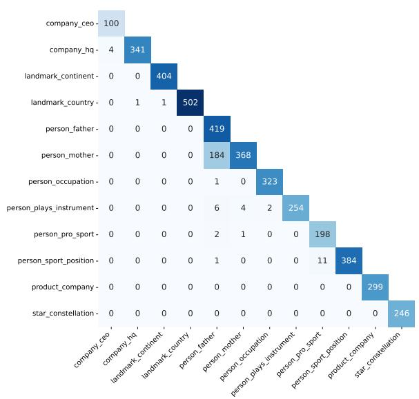

  
Figure 10: Subject (left) and object (right) overlap across 12 relations obtained from the 7B model. The diagonal in each figure shows the number of distinct subjects or objects for each relation. It can be seen that factual knowledge from different relations has almost no entity overlap except for person\_mother and person\_father, which are mostly celebrities.

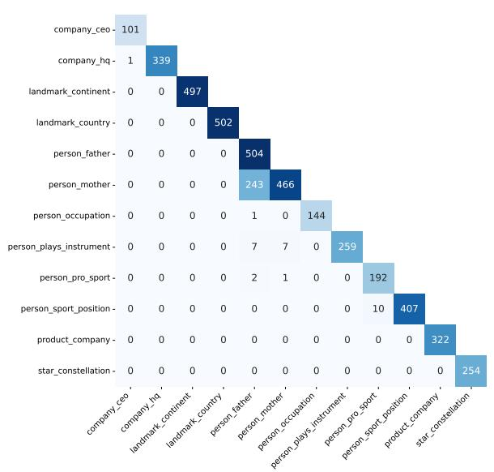

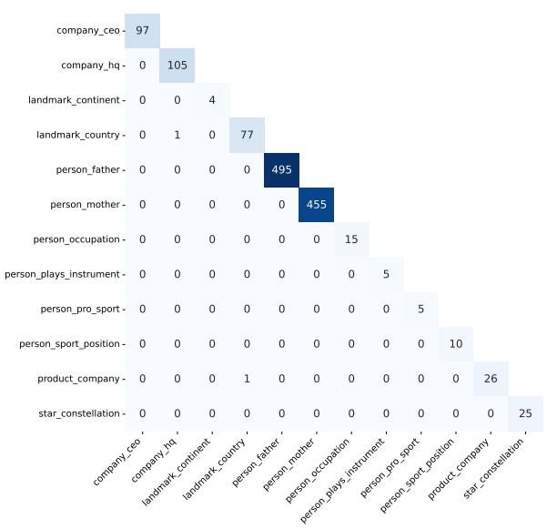  
Figure 11: Subject (left) and object (right) overlap across 12 relations obtained from the 13B model. The trend is very similar to that in the 7B model: person\_mother and person\_father share many subjects.

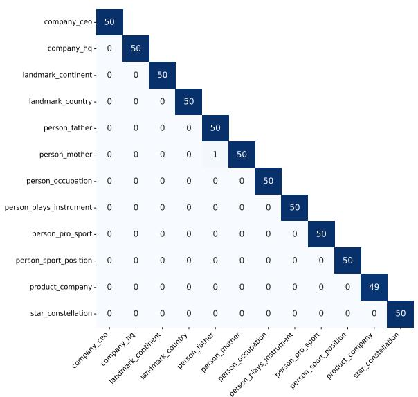

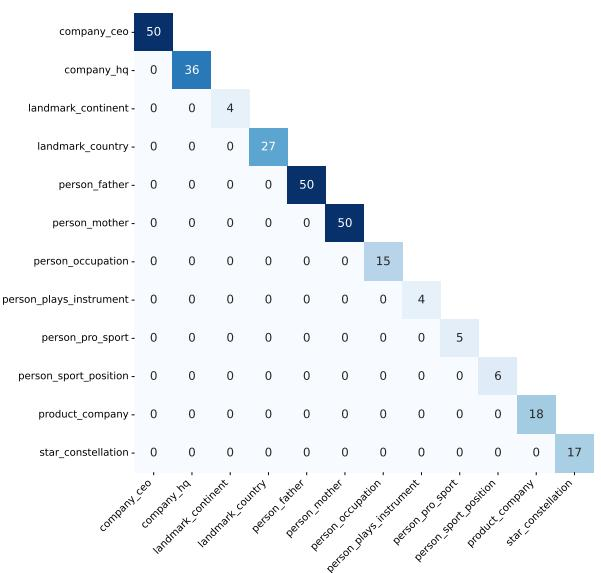

Figure 12: Subject (left) and object (right) overlap across 12 relations in the held-out evaluation prompt set $\mathcal { P } _ { r _ { i } } ^ { \mathrm { e v a } }$ Almost no two relations share any subjects or objects.  
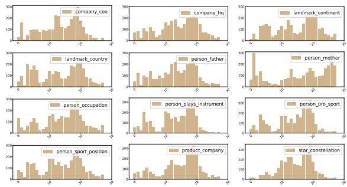  
Figure 13: Distribution of RelSpec neurons across layers for the Gemma-7B model. Compared to the LLama-7B model in Figure 1, identified RelSpec neurons are more evenly distributed across layers. However, the majority of the population is still located in the middle layers.

## D Analysis On the 13B Model

We perform a similar analysis on the 13B model as we do for the 7B model. We first show how the identified 3,000 RelSpec neurons are distributed across layers for each relation in Figure 17. The trend is similar to what we observe in the 7B model (cf. Figure 1). Most of the RelSpec neurons are distributed in the middle layers. Then we show the overlap of RelSpec neurons across relations in Figure 18. Surprisingly, the overlap pattern is very different from what we observe in the 7B model. First, it seems that many relations that share a concept of “location" share extensive neurons, e.g., company\_hq, landmark\_country, landmark\_country and star\_constellation. This explains the difference in inter-relation results between the models (cf. Figure 4) where we see deactivating neurons of landmark\_country significantly influence other relations also concerning location for the 13B model but not for the 7B model.

We then demonstrate the effect of varying numbers of RelSpec neurons using the same numbers: 10, 50, 200, 500, 1,000, 3,000, 10,000, 20,000, and 50,000. Figure 20 presents the results. The global trend is similar to what we observe for the 7B model: deactivating more neurons results in a further drop in accuracy across all relations. This indicates the neuron cumulativity is universal across models. RelSpec neurons for most relations present a similar cumulative effect to the 13B model. The original two outliers in the 7B model (person\_occupation and person\_company where the accuracy does not drop to 0 in the 7B model) even show a plateau, i.e., the accuracy remains almost unchanged or only slightly decreases. This might suggest that facts belonging to these two relations might be wellmemorized by the models and are less sensitive to the deactivation of RelSpec neurons.

Lastly, we show whether the identified RelSpec neurons from the 13B model are also multilingual. We use the same translated prompt sets as we use for the 7B model. We deactivate the 3,000 neurons identified using English and see how this affects the performance in other languages: German (deu), Spanish (esp), French (fra), Chinese (zho), and Japanese (jpn). The results are presented in Figure 19. We observe similar results as from the

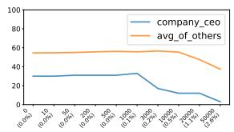

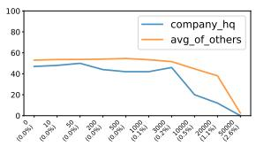

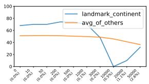

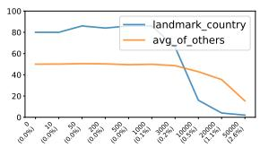

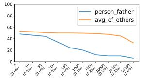

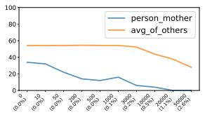

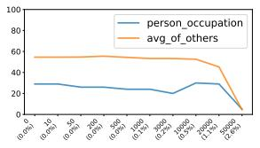

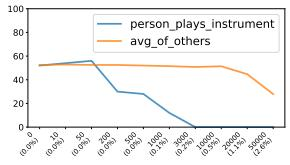

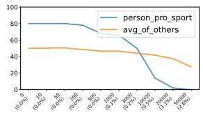

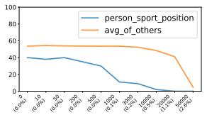

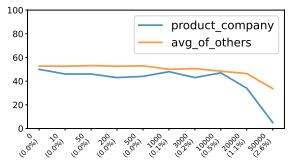

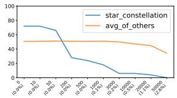  
Figure 14: Influence of deactivating different numbers of RelSpec neurons for each relation (Gemma-7B). The variation of accuracy on the relation itself and the average accuracy on other relations is shown.

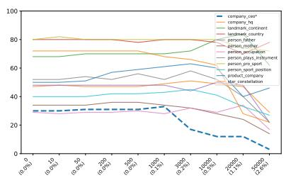

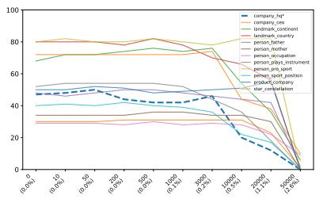

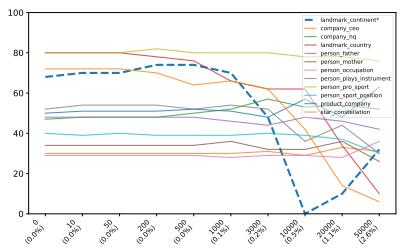

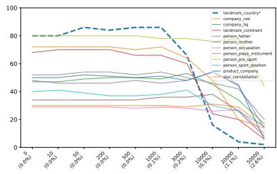

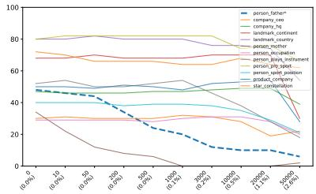

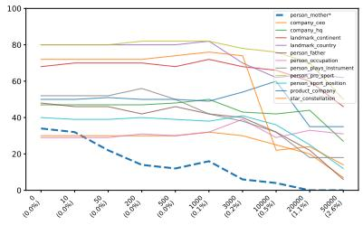

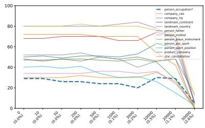

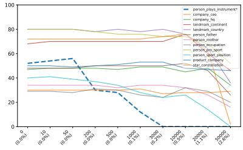

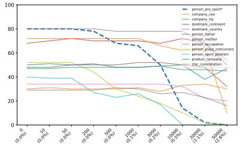

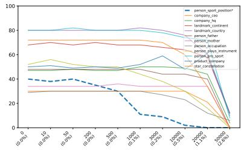

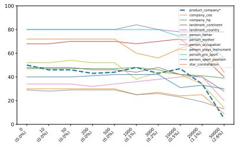

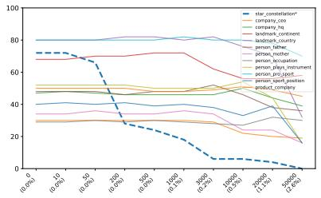  
Figure 15: Influence of deactivating different numbers of RelSpec neurons in the Gemma-7B model for each relation. The variation of accuracy on the relation itself (noted with “\*"and a dashed line style) and the accuracy on all other relations is shown in each figure

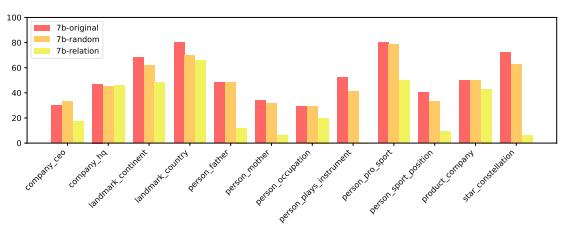

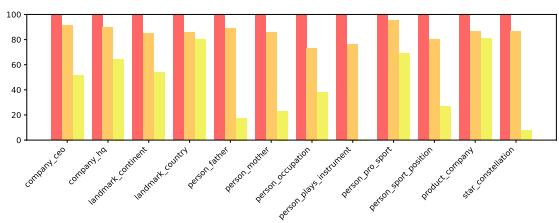  
Figure 16: Intra-relation results on Gemma-7B. The left (resp. right) figure displays the results of held-out evaluation prompt set $\mathcal { P } _ { r _ { i } } ^ { \mathrm { e v a } }$ (resp. identification prompt set $\mathcal { P } _ { r _ { i } } ^ { \mathrm { d e t } } )$ . We report the performance of the original model (without any deactivation), the model with 3,000 random neurons deactivated, and the model with relation neurons deactivated.

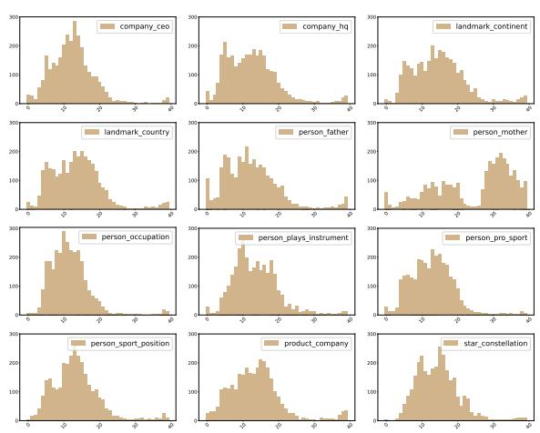  
Figure 17: Distribution of RelSpec neurons across layers for the 13B model. Similar to Figure 1, identified RelSpec neurons are mostly located in the middle layers, except for person\_mother.

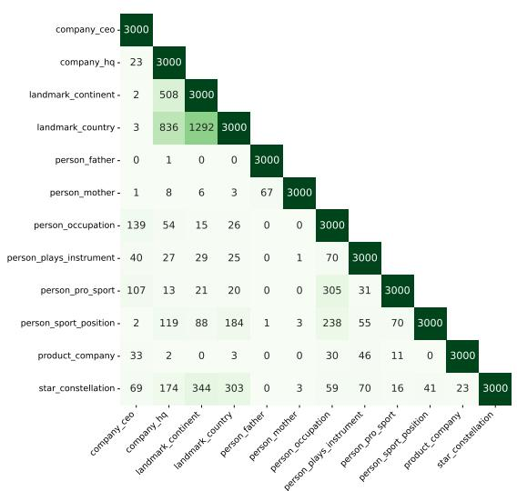  
Figure 18: Neuron overlap of RelSpec neurons across 12 relations in the 13B model. The overlap distribution is not similar to what we observe for the 7B model shown in Figure 2, explaining the difference in inter-relation results (cf. Table 4).

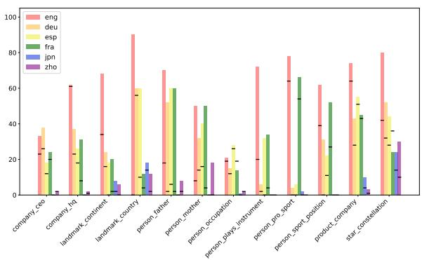  
Figure 19: Accuracy on 12 relations across 6 languages from the 13B model. The bars show the accuracy of the original model, with a horizontal line in each bar that indicates the performance after the deactivation of 3,000 RelSpec neurons.

7B model: when we deactivate RelSpec neurons identified using English prompts, many relations are influenced across languages, suggesting models with different sizes also have multilingual relational neurons. We also see some interesting counterexamples: deactivating landmark\_country neurons completely deteriorates the relation in English but not in German. This indicates while some neurons have multilingual relational functionalities, there are still some relations dealt with in a languagespecific manner.

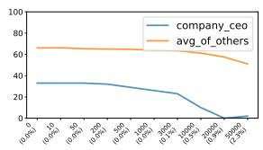

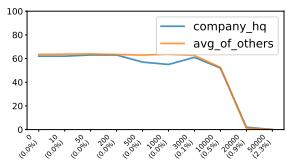

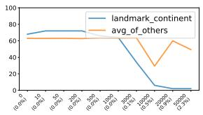

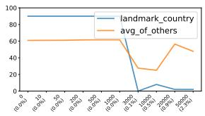

  
Figure 20: Influence of deactivating different numbers of RelSpec neurons for each relation (the 13B model). The variation of accuracy on the relation itself and the average accuracy on other relations is shown.

  
Figure 21: Influence of deactivating different numbers of RelSpec neurons in the 13B model for each relation. The variation of accuracy on the relation itself (noted with “\*"and a dashed line style) and the accuracy on all other relations is shown in each figure.

## E Fact Frequencies vs. Neuron Cumulativity

We now examine our neuron cumulativity hypothesis by asking: why do some facts show higher sensitivity to a given set of relation neurons than others? We hypothesize that the frequency of a fact in the pretraining data can be a key factor, as more frequent facts may be memorized more robustly and thus remain less sensitive to deactivation.

Because the pretraining data for Llama 2 is not publicly available, we approximate it using Dolma (Soldaini et al., 2024), a 3 trillion-token opensource corpus. For each relation, we split the facts into two groups: (a) resilient facts, for which the 7B (or 13B) model correctly predicts the object both before and after deactivating 3,000 RelSpec neurons. (b) sensitive facts, for which the model is correct before but not after these neurons are deactivated.10 We then count how many documents in Dolma contain both the subject and object of each fact, calling this the fact frequency.11Finally, we compute the average frequency for resilient and sensitive facts in each relation $r _ { i } ,$ denoted respecand groupb).

Relative difference: dif $\begin{array} { r } { \dot { \bar { \mathbf { \rho } } } _ { r _ { i } } = \frac { \mathrm { g r o u p } _ { r _ { i } } ^ { ( \mathrm { b } ) } - \mathrm { g r o u p } _ { r _ { i } } ^ { ( \mathrm { a } ) } } { \mathrm { g r o u p } _ { r _ { i } } ^ { ( \mathrm { b } ) } } } \end{array}$ for each relation $r _ { i }$ is reported in Figure 23. We find that resilient facts generally appear more often in Dolma than sensitive facts, with only 3 exceptions in the 7B model and 2 exceptions in the 13B model (note that landmark\_country is omitted for the 13B model because no facts fall into group (a)). We evaluate this difference with the Wilcoxon Signed-Rank Test (Woolson, 2005) and obtain p-values of respectively 0.11 and 0.03 for the 7B and the 13B models.12 These results show that there is a difference (statistically significant in the 13B model at the 5% level) between the two groups, supporting our hypothesis that more frequent facts are generally less sensitive to the deactivation of a given set of RelSpec neurons.

## F Translation Process

We take a two-step approach to ensure the translation quality of individual prompts from English into the target languages across relations.

Translating subject-object pairs. The first step concerns mapping entities, i.e., subject and object pairs, into the target language. The default way of doing this is by identifying if the entity is available in Wikidata and the target language using the Wikidata $\mathsf { A P I } . ^ { 1 3 }$ If the entity of interest is available in the target language, we directly take the entity name in that language. If the entity is not available, we then resort to Google Translate to translate the entity from English to the target language.14. By performing this step, we obtain the subject-object pairs in all target languages and all relations.

Translating prompt templates. We take the prompt templates of different relations written in English and use Google Translate to translate them into target languages. We then investigate how the LLama-2 7B model performs on these prompts using $\mathcal { P } _ { r _ { i } } ^ { \mathrm { e v a } }$ in the target languages. If the model performs suboptimally (<30% accuracy) for a relation in a specific language, then we manually check the prompt template in that language and update the template accordingly until satisfactory accuracy (>30%) is achieved. For Chinese and Japanese, we do not ensure more than 30% accuracy because the models perform very badly for some relations, even if we have tried many prompt templates.

## G Influence of Neuron Type

We consider the neurons in the FFNs (including up\_proj, gate\_proj, and down\_proj matrices) as our major setup. In this section, we explore the individual effects of different types of neurons. Specifically, we consider five additional different varieties when selecting the top 3,000 neurons for the 7B model: al1 (neurons in any matrices), self\_attn (neurons in self-attention matrices), up\_proj (neurons in up\_proj matrices), gate\_proj (neurons in gate\_proj matrices), down\_proj (neurons in down\_proj matrices). We first draw the distribution of the neuron types across relations for variety al1 in Figure 24 and report the inter-relation results in Figure 25 (a11), 26 (self\_attn), 27 (up\_proj), 28 (gate\_proj), and 29 (down\_proj).

  
Figure 22: Influence of deactivating different numbers of RelSpec neurons in the 7B model for each relation. The variation of accuracy on the relation itself (noted with “\*”and a dashed line style) and the accuracy on all other relations is shown in each figure. Similar to Figure 5, increasing the number of neurons clearly affects the relation itself, but the effect on other individual relations does not become clearly noticeable until 3,000–10,000 neurons

<table><tr><td>Relation</td><td colspan="2">10-50 #total #affected</td><td colspan="2">50-200 #total #affected</td><td colspan="2">200-500 #total #affected</td><td colspan="2">500-1000 #total #affected</td><td colspan="2">1000-3000 #total #affected</td><td colspan="2">3000-10000 #total #affected</td><td colspan="2">10000-20000 #total #affected</td><td colspan="2">20000-50000 #total #affected</td></tr><tr><td></td><td></td><td></td><td></td><td>2</td><td></td><td></td><td></td><td>2</td><td></td><td>2</td><td></td><td>3</td><td>2</td><td></td><td>0</td><td></td></tr><tr><td>company_ceo</td><td>1</td><td>0</td><td>3 2</td><td></td><td>5</td><td>0</td><td>7</td><td></td><td>11</td><td></td><td>3</td><td></td><td></td><td></td><td></td><td></td></tr><tr><td>company_hq</td><td>5</td><td>5</td><td></td><td></td><td>2</td><td>0</td><td>16 5</td><td></td><td>5</td><td>0</td><td>9</td><td></td><td>21</td><td>16</td><td></td><td></td></tr><tr><td>landmark_continent</td><td>0</td><td>0</td><td>4</td><td>4</td><td>4</td><td>2</td><td></td><td>0</td><td>6</td><td>2</td><td>13</td><td></td><td>0</td><td>0</td><td>0</td><td>0</td></tr><tr><td>landmark_country</td><td>0</td><td>0</td><td>1</td><td>1</td><td>6</td><td>0</td><td>2 5</td><td>0</td><td>6</td><td>0</td><td>26</td><td>5</td><td>3</td><td>0</td><td>2</td><td>0 4</td></tr><tr><td>person_father person_mother</td><td>3 4</td><td>1 3</td><td>2 1</td><td>0 0</td><td>0 4</td><td>0 3</td><td>0</td><td>0 0</td><td>6 7</td><td>2 5</td><td>6 4</td><td>0</td><td>2 2</td><td></td><td>6 1</td><td></td></tr><tr><td></td><td>3</td><td>3</td><td>9</td><td></td><td>2</td><td>0</td><td>2</td><td>1</td><td>8</td><td>1</td><td>7</td><td>1 5</td><td>6</td><td></td><td>18</td><td>1 6</td></tr><tr><td>person_occupation</td><td>13</td><td>11</td><td>7</td><td>6 2</td><td>5</td><td>0</td><td>8</td><td>0</td><td>3</td><td>0</td><td>6</td><td>0</td><td>0</td><td>2 0</td><td>0</td><td>0</td></tr><tr><td>person_plays_instrument person_pro_sport</td><td>0</td><td>0</td><td>2</td><td>1</td><td>4</td><td>1</td><td>9</td><td>0</td><td>8</td><td>0</td><td>16</td><td>0</td><td>1</td><td>0</td><td>0</td><td>0</td></tr><tr><td>person_sport_position</td><td>7</td><td>2</td><td>4</td><td>0</td><td>12</td><td>4</td><td>4</td><td>2</td><td>20</td><td>11</td><td>6</td><td>0</td><td>0</td><td>0</td><td>0</td><td>0</td></tr><tr><td>product_company</td><td>1</td><td>0</td><td>0</td><td>0</td><td>2</td><td>0</td><td>4</td><td>2</td><td>9</td><td>2</td><td>20</td><td>5</td><td>10</td><td>2</td><td>12</td><td>7</td></tr><tr><td>star_constellation</td><td>8</td><td>7</td><td>6</td><td>2</td><td>3</td><td>0</td><td>6</td><td>1</td><td>14</td><td>0</td><td>1</td><td>0</td><td>4</td><td>0</td><td>0</td><td>0</td></tr><tr><td></td><td></td><td></td><td></td><td></td><td></td><td></td><td></td><td></td><td></td><td></td><td></td><td></td><td></td><td></td><td></td><td></td></tr></table>

Table 3: Cumulative effect validation. For each neuron deactivation range, e.g., 1000-3000, the number of prompts where the model answers correctly in the smaller (1000) but not the larger range (3000) is denoted as column #total, and the number of prompts out of #total that are also affected, i.e., being answered wrongly, when deactivating the intermediate difference (2000 = 3000 - 1000) is denoted as #affected. #affected is usually much smaller than #total, indicating that neurons mostly act in a cumulative way and have no strong effect in isolation.

  
Figure 23: Relative difference between the average fact frequencies of the group (a) resilient facts and (b) sensitive facts for each relation in 7B (top) and 13B (bottom) models. Resilient facts generally appear more often than sensitive facts in most relations in the pertaining data.

  
Figure 24: The distribution of the neuron types in the identified 3,000 neurons for the variety a11 across all relations.

  
Figure 25: Inter-relation results of the 7B model when considering the neuron type variety as al1.

According to the results, we observe that simply considering self\_attn does not offer a consistent accuracy drop for the relation itself (by looking at the diagonal: some relations are not influenced too much). This can be explained by the fact that self\_attn is shared across relations (as shown by Elhelo and Geva (2024)), and facts are mainly stored in the FFNs. Only considering down\_proj offer similar results as self\_attn. Interestingly, deactivating up\_proj neurons does not influence all relations much in general, indicating it does not make sense to consider up\_proj alone. Considering al1 or gate\_proj neurons offer similar results compared to considering neurons in FFNs (shown in Figure 3). However, by considering neurons in FFNs (i.e., up\_proj, gate\_proj and down\_proj), we see a more obvious inter-relation accuracy drop as shown on the diagonal in Figure 3. Therefore, our additional analysis supports our choice of considering neurons in FFNs.

## H Concept-Specific Neurons

Concept-Relation Overlap in the 7B Model Figure 30 illustrates the overlap between individual relation- and concept-specific neurons in the 7b model. There, the overlap of concepts connected to the abstract notion of “location" and the relations are mostly concentrated on the landmark\_country relation in comparison to the 13b model, where they are spread over company\_hq, landmark\_continent and landmark\_country. This aligns with the difference between the 7B and 13B models in terms of their patterns of inter-relation results (cf. Figure 4): deactivating the landmark\_country neurons results in a significant accuracy drop in other relations concerning “location" in the 13B model while not in the 7B model. Another difference between both models is that there is more distributed neuron overlap in the 7b model between the subject concept person and all corresponding relations.

  
Figure 26: Inter-relation results of the 7B model when considering the neuron type variety as self\_attn.

  
Figure 27: Inter-relation results of the 7B model when considering the neuron type variety as up\_proj.

  
Figure 28: Inter-relation results of the 7B model when considering the neuron type variety as gate\_proj.

  
Figure 29: Inter-relation results of the 7B model when considering the neuron type variety as down\_proj.

  
Figure 30: Overlap between the top 3000 identified neurons for each relation and concept in the 7B model.

Validation of Concept-Specific Neurons The top neurons on a concept are evaluated on a random selection of 100 prompts from the LRE dataset that include the specified concept as a subject. Examples for the concept person are "Tom Hanks's father is named? Answer:", "Hilary Hahn plays the instrument of? Answer:", or "Thomas Mann went to university at? Answer:".

Figure 31 shows the results for the validation on these validation prompts for both models with the original accuracy score, a baseline that ablates 3000 neurons randomly, and the ablation of 3000 concept-specific neurons. Note that the impact of ablating a certain amount of expert neurons varies between concepts. The observed drop in performance due to the ablation of 3000 neurons for concepts like pokemon, superhero, and star is very large, while accuracy scores of other concepts in the 13b model, such as person appear stable, or even improve, e.g., presidents. We assume the neuron cumulativity also applies to the conceptspecific neurons. That is, the knowledge on a specific concept is distributed over a much larger population of neurons, and further accuracy drop can be observed once more concept-specific neurons are deactivated – similar to what we observe for RelSpec neurons (cf. Figure 5). As only partial knowledge is withheld from the deactivation of 3000 concept-specific neurons, this might be too little knowledge to affect the facts concerning that concept (substantial knowledge on the concept is stored in the remaining neurons), resulting in only a small accuracy drop. Or, the 3000 concept-specific neurons store knowledge, though concerning the concept, unrelated to the prompts. For instance, the validation prompts of the concept presidents all demand historical dates as predicted answers, which is only one kind of knowledge that might be expected in connection with presidents. This phenomenon actually aligns with our neuron interference hypothesis: deactivating neurons that store unhelpful knowledge can less confuse the model, therefore improving the performance.

  
Figure 31: Accuracy results of evaluation prompts for 11 concepts in the 7b and 13b model. We report the performance of the original model (without any deactivation), e.g., 7b-original, the model with 3000 randomly deactivated neurons, e.g., 7b-random, and the model with deactivating the top 3000 identified concept-specific neurons, e.g., 7b-concept.

## I Experimental Environment

We run all experiments on NVIDIA RTX A6000 GPUs. The Python environment we use is the same as Kojima et al. (2024).15

## J Error Analysis

We manually verified the prompts in each relation that the model could answer correctly originally, but failed to answer correctly when 3,000 RelSpec neurons were deactivated (cf. §4.2). The three most common incorrect responses (regarded as systematic errors) are listed in Table 4.

After we deactivate the RelSpec neurons, we can see that the model appears to lose its ability to recall the correct object. Instead, the model frequently answers with meaningless answers that start with tokens such as “A." or “The", or simply repeats the given prompt. We showcase representative examples of each phenomenon in Table 5, Table 6, and Table 7. The results strongly indicate that the model loses its ability to capture relational semantics, resulting in increasingly noisy outputs after the deactivation of RelSpec neurons.

## K Prompt Templates

We show the actual prompt templates (with an object-subject example) we use for each relation across 6 considered languages: company\_ceo in Table 9, company\_hq in Table 10, landmark\_continent in Table 11, landmark\_country in Table 12, person\_father in Table 13, person\_mother in Table 14, person\_occupation in Table 15,person\_plays\_instrument in Table 16, person\_pro\_sport in Table 17, person\_sport\_position in Table 18, product\_company in Table 19, and star\_constellation in Table 20.

Additionally, we show the templates used for measuring the effect on the general language modeling capability before and after ablating RelSpec neurons (cf. §5.5) in Table 8.

<table><tr><td>Relation</td><td>Repeat Prompt</td><td>Answer with  $^ { 6 6 } T h e ^ { 9 9 }$ </td><td>Answer with  $^ { 6 6 } { \bf A } . ^ { 5 9 }$ </td><td>Total Number</td></tr><tr><td>company_ceo</td><td>47.8%</td><td>8.7%</td><td>34.8%</td><td>23</td></tr><tr><td>company_hq</td><td>46.2%</td><td>46.2%</td><td>0%</td><td>26</td></tr><tr><td>landmark_continent</td><td>17.6%</td><td>5.9%</td><td>0%</td><td>17</td></tr><tr><td>landmark_country</td><td>69.3%</td><td>0%</td><td>0%</td><td>13</td></tr><tr><td>person_father</td><td>84.2%</td><td>5.3%</td><td>0%</td><td>19</td></tr><tr><td>person_mother</td><td>70%</td><td>20%</td><td>0%</td><td>10</td></tr><tr><td>person_occupation</td><td>93.3%</td><td>0%</td><td>0%</td><td>15</td></tr><tr><td>person_plays_instrument</td><td>51.6%</td><td>29%</td><td>0%</td><td>31</td></tr><tr><td>person_pro_sport</td><td>25%</td><td>15%</td><td>0%</td><td>20</td></tr><tr><td>person_sport_position</td><td>18.6%</td><td>11.6%</td><td>44.2%</td><td>43</td></tr><tr><td>product_company</td><td>70.1%</td><td>11.8%</td><td>0%</td><td>17</td></tr><tr><td>star_constellation</td><td>88.6%</td><td>5.7%</td><td>0%</td><td>35</td></tr></table>

Table 4: Most common incorrect answers generated by LLama-7b after deactivating 3,000 RelSpec neurons.

<table><tr><td>Subject-Object Pair</td><td>Prompt</td><td>Expected Output</td><td>Model Response</td><td>Deactivation</td></tr><tr><td rowspan="3">(Panasonic Corporation, Kazuhiro Tsuga)</td><td rowspan="3">Panasonic Corporation&#x27;s CEO is? Answer:</td><td rowspan="3">Kazuhiro Tsuga</td><td>Kazuhiro Tsuga</td><td>No</td></tr><tr><td>[Pan]asonic</td><td>Yes</td></tr><tr><td>Corporation&#x27;s CEO is:\nPanasonic Corporation&#x27;s CEO</td><td></td></tr></table>

Table 5: Model answers by repeating the prompt after deactivating RelSpec neurons. We changed the output length from 2 tokens to 20 tokens to observe the complete output. The part enclosed in “[]”is the first 2 tokens of the output. The triple (Panasonic, company\_ceo, Kazuhiro Tsuga) is selected for demonstration.

<table><tr><td>Subject-Object Pair</td><td>Prompt</td><td>Expected Output</td><td>Model Response</td><td>Deactivation</td></tr><tr><td rowspan="2">(Pagan Federation, London)</td><td>Pagan Federation is headquartered in the city</td><td rowspan="2">London</td><td>London</td><td>No</td></tr><tr><td>of? Answer:</td><td>[The] Pagan Federation is a British organisation that represents the interests of</td><td>Yes</td></tr></table>

Table 6: Model answers with “The" after deactivating RelSpec neurons. We changed the output length from 2 tokens to 20 tokens to observe the complete output. The part enclosed in “[]" is the first 2 tokens of the output. The triple (Pagan Federation, company\_hq, London) is selected for demonstration.

<table><tr><td>Subject-Object Pair</td><td>Prompt</td><td>Expected Output</td><td>Model Response</td><td>Deactivation</td></tr><tr><td rowspan="2">(Damon Huard, quarterback)</td><td rowspan="2">Damon Huard plays in the position of a? Answer:</td><td rowspan="2">quarterback</td><td>Quarterback</td><td>No</td></tr><tr><td>[A.]\nDamon Huard plays in the position of a?\nAnswer: A.</td><td>Yes</td></tr><tr><td>Relation</td><td>Template (Object inserted at &lt;object&gt;)</td></tr><tr><td>person_sport_position</td><td>The jersey was displayed in honor of the legendary player known for their role as &lt;object&gt;.</td></tr><tr><td>person_pro_sport</td><td>The documentary explored the early years of the athlete's rise in the world of &lt;object&gt;.</td></tr><tr><td>person_occupation</td><td>After years of study and dedication, they finally earned recognition as a respected &lt;object&gt;.</td></tr><tr><td>company_hq</td><td>The company's annual report was mailed directly from its headquarters in &lt;object&gt;.</td></tr><tr><td>product_company</td><td>Consumers often associate the iconic design of the device with the brand &lt;object&gt;.</td></tr><tr><td>person_mother</td><td>The award speech concluded with heartfelt thanks to someone very special, &lt;object&gt;.</td></tr><tr><td>person_father</td><td>The biography ended with a touching story about a life lesson from &lt;object&gt;.</td></tr><tr><td>landmark_continent</td><td>The travel show featured stunning views from across the diverse landscapes of &lt;object&gt;.</td></tr><tr><td>landmark_country</td><td>Every year, thousands of tourists visit the historic site located in &lt;object&gt;.</td></tr><tr><td>company_ceo</td><td>The major shift in strategy was attributed to the leadership of &lt;object&gt;.</td></tr><tr><td>person_plays_instrument</td><td>The final movement of the piece was written specifically for the sound of a &lt;object&gt;.</td></tr><tr><td>star_constellation</td><td>Ancient civilizations once navigated the seas by charting the stars in &lt;object&gt;.</td></tr></table>

Table 7: Model answers with “A." after deactivating RelSpec neurons. We changed the output length from 2 tokens to 20 tokens to observe the complete output. The part enclosed in “[]”is the first 2 tokens of the output. The triple (Damon Huard, person\_sport\_position, quarterback) is selected for demonstration..

Table 8: Templates used to construct synthetic sentences for evaluating general language modeling of object tokens in §5.5. Each sentence includes the object in a natural context unrelated to the original subject or relation.

<table><tr><td>Language</td><td>Subject-Object Pair</td><td>Prompt</td><td>Expected Output</td></tr><tr><td>English</td><td>(Panasonic Corporation, Kazuhiro Tsuga)</td><td>Panasonic Corporation's CEO is? Answer: The CEO of Panasonic Corporation is? Answer: Kazuhiro Tsuga The name of the CEO of Panasonic Corporation is? Answer: Who is the CEO of Panasonic Corporation? Their</td><td></td></tr><tr><td>German</td><td>(Panasonic, Kazuhiro Tsuga)</td><td>Der Name des CEO von Panasonic lautet Wer ist der CEO von Panasonic? Ihr Name ist</td><td>Kazuhiro Tsuga</td></tr><tr><td>Spanish</td><td>(Panasonic, Kazuhiro Tsuga)</td><td>Por favor, responda directamente por su nombre. El nombre del director general de Panasonic es Por favor, responda directamente por su nombre ¿Quién es el director general de Panasonic? Su nombre es</td><td>Kazuhiro Tsuga</td></tr><tr><td>French</td><td>(Panasonic, Kazuhiro Tsuga)</td><td>Veuillez répondre directement avec le nom. Le nom du président-directeur général de Panasonic est Veuillez répondre directement avec le nom. Le PDG de Panasonic est nommé</td><td>Kazuhiro Tsuga</td></tr><tr><td>Japanese</td><td>(パナソニック株式会社，津賀一宏)</td><td>名前で直接お答えください。パナソニック 株式会社のCEOの名前は  $1 7 - ( 1 1 - 1 ) = 1 7 - 1 = 1 7$  株式会社のCEOは誰ですか？彼らの名前は</td><td>津賀一宏</td></tr><tr><td>Chinese</td><td>(松下公司,津贺一宏)</td><td>松下公司的首席执行官名字叫做 松下公司的CEO名字叫做</td><td>津贺一宏</td></tr><tr><td>English</td><td>(Cadillac, Detroit)</td><td>The headquarters of Cadillac are in the city of? Answer: The headquarters of Cadillac are in the city of? Answer: Where are the headquarters of Cadillac It is in the</td><td>Detroit</td></tr><tr><td>German</td><td>(Cadillac, Detroit)</td><td>Cadillac hat seinen Hauptsitz in der Stadt von Der Hauptsitz von Cadillac befindet sich in der Stadt von</td><td>Detroit</td></tr><tr><td>Spanish</td><td>(Cadillac, Detroit)</td><td>Cadillac tiene su sede en la ciudad de La sede de Cadillac se encuentra en la ciudad de</td><td>Detroit</td></tr><tr><td>French</td><td>(Cadillac, Détroit)</td><td>Le nom de la ville où se trouve le siège social de Cadillac est La ville où se trouve le siège social de Cadillac s’appelle</td><td>Détroit</td></tr><tr><td>Japanese</td><td>(「キャデラック」，デトロイト)</td><td>「キャデラック」の本社がある都市はとこ ですか 「キャデラック」の本社はどの都市にあり ますか</td><td>デトロイト</td></tr><tr><td>Chinese</td><td>(凯迪拉克,底特律)</td><td>凯迪拉克总部所位于的城市名字叫做 凯迪拉克的总部所在的城市名字叫</td><td>底特律</td></tr></table>

Table 9: Prompts for company\_ceo in different languages. We use the triple (Panasonic, company\_ceo, Kazuhiro Tsuga) as an example. The subject-object pair is represented in the respective language. The prompt shown below the dashed line is the new template introduced for the experiment described in §5.3.

Table 10: Prompts for company\_hq in all languages. We use the triple (Cadillac, company\_hq, Detroit) as an example. The subject-object pair is represented in the respective language. The prompt shown below the dashed line is the new template introduced for the experiment described in §5.3.

<table><tr><td>Language</td><td>Subject-Object Pair</td><td>Prompt</td><td>Expected Output</td></tr><tr><td>English</td><td>(Elbe, Europe)</td><td>Elbe is on the continent of? Answer: What continent is Elbe on? It is on? Answer:</td><td>. Europe</td></tr><tr><td>German</td><td>(Elbe, Europa)</td><td>Bitte geben Sie den Kontinentnamen direkt an, Europa z. B. Europa, Afrika usw. Der Name des Konti- nents, auf dem Elbe liegt, lautet</td><td></td></tr><tr><td>Spanish</td><td>(Elba, Europa)</td><td>El nombre del continente donde se encuentra Elba Europa es</td><td></td></tr><tr><td>French</td><td>(Elbe, Europe)</td><td>Veuillez répondre directement avec le nom du Europe continent. Le nom du continent où se trouve Elbe est</td><td></td></tr><tr><td>Japanese</td><td>(エルベ川,ヨーロッパ)</td><td>エルべ川か所在する大陸の名前は</td><td>ヨーロッパ</td></tr><tr><td>Chinese</td><td>(易北河,欧洲)</td><td>易北河所位于的大洲/大陆名字叫做</td><td>欧洲</td></tr></table>

Table 11: Prompts for the landmark\_continent relation in all languages. We use the triple (Elbe, landmark\_continent, Europe) as an example. The subject-object pair is represented in the respective language. The prompt shown below the dashed line is the new template introduced for the experiment described in §5.3.

<table><tr><td>Language</td><td>Subject-Object Pair</td><td>Prompt</td><td>Expected Output</td></tr><tr><td>English</td><td>(Namba Station, Japan)</td><td>Namba Station is in the country of? Answer: What country is Namba Station in? It is in? Answer:</td><td>Japan</td></tr><tr><td>German</td><td>(Namba Station, Japan)</td><td>In welchem Land liegt Namba Station? Es liegt Japan in</td><td></td></tr><tr><td>Spanish</td><td>(Namba Station, Japan)</td><td>El nombre del país donde se encuentra Namba Japan Station es</td><td></td></tr><tr><td>French</td><td>(Namba Station, Japan)</td><td>Le nom du pays où se trouve Namba Station est</td><td>Japan</td></tr><tr><td>Japanese</td><td>(難波駅,日本)</td><td>難波駅が所在する国の名前は</td><td>日本</td></tr><tr><td>Chinese</td><td>(难波站，日本)</td><td>难波站所位于的国家名字叫做</td><td>日本</td></tr><tr><td>English</td><td>(Ronald Reagan, Jack Reagan)</td><td>Ronald Reagan's father is named? Answer: Who is Ronald Reagan's father? Their father is named? Answer:</td><td>Jack Reagan</td></tr><tr><td>German</td><td>(Ronald Reagan, Jack Reagan)</td><td>Der Vater von Ronald Reagan heißt</td><td>Jack Reagan</td></tr><tr><td>Spanish</td><td>(Ronald Reagan, Jack Reagan)</td><td>El padre de Ronald Reagan se llama</td><td>Jack Reagan</td></tr><tr><td>French</td><td>(Ronald Reagan, Jack Reagan)</td><td>Le père de Ronald Reagan s'appelle</td><td>Jack Reagan</td></tr><tr><td>Japanese</td><td>(ロナルド・レーガン,ジャック・レーガン)</td><td>名前で直接お答えください。ロナルド・ジャック・レーガン レーガンの父親の名前は</td><td></td></tr><tr><td>Chinese</td><td>(罗纳德·里根,杰克·里根)</td><td>罗纳德·里根的父亲名字叫做</td><td>杰克·里根</td></tr></table>

Table 12: Prompts for the landmark\_country relation in all languages. We use the triple (Namba Station, landmark\_country, Japan) as an example. The subject-object pair is represented in the respective language. The prompt shown below the dashed line is the new template introduced for the experiment described in §5.3.

Table 13: Prompts for the person\_father relation in all languages. We use the triple (Ronald Reagan, person\_father, Jack Reagan) as an example. The subject-object pair is represented in the respective language. The prompt shown below the dashed line is the new template introduced for the experiment described in §5.3.

<table><tr><td>Language</td><td>Subject-Object Pair</td><td>Prompt</td><td>Expected Output</td></tr><tr><td>English</td><td>(Demi Moore, Virginia King)</td><td>Demi Moore&#x27;s mother is named? Answer: Name of mother of Demi Moore is? Answer: Who is Demi Moore&#x27;s mother? Their mother is named? Answer:</td><td>Virginia King</td></tr><tr><td>German</td><td>(Demi Moore, Virginia King)</td><td>Die Mutter von Demi Moore heißt</td><td>Virginia King</td></tr><tr><td>Spanish</td><td>(Demi Moore, Virginia King)</td><td>La madre de Demi Moore se llama</td><td>Virginia King</td></tr><tr><td>French</td><td>(Demi Moore, Virginia King)</td><td>Qui est la mère de Demi Moore ? Leur mère Virginia King s’appelle</td><td></td></tr><tr><td>Japanese</td><td>(デミ・ムーア,ヴァージニア・キング)</td><td>名前で直接お答えください。デミ・ムー アの母親の名前は</td><td>ヴァージニア・キン ゲ</td></tr><tr><td>Chinese</td><td>(黛米·摩尔，维吉尼亚·金)</td><td>黛米·摩尔的母亲名字叫做</td><td>维吉尼亚·金</td></tr></table>

Table 14: Prompts for the person\_mother relation in all languages. We use the triple (Demi Moore, person\_mother, Virginia King) as an example. The subject-object pair is represented in the respective language. The prompt shown below the dashed line is the new template introduced for the experiment described in §5.3.

<table><tr><td>Language</td><td>Subject-Object Pair</td><td>Prompt</td><td>Expected Output</td></tr><tr><td>English</td><td>(Martin Burrell, politician)</td><td>Martin Burrell works as a? Answer: By profession, Martin Burrell is a? Answer: Martin Burrell works professionally as a?</td><td>politician</td></tr><tr><td>German</td><td>(Martin Burrell, Politiker)</td><td>Martin Burrell arbeitet als Von Beruf ist Martin Burrell ein</td><td>Politiker</td></tr><tr><td>Spanish</td><td>(Martin Burrell, político)</td><td>Por favor especifique el nombre de su ocupación. Martin Burrell trabaja profesionalmente como Por favor especifique el nombre de su ocupación. Por profesión, Martin Burrell es un(a)</td><td>político</td></tr><tr><td>French</td><td>(Martin Burrell, personnalité politique)</td><td>Veuillez répondre directement par le nom de votre profession. Le nom de la profession de Martin Burrell est Veuillez répondre directement par le nom de votre profession. Martin Burrell travaille profession-</td><td>personnalité politique</td></tr><tr><td>Japanese</td><td>(マーティン・バレル,政治家)</td><td>マーティン・バレルさんの職業名は マーティン・バレルさんの職業名は</td><td>政治家</td></tr><tr><td>Chinese</td><td>(马丁·巴雷尔,政治人物)</td><td>马丁·巴雷尔从事的职业是一个 职业上来说，马丁·巴雷尔是一名</td><td>政治人物</td></tr><tr><td>English</td><td>(Anson Funderburgh, guitar)</td><td>Anson Funderburgh plays the instrument of? Answer: What instrument does Anson Funderburgh play? They play the? Answer: The instrument that Anson Funderburgh plays is</td><td>guitar</td></tr><tr><td>German</td><td>(Anson Funderburgh, Gitarre)</td><td>Bitte geben Sie den Namen des Instruments di- Gitarre rekt an. Das Instrument, das Anson Funderburgh spielt, heißt</td><td></td></tr><tr><td>Spanish</td><td>(Anson Funderburgh, guitarra)</td><td>Por favor responda directamente el nombre del guitarra instrumento ¿Qué instrumento toca Anson Fun- derburgh? Tocan el</td><td></td></tr><tr><td>French</td><td>(Anson Funderburgh, guitare)</td><td>Veuillez répondre directement au nom de guitare l’instrument. De quel instrument joue Anson Fun- derburgh ? Ils jouent du</td><td></td></tr><tr><td>Japanese</td><td>(アンソン・ファンダーパーグ,ギター)</td><td>アンソン・ファンダーバーグはとの楽器をギター 演奏しますか</td><td></td></tr><tr><td>Chinese</td><td>(安森·芬德伯格，吉他)</td><td>安森·芬德伯格所演奏的乐器名字叫做</td><td>吉他</td></tr></table>

Table 15: Prompts for the person\_occupation relation in all languages. We use the triple (Martin Burrel1, person\_occupation, politician) as an example. The subject-object pair is represented in the respective language. The prompt shown below the dashed line is the new template introduced for the experiment described in §5.3.

Table 16: Prompts for the person\_plays\_instrument relation in all languages. We use the triple (Anson Funderburgh, person\_plays\_instrument, guitar) as an example. The subject-object pair is represented in the respective language. The prompt shown below the dashed line is the new template introduced for the experiment described in §5.3.

<table><tr><td>Language</td><td>Subject-Object Pair</td><td>Prompt</td><td>Expected Output</td></tr><tr><td>English</td><td>(Frédéric Piquionne, soccer)</td><td>Frédéric Piquionne plays the sport of? Answer: What sport does Frédéric Piquionne play? They play? Answer:</td><td>soccer</td></tr><tr><td>German</td><td>(Frédéric Piquionne, Fußball)</td><td>Welchen Sport betreibt Frédéric Piquionne? Sie Fußball betreiben</td><td></td></tr><tr><td>Spanish</td><td>(Frédéric Piquionne, fútbol)</td><td>Por favor, responda directamente el nombre del fútbol deporte, como fútbol, baloncesto, etc. El nombre del deporte que juega Frédéric Piquionne es:</td><td></td></tr><tr><td>French</td><td>(Frédéric Piquionne, football)</td><td>Veuillez répondre directement par le nom du sport, football comme le football, le basket-ball, etc. Frédéric Piquionne joue professionnellement dans le sport de</td><td></td></tr><tr><td>Japanese</td><td>(フレデリック・ピキオンヌ,サッカー)</td><td>サッカー、バスケットポールなと、スポーサッカー ツの名前を直接答えてください。フレデ リック・ピキオンヌはとのスポーツをしま すか?彼らは(スポーツ名）をしていま</td><td></td></tr><tr><td>Chinese</td><td>(费德历·比基安尼，足球)</td><td>す。 费德历·比基安尼从事的运动叫做</td><td></td></tr><tr><td>English</td><td>(Ju Yingzhi, midfielder)</td><td>Ju Yingzhi plays in the position of a? Answer: In their sport, Ju Yingzhi plays as a? Answer: Which position does Ju Yingzhi play? They play as a? Answer: In their sport, Ju Yingzhi plays in the position of</td><td>midfielder</td></tr><tr><td>German</td><td>(Ju Yingzhi, Mittelfeldspieler)</td><td>a? Answer: Ju Yingzhi spielt auf der Position von a In ihrer Sportart spielt Ju Yingzhi als</td><td>Mittelfeldspieler</td></tr><tr><td>Spanish</td><td>(Ju Yingzhi, centrocampista)</td><td>Por favor, responda directamente el nombre de la posición deportiva, como delantero, defensor, etc. La posición de Ju Yingzhi en el campo deportivo es: Por favor responda directamente con el nombre de la posición deportiva, como delantero, defensor, etc. En su deporte, Ju Yingzhi juega en la posición</td><td>centrocampista</td></tr><tr><td>French</td><td>(Ju Yingzhi, milieu de terrain)</td><td>de un: Ju Yingzhi évolue au poste de Dans son sport, Ju Yingzhi occupe le rôle de</td><td>milieu de terrain</td></tr><tr><td>Japanese</td><td>(ジュ・インジー,ミッドフィールダー)</td><td>彼がプレーするスポーツでは、ジュ・イン ジーのポジションは ジュ・インジー競技場のポジションは</td><td>ミッドフィールダー</td></tr><tr><td>Chinese</td><td>(鞠盈智，中场)</td><td>鞠盈智在运动场上的位置名字叫做 在他/她从事的运动中，鞠盈智的位置是</td><td>中场</td></tr></table>

Table 17: Prompts for the person\_pro\_sport relation in all languages. We use the triple (Frédéric Piquionne, person\_pro\_sport, soccer) as an example. The subject-object pair is represented in the respective language. The prompt shown below the dashed line is the new template introduced for the experiment described in §5.3.

Table 18: Prompts for the person\_sport\_position relation in all languages. We use the triple (Ju Yingzhi, person\_sport\_position, midfielder) as an example. The subject-object pair is represented in the respective language. The prompt shown below the dashed line is the new template introduced for the experiment described in §5.3.

<table><tr><td>Language</td><td>Subject-Object Pair</td><td>Prompt</td><td>Expected Output</td></tr><tr><td>English</td><td>(Jeep Grand Cherokee, Chrysler)</td><td>Jeep Grand Cherokee was created by which com- pany? Answer: Jeep Grand Cherokee is a product of which com- pany? Answer:</td><td>Chrysler</td></tr><tr><td>German</td><td>(Jeep Grand Cherokee, Chrysler)</td><td>Bitte geben Sie direkt den Firmen-/Ländernamen an. Das Unternehmen/Land, das Jeep Grand Cherokee entwickelt hat, ist Bitte geben Sie direkt den Firmen-/Ländernamen an. Welches Unternehmen hat Jeep Grand Chero- kee entwickelt? Es wurde entwickelt von</td><td>Chrysler</td></tr><tr><td>Spanish</td><td>(Jeep Grand Cherokee, Chrysler)</td><td>Por favor, responda directamente el nombre de la empresa/país. ¿Qué empresa desarrolló Jeep Grand Cherokee? Fue desarrollado por Por favor responda directamente con el nombre de la empresa/país. La empresa que desarrolló Jeep Grand Cherokee se llama</td><td>Chrysler</td></tr><tr><td>French</td><td>(Jeep Grand Cherokee, Chrysler)</td><td>Jeep Grand Cherokee a été développé(e) par Jeep Grand Cherokee est un produit de l’entreprise</td><td>Chrysler</td></tr><tr><td>Japanese</td><td>(ジープ・グランドチェロキー,クライスラー)</td><td>会社名/国名を直接お答えください。ジー プ・グランドチェロキーを開発したのはと の会社ですか?開発したのは次の会社は 会社名/国名を直接お答えください。ジー プ・グランドチェロキーを開発した会社は</td><td>クライスラー</td></tr><tr><td>Chinese</td><td>(吉普大切诺基，克莱斯勒)</td><td>开发了吉普大切诺基的公司名字叫做 开发产品吉普大切诺基的公司名字叫</td><td>克莱斯勒</td></tr><tr><td>English</td><td>(50 Persei E, Perseus)</td><td>50 Persei E is part of the constellation named? Answer: What is the name of the constellation that 50 Per- sei E is part of? It is part of? Answer:</td><td>Perseus</td></tr><tr><td>German</td><td>(50 Persei E, Perseus)</td><td>Bitte geben Sie den Namen des Sternbildes direkt Perseus an. Das Sternbild, zu dem 50 Persei E gehört, heißt</td><td></td></tr><tr><td>Spanish</td><td>(50 Persei E, Perseus)</td><td>50 Persei E forma parte de la constelación denom- Perseus inada</td><td></td></tr><tr><td>French</td><td>(50 Persei E, Persée)</td><td>Le nom de la constellation dans laquelle se trouve Persée 50 Persei E est</td><td></td></tr><tr><td>Japanese</td><td>(50ペルセウス座E,ペルセウス座)</td><td>50ペルセウス座Eはどの星座に属していま すか?それは（星座名）という星座の一部  $\overline { c } \overline { { \ s } } _ { \circ }$ </td><td>ペルセウス座</td></tr><tr><td>Chinese</td><td>(50英仙座E,英仙座)</td><td>50英仙座E所位于的星座名字叫做</td><td>英仙座</td></tr></table>

Table 19: Prompts for the product\_company relation in all languages. We use the triple (Jeep Grand Cherokee, product\_company, Chrysler) as an example. The subject-object pair is represented in the respective language. The prompt shown below the dashed line is the new template introduced for the experiment described in §5.3.

Table 20: Prompts for the star\_constellation relation in all languages. We use the triple (50 Persei E, star\_constellation, Perseus) as an example. The subject-object pair is represented in the respective language. The prompt shown below the dashed line is the new template introduced for the experiment described in §5.3.