# POINTS-Reader: Distillation-Free Adaptation of Vision-Language Models for Document Conversion

Yuan Liu<sup>1</sup>, Zhongyin Zhao<sup>1</sup>, Le Tian<sup>1</sup>, Haicheng Wang<sup>1,2</sup>, Xubing Ye<sup>1,3</sup> Yangxiu You<sup>1</sup>, Zilin Yu<sup>1</sup>, Chuhan Wu<sup>1</sup>, Xiao Zhou<sup>1</sup>, Yang Yu<sup>1</sup>, Jie Zhou<sup>1</sup>

<sup>1</sup>Pattern Recognition Center, WeChat AI, Tencent Inc, China <sup>2</sup>Shanghai Jiao Tong University, <sup>3</sup>Tsinghua University {bensenliu}@tencent.com

## Abstract

High-quality labeled data is essential for training accurate document conversion models, particularly in domains with complex formats such as tables, formulas, and multi-column text. However, manual annotation is both costly and time-consuming, while automatic labeling using existing models often lacks accuracy in handling such challenging scenarios. Consequently, training student models by distilling outputs from teacher models can significantly limit their performance in real-world applica tions. In this paper, we propose a fully automated, distillation-free framework comprising two stages for constructing high-quality document extraction datasets and models capable of handling diverse document formats and layouts. In the first stage, we introduce a method for generating large-scale, diverse synthetic data, which enables a model to extract key elements in a unified format with strong initial performance. In the second stage, we present a selfimprovement approach that further adapts the model, initially trained on synthetic data, to real-world documents. Specifically, we first use the fine-tuned model to annotate real documents, then apply a suite of filtering strategies to verify annotation quality, and finally retrain the model on the verified dataset. By iteratively repeating this process, we progressively en hance both the model’s conversion capabilities and the quality of the generated data. We train a public POINTS-1.5 model to obtain POINTS-Reader, which surpasses many existing public and proprietary models of comparable or larger size. Our model is available at https: //github.com/Tencent/POINTS-Reader<sup>1</sup>.

## 1 Introduction

The internet contains a vast and ever-expanding collection of publicly available documents, including textbooks, scientific articles, and technical reports. These resources encapsulate extensive world knowledge and are essential for pre-training large language models (Yang et al., 2024a; Team et al., 2025; Abdin et al., 2024). However, accurately converting such documents into text—particularly for complex elements like tables and mathematical formulas—remains a significant challenge. Due to the scarcity of high-quality annotated datasets, most existing approaches (Poznanski et al., 2025) address this issue by collecting large-scale documentimage datasets using external models, and subsequently fine-tuning vision-language models (Bai et al., 2025; Chen et al., 2024; Hurst et al., 2024) for end-to-end document conversion. This paradigm introduces two major issues. First, the reliance on external models hinders the research and development of next-generation models, and heavy dependence on distillation may obscure the true effectiveness of training vision-language models from scratch (Cho et al., 2025). Second, student models often fail to fully match the performance of teacher models and may also inherit their biases (Figure 1(b)).

To overcome these limitations, it is necessary to construct datasets without relying on distillation from external models. Compared to labor-intensive manual annotation, generating large amounts of synthetic data appears to be a promising direction. However, due to the substantial differences between synthetic and real-world samples, further adaptation on real-world datasets is required. To this end, we propose a fully automated pipeline for constructing large-scale, high-quality document conversion datasets, consisting of two stages: the Uniform format Warm-up Stage (UWS) and the Iterative Self-improvement Stage (ISS).

Uniform format Warm-up Stage Documents contain a variety of elements, such as plain text, tables, and mathematical formulas, each requiring different output formats. For example, tables can be represented in Markdown, HTML, or LaTeX formats. This diversity increases the learning difficulty for models tasked with document understanding. To address this challenge, we first standardize the output formats for these elements, as detailed in Section 2. Guided by these unified output formats, we generate a large number of document texts using a large language model and render them into images. These image-text pairs are then used to fine-tune a general vision-language model, such as POINTS-1.5 (Liu et al., 2024e). This approach enables the model to accurately output plain text, tables, and formulas in a consistent format, thereby laying the foundation for more robust and generalizable document understanding capabilities.

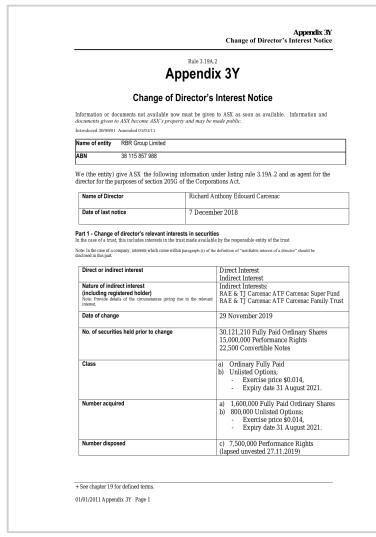  
(a) Original document

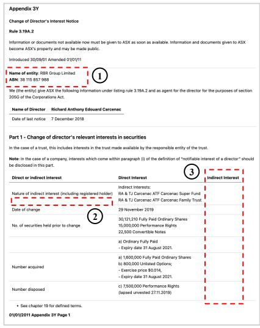  
(b) Annotation generated by Qwen2.5-VL-72B

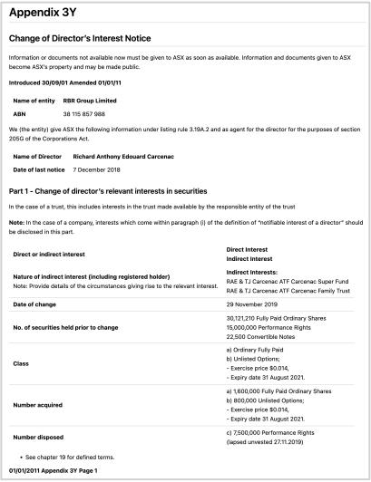  
(c) Annotation generated by POINTS-Reader  
Figure 1: Example annotations generated by Qwen2.5-VL-72B and POINTS-Reader. Distillation may not reach the performance of the teacher model and can inherit its biases, such as (1) failure to recognize tables, (2) missing text, and (3) incorrect table structures.

Iterative Self-improvement Stage. While the model trained in the previous stage can extract key elements from documents in a consistent format, its performance on real-world documents, especially those with complex layouts, remains suboptimal. To bridge this gap, we introduce an iterative selfimprovement framework that enables the model to autonomously generate and refine large-scale, highquality training data. Specifically, we apply the current model to generate textual annotations on large-scale real-world documents. However, these initial outputs often suffer from issues like missing main text, hallucinations(Nassar et al., 2025), incomplete table cells, and syntactic errors in mathematical formulas. To address these challenges, we design targeted filtering strategies to automatically validate the generated data. The refined dataset is then used to further retrain the model. By repeating this process over multiple iterations, both the model’s extraction accuracy and the quality of the generated data improve substantially. Figure 1(c) presents a sample of the data generated at this stage.

Our contributions are summarized as follows:

We propose a distillation-free framework to generate high-quality training data, thereby enhancing end-to-end document conversion models.

We propose a self-improvement method that effectively adapts document conversion models trained on synthetic data to real-world data distributions, without relying on external supervision. We develop a compact yet powerful document conversion model based on a public visionlanguage backbone, achieving state-of-the-art performance across various benchmarks and surpassing even some larger models.

## 2 Methods

This section presents our two-stage pipeline for constructing large quantities of high-quality data for document conversion tasks (Figure 2). In Section 2.1, we describe the creation of a large-scale, auto-rendered dataset with unified output formats for plain text, tables, and mathematical formulas, which is used to warm-up the model. In Section 2.2, we detail our iterative self-improvement process, including data filtering strategies and their underly-

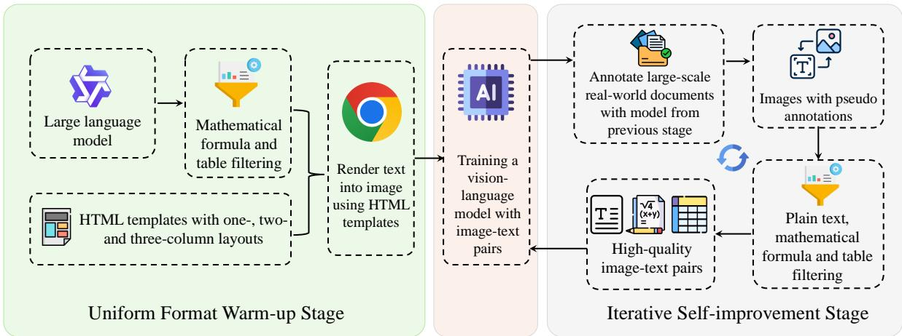  
Figure 2: Demonstration of the two-stage pipeline to generate large-scale high quality dataset.

ing motivations.

## 2.1 Uniform Format Warm-up Stage

Unified Output Format Documents typically consist of four key elements: plain text, tables, mathematical formulas, and images. In this work, we focus on the first three—plain text (including body text, headers, footnotes, captions, etc.), tables, and mathematical formulas—each of which can be represented in various ways in Markdown (for example, tables may be written using native Markdown, HTML, or LaTeX syntax). Outputting these elements in heterogeneous formats complicates the learning process and may introduce confusion for the model. To facilitate effective model learning, we unify the output format for each of these key elements according to the following rules.

1. Plain Text: Represented using Markdown syntax, following previous work(Lv et al., 2023).

2. Tables: We adopt HTML syntax for table representation, as Markdown tables cannot handle complex structures (e.g., merged cells), and LaTeX tables lack standardization (their diverse syntax allows the same table to be represented in multiple ways). To further simplify, we remove all CSS except for merged cell attributes, and omit indentation and line breaks to reduce the token count.

3. Mathematical Formulas: Expressed in LaTeX syntax, following KaTeX(KaTex) conventions: inline formulas are enclosed in single dollar signs (\$), and display formulas in double dollar signs (\$\$).

Examples of these unified formats are provided in the appendix of A.7.

Large-scale Synthetic Data Generation To ensure that our data distribution closely resembles real-world scenarios, we generate data with a high degree of diversity. However, arranging and combining the aforementioned key document elements in various layouts results in an enormous number of possible configurations, making the data construction process highly complex. To address this, we aim to maximize data diversity while simultaneously simplifying the construction process. Consequently, we have created four categories of data: (1) plain text only, (2) text with mathematical formulas, (3) text with tables, and (4) multi-column layouts containing tables. The data generation process consists of two main steps. First, we design category-specific prompts and employ a large language model to generate the corresponding text (see A.6 for prompt details). Second, for tables and formulas, we apply rule-based filtering (the same as those described in the next section). The filtered data is then converted into HTML using templates for single-, two-, and three-column layouts, and rendered as images via Chrome’s headless mode. The resulting image-text pairs are used to fine-tune a general vision-language model, thereby enhancing its ability to extract and output document elements in a unified format.

## 2.2 Iterative Self-improvement Stage

While synthetic data enables large-scale training, its distribution, such as layout, often differs from that of real-world documents. To bridge this gap, we focus on acquiring high-quality real-world data. However, manual annotation is both costly and inefficient. Therefore, we leverage the model trained in the previous stage to generate annotations for real documents, making the quality of these generated annotations crucial to overall performance. To address this, we design a method that iteratively improves data quality through self-improvement. This approach, widely adopted in large language model development (Grattafiori et al., 2024; Yang et al., 2024a; Liu et al., 2024a), relies on effective data filtering strategies: only high-quality samples are retained for subsequent training. Our filtering strategies for plain text, tables, and formulas are rule-based, inspired by DeepSeek-R1 (Guo et al., 2025), and are described below.

Filtering Plain Text The primary challenges in visual text extraction are hallucinations, repetition, and omissions, particularly when dealing with complex layouts (Nassar et al., 2025). Following the approach of CCOCR (Yang et al., 2024b), we employ the F1-score to filter plain text. Specifically, we extract reference text using a traditional OCR model (e.g., PaddleOCR (Du et al., 2020)), and normalize both the model predictions and references by: (1) removing all non-alphanumeric characters and splitting the text by spaces, and (2) counting the occurrences of each unit. We denote the statistics for the model prediction and reference as $P = \{ ( u _ { p } ^ { 0 } , c _ { p } ^ { 0 } ) , ( u _ { p } ^ { 1 } , c _ { p } ^ { 1 } ) , \dots , ( u _ { p } ^ { N - 1 } , c _ { p } ^ { N - 1 } ) \}$ and $T ~ = ~ \{ ( u _ { t } ^ { 0 } , c _ { t } ^ { 0 } ) , ( u _ { t } ^ { 1 } , c _ { t } ^ { 1 } ) , \ldots , ( u _ { t } ^ { N - 1 } , c _ { t } ^ { N - 1 } ) \}$ , respectively, where $u _ { x } ^ { i }$ represents a basic unit (e.g., a single word) and $c _ { x } ^ { i }$ its occurrence count. Precision, recall, and F1-score are then computed as follows:

$$
\mathrm { P r e c i s i o n } = \frac { \sum _ { i = 0 } ^ { N - 1 } \operatorname* { m i n } ( c _ { p } ^ { i } , c _ { t } ^ { i } ) } { \sum _ { i = 0 } ^ { N - 1 } c _ { p } ^ { i } }\tag{1}
$$

$$
{ \mathrm { R e c a l l } } = { \frac { \sum _ { i = 0 } ^ { N - 1 } \operatorname* { m i n } ( c _ { p } ^ { i } , c _ { t } ^ { i } ) } { \sum _ { i = 0 } ^ { N - 1 } c _ { t } ^ { i } } }\tag{2}
$$

$$
\mathrm { F 1 } = \frac { \mathrm { 2 } \times \mathrm { P r e c i s i o n } \times \mathrm { R e c a l l } } { \mathrm { P r e c i s i o n } + \mathrm { R e c a l l } }\tag{3}
$$

Samples with F1-scores below a threshold (e.g., 0.9) are discarded. As traditional OCR models are robust to the aforementioned issues, such as missing main parts of main text and hallucinations, outliers in filtered data are significantly reduced.

Filtering Tables Existing table structure recognition models (e.g., SLANet (Li et al., 2022), StructEqTable (Xia et al., 2024)) tend to be less robust and are often restricted to images containing only tables. Consequently, we do not use their predictions as reference answers. Instead, we focus on ensuring table structural validity: for each table in the model output, we verify the consistency of the number of cells in each row and column. Samples with invalid table structures are subsequently removed.

Filtering Mathematical Formulas For formulas, we verify only syntactic correctness, not semantic validity. All formulas are extracted from the model output and checked for syntax errors. Samples containing invalid formulas are discarded.

All samples that pass these filters are used to retrain the model. This process is repeated for several rounds, resulting in significant improvements in both model performance and data quality. Although we do not verify the content of tables and mathematical formulas, the recognition accuracies for these two elements also steadily improve during this stage (see Figure 10).

## 3 Experiments

This section is organized into three main parts. In Section 3.1, we detail the experimental settings, including the datasets, model architecture, and other relevant implementation details. Next, in Section 3.2, we present comprehensive ablation studies to evaluate the contribution of each component in our design and highlight several noteworthy findings. Finally, in Section 3.3, we compare our model against state-of-the-art methods across a range of benchmark datasets.

## 3.1 Experiment Settings

Datasets During the uniform format warm-up stage, we observed that prompting the LLM to generate text containing tables typically resulted in simple table structures, rarely featuring merged cells or complex layouts. To introduce greater structural diversity, we selected a subset of tables from the PubTabNet (Zhong et al., 2020) training set and prompted the LLM to generate descriptive paragraphs based on their content. The corresponding tables were then randomly inserted into the generated text to create more realistic and challenging samples. For the iterative self-improvement stage, we adopted DocMatix (Laurençon et al., 2024) as our primary dataset. DocMatix, curated from PDFA, contains over two million document images spanning a wide range of scenarios, including academic papers and various document types. In each iteration, our model was used to perform inference on DocMatix, after which the results were filtered and the high-quality outputs were used to further train the model of the next version.

Model Training We used POINTS-1.5 (Liu et al., 2024e) as our base model and Qwen2.5- 3B-Instuct (Yang et al., 2024a) as the large language model (LLM) to balance efficiency and effectiveness. Following the POINTS-1.5 training paradigm, our approach consists of two stages: pretraining and visual instruction tuning. The pretraining stage uses the same data as POINTS-1.5, while the visual instruction tuning stage incorporates all newly generated data from both the warmup and self-improvement stages. Additionally, we included the general datasets used in POINTS-1.5 to further enhance model performance. All training hyperparameters and other settings, except for the data used in visual instruction tuning and maximum context length (8192 in this work) , are kept identical to those in POINTS-1.5.

Evaluation To comprehensively assess our model’s extraction capabilities across plain text, tables, and mathematical formulas, we employ two benchmark datasets: English split of Fox (Liu et al., 2024b) and English split of OmniDocBench (Ouyang et al., 2024). More details about the two benchmarks can be found in the appendix.

## 3.2 Ablation Studies and Observations

In this section, we present comprehensive experiments to evaluate the effectiveness of each component in our two-stage data construction pipeline. Unless otherwise noted, all results are reported using the overall score from OmniDocBench (Ouyang et al., 2024), which assesses performance across plain text, tables, and formulas.

<table><tr><td>Method</td><td>Text↓ Table↓ Formula↓ Order↓ Overall↓</td><td></td><td></td></tr><tr><td>Baseline</td><td>0.551 0.652</td></tr><tr><td>0.730</td><td>0.570 0.626 0.553 0.609</td></tr><tr><td>+Text +Formula</td><td>0.522 0.641 0.721</td></tr><tr><td>0.600 0.530 0.571</td><td>0.5130.640</td></tr><tr><td>+Table 0.495 0.590 +Multi-Column 0.485 0.572</td><td>0.595 0.523 0.551</td></tr></table>

Table 1: Increasing the diversity of data leads to improved performance (lower is better). baseline: model fine-tuned with visual instruction tuning data from POINTS-1.5(Liu et al., 2024e). Order: reading order performance. Data is incrementally added from each category.

## 3.2.1 Uniform Format Warm-up Stage

Increasing data diversity leads to improved experimental results. As previously discussed, we constructed four types of data for this stage: (1)

plain text, (2) text containing mathematical formulas, (3) text with tables, and (4) multi-column layouts with tables. For each type, we generated 200,000 samples (after LaTeX formula and table filtering). Using the SFT data from POINTS-1.5 as a baseline, we incrementally incorporated these new data types. The detailed results are presented in Table 1. The findings indicate that adding data from a specific category not only enhances the model’s performance on that category, but also leads to progressive improvements in overall metrics. Notably, the inclusion of multi-column layout data (multicolumn layouts with tables) resulted in a substantial boost in reading order performance.

When the dataset reaches a certain scale, the model’s performance plateaus. To investigate this, we linearly increased the number of samples per category, expanding the total dataset size from 100,000 to 1.2 million (Figure 3(a)). As shown, model performance ceases to improve—and even declines—once the data size exceeds 800,000. This decline may be attributed to the fact that the distribution of these synthetic data, such as layout, differs substantially from real-world data. As a result, further increasing the volume of such synthetic data can lead to overfitting to these artificial patterns, ultimately degrading the model’s generalization ability. These findings underscore the necessity of the iterative self-improvement stage.

<table><tr><td>Range Text↓ Table↓ Formula↓ Order↓ Overall↓</td></tr><tr><td>(0, +∞) 0.485 0.572 0.511 0.471 0.510</td></tr><tr><td>5) 0.483 0.570 0.520 0.455 0.507 4) 0.480 0.571 0.519 0.453 0.506</td></tr><tr><td>1-51-41-325 3 0.4800.585 0.513 0.434 0.503</td></tr><tr><td>512 0.475 0.572 0.522 0.421 0.498 312 0.479 0.574 0.524 0.430 0.502</td></tr></table>

Table 2: Restricting the aspect ratio of image (automatically generated in the Uniform Format Warmup Stage) within a range can boost the performance (lower is better). Range: we only keep images whose aspect ratio (heigh v.s width) are in within this range.

Excluding data with abnormal aspect ratios can enhance model performance. After obtaining these synthetic data, we manually inspected a subset of images and found that some exhibited abnormal shapes, such as being excessively long. To further improve model performance, we investigated the impact of filtering out samples with abnormal aspect ratios generated during the Uniform Format Warm-up Stage. Since A4 paper—the most prevalent document layout—has an aspect ratio of $\sqrt { 2 } \ ( \mathrm { I S O } \ 2 1 6 )$ , we first analyzed the distribution of aspect ratios in our rendered dataset. We then conducted ablation studies to determine the optimal range for filtering. As shown in Table 2, removing images with aspect ratios outside the range $\textstyle { \left( { \frac { 2 } { 5 } } , { \frac { 5 } { 2 } } \right) }$ leads to improvements in model accuracy. Figure 3(b) further visualizes the aspect ratio distribution before and after filtering (i.e., samples between the red dotted lines).

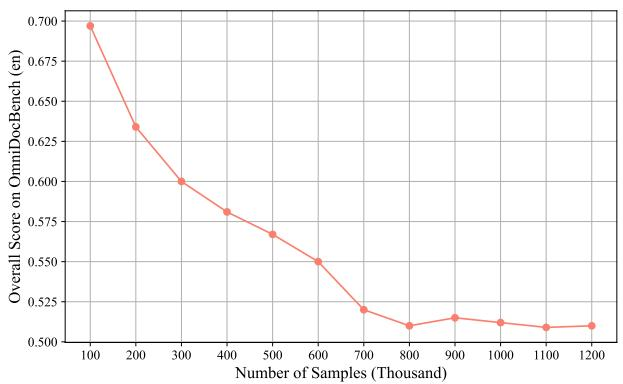  
(a)

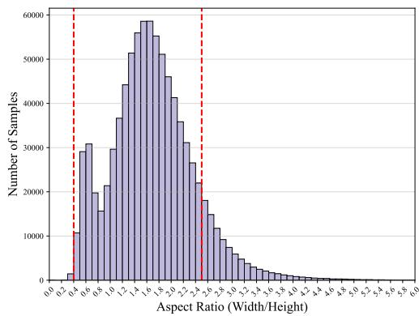  
(b)  
Figure 3: (a) Scaling curve of data generated during the uniform format warm-up stage (lower is better). (b) Distribution of aspect ratios (width/height) in the original dataset. Samples with aspect ratios beyond the red dotted line are filtered out.

## 3.2.2 The Iterative Self-improvement Stage

These filtering strategies effectively increase the quality of the data. We first perform full inference on DocMatrix (Laurençon et al., 2024) using the model obtained from the Uniform Format Warm-up Stage. Subsequently, we sequentially apply our proposed filtering methods for plain text, tables, and mathematical formulas to the dataset. The filtered data is then used for further model training. Specifically, for plain text, we discard all samples with an F1-score below 0.9. The performance of the resulting models is summarized in Table 3. As shown, the model’s performance consistently improves with the application of additional filtering strategies. Moreover, each filtering method plays a crucial role in enhancing the model’s effectiveness on the corresponding tasks. For example, applying the plain text filter reduces the edit distance on textrelated metrics from 0.470 to 0.380. Additionally, we observe that even though the baseline (without any filtering strategies) utilizes 2 million real-world samples from DocMatix, it yields only marginal improvement compared to the model trained solely on synthetic data. This phenomenon underscores the importance of data quality.

<table><tr><td>Filtering Strategy Text↓ Table↓ Formula↓ Order↓ Overall↓</td><td></td><td></td><td></td><td></td></tr><tr><td>N/A</td><td>0.470 0.561</td><td>0.514</td><td>0.430</td><td>0.493</td></tr><tr><td>+Text</td><td>0.3800.551</td><td>0.501</td><td>0.418</td><td>0.463</td></tr><tr><td>+Table</td><td>0.3780.494</td><td>0.500</td><td>0.414</td><td>0.447</td></tr><tr><td>+Formula</td><td>0.374 0.492</td><td>0.457</td><td>0.434</td><td>0.439</td></tr></table>

Table 3: Rule-based data filtering strategies significantly enhance model performance. “N/A” indicates that no filtering strategies are applied; all data generated by the model during the uniform format warm-up stage are used for training in this stage.

The F1-score threshold plays a crucial role in ensuring the quality of training data. Setting the threshold too low introduces excessive lowquality data, which can hinder model performance. Conversely, setting the threshold too high risks discarding a substantial amount of otherwise useful data, thereby reducing the diversity of the training set and negatively impacting model training. This is because traditional OCR models are not flawless (unable to recognize formulas) and some predictions from our model may only omit minor elements, such as page numbers or headers, while still containing all of the main content. To investigate this, we conducted a comprehensive ablation study on different F1-score thresholds, as shown in Table 4. The results indicate that both overly low and overly high thresholds are detrimental to model performance.

<table><tr><td>F1-threshold Text↓ Table↓ Formula↓ Order↓ Overall↓</td><td></td><td></td><td></td></tr><tr><td>0.70 0.399 0.505</td><td>0.469</td><td>0.455</td><td>0.457</td></tr><tr><td>0.80</td><td>0.387 0.504 0.466</td><td>0.451</td><td>0.452</td></tr><tr><td>0.90 0.374 0.492</td><td>0.457</td><td>0.434</td><td>0.439</td></tr><tr><td>0.95</td><td>0.381 0.496 0.460</td><td>0.438</td><td>0.444</td></tr></table>

Table 4: The threshold of F1-score for plain-text filtering is important.

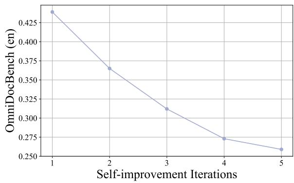  
Figure 4: Model performance steady improves during the self-improvement stage.

We observe improved quality of the real-world data to train our model. As illustrated in Figure 4, increasing the number of iterations consistently enhances model performance. This improvement is also evident in the quality of the generated data, which benefits from additional iterations. To quantitatively assess this trend, we calculate the F1-score between the model’s predictions on Doc-Matrix images and the results produced by PaddleOCR, averaging these scores across all images (Figure 5). The results demonstrate that, as the number of iterations increases, the model’s predictions become increasingly aligned with the target outputs. Prior to each training cycle, we apply the three previously described data filtering methods. The amount of data retained after filtering serves as an additional indicator of data quality. As shown in Figure 6, the number of samples containing all three key elements rises with more iterations. However, although the model continues to improve, the rate of progress has begun to slow, suggesting that performance may soon plateau. To achieve further improvements, it will be necessary to explore additional strategies, such as increasing data diversity, which we leave for future work.

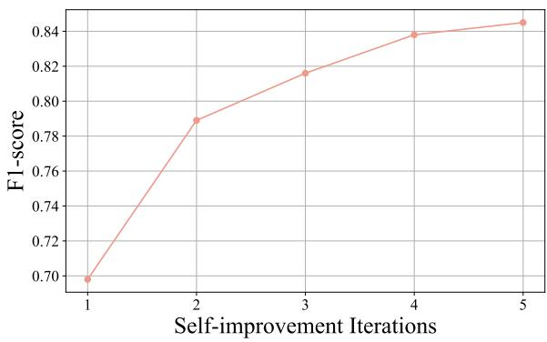  
Figure 5: The F1-score steadily improves during the self-improvement stage. The score is computed prior to data filtering.

## 3.3 Comparison with Other Models

We compare our model against three categories of baselines: pipeline methods, general visionlanguage models, and expert OCR models. For each category, we select the most representative approaches in the industry, with detailed results presented in Table 5. To comprehensively assess performance on plain text, mathematical formulas, and tables, we evaluate all models on four benchmarks. As shown in the table, both general vision-language models and specialized OCR models still lag behind pipeline methods, indicating that end-to-end approaches have considerable room for improvement. Compared to general vision-language models such as Qwen2.5-VL-72B, POINTS-Reader matches or even surpasses larger models on several benchmarks; for instance, it outperforms Qwen2.5- VL-72B on the table metric of OmniDocBench and PubTabNet. Against expert OCR models, POINTS-Reader surpasses the proprietary Mistral OCR by a noticeable margin. Notably, POINTS-Reader excels in table recognition, outperforming GOT-OCR by 0.197 on the Table metric of OmniDocBench.

## 4 Related Works

Vision-Language Models Recent visionlanguage models (Liu et al., 2024c,g,e, 2023, 2024f; Zhang et al., 2023; Li et al., 2024; Bai et al., 2025; Chen et al., 2024) have made significant advances. BLIP2 (Li et al., 2023) reduced training cost by only updating the Q-Former. LLaVA (Liu et al., 2023) further simplified modality alignment and introduced large-scale instruction tuning. Later works (Chen et al., 2024; Zhang et al., 2024) enabled flexible image resolutions via tiling, while Qwen2-VL (Wang et al., 2024b) and Qwen2.5-VL (Bai et al., 2025) adopted NaViT-style (Dehghani et al., 2023) encoders to natively support arbitrary resolutions. Improved evaluation benchmarks (Liu et al., 2024d) have also accelerated progress.

Document Reading Previously, a series of excellent works (Lee et al., 2023; Hu et al., 2024a,b) have aimed to optimize the performance of document conversion and comprehension. Recently, document conversion methods have primarily been categorized into pipeline approaches, which utilize specialized models and extensive manual processing (Wang et al., 2024a; marker, 2024; Team, 2024), and end-to-end approaches, which involve training vision-language models directly on document datasets (Wei et al., 2024; Blecher et al., 2023; Poznanski et al., 2025). However, existing datasets often suffer from noise or rely on distillation from large models. To address these issues, we propose an automatic pipeline to construct large, high-quality datasets for end-to-end training without the need for distillation.

<table><tr><td rowspan="2">Evaluation Protocol→ Method</td><td rowspan="2">Size</td><td colspan="5">OmniDocBench</td><td rowspan="2">Fox</td></tr><tr><td>Text↓</td><td>Formula↓</td><td>Tabl.↓</td><td>Order↓</td><td>Overall.↓ Edit Dist↓</td></tr><tr><td>Pipeline Methods</td><td></td><td></td><td></td><td></td><td></td><td></td><td></td></tr><tr><td>MinerU(Wang et al., 2024a)</td><td></td><td>0.061</td><td>0.278</td><td>0.18</td><td>0.079</td><td>0.150</td><td></td></tr><tr><td>Marker(marker, 2024)</td><td></td><td>0.080</td><td>0.530</td><td>0.619</td><td>0.114</td><td>0.336</td><td>一</td></tr><tr><td>Mathpix(mathpix, 2024)</td><td></td><td>0.105</td><td>0.306</td><td>0.243</td><td>0.108</td><td>0.191</td><td></td></tr><tr><td>General Vision-language Model</td><td></td><td></td><td></td><td></td><td></td><td></td><td></td></tr><tr><td>Qwen2.5-VL-3B(Bai et al., 2025)</td><td>3B</td><td>0.252</td><td>0.429</td><td>0.612</td><td>0.268</td><td>0.390</td><td>0.063</td></tr><tr><td>Qwen2.5-VL-7B(Bai et al., 2025)</td><td>7B</td><td>0.144</td><td>0.436</td><td>0.590</td><td>0.154</td><td>0.331</td><td>0.032</td></tr><tr><td>Qwen2.5-VL-72B(Bai et al., 2025)</td><td>72B</td><td>0.092</td><td>0.315</td><td>0.341</td><td>0.106</td><td>0.214</td><td>0.027</td></tr><tr><td>Expert Vision-language Model</td><td></td><td></td><td></td><td></td><td></td><td></td><td></td></tr><tr><td>GOT-OCR(Wei et al., 2024)</td><td>716M</td><td>0.189</td><td>0.360</td><td>0.532</td><td>0.141</td><td>0.287</td><td>0.035</td></tr><tr><td>Nougat(Blecher et al., 2023)</td><td>350M</td><td>0.365</td><td>0.488</td><td>0.572</td><td>0.382</td><td>0.452</td><td></td></tr><tr><td>Mistral OCR</td><td></td><td>0.072</td><td>0.318</td><td>0.600</td><td>0.083</td><td>0.268</td><td></td></tr><tr><td>OLMOCR(Poznanski et al., 2025)</td><td>7B</td><td>0.097</td><td>0.455</td><td>0.608</td><td>0.145</td><td>0.326</td><td></td></tr><tr><td>POINTS-Reader</td><td>3B</td><td>0.176</td><td>0.383</td><td>0.335</td><td>0.144</td><td>0.259</td><td>0.023</td></tr></table>

Table 5: Comparison with other methods (pipeline and end-to-end) across four benchmarks. The performance of the Qwen2.5-VL series is reported using the same evaluation settings as POINTS-Reader. For other methods, we use the metrics reported in their original papers, or, when unavailable, from subsequent works.

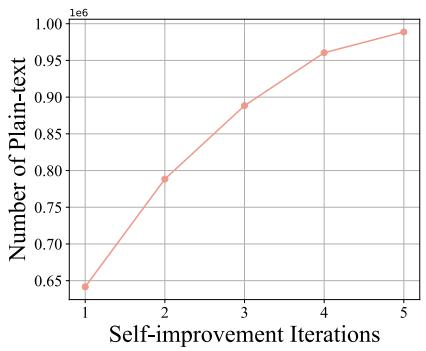  
(a)

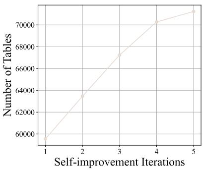  
(b)

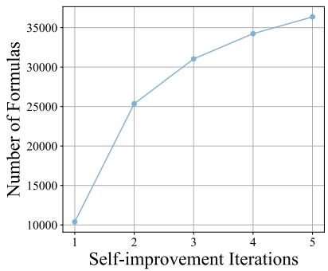  
(c)  
Figure 6: The number of samples after filtering consistently increases.(a) The number of retained samples containing only plain text increases after filtering. (b) The number of retained samples containing tables increases after filtering. (c) The number of retained samples containing tables increases after filtering.

## 5 Conclusion

Traditionally, end-to-end document conversion models are developed by distilling knowledge from proprietary models such as GPT-4o or large-scale open-source models like Qwen2-VL-72B. However, distillation-based approaches face several challenges, including limited scientific innovation and the risk of inheriting the shortcomings of the source models. In this paper, we propose a novel two-stage framework for generating large-scale, high-quality training data for end-to-end document conversion without relying on model distillation. In the first stage, we automatically construct a large dataset and train a model to produce unified outputs for diverse document elements. This model is then employed to generate image-text pairs from real documents, which are rigorously filtered using carefully designed strategies. The resulting highquality data is subsequently used to further train the model. By iteratively repeating this process, we achieve substantial improvements in both data quality and model performance. Our approach ultimately yields a model, achieving state-of-the-art performance across various benchmarks and surpassing even some larger models.

## 6 Limitations

Currently, our model supports only English, which limits its applicability in other widely used languages, such as Chinese and Japanese. Additionally, all datasets used in our current experiments consist of printed fonts, resulting in suboptimal performance when processing handwritten text, such as notes. In the future, we plan to continuously enhance the multilingual capabilities of POINTS-Reader and improve its support for handwritten fonts. Moreover, at present, our model only supports the extraction of plain text, formulas, and tables. We aim to extend this functionality to include the extraction of images, such as identifying and outputting their locations within documents.

## References

Marah Abdin, Jyoti Aneja, Harkirat Behl, Sébastien Bubeck, Ronen Eldan, Suriya Gunasekar, Michael Harrison, Russell J Hewett, Mojan Javaheripi, Piero Kauffmann, and 1 others. 2024. Phi-4 technical report. arXiv preprint arXiv:2412.08905.

Shuai Bai, Keqin Chen, Xuejing Liu, Jialin Wang, Wenbin Ge, Sibo Song, Kai Dang, Peng Wang, Shijie Wang, Jun Tang, and 1 others. 2025. Qwen2. 5-vl technical report. arXiv preprint arXiv:2502.13923.

Lukas Blecher, Guillem Cucurull, Thomas Scialom, and Robert Stojnic. 2023. Nougat: Neural optical understanding for academic documents. arXiv preprint arXiv:2308.13418.

Zhe Chen, Weiyun Wang, Yue Cao, Yangzhou Liu, Zhangwei Gao, Erfei Cui, Jinguo Zhu, Shenglong Ye, Hao Tian, Zhaoyang Liu, and 1 others. 2024. Expanding performance boundaries of open-source multimodal models with model, data, and test-time scaling. arXiv preprint arXiv:2412.05271.

Jang Hyun Cho, Andrea Madotto, Effrosyni Mavroudi, Triantafyllos Afouras, Tushar Nagarajan, Muhammad Maaz, Yale Song, Tengyu Ma, Shuming Hu, Suyog Jain, and 1 others. 2025. Perceptionlm: Openaccess data and models for detailed visual understanding. arXiv preprint arXiv:2504.13180.

Mostafa Dehghani, Basil Mustafa, Josip Djolonga, Jonathan Heek, Matthias Minderer, Mathilde Caron, Andreas Steiner, Joan Puigcerver, Robert Geirhos, Ibrahim M Alabdulmohsin, and 1 others. 2023. Patch n’pack: Navit, a vision transformer for any aspect ratio and resolution. Advances in Neural Information Processing Systems, 36:2252–2274.

Yuning Du, Chenxia Li, Ruoyu Guo, Xiaoting Yin, Weiwei Liu, Jun Zhou, Yifan Bai, Zilin Yu, Yehua Yang, Qingqing Dang, and 1 others. 2020. Pp-ocr: A practical ultra lightweight ocr system. arXiv preprint arXiv:2009.09941.

Aaron Grattafiori, Abhimanyu Dubey, Abhinav Jauhri, Abhinav Pandey, Abhishek Kadian, Ahmad Al-Dahle, Aiesha Letman, Akhil Mathur, Alan Schelten, Alex Vaughan, and 1 others. 2024. The llama 3 herd of models. arXiv preprint arXiv:2407.21783.

Daya Guo, Dejian Yang, Haowei Zhang, Junxiao Song, Ruoyu Zhang, Runxin Xu, Qihao Zhu, Shirong Ma, Peiyi Wang, Xiao Bi, and 1 others. 2025. Deepseek-r1: Incentivizing reasoning capability in llms via reinforcement learning. arXiv preprint arXiv:2501.12948.

Anwen Hu, Haiyang Xu, Jiabo Ye, Ming Yan, Liang Zhang, Bo Zhang, Ji Zhang, Qin Jin, Fei Huang, and Jingren Zhou. 2024a. mPLUG-DocOwl 1.5: Unified structure learning for OCR-free document understanding. In Findings ofthe Associationfor Computational Linguistics: EMNLP 2024, pages 3096–3120, Miami, Florida, USA. Association for Computational Linguistics.

Anwen Hu, Haiyang Xu, Liang Zhang, Jiabo Ye, Ming Yan, Ji Zhang, Qin Jin, Fei Huang, and Jingren Zhou. 2024b. mplug-docowl2: High-resolution compressing for ocr-free multi-page document understanding. arXiv preprint arXiv:2409.03420.

Aaron Hurst, Adam Lerer, Adam P Goucher, Adam Perelman, Aditya Ramesh, Aidan Clark, AJ Ostrow, Akila Welihinda, Alan Hayes, Alec Radford, and 1 others. 2024. Gpt-4o system card. arXiv preprint arXiv:2410.21276.

## KaTex.

Hugo Laurençon, Andrés Marafioti, Victor Sanh, and Léo Tronchon. 2024. Building and better understanding vision-language models: insights and future directions. Preprint, arXiv:2408.12637.

Kenton Lee, Mandar Joshi, Iulia Raluca Turc, Hexiang Hu, Fangyu Liu, Julian Martin Eisenschlos, Urvashi Khandelwal, Peter Shaw, Ming-Wei Chang, and Kristina Toutanova. 2023. Pix2struct: Screenshot parsing as pretraining for visual language understanding. In International Conference on Machine Learning, pages 18893–18912. PMLR.

Bo Li, Yuanhan Zhang, Dong Guo, Renrui Zhang, Feng Li, Hao Zhang, Kaichen Zhang, Peiyuan Zhang, Yanwei Li, Ziwei Liu, and 1 others. 2024. Llavaonevision: Easy visual task transfer. arXiv preprint arXiv:2408.03326.

Chenxia Li, Ruoyu Guo, Jun Zhou, Mengtao An, Yuning Du, Lingfeng Zhu, Yi Liu, Xiaoguang Hu, and Dianhai Yu. 2022. Pp-structurev2: A stronger document analysis system. arXiv preprint arXiv:2210.05391.

Junnan Li, Dongxu Li, Silvio Savarese, and Steven Hoi. 2023. Blip-2: Bootstrapping language-image pretraining with frozen image encoders and large language models. In International conference on machine learning, pages 19730–19742. PMLR.

Aixin Liu, Bei Feng, Bing Xue, Bingxuan Wang, Bochao Wu, Chengda Lu, Chenggang Zhao, Chengqi Deng, Chenyu Zhang, Chong Ruan, and 1 others. 2024a. Deepseek-v3 technical report. arXiv preprint arXiv:2412.19437.

Chenglong Liu, Haoran Wei, Jinyue Chen, Lingyu Kong, Zheng Ge, Zining Zhu, Liang Zhao, Jianjian Sun, Chunrui Han, and Xiangyu Zhang. 2024b. Focus anywhere for fine-grained multi-page document understanding. arXiv preprint arXiv:2405.14295.

Haotian Liu, Chunyuan Li, Yuheng Li, and Yong Jae Lee. 2024c. Improved baselines with visual instruction tuning. In Proceedings of the IEEE/CVF Conference on Computer Vision and Pattern Recognition, pages 26296–26306.

Haotian Liu, Chunyuan Li, Qingyang Wu, and Yong Jae Lee. 2023. Visual instruction tuning. Advances in neural information processing systems, 36:34892– 34916.

Yuan Liu, Haodong Duan, Yuanhan Zhang, Bo Li, Songyang Zhang, Wangbo Zhao, Yike Yuan, Jiaqi Wang, Conghui He, Ziwei Liu, and 1 others. 2024d. Mmbench: Is your multi-modal model an all-around player? In European conference on computer vision, pages 216–233. Springer.

Yuan Liu, Le Tian, Xiao Zhou, Xinyu Gao, Kavio Yu, Yang Yu, and Jie Zhou. 2024e. Points1. 5: Building a vision-language model towards real world applications. arXiv preprint arXiv:2412.08443.

Yuan Liu, Le Tian, Xiao Zhou, and Jie Zhou. 2024f. Rethinking overlooked aspects in vision-language models. arXiv preprint arXiv:2405.11850.

Yuan Liu, Zhongyin Zhao, Ziyuan Zhuang, Le Tian, Xiao Zhou, and Jie Zhou. 2024g. Points: Improving your vision-language model with affordable strategies. arXiv preprint arXiv:2409.04828.

Tengchao Lv, Yupan Huang, Jingye Chen, Yuzhong Zhao, Yilin Jia, Lei Cui, Shuming Ma, Yaoyao Chang, Shaohan Huang, Wenhui Wang, and 1 others. 2023. Kosmos-2.5: A multimodal literate model. arXiv preprint arXiv:2309.11419.

marker. 2024. https://github.com/VikParuchuri/ marker.

mathpix. 2024. https://github.com/Mathpix/ mathpix-markdown-it.

Ahmed Nassar, Andres Marafioti, Matteo Omenetti, Maksym Lysak, Nikolaos Livathinos, Christoph Auer, Lucas Morin, Rafael Teixeira de Lima, Yusik Kim, A Said Gurbuz, and 1 others. 2025. Smoldocling: An ultra-compact vision-language model for end-to-end multi-modal document conversion. arXiv preprint arXiv:2503.11576.

Linke Ouyang, Yuan Qu, Hongbin Zhou, Jiawei Zhu, Rui Zhang, Qunshu Lin, Bin Wang, Zhiyuan Zhao, Man Jiang, Xiaomeng Zhao, Jin Shi, Fan Wu, Pei Chu, Minghao Liu, Zhenxiang Li, Chao Xu, Bo Zhang, Botian Shi, Zhongying Tu, and Conghui He. 2024. Omnidocbench: Benchmarking diverse pdf document parsing with comprehensive annotations. Preprint, arXiv:2412.07626.

Jake Poznanski, Jon Borchardt, Jason Dunkelberger, Regan Huff, Daniel Lin, Aman Rangapur, Christopher Wilhelm, Kyle Lo, and Luca Soldaini. 2025. olmocr: Unlocking trillions of tokens in pdfs with vision language models. arXiv preprint arXiv:2502.18443.

Deep Search Team. 2024. Docling technical report. 10.48550/arXiv.2408.09869.

Kimi Team, Angang Du, Bohong Yin, Bowei Xing, Bowen Qu, Bowen Wang, Cheng Chen, Chenlin Zhang, Chenzhuang Du, Chu Wei, and 1 others. 2025. Kimi-vl technical report. arXiv preprint arXiv:2504.07491.

Bin Wang, Chao Xu, Xiaomeng Zhao, Linke Ouyang, Fan Wu, Zhiyuan Zhao, Rui Xu, Kaiwen Liu, Yuan Qu, Fukai Shang, and 1 others. 2024a. Mineru: An open-source solution for precise document content extraction. arXiv preprint arXiv:2409.18839.

Peng Wang, Shuai Bai, Sinan Tan, Shijie Wang, Zhihao Fan, Jinze Bai, Keqin Chen, Xuejing Liu, Jialin Wang, Wenbin Ge, and 1 others. 2024b. Qwen2- vl: Enhancing vision-language model’s perception of the world at any resolution. arXiv preprint arXiv:2409.12191.

Haoran Wei, Chenglong Liu, Jinyue Chen, Jia Wang, Lingyu Kong, Yanming Xu, Zheng Ge, Liang Zhao, Jianjian Sun, Yuang Peng, and 1 others. 2024. General ocr theory: Towards ocr-2.0 via a unified end-toend model. arXiv preprint arXiv:2409.01704.

Renqiu Xia, Song Mao, Xiangchao Yan, Hongbin Zhou, Bo Zhang, Haoyang Peng, Jiahao Pi, Daocheng Fu, Wenjie Wu, Hancheng Ye, and 1 others. 2024. Docgenome: An open large-scale scientific document benchmark for training and testing multi-modal large language models. arXiv preprint arXiv:2406.11633.

An Yang, Baosong Yang, Beichen Zhang, Binyuan Hui, Bo Zheng, Bowen Yu, Chengyuan Li, Dayiheng Liu, Fei Huang, Haoran Wei, and 1 others. 2024a. Qwen2. 5 technical report. arXiv preprint arXiv:2412.15115.

Zhibo Yang, Jun Tang, Zhaohai Li, Pengfei Wang, Jianqiang Wan, Humen Zhong, Xuejing Liu, Mingkun Yang, Peng Wang, Yuliang Liu, and 1 others. 2024b. Cc-ocr: A comprehensive and challenging ocr benchmark for evaluating large multimodal models in literacy. arXiv preprint arXiv:2412.02210.

Pan Zhang, Xiaoyi Dong, Bin Wang, Yuhang Cao, Chao Xu, Linke Ouyang, Zhiyuan Zhao, Haodong Duan, Songyang Zhang, Shuangrui Ding, and 1 others. 2023. Internlm-xcomposer: A vision-language large model for advanced text-image comprehension and composition. arXiv preprint arXiv:2309.15112.

Pan Zhang, Xiaoyi Dong, Yuhang Zang, Yuhang Cao, Rui Qian, Lin Chen, Qipeng Guo, Haodong Duan, Bin Wang, Linke Ouyang, and 1 others. 2024. Internlm-xcomposer-2.5: A versatile large vision language model supporting long-contextual input and output. arXiv preprint arXiv:2407.03320.

Xu Zhong, Elaheh ShafieiBavani, and Antonio Jimeno Yepes. 2020. Image-based table recognition: data, model, and evaluation. In European conference on computer vision, pages 564–580. Springer.

## A Appendix

## A.1 More Experiment Results

Loading weights from a previous model can degrade performance. We compare the performance of models initialized with weights from a pre-trained model and those initialized with weights from a previous version of the model. As shown in Figure 8, models initialized from the pretrained model consistently outperform those initialized from the previous version. The data used in the previous version inherently contains some noise, which can negatively affect the model trained on it. In contrast, models initialized from the pre-trained model are not subject to this issue.

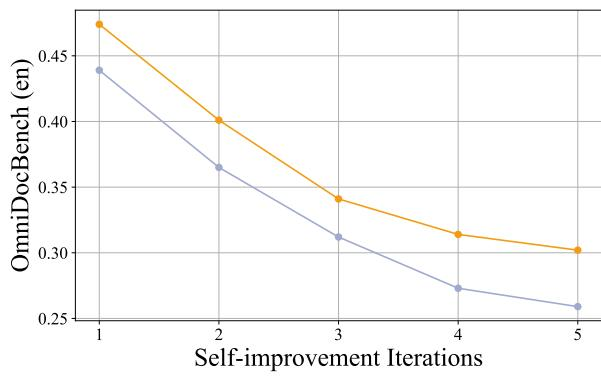  
Figure 7: Loading weights from a previous model can degrade performance. The orange line and the purple line represent the performance of models initialized from the previous version and the pre-trained model, respectively.

Including data generated in the UWS into the ISS will benefits the performance of the model. We examine the effect of integrating data generated in UWS into ISS on model performance. The figure below compares model performance before and after the inclusion of UWS-generated data. The results indicate that incorporating data from UWS positively influences model performance. While UWS-generated data is somewhat limited in diversity, its annotations are highly accurate. Consequently, introducing this data into ISS complements the data produced during the ISS stage and further improves the model’s performance.

Comparison with direct distillation from Qwen2.5-VL-72B. In this section, we compare our model with a counterpart trained on data distilled from Qwen2.5-VL-72B (Bai et al., 2025). As shown in Table 6, our model—without any distillation—outperforms the model distilled from

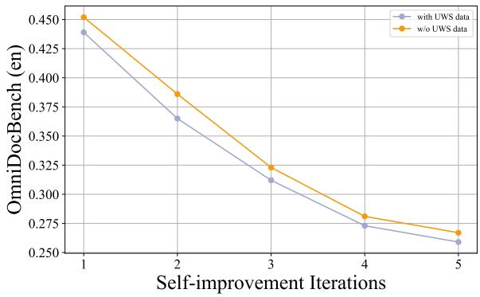  
Figure 8: Including data generated in the UWS into the ISS will benefits the performance of the model. We include data generated from UWS by default during the iterative self-improvement stage.

Qwen2.5-VL-72B by a significant margin. Although Qwen2.5-VL-72B achieves higher overall performance on OmniDocBench compared to PONTS-Reader, the distillation strategy introduces several challenges: (1) it introduces uncertainty in the performance of the student model, which often struggles to fully match the capabilities of the teacher model; and (2) distilling from large-scale flagship models, particularly on sizable datasets, imposes a substantial computational burden.

<table><tr><td>Data</td><td>Text↓ Table↓ Formula↓ Order↓ Overall↓</td><td></td><td></td><td></td></tr><tr><td>Distill</td><td>0.189 0.319</td><td>0.507</td><td>0.195</td><td>0.302</td></tr><tr><td></td><td>POINTS-Reader 0.1760.383</td><td>0.335</td><td>0.144</td><td>0.259</td></tr></table>

Table 6: Comparison with direct distillation from Qwen2.5-VL-72B.

Distribution of the data in the final iteration of the Self-improvement Stage. The figure above illustrates the data distribution in the final iteration of the self-improvement stage. In total, we utilized 2,234,134 DocMatrix images, of which 1,096,325 were used for training in the last stage. Figure 9 (a) presents the distribution of samples that (1) contain only plain text, (2) contain tables, and (3) contain formulas, with 0.1% of the samples containing both tables and formulas. It is evident that samples containing only plain text constitute the vast majority, while those containing tables or formulas represent a much smaller proportion. Figure 9 (b) displays the distribution of sample counts with respect to different token lengths. Most samples have a length of fewer than 1,000 tokens.

Data balance. As illustrated in Figure 9 (a), there is a significant imbalance among samples containing plain text, tables, and formulas. To address this issue, we balance these sample types during training and conduct extensive experiments to determine the optimal sampling ratios for these three key elements. The detailed results are presented in Table 7. As shown, down-sampling plain text samples and up-sampling table and formula samples do not lead to improvements; in fact, they often result in inferior performance. We hypothesize that this is primarily because down-sampling plain text reduces the diversity of training samples, while up-sampling tables and formulas does not increase diversity. Consequently, these approaches impair the generalization ability of the trained model.

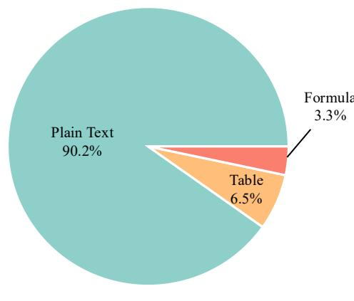  
(a)

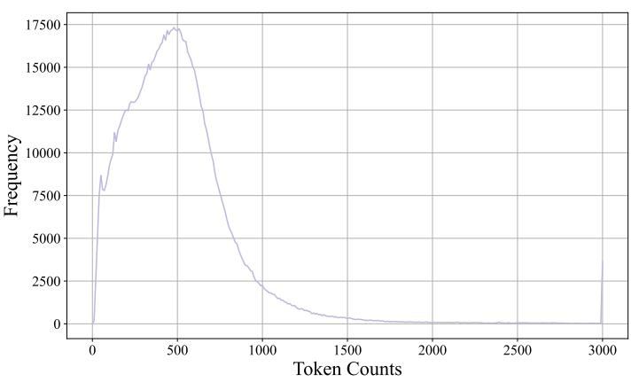  
(b)  
Figure 9: Distribution of data in the final iteration of the Self-improvement Stage. (a) shows the proportion of samples containing only plain text, formulas, and tables. (b) presents the distribution of sample counts with respect to different token lengths.

<table><tr><td>Plain Table Formula Text↓ Table↓ Formula↓ Order↓ Overall↓</td><td></td><td></td><td></td><td></td></tr><tr><td>1.00 1.00 1.00</td><td>0.176 0.383</td><td>0.335</td><td>0.144</td><td>0.259</td></tr><tr><td>0.502.00 4.00</td><td>0.285 50.381</td><td>0.286</td><td>0.266</td><td>0.305</td></tr><tr><td>0.25 4.00 8.00</td><td>0.2940.380</td><td>0.286</td><td>0.276</td><td>0.309</td></tr></table>

Table 7: Ablation about the sampling ratio for different types of samples. Plain: plain text.

Steady improvement As shown in Figure 10, the model’s performance on plain text, tables, and formulas exhibits steady improvement during the self-improvement stage. Notably, although we employ only rule-based filtering strategies—verifying solely the structural integrity of tables and the syntactic correctness of mathematical formulas, without assessing the actual content correctness—the model still demonstrates consistent improvement in recognizing these two elements. These results further demonstrate the effectiveness of such filtering strategies in selecting high-quality data, and highlight a promising direction for future research.

Further analysis of improvements during the self-improvement stage. We first examine how many samples from the previous iteration’s training set are retained, and plot the corresponding ratios on the left side of the following figure. Next, we measure the F1-score of these retained samples and plot the average F1-score statistics on the right side of the figure (for the first iteration, the F1- score is computed across all samples). Combined with the results from Figure 6, we hypothesize that the observed improvements arise from two factors: (1) enhanced quality of the original training data, and (2) increased data diversity resulting from the inclusion of more filtered samples.

## A.2 Comparison with Other Datasets

Although the primary objective of our work is to propose an automated approach for generating high-quality data to train end-to-end document conversion models, we also compare the dataset produced in the final iteration of our selfimprovement process with those used in previous studies from multiple perspectives. Currently, open-source datasets that meet the following criteria are extremely scarce: (1) they contain plain text, tables, and mathematical formulas simultaneously; and (2) their table annotation format can fully represent the structure of all tables, such as through HTML. Table 8 provides a comparison between our dataset and those utilized in related works. It can be observed that the two currently available datasets for end-to-end training both utilize Markdown as the table representation format. However, as previously discussed, Markdown offers limited expressiveness for representing complex tables. Furthermore, both datasets employ distillation methods during their data construction processes. For instance, KOSMOS leverages the Microsoft Read API to annotate scanned documents, while olmOCR relies entirely on data distilled from GPT-4o. Although KOSMOS-2.5 contains a substantial amount of data, its construction approach has certain limitations, such as representing tables in Markdown and directly parsing content from PDFs, which can introduce issues—particularly with mathematical formulas. Consequently, the annotation quality of these datasets is also limited.

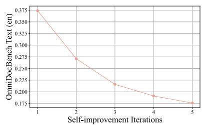  
(a)

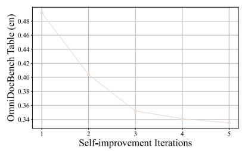  
(b)

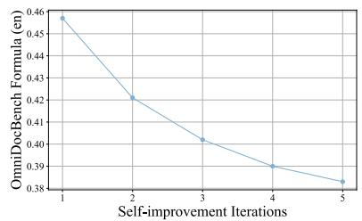  
(c)

Figure 10: Steady improvement of performance on plain text, table and formula during the self-improvement stage.  
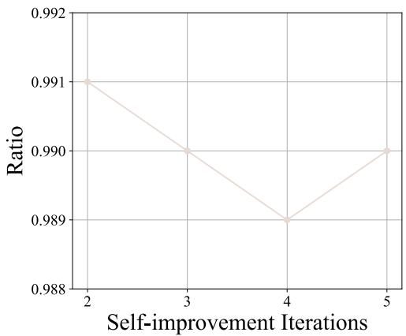

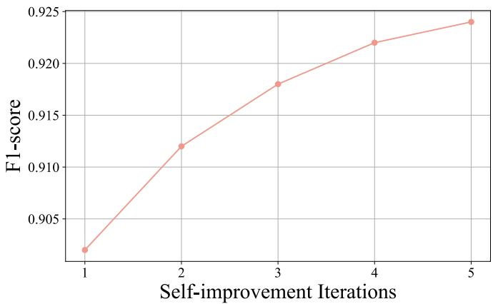  
Figure 11: The retained ratio of data from previous iteration (left) and the F1-score computed on

<table><tr><td>Method</td><td>#Samples Table</td><td></td><td>Distill Lan</td></tr><tr><td>KOSMOS-2.5(Lv et al., 2023)</td><td>357.4M</td><td>MD Yes</td><td>EN</td></tr><tr><td>olmOCR(Poznanski et al., 2025)</td><td>260,000</td><td>MD Yes</td><td>EN</td></tr><tr><td>POINTS-Reader</td><td>1.1M</td><td>HTML No</td><td>EN</td></tr></table>

Table 8: Comparison with datasets used in other works. Table: table format. Distill: whether use distilled data from other models. MD: Markdown.

## A.3 Case Study of Samples Evolved During Iterations

We randomly select three samples generated by the model in both the first and last iterations. The comparisons are presented in the following figures. As shown, the quality of the annotations improves significantly as the model’s performance increases.

## A.4 More Details about Evaluation

Fox : We utilized the English evaluation split, Fox-Page-en, from Fox to assess end-to-end page conversion. Fox-Page-en comprises 112 English pages, featuring both single-column and doublecolumn layouts. Each page contains over 1,000 words, making it a challenging testbed for document image parsing. The evaluation metrics primarily measure the Normalized Edit Distance between the model’s output and the target.

OmniDocBench : OmniDocBench is primarily used for evaluating end-to-end document conversion, encompassing 19 layout types. It includes assessments of text, formulas, tables, and output reading order. Our evaluation and annotation schemes are consistent, with metrics based on Normalized Edit Distance.


# Figure 12: Case study of samples evolved during the self-improvement stage. The first figure shows the original document, the second figure presents the annotation generated by the model in the first iteration, and the last figure displays the annotation produced by the model in the final iteration.

  
Figure 13: Case study of samples evolved during the self-improvement stage. The first figure shows the original document, the second figure presents the annotation generated by the model in the first iteration, and the last figure displays the annotation produced by the model in the final iteration.

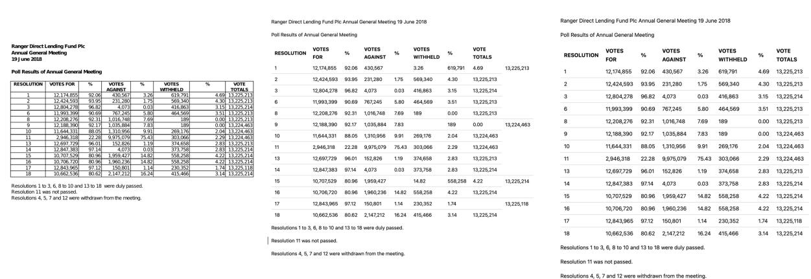  
Figure 14: Case study of samples evolved during the self-improvement stage. The first figure shows the original document, the second figure presents the annotation generated by the model in the first iteration, and the last figure displays the annotation produced by the model in the final iteration.

## A.5 Computational Analysis

We conduct all experiments using 64 Nvidia H800 GPUs. Training on 1 million data samples takes approximately 7 hours. In addition we deploy the model with SGLang, and inference on 2 million DocMatrix samples requires about 10 hours.

## A.6 Prompts For Large-scale Synthetic Data Generation in the Uniform Format Warm-up Stage

Please select one of the following topics and write a MarkDown text with the following requirements with a random seed:   
1. Choose "TOPIC" as the topic with a word count of approximately 300-500 words.   
2. The language and formatting style of the text should be chosen from the provided styles below.   
3. Do not include any tables or mathematical formulas in the text.   
4. You may choose to use some of the following MarkDown syntax elements in your writing:   
- Different levels of headings   
- Bold   
- Italics   
- Bold italics   
- Underline   
- Superscript   
- Subscript   
- Lists   
- Unordered lists   
- Ordered lists   
5. The overall style and organization of the text should be more varied, \*\*avoid always adding conclusions or summaries   
at the end\*\*.   
6. The content of the text does not have to be complete; it can be an excerpt.   
7. Only return the generated text content without any additional explanations, such as descriptions before or after the   
text.   
8. Do not mention the selected language, or formatting style in the text.   
9. Please provide the response in English.   
10. Random seed is SEED   
Available text languages and formatting styles:   
Exam paper, slides, academic paper, book, textbook, magazine, notes, newspaper, financial report

## Prompt for Formulas

Please choose one of the following topics and write a MarkDown text with the following requirements with a random seed:

1. Choose "TOPIC" as the topic and create a text of about 300-400 words.

11. Do not indicate the chosen topic, text language, and format style in the generated text.   
12. Please return in English.   
13. Random seed is SEED

Available text language and format styles:   
Exam paper, slides, academic paper, book, textbook, magazine, notes, newspaper, financial report

Example:   
# The Future of Artificial Intelligence

\*\*Artificial Intelligence\*\* (AI), as one of the most revolutionary technologies of the 21st century, is rapidly changing our way of life and work patterns. The future of AI is full of infinite possibilities, but it also comes with numerous challenges and ethical issues.

\## Technological Advancements and Applications

The advancements in AI technology are mainly reflected in the following areas:

1. \*\*Deep Learning\*\*: Through multi-layer neural networks, AI can process complex data patterns. For example, Convolutional Neural Networks (CNN) perform excellently in image recognition, while Recurrent Neural Networks (RNN) have wide applications in Natural Language Processing (NLP).   
2. \*\*Reinforcement Learning\*\*: AI continuously optimizes the decision-making process through interaction with the environment. A famous example is AlphaGo, which surpassed top human players by playing against itself. 3. \*\*Transfer Learning\*\*: AI can transfer knowledge from one task to another, improving the generalization ability of models.

## ## Application of Mathematical Formulas

In AI research, mathematical formulas play a crucial role. For example, the training process of neural networks can be represented by the following formula:

\$\$   
\textLoss = \frac{1}{N} \sum\_{i=1}{N} L(y\_i, \hat{y}\_i)<sup>ˆ</sup>   
\$\$

where \$L\$ represents the loss function, \$y\_i\$ is the actual value, \$ hat{y}\_i\$ is the predicted value, and \$N\$ is the number of samples.

## ## Ethics and Challenges

Although AI brings many conveniences, it also raises ethical and social issues:

```latex
$$
\text{CNN} = \left( \begin{array}{ccc}
f_1 & f_2 & f_3 \\
f_4 & f_5 & f_6 \\
f_7 & f_8 & f_9 \\
\endarray \right)
$$
```

## Prompt for Tables

Please create a MarkDown text based on the given table and the current random seed, with the following requirements:

1. Create the text based on the content of the table, around 300 words, and insert the table into the generated text.

2. You can choose to use some of the following MarkDown syntax in the creation:

\- Different levels of headings

\- Bold

\- Italic

\- Bold Italic

\- Underline

\- Subscript

\- Lists

\- Unordered lists

\- Ordered lists

3. The style and organization of the whole text should be more varied, \*\*do not always add a summary at the end\*\*

4. The content of this text does not have to be complete, it can be a truncated content

6. Please return in English

7. Insert the table as it is, do not make any changes to the table, and there should be no line breaks or indentations between the html tags

8. The random seed is: SEED

TABLE

## Prompt for Multi-column

Please choose one of the topics given below and, based on the current random seed, write a MarkDown text with the following requirements:

1. Create content based on the theme "TOPIC", with a word count of around 600-800 words.

2. The language and format style of the text should be chosen from the styles provided below.

3. You may insert some Latex formulas, choosing from the following formula styles:

\- Matrix styles, such as matrix, array, pmatrix, bmatrix, vmatrix, Vmatrix, Bmatrix, cases, rcases, smallmatrix, subarray, etc.

\- Multi-line equation styles, such as equation&split, align, gather, alignat, etc.

\- Regular mathematical formula styles, such as frac, sum, etc.

4. Latex formulas can be divided into inline and display; inline formulas use the ’\$...\$’ style, while display formulas use the ’\$\$...\$\$’ style.

5. Both inline and display formulas can be inserted into the generated text.

6. You may choose several MarkDown syntax options to use during creation:

\- Different levels of headings

\- Bold

\- Italic

\- Bold Italic

\- Underline

\- Superscript

\- Subscript

\- Lists

\- Unordered lists

\- Ordered lists

7. The style and organization of the entire text should be more varied; \*\*do not always add concluding remarks at the end\*\*.

8. The content of this text does not have to be complete and can be a truncated piece.

9. Please return only the generated text content, without any additional descriptions before or after.

10. Do not indicate the chosen text language or format style in the returned text.

11. Return the text in English.

12. The random seed is: SEED

13. Divide this text into two paragraphs, with "x— -x" separating the paragraphs.

Available text languages and format styles:

Exam paper, slides, academic paper, book, textbook, magazine, notes, newspaper, financial report

Here is an example:

\# The Wonderful World of Mathematics

Mathematics, this ancient yet vibrant discipline, runs through the entire development of human civilization. From the geometry of ancient Greece to modern topology, mathematics is not only a tool for solving problems but also a way to explore the essence of the world. \*\*The charm of mathematics\*\* lies in its abstraction and universality—whether it’s the laws of nature or phenomena in human society, all can be described and explained using the language of mathematics.

In mathematics, matrices are a very important concept. Matrices occupy a central position in linear algebra and are widely used in physics, computer science, economics, and other fields. An \$m \times n\$ matrix can be represented as:

\$\$

A = \begin{pmatrix}

a\_{11} & a\_{12} & \cdots & a\_{1n} \\

```latex
a_{21} & a_{22} & \cdots & a_{2n} \\
\vdots & \vdots & \ddots & \vdots \\
a_{m1} & a_{m2} & \cdots & a_{mn} \end{pmatrix}
$$
Matrix operations include addition, subtraction, multiplication, and transposition. In particular, matrix multiplication is
not just a simple element-by-element multiplication but involves the inner product of rows and columns. Suppose there
are two matrices $A$ and $B$, their product $C$ can be expressed as:
$$
C = A \cdot B
$$
Here, the elements $c_{ij}$ of $C$ are obtained by the inner product of the $i$-th row of $A$ and the $j$-th column of
$B$:
$$
c_{ij} = \sum_{k=1}{n} a_{ik} b_{kj} <sup>ˆ</sup>
$$
x— -x
Besides matrices, there are many other important concepts and tools in mathematics. For example, calculus is a
mathematical tool for studying change and has wide applications in physics, engineering, and economics. The
fundamental idea of calculus is to study the rate of change and accumulation of functions through the concept of limits.
The derivative $f’(x)$ of a function $f(x)$ represents the instantaneous rate of change of the function at point $x$,
which can be expressed in limit form as:
$$
f’(x) = \lim_{\Delta x \to 0} \frac{f(x + \Delta x) - f(x)}{\Delta x}
$$
Integration is the inverse operation of differentiation, used to calculate the accumulation of a function over an interval.
The definite integral of a function $f(x)$ over the interval $[a, b]$ is expressed as:
$$
\int_{a}{b} f(x) \, dx<sup>ˆ</sup>
$$
The beauty of mathematics lies not only in its rigor and logic but also in its simplicity and elegance. Many mathematical
theorems and formulas are renowned for their concise forms and profound implications. For instance, Euler’s formula
$e{i\pi} + 1 = 0$ ingeniously connects five seemingly unrelated mathematical constants—the base of the natural<sup>ˆ</sup>
logarithm $e$, the imaginary unit $i$, the circle constant $\pi$, 1, and 0—showcasing the inherent harmony of
mathematics.
```

## A.7 Examples of Unified Formats

```markdown
Plain Text
# The Role of Urban Green Spaces in Residents’ Mental Health
Urban green spaces, such as parks, gardens, and tree-lined streets, play a crucial role in the mental health of city dwellers.
These areas are not just aesthetically pleasing; they are vital for psychological well-being, offering a respite from the
urban environment’s constant hustle and bustle. This excerpt explores the various ways in which urban green spaces
contribute to mental health and the mechanisms behind these benefits.
## The Therapeutic Effects of Nature
### Stress Reduction
One of the most significant benefits of urban green spaces is their ability to reduce stress. **Research has shown** that
spending time in natural environments can lower cortisol levels, a hormone associated with stress. The serene and
calming atmosphere of parks and gardens provides a stark contrast to the often chaotic and noisy urban settings. This
shift in environment can help individuals relax and regain a sense of peace.
### Mood Enhancement
Urban green spaces also have a positive impact on mood. *Interacting with nature* can boost feelings of happiness and
well-being. The presence of greenery and natural elements can help alleviate symptoms of depression and anxiety.
```

Activities such as walking, jogging, or simply sitting in a park can enhance one’s mood and provide a sense of tranquility.

## ## Physical Activity and Mental Health

## ### Encouraging Physical Activity

Urban green spaces often serve as venues for physical activities, which are essential for maintaining good mental health. Parks and recreational areas provide opportunities for residents to engage in exercise, such as walking, running, cycling, and team sports. \*\*Regular physical activity\*\* has been linked to reduced rates of depression and anxiety, as well as improved cognitive function.

## ### Social Interaction

These spaces also facilitate social interaction, which is crucial for mental health. Community gardens, playgrounds, and public parks bring people together, fostering a sense of community and belonging. Social connections can provide emotional support and reduce feelings of isolation, which are common in urban environments.

## ## Cognitive Benefits

## ### Improved Attention and Focus

Urban green spaces can also enhance cognitive function. The natural environment has a restorative effect on mental fatigue, helping individuals to concentrate better and perform tasks more efficiently. This is particularly important in urban areas where constant exposure to stimuli can lead to cognitive overload.

## ### Creativity and Problem-Solving

Spending time in nature has been shown to boost creativity and problem-solving skills. The change of scenery and the presence of natural elements can inspire new ideas and perspectives. For students and professionals, urban green spaces can serve as a source of inspiration and a place to recharge.

## ## Conclusion

While the benefits of urban green spaces are well-documented, it is essential to recognize that these areas are not a one-size-fits-all solution. The design and accessibility of green spaces can significantly influence their effectiveness in promoting mental health. \*\*Urban planners and policymakers\*\* must prioritize the creation and maintenance of green spaces to ensure that all residents have access to these vital resources. By doing so, cities can become more livable and supportive environments for their inhabitants.

## Tables

## # Analysis of Sleep Apnea Metrics in Different Age Groups

Sleep apnea is a common disorder that affects both young and middle-aged individuals as well as the elderly. The table below provides a detailed comparison of various sleep apnea metrics between these two age groups, highlighting significant differences in certain parameters.

<table><thead><tr><td></td><td><b>Young and middle age (<i>n</i>= 568, m ± SD)</b></td><td><b>Elderly (<i>n</i>= 129, m ± SD)</b></td><td><b><i>P</i>value</b></td></tr></thead><tbody><tr><td>AHI (events per hour)</td><td>35.14 ± 13.26</td><td>33.14 ± 12.09</td><td>NS</td></tr><tr><td>AHI-REM (events per hour)</td><td>30.72 ± 9.32</td><td>28.16 ± 7.89</td><td>NS</td></tr><tr><td>AHI-NREM (events per hour)</td><td>33.82 ± 12.14</td><td>31.73 ± 11.09</td><td>NS</td></tr><tr><td>Mean apnea/hypopnea duration (sec)</td><td>20.12 ± 6.12</td><td>22.37 ± 6.09</td><td>&lt;0.001\*</td></tr><tr><td>Hypoxemia duration in TST (min)</td><td>51.1 ± 19.12</td><td>73.50 ± 19.07</td><td>0.004\*</td></tr><tr><td>Hypoxemia duration in REM sleep (min)</td><td>8.88 ± 2.46</td><td>7.98 ± 2.68</td><td>NS</td></tr><tr><td>Hypoxemia duration in NREM sleep (min)</td><td>28.08 ± 5.43</td><td>42.43 ± 6.98</td><td>0.021\*</td></tr><tr><td>SatO<sub>2</sub>- REM</td><td>91.89 ± 7.12</td><td>89.91 ± 7.02</td><td>0.013\*</td></tr><tr><td>SatO<sub>2</sub>- NREM</td><td>92.64 ± 5.21</td><td>90.32 ± 5.11</td><td>0.027\*</td></tr></tbody></table> \*\*Table 1: Comparison of Sleep Apnea Metrics Between Young and Middle-Age vs. Elderly Groups\*\*

## Mathematical Formulas

## ### Geometric Shapes

The face can be broken down into basic geometric shapes, which can be mathematically defined:

\- \*\*Eyes\*\*: Circles or ellipses, with a radius \$r\$ and a center at \$(x, y)\$.

\- \*\*Nose\*\*: A triangle or a small circle, with a base \$b\$ and height \$h\$.

\- \*\*Mouth\*\*: A parabolic curve, defined by the equation \$y = ax2 + bx + c\$ <sup>ˆ</sup> .

\$\$   
\text{Eyes} = \left( \begin{array}{c}   
(x\_1, y\_1) \\   
(x\_2, y\_2) \\   
\end{array} \right)   
\$\$   
\$\$   
\text{Nose} = \left( \begin{array}{c}   
(x\_3, y\_3) \\   
\end{array} \right)   
\$\$   
\$\$   
\text{Mouth} = y = ax2 + bx + c<sup>ˆ</sup>   
\$\$

## A.8 Data Samples Constructed during the Iterative Self-improvement Stage

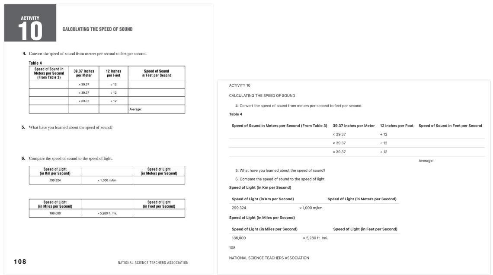  
Figure 15: The left image displays a document from DocMatix, while the right image presents the corresponding text, rendered as an image and automatically generated by our model

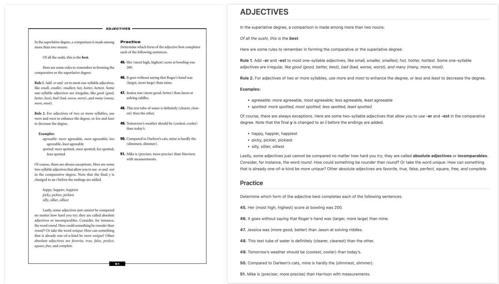  
Figure 16: The left image displays a document from DocMatix, while the right image presents the corresponding text, rendered as an image and automatically generated by our model

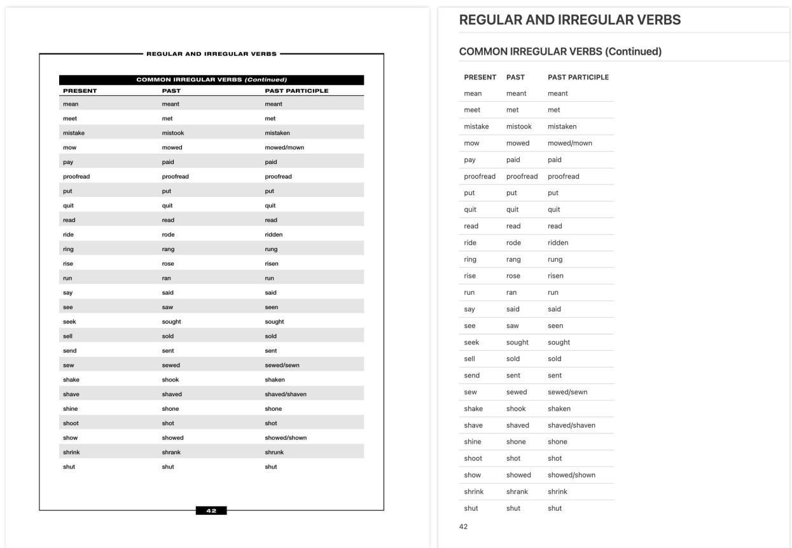  
Figure 17: The left image displays a document from DocMatix, while the right image presents the corresponding text, rendered as an image and automatically generated by our model

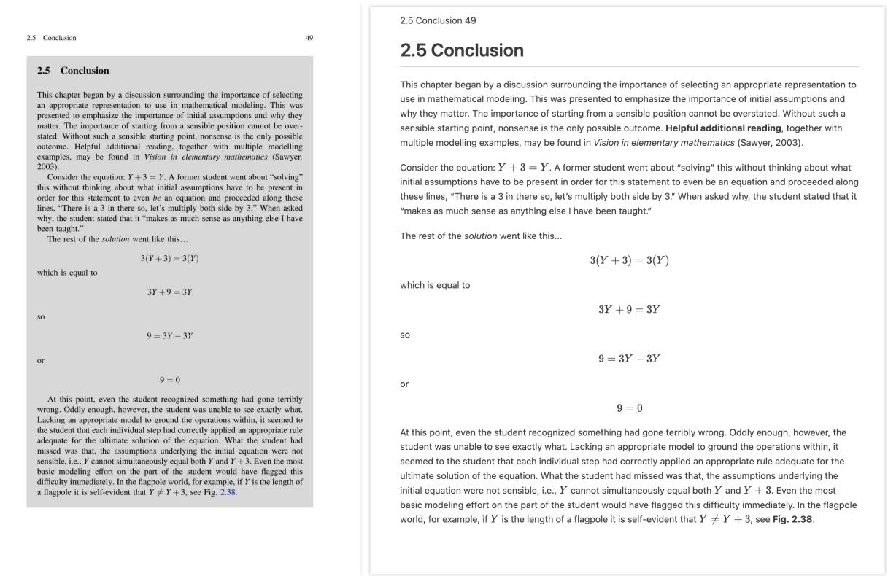  
Figure 18: The left image displays a document from DocMatix, while the right image presents the corresponding text, rendered as an image and automatically generated by our model

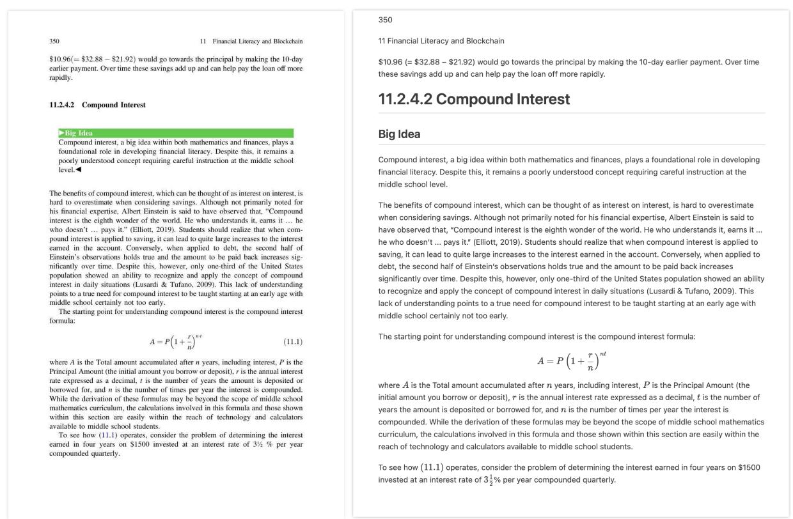  
Figure 19: The left image displays a document from DocMatix, while the right image presents the corresponding text, rendered as an image and automatically generated by our model

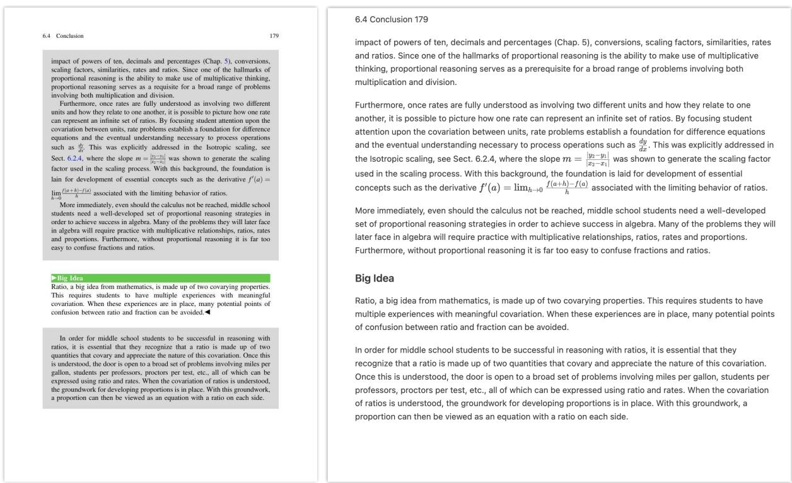  
Figure 20: The left image displays a document from DocMatix, while the right image presents the corresponding text, rendered as an image and automatically generated by our model

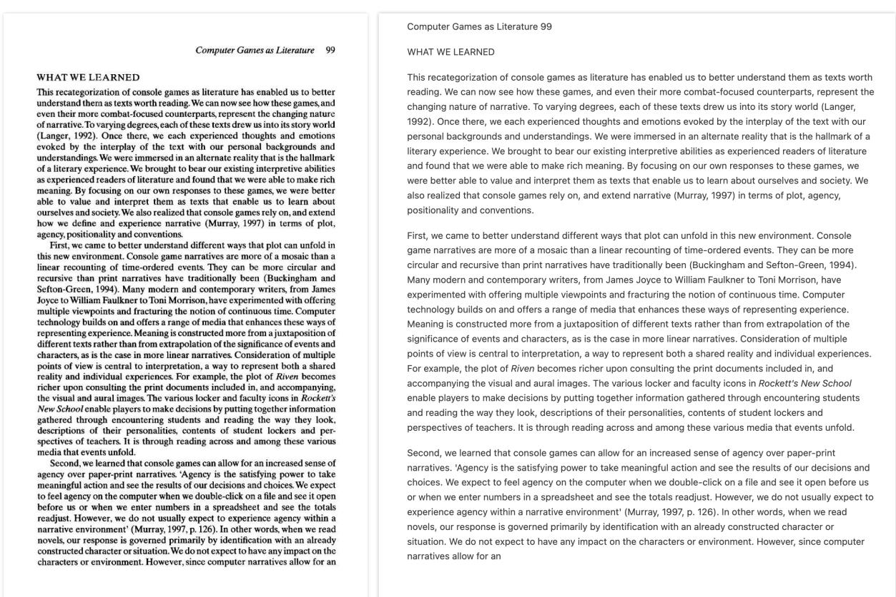  
Figure 21: The left image displays a document from DocMatix, while the right image presents the corresponding text, rendered as an image and automatically generated by our model

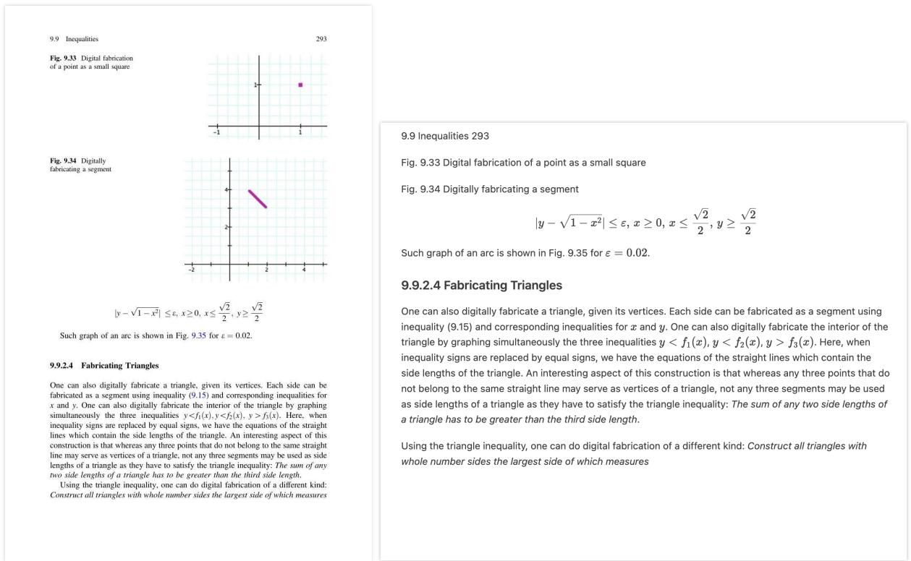  
Figure 22: The left image displays a document from DocMatix, while the right image presents the corresponding text, rendered as an image and automatically generated by our model

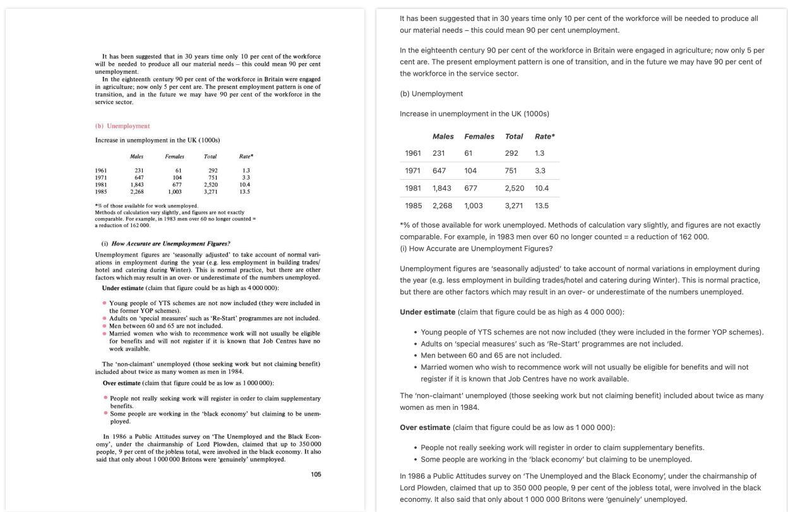  
Figure 23: The left image displays a document from DocMatix, while the right image presents the corresponding text, rendered as an image and automatically generated by our model

importance in the next years and subject to a closer form of scrutiny than in the past.

RTI is basically quite new, and it remains to be seen how various schools and districts will interpret and implement the fairly general federal guidelines. As always, the devil is in the details. It is not a purpose of this book to suggest specific guidelines for RTI implementation. However, it is important to examine RTI in relation to classroom comprehension assessment. All teachers basically represent Tier 1, and their instruction and assessment should be sensitive enough to identify children in need of additional and more focused instruction whether or not a classification of learning disability ever applies. In succeeding chapters, I briefly examine the RTI paradigm in regard to comprehen sion assessment

Summary  
The following table provides a summary of the contents of this chapter
<table><tr><td rowspan=1 colspan=1>What am Iassessing?</td><td rowspan=1 colspan=1>How am Iassessing?</td><td rowspan=1 colspan=1>Why am Iassessing?</td><td rowspan=1 colspan=1>Pulling it together</td></tr><tr><td rowspan=1 colspan=1>Components ofcomprehension:literal, inferential,application</td><td rowspan=1 colspan=1>Formal standardizedassessments</td><td rowspan=1 colspan=1>To evaluate schooleffectiveness.</td><td rowspan=1 colspan=1>Taking multiplesamples</td></tr><tr><td rowspan=1 colspan=1>Mode: reading,listening, viewing</td><td rowspan=1 colspan=1>Informal classroomassessments</td><td rowspan=1 colspan=1>To evaluate studentlearning. RTI.</td><td rowspan=1 colspan=1>Categorizingcomprehension</td></tr><tr><td rowspan=1 colspan=1>Text: narrative,expository, familiar,unfamiliar</td><td rowspan=1 colspan=1>Selected responseassessments</td><td rowspan=1 colspan=1>To determine whystudents struggleacademically. RTI.</td><td rowspan=1 colspan=1>Codingcomprehensioncategories</td></tr><tr><td rowspan=1 colspan=1>Topic: literature,mathematics, socialstudies, science</td><td rowspan=1 colspan=1>Constructedresponse assessments</td><td rowspan=1 colspan=1>To evaluateinstructionaleffectiveness.</td><td rowspan=1 colspan=1></td></tr><tr><td rowspan=1 colspan=1></td><td rowspan=1 colspan=1>Questions</td><td rowspan=1 colspan=1>To provide studentfeedback.</td><td rowspan=1 colspan=1></td></tr><tr><td rowspan=1 colspan=1></td><td rowspan=1 colspan=1>Student dialogue</td><td rowspan=1 colspan=1></td><td rowspan=1 colspan=1></td></tr><tr><td rowspan=1 colspan=1></td><td rowspan=1 colspan=1>Comprehensionproxies, RTI</td><td rowspan=1 colspan=1></td><td rowspan=1 colspan=1></td></tr></table>

## importance in the next years and subject to a closer form of scrutiny than in the past.

RTl is basically guite new, and it remains to be seen how various schools and districts will interpret and implement the fairly general federal guidelines. As always, the devil is in the details. It is not a purpose of this book to suggest specific guidelines for RTl implementation. However, it is important to examine RTl in relation to classroom comprehension assessment. All teachers basically represent Tier 1, and their instruction and assessment should be sensitive enough to identify children in need of additional and more focused instruction whether or not a classification of learning disability ever applies. In succeeding chapters, I briefly examine the RTI paradigm in regard to comprehension assessment

## Summary

<table><tr><td colspan="4">The following table provides a summary of the contents of this chapter.</td></tr><tr><td>What am I assessing?</td><td>How am I assessing?</td><td>Why am I assessing?</td><td>Pulling it together</td></tr><tr><td>Components of comprehension: literal, inferential, application</td><td>Formal standardized assessments</td><td>To evaluate school effectiveness.</td><td>Taking multiple samples</td></tr><tr><td>Mode: reading, listening, viewing</td><td>Informal classroom assessments</td><td>To evaluate student learning. RTI.</td><td>Categorizing comprehension</td></tr><tr><td>Text: narrative, expository, familiar, unfamiliar</td><td>Selected response assessments</td><td>To determine why students struggle academically. RTI.</td><td>Coding comprehension categories</td></tr><tr><td>Topic: literature, mathematics, social studies, science</td><td>Constructed response assessments</td><td>To evaluate instructional effectiveness.</td><td></td></tr><tr><td></td><td>Questions</td><td>To provide student feedback.</td><td></td></tr><tr><td></td><td>Student dialogue</td><td></td><td></td></tr><tr><td></td><td>Comprehension proxies, RTI</td><td></td><td></td></tr></table>

Figure 24: The left image displays a document from DocMatix, while the right image presents the corresponding text, rendered as an image and automatically generated by our model