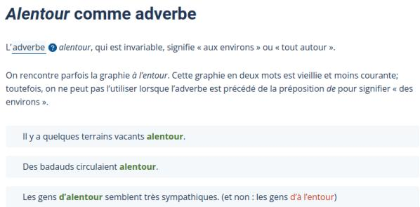

# QFrCoLA: a Quebec-French Corpus of Linguistic Acceptability Judgments

David Beauchemin and Richard Khoury

Group for Research in Artificial Intelligence of Laval University (GRAIL)

Université Laval, Québec, Canada

{david.beauchemin, richard.khoury}@ift.ulaval.ca

## Abstract

Large language models (LLM) perform outstandingly in various downstream tasks. However, there is limited understanding regarding how these models internalize linguistic knowl edge, so various linguistic benchmarks have recently been proposed to facilitate syntactic evaluation of language models (LM) across languages. This paper introduces QFrCoLA (Quebec-French Corpus of Linguistic Acceptability Judgments), a normative binary acceptability judgments dataset comprising 25,153 in-domain and 2,675 out-of-domain sentences. Our study leverages the QFrCoLA dataset and seven other linguistic binary acceptability judgments corpus to benchmark eight LM. The results demonstrate that, on average, finetuned Transformer-based LM are strong baselines for most languages and that zero-shot binary classification LLM perform worse than the naive baseline on the task. However, for the QFrCoLA benchmark, on average, a finetuned Transformer-based LM outperformed other methods tested. It also shows that pretrained cross-lingual LLMs selected for our experimentation do not seem to have acquired linguistic judgment capabilities during their pre-training for Quebec French. Finally, our experiment results on QFrCoLA show that our dataset, built from examples that illustrate linguistic norms rather than speakers’ feelings, is similar to linguistic acceptability judgment; it is a challenging dataset that can benchmark LM on their linguistic judgment capabilities.

## 1 Introduction

The introduction of large language models (LLM) (Touvron et al., 2023) and Transformer-based language model (LM) (Vaswani et al., 2017) has led to significant progress in natural language processing (NLP), substantially increasing the performance of most NLP tasks (Zhang et al., 2023). LLMs were initially introduced for English (Kenton and Toutanova, 2019; Brown et al., 2020; Touvron et al.,

2023), but many other languages were later introduced, such as Russian (Kuratov and Arkhipov, 2019), French (Martin et al., 2020), and Norwegian (Kummervold et al., 2021). NLP research has approached the competencies evaluation of various natural language tasks of LM with various benchmark corpora such as the English benchmarks GLUE (Wang et al., 2018), SuperGLUE (Wang et al., 2019), and GLGE (Liu et al., 2021) to name a few. These corpora are collections of resources for training, evaluating, and analyzing LM (Gao et al., 2023; Chang et al., 2023). For example, GLUE aims to benchmark an NLP system’s capabilities for natural language understanding (NLU) (Wang et al., 2018). At the same time, GLGE focuses on natural language generation (NLG) tasks such as document summarization (Liu et al., 2021).

Recently, much effort has been put into creating linguistic acceptability resources to assess and benchmark LM linguistic competency, where recent NLP research formulate linguistic competency as a binary classification task (Cherniavskii et al., 2022; Proskurina et al., 2023). That is the ability, from a native speaker’s perspective, to distinguish the correct form and naturalness of an acceptable sentence from an unacceptable one (Chomsky, 2014). Recently, similar non-English resources have been proposed to answer this question in typologically diverse languages such as Japanese (Someya et al., 2023), Norwegian (Jentoft and Samuel, 2023), and Chinese (Hu et al., 2023). However, the ability of LMs to perform linguistic acceptability judgments in French remains understudied.

To this end, we introduce the Quebec-French Corpus of Linguistic Acceptability Judgments (QFrCoLA), a corpus consisting of 25,153 indomain and 2,675 out-of-domain normative acceptability judgment sentences, making it the second largest linguistic acceptability resources available in the NLP literature. The main contributions of this work are therefore

1. The creation and release of $\mathbf { Q } \mathrm { F r } \mathbf { C } \mathbf { o } \mathbf { L } \mathbf { A } ^ { 1 }$ , a dataset of normative grammatical and ungrammatical sentences with binary labels;

2. A set of experiments to assess the performance of LM on QFrCoLA;

3. A cross-lingual benchmarking of LM on eight languages, including French, that opens up novel multi-language research perspectives.

It is outlined as follows: first, we study the available linguistic binary acceptability corpus and related binary classification LM research in Section 2. Then, we propose the QFrCoLA in Section 3, and in Section 4 and Section 5 we present a set of experiments aimed at testing the performance of LM binary classifiers on all the linguistic acceptability resource corpora. Finally, in Section 6, we conclude and discuss our future work.

## 2 Related Work

Linguistic acceptability judgment evaluates one capacity to distinguish the correct form and naturalness of an acceptable sentence from an unacceptable one. For instance, individuals can inherently distinguish between two sentences and identify the one that is more acceptable or natural-sounding. This assessment is the primary behavioural benchmark employed by generative linguists to investigate the underlying structure of human language (Chomsky, 2014). Through benchmarking linguistic acceptability judgments of LLM, one can assess their linguistic robustness.

## 2.1 Language Model Evaluation

Historically, evaluation of LMs has been conducted using metrics or benchmark corpora (Chang et al., 2023). The first approach relies either on taskagnostic metrics, such as perplexity (Jelinek et al., 1977) which measures the quality of the probability distribution of words in a given corpus by a model, or on task-specific metrics, like the BLEU score that evaluates a model’s performance for machine translation (Papineni et al., 2002). The second approach relies on large corpora designed for NLU or NLG downstream tasks. For example, the GLUE benchmark (Wang et al., 2018) is used to assess a model’s NLU performance on tasks such as semantic similarity, linguistic acceptability judgment and sentiment analysis. In contrast, GLGE (Liu et al., 2021) evaluates language generation tasks such as summarization and question answering.

<table><tr><td></td><td>Acceptable Sentence | Not Acceptable Sentence</td></tr><tr><td>The cats annoy Tim. | The cats annoys Tim.</td><td></td></tr></table>

Table 1: Example of a minimal pair (Warstadt and Bowman, 2019).

## 2.2 Language Model Linguistic Acceptability Judgments Evaluation

Recently, NLP researchers started using linguistic acceptability judgment tasks to assess the robustness of LMs against grammatical errors (Miaschi et al., 2023) and to probe their grammatical knowledge (Choshen et al., 2022; Mikhailov et al., 2022). Two approaches are used to perform this evaluation: minimal pairs and binary classification acceptability judgments (Chang et al., 2023).

In the first approach, a set of minimal pairs of grammatically acceptable and unacceptable sentences, such as the pair illustrated in Table 1, is presented to an LM. By observing which sentences the LM assigns a higher correctness probability to, one can assess which grammatical phenomena it is sensitive to (Warstadt and Bowman, 2019). Corpus such as BLiMP in English (Warstadt and Bowman, 2019) and CLiMP in Chinese (Xiang et al., 2021) have been proposed to enable the evaluation of LM on a wide range of linguistic phenomena.

In the second approach, a set of sentences that are either grammatical or ungrammatical, such as the two shown in Table 2, are provided to an LM which must perform a binary classification (Warstadt et al., 2019). Seven corpora have been proposed to assess LMs’ capabilities to discriminate proper grammar from improper in their respective languages: CoLA for English (Warstadt et al., 2019), DaLAJ for Swedish (Volodina et al., 2021), ITACoLA for Italian (Trotta et al., 2021), RuCoLA for Russian (Mikhailov et al., 2022), CoLAC for Chinese (Hu et al., 2023), NoCoLA for Norwegian (Jentoft and Samuel, 2023) and JCoLa for Japanese (Someya et al., 2023). However, as of yet, no such corpus exists for French.

Typically, the datasets in the second approach comprise sentences collected from syntax textbooks and linguistics journals. These datasets propose “in-domain” train-dev-test splits to train and evaluate machine learning models. CoLA, Ru-CoLA, CoLAC, and JCoLA corpora also include an “out-of-domain” (OOD) split to assess whether a model suffers from overfitting. However, the definition of OOD varies depending on the corpus. CoLA includes sources of varying degrees of domain specificity and time period compared to those used for the primary dataset (Warstadt and Bowman, 2019). For RuCoLA, they are sentences generated by an automatic machine translation system and paraphrase generation models and annotated by a human annotator (Mikhailov et al., 2022). While JCoLA comprises sentences from the Journal of East Asian Linguistics, a source with typically more complex linguistic phenomena than the other reference use of the in-domain splits (Someya et al., 2023).

<table><tr><td>Label</td><td>Sentence</td></tr><tr><td>0 (Ungrammatical)</td><td>Edoardo returned to his last year city</td></tr><tr><td>1 (Grammatical)</td><td>This woman has impressed me</td></tr></table>

Table 2: Example sentences from the ItaCoLA dataset (Trotta et al., 2021).

## 3 QFrCoLA: Quebec-French Corpus of Linguistic Acceptability Judgments

In this work, we introduce the Quebec-French Corpus of Linguistic Acceptability Judgments (QFrCoLA), which will be the first large-scale normative binary linguistic acceptability judgments dataset for the Quebec-French language and the second-largest corpus in any language.

## 3.1 Sources

QFrCoLA consists of French normative grammatical or ungrammatical sentences taken from two online French sources: the “Banque de dépannage linguistique” (BDL) and the Académie française. The first source is our “in-domain” Quebec-French sentences for the train-dev-test splits, while the second is our OOD hold-out split. Both sources are publicly available online, and we obtained authorization to publish them under a CC-BY-NC 4.0 license.

## 3.1.1 In-Domain Source

The BDL is an official online resource created by the “Office québécois de la langue française” (OQLF), a provincial government public organization in Canada2, making it a reliable normative French resource. It is a normative grammatical resource of 2,667 articles divided into eleven categories, such as “orthographe” (spelling), and “syntaxe” (syntax). These articles explain various normative linguistic phenomena that the OQLF considers correct or incorrect. It uses examples written by French linguists to illustrate both cases based on linguistic phenomenal observation. For example, the “adverbes” (adverbs) category includes an article about the linguistic phenomenon of proper and improper use of the adverb “alentour)” (surrounding). Figure 1 displays examples of well-written sentences using the adverb (in green) and an example of an erroneous usage (in red).

Figure 1: Snipped of the BDL article for the French adverb “alentour”. The text is in French.
<table><tr><td>on dit</td><td>on ne dit pas</td></tr><tr><td>Je pense qu’on a fait un bon match</td><td>Je pense on a fait un bon match</td></tr><tr><td>Je trouve que c’est dur quand même</td><td>Je trouve c’est dur quand même</td></tr><tr><td>Tu crois que le professeur viendra ?</td><td>Tu crois le professeur viendra ?</td></tr></table>

Figure 2: Snipped of an Académiefrançaise article for the “Omission de la conjonction « que » (Omission of the conjunction "that")”. The text is in French.

## 3.1.2 Out-Of-Domain Source

Our second source is the Académie française, a France-based organization acting as a “society of scholars” in science and literature (Académie française, 2024b). It publishes monthly in their online La langue française: Dire, Ne pas dire journal that presents 1,013 articles on normative grammar with examples of proper and improper use of French. These examples are sorted into three categories: “néologismes and anglicismes” (neologisms and anglicisms), “emplois fautifs” (wrongful employment), and “extensions de sens abusives” (abusive extensions of meaning). Figure 2 displays examples of proper (left) and wrongful (right) employments of the conjunction “que” (that).

Like CoLA, RuCoLA, CoLAC, and JCoLA, our corpus includes an OOD split using a similar approach as JCoLA and CoLA. Namely, we use a substantially different source to build it. Indeed,

French in Quebec differs from France (Fagyal et al., 2006). For example, the feminization of titles differs between the two; the feminization of auteur (author) in Quebec is accepted as autrice or auteure (OQLF, 2024), while in France it is only accepted as auteure (Académie française, 2024a). However, both countries have similar linguistic phenomena, such as syntax and plurals (Dankova, 2017).

## 3.2 Data Collection

## 3.2.1 In-Domain

We examined all 2,667 articles and manually extracted 25,153 normative linguistic acceptability judgment sentences. Each sentence was labelled 0 (ungrammatical) or 1 (grammatical) following the BDL green/red colour scheme as illustrated in Figure 1. Furthermore, since the BDL uses a finegrained category structure to sort various linguistic phenomena, we collected these categories and associated them to labels according to the French linguistic literature (Fagyal et al., 2006; Chesley, 2010; Boivin and Pinsonneault, 2020; Feldhausen and Buchczyk, 2021), and labelled each extracted sentence accordingly. Our linguistic phenomena labels are listed below, and Table 3 presents QFr-CoLA statistics for each one, along with an example. Our categories are unevenly distributed, with nearly 43% being in the morphology category. Moreover, the percentage of acceptability labels is also unevenly distributed, ranging from 58.26% to 77.56%. It is due to the nature of our dataset, where the BDL, in many cases, presents proper normative use of French rather than improper use. It is shown for the “anglicism” where nearly every sentence presents a proper and improper case.

## 3.2.2 Out-Of-Domain

OOD sentences were manually extracted from the journal’s 1,013 articles. We extracted 2,675 sentences from those articles and only binary labelled them following the table scheme (left/right) as illustrated in Figure 2. We discuss the dataset statistics in the following section.

## 3.3 Comparison With Other Similar Corpora

This section compares our corpus with all related ones. Table 4 present in-domain number of sentences, percentage of acceptable sentences and vocabulary size for the train, dev and test sets3 and for the entire corpus. The total vocabulary sizes were computed using language-specific SpaCy tokenizers (Honnibal et al., 2020) that split each sentence into individual words or punctuation. We can see that QFrCoLA is the second largest corpus in terms of the number of sentences it contains, behind only NoCoLA, and is approximately twice the size of all the other corpora. Moreover, it has a similar frequency of acceptable sentences to the CoLA, CoLAC, and RuCoLA datasets, and like the other corpora, all splits have a similar frequency of acceptable sentences. Finally, we can see that QFr-CoLA has the third-largest vocabulary size compared to the other datasets.

Table 5 present, for the OOD split, the number of sentences, vocabulary size and percentage of acceptable sentences of all linguistic corpora with an available OOD split. However, since other corpora do not distribute their hold-out labels, we could not compute the percentage of acceptable sentences. We also note that for JCoLA, the OOD hold-out split was unavailable in their official dataset GitHub repository. Once again, we can see that QFrCoLA is the second largest corpus in terms of number of sentences and vocabulary size, with nearly as many sentences as RuCoLA. Compared to the main QFrCoLA corpus in Table 4, we can see that the OOD split comprises a much less diverse vocabulary, making it well distinct from the other splits. Finally, the OOD hold-out split has a percentage of acceptable sentences nearly 15% lower than the overall corpus, making it more robust to highlight overfitting cases in machine learning models.

## 4 Experiments

We train and evaluate three fine-tuned approaches and evaluate eight LLMs in a zero-shot binary classification setup. We then benchmark these models against a baseline.

## 4.1 Evaluation Metrics

Following Warstadt et al. (2019), performance is measured using the accuracy score and Matthews correlation coefficient (MCC) (Matthews, 1975). Accuracy on the dev set is used as the target metric for hyperparameter tuning and early stopping. We report the results averaged over ten restarts from different random seeds (i.e. [42, 43,    , 50, 51]).

<table><tr><td>Category</td><td>BDL Fine-Grained Categories</td><td># Sen % Acp</td><td>Example</td></tr><tr><td>Syntax</td><td>Agreement violations, corruption of word order, misconstruc- tion of syntactic clauses and phrases, incorrect use of appo- sitions, violations of verb transitivity or argument structure, ellipsis, missing grammatical constituencies or words</td><td>5,152 77.24</td><td>Dès son arrivée, on s&#x27;empressa de lui poser des questions à propos de son voyage. (translated) As soon as he arrived, people were quick to ask him questions about his trip. Dès en arrivant, on s’empressa de lui poser des questions à propos de son voyage. (translated) As soon as he arrived, they were quick to ask him questions about his trip.</td></tr><tr><td>Morphology</td><td>Incorrect derivation or word building, non-existent words</td><td>10,642 68.26</td><td>Sa maison est neuve. (translated) His house is new. Sa maison est neuf. (translated) His house is new.</td></tr><tr><td>Semantic</td><td>Incorrect use of negation or violates the verb&#x27;s semantic argu- ment structure</td><td>5,442 72.97</td><td>Quand la parade est passée, le vieil homme s&#x27;est levé pour aller voir à la fenêtre. (translated) When the parade was over, the old man got up to look out the window. Quand la parade est passée, le vieil homme s’est levé debout pour aller voir à la fenêtre. (translated) When the parade passed, the old man stood up to look out the window.</td></tr><tr><td>Anglicism</td><td>Word and syntactical structure borrowed from English grammar</td><td>3,917 57.18</td><td>Sauront-Ils répondre aux les besoins de l&#x27;enfant? (translated) Will they be able to meet the child&#x27;s needs? Sauront-Ils rencontrer les besoins de l’enfant? (translated) Will they be able to meet the child&#x27;s needs?</td></tr></table>

Table 3: Number of sentences (# Sen) and the percentage of acceptable sentences (% Acp) per category in QFrCoLA (all three splits), and example of a positive and a negative (bolded with error underlined) along with their translation in each category.
<table><tr><td rowspan="2"></td><td rowspan="2">Language</td><td colspan="3">Train</td><td colspan="3">Dev</td><td colspan="3">OOD/Test</td><td colspan="3">Total</td></tr><tr><td># Sen</td><td>% Acp</td><td>Vocab</td><td># Sen</td><td>% Acp</td><td>Vocab</td><td># Sen</td><td>% Acp</td><td>Vocab</td><td># Sen</td><td>% Acp</td><td>Vocab</td></tr><tr><td>CoLA (Warstadt et al., 2019)</td><td>English</td><td>8,551</td><td>70.44</td><td>5,778</td><td>527</td><td>69.26</td><td>1,375</td><td>516</td><td>68.60</td><td>988</td><td>9,594</td><td>70.27</td><td>6,097</td></tr><tr><td>DaLAJ (Volodina et al., 2021)</td><td>Swedish</td><td>7,682</td><td>50.00</td><td>6,841</td><td>890</td><td>50.00</td><td>1,799</td><td>888</td><td>50.00</td><td>1,661</td><td>9,460</td><td>50.00</td><td>7,884</td></tr><tr><td>ITACoLA (Trotta et al., 2021)</td><td>Italian</td><td>7,801</td><td>84.39</td><td>5,825</td><td>946</td><td>85.41</td><td>1,844</td><td>1,888</td><td>84.21</td><td>1,888</td><td>9,722</td><td>84.47</td><td>6,402</td></tr><tr><td>RuCoLA (Mikhailov et al., 2022)</td><td>Russian</td><td>7,869</td><td>74.52</td><td>19,057</td><td>983</td><td>74.57</td><td>4,140</td><td>1,804</td><td>63.69</td><td>9,353</td><td>10,656</td><td>72.69</td><td>26,382</td></tr><tr><td>CoLAC (Hu et al., 2023)</td><td>Chinese</td><td>4,134</td><td>66.09</td><td>3,835</td><td>460</td><td>66.96</td><td>1,024</td><td>1,970</td><td>67.82</td><td>2,636</td><td>6,564</td><td>66.67</td><td>4,759</td></tr><tr><td>NoCoLA (Jentoft and Samuel, 2023)</td><td>Norwegian</td><td>116,195</td><td>31.46</td><td>32,561</td><td>14,289</td><td>32.59</td><td>8,865</td><td>14,383</td><td>31.58</td><td>8,600</td><td>144,867</td><td>31.58</td><td>37,319</td></tr><tr><td>JCoLA (Someya et al., 2023)</td><td>Japanese</td><td>6,919</td><td>83.38</td><td>3,730</td><td>865</td><td>83.93</td><td>1,483</td><td>684</td><td>73.28</td><td>896</td><td>8,469</td><td>82.62</td><td>4,146</td></tr><tr><td>QFrCoLA</td><td>French</td><td>15,846</td><td>69.49</td><td>18,350</td><td>1,761</td><td>69.51</td><td>5,369</td><td>7,546</td><td>69.49</td><td>12,690</td><td>25,153</td><td>69.49</td><td>22,131</td></tr></table>

Table 4: Comparison of QFrCoLA and related corpora for the number of sentences (# Sen), percentage of acceptable sentences (% Acp), and vocabulary size (Vocab). “OOD” stands for “out-of-domain”.

<table><tr><td colspan="3">OOD Hold-Out</td></tr><tr><td></td><td># Sen Vocab</td><td>% Acp</td></tr><tr><td>CoLA</td><td>533</td><td>1035 N/A</td></tr><tr><td>RuCoLA</td><td>2,789 12,211</td><td>N/A</td></tr><tr><td>CoLAC</td><td>931 1,168</td><td>N/A</td></tr><tr><td>JCoLA</td><td>N/A N/A</td><td>N/A</td></tr><tr><td>QFrCoLA</td><td>2,675</td><td>1,651 53.91</td></tr></table>

Table 5: Comparison of QFrCoLA with all related corpus with an out-of-domain (OOD) hold-out set for the number of sentences (# Sen), the vocabulary size (Vocab) and the % of acceptable sentences (% Acp).

## 4.2 Models

As our baseline, we selected the trivial approach to always select class 1 (Baseline). Namely, this model accuracy equals the percentage of acceptable sentences (% Acp) illustrated in Table 3.

## 4.2.1 Monolingual Language Model

Monolingual We selected a state-of-the-art (SOTA) pre-trained monolingual LM for each language based on their benchmark performance on various tasks (Chang et al., 2023) as our monolingual baseline (BERT). We detail the selected language-specific model name in Table 6.

<table><tr><td>Language</td><td>Model Name</td></tr><tr><td>En</td><td>bert-base-cased (Kenton and Toutanova, 2019)</td></tr><tr><td>SV</td><td>bert-base-swedish-cased (Malmsten et al., 2020)</td></tr><tr><td>IT</td><td>bert-base-Instructtalian-cased (Schweter, 2020)</td></tr><tr><td>RU</td><td>ruBert-base (Zmitrovich et al., 2023)</td></tr><tr><td>ZH</td><td>bert-base-chinese (Cui et al., 2021)</td></tr><tr><td>NO</td><td>nb-bert-base (Kummervold et al., 2021)</td></tr><tr><td>JA</td><td>bert-base-japanese (Suzuki and Takahashi, 2019)</td></tr><tr><td>FR</td><td>camembert-base (Martin et al., 2020)</td></tr></table>

Table 6: Selected pre-trained transformer models per language using ISO-2 letter format.

State-Of-The-Art The SOTA approach to binary linguistic acceptability judgments is the topological data analysis (TDA) proposed by Cherniavskii et al. (2022) (LA-TDA). This approach extracts the attention maps of a fine-tuned Transformers-based LM to use as linguistic features to train a binary logistic regression. The authors report that this approach significantly outperformed previous approaches, increasing the MCC score on linguistic acceptability for English, Italian, and Swedish by up to 0.24. In our case, we use the attention maps from the monolingual fine-tuned models. We selected this approach since it is the SOTA approach.

## 4.3 Cross-Lingual Language Model

To assess whether cross-lingual LM approaches can benefit from using linguistic phenomena from various languages, we compare a Transformer-based cross-lingual baseline against four cross-lingual LLMs. Our objective is to evaluate cross-lingual LM linguistic capabilities across various languages.

Fine-Tuned Transformer-Based Cross-Lingual Language Model For our cross-lingual baseline, we use XLM-RoBERTa-base (Conneau et al., 2020), a Transformer-based approach.

Zero-Shot Large Language Model Benchmarking all available LLM was outside the scope of this article due to a lack of resources to process the evaluation. LLM benchmark articles have reported using many SOTA GPU devices to do such evaluation (Kew et al., 2023), which we do not have at our disposal. We instead selected five LLMs that were 1) open-source, 2) around 7B parameters, and 3) have been shown to perform well on various benchmark (Kew et al., 2023; Xu et al., 2023; Malode, 2024), or optimized for generation of French text, namely BLOOM-7B (Le Scao et al., 2023), BLOOMZ-7B (Yong et al., 2022), Mistral-7B-v0.3 (Jiang et al., 2023), LLama-3.1-8B (Dubey et al., 2024), and Lucie (Gouvert et al., 2025) (optimized for French) along with their instruct variants (I), if available. We benchmarked all LLMs using HuggingFace’s zero-shot-classification.

## 4.4 Training Settings

Each BERT LM is fine-tuned using the languagespecific train and dev split, while RoBERTa LM uses all the languages train and dev splits. All models are evaluated using the test or, if available, OOD split following the standard procedure under the HuggingFace library (Wolf et al., 2020). Each model is fine-tuned for four epochs and uses the AdamW optimizer (Loshchilov and Hutter, 2018), with a learning rate of 3e 5 and a weights decay of 1e 2. Since the corpora are unbalanced, we use a weighted balanced loss based on the train split percentage of acceptable sentences. We use a batch size of 32 and the HuggingFace default train hyperparameters. For each LM, we use the default tokenizer with a maximum sequence length of 64 tokens without lowercasing during tokenization.

## 5 Results and Discussion

## 5.1 In-domain Results

Table 7 presents the accuracy and the MCC of all models for each benchmark dataset on the dev and test sets, with bolded value indicating the best score per benchmark. Except for the zero-shot evaluation setup, the table reports the average and one standard deviation over the ten restarts. We observe that, for most languages, on average LA-TDA outperforms other fine-tuned methods, but not on all metrics and with a smaller margin than reported by Cherniavskii et al. (2022). The two exceptions to this are CoLA and QFrCoLA. QFrCoLA performs slightly better using the fine-tuned BERT model. Considering that LA-TDA is computed asymptotically in quadratic time (Cherniavskii et al., 2022), the performance gains seem marginal compared to the added computational expense. These results show that fine-tuned Transformer-based LM are strong baselines for the binary linguistic acceptability classification tasks.

Moreover, LLM accuracy performances are either worse than the baselines or at par with it for all languages except Norwegian. In the case of Norwegian, performance is slightly better than the baseline. Llama achieves the worst performance across all languages; however, BLOOMZ and Mistral perform best for most languages. We also observed that, for all LLMs, the instruct (I) version of the LLM performs better than the non-instruct one by, for most of them, a large margin (i.e. double or less the performance). Furthermore, all LLM achieve poor MCC on all splits, with scores close to 0, meaning a negligible correlation between the prediction and the labels. Our experimentation results show that pre-trained crosslingual LLMs selected for our experimentation do not seem to have acquired linguistic judgment capabilities during their pre-training, nor French optimized LLM (Lucie). Indeed, we can see that even Lucie performed poorly on the task, with an accuracy below the naive approach. Moreover, even our fine-tuned approach (RoBERTa) does not seem to acquire cross-lingual linguistic capabilities from potentially similar linguistic phenomena amongst languages. It shows that leveraging multilingual linguistic corpus to train a multilingual acceptability judgment LM is complex, and more work needs to be done to achieve better performance than the monolingual approach. Most tested languages do not share a common grammatical language or alphabet (e.g., Japanese and Italian). Thus, it highlights that training LMs on a multilingual dataset without proper grammar assessment could lead to LMs not fully comprehending language linguistics.

Finally, our experiment results on QFrCoLA show that our dataset, which is built from examples that illustrate linguistic norms rather than speakers’ feelings, is similar to linguistic acceptability judgment; namely, it is a challenging dataset that can be used to benchmark LM on their linguistic judgment capabilities.

## 5.2 Out-Of-Domain Results

We present in Table 8 the accuracy and the MCC of our three models trained using QFrCoLA over the dataset’s four categories along with the six LLM evaluated in a zero-shot binary classification setup. Except for the LLM, the table reports the average and one standard deviation over the ten restarts. We can see that the category “anglicism” has the lowest performance for the Transformer-based LM. For the two approaches using monolingual LLM (i.e. BERT and LA-TDA), we hypothesize that this situation is due to occurrences of anglicism in the LLM training dataset. Indeed, using word and syntactical structure borrowed from English grammar is more common over web-based (Laviosa, 2010; Planchon and Stockemer, 2019; Solano, 2021; Šukalic et al.´ , 2022) and even official educational text (Simon et al., 2021). Thus, fine-tuning the pre-trained LLM model can be more challenging, considering that the “anglicism” category contains the least examples. For the cross-lingual approach, since the LLM has learned word representation over English during training, we hypothesize that sentences using English words or syntax are considered more probable for the model; thus, it is more challenging for the classifier to classify these examples correctly. For the LLM, the “anglicism” performances are worse than the other category and the baseline.

Our experimentation results show that pretrained cross-lingual or French optimized LMs selected for our experimentation do not seem to have acquired linguistic judgment capabilities during their pre-training, even on the more dominant France-French. Indeed, France has more publicly available datasets online to train LM on, such as OSCAR (Abadji et al., 2022). It shows that these tested LMs do not seem to have acquired linguistic capabilities from their monolingual training nor from other languages.

<table><tr><td>Model</td><td>Dev Acc (%) (↑)</td><td>MCC (↑)</td><td>Test/OOD Acc (%) (↑)</td><td>MCC (↑)</td></tr><tr><td colspan="7"></td></tr><tr><td>Baseline BERT</td><td>69.26</td><td>0.000</td><td>68.60</td><td>0.000</td></tr><tr><td></td><td>83.61 ± 2.56</td><td>0.639 ± 0.030</td><td>80.89 ± 1.15</td><td>0.544 ± 0.025</td></tr><tr><td>LA-TDA</td><td>84.91 ± 1.24</td><td>0.633 ± 0.031</td><td>80.70 ± 1.38</td><td>0.532 ± 0.034</td></tr><tr><td>ROBERTa</td><td>82.24 ± 1.35</td><td>0.575 ± 0.033</td><td>77.25 ± 2.42</td><td>0.452 ± 0.041</td></tr><tr><td>BLOOM</td><td>31.88</td><td>0.019</td><td>32.56</td><td>0.051</td></tr><tr><td>BLOOMZ</td><td>64.14</td><td>0.151</td><td>60.47</td><td>0.044</td></tr><tr><td>Mistral</td><td>30.93</td><td>-0.039</td><td>33.72</td><td>0.073</td></tr><tr><td>Mistral-I</td><td>63.57</td><td>0.005</td><td>62.02</td><td>-0.043</td></tr><tr><td>Llama</td><td>55.03</td><td>-0.003</td><td>58.53</td><td>0.021</td></tr><tr><td>Llama-I</td><td>56.93</td><td>-0.003</td><td>52.71</td><td>-0.039</td></tr><tr><td></td><td></td><td>DaLAJ</td><td></td><td></td></tr><tr><td>Baseline</td><td>50.00</td><td>0.000</td><td>50.00</td><td>0.000</td></tr><tr><td>BERT</td><td>69.12 ± 1.53</td><td>0.411 ± 0.029</td><td>72.33 ± 1.40</td><td>0.467 ± 0.025</td></tr><tr><td>LA-TDA</td><td>70.08 ± 1.24</td><td>0.411 ± 0.024</td><td>73.54 ± 1.05</td><td>0.475 ± 0.020</td></tr><tr><td>ROBERTa</td><td>55.18 ± 5.90</td><td>0.131 ± 0.144</td><td>55.21 ± 5.89</td><td>0.124 ± 0.137</td></tr><tr><td>BLOOM</td><td>50.45</td><td>0.010</td><td>49.21</td><td>-0.020</td></tr><tr><td>BLOOMZ</td><td>50.90</td><td>0.047</td><td>49.77 66.63</td><td>-0.011</td></tr><tr><td>Mistral</td><td>65.52</td><td>-0.016 -0.072</td><td>51.05</td><td>-0.014 -0.093</td></tr><tr><td>Mistral-I Llama</td><td>52.17 38.46</td><td>-0.068</td><td>37.22</td><td>-0.075</td></tr><tr><td>Llama-I</td><td>61.89</td><td>0.009</td><td>62.57</td><td>0.009</td></tr><tr><td></td><td></td><td>ITACoLA</td><td></td><td></td></tr><tr><td>Baseline</td><td>85.41</td><td>0.000</td><td>84.21</td><td>0.000</td></tr><tr><td>BERT</td><td>83.29 ± 3.71</td><td>0.420 ± 0.051</td><td>83.45 ± 3.34</td><td>0.446 ± 0.050</td></tr><tr><td>LA-TDA</td><td>87.51 ± 0.88</td><td>0.423 ± 0.050</td><td>86.59 ± 0.93</td><td>0.422 ± 0.054</td></tr><tr><td>RoBERTa</td><td>79.97 ± 6.22</td><td>0.105 ± 0.121</td><td>79.12 ± 5.99</td><td>0.117 ± 0.124</td></tr><tr><td>BLOOM</td><td>73.15</td><td>0.006</td><td>69.00</td><td>-0.095</td></tr><tr><td>BLOOMZ</td><td>54.97</td><td>-0.058</td><td>55.28</td><td>-0.052</td></tr><tr><td>Mistral Mistral-I</td><td>15.33</td><td>0.036</td><td>16.72</td><td>-0.014 -0.032</td></tr><tr><td>Llama</td><td>63.53</td><td>-0.036</td><td>58.87 34.26</td><td>-0.044</td></tr><tr><td>Llama-I</td><td>37.32</td><td>0.010 -0.012</td><td>30.46</td><td>-0.071</td></tr><tr><td></td><td>32.77</td><td>RuCoLA</td><td></td><td></td></tr><tr><td></td><td></td><td>0.000</td><td>63.69</td><td>0.000</td></tr><tr><td>Baseline</td><td>74.57 74.49 ± 2.56</td><td>0.352 ± 0.027</td><td>66.81 ± 3.56</td><td>0.379 ± 0.030</td></tr><tr><td>BERT LA-TDA</td><td>77.56 ± 0.61</td><td>0.337 ± 0.022</td><td>71.09 ± 0.92</td><td>0.382 ± 0.018</td></tr><tr><td>ROBERTa</td><td>71.84 ± 3.00</td><td>0.276 ± 0.038</td><td>56.81 ± 3.18</td><td>0.189 ± 0.026</td></tr><tr><td>BLOOM</td><td>37.44</td><td>-0.084</td><td>47.56 51.05</td><td>-0.012 -0.040</td></tr><tr><td>BLOOMZ Mistral</td><td>59.91</td><td>0.014 0.036</td><td>36.97</td><td>0.014</td></tr><tr><td>Mistral-I Llama</td><td>26.25 61.65</td><td>-0.052</td><td>58.76</td><td>-0.055</td></tr><tr><td>Llama-I</td><td>61.95</td><td>0.028</td><td>53.10</td><td>0.049</td></tr><tr><td></td><td>34.99</td><td>0.008</td><td>44.57</td><td>-0.037</td></tr><tr><td></td><td></td><td>CoLAC</td><td></td><td></td></tr><tr><td>Baseline</td><td>66.96</td><td>0.000</td><td>67.82</td><td>0.000</td></tr><tr><td>BERT</td><td>75.93 ± 1.35</td><td>0.444 ± 0.027 0.469 ± 0.044</td><td>77.78 ± 1.43 79.01 ± 0.86</td><td>0.482 ± 0.023 0.502 ± 0.023</td></tr><tr><td>LA-TDA</td><td>77.33 ± 1.79</td><td>0.337 ± 0.022</td><td>71.09 ± 0.92</td><td>0.382 ± 0.018</td></tr><tr><td>RoBERTa</td><td>73.37 ± 2.72</td><td>0.000</td><td>67.71</td><td>0.001</td></tr><tr><td>BLOOM</td><td>66.96</td><td>-0.029</td><td>65.03</td><td>-0.015</td></tr><tr><td>BLOOMZ</td><td>63.91 32.83</td><td>-0.064</td><td>33.15</td><td>0.005</td></tr><tr><td>Mistral Mistral-I</td><td>38.91</td><td>-0.003</td><td>37.41</td><td>-0.016 -0.007</td></tr><tr><td>Llama</td><td>62.61</td><td>-0.040</td><td>64.67 63.76</td><td>0.005</td></tr><tr><td>Llama-I</td><td>63.48</td><td>0.026</td><td></td><td></td></tr><tr><td></td><td></td><td>NoCoLA</td><td>31.58</td><td>0.000</td></tr><tr><td>Baseline</td><td>32.59 77.90 ± 0.96</td><td>0.000 0.560 ± 0.009</td><td>77.90 ± 0.98</td><td>0.560 ± 0.009</td></tr><tr><td>BERT LA-TDA</td><td>81.58 ± 0.29</td><td>0.582 ± 0.007</td><td>82.01 ± 0.31</td><td>0.589 ± 0.009</td></tr><tr><td>RoBERTa</td><td>73.92 ± 1.40</td><td>0.504 ± 0.017</td><td>73.79 ± 1.37</td><td>0.505 ± 0.015</td></tr><tr><td>BLOOM</td><td>61.10</td><td>0.013 -0.047</td><td>61.31 36.92</td><td>0.003 -0.033</td></tr><tr><td>BLOOMZ</td><td>35.92 65.52</td><td>-0.016</td><td>66.63</td><td>-0.014</td></tr><tr><td>Mistral Mistral-I</td><td>52.17</td><td>-0.072</td><td>51.05</td><td>-0.093</td></tr><tr><td>Llama</td><td>38.46</td><td>-0.068</td><td>37.22 62.57</td><td>-0.075 0.009</td></tr><tr><td>Llama-I</td><td>61.89</td><td>0.009</td><td></td><td></td></tr><tr><td></td><td></td><td>JCoLA</td><td></td><td></td></tr><tr><td>Baseline</td><td>83.93</td><td>0.000</td><td>73.28</td><td>0.000</td></tr><tr><td>BERT</td><td>81.34 ± 4.48</td><td>0.039 ± 0.062</td><td>73.17 ± 0.61</td><td>0.067 ± 0.111</td></tr><tr><td>LA-TDA</td><td>83.49 ± 0.68</td><td>0.252 ± 0.051 0.262 ± 0.058</td><td>75.30 ± 1.25 72.86 ± 4.61</td><td>0.230 ± 0.070 0.328 ± 0.059</td></tr><tr><td>RoBERTa</td><td>72.64 ± 8.11</td><td></td><td></td><td></td></tr><tr><td>BLOOM</td><td>24.51</td><td>0.036</td><td>31.82 70.22</td><td>0.000 -0.007</td></tr><tr><td>BLOOMZ</td><td>81.39</td><td>-0.002</td><td>29.05</td><td>0.054</td></tr><tr><td>Mistral</td><td>18.84</td><td>0.031</td><td>33.43</td><td>0.035</td></tr><tr><td>Mistral-I Llama</td><td>25.09</td><td>-0.016</td><td>36.64</td><td>0.000</td></tr><tr><td>Llama-I</td><td>31.33 62.54</td><td>0.006 0.001</td><td>56.20</td><td>-0.126</td></tr><tr><td></td></table>

Table 7: Acceptability binary classification results and MCC by language. The best score per benchmark is bolded. “OOD” stands for “out-of-domain”. means higher is better

<table><tr><td rowspan="2">Model</td><td colspan="4">Category</td></tr><tr><td>Syntax</td><td>Morphology</td><td>Semantic</td><td>Anglicism</td></tr><tr><td colspan="5">Test Accuracy (%) (↑)</td></tr><tr><td>Baseline</td><td>77.24</td><td>68.26</td><td>72.97</td><td>57.18</td></tr><tr><td>BERT</td><td> ${ \bf 8 8 . 5 9 \pm 0 . 6 0 }$ </td><td> ${ \bf8 1 . 7 6 \pm 0 . 7 4 }$ </td><td> $\mathbf { 8 5 . 8 2 \pm 0 . 4 0 }$ </td><td> $\mathbf { 7 4 . 3 6 \pm 1 . 4 0 }$ </td></tr><tr><td>LA-TDA</td><td> $8 8 . 4 0 \pm 0 . 2 3 $ </td><td> $8 1 . 4 9 \pm 0 . 5 1$ </td><td> $8 5 . 3 9 \pm 0 . 5 3$ </td><td> $7 4 . 1 8 \pm 1 . 4 4$ </td></tr><tr><td>RoBERTa</td><td> $8 3 . 3 1 \pm 4 . 3 1$ </td><td> $7 4 . 9 3 \pm 4 . 7 0$ </td><td> $7 9 . 8 4 \pm 4 . 8 8$ </td><td> $6 3 . 7 9 \pm 4 . 6 6$ </td></tr><tr><td>BLOOM</td><td>57.67</td><td>56.33</td><td>55.03</td><td>57.36</td></tr><tr><td>BLOOMZ</td><td>65.66</td><td>61.02</td><td>64.36</td><td>54.61</td></tr><tr><td>Mistral</td><td>26.53</td><td>34.08</td><td>30.97</td><td>44.86</td></tr><tr><td>Mistral-I</td><td>67.52</td><td>63.76</td><td>64.97</td><td>55.76</td></tr><tr><td>Llama</td><td>42.14</td><td>46.00</td><td>45.70</td><td>48.05</td></tr><tr><td>Llama-I</td><td>46.74</td><td>48.81</td><td>47.88</td><td>49.29</td></tr><tr><td>Lucie</td><td>59.78</td><td>59.27</td><td>58.06</td><td>53.01</td></tr><tr><td>Lucie-I</td><td>33.38</td><td>40.92</td><td>35.15</td><td>40.92</td></tr><tr><td colspan="5">Test MCC (↑)</td></tr><tr><td>Baseline</td><td>0.000</td><td>0.000</td><td>0.000</td><td>0.000</td></tr><tr><td>BERT</td><td> $\mathbf { 0 . 6 5 4 \pm 0 . 0 1 8 }$ </td><td> $\mathbf { 0 . 5 6 3 \pm 0 . 0 1 7 }$ </td><td> $\mathbf { 0 . 6 2 0 \pm 0 . 0 1 1 }$ </td><td> $\mathbf { 0 . 5 0 6 \pm 0 . 0 2 8 }$ </td></tr><tr><td>LA-TDA</td><td> $0 . 6 4 9 \pm 0 . 0 0 9$ </td><td> $0 . 5 5 5 \pm 0 . 0 1 3$ </td><td> $0 . 6 0 9 \pm 0 . 0 1 4$ </td><td> $0 . 4 0 5 \pm 0 . 0 2 6$ </td></tr><tr><td>RoBERTa</td><td> $0 . 4 0 3 \pm 0 . 2 7 9$ </td><td> $0 . 3 2 7 \pm 0 . 2 2 6$ </td><td> $0 . 3 7 8 \pm 0 . 2 6 1$ </td><td> $0 . 2 2 3 \pm 0 . 1 5 6$ </td></tr><tr><td>BLOOM</td><td>-0.017</td><td>0.024</td><td>0.002</td><td>0.140</td></tr><tr><td>BLOOMZ</td><td>-0.044</td><td>-0.003</td><td>-0.024</td><td>0.008</td></tr><tr><td>Mistral</td><td>0.002</td><td>-0.016</td><td>-0.002</td><td>0.034</td></tr><tr><td> $\mathtt { M i s t r a l - I }$ </td><td>-0.084</td><td>0.006</td><td>-0.011</td><td>0.029</td></tr><tr><td>Llama</td><td>-0.062</td><td>0.016</td><td>0.017</td><td>-0.004</td></tr><tr><td>Llama-I</td><td>-0.032</td><td>0.017</td><td>-0.007</td><td>-0.005</td></tr><tr><td>Lucie</td><td>-0.014</td><td>0.005</td><td>-0.019</td><td>-0.001</td></tr><tr><td>Lucie-I</td><td>0.009</td><td>0.010</td><td>0.027</td><td>0.015</td></tr></table>

Table 8: Acceptability binary classification results and MCC for QFrCoLA per category. The best score is bolded.  means higher is better.

Moreover, LLM accuracy performance is always worse for all categories than the baseline, and predictions correlate weakly with labels. It shows again that the benchmarked LLMs do not seem to have a linguistic understanding of Quebec French.

Finally, we present in Table 9 the accuracy and the MCC of our three models trained using QFr-CoLA but evaluated using our OOD hold-out set. The table reports the average and one standard deviation over the ten restarts. We can see that, once again, the BERT model outperforms the LA-TDA model. However, all three models show significant performance drops, of nearly 22% in accuracy and nearly 50% for the MCC. It shows that the finetuned models have overfitted over the train and dev dataset. As stated before, it is also worth noting that the French in Quebec differ from the French in France. These differences could explain the lower performance observed on the OOD split.

## 6 Conclusion and Future Works

This article introduced QFrCoLA, the Quebec-French Corpus of Linguistic Acceptability Judgments, a dataset comprising 25,153 in-domain and 2,675 OOD sentences annotated with binary acceptability manually extracted from two official online linguistic normative resources. It is the first such corpus in French and the second-biggest one in any language. We have evaluated the linguistic performances of two monolingual and one cross-lingual fine-tuned Transformer-based LM approaches and four cross-lingual LLM on eight binary acceptability judgement datasets.

<table><tr><td colspan="3">OOD Hold-Out Acc (%) (↑) MCC (↑)</td></tr><tr><td> ${ \tt B a s e l i n e }$ </td><td> $5 3 . 9 1 $ </td><td>0.000</td></tr><tr><td>BERT</td><td> ${ \bf 6 2 . 6 9 \pm 1 . 1 3 }$ </td><td> $\mathbf { 0 . 2 8 6 \pm 0 . 0 2 0 }$ </td></tr><tr><td> $\mathbb { L } \mathbb { A } { - } \mathbb { T } \mathbb { D } \mathbb { A }$ </td><td> $6 1 . 3 6 \pm 0 . 9 0$ </td><td> $0 . 0 9 0 \pm 0 . 0 1 9$ </td></tr><tr><td>RoBERTa</td><td> $5 5 . 9 9 \pm 4 . 3 6$ </td><td> $0 . 1 0 7 \pm 0 . 0 8 8$ </td></tr><tr><td>BLOOM</td><td>45.42</td><td>-0.048</td></tr><tr><td>BLOOMZ</td><td>53.73</td><td>0.028</td></tr><tr><td> $\mathtt { M i s t r a l }$ </td><td>46.34</td><td>-0.003</td></tr><tr><td> $\mathtt { M i s t r a l - I }$ </td><td>53.06</td><td>0.002</td></tr><tr><td>Llama</td><td>49.30</td><td>0.017</td></tr><tr><td> $\mathtt { L } 1 \mathtt { a m a - I }$ </td><td>49.30</td><td>-0.019</td></tr><tr><td> $\mathbb { I } \mathbb { U } \mathbb { C } \dot { \mathbb { 1 } } \mathrm { e }$ </td><td>51.61</td><td>-0.018</td></tr><tr><td> $\mathtt { I u c i e - I }$ </td><td>47.55</td><td>-0.022</td></tr></table>

Table 9: Acceptability binary classification result on the QFrCoLA out-of-domain (OOD) hold-out set. The best score per benchmark is bolded. means higher is better.

Our results demonstrated that Transformer-based LM achieves high results on the binary classification task and are strong baselines. When finedtuned on QFrCoLA, a Transformer-based LM even outperforms the SOTA LA-TDA method proposed by Cherniavskii et al. (2022). It also shows that pre-trained cross-lingual LLMs selected for our experimentation do not seem to have acquired linguistic judgment capabilities during their pre-training for Quebec French. Finally, our experiment results on QFrCoLA show that our dataset, which is built from examples that illustrate linguistic norms rather than speakers’ feelings, is similar to linguistic acceptability judgment; namely, it is a challenging dataset that can be used to benchmark LM on their linguistic judgment capabilities.

In our future works, we plan to extend the granularity of our dataset linguistic phenomena and generate the complementary grammatical or ungrammatical sentence of each sentence in the dataset to create the first French minimal pair benchmark dataset. Moreover, we would also like to explore the linguistic phenomena errors generated by the LLM qualitatively.

## Limitations

All the sentences in QFrCoLA have been extracted from official linguistic sources on theoretical syntax and normative grammar. Therefore, those sentences are guaranteed to be theoretically meaningful, making QFrCoLA a challenging dataset. However, the categories extracted automatically from the official source are skewed. Indeed, as shown in Table 3, nearly 42% of the dataset comprises morphological linguistic phenomena. This imbalance means overrepresenting morphology examples, which could provide an incomplete evaluation of a LM’s ability to perform the task. Moreover, as discussed, the dataset is based on the OQLF, a Quebec-French government organization, and the Académie française; thus, the dataset represents normative grammar. Furthermore, Quebec and France share a common grammar base but differ in some points, such as feminization (e.g. auteure/autrice). Thus, as discussed, the out-ofdomain hold-out is a challenging split since it might represent accepted grammar use in Quebec rather than in France.

## Ethical Considerations

QFrCoLA may serve as training data for binary linguistic acceptability judgment classifiers (Batra et al., 2021), which may benefit the quality of generated texts. We acknowledge that such text generation progress could lead to misusing LLMs for malicious purposes, such as disinformation or harmful text generation and online harassment (Weidinger et al., 2021; Bender et al., 2021). Nevertheless, our corpus can be used to train adversarial defence against such misuse and to train artificial text detection models (Lewis and White, 2023; Kumar et al., 2023).

## Acknowledgements

This research was made possible thanks to the support of a Canadian insurance company, NSERC research grant RDCPJ 537198-18 and FRQNT doctoral research grant. We thank the reviewers for their comments regarding our work. We also thank the Office québécois de la langue française for their help regarding the curation of the corpus.

## References

Julien Abadji, Pedro Ortiz Suarez, Laurent Romary, and Benoît Sagot. 2022. Towards a Cleaner Document-Oriented Multilingual Crawled Corpus. arXiv:2201.06642, page arXiv:2201.06642.

Académie française. 2024a. La bataille idéologique. Accessed: 2024-06-15.

Académie française. 2024b. L’institution et l’organisation (The Institution and the Organization). Accessed: 2024-02-10.

Soumya Batra, Shashank Jain, Peyman Heidari, Ankit Arun, Catharine Youngs, Xintong Li, Pinar Donmez, Shawn Mei, Shiunzu Kuo, Vikas Bhardwaj, Anuj Kumar, and Michael White. 2021. Building adaptive acceptability classifiers for neural NLG. In Proceedings of the 2021 Conference on Empirical Methods in Natural Language Processing, pages 682–697, Online and Punta Cana, Dominican Republic. Association for Computational Linguistics.

Emily M Bender, Timnit Gebru, Angelina McMillan-Major, and Shmargaret Shmitchell. 2021. On the Dangers of Stochastic Parrots: Can Language Models Be Too Big? In Proceedings ofthe ACM conference onfairness, accountability, and transparency, pages 610–623.

Patrycja Bobowska-Nastarzewska. 2009. Quebec French–the Struggle for National Identity. SORUS SC Wydawnictwo i Drukarnia Cyfrowa.

Marie-Claude Boivin and Reine Pinsonneault. 2020. La catégorisation des erreurs linguistiques: une grille de codage fondée sur la grammaire moderne. Le français aujourd’hui, 2(209):89–116.

Tom Brown, Benjamin Mann, Nick Ryder, Melanie Subbiah, Jared D Kaplan, Prafulla Dhariwal, Arvind Neelakantan, Pranav Shyam, Girish Sastry, Amanda Askell, et al. 2020. Language Models Are Few-Shot Learners. Advances in neural information processing systems, 33:1877–1901.

Yupeng Chang, Xu Wang, Jindong Wang, Yuan Wu, Linyi Yang, Kaijie Zhu, Hao Chen, Xiaoyuan Yi, Cunxiang Wang, Yidong Wang, et al. 2023. A Survey on Evaluation of Large Language Models. ACM Transactions on Intelligent Systems and Technology.

Daniil Cherniavskii, Eduard Tulchinskii, Vladislav Mikhailov, Irina Proskurina, Laida Kushnareva, Ekaterina Artemova, Serguei Barannikov, Irina Piontkovskaya, Dmitri Piontkovski, and Evgeny Burnaev. 2022. Acceptability judgements via examining the topology of attention maps. In Findings of the Associationfor Computational Linguistics: EMNLP, pages 88–107, Abu Dhabi, United Arab Emirates. Association for Computational Linguistics.

Paula Chesley. 2010. Lexical Borrowings in French: Anglicisms as a Separate Phenomenon. Journal of French Language Studies, 20(3):231–251.

Noam Chomsky. 2014. Aspects of the Theory of Syntax. 11. MIT press.

Leshem Choshen, Guy Hacohen, Daphna Weinshall, and Omri Abend. 2022. The grammar-learning trajectories of neural language models. In Proceedings of the Annual Meeting of the Association for Computational Linguistics, pages 8281–8297, Dublin, Ireland. Association for Computational Linguistics.

Alexis Conneau, Kartikay Khandelwal, Naman Goyal, Vishrav Chaudhary, Guillaume Wenzek, Francisco Guzmán, Edouard Grave, Myle Ott, Luke Zettlemoyer, and Veselin Stoyanov. 2020. Unsupervised cross-lingual representation learning at scale. In Proceedings ofthe Annual Meeting ofthe Associationfor Computational Linguistics, pages 8440–8451, Online. Association for Computational Linguistics.

Yiming Cui, Wanxiang Che, Ting Liu, Bing Qin, and Ziqing Yang. 2021. Pre-training With Whole Word Masking for Chinese Bert. IEEE/ACM Transactions on Audio, Speech, and Language Processing, 29:3504–3514.

Véronique Braun Dahlet. 2010. L’orthographe française: entre langue et politique. Synergies Brésil, pages 159–166.

Natalia Dankova. 2017. Storytelling in French from France and French from Quebec. Corela, 15(2).

Abhimanyu Dubey, Abhinav Jauhri, Abhinav Pandey, Abhishek Kadian, Ahmad Al-Dahle, Aiesha Letman, Akhil Mathur, Alan Schelten, Amy Yang, Angela Fan, et al. 2024. The llama 3 herd of models. arXiv:2407.21783.

Zsuzsanna Fagyal, Douglas Kibbee, and Frederic Jenkins. 2006. French: A Linguistic Introduction. Cambridge University Press.

Ingo Feldhausen and Sebastian Buchczyk. 2021. Revisiting Subjunctive Obviation in French: A Formal Acceptability Judgment Study. Glossa: a journal of general linguistics. 6 (1): 59.

Leo Gao, Jonathan Tow, Baber Abbasi, Stella Biderman, Sid Black, Anthony DiPofi, Charles Foster, Laurence Golding, Jeffrey Hsu, Alain Le Noac’h, Haonan Li, Kyle McDonell, Niklas Muennighoff, Chris Ociepa, Jason Phang, Laria Reynolds, Hailey Schoelkopf, Aviya Skowron, Lintang Sutawika, Eric Tang, Anish Thite, Ben Wang, Kevin Wang, and Andy Zou. 2023. A Framework for Few-Shot Language Model Evaluation.

Olivier Gouvert, Julie Hunter, Jérôme Louradour, Evan Dufraisse, Yaya Sy, Pierre-Carl Langlais, Anastasia Stasenko, Laura Rivière, Christophe Cerisara, and Jean-Pierre Lorré. 2025. The lucie-7b llm and the lucie training dataset: open resources for multilingual language generation.

Matthew Honnibal, Ines Montani, Sofie Van Landeghem, and Adriane Boyd. 2020. SpaCy: Industrialstrength Natural Language Processing in Python.

Hai Hu, Ziyin Zhang, Weifang Huang, Jackie Yan-Ki Lai, Aini Li, Yina Ma, Jiahui Huang, Peng Zhang, and Rui Wang. 2023. Revisiting Acceptability Judgements. arXiv:2305.14091.

Fred Jelinek, Robert L Mercer, Lalit R Bahl, and James K Baker. 1977. Perplexity—a Measure of the Difficulty of Speech Recognition Tasks. The Journal

of the Acoustical Society of America, 62(S1):S63– S63.

Matias Jentoft and David Samuel. 2023. NoCoLA: The Norwegian Corpus of Linguistic Acceptability. In Proceedings ofthe Nordic Conference on Computational Linguistics, pages 610–617.

AQ Jiang, A Sablayrolles, A Mensch, C Bamford, DS Chaplot, D de las Casas, F Bressand, G Lengyel, G Lample, L Saulnier, et al. 2023. Mistral 7b (2023). arXiv:2310.06825.

Jacob Devlin Ming-Wei Chang Kenton and Lee Kristina Toutanova. 2019. BERT: Pre-training of Deep Bidirectional Transformers for Language Understanding. In Proceedings ofNAACL-HLT, pages 4171–4186.

Tannon Kew, Alison Chi, Laura Vásquez-Rodríguez, Sweta Agrawal, Dennis Aumiller, Fernando Alva-Manchego, and Matthew Shardlow. 2023. BLESS: Benchmarking Large Language Models on Sentence Simplification. arXiv:2310.15773.

Sachin Kumar, Vidhisha Balachandran, Lucille Njoo, Antonios Anastasopoulos, and Yulia Tsvetkov. 2023. Mitigating societal harms in large language models. In Proceedings of the Conference on Empirical Methods in Natural Language Processing: Tutorial Abstracts, pages 26–33, Singapore. Association for Computational Linguistics.

Per E Kummervold, Javier De la Rosa, Freddy Wetjen, and Svein Arne Brygfjeld. 2021. Operationalizing a national digital library: The case for a Norwegian transformer model. In Proceedings of the Nordic Conference on Computational Linguistics, pages 20– 29, Reykjavik, Iceland (Online). Linköping University Electronic Press, Sweden.

Yuri Kuratov and Mikhail Arkhipov. 2019. Adaptation of Deep Bidirectional Multilingual Transformers for Russian Language. arXiv:1905.07213.

Sara Laviosa. 2010. Corpus-Based Translation Studies 15 Years On: Theory, Findings, Applications. SYNAPS, 24:3–12.

Teven Le Scao, Angela Fan, Christopher Akiki, Ellie Pavlick, Suzana Ilic, Daniel Hesslow, Ro-´ man Castagné, Alexandra Sasha Luccioni, François Yvon, Matthias Gallé, et al. 2023. BLOOM: A 176B-Parameter Open-Access Multilingual Language Model. arXiv:2211.05100.

Ashley Lewis and Michael White. 2023. Mitigating harms of LLMs via knowledge distillation for a virtual museum tour guide. In Proceedings ofthe Workshop on Taming Large Language Models: Controllability in the era ofInteractive Assistants!, pages 31– 45, Prague, Czech Republic. Association for Computational Linguistics.

Dayiheng Liu, Yu Yan, Yeyun Gong, Weizhen Qi, Hang Zhang, Jian Jiao, Weizhu Chen, Jie Fu, Linjun Shou,

Ming Gong, et al. 2021. GLGE: A New General Language Generation Evaluation Benchmark. In Findings ofthe Associationfor Computational Linguistics: ACL-IJCNLP, pages 408–420.

Ilya Loshchilov and Frank Hutter. 2018. Decoupled Weight Decay Regularization. In International Conference on Learning Representations.

Martin Malmsten, Love Börjeson, and Chris Haffenden. 2020. Playing with Words at the National Library of Sweden – Making a Swedish BERT.

Vishal Manjunatha Malode. 2024. Benchmarking Public Large Language Model. Ph.D. thesis, Technische Hochschule Ingolstadt.

Louis Martin, Benjamin Muller, Pedro Javier Ortiz Suárez, Yoann Dupont, Laurent Romary, Éric Villemonte de la Clergerie, Djamé Seddah, and Benoît Sagot. 2020. CamemBERT: a Tasty French Language Model. In Proceedings of the Annual Meeting ofthe Associationfor Computational Linguistics.

Brian W Matthews. 1975. Comparison of the Predicted and Observed Secondary Structure of T4 Phage Lysozyme. Biochimica et Biophysica Acta (BBA)- Protein Structure, 405(2):442–451.

Alessio Miaschi, Dominique Brunato, Felice Dell’Orletta, and Giulia Venturi. 2023. On Robustness and Sensitivity of a Neural Language Model: A Case Study on Italian L1 Learner Errors. IEEE/ACM Transactions on Audio, Speech, and Language Processing, 31:426–438.

Vladislav Mikhailov, Tatiana Shamardina, Max Ryabinin, Alena Pestova, Ivan Smurov, and Ekaterina Artemova. 2022. RuCoLA: Russian Corpus of Linguistic Acceptability. In Proceedings ofthe Conference on Empirical Methods in Natural Language Processing, pages 5207–5227.

Chiara Molinari. 2008. Anglais et français au Québec: d’une relation conflictuelle à une interaction pacifique? Etudes de linguistique appliquée, 1(149):93– 106.

Office québécois de la langue française OQLF. 2024. Féminin de auteur : autrice ou auteure. Accessed: 2024-06-15.

Kishore Papineni, Salim Roukos, Todd Ward, and Wei-Jing Zhu. 2002. BLEU: a Method for Automatic Evaluation of Machine Translation. In Proceedings of the annual meeting of the Association for Computational Linguistics, pages 311–318.

Cecile Planchon and Daniel Stockemer. 2019. Anglicisms, French Equivalents, and Language Attitudes Among Quebec Undergraduates. British Journal of Canadian Studies, 32(12):93–118.

Irina Proskurina, Ekaterina Artemova, and Irina Piontkovskaya. 2023. Can BERT eat RuCoLA? Topological Data Analysis to Explain. In Proceedings of

the Workshop on Slavic Natural Language Processing, pages 123–137.

Elizabeth C Saint. 2013. Les attitudes à l’égard de l’emprunt à l’anglais au Québec et en France: Le cas du domaine informatique. Communication, lettres et sciences du langage, 7(1):87–101.

Stefan Schweter. 2020. Italian BERT and ELECTRA Models.

Ramon Marti Solano. 2021. Anglicisms and Corpus Linguistics: Corpus-Aided Research into the Influence of English on European Languages. Introduction.

Taiga Someya, Yushi Sugimoto, and Yohei Oseki. 2023. JCoLA: Japanese Corpus of Linguistic Acceptability. arXiv:2309.12676.

Ðelaludina Šukalic, Edina Rizvi´ c-Eminovi´ c, and Adnan´ Bujak. 2022. A Corpus-Based Study of Anglicisms Across Different Text Types of Online News. Journal ofFrench Language Studies, 20(3):231–251.

Masatoshi Suzuki and Ryo Takahashi. 2019. BERT base Japanese (IPA dictionary). https://huggingface.co/tohoku-nlp/ bert-base-japanese. Accessed: 2024-02-10.

Hugo Touvron, Thibaut Lavril, Gautier Izacard, Xavier Martinet, Marie-Anne Lachaux, Timothée Lacroix, Baptiste Rozière, Naman Goyal, Eric Hambro, Faisal Azhar, et al. 2023. Llama: Open and Efficient Foundation Language Models. arXiv:2302.13971.

Daniela Trotta, Raffaele Guarasci, Elisa Leonardelli, and Sara Tonelli. 2021. Monolingual and Cross-Lingual Acceptability Judgments With the Italian Cola Corpus. In Findings of the Association for Computational Linguistics: EMNLP, pages 2929–2940.

Ashish Vaswani, Noam Shazeer, Niki Parmar, Jakob Uszkoreit, Llion Jones, Aidan N Gomez, Łukasz Kaiser, and Illia Polosukhin. 2017. Attention Is All You Need. Advances in neural information processing systems, 30.

Elena Volodina, Yousuf Ali Mohammed, and Julia Klezl. 2021. Dalaj–a dataset for linguistic acceptability judgments for swedish. In Proceedings of the Workshop on NLPfor Computer Assisted Language Learning, pages 28–37.

Alex Wang, Yada Pruksachatkun, Nikita Nangia, Amanpreet Singh, Julian Michael, Felix Hill, Omer Levy, and Samuel Bowman. 2019. Superglue: A Stickier Benchmark for General-Purpose Language Understanding Systems. Advances in neural information processing systems, 32.

Alex Wang, Amanpreet Singh, Julian Michael, Felix Hill, Omer Levy, and Samuel Bowman. 2018. GLUE: A multi-task benchmark and analysis platform for natural language understanding. In Proceedings ofthe

EMNLP Workshop BlackboxNLP: Analyzing and Interpreting Neural Networks for NLP, pages 353–355, Brussels, Belgium. Association for Computational Linguistics.

Alex Warstadt and Samuel R Bowman. 2019. Linguistic Analysis of Pretrained Sentence Encoders With Acceptability Judgments. arXiv:1901.03438.

Alex Warstadt, Amanpreet Singh, and Samuel R Bowman. 2019. Neural Network Acceptability Judgments. Transactions of the Association for Computational Linguistics, 7:625–641.

Laura Weidinger, John Mellor, Maribeth Rauh, Conor Griffin, Jonathan Uesato, Po-Sen Huang, Myra Cheng, Mia Glaese, Borja Balle, Atoosa Kasirzadeh, et al. 2021. Ethical and Social Risks of Harm From Language Models. arXiv:2112.04359.

Thomas Wolf, Lysandre Debut, Victor Sanh, Julien Chaumond, Clement Delangue, Anthony Moi, Pierric Cistac, Tim Rault, Remi Louf, Morgan Funtowicz, Joe Davison, Sam Shleifer, Patrick von Platen, Clara Ma, Yacine Jernite, Julien Plu, Canwen Xu, Teven Le Scao, Sylvain Gugger, Mariama Drame, Quentin Lhoest, and Alexander Rush. 2020. Transformers: State-of-the-art natural language processing. In Proceedings ofthe Conference on Empirical Methods in Natural Language Processing: System Demonstrations, pages 38–45, Online. Association for Computational Linguistics.

Beilei Xiang, Changbing Yang, Yu Li, Alex Warstadt, and Katharina Kann. 2021. CLiMP: A Benchmark for Chinese Language Model Evaluation. In Proceedings of the Conference of the European Chapter of the Associationfor Computational Linguistics: Main Volume, pages 2784–2790.

Liang Xu, Anqi Li, Lei Zhu, Hang Xue, Changtai Zhu, Kangkang Zhao, Haonan He, Xuanwei Zhang, Qiyue Kang, and Zhenzhong Lan. 2023. Superclue: A Comprehensive Chinese Large Language Model Benchmark. arXiv:2307.15020.

Zheng-Xin Yong, Hailey Schoelkopf, Niklas Muennighoff, Alham Fikri Aji, David Ifeoluwa Adelani, Khalid Almubarak, M Saiful Bari, Lintang Sutawika, Jungo Kasai, Ahmed Baruwa, et al. 2022. BLOOM+ 1: Adding Language Support to Bloom for Zero-Shot Prompting. arXiv:2212.09535.

Shengyu Zhang, Linfeng Dong, Xiaoya Li, Sen Zhang, Xiaofei Sun, Shuhe Wang, Jiwei Li, Runyi Hu, Tianwei Zhang, Fei Wu, et al. 2023. Instruction Tuning for Large Language Models: A Survey. arXiv:2308.10792.

Dmitry Zmitrovich, Alexander Abramov, Andrey Kalmykov, Maria Tikhonova, Ekaterina Taktasheva, Danil Astafurov, Mark Baushenko, Artem Snegirev, Tatiana Shavrina, Sergey Markov, Vladislav Mikhailov, and Alena Fenogenova. 2023. A Family of Pretrained Transformer Language Models for Russian.

Simona Simon, Claudia E Stoian, Anca Dejica-Cartis, and Andrea Kriston. 2021. The use of anglicisms in the field of education: A comparative analysis of Romanian, German, and French. Sage Open, 11(4):21582440211053241.