# RAG-Instruct: Boosting LLMs with Diverse Retrieval-Augmented Instructions

Wanlong Liu1,2∗, Junying Chen2\*, Ke Ji2, Li Zhou2, Wenyu Chen1†, Benyou Wang2†

1University of Electronic Science and Technology of China

2The Chinese University of Hong Kong, Shenzhen

liuwanlong@std.uestc.edu.cn, cwy@uestc.edu.cn, wangbenyou@cuhk.edu.cn

## Abstract

Retrieval-Augmented Generation (RAG) has emerged as a key paradigm for enhancing large language models by incorporating external knowledge. However, current RAG methods exhibit limited capabilities in complex RAG scenarios and suffer from limited task diversity. To address these limitations, we propose RAG-Instruct, a general method for synthesizing diverse and high-quality RAG instruction data based on any source corpus. Our approach leverages (1) five RAG paradigms, which encompass diverse query-document relationships, and (2) instruction simulation, which enhances instruction diversity and quality by utilizing the strengths of existing instruction datasets. Using this method, we construct a 40K instruction dataset from Wikipedia, comprehensively covering diverse RAG scenarios and tasks. Experiments demonstrate that RAG-Instruct effectively enhances LLMs RAG capabilities, achieving strong zero-shot performance and outperforming various RAG baselines. The code is publicly available at https://github.com/FreedomIntelligence/RAG-Instruct.

## 1 Introduction

Retrieval-Augmented Generation (RAG) (Guu et al., 2020; Asai et al., 2024b) enhances large language models (LLMs) by integrating external knowledge through document retrieval, effectively reducing hallucinations and improving performance across diverse tasks (Asai et al., 2023; Jin et al., 2024; Lu et al., 2022; Liu et al., 2024a; Zeng et al., 2025; Du et al., 2025a; Wei et al., 2025).

Given the inherent limitations of retrievers (BehnamGhader et al., 2022; Gao et al., 2023), coupled with considerable research showing that noisy retrieval can adversely affect LLM performance (Petroni et al., 2020; Shi et al., 2023;

Maekawa et al., 2024; Yang et al., 2025), numerous studies have focused on enhancing the robustness of RAG in handling noisy retrieval contexts. On one hand, some studies involve adaptive retrieval based on query analysis (Asai et al., 2024a; Jeong et al., 2024), or query reformulation (Chan et al., 2024; Ma et al., 2023) to enhance the robustness of LLM-based RAG systems. On the other hand, (Zhang et al., 2024b; Liu et al., 2024b; Yoran et al., 2024) enhance the robustness of models’ naive RAG capabilities by training them to adapt to irrelevant and noisy documents.

However, we find existing RAG methods still have limitations: (1) Limited RAG scenarios. Real-world RAG scenarios are complex: Given the query, the retrieved information may directly contain the answer, offer partial help, or be helpless. Some answers can be obtained from a single document, while others require multi-hop reasoning across multiple documents. Our preliminary study demonstrates that existing RAG methods exhibit limitations in complex RAG scenarios. (2) Limited task diversity. Due to the lack of a general RAG dataset, most current RAG methods (Wei et al., 2024; Zhang et al., 2024b) are fine-tuned on task-specific datasets (e.g., NQ (Kwiatkowski et al., 2019), TrivialQA (Joshi et al., 2017)), which suffer from limited question diversity and data volume.

To address these limitations, we propose RAG-Instruct, a general method for synthesizing diverse and high-quality RAG instruction data based on any source corpus. Using this method, we construct a 40K RAG instruction dataset from Wikipedia. Our method emphasizes the diversity in two aspects:

1. Defining diverse RAG paradigms: we define five RAG query paradigms that encompass various query-document relationships to adapt to different RAG scenarios, considering both document usefulness and the number of useful documents. Based on these modes, we prompt

LLMs to synthesize RAG-specific instructions and responses using external documents.

2. Enhancing task diversity and data quality: we incorporate exemplar data from existing instruction datasets, such as SlimOrca (Mitra et al., 2023) and Evol Instruct (Xu et al., 2023a), to guide the generation of RAG instructions. This approach is inspired by recent advancements in synthetic instruction datasets which have two key advantages: (1) high-quality instruction-following responses generated by proprietary LLMs, and (2) diverse instructions that cover a wide range of real-world tasks. We refer to this approach as “Instruction Simulation”, which leverages the strengths of existing instruction datasets to improve the diversity and quality of the synthesized data.

Our contributions are summarized as follows:

• We introduce RAG-Instruct, a general method for synthesizing diverse and highquality RAG instruction data from any given corpus. Using this method, we construct the RAG-Instruct dataset (based on Wikipedia), the first RAG instruction dataset covering diverse RAG scenarios and tasks.

• We define five RAG paradigms to cover diverse query-document relationships and introduce Instruction Simulation, a technique that enhances instruction diversity and quality by utilizing the strengths of existing instruction datasets. These techniques ensure the diversity of synthesized datasets across RAG scenarios and tasks.

• Empirical experiments on 11 tasks, including knowledge-intensive QA, multi-step reasoning, and domain-specific benchmarks, demonstrate that RAG-Instruct significantly enhances the model’s RAG capabilities. Further experiments demonstrate that the RAG-Instruct outperforms existing RAG datasets and exhibits strong generalization across multiple retrieval sources and retrievers.

## 2 Preliminary Study

Since retrievers are not perfect, the helpfulness of retrieved documents to the query varies in realworld scenarios. This raises the question: Can existing RAG methods handle complex and various RAG scenarios?

<table><tr><td rowspan="2">Method</td><td colspan="3">TriviaQA (Single-hop)</td><td colspan="2">HotpotQA (Multi-hop)</td></tr><tr><td>Helpful Midhelp Helpless Helpful</td><td></td><td></td><td></td><td>Midhelp</td></tr><tr><td>Llama2-7b</td><td>71.0</td><td>48.0</td><td>17.1</td><td>51.2</td><td>21.2</td></tr><tr><td>Llama3-8b</td><td>76.4</td><td>51.0</td><td>20.2</td><td>61.4</td><td>21.4</td></tr><tr><td>Self-RAG (2-7b)</td><td>77.3</td><td>42.4</td><td>14.7</td><td>45.1</td><td>16.6</td></tr><tr><td>RQ-RAG (2-7b)</td><td>80.9</td><td>52.6</td><td>18.7</td><td>57.9</td><td>24.0</td></tr><tr><td>ChatQA-1.5 (3-8b)</td><td>83.5</td><td>54.9</td><td>21.4</td><td>65.1</td><td>23.9</td></tr><tr><td>ChatQA-2.0 (3-8b)</td><td>82.4</td><td>51.5</td><td>20.1</td><td>61.4</td><td>19.9</td></tr><tr><td>RAG-Instruct (3-8b)</td><td>86.9</td><td>72.6</td><td>40.5</td><td>73.1</td><td>42.2</td></tr></table>

Table 1: Preliminary study of limited RAG scenarios. Accuracy (%) is reported. We divided TriviaQA and HotPotQA into multiple subsets. More information for each subset is shown in Appendix C.1

To investigate this, we first define five RAG scenarios based on query-document relationships, which we believe cover the majority of RAG use cases: Single-Doc Answer (helpful), Single-Doc Support (midhelp), Useless Doc (helpless), Multi-Doc Answer (helpful), and Multi-Doc Support (midhelp). Detailed definitions for each scenario are provided in § 3.1.

Next, we evaluate the performance of existing RAG methods across these five scenarios. Using GPT-4o (Achiam et al., 2023), we categorize questions from two question answering (QA) datasets, Single-hop QA (TriviaQA) and Multi-hop QA (HotPotQA (Yang et al., 2018)), into relevant subsets based on the defined RAG scenarios1. Detailed prompts for categorization are provided in the Appendix C.1. Then we choose some robust RAG methods, including Self-RAG (Asai et al., 2024a), RQ-RAG (Chan et al., 2024), ChatQA-1.5 and ChatQA-2.0 (Liu et al., 2024b) as baselines to explore their performance across the five RAG scenarios.

As shown in Table 1, existing RAG methods improve primarily in helpful scenarios, while gains in mid-helpful and helpless scenarios are minimal, with some, such as Self-RAG, even underperforming the baseline. This indicates that existing RAG methods are still unable to handle complex and diverse RAG scenarios effectively. In comparison, our RAG-Instruct method demonstrates significant improvements across all five scenarios, highlighting its effectiveness and adaptability to complex and diverse RAG scenarios.

Comparision with existing RAG datasets. As shown in Table 2, existing RAG datasets fail to balance both scenario and task diversity. Longcontext instruction datasets and reading comprehension datasets are limited to a narrow range of RAG scenarios, and only show improvements on certain QA tasks, while significantly underperforming on tasks like ARC and CFQA. Additionally, RAG-specific datasets, such as Self-RAG Data and RAG-12000, perform poorly on multi-hop reasoning benchmarks due to the lack of focus on multihop scenarios. In contrast, our RAG-Instruct effectively balances both RAG scenario and task diversity, demonstrating superior generalization and robustness.

<table><tr><td rowspan="2">Dataset</td><td rowspan="2">Data Size</td><td colspan="4">RAG Scenarios</td><td rowspan="2">Task Diversity</td><td rowspan="2"></td><td colspan="4">RAG Capability Gains (∆)</td></tr><tr><td>r0 r1</td><td>r2</td><td>r3</td><td>r4</td><td>TQA (acc)</td><td>HotpotQA (acc)</td><td>ARC (EM)</td><td>CFQA (EM)</td></tr><tr><td>LongAlpaca (Chen et al., 2023)</td><td>12K</td><td>x</td><td>x</td><td>x</td><td></td><td>x</td><td>x</td><td>1.6↑</td><td>8.7↑</td><td>3.9↓</td><td>1.9↓</td></tr><tr><td>SQuAD2.0 (Rajpurkar et al., 2018)</td><td>130K</td><td>x x</td><td></td><td>x</td><td></td><td>x</td><td>x</td><td>1.3↑</td><td>5.7↑</td><td>14.1 ↓</td><td>5.8↓</td></tr><tr><td>NarrativeQA (Kočiskò et al., 2018)</td><td>15K</td><td>X</td><td>X</td><td>x</td><td>√</td><td>X</td><td>X</td><td>3.7↑</td><td>1.0 ↓</td><td>5.1 ↓</td><td>7.5↓</td></tr><tr><td>RAG-12000 (Liu et al., 2024b)</td><td>12K</td><td>x</td><td>X</td><td>x</td><td></td><td>X</td><td>X</td><td>5.5↑</td><td>6.1 ↓</td><td>8.7 ↓</td><td>1.7↓</td></tr><tr><td>Self-RAG Data (Asai et al., 2024a)</td><td>150K</td><td></td><td>X</td><td>x</td><td></td><td>x</td><td>x</td><td>2.1 ↑</td><td>14.2↓</td><td>6.5↑</td><td>3.6↓</td></tr><tr><td>RQ-RAG Data (Chan et al., 2024)</td><td>40K</td><td>X</td><td>x</td><td>X</td><td>√</td><td>√</td><td>√</td><td>3.2↑</td><td>4.0↑</td><td>4.2↑</td><td>2.0↓</td></tr><tr><td>RAG-Instruct (Ours)</td><td>40K</td><td>V</td><td>√</td><td>√</td><td>√</td><td>√</td><td>√</td><td>6.6↑</td><td>12.8↑</td><td>9.6↑</td><td>4.1↑</td></tr></table>

Table 2: Comparison with three types of non-task-specific RAG datasets: Long-context instruction dataset reading comprehension datasets , and RAG-specific datasets . r0 to $r _ { 4 }$ represent the five RAG scenario paradigms defined in Table 3. RAG Capability Gains $\mathbf { \Pi } ^ { ( \Delta ) }$ refer to the performance difference between models trained on Llama3.1-8B using these datasets and Llama3.1-8B-Instruct. More details can be found in Table 4 and Table 7.

## 3 Method

This section outlines the RAG-Instruct process, focusing on constructing diverse and high-quality synthetic RAG datasets. The detailed architecture is illustrated in Figure 1.

## 3.1 RAG-Instruct

Synthesizing RAG Instructions. Recent proprietary models like GPT-4o (Achiam et al., 2023) have demonstrated remarkable capabilities, and many works (Zheng et al., 2023b; Xu et al., 2023a) based on synthetic datasets have achieved notable success. Therefore, we use GPT-4o to synthesize RAG instructions by leveraging source documents $D ^ { * 2 }$ to create context-rich instructions. Specifically, GPT-4o synthesizes an instruction $q ^ { * }$ based on $D ^ { * }$ followed by a response $a ^ { * }$ referencing $D ^ { * }$ , which can be formalized as:

$$
( q ^ { * } , a ^ { * } ) = \mathbf { L L M } ( D ^ { * } ) .\tag{1}
$$

Inspired by work (Zhang et al., 2024b), we introduce documents $D ^ { - }$ unrelated to $q ^ { * }$ , which serve as additional noise to enhance the robustness. Then

our target RAG instruction is as follows.

$$
D ^ { * } , D ^ { - } , q ^ { * } \to a ^ { * } .
$$

However, RAG instructions generated this way lack diversity in both RAG scenarios and tasks. To address this, we define five RAG paradigms and introduce Instruction Simulation.

RAG Paradigms. Real-world RAG scenarios are complex: Given the $q ^ { * }$ $D ^ { * }$ may directly contain the answer, offer partial help, or be helpless. Some answers can be obtained from a single document in $D ^ { * }$ , while others require multi-hop reasoning across multiple documents. To address this, we define RAG paradigms R, where each $r \in \mathbb { R }$ characterizes the relationship between $D ^ { * }$ and $q ^ { * }$ . As in Table 3, these RAG paradigms consider both document utility and the count of useful documents.

Instruction Simulation. Generating $( q ^ { * } , a ^ { * } )$ from $D ^ { * }$ faces the challenge of instruction monotony. Although $q ^ { * }$ is related to $D ^ { * }$ , the task, phrasing, and difficulty of the instructions can become repetitive with a similar synthesis prompt. Previous datasets address this by broadly collecting instructions (Izacard et al., 2023) or using selfinstruct (Wang et al., 2023b). In our approach, we leverage diverse, high-quality instructions to diversify $q ^ { * }$ , a process we term Instruction Simulation.

In this process, we use questions from synthetic datasets including ShareGPT (Wang et al., 2023a), Alpaca (hin Cheung and Lam, 2023), WizardLM-70K (Xu et al., 2023a), Lmsys-chat-1M (Zheng et al., 2023a), and SlimOrca (Mitra et al., 2023) as exemplar data. These datasets cover a wide range of tasks, diverse phrasing styles, and varying levels of instruction difficulty. Since RAG is most effective in knowledge-intensive task scenarios (Maekawa et al., 2024; Shi et al., 2023), we use GPT-4o to filter knowledge-intensive instructions from these synthetic datasets (details of the prompt are provided in Appendix A.1).

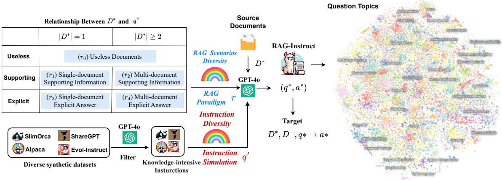

Figure 1: The process of synthesizing data with RAG-Instruct involves ensuring instruction data diversity through five RAG paradigms and Instruction Simulation. The visualization of the question topic is generated using Atlas.
<table><tr><td> $D ^ { * } { \boldsymbol { \mathbf { \mathit { \mathbf { \mathit { \Phi } } } } } } { \boldsymbol { \mathbf { \mathit { \Phi } } } } { \boldsymbol { \mathbf { \mathit { \Phi } } } } { }$  Relationship</td><td>Usefulness of D*</td><td> $| D ^ { * } |$ </td><td>Relationship Description</td></tr><tr><td> $\left( r _ { 0 } \right)$  Useless Doc</td><td>Useless</td><td>1</td><td> $D ^ { * }$  offers no help in answering  $q ^ { * } ,$  even if related.</td></tr><tr><td> $\overline { { ( r _ { 1 } ) } }$  Single-Doc Support</td><td>Supporting</td><td>1</td><td>One doc  $\overline { { ( | D ^ { * } | = 1 ) } }$  aids  $q * ,$  providing supporting info or clues without explicit answers.</td></tr><tr><td> $( r _ { 2 } )$  Multi-Doc Support</td><td>Supporting</td><td> $\geq 2$ </td><td>Multiple documents  $\mathbf { \overline { { ( } } } \mathbf { | } D ^ { * } \mathbf { | } \geq 2 \mathbf { ) }$  support q* by providing clues or supporting information without explicitly answering it, requiring integration (multi-hop reasoning).</td></tr><tr><td> $\overline { { ( r _ { 3 } ) } }$  Single-Doc Answer</td><td>Explicit</td><td>1</td><td>One doc  $( | D ^ { * } | = 1 )$  directly provides the answer  $a ^ { * }$  to  $q ^ { * } .$ </td></tr><tr><td> $\overline { { ( r _ { 4 } ) } }$  Multi-Doc Answer</td><td>Explicit</td><td>≥2</td><td>Multiple docs  $\overline { { ( | D ^ { * } | \geq 2 ) } }$  provide a full answer to  $\overline { { { q ^ { * } } } }$  , requiring integration (multi-hop reasoning).</td></tr></table>

Table 3: Detailed descriptions of our defined five RAG paradigms. See Appendix C.2 for specific prompts.

Then for each synthesis, an instruction $q ^ { \prime } \in { \cal Q }$ is randomly sampled for simulation. Given a corpus D containing multiple documents $d \in D .$ , the source documents $D ^ { * } \subset D$ are retrieved based on $q ^ { \prime } .$ . Subsequently, $( q ^ { * } , a ^ { * } )$ can be synthesized as follows:

$$
( q ^ { * } , a ^ { * } ) = { \bf L } { \bf L } { \bf M } ( D ^ { * } , q ^ { \prime } , r ) ,\tag{2}
$$

where r denotes the sampled RAG paradigm, and the synthesis prompt is illustrated in Figure 3. Here, $D ^ { * }$ controls the topic of $q ^ { * }$ , while $q ^ { \prime }$ shapes its format and task requirements.

## 3.2 Dataset Construction

We construct RAG-Instruct using Wikipedia corpus. For each synthesis, we sample an RAG paradigm $r ,$ a simulated instruction $q ^ { \prime } .$ , and retrieved source documents $D ^ { * }$ to generate $( q ^ { * } , a ^ { * } )$ using GPT-4o. To incorporate unrelated documents $D ^ { - }$ −, we randomly sample documents retrieved based on $q ^ { * }$ and ranked beyond the top 200 as $D ^ { - }$ . Additionally, for cases where $| D ^ { * } | \geq 2$ , we ensure that the number of source documents is fewer than 5. Subsequently, $D ^ { * } , D ^ { - } , q ^ { * } \to a ^ { * }$ is set as the training objective to form RAG-Instruct. In total, we build a dataset of 53K instructions, with the distributions of RAG paradigms and simulated instructions illustrated in Figure 2. More dataset construction details are shown in Appendix A.1.

## 4 Experiments

## 4.1 Experimental Settings

Evaluation Tasks. We conduct evaluations of our RAG-Instruct and various baselines across 10 tasks in four major categories: (1) Open-Ended Tasks, including WebQA (WQA) (Berant et al., 2013), PopQA (PQA) (Mallen et al., 2023), and TriviaQA-unfiltered (TQA) (Joshi et al., 2017), where models answer open-domain factual questions with accuracy as the metric. (2) Closed-Set Tasks, including OpenbookQA (OBQA) (Mihaylov et al., 2018), PubHealth (Pub) (Zhang et al., 2023) and ARC-Challenge (ARC) (Clark et al.,

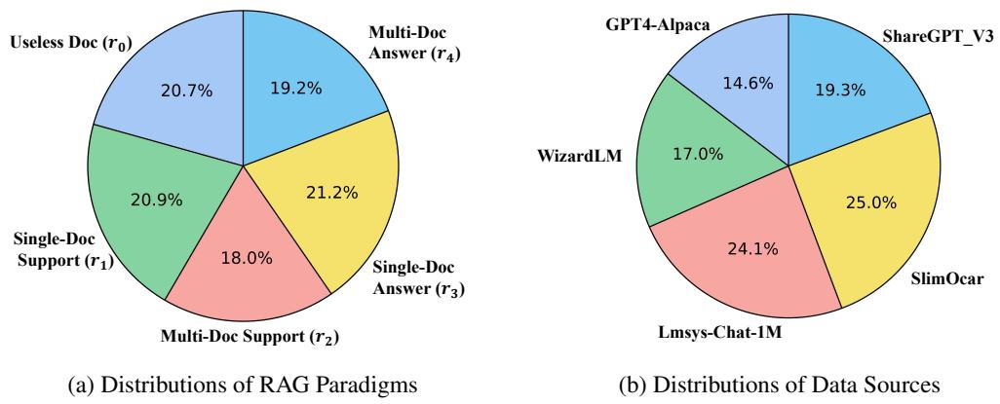  
Figure 2: The detailed distributions of 5 RAG paradigms and simulated instruction data sources.

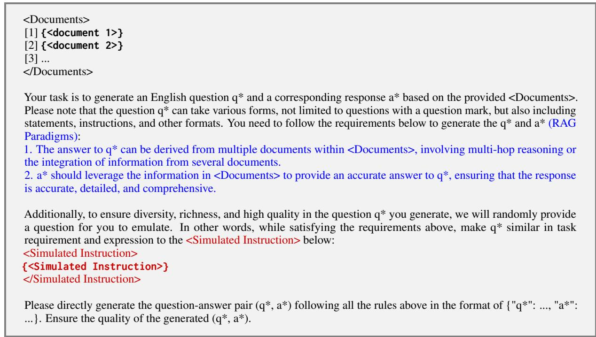  
Figure 3: The prompt of RAG-Instruct. <document> and <Simulated Instruction> represent input variables for the document and simulated instruction, respectively. (Blue text) indicates RAG Paradigms, illustrating the prompt for r4; other paradigms are shown in Appendix C.2. (Red text) represents Instruction Simulation.

2018), involving multiple-choice QA with Extract Match (EM) as the metric. (3) Multi-Hop Tasks, including 2WikiMultiHopQA (2WIKI) (Ho et al., 2020), HotpotQA (HotQ) (Yang et al., 2018), and Musique (MSQ) (Trivedi et al., 2022), requiring multi-hop reasoning with accuracy as the metric. (4) Domain-Specific Tasks, CFQA (Chen et al., 2022) in the financial domain and PubMedQA (Jin et al., 2019) in the medical domain. We also include the long-form QA evaluation in Appendix B.1. We perform zero-shot evaluations throughout these experiments, providing task instructions without few-shot demonstrations. Reasoning details and prompts are provided in Appendix A.2.

Baselines. We compare our method against a diverse set of baselines, grouped into two main categories: (1) Closed-Source LLMs without RAG, including GPT-4o and GPT-4o-mini. We test them using OpenAI’s official APIs. (2) Open-source instruction-turned baselines with RAG, such as Llama3.1-8b-Instruct (Dubey et al., 2024), Llama3.1-70B-Instruct, Qwen2.5-7B-Instruct (Yang et al., 2024) and Qwen2.5-72B-Instruct. (3) RAG-specific baselines, including Self-RAG, RQ-RAG, InstructRAG (Wei et al., 2024) and ChatQA. For these methods, we evaluate using publicly released model weights and prompts provided by their respective works.

<table><tr><td rowspan="3"></td><td colspan="3">Open-ended</td><td colspan="3">Closed-set</td><td colspan="3">Multi-hop</td><td colspan="2">Domain-specific</td><td rowspan="3">AVG</td></tr><tr><td>WQA (acc)</td><td>PQA (acc)</td><td>TQA (acc)</td><td>OBQA (EM)</td><td>Pub (EM)</td><td>ARC (EM)</td><td>2WIKI (acc)</td><td>HotP (acc)</td><td>MSQ (acc)</td><td>CFQA (EM)</td><td>PubMed (EM)</td></tr><tr><td colspan="10">Closed-Source LLMs without RAG</td></tr><tr><td></td><td></td><td></td><td>84.4</td><td></td><td></td><td>88.0</td><td>88.0</td><td>54.6</td><td>31.4</td><td>63.0</td><td></td><td>73.4</td></tr><tr><td>GPT-40 GPT-4o-mini</td><td>72.5 69.5</td><td>71.3 69.2</td><td>82.2</td><td>88.6 89.6</td><td>87.7 87.0</td><td>84.1</td><td>74.4</td><td>54.5</td><td>30.8</td><td>60.7</td><td>77.0 73.0</td><td>70.4</td></tr><tr><td colspan="10">～ 8B Open-Source LLMs with RAG</td></tr><tr><td></td><td></td><td></td><td></td><td></td><td></td><td></td><td></td><td></td><td></td><td></td><td></td><td></td></tr><tr><td>Llama-3.1-8B-Instruct Qwen2.5-7B-Instruct</td><td>59.5 64.1</td><td>60.8 62.0</td><td>71.4 75.6</td><td>77.2 74.2</td><td>56.8 74.2</td><td>70.3 75.7</td><td>66.8 66.5</td><td>45.5 49.5</td><td>18.7 20.8</td><td>53.7 58.7</td><td>73.6 62.6</td><td>54.5 58.4</td></tr><tr><td>RQ-RAG (Llama2-7B)</td><td>56.5</td><td>57.1</td><td>70.2</td><td>80.6</td><td>71.8</td><td>68.3</td><td>53.7</td><td>43.1</td><td>18.2</td><td>21.9</td><td>55.6</td><td>52.6</td></tr><tr><td>Self-RAG (Llama2-7B)</td><td>49.0</td><td>55.8</td><td>69.3</td><td>78.0</td><td>72.4</td><td>73.1</td><td>48.4</td><td>35.8</td><td>11.5</td><td>21.5</td><td>49.8</td><td>50.4</td></tr><tr><td>InstructRAG (Llama3-8B)</td><td>63.2</td><td>66.2</td><td>78.5</td><td>73.1</td><td>71.8</td><td>66.3</td><td>69.2</td><td>55.2</td><td>30.1</td><td>27.9</td><td>60.3</td><td>60.2</td></tr><tr><td>ChatQA-2.0 (Llama3-8B)</td><td>50.5</td><td>58.3</td><td>72.5</td><td>72.6</td><td>75.8</td><td>65.6</td><td>59.0</td><td>42.3</td><td>16.1</td><td>51.8</td><td>61.3</td><td>54.7</td></tr><tr><td>Llama-2-7B + RAG-Instruct</td><td>67.2</td><td>62.4</td><td>77.4</td><td>71.4</td><td>75.9</td><td>74.8</td><td>68.1</td><td>53.5</td><td>21.8</td><td>29.7</td><td>71.2</td><td>60.3</td></tr><tr><td>Qwen2.5-7B + RAG-Instruct</td><td>66.1</td><td>63.7</td><td>78.1</td><td>78.4</td><td>76.4</td><td>78.0</td><td>74.8</td><td>54.6</td><td>27.7</td><td>59.7</td><td>72.7</td><td>64.5</td></tr><tr><td>Llama-3.1-8B + RAG-Instruct</td><td>69.7</td><td>68.4</td><td>80.0</td><td>84.8</td><td>77.2</td><td>79.9</td><td>79.3</td><td>56.4</td><td>33.7</td><td>57.8</td><td>77.0</td><td>66.8</td></tr><tr><td></td><td></td><td></td><td></td><td></td><td></td><td></td><td></td><td></td><td></td><td></td><td></td><td></td></tr><tr><td colspan="10">&gt; 10B Open-Source LLMs with RAG</td><td></td><td>77.2</td><td></td><td></td></tr><tr><td>Llama-3.1-70B-Instruct Qwen2.5-72B-Instruct</td><td>64.9</td><td>63.3</td><td>75.4</td><td>85.0</td><td>75.4</td><td>84.7</td><td>73.5</td><td>47.5</td><td>26.6</td><td>59.1 66.8</td><td>80.0</td><td>63.9 68.8</td></tr><tr><td>Llama-3.1-70B + RAG-Instruct</td><td>68.8 73.6</td><td>68.7 70.4</td><td>81.5 83.8</td><td>83.0 88.6</td><td>78.0 82.8</td><td>80.2 85.1</td><td>81.1 83.1</td><td>56.6 62.9</td><td>35.5 40.1</td><td>62.1</td><td>79.7</td><td>72.0</td></tr><tr><td>Qwen2.5-72B + RAG-Instruct</td><td>72.4</td><td>70.3</td><td>85.0</td><td>89.3</td><td>78.5</td><td>82.1</td><td>88.3</td><td>63.9</td><td>42.0</td><td>69.2</td><td>82.0</td><td>73.7</td></tr><tr><td></td><td></td><td></td><td></td><td></td><td></td><td></td><td></td><td></td><td></td><td></td><td></td><td></td></tr></table>

Table 4: Zero-shot performance of different instruction datasets on RAG Benchmarks. Bold and underline indicate the best and second-best experimental results within each section. The datasets were fine-tuned using identical hyperparameters.

Training settings. We train our model using the RAG-Instruct dataset (wikipedia), which features diverse instruction-following input-output pairs. During the dataset construction, we employ the offthe-shelf Contriever-MS MARCO (Izacard et al.) as the retriever. For each data entry, we ensure the use of all source documents D∗ and supplement them with enough unrelated documents D− to total 10 documents. Additional training details are provided in Appendix A.1.

Inference settings. We use VLLM (Kwon et al., 2023) for memory-efficient inference and adopt a greedy decoding strategy for model generation. For evaluation benchmarks, we utilize Wikipedia as the retrieval corpus and use the Contriever retriever for document retrieval. More detailed inference specifications can be found in Appendix A.2.

## 4.2 RAG Capability Gains

Comparison against closed-source LLMs. As shown in Table 4, compared to powerful proprietary models like GPT-4o and GPT-4o-mini, our RAG-Instruct, trained on base 8B models, matches or even outperforms them on several tasks, including open-ended tasks (PQA and TQA), multihop tasks (HotQA and MSQ), and domain-specific tasks (PubMedQA). This demonstrates that our

RAG-Instruct significantly enhances the model’s RAG capabilities.

Comparison against RAG-specific models. As shown in Table 4, RAG-specific models such as Self-RAG, and RQ-RAG show significant improvements over the base models on open-ended and closed-set tasks. However, they underperform compared to the base models on domain-specific and multi-hop tasks. In contrast, our RAG-Instruct achieves significant improvements across all four categories of tasks compared to the base models and outperforms all previous SOTA RAG-specific models, particularly in multi-hop and domainspecific tasks. This highlights its superior robustness and generalization across a broader range of RAG scenarios and tasks.

Comparison against Open-source instructiontuned models. We also compare our method with open-source instruction-tuned models, which exhibit strong RAG capabilities. As shown in Table 4, models trained with RAG-Instruct on base models outperform these instruction-tuned models across various tasks, demonstrating that the RAG instruction dataset effectively enhances the model’s RAG performance.

## 4.3 Impact of Instruction Simulation

To investigate the impact of Instruction Simulation, we design a comparative experiment. We randomly sample a subset $D _ { s }$ containing 20,000 entries from our RAG-Instruct dataset and create another subset $D _ { s } ^ { \prime }$ without using Instruction Simulation. To ensure a fair comparison, $D _ { s }$ and $D _ { s } ^ { \prime }$ share the same source documents $D ^ { * }$ and include all five RAG scenario paradigms. We then train two models on Llama3.1- 8B using $D _ { s }$ and $D _ { s } ^ { \prime }$ with identical hyperparameters.

<table><tr><td></td><td>TQA</td><td>ARC</td><td>HotP</td></tr><tr><td>RAG-Instruct2ok (Llama3.1-8B)</td><td>77.0</td><td>79.4</td><td>53.1</td></tr><tr><td>w.o. Simulation20k</td><td>75.9</td><td>70.4</td><td>47.7</td></tr><tr><td>Llama3.1-8B-Instruct w.o. Retrieval</td><td>63.1</td><td>64.1</td><td>33.9</td></tr><tr><td>RAG-Instruct w.o. Retrieval</td><td>63.2</td><td>62.8</td><td>33.4</td></tr></table>

Table 5: Ablation Study (only 20k data used) on RAG-Instruct. w.o. Simulation indicates the removal of the Instruction Simulation process, while w.o. Retrieval indicates the performance in non-retrieval scenarios. Complete ablation results are in shown Appendix B.2
<table><tr><td rowspan="2">Method</td><td colspan="3">TriviaQA (Single)</td><td colspan="2">HotpotQA (Multi)</td></tr><tr><td></td><td>Helpful Midhelp Helpless</td><td></td><td>Helpful Midhelp</td><td></td></tr><tr><td>RAG-Instruct 86.9</td><td></td><td>72.6</td><td>40.5</td><td>73.1</td><td>42.2</td></tr><tr><td>w.o. r0</td><td>86.4</td><td>69.6</td><td>36.4-</td><td>73.1</td><td>39.3</td></tr><tr><td>W.0. r1</td><td>86.5</td><td>66.5⁻</td><td>40.9</td><td>72.4</td><td>41.3</td></tr><tr><td>w.o. r2</td><td>86.2</td><td>71.8</td><td>39.7</td><td>68.2</td><td>29.8-</td></tr><tr><td>W.0. r3</td><td>83.5</td><td>70.6</td><td>39.6</td><td>72.8</td><td>42.2</td></tr><tr><td>W.0. r4</td><td>85.2</td><td>72.1</td><td>39.5</td><td>65.4⁻</td><td>38.8</td></tr></table>

Table 6: Ablation study on role of query paradigms. All experiments are conducted based on the Llama3.1-8B model using identical hyperparameters. $\cdot \underline { { \cdot } }$ indicates large performance drops for each paradigm.

As shown in Table 5, removing the Instruction Simulation process results in performance declines across all tasks. The drop is smaller for open-ended tasks (TQA) but significantly larger for closed-set (ARC), multi-hop (HotP) tasks. We observe that without Instruction Simulation, GPT-4o tends to generate overly simple and uniform questions, resembling open-ended ones, leading to minimal impact on closed-set evaluation. However, the diverse formats of closed-set, multi-hop, and domain-specific tasks, such as multiple-choice and multi-hop reasoning, pose challenges that the model struggles to handle. This highlights the critical role of Instruction Simulation in enabling the model to adapt to a wide variety of tasks.

Furthermore, we provide specific cases in $\mathsf { A p - }$ pendix B.5, demonstrating that Instruction Simulation generates questions that closely resemble exemplar questions, significantly enhancing diversity compared to those produced without it.

## 4.4 Role of RAG Paradigms

To evaluate the role of RAG paradigms, we design an ablation experiment to verify the effectiveness of the five RAG scenarios in RAG-Instruct. Specifically, we remove the data corresponding to each paradigm from RAG-Instruct one at a time and train models on Llama3.1-8B using identical training hyperparameters, respectively.

As shown in Table 6, when a single RAG paradigm $\left( \mathbf { e . g . \ r _ { 0 } } \right)$ is removed from RAG-Instruct, we observe a noticeable performance drop in evaluation benchmarks corresponding to that specific RAG scenario. This indicates that each RAG paradigm plays a critical role in enhancing the model’s RAG capabilities.

## 5 Further Analysis

## 5.1 What advantages does RAG-Instruct have over existing instruction datasets?

To explore whether existing instruction datasets are sufficient for RAG scenarios, we evaluate models fine-tuned on four common instruction datasets and three context-enhenced datasets using LLaMA-3.1-8B. Results are shown in Table 7 and our findings are as follows:

Take-away 1. Rich context datasets (e.g., longcontext instruction dataset LongAlpaca and reading comprehension dataset SQuAD2.0) improve RAG capabilities more effectively than those with shorter context lengths (e.g., Wizardlm and Aplaca).

Take-away 2. Traditional instruction datasetsfail to effectively enhance models’ RAG capabilities, significantly lagging behind the official instructiontuned models, while RAG-Instruct can significantly improve RAG performance.

## 5.2 Does fine-tuning with RAG-Instruct affect model’s general capabilities?

To explore whether fine-tuning with RAG-Instruct affects model’s general capabilities, we evaluate the fine-tuned model (on Llama3.1-8B) in non-RAG scenarios. As shown in Table 5, RAG-Instructw.o. Retrieval performs on bar with Llama-3.1-8B-Instruct in non-RAG scenarios, without significant performance degradation. This demonstrates that RAG-Instruct enhances the model’s RAG capabilities while also improving its general instruction-following abilities. We assume that RAG-Instruct are inherently based on general instruction datasets, which inherit the advantages of these datasets without compromising general capabilities. Additionally, we evaluate our model on MMLU and MMLU-Pro (in Appendix B.6), which further demonstrates that RAG-Instruct does not impair the model’s general capabilities.

<table><tr><td rowspan="2"></td><td colspan="3">Open-ended</td><td colspan="2">Closed-set</td><td colspan="3">Multi-hop</td><td colspan="2">Domain-specific</td><td></td></tr><tr><td>WQA</td><td>PQA</td><td>TQA</td><td>OBQA</td><td>ARC</td><td>2WIKI</td><td>HotP</td><td>MSQ</td><td>CFQA</td><td>PubMed</td><td>AVG</td></tr><tr><td colspan="10">Proprietary instruction-tuned LLaMA</td><td></td><td></td><td></td></tr><tr><td>Llama-3.1-8B-Instruct</td><td>59.5</td><td>60.8</td><td>73.4</td><td>77.2</td><td>70.3</td><td>66.8</td><td>45.5</td><td>18.7</td><td>53.7</td><td>73.9</td><td>60.0</td></tr><tr><td colspan="10">Llama-3.1-8B (Base)</td></tr><tr><td></td><td></td><td></td><td></td><td>Fine-tuning with Traditional Instruction Datasets</td><td></td><td></td><td></td><td></td><td></td><td></td><td></td></tr><tr><td>+ Evol-Instruct (70K)</td><td>54.6</td><td>54.2-</td><td>71.5 72.8</td><td>73.4-</td><td>63.1⁻</td><td>50.9-</td><td>41.1</td><td>14.7</td><td>38.7-</td><td>53.5-</td><td>51.6⁻ 52.4⁻</td></tr><tr><td>+ ShareGPT (94K) + Alpaca (52K)</td><td>60.9 53.1⁻</td><td>54.9⁻</td><td>72.3</td><td>67.2-</td><td>52.9⁻</td><td>59.0⁻</td><td>43.9</td><td>14.3</td><td>40.3⁻</td><td>67.2-</td><td></td></tr><tr><td>+ SlimOrca (518K)</td><td>55.3</td><td>56.4 60.0</td><td>69.1</td><td>65.6⁻ 82.4</td><td>60.6⁻ 62.7⁻</td><td>57.7- 54.7⁻</td><td>41.3 40.2-</td><td>13.4⁻ 15.5</td><td>34.8- 33.1⁻</td><td>36.5⁻ 66.9-</td><td>49.2- 54.0⁻</td></tr><tr><td colspan="10">Fine-tuning with Context-Enhanced Datasets</td></tr><tr><td>+ LongAlpaca (12K)</td><td></td><td>56.0</td><td>75.0</td><td></td><td></td><td></td><td></td><td>27.7+</td><td>51.8</td><td></td><td>60.9</td></tr><tr><td>+ SQuAD2.0 (130K)</td><td>63.9 61.5</td><td>57.2</td><td>72.1</td><td>75.2</td><td>66.4 56.2-</td><td>72.9+ 65.7</td><td>54.2+ 51.2+</td><td>23.7+</td><td>47.9-</td><td>65.7- 51.6⁻</td><td>54.7-</td></tr><tr><td>+ NarrativeQA (12K)</td><td>61.2</td><td>57.0</td><td>77.1</td><td>59.8⁻ 67.8-</td><td>65.2-</td><td>52.0⁻</td><td>44.5</td><td>17.2</td><td>46.2-</td><td>68.7-</td><td>55.6</td></tr><tr><td></td><td>Fine-tuning with RAG Instructions</td><td colspan="10"></td></tr><tr><td>RAG-Instruct + (40K)</td><td>69.7+</td><td>68.4+</td><td>80.0+</td><td>84.8+</td><td>79.9+</td><td>79.3+</td><td>56.4+</td><td>33.7+</td><td>57.8</td><td>77.0</td><td>68.6⁺</td></tr></table>

Table 7: Zero-shot performance of different instruction datasets using RAG. Using Llama-3.1-8B-Instruct as the pivot, ‘+’ indicates a >5-point improvement, while ‘–’ indicates a >5-point drop. All datasets were fine-tuned with identical hyperparameters. See Section 4.1 for evaluation details.

Take-away 3. RAG-Instruct dataset enhances RAG capabilities without compromising the model’s general capabilities.

## 5.3 How does RAG-Instruct perform with other retrieval sources and retrievers?

To further explore the generalization of our method, we investigate the impact of using different retrieval sources. Specifically, we further evaluate our method on four single-hop QA tasks, including ARC, PQA, TQA and OBQA, utilizing Duck-DuckGo, and Bing Search as retrieval sources during inference. The results (detailed in Appendix B.3.) suggest that all retrieval sources effectively improve task performance, with minimal variation in performance across different sources. Additionally, we also explore the performance on the BM25 retriever (Robertson et al., 2009). The detailed results can be found in Appendix B.4. These results demonstrate the robustness of RAG-Instruct across different retrieval sources and retrievers.

## 5.4 Does the performance improvement stem from enhanced RAG capabilities rather than knowledge injection?

Since our RAG-Instruct is built on the Wikipedia corpus, the performance improvements on evaluation benchmarks may stem from knowledge injection during the supervised fine-tuning stage. To investigate whether our approach genuinely enhances the model’s RAG capabilities, we compare the performance in both retrieval and non-retrieval scenarios (based on the Llama3.1-8B model trained on RAG-Instruct). As shown in Table 5, performance in non-retrieval scenarios is significantly lower across all benchmarks compared to retrieval scenarios. This demonstrates that RAG-Instruct indeed effectively enhances the model’s capabilities in RAG scenarios rather than knowledge injection.

## 6 Related Work

## 6.1 Retrieval-Augmented Generation

Large language models (LLMs) are advancing at a rapid pace across numerous fields and applications (Zhang et al., 2025d,b; Tan et al., 2025; Feng and Peng, 2014; Zhang et al., 2025f; Wu et al., 2025; Guo et al., 2025; Leong and Wu, 2024; Zhang et al., 2025a). Retrieval-augmented generation (RAG) is a widely adopted approach for supplementing the parametric knowledge of LLMs with external information sources (Fang et al., 2025; Liu et al., 2025a; Lu et al., 2025; Liu et al., 2025b). Due to the imperfections of retrievers, the retrieved information often fails to align well with the LLM’s needs, which can negatively impact LLM performance (Petroni et al., 2020; Shi et al., 2023; Maekawa et al., 2024).

To enhance LLM-based RAG capabilities, some studies focus on aligning retrievers with LLM needs (Shi et al., 2024; Lin et al., 2023) through multi-step retrieval processes (Trivedi et al., 2023; Jiang et al., 2023; Jeong et al., 2024; Shao et al., 2023; Yu et al., 2023; Asai et al., 2024a; Du et al., 2025b,b) and query reformulation (Ma et al., 2023; Jeong et al., 2024). On the other hand, several studies focus on enhancing the RAG capabilities of LLMs by improving their robustness in noisy retrieval contexts. Research such as (Chan et al., 2024; Zhang et al., 2024b; Liu et al., 2024b; Yoran et al., 2024) trains models with additional irrelevant or noisy documents to better handle such scenarios. However, these approaches consider only a limited range of RAG scenarios. Furthermore, the lack of a general RAG dataset forces many works, such as RAFT (Zhang et al., 2024b), to fine-tune models on task-specific datasets, leading to poor task generalization. This highlights the need for a dataset that covers diverse RAG scenarios and tasks.

## 6.2 Instruction Data

With the development of LLMs (Zhao et al., 2023; Zhang et al., 2024a; Leong et al., 2024; Zhang et al., 2025e,c), the creation of instruction datasets has been instrumental in enhancing the instruction-following and generalization capabilities of these models. Early initiatives, such as (Mishra et al., 2022), introduced task-specific instructions to guide model behavior. Subsequent efforts, including Super-NaturalInstructions (Wang et al., 2022) and Unnatural Instructions (Honovich et al., 2022), expanded the diversity and complexity of these instructions. These datasets enabled LLMs like Alpaca (Taori et al., 2023) and Dolly (Conover et al., 2023) to better align with human intent through fine-tuning on structured instruction-output pairs, fostering adaptability to unseen tasks through varied instruction formulations. Recent studies, such as WizardLM (Xu et al., 2023b) and ShareGPT (OpenAI, 2023), have further enhanced the generalization and richness of instruction datasets, significantly contributing to the robust generalization capabilities of LLMs. Therefore, RAG-Instruct inherits multiple high-quality and rich instruction datasets, leveraging their advantages.

## 7 Conclusion

This work introduces RAG-Instruct, a method for synthesizing diverse and high-quality RAG instruction data from any source corpus. It incorporates five RAG paradigms to capture diverse querydocument relationships and uses instruction simulation to enhance data quality and diversity by leveraging existing datasets. Using this approach, we construct a 40K instruction dataset from Wikipedia, covering diverse RAG scenarios and tasks. For future work, we plan to expand the instructions in RAG-Instruct to incorporate chain-of-thought (CoT) characteristics, enabling models to perform planned retrieval based on the query.

## Limitations

Granularity of RAG Paradigms While RAG-Instruct introduces five distinct RAG query paradigms to handle various query-document relationships, this relationship is of a coarse granularity. Specifically, the current set of paradigms focuses on broad categories but does not explore more granular or specialized paradigms that could better capture nuanced retrieval tasks. For instance, for multi-hop queries, the number of hops could be specified, and relevance might have more granular options. Expanding the range of RAG paradigms to cover finer distinctions could enhance the model’s ability to handle complex, diverse, and edge-case retrieval situations, thereby improving its robustness and performance.

Reliance on Synthetic Data Our approach relies on synthetic data generation, which inherently carries the risk of introducing errors or biases, even when using powerful large language models like GPT-4. While the use of large-scale instruction datasets such as SlimOrca and Evol Instruct improves the diversity and quality of the generated data, it is still possible for GPT-4 to produce flawed or inconsistent RAG instructions that may negatively impact downstream tasks. As synthetic data generation becomes more prevalent, ensuring the accuracy and reliability of such data remains an ongoing challenge, especially in high-stakes domains where the correctness of information is critical.

## Acknowledgment

This work was supported by Major Frontier Exploration Program (Grant No. C10120250085) from the Shenzhen Medical Academy of Research and Translation (SMART), the Shenzhen Science and Technology Program (JCYJ20220818103001002), NSFC grant 72495131, Shenzhen Doctoral Startup Funding (RCBS20221008093330065), Tianyuan Fund for Mathematics of National

Natural Science Foundation of China (NSFC) (12326608), Shenzhen Science and Technology Program (Shenzhen Key Laboratory Grant No. ZDSYS20230626091302006), Shenzhen Stability Science Program 2023 and the National Natural Science Foundation of China under grant U22B2061.

## References

Achiam et al. 2023. Gpt-4 technical report. arXiv preprint arXiv:2303.08774.

Akari Asai, Sewon Min, Zexuan Zhong, and Danqi Chen. 2023. Retrieval-based language models and applications. In Proceedings ofthe 61st Annual Meeting of the Association for Computational Linguistics (Volume 6: Tutorial Abstracts), pages 41–46.

Akari Asai, Zeqiu Wu, Yizhong Wang, Avirup Sil, and Hannaneh Hajishirzi. 2024a. Self-rag: Learning to retrieve, generate, and critique through self-reflection. In The Twelfth International Conference on Learning Representations.

Akari Asai, Zexuan Zhong, Danqi Chen, Pang Wei Koh, Luke Zettlemoyer, Hannaneh Hajishirzi, and Wen-tau Yih. 2024b. Reliable, adaptable, and attributable language models with retrieval. arXiv preprint arXiv:2403.03187.

Parishad BehnamGhader, Santiago Miret, and Siva Reddy. 2022. Can retriever-augmented language models reason? the blame game between the retriever and the language model. arXiv preprint arXiv:2212.09146.

Jonathan Berant, Andrew Chou, Roy Frostig, and Percy Liang. 2013. Semantic parsing on freebase from question-answer pairs. In Proceedings of the 2013 conference on empirical methods in natural language processing, pages 1533–1544.

Chi-Min Chan, Chunpu Xu, Ruibin Yuan, Hongyin Luo, Wei Xue, Yike Guo, and Jie Fu. 2024. Rq-rag: Learning to refine queries for retrieval augmented generation. arXiv preprint arXiv:2404.00610.

Yukang Chen, Shaozuo Yu, Shengju Qian, Haotian Tang, Xin Lai, Zhijian Liu, Song Han, and Jiaya Jia. 2023. Long alpaca: Long-context instruction-following models. https://github.com/dvlab-research/ LongLoRA.

Zhiyu Chen, Shiyang Li, Charese Smiley, Zhiqiang Ma, Sameena Shah, and William Yang Wang. 2022. Convfinqa: Exploring the chain of numerical reasoning in conversational finance question answering. In Proceedings of the 2022 Conference on Empirical Methods in Natural Language Processing, pages 6279– 6292.

Peter Clark, Isaac Cowhey, Oren Etzioni, Tushar Khot, Ashish Sabharwal, Carissa Schoenick, and Oyvind Tafjord. 2018. Think you have solved question answering? try arc, the ai2 reasoning challenge. arXiv preprint arXiv:1803.05457.

Jacob Conover et al. 2023. Dolly: A 12b-parameter model for instruction following. ArXiv preprint arXiv:2303.11366.

Tri Dao, Dan Fu, Stefano Ermon, Atri Rudra, and Christopher Ré. 2022. Flashattention: Fast and memory-efficient exact attention with io-awareness. Advances in Neural Information Processing Systems, 35:16344–16359.

Guanting Dong, Xiaoshuai Song, Yutao Zhu, Runqi Qiao, Zhicheng Dou, and Ji-Rong Wen. 2024. Toward general instruction-following alignment for retrieval-augmented generation. arXiv preprint arXiv:2410.09584.

Enjun Du, Xunkai Li, Tian Jin, Zhihan Zhang, Rong-Hua Li, and Guoren Wang. 2025a. Graphmaster: Automated graph synthesis via llm agents in data-limited environments. ArXiv preprint arXiv:2504.00711v2.

Enjun Du, Siyi Liu, and Yongqi Zhang. 2025b. Mixture of length and pruning experts for knowledge graphs reasoning. ArXiv preprint arXiv:2507.20498.

Abhimanyu Dubey, Abhinav Jauhri, Abhinav Pandey, Abhishek Kadian, Ahmad Al-Dahle, Aiesha Letman, Akhil Mathur, Alan Schelten, Amy Yang, Angela Fan, et al. 2024. The llama 3 herd of models. arXiv preprint arXiv:2407.21783.

Yixiong Fang, Tianran Sun, Yuling Shi, and Xiaodong Gu. 2025. Attentionrag: Attention-guided context pruning in retrieval-augmented generation. arXiv preprint arXiv:2503.10720.

Pengbin Feng and Xuhui Peng. 2014. A note on monge– kantorovich problem. Statistics & Probability Letters, 84:204–211.

Yunfan Gao, Yun Xiong, Xinyu Gao, Kangxiang Jia, Jinliu Pan, Yuxi Bi, Yi Dai, Jiawei Sun, and Haofen Wang. 2023. Retrieval-augmented generation for large language models: A survey. arXiv preprint arXiv:2312.10997.

Jiani Guo, Zuchao Li, Jie Wu, Qianren Wang, Yun Li, Lefei Zhang, hai zhao, and Yujiu Yang. 2025. Tom: Leveraging tree-oriented mapreduce for long-context reasoning in large language models. In The 2025 Conference on Empirical Methods in Natural Language Processing.

Kelvin Guu, Kenton Lee, Zora Tung, Panupong Pasupat, and Mingwei Chang. 2020. Retrieval augmented language model pre-training. In International conference on machine learning, pages 3929–3938. PMLR.

Tsun hin Cheung and Kin Man Lam. 2023. Factllama: Optimizing instruction-following language models with external knowledge for automated fact-checking. 2023 Asia Pacific Signal and Information Processing Association Annual Summit and Conference (APSIPA ASC), pages 846–853.

Xanh Ho, Anh-Khoa Duong Nguyen, Saku Sugawara, and Akiko Aizawa. 2020. Constructing a multi-hop qa dataset for comprehensive evaluation of reasoning steps. In Proceedings ofthe 28th International Con ference on Computational Linguistics, pages 6609– 6625.

Or Honovich et al. 2022. Unnatural instructions: Tuning language models with synthetic data. In Proceedings ofthe 2022 Conference on Empirical Methods in Natural Language Processing, pages 5021–5035. Association for Computational Linguistics.

Gautier Izacard, Mathilde Caron, Lucas Hosseini, Sebastian Riedel, Piotr Bojanowski, Armand Joulin, and Edouard Grave. Unsupervised dense information retrieval with contrastive learning. Transactions on Machine Learning Research.

Gautier Izacard, Patrick Lewis, Maria Lomeli, Lucas Hosseini, Fabio Petroni, Timo Schick, Jane Dwivedi-Yu, Armand Joulin, Sebastian Riedel, and Edouard Grave. 2023. Atlas: Few-shot learning with retrieval augmented language models. Journal of Machine Learning Research, 24(251):1–43.

Soyeong Jeong, Jinheon Baek, Sukmin Cho, Sung Ju Hwang, and Jong C Park. 2024. Adaptive-rag: Learning to adapt retrieval-augmented large language models through question complexity. In Proceedings of the 2024 Conference of the North American Chapter of the Association for Computational Linguistics: Human Language Technologies (Volume 1: Long Papers), pages 7029–7043.

Zhengbao Jiang, Frank F Xu, Luyu Gao, Zhiqing Sun, Qian Liu, Jane Dwivedi-Yu, Yiming Yang, Jamie Callan, and Graham Neubig. 2023. Active retrieval augmented generation. arXiv preprint arXiv:2305.06983.

Jiajie Jin, Yutao Zhu, Xinyu Yang, Chenghao Zhang, and Zhicheng Dou. 2024. Flashrag: A modular toolkit for efficient retrieval-augmented generation research. arXiv preprint arXiv:2405.13576.

Qiao Jin, Bhuwan Dhingra, Zhengping Liu, William Cohen, and Xinghua Lu. 2019. Pubmedqa: A dataset for biomedical research question answering. In Proceedings of the 2019 Conference on Empirical Methods in Natural Language Processing and the 9th International Joint Conference on Natural Language Processing (EMNLP-IJCNLP), pages 2567–2577.

Mandar Joshi, Eunsol Choi, Daniel S Weld, and Luke Zettlemoyer. 2017. Triviaqa: A large scale distantly supervised challenge dataset for reading comprehension. In Proceedings of the 55th Annual Meeting of the Associationfor Computational Linguistics (Volume 1: Long Papers), pages 1601–1611.

Vladimir Karpukhin, Barlas Oguz, Sewon Min, Patrick Lewis, Ledell Wu, Sergey Edunov, Danqi Chen, and Wen-tau Yih. 2020. Dense passage retrieval for opendomain question answering. In Proceedings of the 2020 Conference on Empirical Methods in Natural Language Processing (EMNLP), pages 6769–6781.

Tomáš Kociskˇ y, Jonathan Schwarz, Phil Blunsom, Chris\` Dyer, Karl Moritz Hermann, Gábor Melis, and Edward Grefenstette. 2018. The narrativeqa reading comprehension challenge. Transactions of the Associationfor Computational Linguistics, 6:317–328.

Tom Kwiatkowski, Jennimaria Palomaki, Olivia Redfield, Michael Collins, Ankur Parikh, Chris Alberti, Danielle Epstein, Illia Polosukhin, Jacob Devlin, Kenton Lee, et al. 2019. Natural questions: a benchmark for question answering research. Transactions ofthe Association for Computational Linguistics, 7:453– 466.

Woosuk Kwon, Zhuohan Li, Siyuan Zhuang, Ying Sheng, Lianmin Zheng, Cody Hao Yu, Joseph Gonzalez, Hao Zhang, and Ion Stoica. 2023. Efficient memory management for large language model serving with pagedattention. In Proceedings ofthe 29th Symposium on Operating Systems Principles, pages 611–626.

H.Y. Leong, Y. Gao, S. Ji, Y. Zhang, and U. Pamuksuz. 2024. Efficient fine-tuning of large language models for automated medical documentation. In 2024 4th IEEE International Conference on Digital Society and Intelligent Systems (DSInS), Sydney, Australia.

H.Y. Leong and Y. Wu. 2024. Why should next-gen llm multi-agent systems move beyond fixed architectures to dynamic, input-driven graphs? SSRN Electronic Journal.

Xi Victoria Lin, Xilun Chen, Mingda Chen, Weijia Shi, Maria Lomeli, Rich James, Pedro Rodriguez, Jacob Kahn, Gergely Szilvasy, Mike Lewis, et al. 2023. Ra-dit: Retrieval-augmented dual instruction tuning. arXiv preprint arXiv:2310.01352.

Aofan Liu, SONG Shiyuan, Cehao Yang, and Yiyan Qi. 2025a. Beyond function-level search: Repositoryaware dual-encoder code retrieval with adversarial verification. In Knowledgeable Foundation Models at ACL 2025.

Aofan Liu, Yuguo Yin, Hongjian Xing, Zhen Li, and Yiyan Qi. 2025b. Md3r: Minimizing data distribution discrepancies to tackle inconsistencies in multilingual query-code retrieval. In Knowledgeable Foundation Models at ACL 2025.

Wanlong Liu, Enqi Zhang, Li Zhou, Dingyi Zeng, Shaohuan Cheng, Chen Zhang, Malu Zhang, and Wenyu Chen. 2024a. A compressive memory-based retrieval approach for event argument extraction. arXiv preprint arXiv:2409.09322.

Zihan Liu, Wei Ping, Rajarshi Roy, Peng Xu, Mohammad Shoeybi, and Bryan Catanzaro. 2024b. Chatqa:

Building gpt-4 level conversational qa models. arXiv preprint arXiv:2401.10225.

Shuai Lu, Nan Duan, Hojae Han, Daya Guo, Seungwon Hwang, and Alexey Svyatkovskiy. 2022. Reacc: A retrieval-augmented code completion framework. In Proceedings of the 60th Annual Meeting of the Associationfor Computational Linguistics (Volume 1: Long Papers), pages 6227–6240.

Xuan Lu, Sifan Liu, Bochao Yin, Yongqi Li, Xinghao Chen, Hui Su, Yaohui Jin, Wenjun Zeng, and Xiaoyu Shen. 2025. Multiconir: Towards multi-condition information retrieval. Preprint, arXiv:2503.08046.

Xinbei Ma, Yeyun Gong, Pengcheng He, Hai Zhao, and Nan Duan. 2023. Query rewriting in retrievalaugmented large language models. In Proceedings of the 2023 Conference on Empirical Methods in Natural Language Processing, pages 5303–5315.

Seiji Maekawa, Hayate Iso, Sairam Gurajada, and Nikita Bhutani. 2024. Retrieval helps or hurts? a deeper dive into the efficacy of retrieval augmentation to language models. In Proceedings ofthe 2024 Conference ofthe North American Chapter ofthe Associationfor Computational Linguistics: Human Language Technologies (Volume 1: Long Papers), pages 5506–5521.

Alex Mallen, Akari Asai, Victor Zhong, Rajarshi Das, Daniel Khashabi, and Hannaneh Hajishirzi. 2023. When not to trust language models: Investigating effectiveness of parametric and non-parametric memories. In Proceedings of the 61st Annual Meeting of the Association for Computational Linguistics (Volume 1: Long Papers), pages 9802–9822.

Todor Mihaylov, Peter Clark, Tushar Khot, and Ashish Sabharwal. 2018. Can a suit of armor conduct electricity? a new dataset for open book question answering. In Proceedings ofthe 2018 Conference on Empirical Methods in Natural Language Processing, pages 2381–2391.

Swaroop Mishra et al. 2022. Natural instructions: Benchmarking generalization in instruction following. In Proceedings of the 2022 Conference on Empirical Methods in Natural Language Processing, pages 5021–5035. Association for Computational Linguistics.

Arindam Mitra, Luciano Del Corro, Shweti Mahajan, Andres Codas, Clarisse Simoes, Sahaj Agarwal, Xuxi Chen, Anastasia Razdaibiedina, Erik Jones, Kriti Aggarwal, et al. 2023. Orca 2: Teaching small language models how to reason. arXiv preprint arXiv:2311.11045.

OpenAI. 2023. Sharegpt: A largescale instruction-following dataset. Https://openai.com/research/sharegpt.

Fabio Petroni, Patrick Lewis, Aleksandra Piktus, Tim Rocktäschel, Yuxiang Wu, Alexander H Miller, and

Sebastian Riedel. 2020. How context affects language models’ factual predictions. In Automated Knowledge Base Construction.

Samyam Rajbhandari, Jeff Rasley, Olatunji Ruwase, and Yuxiong He. 2020. Zero: Memory optimizations toward training trillion parameter models. In SC20: International Conferencefor High Performance Computing, Networking, Storage and Analysis, pages 1– 16. IEEE.

Pranav Rajpurkar, Robin Jia, and Percy Liang. 2018. Know what you don’t know: Unanswerable questions for SQuAD. In Proceedings of the 56th Annual Meeting of the Association for Computational Linguistics (Volume 2: Short Papers), pages 784–789, Melbourne, Australia. Association for Computational Linguistics.

Stephen Robertson, Hugo Zaragoza, et al. 2009. The probabilistic relevance framework: Bm25 and beyond. Foundations and Trends® in Information Retrieval, 3(4):333–389.

Zhihong Shao, Yeyun Gong, Yelong Shen, Minlie Huang, Nan Duan, and Weizhu Chen. 2023. Enhancing retrieval-augmented large language models with iterative retrieval-generation synergy. In Findings of the Association for Computational Linguistics: EMNLP 2023, pages 9248–9274.

Freda Shi, Xinyun Chen, Kanishka Misra, Nathan Scales, David Dohan, Ed H Chi, Nathanael Schärli, and Denny Zhou. 2023. Large language models can be easily distracted by irrelevant context. In International Conference on Machine Learning, pages 31210–31227. PMLR.

Weijia Shi, Sewon Min, Michihiro Yasunaga, Minjoon Seo, Richard James, Mike Lewis, Luke Zettlemoyer, and Wen-tau Yih. 2024. Replug: Retrievalaugmented black-box language models. In Proceedings of the 2024 Conference of the North American Chapter of the Association for Computational Linguistics: Human Language Technologies (Volume 1: Long Papers), pages 8364–8377.

Ivan Stelmakh, Yi Luan, Bhuwan Dhingra, and Ming-Wei Chang. 2022. Asqa: Factoid questions meet long-form answers. arXiv preprint arXiv:2204.06092.

Wenting Tan, Dongxiao Chen, Jieting Xue, Zihao Wang, and Taijie Chen. 2025. Teaching-inspired integrated prompting framework: A novel approach for enhancing reasoning in large language models. In Proceedings of the 31st International Conference on Computational Linguistics: Industry Track, pages 827–839.

Rishi Taori et al. 2023. Alpaca: A 175b-parameter model for instruction following. ArXiv preprint arXiv:2303.11366.

Harsh Trivedi, Niranjan Balasubramanian, Tushar Khot, and Ashish Sabharwal. 2022. Musique: Multihop questions via single-hop question composition.

Transactions of the Association for Computational Linguistics, 10:539–554.

Harsh Trivedi, Niranjan Balasubramanian, Tushar Khot, and Ashish Sabharwal. 2023. Interleaving retrieval with chain-of-thought reasoning for knowledgeintensive multi-step questions. In Proceedings ofthe 61st Annual Meeting of the Association for Computational Linguistics (Volume 1: Long Papers), pages 10014–10037.

Yizhong Wang, Hamish Ivison, Pradeep Dasigi, Jack Hessel, Tushar Khot, Khyathi Raghavi Chandu, David Wadden, Kelsey MacMillan, Noah A. Smith, Iz Beltagy, and Hannaneh Hajishirzi. 2023a. How far can camels go? exploring the state of instruction tuning on open resources. ArXiv, abs/2306.04751.

Yizhong Wang, Yeganeh Kordi, Swaroop Mishra, Alisa Liu, Noah A Smith, Daniel Khashabi, and Hannaneh Hajishirzi. 2023b. Self-instruct: Aligning language models with self-generated instructions. In Proceedings ofthe 61st Annual Meeting ofthe Associationfor Computational Linguistics (Volume 1: Long Papers), pages 13484–13508.

Yizhong Wang et al. 2022. Super-naturalinstructions: Generalization via declarative instructions on 1600+ nlp tasks. In Proceedings ofthe 2022 Conference on Empirical Methods in Natural Language Processing, pages 5085–5109. Association for Computational Linguistics.

Jiyao Wei, Saiping Guan, Da Li, Xiaolong Jin, Jiafeng Guo, and Xueqi Cheng. 2025. A survey of link prediction in n-ary knowledge graphs. arXiv preprint arXiv:2506.08970.

Zhepei Wei, Wei-Lin Chen, and Yu Meng. 2024. Instructrag: Instructing retrieval-augmented generation with explicit denoising. arXiv preprint arXiv:2406.13629.

Jie Wu, Haoling Li, Xin Zhang, Jianwen Luo, Yangyu Huang, Ruihang Chu, Yujiu Yang, and Scarlett Li. 2025. Teaching your models to understand code via focal preference alignment. Preprint, arXiv:2503.02783.

Can Xu, Qingfeng Sun, Kai Zheng, Xiubo Geng, Pu Zhao, Jiazhan Feng, Chongyang Tao, and Daxin Jiang. 2023a. Wizardlm: Empowering large language models to follow complex instructions. ArXiv, abs/2304.12244.

Yizhou Xu et al. 2023b. Wizardlm: Empowering large language models to follow complex instructions. ArXiv preprint arXiv:2304.12244.

An Yang, Baosong Yang, Binyuan Hui, Bo Zheng, Bowen Yu, Chang Zhou, Chengpeng Li, Chengyuan Li, Dayiheng Liu, Fei Huang, et al. 2024. Qwen2 technical report. arXiv preprint arXiv:2407.10671.

Minglai Yang, Ethan Huang, Liang Zhang, Mihai Surdeanu, William Wang, and Liangming Pan. 2025. How is llm reasoning distracted by irrelevant context? an analysis using a controlled benchmark. Preprint, arXiv:2505.18761.

Zhilin Yang, Peng Qi, Saizheng Zhang, Yoshua Bengio, William Cohen, Ruslan Salakhutdinov, and Christopher D Manning. 2018. Hotpotqa: A dataset for diverse, explainable multi-hop question answering. In Proceedings of the 2018 Conference on Empirical Methods in Natural Language Processing, pages 2369–2380.

Ori Yoran, Tomer Wolfson, Ori Ram, and Jonathan Berant. 2024. Making retrieval-augmented language models robust to irrelevant context. In The Twelfth International Conference on Learning Representations.

W. Yu, Hongming Zhang, Xiaoman Pan, Kaixin Ma, Hongwei Wang, and Dong Yu. 2023. Chain-ofnote: Enhancing robustness in retrieval-augmented language models. ArXiv, abs/2311.09210.

Shuang Zeng, Xinyuan Chang, Mengwei Xie, Xinran Liu, Yifan Bai, Zheng Pan, Mu Xu, and Xing Wei. 2025. Futuresightdrive: Thinking visually with spatio-temporal cot for autonomous driving. arXiv preprint arXiv:2505.17685.

H. Zhang, B. Huang, Z. Li, X. Xiao, H.Y. Leong, Z. Zhang, X. Long, T. Wang, and H. Xu. 2025a. Sensitivity-lora: Low-load sensitivity-based finetuning for large language models. In Findings ofthe 2025 Conference on Empirical Methods in Natural Language Processing (EMNLP).

Jusheng Zhang, Kaitong Cai, Yijia Fan, Jian Wang, and Keze Wang. 2025b. Cf-vlm:counterfactual visionlanguage fine-tuning. Preprint, arXiv:2506.17267.

Jusheng Zhang, Yijia Fan, Wenjun Lin, Ruiqi Chen, Haoyi Jiang, Wenhao Chai, Jian Wang, and Keze Wang. 2025c. Gam-agent: Game-theoretic and uncertainty-aware collaboration for complex visual reasoning. arXiv preprint arXiv:2505.23399.

Jusheng Zhang, Zimeng Huang, Yijia Fan, Ningyuan Liu, Mingyan Li, Zhuojie Yang, Jiawei Yao, Jian Wang, and Keze Wang. 2025d. KABB: Knowledgeaware bayesian bandits for dynamic expert coordination in multi-agent systems. In Forty-second International Conference on Machine Learning.

Le Zhang, Bo Wang, Xipeng Qiu, Siva Reddy, and Aishwarya Agrawal. 2025e. Rearank: Reasoning re-ranking agent via reinforcement learning. arXiv preprint arXiv:2505.20046.

Le Zhang, Yihong Wu, Qian Yang, and Jian-Yun Nie. 2024a. Exploring the best practices of query expansion with large language models. arXiv preprint arXiv:2401.06311.

Tianhua Zhang, Hongyin Luo, Yung-Sung Chuang, Wei Fang, Luc Gaitskell, Thomas Hartvigsen, Xixin Wu, Danny Fox, Helen Meng, and James Glass. 2023. Interpretable unified language checking. arXiv preprint arXiv:2304.03728.

Tianjun Zhang, Shishir G Patil, Naman Jain, Sheng Shen, Matei Zaharia, Ion Stoica, and Joseph E Gonzalez. 2024b. Raft: Adapting language model to domain specific rag. arXiv preprint arXiv:2403.10131.

Zhilin Zhang, Naveed Ahmed Saleem Janvekar, Pengbin Feng, and Nitika BHASKAR. 2025f. Graph-based detection of abusive computational nodes. US Patent 12,223,056.

Wayne Xin Zhao, Kun Zhou, Junyi Li, Tianyi Tang, Xiaolei Wang, Yupeng Hou, Yingqian Min, Beichen Zhang, Junjie Zhang, Zican Dong, et al. 2023. A survey of large language models. arXiv preprint arXiv:2303.18223, 1(2).

Lianmin Zheng, Wei-Lin Chiang, Ying Sheng, Tianle Li, Siyuan Zhuang, Zhanghao Wu, Yonghao Zhuang, Zhuohan Li, Zi Lin, Eric P Xing, et al. 2023a. Lmsyschat-1m: A large-scale real-world llm conversation dataset. arXiv preprint arXiv:2309.11998.

Yang Zheng, Adam W Harley, Bokui Shen, Gordon Wetzstein, and Leonidas J Guibas. 2023b. Pointodyssey: A large-scale synthetic dataset for long-term point tracking. In Proceedings ofthe IEEE/CVF International Conference on Computer Vision, pages 19855– 19865.

## A Experimental Details

## A.1 More Details of RAG-Instruct Dataset

Dataset Construction. Our RAG-Instruct corpus is built using Wikipedia. Following the approach (Karpukhin et al., 2020), each document is a disjoint text block of up to 100 words extracted from a Wikipedia article. Following work (Shi et al., 2023), we generate Wikipedia document embeddings.

For exemplar data, we select datasets such as ShareGPT (Wang et al., 2023a), Alpaca (hin Cheung and Lam, 2023), WizardLM-70K (Xu et al., 2023a), Lmsys-chat-1M (Zheng et al., 2023a), and SlimOrca (Mitra et al., 2023). First, we remove overly short, overly long, and low-quality data from these datasets. Then, we randomly sample 120K questions from the filtered data. Since RAG is most effective in knowledge-intensive task scenarios (Maekawa et al., 2024; Shi et al., 2023), we use GPT-4o to further filter for knowledge-intensive instructions from these synthetic datasets. The specific prompt used is shown in Figure 5.

Detailed Statistics of RAG-Instruct Dataset. We have included detailed statistics for the RAG-Instruct dataset, including the number of questions, average question lengths, average answer length, average number of source documents, data source distribution, and RAG scenario distribution. These are presented in the Table 8.

Additionally, we report the API cost in constructing RAG-Instruct, including the GPU hours used for training and evaluation in Table 9.

## A.2 More Details of Training and Inference

Training Details. We train our models using 8 Nvidia A800 GPUs, each with 80GB of memory. All models are trained for 3 epochs with a total batch size of 128, a peak learning rate of 5e-6, 3% warmup steps, and linear weight decay. The maximum token length is set to 4096 for all models. We leverage DeepSpeed Stage 3 (Rajbhandari et al., 2020) for multi-GPU distributed training with BFloat16 precision enabled. FlashAttention (Dao et al., 2022) is employed to improve efficiency during long-context training.

Inference Details. We conduct evaluations of our RAG-Instruct and various baselines across a wide range of downstream tasks, covering 11 tasks in four major categories. Throughout these experiments, we perform zero-shot evaluations, providing task instructions without few-shot demonstrations. For RAG-specific models, we follow the original papers’ weights and prompts for inference. For our model and other baselines, reasoning details and prompts are provided in Table 18.

Open-Ended Tasks include three open-domain question-answering datasets, WebQA (WQA) (Berant et al., 2013), PopQA (PQA) (Mallen et al., 2023), and TriviaQA-unfiltered (TQA) (Joshi et al., 2017), where models are required to answer arbitrary questions based on factual knowledge. We retrieve the top 10 most relevant documents from the corpus as candidate documents. Following (Asai et al., 2024a), we evaluate the performance based on accuracy, assessing whether gold answers are included in the model output.

Closed-Set Tasks include two multiple-choice question-answering datasets: OpenbookQA (OBQA) (Mihaylov et al., 2018), PubHealth (Pub) (Zhang et al., 2023) and ARC-Challenge (ARC) (Clark et al., 2018). We retrieve the top 5 most relevant documents from the corpus as candidate documents. Extract Match (EM) is used as the evaluation metric, and results are reported on the test set for both datasets.

Multi-Hop Tasks include three multi-hop questionanswering datasets: 2WikiMultiHopQA (2WIKI), HotpotQA (HotQ), and Musique (MSQ). Following (Chan et al., 2024), we adopt a reading comprehension setup for these datasets, using candidate documents from their original sources. Each question is linked to 10 passages, with only a few (2 for HotQ and 2 or 4 for 2WIKI) being relevant. MSQ is more challenging, requiring 2, 3, or 4 reasoning hops to answer. We use accuracy as the evaluation metric.

Domain-Specific Tasks include two datasets: CFQA (Chen et al., 2022) in the financial domain and PubMedQA (Jin et al., 2019) in the medical domain. For both, we adopt a reading comprehension setup, utilizing the provided context as candidate documents. Exact Match (EM) is used as the evaluation metric.

## B Additionally Experiments

## B.1 More Evaluation Datasets

Long-form QA Evaluation To explore the performance of RAG-Instruct in more general scenarios, we conducted evaluations on the ASQA dataset (Stelmakh et al., 2022). The results are shown in Table 10. The metrics used for ASQA are correctness (str-em), citation precision (pre), and recall (rec), following the settings of Self-RAG (Asai et al., 2024a). The results demonstrate that our RAG-Instruct exhibits strong generalization and performs well in more general scenarios.

<table><tr><td>Statistic</td><td>QNum</td><td>Avg. Q Len.</td><td>Avg. A Len.</td><td>Avg. Ds Num.</td><td>Retrieved Docs Num.</td><td>RAG Scenarios</td></tr><tr><td>RAG-Instruct</td><td>40000</td><td>22.1 (words)</td><td>81.2 (words)</td><td>2.65</td><td>10</td><td>5</td></tr></table>

Table 8: More detailed statistics about RAG-Instruct dataset.
<table><tr><td>Statistic</td><td>API Cost ($)</td><td>A800 GPU Hours (Training)</td><td>A800 GPU Hours (Evaluation)</td></tr><tr><td>RAG-Instruct Construction</td><td>620</td><td></td><td></td></tr><tr><td>Llama3.1-8B +RAG-Instruct</td><td></td><td>26.4</td><td>5.3</td></tr><tr><td> $\mathrm { Q w e n 2 . 5 \mathrm { - } 7 B + \ R A G \mathrm { - } I n s t r u c t }$ </td><td></td><td>24.7</td><td>5.3</td></tr><tr><td> $\mathrm { L l a m a 3 . 1 \mathrm { - } 7 0 B + \ R A G \mathrm { - } I n s t r u c t }$ </td><td></td><td>288</td><td>24.8</td></tr><tr><td> $\mathrm { Q w e n 2 . 5 - 7 2 B + \ R A G \mathrm { - } I n s t r u c t }$ </td><td></td><td>294</td><td>25</td></tr></table>

Table 9: Model and Cost Statistics. We report the API cost in constructing RAG-Instruct, including the GPU hours used for training and evaluation.

Additionally, Work (Dong et al., 2024) also attempts to align RAG with instruction fine-tuning. Compared to their approach, we argue that our RAG-Instruct framework provides stronger advantages in multi-hop RAG scenarios. As their model is not publicly available, we evaluate our method on the FollowRAG benchmark they proposed for comparison. The results are presented in Table 11. IF (Instruction Following) measures how well the model adheres to atomic instructions, based on the pass rate across samples. RAG evaluates the correctness of the model’s outputs compared to gold answers, using GPT-4o for scoring. As shown in the table, our model consistently outperforms theirs, particularly in multi-hop tasks such as HotpotQA.

<table><tr><td>Method</td><td>ASQA (em)</td><td>ASQA (pre)</td><td>ASQA (rec)</td></tr><tr><td>Llama-3-Instruct-8B</td><td>43.8</td><td>62.9</td><td>66.4</td></tr><tr><td>Self-RAG (3-8b)</td><td>36.9</td><td>69.7</td><td>69.7</td></tr><tr><td>InstructRAG (3-8b)</td><td>47.6</td><td>65.7</td><td>70.5</td></tr><tr><td>RAG-Instruct (3-8b)</td><td>49.1</td><td>70.5</td><td>72.8</td></tr></table>

Table 10: Evaluation results on the ASQA dataset to explore the generalization of RAG-Instruct in broader scenarios. Metrics include correctness (str-em), citation precision (pre), and recall (rec), following the settings of Self-RAG.

## B.2 Complete Ablation Study Results.

As shown in Table 12, removing the Instruction Simulation process results in performance declines across all tasks. The drop is smaller for open-ended tasks (TQA) but significantly larger for closed-set (ARC), multi-hop (HotP) tasks. We observe that without Instruction Simulation, GPT-4o tends to generate overly simple and uniform questions, resembling open-ended ones, leading to minimal impact on closed-set evaluation. However, the diverse formats of closed-set, multi-hop, and domainspecific tasks, such as multiple-choice and multihop reasoning, pose challenges that the model struggles to handle. This highlights the critical role of Instruction Simulation in enabling the model to adapt to a wide variety of tasks.

<table><tr><td rowspan="2">Method</td><td colspan="3">TriviaQA</td><td colspan="3">HotpotQA</td></tr><tr><td>IF</td><td>RAG</td><td>AVG</td><td>IF</td><td>RAG</td><td>AVG</td></tr><tr><td>Llama3-8B-SFT-VIF-RAG</td><td>42.7</td><td>78.0</td><td>60.4</td><td>39.6</td><td>46.0</td><td>42.8</td></tr><tr><td>RAG-Instruct (3-8b)</td><td>45.3</td><td>80.5</td><td>62.9</td><td>42.4</td><td>52.9</td><td>47.7</td></tr></table>

Table 11: Comparison of RAG-Instruct against Llama3- 8B-SFT-VIF-RAG on the FollowRAG benchmark. The IF metric measures the pass rate of atomic instruction following, and the RAG metric evaluates output correctness against gold answers using GPT-4o scoring. RAG-Instruct outperforms the baseline, particularly in multi-hop tasks like HotpotQA.

Furthermore, we provide specific cases in Appendix B.5, demonstrating that Instruction Simulation generates questions that closely resemble exemplar questions, significantly enhancing diversity compared to those produced without it. Given the high quality and diversity of the synthesized dataset, Instruction Simulation ensures both attributes effectively.

## B.3 Experiments on Different Retrieval Source

To further explore the generalization of our method, we investigate the impact of using different retrieval sources. Specifically, we further evaluate our method on four single-hop QA tasks, including ARC, PQA, TQA, and OBQA, utilizing Duck-DuckGo, Wikipedia, and Bing Search as retrieval sources during inference. As shown in Table 13, our RAG-Instruct method demonstrates strong resilience to changes in retrieval sources compared to Self-RAG and RQ-RAG. We use the official API to obtain retrieval results.

<table><tr><td rowspan=1 colspan=1>RAGParadigms</td><td rowspan=1 colspan=1>Source Documents</td><td rowspan=1 colspan=1>Generated Question(w.o. Instruction Simulation)</td><td rowspan=1 colspan=1>Example Question</td><td rowspan=1 colspan=1>Gnerated Ouestion(w. Instruction Simulation)</td></tr><tr><td rowspan=1 colspan=1> $r _ { 0 }$ </td><td rowspan=1 colspan=1>[1] know and understand the Creed, the Lord&#x27;sPrayer, and the Ten Commandments, and beable to answer the other questions in theChurch Catechism. ..</td><td rowspan=1 colspan=1>What is the significance ofconfirmation within TheChurch of Jesus Christ ofLatter-day Saints?</td><td rowspan=1 colspan=1>Claim: &quot;It&#x27;s important for some Christians that theirbabies have a Baptism.&quot;. Is the claim above correct,and can it be verífied by human common sense andwithout a web search? Options: yes - no</td><td rowspan=1 colspan=1>Claim: &#x27;Baptism in some Christian traditions is considerednecessary for salvation.&#x27; Is the claim above correct, andcan it be verified by human common sense and without aweb search? Options: - yes - no</td></tr><tr><td rowspan=1 colspan=1> $r _ { 1 }$ </td><td rowspan=1 colspan=1>[1] The capital of Heilongjiang, is one ofChina&#x27;s biggest cities with nearly ten millionurban residents. It is also dependent on the itswater supply. ...</td><td rowspan=1 colspan=1>What role does the SonghuaRiver play in the capital ofHeilongjiang?</td><td rowspan=1 colspan=1>Do these two sentences from wikipedia have thesame meaning? Choose your answer from:A no B. yes. The answer is:</td><td rowspan=1 colspan=1>Select the main industrial highlight of Harbin:A) Textile Manufacturing B) Steam Turbine Production C)Agriculture</td></tr><tr><td rowspan=1 colspan=1> $r _ { 2 }$ </td><td rowspan=1 colspan=1>[1] In Tier 2, the main purpose of progressmonitoring is to determine whetherinterventions are successful in helpingstudents learn at an....[2] Entities receiving grant money are given afair amount of autonomy. Each plan devised..</td><td rowspan=1 colspan=1>What is the main purpose ofprogress monitoring in Tier2 interventions?</td><td rowspan=1 colspan=1>Imagine you are designing a program that analyzesfactors like socio-economic status. The programshould provide recommendations for study habits,tutoring, while also ensuring ongoing monitoringand collaboration with teachers, families, andcommunity organizations.</td><td rowspan=1 colspan=1>Imagine you are an educational program designer taskedwith creating a comprehensive intervention strategy aimedat improving student academic performance. Whatelemènts should be included in your strategy to ensuresuccess, considering the different factors that can impactstudent learning outcomes?</td></tr><tr><td rowspan=1 colspan=1>r3</td><td rowspan=1 colspan=1>[1] Soil moisture Current or past datacollection: Point framing, Above ground planttraits, Soil moisture, Transplant experiments,Nutrients; (Transplanted) seedling survival; .</td><td rowspan=1 colspan=1>Which plant genera arestudied in the OTC plots?</td><td rowspan=1 colspan=1>Tell me the temperature, sunshine rate, rainfall,humidity rate, soil type for handkerchief tree seedin bullets 2 words answer in number</td><td rowspan=1 colspan=1>Summarize the main focus of the experiment and itsgeographical scope in one sentence.</td></tr><tr><td rowspan=1 colspan=1>r₄</td><td rowspan=1 colspan=1>[1] facilitate data use by policy makers andresearchers. It provides statistical standards, ...[2] The birth rate percentages over the age of30 and under the age of 30 are also var...[3] Data can also be transformed to makethem easier to visualize. For example, suppose</td><td rowspan=1 colspan=1>What role do populationpyramids play in comparingdemographic trends acrossdifferent countries?</td><td rowspan=1 colspan=1>How can I generate a web page that displays a chartshowing the population growth rate of differentcountries using Python code? Can you provide mewith some sample code to get started?</td><td rowspan=1 colspan=1>How might data transformation influence the visualizationof population statistics on a web platform?</td></tr></table>

Figure 4: Some cases of RAG-Instruct for each RAG scenario. We compare the generated questions with and without using Instruction Simulation.
<table><tr><td rowspan="2"></td><td colspan="3">Open-ended</td><td colspan="3">Closed-set</td><td colspan="3">Multi-hop</td><td colspan="2">Domain-specific</td><td rowspan="2">AVG</td></tr><tr><td>WQA (acc)</td><td>PQA (acc)</td><td>TQA (acc)</td><td>OBQA (EM)</td><td>Pub (EM)</td><td>ARC (EM)</td><td>2WIKI (acc)</td><td>HotP (acc)</td><td>MSQ (acc)</td><td>CFQA (EM)</td><td>PubMed (EM)</td></tr><tr><td>RAG-Instruct2ok (Llama3.1-8B) w.o. Simulation2ok</td><td>64.6 63.4</td><td>64.8 63.1</td><td>77.0 75.9</td><td>80.2 74.2</td><td>76.0 71.4</td><td>79.4 70.4</td><td>73.0 62.5</td><td>53.1 47.7</td><td>29.7 25.0</td><td>55.4 47.4</td><td>77.2 70.4</td><td>66.4 61.1</td></tr><tr><td>Llama3.1-8B-Instruct w.o. Retrieval RAG-Instruct w.o. Retrieval</td><td>59.3 57.6</td><td>28.3 28.4</td><td>63.1 63.2</td><td>60.2 61.2</td><td>62.0 60.6</td><td>64.1 62.8</td><td>49.6 47.7</td><td>33.9 33.4</td><td>10.6 10.1</td><td>=</td><td>=</td><td>47.9 47.3</td></tr></table>

Table 12: Ablation Study on RAG-Instruct. w.o. Simulation indicates the removal of the Instruction Simulation process, while w.o. Retrieval indicates the performance in non-retrieval scenarios.

<table><tr><td>Method</td><td>ARC</td><td>PQA</td><td>OBQA</td><td>WQA</td><td>AVG.(↑)</td><td>VAR.(↓)</td></tr><tr><td>Self-RAG (Llama2-7B)</td><td></td><td></td><td></td><td></td><td></td><td></td></tr><tr><td>+ DuckDuckGo</td><td>72.1</td><td>56.7</td><td>76.4</td><td>48.1</td><td rowspan="3">62.9</td><td rowspan="3">1.9</td></tr><tr><td>+ WIKI</td><td>73.1</td><td>55.8</td><td>78.0</td><td>49.0</td></tr><tr><td>+ BingSearch</td><td>68.6</td><td>53.2</td><td>76.8</td><td>46.4</td></tr><tr><td>RQ-RAG (Llama2-7B)</td><td></td><td></td><td></td><td></td><td></td><td></td></tr><tr><td>+ DuckDuckGo</td><td>69.0</td><td>58.3</td><td>79.8</td><td>52.4</td><td rowspan="3">65.2</td><td rowspan="3">1.6</td></tr><tr><td>+ WIKI</td><td>68.3</td><td>57.1</td><td>80.6</td><td>56.5</td></tr><tr><td>+ BingSearch</td><td>68.9</td><td>55.6</td><td>78.8</td><td>57.4</td></tr><tr><td>RAG-Instruct (Llama2-7B)</td><td></td><td></td><td></td><td></td><td></td><td></td></tr><tr><td>+ DuckDuckGo</td><td>75.1</td><td>63.0</td><td>74.4</td><td>68.1</td><td rowspan="3">69.7</td><td rowspan="3">0.7</td></tr><tr><td>+ WIKI</td><td>74.8</td><td>62.4</td><td>71.4</td><td>67.2</td></tr><tr><td>+ BingSearch</td><td>75.5</td><td>63.8</td><td>72.0</td><td>69.0</td></tr></table>

Table 13: Performance comparison of different retrieval sources. AVG. represents the mean, and VAR. represents the variance.

While Self-RAG, primarily curated using Wikipedia, shows notable performance drops (3- 5%) when switching to Bing Search (with a variance of 1.9), and RQ-RAG similarly experiences performance inconsistencies (variance of 1.6), our RAG-Instruct method exhibits minimal performance fluctuations across different data sources. Specifically, the average performance of RAG-

Instruct remains consistently high (69.7) with a variance of only 0.7, even when employing Duck-DuckGo, Wikipedia, or Bing Search for retrieval.

This demonstrates that RAG-Instruct not only achieves higher overall performance but also maintains exceptional robustness and stability across diverse retrieval sources, highlighting its superior generalization capabilities compared to existing methods.

## B.4 Experiments on Different Retrievers

To further explore the generalization of RAG-Instruct across different retrievers, we also conduct experiments with the BM25 retriever (Robertson et al., 2009), and the results are shown in Table 14. The results indicate that our RAG-Instruct demonstrates excellent generalization across various retrievers.

## B.5 Synthetic Data Cases.

We provide specific synthetic data cases, as shown in Figure 4. For each RAG scenario, our synthetic data closely aligns with the particular requirements of that scenario. Additionally, we demonstrate that Instruction Simulation generates questions that closely resemble exemplar questions, significantly enhancing diversity compared to those produced without it. Given the high quality and diversity of the synthesized dataset, Instruction Simulation effectively ensures both attributes.

<table><tr><td rowspan="2"></td><td colspan="3">Open-ended</td><td colspan="3">Closed-set</td><td colspan="3">Multi-hop</td><td colspan="2">Domain-specific</td></tr><tr><td>WQA (acc)</td><td>PQA (acc)</td><td>TQA (acc)</td><td>OBQA (EM)</td><td>Pub (EM)</td><td>ARC (EM)</td><td>2WIKI (acc)</td><td>HotP (acc)</td><td>MSQ (acc)</td><td>CFQA (EM)</td><td>PubMed (EM)</td></tr><tr><td>Llama-3.1-8B</td><td>53.7</td><td>52.4</td><td>58.8</td><td>64.1</td><td>56.2</td><td>61.6</td><td>55.0</td><td>45.1</td><td>28.3</td><td>55.3</td><td>68.0</td></tr><tr><td>Llama-3.1-8B +RAG-Instruct</td><td>62.7</td><td>58.4</td><td>65.2</td><td>70.2</td><td>71.2</td><td>79.6</td><td>60.3</td><td>52.4</td><td>30.7</td><td>56.5</td><td>72.0</td></tr></table>

Table 14: Performance on BM25 retriever. Bold indicates the best experimental results. The datasets were fine-tuned using identical hyperparameters.

## B.6 The effect of RAG-Instruct on Model’s General Capabilities.

To evaluate the impact of fine-tuning on the RAG-Instruct dataset on the model’s general capabilities, we conducted systematic evaluations on two representative and challenging general benchmarks: MMLU and MMLU-Pro. Specifically, we finetuned the Llama3.1-8B model, and the detailed experimental results are presented in Table 15. As shown in the table, our RAG-Instruct enhances the capabilities of RAG without compromising the model’s general capabilities.

<table><tr><td rowspan="2">Model</td><td colspan="2">Accuracy</td></tr><tr><td>MMLU-Pro</td><td>MMLU</td></tr><tr><td>LLaMA3.1-8B-Instruct</td><td>45.7</td><td>70.2</td></tr><tr><td>Llama-3.1-70B-Instruct</td><td>67.6</td><td>82.8</td></tr><tr><td>Llama3-8B + RAG-Instruct</td><td>44.2</td><td>72.5</td></tr><tr><td>Llama3-70B + RAG-Instruct</td><td>65.6</td><td>83.4</td></tr></table>

Table 15: Model Performance for RAG-Instruct trained with Llama3.1-8B on MMLU and MMLU-Pro.

## B.7 Integration with General Instruction Datasets

As RAG-Instruct serves as an instructiontuning dataset, its integration with other general instruction-tuning datasets is essential. To validate this, we conducted experiments by mixing RAG-Instruct with general instruction datasets during the training of Llama3.1-8B-base. Specifically, we sampled 5k data points from Evol-Instruct, ShareGPT, SlimOrca, and Alpaca, combining them with RAG-Instruct, resulting in a total of 60k data points for fine-tuning. We then evaluated the model in both RAG and non-RAG scenarios. As shown in Table 16, our results demonstrate that: (1) RAG-Instruct effectively enhances the model’s RAG capabilities, even when mixed with other instruction datasets. (2) Mixing RAG-Instruct with general instruction data slightly improves the model’s general instruction-following abilities, but it also slightly diminishes its RAG capabilities.

We plan to explore in future work the integration of RAG-Instruct with other types of instruction data, including more detailed investigations into the optimal mixing ratios and other related factors.

## C Detailed Prompts in our Experiments

## C.1 Prompts for dividing the datasets into five RAG scenarios.

To explore the performance of RAG methods across five different scenarios, we use GPT-4o to categorize questions from two QA datasets: Single-hop QA (TriviaQA) and Multi-hop QA (HotPotQA), into relevant subsets based on the defined RAG scenarios. The prompts used for categorization are shown in Figure 6 (Single-hop QA) and Figure 8 (Multi-hop QA). The final data volume for each subset is shown in Table 17.

## C.2 Prompts for synthesizing data for five RAG scenarios.

We construct five RAG paradigms as described in Figure 9-13. To generate data for each RAG paradigm, we simply provide the randomly selected source documents <Documents> and the simulated instruction <Simulated Instruction>.

<table><tr><td rowspan="2"></td><td colspan="3">Open-ended</td><td colspan="3">Closed-set</td><td colspan="3">Multi-hop</td><td colspan="2">Domain-specific</td><td rowspan="2">AVG</td></tr><tr><td>WQA (acc)</td><td>PQA (acc)</td><td>TQA (acc)</td><td>OBQA (EM)</td><td>Pub (EM)</td><td>ARC (EM)</td><td>2WIKI (acc)</td><td>HotP (acc)</td><td>MSQ (acc)</td><td>CFQA (EM)</td><td>PubMed (EM)</td></tr><tr><td>RAG-Instruct with Retrieval Mixed-data with Retrieval</td><td>69.7 68.8</td><td>68.4 68.3</td><td>80.0 79.1</td><td>84.4 84.7</td><td>77.2 77.5</td><td>79.9 79.1</td><td>79.3 76.8</td><td>56.4</td><td>33.7</td><td>57.8</td><td>77.0</td><td>69.5</td></tr><tr><td>Llama3.1-8B-Instruct w.o. Retrieval</td><td>59.3</td><td></td><td></td><td></td><td></td><td></td><td></td><td>57.4</td><td>33.8</td><td>56.8</td><td>76.2</td><td>68.9</td></tr><tr><td>Mixed-data w.o. Retrieval</td><td>58.9</td><td>28.3 29.9</td><td>63.1 64.1</td><td>60.2 60.2</td><td>62.0 61.2</td><td>64.1 63.0</td><td>49.6 48.5</td><td>33.9 33.2</td><td>10.6 10.5</td><td></td><td></td><td>47.9 47.7</td></tr><tr><td>RAG-Instruct w.o. Retrieval</td><td></td><td>28.4</td><td>63.2</td><td>61.2</td><td></td><td>62.8</td><td>47.7</td><td>33.4</td><td>10.1</td><td></td><td></td><td>47.3</td></tr><tr><td></td><td>57.6</td><td></td><td></td><td></td><td>60.6</td><td></td><td></td><td></td><td></td><td></td><td></td><td></td></tr></table>

Table 16: The effect of mixing RAG-Instruct with general instruction data. "Mix-data" refers to the combination of 20K general instruction data with RAG-Instruct. All experiments are based on training the Llama3.1-8B model.

<table><tr><td rowspan="2"></td><td colspan="3">TriviaQA(Single-hop QA)</td><td colspan="2">HotpotQA (Multi-hop QA)</td></tr><tr><td>Helpful</td><td>Midhelpful</td><td>Helpless</td><td>Helpful</td><td>Midhelpful</td></tr><tr><td>Mumber of Data</td><td>5628</td><td>894</td><td>791</td><td>4015</td><td>3390</td></tr></table>

Table 17: Detailed information on dataset subsets categorized into five RAG scenarios.

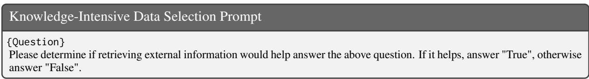  
Figure 5: The prompt of filtering knowledge-intensive instructions from synthetic datasets

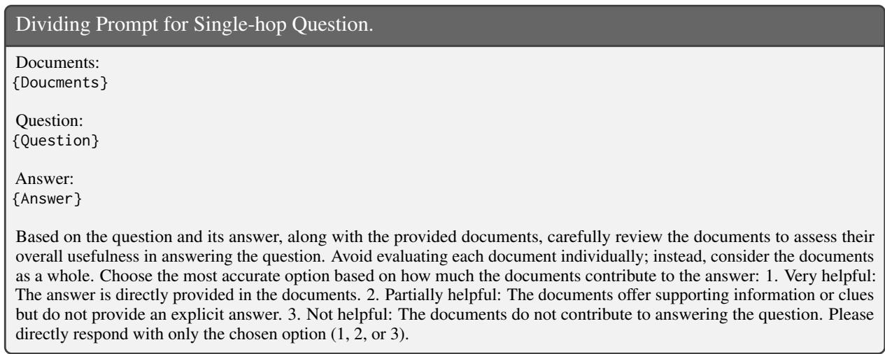  
Figure 6: The prompt for dividing the single-hop question answering datasets into five RAG scenarios.

<table><tr><td>Task</td><td>Template</td></tr><tr><td>Open-ended</td><td>### Instruction: Reference Document: {RETRIEVED DOCUMENTS} Please refer to the documents above and answer the following question: {QUESTION}</td></tr><tr><td>Domain-specific</td><td>### Response: ### Instruction:</td></tr><tr><td>OBQA &amp; ARC</td><td>Reference Document: {RETRIEVED DOCUMENTS} Given four answer candidates, A, B, C and D, choose the best answer choice for the question. Please refer to the documents above and answer the following question: {QUESTION (Including Options) } ### Response:</td></tr><tr><td>Pub (FEVER)</td><td>### Instruction: Reference Document: {RETRIEVED DOCUMENTS} Is the following statement correct or not? Say true if it&#x27;s correct; otherwise, say false. Please refer to the documents above and answer the following question: {QUESTION} ### Response:</td></tr><tr><td>Multi-hop</td><td>### Instruction: Reference Document: {RETRIEVED DOCUMENTS} Please refer to the documents above and answer the following question: {QUESTION}</td></tr><tr><td>Domain-specific</td><td>### Response: ### Instruction: Reference Document:</td></tr><tr><td>CFQA ### Instruction: Reference Document:</td><td>{RETRIEVED DOCUMENTS} Please refer to the documents above and answer the following question: {PREVIOUS QUESTIONS ANSWERS} {QUESTION} ### Response:</td></tr></table>

Table 18: Prompt templates in our Evaluation. For Open-ended and Close-set datasets, RETRIEVED DOCUMENTS are sourced from the retrieval corpus (e.g., Wikipedia). For Multi-hop and Domain-specific datasets, RETRIEVED DOCUMENTS come from the context provided in datasets.

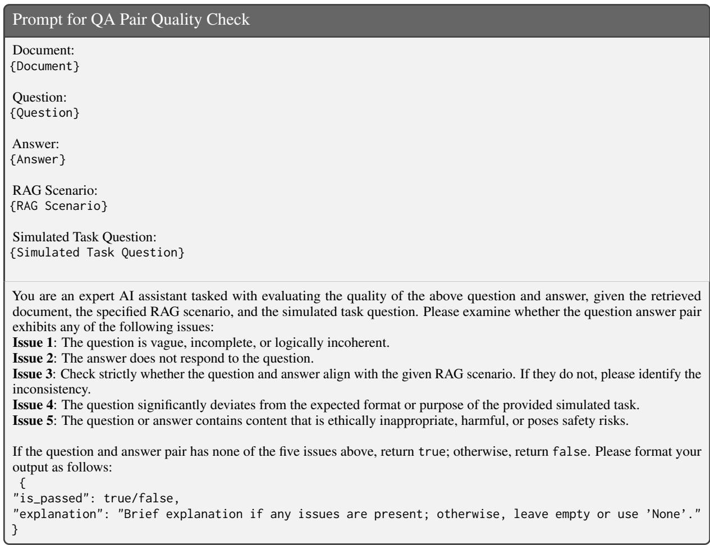  
Figure 7: The prompt used to identify five types of quality issues in QA pairs for RAG-Instruct.

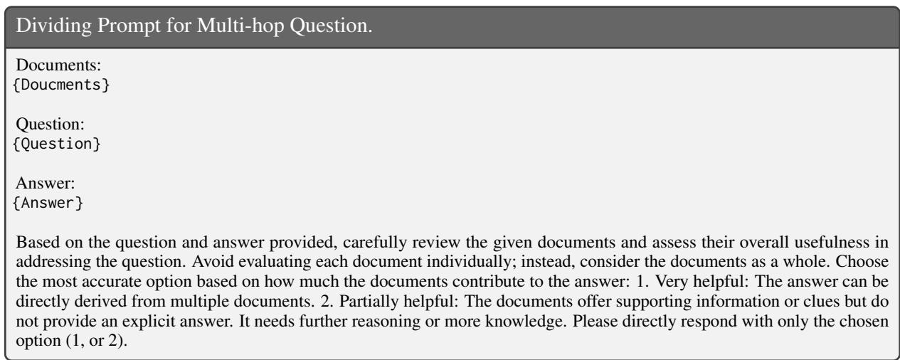  
Figure 8: The prompt for dividing the multi-hop question answering datasets into five RAG scenarios.

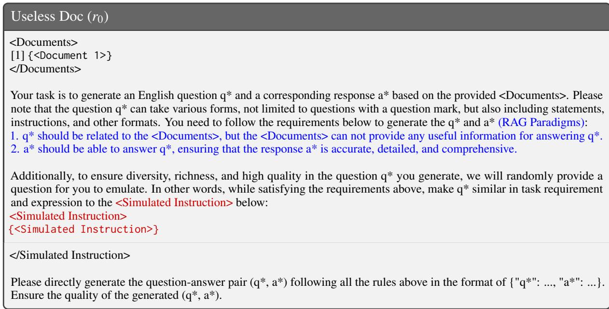  
Figure 9: The prompt for synthesizing Useless Doc $( r _ { 0 } )$ data.

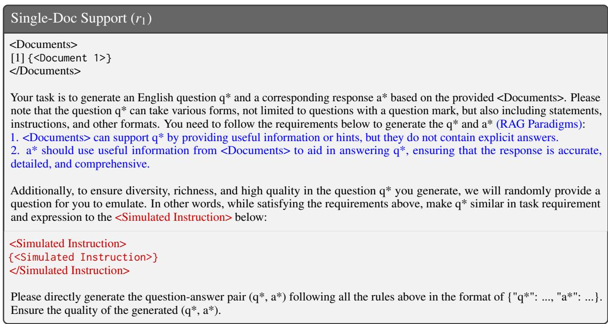  
Figure 10: The prompt for synthesizing Single-Doc Support $\left( r _ { 1 } \right)$ data.

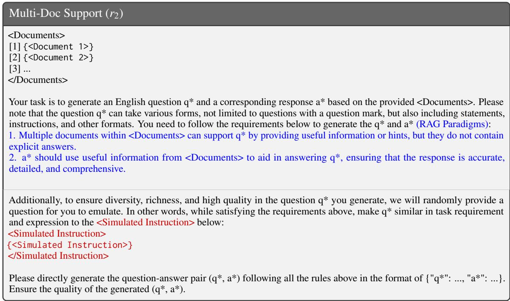  
Figure 11: The prompt for synthesizing Multi-Doc Support (r2) data.

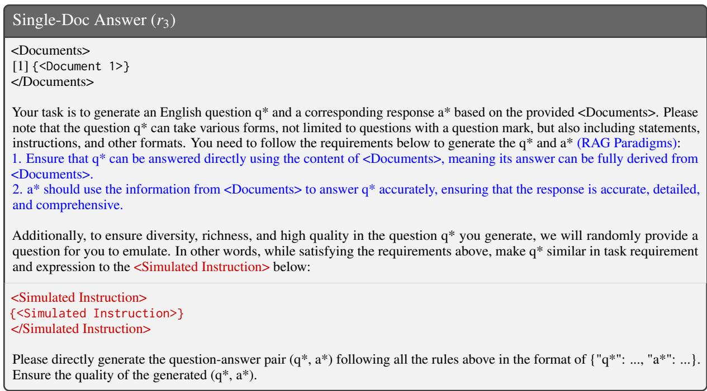  
Figure 12: The prompt for synthesizing Single-Doc Answer $( r _ { 3 } )$ data.

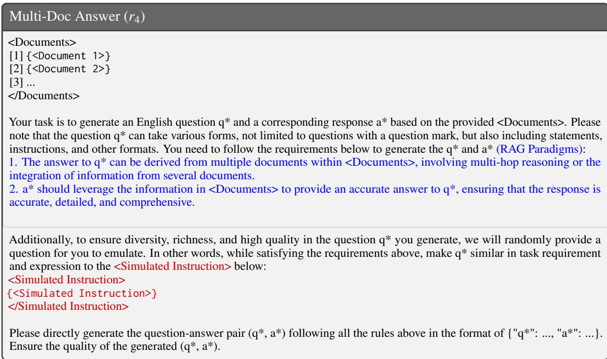  
Figure 13: The prompt for synthesizing Multi-Doc Answer $\left( r _ { 4 } \right)$ data.