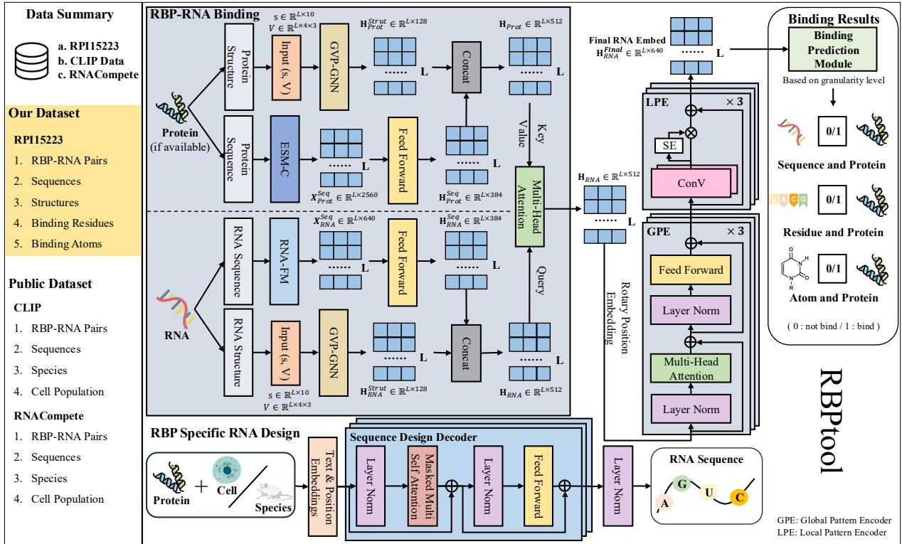

# RBPtool: A Deep Language Model Framework for Multi-Resolution RBP-RNA Binding Prediction and RNA Molecule Design

Jiyue Jiang♡∗, Yitao Xu♡\*, Zikang Wang♠, Yihan Ye♣, Yanruisheng Shao♡, Yuheng Shan♢, Jiuming Wang♡, Xiaodan Fan♡, Jiao Yuan△⋆, Yu Li♡ ♡ CUHK, HKSAR, ♠ PolyU, HKSAR, ♣ Tongji University, ♢ NUS, Singapore, △ Guangzhou National Laboratory, ⋆ Guangzhou Medical University {jiangjy, yitaoxu, 1155231342, jmwang}@link.cuhk.edu.hk, zikang.wang@connect.polyu.hk, 2250116@tongji.edu.cn, shan.yuheng@u.nus.edu, xfan@cuhk.edu.hk, yuan\_jiao@gzlab.ac.cn, liyu@cse.cuhk.edu.hk

## Abstract

RNA-binding proteins (RBPs) play essential roles in post-transcriptional gene regulation via recognizing specific RNA molecules as well as modulating several key physiological processes in cellulo, represented by alternative splicing and RNA degradation. Despite extensive research, most existing approaches still rely on superficial sequence features or coarse structural representations, limiting their ability to capture the intricate nature of RBP-RNA interactions. The recent surge in large language models (LLMs), combined with advances in geometric deep learning for extracting threedimensional representations, enables the inte gration of multi-modal, multi-scale biological data for precise modeling and biologically informed de novo RNA design. In this work, we curate and extend RPI15223 into a multiresolution, structure-level RBP-RNA dataset, and introduce RBPtool, a multi-task, multi resolution framework that combines a geometric vector perception (GVP) module together with a deep language model encoder to fuse sequence and structural information. Our tool achieves state-of-the-art performance on public benchmarks and the RPI15223 dataset, while also supporting fine-grained level predictions and enabling de novo RNA design through a generative module conditioned on protein, celltype, and specified species. RBPtool provides a fast and versatile platform for both fundamental RBP-RNA research and practical RNA drug de sign, delivering enhanced predictive accuracy and fine-grained structural insights.

## 1 Introduction

In eukaryotic cells, RNA-binding proteins play pivotal roles in gene expression and the execution of cellular functions by interacting with specific RNA molecules (Gerstberger et al., 2014; Sakakibara et al., 2002). Accurately characterizing the binding patterns between RBPs and RNAs not only deepens our understanding of complex biological processes but also provides new ideas for RNA molecule design (Kim et al., 2013; Jiang et al., 2025a). However, most existing methods focus on shallow sequences or simple structural features and face limitations in capturing the true interaction patterns between RBPs and RNAs.

In recent years, the rapid rise of large language models endows them with powerful capabilities to encode extensive contextual information (Yu et al., 2024; ESM Team, 2024; Devlin et al., 2018; Jiang et al., 2025b; Wang et al., 2025); meanwhile, in structural biology, three-dimensional feature extraction techniques based on geometric deep learning continue to evolve (Jing et al., 2021; Huang et al., 2024; Batzner et al., 2022), supporting the integration of multi-modal and multi-scale biological data. Additional related work is provided in Appendix A.1. A major challenge remains in combining the contextual understanding offered by language models with three-dimensional structural perception to enhance fine-grained RBP-RNA interaction prediction and support RNA molecule design informed by biological function constraints.

To address these limitations, in addition to existing sequence-level data (Xu et al., 2023; Ray et al., 2009, 2017), we curate and expand a structurallevel RBP-RNA dataset, RPI15223, and develop a multi-task, multi-resolution prediction and generation tool called RBPtool. Building on these data, we introduce a unified neural framework that integrates a geometric vector perception module with sequence encoders, forming a dual-channel architecture that jointly captures sequence and structural information. RBPtool achieves state-of-theart (SOTA) classification accuracy at the sequence level on public benchmarks, while also supporting finer-grained level predictions, as demonstrated on the RPI15223 dataset. Furthermore, our generative module designs custom RNA molecules under specific protein, cell-type, and organism conditions, providing functionally constrained RNA sequences.

  
Figure 1: Overview of the RBPtool’s architecture for Binding Prediction and RNA Design. The binding prediction pipeline illustrated assumes that both RNA and protein sequences, along with their three-dimensional structures, are available as input. While the diagram shows all modalities being provided, the model is designed to flexibly omit any component except the RNA sequence, which is required.

The main contributions of this work are as follows: (1) We develop RBPtool, a unified neural framework powered by pretrained language models for modeling RPB-RNA interactions, which integrates sequence information with tertiary structural representation, enabling multi-granularity prediction. (2) We propose an RNA generation model that designs functional RNA sequences under real biological constraints (e.g., protein targets, cell types, and species). (3) We demonstrate through experiments on multiple benchmark datasets (e.g., CLIP, RNAcompete, RPI15223) that RBPtool achieves leading performance in both RBP-RNA binding prediction and RNA molecule design. (4) RBPtool serves as an integrated framework for RBP biology research and RNA-focused drug design, offering extensibility and general applicability to many biological and pharmaceutical contexts.

## 2 Proposed Method: RBPtool

We present RBPtool, a deep language model framework to perform various RBP tasks: (1) predicting RBP-RNA binding and (2) designing RNA sequences with specific RBP-binding properties. An overview of the framework is shown in Figure 1. For binding prediction, sections 2.1.1 and 2.1.2 describe how RNA and protein embeddings are extracted. Sections 2.1.4 and 2.1.5 introduce modules for capturing global and local RNA patterns. Section 2.1.6 details the prediction heads for binding at multiple resolutions. The RNA sequence design task is described in Section 2.2.

## 2.1 RBP-RNA Binding Prediction

## 2.1.1 Sequence Module

We employ the pre-trained language model RNA-FM (Chen et al., 2022) to encode RNA sequences into contextual embeddings $\mathbf { X } _ { \mathrm { R N A } } ^ { \mathrm { s e q } } \ \in \ \bar { \mathbb { R } ^ { L _ { r } \times 6 4 0 } } ,$ where $L _ { r }$ denotes the length of the RNA sequence. To match the hidden dimension $d _ { \mathrm { s e q } }$ used in downstream modules, these embeddings are projected via a linear transformation and activation function:

$$
{ \bf H } _ { \mathrm { R N A } } ^ { \mathrm { s e q } } = \mathrm { L a y e r N o r m } \left( \mathrm { G e L U } \left( { \bf X } _ { \mathrm { R N A } } ^ { \mathrm { s e q } } { \bf W } + { \bf b } \right) \right) ,\tag{1}
$$

where $\mathbf { W } \in \mathbb { R } ^ { 6 4 0 \times d _ { \mathrm { s e q } } }$ and b $\in \mathbb { R } ^ { d _ { \mathrm { s e q } } }$ . The resulting representation $\mathbf { H } _ { \mathrm { R N A } } ^ { \mathrm { s e q } } \in \mathbb { R } ^ { L _ { r } \times d _ { \mathrm { s e q } } }$ serves as the encoded RNA sequence embedding.

When protein sequences are available, we utilize the ESM-C model (ESM Team, 2024) to generate contextual embeddings $\mathbf { X } _ { \mathrm { P r o t } } ^ { \mathrm { s e q } } \in \mathbb { R } ^ { L _ { p } \times 2 5 6 0 }$ , where $L _ { p }$ is the protein sequence length. These embeddings are projected into the unified space of dimension $d _ { \mathrm { s e q } }$ using an independent projection layer.

## 2.1.2 Structure Module

We follow the GVP-GNN architecture (Jing et al., 2021) to extract SE(3)-equivariant structure features from the RNA backbone1. The RNA is represented as an undirected graph $\mathcal { G } = ( \nu , \mathcal { E } )$ , where each node $v _ { i } ~ \in ~ \mathcal { V }$ corresponds to a nucleotide, and edges $( v _ { i } , v _ { j } ) \in \mathcal { E }$ connect its $k = 1 0$ nearest neighbors based on distance between $_ { \mathrm { C 1 } } ,$ atoms.

Node and Edge Features. Each node feature $\begin{array} { r c l } { \mathbf { h } _ { v } ^ { \left( i \right) } } & { = } & { \left( \mathbf { s } _ { i } , \mathbf { V } _ { i } \right) } \end{array}$ includes scalar components $\mathbf { s } _ { i } \in \mathbb { R } ^ { 1 0 }$ , composed of dihedral angle encodings $\{ \sin , \cos \} \circ \{ \phi _ { i } , \psi _ { i } , \omega _ { i } \}$ and an one-hot encoding of the nucleotide $\mathrm { t y p e } ^ { 2 }$ , and vector components $\mathbf { V } _ { i } \in \mathbb { R } ^ { 4 \times 3 }$ , including local directions and orientation vectors (e.g., C1’-C4’, C1’-N1/N9).

Each edge $( i , j )$ carries a feature $\begin{array} { r l } { \mathbf { h } _ { e } ^ { ( j  i ) } } & { { } = } \end{array}$ $( \mathbf { s } _ { i j } , \mathbf { V } _ { i j } )$ , where the scalar component $\mathbf { s } _ { i j } \in \mathbb { R } ^ { 3 2 }$ is the concatenation of a Gaussian radial basis encoding of the Euclidean distance $\| \mathrm { C } 1 ^ { \prime } { } _ { i } - \mathrm { C } 1 ^ { \prime } { } _ { j } \| _ { 2 }$ and a sinusoidal positional encoding of the sequence distance $| i - j |$ following Vaswani et al. (2017). The vector component $\mathbf { V } _ { i j } \in \mathbb { R } ^ { 1 \times 3 }$ is the unit direction vector pointing from $\mathrm { C } 1 { ' } _ { i }$ to $\mathrm { C } 1 _ { j } ^ { \prime }$

Message Passing and Update. We apply three layers of GVP-GNN to iteratively update node features via message passing from neighboring nodes $\mathcal { N } ( i )$ . At each layer, messages are propagated as follows:

$$
\begin{array} { r l } {  { \mathbf { m } ^ { ( j  i ) } : = g \big ( \mathbf { h } _ { v } ^ { ( j ) } \mid \mid \mathbf { h } _ { e } ^ { ( j  i ) } \big ) , } } \\ & { \quad \mathbf { h } _ { v } ^ { ( i ) }  \mathrm { L a y e r N o r m } \big ( \mathbf { h } _ { v } ^ { ( i ) } + \frac { 1 } { k ^ { \prime } } \sum _ { j \in \mathcal { N } ( i ) } \mathbf { m } ^ { ( j  i ) } \big ) } \end{array}\tag{2}
$$

where $g$ denotes a sequence of three $\mathrm  G V P s , \} |$ is concatenation operation, $\mathbf { m } ^ { ( j  i ) }$ represents the passed messages and $k ^ { \prime } = | \mathcal { N } ( i )$ . Each GVP-GNN layer operates on hidden dimensions (192, 16) for nodes and $( 3 2 , 1 )$ for edges. We also update each node feature $\mathbf { h } _ { v } ^ { ( i ) }$ between message passing layers via a pointwise feedforward module:

$$
\mathbf { h } _ { v } ^ { ( i ) }  \mathrm { L a y e r N o r m } \big ( \mathbf { h } _ { v } ^ { ( i ) } + \mathrm { D r o p o u t } \big ( g ^ { \prime } ( \mathbf { h } _ { v } ^ { ( i ) } ) \big ) \big )\tag{3}
$$

where $g ^ { \prime }$ denotes a sequence of two GVP layers, and Dropout is applied for regularization. After all layers, we extract the scalar component si of each node from the scalar channel of final GVP output $\mathbf { h } _ { v } ^ { ( i ) }$ and collect them into the final structural embedding $\mathbf { H } _ { \mathrm { R N A } } ^ { \mathrm { s t r } } \in \mathbb { R } ^ { L _ { r } \times 1 2 8 }$ . The final GVP uses an output dimension of (128, 0). If protein backbone structures are also provided3, we construct an analogous graph and apply the same GVP-GNN architecture (with independent parameters) to obtain the structure embedding $\mathbf { H } _ { \mathrm { P r o t } } ^ { \mathrm { s t r } } \in \mathbb { R } ^ { L _ { p } \times 1 2 8 }$

## 2.1.3 Embeddings Integration

RNA input is required for all tasks. For each molecule (RNA or protein), if both sequence and structure are available, we concatenate their embeddings; otherwise, only the sequence embedding is used. When protein input is provided, we apply an 8-head multi-head attention layer with RNA as the query and protein as key and value to inject protein context. The final RNA representation is denoted as $\mathbf { H } _ { \mathrm { R N A } } \in \mathbb { R } ^ { L _ { r } \times d _ { \mathrm { h i d d e n } } }$

## 2.1.4 Global Pattern Encoder Module

The embeddings from RNA-FM capture rich sequence features but are not optimized for RBPspecific patterns. To extract high-level contextual information aligned with RNA-protein interactions, we apply a modified transformer encoder, called the Global Pattern Encoder (GPE).

We enhance the transformer encoder with three main modifications. We first use rotary positional encoding (RoPE) (Su et al., 2024) to capture relative positional patterns better, since binding patterns in RNA often depend on relative rather than absolute positions. RoPE also generalizes well to variable-length sequences, which is common in transcriptome-wide settings. It encodes positions via complex-valued rotations such that, for a querykey pair at positions i and $j ,$ their inner product becomes:

$$
\langle \mathrm { R o P E } ( q _ { i } ) , \mathrm { R o P E } ( k _ { j } ) \rangle = \langle q _ { i } , R ^ { i - j } k _ { j } \rangle\tag{4}
$$

where $R ^ { i - j }$ is a relative rotation matrix depending on the offset $i - j$ . Second, we adopt a prelayer normalization scheme to stabilize training and improve convergence speed. For activation, we adopt Gated GeLU (GeGLU) (Shazeer and Stern, 2018), which enhances feedforward expressiveness by introducing multiplicative interactions. Given an input token representation $\boldsymbol { x } \in \mathbb { R } ^ { d }$

$$
{ \mathrm { G e G L U } } ( x ) = { \mathrm { G e L U } } ( x W + b ) \odot ( x V + c )\tag{5}
$$

where W, $V \in \mathbb { R } ^ { d \times d } , b , c \in \mathbb { R } ^ { d } .$ , and denotes element-wise multiplication. Stacking n such transformer layers yields the GPE module, which models global dependencies across the RNA sequence:

$$
\mathbf { H } _ { \mathrm { R N A } } ^ { \mathrm { r e f i n e d } } = \mathrm { G P E } ^ { ( n ) } ( \mathbf { H } _ { \mathrm { R N A } } )\tag{6}
$$

where $\mathbf { H } _ { \mathrm { R N A } } ^ { \mathrm { r e f i n e d } } \in \mathbb { R } ^ { L _ { r } \times d _ { \mathrm { h i d d e n } } }$ , and n is the number of global pattern encoder layers.

## 2.1.5 Local Pattern Encoder Module

While the GPE module captures long-range dependencies, its global attention may overlook discriminative RNA motifs. To address this, we introduce the Local Pattern Encoder (LPE) module.

Each LPE layer begins with two consecutive 1D convolutions with kernel size k, followed by a squeeze-and-excitation (SE) block (Hu et al., 2018) that reweights channel-wise features. Formally, given input $\mathbf { X } \in \mathbb { R } ^ { B \times L \times C }$ , the output is:

$$
\mathrm { L P E } ( \mathbf { X } ) = \mathbf { X } + \left( \mathrm { S E } ( \mathbf { U } ) \odot \mathbf { U } \right)\tag{7}
$$

where $\mathbf { U } \ = \ \mathrm { C o n v ^ { 2 } ( X ) , \ C o n v ^ { 2 } ( \cdot ) }$ denotes two stacked 1D convolutions with kernel size 3, and $\odot$ is element-wise multiplication.The SE block first applies global average pooling over the sequence length $L$ to obtain $\mathbf { U } _ { \mathrm { a v g } } \in \mathbb { R } ^ { B \times C \times 1 }$ then uses two pointwise (1×1) convolutions with LeakyReLU (Maas et al., 2013):

$$
\mathrm { S E } ( \mathbf { U } ) = \mathrm { S i g m o i d } \big ( \mathbf { U } _ { \mathrm { a v g } } \mathbf { W } _ { 1 } \boldsymbol { \sigma } ( \cdot ) \mathbf { W } _ { 2 } \big ) ,
$$

where $\mathbf { W } _ { 1 } \in \mathbb { R } ^ { C \times C / 3 2 } , \mathbf { W } _ { 2 } \in \mathbb { R } ^ { C / 3 2 \times C }$ , and $\sigma ( \cdot )$ denotes LeakyReLU. We stack m such LPE layers to obtain the final RNA embedding:

$$
\mathbf { H } _ { \mathrm { R N A } } ^ { \mathrm { f i n a l } } = \mathrm { L P E } ^ { ( m ) } ( \mathbf { H } _ { \mathrm { R N A } } ^ { \mathrm { r e f i n e d } } )\tag{8}
$$

where $\mathbf { H } _ { \mathrm { R N A } } ^ { \mathrm { f i n a l } } \in \mathbb { R } ^ { L _ { r } \times d _ { \mathrm { h i d d e n } } }$ . The LPE module reinforces compact, motif-like patterns within the RNA sequence, complementing the global context captured by GPE4.

## 2.1.6 Binding Prediction Module

We predict binding at three levels-sequence, residue, and atom-using a two-layer MLP classifier. This classifier produces logits and is defined as:

$$
f ( \mathbf { x } ) = \mathbf { W } _ { \mathrm { o u t } } \cdot \mathrm { S i L U } ( \mathbf { W } _ { \mathrm { m i d } } \mathbf { x } + \mathbf { b } _ { \mathrm { m i d } } ) + \mathbf { b } _ { \mathrm { o u t } } ,\tag{9}
$$

where $\mathbf { W } _ { \mathrm { m i d } } ~ \in ~ \mathbb { R } ^ { d _ { \mathrm { m i d } } \times d _ { \mathrm { h i d d e n } } }$ $\mathbf { W _ { \mathrm { o u t } } } \in \mathbb { R } ^ { d _ { \mathrm { o u t } } \times d _ { \mathrm { m i d } } }$ $\mathbf { b } _ { \mathrm { m i d } } \in \mathbb { R } ^ { d _ { \mathrm { m i d } } }$ , and $\mathbf { b _ { \mathrm { o u t } } } \in \mathbb { R } ^ { d _ { \mathrm { o u t } } }$ . We use $d _ { \mathrm { m i d } } =$ $d _ { \mathrm { h i d d e n } } / 2$ , and $d _ { \mathrm { o u t } }$ depends on the prediction level.

Sequence-Level Prediction. To obtain a fixedsize RNA representation, we apply a gated attention mechanism over the final embeddings $\mathbf { H } _ { \mathrm { R N A } } ^ { \mathrm { f i n a l } } \ \in$ $\mathbb { R } ^ { L _ { r } \times d _ { \mathrm { h i d d e n } } }$

$$
\begin{array} { l } { { \displaystyle { \boldsymbol \alpha } = \mathrm { S o f t m a x } \big ( \mathbf { W } _ { q } \sigma ( \mathbf { H } _ { \mathrm { R N A } } ^ { \mathrm { f i n a l } } \mathbf { W } _ { k } ) \big ) } , } \\ { { \displaystyle { \mathbf { z } } = \sum _ { i = 1 } ^ { L _ { r } } \alpha _ { i } \mathbf { H } _ { \mathrm { R N A } } ^ { \mathrm { f i n a l } } [ i ] } } \end{array}\tag{10}
$$

where $\mathbf { W } _ { k } \ \in \ \mathbb { R } ^ { d _ { \mathrm { h i d d e n } } \times d _ { a } }$ $\mathbf { W } _ { q } ~ \in ~ \mathbb { R } ^ { d _ { a } \times 1 }$ $\sigma$ is LeakyReLU, and $\pmb { \alpha } \in \mathbb { R } ^ { L _ { r } }$ . The aggregated vector $\mathbf { z } \in \mathbb { R } ^ { d _ { \mathrm { h i d d e n } } }$ is then passed through $f ( \cdot )$ with $d _ { \mathrm { o u t } } = 1$ to produce the binding logit $\hat { y } \in \mathbb R$

Residue-Level Prediction. For each position i, the embedding $\mathbf { H } _ { \mathrm { R N A } } ^ { \mathrm { f i n a l } } [ i ] \in \mathbb { R } ^ { d _ { \mathrm { h i d d e n } } }$ is fed independently into $f ( \cdot )$ with $d _ { \mathrm { o u t } } = 1$ to yield the residuelevel binding logit $\hat { y } _ { i } \in \mathbb { R }$

Atom-Level Prediction. To predict atom-level binding, we again input each $\mathbf { H } _ { \mathrm { R N A } } ^ { \mathrm { f i n a l } } [ i ]$ into the MLP, but set $d _ { \mathrm { o u t } } = 3 ,$ , producing a three-dimensional logit vector $\hat { \mathbf { y } } _ { i } \in \mathbb { R } ^ { 3 }$ corresponding to the backbone atoms C1’, C4’, and N1/N9:

$$
\hat { \mathbf { y } } _ { i } = f ( \mathbf { H } _ { \mathrm { R N A } } ^ { \mathrm { f i n a l } } [ i ] ) .\tag{11}
$$

For all three levels, the model is trained by minimizing a weighted binary cross-entropy loss:

$$
\mathcal { L } _ { \mathrm { W C E } } = - \frac { 1 } { N } \sum _ { i = 1 } ^ { N } \Big [ w _ { \mathrm { p o s } } \cdot y _ { i } \cdot \log ( \sigma ( \hat { y } _ { i } ) )\tag{12}
$$

where $\sigma ( \cdot )$ is the sigmoid function, $w _ { \mathrm { p o s } }$ is the positive class weight, and N is the number of instances. Some parameter settings vary based on the available input modalities; see the Appendix A.2 for detailed configurations.

## 2.2 RNA Sequence Design for Target RBP

The goal of this task is to generate RNA sequences that specifically bind to a target RBP, conditioned on contextual labels including the target RBP $( P _ { \mathrm { t a r g e t } } )$ and either the associated cell type $( C _ { \mathrm { c e l l } } )$ or species $( S _ { \mathrm { s p e c i e s } } )$

First, we convert the input conditional label $\begin{array} { r l r } { L _ { c o n d } } & { { } = } & { ( P _ { t a r g e t } , C _ { c e l l } ) } \end{array}$ or $\begin{array} { r l } { L _ { c o n d } } & { { } = } \end{array}$ $( P _ { t a r g e t } , S _ { s p e c i e s } )$ into a numerical embedding.

This is a standard conditional text generation task, and the model is optimized by negative log likelihood loss:

$$
\mathcal { L } = - \sum _ { i = 1 } ^ { N } \log p ( y _ { i } | y _ { < i } , L _ { c o n d } )\tag{13}
$$

## 3 Experiments and Results

In this section, we comprehensively evaluate the effectiveness of our proposed RBPtool across two RBP tasks: (1) RBP-RNA Binding (Section 3.3), which is examined at three levels of granularity, sequence (Section 3.3.1), residue (Section 3.3.2), and atom (Section 3.3.3); and (2) RBP-Specific RNA Design (Section 3.4). A general overview of the experimental setup is provided in Section 3.1, while task-specific configurations and evaluation protocols are detailed in their respective sections.

## 3.1 Experiment Setting

We train all models using a batch size of 32 for up to 200 epochs, with early stopping based on a patience of 20 epochs. Optimization is performed using the Adam optimizer (Kingma and Ba, 2014) with a maximum learning rate of 1e-4, combined with a scheduler that applies 10% linear warm-up followed by cosine annealing with restarts (Loshchilov and Hutter, 2017). All experiments are conducted on four NVIDIA RTX 3090 (24GB) for binding tasks and eight A100 GPUs (80GB) for design. Default hyperparameters are used unless otherwise specified.

## 3.2 RPI15223 Dataset

We construct this dataset through the following pipeline: (1) Retrieval: We query EMDB and PDB using keywords related to RBP-RNA complexes and collect all matching structures from the Protein Data Bank (PDB). (2) Pair Identification: An RNA-protein pair is considered binding if any heavy atom in the RNA is within 3.5 Å of any heavy atom in the protein. (3) Filtering: We retain pairs with structure resolution better than $4 \mathring \mathrm { A } .$ , where the RNA is between 10 and 1,022 nucleotides long, and the protein is between 10 and 2,046 residues long. The resulting dataset consists of 15,223 unique RNA-protein binding pairs with corresponding sequence and structural information.

## 3.3 RBP–RNA Binding

In this task, we evaluate RBPtool on a series of RBP-RNA Binding tasks across three structural levels: sequence, residue, and atom. Each level captures different biological and structural aspects of RNA-protein interactions, enabling a comprehensive evaluation of the model under varying information conditions.

## 3.3.1 Sequence Level

At the sequence level, the primary objective is to predict whether a given RNA sequence can bind to a specific RBP under a defined cellular context. For each RBP, we train an independent binary classifier using RNA sequences as input. Additionally, we also include a supplementary experiment using both RNA and protein sequences to predict sequence-level binding, demonstrating the broad applicability of RBPtool.

Datasets. We use three datasets: CLIP, RNAcompete, and RPI15223. The CLIP dataset (Xu et al., 2023) includes 171 RBPs, each with 15,000 RNA sequences (101 nt), split into 5,000 positives and 10,000 negatives. The RNAcompete dataset (Ray et al., 2009, 2017) covers 162 RBPs with 1,520–16,265 sequences per RBP (30–41 nt), following a 1:2 positive-to-negative ratio. For RPI15223, we first removed duplicates from all RNA sequences to obtain the positive set and generated a negative set of twice the size by randomly sampling RNA sequences of lengths between 12 and 1022 nucleotides to construct the whole dataset. Dataset details and splits are in Section A.4.

Baselines. We compare our approach with three representative baselines: PrismNet, iDeepS, and HDRNet. We only use RNA sequence information without other information as input across all models for a fair comparison. As required by HDRNet, we generate sequence embeddings using its pretrained BERT model5 described in its paper. All baselines are trained for each RBP individually using their publicly available codes and default hyperparameter settings provided on GitHub.

<table><tr><td rowspan="2">Models</td><td colspan="3">CLIP</td><td colspan="3">RNAcompete</td></tr><tr><td>ACC</td><td>AUPR</td><td>AUROC</td><td>ACC</td><td>AUPR</td><td>AUROC</td></tr><tr><td>PrismNet (Sun et al., 2021)</td><td> $0 . 6 3 2 \pm 0 . 1 6 6$ </td><td> $0 . 6 7 4 \pm 0 . 1 1 1$ </td><td> $0 . 8 0 1 \pm 0 . 0 7 6$ </td><td> $0 . 8 7 2 \pm 0 . 0 7 2$ </td><td> $0 . 8 8 3 \pm 0 . 0 9 8$ </td><td> ${ \bf 0 . 9 3 2 \pm 0 . 0 7 4 }$ </td></tr><tr><td>iDeepS (Pan et al., 2025)</td><td> $0 . 7 0 9 \pm 0 . 1 1 5$ </td><td> $0 . 6 6 4 \pm 0 . 1 1 3$ </td><td> $0 . 7 6 8 \pm 0 . 1 0 4$ </td><td> $0 . 8 6 3 \pm 0 . 0 9 1$ </td><td> $0 . 8 8 0 \pm 0 . 0 9 1$ </td><td> $0 . 9 2 8 \pm 0 . 0 7 9$ </td></tr><tr><td>HDRNet (Zhu et al., 2023)</td><td> $0 . 6 5 4 \pm 0 . 1 7 4$ </td><td> $0 . 6 4 6 \pm 0 . 1 1 0$ </td><td> $0 . 7 8 0 \pm 0 . 0 7 5$ </td><td> $0 . 7 4 8 \pm 0 . 1 5 8$ </td><td> $0 . 8 0 7 \pm 0 . 1 1 0$ </td><td> $0 . 8 9 0 \pm 0 . 0 7 7$ </td></tr><tr><td>RBPtool</td><td> $\mathbf { 0 . 7 7 3 \pm 0 . 0 6 7 }$ </td><td> $\mathbf { 0 . 7 2 0 \pm 0 . 0 9 4 }$ </td><td> ${ \bf 0 . 8 2 4 \pm 0 . 0 6 5 }$ </td><td> ${ \bf 0 . 8 7 8 \pm 0 . 0 6 6 }$ </td><td> $\mathbf { 0 . 8 8 4 \pm 0 . 0 9 6 }$ </td><td> $0 . 9 3 1 \pm 0 . 0 7 3$ </td></tr></table>

Table 1: Mean standard deviation of ACC, AUPR, and AUROC across all RBP-specific models on the CLIP and RNAcompete datasets for the RBP binding task. Bold numbers indicate the highest average scores for each metric.

Evaluation Metrics. We assess model performance on this task using three standard metrics: accuracy (ACC), area under the precision-recall curve (AUPR), and area under the ROC curve (AUROC). For each RBP, an independent binary classifier is trained, yielding one set of evaluation scores per RBP. We calculate the mean and standard deviation of each metric across all RBPspecific classifiers for each dataset separately, 171 classifiers for CLIP and 162 for RNAcompete, providing an aggregated view of model performance on both datasets to evaluate the overall performance and robustness of the methods.

Main Results. Table 1 reports the performance of different models on the RBP binding task in two datasets. RBPtool achieves the highest average scores in all three metrics on both datasets, with only a marginal drop in AUROC on the RNAcompete dataset. The advantage becomes more obvious on the CLIP dataset, where RBPTools outperforms all baselines by a clear margin. This dataset is more challenging due to its more diverse RNA sequences, which introduce greater complexity in learning binding patterns. These results highlight the effectiveness of RBPtool in modeling complex sequence contexts, due to the integration of GPE and pre-trained language models.

Moreover, RBPtool yields the lowest standard deviation across all metrics, suggesting that the model remains robust despite its increased capacity. The added architectural flexibility appears to enhance generalization, enabling RBPtool to better handle diverse RBP-RNA interactions.

Additionally, Table 13 shows that RBPtool performs strongly on the external RPI15223 dataset, which involves predicting the binding potential of arbitrary RNA to unknown RBPs. Our model outperforms all baselines by a substantial margin across all metrics, demonstrating its strong generalization capability and robustness to variable-length RNA inputs on sequence level prediction. Baseline models show noticeable limitations in this setting, since iDeepS and HDRNet both need to set a maximum length. This may be partly attributed to the Embedding Integration Module, which incorporates protein context through attention rather than simple concatenation. More results on this task can be found in Section A.6.

## 3.3.2 Residue Level

At the residue level, we focus on determining which nucleotides in an RNA molecule participate in direct interactions with an RBP.

Datasets. We constructed a refined benchmark from the RPI15223 dataset for residue-level RBP-RNA binding prediction. The final dataset contains 996 unique RNA sequences and 26,703 labeled nucleotides. We formulate this task using RNA input only here, since few existing baselines use both RNA and protein at this resolution. Details of full preprocessing steps are described in Appendix A.5.

Baselines. We evaluate two sequence-only models, FMbind and RNAPin, and three structurebased models, ZHmol, RLbind, and RNABind, on our dataset. FMbind is fine-tuned from the RNA foundation model RNA-FM for this task. Meanwhile, RNABind incorporates RNA language models to generate node embeddings for its GNN encoder; we assess its several variants using different pretrained models, including RNA-FM (Yu et al., 2024), RNA-MSM (Zhang et al., 2024), and ERNIE-RNA (Yin et al., 2024). FMbind and RNAPin are only trained on sequence information and all other methods are trained on both sequence and coordinates. All baselines are retrained on our dataset using their original codes and default hyperparameters under a unified evaluation pipeline.

<table><tr><td rowspan="2">Sequence Type Estimation Model</td><td colspan="3">CLIP</td><td colspan="3">RNAcompete</td></tr><tr><td>RBPtool</td><td>PrismNet</td><td>iDeepS</td><td>RBPtool</td><td>PrismNet</td><td>iDeepS</td></tr><tr><td>Natural Sequence</td><td>73.40</td><td>75.02</td><td>74.30</td><td>87.50</td><td>75.02</td><td>87.36</td></tr><tr><td>Random</td><td>49.65</td><td>51.78</td><td>45.91</td><td>11.27</td><td>25.03</td><td>10.27</td></tr><tr><td>Genetic algorithm (random)</td><td>51.03</td><td>52.67</td><td>47.02</td><td>12.34</td><td>26.13</td><td>11.03</td></tr><tr><td>RBPtool (design)</td><td>53.22</td><td>59.67</td><td>56.10</td><td>44.38</td><td>53.26</td><td>47.27</td></tr></table>

Table 2: Comparison of WSR (%, ↑) for different types of RNA sequences evaluated using RBPtool, PrismNet and iDeepS on the CLIP and RNAcompete datasets. The introduction of baselines is in Section A.7.
<table><tr><td rowspan="2">Sequence Type</td><td colspan="3">CLIP</td><td colspan="3">RNAcompete</td></tr><tr><td>MSE</td><td>Pearson</td><td>Spearman</td><td>MSE</td><td>Pearson</td><td>Spearman</td></tr><tr><td>Random</td><td>0.052</td><td>0.247</td><td>0.211</td><td>0.297</td><td>0.043</td><td>0.004</td></tr><tr><td>RBPtool (design)</td><td>0.015</td><td>0.882</td><td>0.859</td><td>0.092</td><td>0.646</td><td>0.488</td></tr></table>

Table 3: Pearson correlation (↑), Spearman correlation (↑) and MSE (↓) of AUPR between natural and synthetic sequences evaluated by Prismnet.

Evaluation Metrics. Similar to the task at the sequence level, performance is evaluated using AUPR and AUROC, computed globally across all nucleotides in the test set.

Main Results. As shown in Table 4, RBPtool achieves the best overall performance on the RBP binding prediction task, obtaining the highest AUPR and AUROC scores among all baselines. The next best-performing group consists of five RNABind variants. This finding highlights the significant impact of pre-trained RNA representations on RNA-related tasks. Furthermore, RBPtool consistently outperforms all RNABind variants by a notable margin of 4.3 to 9.2 points in AUPR. This demonstrates that integrating GPE modules into RBPtool enhances its ability to capture complex sequence-structure patterns in RBP interactions, while the local motif information retained by the LPE may also contribute to this improvement.

## 3.3.3 Atom Level

At the atomic level, we further refine the task to predicting whether individual RNA backbone atoms bind to an RBP.

Datasets. We adopt the same binding-site definition as in Section 3.3.2 to label the binding backbone atoms in the RPI15223 dataset and remove redundant pairs. The resulting set of non-redundant RNA-protein pairs, with atom-level annotations, is divided into training and test subsets using an 80/20 split, while ensuring that no RNA sequences overlap between sets to prevent data leakage.

<table><tr><td>Models</td><td>AUPR</td><td>AUROC</td></tr><tr><td>ZHmol (Zhuo et al., 2024)</td><td>0.576</td><td>0.532</td></tr><tr><td>FMbind (Yu et al., 2024)</td><td>0.638</td><td>0.621</td></tr><tr><td>RNAPin (Panwar and Raghava, 2015)</td><td>0.608</td><td>0.548</td></tr><tr><td>RLbind (Wang et al., 2023a)</td><td>0.665</td><td>0.628</td></tr><tr><td>RNABind_fm (Zhu et al., 2025)</td><td>0.634</td><td>0.606</td></tr><tr><td>RNABind_rnamsm</td><td>0.683</td><td>0.661</td></tr><tr><td>RNABind_rnaernie</td><td>0.668</td><td>0.619</td></tr><tr><td>RNABind_ernierna</td><td>0.680</td><td>0.663</td></tr><tr><td>RNABind_renalmo</td><td>0.665</td><td>0.642</td></tr><tr><td>RBPtool</td><td>0.726</td><td>0.706</td></tr></table>

Table 4: AUPR and AUROC across all models on RBP binding sites prediction. Among all the baselines, RBPtool achieves the highest AUPR and AUROC.

Baselines. There are no existing baselines specifically for atom-level RBP-RNA interaction prediction. Therefore, we compare the performance of RBPtool at both residue and atom levels to assess whether the increased resolution leads to performance improvements or trade-offs in accuracy.

Evaluation Metrics. Due to a strong class imbalance between binding and non-binding atoms, we evaluate using metrics that are more robust in imbalanced settings: F1 score, Matthews Correlation Coefficient (MCC) and AUPR. The classification threshold is chosen to maximize the F1 score on the training set.

Main Results. As shown in Table 14, RBPtool achieves comparable performance on atom-level binding prediction, with only a moderate decrease relative to the residue level. This suggests that our model maintains reasonably good accuracy even at the atomic resolution, supporting the feasibility of fine-grained RBP–RNA interaction modeling.

<table><tr><td rowspan="2">Models</td><td colspan="3">CLIP</td><td colspan="3">RNAcompete</td></tr><tr><td>ACC</td><td>AUPR</td><td>AUROC</td><td>ACC</td><td>AUPR</td><td>AUROC</td></tr><tr><td>RBPtool</td><td> $\mathbf { 0 . 7 7 3 \pm 0 . 0 6 7 }$ </td><td> $\mathbf { 0 . 7 2 0 \pm 0 . 0 9 4 }$  </td><td> ${ \bf 0 . 8 2 4 \pm 0 . 0 6 5 }$  </td><td> $\mathbf { 0 . 8 7 8 \pm 0 . 0 6 6 }$ </td><td> $\mathbf { 0 . 8 8 4 \pm 0 . 0 9 6 }$  </td><td> ${ \bf 0 . 9 3 1 \pm 0 . 0 7 3 }$ </td></tr><tr><td>-w/o fm</td><td> $0 . 6 9 4 \pm 0 . 1 0 3$ </td><td> $0 . 6 3 6 \pm 0 . 1 2 2$ </td><td> $0 . 7 5 9 \pm 0 . 0 9 0$ </td><td> $0 . 8 4 4 \pm 0 . 1 2 4$ </td><td> $0 . 8 5 7 \pm 0 . 1 2 6$ </td><td> $0 . 9 1 4 \pm 0 . 0 9 8$ </td></tr><tr><td>-w/o gpe</td><td> $0 . 7 0 8 \pm 0 . 1 0 1$ </td><td> $0 . 6 5 3 \pm 0 . 1 1 8$ </td><td> $0 . 7 8 4 \pm 0 . 0 8 1$ </td><td> $0 . 8 5 4 \pm 0 . 0 9 4$ </td><td> $0 . 8 3 9 \pm 0 . 1 0 6$ </td><td> $0 . 9 0 9 \pm 0 . 0 8 0$ </td></tr><tr><td>-w/o lpe</td><td> $0 . 7 2 8 \pm 0 . 0 9 7$ </td><td> $0 . 6 8 1 \pm 0 . 1 1 5$ </td><td> $0 . 7 9 8 \pm 0 . 0 8 3$ </td><td> $0 . 8 5 9 \pm 0 . 1 2 1$ </td><td> $0 . 8 6 8 \pm 0 . 1 2 4$ </td><td> $0 . 9 1 7 \pm 0 . 1 1 1$ </td></tr></table>

Table 5: Ablation study of RBP binding task on CLIP and RNAcompete datasets.

<table><tr><td>Models</td><td>AUPR</td><td>AUROC</td></tr><tr><td>RBPtool</td><td>0.726</td><td>0.706</td></tr><tr><td>-w/o fm</td><td>0.704</td><td>0.687</td></tr><tr><td>-w/o gpe</td><td>0.695</td><td>0.678</td></tr><tr><td>-w/o gvp</td><td>0.624</td><td>0.647</td></tr></table>

Table 6: Ablation study of RBP binding sites task.

## 3.4 RBP Target RNA Design

This task aims to design RNA sequences that bind to a target RBP with high affinity.

Datasets. We reuse the CLIP and RNAcompete datasets from the RBP binding task. Each instance is augmented with the target RBP’s protein sequence, the corresponding cell population, and species annotation (Section A.5).

Evaluation Metrics. We assess generation quality using two custom metrics: Weighted Success Rate (WSR) and Metric Similarity. WSR measures the predicted binding success rate of generated sequences, while Metric Similarity quantifies how closely models behave on synthetic versus natural data, using correlation and mean squared error (MSE) as indicators. Higher WSR and correlation, and lower MSE, reflect better design quality. Detailed definitions are provided in Appendix A.7.

Baselines. With no established baselines for this task, we compare against two alternatives: Random and Genetic Algorithm, built using different generation strategies described in Appendix A.7.

Main Results. Table 2 and Table 3 shows that the RNA sequences designed by RBPtool achieve significantly higher WSR and Metric Similarity compared to randomly generated sequences on both datasets. This result indicates that RBPtool is capable of designing RNA sequences that specifically bind to the target RBP. The complete results of Metric Similarity are provided in Appendix A.9. High WSRs calculated on natural sequences by all three models illustrate that our metrics can effectively estimate the success rate.

## 3.5 Ablation Study

Both the RNA-FM and GPE significantly enhance RBP binding, while LPE and GVP-GNN further improve the language module. We ablated four variants: (1) RBPtool-w/o-fm: one-hot instead of RNA-FM. (2) RBPtool-w/o-gpe: no GPE module. (3) RBPtool-w/o-lpe: no LPE in sequence-level. (4) RBPtool-w/o-gvp: no GVP in residue-level.

Results (Tables 5 and 6) show that removing FM or GPE severely weakens both sequence- and residue-level performance, while excluding GVP significantly affects residue-level accuracy. LPE’s impact is minor, likely because RNA-FM and GPE already cover both local and distant relationships. Though structural data is beneficial, it can be hard to obtain, underscoring the importance of RNA-FM and GPE for sequence-based learning. More analysis can be found in Section A.10.

## 4 Conclusion and Outlook

RBPtool introduces a unified framework that integrates deep language models with structural information for multi-resolution RBP-RNA binding prediction and functional RNA molecule design. It achieves state-of-the-art performance, particularly on our curated RPI15223 dataset, demonstrating its strong potential to advance both fundamental research in RBP biology and the development of RNA-based therapeutics.

In the future, incorporating richer biological data and generative algorithms could further boost crossspecies and pathological predictions

## Limitations

This paper introduces an RNA sequence generation module tailored for specific RBPs, and employs model scoring to evaluate the design outcomes. However, model scoring cannot fully substitute for wet-lab experimental validation. Even sequences that score highly may not achieve their expected functions in vitro or in vivo, necessitating additional experimental methods to confirm the actual binding efficiency and biological functions of the designed RNA.

In addition, the experiments primarily focus on typical RNA-binding proteins, common species, and cell types, and have not yet been validated in the context of less common or structurally complex RBPs, viral RNAs, or rare species. The generalizability and robustness of the model in these extreme scenarios still require further testing and tuning.

In this paper, we merely use AI tools to refine the language of the paper.

## Ethnics Statement

This paper does not involve issues related to ethics.

## Acknowledgments

We want to thank our anonymous area chair and reviewers for their feedback. This work was supported by the Chinese University of Hong Kong (CUHK; award numbers 4937025, 4937026, 5501517, 5501329, 8601603, 8601663, and SHIAE BME-p1-24 to Y.L.); the Research Grants Council of the Hong Kong Special Administrative Region, China (Hong Kong SAR; project no. CUHK 24204023 and 14208525 to Y.L.); the Innovation and Technology Commission of the Hong Kong SAR, China (project numbers GHP/065/21SZ, ITS/247/23FP and PRP/033/24FX to Y.L.); the Major Project of Guangzhou National Laboratory (Grant No. GZNL2024A01003, GZNL2023A02007, GZNL2025C02028 to J.Y.), National Natural Science Foundation of China (Grant No. 32400547 to J.Y.), Pearl River Talent Recruitment Program (2023QN10Y296 to J.Y.), Guangzhou Young Top Talent Program, and National Key R&D Program of China (2023YFF1204701 to J.Y.); a General Research Fund (14306324) sponsored by the Research Grants Council of Hong Kong to X.F.; and a Strategic Seed Funding for Collaborative Research Scheme from The Chinese University of Hong Kong (3136017) to X.F.

## References

Babak Alipanahi, Andrew Delong, Matthew T Weirauch, and Brendan J Frey. 2015. Predicting the sequence specificities of dna- and rna-binding proteins by deep learning. Nature Biotechnology, 33(8):831–838.

Simon Batzner, Albert Musaelian, Lixin Sun, Mario Geiger, Jonathan P Mailoa, Mordechai Kornbluth, Nicola Molinari, Tess E Smidt, and Boris Kozinsky. 2022. E (3)-equivariant graph neural networks for data-efficient and accurate interatomic potentials. Nature communications, 13(1):2453.

Helen M. Berman, John Westbrook, Zukang Feng, Gary Gilliland, T. N. Bhat, Helge Weissig, Ilya N. Shindyalov, and Philip E. Bourne. 2000. The Protein Data Bank. Nucleic Acids Res., 28(1):235–242.

Jiayang Chen, Zhihang Hu, Siqi Sun, Qingxiong Tan, Yixuan Wang, Qinze Yu, Licheng Zong, Liang Hong, Jin Xiao, Tao Shen, and 1 others. 2022. Interpretable rna foundation model from unannotated data for highly accurate rna structure and function predictions. arXiv preprint arXiv:2204.00300.

Alexander Churkin, Matan Drory Retwitzer, Vladimir Reinharz, Yann Ponty, Jérôme Waldispühl, and Danny Barash. 2018. Design of rnas: Comparing programs for inverse rna folding. Briefings in bioinformatics, 19(2):350–358.

Jacob Devlin, Ming-Wei Chang, Kenton Lee, and Kristina Toutanova. 2018. Bert: Pre-training of deep bidirectional transformers for language understanding. arXiv preprint arXiv:1810.04805.

ESM Team. 2024. Esm cambrian: Revealing the mysteries of proteins with unsupervised learning.

Stefanie Gerstberger, Markus Hafner, and Thomas Tuschl. 2014. A census of human rna-binding proteins. Nature Reviews Genetics, 15(12):829–845.

Ivo L Hofacker, Walter Fontana, Peter F Stadler, L Sebastian Bonhoeffer, Manfred Tacker, Peter Schuster, and 1 others. 1994. Fast folding and comparison of rna secondary structures. Monatshefte fur chemie, 125:167–167.

Jie Hu, Li Shen, and Gang Sun. 2018. Squeeze-andexcitation networks. In Proceedings ofthe IEEE conference on computer vision and pattern recognition (CVPR), pages 7132–7141.

Han Huang, Ziqian Lin, Dongchen He, Liang Hong, and Yu Li. 2024. Ribodiffusion: tertiary structure-based rna inverse folding with generative diffusion models. Bioinformatics, 40(Supplement\_1):i347–i356.

Jiyue Jiang, Pengan Chen, Jiuming Wang, Dongchen He, Ziqin Wei, Liang Hong, Licheng Zong, Sheng Wang, Qinze Yu, Zixian Ma, and 1 others. 2025a. Benchmarking large language models on multiple tasks in bioinformatics nlp with prompting. arXiv preprint arXiv:2503.04013.

Jiyue Jiang, Zikang Wang, Yuheng Shan, Heyan Chai, Jiayi Li, Zixian Ma, Xinrui Zhang, and Yu Li. 2025b. Biological sequence with language model prompting: A survey. arXiv preprint arXiv:2503.04135.

Bowen Jing, Stephan Eismann, Patricia Suriana, Raphael John Lamarre Townshend, and Ron Dror. 2021. Learning from protein structure with geometric vector perceptrons. In International Conference on Learning Representations.

Chaitanya K Joshi, Arian R Jamasb, Ramon Viñas, Charles Harris, Simon V Mathis, Alex Morehead, Rishabh Anand, and Pietro Liò. 2024. grnade: Geometric deep learning for 3d rna inverse design. bioRxiv.

Hong Joo Kim, Nam Chul Kim, Yong-Dong Wang, Emily A Scarborough, Jennifer Moore, Zamia Diaz, Kyle S MacLea, Brian Freibaum, Songqing Li, Amandine Molliex, and 1 others. 2013. Mutations in prion-like domains in hnrnpa2b1 and hnrnpa1 cause multisystem proteinopathy and als. Nature, 495(7442):467–473.

Diederik P Kingma and Jimmy Ba. 2014. Adam: A method for stochastic optimization. arXiv preprint arXiv:1412.6980.

Yanting Li, Jiyue Jiang, Zikang Wang, Ziqian Lin, Dongchen He, Yuheng Shan, Yanruisheng Shao, Jiayi Li, Xiangyu Shi, Jiuming Wang, and 1 others. 2025. Ds-progen: A dual-structure deep language model for functional protein design. arXiv preprint arXiv:2505.12511.

Haoquan Liu, Yiren Jian, Chen Zeng, and Yunjie Zhao. 2025. Rna-protein interaction prediction using network-guided deep learning. Communications Biology, 8(1):247.

Ilya Loshchilov and Frank Hutter. 2017. Sgdr: Stochastic gradient descent with warm restarts. In International Conference on Learning Representations (ICLR).

Andrew L Maas, Awni Y Hannun, Andrew Y Ng, and 1 others. 2013. Rectifier nonlinearities improve neural network acoustic models. In Proc. ICML, page 3. Atlanta, GA.

Yaron Orenstein, Yuhao Wang, and Bonnie Berger. 2016. Rck: accurate and efficient inference of sequenceand structure-based protein–rna binding models from rnacompete data. Bioinformatics, 32(12):i351–i359.

Xiaoyong Pan, Yi Fang, Xianfeng Li, Yang Yang, and Hong-Bin Shen. 2020. Rbpsuite: Rna-protein binding sites prediction suite based on deep learning. BMC genomics, 21:1–8.

Xiaoyong Pan, Yi Fang, Xiaojian Liu, Xiaoyu Guo, and Hong-Bin Shen. 2025. RBPsuite 2.0: An updated RNA-protein binding site prediction suite with high coverage on species and proteins based on deep learning. BMC Biology, 23(1).

Bharat Panwar and Gajendra P.S. Raghava. 2015. Identification of protein-interacting nucleotides in a RNA sequence using composition profile of tri-nucleotides. Genomics, 105(4):197–203.

Cheng Peng, Siyu Han, Hui Zhang, and Ying Li. 2019. Rpiter: a hierarchical deep learning framework for ncrna–protein interaction prediction. International Journal ofMolecular Sciences, 20(5):1070.

Debashish Ray, Kevin CH Ha, Kate Nie, Hong Zheng, Timothy R Hughes, and Quaid D Morris. 2017. Rnacompete methodology and application to determine sequence preferences of unconventional rna-binding proteins. Methods, 118:3–15.

Debashish Ray, Hilal Kazan, Esther T Chan, Lourdes Pena Castillo, Sidharth Chaudhry, Shaheynoor Talukder, Benjamin J Blencowe, Quaid Morris, and Timothy R Hughes. 2009. Rapid and systematic analysis of the rna recognition specificities of rna-binding proteins. Nature biotechnology, 27(7):667–670.

Shin-ichi Sakakibara, Yuki Nakamura, Tetsu Yoshida, Shinsuke Shibata, Masato Koike, Hiroshi Takano, Shuichi Ueda, Yasuo Uchiyama, Tetsuo Noda, and Hideyuki Okano. 2002. Rna-binding protein musashi family: roles for cns stem cells and a subpopulation of ependymal cells revealed by targeted disruption and antisense ablation. Proceedings ofthe National Academy ofSciences, 99(23):15194–15199.

Noam Shazeer and Mitchell Stern. 2018. Adafactor: Adaptive learning rates with sublinear memory cost. In International Conference on Machine Learning, pages 4596–4604. PMLR.

Jianlin Su, Murtadha Ahmed, Yu Lu, Shengfeng Pan, Wen Bo, and Yunfeng Liu. 2024. Roformer: Enhanced transformer with rotary position embedding. Neurocomputing, 568:127063.

Lei Sun, Kui Xu, Wenze Huang, Yucheng T Yang, Pan Li, Lei Tang, Tuanlin Xiong, and Qiangfeng Cliff Zhang. 2021. Predicting dynamic cellular protein– rna interactions by deep learning using in vivo rna structures. Cell research, 31(5):495–516.

Cheng Tan, Yijie Zhang, Zhangyang Gao, Bozhen Hu, Siyuan Li, Zicheng Liu, and Stan Z Li. 2024. Rdesign: Hierarchical data-efficient representation learning for tertiary structure-based rna design. In The Twelfth International Conference on Learning Representations.

Akito Taneda. 2010. Modena: a multi-objective rna inverse folding. Advances and Applications in Bioinformatics and Chemistry, pages 1–12.

Ashish Vaswani, Noam Shazeer, Niki Parmar, Jakob Uszkoreit, Llion Jones, Aidan N Gomez, Łukasz Kaiser, and Illia Polosukhin. 2017. Attention is all you need. Advances in Neural Information Processing Systems, 30.

Kaili Wang, Renyi Zhou, Yifan Wu, and Min Li. 2023a. RLBind: A deep learning method to predict RNA– ligand binding sites. Briefings in Bioinformatics, 24(1):bbac486.

Yifei Wang, Pengju Ding, Congjing Wang, Shiyue He, Xin Gao, and Bin Yu. 2024. Rpi-ggcn: prediction of rna–protein interaction based on interpretability gated graph convolution neural network and co-regularized variational autoencoders. IEEE Transactions on Neural Networks and Learning Systems.

Yifei Wang, Xue Wang, Cheng Chen, Hongli Gao, Adil Salhi, Xin Gao, and Bin Yu. 2023b. Rpi-capsulegan: predicting rna-protein interactions through an interpretable generative adversarial capsule network. Pattern Recognition, 141:109626.

Zhenyu Wang, Zikang Wang, Jiyue Jiang, Pengan Chen, Xiangyu Shi, and Yu Li. 2025. Large language models in bioinformatics: A survey. In Findings ofthe Associationfor Computational Linguistics: ACL 2025, pages 3602–3615, Vienna, Austria. Association for Computational Linguistics.

Katherine Deigan Warner, Christine E. Hajdin, and Kevin M. Weeks. 2018. Principles for targeting rna with drug-like small molecules. Nature Reviews Drug Discovery, 17(8):547–558.

Felix Wong, Dongchen He, Aarti Krishnan, Liang Hong, Alexander Z Wang, Jiuming Wang, Zhihang Hu, Satotaka Omori, Alicia Li, Jiahua Rao, and 1 others. 2024. Deep generative design of rna aptamers using structural predictions. Nature Computational Science, pages 1–11.

Yiran Xu, Jianghui Zhu, Wenze Huang, Kui Xu, Rui Yang, Qiangfeng Cliff Zhang, and Lei Sun. 2023. Prismnet: predicting protein–rna interaction using in vivo rna structural information. Nucleic Acids Research, 51(W1):W468–W477.

Keisuke Yamada and Michiaki Hamada. 2022. Prediction of rna–protein interactions using a nucleotide language model. Bioinformatics Advances, 2(1):vbac023.

Weijie Yin, Zhaoyu Zhang, Liang He, Rui Jiang, Shuo Zhang, Gan Liu, Xuegong Zhang, Tao Qin, and Zhen Xie. 2024. Ernie-rna: An rna language model with structure-enhanced representations. bioRxiv, pages 2024–03.

Haopeng Yu, Heng Yang, Wenqing Sun, Zongyun Yan, Xiaofei Yang, Huakun Zhang, Yiliang Ding, and Ke Li. 2024. An interpretable RNA foundation model for exploring functional RNA motifs in plants. Nature Machine Intelligence, 6(12):1616–1625.

Xiaoli Zhang and Shiyong Liu. 2017. Rbppred: predicting rna-binding proteins from sequence using svm. Bioinformatics, 33(6):854–862.

Yikun Zhang, Mei Lang, Jiuhong Jiang, Zhiqiang Gao, Fan Xu, Thomas Litfin, Ke Chen, Jaswinder Singh, Xiansong Huang, Guoli Song, and 1 others. 2024. Multiple sequence alignment-based rna language model and its application to structural inference. Nucleic Acids Research, 52(1):e3–e3.

Yichong Zhao, Kenta Oono, Hiroki Takizawa, and Masaaki Kotera. 2024. Generrna: A generative pretrained language model for de novo rna design. PLoS One, 19(10):e0310814.

Haoran Zhu, Yuning Yang, Yunhe Wang, Fuzhou Wang, Yujian Huang, Yi Chang, Ka-chun Wong, and Xiangtao Li. 2023. Dynamic characterization and interpretation for protein-RNA interactions across diverse cellular conditions using HDRNet. Nature Communications, 14:6824.

Weimin Zhu, Xiaohan Ding, Hong-Bin Shen, and Xiaoyong Pan. 2025. Identifying RNA-small molecule binding sites using geometric deep learning with language models. Journal of Molecular Biology, 437(8):169010.

Chen Zhuo, Jiaming Gao, Anbang Li, Xuefeng Liu, and Yunjie Zhao. 2024. A machine learning method for RNA–small molecule binding preference prediction. Journal ofChemical Information and Modeling, 64(19):7386–7397.

## A Appendix

## A.1 Related Work

## A.1.1 RBP Binding at Sequence Level

Sequence-level models classify whether an RNA binds a target RBP, often using: (i) RNA-only models relying solely on RNA features, and (ii) RNA-protein joint models using both RNA and protein.

RNA-only models. Early approaches like RBP-Pred (Zhang and Liu, 2017) and RCK (Orenstein et al., 2016) employed classic ML on sequence/structure features. DeepBind (Alipanahi et al., 2015) and iDeepS (Pan et al., 2020) then introduced CNN/RNN modules, exploiting residue dependencies. More recent work leverages LLMbased embeddings for contextual patterns (Yamada and Hamada, 2022; Zhu et al., 2023), and PrismNet (Xu et al., 2023) further improves performance by incorporating cellular context into a ResNet.

RNA-protein joint models. These methods fuse RNA and protein information using diverse architectures. RPITER (Peng et al., 2019) stacks autoencoders and CNNs, while RPI-CapsuleGAN (Wang et al., 2023b) explores GAN-based designs. Graph neural networks and pretrained LMs have also been applied, such as RPI-GGCN (Wang et al., 2024) and ZHMolGraph (Liu et al., 2025).

## A.1.2 RBP Binding at Residue Level

Residue-level models pinpoint specific nucleotides binding to protein residues. RNAPin (Panwar and Raghava, 2015) and ZHmol (Zhuo et al., 2024) applied ML to biological features, while recent deep learning methods better capture context and structure. RLBIND (Wang et al., 2023a) uses CNNs, and RNABIND (Zhu et al., 2025) integrates language model embeddings with GNNs. Nonetheless, joint RNA–protein information and atom-level binding remain underexplored.

## A.1.3 RNA Design

Molecular design seeks sequences that fold into specific structures or perform designated functions (Warner et al., 2018; Churkin et al., 2018; Li et al., 2025). Early RNA design tools like RNAinverse and MODENA (Hofacker et al., 1994; Taneda, 2010) used heuristic searches for secondary structure. Newer approaches employ GNNs for 3Dinformed design (Joshi et al., 2024; Huang et al., 2024; Tan et al., 2024), or transformers to capture global dependencies (Zhao et al., 2024; Wong et al., 2024). However, most focus on structural fidelity, overlooking functional constraints such as RNA– protein interactions. Our work merges RBP–RNA prediction with function-aware RNA design for broader biological utility.

## A.2 Model Configuration Details

There are four cases of Input Modalities: (A) RNA sequence only; (B) RNA sequence and structure; (C) Sequence of both RNA & protein; (D) Sequence and structure of both RNA & protein.

<table><tr><td>Config</td><td>Case A</td><td>Case B</td><td>Case C</td><td>Case D</td></tr><tr><td> $d _ { \mathrm { s e q } }$ </td><td>384</td><td>256</td><td>768</td><td>384</td></tr><tr><td>dstrut</td><td>1</td><td>128</td><td>-</td><td>128</td></tr><tr><td>#MP</td><td>一</td><td>1</td><td>-</td><td>1</td></tr><tr><td>#GPE</td><td>1</td><td>3</td><td>2</td><td>3</td></tr><tr><td>#Heads (GPE)</td><td>6</td><td>6</td><td>8</td><td>8</td></tr><tr><td>#LPE</td><td>3</td><td>2</td><td>2</td><td>3</td></tr></table>

Table 7: Model configurations under different input modality settings. MP, GPE, and LPE refer to the Message Passing, Global, and Local Pattern Encoder modules, respectively. If structure is not provided, $d _ { \mathrm { s t r u t } }$ and #MP are omitted.

The following is the selection of architectural parameters, for the sequence-level task (which only takes RNA sequences as input), we have conducted extensive experiments on the CLIP-seq datasets to evaluate the impact of varying the number of layers in the Global Pattern Encoder (GPE) and Local Pattern Encoder (LPE), as well as the projection dimension $d _ { \mathrm { s e q } }$ . The results are summarized in Table 8, and it can be found that the configuration (#GPE=1, #LPE=3, $d _ { \mathrm { s e q } } = 3 8 4 )$ achieves the best overall performance across metrics.

<table><tr><td>Model</td><td>#GPE</td><td>#LPE</td><td> $\pmb { d } _ { \mathrm { s e q } }$ </td><td>ACC</td><td>AUPR</td><td>AUROC</td></tr><tr><td>Variant 0</td><td>1</td><td>3</td><td>384</td><td>0.7727</td><td>0.7202</td><td>0.8242</td></tr><tr><td>Variant 1</td><td>1</td><td>3</td><td>768</td><td>0.7355</td><td>0.6978</td><td>0.8061</td></tr><tr><td>Variant 2</td><td>1</td><td>2</td><td>384</td><td>0.7587</td><td>0.6999</td><td>0.8130</td></tr><tr><td>Variant 3</td><td>2</td><td>2</td><td>384</td><td>0.7598</td><td>0.7000</td><td>0.8144</td></tr><tr><td>Variant 4</td><td>2</td><td>3</td><td>384</td><td>0.7472</td><td>0.6906</td><td>0.8087</td></tr><tr><td>Variant 5</td><td>3</td><td>2</td><td>384</td><td>0.7355</td><td>0.6978</td><td>0.8061</td></tr></table>

Table 8: Performance of sequence-level model under different architectural parameters.

Additionally, here is a comprehensive set of experiments on the residue-level model by varying the number of Global Pattern Encoder (GPE) layers and Message Passing (MP) layers. The results are summarized in Table 9. As shown, the configuration with 3 GPE layers and 1 MP layer (Variant 4) achieves the best performance in both AUPR and AUROC.

<table><tr><td>Model</td><td>#GPE</td><td>#MP</td><td>AUPR</td><td>AUROC</td></tr><tr><td>Variant 0</td><td>3</td><td>3</td><td>0.7263</td><td>0.7064</td></tr><tr><td>Variant 1</td><td>1</td><td>1</td><td>0.7267</td><td>0.7048</td></tr><tr><td>Variant 2</td><td>1</td><td>3</td><td>0.7049</td><td>0.7010</td></tr><tr><td>Variant 3</td><td>2</td><td>3</td><td>0.7214</td><td>0.7035</td></tr><tr><td>Variant 4</td><td>3</td><td>1</td><td>0.7282</td><td>0.7157</td></tr><tr><td>Variant 5</td><td>3</td><td>2</td><td>0.7134</td><td>0.7036</td></tr></table>

Table 9: Performance of residue-level model under different architectural parameters.

## A.3 Training Details

There are four cases of Input Modalities: (A) RNA sequence only; (B) RNA sequence and structure; (C) Sequence of both RNA & protein; (D) Sequence and structure of both RNA & protein. The following table summarizes the training details for each input modality and prediction level. For the CLIP dataset, 171 RBP-specific models are trained, one for each RBP. Similarly, RNAcompete requires 162 separate models. For all other cases, a single unified model is trained per setting.

<table><tr><td>Case</td><td>Level</td><td>Dataset</td><td>#Params</td><td>Time</td></tr><tr><td>Case A</td><td>Seq</td><td>CLIP</td><td>7,196,838</td><td>36h (5-7s)</td></tr><tr><td>Case A</td><td>Seq</td><td>RNAcompete</td><td>7,196,838</td><td>12h (3-4s)</td></tr><tr><td>Case B</td><td>Res</td><td>Refined RPI</td><td>14,299,345</td><td>7min</td></tr><tr><td>Case C</td><td>Seq</td><td>RPI15223</td><td>31,279,410</td><td>15h</td></tr><tr><td>Case D</td><td>Res</td><td>RPI15223</td><td>16,091,113</td><td>8h</td></tr><tr><td>Case D</td><td>Atom</td><td>RPI15223</td><td>17,349,768</td><td>9h</td></tr></table>

Table 10: Training details under different input types and prediction levels. Seq: sequence-level; Res: residuelevel; Atom: atom-level.The time in parentheses is the average training time of RBPtool for one RBP per epoch in CLIPs and RNAcompete datasets.

<table><tr><td>Case</td><td>Level</td><td>Dataset</td><td>#Params</td><td>Time</td></tr><tr><td>Design</td><td>Seq</td><td>CLIP</td><td>110 million</td><td>28</td></tr><tr><td>Design</td><td>Seq</td><td>RNAcompete</td><td>110 million</td><td>14</td></tr></table>

Table 11: Training details of the Design model in CLIPs and RNAcompete datasets.

## A.4 Datasets Information of Sequence-Level Binding Site Prediction

We use three datasets: CLIP, RNAcompete, and RPI15223.

The CLIP dataset, curated by Xu et al. (2023), includes 171 RBPs. For each RBP, 15,000 fixedlength RNA sequences (101 nucleotides) are provided, consisting of 5,000 positive and 10,000 negative samples. Each RBP is annotated with the specific cell type in which the CLIP experiment was performed, and includes the full protein sequence.

The RNAcompete dataset, derived from the in vitro RNAcompete assay (Ray et al., 2009, 2017), contains 162 RBPs. RNA sequences range from 30 to 41 nucleotides in length, with 1,520 to 16,265 sequences per RBP, and maintain a 1:2 positiveto-negative ratio consistent with the CLIP dataset. Each RBP includes its full protein sequence and is annotated with its species of origin.

The RPI15223 dataset is derived from PDB (Berman et al., 2000), which contains 15,223 nonredundant RNA-protein binding pairs. We also generate 26,682 negative samples by randomly pairing RNA and protein from different complexes.

In total, we construct 333 RBP-specific datasets, each randomly divided into 80% training and 20% testing sets for the main experiment. Similarly, the external dataset RPI15223 is split with the same ratio for the supplementary experiment, ensuring no overlap of RNA sequences between training and test sets to prevent data leakage. Additional dataset details are provided in Appendix A.5.

## A.5 Supplementary Information on Datasets

1. CLIP. Positive samples are RNA sequences with experimentally verified binding sites centered within the sequence. Negative samples are randomly selected from non-binding regions of the transcriptome.

2. RNAcompete. We label sequences with high binding scores as positive and randomly sample twice as many negatives from the remaining pool.

3. RPI15223. We construct this dataset through the following pipeline:

• Retrieval: We query EMDB and PDB using keywords related to RBP-RNA complexes and collect all matching structures from the Protein Data Bank (PDB).

• Pair Identification: An RNA-protein pair is considered binding if any heavy atom in the RNA is within 3.5 Å of any heavy atom in the protein.

• Filtering: We retain pairs with structure resolution better than 4 Å, where the RNA is between 6 and 1,021 nucleotides long, and the protein is between 6 and 2,045 residues long.

The resulting dataset consists of 15,223 unique RNA-protein binding pairs with corresponding sequence and structural information.

4. Refined RPI15223. We further process RPI15223 to support residue-level binding prediction:

• Filtering: We retain RNA chains with a length between 12 and 512 nucleotides, resulting in 1,181 RNA structures after removing redundancy.

• Binding-site labeling: A nucleotide is labeled as binding if any of its heavy atoms is within 3.5 Å of a heavy atom from another chain or ligand within the biological assembly. Labels are merged across PDB entries when the same RNA appears in multiple assemblies.

• Clustering and alignment: RNA sequences are clustered at 95% identity using CD-HIT, aligned with MAFFT, and binding labels are propagated across aligned positions.

The final dataset contains 996 non-redundant RNA sequences with 26,703 labeled nucleotides.

## A.6 External Binding Task Results

Table 12 is the one-sided t-test between the accuracy of RBPtool and baseline models in the sequence-level RBP binding task on RNAcompete.

<table><tr><td>Baseline</td><td>t-statistic</td><td>p-value (one-sided)</td></tr><tr><td>PrismNet</td><td>1.7183</td><td>4.3830e-02</td></tr><tr><td>iDeepS</td><td>2.5230</td><td>6.2993e-03</td></tr><tr><td>HDRNet</td><td>23.4472</td><td>0e-04</td></tr></table>

Table 12: Statistical comparison against baselines.

Table 13 is the performance of the sequencelevel RBP binding task on RPI15223.
<table><tr><td>Models</td><td>ACC</td><td>AUPR</td><td>AUROC</td></tr><tr><td>PrismNet</td><td>0.7648</td><td>0.7109</td><td>0.7782</td></tr><tr><td>iDeepS</td><td>0.7475</td><td>0.7193</td><td>0.7910</td></tr><tr><td>HDRNet</td><td>0.7451</td><td>0.7475</td><td>0.8319</td></tr><tr><td>RBPtool</td><td>0.8510</td><td>0.8551</td><td>0.8941</td></tr></table>

Table 13: Performance in sequence-level RBP binding task on RPI15223.

Table 14 is the performance of RBPtool on the residue- and atom-level RBP binding task on RPI15223.

<table><tr><td>Level</td><td>F1</td><td>MCC</td><td>AUPR</td></tr><tr><td>Residue</td><td>0.667</td><td>0.655</td><td>0.697</td></tr><tr><td>Atom</td><td>0.651</td><td>0.636</td><td>0.687</td></tr></table>

Table 14: Comparison of RBPtool performance on RBP Binding task at residue and atom levels on RPI15223.

## A.7 RBP Target RNA Design

Evaluation Metrics. We use two metrics to evaluate the quality of the generated sequences: Weighted Success Rate (WSR) and Metric Similarity. They are defined as follows:

• Weighted Success Rate: Weighted Success Rate (WSR) estimates an overall rate that the synthetic RNA sequences are true binders of the target RBP. For each RBP, we generate a set of candidate sequences and use the pre-trained, RBP-specific classifier in Section 3.3.1 to estimate the proportion of sequences predicted as positive. For both the CLIP and RNAcompete datasets, we calculate the WSR independently by taking the weighted average of the positive rates estimated across all RBPs in each dataset. The weight assigned to each RBP is its classifier’s AUPR on the test set, reflecting the classifier’s reliability. A higher WSR indicates a higher binding likelihood of the generated sequences. The formula for this metric is provided in Appendix A.8.

• Metrics Similarity: This metric quantifies how closely the generated sequences resemble natural RBP target RNA by evaluating the similarity between model performance on generated sequences and on true positive examples. High similarity implies that the synthetic sequences effectively capture the underlying characteristics of real RBP binding sites. For each RBP, we generate synthetic positive sequences to replace the real positive examples in the test set. We then re-evaluate the trained classifier on this modified test set to obtain new performance metrics (e.g., ACC, AUPR, AUROC). For each metric, we compute the Pearson correlation, Spearman correlation, and mean squared error (MSE) between the scores obtained on the natural and synthetic sets. Higher Pearson or Spearman correlation, or lower MSE—indicating greater metric similarity—suggests that the generated sequences more faithfully capture the properties of true positive examples. To avoid potential bias, we evaluate the performance of PrismNet on generated sequences instead of RBPtool.

Baselines. Since there are no existing methods specifically tailored for RBP-targeted RNA sequence design, we construct two competitive baselines for comparison: Random and Genetic Algorithm (Random).

• Random. For each RBP, we generate RNA sequences of the same length as our designed sequences. Each nucleotide is sampled independently and uniformly from the set {A, C, G, U}. This baseline reflects the performance of completely unstructured generation and serves as a lower bound for design quality.

• Genetic Algorithm (Random). To make the baseline more competitive, we introduce a selection mechanism inspired by the genetic algorithm paradigm. For each RBP, we generate five independent sets of random sequences using the same random sampling strategy described above. We then estimate the WSR of each set using three highperforming classifiers—RBPtool, PrismNet, and iDeepS—identified in Section 3.3.1. The set with the highest average predicted binding probability is retained as the final baseline for that RBP. This procedure ensures a stronger and more competitive stochastic baseline against which to evaluate our designed sequences.

We compare the evaluation metrics across four groups of sequences: natural RNA, sequences designed by RBPtool, randomly generated sequences, and those selected through the Genetic Algorithm (Random) baseline.

## A.8 Formula of Weighted Positive Rate (WSR)

For each RBP i in either the CLIP or RNAcompete dataset, let:

$\begin{array} { r } { r _ { i } = \frac { 1 } { | G _ { i } | } \sum _ { x \in G _ { i } } \mathbb { I } ( \hat { y } _ { i } ( x ) = 1 ) } \end{array}$ , where $G _ { i }$ is the set of generated RNA sequences for RBP i, and $\hat { y } _ { i } ( x ) \in \{ 0 , 1 \}$ is the predicted label given by the corresponding RBP-specific classifier.

$w _ { i } = \mathrm { A U P R } _ { i }$ , the area under the precisionrecall curve (AUPR) of the classifier for RBP i evaluated on the natural test set.

Then, the \*\*Weighted Success Rate (WSR)\*\* for a given dataset is computed as:

$$
\mathrm { W S R } _ { \mathrm { d a t a s e t } } = \frac { \sum _ { i = 1 } ^ { N } w _ { i } \cdot r _ { i } } { \sum _ { i = 1 } ^ { N } w _ { i } }
$$

where N denotes the number of RBPs in that dataset (CLIP or RNAcompete).

## A.9 Detailed Metric Similarity

To further evaluate the quality of the generated RNA sequences, we report the detailed results of Metrics Similarity (measured by MSE, Pearson correlation, and Spearman correlation) between predicted and actual evaluation scores (ACC, AUROC) on the CLIP and RNAcompete datasets. We compare results for sequences generated by random sampling and our designed method.

<table><tr><td>Sequence Type</td><td>MSE</td><td>Pearson</td><td>Spearman</td></tr><tr><td>Random</td><td>0.034</td><td>0.073</td><td>0.169</td></tr><tr><td>RBPtool (design)</td><td>0.026</td><td>0.386</td><td>0.505</td></tr></table>

Table 15: ACC evaluation on CLIP. Lower MSE and higher correlation indicate better similarity to natural sequences.

<table><tr><td>Sequence Type</td><td>MSE</td><td>Pearson</td><td>Spearman</td></tr><tr><td>Random</td><td>0.092</td><td>0.234</td><td>0.152</td></tr><tr><td>RBPtool (design)</td><td>0.048</td><td>0.408</td><td>0.434</td></tr></table>

Table 16: ACC evaluation on RNAcompete. Lower MSE and higher correlation indicate better similarity to natural sequences.

<table><tr><td>Sequence Type</td><td>MSE</td><td>Pearson</td><td>Spearman</td></tr><tr><td>Random</td><td>0.009</td><td>0.849</td><td>0.849</td></tr><tr><td>RBPtool (design)</td><td>0.028</td><td>0.355</td><td>0.303</td></tr></table>

Table 17: AUROC evaluation on CLIP. Lower MSE and higher correlation indicate better similarity to natural sequences.

<table><tr><td>Sequence Type</td><td>MSE</td><td>Pearson</td><td>Spearman</td></tr><tr><td>Random</td><td>0.052</td><td>0.558</td><td>0.403</td></tr><tr><td>RBPtool (design)</td><td>0.181</td><td>0.018</td><td>-0.059</td></tr></table>

Table 18: AUROC evaluation on RNAcompete. Lower MSE and higher correlation indicate better similarity to natural sequences.

## A.10 Ablation Study: How Does Each Component Work?

Both the RNA Foundation Model (FM) and the GPE facilitate RBP binding tasks. In addition, LPE and GVP-GNN can respectively further expand the assistance brought by the language module. We conduct ablation studies on both the RBP Binding tasks at the sequence level and the residue level to understand the influence of different components in each task. The models we compare are listed as follows: (1) RBPtool-w/ofm replaces the RNA-FM with one-hot encoding to extract RNA representations; (2) RBPtool-w/ogpe removes the BERT block in both tasks. (3) RBPtool-w/o-lpe removes the ResNet module only in the sequence level task. (4) RBPtool-w/o-gvp removes the GVP module merely in the residue level task.

The result in Table 5 and 6 indicates that replacing the RNA-FM with one-hot encoding and the removal of GPE Component both lead to a significant decline in performance of Binding Task at both the sequence level and the residue level. Meanwhile, the absence of the GVP module decreases the performance at residuel level the most, and removing the LPE module slightly decreases the performance. These results indicate that RNA-FM and transformer-based GPE modules, as the basis of language models, play a crucial role in learning the information in the RBP binding task. Meanwhile, structural information can also be further and significantly enhanced through the GVP module for the learning of information. However, the LEP module is relatively less helpful for the task. We believe that this is because the GPE and FM modules have simultaneously obtained the information of both the distant and near distances in the RNA sequence, which weakens the help that the LPE module brings to the model by learning the motif information to some extent. It is worth noting that although structural information can bring significant help to the RBP task, since such data is relatively more difficult to obtain, the role of RNA-FM and GPE modules for sequences is more meaningful.