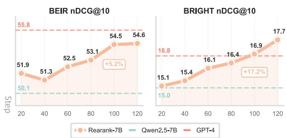
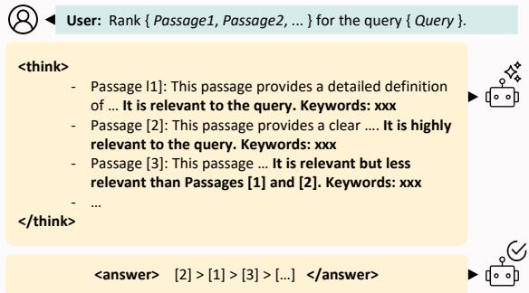
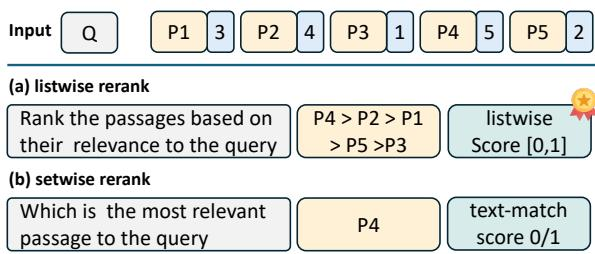
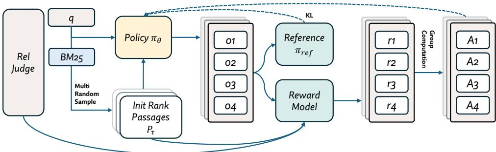
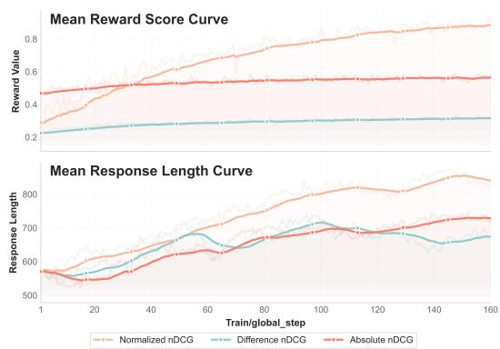
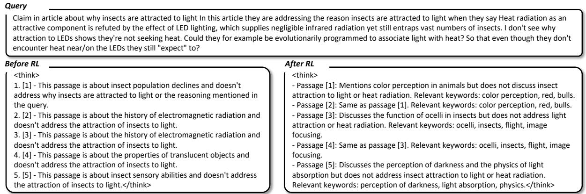
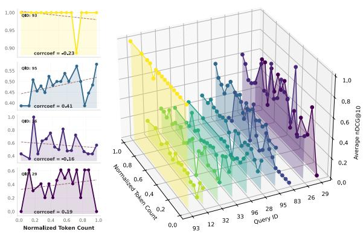
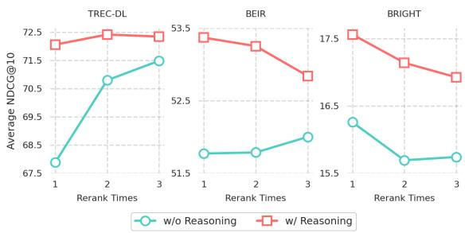
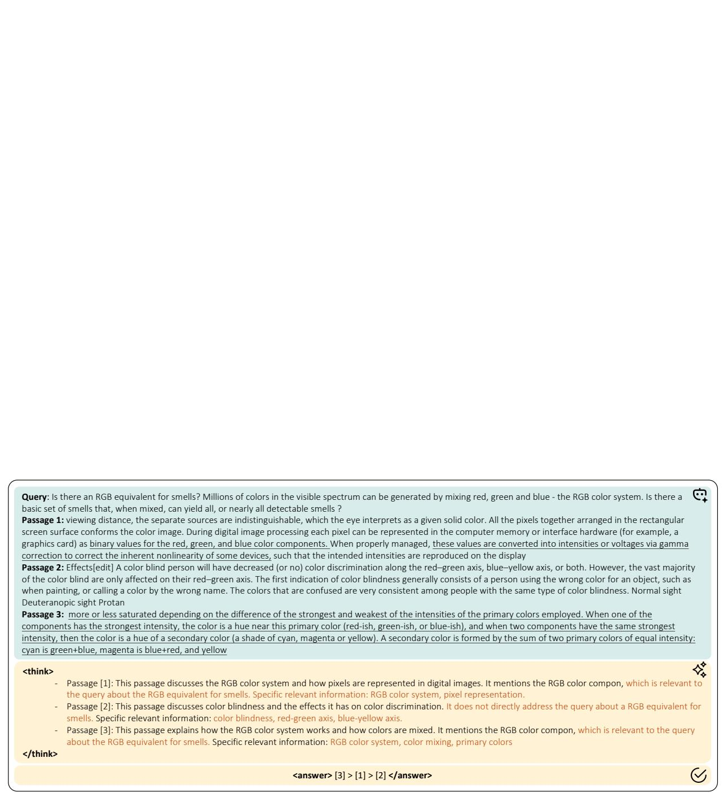

# REARANK: Reasoning Re-ranking Agent via Reinforcement Learning

Le Zhang1,2\* Bo Wang3∗ Xipeng Qiu3

Siva Reddy1,4,5 Aishwarya Agrawal1,2,5

1Mila - Quebec AI Institute 2Université de Montréal 3Fudan University 4McGill University 5Canada CIFAR AI Chair

## Abstract

We present REARANK, a large language model (LLM)-based listwise reasoning reranking agent. REARANK explicitly reasons before reranking, significantly improving both performance and interpretability. Leveraging reinforcement learning and data augmentation, REARANK achieves substantial improvements over baseline models across popular information retrieval benchmarks, notably requiring only 179 annotated samples. Built on top of Qwen2.5-7B, our REARANK-7B demonstrates performance comparable to GPT-4 on both indomain and out-of-domain benchmarks and even surpasses GPT-4 on reasoning-intensive BRIGHT benchmarks. These results underscore the effectiveness of our approach and highlight how reinforcement learning can enhance LLM reasoning capabilities in reranking. The code is available https://github.com/ lezhang7/Rearank.

## 1 Introduction

Information retrieval (IR) is a fundamental component of intelligent systems, forming the basis for accessing, organizing, and reasoning over information across different modalities (Radford et al., 2021; Zhang et al., 2023; Li et al., 2025a,b; Chen et al., 2025; Fu et al., 2025; Huang et al., 2025). Modern IR systems (Reimers and Gurevych, 2019, 2020; Wang et al., 2021; Formal et al., 2021; Wei et al., 2025) typically follow a two-stage approach: initial retrieval (e.g., fast lexical methods (Robertson et al., 2009)) to gather candidates, followed by reranking for fine-grained prioritization of relevant results. This two-stage process is particularly crucial for Retrieval-Augmented Generation systems (Lewis et al., 2020; Borgeaud et al., 2022; Zhang et al., 2023; Liu et al., 2024), where accurate retrieval and effective reranking of context passages significantly impact generated output quality.

  
Figure 1: (Top) Average rerank results on popular benchmarks (over BM25 top 100), the performance improves with RL training; (Bottom) REARANK inference example. The agent provides the reasoning and final ranking of all passages, unlike current agents (Sun et al., 2023; Pradeep et al., 2023b) that only output the final answer.

Recent advances in large language models (LLMs) (Yang et al., 2024, 2025; Achiam et al., 2023; Zhou et al., 2025; Dao et al., 2022) have shown strong promise for this reranking phase (Sun et al., 2023), particularly through their use as reranking agents that rely on direct outputs rather than internal states (e.g. logits) . This paradigm, exemplified by zero-shot prompting methods (Sun et al., 2023; Ma et al., 2023; Zhuang et al., 2024), offers significant deployment flexibility, especially in model-as-a-service scenarios. However, effectively adapting LLMs specifically as reranking agents presents several key challenges: (i) LLMs are not inherently optimized for ranking objectives, and crucially, current zero-shot methods do not learn from the interaction signals generated during the reranking process; (ii) Achieving competitive performance often necessitates supervised fine-tuning, a process severely constrained by the scarcity and high cost of acquiring high-quality labeled ranking data (Sun et al., 2023); (iii) The decision-making processes within these models frequently lack transparent and interpretable reasoning, which limits explainability and fails to leverage test-time scaling properties of LLMs; (iv) State-ofthe-art reranking agents frequently depend on large, often proprietary models (e.g., GPT-4) or face significant challenges in local deployment. This dependency on large models incurs substantial computational costs and significant inference latency (e.g., reranking 20 passages with reasoning process using DeepSeek-R1 (Guo et al., 2025) via API takes around 90-120 seconds).

In this work, we propose REARANK, the first reasoning listwise reranking agent. REARANK’s optimization for listwise reranking with explicit reasoning is incentivized using reinforcement learning (RL). This approach effectively leverages the rich, order-based signals inherent in listwise reranking. To address the significant data scarcity challenge typically associated with training listwise models, we introduce a data augmentation pipeline capable of generating extensive listwise ranking sets from a remarkably small seed of only 179 annotated queries. At inference, REARANK generates explicit, interpretable reasoning for each ranking step, as shown in fig. 1, enabling test-time scaling. Built upon the principle of injecting strong reasoning capabilities into a compact model, REARANK operates with low operational cost. The combination of its practical model size and listwise reranking strategy enhances inference efficiency by minimizing LLM calls, thereby facilitating local deployment.

Our experimental results demonstrate REAR-ANK’s effectiveness: it significantly surpasses baseline models and achieves performance comparable to strong models like GPT-4 and the recent powerful reasoning model Qwen3-32B on standard and out-of-domain benchmarks. Notably, REAR-ANK even surpasses strong GPT-4 performance on reasoning-intensive tasks, highlighting its advantages in combining reasoning with practical efficiency, as summarized in fig. 1.

Our main contributions are threefold: (i) We introduce REARANK, a novel reasoning-based reranking agent based on the listwise reranking strategy that effectively integrates explicit reasoning capabilities into the reranking process. We formularize the reranking problem in RL framework, and propose a data synthesis method requiring only 179 annotated queries, and a new reward model leveraging ranking information for training, enabling efficient RL training of REARANK; and (ii) REARANK achieves significant performance improvements over strong baselines and matches or surpasses results from competitive models like GPT-4 and strong reasoning model Qwen3, particularly on reasoning-intensive tasks, while offering substantially improved inference efficiency due to its compact model size. (iii) We provide a comprehensive analysis on reasoning transferability and examining the relationship between reasoning length and final ranking performance to better understand the role of reasoning in reranking.

## 2 Related Work

Large Reasoning Models Recent advancements in LLMs have yielded increasingly sophisticated reasoning capabilities (Liu et al., 2025; Wu et al., 2025), often emerging with scale (Wei et al., 2022a; Kojima et al., 2022). Techniques like Chain-of-Thought prompting (Wei et al., 2022b) and its variants (Kojima et al., 2022; Wang et al., 2022) further enhance these skills by enabling explicit reasoning processes. Beyond prompting, training methods like RL (Guo et al., 2025) are used to incentivize long CoT reasoning; models such as Deepseek-R1 , OpenAI o1, and o3 leverage RL for enhanced reasoning, showing general task improvements. These developments enable LLM application in complex domains like math problems and planning. Our work applies these advanced reasoning capabilities to reranking.

LLMs for Re-ranking LLMs are increasingly being used for reranking, moving beyond traditional feature-based models (Zhang et al., 2024b; Lee et al., 2024; Ma et al., 2024a; BehnamGhader et al., 2024; Sachan et al., 2022). Approaches range from pointwise (Liang et al., 2022), pairwise (Qin et al., 2023), setwise (Zhuang et al., 2024) to listwise methods (Ma et al., 2023; Sun et al., 2023; Pradeep et al., 2023b). While few-shot/zero-shot prompting was explored, supervised fine-tuning on ranking data shows further gains (Pradeep et al., 2023b,a). Building on this, our work proposes a novel RL approach without cold start for training a listwise LLM reranker, focusing on robust performance and reasoning capabilities, especially in out-of-domain and reasoning-intensive scenarios.

A concurrent work (Zhuang et al., 2025) also trains an LLM as a setwise reranker using RL. It simplifies the task to finding the single most relevant passage index, relying on a sparse textmatching binary reward signal. This signal lacks the rich, order-based information present in listwise ranking, which consequently necessitates extensive training data. Furthermore, setwise inference is highly inefficient as it ranks only one passage at a time, unlike our listwise method which reranks an entire passages simultaneously as shown in fig. 2. Therefore, we adopt the listwise reranking strategy.

  
Figure 2: Listwise vs. Setwise Reranking. Setwise reranking yields binary scores (0 or 1); listwise reranking offers richer, continuous scores between 0 and 1.

## 3 Method

## 3.1 Listwise Re-ranking Agent

Given a query q and an initial set of n retrieved passages $P = ( p _ { 1 } , \ldots , p _ { n } )$ , the objective of reranking is to find the optimal permutation (ranking) of these passages. This can be formally expressed as maximizing a ranking quality score:

$$
\operatorname* { m a x } _ { \sigma \in K _ { n } } r \big ( \{ p _ { \sigma ( 1 ) } , p _ { \sigma ( 2 ) } , \dots , p _ { \sigma ( n ) } \} \big ) ,\tag{1}
$$

where $K _ { n }$ is the set of all possible permutations of the passages $P ,$ σ represents a specific permutation (a ranking), $p _ { \sigma ( i ) }$ is the passage located at rank i in the ranking defined by $\sigma ,$ and r is a scoring function that measures the quality of the entire ranked list.

Listwise reranking methods (Sun et al., 2023; Ma et al., 2024b; Pradeep et al., 2023b) reorder subsets of passages using a sliding window. This is necessary due to the limited context length of LLMs, preventing simultaneous processing of all passage at a time. Given an initial ranking $\tau$ over passages P, an LLM-based permutation function h (see fig. 2) is applied to a window of size w starting at index i to determine the reordering within the final ranking σ based on relevance to q:

$$
\begin{array} { r l } & { \left\{ p _ { \sigma \left( i \right) } , \ldots , p _ { \sigma \left( i + w - 1 \right) } \right\} , } \\ & { \circ h ( \left\{ p _ { \tau \left( i \right) } , \ldots , p _ { \tau \left( i + w - 1 \right) } \right\} , q ) , } \end{array}\tag{2}
$$

The final top-k list is constructed by iteratively applying h using a sliding window that processes the whole passages list, often from the end towards the beginning. This window is typically shifted by $w / 2$ steps to create overlap, resulting in approximately $O ( 2 n / w )$ total LLM calls for n passages and offering significant efficiency advantages.

## 3.2 RL for Listwise Re-ranking

A common mathematical framework for reinforcement learning is the Markov Decision Process (MDP), formally defined as a tuple $( S , A , T , r , \gamma )$ Here, S represents the state space, A is the action space, $T : \mathcal { S } \times \mathcal { A } \times \mathcal { S }  [ 0 , 1 ]$ denotes transition probabilities, $r : S \times \mathcal { A }  \mathbb { R }$ is the reward function, and $\gamma \in [ 0 , 1 )$ is the discount factor.

In the context of passage reranking, we model the process as an MDP where the agent is our LLM policy $\pi _ { \boldsymbol { \theta } } .$ . The environment is defined by the query q and an initial ranking τ over a set of passages $P = ( p _ { 1 } , \ldots , p _ { n } ) $ . The state space S is defined by the current ranking of passages and the query, specifically $\mathcal { S } = ( \{ p _ { \tau ( 1 ) } , \dotsc , p _ { \tau ( n ) } \} , q )$ . The action space A corresponds to the set of possible permutation functions h that the LLM can apply to the current state. The transition function $T$ models how actions lead to new states (rankings). The reward function r quantifies the quality of a reranking action based on relevance metrics, providing feedback to the agent.

We train $\pi _ { \theta } ,$ an LLM fine-tuned to generate an output sequence G consists of reasoning process and a new permutation $\sigma \theta$ based on the input $x =$ $( \{ p _ { \tau ( 1 ) } , \ldots , p _ { \tau ( n ) } \} , q )$ . The learning objective is to maximize the expected reward:

$$
\theta ^ { * } = \arg \operatorname* { m a x } _ { \theta } \mathbb { E } _ { ( q , P ) \sim \mathcal { D } } [ r ( \sigma _ { \theta } ) ] ,
$$

where is the data distribution.

Inspired by DeepSeek-R1 (Guo et al., 2025), we employ the simple Grouped Policy Optimization (GRPO) algorithm. Training involves sampling a group of output sequences $G = \{ o _ { 1 } , o _ { 2 } , . . . , o _ { G } \}$ for each input x with the system prompt. A rulebased reward $r _ { i }$ is computed for each output sequence $o _ { i }$ and normalized within the group $G$ to yield advantages ${ \hat { A } } _ { i }$ . Following DeepSeek-Math’s (Shao et al., 2024) approach using current policy samples, the token-level objective is:

$$
\mathcal { T } _ { \mathrm { G R P O } } ( \theta ) = - \frac { 1 } { \vert G \vert } \sum _ { i = 1 } ^ { \vert G \vert } \frac { 1 } { \vert o _ { i } \vert } \sum _ { t = 1 } ^ { \vert o _ { i } \vert } l _ { i , t } ,\tag{3}
$$

  
Figure 3: Pipeline of the proposed GRPO-based RL framework for listwise passage reranking. Training utilizes data generated by sampling multiple passage sets per query and evaluating them with consistent relevance judgments.

where

$$
\begin{array} { r l r } & { } & { l _ { i , t } = \frac { \displaystyle \pi _ { \theta } ( o _ { i , t } \mid x , o _ { i , < t } ) } { \displaystyle [ \pi _ { \theta } ( o _ { i , t } \mid x , o _ { i , < t } ) ] _ { \mathrm { n o g r a d } } } \hat { A } _ { i , t } } \\ & { } & { \quad -  \beta \mathbb { D } _ { \mathrm { K L } } [ \pi _ { \theta } ( \cdot \mid x , o _ { i , < t } ) ] | \pi _ { \mathrm { r e f } } ( \cdot \mid x , o _ { i , < t } ) ] . } \end{array}\tag{4}
$$

Here, G is the number of output sequences sampled from current policy $\pi _ { \theta }$ given input $x ,$ $\left| o _ { i } \right|$ is sequence length, and $l _ { i , t }$ is the per-token loss. $\pi _ { \theta } ( o _ { i , t } \mid x , o _ { i , < t } )$ is the policy probability for token $o _ { i , t }$ given x and preceding tokens $o _ { i , < t } ,$ with $[ \cdot ] _ { \mathrm { n o g r a d } }$ denoting gradient detachment. The token-wise advantage $\hat { A } _ { i , t }$ is derived from outcome supervision, calculated as the Z-score of the instance reward $r _ { i }$ relative to the batch rewards r: $\begin{array} { r } { \hat { A } _ { i , t } = \frac { r _ { i } - \mathrm { m e a n } ( \mathbf { r } ) } { \mathrm { s t d } ( \mathbf { r } ) } } \end{array}$ . The KL penalty, using a fixed reference policy $\pi _ { \mathrm { r e f } }$ and coefficient $\beta ,$ encourages stability. The algorithm pipeline is shown in fig. 3.

## 3.3 Reward Design

The reward signal guides the RL agent by evaluating the quality of its generated output sequence. The output sequence $G _ { i }$ includes structured components for reasoning (<think>...<|think|>) and ranking (<answer>...<|answer|>), as illustrated in fig. 1. The total reward r is a composite signal designed to encourage both high ranking performance and adherence to the desired output format.

The primary reward signal is based on the rich, order-based information inherent in listwise reranking, measured by Normalized Discounted Cumulative Gain (NDCG). Considering LLM context limits, we use NDCG@10 to evaluate the ranking of top-10 passages. For a generated permutation $\{ p _ { \sigma ( 1 ) } , p _ { \sigma ( 2 ) } , . . . , p _ { \sigma ( n ) } \}$ for q, its score is $r _ { \mathrm { r e r a n k } } =$ $\begin{array} { c c l } { \mathrm { N D C G @ 1 0 } } & { = } & { \frac { \mathrm { D C G @ 1 0 } } { \mathrm { I D C G @ 1 0 } } } \end{array}$ , where $\begin{array} { l l } { \Delta C \mathbf { G } \ @ 1 0 } & { = } \end{array}$ $\textstyle \sum _ { i = 1 } ^ { 1 0 } { \frac { r e l _ { i } } { \log _ { 2 } ( i + 1 ) } }$ and $\begin{array} { r } { \mathrm { I D C G @ 1 0 } = \sum _ { i = 1 } ^ { 1 0 } \frac { r e l _ { i } ^ { \mathrm { i d e a l } } } { \log _ { 2 } ( i + 1 ) } . } \end{array}$ Here, each query has an associated relevance judgements including a set of passages with scores annotated by human expert, $r e l _ { i }$ is the relevance score from the annotated relevance judgments for $p _ { \sigma ( i ) }$ in the generated permutation, and $\boldsymbol { r e l } _ { i } ^ { \mathrm { i d e a l } }$ is the ideal relevance score from the relevance judgments for the passage that would be at rank i in the ideal ranking for that query. Since the maximum possible NDCG@10 can vary depending on whether the randomly sampled passage set $P$ contains relevant documents, we define the ranking reward $r _ { \mathrm { r a n k } }$ as a relative improvement score. This approach uses min-max normalization to normalize for the differences in scales of reward scores between two different candidate sets and reduces reward variance (Greensmith et al., 2004; Schulman et al., 2015):

$$
r _ { \mathrm { r a n k } } = { \frac { r _ { \mathrm { r e r a n k } } - r _ { \mathrm { i n i t } } } { r ^ { * } - r _ { \mathrm { i n i t } } } } ,\tag{5}
$$

where $r ^ { * } = \operatorname* { m a x } _ { \sigma \in K _ { n } } r \bigl ( \{ p _ { \sigma ( 1 ) } , p _ { \sigma ( 2 ) } , \ldots , p _ { \sigma ( n ) } \} \bigr )$ is the best achievable NDCG@10 for that specific passages set $P ; r _ { \mathrm { i n i t } } = r ( \{ p _ { \tau ( 1 ) } , p _ { \tau ( 2 ) } , \dots , p _ { \tau ( n ) } \} )$ is the NDCG@10 of the initial ranking τ over $P .$

We also incorporate format rewards to encourage the desired output structure. A reward $r _ { \mathrm { f o r m a t 1 } } =$ 1 is given if both <think> and <answer> tags are present in the output sequence. A reward rformat2 = 1 is given if the content within the <answer> tags follows the specified ranking list format (e.g., [3] > [1] >[2]).

The final reward r for a generated sequence is a weighted sum of these components:

$$
r = 0 . 8 \cdot r _ { \mathrm { r a n k } } + 0 . 1 \cdot r _ { \mathrm { f o r m a t l } } + 0 . 1 \cdot r _ { \mathrm { f o r m a t 2 } }\tag{6}
$$

## 3.4 Initial State Expansion

Training effective listwise rerankers faces a primary challenge in the scarcity of high-quality training data, defined as query q paired with relevance judgments. To address this, we introduce a multisampling data augmentation method. Utilizing a small dataset of 179 queries from MSMARCO-V2 with fine-grained relevance judgments (0-3), we randomly sample multiple diverse sets of candidate passages P for each query q from its BM25 top 100 retrieval results. The core idea is to evaluate new ranking $\{ p _ { \sigma ( 1 ) } , \dots , p _ { \sigma ( n ) } \}$ produced from these varied initial ranking τ over diverse P using the same set of relevance judgments. This multi-sampling approach shares conceptual similarities with negative sampling in contrastive learning (Xiong et al., 2020; Zhang et al., 2024a, 2025; BehnamGhader et al., 2024; Lee et al., 2024). By sampling varied initial passage sets and intial ranking, we effectively generate diverse ranking scenarios for a given query, allowing the model to learn robustly from a wider range of non-ideal inputs. This method generates rich listwise ranking data from limited annotations, enabling the model to learn robustly from diverse initial conditions and significantly reducing the need for large-scale, fully annotated query sets.

## 4 Experiments

## 4.1 Experimental Setup

Training Details Training data instances are generated by randomly sampling 20 candidate passages per query, repeated 50 times for each of the 179 queries. Samples without any passages marked as relevant (with a score = 0) in the relevance judgments or the initial nDCG@10 < 0.1 are filtered out, resulting in 12k training instances. We choose Qwen2.5-7B-Instruct as our baseline model. Training is conducted using the VeRL (Sheng et al., 2024) framework with a batch size of 128 and 32 rollouts per step. We trained the model directly via RL, without an initial SFT phase. The training runs for over 160 steps across 8 H100 GPUs.

Sliding window reranking Our REARANK employs a sliding window to get top-k passages as introduced in section 3.1. Following common practice (Sun et al., 2023; Zhuang et al., 2025; Zhang et al., 2024b), we retrieve the top 100 passages using BM25 with plain query (n = 100). We set the window size to k = 20, resulting in 10 LLM calls per query $( 2 \times 1 0 0 / 2 0 = 1 0 )$ to get top-10 passages.

Baselines To evaluate the effectiveness of REAR-ANK, we compare it against several strong baselines representing different reranking paradigms. Our zero-shot baselines include powerful large language models: Qwen2.5-7B (Yang et al., 2024) and GPT-4 (Achiam et al., 2023). We also incorporate the state-of-the-art open-source reasoning language model Qwen3-32B (Yang et al., 2025) and Qwen3-235B-A22B, which claim to surpass 671B Deepseek-R1. We adapt these models using the same sliding window strategy and prompt as REAR-ANK, naming them RankQwen and RankGPT, respectively. As a supervised fine-tuning (SFT) baseline, we include RankZephyr (Pradeep et al., 2023b), which is distilled on 105k synthetic ranking data sourced from RankGPT. Furthermore, to compare different RL training strategies, we include Rank-R1 (Zhuang et al., 2024), a concurrent LLM reranker using the same base model (Qwen2.5-7B) but adopting a setwise reranking strategy. This provides valuable insights into the differences between the listwise (used by REAR-ANK) and setwise RL approaches for reranking. The prompts are shown at app. A.

Benchmarks To thoroughly evaluate our reasoning-enhanced reranker’s performance and generalization, we select three distinct benchmark suites. We evaluate on the in-domain TREC-DL19 (Craswell et al., 2020a) and DL20 (Craswell et al., 2020b) datasets, both derived from MS-MARCO-V1. For assessing out-of-domain (OOD) generalization, we use BEIR (Thakur et al., 2021), a diverse collection from sources outside of MS-MARCO. Crucially, real-world information retrieval tasks often demand capabilities beyond simple keyword matching or semantic similarity, requiring deeper reasoning to understand complex relationships or logic within the content and the query. To systematically evaluate our reasoning-enhanced REARANK, we utilize the BRIGHT (Su et al., 2024) benchmark, which is specifically designed to test reasoning abilities in retrieval contexts. For all evaluations, we report the nDCG@10 as the evaluation metric.

## 4.2 In-domain & OOD Retrieval Results

As shown in table 1, GPT-4 achieves the best performance across benchmarks, due to its superior text understanding. The Qwen2.5-7B also performs strongly, surpassing the legacy GPT-3.5 on both sets. Our REARANK, based on Qwen2.5-7B trained via our RL approach with reasoning ability, demonstrates performance closely comparable to GPT-4. This suggests the significant potential of advanced reasoning capabilities learned via RL for reranking.

REARANK achieves considerable improvements over the RankQwen2.5-7B baseline: a significant

<table><tr><td rowspan="2">Model</td><td rowspan="2">#Train</td><td colspan="2">In-Domain</td><td colspan="8">Out-of-Domain</td></tr><tr><td>DL19</td><td>DL20</td><td>Covid</td><td>NFCorpus</td><td>DBPedia</td><td>SciFact</td><td>Signal</td><td>News</td><td>Robust04</td><td>BEIR (Avg)</td></tr><tr><td>BM25†</td><td></td><td>50.58</td><td>47.96</td><td>59.47</td><td>30.75</td><td>31.80</td><td>67.89</td><td>33.05</td><td>39.52</td><td>40.70</td><td>43.31</td></tr><tr><td> $\mathrm { R a n k Q w e n } _ { 2 . 5 ^ { - } } 7 \mathrm { B }$ </td><td>zero-shot</td><td>68.25</td><td>62.73</td><td>77.74</td><td>37.40</td><td>39.83</td><td>70.83</td><td>31.73</td><td>43.24</td><td>49.95</td><td>50.10</td></tr><tr><td> ${ \mathrm { R a n k G P T } } _ { 3 . 5 }$ </td><td>zero-shot</td><td>65.80</td><td>62.91</td><td>76.67</td><td>35.62</td><td>44.47</td><td>70.43</td><td>32.10</td><td>48.85</td><td>50.62</td><td>51.25</td></tr><tr><td>RankGPT₄‡</td><td>zero-shot</td><td>75.59</td><td>70.56</td><td>85.51</td><td>38.47</td><td>47.12</td><td>74.95</td><td>34.40</td><td>52.89</td><td>57.55</td><td>55.84</td></tr><tr><td>RankZephyr-7B</td><td>105K SFT</td><td>73.90</td><td>70.60</td><td>83.54</td><td>38.38</td><td>44.34</td><td>75.18</td><td>31.44</td><td>52.35</td><td>54.19</td><td>54.20</td></tr><tr><td colspan="10">Reasoning Language Model</td><td></td><td></td></tr><tr><td> $\mathbf { R a n k Q w e n } _ { 3 } – 3 2 \mathbf { B }$ </td><td>zero-shot</td><td>73.13</td><td>70.00</td><td>83.86</td><td>36.28</td><td>45.44</td><td>71.78</td><td>32.06</td><td>51.73</td><td>57.27</td><td>54.06</td></tr><tr><td>RankQwen3-235B</td><td>zero-shot</td><td>71.94</td><td>69.37</td><td>83.68</td><td>35.64</td><td>41.33</td><td>63.30</td><td>32.53</td><td>50.79</td><td>58.16</td><td>52.20</td></tr><tr><td>Rank-R1-7B</td><td>72k RL</td><td>72.70</td><td>68.50</td><td>83.12</td><td>35.97</td><td>43.43</td><td>74.47</td><td>32.16</td><td>48.43</td><td>55.17</td><td>53.25</td></tr><tr><td>REARANK-7B</td><td>179 RL</td><td>74.16</td><td>70.00</td><td>81.28</td><td>35.20</td><td>45.23</td><td>75.02</td><td>36.00</td><td>51.88</td><td>57.49</td><td>54.59</td></tr><tr><td>∆ over baseline*</td><td></td><td>+5.91</td><td>+7.27</td><td>+3.54</td><td>-2.20</td><td>+5.40</td><td>+4.19</td><td>+4.27</td><td>+8.64</td><td>+7.54</td><td>+4.49</td></tr></table>

Table 1: Reranking Agent Results (nDCG@10) on TREC-DL and BEIR Benchmarks. denotes initial BM25 retrieval performance. $\ddagger \mathbf { R a n k G P T } _ { 4 }$ reranks top 30 passages from ${ \mathrm { R a n k G P T } } _ { 3 . 5 }$ . All other models rerank on the BM25 top 100 passages. Training data size indicates the number of annotated queries used. \*Baseline is $\mathrm { R a n k Q w e n } _ { 2 . 5 ^ { - } } 7 \mathrm { B }$

6.5% improvement in nDCG@10 on the in-domain benchmarks and a notable 4.5% improvement in nDCG@10 on the OOD benchmark. These substantial gains are particularly impressive given that they are achieved using only 179 annotated queries (used for RL training).

Comparing against SFT RankZephyr-7B, REAR-ANK-7B demonstrates comparable performance on TREC-DL while achieving superior results in BEIR. This finding suggests that while SFT can be effective for in-domain data, our RL approach may offer enhanced robustness and better generalization capabilities when applied to out-of-domain tasks.

Evaluating against powerful reasoning language models, including the large Qwen3 and the concurrent Setwise Rank-R1, reveals significant strengths of REARANK. Despite being trained on a dataset of only 179 queries (0.2% of Rank-R1’s reported data), REARANK-7B surpasses Setwise Rank-R1 across benchmarks. Furthermore, REARANK-7B’s performance exceeds both Qwen3-32B and Qwen3- 235B. REARANK-7B achieves superior reranking performance with less training data and a more compact size than state-of-the-art methods. Interestingly, Qwen3-32B surpasses Qwen3-235B. Our investigation, consistent with (Marjanovic´ et al., 2025), suggests Qwen3-235B’s excessive self-reflection (marked by "wait") leads to confusion and degraded performance.

## 4.3 Reasoning-intensive Retrieval Results

Table 2 presents performance results on the reasoning-intensive BRIGHT benchmark. Notably, REARANK-7B even outperforms the powerful GPT-4 model on this benchmark, highlighting its strong reasoning capabilities developed through RL training. The SFT method, RankZephyr-7B, performs considerably poorer on BRIGHT, falling below the lexical-based BM25 baseline. This reinforces our observation that SFT generalizes poorly to out-ofdomain and reasoning-intensive scenarios.

Comparing with the concurrent Setwise Rank-R1, our listwise REARANK-7B achieves better performance on the BRIGHT benchmark also. This superior performance, particularly against another RL-trained model, underscores the effectiveness of our approach. Furthermore, while REARANK-7B is smaller and does not undergo general reasoning training (e.g. math, coding, agent) like Qwen3, its performance remains closely comparable. This near parity, despite inherent disadvantages, further confirms our method’s effectiveness.

These strong results on a reasoning-intensive task against competitive LLM baselines (GPT-4, Rank-R1) highlight the efficacy of REARANK’s design. Its RL framework, trained on a limited highquality dataset via our synthesis pipeline, enables learning complex reranking strategies. The listwise nature provides a richer signal for robust ranking compared to setwise methods, while also offering inference efficiency (fewer LLM calls).

## 4.4 Ablation Studies

To quantify the effectiveness of individual components within REARANK, we conducted ablation studies, summarized in table 3. Our first investigation examined the effect of applying the REARANK’s reasoning prompt directly to Qwen2.5- 7B. While Qwen2.5-7B shows marginal improvement with the reasoning prompt over its zero-shot baseline, it significantly underperforms REARANK. This suggests that prompting alone is insufficient for eliciting robust reasoning in this context.

We then investigate the impact of data filtering.

<table><tr><td rowspan="2">Model</td><td rowspan="2">#Train</td><td colspan="7">StackExchange</td><td colspan="2">Coding</td><td colspan="3">Theorem-based</td><td rowspan="2">Avg.</td></tr><tr><td>Bio.</td><td>Earth.</td><td>Econ.</td><td> $\mathrm { P s y . }$ </td><td>Rob.</td><td>Stack.</td><td>Sus.</td><td>Pony</td><td>LC.</td><td>AoPS</td><td>TheoT.</td><td>TheoQ.</td></tr><tr><td>BM25†</td><td></td><td>18.2</td><td>27.9</td><td>16.4</td><td>13.4</td><td>10.9</td><td>16.3</td><td>16.1</td><td>4.3</td><td>24.7</td><td>6.5</td><td>2.1</td><td>7.3</td><td>13.7</td></tr><tr><td>RankQwen2.5-7B</td><td>zero-shot</td><td>22.7</td><td>25.8</td><td>14.6</td><td>18.7</td><td>14.2</td><td>11.7</td><td>21.4</td><td>5.3</td><td>23.9</td><td>6.0</td><td>7.4</td><td>7.9</td><td>15.0</td></tr><tr><td>RankGPT4</td><td>zero-shot</td><td>33.8</td><td>34.2</td><td>16.7</td><td>27.0</td><td>22.3</td><td>27.7</td><td>11.1</td><td>15.6</td><td>3.4</td><td>1.2</td><td>8.6</td><td>0.2</td><td>16.8</td></tr><tr><td>RankZephyr-7B</td><td>105K SFT</td><td>21.9</td><td>23.7</td><td>14.4</td><td>10.3</td><td>7.6</td><td>13.7</td><td>16.6</td><td>6.5</td><td>24.7</td><td>6.8</td><td>2.0</td><td>7.3</td><td>13.0</td></tr><tr><td colspan="10">Reasoning Language Model</td><td colspan="3"></td><td colspan="3"></td></tr><tr><td>RankQwen3-32B</td><td>zero-shot</td><td>24.9</td><td>29.4</td><td>20.9</td><td>25.7</td><td>18.3</td><td>16.0</td><td>23.2</td><td>7.6</td><td>27.6</td><td>7.8</td><td>8.9</td><td>8.4</td><td>18.2</td></tr><tr><td>RankQwen3-235B</td><td>zero-shot</td><td>26.4</td><td>26.7</td><td>22.1</td><td>26.3</td><td>18.8</td><td>17.0</td><td>24.9</td><td>8.2</td><td>27.2</td><td>7.7</td><td>11.7</td><td>8.6</td><td>18.8</td></tr><tr><td>Rank-R1-7B</td><td>72k RL</td><td>26.0</td><td>28.5</td><td>17.2</td><td>24.2</td><td>19.1</td><td>10.4</td><td>24.2</td><td>4.3</td><td>19.8</td><td>4.3</td><td>10.9</td><td>8.3</td><td>16.4</td></tr><tr><td>REARANK-7B</td><td>179 RL</td><td>23.4</td><td>27.4</td><td>18.5</td><td>24.2</td><td>17.4</td><td>16.3</td><td>25.1</td><td>8.0</td><td>27.0</td><td>7.4</td><td>9.5</td><td>7.9</td><td>17.7</td></tr><tr><td>∆ over baseline*</td><td></td><td>+0.8</td><td>+1.7</td><td>+4.0</td><td>+5.5</td><td>+3.3</td><td>+4.6</td><td>+3.7</td><td>+2.7</td><td>+3.0</td><td>+1.4</td><td>+2.1</td><td>0.0</td><td>+2.7</td></tr></table>

Table 2: Reranking Agent Results (nDCG@10) on BRIGHT . † represent initial retrieval; all other models show reranking performance on the top 100 BM25 results. \*Baseline is Rank $\mathrm { . Q w e n } _ { 2 . 5 } – 7 \mathrm { B }$
<table><tr><td>Model Variant</td><td>TREC-DL</td><td>BEIR</td><td>BRIGHT</td></tr><tr><td>Qwen2.5-7B (baseline)</td><td>65.5</td><td>50.1</td><td>15.0</td></tr><tr><td>+Reasoning Prompt</td><td>65.9</td><td>51.4</td><td>15.4</td></tr><tr><td>wo/ Filter nDCG@ 10 &lt; 0.1</td><td>71.3</td><td>53.6</td><td>16.9</td></tr><tr><td>w/  $r _ { \mathrm { r a n k } } = S _ { \mathrm { r e r a n k } }$ </td><td>70.9</td><td>53.2</td><td>16.7</td></tr><tr><td>w/  $r _ { \mathrm { r a n k } } = S _ { \mathrm { r e r a n k } } - S _ { \mathrm { i n i t } }$ </td><td>71.5</td><td>54.0</td><td>17.2</td></tr><tr><td>w/ direct SFT</td><td>66.7</td><td>50.7</td><td>14.7</td></tr><tr><td>REARANK-7B (full model)</td><td>72.0</td><td>54.6</td><td>17.7</td></tr></table>

Table 3: Ablation of components of the approach.

The "wo/ Filter nDCG@ $1 0 < 0 . 1 "$ variant removes the filter on low-quality candidate sets (best possible nDCG@10 < 0.1)—many lacking relevant passages and yielding zero reward—which degrades performance. This underscores the importance of curating high-quality training instances.

Next, we explored reward function design. Using raw NDCG@ $1 0 \left( \mathrm { " w } / r _ { \mathrm { r a n k } } = S _ { \mathrm { r e r a n k } } \mathrm { " } \right)$ results in lower performance due to high variance. Subtracting the initial score $( " \mathrm { w } / r _ { \mathrm { r a n k } } = S _ { \mathrm { r e r a n k } } - S _ { \mathrm { i n i t } } " )$ improved stability but still underperforms REAR-ANK. This could be due to small learning signals as a result of small reward value scale. Our full model’s normalized reward function provided more effective guidance, yielding the best results.

Finally, to isolate the benefits of our RL training approach from those gained solely from training on high-quality data, we also trained a SFT baseline ("w/ direct SFT"). This model was trained on 12k instances representing the best possible rankings derived from our multi-sampled candidate sets based on relevance judgments. Trained on this small dataset, the SFT baseline showed marginal improvements on in-domain and OOD tasks compared to the base Qwen2.5-7B model, but importantly, it negatively impacted the model’s reasoning ability on the BRIGHT benchmark. This underscores the necessity of the RL approach for effectively leveraging small, high-quality data to train a

robust and reasoning-capable reranking agent.  
  
Figure 4: (Top) Reward evolving curve (Bottom) Response length curve.

## 5 Analysis

Analysis of Reward Functions We investigate the impact of different reward functions on REAR-ANK’s training. We compare three nDCG@10 formulations: Normalized nDCG (our method: scaled by ideal nDCG), Absolute nDCG $( S _ { \mathrm { r e r a n k } } )$ and Difference nDCG $( r _ { \mathrm { r a n k } } = S _ { \mathrm { r e r a n k } } - S _ { \mathrm { i n i t } } .$ improvement over initial).

The top panel of Figure 4 shows reward curves. Normalized nDCG consistently grows, reaching 0.8 by 100 steps, signifying that the achieved ranking quality is approximately 80% of the ideal quality for the candidate set. Absolute nDCG saturates early ( 50 steps). Difference nDCG shows limited progress, plateauing at  0.15 average improvement. This suggests Normalized nDCG provides a more effective signal for learning towards optimal ranking quality. The bottom panel shows response length trends. Normalized nDCG yields generally longer responses ( 850 tokens). Other functions saturate earlier ( 700 tokens), suggesting that the stronger signal from Normalized nDCG encourages more detailed responses and reasoning.

Figure 5: Reasoning patterns: Before- vs. After-RL training under identical prompt and query.
<table><tr><td>Model</td><td>Reasoning</td><td>TREC-DL</td><td>BEIR</td><td>BRIGHT</td></tr><tr><td>Qwen3-32B</td><td>√</td><td>71.6</td><td>54.1</td><td>18.2</td></tr><tr><td>Qwen3-32B</td><td>x</td><td>70.9</td><td>54.3</td><td>17.8</td></tr><tr><td>∆</td><td></td><td>+0.6</td><td>-0.2</td><td>+0.4</td></tr><tr><td>REARANK-7B</td><td>√</td><td>72.0</td><td>54.6</td><td>17.7</td></tr><tr><td>REARANK-7B</td><td>x</td><td>68.2</td><td>52.9</td><td>16.4</td></tr><tr><td>∆</td><td></td><td>+3.9</td><td>+1.7</td><td>+1.3</td></tr><tr><td>Qwen2.5-7B</td><td>=</td><td>65.5</td><td>50.1</td><td>15.0</td></tr></table>

Table 4: Performance with Reasoning activated and disactivated. ∆ is improvement with reasoning.

Is reasoning helpful? The reasoning ability of REARANK is activated by the system prompt used in RL training (see app.A). While Qwen3-32B also provides a switch to enable or disable the "thinking" mode, our observations, detailed in table 4, indicate that enabling reasoning yields only marginal improvements in its reranking performance. Specifically, Qwen3-32B shows slight gains on TREC-DL and BRIGHT (+0.6 and +0.4, respectively) and a minor decrease on BEIR (-0.2), suggesting its high performance stems primarily from strong pretraining, rather than reasoning capacity.

In contrast, reasoning is core to our specialized reranking agent, REARANK, and significantly enhances its performance. As the table illustrates, REARANK-7B without reasoning (use zero-shot prompt), already outperforms the Qwen2.5-7B baseline, demonstrating an inherent improvement in reranking capacity. However, incorporating reasoning leads to considerable gains, underscoring the importance of reasoning learned via RL.

Reasoning Pattern As illustrated in fig. 5, RL training profoundly impacts reasoning patterns. The trained model learns a strategic reranking approach, reasoning about the relevance of the passage to the query and extracting key judgment words. It also intelligently leverages terms like "same" for concise comparisons with prior passages, reducing verbose reasoning while still providing keywords. The model without RL training, even with a reasoning prompt, does not show such strategy and employs shorter reasoning chains.

Is improved reasoning transferable? To investigate the transferability of improved reasoning gained from our reasoning-based reranking RL training, we evaluate the model on mathematical reasoning questions. Following (Ye et al., 2025), we report the pass@1 score averaged over 16 samples with a temperature of 0.7 on the AIME 2024 and AMC datasets. As shown in Table 5, we observe consistent improvements on both the challenging math tasks. This improvement suggests that training on the reranking task can, to a certain extent, transfer to other reasoning tasks.

<table><tr><td>Model</td><td>AIME 2024</td><td>AMC</td></tr><tr><td>Qwen2.5-7B-Instruct</td><td>11.87</td><td>51.41</td></tr><tr><td>(Ours) Rearank-7B</td><td>12.92</td><td>52.66</td></tr></table>

Table 5: Math Reasoning Transfer Results (Pass@1)

  
Figure 6: Impact of reasoning length. Data points are binned into 20 equal-width intervals by token count.

Impact of Reasoning Length on Performance We analyzed the impact of reasoning length on REARANK’s reranking performance by repeatedly reranking biology samples from BRIGHT (50 times per query, temp. = 0.6), filtering instances with 0 scores. Contrary to (Marjanovic et al. ´ , 2025), Figure 6 reveals no clear correlation between reasoning length and reranking performance.

  
Figure 7: Multiple reranking results of REARANK.

Multiple Rerank Pass Needed Analyzing the impact of multiple reranking passes with REAR-ANK (evaluating performance with and without reasoning) reveals mixed results across benchmarks (fig. 7). Multiple passes improve performance on TERC-DL and BEIR without reasoning, but degrade it on BRIGHT. With reasoning, gains are seen on TREL-DL, but performance is harmed on other benchmarks. These findings indicate that for REARANK, a single reranking pass is sufficient.

## 6 Conclusion

We presented REARANK, a pioneering reasoning listwise reranking agent trained via Reinforcement Learning. REARANK significantly outperforms baselines and achieves competitive, even superior, results compared to GPT-4 and Qwen3 models across various benchmarks, notably with only 179 labeled training samples. Our analysis confirms that the RL-acquired reasoning capabilities transfer, facilitating new and effective reranking strategies.

## Limitations

While REARANK demonstrates promising results, several limitations should be acknowledged. Firstly, the quality and faithfulness of its generated explanations for ranking decisions, which may contain a certain degree of hallucination, have not been formally evaluated. Secondly, its performance heavily relies on the quality of initial candidates provided by BM25, which potentially limits improvements in scenarios with poor initial retrieval.

## Acknowledgement

We sincerely appreciate the valuable feedback provided by Rabiul Awal, and Kanishk Jain, as well as the thoughtful input from all MAIR Lab members on multiple occasions. We thank the Mila IDT team and their technical support for maintaining the Mila compute cluster. This research was enabled in part by support provided by Calcul Québec and the Digital Research Alliance of Canada. We also acknowledge the material support of NVIDIA in the form of computational resources. Throughout this project, Aishwarya Agrawal received support from the Canada CIFAR AI Chair award.

## References

Josh Achiam, Steven Adler, Sandhini Agarwal, Lama Ahmad, Ilge Akkaya, Florencia Leoni Aleman, Diogo Almeida, Janko Altenschmidt, Sam Altman, Shyamal Anadkat, and 1 others. 2023. Gpt-4 technical report. arXiv preprint arXiv:2303.08774.

Parishad BehnamGhader, Vaibhav Adlakha, Marius Mosbach, Dzmitry Bahdanau, Nicolas Chapados, and Siva Reddy. 2024. Llm2vec: Large language models are secretly powerful text encoders. arXiv preprint arXiv:2404.05961.

Sebastian Borgeaud, Arthur Mensch, Jordan Hoffmann, Trevor Cai, Eliza Rutherford, Katie Millican, George Bm Van Den Driessche, Jean-Baptiste Lespiau, Bogdan Damoc, Aidan Clark, and 1 others. 2022. Improving language models by retrieving from trillions of tokens. In International conference on machine learning, pages 2206–2240. PMLR.

Zhiwei Chen, Yupeng Hu, Zixu Li, Zhiheng Fu, Xuemeng Song, and Liqiang Nie. 2025. Offset: Segmentation-based focus shift revision for composed image retrieval. arXiv preprint arXiv:2507.05631.

Nick Craswell, Bhaskar Mitra, Emine Yilmaz, Daniel Campos, and Ellen M Voorhees. 2020a. Overview of the trec 2019 deep learning track. arXiv preprint arXiv:2003.07820.

Nick Craswell, Bhaskar Mitra, Emine Yilmaz, Daniel Campos, and Ellen M Voorhees. 2020b. Overview of the trec 2019 deep learning track. arXiv preprint arXiv:2003.07820.

Tri Dao, Dan Fu, Stefano Ermon, Atri Rudra, and Christopher Ré. 2022. Flashattention: Fast and memory-efficient exact attention with io-awareness. Advances in neural information processing systems, 35:16344–16359.

Thibault Formal, Benjamin Piwowarski, and Stéphane Clinchant. 2021. SPLADE: Sparse Lexical and Expansion Model for First Stage Ranking, page

2288–2292. Association for Computing Machinery, New York, NY, USA.

Zhiheng Fu, Zixu Li, Zhiwei Chen, Chunxiao Wang, Xuemeng Song, Yupeng Hu, and Liqiang Nie. 2025. Pair: Complementarity-guided disentanglement for composed image retrieval. In Proceedings of the IEEE International Conference on Acoustics, Speech and Signal Processing, pages 1–5. IEEE.

Evan Greensmith, Peter L Bartlett, and Jonathan Baxter. 2004. Variance reduction techniques for gradient estimates in reinforcement learning. Journal ofMachine Learning Research, 5(Nov):1471–1530.

Daya Guo, Dejian Yang, Haowei Zhang, Junxiao Song, Ruoyu Zhang, Runxin Xu, Qihao Zhu, Shirong Ma, Peiyi Wang, Xiao Bi, and 1 others. 2025. Deepseek-r1: Incentivizing reasoning capability in llms via reinforcement learning. arXiv preprint arXiv:2501.12948.

Qinlei Huang, Zhiwei Chen, Zixu Li, Chunxiao Wang, Xuemeng Song, Yupeng Hu, and Liqiang Nie. 2025. Median: Adaptive intermediate-grained aggregation network for composed image retrieval. In Proceedings of the IEEE International Conference on Acoustics, Speech and Signal Processing, pages 1–5. IEEE.

Takeshi Kojima, Shixiang Shane Gu, Machel Reid, Yutaka Matsuo, and Yusuke Iwasawa. 2022. Large language models are zero-shot reasoners. Advances in neural information processing systems, 35:22199– 22213.

Chankyu Lee, Rajarshi Roy, Mengyao Xu, Jonathan Raiman, Mohammad Shoeybi, Bryan Catanzaro, and Wei Ping. 2024. Nv-embed: Improved techniques for training llms as generalist embedding models. arXiv preprint arXiv:2405.17428.

Patrick Lewis, Ethan Perez, Aleksandra Piktus, Fabio Petroni, Vladimir Karpukhin, Naman Goyal, Heinrich Küttler, Mike Lewis, Wen-tau Yih, Tim Rocktäschel, and 1 others. 2020. Retrieval-augmented generation for knowledge-intensive nlp tasks. Advances in neural information processing systems, 33:9459– 9474.

Zixu Li, Zhiwei Chen, Haokun Wen, Zhiheng Fu, Yupeng Hu, and Weili Guan. 2025a. Encoder: Entity mining and modification relation binding for composed image retrieval. In Proceedings of the AAAI Conference on Artificial Intelligence, volume 39, pages 5101–5109.

Zixu Li, Zhiheng Fu, Yupeng Hu, Zhiwei Chen, Haokun Wen, and Liqiang Nie. 2025b. Finecir: Explicit parsing of fine-grained modification semantics for composed image retrieval. https://arxiv.org/abs/2503.21309.

Percy Liang, Rishi Bommasani, Tony Lee, Dimitris Tsipras, Dilara Soylu, Michihiro Yasunaga, Yian Zhang, Deepak Narayanan, Yuhuai Wu, Ananya Kumar, and 1 others. 2022. Holistic evaluation of language models. arXiv preprint arXiv:2211.09110.

Wanlong Liu, Junying Chen, Ke Ji, Li Zhou, Wenyu Chen, and Benyou Wang. 2024. Rag-instruct: Boosting llms with diverse retrieval-augmented instructions. arXiv preprint arXiv:2501.00353.

Wanlong Liu, Junxiao Xu, Fei Yu, Yukang Lin, Ke Ji, Wenyu Chen, Yan Xu, Yasheng Wang, Lifeng Shang, and Benyou Wang. 2025. Qfft, question-free fine-tuning for adaptive reasoning. arXiv preprint arXiv:2506.12860.

Xueguang Ma, Liang Wang, Nan Yang, Furu Wei, and Jimmy Lin. 2024a. Fine-tuning llama for multistage text retrieval. In Proceedings ofthe 47th International ACM SIGIR Conference on Research and Development in Information Retrieval, pages 2421– 2425.

Xueguang Ma, Liang Wang, Nan Yang, Furu Wei, and Jimmy Lin. 2024b. Fine-tuning llama for multistage text retrieval. In Proceedings ofthe 47th International ACM SIGIR Conference on Research and Development in Information Retrieval, pages 2421– 2425.

Xueguang Ma, Xinyu Zhang, Ronak Pradeep, and Jimmy Lin. 2023. Zero-shot listwise document reranking with a large language model. arXiv preprint arXiv:2305.02156.

Sara Vera Marjanovic, Arkil Patel, Vaibhav Adlakha,´ Milad Aghajohari, Parishad BehnamGhader, Mehar Bhatia, Aditi Khandelwal, Austin Kraft, Benno Krojer, Xing Han Lù, and 1 others. 2025. Deepseek-r1 thoughtology: Let’s< think> about llm reasoning. arXiv preprint arXiv:2504.07128.

Ronak Pradeep, Sahel Sharifymoghaddam, and Jimmy Lin. 2023a. Rankvicuna: Zero-shot listwise document reranking with open-source large language models. arXiv preprint arXiv:2309.15088.

Ronak Pradeep, Sahel Sharifymoghaddam, and Jimmy Lin. 2023b. Rankzephyr: Effective and robust zeroshot listwise reranking is a breeze! arXiv preprint arXiv:2312.02724.

Zhen Qin, Rolf Jagerman, Kai Hui, Honglei Zhuang, Junru Wu, Le Yan, Jiaming Shen, Tianqi Liu, Jialu Liu, Donald Metzler, and 1 others. 2023. Large language models are effective text rankers with pairwise ranking prompting. arXiv preprint arXiv:2306.17563.

Alec Radford, Jong Wook Kim, Chris Hallacy, Aditya Ramesh, Gabriel Goh, Sandhini Agarwal, Girish Sastry, Amanda Askell, Pamela Mishkin, Jack Clark, and 1 others. 2021. Learning transferable visual models from natural language supervision. In International conference on machine learning, pages 8748–8763. PmLR.

Nils Reimers and Iryna Gurevych. 2019. Sentence-bert: Sentence embeddings using siamese bert-networks. In Proceedings ofthe 2019 Conference on Empirical Methods in Natural Language Processing. Association for Computational Linguistics.

Nils Reimers and Iryna Gurevych. 2020. Making monolingual sentence embeddings multilingual using knowledge distillation. In Proceedings of the 2020 Conference on Empirical Methods in Natural Language Processing. Association for Computational Linguistics.

Stephen Robertson, Hugo Zaragoza, and 1 others. 2009. The probabilistic relevance framework: Bm25 and beyond. Foundations and Trends® in Information Retrieval, 3(4):333–389.

Devendra Singh Sachan, Mike Lewis, Mandar Joshi, Armen Aghajanyan, Wen-tau Yih, Joelle Pineau, and Luke Zettlemoyer. 2022. Improving passage retrieval with zero-shot question generation. arXiv preprint arXiv:2204.07496.

John Schulman, Philipp Moritz, Sergey Levine, Michael Jordan, and Pieter Abbeel. 2015. High-dimensional continuous control using generalized advantage estimation. arXiv preprint arXiv:1506.02438.

Zhihong Shao, Peiyi Wang, Qihao Zhu, Runxin Xu, Junxiao Song, Xiao Bi, Haowei Zhang, Mingchuan Zhang, YK Li, Y Wu, and 1 others. 2024. Deepseekmath: Pushing the limits of mathematical reasoning in open language models. arXiv preprint arXiv:2402.03300.

Guangming Sheng, Chi Zhang, Zilingfeng Ye, Xibin Wu, Wang Zhang, Ru Zhang, Yanghua Peng, Haibin Lin, and Chuan Wu. 2024. Hybridflow: A flexible and efficient rlhf framework. arXiv preprint arXiv:2409.19256.

Hongjin Su, Howard Yen, Mengzhou Xia, Weijia Shi, Niklas Muennighoff, Han-yu Wang, Haisu Liu, Quan Shi, Zachary S Siegel, Michael Tang, and 1 others. 2024. Bright: A realistic and challenging benchmark for reasoning-intensive retrieval. arXiv preprint arXiv:2407.12883.

Weiwei Sun, Lingyong Yan, Xinyu Ma, Shuaiqiang Wang, Pengjie Ren, Zhumin Chen, Dawei Yin, and Zhaochun Ren. 2023. Is chatgpt good at search? investigating large language models as re-ranking agents. arXiv preprint arXiv:2304.09542.

Nandan Thakur, Nils Reimers, Andreas Rücklé, Abhishek Srivastava, and Iryna Gurevych. 2021. Beir: A heterogenous benchmark for zero-shot evaluation of information retrieval models. arXiv preprint arXiv:2104.08663.

Shuai Wang, Shengyao Zhuang, and Guido Zuccon. 2021. Bert-based dense retrievers require interpolation with bm25 for effective passage retrieval. In Proceedings of the 2021 ACM SIGIR international conference on theory of information retrieval, pages 317–324.

Xuezhi Wang, Jason Wei, Dale Schuurmans, Quoc Le, Ed Chi, Sharan Narang, Aakanksha Chowdhery, and Denny Zhou. 2022. Self-consistency improves chain of thought reasoning in language models. arXiv preprint arXiv:2203.11171.

Jason Wei, Yi Tay, Rishi Bommasani, Colin Raffel, Barret Zoph, Sebastian Borgeaud, Dani Yogatama, Maarten Bosma, Denny Zhou, Donald Metzler, and 1 others. 2022a. Emergent abilities of large language models. arXiv preprint arXiv:2206.07682.

Jason Wei, Xuezhi Wang, Dale Schuurmans, Maarten Bosma, Fei Xia, Ed Chi, Quoc V Le, Denny Zhou, and 1 others. 2022b. Chain-of-thought prompting elicits reasoning in large language models. Advances in neural information processing systems, 35:24824– 24837.

Jiyao Wei, Saiping Guan, Da Li, Xiaolong Jin, Jiafeng Guo, and Xueqi Cheng. 2025. A survey of link prediction in n-ary knowledge graphs. arXiv preprint arXiv:2506.08970.

Jie Wu, Haoling Li, Xin Zhang, Jianwen Luo, Yangyu Huang, Ruihang Chu, Yujiu Yang, and Scarlett Li. 2025. Teaching your models to understand code via focal preference alignment. Preprint, arXiv:2503.02783.

Lee Xiong, Chenyan Xiong, Ye Li, Kwok-Fung Tang, Jialin Liu, Paul Bennett, Junaid Ahmed, and Arnold Overwijk. 2020. Approximate nearest neighbor negative contrastive learning for dense text retrieval. arXiv preprint arXiv:2007.00808.

An Yang, Anfeng Li, Baosong Yang, Beichen Zhang, Binyuan Hui, Bo Zheng, Bowen Yu, Chang Gao, Chengen Huang, Chenxu Lv, and 1 others. 2025. Qwen3 technical report. arXiv preprint arXiv:2505.09388.

An Yang, Baosong Yang, Beichen Zhang, Binyuan Hui, Bo Zheng, Bowen Yu, Chengyuan Li, Dayiheng Liu, Fei Huang, Haoran Wei, and 1 others. 2024. Qwen2. 5 technical report. arXiv preprint arXiv:2412.15115.

Yixin Ye, Zhen Huang, Yang Xiao, Ethan Chern, Shijie Xia, and Pengfei Liu. 2025. Limo: Less is more for reasoning. arXiv preprint arXiv:2502.03387.

Le Zhang, Rabiul Awal, and Aishwarya Agrawal. 2024a. Contrasting intra-modal and ranking crossmodal hard negatives to enhance visio-linguistic compositional understanding. In Proceedings of the IEEE/CVF Conference on Computer Vision and Pattern Recognition, pages 13774–13784.

Le Zhang, Yihong Wu, Fengran Mo, Jian-Yun Nie, and Aishwarya Agrawal. 2023. Moqagpt: Zeroshot multi-modal open-domain question answering with large language model. arXiv preprint arXiv:2310.13265.

Le Zhang, Yihong Wu, Qian Yang, and Jian-Yun Nie. 2024b. Exploring the best practices of query expansion with large language models. arXiv preprint arXiv:2401.06311.

Le Zhang, Qian Yang, and Aishwarya Agrawal. 2025. Assessing and learning alignment of unimodal vision

and language models. In Proceedings of the Computer Vision and Pattern Recognition Conference, pages 14604–14614.

Sifan Zhou, Shuo Wang, Zhihang Yuan, Mingjia Shi, Yuzhang Shang, and Dawei Yang. 2025. GSQ-tuning: Group-shared exponents integer in fully quantized training for LLMs on-device fine-tuning. In Findings of the Association for Computational Linguistics: ACL 2025, pages 22971–22988, Vienna, Austria. Association for Computational Linguistics.

Shengyao Zhuang, Xueguang Ma, Bevan Koopman, Jimmy Lin, and Guido Zuccon. 2025. Rankr1: Enhancing reasoning in llm-based document rerankers via reinforcement learning. arXiv preprint arXiv:2503.06034.

Shengyao Zhuang, Honglei Zhuang, Bevan Koopman, and Guido Zuccon. 2024. A setwise approach for effective and highly efficient zero-shot ranking with large language models. In Proceedings of the 47th International ACM SIGIR Conference on Research and Development in Information Retrieval, pages 38–47.

## A Prompt Template

We provide the prompt template used in the experiments. Each prompt is concatenation of system prompt and user instruction. The user iteratively provides each passage paired with its original rank identifier. The prompt concludes with a post promt message containing the ranking query and explicit output format requirements.

## A.1 Reasoning prompt

This is the prompt used by REARANK.

## Reasoning System Prompt

You are DeepRerank, an intelligent assistant that can rank passages based on their relevancy to the search query. You first thinks about the reasoning process in the mind and then provides the user with the answer. I will provide you with passages, each indicated by number identifier []. Rank the passages based on their relevance to the search query. Search Query: [QUERY]. Rank the [NUM] passages above based on their relevance to the search query. The passages should be listed in descending order using identifiers. The most relevant passages should be listed first. The output format should be <answer> [] > [] </answer>, e.g., <answer> [1] > [2] </answer>.

## Reasoning User Instruction

Iterative User Message (per passage): [RANK] [Passage Content (truncated)]

Iterative Assistant Message (per passage): Received passage [RANK].

Post Prompt: Please rank these passages according to their relevance to the search query: "[QUERY]" Follow these steps exactly:

1. First, within <think> tags, analyze EACH passage individually:

• Evaluate how well it addresses the query

• Note specific relevant information

2. Then, within <answer> tags, provide ONLY the final ranking in descending order of relevance using the format: [X] > [Y] > [Z]

## A.2 Zero-shot prompt

This is original prompt used for RankQwen and RankGPT.

## Zero-shot System Prompt

You are RankGPT, an intelligent assistant that can rank passages based on their relevancy to the query. I will provide you with [NUM] passages, each indicated by number identifier [].

Rank the passages based on their relevance to query: [QUERY].

## Zero-shot User Instruction

Iterative User Message (per passage): [RANK] [Passage Content (truncated)]

Iterative Assistant Message (per passage): Received passage [RANK].

Post Prompt: Search Query: [QUERY]. Rank the [NUM] passages above based on their relevance to the search query. The passages should be listed in descending order using identifiers. The most relevant passages should be listed first. The output format should be [] > [], e.g., [1] > [2]. Only response the ranking results, do not say any word or explain.

## B Case Study

Figure 8 provides an illustrative example from the BRIGHT dataset, detailing the inference reasoning process employed by REARANK. For each passage, the agent first analyzes its content to understand its key themes and then determines its relationship to the query. Relevant information, typically keywords, is then extracted based on this analysis. We conducted a manual evaluation of the generated reasoning content and found it to be of high quality, contributing to the trustworthiness of the system’s outputs. This reasoning process ultimately informs the final ranking of passages presented in the answer.

  
Figure 8: Examples from biology split of BRIGHT, only 3 passages selected for better visibility. Relevant sentences in the passages and Key reasoning content in the thinking process are highlight.