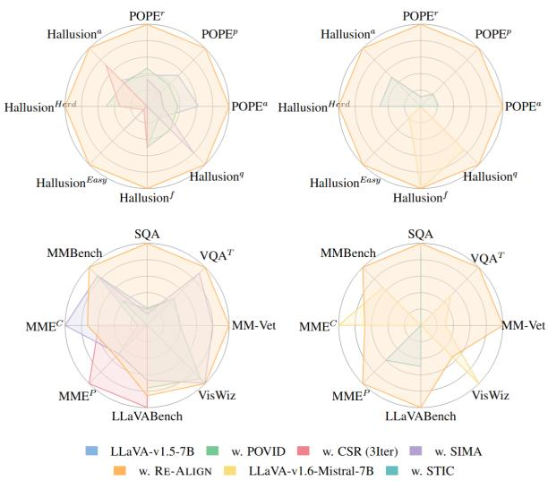
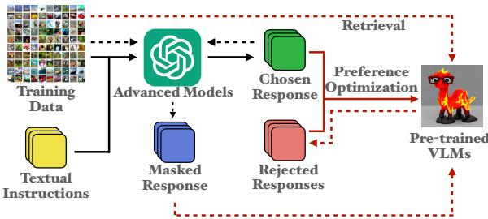
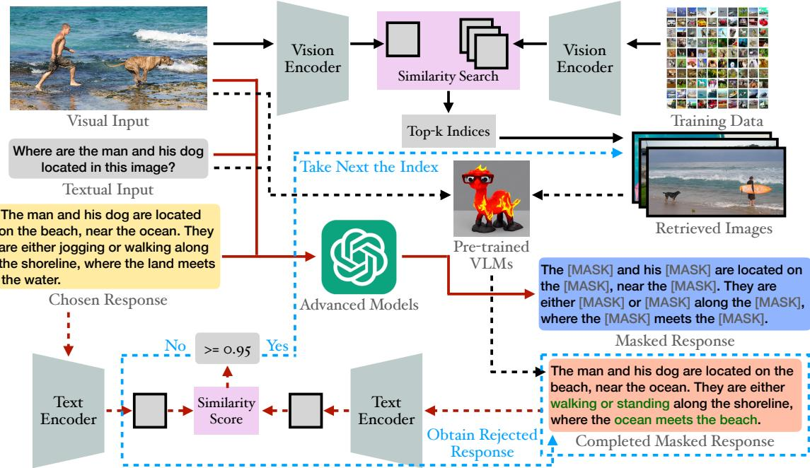
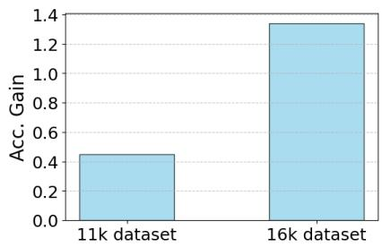
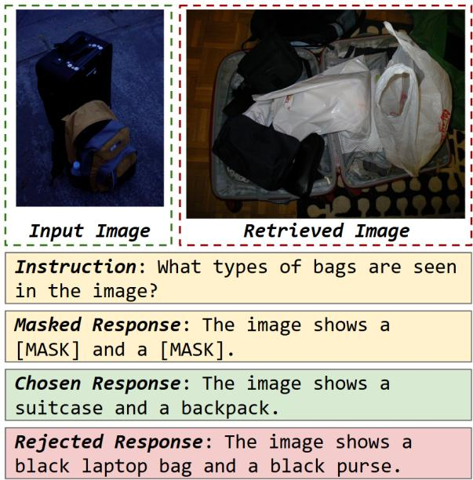
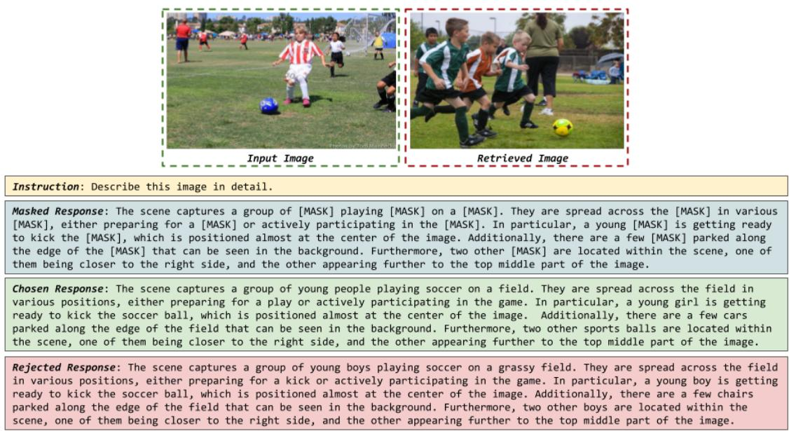
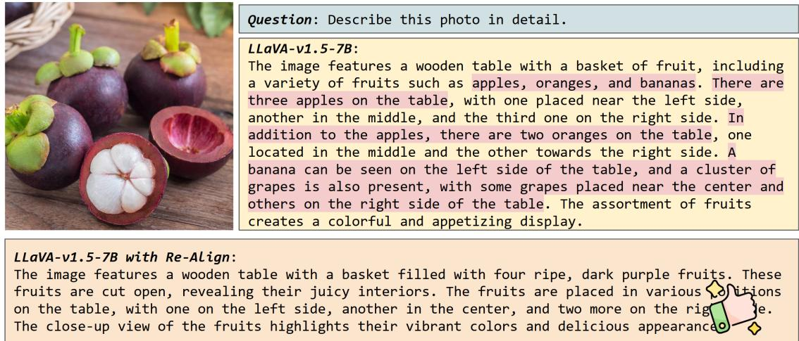

# Re-Align: Aligning Vision Language Models via Retrieval-Augmented Direct Preference Optimization

Shuo Xing1, Peiran Li1, Yuping Wang2, Ruizheng Bai1, Yueqi Wang3, Chan-Wei Hu1, Chengxuan Qian1, Huaxiu Yao4, Zhengzhong Tu1\*

1Texas A&M University 2University of Michigan 3UIUC 4UNC Chapel Hill

{shuoxing,tzz}@tamu.edu

## Abstract

The emergence of large Vision Language Mod els (VLMs) has broadened the scope and capabilities of single-modal Large Language Models (LLMs) by integrating visual modalities, thereby unlocking transformative cross-modal applications in a variety of real-world scenarios. Despite their impressive performance, VLMs are prone to significant hallucinations, partic ularly in the form of cross-modal inconsisten cies. Building on the success of Reinforcement Learning from Human Feedback (RLHF) in aligning LLMs, recent advancements have fo cused on applying direct preference optimiza tion (DPO) on carefully curated datasets to mitigate these issues. Yet, such approaches typically introduce preference signals in a bruteforce manner, neglecting the crucial role of visual information in the alignment process. In this paper, we introduce RE-ALIGN, a novel alignment framework that leverages image retrieval to construct a dual-preference dataset, effectively incorporating both textual and vi sual preference signals. We further introduce rDPO, an extension of the standard direct pref erence optimization that incorporates an addi tional visual preference objective during finetuning. Our experimental results demonstrate that RE-ALIGN not only mitigates hallucina tions more effectively than previous methods but also yields significant performance gains in general visual question-answering (VQA) tasks. Moreover, we show that RE-ALIGN maintains robustness and scalability across a wide range of VLM sizes and architectures. This work rep resents a significant step forward in aligning multimodal LLMs, paving the way for more reliable and effective cross-modal applications.

## 1 Introduction

The recent emergence of powerful Vision Language Models (VLMs) (Li et al., 2022, 2023a; Liu et al.,

  
Figure 1: Benchmark performance comparison (minmax normalized).

2024a; Li et al., 2024b; Meta, 2024; Bai et al., 2023; Wang et al., 2024b; Lu et al., 2024; Wu et al., 2024; Bai et al., 2025; Fan et al., 2025) has significantly extended the capabilities of Large Language Models (LLMs) (Devlin et al., 2018; Radford et al., 2019; Brown et al., 2020; Team et al., 2023; Roziere et al., 2023; Touvron et al., 2023a,b; Raffel et al., 2020; Yang et al., 2024; Team, 2024) into the visual domain, paving the way for innovative real-world applications that integrate multimodal information (Moor et al., 2023; Li et al., 2024a; Shao et al., 2024; Xing et al., 2025b; Rana et al., 2023; Kim et al., 2024). Despite their promising performance, VLMs remain susceptible to hallucinations—instances where the model produces outputs containing inaccurate or fabricated details about objects, attributes, and the logical relationships inherent in the input image (Rohrbach et al., 2018; Bai et al., 2024). Several factors contribute to this cross-modal inconsistency, including the separate low-quality or biased training data, imbalanced model architectures, and the disjoint pretraining of the vision encoder and LLM-backbone (Cui et al., 2023; Bai et al., 2024; Zhou et al., 2024a).

To mitigate the hallucinations in VLMs, the Directed Preference Optimization (DPO) techniques have been widely adopted (Deng et al., 2024; Zhou et al., 2024a; Fang et al., 2024; Zhou et al., 2024b; Guo et al., 2024; Chen et al., 2024b; Wang et al., 2024c; Yu et al., 2024b; Li et al., 2023b; Wang et al., 2024a; Xiao et al., 2025; Xie et al., 2024; Fu et al., 2024). This involves constructing datasets enriched with human preference signals specifically targeting hallucinations, and then fine-tuning the models using algorithms like Direct Preference Optimization (DPO) (Rafailov et al., 2024). Existing methods generate the preference data by perturbing the ground truth responses (Zhou et al., 2024a) and corrupting the visual inputs/embeddings (Deng et al., 2024; Amirloo et al., 2024) to generate rejected responses or correcting/refining responses to produce chosen responses (Chen et al., 2024b; Yu et al., 2023a). While methods based on response refinement yield the most reliable preference signals, they face scalability challenges due to the significant costs of manual correction processes. Conversely, directly corrupting input visual information or ground truth responses is overly simplistic, as this brute-force approach fails to generate plausible and natural hallucinations in a controlled manner. Moreover, during fine-tuning, directly applying DPO may cause the model to overly prioritize language-specific preferences, which potentially leads to suboptimal performance and an increased propensity for hallucinations (Wang et al., 2024a).

In this paper, we propose RE-ALIGN, a novel framework that alleviates VLM hallucinations by integrating image retrieval with direct preference optimization (DPO). Our method deliberately injects controlled hallucinations into chosen responses using image retrieval, generating rejected responses that offer more plausible and natural preference signals regarding hallucinations. Additionally, by incorporating both the retrieved image and the original input image, RE-ALIGN constructs a dual preference dataset. This dataset is then leveraged to finetune VLMs with our proposed rDPO objective—an extension of DPO that includes an additional visual preference optimization objective, further enhancing the alignment process with valuable visual preference signals.

## 2 Preliminaries

To mitigate hallucinations in VLMs, we introduce an alignment framework based on direct preference optimization (DPO) with image retrieval. In this section, we present preliminary definitions and notations for VLMs and preference optimization, which serve as the foundation for our proposed framework.

Vision Language Models VLMs typically consist of three main components: a vision encoder $f _ { v } ( \cdot )$ , a projector $f _ { p } ( \cdot )$ , and an LLM backbone $\mathcal { L } ( \cdot )$ . Given a multimodal input query $( x , v )$ , where x is a textual instruction and v is a visual image, VLMs generate a corresponding response $y = [ y _ { 1 } , \cdot \cdot \cdot , y _ { m } ]$ autoregressively. Here, each $y _ { i }$ represents an output token, and m denotes the total number of tokens in the generated response.

Direct Preference Learning Reinforcement Learning from Human Feedback (RLHF) (Christiano et al., 2017; Ziegler et al., 2019) is a key approach for aligning machine learning models with human preferences. Among these techniques, the Direct Preference Optimization (DPO) algorithm (Rafailov et al., 2024) stands out for its popularity and for demonstrating superior alignment performance. We represent a VLM with a policy $\pi$ , which, given an input query $( x , v )$ , generates a response $y$ from the distribution $\pi ( \cdot | x , v )$ . We denote by $\pi _ { 0 }$ the initial VLM model, fine-tuned on instruction-following VQA data by supervised finetuning (SFT). Specifically, we define a preference dataset $\mathcal { D } = \{ ( x , v , y _ { w } , y _ { l } ) \}$ , where for each input, the response $y _ { w }$ is preferred to the response $y _ { l } .$ . The DPO objective is formulated as follows, leveraging the preference dataset :

$$
\begin{array} { r l } & { \mathcal { L } _ { \mathrm { D P O } } = - \mathbb { E } _ { ( x , v , y _ { w } , y _ { l } ) \sim \mathcal { D } } } \\ & { \biggl [ \log \sigma \biggl ( \beta \log \frac { \pi _ { \theta } \left( y _ { w } | x , v \right) } { \pi _ { 0 } \left( y _ { w } | x , v \right) } - \beta \log \frac { \pi _ { \theta } \left( y _ { l } | x , v \right) } { \pi _ { 0 } \left( y _ { l } | x , v \right) } \biggr ) \biggr ] . } \end{array}
$$

Compared to deep RL-based methods like Proximal Policy Optimization (PPO) (Schulman et al., 2017; Christiano et al., 2017; Ziegler et al., 2019), DPO is more computationally efficient, easier to tune, and thus more widely adopted (Dong et al., 2024).

Image Retrieval Image retrieval aims to find relevant images from large databases – such as vector databases or indexed corpora – based on semantic similarity criteria (Hu et al., 2025). In this paper, we convert all images into vector representations and utilize the cosine similarity metric to evaluate their proximity to a reference image. The similarity between two images, $v _ { 1 }$ and $v _ { 2 } ,$ is computed as

follows:

$$
s = \bigg \langle \frac { f _ { p } ( v _ { 1 } ) } { | | f _ { p } ( v _ { 1 } ) | | } , \frac { f _ { p } ( v _ { 2 } ) } { | | f _ { p } ( v _ { 2 } ) | | } \bigg \rangle ,
$$

where $< \cdot , \cdot >$ denotes the inner product in $l _ { 2 }$ space, $f _ { p } ( v _ { i } )$ represents the image embeddings generated by the vision encoder $f _ { v } ( \cdot )$ of VLMs. In this paper, we employ the FAISS library (Douze et al., 2024; Johnson et al., 2019) for efficient vector searches, retrieving the top-k most relevant images.

## 3 Methods

In this paper, we propose RE-ALIGN, a novel framework that integrates preference optimization with image retrieval to improve cross-modal alignment in VLMs. As shown in Figure 2, the process

  
Figure 2: Illustration of RE-ALIGN framework.

begins with an advanced VLM generating chosen responses from input images from the training set. A selective masking process is then applied, strategically omitting segments associated with objects, attributes, or logical relationships identified in the image. Next, leveraging the retrieved image from the same training dataset and the masked responses, the hallucination-prone VLM is prompted to complete the masked elements, obtaining rejected responses. The generated preference pairs (chosen vs. rejected) are then used to fine-tune the VLM with $\mathcal { L } _ { \mathrm { r D P O } }$ (eq. (1)), a preference objective that integrates both visual and textual information to penalize hallucinations and reinforce grounded reasoning. Algorithm 1 in Appendix A provides an overview of RE-ALIGN, while the detailed process is explained in the following subsections.

## 3.1 Preference Generation

Generating high-quality preference data, which includes both accurate ground-truth responses and controlled hallucinated examples, is crucial for effective preference optimization in pretrained VLMs. Existing methods construct preference data by perturbing ground-truth responses (Zhou et al., 2024a), corrupting visual inputs/embeddings (Deng et al., 2024; Amirloo et al., 2024) to create rejected responses, or refining responses to obtain chosen responses (Chen et al., 2024b; Yu et al., 2023a). Refinement produces high-quality preference data but comes at a high cost, whereas direct corruption is more scalable yet tends to generate unrealistic hallucinations and fails to produce plausible, natural ones in a controlled manner. To address these limitations, we introduce a novel image retrieval-based pipeline for preference data construction as shown in Figure 3, which consists of three key stages:

• Strategical masking: Given an input pair $( x _ { i } , v _ { i } )$ and its corresponding chosen response $y _ { w }$ generated by a pretrained VLM, a strategic masking process removes words or segments associated with objects, attributes, or logical relationships inferred from the image, producing the masked response $y _ { m }$

• Image retrieval: All images $\{ v _ { i } \}$ in the training set are embedded using the original vision encoder of the pre-trained VLMs, forming the knowledge base . The top-k most similar images to vi are then retrieved from  using a cosine similarity search.

• Inducing hallucinations: VLMs are prompted to generate a candidate completion $y _ { m }$ for the masked response conditioned on the instruction x and a retrieved image $v _ { j _ { t } }$ where $t \in [ 1 , k ]$ denotes the rank of images based on their cosine similarity to the input $v _ { i }$ . Both the chosen response $y _ { w }$ and the reconstructed response $y _ { c }$ are embedded using a SentenceTransformer model. If the cosine similarity between these embeddings falls below 0.95, $y _ { c }$ is designated as the rejected response $y _ { l } .$ . Otherwise, the process continues with the next image $v _ { j _ { t + 1 } }$ in the similarity-ranked sequence until a suitable candidate is identified or all k retrieved images have been examined.

## 3.2 Preference Optimization

The curated preference dataset is subsequently used to fine-tune VLMs through direct preference learning. We propose retrieval-augmented direct preference optimization (rDPO), an extension of DPO that integrates an additional visual preference optimization objective. Given a preference dataset $\mathcal { D } = \{ x , v , v _ { l } , y _ { w } , y _ { l } \}$ , the retrieval-augmented direct preference optimization objective is formu-

  
Figure 3: Illustration of the preference generation process, utilizing the original vision encoder from initial VLMs and the SentenceTransformer as the text encoder.

lated as follows:

$$
\begin{array} { r l } & { \mathcal { L } _ { \mathrm { v D P O } } = - \mathbb { E } _ { ( x , v , v _ { l } , y _ { w } , y _ { l } ) \sim \mathcal { D } } } \\ & { \left[ \log \sigma \bigg ( \beta \log \frac { \pi _ { \theta } ( y _ { w } | x , v ) } { \pi _ { 0 } ( y _ { w } | x , v ) } - \beta \log \frac { \pi _ { \theta } ( y _ { w } | x , v _ { l } ) } { \pi _ { 0 } ( y _ { w } | x , v _ { l } ) } \bigg ) \right] \mathrm { , } } \end{array}
$$

where $( x , v )$ denotes the input query of VLMs, $( y _ { w } , y _ { l } )$ represents the preference responses pair, and $v _ { l }$ is the retrieved image for v. The loss function of rDPO is the combination of standard DPO objective and visual preference optimization:

$$
\mathcal { L } _ { \mathrm { r D P O } } = \mathcal { L } _ { \mathrm { D P O } } + \mathcal { L } _ { \mathrm { v D P O } } .\tag{1}
$$

By incorporating both textual and visual preference signals, our approach allows VLMs to effectively exploit multimodal information during optimization, in contrast to prior alignment methods that depend exclusively on language-based preferences. In contrast to mDPO (Wang et al., 2024a), which introduces image preference by randomly cropping the original input images, rDPO adopts retrievalaugmented generation to integrate visual preference signals in a more coherent and semantically meaningful way.

## 4 Experiments

We conduct three categories of experiments to empirically validate the effectiveness of our proposed method. First, we evaluate the ability of RE-ALIGN to mitigate hallucinations and improve generalizability across diverse VQA tasks, demonstrating its consistent superiority over baseline approaches and achieving state-of-the-art performance. Next, we examine RE-ALIGN’s effectiveness in aligning VLMs across various model sizes and architectures, including both text-to-image and unified models, where it delivers substantial performance over vanilla models and existing baselines. Finally, we assess the impact of our proposed rDPO objective in preference optimization, showing that it consistently surpasses standard DPO in aligning VLMs and achieving superior results in both halluciation mitigation and general tasks.

## 4.1 RE-ALIGN for VLMs Alignment

Datasets We conducted experiments on both hallucination detection and general VQA tasks. Specifically, we assess our method’s performance in hallucination detection using the POPE dataset (Li et al., 2023c) and Hallusion-Bench (Guan et al., 2023). For general VQA tasks, we leverage a diverse suite of benchmarks including ScienceQA (Lu et al., 2022), TextVQA (Singh et al., 2019), MM-Vet (Yu et al., 2023b), VisWiz (Gurari et al., 2018), LLaVABench (Liu, 2023), MME (Fu et al., 2023), and MMBench (Liu et al., 2024d).

<table><tr><td>Methods</td><td>POPE^</td><td>POPEp</td><td>POPEa</td><td>Hallusionª</td><td>Hallusionf</td><td>HallusionEasy</td><td>Hallusion Hard</td><td>Hallusiona</td></tr><tr><td>LLaVA-v1.5-7B</td><td>88.14</td><td>87.23</td><td>85.10</td><td>10.3297</td><td>18.2081</td><td>41.7582</td><td>40.2326</td><td>46.3242</td></tr><tr><td>w. LLaVA-RLHF</td><td>84.77</td><td>84.60</td><td>83.40</td><td>10.2859</td><td>18.7861</td><td>38.2418</td><td>40.6744</td><td>44.6528</td></tr><tr><td>w. POVID</td><td>88.21</td><td>87.16</td><td>85.06</td><td>10.5495</td><td>18.2081</td><td>41.5385</td><td>40.9302</td><td>46.6785</td></tr><tr><td>w. CSR (3Iter)</td><td>87.83</td><td>87.00</td><td>85.00</td><td>10.1099</td><td>18.2081</td><td>41.7582</td><td>40.6977</td><td>46.9442</td></tr><tr><td>w. SIMA</td><td>88.10</td><td>87.10</td><td>85.03</td><td>10.9890</td><td>17.6301</td><td>43.0549</td><td>40.2326</td><td>45.2728</td></tr><tr><td>w. mDPO</td><td>88.17</td><td>87.13</td><td>85.03</td><td>9.8901</td><td>18.4971</td><td>41.978</td><td>40.000</td><td>46.1470</td></tr><tr><td>W. RE-ALIGN</td><td>88.65</td><td>87.43</td><td>85.16</td><td>11.2088</td><td>18.7861</td><td>45.5165</td><td>41.6279</td><td>47.6156</td></tr><tr><td>LLaVA-v1.6- Mistral-7B</td><td>88.83</td><td>87.93</td><td>86.43</td><td>13.6264</td><td>19.0751</td><td>47.4725</td><td>33.4884</td><td>46.0585</td></tr><tr><td>w. STIC</td><td>89.03</td><td>88.20</td><td>86.56</td><td>12.9670</td><td>17.3410</td><td>47.2527</td><td>34.1860</td><td>46.3242</td></tr><tr><td>W. RE-ALIGN</td><td>90.55</td><td>89.20</td><td>87.03</td><td>13.8462</td><td>19.0751</td><td>48.3516</td><td>34.8837</td><td>46.5899</td></tr></table>

Table 1: Impact of RE-ALIGN across hallucination benchmarks for VLMs, and comparisons with baselines.
<table><tr><td>Methods</td><td>SQA</td><td>TextVQA</td><td>MM-Vet</td><td>VisWiz</td><td>LLaVABench</td><td>MMEP</td><td>MMEC</td><td>MMBench</td><td>Avg. Rank</td></tr><tr><td>LLaVA-v1.5-7B</td><td>66.02</td><td>58.18</td><td>31.6</td><td>50.03</td><td>64.1</td><td>1510.28</td><td>357.85</td><td>64.60</td><td>3.875</td></tr><tr><td>w. LLaVA-RLHF</td><td>63.11</td><td>56.89</td><td>31.8</td><td>49.57</td><td>60.2</td><td>1378.90</td><td>282.85</td><td>64.39</td><td>6</td></tr><tr><td>w. POVID</td><td>65.98</td><td>58.18</td><td>31.8</td><td>49.80</td><td>67.3</td><td>1495.91</td><td>356.07</td><td>64.34</td><td>4.375</td></tr><tr><td>w. CSR (3Iter)</td><td>65.46</td><td>57.86</td><td>31.6</td><td>47.02</td><td>68.3</td><td>1525.44</td><td>365.35</td><td>64.08</td><td>4.5</td></tr><tr><td>w. SIMA</td><td>65.83</td><td>58.48</td><td>32.0</td><td>50.04</td><td>66.9</td><td>1510.33</td><td>371.78</td><td>64.60</td><td>2.75</td></tr><tr><td>w. mDPO</td><td>67.53</td><td>57.90</td><td>31.3</td><td>50.04</td><td>59.0</td><td>1510.74</td><td>335.71</td><td>64.60</td><td>4.25</td></tr><tr><td>w. RE-ALIGN</td><td>68.10</td><td>58.55</td><td>32.1</td><td>50.06</td><td>67.7</td><td>1511.79</td><td>367.50</td><td>64.69</td><td>1.375</td></tr><tr><td>LLaVA-v1.6- Mistral-7B</td><td>76.02</td><td>63.80</td><td>47.6</td><td>59.85</td><td>80.2</td><td>1494.22</td><td>323.92</td><td>69.33</td><td>2.125</td></tr><tr><td>w. STIC</td><td>76.42</td><td>63.50</td><td>47.3</td><td>54.21</td><td>81.0</td><td>1504.91</td><td>308.21</td><td>69.16</td><td>2.625</td></tr><tr><td>w. RE-ALIGN</td><td>76.47</td><td>64.08</td><td>48.3</td><td>57.27</td><td>81.8</td><td>1512.09</td><td>318.93</td><td>69.42</td><td>1.25</td></tr></table>

Table 2: Impact of RE-ALIGN across general benchmarks for VLMs, and comparisons with baselines.

Beslines We compare our method with several widely adopted alignment frameworks for VLMs, including LLaVA-RLHF (Sun et al., 2023), POVID (Zhou et al., 2024a), CSR (Zhou et al., 2024b), SIMA (Wang et al., 2024c), STIC (Deng et al., 2024). For more details on these baselines, please refer to the Appendix.

Experimental Setup We sample 11k images from the LLaVA-Instruct-150K dataset (Liu et al., 2024a) to construct preference data, as illustrated in Figure 3. These images are initially used to generate QA pairs based on image captions and simple VQA tasks using GPT-4o mini (OpenAI, 2024). Furthermore, the images are encoded using clip-vit-large-patch14 (Radford et al., 2021a) to construct the knowledge base for image retrieval. For rejected responses, we use GPT-4o mini to mask the chosen response and all-mpnet-base-v2 (Reimers and Gurevych, 2019) to compute the similarity between the completed masked response and the original chosen response. We use LLaVA-v1.5-7B (Liu et al., 2024a) and LLaVA-v1.6-Mistral-7B (Li et al., 2024b) as our backbone models and perform RE-ALIGN finetuning for 1 epoch. All evaluations are conducted with a temperature setting of 0, and baseline results are reproduced using open-sourced model weights.

Results Table 1 shows the performance of RE-ALIGN compared to baseline methods on hallucination benchmarks. Notably, RE-ALIGN achieves the best among the evaluated methods on both POPE and HallusionBench for LLaVA-v1.5-7B (Liu et al., 2024a) and LLaVA-v1.6-Mistral-7B (Li et al., 2024b), highlighting the effectiveness of our approach in mitigating hallucinations of VLMs. As shown in Table 2, RE-ALIGN can provide generally on-par or better performance than the vanilla models and baseline alignment methods on each evaluated general VQA task, ultimately achieving the best overall results. This finding indicates that RE-ALIGN can enhance hallucination mitigation without compromising general performance.

## 4.2 Scalability and Generalizability

Experimental Setup The experimental setup follows the same setting as VLMs alignment experiments, except for the backbone models, where we employ a diverse array of VLMs varying in size

and architecture:

• Image-to-Text models: the typical architecture of VLMs, where a vision encoder is integrated with an LLM to enable cross-modal understanding. In this section, we evaluate RE-ALIGN on LLaVA-v1.5-7B (Liu et al., 2024a), LLaVA-v1.5-13B (Liu et al., 2024a), LLaVAv1.6-Vicuna-7B (Li et al., 2024b), LLaVA-v1.6- Vicuna-13B (Li et al., 2024b), Qwen2.5-VL-3B-Instruct (Bai et al., 2025), and Qwen2.5-VL-7B-Instruct (Bai et al., 2025).

• Unified Models: encoder-decoder architecture that decouples visual encoding for multimodal understanding and generation. We evaluate RE-ALIGN on Janus-Pro-1B (Chen et al., 2025) and Janus-Pro-7B (Chen et al., 2025).

<table><tr><td>Methods</td><td>POPE^</td><td>POPEP</td><td>POPEa</td></tr><tr><td>Janus-Pro-1B</td><td>85.46</td><td>85.03</td><td>84.13</td></tr><tr><td>W. RE-ALIGN</td><td> $8 7 . 5 3 _ { \uparrow 2 . 0 7 }$  </td><td> $8 7 . 3 3 _ { \uparrow 2 . 3 0 }$ </td><td> $8 5 . 8 6 _ { \uparrow 1 . 7 3 }$  </td></tr><tr><td>Janus-Pro-7B</td><td>88.41</td><td>87.30</td><td>85.70</td></tr><tr><td>W. RE-ALIGN</td><td> $8 9 . 7 3 _ { \uparrow 1 . 3 2 }$ </td><td> $8 8 . 3 7 _ { \uparrow 1 . 0 7 }$ </td><td> $8 6 . 2 7 _ { \uparrow 0 . 5 7 }$  </td></tr><tr><td>Qwen2.5-VL- 3B-Instruct</td><td>88.32</td><td>87.60</td><td>86.63</td></tr><tr><td>W. RE-ALIGN</td><td> $8 9 . 6 9 _ { \uparrow 1 . 3 7 }$ </td><td> $8 8 . 3 3 _ { \uparrow 0 . 7 3 }$ </td><td> $8 7 . 1 6 _ { \uparrow 0 . 5 3 }$  </td></tr><tr><td>Qwen2.5-VL-</td><td>88.73</td><td>87.90</td><td>86.87</td></tr><tr><td>7B-Instruct W. RE-ALIGN</td><td> $8 9 . 2 7 _ { \uparrow 0 . 5 4 }$ </td><td> $8 8 . 1 0 _ { \uparrow 0 . 2 0 }$ </td><td>87.10↑0.23</td></tr><tr><td>LLaVA-v1.5-7B</td><td>88.14</td><td>87.23</td><td>85.10</td></tr><tr><td>w. LLaVA-RLHF</td><td> $8 4 . 7 7 _ { \downarrow 3 . 3 7 }$ </td><td> $8 4 . 6 0 _ { \downarrow 2 . 6 3 }$ </td><td> $8 3 . 4 0 _ { \downarrow 0 . 5 0 }$ </td></tr><tr><td>w. POVID</td><td> $8 8 . 2 1 _ { \uparrow 0 . 0 7 }$ </td><td> $8 7 . 1 6 _ { \downarrow 0 . 0 7 }$ </td><td> $8 5 . 0 6 _ { \downarrow 0 . 0 4 }$ </td></tr><tr><td>w. CSR (3Iter)</td><td> $8 7 . 8 3 _ { \downarrow 0 . 3 1 }$ </td><td> $8 7 . 0 0 _ { \downarrow 0 . 2 3 }$ </td><td> $8 5 . 0 0 _ { \downarrow 0 . 1 0 }$ </td></tr><tr><td>w. SIMA</td><td> $8 8 . 1 0 _ { \downarrow 0 . 0 4 }$ </td><td> $8 7 . 1 0 _ { \downarrow 0 . 1 3 }$ </td><td> $8 5 . 0 3 _ { \downarrow 0 . 0 7 }$ </td></tr><tr><td>w. mDPO</td><td> $8 8 . 1 7 _ { \uparrow 0 . 0 3 }$ </td><td> $8 7 . 1 3 _ { \downarrow 0 . 1 0 }$ </td><td> $8 5 . 0 3 _ { \downarrow 0 . 0 7 }$ </td></tr><tr><td>W. RE-ALIGN</td><td> $8 8 . 6 5 _ { \uparrow 0 . 5 1 }$ </td><td> $8 7 . 4 3 _ { \uparrow 0 . 2 0 }$ </td><td> $8 5 . 1 6 _ { \uparrow 0 . 0 6 }$  </td></tr><tr><td>LLaVA-v1.5-13B</td><td>88.07</td><td>87.53</td><td>85.60</td></tr><tr><td>w. CSR (3Iter)</td><td> $8 8 . 3 8 _ { \uparrow 0 . 3 1 }$ </td><td> $8 7 . 9 0 _ { \uparrow 0 . 3 7 }$ </td><td> $8 5 . 4 6 _ { \downarrow 0 . 1 4 }$ </td></tr><tr><td>w. SIMA</td><td> $8 8 . 0 4 _ { \downarrow 0 . 0 3 }$ </td><td> $8 7 . 4 0 _ { \downarrow 0 . 1 3 }$ </td><td> $8 5 . 4 0 _ { \downarrow 0 . 2 0 }$ </td></tr><tr><td>w. HSA-DPO</td><td> $8 5 . 0 1 _ { \downarrow 3 . 0 6 }$ </td><td> $8 5 . 0 0 _ { \downarrow 2 . 5 3 }$ </td><td> $8 3 . 8 6 _ { \downarrow 1 . 7 4 }$ </td></tr><tr><td>W. RE-ALIGN</td><td> $9 0 . 0 3 _ { \uparrow 1 . 9 6 }$ </td><td> $8 9 . 2 0 _ { \uparrow 1 . 3 0 }$ </td><td> $8 6 . 2 0 _ { \uparrow 0 . 7 4 }$  </td></tr><tr><td>LLaVA-v1.6- Vicuna-7B</td><td>88.52</td><td>87.63</td><td>86.36</td></tr><tr><td>W. RE-ALIGN</td><td> $8 8 . 9 4 _ { \uparrow 0 . 4 2 }$ </td><td> $8 8 . 0 3 _ { \uparrow 0 . 4 0 }$ </td><td> $8 6 . 6 3 _ { \uparrow 0 . 2 7 }$  </td></tr><tr><td>LLaVA-v1.6-</td><td>88.24</td><td>87.70</td><td>86.43</td></tr><tr><td>Vicuna-13B w. RE-ALIGN</td><td> $8 8 . 7 9 _ { \uparrow 0 . 5 5 }$ </td><td> $8 8 . 1 0 _ { \uparrow 0 . 4 0 }$ </td><td> $8 6 . 6 0 _ { \uparrow 0 . 1 7 }$  </td></tr></table>

Table 3: Impact of RE-ALIGN across various model scales on POPE.

Results Table 3 presents the performance of RE-ALIGN using both standard image-to-text and unified VLM backbones across model sizes from 1B to 13B on the POPE benchmark (Li et al., 2023c). In experiments with the LLaVA-v1.5 series (Liu et al., 2024a), none of the baseline approaches consistently improve performance for either the 7B or the 13B models, highlighting the limited scalability of these methods. In contrast, RE-ALIGN achieved substantial performance gains, outperforming both the baseline models and the vanilla version—most notably on the LLaVA-v1.5-13B variant. Similarly, experiments with the LLaVAv1.6-Vicuna series (Li et al., 2024b) and Qwen2.5- VL series (Bai et al., 2025) revealed the same trend, further underscoring RE-ALIGN’s superior scalability. For unified vision-language models, especially Janus-Pro, integrating RE-ALIGN yields a significant performance boost. Notably, Janus-Pro-1B experiences the greatest improvement, underscoring RE-ALIGN’s robustness across different model architectures. However, Janus-Pro-1B, being the smallest among the evaluated VLMs, also exhibits the poorest overall performance on POPE, suggesting a correlation between model size and the propensity for hallucinations.

## 4.3 Ablation Study

In this section, we conduct a comprehensive ablation study to explore how the data curation framework and design of the objective function affect the $\mathbf { R E - A L I G N } ^ { \prime }$ performance. The experimental setup follows the same setting as VLMs alignment experiments, with LLaVA-1.5-7B as the backbone.

Dataset Due to budget constraints and the need for reproducibility, we have excluded benchmarks that require evaluation by GPT-4 (Achiam et al., 2023). Instead, we focus on the following tasks: ScienceQA (Lu et al., 2022), TextVQA (Singh et al., 2019), and POPE (Li et al., 2023c).

<table><tr><td>T</td><td>SQA</td><td>TextVQA</td><td>POPE^</td><td>POPEP</td><td>POPEa</td></tr><tr><td>0.85</td><td>67.04</td><td>57.31</td><td>88.96</td><td>87.83</td><td>85.06</td></tr><tr><td>0.90</td><td>67.75</td><td>57.68</td><td>88.83</td><td>87.66</td><td>84.93</td></tr><tr><td>0.95</td><td>68.10</td><td>58.55</td><td>88.65</td><td>87.43</td><td>85.16</td></tr></table>

Table 4: Impact of similarity threshold τ for generating the rejected responses in RE-ALIGN across general and hallucination benchmarks for VLMs.

Similarity Threshold τ In RE-ALIGN, we set the similarity threshold τ to 0.95, which acts as an upper bound on the cosine similarity between the chosen response and the generated rejected response. As illustrated in Table 4, decreasing the threshold τ results in a stronger preference signal, leading to improved performance in mitigating hallucinations. However, this comes at the cost of reduced performance in general VQA. Among the evaluated configurations, setting $\tau = 0 . 9 5$ offers the best trade-off, effectively reducing hallucinations while maintaining strong performance across VQA benchmarks.

Masking Strategy In data curation, we generate preference data by inducing hallucinations at the segment level. To further investigate the impact of finer-grained perturbations, we conduct experiments using sentence-level masking. As shown in Table 5, using a sentence-level masking strategy, RE-ALIGN still demonstrates significant improvement in reducing hallucination in VLMs. However, this approach leads to a slight drop in performance on general VQA tasks. More discussions on the masking strategy can be found in Appendix 5.

<table><tr><td>Masking Strategy</td><td colspan="3">SQA TextVQA POPE</td><td>POPEp</td><td>POPEa</td></tr><tr><td>sentence-level 67.58</td><td></td><td>57.77</td><td>88.56</td><td>87.60</td><td>84.90</td></tr><tr><td>segment-level 68.10</td><td></td><td>58.55</td><td>88.65</td><td>87.43</td><td>85.16</td></tr></table>

Table 5: Impact of masking strategy across general and hallucination benchmarks for VLMs.

Design of Loss Function In RE-ALIGN, we assign equal weights to the DPO and vDPO objectives in the combined loss function, i.e., $\mathcal { L } _ { \mathrm { r D P O } } =$ $\mathcal { L } _ { \mathrm { D P O } } + \mathcal { L } _ { \mathrm { v D P O } }$ . To better understand the impact of this design of loss function, we generalize the loss function to $\mathcal { L } _ { \mathrm { D P O } } + w _ { v } \mathcal { L } _ { \mathrm { v D P O } }$ , where $w _ { v }$ controls the contribution of the visual component, and conduct experiments with different values of $w _ { v }$ to analyze the trade-offs and identify the optimal balance between textual and visual preference signals. As shown in Table $^ { 6 , }$ incorporating the $\mathcal { L } _ { \mathrm { v D P O } }$ objective significantly enhances VLM performance on hallucination benchmarks. In general, when combined with the standard $\mathcal { L } _ { \mathrm { D P O } }$ objective, increasing the weight of $\mathcal { L } _ { \mathrm { v D P O } }$ tends to yield better overall performance. Notably, the equally-combined objective $\mathcal { L } _ { \mathrm { r D P O } }$ achieves the best balance between reducing hallucinations and maintaining strong performance on general VQA benchmarks, highlighting its effectiveness as a robust training strategy.

Training Epochs For a fair comparison with prior baselines, we primarily report results of RE-ALIGN under a one-epoch fine-tuning setup, which already demonstrates the effectiveness of our proposed method. To further explore the impact of training duration, we conduct additional experiments with extended fine-tuning of up to three epochs.

<table><tr><td> $w _ { v }$ </td><td>SQA</td><td>TextVQA</td><td>POPE^</td><td>POPEP</td><td>POPEa</td></tr><tr><td>0.0 (DPO)</td><td>66.26</td><td>58.24</td><td>88.18</td><td>87.30</td><td>85.23</td></tr><tr><td>0.25</td><td>67.15</td><td>57.47</td><td>88.72</td><td>87.60</td><td>85.03</td></tr><tr><td>0.50</td><td>67.01</td><td>57.41</td><td>88.76</td><td>87.53</td><td>85.06</td></tr><tr><td>0.75</td><td>67.53</td><td>57.69</td><td>88.90</td><td>87.70</td><td>84.83</td></tr><tr><td>1.0 (rDPO)</td><td>68.10</td><td>58.55</td><td>88.65</td><td>87.43</td><td>85.16</td></tr></table>

Table 6: Impact of rDPO objective across general and hallucination benchmarks for VLMs, and comparisons with baselines.

<table><tr><td>Num Epoch</td><td colspan="3">SQA TextVQA POPE</td><td>POPEp</td><td>POPEa</td></tr><tr><td>1</td><td>68.10</td><td>58.55</td><td>88.65</td><td>87.43</td><td>85.16</td></tr><tr><td>2</td><td>68.27</td><td>58.47</td><td>88.91</td><td>87.52</td><td>85.16</td></tr><tr><td>3</td><td>68.17</td><td>58.60</td><td>88.57</td><td>87.60</td><td>85.43</td></tr></table>

Table 7: Impact of the number of training epochs across general and hallucination benchmarks for VLMs.

As shown in Table 7, RE-ALIGN exhibits stable performance across longer training schedules, with results consistently maintained and in some cases slightly improved on both general VQA benchmarks (SQA, TextVQA) and hallucination benchmarks (POPE). This indicates that our method is robust to extended training and not prone to overfitting, while continuing to deliver reliable gains.

## 5 Discussions

Role of Image $ { \boldsymbol { v } } _ { l }  { \mathrm { ~  ~ \phi ~ } }  { \boldsymbol { v } } _ { l }$ is one of the top-10 retrieved images corresponding to the original image $v ,$ and qualitatively, the images v and $v _ { l }$ are semantically similar in terms of scenes, objects, and composition. This retrieval strategy is intended to ensure that v shares sufficient visual context with v, making it a plausible alternative grounding for the instruction x. Furthermore, we compute the cosine similarity between the CLIP embeddings of the caption of v (by prompting "Describe this image in detail.") and three types of images: the original image v, a retrieved image $v _ { l }$ , and a randomly selected image $v _ { r }$ . The average cosine similarities are 0.2780, 0.2382, 0.0688, respectively, which indicates that $v _ { l }$ retains significant semantic similarity with v and is far more aligned than an unrelated image $v _ { r }$ . Based on this, we interpret $v _ { l }$ as a $^ { 6 6 } r e \mathrm { . }$ jected input image” to the original instruction x: it provides a visually plausible but suboptimal context, under which the response $y _ { w }$ should be less preferred compared to when conditioned on v.

Discussion with mDPO In this section, we detail the differences between our proposed rDPO and mDPO (Wang et al., 2024a). In mDPO, a conditional preference optimization objective is introduced to force the model to determine the preference label based on visual information:

$$
\begin{array} { r l } & { \mathcal { L } _ { \mathrm { C o D P O } } = - \mathbb { E } _ { ( x , v , y _ { w } , y _ { l } ) \sim \mathcal { D } } } \\ & { \Big [ \log \sigma \Big ( \beta \log \frac { \pi _ { \theta } ( y _ { w } | x , v ) } { \pi _ { 0 } ( y _ { w } | x , v ) } - \beta \log \frac { \pi _ { \theta } ( y _ { w } | x , v _ { c } ) } { \pi _ { 0 } ( y _ { w } | x , v _ { c } ) } \Big ) \Big ] , } \end{array}
$$

where $v _ { c }$ denotes a randomly cropped image of the original input image v. Specifically, visual preference signals are generated by randomly masking 20% of the input visual tokens to encourage the model to capture preferences based on visual cues.

In contrast, RE-ALIGN extends and enhances this approach by incorporating a more semantically meaningful visual preference pair. Instead of relying solely on random crops, RE-ALIGN retrieves a relevant image from the same dataset that corresponds to the original input. This retrieval-based augmentation provides a stronger contrastive signal, improving the model’s ability to discern finegrained visual details and reducing spurious correlations. Moreover, beyond mitigating hallucinations in VLMs, RE-ALIGN has been demonstrated that it also significantly enhance performance on general VQA tasks.

Performance Variations on General VQA tasks While RE-ALIGN consistently delivers the best performance on hallucination benchmarks across all backbone models, it may not achieve the top result for every general VQA benchmark. The variations in performance on general VQA tasks are primarily due to the alignment tax, a well-known phenomenon in RLHF, where alignment can sometimes lead to a decline in the model’s ability to retain pretraining knowledge. Notably, this tradeoff is not unique to RE-ALIGN; as shown in Table 2, several baselines even underperform compared to the vanilla VLMs on general VQA tasks.

Segment-level Preference Building on the findings of (Yu et al., 2024b), we generate preference data by inducing hallucinations at the segment level rather than at the sentence level (as seen in approaches such as POVID (Zhou et al.,

  
Figure 4: Performance gains of RE-ALIGN with LLaVAv1.6-Mistral-7B as the backbone on ScienceQA with respect to the size of preference data.

2024a), STIC (Deng et al., 2024), and CSR (Zhou et al., 2024b)), to provide robust supervision signals during the alignment process. This finergrained preference modeling yields clearer and more precise learning signals, enabling the model to better distinguish between subtle hallucinations and ground truth responses. To further investigate these segment-level preference signals, we expanded the fine-tuning dataset from 11k to 16k image samples. As illustrated in Figure 4, when using LLaVA-v1.6-Mistral-7B as the backbone with ScienceQA as the case study, RE-ALIGN achieved a significant performance improvement—from 0.45 to 1.34—demonstrating the effectiveness of our approach.

Computational Complexity The proposed RE-ALIGN pipeline can be modularized into offline preprocessing and online training integration (detailed computational cost can be found in the Appendix):

• Preprocessing: Image retrieval, strategic masking, and preference pair generation can be entirely performed offline as a one-time data preprocessing step. This includes CLIPbased similarity search, mask generation, and SentenceTransformer-based similarity computation. Once completed, these preprocessed preference pairs can be reused across multiple training runs without additional overhead.

• Training Overhead: The actual training process introduces minimal additional computational overhead ( 5-10% increased training time) compared to standard DPO, with virtually identical memory requirements. The additional cost stems only from:

– Forward passes through the visual encoder for retrieved images;

– Generation passes through the LLM backbone for computing the vDPO loss component.

## 6 Related Work

Reinforcement Learning from Human Feedback Reinforcement Learning from Human Feedback (RLHF) has emerged as a crucial technique for incorporating human preference signals into machine learning methods and models (Dong et al., 2024; Yin et al., 2022). RLHF frameworks can be broadly categorized into deep RL-based approaches and direct preference learning approaches. In deep RL-based methods, a reward model is first constructed, after which Proximal Policy Optimization (PPO) (Schulman et al., 2017; Christiano et al., 2017; Ziegler et al., 2019) is employed to optimize the reward signals with KL regularization (Ouyang et al., 2022; Touvron et al., 2023b). While the direct preference learning approaches optimize a designed loss target on the offline preference dataset directly, eliminating the need for a separate reward model (Rafailov et al., 2024; Azar et al., 2024; Tang et al., 2024; Ethayarajh et al., 2024).

Vision Language Models Large Vision Language Models (VLMs) (Li et al., 2022, 2023a; Liu et al., 2024a; Li et al., 2024b; Meta, 2024; Bai et al., 2023; Wang et al., 2024b; Lu et al., 2024; Wu et al., 2024; Bai et al., 2025; Fan et al., 2025; Abouelenin et al., 2025) extended the understanding and reasoning capabilities of Large Language Models (LLMs) (Devlin et al., 2018; Radford et al., 2019; Brown et al., 2020; Team et al., 2023; Roziere et al., 2023; Touvron et al., 2023a,b; Raffel et al., 2020; Yang et al., 2024; Team, 2024; Pan et al., 2024; Yang et al., 2025) into the visual domain. By integrating vision encoders, such as CLIP (Radford et al., 2021b), image patches are first converted into embeddings and then projected to align with text embedding space, unlocking unprecedented cross-modal applications in the real world, such as biomedical imaging (Moor et al., 2023; Li et al., 2024a; Zuo et al., 2025), autonomous systems (Shao et al., 2024; Tian et al., 2024; Sima et al., 2023; Xing et al., 2025b; Ma et al., 2025; Wang et al., 2025b; Li et al., 2025b; Gao et al., 2025b), and robotics (Rana et al., 2023; Kim et al., 2024; Xing et al., 2025c).

Alignment of Vision Language Models Current VLMs often suffer from hallucinations, producing inaccurate or misleading information that fails to accurately represent the content of the provided image (Zhu et al., 2024; Bai et al., 2024; Qian et al., 2025; Xing et al., 2025a). Such misalignments can have catastrophic consequences when these models are deployed in real-world scenarios (Xing et al., 2024). To address cross-modality hallucinations, recent research has primarily focused on applying direct preference optimization (Deng et al., 2024; Zhou et al., 2024a; Fang et al., 2024; Zhou et al., 2024b; Guo et al., 2024; Chen et al., 2024b; Wang et al., 2024c; Yu et al., 2024b; Li et al., 2023b; Wang et al., 2024a) or contrastive learning (Sarkar et al., 2024) on the curated datasets with preference signals, and utilizing model editing techniques (Liu et al., 2024b; Yu et al., 2024a).

## 7 Conclusion

In this paper, a novel framework, RE-ALIGN, for aligning VLMs to mitigate hallucinations is proposed. Our approach leverages image retrieval to deliberately induce segment-level hallucinations, thereby generating plausible and natural preference signals. By integrating the retrieved images, a dualpreference dataset that encompasses both textual and visual cues is curated. Furthermore, we propose the rDPO objective, an extension of DPO that includes an additional visual preference optimization objective, to enhance the alignment process with valuable visual preference signals. Comprehensive empirical results from a range of general VQA and hallucination benchmarks demonstrate that RE-ALIGN effectively reduces hallucinations in VLMs while enhancing their overall performance. Moreover, it demonstrates superior scalability across various model architectures and sizes.

## Limitations

Although RE-ALIGN has demonstrated superior performance on both hallucination and general VQA benchmarks, it does not always achieve stateof-the-art results on general tasks; in some cases, its performance is even worse than that of vanilla VLMs. Future research could explore strategies to eliminate this alignment tax or identify an optimal balance for this trade-off.

The potential risks of this work align with the general challenges of RLHF alignment. As more powerful alignment techniques are developed, they may inadvertently empower adversarial approaches that exploit these models, potentially leading to unfair or discriminatory outputs. Meanwhile, these adversarial strategies can be used to generate negative samples, which can ultimately contribute to the development of more robust and reliable VLMs.

## References

Abdelrahman Abouelenin, Atabak Ashfaq, Adam Atkinson, Hany Awadalla, Nguyen Bach, Jianmin Bao, Alon Benhaim, Martin Cai, Vishrav Chaudhary, Congcong Chen, et al. 2025. Phi-4-mini technical report: Compact yet powerful multimodal language models via mixture-of-loras. arXiv preprint arXiv:2503.01743.

Josh Achiam, Steven Adler, Sandhini Agarwal, Lama Ahmad, Ilge Akkaya, Florencia Leoni Aleman, Diogo Almeida, Janko Altenschmidt, Sam Altman, Shyamal Anadkat, et al. 2023. Gpt-4 technical report. arXiv preprint arXiv:2303.08774.

Elmira Amirloo, Jean-Philippe Fauconnier, Christoph Roesmann, Christian Kerl, Rinu Boney, Yusu Qian, Zirui Wang, Afshin Dehghan, Yinfei Yang, Zhe Gan, et al. 2024. Understanding alignment in multimodal llms: A comprehensive study. arXiv preprint arXiv:2407.02477.

Mohammad Gheshlaghi Azar, Zhaohan Daniel Guo, Bilal Piot, Remi Munos, Mark Rowland, Michal Valko, and Daniele Calandriello. 2024. A general theoretical paradigm to understand learning from human preferences. In International Conference on Artificial Intelligence and Statistics, pages 4447–4455. PMLR.

Jinze Bai, Shuai Bai, Shusheng Yang, Shijie Wang, Sinan Tan, Peng Wang, Junyang Lin, Chang Zhou, and Jingren Zhou. 2023. Qwen-vl: A versatile vision-language model for understanding, localization, text reading, and beyond. arXiv preprint arXiv:2308.12966.

Shuai Bai, Keqin Chen, Xuejing Liu, Jialin Wang, Wenbin Ge, Sibo Song, Kai Dang, Peng Wang, Shijie Wang, Jun Tang, et al. 2025. Qwen2. 5-vl technical report. arXiv preprint arXiv:2502.13923.

Zechen Bai, Pichao Wang, Tianjun Xiao, Tong He, Zongbo Han, Zheng Zhang, and Mike Zheng Shou. 2024. Hallucination of multimodal large language models: A survey. arXiv preprint arXiv:2404.18930.

Tom Brown, Benjamin Mann, Nick Ryder, Melanie Subbiah, Jared D Kaplan, Prafulla Dhariwal, Arvind Neelakantan, Pranav Shyam, Girish Sastry, Amanda Askell, et al. 2020. Language models are few-shot learners. Advances in neural information processing systems, 33:1877–1901.

Wenjing Chen, Shuo Xing, Samson Zhou, and Victoria G Crawford. 2024a. Fair submodular cover. arXiv preprint arXiv:2407.04804.

Xiaokang Chen, Zhiyu Wu, Xingchao Liu, Zizheng Pan, Wen Liu, Zhenda Xie, Xingkai Yu, and Chong Ruan. 2025. Janus-pro: Unified multimodal understanding and generation with data and model scaling. arXiv preprint arXiv:2501.17811.

Yangyi Chen, Karan Sikka, Michael Cogswell, Heng Ji, and Ajay Divakaran. 2024b. Dress: Instructing large vision-language models to align and interact with humans via natural language feedback. In Proceedings of the IEEE/CVF Conference on Computer Vision and Pattern Recognition, pages 14239–14250.

Paul F Christiano, Jan Leike, Tom Brown, Miljan Martic, Shane Legg, and Dario Amodei. 2017. Deep reinforcement learning from human preferences. Advances in neural information processing systems, 30.

Chenhang Cui, Yiyang Zhou, Xinyu Yang, Shirley Wu, Linjun Zhang, James Zou, and Huaxiu Yao. 2023. Holistic analysis of hallucination in gpt-4v (ision): Bias and interference challenges. arXiv preprint arXiv:2311.03287.

Yihe Deng, Pan Lu, Fan Yin, Ziniu Hu, Sheng Shen, James Zou, Kai-Wei Chang, and Wei Wang. 2024. Enhancing large vision language models with selftraining on image comprehension. arXiv preprint arXiv:2405.19716.

Jacob Devlin, Ming-Wei Chang, Kenton Lee, and Kristina Toutanova. 2018. Bert: Pre-training of deep bidirectional transformers for language understanding. arXiv preprint arXiv:1810.04805.

Hanze Dong, Wei Xiong, Bo Pang, Haoxiang Wang, Han Zhao, Yingbo Zhou, Nan Jiang, Doyen Sahoo, Caiming Xiong, and Tong Zhang. 2024. Rlhf workflow: From reward modeling to online rlhf, 2024. URL https://arxiv. org/abs/2405.07863.

Matthijs Douze, Alexandr Guzhva, Chengqi Deng, Jeff Johnson, Gergely Szilvasy, Pierre-Emmanuel Mazaré, Maria Lomeli, Lucas Hosseini, and Hervé Jégou. 2024. The faiss library.

Kawin Ethayarajh, Winnie Xu, Niklas Muennighoff, Dan Jurafsky, and Douwe Kiela. 2024. Kto: Model alignment as prospect theoretic optimization. arXiv preprint arXiv:2402.01306.

Zhiwen Fan, Jian Zhang, Renjie Li, Junge Zhang, Runjin Chen, Hezhen Hu, Kevin Wang, Huaizhi Qu, Dilin Wang, Zhicheng Yan, Hongyu Xu, Justin Theiss, Tianlong Chen, Jiachen Li, Zhengzhong Tu, Zhangyang Wang, and Rakesh Ranjan. 2025. Vlm-3r: Vision-language models augmented with instruction-aligned 3d reconstruction. Preprint, arXiv:2505.20279.

Yunhao Fang, Ligeng Zhu, Yao Lu, Yan Wang, Pavlo Molchanov, Jan Kautz, Jang Hyun Cho, Marco Pavone, Song Han, and Hongxu Yin. 2024. Vila 2: Vila augmented vila. arXiv preprint arXiv:2407.17453.

Chaoyou Fu, Peixian Chen, Yunhang Shen, Yulei Qin, Mengdan Zhang, Xu Lin, Jinrui Yang, Xiawu Zheng, Ke Li, Xing Sun, Yunsheng Wu, and Rongrong Ji. 2023. MME: A Comprehensive Evaluation Benchmark for Multimodal Large Language Models. arXiv.

Yuhan Fu, Ruobing Xie, Xingwu Sun, Zhanhui Kang, and Xirong Li. 2024. Mitigating hallucination in multimodal large language model via hallucinationtargeted direct preference optimization. arXiv preprint arXiv:2411.10436.

Xiangbo Gao, Yuheng Wu, Xuewen Luo, Keshu Wu, Xinghao Chen, Yuping Wang, Chenxi Liu, Yang Zhou, and Zhengzhong Tu. 2025a. Airv2x: Unified air-ground vehicle-to-everything collaboration. arXiv preprint arXiv:2506.19283.

Xiangbo Gao, Yuheng Wu, Rujia Wang, Chenxi Liu, Yang Zhou, and Zhengzhong Tu. 2025b. Langcoop: Collaborative driving with language. In Proceedings of the Computer Vision and Pattern Recognition Conference, pages 4226–4237.

Tianrui Guan, Fuxiao Liu, Xiyang Wu, Ruiqi Xian, Zongxia Li, Xiaoyu Liu, Xijun Wang, Lichang Chen, Furong Huang, Yaser Yacoob, et al. 2023. Hallusionbench: An advanced diagnostic suite for entangled language hallucination and visual illusion in large vision-language models. arXiv preprint arXiv:2310.14566.

Shangmin Guo, Biao Zhang, Tianlin Liu, Tianqi Liu, Misha Khalman, Felipe Llinares, Alexandre Rame, Thomas Mesnard, Yao Zhao, Bilal Piot, et al. 2024. Direct language model alignment from online ai feedback. arXiv preprint arXiv:2402.04792.

Danna Gurari, Qing Li, Abigale J Stangl, Anhong Guo, Chi Lin, Kristen Grauman, Jiebo Luo, and Jeffrey P Bigham. 2018. Vizwiz grand challenge: Answering visual questions from blind people. In Proceedings of the IEEE conference on computer vision and pattern recognition, pages 3608–3617.

Congrui Hetang and Yuping Wang. 2023. Novel view synthesis from a single rgbd image for indoor scenes. In 2023 International Conference on Image Processing, Computer Vision and Machine Learning (ICI-CML), pages 447–450. IEEE.

Chan-Wei Hu, Yueqi Wang, Shuo Xing, Chia-Ju Chen, and Zhengzhong Tu. 2025. mrag: Elucidating the design space of multi-modal retrieval-augmented generation. arXiv preprint arXiv:2505.24073.

Jeff Johnson, Matthijs Douze, and Hervé Jégou. 2019. Billion-scale similarity search with GPUs. IEEE Transactions on Big Data, 7(3):535–547.

Moo Jin Kim, Karl Pertsch, Siddharth Karamcheti, Ted Xiao, Ashwin Balakrishna, Suraj Nair, Rafael Rafailov, Ethan Foster, Grace Lam, Pannag Sanketi, et al. 2024. Openvla: An open-source vision-language-action model. arXiv preprint arXiv:2406.09246.

Chunyuan Li, Cliff Wong, Sheng Zhang, Naoto Usuyama, Haotian Liu, Jianwei Yang, Tristan Naumann, Hoifung Poon, and Jianfeng Gao. 2024a. Llava-med: Training a large language-and-vision assistant for biomedicine in one day. Advances in Neural Information Processing Systems, 36.

Feng Li, Renrui Zhang, Hao Zhang, Yuanhan Zhang, Bo Li, Wei Li, Zejun Ma, and Chunyuan Li. 2024b. Llava-next-interleave: Tackling multi-image, video, and 3d in large multimodal models. arXiv preprint arXiv:2407.07895.

Junnan Li, Dongxu Li, Silvio Savarese, and Steven Hoi. 2023a. Blip-2: Bootstrapping language-image pretraining with frozen image encoders and large language models. In International conference on machine learning, pages 19730–19742. PMLR.

Junnan Li, Dongxu Li, Caiming Xiong, and Steven Hoi. 2022. Blip: Bootstrapping language-image pretraining for unified vision-language understanding and generation. In International conference on machine learning, pages 12888–12900. PMLR.

Lei Li, Zhihui Xie, Mukai Li, Shunian Chen, Peiyi Wang, Liang Chen, Yazheng Yang, Benyou Wang, and Lingpeng Kong. 2023b. Silkie: Preference distillation for large visual language models. arXiv preprint arXiv:2312.10665.

Peiran Li, Xinkai Zou, Zhuohang Wu, Ruifeng Li, Shuo Xing, Hanwen Zheng, Zhikai Hu, Yuping Wang, Haoxi Li, Qin Yuan, et al. 2025a. Safeflow: A principled protocol for trustworthy and transactional autonomous agent systems. arXiv preprint arXiv:2506.07564.

Renjie Li, Ruijie Ye, Mingyang Wu, Hao Frank Yang, Zhiwen Fan, Hezhen Hu, and Zhengzhong Tu. 2025b. Mmhu: A massive-scale multimodal benchmark for human behavior understanding. arXiv preprint arXiv:2507.12463.

Yifan Li, Yifan Du, Kun Zhou, Jinpeng Wang, Wayne Xin Zhao, and Ji-Rong Wen. 2023c. Evaluating object hallucination in large vision-language models. arXiv preprint arXiv:2305.10355.

Haotian Liu. 2023. Llava-bench.

Haotian Liu, Chunyuan Li, Qingyang Wu, and Yong Jae Lee. 2024a. Visual instruction tuning. Advances in neural information processing systems, 36.

Shi Liu, Kecheng Zheng, and Wei Chen. 2024b. Paying more attention to image: A training-free method for alleviating hallucination in lvlms. In European Conference on Computer Vision, pages 125–140. Springer.

Xu Liu, Tong Zhou, Chong Wang, Yuping Wang, Yuanxin Wang, Qinjingwen Cao, Weizhi Du, Yonghuan Yang, Junjun He, Yu Qiao, et al. 2024c. Toward the unification of generative and discriminative visual foundation model: A survey. The Visual Computer, pages 1–42.

Yuan Liu, Haodong Duan, Yuanhan Zhang, Bo Li, Songyang Zhang, Wangbo Zhao, Yike Yuan, Jiaqi Wang, Conghui He, Ziwei Liu, et al. 2024d. Mmbench: Is your multi-modal model an all-around player? In European conference on computer vision, pages 216–233. Springer.

Haoyu Lu, Wen Liu, Bo Zhang, Bingxuan Wang, Kai Dong, Bo Liu, Jingxiang Sun, Tongzheng Ren, Zhuoshu Li, Hao Yang, et al. 2024. Deepseek-vl: towards real-world vision-language understanding. arXiv preprint arXiv:2403.05525.

Pan Lu, Swaroop Mishra, Tony Xia, Liang Qiu, Kai-Wei Chang, Song-Chun Zhu, Oyvind Tafjord, Peter Clark, and Ashwin Kalyan. 2022. Learn to explain: Multimodal reasoning via thought chains for science question answering. In The 36th Conference on Neural Information Processing Systems (NeurIPS).

Xuewen Luo, Fengze Yang, Fan Ding, Xiangbo Gao, Shuo Xing, Yang Zhou, Zhengzhong Tu, and Chenxi Liu. 2025. V2x-unipool: Unifying multimodal perception and knowledge reasoning for autonomous driving. arXiv preprint arXiv:2506.02580.

Yunsheng Ma, Wenqian Ye, Can Cui, Haiming Zhang, Shuo Xing, Fucai Ke, Jinhong Wang, Chenglin Miao, Jintai Chen, Hamid Rezatofighi, et al. 2025. Position: Prospective of autonomous driving-multimodal llms world models embodied intelligence ai alignment and mamba. In Proceedings ofthe Winter Conference on Applications of Computer Vision, pages 1010–1026.

Meta. 2024. Llama 3.2: Revolutionizing edge ai and vision with open, customizable models.

Michael Moor, Qian Huang, Shirley Wu, Michihiro Yasunaga, Yash Dalmia, Jure Leskovec, Cyril Zakka, Eduardo Pontes Reis, and Pranav Rajpurkar. 2023. Med-flamingo: a multimodal medical few-shot learner. In Machine Learning for Health (ML4H), pages 353–367. PMLR.

OpenAI. 2023. Gpt-4v(ision) system card.

OpenAI. 2024. Gpt-4o mini: advancing cost-efficient intelligence.

Long Ouyang, Jeffrey Wu, Xu Jiang, Diogo Almeida, Carroll Wainwright, Pamela Mishkin, Chong Zhang, Sandhini Agarwal, Katarina Slama, Alex Ray, et al. 2022. Training language models to follow instructions with human feedback. Advances in neural information processing systems, 35:27730–27744.

Rui Pan, Shuo Xing, Shizhe Diao, Wenhe Sun, Xiang Liu, Kashun Shum, Jipeng Zhang, Renjie Pi, and Tong Zhang. 2024. Plum: Prompt learning using metaheuristics. In Findings of the Association for Computational Linguistics: ACL 2024, pages 2177– 2197.

Chengxuan Qian, Shuo Xing, Shawn Li, Yue Zhao, and Zhengzhong Tu. 2025. Decalign: Hierarchical crossmodal alignment for decoupled multimodal representation learning. arXiv preprint arXiv:2503.11892.

Alec Radford, Jong Wook Kim, Chris Hallacy, Aditya Ramesh, Gabriel Goh, Sandhini Agarwal, Girish Sastry, Amanda Askell, Pamela Mishkin, Jack Clark, et al. 2021a. Learning transferable visual models from natural language supervision. In International

conference on machine learning, pages 8748–8763. PMLR.

Alec Radford, Jong Wook Kim, Chris Hallacy, Aditya Ramesh, Gabriel Goh, Sandhini Agarwal, Girish Sastry, Amanda Askell, Pamela Mishkin, Jack Clark, et al. 2021b. Learning transferable visual models from natural language supervision. In International conference on machine learning, pages 8748–8763. PMLR.

Alec Radford, Jeffrey Wu, Rewon Child, David Luan, Dario Amodei, Ilya Sutskever, et al. 2019. Language models are unsupervised multitask learners. OpenAI blog, 1(8):9.

Rafael Rafailov, Archit Sharma, Eric Mitchell, Christopher D Manning, Stefano Ermon, and Chelsea Finn. 2024. Direct preference optimization: Your language model is secretly a reward model. Advances in Neural Information Processing Systems, 36.

Colin Raffel, Noam Shazeer, Adam Roberts, Katherine Lee, Sharan Narang, Michael Matena, Yanqi Zhou, Wei Li, and Peter J Liu. 2020. Exploring the limits of transfer learning with a unified text-to-text transformer. Journal of machine learning research, 21(140):1–67.

Krishan Rana, Jesse Haviland, Sourav Garg, Jad Abou-Chakra, Ian Reid, and Niko Suenderhauf. 2023. Sayplan: Grounding large language models using 3d scene graphs for scalable robot task planning. In 7th Annual Conference on Robot Learning.

Nils Reimers and Iryna Gurevych. 2019. Sentence-bert: Sentence embeddings using siamese bert-networks. In Proceedings of the 2019 Conference on Empirical Methods in Natural Language Processing. Association for Computational Linguistics.

Anna Rohrbach, Lisa Anne Hendricks, Kaylee Burns, Trevor Darrell, and Kate Saenko. 2018. Object hallucination in image captioning. arXiv preprint arXiv:1809.02156.

Baptiste Roziere, Jonas Gehring, Fabian Gloeckle, Sten Sootla, Itai Gat, Xiaoqing Ellen Tan, Yossi Adi, Jingyu Liu, Tal Remez, Jérémy Rapin, et al. 2023. Code llama: Open foundation models for code. arXiv preprint arXiv:2308.12950.

Pritam Sarkar, Sayna Ebrahimi, Ali Etemad, Ahmad Beirami, Sercan Ö Arık, and Tomas Pfister. 2024. Mitigating object hallucination via data augmented contrastive tuning. arXiv preprint arXiv:2405.18654.

John Schulman, Filip Wolski, Prafulla Dhariwal, Alec Radford, and Oleg Klimov. 2017. Proximal policy optimization algorithms. arXiv preprint arXiv:1707.06347.

Hao Shao, Yuxuan Hu, Letian Wang, Guanglu Song, Steven L Waslander, Yu Liu, and Hongsheng Li. 2024. Lmdrive: Closed-loop end-to-end driving with large language models. In Proceedings of the IEEE/CVF

Conference on Computer Vision and Pattern Recognition, pages 15120–15130.

Chonghao Sima, Katrin Renz, Kashyap Chitta, Li Chen, Hanxue Zhang, Chengen Xie, Ping Luo, Andreas Geiger, and Hongyang Li. 2023. Drivelm: Driving with graph visual question answering. arXiv preprint arXiv:2312.14150.

Amanpreet Singh, Vivek Natarajan, Meet Shah, Yu Jiang, Xinlei Chen, Dhruv Batra, Devi Parikh, and Marcus Rohrbach. 2019. Towards vqa models that can read. In Proceedings ofthe IEEE/CVF conference on computer vision and pattern recognition, pages 8317–8326.

Zhiqing Sun, Sheng Shen, Shengcao Cao, Haotian Liu, Chunyuan Li, Yikang Shen, Chuang Gan, Liang-Yan Gui, Yu-Xiong Wang, Yiming Yang, et al. 2023. Aligning large multimodal models with factually augmented rlhf. arXiv preprint arXiv:2309.14525.

Yunhao Tang, Zhaohan Daniel Guo, Zeyu Zheng, Daniele Calandriello, Rémi Munos, Mark Rowland, Pierre Harvey Richemond, Michal Valko, Bernardo Ávila Pires, and Bilal Piot. 2024. Generalized preference optimization: A unified approach to offline alignment. arXiv preprint arXiv:2402.05749.

Gemini Team, Rohan Anil, Sebastian Borgeaud, Yonghui Wu, Jean-Baptiste Alayrac, Jiahui Yu, Radu Soricut, Johan Schalkwyk, Andrew M Dai, Anja Hauth, et al. 2023. Gemini: a family of highly capable multimodal models. arXiv preprint arXiv:2312.11805.

Qwen Team. 2024. Qwen2.5: A party of foundation models.

Xiaoyu Tian, Junru Gu, Bailin Li, Yicheng Liu, Chenxu Hu, Yang Wang, Kun Zhan, Peng Jia, Xianpeng Lang, and Hang Zhao. 2024. Drivevlm: The convergence of autonomous driving and large vision-language models. arXiv preprint arXiv:2402.12289.

Hugo Touvron, Thibaut Lavril, Gautier Izacard, Xavier Martinet, Marie-Anne Lachaux, Timothée Lacroix, Baptiste Rozière, Naman Goyal, Eric Hambro, Faisal Azhar, et al. 2023a. Llama: Open and efficient foundation language models. arXiv preprint arXiv:2302.13971.

Hugo Touvron, Louis Martin, Kevin Stone, Peter Albert, Amjad Almahairi, Yasmine Babaei, Nikolay Bashlykov, Soumya Batra, Prajjwal Bhargava, Shruti Bhosale, et al. 2023b. Llama 2: Open foundation and fine-tuned chat models. arXiv preprint arXiv:2307.09288.

Fei Wang, Wenxuan Zhou, James Y Huang, Nan Xu, Sheng Zhang, Hoifung Poon, and Muhao Chen. 2024a. mdpo: Conditional preference optimization for multimodal large language models. arXiv preprint arXiv:2406.11839.

Peng Wang, Shuai Bai, Sinan Tan, Shijie Wang, Zhihao Fan, Jinze Bai, Keqin Chen, Xuejing Liu, Jialin Wang, Wenbin Ge, Yang Fan, Kai Dang, Mengfei Du, Xuancheng Ren, Rui Men, Dayiheng Liu, Chang Zhou, Jingren Zhou, and Junyang Lin. 2024b. Qwen2-vl: Enhancing vision-language model’s perception of the world at any resolution. arXiv preprint arXiv:2409.12191.

Xiyao Wang, Jiuhai Chen, Zhaoyang Wang, Yuhang Zhou, Yiyang Zhou, Huaxiu Yao, Tianyi Zhou, Tom Goldstein, Parminder Bhatia, Furong Huang, et al. 2024c. Enhancing visual-language modality alignment in large vision language models via selfimprovement. arXiv preprint arXiv:2405.15973.

Yuping Wang and Jier Chen. 2023a. Eqdrive: Efficient equivariant motion forecasting with multi-modality for autonomous driving. In 2023 8th International Conference on Robotics and Automation Engineering (ICRAE), pages 224–229. IEEE.

Yuping Wang and Jier Chen. 2023b. Equivariant map and agent geometry for autonomous driving motion prediction. In 2023 International Conference on Electrical, Computer and Energy Technologies (ICE-CET), pages 1–6. IEEE.

Yuping Wang, Xiangyu Huang, Xiaokang Sun, Mingxuan Yan, Shuo Xing, Zhengzhong Tu, and Jiachen Li. 2025a. Uniocc: A unified benchmark for occupancy forecasting and prediction in autonomous driving. In Proceedings of the IEEE/CVF International Conference on Computer Vision (ICCV). IEEE.

Yuping Wang, Shuo Xing, Cui Can, Renjie Li, Hongyuan Hua, Kexin Tian, Zhaobin Mo, Xiangbo Gao, Keshu Wu, Sulong Zhou, et al. 2025b. Generative ai for autonomous driving: Frontiers and opportunities. arXiv preprint arXiv:2505.08854.

Zehao Wang, Yuping Wang, Zhuoyuan Wu, Hengbo Ma, Zhaowei Li, Hang Qiu, and Jiachen Li. 2025c. Cmp: Cooperative motion prediction with multi-agent communication. IEEE Robotics and Automation Letters.

Zhiyu Wu, Xiaokang Chen, Zizheng Pan, Xingchao Liu, Wen Liu, Damai Dai, Huazuo Gao, Yiyang Ma, Chengyue Wu, Bingxuan Wang, et al. 2024. Deepseek-vl2: Mixture-of-experts vision-language models for advanced multimodal understanding. arXiv preprint arXiv:2412.10302.

Wenyi Xiao, Ziwei Huang, Leilei Gan, Wanggui He, Haoyuan Li, Zhelun Yu, Fangxun Shu, Hao Jiang, and Linchao Zhu. 2025. Detecting and mitigating hallucination in large vision language models via finegrained ai feedback. In Proceedings of the AAAI Conference on Artificial Intelligence, volume 39, pages 25543–25551.

Yuxi Xie, Guanzhen Li, Xiao Xu, and Min-Yen Kan. 2024. V-dpo: Mitigating hallucination in large vision language models via vision-guided direct preference optimization. arXiv preprint arXiv:2411.02712.

Shuo Xing, Lanqing Guo, Hongyuan Hua, Seoyoung Lee, Peiran Li, Yufei Wang, Zhangyang Wang, and Zhengzhong Tu. 2025a. Demystifying the visual quality paradox in multimodal large language models. arXiv preprint arXiv:2506.15645.

Shuo Xing, Hongyuan Hua, Xiangbo Gao, Shenzhe Zhu, Renjie Li, Kexin Tian, Xiaopeng Li, Heng Huang, Tianbao Yang, Zhangyang Wang, Yang Zhou, Huaxiu Yao, and Zhengzhong Tu. 2024. AutoTrust: Benchmarking Trustworthiness in Large Vision Language Models for Autonomous Driving. arXiv.

Shuo Xing, Chengyuan Qian, Yuping Wang, Hongyuan Hua, Kexin Tian, Yang Zhou, and Zhengzhong Tu. 2025b. Openemma: Open-source multimodal model for end-to-end autonomous driving. In Proceedings of the Winter Conference on Applications of Computer Vision, pages 1001–1009.

Shuo Xing, Zezhou Sun, Shuangyu Xie, Kaiyuan Chen, Yanjia Huang, Yuping Wang, Jiachen Li, Dezhen Song, and Zhengzhong Tu. 2025c. Can large vision language models read maps like a human? arXiv preprint arXiv:2503.14607.

An Yang, Anfeng Li, Baosong Yang, Beichen Zhang, Binyuan Hui, Bo Zheng, Bowen Yu, Chang Gao, Chengen Huang, Chenxu Lv, et al. 2025. Qwen3 technical report. arXiv preprint arXiv:2505.09388.

An Yang, Baosong Yang, Binyuan Hui, Bo Zheng, Bowen Yu, Chang Zhou, Chengpeng Li, Chengyuan Li, Dayiheng Liu, Fei Huang, Guanting Dong, Haoran Wei, Huan Lin, Jialong Tang, Jialin Wang, Jian Yang, Jianhong Tu, Jianwei Zhang, Jianxin Ma, Jin Xu, Jingren Zhou, Jinze Bai, Jinzheng He, Junyang Lin, Kai Dang, Keming Lu, Keqin Chen, Kexin Yang, Mei Li, Mingfeng Xue, Na Ni, Pei Zhang, Peng Wang, Ru Peng, Rui Men, Ruize Gao, Runji Lin, Shijie Wang, Shuai Bai, Sinan Tan, Tianhang Zhu, Tianhao Li, Tianyu Liu, Wenbin Ge, Xiaodong Deng, Xiaohuan Zhou, Xingzhang Ren, Xinyu Zhang, Xipin Wei, Xuancheng Ren, Yang Fan, Yang Yao, Yichang Zhang, Yu Wan, Yunfei Chu, Yuqiong Liu, Zeyu Cui, Zhenru Zhang, and Zhihao Fan. 2024. Qwen2 technical report. arXiv preprint arXiv:2407.10671.

Ming Yin, Wenjing Chen, Mengdi Wang, and Yu-Xiang Wang. 2022. Offline stochastic shortest path: Learning, evaluation and towards optimality. In Uncertainty in Artificial Intelligence, pages 2278–2288. PMLR.

Runpeng Yu, Weihao Yu, and Xinchao Wang. 2024a. Attention prompting on image for large visionlanguage models. In European Conference on Computer Vision, pages 251–268. Springer.

Tianyu Yu, Jinyi Hu, Yuan Yao, Haoye Zhang, Yue Zhao, Chongyi Wang, Shan Wang, Yinxv Pan, Jiao Xue, Dahai Li, et al. 2023a. Reformulating visionlanguage foundation models and datasets towards universal multimodal assistants. arXiv preprint arXiv:2310.00653.

Tianyu Yu, Yuan Yao, Haoye Zhang, Taiwen He, Yifeng Han, Ganqu Cui, Jinyi Hu, Zhiyuan Liu, Hai-Tao Zheng, Maosong Sun, et al. 2024b. Rlhf-v: Towards trustworthy mllms via behavior alignment from finegrained correctional human feedback. In Proceedings of the IEEE/CVF Conference on Computer Vision and Pattern Recognition, pages 13807–13816.

Weihao Yu, Zhengyuan Yang, Linjie Li, Jianfeng Wang, Kevin Lin, Zicheng Liu, Xinchao Wang, and Lijuan Wang. 2023b. Mm-vet: Evaluating large multimodal models for integrated capabilities. arXiv preprint arXiv:2308.02490.

Junming Zhang, Weijia Chen, Yuping Wang, Ram Vasudevan, and Matthew Johnson-Roberson. 2021. Point set voting for partial point cloud analysis. IEEE Robotics and Automation Letters, 6(2):596–603.

Yiyang Zhou, Chenhang Cui, Rafael Rafailov, Chelsea Finn, and Huaxiu Yao. 2024a. Aligning modalities in vision large language models via preference finetuning. arXiv preprint arXiv:2402.11411.

Yiyang Zhou, Zhiyuan Fan, Dongjie Cheng, Sihan Yang, Zhaorun Chen, Chenhang Cui, Xiyao Wang, Yun Li, Linjun Zhang, and Huaxiu Yao. 2024b. Calibrated self-rewarding vision language models. arXiv preprint arXiv:2405.14622.

Tinghui Zhu, Qin Liu, Fei Wang, Zhengzhong Tu, and Muhao Chen. 2024. Unraveling cross-modality knowledge conflicts in large vision-language models. arXiv preprint arXiv:2410.03659.

Daniel M Ziegler, Nisan Stiennon, Jeffrey Wu, Tom B Brown, Alec Radford, Dario Amodei, Paul Christiano, and Geoffrey Irving. 2019. Fine-tuning language models from human preferences. arXiv preprint arXiv:1909.08593.

Yushen Zuo, Qi Zheng, Mingyang Wu, Xinrui Jiang, Renjie Li, Jian Wang, Yide Zhang, Gengchen Mai, Lihong V. Wang, James Zou, Xiaoyu Wang, Ming-Hsuan Yang, and Zhengzhong Tu. 2025. 4kagent: Agentic any image to 4k super-resolution.

## A Overview of RE-ALIGN

Algorithm 1 Overview of RE-ALIGN   
Required:   
(1) Unlabeled images $\{ v _ { i } \}$ with instructions $\{ x _ { i } \}$   
(2) an advanced VLM model $\nu ;$   
(3) caption masking prompt $P _ { m } ;$   
(4) masked caption completion prompt $P _ { c } \mathbf { ; }$   
(5) a text encoder $\tau .$   
Input: A reference model $\pi _ { 0 }$ with vision encoder   
$f _ { v } ( \cdot )$ , VLM $\pi _ { \theta } ,$ hyper-parameter $k , \tau$   
1: $\mathcal { D }  \emptyset / /$ Init preference dataset   
2: $N \gets | \{ v _ { i } \} |$   
3: for $i = 1 , \cdots , N$ do   
4: $y _ { w } \gets \mathcal { V } ( x _ { i } , v _ { i } )$ // Get preferred response   
5: $y _ { m } \gets \mathcal { V } ( P _ { m } , x _ { i } , v _ { i } ) / /$ Strategic masking   
6: $s _ { i } ^ { j } =$ sim $( f _ { v } ( v _ { i } ) , f _ { v } ( v _ { j } ) ) , \forall i \neq j$   
7: // Retrieve top-k similar images   
8: $s _ { i } ^ { j _ { 1 } } , \cdot \cdot \cdot , s _ { i } ^ { j _ { k } } \gets \mathrm { T o p } _ { k } ( s _ { i } ^ { j } )$   
9: yl None, $v _ { l } \gets$ None   
10: for $t = 1 , \cdots$ , k do   
11: // Generate candidate hallucinations   
12: $y _ { c } \gets \mathcal { V } ( P _ { c } , y _ { m } , v _ { j _ { t } } )$   
13: if sim $( { \mathcal { T } } ( y _ { w } ) , { \mathcal { T } } ( y _ { c } ) ) \geq \tau$ then   
14: // Assign rejected response   
15: $y _ { l }  y _ { c } , v _ { l }  v _ { j _ { k } }$   
16: $\mathbf { i f } \ y _ { l }$ is None then   
17: continue   
18: $\mathcal { D }  \mathcal { D } \cup \{ x _ { i } , v _ { i } , v _ { l } , y _ { w } , y _ { l } \}$   
19: Update $\pi _ { \theta }$ through $\mathcal { L } _ { \mathrm { r } }$ DPO (eq. (1))   
20: return $\pi _ { \theta }$

## B Details of the Evaluated Baselines

We compare our proposed method with the following alignment frameworks for VLMs:

• LLaVA-RLHF (Sun et al., 2023): conducts SFT on for updating the projector only and then PPO on the preference data collected from human annotators.

• POVID (Zhou et al., 2024a): constructing preference data by prompting GPT-4V (OpenAI, 2023) to generate hallucinations while intentionally injecting noise into image inputs, followed by finetuning VLMs using DPO.

• CSR (Zhou et al., 2024b): iteratively generates candidate responses and curates preference data using a self-rewarding mechanism, followed by fine-tuning VLMs via DPO.

• SIMA (Wang et al., 2024c): self-generates responses and employs an in-context self-critic mechanism to select response pairs for preference data construction, followed by fine-tuning with DPO.

• STIC (Deng et al., 2024): self-generates chosen responses and constructs preference data by introducing corrupted images or misleading prompts, followed by fine-tuning with regularized DPO.

• mDPO (Wang et al., 2024a): finetunes the model with conditional preference optimization, which incorporates an additional objective to account for image-level preferences and a reward anchor that forces the reward to be positive for chosen responses.

## C Prompts used for Preference Data Construction

During the construction of the preference dataset for RE-ALIGN, we employed GPT-4o mini (OpenAI, 2024) to mask the chosen response using the following prompt.

## Strategic Masking

Please mask any words of the segments related to the objects, attributes, and logical relationships of the input image in the following description by replacing them with [MASK].

Then, we instruct the VLMs to produce a candidate completion for the masked response to generate the final rejected response using the following prompt.

## Masking Completion

Please complete the following sentence based on the input image by filling in the masked segments.

## D Examples of Preference Pair

Table 5 and 6 provide examples of the constructed preference data for the VQA and image captioning, and each data sample contains textual instruction, input image, retrieved image, chosen response, and rejected response.

<table><tr><td>Methods</td><td>Source</td><td></td><td>Size Preference Signal</td><td>Curation Strategy</td><td>Visual Modification</td></tr><tr><td></td><td>LLaVA-RLHF LLaVA-Instruct 10k</td><td></td><td>Textual only</td><td>Human annotation</td><td>None</td></tr><tr><td>POVID</td><td>LLaVA-Instruct 17k</td><td></td><td>Textual only</td><td>Image noising + prompting</td><td>Gaussian noise</td></tr><tr><td>CSR</td><td>LLaVA-Instruct 13k</td><td></td><td>Textual only</td><td>Self-rewarding</td><td>None</td></tr><tr><td>SIMA</td><td>COCO</td><td>5k</td><td>Textual only</td><td>Self-rewarding</td><td>None</td></tr><tr><td>STIC</td><td>COCO</td><td>6k</td><td>Textual only</td><td>Cropping Image + prompting</td><td>Color jitter + lower resolution</td></tr><tr><td>Re-Align</td><td>LLaVA-Instruct 11k</td><td></td><td>Textual &amp; Visual</td><td>Image retrieval + strategic masking</td><td>Semantically-guided natural images</td></tr></table>

Table 8: Summary of preference datasets used in RE-ALIGN and baseline methods. Dataset sizes reflect only preference pairs used for alignment training, not the total datasets involved in each method. Several baselines additionally rely on larger supervised fine-tuning datasets.

  
Figure 5: Example preference pair for VQA generated using RE-ALIGN.

## E Response Examples

Figure 7 presents example responses from both the original LLaVA-v1.5-7B model and RE-ALIGN as evaluated on LLaVABench. Notably, the original model’s response exhibits server object hallucinations, while RE-ALIGN delivers a clearer and more accurate description of the image.

## F Data Curation

Table 8 summarizes the key characteristics of the preference datasets employed by RE-ALIGN and several baseline alignment methods. Importantly, the reported dataset sizes correspond only to the preference pairs used directly for alignment training, and not to the total datasets leveraged in each pipeline. Several baseline methods, such as

LLaVA-RLHF and POVID, additionally rely on larger supervised fine-tuning stages with external datasets, whereas RE-ALIGN operates solely on curated preference data.

Unlike baselines that depend on synthetic perturbations or expensive human annotations, RE-ALIGN introduces a semantically-guided image retrieval and masking procedure to construct preference datasets. This strategy offers several critical advantages:

• Semantic Coherence. Retrieved natural images preserve contextual integrity and semantic relationships, which are often degraded by cropped or artificially edited images.

• Natural Preference Signals. The curated pairs reflect genuine visual understanding rather than superficial low-level perturbations (e.g., Gaussian noise, color jitter, or downsampling artifacts).

The construction of preference data is a key determinant of downstream alignment performance. By leveraging semantically-guided retrieval, RE-ALIGN produces preference pairs that are both semantically rich and visually natural, contributing to its robustness across both general VQA and hallucination benchmarks.

## G Licenses

The LLaVA-Instruct-150K dataset (Liu et al., 2024a) which is used to construct preference data is released under CC BY 4.0 license and it should abide by the policy of OpenAI1.

For the hallucination benchmarks, POPE (Li et al., 2023c) and HallusionBench (Guan et al.,

Figure 6: Example preference pair for image captioning generated using RE-ALIGN.  
  
Figure 7: Example responses generated by LLaVA-v1.5-7B and RE-ALIGN.

2023) are released under MIT and BSD-3-Clause licenses.

For the general VQA benchmarks, ScienceQA (Lu et al., 2022), TextVQA (Singh et al., 2019), MM-Vet (Yu et al., 2023b), VisWiz (Gurari et al., 2018), LLaVABench (Liu, 2023), and MMBench (Liu et al., 2024d) are released under MIT, CC BY 4.0, Apache-2.0, CC BY 4.0, Apache-2.0, and Apache-2.0 licenses respectively. While MME (Fu et al., 2023) was released without an accompanying license.

## H Experimental Cost

The cost for curating the preference dataset by using GPT-4o mini (OpenAI, 2024) cost approximately \$90 in total.The evaluation of Hallusion-

Bench and LLaVABench using GPT-4 (Achiam et al., 2023) incurred an approximate total cost of \$30.

## I Computational Cost

All fine-tuning and evaluation experiments were executed on four NVIDIA A6000ada GPUs. Table 9 details the time required for RE-ALIGN to finetune each model.

## J Hyperparameter Setting

For all the experiments, we fine-tuning VLMs with RE-ALIGN for 1 epoch. We deploy LoRA fine-tuning with lora\_r=128, lora\_alpha=256, target\_module=all, and hyperparameters as presented in Table 10.

<table><tr><td>Models</td><td>Required Time</td></tr><tr><td>Janus-Pro-1B</td><td>50 min</td></tr><tr><td>Janus-Pro-7B</td><td>93 min</td></tr><tr><td>LLaVA-v1.5-7B</td><td>35 min</td></tr><tr><td>LLaVA-v1.5-13B</td><td>45 min</td></tr><tr><td>LLaVA-v1.6-Mistral-7B</td><td>30 min</td></tr><tr><td>LLaVA-v1.6-Vicuna-7B</td><td>46 min</td></tr><tr><td>LLaVA-v1.6- Vicuna-13B</td><td>72 min</td></tr></table>

Table 9: Time required for fine-tuning VLMs with RE-ALIGN.
<table><tr><td>Hyperparameter</td><td>Setting</td></tr><tr><td>β</td><td>0.1</td></tr><tr><td>Learning rate</td><td>1e-5</td></tr><tr><td>weight_decay</td><td>0.0</td></tr><tr><td>warmup_ratio</td><td>0.03</td></tr><tr><td>1r_scheduler_type</td><td>cosine</td></tr><tr><td>mm_projector_1r</td><td>2e-5</td></tr><tr><td>mm_projector_type</td><td>mlp2x_gelu</td></tr><tr><td>gradient_accumulation_steps</td><td>8</td></tr><tr><td>per_device_train_batch_size</td><td>1</td></tr><tr><td>bf16</td><td>True</td></tr><tr><td>Optimizer</td><td>AdamW</td></tr></table>

Table 10: Hypeterparameter setting for fine-tuning.

## K Social Impacts

Our proposed novel alignment framework for VLMs, RE-ALIGN, not only significantly mitigates the hallucinations of VLMs but also elevates their generalization capabilities across diverse multimodal tasks. These advancements hold far-reaching societal implications, particularly in advancing the development of trustworthy, ethically aligned AI systems capable of reliable realworld deployment. To elucidate these implications, we provide a comprehensive overview of potential transformative outcomes:

• Enhancing trustworthiness: RE-ALIGN significantly enhances the reliability of AI-generated content by reducing hallucinated outputs and improving factual grounding. This ensures that users and regulatory bodies can place increased confidence in AI-driven decisions and recommendations.

• Safety-critical applications: By reducing erratic outputs and improving contextual awareness, RE-ALIGN enables safer deployment of VLMs in high-stakes domains such as healthcare diagnostics, autonomous vehicles, and disaster response systems, where error margins are near-zero and algorithmic trust is paramount.

• Democratizing access to robust AI: Our method can democratize access to advanced multimodal AI models under low-resource or datascarce settings, which empowers researchers and practitioners with limited computational resources to participate in cutting-edge AI development, ultimately contributing to a more equitable and diverse AI ecosystem.

## L Broader Impacts

The research presented in this paper, particularly the development of the Re-Align framework, has significant broader impacts that extend beyond the immediate technical contributions. By improving the alignment of Vision Language Models (VLMs), our work contributes to the creation of more reliable, trustworthy, and capable AI systems, which have profound implications for various societal domains.

A primary impact of this research is the enhancement of safety and trustworthiness in AI systems deployed in critical applications. The reduction of hallucinations is paramount for autonomous systems where perception and decision-making must be grounded in reality. For instance, in autonomous driving, reliable visual understanding is non-negotiable. Our work aligns with efforts to build end-to-end autonomous driving models (Xing et al., 2025b; Luo et al., 2025), improve motion prediction through equivariant geometry (Wang and Chen, 2023b,a), and multi-agent communication (Wang et al., 2025c,a). By ensuring that a VLM’s outputs are faithful to its visual inputs, Re-Align contributes to the foundational safety required for deploying these technologies. The principles extend to other domains like robotics and collaborative agent systems, where trustworthy AI is essential for safe and effective operation (Li et al., 2025a; Gao et al., 2025a; Chen et al., 2024a).

Furthermore, our work contributes to the broader unification and advancement of generative and discriminative AI models. The alignment techniques we propose are part of a larger trend towards creating more cohesive and capable foundation models (Liu et al., 2024c). This advancement enables a wide range of new applications. For example, improved visual fidelity is crucial for tasks like novel view synthesis from single RGBD images (Hetang and Wang, 2023) and for understanding complex 3D environments from partial data (Zhang et al., 2021). As these models become more robust, they can be applied to creative industries, virtual reality, and scientific visualization with greater confidence.

Finally, the development of more effective and efficient alignment techniques has implications for the accessibility and democratization of AI. As methods like Direct Preference Optimization (DPO) become more refined, they can potentially lower the barrier to fine-tuning powerful models for specific, beneficial purposes. Techniques that improve the learning process, such as prompt learning using metaheuristics (Pan et al., 2024), can make the customization of large models more efficient. However, it is crucial to acknowledge the dualuse nature of these powerful technologies. The same methods that align models to be helpful and harmless could potentially be used for malicious purposes. Therefore, ongoing research into robust safety protocols, ethical guidelines, and trustworthiness benchmarks (Xing et al., 2024) is essential to mitigate these risks and ensure that the societal benefits of advanced AI systems like those improved by Re-Align are realized responsibly.