# Refusal-Aware Red Teaming: Exposing Inconsistency in Safety Evaluations

Yongkang Chen1,Xiaohu Du2,Xiaotian Zou3,

Chongyang Zhao1,Huan Deng1,Hu Li1 and Xiaohui Kuang1

1Institute of Systems Engineering, Academy of Military Sciences

2Huazhong University of Science and Technology

3Department of Computer Science, University of Exeter

ykchen824@foxmail.com,xhdu@hust.edu.cn,xz549@exeter.ac.uk, zhaocy1998@foxmail.com,denghuan619@163.com,lihu\_lh@163.com, xhkuang@bupt.edu.cn

## Abstract

The responsible deployment of Large Language Models (LLMs) necessitates rigorous safety evaluations. However, a critical challenge arises from inconsistencies between an LLM’s internal refusal decisions and external safety assessments, hindering effective validation. This paper introduces the concept of the ’refusal gap’ to formally define these discrepancies. We then present a novel, refusal-aware red teaming framework designed to automatically generate test cases that expose such gaps. Our framework employs ’refusal probes’, which leverage the target model’s hidden states, to detect internal model refusals. These are subsequently contrasted with judgments from an external safety evaluator. The identified discrepancy serves as a signal to guide a red-teaming model in crafting test cases that maximize this refusal gap. To further enhance test case diversity and address challenges related to sparse rewards, we introduce a hierarchical, curiositydriven mechanism that incentivizes both refusal gap maximization and broad topic exploration. Empirical results demonstrate that our method significantly outperforms existing reinforcement learning-based approaches in generating diverse test cases and achieves a substantially higher discovery rate of refusal gaps.

## 1 Introduction

Large Language Models (LLMs) have demonstrated remarkable capabilities in natural language understanding and generation, catalyzing significant advances across diverse applications (Naveed et al., 2023). However, their widespread deployment also exposes critical safety vulnerabilities that current alignment methodologies do not fully address (Leike et al., 2018). A cornerstone of responsible LLM deployment lies in ensuring their alignment with established safety standards, a process typically reliant on external safety evaluators. Ideally, an LLM’s internal refusal mechanisms should operate in concert with these evaluators, serving as faithful proxies for gold-standard safety benchmarks.

A significant challenge emerges from the potential incongruity between an LLM’s internal safety mechanisms—manifested primarily as refusal behaviors—and external safety evaluators, which are standalone systems designed for content safety assessment. This discrepancy, termed the refusal gap (Liang et al., 2025) (conceptually illustrated in Figure 1), presents a critical safety vulnerability. If an LLM fails to refuse content that an external evaluator deems harmful (a false negative from the LLM’s perspective), it may inadvertently produce undesirable outputs. Conversely, if an LLM preemptively refuses benign content that an evaluator considers safe (a false positive), such behavior diminishes utility and degrades user experience. Furthermore, an LLM’s excessive caution in obvious scenarios might lead to neglecting more subtle, latent safety issues, thereby inadvertently preserving other vulnerabilities. Mitigating this refusal gap is therefore crucial for developing genuinely robust and trustworthy LLMs.

Contemporary LLM testing frameworks predominantly employ red teaming (Perez et al., 2022; Zhang et al., 2024; Nöther et al., 2025), a process wherein human evaluators or automated systems devise adversarial test cases to elicit unintended or harmful responses from target LLMs (Perez et al., 2022; Ganguli et al., 2022). While these methodologies are vital for iterative safety improvements, existing approaches often focus on eliciting harmful content as judged by a single evaluator or exploring general vulnerabilities. For instance, Perez et al. (2022) utilize reinforcement learning for this purpose, while CRT Hong et al. (2024) and DiveR-CT (Zhao et al., 2025) leverage curiosity-driven exploration to generate diverse harmful prompts.

Refusals recognized by the target model

Refusals recognized by the safety evaluator

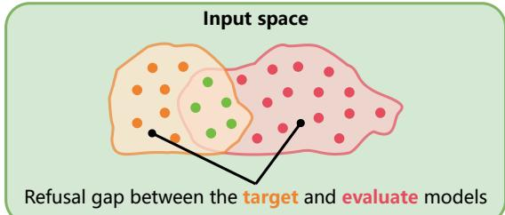  
(a) Refusal Gap.

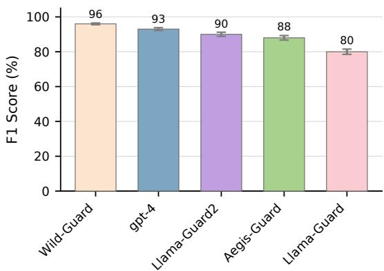  
(b) F1 Score on WildJailbreak.  
Figure 1: Conceptual Illustration of the Refusal Gap. (a) The refusal gap is visualized by contrasting the target model’s refusal region (yellow) with the safety evaluator’s refusal region (red). Green dots indicate consensus. The non-overlapping yellow or red areas represent the refusal gap. (b) The bar chart compares F1 scores of different models and evaluators on refusal identification. Differentiated F1 scores indicate distinct capabilities in correctly identifying refusals.

Crucially, these approaches do not systematically target the discovery and nuanced characterization of refusal gaps—the explicit discrepancies between a model’s autonomous refusal behavior and an external evaluator’s assessment.

To address this specific challenge, we introduce a novel refusal-aware red teaming framework designed to systematically uncover and characterize these refusal gaps. Our methodology employs reinforcement learning to train a dedicated red-teaming LLM tasked with generating test cases that maximize the observable refusal gap. This process involves identifying the target model’s intrinsic refusal tendencies and comparing them against the judgments of external evaluators. The resulting test cases serve as diagnostic tools, enabling a deeper understanding of both the LLM and the evaluator by precisely pinpointing areas of judgmental diver-

gence.

A key innovation of our work is the conceptualization of the refusal gap as a distinct, quantifiable, and critical objective for red teaming. While prior research, such as Perez et al. (2022), pioneered the use of reinforcement learning in red teaming, and CRT (Hong et al., 2024) introduced sophisticated curiosity mechanisms to enhance prompt diversity, our framework uniquely re-envisions these concepts to focus explicitly on the incongruity between model refusal and evaluator adjudication. Directly optimizing for the refusal gap, while targeted, may lead to limited diversity in test cases and can be hindered by sparse reward signals. Therefore, we introduce a hierarchical curiosity-driven mechanism operating on two levels: it primarily rewards prompts that reveal model-evaluator inconsistencies (maximizing the gap), and secondarily encourages exploration of diverse semantic topics and linguistic structures where such gaps manifest. This hierarchical approach prevents the redteaming agent from fixating on trivial or repetitive cases, ensuring a broader discovery of the varied forms the refusal gap can take, thereby enhancing test case diversity while pursuing the primary optimization objective.

In summary, our contributions are threefold:

1. We introduce the concept of the refusal gap to denote the incongruity between an LLM’s refusal behavior and an external safety evaluator’s adjudication. We are the first to systematically operationalize this gap as a primary and quantifiable objective for red teaming.

2. We propose a refusal-aware red teaming methodology leveraging reinforcement learning, specifically focused on maximizing this refusal gap. To facilitate comprehensive discovery, we introduce a hierarchical curiositydriven mechanism that encourages diversity in test cases, designed to unearth varied instances of model-evaluator disagreement.

3. Through rigorous experimentation, we demonstrate that our approach significantly outperforms existing methods in generating diverse test cases that expose inconsistencies between LLMs and safety evaluators.

## 2 Related Works

LLM Alignment. The alignment of large language models (LLMs) with human values and intentions is a critical area of research, especially as LLMs are increasingly deployed in real-world applications with significant safety implications (Christiano et al., 2017). Early approaches to LLM alignment relied on manual analysis and rule-based systems, which proved insufficient to handle the complexity of modern LLMs (Chen et al., 2023). Recently, Reinforcement Learning from Human Feedback (RLHF) has emerged as the dominant paradigm for aligning LLMs with human preferences (Ouyang et al., 2022). The standard RLHF pipeline typically comprises three stages: supervised fine-tuning (Xia et al., 2024), reward modeling (Lambert et al., 2024), and policy optimization, often via Proximal Policy Optimization (PPO) (Schulman et al., 2017). However, the inherent complexity of online preference optimization algorithms (Qi et al., 2024) has prompted research into more efficient offline alternatives that eliminate the need for reward model learning (Zhong et al., 2024). These methods focus on enhancing model behavior and safety through learning from human feedback, a crucial component for aligning LLMs with desired outcomes.

LLM Red Teaming. Red teaming, which involves simulating adversarial attacks to uncover model vulnerabilities, is an essential technique for evaluating LLM safety. These methods range from manual red teaming, in which human experts craft adversarial prompts (Wei et al., 2024), to automated techniques that utilize genetic algorithms (Liu et al., 2023) or red teaming language models (Perez et al., 2022) to generate adversarial inputs. Recent work has highlighted the effectiveness of automated red teaming, particularly in identifying jailbreaking vulnerabilities (Anil et al., 2024). For example, MART combines reward functions and novelty rewards to enhance the diversity and effectiveness of test cases, successfully identifying security flaws in LLMs that have undergone human preference fine-tuning (Ge et al., 2023). Our approach builds upon these automated frameworks but introduces a novel objective that explicitly targets the misalignment between model refusal behavior and safety evaluator judgments. In contrast to prior work, which largely focuses on binary success/failure metrics for jailbreaking, we center on the nuanced discrepancies between the target models behavior´ and safety evaluator expectations.

Refusal Mechanisms in LLMs. Refusal mechanisms play a crucial role in LLM safety, aiming to prevent the generation of harmful or inappropriate content. However, the effectiveness of these mechanisms varies, and robust evaluation methods are needed to assess their performance. Recent studies have explored the role of refusal mechanisms in LLMs. For example, (Zheng et al., 2024) and (Zou et al., 2023a) use contrastive sample pairs (harmful vs. harmless inputs) to analyze how models represent "harmfulness," noting that these representations differ from those of "refusal." The work by (Zheng et al., 2024) also demonstrates that safety prompts can induce shifts in model activations in specific directions. Furthermore, (Li et al., 2024) identifies a "safety pattern" within the neural activations and adjusts refusal behavior by selectively zeroing out neuron activations. Other works have investigated the use of fine-tuning and reinforcement learning to improve refusal behavior (Arditi et al., 2024). Our work extends these works by aiming to evaluate and expose vulnerabilities within refusal mechanisms.

## 3 Method

We introduce a refusal-aware red teaming framework meticulously designed to systematically interrogate the divergence between a target model’s behavioral outputs and its associated safety evaluations. As depicted in Figure 2, our framework leverages specialized red team models to synthesize test cases. This synthesis enables a rigorous identification and characterization of discrepancies between the model’s intrinsic safety mechanisms and the extrinsic assessments provided by external evaluator systems.

## 3.1 Problem Formulation

We first delineate the problem setup before presenting the red teaming objective. We formalize red teaming as a multi-objective optimization problem aimed at systematically mitigating the refusal gap. Given a target Large Language Model (LLM) pθ and a safety evaluator $C _ { \phi }$ , we define the following components:

Refusal Probe. Let $\mathcal { R } \subseteq \mathcal { V }$ denote the set of refusal tokens, including tokens that typically initiate a refusal. For an input prompt x and a generated response $y ,$ the refusal probe $P _ { \mathcal { R } } ( x , y )$ yields a binary decision indicating the presence of any refusal token in y:

$$
P _ { \mathcal { R } } ( x , y ) = \mathbb { I } \left( \exists r \in { \mathcal { R } } \operatorname* { i n } y \right) ,
$$

where $\mathbb { I } ( \cdot )$ is the indicator function, which outputs 1 if a refusal token $r \in \mathcal { R }$ is present in $y ,$ and 0 otherwise. While heuristic substring matching $( \mathrm { e . g . }$ for phrases like "I apologize") can implement this, such methods are often brittle and may not generalize to novel refusal expressions. Therefore, to achieve a more robust assessment, our implementation of $P _ { \mathcal { R } } ( x , y )$ transcends mere token matching by learning to identify refusals from the model’s internal representations. This can be accomplished by:

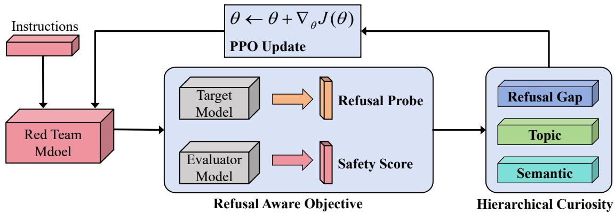  
Figure 2: Refusal-Aware Red Teaming Framework. The diagram depicts the pipeline of our refusal-aware red teaming framework. In this framework, the red teaming model generates test cases derived from specified instructions, which are subsequently assessed by both the target model and a safety evaluator. The refusal probe and safety score serve as metrics to quantify the refusal gap, between the target models responses and the evaluator ´ s´ judgments. Additionally, a hierarchical curiosity mechanism is employed to steer the red teaming model during the PPO training process, facilitating the discovery of a diverse set of effective test cases.

1. Identifying a specific "refusal direction" within the model’s activation space. The model’s propensity to refuse can then be gauged by projecting its hidden state activations onto this direction. A refusal is flagged if this projection surpasses a predetermined threshold. This method leverages findings that refusal behaviors often correlate strongly with a single-dimensional subspace in activations (Arditi et al., 2024).

2. Training a linear classifier on the model’s hidden states $( \mathrm { e . g . }$ , from the final layer). This classifier is trained on a dataset of model responses labeled for refusal versus non-refusal. It learns to predict refusal by discriminating between hidden states that lead to refusal and those that do not, offering a more generalized approach than token-based matching (Xu et al., 2024).

Safety Score. The safety score $s _ { \phi } ( x )$ represents the evaluator’s assessment of the prompt x. The safety evaluator $C _ { \phi }$ processes x and outputs a score $s _ { \phi } ( x ) ~ \in ~ [ 0 , 1 ]$ , where higher values indicate a greater likelihood of unsafe content. A threshold $\tau _ { \phi }$ is used to classify content as either safe or unsafe. Refusal Gap. The refusal gap quantifies the misalignment between a model’s intrinsic safety mechanisms and an evaluator’s extrinsic assessments. It captures both over-refusal and under-refusal scenarios—instances where the model either unnecessarily rejects safe content or fails to reject unsafe content.

Over-refusal occurs when the model’s refusal probe is activated (i.e., $P _ { \mathcal { R } } ( x , y ) = 1 )$ even though the safety evaluator deems the content safe (i.e., $s _ { \phi } ( x ) ~ < ~ \tau _ { \phi } )$ . This scenario is formally encapsulated by the set $\mathcal { G } _ { \oplus }$ . Conversely, under-refusal arises when the refusal probe remains inactive (i.e., $P _ { \mathcal { R } } ( x , y ) = 0 )$ despite the evaluator classifying the content as unsafe $( \mathrm { i } . \mathrm { e } . , s _ { \phi } ( x ) > \tau _ { \phi } )$ , represented by the set $\mathcal { G } _ { \ominus }$ . The refusal gap $\mathcal { G } ( x , y )$ is then defined as:

$$
\begin{array} { r } { \mathcal { G } ( x , y ) = \lambda _ { \oplus } \underbrace { \mathbb { I } ( x \in \mathcal { G } _ { \oplus } ) \cdot ( 1 - s _ { \phi } ( x ) ) } _ { \mathrm { O v e r - r e f u s a l } } } \\ { + \lambda _ { \ominus } \underbrace { \mathbb { I } ( x \in \mathcal { G } _ { \ominus } ) \cdot s _ { \phi } ( x ) } _ { \mathrm { U n d e r - r e f u s a l } } . } \end{array}\tag{1}
$$

The primary objective is to train a red team model $\pi$ to maximize the expected refusal gap, $\mathbb { E } _ { { x } \sim \pi , { y } \sim { p _ { \theta } ( \cdot | x ) } } [ \mathcal { G } ( x , y ) ]$ , subject to quality and diversity constraints. This is achieved using gradient ascent with Proximal Policy Optimization (PPO) (Schulman et al., 2017).

## 3.2 Hierarchical Curiosity Red Teaming

Conventional red teaming methods optimize the policy π by maximizing the reward $\mathbb { E } _ { x \sim \pi , y \sim p _ { \theta } } [ \mathcal { G } ( x ) ]$ through iterative interactions that exploit historical $( x , y )$ pairs. The optimization objective is augmented by a Kullback-Leibler (KL) divergence regularization term $D _ { \mathrm { K L } } ( \pi \Vert \pi _ { \mathrm { r e f } } )$ with respect to a reference policy πref:

$$
\begin{array} { r l r } & { } & { \underset { \pi } { \mathrm { m a x } } \ \mathbb { E } _ { z \sim \mathcal { D } } \mathbb { E } _ { x \sim \pi , y \sim p _ { \theta } ( \cdot \vert x ) } \Bigg [ \mathscr { G } ( x ) - } \\ & { } & { \beta D _ { \mathrm { K L } } \big ( \pi ( \cdot \vert z ) \vert \vert \pi _ { \mathrm { r e f } } ( \cdot \vert z ) \big ) + \underset { \mathrm { D i v e r s i t y } } { \sum } \lambda _ { i } B _ { i } ( x ) \Bigg ] , } \end{array}
$$

where $x \sim \pi ( \cdot | z ) , y \sim p _ { \theta } ( \cdot | x )$ , and $\beta$ controls the regularization strength. Here, z denotes prompts to the red-team model π, sampled from a dataset $\mathcal { D }$

Building upon prior work in novelty-driven exploration (Hong et al., 2024), we identify significant limitations when directly applying these methods to refusal gap optimization. These limitations primarily concern sparse reward signals and inadequate exploration of failure modes. To address these challenges, we introduce a hierarchical curiosity-driven exploration mechanism tailored for optimizing the refusal gap. This mechanism distinguishes itself from general novelty-driven approaches (e.g., CRT (Hong et al., 2024)) by not only incorporating curiosity but also by directly targeting the multifaceted nature of the refusal gap. It achieves this by simultaneously promoting diversity in identified gaps (gap diversity), exploring varied thematic content (topic diversity), and encouraging semantic novelty in test cases. This tripartite strategy facilitates a systematic exploration of the test case space while maintaining linguistic coherence through constrained optimization.

## 3.2.1 Refusal Gap Reward

Prior red teaming research has highlighted the intrinsic challenges in exploring a broad array of failure modes, primarily due to (i) the sparsity of reward signals and (ii) insufficient incentives for systematic exploration (Hong et al., 2024). In response, we introduce a reward mechanism that explicitly targets the refusal gap. This mechanism is designed to address both over-refusal and underrefusal instances while promoting the generation of diverse test cases.

The weights $\lambda _ { \oplus }$ and $\lambda _ { \ominus }$ in Equation 1, corresponding to over-refusal and under-refusal respectively, are determined using an adaptive weighting strategy. These weights are dynamically updated based on the empirical frequencies of over-refusal and under-refusal occurrences within the current batch of size N. Specifically, the update rules are $\begin{array} { r } { \lambda _ { \oplus } = \frac { N } { \sum _ { ( x , y ) } \mathbb { I } ( x \in \mathcal { G } _ { \oplus } ) } } \end{array}$ and $\begin{array} { r } { \lambda _ { \Theta } = \frac { N } { \sum _ { ( x , y ) } \mathbb { I } ( x \in \mathcal { G } _ { \Theta } ) } } \end{array}$ . For instance, if the proportion of test cases triggering over-refusal is low, the system assigns a higher weight to these cases, thereby incentivizing their generation in subsequent iterations. This adaptive mechanism aims to ensure stable gradient updates and foster a comprehensive exploration of the refusal gap.

## 3.2.2 Topic Diversity

To further enhance the diversity of generated test cases, we introduce a topic diversity mechanism that leverages LLM-guided topic analysis. This approach consists of two main components: topic extraction and diversity quantification.

For topic extraction, an LLM $M _ { \mathrm { t o p } }$ processes each test case x to identify its latent topics (Mu et al., 2024):

$$
p _ { x } = \mathrm { T o p } – k \left( M _ { \mathrm { t o p } } ( ^ { \ast } \mathrm { D e r i v e \ t o p i c s \ f r o m } ; ^ { \ast } + x ) \right) .
$$

where k denotes the dimensionality of the extracted topic space.

To quantify topic diversity, we compute a reward function $B _ { \mathrm { t o p } } ( x )$ based on the Jensen-Shannon divergence (JSD) (Menéndez et al., 1997) between topic distributions:

$$
B _ { \mathrm { t o p } } ( x ) = \frac { 1 } { | \mathcal { X } | } \sum _ { x ^ { \prime } \in \mathcal { X } } \mathrm { J S D } ( p _ { x } \| p _ { x ^ { \prime } } ) ,
$$

where $p _ { x }$ and $p _ { x ^ { \prime } }$ represent the normalized topic probability distributions for test cases x and $x ^ { \prime } .$ , respectively, and  denotes the set of existing test cases. This formulation effectively penalizes redundant topic coverage while accommodating test cases that span multiple topics through a principled measure of distributional divergence.

## 4 Experiments

## 4.1 Experimental Setup

Datasets. To facilitate the learning of refusal directions and the training of a linear classifier for refusal probe computation, we utilize two meticulously curated datasets: ${ \mathcal { D } } _ { \mathrm { u n s a f e } }$ and $\mathcal { D } _ { \mathrm { s a f e } }$ . The $\mathcal { D } _ { \mathrm { u n s a f e } }$ dataset comprises harmful instructions derived from established benchmarks, including AD-VBENCH (Zou et al., 2023b), MALICIOUSIN-STRUCT (Huang et al., 2023), TDC2023 (Mazeika et al., 2023), and HARMBENCH (Mazeika et al., 2024). Conversely, $\mathcal { D } _ { \mathrm { s a f e } }$ consists of benign instructions extracted from ALPACA (Chen et al., 2023), employing stratified sampling to ensure comprehensive coverage of diverse instruction types. The red teaming instructions adhere to the experimental protocol delineated in (Perez et al., 2022).

Evaluation Metrics. We assess red teaming effectiveness using two complementary metrics: generation quality and test case diversity. Generation quality quantifies the model’s proficiency in identifying safety misalignments, calculated as the intersectionover-union (IoU) between target test cases and all generated test cases. For a given red team model π and target LLM p, we evaluate the concordance between model-generated refusal responses and independent safety scores. This evaluation employs state-of-the-art harmfulness detection models, such as RoBERTa and WildGuard, which assign harmfulness probabilities to each response y. A response is classified as harmful if its harmfulness probability surpasses a calibrated threshold $\tau \in [ 0 , 1 )$ . This quality metric is computed over the entire corpus of test cases x generated throughout the training process, thereby providing a holistic assessment of model performance.

To ensure comprehensive coverage of potential vulnerabilities, the quality assessment is augmented with a diversity metric that evaluates test case variation across the attack surface. Our diversity evaluation utilizes dynamic thresholding, wherein test cases are assessed at multiple harmfulness levels. For each threshold $\tau _ { \ast }$ , we construct a qualified test set $\mathcal { X } _ { \tau } = \{ x _ { i } \ | \ \mathcal { G } ( y _ { i } ) \ge \tau , \forall i \in$ $[ 1 , N ] \}$ , comprising examples that elicit toxic responses exceeding said threshold. The diversity of these sets is quantified using two metrics: Self-BLEU scores, which capture lexical and structural variations, and BERT sentence embedding distances, which measure semantic diversity in attack patterns. Consistent with established practices in natural language generation evaluation (Perez et al., 2022; Hong et al., 2024), our SelfBLEU analysis incorporates n-grams $( n \in \{ 2 , 3 , 4 , 5 \} )$ ) to furnish a nuanced evaluation of textual diversity across multiple linguistic strata.

Baselines. To demonstrate the efficacy of integrating curiosity rewards into red team model training via reinforcement learning, we compare our approach against several baseline methods from prior work (Perez et al., 2022) and recent studies (Casper et al., 2023; Hong et al., 2024): Zeroshot (Perez et al., 2022), Few-shot (Perez et al., 2022), RL (Perez et al., 2022), $R L + T D i \nu$ (Casper et al., 2023), and RL + Curiosity (Hong et al., 2024). Implementation details for these baselines are relegated to the supplementary material. Our proposed method, termed RL+HCuriosity, trains the red team model π using a synergistic combination of reward signals, a KL penalty, and hierarchical curiosity rewards, as elaborated in Section 3. For all reinforcement learning-based methods (RL, RL+TDiv, RL+Curiosity, and RL+HCuriosity), we employ proximal policy optimization (PPO) (Schulman et al., 2017) to train the red team model $\pi$ . We initialize π with an uncensored LLaMA-3-8B-Lexic-Uncensored model, subsequently designated as the reference model $\pi _ { \mathrm { r e f } }$ within the optimization objective. This LLaMA-3 8B variant is fine-tuned without content filtering to promote effective exploration of potential vulnerabilities. All experiments were conducted on 8 NVIDIA A100 GPUs, each equipped with 80GB of memory.

## 4.2 Experimental Results

Analysis of Model-Evaluator Gap. Effective test cases must elicit harmful responses from both the target LLM and the safety evaluator. We first investigate the average refusal probe output from the target model, the average safety score from the evaluator, and the IoU for valid test cases generated by RL+HCuriosity. Our findings indicate that the efficacy of test cases produced by our hierarchical curiosity-driven red teaming approach demonstrates a concave relationship with the threshold $\tau ,$ where higher IoU signifies superior performance. This suggests that the quality of hierarchical curiosity-driven exploration is intrinsically constrained by the evaluator’s threshold. Figure 3 illustrates that the Refusal Direction mechanism achieves higher IoU peaks compared to the Linear CLS approach, implying that Refusal Direction more accurately captures the target model’s inherent safety refusal mechanisms. This phenomenon may be attributed to the Linear CLS’s propensity to overfit the training data, thereby generating misaligned reward signals that curtail the red team model’s capacity to uncover inputs eliciting diverse responses from the target model. Although the CLS approach exhibits lower IoU peaks than the LLM Evaluator, it maintains more stable performance around these peak values. This suggests that LLM Evaluators, trained on extensive datasets, provide more precise reward signals. Collectively, Figure 3 substantiates that hierarchical curiosity-driven exploration enhances red teaming quality.

Safety Threshold $\tau _ { \phi }$  
(c)  
(c)  
(a)  
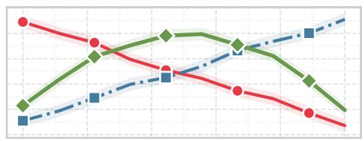

(b)  
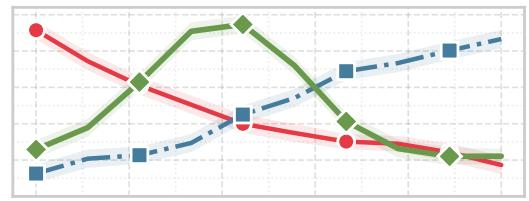

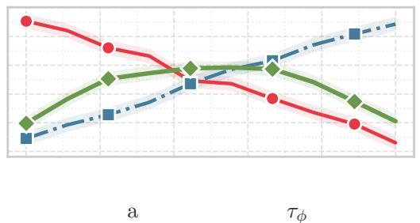

(d)  
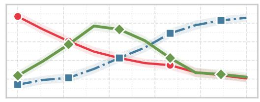  
Figure 3: Qualitative examples of generated red teaming prompts and corresponding target model responses, illustrating the red teaming process and the diversity of the generated prompts.

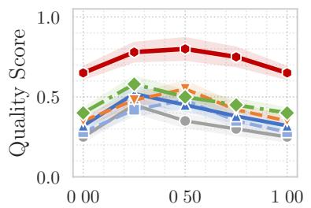

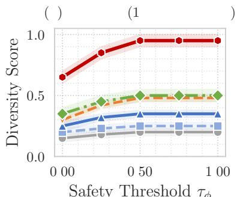

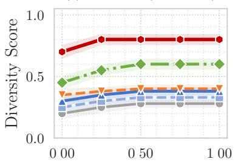  
Figure 4: Performance Comparison of Red Teaming Methods. Quantitative evaluation of various approaches across generation quality (IoU) and diversity metrics (1-cos and 1-SelfBLEU), underscoring the superior performance of our RL+HCuriosity method.

Performance of Refusal-Aware Red Teaming. We conduct red teaming experiments to evaluate both generation quality and test case diversity concerning the refusal gap. The refusal direction mechanism is employed to identify internal refusal behaviors in the target model, with WildGuard serving as the safety evaluator. The IoU metric is utilized for generation quality assessment, while 1-cos and 1-SelfBLEU metrics are employed to evaluate test case diversity. Our results demonstrate that the RL+HCuriosity red teaming method surpasses alternative approaches in both generation quality and diversity. These findings imply that methods focusing solely on maximizing the embedding diversity of target model responses (TDiv) or those reliant on rudimentary curiosity exploration (Curiosity) are inadequate in sparse reward environments. This underscores the efficacy of our hierarchical approach. Overall, Figure 4 validates the effectiveness of hierarchical curiosity-driven exploration in enabling red team models to generate both effective and diverse test cases.

Effects of Initial Red Teaming Model. The choice of the initial red team model is pivotal in modulating the diversity of generated test cases. Large Language Models (LLMs) that have not undergone alignment or supervised fine-tuning typically yield more varied and unconstrained outputs. We compared our RL+HCuriosity method when initialized with an unaligned LLM, as depicted in Figure 6. Our experiments utilized the unaligned LLaMA-3-8B with a temperature setting of 0.7, consistent

$$
\left. \begin{array} { l l l l } { { - \bullet - \mathrm { N o n e } } } & { { - \bullet - \mathrm { C o s } } } & { { - \bullet - \mathrm { S B } + \mathrm { C o s } } } & { { - \bullet - \mathrm { C o s } + \mathrm { T o p } } } \\ { { - \bullet = \mathrm { S B } } } & { { - \Psi - \mathrm { T o p } } } & { { - \bullet - \mathrm { S B } + \mathrm { T o p } } } & { { - \bullet - \mathrm { S B } + \mathrm { C o s } + \mathrm { T o p } } } \end{array} \right.
$$

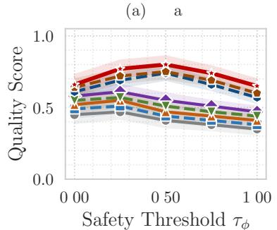

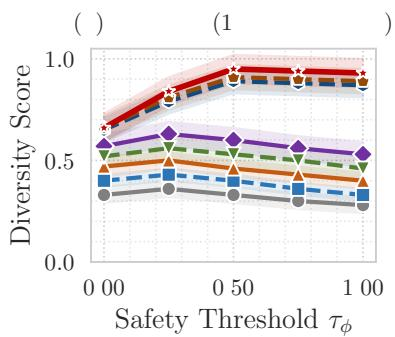

(c)  
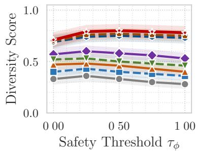

Figure 5: Ablation Study of Reward Components. Analysis of the contributions of individual reward terms (SelfBLEU, cosine similarity, and topic diversity) to overall performance, measured by generation quality and diversity metrics.  
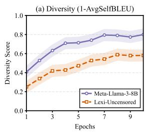

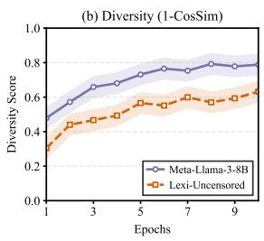  
Figure 6: Impact of Initial Model Selection. Performance comparison between aligned and unaligned initial red teaming models, highlighting the advantages of unaligned models for augmenting test case diversity.

with the configuration employed for LLaMA-3- 8B-Lexic-Uncensored. The results confirm that employing an unaligned model substantially augments test case diversity.

Effects of Individual Reward Terms. Figure 5 presents an analysis of the individual and combined effects of each reward term on diversity generation. The SelfBLEU reward mitigates surface-level text repetition and, unexpectedly, enhances semantic diversity within the embedding space. This observation indicates that the SelfBLEU reward improves diversity at both lexical and semantic levels. The cosine similarity reward further augments semantic diversity by constraining the distribution of generated text in the semantic space. The topic diversity reward exerts the most substantial impact on overall diversity, emphasizing the criticality of broad topic coverage. When amalgamated with SelfBLEU and cosine similarity rewards, the topic diversity reward engenders significant additive gains, promoting topic expansion, lexical innovation, and semantic differentiation. Ultimately, the model integrating all three reward components achieves the most comprehensive diversity performance while preserving robust generation quality. This demonstrates the efficacy of a multi-level reward synergy mechanism, wherein decomposing diversity into lexical, semantic, and topical dimensions and formulating targeted reward functions can surmount the limitations inherent in single-metric optimization.

## 5 Conclusion

This paper introduces Refusal-Aware Red Teaming, a novel automated framework for evaluating the safety of large language models (LLMs). Our framework addresses a critical challenge in assessing the Refusal Gap by formalizing it as a quantifiable metric. This establishes a pioneering red teaming methodology for probing model safety boundaries. The proposed hierarchical, curiositydriven mechanism, which integrates collaborative exploration rewards across the Refusal Gap, topic, and semantic dimensions, significantly mitigates performance bottlenecks inherent in traditional reinforcement learning (RL)-based red teaming, particularly within sparse reward contexts. Experimental validation demonstrates that our approach substantially surpasses existing baselines in generating high-quality, diverse test cases, markedly improving the elicitation of refusal responses. Consequently, this framework provides a systematic means to evaluate and bolster LLM safety, paving the way for more robust and dependable AI systems.

## Limitations

Our methodology, while effective, presents certain limitations. First, its efficacy is contingent upon the safety evaluation model (Evaluator) used to assess generated content. The Evaluator itself may possess inherent limitations, especially when confronted with adversarially generated harmful queries. In such instances, the Evaluator might yield false positives or negatives, thereby failing to accurately identify potential risks. Ensuring the generalization capability of the Evaluator, particularly in the face of evolving adversarial attacks, remains a significant technical challenge. The robustness and accuracy of the Evaluator are areas requiring ongoing research and improvement. Future work could explore the integration of multiple Evaluator models, potentially leveraging ensemble learning techniques, or incorporate human-inthe-loop review processes to enhance evaluation accuracy and reliability.

Second, our research primarily focuses on textbased large language models and has not yet extended to the evaluation of multimodal models. With the increasing prevalence of multimodal models, such as GPT-4V, assessing and red teaming their safety is of paramount importance. Crossmodal red teaming introduces new challenges, including the effective integration of diverse modalities (e.g., images, audio, video) and the design of adversarial attacks specifically targeting multimodal architectures. Future research should endeavor to expand our framework to address the safety evaluation requirements of these increasingly complex multimodal systems.

## Ethical Considerations

This research aims to enhance LLM safety evaluation through automated red teaming, thereby contributing to the development of safer and more reliable AI systems. We utilize publicly accessible datasets and are committed to open-sourcing our code to foster community advancement and reproducibility. We acknowledge the potential dual-use risks associated with red teaming technologies and advocate for transparency, standardization, and the establishment of clear ethical guidelines within AI safety research. Through these efforts, we aim to ensure the responsible application of these technologies and contribute to the development of more comprehensive AI safety evaluation standards and processes.

## References

Cem Anil, Esin Durmus, Nina Rimsky, Mrinank Sharma, Joe Benton, Sandipan Kundu, Joshua Batson, Meg Tong, Jesse Mu, Daniel J Ford, et al. 2024. Many-shot jailbreaking. In The Thirty-eighth Annual Conference on Neural Information Processing Systems.

Andy Arditi, Oscar Obeso, Aaquib Syed, Daniel Paleka, Nina Panickssery, Wes Gurnee, and Neel Nanda. 2024. Refusal in language models is mediated by a single direction. arXiv preprint arXiv:2406.11717.

Stephen Casper, Jason Lin, Joe Kwon, Gatlen Culp, and Dylan Hadfield-Menell. 2023. Explore, establish, exploit: Red teaming language models from scratch. arXiv preprint arXiv:2306.09442.

Lichang Chen, Shiyang Li, Jun Yan, Hai Wang, Kalpa Gunaratna, Vikas Yadav, Zheng Tang, Vijay Srinivasan, Tianyi Zhou, Heng Huang, et al. 2023. Alpagasus: Training a better alpaca with fewer data. arXiv preprint arXiv:2307.08701.

Paul F Christiano, Jan Leike, Tom Brown, Miljan Martic, Shane Legg, and Dario Amodei. 2017. Deep reinforcement learning from human preferences. Advances in neural information processing systems, 30.

Deep Ganguli, Liane Lovitt, Jackson Kernion, Amanda Askell, Yuntao Bai, Saurav Kadavath, Ben Mann, Ethan Perez, Nicholas Schiefer, Kamal Ndousse, et al. 2022. Red teaming language models to reduce harms: Methods, scaling behaviors, and lessons learned. arXiv preprint arXiv:2209.07858.

Suyu Ge, Chunting Zhou, Rui Hou, Madian Khabsa, Yi-Chia Wang, Qifan Wang, Jiawei Han, and Yuning Mao. 2023. Mart: Improving llm safety with multi-round automatic red teaming. arXiv preprint arXiv:2311.07689.

Zhang-Wei Hong, Idan Shenfeld, Tsun-Hsuan Wang, Yung-Sung Chuang, Aldo Pareja, James Glass, Akash Srivastava, and Pulkit Agrawal. 2024. Curiositydriven red teaming for large language models. arXiv preprint arXiv:2402.19464.

Yangsibo Huang, Samyak Gupta, Mengzhou Xia, Kai Li, and Danqi Chen. 2023. Catastrophic jailbreak of open-source llms via exploiting generation. arXiv preprint arXiv:2310.06987.

Nathan Lambert, Valentina Pyatkin, Jacob Morrison, LJ Miranda, Bill Yuchen Lin, Khyathi Chandu, Nouha Dziri, Sachin Kumar, Tom Zick, Yejin Choi, et al. 2024. Rewardbench: Evaluating reward models for language modeling. arXiv preprint arXiv:2403.13787.

Jan Leike, David Krueger, Tom Everitt, Miljan Martic, Vishal Maini, and Shane Legg. 2018. Scalable agent alignment via reward modeling: a research direction. arXiv preprint arXiv:1811.07871.

Tianlong Li, Xiaoqing Zheng, and Xuanjing Huang. 2024. Rethinking jailbreaking through the lens of representation engineering. ArXiv preprint, abs/2401.06824.

Kaiqu Liang, Haimin Hu, Ryan Liu, Thomas L Griffiths, and Jaime Fernández Fisac. 2025. Rlhs: Mitigating misalignment in rlhf with hindsight simulation. arXiv preprint arXiv:2501.08617.

Xiaogeng Liu, Nan Xu, Muhao Chen, and Chaowei Xiao. 2023. Autodan: Generating stealthy jailbreak prompts on aligned large language models. arXiv preprint arXiv:2310.04451.

Mantas Mazeika, Dan Hendrycks, Huichen Li, Xiaojun Xu, Sidney Hough, Andy Zou, Arezoo Rajabi, Qi Yao, Zihao Wang, Jian Tian, et al. 2023. The trojan detection challenge. In NeurIPS 2022 Competition Track, pages 279–291. PMLR.

Mantas Mazeika, Long Phan, Xuwang Yin, Andy Zou, Zifan Wang, Norman Mu, Elham Sakhaee, Nathaniel Li, Steven Basart, Bo Li, et al. 2024. Harmbench: A standardized evaluation framework for automated red teaming and robust refusal. arXiv preprint arXiv:2402.04249.

María Luisa Menéndez, JA Pardo, L Pardo, and MC Pardo. 1997. The jensen-shannon divergence. Journal ofthe Franklin Institute, 334(2):307–318.

Yida Mu, Chun Dong, Kalina Bontcheva, and Xingyi Song. 2024. Large language models offer an alternative to the traditional approach of topic modelling. arXiv preprint arXiv:2403.16248.

Humza Naveed, Asad Ullah Khan, Shi Qiu, Muhammad Saqib, Saeed Anwar, Muhammad Usman, Naveed Akhtar, Nick Barnes, and Ajmal Mian. 2023. A comprehensive overview of large language models. arXiv preprint arXiv:2307.06435.

Jonathan Nöther, Adish Singla, and Goran Radanovic. 2025. Text-diffusion red-teaming of large language models: Unveiling harmful behaviors with proximity constraints. In Proceedings ofthe AAAI Conference on Artificial Intelligence, volume 39, pages 27547– 27555.

Long Ouyang, Jeffrey Wu, Xu Jiang, Diogo Almeida, Carroll Wainwright, Pamela Mishkin, Chong Zhang, Sandhini Agarwal, Katarina Slama, Alex Ray, et al. 2022. Training language models to follow instructions with human feedback. Advances in neural information processing systems, 35:27730–27744.

Ethan Perez, Saffron Huang, Francis Song, Trevor Cai, Roman Ring, John Aslanides, Amelia Glaese, Nat McAleese, and Geoffrey Irving. 2022. Red teaming language models with language models. arXiv preprint arXiv:2202.03286.

Biqing Qi, Pengfei Li, Fangyuan Li, Junqi Gao, Kaiyan Zhang, and Bowen Zhou. 2024. Online dpo: Online direct preference optimization with fast-slow chasing. arXiv preprint arXiv:2406.05534.

John Schulman, Filip Wolski, Prafulla Dhariwal, Alec Radford, and Oleg Klimov. 2017. Proximal policy optimization algorithms. arXiv preprint arXiv:1707.06347.

Alexander Wei, Nika Haghtalab, and Jacob Steinhardt. 2024. Jailbroken: How does llm safety training fail? Advances in Neural Information Processing Systems, 36.

Mengzhou Xia, Sadhika Malladi, Suchin Gururangan, Sanjeev Arora, and Danqi Chen. 2024. Less: Selecting influential data for targeted instruction tuning. arXiv preprint arXiv:2402.04333.

Zhihao Xu, Ruixuan Huang, Changyu Chen, and Xiting Wang. 2024. Uncovering safety risks of large language models through concept activation vector. In The Thirty-eighth Annual Conference on Neural Information Processing Systems.

Jinchuan Zhang, Yan Zhou, Yaxin Liu, Ziming Li, and Songlin Hu. 2024. Holistic automated red teaming for large language models through top-down test case generation and multi-turn interaction. arXiv preprint arXiv:2409.16783.

Andrew Zhao, Quentin Xu, Matthieu Lin, Shenzhi Wang, Yong-Jin Liu, Zilong Zheng, and Gao Huang. 2025. Diver-ct: Diversity-enhanced red teaming large language model assistants with relaxing constraints. In Proceedings of the AAAI Conference on Artificial Intelligence, volume 39, pages 26021– 26030.

Chujie Zheng, Fan Yin, Hao Zhou, Fandong Meng, Jie Zhou, Kai-Wei Chang, Minlie Huang, and Nanyun Peng. 2024. Prompt-driven llm safeguarding via directed representation optimization. arXiv preprint arXiv:2401.18018.

Han Zhong, Guhao Feng, Wei Xiong, Xinle Cheng, Li Zhao, Di He, Jiang Bian, and Liwei Wang. 2024. Dpo meets ppo: Reinforced token optimization for rlhf. arXiv preprint arXiv:2404.18922.

Andy Zou, Long Phan, Sarah Chen, James Campbell, Phillip Guo, Richard Ren, Alexander Pan, Xuwang Yin, Mantas Mazeika, Ann-Kathrin Dombrowski, et al. 2023a. Representation engineering: A topdown approach to ai transparency. arXiv preprint arXiv:2310.01405.

Andy Zou, Zifan Wang, Nicholas Carlini, Milad Nasr, J Zico Kolter, and Matt Fredrikson. 2023b. Universal and transferable adversarial attacks on aligned language models. arXiv preprint arXiv:2307.15043.