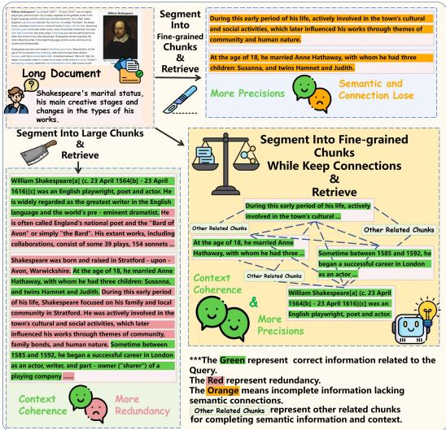
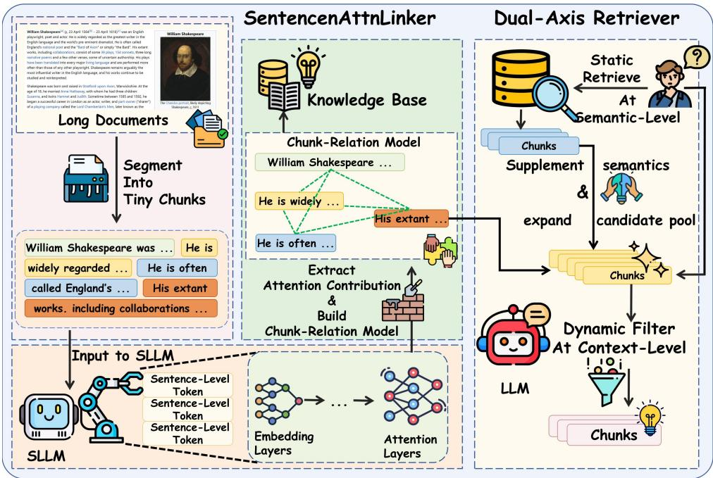
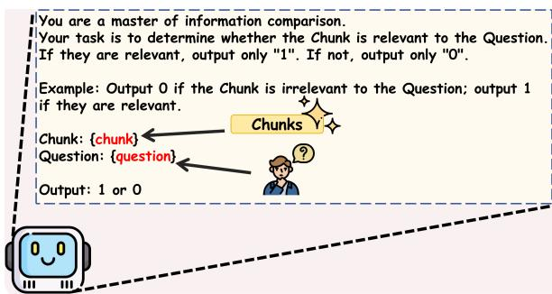
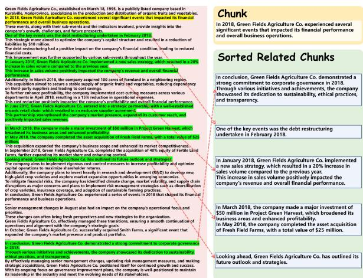
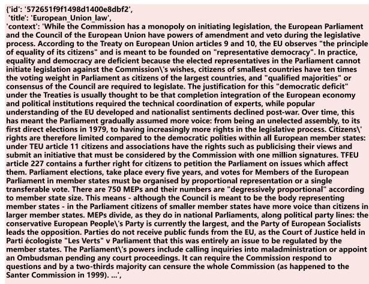
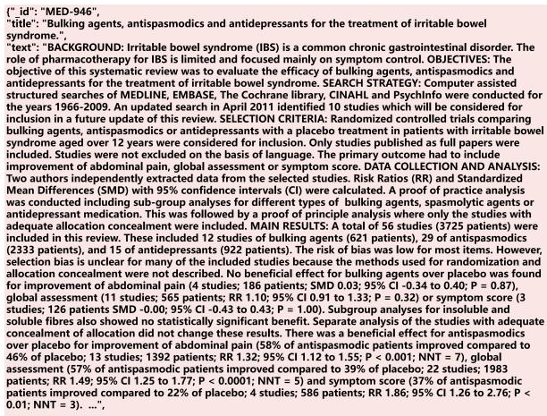
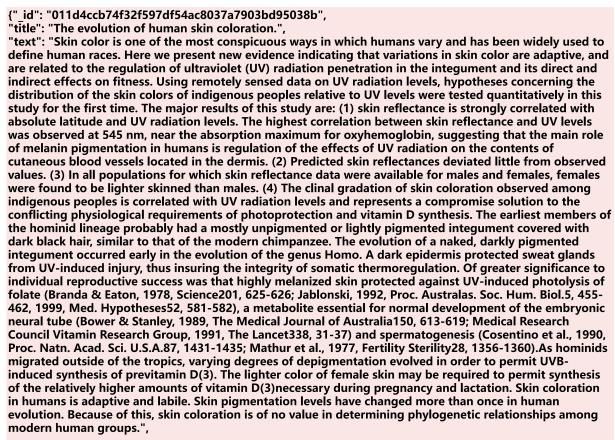

# SAKI-RAG: Mitigating Context Fragmentation in Long-Document RAG via Sentence-level Attention Knowledge Integration

Wenyu Tao1, Xiaofen Xing1∗, Zeliang Li1, Xiangmin Xu2,1

1School of EE., South China University of Technology, Guangzhou, China

2Foshan University, Foshan, China

eetaowenyu@mail.scut.edu.cn, zeliang0li@163.com, {xfxing, xmxu}@scut.edu.cn

## Abstract

Traditional Retrieval-Augmented Generation (RAG) frameworks often segment documents into larger chunks to preserve contextual coherence, inadvertently introducing redundant noise. Recent advanced RAG frameworks have shifted toward finer-grained chunking to improve precision. However, in long-document scenarios, such chunking methods lead to fragmented contexts, isolated chunk semantics, and broken inter-chunk relationships, making cross-paragraph retrieval particularly challeng ing. To address this challenge, maintaining granular chunks while recovering their intrinsic semantic connections, we propose SAKI-RAG (Sentence-level Attention Knowledge Integration Retrieval-Augmented Generation). Our framework introduces two core components: (1) the SentenceAttnLinker, which constructs a semantically enriched knowledge repository by modeling inter-sentence attention relationships, and (2) the Dual-Axis Retriever, which is designed to expand and filter the candidate chunks from the dual dimensions of semantic similarity and contextual relevance. Experimental results across four datasets—Dragonball, SQUAD, NFCORPUS, and SCI-DOCS demonstrate that SAKI-RAG achieves better recall and precision compared to other RAG frameworks in long-document retrieval scenarios, while also exhibiting higher information efficiency.

## 1 Introduction

RAG, initially proposed by Lewis et al. (2021), was designed to enhance LLMs’ performance in domain-specific tasks and mitigate hallucinations (Augenstein et al., 2023; Huang et al., 2025). Its core mechanism involves dynamically retrieving relevant text chunks from external knowledge bases to supplement LLMs, thereby overcoming the limitations of static training data dependency.

  
Figure 1: In long-document cross-paragraph retrieval, Large Chunks ensure context coherence but add redundancy. Fine-grained Chunks offer more precision but risk semantic and informational loss. The solution is to balance both, keeping chunks fine-grained yet interconnected.

As LLMs increasingly handle complex tasks involving long documents, directly inputting entire documents as context becomes impractical (Jin et al., 2024). Consequently, RAG techniques are employed to split long documents into chunks and precisely recall relevant ones for high - quality answers. Traditional frameworks like Naive RAG use fixed length or regularized document splitting, storing chunks in local vector databases via embedding models and retrieving them through methods like BM25 (Robertson et al., 1996) or cosine similarity (Zhang et al., 2020). Recent RAG frameworks have evolved with various innovative approaches. For instance, Late-Chunking (Günther et al., 2024) adopts an "embedding then chunking" strategy, allowing each chunk to retain contextual information in its embeddings. Meta-Chunking (Zhao et al., 2024) dynamically determines chunk sizes by using LLMs with Margin Sampling (MSP) Chunking or Perplexity (PPL) Chunking. Dense X Retrieval (DXR) (Chen et al., 2024) decomposes text into finer units called propositions. The RAPTOR framework (Sarthi et al., 2024) treats each chunk as a leaf node and constructs a tree-structured knowledge base through bottom-up soft clustering and summarization. Frameworks like GraphRAG (Edge et al., 2024), LightRAG (Guo et al., 2025), and nano-GraphRAG (gusye1234, 2024) extract entities from chunks and connect them using a graph structure. However, these methods struggle with long documents. Larger chunks provide more information but lack precision, while smaller chunks offer precision but lose information and connections, as shown in Figure 1.

  
Figure 2: Framework of SAKI-RAG.

To address the aforementioned issues, we propose SAKI-RAG, which consists of two components: SentenceAttnLinker and Dual-Axis Retrieval. In the SentenceAttnLinker component, we adopt the SLLM proposed by An et al. (2024) as a critical module. The SLLM operates at the sentence level rather than the token level, implemented through a Sentence Variational Autoencoder (Sentence-VAE) integrated by reconstructing the input and output layers of a standard LLM. After segmenting the entire document into finegrained chunks, we feed them collectively into the SLLM. Since the SLLM processes text at the sentence level, its capacity to handle long-document content is significantly enhanced. We then compute attention contributions between sentences using the self-attention layer weights of the SLLM, thereby modeling inter-sentence correlations. In the Dual-Axis Retriever component, we retrieve and filter chunks through two dimensions. Initially, we perform retrieval at the semantic similarity dimension using static methods to swiftly identify relevant chunks. Then, we expand the candidate pool by incorporating chunks relevant at the contextual relevance dimension, as determined by the SentenceAttnLinker phase. Meanwhile, we bring in the LLM’s deep semantic reasoning capability to dynamically filter chunks according to the user’s question. This approach alleviates the negative optimization issues in reranking caused by the semantic deficiencies in fine-grained chunks.

To demonstrate the superiority of our framework, we conducted experiments on the Dragonball (Zhu et al., 2025), SQUAD (Rajpurkar et al., 2016), NF-CORPUS (Boteva et al., 2016), and SCI-DOCS (Cohan et al., 2020) datasets which are filtered. The evaluation metrics used were Recall@k (Musgrave et al., 2020), Precision@k, and Information-Efficiency@k(IE@k). The experimental results indicate that, compared to other RAG frameworks, our proposed framework achieves better performance in long-document retrieval scenarios.

Main contributions of this paper are as follows:

(1)We present SentenceAttnLinker, which leverages the attention contributions of sentence-level tokens from SLLM to build a chunk-relation model. This effectively avoids the gap between word-level tokens and sentence-level semantics.

(2)We propose Dual-Axis Retriever, which combines static and dynamic methods to retrieve and filter chunks across two dimensions—semantic similarity and contextual relevance—according to users’ questions.

(3)Our framework delivers excellent performance on the Dragonball, SQUAD, NFCORPUS, and SCI-DOCS datasets. It demonstrates remarkable recall and precision along with superior information efficiency.

## 2 Related Work

As LLM advances, their comprehension and generation abilities have improved. Yet, they still make factual errors in specialized domains (Zhao et al., 2025), necessitating the inclusion of relevant information as context alongside questions. However, with growing complexity of tasks and the increasing prevalence of long documents, using an entire long document as context is impractical, leading to issues like model input limitations and loss of attention focus.

Langchain1 (Chase, 2024) provides various traditional chunking strategies, such as RecursiveCharacterTextSplitter and Character-TextSplitter. These methods, which split documents based on fixed lengths or rules, are better suited for scenarios where precision and context coherence are not critical. They struggle with complex questions in longdocument settings.

Late-Chunking, a popular RAG framework, adopts an "embed-then-chunk" strategy. This approach maintains chunk fine-grained while incorporating context into each chunk’s embedding vector through average pooling. Nevertheless, long documents, with their excessive tokens, often exceed the embedding model’s input limit. This requires batch processing, which can lead to context fragmentation. Additionally, the high volume of tokens may dilute the informational density of the embeddings.

Meta-Chunking integrates LLMs with MSP Chunking and PPL Chunking to dynamically control chunk size for better context coherence. However, when relevant information is dispersed across the text, this method may truncate necessary details.

Dense X Retrieval focuses on decomposing text into fine-grained propositions, each encapsulating a unique factual element. While innovative, DXR may struggle to capture the complex relationships and overall semantics within long documents, as it processes each proposition independently.

To address these challenges, some RAG frameworks are exploring ways to link chunks. RAP-TOR, for instance, constructs a tree structure from chunks as leaf nodes through soft clustering and summarization. However, this approach treats all chunks within a cluster as equivalent, and smaller chunks can result in weaker, more easily confused semantic information.

Frameworks such as GraphRAG, LightRAG and nano-GraphRAG organize chunks into a graph structure. However, large chunks may introduce redundancy, causing the LLM to become "lost in the middle (Liu et al., 2023)," while small chunks might lack key entity information, thereby affecting the quality of the generated graph.

## 3 SAKI-RAG

In this section, we will introduce in Section 3.1 how SentenceAttnLinker utilizes SLLM to calculate the attention contributions between chunks for chunk-relation model, as well as how Dual-Axis Retriever performs static and dynamic retrieval and filtering in the knowledge base with sentence-level relevance metadata built by SentenceAttnLinker to obtain the most relevant chunks. The framework is shown in Figure 2.

## 3.1 SentenceAttnLinker

Most LLMs primarily use word-level tokens, focusing on word-to-word attention relationships and employing self-attention mechanisms (Vaswani et al., 2023) to capture complex word dependencies in text sequences. Inspired by this, we aim to apply attention mechanisms to discovering relationships between chunks. However, employing popular embedding models like BGE-M3 (Chen et al., 2023) – originally designed for word-level semantic interactions through attention mechanisms – to establish sentence-level relationships introduces gap. The SLLM proposed by An et al. (2024) offers a useful tool to bridge this gap. In SLLM, training and encoding are sentence-level-token-based, allowing long documents to be processed in one go. Since it uses sentence-level rather than word-level tokens, input token limits are rarely exceeded. Moreover, SLLM’s attention layers are better suited for sentence-level tokens processing. In SentenceAttnLinker, we extract certain layers from SLLM as a core component to build a Chunk-Relation Model and local knowledge base.

After cleaning the long document, we use a regularization tool to quickly chunk the long document into fine-grained chunks. The resulting collection of sentences is denoted as ${ \cal S } = \{ s _ { 1 } , s _ { 2 } , . . . , s _ { n } \}$ . We then employ the SentenceVAE encoder to generate sentence vectors $\{ \Omega _ { i } \}$ which is determined by the following formula:

$$
\Omega _ { i } = { \it S e n t e n c e V A E } - { \it E n c o d e r } ( s _ { i } ) ,\tag{1}
$$

where $\Omega _ { i } \in R ^ { d }$ , d is the hidden layer dimension.

After adding positional encoding to the vector sequence $\{ \Omega _ { i } \}$ to create initial hidden states and inputting them into the SLLM, we compute, for each layer l of the LLM and each attention head $h ,$ the query matrix $\mathbf { Q } ^ { ( l , h ) }$ and key matrix $\mathbf { K } ^ { ( l , h ) }$ . The attention weight matrix is generated via Softmax:

$$
\mathrm { A t t n } ^ { ( l , h ) } = \mathrm { s o f t m a x } \left( \frac { \mathbf { Q } ^ { ( l , h ) } ( { \mathbf { K } ^ { ( l , h ) } } ) ^ { \top } } { \sqrt { d } } \right) \in \mathbb { R } ^ { n \times n }\tag{2}
$$

Ultimately, we obtain attention contribution matrix $A \in \mathbb { R } ^ { n \times n }$ , which serves as the chunk-relation model. Here, $A _ { i j }$ represents the attention contribution of sentence $s _ { i }$ to sj :

$$
A _ { i j } = \frac { 1 } { L \cdot H } \sum _ { l = 1 } ^ { L } \sum _ { h = 1 } ^ { H } \mathrm { A t t n } _ { i j } ^ { ( l , h ) } ,\tag{3}
$$

where L is the number of LLM layers, and H is the number of attention heads per layer.

For each sentence $s _ { i } .$ , extract the corresponding attention contribution row $A _ { i }$ , sort related chunks in descending order to get $\{ s _ { i _ { 1 } } , s _ { i _ { 2 } } , s _ { i _ { 3 } } , . . . \}$ , and record the weights. The final storage structure is:

$$
\begin{array} { c } { { M e t a d a t a [ s _ { i } ] = [ ( s _ { i _ { 1 } } , A _ { i , i _ { 1 } } ) , } } \\ { { { } } } \\ { { ( s _ { i _ { 2 } } , A _ { i , i _ { 2 } } ) , } } \\ { { { } } } \\ { { ( s _ { i _ { 3 } } , A _ { i , i _ { 3 } } ) , \ldots ] } } \end{array}\tag{4}
$$

The sentence vectors $\{ \Omega _ { i } \}$ are stored in a vector database along with the above metadata, forming an efficient semantic index for retrieval.

## 3.2 Dual-Axis Retriever

Traditional RAG often directly uses BM25, cosine similarity retrieval, and other retrieval strategies to retrieve chunks, and then screens them through a Rerank Model to obtain the final Topk chunks. However, chunk size poses a problem. Large chunks, while including more information, bring in redundancy that dilutes or overshadows key details. Fine-grained chunks, though offering higher precision, lose contextual links and semantic information, like subject terms. Thus, searching and filtering solely based on semantic similarity may not identify the chunks most relevant to the user’s question.

Popular RAG frameworks use LLMs to determine chunk relevance to the question after retrieving chunks. But fine-grained chunks, often missing subjects and other key information, make it hard for LLMs to accurately assess their relevance.

To address these issues, we propose a Dual-Axis Retriever that combines static retrieval and dynamic filtering. This ensures retrieved chunks have both semantic similarity and contextual relevance to the user’s question.

Algorithm 1: Dual-Axis Retriever   
Input: Query Q, Vector DB V, LLM M,   
Reranker R, Top\_k   
Output: Retrieved chunks F   
1 $C _ { \mathrm { i n i t } }  V$ .search(Q, Top\_k) // Static   
semantic retrieve   
2 $C _ { \mathrm { f i l t } }  \emptyset$   
3 for $c \in C _ { \mathrm { i n i t } }$ do   
4 Rc parse(c.meta["related"])   
// Get related chunks   
5 for $r \in R _ { c }$ do   
6 k c.content r   
7 p “Determine relevance: //   
Knowledge: $k _ { c }$   
// Question: Q   
// Output: $1 / \theta ^ { \prime \prime }$   
8   
9 if M(p) = 1 then   
10 Cfilt Cfilt kc   
11 end if   
12 end for   
13 end for   
14 F R.rerank(Cfilt, Q, Top\_k)   
// Context-aware ranking   
15 return F   
16 Description: V.search( ) refers to using   
retrieve methods such as BM25 and cosine   
similarity to retrieve chunks.

Given a user query q, it is embedded into a vector. Cosine similarity is used to retrieve an initial candidate set $C _ { \mathrm { i n i t } }$ from the vector library created by the SentenceAttnLinker component:

<table><tr><td>Dataset</td><td>Ave_Doc_Length</td></tr><tr><td>Dragonball</td><td>11436</td></tr><tr><td>SQUAD</td><td>2303</td></tr><tr><td>NFCORPUS</td><td>3267</td></tr><tr><td>SCI-DOCS</td><td>7955</td></tr></table>

Table 1: Average Document Length of Each Dataset

$$
C _ { \mathrm { i n i t } } = \{ s _ { i } \} , \quad \| C _ { \mathrm { i n i t } } \| = T o p \_ k\tag{5}
$$

For each candidate sentenc e si in Cinit, per- $s _ { i }$ $C _ { \mathrm { i n i t } } .$ form context expansion and relevance determination. Extract the associated sentence set $R _ { i } \ =$ $\{ r _ { i 1 } , r _ { i 2 } , . . . , r _ { i _ { T o p - k } } \}$ , which are sorted by selfattention weights from the metadata, and generate a context-enhanced candidate block $k _ { i } = s _ { i } \oplus R _ { i }$ where denotes string concatenation.

Then input $k _ { i }$ and uses’ question q into a pretrained large language model api, such as Qwenmax (Bai et al., 2023) which has strong comprehension ability, to judge their relevance via a binary classification task:

$$
\mathrm { S c o r e } _ { \mathrm { r e l } } ( k _ { i } , q ) = \mathbb { I } \left( \mathrm { L L M } ( [ k _ { i } ; q ] ) \to \cdots 1 ^ { \mathfrak { s } } 1 ^ { \mathfrak { s } } \right) ,\tag{6}
$$

where $\mathbb { I } ( \cdot )$ is an indicator function that retains candidates with $\mathbf { S c o r e } _ { \mathrm { r e l } } = 1$ , forming the filtered set Cfiltered. For detailed prompt information, please refer to Appendix A.1.

For the candidates in $C _ { \mathrm { f i l t e r e d } }$ , use a reranker to calculate the final relevance score:

$$
S c o r e _ { \mathrm { f i n a l } } ( k _ { i } , q ) = R e r a n k e r ( k _ { i } , q )\tag{7}
$$

Candidates are finally ranked and recalled based on Scorefinal. In Algorithm 1, we show this retrieval strategy.

## 4 Experiments

Datasets. Experiments were conducted on four datasets: Dragonball, SQUAD, NFCORPUS, and SCI-DOCS, filtered by document length. The average document length for each dataset is in Table 1. Only the Finance subset of Dragonball was used, as other subsets contain structured content like legal judgments and medical records, not coherent text.

Embedding Model and Reranker. The framework we propose and the baseline for comparison don’t rely on specific embedding models, and changing embedding models doesn’t significantly affect functionality or ranking. Thus, in all experiments, we used the BGE-M3 embedding model, which performs well across languages and domains. The batch\_size was set to 32, and normalize\_embeddings was set to True, meaning generated embedding vectors were normalized. In the experiments, we use the bge-reranker-large as the reranker model, with all model parameters being the default parameters of the BCERerank function in the BCEmbedding repository 2.

LLM. In parts involving calling pre-trained LLMs for entities extracting, filtering and answer generation tasks, we use the LangChain-based Tongyi model interface to call Qwen-max, a model with strong understanding and performance, with all parameters at their default settings. For Meta-Chunking, we deploy Qwen-2-1.5B locally for text chunking. In the SAKI-RAG framework, we use a 1.3B-parameter SLLM model with default settings from the SentenceVAE repository3.

Chunks Size. To keep experimental variables consistent, for frameworks requiring custom chunk input like SAKI-RAG, LightRAG and RAPTOR, we use a regularization tool to split documents into chunks of two sentences each. For frameworks needing an expected chunk size, such as Meta-Chunking, we set target\_size to 50, matching the earlier average chunk length. Other frameworks are left at their default settings.

Metrics. For retrieve evaluation metrics, we chose Recall, Precision, and IE. For generation evaluation, we use ROUGE L (Lin, 2004) and MET EOR (Banerjee and Lavie, 2005). IE@k measures the framework’s ability to retrieve effective information in search tasks, is calculated as Formula 8 .

$$
I E @ k = R e c a l l @ k \times P r e c i s i o n @ k\tag{8}
$$

The final metric score is computed using Formula 9.

$$
M e t r i c = M e t r i c @ \ : I + M e t r i c @ \ : 3 + M e t r i c @ \ : 5\tag{9}
$$

## 4.1 Comparative Experiments

In terms of retrieval performance, we compare our proposed SAKI-RAG with popular RAG frameworks like Late-Chunking, RAPTOR, Meta-Chunking PPL, Meta-Chunking MSP, and Dense X Retrieval. For generation quality, we contrast it with LightRAG, an enhanced customizationwise version of GraphRAG, in mix mode with the response\_type set to output answers in a single paragraph without sources and references. Retrieval results are in Table 2, and generation quality results are in Table 3.

<table><tr><td rowspan="2">Methods</td><td colspan="3">Dragonball</td><td colspan="3">SQUAD</td><td colspan="3">NFCORPUS</td><td colspan="3">SCI-DOCS</td></tr><tr><td>Rec.↑</td><td>Pre.↑</td><td>IE↑</td><td>Rec.↑</td><td>Pre.↑</td><td>IE↑</td><td>Rec.↑</td><td>Pre.↑</td><td>IE↑</td><td>Rec.↑</td><td>Pre.↑</td><td>IE↑</td></tr><tr><td>Late-Chunking</td><td>2.24</td><td>3.51</td><td>0.02</td><td>70.67</td><td>34.58</td><td>7.58</td><td>12.95</td><td>5.47</td><td>0.21</td><td>2.01</td><td>1.02</td><td>0.01</td></tr><tr><td>RAPTOR</td><td>96.14</td><td>125.07 35.79</td><td></td><td></td><td></td><td></td><td>283.14</td><td>257.86</td><td>243.09</td><td>293.05</td><td></td><td>279.36272.81</td></tr><tr><td>Meta-Chunking-PPL</td><td>128.21</td><td>133.95 50.96</td><td></td><td></td><td>254.19133.04110.37</td><td></td><td>287.06</td><td>245.00</td><td>233.76</td><td>65.02</td><td>54.75</td><td>11.85</td></tr><tr><td>Meta-Chunking-MSP</td><td>97.86</td><td>125.68 36.59</td><td></td><td></td><td></td><td></td><td>257.27 133.61 111.53 283.92</td><td></td><td>252.42 238.41</td><td>288.72</td><td>264.91 264.60</td><td></td></tr><tr><td>Dense X Retrieval</td><td>7.46</td><td>14.16</td><td>0.32</td><td></td><td>204.19 104.21 67.07</td><td></td><td>279.78</td><td>255.96</td><td>238.48</td><td>287.22</td><td></td><td>264.60253.12</td></tr><tr><td>SAKI-RAG</td><td>106.09</td><td>235.32</td><td></td><td></td><td> 83.98 277.40 282.06 260.95</td><td></td><td>262.35</td><td></td><td>285.06 249.28</td><td>274.89</td><td></td><td>292.52268.04</td></tr></table>

Table 2: Comparative Experiments on Retrieval: Due to the presence of sensitive or unsafe content in the original documents of the SQUAD, LLMs cannot be used to build tree structures. In the table, we abbreviate the metrics, where Rec., Pre., and IE stand for Recall, Precision, and Information Efficiency respectively.

<table><tr><td>Methods</td><td>ROUGE-L↑</td><td>METEOR↑</td></tr><tr><td>LightRAG</td><td>0.2865</td><td>0.2852</td></tr><tr><td>SAKI-RAG</td><td>0.3122</td><td>0.3254</td></tr></table>

Table 3: Comparative Experiments on Generation: Only the Dragonball dataset provides human-annotated detailed answers, so we only conduct generation quality experiments on it.

In this subsection’s experiments on retrieval quality, we compare SAKI-RAG with popular recallfocused RAG frameworks: Late-Chunking, RAP-TOR, Meta-Chunking PPL, Meta-Chunking MSP, and Dense X Retrieval. In the table, the top two frameworks’ scores are highlighted in blue, with darker shades for the first place and lighter for the second. Recall scores show SAKI-RAG has decent results, though not the highest. However, some frameworks that segment documents into larger chunks may have artificially inflated Recall metrics due to chunks containing more content. This is why we include Precision and IE metrics. Precision reflects the accuracy of recalls, and IE indicates the effectiveness of the recalled information. SAKI-RAG excels in Precision, often achieving the best results. More importantly, it also performs well in IE. This means SAKI-RAG maintains high accuracy and information effectiveness while achieving good recall performance.

In the four datasets of the comparative experiments, the Dragonball dataset comprises numerous cross-paragraph retrieval problems, including summarization and multi-hop questions. In contrast, the SQUAD, NFCORPUS, and SCI-DOCS datasets consist of factual questions involving single entities. The experimental results indicate that SAKI-RAG has achieved the best Precision metric scores across all dataset experiments and has also secured top positions in IE metric in most of the dataset experiments. This demonstrates that SAKI-RAG can deliver superior performance when handling cross-paragraph retrieval problems in longdocument contexts while maintaining decent performance on conventional factual questions. Despite not achieving the highest Recall scores in some datasets due to the influence of chunk size on answer coverage, SAKI-RAG, which adopts fine-grained chunks, still attains respectable scores. For more information about results of experiments, please refer to the Appendix A.4.

To explore where SAKI-RAG performs best, we divide the Dragonball dataset by question type into subsets and run comparative experiments. As shown in Table 4, SAKI-RAG achieves the highest Precision and IE scores across all subset experiments, particularly excelling in Non-Factual questions. Compared to previous experiments, SAKI-RAG not only performs well in typical retrieval tasks but also shows superior performance in nonfactual questions like Multi-hop Reasoning and Summary Questions. This demonstrates SAKI-RAG’s better handling of cross-paragraph retrieval in long document.

In the generation quality experiments of this subsection, we compare SAKI-RAG with LightRAG, a framework focused on answer generation. We highlight better results in the table. The results show that SAKI-RAG can achieve scores comparable to LightRAG with a simpler framework.

<table><tr><td rowspan="2">Methods</td><td colspan="3">Dragonball-Hop</td><td colspan="3">Dragonball-Summary</td><td colspan="3">Dragonball-Non-Factual</td></tr><tr><td>Rec.↑</td><td>Pre.↑</td><td>IE↑</td><td>Rec.↑</td><td>Pre.↑</td><td>IE↑</td><td>Rec.↑</td><td>Pre.↑</td><td>IE↑</td></tr><tr><td>RAPTOR</td><td>137.59</td><td>159.72</td><td>65.95</td><td>55.77</td><td>107.55</td><td>18.50</td><td>88.57</td><td>136.89</td><td>36.35</td></tr><tr><td>Meta-Chunking-PPL</td><td>178.59</td><td>161.14</td><td>86.75</td><td>82.18</td><td>120.39</td><td>30.30</td><td>120.82</td><td>143.31</td><td>51.90</td></tr><tr><td>Meta-Chunking-MSP</td><td>146.91 162.60</td><td></td><td>71.83</td><td>351.31 101.13</td><td></td><td>15.77</td><td></td><td>89.62 135.70</td><td>36.42</td></tr><tr><td>Dense X Retrieval</td><td>10.84</td><td>19.70</td><td>0.65</td><td>3.75</td><td>12.18</td><td>0.13</td><td>6.58</td><td>16.41</td><td>0.33</td></tr><tr><td>Late-Chunking</td><td>2.52</td><td>3.58</td><td>0.03</td><td>1.56</td><td>4.24</td><td>0.02</td><td>1.94</td><td>3.86</td><td>0.02</td></tr><tr><td>SAKI-RAG</td><td>144.46</td><td></td><td>276.06 133.46</td><td>63.82</td><td>171.12</td><td>37.67</td><td>96.34</td><td>230.02</td><td>74.80</td></tr></table>

Table 4: Comparative Experiments of Different Query Types on Dragonball: The Dragonball dataset divides questions into subtypes like Multi-hop Reasoning Question, Summary Question, and Factual Question. We conduc further refined experiments on this dataset to explore which question type SAKI-RAG performs great on. In the table, Dragonball-Hop, Dragonball-Summary, and Dragonball-Non-Factual respectively represent experiments conducted exclusively on Multi-hop Reasoning Questions, Summary Questions, and question types other than Factual Questions.
<table><tr><td rowspan="2">Methods</td><td colspan="3">Dragonball</td><td colspan="2">SQUAD</td><td colspan="3">NFCORPUS</td><td colspan="2">SCI-DOCS</td></tr><tr><td>Rec.↑</td><td>Pre.↑</td><td>IE↑</td><td>Rec.↑</td><td>Pre.↑</td><td>IE↑</td><td>Rec.↑</td><td>Pre.↑</td><td>IE↑ Rec.↑</td><td>Pre.↑ IE↑</td></tr><tr><td>Naive</td><td>92.09</td><td></td><td>128.61 34.75</td><td>273.81146.03</td><td></td><td>130.91</td><td>288.63</td><td>3144.15 135.67</td><td></td><td>283.18 264.20 249.23</td></tr><tr><td>Naive+SAL</td><td></td><td>105.84 227.3081.47</td><td></td><td></td><td>277.93265.87246.47</td><td></td><td></td><td>285.10282.04 268.07</td><td></td><td>282.73280.81264.65</td></tr><tr><td>SAKI</td><td></td><td>106.09235.3283.98</td><td></td><td></td><td>277.40282.06 260.95</td><td></td><td></td><td>262.35285.06249.28</td><td></td><td>274.89292.52268.04</td></tr></table>

Table 5: Ablation Studies: In the table, "Naive" stands for Naive RAG, which maintains a consistent chunk size, directly embeds chunks into vector space, and retrieves chunks via cosine similarity. "SAL" refers to using SentenceAttnLinker for chunking and Embedding while still employing cosine similarity for retrieval. "SAKI" denotes SAKI-RAG, which incorporates the Dual-Axis Retriever strategy in addition to SentenceAttnLinker.

In Appendix A.6, we present additional experimental results, such as evaluations on the HotpotQA and TriviaQA datasets. We also include more retrieval performance metrics including F1, EIR, MRR, and latency, as well as generation quality indicators such as Relevant, Irrelevant, and Wrong. In Appendix A.7, we provide statistical validation experiments to demonstrate that our results achieve statistically significant wins.

## 4.2 Ablation Studies

SAKI-RAG is built on the SentenceAttnLinker chunking method and incorporates the Dual-Axis Retriever strategy. To verify the effectiveness of each component in the framework, ablation experiments are conducted on the datasets in this section. The results are shown in Table 5.

In the ablation study of the SAKI-RAG framework, we thoroughly analyze its components, especially focusing on the performance differences across various datasets. The experimental results show that on the Dragonball and SQUAD datasets, as the components were gradually improved, the Recall, Precision, and IE metrics show a positive upward trend, with Precision and IE being particularly prominent. On the NFCORPUS and SCI-

DOCS datasets, although Precision and IE metrics show an upward trend, the Recall metric decline.

In the Dragonball and SQUAD datasets, our framework demonstrated effective handling of cross-paragraph retrieval problems. This is attributed to its ability to integrate multiple relevant paragraphs in the context of long documents. The SentenceAttnLinker is able to capture sentenceto-sentence relationships, and the Dual-Axis Retriever further enhance retrieval accuracy through its dual-dimensional filtering mechanism, leading to the framework’s superior performance on these datasets. However, in the NFCORPUS and SCI-DOCS datasets, the type of questions and the characteristics of the dataset content become key factors affecting the metric performance. For detailed dataset information, please refer to Appendix A.5. For more information about results of experiments, please refer to the Appendix A.3

Unlike Dragonball, which involve crossparagraph retrieval problems with multiple entities, the NFCORPUS and SCI-DOCS datasets consist of factual questions involving only a single entity. In the SAL, on the one hand, chunk concatenation leads to longer chunk content, which dilutes the original semantic information to some extent. As a result, after reranking based on the user’s query, the correct chunks rank lower. On the other hand, chunk concatenation may introduces semantic information relevant to the user’s question. However, the chunks themselves are incorrect answers, causing the reranked incorrect chunks to rise in ranking and ultimately leading to a decline in the Recall metric of SAL.

Compared to others, NFCORPUS and SCI-DOCS are more specialized datasets. For instance, NFCORPUS is a medical-information dataset. The LLM filtering mechanism introduced in SAKI may have certain limitations in processing the semantic information of professional academic terms. The LLM may have deviations in understanding domain-specific terminology and complex logical structures in academia, causing some chunks that should have been recalled to fail the screening and thus leading to a decline in the Recall metric. On the other hand, the content expansion caused by chunk concatenation dilutes or obscures some correct key semantic information, resulting in incorrect screening by the LLM.

## 5 Conclusions

In this paper, we present SAKI-RAG to maintain chunk fine-grained and connections for better long document retrieval. It has two key components: SentenceAttnLinker and Dual-Axis Retriever. SentenceAttnLinker innovatively uses attention mechanisms with SLLM to build a Chunk-Relation Model, uncovering chunk relationships. Dual-Axis Retriever integrates both static retrieval and dynamic filtering strategies, utilizing semantic similarity and contextual relevance to improve the efficiency of chunk selection.

Through comparative, generation, and ablation experiments across four datasets—Dragonball, SQUAD, NFCORPUS, SCI-DOCS, we show SAKI-RAG offers good recall, precision, and information efficiency in long document settings. Also, except for using SLLM, SAKI-RAG doesn’t rely on specific embedding models or pre-trained LLMs, involves no extra training, and is widely applicable.

## Limitations

During our research, we identified several limitations:

(1)When processing the attention contribution matrix, we didn’t distinguish the importance of each layer’s contributions and simply averaged them. This might weaken the influence of more critical layers. We plan to explore this issue further in future research to develop more effective matrix construction methods.

(2)Our Chunk-Relation Model, which uncovers relationships between chunks, is limited to chunks within the same document. That is to say, SAKI-RAG is adept at tackling cross-paragraph retrieval, but it might not hold a significant edge when it comes to cross-document issues. However, when calculating the attention contributions between chunks, it is necessary to add position encoding information. If we want to explore the relationships between chunks from different documents, how to add position encoding information and how to determine the order of chunks from different documents will be challenging issues.

## Acknowledgments

This work was supported by Guangdong Provincial Key Research and Development Projects (2024B0101040004), Guangdong Provincial Key Laboratory of Human Digital Twin (2022B1212010004), Nansha Key Project under Grant 2022ZD011, Hainan Province Health and Family Planning Commission Joint Innovation Project (WSJK2025QN011).

## References

Hongjun An, Yifan Chen, Zhe Sun, and Xuelong Li. 2024. Sentencevae: Enable next-sentence prediction for large language models with faster speed, higher accuracy and longer context.

Isabelle Augenstein, Timothy Baldwin, Meeyoung Cha, Tanmoy Chakraborty, Giovanni Luca Ciampaglia, David Corney, Renee DiResta, Emilio Ferrara, Scott Hale, Alon Halevy, Eduard Hovy, Heng Ji, Filippo Menczer, Ruben Miguez, Preslav Nakov, Dietram Scheufele, Shivam Sharma, and Giovanni Zagni. 2023. Factuality challenges in the era of large language models.

Jinze Bai, Shuai Bai, Yunfei Chu, Zeyu Cui, Kai Dang, Xiaodong Deng, Yang Fan, Wenbin Ge, Yu Han, Fei Huang, Binyuan Hui, Luo Ji, Mei Li, Junyang Lin, Runji Lin, Dayiheng Liu, Gao Liu, Chengqiang Lu, Keming Lu, Jianxin Ma, Rui Men, Xingzhang Ren, Xuancheng Ren, Chuanqi Tan, Sinan Tan, Jianhong Tu, Peng Wang, Shijie Wang, Wei Wang, Shengguang Wu, Benfeng Xu, Jin Xu, An Yang, Hao Yang, Jian Yang, Shusheng Yang, Yang Yao, Bowen Yu, Hongyi Yuan, Zheng Yuan, Jianwei Zhang, Xingxuan Zhang, Yichang Zhang, Zhenru Zhang, Chang Zhou, Jingren Zhou, Xiaohuan Zhou, and Tianhang Zhu. 2023. Qwen technical report.

Satanjeev Banerjee and Alon Lavie. 2005. METEOR: An automatic metric for MT evaluation with improved correlation with human judgments. In Proceedings ofthe ACL Workshop on Intrinsic and Extrinsic Evaluation Measures for Machine Translation and/or Summarization, pages 65–72, Ann Arbor, Michigan. Association for Computational Linguistics.

Vera Boteva, Demian Gholipour, Artem Sokolov, and Stefan Riezler. 2016. A full-text learning to rank dataset for medical information retrieval.

Harrison Chase. 2024. Langchain: A framework for developing applications powered by language models. Accessed: 2024-12-13.

Jianlv Chen, Shitao Xiao, Peitian Zhang, Kun Luo, Defu Lian, and Zheng Liu. 2023. Bge m3-embedding: Multi-lingual, multi-functionality, multi-granularity text embeddings through self-knowledge distillation.

Tong Chen, Hongwei Wang, Sihao Chen, Wenhao Yu, Kaixin Ma, Xinran Zhao, Hongming Zhang, and Dong Yu. 2024. Dense x retrieval: What retrieval granularity should we use?

Arman Cohan, Sergey Feldman, Iz Beltagy, Doug Downey, and Daniel S. Weld. 2020. Specter: Document-level representation learning using citation-informed transformers.

Darren Edge, Ha Trinh, Newman Cheng, Joshua Bradley, Alex Chao, Apurva Mody, Steven Truitt, and Jonathan Larson. 2024. From local to global: A graph rag approach to query-focused summarization.

Zirui Guo, Lianghao Xia, Yanhua Yu, Tu Ao, and Chao Huang. 2025. Lightrag: Simple and fast retrievalaugmented generation.

gusye1234. 2024. nano-graphrag: A simple, easy-tohack GraphRAG implementation. https://github. com/gusye1234/nano-graphrag.

Michael Günther, Isabelle Mohr, Daniel James Williams, Bo Wang, and Han Xiao. 2024. Late chunking: Contextual chunk embeddings using long-context embedding models.

Lei Huang, Weijiang Yu, Weitao Ma, Weihong Zhong, Zhangyin Feng, Haotian Wang, Qianglong Chen, Weihua Peng, Xiaocheng Feng, Bing Qin, and Ting Liu. 2025. A survey on hallucination in large language models: Principles, taxonomy, challenges, and open questions. ACM Transactions on Information Systems, 43(2):1–55.

Bowen Jin, Jinsung Yoon, Jiawei Han, and Sercan O. Arik. 2024. Long-context llms meet rag: Overcoming challenges for long inputs in rag.

Patrick Lewis, Ethan Perez, Aleksandra Piktus, Fabio Petroni, Vladimir Karpukhin, Naman Goyal, Heinrich Küttler, Mike Lewis, Wen tau Yih, Tim Rocktäschel, Sebastian Riedel, and Douwe Kiela. 2021.

Retrieval-augmented generation for knowledgeintensive nlp tasks.

Chin-Yew Lin. 2004. ROUGE: A package for automatic evaluation of summaries. In Text Summarization Branches Out, pages 74–81, Barcelona, Spain. Association for Computational Linguistics.

Nelson F. Liu, Kevin Lin, John Hewitt, Ashwin Paranjape, Michele Bevilacqua, Fabio Petroni, and Percy Liang. 2023. Lost in the middle: How language models use long contexts.

Kevin Musgrave, Serge Belongie, and Ser-Nam Lim. 2020. A metric learning reality check.

Pranav Rajpurkar, Jian Zhang, Konstantin Lopyrev, and Percy Liang. 2016. Squad: 100,000+ questions for machine comprehension of text.

Stephen E Robertson, Steve Walker, MM Beaulieu, Mike Gatford, and Alison Payne. 1996. Okapi at trec-4. Nist Special Publication Sp, pages 73–96.

Parth Sarthi, Salman Abdullah, Aditi Tuli, Shubh Khanna, Anna Goldie, and Christopher D. Manning. 2024. Raptor: Recursive abstractive processing for tree-organized retrieval.

Ashish Vaswani, Noam Shazeer, Niki Parmar, Jakob Uszkoreit, Llion Jones, Aidan N. Gomez, Lukasz Kaiser, and Illia Polosukhin. 2023. Attention is all you need.

Tianyi Zhang, Varsha Kishore, Felix Wu, Kilian Q. Weinberger, and Yoav Artzi. 2020. Bertscore: Evaluating text generation with bert.

Jihao Zhao, Zhiyuan Ji, Yuchen Feng, Pengnian Qi, Simin Niu, Bo Tang, Feiyu Xiong, and Zhiyu Li. 2024. Meta-chunking: Learning efficient text segmentation via logical perception.

Wayne Xin Zhao, Kun Zhou, Junyi Li, Tianyi Tang, Xiaolei Wang, Yupeng Hou, Yingqian Min, Beichen Zhang, Junjie Zhang, Zican Dong, Yifan Du, Chen Yang, Yushuo Chen, Zhipeng Chen, Jinhao Jiang, Ruiyang Ren, Yifan Li, Xinyu Tang, Zikang Liu, Peiyu Liu, Jian-Yun Nie, and Ji-Rong Wen. 2025. A survey of large language models.

Kunlun Zhu, Yifan Luo, Dingling Xu, Yukun Yan, Zhenghao Liu, Shi Yu, Ruobing Wang, Shuo Wang, Yishan Li, Nan Zhang, Xu Han, Zhiyuan Liu, and Maosong Sun. 2025. Rageval: Scenario specific rag evaluation dataset generation framework.

## A Appendix

## A.1 Detailed Prompt in Dual-Axis Retriever

In this section, we present the detailed prompt in Dual-Axis Retriever in Figure 3.

  
Figure 3: Detailed prompt in Dual-Axis Retriever.

## A.2 Chunks Relationship Diagram of SAKI-RAG

In this section, we present an example of the connections between chunks processed by SAKI-RAG. In Figure 4, the pink part represents the original content of the document, the yellow part represents a specific chunk within the document, and the green parts represent chunks related to this yellow chunk. These related chunks are ordered by the magnitude of their attention contributions.

  
Figure 4: Example of chunks relationship diagram In SAKI-RAG.

## A.3 Detailed Information of Comparative Experiments

In this section, we will show more detailed information about comparative experiments on Table 6, 7, 8, 9, 10, 11, 12.

## A.4 Detailed Information of Ablation Studies

In this section, we will show more detailed information about Ablation Studies on Table 13, 14, 15, 16.

## A.5 Detailed Information of Dataset

The Dragonball dataset consists entirely of fictional information with no connection to real-world data. The SQUAD corpus is primarily sourced from Wikipedia articles. The medical documents in the NFCORPUS dataset are mainly from PubMed. The SCI-DOCS corpus includes scientific literature in fields such as computer science and physics.

## A.6 More Comparative Experiments Results

On the original basis, we add retrieval metrics including , average latency time , F1 , MRR , EIR (this metric is proposed by RAGEval and is suitable for the Dragonball dataset constructed by the RAGEval project), etc. At the same time, to further illustrate the superiority of our framework, we add experiments on two new datasets: HotpotQA and TriviaQA . Additionally, we replaced the Qwenmax LLM in our framework with Qwen-Turbo — which offers faster inference speed though slightly weaker reasoning capabilities — to showcase the impact of different LLMs on latency performance.

In terms of generation quality, we employ the LLM prompt template used for automatic evaluation in the Dragonball dataset, along with the corresponding generation quality metrics, which include:

Relevant indicates that the information contained in the generated answer is core-relevant and consistent with key points in the standard answer.

Irrelevant indicates that the generated answer does not cover key points from the standard answer.

Wrong indicates that the generated answer covers key points from the standard answer, but the information is incorrect or contradictory to the standard answer points.

The experimental results are presented in Table 17, 18, 19, 20, 21, 22, 23. Due to API updates and the input containing sensitive information, some framework that requires LLM cannot work.

## A.7 Statistical Validation Experiments

For retrieval metrics, we employed permutation tests for verification; for generation quality metrics, we adopted stratified sign tests for validation. We use ⋆ $( \mathtt { p } < 0 . 0 5 )$ to mark statistically significant wins. The experimental results are presented in Table 24, 25, 26, 26, 27, 28, 29.

<table><tr><td colspan="5">Method SAKI-RAG Late-Chunking RAPTOR</td><td rowspan="2">Meta-Chunking Meta-Chuning Dense X Retrieval</td></tr><tr><td></td><td></td><td></td><td>-PPL Top-1</td><td>-MSP</td></tr><tr><td></td><td>22.14</td><td>0.52</td><td>19.95</td><td>20.71</td><td>1.79</td></tr><tr><td>Rec. Pre.</td><td>74.84</td><td>1.83</td><td>26.75 63.28 68.67</td><td>64.50</td><td>7.73</td></tr><tr><td>IE</td><td>16.57</td><td>0.01</td><td>12.62</td><td>13.36</td><td></td></tr><tr><td></td><td></td><td></td><td>18.37</td><td></td><td>0.14</td></tr><tr><td></td><td></td><td></td><td>Top-3</td><td></td><td></td></tr><tr><td>Rec.</td><td>36.96</td><td>0.75</td><td>34.28</td><td>45.93</td><td>34.54</td><td>2.66</td></tr><tr><td>Pre.</td><td>79.76 29.48</td><td>0.95</td><td>35.84</td><td>38.08</td><td>35.16</td><td>3.83</td></tr><tr><td>IE</td><td></td><td>0.01</td><td>12.29</td><td>17.49</td><td>12.14</td><td>0.10</td></tr><tr><td></td><td></td><td></td><td>Top-5</td><td></td><td></td><td></td></tr><tr><td>Rec.</td><td>46.99</td><td>0.97</td><td>41.91</td><td>55.53</td><td>42.61</td><td>3.01</td></tr><tr><td>Pre.</td><td>80.72</td><td>0.73</td><td>25.95</td><td>27.20</td><td>26.02</td><td>2.60</td></tr><tr><td>IE</td><td>37.93</td><td>0.01</td><td>10.88</td><td>15.10</td><td>11.09</td><td>0.08</td></tr></table>

Table 6: Detailed information of comparative experiments on Dragonball.

<table><tr><td colspan="5">Method SAKI-RAG Late-Chunking RAPTOR</td><td rowspan="2">Meta-Chunking Meta-Chuning Dense X Retrieval</td></tr><tr><td></td><td></td><td></td><td>-PPL Top-1</td><td>-MSP</td></tr><tr><td></td><td>86.33</td><td>16.48 1</td><td>80.45</td><td>80.17</td><td>56.98</td></tr><tr><td>Rec.</td><td></td><td></td><td>80.45</td><td></td><td>56.98</td></tr><tr><td>Pre. IE</td><td>92.49 79.85</td><td>16.48 2.72</td><td></td><td>80.17</td><td></td></tr><tr><td></td><td></td><td>1</td><td>64.72 Top-3</td><td>64.27</td><td>32.47</td></tr><tr><td colspan="6">1</td></tr><tr><td>Rec.</td><td>95.53</td><td>25.70</td><td>86.59</td><td>87.99</td><td>71.79</td></tr><tr><td>Pre.</td><td>95.18</td><td>10.61</td><td>1 32.31</td><td>32.77</td><td>28.12</td></tr><tr><td>IE</td><td>90.93</td><td>2.73</td><td>27.98</td><td>28.83</td><td>20.19</td></tr><tr><td colspan="6">1</td></tr><tr><td>Rec.</td><td>95.54</td><td>28.49</td><td>Top-5 1 87.15</td><td>89.11</td><td>75.42</td></tr><tr><td>Pre.</td><td>94.39</td><td>7.49</td><td>1 20.28</td><td>20.67</td><td>19.11</td></tr><tr><td>IE</td><td>90.18</td><td>2.13</td><td>1 17.67</td><td>18.42</td><td>14.41</td></tr></table>

Table 7: Detailed information of comparative experiments on SQUAD.

<table><tr><td colspan="2">Method SAKI-RAG Late-Chunking RAPTOR</td><td colspan="3">Meta-Chunking Meta-Chuning -PPL</td><td colspan="2" rowspan="2">Dense X Retrieval</td></tr><tr><td></td><td></td><td></td><td>Top-1</td><td colspan="2">-MSP</td></tr><tr><td>Rec.</td><td>83.92</td><td>2.75 89.02</td><td>92.55</td><td>89.80</td><td>88.24</td></tr><tr><td>Pre.</td><td>95.11</td><td>2.75 89.02</td><td>92.55</td><td>89.80</td><td>88.24</td></tr><tr><td>IE</td><td>79.82</td><td>0.08</td><td>85.66</td><td>80.64</td><td>77.86</td></tr><tr><td colspan="2"></td><td>79.25 Top-3</td><td></td><td></td><td colspan="2"></td></tr><tr><td>Rec.</td><td>87.84</td><td>5.10</td><td>96.08 96.08</td><td>96.08</td><td>95.29</td></tr><tr><td>Pre.</td><td>94.81</td><td>1.70</td><td>86.14 82.88</td><td>84.97</td><td>84.97</td></tr><tr><td>IE</td><td>83.28</td><td>0.09</td><td>82.76 79.63</td><td>81.64</td><td>80.97</td></tr><tr><td colspan="2"></td><td>Top-5</td><td></td><td></td><td colspan="2"></td></tr><tr><td>Rec.</td><td>90.59</td><td>5.10</td><td>98.04</td><td>98.43</td><td>98.04 96.25</td></tr><tr><td>Pre.</td><td>95.14</td><td>1.02</td><td>82.70 69.57</td><td>77.65</td><td>82.75</td></tr><tr><td>IE</td><td>86.19</td><td>0.05</td><td>81.08</td><td>68.48 76.13</td><td>79.65</td></tr><tr><td rowspan="2"></td><td rowspan="2">Method SAKI-RAG Late-Chunking RAPTOR</td><td rowspan="2"></td><td rowspan="2">Meta-Chunking Meta-Chuning</td><td rowspan="2">-MSP</td><td rowspan="2">Dense X Retrieval</td></tr><tr><td>-PPL</td></tr><tr><td></td><td></td><td></td><td>Top-1</td><td></td><td></td></tr><tr><td>Rec.</td><td>87.67</td><td>0.67</td><td>96.19</td><td>18.83</td><td>93.95</td><td>92.83</td></tr><tr><td>Pre.</td><td>97.51</td><td>0.67</td><td>96.19</td><td>18.83</td><td>93.95</td><td>92.83</td></tr><tr><td>IE</td><td>85.49</td><td>0.004</td><td>92.53 Top-3</td><td>3.55</td><td>88.27</td><td>86.17</td></tr><tr><td></td><td colspan="6"></td></tr><tr><td>Rec.</td><td>93.05</td><td>0.67</td><td>97.98</td><td>23.54</td><td>97.01</td><td>96.86</td></tr><tr><td>Pre. IE</td><td>97.55</td><td>0.22</td><td>92.68</td><td>19.28</td><td>88.27</td><td>87.29</td></tr><tr><td>90.77</td><td></td><td>0.001</td><td>90.81 Top-5</td><td>4.54</td><td>85.63</td><td>84.55</td></tr><tr><td></td><td colspan="6"></td></tr><tr><td>Rec.</td><td>94.17</td><td>0.67</td><td>98.88</td><td>22.65</td><td>97.76</td><td>97.53</td></tr><tr><td>Pre.</td><td>97.46</td><td>0.13</td><td>90.49</td><td>16.64</td><td>82.69</td><td>84.48</td></tr><tr><td>IE</td><td>91.78</td><td>0.001</td><td>89.48</td><td>3.77</td><td>80.84</td><td>82.39</td></tr></table>

Table 8: Detailed information of comparative experiments on NFCORPUS.

Table 9: Detailed information of comparative experiments on SCI-DOCS.

<table><tr><td colspan="3">Method SAKI-RAG Late-Chunking RAPTOR</td><td colspan="3">Meta-Chunking Meta-Chuning -PPL</td><td rowspan="2">Dense X Retrieval</td></tr><tr><td></td><td></td><td></td><td>Top-1</td><td></td><td>-MSP</td></tr><tr><td>Rec.</td><td>32.62</td><td>0.57</td><td>30.16</td><td>40.43</td><td>32.30</td><td>2.71</td></tr><tr><td>Pre.</td><td>89.92</td><td>1.79</td><td>81.89</td><td>83.42</td><td>82.91</td><td>10.97</td></tr><tr><td>IE</td><td>29.33</td><td>0.01</td><td>24.70</td><td>33.73</td><td>26.78</td><td>0.30</td></tr><tr><td>Top-3</td><td colspan="6"></td></tr><tr><td>Rec.</td><td>49.94</td><td>0.88</td><td>49.81</td><td>64.48</td><td>52.83</td><td>3.97</td></tr><tr><td>Pre.</td><td>92.71</td><td>1.02</td><td>45.96</td><td>46.09</td><td>46.68</td><td>5.36</td></tr><tr><td>IE</td><td>46.30</td><td>0.01</td><td>22.89</td><td>29.72</td><td>24.66</td><td>0.21</td></tr><tr><td colspan="7">Top-5</td></tr><tr><td>Rec.</td><td>61.90</td><td>1.07</td><td>57.62</td><td>73.68</td><td>61.78</td><td>4.16</td></tr><tr><td>Pre.</td><td>93.43</td><td>0.77</td><td>31.87</td><td>31.63</td><td>33.01</td><td>3.37</td></tr><tr><td>IE</td><td>57.83</td><td>0.01</td><td>18.36</td><td>23.30</td><td>20.39</td><td>0.14</td></tr></table>

Table 10: Detailed information of comparative experiments on Dragonball-Hop.

<table><tr><td colspan="2">Method SAKI-RAG Late-Chunking RAPTOR</td><td rowspan="2"></td><td colspan="2">Meta-Chunking Meta-Chuning</td><td rowspan="2">Dense X Retrieval</td></tr><tr><td></td><td></td><td>-PPL</td><td>-MSP</td></tr><tr><td></td><td>9.31</td><td>0.38</td><td>Top-1 8.55</td><td>12.68</td><td></td><td>0.80</td></tr><tr><td>Rec.</td><td></td><td></td><td></td><td></td><td>8.09</td><td>6.23</td></tr><tr><td>Pre.</td><td>50.52</td><td>2.30</td><td>44.26</td><td>50.49</td><td>43.93</td><td></td></tr><tr><td>IE</td><td>4.70</td><td>0.01</td><td>3.78 Top-3</td><td>6.40</td><td>3.55</td><td>0.05</td></tr><tr><td></td><td colspan="6"></td></tr><tr><td>Rec.</td><td>22.54</td><td>0.51</td><td>19.63</td><td>29.53</td><td>17.65</td><td>1.31</td></tr><tr><td>Pre.</td><td>59.28</td><td>1.09</td><td>34.47</td><td>38.69</td><td>30.38</td><td>3.39</td></tr><tr><td>IE 13.36</td><td></td><td>0.01</td><td>6.77</td><td>11.43%</td><td>5.36</td><td>0.04</td></tr><tr><td>Top-5</td><td colspan="6"></td></tr><tr><td>Rec.</td><td>31.97</td><td>0.67</td><td>27.59</td><td>39.97</td><td>25.57</td><td>1.64</td></tr><tr><td>Pre.</td><td>61.32</td><td>0.85</td><td>28.82</td><td>31.21</td><td>26.82</td><td>2.56</td></tr><tr><td>IE</td><td>19.60</td><td>0.01</td><td>7.95</td><td>12.47</td><td>6.86</td><td>0.04</td></tr><tr><td colspan="4">Method SAKI-RAG Late-Chunking RAPTOR</td><td rowspan="2">Meta-Chunking Meta-Chuning -MSP</td><td rowspan="2">Dense X Retrieval</td></tr><tr><td></td><td></td><td></td><td>-PPL Top-1</td></tr><tr><td></td><td>18.63</td><td>0.45</td><td>17.21</td><td>23.80</td><td>17.79</td><td>1.56</td></tr><tr><td>Rec. Pre.</td><td>72.41</td><td>2.01</td><td>65.42</td><td>69.01</td><td>65.85</td><td>8.90</td></tr><tr><td>IE</td><td>13.49</td><td>0.01</td><td>11.26</td><td>16.42</td><td>11.71</td><td></td></tr><tr><td></td><td></td><td></td><td>Top-3</td><td></td><td></td><td>0.14</td></tr><tr><td></td><td colspan="6"></td></tr><tr><td>Rec.</td><td>33.64</td><td>0.66</td><td>31.73</td><td>43.54</td><td>31.75</td><td>2.37</td></tr><tr><td>Pre. IE</td><td>78.16</td><td>1.05</td><td>40.94</td><td>42.85</td><td>39.55</td><td>4.50</td></tr><tr><td>26.29</td><td></td><td>0.01</td><td>12.99</td><td>18.66</td><td>12.56</td><td>0.11</td></tr><tr><td></td><td colspan="6">Top-5</td></tr><tr><td>Rec.</td><td>44.07</td><td>0.83</td><td>39.63</td><td>53.48</td><td>40.08</td><td>2.65</td></tr><tr><td>Pre.</td><td>79.45</td><td>0.80</td><td>30.53</td><td>31.45</td><td>30.30</td><td>3.01</td></tr><tr><td>IE</td><td>35.01</td><td>0.01</td><td>12.10</td><td>16.82</td><td>12.14</td><td>0.08</td></tr></table>

Table 11: Detailed information of comparative experiments on Dragonball-Summary.

Table 12: Detailed information of comparative experiments on Dragonball-Non-Factual.

<table><tr><td>Method</td><td>Naive Naive+SAL</td><td>SAKI</td></tr><tr><td colspan="3">Top-1</td></tr><tr><td>Rec.</td><td>19.58 22.13</td><td>22.14</td></tr><tr><td>Pre. IE</td><td>69.36 69.68</td><td>74.84 16.57</td></tr><tr><td>13.58</td><td>15.42 Top-3</td><td></td></tr><tr><td colspan="3"></td></tr><tr><td>Rec. Pre.</td><td>33.22 36.89 34.69 78.03</td><td>36.96 79.76</td></tr><tr><td>IE</td><td>11.52 28.79</td><td>29.48</td></tr><tr><td colspan="3">Top-5</td></tr><tr><td>Rec.</td><td>39.29 46.82</td><td>46.99</td></tr><tr><td>Pre.</td><td>24.56 79.59</td><td>80.72</td></tr><tr><td>IE</td><td>9.65 37.26</td><td>37.93</td></tr></table>

Table 13: Detailed information of ablation studies on Dragonball.

<table><tr><td>Method Naive</td><td>Naive+SAL</td><td>SAKI</td></tr><tr><td></td><td>Top-1</td><td></td></tr><tr><td>Rec. Pre.</td><td>86.87 86.87 86.87 86.87</td><td>86.33 86.33</td></tr><tr><td>IE</td><td>75.46 75.46</td><td>79.85</td></tr><tr><td></td><td>Top-3</td><td></td></tr><tr><td>Rec. Pre.</td><td>94.69 94.41 35.75 89.11</td><td>95.53 95.18</td></tr><tr><td>IE</td><td>33.85 84.13</td><td>90.93</td></tr><tr><td></td><td>Top-5</td><td></td></tr><tr><td>Rec.</td><td>92.25 96.65</td><td>95.54</td></tr><tr><td>Pre.</td><td>23.41 89.89</td><td>94.39</td></tr><tr><td>IE</td><td>21.60 86.88</td><td>90.18</td></tr></table>

Table 15: Detailed information of ablation studies on NFCORPUS.

<table><tr><td>Method</td><td>Naive Naive+SAL</td><td>SAKI</td></tr><tr><td>Top-1</td><td colspan="2"></td></tr><tr><td>Rec. Pre.</td><td>86.87 86.87 86.87 86.87</td><td>86.33 86.33</td></tr><tr><td>IE</td><td>75.46 75.46</td><td>79.85</td></tr><tr><td></td><td>Top-3</td><td></td></tr><tr><td>Rec.</td><td>94.69 94.41</td><td>95.53</td></tr><tr><td>Pre. IE</td><td>35.75 89.11 33.85 84.13</td><td>95.18 90.93</td></tr><tr><td></td><td>Top-5</td><td></td></tr><tr><td>Rec.</td><td>92.25 96.65</td><td>95.54</td></tr><tr><td>Pre.</td><td>23.41 89.89</td><td>94.39</td></tr><tr><td>IE</td><td>21.60 86.88</td><td>90.18</td></tr></table>

Table 14: Detailed information of ablation studies on SQUAD.

<table><tr><td>Method</td><td>Naive Naive+SAL</td><td>SAKI</td></tr><tr><td></td><td colspan="2">Top-1</td></tr><tr><td>Rec.</td><td>91.93 93.50</td><td>87.67</td></tr><tr><td>Pre. IE</td><td>91.93 93.50 84.51</td><td>97.51 85.49</td></tr><tr><td></td><td>87.42 Top-3</td><td></td></tr><tr><td>Rec.</td><td>95.29 94.39</td><td>93.05</td></tr><tr><td>Pre. IE</td><td>87.97 93.72 83.83 88.46</td><td>97.55 90.77</td></tr><tr><td></td><td>Top-5</td><td></td></tr><tr><td>Rec.</td><td>95.96 94.84</td><td>94.17</td></tr><tr><td>Pre.</td><td>84.30 93.59</td><td>97.46</td></tr><tr><td>IE</td><td>80.89 88.76</td><td>91.78</td></tr></table>

Table 16: Detailed information of ablation studies on SCI-DOCS.

<table><tr><td colspan="2">SAKI-RAG SAKI-RAG</td><td rowspan="2">-Qwen</td><td rowspan="2">Late-Chunking RAPTOR</td><td rowspan="2">-PPL</td><td rowspan="2">Meta-Chunking Meta-Chunking</td><td rowspan="2">-MSP</td><td rowspan="2">Dense X Retrieval</td></tr><tr><td>Dragonball</td><td>-Qwen -max</td></tr><tr><td></td><td></td><td>-turbo</td><td></td><td>Top-1</td><td></td><td></td><td></td></tr><tr><td>Recall</td><td>22.14</td><td>22.19</td><td>0.52</td><td>17.21</td><td>26.75</td><td>20.71</td><td>1.81</td></tr><tr><td>Precision</td><td>74.73</td><td>72.65</td><td>1.83</td><td>65.42</td><td>68.67</td><td>64.50</td><td>7.83</td></tr><tr><td>F1</td><td>0.34</td><td>0.34</td><td>0.01</td><td>0.27</td><td>0.39</td><td>0.31</td><td>0.03</td></tr><tr><td>EIR</td><td>62.94</td><td>62.89</td><td>71.30</td><td>75.60</td><td>51.18</td><td>63.97</td><td>99.20</td></tr><tr><td>MRR</td><td>0.70</td><td>0.70</td><td>0.02</td><td>0.65</td><td>0.69</td><td>0.64</td><td>0.08</td></tr><tr><td>Time Ave</td><td>0.83</td><td>0.49</td><td>0.04</td><td>0.03 Top-3</td><td>0.03</td><td>0.03</td><td>0.03</td></tr><tr><td colspan="8"></td></tr><tr><td>Recall</td><td>36.99</td><td>36.94</td><td>0.75</td><td>31.73</td><td>45.93</td><td>34.54</td><td>2.66</td></tr><tr><td>Precision</td><td>79.66</td><td>79.04</td><td>0.95</td><td>40.94</td><td>38.08</td><td>35.16</td><td>3.83</td></tr><tr><td>F1</td><td>0.51</td><td>0.50</td><td>0.01</td><td>0.36</td><td>0.42</td><td>0.35</td><td>0.03</td></tr><tr><td>EIR</td><td>16.85</td><td>16.88</td><td>32.04</td><td>35.41</td><td>24.33</td><td>29.30</td><td>42.00</td></tr><tr><td>MRR</td><td>0.81</td><td>0.81</td><td>0.01</td><td>0.59</td><td>0.75</td><td>0.71</td><td>0.09</td></tr><tr><td>Time Ave</td><td>6.04</td><td>4.04</td><td>0.04</td><td>0.04 Top-5</td><td>0.03</td><td>0.03</td><td>0.03</td></tr><tr><td colspan="8"></td></tr><tr><td>Recall</td><td>46.94</td><td>46.89</td><td>0.96</td><td>39.63</td><td>55.53</td><td>42.61</td><td>3.01</td></tr><tr><td>Precision</td><td>80.63</td><td>80.27</td><td>0.73</td><td>30.53</td><td>27.20</td><td>26.02</td><td>2.60</td></tr><tr><td>F1</td><td>0.59</td><td>0.59</td><td>0.01</td><td>0.34</td><td>0.37</td><td>0.32</td><td>0.03</td></tr><tr><td>EIR</td><td>11.27</td><td>11.27</td><td>24.09</td><td>24.46</td><td>16.78</td><td>20.06</td><td>26.37</td></tr><tr><td>MRR</td><td>0.84</td><td>0.83</td><td>0.01</td><td>0.53</td><td>0.76</td><td>0.72</td><td>0.10</td></tr><tr><td>Time Ave</td><td>16.57</td><td>11.03</td><td>0.04</td><td>0.06</td><td>0.03</td><td>0.03</td><td>0.03</td></tr></table>

Table 17: Comparative experiments on Dragonball with more metrics.

<table><tr><td colspan="2">SAKI-RAG SAKI-RAG</td><td rowspan="2">-Qwen</td><td rowspan="2">Late-Chunking RAPTOR</td><td rowspan="2"></td><td rowspan="2">Meta-Chunking Meta-Chunking -PPL</td><td rowspan="2">-MSP</td><td rowspan="2">Dense X Retrieval</td></tr><tr><td>NFCORPUS</td><td>-Qwen -max</td></tr><tr><td></td><td></td><td>-turbo</td><td></td><td>Top-1</td><td></td><td></td><td></td></tr><tr><td>Recall 85.49</td><td></td><td>87.84</td><td>2.75</td><td>89.02</td><td>92.55</td><td>89.80</td><td>88.24</td></tr><tr><td>Precision</td><td>94.78</td><td>94.12</td><td>2.75</td><td>89.02</td><td>92.55</td><td>89.80</td><td>88.24</td></tr><tr><td>F1</td><td>0.90</td><td>0.91</td><td>0.03</td><td>0.89</td><td>0.93</td><td>0.90</td><td>0.88</td></tr><tr><td>MRR</td><td>0.85</td><td>0.88</td><td>0.03</td><td>0.89</td><td>0.93</td><td>0.90</td><td>0.88</td></tr><tr><td>Time Ave</td><td>0.67</td><td>0.48</td><td>0.03</td><td>0.04</td><td>0.03</td><td>0.03</td><td>0.03</td></tr><tr><td colspan="8">Top-3</td></tr><tr><td>Recall</td><td>90.59</td><td>92.94</td><td>5.10</td><td>96.08</td><td>95.69</td><td>96.08</td><td>95.29</td></tr><tr><td>Precision</td><td>95.20</td><td>94.58</td><td>1.02</td><td>86.14</td><td>82.75</td><td>84.97</td><td>84.97</td></tr><tr><td>F1</td><td>0.93</td><td>0.94</td><td>0.02</td><td>0.91</td><td>0.89</td><td>0.90</td><td>0.90</td></tr><tr><td>MRR</td><td>0.90</td><td>0.92</td><td>0.04</td><td>0.91</td><td>0.94</td><td>0.93</td><td>0.92</td></tr><tr><td>Time Ave</td><td>5.92</td><td>3.87</td><td>0.03</td><td>0.07</td><td>0.03</td><td>0.03</td><td>0.03</td></tr><tr><td colspan="8"></td></tr><tr><td>Recall</td><td>90.59</td><td>92.94</td><td>5.10</td><td>Top-5 98.04</td><td>98.43</td><td>97.65</td><td>97.25</td></tr><tr><td>Precision</td><td>94.93</td><td>94.70</td><td>1.02</td><td>82.70</td><td>69.49</td><td>77.41</td><td>82.75</td></tr><tr><td>F1</td><td>0.93</td><td>0.94</td><td>0.02</td><td>0.90</td><td>0.81</td><td>0.86</td><td>0.89</td></tr><tr><td>MRR</td><td>0.90</td><td>0.93</td><td>0.03</td><td>0.90</td><td>0.94</td><td>0.93</td><td>0.92</td></tr><tr><td>Time Ave</td><td>18.62</td><td>11.58</td><td>0.03</td><td>0.10</td><td>0.03</td><td>0.03</td><td>0.03</td></tr><tr><td rowspan="2">SQUAD</td><td colspan="2">SAKI-RAG SAKI-RAG</td><td rowspan="2">Late-Chunking RAPTOR</td><td rowspan="2">-PPL</td><td rowspan="2">Meta-Chunking Meta-Chunking -MSP</td><td rowspan="2"></td><td rowspan="2">Dense X Retrieval</td></tr><tr><td>-Qwen -max</td><td>-Qwen -turbo</td></tr><tr><td></td><td></td><td></td><td></td><td>Top-1</td><td></td><td></td><td></td></tr><tr><td>Recall</td><td>86.87</td><td>86.59</td><td>16.48</td><td>1</td><td>78.21</td><td>79.33</td><td>56.98</td></tr><tr><td>Precision</td><td>91.20</td><td>90.64</td><td>16.48</td><td>1</td><td>78.21</td><td>79.33</td><td>56.98</td></tr><tr><td>F1</td><td>0.89</td><td>0.89</td><td>0.16</td><td>1</td><td>0.78</td><td>0.79</td><td>0.57</td></tr><tr><td>MRR</td><td>0.87</td><td>0.87</td><td>0.16</td><td>1</td><td>0.78</td><td>0.79</td><td>0.57</td></tr><tr><td>Time Ave</td><td>0.66</td><td>0.51</td><td>0.02</td><td>1</td><td>0.03</td><td>0.03</td><td>0.03</td></tr><tr><td rowspan="2"></td><td colspan="6">Top-3</td><td></td></tr><tr><td>85.20</td><td>1</td><td>25.70</td><td>1</td><td>86.87</td><td>87.99</td><td>71.79</td></tr><tr><td>Recall Precision</td><td>91.32</td><td>1</td><td>10.61</td><td>1</td><td>32.40</td><td>32.77</td><td>28.12</td></tr><tr><td>F1</td><td>0.88</td><td>1</td><td>0.15</td><td>1</td><td>0.47</td><td>0.48</td><td>0.40</td></tr><tr><td>MRR</td><td>0.85</td><td>1</td><td>0.16</td><td>1</td><td>0.84</td><td>0.84</td><td>0.64</td></tr><tr><td>Time Ave</td><td>0.63</td><td>1</td><td>0.02</td><td>1</td><td>0.03</td><td>0.03</td><td>0.03</td></tr><tr><td rowspan="2"></td><td colspan="6">Top-5</td><td></td></tr><tr><td>1</td><td>1</td><td>28.49</td><td>1</td><td>87.71</td><td>89.11</td><td>75.42</td></tr><tr><td>Recall Precision</td><td>1</td><td>1</td><td>7.49</td><td>1</td><td>20.39</td><td>20.67</td><td>19.11</td></tr><tr><td>F1</td><td>1</td><td>1</td><td>0.12</td><td>1</td><td>0.33</td><td>0.34</td><td>0.30</td></tr><tr><td>MRR</td><td>1</td><td>1</td><td>0.13</td><td>1</td><td>0.84</td><td>0.84</td><td>0.65</td></tr><tr><td>Time Ave</td><td>1</td><td>1</td><td>0.03</td><td>1</td><td>0.03</td><td>0.03</td><td>0.03</td></tr></table>

Table 18: Comparative experiments on NFCORPUS with more metrics.

Table 19: Comparative experiments on SQUAD with more metrics.

<table><tr><td rowspan="2">SCI-DOCS</td><td colspan="2">SAKI-RAG SAKI-RAG</td><td rowspan="2">Late-Chunking RAPTOR</td><td rowspan="2"></td><td rowspan="2">Meta-Chunking Meta-Chunking -PPL</td><td rowspan="2">-MSP</td><td rowspan="2">Dense X Retrieval</td></tr><tr><td>-Qwen -max</td><td>-Qwen</td></tr><tr><td></td><td></td><td>-turbo</td><td></td><td>Top-1</td><td></td><td></td><td></td></tr><tr><td>Recall 89.69</td><td></td><td>91.70</td><td>0.37</td><td>96.19</td><td>19.73</td><td>93.65</td><td>92.83</td></tr><tr><td>Precision</td><td>97.56</td><td>91.70</td><td>0.37</td><td>96.19</td><td>19.73</td><td>93.65</td><td>92.83</td></tr><tr><td>F1</td><td>0.93</td><td>0.94</td><td>0.01</td><td>0.96</td><td>0.20</td><td>0.94</td><td>0.93</td></tr><tr><td>MRR</td><td>0.90</td><td>0.92</td><td>0.01</td><td>0.96</td><td>0.20</td><td>0.94</td><td>0.93</td></tr><tr><td>Time Ave</td><td>0.69</td><td>0.52</td><td>0.09</td><td>0.08</td><td>0.03</td><td>0.03</td><td>0.03</td></tr><tr><td colspan="8">Top-3</td></tr><tr><td>Recall</td><td>93.72</td><td>94.39</td><td>0.67</td><td>97.98</td><td>22.65</td><td>97.09</td><td>96.86</td></tr><tr><td>Precision</td><td>97.57</td><td>96.75</td><td>0.22</td><td>92.68</td><td>18.61</td><td>88.34</td><td>87.29</td></tr><tr><td>F1</td><td>0.96</td><td>0.96</td><td>0.003</td><td>0.95</td><td>0.20</td><td>0.93</td><td>0.92</td></tr><tr><td>MRR</td><td>0.93</td><td>0.94</td><td>0.01</td><td>0.95</td><td>0.21</td><td>0.95</td><td>0.95</td></tr><tr><td>Time Ave</td><td>5.80</td><td>4.00</td><td>0.08</td><td>0.13</td><td>0.03</td><td>0.03</td><td>0.03</td></tr><tr><td colspan="8"></td></tr><tr><td>Recall</td><td>93.72</td><td>94.84</td><td>0.67</td><td>Top-5 98.88</td><td>23.32</td><td>97.76</td><td>97.76</td></tr><tr><td>Precision</td><td>97.27</td><td>96.61</td><td>0.13</td><td>90.49</td><td>17.35</td><td>82.78</td><td>84.57</td></tr><tr><td>F1</td><td>0.95</td><td>0.96</td><td>0.002</td><td>0.95</td><td>0.20</td><td>0.90</td><td>0.91</td></tr><tr><td>MRR</td><td>0.93</td><td>0.94</td><td>0.01</td><td>0.95</td><td>0.21</td><td>0.96</td><td>0.95</td></tr><tr><td>Time Ave</td><td>16.48</td><td>12.08</td><td>0.08</td><td>0.22</td><td>0.03</td><td>0.03</td><td>0.03</td></tr><tr><td colspan="2"></td><td>SAKI-RAG SAKI-RAG -Qwen</td><td rowspan="2">Late-Chunking RAPTOR</td><td rowspan="2"></td><td rowspan="2">Meta-Chunking Meta-Chunking -PPL</td><td rowspan="2">-MSP</td><td rowspan="2">Dense X Retrieval</td></tr><tr><td>HotpotQA</td><td>-Qwen -max</td><td>-turbo</td></tr><tr><td></td><td></td><td></td><td></td><td>Top-1</td><td></td><td></td><td></td></tr><tr><td>Recall</td><td>86.71</td><td>89.24</td><td>3.80</td><td>1</td><td>6.33</td><td>93.04</td><td>93.04</td></tr><tr><td>Precision</td><td>98.56</td><td>68.60</td><td>3.80</td><td>1</td><td>6.33</td><td>93.04</td><td>93.04</td></tr><tr><td>F1</td><td>0.92</td><td>0.94</td><td>0.04</td><td>1</td><td>0.06</td><td>0.93</td><td>0.93</td></tr><tr><td>MRR</td><td>0.87</td><td>0.89</td><td>0.04</td><td>1</td><td>0.06</td><td>0.93</td><td>0.93</td></tr><tr><td>Time Ave</td><td>0.68</td><td>0.43</td><td>0.05</td><td>1</td><td>0.03</td><td>0.03</td><td>0.03</td></tr><tr><td colspan="2"></td><td></td><td>Top-3</td><td></td><td></td><td></td><td></td></tr><tr><td>Recall</td><td>94.94</td><td>93.04</td><td>3.80</td><td>1</td><td>5.70</td><td>93.67</td><td>96.84</td></tr><tr><td>Precision</td><td>99.11</td><td>98.19</td><td>2.11</td><td>1</td><td>3.59</td><td>78.90</td><td>89.66</td></tr><tr><td>F1</td><td>0.97</td><td>0.96</td><td>0.03</td><td>1</td><td>0.04</td><td>0.86</td><td>0.93</td></tr><tr><td>MRR</td><td>0.95</td><td>0.93</td><td>0.04</td><td>1</td><td>0.05</td><td>0.93</td><td>0.95</td></tr><tr><td>Time Ave</td><td>5.58</td><td>3.86</td><td>0.05</td><td>1</td><td>0.03</td><td>0.03</td><td>0.03</td></tr><tr><td colspan="2"></td><td colspan="6">Top-5</td></tr><tr><td>Recall</td><td>94.94</td><td>94.94</td><td>3.80</td><td>1</td><td>12.66</td><td>94.30</td><td>96.84</td></tr><tr><td>Precision</td><td>98.79</td><td>97.86</td><td>1.90</td><td>1</td><td>6.33</td><td>66.84</td><td>87.59</td></tr><tr><td>F1</td><td>0.97</td><td>0.96</td><td>0.03</td><td>1</td><td>0.08</td><td>0.78</td><td>0.92</td></tr><tr><td>MRR</td><td>0.99</td><td>0.95</td><td>0.04</td><td>1</td><td>0.33</td><td>0.94</td><td>0.95</td></tr><tr><td>Time Ave</td><td>20.44</td><td>10.80</td><td>0.05</td><td>1</td><td>0.03</td><td>0.03</td><td>0.03</td></tr></table>

Table 20: Comparative experiments on SCI-DOCS with more metrics.

Table 21: Comparative experiments on HotpotQA with more metrics.

<table><tr><td colspan="3">SAKI-RAG SAKI-RAG</td><td rowspan="2"></td><td colspan="3">Meta-Chunking Meta-Chunking</td><td rowspan="2">Dense X Retrieval</td></tr><tr><td>TriviaQA</td><td>-Qwen -max</td><td>-Qwen -turbo</td><td>Late-Chunking RAPTOR</td><td>-PPL</td><td>-MSP</td></tr><tr><td>Top-1</td><td colspan="8"></td></tr><tr><td>Recall</td><td>65.25</td><td>64.09</td><td>46.72</td><td>1</td><td>3.47</td><td>57.92</td><td></td><td>35.91</td></tr><tr><td>Precision</td><td>76.47</td><td>75.11</td><td>46.72</td><td>1</td><td>3.47</td><td>57.92</td><td></td><td>35.91</td></tr><tr><td>F1</td><td>0.70</td><td>0.69</td><td>0.47</td><td>1</td><td>0.03</td><td></td><td>0.58</td><td>0.36</td></tr><tr><td>MRR</td><td>0.65</td><td>0.64</td><td>0.47</td><td>1</td><td>0.03</td><td></td><td>0.58</td><td>0.05</td></tr><tr><td>Time Ave</td><td>0.70</td><td>0.51</td><td>0.05</td><td>1 Top-3</td><td>0.03</td><td>0.03</td><td></td><td>0.03</td></tr><tr><td></td><td colspan="8"></td></tr><tr><td>Recall</td><td>84.56</td><td>84.94</td><td>71.43</td><td>1</td><td>6.18</td><td>74.90</td><td></td><td>57.53</td></tr><tr><td>Precision</td><td>84.91</td><td>83.50</td><td>34.36</td><td>1</td><td>2.70</td><td></td><td>36.98</td><td>30.24</td></tr><tr><td>F1</td><td>0.85</td><td>0.84</td><td></td><td>0.46</td><td>1</td><td>0.04</td><td>0.49</td><td>0.40</td></tr><tr><td>MRR</td><td>0.81</td><td>0.81</td><td></td><td>0.51</td><td>1</td><td>0.01</td><td>0.66</td><td>0.07</td></tr><tr><td>Time Ave</td><td>6.31</td><td>4.71</td><td>0.04</td><td>1</td><td>0.03</td><td>0.03</td><td></td><td>0.03</td></tr><tr><td></td><td colspan="8"></td></tr><tr><td>Recall</td><td>88.80</td><td>89.96</td><td>80.79</td><td>Top-5 1</td><td>5.79</td><td>77.61</td><td></td><td>66.80</td></tr><tr><td>Precision</td><td>85.08</td><td>83.87</td><td>30.12</td><td>1</td><td>1.85</td><td></td><td>26.41</td><td>26.53</td></tr><tr><td>F1</td><td>0.87</td><td>0.87</td><td>0.44</td><td>1</td><td>0.03</td><td></td><td>0.39</td><td>0.38</td></tr><tr><td>MRR</td><td>0.84</td><td>0.85</td><td>0.47</td><td>1</td><td>0.01</td><td></td><td>0.67</td><td>0.08</td></tr><tr><td>Time Ave</td><td>19.39</td><td>11.15</td><td>0.04</td><td>1</td><td>0.03</td><td></td><td>0.03</td><td>0.03</td></tr></table>

Table 22: Comparative experiments on TriviaQA with more metrics.

<table><tr><td>Dragonball Generation SAKI-RAG Light-RAG Quality</td></tr><tr><td>Relevant</td><td>70.99 72.97</td></tr><tr><td>Irrelevant</td><td>27.01 22.99</td></tr><tr><td>Wrong</td><td>2.01 4.04</td></tr></table>

Table 23: Comparative experiments on Generation with more metrics.

<table><tr><td>Dragonball</td><td>Meta-Chunking Meta-Chunking -MSP</td><td>-PPL</td><td>RAPTOR</td></tr><tr><td>Recall@3 Mean Difference</td><td>0.045</td><td>-0.053</td><td>0.047</td></tr><tr><td>Recall@3 two-tailed p</td><td>0.000033★</td><td>0.000033★</td><td>0.000033★</td></tr><tr><td>Precision@3 Mean Difference 0.43</td><td></td><td>0.401</td><td>0.423</td></tr><tr><td>Precision@3 two-tailed p</td><td>0.000033★</td><td>0.000033★</td><td>0.000033★</td></tr><tr><td>EIR@3 Mean Difference</td><td>-0.087</td><td>-0.066</td><td>-0.1</td></tr><tr><td>EIR@3 two-tailed p</td><td>0.000033★</td><td>0.000033★</td><td>0.000033★</td></tr><tr><td>F1@3Mean Difference</td><td>0.25</td><td>0.197</td><td>0.248</td></tr><tr><td>F1@3 two-tailed p</td><td>0.000033★</td><td>0.000033★</td><td>0.000033★</td></tr><tr><td>MRR@3 Mean Difference</td><td>0.106</td><td>0.061</td><td>0.277</td></tr><tr><td>MRR@3 two-tailed p</td><td>0.000033★</td><td>0.000033★</td><td>0.000033★</td></tr></table>

Table 24: Statistical validation experiments on Dragonball.

<table><tr><td rowspan="2">Dragonball</td><td colspan="2">Meta-Chunking Meta-Chunking</td><td rowspan="2">RAPTOR DXR</td><td rowspan="2"></td></tr><tr><td>-MSP</td><td>-PPL</td></tr><tr><td>Recall@3 Mean Difference</td><td>-0.035</td><td>-0.035</td><td>-0.035</td><td>-0.027</td></tr><tr><td>Recall@3 two-tailed p</td><td>0.08</td><td>0.00007★</td><td>0.05</td><td>0.208</td></tr><tr><td>Precision@3 Mean Difference 0.061</td><td></td><td>0.084</td><td>0.051</td><td>0.063</td></tr><tr><td>Precision@3 two-tailed p</td><td>0.001★</td><td>0.00007★</td><td>0.006★</td><td>0.002</td></tr><tr><td>F1@3 Mean Difference</td><td>0.031</td><td>0.046</td><td>0.022</td><td>0.033</td></tr><tr><td>F1@3 two-tailed p</td><td>0.081</td><td>0.006★</td><td>0.183</td><td>0.084</td></tr><tr><td>MRR@3 Mean Difference</td><td>-0.001</td><td>-0.024</td><td>0.018</td><td>0.004</td></tr><tr><td>MRR@3 two-tailed p</td><td>0.665</td><td>0.224</td><td>0.310</td><td>0.859</td></tr></table>

Table 25: Statistical validation experiments on NFCORPUS.

<table><tr><td>Dragonball</td><td colspan="3">Meta-Chunking Meta-Chunking</td><td rowspan="2">RAPTOR DXR</td></tr><tr><td></td><td>-MSP</td><td>-PPL</td><td>-0.04</td></tr><tr><td>Recall@3 Mean Difference</td><td>-0.031</td><td>0.709</td><td>0.0004★</td><td>-0.029</td></tr><tr><td>Recall@3 two-tailed p Precision@3 Mean Difference 0.05</td><td>0.004★</td><td>0.00003★ 0.744</td><td>0.006</td><td>0.019★ 0.06</td></tr><tr><td>Precision@3 two-tailed p</td><td>0.0003★</td><td>0.00003★</td><td>0.57</td><td>0.00003★</td></tr><tr><td>F1@3 Mean Difference</td><td>0.025</td><td>0.735</td><td>0.011</td><td></td></tr><tr><td>F1@3 two-tailed p</td><td>0.045★</td><td>0.00003★</td><td>0.329</td><td>0.03</td></tr><tr><td></td><td></td><td>0.714</td><td>-0.017</td><td>0.018★</td></tr><tr><td>MRR@3Mean Difference MRR@3 two-tailed p</td><td>-0.019 0.116</td><td>0.00003★</td><td>0.169</td><td>-0.013 0.32</td></tr></table>

Table 26: Statistical validation experiments on SCI-DOCS.

<table><tr><td>Dragonball</td><td>Meta-Chunking Meta-Chunking -MSP</td><td>-PPL</td><td>DXR</td></tr><tr><td>Recall@3 Mean Difference</td><td>-0.006</td><td>0.816</td><td>-0.029</td></tr><tr><td>Recall@3 two-tailed p</td><td>1</td><td>0.00003★</td><td>0.019★</td></tr><tr><td>Precision@3 Mean Difference 0.135</td><td></td><td>0.85</td><td>0.06</td></tr><tr><td>Precision@3 two-tailed p</td><td>0.00003★</td><td>0.00003★</td><td>0.00003★</td></tr><tr><td>F1@3 Mean Difference</td><td>0.093</td><td>0.837</td><td>0.03</td></tr><tr><td>F1@3 two-tailed p</td><td>0.00007★</td><td>0.00003★</td><td>0.018★</td></tr><tr><td>MRR@3 Mean Difference</td><td>-0.003</td><td>0.824</td><td>-0.013</td></tr><tr><td>MRR@3 two-tailed p</td><td>1</td><td>0.00003★</td><td>0.32</td></tr><tr><td>Recall@3 Mean Difference</td><td>0.085</td><td>0.788</td><td>0.263</td></tr><tr><td>Recall@3 two-tailed p</td><td>0.002★</td><td>0.00003★</td><td>0.00003★</td></tr><tr><td>Precision@3 Mean Difference 0.393</td><td></td><td>0.743</td><td>0.459</td></tr><tr><td>Precision@3 two-tailed p</td><td>0.00003★</td><td>0.00003★</td><td>0.00003★</td></tr><tr><td>F1@3 Mean Difference</td><td>0.311</td><td>0.757</td><td>0.403</td></tr><tr><td>F1@3 two-tailed p</td><td>0.00003★</td><td>0.00003★</td><td>0.00003★</td></tr><tr><td>MRR@3 Mean Difference</td><td>0.659</td><td>0.792</td><td>0.726</td></tr><tr><td>MRR@3 two-tailed p</td><td>0.00003★</td><td>0.00003★</td><td>0.00003★</td></tr></table>

Table 27: Statistical validation experiments on HotpotQA.

Table 28: Statistical validation experiments on TriviaQA.
<table><tr><td>Dragonball</td></tr><tr><td>ROUGE-L (two-tailed p) 4.51e-13★ BLEU-1 (two-tailed p) 5.83e-21★</td></tr><tr><td>BLEU-2 (two-tailed p) 4.62e-23★</td></tr><tr><td>BLEU-3 (two-tailed p) 1.40e-05★</td></tr><tr><td>BLEU-4 (two-tailed p) 0.007★</td></tr></table>

Table 29: Statistical validation experiments on generation quality.

'question': 'What two bodies must the Parliament go through first to pass legislation?', 'answers': {

'answer start': [3090, 3090, 3090, 631}}

Figure 5: Detailed informations of SQUAD dataset.  

"query": "why was bulking used for irritable bowel syndrome"}

Figure 6: Detailed informations of NFCORPUS dataset.  

"query": "how does skin reflectance affect radiation"}

Figure 7: Detailed informations of SCI-DOCS dataset.

  
Figure 8: Detailed informations of Dragonball dataset.