# SAND: Boosting LLM Agents with Self-Taught Action Deliberation

Yu Xia1 Yiran Shen1 Junda Wu1 Tong Yu2 Sungchul Kim2 Ryan A. Rossi2 Lina Yao3,4 Julian McAuley1

1University of California San Diego 2Adobe Research 3University of New South Wales 4CSIRO’s Data61 {yux078, jes038, juw069, jmcauley}@ucsd.edu {tyu, sukim, ryrossi}@adobe.com lina.yao@unsw.edu.au

## Abstract

Large Language Model (LLM) agents are commonly tuned with supervised finetuning on ReAct-style expert trajectories or preference optimization over pairwise rollouts. Most of these methods focus on imitating specific expert behaviors or promoting chosen reasoning thoughts and actions over rejected ones. However, without reasoning and comparing over alternative actions, LLM agents finetuned with these methods may over-commit towards seemingly plausible but suboptimal actions due to limited action space exploration. To address this, in this paper we propose Self-taught ActioN Deliberation (SAND) framework, enabling LLM agents to explicitly deliberate over candidate actions before committing to one. To tackle the challenges of when and what to deliberate given large action space and step-level action evaluation, we incorporate self-consistency action sampling and execution-guided action critique to help synthesize step-wise action deliberation thoughts using the base model of the LLM agent. In an iterative manner, the deliberation trajectories are then used to finetune the LLM agent itself. Evaluating on two representative interactive agent tasks, SAND achieves an average 20% improvement over supervised finetuning on initial expert data and also outperforms state-of-the-art agent tuning approaches.

## 1 Introduction

Large language models (LLMs) have recently been cast as agents that read instructions, reason through intermediate thoughts, and execute actions interacting with external environments such as web navigation (Nakano et al., 2021; Yao et al., 2022; Nguyen et al., 2025), embodied household tasks (Shridhar et al., 2020), or scientific experiments (Wang et al., 2022). Early prompting-based methods such as ReAct (Yao et al., 2023b; Wu et al., 2025; Wang et al., 2025b) interleave chain-of-thoughts and actions, enabling the LLM to plan and gather new information in context. To obtain more reliable LLM agents, recent works apply supervised finetuning on expert ReAct-style trajectories (Chen et al., 2023; Zeng et al., 2024; Chen et al., 2024; Wang et al., 2025a; Chen et al., 2025), or directly optimize on agent trajectory preference pairs (Song et al., 2024b; Xiong et al., 2024b; Shi et al., 2024).

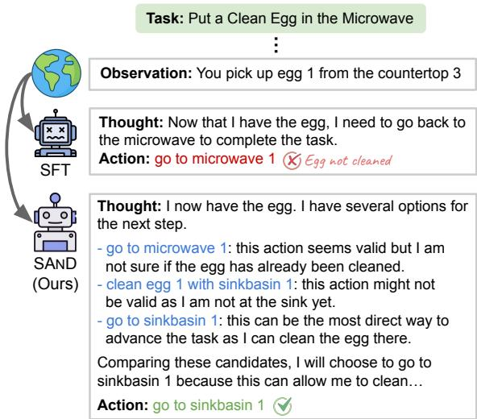  
Figure 1: An illustrative example of an LLM agent task, where SFT trained agent (Zeng et al., 2024) overcommits to an seemingly plausible but suboptimal action while our SAND tuned agent learns to deliberate over candidate actions before choosing the best action.

Although effective, these approaches imitate expert actions or simply rank chosen actions over rejected actions and expose the model to mostly the reference action and corresponding rationale at each decision point. Without effectively exploring the action space, the agent seldom learns explicitly why the chosen action wins over plausible alternatives. As a result, the finetuned LLM agent can over-commit to superficially reasonable yet suboptimal actions, a failure mode also observed in selfconsistency studies of LLMs (Wang et al., 2023; Xia et al., 2024a; Liang et al., 2024). Such behavior also hurts the generalization performance of LLM agents to unfamiliar scenarios.

To address this, in this paper we aim to teach LLM agent to deliberate by first generating several candidate actions for the current state, evaluating and comparing their likely outcomes, and then commit only after this evaluation. We propose Self-taught ActioN Deliberation (SAND) framework to instantiate this idea by teaching the LLM agent with the deliberation thoughts synthesized by the base version of itself. However, as the action space of LLM agent tasks is often large or even unbounded (Yao et al., 2022; Lin et al., 2025), it is intractable to deliberate over all actions and also inefficient to deliberate at every single step. To further tackle the challenge of when and what to deliberate, we devise self-consistency action sampling along expert trajectories to sample uncertain candidate actions of LLM agent at non-trivial decision making steps. To provide more informative and grounded step-level evaluations for each sampled candidate action, we utilize executed rollouts of each action to guide the critique generation. The action critiques are utilized to synthesize an action deliberation thought using the base LLM, which augments the initial expert trajectory and constructs deliberation trajectories for iterative finetuning of the LLM agent. Experiments on two interactive tasks demonstrate the advantage of our methods compared with strong agent tuning baselines. In summary, we make the following contributions:

• To teach LLM agents better explore the action space, we propose Self-taught ActioN Deliberation (SAND), a self-learning framework teaching LLM agents to deliberatively reason over candidate actions before choosing one.

• To tackle the challenge of when and what to deliberate given large action space and step-level action evaluation, we devise self-consistency action sampling and execution-guided action critique to help synthesize high-quality deliberative reasoning thoughts for iterative finetuning.

• Experiments on two representative interactive agent tasks demonstrate the advantage of our method with an average 20% improvement over supervised finetuning on initial expert data and outperforming strong agent tuning baselines.

## 2 Related Work

## 2.1 LLM Agents Tuning

Recent efforts in tuning LLM agents have progressed from failure recovery heuristics towards more structured policy refinement. Early work such as FiReAct (Chen et al., 2023) showed that adding explicit failure-reflection demonstrations improves LLM agent robustness. AgentTuning (Zeng et al., 2024) uses high-quality trajectories to finetune an instruction model for multi-turn interactions. ETO (Song et al., 2024b) retains exploratory trajectories and contrasts them with expert trajectories for agent optimization, while IPR (Xiong et al., 2024b) obtain step-level rewards for iterative preference refinement. DMPO (Shi et al., 2024) adapts direct preference optimization to multi-turn trajectory optimization, and WKM (Qiao et al., 2024) regularizes actions with an external world knowledge model. Similarly, KnowAgent (Zhu et al., 2025) teaches LLM agents for self action learning from a knowledge base (Xia et al., 2025d) and NAT (Wang et al., 2025a) incorporates failure trajectories for finetuning with an adapted prompt prefix. More recently, MPO (Xiong et al., 2025) trains a meta planner agent that guides task execution agents. Several agent tuning benchmarks and datasets have also emerged (Chen et al., 2024; Song et al., 2024a). In contrast, our proposed SAND framework aims to teach LLM agents to effectively deliberate over candidate actions for better decision making.

## 2.2 Deliberative Reasoning

Prompting strategies for LLM deliberative reasoning have evolved rapidly. Chain-of-thought (CoT) prompting (Wei et al., 2022; Xia et al., 2025c) first showed that eliciting explicit intermediate reasoning steps markedly improves mathematical and symbolic reasoning. Building on this idea, ReAct blends CoT with environment feedback to couple reasoning and acting (Yao et al., 2023b), while Self-Refine (Madaan et al., 2023) and Reflexion (Shinn et al., 2023) introduce iterative self-critique loops that rewrite faulty thoughts. Tree-of-Thought (Yao et al., 2023a) generalizes CoT into a breadth-first search over alternative thought branches, allowing the model to back-track and globally evaluate solutions. SWAP (Xiong et al., 2024a) frames deliberate reasoning as structure-aware planning with an internal world model. Guan et al. (2024) propose an explicit deliberation controller that decides when to generate, inspect or discard thoughts and Karanam et al. (2024) study how many forward simulations are needed for reliable look-ahead in RL-style agents. Our SAnD framework extends the deliberative reasoning to LLM agent tasks with a focus of action deliberation.

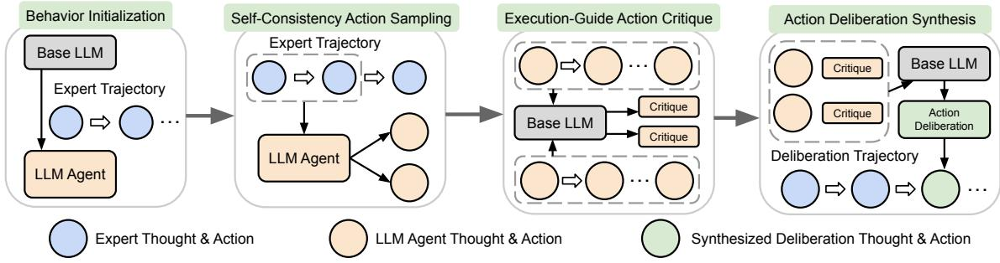  
Figure 2: An illustration of our SAND framework for synthesizing one step of action deliberation thoughts.

## 2.3 Iterative Self Learning

Another relevant line of works enable a model to improve by repeatedly generating data and finetuning on its own synthesized output (Xia et al., 2025b). The idea began with STaR (Zelikman et al., 2022), which bootstraps a few verified solutions into a large corpus of correct rationales. RFT (Yuan et al., 2023) generalises this to rejection-sampling proofs that pass an external checker. Subsequent work replaces hard filtering with self-feedback, e.g., Self-Refine (Madaan et al., 2023) and SELF (Chen et al., 2023) alternate draft–critique–revise loops. Agent-R (Yuan et al., 2025) repairs failed trajectories via Monte-Carlo search before re-training, and Karanam et al. (2024) show that only a handful of such self-play iterations are needed before returns saturate. Our SAND framework follows the similar iterative self-learning idea to steadily improve LLM agents without additional human supervision.

## 3 Task Formulation

We formulate our studied agent tasks as multi-turn interactions between an LLM agent and a textbased environment following Song et al. (2024b) and Xiong et al. (2025). Specifically, for a ReActstyle (Yao et al., 2023b) LLM agent, the task begins with an instruction $u \in \mathcal { U }$ . At each step, the LLM agent generates a reasoning thought $z \in { \mathcal { Z } }$ and an action $a \in { \mathcal { A } }$ . The environment then returns an observation $o \in \mathcal { O }$ . At time step t, for an LLM agent $\pi _ { \theta }$ with the past interaction history up to time step $t - 1$ denoted as $h _ { t - 1 } = ( u , z _ { 1 } , a _ { 1 } , o _ { 1 } , . ~ . ~ , o _ { t - 1 } )$ the reasoning thought is sampled conditioned on the interaction history $z _ { t } ~ \sim ~ \pi _ { \theta } ( \cdot ~ | ~ h _ { t - 1 } )$ followed by the action $a _ { t } \sim \pi _ { \theta } ( \cdot \ | \ h _ { t - 1 } , z _ { t } )$ . Therefore, for a complete agent trajectory with L steps $e = ( u , z _ { 1 } , a _ { 1 } , o _ { 1 } , \ldots , o _ { L - 1 } , z _ { L } , a _ { L } )$ , the probability of generating it is given by

$$
\pi _ { \boldsymbol { \theta } } ( \boldsymbol { e } \mid \boldsymbol { u } ) = \prod _ { t = 1 } ^ { L } \pi _ { \boldsymbol { \theta } } \big ( z _ { t } , a _ { t } \mid h _ { t - 1 } \big ) .\tag{1}
$$

After the task episode terminates upon success or maximum steps, the environment returns a task score $r ( u , e ) \in [ 0 , 1 ]$ as the task successful rate.

## 4 Methodology

In this section, we describe in details our proposed Self-taught ActioN Deliberation (SAND) framework. Starting from a base LLM, SAND iteratively finetunes it to be a stronger LLM agent using the deliberation thoughts generated by the base version of itself. An intuitive illustration of our framework for generating a single step of deliberation thoughts can be found in Figure 2. A more comprehensive overview of the entire iterative self-learning pipeline are presented in Algorithm 1.

## 4.1 Behavior Initialization

We start from a base instruction-tuned LLM $\pi _ { \mathrm { b a s e } }$ Following Song et al. (2024b) and Xiong et al. (2024b), we initialize an LLM agent with the basic reasoning and action behavior for completing the task via supervised finetuning (SFT) on a set of ReAct-style expert trajectories on training tasks $\mathcal { D } _ { \mathrm { e x p } } = \{ ( u , e ) ^ { ( i ) } \} _ { i = 1 } ^ { \overline { { | \mathcal { D } | } } }$ with the loss

$$
\mathcal { L } _ { \mathrm { S F T } } = - \mathbb { E } _ { e \sim \mathcal { D } _ { \mathrm { e x p } } } \big [ \log \pi _ { \theta } ( e \mid u ) \big ] .\tag{2}
$$

We then obtain the initial LLM agent policy πθ for the subsequent iterative improvement.

## 4.2 Self-Consistency Action Sampling

With an LLM agent policy $\pi _ { \boldsymbol { \theta } } .$ , we aim to further teach agent the action deliberation behavior. Two central questions here are (i) when the agent should invest extra thinking over actions and (ii) what actions to think about, especially within a large or even unbounded action space. To address them, we utilize self-consistency action sampling which offers a natural solution.

For each expert trajectory e, we replay every expert interaction and branch at each step t. Specifically, given expert interaction history $h _ { t - 1 }$ , the current policy $\pi _ { \theta }$ samples N actions

Algorithm 1: Self-Taught Action Deliberation (SAND)   
Input: $\mathcal { D } _ { \mathrm { e x p } } = \{ ( u , z _ { 1 } , a _ { 1 } , o _ { 1 } , \hdots , o _ { L - 1 } , z _ { L } , a _ { L } ) ^ { ( i ) } \}$ : expert trajectories, I: number of self-taught   
iterations, $N { : }$ number of sampled actions, $\pi _ { \mathrm { b a s e } } .$ : base LLM, $\pi _ { \theta } = \pi _ { \mathrm { b a s e } } \colon$ trainable LLM.   
Output: Final LLM agent π   
Finetune $\pi _ { \theta }$ on $\mathcal { D } _ { \mathrm { e x p } } \colon \mathcal { L } _ { \mathrm { S F T } } = - \mathbb { E } _ { e \sim \mathcal { D } _ { \mathrm { e x p } } } \left[ \log \pi _ { \theta } ( e \mid u ) \right]$   
for $k = 1$ to I do   
$\pi _ { k }  \pi _ { \theta } , { \mathcal { D } } _ { \mathrm { d e l i b } }  \emptyset$   
foreach $e = ( u , z _ { 1 } , a _ { 1 } , o _ { 1 } , \ldots , z _ { L } , a _ { L } ) \in \mathcal { D } _ { e x p }$ do   
Initialize history $h _ { 0 }  u$ and self-taught deliberation trajectory $\tilde { e } = ( u )$   
for t = 1 to L do   
Sample N actions: $\{ \hat { z } _ { t } ^ { ( n ) } , \hat { a } _ { t } ^ { ( n ) } \} _ { n = 1 } ^ { N } \sim \pi _ { k } ( \cdot \mid h _ { t - 1 } )$   
if $| \{ \hat { a } _ { t } ^ { ( 1 ) } , \dots , \hat { a } _ { t } ^ { ( N ) } , a _ { t } \} | = 0$ then continue   
Rollout each action: $\{ \hat { e } _ { t } , r _ { t } \} \sim \pi _ { k } ( \cdot \mid h _ { t - 1 } , \hat { z } _ { t } , \hat { a } _ { t } )$   
Generate critique for each action: $\boldsymbol { c } _ { t } \sim \pi _ { \mathrm { b a s e } } ( \cdot \mathrm { ~ \textmu ~ } \hat { a } _ { t } , \hat { e } _ { t } , r _ { t } , \mathsf { P r o m p t } _ { c } ) .$   
Synthesize action deliberation thought: $\tilde { z } _ { t } \sim \pi _ { \mathrm { b a s e } } ( \cdot \mid \{ ( \hat { a } _ { t } ^ { ( n ) } , c _ { t } ^ { ( n ) } ) \} _ { n = 1 } ^ { N + 1 }$ , Promp $\mathfrak { t } _ { d } )$   
$\tilde { e } \gets \tilde { e } \cup ( \tilde { z } _ { t } , a _ { t } , o _ { t } ) ; h _ { t } \gets ( h _ { t - 1 } , z _ { t } , a _ { t } , o _ { t } )$   
${ \mathcal { D } } _ { \mathrm { d e l i b } } \gets { \mathcal { D } } _ { \mathrm { d e l i b } } \cup \{ \tilde { e } \}$   
Finetune $\pi _ { \theta }$ on $\mathcal { D } _ { \mathrm { d e l i b } } \colon \mathcal { L } _ { \mathrm { S F T } } = - \mathbb { E } _ { \tilde { e } \sim \mathcal { D } _ { \mathrm { d e l i b } } } \left[ \log \pi _ { \theta } ( \tilde { e } \mid u ) \right]$   
Set $\mathcal { D } _ { \mathrm { { e x p } } }  \mathcal { D } _ { \mathrm { { d e l i b } } }$ for the next iteration   
return πθ

$$
\{ \hat { a } _ { t } ^ { ( 1 ) } , \dots , \hat { a } _ { t } ^ { ( N ) } \} \sim \pi _ { \theta } ( \cdot \vert h _ { t - 1 } ) ,\tag{3}
$$

where we omit the sampled reasoning thoughts $\hat { z } _ { t }$ here for notation simplicity. Together with the original expert action $a _ { t } .$ , we form a candidate action set of size $N + 1$

We then define an inconsistency indicator that flags whether deliberation is needed for step t:

$$
\mathbf { 1 } _ { \mathrm { d e l i b } } ( t ) = \mathbf { 1 } \Big ( \big | \{ \hat { a } _ { t } ^ { ( 1 ) } , \dots , \hat { a } _ { t } ^ { ( N ) } , a _ { t } \} \big | > 1 \Big ) .\tag{4}
$$

If all actions in the set are the same, $\mathbf { 1 } _ { \mathrm { d e l i b } } ( t ) = 0 .$ showing that the predictive distribution $\pi _ { \boldsymbol { \theta } } \big ( \cdot \big | h _ { t - 1 } \big )$ is sharply peaked, this suggests that the model is confident in conducting the expert action $a _ { t }$ or the decision at the current state is trivial. In this case, no extra reasoning or deliberation is needed. When the set contains more than one unique action, $\mathbf { 1 } _ { \mathrm { d e l i b } } ( t ) = 1$ , this suggests the uncertainty of the LLM agent at the current state, and generating an explicit deliberation thought can help the agent better choose among candidate actions.

Moreover, since every branch starts from a step on the expert trajectory e, the sampled actions $\hat { a } _ { t }$ remain close to both the demonstration distribution and the current LLM policy distribution while still exploring diverse futures, thereby avoiding random exploration over the large action space.

## 4.3 Execution-Guided Action Critique

If the inconsistency indicator flags for action deliberation at step ${ t } , \mathbf { 1 } _ { \mathrm { d e l i b } } ( t ) = 1$ , then next question is how LLM agent can learn to generate meaningful step-level action evaluations when deliberating over the candidate set. In typical multi-turn interaction tasks, the reward is often delayed till task completion (Xia et al., 2024b; Zhang et al., 2025). Therefore, to provide additional context and evaluation signals for each candidate action, we collect its full rollout by executing each action $\hat { e } _ { t } \sim \pi _ { \theta } ( \cdot \mid h _ { t - 1 } , \hat { a } _ { t } )$ and obtain the final task reward $r _ { t } \in [ 0 , 1 ]$ from the training environment.

Then, for each candidate action rollout, we prompt the frozen base LLM to generate a verbal critique $c _ { t }$ of the candidate action $\hat { a } _ { t }$ guided by its execution results $\hat { e } _ { t }$ and $r _ { t }$

$$
\boldsymbol { c } _ { t } \sim \pi _ { \mathrm { b a s e } } ( \cdot \mathrm { ~ \textmu ~ } \hat { a } _ { t } , \hat { e } _ { t } , r _ { t } , \mathsf { P r o m p t } _ { c } ) ,\tag{5}
$$

where Promp $\mathbf { t } _ { c }$ is the critique prompt detailed in Figure 5. It shows the action, the ensuing sequence of observations, and the final reward, and asks for a concise verdict that states whether the action advanced, hindered, or had no effect on task success. As the critique is verbalized natural language, we also specify in the prompt for the base LLM to record reusable commonsense knowledge (e.g., “eggs are more likely to be stored in the refrigerators”) that is not tied to the specific task instance. Such commonsense snippets accumulate across rollouts and provide transferable cues for more informative step-level action evaluation than numerical values aggregated from Monte Carlo rollouts (Xiong et al., 2024b; Lin et al., 2025).

## 4.4 Action Deliberation Synthesis

After all critiques $c _ { t } ^ { ( n ) }$ on candidate actions $\hat { a } _ { t } ^ { ( n ) }$ have been gathered, we prompt the base LLM $\pi _ { \mathrm { b a s e } }$ to generate a single deliberation thought. The prompt, detailed in Figure 6, instructs the LLM to first propose and analyze each candidate action explicitly, then compare over them, and give a rationale for the final action choice of the expert action $a _ { t }$ at the current step

$$
\tilde { z } _ { t } \sim \pi _ { \mathrm { b a s e } } ( \cdot \ | \ \{ \{ \{ ( \hat { a } _ { t } ^ { ( n ) } , c _ { t } ^ { ( n ) } )   \} _ { n = 1 } ^ { N + 1 } , \mathsf { P r o m p t } _ { d } ) .\tag{6}
$$

We then append $\left( \tilde { z } _ { t } , a _ { t } , o _ { t } \right)$ to the self-augmented deliberation trajectory e˜ collected along each step and update the running history $h _ { t }$

Note that we keep the expert action $a _ { t }$ as the ground-truth action here assuming it is the optimal one at the current step. However, as some expert data is annotated by human or another LLM, the LLM agent being finetuned may explore better paths than the expert path (Song et al., 2024b; Xiong et al., 2024b). Thus, we also devise an optional expert switch mechanism that replaces the original expert action with a better explored action if the LLM agent finds a better rollout during execution in Section 4.3.

## 4.5 Iterative Deliberation Finetuning

Exploring through all training tasks, the collection of self-taught action deliberation trajectories is denoted by $\mathcal { D } _ { \mathrm { d e l i b } } = \{ ( u , \tilde { e } ) ^ { ( i ) } \} _ { i = 1 } ^ { | \mathcal { D } _ { \mathrm { d e l i b } } | }$ . We update the LLM agent πθ with via the similar supervised finetuning objective

$$
\mathcal { L } _ { \mathrm { S F T } } = - \mathbb { E } _ { { \tilde { e } } \sim \mathcal { D } _ { \mathrm { d e l i b } } } \left[ \log \pi _ { \theta } ( \tilde { e } \mid u ) \right] .\tag{7}
$$

Compared with the initial expert trajectories, the synthesized deliberation trajectories provide richer guidance on enabling the action deliberation behavior as well as on why an action is chosen among alternative candidates, rather than only what action to mimic. Moreover, as the action deliberation is synthesized only when the action inconsistency indicator t, $\mathbf { 1 } _ { \mathrm { d e l i b } } ( t ) = 1$ defined in Equation 4.2 flags, the trajectories $\mathcal { D } _ { \mathrm { d e l i b } }$ we collected are mixed with deliberation and non-deliberation steps. This also teaches the LLM agent when to conduct action deliberation, as justified by our empirical analysis discussed in Section 6.4. Note that the LLM agent finetuned on the deliberation trajectories does not perform any action sampling during inference time. Instead, it generates the entire action deliberation thought in one pass, as illustrated in Figure 1.

<table><tr><td>Dataset</td><td>Train</td><td>Test Seen</td><td>Test Unseen</td><td>Action Space</td></tr><tr><td>ScienceWorld</td><td>1483</td><td>194</td><td>211</td><td>19</td></tr><tr><td>ALFWorld</td><td>3321</td><td>140</td><td>134</td><td>13</td></tr></table>

Table 1: Statistics of ALFWorld and SciWorld datasets.

Finally, we set $\mathcal { D } _ { \mathrm { e x p } }  \mathcal { D } _ { \mathrm { d e l i t } }$ and repeat the sampling, critique, synthesis, and finetuning loop for I iterations, steadily improving LLM agents with a base version of itself without additional human labels or annotations.

## 5 Experimental Setup

## 5.1 Datasets and Evaluation

We evaluate our proposed SAND agent tuning framework mainly in two representative interactive environments ALFWorld and ScienceWorld following Xiong et al. (2025). ALFWorld (Shridhar et al., 2020) provides a text-based household task environment that for natural language understanding and embodied reasoning. It provides only binary rewards of task success upon completion or termination. ScienceWorld (Wang et al., 2022) presents a text-based environment where agents perform elementary-level scientific experiments. It offers a granular reward system that quantifies partial progress toward scientific task goals. Both datasets include training sets and test sets for both seen and unseen tasks as reported in Table 1, allowing us to assess how well LLM agents finetuned with SAND can generalize to unseen scenarios. We also report additional evaluation results on a real-world web navigation task WebShop (Yao et al., 2022) in $\mathsf { A p - }$ pendix A. Following Song et al. (2024b) and Xiong et al. (2024b), we use the Average Reward across test tasks as our main evaluation metric. We set the decoding temperature to 0 for all agents when evaluating on the test sets to facilitate reproducibility.

## 5.2 Baselines and Variants

We compare SAND with the following agent tuning baselines and variants

• AgentTuning (Zeng et al., 2024): a direct supervised finetuning approach on expert trajectories.

<table><tr><td rowspan="2">Model</td><td rowspan="2">Single Agent</td><td colspan="2">ScienceWorld</td><td colspan="2">ALFWorld</td><td rowspan="2">Average</td></tr><tr><td>Seen</td><td>Unseen</td><td>Seen</td><td>Unseen</td></tr><tr><td colspan="8">Agents w/o Training</td></tr><tr><td>GPT-4o (Achiam et al., 2023)</td><td>√</td><td>60.0</td><td>56.0</td><td>78.6</td><td>83.6</td><td></td><td>69.6</td></tr><tr><td>GPT-4o-mini (Achiam et al., 2023)</td><td>√</td><td>49.1</td><td>42.7</td><td>32.1</td><td></td><td>41.0</td><td>41.2</td></tr><tr><td> $\mathrm { L l a m a } { - } 3 . 1 { - } 8 \mathrm { B } { \mathrm { - } } \mathrm { I n s t r u c t } ( \mathrm { D u b e y } \mathrm { e t } \mathrm { a l } . , 2 0 2 4 )$ </td><td>√</td><td>47.7</td><td>42.2</td><td>22.9</td><td></td><td>28.4</td><td>35.3</td></tr><tr><td> $\operatorname { L l a m a - 3 . 1 - 8 B - I n s t r u c t + M P O } ( \operatorname { X i o n g } \mathrm { { e t a l . , } } 2 0 2 5 )$ </td><td>x</td><td>56.5</td><td>55.5</td><td>50.0</td><td></td><td>52.2</td><td>53.6</td></tr><tr><td> $\mathrm { Q w e n 2 . 5  – 7 B – I n s t r u c t } ( \mathrm { Y a n g e t a l . } , 2 0 2 5 )$ </td><td>√</td><td>38.5</td><td>38.8</td><td></td><td>71.4</td><td>75.4</td><td>56.0</td></tr><tr><td> $\mathrm { L l a m a } { - } 3 . 1 { - } 7 0 \mathrm { B } { \mathrm { - } } \mathrm { I n s t r u c t } ( \mathrm { D u b e y } \mathrm { e t } \mathrm { a l } . , 2 0 2 4 )$ </td><td>√</td><td>72.6</td><td>70.2</td><td>78.6</td><td></td><td>73.9</td><td>73.8</td></tr><tr><td> $\mathrm { L l a m a } \mathrm { - } 3 . 1 \mathrm { - } 7 0 \mathrm { B } \mathrm { - } \mathrm { I n s t r u c t } + \mathrm { M P O } \mathrm { ( X i o n g e t a l . , } 2 0 2 5 \mathrm { ) }$ </td><td>x</td><td>80.4</td><td>79.5</td><td>85.7</td><td></td><td>86.6</td><td>83.1</td></tr><tr><td colspan="8">Agents w/ Training</td></tr><tr><td> $\mathrm { Q w e n 2 . 5 - 7 B - I n s t r u c t } + \mathrm { S F T } ~ ( \mathrm { Z e n g ~ e t ~ a l . } , 2 0 2 4 )$ </td><td>√</td><td>69.2</td><td>60.8</td><td>72.1</td><td></td><td>75.4</td><td>69.4</td></tr><tr><td> $\mathrm { L l a m a } - 3 . 1 \mathrm { - } 8 \mathrm { B } \mathrm { - } \mathrm { I n s t r u c t } + \mathrm { S F T } \mathrm { ( Z e n g ~ e t ~ a l . , ~ } 2 0 2 4 \mathrm { ) }$ </td><td>√</td><td>75.6</td><td>65.1</td><td>79.3</td><td></td><td>71.6</td><td>72.9</td></tr><tr><td> $\mathrm { L l a m a } { - } 3 . 1 { - } 8 \mathrm { B } { \mathrm { - } } \mathrm { I n s t r u c t } + \mathrm { E T O } ( \mathrm { S o n g } \mathrm { e t a l } . , 2 0 2 4 \mathrm { b } )$ </td><td>√</td><td>81.3</td><td>74.1</td><td>77.1</td><td></td><td>76.4</td><td>77.2</td></tr><tr><td> $\mathrm { L l a m a } \mathrm { - } 3 . 1 \mathrm { - } 8 \mathrm { B } \mathrm { - } \mathrm { I n s t r u c t } + \mathrm { K n o w A g e n t } ( \mathrm { Z h u } \mathrm { e t } \mathrm { a l } . , 2 0 2 5 )$ </td><td>√</td><td>81.7</td><td>69.6</td><td></td><td>80.0</td><td>74.9</td><td>76.6</td></tr><tr><td> $\operatorname { L l a m a - 3 . 1 - 8 B - I n s t r u c t } + \operatorname { W K M } \left( \operatorname { Q i a o \ e t \ a l . , } 2 0 2 4 \right)$ </td><td>x</td><td>82.1</td><td>76.5</td><td>77.1</td><td></td><td>78.2</td><td>78.5</td></tr><tr><td> $\mathrm { L l a m a - 3 . 1 { - } 8 B { - } I n s t r u c t } + \mathrm { E T O } \& M P O \ ( \mathrm { X i o n g \ e t \ a l . } , 2 0 2 5 )$ </td><td>x</td><td>83.4</td><td>80.8</td><td>85.0</td><td></td><td>79.1</td><td>82.1</td></tr><tr><td> $\mathrm { Q w e n 2 . 5 \mathrm { - } 7 B \mathrm { - } I n s t r u c t + S A N D \ ( I t e r a t i o n \ 1 ) }$ </td><td>√</td><td>80.9</td><td>67.2</td><td>85.7</td><td></td><td>85.0</td><td>79.7</td></tr><tr><td> $\mathrm { Q w e n 2 . 5 \mathrm { - } 7 B \mathrm { - } I n s t r u c t + S A N D \left( I t e r a t i o n \ 2 \right) }$ </td><td>√</td><td>83.2</td><td>69.9</td><td>85.0</td><td></td><td>89.6</td><td>81.9</td></tr><tr><td> $\mathrm { Q w e n 2 . 5 \mathrm { - } 7 B \mathrm { - } I n s t r u c t + S A N D \left( I t e r a t i o n \ 3 \right) }$ </td><td>√</td><td>84.0</td><td>69.0</td><td>90.7</td><td></td><td>94.8</td><td>84.6</td></tr><tr><td> $\mathrm { L l a m a } { - 3 . 1 { - } 8 \mathrm { B } { \mathrm { - } } \mathrm { I n s t r u c t } + \mathrm { S A N D } \ ( \mathrm { I t e r a t i o n \ 1 } ) }$ </td><td>√</td><td>86.6</td><td>77.5</td><td>92.9</td><td></td><td>91.8</td><td>86.0</td></tr><tr><td> $\mathrm { L l a m a } { 3 } . 1 { \ - } 8 \mathrm { B } \mathrm { - } \mathrm { I n s t r u c t } + \mathrm { S A N D } \left( \mathrm { I t e r a t i o n } \ 2 \right)$ </td><td>√</td><td>88.7</td><td>78.2</td><td></td><td>94.3</td><td>94.0</td><td>88.8</td></tr><tr><td> $\mathrm { L l a m a } { - 3 . 1 { - } 8 \mathrm { B } { \mathrm { - } } \mathrm { I n s t r u c t } } + \mathrm { S A N D } \ ( \mathrm { I t e r a t i o n } \ 3 )$ </td><td>√</td><td>85.7</td><td>79.1</td><td></td><td>94.3</td><td>96.3</td><td>88.9</td></tr></table>

Table 2: Average rewards of all compared methods on two datasets. SAND significantly improves LLM agents across different model backbones, outperforming proprietary LLMs as well as state-of-the-art multi-agent approaches.

• ETO (Song et al., 2024b): a representative agent tuning method leveraging an adapted direct preference optimization objective for contrastive agent trajectory pairs.

• KnowAgent (Zhu et al., 2025): a recent framework employing an additional action knowledge base for self learning of LLM agents.

• WKM (Qiao et al., 2024): an agent tuning method with a jointly optimized world knowledge model available during test time.

• MPO (Xiong et al., 2025): an optimization approach via training a meta planner agent generating explicit guidance for task execution agents.

$\mathbf { S A N D } _ { \mathrm { w / o } } \mathbf { \Lambda } _ { \mathrm { S A S } } \mathbf { : }$ a variant of our method which does not conduct self-consistency action sampling (SAS) but instead directly prompts the base LLM to generate N alternative candidate actions in context during action deliberation synthesis.

$\mathbf { S A N D } _ { \mathrm { w / o E A C } } \colon$ a variant of our method which skips the execution-guided action critique (EAC) stage and directly synthesize action deliberation thought with N sampled candidate actions.

For more comprehensive comparison, we also report results of prompting-based ReAct-style LLM agent based on proprietary and open-sourced models GPT4o (Achiam et al., 2023) and Llama-3.1- 70B-Instruct (Dubey et al., 2024) collected by Xiong et al. (2025), where an in-context example is given for all prompting-based models. We provide in Appendix B additional discussion and comparisons of our SAND framework with recent test-time search methods guided by process reward or Q-value models (Zhai et al., 2025; Lin et al., 2025; Xia et al., 2025a).

## 5.3 Implementation Details

We adopt two backbone models Llama-3.1-8B-Instruct (Dubey et al., 2024) and Qwen2.5-7B-Instruct (Yang et al., 2025) as the base models and finetune them with our SAND framework. The initial expert trajectories are collected by Song et al. (2024b). For behavior initialization step, we follow Song et al. (2024b) to set batch size of 64 with a learning rate of 1e-5 and a cosine scheduler for 3 epochs. At self-consistency action sampling step, the decoding temperature of the LLM agent $\pi _ { \theta }$ is set to 1.0 for sampling $N = 5$ candidate actions as well as the subsequent rollout execution. The execution-guided action critique is generated by the base $\mathrm { L L M } \pi _ { \mathrm { b a s e } }$ with the decoding temperature

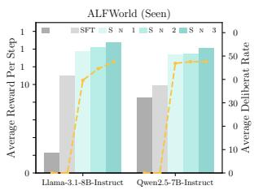

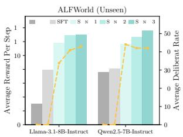  
Figure 3: Average reward per step (bars) and average action deliberation rate per step (lines) on test sets.

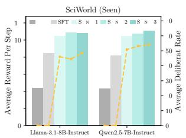

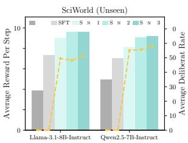

0. Both prompts for critique generation and action deliberation synthesis are provided in Appendix C. We disable the expert action switch mechanism discussed in Section 4.4 on ScienceWorld as we empirically observe that some of the tasks have short-cuts that might boost LLM agents on training set but hurt performances on test set. For deliberation finetuning steps, we set similarly batch size of 64 and learning rate of 1e-5 for I = 3 iterations. To avoid overfitting, we train 3 epochs only for the first iteration of SAND and 1 epoch for later iterations. We use OpenRLHF (Hu et al., 2024) to implement our training framework and all experiments run on 8 NVIDIA A100 80GB GPUs.

## 6 Results

## 6.1 How does SAND perform compared with other agent tuning methods?

We show the results of all compared methods on both seen and unseen test tasks in Table 2. From the results, we observe a clear advantage of SAND which outperforms all baselines on ALF-World by a large margin. On ScienceWorld, SAND also shows competitive performances matching or surpassing state-of-the-art multi-agent approach. For both Llama-3.1-8B-Instruct and Qwen-2.5-7B-Instruct as the backbone LLMs, SAND (Iteration 3) achieves an average over 20% performance boost compared with SFT on initial expert data.

Besides, with our iterative deliberation finetuning, we also observe a steady performance improvement across different iterations of SAND, demonstrating the effectiveness of our self learning framework requiring no additional human labels. Another notable observation is that on later iterations of SAND, agents trained on both Llama-3.1-8B-Instruct and Qwen-2.5-7B-Instruct exhibit strong generalization capabilities on ALFWorld unseen tasks, achieving high rewards even than seen tasks. We attribute the performance gains on unseen tasks to the action deliberation behavior learned by LLM agents during SAND iterations. Such action deliberation behavior enables LLM agents to explicitly analyze unseen actions and environments before committing one instead of relying mostly on seen action patterns learned during training tasks.

<table><tr><td>Method</td><td colspan="2">ScienceWorld Seen Unseen</td><td colspan="2">ALFWorld Seen Unseen</td></tr><tr><td>Qwen2.5-7B-Instruct</td><td></td><td></td><td></td><td></td></tr><tr><td>Base</td><td>38.5</td><td>38.8</td><td>71.4</td><td>75.4</td></tr><tr><td>SFT</td><td>69.2</td><td>60.8</td><td>72.1</td><td>75.4</td></tr><tr><td> $\mathrm { S A N D } _ { \mathrm { w / o } \mathrm { S A S } }$ </td><td>63.5</td><td>52.4</td><td>72.1</td><td>62.7</td></tr><tr><td> $\mathrm { S A N D } _ { \mathrm { w / o } \mathrm { E A C } }$ </td><td>72.0</td><td>66.3</td><td>70.6</td><td>75.0</td></tr><tr><td>SAND</td><td>80.9</td><td>67.2</td><td>85.7</td><td>85.0</td></tr><tr><td>Llama-3.1-8B-Instruct</td><td></td><td></td><td></td><td></td></tr><tr><td>Base</td><td>47.7</td><td>42.2</td><td>22.9</td><td>28.4</td></tr><tr><td>SFT</td><td>75.6</td><td>65.1</td><td>79.3</td><td>71.6</td></tr><tr><td> $\mathrm { S A N D } _ { \mathrm { w / o } \mathrm { S A S } }$ </td><td>70.3</td><td>62.0</td><td>85.7</td><td>77.3</td></tr><tr><td> $\mathrm { S A N D } _ { \mathrm { w / o } \ E A C }$ </td><td>78.6</td><td>73.7</td><td>85.0</td><td>86.6</td></tr><tr><td>SAND</td><td>86.6</td><td>77.5</td><td>92.9</td><td>91.8</td></tr></table>

Table 3: Ablation study on different modules in SAND.

## 6.2 Are self-consistency action sampling and execution-guided critique necessary?

To validate the effectiveness of our devised selfconsistency action sampling and execution-guided action critique, we compare SAND at the first iteration with its ablated variants $\mathrm { S A N D } _ { \mathrm { w / o } } \mathrm { S A S }$ and $\mathrm { S A N D } _ { \mathrm { w / o E A C } }$ The results are shown in Table 3, where we observe a performance drop after removing each modules. Specifically, we find that $\mathrm { S A N D } _ { \mathrm { w / o } } \mathrm { S A S }$ can even hurt the agent performance being outperformed by initial SFT. From our logged failed testing trajectories, we observe that without self-consistency action sampling, LLM agents often propose random actions irrelevant to the task goals and sometimes show degenerated behavior of repeating a candidate action till the maximum context length. On the other hand, $\mathrm { S A N D } _ { \mathrm { w / o E A C } }$ , though also showing a small performance decrease compared with SAND, still improves over the initial SFT agent. The results again demonstrates the necessity of the self-consistency action sampling module while also validating the effectiveness of execution-guided action critique in improving the synthesized deliberation quality.

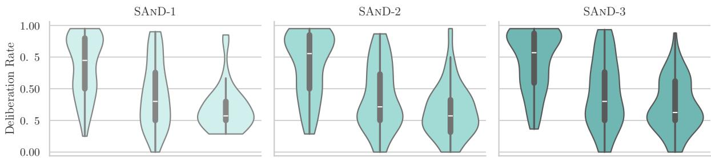  
Figure 4: Action deliberation rate distribution across three difficulty bands in unseen test set on ScienceWorld. Each panel corresponds to a SAND iteration starting from Llama-3.1-8B-Instruct. The difficulty bands Hard, Medium, Easy are determined based on the tertiles of reward distribution from the base Llama-3.1-8B-Instruct. The results show that more SAND iterations teach LLM agents to deliberate more on hard tasks and less on easy tasks.

## 6.3 Does action deliberation improve LLM agents at step-level across iterations?

SAND has shown overall performance improvement over iterations in Table 2. To further study the influence of the action deliberation behavior LLM agents learned from SAND, we show in Figure 3 the average reward per step and the corresponding average action deliberation rate per step across all test sets. The per-step average reward is calculated as the ratio of final reward to the total steps for each task, averaged across all tasks in the test set. Similarly, the per-step average deliberation rate is the ratio of action deliberation steps to the total steps for each task, averaged across all tasks.

From Figure 3, we can first observe a consistent improvement on per-step average reward across different finetuning iterations with first iteration shows a larger gain followed by smaller gains in later iterations. We also observe that the per-step action deliberation rate also show a general increasing pattern. Such correlation further validates the advantage of step-level action deliberation, which enables LLM agent to make better decisions at each step. The higher step-level reward also brings the advantages of earlier and more efficient task completion for practical applications of LLM agents.

## 6.4 Do LLM agents finetuned with SAND really learn when to deliberate?

To further analyze the agent tuning dynamics during SAND iterations, we study whether LLM agents have learned to decide when to deliberate over candidate actions, as discussed in Section 4.2. Specifically, we visualize when the LLM agent decides to deliberate with violin plots in Figure 4, where each panel corresponds to an iteration in SAND. As ScienceWorld provides finegrained rewards that can reflect partial task completion rate, we partition the unseen tasks on ScienceWorld into three difficulty bands based on the empirical tertiles of reward distribution from the base LLM Llama-3.1-8B-Instruct. We define the bottom third as Hard tasks, the middle third as Medium tasks, and the top third as Easy tasks. Within each band we compute the deliberation rate of SAND similarly defined as the ratio of deliberation steps to the total steps for each task, and plot the distribution of deliberation rates across tasks.

<table><tr><td>Method</td><td>ALFWorld</td><td>ScienceWorld</td></tr><tr><td>SFT</td><td>498.3</td><td>800.0</td></tr><tr><td>SAND (Iteration 1)</td><td>1,314.2 (2.6×)</td><td>2,411.9 (3.0×)</td></tr><tr><td>SAND (Iteration 2)</td><td>1,105.8 (2.2×)</td><td>2,522.1 (3.2×)</td></tr><tr><td>SAND (Iteration 3)</td><td>1,146.2 (2.3×)</td><td>2,253.6 (2.8×)</td></tr></table>

Table 4: Average #tokens per task on ALFWorld and ScienceWorld. Multipliers are relative to SFT agent.

From Figure 4, we observe that across all three iterations the hard band remains the only one with a high median deliberation rate around 0.75, while the median deliberation rate on easy band stays near 0.30. This shows SAND effectively teaches LLM agent to direct more action deliberation to hard tasks while keeping reasoning concise when the task is easy. From iteration 1 to iteration 3, we also observe a slight distribution shift of the hard violin, which widens at the top with the median gradually increases. This further demonstrates the effectiveness of iterative deliberation finetuning in our SAND framework that not only improves the task performances but also teaches LLM agents to make better decisions on when to deliberate.

## 6.5 How much additional inference-time computation cost does SAND introduce?

As SAND teaches LLM agents to explicitly deliberate over candidate actions, it introduces additional computation cost during inference time.

To study how much additional inference-time cost is incurred, we compare in Table 4 the average number of tokens used per task between the SFT agent (without action deliberation) and our SANDfinetuned agents (with action deliberation), where the base model is Llama-3.1-8B-Instruct.

From Table 4, we find that the additional action deliberation results in approximately 2 to 3 times more tokens per task. Compared to representative test-time scaling approaches such as Best-of-N, which incurs 5 times more tokens when N = 5, we believe our SAND framework introduces a reasonable additional inference-time computation cost with considerable performance improvements. Moreover, as analyzed in Section 6.4, our SAND framework effectively teaches LLM agents when to deliberate, avoiding unnecessary action deliberation on simple tasks. This finding is also reflected in Table 4, where a slight decreasing trend in token usage is observed across iterations, indicating better inference-time computation usage through our iterative finetuning framework.

## 7 Conclusion

In this paper, we propose Self-taught ActioN Deliberation (SAND), a self-learning framework that equips LLM agents with explicit action deliberation. Addressing when and what to deliberate given large action space, SAND samples candidate actions by self-consistency, critiques each action guided exectured rollout, synthesizes a deliberation thought, and iteratively finetunes the LLM agent on the enriched trajectories. Experiments and analysis demonstrate the effectivenes and advantages of our methods, which further highlights the key role of deliberative reasoning in developing more powerful LLM agents for real world applications.

## Limitations

Despite the performance improvements, generating more deliberation thoughts inevitably increases the token usage and inference costs. As discussed and analyzed in Section 6.4, our proposed SAND framework teaches LLM agent when to deliberate via self-consistency action sampling to avoid deliberating during trivial decision making steps. Our results in Section 6.5 further show that the action deliberation learned by SAND introduces reasonable additional inference-time computation cost. To further improve the reasoning efficiency, more advanced methods such reinforcement learning or direct preference optimization can be utilized to guide the LLM agent to better decide when to generating more comprehensive deliberative reasoning and when to generate more concise quick thoughts. Parallel inference techniques can also be applied to further enhance the inference efficiency.

## References

Josh Achiam, Steven Adler, Sandhini Agarwal, Lama Ahmad, Ilge Akkaya, Florencia Leoni Aleman, Diogo Almeida, Janko Altenschmidt, Sam Altman, Shyamal Anadkat, et al. 2023. Gpt-4 technical report. arXiv preprint arXiv:2303.08774.

Baian Chen, Chang Shu, Ehsan Shareghi, Nigel Collier, Karthik Narasimhan, and Shunyu Yao. 2023. Fireact: Toward language agent fine-tuning. arXiv preprint arXiv:2310.05915.

Zehui Chen, Kuikun Liu, Qiuchen Wang, Wenwei Zhang, Jiangning Liu, Dahua Lin, Kai Chen, and Feng Zhao. 2024. Agent-flan: Designing data and methods of effective agent tuning for large language models. In Findings ofthe Associationfor Computational Linguistics ACL 2024, pages 9354–9366.

Zhixun Chen, Ming Li, Yuxuan Huang, Yali Du, Meng Fang, and Tianyi Zhou. 2025. Atlas: Agent tuning via learning critical steps. arXiv preprint arXiv:2503.02197.

Abhimanyu Dubey, Abhinav Jauhri, Abhinav Pandey, Abhishek Kadian, Ahmad Al-Dahle, Aiesha Letman, Akhil Mathur, Alan Schelten, Amy Yang, Angela Fan, et al. 2024. The llama 3 herd of models. arXiv preprint arXiv:2407.21783.

Melody Y Guan, Manas Joglekar, Eric Wallace, Saachi Jain, Boaz Barak, Alec Helyar, Rachel Dias, Andrea Vallone, Hongyu Ren, Jason Wei, et al. 2024. Deliberative alignment: Reasoning enables safer language models. arXiv preprint arXiv:2412.16339.

Jian Hu, Xibin Wu, Zilin Zhu, Xianyu, Weixun Wang, Dehao Zhang, and Yu Cao. 2024. Openrlhf: An easyto-use, scalable and high-performance rlhf framework. arXiv preprint arXiv:2405.11143.

Arjun Karanam, Farnaz Jahanbakhsh, and Sanmi Koyejo. 2024. Towards deliberating agents: Evaluating the ability of large language models to deliberate. In NeurIPS 2024 Workshop on Behavioral Machine Learning.

Xun Liang, Shichao Song, Zifan Zheng, Hanyu Wang, Qingchen Yu, Xunkai Li, Rong-Hua Li, Yi Wang, Zhonghao Wang, Feiyu Xiong, et al. 2024. Internal consistency and self-feedback in large language models: A survey. arXiv preprint arXiv:2407.14507.

Zongyu Lin, Yao Tang, Xingcheng Yao, Da Yin, Ziniu Hu, Yizhou Sun, and Kai-Wei Chang. 2025. Qlass: Boosting language agent inference via q-guided stepwise search. arXiv preprint arXiv:2502.02584.

Aman Madaan, Niket Tandon, Prakhar Gupta, Skyler Hallinan, Luyu Gao, Sarah Wiegreffe, Uri Alon, Nouha Dziri, Shrimai Prabhumoye, Yiming Yang, et al. 2023. Self-refine: Iterative refinement with self-feedback. Advances in Neural Information Processing Systems, 36:46534–46594.

Reiichiro Nakano, Jacob Hilton, Suchir Balaji, Jeff Wu, Long Ouyang, Christina Kim, Christopher Hesse, Shantanu Jain, Vineet Kosaraju, William Saunders, et al. 2021. Webgpt: Browser-assisted questionanswering with human feedback. arXiv preprint arXiv:2112.09332.

Dang Nguyen, Jian Chen, Yu Wang, Gang Wu, Namyong Park, Zhengmian Hu, Hanjia Lyu, Junda Wu, Ryan Aponte, Yu Xia, Xintong Li, Jing Shi, Hongjie Chen, Viet Dac Lai, Zhouhang Xie, Sungchul Kim, Ruiyi Zhang, Tong Yu, Mehrab Tanjim, Nesreen K. Ahmed, Puneet Mathur, Seunghyun Yoon, Lina Yao, Branislav Kveton, Jihyung Kil, Thien Huu Nguyen, Trung Bui, Tianyi Zhou, Ryan A. Rossi, and Franck Dernoncourt. 2025. GUI agents: A survey. In Findings ofthe Associationfor Computational Linguistics: ACL 2025, pages 22522–22538, Vienna, Austria. Association for Computational Linguistics.

Shuofei Qiao, Runnan Fang, Ningyu Zhang, Yuqi Zhu, Xiang Chen, Shumin Deng, Yong Jiang, Pengjun Xie, Fei Huang, and Huajun Chen. 2024. Agent planning with world knowledge model. Advances in Neural Information Processing Systems, 37:114843–114871.

Wentao Shi, Mengqi Yuan, Junkang Wu, Qifan Wang, and Fuli Feng. 2024. Direct multi-turn preference optimization for language agents. In Proceedings of the 2024 Conference on Empirical Methods in Natural Language Processing, pages 2312–2324, Miami, Florida, USA. Association for Computational Linguistics.

Noah Shinn, Federico Cassano, Ashwin Gopinath, Karthik Narasimhan, and Shunyu Yao. 2023. Reflexion: Language agents with verbal reinforcement learning. Advances in Neural Information Processing Systems, 36:8634–8652.

Mohit Shridhar, Xingdi Yuan, Marc-Alexandre Côté, Yonatan Bisk, Adam Trischler, and Matthew Hausknecht. 2020. Alfworld: Aligning text and embodied environments for interactive learning. arXiv preprint arXiv:2010.03768.

Yifan Song, Weimin Xiong, Xiutian Zhao, Dawei Zhu, Wenhao Wu, Ke Wang, Cheng Li, Wei Peng, and Sujian Li. 2024a. Agentbank: Towards generalized llm agents via fine-tuning on 50000+ interaction trajectories. In Findings ofthe Associationfor Computational Linguistics: EMNLP 2024, pages 2124–2141.

Yifan Song, Da Yin, Xiang Yue, Jie Huang, Sujian Li, and Bill Yuchen Lin. 2024b. Trial and error: Exploration-based trajectory optimization of LLM agents. In Proceedings of the 62nd Annual Meeting

of the Association for Computational Linguistics (Volume 1: Long Papers), pages 7584–7600, Bangkok, Thailand. Association for Computational Linguistics.

Renxi Wang, Xudong Han, Yixuan Zhang, Timothy Baldwin, and Haonan Li. 2025a. NAT: Enhancing agent tuning with negative samples. In Proceedings of the 2025 Conference of the Nations of the Americas Chapter of the Association for Computational Linguistics: Human Language Technologies (Volume 1: Long Papers), pages 7385–7398, Albuquerque, New Mexico. Association for Computational Linguistics.

Ruoyao Wang, Peter Jansen, Marc-Alexandre Côté, and Prithviraj Ammanabrolu. 2022. Scienceworld: Is your agent smarter than a 5th grader? arXiv preprint arXiv:2203.07540.

Ruoyu Wang, Junda Wu, Yu Xia, Tong Yu, Ryan A Rossi, Julian McAuley, and Lina Yao. 2025b. Dice: Dynamic in-context example selection in llm agents via efficient knowledge transfer. arXiv preprint arXiv:2507.23554.

Xuezhi Wang, Jason Wei, Dale Schuurmans, Quoc V Le, Ed H. Chi, Sharan Narang, Aakanksha Chowdhery, and Denny Zhou. 2023. Self-consistency improves chain of thought reasoning in language models. In The Eleventh International Conference on Learning Representations.

Jason Wei, Xuezhi Wang, Dale Schuurmans, Maarten Bosma, Fei Xia, Ed Chi, Quoc V Le, Denny Zhou, et al. 2022. Chain-of-thought prompting elicits reasoning in large language models. Advances in neural information processing systems, 35:24824–24837.

Junda Wu, Yu Xia, Tong Yu, Xiang Chen, Sai Sree Harsha, Akash V Maharaj, Ruiyi Zhang, Victor Bursztyn, Sungchul Kim, Ryan A. Rossi, Julian McAuley, Yunyao Li, and Ritwik Sinha. 2025. Doc-react: Multipage heterogeneous document question-answering. In Proceedings of the 63rd Annual Meeting of the Associationfor Computational Linguistics (Volume 2: Short Papers), pages 67–78, Vienna, Austria. Association for Computational Linguistics.

Yu Xia, Jingru Fan, Weize Chen, Siyu Yan, Xin Cong, Zhong Zhang, Yaxi Lu, Yankai Lin, Zhiyuan Liu, and Maosong Sun. 2025a. Agentrm: Enhancing agent generalization with reward modeling. arXiv preprint arXiv:2502.18407.

Yu Xia, Xu Liu, Tong Yu, Sungchul Kim, Ryan Rossi, Anup Rao, Tung Mai, and Shuai Li. 2024a. Hallucination diversity-aware active learning for text summarization. In Proceedings ofthe 2024 Conference ofthe North American Chapter ofthe Associationfor Computational Linguistics: Human Language Technologies (Volume 1: Long Papers), pages 8665–8677, Mexico City, Mexico. Association for Computational Linguistics.

Yu Xia, Subhojyoti Mukherjee, Zhouhang Xie, Junda Wu, Xintong Li, Ryan Aponte, Hanjia Lyu, Joe Barrow, Hongjie Chen, Franck Dernoncourt, Branislav

Kveton, Tong Yu, Ruiyi Zhang, Jiuxiang Gu, Nesreen K. Ahmed, Yu Wang, Xiang Chen, Hanieh Deilamsalehy, Sungchul Kim, Zhengmian Hu, Yue Zhao, Nedim Lipka, Seunghyun Yoon, Ting-Hao Kenneth Huang, Zichao Wang, Puneet Mathur, Soumyabrata Pal, Koyel Mukherjee, Zhehao Zhang, Namyong Park, Thien Huu Nguyen, Jiebo Luo, Ryan A. Rossi, and Julian McAuley. 2025b. From selection to generation: A survey of LLM-based active learning. In Proceedings of the 63rd Annual Meeting of the Associationfor Computational Linguistics (Volume 1: Long Papers), pages 14552–14569, Vienna, Austria. Association for Computational Linguistics.

Yu Xia, Rui Wang, Xu Liu, Mingyan Li, Tong Yu, Xiang Chen, Julian McAuley, and Shuai Li. 2025c. Beyond chain-of-thought: A survey of chain-of-X paradigms for LLMs. In Proceedings of the 31st International Conference on Computational Linguistics, pages 10795–10809, Abu Dhabi, UAE. Association for Computational Linguistics.

Yu Xia, Junda Wu, Sungchul Kim, Tong Yu, Ryan A. Rossi, Haoliang Wang, and Julian McAuley. 2025d. Knowledge-aware query expansion with large language models for textual and relational retrieval. In Proceedings ofthe 2025 Conference ofthe Nations ofthe Americas Chapter ofthe Associationfor Computational Linguistics: Human Language Technologies (Volume 1: Long Papers), pages 4275–4286, Albuquerque, New Mexico. Association for Computational Linguistics.

Yu Xia, Tong Yu, Zhankui He, Handong Zhao, Julian McAuley, and Shuai Li. 2024b. Aligning as debiasing: Causality-aware alignment via reinforcement learning with interventional feedback. In Proceedings ofthe 2024 Conference ofthe North American Chapter of the Association for Computational Linguistics: Human Language Technologies (Volume 1: Long Papers), pages 4684–4695, Mexico City, Mexico. Association for Computational Linguistics.

Siheng Xiong, Ali Payani, Yuan Yang, and Faramarz Fekri. 2024a. Deliberate reasoning for llms as structure-aware planning with accurate world model. arXiv preprint arXiv:2410.03136.

Weimin Xiong, Yifan Song, Qingxiu Dong, Bingchan Zhao, Feifan Song, Xun Wang, and Sujian Li. 2025. Mpo: Boosting llm agents with meta plan optimization. arXiv preprint arXiv:2503.02682.

Weimin Xiong, Yifan Song, Xiutian Zhao, Wenhao Wu, Xun Wang, Ke Wang, Cheng Li, Wei Peng, and Sujian Li. 2024b. Watch every step! LLM agent learning via iterative step-level process refinement. In Proceedings of the 2024 Conference on Empirical Methods in Natural Language Processing, pages 1556–1572, Miami, Florida, USA. Association for Computational Linguistics.

An Yang, Anfeng Li, Baosong Yang, Beichen Zhang, Binyuan Hui, Bo Zheng, Bowen Yu, Chang Gao, Chengen Huang, Chenxu Lv, et al. 2025. Qwen3 technical report. arXiv preprint arXiv:2505.09388.

Shunyu Yao, Howard Chen, John Yang, and Karthik Narasimhan. 2022. Webshop: Towards scalable realworld web interaction with grounded language agents. Advances in Neural Information Processing Systems, 35:20744–20757.

Shunyu Yao, Dian Yu, Jeffrey Zhao, Izhak Shafran, Tom Griffiths, Yuan Cao, and Karthik Narasimhan. 2023a. Tree of thoughts: Deliberate problem solving with large language models. Advances in neural information processing systems, 36:11809–11822.

Shunyu Yao, Jeffrey Zhao, Dian Yu, Nan Du, Izhak Shafran, Karthik R Narasimhan, and Yuan Cao. 2023b. React: Synergizing reasoning and acting in language models. In The Eleventh International Conference on Learning Representations.

Siyu Yuan, Zehui Chen, Zhiheng Xi, Junjie Ye, Zhengyin Du, and Jiecao Chen. 2025. Agent-r: Training language model agents to reflect via iterative selftraining. arXiv preprint arXiv:2501.11425.

Zheng Yuan, Hongyi Yuan, Chengpeng Li, Guanting Dong, Keming Lu, Chuanqi Tan, Chang Zhou, and Jingren Zhou. 2023. Scaling relationship on learning mathematical reasoning with large language models. arXiv preprint arXiv:2308.01825.

Eric Zelikman, Yuhuai Wu, Jesse Mu, and Noah Goodman. 2022. Star: Bootstrapping reasoning with reasoning. Advances in Neural Information Processing Systems, 35:15476–15488.

Aohan Zeng, Mingdao Liu, Rui Lu, Bowen Wang, Xiao Liu, Yuxiao Dong, and Jie Tang. 2024. AgentTuning: Enabling generalized agent abilities for LLMs. In Findings of the Association for Computational Linguistics: ACL 2024, pages 3053–3077, Bangkok, Thailand. Association for Computational Linguistics.

Yuanzhao Zhai, Tingkai Yang, Kele Xu, Dawei Feng, Cheng Yang, Bo Ding, and Huaimin Wang. 2025. Enhancing decision-making for llm agents via step-level q-value models. In Proceedings of the AAAI Conference on Artificial Intelligence, volume 39, pages 27161–27169.

Chen Zhang, Xinyi Dai, Yaxiong Wu, Qu Yang, Yasheng Wang, Ruiming Tang, and Yong Liu. 2025. A survey on multi-turn interaction capabilities of large language models. arXiv preprint arXiv:2501.09959.

Yuqi Zhu, Shuofei Qiao, Yixin Ou, Shumin Deng, Shiwei Lyu, Yue Shen, Lei Liang, Jinjie Gu, Huajun Chen, and Ningyu Zhang. 2025. KnowAgent: Knowledge-augmented planning for LLMbased agents. In Findings of the Association for Computational Linguistics: NAACL 2025, pages 3709– 3732, Albuquerque, New Mexico. Association for Computational Linguistics.

<table><tr><td>Method</td><td>Train Base LLM Agent</td><td>Train Separate PRM/Value Model</td><td>Inference-time Sampling Strategy</td><td>WebShop</td><td>ALFWorld (Unseen)</td><td>SciWorld (Unseen)</td></tr><tr><td>Llama-3.1-8B-Instruct + Q (Zhai et al., 2025)</td><td>x</td><td>√</td><td>5 Actions Per Step</td><td>60.0</td><td></td><td></td></tr><tr><td>Llama-2-7B-Chat + QLASS (Lin et al., 2025)</td><td>√</td><td>√</td><td>6 Actions Per Step</td><td>70.3</td><td>82.8</td><td>66.4</td></tr><tr><td>Llama-3-8B-Instruct + AgentRM-BoN (Xia et al., 2025a)</td><td>√</td><td>√</td><td>Best-of-5 Trajectories</td><td>71.0</td><td>94.8</td><td>76.1</td></tr><tr><td>Llama-3-8B-Instruct + AgentRM-Beam (Xia et al., 2025a)</td><td>√</td><td>√</td><td>25 Actions Per Step (5×5 Beam Search)</td><td>75.3</td><td>96.3</td><td>82.6</td></tr><tr><td>Llama-3.1-8B-Instruct + SAND (Ours)</td><td>√</td><td>x</td><td>1 Action Per Step (No Sampling)</td><td>72.4</td><td>96.3</td><td>79.1</td></tr></table>

Table 5: Comparisons of SAND with representative test-time search methods guided by PRM or Q-value model.

## Appendix

## A Additional Results on Webshop

To further verify the generalizability of SAND to more diverse environments, we report in Table 6 the performance of SAND with Llama-3.1-8B-Instruct as the base model on a real-world web navigation task WebShop (Yao et al., 2022). We use the same train-test dataset splits as in Song et al. (2024b). The number of sample actions in our selfconsistency action sampling is set to N = 3 due to the smaller action space of WebShop compared to ALFWorld and SciWorld. Other configurations remain the same as in Section 5.3. From the results, we observe a consistent performance boost with our SAND framework for LLM agents with around 10% improvement compared to the SFT baseline, which validates the effectiveness of SAND on more diverse environments.

## B Comparisons with PRM and Q-Value Models for LLM Agents

In this work, we propose an LLM agent tuning framework, SAND, that enhances LLM agents abilities during training time with self-taught deliberation trajectories. During inference, our SANDfinetuned LLM agent generates the entire action deliberation thought along with the final action in one pass, as illustrated in Figure 1. Therefore, our proposed LLM agent tuning framework is orthogonal and complementary to recent process reward model (PRM) or Q-value model-guided test-time search methods (Zhai et al., 2025; Lin et al., 2025; Xia et al., 2025a), which train separate reward or value models and perform multiple samplings at each step during inference.

Though our method is compatible with those testtime search techniques for LLM agents, for a more comprehensive view, we report in Table 5 some preliminary comparisons of SAND with representative test-time search methods guided by PRMs (Xia et al., 2025a) and Q-value models (Zhai et al., 2025; Lin et al., 2025). Note that the results are directly imported from the original papers and thus the base models might be slightly different. We leave further integration of our agent tuning framework with advanced test-time search methods as future work.

<table><tr><td>Method</td><td>WebShop</td></tr><tr><td>Base</td><td>55.3</td></tr><tr><td>SFT</td><td>65.4</td></tr><tr><td>SAND (Iteration 1) SAND (Iteration 2)</td><td>68.5</td></tr><tr><td>SAND (Iteration 3)</td><td>72.4</td></tr><tr><td></td><td>71.8</td></tr></table>

Table 6: Average rewards on WebShop.

## C Prompts

In this section, we provide the prompts used in our SAND framework. The prompt for executionguided critique generation is shown in Figure 5 and prompt for action deliberation synthesis is shown in Figure 6. For evaluation on test set of ALFWorld and ScienceWorld, we follow the same prompts used in Xiong et al. (2025) for fair comparison, which is provided in Figure 7 and Figure 8.

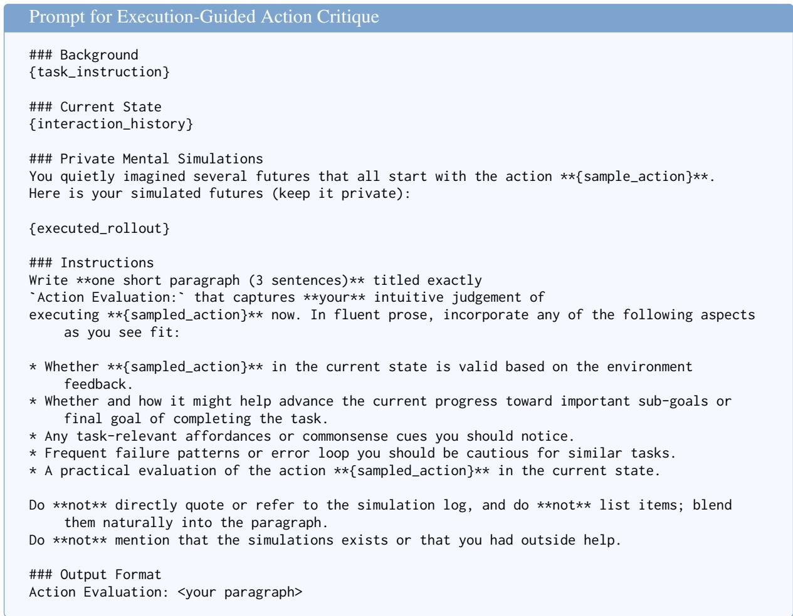  
Figure 5: Prompt used for the execution-guided action critique.

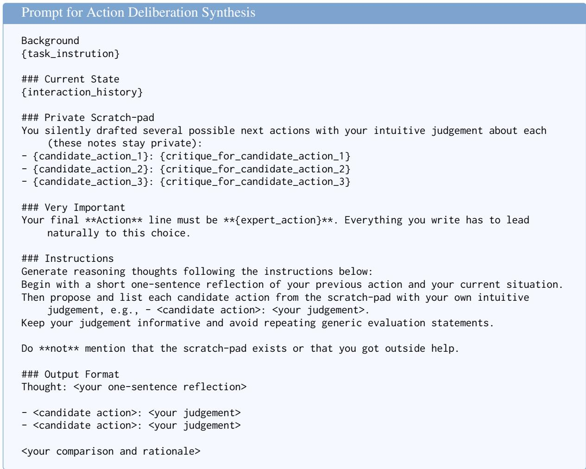  
Figure 6: Prompt used for action deliberation synthesis.

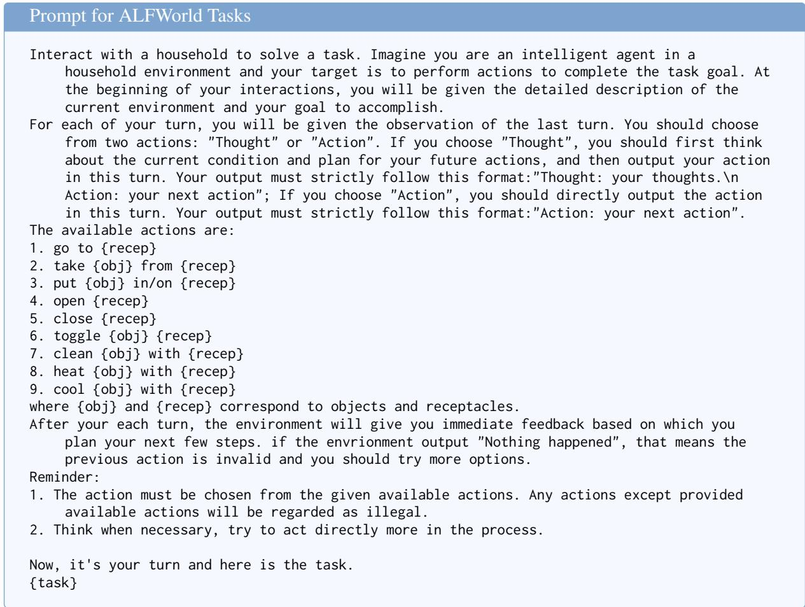  
Figure 7: Prompt used for ALFWorld tasks.

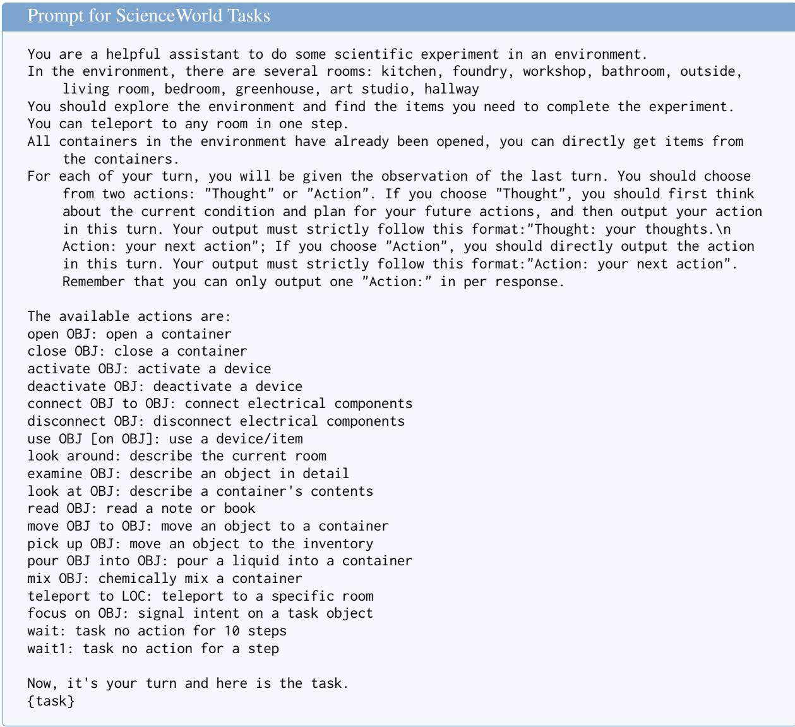  
Figure 8: Prompt used for ScienceWorld tasks.