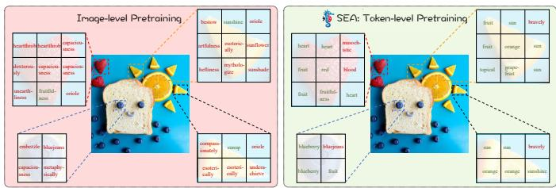
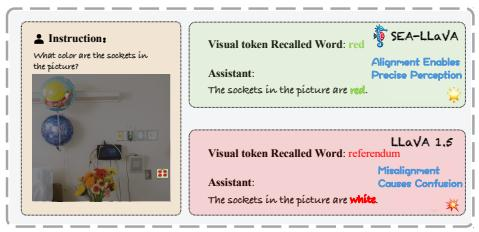
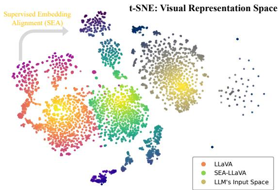
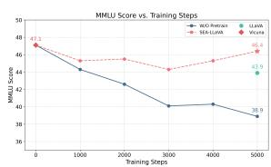
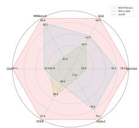
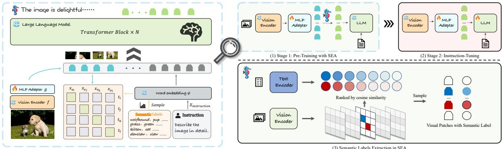
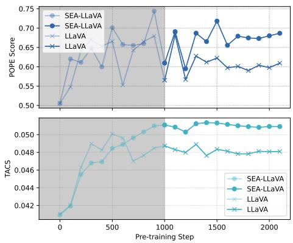
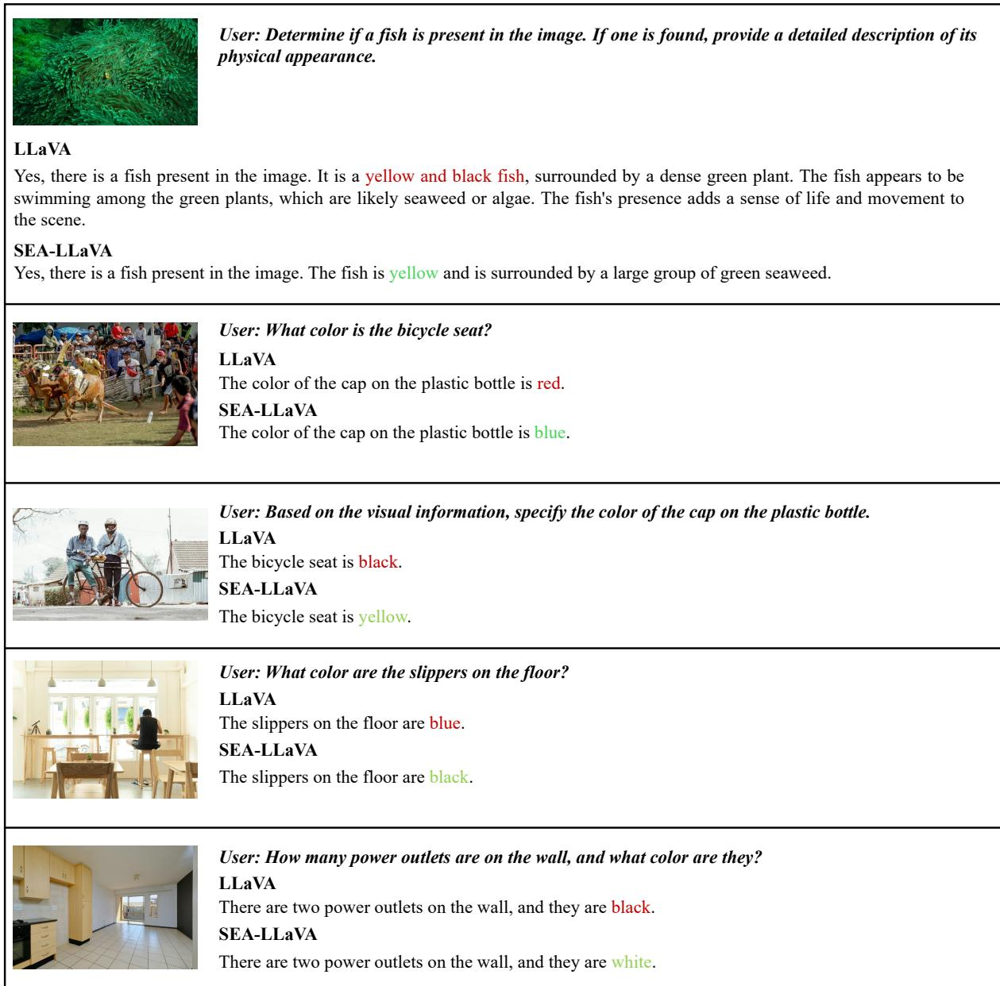

# SEA: Supervised Embedding Alignment for Token-Level Visual-Textual Integration in MLLMs

Yuanyang Yin\*1 Yaqi Zhao\*2 Yajie Zhang3 Yuanxing Zhang3 Ke Lin3 Jiahao Wang3 Xin Tao3 Pengfei Wan3 Wentao Zhang†2 Feng Zhao†1 1 MoE Key Lab of BIPC, USTC 2 Peking University 3 Kuaishou Technology

## Abstract

Multimodal Large Language Models (MLLMs) have demonstrated remarkable capabilities by integrating visual and textual inputs, yet modality alignment remains one of the most challenging aspects. Current MLLMs typically rely on simple adapter architectures and pretraining approaches to bridge vision encoders with large language models (LLM), guided by image-level supervision. We identify this paradigm often leads to suboptimal alignment between modalities, significantly constraining the LLM’s ability to properly interpret and reason with visual features particularly for smaller language models. To address this fundamental limitation, we propose Supervised Embedding Alignment (SEA), a token-level supervision alignment method that enables more precise visual-text alignment during pretraining. SEA introduces minimal computational overhead while preserving language capabilities and substantially improving cross-modal understanding. Our comprehensive analyses reveal critical insights into the adapter’s role in multi modal integration, and extensive experiments demonstrate that SEA consistently improves performance across various model sizes, with smaller models benefiting the most (average performance gain of 7.61% for Gemma-2B). This work establishes a foundation for devel oping more effective alignment strategies for future multimodal systems. Code is available at: https://github.com/YuanyangYin/SEA

## 1 Introduction

Multimodal Large Language Models (MLLMs) have emerged as a development in AI research, demonstrating exceptional capabilities in perceiving and reasoning (Agrawal et al., 2019; Antol et al., 2015; Liu et al., 2023a; Li et al., 2024a; Bai et al., 2025). By integrating visual and textual information, these models mark a crucial step toward artificial general intelligence.

The standard MLLM pipeline consists of two stages (Liu et al., 2023a,b; Jiang et al., 2023; Zhu et al., 2023; Dai et al., 2023; Li et al., 2024a; Zhou et al., 2024a): pre-training, where an adapter maps vision encoder features to the LLM’s input space, guided by image-level supervision, and instruction tuning, which further adapts the model for downstream tasks, often involving partial or full LLM fine-tuning.

However, despite recent advances through scaling up data, models, and visual inputs (Tong et al., 2024a; Li et al., 2024a; Bai et al., 2025; Wang et al., 2024), current approaches to text-visual alignment in MLLMs predominantly rely on coarse-grained image-level or region-level supervision, like optimal transport (Park et al., 2024) or regression-based techniques (Shang et al., 2024). These methods fail to capture the fine-grained semantics necessary for optimal visual-language integration. Therefore, the adapter’s critical role of current alignment paradigm remain insufficiently explored.

Our experiments reveal two critical deficiencies in conventional image-level alignment. First, as shown in Figure 1, visual tokens from traditional adapters often fail to preserve their intended semantics, forcing the language model to compensate for these deficiencies and leading to incorrect visual understanding (more cases in Appendix A). Second, the significant gap between adapter-processed visual tokens and the LLM’s native input space (see Figure 2) requires the language model to allocate extra capacity interpreting misaligned visual inputs, rather than leveraging its pre-trained knowledge. These issues are particularly pronounced in smaller models, where limited capacity makes the trade-off between visual perception and language performance more severe.

This work addresses a fundamental question: How can we achieve optimal cross-modal alignment in MLLMs? To effectively bridge the gap between modalities, we argue that alignment must occur at the token level, where individual visual tokens are precisely mapped to their corresponding semantic representations in the language space. However, achieving such fine-grained alignment presents fundamental challenges: visual tokens contain rich, multifaceted semantic information that cannot be trivially equated to single word tokens. Additionally, visual tokens often exhibit semantic shifts that cannot be easily captured through token-level annotations.

  
(a) Accurate representation alignment with SEA.

  
(b) Improved visual perception enabled by SEA.

Figure 1: Illustration of token-level alignment benefits. (a) For each visual token, we retrieve and display the most similar word from the pre-defined vocabulary. SEA (right) produces semantically appropriate words (e.g., "blueberry", "orange") that better capture the visual content compared to conventional image-level alignment (left). (b) This improved alignment directly enhances visual perception capabilities, enabling more precise understanding of image elements (SEA-LLaVA correctly identifies "red" sockets while LLaVA misidentifies them).  
  
Figure 2: Illustration of the distribution of different token embeddings. Using t-SNE, we visualize the embedding space of LLaVA visual tokens (left), SEA-LLaVA visual tokens (mid), and LLM’s native input embeddings (right). SEA effectively shifts visual token representations closer to the LLM’s natural input space, reducing the adaptation burden on the language model and improving cross-modal integration.

To address this, we introduce Supervised Embedding Alignment (SEA), which achieves optimal cross-modal alignment through token-level supervision during pretraining. By leveraging wellaligned vision-language models like CLIP, SEA obtains precise semantic labels for visual tokens and guides them toward optimal representations in the LLM’s embedding space through contrastive learning (see Figure 2). This approach requires no additional training data or inference overhead.

Empirically, SEA demonstrates consistent improvements across model scales (2B-13B parameters), with particularly substantial gains for smaller models (7.61% improvement on Gemma-2B). This scalability, combined with enhanced fine-grained visual perception, fundamentally addresses the limitations of current MLLM designs while maintaining computational efficiency.

In summary, our contributions and findings can be summarized as follows:

• We systematically analyze how adapter misalignment impacts MLLM performance, revealing its critical role in both visual perception and language capabilities.

• We propose SEA, a novel token-level alignment during pretraining that effectively bridges the modality gap by precisely aligning visual tokens with the LLM’s input space.

• We demonstrate SEA’s effectiveness across model scales and different vision encoders without additional training data or inference overhead, showing particular benefits for smaller models.

## 2 Background and Problem Formulation

This section introduces the adapter-based architecture in MLLMs and analyzes the cross-modal misalignment problem that forms the foundation for our method in Section 3.

## 2.1 Adapter-Based Architecture in MLLMs

Multimodal Large Language Models typically employ an adapter module to bridge vision encoders and language models. During pre-training, this

  
(a) MMLU with Finetuning

  
(b) Results of Different Methods  
Figure 3: Impact of alignment quality on model performance. (a) Language model capability (measured by MMLU score) during instruction-tuning: SEA-LLaVA (red line) maintains higher language capabilities compared to LLaVA (green point) by reducing adaptation burden. (b) Radar chart comparing performance across different benchmarks: SEA-LLaVA (red) consistently outperforms LLaVA (blue) on multiple evaluation metrics.

adapter $g _ { \boldsymbol { \theta } }$ transforms visual patches output by the vision encoder f into visual tokens compatible with the LLM’s embedding space.

For a given image-text pair $\left( X _ { \mathrm { i m a g e } } , X _ { \mathrm { t e x t } } \right)$ , the model processes inputs as follows:

$$
X _ { v } = g _ { \theta } ( f ( X _ { \mathrm { i m a g e } } ) ) ,\tag{1}
$$

$$
X _ { t } = \Psi \left( X _ { \mathrm { t e x t } } \right) ,\tag{2}
$$

$$
X _ { \mathrm { i n p u t } } = [ x _ { v _ { 0 } } , \ldots , x _ { v _ { m } } , x _ { t _ { 0 } } , \ldots , x _ { t _ { n } } ] ,
$$

$$
x _ { v _ { j } } \in X _ { v } \quad x _ { t _ { i } } \in X _ { t } ,\tag{3}
$$

where Ψ represents the LLM’s embedding layer. The concatenated inputs $X _ { \mathrm { i n p u t } }$ are then processed by the LLM, with the adapter parameters θ updated using an auto-regressive language modeling loss.

## 2.2 Issues in Image-level Alignment

Despite current pre-training paradigm, significant misalignment issues persist between visual and textual representations in MLLMs. To quantitatively analyze this misalignment, we measure the semantic correspondence between visual tokens and language representations.

Semantic Information Distortion We evaluate the semantic information encoded in visual tokens by retrieving their closest word embeddings from a predefined word list W (see Appendix C). For each visual token $x _ { v _ { j } } \in X _ { v } ,$ we identify the word $w _ { j } \in W$ with the highest similarity:

$$
\boldsymbol w _ { j } = \arg \operatorname* { m a x } _ { \boldsymbol w \in W } \sin ( x _ { \boldsymbol v _ { j } } , \boldsymbol \Psi ( \boldsymbol w ) ) ,\tag{4}
$$

where sim $( \cdot , \cdot )$ is the cosine similarity function. As shown in Figure 1(a), conventional adapters frequently map visual tokens to semantically unrelated words (e.g., "bluejeans" for blueberries), indicating severe semantic distortion. As shown in Figure 1(b), this distortion forces the language model to compensate for representational discrepancies, resulting in incorrect visual understanding.

Modality Representation Gap We further analyze the modality gap through embedding space visualization (Figure 2). We selected approximately 100 images from COCO val2014 (Chen et al., 2015) and generated detailed captions using Qwen2.5- VL (Bai et al., 2025) followed by manual refinement. The visualization shows three distinct clusters: visual token embeddings $( X _ { v } )$ from the images (orange), text token embeddings from the captions (yellow). The significant distance between conventional adapter-processed visual tokens and text token embeddings reveals a fundamental representational gap. Mathematically, we can quantify this gap as:

$$
D = \frac { 1 } { | X _ { v } | } \sum _ { x _ { v _ { j } } \in X _ { v } } \operatorname* { m i n } _ { w \in W } \left\| x _ { v _ { j } } - \Psi ( w ) \right\| _ { 2 } .\tag{5}
$$

This gap forces the language model to allocate substantial capacity to interpret misaligned visual inputs rather than leveraging its inherent knowledge.

The impact of this misalignment is clearly demonstrated in Figure 3, where we track the language model’s performance (measured by MMLU score) during instruction-tuning. The model without pre-training (blue line) shows a substantial decrease in language capability as training progresses, highlighting the critical importance of alignment. However, the conventional image-level alignment provides only marginal mitigation. This effect is particularly pronounced in smaller models where computational capacity is limited, highlighting the critical need for more efficient alignment strategies.

## 3 Method: Supervised Embedding Alignment

This section presents SEA, the first supervision paradigm to mitigate the issue of misalignment between visual and text tokens in LLM’s embedding space during pretraining (see Figure 4). We will introduce each step of SEA in detail.

## 3.1 Extract Semantic Labels for Visual Patches

To achieve fine-grained supervision of the semantic feature expression for each visual token transformed by the adapter, we obtain continuous semantic labels for each patch after the vision encoder. For a pre-trained vision encoder f paired with a text encoder h and a word list W containing q words, we extract semantic information for each patch using Eqs. (6), (7), (8), where m is number of visual patches and d is the dimension. We then select the top n words based on cosine similarity scores for each visual patch (see Figure 4(3)). To ensure only relevant and positively correlated words are considered, we exclude labels with similarity scores below 0. The remaining words serve as the semantic labels for each visual patch. This approach assigns multiple semantic labels to each token, preserving its continuous semantic representation and preventing semantic shift through paired training of the vision and text encoders.

  
Figure 4: Left: Overview of the proposed SEA. For each visual token, SEA samples semantic labels with similarity-based weighting and identifies their corresponding representations in the LLM’s embedding space. These are then used to supervise the adapter via contrastive learning, enabling token-level alignment. Right: Overview of the SEA training pipeline. During pretraining, SEA enhances modality alignment through token-level semantic supervision via contrastive learning, guided by candidate labels derived from the text encoder. Once alignment is established, visual tokens are mapped to representations more compatible with the LLM input space, substantially reducing the burden on the LLM during instruction tuning.

$$
V = f ( X _ { \mathrm { i m a g e } } ) \in \mathcal { R } ^ { m \times d } ,\tag{6}
$$

$$
T = h ( W ) \in \mathcal { R } ^ { q \times d } ,\tag{7}
$$

$$
w _ { i } , s _ { i } = \operatorname * { a r g m a x } _ { j } \{ - \cos ( v _ { i } , t _ { j } ) \} ,\tag{8}
$$

where $w _ { i }$ and $s _ { i }$ are the indices and scores of the top n semantic labels for the i-th visual patch $v _ { i }$ respectively. $v _ { i }$ is the visual feature of the patch obtained from the vision encoder $f ,$ , and $t _ { j }$ is the text embedding of the $j \cdot$ -th word in the word list W, obtained from the text encoder h. The negative cosine similarity $\cdot \cos ( v _ { i } , t _ { j } )$ is computed as described in previous works (Li et al., 2023c), where the cosine similarity needs to be negated in the CLIP embedding space.

## 3.2 Token-Level Alignment

The use of an adapter aims to convert visual patches into LLM’s embedding space. However, the current image-level approach falls short of achieving this adequately as shown in Figure 1(a). We suggest using the semantic labels of each patch to directly guide the adapter in transforming visual patches into the LLM’s embedding space, thereby reducing misalignment.

Similarity-Weighted Sampling for Continuous Semantic Representation Due to the semantic continuity of visual tokens, we should identify an appropriate position for each visual token within the LLM’s embedding space, ensuring it retains its continuous semantic representation. Specifically, for a given visual patch $v _ { i }$ with its corresponding semantic labels $L _ { i } = [ w _ { 1 } , \dots , w _ { n } ]$ and similarity scores ${ \cal S } _ { i } = [ s _ { 1 } , \ldots , s _ { n } ]$ , we first normalize the similarity scores to get the sampling probability, and then sample a label for each patch based on $S _ { n o r m } ^ { i }$ in Eq. (9).

$$
S _ { n o r m } ^ { i } = \frac { S _ { i } } { s u m ( S _ { i } ) } .\tag{9}
$$

A Localized Sampling Strategy To further enhance the effectiveness of contrastive learning and mitigate the issue of excessive similarity between samples, we adopt a localized sampling strategy. For each image, we perform sampling within a k  k window, ensuring that only one patch is sampled from each window. Consequently, a single image with N visual patches will have $N / ( k \times k )$ patches participating in contrastive learning. For visual patches sharing the same label in one batch, we randomly retain only one patch to ensure the effectiveness of contrastive learning. We then obtain a series of visual patches with labels, namely, $\{ ( x _ { v _ { 1 } } , w _ { 1 } ) , \ldots , ( x _ { v _ { N } } , w _ { N } ) \}$ , where N is the number of tokens in one batch.

For each label $w _ { i }$ , we compute the corresponding text feature $t _ { i }$ as follows:

$$
t _ { i } = \frac { 1 } { M } \sum _ { k = 1 } ^ { M } \Psi ( w _ { i } ^ { k } ) ,\tag{10}
$$

where $\Psi ( w _ { i } ^ { k } )$ represents encoded feature of the $k \mathrm { - }$ th token of $w _ { i }$ , and M is the number of tokens after encoding $w _ { i }$

The loss of alignment can be computed as:

$$
\begin{array} { r l r } {  { \mathcal L _ { a } = - \frac { 1 } { 2 N } \sum _ { i = 1 } ^ { N } ( \log \frac { \exp ( \phi ( \pmb x _ { v i } , \pmb t _ { i } ) / \tau ) } { \sum _ { j = 1 } ^ { N } \exp ( \phi ( \pmb x _ { v i } , \pmb t _ { j } ) / \tau ) }  } } \\ & { } & { \quad  + \log \frac { \exp ( \phi ( \pmb t _ { i } , \pmb x _ { v i } ) / \tau ) } { \sum _ { j = 1 } ^ { N } \exp ( \phi ( \pmb t _ { i } , \pmb x _ { v j } ) / \tau ) } ) } \end{array}\tag{11}
$$

where $\begin{array} { r } { \phi ( \pmb { x _ { v _ { i } } } , \pmb { t _ { j } } ) = \frac { \pmb { x _ { v _ { i } } } } { \| \pmb { x _ { v _ { i } } } \| _ { 2 } } \cdot \frac { \pmb { t _ { j } } } { \| \pmb { t _ { j } } \| _ { 2 } } } \end{array}$ , and $\tau$ is the temperature, a learnable parameter.

For generation, the prediction of the next token $x ^ { ( i ) }$ is conducted based on visual tokens $V _ { i } ,$ , prompt P and previous tokens $x ^ { ( < i ) }$ . The loss can be computed as:

$$
\mathcal { L } _ { \mathrm { g } } = - \frac { 1 } { B } \sum _ { i = 1 } ^ { B } \log p _ { \theta } \left( x ^ { ( i ) } \mid V _ { \mathrm { i } } , \mathrm { P } , x ^ { ( < i ) } \right) ,\tag{12}
$$

where $B$ is the batch size, θ is the trainable parameters.

During the pretraining process, two learning objectives simultaneously supervise the adapter. We obtain the final loss $\mathcal { L }$ of pretraining by adding $\mathcal { L } _ { a }$ and $\mathcal { L } _ { g } ,$ a weighting factor λ is introduced to balance the two losses.

$$
{ \mathcal { L } } = { \mathcal { L } } _ { \mathrm { g } } + \lambda { \mathcal { L } } _ { \mathrm { a } } .\tag{13}
$$

## 4 Experiments

In this section, we conduct comprehensive experiments to validate SEA’s effectiveness. First, we provide our evaluation results on 8 common benchmarks compared with different backbones. Then, we analyze how SEA enhances token-level alignment, visual perception and language capability. Finally, we explore SEA’s generalization capability through extensive ablation studies.

## 4.1 Experimental Setup

We evaluate SEA’s generalization capability across different MLLM components: 1) Vision Encoders: We experiment with widely-adopted vision encoders including CLIP-ViT-L@336px (Radford et al., 2021) and SigLIP-ViT-SO@384px (Zhai et al., 2023). 2) Language Models: To assess scalability, we test SEA on LLMs ranging from 2B to 13B parameters, including Gemma-2B (Banks and Warkentin, 2024), Phi-3-mini-4k-instruct (Abdin et al., 2024), Llama3-8B-Instruct (AI@Meta, 2024), and Vicuna-1.5-7B&13B (Chiang et al., 2023). 3) SEA Configuration: We employ top-10 semantic labels (n = 10), zero temperature $( \tau = 0 )$ for robust alignment, and $2 \times 2$ window sampling for efficient training. Unless otherwise specified, all experiments adopt the standard LLaVA-v1.5- 7B configuration, with Vicuna-7B as the language model and CLIP-L@336px as the vision encoder. ,More details of training and data sets are described in Appendix B.

## 4.2 Main Results

We leverage SEA to train a family of MLLMs called SEA-PRIME, utilizing LLM backbones of various scales. The vision component employs SigLIP-ViT-SO400M/14@384. We pre-train the connector using 2.5M adapter data and instruction tune using Cambrian-7M (Tong et al., 2024a).

As shown in Table 1, SEA-PRIME show robust improvements over existing open-source methods. Even with smaller models (2B and 3.8B), it achieves competitive results compared to larger counterparts. The scalability becomes particularly evident with LLaMA-3-Instruct-8B (AI@Meta, 2024), where SEA-PRIME demonstrates superior performance across all benchmarks.

These results highlight SEA’s ability to enhance model performance while maintaining efficiency, particularly benefiting smaller models through better alignment.

## 4.3 Token-level Alignment Analysis

To comprehensively evaluate SEA’s effectiveness in bridging the modality gap, we analyze its impact from three perspectives: alignment quality during pre-training, fine-grained visual perception, and preservation of language capabilities.

Alignment Quality To quantify alignment quality, we introduce Token Alignment Consistency Score (TACS) to measure the similarity between each visual tokens in the matrix $X _ { v }$ and text tokens $X _ { t }$ as defined in in Equation (1) and in Equation (2):

<table><tr><td>Method</td><td>LLM</td><td>Res.</td><td> $\mathbf { V Q A } ^ { \mathrm { v } 2 }$ </td><td> $\mathbf { V Q A } ^ { \mathrm { T } }$ </td><td>GQA</td><td>SQA1</td><td>MMB</td><td>POPE</td><td>VizWiz</td><td>MM-Vet</td></tr><tr><td>MobileVLM-3B(Chu et al., 2023)</td><td>MLLaMA 2.7B</td><td>336</td><td>一</td><td>47.5</td><td>59.0</td><td>61.0</td><td>59.6</td><td>84.9</td><td></td><td></td></tr><tr><td>MobileVLM-V2-3B(Chu et al., 2024)</td><td>MLLaMA 2.7B</td><td>336</td><td>一</td><td>57.5</td><td>61.1</td><td>70.0</td><td>63.2</td><td>84.7</td><td></td><td></td></tr><tr><td>LLaVA-Phi (Zhu et al., 2024)</td><td>Phi-2.7B</td><td>336</td><td>71.4</td><td>48.6</td><td>一</td><td>68.4</td><td>59.8</td><td>85.0</td><td>35.9</td><td>28.7</td></tr><tr><td>TinyLLaVA (Zhou et al., 2024b)</td><td>Phi-2.7B</td><td>384</td><td>79.9</td><td>59.1</td><td>62.0</td><td>69.1</td><td>66.9</td><td>86.4</td><td></td><td>32.0</td></tr><tr><td>InstructBLIP (Dai et al., 2023)</td><td>Vicuna-7B</td><td>224</td><td>一</td><td>50.1</td><td></td><td>一</td><td>30.6</td><td>一</td><td>34.5</td><td></td></tr><tr><td>InstructBLIP (Dai et al., 2023)</td><td>Vicuna-13B</td><td>224</td><td>一</td><td>50.7</td><td>49.5</td><td>63.1</td><td>一</td><td>一</td><td>33.4</td><td></td></tr><tr><td>Qwen-VL (Bai et al., 2023)</td><td>Qwen-7B</td><td>448</td><td>79.5</td><td>63.8</td><td>59.3</td><td>67.1</td><td>38.2</td><td></td><td>35.2</td><td></td></tr><tr><td>Qwen-VL-Chat (Bai et al., 2023)</td><td>Qwen-7B</td><td>448</td><td>78.2</td><td>61.5</td><td>57.5</td><td>68.2</td><td>60.6</td><td></td><td>38.9</td><td></td></tr><tr><td>LLaMA-VID (Li et al., 2023b)</td><td>Vicuna-7B</td><td>336</td><td>79.3</td><td>一</td><td>64.3</td><td>68.3</td><td>65.1</td><td>86.0</td><td>54.2</td><td></td></tr><tr><td>LLaMA-VID (Li et al., 2023b)</td><td>Vicuna-13B</td><td>336</td><td>80.0</td><td>一</td><td>65.0</td><td>70.0</td><td>66.6</td><td>86.0</td><td>54.3</td><td></td></tr><tr><td>LLaVA-1.5* (Liu et al., 2023a)</td><td>Vicuna-7B</td><td>336</td><td>78.8</td><td>58.3</td><td>62.0</td><td>67.9</td><td>66.2</td><td>86.5</td><td>45.7</td><td>30.7</td></tr><tr><td>LLaVA-1.5* (Liu et al., 2023a)</td><td>Vicuna-13B</td><td>336</td><td>80.0</td><td>60.8</td><td>63.3</td><td>71.6</td><td>67.7</td><td>87.6</td><td>53.6</td><td>35.1</td></tr><tr><td>ShareGPT4V (Chen et al., 2023)</td><td>Vicuna-7B</td><td>336</td><td>80.6</td><td>一</td><td>一</td><td>68.4</td><td>68.8</td><td>一</td><td>一</td><td>37.6</td></tr><tr><td>Mini-Gemini (Li et al., 2024b)</td><td>Gemma-2B</td><td>336+768</td><td>一</td><td>56.2</td><td>一</td><td>一</td><td>59.8</td><td></td><td></td><td>31.1</td></tr><tr><td>Mini-Gemini (Li et al., 2024b)</td><td>Vicuna-7B</td><td>336+768</td><td>一</td><td>65.2</td><td>一</td><td>一</td><td>69.3</td><td></td><td>一</td><td>40.8</td></tr><tr><td>Mini-Gemini (Li et al., 2024b)</td><td>Vicuna-13B</td><td>336+768</td><td>一</td><td>65.9</td><td>1</td><td>一</td><td>68.5</td><td>1</td><td>一</td><td>46.0</td></tr><tr><td>S2–Wrapper* (Shi et al., 2024)</td><td>Vicuna-7B</td><td>1008</td><td>79.7</td><td>60.3</td><td>63.2</td><td>一</td><td>67.3</td><td>87.4</td><td>50.1</td><td>33.0</td></tr><tr><td>S2–Wrapper (Shi et al., 2024)</td><td>Vicuna-13B</td><td>1008</td><td>80.9</td><td>63.1</td><td></td><td></td><td>67.9</td><td></td><td>56.0</td><td>35.4</td></tr><tr><td>AlignGPT (Zhao et al., 2024)</td><td>Vicuna-7B</td><td>336</td><td>79.1</td><td>58.4</td><td>62.9</td><td>68.5</td><td>67.3</td><td>86.0</td><td>54.2</td><td>30.8</td></tr><tr><td>AlignGPT (Zhao et al., 2024)</td><td>Vicuna-13B</td><td>336</td><td>80.0</td><td>60.2</td><td>63.6</td><td>70.3</td><td>69.5</td><td>86.2</td><td>56.4</td><td>35.6</td></tr><tr><td>Visual Prompt (Lin et al., 2024)</td><td>Vicuna-7B</td><td>336</td><td>79.8</td><td>59.8</td><td>63.3</td><td>69.5</td><td>67.6</td><td>88.9</td><td>一</td><td>34.9</td></tr><tr><td colspan="9">Our Models</td><td></td></tr><tr><td>SEA-PRIME</td><td>Gemma-2B</td><td>384</td><td>81.0</td><td>60.7</td><td>62.4</td><td>69.2</td><td>68.8</td><td>87.8</td><td>61.9</td><td>38.0</td></tr><tr><td>SEA-PRIME</td><td>Phi3-3.8B</td><td>384</td><td>80.7</td><td>64.0</td><td>62.0</td><td>78.7</td><td>72.6</td><td>87.0</td><td>61.9</td><td>46.8</td></tr><tr><td>SEA-PRIME</td><td>Vicuna-7B</td><td>384</td><td>81.4</td><td>67.2</td><td>63.1</td><td>73.9</td><td>75.6</td><td>88.4</td><td>63.8</td><td>44.2</td></tr><tr><td>SEA-PRIME</td><td>Llama3-8B</td><td>384</td><td>83.1</td><td>68.0</td><td>65.1</td><td>79.0</td><td>76.0</td><td>87.4</td><td>64.7</td><td>46.0</td></tr><tr><td>SEA-PRIME</td><td>Vicuna-13B</td><td>384</td><td>81.9</td><td>66.2</td><td>64.3</td><td>80.9</td><td>76.9</td><td>86.7</td><td>63.6</td><td>48.8</td></tr></table>

Table 1: Main evaluation results compared with leading baselines on 8 popular benchmarks. $\mathsf { V Q A } ^ { \mathrm { v } 2 }$ (Goyal et al., 2017); VQAT: TextVQA (Singh et al., 2019); GQA (Hudson and Manning, 2019); SQAI:ScienceQA-IMG (Lu et al., 2022); MMB: MMBench (Liu et al., 2023c); POPE (Li et al., 2023d); VizWiz (Gurari et al., 2018); MM-Vet (Yu et al., 2023). All methods maintain the number of visual tokens without doubling, and models marked with \* are results we reproduced. Column Res. is the image resolution of vision model.

  
Figure 5: TACS score and POPE score of 100 text-image pairs during pre-training. SEA achieves better alignment and higher POPE scores under the same training data.

$$
\mathrm { T A C S } = \frac { 1 } { K } \sum _ { i \in \mathrm { T o p K } } \operatorname* { m a x } _ { j } \left( \frac { X _ { v , i } \cdot X _ { t , j } } { \| X _ { v , i } \| \| X _ { t , j } \| } \right) .\tag{14}
$$

As shown in Figure 5, SEA progressively improves TACS during training, with corresponding gains in POPE scores. This correlation validates both our metric and SEA’s effectiveness in improving visual-text integration (see Appendix D for detail).

Fine-grained Visual Perception As illustrated in Section 2, conventional MLLMs treat visual tokens as additional vocabulary, limiting their semantic understanding (see Figure 1(a)). SEA addresses this by providing precise semantic supervision during pretraining, enabling more accurate visual representations. This improvement in token-level alignment directly enhances the model’s ability to capture fine-grained visual semantics, as demonstrated across perception-focused tasks (see Table 3). From detailed caption generation to finegrained object recognition, SEA improves the model’s visual understanding capabilities.

Language Model Capabilities A key challenge in multimodal learning is maintaining the LLM’s inherent language abilities while adapting to visual inputs. As shown in Figure 3(a), conventional image-level alignment show degradation (green point) in language performance after training. In contrast, SEA’s semantically aligned visual representations alleviate the adaption burden, allowing the language model to better preserve its pretrained knowledge and capabilities.

These analyses demonstrate that SEA effectively address both semantic distortion and modality representation gaps identifies in Section 2, leading to improved overall model performance.

## 4.4 Ablation Study

We conducted a comprehensive ablation study to evaluate the effectiveness of SEA. To ensure fairness, all experiments were performed with the same random seed and training configurations. As shown in Section 4.3, SEA introduces no additional training data or inference cost, yet consistently improves the overall performance of MLLMs.

SEA consistently benefits different LLMs, with particularly strong improvements in smaller models. Our experiments explore the application of SEA across LLMs of varying sizes. Notably, for the smaller model, SEA significantly boosts performance across multiple tasks, with an average performance gain of 7.61%. This highlights SEA’s ability to effectively address misalignment issues that are more pronounced in smaller LLMs, thereby enhancing their performance. Larger LLMs, while inherently better at handling misalignment, still benefit from SEA, indicating that SEA offers additional alignment gains regardless of model size.

SEA provides robust benefits across diverse vision encoders. We also examined the impact of SEA with different vision encoders. Replacing the CLIP-ViT (Radford et al., 2021) with the SigLIP-SO(400M) (Zhai et al., 2023), SEA consistently improves performance, underscoring SEA’s robustness across different encoders.

## 4.5 Further Discussions

Vision Encoder Fine-tuning Given that SEA leverages well-aligned vision encoders for optimal token-level supervision during pretraining, a natural concern arises: would fine-tuning the vision encoder in instruction-tuning potentially disrupt this carefully established alignment? To investigate this, we follow (Tong et al., 2024a) to unfreeze the vision encoder during instruction-tuning. Surprisingly, our results show that this not only maintains but further improves performance (see Table 4). This suggests that with SEA’s strong token-level alignment as initialization, the vision encoder can focus on adapting to domain-specific features while preserving the semantic alignment established in pretraining. These findings indicate SEA’s flexibility and adaptability in different training paradigms.

Cross-encoder Transfer Recent advances in combining different vision encoders have shown promising results in MLLMs (Tong et al., 2024b,a; Li et al., 2024b; Goncharova et al., 2024), yet a common challenge lies in endowing these taskspecific vision encoders with rich semantic understanding. We explore whether SEA’s semantic supervision can bridge this gap by transferring CLIPderived semantic labels to other vision encoders. Specifically, we apply SEA’s training paradigm to DINOv2 (Oquab et al., 2023), using the same semantic labels extracted from CLIP. As shown in Table 5, this simple transfer strategy leads to significant improvements on visual understanding benchmarks (e.g., VQAv2, GQA). Notably, the performance gains persist even on MMVP (Tong et al., 2024b), where DINOv2 traditionally excels. These results demonstrate that SEA’s semantic supervision framework can effectively enhance various vision encoders’ semantic understanding capabilities without requiring architectural changes or additional training objectives.

## 5 Related Work

Vision-Language Pre-training The integration of vision and language has led to Vision-Language Models (VLMs), which leverage image-text pairs to enrich semantic understanding. Contrastive learning has played a pivotal role in pre-training, with models like CLIP (Radford et al., 2021), ALIGN (Jia et al., 2021), and SPARC (Bica et al., 2024) applying softmax contrastive learning on large-scale datasets. Unlike these methods, SigLIP (Zhai et al., 2023) introduces a simpler pairwise Sigmoid loss, removing the need for global similarity normalization. These models demonstrate strong zero-shot transfer capabilities, improving performance across multimodal tasks.

Cross-modal Alignment in MLLMs Crossmodal alignment in MLLMs typically follows deep or shallow fusion strategies. Deep fusion (Alayrac et al., 2022; Laurençon et al., 2023; Awadalla et al., 2023; Wang et al., 2023) integrates vision encoder outputs into the LLM via interaction modules, allowing direct attention to image features. In contrast, shallow fusion (Liu et al., 2023b; Koh et al., 2023; Driess et al., 2023; Li et al., 2023a; Zhu et al., 2023; Bai et al., 2025; Liu et al., 2023a) concatenates visual and text embeddings before passing them to the LLM, but struggles to bridge the alignment gap. Recent methods address this misalignment through techniques like similarity-based token assignment (AlignGPT (Zhao et al., 2024)) and segmentation/OCR-enhanced visual tokens (Rethinking MLLMs (Lin et al., 2024)). However, these approaches fail to fundamentally improve adapter alignment. To address this, we propose Supervised Embedding Alignment (SEA), a tokenlevel alignment paradigm that optimizes adapter integration for precise visual-text representation.

<table><tr><td>Method</td><td>VE</td><td>Res.</td><td>PT+IT</td><td>LLM</td><td> $\mathbf { V Q A } ^ { \mathrm { v 2 } }$ </td><td> $\mathbf { V O A } ^ { \mathrm { T } }$ </td><td>GQA</td><td> $\mathbf { S O A } ^ { \mathrm { I } }$ </td><td>MMB</td><td>POPE</td><td>VizWiz</td><td>MM-Vet</td></tr><tr><td>LLaVA</td><td>CLIP-L</td><td>336</td><td>0.5M+0.6M</td><td>Vicuna-7B</td><td>78.8</td><td>58.3</td><td>62.0</td><td>67.9</td><td>66.2</td><td>86.5</td><td>45.7</td><td>30.7</td></tr><tr><td>SEA-LLaVA</td><td>CLIP-L</td><td>336</td><td>0.5M+0.6M</td><td>Vicuna-7B</td><td>79.1</td><td>58.9</td><td>63.2</td><td>69.4</td><td>66.8</td><td>87.6</td><td>48.8</td><td>31.9</td></tr><tr><td colspan="10">Applying to Different LLMs</td><td></td><td></td><td></td></tr><tr><td>LLaVA</td><td>CLIP-L</td><td>336</td><td>0.5M+0.6M</td><td>Gemma-2B</td><td>72.5</td><td>43.7</td><td>56.0</td><td>61.3</td><td>54.0</td><td>84.4</td><td>38.7</td><td>23.9</td></tr><tr><td>+ SEA</td><td>CLIP-L</td><td>336</td><td>0.5M+0.6M</td><td>Gemma-2B</td><td>76.6</td><td>49.7</td><td>60.9</td><td>62.5</td><td>59.5</td><td>87.0</td><td>39.5</td><td>27.6</td></tr><tr><td>LLaVA</td><td>CLIP-L</td><td>336</td><td>0.5M+0.6M</td><td>Phi3-3.8B</td><td>77.4</td><td>54.6</td><td>60.8</td><td>73.0</td><td>68.7</td><td>86.5</td><td>37.1</td><td>35.4</td></tr><tr><td>+ SEA</td><td>CLIP-L</td><td>336</td><td>0.5M+0.6M</td><td>Phi3-3.8B</td><td>77.5</td><td>55.3</td><td>61.0</td><td>74.2</td><td>69.4</td><td>87.0</td><td>39.0</td><td>34.7</td></tr><tr><td>LLaVA</td><td>CLIP-L</td><td>336</td><td>0.5M+0.6M</td><td>LlaMA3-8B</td><td>79.4</td><td>57.7</td><td>63.7</td><td>76.0</td><td>72.5</td><td>87.0</td><td>48.1</td><td>34.0</td></tr><tr><td>+ SEA</td><td>CLIP-L</td><td>336</td><td>0.5M+0.6M</td><td>LlaMA3-8B</td><td>79.6</td><td>58.0</td><td>63.8</td><td>76.6</td><td>72.0</td><td>87.0</td><td>45.2</td><td>36.3</td></tr><tr><td>LLaVA</td><td>CLIP-L</td><td>336</td><td>0.5M+0.6M</td><td>Vicuna-13B</td><td>80.0</td><td>60.8</td><td>63.3</td><td>71.6</td><td>67.7</td><td>87.6</td><td>53.6</td><td>35.1</td></tr><tr><td>+ SEA</td><td>CLIP-L</td><td>336</td><td>0.5M+0.6M</td><td>Vicuna-13B</td><td>79.8</td><td>60.4</td><td>63.8</td><td>71.7</td><td>68.0</td><td>87.6</td><td>57.3</td><td>35.8</td></tr><tr><td colspan="10">Applying to Different Vision Encoders</td><td></td><td></td><td></td></tr><tr><td>LLaVA</td><td>SigLIP-SO</td><td>384</td><td>0.5M+0.6M</td><td>Vicuna-7B</td><td>80.8</td><td>62.3</td><td>63.2</td><td>70.6</td><td>68.0</td><td>86.7</td><td>51.1</td><td>32.9</td></tr><tr><td>+ SEA</td><td>SigLIP-SO</td><td>384</td><td>0.5M+0.6M</td><td>Vicuna-7B</td><td>80.9</td><td>62.6</td><td>63.4</td><td>71.3</td><td>68.4</td><td>87.3</td><td>52.4</td><td>34.6</td></tr></table>

Table 2: Exploring the compatibility and scalability of SEA. Scaling results on LLM, vision encoder (VE) and resolution (Res.) are provided. "0.5M+0.6M" denotes the training data from LLaVA-1.5. Results with SEA are marked in ■.
<table><tr><td>Method</td><td>CapsBench</td><td></td><td>Stanford Dogs</td><td></td><td>COCO Captions (CIDEr)</td><td></td><td>OCRBench</td><td></td><td>MMMU</td></tr><tr><td>LLaVA</td><td>88.0</td><td></td><td>28.6</td><td></td><td>84.8</td><td></td><td>319</td><td>0.44</td><td></td></tr><tr><td>+ SEA</td><td>90.4</td><td> $( + 2 . 7 \% ) \mathbb { L }$ </td><td>29.7</td><td> $( + 3 . 9 \% ) \underline { { \Vdash } }$ </td><td>88.7</td><td> $( + 4 . 6 \% ) \mathbb { - }$ </td><td>336  $( + 5 . 3 \% ) \mathop { \mathbb { \textstyle \equiv } }$ </td><td>0.49</td><td>(+11.4%)</td></tr></table>

Table 3: Ablation results on fine-grained perception tasks. We conduct ablation studies based on LLaVA across five fine-grained benchmarks: CapsBench (Liu et al., 2024a), Stanford Dogs (Khosla et al., 2011), COCO Captions (Chen et al., 2015), OCRBench (Liu et al., 2024b), and MMMU (Yue et al., 2024). For Stanford Dogs, we reformulate the task as a 4-way multiple-choice question. Results show that SEA consistently improves the perceptual capabilities of MLLMs, particularly in capturing fine-grained visual semantics.
<table><tr><td>Method</td><td colspan="2"> $\mathbf { V Q A } ^ { \mathbf { v } 2 }$ </td><td colspan="2"> $\mathbf { V Q A } ^ { \mathbf { T } }$ </td><td colspan="2">GQA</td><td colspan="2">SQA</td><td colspan="2">MMB</td><td colspan="2">VizWiz</td></tr><tr><td>Baseline</td><td>78.8</td><td></td><td>58.3</td><td></td><td>62.0</td><td></td><td>67.9</td><td></td><td>66.2</td><td></td><td>45.7</td><td></td></tr><tr><td>+ Finetune VE</td><td>80.3</td><td> $+ 1 . 5 \sqsubset$ </td><td>59.1</td><td> $+ 0 . 8 \sqsubset$ </td><td>63.4</td><td> $+ 1 . 4 \sqrt { \phantom { + } }$ </td><td>67.0</td><td>-0.9 一</td><td>66.1</td><td>-0.11</td><td>50.3</td><td>+4.6</td></tr><tr><td>+ SEA</td><td>80.5</td><td>+0.2 1</td><td>59.5</td><td> $+ 0 . 4 \ : \Gamma$ </td><td>63.6</td><td>+0.2 1</td><td>69.5</td><td>+2.5</td><td>68.0</td><td> $+ 1 . 9 \mathbb { - }$ </td><td>51.6</td><td>+1.3</td></tr></table>

Table 4: Ablations for fine-tuning vision encoder. The baseline is LLaVA-1.5 with Vicuna-7B, using the same training data and strategy. "Finetune VE" refers to the vision encoder is unfrozen during instruction tuning.
<table><tr><td>Method</td><td>VE</td><td>Res.</td><td>PT+IT</td><td>LLM</td><td> $\mathbf { V Q A } ^ { \mathrm { v } 2 }$ </td><td> $\mathbf { V Q A } ^ { \mathrm { T } }$ </td><td>GQA</td><td>SQA1</td><td>MMB</td><td>POPE</td><td>VizWiz</td><td>MM-Vet</td><td>MMVP</td></tr><tr><td>LLaVA</td><td>DINOv2-L</td><td>224</td><td> $0 . 5 \mathrm { M } \mathrm { + } 0 . 6 \mathrm { M }$ </td><td>Vicuna-7B</td><td>71.4</td><td>45.8</td><td>58.6</td><td>63.9</td><td>54.2</td><td>84.8</td><td>37.6</td><td>20.9</td><td>31.3</td></tr><tr><td>+ SEA</td><td>DINOv2-L</td><td>224</td><td> $0 . 5 \mathrm { M } \mathrm { + } 0 . 6 \mathrm { M }$ </td><td>Vicuna-7B</td><td>74.0</td><td>45.8</td><td>60.9</td><td>65.1</td><td>57.6</td><td>86.1</td><td>39.6</td><td>20.8</td><td>32.0</td></tr></table>

Table 5: Exploring the semantic label transfer. We obtained semantic labels from CLIP-Large and directly transferred them to the training of DINOv2, resulting in significant performance improvements.

## 6 Conclusion

In this paper, we introduced Supervised Embedding Alignment (SEA), a token-level supervision alignment method that effectively bridges the modality gap in Multimodal Large Language Models. By leveraging well-aligned vision-language models like CLIP, SEA provides precise semantic supervision for visual tokens, enabling their optimal alignment with the LLM’s input space. Unlike conventional image-level alignment approaches, SEA mitigate both semantic distortion and modality representation gaps, substantially reducing the adaptation burden on language models during instructiontuning. SEA requires no additional data or inference cost, yet delivers consistent performance improvements across multiple benchmarks, with especially strong gains for smaller models. Our findings highlight the importance of token-level alignment for efficient multimodal learning and demonstrate that precise adapter design impacts both visual perception and language capabilities in MLLMs.

## Limitations

While SEA exhibits strong performance in visual–textual integration, future work could investigate dynamic label selection that adapts to the complexity of visual content, as well as the relationship between representation alignment and safety alignment. Beyond images, extending this tokenlevel alignment framework to other modalities (e.g., video, audio) while maintaining language model capabilities presents an important direction for developing general-purpose multimodal systems.

Acknowledgments. This work was supported by the Anhui Provincial Natural Science Foundation under Grant 2108085UD12. We acknowledge the support of GPU cluster built by MCC Lab of Information Science and Technology Institution, USTC. The AI-driven experiments, simulations and model training were performed on the robotic AI-Scientist platform of Chinese Academy of Sciences.

## References

Marah Abdin, Sam Ade Jacobs, Ammar Ahmad Awan, Jyoti Aneja, Ahmed Awadallah, and 1 others. 2024. Phi-3 technical report: A highly capable language model locally on your phone. Preprint, arXiv:2404.14219.

Harsh Agrawal, Karan Desai, Yufei Wang, Xinlei Chen, Rishabh Jain, and 1 others. 2019. Nocaps: Novel object captioning at scale. In Proceedings of the IEEE/CVF international conference on computer vision, pages 8948–8957.

AI@Meta. 2024. Llama 3 model card. arXiv preprint.

Jean-Baptiste Alayrac, Jeff Donahue, Pauline Luc, Antoine Miech, Iain Barr, Yana Hasson, Karel Lenc, Arthur Mensch, Katherine Millican, Malcolm Reynolds, and 1 others. 2022. Flamingo: a visual language model for few-shot learning. Advances in neural information processing systems, 35:23716– 23736.

Stanislaw Antol, Aishwarya Agrawal, Jiasen Lu, Mar garet Mitchell, Dhruv Batra, C Lawrence Zitnick, and Devi Parikh. 2015. Vqa: Visual question answering. In Proceedings ofthe IEEE international conference on computer vision, pages 2425–2433.

Anas Awadalla, Irena Gao, Josh Gardner, Jack Hessel, and 1 others. 2023. Openflamingo: An open-source framework for training large autoregressive visionlanguage models. arXiv preprint arXiv:2308.01390.

Jinze Bai, Shuai Bai, Shusheng Yang, and 1 others. 2023. Qwen-vl: A frontier large vision-language model with versatile abilities. arXiv preprint arXiv:2308.12966.

Shuai Bai, Keqin Chen, Xuejing Liu, Jialin Wang, Wenbin Ge, Sibo Song, Kai Dang, Peng Wang, Shijie Wang, Jun Tang, and 1 others. 2025. Qwen2. 5-vl technical report. arXiv preprint arXiv:2502.13923.

Jeanine Banks and Tris Warkentin. 2024. Gemma: Introducing new state-of-the-art open models. Google. Available online at: https://blog. google/technology/developers/gemma-openmodels/(accessed 6 April, 2024).

Ioana Bica, Anastasija Ilic, Matthias Bauer, Goker Er-´ dogan, Matko Bošnjak, Christos Kaplanis, and 1 others. 2024. Improving fine-grained understanding in image-text pre-training. Preprint, arXiv:2401.09865.

Lin Chen, Jinsong Li, Xiaoyi Dong, Pan Zhang, and 1 others. 2023. Sharegpt4v: Improving large multi-modal models with better captions. Preprint, arXiv:2311.12793.

Xinlei Chen, Hao Fang, Tsung-Yi Lin, Ramakrishna Vedantam, Saurabh Gupta, Piotr Dollár, and C Lawrence Zitnick. 2015. Microsoft coco captions: Data collection and evaluation server. arXiv preprint arXiv:1504.00325.

Wei-Lin Chiang, Zhuohan Li, Ziqing Lin, Ying Sheng, Zhanghao Wu, Hao Zhang, Lianmin Zheng, Siyuan Zhuang, Yonghao Zhuang, Joseph E Gonzalez, and 1 others. 2023. Vicuna: An open-source chatbot impressing gpt-4 with 90%\* chatgpt quality. See https://vicuna. lmsys. org (accessed 14 April 2023), 2(3):6.

Xiangxiang Chu, Limeng Qiao, Xinyang Lin, Shuang Xu, Yang Yang, and 1 others. 2023. Mobilevlm : A fast, strong and open vision language assistant for mobile devices. Preprint, arXiv:2312.16886.

Xiangxiang Chu, Limeng Qiao, Xinyu Zhang, Shuang Xu, Fei Wei, and 1 others. 2024. Mobilevlm v2: Faster and stronger baseline for vision language model. Preprint, arXiv:2402.03766.

Wenliang Dai, Junnan Li, Dongxu Li, Anthony Meng Huat Tiong, and 1 others. 2023. Instructblip: Towards general-purpose vision-language models with instruction tuning. arXiv:2305.06500.

Danny Driess, Fei Xia, Mehdi SM Sajjadi, Corey Lynch, Aakanksha Chowdhery, Ayzaan Wahid, Jonathan Tompson, Quan Vuong, Tianhe Yu, Wenlong Huang, and 1 others. 2023. Palm-e: An embodied multimodal language model. arxiv Preprint.

Elizaveta Goncharova, Anton Razzhigaev, Matvey Mikhalchuk, Maxim Kurkin, Irina Abdullaeva, Matvey Skripkin, Ivan Oseledets, Denis Dimitrov, and Andrey Kuznetsov. 2024. Omnifusion technical report. arXiv preprint arXiv:2404.06212.

Yash Goyal, Tejas Khot, Douglas Summers-Stay, Dhruv Batra, and Devi Parikh. 2017. Making the v in vqa matter: Elevating the role of image understanding in visual question answering. In Proceedings ofthe IEEE conference on computer vision and pattern recognition, pages 6904–6913.

Danna Gurari, Qing Li, and 1 others. 2018. Vizwiz grand challenge: Answering visual questions from blind people. Preprint, arXiv:1802.08218.

Drew A Hudson and Christopher D Manning. 2019. Gqa: A new dataset for real-world visual reasoning and compositional question answering. In Proceedings ofthe IEEE/CVF conference on computer vision and pattern recognition, pages 6700–6709.

Chao Jia, Yinfei Yang, Ye Xia, Yi-Ting Chen, Zarana Parekh, Hieu Pham, Quoc Le, Yun-Hsuan Sung, Zhen Li, and Tom Duerig. 2021. Scaling up visual and vision-language representation learning with noisy text supervision. In International conference on machine learning, pages 4904–4916. PMLR.

Albert Q. Jiang, Alexandre Sablayrolles, Arthur Mensch, Chris Bamford, Devendra Singh Chaplot, Diego de las Casas, and 1 others. 2023. Mistral 7b. Preprint, arXiv:2310.06825.

Aditya Khosla, Nityananda Jayadevaprakash, Bangpeng Yao, and Fei-Fei Li. 2011. Novel dataset for finegrained image categorization: Stanford dogs. In Proc. CVPR workshop on fine-grained visual categorization (FGVC), volume 2.

Jing Yu Koh, Ruslan Salakhutdinov, and Daniel Fried. 2023. Grounding language models to images for multimodal inputs and outputs. In International Conference on Machine Learning, pages 17283–17300. PMLR.

Ranjay Krishna, Yuke Zhu, Oliver Groth, Justin Johnson, and 1 others. 2017. Visual Genome: Connecting language and vision using crowdsourced dense image annotations. IJCV, 123:32–73.

Hugo Laurençon, Lucile Saulnier, and 1 others. 2023. OBELICS: An open web-scale filtered dataset of interleaved image-text documents. In Thirty-seventh Conference on Neural Information Processing Systems Datasets and Benchmarks Track.

Bo Li, Yuanhan Zhang, Dong Guo, Renrui Zhang, Feng Li, Hao Zhang, Kaichen Zhang, Peiyuan Zhang, Yanwei Li, Ziwei Liu, and 1 others. 2024a. Llavaonevision: Easy visual task transfer. arXiv preprint arXiv:2408.03326.

Junnan Li, Dongxu Li, Silvio Savarese, and Steven Hoi. 2023a. Blip-2: Bootstrapping language-image pretraining with frozen image encoders and large language models. arXiv:2301.12597.

Yanwei Li, Chengyao Wang, and Jiaya Jia. 2023b. Llama-vid: An image is worth 2 tokens in large language models. arXiv:2311.17043.

Yanwei Li, Yuechen Zhang, Chengyao Wang, Zhisheng Zhong, Yixin Chen, Ruihang Chu, Shaoteng Liu, and Jiaya Jia. 2024b. Mini-gemini: Mining the potential of multi-modality vision language models. Preprint, arXiv:2403.18814.

Yi Li, Hualiang Wang, and 1 others. 2023c. Clip surgery for better explainability with enhancement in openvocabulary tasks. Preprint, arXiv:2304.05653.

Yifan Li, Yifan Du, Kun Zhou, and 1 others. 2023d. Evaluating object hallucination in large visionlanguage models. arXiv preprint arXiv:2305.10355.

Yuanze Lin, Yunsheng Li, and 1 others. 2024. Rethinking visual prompting for multimodal large language models with external knowledge. arXiv preprint arXiv:2407.04681.

Bingchen Liu, Ehsan Akhgari, Alexander Visheratin, Aleks Kamko, Linmiao Xu, Shivam Shrirao, Chase Lambert, Joao Souza, Suhail Doshi, and Daiqing Li. 2024a. Playground v3: Improving text-to-image alignment with deep-fusion large language models. arXiv preprint arXiv:2409.10695.

Haotian Liu, Chunyuan Li, Yuheng Li, and Yong Jae Lee. 2023a. Improved baselines with visual instruction tuning. arXiv preprint arXiv:2310.03744.

Haotian Liu, Chunyuan Li, Qingyang Wu, and Yong Jae Lee. 2023b. Visual instruction tuning. Advances in neural information processing systems, 36:34892– 34916.

Yuan Liu, Haodong Duan, Yuanhan Zhang, Bo Li, Songyang Zhang, and 1 others. 2023c. MMBench: Is your multi-modal model an all-around player? arXiv preprint arXiv:2307.06281.

Yuliang Liu, Zhang Li, Mingxin Huang, Biao Yang, Wenwen Yu, Chunyuan Li, Xu-Cheng Yin, Cheng-Lin Liu, Lianwen Jin, and Xiang Bai. 2024b. Ocrbench: on the hidden mystery of ocr in large multimodal models. Science China Information Sciences, 67(12):220102.

Pan Lu, Swaroop Mishra, Tanglin Xia, and 1 others. 2022. Learn to explain: Multimodal reasoning via thought chains for science question answering. Advances in Neural Information Processing Systems, 35:2507–2521.

Anand Mishra, Shashank Shekhar, Ajeet Kumar Singh, and Anirban Chakraborty. 2019. OCR-VQA: Visual question answering by reading text in images. In IEEE ICDAR, pages 947–952.

Maxime Oquab, Timothée Darcet, Théo Moutakanni, Huy Vo, Marc Szafraniec, Vasil Khalidov, Pierre Fernandez, Daniel Haziza, Francisco Massa, Alaaeldin El-Nouby, and 1 others. 2023. Dinov2: Learning robust visual features without supervision. arXiv preprint arXiv:2304.07193.

Jungin Park, Jiyoung Lee, and 1 others. 2024. Bridging vision and language spaces with assignment prediction. arXiv preprint arXiv:2404.09632.

Alec Radford, Jong Wook Kim, Chris Hallacy, Aditya Ramesh, Gabriel Goh, Sandhini Agarwal, Girish Sastry, Amanda Askell, Pamela Mishkin, Jack Clark, and 1 others. 2021. Learning transferable visual models from natural language supervision. In International conference on machine learning, pages 8748–8763. PmLR.

Yuzhang Shang, Mu Cai, Bingxin Xu, Yong Jae Lee, and Yan Yan. 2024. Llava-prumerge: Adaptive token reduction for efficient large multimodal models. arXiv preprint arXiv:2403.15388.

Baifeng Shi, Ziyang Wu, Maolin Mao, Xin Wang, and Trevor Darrell. 2024. When do we not need larger vision models? Preprint, arXiv:2403.13043.

Amanpreet Singh, Vivek Natarajan, Meet Shah, Yu Jiang, Xinlei Chen, Dhruv Batra, Devi Parikh, and Marcus Rohrbach. 2019. Towards vqa models that can read. In Proceedings ofthe IEEE/CVF conference on computer vision and pattern recognition, pages 8317–8326.

Shengbang Tong, Ellis Brown, and 1 others. 2024a. Cambrian-1: A fully open, vision-centric exploration of multimodal llms. Preprint, arXiv:2406.16860.

Shengbang Tong, Zhuang Liu, Yuexiang Zhai, Yi Ma, Yann LeCun, and Saining Xie. 2024b. Eyes wide shut? exploring the visual shortcomings of multimodal llms. In Proceedings ofthe IEEE/CVF Conference on Computer Vision and Pattern Recognition, pages 9568–9578.

Peng Wang, Shuai Bai, Sinan Tan, Shijie Wang, Zhihao Fan, Jinze Bai, Keqin Chen, Xuejing Liu, Jialin Wang, Wenbin Ge, and 1 others. 2024. Qwen2- vl: Enhancing vision-language model’s perception of the world at any resolution. arXiv preprint arXiv:2409.12191.

Weihan Wang, Qingsong Lv, Wenmeng Yu, Wenyi Hong, Ji Qi, and 1 others. 2023. Cogvlm: Visual expert for pretrained language models. arXiv:2311.03079.

Weihao Yu, Zhengyuan Yang, Linjie Li, Jianfeng Wang, Kevin Lin, and 1 others. 2023. Mm-vet: Evaluating large multimodal models for integrated capabilities. Preprint, arXiv:2308.02490.

Xiang Yue, Yuansheng Ni, Kai Zhang, Tianyu Zheng, Ruoqi Liu, Ge Zhang, Samuel Stevens, Dongfu Jiang, Weiming Ren, Yuxuan Sun, and 1 others. 2024. Mmmu: A massive multi-discipline multimodal understanding and reasoning benchmark for expert agi. In Proceedings of the IEEE/CVF Conference on Computer Vision and Pattern Recognition, pages 9556– 9567.

Xiaohua Zhai, Basil Mustafa, Alexander Kolesnikov, and Lucas Beyer. 2023. Sigmoid loss for language image pre-training. Preprint, arXiv:2303.15343.

Fei Zhao, Taotian Pang, Chunhui Li, Zhen Wu, Junjie Guo, Shangyu Xing, and Xinyu Dai. 2024. Aligngpt: Multi-modal large language models with adaptive alignment capability. arXiv preprint arXiv:2405.14129.

Baichuan Zhou, Ying Hu, Xi Weng, Junlong Jia, Jie Luo, Xien Liu, Ji Wu, and Lei Huang. 2024a. Tinyllava: A framework of small-scale large multimodal models. arXiv preprint arXiv:2402.14289.

Baichuan Zhou, Ying Hu, Xi Weng, Junlong Jia, Jie Luo, Xien Liu, Ji Wu, and Lei Huang. 2024b. Tinyllava: A framework of small-scale large multimodal models. Preprint, arXiv:2402.14289.

Deyao Zhu, Jun Chen, Xiaoqian Shen, Xiang Li, and Mohamed Elhoseiny. 2023. Minigpt-4: Enhancing vision-language understanding with advanced large language models. arXiv:2304.10592.

Yichen Zhu, Minjie Zhu, Ning Liu, Zhicai Ou, Xiaofeng Mou, and Jian Tang. 2024. Llava-phi: Efficient multimodal assistant with small language model. Preprint, arXiv:2401.02330.

  
Figure A.1: Qualitative Results based on LLaVA\_v1.5\_7B. We provide additional examples here. Traditional image-level alignment often leads to misalignment and consequently information loss, whereas SEA leverages token-level fine-grained alignment to effectively mitigate this issue. This allows the original information to be more accurately aligned with the input space of the language model, thereby enhancing the perception capability of the MLLM.

## B Experimental Setup

Training details. We perform a two-stage training process. In the first stage, only the adapter was optimized while the vision encoder remained fixed. In the second stage, both the LLM and adapter were optimized. For SEA-PRIME, the vision encoder was also tuned in the second stage with a 2e-6 learning rate. We optimized all models for 1 epoch using the AdamW optimizer and a cosine learning schedule, following LLaVA’s hyperparameters. The training time in Section 4.3 ranges from 6 to 10 hours using 8 H800 GPUs, nearly identical to LLaVA’s training duration, with Stage 1 requiring only an additional 10-20 minutes. For SEA-PRIME, training takes less than 4 days with the same GPU configuration.

Datasets. For our models in Table 1, we use the Cambrian-1 (Tong et al., 2024a) training data, which consists of 2.5M caption pairs for modality alignment and Cambrian-7M data for instruction tuning. All ablation experiments in Section 4.3 utilize the same data as LLaVA-1.5, specifically the CC-595K dataset (Liu et al., 2023b) for pre-training and a 656K mixture dataset (Liu et al., 2023a), which includes LLaVA-Instruct (Liu et al., 2023b), TextVQA (Singh et al., 2019), GQA (Hudson and Manning, 2019), OCR-VQA (Mishra et al., 2019), and Visual Genome (Krishna et al., 2017) for instruction-tuning.

## C Word List

We first performed syntactic analysis over the entire pretraining corpus to extract all meaningful and attribute-related words from the text. To expand coverage, we further incorporated frequent words from the 2of12 word list based on the Corpus 12 dictionary, resulting in a final vocabulary of approximately 4 million words. The LLaVA-Pretrain dataset was then processed using the pipeline illustrated in Figure 4, where relevant semantic labels were assigned to each visual patch. As detailed in Section 3, once the candidate semantic labels were defined, the similarity scores of all other words in the vocabulary were set to zero.

## D Evaluating Alignment Consistency in Pretraining

During the pre-training, for a given image-text pair $\left( X _ { \mathrm { i m a g e } } , X _ { \mathrm { t e x t } } \right)$ . The LLM input is constructed as:

$$
X _ { v } = g _ { \theta } ( f ( X _ { \mathrm { i m a g e } } ) ) \in R ^ { m \times d i m } ,\tag{15}
$$

$$
X _ { t } = \Psi ( X _ { \mathrm { t e x t } } ) \in R ^ { n \times d i m } ,\tag{16}
$$

where $f$ represents for vision encoder, g represents for the adapter, and Ψ is LLM’s embedding layer. To quantify the alignment between visual and textual representations after the adapter, we introduce the Token Alignment Consistency Score (TACS). TACS is computed by measuring the cosine similarity between each visual token in the matrix $X _ { v }$ and each token in $X _ { t } .$ For each visual token, we identify the most similar text token based on similarity scores and record the similarity valsue. The final TACS score is obtained by averaging the top K highest similarity scores (K = 10 in experiments), providing a robust measure of alignment quality:

$$
\mathrm { T A C S } = \frac { 1 } { K } \sum _ { i \in \mathrm { T o p K } } \operatorname* { m a x } _ { j } \left( \frac { X _ { v , i } \cdot X _ { t , j } } { \| X _ { v , i } \| \| X _ { t , j } \| } \right) .\tag{17}
$$

To construct an evaluation dataset for assessing adapter alignment, we randomly selected 100 images from the COCO validation set, generated captions using Qwen2.5-VL, and further refined them manually. As pretraining progresses, SEA achieves higher TACS scores, indicating improved alignment, while also showing corresponding improvements in POPE benchmark performance, as illustrated in Figure 5.