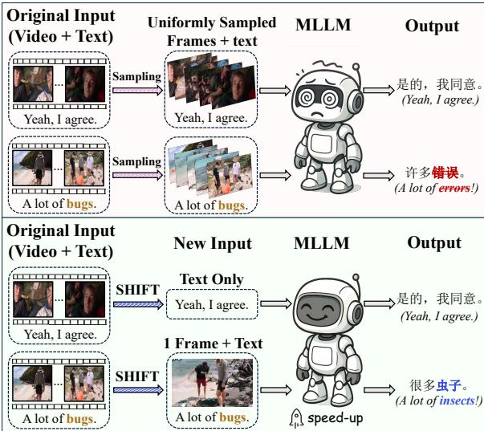
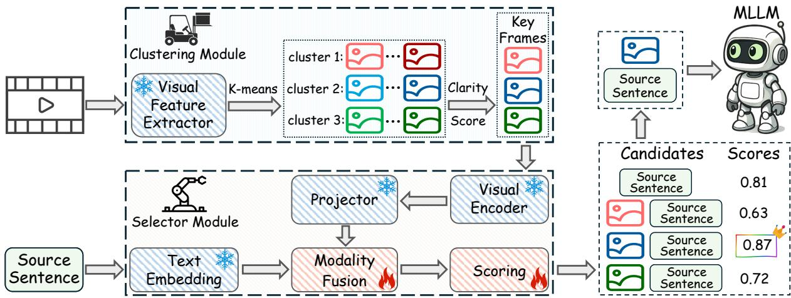
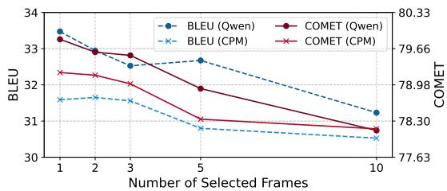
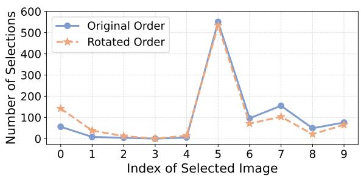
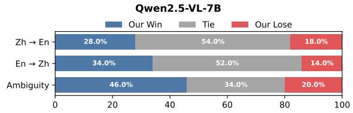
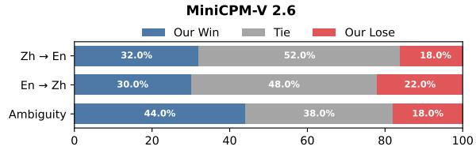
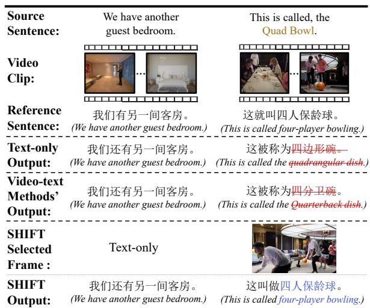
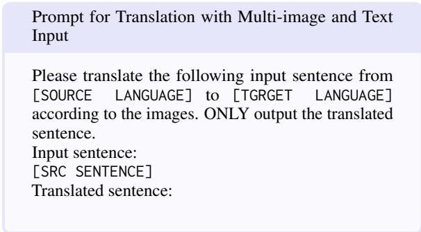
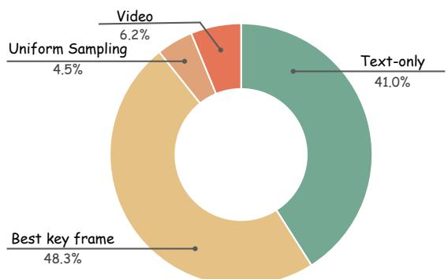
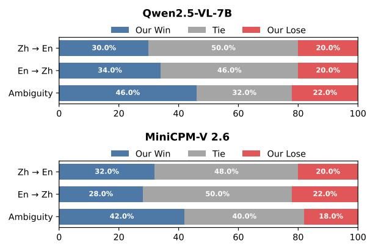

# SHIFT: Selected Helpful Informative Frame for Video-guided Machine Translation

Boyu Guan1,2, Chuang Han1,2, Yining Zhang1,2,3, Yupu Liang1,2, Zhiyang Zhang1,2, Yang Zhao1,2\*, Chengqing Zong1,2\*

1 State Key Laboratory of Multimodal Artificial Intelligence Systems (MAIS),

Institute of Automation, Chinese Academy of Sciences, Beijing, China

2 School of Artificial Intelligence, University of Chinese Academy of Sciences, Beijing, China 3 Zhongguancun Academy, Beijing, China

guanboyu2022@ia.ac.cn, yang.zhao@nlpr.ia.ac.cn, cqzong@nlpr.ia.ac.cn

## Abstract

Video-guided Machine Translation (VMT) aims to improve translation quality by integrating contextual information from paired short video clips. Mainstream VMT approaches typically incorporate multimodal information by uniformly sampling frames from the input videos. However, this paradigm frequently incurs significant computational overhead and introduces redundant multimodal content, which degrades both efficiency and translation quality. To tackle these challenges, we propose SHIFT (Selected Helpful Informative Frame for Translation). It is a lightweight, plug-andplay framework designed for VMT with Multimodal Large Language Models (MLLMs). SHIFT adaptively selects a single informative key frame when visual context is necessary; otherwise, it relies solely on textual input. This process is guided by a dedicated clustering module and a selector module. Experimental results demonstrate that SHIFT enhances the performance of MLLMs on the VMT task while simultaneously reducing computational cost, without sacrificing generalization ability.

## 1 Introduction

Video-guided Machine Translation (VMT) is an emerging subtask of multimodal translation that has attracted growing research interest. The input to the VMT task consists of an approximately 10-second video clip paired with a text, typically derived from subtitles or descriptions of the video. The objective is to improve the translation of the input text by leveraging the accompanying video’s multimodal context (Wang et al., 2019; Li et al., 2022b; Shen et al., 2024; Hou and Guo, 2024; Zhang et al., 2025b).

The predominant VMT paradigm uniformly samples frames from video clips, extracts visual and textual features, and processes them jointly through

  
Figure 1: Comparison of the conventional VMT paradigm (top) and our SHIFT framework (bottom). The conventional VMT paradigm translates the subtitle text by jointly processing uniformly sampled frames. In contrast, SHIFT employs text-only inputs for simple cases and selects one key video frame when visual context is required (e.g., ambiguous word “bug”). Blue/red indicate correct/incorrect translations.

Transformer-based (Vaswani et al., 2017) translation models (Li et al., 2023c; Kang et al., 2023; Shurtz et al., 2024). However, based on our experimental analysis (Section 5) and recent advances in Multimodal Large Language Models (MLLM) for translation (Chen et al., 2025a; Liu et al., 2025), we identify two critical limitations in the current VMT paradigm: (1) Excessive multimodal information redundancy increases computational overhead and degrades translation quality; and (2) Insufficient exploration and integration of MLLMbased methodologies within VMT research.

Figure 1 illustrates two representative scenarios for MLLM inputs in VMT. When the source text is simple and clear (e.g., “Yeah, I agree.”), the robust linguistic capabilities of MLLMs suffice for accurate translation without additional visual context. Conversely, when textual information alone lacks sufficient contextual cues (e.g., for disambiguating the term “bugs”), incorporating visual context becomes essential. Our experiments (Section 5.1 and 5.4) demonstrate that, in most cases, choosing a single, sufficiently informative frame—such as an outdoor beach scene—can adequately guide the model toward the correct interpretation. For example, this frame can bias the model to favor “insects” over “errors” by reinforcing contextually relevant associations. Including unnecessary frames not only substantially increases computational overhead but also introduces multimodal redundancy that can degrade translation quality (Yang et al., 2022; Xiao et al., 2023; Long et al., 2024).

Motivated by these insights, we introduce SHIFT (Selected Helpful Informative Frame for Translation), a novel, lightweight, model-agnostic VMT framework for MLLMs. The framework comprises a clustering module and a selector module. The clustering module groups video frames into K clusters based on visual features and selects the clearest frame from each cluster as the corresponding key frame, resulting in K key frames. Paired with the source sentence, the K key frames yield K image–text pairs; combined with the text-only input, this results in K+1 candidate inputs. The selector module assigns a score to each candidate, and the highest-scoring one is selected as the final input to the MLLM. This allows SHIFT to adaptively determine per sample whether to use multimodal input: if not needed, only the source text is used; otherwise, the most informative key frame is paired with the text.

Experimental evaluations were conducted on the video subtitle VMT dataset TriFine (Guan et al., 2025) and the video description VMT dataset VA-TEX (Wang et al., 2019). Results demonstrate that SHIFT consistently outperforms traditional VMT methods across both automatic evaluation metrics and human preference evaluations, while considerably boosting inference speed. Meanwhile, due to its plug-and-play, model-agnostic design, SHIFT effectively prevents the catastrophic forgetting and generalization degradation commonly associated with fine-tuning in translation tasks (Luo et al., 2023; Alves et al., 2023; Stap et al., 2024).

Our primary contributions can be summarized as follows:

• We propose SHIFT, the first VMT framework designed to harness the advanced multimodal and linguistic capabilities of MLLMs for improving translation performance.

• We introduce a novel VMT input paradigm that adaptively uses either source text alone or pairs it with the most informative frame based on the need for visual context.

• We empirically validate SHIFT across various MLLMs and datasets, achieving consistently superior performance compared to existing methods.

• All code for SHIFT has been publicly released at https://github.com/BoyuGuan/SHIFT.

## 2 Related Works

Video-guided Machine Translation. Multimodal machine translation enhances translation by integrating visual modalities with text (Wang and Xiong, 2021; Futeral et al., 2023; Shen et al., 2024). With the introduction of the Multi30K dataset (Elliott et al., 2016), image-guided machine translation has rapidly advanced by leveraging visual cues from input images to enhance translation quality and contextual relevance (Lin et al., 2020; Wu et al., 2021; Fang and Feng, 2022; Liang et al., 2022; Fei et al., 2023; Liang et al., 2024; Yang et al., 2024b; Wang et al., 2024b; Cheng et al., 2024; Liang et al., 2025; Zhang et al., 2025c; Futeral et al., 2025). In recent years, video-guided machine translation, where video serves as the source of multimodal information, has attracted increasing interest from researchers (Gu et al., 2021; Li et al., 2023b; Kang et al., 2023; Shurtz et al., 2024; Guan et al., 2025; Lv et al., 2025). Compared to image-guided machine translation, video can provide more diverse and richer multimodal information. However, it also inevitably introduces challenges such as redundant information and high computational costs (Yang et al., 2022; Guan et al., 2025).

Video Question Answering. Video Question Answering has become a key benchmark for evaluating multimodal comprehension, with the reduction of frame-level redundancy posing an important challenge (Zhong et al., 2022; Wang et al., 2024a; Jian et al., 2024; Guo et al., 2025). Traditional uniform sampling methods frequently overlook critical content, prompting recent studies to explore targeted frame selection strategies that enhance both relevance and efficiency (Yu et al., 2023; Nuthalapati and Tunga, 2023; Park et al., 2024; Jian et al., 2025; Yu et al., 2025; Chen et al., 2025c). However, existing frame-selection methods for video question answering are primarily designed for long-duration videos (minutes to tens of minutes), whereas VMT typically involves much shorter clips (\~10 seconds). Moreover, while prior approaches focus on selecting and combining multiple frames, most VMT instances can be effectively handled by MLLMs using only a single frame or even solely textual input (more detailed discussion in Section 5.4 and Appendix G).

  
Figure 2: Overview of the SHIFT framework, consisting of a clustering module and a selector module. The clustering module groups frames into K clusters $( \mathbf { e . g . , } K \mathrm { = 3 }$ in the figure) based on visual features, and selects the clearest frame from each cluster as a key frame. The selector module scores K key frame–text pairs and a text-only input; the top-scoring input is used for inference. Only the modality fusion layer and scoring head is trainable (indicated by ), while all other components remain frozen (denoted by ).

## 3 SHIFT Framework

SHIFT is a lightweight, plug-and-play framework that enhances MLLM performance on VMT. As shown in Figure 2, SHIFT comprises a clustering module (Section 3.1) and a selection module (Section 3.2). They jointly enable adaptive input selection—choosing text alone or with a key frame—based on the video and source text.

## 3.1 Clustering Module

The clustering module groups frames by visual features and selects the clearest frame from each cluster as key frames. This allows the selector module to operate solely on key frames, reducing overhead from redundant or blurred frames.

Given a VMT sample $\{ V , X , Y \}$ , the video V has a duration of $T$ seconds and comprises N frames. Due to the high similarity of temporally adjacent frames, the video frames are initially downsampled at a rate r to reduce computational cost. This yields a sampled frame set $V _ { \mathrm { s a m p l e d } } = \{ f _ { 1 } , \ldots , f _ { n } \}$ , where $n = \lceil T \cdot r \rceil < N$ Each sampled frame $f _ { i } \in V _ { \mathrm { s a m p l e d } }$ is processed by a frozen, lightweight visual feature extractor $\nu _ { \phi } .$ , yielding a feature vector $\phi _ { i }$ . Aggregating all features forms the matrix Φ.

$$
\phi _ { i } = \mathcal { V } _ { \phi } ( f _ { i } ) , \quad i = 1 , . . . , n
$$

$$
\Phi = \left[ \phi _ { 1 } , \ldots , \phi _ { n } \right] ^ { \top }\tag{1}
$$

(2)

K-means clustering (MacQueen, 1967; Lloyd, 1982) is applied to frame features Φ, forming $K =$ $T \cdot r _ { k }$ clusters, where $r _ { k }$ is the clustering ratio and $K \ll N$ reduces computational overhead. The clustering minimizes intra-cluster variance:

$$
\mathcal { I } ( \{ \pmb { \mu } _ { k } \} , \{ \ell _ { t } \} ) = \sum _ { t = 1 } ^ { n } \lVert \phi _ { t } - \pmb { \mu } _ { \ell _ { t } } \rVert _ { 2 } ^ { 2 }\tag{3}
$$

where $\ell _ { t } \in \{ 1 , \ldots , K \}$ is the cluster assignment and $\pmb { \mu } _ { k }$ is the centroid of cluster k. After convergence, the label vector ${ \boldsymbol { \ell } } = [ \ell _ { 1 } , \dots , \ell _ { n } ] ^ { \top } \in$ $\{ 1 , \ldots , K \} ^ { n }$ defines the cluster membership of all frames. Full details are provided in Appendix A.

The cluster center is not always the clearest frame within its cluster. Since high-clarity frames supply more distinct and precise semantic cues to an MLLM in VMT tasks1, a clarity score is computed for each frame $f _ { i }$ using the Laplacian operator (Pech-Pacheco et al., 2000). The detailed calculations are provided in Appendix C.

$$
\mathrm { C l a r i t y } ( f _ { i } ) = \mathrm { L a p l a c i a n V a r } ( f _ { i } )\tag{4}
$$

For each cluster $k ,$ the frame with the highest clarity score is designated as the key frame of that cluster:

$$
\hat { i } _ { k } = \arg \operatorname* { m a x } _ { i \in \{ i | \ell _ { i } = k \} } \mathrm { C l a r i t y } ( f _ { i } ) , \quad k = 1 , \ldots , K\tag{5}
$$

resulting in a key frames set $\mathcal { F } = \{ f _ { \hat { i } _ { k } } \ | \ k =$ $1 , \ldots , K \}$

## 3.2 Selector Module

The selector module processes K+1 candidate inputs: K key frame–text pairs from clustering module and the source sentence alone. For each candidate, a fused representation is extracted and subsequently assigned a score. The candidate with the highest score is selected as the input to the MLLM.

A source-language sentence X is embedded by a frozen text embedding $E _ { \mathrm { t e x t } }$ into ${ \mathbf e } _ { X } = E _ { \mathrm { t e x t } } ( X )$ Each key frame $f _ { k } \in \mathcal { F }$ is encoded by a frozen pretrained visual encoder $E _ { \mathrm { v i s } }$ and projected by a projector P into $v _ { k }$

$$
\mathbf { v } _ { k } = P \big ( E _ { \mathrm { v i s } } ( f _ { k } ) \big ) , \quad k = 1 , \dots , K\tag{6}
$$

Candidate set $\mathcal { C } = \{ \mathbf { c } _ { 1 } , \dots , \mathbf { c } _ { K + 1 } \}$ is formed by fusing each $\mathbf { v } _ { k }$ with the sentence embedding $\mathbf { e } _ { X }$ via a commutative operator , along with a textonly candidate.

$$
\mathbf { c } _ { k } = \left\{ { \begin{array} { l l } { \mathbf { v } _ { k } \oplus \mathbf { e } _ { X } , } & { { \mathrm { f o r ~ } } k = 1 , \dots , K } \\ { \mathbf { e } _ { X } , } & { { \mathrm { f o r ~ } } k = K + 1 } \end{array} } \right.\tag{7}
$$

Each candidate input $\mathbf { c } _ { k } \in \mathcal { C }$ is processed by the modality fusion layer $M _ { \mathrm { f u s i o n } } .$ , followed by a feedforward scoring head S that outputs a scalar score $s _ { k } \in [ 0 , 1 ]$

$$
s _ { k } = S ( M _ { \mathrm { f u s i o n } } ( \mathbf { c } _ { k } ) ) , \quad k = 1 , \ldots , K { + } 1\tag{8}
$$

The modality fusion layer $M _ { \mathrm { f u s i o n } }$ comprises the bottom four decoder layers of the MLLM, which have been shown to be more effective in visual token utilization and multimodal integration (Chen et al., 2024; Zhang et al., 2025a). The parameters of both the modality fusion layer $M _ { \mathrm { f u s i o n } }$ and the scoring head S are learnable during training.

## 3.3 Training

## 3.3.1 Collection of Training Data

To generate supervision data for training SHIFT, we leverage a powerful MLLM  to automatically annotate reference scores. The annotation model offers strong multimodal and multilingual capabilities. For each instance, K key frames are extracted via the clustering module. These K frames, together with the source text X, constitute $K { + 1 }$ candidate inputs—including a text-only input. By evaluating the quality of the translations generated by the annotation model  for each candidate input, the relative contribution of different inputs to the VMT task can be quantified. This further enables the assignment of reference scores to each candidate input.

The reference score $\hat { s } _ { k }$ is computed from the COMET score $t _ { k } \in [ 0 , 1 0 0 ]$ , which is calculated between ’s translation $\hat { Y } _ { k }$ for the k-th candidate input and the reference translation $Y$

$$
\hat { Y } _ { k } = \left\{ \begin{array} { l l } { \boldsymbol { \mathcal { A } } ( f _ { k } , \boldsymbol { X } ) , } & { k = 1 , \ldots , K } \\ { \boldsymbol { \mathcal { A } } ( \boldsymbol { X } ) , } & { k = K + 1 } \end{array} \right.\tag{9}
$$

$$
t _ { k } = \mathrm { C O M E T } \left( X , { \hat { Y } } _ { k } , Y \right)\tag{10}
$$

To enhance data quality and accelerate training convergence, we apply quality control by retaining only samples meeting two criteria: (1) the maximum candidate score max $\left( t _ { k } \right)$ must exceed a quality threshold $\tau _ { q } .$ , ensuring the presence of a highquality translation; and (2) the score range must exceed a variation threshold $\tau _ { v }$ , promoting sufficient distinction among candidates.

$$
\left\{ \begin{array} { l l } { \displaystyle \operatorname* { m a x } _ { k } t _ { k } > \tau _ { q } } \\ { \displaystyle \operatorname* { m a x } _ { k } t _ { k } - \displaystyle \operatorname* { m i n } _ { k } t _ { k } > \tau _ { v } } \end{array} \right. \Rightarrow \quad \mathrm { r e t a i n }\tag{11}
$$

To encourage lower-cost inference without degrading translation quality, a simple data-level refinement is introduced. When the text-only candidate ties for the highest score, its score is incremented by 1 (capped at 100) to promote its selection over multimodal counterparts. Finally, the value is scaled by 1/100 to match the range of $s _ { k }$

$$
I _ { k } = \left\{ { 1 , \atop k = K + 1 } \wedge t _ { K + 1 } = \operatorname * { m a x } _ { 1 \leq j \leq K + 1 } t _ { j } \right.\tag{12}
$$

$$
\hat { s } _ { k } = \frac { 1 } { 1 0 0 } \operatorname* { m i n } ( t _ { k } + I _ { k } , 1 0 0 ) \quad k = 1 , \dots , K + 1
$$

## 3.3.2 Loss Function

(13)

To jointly achieve accurate absolute score calibration and robust relative ranking across the K+1 candidates, a hybrid loss function is adopted. It combines absolute and pairwise ranking objectives within a unified optimization framework.

The overall loss $\mathcal { L } _ { \mathrm { o v e r a l l } }$ is formulated based on cosine similarity to minimize the discrepancy between the predicted scores and the corresponding reference scores. For each sample, let $s _ { k }$ and $\hat { s } _ { k }$ denote the predicted score and reference score of the k-th input candidate $( k = 1 , \ldots , K { + } 1 )$ , respectively. The $\mathcal { L } _ { \mathrm { o v e r a l l } }$ is defined as:

$$
\mathcal { L } _ { \mathrm { o v e r a l l } } = 1 ~ - ~ \frac { 1 } { \| \mathbf { s } \| _ { 2 } \| \hat { \mathbf { s } } \| _ { 2 } } \sum _ { k = 1 } ^ { K + 1 } s _ { k } \hat { s } _ { k }\tag{14}
$$

where $\| \cdot \| _ { 2 }$ denotes the Euclidean norm.

To effectively model fine-grained relative preferences among candidates, we adopt the RankNet loss (Burges et al., 2005) as the relative loss $\mathcal { L } _ { \mathrm { r e l a t i v e } } .$ which is specifically designed to optimize the alignment between predicted scores and reference pairwise rankings. Let $\mathscr { P } = \{ ( j , k ) | 1 \leq j <$ $k \leq C , \ \hat { s } _ { j } \neq \hat { s } _ { k } \}$ denote index pairs with distinct reference scores. For each $( j , k ) \in \mathcal { P }$ , we compute the score difference $\Delta s _ { j k } = s _ { j } - s _ { k }$ and binary label $y _ { j k } = 1 [ \hat { s } _ { j } > \hat { s } _ { k } ]$ . The predicted preference probability is $p _ { j k } = \sigma ( \Delta s _ { j k } )$ , where $\sigma$ is the sigmoid function (Rumelhart et al., 1986; Cybenko, 1989). The relative loss $\mathcal { L } _ { \mathrm { r e l a t i v e } }$ is computed as follows:

$$
\ell _ { j k } = - \left[ y _ { j k } \log p _ { j k } + ( 1 - y _ { j k } ) \log ( 1 - p _ { j k } ) \right]\tag{15}
$$

$$
\mathcal { L } _ { \mathrm { r e l a t i v e } } = \frac { 1 } { | \mathcal { P } | } \sum _ { ( j , k ) \in \mathcal { P } } \ell _ { j k }\tag{16}
$$

The final loss is formulated as a weighted sum of two components:

$$
{ \mathcal { L } } = { \mathcal { L } } _ { \mathrm { o v e r a l l } } ~ + ~ \alpha \cdot { \mathcal { L } } _ { \mathrm { r e l a t i v e } }\tag{17}
$$

Where $\alpha > 0$ is a hyperparameter that balances the contribution between absolute score calibration and relative ranking fidelity.

## 4 Experiments

## 4.1 Data

We constructed a training set comprising 10K zh→en and 10K en→zh training samples from the training split of the TriFine dataset (Guan et al., 2025). The method is evaluated on the TriFine (general and ambiguity) and VATEX test sets (Wang et al., 2019). TriFine is a large-scale video subtitle VMT dataset comprising 1.2M en→zh and 1.18M zh→en training samples, each with aligned en-zh subtitles and a 10-second video clip. TriFine’s general test sets consist of 7,000 en→zh and 7,000 zh→en samples; its ambiguity test set adds 1,001 cases requiring video context. VATEX is a English-Chinese video description VMT dataset, containing 25,991 videos in its training set and 3,000 videos in its validation set. Each video is accompanied by ten English–Chinese description pairs: five are direct translations suitable for translation tasks, while the other five are non-parallel and thus inappropriate for VMT. Since the test set of VATEX is not publicly available, we follow the approach of Kang et al. (2023) by evenly splitting the validation set to serve as our validation and test sets in the experiments.

## 4.2 Settings

In our experiments, the downsampling rate r and the clustering ratio $r _ { k }$ of the clustering module are set to 5 and 0.5, respectively. The clustering module’s lightweight visual feature extractor $\nu _ { \phi }$ is a pre-trained ResNet-50 model (He et al., 2016). The selector module components—text embedding layer $E _ { \mathrm { t e x t } }$ , visual encoder $E _ { \mathrm { v i s } } .$ , projector $P ,$ and modality fusion layer $M _ { \mathrm { f u s i o n } } .$ —are initialized with Qwen2.5-VL-7B parameters. This leverages its strong pretrained multimodal and multilingual capabilities to accelerate convergence. Qwen2.5-VL-32B was used as the annotation model during data collection to balance quality and efficiency. In Equation 11, quality thresholds $\tau _ { q }$ and $\tau _ { v }$ are set to 60 and 2, respectively. The hyperparameter α in Equation 17 is set to 0.8. We randomly sampled 5% (i.e., 1,000 samples) from the constructed training data to serve as the validation set. Each experiment was conducted three times with different random seeds, and the average results are reported. We used the AdamW (Loshchilov and Hutter, 2019) optimizer, with the learning rate was set to 5e-4. More details can be found in Appendix F.

## 4.3 Evaluation

We adopt BLEU2 (Papineni et al., 2002; Post, 2018), COMET3 (Rei et al., 2022) and BLEURT4 (Sellam et al., 2020) as automatic evaluation metrics to assess translation quality, aligning with current standards in LLM-based translation research (Chen et al., 2025a; Liu et al., 2025). Additionally, we conducted human preference evaluations.

## 4.4 Baselines

For comparison, we categorize our baselines into three distinct groups.

(i) Traditional VMT systems. Including TVE, CVE (Shurtz et al., 2024), FIAT (Guan et al., 2025), and a text-only Transformer (Vaswani et al., 2017), encompass both coarse- and fine-grained video–text fusion approaches, as well as a nonvisual baseline.

(ii) Open-source text-only LLM. We adopt several widely used open-source text-only LLMs—Llama-3-8B, its multilingual variant Llama-3.1-8B (Grattafiori et al., 2024), and Qwen-2.5-7B (Yang et al., 2024a).

<table><tr><td rowspan="2"></td><td rowspan="2"></td><td colspan="3">TriFine</td><td rowspan="2">VATEX Test (en→zh)</td><td rowspan="2">Speed</td></tr><tr><td>General (zh→en)</td><td>General (en→zh)</td><td>Ambiguity (en→zh)</td></tr><tr><td colspan="7">BLEU↑/COMET↑/BLEURT ↑</td></tr><tr><td></td><td></td><td></td><td>Traditional VMT Methods</td><td></td><td></td><td></td></tr><tr><td>1</td><td>Transformer</td><td>23.58/71.86/56.65</td><td>36.55/75.40/54.49</td><td>29.85/74.39/52.47</td><td>29.70/73.02/</td><td>75.32</td></tr><tr><td>2</td><td>TVE</td><td>23.85/72.58/57.20</td><td>36.55/75.64/54.98</td><td>30.37/74.45/55.55</td><td>30.30/73.37/-</td><td>1.30</td></tr><tr><td>3 4</td><td>CVE FIAT</td><td>23.97/72.60/57.19 25.51/73.59/57.89</td><td>36.43/75.58/55.29 38.06/76.48/56.15</td><td>30.28/74.39/55.55 31.24/75.93/56.32</td><td>29.40/73.44/- 30.75/73.92/55.43</td><td>1.28 0.71</td></tr><tr><td colspan="7">Open-source LLMs based on Text</td></tr><tr><td>5</td><td>Llama-3-8B</td><td>14.12/72.48/57.08</td><td>25.00/75.65/55.57</td><td>22.50/76.65/56.85</td><td>25.11/75.33/54.94</td><td>9.25</td></tr><tr><td>6</td><td>Llama-3.1-8B</td><td>16.68/72.54/55.78</td><td>25.11/77.66/57.39</td><td>24.95/77.14/58.91</td><td>27.81/78.15/57.95</td><td>9.21</td></tr><tr><td>7</td><td>Qwen2.5-7B</td><td>16.63/74.24/57.93</td><td>28.87/78.11/58.17</td><td>29.13/79.33/60.20</td><td>28.76/77.00/55.78</td><td>9.36</td></tr><tr><td colspan="7">Open-source MLLMs based on Text &amp; Video</td></tr><tr><td>8</td><td>LLaVA-Next-Video</td><td>12.38/68.65/55.18</td><td>23.63/73.63/57.26</td><td>23.66/76.35/58.22</td><td>25.62/75.45/55.10</td><td>0.65</td></tr><tr><td>9</td><td>InternVideo2.5-8B</td><td>19.60/75.55/60.18</td><td>30.28/77.59/57.85</td><td>31.49/80.25/61.41</td><td>30.09/78.25/58.04</td><td>0.72</td></tr><tr><td></td><td>MiniCPM-V 2.6</td><td></td><td></td><td></td><td></td><td></td></tr><tr><td>10</td><td>+ Uniform Frames</td><td>18.25/74.70/58.62</td><td>30.94/78.16/59.07</td><td>32.06/80.15/61.43</td><td>29.95/78.35/58.14</td><td>0.42</td></tr><tr><td>11</td><td>+ Video</td><td>20.46/75.26/59.34</td><td>31.16/78.29/58.04</td><td>31.51/80.57/61.50</td><td>29.78/78.33/58.12</td><td>0.21</td></tr><tr><td>12</td><td>+ Self-reasoning Frame</td><td>19.42/74.42/58.94</td><td>30.84/78.20/58.89</td><td>31.79/80.43/61.45</td><td>30.15/78.41/58.26</td><td>0.39</td></tr><tr><td>13</td><td>+ SHIFT (Ours)</td><td>21.53/76.23/60.91</td><td>31.95/79.21/59.78</td><td>33.27/81.39/62.64</td><td>31.27/79.06/58.76</td><td>1.02</td></tr><tr><td colspan="7">Qwen2.5-VL-7B</td></tr><tr><td>14</td><td>+ Uniform Frames</td><td>20.87/75.37/60.16</td><td>32.04/78.21/59.00</td><td>32.48/80.20/60.84</td><td>32.46/79.04/58.91</td><td>0.37</td></tr><tr><td>15</td><td>+ Video</td><td>20.69/75.52/60.13</td><td>32.90/79.03/60.07</td><td>33.83/81.59/63.01</td><td>32.87/79.02/58.95</td><td>0.73</td></tr><tr><td>16</td><td>+ Self-reasoning Frame</td><td>21.13/75.42/60.28</td><td>32.20/78.65/59.52</td><td>33.67/81.49/62.45</td><td>33.10/79.16/59.00</td><td>0.35</td></tr><tr><td>17</td><td>+ SHIFT (Ours)</td><td>22.09/76.61/61.01</td><td>33.74/79.83/61.08</td><td>35.06/82.65/64.10</td><td>33.86/79.82/59.73</td><td>0.96</td></tr></table>

Table 1: Results of methods on the TriFine en-zh general test sets, the ambiguity test set, and VATEX test set, averaged over three random seeds. SPS (Samples Per Second) denotes the average inference speed. The best value for each metric on each test set is highlighted in bold. Additional data are provided in Appendix B.

(iii) Open-source multimodal LLMs that jointly process text and video. Qwen-2.5-VL-7B (Bai et al., 2025), LLaVA-Next-Video (Zhang et al., 2024), InternVideo-2.5-Chat-8B (Wang et al., 2025), and MiniCPM-V 2.6 (Yao et al., 2024) are selected as baselines due to their strong performance on a range of video-related tasks.

The instruct versions of available LLMs were used. All prompts are listed in Appendix D, with baseline details in Appendix E.

## 5 Results and Analysis

## 5.1 Main Results

Table 1 reports the results of all methods on the TriFine English→Chinese and Chinese→English general test sets, the ambiguity test set, and the VATEX test set. Our method SHIFT consistently improved performance on two MLLMs, achieving multiple best results on three evaluation metrics. Moreover, it achieved the fastest inference speed among all video-text MLLM methods.

Compared to the strongest traditional VMT method (row 4), the SHIFT framework (row 17) achieves average gains of 4.75 COMET and 5.03

BLEURT across four test sets, while also improving inference speed by 35%. Although the average BLEU score dropped slightly by 0.20, considering the BLEU scores of all LLMs on the general test sets and prior research (Glushkova et al., 2023; He et al., 2024; Chen et al., 2025b) suggesting that the decline in BLEU scores for LLM-based methods reflects more flexible lexical choices rather than a deterioration in translation quality.

A comparison between rows 7 and 17 reveals that, relative to the same text-only foundational LLM, our SHIFT framework achieves average gains of 5.34 BLEU points, 2.56 COMET points, and 3.46 BLEURT points. Experimental results underscore the importance of effective multimodal integration for enhancing LLM performance in VMT.

Comparison of results in rows 8, 9, 11, 13, 15, and 17 reveals that, while directly inputting video–text pairs into the MLLM introduces richer multimodal information, it does not improve VMT performance. On the contrary, the redundancy of multimodal inputs impair translation quality and significantly increase computational cost.

Comparison of rows 10/13 and 14/17 reveals that the conventional VMT input paradigm—uniform frame sampling—performs worse than the adaptive input strategy in our SHIFT framework, yielding average improvements of +1.72 BLEU, +1.33 COMET, and +1.48 BLEURT across four test sets.

We further evaluate a self-reasoning paradigm where the MLLM autonomously selects the most relevant frame based on video and text inputs, with results in rows 12 and 16. Compared to this baseline, our SHIFT framework improves performance by 1.31 BLEU, 1.08 COMET, and 1.15 BLEURT, indicating superior guidance in multimodal selection for VMT. A more detailed analysis is presented in Section 5.5.

## 5.2 Comparison with other frame selection methods

<table><tr><td rowspan="2">Method</td><td>General (zh→en)</td><td>General (en→zh)</td></tr><tr><td>BLEU ↑/COMET ↑/BLEURT ↑</td><td></td></tr><tr><td>Qwen2.5-VL-7B</td><td></td><td></td></tr><tr><td>+ Random</td><td>19.07/74.88/59.31</td><td>32.69/79.00/60.13</td></tr><tr><td>+ Middle</td><td>20.88/75.48/60.24</td><td>32.72/78.98/60.02</td></tr><tr><td>+ CLIP</td><td>19.36/75.03/59.52</td><td>32.81/79.03/60.09</td></tr><tr><td>+ BLIP</td><td>18.70/74.79/59.13</td><td>32.78/79.01/60.00</td></tr><tr><td>+ BLIP2</td><td>19.24/74.99/59.46</td><td>32.77/78.98/60.08</td></tr><tr><td>+ SigLIP</td><td>19.72/75.11/59.64</td><td>32.74/78.97/60.06</td></tr><tr><td>+ SigLIP2</td><td>20.54/75.27/59.99</td><td>32.70/79.02/60.03</td></tr><tr><td>+ SHIFT</td><td>22.09/76.61/61.01</td><td>33.74/79.83/61.08</td></tr></table>

Table 2: Comparison of the SHIFT framework and commonly adopted frame-selection methods.

To evaluate SHIFT’s frame selection efficacy, we compared it with commonly used frame-selection methods—random selection, middle-frame, CLIP (Radford et al., 2021), BLIP (Li et al., 2022a), BLIP2 (Li et al., 2023a), SigLIP (Zhai et al., 2023), and SigLIP 2 (Tschannen et al., 2025)—on the TriFine general test sets based on Qwen2.5- VL-7B. The results are reported in Table 2. Although widely adopted in other multimodal tasks, these methods demonstrate limited effectiveness on VMT, often yielding results almost indiscernible from random selection. This may stem from the monolingual nature of models like CLIP, which struggle with VMT’s multilingual demands.

## 5.3 Ablation experiments

We performed ablation studies on the SHIFT framework’s clustering and selector modules using the TriFine general test set and Qwen2.5-VL-7B (Table 3). Employing only the selector (i.e., selecting from all frames) expands the candidate pool but introduces frame redundancy, impeding convergence and increasing computational cost. In contrast, SHIFT achieves improvements of +0.54 BLEU, +0.76 COMET, and +0.70 BLEURT, with a 77.78% speed-up, confirming the necessity of clustering module. Using only the clustering module (inputting all key frames and text) is more efficient than full-video input, yet SHIFT further improves BLEU/COMET/BLEURT by 0.77/0.89/0.98 and accelerates processing by 35.21%. These results suggest that redundancy persists even among clustered key frames, underscoring the selector’s importance.

<table><tr><td>Module</td><td>General (zh→en)</td><td>General (en→zh)</td><td>Speed</td></tr><tr><td> $M _ { C }$   $M _ { S }$ </td><td></td><td>BLEU↑/COMET↑/BLEURT ↑</td><td>SPS↑</td></tr><tr><td>x</td><td>x</td><td>20.69/75.52/60.13 32.90/78.65/59.52</td><td>0.73</td></tr><tr><td>x</td><td>√</td><td>21.65/75.87/60.45 33.10/79.04/60.25</td><td>0.54</td></tr><tr><td>√</td><td>x</td><td>21.31/75.76/60.24 32.98/78.91/59.90</td><td>0.71</td></tr><tr><td>L</td><td>√</td><td>22.09/76.61/61.01 33.74/79.83/61.08</td><td>0.96</td></tr></table>

Table 3: The ablation study results for the SHIFT framework’s two modules: clustering $( M _ { C } )$ and selector (M ). Experiments were conducted using Qwen2.5- VL-7B. SPS denotes “samples per second.”

<table><tr><td colspan="2">Module</td><td>General (zh→en) General (en→zh)</td></tr><tr><td>Loverall</td><td>Lrelative</td><td>BLEU ↑/ COMET ↑/ BLEURT ↑</td></tr><tr><td>x</td><td>√</td><td>21.26/75.73/60.10 33.22/79.51/60.54</td></tr><tr><td>√</td><td>x</td><td>19.39/75.21/59.72 32.07/79.24/60.35</td></tr><tr><td>√</td><td>√</td><td>22.09/76.61/61.01 33.74/79.83/61.08</td></tr></table>

Table 4: Ablation results for the training loss subcomponents: overall loss $( \mathcal { L } _ { \mathrm { o v e r a l l } } )$ and relative loss $( \mathcal { L } _ { \mathrm { r e l a t i v e } } )$

We perform an ablation study on $\mathcal { L } _ { \mathrm { o v e r a l l } }$ and $\mathcal { L } _ { \mathrm { r e l a t i v e } }$ using Qwen2.5-VL-7B on the TriFine en-zh general test sets (Table 4). Removing either component results in consistent performance drops—1.42 BLEU, 0.80 COMET, and 0.87 BLEURT on average—and slower convergence, demonstrating the necessity of both terms.

## 5.4 Number of Selected Frames

  
Figure 3: BLEU and COMET scores of Qwen2.5-VL-7B and MiniCPM-V2.6 with different frame counts on the TriFine en→zh general test set. The detailed data are provided in Appendix B.

Figure 3 presents the performance of Qwen2.5-

VL-7B and MiniCPM-V2.6 on the TriFine en→zh test set with varying numbers of selected frames. The results indicate that increasing the number of selected frames does not enhance translation quality; on the contrary, it leads to a consistent decline in performance. This finding confirms our hypothesis that redundant multimodal input not only increases computational overhead but also degrades translation quality in VMT.

## 5.5 Inefficacy of MLLM’s Self-Reasoning Frame Selection in VMT

  
Figure 4: The self-reasoning frame selection statistics of Qwen2.5-VL-7B on the VMT task under both original and rotated input orders. A detailed description of the experiments and data is available in Appendix B.

To further investigate the MLLM’s selfreasoning–based frame selection behavior in VMT, we sampled 1,000 examples and uniformly extracted ten frames per video. Using Qwen2.5-VL-7B, we conducted self-reasoning to select the most translation-relevant frame from two frames input orders: (1) the original order and (2) a new order generated by rotating the original indices by +5 (mod 10). The selection statistics for the two input orders are presented in Figure 4.

Despite altered frame positions, selection patterns remained highly consistent (Spearman’s ρ = 0.9152, $p ~ = ~ 0 . 0 0 0 2 )$ This suggests that the MLLM relies more on positional biases than on true multimodal reasoning in VMT.

## 5.6 Human Evaluation

From the outputs of the SHIFT framework paired with Qwen2.5-VL-7B and MiniCPM-V2.6 on each of the three test sets, we randomly sampled 50 examples per model for human evaluation. As shown in Figure 5, compared to uniform sampling, SHIFT consistently received higher human preference across both models and all three test sets. It also outperformed the direct video-text input baseline (Appendix H).

  
Figure 5: Human preference evaluation across two MLLMs and three test sets between the SHIFT framework and uniform sampling.

## 5.7 Case Study

  
Table 5: Qualitative case studies of the SHIFT framework on two en→zh examples. Brown marks multimodal-dependent text; Blue/red denote correct/incorrect translations.

Table 5 presents qualitative case study results of the SHIFT framework on two English→Chinese examples from the TriFine test set, using Qwen2.5- VL-7B. For the clear sentence in the first example, SHIFT selects the text-only input, allowing the MLLM to produce accurate translations while avoiding the substantial computational overhead associated with processing video input. In contrast, for the ambiguous phrase “Quad Bowl” in the second example, directly performing VMT with video-text input introduce misleading visual cues that impair the MLLM’s translation. SHIFT instead identifies and selects a relevant frame from video based on the text, enabling correct translation as “four-player bowling.”

## 6 Conclusions

In this work, we introduce SHIFT, a novel plugand-play framework for VMT, designed to reduce computational overhead and enhance the translation quality of MLLMs. For each video–text VMT sample, the clustering module of SHIFT first clusters the frames by visual features and clarity to obtain a set of key frames. Conditioned on the source text and key frames, a selector module determines whether to provide the MLLM with the text alone or with the text accompanied by a selected key frame. Extensive experiments demonstrate that our method consistently outperforms baselines in both translation quality and inference efficiency across diverse test sets and model architectures.

## Limitations

Although SHIFT has achieved strong performance on the VMT task, our computational resource constraints limited its full potential. Leveraging models with more advanced reasoning, multimodal, and multilingual capabilities to assign reference scores during data collection could provide richer and more comprehensive selection knowledge, thereby potentially further enhancing translation quality. We plan to investigate this issue in depth in future work.

## Acknowledgments

We sincerely thank the anonymous reviewers for their insightful comments and constructive suggestions. This research was supported by the National Natural Science Foundation of China (Grant Nos. 62336008 and 62476271) and the Young Scientists Fund of the State Key Laboratory of Multimodal Artificial Intelligence Systems (MAIS2024316).

## References

Duarte Alves, Nuno Guerreiro, João Alves, José Pombal, Ricardo Rei, José de Souza, Pierre Colombo, and Andre Martins. 2023. Steering large language models for machine translation with finetuning and in-context learning. In Findings of the Association for Computational Linguistics: EMNLP 2023, pages 11127–11148, Singapore. Association for Computational Linguistics.

Shuai Bai, Keqin Chen, Xuejing Liu, Jialin Wang, Wenbin Ge, Sibo Song, Kai Dang, Peng Wang, Shijie Wang, Jun Tang, Humen Zhong, Yuanzhi Zhu, Mingkun Yang, Zhaohai Li, Jianqiang Wan, Pengfei Wang, Wei Ding, Zheren Fu, Yiheng Xu, and 8 others.

2025. Qwen2.5-vl technical report. arXiv preprint arXiv:2502.13923.

Loïc Barrault, Ondˇrej Bojar, Marta R. Costa-jussà, Christian Federmann, Mark Fishel, Yvette Graham, Barry Haddow, Matthias Huck, Philipp Koehn, Shervin Malmasi, Christof Monz, Mathias Müller, Santanu Pal, Matt Post, and Marcos Zampieri. 2019. Findings of the 2019 conference on machine translation (WMT19). In Proceedings ofthe Fourth Conference on Machine Translation (Volume 2: Shared Task Papers, Day 1), pages 1–61, Florence, Italy. Association for Computational Linguistics.

Christopher J. C. Burges, Tal Shaked, Erin Renshaw, Ari Lazier, Matt Deeds, Nicole Hamilton, and Gregory N. Hullender. 2005. Learning to rank using gradient descent. In Proceedings of the 22nd International Conference on Machine Learning (ICML), pages 89– 96, New York, NY, USA. ACM.

Andong Chen, Yuchen Song, Kehai Chen, Muyun Yang, Tiejun Zhao, and Min Zhang. 2025a. Make imagination clearer! stable diffusion-based visual imagination for multimodal machine translation. Preprint, arXiv:2412.12627.

Andong Chen, Yuchen Song, Wenxin Zhu, Kehai Chen, Muyun Yang, Tiejun Zhao, and 1 others. 2025b. Evaluating o1-like llms: Unlocking reasoning for translation through comprehensive analysis. arXiv preprint arXiv:2502.11544.

Jianghao Chen, Junhong Wu, Yangyifan Xu, and Jiajun Zhang. 2025c. LADM: Long-context training data selection with attention-based dependency measurement for LLMs. In Proceedings ofthe 63rd Annual Meeting of the Association for Computational Linguistics (Volume 1: Long Papers), pages 3076–3090, Vienna, Austria. Association for Computational Linguistics.

Liang Chen, Haozhe Zhao, Tianyu Liu, Shuai Bai, Junyang Lin, Chang Zhou, and Baobao Chang. 2024. An image is worth 1/2 tokens after layer 2: Plug-andplay inference acceleration for large vision-language models. Preprint, arXiv:2403.06764.

Xuxin Cheng, Ziyu Yao, Yifei Xin, Hao An, Hongxiang Li, Yaowei Li, and Yuexian Zou. 2024. Soul-mix: Enhancing multimodal machine translation with manifold mixup. In Proceedings ofthe 62nd Annual Meeting of the Association for Computational Linguistics (Volume 1: Long Papers), pages 11283–11294, Bangkok, Thailand. Association for Computational Linguistics.

George Cybenko. 1989. Approximation by superpositions of a sigmoidal function. Mathematics ofControl, Signals and Systems, 2(4):303–314.

Dipankar Das, Naveen Mellempudi, Dheevatsa Mudigere, Dhiraj Kalamkar, Sasikanth Avancha, Kunal Banerjee, Srinivas Sridharan, Karthik Vaidyanathan, Bharat Kaul, Evangelos Georganas, and 1 others.

2018. Mixed precision training of convolutional neural networks using integer operations. In International Conference on Learning Representations.

Desmond Elliott, Stella Frank, Khalil Sima’an, and Lucia Specia. 2016. Multi30K: Multilingual English-German image descriptions. In Proceedings of the 5th Workshop on Vision and Language, pages 70– 74, Berlin, Germany. Association for Computational Linguistics.

Qingkai Fang and Yang Feng. 2022. Neural machine translation with phrase-level universal visual representations. In Proceedings ofthe 60th Annual Meeting ofthe Associationfor Computational Linguistics (Volume 1: Long Papers), pages 5687–5698, Dublin, Ireland. Association for Computational Linguistics.

Hao Fei, Qian Liu, Meishan Zhang, Min Zhang, and Tat-Seng Chua. 2023. Scene graph as pivoting: Inference-time image-free unsupervised multimodal machine translation with visual scene hallucination. In Proceedings of the 61st Annual Meeting of the Associationfor Computational Linguistics (Volume 1: Long Papers), pages 5980–5994, Toronto, Canada. Association for Computational Linguistics.

Matthieu Futeral, Cordelia Schmid, Ivan Laptev, Benoît Sagot, and Rachel Bawden. 2023. Tackling ambiguity with images: Improved multimodal machine translation and contrastive evaluation. In Proceedings ofthe 61st Annual Meeting ofthe Associationfor Computational Linguistics (Volume 1: Long Papers), pages 5394–5413, Toronto, Canada. Association for Computational Linguistics.

Matthieu Futeral, Cordelia Schmid, Benoît Sagot, and Rachel Bawden. 2025. Towards zero-shot multimodal machine translation. In Findings of the Association for Computational Linguistics: NAACL 2025, pages 761–778, Albuquerque, New Mexico. Association for Computational Linguistics.

Taisiya Glushkova, Chrysoula Zerva, and André F. T. Martins. 2023. BLEU meets COMET: Combining lexical and neural metrics towards robust machine translation evaluation. In Proceedings of the 24th Annual Conference of the European Association for Machine Translation, pages 47–58, Tampere, Finland. European Association for Machine Translation.

Aaron Grattafiori, Abhimanyu Dubey, Abhinav Jauhri, Abhinav Pandey, Abhishek Kadian, Ahmad Al-Dahle, Aiesha Letman, Akhil Mathur, Alan Schelten, Alex Vaughan, Amy Yang, Angela Fan, Anirudh Goyal, Anthony Hartshorn, Aobo Yang, Archi Mitra, Archie Sravankumar, Artem Korenev, Arthur Hinsvark, and 542 others. 2024. The llama 3 herd of models. Preprint, arXiv:2407.21783.

Weiqi Gu, Haiyue Song, Chenhui Chu, and Sadao Kurohashi. 2021. Video-guided machine translation with spatial hierarchical attention network. In Proceedings of the 59th Annual Meeting of the Association for Computational Linguistics and the 11th International

Joint Conference on Natural Language Processing: Student Research Workshop, pages 87–92, Online. Association for Computational Linguistics.

Boyu Guan, Yining Zhang, Yang Zhao, and Chengqing Zong. 2025. TriFine: A large-scale dataset of visionaudio-subtitle for tri-modal machine translation and benchmark with fine-grained annotated tags. In Proceedings of the 31st International Conference on Computational Linguistics, pages 8215–8231, Abu Dhabi, UAE. Association for Computational Linguistics.

Jiawei Guo, Feifei Zhai, Pu Jian, Qianrun Wei, and Yu Zhou. 2025. Crop: Contextual region-oriented visual token pruning. Preprint, arXiv:2505.21233.

Kaiming He, Xiangyu Zhang, Shaoqing Ren, and Jian Sun. 2016. Deep residual learning for image recognition. In Proceedings of the IEEE Conference on Computer Vision and Pattern Recognition (CVPR), pages 770–778. IEEE.

Zhiwei He, Tian Liang, Wenxiang Jiao, Zhuosheng Zhang, Yujiu Yang, Rui Wang, Zhaopeng Tu, Shuming Shi, and Xing Wang. 2024. Exploring humanlike translation strategy with large language models. Transactions of the Association for Computational Linguistics, 12:229–246.

Zhenyu Hou and Junjun Guo. 2024. Virtual visualguided domain-shadow fusion via modal exchanging for domain-specific multi-modal neural machine translation. In Proceedings of the 32nd ACM International Conference on Multimedia, MM ’24, page 4227–4235, New York, NY, USA. Association for Computing Machinery.

Tianxiang Hu, Pei Zhang, Baosong Yang, Jun Xie, Derek F. Wong, and Rui Wang. 2024. Large language model for multi-domain translation: Benchmarking and domain CoT fine-tuning. In Findings ofthe Association for Computational Linguistics: EMNLP 2024, pages 5726–5746, Miami, Florida, USA. Association for Computational Linguistics.

International Telecommunication Union. 2011. Studio encoding parameters of digital television for standard 4:3 and wide-screen 16:9 aspect ratios. Technical Report ITU-R BT.601-7, International Telecommunication Union. ITU-R Recommendation BT.601-7.

R. A. Jarvis. 1976. Focus optimization criteria for computer image processing. The Microscope, 24(2):163– 180.

Pu Jian, Donglei Yu, Wen Yang, Shuo Ren, and Jiajun Zhang. 2025. Teaching vision-language models to ask: Resolving ambiguity in visual questions. In Proceedings of the 63rd Annual Meeting of the Association for Computational Linguistics (Volume 1: Long Papers), pages 3619–3638, Vienna, Austria. Association for Computational Linguistics.

Pu Jian, Donglei Yu, and Jiajun Zhang. 2024. Large language models know what is key visual entity: An

LLM-assisted multimodal retrieval for VQA. In Proceedings of the 2024 Conference on Empirical Methods in Natural Language Processing, pages 10939– 10956, Miami, Florida, USA. Association for Computational Linguistics.

Liyan Kang, Luyang Huang, Ningxin Peng, Peihao Zhu, Zewei Sun, Shanbo Cheng, Mingxuan Wang, Degen Huang, and Jinsong Su. 2023. BigVideo: A largescale video subtitle translation dataset for multimodal machine translation. In Findings of the Association for Computational Linguistics: ACL 2023, pages 8456–8473, Toronto, Canada. Association for Computational Linguistics.

Junnan Li, Dongxu Li, Silvio Savarese, and Steven Hoi. 2023a. Blip-2: Bootstrapping language-image pretraining with frozen image encoders and large language models. In Proceedings of the 40th International Conference on Machine Learning, volume 202, pages 19730–19742. PMLR.

Junnan Li, Dongxu Li, Caiming Xiong, and Steven Hoi. 2022a. Blip: Bootstrapping language-image pre-training for unified vision-language understanding and generation. In Proceedings ofthe 39th International Conference on Machine Learning, volume 162, pages 12888–12900. PMLR.

Mingjie Li, Po-Yao Huang, Xiaojun Chang, Junjie Hu, Yi Yang, and Alex Hauptmann. 2023b. Video pivoting unsupervised multi-modal machine translation. IEEE Transactions on Pattern Analysis and Machine Intelligence, 45(3):3918–3932.

Yihang Li, Shuichiro Shimizu, Chenhui Chu, Sadao Kurohashi, and Wei Li. 2023c. Video-helpful multimodal machine translation. In Proceedings of the 2023 Conference on Empirical Methods in Natural Language Processing, pages 4281–4299, Singapore. Association for Computational Linguistics.

Yihang Li, Shuichiro Shimizu, Weiqi Gu, Chenhui Chu, and Sadao Kurohashi. 2022b. VISA: An ambiguous subtitles dataset for visual scene-aware machine translation. In Proceedings of the Thirteenth Language Resources and Evaluation Conference, pages 6735–6743, Marseille, France. European Language Resources Association.

Yunlong Liang, Fandong Meng, Jinan Xu, Yufeng Chen, and Jie Zhou. 2022. MSCTD: A multimodal sentiment chat translation dataset. In Proceedings ofthe 60th Annual Meeting ofthe Associationfor Computational Linguistics (Volume 1: Long Papers), pages 2601–2613, Dublin, Ireland. Association for Computational Linguistics.

Yupu Liang, Yaping Zhang, Cong Ma, Zhiyang Zhang, Yang Zhao, Lu Xiang, Chengqing Zong, and Yu Zhou. 2024. Document image machine translation with dynamic multi-pre-trained models assembling. In Proceedings of the 2024 Conference of the North American Chapter of the Association for Computational Linguistics: Human Language Technologies (Volume

1: Long Papers), pages 7084–7095, Mexico City, Mexico. Association for Computational Linguistics.

Yupu Liang, Yaping Zhang, Zhiyang Zhang, Yang Zhao, Lu Xiang, Chengqing Zong, and Yu Zhou. 2025. Single-to-mix modality alignment with multimodal large language model for document image machine translation. In Proceedings ofthe 63rd Annual Meeting of the Association for Computational Linguistics (Volume 1: Long Papers), pages 12391–12408, Vienna, Austria. Association for Computational Linguistics.

Huan Lin, Fandong Meng, Jinsong Su, Yongjing Yin, Zhengyuan Yang, Yubin Ge, Jie Zhou, and Jiebo Luo. 2020. Dynamic context-guided capsule network for multimodal machine translation. In Proceedings of the 28th ACM International Conference on Multimedia, MM ’20, page 1320–1329, New York, NY, USA. Association for Computing Machinery.

Danyang Liu, Fanjie Kong, Xiaohang Sun, Dhruva Patil, Avijit Vajpayee, Zhu Liu, Vimal Bhat, and Najmeh Sadoughi. 2025. Detect, disambiguate, and translate: On-demand visual reasoning for multimodal machine translation with large vision-language models. In Proceedings of the 2025 Conference of the Nations ofthe Americas Chapter ofthe Association for Computational Linguistics: Human Language Technologies (Volume 1: Long Papers), pages 1559– 1570, Albuquerque, New Mexico. Association for Computational Linguistics.

Stuart P. Lloyd. 1982. Least squares quantization in pcm. IEEE Transactions on Information Theory, 28(2):129–137.

Zi Long, ZhenHao Tang, Xianghua Fu, Jian Chen, Shilong Hou, and Jinze Lyu. 2024. Exploring the necessity of visual modality in multimodal machine translation using authentic datasets. In Proceedings of the 17th Workshop on Building and Using Comparable Corpora (BUCC) @ LREC-COLING 2024, pages 36–50, Torino, Italia. ELRA and ICCL.

Ilya Loshchilov and Frank Hutter. 2019. Decoupled weight decay regularization. In 7th International Conference on Learning Representations, ICLR 2019, New Orleans, LA, USA, May 6-9, 2019. OpenReview.net.

Yun Luo, Zhen Yang, Fandong Meng, Yafu Li, Jie Zhou, and Yue Zhang. 2023. An empirical study of catastrophic forgetting in large language models during continual fine-tuning. ArXiv, abs/2308.08747.

Jinze Lv, Jian Chen, Zi Long, Xianghua Fu, and Yin Chen. 2025. Topicvd: A topic-based dataset of videoguided multimodal machine translation for documentaries.

J. B. MacQueen. 1967. Some methods for classification and analysis of multivariate observations. In Proceedings of the Fifth Berkeley Symposium on Mathematical Statistics and Probability, Volume I: Statistics, pages 281–297, Berkeley, CA, USA. University of California Press.

Vidyaranya Nuthalapati and Anirudh Tunga. 2023. Coarse to fine frame selection for online open-ended video question answering. In Proceedings of the IEEE/CVF International Conference on Computer Vision (ICCV) Workshops, pages 353–361.

Kishore Papineni, Salim Roukos, Todd Ward, and Wei-Jing Zhu. 2002. Bleu: A method for automatic evaluation of machine translation. In Proceedings ofthe 40th Annual Meeting of the Association for Computational Linguistics (ACL 2002), pages 311–318. Association for Computational Linguistics.

Jongwoo Park, Kanchana Ranasinghe, Kumara Kahatapitiya, Wonjeong Ryoo, Donghyun Kim, and Michael S. Ryoo. 2024. Too many frames, not all useful: Efficient strategies for long-form video qa. In Proceedings of the NeurIPS 2024 Workshop on Video-Language Models.

José Luis Pech-Pacheco, Gabriel Cristóbal, Jesús Chamorro-Martinez, and J Fernández-Valdivia. 2000. Diatom autofocusing in brightfield microscopy: a comparative study. In Proceedings of the 15th International Conference on Pattern Recognition, volume 3, pages 314–317. IEEE.

Matt Post. 2018. A call for clarity in reporting BLEU scores. In Proceedings of the Third Conference on Machine Translation: Research Papers, pages 186– 191, Belgium, Brussels. Association for Computational Linguistics.

Alec Radford, Jong Wook Kim, Chris Hallacy, Aditya Ramesh, Gabriel Goh, Sandhini Agarwal, Girish Sastry, Amanda Askell, Pamela Mishkin, Jack Clark, Gretchen Krueger, and Ilya Sutskever. 2021. Learning transferable visual models from natural language supervision. In Proceedings ofthe 38th International Conference on Machine Learning.

Jeff Rasley, Samyam Rajbhandari, Olatunji Ruwase, and Yuxiong He. 2020. Deepspeed: System optimizations enable training deep learning models with over 100 billion parameters. In Proceedings of the 26th ACM SIGKDD International Conference on Knowledge Discovery & Data Mining, pages 3505–3506.

Ricardo Rei, José G. C. de Souza, Duarte Alves, Chrysoula Zerva, Ana C Farinha, Taisiya Glushkova, Alon Lavie, Luisa Coheur, and André F. T. Martins. 2022. COMET-22: Unbabel-IST 2022 submission for the metrics shared task. In Proceedings of the Seventh Conference on Machine Translation (WMT), pages 578–585, Abu Dhabi, United Arab Emirates (Hybrid). Association for Computational Linguistics.

David E. Rumelhart, Geoffrey E. Hinton, and Ronald J. Williams. 1986. Learning representations by backpropagating errors. Nature, 323(6088):533–536.

Thibault Sellam, Dipanjan Das, and Ankur Parikh. 2020. BLEURT: Learning robust metrics for text generation. In Proceedings of the 58th Annual Meeting of the Association for Computational Linguistics, pages 7881–7892, Online. Association for Computational Linguistics.

Huangjun Shen, Liangying Shao, Wenbo Li, Zhibin Lan, Zhanyu Liu, and Jinsong Su. 2024. A survey on multi-modal machine translation: Tasks, methods and challenges. arXiv preprint arXiv:2405.12669.

Ammon Shurtz, Lawry Sorenson, and Stephen D. Richardson. 2024. The effects of pretraining in videoguided machine translation. In Proceedings of the 2024 Joint International Conference on Computational Linguistics, Language Resources and Evaluation (LREC-COLING 2024), pages 15888–15898, Torino, Italia. ELRA and ICCL.

David Stap, Eva Hasler, Bill Byrne, Christof Monz, and Ke Tran. 2024. The fine-tuning paradox: Boosting translation quality without sacrificing LLM abilities. In Proceedings of the 62nd Annual Meeting of the Associationfor Computational Linguistics (Volume 1: Long Papers), pages 6189–6206, Bangkok, Thailand. Association for Computational Linguistics.

Hugo Touvron, Louis Martin, Kevin R. Stone, Peter Albert, Amjad Almahairi, Yasmine Babaei, Niko lay Bashlykov, Soumya Batra, Prajjwal Bhargava, Shruti Bhosale, Daniel M. Bikel, Lukas Blecher, Cristian Cantón Ferrer, Moya Chen, Guillem Cucurull, David Esiobu, Jude Fernandes, Jeremy Fu, Wenyin Fu, and 49 others. 2023. Llama 2: Open foundation and fine-tuned chat models. ArXiv, abs/2307.09288.

Michael Tschannen, Alexey Gritsenko, Xiao Wang, Muhammad Ferjad Naeem, Ibrahim Alabdulmohsin, Nikhil Parthasarathy, Talfan Evans, Lucas Beyer, Ye Xia, Basil Mustafa, Olivier Hénaff, Jeremiah Harmsen, Andreas Steiner, and Xiaohua Zhai. 2025. Siglip 2: Multilingual vision-language encoders with improved semantic understanding, localization, and dense features. Preprint, arXiv:2502.14786.

Ashish Vaswani, Noam Shazeer, Niki Parmar, Jakob Uszkoreit, Llion Jones, Aidan N Gomez, Łukasz Kaiser, and Illia Polosukhin. 2017. Attention is all you need. Advances in neural information processing systems, 30.

Dexin Wang and Deyi Xiong. 2021. Efficient objectlevel visual context modeling for multimodal machine translation: Masking irrelevant objects helps grounding. In Thirty-Fifth AAAI Conference on Artificial Intelligence, AAAI 2021, Thirty-Third Conference on Innovative Applications of Artificial Intelligence, IAAI 2021, The Eleventh Symposium on Educational Advances in Artificial Intelligence, EAAI 2021, Virtual Event, February 2-9, 2021, pages 2720– 2728. AAAI Press.

Xijun Wang, Junbang Liang, Chun-Kai Wang, Kenan Deng, Yu Lou, Ming C. Lin, and Shan Yang. 2024a. Vila: Efficient video-language alignment for video question answering. In Computer Vision – ECCV 2024, volume 15120 of Lecture Notes in Computer Science, pages 186–204. Springer.

Xin Wang, Jiawei Wu, Junkun Chen, Lei Li, Yuan-Fang Wang, and William Yang Wang. 2019. Vatex:

A large-scale, high-quality multilingual dataset for video-and-language research. In Proceedings ofthe IEEE/CVF international conference on computer vision, pages 4581–4591.

Yi Wang, Xinhao Li, Ziang Yan, Yinan He, Jiashuo Yu, Xiangyu Zeng, Chenting Wang, Changlian Ma, Haian Huang, Jianfei Gao, Min Dou, Kai Chen, Wenhai Wang, Yu Qiao, Yali Wang, and Limin Wang. 2025. Internvideo2.5: Empowering video mllms with long and rich context modeling. arXiv preprint arXiv:2501.12386.

Yusong Wang, Dongyuan Li, Jialun Shen, Yicheng Xu, Mingkun Xu, Kotaro Funakoshi, and Manabu Okumura. 2024b. LAMBDA: Large language modelbased data augmentation for multi-modal machine translation. In Findings of the Association for Computational Linguistics: EMNLP 2024, pages 15240– 15253, Miami, Florida, USA. Association for Computational Linguistics.

Thomas Wolf, Lysandre Debut, Victor Sanh, Julien Chaumond, Clement Delangue, Anthony Moi, Pierric Cistac, Tim Rault, Remi Louf, Morgan Funtowicz, Joe Davison, Sam Shleifer, Patrick von Platen, Clara Ma, Yacine Jernite, Julien Plu, Canwen Xu, Teven Le Scao, Sylvain Gugger, and 3 others. 2020. Transformers: State-of-the-art natural language processing. In Proceedings of the 2020 Conference on Empirical Methods in Natural Language Processing: System Demonstrations, pages 38–45, Online. Association for Computational Linguistics.

Zhiyong Wu, Lingpeng Kong, Wei Bi, Xiang Li, and Ben Kao. 2021. Good for misconceived reasons: An empirical revisiting on the need for visual context in multimodal machine translation. In Proceedings of the 59th Annual Meeting of the Association for Computational Linguistics and the 11th International Joint Conference on Natural Language Processing (Volume 1: Long Papers), pages 6153–6166, Online. Association for Computational Linguistics.

Min Xiao, Junnan Zhu, Haitao Lin, Yu Zhou, and Chengqing Zong. 2023. CFSum coarse-to-fine contribution network for multimodal summarization. In Proceedings of the 61st Annual Meeting of the Associationfor Computational Linguistics (Volume 1: Long Papers), pages 8538–8553, Toronto, Canada. Association for Computational Linguistics.

An Yang, Baosong Yang, Beichen Zhang, Binyuan Hui, Bo Zheng, Bowen Yu, Chengyuan Li, Dayiheng Liu, Fei Huang, Haoran Wei, Huan Lin, Jian Yang, Jianhong Tu, Jianwei Zhang, Jianxin Yang, Jiaxi Yang, Jingren Zhou, Junyang Lin, Kai Dang, and 22 others. 2024a. Qwen2.5 technical report. arXiv preprint arXiv:2412.15115.

Jian Yang, Hongcheng Guo, Yuwei Yin, Jiaqi Bai, Bing Wang, Jiaheng Liu, Xinnian Liang, LinZheng Chai, Liqun Yang, and Zhoujun Li. 2024b. m3P: Towards multimodal multilingual translation with multimodal prompt. In Proceedings of the 2024 Joint

International Conference on Computational Linguistics, Language Resources and Evaluation (LREC-COLING 2024), pages 10858–10871, Torino, Italia. ELRA and ICCL.

Wen Yang, Junhong Wu, Chen Wang, Chengqing Zong, and Jiajun Zhang. 2025. Language imbalance driven rewarding for multilingual self-improving. In Proceedings of the 13th International Conference on Learning Representations (ICLR).

Zhishen Yang, Tosho Hirasawa, Mamoru Komachi, and Naoaki Okazaki. 2022. Why videos do not guide translations in video-guided machine translation? an empirical evaluation of video-guided machine translation dataset. Journal of Information Processing, 30:388–396.

Yuan Yao, Tianyu Yu, Ao Zhang, Chongyi Wang, Junbo Cui, Hongji Zhu, Tianchi Cai, Haoyu Li, Weilin Zhao, Zhihui He, Qianyu Chen, Huarong Zhou, Zhensheng Zou, Haoye Zhang, Shengding Hu, Zhi Zheng, Jie Zhou, Jie Cai, Xu Han, and 4 others. 2024. Minicpmv: A gpt-4v level mllm on your phone. arXiv preprint 2408.01800.

Shoubin Yu, Jaemin Cho, Prateek Yadav, and Mohit Bansal. 2023. Self-chained image-language model for video localization and question answering. In Advances in Neural Information Processing Systems (NeurIPS).

Sicheng Yu, Chengkai Jin, Huanyu Wang, Zhenghao Chen, Sheng Jin, Zhongrong Zuo, Xiaolei Xu, Zhenbang Sun, Bingni Zhang, Jiawei Wu, Hao Zhang, and Qianru Sun. 2025. Frame-voyager: Learning to query frames for video large language models. In International Conference on Learning Representations (ICLR).

Xiaohua Zhai, Basil Mustafa, Alexander Kolesnikov, and Lucas Beyer. 2023. Sigmoid loss for language image pre-training. arXiv preprint arXiv:2303.15343.

Shaolei Zhang, Qingkai Fang, Zhe Yang, and Yang Feng. 2025a. Llava-mini: Efficient image and video large multimodal models with one vision token. In Proceedings ofthe 13th International Conference on Learning Representations (ICLR).

Shaolei Zhang, Qingkai Fang, Zhuocheng Zhang, Zhengrui Ma, Yan Zhou, Langlin Huang, Mengyu Bu, Shangtong Gui, Yunji Chen, Xilin Chen, and Yang Feng. 2023. Bayling: Bridging cross-lingual alignment and instruction following through interactive translation for large language models. ArXiv, abs/2306.10968.

Yuanhan Zhang, Bo Li, haotian Liu, Yong jae Lee, Liangke Gui, Di Fu, Jiashi Feng, Ziwei Liu, and Chunyuan Li. 2024. Llava-next: A strong zero-shot video understanding model.

Yunhao Zhang, Xiaohan Zhang, Chong Li, Shaonan Wang, and Chengqing Zong. 2025b. Mulcogbench:

a multi-modal cognitive benchmark dataset for evaluating chinese and english computational language models: Y. zhang et al. Language Resources and Evaluation, pages 1–24.

Zhiyang Zhang, Yaping Zhang, Yupu Liang, Cong Ma, Lu Xiang, Yang Zhao, Yu Zhou, and Chengqing Zong. 2025c. Understand layout and translate text: Unified feature-conductive end-to-end document image translation. IEEE Transactions on Pattern Analysis and Machine Intelligence.

Yaoyao Zhong, Wei Ji, Junbin Xiao, Yicong Li, Weihong Deng, and Tat-Seng Chua. 2022. Video question answering: Datasets, algorithms and challenges. In Proceedings of the 2022 Conference on Empirical Methods in Natural Language Processing, pages 6439–6455, Abu Dhabi, United Arab Emirates. Association for Computational Linguistics.

Jinguo Zhu, Weiyun Wang, Zhe Chen, Zhaoyang Liu, Shenglong Ye, Lixin Gu, Yuchen Duan, Hao Tian, Weijie Su, Jie Shao, Zhangwei Gao, Erfei Cui, Yue Cao, Yangzhou Liu, Haomin Wang, Weiye Xu, Hao Li, Jiahao Wang, Han Lv, and 29 others. 2025. Internvl3: Exploring advanced training and test-time recipes for open-source multimodal models. ArXiv, abs/2504.10479.

## A K-means Calculation

Given a set of frame-level feature vectors $\Phi =$ $[ \phi _ { 1 } , \ldots , \phi _ { n } ] ^ { \top } \in \mathbb { R } ^ { n \times d }$ , we apply the standard $K \cdot$ means clustering algorithm to partition the features into K disjoint clusters. The objective is to minimize the total intra-cluster variance:

$$
\mathcal { I } ( \{ \pmb { \mu } _ { k } \} , \{ \ell _ { t } \} ) = \sum _ { t = 1 } ^ { n } \lVert \phi _ { t } - \pmb { \mu } _ { \ell _ { t } } \rVert _ { 2 } ^ { 2 }\tag{18}
$$

Here, $\ell _ { t } \in \{ 1 , \ldots , K \}$ denotes the cluster assignment of frame $t ,$ and $\mu _ { k } \in \mathbb { R } ^ { d }$ represents the centroid of the k-th cluster.

The optimization is solved using Lloyd’s algorithm, which iteratively alternates between the following two steps until convergence:

Assignment step: Each data point is assigned to the nearest cluster center:

$$
\ell _ { t } ^ { ( i + 1 ) } = \arg \operatorname* { m i n } _ { k \in \{ 1 , \dots , K \} } \left\| \phi _ { t } - \pmb { \mu } _ { k } ^ { ( i ) } \right\| _ { 2 } ^ { 2 } , \quad \forall t\tag{19}
$$

Update step: Each cluster centroid is updated as the mean of all assigned points:

$$
\pmb { \mu } _ { k } ^ { ( i + 1 ) } = \frac { 1 } { | S _ { k } ^ { ( i + 1 ) } | } \sum _ { t : \ell _ { t } ^ { ( i + 1 ) } = k } \phi _ { t } , \quad \forall k\tag{20}
$$

where ${ \mathcal S } _ { k } ^ { ( i + 1 ) } = \{ t ~ | ~ \ell _ { t } ^ { ( i + 1 ) } = k \}$ is the set of points assigned to cluster k at iteration i + 1.

After convergence, the label vector ℓ = $[ \ell _ { 1 } , \ldots , \ell _ { n } ] ^ { \top } \in \{ 1 , \ldots , K \} ^ { n }$ defines the final cluster membership of all video frames.

## B More Results

<table><tr><td rowspan="2">Method</td><td>General (zh→en)</td><td>General (en→zh)</td></tr><tr><td>BLEU↑/COMET↑/BLEURT ↑</td><td></td></tr><tr><td>Random</td><td>21.87/76.03/60.81</td><td>33.52/79.35/60.49</td></tr><tr><td>Cluster Center</td><td>21.92/76.20/60.75</td><td>33.58/79.28/60.47</td></tr><tr><td>Clearst</td><td>22.09/76.61/61.01</td><td>33.74/79.83/61.08</td></tr></table>

Table 6: Different key frame selection strategies within SHIFT’s clustering module are compared, with the optimal performance highlighted in bold.

We leveraged Qwen2.5-VL-7B to investigate the impact of selecting different frames as key frames for each cluster within the clustering module, with results reported in Table 6. Our findings indicate that choosing the clearest frame per cluster enhances translation quality, which we attribute to these frames providing more precise multimodal semantic information.

<table><tr><td rowspan="2">#Frames</td><td colspan="2">BLEU</td><td colspan="2">COMET</td></tr><tr><td>Qwen</td><td>MiniCPM</td><td>Qwen</td><td>MiniCPM</td></tr><tr><td>1</td><td>33.74</td><td>31.95</td><td>79.83</td><td>79.21</td></tr><tr><td>2</td><td>33.24</td><td>32.01</td><td>79.59</td><td>79.16</td></tr><tr><td>3</td><td>32.84</td><td>31.92</td><td>79.53</td><td>79.00</td></tr><tr><td>5</td><td>32.98</td><td>31.20</td><td>78.91</td><td>78.34</td></tr><tr><td>10</td><td>31.61</td><td>30.94</td><td>78.13</td><td>78.16</td></tr></table>

Table 7: The exact numerical values for Figure 3. Performance comparison under different numbers of selected frames. BLEU and COMET scores are reported for Qwen2.5-VL-7B and MiniCPM-V2.6 on the general en zh test set of TriFine.

The precise numerical values depicted in Figure 3 are provided in Table 7.

<table><tr><td rowspan=1 colspan=1>Index</td><td rowspan=1 colspan=1>Original Order</td><td rowspan=1 colspan=1>Rotated Order</td></tr><tr><td rowspan=1 colspan=1>0</td><td rowspan=1 colspan=1>56</td><td rowspan=1 colspan=1>142</td></tr><tr><td rowspan=1 colspan=1>1</td><td rowspan=1 colspan=1>8</td><td rowspan=1 colspan=1>38</td></tr><tr><td rowspan=1 colspan=1>2</td><td rowspan=1 colspan=1>4</td><td rowspan=1 colspan=1>12</td></tr><tr><td rowspan=1 colspan=1>3</td><td rowspan=1 colspan=1>0</td><td rowspan=1 colspan=1>0</td></tr><tr><td rowspan=1 colspan=1>4</td><td rowspan=1 colspan=1>5</td><td rowspan=1 colspan=1>14</td></tr><tr><td rowspan=1 colspan=1>5</td><td rowspan=1 colspan=1>551</td><td rowspan=1 colspan=1>534</td></tr><tr><td rowspan=1 colspan=1>6</td><td rowspan=1 colspan=1>96</td><td rowspan=1 colspan=1>71</td></tr><tr><td rowspan=1 colspan=1>7</td><td rowspan=1 colspan=1>155</td><td rowspan=1 colspan=1>103</td></tr><tr><td rowspan=1 colspan=1>8</td><td rowspan=1 colspan=1>49</td><td rowspan=1 colspan=1>21</td></tr><tr><td rowspan=1 colspan=1>9</td><td rowspan=1 colspan=1>76</td><td rowspan=1 colspan=1>65</td></tr></table>

Table 8: The exact numerical values for Figure 4, where each entry denotes the number of times the image at that position in the input sequence was selected.

The specific numerical values shown in Figure 4 are presented in Table 8. To assess frame selection behavior, we sampled 1,000 VMT instances and uniformly extracted 10 frames per video to form $F = [ f _ { 0 } , \ldots , f _ { 9 } ]$ . A rotated sequence $F ^ { \prime } =$ $[ f _ { 5 } , f _ { 6 } , f _ { 7 } , f _ { 8 } , f _ { 9 } , f _ { 0 } , f _ { 1 } , f _ { 2 } , f _ { 3 } , f _ { 4 } ]$ was created by shifting each $f _ { i }$ to position $( i + 5 )$ mod 10. Both $( F , X )$ and $( F ^ { \prime } , X )$ were fed into Qwen2.5-VL-7B using the prompt in Figure 9 to identify the most informative frame. Despite substantial differences in visual content between corresponding indices, the model’s predictions remained highly consistent (Spearman’s $\rho = 0 . 9 1 5 2 , p = 0 . 0 0 0 2 )$ , suggesting index-based rather than content-based selection.

Additional results from the main experiment in Table 1 are presented in Table 9. Additional results are presented regarding the MLLM’s performance on the VMT task when using either a frame randomly sampled from the video or the video’s middle frame. Additionally, we have conducted experiments on the larger-scale InterVL3-14B (Zhu et al., 2025) model to further validate the generalizability of our method on models with greater capacity.

## C Clarity Score Calculation for Each Frame

Each color frame $f _ { i }$ with per-pixel channels $( R _ { x , y } , G _ { x , y } , B _ { x , y } )$ is first converted to grayscale $G \in \mathbb { R } ^ { H \times W }$ using the BT.601 luminance formula (International Telecommunication Union, 2011).

$$
G _ { x , y } = 0 . 2 9 9 R _ { x , y } + 0 . 5 8 7 G _ { x , y } + 0 . 1 1 4 B _ { x , y }\tag{21}
$$

A discrete Laplacian operator with the $3 \times 3$ kernel is applied to compute the second-order spatial derivative:

$$
K _ { \mathrm { L a p } } = { \left[ \begin{array} { l l l } { 0 } & { 1 } & { 0 } \\ { 1 } & { - 4 } & { 1 } \\ { 0 } & { 1 } & { 0 } \end{array} \right] }\tag{22}
$$

$$
L _ { x , y } = ( K _ { \mathrm { L a p } } * G ) _ { x , y } = \frac { \partial ^ { 2 } G } { \partial x ^ { 2 } } ( x , y ) + \frac { \partial ^ { 2 } G } { \partial y ^ { 2 } } ( x , y ) ,\tag{23}
$$

resulting in the Laplacian map $\boldsymbol { L } \in \mathbb { R } ^ { H \times W }$ , where larger magnitudes indicate edges or fine textures. The clarity score of $f _ { i }$ is quantified as the variance of L (Jarvis, 1976; Pech-Pacheco et al., 2000):

$$
\mu _ { L } = \frac { 1 } { H \times W } \sum _ { x , y } L _ { x , y }\tag{24}
$$

$$
\operatorname { C l a r i t y } ( f _ { i } ) = \operatorname { V a r } ( L ) = { \frac { \sum _ { x , y } { \bigl ( } L _ { x , y } - \mu _ { L } { \bigr ) } ^ { 2 } } { H \times W } }\tag{25}
$$

## D Prompts and Human Evaluation

## D.1 Prompts in Experiments

In all our experiments, we adopt the same prompt whenever the input format remains consistent (e.g., a single image accompanied by text). We design our prompts with reference to those used in existing multimodal translation studies (Liu et al., 2025). To minimize the potential impact of prompt variations on the experimental results, all prompts used to directly generate translations were designed to follow a consistent format. The specific prompts corresponding to each input format are detailed below.

In the figure, the placeholders [SOURCE LANGUAGE] and [TARGET LANGUAGE] should be replaced with either Chinese or English according to the translation direction, and [SRC SENTENCE] should contain the source-language sentence to be translated.

Prompt for Translation with Text-only   
Please translate the following input sentence from   
[SOURCE LANGUAGE] to [TGRGET LANGUAGE].   
ONLY output the translated sentence.   
Input sentence:   
[SRC SENTENCE]   
Translated sentence:  
Figure 6: Prompt for translation with text-only.

Text-only. Our prompt for text-only translation is shown in Figure 6. The experiments corresponding to rows 5, 6 and 7 in Table 1 employed this prompt.

Prompt for Translation with Image-text Input   
Please translate the following input sentence from   
[SOURCE LANGUAGE] to [TGRGET LANGUAGE]   
according to the iamge. ONLY output the translated   
sentence.   
Input sentence:   
[SRC SENTENCE]   
Translated sentence:  
Figure 7: Prompt for translation with image-text input.

Single Image + Text. In our experiments, when the input comprised a single image and a sourcelanguage sentence, we utilized the prompt illustrated in Figure 7 to generate the target-language translation. Specifically, items in row 13 and 17 (during the second-generation phase) in Table 1 and items in Table 2 were produced using this prompt.

Multi-image + Text. When the input consists of multiple images and a text, two processing strategies are adopted. The first strategy directly generates the translation based on the input using the prompt shown in Figure 8, corresponding to Rows

<table><tr><td rowspan="3" colspan="2"></td><td colspan="3">TriFine</td><td rowspan="3">VATEX Test (en→zh)</td><td rowspan="3">Speed</td></tr><tr><td>General (zh→en)</td><td>General (en→zh)</td><td>Ambiguity (en→zh)</td></tr><tr><td colspan="3">BLEU ↑/COMET ↑/ BLEURT ↑</td></tr><tr><td colspan="7">Method</td></tr><tr><td></td><td>Transformer</td><td>23.58/71.86/56.65</td><td>36.55/75.40/54.49</td><td>29.85/74.39/52.47</td><td>29.70/73.02/</td><td>75.32</td></tr><tr><td>1 2</td><td>TVE</td><td>23.85/72.58/57.20</td><td>36.55/75.64/54.98</td><td>30.37/74.45/55.55</td><td>30.30/73.37/</td><td>1.30</td></tr><tr><td>3</td><td>CVE</td><td>23.97/72.60/57.19</td><td>36.43/75.58/55.29</td><td>30.28/74.39/55.55</td><td>29.40/73.44/</td><td>1.28</td></tr><tr><td>4</td><td>FIAT</td><td>25.51/73.59/57.89</td><td>38.06/76.48/56.15</td><td>31.24/75.93/56.32</td><td>30.75/73.92/55.43</td><td>0.71</td></tr><tr><td colspan="7">Open-source LLMs based on Text</td></tr><tr><td>5</td><td>Llama-3-8B</td><td>14.12/72.48/57.08</td><td>25.00/75.65/55.57</td><td>22.50/76.65/56.85</td><td>25.11/75.33/54.94</td><td>9.25</td></tr><tr><td>6</td><td>Llama-3.1-8B</td><td>16.68/72.54/55.78</td><td>25.11/77.66/57.39</td><td>24.95/77.14/58.91</td><td>27.81/78.15/57.95</td><td>9.21</td></tr><tr><td>7</td><td>Qwen2.5-7B</td><td>16.63/74.24/57.93</td><td>28.87/78.11/58.17</td><td>29.13/79.33/60.20</td><td>28.76/77.00/55.78</td><td>9.36</td></tr><tr><td colspan="7">Open-source MLLMs based on Text &amp; Image</td></tr><tr><td colspan="7">MiniCPM-V 2.6</td></tr><tr><td>8</td><td>+ Random Frame</td><td>19.08/74.83/59.17</td><td>31.03/78.26/58.10</td><td>31.40/80.33/61.56</td><td>30.28/78.48/58.30</td><td>1.23</td></tr><tr><td>9</td><td>+ Middle Frame</td><td>20.47/75.13/59.42</td><td>29.90/78.22/58.12</td><td>31.92/80.47/61.46</td><td>30.23/78.47/58.22</td><td>1.23</td></tr><tr><td colspan="7">Qwen2.5-VL-7B</td></tr><tr><td>10</td><td>+ Random Frame</td><td>19.07/74.88/59.31</td><td>32.69/79.00/60.13</td><td>33.01/81.35/62.76</td><td>32.94/79.13/59.02</td><td>1.05</td></tr><tr><td>11</td><td>+ Middle Frame</td><td>20.88/75.48/60.24</td><td>32.72/78.98/60.02</td><td>33.42/81.50/62.95</td><td>32.94/79.10/59.09</td><td>1.05</td></tr><tr><td colspan="7">Open-source MLLMs based on Text &amp; Video</td></tr><tr><td>12</td><td>LLaVA-Next-Video</td><td>12.38/68.65/55.18</td><td>23.63/73.63/57.26</td><td>23.66/76.35/58.22</td><td>25.62/75.45/55.10</td><td>0.65</td></tr><tr><td>13</td><td>InternVideo2.5-8B</td><td>19.60/75.55/60.18</td><td>30.28/77.59/57.85</td><td>31.49/80.25/61.41</td><td>30.09/78.25/58.04</td><td>0.72</td></tr><tr><td colspan="7">MiniCPM-V 2.6</td></tr><tr><td>14</td><td>+ Uniform Frames</td><td>18.25/74.70/58.62 20.46/75.26/59.34</td><td>30.94/78.16/59.07</td><td>32.06/80.15/61.43</td><td>29.95/78.35/58.14</td><td>0.42</td></tr><tr><td>15</td><td>+ Video</td><td></td><td>31.16/78.29/58.04</td><td>31.51/80.57/61.50</td><td>29.78/78.33/58.12</td><td>0.21</td></tr><tr><td>16</td><td>+ Self-reasoing Frame</td><td>19.42/74.42/58.94</td><td>30.84/78.20/58.89</td><td>31.79/80.43/61.45</td><td>30.15/78.41/58.26</td><td>0.39</td></tr><tr><td>17</td><td>+ SHIFT (Ours)</td><td>21.53/76.23/60.91</td><td>31.95/79.21/59.78</td><td>33.27/81.39/62.64</td><td>31.27/79.06/58.76</td><td>1.02</td></tr><tr><td colspan="7">Qwen2.5-VL-7B</td></tr><tr><td>18</td><td>+ Uniform Frames</td><td>20.87/75.37/60.16</td><td>32.04/78.21/59.00</td><td>32.48/80.20/60.84</td><td>32.46/79.04/58.91</td><td>0.37</td></tr><tr><td>19</td><td>+ Video</td><td>20.69/75.52/60.13</td><td>32.90/79.03/60.07</td><td>33.83/81.59/63.01</td><td>32.87/79.02/58.95</td><td>0.73</td></tr><tr><td>20</td><td>+ Self-reasoing Frame</td><td>21.13/75.42/60.28</td><td>32.20/78.65/59.52</td><td>33.67/81.49/62.45</td><td>33.10/79.16/59.00</td><td>0.35</td></tr><tr><td>21</td><td>+ SHIFT (Ours)</td><td>22.09/76.61/61.01</td><td>33.74/79.83/61.08</td><td>35.06/82.65/64.10</td><td>33.86/79.82/59.73</td><td>0.96</td></tr><tr><td colspan="7">InternVL3-14B</td></tr><tr><td>22</td><td>+ Uniform Frames</td><td>21.19/75.58/60.93</td><td>26.68/77.44/61.08</td><td>28.06/79.55/63.56</td><td>20.30/72.61/57.74</td><td>0.39</td></tr><tr><td>23</td><td>+ Video</td><td>21.58/76.02/61.21</td><td>32.90/79.03/60.07</td><td>34.95/81.91/63.79</td><td>32.99/78.84/58.69</td><td>0.45</td></tr><tr><td>24</td><td>+ Self-reasoing Frame</td><td>19.51/74.60/60.54</td><td>32.75/79.79/61.05</td><td>34.60/82.13/63.93</td><td>33.42/79.03/59.09</td><td>0.32</td></tr><tr><td>25</td><td>+ SHIFT (Ours)</td><td>22.31/76.73/61.75</td><td>34.12/80.38/61.59</td><td>35.47/82.81/64.28</td><td>34.40/79.71/59.70</td><td>0.91</td></tr></table>

Table 9: The complete data of Table 1. Results of methods on the TriFine en-zh general test sets, the ambiguity test set, and VATEX, averaged over three random seeds. SPS (Samples Per Second) denotes the average inference speed across all four sets. The best value for each metric on each test set is highlighted in bold.  
  
Figure 8: Prompt for translation with multi-image and text input.

10 and 14 in Table 1. The second strategy involves a two-stage self-reasoning process, corresponding to Rows 12 and 17 in Table 1. In the first stage, the MLLM selects the most relevant image from the set using the prompt illustrated in Figure 9. In the second stage, the selected image is used to revert the input into a single image-text pair, which is then processed using the prompt in Figure 7.

Video + Text. When the input comprises both a video and the source text, we utilize the prompt illustrated in Figure 10 to generate the translation, corresponding to the experiments in rows 8, 9, 11, and 15 of Table 1.

## D.2 Prompt Quality Evaluation

To verify the effectiveness of the prompts used in our experiments, we conducted experiments on the WMT19 (Barrault et al., 2019) News Chinese-English validation set, where both models were provided with text-only input prompts as illustrated in Figure 6. We further compared our prompts with the more stringent prompt-constrained format proposed by Yang et al. (2025), and present the results in Table 10, where the LLaMA-2-7B (Touvron et al., 2023) and BayLing-7B (Zhang et al., 2023) scores are taken from the experiments reported by Hu et al. (2024). The experimental results indicate that the prompt we employed performs on par with a strictly format-constrained prompt. Moreover, we randomly sampled 2,000 translation outputs from the main experiments—covering various input formats—and found that only 0.65% exhibited instruction non-compliance (for example, by including the unwanted prefix “The translation is:” in the output).

Prompt for Multi-image and Text Self-reasoning   
I will give you an input sentence, which is a subtitle   
of a video clip, and I will also input the frames of   
this video clip.   
I need to translate this input sentence from [SOURCE   
LANGUAGE] to [TGRGET LANGUAGE]. Please select   
the frame that is most relevant to this sentence from   
these ten frames, that is, the frame that is most useful   
for translating the input sentence.   
Please ONLY output the frame number, such as   
the fourth frame is most relevant to the translated   
sentence, then output 4.   
Input sentence:   
[SRC SENTENCE]   
Selected frame number:  
Figure 9: Prompt for multi-image and text selfreasoning.

Prompt for Translation with Video-text Input   
Please translate the following input sentence from   
[SOURCE LANGUAGE] to [TGRGET LANGUAGE]   
according to the video. ONLY output the translated   
sentence.   
Input sentence:   
[SRC SENTENCE]   
Translated sentence:  
Figure 10: Prompt for translation with video-text input.

<table><tr><td rowspan="2">Modle</td><td>zh → en</td><td>en → zh</td></tr><tr><td>BLEU ↑/ COMET ↑</td><td></td></tr><tr><td>BayLing-7B</td><td>27.11/80.66</td><td>37.27/86.67</td></tr><tr><td>LLaMA-2-7B</td><td>27.46/81.25</td><td>31.89/85.43</td></tr><tr><td>Qwen2.5-7B</td><td></td><td></td></tr><tr><td>+ Yang et al.&#x27;s (2025) prompt</td><td>27.97/82.53</td><td>39.44/87.09</td></tr><tr><td>+ our prompt</td><td>27.76/82.67</td><td>39.49/87.14</td></tr></table>

Table 10: Experimental results on the WMT19 News Chinese-English validation set for text-only translation.

## D.3 Human Evaluation

The evaluators were computer science PhD students who are native Chinese speakers with strong bilingual proficiency. We provided the annotators with fair compensation based on the local wage standards.

## E Baselines

## E.1 Traditional VMT Methods

Transformer model (Vaswani et al., 2017). The Transformer model adopts a 6-layer encoderdecoder architecture as the text-only baseline, including a hidden size of 512 and a feed-forward network size of 2048. To ensure consistency with prior work, we also include this baseline in our experiments.

TVE and CVE (Shurtz et al., 2024). The Transformer Video Encoder (TVE) and Conformer Video Encoder (CVE) uniformly sample video at 5 FPS and utilize pre-extracted CLIP features. The Transformer encoder leverages self-attention mechanisms to capture global contextual information across frames, while the Conformer integrates convolutional neural networks with self-attention, effectively exploiting both local and global visual features. Each encoder independently processes the video input and jointly attends with the textual encoder’s representations. The decoder, inspired by the doubly attentive Transformer architecture, separately attends to video encodings, textual encodings, and its own previous outputs to generate translations in the target language.

FIAT (Guan et al., 2025). Fine-grained Information-enhanced Approach for Translation (FIAT) is a model-agnostic VMT method that enhances translation by incorporating fine-grained multimodal tags—such as audio sentiment, stress, and visual entities—into the input. These tags are embedded alongside the source subtitle and fused via a soft attention mechanism, without modifying the Transformer architecture. FIAT achieves better translation quality and lower computational cost compared to coarse-grained visual baselines.

## E.2 Text-only LLMs

LLaMA 3 and LLaMA 3.1 (Grattafiori et al., 2024). LLaMA 3 and LLaMA 3.1 are Meta’s decoder-only Transformer families, both pretrained on roughly 15 trillion tokens. LLaMA 3 (8B/70B) employs a 128K-token vocabulary and grouped-query attention for long-sequence efficiency but—with only 5 % non-English data—primarily targets English tasks and requires fine-tuning for other languages. LLaMA 3.1 (8B/70B plus a new 405B variant) retains GQA while extending its context window to 128K tokens and draws on a more multilingual corpus; it officially supports eight high-resource languages (English, German, French, Italian, Portuguese, Hindi, Spanish, and Thai), though Chinese–English performance remains outside its guaranteed scope.

Qwen 2.5 (Yang et al., 2024a). Qwen 2.5 is a multilingual, open-source decoder-only LLM suite (0.5B–72B parameters) developed by Alibaba Cloud. Pretrained on an extensive 18-trillion-token corpus, it incorporates rotary embeddings and grouped-query attention for efficiency, supports up to 128K-token contexts, and demonstrates strong performance across 29+ languages, notably English and Chinese. Due to its substantial Chinese training data and explicit multilingual design, Qwen 2.5 is particularly effective for English–Chinese translation tasks. Specialized variants also target code and mathematical reasoning.

## E.3 MLLMs

LLaVA-NeXT-Video (Zhang et al., 2024). LLaVA-Next-Video is a 7B-parameter open-source multimodal model that extends the LLaVA-NeXT framework to video inputs. It combines a CLIP-style vision encoder with Qwen2-7B and is trained on large-scale image and synthetic video instruction datasets (e.g., LLaVA-Video-178K). The model adopts an interleaved image-text architecture to enable temporal reasoning and video question answering across multiple frames. Leveraging the multilingual capabilities of Qwen, it supports bilingual prompts in English and Chinese. During inference, sampled video frames are encoded into visual tokens, concatenated with text prompts, and decoded by the transformer to produce outputs.

InternVideo2.5-8B (Wang et al., 2025). InternVideo2.5-8B is a bilingual 8B-parameter video-language model developed by OpenGVLab (Shanghai AI Lab), designed for long-form and fine-grained video understanding. It integrates a vision encoder, a vision-language connector, and a Chinese-optimized InternLM2.5-7B, enhanced with task-specific modules (e.g., temporal and mask heads). The model employs adaptive frame sampling and hierarchical token compression (spatiotemporal merging and attention-guided pruning) to efficiently capture long-range temporal context. Trained primarily on Chinese video-text data, it supports English via instruction tuning. The video processing pipeline adaptively samples frames, compresses visual tokens, and feeds them into the LLM to produce responses or summaries.

MiniCPM-V 2.6 (Yao et al., 2024). MiniCPM-V 2.6 is an 8B-parameter multimodal LLM that integrates a SigLIP-400M vision encoder with the Qwen2-7B language model. As the latest in the MiniCPM-V series, it enhances image and video understanding through multilingual support (e.g., English and Chinese), enabled by Qwen2’s bilingual architecture and additional multilingual training. For video inputs, each sampled frame is encoded via SigLIP (optionally compressed with a perceiver resampler), and the resulting visual tokens are concatenated and fed into the Qwen-based decoder to produce temporally coherent captions or responses.

Qwen2.5-VL-7B (Bai et al., 2025). Qwen2.5- VL-7B is a 7B-parameter multilingual visionlanguage model that combines the SigLIP2 visual encoder with the Qwen2-7B language backbone. As an improved successor to Qwen2-VL, it demonstrates strong visual reasoning capabilities, including long-video understanding by identifying salient events. The model excels in fine-grained scene interpretation (e.g., OCR, chart reading, layout analysis) and supports agentic tasks. It processes videos by sampling frames, encoding them into visual tokens, and integrating these with language prompts (in English or Chinese) into a unified multimodal sequence for generation.

## F Implementation Details

Training was conducted for 2 epochs. All experiments were conducted on two NVIDIA A100 80GB GPUs, the data collection and training processes took approximately 40 hours and 12 hours, respectively. All reported SPS (samples per second) values were measured during inference on a single NVIDIA A100 GPU. We used the AdamW (Loshchilov and Hutter, 2019) optimizer, with $\beta _ { 1 }$ set to 0.9 and $\beta _ { 2 }$ set to 0.999. We performed paired t-tests comparing SHIFT with alternative approaches (e.g., +video) on Qwen2.5-VL-7B and MiniCPM-V 2.6, showing that SHIFT’s improvements are statistically significant (p < 0.01). The learning rate was set to 5e-4, weight decay was set to 0.01, and the warmup ratio was set to 0.1. We set the batch size to 8. We adopted the VATEX-trained results for TVE and CVE as reported in their paper. The results of the three methods—TVE, CVE, and FIAT—reported in our work on the TriFine test sets in Table 1 are taken from the TriFine paper. Since the FIAT method did not include VATEX experiments in that work, we reproduced its results on VATEX using the publicly released code and report the outcomes of our reproduction. In the experiments, when using uniformly sampled frames together with text as input of MLLM, a sampling rate of one frame per second was adopted due to constraints on computational resources and GPU memory. Our implementation is built upon Huggingface Transformers (Wolf et al., 2020), and DeepSpeed5 (Rasley et al., 2020). All experiments are conducted using mixed-precision training (Das et al., 2018) to improve computational efficiency.

## G Optimal Input Distribution

  
Figure 11: Distribution of the four input conditions yielding the highest COMET score across 1,000 randomly sampled test examples.

We sampled 1,000 examples and evaluated Qwen2.5-VL-7B using COMET under four input settings: (1) text-only, (2) text + key frame, (3) text + ten uniform frames, and (4) text + full video. The highest value for the (2) input setting is denoted as “+ best key frame.” The highest-scoring input was selected for each example (preferring lower cost in ties), with distribution statistics in Figure 11. It shows that 89.3% of samples achieve optimal performance with either text alone or a single key frame, validating SHIFT’s goal of minimizing multimodal redundancy without compromising translation quality.

## H Human Preference Evaluation

  
Figure 12: Human preference evaluation across two MLLMs and three test sets between the SHIFT framework and video-text input.

We also randomly selected 50 outputs from each test set generated by Qwen2.5-VL-7B and MiniCPM-V 2.6 using either the SHIFT framework or direct video-text input for human evaluation. As shown in Figure 12, the SHIFT framework consistently received higher human preference scores across both MLLMs and all three test sets.