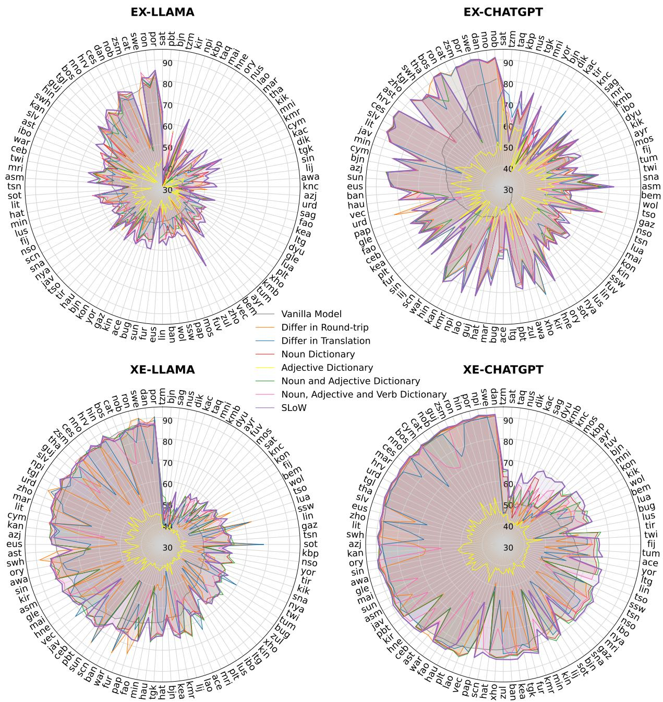
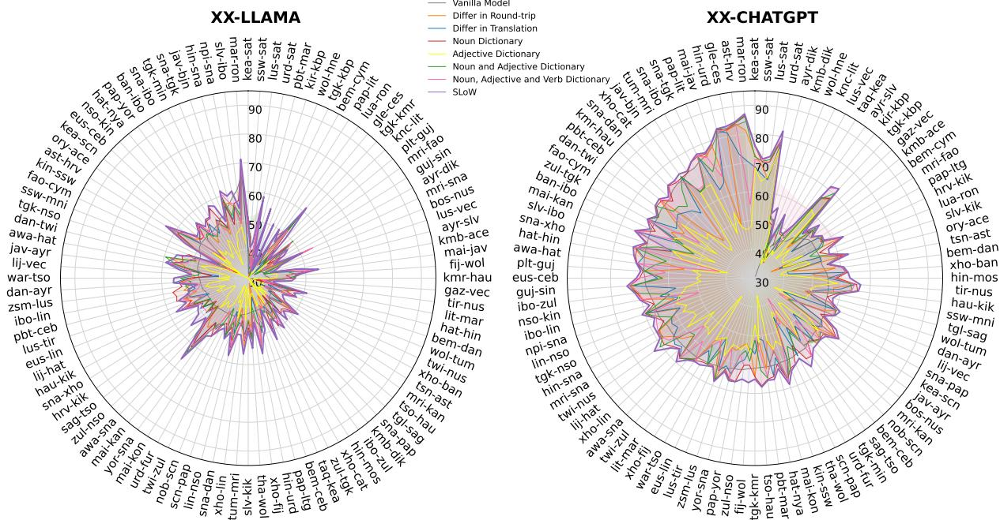

# SLoW: Select Low-frequency Words! Automatic Dictionary Selection for Translation on Large Language Models

Hongyuan Lu♡♣\*, Zixuan Li ♠∗, Zefan Zhang⋄, Wai Lam♡

The Chinese University of Hong Kong

♠Cyber Science and Engineering, Southeast University

♣FaceMind Corporation

⋄ College of Computer Science and Technology, Jilin University {hylu,wlam}@se.cuhk.edu.hk, zixuan.li@seu.edu.cn, zefan23@mails.jlu.edu.cn

## Abstract

There are more than 7,000 languages around the world, and current Large Language Models (LLMs) only support hundreds of languages. Dictionary-based prompting methods can enhance translation on them, but most methods use all the available dictionaries, which could be expensive. Instead, it will be flexible to have a trade-off between token consumption and translation performance. This paper proposes a novel task called Automatic Dictionary Selection (ADS). The goal of the task is to automatically select which dictionary to use to enhance translation. We propose a novel and effective method which we call Select Lowfrequency Words! (SLoW) which selects those dictionaries that have a lower frequency. Our methods have unique advantages. First, there is no need for access to the training data for frequency estimation (which is usually unavailable). Second, it inherits the advantage of dictionary-based methods, where no additional tuning is required on LLMs. Experimental results on 100 languages from FLORES indicate that SLoW surpasses strong baselines, and it can obviously save token usage, with many languages even surpassing the translation performance of the full dictionary baseline.12

## 1 Introduction

Large Language Models (LLMs) have exhibited many exciting capabilities such as chain-of-thought reasoning (Wang et al., 2023; Wei et al., 2024), neural machine translation (Lu et al., 2023; Zhu et al., 2024), code understanding and code generation (Li et al., 2023; Zhang et al., 2023), and even spatial reasoning (Hu et al., 2024). While

LLMs have demonstrated their exciting performances on a wide range of tasks, they are usually English-centric, and their multilingual abilities are usually limited, especially in those low-resourced languages. Dictionary-based methods effectively improve multilingual capabilities by adding word mappings into the prompt (Lu et al., 2024; Lu et al., 2024). Yet, most current dictionary-based translation methods for LLMs use all the matching dictionaries greedily, and there are so far no systematic guidelines or architecture to select which dictionaries to use. Such a greedy strategy can lead to unnecessary token consumption, as LLMs may have no problems understanding some of the words. Furthermore, too much irrelevant or redundant information can distract LLMs (Shi et al., 2023). Therefore, we propose a novel Natural Language Processing task called Automatic Dictionary Selection (ADS). The input into the task of ADS is a set of available dictionaries and a set of input translation source instances. The goal of ADS is to maximise the translation performance by using only a subset of the dictionaries, so there can be a trade-off where more dictionaries to be used may have a better translation performance. Therefore, we constrain ADS to use no more than a certain number of words, words, and in this paper, we make it the method with the lowest number of dictionaries among the methods in comparison.

To tackle ADS, we propose a novel and effective method which we call Select Low-frequency Words! (SLoW). SLoW selects the dictionaries that have a lower frequency in the training data. We postulate that this is because how frequently the words are presented in the training data is directly related to how well the LLMs understand them, and adding the dictionary of those low-frequency words makes it easier for LLMs to understand and translate less frequent and less well-learned words.

Further analysis indicates that such methods are better than many competitive baselines such as using nouns, verbs, adjectives, or their combination greedily. Surprisingly, we also found that selecting partial dictionaries with SLoW can even beat full dictionary usage in some cases. This paves a new research direction to optimize the selection of dictionary usage automatically for dictionary-based translation methods on LLMs.

We emphasize the shocking fact that there is no need to obtain the actual training data, which is often unobtainable, and online public resources can be used to improve LLaMa and ChatGPT through SLoW. This suggests a good estimation of online resources on word frequencies in the training data from ChatGPT and LLaMa.

Our contributions are three-fold:

• We propose a novel task called Automatic Dictionary Selection, where it considers the trade-off between dictionaries and performance to be used when prompting LLMs.

• We propose a novel method to tackle ADS, which we call Select Low-frequency Words! (SLoW). SLoW selects the dictionaries that have a lower frequency in the training data.

• We conduct experiments on 100 languages from FLORES for Machine Translation. Experimental results indicate that SLoW beats competitive baselines and can even surpass the case when full dictionaries are used.

## 2 Prior Work

Neural Machine Translation via LLMs Research on effective methods for prompting Englishcentric Large Language Models (LLMs) for non-English tasks, including standard cross-lingual tasks like Multilingual Neural Machine Translation (MNMT), remains limited. Most existing studies have primarily focused on evaluating the translation performance of English-centric LLMs using prompts such as ‘Translate to {language\_name}: text’ (Brown et al., 2020; Lin et al., 2022; Le Scao et al., 2022; Zhang et al., 2022). Various prompt formats have also been explored (Reynolds and McDonell, 2021; Wang et al., 2023). Additionally, Garcia and Firat (2022) examined the use of prompts to regulate aspects like formality or specific dialects in a generation. Furthermore, Agrawal et al. (2022) and Vilar et al. (2022) investigated selecting appropriate in-context examples to enhance the machine translation quality of LLMs. Generally speaking, the research of MNMT has now scaled to hundreds of languages as seen with FLORES (NLLB-Team, 2022).

Dictionary-based Method for Neural Machine Translation This research is closely tied to the concept of lexical constraints in machine translation, which can be categorized into hard constraints (Hokamp and Liu, 2017; Post and Vilar, 2018) and soft constraints (Song et al., 2019; Dinu et al., 2019; Chen et al., 2021).

Several studies have investigated the use of dictionaries in supervised machine translation. For instance, Zhang and Zong (2016) enhanced neural machine translation (NMT) by incorporating a bilingual dictionary to include rare or unseen words absent from the bilingual training data. Similarly, Arthur et al. (2016) improved the translation of rare words by integrating discrete translation lexicons and using the attention vector to estimate relevant lexical probabilities. Hämäläinen and Alnajjar (2020) leveraged dictionaries to generate synthetic parallel data, enhancing NMT training. Lu et al. (2024) used chained dictionaries to enhance machine translation with LLMs by leveraging intermediate auxiliary languages.

While much of the prior work has centred on using dictionaries for machine translation tasks, how to effectively select a subset of dictionaries to achieve a good trade-off remains unexplored. In contrast, ADS is the first task that considers which types of dictionaries should be used on LLMs for automatic machine translation.

## 3 Automatic Dictionary Selection

## 3.1 Translation with LLMs

We start by introducing our proposed task, namely automatic dictionary selection. The goal of such a task is to select appropriate dictionaries in order to maximise the performance of the succeeding generation task by adding the dictionaries into the prompt, and this paper focuses on the setting of neural machine translation on LLMs which use dictionaries for translation (Lu et al., 2024).

LLM can be regarded as a Seq2Seq neural network (Sutskever et al., 2014) to translate an input language into the output language while maintaining the semantical equivalence and maximise the following likelihood:

$$
P \left( \hat { t } \mid i , s , d \right) = \prod _ { j = 1 } ^ { \mathbb { T } } P \left( \hat { t } _ { j } \mid \hat { t } _ { 1 } , . . . , \hat { t } _ { j - 1 } , i , s , d \right) ,
$$

where $\mathbb { T }$ represents the length of the generated translation output and $\hat { t _ { j } }$ represents the word at the position j that has been inferenced. s represents the source sentences, d represents the dictionaries that has been selected to be used for improving the translation. i represents the translation instruction to guide the LLMs to translate the words. A typical translation instruction could be:

Translate the following sentence from <source language> into <target language>: <source sentence>

## 3.2 Automatic Dictionary Selection

However, which dictionaries to be used d has not been explored to our best knowledge. That means, in previous works, all the dictionaries are provided and inserted into the prompt as long as there is a match regardless of how useful they will be. However, intuitively speaking, this could not be the best choice. Even if the results are not maximised, one might want to reduce the computational cost as a trade-off to gain limited improvement with dictionary methods. Therefore, we propose a novel task ADS to automatically select dictionaries. The task is formulated as:

$$
\begin{array} { r } { \hat { \mathcal { D } } = \mathcal { M } ( \mathcal { D } , \mathcal { L } ) , } \end{array}
$$

where is a selection function, where we select a subset of dictionary $\hat { \mathcal { D } }$ from the complete dictionary  for succeeding downstream task dataset ${ \mathcal { L } } .$ Since such a selection might always be maximised by selecting the full dictionary, we define a dictionary size  which is usually lower than the full dictionary size, and the goal of ADS is to find a better function  that maximises the final performance on the with a subset of the dictionary, namely, $\begin{array} { r } { \hat { \mathcal { D } } _ { : } } \end{array}$ which has a dictionary size of .

## 3.3 Select Low-frequency Words!

In this paper, we propose a novel and effective method which we call Select Low-frequency Words! (SLoW). SLoW selects the dictionaries that have a lower frequency in the training data:

$$
\begin{array} { r } { \hat { \mathcal { D } } = \mathrm { f i r s t } ( \mathrm { s o r t } _ { \bar { x } _ { i } \in \mathcal { D } } ( \mathcal { G } ( \bar { x } _ { i } , \mathcal { T } ) ) , \mathcal { V } ) , } \end{array}\tag{1}
$$

where first selects from a sorted list in acending order created from sort to get the lowest-frequency dictionaries selected by a frequency estimation function $\mathcal { G }$ with the training set $\tau$ used for training the LLMs. Note that here for the translation task in this paper, English frequency can used as a standard, because most LLMs are English-centric.

We surprisingly found its usefulness despite it being simple, compared to various strong baselines that we have compared. This is yet intuitively aligned with our expectation, as we definitely would like to enhance LLMs’ knowledge if that part of knowledge is not trained well. Data scarcity, i.e., low-frequency is a common reason for not training that part of the knowledge well.

In this paper, we have attempted various baselines. Since we conduct experiments on hundreds of languages from FLORES, and our computational resources are limited, we explore the setting where we set a fixed .

## 4 Experimental Setup

## 4.1 Datasets and Evaluation Metrics

We evaluate the task of Neural Machine Translation with the dictionary-based setting where dictionaries are used to improve machine translation (Lu et al., 2024). Under this setting, low-resourced languages play an important role, because dictionarybased methods are particularly useful on them (Lu et al., 2024). A very useful dataset is FLORES (NLLB-Team, 2022), where we use 100 languages from FLORES devtest. This dataset comprises 1,012 sentences sourced from English Wikipedia, spanning diverse topics and domains (we randomly sample 200 instances). These sentences have been meticulously translated into hundreds of languages by professional translators. Since they are professionally translated by human experts into parallel languages, it is suitable for our use.

For the evaluation metrics, we report the chrF (Popovic´, 2015) and the BLEU (Papineni et al., 2002) evaluations provided by the sacreBLEU repository.3 We also use evaluate with COMET scores using wmt22-comet-da4 (Rei et al., 2020) across all the experiments.

For space reasons, we present the language class of our experiments for XX translation in Table 9 and Table 10 in the Appendix.

## 4.2 Baselines

We conduct our experiments with both closesourced and open-sourced LLMs on ChatGPT (GPT-4o-mini), LLaMa-3.1-8B (Dubey et al., 2024) and DeepSeek-V3 671B (DeepSeek-AI et al.,

  
Figure 1: Performance of LLaMa and ChatGPT in COMET scores on the task of Machine Translation both into English and from English translation on FLORES with different ADS methods. The top-left one is the translation from English on LLaMa, the top-right is the translation from English on ChatGPT, the bottom-left is the translation to English on LLaMa, and the bottom-right is the translation to English on LLaMa. It is obvious that our proposed method SLoW is the best, surpassing many strong baselines. Such a phenomenon can be consistently observed across many low-resourced and high-resourced languages, demonstrating the effectiveness of our methods. For space reasons, more results on BLEU, chrF, evaluations and on DeepSeek-V3 in the Appendix in Table 4.

2024). At the time of writing, both of them are popular and widely used English-centric LLMs which are strong in their multilingual translation capacities. Based on these popular LLMs, we compare our proposed method to strong baseline methods:

• Vanilla Model We prompt LLMs to directly translate the input without the assistance of any additional dictionaries.

• Noun Dictionary Noun words may contain named entities which can be special terminologies which could be particularly hard to translate (Ugawa et al., 2018).

• Adjective Dictionary Adjective words are another type of word which could be important.

  
Figure 2: Performance of LLaMa and ChatGPT the task of Machine Translation on non-English-centric translation in COMET scores on non-English-centric translation on FLORES with different ADS methods. It is obvious that our proposed method SLoW is the best, surpassing many strong baselines. Such a phenomenon can be consistently observed across many translation pairs, demonstrating the effectiveness of our methods. For space reasons, more results on BLEU, chrF, evaluations and on DeepSeek-V3 in the Appendix in Table 4.

<table><tr><td>Direction</td><td colspan="6">[# improved &gt; 5 points &gt; 10 points &gt; 20 points|# degraded &gt; 5 points &gt; 20 points</td></tr><tr><td>En-X-LLaMa</td><td>88/100</td><td>65/88</td><td>50/88</td><td>22/88</td><td>12/100</td><td>4/12 3/12</td></tr><tr><td>En-X-CHATGPT</td><td>75/100</td><td>36/75</td><td>15/75</td><td>1/75</td><td>25/100 10/25</td><td>4/25</td></tr><tr><td>X-En-LLaMa</td><td>76/100</td><td>63/76</td><td>57/76</td><td>39/76 24/100</td><td>10/24</td><td>5/24</td></tr><tr><td>X-En-CHATGPT</td><td>92/100</td><td>50/92</td><td>43/92</td><td>33/92</td><td>8/100 5/8</td><td>2/8</td></tr><tr><td>X-X-LLaMa</td><td>93/100</td><td>46/93</td><td>7/93</td><td>1/93</td><td>7/100 1/7</td><td>0/7</td></tr><tr><td>X-X-CHATGPT</td><td>100/100</td><td>53/100</td><td>26/100</td><td>5/100</td><td>0/100</td><td>0/0 0/0</td></tr></table>

Table 1: Statistics of the changes in COMET scores with SLoW compared to the baseline of Differ in Round-trip on LLaMa and ChatGPT on the FLORES dataset. Most translation directions have been obviously improved. Details results on BLEU, chrF, and evaluations on DeepSeek-V3 can be found in Table 4.

• Verb Dictionary Verb words are another type of word which could be important.

• Noun and Adjective Dictionary Combining both noun and adjective dictionaries can be useful as well.

• Noun, Adjective, and Verb Dictionary Combining noun, adjective, and verb dictionaries can be useful as well.

• Differ in Round-trip We first use a baseline model without any dictionary to translate the source language into the target language before translating back (Sennrich et al., 2016). The difference between the round-trip translation and the original source sentences is selected as the dictionary.

• Differ in Translation We first use a baseline without any dictionary to translate the source language into the target language. The difference between the translation and the original target sentences is selected as the dictionary.

## 4.3 Frequency Estimation

Since the training sets of LLMs are usually closesourced, we estimate the word frequency of training data by directly using web resources.5

## 4.4 Prompt Template

Dictionary Construction To construct the bilingual dictionary mapping for translation, we prompt ChatGPT (Lu et al., 2024):

(1) Please provide the translation of the given English sentence into <language>, along with a word-for-word dictionary for each word.   
(2) The output format must be strictly followed:   
1. Start with ‘English:’ followed by the English sentence.   
2. On the next line, start with ‘<language>:’ followed by the <source> translation.   
3. On the next line, start with ‘dictionary: followed by each word in the <language> sentence, annotated with its English meaning in parentheses, separated by spaces. (3) Now generate translations for the following sentence:   
English: <target>   
<language>: <source>   
dictionary:

Translation We leave the translation prompt in the Appendix due to space reasons.

## 5 Results

## 5.1 Main Results

From-English Translation (EX) The upper part in Figure 1 visually demonstrates the performance of SLoW on the task of Machine Translation with ADS on the dataset of FLORES compared to strong baselines. The top-left figure shows the performance of LLaMa from English to other languages. The average performance seems to be the lowest among all four figures, which is reasonable. One reason is that this is the translation from English, which is usually lower than translating into English on the English-centric model on average. Another reason is that it is usual for an 8B version LLaMa to be less powerful than close-sourced ChatGPT 4.

The top-right figure shows the translation performance of ChatGPT from English to other languages. It is obvious that the average performance is better than the from-English direction on LLaMa. This is also reasonable that it is slightly better than the bottom-left figure on translation to English on LLaMa, as to English translation can be considered as generally better than from-English translation on the English-centric model.

Overall, SLoW (purple line) performs clearly better than all the other baselines when translating from English. On LLaMa, it seems that the advantage of SLoW is more clear than on ChatGPT compared to Differ in Round-trip. One postulation is that the performance of LLaMa is generally lower than ChatGPT, so there is more room for improvement for SLoW. Generally speaking, SLoW is clearly useful in improving both LLaMa and ChatGPT on translating from English.

Table 1 presents the improvement statistics of SLoW compared to the baseline of Differ in Roundtrip for translating from English. SLoW surpasses the baseline. For example, 88 out of 100 language pairs are improved when using SLoW for translating from English for LLaMa. Among those 88 pairs, 22 (25%) of the pairs are improved for more than 20 COMET scores. In comparison, the number of degradations is apparently lower (12 out of 100 language pairs). When there is a degradation, about half of the language pairs (5/12) give less than 5 points of degradation. These results highlight the usefulness of SLoW.

Into-English Translation (XE) The lower part in Figure 1 visually demonstrates the performance of SLoW on the task of Machine Translation with ADS on the dataset of FLORES compared to strong baselines. The bottom-left figure shows the translation performance of LLaMa from English to other languages. The average performance seems to be lower than translating to English on ChatGPT, but higher than translating from English on LLaMa, which is reasonable. One reason is that this is the translation from English, which is usually lower than translating into English on the English-centric model on average. Another reason is that it is usual for an 8B version LLaMa to be less powerful than close-sourced ChatGPT 4.

The bottom-right figure shows the translation performance of ChatGPT into English. It is obvious that the average performance is better than the performance in all the other three figures. This is because translating into English is usually easier than translating from English, and ChatGPT-4 can be usually considered than LLaMa-3.1-8B.

Overall, SLoW (purple line) performs clearly better than all the other baselines for translating from English translation. On LLaMa, it seems that the advantage of SLoW is more clear than on Chat-

<table><tr><td>PoS</td><td>Tag</td><td>Per.</td><td>Cov.</td><td>Per.</td><td>Cov.</td><td>Per.</td><td>Cov.</td></tr><tr><td></td><td></td><td colspan="4">XE EX</td><td colspan="2">XX</td></tr><tr><td>adjective</td><td>ADJ</td><td>19.28%</td><td>66.82%</td><td>19.30%</td><td>58.29%</td><td>19.16%</td><td>62.88%</td></tr><tr><td>adposition</td><td>ADP</td><td>2.26%</td><td>6.10%</td><td>2.34%</td><td>6.36%</td><td>2.51%</td><td>7.74%</td></tr><tr><td>adverb</td><td>ADV</td><td>4.33%</td><td>41.73%</td><td>4.13%</td><td>34.92%</td><td>4.53%</td><td>42.93%</td></tr><tr><td>auxiliary</td><td>AUX</td><td>0%</td><td>0%</td><td>0%</td><td>0%</td><td>0%</td><td>0%</td></tr><tr><td>coordinating conjunction</td><td>CCONJ</td><td>0.34%</td><td>4.01%</td><td>0.15%</td><td>1.52%</td><td>0.20%</td><td>2.20%</td></tr><tr><td>determiner</td><td>DET</td><td>0.45%</td><td>1.40%</td><td>0.44%</td><td>2.41%</td><td>0.58%</td><td>3.53%</td></tr><tr><td>interjection</td><td>INTJ</td><td>0%</td><td>0%</td><td>0%</td><td>0%</td><td>0%</td><td>0%</td></tr><tr><td>noun</td><td>NOUN</td><td>43.65%</td><td>49.23%</td><td>46.45%</td><td>45.74%</td><td>45.61%</td><td>50.80%</td></tr><tr><td>numeral</td><td>NUM</td><td>3.97%</td><td>53.51%</td><td>3.35%</td><td>42.95%</td><td>3.34%</td><td>48.10%</td></tr><tr><td>particle</td><td>PART</td><td>0.11%</td><td>14.68%</td><td>0.10%</td><td>26.32%</td><td>0.11%</td><td>32.82%</td></tr><tr><td>pronoun</td><td>PRON</td><td>0.68%</td><td>7.82%</td><td>0.53%</td><td>7.03%</td><td>0.14%</td><td>90.12%</td></tr><tr><td>proper noun</td><td>PROPN</td><td>0.14%</td><td>92.15%</td><td>0.12%</td><td>93.83%</td><td>0.14%</td><td>90.12%</td></tr><tr><td>punctuation</td><td>PUNCT</td><td>0%</td><td>0%</td><td>0%</td><td>0%</td><td>0%</td><td>0%</td></tr><tr><td>subordinating conjunction</td><td>SCONJ</td><td>0%</td><td>0%</td><td>0%</td><td>0%</td><td>0%</td><td>0%</td></tr><tr><td>symbol</td><td>SYM</td><td>0%</td><td>0%</td><td>0%</td><td>0%</td><td>0%</td><td>0%</td></tr><tr><td>verb</td><td>V</td><td>24.06%</td><td>46.27%</td><td>22.58%</td><td>41.85%</td><td>22.58%</td><td>47.00%</td></tr><tr><td>others</td><td>X</td><td>0.73%</td><td>6.71%</td><td>0.50%</td><td>5.85%</td><td>0.66%</td><td>8.04%</td></tr></table>

Table 2: PoS tagger statistics selected by SLoW. Per. represents the percentage of the tag in the whole dictionary prompted, and Cov. represents the coverage, meaning the selected ratio of the selected words compared to the total number of that PoS tag in the dictionary. There are 17 core tags in UPoS: https://universaldependencies.org/ u/pos/ UPoS tagger: https://github.com/slavpetrov/universal-pos-tags, https://www.nltk.org/.

GPT compared to Differ in Round-trip. One postulation is that the performance of LLaMa is generally lower than ChatGPT, so there is more room for improvement for SLoW. Generally speaking, SLoW is clearly useful in improving both LLaMa and ChatGPT on translating from English.

Table 1 presents the improvement statistics of SLoW compared to the baseline of Differ in Roundtrip for translating into English. It is obvious that SLoW surpasses the baseline. For example, when translating into English on ChatGPT, 92 out of 100 language pairs are improved when using SLoW. Among those 92 pairs, 33 (about 1/3) of the pairs are improved for more than 20 COMET scores. In comparison, the number of degradations is lower (8 out of 100 language pairs). When there is a degradation, about half of the language pairs (5/8) give less than 20 points of degradation. This highlights the usefulness of SLoW.

Non-English-centric Translation (XX) Figure 2 visually demonstrates the performance of SLoW on the task of Machine Translation with ADS on the dataset of FLORES compared to strong baselines. The left figure is for translation on LLaMa and the right figure is for translation on ChatGPT. The overall performance on LLaMa is apparently lower than ChatGPT, which is reasonable, as the model size of LLaMa we conduct our experimentation on is obviously smaller than ChatGPT.

Overall, it is clear that SLoW is great at translating in non-English-centric directions, surpassing all the strong baselines. We also note that the baselines might not work well in this scenario, as they can be frequently worse than the Vanilla Baseline, which does not use any additional dictionary. We postulate that this is due to the lack of ability in terms of non-English-centric translation, as ChatGPT is an English-centric model. Still, SLoW is effective and constantly better than the Vanilla Baseline.

Table 1 presents the improvement statistics of SLoW compared to the baseline of Differ in Roundtrip for translating on non-English-centric directions. It is obvious that SLoW surpasses the baseline. For example, when translating into English on ChatGPT, 100 out of 100 language pairs are improved when using SLoW. Among those 92 pairs, 46 (about half) of the pairs are improved for more than 5 COMET scores. In comparison, the number of degradations is lower, for example, on LLaMa, only 0 out of 100 language pairs are degraded. This highlights the usefulness of SLoW.

<table><tr><td rowspan=1 colspan=1>Ground-truth Tsonga</td><td rowspan=1 colspan=1>Muteki wa swifaniso u tleketliwile ku ya le Ronald Reagan UCLA Medi-cal Center, laha a fikeke a fa.</td></tr><tr><td rowspan=1 colspan=1>Ground-truth English</td><td rowspan=1 colspan=1>The photographer was transported to Ronald Reagan UCLA MedicalCenter, where he subsequently died.</td></tr><tr><td rowspan=1 colspan=1>Vanilla Model</td><td rowspan=1 colspan=1>COMET Score: 0.579 X &quot;Ambulance from Ronald Reagan UCLA Medi-cal Center has arrived.&quot;</td></tr><tr><td rowspan=1 colspan=1>Differ in Round-trip</td><td rowspan=1 colspan=1>COMET Score: 0.413 X The ensued entertainment after Ronald ReaganUCLA Medical Centre called the police but attempted him for throadand for traffic stop due to him driving too fast therefore prompting visualimagery for the first time in South Africa.</td></tr><tr><td rowspan=1 colspan=1>Differ in Translation</td><td rowspan=1 colspan=1>COMET Score: 0.335 X The driver of the police vehicle had his ear givenaccording to the witness who is accused of not being prepared to pay afine.</td></tr><tr><td rowspan=1 colspan=1>Noun Dictionary</td><td rowspan=1 colspan=1>COMET Score: 0.806 X The person in the photographs was taken to theRonald Reagan UCLA Medical Center, where he died.</td></tr><tr><td rowspan=1 colspan=1>Adjective Dictionary</td><td rowspan=1 colspan=1>COMET Score: 0.562 X Ronald Reagan Center where he died.</td></tr><tr><td rowspan=1 colspan=1>Noun and AdjectiveDictionary</td><td rowspan=1 colspan=1>COMET Score: 0.763 X The driver of the vehicle was taken to RonaldReagan UCLA Medical Center, where he died.</td></tr><tr><td rowspan=1 colspan=1>Noun, Adjective, andVerb Dictionary</td><td rowspan=1 colspan=1>COMET Score: 0.864 X The photographer was taken to the RonaldReagan UCLA Medical Center, where he died.</td></tr><tr><td rowspan=1 colspan=1>High-frequency</td><td rowspan=1 colspan=1>COMET Score: 0.707 X The man of images was taken to the RonaldReagan UCLA Medical Center, where he died.</td></tr><tr><td rowspan=1 colspan=1>SLoW</td><td rowspan=1 colspan=1>COMET Score: 0.912 √ The photographer was transported to the RonaldReagan UCLA Medical Center, where he subsequently died.</td></tr></table>

Table 3: A case study on translating from Tsonga To English. ✗ represents that the generation is not the best among all the models. ✓ represents that the generation is the best among all the models.

## 5.2 SLoW PoS Tags

Table 2 presents the PoS tags of the words selected by SLoW. The dictionary is mainly composed of adjective, noun, and verb words. SLoW surpasses the baseline, which is composed of only these three types of words without considering how frequent they are. In contrast, SLoW selects low-frequency words appropriately, such as numerals and adverbs. However, it could be expensive to run exhaustive experiments on all combinations to be compared with SLoW. Nevertheless, the statistics suggest that SLoW selects a comprehensive dictionary composed of diverse words with different PoS tags, which is effective in improving the translation. This also surpasses the strong baseline with Differ in Round-trip and Differ in Translation.

We present further results on BLEU, chrF evaluations, and results on DeepSeek-V3 in Table 4. We also leave case studies in the Table 3. They all align with our conclusions. On most language pairs, the performance has been obviously improved. In case there is any degradation, the degradation is frequently less than 1 point. For space reasons, we leave more case studies in our Appendix.

## 5.3 SLoW versus Full Dictionary

While usually adding redundant information to LLMs can degrade performance, removing useful dictionaries can be harmful to translation performance. Table 5 presents the actual ratio that we have adopted compared to the full dictionary. We also note that under this setting, SLoW can surpass the full dictionary baseline obviously on some language pairs as presented in Table 6. Yet, for most other cases, the full dictionary is still better, which is however still reasonable and very acceptable as more tokens are cost with LLMs. We also note that there is still a chance for SLoW to surpass the full dictionary baseline better if a different ratio is chosen. Since this is too exhaustive for this paper, we leave the exploration to future work.6

<table><tr><td>Direction</td><td colspan="9">|# improved &gt; 1 point &gt; 2 points &gt; 3 points &gt; 5 points | # degraded &gt; 1 point &gt; 2 points &gt; 3 points &gt; 5 points</td></tr><tr><td>EX-CHATGPT-BLEU</td><td>72/100</td><td>48/72</td><td>30/72</td><td>20/72</td><td>11/72</td><td>28/100</td><td>9/28</td><td>2/28</td><td>0/28</td><td>0/28</td></tr><tr><td>EX-CHATGPT-chrF</td><td>69/100</td><td>52/69</td><td>30/69</td><td>20/69</td><td>12/69</td><td>31/100</td><td>13/31</td><td>2/31</td><td>0/31</td><td>0/31</td></tr><tr><td>XE-CHATGPT-BLEU</td><td>70/100</td><td>50/70</td><td>26/70</td><td>14/70</td><td>11/70</td><td>30/100</td><td>14/30</td><td>8/30</td><td>7/30</td><td>7/30</td></tr><tr><td>XE-CHATGPT-chrF</td><td>70/100</td><td>41/70</td><td>25/70</td><td>16/70</td><td>13/70</td><td>30/100</td><td>16/30</td><td>9/30</td><td>7/30</td><td>7/30</td></tr><tr><td>XX-CHATGPT-BLEU</td><td>69/100</td><td>37/69</td><td>19/69</td><td>6/69</td><td>1/69</td><td>31/100</td><td>6/31</td><td>0/31</td><td>0/31</td><td>0/31</td></tr><tr><td>XX-CHATGPT-chrF</td><td>69/100</td><td>42/69</td><td>19/69</td><td>8/69</td><td>1/69</td><td>31/100</td><td>11/31</td><td>0/31</td><td>0/31</td><td>0/31</td></tr><tr><td>EX-LLaMa-BLEU</td><td>85/100</td><td>73/85</td><td>59/85</td><td>52/85</td><td>30/85</td><td>15/100</td><td>8/15</td><td>5/15</td><td>5/157</td><td>3/15</td></tr><tr><td>EX-LLaMa-chrF</td><td>71/100</td><td>50/71</td><td>32/71</td><td>20/71</td><td>13/71</td><td>29/100</td><td>13/29</td><td>5/29</td><td>2/29</td><td>0/29</td></tr><tr><td>XE-LLaMa-BLEU</td><td>58/100</td><td>37/58</td><td>17/58</td><td>12/58</td><td>10/58</td><td>42/100</td><td>28/42</td><td>11/28</td><td>8/28</td><td>5/28</td></tr><tr><td>XE-LLaMa-chrF</td><td>64/100</td><td>40/64</td><td>24/64</td><td>18/64</td><td>12/64</td><td>36/100</td><td>24/36</td><td>15/36</td><td>7/36</td><td>6/36</td></tr><tr><td>XX-LLaMa-BLEU</td><td>84/100</td><td>54/84</td><td>39/84</td><td>28/84</td><td>6/84</td><td>16/100</td><td>6/16</td><td>2/16</td><td>2/16</td><td>0/16</td></tr><tr><td>XX-LLaMa-chrF</td><td>80/100</td><td>70/80</td><td>50/80</td><td>29/80</td><td>11/80</td><td>20/100</td><td>10/20</td><td>7/20</td><td>5/20</td><td>0/10</td></tr><tr><td>EX-DEEPSEEKV3-BLEU</td><td>68/100</td><td>47/68</td><td>25/68</td><td>17/68</td><td>12/68</td><td>32/100</td><td>12/32</td><td>2/32</td><td>0/32</td><td>0/32</td></tr><tr><td>EX-DEEPSEEKV3-chrF</td><td>73/100</td><td>48/73</td><td>31/73</td><td>21/73</td><td>14/73</td><td>27/100</td><td>13/27</td><td>4/27</td><td>1/27</td><td>0/27</td></tr><tr><td>XE-DEEPSEEKV3-BLEU</td><td>66/100</td><td>44/66</td><td>30/66</td><td>17/66</td><td>13/66</td><td>34/100</td><td>19/34</td><td>9/34</td><td>8/34</td><td>7/34</td></tr><tr><td>XE-DEEPSEEKV3-chrF</td><td>74/100</td><td>53/74</td><td>35/74</td><td>19/74</td><td>12/74</td><td>26/100</td><td>11/26</td><td>9/26</td><td>9/26</td><td>7/26</td></tr><tr><td>XX-DEEPSEEKV3-BLEU</td><td>72/100</td><td>38/72</td><td>13/72</td><td>4/72</td><td>0/72</td><td>28/100</td><td>4/28</td><td>0/28</td><td>0/28</td><td>0/28</td></tr><tr><td>XX-DEEPSEEKV3-chrF</td><td>75/100</td><td>48/75</td><td>25/75</td><td>8/75</td><td>2/75</td><td>25/100</td><td>8/25</td><td>1/25</td><td>0/25</td><td>0/25</td></tr></table>

Table 4: Statistics of the changes in BLEU and chrF scores with SLoW compared to the baseline of the Noun Dictionary on CHATGPT, LLaMa, and DEEPSEEK-V3. Most translation directions have been obviously improved. In case there is any degradation, the degradation is frequently less than 1 point.

<table><tr><td>Direction</td><td>Ratio</td></tr><tr><td>into-English</td><td>0.553</td></tr><tr><td>from-English</td><td>0.520</td></tr><tr><td>non-English-centric</td><td>0.564</td></tr></table>

Table 5: The dictionary ratio is automatically decided in this paper by aligning with the word numbers in Differ in Round-trip compared to the full dictionary.
<table><tr><td>Direction</td><td>SLoW</td><td>Full-Dict</td></tr><tr><td>pbt_Arab</td><td>0.803</td><td>0.483</td></tr><tr><td>kir_Cyrl</td><td>0.810</td><td>0.501</td></tr><tr><td>gle_Latn</td><td>0.802</td><td>0.499</td></tr><tr><td>ory_Orya</td><td>0.839</td><td>0.518</td></tr><tr><td>azj_Latn</td><td>0.827</td><td>0.514</td></tr></table>

Table 6: Five XE translation pairs on LLaMa, showing that SLoW obviously surpasses the Full-Dict baseline.

## 5.4 SLoW versus High-frequency

In order to further validate our claim that lowerfrequency dictionaries are more useful for translation than higher-frequency ones, we perform a comparison between SLoW and those dictionaries with the highest frequency and present the results in Table 7. When the same number of words and PoS ratios are kept, we see that SLoW is clearly better in high-frequency dictionaries. For example, for translating into English on ChatGPT, SLoW

<table><tr><td>Direction</td><td>High-frequency</td><td>SLoW</td></tr><tr><td>XE-ChatGPT</td><td>0</td><td>100</td></tr><tr><td>EX-ChatGPT</td><td>8</td><td>92</td></tr><tr><td>XX-ChatGPT</td><td>16</td><td>84</td></tr><tr><td>XE-LLaMa</td><td>19</td><td>81</td></tr><tr><td>EX-LLaMa</td><td>1</td><td>99</td></tr><tr><td>XX-LLaMa</td><td>13</td><td>87</td></tr></table>

Table 7: The number of winning languages in COMET scores on different language pairs and different models with High-frequency dictionaries and SLoW.

is always better than high-frequency dictionaries.   
This apparently strengthens the claim of this paper.

## 6 Conclusions

LLMs are highly effective in English but underperform in many other languages, especially lowresourced ones. Using dictionary-based methods can improve translation performance, but previous research has not investigated which dictionaries can be more useful to LLMs and they usually add all the dictionaries to the prompt. To this end, we propose a novel method called Select Low-frequency Words! (SLoW). Given the number of dictionaries to be selected, SLoW selects those with the lowest frequency. We found that such a novel and effective algorithm achieves strong performance, clearly surpassing many strong baselines, including high-frequency dictionaries. Also, general web resources can be used to estimate the frequency instead of the actual training data of the LLMs.

## Limitations

This paper presents an analysis of 100 languages only. However, there are more than 7,000 languages around the world. The paper can be further extended by including more languages; however, such datasets are lacking. It is quite valuable as the data collection procedure itself is hard, which can significantly contribute to our community.

Second, since we have no access to the training data of the LLMs that we conduct experiments on, it is a pity that we cannot use them to estimate the actual word frequency for experimental purposes.

## Ethical Statement

We honour and support the ACL ARR Code of Ethics. There is no ethical issue known to us. Wellknown and widely used LLMs are used in our work, which is subjected to generating offensive context. Yet, the above-mentioned issues are widely known to exist commonly among LLMs. Any content generated does not reflect the view of the authors.

## References

Sweta Agrawal, Chunting Zhou, Mike Lewis, Luke Zettlemoyer, and Marjan Ghazvininejad. 2022. Incontext Examples Selection for Machine Translation. arXiv e-prints, arXiv:2212.02437.

Philip Arthur, Graham Neubig, and Satoshi Nakamura. 2016. Incorporating discrete translation lexicons into neural machine translation. In Proceedings of the 2016 Conference on Empirical Methods in Natural Language Processing, pages 1557–1567, Austin, Texas. Association for Computational Linguistics.

Tom Brown, Benjamin Mann, Nick Ryder, Melanie Subbiah, Jared D Kaplan, Prafulla Dhariwal, Arvind Neelakantan, Pranav Shyam, Girish Sastry, Amanda Askell, Sandhini Agarwal, Ariel Herbert-Voss, Gretchen Krueger, Tom Henighan, Rewon Child, Aditya Ramesh, Daniel Ziegler, Jeffrey Wu, Clemens Winter, Chris Hesse, Mark Chen, Eric Sigler, Mateusz Litwin, Scott Gray, Benjamin Chess, Jack Clark, Christopher Berner, Sam McCandlish, Alec Radford, Ilya Sutskever, and Dario Amodei. 2020. Language models are few-shot learners. In Advances in Neural Information Processing Systems, volume 33, pages 1877–1901. Curran Associates, Inc.

Guanhua Chen, Yun Chen, Yong Wang, and Victor O. K. Li. 2021. Lexical-constraint-aware neural machine translation via data augmentation. In Proceedings of the Twenty-Ninth International Joint Conference on Artificial Intelligence, IJCAI’20.

DeepSeek-AI, Aixin Liu, Bei Feng, Bing Xue, Bingx uan Wang, Bochao Wu, Chengda Lu, Chenggang Zhao, Chengqi Deng, Chenyu Zhang, Chong Ruan, Damai Dai, Daya Guo, Dejian Yang, Deli Chen, Dongjie Ji, Erhang Li, Fangyun Lin, Fucong Dai, Fuli Luo, Guangbo Hao, Guanting Chen, Guowei Li, H. Zhang, Han Bao, Hanwei Xu, Haocheng Wang, Haowei Zhang, Honghui Ding, Huajian Xin, Huazuo Gao, Hui Li, Hui Qu, J. L. Cai, Jian Liang, Jianzhong Guo, Jiaqi Ni, Jiashi Li, Jiawei Wang, Jin Chen, Jingchang Chen, Jingyang Yuan, Junjie Qiu, Junlong Li, Junxiao Song, Kai Dong, Kai Hu, Kaige Gao, Kang Guan, Kexin Huang, Kuai Yu, Lean Wang, Lecong Zhang, Lei Xu, Leyi Xia, Liang Zhao, Litong Wang, Liyue Zhang, Meng Li, Miaojun Wang, Mingchuan Zhang, Minghua Zhang, Minghui Tang, Mingming Li, Ning Tian, Panpan Huang, Peiyi Wang, Peng Zhang, Qiancheng Wang, Qihao Zhu, Qinyu Chen, Qiushi Du, R. J. Chen, R. L. Jin, Ruiqi Ge, Ruisong Zhang, Ruizhe Pan, Runji Wang, Runxin Xu, Ruoyu Zhang, Ruyi Chen, S. S. Li, Shanghao Lu, Shangyan Zhou, Shanhuang Chen, Shaoqing Wu, Shengfeng Ye, Shengfeng Ye, Shirong Ma, Shiyu Wang, Shuang Zhou, Shuiping Yu, Shunfeng Zhou, Shuting Pan, T. Wang, Tao Yun, Tian Pei, Tianyu Sun, W. L. Xiao, Wangding Zeng, Wanjia Zhao, Wei An, Wen Liu, Wenfeng Liang, Wenjun Gao, Wenqin Yu, Wentao Zhang, X. Q. Li, Xiangyue Jin, Xianzu Wang, Xiao Bi, Xiaodong Liu, Xiaohan Wang, Xiaojin Shen, Xiaokang Chen, Xiaokang Zhang, Xiaosha Chen, Xiaotao Nie, Xiaowen Sun, Xiaoxiang Wang, Xin Cheng, Xin Liu, Xin Xie, Xingchao Liu, Xingkai Yu, Xinnan Song, Xinxia Shan, Xinyi Zhou, Xinyu Yang, Xinyuan Li, Xuecheng Su, Xuheng Lin, Y. K. Li, Y. Q. Wang, Y. X. Wei, Y. X. Zhu, Yang Zhang, Yanhong Xu, Yanhong Xu, Yanping Huang, Yao Li, Yao Zhao, Yaofeng Sun, Yaohui Li, Yaohui Wang, Yi Yu, Yi Zheng, Yichao Zhang, Yifan Shi, Yiliang Xiong, Ying He, Ying Tang, Yishi Piao, Yisong Wang, Yixuan Tan, Yiyang Ma, Yiyuan Liu, Yongqiang Guo, Yu Wu, Yuan Ou, Yuchen Zhu, Yuduan Wang, Yue Gong, Yuheng Zou, Yujia He, Yukun Zha, Yunfan Xiong, Yunxian Ma, Yuting Yan, Yuxiang Luo, Yuxiang You, Yuxuan Liu, Yuyang Zhou, Z. F. Wu, Z. Z. Ren, Zehui Ren, Zhangli Sha, Zhe Fu, Zhean Xu, Zhen Huang, Zhen Zhang, Zhenda Xie, Zhengyan Zhang, Zhewen Hao, Zhibin Gou, Zhicheng Ma, Zhi gang Yan, Zhihong Shao, Zhipeng Xu, Zhiyu Wu, Zhongyu Zhang, Zhuoshu Li, Zihui Gu, Zijia Zhu, Zijun Liu, Zilin Li, Ziwei Xie, Ziyang Song, Ziyi Gao, and Zizheng Pan. 2024. DeepSeek-V3 Techni cal Report. arXiv e-prints, arXiv:2412.19437.

Georgiana Dinu, Prashant Mathur, Marcello Federico, and Yaser Al-Onaizan. 2019. Training neural machine translation to apply terminology constraints. In Proceedings of the 57th Annual Meeting of the Association for Computational Linguistics, pages 3063– 3068, Florence, Italy. Association for Computational Linguistics.

Abhimanyu Dubey, Abhinav Jauhri, Abhinav Pandey, Abhishek Kadian, Ahmad Al-Dahle, Aiesha Letman, Akhil Mathur, Alan Schelten, Amy Yang, Angela

Fan, Anirudh Goyal, Anthony Hartshorn, Aobo Yang, Archi Mitra, Archie Sravankumar, Artem Korenev, Arthur Hinsvark, Arun Rao, Aston Zhang, Aurelien Rodriguez, Austen Gregerson, Ava Spataru, Bap tiste Roziere, Bethany Biron, Binh Tang, Bobbie Chern, Charlotte Caucheteux, Chaya Nayak, Chloe Bi, Chris Marra, Chris McConnell, Christian Keller, Christophe Touret, Chunyang Wu, Corinne Wong, Cristian Canton Ferrer, Cyrus Nikolaidis, Damien Al lonsius, Daniel Song, Danielle Pintz, Danny Livshits, David Esiobu, Dhruv Choudhary, Dhruv Mahajan, Diego Garcia-Olano, Diego Perino, Dieuwke Hupkes, Egor Lakomkin, Ehab AlBadawy, Elina Lobanova, Emily Dinan, Eric Michael Smith, Filip Radenovic, Frank Zhang, Gabriel Synnaeve, Gabrielle Lee, Geor gia Lewis Anderson, Graeme Nail, Gregoire Mialon, Guan Pang, Guillem Cucurell, Hailey Nguyen, Han nah Korevaar, Hu Xu, Hugo Touvron, Iliyan Zarov, Imanol Arrieta Ibarra, Isabel Kloumann, Ishan Misra, Ivan Evtimov, Jade Copet, Jaewon Lee, Jan Gef fert, Jana Vranes, Jason Park, Jay Mahadeokar, Jeet Shah, Jelmer van der Linde, Jennifer Billock, Jenny Hong, Jenya Lee, Jeremy Fu, Jianfeng Chi, Jianyu Huang, Jiawen Liu, Jie Wang, Jiecao Yu, Joanna Bitton, Joe Spisak, Jongsoo Park, Joseph Rocca, Joshua Johnstun, Joshua Saxe, Junteng Jia, Kalyan Vasuden Alwala, Kartikeya Upasani, Kate Plawiak, Ke Li, Kenneth Heafield, Kevin Stone, Khalid El Arini, Krithika Iyer, Kshitiz Malik, Kuenley Chiu, Kunal Bhalla, Lauren Rantala-Yeary, Laurens van der Maaten, Lawrence Chen, Liang Tan, Liz Jenkins, Louis Martin, Lovish Madaan, Lubo Malo, Lukas Blecher, Lukas Landzaat, Luke de Oliveira, Madeline Muzzi, Mahesh Pasupuleti, Mannat Singh, Manohar Paluri, Marcin Kardas, Mathew Oldham, Mathieu Rita, Maya Pavlova, Melanie Kambadur, Mike Lewis, Min Si, Mitesh Kumar Singh, Mona Hassan, Na man Goyal, Narjes Torabi, Nikolay Bashlykov, Niko lay Bogoychev, Niladri Chatterji, Olivier Duchenne, Onur Çelebi, Patrick Alrassy, Pengchuan Zhang, Pengwei Li, Petar Vasic, Peter Weng, Prajjwal Bhar gava, Pratik Dubal, Praveen Krishnan, Punit Singh Koura, Puxin Xu, Qing He, Qingxiao Dong, Ragavan Srinivasan, Raj Ganapathy, Ramon Calderer, Ricardo Silveira Cabral, Robert Stojnic, Roberta Raileanu, Rohit Girdhar, Rohit Patel, Romain Sauvestre, Ron nie Polidoro, Roshan Sumbaly, Ross Taylor, Ruan Silva, Rui Hou, Rui Wang, Saghar Hosseini, Sa hana Chennabasappa, Sanjay Singh, Sean Bell, Seo hyun Sonia Kim, Sergey Edunov, Shaoliang Nie, Sha ran Narang, Sharath Raparthy, Sheng Shen, Shengye Wan, Shruti Bhosale, Shun Zhang, Simon Van denhende, Soumya Batra, Spencer Whitman, Sten Sootla, Stephane Collot, Suchin Gururangan, Syd ney Borodinsky, Tamar Herman, Tara Fowler, Tarek Sheasha, Thomas Georgiou, Thomas Scialom, Tobias Speckbacher, Todor Mihaylov, Tong Xiao, Ujjwal Karn, Vedanuj Goswami, Vibhor Gupta, Vignesh Ramanathan, Viktor Kerkez, Vincent Gonguet, Vir ginie Do, Vish Vogeti, Vladan Petrovic, Weiwei Chu, Wenhan Xiong, Wenyin Fu, Whitney Meers, Xavier Martinet, Xiaodong Wang, Xiaoqing Ellen Tan, Xin feng Xie, Xuchao Jia, Xuewei Wang, Yaelle Gold schlag, Yashesh Gaur, Yasmine Babaei, Yi Wen, Yi wen Song, Yuchen Zhang, Yue Li, Yuning Mao Zacharie Delpierre Coudert, Zheng Yan, Zhengx ing Chen, Zoe Papakipos, Aaditya Singh, Aaron Grattafiori, Abha Jain, Adam Kelsey, Adam Sha jnfeld, Adithya Gangidi, Adolfo Victoria, Ahuva Goldstand, Ajay Menon, Ajay Sharma, Alex Boe senberg, Alex Vaughan, Alexei Baevski, Allie Fein stein, Amanda Kallet, Amit Sangani, Anam Yunus, Andrei Lupu, Andres Alvarado, Andrew Caples, An drew Gu, Andrew Ho, Andrew Poulton, Andrew Ryan, Ankit Ramchandani, Annie Franco, Aparajita Saraf, Arkabandhu Chowdhury, Ashley Gabriel Ashwin Bharambe, Assaf Eisenman, Azadeh Yazdan, Beau James, Ben Maurer, Benjamin Leonhardi, Bernie Huang, Beth Loyd, Beto De Paola, Bhargavi Paranjape, Bing Liu, Bo Wu, Boyu Ni, Braden Han cock, Bram Wasti, Brandon Spence, Brani Stojkovic, Brian Gamido, Britt Montalvo, Carl Parker, Carly Burton, Catalina Mejia, Changhan Wang, Changkyu Kim, Chao Zhou, Chester Hu, Ching-Hsiang Chu, Chris Cai, Chris Tindal, Christoph Feichtenhofer, Da mon Civin, Dana Beaty, Daniel Kreymer, Daniel Li, Danny Wyatt, David Adkins, David Xu, Davide Testuggine, Delia David, Devi Parikh, Diana Liskovich Didem Foss, Dingkang Wang, Duc Le, Dustin Hol land, Edward Dowling, Eissa Jamil, Elaine Mont gomery, Eleonora Presani, Emily Hahn, Emily Wood, Erik Brinkman, Esteban Arcaute, Evan Dunbar, Evan Smothers, Fei Sun, Felix Kreuk, Feng Tian, Fira Ozgenel, Francesco Caggioni, Francisco Guzmán Frank Kanayet, Frank Seide, Gabriela Medina Flo rez, Gabriella Schwarz, Gada Badeer, Georgia Swee, Gil Halpern, Govind Thattai, Grant Herman, Grigory Sizov, Guangyi, Zhang, Guna Lakshminarayanan Hamid Shojanazeri, Han Zou, Hannah Wang, Han wen Zha, Haroun Habeeb, Harrison Rudolph, He len Suk, Henry Aspegren, Hunter Goldman, Ibrahim Damlaj, Igor Molybog, Igor Tufanov, Irina-Elena Veliche, Itai Gat, Jake Weissman, James Geboski, James Kohli, Japhet Asher, Jean-Baptiste Gaya Jeff Marcus, Jeff Tang, Jennifer Chan, Jenny Zhen, Jeremy Reizenstein, Jeremy Teboul, Jessica Zhong, Jian Jin, Jingyi Yang, Joe Cummings, Jon Carvill, Jon Shepard, Jonathan McPhie, Jonathan Torres, Josh Ginsburg, Junjie Wang, Kai Wu, Kam Hou U, Karan Saxena, Karthik Prasad, Kartikay Khan delwal, Katayoun Zand, Kathy Matosich, Kaushik Veeraraghavan, Kelly Michelena, Keqian Li, Kun Huang, Kunal Chawla, Kushal Lakhotia, Kyle Huang Lailin Chen, Lakshya Garg, Lavender A, Leandro Silva, Lee Bell, Lei Zhang, Liangpeng Guo, Licheng Yu, Liron Moshkovich, Luca Wehrstedt, Madian Khabsa, Manav Avalani, Manish Bhatt, Maria Tsim poukelli, Martynas Mankus, Matan Hasson, Matthew Lennie, Matthias Reso, Maxim Groshev, Maxim Naumov, Maya Lathi, Meghan Keneally, Michael L Seltzer, Michal Valko, Michelle Restrepo, Mihir Patel, Mik Vyatskov, Mikayel Samvelyan, Mike Clark, Mike Macey, Mike Wang, Miquel Jubert Hermoso, Mo Metanat, Mohammad Rastegari, Mun ish Bansal, Nandhini Santhanam, Natascha Parks Natasha White, Navyata Bawa, Nayan Singhal, Nick Egebo, Nicolas Usunier, Nikolay Pavlovich Laptev, Ning Dong, Ning Zhang, Norman Cheng, Oleg

Chernoguz, Olivia Hart, Omkar Salpekar, Ozlem Kalinli, Parkin Kent, Parth Parekh, Paul Saab, Pavan Balaji, Pedro Rittner, Philip Bontrager, Pierre Roux, Piotr Dollar, Polina Zvyagina, Prashant Ratanchandani, Pritish Yuvraj, Qian Liang, Rachad Alao, Rachel Rodriguez, Rafi Ayub, Raghotham Murthy, Raghu Nayani, Rahul Mitra, Raymond Li, Rebekkah Hogan, Robin Battey, Rocky Wang, Rohan Maheswari, Russ Howes, Ruty Rinott, Sai Jayesh Bondu, Samyak Datta, Sara Chugh, Sara Hunt, Sargun Dhillon, Sasha Sidorov, Satadru Pan, Saurabh Verma, Seiji Yamamoto, Sharadh Ramaswamy, Shaun Lindsay, Shaun Lindsay, Sheng Feng, Shenghao Lin, Shengxin Cindy Zha, Shiva Shankar, Shuqiang Zhang, Shuqiang Zhang, Sinong Wang, Sneha Agarwal, Soji Sajuyigbe, Soumith Chintala, Stephanie Max, Stephen Chen, Steve Kehoe, Steve Satterfield, Sudarshan Govindaprasad, Sumit Gupta, Sungmin Cho, Sunny Virk, Suraj Subramanian, Sy Choudhury, Sydney Goldman, Tal Remez, Tamar Glaser, Tamara Best, Thilo Kohler, Thomas Robinson, Tianhe Li, Tianjun Zhang, Tim Matthews, Timothy Chou, Tzook Shaked, Varun Vontimitta, Victoria Ajayi, Victoria Montanez, Vijai Mohan, Vinay Satish Kumar, Vishal Mangla, Vítor Albiero, Vlad Ionescu, Vlad Poenaru, Vlad Tiberiu Mihailescu, Vladimir Ivanov, Wei Li, Wenchen Wang, Wenwen Jiang, Wes Bouaziz, Will Constable, Xiaocheng Tang, Xiaofang Wang, Xiaojian Wu, Xiaolan Wang, Xide Xia, Xilun Wu, Xinbo Gao, Yanjun Chen, Ye Hu, Ye Jia, Ye Qi, Yenda Li, Yilin Zhang, Ying Zhang, Yossi Adi, Youngjin Nam, Yu, Wang, Yuchen Hao, Yundi Qian, Yuzi He, Zach Rait, Zachary DeVito, Zef Rosnbrick, Zhaoduo Wen, Zhenyu Yang, and Zhiwei Zhao. 2024. The Llama 3 Herd of Models. arXiv e-prints, arXiv:2407.21783.

Xavier Garcia and Orhan Firat. 2022. Using natural language prompts for machine translation. arXiv e-prints, arXiv:2202.11822.

Mika Hämäläinen and Khalid Alnajjar. 2020. A template based approach for training nmt for lowresource uralic languages - a pilot with finnish. In Proceedings of the 2019 2nd International Conference on Algorithms, Computing and Artificial Intelligence, ACAI ’19, page 520–525, New York, NY, USA. Association for Computing Machinery.

Chris Hokamp and Qun Liu. 2017. Lexically constrained decoding for sequence generation using grid beam search. In Proceedings of the 55th Annual Meeting of the Association for Computational Linguistics (Volume 1: Long Papers), pages 1535–1546, Vancouver, Canada. Association for Computational Linguistics.

Hanxu Hu, Hongyuan Lu, Huajian Zhang, Yun-Ze Song, Wai Lam, and Yue Zhang. 2024. Chain-of-symbol prompting for spatial reasoning in large language models. In First Conference on Language Modeling.

Pratik Joshi, Sebastin Santy, Amar Budhiraja, Kalika Bali, and Monojit Choudhury. 2020. The state and fate of linguistic diversity and inclusion in the NLP world. In Proceedings of the 58th Annual Meeting of

the Association for Computational Linguistics, pages 6282–6293, Online. Association for Computational Linguistics.

Teven Le Scao, Angela Fan, Christopher Akiki, Ellie Pavlick, Suzana Ilic, Daniel Hesslow, Roman´ Castagné, Alexandra Sasha Luccioni, François Yvon, Matthias Gallé, Jonathan Tow, Alexander M. Rush, Stella Biderman, Albert Webson, Pawan Sasanka Am manamanchi, Thomas Wang, Benoît Sagot, Niklas Muennighoff, Albert Villanova del Moral, Olatunj Ruwase, Rachel Bawden, Stas Bekman, Angelina McMillan-Major, Iz Beltagy, Huu Nguyen, Lucile Saulnier, Samson Tan, Pedro Ortiz Suarez, Vic tor Sanh, Hugo Laurençon, Yacine Jernite, Julien Launay, Margaret Mitchell, Colin Raffel, Aaron Gokaslan, Adi Simhi, Aitor Soroa, Alham Fikri Aji, Amit Alfassy, Anna Rogers, Ariel Kreisberg Nitzav, Canwen Xu, Chenghao Mou, Chris Emezue, Christopher Klamm, Colin Leong, Daniel van Strien David Ifeoluwa Adelani, Dragomir Radev, Eduardo González Ponferrada, Efrat Levkovizh, Ethan Kim, Eyal Bar Natan, Francesco De Toni, Gérard Dupont, Germán Kruszewski, Giada Pistilli, Hady Elsahar, Hamza Benyamina, Hieu Tran, Ian Yu, Idris Abdulmumin, Isaac Johnson, Itziar Gonzalez-Dios, Javier de la Rosa, Jenny Chim, Jesse Dodge, Jian Zhu, Jonathan Chang, Jörg Frohberg, Joseph Tobing, Joy deep Bhattacharjee, Khalid Almubarak, Kimbo Chen, Kyle Lo, Leandro Von Werra, Leon Weber, Long Phan, Loubna Ben allal, Ludovic Tanguy, Manan Dey, Manuel Romero Muñoz, Maraim Masoud, María Grandury, Mario Šaško, Max Huang, Max imin Coavoux, Mayank Singh, Mike Tian-Jian Jiang, Minh Chien Vu, Mohammad A. Jauhar, Mustafa Ghaleb, Nishant Subramani, Nora Kassner, Nurulaqilla Khamis, Olivier Nguyen, Omar Espejel, Ona de Gibert, Paulo Villegas, Peter Henderson, Pierre Colombo, Priscilla Amuok, Quentin Lhoest, Rheza Harliman, Rishi Bommasani, Roberto Luis López, Rui Ribeiro, Salomey Osei, Sampo Pyysalo, Se bastian Nagel, Shamik Bose, Shamsuddeen Hassan Muhammad, Shanya Sharma, Shayne Longpre, So maieh Nikpoor, Stanislav Silberberg, Suhas Pai, Sydney Zink, Tiago Timponi Torrent, Timo Schick, Tristan Thrush, Valentin Danchev, Vassilina Nikoulina, Veronika Laippala, Violette Lepercq, Vrinda Prabhu, Zaid Alyafeai, Zeerak Talat, Arun Raja, Benjamin Heinzerling, Chenglei Si, Davut Emre Ta¸sar, Elizabeth Salesky, Sabrina J. Mielke, Wilson Y. Lee, Abheesht Sharma, Andrea Santilli, Antoine Chaffin, Arnaud Stiegler, Debajyoti Datta, Eliza Szczechla, Gunjan Chhablani, Han Wang, Harshit Pandey, Hendrik Strobelt, Jason Alan Fries, Jos Rozen, Leo Gao, Lintang Sutawika, M Saiful Bari, Maged S Al-shaibani, Matteo Manica, Nihal Nayak, Ryan Teehan, Samuel Albanie, Sheng Shen, Srulik Ben David, Stephen H. Bach, Taewoon Kim, Tali Bers, Thibault Fevry, Trishala Neeraj, Urmish Thakker, Vikas Raunak, Xiangru Tang, Zheng-Xin Yong, Zhiqing Sun, Shaked Brody, Yallow Uri, Hadar Tojarieh, Adam Roberts, Hyung Won Chung, Jae sung Tae, Jason Phang, Ofir Press, Conglong Li, Deepak Narayanan, Hatim Bourfoune, Jared Casper,

Jeff Rasley, Max Ryabinin, Mayank Mishra, Minjia Zhang, Mohammad Shoeybi, Myriam Peyrounette, Nicolas Patry, Nouamane Tazi, Omar Sanseviero, Patrick von Platen, Pierre Cornette, Pierre François Lavallée, Rémi Lacroix, Samyam Rajbhandari, San chit Gandhi, Shaden Smith, Stéphane Requena, Suraj Patil, Tim Dettmers, Ahmed Baruwa, Amanpreet Singh, Anastasia Cheveleva, Anne-Laure Ligozat, Arjun Subramonian, Aurélie Névéol, Charles Lover ing, Dan Garrette, Deepak Tunuguntla, Ehud Re iter, Ekaterina Taktasheva, Ekaterina Voloshina, Eli Bogdanov, Genta Indra Winata, Hailey Schoelkopf, Jan-Christoph Kalo, Jekaterina Novikova, Jessica Zosa Forde, Jordan Clive, Jungo Kasai, Ken Kawa mura, Liam Hazan, Marine Carpuat, Miruna Clinciu, Najoung Kim, Newton Cheng, Oleg Serikov, Omer Antverg, Oskar van der Wal, Rui Zhang, Ruochen Zhang, Sebastian Gehrmann, Shachar Mirkin, Shani Pais, Tatiana Shavrina, Thomas Scialom, Tian Yun, Tomasz Limisiewicz, Verena Rieser, Vitaly Protasov, Vladislav Mikhailov, Yada Pruksachatkun, Yonatan Belinkov, Zachary Bamberger, Zdenek Kasner, Al-ˇ ice Rueda, Amanda Pestana, Amir Feizpour, Am mar Khan, Amy Faranak, Ana Santos, Anthony Hevia, Antigona Unldreaj, Arash Aghagol, Are zoo Abdollahi, Aycha Tammour, Azadeh HajiHos seini, Bahareh Behroozi, Benjamin Ajibade, Bharat Saxena, Carlos Muñoz Ferrandis, Danish Contrac tor, David Lansky, Davis David, Douwe Kiela, Duong A. Nguyen, Edward Tan, Emi Baylor, Ez inwanne Ozoani, Fatima Mirza, Frankline Onon iwu, Habib Rezanejad, Hessie Jones, Indrani Bhat tacharya, Irene Solaiman, Irina Sedenko, Isar Ne jadgholi, Jesse Passmore, Josh Seltzer, Julio Bonis Sanz, Livia Dutra, Mairon Samagaio, Maraim El badri, Margot Mieskes, Marissa Gerchick, Martha Akinlolu, Michael McKenna, Mike Qiu, Muhammed Ghauri, Mykola Burynok, Nafis Abrar, Nazneen Ra jani, Nour Elkott, Nour Fahmy, Olanrewaju Samuel, Ran An, Rasmus Kromann, Ryan Hao, Samira Al izadeh, Sarmad Shubber, Silas Wang, Sourav Roy, Sylvain Viguier, Thanh Le, Tobi Oyebade, Trieu Le, Yoyo Yang, Zach Nguyen, Abhinav Ramesh Kashyap, Alfredo Palasciano, Alison Callahan, Anima Shukla, Antonio Miranda-Escalada, Ayush Singh, Benjamin Beilharz, Bo Wang, Caio Brito, Chenxi Zhou, Chirag Jain, Chuxin Xu, Clémentine Fourrier, Daniel León Periñán, Daniel Molano, Dian Yu, Enrique Manjava cas, Fabio Barth, Florian Fuhrimann, Gabriel Altay, Giyaseddin Bayrak, Gully Burns, Helena U. Vrabec, Imane Bello, Ishani Dash, Jihyun Kang, John Giorgi, Jonas Golde, Jose David Posada, Karthik Ranga sai Sivaraman, Lokesh Bulchandani, Lu Liu, Luisa Shinzato, Madeleine Hahn de Bykhovetz, Maiko Takeuchi, Marc Pàmies, Maria A Castillo, Mari anna Nezhurina, Mario Sänger, Matthias Samwald, Michael Cullan, Michael Weinberg, Michiel De Wolf, Mina Mihaljcic, Minna Liu, Moritz Freidank, Myungsun Kang, Natasha Seelam, Nathan Dahlberg, Nicholas Michio Broad, Nikolaus Muellner, Pascale Fung, Patrick Haller, Ramya Chandrasekhar, Renata Eisenberg, Robert Martin, Rodrigo Canalli, Rosaline Su, Ruisi Su, Samuel Cahyawijaya, Samuele Garda, Shlok S Deshmukh, Shubhanshu Mishra, Sid Ki

blawi, Simon Ott, Sinee Sang-aroonsiri, Srishti Kumar, Stefan Schweter, Sushil Bharati, Tanmay Laud, Théo Gigant, Tomoya Kainuma, Wojciech Kusa, Yanis Labrak, Yash Shailesh Bajaj, Yash Venkatraman, Yifan Xu, Yingxin Xu, Yu Xu, Zhe Tan, Zhongli Xie, Zifan Ye, Mathilde Bras, Younes Belkada, and Thomas Wolf. 2022. BLOOM: A 176B-Parameter Open-Access Multilingual Language Model. arXiv e-prints, arXiv:2211.05100.

Peng Li, Tianxiang Sun, Qiong Tang, Hang Yan, Yuanbin Wu, Xuanjing Huang, and Xipeng Qiu. 2023. CodeIE: Large code generation models are better few-shot information extractors. In Proceedings of the 61st Annual Meeting of the Association for Computational Linguistics (Volume 1: Long Papers), pages 15339–15353, Toronto, Canada. Association for Computational Linguistics.

Xi Victoria Lin, Todor Mihaylov, Mikel Artetxe, Tianlu Wang, Shuohui Chen, Daniel Simig, Myle Ott, Naman Goyal, Shruti Bhosale, Jingfei Du, Ramakanth Pasunuru, Sam Shleifer, Punit Singh Koura, Vishrav Chaudhary, Brian O’Horo, Jeff Wang, Luke Zettlemoyer, Zornitsa Kozareva, Mona Diab, Veselin Stoyanov, and Xian Li. 2022. Few-shot learning with multilingual generative language models. In Proceedings ofthe 2022 Conference on Empirical Methods in Natural Language Processing, pages 9019–9052, Abu Dhabi, United Arab Emirates. Association for Computational Linguistics.

Hongyuan Lu, Zixuan Li, and Wai Lam. 2024. Dictionary Insertion Prompting for Multilingual Reasoning on Multilingual Large Language Models. arXiv eprints, arXiv:2411.01141.

Hongyuan Lu, Haoran Yang, Haoyang Huang, Dongdong Zhang, Wai Lam, and Furu Wei. 2023. Chain-of-Dictionary Prompting Elicits Translation in Large Language Models. arXiv e-prints, arXiv:2305.06575.

Hongyuan Lu, Haoran Yang, Haoyang Huang, Dongdong Zhang, Wai Lam, and Furu Wei. 2024. Chainof-dictionary prompting elicits translation in large language models. In Proceedings ofthe 2024 Conference on Empirical Methods in Natural Language Processing, pages 958–976, Miami, Florida, USA. Association for Computational Linguistics.

NLLB-Team. 2022. No language left behind: Scaling human-centered machine translation.

Kishore Papineni, Salim Roukos, Todd Ward, and Wei-Jing Zhu. 2002. Bleu: a method for automatic evaluation of machine translation. In Proceedings ofthe 40th Annual Meeting ofthe Associationfor Computational Linguistics, pages 311–318, Philadelphia, Pennsylvania, USA. Association for Computational Linguistics.

Maja Popovic. 2015.´ chrF: character n-gram F-score for automatic MT evaluation. In Proceedings ofthe Tenth Workshop on Statistical Machine Translation,

pages 392–395, Lisbon, Portugal. Association for Computational Linguistics.

Matt Post and David Vilar. 2018. Fast lexically constrained decoding with dynamic beam allocation for neural machine translation. In Proceedings of the 2018 Conference ofthe North American Chapter of the Associationfor Computational Linguistics: Human Language Technologies, Volume 1 (Long Papers), pages 1314–1324, New Orleans, Louisiana. Association for Computational Linguistics.

Ricardo Rei, Craig Stewart, Ana C Farinha, and Alon Lavie. 2020. COMET: A neural framework for MT evaluation. In Proceedings ofthe 2020 Conference on Empirical Methods in Natural Language Processing (EMNLP), pages 2685–2702, Online. Association for Computational Linguistics.

Laria Reynolds and Kyle McDonell. 2021. Prompt programming for large language models: Beyond the few-shot paradigm. In Extended Abstracts of the 2021 CHI Conference on Human Factors in Computing Systems, CHI EA ’21, New York, NY, USA. Association for Computing Machinery.

Rico Sennrich, Barry Haddow, and Alexandra Birch. 2016. Improving neural machine translation models with monolingual data. In Proceedings of the 54th Annual Meeting of the Association for Computational Linguistics (Volume 1: Long Papers), pages 86–96, Berlin, Germany. Association for Computational Linguistics.

Freda Shi, Xinyun Chen, Kanishka Misra, Nathan Scales, David Dohan, Ed Chi, Nathanael Schärli, and Denny Zhou. 2023. Large language models can be easily distracted by irrelevant context. In Proceedings of the 40th International Conference on Machine Learning, ICML’23. JMLR.org.

Kai Song, Yue Zhang, Heng Yu, Weihua Luo, Kun Wang, and Min Zhang. 2019. Code-switching for enhancing NMT with pre-specified translation. In Proceedings of the 2019 Conference of the North American Chapter of the Association for Computational Linguistics: Human Language Technologies, Volume 1 (Long and Short Papers), pages 449–459, Minneapolis, Minnesota. ACL.

Ilya Sutskever, Oriol Vinyals, and Quoc V. Le. 2014. Sequence to sequence learning with neural networks. In Proceedings ofthe 27th International Conference on Neural Information Processing Systems - Volume 2, NIPS’14, page 3104–3112, Cambridge, MA, USA. MIT Press.

Arata Ugawa, Akihiro Tamura, Takashi Ninomiya, Hiroya Takamura, and Manabu Okumura. 2018. Neural machine translation incorporating named entity. In Proceedings of the 27th International Conference on Computational Linguistics, pages 3240–3250, Santa Fe, New Mexico, USA. Association for Computational Linguistics.

David Vilar, Markus Freitag, Colin Cherry, Jiaming Luo, Viresh Ratnakar, and George Foster. 2022. Prompting PaLM for Translation: Assessing Strategies and Performance. arXiv e-prints, arXiv:2211.09102.

Boshi Wang, Sewon Min, Xiang Deng, Jiaming Shen, You Wu, Luke Zettlemoyer, and Huan Sun. 2023. Towards understanding chain-of-thought prompting: An empirical study of what matters. In Proceedings of the 61st Annual Meeting of the Association for Computational Linguistics (Volume 1: Long Papers), pages 2717–2739, Toronto, Canada. Association for Computational Linguistics.

Jiaan Wang, Yunlong Liang, Fandong Meng, Haoxiang Shi, Zhixu Li, Jinan Xu, Jianfeng Qu, and Jie Zhou. 2023. Is ChatGPT a Good NLG Evaluator? A Preliminary Study. arXiv e-prints, arXiv:2303.04048.

Jason Wei, Xuezhi Wang, Dale Schuurmans, Maarten Bosma, Brian Ichter, Fei Xia, Ed H. Chi, Quoc V. Le, and Denny Zhou. 2024. Chain-of-thought prompting elicits reasoning in large language models. In Proceedings ofthe 36th International Conference on Neural Information Processing Systems, NIPS ’22, Red Hook, NY, USA. Curran Associates Inc.

Jiajun Zhang and Chengqing Zong. 2016. Bridging Neural Machine Translation and Bilingual Dictionaries. arXiv e-prints, arXiv:1610.07272.

Kechi Zhang, Zhuo Li, Jia Li, Ge Li, and Zhi Jin. 2023. Self-edit: Fault-aware code editor for code generation. In Proceedings of the 61st Annual Meeting ofthe Associationfor Computational Linguistics (Volume 1: Long Papers), pages 769–787, Toronto, Canada. Association for Computational Linguistics.

Susan Zhang, Stephen Roller, Naman Goyal, Mikel Artetxe, Moya Chen, Shuohui Chen, Christopher Dewan, Mona Diab, Xian Li, Xi Victoria Lin, Todor Mihaylov, Myle Ott, Sam Shleifer, Kurt Shuster, Daniel Simig, Punit Singh Koura, Anjali Sridhar, Tianlu Wang, and Luke Zettlemoyer. 2022. OPT: Open Pre-trained Transformer Language Models. arXiv e-prints, arXiv:2205.01068.

Wenhao Zhu, Hongyi Liu, Qingxiu Dong, Jingjing Xu, Shujian Huang, Lingpeng Kong, Jiajun Chen, and Lei Li. 2024. Multilingual machine translation with large language models: Empirical results and analysis. In Findings of the Association for Computational Linguistics: NAACL 2024, pages 2765–2781, Mexico City, Mexico. Association for Computational Linguistics.

<table><tr><td rowspan=1 colspan=1>Ground-truth English</td><td rowspan=1 colspan=1>The Iraq Study Group presented its report at 12.00 GMT today.</td></tr><tr><td rowspan=1 colspan=1>Ground-truth  Stan-dard Malay</td><td rowspan=1 colspan=1>Kumpulan Kajian Iraq telah membentangkan laporan mereka padapukul 12.00 GMT hari ini.</td></tr><tr><td rowspan=1 colspan=1>Vanilla Model</td><td rowspan=1 colspan=1>COMET Score: 0.944 X Kumpulan Kajian Iraq melepaskan lapo-ran mereka pada pukul 12.00 GMT hari ini.hobbies</td></tr><tr><td rowspan=1 colspan=1>Back to English</td><td rowspan=1 colspan=1>The Iraq Study Group released their report at 12:00 GMT today.</td></tr><tr><td rowspan=1 colspan=1>Differ in Round-trip</td><td rowspan=1 colspan=1>COMET Score: 0.941 X Kumpulan Kajian Iraq melaporkan lapo-ran mereka pada pukul 12.00 GMT hari ini.</td></tr><tr><td rowspan=1 colspan=1>Back to English</td><td rowspan=1 colspan=1>The Iraq Study Group reported their report at 12:00 GMT today.</td></tr><tr><td rowspan=1 colspan=1>Differ in Translation</td><td rowspan=1 colspan=1>COMET Score: 0.915 X Kajian mengenai Iraq telah memben-tangkan laporan mereka pada jam 1200 pagi ini.</td></tr><tr><td rowspan=1 colspan=1>Back to English</td><td rowspan=1 colspan=1>The study on Iraq has presented their report at 12:00 this morning.</td></tr><tr><td rowspan=1 colspan=1>Noun Dictionary</td><td rowspan=1 colspan=1>COMET Score: 0.949 X Kumpulan Kajian Iraq memperkenalkanlaporan mereka pada jam 12.00 GMT hari ini.</td></tr><tr><td rowspan=1 colspan=1>Back to English</td><td rowspan=1 colspan=1>The Iraq Study Group introduced their report at 12:00 GMT today.</td></tr><tr><td rowspan=1 colspan=1>Adjective Dictionary</td><td rowspan=1 colspan=1>COMET Score: 0.910 X Kumpulan Kaji Iraq memperkenalkanlaporannya pada jam 12.00 GMT pagi ini.</td></tr><tr><td rowspan=1 colspan=1>Back to English</td><td rowspan=1 colspan=1>The Iraq Study Group introduced its report at 12:00 AM GMT thismorning.</td></tr><tr><td rowspan=1 colspan=1>Noun and AdjectiveDictionary</td><td rowspan=1 colspan=1>COMET Score: 0.946 X Kumpulan Kajian Iraq memperkenalkanlaporannya pada pukul 12.00 GMT hari ini.</td></tr><tr><td rowspan=1 colspan=1>Back to English</td><td rowspan=1 colspan=1>The Iraq Study Group introduced its report at 12.00 GMT today.</td></tr><tr><td rowspan=1 colspan=1>Noun, Adjective, andVerb Dictionary</td><td rowspan=1 colspan=1>COMET Score: 0.894 X Kumpulan Kaji Iraq mengemukakanlaporan mereka pada masa GMT pukul 12 pagi hari ini.</td></tr><tr><td rowspan=1 colspan=1>Back to English</td><td rowspan=1 colspan=1>The Iraq Study Group submitted their report at 12 AM GMT today.</td></tr><tr><td rowspan=1 colspan=1>High-frequency</td><td rowspan=1 colspan=1>COMET Score: 0.940 X Kumpulan Kajian Iraq memperkenalkanlaporannya ini pada jam 12.00 GMT hari ini.</td></tr><tr><td rowspan=1 colspan=1>Back to English</td><td rowspan=1 colspan=1>The Iraq Study Group introduced its report at 12.00 GMT today.</td></tr><tr><td rowspan=1 colspan=1>SLoW</td><td rowspan=1 colspan=1>COMET Score: 0.976√Kumpulan Kajian Iraq telah memben-tangkan laporan mereka pada pukul 12.00 GMT hari ini.</td></tr><tr><td rowspan=1 colspan=1>Back to English</td><td rowspan=1 colspan=1>The Iraq Study Group has presented their report at 12:00 GMTtoday.</td></tr></table>

Table 8: A case study on translating from English to Standard Malay. ✗ represents that the generation is not the best among all the models. ✓ represents that the generation is the best among all the models.

<table><tr><td>Language Class</td><td>Number</td></tr><tr><td>0</td><td>19</td></tr><tr><td>1</td><td>41</td></tr><tr><td>2</td><td>9</td></tr><tr><td>3</td><td>10</td></tr><tr><td>4 Total</td><td>5 84</td></tr></table>

Table 9: A list of language classes of the 100 languages used in our experiments. More than half of the languages used in our study are relatively low-resource according to Joshi et al. (2020).

<table><tr><td rowspan=1 colspan=1>Language Pairs</td><td rowspan=1 colspan=1>Number</td></tr><tr><td rowspan=1 colspan=1>0&gt; 0</td><td rowspan=1 colspan=1>4</td></tr><tr><td rowspan=1 colspan=1>0 —&gt; 1</td><td rowspan=1 colspan=1>9</td></tr><tr><td rowspan=1 colspan=1>0 —&gt; 2</td><td rowspan=1 colspan=1>2</td></tr><tr><td rowspan=1 colspan=1>0 &gt; 3</td><td rowspan=1 colspan=1>4</td></tr><tr><td rowspan=1 colspan=1>0—&gt; 4</td><td rowspan=1 colspan=1>1</td></tr><tr><td rowspan=1 colspan=1>1 —&gt; 0</td><td rowspan=1 colspan=1>6</td></tr><tr><td rowspan=1 colspan=1>1—&gt; 1</td><td rowspan=1 colspan=1>31</td></tr><tr><td rowspan=1 colspan=1>1 —&gt; 2</td><td rowspan=1 colspan=1>7</td></tr><tr><td rowspan=1 colspan=1>1—&gt; 3</td><td rowspan=1 colspan=1>4</td></tr><tr><td rowspan=1 colspan=1>1—&gt; 4</td><td rowspan=1 colspan=1>1</td></tr><tr><td rowspan=1 colspan=1>2—&gt; 0</td><td rowspan=1 colspan=1>3</td></tr><tr><td rowspan=1 colspan=1>2—&gt; 1</td><td rowspan=1 colspan=1>8</td></tr><tr><td rowspan=1 colspan=1>2 —&gt; 2</td><td rowspan=1 colspan=1>0</td></tr><tr><td rowspan=1 colspan=1>2 &gt; 3</td><td rowspan=1 colspan=1>1</td></tr><tr><td rowspan=1 colspan=1>2 —&gt; 4</td><td rowspan=1 colspan=1>2</td></tr><tr><td rowspan=1 colspan=1>3—&gt; 0</td><td rowspan=1 colspan=1>2</td></tr><tr><td rowspan=1 colspan=1>3—&gt; 1</td><td rowspan=1 colspan=1>7</td></tr><tr><td rowspan=1 colspan=1>3 —&gt; 2</td><td rowspan=1 colspan=1>2</td></tr><tr><td rowspan=1 colspan=1>3 &gt; 3</td><td rowspan=1 colspan=1>0</td></tr><tr><td rowspan=1 colspan=1>3 —&gt; 4</td><td rowspan=1 colspan=1>0</td></tr><tr><td rowspan=1 colspan=1>4—&gt; 0</td><td rowspan=1 colspan=1>1</td></tr><tr><td rowspan=1 colspan=1>4—&gt; 1</td><td rowspan=1 colspan=1>3</td></tr><tr><td rowspan=1 colspan=1>4—&gt; 2</td><td rowspan=1 colspan=1>0</td></tr><tr><td rowspan=1 colspan=1>4&gt; 3</td><td rowspan=1 colspan=1>2</td></tr><tr><td rowspan=1 colspan=1>4—&gt; 4</td><td rowspan=1 colspan=1>0</td></tr><tr><td rowspan=1 colspan=1>Total</td><td rowspan=1 colspan=1>100</td></tr></table>

Table 10: A list of language pair classes of the XX translation experiments. More than half of the languages used in our study are relatively low-resource according to Joshi et al. (2020).

We use the following prompt for translation:
<table><tr><td>Translate the following sentence from {source_language} to {target_language}. {origin_sentence} Use the provided dictionary to clarify or</td></tr><tr><td>improve the translation of any misaligned words. - Here are some dictionaries that you need to focus on:</td></tr><tr><td>{dict} Note: Finally, only respond to me with the final {target_language} translation. Your</td></tr><tr><td>output format is as follows: The refined translation is:</td></tr></table>

The dictionary size for the constructed dictionary is: EX: 1581.62, XE: 1539.72, XX: 1636.59, averaged from all languages in our experiments. For each prompt, the number of dictionaries to be used in all models is aligned with the baseline Differ in Round-trip throughout experiments.