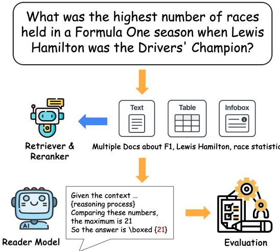
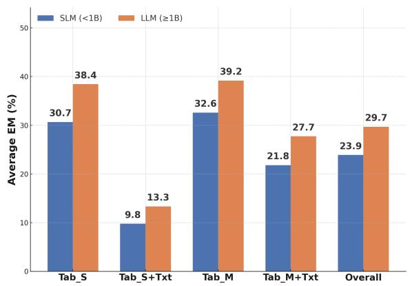
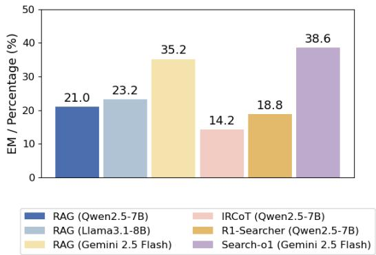

# SPORTREASON: Evaluating Retrieval-Augmented Reasoning across Tables and Text for Sports Question Answering

Kaiyue Feng<sup>S</sup>\* Siyue Zhang<sup>N</sup> \* Bingsen Chen<sup>S</sup> Yilun Zhao<sup>Y</sup> Chen Zhao<sup>SC</sup>

<sup>S</sup> NYU Shanghai <sup>N</sup> Nanyang Technological University

<sup>Y</sup> Yale University <sup>C</sup> Center for Data Science, New York University

https://github.com/kaiyuef/SportReason

## Abstract

We present SPORTREASON, a benchmark for retrieval-augmented reasoning on numerical sports questions. Unlike existing benchmarks limited to one or two evidence units, SPORTREASON requires combining and reasoning across free-text, structured tables, and semi-structured infoboxes. We provide 3,000 human-verified QA pairs by repurposing existing QA and table generation datasets, and by prompting large language models (LLMs). Each pair is grounded in multiple evidence from a multi-modal Wikipedia corpus containing 200K knowledge contexts. We evaluate existing retrievers and rerankers, along with agentic Retrieval-Augmented Generation (RAG) systems. The experimental results show that multi-evidence retrieval remains a challenge. Agentic RAG systems (e.g., Search-o1), despite iterative retrieval and reasoning capabilities, fail to improve performance due to imprecise query generation and distracting retrieval information.

## 1 Introduction

Retrieval-augmented generation (RAG) has emerged as a cornerstone of question answering by empowering LLMs to retrieve and reason over external knowledge. It has been widely adopted in domain-specific applications such as financial forecasting and scientific literature analysis (Zhao et al., 2022; Lála et al., 2023). However, prior RAG benchmarks mainly focus on question answering over single evidence or single-modal evidence. Many complex real-world questions require reasoning across multiple contexts involving complex modalities such as passages, tables, and infoboxes in Wikipedia.

To bridge this gap, we introduce SPORTREA-SON, a benchmark of numerical sports questions demanding reasoning over multi-tabular and multitextual evidence. We focus on the sports domain because it offers rich multi-modal resources, including structured data (e.g., player stats, team rankings, event outcomes) and free-text (e.g., team descriptions, event narratives). Despite this potential, the sports domain remains underrepresented in existing QA benchmarks. SPORTREASON emphasizes aggregation-style questions that require locating and combining facts distributed across tables, text passages, and infoboxes. As shown in Figure 1, such questions require retrieving multiple evidence items and aggregating numerical values across modalities, greatly amplifying retrieval and reasoning difficulty.

  
Figure 1: Example from SPORTREASON illustrating a question that requires identifying and combining facts across multiple tables, passages, and infoboxes—highlighting the challenge this poses for current RAG systems.

SPORTREASON includes 3,000 human-verified question-answer pairs, backed by a 200Kdocument corpus of Wikipedia text, tables, and infoboxes. We sourced these pairs via a carefully designed LLM-based generation pipeline or by adopting samples from an existing, verified dataset. Our evaluation framework spans lightweight to largescale retrievers and rerankers, as well as agentic RAG systems (e.g., Search-o1 (Li et al., 2025)). Our analysis reveals that: (1) LLM-based retrievers achieve stronger performance across modalities. (2) Multi-evidence retrieval remains a critical challenge for existing retrievers. (3) Agentic RAG systems fail to improve performance due to imprecise search queries, simple training, and irrelevant distractions.

<table><tr><td rowspan="2">Dataset</td><td rowspan="2">Setting</td><td rowspan="2">Domain</td><td colspan="3">Gold Evidence Modality</td><td colspan="2">Corpus</td><td rowspan="2"># Questions</td></tr><tr><td></td><td>TableSingle TableMultiple</td><td>Text</td><td># Tables</td><td># Docs</td></tr><tr><td>WikiSQL</td><td>Text2SQL</td><td>Open</td><td>√</td><td></td><td></td><td>24.2K</td><td></td><td>87.7K</td></tr><tr><td>Spider</td><td>Text2SQL</td><td>Open</td><td>√</td><td>√</td><td></td><td>1K</td><td></td><td>10K</td></tr><tr><td>TempTabQA</td><td>QA</td><td>Open</td><td>√</td><td></td><td></td><td>1.2K</td><td></td><td>11K</td></tr><tr><td>HybridQA</td><td>QA</td><td>Open</td><td>√</td><td></td><td>√</td><td>13K</td><td>300K</td><td>70K</td></tr><tr><td>MultiHiertt</td><td>QA</td><td>Finance</td><td>√</td><td>√</td><td>√</td><td>9.8K</td><td>2.5K</td><td>10.4K</td></tr><tr><td>WTR</td><td>TabRet</td><td>Open</td><td>√</td><td></td><td></td><td>16.2M</td><td></td><td>6.9K</td></tr><tr><td>TANQ</td><td>TabGen</td><td>Open</td><td>√</td><td>√</td><td>√</td><td>10K</td><td>150K</td><td>1.4K</td></tr><tr><td>OTT-QA</td><td>RAG</td><td>Open</td><td>√</td><td></td><td>√</td><td>400K</td><td>5M</td><td>45K</td></tr><tr><td>SPORTREASON</td><td>RAG</td><td>Sports</td><td>√</td><td>√</td><td>√</td><td>40K</td><td>160K</td><td>3K</td></tr></table>

Table 1: Comparison of SPORTREASON with other benchmarks. TabRet: table retrieval, TabGen: table generation

In summary, SPORTREASON delivers a realistic and challenging benchmark for RAG research. Our contributions are as follows:

• A benchmark of 3000 numerical sports questions requiring evidence aggregation across both passages and (semi-) structured tables.

• A comprehensive evaluation of existing retrievers, rerankers, and RAG systems.

## 2 Related Work

Retrieval-augmented question answering has evolved to handle complex reasoning over structured sources (e.g., tables, infoboxes) and unstructured text. As shown in Table 1, early benchmarks such as WikiSQL (Yavuz et al., 2018) and Spider (Yu et al., 2018) focus on Text-to-SQL parsing over one or more relational tables, emphasizing logical form generation rather than retrieval-based QA. Later benchmarks such as HybridQA (Chen et al., 2020) extend the task to hybrid settings, combining single-table questions with textual passages to enable limited multi-hop reasoning. More recent datasets such as TANQ (Akhtar et al., 2025) and BRIGHT (Su et al., 2024) explore generative table reasoning, where answers are derived from structured tabular content. OTT-QA (Chen et al., 2021a) scales hybrid QA to millions of web documents, while REAL-MM-RAG (Wasserman et al., 2025) further incorporates images and captions into multimodal retrieval tasks. To support compositional reasoning, MultiHiertt (Zhao et al., 2022) encodes hierarchical table structures for multi-step questions in the finance domain. Separately, WTR (Chen et al., 2021b) treats web-scale table retrieval as a distinct retrieval task.

## 3 SPORTREASON Benchmark

We introduce SPORTREASON, a benchmark designed to evaluate RAG systems on sports-related questions that require reasoning over both textual and tabular evidence. To ensure high data quality, questions are either freshly generated using Gemini 2.5 Flash (Google for Developers, 2025) under carefully designed prompts or sourced from existing verified datasets. Every QA pair passes automated consistency checks followed by human verification. This rigorous pipeline makes SPORTREA-SON a realistic, challenging testbed for multi-modal retrieval and reasoning in question answering.

## 3.1 Dataset Construction

We curate question-answer pairs from three datasets to ensure coverage of diverse reasoning types. From HybridQA and TANQ, we reconstruct QA pairs by prompting Gemini 2.5 Flash with table and text evidence drawn from each dataset’s provided metadata. For TEMPTABQA, we directly adopt existing questions that target single infoboxes. We filter all questions to retain only those that are numerical and sports-related.

To support multi-modal retrieval, we construct a 200K-document corpus from Wikipedia comprising text passages, tables, and infoboxes. For each gold-evidence item, we extract its Wikipedia HTML content, including text, tables, and infoboxes. Text is segmented into 100-token passages. This choice follows recent findings that shorter chunks (64–128 tokens) optimize retrieval effectiveness for fact-based QA datasets (Bhat et al., 2025). Structured elements are flattened into a JSON-style string, following prior work (Kostic´ et al., 2021; Wang et al., 2022), for seamless integration into existing RAG pipelines. We first apply lexical and structural alignment methods, including exact/fuzzy string matching, table hashing, and infobox key–value comparison. These approaches successfully aligned approximately 85% of gold evidence items. For the remaining 15%—typically arising from content drift or formatting changes in the source Wikipedia pages—we employed dense retrieval (BGE-M3 + FAISS) as a fallback. The cosine similarity threshold was set to 0.85, chosen based on empirical validation (see appendix B.4) as it provided the best trade-off between precision and recall. All fallback matches were subsequently verified by human annotators to ensure correctness.

<table><tr><td>Ret.</td><td colspan="2">Tabs</td><td colspan="2"> $\mathbf { T a b } _ { S } + \mathbf { T x t }$ </td><td colspan="2"> $\mathbf { T a b } _ { M }$ </td><td colspan="2"> $\mathbf { T a b } _ { M } + \mathbf { T x t }$ </td><td colspan="2">Overall</td></tr><tr><td>+ Rer.</td><td>nDCG</td><td>Rec.</td><td>nDCG</td><td>Rec.</td><td>nDCG</td><td>Rec.</td><td>nDCG</td><td>Rec.</td><td>nDCG</td><td>Rec.</td></tr><tr><td colspan="9">SLM-based Retrievers &amp; Rerankers (&lt;1B parameters)</td><td></td></tr><tr><td>BM25</td><td>42.8</td><td>79.1</td><td>18.8</td><td>11.4</td><td>31.3</td><td>60.6</td><td>29.8</td><td>29.6</td><td>30.7</td><td>45.2</td></tr><tr><td>CON</td><td>20.5</td><td>50.7</td><td>3.8</td><td>2.9</td><td>28.8</td><td>46.5</td><td>20.2</td><td>18.4</td><td>18.3</td><td>29.6</td></tr><tr><td>JINE</td><td>47.4</td><td>62.7</td><td>25.5</td><td>9.4</td><td>25.3</td><td>46.8</td><td>25.3</td><td>36.2</td><td>30.9</td><td>38.8</td></tr><tr><td>BGE</td><td>51.6</td><td>73.6</td><td>15.1</td><td>9.6</td><td>40.6</td><td>58.0</td><td>26.5</td><td>26.6</td><td>33.4</td><td>41.9</td></tr><tr><td>+ GRR</td><td>52.8</td><td>75.3</td><td>15.4</td><td>9.5</td><td>41.6</td><td>61.0</td><td>27.9</td><td>27.9</td><td>34.4</td><td>43.4</td></tr><tr><td>+BRM</td><td>61.1</td><td>75.9</td><td>21.4</td><td>11.3</td><td>43.8</td><td>60.5</td><td>34.6</td><td>27.5</td><td>40.2</td><td>43.8</td></tr><tr><td>+ BRL</td><td>47.9</td><td>72.9</td><td>18.1</td><td>10.9</td><td>39.3</td><td>56.6</td><td>33.3</td><td>27.1</td><td>34.6</td><td>41.9</td></tr><tr><td>+ JINR</td><td>63.2</td><td>78.4</td><td>21.9</td><td>12.3</td><td>43.5</td><td>61.9</td><td>37.6</td><td>32.0</td><td>41.6</td><td>46.1</td></tr><tr><td colspan="9">LLM-based Embedding Models (&gt;1B parameters)</td></tr><tr><td>GTE</td><td>64.1</td><td>85.8</td><td>15.7</td><td>8.5</td><td>32.9</td><td>55.3</td><td>32.4</td><td>27.5</td><td>36.3</td><td>44.3</td></tr><tr><td>E5M</td><td>46.7</td><td>77.8</td><td>19.3</td><td>10.6</td><td>46.4</td><td>68.4</td><td>37.1</td><td>34.8</td><td>37.4</td><td>47.9</td></tr><tr><td>GEM</td><td>70.7</td><td>87.5</td><td>26.6</td><td>15.5</td><td>53.0</td><td>76.8</td><td>43.5</td><td>38.4</td><td>48.5</td><td>54.6</td></tr><tr><td>INFS</td><td>58.9</td><td>83.4</td><td>25.9</td><td>14.5</td><td>45.4</td><td>65.3</td><td>42.7</td><td>34.7</td><td>43.2</td><td>49.5</td></tr><tr><td>INFL</td><td>71.7</td><td>90.0</td><td>30.9</td><td>17.5</td><td>47.6</td><td>72.9</td><td>45.3</td><td>41.1</td><td>48.9</td><td>55.4</td></tr></table>

Table 2: Retrieval performance measured by nDCG@30 and Recall@30. Overall is macro-averaged (equal weight across tasks). All methods use the same Gemini 2.5 Flash reader. Ret.: retriever, Rer.: reranker. Tab : single-table gold evidence, Tab : multi-table evidence, Txt: multiple textual evidence. Abbreviations: CON = Contriever, JINE = Jina Embedding, BGE = bge-m3, GRR = GTE-Reranker, BRM = BGE-Reranker-v2-m3, BRL = BGE-Rerankerlarge, JINR = Jina Reranker, GTE = GTE-Qwen2-1.5b, E5M = E5-Mistral, INFS = INF-Retriever-v1-1.5B, INFL = INF-Retriever-v1, GEM = BGE-Multilingual-Gemma2. The best results are in bold.

Finally, we augment the corpus with 180K distractor entries to further challenge retrievers’ robustness. To ensure data quality, we implement a two-stage verification process. First, we have Gemini 2.5 Flash answer each QA pair using its gold evidence and retain only those with correct answers and matching reasoning types. Then, human annotators verify that the evidence is sufficient and the reasoning is logically sound. This process guarantees that all selected question-answer pairs are factually accurate and well-grounded. Further construction and verification details are provided in Appendix B.

## 3.2 Dataset Statistics

SPORTREASON contains 3,000 question–answer pairs, evenly distributed across five reasoning types: Multi-text, Multi-table, Single-table, Single-table + Multi-text, and Multi-table + Multi-text. This set number is decided referencing to other evaluation benchmarks (e.g., 5,000 in MMQA (Gupta et al., 2023), 1,500 in BRIGHT (Su et al., 2024)). We hope it can reflect a design choice to emphasize human-verified quality over scale (see Table 1 for further comparison). On average, multi-table questions reference 2.7 unique tables, while multitext questions draw on 4.5 passages. The retrieval corpus comprises 200K evidence items, including Wikipedia passages, tables, and infoboxes.

## 4 Experiment

## 4.1 Experiment Setup

We evaluate both retrieval and reasoning performance through retrieval metrics and end-to-end QA accuracy.

  
Figure 2: Exact Match (EM) performance across tasks. Results are grouped by task type: Tab<sub>S</sub>, Tab<sub>S</sub>+Txt, Tab<sub>M</sub>, $\mathrm { T a b } _ { M } + \mathrm { T x t } .$ , and Overall (average of all tasks). Abbreviations: Tab : single-table gold evidence, Tab $M \cdot$ : multi-table evidence, Txt: multiple textual evidence

Experimental Settings. Our study covers nine retrievers, spanning sparse, dense, and LLM-based embedding methods. In addition, we evaluate three representative agentic RAG systems—Searcho1, IRCoT (Trivedi et al., 2023), and R1- searcher (Song et al., 2025). We consider four types of evidence configurations. For all main retrieval results (Table 2), we use the same Gemini 2.5 Flash as answer generator. To study reader-side effects, we also test LLaMA3-8B and Qwen2.5-32B with a fixed retriever (Figure 3). Hyperparameters are standardized, and model selection criteria are detailed in Appendix D.1.

RAG Pipelines. In the vanilla setting, we retrieve text, tables, and infoboxes independently, merge them into a candidate pool, and either rerank or directly select the top-k evidence units to feed into the reader. We keep top-12 passages, top-6 tables, and top-10 infoboxes after reranking. Agentic RAG systems instead iteratively plan, retrieve, and reason under their standard implementations. Further implementation details are in Appendix D.2 and our codebase.

Evaluation Metrics. Retrieval is assessed using nDCG@30 and Recall@30, where recall measures the percentage of gold evidence retrieved. QA outputs are evaluated with exact match, with cosine similarity as a fallback for semantically equivalent answers. EM also indirectly reflects retrieval quality, since missing evidence often leads to incorrect answers. Full evaluation configurations are provided in Appendix D.4.

## 4.2 Results

LLM-based retrievers achieve stronger performance across modalities. As shown in Table 2, the sparse BM25 is strong on single-table QA (Recall@30 79.1% on $\mathrm { T a b } _ { S } )$ but degrades on hybrid settings (Recall@30 29.6% on Tab $M ^ { + } \mathrm { T x t } )$ . Dense retrievers $( \mathrm { e . g . }$ , BGE, Jina) are more stable across modalities, and rerankers (e.g., GRR, BRM, BRL, JINR) further improve them. LLM-based retrievers (e.g., INF-Retriever (INFL), BGE-Multilingual-Gemma2 (GEM)) outperform smaller models on both nDCG@30 and Recall@30. For example, INFL attains 90.0% Recall@30 on Tab<sub>S</sub> and 72.9% on $\mathrm { T a b } _ { M }$ , and remains the top performer under mixed-modality with 41.1% on $\mathrm { T a b } _ { M } + \mathrm { T x t }$ (and 17.5% on Tab +Txt).

Mixed-modality retrieval remains a critical challenge. Adding text to tabular queries sharply reduces recall even for the strongest retriever. For INFL, Recall@30 drops from 90.0% (Tab<sub>S</sub>) to 17.5% $( \mathrm { T a b } _ { S } { + } \mathrm { T x t } )$ , a decrease of 72.5 percentage points. Likewise, moving from $\mathrm { T a b } _ { M }$ to $\mathrm { T a b } _ { M } + \mathrm { T x t }$ reduces Recall@30 from 72.9% to 41.1% , while nDCG@30 declines only modestly (e.g., 47.6 → 45.3 for INFL), indicating that many relevant items are never retrieved once text is introduced.

Agentic RAG systems fail to improve performance due to imprecise search queries, limited fine-tuning data and irrelevant distractions. Despite their iterative retrieval capabilities, agentic RAG systems fail to yield consistent improvements on SPORTREASON, largely due to imprecise queries, limited training, and susceptibility to irrelevant content. We first evaluated IRCoT and R1-Searcher, both of which underperformed. IRCoT is highly dependent on the quality of its initial retrieval, often leading to error propagation in subsequent reasoning steps. R1-Searcher, although trained end-to-end for agentic RAG, frequently produces under-specified queries (e.g., issuing “Morecambe $\mathrm { F . C . } ^ { \prime \prime }$ instead of asking for managerial tenure). This limitation likely stems from their primary fine-tuning on simpler multi-hop QA datasets such as HotpotQA (Thakur et al., 2021), which do not involve numerical reasoning or multimodal aggregation.

We also tested Search-o1 with iterative retrieval and Web Search API. However, as shown in Figure 3, it delivered only marginal gains over vanilla RAG. Its performance was constrained by failing to gather all required evidence and by distraction from irrelevant retrieved content. Additional failure analyses are provided in Appendix E.

  
Figure 3: Comparison between different RAG methods. Vanilla RAG systems are tested based on the retrieval results of INF-Retriever-v1

## 5 Conclusion

Our study confirms prior findings that dense retrievers outperform sparse ones, but also provides new insights enabled by the SPORTREASON benchmark. First, we expose a generalization gap in agentic RAG methods such as IRCoT and Search-o1: although effective on simpler multi-hop datasets, they fail to generalize to our multi-evidence, multimodal setting due to poor query planning and limited retrieval robustness. Second, we quantify a pronounced bottleneck in mixed-modality retrieval: even top-performing models suffer dramatic drops in recall (e.g., from 90.0% on single-table tasks to as low as 17.5% when text and tables must be combined). These findings highlight key limitations of current retrieval and reasoning approaches, underscoring the need for modality-aware retrievers and more robust query planning strategies in future RAG systems.

## Ethical Considerations

Our corpus is sourced from Wikipedia, which may reflect inherent coverage biases, such as gender or regional skew in sports reporting. Since SPORTREASON primarily focuses on factual and logical questions, these biases are less central to the benchmark’s design and evaluation. Nevertheless, we acknowledge their presence and encourage caution when generalizing beyond the sports domain. Future work could extend this line of research to explicitly analyze bias and fairness in multi-modal retrieval and reasoning benchmarks.

## Limitations

While SPORTREASON advances multi-modal numerical QA, it has two main limitations.

Domain generality. Our dataset focuses on sports, which may not capture all retrieval and reasoning challenges in other domains. Although the core difficulty it highlights — retrieving and aggregating mixed-modality evidence (tables, passages, infoboxes) — is broadly applicable, validating our findings in other domains such as finance or science remains an open direction.

Recent retriever models Our evaluation does not have time to include several retriever models that have emerged after our experiments (e.g., Qwen3-Embedding, ZeroSearch, and jinaembeddings-v4 (Zhang et al., 2025; Günther et al., 2025; Sun et al., 2025)). Future work should investigate whether these newer models, with their improved retrieval capabilities, can more effectively address the challenges posed by our benchmark.

## Acknowledgements

Siyue Zhang, Bingsen Chen and Chen Zhao were supported by the NYU Shanghai Center for Data Science. This work was supported in part through the NYU IT High Performance Computing resources, services, and staff expertise.

## References

Mubashara Akhtar, Chenxi Pang, Andreea Marzoca, Yasemin Altun, and Julian Martin Eisenschlos. 2025. Tanq: An open domain dataset of table answered questions.

Sinchana Ramakanth Bhat, Max Rudat, Jannis Spiekermann, and Nicolas Flores-Herr. 2025. Rethinking chunk size for long-document retrieval: A multidataset analysis. Preprint, arXiv:2505.21700.

Wenhu Chen, Ming wei Chang, Eva Schlinger, William Wang, and William Cohen. 2021a. Open question answering over tables and text. Proceedings ofICLR 2021.

Wenhu Chen, Hanwen Zha, Zhiyu Chen, Wenhan Xiong, Hong Wang, and William Yang Wang. 2020. HybridQA: A dataset of multi-hop question answering over tabular and textual data. In Findings of the Association for Computational Linguistics: EMNLP 2020.

Zhiyu Chen, Shuo Zhang, and Brian D. Davison. 2021b. Wtr: A test collection for web table retrieval. New York, NY, USA. Association for Computing Machinery.

Kaiyue Feng, Yilun Zhao, Yixin Liu, Tianyu Yang, Chen Zhao, John Sous, and Arman Cohan. 2025. Physics: Benchmarking foundation models on university-level physics problem solving. Preprint, arXiv:2503.21821.

Google for Developers. 2025. Start building with Gemini 2.5 Flash. https://developers.googleblog. com/en/start-building-with-gemini-25-fla sh/. Accessed: September 19, 2025.

Vivek Gupta, Pranshu Kandoi, Mahek Vora, Shuo Zhang, Yujie He, Ridho Reinanda, and Vivek Srikumar. 2023. TempTabQA: Temporal question answering for semi-structured tables. In Proceedings of the 2023 Conference on Empirical Methods in Natural Language Processing, pages 2431–2453, Singapore. Association for Computational Linguistics.

Michael Günther, Saba Sturua, Mohammad Kalim Akram, Isabelle Mohr, Andrei Ungureanu, Sedigheh Eslami, Scott Martens, Bo Wang, Nan Wang, and Han Xiao. 2025. jina-embeddings-v4: Universal embeddings for multimodal multilingual retrieval. Preprint, arXiv:2506.18902.

Gautier Izacard, Mathilde Caron, Lucas Hosseini, Sebastian Riedel, Piotr Bojanowski, Armand Joulin, and Edouard Grave. 2021. Unsupervised dense information retrieval with contrastive learning. Transactions on Machine Learning Research.

Jiajie Jin, Yutao Zhu, Xinyu Yang, Chenghao Zhang, and Zhicheng Dou. 2024. Flashrag: A modular toolkit for efficient retrieval-augmented generation research. CoRR, abs/2405.13576.

Bogdan Kostic, Julian Risch, and Timo Möller. 2021.´ Multi-modal retrieval of tables and texts using triencoder models. In Proceedings ofthe 3rd Workshop on Machine Readingfor Question Answering, pages 82–91, Punta Cana, Dominican Republic. Association for Computational Linguistics.

Chaofan Li, Zheng Liu, Shitao Xiao, and Yingxia Shao. 2023a. Making large language models a better foundation for dense retrieval.

Xiaoxi Li, Guanting Dong, Jiajie Jin, Yuyao Zhang, Yujia Zhou, Yutao Zhu, Peitian Zhang, and Zhicheng Dou. 2025. Search-o1: Agentic search-enhanced large reasoning models. CoRR.

Zehan Li, Xin Zhang, Yanzhao Zhang, Dingkun Long, Pengjun Xie, and Meishan Zhang. 2023b. Towards general text embeddings with multi-stage contrastive learning. arXiv preprint arXiv:2308.03281.

Jakub Lála, Odhran O’Donoghue, Aleksandar Shtedritski, Sam Cox, Samuel G. Rodriques, and Andrew D. White. 2023. Paperqa: Retrieval-augmented generative agent for scientific research. arXiv preprint arXiv:2312.07559.

Sean MacAvaney, Franco Maria Nardini, Raffaele Perego, Nicola Tonellotto, Nazli Goharian, and Ophir Frieder. 2020. Efficient document re-ranking for transformers by precomputing term representations. In Proceedings of the 43rd International ACM SI-GIR Conference on Research and Development in Information Retrieval.

Huatong Song, Jinhao Jiang, Yingqian Min, Jie Chen, and Zhipeng Chen. 2025. R1-searcher: Incentivizing the search capability in llms via reinforcement learning.

Saba Sturua, Isabelle Mohr, Mohammad Kalim Akram, Michael Günther, Bo Wang, Markus Krimmel, Feng Wang, Georgios Mastrapas, Andreas Koukounas, Andreas Koukounas, Nan Wang, and Han Xiao. 2024. jina-embeddings-v3: Multilingual embeddings with task lora. Preprint, arXiv:2409.10173.

Hongjin Su, Howard Yen, Mengzhou Xia, Weijia Shi, Niklas Muennighoff, Han yu Wang, Haisu Liu, Quan Shi, Zachary S. Siegel, Michael Tang, Ruoxi Sun, Jinsung Yoon, Sercan O. Arik, Danqi Chen, and Tao Yu. 2024. Bright: A realistic and challenging benchmark for reasoning-intensive retrieval.

Hao Sun, Zile Qiao, Jiayan Guo, Xuanbo Fan, Yingyan Hou, Yong Jiang, Pengjun Xie, Fei Huang, and Yan Zhang. 2025. Zerosearch: Incentivize the search capability of llms without searching. arXiv preprint arXiv:2505.04588.

Nandan Thakur, Nils Reimers, Andreas Rücklé, Abhishek Srivastava, and Iryna Gurevych. 2021. BEIR: A heterogeneous benchmark for zero-shot evaluation of information retrieval models. In Thirty-fifth Conference on Neural Information Processing Systems Datasets and Benchmarks Track (Round 2).

Harsh Trivedi, Niranjan Balasubramanian, Tushar Khot, and Ashish Sabharwal. 2023. Interleaving retrieval with chain-of-thought reasoning for knowledgeintensive multi-step questions. In Proceedings of the 61st Annual Meeting ofthe Associationfor Computational Linguistics (Volume 1: Long Papers), pages 10014–10037, Toronto, Canada. Association for Computational Linguistics.

Liang Wang, Nan Yang, Xiaolong Huang, Linjun Yang, Rangan Majumder, and Furu Wei. 2023. Improving text embeddings with large language models. arXiv preprint arXiv:2401.00368.

Zhiruo Wang, Zhengbao Jiang, Eric Nyberg, and Graham Neubig. 2022. Table retrieval may not necessitate table-specific model design. In Proceedings of the Workshop on Structured and Unstructured Knowledge Integration (SUKI), pages 36–46, Seattle, USA. Association for Computational Linguistics.

Navve Wasserman, Roi Pony, Oshri Naparstek, Adi Raz Goldfarb, Eli Schwartz, Udi Barzelay, and Leonid Karlinsky. 2025. Real-mm-rag: A realworld multi-modal retrieval benchmark. Preprint, arXiv:2502.12342.

Semih Yavuz, Izzeddin Gur, Yu Su, and Xifeng Yan. 2018. What it takes to achieve 100% condition accuracy on WikiSQL. In Proceedings ofthe 2018 Conference on Empirical Methods in Natural Language Processing, pages 1702–1711, Brussels, Belgium. Association for Computational Linguistics.

Tao Yu, Rui Zhang, Kai Yang, Michihiro Yasunaga, Dongxu Wang, Zifan Li, James Ma, Irene Li, Qingning Yao, Shanelle Roman, Zilin Zhang, and Dragomir Radev. 2018. Spider: A large-scale human-labeled dataset for complex and cross-domain semantic parsing and text-to-sql task. In Proceedings ofthe 2018 Conference on Empirical Methods in Natural Language Processing, Brussels, Belgium. Association for Computational Linguistics.

Siyue Zhang, Anh Tuan Luu, and Chen Zhao. 2024. SynTQA: Synergistic table-based question answering via mixture of text-to-SQL and E2E TQA. In Findings ofthe Associationfor Computational Linguistics: EMNLP 2024, pages 2352–2364, Miami, Florida, USA. Association for Computational Linguistics.

Yanzhao Zhang, Mingxin Li, Dingkun Long, Xin Zhang, Huan Lin, Baosong Yang, Pengjun Xie, An Yang, Dayiheng Liu, Junyang Lin, Fei Huang, and Jingren Zhou. 2025. Qwen3 embedding: Advancing text embedding and reranking through foundation models. arXiv preprint arXiv:2506.05176.

Yilun Zhao, Yunxiang Li, Chenying Li, and Rui Zhang. 2022. MultiHiertt: Numerical reasoning over multi hierarchical tabular and textual data. In Proceedings of the 60th Annual Meeting of the Association for Computational Linguistics (Volume 1: Long Papers).

Prompt for LLM   
Category Templates   
prompt\_templates = {   
"sorting": """   
You are given tables and related evidence.   
Ask a \*\*numerical question\*\* that involves \*\*sorting\*\* the data   
(e.g., "What is the second highest...?", "Which row ranks third in...?").   
Make sure:   
- The answer is a number.   
- Your explanation shows how sorting was used to reach the answer.   
11 11 11   
"max\_min": """   
You are given tables and related evidence.   
Ask a \*\*numerical question\*\* that requires identifying a \*\*maximum or minimum\*\*   
(e.g., "What is the highest...?", "What is the smallest number of...?").   
Make sure:   
- The answer is a number.   
- Your explanation describes how you found the max or min value.   
11 11 11   
"counting": """   
You are given tables and related evidence.   
Ask a \*\*counting-based numerical question\*\*   
(e.g., "How many rows satisfy...?", "How many entities meet condition X?").   
Make sure:   
- The answer is a number.   
- Your explanation describes how the count was computed.   
11 11 11   
"implicit\_temporal": """   
You are given tables and related evidence.   
Ask a \*\*numerical question\*\* that involves \*\*implicit temporal or numerical reasoning\*\*,   
such as identifying the most recent event.   
Computing a numerical difference, or reasoning over years or values.   
Examples:   
- "What year was the latest X?"   
- "How many times A won championships"   
Make sure:   
- The answer is a number.   
- Your explanation describes the steps in temporal or comparative reasoning.   
11 11 11   
}

## Prompt for LLM

## QA pair generation prompt

```markdown
### Task Requirements
1. **Avoid** phrases like “in the table”, “according to the data”, “from the document”,
"listed" etc.
2. Generate a single NEW numerical question whose answer is a single number.
3. Use **no more than 8** text evidences (in addition to the core evidence facts).
4. Provide a concise, step-by-step reasoning.
5. Verify that the answer is correct.
6. Ensure the answer is unique and precise (no ambiguous interpretations).
7. **Do NOT** reveal the format or origin of any evidence (e.g., table, document, link).
8. The question **MUST** require combining information from the evidence pool.
9. The question should stand alone as a general knowledge query.
10. The question must obey the rules of open-domain retrieval questions
### Evidence Rules
- Include at least 2 tables provided
- Add any helpful text evidences (limit 8).
For every evidence you include, fill in a short "reason" explaining how it supports the answer.
### Examples
'Sort the Lewis Hamilton championship seasons after 2015
by the number of races from lowest to highest.
What is the number of races in the second season in this sorted list'
'How many Super Bowls that the Washington Redskins played in were held in California?'
### BAD EXAMPLES(DO NOT GENERATE THIS KIND OF QUESTIONS)
'What is the third highest capacity among the stadiums listed IN THE TABLE?'
'"How many stadiums listed IN THE TABLE have a capacity greater than 20,000?'
### Output JSON (raw, no markdown)
{{
"question": "<your generated question>",
"reasoning": "<step-by-step explanation>",
"answer": <numeric_answer>,
"gold_evidences": [
{{
"id": "<table_or_text_id>",
"evidence_text": "<evidence_text, **keep this field name**
even if it's technically content>",
"reason": "<why it is needed>"
}}
// ... include all selected evidences here
],
"reasoning_type": "{category}"
}}
Original Question: {seed_question}
Available Evidences: {json.dumps(gold_evidences, ensure_ascii=False, indent=2)}
```

## B Dataset Construction Details

## B.1 QA pair selection and creation

From TEMPTABQA: TEMPTABQA targets temporal QA over Wikipedia Infobox tables. We adopt its numerical-sport related question-answer pairs and tables as-is, retaining them as single-table questions without added text.

From HybridQA: HybridQA offers multi-hop QA with links to relevant tables and passages, though lacking cell-level annotations. We prompt Gemini 2.5 Flash with each table accompanied by a list of related texts to generate single-table, multi-text questions.

From TANQ: TANQ is an open-domain QA dataset answered in table format given multi-modal evidences. We repurpose its evidence pools by prompting Gemini 2.5 Flash to generate numerical sports questions requiring reasoning over multiple tables and texts.

All questions are filtered to make sure they are numerical and sports-related.

## B.2 Wikipedia Page Processing

To construct the retrieval corpus, we parse Wikipedia HTML pages and clean them by removing non-content elements such as <sup>, <style>, footnote links, and citation markers. From each page, we extract three types of content:

• Raw Text: Paragraphs and lists from the main content body, truncated before sections like “References” or “External links”.

• Infoboxes: Key-value metadata blocks typically on the right side of the page, parsed from infobox HTML class regions.

• Tables: All HTML tables marked with the wikitable or sortable class are retained.

Text is segmented into non-overlapping 100- token chunks using a spaCy-based sentence segmenter and the BGE-M3 tokenizer to ensure token consistency for downstream embedding.

## B.3 Evidence Matching Procedure

Each gold evidence is aligned to an entry in the corpus using the following hierarchy:

Textual Evidence. We first attempt exact string matching against the text corpus. If no match is found, we apply fuzzy string matching using Rapid-Fuzz’s token\_set\_ratio, with a similarity threshold of at least 85 to consider it a match.

Table Evidence. For each candidate table, we compute a hash based on its sorted column headers and the content of its rows. We then compare hashes to identify the correct match efficiently. This structural comparison handles content reordering and small variations.

Infobox Evidence. Infoboxes are flattened into sets of key-value string pairs. We use the same strategy as for text evidence—first attempting exact, then fuzzy matching based on the flattened string content.

## B.4 Dense Retrieval Fallback

Lexical and structural alignment methods (exact/- fuzzy string matching, table hashing, and infobox key–value comparison) successfully matched approximately 85% of gold evidence items. Dense retrieval fallback was required in the remaining 15% of cases, primarily due to content drift or formatting changes in the underlying Wikipedia pages. All dense retrieval matches were manually verified by annotators to ensure alignment quality, underscoring that the fallback was applied sparingly and always under human supervision. Corpus entries were embedded with the BGE-M3 encoder and stored in FAISS indexes, one per modality (text, table, infobox).

For unmatched gold evidence, the following procedure was applied:

• Embed the evidence using the same BGE-M3 model.

• Retrieve the top-1 nearest neighbor from the corresponding FAISS index.

• If cosine similarity $\ge ~ 0 . 8 5$ , accept the retrieved item as a match.

• Otherwise, treat the evidence as novel and add it to the corpus as a new entry.

The cosine similarity threshold was empirically validated to ensure reliable dense alignment. A sample of 50 gold evidence items was manually aligned by expert annotators and compared against dense retrieval results at different thresholds. As shown in Table 3, a threshold of 0.85 achieved the best trade-off between precision and recall, yielding the highest F1 score (0.93).

This multi-stage alignment process ensures comprehensive coverage of gold evidence while maintaining retrieval realism.

<table><tr><td>Threshold</td><td>Precision</td><td>Recall</td><td>F1</td></tr><tr><td>0.75</td><td>0.78</td><td>0.98</td><td>0.87</td></tr><tr><td>0.80</td><td>0.86</td><td>0.96</td><td>0.91</td></tr><tr><td>0.85</td><td>0.92</td><td>0.94</td><td>0.93</td></tr><tr><td>0.90</td><td>0.94</td><td>0.90</td><td>0.92</td></tr><tr><td>0.95</td><td>0.98</td><td>0.84</td><td>0.91</td></tr></table>

Table 3: Validation of cosine similarity thresholds for dense retrieval alignment.

## B.5 Quality Control

In the first stage, given the gold tables and passages, we prompt Gemini 2.5 Flash to solve each question. A QA pair is retained only if the predicted answer matches the annotated ground truth and the inferred reasoning type (e.g., counting, comparison) matches the intended category. In the second stage, we recruit human annotators from American universities to assess each sample to confirm that (1) the evidence is sufficient and self-contained, and (2) the reasoning or calculations are logically valid. Samples with flaws are either corrected or removed. Human annotators are being compensated at \$20/hour. (Feng et al., 2025; Zhang et al., 2024)

## C Dataset Format Details

Each dataset sample is represented as a structured JSON object with the following main fields:

• id: Unique identifier for the sample.

• seed\_question: The natural language question.

• answers: A list of one or more numeric or string answers.

• reasoning\_type: The reasoning category (e.g., counting, comparison).

• seed\_dataset and meta: Metadata about the sample source.

The core component is gold\_evidences, a list of evidence objects required to answer the question. Each evidence includes:

• Text evidence: A plain string passage extracted from Wikipedia.

• Table evidence: A JSON object with:

– columns: List of column headers.

– rows: List of rows; each is a list of cells corresponding to the columns.

• Infobox evidence: A nested JSON structure of key-value pairs, with possible multi-level nesting.

Each evidence also includes:

• id: A unique identifier for the evidence source.

• type: One of text, table, or infobox.

• url: Source URL of the Wikipedia page.

• reason: A short rationale for why the evidence is relevant.

<table><tr><td>Model Name</td><td>Category</td><td>Source / Repository</td></tr><tr><td>BM25</td><td>Sparse retriever</td><td>(MacAvaney et al., 2020)</td></tr><tr><td>Contriever</td><td>Dense retriever (SLM)</td><td>(Izacard et al., 2021)</td></tr><tr><td>BGE-M3</td><td>Dense retriever (SLM)</td><td>https://huggingface.co/BAAI/</td></tr><tr><td>Jina-embeddings-v3</td><td>Dense retriever (SLM)</td><td>bge-m3 (Sturua et al., 2024)</td></tr><tr><td>INF-Retriever-v1</td><td>Embedding retriever (LLM)</td><td>https://huggingface.co/infly /inf-retriever-v1</td></tr><tr><td>INF-Retriever-v1-1.5b</td><td>Embedding retriever (LLM)</td><td>same as above</td></tr><tr><td>GTE-Qwen2-1.5B</td><td>Embedding retriever (LLM)</td><td>(Li et al., 2023b)</td></tr><tr><td>E5-Mistral-7B</td><td>Embedding retriever (LLM)</td><td>(Wang et al., 2023)</td></tr><tr><td>BGE-Gemma2</td><td>Embedding retriever (LLM)</td><td>(Li et al., 2023a)</td></tr></table>

Table 4: Retriever models and their official sources. SLM = small-language-model retriever, LLM = large-languagemodel retriever.

## D Experiment Setup

## D.1 Model Selection

For clarity, we summarize the models used in Table 4, including their official repositories. For the reader model, we adopt Gemini 2.5 Flash to generate final answers based on the retrieved and reranked evidence.

## D.2 Experiment Details

Our QA pipeline is composed of three stages: retrieval, reranking, and answer generation.

Retrieval. For each query, we retrieve:

• Top-100 text passages

• Top-25 tables

• Top-40 infoboxes

For each query, we evaluated retrievers independently, including sparse methods (e.g., BM25) and dense retrievers (e.g., Contriever, BGE-M3). No weighted fusion between sparse and dense scores was applied; running each retriever separately ensures transparent attribution of performance differences. Retrieved candidates were then either reranked (when a reranker was used) or directly passed to the reader. Dense embeddings were generated using SentenceTransformer models (e.g., BGE-M3), with similarity computed via cosine or L2 distance.

Reranking. All candidates are reranked using the corresponding reranker. We rerank up to 70 candidates per query, and retain:

• Top-12 text passages

• Top-6 tables

• Top-10 infoboxes

Reader. For the main evaluation, Gemini 2.5 Flash is fixed as the reader to ensure consistent comparison across retrievers. For further analysis (Figure 3), we also evaluate alternative readers, including LLaMA3-8B and Qwen2.5-32B, implemented with vLLM. In all cases, the reader is prompted to produce answers in LaTeX-style \boxed{} format for consistent extraction and evaluation.

## D.3 Agentic RAG implementation

For agentic RAG systems, search-o1 is implemented via its official GitHub repository. While IRCoT (Trivedi et al., 2023) and R1-searcher (Song et al., 2025) are implemented through FlashRAG’s pipelines (Jin et al., 2024). Further implementation details are provided in Appendix D.2 and the codebase.

## D.4 Evaluation Configuration

We evaluate both retrieval and answer quality under a unified configuration across all models.

Each query retrieves up to 100 passages, 25 tables, and 40 infoboxes from the corpus. In reranking settings, we apply a cross-encoder to select the top 12 passages, 6 tables, and 10 infoboxes. In non-reranking settings, we retain top candidates based on raw retriever scores.

To support numerical reasoning, all models are prompted to produce LaTeX-style outputs in the form of \boxed{}. We extract final predictions using regular expressions applied to model outputs.

Retrieval Metrics. We report retrieval quality using two standard ranking metrics: nDCG@30 and Recall@30.

nDCG@30 (Normalized Discounted Cumulative Gain) rewards relevant items ranked higher in the retrieved list. It is defined as:

$$
\mathtt { n D C G @ } k = \frac { \mathrm { D C G @ } k } { \mathrm { I D C G @ } k }
$$

and

$$
\mathrm { D C G @ } k = \sum _ { i = 1 } ^ { k } { \frac { r e l _ { i } } { \log _ { 2 } ( i + 1 ) } }
$$

where $r e l _ { i } \in \{ 0 , 1 \}$ denotes the binary relevance of the i-th ranked document, and IDCG@k is the ideal DCG computed from a perfect ranking. This setting is inherited from (Su et al., 2024)

Recall@30 measures retrieval completeness, defined as:

$$
{ \mathrm { R e c a l l @ } } k = { \frac { \# { \mathrm { ~ r e l e v a n t ~ d o c u m e n t s ~ r e t r i e v e d ~ i n ~ t o p } } - k } { \mathrm { t o t a l ~ } \# \operatorname { o f ~ r e l e v a n t ~ d o c u m e n t s } } }
$$

This metric is especially informative in multievidence settings, where multiple documents may be required to answer a single query.

EM. We determine exact match (EM) using modality-specific criteria:

• Numerical answers: Considered correct if they exactly match the gold answer as a string.

• Textual answers: Evaluated using cosine similarity between sentence embeddings from BGE-small-en-v1.5; a match is accepted if similarity with any gold answer exceeds 0.85.

All models are evaluated under identical retrieval settings and inference prompts to ensure fair comparison across modalities and architectures.

## E Failure Analysis

## E.1 IRCoT Failure Case

Question: "How many individuals honored in a season before the 1980–81 NHL season had a role as a coach or general manager?"

## Iteration 0:

Thought: The question asks for individuals honored in a season before 1980–81 who had a role as a coach or general manager.

## Iteration 1:

Thought: The document mentions Al Arbour and Lorne Henning as head coach and assistant coach respectively, but no general manager is mentioned.

New Thought: So the answer is: 2.

Analysis: In this example, IRCoT’s initial retrieval failed to retrieve sufficient information—omitting individuals with general manager roles. As a result, the model prematurely concluded the answer based solely on partial coaching data. Because the subsequent reasoning relied on this incomplete context, the pipeline did not issue further queries to check for general managers, ultimately leading to an incorrect final prediction.

## E.2 R1-Searcher Failure Case

Question: "What is the greatest number of years any single individual served as manager of Morecambe F.C.?"

Generated Queries:

• Query 0: "Morecambe F.C. managers"

• Query 1: "Other managers of Morecambe F.C."

• Query 2: "Number of years served by Ernest Churchill Smith, Pierre Sinibaldi, Urbain Braems, Raymond Goethals, Arie Haan, Johan Boskamp, and Franky Vercauteren"

Analysis: The queries generated by R1-Searcher failed to accurately capture the required context. While the initial queries correctly reference "Morecambe F.C. managers", they are too generic or drift toward unrelated individuals in later iterations. Specifically, Query 2 lists managers unrelated to Morecambe F.C., leading the retriever to irrelevant documents. As a result, the system was unable to locate the correct table and produce an accurate answer.

<table><tr><td>Error Cat- Proportion Description egory</td><td></td></tr><tr><td>Retrieval ~70% Failure</td><td>Missing necessary ev- idence due to im- precise or incomplete</td></tr><tr><td>Reasoning ～25% Failure</td><td>queries Correct evidence re- trieved, but logical or numerical reasoning</td></tr><tr><td>Answer ~5%</td><td>was incorrect Reasoning correct,</td></tr><tr><td>Format Failure</td><td>but output format prevented automatic extraction</td></tr></table>

Table 5: Systematic error taxonomy on 150 sampled failure cases. Retrieval failures dominate, highlighting retrieval as the main bottleneck.

## E.3 Systematic Error Taxonomy

To complement the illustrative failure cases, we categorized 150 randomly sampled errors into three categories: retrieval failure, reasoning failure, and answer format failure. The distribution is shown in Table 5.

## E.4 Notes on Agentic RAG Baselines

R1-Searcher is primarily fine-tuned on multi-hop textual QA datasets such as HotpotQA, which lack complex numerical reasoning and multi-modal aggregation, resulting in a notable generalization gap on SPORTREASON. IRCoT interleaves retrieval and reasoning, but its effectiveness is highly sensitive to the initial retrieval step, often leading to error propagation when early evidence is incomplete. Search-o1 leverages large reasoning models (e.g., Qwen QwQ-32B, Gemini 2.5 Flash) with tool-calling capabilities, though details of its training corpus remain undisclosed. Despite these advanced features, Search-o1 delivered only marginal gains over vanilla RAG. Its performance was constrained by failing to gather all required evidence and by distraction from irrelevant retrieved content. We note that our experiments adhered to the standard prompts released in the original papers; while prompt engineering may affect outcomes, our goal was to evaluate generalization without task-specific

tuning.

Prompt Sensitivity. We did not attempt extensive prompt engineering or query reformulation beyond the standard prompts provided in the original works. Preliminary trials with ad-hoc modifications sometimes degraded performance, highlighting the sensitivity of current agentic RAG systems to prompt design. A systematic ablation of prompt engineering strategies therefore remains an important avenue for future work.