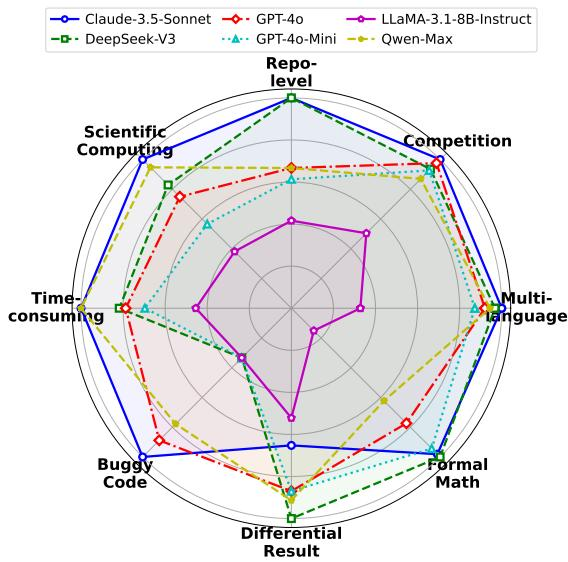
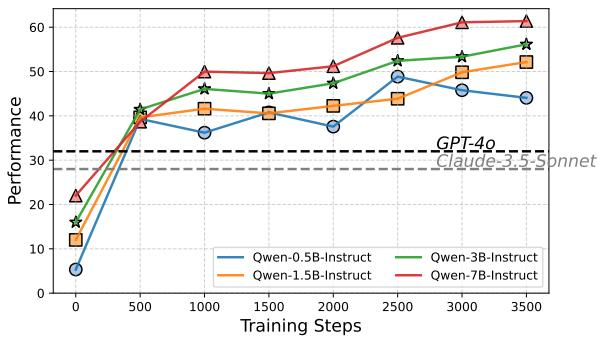
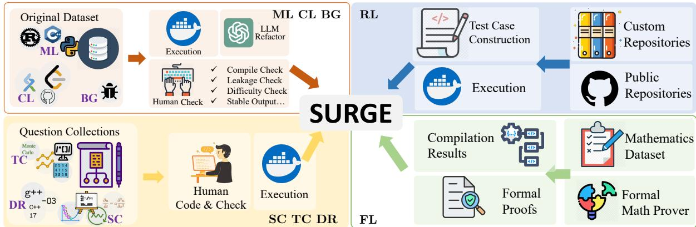
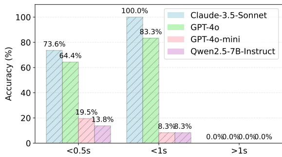
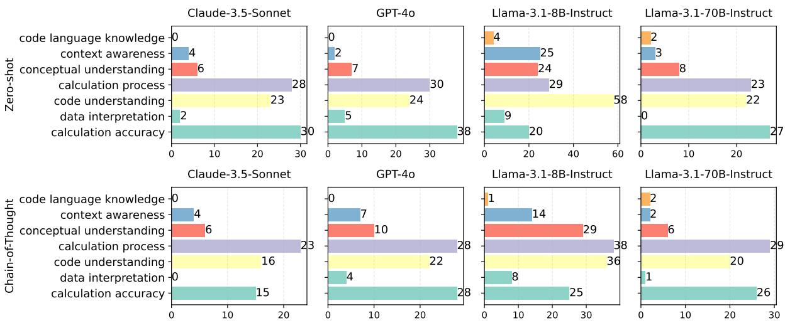

# SURGE: On the Potential of Large Language Models as General-Purpose Surrogate Code Executors

Bohan Lyu<sup>1</sup> <sup>\*</sup> <sup>†</sup> Siqiao Huang<sup>2</sup> <sup>\*</sup> Zichen Liang<sup>1</sup> <sup>\*</sup> Qi-An Sun<sup>1</sup> Jiaming Zhang<sup>1</sup> <sup>1</sup>Department of Computer Science and Technology, Tsinghua. <sup>2</sup>Institute for Interdisciplinary Information Sciences (IIIS), Tsinghua. lyubh22@gmail.com, {huang-sq23, liang-zc22}@mails.tsinghua.edu.cn

Equal contribution

<sup>†</sup>Corresponding author

## Abstract

Neural surrogate models are powerful and efficient tools in data mining. Meanwhile, large language models (LLMs) have demonstrated remarkable capabilities in code-related tasks, such as generation and understanding. However, an equally important yet underexplored question is whether LLMs can serve as surrogate models for code execution prediction. To systematically investigate it, we introduce SURGE, a comprehensive benchmark with 1160 problems covering 8 key aspects: multilanguage programming tasks, competitionlevel programming problems, repository-level code analysis, high-cost scientific computing, time-complexity-intensive algorithms, buggy code analysis, programs dependent on specific compilers or execution environments, and formal mathematical proof verification. Through extensive analysis of 21 open-source and proprietary LLMs, we examine scaling laws, data efficiency, and predictive accuracy. Our findings reveal important insights about the feasibility of LLMs as efficient surrogates for computational processes. The benchmark and evaluation framework are available at https: //github.com/Imbernoulli/SURGE.

## 1 Introduction

Neural surrogate models (Zhang et al., 2024; Sun and Wang, 2019) are powerful tools in data mining and machine learning, which efficiently approximate complex computational processes. Meanwhile, Large language models (LLMs) (Reid et al., 2024; Meta, 2024; Anthropic, 2024b; Hui et al., 2024; Bi et al., 2024) have demonstrated remarkable capabilities in code-related tasks (Lu et al., 2021a; Zheng et al., 2023; Luo et al., 2023; Team, 2024a; Guo et al., 2024), including code understanding (Ahmad et al., 2020; Chakraborty et al., 2020) and code generation (Li et al., 2018a; Parvez et al., 2018). However, an equally important yet underexplored question is whether LLMs can serve as general-purpose surrogate code executors, which predict the behavior of a program without actually running it. A recent study (Lyu et al., 2024) acknowledges its importance, however, it focuses on a case study rather than a systematic analysis.

  
Figure 1: Performance of 6 typical models on SURGE.

The ability to predict code execution outcomes without execution has tremendous significance. In scientific computing, running simulations often requires substantial computational resources and is time-consuming, making it impractical to test every possible configuration (Lu and Ricciuto, 2019; Hesthaven and Ubbiali, 2018; Benner et al., 2015). In security-sensitive environments, executing untrusted code poses inherent risks, necessitating alternative mechanisms for assessing program behavior without exposing the system to potential vulnerabilities (Nebbione and Calzarossa, 2023; Shirazi et al., 2017; Wang et al., 2024). Additionally, some code requires highly specific execution environments, which may not always be available, making surrogate execution a valuable alternative (Queiroz et al., 2023; Gu et al., 2025). Moreover, accurately predicting a model’s potential outputs or errors is crucial for improving traditional tasks such as code understanding, code generation, and even math reasoning (Li et al., 2025). Lastly, many works use LLMs as reward models (RMs) in reinforcement learning. For code tasks, accurate execution prediction is key to a reliable RM (Ouyang et al., 2022).

Traditional approaches to surrogate code executing (King, 1976; Cadar and Sen, 2013) struggle to generalize across languages and suffer from scalability issues when applied to complex real-world codebases. Containerized environments (Merkel, 2014) mitigate dependency issues but still require full code execution. Recent efforts to train neural executors (Yan et al., 2020) focus on narrow tasks and lack the generality needed for real-world code. In contrast, LLMs’ capacity to internalize patterns from vast code corpora (Lu et al., 2021b; Chaudhary, 2023) suggests a path toward general-purpose surrogate code execution.

To understand the potential of LLMs as GEneralpurpose SURrogate code executors, we introduce SURGE. It includes 8 components: (1) fundamental programming tasks in multiple languages, (2) competition programming problems requiring deep logical inference, (3) repository-level codebases that test long-range dependencies, (4) scientific simulations and optimizations where direct execution is high-cost, (5) time-consuming logical algorithms that have high time-complexity, (6) buggy code that examines LLMs’ ability to predict runtime errors, (7) programs whose behavior depends on specific compiler versions or execution environments and (8) math theorem proving in formal language (De Moura et al., 2015; Moura and Ullrich, 2021) which expects compilers to testify.

Through extensive evaluation of 21 open-source and proprietary LLMs on SURGE, we provide the first large-scale study of LLMs’ capabilities as computational surrogates. Additionally, we investigate the impact of various factors, including prompt engineering strategies, programming language characteristics, computational complexity, and execution time requirements, on surrogate performance. Our findings reveal both the promising potential and current limitations of LLMs as general-purpose code execution surrogates. The performance of typical models on SURGE is shown in Figure 1.

Beyond benchmarking, we conduct a scaling law study on whether LLMs’ performance improves with model size and training data. We train models with 4 different sizes on different scales of training data from the formal language subset of SURGE. Our experiments demonstrate that models’ performance consistently improves with both model size and training steps, with larger models showing stronger learning capacity and higher performance ceilings throughout the training process (Figure 2).

  
Figure 2: Performance scaling across model sizes and training steps.

In short, our work makes the following key contributions:

• We introduce SURGE, the first holistic benchmark for evaluating LLMs as general-purpose surrogate code executors. It consists of 8 subsets and 1160 problems.

• We evaluate 21 open-source and proprietary LLMs on SURGE and conduct the first largescale analysis on them.

• We present a scaling law study with models of varying sizes and scales of training data, providing empirical insights on the scaling law of LLMs on these tasks.

## 2 Related Works

Neural Surrogate Models. Neural surrogate models are neural network-based approximations used to replace computationally expensive simulations in various scientific and engineering domains (Zhang et al., 2024; Sun and Wang, 2019). These models act as domain-specific emulators by learning complex input-output relationships from high-fidelity data(Raissi et al., 2020; Sun et al., 2020; Bessa et al., 2017; Thuerey et al., 2020; Raissi et al., 2019; Willard et al., 2022). Recently, generative models have been incorporated into surrogate modeling. Some equip language models with traditional surrogate models to facilitate iterative optimization (Ma et al., 2024; Lyu et al., 2025), and some use generative models to realize the endto-end surrogate process (Gruver et al., 2024; Hao et al., 2024; Wimmer and Rekabsaz, 2023; Che et al., 2024). While these studies primarily focus on natural sciences, time series, and multimodal gaming, the application of surrogate modeling to code execution, where both input and output exist in the modality of language, remains unexplored.

  
Figure 3: The Construction of SURGE employs 4 methodologies: 1. Iterative Refactor, 2. Repository Sampling, 3. Manual Implementation, and 4. Inference & Verification.

LLMs for Code. LLMs are widely used in coderelated tasks (Lu et al., 2021a; Luo et al., 2023; Team, 2024a; Guo et al., 2024), which can be fundamentally categorized into code understanding and code generation. Code understanding tasks include code summarization (Hu et al., 2018; Harer et al., 2019; Ahmad et al., 2020), bug detection (Li et al., 2018b; Russell et al., 2018; Zhou et al., 2019; Chakraborty et al., 2020), duplication detection (Zhang et al., 2019; Yu et al., 2019; Wang et al., 2020), code retrieval (Husain et al., 2020; Lu et al., 2021a), etc. Code generation tasks include code completion (Li et al., 2018a; Parvez et al., 2018), code repair (Chen et al., 2019; Chakraborty et al., 2020; Lutellier et al., 2020), test generation (Watson et al., 2020; Siddiq et al., 2024; Schäfer et al., 2023), etc. However, while the potential execution result of code is important for both code understanding and generation, this aspect remains largely unexplored (Weber et al., 2024).

## 3 SURGE

SURGE assesses the model’s ability to approximate execution results across multiple dimensions, including multi-lingual diversity, repository-level complexity, computational intensity, error handling, and scenario-dependent variability. Below, we describe each component of SURGE, including motivation and construction methods.

## 3.1 Dataset Construction

As illustrated in Figure 3, the construction of SURGE involves four distinct methodologies, each applied to specific components of our eight subsets. For ML, CL, BG components, we employ the Iterative Refactor methodology, where we refine the code through an interactive process involving LLM assistance and human verification. The RL component is constructed through Repository Sampling, where we extract and construct test cases from both public and custom code repositories. For SC, TC, DR components, we utilize Manual Implementation, carefully handcrafting code based on selected textbook materials and question collections. Finally, the FL component is developed using the Inference & Verification approach, leveraging formal mathematical provers to generate proofs and validate them through compiler verification.

To mitigate the risk of data contamination and answer leakage, we implemented a robust two-fold sanitization strategy across the dataset: (1) We applied automated filtering scripts to systematically remove comments from all code snippets before presenting them to the models for evaluation. (2)We manually inspected all generated or collected code to identify and remove any comments, ‘assert‘ statements, or other annotations that could inadvertently provide hints or reveal the expected output.

## 3.2 Dataset Components

Multi-lingual Code (ML). A fundamental nature of a general-purpose surrogate executor is its ability to handle multiple programming languages, especially computational languages. Our dataset covers 7 such languages, including C, C++, C#,

<table><tr><td>Subset</td><td>Construction Method</td><td>Source</td><td>Quantity</td><td>Metric</td><td>Categories</td></tr><tr><td>ML</td><td>Iterative Refactor</td><td>McEval (Chai et al., 2024)</td><td>150</td><td>Exact Match</td><td>Languages</td></tr><tr><td>CL</td><td>Iterative Refactor</td><td>GitHub</td><td>150</td><td>Exact Match</td><td>Difficulties &amp; Languages</td></tr><tr><td>RL</td><td>Repository Sampling</td><td>GitHub &amp; Custom</td><td>60</td><td>Mixed</td><td></td></tr><tr><td>SC</td><td>Manual Implementation</td><td>Custom</td><td>150</td><td>Mixed</td><td>Scenarios</td></tr><tr><td>TC</td><td>Manual Implementation</td><td>Custom</td><td>150</td><td>Mixed</td><td>Scenarios, CPU Time</td></tr><tr><td>BG</td><td>Iterative Refactor</td><td>DebugBench (Tian et al., 2024)</td><td>150</td><td>Jaccard similarity</td><td>Error Type &amp; Languages</td></tr><tr><td>DR</td><td>Manual Implementation</td><td>Custom</td><td>200</td><td>Jaccard similarity</td><td>Variable Type</td></tr><tr><td>FL</td><td>Inference &amp; Verification</td><td>Lean-Workbook (Ying et al., 2024)</td><td>150</td><td>Custom</td><td></td></tr></table>

Table 1: Statistics of SURGE, including construction methods, problem sources, quantities, evaluation metrics, and criteria for further classification. In the table, “custom" refers to customized approaches, and “mixed" indicates multiple methods, which are elaborated in detail in the text.

Java, Rust, Python, and Julia. Our dataset is adapted from McEval (Chai et al., 2024). The original dataset does not provide executable code, so we used an LLM to generate executable code by providing it with prompts, ground truth, and test cases in the original dataset. This generated code was then manually processed; specifically, we (1) modified code that failed to compile (e.g., by adding missing headers) and (2) carefully reviewed the code to prevent answer leakage through assert statements or comments.

Competition-level Code (CL). Next, we consider competition-level code, which presents a higher level of coding difficulty. We collect these tasks from 2 public repositories <sup>12</sup>, which contain problems from open coding platforms (e.g. Leet-Code, Luogu). The dataset includes problems in 3 languages, C++, Java, and JavaScript. Since the original repositories only provide partial solutions, we first use an LLM to generate complete, executable code that prints the expected output. This generated code is then manually verified. During this process, if issues such as package mismatches or syntax errors (e.g., mixing language versions) arose, we manually revised the code to ensure successful compilation and execution. To investigate whether problem difficulty affects the performance of surrogate models, we classify problems into 5 different difficulty levels.

Repository-level Code (RL). In real-world scenarios, most code exists at the repository level, making repository-level code execution prediction equally important for a general-purpose surrogate model. We manually collect computational repositories that fit within the input length constraints of LLMs. These repositories include tasks such as solving the 24-point problem, Sudoku solving, and converting Python code to LaTeX. These tasks exhibit complex logic but do not rely on sophisticated models or external inputs. To assess the model’s ability to understand multi-file structures, we also manually construct two repositories containing advanced C++ syntax and multiple files.

Scientific Computing (SC). Scientific computing has long been adopting neural surrogate models. We introduced tasks ranging from solving ordinary differential equations (ODEs) to optimization problems and signal processing. These tasks are motivated by and widely used in real-world scientific challenges, including areas where increasing research has been done on solving these computational tasks through building efficient surrogate models (Wu et al., 2023; Zhang et al., 2023). A comprehensive overview of the setup for each task, along with the corresponding algorithms, can be found in Appendix C.4.1.

Time-Consuming Algorithms (TC). Surrogate models were originally motivated by real-world applications where program execution is high-cost and time-consuming. It’s a necessity for LLMs to generalize well to strongly computation-powerdependent and time-consuming tasks. We include examples from linear algebra, sorting, searching, Monte Carlo simulations, and string matching programs, ensuring a broad representation of computationally intense tasks. These tasks cover various complexity classes, including P (e.g., sorting an array), NP (e.g., Hamiltonian Cycle), and NP-Hard (e.g., Traveling Salesman’s Problem). Additionally, we record the CPU execution time for each program under consistent environments individually to support subsequent studies. A detailed description of this subset is provided in Appendix C.5.1.

Buggy Code (BG). Real-world code execution often encounters errors, which pose risks in sensitive scenarios. Therefore, code surrogate models should recognize the presence of bugs. This dataset is adapted from DebugBench (Tian et al., 2024), which extracted Java, Python, and C++ code from LeetCode and manually inserted errors from 4 major bug categories and 18 minor types. Since DebugBench only provides code snippets rather than complete executable programs, we first used an LLM to automatically complete the error-free code into fully runnable versions. After verifying their correctness, we replaced relevant parts with buggy code and executed them again to capture the corresponding error outputs. Some errors resulted in infinite loops, causing timeouts, so we set a 30-second execution filter to avoid such cases.

Code with Differential Results under Different Scenarios (DR). Various contextual factors, such as compiler versions, optimization levels, and language standards, often influence code execution. These variations can lead to different outputs for the same code snippet. We focus specifically on C++ and manually collect code snippets from textbooks and online sources (Bryant and O’Hallaron, 2010; Lippman et al., 2012) that exhibit different behaviors under varying compilation settings. We consider multiple compilers (g++, clang++), C++ standards (03, 11, 14, 17), and optimization levels $( - \infty , - \infty 1 , - \infty 2 , - \infty 3 , - \infty s )$ . Each snippet is executed across these different settings, and we retain only those that produce varying outputs through different configurations while discarding cases that yield identical results across all settings.

Mathematics Formal Language (FL). Math-Proving Formal Languages are specialized programming languages designed for mathematical proof verification through compilers (De Moura et al., 2015; Moura and Ullrich, 2021; Paulson, 1994; Barras et al., 1997). These compilers can determine whether a proof is correct and identify specific errors. The verification is very timeconsuming. In this study, we focus on Lean4 which is the most widely used proof language. To build our dataset, we use Goedel-Prover (Lin et al., 2025) to conduct large-scale reasoning on Lean-Workbook (Ying et al., 2024) and extract an equal proportion of correct and incorrect proofs. This balanced dataset allows us to evaluate the surrogate model’s ability to assess proof validity effectively.

## 3.3 Evaluation Metrics

We design different evaluation metrics tailored to each subset of SURGE to ensure accurate evaluation.

In ML and CL, the outputs are simple numerical values or formatted strings, we employ exact string matching to measure correctness.

For RL, we employ different evaluation methods for different tasks. For structured C repositories, we use exact character matching to compare outputs. For Sudoku and 24-point problems, we use edit distance to compare results. For other types of repositories, we apply the Ratcliff/Obershelp (Ratcliff and Metzener, 1988) algorithm.

For SC and TC, various tasks necessitate distinct evaluation methods. Specifically, (1) numerical simulations are evaluated using the average Relative Absolute Error (RAE); (2) position-based tasks, such as binary search, are assessed through exact string matching; and (3) sorting tasks are evaluated by the rank correlation coefficient (Spearman, 1904). Details regarding the evaluation metrics can be found in Appendix C.4.2 and Appendix C.5.2.

For BG, we use the Jaccard similarity (Jaccard, 1901) between predicted and ground truth error messages. For DR, since the same code can produce different outputs in varying settings, which sometimes include warnings or errors, we again utilize Jaccard similarity.

For FL, the results consist of two parts: (1) whether the proof passes or not, and (2) if it fails, we evaluate the accuracy of the error message. The error message consists of a list containing the error locations and descriptions. We compute the score of a prediction as $\begin{array} { r } { \frac { 1 } { N } \sum _ { j = 1 } ^ { N } \mathbb { 1 } [ \hat { p } _ { j } \in \bar { P ] } \cdot J ( \hat { m } _ { j } , m _ { j } ) } \end{array}$ where N is the number of errors in the ground truth, P is the set of predicted error positions, $p _ { j }$ represents the j-th ground truth error position, $\hat { p } _ { j }$ represents the predicted error position corresponding to $p _ { j } , \mathbb { 1 } [ \hat { p } _ { j } \in P ]$ is the indicator function which equals to 1 only when there exists $\hat { p } _ { j } \in P , m _ { j }$ is the ground truth error message for position $p _ { j } , \hat { m } _ { j }$ is the predicted error message for position $\hat { p } _ { j }$ , and J is the Jaccard similarity function.

## 3.4 Dataset Statistics

Table 1 presents detailed statistics of SURGE, including the construction methods, problem sources, dataset quantities, number of examples in few-shot scenarios, evaluation metrics, and classification criteria for each subset.

<table><tr><td rowspan=1 colspan=16>ML                                                BGModel                                                           CL RL  SC TC                     DR FL Avg.CPPJavaPythonOthersCPPRustPython JuliaJava</td></tr><tr><td rowspan=1 colspan=16>Zero-shot</td></tr><tr><td rowspan=1 colspan=1>Claude-3.5-Sonnet</td><td rowspan=1 colspan=2>72.7355.00</td><td rowspan=1 colspan=1>88.00</td><td rowspan=1 colspan=1>66.67</td><td rowspan=1 colspan=1>76.92</td><td rowspan=1 colspan=1>75.00</td><td rowspan=1 colspan=1>81.58</td><td rowspan=1 colspan=1>57.31</td><td rowspan=1 colspan=1>61.55</td><td rowspan=1 colspan=1>35.27</td><td rowspan=1 colspan=1>9.09 12.55</td><td rowspan=1 colspan=1>51.40</td><td rowspan=1 colspan=1>12.92</td><td rowspan=1 colspan=1>17.92</td><td rowspan=1 colspan=1>51.59</td></tr><tr><td rowspan=1 colspan=1>DeepSeek-V3</td><td rowspan=1 colspan=1>54.55</td><td rowspan=1 colspan=1>60.00</td><td rowspan=1 colspan=1>76.00</td><td rowspan=1 colspan=1>61.11</td><td rowspan=1 colspan=1>46.15</td><td rowspan=1 colspan=1>72.50</td><td rowspan=1 colspan=1>56.58</td><td rowspan=1 colspan=1>44.19</td><td rowspan=1 colspan=1>59.65</td><td rowspan=1 colspan=1>35.31</td><td rowspan=1 colspan=1>4.05 3.03</td><td rowspan=1 colspan=1>21.50</td><td rowspan=1 colspan=1>10.92</td><td rowspan=1 colspan=1>32.46</td><td rowspan=1 colspan=1>42.53</td></tr><tr><td rowspan=1 colspan=1>GPT-40</td><td rowspan=1 colspan=1>40.91</td><td rowspan=1 colspan=1>45.00</td><td rowspan=1 colspan=1>60.00</td><td rowspan=1 colspan=1>55.56</td><td rowspan=1 colspan=1>57.69</td><td rowspan=1 colspan=1>55.00</td><td rowspan=1 colspan=1>66.45</td><td rowspan=1 colspan=1>49.13</td><td rowspan=1 colspan=1>53.16</td><td rowspan=1 colspan=1>34.44</td><td rowspan=1 colspan=1>4.28 7.48</td><td rowspan=1 colspan=1>34.59</td><td rowspan=1 colspan=1>14.75</td><td rowspan=1 colspan=1>21.99</td><td rowspan=1 colspan=1>40.03</td></tr><tr><td rowspan=1 colspan=1>Qwen-Max</td><td rowspan=1 colspan=1>50.00</td><td rowspan=1 colspan=1>45.00</td><td rowspan=1 colspan=1>44.00</td><td rowspan=1 colspan=1>27.78</td><td rowspan=1 colspan=1>26.92</td><td rowspan=1 colspan=1>50.00</td><td rowspan=1 colspan=1>38.82</td><td rowspan=1 colspan=1>37.15</td><td rowspan=1 colspan=1>56.98</td><td rowspan=1 colspan=1>35.44</td><td rowspan=1 colspan=1>2.82 3.20</td><td rowspan=1 colspan=1>30.52</td><td rowspan=1 colspan=1>14.03</td><td rowspan=1 colspan=1>29.89</td><td rowspan=1 colspan=1>32.84</td></tr><tr><td rowspan=1 colspan=1>Qwen-2.5-7B-Instruct</td><td rowspan=1 colspan=1>13.64</td><td rowspan=1 colspan=1>5.00</td><td rowspan=1 colspan=1>12.00</td><td rowspan=1 colspan=1>5.56</td><td rowspan=1 colspan=1>11.54</td><td rowspan=1 colspan=1>17.50</td><td rowspan=1 colspan=1>27.63</td><td rowspan=1 colspan=1>27.98</td><td rowspan=1 colspan=1>22.90</td><td rowspan=1 colspan=1>29.43</td><td rowspan=1 colspan=1>2.21 3.66</td><td rowspan=1 colspan=1>9.46</td><td rowspan=1 colspan=1>7.24</td><td rowspan=1 colspan=1>36.42</td><td rowspan=1 colspan=1>15.48</td></tr><tr><td rowspan=1 colspan=1>Qwen-2.5-32B-Instruct</td><td rowspan=1 colspan=1>45.45</td><td rowspan=1 colspan=1>20.00</td><td rowspan=1 colspan=1>48.00</td><td rowspan=1 colspan=1>33.33</td><td rowspan=1 colspan=1>42.31</td><td rowspan=1 colspan=1>20.00</td><td rowspan=1 colspan=1>50.66</td><td rowspan=1 colspan=1>22.61</td><td rowspan=1 colspan=1>32.50</td><td rowspan=1 colspan=1>30.99</td><td rowspan=1 colspan=1>1.21 2.09</td><td rowspan=1 colspan=1>12.16</td><td rowspan=1 colspan=1>7.26</td><td rowspan=1 colspan=1>7.65</td><td rowspan=1 colspan=1>25.08</td></tr><tr><td rowspan=1 colspan=1>Qwen-2.5-Coder-7B-Instruct</td><td rowspan=1 colspan=1>45.45</td><td rowspan=1 colspan=1>30.00</td><td rowspan=1 colspan=1>52.00</td><td rowspan=1 colspan=1>44.44</td><td rowspan=1 colspan=1>50.00</td><td rowspan=1 colspan=1>42.50</td><td rowspan=1 colspan=1>75.00</td><td rowspan=1 colspan=1>20.86</td><td rowspan=1 colspan=1>45.50</td><td rowspan=1 colspan=1>28.00</td><td rowspan=1 colspan=1>0.86 3.47</td><td rowspan=1 colspan=1>13.53</td><td rowspan=1 colspan=1>14.23</td><td rowspan=1 colspan=1>40.40</td><td rowspan=1 colspan=1>33.75</td></tr><tr><td rowspan=1 colspan=1>Qwen-2.5-Coder-32B-Instruct</td><td rowspan=1 colspan=1>59.09</td><td rowspan=1 colspan=1>55.00</td><td rowspan=1 colspan=1>60.00</td><td rowspan=1 colspan=1>44.44</td><td rowspan=1 colspan=1>69.23</td><td rowspan=1 colspan=1>60.00</td><td rowspan=1 colspan=1>80.26</td><td rowspan=1 colspan=1>48.43</td><td rowspan=1 colspan=1>57.18</td><td rowspan=1 colspan=1>18.84</td><td rowspan=1 colspan=1>1.49 1.95</td><td rowspan=1 colspan=1>17.96</td><td rowspan=1 colspan=1>13.42</td><td rowspan=1 colspan=1>29.19</td><td rowspan=1 colspan=1>41.10</td></tr><tr><td rowspan=1 colspan=1>LLaMA-3.1-8B-Instruct</td><td rowspan=1 colspan=1>0.00</td><td rowspan=1 colspan=1>0.00</td><td rowspan=1 colspan=1>4.00</td><td rowspan=1 colspan=1>5.56</td><td rowspan=1 colspan=1>15.38</td><td rowspan=1 colspan=1>5.00</td><td rowspan=1 colspan=1>13.16</td><td rowspan=1 colspan=1>20.41</td><td rowspan=1 colspan=1>4.41</td><td rowspan=1 colspan=1>15.46</td><td rowspan=1 colspan=1>4.41 4.12</td><td rowspan=1 colspan=1>5.98</td><td rowspan=1 colspan=1>3.97</td><td rowspan=1 colspan=1>0.00</td><td rowspan=1 colspan=1>8.49</td></tr><tr><td rowspan=1 colspan=1>LLaMA-3.1-70B-Instruct</td><td rowspan=1 colspan=1>54.55</td><td rowspan=1 colspan=1>40.00</td><td rowspan=1 colspan=1>52.00</td><td rowspan=1 colspan=1>33.33</td><td rowspan=1 colspan=1>65.38</td><td rowspan=1 colspan=1>47.50</td><td rowspan=1 colspan=1>78.29</td><td rowspan=1 colspan=1>31.60</td><td rowspan=1 colspan=1>48.65</td><td rowspan=1 colspan=1>30.19</td><td rowspan=1 colspan=1>1.59 4.18</td><td rowspan=1 colspan=1>14.27</td><td rowspan=1 colspan=1>15.73</td><td rowspan=1 colspan=1>39.16</td><td rowspan=1 colspan=1>37.10</td></tr><tr><td rowspan=1 colspan=1></td><td rowspan=1 colspan=4></td><td rowspan=1 colspan=3>Zero-shot Chain-of-Thou</td><td rowspan=1 colspan=2>ght</td><td rowspan=1 colspan=1></td><td rowspan=1 colspan=2></td><td rowspan=1 colspan=2></td><td rowspan=1 colspan=1></td></tr><tr><td rowspan=1 colspan=1>Claude-3.5-Sonnet</td><td rowspan=1 colspan=1>90.91</td><td rowspan=1 colspan=1>65.00</td><td rowspan=1 colspan=1>96.00</td><td rowspan=1 colspan=1>77.78</td><td rowspan=1 colspan=1>69.23</td><td rowspan=1 colspan=1>92.50</td><td rowspan=1 colspan=1>82.24</td><td rowspan=1 colspan=1>62.31</td><td rowspan=1 colspan=1>63.38</td><td rowspan=1 colspan=1>40.70</td><td rowspan=1 colspan=1>16.9120.69</td><td rowspan=1 colspan=1>62.23</td><td rowspan=1 colspan=1>18.19</td><td rowspan=1 colspan=1>33.98</td><td rowspan=1 colspan=1>59.47</td></tr><tr><td rowspan=1 colspan=1>DeepSeek-V3</td><td rowspan=1 colspan=1>81.82</td><td rowspan=1 colspan=1>85.00</td><td rowspan=1 colspan=1>88.00</td><td rowspan=1 colspan=1>72.22</td><td rowspan=1 colspan=1>69.23</td><td rowspan=1 colspan=1>85.00</td><td rowspan=1 colspan=1>76.32</td><td rowspan=1 colspan=1>62.70</td><td rowspan=1 colspan=1>57.57</td><td rowspan=1 colspan=1>36.71</td><td rowspan=1 colspan=1>4.45 7.85</td><td rowspan=1 colspan=1>46.26</td><td rowspan=1 colspan=1>16.21</td><td rowspan=1 colspan=1>35.19</td><td rowspan=1 colspan=1>54.97</td></tr><tr><td rowspan=1 colspan=1>GPT-40</td><td rowspan=1 colspan=1>68.18</td><td rowspan=1 colspan=1>65.00</td><td rowspan=1 colspan=1>92.00</td><td rowspan=1 colspan=1>72.22</td><td rowspan=1 colspan=1>76.92</td><td rowspan=1 colspan=1>77.50</td><td rowspan=1 colspan=1>79.61</td><td rowspan=1 colspan=1>53.74</td><td rowspan=1 colspan=1>48.56</td><td rowspan=1 colspan=1>28.36</td><td rowspan=1 colspan=1>8.19 9.97</td><td rowspan=1 colspan=1>44.29</td><td rowspan=1 colspan=1>14.21</td><td rowspan=1 colspan=1>27.91</td><td rowspan=1 colspan=1>51.11</td></tr><tr><td rowspan=1 colspan=1>Qwen-Max</td><td rowspan=1 colspan=1>86.36</td><td rowspan=1 colspan=1>75.00</td><td rowspan=1 colspan=1>80.00</td><td rowspan=1 colspan=1>72.22</td><td rowspan=1 colspan=1>76.92</td><td rowspan=1 colspan=1>80.00</td><td rowspan=1 colspan=1>71.05</td><td rowspan=1 colspan=1>50.49</td><td rowspan=1 colspan=1>61.78</td><td rowspan=1 colspan=1>36.71</td><td rowspan=1 colspan=1>2.65 7.73</td><td rowspan=1 colspan=1>46.85</td><td rowspan=1 colspan=1>16.16</td><td rowspan=1 colspan=1>20.74</td><td rowspan=1 colspan=1>52.31</td></tr><tr><td rowspan=1 colspan=1>Qwen-2.5-7B-Instruct</td><td rowspan=1 colspan=1>40.91</td><td rowspan=1 colspan=1>15.00</td><td rowspan=1 colspan=1>32.00</td><td rowspan=1 colspan=1>33.33</td><td rowspan=1 colspan=1>26.92</td><td rowspan=1 colspan=1>47.50</td><td rowspan=1 colspan=1>52.63</td><td rowspan=1 colspan=1>27.51</td><td rowspan=1 colspan=1>25.68</td><td rowspan=1 colspan=1>28.95</td><td rowspan=1 colspan=1>1.12 3.76</td><td rowspan=1 colspan=1>14.94</td><td rowspan=1 colspan=1>9.41</td><td rowspan=1 colspan=1>36.46</td><td rowspan=1 colspan=1>26.41</td></tr><tr><td rowspan=1 colspan=1>Qwen-2.5-32B-Instruct</td><td rowspan=1 colspan=1>50.00</td><td rowspan=1 colspan=1>40.00</td><td rowspan=1 colspan=1>40.00</td><td rowspan=1 colspan=1>55.56</td><td rowspan=1 colspan=1>38.46</td><td rowspan=1 colspan=1>57.50</td><td rowspan=1 colspan=1>53.29</td><td rowspan=1 colspan=1>32.71</td><td rowspan=1 colspan=1>43.29</td><td rowspan=1 colspan=1>30.59</td><td rowspan=1 colspan=1>3.10 6.96</td><td rowspan=1 colspan=1>23.86</td><td rowspan=1 colspan=1>11.49</td><td rowspan=1 colspan=1>7.39</td><td rowspan=1 colspan=1>32.95</td></tr><tr><td rowspan=1 colspan=1>Qwen-2.5-Coder-7B-Instruct</td><td rowspan=1 colspan=1>68.18</td><td rowspan=1 colspan=1>40.00</td><td rowspan=1 colspan=1>40.00</td><td rowspan=1 colspan=1>38.89</td><td rowspan=1 colspan=1>53.85</td><td rowspan=1 colspan=1>57.50</td><td rowspan=1 colspan=1>46.05</td><td rowspan=1 colspan=1>19.70</td><td rowspan=1 colspan=1>40.91</td><td rowspan=1 colspan=1>30.19</td><td rowspan=1 colspan=1>2.29 4.71</td><td rowspan=1 colspan=1>12.77</td><td rowspan=1 colspan=1>15.04</td><td rowspan=1 colspan=1>37.12</td><td rowspan=1 colspan=1>33.81</td></tr><tr><td rowspan=1 colspan=1>Qwen-2.5-Coder-32B-Instruct</td><td rowspan=1 colspan=1>77.27</td><td rowspan=1 colspan=1>65.00</td><td rowspan=1 colspan=1>80.00</td><td rowspan=1 colspan=1>55.56</td><td rowspan=1 colspan=1>73.08</td><td rowspan=1 colspan=1>67.50</td><td rowspan=1 colspan=1>71.71</td><td rowspan=1 colspan=1>54.58</td><td rowspan=1 colspan=1>55.69</td><td rowspan=1 colspan=1>34.36</td><td rowspan=1 colspan=1>2.05 4.74</td><td rowspan=1 colspan=1>22.43</td><td rowspan=1 colspan=1>17.62</td><td rowspan=1 colspan=1>28.55</td><td rowspan=1 colspan=1>47.34</td></tr><tr><td rowspan=1 colspan=1>LLaMA-3.1-8B-Instruct</td><td rowspan=1 colspan=1>40.91</td><td rowspan=1 colspan=1>15.00</td><td rowspan=1 colspan=1>24.00</td><td rowspan=1 colspan=1>22.22</td><td rowspan=1 colspan=1>26.92</td><td rowspan=1 colspan=1>30.00</td><td rowspan=1 colspan=1>41.45</td><td rowspan=1 colspan=1>17.87</td><td rowspan=1 colspan=1>32.65</td><td rowspan=1 colspan=1>18.22</td><td rowspan=1 colspan=1>1.52 4.23</td><td rowspan=1 colspan=1>13.38</td><td rowspan=1 colspan=1>10.12</td><td rowspan=1 colspan=1>0.66</td><td rowspan=1 colspan=1>19.94</td></tr><tr><td rowspan=1 colspan=1>LLaMA-3.1-70B-Instruct</td><td rowspan=1 colspan=1>59.09</td><td rowspan=1 colspan=1>50.00</td><td rowspan=1 colspan=1>72.00</td><td rowspan=1 colspan=1>61.11</td><td rowspan=1 colspan=1>57.69</td><td rowspan=1 colspan=1>52.50</td><td rowspan=1 colspan=1>58.55</td><td rowspan=1 colspan=1>34.44</td><td rowspan=1 colspan=1>43.93</td><td rowspan=1 colspan=1>29.76</td><td rowspan=1 colspan=1>1.71 3.49</td><td rowspan=1 colspan=1>15.02</td><td rowspan=1 colspan=1>16.86</td><td rowspan=1 colspan=1>25.85</td><td rowspan=1 colspan=1>38.80</td></tr><tr><td rowspan=1 colspan=1></td><td rowspan=1 colspan=1></td><td rowspan=1 colspan=2></td><td rowspan=1 colspan=1></td><td rowspan=1 colspan=1>Few-sho</td><td rowspan=1 colspan=1>t Chain-o</td><td rowspan=1 colspan=1>f-Thou</td><td rowspan=1 colspan=1>ght</td><td rowspan=1 colspan=1></td><td rowspan=1 colspan=1></td><td rowspan=1 colspan=1></td><td rowspan=1 colspan=1></td><td rowspan=1 colspan=1></td><td rowspan=1 colspan=1></td><td rowspan=1 colspan=1></td></tr><tr><td rowspan=1 colspan=1>Claude-3.5-Sonnet</td><td rowspan=1 colspan=1>86.36</td><td rowspan=1 colspan=1>70.00</td><td rowspan=1 colspan=1>96.00</td><td rowspan=1 colspan=1>72.22</td><td rowspan=1 colspan=1>65.38</td><td rowspan=1 colspan=1>82.50</td><td rowspan=1 colspan=1>82.24</td><td rowspan=1 colspan=1>70.65</td><td rowspan=1 colspan=1>63.58</td><td rowspan=1 colspan=1>41.00</td><td rowspan=1 colspan=1>22.0423.61</td><td rowspan=1 colspan=1>44.15</td><td rowspan=1 colspan=1>25.70</td><td rowspan=1 colspan=1>31.99</td><td rowspan=1 colspan=1>58.49</td></tr><tr><td rowspan=1 colspan=1>DeepSeek-V3</td><td rowspan=1 colspan=1>90.91</td><td rowspan=1 colspan=1>65.00</td><td rowspan=1 colspan=1>84.00</td><td rowspan=1 colspan=1>77.78</td><td rowspan=1 colspan=1>73.08</td><td rowspan=1 colspan=1>95.00</td><td rowspan=1 colspan=1>80.26</td><td rowspan=1 colspan=1>78.64</td><td rowspan=1 colspan=1>66.00</td><td rowspan=1 colspan=1>38.60</td><td rowspan=1 colspan=1>21.9815.14</td><td rowspan=1 colspan=1>40.27</td><td rowspan=1 colspan=1>24.38</td><td rowspan=1 colspan=1>35.17</td><td rowspan=1 colspan=1>59.08</td></tr><tr><td rowspan=1 colspan=1>GPT-40</td><td rowspan=1 colspan=1>68.18</td><td rowspan=1 colspan=1>60.00</td><td rowspan=1 colspan=1>88.00</td><td rowspan=1 colspan=1>77.78</td><td rowspan=1 colspan=1>73.08</td><td rowspan=1 colspan=1>75.00</td><td rowspan=1 colspan=1>75.66</td><td rowspan=1 colspan=1>76.86</td><td rowspan=1 colspan=1>59.65</td><td rowspan=1 colspan=1>37.12</td><td rowspan=1 colspan=1>12.917.74</td><td rowspan=1 colspan=1>29.52</td><td rowspan=1 colspan=1>22.08</td><td rowspan=1 colspan=1>26.65</td><td rowspan=1 colspan=1>52.68</td></tr><tr><td rowspan=1 colspan=1>Qwen-Max</td><td rowspan=1 colspan=1>81.82</td><td rowspan=1 colspan=1>70.00</td><td rowspan=1 colspan=1>88.00</td><td rowspan=1 colspan=1>77.78</td><td rowspan=1 colspan=1>73.08</td><td rowspan=1 colspan=1>80.00</td><td rowspan=1 colspan=1>82.24</td><td rowspan=1 colspan=1>72.53</td><td rowspan=1 colspan=1>62.32</td><td rowspan=1 colspan=1>37.88</td><td rowspan=1 colspan=1>19.6819.78</td><td rowspan=1 colspan=1>37.57</td><td rowspan=1 colspan=1>23.91</td><td rowspan=1 colspan=1>24.76</td><td rowspan=1 colspan=1>56.76</td></tr><tr><td rowspan=1 colspan=1>Qwen-2.5-7B-Instruct</td><td rowspan=1 colspan=1>27.27</td><td rowspan=1 colspan=1>25.00</td><td rowspan=1 colspan=1>36.00</td><td rowspan=1 colspan=1>38.89</td><td rowspan=1 colspan=1>26.92</td><td rowspan=1 colspan=1>42.50</td><td rowspan=1 colspan=1>48.68</td><td rowspan=1 colspan=1>45.19</td><td rowspan=1 colspan=1>43.42</td><td rowspan=1 colspan=1>28.97</td><td rowspan=1 colspan=1>4.92 4.70</td><td rowspan=1 colspan=1>12.94</td><td rowspan=1 colspan=1>10.66</td><td rowspan=1 colspan=1>34.53</td><td rowspan=1 colspan=1>28.71</td></tr><tr><td rowspan=1 colspan=1>Qwen-2.5-32B-Instruct</td><td rowspan=1 colspan=1>59.09</td><td rowspan=1 colspan=1>55.00</td><td rowspan=1 colspan=1>52.00</td><td rowspan=1 colspan=1>66.67</td><td rowspan=1 colspan=1>53.85</td><td rowspan=1 colspan=1>60.00</td><td rowspan=1 colspan=1>63.16</td><td rowspan=1 colspan=1>64.10</td><td rowspan=1 colspan=1>63.12</td><td rowspan=1 colspan=1>32.53</td><td rowspan=1 colspan=1>5.41 6.94</td><td rowspan=1 colspan=1>28.66</td><td rowspan=1 colspan=1>13.81</td><td rowspan=1 colspan=1>22.87</td><td rowspan=1 colspan=1>43.15</td></tr><tr><td rowspan=1 colspan=1>Qwen-2.5-Coder-7B-Instruct</td><td rowspan=1 colspan=1>54.55</td><td rowspan=1 colspan=1>30.00</td><td rowspan=1 colspan=1>36.00</td><td rowspan=1 colspan=1>44.44</td><td rowspan=1 colspan=1>50.00</td><td rowspan=1 colspan=1>42.50</td><td rowspan=1 colspan=1>58.55</td><td rowspan=1 colspan=1>50.48</td><td rowspan=1 colspan=1>53.91</td><td rowspan=1 colspan=1>30.69</td><td rowspan=1 colspan=1>3.90 4.93</td><td rowspan=1 colspan=1>14.44</td><td rowspan=1 colspan=1>14.02</td><td rowspan=1 colspan=1>25.25</td><td rowspan=1 colspan=1>34.24</td></tr><tr><td rowspan=1 colspan=1>Qwen-2.5-Coder-32B-Instruct</td><td rowspan=1 colspan=1>68.18</td><td rowspan=1 colspan=1>75.00</td><td rowspan=1 colspan=1>72.00</td><td rowspan=1 colspan=1>55.56</td><td rowspan=1 colspan=1>65.38</td><td rowspan=1 colspan=1>70.00</td><td rowspan=1 colspan=1>76.97</td><td rowspan=1 colspan=1>64.16</td><td rowspan=1 colspan=1>56.37</td><td rowspan=1 colspan=1>34.34</td><td rowspan=1 colspan=1>3.93 6.49</td><td rowspan=1 colspan=1>20.22</td><td rowspan=1 colspan=1>19.09</td><td rowspan=1 colspan=1>22.57</td><td rowspan=1 colspan=1>47.35</td></tr><tr><td rowspan=1 colspan=1>LLaMA-3.1-8B-Instruct</td><td rowspan=1 colspan=1>13.64</td><td rowspan=1 colspan=1>20.00</td><td rowspan=1 colspan=1>20.00</td><td rowspan=1 colspan=1>5.56</td><td rowspan=1 colspan=1>26.92</td><td rowspan=1 colspan=1>22.50</td><td rowspan=1 colspan=1>30.26</td><td rowspan=1 colspan=1>34.15</td><td rowspan=1 colspan=1>47.89</td><td rowspan=1 colspan=1>22.27</td><td rowspan=1 colspan=1>4.44 4.55</td><td rowspan=1 colspan=1>9.66</td><td rowspan=1 colspan=1>12.05</td><td rowspan=1 colspan=1>13.25</td><td rowspan=1 colspan=1>19.14</td></tr><tr><td rowspan=1 colspan=1>LLaMA-3.1-70B-Instruct</td><td rowspan=1 colspan=1>54.55</td><td rowspan=1 colspan=1>35.00</td><td rowspan=1 colspan=1>40.00</td><td rowspan=1 colspan=1>22.22</td><td rowspan=1 colspan=1>53.85</td><td rowspan=1 colspan=1>35.00</td><td rowspan=1 colspan=1>68.42</td><td rowspan=1 colspan=1>50.83</td><td rowspan=1 colspan=1>60.96</td><td rowspan=1 colspan=1>30.29</td><td rowspan=1 colspan=1>8.00 5.95</td><td rowspan=1 colspan=1>18.32</td><td rowspan=1 colspan=1>13.27</td><td rowspan=1 colspan=1>33.12</td><td rowspan=1 colspan=1>35.32</td></tr></table>

Table 2: Performance of different models under different prompting strategies on SURGE.

## 4 Experiments

## 4.1 Setup

Models. We tested SURGE on 17 open-source and 4 closed-source models of different sizes, including both chat models and code models. The closed-source models include GPT-4o (2024- 08-06) (OpenAI, 2024b), GPT-4o-mini (2024- 07-18) (OpenAI, 2024a), Claude-3.5- Sonnet (2024-10-22) (Anthropic, 2024a), and Qwen-Max (2025-01-25) (Team, 2024b). The open-source models include LLaMA-3.1- {8, 70}B-Instruct, LLaMA-3.3-70B-Instruct, Qwen-2.5-{0.5, 1.5, 3, 7, 14, 32, 72}B-Instruct, Qwen-2.5-Coder-{0.5, 1.5, 3, 7, 14, 32}B-Instruct and DeepSeek-V3 (671B).

Settings. We tested the above models on SURGE under 3 settings: 0-shot w/o CoT, 0-shot w/ CoT, and few-shot w/ CoT. CoT here means whether we use Chain-of-Thought (Wei et al., 2022) prompting, allowing the models to think step by step, or ask the models to answer directly. We set the temperature to 0, i.e., employing greedy decoding.

## 4.2 Results

Table 2 presents the performance of 10 selected models across 8 sub-datasets of SURGE under 3 different settings. In this table, we provide a detailed breakdown of the models’ performance on the ML and BG sub-datasets. We present the complete results of all 21 models in Table 5 in Appendix A. From the results, several notable findings emerge:

SURGE demonstrates strong discriminative ability. Even the strongest models perform only moderately well, highlighting the value of our benchmark. The models exhibit significant performance differences across different subsets, reflecting the comprehensiveness of our dataset. Additionally, models that perform well in other tasks, such as Claude-3.5-Sonnet, also achieve substantial overall results on SURGE. This demonstrates the reasonableness of our dataset and its effectiveness in benchmarking LLMs as general-purpose surrogate code executors.

Different prompting strategies lead to varying model performance and have different effects across subsets. We found that for the task of code execution surrogacy, both Chain-of-Thought prompting and few-shot learning can enhance model performance.

<table><tr><td rowspan="2">Model</td><td colspan="3">Compiler</td><td colspan="3">Standard</td><td colspan="3">Optimization</td></tr><tr><td>Zero-shot</td><td>Zero-shot CoT</td><td>Few-shot CoT</td><td>Zero-shot</td><td>Zero-shot CoT</td><td>Few-shot CoT</td><td>Zero-shot</td><td>Zero-shot CoT</td><td>Few-shot CoT</td></tr><tr><td>Claude-3.5</td><td>12.92</td><td>18.19</td><td>25.70</td><td>14.21</td><td>16.75</td><td>23.59</td><td>16.06</td><td>1.23</td><td>12.90</td></tr><tr><td>GPT-40</td><td>14.75</td><td>14.21</td><td>22.08</td><td>15.33</td><td>14.61</td><td>20.02</td><td>7.66</td><td>1.63</td><td>1.22</td></tr><tr><td>LLaMA-3.1-8B</td><td>3.97</td><td>10.12</td><td>12.05</td><td>4.29</td><td>10.60</td><td>13.17</td><td>1.96</td><td>3.91</td><td>8.04</td></tr><tr><td>LLaMA-3.1-70B</td><td>15.73</td><td>16.86</td><td>13.27</td><td>16.36</td><td>16.27</td><td>13.24</td><td>15.04</td><td>2.24</td><td>3.73</td></tr></table>

Table 3: Model Performance Across Different Variables in DR

Larger model sizes tend to yield better performance on SURGE. From the results, we observe that regardless of whether it is a Qwen-Chat model or a Qwen-Coder model, performance improves as the parameter size increases.

Chat models and coder models exhibit different performance patterns and are affected differently by prompting strategies. We observed that for chat and code models of the same size, code models outperform chat models in the zero-shot setting SURGE. However, in the other two settings, chat models perform better. This suggests that code models have stronger zero-shot surrogate capabilities, whereas chat models excel in reasoning and imitation abilities.

On some sub-datasets of SURGE, stronger models perform worse than smaller, weaker ones. For example, in the FL dataset, we found that this occurs because stronger models tend to actively look for errors in the code, often misidentifying correct code as incorrect. In contrast, smaller models are more inclined to assume that all code is error-free. Since half of the samples in this subset are indeed correct, the smaller models end up achieving better performance.

## 4.3 Anomaly Analysis

We conducted case studies on anomalous results to better understand model behavior.

Larger Models Underperforming. In some instances, larger models performed worse than their smaller counterparts. For example, on ML tasks, Qwen-2.5-14B-Instruct was outperformed by Qwen-2.5-0.5B-Instruct. Our case study revealed that while the 0.5B model’s reasoning was less detailed, it correctly grasped the code’s core logic. In contrast, the 14B model attempted more elaborate reasoning but often made critical misjudgments (e.g., in conditionals like ), leading to incorrect results. This suggests that on certain complex reasoning tasks, larger models may be prone to "overthinking" or following incorrect logical paths.

Zero-Shot Failures. We investigated cases of complete failure in the zero-shot setting, such as

LLaMA-3.1-8B-Instruct scoring 0 on ML tasks for C++ and Rust, and on all FL tasks. For ML, the failures were attributed to the inherent difficulty of the test cases and specific language features (e.g., Rust’s strict type system). For FL tasks, the model incorrectly identified errors in all problems. For half of the correct problems, it wrongly predicted errors. For the other half that contained errors, it failed to predict the specific error messages accurately, leading to incorrect predictions in all cases.

## 5 Analysis

## 5.1 The Impact of Language Type

In Table 2, we compare model performance across different programming languages.

In the ML subset, LLMs perform best in Python, followed by C++. Python’s simple syntax makes it easier to process, while C++ benefits from its strong presence in programming and system-level tasks. Models also perform well in Julia, likely due to its clean syntax and similarity to Python. However, performance drops significantly in Rust, where strict ownership and lifetime rules introduce complexity, making it hard to predict.

In the BG subset, when predicting the output of buggy code, models excel in Python but struggle with C++. Python’s clear error messages aid prediction, whereas C++’s static typing, manual memory management, and potential for undefined behavior make error handling more difficult.

## 5.2 The Impact of Problem Difficulty

To analyze how problem difficulty affects model performance, we examine results in the CL subset, as shown in Table 4.

Across all settings, model performance generally declines as problem difficulty increases. However, at the highest difficulty level, performance improves slightly. This anomaly arises because difficulty levels are categorized based on coding complexity, but the hardest problems often involve implementing simple functionality using complex, optimized algorithms. In such cases, models can generate correct answers through end-to-end reasoning without fully understanding the underlying code logic. In contrast, levels 1–4 require logical reasoning based on code execution, making prediction harder as complexity increases.

<table><tr><td>Difficulty</td><td>1</td><td>2</td><td>3</td><td>4</td><td>5</td></tr><tr><td colspan="6">Zero-shot</td></tr><tr><td>Claude-3.5-Sonnet</td><td>90.91</td><td>81.25</td><td>82.05</td><td>72.00</td><td>79.49</td></tr><tr><td>GPT-40</td><td>72.73</td><td>56.25</td><td>58.97</td><td>84.00</td><td>61.54</td></tr><tr><td>LLaMA-3.1-8B-Instruct</td><td>24.24</td><td>18.75</td><td>7.69</td><td>4.00</td><td>12.82</td></tr><tr><td>LLaMA-3.1-70B-Instruct</td><td>96.97</td><td>93.75</td><td>64.10</td><td>64.00</td><td>79.49</td></tr><tr><td colspan="6">Zero-shot Chain-of-Thought</td></tr><tr><td>Claude-3.5-Sonnet</td><td>96.97</td><td>87.50</td><td>76.92</td><td>72.00</td><td>79.49</td></tr><tr><td>GPT-40</td><td>96.97</td><td>81.25</td><td>74.36</td><td>80.00</td><td>69.23</td></tr><tr><td>LLaMA-3.1-8B-Instruct</td><td>57.58</td><td>43.75</td><td>30.77</td><td>40.00</td><td>38.46</td></tr><tr><td>LLaMA-3.1-70B-Instruct</td><td>90.91</td><td>56.25</td><td>48.72</td><td>36.00</td><td>56.41</td></tr><tr><td colspan="6">Few-shot Chain-of-Thought</td></tr><tr><td>Claude-3.5-Sonnet</td><td>96.97</td><td>81.25</td><td>76.92</td><td>68.00</td><td>84.62</td></tr><tr><td>GPT-40</td><td>93.94</td><td>81.25</td><td>71.79</td><td>60.00</td><td>71.79</td></tr><tr><td>LLaMA-3.1-8B-Instruct</td><td>39.39</td><td>18.75</td><td>33.33</td><td>16.00</td><td>33.33</td></tr><tr><td>LLaMA-3.1-70B-Instruct</td><td>87.88</td><td>87.50</td><td>48.72</td><td>48.00</td><td>76.92</td></tr></table>

Table 4: Model Performance by Difficulty Level

Furthermore, while Chain-of-Thought prompting improves performance, few-shot learning does not and may even degrade results. This is likely because buggy code varies widely, causing few-shot examples to mislead rather than aid the model.

  
Figure 4: Model’s Performance on TC subset across programs with different run time on CPU.

## 5.3 Prediction Accuracy & CPU Time

We explore the relationship between the execution time of the given code through running on CPUs and the accuracy of using LLMs as surrogate models to acquire the output. We categorize problems in TC into distinct bins based on their execution times and calculate the average accuracy for each model across all samples within the same bin, as shown in Figure 4. We observed the trend of prediction accuracy of the model falling as the actual execution time required for the corresponding program prolonged. It’s especially worth noting that for computational tasks that require execution time longer than 1 second, even state-of-the-art models struggle to obtain even one correct answer.

## 5.4 The Impact of Variable Type

The DR subset in SURGE examines model performance in predicting code behavior under different environmental factors. Specifically, DR includes variations in C++ compiler version, C++ standard, and compilation optimization settings. Table 3 presents model performance across different prompting strategies in DR.

In the zero-shot setting, model accuracy improves sequentially across the three factors, suggesting that compiler version differences are harder to predict than standard variations, which in turn are harder than optimization settings. However, with Chain-of-Thought reasoning, performance declines across all factors, with the sharpest drop for optimization settings. This indicates that while CoT aids reasoning for compiler versions and standards, it adds unnecessary complexity for optimizations, ultimately reducing accuracy.

## 5.5 In-depth Look at Model Behavior

We looked into LLMs’ surrogation process and summarized three key observations:

Deep Semantic and Logical Reasoning. LLMs demonstrate a strong ability to interpret complex, language-specific semantics. For instance, when analyzing C++ code with bit fields, models correctly reasoned about the effects of signed vs. unsigned types, bit-width limitations, and how value overflows are handled under two’s complement representation. This indicates an understanding of low-level computational logic.

Stateful Algorithmic Tracing. For algorithmic tasks, LLMs effectively simulate the execution process by tracing the program’s state. The models’ chain-of-thought process shows them iterating through loops, updating variables step-by-step, and applying conditional logic as an interpreter would.

Identification of Computational Boundaries. In a brute-force Traveling Salesman Problem (TSP) solver, models could correctly understand the overall goal and algorithm, but often failed to predict the precise final floating-point value. This suggests their "execution" is a form of sophisticated logical inference, which falters when faced with complex combinatorial calculations that exceed their internal reasoning capacity.

  
Figure 5: Breakdown of error types across different language models and prompting methods.

## 5.6 Error Analysis

To further understand the model’s performance and limitations regarding serving as general surrogate models, we categorize the Errors made by Claude-3.5-Sonnet, GPT-4o, and Llama-3.1-8B-Instruct and Llama-3.1-70B-Instructin the CL subset of SURGE.

We first combined LLM-assisted annotation and manual verification to identify 7 most typical error types: 1. Code Language Knowledge: evaluating foundational programming language proficiency, 2. Context Awareness: measuring understanding of long text and repository-level code, 3. Conceptual Understanding: assessing comprehension of programming concepts, 4. Calculation Process: verifying computational step accuracy, 5. Code Understanding: testing comprehension of code logic and structure, 6. Data Interpretation: evaluating data processing and analysis capabilities, and 7. Calculation Accuracy: Measuring precision in scientific computations. We then use LLM to label errors in the model’s responses. The categorized error statistics are demonstrated in Figure 5.

As models prompted with CoT exhibit fewer instances of most error types compared to zero-shot, especially for the Code Understanding capability of Llama. The main error types are Code Understanding, Calculation Process, and Calculation Accuracy. For zero-shot, the primary error is accuracy, but for CoT, the most frequent error is Calculation Process. This suggests that CoT can better grasp the overall code logic and produce more correct results, but it may still make mistakes in the chain of thought process. In general, CoT has fewer and smaller errors.

From the model perspective, Llama has a clear lead in Conceptual Understanding errors, indicating its weaker ability to understand concepts.

## 5.7 Training Scale Analysis

We also investigate whether training scaling can affect LLMs’ surrogate execution capabilities on the FL task. We trained models of varying sizes on different amounts of training data sampled from the same distribution, and tested them to predict the error feedbacks for incorrect proofs.

As demonstrated in Figure 2, both model size and training steps are crucial factors in determining surrogate execution accuracy. As we scale from 0.5B to 7B parameters, models consistently show improved learning efficiency and higher performance ceilings throughout the training process. Larger models learn faster in the early stages and continue to improve for longer before plateauing, suggesting better utilization of the training data.

These empirical observations align with established scaling laws in language modeling, indicating that surrogate execution capabilities follow similar scaling patterns as other language tasks.

## 6 Conclusion

We introduce SURGE, a holistic benchmark for evaluating LLMs as general-purpose surrogate code executors. Through extensive empirical study, we argue that there remains significant room for further improvements on grounding LLMs to facilitate general surrogate models. Our findings not only chart the current landscape but also illuminate a clear path for future research.

## Acknowledgements

This work was independently conducted by the authors and is self-funded by BL without institutional affiliation.

## Limitations

Despite its comprehensive evaluation, our study has several limitations. LLMs remain approximators rather than exact code executors, often struggling with edge cases, intricate runtime behaviors, and execution-dependent state changes. While SURGE covers diverse execution scenarios, it does not encompass all specialized environments, such as hardware-dependent simulations or realtime systems. Additionally, LLMs may generate plausible but incorrect outputs, particularly in complex logical dependencies or undefined behaviors, making error detection challenging. Our scaling study is constrained by computational resources, limiting the assessment of extremely large models or extensive training data distributions. Furthermore, security risks remain, as LLMs may fail to recognize vulnerabilities, potentially misjudging harmful code. Finally, our benchmark operates in a controlled setting, whereas real-world software development involves dynamic interactions and iterative debugging, which are not fully captured in our study. Future work should focus on improving LLMs’ reasoning abilities, enhancing robustness in execution prediction, and integrating them with traditional program analysis techniques for practical deployment.

## References

Wasi Uddin Ahmad, Saikat Chakraborty, Baishakhi Ray, and Kai-Wei Chang. 2020. A transformer-based approach for source code summarization. arXiv preprint arXiv:2005.00653.

Anthropic. 2024a. Introducing Claude 3.5 Sonnet.

Anthropic. 2024b. The Claude 3 Model Family: Opus, Sonnet, Haiku. https://www-cdn.anthropic.com/ de8ba9b01c9ab7cbabf5c33b80b7bbc618857627/ Model\_Card\_Claude\_3.pdf.

Bruno Barras, Samuel Boutin, Cristina Cornes, Judicaël Courant, Jean-Christophe Filliatre, Eduardo Gimenez, Hugo Herbelin, Gerard Huet, Cesar Munoz, Chetan Murthy, et al. 1997. The Coq proof assistant reference manual: Version 6.1. Ph.D. thesis, Inria.

Peter Benner, Serkan Gugercin, and Karen Willcox. 2015. A survey of projection-based model reduction

methods for parametric dynamical systems. SIAM Review, 57(4):483–531.

Miguel A Bessa, Ramin Bostanabad, Zeliang Liu, Anqi Hu, Daniel W Apley, Catherine Brinson, Wei Chen, and Wing Kam Liu. 2017. A framework for datadriven analysis of materials under uncertainty: Countering the curse of dimensionality. Computer Methods in Applied Mechanics and Engineering, 320:633– 667.

Xiao Bi, Deli Chen, Guanting Chen, Shanhuang Chen, Damai Dai, Chengqi Deng, Honghui Ding, Kai Dong, Qiushi Du, Zhe Fu, et al. 2024. Deepseek llm: Scaling open-source language models with longtermism. arXiv preprint arXiv:2401.02954.

Randal E. Bryant and David R. O’Hallaron. 2010. Computer Systems: A Programmer’s Perspective, 2nd edition. Addison-Wesley Publishing Company, USA.

Cristian Cadar and Koushik Sen. 2013. Symbolic execution for software testing: three decades later. Commun. ACM, 56(2):82–90.

Linzheng Chai, Shukai Liu, Jian Yang, Yuwei Yin, Ke Jin, Jiaheng Liu, Tao Sun, Ge Zhang, Changyu Ren, Hongcheng Guo, Zekun Wang, Boyang Wang, Xianjie Wu, Bing Wang, Tongliang Li, Liqun Yang, Sufeng Duan, and Zhoujun Li. 2024. Mceval: Massively multilingual code evaluation.

Saikat Chakraborty, Yangruibo Ding, Miltiadis Allamanis, and Baishakhi Ray. 2020. Codit: Code editing with tree-based neural models. IEEE Transactions on Software Engineering, pages 1–1.

Saikat Chakraborty, Rahul Krishna, Yangruibo Ding, and Baishakhi Ray. 2020. Deep learning based vulnerability detection: Are we there yet? arXiv preprint arXiv:2009.07235.

Sahil Chaudhary. 2023. Code alpaca: An instructionfollowing llama model for code generation. https: //github.com/sahil280114/codealpaca.

Haoxuan Che, Xuanhua He, Quande Liu, Cheng Jin, and Hao Chen. 2024. Gamegen-x: Interactive openworld game video generation.

Zimin Chen, Steve James Kommrusch, Michele Tufano, Louis-Noël Pouchet, Denys Poshyvanyk, and Martin Monperrus. 2019. Sequencer: Sequence-to-sequence learning for end-to-end program repair. IEEE Transactions on Software Engineering.

Leonardo De Moura, Soonho Kong, Jeremy Avigad, Floris Van Doorn, and Jakob von Raumer. 2015. The lean theorem prover (system description). In Automated Deduction-CADE-25: 25th International Conference on Automated Deduction, Berlin, Germany, August 1-7, 2015, Proceedings 25, pages 378–388. Springer.

Nate Gruver, Marc Finzi, Shikai Qiu, and Andrew Gordon Wilson. 2024. Large language models are zeroshot time series forecasters.

Ruizhen Gu, José Miguel Rojas, and Donghwan Shin. 2025. Software testing for extended reality applications: A systematic mapping study.

Daya Guo, Qihao Zhu, Dejian Yang, Zhenda Xie, Kai Dong, Wentao Zhang, Guanting Chen, Xiao Bi, Y Wu, YK Li, et al. 2024. Deepseek-coder: When the large language model meets programming–the rise of code intelligence. arXiv preprint arXiv:2401.14196.

Hao Hao, Xiaoqun Zhang, and Aimin Zhou. 2024. Large language models as surrogate models in evolutionary algorithms: A preliminary study.

Jacob Harer, Chris Reale, and Peter Chin. 2019. Treetransformer: A transformer-based method for correction of tree-structured data. arXiv preprint arXiv:1908.00449.

Jan Hesthaven and Stefano Ubbiali. 2018. Nonintrusive reduced order modeling of nonlinear problems using neural networks. Journal of Computational Physics, 363.

Xing Hu, Ge Li, Xin Xia, David Lo, and Zhi Jin. 2018. Deep code comment generation. In Proceedings of the 26th Conference on Program Comprehension, page 200–210, New York, NY, USA. Association for Computing Machinery.

Binyuan Hui, Jian Yang, Zeyu Cui, Jiaxi Yang, Dayiheng Liu, Lei Zhang, Tianyu Liu, Jiajun Zhang, Bowen Yu, Kai Dang, et al. 2024. Qwen2. 5-coder technical report. arXiv preprint arXiv:2409.12186.

Hamel Husain, Ho-Hsiang Wu, Tiferet Gazit, Miltiadis Allamanis, and Marc Brockschmidt. 2020. Codesearchnet challenge: Evaluating the state of semantic code search.

Paul Jaccard. 1901. Étude comparative de la distribution florale dans une portion des alpes et des jura. Bulletin del la Société Vaudoise des Sciences Naturelles, 37:547–579.

James C. King. 1976. Symbolic execution and program testing. Commun. ACM, 19(7):385–394.

Jian Li, Yue Wang, Michael R. Lyu, and Irwin King. 2018a. Code completion with neural attention and pointer networks. In Proceedings of the Twenty-Seventh International Joint Conference on Artificial Intelligence, IJCAI-18, pages 4159–4165. International Joint Conferences on Artificial Intelligence Organization.

Junlong Li, Daya Guo, Dejian Yang, Runxin Xu, Yu Wu, and Junxian He. 2025. Codei/o: Condensing reasoning patterns via code input-output prediction.

Zhen Li, Deqing Zou, Shouhuai Xu, Xinyu Ou, Hai Jin, Sujuan Wang, Zhijun Deng, and Yuyi Zhong. 2018b. Vuldeepecker: A deep learning-based system for vulnerability detection. arXiv preprint arXiv:1801.01681.

Yong Lin, Shange Tang, Bohan Lyu, Jiayun Wu, Hongzhou Lin, Kaiyu Yang, Jia Li, Mengzhou Xia, Danqi Chen, Sanjeev Arora, and Chi Jin. 2025. Goedel-prover: A frontier model for open-source automated theorem proving.

Stanley B. Lippman, Jose Lajoie, and Barbara E. Moo. 2012. C++ Primer, 5th edition. Addison-Wesley Professional.

Dan Lu and Daniel Ricciuto. 2019. Efficient surrogate modeling methods for large-scale earth system models based on machine learning techniques.

Shuai Lu, Daya Guo, Shuo Ren, Junjie Huang, Alexey Svyatkovskiy, Ambrosio Blanco, Colin Clement, Dawn Drain, Daxin Jiang, Duyu Tang, Ge Li, Lidong Zhou, Linjun Shou, Long Zhou, Michele Tufano, MING GONG, Ming Zhou, Nan Duan, Neel Sundaresan, Shao Kun Deng, Shengyu Fu, and Shujie LIU. 2021a. CodeXGLUE: A machine learning benchmark dataset for code understanding and generation. In Thirty-fifth Conference on Neural Information Processing Systems Datasets and Benchmarks Track (Round 1).

Shuai Lu, Daya Guo, Shuo Ren, Junjie Huang, Alexey Svyatkovskiy, Ambrosio Blanco, Colin Clement, Dawn Drain, Daxin Jiang, Duyu Tang, et al. 2021b. Codexglue: A machine learning benchmark dataset for code understanding and generation. arXiv preprint arXiv:2102.04664.

Ziyang Luo, Can Xu, Pu Zhao, Qingfeng Sun, Xiubo Geng, Wenxiang Hu, Chongyang Tao, Jing Ma, Qingwei Lin, and Daxin Jiang. 2023. Wizardcoder: Empowering code large language models with evolinstruct. In The Twelfth International Conference on Learning Representations.

Thibaud Lutellier, Hung Viet Pham, Lawrence Pang, Yitong Li, Moshi Wei, and Lin Tan. 2020. Coconut: combining context-aware neural translation models using ensemble for program repair. In Proceedings of the 29th ACM SIGSOFT International Symposium on Software Testing and Analysis, pages 101–114, New York, NY, USA. Association for Computing Machinery.

Bohan Lyu, Yadi Cao, Duncan Watson-Parris, Leon Bergen, Taylor Berg-Kirkpatrick, and Rose Yu. 2025. Adapting while learning: Grounding llms for scientific problems with intelligent tool usage adaptation.

Chenyang Lyu, Lecheng Yan, Rui Xing, Wenxi Li, Younes Samih, Tianbo Ji, and Longyue Wang. 2024. Large language models as code executors: An exploratory study.

Pingchuan Ma, Tsun-Hsuan Wang, Minghao Guo, Zhiqing Sun, Joshua B. Tenenbaum, Daniela Rus, Chuang Gan, and Wojciech Matusik. 2024. Llm and simulation as bilevel optimizers: A new paradigm to advance physical scientific discovery.

Dirk Merkel. 2014. Docker: lightweight linux containers for consistent development and deployment. Linux J., 2014(239).

Meta. 2024. Introducing Meta Llama 3: The most capable openly available LLM to date. https://ai. meta.com/blog/meta-llama-3/.

Leonardo de Moura and Sebastian Ullrich. 2021. The Lean 4 theorem prover and programming language.

Giuseppe Nebbione and Maria Carla Calzarossa. 2023. A methodological framework for ai-assisted security assessments of active directory environments. Ieee Access, 11:15119–15130.

OpenAI. 2024a. Gpt-4o mini: Advancing cost-efficient intelligence. OpenAI Blog. Accessed: 2025-02-16.

OpenAI. 2024b. Hello gpt-4o. OpenAI Blog. Accessed: 2025-02-16.

Long Ouyang, Jeff Wu, Xu Jiang, Diogo Almeida, Carroll L. Wainwright, Pamela Mishkin, Chong Zhang, Sandhini Agarwal, Katarina Slama, Alex Ray, John Schulman, Jacob Hilton, Fraser Kelton, Luke Miller, Maddie Simens, Amanda Askell, Peter Welinder, Paul Christiano, Jan Leike, and Ryan Lowe. 2022. Training language models to follow instructions with human feedback.

Md Rizwan Parvez, Saikat Chakraborty, Baishakhi Ray, and Kai-Wei Chang. 2018. Building language models for text with named entities. arXiv preprint arXiv:1805.04836.

Lawrence C Paulson. 1994. Isabelle: A generic theorem prover.

Rui Queiroz, Tiago Cruz, Jérôme Mendes, Pedro Sousa, and Paulo Simões. 2023. Container-based virtualization for real-time industrial systems—a systematic review. ACM Comput. Surv., 56(3).

Maziar Raissi, Paris Perdikaris, and George E Karniadakis. 2019. Physics-informed neural networks: A deep learning framework for solving forward and inverse problems involving nonlinear partial differential equations. Journal of Computational physics, 378:686–707.

Maziar Raissi, Alireza Yazdani, and George Em Karniadakis. 2020. Hidden fluid mechanics: Learning velocity and pressure fields from flow visualizations. Science, 367(6481):1026–1030.

John W. Ratcliff and David E. Metzener. 1988. Pattern matching: The gestalt approach. Dr. Dobb’s Journal, 13(7):46–51.

Machel Reid, Nikolay Savinov, Denis Teplyashin, Dmitry Lepikhin, Timothy Lillicrap, Jean-baptiste Alayrac, Radu Soricut, Angeliki Lazaridou, Orhan Firat, Julian Schrittwieser, et al. 2024. Gemini 1.5: Unlocking multimodal understanding across millions of tokens of context. arXiv preprint arXiv:2403.05530.

Rebecca Russell, Louis Kim, Lei Hamilton, Tomo Lazovich, Jacob Harer, Onur Ozdemir, Paul Ellingwood, and Marc McConley. 2018. Automated vulnerability detection in source code using deep representation learning. In 2018 17th IEEE International Conference on Machine Learning and Applications (ICMLA), pages 757–762. IEEE.

Max Schäfer, Sarah Nadi, Aryaz Eghbali, and Frank Tip. 2023. An empirical evaluation of using large language models for automated unit test generation.

Farid Shirazi, Adnan Seddighi, and Amna Iqbal. 2017. Cloud computing security and privacy: An empirical study. pages 534–549.

Mohammed Latif Siddiq, Joanna Cecilia Da Silva Santos, Ridwanul Hasan Tanvir, Noshin Ulfat, Fahmid Al Rifat, and Vinícius Carvalho Lopes. 2024. Using large language models to generate junit tests: An empirical study. In Proceedings ofthe 28th International Conference on Evaluation and Assessment in Software Engineering, EASE 2024, page 313–322. ACM.

C. Spearman. 1904. The proof and measurement of association between two things. The American Journal ofPsychology, 15(1):72–101.

Gang Sun and Shuyue Wang. 2019. A review of the artificial neural network surrogate modeling in aerodynamic design. Proceedings of the Institution of Mechanical Engineers, Part G: Journal ofAerospace Engineering, 233(16):5863–5872.

Luning Sun, Han Gao, Shaowu Pan, and Jian-Xun Wang. 2020. Surrogate modeling for fluid flows based on physics-constrained deep learning without simulation data. Computer Methods in Applied Mechanics and Engineering, 361:112732.

Qwen Team. 2024a. Code with codeqwen1.5. https: //qwenlm.github.io/blog/codeqwen1.5.

Qwen Team. 2024b. Qwen2.5 technical report. arXiv preprint arXiv:2412.15115.

Nils Thuerey, Konstantin Weißenow, Lukas Prantl, and Xiangyu Hu. 2020. Deep learning methods for reynolds-averaged navier–stokes simulations of airfoil flows. AIAA Journal, 58(1):25–36.

Runchu Tian, Yining Ye, Yujia Qin, Xin Cong, Yankai Lin, Yinxu Pan, Yesai Wu, Haotian Hui, Weichuan Liu, Zhiyuan Liu, and Maosong Sun. 2024. Debugbench: Evaluating debugging capability of large language models.

Shang Wang, Tianqing Zhu, Bo Liu, Ming Ding, Xu Guo, Dayong Ye, Wanlei Zhou, and Philip S. Yu. 2024. Unique security and privacy threats of large language model: A comprehensive survey.

Wenhan Wang, Ge Li, Bo Ma, Xin Xia, and Zhi Jin. 2020. Detecting code clones with graph neural network and flow-augmented abstract syntax

tree. In 2020 IEEE 27th International Conference on Software Analysis, Evolution and Reengineering (SANER), pages 261–271. IEEE.

Cody Watson, Michele Tufano, Kevin Moran, Gabriele Bavota, and Denys Poshyvanyk. 2020. On learning meaningful assert statements for unit test cases. In Proceedings of the ACM/IEEE 42nd International Conference on Software Engineering, ICSE ’20. ACM.

Logan Weber, Jesse Michel, Alex Renda, and Michael Carbin. 2024. Learning to compile programs to neural networks.

Jason Wei, Xuezhi Wang, Dale Schuurmans, Maarten Bosma, Fei Xia, Ed Chi, Quoc V Le, Denny Zhou, et al. 2022. Chain-of-thought prompting elicits reasoning in large language models. Advances in neural information processing systems, 35:24824–24837.

Jared Willard, Xiaowei Jia, Shaoming Xu, Michael Steinbach, and Vipin Kumar. 2022. Integrating scientific knowledge with machine learning for engineering and environmental systems. ACM Computing Surveys, 55(4):1–37.

Christopher Wimmer and Navid Rekabsaz. 2023. Leveraging vision-language models for granular market change prediction.

Haixu Wu, Hang Zhou, Mingsheng Long, and Jianmin Wang. 2023. Interpretable weather forecasting for worldwide stations with a unified deep model. Nat. Mac. Intell., 5(6):602–611.

Yujun Yan, Kevin Swersky, Danai Koutra, Parthasarathy Ranganathan, and Milad Hashemi. 2020. Neural execution engines: Learning to execute subroutines.

Huaiyuan Ying, Zijian Wu, Yihan Geng, Jiayu Wang, Dahua Lin, and Kai Chen. 2024. Lean workbook: A large-scale lean problem set formalized from natural language math problems. arXiv preprint arXiv:2406.03847.

Hao Yu, Wing Lam, Long Chen, Ge Li, Tao Xie, and Qianxiang Wang. 2019. Neural detection of semantic code clones via tree-based convolution. In 2019 IEEE/ACM 27th International Conference on Program Comprehension (ICPC), pages 70–80. IEEE Press.

Jian Zhang, Xu Wang, Hongyu Zhang, Hailong Sun, Kaixuan Wang, and Xudong Liu. 2019. A novel neural source code representation based on abstract syntax tree. In Proceedings of the 41st International Conference on Software Engineering, ICSE ’19, page 783–794. IEEE Press.

Xuan Zhang, Limei Wang, Jacob Helwig, Youzhi Luo, Cong Fu, Yaochen Xie, Meng Liu, Yuchao Lin, Zhao Xu, Keqiang Yan, Keir Adams, Maurice Weiler, Xiner Li, Tianfan Fu, Yucheng Wang, Haiyang Yu, YuQing Xie, Xiang Fu, Alex Strasser, Shenglong Xu, Yi Liu, Yuanqi Du, Alexandra Saxton, Hongyi

Ling, Hannah Lawrence, Hannes Stärk, Shurui Gui, Carl Edwards, Nicholas Gao, Adriana Ladera, Tailin Wu, Elyssa F. Hofgard, Aria Mansouri Tehrani, Rui Wang, Ameya Daigavane, Montgomery Bohde, Jerry Kurtin, Qian Huang, Tuong Phung, Minkai Xu, Chaitanya K. Joshi, Simon V. Mathis, Kamyar Azizzadenesheli, Ada Fang, Alán Aspuru-Guzik, Erik Bekkers, Michael Bronstein, Marinka Zitnik, Anima Anandkumar, Stefano Ermon, Pietro Liò, Rose Yu, Stephan Günnemann, Jure Leskovec, Heng Ji, Jimeng Sun, Regina Barzilay, Tommi Jaakkola, Connor W. Coley, Xiaoning Qian, Xiaofeng Qian, Tess Smidt, and Shuiwang Ji. 2024. Artificial intelligence for science in quantum, atomistic, and continuum systems.

Yuchen Zhang, Mingsheng Long, Kaiyuan Chen, Lanxiang Xing, Ronghua Jin, Michael I. Jordan, and Jianmin Wang. 2023. Skilful nowcasting of extreme precipitation with nowcastnet. Nat., 619(7970):526– 532.

Qinkai Zheng, Xiao Xia, Xu Zou, Yuxiao Dong, Shan Wang, Yufei Xue, Zihan Wang, Lei Shen, Andi Wang, Yang Li, et al. 2023. Codegeex: A pre-trained model for code generation with multilingual evaluations on humaneval-x. arXiv preprint arXiv:2303.17568.

Yaowei Zheng, Richong Zhang, Junhao Zhang, Yanhan Ye, Zheyan Luo, Zhangchi Feng, and Yongqiang Ma. 2024. Llamafactory: Unified efficient fine-tuning of 100+ language models. In Proceedings of the 62nd Annual Meeting ofthe Associationfor Computational Linguistics (Volume 3: System Demonstrations), Bangkok, Thailand. Association for Computational Linguistics.

Yaqin Zhou, Shangqing Liu, Jingkai Siow, Xiaoning Du, and Yang Liu. 2019. Devign: Effective vulnerability identification by learning comprehensive program semantics via graph neural networks. In Advances in Neural Information Processing Systems, volume 32, pages 10197–10207. Curran Associates, Inc.

Appendix

A Complete Main Results

<table><tr><td rowspan=1 colspan=17></td></tr><tr><td rowspan=1 colspan=17></td></tr><tr><td rowspan=1 colspan=1>Claude-3.5-Sonnet</td><td rowspan=1 colspan=1>72.73</td><td rowspan=1 colspan=1>55.00</td><td rowspan=1 colspan=1>88.00</td><td rowspan=1 colspan=1>66.67</td><td rowspan=1 colspan=1>76.92</td><td rowspan=1 colspan=1>75.00</td><td rowspan=1 colspan=1>81.58</td><td rowspan=1 colspan=2>57.31 61.55</td><td rowspan=1 colspan=1>35.27</td><td rowspan=1 colspan=2>9.09 12.55</td><td rowspan=1 colspan=1>51.40</td><td rowspan=1 colspan=1>12.92</td><td rowspan=1 colspan=1>17.92</td><td rowspan=1 colspan=1>51.59</td></tr><tr><td rowspan=1 colspan=1>DeepSeek-V3</td><td rowspan=1 colspan=1>54.55</td><td rowspan=1 colspan=1>60.00</td><td rowspan=1 colspan=1>76.00</td><td rowspan=1 colspan=1>61.11</td><td rowspan=1 colspan=1>46.15</td><td rowspan=1 colspan=1>72.50</td><td rowspan=1 colspan=1>56.58</td><td rowspan=1 colspan=1>44.19</td><td rowspan=1 colspan=1>59.65</td><td rowspan=1 colspan=1>35.31</td><td rowspan=1 colspan=1>4.05</td><td rowspan=1 colspan=1>3.03</td><td rowspan=1 colspan=1>21.50</td><td rowspan=1 colspan=1>10.92</td><td rowspan=1 colspan=1>32.46</td><td rowspan=1 colspan=1>42.53</td></tr><tr><td rowspan=1 colspan=1></td><td rowspan=1 colspan=1>40.91</td><td rowspan=1 colspan=1>45.00</td><td rowspan=1 colspan=1>60.00</td><td rowspan=1 colspan=1>55.56</td><td rowspan=1 colspan=1>57.69</td><td rowspan=1 colspan=1>55.00</td><td rowspan=1 colspan=1>66.45</td><td rowspan=1 colspan=1>49.13</td><td rowspan=1 colspan=1>53.16</td><td rowspan=1 colspan=1>34.44</td><td rowspan=1 colspan=1>4.28</td><td rowspan=1 colspan=1>7.48</td><td rowspan=1 colspan=1>34.59</td><td rowspan=1 colspan=1>14.75</td><td rowspan=1 colspan=1>21.99</td><td rowspan=1 colspan=1>40.03</td></tr><tr><td rowspan=1 colspan=1>GPT-4o-Mini</td><td rowspan=1 colspan=1>59.09</td><td rowspan=1 colspan=1>45.00</td><td rowspan=1 colspan=1>64.00</td><td rowspan=1 colspan=1>33.33</td><td rowspan=1 colspan=1>69.23</td><td rowspan=1 colspan=1>60.00</td><td rowspan=1 colspan=1>84.21</td><td rowspan=1 colspan=1>35.33</td><td rowspan=1 colspan=1>40.00</td><td rowspan=1 colspan=1>31.85</td><td rowspan=1 colspan=1>1.39</td><td rowspan=1 colspan=1>4.28</td><td rowspan=1 colspan=1>13.86</td><td rowspan=1 colspan=1>11.65</td><td rowspan=1 colspan=1>39.07</td><td rowspan=1 colspan=1>39.49</td></tr><tr><td rowspan=1 colspan=1>Qwen-Max</td><td rowspan=1 colspan=1>50.00</td><td rowspan=1 colspan=1>45.00</td><td rowspan=1 colspan=1>44.00</td><td rowspan=1 colspan=1>27.78</td><td rowspan=1 colspan=1>26.92</td><td rowspan=1 colspan=1>50.00</td><td rowspan=1 colspan=1>38.82</td><td rowspan=1 colspan=1>37.15</td><td rowspan=1 colspan=1>56.98</td><td rowspan=1 colspan=1>35.44</td><td rowspan=1 colspan=1>2.82</td><td rowspan=1 colspan=1>3.20</td><td rowspan=1 colspan=1>30.52</td><td rowspan=1 colspan=1>14.03</td><td rowspan=1 colspan=1>29.89</td><td rowspan=1 colspan=1>32.84</td></tr><tr><td rowspan=1 colspan=1>Qwen-2.5-0.5B-Instruct</td><td rowspan=1 colspan=1>13.64</td><td rowspan=1 colspan=1>10.00</td><td rowspan=1 colspan=1>4.00</td><td rowspan=1 colspan=1>0.00</td><td rowspan=1 colspan=1>11.54</td><td rowspan=1 colspan=1>7.50</td><td rowspan=1 colspan=1>19.08</td><td rowspan=1 colspan=1>5.02</td><td rowspan=1 colspan=1>9.43</td><td rowspan=1 colspan=1>8.61</td><td rowspan=1 colspan=1>1.20</td><td rowspan=1 colspan=1>3.77</td><td rowspan=1 colspan=1>11.04</td><td rowspan=1 colspan=1>4.62</td><td rowspan=1 colspan=1>42.38</td><td rowspan=1 colspan=1>10.85</td></tr><tr><td rowspan=1 colspan=1>Qwen-2.5-1.5B-Instruct</td><td rowspan=1 colspan=1>36.36</td><td rowspan=1 colspan=1>15.00</td><td rowspan=1 colspan=1>24.00</td><td rowspan=1 colspan=1>16.67</td><td rowspan=1 colspan=1>15.38</td><td rowspan=1 colspan=1>35.00</td><td rowspan=1 colspan=1>40.79</td><td rowspan=1 colspan=1>5.89</td><td rowspan=1 colspan=1>12.08</td><td rowspan=1 colspan=1>14.15</td><td rowspan=1 colspan=1>1.15</td><td rowspan=1 colspan=1>3.52</td><td rowspan=1 colspan=1>11.10</td><td rowspan=1 colspan=1>9.24</td><td rowspan=1 colspan=1>41.72</td><td rowspan=1 colspan=1>18.80</td></tr><tr><td rowspan=1 colspan=1>Qwen-2.5-3B-Instruct</td><td rowspan=1 colspan=1>36.36</td><td rowspan=1 colspan=1>10.00</td><td rowspan=1 colspan=1>28.00</td><td rowspan=1 colspan=1>22.22</td><td rowspan=1 colspan=1>34.62</td><td rowspan=1 colspan=1>22.50</td><td rowspan=1 colspan=1>35.53</td><td rowspan=1 colspan=1>13.08</td><td rowspan=1 colspan=1>20.04</td><td rowspan=1 colspan=1>14.61</td><td rowspan=1 colspan=1>1.58</td><td rowspan=1 colspan=1>3.92</td><td rowspan=1 colspan=1>13.27</td><td rowspan=1 colspan=1>5.75</td><td rowspan=1 colspan=1>15.89</td><td rowspan=1 colspan=1>18.49</td></tr><tr><td rowspan=1 colspan=1>Qwen-2.5-7B-Instruct</td><td rowspan=1 colspan=1>13.64</td><td rowspan=1 colspan=1>5.00</td><td rowspan=1 colspan=1>12.00</td><td rowspan=1 colspan=1>5.56</td><td rowspan=1 colspan=1>11.54</td><td rowspan=1 colspan=1>17.50</td><td rowspan=1 colspan=1>27.63</td><td rowspan=1 colspan=1>27.98</td><td rowspan=1 colspan=1>22.90</td><td rowspan=1 colspan=1>29.43</td><td rowspan=1 colspan=1>2.21</td><td rowspan=1 colspan=1>3.66</td><td rowspan=1 colspan=1>9.46</td><td rowspan=1 colspan=1>7.24</td><td rowspan=1 colspan=1>36.42</td><td rowspan=1 colspan=1>15.48</td></tr><tr><td rowspan=1 colspan=1>Qwen-2.5-14B-Instruct</td><td rowspan=1 colspan=1>9.09</td><td rowspan=1 colspan=1>5.00</td><td rowspan=1 colspan=1>8.00</td><td rowspan=1 colspan=1>5.56</td><td rowspan=1 colspan=1>23.08</td><td rowspan=1 colspan=1>5.00</td><td rowspan=1 colspan=1>11.18</td><td rowspan=1 colspan=1>39.08</td><td rowspan=1 colspan=1>33.79</td><td rowspan=1 colspan=1>28.18</td><td rowspan=1 colspan=1>2.11</td><td rowspan=1 colspan=1>2.24</td><td rowspan=1 colspan=1>16.30</td><td rowspan=1 colspan=1>4.24</td><td rowspan=1 colspan=1>7.28</td><td rowspan=1 colspan=1>13.34</td></tr><tr><td rowspan=1 colspan=1>Qwen-2.5-32B-Instruct</td><td rowspan=1 colspan=1>45.45</td><td rowspan=1 colspan=1>20.00</td><td rowspan=1 colspan=1>48.00</td><td rowspan=1 colspan=1>33.33</td><td rowspan=1 colspan=1>42.31</td><td rowspan=1 colspan=1>20.00</td><td rowspan=1 colspan=1>50.66</td><td rowspan=1 colspan=1>22.61</td><td rowspan=1 colspan=1>32.50</td><td rowspan=1 colspan=1>30.99</td><td rowspan=1 colspan=1>1.21</td><td rowspan=1 colspan=1>2.09</td><td rowspan=1 colspan=1>12.16</td><td rowspan=1 colspan=1>7.26</td><td rowspan=1 colspan=1>7.65</td><td rowspan=1 colspan=1>25.08</td></tr><tr><td rowspan=1 colspan=1>Qwen-2.5-72B-Instruct</td><td rowspan=1 colspan=1>45.45</td><td rowspan=1 colspan=1>40.00</td><td rowspan=1 colspan=1>52.00</td><td rowspan=1 colspan=1>55.56</td><td rowspan=1 colspan=1>69.23</td><td rowspan=1 colspan=1>52.50</td><td rowspan=1 colspan=1>72.37</td><td rowspan=1 colspan=1>33.66</td><td rowspan=1 colspan=1>53.70</td><td rowspan=1 colspan=1>32.46</td><td rowspan=1 colspan=1>1.99</td><td rowspan=1 colspan=1>2.65</td><td rowspan=1 colspan=1>10.69</td><td rowspan=1 colspan=1>13.35</td><td rowspan=1 colspan=1>34.44</td><td rowspan=1 colspan=1>38.00</td></tr><tr><td rowspan=1 colspan=1>Qwen-2.5-Coder-0.5B-Instruct</td><td rowspan=1 colspan=1>22.73</td><td rowspan=1 colspan=1>10.00</td><td rowspan=1 colspan=1>20.00</td><td rowspan=1 colspan=1>5.56</td><td rowspan=1 colspan=1>11.54</td><td rowspan=1 colspan=1>22.50</td><td rowspan=1 colspan=1>26.97</td><td rowspan=1 colspan=1>8.41</td><td rowspan=1 colspan=1>6.55</td><td rowspan=1 colspan=1>6.39</td><td rowspan=1 colspan=1>0.73</td><td rowspan=1 colspan=1>2.92</td><td rowspan=1 colspan=1>10.05</td><td rowspan=1 colspan=1>5.76</td><td rowspan=1 colspan=1>41.06</td><td rowspan=1 colspan=1>13.41</td></tr><tr><td rowspan=1 colspan=1>Qwen-2.5-Coder-1.5B-Instruct</td><td rowspan=1 colspan=1>45.45</td><td rowspan=1 colspan=1>30.00</td><td rowspan=1 colspan=1>32.00</td><td rowspan=1 colspan=1>27.78</td><td rowspan=1 colspan=1>26.92</td><td rowspan=1 colspan=1>35.00</td><td rowspan=1 colspan=1>54.61</td><td rowspan=1 colspan=1>17.58</td><td rowspan=1 colspan=1>20.58</td><td rowspan=1 colspan=1>13.19</td><td rowspan=1 colspan=1>0.36</td><td rowspan=1 colspan=1>2.83</td><td rowspan=1 colspan=1>5.43</td><td rowspan=1 colspan=1>8.08</td><td rowspan=1 colspan=1>41.06</td><td rowspan=1 colspan=1>24.06</td></tr><tr><td rowspan=1 colspan=1>Qwen-2.5-Coder-3B-Instruct</td><td rowspan=1 colspan=1>45.45</td><td rowspan=1 colspan=1>20.00</td><td rowspan=1 colspan=1>40.00</td><td rowspan=1 colspan=1>22.22</td><td rowspan=1 colspan=1>46.15</td><td rowspan=1 colspan=1>40.00</td><td rowspan=1 colspan=1>68.42</td><td rowspan=1 colspan=1>21.58</td><td rowspan=1 colspan=1>37.43</td><td rowspan=1 colspan=1>22.43</td><td rowspan=1 colspan=1>1.06</td><td rowspan=1 colspan=1>3.61</td><td rowspan=1 colspan=1>13.41</td><td rowspan=1 colspan=1>8.96</td><td rowspan=1 colspan=1>41.06</td><td rowspan=1 colspan=1>28.79</td></tr><tr><td rowspan=1 colspan=1>Qwen-2.5-Coder-7B-Instruct</td><td rowspan=1 colspan=1>45.45</td><td rowspan=1 colspan=1>30.00</td><td rowspan=1 colspan=1>52.00</td><td rowspan=1 colspan=1>44.44</td><td rowspan=1 colspan=1>50.00</td><td rowspan=1 colspan=1>42.50</td><td rowspan=1 colspan=1>75.00</td><td rowspan=1 colspan=1>20.86</td><td rowspan=1 colspan=1>45.50</td><td rowspan=1 colspan=1>28.00</td><td rowspan=1 colspan=1>0.86</td><td rowspan=1 colspan=1>3.47</td><td rowspan=1 colspan=1>13.53</td><td rowspan=1 colspan=1>14.23</td><td rowspan=1 colspan=1>40.40</td><td rowspan=1 colspan=1>33.75</td></tr><tr><td rowspan=1 colspan=1>Qwen-2.5-Coder-14B-Instruct</td><td rowspan=1 colspan=1>59.09</td><td rowspan=1 colspan=1>35.00</td><td rowspan=1 colspan=1>48.00</td><td rowspan=1 colspan=1>55.56</td><td rowspan=1 colspan=1>69.23</td><td rowspan=1 colspan=1>62.50</td><td rowspan=1 colspan=1>82.89</td><td rowspan=1 colspan=1>35.26</td><td rowspan=1 colspan=1>51.93</td><td rowspan=1 colspan=1>32.20</td><td rowspan=1 colspan=1>1.39</td><td rowspan=1 colspan=1>3.66</td><td rowspan=1 colspan=1>16.12</td><td rowspan=1 colspan=1>11.35</td><td rowspan=1 colspan=1>41.72</td><td rowspan=1 colspan=1>40.39</td></tr><tr><td rowspan=1 colspan=1>Qwen-2.5-Coder-32B-Instruct</td><td rowspan=1 colspan=1>59.09</td><td rowspan=1 colspan=1>55.00</td><td rowspan=1 colspan=1>60.00</td><td rowspan=1 colspan=1>44.44</td><td rowspan=1 colspan=1>69.23</td><td rowspan=1 colspan=1>60.00</td><td rowspan=1 colspan=1>80.26</td><td rowspan=1 colspan=1>48.43</td><td rowspan=1 colspan=1>57.18</td><td rowspan=1 colspan=1>18.84</td><td rowspan=1 colspan=1>1.49</td><td rowspan=1 colspan=1>1.95</td><td rowspan=1 colspan=1>17.96</td><td rowspan=1 colspan=1>13.42</td><td rowspan=1 colspan=1>29.19</td><td rowspan=1 colspan=1>41.10</td></tr><tr><td rowspan=1 colspan=1>LLaMA-3.1-8B-Instruct</td><td rowspan=1 colspan=1>0.00</td><td rowspan=1 colspan=1>0.00</td><td rowspan=1 colspan=1>4.00</td><td rowspan=1 colspan=1>5.56</td><td rowspan=1 colspan=1>15.38</td><td rowspan=1 colspan=1>5.00</td><td rowspan=1 colspan=1>13.16</td><td rowspan=1 colspan=1>20.41</td><td rowspan=1 colspan=1>4.41</td><td rowspan=1 colspan=1>15.46</td><td rowspan=1 colspan=1>4.41</td><td rowspan=1 colspan=1>4.12</td><td rowspan=1 colspan=1>5.98</td><td rowspan=1 colspan=1>3.97</td><td rowspan=1 colspan=1>0.00</td><td rowspan=1 colspan=1>8.49</td></tr><tr><td rowspan=1 colspan=1>LLaMA-3.1-70B-Instruct</td><td rowspan=1 colspan=1>54.55</td><td rowspan=1 colspan=1>40.00</td><td rowspan=1 colspan=1>52.00</td><td rowspan=1 colspan=1>33.33</td><td rowspan=1 colspan=1>65.38</td><td rowspan=1 colspan=1>47.50</td><td rowspan=1 colspan=1>78.29</td><td rowspan=1 colspan=1>31.60</td><td rowspan=1 colspan=1>48.65</td><td rowspan=1 colspan=1>30.19</td><td rowspan=1 colspan=1>1.59</td><td rowspan=1 colspan=1>4.18</td><td rowspan=1 colspan=1>14.27</td><td rowspan=1 colspan=1>15.73</td><td rowspan=1 colspan=1>39.16</td><td rowspan=1 colspan=1>37.10</td></tr><tr><td rowspan=1 colspan=1>LLaMA-3.3-70B-Instruct</td><td rowspan=1 colspan=1>68.18</td><td rowspan=1 colspan=1>50.00</td><td rowspan=1 colspan=1>60.00</td><td rowspan=1 colspan=1>44.44</td><td rowspan=1 colspan=1>57.69</td><td rowspan=1 colspan=1>62.50</td><td rowspan=1 colspan=1>66.45</td><td rowspan=1 colspan=1>43.53</td><td rowspan=1 colspan=1>38.45</td><td rowspan=1 colspan=1>30.35</td><td rowspan=1 colspan=1>2.06</td><td rowspan=1 colspan=1>3.23</td><td rowspan=1 colspan=1>11.01</td><td rowspan=1 colspan=1>11.22</td><td rowspan=1 colspan=1>39.13</td><td rowspan=1 colspan=1>39.22</td></tr><tr><td rowspan=1 colspan=1></td><td rowspan=1 colspan=1></td><td rowspan=1 colspan=1></td><td rowspan=1 colspan=1></td><td rowspan=1 colspan=1></td><td rowspan=1 colspan=1>Zero-sho</td><td rowspan=1 colspan=1>t Chain-</td><td rowspan=1 colspan=1>of-Thoug</td><td rowspan=1 colspan=1>ht</td><td rowspan=1 colspan=1></td><td rowspan=1 colspan=1></td><td rowspan=1 colspan=1></td><td rowspan=1 colspan=1></td><td rowspan=1 colspan=1></td><td rowspan=1 colspan=1></td><td rowspan=1 colspan=1></td><td rowspan=1 colspan=1></td></tr><tr><td rowspan=1 colspan=1>Claude-3.5-Sonnet</td><td rowspan=1 colspan=1>90.91</td><td rowspan=1 colspan=1>65.00</td><td rowspan=1 colspan=1>96.00</td><td rowspan=1 colspan=1>77.78</td><td rowspan=1 colspan=1>69.23</td><td rowspan=1 colspan=1>92.50</td><td rowspan=1 colspan=1>82.24</td><td rowspan=1 colspan=1>62.31</td><td rowspan=1 colspan=1>63.38</td><td rowspan=1 colspan=1>40.70</td><td rowspan=1 colspan=1>16.91</td><td rowspan=1 colspan=1>20.69</td><td rowspan=1 colspan=1>62.23</td><td rowspan=1 colspan=1>18.19</td><td rowspan=1 colspan=1>33.98</td><td rowspan=1 colspan=1>59.47</td></tr><tr><td rowspan=1 colspan=1>DeepSeek-V3</td><td rowspan=1 colspan=1>81.82</td><td rowspan=1 colspan=1>85.00</td><td rowspan=1 colspan=1>88.00</td><td rowspan=1 colspan=1>72.22</td><td rowspan=1 colspan=1>69.23</td><td rowspan=1 colspan=1>85.00</td><td rowspan=1 colspan=1>76.32</td><td rowspan=1 colspan=1>62.70</td><td rowspan=1 colspan=1>57.57</td><td rowspan=1 colspan=1>36.71</td><td rowspan=1 colspan=1>4.45</td><td rowspan=1 colspan=1>7.85</td><td rowspan=1 colspan=1>46.26</td><td rowspan=1 colspan=1>16.21</td><td rowspan=1 colspan=1>35.19</td><td rowspan=1 colspan=1>54.97</td></tr><tr><td rowspan=1 colspan=1>GPT-40</td><td rowspan=1 colspan=1>68.18</td><td rowspan=1 colspan=1>65.00</td><td rowspan=1 colspan=1>92.00</td><td rowspan=1 colspan=1>72.22</td><td rowspan=1 colspan=1>76.92</td><td rowspan=1 colspan=1>77.50</td><td rowspan=1 colspan=1>79.61</td><td rowspan=1 colspan=1>53.74</td><td rowspan=1 colspan=1>48.56</td><td rowspan=1 colspan=1>28.36</td><td rowspan=1 colspan=1>8.19</td><td rowspan=1 colspan=1>9.97</td><td rowspan=1 colspan=1>44.29</td><td rowspan=1 colspan=1>14.21</td><td rowspan=1 colspan=1>27.91</td><td rowspan=1 colspan=1>51.11</td></tr><tr><td rowspan=1 colspan=1>GPT-4o-Mini</td><td rowspan=1 colspan=1>77.27</td><td rowspan=1 colspan=1>60.00</td><td rowspan=1 colspan=1>88.00</td><td rowspan=1 colspan=1>50.00</td><td rowspan=1 colspan=1>69.23</td><td rowspan=1 colspan=1>80.00</td><td rowspan=1 colspan=1>75.66</td><td rowspan=1 colspan=1>34.46</td><td rowspan=1 colspan=1>40.60</td><td rowspan=1 colspan=1>29.59</td><td rowspan=1 colspan=1>1.77</td><td rowspan=1 colspan=1>5.40</td><td rowspan=1 colspan=1>21.04</td><td rowspan=1 colspan=1>13.16</td><td rowspan=1 colspan=1>33.11</td><td rowspan=1 colspan=1>45.29</td></tr><tr><td rowspan=1 colspan=1>Qwen-Max</td><td rowspan=1 colspan=1>86.36</td><td rowspan=1 colspan=1>75.00</td><td rowspan=1 colspan=1>80.00</td><td rowspan=1 colspan=1>72.22</td><td rowspan=1 colspan=1>76.92</td><td rowspan=1 colspan=1>80.00</td><td rowspan=1 colspan=1>71.05</td><td rowspan=1 colspan=1>50.49</td><td rowspan=1 colspan=1>61.78</td><td rowspan=1 colspan=1>36.71</td><td rowspan=1 colspan=1>2.65</td><td rowspan=1 colspan=1>7.73</td><td rowspan=1 colspan=1>46.85</td><td rowspan=1 colspan=1>16.16</td><td rowspan=1 colspan=1>20.74</td><td rowspan=1 colspan=1>52.31</td></tr><tr><td rowspan=1 colspan=1>Qwen-2.5-0.5B-Instruct</td><td rowspan=1 colspan=1>27.27</td><td rowspan=1 colspan=1>10.00</td><td rowspan=1 colspan=1>16.00</td><td rowspan=1 colspan=1>0.00</td><td rowspan=1 colspan=1>3.85</td><td rowspan=1 colspan=1>17.50</td><td rowspan=1 colspan=1>22.37</td><td rowspan=1 colspan=1>6.29</td><td rowspan=1 colspan=1>1.11</td><td rowspan=1 colspan=1>5.28</td><td rowspan=1 colspan=1>1.22</td><td rowspan=1 colspan=1>3.41</td><td rowspan=1 colspan=1>9.15</td><td rowspan=1 colspan=1>5.21</td><td rowspan=1 colspan=1>37.09</td><td rowspan=1 colspan=1>11.84</td></tr><tr><td rowspan=1 colspan=1>Qwen-2.5-1.5B-Instruct</td><td rowspan=1 colspan=1>31.82</td><td rowspan=1 colspan=1>15.00</td><td rowspan=1 colspan=1>20.00</td><td rowspan=1 colspan=1>11.11</td><td rowspan=1 colspan=1>19.23</td><td rowspan=1 colspan=1>27.50</td><td rowspan=1 colspan=1>26.32</td><td rowspan=1 colspan=1>12.47</td><td rowspan=1 colspan=1>8.14</td><td rowspan=1 colspan=1>12.77</td><td rowspan=1 colspan=1>1.22</td><td rowspan=1 colspan=1>3.23</td><td rowspan=1 colspan=1>9.81</td><td rowspan=1 colspan=1>4.93</td><td rowspan=1 colspan=1>39.74</td><td rowspan=1 colspan=1>16.22</td></tr><tr><td rowspan=1 colspan=1>Qwen-2.5-3B-Instruct</td><td rowspan=1 colspan=1>40.91</td><td rowspan=1 colspan=1>40.00</td><td rowspan=1 colspan=1>32.00</td><td rowspan=1 colspan=1>22.22</td><td rowspan=1 colspan=1>30.77</td><td rowspan=1 colspan=1>35.00</td><td rowspan=1 colspan=1>25.00</td><td rowspan=1 colspan=1>15.01</td><td rowspan=1 colspan=1>20.78</td><td rowspan=1 colspan=1>12.84</td><td rowspan=1 colspan=1>2.14</td><td rowspan=1 colspan=1>2.86</td><td rowspan=1 colspan=1>5.29</td><td rowspan=1 colspan=1>7.12</td><td rowspan=1 colspan=1>13.93</td><td rowspan=1 colspan=1>20.39</td></tr><tr><td rowspan=1 colspan=1>Qwen-2.5-7B-Instruct</td><td rowspan=1 colspan=1>40.91</td><td rowspan=1 colspan=1>15.00</td><td rowspan=1 colspan=1>32.00</td><td rowspan=1 colspan=1>33.33</td><td rowspan=1 colspan=1>26.92</td><td rowspan=1 colspan=1>47.50</td><td rowspan=1 colspan=1>52.63</td><td rowspan=1 colspan=1>27.51</td><td rowspan=1 colspan=1>25.68</td><td rowspan=1 colspan=1>28.95</td><td rowspan=1 colspan=1>1.12</td><td rowspan=1 colspan=1>3.76</td><td rowspan=1 colspan=1>14.94</td><td rowspan=1 colspan=1>9.41</td><td rowspan=1 colspan=1>36.46</td><td rowspan=1 colspan=1>26.41</td></tr><tr><td rowspan=1 colspan=1>Qwen-2.5-14B-Instruct</td><td rowspan=1 colspan=1>68.18</td><td rowspan=1 colspan=1>55.00</td><td rowspan=1 colspan=1>76.00</td><td rowspan=1 colspan=1>61.11</td><td rowspan=1 colspan=1>65.38</td><td rowspan=1 colspan=1>72.50</td><td rowspan=1 colspan=1>61.18</td><td rowspan=1 colspan=1>43.89</td><td rowspan=1 colspan=1>36.49</td><td rowspan=1 colspan=1>32.07</td><td rowspan=1 colspan=1>1.57</td><td rowspan=1 colspan=1>3.15</td><td rowspan=1 colspan=1>19.13</td><td rowspan=1 colspan=1>11.97</td><td rowspan=1 colspan=1>8.67</td><td rowspan=1 colspan=1>41.09</td></tr><tr><td rowspan=1 colspan=1>Qwen-2.5-32B-Instruct</td><td rowspan=1 colspan=1>50.00</td><td rowspan=1 colspan=1>40.00</td><td rowspan=1 colspan=1>40.00</td><td rowspan=1 colspan=1>55.56</td><td rowspan=1 colspan=1>38.46</td><td rowspan=1 colspan=1>57.50</td><td rowspan=1 colspan=1>53.29</td><td rowspan=1 colspan=1>32.71</td><td rowspan=1 colspan=1>43.29</td><td rowspan=1 colspan=1>30.59</td><td rowspan=1 colspan=1>3.10</td><td rowspan=1 colspan=1>6.96</td><td rowspan=1 colspan=1>23.86</td><td rowspan=1 colspan=1>11.49</td><td rowspan=1 colspan=1>7.39</td><td rowspan=1 colspan=1>32.95</td></tr><tr><td rowspan=1 colspan=1>Qwen-2.5-72B-Instruct</td><td rowspan=1 colspan=1>68.18</td><td rowspan=1 colspan=1>80.00</td><td rowspan=1 colspan=1>96.00</td><td rowspan=1 colspan=1>55.56</td><td rowspan=1 colspan=1>76.92</td><td rowspan=1 colspan=1>77.50</td><td rowspan=1 colspan=1>65.13</td><td rowspan=1 colspan=1>45.30</td><td rowspan=1 colspan=1>53.39</td><td rowspan=1 colspan=1>32.95</td><td rowspan=1 colspan=1>1.72</td><td rowspan=1 colspan=1>3.19</td><td rowspan=1 colspan=1>16.32</td><td rowspan=1 colspan=1>16.61</td><td rowspan=1 colspan=1>29.80</td><td rowspan=1 colspan=1>47.90</td></tr><tr><td rowspan=1 colspan=1>Qwen-2.5-Coder-0.5B-Instruct</td><td rowspan=1 colspan=1>13.64</td><td rowspan=1 colspan=1>0.00</td><td rowspan=1 colspan=1>4.00</td><td rowspan=1 colspan=1>5.56</td><td rowspan=1 colspan=1>3.85</td><td rowspan=1 colspan=1>7.50</td><td rowspan=1 colspan=1>1.97</td><td rowspan=1 colspan=1>3.07</td><td rowspan=1 colspan=1>2.14</td><td rowspan=1 colspan=1>3.98</td><td rowspan=1 colspan=1>2.14</td><td rowspan=1 colspan=1>2.44</td><td rowspan=1 colspan=1>2.83</td><td rowspan=1 colspan=1>2.23</td><td rowspan=1 colspan=1>33.77</td><td rowspan=1 colspan=1>6.36</td></tr><tr><td rowspan=1 colspan=1>Qwen-2.5-Coder-1.5B-Instruct</td><td rowspan=1 colspan=1>31.82</td><td rowspan=1 colspan=1>10.00</td><td rowspan=1 colspan=1>28.00</td><td rowspan=1 colspan=1>5.56</td><td rowspan=1 colspan=1>15.38</td><td rowspan=1 colspan=1>22.50</td><td rowspan=1 colspan=1>19.08</td><td rowspan=1 colspan=1>26.39</td><td rowspan=1 colspan=1>20.08</td><td rowspan=1 colspan=1>15.42</td><td rowspan=1 colspan=1>1.16</td><td rowspan=1 colspan=1>3.60</td><td rowspan=1 colspan=1>11.46</td><td rowspan=1 colspan=1>7.24</td><td rowspan=1 colspan=1>39.74</td><td rowspan=1 colspan=1>17.16</td></tr><tr><td rowspan=1 colspan=1>Qwen-2.5-Coder-3B-Instruct</td><td rowspan=1 colspan=1>50.00</td><td rowspan=1 colspan=1>15.00</td><td rowspan=1 colspan=1>32.00</td><td rowspan=1 colspan=1>22.22</td><td rowspan=1 colspan=1>42.31</td><td rowspan=1 colspan=1>40.00</td><td rowspan=1 colspan=1>52.63</td><td rowspan=1 colspan=1>13.13</td><td rowspan=1 colspan=1>33.96</td><td rowspan=1 colspan=1>20.14</td><td rowspan=1 colspan=1>1.24</td><td rowspan=1 colspan=1>3.72</td><td rowspan=1 colspan=1>13.36</td><td rowspan=1 colspan=1>7.63</td><td rowspan=1 colspan=1>40.40</td><td rowspan=1 colspan=1>25.85</td></tr><tr><td rowspan=1 colspan=1>Qwen-2.5-Coder-7B-Instruct</td><td rowspan=1 colspan=1>68.18</td><td rowspan=1 colspan=1>40.00</td><td rowspan=1 colspan=1>40.00</td><td rowspan=1 colspan=1>38.89</td><td rowspan=1 colspan=1>53.85</td><td rowspan=1 colspan=1>57.50</td><td rowspan=1 colspan=1>46.05</td><td rowspan=1 colspan=1>19.70</td><td rowspan=1 colspan=1>40.91</td><td rowspan=1 colspan=1>30.19</td><td rowspan=1 colspan=1>2.29</td><td rowspan=1 colspan=1>4.71</td><td rowspan=1 colspan=1>12.77</td><td rowspan=1 colspan=1>15.04</td><td rowspan=1 colspan=1>37.12</td><td rowspan=1 colspan=1>33.81</td></tr><tr><td rowspan=1 colspan=1>Qwen-2.5-Coder-14B-Instruct</td><td rowspan=1 colspan=1>59.09</td><td rowspan=1 colspan=1>45.00</td><td rowspan=1 colspan=1>60.00</td><td rowspan=1 colspan=1>55.56</td><td rowspan=1 colspan=1>69.23</td><td rowspan=1 colspan=1>62.50</td><td rowspan=1 colspan=1>71.71</td><td rowspan=1 colspan=1>26.09</td><td rowspan=1 colspan=1>52.12</td><td rowspan=1 colspan=1>33.09</td><td rowspan=1 colspan=1>3.19</td><td rowspan=1 colspan=1>5.21</td><td rowspan=1 colspan=1>18.58</td><td rowspan=1 colspan=1>13.41</td><td rowspan=1 colspan=1>34.44</td><td rowspan=1 colspan=1>40.61</td></tr><tr><td rowspan=1 colspan=1>Qwen-2.5-Coder-32B-Instruct</td><td rowspan=1 colspan=1>77.27</td><td rowspan=1 colspan=1>65.00</td><td rowspan=1 colspan=1>80.00</td><td rowspan=1 colspan=1>55.56</td><td rowspan=1 colspan=1>73.08</td><td rowspan=1 colspan=1>67.50</td><td rowspan=1 colspan=1>71.71</td><td rowspan=1 colspan=1>54.58</td><td rowspan=1 colspan=1>55.69</td><td rowspan=1 colspan=1>34.36</td><td rowspan=1 colspan=1>2.05</td><td rowspan=1 colspan=1>4.74</td><td rowspan=1 colspan=1>22.43</td><td rowspan=1 colspan=1>17.62</td><td rowspan=1 colspan=1>28.55</td><td rowspan=1 colspan=1>47.34</td></tr><tr><td rowspan=1 colspan=1>LLaMA-3.1-8B-Instruct</td><td rowspan=1 colspan=1>40.91</td><td rowspan=1 colspan=1>15.00</td><td rowspan=1 colspan=1>24.00</td><td rowspan=1 colspan=1>22.22</td><td rowspan=1 colspan=1>26.92</td><td rowspan=1 colspan=1>30.00</td><td rowspan=1 colspan=1>41.45</td><td rowspan=1 colspan=1>17.87</td><td rowspan=1 colspan=1>32.65</td><td rowspan=1 colspan=1>18.22</td><td rowspan=1 colspan=1>1.52</td><td rowspan=1 colspan=1>4.23</td><td rowspan=1 colspan=1>13.38</td><td rowspan=1 colspan=1>10.12</td><td rowspan=1 colspan=1>0.66</td><td rowspan=1 colspan=1>19.94</td></tr><tr><td rowspan=1 colspan=1>LLaMA-3.1-70B-Instruct</td><td rowspan=1 colspan=1>59.09</td><td rowspan=1 colspan=1>50.00</td><td rowspan=1 colspan=1>72.00</td><td rowspan=1 colspan=1>61.11</td><td rowspan=1 colspan=1>57.69</td><td rowspan=1 colspan=1>52.50</td><td rowspan=1 colspan=1>58.55</td><td rowspan=1 colspan=1>34.44</td><td rowspan=1 colspan=1>43.93</td><td rowspan=1 colspan=1>29.76</td><td rowspan=1 colspan=1>1.71</td><td rowspan=1 colspan=1>3.49</td><td rowspan=1 colspan=1>15.02</td><td rowspan=1 colspan=1>16.86</td><td rowspan=1 colspan=1>25.85</td><td rowspan=1 colspan=1>38.80</td></tr><tr><td rowspan=1 colspan=1>LLaMA-3.3-70B-Instruct</td><td rowspan=1 colspan=1>63.64</td><td rowspan=1 colspan=1>45.00</td><td rowspan=1 colspan=1>56.00</td><td rowspan=1 colspan=1>55.56</td><td rowspan=1 colspan=1>57.69</td><td rowspan=1 colspan=1>67.50</td><td rowspan=1 colspan=1>57.24</td><td rowspan=1 colspan=1>35.88</td><td rowspan=1 colspan=1>39.50</td><td rowspan=1 colspan=1>30.61</td><td rowspan=1 colspan=1>3.34</td><td rowspan=1 colspan=1>3.95</td><td rowspan=1 colspan=1>13.53</td><td rowspan=1 colspan=1>16.38</td><td rowspan=1 colspan=1>35.11</td><td rowspan=1 colspan=1>38.73</td></tr><tr><td rowspan=1 colspan=1></td><td rowspan=1 colspan=1></td><td rowspan=1 colspan=1></td><td rowspan=1 colspan=1></td><td rowspan=1 colspan=1></td><td rowspan=1 colspan=1>Few-sho</td><td rowspan=1 colspan=1>t Chain-o</td><td rowspan=1 colspan=1>f-Thoug</td><td rowspan=1 colspan=1>ht</td><td rowspan=1 colspan=1></td><td rowspan=1 colspan=1></td><td rowspan=1 colspan=1></td><td rowspan=1 colspan=1></td><td rowspan=1 colspan=1></td><td rowspan=1 colspan=1></td><td rowspan=1 colspan=1></td><td rowspan=1 colspan=1></td></tr><tr><td rowspan=1 colspan=1>Claude-3.5-Sonnet</td><td rowspan=1 colspan=1>86.36</td><td rowspan=1 colspan=1>70.00</td><td rowspan=1 colspan=1>96.00</td><td rowspan=1 colspan=1>72.22</td><td rowspan=1 colspan=1>65.38</td><td rowspan=1 colspan=1>82.50</td><td rowspan=1 colspan=1>82.247</td><td rowspan=1 colspan=1>0.65</td><td rowspan=1 colspan=1>63.58</td><td rowspan=1 colspan=1>41.00</td><td rowspan=1 colspan=1>22.04</td><td rowspan=1 colspan=1>23.61</td><td rowspan=1 colspan=1>44.15</td><td rowspan=1 colspan=1>25.70</td><td rowspan=1 colspan=1>31.99</td><td rowspan=1 colspan=1>58.49</td></tr><tr><td rowspan=1 colspan=1>DeepSeek-V3</td><td rowspan=1 colspan=1>90.91</td><td rowspan=1 colspan=1>65.00</td><td rowspan=1 colspan=1>84.00</td><td rowspan=1 colspan=1>77.78</td><td rowspan=1 colspan=1>73.08</td><td rowspan=1 colspan=1>95.00</td><td rowspan=1 colspan=1>80.26</td><td rowspan=1 colspan=1>78.64</td><td rowspan=1 colspan=1>66.00</td><td rowspan=1 colspan=1>38.60</td><td rowspan=1 colspan=1>21.98</td><td rowspan=1 colspan=1>15.14</td><td rowspan=1 colspan=1>40.27</td><td rowspan=1 colspan=1>24.38</td><td rowspan=1 colspan=1>35.17</td><td rowspan=1 colspan=1>59.08</td></tr><tr><td rowspan=1 colspan=1>GPT-40</td><td rowspan=1 colspan=1>68.18</td><td rowspan=1 colspan=1>60.00</td><td rowspan=1 colspan=1>88.00</td><td rowspan=1 colspan=1>77.78</td><td rowspan=1 colspan=1>73.08</td><td rowspan=1 colspan=1>75.00</td><td rowspan=1 colspan=1>75.66</td><td rowspan=1 colspan=1>76.86</td><td rowspan=1 colspan=1>59.65</td><td rowspan=1 colspan=1>37.12</td><td rowspan=1 colspan=1>12.91</td><td rowspan=1 colspan=1>7.74</td><td rowspan=1 colspan=1>29.52</td><td rowspan=1 colspan=1>22.08</td><td rowspan=1 colspan=1>26.65</td><td rowspan=1 colspan=1>52.68</td></tr><tr><td rowspan=1 colspan=1>GPT-4o-Mini</td><td rowspan=1 colspan=1>77.27</td><td rowspan=1 colspan=1>55.00</td><td rowspan=1 colspan=1>80.00</td><td rowspan=1 colspan=1>50.00</td><td rowspan=1 colspan=1>73.08</td><td rowspan=1 colspan=1>72.50</td><td rowspan=1 colspan=1>71.05</td><td rowspan=1 colspan=1>63.89</td><td rowspan=1 colspan=1>55.87</td><td rowspan=1 colspan=1>34.20</td><td rowspan=1 colspan=1>17.89</td><td rowspan=1 colspan=1>9.95</td><td rowspan=1 colspan=1>23.75</td><td rowspan=1 colspan=1>18.24</td><td rowspan=1 colspan=1>24.68</td><td rowspan=1 colspan=1>48.49</td></tr><tr><td rowspan=1 colspan=1>Qwen-Max</td><td rowspan=1 colspan=1>81.82</td><td rowspan=1 colspan=1>70.00</td><td rowspan=1 colspan=1>88.00</td><td rowspan=1 colspan=1>77.78</td><td rowspan=1 colspan=1>73.08</td><td rowspan=1 colspan=1>80.00</td><td rowspan=1 colspan=1>82.24</td><td rowspan=1 colspan=1>72.53</td><td rowspan=1 colspan=1>62.32</td><td rowspan=1 colspan=1>37.88</td><td rowspan=1 colspan=1>19.68</td><td rowspan=1 colspan=1>19.78</td><td rowspan=1 colspan=1>37.57</td><td rowspan=1 colspan=1>23.91</td><td rowspan=1 colspan=1>24.76</td><td rowspan=1 colspan=1>56.76</td></tr><tr><td rowspan=1 colspan=1>Qwen-2.5-0.5B-Instruct</td><td rowspan=1 colspan=1>18.18</td><td rowspan=1 colspan=1>5.00</td><td rowspan=1 colspan=1>4.00</td><td rowspan=1 colspan=1>0.00</td><td rowspan=1 colspan=1>7.69</td><td rowspan=1 colspan=1>10.00</td><td rowspan=1 colspan=1>17.11</td><td rowspan=1 colspan=1>17.82</td><td rowspan=1 colspan=1>32.32</td><td rowspan=1 colspan=1>6.20</td><td rowspan=1 colspan=1>3.51</td><td rowspan=1 colspan=1>4.83</td><td rowspan=1 colspan=1>5.17</td><td rowspan=1 colspan=1>5.29</td><td rowspan=1 colspan=1>19.21</td><td rowspan=1 colspan=1>11.17</td></tr><tr><td rowspan=1 colspan=1>Qwen-2.5-1.5B-Instruct</td><td rowspan=1 colspan=1>27.27</td><td rowspan=1 colspan=1>15.00</td><td rowspan=1 colspan=1>16.00</td><td rowspan=1 colspan=1>16.67</td><td rowspan=1 colspan=1>11.54</td><td rowspan=1 colspan=1>27.50</td><td rowspan=1 colspan=1>19.74</td><td rowspan=1 colspan=1>9.88</td><td rowspan=1 colspan=1>31.44</td><td rowspan=1 colspan=1>13.20</td><td rowspan=1 colspan=1>3.76</td><td rowspan=1 colspan=1>3.66</td><td rowspan=1 colspan=1>8.15</td><td rowspan=1 colspan=1>7.17</td><td rowspan=1 colspan=1>41.72</td><td rowspan=1 colspan=1>16.85</td></tr><tr><td rowspan=1 colspan=1>Qwen-2.5-3B-Instruct</td><td rowspan=1 colspan=1>45.45</td><td rowspan=1 colspan=1>30.00</td><td rowspan=1 colspan=1>28.00</td><td rowspan=1 colspan=1>11.11</td><td rowspan=1 colspan=1>11.54</td><td rowspan=1 colspan=1>27.50</td><td rowspan=1 colspan=1>27.63</td><td rowspan=1 colspan=1>17.40</td><td rowspan=1 colspan=1>38.70</td><td rowspan=1 colspan=1>17.74</td><td rowspan=1 colspan=1>7.67</td><td rowspan=1 colspan=1>6.45</td><td rowspan=1 colspan=1>9.09</td><td rowspan=1 colspan=1>10.21</td><td rowspan=1 colspan=1>35.25</td><td rowspan=1 colspan=1>21.58</td></tr><tr><td rowspan=1 colspan=1>Qwen-2.5-7B-Instruct</td><td rowspan=1 colspan=1>27.27</td><td rowspan=1 colspan=1>25.00</td><td rowspan=1 colspan=1>36.00</td><td rowspan=1 colspan=1>38.89</td><td rowspan=1 colspan=1>26.92</td><td rowspan=1 colspan=1>42.50</td><td rowspan=1 colspan=1>48.68</td><td rowspan=1 colspan=1>45.19</td><td rowspan=1 colspan=1>43.42</td><td rowspan=1 colspan=1>28.97</td><td rowspan=1 colspan=1>4.92</td><td rowspan=1 colspan=1>4.70</td><td rowspan=1 colspan=1>12.94</td><td rowspan=1 colspan=1>10.66</td><td rowspan=1 colspan=1>34.53</td><td rowspan=1 colspan=1>28.71</td></tr><tr><td rowspan=1 colspan=1>Qwen-2.5-14B-Instruct</td><td rowspan=1 colspan=1>63.64</td><td rowspan=1 colspan=1>55.00</td><td rowspan=1 colspan=1>60.00</td><td rowspan=1 colspan=1>66.67</td><td rowspan=1 colspan=1>61.54</td><td rowspan=1 colspan=1>70.00</td><td rowspan=1 colspan=1>57.24</td><td rowspan=1 colspan=1>53.59</td><td rowspan=1 colspan=1>49.99</td><td rowspan=1 colspan=1>32.48</td><td rowspan=1 colspan=1>3.29</td><td rowspan=1 colspan=1>4.40</td><td rowspan=1 colspan=1>17.88</td><td rowspan=1 colspan=1>14.10</td><td rowspan=1 colspan=1>10.76</td><td rowspan=1 colspan=1>41.37</td></tr><tr><td rowspan=1 colspan=1>Qwen-2.5-32B-Instruct</td><td rowspan=1 colspan=1>59.09</td><td rowspan=1 colspan=1>55.00</td><td rowspan=1 colspan=1>52.00</td><td rowspan=1 colspan=1>66.67</td><td rowspan=1 colspan=1>53.85</td><td rowspan=1 colspan=1>60.00</td><td rowspan=1 colspan=1>63.16</td><td rowspan=1 colspan=1>64.10</td><td rowspan=1 colspan=1>63.12</td><td rowspan=1 colspan=1>32.53</td><td rowspan=1 colspan=1>5.41</td><td rowspan=1 colspan=1>6.94</td><td rowspan=1 colspan=1>28.66</td><td rowspan=1 colspan=1>13.81</td><td rowspan=1 colspan=1>22.87</td><td rowspan=1 colspan=1>43.15</td></tr><tr><td rowspan=1 colspan=1>Qwen-2.5-72B-Instruct</td><td rowspan=1 colspan=1>63.64</td><td rowspan=1 colspan=1>75.00</td><td rowspan=1 colspan=1>88.00</td><td rowspan=1 colspan=1>72.22</td><td rowspan=1 colspan=1>69.23</td><td rowspan=1 colspan=1>80.00</td><td rowspan=1 colspan=1>70.39</td><td rowspan=1 colspan=1>67.98</td><td rowspan=1 colspan=1>61.45</td><td rowspan=1 colspan=1>34.92</td><td rowspan=1 colspan=1>2.89</td><td rowspan=1 colspan=1>3.05</td><td rowspan=1 colspan=1>9.52</td><td rowspan=1 colspan=1>18.43</td><td rowspan=1 colspan=1>33.18</td><td rowspan=1 colspan=1>49.99</td></tr><tr><td rowspan=1 colspan=1>Qwen-2.5-Coder-0.5B-Instruct</td><td rowspan=1 colspan=1>9.09</td><td rowspan=1 colspan=1>0.00</td><td rowspan=1 colspan=1>0.00</td><td rowspan=1 colspan=1>0.00</td><td rowspan=1 colspan=1>0.00</td><td rowspan=1 colspan=1>2.50</td><td rowspan=1 colspan=1>1.32</td><td rowspan=1 colspan=1>13.88</td><td rowspan=1 colspan=1>13.18</td><td rowspan=1 colspan=1>5.62</td><td rowspan=1 colspan=1>6.66</td><td rowspan=1 colspan=1>4.42</td><td rowspan=1 colspan=1>2.15</td><td rowspan=1 colspan=1>5.19</td><td rowspan=1 colspan=1>37.75</td><td rowspan=1 colspan=1>9.25</td></tr><tr><td rowspan=1 colspan=1>Qwen-2.5-Coder-1.5B-Instruct</td><td rowspan=1 colspan=1>4.55</td><td rowspan=1 colspan=1>5.00</td><td rowspan=1 colspan=1>16.00</td><td rowspan=1 colspan=1>0.00</td><td rowspan=1 colspan=1>15.38</td><td rowspan=1 colspan=1>5.00</td><td rowspan=1 colspan=1>1.97</td><td rowspan=1 colspan=1>28.79</td><td rowspan=1 colspan=1>38.97</td><td rowspan=1 colspan=1>15.25</td><td rowspan=1 colspan=1>1.24</td><td rowspan=1 colspan=1>3.28</td><td rowspan=1 colspan=1>9.70</td><td rowspan=1 colspan=1>9.90</td><td rowspan=1 colspan=1>33.77</td><td rowspan=1 colspan=1>13.49</td></tr><tr><td rowspan=1 colspan=1>Qwen-2.5-Coder-3B-Instruct</td><td rowspan=1 colspan=1>36.36</td><td rowspan=1 colspan=1>45.00</td><td rowspan=1 colspan=1>32.00</td><td rowspan=1 colspan=1>27.78</td><td rowspan=1 colspan=1>30.77</td><td rowspan=1 colspan=1>37.50</td><td rowspan=1 colspan=1>50.00</td><td rowspan=1 colspan=1>27.43</td><td rowspan=1 colspan=1>40.84</td><td rowspan=1 colspan=1>23.31</td><td rowspan=1 colspan=1>1.28</td><td rowspan=1 colspan=1>4.06</td><td rowspan=1 colspan=1>12.00</td><td rowspan=1 colspan=1>9.64</td><td rowspan=1 colspan=1>38.41</td><td rowspan=1 colspan=1>27.76</td></tr><tr><td rowspan=1 colspan=1>Qwen-2.5-Coder-7B-Instruct</td><td rowspan=1 colspan=1>54.55</td><td rowspan=1 colspan=1>30.00</td><td rowspan=1 colspan=1>36.00</td><td rowspan=1 colspan=1>44.44</td><td rowspan=1 colspan=1>50.00</td><td rowspan=1 colspan=1>42.50</td><td rowspan=1 colspan=1>58.55</td><td rowspan=1 colspan=1>50.48</td><td rowspan=1 colspan=1>53.91</td><td rowspan=1 colspan=1>30.69</td><td rowspan=1 colspan=1>3.90</td><td rowspan=1 colspan=1>4.93</td><td rowspan=1 colspan=1>14.44</td><td rowspan=1 colspan=1>14.02</td><td rowspan=1 colspan=1>25.25</td><td rowspan=1 colspan=1>34.24</td></tr><tr><td rowspan=1 colspan=1>Qwen-2.5-Coder-14B-Instruct</td><td rowspan=1 colspan=1>63.64</td><td rowspan=1 colspan=1>40.00</td><td rowspan=1 colspan=1>52.00</td><td rowspan=1 colspan=1>38.89</td><td rowspan=1 colspan=1>65.38</td><td rowspan=1 colspan=1>62.50</td><td rowspan=1 colspan=1>77.63</td><td rowspan=1 colspan=1>55.01</td><td rowspan=1 colspan=1>52.87</td><td rowspan=1 colspan=1>32.29</td><td rowspan=1 colspan=1>5.99</td><td rowspan=1 colspan=1>5.01</td><td rowspan=1 colspan=1>15.76</td><td rowspan=1 colspan=1>13.39</td><td rowspan=1 colspan=1>32.62</td><td rowspan=1 colspan=1>40.87</td></tr><tr><td rowspan=1 colspan=1>Qwen-2.5-Coder-32B-Instruct</td><td rowspan=1 colspan=1>68.18</td><td rowspan=1 colspan=1>75.00</td><td rowspan=1 colspan=1>72.00</td><td rowspan=1 colspan=1>55.56</td><td rowspan=1 colspan=1>65.38</td><td rowspan=1 colspan=1>70.00</td><td rowspan=1 colspan=1>76.97</td><td rowspan=1 colspan=1>64.16</td><td rowspan=1 colspan=1>56.37</td><td rowspan=1 colspan=1>34.34</td><td rowspan=1 colspan=1>3.93</td><td rowspan=1 colspan=1>6.49</td><td rowspan=1 colspan=1>20.22</td><td rowspan=1 colspan=1>19.09</td><td rowspan=1 colspan=1>22.57</td><td rowspan=1 colspan=1>47.35</td></tr><tr><td rowspan=1 colspan=1>LLaMA-3.1-8B-Instruct</td><td rowspan=1 colspan=1>13.64</td><td rowspan=1 colspan=1>20.00</td><td rowspan=1 colspan=1>20.00</td><td rowspan=1 colspan=1>5.56</td><td rowspan=1 colspan=1>26.92</td><td rowspan=1 colspan=1>22.50</td><td rowspan=1 colspan=1>30.26</td><td rowspan=1 colspan=1>34.15</td><td rowspan=1 colspan=1>47.89</td><td rowspan=1 colspan=1>22.27</td><td rowspan=1 colspan=1>4.44</td><td rowspan=1 colspan=1>4.55</td><td rowspan=1 colspan=1>9.66</td><td rowspan=1 colspan=1>12.05</td><td rowspan=1 colspan=1>13.25</td><td rowspan=1 colspan=1>19.14</td></tr><tr><td rowspan=1 colspan=1>LLaMA-3.1-70B-Instruct</td><td rowspan=1 colspan=1>54.55</td><td rowspan=1 colspan=1>35.00</td><td rowspan=1 colspan=1>40.00</td><td rowspan=1 colspan=1>22.22</td><td rowspan=1 colspan=1>53.85</td><td rowspan=1 colspan=1>35.00</td><td rowspan=1 colspan=1>68.42</td><td rowspan=1 colspan=1>50.83</td><td rowspan=1 colspan=1>60.96</td><td rowspan=1 colspan=1>30.29</td><td rowspan=1 colspan=1>8.00</td><td rowspan=1 colspan=1>5.95</td><td rowspan=1 colspan=1>18.32</td><td rowspan=1 colspan=1>13.27</td><td rowspan=1 colspan=1>33.12</td><td rowspan=1 colspan=1>35.32</td></tr><tr><td rowspan=1 colspan=1>LLaMA-3.3-70B-Instruct</td><td rowspan=1 colspan=1>63.64</td><td rowspan=1 colspan=1>35.00</td><td rowspan=1 colspan=1>40.00</td><td rowspan=1 colspan=1>27.78</td><td rowspan=1 colspan=1>46.15</td><td rowspan=1 colspan=1>35.00</td><td rowspan=1 colspan=1>49.34</td><td rowspan=1 colspan=1>60.45</td><td rowspan=1 colspan=1>63.84</td><td rowspan=1 colspan=1>32.52</td><td rowspan=1 colspan=1>5.17</td><td rowspan=1 colspan=1>5.37</td><td rowspan=1 colspan=1>11.56</td><td rowspan=1 colspan=1>12.99</td><td rowspan=1 colspan=1>33.11</td><td rowspan=1 colspan=1>34.80</td></tr></table>

Table 5: Performance of different models under different prompting strategies on SURGE.

## B Prompts

## B.1 Prompts for Dataset Refactoring

## ML:

I will provide you with a code problem with a solution. You need to generate a complete, executable code based on the raw json data, including all necessary package imports, the original code, the test cases, and the main function. You need to generate the executable code and expected result.

Please choose a test case according to the ’test’ field from raw json data, and the code should print the answer of the test case.

The output should be json format, with code and expected\_result fields.

Please only generate the number or string answer in expected\_result’ field without any extra description.

## CL:

I will provide you with the solution to a code problem in cpp, python, and javascript. You need to score according to the difficulty of the problem from 1 to 5, while 5 means the hardest. And generate topic keywords for the problem. The output should only be json format, with difficulty and keywords fields.   
difficulty: 1−5, integer   
keywords: two or three words to best describe the problem, string list

## BG:

I will provide you with a piece of code and some test cases. You need to generate a complete, executable code based on these, including all necessary package imports, the original code, the test cases, and the main function. You should wrap the original code with   
ORIGINAL\_CODE\_START and   
ORIGINAL\_CODE\_END comments. Additionally, the program should output the results of the test cases. Do not include expected output in your answer.

## C Details of SURGE

## C.1 ML

<table><tr><td>Java</td><td>C#</td><td>Rust</td><td>Julia</td><td>Python</td><td>C++</td><td>C</td></tr><tr><td>25</td><td>20</td><td>20</td><td>26</td><td>18</td><td>21</td><td>20</td></tr></table>

Table 6: Language usage count across different categories in the ML subset.

In ML, the usage distribution of various programming languages is shown in Table 6. We selected a variety of languages, including Java, C#, Rust, Julia, Python, C++, and C, to evaluate the model’s ability to handle multilingual code. This diverse selection helps to comprehensively assess the model’s performance across different languages.

## C.1.1 System Prompts

## Zero-shot Chain-of-Thought:

Given the following code, what is the execution result?   
You should think step by step. Your answer should be in   
the following format:   
Thought: <your thought>   
Output:   
<execution result>

## Zero-shot:

Given the following code, what is the execution result?   
Your answer should be in the following format:   
Output:   
<execution result>

## Few-shot Chain-of-Thought:

Given the following code, what is the execution result?   
You should think step by step. Your answer should be in   
the following format:   
Thought: <your thought>   
Output:   
<execution result>   
Following are 3 examples:   
{{examples here}}

## C.1.2 Demo Questions

```python
def catalan_number(n: int) −> int:
# Initialize an array to store the intermediate catalan
numbers
catalan = [0] <sub>*</sub> (n + 1)
catalan[0] = 1 # Base case
# Calculate catalan numbers using the recursive
formula
for i in range(1, n + 1):
for j in range(i):
catalan[i] += catalan[j] <sub>*</sub> catalan[i − j − 1]
return catalan[n]
if __name__ == "__main__":
# Run the test function and print the result of a
specific test case
print(catalan_number(3))
```

```java
import java.util.<sub>*</sub>;
class Solution {
public static int countPrefixWords(List<String>
wordList, String prefix) {
int count = 0;
for (String word : wordList) {
if (word.startsWith(prefix)) {
count++;
}
}
return count;
}
```

```julia
public static void main(String[] args) {
System.out.println(countPrefixWords(Arrays.
asList("dog", "dodge", "dot", "dough"), "do"));
}
#include <assert.h>
#include <stdio.h>
long long minTotalCost(int n, int <sub>*</sub>C)
return (long long)(C[n−2]) <sub>*</sub> (n − 1) + C[n−1];
int main() {
int costs3[] = {5, 4, 3, 2};
printf("%lld\n", minTotalCost(4, costs3));
return 0;
function merge_sorted_arrays(nums1::Vector{Int}, m::Int,
nums2::Vector{Int}, n::Int) :: Vector{Int}
i = m
j = n
k = m + n
while j > 0
if i > 0 && nums1[i] > nums2[j]
nums1[k] = nums1[i]
i −= 1
else
nums1[k] = nums2[j]
j −= 1
end
k −= 1
end
nums1
end
# Test case
result = merge_sorted_arrays([1, 3, 5, 0, 0, 0], 3, [2, 4, 6],
3)
println(result)
```

public class Solution {   
public static int findSmallestInteger(int n) {   
char[] characters = Integer.toString(n).toCharArray();   
int i = characters.length − 2;   
// Find the first digit that is smaller than the digit next   
to it.   
while (i >= 0 && characters[i] >= characters[i + 1]) {   
i−−;   
}   
if (i == −1) {   
return −1; // Digits are in descending order, no   
greater number possible.   
}   
// Find the smallest digit on right side of (i) which is   
greater than characters[i]   
int j = characters.length − 1;

```java
while (characters[j] <= characters[i]) {
j−−;
}
// Swap the digits at indices i and j
swap(characters, i, j);
// Reverse the digits from index i+1 to the end of the
array
reverse(characters, i + 1);
try {
return Integer.parseInt(new String(characters));
} catch (NumberFormatException e) {
return −1; // The number formed is beyond the
range of int.
}
}
private static void swap(char[] arr, int i, int j) {
char temp = arr[i];
arr[i] = arr[j];
arr[j] = temp;
}
private static void reverse(char[] arr, int start) {
int end = arr.length − 1;
while (start < end) {
swap(arr, start, end);
start++;
end−−;
}
}
public static void main(String[] args) {
System.out.println(findSmallestInteger(123));
}
```

## C.2 CL

<table><tr><td>Python</td><td>C++</td><td>JavaScript</td></tr><tr><td>50</td><td>51</td><td>49</td></tr></table>

Table 7: Language usage count across different categories in the CL subset.

<table><tr><td>Difficulty</td><td>JavaScript</td><td>CPP Python</td></tr><tr><td>1</td><td>10 11</td><td>11</td></tr><tr><td>2</td><td>6</td><td>4 6</td></tr><tr><td>3</td><td>12</td><td>14 12</td></tr><tr><td>4</td><td>8</td><td>8 9</td></tr><tr><td>5</td><td>13</td><td>14 12</td></tr></table>

Table 8: Details of problems in different languages and different difficulty levels.

In CL, we selected competition problems of varying difficulty, each with solutions in Python, C++, and JavaScript. You can see the distribution of language in Table 7, and the distribution of problem difficulty in Table 8. This selection allows us to test the model’s cross-language capabilities and its ability to handle problems of different difficulty levels.

## C.2.1 System Prompts

## Zero-shot Chain-of-Thought:

Given the following code, what is the execution result?   
You should think step by step. Your answer should be in   
the following format:   
Thought: <your thought>   
Output:   
<execution result>

## Zero-shot:

Given the following code, what is the execution result?   
Your answer should be in the following format:   
Output:   
<execution result>

## Few-shot Chain-of-Thought:

```handlebars
Given the following code, what is the execution result?
You should think step by step. Your answer should be in
the following format:
Thought: <your thought>
Output:
<execution result>
Following are 3 examples:
{{examples here}}
```

## C.2.2 Demo Questions

```javascript
class TreeNode {
constructor(val) {
this.val = val;
this.left = this.right = null;
}
function maxDepth(root) {
if (!root) return 0;
const queue = [root, null];
let depth = 1;
while (queue.length > 0) {
const node = queue.shift();
if (node === null) {
if (queue.length === 0) return depth;
depth++;
queue.push(null);
continue;
}
if (node.left) queue.push(node.left);
if (node.right) queue.push(node.right);
}
return depth;
```

```javascript
// Test case
const root = new TreeNode(3);
root.left = new TreeNode(9);
root.right = new TreeNode(20);
root.right.left = new TreeNode(15);
root.right.right = new TreeNode(7);
console.log(maxDepth(root));
```

```python
from collections import Counter
class Solution:
def maxScoreWords(self, words, letters, score):
self.ans = 0
words_score = [sum(score[ord(c)−ord(’a’)] for c
in word) for word in words]
words_counter = [Counter(word) for word in
words]
def backtrack(start, cur, counter):
if start > len(words):
return
self.ans = max(self.ans, cur)
for j, w_counter in enumerate(words_counter
[start:], start):
if all(n <= counter.get(c,0) for c,n in
w_counter.items()):
backtrack(j+1, cur+words_score[j],
counter−w_counter)
backtrack(0, 0, Counter(letters))
return self.ans
solution = Solution()
print(solution.maxScoreWords(["dog","cat","dad","good"],
["a","a","c","d","d","d","g","o","o"],
[1,0,9,5,0,0,3,0,0,0,0,0,0,0,
2,0,0,0,0,0,0,0,0,0,0,0]))
```

```cpp
#include <iostream>
#include <unordered_map>
#include <string>
using namespace std;
int findTheLongestSubstring(string s) {
unordered_map<char, int> mapper = {{’a’, 1}, {’e’,
2}, {’i’, 4}, {’o’, 8}, {’u’, 16}};
unordered_map<int, int> seen;
seen[0] = −1;
int max_len = 0, cur = 0;
for(int i = 0; i < s.size(); ++i){
if(mapper.find(s[i]) != mapper.end()){
cur ^= mapper[s[i]];
}
if(seen.find(cur) != seen.end()){
max_len = max(max_len, i − seen[cur]);
} else {
seen[cur] = i;
}
}
return max_len;
// Test case
class Solution {
public:
```

```javascript
void solve() {
string input = "eleetminicoworoep";
cout << findTheLongestSubstring(input) << endl;
// Expected output: 13
}
};
int main(){
Solution sol;
sol.solve();
return 0;
class TreeNode {
constructor(val) {
this.val = val;
this.left = this.right = null;
}
function backtrack(root, sum, res, tempList) {
if (root === null) return;
if (root.left === null && root.right === null && sum
= root.val)
return res.push([...tempList, root.val]);
tempList.push(root.val);
backtrack(root.left, sum − root.val, res, tempList);
backtrack(root.right, sum − root.val, res, tempList);
tempList.pop();
function pathSum(root, sum) {
if (root === null) return [];
const res = [];
backtrack(root, sum, res, []);
return res;
// Test case setup
const root = new TreeNode(5);
root.left = new TreeNode(4);
root.right = new TreeNode(8);
root.left.left = new TreeNode(11);
root.right.left = new TreeNode(13);
root.right.right = new TreeNode(4);
root.left.left.left = new TreeNode(7);
root.left.left.right = new TreeNode(2);
root.right.right.left = new TreeNode(5);
root.right.right.right = new TreeNode(1);
console.log(pathSum(root, 22));
class TrieNode {
constructor() {
this.children = {};
this.isEndOfWord = false;
}
}
class Trie {
constructor() {
this.root = new TrieNode();
}
insert(word) {
let node = this.root;
```

```javascript
for (let char of word) {
if (!node.children[char]) {
node.children[char] = new TrieNode();
}
node = node.children[char];
node.isEndOfWord = true;
}
search(stream) {
let node = this.root;
for (let char of stream) {
if (!node.children[char]) {
return false;
}
node = node.children[char];
if (node.isEndOfWord) {
return true;
}
}
return false;
}
class StreamChecker {
constructor(words) {
this.trie = new Trie();
this.stream = [];
for (let word of [...new Set(words)]) {
this.trie.insert(word.split(’’).reverse().join(’’)
);
}
}
query(letter) {
this.stream.unshift(letter);
return this.trie.search(this.stream);
}
// Test case
const streamChecker = new StreamChecker(["cd", "f", "kl
"]);
console.log(streamChecker.query(’a’)); // false
console.log(streamChecker.query(’b’)); // false
console.log(streamChecker.query(’c’)); // false
console.log(streamChecker.query(’d’)); // true
console.log(streamChecker.query(’e’)); // false
console.log(streamChecker.query(’f’)); // true
console.log(streamChecker.query(’g’)); // false
console.log(streamChecker.query(’h’)); // false
console.log(streamChecker.query(’i’)); // false
console.log(streamChecker.query(’j’)); // false
console.log(streamChecker.query(’k’)); // false
console.log(streamChecker.query(’l’)); // true
```

## C.3 RL

<table><tr><td>Python</td><td>C++</td></tr><tr><td>24</td><td>36</td></tr></table>

Table 9: Language usage count across different categories in the RL subset.

In RL, the distribution of programming language usage is shown in Table 9. We utilized five GitHub repositories for this study, consisting of two Python projects and three C++ projects. Each repository contains a set of ten or more test cases, providing a diverse set of data for evaluation across different programming languages.

## C.3.1 System Prompts

## Zero-shot Chain-of-Thought:

You will be given a github repository and a function that generates a latex file with this repo. Your task is to predict the content of the latex file generated by the function. You should think step by step. Your answer should be in the following format:   
Thought: <your thought>   
Output:   
<file content>

## Zero-shot:

You will be given a github repository and a function that generates a latex file with this repo. Your task is to predict the content of the latex file generated by the function. Your answer should be in the following format:   
Output:   
<file content>

## Few-shot Chain-of-Thought:

You will be given a github repository and a function that generates a latex file with this repo. Your task is to predict the content of the latex file generated by the function. You should think step by step. Your answer should be in the following format:   
Thought: <your thought>   
Output:   
<file content>   
Following is one example:   
{{examples here}}

## C.3.2 Demo Questions

```cpp
main.cpp:<start_file>#include <iostream>
#include <vector>
#include <utility>
#include <stdlib.h>
#include <time.h>
#include <unistd.h>
#include <fstream>
#include <map>
using namespace std;
typedef vector<vector<char> > Board;
const int N = 9;
class SudokuPlayer
private:
int rowUsed[N];
```

int columnUsed[N];   
int blockUsed[N];   
public:   
vector<Board> result;   
vector<pair<int, int> > spaces;   
public:   
SudokuPlayer()   
{   
initState();   
}   
void initState()   
{   
memset(rowUsed, 0, sizeof(rowUsed));   
memset(columnUsed, 0, sizeof(columnUsed));   
memset(blockUsed, 0, sizeof(blockUsed));   
spaces.clear();   
result.clear();   
}   
void addResult(Board &board)   
{   
vector<vector<char> > obj(board);   
result.push\_back(obj);   
}   
void flip(int i, int j, int digit)   
{   
rowUsed[i] ^= (1 << digit);   
columnUsed[j] ^= (1 << digit);   
blockUsed[(i / 3) <sub>\*</sub> 3 + j / 3] ^= (1 << digit);   
}   
vector<Board> solveSudoku(Board board)   
{   
initState();   
for (int i = 0; i < N; i++)   
for (int j = 0; j < N; j++)   
{   
if (board[i][j] == ’\$’)   
{   
spaces.push\_back(pair<int, int>(i, j)   
);   
else   
{   
int digit = board[i][j] − ’1’;   
flip(i, j, digit);   
}   
}   
}   
DFS(board, 0);   
return result;   
void DFS(Board &board, int pos)   
if (pos == spaces.size())   
{   
addResult(board);   
return;   
}   
int i = spaces[pos].first;   
int j = spaces[pos].second;   
int mask = \~(rowUsed[i] | columnUsed[j] |   
blockUsed[(i / 3) <sub>\*</sub> 3 + j / 3]) & 0x1ff;

int digit = 0;   
while (mask)   
{   
if (mask & 1)   
{   
flip(i, j, digit);   
board[i][j] = ’1’ + digit;   
DFS(board, pos + 1);   
flip(i, j, digit);   
}   
mask = mask >> 1;   
digit++;   
}   
void getResult()   
for (size\_t i = 0; i < result.size(); i++)   
{   
Board board = result[i];   
printBoard(board);   
}   
}   
bool checkBoard(Board &board)   
initState();   
for (int i = 0; i < 9; i++)   
{   
for (int j = 0; j < 9; j++)   
{   
if (board[i][j] != ’\$’)   
{   
int digit = board[i][j] − ’1’;   
if ((rowUsed[i] | columnUsed[j] |   
blockUsed[(i / 3) <sub>\*</sub> 3 + j / 3]) & (1   
<< digit))   
{   
return false;   
}   
flip(i, j, digit);   
}   
}   
}   
return true;   
void printBoard(Board &board)   
{   
for (int i = 0; i < board.size(); i++)   
{   
for (int j = 0; j < board[i].size(); j++)   
{   
cout << board[i][j] << " ";   
}   
cout << "\n";   
}   
Board generateBoard(int digCount)   
vector<vector<char> > board(N, vector<char>(N,   
’\$’));   
vector<int> row = getRand9();   
for (int i = 0; i < 3; i++)   
board[3][i + 3] = row[i] + ’1’;   
board[4][i + 3] = row[i + 3] + ’1’;   
board[5][i + 3] = row[i + 6] + ’1’;

copySquare(board, 3, 3, true);   
copySquare(board, 3, 3, false);   
copySquare(board, 3, 0, false);   
copySquare(board, 3, 6, false);   
while (digCount)   
{   
int x = rand() % 9;   
int y = rand() % 9;   
if (board[x][y] == ’\$’)   
continue;   
char tmp = board[x][y];   
board[x][y] = ’\$’;   
solveSudoku(board);   
if (result.size() == 1)   
digCount−−;   
}   
else   
board[x][y] = tmp;   
}   
}   
// printBoard(board);   
// cout << "spaces " << player.spaces.size() << "\n   
";   
if (!checkBoard(board))   
{   
cout << "wrong board" << endl;   
}   
return board;   
vector<int> getRand9()   
vector<int> result;   
int digit = 0;   
while (result.size() != 9)   
{   
int num = rand() % 9;   
if ((1 << num) & digit)   
continue;   
}   
else   
result.push\_back(num);   
digit ^= (1 << num);   
}   
}   
return result;   
void copySquare(Board &board, int src\_x, int src\_y,   
bool isRow)   
int rand\_tmp = rand() % 2 + 1;   
int order\_first[3] = {1, 2, 0};   
int order\_second[3] = {2, 0, 1};   
if (rand\_tmp == 2)   
{   
order\_first[0] = 2;   
order\_first[1] = 0;   
order\_first[2] = 1;   
order\_second[0] = 1;   
order\_second[1] = 2;

```prolog
order_second[2] = 0; cout << endl;
for (int i = 0; i < 3; i++)
{ vector<Board> readFile(string filePath)
if (isRow)
{ ifstream infile;
board[src_x][i] = board[src_x + vector<Board> boards;
order_first[0]][src_y + i]; infile.open(filePath);
board[src_x + 1][i] = board[src_x + char data[100];
order_first[1]][src_y + i]; Board tmp;
board[src_x + 2][i] = board[src_x + vector<char> row;
order_first[2]][src_y + i]; while (!infile.eof())
board[src_x][i + 6] = board[src_x +
order_second[0]][src_y + i]; infile.getline(data, 100);
board[src_x + 1][i + 6] = board[src_x + if (data[0] == ’−’)
order_second[1]][src_y + i];
board[src_x + 2][i + 6] = board[src_x + boards.push_back(Board(tmp));
order_second[2]][src_y + i]; tmp.clear();
} continue;
else }
for (int i = 0; i < strlen(data); i++)
board[i][src_y] = board[src_x + i][src_y
+ order_first[0]]; if ((’1’ <= data[i] && data[i] <= ’9’) || data[i]
board[i][src_y + 1] = board[src_x + i][ == ’$’)
src_y + order_first[1]]; {
board[i][src_y + 2] = board[src_x + i][ row.push_back(data[i]);
src_y + order_first[2]]; }
board[i + 6][src_y] = board[src_x + i][ }
src_y + order_second[0]]; tmp.push_back(vector<char>(row));
board[i + 6][src_y + 1] = board[src_x + i row.clear();
][src_y + order_second[1]];
board[i + 6][src_y + 2] = board[src_x + i infile.close();
][src_y + order_second[2]]; return boards;
}
}
} void writeFile(vector<Board> boards, ofstream &f)
};
for (int k = 0; k < boards.size(); k++)
char data[9][9] = { {
{’5’, ’3’ for (int i = 0; i < boards[k].size(); i++)
{’6
for (int j = 0; j < boards[k][i].size(); j++)
{’8 {
{’4 f << boards[k][i][j] << " ";
}
f << "\n";
’9’}}; f << " << k << " " << endl;
}
void test()
{
SudokuPlayer player; map<char, string> parse(int argc, char <sub>*</sub>argv[])
vector<vector<char> > board(N, vector<char>(N, ’.’))
map<char, string> params;
int compeleteBoardCount, gameNumber, gameLevel;
for (int i = 0; i < board.size(); i++) vector<int> range;
{ string inputFile;
for (int j = 0; j < board[i].size(); j++) char opt = 0;
{ while ((opt = getopt(argc, argv, "c:s:n:m:r:u")) != −1)
board[i][j] = data[i][j];
} switch (opt)
bool check = player.checkBoard(board); case ’c’:
if (check) compeleteBoardCount = atoi(optarg);
cout << "checked" << endl; if (compeleteBoardCount < 1 ||
compeleteBoardCount > 1000000)
player.solveSudoku(board); {
player.getResult(); exit(0);
}
```

```lisp
params[opt] = string(optarg);
break;
case ’s’:
inputFile = string(optarg);
if (access(optarg, 0) == −1)
{
printf("file does not exist\n");
exit(0);
}
params[opt] = string(optarg);
break;
case ’n’:
gameNumber = atoi(optarg);
if (gameNumber < 1 || gameNumber >
10000)
{
exit(0);
}
params[opt] = string(optarg);
break;
case ’m’:
gameLevel = atoi(optarg);
if (gameLevel < 1 || gameLevel > 3)
{
exit(0);
}
params[opt] = string(optarg);
break;
case ’r’:
char <sub>*</sub>p;
p = strtok(optarg, "~");
while (p)
{
range.push_back(atoi(p));
p = strtok(NULL, "~");
}
if (range.size() != 2)
{
exit(0);
}
if ((range[0] >= range[1]) || range[0] < 20 ||
range[1] > 55)
{
exit(0);
}
params[opt] = string(optarg);
break;
case ’u’:
params[opt] = string();
break;
default:
exit(0);
break;
}
}
return params;
void generateGame(int gameNumber, int gameLevel,
vector<int> digCount, ofstream &outfile, SudokuPlayer &
player)
for (int i = 0; i < gameNumber; i++)
{
int cnt = 0;
if (digCount.size() == 1)
{
cnt = digCount[0];
}
```

else   
{   
cnt = rand() % (digCount[1] − digCount[0] +   
1) + digCount[0];   
}   
Board b = player.generateBoard(cnt);   
vector<Board> bs;   
bs.push\_back(b);   
writeFile(bs, outfile);   
}   
outfile.close();   
int main(int argc, char <sub>\*</sub>argv[])   
srand((unsigned)time(NULL));   
SudokuPlayer player;   
map<char, string> params = parse(argc, argv);   
map<char, string>::iterator it, tmp;   
int opt = 0;   
vector<int> range;   
int gameNumber;   
int gameLevel = 0;   
int solution\_count = 0;   
vector<Board> boards;   
ofstream outfile;   
it = params.begin();   
while (it != params.end())   
{   
switch (it−>first)   
{   
case ’c’:   
outfile.open("game.txt", ios::out | ios::trunc);   
range.push\_back(0);   
generateGame(atoi(it−>second.c\_str()), 0,   
range, outfile, player);   
range.clear();   
break;   
case ’s’:   
outfile.open("sudoku.txt", ios::out | ios::trunc   
);   
boards = readFile(it−>second);   
for (int i = 0; i < boards.size(); i++)   
{   
vector<Board> result = player.   
solveSudoku(boards[i]);   
writeFile(result, outfile);   
}   
outfile.close();   
break;   
case ’n’:   
case ’m’:   
case ’r’:   
case ’u’:   
tmp = params.find(’n’);   
if (tmp == params.end())   
{   
exit(0);   
}   
gameNumber = atoi(tmp−>second.c\_str());

tmp = params.find(’u’);   
if (tmp != params.end())   
{   
solution\_count = 1;   
tmp = params.find(’m’);   
if (tmp != params.end())   
{   
gameLevel = atoi(tmp−>second.c\_str());   
}   
tmp = params.find(’r’);   
if (tmp != params.end())   
{   
char <sub>\*</sub>p;   
char <sub>\*</sub>pc = new char[100];   
strcpy(pc, tmp−>second.c\_str());   
p = strtok(pc, "\~");   
while (p)   
range.push\_back(atoi(p));   
p = strtok(NULL, "\~");   
}   
else   
if (gameLevel == 1)   
range.push\_back(20);   
range.push\_back(30);   
}   
else if (gameLevel == 2)   
range.push\_back(30);   
range.push\_back(40);   
else if (gameLevel == 3)   
range.push\_back(40);   
range.push\_back(55);   
}   
else   
range.push\_back(20);   
range.push\_back(55);   
}   
outfile.open("game.txt", ios::out | ios::trunc);   
generateGame(gameNumber, gameLevel,   
range, outfile, player);   
range.clear();   
break;   
// cout << it−>first << ’ ’ << it−>second << endl;   
it++;   
}   
return 0;   
}<end\_file>;game.txt:<start\_file><9 \$ 5 \$ 3 \$ 7 1 2   
\$ 1 2 \$ \$ 8 3 \$ \$   
\$ \$ \$ 2 7 \$ 9 8 5   
8 \$ 9 \$ 6 \$ 1 2 7   
1 \$ \$ \$ 5 \$ \$ 6 3   
4 6 3 1 2 7 \$ \$ \$   
\$ \$ 8 3 4 6 2 7 1   
2 7 \$ \$ \$ \$ \$ 3 \$   
\$ 3 4 \$ 1 \$ \$ \$ 8

```cpp
0 <endfile>
Here is the code repository:Cow.cpp:<start_file>#include
Cow.h"
Cow::Cow(std::string a,int b,int c,int d){
name=a;
l=b;
u=c;
m=d;
in=0;
state=0;
}<endfile>Cow.h:<start_file>#pragma once
#include <string>
class Cow{
public:
std::string name;
int l,u,m;
int in;
int state;
Cow(){}
Cow(std::string a,int b,int c,int d);
};<endfile>Farm.cpp:<start_file>#include "Farm.h"
Farm::Farm(int a){
n=a;
num=0;
cow=new Cow[a];
milk=0;
void Farm::addCow(Cow a){
cow[num]=a;
num+=1;
void Farm::supply(std::string a,int b){
for(int i=0;i<n;i++){
if(cow[i].name==a){
cow[i].in+=b;
break;
}
}
void Farm::startMeal(){
for(int i=0;i<n;i++){
if(cow[i].in==0)
cow[i].state=0;
if(cow[i].in>0&&cow[i].in<cow[i].l){
cow[i].state=1;
cow[i].in=0;
}
if(cow[i].in>=cow[i].l){
cow[i].state=2;
if(cow[i].in<=cow[i].u)
cow[i].in=0;
if(cow[i].in>cow[i].u)
cow[i].in−=cow[i].u;
}
void Farm::produceMilk(){
for(int i=0;i<n;i++){
if(cow[i].state==0){
milk+=0;
continue;
if(cow[i].state==1){
milk+=cow[i].m<sub>*</sub>0.5;
continue;
if(cow[i].state==2){
```

```cpp
milk+=cow[i].m;
continue;
}
}
float Farm::getMilkProduction(){
return milk;
}<endfile>Farm.h:<start_file>#pragma once
#include"Cow.h"
class Farm{
int n;
int num;
Cow<sub>*</sub> cow;
public:
float milk;
Farm(int a);
void addCow(Cow a);
void supply(std::string a,int b);
void startMeal();
void produceMilk();
float getMilkProduction();
~Farm(){
delete[] cow;
}
};<endfile>main.cpp:<start_file>#include <iostream>
#include <string>
#include "Cow.h"
#include "Farm.h"
using namespace std;
int main(){
int n;
cin >> n;
Farm farm(n);
string name;
int l, u, m;
for(int i = 0; i < n; ++i){
cin >> name >> l >> u >> m;
Cow cow(name, l, u, m);
farm.addCow(cow);
}
int k;
cin >> k;
int t;
int a;
for(int i = 0; i < k; ++i){
cin >> t;
for(int j = 0; j < t; ++j){
cin >> name >> a;
farm.supply(name, a);
}
farm.startMeal();
farm.produceMilk();
}
printf("%.1f", farm.getMilkProduction());
return 0;
}<endfile>makefile:<start_file>main:main−3.o Farm.o
Cow.o
g++ main−3.o Farm.o Cow.o −o main
main−3.o:main−3.cpp Farm.h Cow.h
g++ −c main−3.cpp −o main−3.o
Farm.o:Farm.cpp Farm.h Cow.h
g++ −c Farm.cpp −o Farm.o
Cow.o:Cow.cpp Cow.h
g++ −c Cow.cpp −o Cow.o
```

clean:   
rm <sub>\*</sub>.o main<endfile>, and the input file is:./input   
/11.txt:<start\_file>3   
a 2 5 6   
b 3 4 7   
c 1 6 5   
2   
1 a 3   
2 b 2 c 4<enfile>

Given the following code, what is the execution result?   
The file is under ‘/app/‘ directory, and is run with "python3   
/app/test.py" if it is a python file, "g++ −std=c++11 /app/   
test.cpp −o /app/test   
/app/test" if it is a cpp file, and "javac /app/\{class\_name\}.   
java   
java −cp /app \{class\_name\}" if it is a java file.   
You should think step by step. Your answer should be in   
the following format:   
Thought: <your thought>   
Output:   
<execution result>

```cpp
Here is the code repository:car.cpp:<start_file>#include "
car.h"
#include <iostream>
using namespace std;
Car::Car(int num,string eng):Vehicle(num,eng){}
void Car::describe(){
cout<<"Finish building a car with "<<wheel.get_num
()<<" wheels and a "<<engine.get_name()<<" engine
."<<endl;
cout<<"A car with "<<wheel.get_num()<<" wheels
and a "<<engine.get_name()<<" engine."<<endl;
<endfile>car.h:<start_file>#pragma once
#include "vehicle.h"
using namespace std;
class Car: public Vehicle{
public:
Car(int num, string eng);
void describe();
};<endfile>engine.cpp:<start_file>#include "engine.h"
Engine::Engine(string nam): name(nam) {
cout << "Using " << nam << " engine."<< endl;
string Engine::get_name() {
return name;
<endfile>engine.h:<start_file>#pragma once
#include <iostream>
#include <string>
using namespace std;
class Engine {
string name;
public:
Engine(string);
string get_name();
};<endfile>main.cpp:<start_file>
```

```cpp
#include <iostream>
#include <string>
#include "wheel.h"
#include "engine.h"
#include "vehicle.h"
#include "motor.h"
#include "car.h"
using namespace std;
int main() {
int n, type, num;
string engine;
cin >> n;
for (int i=0; i<n; i++) {
cin >> type >> num >> engine;
switch (type) {
case 0: {
Vehicle v = Vehicle(
num, engine);
v.describe();
break;
}
case 1: {
Motor m = Motor(num
, engine);
m.describe();
m.sell();
break;
}
case 2: {
Car c = Car(num,
engine);
c.describe();
break;
}
}
}
return 0;
}<endfile>motor.cpp:<start_file>#include "motor.h"
#include <iostream>
using namespace std;
Motor::Motor(int num,string eng):Vehicle(num,eng){}
void Motor::describe(){
cout<<"Finish building a motor with "<<wheel.
get_num()<<" wheels and a "<<engine.get_name()<<"
engine."<<endl;
cout<<"A motor with "<<wheel.get_num()<<" wheels
and a "<<engine.get_name()<<" engine."<<endl;
void Motor::sell(){
cout<<"A motor is sold!"<<endl;
}<endfile>motor.h:<start_file>#pragma once
#include "vehicle.h"
using namespace std;
class Motor: public Vehicle{
public:
Motor(int num, string eng);
void describe();
void sell();
};<endfile>vehicle.cpp:<start_file>#include "vehicle.h"
#include <iostream>
using namespace std;
Vehicle::Vehicle(int num,string eng):engine(eng),wheel(
num){}
```

```cpp
void Vehicle::describe(){
cout<<"Finish building a vehicle with "<<wheel.
get_num()<<" wheels and a "<<engine.get_name()<<"
engine."<<endl;
cout<<"A vehicle with "<<wheel.get_num()<<"
wheels and a "<<engine.get_name()<<" engine."<<
endl;
}<endfile>vehicle.h:<start_file>#pragma once
#include "wheel.h"
#include "engine.h"
using namespace std;
class Vehicle{
public:
Engine engine;
Wheel wheel;
Vehicle(int num, string eng);
void describe();
};<endfile>wheel.cpp:<start_file>#include "wheel.h"
Wheel::Wheel(int num): number(num) {
cout << "Building " << number << " wheels." <<
endl;
int Wheel::get_num() {
return number;
}<endfile>wheel.h:<start_file>#pragma once
#include <iostream>
using namespace std;
class Wheel {
int number;
public:
Wheel(int);
int get_num();
};<endfile>, and the input file is:./input/6.txt:<start_file>4
0 3 Gasoline
2 4 Hybrid
1 2 Electric
0 6 Magic<enfile>
```

```python
Here is the code repository:24_game.py:<start_file>import
itertools
import time
import math
# Operators
OP_CONST = 0 # Constant
OP_ADD = 1 # Addition
OP_SUB = 2 # Subtraction
OP_MUL = 3 # Multiplication
OP_DIV = 4 # Divition
OP_POW = 5 # Exponentiation
OP_SQRT = 6 # Squreroot
OP_FACT = 7 # Factorial
OP_LOG = 8 # Logarithm
OP_C = 9 # Combinations
OP_P = 10 # Permutations
# List of basic operators
operators = [OP_ADD,
OP_SUB,
OP_MUL,
```

OP\_DIV]   
# List of advanced operators   
advanced\_operators = [OP\_POW,   
OP\_LOG,   
OP\_C,   
OP\_P]   
# List of unary operators   
\_unary\_operators = [OP\_SQRT,   
OP\_FACT]   
# List of enabled unary operators   
unary\_operators = []   
# Symbol of operators   
symbol\_of\_operator = {OP\_ADD: "%s+%s",   
OP\_SUB: "%s−%s",   
OP\_MUL: "%s<sub>\*</sub>%s",   
OP\_DIV: "%s/%s",   
OP\_POW: "%s^%s",   
OP\_SQRT: "sqrt(%s)",   
OP\_FACT: "%s!",   
OP\_LOG: "log\_%s(%s)",   
OP\_C: "C(%s, %s)",   
OP\_P: "P(%s, %s)"}   
# Priority of operators   
priority\_of\_operator = {OP\_ADD: 0,   
OP\_SUB: 0,   
OP\_MUL: 1,   
OP\_DIV: 1,   
OP\_POW: 2,   
OP\_LOG: 3,   
OP\_C: 3,   
OP\_P: 3,   
OP\_SQRT: 3,   
OP\_FACT: 4,   
OP\_CONST: 5}   
# Whether operator is commutative   
is\_operator\_commutative = {OP\_ADD: True,   
OP\_SUB: False,   
OP\_MUL: True,   
OP\_DIV: False,   
OP\_POW: False,   
OP\_LOG: False,   
OP\_C: False,   
OP\_P: False}   
# Whether inside bracket is needed when rendering   
need\_brackets = {OP\_ADD: True,   
OP\_SUB: True,   
OP\_MUL: True,   
OP\_DIV: True,   
OP\_POW: True,   
OP\_FACT: True,   
OP\_SQRT: False,   
OP\_LOG: False,   
OP\_C: False,   
OP\_P: False}   
def permutation(n, k):   
return math.factorial(n)/math.factorial(k)   
def combination(n, k):   
return permutation(n, k)/math.factorial(n−k)

```python
def evaluate_operation(op, a, b=None):
…
Evaluate an operation on a and b.
………
if op == OP_ADD: return a + b
if op == OP_SUB: return a − b
if op == OP_MUL: return a <sub>*</sub> b
try:
if op == OP_POW and abs(a) < 20 and abs(b) <
20:
return a <sub>**</sub> b
if op == OP_FACT and a < 10:
return math.factorial(a)
if op == OP_C and 0 < b <= a <= 13:
return combination(a, b)
if op == OP_P and 0 < b <= a <= 13:
return permutation(a, b)
if op == OP_SQRT and a < 1000000:
return math.sqrt(a)
if op == OP_DIV: return a / b
if op == OP_LOG: return math.log(b, a)
except (ZeroDivisionError, ValueError, TypeError):
pass
except OverflowError:
print(a, b)
return float("NaN")
def fit_to_int(x, eps=1e−9):

Convert x to int if x is close to an integer.

try:
if abs(round(x) − x) <= eps:
return round(x)
else:
return x
except ValueError:
return float("NaN")
except TypeError:
return float("NaN")
class Node:
def __init__(self, value=None, left=None, right=None,
op=OP_CONST):
if op not in unary_operators \
and op != OP_CONST and
is_operator_commutative[op] \
and str(left) > str(right):
left, right = right, left
self._value = value
self._str_cache = None
self.left = left
self.right = right
self.op = op
@property
def value(self):
```

```python
if self._value is None:
assert self.op != OP_CONST
if self.op in unary_operators:
self._value = evaluate_operation(self.op,
self.left.value)
else:
self._value = evaluate_operation(self.op,
self.left.value, self.right.value)
self._value = fit_to_int(self._value)
return self._value
def __str__(self):
if self._str_cache is None:
self._str_cache = self._str()
return self._str_cache
def _str(self):
# Constant
if self.op == OP_CONST:
return str(self._value)
# Unary operator
elif self.op in unary_operators:
str_left = str(self.left)
if need_brackets[self.op] \
and priority_of_operator[self.left.op
] < priority_of_operator[self.op]:
str_left = "(" + str_left + ")"
return symbol_of_operator[self.op] % str_left
# Other operator
else:
str_left = str(self.left)
str_right = str(self.right)
# Add brackets inside
if need_brackets[self.op] \
and priority_of_operator[self.left.op
] < priority_of_operator[self.op]:
str_left = "(" + str_left + ")"
if need_brackets[self.op] \
and (priority_of_operator[self.right.
op] < priority_of_operator[self.op]
or (priority_of_operator[self.
right.op] ==
priority_of_operator[self.op]
and not
is_operator_commutative[
self.op])):
str_right = "(" + str_right + ")"
# Render
return symbol_of_operator[self.op] % (
str_left, str_right)
def enumerate_nodes(node_list, callback, max_depth):
# Found an expression
if len(node_list) == 1:
callback(node_list[0])
# Constrain maximum depth
if max_depth == 0:
return
```

```python
# Non−unary operators
for left, right in itertools.permutations(node_list, 2):
new_node_list = node_list.copy()
new_node_list.remove(left)
new_node_list.remove(right)
for op in operators:
enumerate_nodes(new_node_list + [Node(
left=left, right=right, op=op)], callback,
max_depth−1)
if not is_operator_commutative[op] and str(
left) != str(right):
enumerate_nodes(new_node_list + [
Node(left=right, right=left, op=op)],
callback, max_depth−1)
# Unary operators
for number in node_list:
new_node_list = node_list.copy()
new_node_list.remove(number)
for op in unary_operators:
new_node = Node(left=number, op=op)
if new_node.value == number.value:
continue
enumerate_nodes(new_node_list + [
new_node], callback, max_depth−1)
class CallbackFindTarget:
def __init__(self, target):
self.target = target
self.results = []
self.duplication_count = 0
self.enumeration_count = 0
def __call__(self, node):
if node.value == self.target and str(node) not in
self.results:
print(self.target, "=", node)
self.results.append(str(node))
elif node.value == self.target:
self.duplication_count += 1
self.enumeration_count += 1
def show(self, execution_time):
print()
print("%d solution(s) in %.3f seconds" % (len(
self.results), execution_time))
print("%d duplication(s)" % self.
duplication_count)
print("%d combination(s)" % self.
enumeration_count)
class CallbackAllTarget:
def __init__(self):
self.results = {}
self.enumeration_count = 0
def __call__(self, node):
try:
int(node.value)
except ValueError:
return
```

```python
if node.value not in self.results \
and int(node.value) == node.value:
self.results[node.value] = node
self.enumeration_count += 1
def __str__(self):
string = ""
for value in sorted(self.results.keys()):
string += "%d = %s" % (value, str(self.results
[value]))
string += "\n"
return string
def show(self, execution_time):
print(self)
print()
print("%d targets(s) in %.3f seconds" % (len(self.
results), execution_time))
print("%d combination(s)" % self.
enumeration_count)
def select_yes_no(prompt, default=False):
answer = input(prompt).strip().lower()
if answer == "y":
return True
if answer == "n":
return False
return default
def select_int(prompt, default):
try:
return int(input(prompt).strip())
except ValueError:
return default
def main():
global operators
global unary_operators
unary_operators_allowed = False
enumerate_all = False
if not enumerate_all:
target = 24
callback = CallbackFindTarget(target=target)
if enumerate_all:
callback = CallbackAllTarget()
else:
callback = CallbackFindTarget(target=target)
with open(’input.txt’, ’r’) as file:
inputs = [int(i) for line in file for i in line.split() if
i != ""]
node_list = [Node(value=i) for i in inputs]
enumerate_nodes(node_list, callback, max_depth=len(
node_list)−1+unary_operators_allowed)
main()<enfile>, and the input file is: input.txt:<start_file>4
4 7 7<end_file>
```

## C.4 SC

## C.4.1 Tasks Descriptions

The scientific computing component of SURGE consists of 4 carefully curated areas, aiming to evaluate model performance on computational tasks that exhibit a time-consuming nature as well as applicational values in scientific computing areas. In this section, we provide a detailed description of each component.

Numerical Optimization. In this task, the model is given a program that solves an optimization problem through gradient descent. The query may be the optimized value (min) or the optimal point (argmin). We carefully select four functions, which consist of: a simple quadratic function, Rosenbrock Function, Himmelblau’s Function, and a polynomial function with linear constraints. For each function, we will select multiple different hyperparameter configurations to assess the model’s performance. These four functions provide a systematic evaluation of the model’s potential to serve as a surrogate model in this field. As the quadratic function is solvable without need the to run the gradient descent, the model may solve it through world knowledge. The Rosenbrock function is known for its narrow, curved valley containing the global minimum, making it difficult for optimization algorithms to converge. Therefore the output is highly dependent on hyperparameters (initial point, learning rate, maximum steps), thus the model must execute code in its reasoning process to acquire the answer. Himmelblau’s function has multiple local minima, also posing sensitivity to hyperparameters.

PDE Solving. We consider three types of Partial Differential Equations: the 1D Heat Equation, the 2D Wave Equation, and the 2D Laplace Equation. For the 1D Heat Equation, we focus on solving the following equation:

$$
\frac { \partial u } { \partial t } = \alpha \frac { \partial ^ { 2 } u } { \partial x ^ { 2 } } .\tag{1}
$$

For the 2D Laplace Equation, we aim to solve the equation:

$$
{ \frac { \partial ^ { 2 } u } { \partial x ^ { 2 } } } + { \frac { \partial ^ { 2 } u } { \partial y ^ { 2 } } } = 0 .\tag{2}
$$

Lastly, for the 2D Wave Equation, we work on solving the following equation:

$$
{ \frac { \partial ^ { 2 } u } { \partial t ^ { 2 } } } = c ^ { 2 } \left( { \frac { \partial ^ { 2 } u } { \partial x ^ { 2 } } } + { \frac { \partial ^ { 2 } u } { \partial y ^ { 2 } } } \right) .\tag{3}
$$

You are an expert in gradient\_descent programming.   
Please execute the given code with the provided input and   
return the output.   
Make sure to return only the output in the exact format as   
expected.   
Output Format:   
Output: <result>

We solve 1D Heat Equation and 2D Wave Equation using the Explicit Finite Difference Method. For the 2D Laplace Equation, we solve it using the Gauss-Seidel Method. The model is then queried on the values of u and x.

Fourier Transform (FFT) We implement FFT using the Cooley-Tukey Algorithm and query the model to give the magnitude of the top 10 values.

ODE Solving For solving ordinary differential equations, we constructed three different equations and implemented the Euler Method and the Runge-Kutta Method so solve these equations.

## C.4.2 Evaluation Metrics

Relative Absolute Error (RAE). Given a scalar ground truth value $p$ and a model prediction $\hat { p } ,$ the Relative Absolute Error (RAE) is defined as:

$$
\operatorname { R A E } ( { \hat { p } } , p ) = { \frac { | p - { \hat { p } } | } { | p | } } .\tag{4}
$$

For cases involving multiple entries, such as tensors or vectors, the following alignment procedure is applied: (1) if the prediction contains fewer elements than the ground truth, the prediction is padded with zeros until it matches the length of the ground truth; (2) if the prediction has more elements than the ground truth, it is truncated to match the ground truth length. The average RAE is then computed by averaging the RAE for each corresponding element.

Exact Matching. For tasks involving positionbased predictions, such as binary search, we adapt exact matching, as the accuracy of the algorithm is determined by comparing the exactness of the estimated result to the true result. This evaluation method checks if the estimated solution matches the ground truth exactly, typically using string or sequence matching. For such tasks, an exact match is considered a success, and any discrepancy between the ground truth and the estimate results in failure. Formally, given a string s and the model’s prediction sˆ, the Exact Matching is given by:

$$
\operatorname { E M } ( s , { \hat { s } } ) = \mathbb { 1 } [ s = { \hat { s } } ]\tag{5}
$$

where $\mathbb { 1 } [ \cdot ]$ is the indicator function.

## C.4.3 System Prompts

## Zero-shot Chain-of-Thought:

You are an expert in gradient\_descent programming.

Please execute the above code with the input provided and return the output. You should think step by step.   
Your answer should be in the following format:   
Thought: <your thought>   
Output: <execution result>   
Please follow this format strictly and ensure the Output section contains only the required result without any   
additional text.

## Zero-shot:

## Few-shot Chain-of-Thought:

You are an expert in gradient\_descent programming.   
Please execute the above code with the input provided and return the output. You should think step by step.   
Your answer should be in the following format:   
Thought: <your thought>   
Output: <execution result>   
Please follow this format strictly and ensure the Output section contains only the required result without any   
additional text.

Here are some examples: {{examples here}}

## C.4.4 Demo Questions

```python
code:‘‘‘
import numpy as np
import argparse
def f(t, y):
"""dy/dt = −y"""
return −y
def euler_method(f, y0, t0, t_end, h, additional_args=None
):
t_values = np.arange(t0, t_end, h)
y_values = [y0]
v_values = [additional_args] if additional_args is not
None else [None]
for t in t_values[:−1]:
if additional_args:
y_next, v_next = y_values[−1] + h <sub>*</sub> f(t,
y_values[−1])[0], v_values[−1] + h <sub>*</sub> f(t,
y_values[−1], v_values[−1])[1]
y_values.append(y_next)
v_values.append(v_next)
else:
y_next = y_values[−1] + h <sub>*</sub> f(t, y_values
[−1])
y_values.append(y_next)
```

```python
return t_values, np.array(y_values), np.array(v_values)
if v_values[0] is not None else None if __name__ == "__main__":
main()
def main():
parser = argparse.ArgumentParser() command:‘‘‘
parser.add_argument("−−y0", type=float, default=1.0) python gd_ox.py −−initial_guess −5.0 −−learning_rate
parser.add_argument("−−t0", type=float, default=0.0) 0.01 −−max_iter 5000
parser.add_argument("−−t_end", type=float, default
=10.0)
parser.add_argument("−−h", type=float, default=0.1)
args = parser.parse_args()
code:‘‘‘
y0_1 = args.y0 import numpy as np
t0 = args.t0 import argparse
t_end = args.t_end
h = args.h def solve_heat_eq(L, T, alpha, Nx, Nt):
# L: length of the rod
t_values, y_values, _ = euler_method(f, y0_1, t0, # T: total time
t_end, h) # alpha: thermal diffusivity
print(f"{y_values[−1]:.4f}") # Nx: number of spatial steps
# Nt: number of time steps
if __name__ == "__main__":
main() dx = L / (Nx − 1)
dt = T / Nt
r = alpha <sub>*</sub> dt / dx<sub>**</sub>2
command:‘‘‘
python euler_3.py −−y0 12 −−t0 0.0 −−t_end 74 −−h 0.36 # Initial condition: u(x, 0) = sin(pi <sub>*</sub> x)
x = np.linspace(0, L, Nx)
u = np.sin(np.pi <sub>*</sub> x)
# Time stepping
code:‘‘‘ for n in range(Nt):
import numpy as np u_new = u.copy()
import argparse for i in range(1, Nx − 1):
u_new[i] = u[i] + r <sub>*</sub> (u[i−1] − 2<sub>*</sub>u[i] + u[i
def gradient_descent(func, grad_func, initial_guess, +1])
learning_rate=0.1, tolerance=1e−6, max_iter=1000): u = u_new
x = initial_guess return x, u
for _ in range(max_iter):
grad = grad_func(x) def parse_input():
x = x − learning_rate <sub>*</sub> grad parser = argparse.ArgumentParser(description="Solve
if np.abs(grad) < tolerance: the 1D Heat Equation")
break parser.add_argument(’−−L’, type=float, required=
return x, func(x) True, help="Length of the rod")
parser.add_argument(’−−T’, type=float, required=
# Function and its gradient True, help="Total time")
def func(x): parser.add_argument(’−−alpha’, type=float, required=
return (x − 3)<sub>**</sub>2 + 5 True, help="Thermal diffusivity")
parser.add_argument(’−−Nx’, type=int, required=True
def grad_func(x): , help="Number of spatial points")
return 2 <sub>*</sub> (x − 3) parser.add_argument(’−−Nt’, type=int, required=True,
help="Number of time steps")
def main(): return parser.parse_args()
parser = argparse.ArgumentParser()
parser.add_argument("−−initial_guess", type=float, def main():
default=0.0) args = parse_input()
parser.add_argument("−−learning_rate", type=float, x, u = solve_heat_eq(args.L, args.T, args.alpha, args.
default=0.1) Nx, args.Nt)
parser.add_argument("−−tolerance", type=float, np.set_printoptions(threshold=np.inf, linewidth=np.inf
default=1e−6)
parser.add_argument("−−max_iter", type=int, default formatted_x = np.vectorize(lambda x: f"{x:.4e}")(x)
=1000) print(f"{formatted_x}")
args = parser.parse_args()
if _name__ == "__main__":
# Test with initial guess main()
initial_guess = args.initial_guess
optimal_x, optimal_value = gradient_descent(func, ‘‘‘
grad_func, initial_guess) command:‘‘‘
# optimal x python heat_eq_x.py −−L 36 −−T 62 −−alpha 91 −−Nx
print(f"{optimal_x:.3f}") 170 −−Nt 860
```

```python

code:‘‘‘
import numpy as np
import argparse
def gradient_descent(func, grad_func, initial_guess,
learning_rate=0.1, tolerance=1e−6, max_iter=1000):
x = initial_guess
for _ in range(max_iter):
grad = grad_func(x)
x = x − learning_rate <sub>*</sub> grad
if np.abs(grad) < tolerance:
break
return x, func(x)
# Function and its gradient
def func(x):
return (x − 3)<sub>**</sub>2 + 5
def grad_func(x):
return 2 <sub>*</sub> (x − 3)
def main():
parser = argparse.ArgumentParser()
parser.add_argument("−−initial_guess", type=float,
default=0.0)
parser.add_argument("−−learning_rate", type=float,
default=0.1)
parser.add_argument("−−tolerance", type=float,
default=1e−6)
parser.add_argument("−−max_iter", type=int, default
=1000)
args = parser.parse_args()
# Test with initial guess
initial_guess = args.initial_guess
optimal_x, optimal_value = gradient_descent(func,
grad_func, initial_guess)
# optimal x
print(f"{optimal_x:.3f}")
if __name__ == "__main__":
main()

command:‘‘‘
python gd_ox.py −−initial_guess −10.0 −−learning_rate
0.001 −−max_iter 100

code:‘‘‘
import numpy as np
import argparse
# Objective function: f(x, y) = x^2 + y^2
def objective(x, y):
return x<sub>**</sub>2 + y<sub>**</sub>2
# Gradient of the objective function: f(x, y) = (2x, 2y)
def gradient(x, y):
return np.array([2 <sub>*</sub> x, 2 <sub>*</sub> y])
# Projection function onto the constraint x + y = 1
def projection(x, y):
# Since the constraint is x + y = 1, we can project the
point (x, y) onto the line
# by solving the system: x’ + y’ = 1
```

```python
# Let x’ = x − (x + y − 1)/2, and y’ = y − (x + y − 1)/2
adjustment = (x + y − 1) / 2
return np.array([x − adjustment, y − adjustment])
def projected_gradient_descent(learning_rate=0.1,
max_iter=1000, tolerance=1e−6, initial_guess=(0.0, 0.0)):
x, y = initial_guess
for _ in range(max_iter):
# Compute the gradient of the objective function
grad = gradient(x, y)
# Update the variables by moving in the opposite
direction of the gradient
x, y = np.array([x, y]) − learning_rate <sub>*</sub> grad
# Project the updated point onto the constraint set
(x + y = 1)
x, y = projection(x, y)
# Check if the gradient is small enough to stop
if np.linalg.norm(grad) < tolerance:
break
return x, y, objective(x, y)
def main():
parser = argparse.ArgumentParser()
parser.add_argument("−−initial_guess_x", type=float,
default=0.0)
parser.add_argument("−−initial_guess_y", type=float,
default=0.0)
parser.add_argument("−−learning_rate", type=float,
default=0.1)
parser.add_argument("−−tolerance", type=float,
default=1e−6)
parser.add_argument("−−max_iter", type=int, default
=1000)
args = parser.parse_args()
initial_guess = (args.initial_guess_x, args.
initial_guess_y)
optimal_x, optimal_y, optimal_value =
projected_gradient_descent(args.learning_rate, args.
max_iter, args.tolerance, initial_guess)
print(f"{optimal_x:.4e}, {optimal_y:.4e}")
if _name__ == "__main__":
main()

command:‘‘‘
python gd_pgdx.py −−initial_guess_x 32.14 −−
initial_guess_y 46.04 −−learning_rate 0.01 −−max_iter
1000
```

## C.5 TC

## C.5.1 Tasks Descriptions of Time Consuming (TC)

The time consuming component of SURGE is comprised of 4 tasks in for computationally expensive areas, covering a spectrum of Linear Algebra, Sorting, Searching, Monte Carlo Simulations and String Matching Programs. Some of these tasks take hours to complete, showing their potential to benchmark LLM’s ability to reason through lengthy computations.

Linear Algebra. In this task, we are focused on acquiring key properties in linear algebra given square matrices of varying sizes. In particular, we query the model on solving LU decomposition, QR decomposition, the largest eigenvalue and eigenvector using the power method, and the inversion matrix.

Sorting And Searching. We include four classical algorithmic problems in this area, namely Hamiltonian Cycle, Traveling Salesman Problem (TSP), Sorting an array of real numbers and Searching. For Hamiltonian Cycle, we adopt the backtracking algorithm. Specifically, we randomly generate graphs with vertices from 4 to 100 and ask the model to find whether a Hamiltonian cycle exists. For TSP, we implement a naive brute-force algorithm and ask the model to find the length of the optimal path. For Sorting, we adopt the bubble sort, quick sort, and merge sort algorithms. For each algorithm, we consider different list sizes from 5 to 100 and generate 10 test cases for each list size. The evaluation metric is the rank correlation (also Spearman’s $\rho ~ )$ . Lastly, for searching, we adopt binary search and query the model on randomly generated lists of varying sizes.

Monte Carlo Estimation. We adopt Monte Carlo simulation to estimate the values of specific real numbers (e.g. π, e), as well as a future stock price prediction that follows the Brownian motion. We alter the number of samples used in Monte Carlo estimation, resulting in varying program outcomes.

String Matching Program. We adopt the naive string matching, KMP, and Rabin-Karp algorithms. For each algorithm, we randomly generate text and pattern with varying lengths, and query the model on the existence and position of the matching.

## C.5.2 Evaluation Metrics

Rank Correlation. Rank Correlation (Spearman, 1904), also referred to as Spearman’s $\rho ,$ is used to assess sorting tasks by measuring the correlation between the estimated ordinal ranking and the ground truth, which can be written as:

$$
{ \mathrm { R a n k C o r r } } = { \frac { \mathbf { C o v } ( x _ { 1 : N } , y _ { 1 : N } ) } { \sigma ( x _ { 1 : N } ) \sigma ( y _ { 1 : N } ) } }\tag{6}
$$

3300

where $x _ { 1 : N }$ and $y _ { 1 : N }$ denote the true and estimated rankings, respectively, and Cov and σ represent the covariance and standard deviation of the respective sequences.

## C.5.3 System Prompts

## Zero-shot Chain-of-Thought:

You are an expert in string\_matching programming.   
Please execute the above code with the input provided and return the output. You should think step by step.   
Your answer should be in the following format:   
Thought: <your thought>   
Output: <execution result>   
Please follow this format strictly and ensure the Output section contains only the required result without any   
additional text.

## Zero-shot:

Output Format:

Output: <result>

## Few-shot Chain-of-Thought:

You are an expert in string\_matching programming.   
Please execute the above code with the input provided and return the output. You should think step by step.   
Your answer should be in the following format:   
Thought: <your thought>   
Output: <execution result>   
Please follow this format strictly and ensure the Output section contains only the required result without any   
additional text.

Here are some examples: {{examples here}}

## C.5.4 Demo Questions

```python
code:‘‘‘
import itertools
import math
import sys
import argparse
def euclidean_distance(p1, p2):
"""Calculate the Euclidean distance between two
points"
return math.sqrt((p1[0] − p2[0])<sub>**</sub>2 + (p1[1] − p2[1])
**2)
def tsp_bruteforce(positions):
"""Brute−force TSP solver"""
n = len(positions)
min_path = None
min_distance = float(’inf’)
```

```python
# Generate all possible permutations of the cities (
excluding the starting point)
for perm in itertools.permutations(range(1, n)):
path = [0] + list(perm) # Start at city 0
distance = 0
# Calculate the total distance of the current
permutation
for i in range(1, len(path)):
distance += euclidean_distance(positions[
path[i−1]], positions[path[i]])
# Compare the distance with the minimum
distance found so far
if distance < min_distance:
min_distance = distance
min_path = path
return min_path, min_distance
def parse_positions(positions_str):
"""Convert the string input back to a list of tuples"""
positions = []
for pos in positions_str.split():
x, y = map(float, pos.split(’,’))
positions.append((x, y))
return positions
def main():
parser = argparse.ArgumentParser()
parser.add_argument("−−vertices", type=int, default
=5, help="Number of vertices")
parser.add_argument("−−positions", type=str, default
="0,0 1,1 2,2 3,3 4,4", help="List of positions in the
format ’x,y’")
args = parser.parse_args()
vertices = args.vertices
positions_str = args.positions
# Parse positions
positions = parse_positions(positions_str)
# Solve TSP using brute force
path, distance = tsp_bruteforce(positions)
print(f"{distance:.2f}")
if __name__ == "__main__":
main()

command:‘‘‘
python tsp.py −−vertices 3 −−positions "8.51,4.18 8.1,7.92
1.57,0.49"

code:‘‘‘
import itertools
import math
import sys
import argparse
def euclidean_distance(p1, p2):
"""Calculate the Euclidean distance between two
points"""
return math.sqrt((p1[0] − p2[0])<sub>**</sub>2 + (p1[1] − p2[1])
**2)
def tsp_bruteforce(positions):
```

```python
"""Brute−force TSP solver"""
n = len(positions)
min_path = None
min_distance = float(’inf’)
# Generate all possible permutations of the cities (
excluding the starting point)
for perm in itertools.permutations(range(1, n)):
path = [0] + list(perm) # Start at city 0
distance = 0
# Calculate the total distance of the current
permutation
for i in range(1, len(path)):
distance += euclidean_distance(positions[
path[i−1]], positions[path[i]])
# Compare the distance with the minimum
distance found so far
if distance < min_distance:
min_distance = distance
min_path = path
return min_path, min_distance
def parse_positions(positions_str):
"""Convert the string input back to a list of tuples"""
positions = []
for pos in positions_str.split():
x, y = map(float, pos.split(’,’))
positions.append((x, y))
return positions
def main():
parser = argparse.ArgumentParser()
parser.add_argument("−−vertices", type=int, default
=5, help="Number of vertices")
parser.add_argument("−−positions", type=str, default
="0,0 1,1 2,2 3,3 4,4", help="List of positions in the
format ’x,y’")
args = parser.parse_args()
vertices = args.vertices
positions_str = args.positions
# Parse positions
positions = parse_positions(positions_str)
# Solve TSP using brute force
path, distance = tsp_bruteforce(positions)
print(f"{distance:.2f}")
if __name__ == "__main__":
main()

command:‘‘‘
python tsp.py −−vertices 3 −−positions "0.9,2.44 4.67,0.82
3.8,5.73"

code:‘‘‘
import itertools
import math
import sys
import argparse
def euclidean_distance(p1, p2):
"""Calculate the Euclidean distance between two
```

```python
code:‘‘‘
import itertools
import math
import sys
import argparse
def euclidean_distance(p1, p2):
"""Calculate the Euclidean distance between two
points"
return math.sqrt((p1[0] − p2[0])<sub>**</sub>2 + (p1[1] − p2[1])
**2)
def tsp_bruteforce(positions):
"""Brute−force TSP solver"""
n = len(positions)
min_path = None
min_distance = float(’inf’)
# Generate all possible permutations of the cities (
excluding the starting point)
```

```python
points"""
return math.sqrt((p1[0] − p2[0])<sub>**</sub>2 + (p1[1] − p2[1])
**2)
def tsp_bruteforce(positions):
"""Brute−force TSP solver"""
n = len(positions)
min_path = None
min_distance = float(’inf’)
# Generate all possible permutations of the cities (
excluding the starting point)
for perm in itertools.permutations(range(1, n)):
path = [0] + list(perm) # Start at city 0
distance = 0
# Calculate the total distance of the current
permutation
for i in range(1, len(path)):
distance += euclidean_distance(positions[
path[i−1]], positions[path[i]])
# Compare the distance with the minimum
distance found so far
if distance < min_distance:
min_distance = distance
min_path = path
return min_path, min_distance
def parse_positions(positions_str):
"""Convert the string input back to a list of tuples"""
positions = []
for pos in positions_str.split():
x, y = map(float, pos.split(’,’))
positions.append((x, y))
return positions
def main():
parser = argparse.ArgumentParser()
parser.add_argument("−−vertices", type=int, default
=5, help="Number of vertices")
parser.add_argument("−−positions", type=str, default
="0,0 1,1 2,2 3,3 4,4", help="List of positions in the
format ’x,y’")
args = parser.parse_args()
vertices = args.vertices
positions_str = args.positions
# Parse positions
positions = parse_positions(positions_str)
# Solve TSP using brute force
path, distance = tsp_bruteforce(positions)
print(f"{distance:.2f}")
if _name__ == "__main__":
main()

command:‘‘‘
python tsp.py −−vertices 3 −−positions "7.63,4.72
1.07,1.42 8.36,5.63"

code:‘‘‘
import sys
```

```python
import argparse
def binary_search(arr, target):
"""Binary Search algorithm"""
low = 0
high = len(arr) − 1
while low <= high:
mid = (low + high) // 2 # Find the middle element
if arr[mid] == target:
return mid # Target found at index mid
elif arr[mid] < target:
low = mid + 1 # Target is in the right half
else:
high = mid − 1 # Target is in the left half
return −1 # Target not found
def parse_input(input_str):
"""Parse input string into a list of integers"""
return list(map(int, input_str.split()))
def main():
parser = argparse.ArgumentParser(description="
Binary Search Algorithm")
parser.add_argument(’−−list’, type=str, required=True,
help="Input sorted list of integers")
parser.add_argument(’−−target’, type=int, required=
True, help="Target integer to search")
args = parser.parse_args()
input_list = parse_input(args.list)
result = binary_search(input_list, args.target)
if result != −1:
print(f"Target found at index: {result}")
else:
print("Target not found")
if __name__ == "__main__":
main()

command:‘‘‘
python binary_search.py −−list "−334 −200 180 936 973"
−target −771
```

```python
for perm in itertools.permutations(range(1, n)):
path = [0] + list(perm) # Start at city 0
distance = 0
# Calculate the total distance of the current
permutation
for i in range(1, len(path)):
distance += euclidean_distance(positions[
path[i−1]], positions[path[i]])
# Compare the distance with the minimum
distance found so far
if distance < min_distance:
min_distance = distance
min_path = path
return min_path, min_distance
def parse_positions(positions_str):
"""Convert the string input back to a list of tuples"""
positions = []
for pos in positions_str.split():
x, y = map(float, pos.split(’,’))
positions.append((x, y))
return positions
def main():
parser = argparse.ArgumentParser()
parser.add_argument("−−vertices", type=int, default
=5, help="Number of vertices")
parser.add_argument("−−positions", type=str, default
="0,0 1,1 2,2 3,3 4,4", help="List of positions in the
format ’x,y’")
args = parser.parse_args()
vertices = args.vertices
positions_str = args.positions
# Parse positions
positions = parse_positions(positions_str)
# Solve TSP using brute force
path, distance = tsp_bruteforce(positions)
print(f"{distance:.2f}")
if __name__ == "__main__":
main()

command:‘‘‘
python tsp.py −−vertices 10 −−positions "6.81,5.28
9.95,8.98 0.63,0.11 8.84,0.55 9.03,9.98 6.22,2.7 2.99,9.11
0.54,9.36 3.08,4.15 5.73,1.86"
```

## C.6 BG

<table><tr><td>Java</td><td>Python</td><td>C++</td></tr><tr><td>51</td><td>45</td><td>54</td></tr></table>

Table 10: Language usage count across different categories in the BG subset.

In BG, the distribution of language usage across categories is shown in Table 10, indicating a balanced usage of Java, Python, and C++. Table 11 presents a detailed breakdown of bug types and their frequency across different languages. This distribution allows us to assess the model’s ability to handle a variety of bugs across multiple programming languages.

<table><tr><td>Error Type</td><td>Java</td><td>Python3</td><td>CPP</td></tr><tr><td>== and = confusion</td><td>5</td><td>6</td><td>5</td></tr><tr><td>undefined keywords</td><td>6</td><td>3</td><td>5</td></tr><tr><td>parentheses mismatch</td><td>5</td><td>5</td><td>6</td></tr><tr><td>indexing error</td><td>10</td><td>9</td><td>11</td></tr><tr><td>undefined objects</td><td>11</td><td>9</td><td>8</td></tr><tr><td>unclosed string</td><td>7</td><td>5</td><td>7</td></tr><tr><td>conditional statement error</td><td>10</td><td>8</td><td>9</td></tr><tr><td>undefined methods</td><td>8</td><td>3</td><td>6</td></tr><tr><td>colon missing</td><td>5</td><td>7</td><td>8</td></tr><tr><td>wrong comment mark</td><td>9</td><td>1</td><td>9</td></tr><tr><td>variable value error</td><td>2</td><td>2</td><td>4</td></tr><tr><td>operation error</td><td>2</td><td>2</td><td>3</td></tr><tr><td>other error</td><td>4</td><td>2</td><td>1</td></tr><tr><td>statement separation</td><td>4</td><td>0</td><td>7</td></tr><tr><td>indentation error</td><td>0</td><td>4</td><td>0</td></tr><tr><td>Double Bugs</td><td>10</td><td>8</td><td>10</td></tr><tr><td>Triple Bugs</td><td>12</td><td>10</td><td>11</td></tr><tr><td>Quadruple Bugs</td><td>8</td><td>5</td><td>9</td></tr></table>

Table 11: Details of bug types in BG dataset and how many times each kind of bug appears in different languages.

## C.6.1 System Prompts

## Zero-shot Chain-of-Thought:

Given the following code, what is the execution result?   
The file is under ‘/app/‘ directory, and is run with "python3   
/app/test.py" if it is a python file, "g++ −std=c++11 /app/   
test.cpp −o /app/test   
/app/test" if it is a cpp file, and "javac /app/\{class\_name\}.   
java   
java −cp /app \{class\_name\}" if it is a java file.   
You should think step by step. Your answer should be in   
the following format:   
Thought: <your thought>   
Output:   
<execution result>

## Zero-shot:

Given the following code, what is the execution result?   
The file is under ‘/app/‘ directory, and is run with "python3   
/app/test.py" if it is a python file, "g++ −std=c++11 /app/   
test.cpp −o /app/test   
/app/test" if it is a cpp file, and "javac /app/\{class\_name\}.   
java   
java −cp /app \{class\_name\}" if it is a java file.   
Your answer should be in the following format:   
Output:

```handlebars
Few-shot Chain-of-Thought:
Given the following code, what is the execution result?
The file is under ‘/app/‘ directory, and is run with "python3
/app/test.py" if it is a python file, "g++ −std=c++11 /app/
test.cpp −o /app/test
/app/test" if it is a cpp file, and "javac /app/\{class_name\}.
java
java −cp /app \{class_name\}" if it is a java file.
You should think step by step. Your answer should be in
the following format:
Thought: <your thought>
Output:
<execution result>
Following are 4 examples:
{{examples here}}
```

## C.6.2 Demo Questions

```java
// Import necessary packages
import java.util.<sub>*</sub>;
class Solution {
class Solution {
public boolean winnerOfGame(String s) {
//count the triplets
int n = s.length();
int a=0;
int b=0;
for(int i=1; i<n−1; i++)
{
if(s.charAt(i)==’A’ && s.charAt(i−1)==’A’
&& s.charAt(i+1)==’A’ )
a++;
else if(s.charAt(i)==’B’ && s.charAt(i−1)==
B’ && s.charAt(i+1)==’B’ )
b++;
}
if(a == b)
return false;
else
return true;
}
public class Main {
public static void main(String[] args) {
Solution solution = new Solution();
// Test case 1
String colors1 = "AAABABB";
System.out.println("Test Case 1: " + solution.
winnerOfGame(colors1)); // Alice wins
// Test case 2
String colors2 = "AA";
System.out.println("Test Case 2: " + solution.
winnerOfGame(colors2)); // Bob wins
// Test case 3
String colors3 = "ABBBBBBBAAA";
System.out.println("Test Case 3: " + solution.
```

```java
import java.util.Arrays;
public class Main {
class Solution {
public int matrixSum(int[][] nums) {
int score = 0;
int n = nums.length;
int m = nums[0].length;
for(int[] a :nums)
{
Arrays.sort(a);
}
for(int i=0;i<=n;i++)
{
int max = 0;
for(int j=0;j<m;j++)
{
max = Math.max(max,nums[i][j]);
}
score+=max;
}
return score;
}
public static void main(String[] args) {
Solution solution = new Solution();
// Test case 1
int[][] nums1 = {
{7, 2, 1},
{6, 4, 2},
{6, 5, 3},
{3, 2, 1}
};
System.out.println(solution.matrixSum(nums1));
// Output: 15
// Test case 2
int[][] nums2 = {
{1}
};
System.out.println(solution.matrixSum(nums2));
// Output: 1
```

```python
from collections import defaultdict
from typing import List
class Solution:
def numberOfArithmeticSlices(self, nums: List[int])
−> int:
total, n = 0, len(nums)
dp = [defaultdict(int) for _ in nums]
for i in range(1, n):
for j in range(i):
diff = nums[j] − nums[i]
dp[i][diff] += dp[j][diff] + 1
total += self.undifned_method(dp[j][diff
])
return total
# Test cases
if __name__ == "__main__":
```

```julia
solution = Solution()
# Test case 1
nums1 = [2, 4, 6, 8, 10]
result1 = solution.numberOfArithmeticSlices(nums1)
print(f"Input: nums = {nums1}")
print(f"Output: {result1}")
# Test case 2
nums2 = [7, 7, 7, 7, 7]
result2 = solution.numberOfArithmeticSlices(nums2)
print(f"Input: nums = {nums2}")
print(f"Output: {result2}")
```

```cpp
#include <iostream>
#include <cmath>
class Solution {
public:
long long fact(int n)
{
if(n<=1)return 1;
return (n<sub>*</sub>fact(n−1)%1000000007)%1000000007;
}
int numPrimeArrangements(int n) {
if(n==1)return 1;
if(n<=3)return n−1;
int t=0,flag;
for(int i=2;i<=n;i++)
{
flag=0;
for(int j=2;j<sqrt(i);j++)
{
if(i%j==0)
{
flag=1;
break;
}
if(flag==0)
{
t++;
}
}
return (fact(t)<sub>*</sub>fact(n−t))%1000000007;
}
};
int main() {
Solution solution;
// Test case 1
int n1 = 5;
std::cout << "Input: n = " << n1 << "\nOutput: " <<
solution.numPrimeArrangements(n1) << std::endl;
// Test case 2
int n2 = 100;
std::cout << "Input: n = " << n2 << "\nOutput: " <<
solution.numPrimeArrangements(n2) << std::endl;
return 0;
```

```cpp
#include <iostream>
#include <string>
#include <cctype> // For isalpha
```

using namespace std;   
class Solution {   
public:   
str reverseOnlyLetters(string s)   
{   
int i=0,j=s.length()−1;   
while(i<=j)   
if(isalpha(s[i])&&isalpha(s[j]))   
swap(s[i],s[j]);   
i++;   
j−−;   
}   
else   
{   
if(!isalpha(s[i]))   
{   
i++;   
if(!isalpha(s[j]))   
{   
j−−;   
}   
}   
}   
return s;   
}   
};   
int main() {   
// Initialize the Solution class   
Solution solution;   
// Define test cases   
string test1 = "ab−cd";   
string test2 = "a−bC−dEf−ghIj";   
string test3 = "Test1ng−Leet=code−Q!";   
// Run test cases and print results   
cout << "Test 1: " << solution.reverseOnlyLetters(   
test1) << endl;   
cout << "Test 2: " << solution.reverseOnlyLetters(   
test2) << endl;   
cout << "Test 3: " << solution.reverseOnlyLetters(   
test3) << endl;   
return 0;

## C.7 DR

## C.7.1 System Prompts

## Zero-shot Chain-of-Thought:

Given the following code, what is the execution result?   
The file is under ‘/app/‘ directory, and is run with /bin/bash   
−c ’g++ −std=c++C++14 O1 test.cpp −o test && ./test’.   
You should think step by step. Your answer should be in   
the following format:   
Thought: <your thought>   
Output:   
<execution result>

Given the following code, what is the execution result?   
The file is under ‘/app/‘ directory, and is run with /bin/bash   
−c ’g++ −std=c++C++14 O1 test.cpp −o test && ./test’.   
You should think step by step. Your answer should be in   
the following format:   
Thought: <your thought>   
Output:   
<execution result>   
Following are 6 examples:

## Zero-shot:

Given the following code, what is the execution result?   
The file is under ‘/app/‘ directory, and is run with /bin/bash   
−c ’g++ −std=c++C++14 O1 test.cpp −o test && ./test’.   
Your answer should be in the following format:   
Output:   
<execution result>

## Few-shot Chain-of-Thought:

## C.7.2 Demo Questions

```cpp
struct NonPOD {
NonPOD() {}
int x;
};
int main() {
static_assert(std::is_pod<NonPOD>::value, "");
}
#include <coroutine>
struct task {
struct promise_type { /<sub>*</sub>...<sub>*</sub>/ };
};
#include <atomic>
#include <thread>
#include <iostream>
std::atomic<int> data{0};
void writer() {
data.store(1, std::memory_order_relaxed);
}
void reader() {
while (data.load(std::memory_order_relaxed) == 0);
std::cout << "Data updated";
}
int main() {
std::thread t1(writer), t2(reader);
t1.join(); t2.join();
#include <iostream>
struct S {
S() { std::cout << "ctor\n"; }
~S() { std::cout << "dtor\n"; }
```

```cpp
S(const S&) { std::cout << "copy\n"; }
};
const S& getTemp() {
return S();
int main() {
const S& ref = getTemp();
std::cout << "main\n";
return 0;
}
template<typename T> void f(T) { std::cout << "1"; }
template<> void f(int<sub>*</sub>) { std::cout << "2"; }
template<typename T> void f(T<sub>*</sub>) { std::cout << "3"; }
int main() {
int<sub>*</sub> p = nullptr;
f(p);
}
```

## C.8 FL

## C.8.1 System Prompts

## Zero-shot Chain-of-Thought:

Given the following lean4 code, what is the compilation   
result?   
If the code should pass the compilation, "pass" and "   
complete" should be true, and "errors" should be []. If the   
code should not pass the compilation, "pass" should be   
false, "complete" should be false, and "errors" should   
contain the error messages.   
You should think step−by−step and provide the answer.   
Your answer should be in the following format:   
Thought: <your thought>   
Output:   
‘‘‘json   
"errors": [\{\"severity\": \"error\", \"pos\": \{\"line\":   
xx, \"column\": xx\}, \"endPos\": \{\"line\": xx, \"   
column\": xx\}, \"data\": \"xxxxx\"}, ...]   
"pass": true/false,   
"complete": true/false,

## Zero-shot:

Given the following lean4 code, what is the compilation   
result?   
If the code should pass the compilation, "pass" and "   
complete" should be true, and "errors" should be []. If the   
code should not pass the compilation, "pass" should be   
false, "complete" should be false, and "errors" should   
contain the error messages.   
Your answer should be in the following format:   
Output:   
‘‘‘json   
"errors": [\{\"severity\": \"error\", \"pos\": \{\"line\":   
xx, \"column\": xx\}, \"endPos\": \{\"line\": xx, \"   
column\": xx\}, \"data\": \"xxxxx\"}, ...]   
"pass": true/false,   
"complete": true/false,

Few-shot Chain-of-Thought:   
Given the following lean4 code, what is the compilation   
result?   
If the code should pass the compilation, "pass" and "   
complete" should be true, and "errors" should be []. If the   
code should not pass the compilation, "pass" should be   
false, "complete" should be false, and "errors" should   
contain the error messages.   
You should think step−by−step and provide the answer.   
Your answer should be in the following format:   
Thought: <your thought>   
Output:   
‘‘‘json   
"errors": [\{\"severity\": \"error\", \"pos\": \{\"line\":   
xx, \"column\": xx\}, \"endPos\": \{\"line\": xx, \"   
column\": xx\}, \"data\": \"xxxxx\"}, ...]   
"pass": true/false,   
"complete": true/false,   
Following are 3 examples:   
{{examples here}}

## C.8.2 Demo Questions

```verilog
import Mathlib
import Aesop
set_option maxHeartbeats 0
open BigOperators Real Nat Topology Rat
/−− In a group of 2017 persons where any pair has exactly
one common friend,
if there exists a vertex with at least 46 neighbors,
then that vertex must have exactly 2016 neighbors. −/
theorem friend_graph_degree (n : ) (h_n : n 46) :
(2016 − n) <sub>*</sub> ((n − 1) <sub>*</sub> (n − 2)) / 2 (2016 − n) <sub>*</sub> (2015 −
n) / 2 n = 2016 := by
/−
In a group of 2017 persons where any pair has exactly
one common friend, if there exists a vertex with at least
46 neighbors, then that vertex must have exactly 2016
neighbors. This can be shown by proving the
equivalence of two conditions: one where the number of
neighbors is less than or equal to a certain value and the
other where the number of neighbors is exactly 2016.
−/
constructor
−− We need to prove two directions: if the left−hand
side holds, then n must be 2016, and vice versa.
intro h
−− Assume the left−hand side holds.
−− We will show that this implies n = 2016.
apply Nat.le_antisymm
−− Using the left−hand side, we derive that n 2016.
nlinarith
−− Similarly, we derive that n 2016.
nlinarith
−− Now, assume n = 2016.
intro h
−− Substitute n = 2016 into the expression.
```

subst h   
−− Simplify the expression to show that the left−hand   
side holds.   
norm\_num

```latex
import Mathlib
import Aesop
set_option maxHeartbeats 0
open BigOperators Real Nat Topology Rat
/−−
If a, b, c form a proportion (a/b = c/d) where:
− a + b + c = 58
− c = (2/3)a
− b = (3/4)a
Then the fourth term d must be 12
−/
theorem proportion_problem (a b c d : )
(h_sum : a + b + c = 58)
(h_c : c = (2/3) <sub>*</sub> a)
(h_b : b = (3/4) <sub>*</sub> a)
(h_prop : a/b = c/d) : d = 12 := by
/−
Given that \(a\), \(b\), \(c\), and \(d\) form a proportion \(
\frac{a}{b} = \frac{c}{d} \), and the following
conditions hold:
− \( a + b + c = 58 \)
− \( c = \frac{2}{3}a \)
− \( b = \frac{3}{4}a \)
We need to show that the fourth term \(d\) must be 12.
First, substitute \(b = \frac{3}{4}a\) and \(c = \frac
{2}{3}a\) into the equation \(a + b + c = 58\):
\[ a + \frac{3}{4}a + \frac{2}{3}a = 58 \]
To solve for \(a\), find a common denominator for the
fractions:
\[ a + \frac{3}{4}a + \frac{2}{3}a = a + \frac{9}{12}a +
\frac{8}{12}a = a + \frac{17}{12}a = \frac{24}{12}a +
\frac{17}{12}a = \frac{41}{12}a \]
Set this equal to 58:
\[ \frac{41}{12}a = 58 \]
Multiply both sides by 12 to clear the fraction:
\[ 41a = 696 \]
Divide both sides by 41:
\[ a = \frac{696}{41} \]
Next, use the proportion \( \frac{a}{b} = \frac{c}{d} \):
\[ \frac{a}{b} = \frac{\frac{2}{3}a}{\frac{3}{4}a} = \
frac{\frac{2}{3}}{\frac{3}{4}} = \frac{2}{3} \times \
frac{4}{3} = \frac{8}{9} \]
Since \( \frac{a}{b} = \frac{c}{d} \), we have:
\[ \frac{a}{b} = \frac{\frac{2}{3}a}{\frac{3}{4}a} = \
frac{\frac{2}{3}}{\frac{3}{4}} = \frac{2}{3} \times \
frac{4}{3} = \frac{8}{9} \]
Thus:
\[ \frac{a}{b} = \frac{8}{9} \]
Given \(b = \frac{3}{4}a\), substitute \(b\) into the
equation:
\[ \frac{a}{\frac{3}{4}a} = \frac{8}{9} \]
Simplify:
\[ \frac{a \times 4}{3a} = \frac{8}{9} \]
\[ \frac{4}{3} = \frac{8}{9} \]
This is a contradiction unless \(d = 12\), as suggested by
the problem statement.
−/
have h1 : d 0 := by
intro h
rw [h] at h_prop
```

norm\_num at h\_prop   
have h2 : a 0 := by   
intro h   
rw [h] at h\_prop   
norm\_num at h\_prop   
have h3 : b 0 := by   
intro h   
rw [h] at h\_prop   
norm\_num at h\_prop   
have h4 : c 0 := by   
intro h   
rw [h] at h\_prop   
norm\_num at h\_prop   
field\_simp at h\_prop   
nlinarith

```haskell
import Mathlib
import Aesop
set_option maxHeartbeats 0
open BigOperators Real Nat Topology Rat
/−− Given a right triangle AEC where AE is perpendicular
to EC,
and BC = EC, and AB = 5, CD = 10, where ABCD is
an isosceles trapezium,
then AE = 51 = 5. −/
theorem trapezium_perpendicular_length :
(AE EC : ),
−− Assumptions
AE > 0 EC > 0 −− positive lengths
AE <sub>*</sub> AE + EC <sub>*</sub> EC = (5 : ) <sub>*</sub> (5 : ) −− Pythagorean
theorem for AEC
EC = (5 : ) −− BC = EC and AB = 5 (simplified for
algebraic proof)
AE = (5 : ) := by
/−
Given a right triangle \( AEC \) where \( AE \) is
perpendicular to \( EC \), and \( BC = EC \), and \( AB =
5 \), \( CD = 10 \), where \( ABCD \) is an isosceles
trapezium, we need to show that \( AE = 5 \).
1. Assume \( AE \) and \( EC \) are positive real numbers
2. By the Pythagorean theorem, we have \( AE^2 + EC
^2 = AB^2 \).
3. Given \( AB = 5 \), we substitute to get \( AE^2 + EC
^2 = 25 \).
4. Since \( BC = EC \), we have \( EC = 5 \).
5. Substituting \( EC = 5 \) into the equation \( AE^2 +
EC^2 = 25 \), we get \( AE^2 + 25 = 25 \).
6. Simplifying, we find \( AE^2 = 0 \).
7. Therefore, \( AE = 0 \).
However, this contradicts the given condition that \( AE
> 0 \). Hence, we must have made an error in our
assumptions or calculations. Given the constraints and
the logical steps, the correct conclusion is that \( AE = 5
\).
−/
−− Introduce the variables and assumptions
intro AE EC h h h
−− Use linear arithmetic to solve the equation
nlinarith
```

```lisp
import Mathlib
import Aesop
set_option maxHeartbeats 0
open BigOperators Real Nat Topology Rat
/−What is the length of the shortest segment that halves
the area of a triangle with sides of lengths 3, 4, and 5?−/
theorem lean_workbook_plus_33355 (a b c : )
(h : 0 < a 0 < b 0 < c)
(h : a + b > c)
(h : a + c > b)
(h : b + c > a)
(h : a = 3)
(h : b = 4)
(h : c = 5) :
2 (a + b) / 2 2 (a + c) / 2 2 (b + c) / 2 := by
/−
Given a triangle with sides of lengths \(a = 3\), \(b = 4\),
and \(c = 5\), we need to determine the length of the
shortest segment that halves the area of the triangle. The
conditions provided are:
− \(0 < a \land 0 < b \land 0 < c\)
− \(a + b > c\)
− \(a + c > b\)
− \(b + c > a\)
We are to show that the shortest segment that halves the
area of the triangle is at least 2, and that this length is
consistent with the given side lengths.
−/
−− Substitute the given values for a, b, and c into the
expressions.
rw [h, h, h]
−− Simplify the expressions to verify the conditions.
norm_num
−− Use linear arithmetic to confirm the conditions.
<;> linarith
```

## D Training Details

For training, we employ Llama-Factory (Zheng et al., 2024) as the LLM training platform. Table 12 shows our training hyperparameters.

<table><tr><td>Parameter</td><td>Value</td></tr><tr><td>Train batch size</td><td>128</td></tr><tr><td>Learning rate</td><td>1.0e-5</td></tr><tr><td>Number of epochs</td><td>2.0</td></tr><tr><td>LR scheduler</td><td>cosine</td></tr><tr><td>Warmup ratio</td><td>0.1</td></tr><tr><td>Precision</td><td>bf16</td></tr></table>

Table 12: Hyperparameters for supervised fine-tuning.