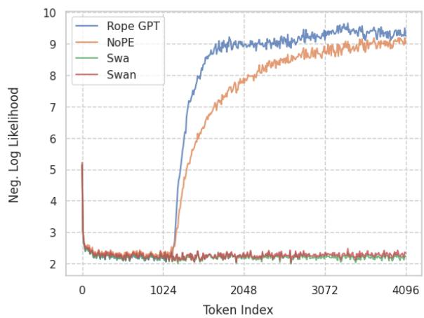
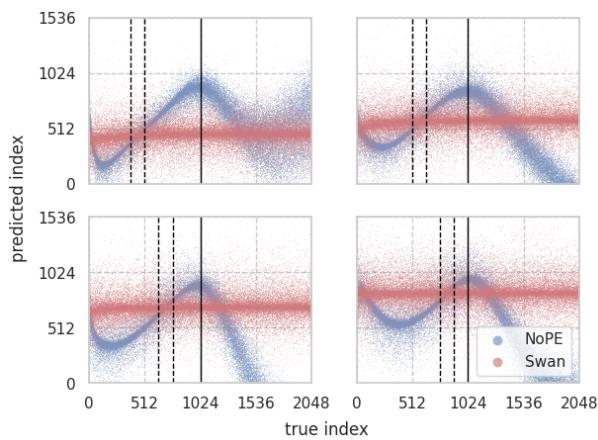
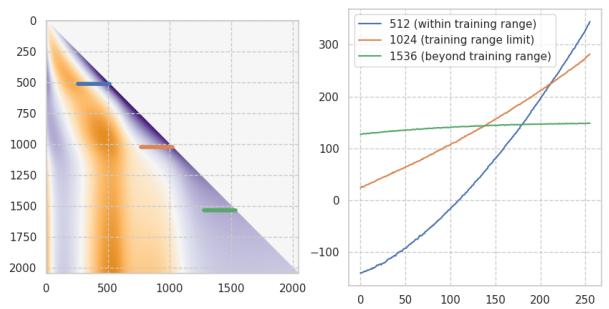
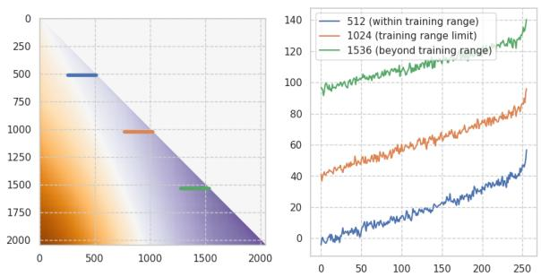
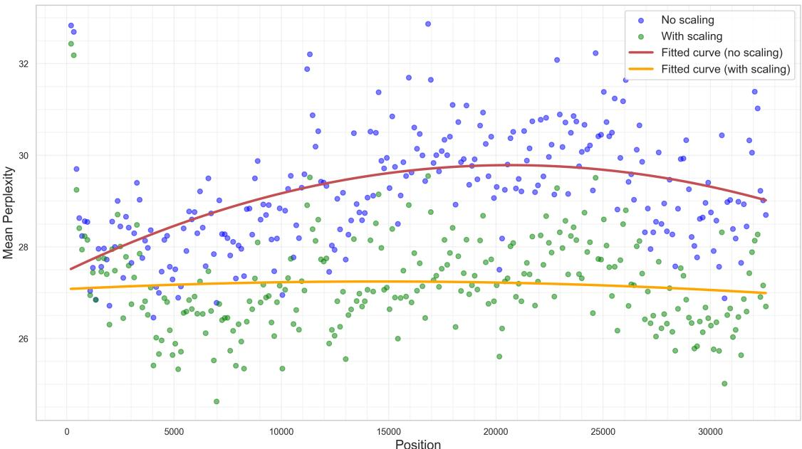
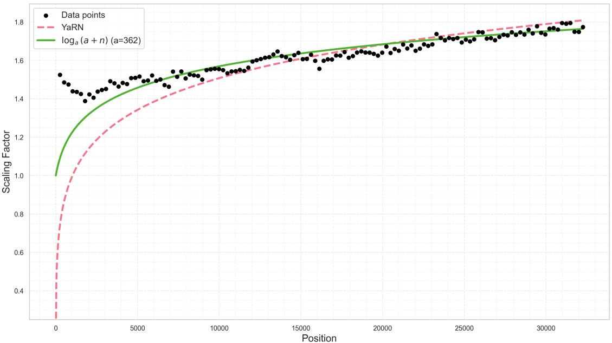
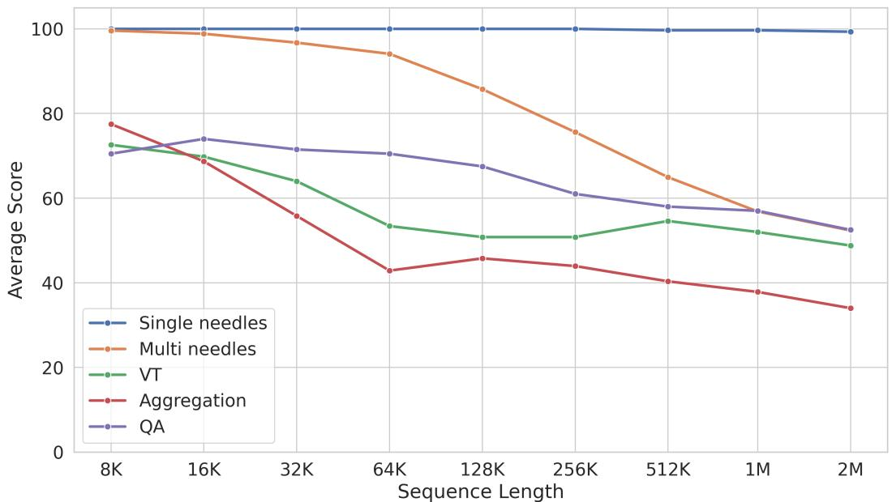
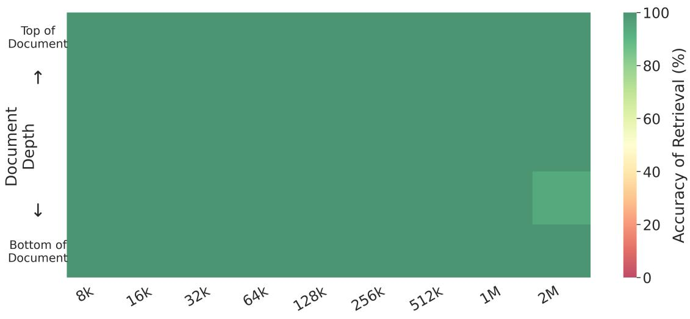

# SWAN: An Efficient and Scalable Approach for Long-Context Language Modeling

Krishna C. Puvvada\*

Faisal Ladhak\*

Santiago Akle Serrano

Cheng-Ping Hsieh

Shantanu Acharya

Samuel Kriman

Simeng Sun

Somshubra Majumdar Fei Jia

Dima Rekesh Boris Ginsburg

## NVIDIA

## Abstract

We present SWAN, a causal Transformer architecture in the decoder-only style that generalizes robustly to sequence lengths substantially longer than those seen during training. SWAN interleaves layers without positional encodings (NoPE) and sliding-window attention layers equipped with rotary positional encodings (SWA-RoPE), and applies a dynamic scaling mechanism for attention scores during inference. Experiments demonstrate that SWAN achieves strong length extrapolation without requiring additional long-context training. In addition, SWAN is more computationally efficient than the standard Transformer architecture, resulting in lower training cost and higher inference throughput. We further demonstrate that existing pre-trained decoder-only models can be adapted to the SWAN architecture with minimal continued training, enabling extended contexts. Overall, our work presents an effective approach for scaling language models to longer contexts in a robust and efficient manner.

## 1 Introduction

Large Language Models based on standard decoderonly transformer architectures (Brown et al., 2020; Grattafiori et al., 2024; Yang et al., 2025a) struggle with context lengths beyond their training distribution. Current approaches to extending context length fall into two categories: specialized training on increasingly longer sequences (Grattafiori et al., 2024; Yang et al., 2025a; Peng et al., 2023b; Chen et al., 2023) or complex inference time modifications (An et al., 2024). These approaches incur either increased computation cost or increased implementation complexity. We propose SWAN, a decoder-only transformer that natively handles sequences substantially longer than seen during training without requiring additional long-contextspecific training. By strategically interleaving global attention layers without positional encodings and local, sliding-window attention layers with rotary position encodings, combined with a dynamic attention scaling mechanism, SWAN maintains comparable performance to standard transformers on established benchmarks while robustly extrapolating to sequences far beyond the training distribution, providing a more scalable and efficient solution to the long-context challenge.

A central challenge in extending transformer context lengths is the handling of positional information. Transformers rely on positional encodings to track token order, but these encodings often become unreliable when models process sequences longer than those seen during training. Among the various positional encoding schemes, Rotary Positional Encodings (RoPE) (Su et al., 2023) have been widely adopted in modern language models due to effectiveness in capturing relative positions. However, RoPE-based models exhibit significant performance degradation when applied to sequences exceeding their training length. This degradation occurs because inter-token distances advance to ranges where the relative rotation angle is outside the trained distribution (Liu et al., 2024).

To address this limitation, we explore two complementary approaches with distinct strengths and limitations. Sliding window attention with RoPE (SWA-RoPE) restricts every token’s attention to a fixed-size window of neighboring tokens. Because the distance between attended tokens is bounded, SWA-RoPE layers never operate at rotation angles outside their training range, making them inherently robust to arbitrary sequence lengths. However, this locality constraint limits their ability to capture long-range dependencies. Conversely, layers without positional encoding (NoPE) (Haviv et al., 2022; Kazemnejad et al., 2023) allow unrestricted attention across the entire context while omitting explicit positional information. Notably, autoregressive NoPE models can develop implicit positional awareness through the causal attention mask, achieving comparable perplexity to models with explicit positional embeddings (Haviv et al., 2022). Despite this capability, pure NoPE models also exhibit poor robustness beyond their training length (Kazemnejad et al., 2023; Wang et al., 2024), with performance degrading rapidly due to the brittleness of the learned positional mechanism.

Our key insight is that these approaches can complement each other through strategic integration. SWAN interleaves global attention layers without positional encodings (NoPE) and local slidingwindow attention layers with rotary positional encodings (SWA-RoPE). This hybrid design creates a synergistic effect: SWA-RoPE layers provide local positional structure, while NoPE layers integrate information across arbitrary distances. When interleaved, the NoPE layers develop more robust representations than they would in isolation, enabling the entire model to generalize beyond its training sequence length. Unlike standard RoPEbased transformers which experience catastrophic performance collapse outside their training context, SWAN maintains robust performance on extended sequences with only a straightforward rescaling of attention scores during inference.

In Section 2.1, we provide evidence that failures in the implicit position prediction mechanism of NoPE models contribute to their performance degradation on longer sequences, and demonstrate how the interleaved SWA-RoPE layers stabilize this mechanism. Additionally, we show that existing transformer models can be efficiently adapted to the SWAN architecture through continued pretraining (CPT), offering a practical, cost-effective path to upgrading deployed models.

Our contributions are as follows:

1. A novel approach (SWAN) that combines SWA-RoPE and NoPE layers to enable efficient length extrapolation without additional training, enhanced by a logarithmic attention scaling mechanism for inference.

2. Mechanistic analysis explaining why this architecture produces robust length extrapolation, with evidence that NoPE layers develop more stable positional encodings when paired with SWA-RoPE layers.

3. Empirical results showing that SWAN maintains robust performance on sequences far exceeding its training length, while achieving comparable results to standard transformers on established LLM benchmarks.

4. A practical method for adapting existing models to the SWAN architecture through continued pre-training (CPT), providing a costeffective upgrade path for deployed models.

## 2 The SWAN architecture

SWAN combines a novel hybrid attention architecture with dynamic attention scaling to address the challenge of length extrapolation. The hybrid architecture interleaves two types of attention mechanisms: global attention layers without positional encodings (NoPE) and local sliding-window attention layers with rotary positional encodings (SWA-RoPE). This hybrid design leverages the complementary strengths of both approaches to achieve robust length extrapolation capabilities, without specialized long-context training.

As detailed in our ablation studies (Appendix A), we explored multiple configurations for interleaving these layer types. Our experiments revealed that beginning with a global NoPE layer followed by three consecutive sliding-window layers, repeating this pattern throughout the network, demonstrated superior performance on long-context tasks. This configuration achieves exceptional NIAH scores at context lengths 16 times longer than the training length, and maintains robust performance even at 32 times the training length when combined with appropriate attention scaling (subsection 2.2). We adopt this interleaving pattern for all experiments presented in the main paper.

The global NoPE layers permit unrestricted attention across the entire context, enabling the model to capture long-range dependencies. Meanwhile, the local SWA-RoPE layers operate with a fixed window size of 512 tokens, providing consistent positional information within a bounded context. This architecture creates a complementary system where SWA-RoPE layers enforce local positional structure while NoPE layers integrate information across arbitrary distances. The key insight is that when these mechanisms are interleaved, the NoPE layers develop more robust position-aware representations than they would in isolation, enabling the entire model to generalize effectively beyond training sequence lengths.

Figure 1 demonstrates this capability by comparing four models trained on sequences of up to 1024 tokens: a standard GPT model with RoPE, one with no positional encodings (NoPE), one with only sliding window attention (SWA) and one using our architecture (SWAN). We evaluate the model’s predictions on 1280 validation sequences of length 4096. The plot shows the negative log likelihood at each sequence position averaged over all validation sequences, with lower values indicating better performance. Both RoPE and NoPE experience significant performance degradation beyond their training length, with negative log likelihood increasing sharply beyond 1024 tokens. In contrast, both SWAN and SWA maintain consistent predictive quality throughout the entire 4096-token range, demonstrating their robust length extrapolation capabilities. Notably, SWAN maintains this performance while retaining the ability to capture long-range dependencies that the purely local SWA approach cannot (see Appendix A).

  
Figure 1: Mean negative log likelihood by token position. RoPE and NoPE models deteriorate beyond training sequence length (1024). SWA model doesn’t experience such catastrophic failure due to its limited context. SWAN model behaves like a SWA model without the limitation of SWA model due to its global NoPE layers.

## 2.1 Stabilizing Implicit Position Encodings for Robust Length Extrapolation

A key question in our investigation is understanding why the NoPE layers within our SWAN architecture demonstrate substantially more robust length extrapolation capabilities compared to identical layers within a model built purely of NoPE layers.

Despite the absence of explicit positional encoding, prior work has demonstrated that trained NoPE models implicitly learn to predict token positions after processing through a few layers (Chi et al., 2023). This implicit position embedding emerges from the autoregressive nature of decoderonly models, where tokens later in the sequence have access to more context than earlier tokens, creating distinct distributions at different positions. These distributional differences enable NoPE models to infer positional information and incorporate it into their predictions (Chi et al., 2023).

  
Figure 2: Predictions of token indices by 8 different probes. Each probe is trained with tokens from one model and different context regions (demarcated by dashed lines). Probes on NoPE models (blue) extrapolate correctly up until the maximum NoPE training length (solid line). Probes on SWAN (red) are not predictive of token indices.

However, standard NoPE models exhibit poor robustness to sequences exceeding the training length, with performance degrading rapidly beyond the training boundary. In our SWAN architecture, the interleaved SWA-RoPE layers appear to relieve NoPE layers from developing the brittle position encodings typically seen in pure NoPE implementations, resulting in more robust processing of longer sequences.

To test these hypotheses, we conducted experiments with both pure NoPE and SWAN models trained on sequences of 1024 tokens and evaluate them on sequences of 2048 tokens. We employed two complementary analysis techniques: (1) position prediction probes to quantitatively measure positional information in model representations, and (2) attention pattern visualization to examine how attention mechanisms behave when processing sequences beyond training length.

## 2.1.1 Position Prediction Probes

To provide evidence for our hypothesis, we trained probes that predict token positions from token embeddings. We evaluated these probes on held-out tokens from positions both within and beyond the models’ training range. Figure 2 shows predictions from eight different probes, each trained with tokens sampled from ranges demarcated by dashed lines. Each of the four subplots shows results from two probes - one trained on NoPE model embeddings (blue) and one on SWAN model embeddings (red) - with each probe trained on tokens from different context regions demarcated by dashed lines.

  
(a) NoPE model (6th layer)

  
(b) SWAN model (20th layer)  
Figure 3: Each panel shows attention averaged over all heads and validation records (left) and cross sections for sequence lengths of 512, 1024 (training range limit), and 1536 (extrapolation regime). The attention patterns of leading 256 tokens differ significantly: NoPE shows inconsistent patterns when extrapolating beyond training range, while SWAN maintains consistent decay patterns for sequences both within and beyond the training range.

For pure NoPE models (blue points), the probe predictions extrapolate well up to the boundary of the model’s training range (solid black line). However, probes cease to be predictive beyond this boundary. Probes trained in different sub-regions all fail at the same location, consistent with the position prediction mechanism failing beyond the training range. In contrast, position probes trained on SWAN’s NoPE layers (red points) show little positional information across all sequence positions. These layers do not develop the brittle position encoding seen in pure NoPE models. This supports our hypothesis that the interleaved SWA-RoPE layers free the NoPE layers from tracking absolute positions, allowing them to focus on integrating information across arbitrary distances while SWA-RoPE layers handle local positional structure.

## 2.1.2 Attention Pattern Analysis

To further investigate this phenomenon we examine the average attention values at different token positions for different sequence lengths. We average the probability scores (attention scores post soft-max) over all heads and over a set of validation batches. We randomize the token order in order to remove the effect of the correlation structure present in natural language.

Figure 3a shows the average attention maps of the 6th layer in the NoPE model. For sequences longer than the training length (green), the model places roughly equal attention on all 256 tokens preceding the target. In contrast, for sequences within training range (orange and blue),it preferentially attends to the tokens closest to the target token. A model that properly extrapolates to longer sequences should maintain similar attention patterns for tokens close to the target token, regardless of sequence length. In contrast, Figure 3b shows the average attention maps of the 20th layer (6th NoPE layer) in our SWAN model. Unlike the pure NoPE model, SWAN’s attention maps exhibit consistent patterns across sequences both within and beyond the training length.

These analyses support our hypothesis that interleaving SWA-RoPE layers fundamentally alters how NoPE layers process positional information. The use of positional embeddings in the SWA-RoPE layers appears to stabilize the representations in the NoPE layers, making them more robust to sequence length extrapolation. This suggests that SWAN’s superior length extrapolation capability stems from the emergent properties of the interleaved architecture.

## 2.2 Dynamic Attention Scaling for Extended Context Processing

While our architecture demonstrates inherent sequence length extrapolation, we find that further performance improvements can be achieved through proper scaling of attention logits during inference. This scaling is particularly important for the global NoPE layers, which must effectively integrate information across arbitrary distances as sequence length increases.

Prior work has shown that RoPE-based models improve their performance on extended context lengths when the temperature of the attention logits is properly adjusted (Peng et al., 2023b). The SWA-RoPE layers in our SWAN architecture inherently handle longer sequences due to their local attention window. However, we hypothesize that the global attention NoPE layers may still require scaling to maintain performance at extended lengths.

  
Figure 4: Held-out perplexity, with (green) and without (blue) logarithmic scaling. Without scaling, we see that perplexity scores degrade on longer contexts, whereas with scaling the performance is more stable.

For this analysis, we sampled 200 documents from the model’s training distribution (each with at least 32K tokens) to maintain a consistent semantic distribution while extending context length beyond the original 1K tokens used during training. We partitioned each 32K-token context into 128-token windows and estimated a single optimal scaling factor per window by minimizing its perplexity over all 200 documents. We find that a logarithmic scaling function log (a + n) provides an excellent fit to the empirically determined optimal scaling factors, unlike YaRN scaling (Peng et al., 2023b) which fits poorly for NoPE layers, particularly in early positions (see Appendix D for more details).

To validate our empirically determined scaling function, we compute perplexity on held-out documents from the PG19 dataset, using the same procedure described above. Figure 4 plots the perplexity at each location within the 32K token context, with and without our scaling function applied. Without scaling (blue), we observe a clear degradation in model performance on longer contexts. In contrast, our scaling (green points) allows the model to maintain better performance as measured by a lower and more stable perplexity value for the entire context length up to contexts 32 times longer than the training length (1K tokens). This improved performance with scaling is further validated by our NIAH evaluation results in Table 5 in Appendix A, where we demonstrate that scaling improves NIAH scores from 0.171 to 0.957 at 8K context length and from 0.005 to 0.907 at 16K context length.

## 3 Results

In the previous section, we introduced the SWAN architecture and motivated its robust length extrapolation via mechanistic analysis and empirical experiments. Here, we evaluate the effectiveness of the SWAN approach compared to standard RoPE-based transformer LLMs. Our goal is to demonstrate that SWAN models can maintain similar performance on standard LLM benchmarks while achieving substantially improved length extrapolation capabilities.

We trained both RoPE and SWAN models with 1B parameters from scratch using 1T tokens at 8K sequence length with a token batch size of 6M. The SWAN model followed 1:3 global:local ratio, with sliding window attention layers using a 512-token window size. We evaluated both models on standard LLM benchmarks using the LM Evaluation Harness Library (Gao et al., 2024). As shown in

<table><tr><td>Dataset</td><td>ARC-E</td><td>ARC-C</td><td>H</td><td>W</td><td>RACE</td><td>PIQA</td><td>SIQA</td><td>OBQA</td><td>Avg</td></tr><tr><td>RoPE</td><td>65.36</td><td>38.23</td><td>58.35</td><td>57.93</td><td>35.02</td><td>73.12</td><td>32.91</td><td>35.20</td><td>49.5</td></tr><tr><td>SWAN</td><td>69.40</td><td>41.04</td><td>59.76</td><td>59.75</td><td>35.69</td><td>73.99</td><td>33.73</td><td>37.80</td><td>51.4</td></tr></table>

Table 1: Results for 1B models trained on 1T tokens. The models were evaluated on ARC-Easy, ARC-Challenge, Hellaswag, Winogrande, RACE, PIQA, Social IQA, and Openbook QA. The SWAN model shows comparable or better performance across all benchmarks.
<table><tr><td>Model</td><td>MTL</td><td>4K</td><td>8K</td><td>16K</td><td>32K</td><td>64K</td><td>128K</td><td>256k</td></tr><tr><td>RoPE</td><td>8K</td><td>70.6</td><td>53.5</td><td>NA</td><td>NA</td><td>NA</td><td>NA</td><td>NA</td></tr><tr><td>Swan</td><td>8K</td><td>68.1</td><td>52.4</td><td>45.8</td><td>36.9</td><td>30.6</td><td>24.4</td><td>14.9</td></tr></table>

Table 2: Comparing long-context performance of SWAN with standard RoPE-based models on the Ruler benchmark (both models are 1B parameters). MTL=Maximum training length. The SWAN model maintains measurable performance even at 32× its training length, while the RoPE model fails completely beyond its training length.

Table 1, the SWAN model performs comparably or better than the RoPE model across all benchmarks, achieving an average 51.4% vs. 49.5%.

The primary advantage of SWAN becomes evident when evaluating its performance on sequences significantly longer than those seen during training. Table 2 shows the results for both models on the Ruler benchmark (Hsieh et al., 2024) across various context lengths. While both models get similar performance for sequence lengths within their training distribution $( \le 8 K )$ , their behaviors diverge dramatically beyond this point. The standard RoPE based model fails completely when presented with sequences exceeding its training length, showing catastrophic degradation. In contrast, SWAN exhibits a much more graceful degradation pattern even at sequences substantially longer than the training length.

## 3.1 Efficient Adaptation of Pre-trained Models to SWAN Architecture

While training models from scratch demonstrates that the SWAN approach achieves comparable results to RoPE-based transformers on standard benchmarks while offering superior length extrapolation, adapting existing pre-trained models would significantly enhance the practical utility of our approach.

Prior research has established that most of the knowledge in transformer models is encoded in the feed-forward layers, with attention mechanisms primarily serving to route information (Geva et al., 2021). Since SWAN primarily modifies the attention computation while preserving feedforward layers, we hypothesize that existing pretrained models can be efficiently converted to the SWAN architecture without losing their accumulated knowledge. This adaptation capability would make our approach immediately applicable to the large ecosystem of existing transformer models, offering a cost-effective path to enhanced length extrapolation without full retraining.

<table><tr><td>Benchmark</td><td>RoPE</td><td>SWAN</td></tr><tr><td colspan="3">Math</td></tr><tr><td>GSM8k MATH500</td><td>87.7 70.4</td><td>87.7 68.4</td></tr><tr><td>Code</td><td></td><td></td></tr><tr><td colspan="3">MBPP</td></tr><tr><td>MBPP+</td><td>76.2 66.1</td><td>75.7 65.3</td></tr><tr><td>HumanEval HumanEval+</td><td>74.4 68.3</td><td>75.0 68.3</td></tr><tr><td>General MT-Bench</td><td>7.35</td><td>7.43</td></tr><tr><td>MMLU (gen.) IFEval (P) IFEval (I)</td><td>68.0 63.0 72.7</td><td>65.4 62.7 72.2</td></tr><tr><td>Tool Use / Long Context</td><td></td><td></td></tr><tr><td>BFCL v2 Live</td><td>68.7</td><td>68.9</td></tr><tr><td>RULER (128k) Avg. (excl. MT, RULER)</td><td>NA 71.55</td><td>77.8 70.95</td></tr></table>

Table 3: Comparison of RoPE vs. SWAN when adapting a pre-trained model. SWAN maintains comparable performance while attaining long-context capabilities.

We start with an 8B parameter RoPE transformer model that was pre-trained for 15T tokens context length of 8K tokens (Su et al., 2024). We converted this model to the SWAN architecture by initializing all weights from the pre-trained RoPE transformer model and modifying the attention layers to implement our 1:3 global-local pattern as established in Section 2. This process involved removing positional encodings from global attention layers, configuring sliding-window attention with a window size of 512 tokens in local layers. Following initialization, we performed continued pre-training (CPT) for an additional 315B tokens (approximately 2% of the original pre-training compute) at an extended context length of 32K tokens. The process utilized the same data distribution as the original model, with sequence lengths extended to 32K through concatenation of shorter examples. For the final 15B tokens, we applied Fill-in-Middle augmentation (Bavarian et al., 2022) to further enhance the model’s contextual understanding. During inference, the adapted models apply the logarithmic attention scaling described in subsection 2.2.1

<table><tr><td>Model</td><td>MTL</td><td>4K</td><td>8K</td><td>16K</td><td>32K</td><td>64K</td><td>128K</td><td>256k</td><td>512k</td><td>1M</td><td>2M</td></tr><tr><td>Llama3.1-8B</td><td>128K</td><td>95.5</td><td>93.8</td><td>91.6</td><td>87.4</td><td>84.7</td><td>77.0</td><td></td><td></td><td></td><td>I</td></tr><tr><td>Llama4 Scout</td><td>256K</td><td>96.6</td><td>92.6</td><td>92.2</td><td>83.3</td><td>72.5</td><td>67.1</td><td>64.9</td><td>57.6</td><td>51.3</td><td></td></tr><tr><td>Qwen2.5-7B</td><td>32K</td><td>96.7</td><td>95.1</td><td>93.7</td><td>89.4</td><td>82.3</td><td>55.1</td><td></td><td></td><td></td><td></td></tr><tr><td>Qwen2.5-7B-1M</td><td>256K</td><td>96.8</td><td>95.3</td><td>93.0</td><td>91.1</td><td>90.4</td><td>84.4</td><td>75.3</td><td>64.6</td><td>1</td><td></td></tr><tr><td>SWAN-8B</td><td>32K</td><td>93.8</td><td>90.8</td><td>88.1</td><td>84.4</td><td>80.5</td><td>77.8</td><td>73.2</td><td>67.3</td><td>63.5</td><td>60.1</td></tr></table>

Table 4: Comparing Long-context performance of SWAN with other models. MTL=Maximum training length. RoPE based models degrade fast with increased sequence length whereas SWAN exhibits a more graceful dropoff. Both Qwen models in this table are instruct versions.

Post-training for the RoPE model was conducted in two stages, with the first stage focusing on math and code followed by a general SFT in the second stage. Post-training for SWAN followed similar procedure, but with the sequence length extended to 32K through concatenation of shorter examples. To enhance long-context capabilities, SFT data was augmented with a variety of tasks designed to exercise the model’s ability to reason over extended contexts. These included questions referring to previous turns in concatenated examples and synthetic tasks such as filling in the middle, recalling portions of context based on keywords, tracing linked lists, executing basic SQL queries on made-up table data, and multi-hop reasoning (Chen et al., 2024b) tasks modified to 32K sequence length.

Table 3 compares our adapted SWAN-8B model with the original RoPE-8B model across standard LLM benchmarks. The results demonstrate that the SWAN adaptation maintains comparable performance across a diverse set of tasks, including mathematical reasoning (GSM8k, MATH500), coding (MBPP, HumanEval), and general language understanding (MMLU, IFEval, MT-Bench). Remarkably, we observe only a minimal decrease in average performance, from 71.55% to 70.95%, confirming our hypothesis that substantial architectural modifications to the attention mechanism can be implemented with only a brief adaptation phase while preserving the model’s fundamental capabilities.

The primary advantage of converting to SWAN is the substantial improvement in length extrapolation. In Table 4, we compare our adapted SWAN-8B model against state-of-the-art models of similar size on the RULER benchmark (Hsieh et al., 2024) across various context lengths. Despite being trained with a maximum context length of only 32K, our SWAN-8B model demonstrates remarkable length extrapolation capabilities. At 64K tokens (2× the training length), it achieves a RULER score of 80.5; at 128K tokens (4× the training length), it maintains a score of 77.8, and even at 256K tokens (8× the training length), it achieves a score of 73.2.

This robust extrapolation capability is particularly notable compared to the performance dropoff patterns observed in other models. For example, the Qwen2.5-7B-Instruct (128K) model, which was also trained with a maximum context length of 32K, shows a large drop from 82.3 at 64K tokens to 55.1 at 128K tokens. In contrast, SWAN model exhibits a much more gradual degradation, maintaining 77.8 at 128K sequence length. Even when compared to models specifically trained on longer contexts, such as Llama3.1-8B (trained up to 128K),

Llama4 Scout (trained up to 256K) and Qwen2.5- 7B-Instruct (1M) (trained up to 256K), SWAN remains competitive. The SWAN model’s score of 77.8 at 128K tokens is comparable to Llama3.1- 8B’s 77.0, despite Llama3.1-8B being explicitly trained at this context length and our model being trained on contexts only one-fourth as long. SWAN’s extrapolation capabilities are particularly impressive at extreme lengths, outperforming both Qwen2.5-7B-Instruct (1M) and Llama4 Scout at 512K tokens and beyond, despite both models having seen sequences 8 times longer during training. Even at 2M sequence length (64 times training length), SWAN achieves a RULER score of 60.1.

These results demonstrate that SWAN enables efficient adaptation of existing pre-trained models to handle significantly longer contexts than their original training length, without sacrificing their performance on standard benchmarks. This provides a practical, compute-efficient path for upgrading deployed models to handle longer contexts without the need for full retraining.

## 4 Related Work

Extending LLM context length to hundreds of thousands of tokens presents challenges across architecture, computation, and data quality (Lv et al., 2024; Gao et al., 2025; Liu et al., 2025). Our work addresses the architectural aspect through design choices enabling length extrapolation.

Several approaches extend context purely at inference time. For RoPE-based models, these include NTK-aware scaling (bloc97, 2023b,a) and Positional Interpolation (PI) (Chen et al., 2023), though these can degrade performance or require careful tuning (An et al., 2024). Recent methods modify attention mechanisms directly: ReRoPE (Su, 2023), SelfExtend (Jin et al., 2024), and Dual Chunk Attention (An et al., 2024). Others leverage attention patterns through windowing approaches like StreamingLLM (Xiao et al., 2024) and LM-Infinite (Han et al., 2024). SWAN differs by addressing fundamental architectural limitations through hybrid design rather than post-hoc modifications.

Training-based approaches include PI (Chen et al., 2023) and YaRN (Peng et al., 2023b), which work best after continued pre-training. While effective, CPT on longer sequences (Xiong et al., 2023) becomes prohibitively expensive for large models. Parameter-efficient methods like LongLoRA (Chen et al., 2024a) help but still require additional training. State-of-the-art models like Llama 3 (Grattafiori et al., 2024; Meta AI, 2024a,b) and Qwen2.5 (Yang et al., 2025a) achieve long-context capabilities through extensive pre-training with varied sequence lengths. In contrast, SWAN achieves length extrapolation without long-context specific training and can adapt existing models with minimal continued pre-training.

The quadratic complexity of self-attention poses efficiency bottlenecks for long contexts (Kwon et al., 2023; Fu, 2024; Liu et al., 2025). Sparse attention mechanisms in Longformer (Beltagy et al., 2020) and BigBird (Zaheer et al., 2021) address this by limiting attention patterns. Alternative architectures like Mamba (Gu and Dao, 2024) and RWKV (Peng et al., 2023a) achieve near-linear complexity but require training from scratch. SWAN’s hybrid design improves efficiency: SWA-RoPE layers use efficient local attention, while global NoPE layers can benefit from techniques like Multi-head Latent Attention (DeepSeek-AI et al., 2024). Additional KV cache optimizations (Zhang et al., 2023; Xiao et al., 2024; Zhang et al., 2024; Hooper et al., 2024; Liu et al., 2025) can complement our approach.

The Gemma family of models (GoogleDeep-Mind, 2024, 2025) also employs a combination of sliding window and global attention, but retains RoPE across all layers, in contrast to SWAN’s strategic omission of positional encodings in global layers. A concurrent work (Yang et al., 2025b) explores similar layer interleaving, but lacks our dynamic attention scaling mechanism and the accompanying mechanistic analysis. SWAN also distinguishes itself in its ability to efficiently adapt existing pre-trained decoder-only models through minimal continued training, a feature not addressed in these works. Llama 4 (MetaAI, 2024), another line of concurrent work, also explores a hybrid approach using chunked attention in RoPE layers interleaved with global NoPE layers. However, despite training on 8 longer sequences (256K vs. SWAN’s 32K), the LLama4 Scout model demonstrates weaker extrapolation on long-context benchmarks (Table 4).

## 5 Conclusion

We introduced SWAN, a comprehensive approach that achieves robust length extrapolation without specialized long-context training. By combining a hybrid architecture that interleaves NoPE and

SWA-RoPE layers with dynamic attention scaling, our method maintains consistent performance on sequences substantially longer than those seen during training. Our mechanistic analysis revealed this hybrid architecture creates a synergistic effect where SWA-RoPE layers provide stable positional grounding that relieves NoPE layers from developing brittle positional representations. We also demonstrated that existing pre-trained models can be efficiently adapted to the SWAN architecture through continued pre-training, offering a practical, cost-effective path for upgrading deployed models to handle significantly longer contexts without performance degradation on standard benchmarks. This approach shifts away from training directly on increasingly longer sequences, providing a more computationally efficient path toward long-context language modeling.

## 6 Limitations

SWAN’s performance depends on sliding window size selection and global:local layer ratio. While a window size of 512 tokens and 1:3 ratio were used in our experiments, a comprehensive search could lead to a more optimal configuration in terms of KV-cache savings during inference. Our logarithmic attention scaling mechanism requires empirical tuning based on the specific model architecture, size, pre-training distribution, and sequence length. Developing theoretical foundations for determining optimal scaling factors would enhance the generalizability of our approach. Our evaluation focused primarily on the RULER benchmark and standard LLM benchmarks, with future work potentially exploring additional long-context tasks.

The conversion of existing pre-trained models to the SWAN architecture requires continued pre-training to preserve the model’s accumulated knowledge, which requires careful choice of learning rate. While we found that 2% of the original pre-training compute was sufficient in our experiments, we neither claim that this is the minimum required nor the optimal amount of CPT, and it may vary for different model scales or architectural variants. Despite these limitations, SWAN represents a practical and efficient approach to extending LLM context lengths without specialized long-context training, offering a viable path for deploying models with robust length extrapolation capabilities.

## 7 Potential Risks

Extending context length capabilities in language models may amplify existing concerns about large language models, including potential misuse for generating misleading content that appears more coherent or authoritative due to incorporating larger contexts. Additionally, longer context models have increased computational requirements, which could exacerbate environmental impacts during inference. We believe these risks are not unique to our approach and are outweighed by the benefits of more capable and efficient long-context models for legitimate applications.

## References

Chenxin An, Fei Huang, Jun Zhang, Shansan Gong, Xipeng Qiu, Chang Zhou, and Lingpeng Kong. 2024. Training-free long-context scaling of large language models. Preprint, arXiv:2402.17463.

Mohammad Bavarian, Heewoo Jun, Nikolas Tezak, John Schulman, Christine McLeavey, Jerry Tworek, and Mark Chen. 2022. Efficient training of language models to fill in the middle. arXiv:2207.14255.

Iz Beltagy, Matthew E. Peters, and Arman Cohan. 2020. Longformer: The long-document Transformer. arXiv: 2004.05150.

bloc97. 2023a. Dynamically scaled rope further increases performance of long context llama with zero fine-tuning. Reddit post.

bloc97. 2023b. Ntk-aware scaled rope allows llama models to have extended (8k+) context size without any fine-tuning and minimal perplexity degradation. Reddit post.

Tom B. Brown, Benjamin Mann, Nick Ryder, Melanie Subbiah, Jared Kaplan, Prafulla Dhariwal, Arvind Neelakantan, Pranav Shyam, Girish Sastry, Amanda Askell, Sandhini Agarwal, Ariel Herbert-Voss, Gretchen Krueger, Tom Henighan, Rewon Child, Aditya Ramesh, Daniel M. Ziegler, Jeffrey Wu, Clemens Winter, and 12 others. 2020. Language models are few-shot learners. Preprint, arXiv:2005.14165.

Shouyuan Chen, Sherman Wong, Liangjian Chen, and Yuandong Tian. 2023. Extending context window of large language models via positional interpolation. arXiv preprint arXiv:2306.15595.

Yukang Chen, Shengju Qian, Haotian Tang, Xin Lai, Zhijian Liu, Song Han, and Jiaya Jia. 2024a. Longlora: Efficient fine-tuning of long-context large language models. Preprint, arXiv:2309.12307.

Zhi Chen, Qiguang Chen, Libo Qin, Qipeng Guo, Haijun Lv, Yicheng Zou, Wanxiang Che, Hang Yan, Kai

Chen, and Dahua Lin. 2024b. What are the essential factors in crafting effective long context multihop instruction datasets? insights and best practices. arXiv:2409.01893.

Ta-Chung Chi, Ting-Han Fan, Li-Wei Chen, Alexander I. Rudnicky, and Peter J. Ramadge. 2023. Latent positional information is in the self-attention variance of Transformer language models without positional embeddings. arXiv: 2305.13571.

DeepSeek-AI, Aixin Liu, and et.al. 2024. Deepseekv2: A strong, economical, and efficient mixture-of-experts language model. Preprint, arXiv:2405.04434.

Yao Fu. 2024. Challenges in deploying long-context transformers: A theoretical peak performance analysis. Preprint, arXiv:2405.08944.

Leo Gao, Jonathan Tow, Baber Abbasi, Stella Biderman, Sid Black, Anthony DiPofi, Charles Foster, Laurence Golding, Jeffrey Hsu, Alain Le Noac’h, Haonan Li, Kyle McDonell, Niklas Muennighoff, Chris Ociepa, Jason Phang, Laria Reynolds, Hailey Schoelkopf, Aviya Skowron, Lintang Sutawika, and 5 others. 2024. A framework for few-shot language model evaluation.

Tianyu Gao, Alexander Wettig, Howard Yen, and Danqi Chen. 2025. How to train long-context language models (effectively). Preprint, arXiv:2410.02660.

Mor Geva, Roei Schuster, Jonathan Berant, and Omer Levy. 2021. Transformer feed-forward layers are key-value memories. In EMNLP.

GoogleDeepMind. 2024. Gemma: Open models based on Gemini research and technology. arXiv: 2403.08295.

GoogleDeepMind. 2025. Gemma 3 technical report. arXiv: 2503.19786.

Aaron Grattafiori, Abhimanyu Dubey, Abhinav Jauhri, Abhinav Pandey, Abhishek Kadian, Ahmad Al-Dahle, Aiesha Letman, Akhil Mathur, Alan Schelten, Alex Vaughan, and 1 others. 2024. The llama 3 herd of models. arXiv:2407.21783.

Albert Gu and Tri Dao. 2024. Mamba: Linear-time sequence modeling with selective state spaces. arXiv: 2312.00752.

Chi Han, Qifan Wang, Hao Peng, Wenhan Xiong, Yu Chen, Heng Ji, and Sinong Wang. 2024. Lminfinite: Zero-shot extreme length generalization for large language models. Preprint, arXiv:2308.16137.

Eric Harper and 1 others. NeMo: a toolkit for Conversational AI and Large Language Models.

Adi Haviv, Ori Ram, Ofir Press, Peter Izsak, and Omer Levy. 2022. Transformer language models without positional encodings still learn positional information. In EMNLP.

Coleman Hooper, Sehoon Kim, Hiva Mohammadzadeh, Michael W. Mahoney, Yakun Sophia Shao, Kurt Keutzer, and Amir Gholami. 2024. Kvquant: Towards 10 million context length llm inference with kv cache quantization. Preprint, arXiv:2401.18079.

Cheng-Ping Hsieh, Simeng Sun, Samuel Kriman, Shantanu Acharya, Dima Rekesh, Fei Jia, and Boris Ginsburg. 2024. RULER: What’s the real context size of your long-context language models? In COLM.

Hongye Jin, Xiaotian Han, Jingfeng Yang, Zhimeng Jiang, Zirui Liu, Chia-Yuan Chang, Huiyuan Chen, and Xia Hu. 2024. Llm maybe longlm: Selfextend llm context window without tuning. Preprint, arXiv:2401.01325.

Amirhossein Kazemnejad, Inkit Padhi, Karthikeyan Natesan Ramamurthy, Payel Das, and Siva Reddy. 2023. The impact of positional encoding on length generalization in Transformers. NeurIPS.

Woosuk Kwon, Zhuohan Li, Siyuan Zhuang, Ying Sheng, Lianmin Zheng, Cody Hao Yu, Joseph E. Gonzalez, Hao Zhang, and Ion Stoica. 2023. Efficient memory management for large language model serving with pagedattention. Preprint, arXiv:2309.06180.

Xiaoran Liu, Ruixiao Li, Mianqiu Huang, Zhigeng Liu, Yuerong Song, Qipeng Guo, Siyang He, Qiqi Wang, Linlin Li, Qun Liu, Yaqian Zhou, Xuanjing Huang, and Xipeng Qiu. 2025. Thus spake long-context large language model. arXiv:2502.17129.

Xiaoran Liu, Hang Yan, Shuo Zhang, Chenxin An, Xipeng Qiu, and Dahua Lin. 2024. Scaling laws of rope-based extrapolation. arXiv:2310.05209.

Kai Lv, Xiaoran Liu, Qipeng Guo, Hang Yan, Conghui He, Xipeng Qiu, and Dahua Lin. 2024. Longwanjuan: Towards systematic measurement for long text quality. Preprint, arXiv:2402.13583.

Meta AI. 2024a. Introducing meta llama 3: The most capable openly available llm to date. Blog Post.

Meta AI. 2024b. Introducing meta llama 3.1: The most capable and versatile openly available models to date. Blog Post.

MetaAI. 2024. Introducing llama 4: Advancing multimodal intelligence.

NVIDIA, :, Aaron Blakeman, Aarti Basant, Abhinav Khattar, Adithya Renduchintala, Akhiad Bercovich, Aleksander Ficek, Alexis Bjorlin, Ali Taghibakhshi, Amala Sanjay Deshmukh, Ameya Sunil Mahabaleshwarkar, Andrew Tao, Anna Shors, Ashwath Aithal, Ashwin Poojary, Ayush Dattagupta, Balaram Buddharaju, Bobby Chen, and 182 others. 2025. Nemotron-h: A family of accurate and efficient hybrid mamba-transformer models. Preprint, arXiv:2504.03624.

Bo Peng, Eric Alcaide, Quentin Anthony, Alon Albalak, Samuel Arcadinho, Stella Biderman, Huanqi Cao, Xin Cheng, Michael Chung, Matteo Grella, Kranthi Kiran GV, Xuzheng He, Haowen Hou, Jiaju Lin, Przemyslaw Kazienko, Jan Kocon, Jiaming Kong, Bartlomiej Koptyra, Hayden Lau, and 15 others. 2023a. Rwkv: Reinventing rnns for the transformer era. Preprint, arXiv:2305.13048.

Bowen Peng, Jeffrey Quesnelle, Honglu Fan, and Enrico Shippole. 2023b. Yarn: Efficient context window extension of large language models. arXiv:2309.00071.

Gerald Shen, Zhilin Wang, Olivier Delalleau, Jiaqi Zeng, Yi Dong, Daniel Egert, Shengyang Sun, Jimmy Zhang, Sahil Jain, Ali Taghibakhshi, Markel Sanz Ausin, Ashwath Aithal, and Oleksii Kuchaiev. 2024. Nemo-aligner: Scalable toolkit for efficient model alignment. Preprint, arXiv:2405.01481.

Mohammad Shoeybi, Mostofa Patwary, Raul Puri, Patrick LeGresley, Jared Casper, and Bryan Catanzaro. 2020. Megatron-lm: Training multi-billion parameter language models using model parallelism. Preprint, arXiv:1909.08053.

Dan Su, Kezhi Kong, Ying Lin, Joseph Jennings, Brandon Norick, Markus Kliegl, Mostofa Patwary, Mohammad Shoeybi, and Bryan Catanzaro. 2024. Nemotron-CC: Transforming Common Crawl into a refined long-horizon pretraining dataset. arXiv:2412.02595.

Jianlin Su. 2023. Rectified rotary position embeddings. https://github.com/bojone/rerope.

Jianlin Su, Yu Lu, Shengfeng Pan, Ahmed Murtadha, Bo Wen, and Yunfeng Liu. 2023. RoFormer: Enhanced Transformer with Rotary Position Embedding. arXiv:2104.09864.

Jie Wang, Tao Ji, Yuanbin Wu, Hang Yan, Tao Gui, Qi Zhang, Xuanjing Huang, and Xiaoling Wang. 2024. Length generalization of causal transformers without position encoding. Preprint, arXiv:2404.12224.

Guangxuan Xiao, Yuandong Tian, Beidi Chen, Song Han, and Mike Lewis. 2024. Efficient streaming language models with attention sinks. In The Twelfth International Conference on Learning Representations.

Wenhan Xiong, Jingyu Liu, Igor Molybog, Hejia Zhang, Prajjwal Bhargava, Rui Hou, Louis Martin, Rashi Rungta, Karthik Abinav Sankararaman, Barlas Oguz, Madian Khabsa, Han Fang, Yashar Mehdad, Sharan Narang, Kshitiz Malik, Angela Fan, Shruti Bhosale, Sergey Edunov, Mike Lewis, and 2 others. 2023. Effective long-context scaling of foundation models. Preprint, arXiv:2309.16039.

An Yang, Bowen Yu, Chengyuan Li, Dayiheng Liu, Fei Huang, Haoyan Huang, Jiandong Jiang, Jianhong Tu, Jianwei Zhang, Jingren Zhou, and 1 others. 2025a. Qwen2. 5-1m technical report. arXiv:2501.15383.

Bowen Yang, Bharat Venkitesh, Dwarak Talupuru, Hangyu Lin, David Cairuz, Phil Blunsom, and Acyr Locatelli. 2025b. Rope to nope and back again: A new hybrid attention strategy. Preprint, arXiv:2501.18795.

Manzil Zaheer, Guru Guruganesh, Avinava Dubey, Joshua Ainslie, Chris Alberti, Santiago Ontanon, Philip Pham, Anirudh Ravula, Qifan Wang, Li Yang, and Amr Ahmed. 2021. Big bird: Transformers for longer sequences. arXiv: 2007.14062.

Peitian Zhang, Zheng Liu, Shitao Xiao, Ninglu Shao, Qiwei Ye, and Zhicheng Dou. 2024. Long context compression with activation beacon. Preprint, arXiv:2401.03462.

Zhenyu Zhang, Ying Sheng, Tianyi Zhou, Tianlong Chen, Lianmin Zheng, Ruisi Cai, Zhao Song, Yuandong Tian, Christopher Ré, Clark Barrett, Zhangyang Wang, and Beidi Chen. 2023. H o: Heavy-hitter oracle for efficient generative inference of large language models. Preprint, arXiv:2306.14048.

## A Ablations

To investigate the impact of different hybrid attention configurations on length extrapolation capabilities, we conducted an ablation study using models with 0.5B parameters. Each model consisted of 24 transformer decoder layers, with 16 attention heads per layer, 1024 hidden units, and a feedforward dimension of 4096. We trained these models on a 350B token dataset using the AdamW optimizer, with a global batch size of 4096. We employed a cosine decay learning rate schedule that peaked at 3e−3 after 2000 warmup steps. All sliding window attention layers used a window size of 512 tokens with RoPE. For hybrid attention models we maintained a consistent 3:1 ratio between local (sliding window) and global attention layers and used attention scaling during inference (though we include a control without attention scaling). Below is a brief description of each of the models:

local only - Implements sliding window attention across all layers.

global only (RoPE) - Standard transformer language model utilizing global attention with RoPE across all layers.

global only (NoPE) - Implements global attention with NoPE across all layers.

global only (NoPE + scale) - Implements global attention with NoPE across all layers, with SWAN’s attention scaling applied during inference.

global\_start - Begins with a global NoPE layer followed by three consecutive sliding window layers, repeating this pattern throughout. For inference, we additionally evaluate a version without attention scaling to establish a baseline.

local\_start - Begins with three sliding window layers followed by a global NoPE layer, repeating this pattern throughout.

all\_global\_first - Concentrates all six global NoPE layers in the first positions, followed by sliding window layers.

all\_local\_first - Places all sliding window layers first, followed by six global NoPE layers.

Table 5 shows results for the NIAH task from the RULER benchmark (Hsieh et al., 2024).2 Among the baseline non-hybrid attention models, the local only model struggles to maintain high NIAH scores beyond its local window size (512), despite being trained on sequences of length 1k. However, unlike the global only attention baselines (RoPE and NoPE), which completely fail beyond the training distribution, the local only model demonstrates a modest capacity for length extrapolation. In contrast, all hybrid attention variants show substantial improvements in generalizing beyond the training length.

When comparing the hybrid variants we find that interspersing global and local attention layers yields superior performance compared to grouping them together, as evidenced by the relatively poor performance of both all\_global\_first and all\_local\_first configurations. In particular, our best-performing model (global\_start achieves exceptional NIAH scores (> 0.9) at context lengths of 16k — 16 times the context length seen during training. It can also maintain robust performance (NIAH score > 0.7) even at 32k tokens, representing a 32-fold length extrapolation.

The critical role of attention scaling is demonstrated by our control experiment with global\_start (no scale). While both scaled and unscaled variants maintain strong performance up to 2k tokens, their behaviors diverge dramatically at longer contexts. The unscaled version shows rapid performance degradation beyond 4k tokens, dropping from 0.820 to 0.171 at 8k tokens and essentially failing (0.005) at 16k tokens. In contrast, the scaled version maintains exceptional performance at 8k tokens (0.957) and continues to achieve strong results at 16k tokens (0.907), and even maintains moderately good results at 32k tokens. This stark difference in length generalization — 4-fold extrapolation without scaling versus 32-fold with scaling — establishes attention scaling as a crucial mechanism for effective inference beyond the training length distribution. The graceful performance decline of the scaled model, compared to the abrupt deterioration of its unscaled counterpart, suggests that attention scaling helps maintain the model’s ability to capture long-range dependencies even at extreme sequence lengths. However, scaling alone is insufficient for extrapolation, as evidenced by the global only (NoPE + scale) which fails to generalize beyond its maximum training length, despite using the same scaling mechanism.

## B Architecture & Training

Table 6 shows model configuration for SWAN-1B and SWAN-8B models. Both RoPE-1B and SWAN-1B are trained from scratch with a batch size of 6M tokens (at 8k sequence length) with peak LR of

<table><tr><td>Model</td><td>512</td><td>1k</td><td>2k</td><td>4k</td><td>8k</td><td>16k</td><td>32k</td></tr><tr><td>local only</td><td>1.000</td><td>0.601</td><td>0.285</td><td>0.127</td><td>0.057</td><td>0.022</td><td>0.010</td></tr><tr><td>global only (RoPE)</td><td>1.000</td><td>0.985</td><td>0.000</td><td>0.000</td><td>0.000</td><td>0.000</td><td>0.000</td></tr><tr><td>global only (NoPE)</td><td>1.000</td><td>1.000</td><td>0.000</td><td>0.000</td><td>0.000</td><td>0.000</td><td>0.000</td></tr><tr><td>global only (NoPE + scale)</td><td>1.000</td><td>1.000</td><td>0.136</td><td>0.000</td><td>0.000</td><td>0.000</td><td>0.000</td></tr><tr><td>global_start (no scale)</td><td>1.000</td><td>1.000</td><td>0.983</td><td>0.820</td><td>0.171</td><td>0.005</td><td>0.003</td></tr><tr><td>global_start</td><td>1.000</td><td>1.000</td><td>0.999</td><td>0.998</td><td>0.957</td><td>0.907</td><td>0.702</td></tr><tr><td>local_start</td><td>1.000</td><td>1.000</td><td>0.999</td><td>0.895</td><td>0.808</td><td>0.725</td><td>0.530</td></tr><tr><td>all_global_first</td><td>1.000</td><td>0.599</td><td>0.316</td><td>0.113</td><td>0.044</td><td>0.017</td><td>0.010</td></tr><tr><td>all_local_first</td><td>1.000</td><td>1.000</td><td>0.993</td><td>0.564</td><td>0.183</td><td>0.057</td><td>0.027</td></tr></table>

Table 5: NIAH scores across different context lengths for various SWAN configurations.

3e-3 for 1T tokens. We performed CPT for SWAN-8B with 32k sequence length and 6M token batch size at constant LR of 1e-5 for 300B tokens and ramped down to a LR of 5e-8 over another 15B tokens. Post-training for SWAN-8B model was performed in two stages. The first stage focused on a math and code blend with constant LR of 5e-6 followed by a second stage of general SFT at a constant LR of 1e-6. CPT was performed using Megatron-LM (Shoeybi et al., 2020) where as post-training used NeMo (Harper et al.) and NeMo-Aligner (Shen et al., 2024). Megatron-LM is distributed under Apache 2.0 and MIT licenses, where as NeMo and NeMo Aligner are covered by Apache 2.0 license. Training used NVIDIA H100 80GB GPUs, with CPT consuming  18k GPU hours and post-training consuming  19k GPU hours.

<table><tr><td></td><td>SWAN-1B</td><td>SWAN-8B</td></tr><tr><td>Nlayers</td><td>24</td><td>32</td></tr><tr><td>dmodel</td><td>1536</td><td>4096</td></tr><tr><td>Nheads</td><td>16</td><td>32</td></tr><tr><td> $d _ { \mathrm { h e a d } }$ </td><td>96</td><td>128</td></tr><tr><td>RoPE base</td><td>1,000,000</td><td>1,000,000</td></tr><tr><td>Normalization</td><td>RMSNorm</td><td>RMSNorm</td></tr><tr><td>global:local</td><td>1:3</td><td>1:3</td></tr><tr><td>SWA size</td><td>512</td><td>512</td></tr></table>

Table 6: Architecture details for SWAN-1B and SWAN-8B models.

## C Data

For details about the pre-training data, please refer to Section 2.2 of NVIDIA et al. (2025) and Su et al. (2024). Math and code focussed stage-1 SFT consisted of  670k sequences, with each sequence upto 32k tokens. A more general instruction-following stage-2 consisted of 200k sequences, with each sequence upto 32k tokens. In both stages, longer sequences were obtained by concatenating (prompt, response) pairs and were of the form [(prompt-1, response-1), (prompt-2, response-2), ..., (prompt-N, response-N)].

## D Optimal Scaling Factors for NoPE Layers

Figure 5 shows the empirically determined optimal scaling factors (black dots) across different positions in the 32K context for the global\_start model from our ablation study (trained on 1K sequence length). We find that a logarithmic scaling function $\log _ { a } ( a + n )$ (green line) provides an excellent fit to the empirical data. This function captures two key properties we observe – a natural growth rate that matches the data’s progression, and a base scaling factor that never falls below 1.0, which is important for maintaining model stability at early positions. Interestingly, while prior work found that the YaRN scaling function (Peng et al., 2023b) works well for RoPE-based models, we observe that it (dashed pink line) fits poorly for the NoPE layers in our SWAN architecture, particularly in early positions where it significantly under-estimates the required scaling.

  
Figure 5: Estimates of optimal scaling factors (black) for the global\_start ablation model (1K training length) comparing the fit of our logarithmic scaling function vs. YaRN scaling. We find that YaRN scaling doesn’t work as well for NoPE layers.

## E Additional RULER Results

Figure 6 shows RULER scores split by task type (single needles, multi-needles, Variable Tracking (VT), Aggregation and Question-Answering (QA)) for SWAN-8B model upto 2M sequence length. SWAN model shows near-perfect recall for single needle tasks. Figure 7 shows passkey retrieval task performance of SWAN-8B model.

  
Figure 6: RULER scores split by task type for SWAN-8B model. VT:Variable Tracking, QA: question-Answering. SWAN-8B model shows near-perfect recall for single needle tasks upto sequence length of 2M (64 times of training sequence length).

  
Context Length (# Tokens)  
Figure 7: Passkey retrieval performance: SWAN-8b achieves near-perfect "needle" recall upto 2M tokens of "haystack", demonstrating strong long-context generalization despite being trained only on sequences up to 32K tokens.