# Scaling Rich Style-Prompted Text-to-Speech Datasets

Anuj Diwan♡, Zhisheng Zheng♡, David Harwath♡, Eunsol Choi♣ Department of Computer Science, The University of Texas at Austin♡ Department of Computer Science and Data Science, New York University♣ anuj.diwan,zszheng,harwath @utexas.edu, eunsol@nyu.edu

## Abstract

We introduce Paralinguistic Speech Captions (ParaSpeechCaps), a large-scale dataset that annotates speech utterances with rich style captions. While rich abstract tags (e.g. guttural, nasal, pained) have been explored in small-scale human-annotated datasets, existing large-scale datasets only cover basic tags (e.g. low-pitched, slow, loud). We combine off-the-shelf text and speech embedders, classifiers and an audio language model to automatically scale rich tag annotations for the first time. ParaSpeechCaps covers a total of 59 style tags, including both speaker-level intrinsic tags and utterance-level situational tags. It consists of 282 hours of human-labelled data (PSC-Base) and 2427 hours of automatically annotated data (PSC-Scaled). We finetune Parler-TTS, an open-source style-prompted TTS model, on ParaSpeechCaps, and achieve improved style consistency (+7.9% Consistency MOS) and speech quality (+15.5% Naturalness MOS) over the best performing baseline that combines existing rich style tag datasets. We ablate several of our dataset design choices to lay the foundation for future work in this space. Our dataset, models and code are released at https://github. com/ajd12342/paraspeechcaps.

## 1 Introduction

Style-prompted text-to-speech models (Guo et al., 2022; Leng et al., 2023; Lacombe et al., 2024b) can synthesize speech while controlling for style factors like pitch, speed and emotion via textual style prompts. Building such a system requires a training dataset where each example consists of a transcript, a style prompt and an utterance reflecting the specified style prompt. Yet, such data is often costly to annotate and existing datasets (Kawamura et al., 2024; Lacombe et al., 2024b; Ji et al., 2024) are either limited in their scale or their coverage of style tag types.

In this paper, we introduce Paralinguistic Speech Captions (ParaSpeechCaps), a dataset which covers 59 unique style tags. We categorize style tags into intrinsic tags tied to a speaker’s identity (e.g., shrill, guttural) and situational tags that characterize individual utterances (e.g., happy, whispered). Our dataset consists of a human-annotated portion (PSC-Base, 282 hrs) and an automatically labeled portion (PSC-Scaled, 2427 hrs), covering 33 intrinsic and 26 situational tags. Figure 1 shows a few examples. We first build PSC-Base by aggregating existing situational annotations as well as collecting new intrinsic annotations on 282 hours of speech (Nguyen et al., 2023; Richter et al., 2024; Nagrani et al., 2020) via crowdsourcing.

As the human-annotated dataset is limited in scale, we propose two novel data scaling approaches to expand it, one for intrinsic tags and one for situational tags (Figure 3). We source speech and transcripts from the 45k-hr English portion of a large-scale speakerlabeled corpus (He et al., 2024) and apply both approaches to identify instances with the target style tag. Existing large-scale datasets (Lacombe et al., 2024b; Lyth and King, 2024) only support basic tags (e.g. high-pitched, fast, female) that can be extracted using signal processing tools; in contrast, we scale to a larger set of rich, abstract tags for the first time.

For intrinsic style tags, we use a perceptual speaker similarity model (Ahn et al., 2024) to identify speakers whose speech resembles that of speakers humanannotated with intrinsic tags. Then, we propagate the intrinsic tags of the similar speaker, multiplying intrinsic data by 9x to 2427 hours. For situational style tags, we combine three different types of signals. We first identify expressive speech using an off-the-shelf dominance-valence-arousal speech classifier (Wagner et al., 2023). Among the selected expressive speech clips, we use a text embedding model (Meng et al., 2024) to find transcripts that semantically match the desired situational tag. Lastly, we use a large-scale speech-text multimodal LLM (Gemini Team et. al., 2024) to check whether the speech acoustically matches the situational tag. We use these together to multiply situational data by 3x to 215 hours.

We verify the quality of our collected data comprehensively. First, we perform human evaluation and show that annotators rate our automatically scaled data to be on par with human-annotated data in terms of adherence to the annotated style tags. Then, we train a style-prompted TTS model by finetuning the widely-used Parler-TTS (Lacombe et al., 2024b; Lyth and King, 2024) model on our dataset. We evaluate its performance in terms of speech style consistency, speech quality, and intelligibility. Our model shows significant gains in style consistency (+7.9% Consistency MOS) and quality (+15.5% Naturalness MOS) when compared to our best baseline finetuned on existing smaller-scaled datasets (Koizumi et al., 2023; Nguyen et al., 2023; Richter et al., 2024). A system demo is available at https://paraspeechcaps. github.io/. In summary, our contributions are:

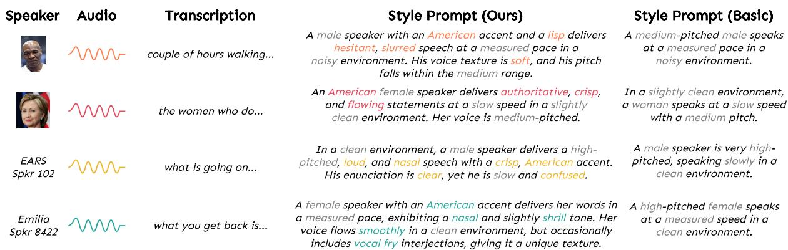  
Figure 1: Randomly sampled examples from ParaSpeechCaps. Our style prompts cover rich tags describing complex styles like rhythm, clarity, emotion, etc. in contrast to erstwhile basic style prompts that only contain gender, pitch and speed levels. We highlight rich style tags with vibrant colors and basic style tags with a gray color.

• We introduce ParaSpeechCaps, a large-scale stylecaptioned dataset that covers 59 unique style tags.

• We newly collect 282 hours of crowdsourced intrinsic annotations for our human-annotated portion.

• We propose two novel approaches to automatically annotate rich style tags for the first time and scale to 2427 hours of data.

• We show that human evaluators rate our scaled data to be on par with our human-labelled data, and that a style-prompted TTS model finetuned on it achieves the highest style consistency and naturalness.

• We provide detailed analyses on each of our dataset design choices to contextualize their contributions.

## 2 Style Tag Taxonomy

## 2.1 Our taxonomy and coverage

We first provide an overview of the types of style tags we study. We define a style factor (Jin et al., 2024; Guo et al., 2022; Ando et al., 2024) as a speech characteristic that one wants to control and a style tag as a word that selects a value for the style factor. For example, pitch, rhythm, emotion are style factors and deep, shrill , singsong, monotonous angry, scared are style tags for each. We broadly classify style tags along two axes, intrinsic vs. situational and rich vs. basic.

Intrinsic tags are tied to a speaker’s identity and persist across their utterances (e.g. pitch, texture and accent), while situational tags are utterance-level (e.g. emotion and expressivity). While intrinsic annotations can be obtained on a per-speaker basis, situational annotations must be obtained on a per-utterance basis. Basic tags can be easily extracted using signal processing tools or simple classifiers, while rich tags are subjective and often require human annotations.

To comprehensively cover style types, we manually select 11 style factors with an average of 5 tags per style factor, resulting in 59 total style tags consisting of 28 rich intrinsic, 23 rich situational and 5 basic intrinsic and 3 basic situational tags. Figure 2 visualizes our tag taxonomy with all 11 style factors.

## 2.2 Comparison to other datasets

Table 1 summarizes datasets from style-prompted TTS papers. We count the unique number of rich tags they support and dataset size (duration and speaker count). ParaSpeechCaps is the only large-scale, open-source dataset covering both rich intrinsic and situational tags.

Human-annotated datasets InstructTTS (NL-Speech) (Yang et al., 2023), PromptStyle (Liu et al., 2023) and MEAD-TTS (Guan et al., 2024) recruit humans to newly record or annotate emotional data, while TextrolSpeech (Ji et al., 2024) collates existing emotion datasets. These focus on 8 emotions and some basic tags. Expresso (Nguyen et al., 2023) and EARS (Richter et al., 2024) cover a larger set of situational tags. LibriTTS-P (Kawamura et al., 2024) collects intrinsic human annotations for LibriTTS-R (Koizumi et al., 2023), while Coco-Nut (Watanabe et al., 2023) collects diverse annotations.

Large-scale automatically scaled datasets PromptTTS (Guo et al., 2022) allows control over 4 emotions and is trained on a synthetic emotion dataset, PromptSpeech, generated via commercial TTS systems. While scalable, it only uses synthetic speech and is limited by the set of speakers and emotions supported by these TTS systems. PromptTTS2 (Leng et al., 2023) largely focuses on an improved model architecture. Parler-TTS (Lacombe et al., 2024b; Lyth and King, 2024) proposes scaling up basic tags automatically using signal processing tools and rule-based binning. SpeechCraft (Jin et al., 2024) additionally uses an emotion classifier to scale 8 emotions. AudioBox (Vyas et al., 2023) combines these approaches for scaling basic tags with human annotated rich tag datasets.

<table><tr><td rowspan="2">Dataset</td><td colspan="3">Rich</td><td colspan="2">Size</td></tr><tr><td>I</td><td>S</td><td>#</td><td>#hr</td><td>#spk</td></tr><tr><td>Open-Source</td><td></td><td></td><td></td><td></td><td></td></tr><tr><td>ParlerTTS (Lacombe et al., 2024b)</td><td>X</td><td>X</td><td>0</td><td>45k</td><td>8.0k</td></tr><tr><td>LibriTTS-R (Koizumi et al., 2023)</td><td>X</td><td>X</td><td>0</td><td>0.6k</td><td>2.4k</td></tr><tr><td>PromptSpeech (Guo et al., 2022)</td><td>X</td><td>√</td><td>4</td><td>?</td><td>2.4k</td></tr><tr><td>Expresso (Nguyen et al., 2023)</td><td>X</td><td>√</td><td>18</td><td>47</td><td>4</td></tr><tr><td>EARS (Richter et al., 2024)</td><td>X</td><td>√</td><td>18</td><td>60</td><td>107</td></tr><tr><td>TextrolSpeech (Ji et al., 2024)</td><td>X</td><td>√</td><td>8</td><td>0.3k</td><td>1.3k</td></tr><tr><td>MEAD-TTS (Guan et al., 2024)</td><td>X</td><td>√</td><td>8</td><td>36</td><td>47</td></tr><tr><td>SpeechCraft (Jin et al., 2024)</td><td>X</td><td>√</td><td>7</td><td>2.4k</td><td>5.9k</td></tr><tr><td>LibriTTS-P (Kawamura et al., 2024) Coco-Nut (Watanabe et al., 2023)</td><td>√</td><td>X</td><td>46 ?</td><td>0.6k 8</td><td>2.4k 7.3k</td></tr><tr><td>ParaSpeechCaps (Ours)</td><td></td><td>√</td><td>51</td><td>2.9k</td><td>45k</td></tr><tr><td>Closed-Source</td><td></td><td></td><td></td><td></td><td></td></tr><tr><td>PromptTTS2 (Leng et al., 2023)</td><td>X</td><td>X</td><td>0</td><td>44k</td><td>7.5k</td></tr><tr><td>NLSpeech (Yang et al., 2023)</td><td>X</td><td>√</td><td>?</td><td>44</td><td>7</td></tr><tr><td>PromptStyle (Liu et al., 2023)</td><td>X</td><td>√</td><td>?</td><td>12</td><td>6</td></tr><tr><td>AudioBox (Vyas et al., 2023)</td><td></td><td>√</td><td>?</td><td>?</td><td>?</td></tr></table>

Table 1: A comparison of speech style-captioned datasets. Ours (ParaSpeechCaps) is the only large-scale open-source dataset that covers both rich intrinsic and situational tags. Rich: Rich tag support. I: Intrinsic, S: Situational, #: Rich tag count. #hr: Dataset duration. #spkr: Speaker count. ?: unknown.

## 3 The ParaSpeechCaps Dataset

Our dataset aims to improve the coverage of style tags and provide ways to automatically gather large-scale annotations for rich tags without requiring human labor. We select a large set of 59 style tags categorized by our taxonomy (Section 2), construct a humanannotated dataset (PSC-Base) covering all rich tags (Section 3.1) and develop our novel scalable annotation pipeline to create the PSC-Scaled dataset covering most rich tags (Section 3.2), shown in Figure 3. All annotated style tags are converted to style prompts using a text LLM, Mistral-7B-Instruct-v0.2(Jiang et al., 2023) (Appendix E).

## 3.1 ParaSpeechCaps-Base

We hire Amazon Mechanical Turk workers to annotate speakers from Expresso (Nguyen et al., 2023), EARS (Richter et al., 2024) consisting of enacted read speech and dialogue speech, as well as a 594-speaker subset of VoxCeleb (Nagrani et al., 2020)) consisting of natural in-the-wild celebrity interviews. The annotators provide all intrinsic tags in our ontology, excluding accent tags. We gather accent tags from metadata for Expresso and EARS and by prompting GPT-4 with the celebrity’s name and ask it to output their accent for VoxCeleb (Appendix E).

Annotator Qualification Task We provide a simple task to annotators to check their ability to understand style tags, keeping only those 38 that succeeded on at least 5 of 6 examples (Appendix B).

Collecting Annotations For each speaker, we create a single audio file consisting of multiple utterances (3 8 clips whose total duration is 20 40 seconds). We provide this audio, the speaker’s name (if available) and a list of our rich intrinsic tags with definitions and ask annotators to write at least 3 distinct style tags. We collect 5 annotations per speaker. Since this task is highly subjective, we keep only those tags that at least 2 annotators agree on for our train and dev set, and only those that at least 3 annotators agree on for our holdout set.

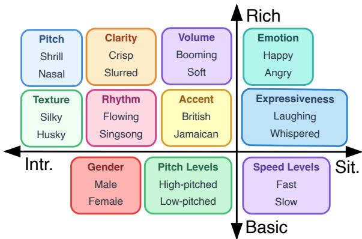  
Figure 2: Our tag taxonomy that classifies along two axes, intrinsic (speaker-level) vs. situational (utterance-level) and rich (subjective) vs. basic (extractable via signal processing tools). Not all tags are shown; Appendix A has the full list of 59 tags.

Selecting Speakers Representing Diverse Tags We identify celebrities, to annotate intrinsic speech tags for, by combining three sources: (a) an IMDb list (Ocean Breeze, 2024), (b) a ChatGPT-generated list of celebrities with distinctive voices and (c) the top 200 longest Wikipedia pages for VoxCeleb celebrities (collected using Majlis (2024)). This totals 302 unique VoxCeleb celebrities. We collect annotations for them and find that the style tag distribution is imbalanced. For 12 least-frequent tags 1, we use GPT-4 (OpenAI et. al., 2024) to obtain a list of celebrities that are likely to have them (details in Appendix E), select a maximum of 40 per tag, and end up with 187 new celebrities to annotate. Finally, we randomly annotate 105 additional celebrities, resulting in a total of 594 celebrities.

Supporting Rich Situational Tags We use Expresso (Nguyen et al., 2023) and EARS (Richter et al., 2024) annotated with speaking styles which we remap to our tag vocabulary. Table 6 in Appendix provides the full mapping of tags. For example, the fear style is mapped to the tag scared. Neutral speech and nonverbal sounds (e.g. coughing, yelling) are filtered out.

Generating Style Prompts All annotated style tags are converted to style prompts using a text LLM, Mistral-7B-Instruct-v0.2(Jiang et al., 2023) (Appendix E). Since Expresso and EARS has both rich intrinsic and situational tag annotations, we generate two style prompts per example: one with only situational tags and one with both intrinsic and situational tags. Both style prompts are used when training. Since Vox-Celeb has only intrinsic tag annotations, we generate one style prompt per example containing those tags.

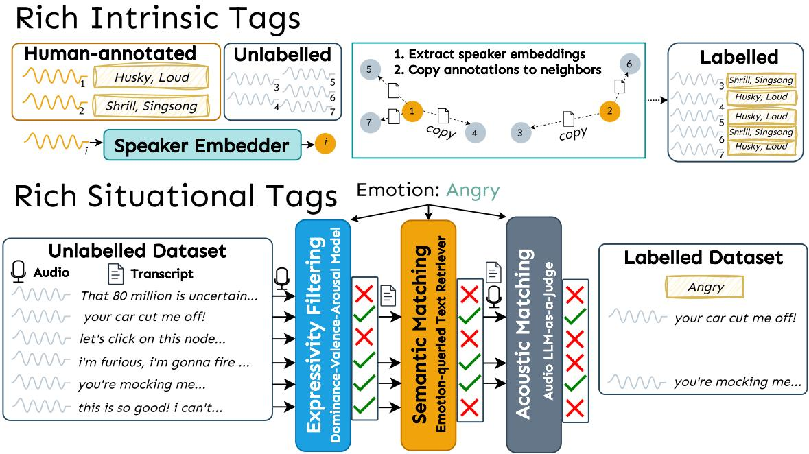  
Figure 3: An overview of our automatic dataset scaling pipeline, for rich intrinsic and situational tags.

Train-Dev-Holdout Splits We split PSC-Base into three splits called train, dev and holdout; a tagbalanced subset of the holdout split will eventually be our model evaluation dataset. For VoxCeleb, we find 64 speakers that together ensure as far as possible that each rich intrinsic tag has 2 male and 2 female speakers available and place them into the holdout split. We place the remaining 530 speakers into the train (90%) and dev splits (10%). We place 80% of Expresso in train, 10% in dev and 10% in holdout. We place unlabelled emotional utterances in EARS into the train set, and place the remaining utterances into train (80%), dev (10%), and holdout splits (10%). We ensure that there is no transcript overlap across splits, and in the case of VoxCeleb, no speaker overlap either.

## 3.2 ParaSpeechCaps-Scaled

We propose two approaches for scaling rich tag annotations, one for intrinsic tags and one for situational tags and apply both to the English portion of the large-scale Emilia (He et al., 2024) dataset (after preprocessing to remove infrequent speakers with < 5 min) to create PSC-Scaled. All style factors except clarity and expressiveness are supported. We evaluate its quality and ablate design choices via human evaluation in Section 4.

Scaling Intrinsic Tags Perceptual speaker similarity refers to how similar humans perceive two speakers. This differs from standard speaker similarity rooted in speaker verification which measures the likelihood that two speakers are exactly the same. Based on initial manual analyses, we find that two speakers with high perceptual similarity usually share most intrinsic tags excluding clarity tags. For every human-annotated VoxCeleb speaker from PSC-Base and every Emilia speaker, we compute a median perceptual speaker embedding over 10 randomly-sampled utterances from that speaker using VoxSim (Ahn et al., 2024). For each VoxCeleb speaker, we find Emilia speakers that have a cosine similarity of at least 0.8 (corresponding to a similarity rating of 5 out of 6 in VoxSim) and copy all intrinsic tags (excluding clarity tags) from the VoxCeleb speaker to these Emilia speakers.

Scaling Situational Tags We encounter two major challenges in scaling situational tags: (a) insufficient expressive data: A major portion of an internet-scale speech dataset like Emilia is neutral and does not strongly exhibit emotions. (b) no automatic classifiers: There are no automatic classifiers covering all of our tags; classifiers such as emotion2vec (Ma et al., 2023) only support 8 emotions. To solve the first challenge, we propose an Expressivity Filtering step to keep only highly expressive speech. To solve the second challenge, we propose a Semantic Matching step to find utterances that semantically match a desired emotion and an Acoustic Matching step to find utterances that acoustically match a desired emotion. Our overall pipeline cascades all three steps.

• Expressivity Filtering The dominance-valencearousal theory (Russell and Mehrabian, 1977) posits that emotions live in a three-dimensional space consisting of dominance (degree of control), arousal (intensity) and valence (pleasantness), each with values between 0 and 1. Backed by Lotfian and Busso (2019), we expect that utterances with extreme values for any one of these are likely to be expressive. Using an off-the-shelf DVA classifier (Wagner et al., 2023), we filter for those utterances that have at least one value below 0.35 or above 0.75. We further filter using emotion-specific directions (e.g. for angry, we expect the dominance or arousal to be high, and the valence to be low) (Appendix C.4).

• Semantic Matching Recent work (Chen et al., 2024a) shows that the speech transcript can be used to find utterances whose speaking style match a desired emotion. We embed speech transcripts from the Expressivity-Filtered dataset and queries of the form Instruct: Given an emotion, retrieve relevant transcript lines whose overall style/emotions matches the provided emotion. Query: emotion using a sentence embedding model (SFR-Embedding-Mistral (Meng et al., 2024)) and sort by the cosine similarity between the query and the transcripts. Because the retriever overranks transcripts containing keywords related to the emotion (e.g. a transcript that contains the word angry will be ranked even though it does not semantically convey the angry emotion), we filter transcripts that contain such emotion-specific keywords (Appendix C.4).

• Acoustic Matching The semantic matching process results in many false positives. To filter these out, we take the top 100k examples per emotion from the dataset sorted by the Semantic Matching step and prompt Gemini 1.5 Flash (Gemini Team et. al., 2024), a strong audio LLM, to rate on a 5-point Likert scale whether the utterance matches the desired emotion, asking it to focus exclusively on the tone and not on the content (full prompt in Appendix E). We keep only those examples that obtain a 5 score.

Generating Style Prompts All annotated style tags are converted to style prompts using a text LLM, Mistral-7B-Instruct-v0.2(Jiang et al., 2023) (Appendix E). We generate two style prompts per example that has both rich intrinsic and situational tag annotations: one with only intrinsic tags and one with both intrinsic and situational tags. Both style prompts are used when training. For all other examples that have either intrinsic or situational tags, we generate one style prompt per example.

## 3.3 Extracting Basic Tags

We automatically annotate all data in ParaSpeechCaps with basic tags (gender, pitch levels and speed levels). Because much of our data has background noise, we also extract noise level tags ranging from very clear to very noisy to help the model separate noisy speech from clear speech; at inference, we use a clear tag.

Gender We use dataset metadata for Expresso and EARS and prompt GPT-4 with the celebrity’s name and ask it to output their gender for VoxCeleb (Appendix E). For the rich intrinsic component of PSC-Scaled, we copy the gender tag of the parent VoxCeleb speaker to the Emilia speaker. For the rich situational component of PSC-Scaled, we apply a gender classifier (Burkhardt et al., 2023) on a maximum of 50 utterances per speaker and use the majority gender tag.

Pitch, Speed and Noise Levels For pitch, we use PENN (Morrison et al., 2023) to compute the mean pitch across all utterances of a given speaker. We apply gender-dependent thresholds to label with low-, medium- or high-pitched. For speed, we use g2p (Pine et al., 2022) to compute the number of phonemes per second and apply thresholds to label with slow, measured or fast. For noise levels, we use Brouhaha (Lavechin et al., 2023) to compute the signalto-noise ratio and use Parler-TTS (Lacombe et al., 2024b)’s noise bins for the very noisy, quite noisy, slightly noisy, balanced in clarity, slightly clean, quite clean and very clean tags. All threshold values are available in Appendix C.3. We use the Dataspeech (Lacombe et al., 2024a) library.

## 3.4 Dataset Statistics

Figure 4 showcases the distribution of different style tags in our ParaSpeechCaps dataset2 (combining PSC-Human and PSC-Scaled).

## 4 Verifying Scaled Data Quality

In this section, we provide human evaluation results for the scaled dataset we constructed in order to verify the quality of our automatic annotations.

## 4.1 Scaled Dataset Ablations

We compare our initial human-annotated dataset (PSC-Base), our automatically scaled dataset (PSC-Scaled) and ablated versions of PSC-Scaled, described below.

Rich Intrinsic Tags We used a perceptual speaker embedding model, VoxSim (Ahn et al., 2024), to construct the intrinsic component of PSC-Scaled. We ablate it by creating a Std. Embedder version that uses a standard WavLM Large (Chen et al., 2022) ECAPA-TDNN embedder. We select a cosine similarity threshold of 0.41 that scales to approximately the same number of total speakers as PSC-Scaled.

Rich Situational Tags We constructed the situational component of PSC-Scaled by pipelining three steps: Expressivity Filtering, Semantic Matching and Acoustic Matching. We create 3 ablated versions that each skip one of these:

• w/o Expressivity Filtering We apply Semantic and Acoustic Matching starting from the entire Emilia dataset without Expressivity Filtering.

• w/o Semantic Matching We run Acoustic Matching on random 100k examples per emotion from the Expressivity-Filtered dataset.

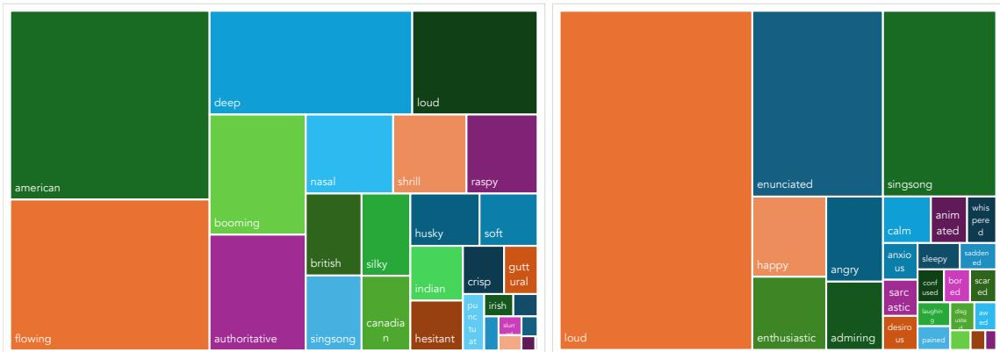

Figure 4: Distribution of rich intrinsic (left, 2518 hrs) and situational (right, 298 hrs) tags in ParaSpeechCaps.
<table><tr><td rowspan="2">Dataset</td><td colspan="2">Tag Recall ↑</td></tr><tr><td>Intrinsic</td><td>Situational</td></tr><tr><td>PSC-Base</td><td>48.7%</td><td>68.1%</td></tr><tr><td>PSC-Scaled</td><td>50.3%</td><td>71.3%</td></tr><tr><td>Ablations</td><td></td><td></td></tr><tr><td>Std. Embedder</td><td>45.3%</td><td></td></tr><tr><td>w/o Expressivity</td><td></td><td>61.0%</td></tr><tr><td>w/o Semantic</td><td></td><td>66.1%</td></tr><tr><td>w/o Acoustic</td><td></td><td>63.3%</td></tr></table>

Table 2: Human evaluation of intrinsic/situational style tag recalls, comparing our datasets and ablations.

• w/o Acoustic Matching We take the same number of examples per emotion as PSC-Scaled from the top of the Semantic Matching-sorted dataset without Acoustically Matching them.

## 4.2 Evaluation Setup

We recruit annotators on Amazon Mechanical Turk (Appendix B) collecting three annotations per example. We provide annotators a speech clip and its associated rich tag and ask them whether they hear it. For each tag, we compute its recall (fraction of instances in which it was selected) and report the average Tag Recall.

For each intrinsic tag, we sample a maximum of 12 speakers and 4 utterances per speaker for human evaluation (skipping 4 tags: guttural, vocal-fry, monotonous, punctuated as they have an insufficient number of speakers) from each dataset, totalling 356, 420 and 376 examples for PSC-Base, PSC-Scaled and the Std. Embedder ablation respectively. For each situational tag, we randomly sample 20 examples per emotion for human evaluation from each dataset, totalling 360 examples per dataset.

## 4.3 Main Results

Table 2 presents our evaluation results. For rich intrinsic tags, PSC-Scaled achieves a comparable performance to PSC-Base, while Std. Embedder worsens it. For rich situational tags, PSC-Scaled achieves a comparable performance to PSC-Base, while removing any of Expressivity Filtering, Semantic Matching, or Acoustic Matching worsens it. This shows that each step in our scaling pipeline is necessary and that it creates data of comparable quality to human annotations. In absolute terms, the tag recalls of PSC-Base are lower than 100% which we attribute to human subjectivity for tag identification.

## 5 Style-Prompted TTS Experiments

In this section, we verify the utility of ParaSpeechCaps by using it to train style-Prompted TTS models.

## 5.1 Experimental Setup

Main Evaluation Dataset We create a tag-balanced test dataset consisting of 246 examples from the holdout split of PSC-Base (Section 3.1) that evaluates adherence to one rich tag at a time. For each tag, we select a maximum of five clips, covering as many speakers as possible. Then, for each clip, we construct a tag set consisting of the rich tag, one to three basic tags (we always include gender, and randomly include pitch and speed with a 50% probability), and a clear noise tag, and convert to style prompts.

Compositional Evaluation Dataset We create a compositional style prompt dataset that evaluates simultaneous adherence to two rich tags (one intrinsic, one situational). We select 12 intrinsic tags (shrill, deep, husky, guttural, soft, authoritative, crisp, slurred, hesitant, flowing, british, canadian), randomly select 10 situational tags (desirous, animated, sarcastic, pained, admiring, whispered, awed, anxious, enunciated, sleepy) and use both genders (male, female) creating 12 10 2 = 240 compositions. We sample 240 random transcripts of 6  10 words from the LibriTTS test set. Note that is no ground truth speech for these compositional examples.

Evaluation Metrics We evaluate for style consistency (Consistency MOS, Tag Recall), speech quality (Naturalness MOS), and intelligibility (Intelligibility MOS, WER). Except WER, all other metrics rely on human evaluation due to lack of robust automatic evaluation metrics, in line with prior work. For human evaluation, we recruit annotators on Amazon Mechanical Turk (details in Appendix B), collect 3 annotations per example and report the mean and 95% confidence intervals for MOS (Ribeiro et al., 2011).

<table><tr><td rowspan="2">Model</td><td colspan="3">Style Consistency</td><td>Quality</td><td colspan="2">Intelligibility</td></tr><tr><td>CMOS↑</td><td>Intr TR ↑</td><td>Sit TR ↑</td><td>NMOS ↑</td><td>IMOS ↑</td><td>WER↓</td></tr><tr><td>Ground Truth</td><td> $4 . 4 2 { \scriptstyle \pm 0 . 0 7 }$ </td><td>88.7%</td><td>88.6%</td><td> $4 . 3 6 { \scriptstyle \pm 0 . 0 7 }$ </td><td>4.28±0.06</td><td>7.93</td></tr><tr><td>Baselines</td><td></td><td></td><td></td><td></td><td></td><td></td></tr><tr><td>Parler-TTS</td><td> $3 . 0 5 { \scriptstyle \pm 0 . 0 8 }$ </td><td>33.0%</td><td>21.2%</td><td> $2 . 8 5 { \scriptstyle \pm 0 . 0 7 }$ </td><td>4.31±0.07</td><td>4.62</td></tr><tr><td>+LTTSR</td><td> $3 . 0 7 { \scriptstyle \pm 0 . 0 8 }$ </td><td>33.7%</td><td>22.4%</td><td> $2 . 9 5 { \scriptstyle \pm 0 . 0 7 }$ </td><td> $4 . 4 4 { \scriptstyle \pm 0 . 0 6 }$ </td><td>4.47</td></tr><tr><td>+LTTSP,Exp,EARS</td><td> $3 . 5 5 { \scriptstyle \pm 0 . 0 8 }$ </td><td>40.7%</td><td>69.7%</td><td> $3 . 1 0 { \scriptstyle \pm 0 . 0 7 }$ </td><td> $4 . 1 9 { \scriptstyle \pm 0 . 0 7 }$ </td><td>7.14</td></tr><tr><td>Our Models</td><td></td><td></td><td></td><td></td><td></td><td></td></tr><tr><td>Base: +VoxC,Exp,EARS</td><td> $3 . 7 5 { \scriptstyle \pm 0 . 0 8 }$ </td><td>63.6%</td><td>68.1%</td><td> $3 . 2 7 { \scriptstyle \pm 0 . 0 8 }$ </td><td> $4 . 0 5 { \scriptstyle \pm 0 . 0 7 }$ </td><td>9.14</td></tr><tr><td>Scaled: +VoxC,Exp,EARS,Emilia</td><td> $\mathbf { 3 . 8 3 \pm 0 . 0 8 }$ </td><td>69.5%</td><td>75.4%</td><td> ${ \bf 3 . 5 8 } \pm 0 . 0 7$ </td><td> $4 . 0 7 { \scriptstyle \pm 0 . 0 7 }$ </td><td>8.63</td></tr></table>

Table 3: Evaluation results comparing style consistency (CMOS, Intrinsic and Situational Rich Tag Recall), speech quality (NMOS) and intelligibility (IMOS, WER). Mean score and 95% confidence intervals are reported for MOS. Our Base and Scaled models obtain improved style consistency (+5.6% and +7.9% Consistency MOS) and speech quality (+5.5% and +15.5% Naturalness MOS) over baselines.

• Style Consistency We report CMOS (Consistency MOS) where each annotator is asked to rate the agreement between a given speech clip and the style prompt on a 5-point Likert scale, similar to Vyas et al. (2023). Since the style prompt contains a mix of rich and basic tags, for our main evaluation, we additionally ask annotators to select whether they specifically hear the rich tag for a more finegrained evaluation. For each rich tag, we compute its recall (fraction of instances in which it was selected), and report the average Tag Recall over intrinsic and situational tags separately. For the compositional evaluation experiment that contain both intrinsic and situational tags, we instead assess whether the model generated both types of tags, just intrinsic, just situational or neither.

• Quality We report NMOS (Naturalness MOS) where each annotator is asked to rate the naturalness and realisticity of a given speech clip on a 5-point Likert scale, similar to Vyas et al. (2023).

• Intelligibility We report IMOS (Intelligibility MOS) where each annotator is asked to rate the intelligibility of a given speech clip on a 5-point Likert scale, similar to Peng et al. (2024). We report a text-normalized Word Error Rate (WER) between the ASR transcript of the clip and the input transcript using distil-whisper/distil-large-v2 (Gandhi et al., 2023) and the Whisper text normalizer.

Model Architecture We use Parler-TTS (Lyth and King, 2024; Lacombe et al., 2024b),3 an 880M parameter style-prompted TTS model trained on Librispeech (Pratap et al., 2020) and LibriTTS-R (Koizumi et al., 2023) that can control pitch, speed, gender and expressivity style factors. We briefly describe its architecture here; it has two main components: the Parler-TTS decoder LM that autoregressively generates DAC (Kumar et al., 2023) audio tokens, and a frozen text encoder, Flan-T5-Large (Chung et al., 2022). The style prompt is encoded by this text encoder and made available to the decoder LM via cross-attention. The text transcript is tokenized by Flan-T5 and prefilled to the decoder LM.

Dataset Sampling PSC-Scaled is 8x larger than PSC-Base, and intrinsically tagged data is 8x larger than situationally tagged data. To reduce dataset imbalance during training, for all our models and baselines, we upsample VoxCeleb data by 2x, Expresso and EARS data by 6x, and the situational component of PSC-Scaled by 2x when training.

Inference Setup We perform inference using temperature 1.0, repetition penalty 1.0 and a maximum of 2580 tokens. Because autoregressive TTS inference is unstable (Han et al., 2024), we sample a maximum of 3 times, stopping when the sample’s WER < 20 and selecting the sample with the lowest WER otherwise. Although we do not train with classifier free guidance (Ho and Salimans, 2022) we find that including it at inference with a 1.5 scale consistently improves style consistency (Section 5.5) and do so for all models. We represent the unconditional prompt as a zero-tensor.

## 5.2 Comparison Systems

Our models We train a Base model on the train set of PSC-Base (VoxCeleb, Expresso and EARS) and a Scaled model combining PSC-Base and PSC-Scaled. Since Parler-TTS is trained on LibriTTS-R, we include a 150-hr random subset of LibriTTS-R train set annotated with basic tags for regularization. We train both models with a total batch size of 32, a weight decay of 0.01 and cosine schedulers with no warmup. We train our Base model on 4 NVIDIA A40 GPUs for 140k steps with a peak LR of 8 10−5, and use the same configuration for all baselines. We train our Scaled model on 4 NVIDIA H100 GPUs for 840k steps in 2 420kstep stages: a first stage with a peak LR of $8 \times 1 0 ^ { - 5 }$ and a second stage with a peak LR of $4 \times 1 0 ^ { - 5 }$ initialized from the first stage. As PSC-Scaled is much larger than PSC-Base, we train the model for longer.

Parler-TTS We initialize all baselines and our models with the Parler-TTS-Mini-v1 model, denoted Parler-TTS.

+LTTSR We finetune Parler-TTS on the LibriTTS-R (Koizumi et al., 2023) dataset annotated with basic tags. This baseline ablates training on only basic tags vs. rich tags for the same number of steps.

+LTTSP,Exp,EARS We train with LibriTTS-P (Kawamura et al., 2024), a dataset that annotates LibriTTS-R with a different set of rich intrinsic tags, combined with Expresso and EARS with rich situational tags. LibriTTS-P provides three annotations per speaker and each style tag may have strength qualifiers (slightly, very). We remove slightly tags and remap some to our vocabulary (see Appendix C). We randomly select one of the three annotations and extract basic tags ourselves. This baseline ablates our PSC-Base intrinsic tag data against LibriTTS-P.

## 5.3 Main Results

Table 3 presents our results, comparing models for style consistency, speech quality and intelligibility. Our Scaled model achieves the highest style consistency, with clear improvements for both intrinsic and situational tags, as well as the highest naturalness.

Speech-Style Consistency The low Consistency MOS and Tag Recalls of the Parler-TTS and +LTTSR models show that training on basic tags does not generalize to rich styles. Our Base model and the +LTTSP,Exp,EARS model is trained on the same situational tag data but different intrinsic tag data. Therefore, both models achieve similar Situational Tag Recalls but our model vastly improves Intrinsic Tag Recall (40.7% 63.6%), demonstrating that our humanannotated intrinsic data is superior in quality. Our Scaled model achieves even higher Consistency MOS (3.73 3.83) and Tag Recalls (Intr: 63.6% 69.5%, Sit: 68.1% 75.4%) compared to our Base model, showing the benefit of scaling the dataset.

Speech Quality +LTTSP,Exp,EARS improves naturalness as compared to Parler-TTS and +LTTSR (2.95  3.10), showing the benefits of training on existing rich style datasets. Our model trained on our human-annotated data (PSC-Base) further improves it (3.10 3.27) and training on PSC-Scaled vastly improves it (3.27 3.58), again showcasing its utility.

Intelligibility Baselines trained on clean audiobook data with basic tags (Parler-TTS and +LTTSR) obtain the highest intelligibility MOS and lowest WER, both outperforming even the ground truth. Because these baselines generate neutral, non-expressive speech, they are easier to understand by both humans (IMOS) and ASR models (WER) as compared to the ground truth, while our models as well as the +LTTSP,Exp,EARS baseline trained on rich style data obtain a lower MOS score. We dig deeper into this result in Section 5.5. We find that the largest gaps in intelligibility are caused by our models faithfully adhering to certain style tags that should be naturally less intelligible to evaluators (e.g. non-American accents, clarity tags like slurred, stammering, etc.).

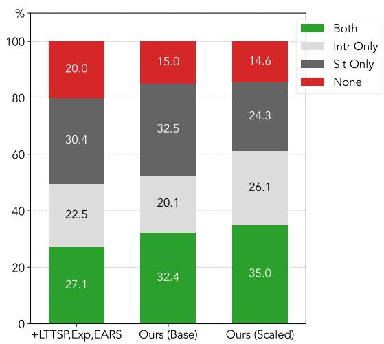  
Figure 5: Evaluation results for compositional style prompts. We report how frequently both types of tags, one of the two, or neither are generated. Our Scaled model achieves the highest compositionality.

## 5.4 Compositionality Results

Figure 5 presents our compositional evaluation results, where we present style prompts that simultaneously contain an intrinsic tag and a situational tag. We compare the best baseline (+LTTSP,Exp,EARS) with our Base and Scaled models. We find that our Scaled model correctly generates both tags more frequently than our Base model, which in turn outperforms the +LTTSP,Exp,EARS baseline. We also observe that when the models partially succeed by generating one of the two types, +LTTSP,Exp,EARS and our Base model prefer generating the situational tag, while our Scaled model prefers the intrinsic tag, likely owing to the large intrinsic component of PSC-Scaled.

## 5.5 Discussion

Why do models trained on rich style data have lower intelligibility? We compute the difference in the Intelligibility MOS obtained by our Scaled model and the +LTTSR baseline, as well as the difference in the Tag Recall, broken down by tag. We find that amongst the top tags with the largest drop in IMOS, we find non-American accent tags (Indian, Scottish, Jamaican, Canadian), clarity tags (slurred, stammering), extreme emotions (pained) which are naturally less intelligible to MTurk annotators (full results in Figure 8 in the appendix). As shown by the Tag Recall difference, our model generates these tags more faithfully, and thus incurs this natural intelligibility drop, as compared to the +LTTSR baseline.

<table><tr><td>Model</td><td>CFG?</td><td>CMOS ↑ Intr TR ↑ Sit TR ↑</td><td></td><td></td></tr><tr><td>+LTTSP,Exp,EARS</td><td>X √</td><td>3.50±0.09 3.64±0.10</td><td>49.8% 51.2%</td><td>66.7% 73.3%</td></tr><tr><td>Base (Ours)</td><td>X</td><td>3.76±0.09</td><td>67.1%</td><td>68.6%</td></tr><tr><td>Scaled (Ours)</td><td>√ X</td><td>3.81±0.09 3.69±0.09 3.92±0.08</td><td>68.8% 64.8% 70.7%</td><td>71.3% 65.1%</td></tr></table>

Table 4: Human evaluation results ablating inferencetime classifier-free guidance (CFG). We compare Consistency MOS and Intrinsic/Situational tag recall with and without inference-time classifier-free guidance (CFG). Mean score and 95% confidence intervals shown for MOS. CFG improves style consistency across all metrics and models.

Inference-time classifier-free guidance improves style consistency, even without dropout-based training Table 4 presents human evaluation results for style consistency (Consistency MOS, Intrinsic and Situational Tag Recalls) using our main evaluation dataset, comparing models inferred with and without classifier-free guidance. Even though we do not train the model to handle empty style prompts using CFG dropout (Ho and Salimans, 2022) as is commonly done, we still find that all models are able to utilize it to improve style consistency across all metrics.

## 6 Related Work

Style-Prompted Text-to-Speech Models We describe style-prompted TTS papers in detail in Section 2.2. An orthogonal line of work (Chen et al., 2024b; Zhu et al., 2024; Yamamoto et al., 2024) innovates on style control architecture.

Style Control for other Speech Tasks Recent work has explored style prompts for tasks other than TTS. DreamVoice (Hai et al., 2024) annotates LibriTTS-R with rich intrinsic tags for voice conversion. VCTK-RVA (Sheng et al., 2024) annotates the VCTK dataset with intrinsic tags for training a style-prompted speech editing system.

## 7 Conclusion

We present ParaSpeechCaps, a large-scale speech style captioned dataset that supports a rich and diverse set of styles covering both speaker-level intrinsic and utterance-level situational tags. Using our novel twopronged scaling approach for intrinsic and situational tags, we create 2427 hours of automatically annotated data, in addition to 282 hours of human-labelled data. Our automatically annotated data quality is verified by human evaluators to be on par with human-labelled data. Furthermore, style-prompted TTS models finetuned on ParaSpeechCaps achieve the highest style consistency and naturalness as compared to baselines, showing its utility.

## Acknowledgements

We thank Puyuan Peng, Atula Tejaswi and other members of the UT NLP community for useful feedback. This work was done in part while the last author was visiting the Simons Institute for the Theory of Computing. We gratefully acknowledge use of the research computing resources of the Empire AI Consortium, Inc, with support from the State of New York, the Simons Foundation, and the Secunda Family Foundation.

## Limitations

Language coverage We limit our current experiments to English data; there is a lot of potential to expand style-prompted TTS to more languages, both in terms of the language of the utterance and the language of the style prompt. Some work (Jin et al., 2024; Yamamoto et al., 2024) explores other languages like Chinese and Japanese in addition to English for styleprompted TTS.

Dataset biases Our dataset creation methodology inevitably reflects and amplifies implicit correlations between tags, leading to potential coverage gaps. While some of these correlations are acoustically intuitive and expected (e.g., between high-pitched and shrill voices), others may perpetuate undesirable biases, particularly when style tags correlate with demographics. For example, we observed that the shrill tag is overrepresented by female speakers, while the guttural tag is overrepresented among male speakers. A trained model may learn these associations, potentially limiting its ability to generate diverse combinations of styles and speaker identities. Mitigating these biases is an important avenue for future work.

Lack of automatic metrics This field requires expensive and subjective human evaluation metrics due to the lack of automatic evaluation, which prevents quick experimental turnarounds, large-scale evaluation datasets, and the ability to analyze model behavior in a finegrained manner. Future work can investigate how to develop automatic metrics for style-prompted TTS.

## References

Junseok Ahn, Youkyum Kim, Yeunju Choi, Doyeop Kwak, Ji-Hoon Kim, Seongkyu Mun, and Joon Son Chung. 2024. Voxsim: A perceptual voice similarity dataset. Preprint, arXiv:2407.18505.

Atsushi Ando, Takafumi Moriya, Shota Horiguchi, and Ryo Masumura. 2024. Factor-conditioned speakingstyle captioning. Preprint, arXiv:2406.18910.

Felix Burkhardt, Johannes Wagner, Hagen Wierstorf, Florian Eyben, and Bjorn Schuller. 2023.¨ Speechbased age and gender prediction with transformers. Preprint, arXiv:2306.16962.

Haozhe Chen, Run Chen, and Julia Hirschberg. 2024a. Emoknob: Enhance voice cloning with fine-grained emotion control. Preprint, arXiv:2410.00316.

Sanyuan Chen, Chengyi Wang, Zhengyang Chen, Yu Wu, Shujie Liu, Zhuo Chen, Jinyu Li, Naoyuki Kanda, Takuya Yoshioka, Xiong Xiao, Jian Wu, Long Zhou, Shuo Ren, Yanmin Qian, Yao Qian, Jian Wu, Michael Zeng, Xiangzhan Yu, and Furu Wei. 2022. Wavlm: Large-scale self-supervised pre-training for full stack speech processing. IEEE Journal of Selected Topics in Signal Processing, 16(6):1505–1518.

Zhiyong Chen, Xinnuo Li, Zhiqi Ai, and Shugong Xu. 2024b. Stylefusion tts: Multimodal style-control and enhanced feature fusion for zero-shot text-tospeech synthesis. Preprint, arXiv:2409.15741.

Hyung Won Chung, Le Hou, Shayne Longpre, Barret Zoph, Yi Tay, William Fedus, Yunxuan Li, Xuezhi Wang, Mostafa Dehghani, Siddhartha Brahma, Albert Webson, Shixiang Shane Gu, Zhuyun Dai, Mirac Suzgun, Xinyun Chen, Aakanksha Chowdhery, Alex Castro-Ros, Marie Pellat, Kevin Robinson, Dasha Valter, Sharan Narang, Gaurav Mishra, Adams Yu, Vincent Zhao, Yanping Huang, Andrew Dai, Hongkun Yu, Slav Petrov, Ed H. Chi, Jeff Dean, Jacob Devlin, Adam Roberts, Denny Zhou, Quoc V. Le, and Jason Wei. 2022. Scaling instruction-finetuned language models. Preprint, arXiv:2210.11416.

Sanchit Gandhi, Patrick von Platen, and Alexander M. Rush. 2023. Distil-whisper: Robust knowledge distillation via large-scale pseudo labelling. Preprint, arXiv:2311.00430.

Gemini Team et. al. 2024. Gemini 1.5: Unlocking multimodal understanding across millions of tokens of context. Preprint, arXiv:2403.05530.

Wenhao Guan, Yishuang Li, Tao Li, Hukai Huang, Feng Wang, Jiayan Lin, Lingyan Huang, Lin Li, and Qingyang Hong. 2024. Mm-tts: Multi-modal prompt based style transfer for expressive text-tospeech synthesis. Preprint, arXiv:2312.10687.

Zhifang Guo, Yichong Leng, Yihan Wu, Sheng Zhao, and Xu Tan. 2022. Prompttts: Controllable text-to-speech with text descriptions. Preprint, arXiv:2211.12171.

Jiarui Hai, Karan Thakkar, Helin Wang, Zengyi Qin, and Mounya Elhilali. 2024. Dreamvoice: Text-guided voice conversion. Preprint, arXiv:2406.16314.

Bing Han, Long Zhou, Shujie Liu, Sanyuan Chen, Lingwei Meng, Yanming Qian, Yanqing Liu, Sheng Zhao, Jinyu Li, and Furu Wei. 2024. Vall-e r: Robust and efficient zero-shot text-to-speech synthesis via monotonic alignment. Preprint, arXiv:2406.07855.

Haorui He, Zengqiang Shang, Chaoren Wang, Xuyuan Li, Yicheng Gu, Hua Hua, Liwei Liu, Chen Yang, Jiaqi Li, Peiyang Shi, Yuancheng Wang, Kai Chen, Pengyuan Zhang, and Zhizheng Wu. 2024. Emilia: An extensive, multilingual, and diverse speech dataset for large-scale speech generation. Preprint, arXiv:2407.05361.

Jonathan Ho and Tim Salimans. 2022. Classifier-free diffusion guidance. Preprint, arXiv:2207.12598.

Shengpeng Ji, Jialong Zuo, Minghui Fang, Ziyue Jiang, Feiyang Chen, Xinyu Duan, Baoxing Huai, and Zhou Zhao. 2024. Textrolspeech: A text style control speech corpus with codec language text-tospeech models. In ICASSP 2024 - 2024 IEEE International Conference on Acoustics, Speech and Signal Processing (ICASSP). IEEE.

Albert Q. Jiang, Alexandre Sablayrolles, Arthur Mensch, Chris Bamford, Devendra Singh Chaplot, Diego de las Casas, Florian Bressand, Gianna Lengyel, Guillaume Lample, Lucile Saulnier, Lelio Re-´ nard Lavaud, Marie-Anne Lachaux, Pierre Stock, Teven Le Scao, Thibaut Lavril, Thomas Wang, Timothee Lacroix, and William El Sayed. 2023. ´ Mistral 7b. Preprint, arXiv:2310.06825.

Zeyu Jin, Jia Jia, Qixin Wang, Kehan Li, Shuoyi Zhou, Songtao Zhou, Xiaoyu Qin, and Zhiyong Wu. 2024. Speechcraft: A fine-grained expressive speech dataset with natural language description. In ACM Multimedia 2024.

Masaya Kawamura, Ryuichi Yamamoto, Yuma Shirahata, Takuya Hasumi, and Kentaro Tachibana. 2024. Libritts-p: A corpus with speaking style and speaker identity prompts for text-to-speech and style captioning. Preprint, arXiv:2406.07969.

Yuma Koizumi, Heiga Zen, Shigeki Karita, Yifan Ding, Kohei Yatabe, Nobuyuki Morioka, Michiel Bacchiani, Yu Zhang, Wei Han, and Ankur Bapna. 2023. Libritts-r: A restored multi-speaker text-to-speech corpus. Preprint, arXiv:2305.18802.

Rithesh Kumar, Prem Seetharaman, Alejandro Luebs, Ishaan Kumar, and Kundan Kumar. 2023. Highfidelity audio compression with improved rvqgan. Preprint, arXiv:2306.06546.

Yoach Lacombe, Vaibhav Srivastav, and Sanchit Gandhi. 2024a. Data-speech. https:// github.com/ylacombe/dataspeech.

Yoach Lacombe, Vaibhav Srivastav, and Sanchit Gandhi. 2024b. Parler-tts. https://github. com/huggingface/parler-tts.

Marvin Lavechin, Marianne Metais, Hadrien Titeux,´ Alodie Boissonnet, Jade Copet, Morgane Riviere,\` Elika Bergelson, Alejandrina Cristia, Emmanuel Dupoux, and Herve Bredin. 2023. Brouhaha: multi-´ task training for voice activity detection, speechto-noise ratio, and C50 room acoustics estimation. ASRU.

Yichong Leng, Zhifang Guo, Kai Shen, Xu Tan, Zeqian Ju, Yanqing Liu, Yufei Liu, Dongchao Yang, Leying Zhang, Kaitao Song, Lei He, Xiang-Yang Li, Sheng Zhao, Tao Qin, and Jiang Bian. 2023. Prompttts 2: Describing and generating voices with text prompt. Preprint, arXiv:2309.02285.

Guanghou Liu, Yongmao Zhang, Yi Lei, Yunlin Chen, Rui Wang, Zhifei Li, and Lei Xie. 2023. Promptstyle: Controllable style transfer for text-tospeech with natural language descriptions. Preprint, arXiv:2305.19522.

Haohe Liu, Qiuqiang Kong, Qiao Tian, Yan Zhao, DeLiang Wang, Chuanzeng Huang, and Yuxuan Wang. 2021. Voicefixer: Toward general speech restoration with neural vocoder. Preprint, arXiv:2109.13731.

Reza Lotfian and Carlos Busso. 2019. Building naturalistic emotionally balanced speech corpus by retrieving emotional speech from existing podcast recordings. IEEE Transactions on Affective Computing, 10(4):471–483.

Dan Lyth and Simon King. 2024. Natural language guidance of high-fidelity text-to-speech with synthetic annotations. Preprint, arXiv:2402.01912.

Ziyang Ma, Zhisheng Zheng, Jiaxin Ye, Jinchao Li, Zhifu Gao, Shiliang Zhang, and Xie Chen. 2023. emotion2vec: Self-supervised pre-training for speech emotion representation. Preprint, arXiv:2312.15185.

Martin Majlis. 2024. Wikipedia-api: Python wrapper for wikipedia’s api. https://github. com/martin-majlis/Wikipedia-API. Accessed: 2024.

Rui Meng, Ye Liu, Shafiq Rayhan Joty, Caiming Xiong, Yingbo Zhou, and Semih Yavuz. 2024. Sfr-embedding-mistral: Enhance text retrieval with transfer learning. Salesforce AI Research Blog.

Max Morrison, Caedon Hsieh, Nathan Pruyne, and Bryan Pardo. 2023. Cross-domain neural pitch and periodicity estimation. In arXiv preprint arXiv:2301.12258.

Arsha Nagrani, Joon Son Chung, Weidi Xie, and Andrew Zisserman. 2020. Voxceleb: Large-scale speaker verification in the wild. Computer Speech & Language, 60:101027.

Tu Anh Nguyen, Wei-Ning Hsu, Antony D’Avirro, Bowen Shi, Itai Gat, Maryam Fazel-Zarani, Tal Remez, Jade Copet, Gabriel Synnaeve, Michael Hassid, Felix Kreuk, Yossi Adi, and Emmanuel Dupoux. 2023. Expresso: A benchmark and analysis of discrete expressive speech resynthesis. Preprint, arXiv:2308.05725.

Ocean Breeze. 2024. Imdb: People with distinctive voices. https://www.imdb.com/list/ ls001839542/. Accessed: 2024.

OpenAI et. al. 2024. Gpt-4 technical report. Preprint, arXiv:2303.08774.

Puyuan Peng, Po-Yao Huang, Shang-Wen Li, Abdelrahman Mohamed, and David Harwath. 2024. Voicecraft: Zero-shot speech editing and text-tospeech in the wild. Preprint, arXiv:2403.16973.

Aidan Pine, Patrick William Littell, Eric Joanis, David Huggins-Daines, Christopher Cox, Fineen Davis, Eddie Antonio Santos, Shankhalika Srikanth, Delasie Torkornoo, and Sabrina Yu. 2022. Gi2Pi rule-based, index-preserving grapheme-to-phoneme transformations. In Proceedings of the Fifth Workshop on the Use of Computational Methods in the Study of Endangered Languages, pages 52–60, Dublin, Ireland. Association for Computational Linguistics.

Vineel Pratap, Qiantong Xu, Anuroop Sriram, Gabriel Synnaeve, and Ronan Collobert. 2020. Mls: A large-scale multilingual dataset for speech research. In Interspeech 2020. ISCA.

Alec Radford, Jong Wook Kim, Tao Xu, Greg Brockman, Christine McLeavey, and Ilya Sutskever. 2022. Robust speech recognition via large-scale weak supervision. Preprint, arXiv:2212.04356.

Flavio Ribeiro, Dinei Flor´ encio, Cha Zhang, andˆ Michael Seltzer. 2011. Crowdmos: An approach for crowdsourcing mean opinion score studies. In 2011 IEEE International Conference on Acoustics, Speech and Signal Processing (ICASSP), pages 2416–2419.

Julius Richter, Yi-Chiao Wu, Steven Krenn, Simon Welker, Bunlong Lay, Shinji Watanabe, Alexander Richard, and Timo Gerkmann. 2024. Ears: An anechoic fullband speech dataset benchmarked for speech enhancement and dereverberation. Preprint, arXiv:2406.06185.

James A Russell and Albert Mehrabian. 1977. Evidence for a three-factor theory of emotions. Journal ofResearch in Personality, 11(3):273–294.

Zhengyan Sheng, Yang Ai, Li-Juan Liu, Jia Pan, and Zhen-Hua Ling. 2024. Voice attribute editing with text prompt. Preprint, arXiv:2404.08857.

Apoorv Vyas, Bowen Shi, Matthew Le, Andros Tjandra, Yi-Chiao Wu, Baishan Guo, Jiemin Zhang, Xinyue Zhang, Robert Adkins, William Ngan, Jeff Wang, Ivan Cruz, Bapi Akula, Akinniyi Akinyemi, Brian Ellis, Rashel Moritz, Yael Yungster, Alice Rakotoarison, Liang Tan, Chris Summers, Carleigh Wood, Joshua Lane, Mary Williamson, and Wei-Ning Hsu. 2023. Audiobox: Unified audio generation with natural language prompts. Preprint, arXiv:2312.15821.

Johannes Wagner, Andreas Triantafyllopoulos, Hagen Wierstorf, Maximilian Schmitt, Felix Burkhardt, Florian Eyben, and Bjorn W Schuller. 2023. Dawn¨ of the transformer era in speech emotion recognition: Closing the valence gap. IEEE Transactions on Pattern Analysis and Machine Intelligence, pages 1–13.

Aya Watanabe, Shinnosuke Takamichi, Yuki Saito, Wataru Nakata, Detai Xin, and Hiroshi Saruwatari. 2023. Coco-nut: Corpus of japanese utterance and voice characteristics description for prompt-based control. In 2023 IEEE Automatic Speech Recognition and Understanding Workshop (ASRU), pages 1– 8. IEEE.

Ryuichi Yamamoto, Yuma Shirahata, Masaya Kawamura, and Kentaro Tachibana. 2024. Descriptionbased controllable text-to-speech with cross-lingual voice control. Preprint, arXiv:2409.17452.

Dongchao Yang, Songxiang Liu, Rongjie Huang, Chao Weng, and Helen Meng. 2023. Instructtts: Modelling expressive tts in discrete latent space with natural language style prompt. Preprint, arXiv:2301.13662.

Xinfa Zhu, Wenjie Tian, Xinsheng Wang, Lei He, Yujia Xiao, Xi Wang, Xu Tan, sheng zhao, and Lei Xie. 2024. Unistyle: Unified style modeling for speaking style captioning and stylistic speech synthesis. In ACM Multimedia 2024.

## A List of Speech Style Tags

This is the list of tags we consider:

## • Intrinsic:

– Rich:

\* Pitch: Shrill, Nasal, Deep.

\* Texture: Silky, Husky, Raspy, Guttural, Vocal-fry.

\* Clarity: Crisp, Slurred, Stammering.

\* Volume: Booming, Authoritative, Loud, Soft.

\* Rhythm: Flowing, Monotonous, Punctuated, Hesitant, Singsong.

\* Accent: American, British, Scottish, Canadian, Australian, Irish, Indian, Jamaican.

## – Basic:

\* Pitch Levels: High-pitched, Mediumpitched, Low-pitched.

\* Gender: Male, Female.

## • Situational:

## – Rich:

\* Emotion: Enthusiastic, Happy, Angry, Saddened, Awed, Calm, Anxious, Disgusted, Scared, Confused, Bored, Sleepy, Pained, Guilt, Sarcastic, Sympathetic, Admiring, Desirous.

\* Expressiveness: Animated, Laughing, Passive, Whispered, Enunciated.

## – Basic:

\* Speed Levels: Fast, Measured, Slow.

Some style factors like volume, speed and rhythm can technically be both intrinsic and situational. However, since we collect data for volume and rhythm with intrinsic human annotations, but extract speed tags on an utterance-level i.e. situationally, we place them in their respective categories. Manually written definitions for each style tag can be found in Table 5.

## B Human Annotation: Details

We visualize our human annotation pipeline in Figure 6.

## B.1 Annotation Details

We recruit Amazon Mechanical Turk workers with a Masters certification with a minimum approval rate of 99% and at least 5000 successful HITs situated in the United States. For training dataset annotations, we perform a qualification task using 6 pairs of manually selected clips from VoxCeleb or Expresso where one clip exhibits a style (one of deep, whispered, scared, slurred, high-pitched, enunciated) and the other doesn’t, and select 38 annotators that succeeded on at least 5. We pay \$9/hr.

## B.2 Annotation User Interfaces

We display the annotation UIs for qualification task in Figure 9, crowdsourcing abstract intrinsic style tag annotations in Figure 10, speech quality evaluation in Figure 11, and speech-style consistency evaluation in Figure 12, and intelligibility evaluation in Figure 13.

## C Dataset Preprocessing

For all datasets, we filter for audios between 2 30 seconds. For data sourced from VoxCeleb, EARS and Expresso, we apply loudness normalization using SoX and PyDub 4 such that the peak volume of each audio is 0.1 dB. We synthesize transcripts using the Whisper (Radford et al., 2022) large-v3 ASR model for utterances that do not have ground truth transcripts, We describe dataset-specific preprocessing below:

## C.1 VoxCeleb

We combine the VoxCeleb1 and VoxCeleb2 datasets. We apply a noise removal model, Voicefixer (Liu et al., 2021) to all audios, since we observed that a significant proportion of VoxCeleb data is noisy (the median SNR for VoxCeleb data is 31.76 dB computed by Brouhaha (Lavechin et al., 2023); compare to 59.49, 50.42 and 61.70 for Expresso, EARS and LibriTTS-R respectively). We then run a language identification model Lingua 5 over the transcripts and only keep those examples whose transcripts are identified as English text and discard celebrities with fewer than 10 English audio clips.

<table><tr><td>Attribute</td><td>Description</td></tr><tr><td>High-pitched</td><td>A voice with a distinctly high frequency.</td></tr><tr><td>Shrill</td><td>A high-pitched, piercing, and sharp voice.</td></tr><tr><td>Nasal</td><td>A whiny voice that sounds like someone is speaking through their nose.</td></tr><tr><td>Medium-pitched</td><td>A voice with a medium frequency that is neither very high or low-pitched.</td></tr><tr><td>Low-pitched</td><td>A voice with a distinctly low frequency.</td></tr><tr><td>Deep</td><td>A low-pitched, resonant, rich voice.</td></tr><tr><td>Silky</td><td>A smooth, pleasant and soothingly soft voice</td></tr><tr><td>Husky</td><td>A slightly rough, low voice that conveys a gritty texture.</td></tr><tr><td>Raspy</td><td>A rough, grating, somewhat harsh voice.</td></tr><tr><td>Guttural</td><td>A deep, throaty, gravelly voice.</td></tr><tr><td>Vocal-fry</td><td>A creaky, breathy voice that occurs when vocal cords flutter and produce a sizzling, popping sound at ends of</td></tr><tr><td>American</td><td>sentences. A voice with an American accent.</td></tr><tr><td>British</td><td>A voice with a British accent.</td></tr><tr><td>Scottish</td><td>A voice with a Scottish accent.</td></tr><tr><td>Canadian</td><td>A voice with a Canadian accent.</td></tr><tr><td>Australian</td><td>A voice with a Australian accent.</td></tr><tr><td>Irish</td><td>A voice with an Irish accent.</td></tr><tr><td>Indian</td><td>A voice with an Indian accent.</td></tr><tr><td>Jamaican</td><td>A voice with an Jamaican accent.</td></tr><tr><td>Male</td><td>A male voice, often having a lower pitch</td></tr><tr><td>Female</td><td>A female voice, often having a higher pitch.</td></tr><tr><td>Booming</td><td>A loud, resonant, commanding, powerful voice.</td></tr><tr><td>Authoritative</td><td>A confident, clear voice with a tone that conveys expertise and assurance.</td></tr><tr><td>Loud</td><td>A voice with a high volume.</td></tr><tr><td>Soft</td><td>A gentle, low-volume, calm and soothing voice typically used to convey subtlety.</td></tr><tr><td>Whispered</td><td>A breathy, low-volume voice typically used to speak discreetly.</td></tr><tr><td>Crisp</td><td>A clear, distinct, articulate voice.</td></tr><tr><td>Slurred</td><td>An unclear, difficult-to-understand voice that blends together sounds and words.</td></tr><tr><td>Stammering</td><td>A voice with pauses, repetitions and prolongations of words that disrupt the speech flow.</td></tr><tr><td>Singsong</td><td>A melodious voice that rises and falls in a musical manner.</td></tr><tr><td>Flowing</td><td>A clear, coherent, seamless and easy-to-understand voice.</td></tr><tr><td>Monotonous</td><td>A dull, flat voice whose pitch, tone and speed remains constant throughout.</td></tr><tr><td>Punctuated</td><td>An engaging voice with clear, deliberate pauses that emphasize key words.</td></tr><tr><td>Enunciated</td><td>A voice that clearly and precisely articulates words, with each syllable distinctly pronounced.</td></tr><tr><td>Fast speed</td><td>A rapidly speaking, quick voice with few pauses.</td></tr><tr><td>Measured speed</td><td>A controlled, deliberate voice that has an even tone and a moderate speed.</td></tr><tr><td>Slow speed</td><td>A voice with a slower speaking rate.</td></tr><tr><td>Hesitant</td><td></td></tr><tr><td></td><td>An uncertain, tentative voice, often marking a lack of confidence, reluctance or confusion.</td></tr><tr><td>Enthusiastic Happy</td><td>A lively, energetic, positive voice that conveys excitement and interest in the topic being discussed. A warm, positive and joyful voice.</td></tr><tr><td>Angry</td><td>A raised voice that conveys anger, frustration or displeasure, characterized by raised volume and emphatic speech</td></tr><tr><td>Saddened</td><td>patterns. A voice with a low, subdued, and unenergetic tone that conveys distress, disappointment or sadness.</td></tr><tr><td>Awed</td><td>A voice that conveys the speaker&#x27;s admiration, wonder or reverance of something the speaker appreciates.</td></tr><tr><td>Calm</td><td>A calm, gentle and serene voice that conveys the speaker&#x27;s relaxed and peaceful emotion.</td></tr><tr><td>Anxious</td><td>A voice that conveys nervousness and anxiety, often marked by rapid or jittery speech patterns.</td></tr><tr><td>Disgusted</td><td></td></tr><tr><td>Scared</td><td>A intonated voice that conveys repulsion and disgust by appropriately altering its pitch and rhythm.</td></tr><tr><td></td><td>A shaky, rapid voice that reflects the speaker&#x27;s anxiety or fear.</td></tr><tr><td>Confused</td><td>A voice characterized by indecision and a lack of clarity, often marked by hesitance.</td></tr><tr><td>Bored</td><td>A voice, often monotonous, that indicates lack of enthusiasm and disinterest.</td></tr><tr><td>Sleepy</td><td>A soft, slow, low-energy voice that indicates tiredness.</td></tr><tr><td>Pained</td><td>A voice characterized by a strained, trembling tone that indicates sorrow or anguish.</td></tr><tr><td>Guilt</td><td>A voice that carries a wavering, hesitant tone that hints at discomfort or regret.</td></tr><tr><td>Sarcastic</td><td>A speaking style that is characterized by a distinct tone of irony that suggests that the speaker&#x27;s intention is to mock or convey contempt.</td></tr><tr><td>Sympathetic</td><td>A gentle, compassionate voice that reassures and seeks to empathize with the listener.</td></tr><tr><td>Admiring</td><td>An appreciative, positive and complimentary manner of speaking.</td></tr><tr><td>Desirous</td><td>An emotional voice that conveys deep longing or desire.</td></tr><tr><td>Animated</td><td>A energetic, heightened voice characterized by varied intonations or emotional intensity.</td></tr><tr><td>Laughing</td><td>A voice with intermittent sounds of laughter conveying amusement and joy.</td></tr><tr><td>Passive</td><td>A tentative, subdued and uninterested voice.</td></tr></table>

Table 5: Manually written style tag definitions.

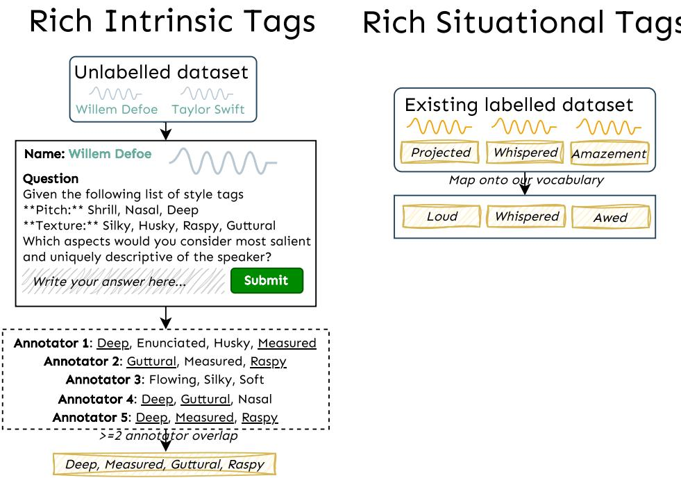  
Figure 6: An overview of our human annotation pipeline, for rich intrinsic and situational tags.

## C.2 Expresso and EARS

The Expresso and EARS dataset consists of a total of 111 speakers enacting various speaking styles. We discard the default, narration, non-verbal, interjection and vegatative speaking styles, as they do not possess the styles we are interested in. Some Expresso data is in the form of long dual-channel conversations between two voice actors, which we splice into chunks using Voice Activity Detection metadata provided by the dataset. We discard long freeform EARS examples since they are not labelled with speaking styles. We then remap each speaking style to our tag vocabulary as depicted in Table 6.

## C.3 Basic Tagging Thresholds

Pitch: low-pitched (male: < 115.7 Hz, female: < 141.6 Hz), high-pitched (male: > 149.7 Hz, female > 184.5 Hz), otherwise medium-pitched.

Speed: slow: < 11.5 PPS, fast: > 19.1 PPS, otherwise measured.

Noise Levels: 17.1 dB, 25.4 dB, 33.7 dB, 42.0 dB, 50.2 dB, 58.5 dB, 66.8 dB, 75.0 dB.

## ttC.4 Scaling Situational Rich Tagging: Details

We use emotion-specific dominance-valence-arousal threshold directions in the Expressivity Filtering step and remove transcripts with certain emotion-specific keywords in the Semantic Matching step. These threshold directions and keywords can be found in Table 7.

<table><tr><td>Original</td><td>Mapped</td><td>Original</td><td>Mapped</td></tr><tr><td>feminine</td><td>female</td><td>halting</td><td>stammering</td></tr><tr><td>tensed</td><td>anxious</td><td>relaxed</td><td>calm</td></tr><tr><td>powerful</td><td>authoritative</td><td>muffled</td><td>slurred</td></tr><tr><td>masculine</td><td>male</td><td>fluent</td><td>flowing</td></tr><tr><td>weak</td><td>hushed</td><td>sharp</td><td>crisp</td></tr><tr><td>reassuring</td><td>sympathetic</td><td>lively</td><td>enthusiastic</td></tr><tr><td>cool</td><td>calm</td><td>happy</td><td>happy, animated</td></tr><tr><td>laughing</td><td>laughing, animated</td><td>sad</td><td>saddened</td></tr><tr><td>whisper</td><td>whispered</td><td>singing</td><td>singsong</td></tr><tr><td>angry</td><td>angry, animated</td><td>awe</td><td>awed</td></tr><tr><td>bored</td><td>bored, passive</td><td>desire</td><td>desirous, animated</td></tr><tr><td>projected</td><td>loud</td><td>fearful</td><td>scared</td></tr><tr><td>amusement</td><td>happy</td><td>distress</td><td>anxious, scared</td></tr><tr><td>disappointment</td><td>saddened, passive</td><td>realization</td><td>awed</td></tr><tr><td>amazement</td><td>awed</td><td>disgust</td><td>disgusted</td></tr><tr><td>fear</td><td>scared</td><td>anger</td><td>angry</td></tr><tr><td>adoration</td><td>admiring</td><td>confusion</td><td>confused</td></tr><tr><td>desire</td><td>desirous</td><td>interest</td><td>enthusiastic</td></tr><tr><td>serenity</td><td>calm</td><td>contentment</td><td>calm, passive</td></tr><tr><td>sadness</td><td>saddened</td><td>extasy</td><td>happy</td></tr><tr><td>pain</td><td>pained</td><td>cuteness</td><td>happy</td></tr><tr><td>relief</td><td>calm, passive</td><td>pride</td><td>admiring</td></tr><tr><td>embarrassment</td><td>anxious</td><td>loud</td><td>loud</td></tr></table>

Table 6: Terms in existing datasets remapped to terms in our vocabulary.

## D Dataset Statistics

Distributional statistics for basic tags in ParaSpeech-Caps is presented in Figure 7.

## E LLM Prompting

## E.1 Imperfectly labelling celebrities with style tags

We use the gpt-4-0125-preview version of GPT-4 via the OpenAI API with the default hyperparameters (temperature 1.0, top-p 1.0, maximum 2048 tokens). We instruct it to output a list of style tags associated with the celebrity’s voice with the following prompt, parameterized by name, the name of the celebrity:

Emotion A/D V Keywords   
Enthusiastic High High enthusiast, excite, eager, energetic, passion   
Happy High High happ, joy, cheer, delight, bliss, happy   
Angry High Low ang, rage, fury, irritat, frustrat   
Saddened Low Low sad, grief, sorrow, mourn, heartbreak   
Awed High awe, wonder, amaz, astonish, marvel   
Calm Low calm, peace, seren, relax, tranquil   
Anxious Low anxi, nerv, uneas, worr, restless   
Disgusted Low disgus, revolt, repuls, nausea, offend   
Scared High Low scar, fear, terror, fright, panick   
Confused confu, bewild, perplex, puzzle, unclear   
Bored Low bore, dull, uninterest, monoton, tiresom   
Sleepy Low sleep, drows, fatigu, letharg, slugg   
Pained Low pain, ache, hurt, agon, torment   
Guilt Low guilt, blame, shame, remors, regret   
Sarcastic sarca, mock, snark, irony, ridicul   
Sympathetic High sympath, compass, kind, empath, understand   
Admiring High High admir, prais, adore, respect, esteem   
Desirous High High desir, crave, long, want, yearn  
Table 7: Mapping of Emotions to Arousal/Dominance and Valence thresholds, along with keywords that are filtered out. Dashes (–) indicate we do not apply a threshold direction.

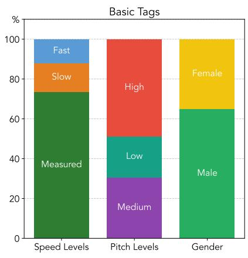  
Figure 7: Basic tag distribution in ParaSpeechCaps.

Given the name of a famous celebrity or actor, you   
, must retrieve your knowledge about that   
, celebrity's voice and map the voice to a   
, subset of speech style attribute labels   
, provided to you. Here is the list of speech   
,→ style attribute types you should pay   
, attention to, along with attribute labels   
, for each type:   
<attributes>   
\*\*Pitch:\*\* Shrill, Nasal, Deep.   
Texture: Silky, Husky, Raspy, Guttural, Vocal-  
, fry.   
\*\*Volume:\*\* Booming, Authoritative, Loud, Hushed,   
, Soft.   
\*\*Clarity:\*\* Crisp, Slurred, Lisp, Stammering.   
- \*\*Rhythm:\*\* Singsong, Pitchy, Flowing, Monotonous,   
, Staccato, Punctuated, Enunciated, Hesitant.   
</attributes>   
Your task is to associate the celebrity with a   
, subset of these attributes, taking into   
, account how the celebrity always sounds like   
, . Only use the attributes that are extremely   
, salient to the celebrity's voice i.e. their   
, unique speech styles. Don't create any new   
, attributes because you will fail the task if   
, you do so.

The celebrity is {name}. First generate a paragraph   
, of around 5 sentences, within <description>   
, tags, using your knowledge, that describes   
, the salient attributes of {name}'s voice.   
, Then, within <attribute> tags, generate a   
, list of comma-separated speech style   
, attributes, from the above attributes list,   
, that saliently apply to {name}. Use the   
, following format:   
<description>   
(Description goes here)   
</description>   
<attribute>   
(Comma-separated list of attributes)   
</attribute>

## E.2 Acoustic Matching

We use the gemini-1.5-flash-002 version of Gemini 1.5 Flash via Vertex AI with temperature 1.0, top-p 0.95, maximum 2048 tokens. We instruct it to output its analysis and a rating on a 5-point Likert scale with a two-part request consisting of the speech clip and the following prompt, parametrized by emotion, the emotion we are querying about:

Analyze the provided speech clip to evaluate how   
, effectively it conveys the emotion {emotion   
, }, focusing on tone of voice and delivery   
, rather than the spoken content.   
Key Instructions:   
- Focus on Tone: Analyze pitch, tempo, loudness,   
, intonation, and rhythm to judge emotional   
, expression.   
- Strength of Emotion: Rate how strongly the tone   
, conveys the emotion on a scale of 1 to 5 (1   
, = not at all, 5 = very strongly).   
- Ignore Content Bias: Evaluate tone and delivery   
, only, disregarding the meaning of the spoken   
, words.   
Aspects to Consider:   
- Does the pitch and intonation match the energy   
, level of the emotion?   
- Is the tempo, rhythm, and loudness appropriate for   
, the emotion?   
- Are the tone and delivery consistent with typical   
, characteristics of the emotion?   
In your output, start by describing the tone and   
, manner of speaking in the clip. Then,   
, analyze how well the tone aligns with the   
, provided emotion. Finally, rate how strongly   
, the emotion is conveyed on a scale of 1 to   
, 5. To make it easier to parse, format your   
, final answer as follows: "Rating: X/5",   
, where X is the number of your choice.

## E.3 Extracting Gender and Accent

We use the gpt-4-0125-preview version of GPT-4 via the OpenAI API with the default hyperparameters (temperature 1.0, top-p 1.0, maximum 2048 tokens). We instruct it to output the celebrity’s gender and accent with the following prompt, parameterized by name, the name of the celebrity:

Tell me the accent and the gender of {name}   
, formatted as   
Accent: <accent>   
Gender: <gender>

## E.4 Generating Style Prompts

We use the Mistral-7B-Instruct-v0.2 LLM (Jiang et al., 2023) to generate prompts via the Dataspeech library with a per-device batch size of 32 and sample with a temperature of 0.6, a top-p of 1.0 with a maximum 256 new tokens. We instruct the model to generate a style prompt with the following prompt, parametrized by all tags str, a comma-separated list of style tags:

An audio sample of a person's speech can be   
, described in several ways using descriptive   
, keywords. These keywords may include   
, demographic data about the person (e.g.   
, gender, name, accent) and voice   
, characteristics (e.g. related to pitch,   
, gender, texture and rhythm, volume, clarity,   
, speaking rate, emotion, expressiveness).   
You will be provided several keywords that describe   
, the speech sample. Your task is to create a   
, simple text description using the provided   
, keywords that accurately describes the   
, speech sample. Ensure that the description   
, remains grammatically correct, easy to   
, understand, and concise. You can rearrange   
, the keyword order as necessary, and   
, substitute synonymous terms where   
, appropriate. After you are provided the   
, keywords, generate only the description and   
, do not output anything else.   
An example is provided below.   
female, confused, hesitant, slightly noisy   
, environment   
Description: A woman's speech sounds confused and   
, hesitant, recorded in a slightly noisy   
, environment.   
Now, generate a description for the following   
, example:   
{all\_tags\_str}   
Description:

## F Discussion Results

Table 4 presents ablation results comparing consistency MOS, Intrinsic and Situational Tag Recalls with and without inference-time classifier-free guidance.

Figure 8 shows the difference in the Intelligibility MOS obtained by our Scaled model and the +LTTSR baseline, as well as the difference in the Tag Recall, broken down by tag.

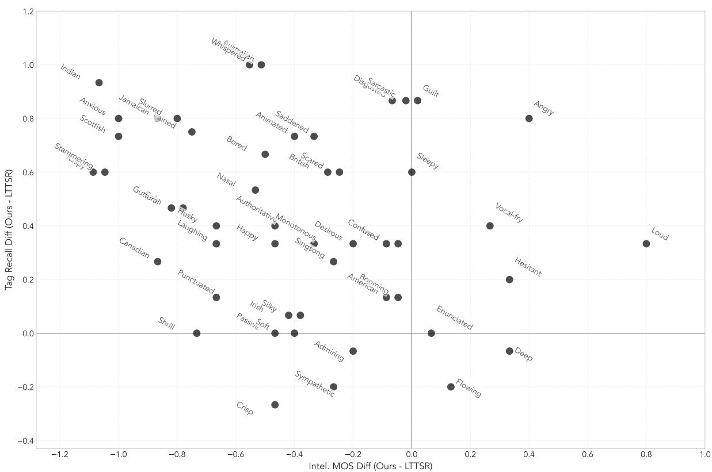  
Figure 8: Results showing the difference in the Intelligibility MOS obtained by our Scaled model and the +LTTSR baseline, as well as the difference in the Tag Recall, broken down by tag.

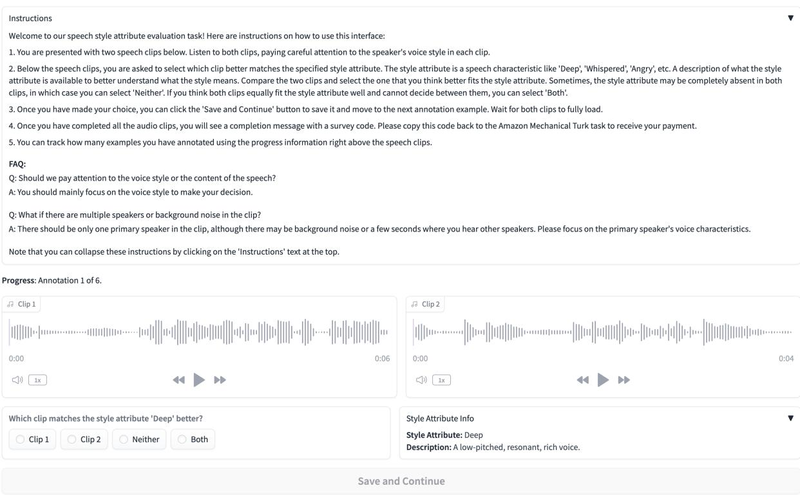  
Figure 9: Annotation UI for selecting qualified annotators.

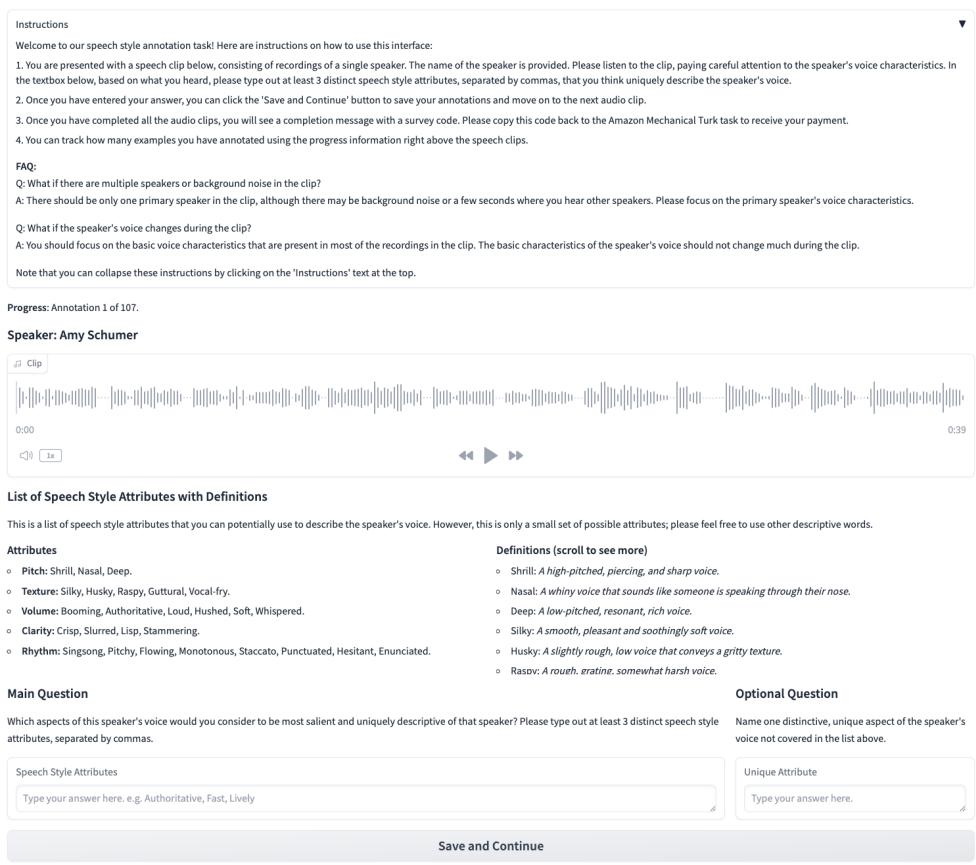  
Figure 10: Annotation UI for crowdsourcing abstract intrinsic style tag annotations.

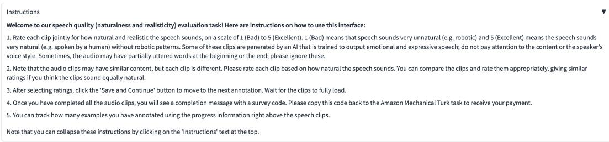

Transcription: Now, we all know there are black people in the future now, but I'd like to carry this on." He said, I can't believe you felt like that.

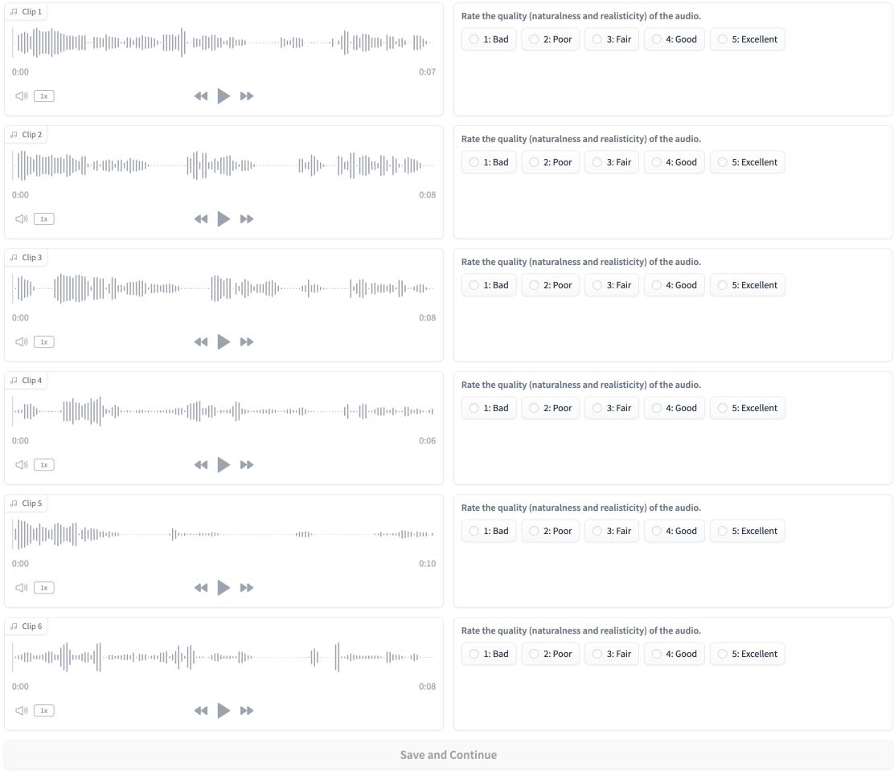  
Figure 11: Annotation UI for collecting Naturalness Mean Opinion Score ratings.

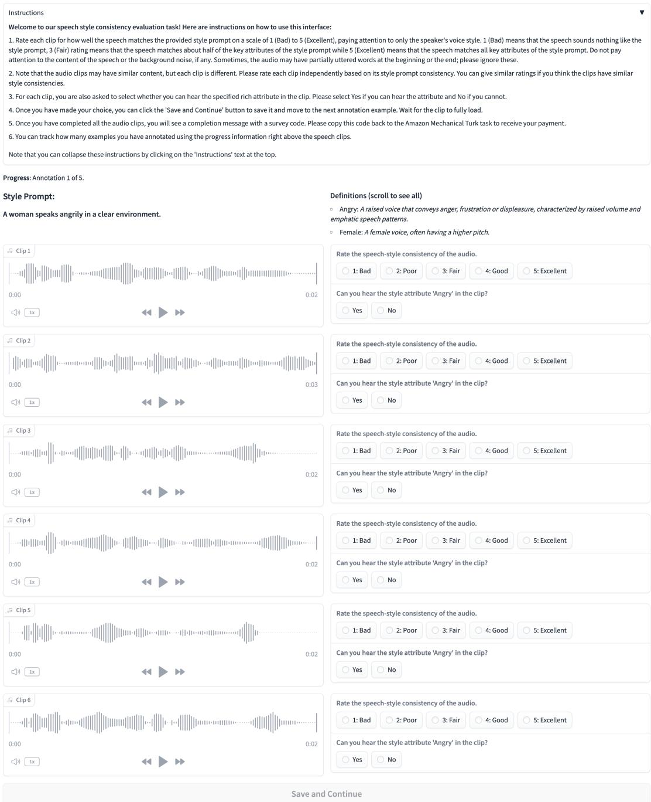  
Figure 12: Annotation UI for collecting Consistency Mean Opinion Score and Tag Recall ratings.

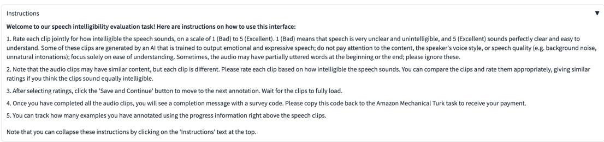

Transcription: open a script it's something crazy and dramatic but I just feel like very honored and blessed as ar

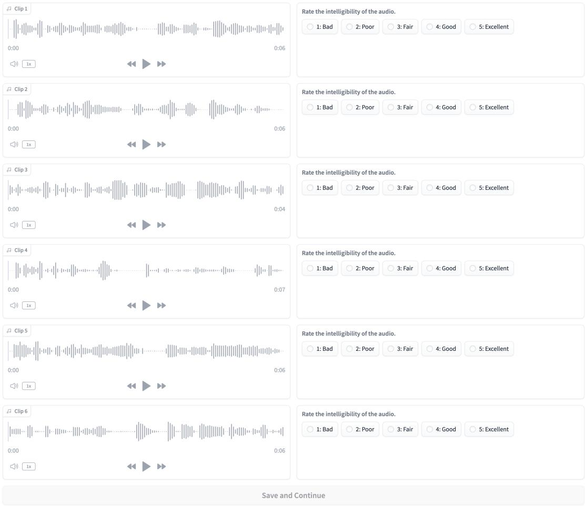  
Figure 13: Annotation UI for collecting Intelligibility Mean Opinion Score ratings.