# Seeing More, Saying More: Lightweight Language Experts are Dynamic Video Token Compressors

Xiangchen Wang,1\* Jinrui Zhang,1\* Teng Wang,1,2\*

Haigang Zhang,3 Feng Zheng1,4†

1Southern University of Science and Technology

2The University of Hong Kong

3Shenzhen Polytechnic University 4Spatialtemporal AI

{wangxc2019, zhangjr2018}@mail.sustech.edu.cn, ttengwang@gmail.com, zhengf@sustech.edu.cn

## Abstract

Recent advances in large video-language models have revolutionized video understanding tasks. However, their efficiency is greatly constrained by processing high volumes of visual tokens. Existing token compression strategies apply a fixed compression ratio, ignoring varying semantic density across video clips. Consequently, this leads to inadequate representation of information-rich clips due to insufficient tokens and unnecessary computation on static or content-poor ones. To address this, we propose LangDC, a Language-aware Dynamic Token Compressor. LangDC leverages a lightweight language model to describe video clips, converting them into soft caption tokens as visual representations. Trained with our proposed semantic density-aware supervision, LangDC aims to 1) cover key visual cues necessary for downstream task reasoning and 2) dynamically adjust compression ratios based on scene richness, reflected by description length. Our design mimics how humans dynamically express what they see: complex scenes (seeing more) elicit more detailed language to convey nuances (saying more), whereas simpler scenes are described with fewer words. Experimental results show that our method reduces FLOPs by 49% compared to VideoGPT+ while maintaining competitive performance. Furthermore, qualitative results demonstrate our approach adaptively adjusts the token compression ratio based on video segment richness. Codes are available at https://github.com/NIneeeeeem/LangDC.

## 1 Introduction

The field of video understanding has undergone a revolution thanks to recent advancements in large video-language models (LVLMs) (Liu et al., 2023, 2024a; Li et al., 2023b; Chen et al., 2023a; Lin et al., 2023a; Luo et al., 2023). By mapping visual token features to the embedding space of large language models (LLMs) (Touvron et al., 2023a; Zheng et al., 2023; Touvron et al., 2023b; Chowdhery et al., 2023; Chung et al., 2022; Ouyang et al., 2022), LVLMs provide a unified interface for video understanding tasks, enabling the capture of intertask relationships and demonstrating exceptional generalization and reasoning capabilities. These breakthroughs pave the way for further progress in artificial general intelligence (Yu et al., 2019; Guo et al., 2019). However, the high computational cost of LVLMs, resulting from the quadratic complexity of processing numerous visual tokens with billionscale parameters, impedes their real-world deployment. To alleviate this, considerable efforts have been made to derive compact, high-quality sets of visual tokens through carefully designed multimodal resamplers. These approaches include crossattention-based methods (e.g., Q-Former (Li et al., 2023a; Ren et al., 2024) and Resampler (Alayrac et al., 2024; Li et al., 2024e,c)), convolution-based techniques (e.g., C-Abstractor (Cha et al., 2024) and LDP (Chu et al., 2023, 2024)), and channel merging strategies such as pixel shuffle (Ren et al., 2023; Chen et al., 2023b) and adjacent concatenation (Bolya et al., 2022; Song et al., 2024).

While effective in improving efficiency, existing methods share a critical limitation: they apply a fixed compression ratio to visual tokens, disregarding variations in semantic density across video segments. For example, Figure 1 (a) shows two clips with significantly different semantic densities: one is static, with each frame presenting close-ups of greenery, while the other is dynamic, showcasing various characters, objects, and actions. Despite this difference, both clips are compressed into the same number of visual tokens due to identical frame counts and resolutions. This uniform compression paradigm fails to produce an effective compact token set, as it may fail to adequately represent information-rich segments while wasting tokens on less informative ones.

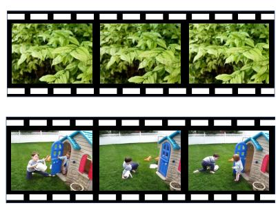  
(a) Clips with different semantic density.

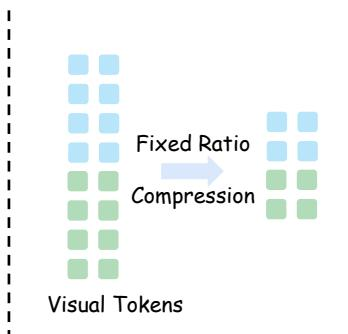  
(b) Existing token compressors.

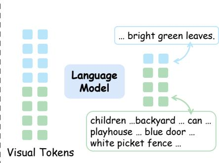  
(c) Language-aware dynamic compressor.  
Figure 1: Comparison of LangDC and existing token compressors. (a) illustrates two video segments with distinct information densities; the bottom segment contains richer visual cues. However, existing token compression methods (b) represent both segments to the same number of tokens. In contrast, our proposed method (c) dynamically allocates tokens based on semantic density, drawing on the sequence length awareness of language.

Inspired by the dynamic way of human language use in describing visual scenes, where simpler scenes are typically described with fewer words and information-rich scenes (“seeing more”) require more detailed descriptions (“saying more”), we propose LangDC, a language-aware dynamic token compressor. LangDC employs a lightweight language model to describe video segments, and then uses soft caption tokens (i.e., the hidden states of the predicted text tokens) as compressed visual representation. To ensure the compressed token set size reflects visual richness, we propose semantic density-aware supervision. Specifically, a strong LVLM (Liu et al., 2024a) extracts key visual cues from each segment, serving as targets for predictions of the lightweight language model. This explicit guidance enables LangDC to: 1) capitalize on the inherent correspondence between language length and semantic density, facilitating the dynamic control of token compression ratio, and 2) capture key visual clues that facilitating more compact representations and enhancing reasoning capabilities across diverse downstream tasks.

Experiments on diverse video understanding benchmarks validate our method’s effectiveness and efficiency. Results show that LangDC reduces the FLOPs by 49% while maintaining competitive performance compared to the strong baseline VideoGPT+ (Maaz et al., 2024b). This demonstrates that our method produces a more compact and semantically rich set of visual tokens. Additionally, LangDC outperforms existing state-of-theart token compression techniques at similar compression ratios. Qualitative results show that our approach adaptively adjusts the token compression ratio based on the scene richness of video segments.

To summarize, our contributions are threefold: 1) We propose LangDC, a novel language-aware token compression strategy. Using soft language tokens for visual representation, it adaptively adjusts compression ratios, improving token utilization over fixed-ratio techniques. 2) We propose semantic density-aware supervision for the token compressors. By explicitly providing reconstruction targets for token compression, we enable the derivation of a more compact feature set that is not only aware of information richness but also preserves key visual cues. 3) Experimental results demonstrate that our method reduces FLOPs by 49% relative to the strong baseline VideoGPT+, while maintaining competitive performance. Additional qualitative results show adaptive compression based on video clip semantic density.

## 2 Related Work

Large video-language models. Large videolanguage models (LVLMs) (Liu et al., 2023; Li et al., 2023b; Chen et al., 2023a; Lin et al., 2023a,b; Luo et al., 2023; Maaz et al., 2024b) have garnered significant attention recently. Leveraging large language models (LLMs) (Touvron et al., 2023a; Zheng et al., 2023; Chowdhery et al., 2023; Chung et al., 2022; Ouyang et al., 2022) as a unified task interface, LVLMs adapt to diverse video understanding tasks through flexible language instructions. Typically, an LVLM comprises three core components: a visual encoder to perceive framelevel information, a multimodal connector to align vision and language feature spaces, and an LLM for understanding and generating language content. Pretrained on large-scale visual-caption datasets and fine-tuned on video instruction data, LVLMs show superior performance over traditional taskspecific models. Previous methods have enhanced LVLMs by: 1) collecting high-quality video instruction tuning data for versatile understanding (Li et al., 2023b; Zhang et al., 2024a), 2) utilizing stronger video encoders to capture fine-grained dynamics (Li et al., 2024b), and 3) designing efficient connectors to improve efficiency (Li et al., 2024e). Our proposed method further improves multimodal connectors by enhancing flexibility through dynamic token customization based on visual information density in videos.

<table><tr><td rowspan="2">Method</td><td rowspan="2"># Tokens↓</td><td colspan="6">Sub-tasks</td></tr><tr><td>Fine-grained Action</td><td>Object Existence</td><td>Moving Direction</td><td>Scene Transition</td><td>Moving Attribute</td><td>Avg.</td></tr><tr><td>Source of Video</td><td>一</td><td>MiT V1</td><td>CLEVRER</td><td>CLEVRER</td><td>MoVQA</td><td>CLEVRER</td><td>一</td></tr><tr><td>AvgPooling  $2 \times 2$ </td><td>3328</td><td>47.0</td><td>81.0</td><td>37.0</td><td>38.5</td><td>85.5</td><td>55.37</td></tr><tr><td>AvgPooling  $4 \times 4$ </td><td>832</td><td>44.0</td><td>73.5</td><td>26.5</td><td>36.5</td><td>78.0</td><td>52.05</td></tr><tr><td>AvgPooling  $8 \times 8$ </td><td>208</td><td>48.0</td><td>67.0</td><td>26.0</td><td>40.5</td><td>59.0</td><td>49.50</td></tr><tr><td>AvgPooling 16 × 16</td><td>80</td><td>44.0</td><td>49.5</td><td>19.5</td><td>38.0</td><td>49.0</td><td>44.40</td></tr><tr><td>Oracle Performance</td><td>一</td><td>63.0</td><td>96.5</td><td>64.0</td><td>91.0</td><td>96.5</td><td>72.4</td></tr><tr><td>Oracle Tokens</td><td></td><td>260.3</td><td>274.3</td><td>757.8</td><td>156.5</td><td>514.0</td><td>354.48</td></tr></table>

Table 1: Performance comparison of LVLMs with varying compression ratios across multiple video understanding tasks. Here, Oracle denotes the ideal scenario where the highest compression ratio that yields the correct response is selected for each test instance. Our key observations are: (1) The ideal number of visual tokens varies significantly across different videos and tasks, and (2) an oracle model integrating multiple compression ratios consistently achieves superior performance.

Visual token compressors. Compressing visual tokens to enhance efficiency poses a crucial challenge in large vision-language models. Handling a substantial number of tokens produced by long-context visual inputs, such as videos and high-resolution images, using LLMs substantially escalates memory consumption and latency, thereby impeding real-world deployment. Various token compression techniques (Chen et al., 2024) have been proposed to shorten visual sequences. For instance, Q-Former and Resampler introduce a set number of trainable tokens that interact with visual features via cross-attention layers to capture essential visual cues (Li et al., 2023a; Ren et al., 2024; Alayrac et al., 2024; Li et al., 2024e,c). C-Abstractor and LDP downsample feature maps using convolutional layers, preserving spatial structure (Cha et al., 2024; Chu et al., 2024). Other approaches directly apply simple channel-wise merging operations (e.g., mean-pooling, pixel-shuffle) following a multi-layer perceptron, effectively reducing model complexity while demonstrating strong generalization capabilities (Ren et al., 2023; Chen et al., 2023b; Bolya et al., 2022; Song et al., 2024). Despite their effectiveness, these methods compress visual tokens using a fixed, predefined ratio, limiting their ability to generalize across samples with varying information density. In contrast, we utilize a pre-trained captioner to evaluate information density and generate soft caption tokens as compressed visual tokens, enabling adaptation to different visual inputs dynamically.

## 3 Motivation on Dynamic Compression

Intuitively, videos with varying information densities require different compression ratios. To validate this hypothesis, we conduct an in-depth analysis on five tasks of the MVBench (Li et al., 2024b). Notably, this benchmark encompasses a wide range of subtasks and diverse data sources, and includes videos with distinct information densities—an attribute that makes it well-suited for our validation.

We train the MLLM (Maaz et al., 2024b) with different visual token compression ratio (implemented via adaptive average pooling with different stride), and evaluate their optimal trade-off between token count and model performance. Specifically, we employ the oracle metric following (Cai et al., 2024), which identifies the highest compression ratio that yields the correct response for each test instance, and subsequently compute both the token count and performance metrics.

As shown in Table 1, higher compression ratios generally lead to reduced overall model performance. However, the non-uniform distribution of oracle token counts underscores the inherent variability of video information density, revealing the limitations of static token compression methods. Furthermore, the sensitivity of different task videos to changes in visual token counts varies significantly. For instance, in relatively static videos (e.g., State Changes from Prception Tests (Puatruaucean et al., 2023)), decreasing the token count from 3k to 80 results in only a 2% drop in performance. Conversely, videos rich in elements and motion (such as those used in Moving Count task) experience a steep decline in accuracy as token counts decrease. These observations highlight the critical need for dynamic compression strategies adaptive to varying video content, suggesting this is the future direction for video compression.

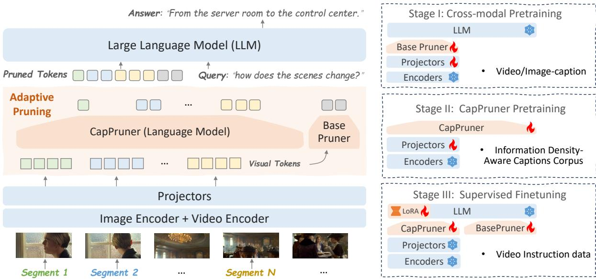  
Figure 2: Overview of the proposed method. LangDC utilizes dual visual encoders to extract visual features, followed by dynamic compression using CapPruner. The compressed features are combined with the base pruner’s output and fed into the LLM. The training pipeline consists of three stages: Stage I involves cross-modal pretraining with video/image-caption pairs, Stage II focuses on CapPruner pretraining using an information density-aware captions corpus, Stage III includes supervised fine-tuning with video instruction data.

## 4 Methodology

We propose LangDC, a Language-aware Dynamic Token Compressor, designed to dynamically compress visual content based on semantic richness. It is achieved through the integration of CapPruner, a lightweight language expert that transforms visual content into semantically rich token representations. Leveraging our proposed semantic densityaware supervision, CapPruner adaptively allocates the number of tokens according to the semantic density of the input. We start this section by first providing an overview of the LangDC’s pipeline. Next, we detail the architecture and functionality of CapPruner and the semantic density-aware supervision mechanism. Finally, we outline the progressive training strategy employed for LangDC.

Overall architecture. We build our model based on VideoGPT+ (Maaz et al., 2024b). As illustrated in Figure 2, LangDC comprises dual visual encoders for spatial-temporal perception, a projector for vision-language feature alignment, token pruners for visual compression, and an LLM for language understanding and generation. The token pruner module incorporates a lightweight language expert, termed the dynamic token pruner (CapPruner), alongside an adaptive mean pooler serving as the base pruner. Given an input video, we first divide it several segments and encode each seperately. The resulting features are subsequently passed through the projector and token pruners. The CapPruner dynamically reduces the number of visual tokens within each segment, producing pruned tokens of variable lengths. These tokens are then temporally aggregated and combined with the output of the base pruner before being fed into the LLM for auto-regressive training or inference.

## 4.1 Language-Aware Compression

Dynamic compression hinges upon the effective capture of video semantics, which necessitating the integration of a pre-trained language model. However, departing from previous approaches (Ye et al., 2025; Shu et al., 2025) that simply extract visual tokens, our method leverages the language expert to also determine the appropriate compression ratio. Therefore, language-aware dynamic token compressor capitalizes on the autoregressive nature of a language model, while simultaneously learning concise segment-level semantic representations from teacher model. This section details the training methodology and operational mechanism of the dynamic compressor.

Captioner as pruner (CapPruner). The Cap-Pruner consists of a lightweight language model and two projection layers. In Figure 3, the language model’s transformer layers are utilized at various stages of training and inference to generate hidden states. The two projectors have distinct roles and are applied at different stages:

• The language modeling head from the lightweight language model serves as one projector. It maps the hidden state to the vocabulary, enabling supervised training based on important visual cues provided by a teacher model. This language modeling head is responsible for generating tokens and controlling their length. The "padding" token indicates that the compact visual representation are fully compressed.

• The other projector, known as the post projector, aligns the dimensions of the hidden state with embeddings from the LLM, facilitating end-to-end instruction tuning and inference. Notably, CapPruner can select the optimal depth of hidden state for compressed visual features. In practice, hidden state from intermediate layers proves most effective, as shallower representations often lack sufficient semantic information, while deeper ones may exhibit excessive abstraction (Toneva and Wehbe, 2019). The detailed experimental results are provided in the supplementary materials.

Semantic density-aware supervision. Effective visual semantic compression necessitates concise and dynamic supervision. Although manually annotated captions offer high accuracy, they are susceptible to annotator bias, resulting in discrepancies between caption length and the actual density of video information. Furthermore, manual annotations are resource-intensive, leading to limited dataset sizes and potential inconsistencies across datasets. To address these challenges, we leverage the consistent and descriptive capabilities of stateof-the-art vision-language models. Specifically, we employ LLaVA-OneVision (Li et al., 2024a) to extract crucial visual cues from each video segment. By eliminating irrelevant and ambiguous language, we refine the supervisory signals to provide CapPruner with a focused stream that accentuates essential visual information. This approach enhances the representation of core visual semantics, leading to more accurate compression results. The detailed processing procedure is demonstrated in the supplementary material. For a fair comparison with VideoGPT+ (Maaz et al., 2024b), teacher descriptions are constrained to video segments from the instruction tuning dataset. This practice preserves data consistency and isolates the influence of dynamic compression.

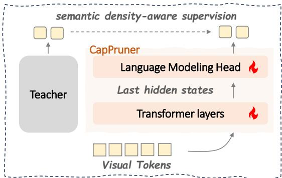

(a) Teacher Model Supervises CapPruner.  
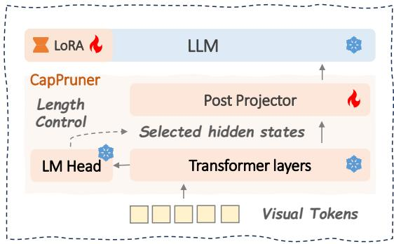  
(b) CapPruner enables dynamic compression.  
Figure 3: Illustration of the dynamic compression mechanism in CapPruner. (a) Captions generated by a teacher model (a strong captioner) are used to supervise the training of CapPruner, facilitating it to allocate tokens according to scene richness. (b) By leveraging the hidden states of predicted captions as compact representation, CapPruner dynamically adjusts the compression ratio according to the timing of the “end-of-sentence” token prediction.

## 4.2 Training Recipe

Traditional practices for LVLMs suggest that a progressive training strategy is essential to reduce the semantic gap between visual and linguistic representations. Our proposed method, LangDC, incorporates a lightweight language expert with builtin knowledge of the semantic space. This expert module is crucial for establishing links between visual representations and language embeddings, requiring a distinctive progressive training approach that aligns spatial representations across different modalities. The training process comprises three sequential stages (shown in Fig. 2):

<table><tr><td rowspan="2">Models</td><td rowspan="2">LLM # Params</td><td rowspan="2"># Frames</td><td rowspan="2">SFT # Pairs</td><td colspan="2">Video-MME</td><td rowspan="2">MVBench</td><td rowspan="2">Efficiency FLOPs↓</td></tr><tr><td>w/o subs</td><td>w/ subs</td></tr><tr><td>Video-LLaVA (Lin et al., 2024)</td><td>7B</td><td>8</td><td>765K</td><td>39.9</td><td>41.6</td><td></td><td>一</td></tr><tr><td>ST-LLM (Liu et al., 2024c)</td><td>7B</td><td>64</td><td>330K</td><td>37.9</td><td>42.3</td><td>54.8</td><td>一</td></tr><tr><td>VideoChat2 (Li et al., 2024b)</td><td>7B</td><td>16</td><td>2M</td><td>39.5</td><td>43.8</td><td>51.1</td><td>一</td></tr><tr><td>Chat-UniVi-V1.5 (Jin et al., 2024)</td><td>7B</td><td>64</td><td>649K</td><td>40.6</td><td>45.9</td><td></td><td></td></tr><tr><td>VideoGPT+ (Maaz et al., 2024b)</td><td>3.8B</td><td>16</td><td>330K</td><td>44.5</td><td>49.9</td><td>58.7</td><td>49.85T</td></tr><tr><td>LangDC (ours)</td><td>3B</td><td>16</td><td>330K</td><td>44.3</td><td>51.3</td><td>57.1</td><td>25.15T</td></tr></table>

Table 2: Performance comparison with baselines on Video-MME and MVBench.

Cross-modal pretraining. The pretraining phase aims to establish alignment between visual and textual representations. Following (Liu et al., 2023), the projectors connecting the visual encoders to both the CapPruner and the LLM are trained, while all other model components remain frozen.

CapPruner pretraining. We first train CapPruner with a base caption dataset to enable it to capture the fine-grained details of visual content. To further ensure that CapPruner follows the principle of "seeing more, saying more", further refinement is required. As explained in the previous section, a state-of-the-art LVLM assists the lightweight language expert in producing descriptions of variable lengths that match the information density of the video segments. During this training phase, both CapPruner and the associated visual encoder projectors are engaged, using the generated captions as supervision signals. Subsequently, CapPruner is linked to the base LLM through a post-projector, which is initialized by the same data with the crossmodal pretraining stage.

Supervised finetuning. During supervised finetuning, the model is trained to understand human instructions. The LoRA method with a rank of 128 is implemented on LLM. The interconnecting projectors between the language expert and LLM are fully trained, while all other components are frozen. Furthermore, the Adapt Token Pruner utilizes a teacher forcing mechanism to improve training efficiency during this stage.

## 5 Experiments

## 5.1 Experiments Setup

Implementation details. Following VideoGPT+, we adopt a dual-encoder setup comprising an image encoder (CLIP-ViT-L/14-336 (Radford et al.,

2021)) and a video encoder (InternVideo2-stage-2- 1B (Wang et al., 2024)). Unless otherwise noted, we apply 4 4 pooling as the BasePruner, initialize the CapPruner with Qwen-2.5-0.5B and employ Qwen-2.5-3B (Team, 2024) for the LLM. For crossmodal pre-training, the CC-595K dataset (Liu et al., 2024b) is used to independently train the image and video projectors. Supervised fine-tuning follows the procedure in VideoGPT+ (Maaz et al., 2024b), leveraging two instruction-tuning datasets tailored for distinct task formats. Additional details are provided in the supplementary material.

Evaluation benchmarks. We evaluate LangDC on both multiple-choice and open-ended VideoQA tasks. For multiple-choice benchmarks, we use MVBench (Li et al., 2024b) and VideoMME (Fu et al., 2025). For open-ended VideoQA, we evaluate our model on MSVD-QA (Xu et al., 2017), MSRVTT-QA, ActivityNet-QA and TGIF-QA (Jang et al., 2019). Following prior work (Maaz et al., 2024b), we utilize GPT-3.5-Turbo-0613 to assess response accuracy, with scoring prompts detailed in the supplementary material.

## 5.2 Main Results

Performance evaluation. Table 2 shows that LangDC outperforms state-of-the-art LVLMs while reducing computational costs. Compared to VideoGPT +, LangDC reduces TFLOPs by 49% with only a performance drop of 1.6% on MVBench. This highlights the efficiency of semantic density-aware supervision in preserving key visual information. On Video-MME, LangDC achieves superior performance with fewer parameters and less fine-tuning data. Notably, it drops only 0.2% without subtitles and exceeds VideoGPT+ by 1.4% with subtitles, excelling especially on long-video tasks which demonstrating CapPruner’s strength in long-range understanding.

Table 3 shows that LangDC also surpasses VideoGPT+ by 1.6% on MSVD-QA and 2.2% on TGIF-QA, while remaining competitive on MSRVTT-QA and ActivityNet-QA. These results confirm CapPruner’s dynamic compression improves efficiency and preserves key semantic details, boosting generalization in zero-shot settings. Efficiency analysis. LangDC compress visual tokens from 3328 to approximately 1068, reducing computational cost from 49.85 TFLOPs to 25.15 TFLOPs. As shown in Figure4, it also reduces GPU memory and latency compared to pooling, even with an added lightweight LLM. Notably, LangDC ’s efficiency gains scale with larger base LLMs. And table 4 further compares LangDC with other compression methods. Compared to the naive pooling compression strategy, LangDC matches the performance of a solution that uses three times as many tokens, and surpasses carefully designed compression modules like LDPv2(Chu et al., 2024). Replacing BasePruner with LDPv2 further improves efficiency, surpassing C-Abstractor and Resampler by 0.6 and 5.1 points while requiring 100 fewer tokens. For fairness, all methods use the same pretraining and tuning data.

<table><tr><td rowspan="2">Models</td><td rowspan="2">LLM # Params</td><td colspan="2">MSVD-QA</td><td colspan="2">MSRVTT-QA</td><td colspan="2">TGIF-QA</td><td colspan="2">ActivityNet-QA</td></tr><tr><td>Accuracy</td><td>Score</td><td>Accuracy</td><td>Score</td><td>Accuracy</td><td>Score</td><td>Accuracy</td><td>Score</td></tr><tr><td>VideoChat (Li et al., 2023b)</td><td>7B</td><td>56.3</td><td>2.8</td><td>45.0</td><td>2.5</td><td>34.4</td><td>2.3</td><td>26.5</td><td>2.2</td></tr><tr><td>LLaMA Adapter (Zhang et al., 2024b)</td><td>7B</td><td>54.9</td><td>3.1</td><td>43.8</td><td>2.7</td><td></td><td>-</td><td>34.2</td><td>2.7</td></tr><tr><td>Video-LLaMA (Zhang et al., 2023)</td><td>7B</td><td>51.6</td><td>2.5</td><td>29.6</td><td>1.8</td><td></td><td></td><td>12.4</td><td>1.1</td></tr><tr><td>Video-ChatGPT (Maaz et al., 2024a)</td><td>7B</td><td>64.9</td><td>3.3</td><td>49.3</td><td>2.8</td><td>51.4</td><td>3.0</td><td>35.2</td><td>2.8</td></tr><tr><td>ChatUniVi (Jin et al., 2024)</td><td>7B</td><td>65.0</td><td>3.6</td><td>54.6</td><td>3.1</td><td>60.3</td><td>3.4</td><td>45.8</td><td>3.2</td></tr><tr><td>LLaMA-VID (Li et al., 2024e)</td><td>7B</td><td>70.0</td><td>3.7</td><td>58.9</td><td>3.3</td><td>一</td><td></td><td>47.5</td><td>3.3</td></tr><tr><td>Video-LLaVA (Lin et al., 2023a)</td><td>7B</td><td>70.7</td><td>3.9</td><td>59.2</td><td>3.5</td><td>70.0</td><td>4.0</td><td>45.3</td><td>3.3</td></tr><tr><td>VideChat2 (Li et al., 2024b)</td><td>7B</td><td>70.0</td><td>3.9</td><td>54.1</td><td>3.3</td><td></td><td>一</td><td>49.1</td><td>3.3</td></tr><tr><td>VideoGPT+ (Maaz et al., 2024b)</td><td>3.8B</td><td>72.4</td><td>3.9</td><td>60.6</td><td>3.6</td><td>74.6</td><td>4.1</td><td>50.6</td><td>3.6</td></tr><tr><td>LongVLM (Weng et al., 2024)</td><td>7B</td><td>70.0</td><td>3.8</td><td>59.8</td><td>3.3</td><td>一</td><td></td><td>47.6</td><td>3.3</td></tr><tr><td>LLAVA-Mini (Zhang et al., 2025)</td><td>7B</td><td>70.9</td><td>4.0</td><td>59.5</td><td>3.6</td><td>一</td><td>1</td><td>53.5</td><td>3.5</td></tr><tr><td>LangDC (ours)</td><td>3B</td><td>74.0</td><td>4.0</td><td>59.9</td><td>3.6</td><td>76.8</td><td>4.2</td><td>50.3</td><td>3.5</td></tr></table>

Table 3: Performance comparison with baselines on four open-ended VideoQA benchmarks.
<table><tr><td rowspan="2">Models</td><td colspan="11">Reference Metrics Efficiency</td></tr><tr><td>AS</td><td>AP AA</td><td>FA</td><td>UA OE 0I OS</td><td>MD AL ST</td><td>AC MC MA</td><td>SC FP</td><td>CO EN</td><td>ER</td><td>CI</td><td>Avg. # Tokens↓</td></tr><tr><td>AvgPooling 2 × 2</td><td>72.5</td><td>57.5 88.9</td><td>47.0 59.0</td><td>81.0 75.0 35.5</td><td>37.0 34.5 86.0 38.5</td><td>65.0 85.5 41.0</td><td>41.8 49.5</td><td>33.0 42.0</td><td>57.5</td><td>55.37</td><td>3328</td></tr><tr><td>AvgPooling 4 × 4</td><td>67.5 54.0</td><td>73.7</td><td>44.0 57.0</td><td>73.5 70.5 35.0 26.5</td><td>35.0 85.5 36.5</td><td>54.5 78.040.040.5</td><td>43.0</td><td>34.0 40.0</td><td>52.5</td><td>52.05</td><td>832</td></tr><tr><td>AvgPooling 8 × 8</td><td>66.0 52.5</td><td>76.8</td><td>48.0 53.5</td><td>67.0 69.5 40.0</td><td>26.0 34.0 79.0</td><td>40.5 50.0 59.0 39.5</td><td>37.0 38.5</td><td>33.5 36.0</td><td>44.0</td><td>49.50</td><td>208</td></tr><tr><td>AvgPooling 16 × 16</td><td>57.5</td><td>45.0 69.7</td><td>44.0 49.5</td><td>49.5 68.5 33.0</td><td>19.5 28.0 80.0</td><td>38.0 47.0 49.0</td><td>39.0 34.5 33.0</td><td>32.0 35.5</td><td>36.0</td><td>44.40</td><td>80</td></tr><tr><td>LangDC (w/ AvgPooling)</td><td>68.5</td><td>51.5 88.5</td><td>49.5 57.0</td><td>79.5 65.5 34.0</td><td>37.5 31.5 87.5</td><td>42.5 67.0 76.5</td><td>41.0 39.5 47.5</td><td>30.5 39.5</td><td>56.0</td><td>54.52</td><td>1068†</td></tr><tr><td>LDPv2 (Chu et al., 2024)</td><td>65.5</td><td>56 82.3</td><td>45.5 57.5</td><td>69.0 68.5 36.5</td><td>25.0 32.5 83.0</td><td>39.5 51.5 61.5</td><td>37.5 36.5 37.5</td><td>32.5 38.5</td><td>50.5</td><td>50.29</td><td>512</td></tr><tr><td>LDPv2 (Chu et al., 2024)</td><td>71.0</td><td>54.5 84.8</td><td>48.0 58.0</td><td>79.5 75.5 35.5</td><td>31.5 34.5 82.0</td><td>43.5 59.5 79.5</td><td>39.0 42.0</td><td>36.5 33.5</td><td>36.5 57.0</td><td>54.08</td><td>1136</td></tr><tr><td>Resampler</td><td>67.0 51.5</td><td>79.8</td><td>43.5 54.0</td><td>62.0 70.5 29.0</td><td>26.0 30.5 85.0</td><td>46.0 49.5</td><td>54.042.040.0 38.5</td><td>31.5</td><td>35.0 45.0</td><td>49.0</td><td>832</td></tr><tr><td>C-Abstractor (Cha et al., 2024)</td><td>69.5 57.5</td><td>84.3</td><td>45.5 59.0</td><td>79.5 69.0 33.5</td><td>31.0 34.5 85.5</td><td>46.0 59.0 74.5</td><td>36.5 39.0 37.0</td><td>37.0</td><td>38.0 54.5</td><td>53.5</td><td>832</td></tr><tr><td>LangDC (w/ LDPv2)</td><td>66.0 55.5</td><td>86.0</td><td>46.5 57.0</td><td>74.0 72.0 37.5</td><td>36.5 35.0 86.5</td><td>43.5 63.0 74.0</td><td>40.5 40.0 44.5</td><td>33.0 40.0</td><td>51.5</td><td>54.13</td><td>748†</td></tr><tr><td></td><td></td><td></td><td></td><td></td><td></td><td></td><td></td><td></td><td></td><td></td><td></td></tr></table>

Table 4: Performance comparison of different token compressors on MVBench. w/ LDPv2 means LDPv2 is utilized as base pruner. † indicates that the number of tokens varies across different test instances; we report the average value across all samples.

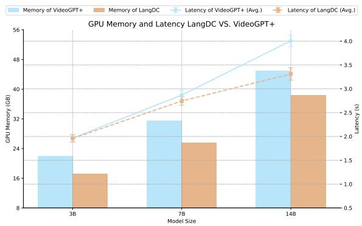  
Figure 4: Comparison of GPU Memory and Latency.

## 5.3 Ablation Studies

This section provides a comprehensive analysis of CapPruner, exploring its dynamic characteristics, training schemes, supervision signals and pruner combinations. Qwen2.5-1.5B serves as the LLM. Dynamic vs. fixed compression ratio. To highlight the strength of dynamic compression, we complement qualitative results in Figure 5, showing that CapPruner allocates more tokens to visually rich or action-intensive videos, and fewer to simpler ones. Table 5 further confirms its ability.

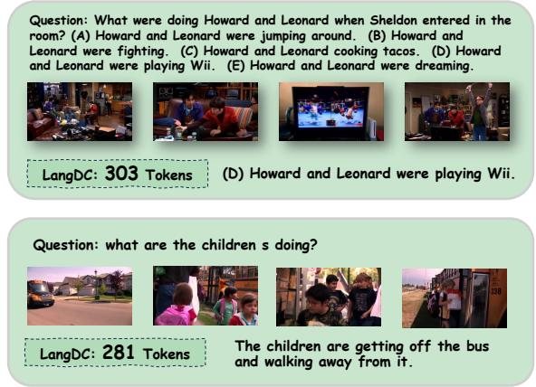

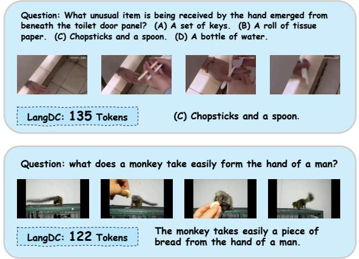  
Figure 5: Visualization of video QA examples alongside the corresponding number of allocated tokens.

<table><tr><td></td><td></td><td></td><td>Action Antonym Object Existence | State Change Episodic Reasoning</td></tr><tr><td>143.2</td><td>184.7</td><td>249.1</td><td>257.2</td></tr></table>

Table 5: Comparison of exact token numbers of LangDC across diverse tasks within MVBench.
<table><tr><td>BasePruner</td><td>CapPruner</td><td>Accuracy</td><td># Tokens</td><td>FLOPs</td></tr><tr><td>x</td><td>V</td><td>51.50</td><td>236†</td><td>18.24T</td></tr><tr><td>AvgPooling  $8 \times 8$ </td><td>x</td><td>49.50</td><td>208</td><td>16.06T</td></tr><tr><td>AvgPooling  $8 \times 8$ </td><td>V</td><td>51.62</td><td>444†</td><td>19.51T</td></tr><tr><td>AvgPooling  $4 \times 4$ </td><td>x</td><td>52.05</td><td>832</td><td>17.57T</td></tr><tr><td>AvgPooling  $4 \times 4$ </td><td>V</td><td>54.52</td><td>1068†</td><td>21.38T</td></tr></table>

Table 6: Ablation of the combinations of BasePruner and CapPruner on MVBench. † indicates that the # tokens is not fixed.

Ablation of different pruners. Table 6 reports ablation results on MVBench with different combinations of CapPruner and BasePruner. Using CapPruner alone yields 51.50% accuracy with 236 tokens. In comparison, BasePruner with 8 8 pooling achieved lower accuracy of 49.50% with a similar token number, while 4  4 pooling achieved a slightly higher but at the cost of significantly more tokens. Importantly, combining CapPruner with either pooling strategy consistently improves accuracy. Furthermore, CapPruner is compatible with other compressors: as shown in Table 4, pairing it with LDPv2 yields substantial performance gains. Ablation of the training scheme. Table 7 demonstrates the critical role of CapPruner pretraining, which improves average accuracy from 45.40% to 54.52%. Post-pretraining further strengthens the integration between CapPruner and the LLM, leading to an additional increase from 49.12% to 54.52%. Impact of caption supervision signal. Table 8 highlights the effect of caption supervision signals in LangDC, particularly for regulating caption length. While incorporating it during pretraining yields only a modest improvement, the results suggest its overall influence on pretraining is limited.

<table><tr><td>Training Schemes</td><td>Accuracy</td></tr><tr><td>Full CapPruner Pretraining</td><td>54.52</td></tr><tr><td>w/o Post-Pretraining</td><td>49.12</td></tr><tr><td>w/o CapPruner-Pretraining</td><td>45.40</td></tr></table>

Table 7: Ablation of the training scheme on MVBench.

<table><tr><td>Method</td><td>| Pooling  $2 \times 2 ^ { \dagger }$ </td><td>Pooling 4 × 4</td><td>LangDC</td></tr><tr><td>w/o captions</td><td>55.37</td><td>52.05</td><td>54.52</td></tr><tr><td>w/ caption</td><td>55.63 (↑0.26)</td><td>52.32 (↑0.27)</td><td>54.66 (↑0.14)</td></tr></table>

Table 8: Impact of caption supervision signal. † indicates the same compression strategy as VideoGPT+.

## 6 Discussion and Conclusion

This study introduced LangDC, a language-aware dynamic token compressor for video understanding. Addressing the limitations of fixed compression ratios, which often fail to capture the varying semantic density of video content, LangDC leverages CapPruner to generate soft caption tokens as compressed visual representations. Guided by semantic-aware supervision, it effectively captures key visual cues while adjusting compression dynamically. Extensive experiments across benchmarks with varying semantic densities demonstrate the superior performance-computation trade-off offered by LangDC’s adaptive token allocation. This strategy not only enhances efficiency but also sets a foundation for future research into more sophisticated, adaptive video understanding methods.

## Limitations

While our dynamic compression mechanism demonstrates human-aligned linguistic patterns and significantly enhances computational efficiency, two critical limitations warrant attention. First, given current resource constraints, our experiments focus on 1.5B/3B LLM configurations, leaving open questions about architectural scaling effects. Second, though the visual density-optimized compression strategy shows strong multi-turn dialog compatibility, its single-ratio implementation may partially constrain adaptability for specialized video QA tasks.

## Acknowledgements

This work was supported by the National Key R&D Program of China (2024YFE0203100) and the Center for Computational Science and Engineering at-Southern University of Science and Technology.

## References

Jean-Baptiste Alayrac, Jeff Donahue, Pauline Luc, Antoine Miech, Iain Barr, Yana Hasson, Karel Lenc, Arthur Mensch, Katie Millicah, Malcolm Reynolds, Roman Ring, Eliza Rutherford, Serkan Cabi, Tengda Han, Zhitao Gong, Sina Samangooei, Marianne Monteiro, Jacob Menick, Sebastian Borgeaud, and 8 others. 2024. Flamingo: a visual language model for few-shot learning. In Proceedings ofthe 36th Interna tional Conference on Neural Information Processing Systems, NIPS ’22, Red Hook, NY, USA. Curran Associates Inc.

Max Bain, Arsha Nagrani, Gül Varol, and Andrew Zisserman. 2021. Frozen in time: A joint video and image encoder for end-to-end retrieval. In ICCV.

Daniel Bolya, Cheng-Yang Fu, Xiaoliang Dai, Peizhao Zhang, Christoph Feichtenhofer, and Judy Hoffman. 2022. Token merging: Your vit but faster. ArXiv, abs/2210.09461.

Mu Cai, Jianwei Yang, Jianfeng Gao, and Yong Jae Lee. 2024. Matryoshka multimodal models. In The Thirteenth International Conference on Learning Representations.

Junbum Cha, Wooyoung Kang, Jonghwan Mun, and Byungseok Roh. 2024. Honeybee: Localityenhanced projector for multimodal llm. In Proceedings ofthe IEEE/CVF Conference on Computer Vision and Pattern Recognition (CVPR).

Jun Chen, Deyao Zhu, Xiaoqian Shen, Xiang Li, Zechu Liu, Pengchuan Zhang, Raghuraman Krishnamoorthi, Vikas Chandra, Yunyang Xiong, and Mohamed Elhoseiny. 2023a. Minigpt-v2: large language model

as a unified interface for vision-language multi-task learning. arXiv preprint arXiv:2310.09478.

Liang Chen, Haozhe Zhao, Tianyu Liu, Shuai Bai, Junyang Lin, Chang Zhou, and Baobao Chang. 2024. An image is worth 1/2 tokens after layer 2: Plug-andplay inference acceleration for large vision-language models.

Zhe Chen, Jiannan Wu, Wenhai Wang, Weijie Su, Guo Chen, Sen Xing, Zhong Muyan, Qinglong Zhang, Xizhou Zhu, Lewei Lu, Bin Li, Ping Luo, Tong Lu, Yu Qiao, and Jifeng Dai. 2023b. Intern vl: Scaling up vision foundation models and aligning for generic visual-linguistic tasks. Proceedings of the IEEE/CVF Conference on Computer Vision and Pattern Recognition (CVPR), pages 24185–24198.

Aakanksha Chowdhery, Sharan Narang, Jacob Devlin, Maarten Bosma, Gaurav Mishra, Adam Roberts, Paul Barham, Hyung Won Chung, Charles Sutton, Sebastian Gehrmann, and 1 others. 2023. Palm: Scaling language modeling with pathways. Journal ofMachine Learning Research, 24(240):1–113.

Xiangxiang Chu, Limeng Qiao, Xinyang Lin, Shuang Xu, Yang Yang, Yiming Hu, Fei Wei, Xinyu Zhang, Bo Zhang, Xiaolin Wei, and 1 others. 2023. Mobilevlm: A fast, reproducible and strong vision language assistant for mobile devices. arXiv preprint arXiv:2312.16886.

Xiangxiang Chu, Limeng Qiao, Xinyu Zhang, Shuang Xu, Fei Wei, Yang Yang, Xiaofei Sun, Yiming Hu, Xinyang Lin, Bo Zhang, and 1 others. 2024. Mobilevlm v2: Faster and stronger baseline for vision language model. arXiv preprint arXiv:2402.03766.

Hyung Won Chung, Le Hou, Shayne Longpre, Barret Zoph, Yi Tay, William Fedus, Yunxuan Li, Xuezhi Wang, Mostafa Dehghani, Siddhartha Brahma, and 1 others. 2022. Scaling instruction-finetuned language models. arXiv preprint arXiv:2210.11416.

Chaoyou Fu, Yuhan Dai, Yongdong Luo, Lei Li, Shuhuai Ren, Renrui Zhang, Zihan Wang, Chenyu Zhou, Yunhang Shen, Mengdan Zhang, and 1 others. 2025. Video-mme: The first-ever comprehensive evaluation benchmark of multi-modal llms in video analysis. In Proceedings of the Computer Vision and Pattern Recognition Conference, pages 24108– 24118.

Raghav Goyal, Samira Ebrahimi Kahou, Vincent Michalski, Joanna Materzynska, Susanne Westphal, Heuna Kim, Valentin Haenel, Ingo Fruend, Peter Yianilos, Moritz Mueller-Freitag, and 1 others. 2017. The" something something" video database for learning and evaluating visual common sense. In ICCV.

Da Guo, Qingfang Zheng, Xiaojiang Peng, and Ming Liu. 2019. Face detection, alignment, quality assessment and attribute analysis with multi-task hybrid convolutional neural networks. ZTE Communications, 17(3):15–22.

Yunseok Jang, Yale Song, Chris Dongjoo Kim, Youngjae Yu, Youngjin Kim, and Gunhee Kim. 2019. Video Question Answering with Spatio-Temporal Reasoning. IJCV.

Peng Jin, Ryuichi Takanobu, Caiwan Zhang, Xiaochun Cao, and Li Yuan. 2024. Chat-univi: Unified visual representation empowers large language models with image and video understanding. In CVPR.

Will Kay, Joao Carreira, Karen Simonyan, Brian Zhang, Chloe Hillier, Sudheendra Vijayanarasimhan, Fabio Viola, Tim Green, Trevor Back, Paul Natsev, and 1 others. 2017. The kinetics human action video dataset. arXiv preprint arXiv:1705.06950.

Bo Li, Yuanhan Zhang, Dong Guo, Renrui Zhang, Feng Li, Hao Zhang, Kaichen Zhang, Peiyuan Zhang, Yanwei Li, Ziwei Liu, and 1 others. 2024a. Llavaonevision: Easy visual task transfer. Transactions on Machine Learning Research.

Junnan Li, Dongxu Li, Silvio Savarese, and Steven C. H. Hoi. 2023a. Blip-2: Bootstrapping language-image pre-training with frozen image encoders and large language models. In International Conference on Machine Learning.

Kunchang Li, Yinan He, Yi Wang, Yizhuo Li, Wenhai Wang, Ping Luo, Yali Wang, Limin Wang, and Yu Qiao. 2023b. Videochat: Chat-centric video understanding. arXiv preprint arXiv:2305.06355.

Kunchang Li, Yali Wang, Yinan He, Yizhuo Li, Yi Wang, Yi Liu, Zun Wang, Jilan Xu, Guo Chen, Ping Luo, and 1 others. 2024b. Mvbench: A comprehensive multi-modal video understanding benchmark. In Proceedings ofthe IEEE/CVF Conference on Computer Vision and Pattern Recognition, pages 22195–22206.

Wentong Li, Yuqian Yuan, Jian Liu, Dongqi Tang, Song Wang, Jianke Zhu, and Lei Zhang. 2024c. Tokenpacker: Efficient visual projector for multimodal llm. arXiv preprint arXiv:2407.02392.

Xianhang Li, Haoqin Tu, Mude Hui, Zeyu Wang, Bingchen Zhao, Junfei Xiao, Sucheng Ren, Jieru Mei, Qing Liu, Huangjie Zheng, Yuyin Zhou, and Cihang Xie. 2024d. What if we recaption billions of web images with llama-3? ArXiv, abs/2406.08478.

Yanwei Li, Chengyao Wang, and Jiaya Jia. 2024e. Llama-vid: An image is worth 2 tokens in large language models. In European Conference on Computer Vision.

Bin Lin, Yang Ye, Bin Zhu, Jiaxi Cui, Munan Ning, Peng Jin, and Li Yuan. 2024. Video-LLaVA: Learning united visual representation by alignment before projection. In Proceedings of the 2024 Conference on Empirical Methods in Natural Language Processing, pages 5971–5984, Miami, Florida, USA. Association for Computational Linguistics.

Bin Lin, Bin Zhu, Yang Ye, Munan Ning, Peng Jin, and Li Yuan. 2023a. Video-llava: Learning united visual representation by alignment before projection. In Conference on Empirical Methods in Natural Language Processing.

Yijie Lin, Jie Zhang, Zhenyu Huang, Jia Liu, Xi Peng, and 1 others. 2023b. Multi-granularity correspondence learning from long-term noisy videos. In The Twelfth International Conference on Learning Representations.

Haotian Liu, Chunyuan Li, Yuheng Li, Bo Li, Yuanhan Zhang, Sheng Shen, and Yong Jae Lee. 2024a. Llavanext: Improved reasoning, ocr, and world knowledge.

Haotian Liu, Chunyuan Li, Qingyang Wu, and Yong Jae Lee. 2023. Visual instruction tuning.

Haotian Liu, Chunyuan Li, Qingyang Wu, and Yong Jae Lee. 2024b. Visual instruction tuning. Advances in neural information processing systems, 36.

Ruyang Liu, Chen Li, Haoran Tang, Yixiao Ge, Ying Shan, and Ge Li. 2024c. St-llm: Large language models are effective temporal learners. In Computer Vision – ECCV 2024: 18th European Conference, Milan, Italy, September 29–October 4, 2024, Proceedings, Part LVII, page 1–18, Berlin, Heidelberg. Springer-Verlag.

Ruipu Luo, Ziwang Zhao, Min Yang, Junwei Dong, Ming-Hui Qiu, Pengcheng Lu, Tao Wang, and Zhongyu Wei. 2023. Valley: Video assistant with large language model enhanced ability. ArXiv, abs/2306.07207.

Muhammad Maaz, Hanoona Rasheed, Salman Khan, and Fahad Shahbaz Khan. 2024a. Video-chatgpt: Towards detailed video understanding via large vision and language models. In Proceedings of the 62nd Annual Meeting ofthe Associationfor Computational Linguistics (ACL 2024).

Muhammad Maaz, Hanoona Rasheed, Salman Khan, and Fahad Shahbaz Khan. 2024b. Videogpt+: Integrating image and video encoders for enhanced video understanding. arxiv.

Long Ouyang, Jeffrey Wu, Xu Jiang, Diogo Almeida, Carroll Wainwright, Pamela Mishkin, Chong Zhang, Sandhini Agarwal, Katarina Slama, Alex Ray, and 1 others. 2022. Training language models to follow instructions with human feedback. Advances in Neural Information Processing Systems, 35:27730–27744.

Viorica Puatruaucean, Lucas Smaira, Ankush Gupta, Adrià Recasens Continente, Larisa Markeeva, Dylan Banarse, Skanda Koppula, Joseph Heyward, Mateusz Malinowski, Yezhou Yang, Carl Doersch, Tatiana Matejovicova, Yury Sulsky, Antoine Miech, Alexander Fréchette, Hanna Klimczak, R. Koster, Junlin Zhang, Stephanie Winkler, and 5 others. 2023. Perception test: A diagnostic benchmark for multimodal video models. ArXiv, abs/2305.13786.

Alec Radford, Jong Wook Kim, Chris Hallacy, Aditya Ramesh, Gabriel Goh, Sandhini Agarwal, Girish Sastry, Amanda Askell, Pamela Mishkin, Jack Clark, Gretchen Krueger, and Ilya Sutskever. 2021. Learning transferable visual models from natural language supervision. In International Conference on Machine Learning.

Shuhuai Ren, Linli Yao, Shicheng Li, Xu Sun, and Lu Hou. 2024. Timechat: A time-sensitive multimodal large language model for long video understanding. IEEE/CVF Conference on Computer Vision and Pattern Recognition (CVPR), pages 14313– 14323.

Zhongwei Ren, Zhicheng Huang, Yunchao Wei, Yao Zhao, Dongmei Fu, Jiashi Feng, and Xiaojie Jin. 2023. Pixellm: Pixel reasoning with large multimodal model. Proceedings of the IEEE/CVF Conference on Computer Vision and Pattern Recognition (CVPR), pages 26364–26373.

Yan Shu, Peitian Zhang, Zheng Liu, Minghao Qin, Junjie Zhou, Tiejun Huang, and Bo Zhao. 2025. Video-xl: Extra-long vision language model for hourscale video understanding. In Proceedings of the IEEE/CVF Conference on Computer Vision and Pattern Recognition.

Enxin Song, Wenhao Chai, Guanhong Wang, Yucheng Zhang, Haoyang Zhou, Feiyang Wu, Xun Guo, Tianbo Ye, Yang Lu, Jenq-Neng Hwang, and Gaoang Wang. 2024. Moviechat: From dense token to sparse memory for long video understanding. Proceedings of the IEEE/CVF Conference on Computer Vision and Pattern Recognition (CVPR), pages 18221– 18232.

Qwen Team. 2024. Qwen2.5: A party of foundation models.

Mariya Toneva and Leila Wehbe. 2019. Interpreting and improving natural-language processing (in machines) with natural language-processing (in the brain). In Neural Information Processing Systems.

Hugo Touvron, Thibaut Lavril, Gautier Izacard, Xavier Martinet, Marie-Anne Lachaux, Timothée Lacroix, Baptiste Rozière, Naman Goyal, Eric Hambro, Faisal Azhar, Aurelien Rodriguez, Armand Joulin, Edouard Grave, and Guillaume Lample. 2023a. Llama: Open and efficient foundation language models. Preprint, arXiv:2302.13971.

Hugo Touvron, Louis Martin, Kevin Stone, Peter Albert, Amjad Almahairi, Yasmine Babaei, Nikolay Bashlykov, Soumya Batra, Prajjwal Bhargava, Shruti Bhosale, and 1 others. 2023b. Llama 2: Open foundation and fine-tuned chat models. arXiv preprint arXiv:2307.09288.

Yi Wang, Kunchang Li, Xinhao Li, Jiashuo Yu, Yinan He, Guo Chen, Baoqi Pei, Rongkun Zheng, Zun Wang, Yansong Shi, Tianxiang Jiang, Songze Li, Jilan Xu, Hongjie Zhang, Yifei Huang, Yu Qiao, Yali Wang, and Limin Wang. 2024. Internvideo2: Scaling

foundation models for multimodal video understanding. In European Conference on Computer Vision.

Yuetian Weng, Mingfei Han, Haoyu He, Xiaojun Chang, and Bohan Zhuang. 2024. Longvlm: Efficient long video understanding via large language models. In Computer Vision – ECCV 2024: 18th European Conference, Milan, Italy, September 29–October 4, 2024, Proceedings, Part XXXIII, page 453–470, Berlin, Heidelberg. Springer-Verlag.

Haoning Wu, Dongxu Li, Bei Chen, and Junnan Li. 2024. Longvideobench: A benchmark for longcontext interleaved video-language understanding. Advances in Neural Information Processing Systems, 37:28828–28857.

Junbin Xiao, Xindi Shang, Angela Yao, and Tat-Seng Chua. 2021. Next-qa: Next phase of questionanswering to explaining temporal actions. In Proceedings of the IEEE/CVF conference on computer vision and pattern recognition, pages 9777–9786.

Dejing Xu, Zhou Zhao, Jun Xiao, Fei Wu, Hanwang Zhang, Xiangnan He, and Yueting Zhuang. 2017. Video question answering via gradually refined attention over appearance and motion. In ACM MM.

Jihan Yang, Shusheng Yang, Anjali W. Gupta, Rilyn Han, Li Fei-Fei, and Saining Xie. 2025. Thinking in space: How multimodal large language models see, remember, and recall spaces. In Proceedings of the IEEE/CVF Conference on Computer Vision and Pattern Recognition (CVPR), pages 10632–10643.

Xubing Ye, Yukang Gan, Xiaoke Huang, Yixiao Ge, and Yansong Tang. 2025. Voco-llama: Towards vision compression with large language models. In Proceedings of the Computer Vision and Pattern Recognition Conference, pages 29836–29846.

Kexin Yi, Chuang Gan, Yunzhu Li, Pushmeet Kohli, Jiajun Wu, Antonio Torralba, and Joshua B Tenenbaum. 2019. Clevrer: Collision events for video representation and reasoning. arXiv preprint arXiv:1910.01442.

Qingshuang Yu, Jie Zhou, and Wenjuan Gong. 2019. A lightweight sentiment analysis method. ZTE Communications, 17(3):2–8.

Hang Zhang, Xin Li, and Lidong Bing. 2023. Video-LLaMA: An instruction-tuned audio-visual language model for video understanding. In Proceedings of the 2023 Conference on Empirical Methods in Natural Language Processing: System Demonstrations, pages 543–553, Singapore. Association for Computational Linguistics.

Jinrui Zhang, Teng Wang, Haigang Zhang, Ping Lu, and Feng Zheng. 2024a. Reflective instruction tuning: Mitigating hallucinations in large vision-language models. In ECCV (68).

Renrui Zhang, Jiaming Han, Chris Liu, Peng Gao, Aojun Zhou, Xiangfei Hu, Shilin Yan, Pan Lu, Hongsheng Li, and Yu Qiao. 2024b. Llama-adapter: Efficient fine-tuning of language models with zero-init attention. In ICLR.

Shaolei Zhang, Qingkai Fang, Zhe Yang, and Yang Feng. 2025. Llava-mini: Efficient image and video large multimodal models with one vision token. Preprint, arXiv:2501.03895.

Lianmin Zheng, Wei-Lin Chiang, Ying Sheng, Siyuan Zhuang, Zhanghao Wu, Yonghao Zhuang, Zi Lin, Zhuohan Li, Dacheng Li, Eric. P Xing, Hao Zhang, Joseph E. Gonzalez, and Ion Stoica. 2023. Judging llm-as-a-judge with mt-bench and chatbot arena. Preprint, arXiv:2306.05685.

## A Additional Results

Comparison of downsampling rates for pooling. Tab A1 confirms that different videos contain varying information densities, necessitating different token counts. We tested all subtasks of MVBench with pooling strategies of varying compression rates and calculated the Oracle, the scenario where the best tradeoff between visual tokens and performance is selected. The optimal number of tokens fluctuates across different videos and tasks and the oracle model integrates multiple pooling strategies achieves superior performance.

Tangible demonstration of dynamic capabilities. To investigate the dynamic characteristics of our video compression method, we analyzed the length distributions of both the supervision signals during training and the compressed tokens in inference on the MVBench. Fig A1 showcases these distributions in two subplots. In subplot (a), we observe the distribution of supervision signal lengths for various video segments used in training, revealing insights into how the model learns to compress sequences of varying lengths. Moving to the inference phase, subplot (b) illustrates the distribution of the final compressed token lengths for complete videos from MVBench. This analysis not only highlights the overall compression effectiveness of LangDC but also sheds light on its adaptability to diverse video content.

Ablation study on depth of hidden state. There is an interesting phenomenon that among the variablelength tokens generated by CapPruner, it is not the last layer’s hidden states that perform the best as soft caption tokens. Figure A3 illustrates that among the depth of hidden states, the zeroth layer performs the worst due to its weaker semantic information. Meanwhile, the middle layers exhibit slightly better performance than the last layer, possibly because representations that are too closely tied to the final classification task are more prone to overfitting, which may weaken their general representational capacity. In this ablation, we do not use BasePruner and fix the LLM as Qwen-2.5-1.5B.

Effectiveness of semantic density-aware supervision. To enhance CapPruner’s sensitivity to visual information density, increased training with explicit supervision is essential. As shown in Table A2, CapPruner trained without high-quality vision-language pairs from the base caption dataset fails to produce compact and effective visual representations, resulting in poorer performance.

Supervised Signal Length Distribution  
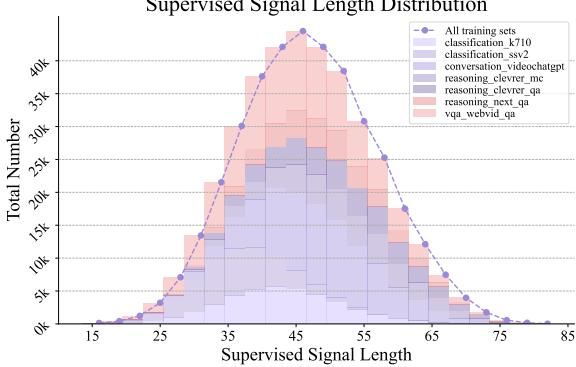  
(a) Distribution of supervision signal lengths.

Token Length Distribution for MVBench  
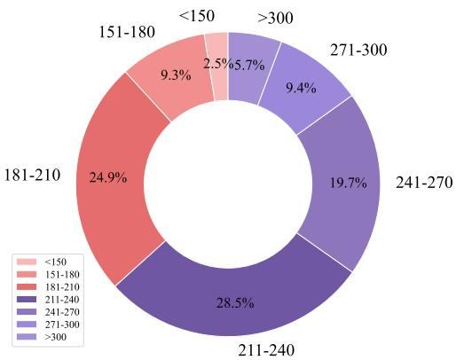  
(b) Distribution of compressed token lengths on MVBench.

Figure A1: Dynamic Token Length Distribution.  
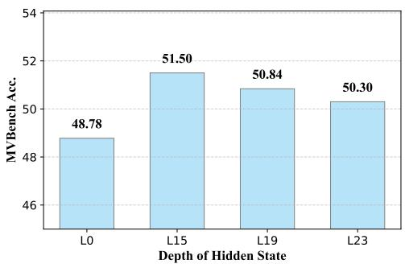  
Figure A3: Ablation of Hidden States Depth.

Furthermore, naive caption supervision is inadequate and our semantic supervision is critical for achieving optimal results. For this ablation study, the deepest hidden state was chosen as the compressed representation.

Generalizability of LangDC. Table A3 below assess the generalizability of LangDC from two complementary perspectives. First, VSI-Bench (Yang et al., 2025) introduces a novel indoor-video benchmark, presenting scenes and configurations not seen during training. Remarkably, LangDC matches the baseline performance despite this unseen setting, demonstrating strong adaptability to new environments. Second, VideoMME-Long and LongVideoBench (Wu et al., 2024) assess the model’s capability to extract salient information from extended video sequences. LangDC maintains robust performance even without being explicitly trained on long-video data, indicating its ability to dynamically allocate visual tokens and capture key cues over long temporal spans. Together, these results highlight LangDC’s strong generalization across both unfamiliar indoor scenes and lengthy video content, underscoring its potential as a versatile video understanding framework.

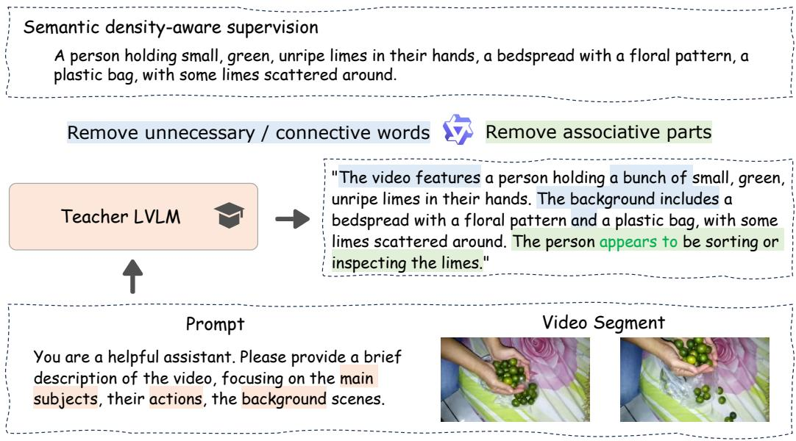

Figure A2: The complete process of obtaining semantic density-aware supervision includes using a powerful LVLM as teacher to generate segment descriptions and a subsequent post-processing procedure.
<table><tr><td rowspan="2">Method</td><td>Efficiency</td><td colspan="10">Reference Metrics</td><td colspan="10"></td></tr><tr><td>Token Num.↓</td><td>AS</td><td>AP</td><td>AA</td><td>FA</td><td>UA</td><td>OE</td><td>01</td><td>os</td><td>MD</td><td>AL</td><td>ST</td><td>AC</td><td>MC</td><td>MA</td><td>SC</td><td>FP</td><td>CO</td><td>EN</td><td>ER</td><td>Avg.</td></tr><tr><td>Pooling 2 × 2</td><td>3328</td><td>72.5</td><td>57.5</td><td>88.9</td><td>47.0</td><td>59.0</td><td>81.0</td><td>75.0</td><td>35.5 37.0</td><td>34.5</td><td>86.0</td><td>38.5</td><td>65.0</td><td>85.5</td><td>41.0</td><td>41.8</td><td>49.5</td><td>33.0</td><td>42.0</td><td>57.5</td><td>55.37</td></tr><tr><td>Pooling 4 × 4</td><td>832</td><td>67.5</td><td>54.0</td><td>73.7</td><td>44.0</td><td>57.0</td><td>73.5</td><td>70.5</td><td>35.0</td><td>26.5 35.0</td><td>85.5</td><td>36.5</td><td>54.5</td><td>78.0</td><td>40.0</td><td>40.5</td><td>43.0</td><td>34.0</td><td>40.0</td><td>52.5</td><td>52.05</td></tr><tr><td>Pooling 8 × 8</td><td>208</td><td>66.0</td><td>52.5</td><td>76.8</td><td>48.0</td><td>53.5</td><td>67.0</td><td>69.5</td><td>40.0 26.0</td><td>34.0</td><td>79.0</td><td>40.5</td><td>50.0</td><td>59.0</td><td>39.5</td><td>37.0</td><td>38.5</td><td>33.5</td><td>36.0</td><td>44.0</td><td>49.50</td></tr><tr><td>Pooling 16 × 16</td><td>80</td><td>57.5</td><td>45.0</td><td>69.7</td><td>44.0</td><td>49.5</td><td>49.5</td><td>68.5</td><td>33.0 19.5</td><td>28.0</td><td>80.0</td><td>38.0</td><td>47.0</td><td>49.0</td><td>39.0</td><td>34.5</td><td>33.0</td><td>32.0</td><td>35.5</td><td>36.0</td><td>44.40</td></tr><tr><td>Oracle Performance</td><td>1</td><td>88.5</td><td>74.0</td><td>95.5</td><td>63.0</td><td>72.5</td><td>96.5</td><td>86.0</td><td>67.5 64.0</td><td>60.0</td><td>91.0</td><td>49.0</td><td>81.5</td><td>96.5</td><td>51.0</td><td>61.5</td><td>71.0</td><td>50.0</td><td>57.0</td><td>72.0</td><td>72.4</td></tr><tr><td>Oracle Tokens</td><td></td><td></td><td>355.4 270.6 405.92</td><td></td><td></td><td></td><td></td><td></td><td>9260.3256.7274.3233.4373.8757.8381.2156.5253.2507.9514.0211.4386.0497.4244.7</td><td></td><td></td><td></td><td></td><td></td><td></td><td></td><td></td><td></td><td></td><td>263.5 485.5</td><td>354.48</td></tr></table>

Table A1: A detailed examination of the performance comparison of pooling strategies with various compression rates on the entire MVBench benchmark. Oracle denotes the case where the best tradeoff between visual tokens and performance is picked. Videos across different tasks have varying information loads, with the ideal token count differing significantly.

<table><tr><td rowspan=1 colspan=1>Base Caption Dataset</td><td rowspan=1 colspan=1>Semantic Supervision</td><td rowspan=1 colspan=1>Accuracy</td></tr><tr><td rowspan=1 colspan=1></td><td rowspan=1 colspan=1>1       x</td><td rowspan=1 colspan=1>45.40</td></tr><tr><td rowspan=1 colspan=1>COCOrecap(Li et al., 2024d)</td><td rowspan=1 colspan=1>xV</td><td rowspan=1 colspan=1>46.80 (↑1.40)49.98 (↑4.98)</td></tr><tr><td rowspan=1 colspan=1>LLaV Arecap(Liu et al., 2024a)</td><td rowspan=1 colspan=1>xV</td><td rowspan=1 colspan=1>47.26 (↑1.86)50.30 (↑4.90)</td></tr></table>

Table A2: Ablation of the choice of base caption dataset and semantic density-aware supervision on MVBench.

## B Implementation Details

Additional details for CapPruner pretraining. To allow CapPruner to dynamically compress visual features, it is crucial to construct supervision signals of appropriate length for effective guidance. This process begins with a powerful LVLM that describes the scene. We selecte LLaVA-OneVision (Liu et al., 2024a) as the teacher model to articulate the subjects, actions, and background in the video. However, these descriptions are often overly verbose. To refine the descriptions, we utilized a large language model, Qwen2.5-7B (Team, 2024), to eliminate unnecessary words, connectives, and speculative elements, resulting in semantic density-aware supervision tailored for specific segments, as shown in Fig A2.

<table><tr><td rowspan="2">Method</td><td rowspan="2">Token Num</td><td colspan="3">VSI-Bench</td><td colspan="2">VideoMME-long</td><td rowspan="2">Long VideoBench (val w/o subs)</td></tr><tr><td>Object Appearance Order</td><td>Object Real Distance</td><td>Overall Multi-choice</td><td>w/o sub</td><td>w/ sub</td></tr><tr><td>VideoGPT+</td><td>3328</td><td>10.84</td><td>36.90</td><td>30.26</td><td>37.0</td><td>43.9</td><td>37.50</td></tr><tr><td>LangDC</td><td>1068</td><td>14.24</td><td>36.06</td><td>30.82</td><td>38.9</td><td>46.4</td><td>43.83</td></tr></table>

Table A3: Comparison of Methods on Various Video Benchmarks

Additional details for instruction tuning set. Follow VideoGPT+ (Maaz et al., 2024b), supervised fine-tuning uses two distinct instruction-tuning datasets tailored for different task formats. For Multiple-choice VQA, the model is trained on the Kinetics-710 (Kay et al., 2017), Something-Something-v2 (Goyal et al., 2017), conversations from VideoChat (Li et al., 2023b), CLEVRER (Yi et al., 2019), VQA dataset from WebVid (Bain et al., 2021) and NExT-QA (Xiao et al., 2021) datasets, totaling approximately 330K single-turn conversations. For Open-ended VQA, the model is trained on VideoInstruct100K (Maaz et al., 2024a), VCG+ 112K (Maaz et al., 2024b), VideoChat (Li et al., 2023b) conversation and caption data, and VQA from WebVid (Bain et al., 2021), amounting to roughly 260K single-turn conversations.

Hyperparameter setting. We report the detailed hyperparameter settings of LangDC in Tab. B4. During the training phase, each video is sampled into 16 frames and divided into 4 segments, with CapPruner compressing each segment to a maximum of 128 tokens, due to the longest supervision signal not exceeding 100 tokens.

LLM-Assisted evaluation. We utilize LLM-Assisted Evaluation for open-ended videoQA, following (Maaz et al., 2024a). Each evaluation presents the LLM assistant (GPT-3.5) with the question, ground truth answer, and model prediction, prompting it to return a True or False judgement and a score (0-5). As depicted in Figure B4, this prompt uses roughly 250 tokens per question. Our baseline results for open-ended video questionanswering are drawn from (Maaz et al., 2024b).

<table><tr><td>Description</td><td>Default Value</td></tr><tr><td>total frame number</td><td>16 frames</td></tr><tr><td>segment number</td><td>4 segments</td></tr><tr><td>max compressed token number</td><td>128 tokens ×4 segs</td></tr><tr><td>CapPruner hidden state layer</td><td>15</td></tr></table>

Table B4: Hyper-parameter settings of LangDC.

## C Visualizations

Figures C5 and C6 demonstrate the performance of LangDC and highlight how CapPruner adjusts the allocated token count based on the video content. These visualizations illustrate the overall token count after compression by CapPruner, along with video frames and question-answer pairs. This effectively showcases the intelligence and adaptability of our compression scheme, as well as its resulting superior performance.

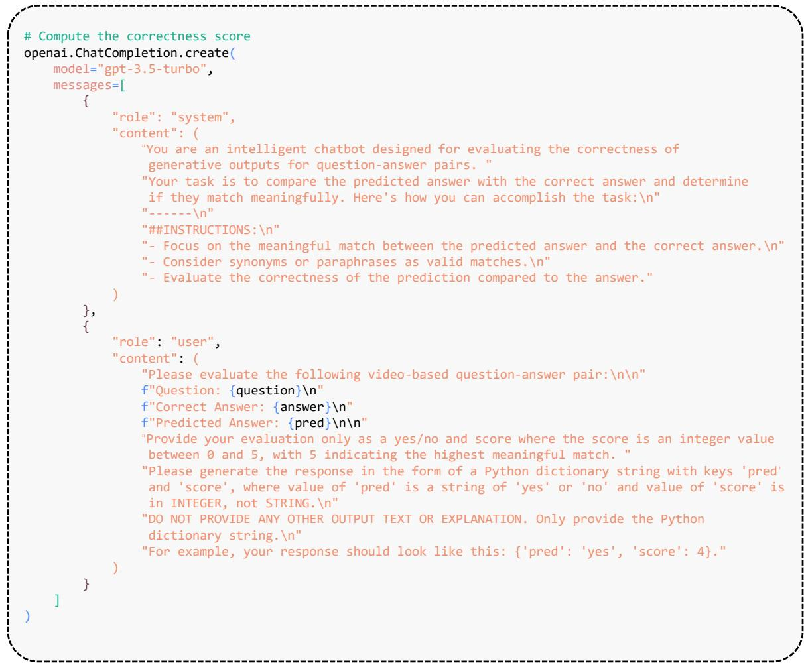  
Figure B4: Prompt for ChatGPT in LLM-Assisted Evaluation for the open-ended video question-answering task.

GT: (A) The object is stationary.

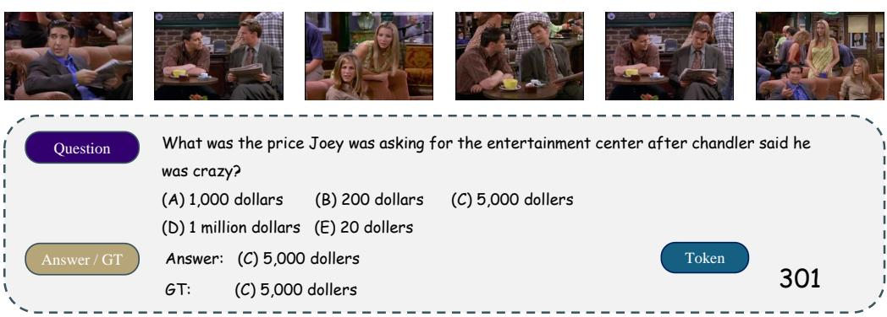

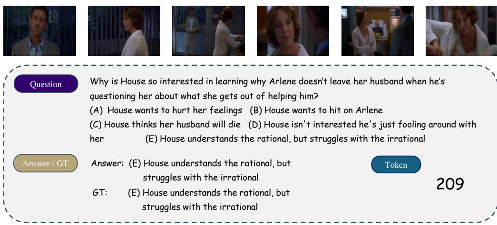

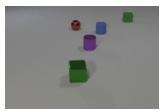

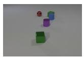

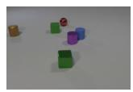

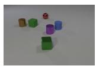

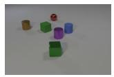

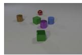  
What direction is the red sphere moving in within the video? (A) The object is stationary. (B) Down and to the right. (C) Up and to the right. (D) Up and to the left.

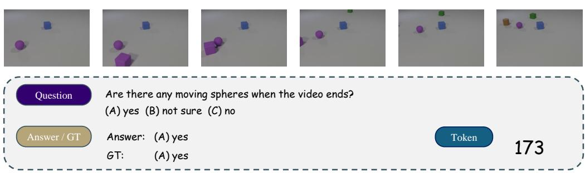  
Figure C5: More Cases.

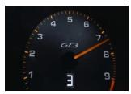

  
What is demonstrated by the driver steering the Porsche GT3 Token 296 with one hand?  
Answer: The driver is shown steering the Porsche GT3 with one hand, showcasing his skill and control over the vehicle. GT: The driver navigating the Porsche GT3 with one hand demonstrates the car’s precision and agility.

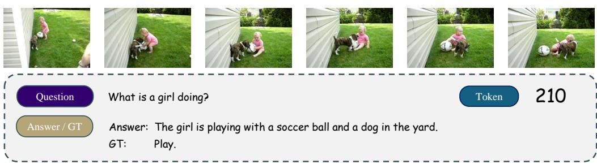

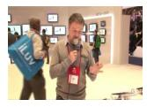

  
Why does the presenter emphasize the affordability of the Coby Electronics tablet in comparison to the iPad? Token 314  
Answer: The presenter emphasizes the affordability of the Coby Electronics tablet to highlight its cost-effectiveness and accessibility to a broader audience. GT: The presenter emphasizes the affordability to highlight that the Coby Electronics tablet provides a cost-effective option, making it an attractive proposition for consumers in comparison to the more expensive iPad.

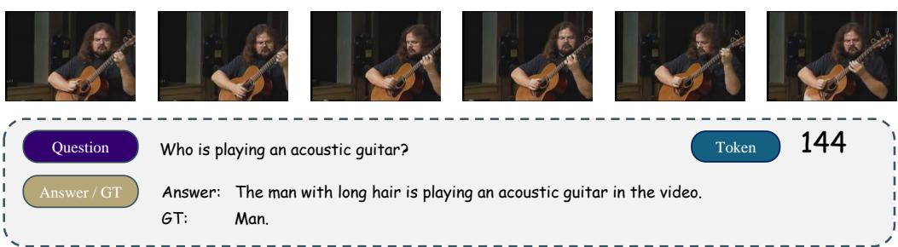  
Figure C6: More Cases.