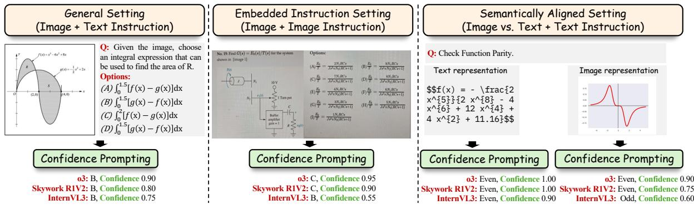
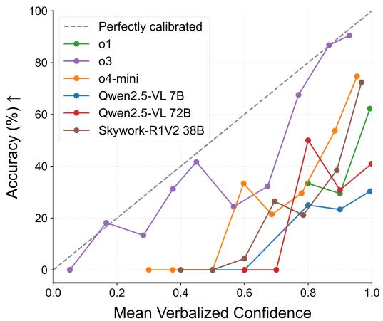
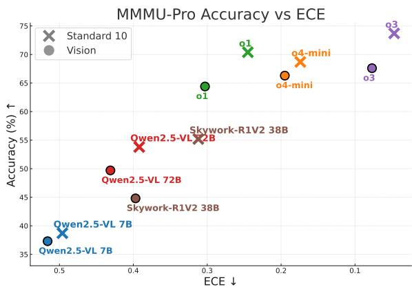
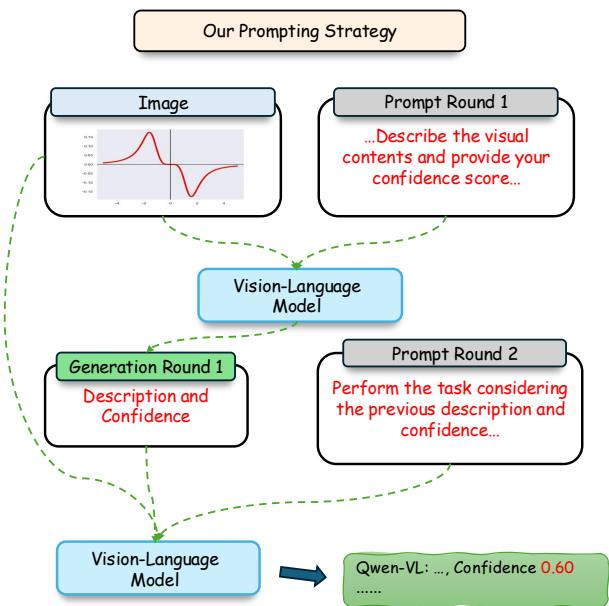

# Seeing is Believing, but How Much? A Comprehensive Analysis of Verbalized Calibration in Vision-Language Models

Weihao Xuan1,2∗, Qingcheng Zeng3\*, Heli Qi2,4, Junjue Wang1, Naoto Yokoya1,2†

1The University of Tokyo, 2RIKEN AIP, 3Northwestern University, 4Waseda University

## Abstract

Uncertainty quantification is essential for assessing the reliability and trustworthiness of modern AI systems. Among existing approaches, verbalized uncertainty, where models express their confidence through natural language, has emerged as a lightweight and interpretable solution in large language models (LLMs). However, its effectiveness in vision-language models (VLMs) remains insufficiently studied. In this work, we conduct a comprehensive evaluation of verbalized confidence in VLMs, spanning three model categories, four task domains, and three evaluation scenarios. Our results show that current VLMs often display notable miscalibration across diverse tasks and settings. Notably, visual reasoning models (i.e., thinking with images) consistently exhibit better calibration, suggesting that modality-specific reasoning is critical for reliable uncertainty estimation. To further address calibration challenges, we introduce VI-SUAL CONFIDENCE-AWARE PROMPTING, a two-stage prompting strategy that improves confidence alignment in multimodal settings. Overall, our study highlights the inherent miscalibration in VLMs across modalities. More broadly, our findings underscore the fundamental importance of modality alignment and model faithfulness in advancing reliable multimodal systems.

## 1 Introduction

Recent advances in large language models (LLMs) and vision-language models (VLMs) have led to significant progress across a broad spectrum of capabilities, including reasoning (OpenAI et al., 2024b, 2025), instruction following (Zhou et al., 2023; Grattafiori et al., 2024), and visual understanding (Liu et al., 2023; Li et al., 2024a; Padlewski et al., 2024; Agrawal et al., 2024; Bai et al., 2025). However, as these models are increasingly deployed in real-world and high-stakes applications, evaluating their trustworthiness has become as essential as measuring their task performance. A fundamental aspect of this assessment is calibration, ensuring that a model’s expressed confidence aligns with its actual accuracy in real-world scenarios. With the rise of closed-source models that only support text-based interactions, the ability to express uncertainty, similar to human communication verbally, has become particularly crucial for practical applications (Xiong et al., 2024).

Although quite a few studies have explored eliciting more accurate confidence estimations from LLMs through prompt engineering (Tian et al., 2023; Xiong et al., 2024) or training (Xu et al., 2024; Hager et al., 2025; Zhao et al., 2025), how these strategies adapt to VLMs remains an open question. Unlike text-only models, VLMs process and integrate information across multiple modalities, introducing new dimensions of complexity in how confidence is expressed and calibrated. This multimodal nature raises three critical challenges we aim to explore: 1) How accurately can VLMs verbalize their confidence? 2) How do instructions embedded within images affect calibration? 3) Does verbalized confidence remain consistent when processing the same information presented in different modalities?

These questions highlight a gap in current research and underscore the need for a deeper investigation into modality-sensitive uncertainty estimation in VLMs. Our contributions are threefold: 1) We present the first comprehensive evaluation of verbalized confidence in a diverse set of commercial and open-source VLMs, leveraging widely adopted large-scale multimodal datasets. Our analysis focuses on three evaluation scenarios, with particular focus on the embedded instruction setting and the semantically aligned setting, to investigate how calibration behaviors vary across input modalities. 2) Our results indicate that most VLMs continue to exhibit miscalibration in their verbalized uncertainty. However, visual reasoning models, those capable of thinking with images, show notable improvements in calibration across benchmarks and modalities. These findings point to the promise of visual reasoning-oriented enhancement for verbalized uncertainty estimation. 3) To further improve calibration, we introduce VISUAL CONFIDENCE-AWARE PROMPTING, a two-stage strategy that elicits visual-specific confidence before aggregating the final output. Compared to strong baselines such as Top-K prompting and selfreflection, our method yields significant gains in calibration quality.

In summary, this work comprehensively evaluates the verbalized calibration in current VLMs, reveals persistent miscalibration issues across modalities, and offers a promising direction for enhancing verbalized uncertainty.

## 2 Related Work

## 2.1 Uncertainty Quantification and Calibration in L(V)LMs

Quantifying and calibrating uncertainty is a key area of research for improving the reliability of LLMs (Fadeeva et al., 2023; Vashurin et al., 2024; Bodhwani et al., 2025) and detecting hallucination (Farquhar et al., 2024; Wang et al., 2025b; Park et al., 2025). A variety of techniques have been explored to estimate uncertainty in L(V)LMs, including sampling-based approaches (Kuhn et al., 2023; Nikitin et al., 2024), which approximate uncertainty by drawing from predictive distributions; information-theoretic methods (Fadeeva et al., 2024; Chen et al., 2025), which employ measures such as entropy or mutual information; and reflexive approaches (Tian et al., 2023; Xiong et al., 2024), which investigate how models articulate their own uncertainty through natural language.

This work focuses on the reflexive category, specifically examining how VLMs verbalize uncertainty. Verbalized uncertainty offers practical advantages: it eliminates the need for computational overhead associated with sampling or post-hoc calibration, while providing uncertainty assessments that are easily understood by general users (Hager et al., 2025). Prior studies have identified consistent patterns of overconfidence in verbalized uncertainty produced by instruction-tuned models (Xiong et al., 2024; Yang et al., 2024). Others have observed that reinforcement learning (RL)- based reasoning can improve calibration across domains, suggesting that RL may induce more reflective and self-aware model outputs (Zeng et al., 2025). While initial analyses of verbalized uncertainty in VLMs have been conducted, primarily on small-scale or object-level datasets (Groot and Valdenegro Toro, 2024; Borszukovszki et al., 2025; Zhao et al., 2025), a broader, systematic evaluation across tasks, domains, and model families remains lacking. Our work addresses this gap through a holistic analysis of how VLMs express and calibrate their uncertainty across diverse settings.

## 2.2 Modality Misalignment in Multimodal LLMs

In multimodal LLMs, an ideal expectation is that the models maintain consistent performance when equivalent information is presented across different modalities. However, a growing body of research in vision-language (Li et al., 2024b; Mistretta et al., 2025; Shu et al., 2025) and audio-language settings (Chen et al., 2024) has highlighted significant modality misalignment in many current multimodal models. These findings demonstrate systematic failures in cross-modal information integration and generalization. In response, several benchmarks have been proposed to quantify and analyze these performance gaps (Fu et al., 2024). In this work, we extend the analysis to examine how calibration, particularly through verbalized uncertainty, behaves across text and image modalities in VLMs, providing novel insights into both alignment and confidence consistency.

## 3 Experimental Setup

## 3.1 Evaluation Configurations

To comprehensively analyze verbalized confidence in VLMs, we design three complementary evaluation configurations, each targeting distinct dimensions of model behavior related to modality, instruction presentation, and calibration robustness across different modalities (Figure 1). These settings allow us to assess not only the overall calibration performance but also how it varies with changes in input format and reasoning demands.

## 3.1.1 General Evaluation

In the general evaluation setting, we assess verbalized confidence when VLMs are prompted via textual instructions and required to reason over visual inputs. This configuration reflects a common usage scenario in which users provide tasks through natural language while the model processes accompanying images or video. We evaluate model calibration across four major task types:

  
Figure 1: The illustration of our three types of evaluations: general, embedded instruction, and semantically aligned evaluation. These configurations test VLMs’ calibration across different input modalities and instruction formats.

• Image Understanding and Reasoning: We adopt the MMMU-Pro benchmark (Yue et al., 2024) to measure calibration on complex, multidisciplinary image understanding and reasoning problems. This benchmark encompasses a wide array of domains and task formats, providing a robust benchmark for verbalized uncertainty.

• Video Understanding and Reasoning: To investigate video understanding and the corresponding calibration over dynamic visual content, we evaluate models using VideoM-MMU (Hu et al., 2025), covering perception, comprehension, and adaptation tasks. For fair comparison, we uniformly sample 32 frames per video as model input across all evaluations.

• Factuality: We adopt the Visual SimpleQA benchmark (Wang et al., 2025c) to assess models’ ability to judge factual correctness from visual information, offering a direct test of basic visual grounding and confidence estimation.

• Math Reasoning: To evaluate calibration under visual mathematical reasoning, we employ MathVista (Lu et al., 2024) and MathVision (Wang et al., 2024). These datasets involve interpreting diagrams and solving quantitative problems. We use the testmini splits from both datasets to balance computational efficiency with sufficient task diversity.

## 3.1.2 Embedded Instruction Evaluation

A growing line of research has explored whether VLMs can accurately interpret instructions when they are embedded within visual inputs, rather than provided through the standard text modality (Li et al., 2024c). While most prior work focuses on task performance, less is known about how such modality shifts affect models’ verbalized calibration. To address this, we adopt the vision-only configuration from MMMU-Pro (Yue et al., 2024), in which entire questions are embedded within images and directly presented to the model. By comparing calibration performance against the general setting, where question bodies are given via text, we assess whether visually embedded instructions introduce additional difficulty for VLMs in producing reliable confidence estimates.

## 3.1.3 Semantically Aligned Modalities Evaluation

Building on the previous setting, we take a further step toward disentangling modality effects by evaluating VLMs on inputs that are semantically equivalent but presented in different modalities. For example, a mathematical function may appear either as a visual diagram or a textual equation (see Figure 1). This setup allows us to isolate calibration and reasoning behavior when the content remains constant, but the modality changes. To this end, we use the IsoBench benchmark (Fu et al., 2024), which spans four domains (mathematics, games, science, and algorithms) and is explicitly designed for testing modality alignment. Unlike the embedded instruction setting, which focuses on instruction modality, this scenario enables a more nuanced analysis of modality-specific reasoning gaps, revealing whether VLMs process and calibrate equivalent information differently depending

on its format.

## 3.2 Models

We evaluate a broad selection of state-of-the-art VLMs, spanning both commercial and open-source models. To better understand how training objectives and reasoning styles affect verbalized calibration, we categorize the models into three groups based on their alignment strategies and dominant reasoning modalities:

1. General Instruction-Tuned Models: These models are optimized for following human instructions across a wide range of multimodal tasks. They are typically trained with supervised fine-tuning and enhanced with preference alignment. Representative models in this category include OpenAI GPT-4.1 and GPT-4o (OpenAI et al., 2024a), Qwen-VL series (Qwen-2/2.5-VL in both 7B and 72B scales) (Bai et al., 2025), InternVL3 78B (Zhu et al., 2025), and Kimi-VL-A3B Instruct (Kimi Team et al., 2025).

2. Text-Centric Reasoning Models: This group includes models that primarily reason over textual representations, often enhanced via reinforcement learning or instruction tuning with an emphasis on chain-of-thought or selfreflective reasoning. These models typically generate intermediate reasoning steps in text before producing answers. Included here are OpenAI o1 (OpenAI et al., 2024b), Kimi-VL-A3B Thinking (Kimi Team et al., 2025), Skywork-R1V 38B (Peng et al., 2025), and Skywork-R1V2 38B (Wang et al., 2025a).

3. Vision-Centric Reasoning Models: These models are explicitly designed to perform visual chain-of-thought reasoning, where multimodal inputs, particularly images, are not only used for grounding but also as part of the model’s internal reasoning process. OpenAI o3 and o4-mini (OpenAI, 2025) fall into this category, as they are trained to natively integrate visual elements into multi-step reasoning workflows.

This categorization allows us to analyze how verbalized calibration varies depending on whether reasoning is primarily text-driven, vision-driven, or instruction-oriented, offering a clearer lens into the strengths and limitations of different model families.

## 3.3 Evaluation Metrics

We examine the use of confidence scores from LLMs: calibration and failure prediction. Calibration evaluates whether the model’s predicted confidence reflects its true likelihood of being correct. For example, when a model assigns 90% confidence to its answers, it should be accurate approximately 90% of the time. This alignment is especially important for applications that rely on reliable uncertainty estimates, such as safety-critical systems or human–AI collaboration.

To assess calibration, we use the Expected Calibration Error (ECE), which captures the average difference between predicted confidence and observed accuracy across M bins:

$$
E C E = \sum _ { m = 1 } ^ { M } \frac { | B _ { m } | } { n } \left| \operatorname { a c c } ( B _ { m } ) - \operatorname { a v g } \mathbf { C o n f } ( B _ { m } ) \right|\tag{1}
$$

Here, n is the total number of examples and $B _ { m }$ denotes the set of samples in the m-th confidence bin. We use M = 10 bins in all cases and compute ECE only over attempted questions when evaluating on factuality datasets.

## 4 Results

## 4.1 General Evaluation

Our evaluation results of the general setting are presented in Table 1. Overall, most models exhibit moderate calibration performance, with a consistent tendency toward miscalibration.

  
Figure 2: Calibration curve on the testmini set of Math-Vision.

Across different datasets, most instruct and text reasoning models exhibit ECE scores exceeding 0.25 in the majority of settings, indicating a clear tendency toward miscalibration. Moreover, the calibration curves presented in Figure 2 show that these models are systematically overconfident across a wide range of confidence bins. In contrast, the o3 model consistently demonstrates strong calibration across all evaluated tasks, suggesting that it is less susceptible to the overconfidence patterns commonly observed in other VLMs.

<table><tr><td rowspan="2">Metric</td><td rowspan="2">Model</td><td>MMMU-Pro (Standard, 10)</td><td>VideoMMMU (P/C/A)</td><td>Visual SimpleQA</td><td>MathVista</td><td>MathVision</td></tr><tr><td></td><td></td><td>(Multimodal)</td><td></td><td></td></tr><tr><td rowspan="7">ACC↑</td><td colspan="6">Visual Reasoning Models 03</td></tr><tr><td></td><td>73.7</td><td>74.6/71.2/41.7</td><td>73.6</td><td>50.0</td><td>56.0</td></tr><tr><td>04-mini</td><td>68.7</td><td>72.8/67.5/39.2</td><td>66.5</td><td>48.5</td><td>52.4</td></tr><tr><td>Text Reasoning Models</td><td></td><td></td><td></td><td></td><td></td></tr><tr><td>01 Skywork-R1V2 38B</td><td>70.4 55.2</td><td>72.7/66.2/40.3 59.9/58.6/40.7</td><td>70.6 45.5</td><td>46.7 44.7</td><td>51.0 39.6</td></tr><tr><td>Kimi-VL-A3B Thinking</td><td>45.2</td><td>62.0/55.1/32.6</td><td>39.3</td><td>46.7</td><td>30.5</td></tr><tr><td colspan="6">Instruct Models</td></tr><tr><td rowspan="5"></td><td>GPT4.1</td><td>65.0</td><td>74.9/62.3/40.8</td><td>67.1</td><td>47.9</td><td></td></tr><tr><td>Qwen2.5-VL 7B</td><td>38.7</td><td>66.9/52.3/31.3</td><td>32.2</td><td>45.5</td><td>43.0 24.9</td></tr><tr><td>Qwen2.5-VL 72B</td><td>53.8</td><td>80.0/69.7/44.3</td><td>49.6</td><td>49.9</td><td></td></tr><tr><td>InternVL3 78B</td><td>55.1</td><td>66.7/54.7/35.8</td><td>44.0</td><td>47.1</td><td>40.8</td></tr><tr><td>Kimi-VL-A3B Instruct</td><td>38.7</td><td>72.3/41.7/30.7</td><td>35.3</td><td>42.6</td><td>34.2 28.3</td></tr><tr><td rowspan="10">ECE↓</td><td>Visual Reasoning Models</td><td></td><td></td><td></td><td></td><td></td></tr><tr><td>03</td><td></td><td></td><td></td><td></td><td></td></tr><tr><td>o4-mini</td><td>0.047 0.174</td><td>0.073/0.051/0.092 0.125/0.172/0.293</td><td>0.085</td><td>0.242</td><td>0.111</td></tr><tr><td>Text Reasoning Models</td><td></td><td></td><td>0.069</td><td>0.388</td><td>0.327</td></tr><tr><td></td><td></td><td></td><td></td><td></td><td></td></tr><tr><td>o1</td><td>0.245 0.312</td><td>0.204/0.271/0.470</td><td>0.145</td><td>0.474</td><td>0.447</td></tr><tr><td>Skywork-R1V2 38B Kimi-VL-A3B Thinking</td><td>0.433</td><td>0.233/0.271/0.403 0.343/0.371/0.553</td><td>0.365 0.476</td><td>0.438 0.475</td><td>0.427</td></tr><tr><td></td><td></td><td></td><td></td><td></td><td>0.598</td></tr><tr><td>Instruct Models</td><td></td><td></td><td></td><td></td><td></td></tr><tr><td>GPT4.1</td><td>0.321</td><td>0.225/0.342/0.549</td><td>0.275</td><td>0.485</td><td></td></tr><tr><td>Qwen2.5-VL 7B</td><td>0.496</td><td>0.235/0.347/0.548</td><td>0.252</td><td>0.418</td><td>0.535 0.660</td></tr><tr><td>Qwen2.5-VL 72B</td><td>0.392</td><td>0.161/0.248/0.443</td><td>0.371</td><td>0.466</td><td>0.580</td></tr><tr><td>InternVL3 78B</td><td>0.387</td><td>0.278/0.379/0.550</td><td>0.402</td><td>0.480</td><td>0.617</td></tr><tr><td>Kimi-VL-A3B Instruct</td><td>0.492</td><td>0.203/0.488/0.571</td><td>0.421</td><td>0.482</td><td>0.612</td></tr></table>

Table 1: Performance metrics across different datasets and models with CoT prompting. All accuracy (ACC) values are in percentage. The scores of VideoMMMU are reported in the order of Perception(P)/Comprehension(C)/Adaptation(A) splits.

When comparing model categories, visual reasoning models consistently demonstrate better calibration than both text-centric reasoning models and instruction-tuned models. Specifically, o3 and o4-mini, which are optimized for visual reasoning, produce lower ECE scores across benchmarks, reflecting more reliable confidence estimates. In contrast, instruction-following and text-based reasoning models tend to exhibit higher ECE values, indicating less accurate self-assessment. This difference is especially notable in the two mathematical benchmarks, where all VLMs achieve similar levels of accuracy, yet visual reasoning models are significantly better calibrated.

Additionally, when comparing instruction-tuned models with similarly scaled text reasoning models (e.g., GPT-4.1 vs. o1, Kimi-VL-Instruct vs.

Kimi-VL-Thinking), we observe that reasoningoriented models tend to show slightly improved calibration. This suggests that reinforcement learning and reasoning-focused training can enhance a model’s ability to assess its own uncertainty, particularly within the same modality, though modest benefits may also emerge from enhancements within the text modality. Taken together, these findings highlight the complementary roles of modalityspecific and reasoning-specific training in building VLMs with more trustworthy and well-calibrated verbalized confidence.

## 4.2 Embedded Instruction Evaluation

Here, we present results from the embedded instruction setting, where question bodies are provided exclusively through visual inputs. The results are visualized in Figure 3, where data points from the vision-based setting are marked with circles, and those from the general (text-instruction) setting are marked with crosses, allowing for direct visual comparison.

Overall, our findings indicate that most evaluated VLMs continue to face challenges in calibration when processing visually embedded instructions. The instruction-tuned models still exhibit ECE scores above 0.4, reflecting a notable degree of miscalibration. In contrast, reasoning-oriented models demonstrate better calibration performance, with visual reasoning models achieving the most reliable confidence estimates. These results further support our earlier observation that both modalityspecific and reasoning-specific training play a critical role in improving verbalized uncertainty in VLMs.

<table><tr><td rowspan="2">Metric</td><td rowspan="2">Model</td><td colspan="5">IsoBench</td></tr><tr><td>Mathematics</td><td>Games</td><td>Science</td><td>Algorithms</td><td>All</td></tr><tr><td rowspan="10">ECE↓</td><td>Visual Reasoning Models</td><td></td><td></td><td></td><td></td><td></td></tr><tr><td>03</td><td>0.088/0.075</td><td>0.162/0.106</td><td>0.094/0.113</td><td>0.034/0.085</td><td>0.037/0.081</td></tr><tr><td>o4-mini</td><td>0.054/0.025</td><td>0.283/0.309</td><td>0.022/0.026</td><td>0.083/0.034</td><td>0.110/0.058</td></tr><tr><td>Text Reasoning Models</td><td></td><td></td><td></td><td></td><td></td></tr><tr><td>o1</td><td>0.187/0.007</td><td>0.522/0.425</td><td>0.080/0.033</td><td>0.223/0.022</td><td>0.265/0.109</td></tr><tr><td>Skywork-R1V2 38B</td><td>0.304/0.008</td><td>0.529/0.368</td><td>0.094/0.025</td><td>0.420/0.151</td><td>0.364/0.120</td></tr><tr><td>Kimi-VL-A3B Thinking</td><td>0.376/0.077</td><td>0.708/0.611</td><td>0.117/0.044</td><td>0.554/0.540</td><td>0.462/0.284</td></tr><tr><td>Instruct Models</td><td></td><td></td><td></td><td></td><td></td></tr><tr><td>GPT4.1</td><td>0.111/0.007</td><td>0.520/0.460</td><td>0.081/0.024</td><td>0.165/0.079</td><td></td></tr><tr><td>Qwen2.5-VL 7B</td><td>0.377/0.069</td><td>0.695/0.629</td><td>0.155/0.059</td><td>0.526/0.469</td><td>0.216/0.131 0.467/0.284</td></tr><tr><td>Qwen2.5-VL 72B</td><td>0.353/0.008</td><td>0.724/0.534</td><td>0.146/0.039</td><td>0.376/0.320</td><td>0.431/0.200</td></tr><tr><td></td><td>0.339/0.007</td><td>0.684/0.539</td><td>0.110/0.042</td><td>0.386/0.307</td><td>0.412/0.198</td></tr><tr><td>InternVL3 78B</td><td></td><td>0.651/0.604</td><td>0.068/0.032</td><td>0.471/0.503</td><td></td></tr><tr><td>Kimi-VL-A3B Instruct</td><td>0.327/0.257</td><td></td><td></td><td></td><td>0.411/0.372</td></tr></table>

Table 2: Performance metrics across different categories and models with CoT prompting. Image/text modality results are shown with slash (/). For Mathematics, the text modality shows LaTeX format results; for Games, the text modality shows PGN format results.

  
Figure 3: Model performance comparison of accuracy vs. calibration (ECE). The upper right indicates better overall performance.

When comparing performance under visual instructions to the general evaluation setting, we observe a clear drop in both accuracy and calibration. Even the strongest models, such as o3 and o4-mini, exhibit noticeable degradation when instructions are presented visually rather than textually. These findings point to a persistent misalignment between vision and language modalities in current VLMs, indicating that interpreting visual instructions remains a core challenge in multimodal understanding. Addressing this modality gap is crucial for developing more robust and trustworthy VLMs capable of producing consistent and calibrated confidence estimates across diverse input formats.

## 4.3 Semantically Aligned Evaluation

In our final evaluation setting, we assess calibration performance when VLMs are given identical textual instructions paired with semantically equivalent inputs presented in either the textual or visual modality for reasoning. The corresponding ECE results are reported in Table 2.

Consistent with our previous findings, we observe a substantial calibration gap between modalities in most models. Although the underlying content remains identical, VLMs tend to produce less calibrated responses when reasoning over visual inputs compared to text. This discrepancy is especially evident in the mathematics domain, where text-based inputs are relatively easy for VLMs to solve, but performance degrades noticeably with visual input. In these cases, models often assign high confidence regardless of their actual visual reasoning capabilities, leading to significantly higher ECE scores. The only notable exceptions are visual reasoning models, which consistently exhibit smaller calibration gaps across modalities when compared to instruction-tuned and text-centric reasoning models. We also found puzzle tasks in the game category to be particularly difficult, although state-of-the-art models all show accuracy lower than 10%, only o3 shows moderate level calibration, suggesting the great potential of vision-based reasoning in reducing miscalibration.

Taken together, our experiments across the three evaluation settings provide a comprehensive picture of how current VLMs handle verbalized uncertainty under varying input structures. In the general setting, most models show moderate calibration, though miscalibration remains widespread. In the embedded instruction setting, calibration performance declines noticeably, highlighting challenges in processing and interpreting instructions presented purely through vision. Finally, in the semantically aligned setting, we observe a clear modality gap: despite receiving isomorphic representations, most models exhibit poorer calibration when reasoning with visual inputs compared to text. This gap persists even among strong models, with the exception of those explicitly trained for visual reasoning. These findings collectively suggest that while verbalized uncertainty is promising for interpretable confidence estimation, its reliability in VLMs is highly sensitive to both modality and model design, underscoring the need for modalityaware training and evaluation strategies. Comprehensive results for additional models and various prompts on the employed benchmark are provided in Appendix §H and §I.

## 5 VISUAL CONFIDENCE-AWARE PROMPTING (VCAP)

As shown in our evaluation results, miscalibration is a persistent issue across modalities in many VLMs, particularly among instruction-tuned models. To address this, we introduce a prompting strategy, Visual Confidence-Aware Prompting (VCAP), that leverages the multi-turn dialogue capabilities of instruction models to enhance calibration. Motivated by the observed modality gaps, we ask whether confidence signals derived from the vision modality can be explicitly incorporated into the final response generation. This leads us to design a two-stage prompting approach that encourages the model to separately reflect on visual confidence before producing a calibrated answer, as shown in Figure 4.

VCAP separates visual understanding from task execution to improve calibration accuracy. In the first round, the VLM is asked to describe the visual input in detail and provide a confidence score, focusing exclusively on the visual modality to minimize cognitive load and isolate perception. In the second round, the model is prompted to complete the task and generate a verbalized confidence score, this time taking into account its prior selfassessment from the visual description. By decoupling perception and reasoning in a structured dialogue, the strategy encourages more reflective processing and aims to improve calibration, particularly on the visual modality side.

  
Figure 4: The illustration of our Visual Confidence-Aware Prompting (VCAP).

We evaluate our proposed approach on the IsoBench benchmark using the Qwen2.5-VL series. IsoBench consists of semantically aligned tasks presented in both visual and textual modalities, making it a suitable testbed for analyzing modality-specific calibration behavior. In the general evaluation setting, we adopt CoT prompting to elicit both reasoning steps and confidence estimates within a single turn, which we adopt as a baseline here. As for a stronger baseline, we compare against Top-K prompting, where the model generates multiple candidate answers with associated confidence scores, and the one with the highest confidence is selected as the final output (Tian et al., 2023; Xiong et al., 2024). Additionally, we report results using self-reflection prompting (Xiong et al., 2024; Vashurin et al., 2024), another twostage strategy in which the model first generates an answer, followed by a second prompt that elicits a confidence estimate for that response.

Results are shown in Table 3. Across different model sizes and families, our two-stage prompting method mostly leads to moderate improvements in accuracy and a more notable gain in calibration performance, even when compared to the Top-K (K=3) and self-reflection baselines. Even for a relatively well-calibrated model such as o4-mini, although VCAP’s advantage is not as significant as its performance on other types of models, it also brings additional benefits compared to vanilla prompting. These findings suggest that explicitly structuring the confidence elicitation process through multiround prompting in isolated modalities can help mitigate miscalibration and enhance the reliability of verbalized uncertainty in VLMs.

<table><tr><td rowspan="2">Metric</td><td rowspan="2">Model</td><td colspan="5">IsoBench</td></tr><tr><td>Mathematics</td><td>Games</td><td>Science</td><td>Algorithms</td><td>All</td></tr><tr><td rowspan="20"></td><td>Qwen2.5-VL 7B</td><td>54.0</td><td>28.4</td><td>78.0</td><td>44.0</td><td>47.7</td></tr><tr><td>+ Top-K</td><td>57.5</td><td>28.1</td><td>73.3</td><td>47.1</td><td>49.6</td></tr><tr><td>+ Self-Reflection</td><td>52.7</td><td>27.7</td><td>78.0</td><td>47.6</td><td>47.7</td></tr><tr><td>+ VCAP (Ours)</td><td>55.2</td><td>30.0</td><td>80.0</td><td>46.1</td><td>49.2</td></tr><tr><td>Qwen2.5-VL 72B</td><td>60.3</td><td>24.1</td><td>86.0</td><td>61.2</td><td>53.7</td></tr><tr><td>+ Top-K</td><td>56.5</td><td>24.3</td><td>86.0</td><td>56.8</td><td>51.1</td></tr><tr><td>+ Self-Reflection</td><td>60.4</td><td>23.4</td><td>84.0</td><td>55.5</td><td>52.3</td></tr><tr><td>+ VCAP (Ours)</td><td>66.1</td><td>26.0</td><td>86.7</td><td>60.9</td><td>57.0</td></tr><tr><td>InternVL3 78B</td><td>61.4</td><td>24.5</td><td>88.7</td><td>58.9</td><td>54.1</td></tr><tr><td>+ Top-K ACC ↑</td><td>62.7</td><td>24.5</td><td>91.3</td><td>58.6</td><td>54.9</td></tr><tr><td>+ Seif-Reflection</td><td>62.2</td><td>23.2</td><td>90.7</td><td>58.3</td><td>54.2</td></tr><tr><td>+ VCAP (Ours)</td><td>63.2</td><td>24.7</td><td>90.7</td><td>62.8</td><td>56.0</td></tr><tr><td>Skywork-R1V2 38B</td><td>64.2</td><td>26.4</td><td>83.9</td><td>50.8</td><td>53.8</td></tr><tr><td>+ Top-K</td><td>62.1</td><td>29.1</td><td>81.2</td><td>48.7</td><td>52.9</td></tr><tr><td>+ Self-Reflection</td><td>64.9</td><td>27.4</td><td>83.1</td><td>46.9</td><td>53.6</td></tr><tr><td>+ VCAP (Ours)</td><td>63.8</td><td>27.4</td><td>86.4</td><td>49.2</td><td>53.8</td></tr><tr><td>04-mini</td><td>85.6</td><td>50.3</td><td>93.3</td><td>85.9</td><td>78.1</td></tr><tr><td>+ Top-K</td><td>84.4</td><td>49.6</td><td>95.2</td><td>85.6</td><td>77.1</td></tr><tr><td>+ Self-Reflection</td><td>85.0</td><td>48.8</td><td>92.6</td><td>83.3</td><td>77.0</td></tr><tr><td>+ VCAP (Ours)</td><td>85.0</td><td>49.9</td><td>95.3</td><td>85.4</td><td>77.4</td></tr><tr><td rowspan="20">ECE↓</td><td>Qwen2.5-VL 7B</td><td>0.377</td><td>0.695</td><td>0.155</td><td>0.526</td><td>0.467</td></tr><tr><td>+ Top-K</td><td>0.365</td><td>0.702</td><td>0.231</td><td>0.503</td><td>0.462</td></tr><tr><td>+ Self-Reflection</td><td>0.391</td><td>0.651</td><td>0.178</td><td>0.407</td><td>0.436</td></tr><tr><td>+ VCAP (Ours)</td><td>0.320</td><td>0.668</td><td>0.131</td><td>0.490</td><td>0.424</td></tr><tr><td>Qwen2.5-VL 72B</td><td>0.353</td><td>0.724</td><td>0.146</td><td>0.376</td><td>0.431</td></tr><tr><td>+ Top-K</td><td>0.380</td><td>0.711</td><td>0.130</td><td>0.415</td><td>0.447</td></tr><tr><td>+ Seif-Reflection</td><td>0.348</td><td>0.612</td><td>0.171</td><td>0.366</td><td>0.402</td></tr><tr><td>+ VCAP (Ours)</td><td>0.261</td><td>0.664</td><td>0.128</td><td>0.343</td><td>0.365</td></tr><tr><td>InternVL3 78B</td><td>0.339</td><td>0.684</td><td>0.110</td><td>0.386</td><td>0.412</td></tr><tr><td>+ Top-K</td><td>0.306</td><td>0.604</td><td>0.087</td><td>0.351</td><td>0.369</td></tr><tr><td>+ Seif-Reflection</td><td>0.317</td><td>0.672</td><td>0.061</td><td>0.390</td><td>0.397</td></tr><tr><td>+ VCAP (Ours)</td><td>0.298</td><td>0.503</td><td>0.050</td><td>0.313</td><td>0.331</td></tr><tr><td>Skywork-R1V2 38B</td><td>0.304</td><td>0.529</td><td>0.094</td><td>0.420</td><td>0.364</td></tr><tr><td>+ Top-K</td><td>0.297</td><td>0.470</td><td>0.107</td><td>0.454</td><td>0.356</td></tr><tr><td>+ Seif-Reflection</td><td>0.311</td><td>0.546</td><td>0.085</td><td>0.411</td><td>0.370</td></tr><tr><td>+ VCAP (Ours)</td><td>0.262</td><td>0.433</td><td>0.075</td><td>0.392</td><td>0.315</td></tr><tr><td>04-mini</td><td>0.054</td><td>0.283</td><td>0.022</td><td>0.083</td><td>0.110</td></tr><tr><td>+ Top-K</td><td>0.069</td><td>0.322</td><td>0.033</td><td>0.087</td><td>0.130</td></tr><tr><td>+ Self-Reflection</td><td>0.077</td><td>0.130</td><td>0.057</td><td>0.089</td><td>0.089</td></tr><tr><td></td><td></td><td></td><td></td><td></td><td></td></tr><tr><td>+ VCAP (Ours)</td><td>0.067</td><td>0.194</td><td>0.039</td><td>0.064</td><td>0.095</td></tr></table>

Table 3: Performance metrics across different categories and models with different prompting strategies. All accuracy (ACC) values are in percentage.

## 6 Discussion

In this paper, we first evaluate whether VLMs can express their uncertainties in a calibrated manner.

Across various types of models and datasets, our results highlight the widespread miscalibration issue in current VLMs and suggest that vision-based reasoning can significantly improve both multimodal reasoning and reduce the modality gap. Building on this insight, we propose VISUAL CONFIDENCE-AWARE PROMPTING, a two-stage prompting strategy that explicitly guides VLMs to express more calibrated confidence by decoupling visual interpretation from task execution.

Previous research on verbalized uncertainty has typically focused on isolated aspects of instruct VLMs’ behaviors. Groot and Valdenegro Toro (2024) evaluated verbalized uncertainty using a small 39-image Japanese-language dataset.

Borszukovszki et al. (2025) examined how VLMs respond to input noise, while Zhao et al. (2025) investigated object-level miscalibration and proposed a two-stage fine-tuning approach for calibration. Our work expands upon these efforts by conducting a broader evaluation across multiple domains, prompting strategies, and modality configurations, showing that miscalibration is a consistent challenge in VLMs.

In parallel, the emergence of text reasoning models has reshaped the landscape of LLM development. Zeng et al. (2025) systematically evaluated verbalized uncertainty in reasoning models and found that they tend to produce more calibrated outputs than instruction-tuned models. Our study provides complementary evidence from a multimodal perspective, showing that modality-specific reasoning in VLMs, particularly reasoning grounded in visual input, contributes to improved calibration and confidence reliability.

Previous works have introduced a variety of finetuning and prompting strategies to improve verbalized uncertainty in LLMs. These include methods such as distilling self-consistency signals into the model (Hager et al., 2025) and using Top-K prompting to elicit more calibrated confidence scores (Tian et al., 2023; Xiong et al., 2024). In this work, we extend these efforts to the multimodal domain by evaluating and improving verbalized calibration in VLMs. We propose a two-stage prompting strategy that first isolates visual understanding and then guides task execution based on self-assessed visual confidence. Our results show that this approach can effectively enhance calibration in VLMs across modalities. These findings underscore the importance of explicitly leveraging multimodal inputs and modality-specific reasoning when designing strategies for improving confidence estimation in VLMs. This line of work highlights the need for calibration-aware prompting designs that are sensitive to the structure and strengths of different input modalities.

## Limitations

In this work, we comprehensively evaluated how VLMs express uncertainty through natural language and proposed visual confidence-aware prompting to address the identified challenges. One key limitation is that although "think with images" models like o3 and o4-mini demonstrate exceptional verbalized calibration, their closed-source nature and lack of publicly available implementation details make it difficult to understand and analyze why they significantly outperform text reasoning and instruction-tuned models. Furthermore, since there are currently only two closed-source OpenAI models with production-level performance in the "think with images" category, we cannot investigate how different model families perform in terms of verbalized calibration within this approach. Additionally, while our goal was to evaluate verbalized calibration across a broad spectrum of tasks, we did not conduct dedicated experiments to investigate some of the challenging scenarios frequently encountered in downstream applications, such as temporal visual grounding in video understanding. We also consider these directions to be meaningful avenues for future work.

## Acknowledgments

This work was supported by JST NEXUS, Japan Grant Number JPMJNX25CA. This work used computational resources Miyabi supercomputer provided by The University of Tokyo through Joint Usage/Research Center for Interdisciplinary Largescale Information Infrastructures and High Performance Computing Infrastructure in Japan (Project ID: jh250017). Weihao Xuan is supported by RIKEN Junior Research Associate (JRA) Program.

## References

Pravesh Agrawal, Szymon Antoniak, Emma Bou Hanna, Baptiste Bout, Devendra Chaplot, Jessica Chudnovsky, Diogo Costa, Baudouin De Monicault, Saurabh Garg, Theophile Gervet, Soham Ghosh, Amélie Héliou, Paul Jacob, Albert Q. Jiang, Kartik Khandelwal, Timothée Lacroix, Guillaume Lample, Diego Las Casas, Thibaut Lavril, and 23 others. 2024. Pixtral 12b. Preprint, arXiv:2410.07073.

Shuai Bai, Keqin Chen, Xuejing Liu, Jialin Wang, Wenbin Ge, Sibo Song, Kai Dang, Peng Wang, Shijie Wang, Jun Tang, Humen Zhong, Yuanzhi Zhu, Mingkun Yang, Zhaohai Li, Jianqiang Wan, Pengfei Wang, Wei Ding, Zheren Fu, Yiheng Xu, and 8 others. 2025. Qwen2.5-vl technical report. Preprint, arXiv:2502.13923.

Umesh Bodhwani, Yuan Ling, Shujing Dong, Yarong Feng, Hongfei Li, and Ayush Goyal. 2025. A calibrated reflection approach for enhancing confidence estimation in LLMs. In Proceedings of the 5th Workshop on Trustworthy NLP (TrustNLP 2025), pages 399–411, Albuquerque, New Mexico. Association for Computational Linguistics.

Mirko Borszukovszki, Ivo Pascal De Jong, and Matias Valdenegro-Toro. 2025. Know what you do not know: Verbalized uncertainty estimation robustness on corrupted images in vision-language models. In Proceedings ofthe 5th Workshop on Trustworthy NLP (TrustNLP 2025), pages 247–265, Albuquerque, New Mexico. Association for Computational Linguistics.

Yiming Chen, Xianghu Yue, Chen Zhang, Xiaoxue Gao, Robby T. Tan, and Haizhou Li. 2024. Voicebench: Benchmarking llm-based voice assistants. Preprint, arXiv:2410.17196.

Zijun Chen, Wenbo Hu, Guande He, Zhijie Deng, ZHeng ZHang, and Richang Hong. 2025. Unveiling uncertainty: A deep dive into calibration and performance of multimodal large language models. In Proceedings ofthe 31st International Conference on Computational Linguistics, pages 3095–3109, Abu Dhabi, UAE. Association for Computational Linguistics.

Ekaterina Fadeeva, Aleksandr Rubashevskii, Artem Shelmanov, Sergey Petrakov, Haonan Li, Hamdy Mubarak, Evgenii Tsymbalov, Gleb Kuzmin, Alexander Panchenko, Timothy Baldwin, Preslav Nakov, and Maxim Panov. 2024. Fact-checking the output of large language models via token-level uncertainty quantification. In Findings of the Association for Computational Linguistics: ACL 2024, pages 9367– 9385, Bangkok, Thailand. Association for Computational Linguistics.

Ekaterina Fadeeva, Roman Vashurin, Akim Tsvigun, Artem Vazhentsev, Sergey Petrakov, Kirill Fedyanin, Daniil Vasilev, Elizaveta Goncharova, Alexander Panchenko, Maxim Panov, Timothy Baldwin, and Artem Shelmanov. 2023. LM-polygraph: Uncertainty estimation for language models. In Proceedings ofthe 2023 Conference on Empirical Methods in Natural Language Processing: System Demonstrations, pages 446–461, Singapore. Association for Computational Linguistics.

Sebastian Farquhar, Jannik Kossen, Lorenz Kuhn, and Yarin Gal. 2024. Detecting hallucinations in large language models using semantic entropy. Nature, 630(8017):625–630.

Deqing Fu, Ruohao Guo, Ghazal Khalighinejad, Ollie Liu, Bhuwan Dhingra, Dani Yogatama, Robin Jia, and Willie Neiswanger. 2024. Isobench: Benchmarking multimodal foundation models on isomorphic representations. Preprint, arXiv:2404.01266.

Aaron Grattafiori, Abhimanyu Dubey, Abhinav Jauhri, Abhinav Pandey, Abhishek Kadian, Ahmad Al-Dahle, Aiesha Letman, Akhil Mathur, Alan Schelten, Alex Vaughan, Amy Yang, Angela Fan, Anirudh Goyal, Anthony Hartshorn, Aobo Yang, Archi Mitra, Archie Sravankumar, Artem Korenev, Arthur Hinsvark, and 542 others. 2024. The llama 3 herd of models. Preprint, arXiv:2407.21783.

Tobias Groot and Matias Valdenegro Toro. 2024. Overconfidence is key: Verbalized uncertainty evaluation

in large language and vision-language models. In Proceedings of the 4th Workshop on Trustworthy Natural Language Processing (TrustNLP 2024), pages 145–171, Mexico City, Mexico. Association for Computational Linguistics.

Sophia Hager, David Mueller, Kevin Duh, and Nicholas Andrews. 2025. Uncertainty distillation: Teaching language models to express semantic confidence. Preprint, arXiv:2503.14749.

Kairui Hu, Penghao Wu, Fanyi Pu, Wang Xiao, Yuanhan Zhang, Xiang Yue, Bo Li, and Ziwei Liu. 2025. Video-mmmu: Evaluating knowledge acquisition from multi-discipline professional videos. Preprint, arXiv:2501.13826.

Kimi Team, Angang Du, Bohong Yin, Bowei Xing, Bowen Qu, Bowen Wang, Cheng Chen, Chenlin Zhang, Chenzhuang Du, Chu Wei, Congcong Wang, Dehao Zhang, Dikang Du, Dongliang Wang, Enming Yuan, Enzhe Lu, Fang Li, Flood Sung, Guangda Wei, and 73 others. 2025. Kimi-VL technical report. Preprint, arXiv:2504.07491.

Lorenz Kuhn, Yarin Gal, and Sebastian Farquhar. 2023. Semantic uncertainty: Linguistic invariances for uncertainty estimation in natural language generation. Preprint, arXiv:2302.09664.

Woosuk Kwon, Zhuohan Li, Siyuan Zhuang, Ying Sheng, Lianmin Zheng, Cody Hao Yu, Joseph E. Gonzalez, Hao Zhang, and Ion Stoica. 2023. Efficient memory management for large language model serving with pagedattention. In Proceedings of the ACM SIGOPS 29th Symposium on Operating Systems Principles.

Bo Li, Yuanhan Zhang, Dong Guo, Renrui Zhang, Feng Li, Hao Zhang, Kaichen Zhang, Peiyuan Zhang, Yanwei Li, Ziwei Liu, and 1 others. 2024a. Llavaonevision: Easy visual task transfer. arXiv preprint arXiv:2408.03326.

Jiaang Li, Yova Kementchedjhieva, Constanza Fierro, and Anders Søgaard. 2024b. Do vision and language models share concepts? a vector space alignment study. Transactions ofthe Associationfor Computational Linguistics, 12:1232–1249.

Xiujun Li, Yujie Lu, Zhe Gan, Jianfeng Gao, William Yang Wang, and Yejin Choi. 2024c. Text as images: Can multimodal large language models follow printed instructions in pixels? Preprint, arXiv:2311.17647.

Haotian Liu, Chunyuan Li, Qingyang Wu, and Yong Jae Lee. 2023. Visual instruction tuning. Advances in neural information processing systems, 36:34892– 34916.

Pan Lu, Hritik Bansal, Tony Xia, Jiacheng Liu, Chunyuan Li, Hannaneh Hajishirzi, Hao Cheng, Kai-Wei Chang, Michel Galley, and Jianfeng Gao. 2024. Mathvista: Evaluating mathematical reasoning of

foundation models in visual contexts. In International Conference on Learning Representations (ICLR).

Marco Mistretta, Alberto Baldrati, Lorenzo Agnolucci, Marco Bertini, and Andrew D. Bagdanov. 2025. Cross the gap: Exposing the intra-modal misalignment in clip via modality inversion. Preprint, arXiv:2502.04263.

Alexander Nikitin, Jannik Kossen, Yarin Gal, and Pekka Marttinen. 2024. Kernel language entropy: Finegrained uncertainty quantification for llms from semantic similarities. Preprint, arXiv:2405.20003.

OpenAI. 2025. Introducing openai o3 and o4-mini. https://openai.com/index/ introducing-o3-and-o4-mini/.

OpenAI, Ahmed El-Kishky, Alexander Wei, Andre Saraiva, Borys Minaiev, Daniel Selsam, David Dohan, Francis Song, Hunter Lightman, Ignasi Clavera, Jakub Pachocki, Jerry Tworek, Lorenz Kuhn, Lukasz Kaiser, Mark Chen, Max Schwarzer, Mostafa Rohaninejad, Nat McAleese, o3 contributors, and 6 others. 2025. Competitive programming with large reasoning models. Preprint, arXiv:2502.06807.

OpenAI, Aaron Hurst, Adam Lerer, Adam P. Goucher, Adam Perelman, Aditya Ramesh, Aidan Clark, AJ Ostrow, Akila Welihinda, Alan Hayes, Alec Radford, Aleksander M ˛adry, Alex Baker-Whitcomb, Alex Beutel, Alex Borzunov, Alex Carney, Alex Chow, Alex Kirillov, Alex Nichol, and 400 others. 2024a. Gpt-4o system card. Preprint, arXiv:2410.21276.

OpenAI, Aaron Jaech, Adam Kalai, Adam Lerer, Adam Richardson, Ahmed El-Kishky, Aiden Low, Alec Helyar, Aleksander Madry, Alex Beutel, Alex Carney, Alex Iftimie, Alex Karpenko, Alex Tachard Passos, Alexander Neitz, Alexander Prokofiev, Alexander Wei, Allison Tam, Ally Bennett, and 243 others. 2024b. Openai o1 system card. Preprint, arXiv:2412.16720.

Piotr Padlewski, Max Bain, Matthew Henderson, Zhongkai Zhu, Nishant Relan, Hai Pham, Donovan Ong, Kaloyan Aleksiev, Aitor Ormazabal, Samuel Phua, Ethan Yeo, Eugenie Lamprecht, Qi Liu, Yuqi Wang, Eric Chen, Deyu Fu, Lei Li, Che Zheng, Cyprien de Masson d’Autume, and 3 others. 2024. Vibe-eval: A hard evaluation suite for measuring progress of multimodal language models. Preprint, arXiv:2405.02287.

Eunkyu Park, Minyeong Kim, and Gunhee Kim. 2025. Halloc: Token-level localization of hallucinations for vision language models. Preprint, arXiv:2506.10286.

Yi Peng, Chris, Xiaokun Wang, Yichen Wei, Jiangbo Pei, Weijie Qiu, Ai Jian, Yunzhuo Hao, Jiachun Pan, Tianyidan Xie, Li Ge, Rongxian Zhuang, Xuchen Song, Yang Liu, and Yahui Zhou. 2025. Skywork r1v: Pioneering multimodal reasoning with chain-ofthought. Preprint, arXiv:2504.05599.

Dong Shu, Haiyan Zhao, Jingyu Hu, Weiru Liu, Ali Payani, Lu Cheng, and Mengnan Du. 2025. Large vision-language model alignment and misalignment: A survey through the lens of explainability. Preprint, arXiv:2501.01346.

Linwei Tao, Yi-Fan Yeh, Minjing Dong, Tao Huang, Philip Torr, and Chang Xu. 2025. Revisiting uncertainty estimation and calibration of large language models. arXiv preprint arXiv:2505.23854.

Katherine Tian, Eric Mitchell, Allan Zhou, Archit Sharma, Rafael Rafailov, Huaxiu Yao, Chelsea Finn, and Christopher Manning. 2023. Just ask for calibration: Strategies for eliciting calibrated confidence scores from language models fine-tuned with human feedback. In Proceedings of the 2023 Conference on Empirical Methods in Natural Language Processing, pages 5433–5442, Singapore. Association for Computational Linguistics.

Roman Vashurin, Ekaterina Fadeeva, Artem Vazhentsev, Lyudmila Rvanova, Daniil Vasilev, Akim Tsvigun, Sergey Petrakov, Rui Xing, Abdelrahman Sadallah, Kirill Grishchenkov, Alexander Panchenko, Timothy Baldwin, Preslav Nakov, Maxim Panov, and Artem Shelmanov. 2024. Benchmarking uncertainty quantification methods for large language models with lm-polygraph. Transactions of the Association for Computational Linguistics, 13:220–248.

Ke Wang, Junting Pan, Weikang Shi, Zimu Lu, Houxing Ren, Aojun Zhou, Mingjie Zhan, and Hongsheng Li. 2024. Measuring multimodal mathematical reasoning with math-vision dataset. In The Thirty-eight Conference on Neural Information Processing Systems Datasets and Benchmarks Track.

Peiyu Wang, Yichen Wei, Yi Peng, Xiaokun Wang, Weijie Qiu, Wei Shen, Tianyidan Xie, Jiangbo Pei, Jianhao Zhang, Yunzhuo Hao, and 1 others. 2025a. Skywork r1v2: Multimodal hybrid reinforcement learning for reasoning. arXiv preprint arXiv:2504.16656.

Xiyao Wang, Zhengyuan Yang, Chao Feng, Yongyuan Liang, Yuhang Zhou, Xiaoyu Liu, Ziyi Zang, Ming Li, Chung-Ching Lin, Kevin Lin, Linjie Li, Furong Huang, and Lijuan Wang. 2025b. Vicrit: A verifiable reinforcement learning proxy task for visual perception in vlms. Preprint, arXiv:2506.10128.

Yanling Wang, Yihan Zhao, Xiaodong Chen, Shasha Guo, Lixin Liu, Haoyang Li, Yong Xiao, Jing Zhang, Qi Li, and Ke Xu. 2025c. Visualsimpleqa: A benchmark for decoupled evaluation of large visionlanguage models in fact-seeking question answering. Preprint, arXiv:2503.06492.

Miao Xiong, Zhiyuan Hu, Xinyang Lu, Yifei Li, Jie Fu, Junxian He, and Bryan Hooi. 2024. Can llms express their uncertainty? an empirical evaluation of confidence elicitation in llms. Preprint, arXiv:2306.13063.

Tianyang Xu, Shujin Wu, Shizhe Diao, Xiaoze Liu, Xingyao Wang, Yangyi Chen, and Jing Gao. 2024.

SaySelf: Teaching LLMs to express confidence with self-reflective rationales. In Proceedings ofthe 2024 Conference on Empirical Methods in Natural Language Processing, pages 5985–5998, Miami, Florida, USA. Association for Computational Linguistics.

Daniel Yang, Yao-Hung Hubert Tsai, and Makoto Yamada. 2024. On verbalized confidence scores for llms. Preprint, arXiv:2412.14737.

Xiang Yue, Tianyu Zheng, Yuansheng Ni, Yubo Wang, Kai Zhang, Shengbang Tong, Yuxuan Sun, Botao Yu, Ge Zhang, Huan Sun, Yu Su, Wenhu Chen, and Graham Neubig. 2024. Mmmu-pro: A more robust multi-discipline multimodal understanding benchmark. Preprint, arXiv:2409.02813.

Qingcheng Zeng, Weihao Xuan, Leyang Cui, and Rob Voigt. 2025. Do reasoning models show better verbalized calibration? Preprint, arXiv:2504.06564.

Yunpu Zhao, Rui Zhang, Junbin Xiao, Ruibo Hou, Jiaming Guo, Zihao Zhang, Yifan Hao, and Yunji Chen. 2025. Object-level verbalized confidence calibration in vision-language models via semantic perturbation. Preprint, arXiv:2504.14848.

Jeffrey Zhou, Tianjian Lu, Swaroop Mishra, Siddhartha Brahma, Sujoy Basu, Yi Luan, Denny Zhou, and Le Hou. 2023. Instruction-following evaluation for large language models. Preprint, arXiv:2311.07911.

Jinguo Zhu, Weiyun Wang, Zhe Chen, Zhaoyang Liu, Shenglong Ye, Lixin Gu, Hao Tian, Yuchen Duan, Weijie Su, Jie Shao, Zhangwei Gao, Erfei Cui, Xuehui Wang, Yue Cao, Yangzhou Liu, Xingguang Wei, Hongjie Zhang, Haomin Wang, Weiye Xu, and 32 others. 2025. Internvl3: Exploring advanced training and test-time recipes for open-source multimodal models. Preprint, arXiv:2504.10479.

## A Prompts

In this section, we provide all prompts used in this work.

## A.1 CoT prompting (vanilla)

Here, we present the prompts used in the CoT prompting.

## A.1.1 IsoBench

## graph\_maxflow\_image\_vanilla

You are given an image of a graph and two query nodes. (one source node and one sink node). The source node is the node where the flow starts and the sink node is the node where the flow ends.

YOUR TASK is to solve the maxflow problem given the weighted directed graph and provide a confidence score (0% to 100%) for your answer.

## Definition of Maxflow problem:

In the max flow problem, we have a directed graph with a source node s and a sink node t, and each edge has a capacity (integer valued, colored in green) that represents the maximum amount of flow that can be sent through it. The goal is to find the maximum amount of flow that can be sent from s to t, while respecting the capacity constraints on the edges.

## Query Example:

Source node (zero-indexed): 0   
Sink node (zero-indexed): 2   
In the query example, the nodes are zero-indexed.

## Instructions:

- At the end, present your final answer and a confidence score in the following XML format:   
<answer>[the maximum flow from the source node to the sink node (in Arabic digits)]</answer>   
<confidence>[your confidence score for the answer]</confidence>

## Example output:

[YOUR\_REASONING]<answer>12</answer><confidence>80%</confidence>

## graph\_maxflow\_text\_vanilla

You are given an adjacency matrix of a graph and two query nodes. (one source node and one sink node). The source node is the node where the flow starts and the sink node is the node where the flow ends.

YOUR TASK is to solve the maxflow problem given the weighted directed graph and provide a confidence score (0% to 100%) for your answer.

## Definition of Maxflow problem:

In the max flow problem, we have a directed graph with a source node s and a sink node t, and each edge has a capacity that represents the maximum amount of flow that can be sent through it.

The goal is to find the maximum amount of flow that can be sent from s to t, while respecting the capacity constraints on the edges.

## Query Example:

adjacency matrix:

[0, 1, 4]

[0, 0, 6]

[0, 0, 0]

Source node (zero-indexed): 0

Sink node (zero-indexed): 2

In the query example, the nodes are zero-indexed.

## Instructions:

\- Please reason step by step

\- At the end, present your final answer and a confidence score in the following XML format:

<answer>[the maximum flow from the source node to the sink node (in Arabic digits)]</answer>

<confidence>[your confidence score for the answer]</confidence>

## Example output:

[YOUR\_REASONING]

<answer>12</answer>

<confidence>80%</confidence>

## graph\_connectivity\_image\_vanilla

You are given an image of a graph and two query nodes.

YOUR TASK is to determine whether the query nodes are connected as True or False, and provide a confidence score (0% to 100%) for your prediction.

## Query Example:

Query node 1 (zero-indexed): 9

Query node 2 (zero-indexed): 4

In the query example, the nodes are zero-indexed.

## Instructions:

\- Please reason step by step

\- At the end, present your final answer and a confidence score in the following XML format:

<answer>[whether the query nodes are connected: "True" or "False"]</answer>

<confidence>[your confidence score for the answer]</confidence>

## Example output:

[YOUR\_REASONING]

<answer>True</answer>

<confidence>80%</confidence>

## graph\_connectivity\_text\_vanilla

You are given the adjacency matrix of a graph and two query nodes.

YOUR TASK is to determine whether the query nodes are connected as True or False, and provide a confidence score (0% to 100%) for your prediction.

Query Example:

adjacency matrix:

[0, 0, 0, 0, 0, 0, 0, 0, 0, 0, 0, 0]

[0, 0, 0, 0, 0, 0, 0, 0, 0, 0, 0, 0]

Query node 1 (zero-indexed): 9

Query node 2 (zero-indexed): 4

In the query example, the nodes are zero-indexed.

## Instructions:

\- Please reason step by step

\- At the end, present your final answer and a confidence score in the following XML format:

<answer>[whether the query nodes are connected: "True" or "False"]</answer>

<confidence>[your confidence score for the answer]</confidence>

## Example output:

[YOUR\_REASONING]

<answer>True</answer>

<confidence>80%</confidence>

## graph\_isomorphism\_image\_vanilla

You are given an image of two specific graphs, G (Left Graph) and H (Right Graph).

YOUR TASK is to determine if graph G and graph H are isomorphic based on the image, and provide a confidence score (0% to 100%) for your determination.

## Instructions:

\- Please reason step by step

\- At the end, present your final answer and a confidence score in the following XML format:

<answer>[whether the two graphs are isomorphic: "True" or "False"]</answer>

<confidence>[your confidence score for the answer]</confidence>

## Example output:

[YOUR\_REASONING]

<answer>True</answer>

<confidence>80%</confidence>

## graph\_isomorphism\_text\_vanilla

You are given the adjacency matrix representations of two specific graphs, G and H.

YOUR TASK is to determine if graph G and graph H, defined below, are isomorphic based on their provided adjacency matrices, and provide a confidence score (0% to 100%) for your determination.

## Query Example:

adjacency matrix G:

[0, 0, 0, 0, 0, 0, 0, 0, 0, 0, 0, 0]

[0, 0, 0, 0, 0, 0, 0, 0, 0, 0, 0, 0]

<table><tr><td>[0, 0, 0, 0, 0, 0, 0, 0, 0, 0, 0, 0] [0, 0, 0, 0, 0, 0, 0, 0, 0, 0, 0, 0] [0, 0, 0, 0, 0, 0, 0, 0, 0, 0, 0, 0] [0, 0, 0, 0, 0, 0, 0, 0, 0, 0, 0, 0] [0, 0, 0, 0, 0, 0, 0, 0, 0, 0, 0, 0] [0, 0, 0, 0, 0, 0, 0, 0, 0, 0, 0, 0] [0, 0, 0, 0, 0, 0, 0, 0, 0, 0, 1, 0] [0, 0, 0, 0, 0, 0, 0, 0, 0, 0, 0, 0] [0, 0, 0, 0, 0, 0, 0, 0, 1, 0, 0, 0] [0, 0, 0, 0, 0, 0, 0, 0, 0, 0, 0, 0] adjacency matrix H: [0, 0, 0, 0, 0, 0, 0, 0, 0, 0, 0, 0] [0, 0, 0, 0, 0, 0, 0, 0, 0, 0, 0, 0] [0, 0, 0, 0, 0, 0, 0, 0, 0, 0, 0, 0] [0, 0, 0, 0, 0, 0, 0, 0, 0, 0, 0, 0] [0, 0, 0, 0, 0, 0, 0, 0, 0, 0, 0, 0] [0, 0, 0, 0, 0, 0, 0, 0, 0, 0, 0, 0] [0, 0, 0, 0, 0, 0, 0, 0, 0, 0, 0, 0] [0, 0, 0, 0, 0, 0, 0, 0, 0, 1, 0, 0] [0, 0, 0, 0, 0, 0, 0, 0, 0, 0, 0, 0] [0, 0, 0, 0, 0, 0, 0, 1, 0, 0, 0, 0] [0, 0, 0, 0, 0, 0, 0, 0, 0, 0, 0, 0]</td></tr></table>

## Instructions:

\- Please reason step by step

\- At the end, present your final answer and a confidence score in the following XML format:

<answer>[whether the two graphs are isomorphic: "True" or "False"]</answer>

<confidence>[your confidence score for the answer]</confidence>

## Example output:

[YOUR\_REASONING]

<answer>True</answer>

<confidence>80%</confidence>

## puzzle\_image\_vanilla

You are given a visual representation of a chess puzzle for which a sequence of unique best moves is determinable (e.g. sequences of moves leading to a forced checkmate).

## Definition of the Chess Puzzle:

In a chess puzzle, you are required to make a series of optimal moves leading to checkmate, starting from the given position.

YOUR TASK is to predict THE FIRST MOVE that should be played given this board setup, and provide a confidence score (0% to 100%) for your answer. Your answer should specify the move in Algebraic Coordinate Notation (e.g., "d2d1", "e5a1", "c4f4").

## Instructions:

\- Please reason step by step

\- At the end, present your final answer and a confidence score in the following XML format:

<answer>[only the first move in Algebraic Coordinate Notation]</answer>

<confidence>[your confidence score for the answer]</confidence>

## Example output:

[YOUR\_REASONING]

<answer>e2e4</answer>

<confidence>80%</confidence>

## puzzle\_pgn\_vanilla

You are given a PGN representation of a chess puzzle for which a sequence of unique best moves is determinable (e.g. sequences of moves leading to a forced checkmate).

## Definition of the Chess Puzzle:

In a chess puzzle, you are required to make a series of optimal moves leading to checkmate, starting from the given position.

YOUR TASK is to predict THE FIRST MOVE that should be played given this board setup, and provide a confidence score (0% to 100%) for your answer. Your answer should specify the move in Algebraic Coordinate Notation (e.g., "d2d1", "e5a1", "c4f4").

PGN: 1. e4 e6 2. d4 Ne7 3. c4 Ng6 4. Nf3 Nh4 5. Nxh4 Qxh4 6. Bd3 b6 7. O-O Bb7 8. Nc3 Nc6 9. d5 Ne7 10. Qf3 Ng6 11. Qg3 Qxg3 12. fxg3 Ne5 13. Be2 Bc5+ 14. Kh1 O-O 15. Bf4 Bd4 16. Rad1 Bxc3 17. bxc3 Ng6 18. Bxc7 exd5 19. cxd5 Rfe8 20. Bf3 Ne5 21. Bxe5 Rxe5 22. c4 Ba6 23. Rc1 d6 24. Rfe1 Rae8 25. Kg1 R8e7 26. Kf2 f5 27. exf5 Rxe1 28. Rxe1 Rxe1 29. Kxe1 Bxc4 30. a3 a5 31. Kd2 Kf7 32. Kc3 Bf1 33. h4 Kf6 34. g4 Ke5 35. h5 h6 36. Kb3 Kd4 37. Ka4 Bc4 38. g3 Ba6 39. g5 hxg5 40. f6 gxf6 41. h6 Bd3 42. g4 Kc5 43. Be2 Bh7 44. Bb5 Kxd5 45. Bd7 Bg8 46. Bf5 Ke5 47. h7 Bxh7 48. Bxh7 d5 49. Kb5 d4 50. Kc4 a4 51. Bc2 b5+ 52. Kxb5 Kf4 53. Bd1 d3 54. Kxa4 f5

## Instructions:

\- Please reason step by step

\- At the end, present your final answer and a confidence score in the following XML format:

<answer>[only the first move in Algebraic Coordinate Notation]</answer>

<confidence>[your confidence score for the answer]</confidence>

## Example output:

[YOUR\_REASONING]

<answer>e2e4</answer>

<confidence>80%</confidence>

## winner\_id\_image\_vanilla

You are given a visual representation of a chess puzzle for which a sequence of unique best moves is determinable (e.g. sequences of moves leading to a forced checkmate).

## Definition of the Chess Puzzle:

In a chess puzzle, you are required to make a series of optimal moves leading to checkmate, starting from the given position.

YOUR TASK is to identify the winner of this game given this board setup, and provide a confidence score (0% to 100%) for your prediction.

Your answer should specify the winner as one of the following strings: "White", "Black", or "Draw".

## Instructions:

\- Please reason step by step

\- At the end, present your final answer and a confidence score in the following XML format:

<answer>[only the winner of this game: "White", "Black", or "Draw"]</answer>

<confidence>[your confidence score for the answer]</confidence>

## Example output:

[YOUR\_REASONING]

<answer>Draw</answer>

<confidence>80%</confidence>

## winner\_id\_pgn\_vanilla

You are given a PGN representation of a chess puzzle for which a sequence of unique best moves is determinable (e.g. sequences of moves leading to a forced checkmate).

## Definition of the Chess Puzzle:

In a chess puzzle, you are required to make a series of optimal moves leading to checkmate, starting from the given position.

YOUR TASK is to identify the winner of this game given this board setup, and provide a confidence score (0% to 100%) for your prediction.

Your answer should specify the winner as one of the following strings: "White", "Black", or "Draw".

PGN: 1. d4 d5 2. e3 e6 3. Bd3 Nf6 4. Nd2 Be7 5. c3 O-O 6. f4 Nbd7 7. Qe2 c5 8. Ngf3 c4 9. Bc2 a6 10. O-O b5 11. Ne5 Bb7 12. a3 Rb8 13. e4 dxe4 14. Nxe4 Nxe5 15. fxe5 Nd5 16. Qg4 a5 17. Bh6 f6 18. Qxg7#

## Instructions:

\- Please reason step by step

\- At the end, present your final answer and a confidence score in the following XML format:

<answer>[only the winner of this game: "White", "Black", or "Draw"]</answer>

<confidence>[your confidence score for the answer]</confidence>

## Example output:

[YOUR\_REASONING]

<answer>Draw</answer>

<confidence>80%</confidence>

## image\_math\_parity\_vanilla

You are given a plot of a real-valued, scalar function f(x). YOUR TASK is to determine whether f(x) is an even function, an odd function, or neither, and provide a confidence score (0% to 100%) for your answer.

\- Definition of an even function: A function such that f(x) = f(-x) where the value remains unchanged if the sign of the independent variable is reversed.

\- Definition of an odd function: A function such that f(-x) = -f(x) where the sign is reversed but the absolute value remains the same if the sign of the independent variable is reversed

\- A function is neither even nor odd if it does not satisfy either definitions.

## Instructions:

## - Please reason step by step

\- At the end, present your final answer and a confidence score in the following XML format:

<answer>[only the final result: ’even’, ’odd’, or ’neither’]</answer>

<confidence>[your confidence score for the answer]</confidence>

## Example output:

[YOUR\_REASONING]

<answer>even</answer>

<confidence>80%</confidence>

## image\_math\_convexity\_vanilla

You are given a plot of a real-valued, scalar function f(x). YOUR TASK is to determine whether f(x) is a convex function or a concave function and provide a confidence score (0% to 100%) for your answer

\- Definition of a convex function: A function such that for all x, y, and 0  t  1

f(tx + (1  t)y)  tf(x) + (1  t)f(y)

\- Definition of a concave function: A function such that for all x, y, and 0 ≤ t ≤ 1

f(tx + (1 − t)y) ≥ tf(x) + (1 − t)f(y)

## Instructions:

\- Please reason step by step

\- At the end, present your final answer and a confidence score in the following XML format:

<answer>[only the final result: ’convex’ or ’concave’]</answer>

<confidence>[your confidence score for the answer]</confidence>

## Example output:

[YOUR\_REASONING]

<answer>convex</answer>

<confidence>80%</confidence>

## image\_math\_breakpoint\_vanilla

You are given a plot of a real-valued, scalar function f(x). YOUR TASK is to count the number of breakpoints in the plot of f(x) and provide a confidence score (0% to 100%) for your answer.

A breakpoint refers to a point on the function’s domain at which the function changes its slope.

You should IGNORE the left and right end point of the domain, i.e. if the function is defined on [a, b], you should only consider the domain (a, b).

## Instructions:

\- Please reason step by step

\- At the end, present your final answer and a confidence score in the following XML format:

<answer>[the number of breakpoints (in Arabic digits)]</answer>

<confidence>[your confidence score for the answer]</confidence>

## Example output:

[YOUR\_REASONING]

<answer>2</answer>

<confidence>80%</confidence>

## text\_math\_parity\_vanilla

YOUR TASK is to determine whether f(x) is an even function, an odd function, or neither, and provide a confidence score (0% to 100%) for your answer.

\- Definition of an even function: A function such that f(x) = f(-x) where the value remains unchanged if the sign of the independent variable is reversed.

\- Definition of an odd function: A function such that f(-x) = -f(x) where the sign is reversed but the absolute value remains the same if the sign of the independent variable is reversed

\- A function is neither even nor odd if it does not satisfy either definitions.

Here is the expression of f(x)domain:

{text}

## Instructions:

\- Please reason step by step

\- At the end, present your final answer and a confidence score in the following XML format:

<answer>[only the final result: ’even’, ’odd’, or ’neither’]</answer>

<confidence>[your confidence score for the answer]</confidence>

## Example output:

[YOUR\_REASONING]

<answer>even</answer>

<confidence>80%</confidence>

## text\_math\_convexity\_vanilla

YOUR TASK is to determine whether f(x) is a convex function or a concave function and provide a confidence score (0% to 100%) for your answer

\- Definition of a convex function: A function such that for all x, y, and 0  t  1

f(tx + (1 − t)y) ≤ tf(x) + (1 − t)f(y)

\- Definition of a concave function: A function such that for all x, y, and 0  t  1

f(tx + (1 − t)y) ≥ tf(x) + (1 − t)f(y)

Here is the expression of f(x)domain:

{text}

## Instructions:

\- Please reason step by step

\- At the end, present your final answer and a confidence score in the following XML format:

<answer>[only the final result: ’convex’ or ’concave’]</answer>

<confidence>[your confidence score for the answer]</confidence>

Example output:

[YOUR\_REASONING]

<answer>convex</answer>

<confidence>80%</confidence>

## text\_math\_breakpoint\_vanilla

## You are given a real-valued, scalar function f(x).

YOUR TASK is to count the number of breakpoints in the plot of f(x) and provide a confidence score (0% to 100%) for your answer.

A breakpoint refers to a point on the function’s domain at which the function changes its slope.

## Here is the expression of f(x)domain:

{text}

You should IGNORE the left and right end point of the domain, i.e. if the function is defined on [a, b], you should only consider the domain (a, b).

## Instructions:

\- Please reason step by step

\- At the end, present your final answer and a confidence score in the following XML format:

<answer>[the number of breakpoints (in Arabic digits)]</answer>

<confidence>[your confidence score for the answer]</confidence>

## Example output:

[YOUR\_REASONING]

<answer>2</answer>

<confidence>80%</confidence>

## chemistry\_image\_vanilla

You are given an image of a chemistry diagram. YOUR TASK is to read the question and select the correct answer from the provided options and provide a confidence score (0% to 100%) for your answer.

Which solution has a higher concentration of green particles?

A. Solution B

B. neither; their concentrations are the same

C. Solution A

## Instructions:

\- Carefully read and analyze the problem.

\- Reason through the solution step by step, if helpful.

\- At the end, present your final answer and a confidence score in the following XML format:

<answer>[only the letter of the correct answer]</answer> <confidence>[your confidence score here]</confidence>

Example output:

[YOUR\_REASONING]

<answer>A</answer>

<confidence>80%</confidence>

## chemistry\_text\_vanilla

You are given a multiple-choice chemistry question.

YOUR TASK is to read the question and select the correct answer from the provided options and provide a confidence score (0% to 100%) for your answer.

In Solution A and Solution B, the green particles represent the solute. The volume of the solvent in two containers are equal. Solution A and Solution B have the

same number of green particles.

Which solution has a higher concentration of green particles?

A. Solution B

B. neither; their concentrations are the same

C. Solution A

## Instructions:

\- Carefully read and analyze the problem.

\- Reason through the solution step by step, if helpful.

\- At the end, present your final answer and a confidence score in the following XML format:

<answer>[only the letter of the correct answer]</answer> <confidence>[your confidence score here]</confidence>

## Example output:

[YOUR\_REASONING]

<answer>A</answer>

<confidence>80%</confidence>

## physics\_image\_vanilla

YOUR TASK is to read the question and select the correct answer from the provided options and provide a confidence score (0% to 100%) for your answer.

During this time, thermal energy was transferred from () to ().

A. the surroundings . . . each salmon

B. each salmon . . . the surroundings

## Instructions:

\- Carefully read and analyze the problem.

\- Reason through the solution step by step, if helpful.

\- At the end, present your final answer and a confidence score in the following XML format:

<answer>[only the letter of the correct answer]</answer> <confidence>[your confidence score here]</confidence>

## Example output:

[YOUR\_REASONING]

<answer>A</answer>

<confidence>80%</confidence>

## physics\_text\_vanilla

You are given a multiple-choice physics question.

YOUR TASK is to read the question and select the correct answer from the provided options and provide a confidence score (0% to 100%) for your answer.

The temperature of each salmon increased.

During this time, thermal energy was transferred from () to ().

A. the surroundings . . . each salmon

B. each salmon . . . the surroundings

## Instructions:

\- Carefully read and analyze the problem.

\- Reason through the solution step by step, if helpful.

\- At the end, present your final answer and a confidence score in the following XML format:

<answer>[only the letter of the correct answer]</answer>

<confidence>[your confidence score here]</confidence>

## Example output:

[YOUR\_REASONING]

<answer>A</answer>

<confidence>80%</confidence>

## A.1.2 MMMU-Pro

## standard\_10\_vanilla

## {question}

A. {option1}

B. {option2}

C. {option3}

D. {option4}

E. {option5}

F. {option6}

G. {option7}

H. {option8}

I. {option9}

J. {option10}

Answer the preceding multiple choice question and provide a confidence score (0% to 100%) for your answer.

## Instructions:

\- Carefully read and analyze the problem.

\- Reason through the solution step by step, if helpful.

\- At the end, present your final answer and a confidence score in the following XML format:

<answer>[only the letter of the correct answer]</answer> <confidence>[your confidence score here]</confidence>

## Example output:

[YOUR\_REASONING]

<answer>A</answer>

<confidence>80%</confidence>

## standard\_4\_vanilla

{question}

A. {option1}

B. {option2}

C. {option3}

D. {option4}

Answer the preceding multiple choice question and provide a confidence score (0% to 100%) for your answer.

## Instructions:

\- Carefully read and analyze the problem.

\- Reason through the solution step by step, if helpful.

\- At the end, present your final answer and a confidence score in the following XML format:

<answer>[only the letter of the correct answer]</answer> <confidence>[your confidence score here]</confidence>

## Example output:

[YOUR\_REASONING]

<answer>A</answer>

<confidence>80%</confidence>

## vision\_vanilla

Write out the multiple-choice question in the image and then solve it. Also, provide a confidence score (0% to 100%) for your answer.

## Instructions:

\- Carefully read and analyze the problem.

\- Reason through the solution step by step, if helpful.

\- At the end, present your final answer and a confidence score in the following XML format:

<answer>[only the letter of the correct answer]</answer> <confidence>[your confidence score here]</confidence>

## Example output:

[YOUR\_REASONING]

<answer>A</answer>

<confidence>80%</confidence>

## A.1.3 VideoMMMU

## adaptation\_mcq\_vanilla

You should watch and learn the video content. Then apply what you learned to answer the following multi-choice question. The image for this question is at the end of the video.

{question}

A. {option1}

B. {option2}

C. {option3}

D. {option4}

E. {option5}

F. {option6}

G. {option7}

H. {option8}

I. {option9}

J. {option10}

## Instructions:

\- Carefully read and analyze the problem.

\- Reason through the solution step by step, if helpful.

\- At the end, present your final answer and a confidence score in the following XML format:

<answer>[only the letter of the correct answer]</answer> <confidence>[your confidence score here]</confidence>

## Example output:

[YOUR\_REASONING]

<answer>A</answer>

<confidence>80%</confidence>

## adaptation\_oe\_vanilla

You should watch and learn the video content. Then apply what you learned to answer the following open-ended question. The image for this question is at the end of the video.

{question}

## Instructions:

\- Carefully read and analyze the problem.

\- Reason through the solution step by step, if helpful.

\- At the end, present your final answer and a confidence score in the following XML format:

<answer>[only the correct answer]</answer>

<confidence>[your confidence score here]</confidence>

## Example output:

[YOUR\_REASONING]

<answer>12</answer>

<confidence>80%</confidence>

## perception\_and\_comprehension\_vanilla

{question}

A. {option1}

B. {option2}

C. {option3}

D. {option4}

E. {option5}

F. {option6}

G. {option7}

H. {option8}

I. {option9}

J. {option10}

Please ignore the Quiz question in last frame of the video.

## Instructions:

\- Carefully read and analyze the problem.

\- Reason through the solution step by step, if helpful.

\- At the end, present your final answer and a confidence score in the following XML format:

<answer>[only the letter of the correct answer]</answer> <confidence>[your confidence score here]</confidence>

## Example output:

[YOUR\_REASONING]

<answer>A</answer>

<confidence>80%</confidence>

## A.1.4 Visual SimpleQA

## multimodal\_vanilla

Task: Solve the following QA problem based on the given image. Provide your best guess along with a confidence score (0% to 100%).

## Instructions:

\- Carefully read and analyze the problem.

\- Reason through the solution step by step.

\- At the end, present your final answer and a confidence score in the following XML format:

<answer>your final answer here</answer>

<confidence>your confidence score here</confidence>

## Example output:

[YOUR\_REASONING]

<answer>123</answer>

<confidence>80%</confidence>

Now, here is the problem:

{problem}

## text\_only\_vanilla

Task: Solve the following QA problem. Provide your

best guess along with a confidence score (0% to 100%).

## Instructions:

\- Carefully read and analyze the problem.

\- Reason through the solution step by step.

\- At the end, present your final answer and a confidence score in the following XML format:

<answer>your final answer here</answer>

<confidence>your confidence score here</confidence>

## Example output:

[YOUR\_REASONING]

<answer>123</answer>

<confidence>80%</confidence>

Now, here is the problem:

{problem}

## A.1.5 MathVista

For MathVista, we follow the official prompt and capture the answer and confidence scores by the same XML tags.

## A.1.6 MathVision

## mcq\_vanilla

{question}

Choices:

A. {option1}

B. {option2}

C. {option3}

D. {option4}

E. {option5}

F. {option6}

G. {option7}

H. {option8}

I. {option9}

J. {option10}

## Instructions:

\- Carefully read and analyze the problem.

\- Reason through the solution step by step.

\- At the end, present your final answer and a confidence score in the following XML format

<answer>[only the correct answer using a single word or phrase]</answer>

<confidence>[your confidence score here]</confidence>

## Example output:

[YOUR\_REASONING]

<answer>A</answer>

<confidence>80%</confidence>

## oe\_vanilla

{question}

Instructions:

\- Carefully read and analyze the problem.

\- Reason through the solution step by step.

\- At the end, present your final answer and a confidence score in the following XML format:

<answer>[only the correct answer]</answer>

<confidence>[your confidence score here]</confidence>

Example output:

[YOUR\_REASONING]

<answer>12</answer>

<confidence>80%</confidence>

## A.2 VCAP prompting (1st round)

## A.2.1 IsoBench

## graph\_maxflow\_image\_vcap\_1st

You are given an image of a graph and two query nodes.   
(one source node and one sink node).

The source node is the node where the flow starts and the sink node is the node where the flow ends.

YOUR TASK is to describe the image with enough detail, and provide a confidence score (0% to 100%) for your description.

Please reason step by step.

## graph\_connectivity\_image\_vcap\_1st

You are given an image of a graph and two query nodes.

YOUR TASK is to describe the image with enough detail, and provide a confidence score (0% to 100%) for your description.

Please reason step by step.

## graph\_isomorphism\_image\_vcap\_1st

You are given an image of two specific graphs, G (Left Graph) and H (Right Graph).

YOUR TASK is to describe the image with enough detail, and provide a confidence score (0% to 100%) for your description.

Please reason step by step.

## puzzle\_image\_vcap\_1st

You are given a visual representation of a chess puzzle for which a sequence of unique best moves is determinable (e.g. sequences of moves leading to a forced checkmate).

## Definition of the Chess Puzzle:

In a chess puzzle, you are required to make a series of optimal moves leading to checkmate, starting from the given position.

YOUR TASK is to describe the visual presentation with enough detail, and provide a confidence score (0% to 100%) for your description.

Please reason step by step.

## winner\_id\_image\_vcap\_1st

You are given a visual representation of a chess puzzle for which a sequence of unique best moves is determinable (e.g. sequences of moves leading to a forced checkmate).

## Definition of the Chess Puzzle:

In a chess puzzle, you are required to make a series of optimal moves leading to checkmate, starting from the given position.

YOUR TASK is to describe the visual presentation with enough detail, and provide a confidence score (0% to 100%) for your description.

Please reason step by step.

## image\_math\_parity\_vcap\_1st

You are given a plot of a real-valued, scalar function f(x). YOUR TASK is to describe the plot with enough detail, and provide a confidence score (0% to 100%) for your description.

Please reason step by step.

## image\_math\_convexity\_vcap\_1st

You are given a plot of a real-valued, scalar function f(x). YOUR TASK is to describe the plot with enough detail, and provide a confidence score (0% to 100%) for your description.

Please reason step by step.

## image\_math\_breakpoint\_vcap\_1st

You are given a plot of a real-valued, scalar function f(x). YOUR TASK is to describe the plot with enough detail, and provide a confidence score (0% to 100%) for your description.

Please reason step by step.

## chemistry\_image\_vcap\_1st

You are given an image of a chemistry diagram. YOUR TASK is to describe the image with enough detail, and provide a confidence score (0% to 100%) for your description.

Which solution has a higher concentration of green particles?

A. Solution B

B. neither; their concentrations are the same

C. Solution A

Please reason step by step.

## physics\_image\_vcap\_1st

You are given an image of a physics diagram.

YOUR TASK is to describe the image with enough detail, and provide a confidence score (0% to 100%) for your description.

During this time, thermal energy was transferred

from () to ().

A. the surroundings . . . each salmon

B. each salmon . . . the surroundings

Please reason step by step.

## A.3 VCAP prompting (2nd round)

Here, we present the prompts used in the second round of VCAP.

## A.3.1 IsoBench

## graph\_maxflow\_image\_vcap\_2nd

You are given an image of a graph and two query nodes.   
(one source node and one sink node).

The source node is the node where the flow starts and the sink node is the node where the flow ends.

You have generated the following description of the image with a confidence score:

{description}

YOUR TASK is to solve the maxflow problem given the weighted directed graph (shown in the image and described in your description) and provide a confidence score (0% to 100%) for your answer.

## Definition of Maxflow problem:

In the max flow problem, we have a directed graph with a source node s and a sink node t, and each edge has a capacity (integer valued, colored in green) that represents the maximum amount of flow that can be sent through it. The goal is to find the maximum amount of flow that can be sent from s to t, while respecting the capacity constraints on the edges.

## Query Example:

Source node (zero-indexed): 0

Sink node (zero-indexed): 2

In the query example, the nodes are zero-indexed.

## Instructions:

\- Please reason step by step, considering both the image and your own description

\- Take into account your confidence score of the description

\- At the end, present your final answer and a confidence score in the following XML format:

<answer>[the maximum flow from the source node to the sink node (in Arabic digits)]</answer>

<confidence>[your confidence score for the answer]</confidence>

## Example output:

[YOUR\_REASONING]

<answer>12</answer>

<confidence>80%</confidence>

## graph\_connectivity\_image\_vcap\_2nd

You are given an image of a graph and two query nodes.

You have generated the following description of the image with a confidence score:

## {description}

YOUR TASK is to determine whether the query nodes are connected as True or False (shown in the image and described in your description), and provide a confidence score (0% to 100%) for your prediction.

## Query Example:

Query node 1 (zero-indexed): 9

Query node 2 (zero-indexed): 4

In the query example, the nodes are zero-indexed.

## Instructions:

\- Please reason step by step, considering both the image and your own description

\- Take into account your confidence score of the description

\- At the end, present your final answer and a confidence score in the following XML format:

<answer>[whether the query nodes are connected: "True" or "False"]</answer>

<confidence>[your confidence score for the answer]</confidence>

## Example output:

[YOUR\_REASONING]

<answer>True</answer>

<confidence>80%</confidence>

## graph\_isomorphism\_image\_vcap\_2nd

You are given an image of two specific graphs, G (Left Graph) and H (Right Graph).

You have generated the following description of the image with a confidence score:

{description}

YOUR TASK is to determine if graph G and graph H are isomorphic based on the image (shown in the image and described in your description), and provide a confidence score (0% to 100%) for your determination.

## Instructions:

\- Please reason step by step, considering both the image and your own description

\- Take into account your confidence score of the description

\- At the end, present your final answer and a confidence score in the following XML format:

<answer>[whether the two graphs are isomorphic: "True" or "False"]</answer>

<confidence>[your confidence score for the answer]</confidence>

## Example output:

[YOUR\_REASONING]

<answer>True</answer>

<confidence>80%</confidence>

## image\_math\_parity\_vcap\_2nd

You are given a plot of a real-valued, scalar function f(x). You have generated the following description of the plot with a confidence score:   
description

YOUR TASK is to determine whether f(x) is an even function, an odd function, or neither (shown in the image and described in your description), and provide a confidence score (0% to 100%) for your answer.

\- Definition of an even function: A function such that f(x) = f(-x) where the value remains unchanged if the sign of the independent variable is reversed.

\- Definition of an odd function: A function such that f(-x) = -f(x) where the sign is reversed but the absolute value remains the same if the sign of the independent variable is reversed

\- A function is neither even nor odd if it does not satisfy either definitions.

## Instructions:

\- Please reason step by step, considering both the image and your own description

\- Take into account your confidence score of the description

\- At the end, present your final answer and a confidence score in the following XML format:

<answer>[only the final result: ’even’, ’odd’, or ’neither’]</answer>

<confidence>[your confidence score for the answer]</confidence>

## Example output:

[YOUR\_REASONING]

<answer>even</answer>

<confidence>80%</confidence>

## image\_math\_convexity\_vcap\_2nd

You are given a plot of a real-valued, scalar function f(x). You have generated the following description of the plot with a confidence score:

description

YOUR TASK is to determine whether f(x) is a convex function or a concave function (shown in the image and described in your description) and provide a confidence score (0% to 100%) for your answer

\- Definition of a convex function: A function such that for all x, y, and 0 t 1

f(tx + (1  t)y)  tf(x) + (1  t)f(y)

\- Definition of a concave function: A function such that for all x, y, and 0  t  1

f(tx + (1 − t)y) ≥ tf(x) + (1 − t)f(y)

## Instructions:

\- Please reason step by step, considering both the image and your own description

\- Take into account your confidence score of the description

\- At the end, present your final answer and a confidence score in the following XML format:

<answer>[only the final result: ’convex’ or ’concave’]</answer>

<confidence>[your confidence score for the answer]</confidence>

## Example output:

[YOUR\_REASONING]

<answer>convex</answer>

<confidence>80%</confidence>

## image\_math\_breakpoint\_vcap\_2nd

You are given a plot of a real-valued, scalar function f(x). You have generated the following description of the plot with a confidence score:

description

YOUR TASK is to count the number of breakpoints in the plot of f(x) (shown in the image and described in your description) and provide a confidence score (0% to 100%) for your answer.

A breakpoint refers to a point on the function’s domain at which the function changes its slope.

You should IGNORE the left and right end point of the domain, i.e. if the function is defined on [a, b], you should only consider the domain (a, b).

## Instructions:

\- Please reason step by step, considering both the image and your own description

\- Take into account your confidence score of the description

\- At the end, present your final answer and a confidence score in the following XML format:

<answer>[the number of breakpoints (in Arabic digits)]</answer>

<confidence>[your confidence score for the answer]</confidence>

## Example output:

[YOUR\_REASONING]

<answer>2</answer>

<confidence>80%</confidence>

## puzzle\_image\_vcap\_2nd

You are given a visual representation of a chess puzzle for which a sequence of unique best moves is determinable (e.g. sequences of moves leading to a forced checkmate).

Definition of the Chess Puzzle:

In a chess puzzle, you are required to make a series of optimal moves leading to checkmate, starting from the given position.

You have generated the following description of the visual representation with a confidence score:

description

YOUR TASK is to predict THE FIRST MOVE that should be played given this board setup (shown in the image and described in your description), and provide a confidence score (0% to 100%) for your answer. Your answer should specify the move in Algebraic Coordinate Notation (e.g., "d2d1", "e5a1", "c4f4").

## Instructions:

\- Please reason step by step, considering both the image and your own description

\- Take into account your confidence score of the description

\- At the end, present your final answer and a confidence score in the following XML format:

<answer>[only the first move in Algebraic Coordinate Notation]</answer>

<confidence>[your confidence score for the answer]</confidence>

## Example output:

[YOUR\_REASONING]

<answer>e2e4</answer>

<confidence>80%</confidence>

## winner\_id\_image\_vcap\_2nd

You are given a visual representation of a chess puzzle for which a sequence of unique best moves is determinable (e.g. sequences of moves leading to a forced checkmate).

## Definition of the Chess Puzzle:

In a chess puzzle, you are required to make a series of optimal moves leading to checkmate, starting from the given position.

You have generated the following description of the visual representation with a confidence score: description

YOUR TASK is to identify the winner of this game given this board setup (shown in the image and described in your description), and provide a confidence score (0% to 100%) for your answer.

Your answer should specify the winner as one of the following strings: "White", "Black", or "Draw".

## Instructions:

\- Please reason step by step, considering both the image and your own description

\- Take into account your confidence score of the description

\- At the end, present your final answer and a confidence score in the following XML format:

<answer>[only the winner of this game: "White", "Black", or "Draw"]</answer>

<confidence>[your confidence score for the answer]</confidence>

## Example output:

[YOUR\_REASONING]

<answer>Draw</answer>

<confidence>80%</confidence>

## chemistry\_image\_vcap\_2nd

You are given an image of a chemistry diagram.

You have generated the following description of the image with a confidence score:

description

YOUR TASK is to read the question and select the correct answer from the provided options (shown in the image and described in your description) and provide a confidence score (0% to 100%) for your answer.

Which solution has a higher concentration of green particles?

A. Solution B

B. neither; their concentrations are the same

C. Solution A

## Instructions:

\- Carefully read and analyze the problem.

\- Reason through the solution step by step, if helpful,

considering both the image and your own description - Take into account your confidence score of the description

\- At the end, present your final answer and a confidence score in the following XML format:

<answer>[only the letter of the correct answer]</answer> <confidence>[your confidence score here]</confidence>

## Example output:

[YOUR\_REASONING]

<answer>A</answer>

<confidence>80%</confidence>

## physics\_image\_vcap\_2nd

You are given an image of a physics diagram.   
You have generated the following description of the image with a confidence score:   
description

YOUR TASK is to read the question and select the correct answer from the provided options (shown in the image and described in your description) and provide a confidence score (0% to 100%) for your answer.

During this time, thermal energy was transferred from () to ().

A. the surroundings . . . each salmon

B. each salmon . . . the surroundings

## Instructions:

\- Carefully read and analyze the problem.

\- Reason through the solution step by step, if helpful, considering both the image and your own description

\- Take into account your confidence score of the description

\- At the end, present your final answer and a confidence score in the following XML format:

<answer>[only the letter of the correct answer]</answer> <confidence>[your confidence score here]</confidence>

Example output:  
[YOUR\_REASONING]  
<answer>A</answer>  
<confidence>80%</confidence>

## A.4 Self-reflection prompting (1st round)

Here, we present the prompts used in the first round of self-reflection.

## A.4.1 IsoBench

## graph\_maxflow\_image\_self\_reflection\_1st

You are given an image of a graph and two query nodes.   
(one source node and one sink node).

The source node is the node where the flow starts and the sink node is the node where the flow ends.

YOUR TASK is to solve the maxflow problem given the weighted directed graph.

## Definition of Maxflow problem:

In the max flow problem, we have a directed graph with a source node s and a sink node t, and each edge has a capacity (integer valued, colored in green) that represents the maximum amount of flow that can be sent through it. The goal is to find the maximum amount of flow that can be sent from s to t, while respecting the capacity constraints on the edges.

## Query Example:

Source node (zero-indexed): 0

Sink node (zero-indexed): 2

In the query example, the nodes are zero-indexed.

## Instructions:

\- Please reason step by step

\- At the end, present your final answer and a confidence score in the following XML format: <answer>[the maximum flow from the source node to the sink node (in Arabic digits)]</answer>

## Example output:

[YOUR\_REASONING]

<answer>12</answer>

## graph\_maxflow\_text\_self\_reflection\_1st

You are given an adjacency matrix of a graph and two query nodes. (one source node and one sink node). The source node is the node where the flow starts and the sink node is the node where the flow ends.

YOUR TASK is to solve the maxflow problem given the weighted directed graph.

## Definition of Maxflow problem:

In the max flow problem, we have a directed graph with a source node s and a sink node t, and each edge has a capacity that represents the maximum amount of flow that can be sent through it.

The goal is to find the maximum amount of flow that can be sent from s to t, while respecting the capacity constraints on the edges.

## Query Example:

adjacency matrix:

[0, 1, 4]

[0, 0, 6]

[0, 0, 0]

Source node (zero-indexed): 0

Sink node (zero-indexed): 2

In the query example, the nodes are zero-indexed.

## Instructions:

\- Please reason step by step

\- At the end, present your final answer and a confidence score in the following XML format:

<answer>[the maximum flow from the source node to the sink node (in Arabic digits)]</answer>

## Example output:

[YOUR\_REASONING]

<answer>12</answer>

## graph\_connectivity\_image\_self\_reflection\_1st

You are given an image of a graph and two query nodes.

YOUR TASK is to determine whether the query

<table><tr><td>nodes are connected as True or False.</td></tr><tr><td>Query Example: Query node 1 (zero-indexed): 9 Query node 2 (zero-indexed): 4 In the query example, the nodes are zero-indexed.</td></tr><tr><td>Instructions: - Please reason step by step</td></tr><tr><td>- At the end, present your final answer and a confidence score in the following XML format: &lt;answer&gt;[whether the query nodes are connected:</td></tr><tr><td>&quot;True&quot; or &quot;False&quot;]&lt;/answer&gt;</td></tr><tr><td>Example output:</td></tr><tr><td>[YOUR_REASONING] &lt;answer&gt;True&lt;/answer&gt;</td></tr></table>

<table><tr><td>graph_connectivity_text_self_reflection_1st</td></tr><tr><td>You are given the adjacency matrix of a graph and two query nodes. YOUR TASK is to determine whether the query</td></tr><tr><td>nodes are connected as True or False. Query Example: adjacency matrix:</td></tr><tr><td>[0, 0, 0, 0, 0, 0, 0, 0, 0, 0, 0, 0] [0, 0, 0, 0, 0, 0, 0, 0, 0, 0, 0, 0] [0, 0, 0, 0, 0, 0, 0, 0, 0, 0, 0, 0] [0, 0, 0, 0, 0, 0, 0, 0, 0, 0, 0, 0] [0, 0, 0, 0, 0, 0, 0, 0, 0, 0, 0, 0] [0, 0, 0, 0, 0, 0, 0, 0, 0, 0, 0, 0] [0, 0, 0, 0, 0, 0, 0, 0, 0, 0, 0, 0] [0, 0, 0, 0, 0, 0, 0, 0, 0, 0, 0, 0] [0, 0, 0, 0, 0, 0, 0, 0, 0, 0, 1, 0] [0, 0, 0, 0, 0, 0, 0, 0, 0, 0, 0, 0]</td></tr><tr><td>[0, 0, 0, 0, 0, 0, 0, 0, 1, 0, 0, 0] [0, 0, 0, 0, 0, 0, 0, 0, 0, 0, 0, 0] Query node 1 (zero-indexed): 9 Query node 2 (zero-indexed): 4 In the query example, the nodes are zero-indexed.</td></tr><tr><td>Instructions: - Please reason step by step - At the end, present your final answer and a confidence score in the following XML format: &lt;answer&gt;[whether the query nodes are connected: &quot;True&quot; or &quot;False&quot;]&lt;/answer&gt; Example output: [YOUR_REASONING] &lt;answer&gt;True&lt;/answer&gt;</td></tr></table>

<table><tr><td>graph_isomorphism_image_self_reflection_1st</td></tr><tr><td>You are given an image of two specific graphs, G (Left Graph) and H (Right Graph).</td></tr><tr><td>YOUR TASK is to determine if graph G and graph H are isomorphic based on the image.</td></tr><tr><td>Instructions:</td></tr><tr><td>- Please reason step by step - At the end, present your final answer and a confidence</td></tr></table>

<table><tr><td>score in the following XML format: &lt;answer&gt;[whether the two graphs are isomorphic: &quot;True&quot;</td></tr><tr><td>or &quot;False&quot;]&lt;/answer&gt;</td></tr><tr><td>Example output:</td></tr><tr><td>[YOUR_REASONING] &lt;answer&gt;True&lt;/answer&gt;</td></tr><tr><td></td></tr><tr><td></td></tr></table>

<table><tr><td rowspan=1 colspan=4>graph_isomorphism_text_self_reflection_1st</td></tr><tr><td rowspan=1 colspan=4>You are given the adjacency matrix representations oftwo specific graphs, G and H.YOUR TASK is to determine if graph G andgraph H, defined below, are isomorphic based on theirprovided adjacency matrices.Query Example:adjacency matrix G:[0, 0, 0, 0, 0, 0, 0, 0, 0, 0, 0, 0]</td></tr><tr><td></td><td rowspan=1 colspan=3>[0, 0, 0, 0, 0, 0, 0, 0, 0, 0, 0, 0]</td></tr><tr><td></td><td rowspan=1 colspan=3>[0, 0, 0, 0, 0, 0, 0, 0, 0, 0, 0, 0]</td></tr><tr><td></td><td rowspan=1 colspan=3>[0, 0, 0, 0, 0, 0, 0, 0, 0, 0, 0, 0]</td></tr><tr><td></td><td rowspan=1 colspan=3>[0, 0, 0, 0, 0, 0, 0, 0, 0, 0, 0, 0]</td></tr><tr><td></td><td rowspan=1 colspan=3>[0, 0, 0, 0, 0, 0, 0, 0, 0, 0, 0, 0]</td></tr><tr><td></td><td rowspan=1 colspan=3>[0, 0, 0, 0, 0, 0, 0, 0, 0, 0, 0, 0]</td></tr><tr><td></td><td rowspan=3 colspan=3>[0, 0, 0, 0, 0, 0, 0, 0, 0, 0, 0, 0]</td></tr><tr><td></td><td rowspan=1 colspan=2></td></tr><tr><td></td><td rowspan=1 colspan=2></td></tr><tr><td></td><td rowspan=1 colspan=2>[0, 0, 0, 0, 0, 0, 0, 0, 1, 0, 0, 0]</td><td rowspan=1 colspan=1></td></tr><tr><td></td><td rowspan=1 colspan=2>[0, 0, 0, 0, 0, 0, 0, 0, 0, 0, 0, 0]</td><td></td></tr><tr><td></td><td rowspan=1 colspan=2>[0, 0, 0, 0, 0, 0, 0, 0, 0, 0, 0, 0]</td><td rowspan=2 colspan=2>[0, 0, 0, 0, 0, 0, 0, 0, 0, 0, 0, 0]</td></tr><tr><td></td><td></td><td rowspan=1 colspan=1></td></tr><tr><td></td><td rowspan=1 colspan=2>[0, 0, 0, 0, 0, 0, 0, 0, 0, 0, 0, 0]</td><td></td></tr><tr><td></td><td rowspan=1 colspan=2>[0, 0, 0, 0, 0, 0, 0, 0, 0, 0, 0, 0]</td><td></td></tr><tr><td></td><td></td><td></td><td rowspan=1 colspan=1></td></tr><tr><td></td><td rowspan=1 colspan=1>[0, 0, 0, 0, 0, 0, 0, 1, 0, 0, 0, 0]</td><td></td><td rowspan=1 colspan=1></td></tr><tr><td></td><td rowspan=1 colspan=2>[0, 0, 0, 0, 0, 0, 0, 0, 0, 0, 0, 0]</td><td></td></tr><tr><td></td><td rowspan=1 colspan=2>[0, 0, 0, 0, 0, 0, 0, 0, 0, 0, 0, 0]</td><td></td></tr></table>

## puzzle\_image\_self\_reflection\_1st

You are given a visual representation of a chess puzzle for which a sequence of unique best moves is determinable (e.g. sequences of moves leading to a forced checkmate).

YOUR TASK is to predict THE FIRST MOVE that should be played given this board setup.

Your answer should specify the move in Algebraic Coordinate Notation (e.g., "d2d1", "e5a1", "c4f4").

## Instructions:

\- Please reason step by step

\- At the end, present your final answer and a confidence score in the following XML format:

<answer>[only the first move in Algebraic Coordinate Notation]</answer>

## Example output:

[YOUR\_REASONING]

<answer>e2e4</answer>

## puzzle\_pgn\_self\_reflection\_1st

You are given a PGN representation of a chess puzzle for which a sequence of unique best moves is determinable (e.g. sequences of moves leading to a forced checkmate).

## Definition of the Chess Puzzle:

In a chess puzzle, you are required to make a series of optimal moves leading to checkmate, starting from the given position.

## YOUR TASK is to predict THE FIRST MOVE that should be played given this board setup.

Your answer should specify the move in Algebraic Coordinate Notation (e.g., "d2d1", "e5a1", "c4f4").

PGN: 1. e4 e6 2. d4 Ne7 3. c4 Ng6 4. Nf3 Nh4 5. Nxh4 Qxh4 6. Bd3 b6 7. O-O Bb7 8. Nc3 Nc6 9. d5 Ne7 10. Qf3 Ng6 11. Qg3 Qxg3 12. fxg3 Ne5 13. Be2 Bc5+ 14. Kh1 O-O 15. Bf4 Bd4 16. Rad1 Bxc3 17. bxc3 Ng6 18. Bxc7 exd5 19. cxd5 Rfe8 20. Bf3 Ne5 21. Bxe5 Rxe5 22. c4 Ba6 23. Rc1 d6 24. Rfe1 Rae8 25. Kg1 R8e7 26. Kf2 f5 27. exf5 Rxe1 28. Rxe1 Rxe1 29. Kxe1 Bxc4 30. a3 a5 31. Kd2 Kf7 32. Kc3 Bf1 33. h4 Kf6 34. g4 Ke5 35. h5 h6 36. Kb3 Kd4 37. Ka4 Bc4 38. g3 Ba6 39. g5 hxg5 40. f6 gxf6 41. h6 Bd3 42. g4 Kc5 43. Be2 Bh7 44. Bb5 Kxd5 45. Bd7 Bg8 46. Bf5 Ke5 47. h7 Bxh7 48. Bxh7 d5 49. Kb5 d4 50. Kc4 a4 51. Bc2 b5+ 52. Kxb5 Kf4 53. Bd1 d3 54. Kxa4 f5

## Instructions:

\- Please reason step by step

\- At the end, present your final answer and a confidence score in the following XML format:

<answer>[only the first move in Algebraic Coordinate Notation]</answer>

## Example output:

[YOUR\_REASONING]

<answer>e2e4</answer>

## winner\_id\_image\_self\_reflection\_1st

You are given a visual representation of a chess puzzle for which a sequence of unique best moves is determinable (e.g. sequences of moves leading to a forced checkmate).

## Definition of the Chess Puzzle:

In a chess puzzle, you are required to make a series of

optimal moves leading to checkmate, starting from the given position.

YOUR TASK is to identify the winner of this game given this board setup.

Your answer should specify the winner as one of the following strings: "White", "Black", or "Draw".

## Instructions:

\- Please reason step by step

\- At the end, present your final answer and a confidence score in the following XML format:

<answer>[only the winner of this game: "White", "Black", or "Draw"]</answer>

## Example output:

[YOUR\_REASONING]

<answer>Draw</answer>

## winner\_id\_pgn\_self\_reflection\_1st

You are given a PGN representation of a chess puzzle for which a sequence of unique best moves is determinable (e.g. sequences of moves leading to a forced checkmate).

## Definition of the Chess Puzzle:

In a chess puzzle, you are required to make a series of optimal moves leading to checkmate, starting from the given position.

YOUR TASK is to identify the winner of this game given this board setup.

Your answer should specify the winner as one of the following strings: "White", "Black", or "Draw".

PGN: 1. d4 d5 2. e3 e6 3. Bd3 Nf6 4. Nd2 Be7 5. c3 O-O 6. f4 Nbd7 7. Qe2 c5 8. Ngf3 c4 9. Bc2 a6 10. O-O b5 11. Ne5 Bb7 12. a3 Rb8 13. e4 dxe4 14. Nxe4 Nxe5 15. fxe5 Nd5 16. Qg4 a5 17. Bh6 f6 18. Qxg7#

## Instructions:

\- Please reason step by step

\- At the end, present your final answer and a confidence score in the following XML format:

<answer>[only the winner of this game: "White", "Black", or "Draw"]</answer>

## Example output:

[YOUR\_REASONING]

<answer>Draw</answer>

## image\_math\_parity\_self\_reflection\_1st

You are given a plot of a real-valued, scalar function f(x). YOUR TASK is to determine whether f(x) is an even function, an odd function, or neither.

\- Definition of an even function: A function such that f(x) = f(-x) where the value remains unchanged if the sign of the independent variable is reversed.

\- Definition of an odd function: A function such that f(-x) = -f(x) where the sign is reversed but the absolute value remains the same if the sign of the independent variable is reversed

\- A function is neither even nor odd if it does not satisfy either definitions.

## Instructions:

\- Please reason step by step

\- At the end, present your final answer in the following XML format:

<answer>[only the final result: ’even’, ’odd’, or ’neither’]</answer>

## Example output:

[YOUR\_REASONING]

<answer>even</answer>

## image\_math\_convexity\_self\_reflection\_1st

You are given a plot of a real-valued, scalar function f(x). YOUR TASK is to determine whether f(x) is a convex function or a concave function

\- Definition of a convex function: A function such that for all x, y, and 0 t 1

f(tx + (1  t)y)  tf(x) + (1  t)f(y)

\- Definition of a concave function: A function such that for all x, y, and 0 t 1

$$
f ( t x + ( \bar { 1 } - t ) y ) \geq t f ( x ) + ( 1 - t ) f ( y )
$$

## Instructions:

\- Please reason step by step

\- At the end, present your final answer in the following XML format:

<answer>[only the final result: ’convex’ or ’concave’]</answer>

## Example output:

[YOUR\_REASONING]

<answer>convex</answer>

## image\_math\_breakpoint\_self\_reflection\_1st

You are given a plot of a real-valued, scalar function f(x). YOUR TASK is to count the number of breakpoints in the plot of f(x).

A breakpoint refers to a point on the function’s domain at which the function changes its slope.

You should IGNORE the left and right end point of the domain, i.e. if the function is defined on [a, b], you should only consider the domain (a, b).

## Instructions:

\- Please reason step by step

\- At the end, present your final answer in the following XML format:

<answer>[the number of breakpoints (in Arabic digits)]</answer>

Example output:

[YOUR\_REASONING]

<answer>2</answer>

## text\_math\_parity\_self\_reflection\_1st

You are given a real-valued, scalar function f(x).

YOUR TASK is to determine whether f(x) is an even function, an odd function, or neither.

\- Definition of an even function: A function such that f(x)

= f(-x) where the value remains unchanged if the sign of

the independent variable is reversed.

\- Definition of an odd function: A function such that f(-x) = -f(x) where the sign is reversed but the absolute value remains the same if the sign of the independent variable is reversed

\- A function is neither even nor odd if it does not satisfy either definitions.

Here is the expression of f(x)domain:

{text}

## Instructions:

\- Please reason step by step

\- At the end, present your final answer in the following XML format:

<answer>[only the final result: ’even’, ’odd’, or ’neither’]</answer>

## Example output:

[YOUR\_REASONING]

<answer>even</answer>

## text\_math\_convexity\_self\_reflection\_1st

You are given a real-valued, scalar function f(x).

YOUR TASK is to determine whether f(x) is a convex function or a concave function

\- Definition of a convex function: A function such that for all x, y, and 0  t  1

f(tx + (1  t)y)  tf(x) + (1  t)f(y)

\- Definition of a concave function: A function such that for all x, y, and 0  t  1

f(tx + (1 − t)y) ≥ tf(x) + (1 − t)f(y)

Here is the expression of f(x)domain:

{text}

## Instructions:

\- Please reason step by step

\- At the end, present your final answer in the following XML format:

<answer>[only the final result: ’convex’ or ’concave’]</answer>

## Example output:

[YOUR\_REASONING]

<answer>convex</answer>

## text\_math\_breakpoint\_self\_reflection\_1st

You are given a real-valued, scalar function f(x).

YOUR TASK is to count the number of breakpoints in the plot of f(x).

A breakpoint refers to a point on the function’s domain at which the function changes its slope.

Here is the expression of f(x)domain:

{text}

You should IGNORE the left and right end point of the domain, i.e. if the function is defined on [a, b], you should only consider the domain (a, b).

## Instructions:

\- Please reason step by step

\- At the end, present your final answer in the following

## XML format:

<answer>[the number of breakpoints (in Arabic digits)]</answer>

## Example output:

[YOUR\_REASONING]

<answer>2</answer>

## chemistry\_image\_self\_reflection\_1st

You are given an image of a chemistry diagram. YOUR TASK is to read the question and select the correct answer from the provided options.

Which solution has a higher concentration of green particles?

A. Solution B

B. neither; their concentrations are the same

C. Solution A

## Instructions:

\- Carefully read and analyze the problem.

\- Reason through the solution step by step, if helpful.

\- At the end, present your final answer in the following XML format:

<answer>[only the letter of the correct answer]</answer>

## Example output:

[YOUR\_REASONING]

<answer>A</answer>

## chemistry\_text\_self\_reflection\_1st

You are given a multiple-choice chemistry question. YOUR TASK is to read the question and select the correct answer from the provided options.

In Solution A and Solution B, the green particles represent the solute. The volume of the solvent in two containers are equal. Solution A and Solution B have the same number of green particles.

Which solution has a higher concentration of green particles?

A. Solution B

B. neither; their concentrations are the same

C. Solution A

## Instructions:

\- Carefully read and analyze the problem.

\- Reason through the solution step by step, if helpful.

\- At the end, present your final answer in the following XML format:

<answer>[only the letter of the correct answer]</answer>

Example output:

[YOUR\_REASONING]

<answer>A</answer>

## physics\_image\_self\_reflection\_1st

You are given an image of a physics diagram.

YOUR TASK is to read the question and select the correct answer from the provided options.

During this time, thermal energy was transferred from () to ().

A. the surroundings . . . each salmon

B. each salmon . . . the surroundings

## Instructions:

\- Carefully read and analyze the problem.

\- Reason through the solution step by step, if helpful.

\- At the end, present your final answer in the following XML format:

<answer>[only the letter of the correct answer]</answer>

## Example output:

[YOUR\_REASONING]

<answer>A</answer>

## physics\_text\_self\_reflection\_1st

YOUR TASK is to read the question and select the correct answer from the provided options.

The temperature of each salmon increased.

During this time, thermal energy was transferred from () to ().

A. the surroundings . . . each salmon

B. each salmon . . . the surroundings

## Instructions:

\- Carefully read and analyze the problem.

\- Reason through the solution step by step, if helpful.

\- At the end, present your final answer in the following XML format:

<answer>[only the letter of the correct answer]</answer>

## Example output:

[YOUR\_REASONING]

<answer>A</answer>

## A.5 Self-reflection prompting (2nd round)

We use a shared prompt template for the second round of all self-reflection experiments:

## shared\_self\_reflection\_2nd

Task: Reflect on the following problem and solution, and provide a final confidence score to the solution.

## Instructions:

\- Carefully read and analyze the problem and solution.

\- Reason through the solution step by step, if helpful.

\- At the end, present your final answer in the following XML format:

<confidence>confidence score here</confidence>

## Example output:

[YOUR\_REASONING]

<confidence>80%</confidence>

Now, here is the problem and solution:

Problem:

{problem}

## A.6 Top-K prompting

Here, we present the prompts used in the Top-K prompting. In our experiments, we use K=3.

## A.6.1 IsoBench

## graph\_maxflow\_image\_topk

You are given an image of a graph and two query nodes.   
(one source node and one sink node).

The source node is the node where the flow starts and the sink node is the node where the flow ends.

YOUR TASK is to solve the maxflow problem given the weighted directed graph.

## Definition of Maxflow problem:

In the max flow problem, we have a directed graph with a source node s and a sink node t, and each edge has a capacity (integer valued, colored in green) that represents the maximum amount of flow that can be sent through it. The goal is to find the maximum amount of flow that can be sent from s to t, while respecting the capacity constraints on the edges.

## Query Example:

Source node (zero-indexed): 0

Sink node (zero-indexed): 2

In the query example, the nodes are zero-indexed.

## Instructions:

\- Provide your 3 best guesses and the probability that each is correct (0% to 100%) for the following question.

\- If the number of options for the question is less than 3, only provide the confidence score for each option as the answer.

\- Please reason step by step

\- At the end, present your final answers and confidence scores in the following XML format:

<answer1>[the maximum flow from the source node to the sink node (in Arabic digits)]</answer1>

<confidence1>[your confidence score for the answer1]</confidence1>

<answer2>[the maximum flow from the source node to the sink node (in Arabic digits)]</answer2>

<confidence2>[your confidence score for the answer2]</confidence2>

<answer3>[the maximum flow from the source node to the sink node (in Arabic digits)]</answer3>

<confidence3>[your confidence score for the answer3]</confidence3>

## Example output:

[YOUR\_REASONING]

<answer1>16</answer1>

<confidence1>95%</confidence1>

<answer2>12</answer2>

<confidence2>80%</confidence2>

<answer3>23</answer3>

<confidence3>50%</confidence3>

## graph\_maxflow\_text\_topk

You are given an adjacency matrix of a graph and two query nodes. (one source node and one sink node).

The source node is the node where the flow starts and the sink node is the node where the flow ends.

YOUR TASK is to solve the maxflow problem given the weighted directed graph.

## Definition of Maxflow problem:

In the max flow problem, we have a directed graph with a source node s and a sink node t, and each edge has a capacity that represents the maximum amount of flow that can be sent through it.

The goal is to find the maximum amount of flow that can be sent from s to t, while respecting the capacity constraints on the edges.

## Query Example:

adjacency matrix:

[0, 1, 4]

[0, 0, 6]

[0, 0, 0]

Source node (zero-indexed): 0

Sink node (zero-indexed): 2

In the query example, the nodes are zero-indexed.

## Instructions:

\- Provide your 3 best guesses and the probability that each is correct (0% to 100%) for the following question.

\- Please reason step by step

\- At the end, present your final answers and confidence scores in the following XML format:

<answer1>[the maximum flow from the source node to the sink node (in Arabic digits)]</answer1>

<confidence1>[your confidence score for the answer1]</confidence1>

<answer2>[the maximum flow from the source node to the sink node (in Arabic digits)]</answer2>

<confidence2>[your confidence score for the answer2]</confidence2>

<answer3>[the maximum flow from the source node to the sink node (in Arabic digits)]</answer3>

<confidence3>[your confidence score for the answer3]</confidence3>

## Example output:

[YOUR\_REASONING]

<answer1>16</answer1>

<confidence1>95%</confidence1>

<answer2>12</answer2>

<confidence2>80%</confidence2>

<answer3>23</answer3>

<confidence3>50%</confidence3>

## graph\_connectivity\_image\_topk

You are given an image of a graph and two query nodes.

YOUR TASK is to determine whether the query nodes are connected as True or False.

## Query Example:

Query node 1 (zero-indexed): 9

Query node 2 (zero-indexed): 4

In the query example, the nodes are zero-indexed.

## Instructions:

\- Provide your 3 best guesses and the probability that each is correct (0% to 100%) for the following question.

\- If the number of options for the question is less than 3, only provide the confidence score for each option as the answer.

\- Please reason step by step

\- At the end, present your final answers and confidence scores in the following XML format:

<answer1>[whether the query nodes are connected: "True" or "False"]</answer1>

<confidence1>[your confidence score for the answer1]</confidence1>

<answer2>[whether the query nodes are connected: "True" or "False"]</answer2>

<confidence2>[your confidence score for the answer2]</confidence2>

## Example output:

[YOUR\_REASONING]

<answer1>True</answer1>

<confidence1>80%</confidence1>

<answer2>False</answer2>

<confidence2>60%</confidence2>

## graph\_connectivity\_text\_topk

You are given the adjacency matrix of a graph and two query nodes.

YOUR TASK is to determine whether the query nodes are connected as True or False.

## Query Example:

adjacency matrix:

[0, 0, 0, 0, 0, 0, 0, 0, 0, 0, 0, 0] [0, 0, 0, 0, 0, 0, 0, 0, 0, 0, 0, 0] [0, 0, 0, 0, 0, 0, 0, 0, 0, 0, 0, 0] [0, 0, 0, 0, 0, 0, 0, 0, 0, 0, 0, 0] [0, 0, 0, 0, 0, 0, 0, 0, 0, 0, 0, 0] [0, 0, 0, 0, 0, 0, 0, 0, 0, 0, 0, 0] [0, 0, 0, 0, 0, 0, 0, 0, 0, 0, 0, 0] [0, 0, 0, 0, 0, 0, 0, 0, 0, 0, 0, 0] [0, 0, 0, 0, 0, 0, 0, 0, 0, 0, 1, 0] [0, 0, 0, 0, 0, 0, 0, 0, 0, 0, 0, 0] [0, 0, 0, 0, 0, 0, 0, 0, 1, 0, 0, 0] [0, 0, 0, 0, 0, 0, 0, 0, 0, 0, 0, 0] Query node 1 (zero-indexed): 9 Query node 2 (zero-indexed): 4

In the query example, the nodes are zero-indexed.

## Instructions:

\- Provide your 3 best guesses and the probability that each is correct (0% to 100%) for the following question.

\- If the number of options for the question is less than 3, only provide the confidence score for each option as the answer.

\- Please reason step by step

\- At the end, present your final answers and confidence scores in the following XML format:

<answer1>[whether the query nodes are connected: "True" or "False"]</answer1>

<confidence1>[your confidence score for the answer1]</confidence1>

<answer2>[whether the query nodes are connected: "True" or "False"]</answer2>

<confidence2>[your confidence score for the answer2]</confidence2>

## Example output:

[YOUR\_REASONING]

<answer1>True</answer1>

<confidence1>80%</confidence1>

<answer2>False</answer2>

<confidence2>60%</confidence2>

## graph\_isomorphism\_image\_topk

You are given an image of two specific graphs, G (Left Graph) and H (Right Graph).

YOUR TASK is to determine if graph G and graph H are isomorphic based on the image, and provide a confidence score (0% to 100%) for your determination.

## Instructions:

\- Provide your 3 best guesses and the probability that each is correct (0% to 100%) for the following question. - If the number of options for the question is less than 3, only provide the confidence score for each option as the answer.

\- Please reason step by step

\- At the end, present your final answers and confidence scores in the following XML format:

<answer1>[whether the two graphs are isomorphic: "True" or "False"]</answer1>

<confidence1>[your confidence score for the answer1]</confidence1>

<answer2>[whether the two graphs are isomorphic: "True" or "False"]</answer2>

<confidence2>[your confidence score for the answer2]</confidence2>

## Example output:

[YOUR\_REASONING]

<answer1>True</answer1>

<confidence1>80%</confidence1>

<answer2>False</answer2>

<confidence2>60%</confidence2>

## graph\_isomorphism\_text\_topk

You are given the adjacency matrix representations of two specific graphs, G and H.

YOUR TASK is to determine if graph G and graph H, defined below, are isomorphic based on their provided adjacency matrices.

## Query Example:

adjacency matrix G:

[0, 0, 0, 0, 0, 0, 0, 0, 0, 0, 0, 0]

[0, 0, 0, 0, 0, 0, 0, 0, 0, 0, 0, 0]

<table><tr><td rowspan=1 colspan=6>[0, 0, 0, 0, 0, 0, 0, 0, 0, 0, 0, 0][0, 0, 0, 0, 0, 0, 0, 0, 1, 0, 0, 0][0, 0, 0, 0, 0, 0, 0, 0, 0, 0, 0, 0]</td></tr><tr><td rowspan=3 colspan=6>adjacency matrix H:[0, 0, 0, 0, 0, 0, 0, 0, 0, 0, 0, 0][0, 0, 0, 0, 0, 0, 0, 0, 0, 0, 0, 0][0, 0, 0, 0, 0, 0, 0, 0, 0, 0, 0, 0][0, 0, 0, 0, 0, 0, 0, 0, 0, 0, 0, 0][0, 0, 0, 0, 0, 0, 0, 0, 0, 0, 0, 0][0, 0, 0, 0, 0, 0, 0, 0, 0, 0, 0, 0]</td></tr><tr><td rowspan=1 colspan=1>0, 0, 0, 0, 0, 0</td></tr><tr><td rowspan=1 colspan=3>0,0,0,0,0,0,0,</td><td rowspan=1 colspan=1>, 0]</td></tr><tr><td rowspan=1 colspan=6>[0, 0, 0, 0, 0, 0, 0, 0, 0, 0, 0, 0][0, 0, 0, 0, 0, 0, 0, 0, 0, 1, 0, 0][0, 0, 0, 0, 0, 0, 0, 0, 0, 0, 0, 0][0, 0, 0, 0, 0, 0, 0, 1, 0, 0, 0, 0][0, 0, 0, 0, 0, 0, 0, 0, 0, 0, 0, 0][0, 0, 0, 0, 0, 0, 0, 0, 0, 0, 0, 0]</td></tr></table>

## Instructions:

\- Provide your 3 best guesses and the probability that each is correct (0% to 100%) for the following question. - If the number of options for the question is less than 3, only provide the confidence score for each option as the answer.

\- Please reason step by step

\- At the end, present your final answers and confidence scores in the following XML format:

<answer1>[whether the two graphs are isomorphic: "True" or "False"]</answer1>

<confidence1>[your confidence score for the answer1]</confidence1>

<answer2>[whether the two graphs are isomorphic: "True" or "False"]</answer2>

<confidence2>[your confidence score for the answer2]</confidence2>

## Example output:

[YOUR\_REASONING]

<answer1>True</answer1>

<confidence1>80%</confidence1>

<answer2>False</answer2>

<confidence2>60%</confidence2>

## puzzle\_image\_topk

You are given a visual representation of a chess puzzle for which a sequence of unique best moves is determinable (e.g. sequences of moves leading to a forced checkmate).

## Definition of the Chess Puzzle:

In a chess puzzle, you are required to make a series of optimal moves leading to checkmate, starting from the given position.

YOUR TASK is to predict THE FIRST MOVE that should be played given this board setup. Your answer should specify the move in Algebraic Coordinate Notation (e.g., "d2d1", "e5a1", "c4f4").

## Instructions:

\- Provide your 3 best guesses and the probability that each is correct (0% to 100%) for the following question. - If the number of options for the question is less than 3, only provide the confidence score for each option as the answer.

\- Please reason step by step

\- At the end, present your final answers and confidence scores in the following XML format:

<answer1>[only the first move in Algebraic Coordinate Notation]</answer1>

<confidence1>[your confidence score for the answer1]</confidence1>

<answer2>[only the first move in Algebraic Coordinate Notation]</answer2>

<confidence2>[your confidence score for the answer2]</confidence2>

<answer3>[only the first move in Algebraic Coordinate Notation]</answer3>

<confidence3>[your confidence score for the answer3]</confidence3>

## Example output:

[YOUR\_REASONING]

<answer1>e2e4</answer1>

<confidence1>95%</confidence1>

<answer2>e1f2</answer2>

<confidence2>80%</confidence2>

<answer3>d2a3</answer3>

<confidence3>50%</confidence3>

## puzzle\_pgn\_topk

You are given a PGN representation of a chess puzzle for which a sequence of unique best moves is determinable (e.g. sequences of moves leading to a forced checkmate).

## Definition of the Chess Puzzle:

In a chess puzzle, you are required to make a series of optimal moves leading to checkmate, starting from the given position.

YOUR TASK is to predict THE FIRST MOVE that should be played given this board setup.

Your answer should specify the move in Algebraic Coordinate Notation (e.g., "d2d1", "e5a1", "c4f4").

PGN: 1. e4 e6 2. d4 Ne7 3. c4 Ng6 4. Nf3 Nh4 5. Nxh4 Qxh4 6. Bd3 b6 7. O-O Bb7 8. Nc3 Nc6 9. d5 Ne7 10. Qf3 Ng6 11. Qg3 Qxg3 12. fxg3 Ne5 13. Be2 Bc5+ 14. Kh1 O-O 15. Bf4 Bd4 16. Rad1 Bxc3 17. bxc3 Ng6 18. Bxc7 exd5 19. cxd5 Rfe8 20. Bf3 Ne5 21. Bxe5 Rxe5 22. c4 Ba6 23. Rc1 d6 24. Rfe1 Rae8 25. Kg1 R8e7 26. Kf2 f5 27. exf5 Rxe1 28. Rxe1 Rxe1 29. Kxe1 Bxc4 30. a3 a5 31. Kd2 Kf7 32. Kc3 Bf1 33. h4 Kf6 34. g4 Ke5 35. h5 h6 36. Kb3 Kd4 37. Ka4 Bc4 38. g3 Ba6 39. g5 hxg5 40. f6 gxf6 41. h6 Bd3 42. g4 Kc5 43. Be2 Bh7 44. Bb5 Kxd5 45. Bd7 Bg8 46. Bf5 Ke5 47. h7 Bxh7 48. Bxh7 d5 49. Kb5 d4 50. Kc4 a4 51. Bc2 b5+ 52. Kxb5 Kf4 53. Bd1 d3 54. Kxa4 f5

## Instructions:

\- Provide your 3 best guesses and the probability that each is correct (0% to 100%) for the following question. - If the number of options for the question is less than 3, only provide the confidence score for each option as the answer.

\- Please reason step by step - At the end, present your final answers and confidence scores in the following XML format:

<answer1>[only the first move in Algebraic Coordinate Notation]</answer1>

<confidence1>[your confidence score for the answer1]</confidence1>

<answer2>[only the first move in Algebraic Coordinate Notation]</answer2>

<confidence2>[your confidence score for the answer2]</confidence2>

<answer3>[only the first move in Algebraic Coordinate Notation]</answer3>

<confidence3>[your confidence score for the answer3]</confidence3>

## Example output:

[YOUR\_REASONING]

<answer1>e2e4</answer1>

<confidence1>95%</confidence1>

<answer2>e1f2</answer2>

<confidence2>80%</confidence2>

<answer3>d2a3</answer3>

<confidence3>50%</confidence3>

## winner\_id\_image\_topk

You are given a visual representation of a chess puzzle for which a sequence of unique best moves is determinable (e.g. sequences of moves leading to a forced checkmate).

## Definition of the Chess Puzzle:

In a chess puzzle, you are required to make a series of optimal moves leading to checkmate, starting from the given position.

YOUR TASK is to identify the winner of this game given this board setup.

Your answer should specify the winner as one of the following strings: "White", "Black", or "Draw".

## Instructions:

\- Provide your 3 best guesses and the probability that each is correct (0% to 100%) for the following question. - If the number of options for the question is less than 3, only provide the confidence score for each option as the answer.

\- Please reason step by step

\- At the end, present your final answers and confidence scores in the following XML format:

<answer1>[only the winner of this game: "White", "Black", or "Draw"]</answer1>

<confidence1>[your confidence score for the answer1]</confidence1>

<answer2>[only the winner of this game: "White", "Black", or "Draw"]</answer2>

<confidence2>[your confidence score for the answer2]</confidence2>

<answer3>[only the winner of this game: "White", "Black", or "Draw"]</answer3>

<confidence3>[your confidence score for the answer3]</confidence3>

## Example output:

[YOUR\_REASONING]

<answer1>Draw</answer1>

<confidence1>90%</confidence1>

<answer2>Black</answer2>

<confidence2>80%</confidence2>

<answer3>White</answer3>

<confidence3>50%</confidence3>

## winner\_id\_pgn\_topk

You are given a PGN representation of a chess puzzle for which a sequence of unique best moves is determinable (e.g. sequences of moves leading to a forced checkmate).

## Definition of the Chess Puzzle:

In a chess puzzle, you are required to make a series of optimal moves leading to checkmate, starting from the given position.

## YOUR TASK is to identify the winner of this game given this board setup.

Your answer should specify the winner as one of the following strings: "White", "Black", or "Draw".

PGN: 1. d4 d5 2. e3 e6 3. Bd3 Nf6 4. Nd2 Be7 5. c3 O-O 6. f4 Nbd7 7. Qe2 c5 8. Ngf3 c4 9. Bc2 a6 10. O-O b5 11. Ne5 Bb7 12. a3 Rb8 13. e4 dxe4 14. Nxe4 Nxe5 15. fxe5 Nd5 16. Qg4 a5 17. Bh6 f6 18. Qxg7#

## Instructions:

\- Provide your 3 best guesses and the probability that each is correct (0% to 100%) for the following question. - If the number of options for the question is less than 3, only provide the confidence score for each option as the answer.

\- Please reason step by step

\- At the end, present your final answers and confidence scores in the following XML format:

<answer1>[only the winner of this game: "White", "Black", or "Draw"]</answer1>

<confidence1>[your confidence score for the answer1]</confidence1>

<answer2>[only the winner of this game: "White", "Black", or "Draw"]</answer2>

<confidence2>[your confidence score for the answer2]</confidence2>

<answer3>[only the winner of this game: "White", "Black", or "Draw"]</answer3>

<confidence3>[your confidence score for the answer3]</confidence3>

## Example output:

[YOUR\_REASONING]

<answer1>Draw</answer1>

<confidence1>90%</confidence1>

<answer2>Black</answer2>

<confidence2>80%</confidence2>

<answer3>White</answer3>

<confidence3>50%</confidence3>

## image\_math\_parity\_topk

You are given a plot of a real-valued, scalar function f(x). YOUR TASK is to determine whether f(x) is an even function, an odd function, or neither.

\- Definition of an even function: A function such that f(x) = f(-x) where the value remains unchanged if the sign of the independent variable is reversed.

\- Definition of an odd function: A function such that f(-x) = -f(x) where the sign is reversed but the absolute value remains the same if the sign of the independent variable is reversed

\- A function is neither even nor odd if it does not satisfy either definitions.

## Instructions:

\- Provide your 3 best guesses and the probability that each is correct (0% to 100%) for the following question.

\- If the number of options for the question is less than 3, only provide the confidence score for each option as the answer.

\- Please reason step by step

\- At the end, present your final answers and confidence scores in the following XML format:

<answer1>[only the final result: ’even’, ’odd’, or ’neither’]</answer1>

<confidence1>[your confidence score for the answer1]</confidence1>

<answer2>[only the final result: ’even’, ’odd’, or ’neither’]</answer2>

<confidence2>[your confidence score for the answer2]</confidence2>

<answer3>[only the final result: ’even’, ’odd’, or ’neither’]</answer3>

<confidence3>[your confidence score for the answer3]</confidence3>

## Example output:

[YOUR\_REASONING]

<answer1>even</answer1>

<confidence1>90%</confidence1>

<answer2>odd</answer2>

<confidence2>80%</confidence2>

<answer3>neither</answer3>

<confidence3>50%</confidence3>

## image\_math\_convexity\_topk

You are given a plot of a real-valued, scalar function f(x). YOUR TASK is to determine whether f(x) is a convex function or a concave function

\- Definition of a convex function: A function such that for all x, y, and 0 t 1

f(tx + (1  t)y)  tf(x) + (1  t)f(y)

\- Definition of a concave function: A function such that for all x, y, and 0 t 1

f(tx + (1  t)y)  tf(x) + (1  t)f(y)

## Instructions:

\- Provide your 3 best guesses and the probability that each is correct (0% to 100%) for the following question.

\- If the number of options for the question is less than 3, only provide the confidence score for each option as the answer.

\- Please reason step by step

\- At the end, present your final answers and confidence scores in the following XML format:

<answer1>[only the final result: ’convex’ or ’concave’]</answer1>

<confidence1>[your confidence score for the answer1]</confidence1>

<answer2>[only the final result: ’convex’ or ’concave’]</answer2>

<confidence2>[your confidence score for the answer2]</confidence2>

## Example output:

[YOUR\_REASONING]

<answer1>convex</answer1>

<confidence1>80%</confidence1>

<answer2>concave</answer2>

<confidence2>60%</confidence2>

## image\_math\_breakpoint\_topk

You are given a plot of a real-valued, scalar function f(x). YOUR TASK is to count the number of breakpoints in the plot of f(x).

A breakpoint refers to a point on the function’s domain at which the function changes its slope.

You should IGNORE the left and right end point of the domain, i.e. if the function is defined on [a, b], you should only consider the domain (a, b).

## Instructions:

\- Provide your 3 best guesses and the probability that each is correct (0% to 100%) for the following question. - If the number of options for the question is less than 3, only provide the confidence score for each option as the answer.

\- Please reason step by step

\- At the end, present your final answers and confidence scores in the following XML format:

<answer1>[the number of breakpoints (in Arabic digits)]</answer1>

<confidence1>[your confidence score for the answer1]</confidence1>

<answer2>[the number of breakpoints (in Arabic digits)]</answer2>

<confidence2>[your confidence score for the answer2]</confidence2>

<answer3>[the number of breakpoints (in Arabic digits)]</answer3>

<confidence3>[your confidence score for the answer3]</confidence3>

## Example output:

[YOUR\_REASONING]

<answer1>2</answer1>

<confidence1>80%</confidence1>

<answer2>5</answer2>

<confidence2>60%</confidence2>

<answer3>8</answer3>

<confidence3>50%</confidence3>

## text\_math\_parity\_topk

You are given a real-valued, scalar function f(x).

YOUR TASK is to determine whether f(x) is an even function, an odd function, or neither.

\- Definition of an even function: A function such that f(x) = f(-x) where the value remains unchanged if the sign of the independent variable is reversed.

\- Definition of an odd function: A function such that f(-x) = -f(x) where the sign is reversed but the absolute value remains the same if the sign of the independent variable is reversed

\- A function is neither even nor odd if it does not satisfy either definitions.

Here is the expression of f(x)domain:

{text}

## Instructions:

\- Provide your 3 best guesses and the probability that

each is correct (0% to 100%) for the following question.

\- If the number of options for the question is less than 3,

only provide the confidence score for each option as the answer.

\- Please reason step by step

\- At the end, present your final answers and confidence scores in the following XML format:

<answer1>[only the final result: ’even’, ’odd’, or ’neither’]</answer1>

<confidence1>[your confidence score for the answer1]</confidence1>

<answer2>[only the final result: ’even’, ’odd’, or ’neither’]</answer2>

<confidence2>[your confidence score for the answer2]</confidence2>

<answer3>[only the final result: ’even’, ’odd’, or ’neither’]</answer3>

<confidence3>[your confidence score for the answer3]</confidence3>

## Example output:

[YOUR\_REASONING]

<answer1>even</answer1>

<confidence1>90%</confidence1>

<answer2>odd</answer2>

<confidence2>80%</confidence2>

<answer3>neither</answer3>

<confidence3>50%</confidence3>

## text\_math\_convexity\_topk

You are given a real-valued, scalar function f(x).

YOUR TASK is to determine whether f(x) is a convex function or a concave function

\- Definition of a convex function: A function such that for all x, y, and 0 t 1

f(tx + (1  t)y)  tf(x) + (1  t)f(y)

\- Definition of a concave function: A function such that for all x, y, and 0 t 1

f(tx + (1 − t)y) ≥ tf(x) + (1 − t)f(y)

Here is the expression of f(x)domain:

{text}

## Instructions:

\- Provide your 3 best guesses and the probability that each is correct (0% to 100%) for the following question. - If the number of options for the question is less than 3, only provide the confidence score for each option as the answer.

\- Please reason step by step - At the end, present your final answers and confidence scores in the following XML format:

<answer1>[only the final result: ’convex’ or ’concave’]</answer1>

<confidence1>[your confidence score for the answer1]</confidence1>

<answer2>[only the final result: ’convex’ or ’concave’]</answer2>

<confidence2>[your confidence score for the answer2]</confidence2>

## Example output:

[YOUR\_REASONING]

<answer1>convex</answer1>

<confidence1>80%</confidence1>

<answer2>concave</answer2>

<confidence2>60%</confidence2>

## text\_math\_breakpoint\_topk

You are given a real-valued, scalar function f(x).

YOUR TASK is to count the number of breakpoints in the plot of f(x).

A breakpoint refers to a point on the function’s domain at which the function changes its slope.

Here is the expression of f(x)domain:

{text}

You should IGNORE the left and right end point of the domain, i.e. if the function is defined on [a, b], you should only consider the domain (a, b).

## Instructions:

\- Provide your 3 best guesses and the probability that each is correct (0% to 100%) for the following question. - If the number of options for the question is less than 3, only provide the confidence score for each option as the answer.

\- Please reason step by step - At the end, present your final answers and confidence scores in the following XML format:

<answer1>[the number of breakpoints (in Arabic digits)]</answer1>

<confidence1>[your confidence score for the answer1]</confidence1>

<answer2>[the number of breakpoints (in Arabic digits)]</answer2>

<confidence2>[your confidence score for the answer2]</confidence2>

<answer3>[the number of breakpoints (in Arabic digits)]</answer3>

<confidence3>[your confidence score for the answer3]</confidence3>

## Example output:

[YOUR\_REASONING]

<answer1>2</answer1>

<confidence1>80%</confidence1>

<answer2>5</answer2>

<confidence2>60%</confidence2>

<answer3>8</answer3>

<confidence3>50%</confidence3>

## chemistry\_image\_topk

You are given an image of a chemistry diagram.

YOUR TASK is to read the question and select the correct answer from the provided options.

Which solution has a higher concentration of green particles?

A. Solution B

B. neither; their concentrations are the same

C. Solution A

## Instructions:

\- Provide your 3 best guesses and the probability that each is correct (0% to 100%) for the following question.

\- If the number of options for the question is less than 3, only provide the confidence score for each option as the answer.

\- Carefully read and analyze the problem.

\- Reason through the solution step by step, if helpful.

\- At the end, present your final answers and confidence scores in the following XML format:

<answer1>[only the letter of the correct answer]</answer1>

<confidence1>[your confidence score here]</confidence1>

<answer2>[only the letter of the correct answer]</answer2>

<confidence2>[your confidence score

<answer3>[only the letter of the correct answer]</answer3>

<confidence3>[your confidence score here]</confidence3>

## Example output:

[YOUR\_REASONING]

<answer1>A</answer1>

<confidence1>80%</confidence1>

<answer2>C</answer2>

<confidence2>50%</confidence2>

<answer3>B</answer3>

<confidence3>30%</confidence3>

## chemistry\_text\_topk

You are given a multiple-choice chemistry question. YOUR TASK is to read the question and select the correct answer from the provided options.

In Solution A and Solution B, the green particles represent the solute. The volume of the solvent in two containers are equal. Solution A and Solution B have the same number of green particles.

Which solution has a higher concentration of green particles?

A. Solution B

B. neither; their concentrations are the same

C. Solution A

## Instructions:

\- Provide your 3 best guesses and the probability that each is correct (0% to 100%) for the following question. - If the number of options for the question is less than 3, only provide the confidence score for each option as the answer.

\- Carefully read and analyze the problem.

\- Reason through the solution step by step, if helpful.

\- At the end, present your final answers and confidence scores in the following XML format:

<answer1>[only the letter of the correct answer]</answer1>

<confidence1>[your confidence score here]</confidence1>

<answer2>[only the letter of the correct answer]</answer2>

<confidence2>[your confidence score here]</confidence2>

<answer3>[only the letter of the correct answer]</answer3>

<confidence3>[your confidence score here]</confidence3>

## Example output:

[YOUR\_REASONING]

<answer1>A</answer1>

<confidence1>80%</confidence1>

<answer2>C</answer2>

<confidence2>50%</confidence2>

<answer3>B</answer3>

<confidence3>30%</confidence3>

## physics\_image\_topk

You are given an image of a physics diagram. YOUR TASK is to read the question and select the correct answer from the provided options.

During this time, thermal energy was transferred from () to ().

A. the surroundings . . . each salmon

B. each salmon . . . the surroundings

## Instructions:

\- Provide your 3 best guesses and the probability that each is correct (0% to 100%) for the following question. - If the number of options for the question is less than 3, only provide the confidence score for each option as the answer.

\- Carefully read and analyze the problem.

\- Reason through the solution step by step, if helpful.

\- At the end, present your final answer and a confidence score in the following XML format:

<answer1>[only the letter of the correct answer]</answer1>

<confidence1>[your confidence score here]</confidence1>

<answer2>[only the letter of the correct answer]</answer2>

<confidence2>[your confidence score here]</confidence2>

<answer3>[only the letter of the correct answer]</answer3>

<confidence3>[your confidence score here]</confidence3>

## Example output:

[YOUR\_REASONING]

<answer1>A</answer1>

<confidence1>80%</confidence1>

<answer2>C</answer2>

<confidence2>50%</confidence2>

<answer3>B</answer3>

<confidence3>30%</confidence3>

## physics\_text\_topk

You are given a multiple-choice physics question.

YOUR TASK is to read the question and select the correct answer from the provided options.

The temperature of each salmon increased.

During this time, thermal energy was transferred from () to ().

A. the surroundings . . . each salmon

B. each salmon . . . the surroundings

## Instructions:

\- Provide your 3 best guesses and the probability that each is correct (0% to 100%) for the following question. - If the number of options for the question is less than 3, only provide the confidence score for each option as the answer.

<table><tr><td colspan="4">- Carefully read and analyze the problem. - Reason through the solution step by step, if helpful. - At the end, present your final answer and a confidence</td></tr><tr><td rowspan="4">&lt;answer1&gt;[only the letter of the correct an- swer]&lt;/answer1&gt;</td><td colspan="3">score in the following XML format:</td></tr><tr><td></td><td></td><td></td></tr><tr><td>&lt;confidence1&gt;[your here]&lt;/confidence1&gt;</td><td>confidence &lt;answer2&gt;[only the letter of the correct an-</td><td>score</td></tr><tr><td></td><td></td><td></td></tr><tr><td rowspan="4">&lt;confidence2&gt;[your here]&lt;/confidence2&gt; swer]&lt;/answer3&gt; &lt;confidence3&gt;[your here]&lt;/confidence3&gt;</td><td>confidence</td><td></td><td>score</td></tr><tr><td>&lt;answer3&gt;[only the letter of the correct an-</td><td></td><td></td></tr><tr><td></td><td>confidence</td><td>score</td></tr><tr><td>Example output: [YOUR_REASONING] &lt;answer1&gt;A&lt;/answer1&gt;</td><td></td><td></td></tr></table>

## B Details of Extracting Confidence Scores

To elicit explicit confidence estimates, each question prompt includes an XML tag <confidence></confidence> that instructs the model to state its confidence level. The reported confidence is then used for calibration evaluation. Because instruction-following varies across models, particularly among text reasoning models, a subset of outputs deviated from the requested format. To ensure consistent confidence extraction across all evaluated models, we used GPT-4.1 to standardize response formatting where necessary. For the small fraction of responses that omitted a confidence estimate despite prompting (fewer than 2%), we excluded them from the final analysis to preserve data quality.

## C Potential Source of Miscalibration

In Table 4, we report IsoBench (Fu et al., 2024) results under three settings using Qwen2.5-VL 7B as the backbone. VCAP (Oracle captions) denotes VCAP supplied with human-authored gold captions alongside the image. Contrary to expectation, adding oracle captions together with the image reduces accuracy and worsens calibration (higher ECE), indicating that visual inputs in VLMs can impede calibration. This observation motivates our description prompting design in VCAP.

## D Additional Analysis on VCAP

## D.1 More Analysis on the Effectiveness of VCAP

To better isolate the impact of visual information dependency, we conducted a controlled experiment on single-image questions from MMMU-Pro. This design choice enables us to control potential confounding factors (e.g., multi-image complexity) and focus specifically on how the information embedded in the images affects VCAP’s performance. We compared two settings on the same set of singleimage problems: 1) Standard setting: Questions provided as text alongside images; 2) Vision-only setting: Questions embedded within the images themselves. This creates a pair comparison where the only difference is whether critical task information resides in text or visual modality. The results using Qwen2.5-VL 72B are as follows in Table 5:

<table><tr><td>Model</td><td>ACC↑/ECE↓</td></tr><tr><td>Qwen2.5-VL 72B (Standard 10, Vanilla)</td><td>53.9/0.389</td></tr><tr><td>Qwen2.5-VL 72B (Standard 10, VCAP)</td><td>53.6/0.365 (-0.024)</td></tr><tr><td>Qwen2.5-VL 72B (Vision, Vanilla)</td><td>49.6/0.431</td></tr><tr><td>Qwen2.5-VL 72B (Vision, VCAP)</td><td>49.9/0.390 (-0.041)</td></tr></table>

Table 5: Effectiveness analysis of VCAP method. The values in parentheses show ECE improvements.

Comparing the performances under the standard options and vision-only options, this differential improvement can be attributed to VCAP’s first stage, which enhances the model’s self-awareness of visual understanding challenges rather than improving its visual capabilities. In vision-only settings, the model faces complex visual understanding tasks, such as OCR extraction, filtering of distracting elements, irrelevant background content, or interface artifacts. The explicit description phase requires the model to articulate explicitly what it perceives, thereby exposing potential uncertainties and ambiguities in its visual understanding. The improved calibration suggests that VCAP helps models become more aware of their visual processing limitations. Rather than blindly providing confident predictions when faced with visually complex inputs, the two-stage approach enables more honest self-assessment. This explains why calibration improvement is more pronounced in visiononly settings: the higher visual complexity creates more opportunities for the model to recognize and appropriately quantify its uncertainty through the structured reflection process. Our findings suggest that metacognitive awareness of visual processing challenges is crucial for VLM calibration and that explicit visual reasoning stages can help models develop more accurate self-assessment capabilities in visually demanding scenarios.

<table><tr><td>Setting</td><td>Mathematics</td><td>Games</td><td>Science</td><td>Algorithms</td><td>All</td></tr><tr><td>Image-only</td><td>54.0/0.377</td><td>28.4/0.695</td><td>78.0/0.155</td><td>44.0/0.526</td><td>47.7/0.467</td></tr><tr><td>Text-only</td><td>89.8/0.069</td><td>31.9/0.629</td><td>86.4/0.059</td><td>49.1/0.469</td><td>67.3/0.284</td></tr><tr><td>VCAP (with Oracle captions)</td><td>88.4/0.065</td><td>30.8/0.668</td><td>90.7/0.054</td><td>44.4/0.518</td><td>65.8/0.298</td></tr></table>

Table 4: Performance of Qwen2.5-VL 7B across different settings. Values are reported as ACC/ECE.

## D.2 The Number of Rounds and Testing More Rounds in VCAP

In VCAP, we follow a general two-stage paradigm. To better understand round number effects, we conducted another experiment on IsoBench (Fu et al., 2024) using Qwen2.5-VL 7B with a three-round approach: (1) isolate visual understanding (same as our first round); (2) refined visual description and re-evaluate the confidence, reflecting on the initial visual understanding and provide an updated confidence score, and (3) integrate all information for final task reasoning (same as our second round). The results are as follows in Table 6:

<table><tr><td>Metric</td><td>Model</td><td>All</td></tr><tr><td>ACC ↑</td><td>Qwen2.5-VL 7B (vanilla)</td><td>47.7</td></tr><tr><td></td><td>+VCAP</td><td>49.2</td></tr><tr><td></td><td>+ VCAP w/ refinement</td><td>47.7</td></tr><tr><td>ECE↓</td><td>Qwen2.5-VL 7B (vanilla)</td><td>0.467</td></tr><tr><td></td><td>+VCAP</td><td>0.424</td></tr><tr><td></td><td>+ VCAP w/ refinement</td><td>0.455</td></tr></table>

Table 6: Impact of different VCAP configurations on model performance.  
head.

The results reveal that additional rounds yield diminishing improvements, especially in Games that require sophisticated reasoning ability. The diminishing improvements come at an additional computational cost due to one more round. This suggests that the core visual understanding is effectively captured in the first round, and subsequent rounds primarily introduce redundancy rather than meaningful refinement. The two-stage design thus represents not only a practical choice, but also a balance where the essential modality decoupling is achieved without unnecessary computational over-

## D.3 The Accuracy-ECE Trade-Off of VCAP

We observe that moving beyond vanilla prompting often entails an accuracy penalty. This pattern is consistent with prior reports for Top-K prompting in LLMs (Xiong et al., 2024). As shown in Table 3, our proposed VCAP improves calibration while maintaining a more stable accuracy relative to existing prompting strategies such as Top-K.

## E The Stability of Verbalized Uncertainty across Multiple Runs

One significant question in verbalized uncertainty is the replicability of reported uncertainty scores. In this section, we additionally report the average results by sampling three times to showcase the stability of our findings.

<table><tr><td>Model</td><td>ACC (mean±std)</td><td>ECE (mean±std)</td></tr><tr><td>Qwen2.5-VL 72B</td><td>53.8/53.3/53.6 (53.57±0.21)</td><td>0.392/0.400/0.395 (0.396±0.003)</td></tr><tr><td>o4-mini</td><td>68.7/69.9/69.3 (69.30±0.49)</td><td>0.174/0.165/0.179 (0.173±0.006)</td></tr><tr><td>Skywork-R1V2 38B</td><td>55.2/56.2/56.0 (55.80±0.43)</td><td>0.312/0.303/0.306 (0.307±0.004)</td></tr></table>

Table 7: Output stability across three experimental runs showing individual run results and statistical summary.

As shown in Table 7, ECE remains stable, with fluctuations within ±0.01. These minor variations do not alter the qualitative trends and support the robustness and consistency of our conclusions. Additionally, we also report three runs of MMMU-Pro under the standard 10-option setting in Table 9 for further reference.

## F Numerical vs. Linguistic Verbal Uncertainty

In this paper, we mainly used numerical verbal uncertainty (NVU). Recently, Tao et al. (2025) reported that linguistic verbal uncertainty (LVU) usually comes with a better uncertainty expression. To further investigate this, we conduct an additional experiment comparing both methods following the settings in Tao et al. (2025), and our results are reported in Table 8.

<table><tr><td>Model</td><td>ACC (LVU/NVU)</td><td>ECE (LVU/NVU)</td></tr><tr><td>o4-mini</td><td>69.2/68.7</td><td>0.275/0.174</td></tr><tr><td>Qwen2.5-VL 72B</td><td>54.9/53.8</td><td>0.395/0.392</td></tr><tr><td>Skywork-R1V2 38B</td><td>54.4/55.2</td><td>0.232/0.312</td></tr></table>

Table 8: Performance comparison between linguistic versus numerical uncertainty declarations (LVU/NVU).

Our findings reveal that the effectiveness of LVU varies significantly across different model architectures. While LVU improved performance on Skywork-R1V2 38B, it showed reduced effectiveness on o4-mini compared to vanilla NVU. These results suggest that LVU might show more complicated and mixed patterns in VLMs compared to LLMs. We leave this for future work.

## G Experimental Setups

We used vLLM (Kwon et al., 2023) as our inference engine for all open-source model inference. For all models during inference, we first used vLLM’s default SamplingParams configuration. If a particular model has manually configured parameters in its generation\_config.json file on the Hugging Face model card, we used those to override vLLM’s default values.

## H Full Experimental Results

In this section, we provide full experimental results as follows.

## H.1 MMMU-Pro

The following table (Table 9) shows the full experimental results on MMMU-Pro.

## H.2 Visual SimpleQA

The following table (Table 10) shows the full experimental results on Visual SimpleQA.

## H.3 MathVista and MathVision

The following table (Table 11) shows the full experimental results on MathVista and MathVision.

## H.4 IsoBench

The following table (Table 12) shows the full experimental results on IsoBench.

## H.5 VideoMMMU

The following table (Table 13) shows the full experimental results on VideoMMMU.

## I Different Prompting Strategies

The following tables (Table 14 and Table 15) show the performances with different prompting strategies on IsoBench.

## J Generative AI Statement

Large language models were utilized to facilitate aspects of the writing process in this project. Specifically, Claude Sonnet 3.7 was employed to assist with formatting components of the manuscript and generating templates for LaTeX tables and figures. All machine-generated content underwent thorough review, editing, and verification by the authors to maintain factual precision and academic integrity.

<table><tr><td>Metric</td><td>Model</td><td>MMMU-Pro (Standard, 4)</td><td>MMMU-Pro (Standard, 10)</td><td>MMMU-Pro (Vision)</td></tr><tr><td rowspan="18">ACC ↑</td><td>GPT5 (medium)</td><td>83.3</td><td>76.6/76.8/76.8</td><td>72.0</td></tr><tr><td>03</td><td>80.4</td><td>73.7/73.5/73.3</td><td>67.6</td></tr><tr><td>o4-mini</td><td>78.5</td><td>68.7/69.9/69.3</td><td>66.3</td></tr><tr><td>01</td><td>77.7</td><td>70.4/69.9/69.8</td><td>64.4</td></tr><tr><td>GPT4.1</td><td>73.4</td><td>65.0/64.4/64.4</td><td>59.5</td></tr><tr><td>GPT40</td><td>67.8</td><td>57.7/59.0/58.7</td><td>53.8</td></tr><tr><td>Qwen2-VL 7B</td><td>44.9</td><td>32.7/34.3/34.2</td><td>27.5</td></tr><tr><td>Qwen2-VL 72B</td><td>59.0</td><td>48.5/49.3/49.1</td><td>42.1</td></tr><tr><td>Qwen2.5-VL 7B</td><td>52.8</td><td>38.7/38.9/40.2</td><td>37.3</td></tr><tr><td>Qwen2.5-VL 72B</td><td>64.4</td><td>53.8/53.3/53.6</td><td>49.7</td></tr><tr><td>InternVL3 78B</td><td>65.5</td><td>55.1/55.7/55.5</td><td>44.5</td></tr><tr><td>Skywork-R1V 38B Skywork-R1V2 38B</td><td>60.1</td><td>48.7/49.3/48.9</td><td>37.0</td></tr><tr><td>Kimi-VL-A3B Instruct</td><td>69.0</td><td>55.2/56.2/56.0</td><td>44.8</td></tr><tr><td>Kimi-VL-A3B Thinking</td><td>50.9 55.9</td><td>38.7/40.1/38.0</td><td>32.5</td></tr><tr><td rowspan="18">ECE↓</td><td>GPT5 (medium)</td><td></td><td>45.2/46.1/45.4</td><td>37.6</td></tr><tr><td></td><td>0.052</td><td>0.109/0.100/0.099</td><td>0.126</td></tr><tr><td>03</td><td>0.060</td><td>0.047/0.042/0.059</td><td>0.077</td></tr><tr><td>o4-mini</td><td>0.098</td><td>0.174/0.165/0.179</td><td>0.195</td></tr><tr><td>o1</td><td>0.174</td><td>0.245/0.249/0.252</td><td>0.303</td></tr><tr><td>GPT4.1</td><td>0.231</td><td>0.321/0.325/0.323</td><td>0.373</td></tr><tr><td>GPT40 Qwen2-VL 7B</td><td>0.279</td><td>0.383/0.370/0.373</td><td>0.420</td></tr><tr><td>Qwen2-VL 72B</td><td>0.459</td><td>0.594/0.571/0.579</td><td>0.669</td></tr><tr><td></td><td>0.293</td><td>0.411/0.397/0.402</td><td>0.476</td></tr><tr><td>Qwen2.5-VL 7B</td><td>0.344</td><td>0.496/0.495/0.482</td><td>0.516</td></tr><tr><td>Qwen2.5-VL 72B</td><td>0.280</td><td>0.392/0.400/0.395</td><td>0.431</td></tr><tr><td>InternVL3 78B</td><td>0.280</td><td>0.387/0.376/0.381</td><td>0.496</td></tr><tr><td>Skywork-R1V 38B</td><td>0.272</td><td>0.379/0.376/0.383</td><td>0.457</td></tr><tr><td>Skywork-R1V2 38B</td><td>0.201</td><td>0.312/0.303/0.306</td><td>0.397</td></tr><tr><td>Kimi-VL-A3B Instruct Kimi-VL-A3B Thinking</td><td>0.360</td><td>0.492/0.477/0.482</td><td>0.581</td></tr><tr><td>GPT5 (medium) 03</td><td>0.340 0.808</td><td>0.433/0.429/0.436</td><td>0.496</td></tr><tr><td></td><td>0.822</td><td>0.815/0.821/0.811 0.800/0.797/0.814</td><td>0.808</td></tr><tr><td>o4-mini</td><td>0.755</td><td>0.790/0.761/0.767</td><td>0.803 0.763</td></tr><tr><td>01</td><td>0.731</td><td>0.700/0.716/0.724</td><td>0.697</td></tr><tr><td>GPT4.1</td><td>0.685</td><td>0.689/0.689/0.695</td><td></td></tr><tr><td>GPT40</td><td>0.629</td><td>0.623/0.613/0.631</td><td>0.691</td></tr><tr><td>AUROC↑ Qwen2-VL 7B</td><td>0.505</td><td>0.534/0.524/0.520</td><td>0.627</td></tr><tr><td>Qwen2-VL 72B</td><td>0.633</td><td>0.636/0.639/0.645</td><td>0.523</td></tr><tr><td>Qwen2.5-VL 7B</td><td>0.599</td><td>0.593/0.580/0.577</td><td>0.648</td></tr><tr><td>Qwen2.5-VL 72B</td><td></td><td></td><td>0.593</td></tr><tr><td>InternVL3 78B</td><td>0.639</td><td>0.658/0.654/0.668</td><td>0.655</td></tr><tr><td></td><td>0.634</td><td>0.634/0.609/0.639</td><td>0.638</td></tr><tr><td>Skywork-R1V 38B</td><td>0.645</td><td>0.671/0.684/0.676</td><td>0.669</td></tr><tr><td>Skywork-R1V2 38B</td><td>0.683</td><td>0.705/0.710/0.701</td><td>0.680</td></tr><tr><td>Kimi-VL-A3B Instruct</td><td>0.534</td><td>0.560/0.593/0.588</td><td>0.598</td></tr><tr><td>Kimi-VL-A3B Thinking</td><td>0.589</td><td>0.638/0.643/0.646</td><td>0.660</td></tr><tr><td>Metric</td><td>Model</td><td>Visual SimpleQA (text-only)</td><td>Visual SimpleQA (multimodal)</td></tr><tr><td rowspan="18">ACC ↑</td><td>GPT5 (medium)</td><td>82.0</td><td>70.8</td></tr><tr><td>03</td><td>80.5</td><td colspan="3">73.6</td></tr><tr><td>o4-mini</td><td>70.1</td><td colspan="3">66.5</td></tr><tr><td>01</td><td>80.0</td><td colspan="3">70.6</td></tr><tr><td>GPT4.1</td><td>80.2</td><td colspan="3">67.1</td></tr><tr><td>GPT4o</td><td>76.8</td><td colspan="3">63.5</td></tr><tr><td>Qwen2-VL 7B</td><td>50.3</td><td colspan="3">25.8</td></tr><tr><td>Qwen2-VL 72B</td><td>59.0</td><td colspan="3">45.4</td></tr><tr><td>Qwen2.5-VL 7B</td><td>45.7</td><td colspan="3">32.2</td></tr><tr><td>Qwen2.5-VL 72B</td><td>61.6</td><td colspan="3">49.6</td></tr><tr><td>InternVL3 78B</td><td>57.3</td><td colspan="3">44.0</td></tr><tr><td>Kimi-VL-A3B Instruct</td><td>50.5</td><td colspan="3">35.3</td></tr><tr><td>Kimi-VL-A3B Thinking</td><td>47.5</td><td colspan="3">39.3</td></tr><tr><td rowspan="15">ECE↓</td><td>Skywork-R1V2 38B</td><td>60.3</td><td>45.5</td></tr><tr><td>GPT5 (medium)</td><td>0.059</td><td colspan="2">0.054</td></tr><tr><td>03</td><td>0.117</td><td colspan="2">0.085</td></tr><tr><td>04-mini</td><td>0.112</td><td colspan="2">0.069</td></tr><tr><td>01</td><td>0.099</td><td colspan="2">0.145</td></tr><tr><td>GPT4.1</td><td>0.153</td><td colspan="3">0.275</td></tr><tr><td>GPT4o</td><td>0.143</td><td colspan="3">0.226</td></tr><tr><td>Qwen2-VL 7B Qwen2-VL 72B</td><td>0.454</td><td colspan="3">0.603</td></tr><tr><td>Qwen2.5-VL 7B</td><td>0.275</td><td colspan="3">0.272</td></tr><tr><td></td><td>0.381</td><td colspan="3">0.252</td></tr><tr><td>Qwen2.5-VL 72B</td><td>0.257</td><td colspan="3">0.371</td></tr><tr><td>InternVL3 78B</td><td>0.335</td><td colspan="3">0.402</td></tr><tr><td>Kimi-VL-A3B Instruct</td><td>0.417</td><td colspan="3">0.421</td></tr><tr><td>Kimi-VL-A3B Thinking</td><td>0.409</td><td colspan="3">0.476</td></tr><tr><td>Skywork-R1V2 38B</td><td>0.221</td><td colspan="3">0.365</td></tr><tr><td rowspan="20">AUROC ↑</td><td>GPT5 (medium) 03</td><td>0.899</td><td>0.844</td></tr><tr><td>o4-mini</td><td>0.922</td><td colspan="3">0.844</td></tr><tr><td>o1</td><td>0.903</td><td colspan="3">0.859</td></tr><tr><td>GPT4.1</td><td>0.843</td><td colspan="3">0.795</td></tr><tr><td>GPT40</td><td>0.761</td><td colspan="3">0.700</td></tr><tr><td>Qwen2-VL 7B</td><td>0.739</td><td colspan="3">0.768</td></tr><tr><td>Qwen2-VL 72B</td><td>0.540</td><td colspan="3">0.567</td></tr><tr><td>Qwen2.5-VL 7B</td><td>0.673</td><td colspan="3">0.707</td></tr><tr><td></td><td>0.712</td><td colspan="3">0.785</td></tr><tr><td>Qwen2.5-VL 72B InternVL3 78B</td><td>0.736</td><td colspan="3">0.564</td></tr><tr><td></td><td>0.705</td><td colspan="3">0.708</td></tr><tr><td>Kimi-VL-A3B Instruct</td><td>0.598</td><td colspan="3">0.710</td></tr><tr><td>Kimi-VL-A3B Thinking</td><td>0.723</td><td colspan="3">0.734</td></tr><tr><td>Skywork-R1V2 38B</td><td>0.868</td><td colspan="3">0.780</td></tr></table>

Table 9: MMMU-Pro results with CoT prompting. We evaluated the models following three settings: standard with 4 options, standard with 10 options, and vision-only. All accuracy (ACC) values are in percentage. Regarding the standard 10-option configurations, three repeated experimental results are presented, with each result separated by slashes (/), revealing that our prompting methodology demonstrates considerable stability.

Table 10: Visual SimpleQA results with CoT prompting. We evaluated the models in two settings: text-only and multimodal inputs. All accuracy (ACC) values are in percentage.

<table><tr><td>Metric</td><td>Model</td><td>MathVista</td><td>MathVision</td></tr><tr><td rowspan="18">ACC ↑</td><td>GPT5 (medium)</td><td>51.6</td><td>65.5</td></tr><tr><td>03</td><td>50.0</td><td>56.0</td></tr><tr><td>o4-mini</td><td>48.5</td><td>52.4</td></tr><tr><td>01</td><td>46.7</td><td>51.0</td></tr><tr><td>GPT4.1</td><td>47.9</td><td>43.0</td></tr><tr><td>GPT4o</td><td>42.3</td><td>33.6</td></tr><tr><td>Qwen2-VL 7B</td><td>40.0</td><td>18.3</td></tr><tr><td>Qwen2-VL 72B</td><td>45.0</td><td>28.7</td></tr><tr><td>Qwen2.5-VL 7B</td><td>45.5</td><td>24.9</td></tr><tr><td>Qwen2.5-VL 72B</td><td>49.9</td><td>40.8</td></tr><tr><td>InternVL3 78B</td><td>47.1</td><td>34.2</td></tr><tr><td>Skywork-R1V 38B</td><td>42.1</td><td>41.7</td></tr><tr><td>Skywork-R1V2 38B</td><td>44.7</td><td>39.6</td></tr><tr><td>Kimi-VL-A3B Instruct Kimi-VL-A3B Thinking</td><td>42.6 46.7</td><td>28.3</td></tr><tr><td></td><td></td><td>30.5</td></tr><tr><td rowspan="14">ECE↓</td><td>GPT5 (medium)</td><td>0.346</td><td>0.161</td></tr><tr><td>03</td><td>0.242</td><td>0.111</td></tr><tr><td>04-mini</td><td>0.388</td><td>0.327</td></tr><tr><td>01</td><td>0.474</td><td>0.447</td></tr><tr><td>GPT4.1</td><td>0.485</td><td>0.535</td></tr><tr><td>GPT40</td><td>0.518</td><td>0.618</td></tr><tr><td>Qwen2-VL 7B</td><td>0.477</td><td>0.793</td></tr><tr><td>Qwen2-VL 72B</td><td>0.463</td><td>0.661</td></tr><tr><td>Qwen2.5-VL 7B</td><td>0.418</td><td>0.660</td></tr><tr><td>Qwen2.5-VL 72B</td><td>0.466</td><td>0.580</td></tr><tr><td>InternVL3 78B</td><td>0.480</td><td>0.617</td></tr><tr><td>Skywork-R1V 38B</td><td>0.470</td><td>0.455</td></tr><tr><td>Skywork-R1V2 38B</td><td>0.438</td><td>0.427</td></tr><tr><td>Kimi-VL-A3B Instruct</td><td>0.482</td><td>0.612</td></tr><tr><td>Kimi-VL-A3B Thinking</td><td>0.475</td><td>0.598</td></tr><tr><td rowspan="20">AUROC↑</td><td>GPT5 (medium)</td><td>0.560</td><td>0.800</td></tr><tr><td>03</td><td>0.586</td><td>0.822</td></tr><tr><td>04-mini</td><td>0.575</td><td>0.724</td></tr><tr><td>01</td><td>0.578</td><td>0.676</td></tr><tr><td>GPT4.1 GPT40</td><td>0.632</td><td>0.674</td></tr><tr><td></td><td>0.611</td><td>0.599</td></tr><tr><td>Qwen2-VL 7B</td><td>0.564</td><td>0.551</td></tr><tr><td>Qwen2-VL 72B</td><td>0.648</td><td>0.497</td></tr><tr><td>Qwen2.5-VL 7B</td><td>0.611</td><td>0.547</td></tr><tr><td>Qwen2.5-VL 72B</td><td>0.581</td><td>0.510</td></tr><tr><td>InternVL3 78B</td><td>0.612</td><td>0.576</td></tr><tr><td>Skywork-R1V 38B</td><td>0.605</td><td>0.574</td></tr><tr><td>Skywork-R1V2 38B</td><td>0.619</td><td>0.757</td></tr><tr><td>Kimi-VL-A3B Instruct</td><td>0.583</td><td>0.549</td></tr><tr><td>Kimi-VL-A3B Thinking</td><td>0.625</td><td>0.603</td></tr></table>

Table 11: MathVista and MathVision results with CoT prompting. All results are obtained on the “testmini” split of both datasets. All accuracy (ACC) values are in percentage.

<table><tr><td rowspan="2">Metric</td><td rowspan="2">Model</td><td colspan="5">IsoBench</td></tr><tr><td>Mathematics</td><td>Games</td><td>Science</td><td>Algorithms</td><td>All</td></tr><tr><td rowspan="11">ACC↑</td><td>GPT5 (medium)</td><td>93.3/99.2</td><td>53.8/63.4</td><td>92.7/97.3</td><td>87.8/100.0</td><td>82.6/90.4</td></tr><tr><td>03</td><td>89.5/99.3</td><td>52.5/63.2</td><td>93.3/98.0</td><td>84.5/98.3</td><td>79.5/89.7</td></tr><tr><td>o4-mini</td><td>85.6/99.2</td><td>50.3/58.3</td><td>93.3/94.0</td><td>85.9/98.9</td><td>78.1/88.8</td></tr><tr><td>01</td><td>76.0/99.2</td><td>40.7/51.0</td><td>91.3/96.7</td><td>76.6/98.2</td><td>69.0/87.2</td></tr><tr><td>GPT4.1</td><td>84.2/99.2</td><td>45.4/51.0</td><td>91.9/96.6</td><td>82.8/91.4</td><td>75.2/85.9</td></tr><tr><td>GPT40</td><td>73.2/98.0</td><td>38.8/46.4</td><td>85.2/98.7</td><td>64.9/72.9</td><td>64.2/80.7</td></tr><tr><td>Qwen2-VL 7B</td><td>61.6/55.1</td><td>25.2/19.3</td><td>71.1/78.1</td><td>40.1/35.6</td><td>49.2/44.2</td></tr><tr><td>Qwen2-VL 72B</td><td>67.1/94.0</td><td>26.9/34.5</td><td>82.7/93.2</td><td>49.3/47.8</td><td>55.0/70.4</td></tr><tr><td>Qwen2.5-VL 7B</td><td>54.0/89.8</td><td>28.4/31.9</td><td>78.0/86.4</td><td>44.0/49.1</td><td>47.7/67.3</td></tr><tr><td>Qwen2.5-VL 72B</td><td>60.3/99.1</td><td>24.1/41.1</td><td>86.0/95.3</td><td>61.2/66.8</td><td>53.7/78.2</td></tr><tr><td>InternVL3 78B</td><td>61.4/98.8</td><td>24.5/38.2</td><td>88.7/96.0</td><td>58.9/64.0</td><td>54.1/76.8</td></tr><tr><td>Skywork-R1V 38B</td><td>53.2/98.8</td><td>23.0/47.1</td><td>78.8/96.7</td><td>51.1/84.2</td><td>47.0/83.7</td></tr><tr><td>Skywork-R1V2 38B</td><td>64.2/98.9</td><td>26.4/48.5</td><td>83.9/97.3</td><td>50.8/79.7</td><td>53.8/82.7</td></tr><tr><td>Kimi-VL-A3B Instruct</td><td>57.0/68.6</td><td>27.1/31.7</td><td>83.3/90.0</td><td>46.1/43.1</td><td>49.8/56.2</td></tr><tr><td>Kimi-VL-A3B Thinking</td><td>56.1/88.5</td><td>23.4/36.4</td><td>87.3/94.0</td><td>41.3/41.1</td><td>48.5/67.7</td></tr><tr><td></td><td>0.028/0.002</td><td>0.196/0.214</td><td>0.024/0.019</td><td>0.064/0.006</td><td>0.050/0.049</td></tr><tr><td rowspan="11">ECE↓</td><td>GPT5 (medium) 03</td><td>0.088/0.075</td><td>0.162/0.106</td><td>0.094/0.113</td><td>0.034/0.085</td><td>0.037/0.081</td></tr><tr><td>o4-mini</td><td>0.054/0.025</td><td>0.283/0.309</td><td>0.022/0.026</td><td>0.083/0.034</td><td>0.110/0.058</td></tr><tr><td>o1</td><td>0.187/0.007</td><td>0.522/0.425</td><td>0.080/0.033</td><td>0.223/0.022</td><td>0.265/0.109</td></tr><tr><td>GPT4.1</td><td>0.111/0.007</td><td>0.520/0.460</td><td>0.081/0.024</td><td>0.165/0.079</td><td>0.216/0.131</td></tr><tr><td>GPT40</td><td>0.230/0.018</td><td>0.593/0.499</td><td>0.146/0.011</td><td>0.335/0.260</td><td>0.332/0.178</td></tr><tr><td>Qwen2-VL 7B</td><td>0.236/0.370</td><td>0.649/0.742</td><td>0.258/0.209</td><td>0.493/0.474</td><td>0.389/0.470</td></tr><tr><td>Qwen2-VL 72B</td><td>0.292/0.055</td><td>0.652/0.549</td><td>0.158/0.031</td><td>0.501/0.494</td><td>0.408/0.258</td></tr><tr><td>Qwen2.5-VL 7B</td><td>0.377/0.069</td><td>0.695/0.629</td><td>0.155/0.059</td><td>0.526/0.469</td><td>0.467/0.284</td></tr><tr><td>Qwen2.5-VL 72B</td><td>0.353/0.008</td><td>0.724/0.534</td><td>0.146/0.039</td><td>0.376/0.320</td><td>0.431/0.200</td></tr><tr><td>InternVL3 78B</td><td>0.339/0.007</td><td>0.684/0.539</td><td>0.110/0.042</td><td>0.386/0.307</td><td>0.412/0.198</td></tr><tr><td>Skywork-R1V 38B</td><td>0.337/0.013</td><td>0.593/0.438</td><td>0.149/0.046</td><td>0.432/0.119</td><td>0.407/0.120</td></tr><tr><td>Skywork-R1V2 38B</td><td>0.304/0.008</td><td>0.529/0.368</td><td></td><td></td><td>0.364/0.120</td></tr><tr><td>Kimi-VL-A3B Instruct</td><td>0.327/0.257</td><td></td><td>0.094/0.025</td><td>0.420/0.151</td><td></td></tr><tr><td>Kimi-VL-A3B Thinking</td><td>0.376/0.077</td><td>0.651/0.604 0.708/0.611</td><td>0.068/0.032</td><td>0.471/0.503 0.554/0.540</td><td>0.411/0.372 0.462/0.284</td></tr><tr><td>GPT5 (medium)</td><td>0.687/0.242</td><td>0.818/0.877</td><td>0.117/0.044</td><td></td><td></td></tr><tr><td rowspan="11">AUROC ↑</td><td>03</td><td>0.551/0.391</td><td>0.802/0.857</td><td>0.850/0.899 0.884/0.763</td><td>0.755/- 0.719/0.878</td><td>0.820/0.942 0.751/0.933</td></tr><tr><td>o4-mini</td><td>0.500/0.254</td><td>0.847/0.835</td><td>0.705/0.772</td><td>0.790/0.662</td><td>0.737/0.840</td></tr><tr><td>o1</td><td>0.509/0.495</td><td>0.744/0.814</td><td>0.827/0.494</td><td>0.626/0.518</td><td>0.669/0.884</td></tr><tr><td>GPT4.1</td><td>0.610/0.470</td><td>0.694/0.745</td><td>0.538/0.547</td><td>0.593/0.668</td><td>0.569/0.773</td></tr><tr><td>GPT40</td><td>0.473/0.465</td><td>0.680/0.728</td><td>0.528/0.331</td><td>0.591/0.627</td><td>0.533/0.743</td></tr><tr><td>Qwen2-VL 7B</td><td>0.541/0.579</td><td>0.541/0.468</td><td>0.522/0.555</td><td>0.457/0.383</td><td>0.495/0.555</td></tr><tr><td>Qwen2-VL 72B</td><td>0.455/0.557</td><td>0.570/0.773</td><td></td><td>0.511/0.558</td><td>0.542/0.706</td></tr><tr><td>Qwen2.5-VL 7B</td><td>0.464/0.489</td><td>0.620/0.666</td><td>0.543/0.730</td><td>0.576/0.593</td><td>0.470/0.586</td></tr><tr><td>Qwen2.5-VL 72B</td><td></td><td>0.662/0.715</td><td>0.552/0.565</td><td>0.570/0.541</td><td>0.550/0.734</td></tr><tr><td></td><td>0.461/0.495</td><td></td><td>0.500/0.603</td><td></td><td></td></tr><tr><td>InternVL3 78B</td><td>0.400/0.421</td><td>0.535/0.771</td><td>0.548/0.515</td><td>0.565/0.625</td><td>0.546/0.797</td></tr><tr><td>Skywork-R1V 38B</td><td>0.501/0.431</td><td>0.588/0.736</td><td>0.654/0.528</td><td>0.531/0.726</td><td>0.584/0.781</td></tr><tr><td>Skywork-R1V2 38B</td><td>0.525/0.566</td><td>0.608/0.851</td><td>0.592/0.591</td><td>0.583/0.766</td><td>0.617/0.885</td></tr><tr><td>Kimi-VL-A3B Instruct</td><td>0.508/0.430</td><td>0.617/0.724</td><td>0.629/0.715</td><td>0.582/0.661</td><td>0.523/0.597</td></tr><tr><td>Kimi-VL-A3B Thinking</td><td>0.482/0.632</td><td>0.586/0.487</td><td>0.465/0.522</td><td>0.517/0.585</td><td>0.509/0.507</td></tr></table>

Table 12: IsoBench results using CoT prompting. Image/text modality results are shown with slash (/). For Mathematics, the text modality shows LaTeX format results; for Games, the text modality shows PGN format results. All accuracy (ACC) values are in percentage.

<table><tr><td rowspan="7">Metric ACC↑</td><td>Model</td><td>VideoMMMU</td></tr><tr><td>GPT5 (medium)</td><td>77.0 / 72.0 / 43.7</td></tr><tr><td>03</td><td>74.6 / 71.2 / 41.7</td></tr><tr><td>04-mini</td><td>72.8 / 67.5 / 39.2</td></tr><tr><td>01</td><td>72.7 / 66.2 / 40.3</td></tr><tr><td>GPT4.1</td><td>74.9 / 62.3 / 40.8</td></tr><tr><td>GPT40 LLaVA-OV 72B</td><td>65.3 / 60.5 / 38.4 44.4 / 33.3 / 28.8</td></tr><tr><td rowspan="7"></td><td></td></tr><tr><td>66.9 / 52.3 / 31.3</td></tr><tr><td>Qwen2.5-VL 7B 80.0 / 69.7 / 44.3</td></tr><tr><td>Qwen2.5-VL 72B</td></tr><tr><td>InternVL3 78B 66.7 / 54.7 / 35.8</td></tr><tr><td>Kimi-VL-A3B Instruct 72.3 / 41.7 / 30.7</td></tr><tr><td>Kimi-VL-A3B Thinking Skywork-R1V2 38B GPT5 (medium)</td><td>62.0 / 55.1 / 32.6 59.9 / 58.6 / 40.7 0.057 / 0.124 / 0.145</td></tr><tr><td rowspan="10">ECE↓</td><td></td></tr><tr><td></td><td>0.073 / 0.051 / 0.092</td></tr><tr><td>03</td><td></td></tr><tr><td>04-mini 01</td><td>0.125 / 0.172 / 0.293 0.204 / 0.271 / 0.470</td></tr><tr><td>GPT4.1</td><td>0.225 / 0.342 / 0.549</td></tr><tr><td>GPT4o</td><td>0.311 / 0.349 / 0.519</td></tr><tr><td>LLaVA-OV 72B</td><td>0.493 / 0.570 / 0.618</td></tr><tr><td>Qwen2.5-VL 7B</td><td>0.235 / 0.347 / 0.548</td></tr><tr><td>Qwen2.5-VL 72B</td><td>0.161 / 0.248 / 0.443</td></tr><tr><td>InternVL3 78B</td><td>0.278 / 0.379 / 0.550</td></tr><tr><td rowspan="7"></td><td>Kimi-VL-A3B Instruct</td><td>0.203 / 0.488 / 0.571</td></tr><tr><td>Kimi-VL-A3B Thinking</td><td></td></tr><tr><td>Skywork-R1V2 38B</td><td>0.343 / 0.371 / 0.553</td></tr><tr><td></td><td>0.233 / 0.271 / 0.403</td></tr><tr><td>GPT5 (medium)</td><td>0.780 / 0.740 / 0.798</td></tr><tr><td>03</td><td>0.794 / 0.752 / 0.796</td></tr><tr><td>01</td><td></td></tr><tr><td rowspan="11">AUROC↑</td><td>o4-mini</td><td>0.745 / 0.697 / 0.738</td></tr><tr><td></td><td>0.659 / 0.657 / 0.723</td></tr><tr><td>GPT4.1</td><td>0.648 / 0.726 / 0.568</td></tr><tr><td>GPT40</td><td></td></tr><tr><td>LLaVA-OV 72B</td><td>0.587 / 0.582 / 0.642</td></tr><tr><td>Qwen2.5-VL 7B</td><td>0.527 / 0.522 / 0.461</td></tr><tr><td>Qwen2.5-VL 72B</td><td>0.590 / 0.582 / 0.610 0.645 / 0.701 / 0.626</td></tr><tr><td>InternVL3 78B</td><td>0.578 / 0.613 / 0.529</td></tr><tr><td></td><td></td></tr><tr><td>Kimi-VL-A3B Instruct</td><td>0.621 / 0.626 / 0.531</td></tr><tr><td>Kimi-VL-A3B Thinking Skywork-R1V2 38B</td><td>0.577 / 0.625 / 0.555 0.740 / 0.675 / 0.666</td></tr></table>

Table 13: VideoMMMU results using CoT prompting. All results were tested by using 32 frames uniformly sampled from the video. The scores are reported in the order of Perception/Comprehension/Adaptation splits. All accuracy (ACC) values are in percentage.

<table><tr><td rowspan="2">Metric</td><td rowspan="2">Model</td><td colspan="5">IsoBench</td></tr><tr><td>Mathematics</td><td>Games</td><td>Science</td><td>Algorithms</td><td>All</td></tr><tr><td rowspan="6">ACC↑</td><td>GPT-4.1</td><td>84.5/99.0</td><td>44.3/51.1</td><td>91.9/97.3</td><td>82.0/91.6</td><td>75.0/86.0</td></tr><tr><td>Qwen2-VL 7B</td><td>56.9/53.8</td><td>18.8/24.7</td><td>65.7/74.8</td><td>46.7/37.5</td><td>46.4/44.3</td></tr><tr><td>Qwen2-VL 72B</td><td>66.3/89.8</td><td>26.0/35.5</td><td>82.0/92.7</td><td>45.5/50.7</td><td>53.7/69.6</td></tr><tr><td>Qwen2.5-VL 7B</td><td>57.5/87.1</td><td>28.1/34.2</td><td>73.3/81.1</td><td>47.1/49.3</td><td>49.6/66.4</td></tr><tr><td>Qwen2.5-VL 72B</td><td>56.5/98.9</td><td>24.3/42.7</td><td>86.0/96.7</td><td>56.8/72.4</td><td>51.1/79.7</td></tr><tr><td>InternVL3 78B</td><td>62.7/98.4</td><td>24.5/40.9</td><td>91.3/94.7</td><td>58.6/64.8</td><td>54.9/77.4</td></tr><tr><td rowspan="6">ECE↓</td><td>GPT-4.1</td><td>0.092/0.013</td><td>0.502/0.426</td><td>0.053/0.021</td><td>0.157/0.065</td><td>0.199/0.106</td></tr><tr><td>Qwen2-VL 7B</td><td>0.364/0.446</td><td>0.760/0.716</td><td>0.343/0.235</td><td>0.530/0.610</td><td>0.490/0.536</td></tr><tr><td>Qwen2-VL 72B</td><td>0.306/0.093</td><td>0.678/0.567</td><td>0.156/0.029</td><td>0.532/0.452</td><td>0.428/0.270</td></tr><tr><td>Qwen2.5-VL 7B</td><td>0.365/0.122</td><td>0.702/0.616</td><td>0.231/0.170</td><td>0.503/0.495</td><td>0.462/0.319</td></tr><tr><td>Qwen2.5-VL 72B</td><td>0.380/0.010</td><td>0.711/0.505</td><td>0.130/0.054</td><td>0.415/0.258</td><td>0.447/0.180</td></tr><tr><td>InternVL3 78B</td><td>0.306/0.014</td><td>0.604/0.466</td><td>0.087/0.029</td><td>0.351/0.295</td><td>0.369/0.174</td></tr><tr><td rowspan="6">AUROC ↑</td><td>GPT-4.1</td><td>0.541/0.249</td><td>0.708/0.796</td><td>0.554/0.720</td><td>0.680/0.534</td><td>0.580/0.751</td></tr><tr><td>Qwen2-VL 7B</td><td>0.365/0.506</td><td>0.759/0.280</td><td>0.489/0.540</td><td>0.487/0.642</td><td>0.465/0.547</td></tr><tr><td>Qwen2-VL 72B</td><td>0.464/0.545</td><td>0.590/0.794</td><td>0.546/0.707</td><td>0.549/0.531</td><td>0.555/0.713</td></tr><tr><td>Qwen2.5-VL 7B</td><td>0.441/0.512</td><td>0.599/0.704</td><td>0.590/0.630</td><td>0.490/0.480</td><td>0.457/0.613</td></tr><tr><td>Qwen2.5-VL 72B</td><td>0.494/0.591</td><td>0.605/0.721</td><td>0.472/0.345</td><td>0.533/0.583</td><td>0.537/0.785</td></tr><tr><td>InternVL3 78B</td><td>0.397/0.526</td><td>0.474/0.727</td><td>0.584/0.706</td><td>0.607/0.661</td><td>0.579/0.822</td></tr></table>

Table 14: IsoBench results using Top-K prompting, where K=3. Image/text modality results are shown with slash (/). For Mathematics, the text modality shows LaTeX format results; for Games, the text modality shows PGN format results. All accuracy (ACC) values are in percentage.

<table><tr><td rowspan="2">Metric</td><td rowspan="2">Model</td><td colspan="5">IsoBench</td></tr><tr><td>Mathematics</td><td>Games</td><td>Science</td><td>Algorithms</td><td>All</td></tr><tr><td rowspan="3">ACC ↑</td><td>03</td><td>90.0/99.2</td><td>54.5 / 64.1</td><td>93.2 / 97.3</td><td>84.9 / 100.0</td><td>80.7 / 90.7</td></tr><tr><td>04-mini</td><td>85.0 / 99.2</td><td>48.8 / 58.8</td><td>92.6 / 96.0</td><td>83.3 / 98.4</td><td>77.0 / 89.3</td></tr><tr><td>01</td><td>75.0 / 99.2</td><td>37.0 / 47.7</td><td>91.8 / 97.3</td><td>70.3 / 97.9</td><td>67.3 / 87.3</td></tr><tr><td rowspan="3">ECE↓</td><td>03</td><td>0.110 / 0.077</td><td>0.133 / 0.085</td><td>0.077 / 0.069</td><td>0.047 / 0.085</td><td>0.046 / 0.075</td></tr><tr><td>04-mini</td><td>0.077 / 0.020</td><td>0.130 / 0.174</td><td>0.057 / 0.007</td><td>0.089 / 0.017</td><td>0.089 / 0.031</td></tr><tr><td>o1</td><td>0.195 / 0.006</td><td>0.490 / 0.263</td><td>0.060 / 0.027</td><td>0.236 / 0.020</td><td>0.252 / 0.066</td></tr><tr><td rowspan="3">AUROC ↑</td><td>03</td><td>0.696 / 0.529</td><td>0.745 / 0.835</td><td>0.795 / 0.878</td><td>0.798 / - (all correct)</td><td>0.772 / 0.942</td></tr><tr><td>o4-mini</td><td>0.602 / 0.685</td><td>0.820 / 0.803</td><td>0.820 / 0.829</td><td>0.788 / 0.964</td><td>0.781 / 0.913</td></tr><tr><td>01</td><td>0.583 / 0.633</td><td>0.829 / 0.855</td><td>0.712 / 0.580</td><td>0.715 / 0.571</td><td>0.740 / 0.939</td></tr></table>

Table 15: IsoBench results using self-reflection prompting. Image/text modality results are shown with slash (/). For Mathematics, the text modality shows LaTeX format results; for Games, the text modality shows PGN format results. All accuracy (ACC) values are in percentage.