# Shallow Focus, Deep Fixes: Enhancing Shallow Layers Vision Attention Sinks to Alleviate Hallucination in LVLMs

Xiaofeng Zhang1,2\* , Yihao Quan4\*, Chen Shen3 , Chaochen Gu1,2B, Xiaosong Yuan3, Shaotian Yan3, Jiawei Cao1,2, Hao Cheng1,2, Kaijie Wu1,2, Jieping Ye3,

1Department of Automation, Shanghai Jiao Tong University 2Key Laboratory of System Control and Information Processing, MoE 3Alibaba Cloud Computing 4Rutgers University

## Abstract

Multimodal large language models (MLLMs) demonstrate excellent abilities for understand ing visual information, while the hallucination remains. Albeit image tokens constitute the majority of the MLLMs input, the relation between image tokens and hallucinations is still unexplored. In this paper, we analyze the attention score distribution of image tokens across layers and attention heads in models, revealing an intriguing but common phenomenon: most hallucinations are closely linked to the attention sink patterns of image tokens attention matrix, where shallow layers exhibit dense sinks and deep layers exhibit the sparse. We further explore the attention heads of different layers, finding: heads with highdensity attention sink of the image part act positively in mitigating hallucinations. Inspired by these findings, we propose a training-free approach called Enhancing Vision Attention Sink (EVAS) to facilitate the convergence of the image token attention sink within shallow layers. Specifically, EVAS identifies the attention heads that emerge as the densest visual sink in shallow layers and extracts its attention matrix, which is then broadcast to other heads of the same layer, thereby strengthing the layer’s focus on the image itself. Extensive em pirical results of various MLLMs illustrate the superior performance of the proposed EVAS, demonstrating its effectiveness and generality. The code can be accessed in https://github. com/itsqyh/Shallow-Focus-Deep-Fixes.

## 1 Introduction

Multimodal large language models (MLLMs) have significantly progressed in cross-modal tasks. However, hallucinations remain a challenging problem, particularly in visual question answering and image captioning. Although prior hallucination mitigating strategies such as incorporating external knowledge, retraining with additional data, or trainingfree methods (Yu et al., 2024; Sarkar et al., 2024; Xiao et al., 2024; Xing et al., 2024a; Ma et al., 2024; Gong et al., 2024; Chen et al., 2024a; Kim et al., 2024; Liu et al., 2024b; Zhou et al., 2023; Zhai et al., 2023; Wang et al., 2023a; Huang et al., 2023; Zhu et al., 2024; Jiang et al., 2024; Zhou et al., 2025; Bai et al., 2025; Suo et al., 2025; Lymperaiou et al., 2025; Wang et al., 2025; Li et al., 2025a; Chen et al., 2025b; Che et al., 2025; Chen et al., 2025a; Tu et al., 2025; Mao et al., 2025; Duan et al., 2025; Yin et al., 2025; Li et al., 2025b; Zhang et al., 2025, 2024c,b; Xue et al., 2025; Yang et al., 2025a,b; Zhuang et al., 2025; Zhang et al., 2024a) can work well in some scenarios, their interpretability is insufficient, especially lacking a clear explanation of the causes of hallucinations in the autoregressive model.

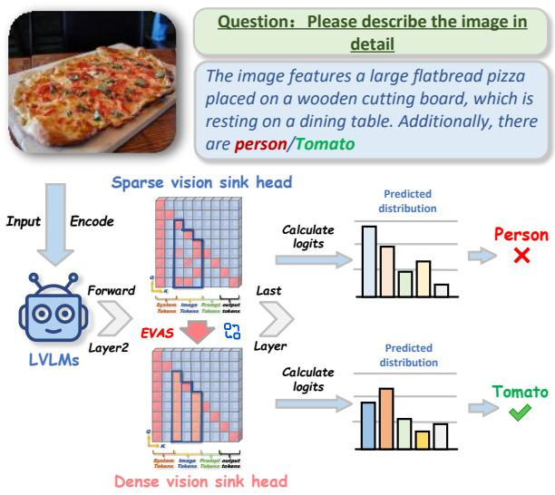  
Figure 1: We found a common phenomenon through the attention map: In the range of image token, the attention head of shallow Sparse attention sink is prone to hallucination, while the attention head of Dense attention sink is much less likely to hallucinate.

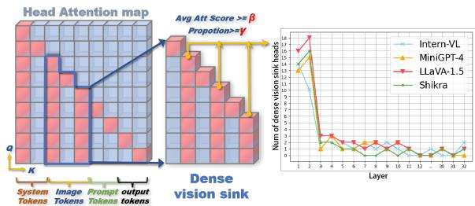  
Figure 2: Definition of dense vision sink head and its layer-wise distribution. In this case, $\beta = 0 . 0 0 1 5 , \gamma =$ 15%

Current research on attention sink provides new insights for tackling hallucinations. The attention sink is an information flow as introduced in “Label Words are Anchors" (Wang et al., 2023b), depicting how the information flow often converges on a specific user token in LLMs. It’s important to note that MLLM’s output tokens are generated by the decoder based on logits, whereas input tokens, which constitute most of the input sequence, are more likely to directly reflect the MLLM’s internal mechanisms. OPERA, DOPRA, TAME, and Vissink (Huang et al., 2024; Wei and Zhang, 2024; Tang et al., 2025; Kang et al., 2025) further explore the connection between attention sink in vision tokens and output tokens. In our investigation, we observe that when a token has a high attention weight across subsequent tokens, such over-reliance on the token can lead to hallucinations. Albeit these methods clarify the relationship among the attention sink, user tokens, and output tokens, the sparsity and hallucination of the deep and shallow vision attention sinks in the model remain unclear.

Finding 1: Most dense vision sink heads occur in or before layer 2: As aforementioned by FastV (Chen et al., 2024b), the information flow of image tokens is primarily concentrated in the first and second layers. Given this, we conduct experiments on several models and observe their shallow layers, including LLaVA1.5 (Liu et al., 2024a), Minigpt4 (Zhu et al., 2023), MiniGemini (Li et al., 2024d), and Intern-VL (Chen et al., 2024d). As shown in Figure 2, we calculate the average count of dense vision sink heads across these layers to further investigate the distribution of attention sinks across layers.

We define $h _ { i , j }$ as the attention head, a “dense vision sink head" as a head $( i , j )$ when the proportion $\alpha ^ { i , j }$ of columns in the attention map meets the

  
The image features a large flatbread pizza placed on a wooden cutting board, which is resting on a dining table. Additionally,

Avg Proportion of Dense Vision Sink Heads by Layer2 (%)  
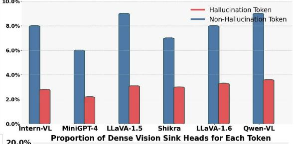

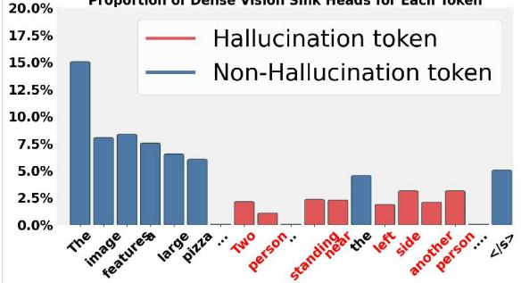  
Figure 3: Relationship between text tokens and the average proportion of dense vision sink heads within a single layer by layer2, analyzed across 5,000 randomly selected MSCOCO images using LLaVA1.5-7B.

vision sink threshold $\gamma \colon$

$$
v i s i o n s i n k = \frac { \sum _ { x = k } ^ { r } h _ { i , j } [ x ] [ y ] \cdot M } { r - k } > \beta ,\tag{1}
$$

Where are $k \in [ 3 6 , 6 1 1 ]$ , M is an upper triangle mask matrix. Concretely, we define $\alpha ^ { i , j }$ as:

$$
\alpha ^ { i , j } = \frac { \# v i s i o n s i n k } { 5 7 6 } ,\tag{2}
$$

A head is considered as a “dense vision sink head” when:

$$
\alpha ^ { i , j } \geq \gamma .\tag{3}
$$

Observations show that most vision attention sinks occur in the first 2 layers.

Finding 2: Fewer dense vision sink heads lead to hallucination output:

$$
p = { \frac { \# \left( { \mathrm { d e n s e ~ v i s i o n ~ s i n k ~ h e a d s } } \right) } { 3 2 } }\tag{4}
$$

This proportion $p$ quantifies how many of the total 32 heads are classified as "dense vision sink heads", i.e. they have a high proportion of columns that meet the vision sink condition within the image token range. We conduct the image captioning experiment on 5,000 randomly sampled MSCOCO images with LLaVA1.5-7B. When the model generates a new token, we first identify whether it is a hallucination token. Then, we backtrack to layer 2 and analyze the granularity of attention heads. We calculate the proportion of dense vision sink heads in layer 2 relative to the total number of heads (32 heads for 7B models). Such analysis is repeated for layer 1, and the average across layers 1 and 2 is computed later. As shown in Figure 3, we observe that non-hallucination tokens typically activate a larger number of dense vision sink heads, whereas hallucination tokens are generally associated with only a few dense vision sink heads, with the majority of heads being sparse. Through our analysis of different models, e.g., LLaVA1.5 (Liu et al., 2024a), Minigpt4 (Zhu et al., 2023), MiniGemini (Li et al., 2024d), Qwen-VL (Wang et al., 2024) and Intern-VL (Chen et al., 2024d), it suggests that fewer dense vision sinks heads lead to more probable hallucination output.

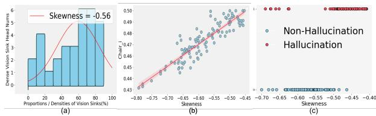  
Figure 4: (a) A example of distribution of dense vision head and the corresponding proportions/densities of vision sinks within these heads when model output hallucination token; (b) Relationship between the average skewness and CHAIRI on 150 randomly selected MSCOCO images, using LLaVA1.5-7B for captioning; (c) Comparative skewness scatter plot for Hallucination and Non-Hallucination classification on 150 randomly selected MSCOCO images, using LLaVA1.5-7B for VQA.

Finding 3: Lower density of vision sinks and fewer vision sink heads lead to a higher probability of hallucinations: However, the average count of dense vision sink heads across shallow layers does not reveal the individual contributions of each dense vision head, some of which may be negative while others are positive for hallucination. As noted by ITI (Li et al., 2024b), in current LLMs using transformer architecture, only a subset of attention heads plays a more significant role. Effectively optimizing these heads and leveraging them will likely lead to substantial improvements in model efficiency and overall performance. In this case, we conducted a more detailed view for each head, as shown in Figure 4 (a), the sink densities within different vision sink heads vary across the shallow layers (layer1-layer2), with an overall negatively skewed distribution. As shown in Figure 4 (b), for the image captioning task, the average skewness of the distribution of dense vision sink head and its corresponding vision sink densities in layer1 and layer2 is recorded each time a token is output. Once the output token is completed, the CHAIR for the entire output is calculated, and the average skewness for all tokens in layer1 and layer2 is obtained. As shown in Figure 4 (c), for the VQA task (with only a single output token), the average skewness of the distribution of vision sink head and its corresponding vision sink densities in layer1 and layer2 is directly recorded for the answer token. It is observed that, regardless of the task (image captioning or VQA), a lower skewness coefficient correlates with a lower hallucination rate. In other words, a higher density of vision sinks within a dense vision sink head and a larger number of vision sink heads lead to a lower probability of hallucination.

These observations highlight the critical role of attention head and vision sink distribution in understanding the attention sink phenomenon, particularly as it relates to alleviating hallucination issues in MLLMs. When the vision sink is sparse, visual tokens concentrate too heavily on specific elements, leading to reduced attention to other parts of the image. Conversely, a dense vision sink helps maintain a global perspective, preventing the model from narrowing its focus too much and minimizing information loss. Our goal is to ensure the model maintains a high-density vision sink within shallow layers. To achieve this, we design a training-free method called Enhancing Vision Attention Sinks (EVAS). This plug-and-play approach focuses on each attention head in the early layers, systematically identifying the head with the densest vision sinks. It then broadcasts this attention distribution across the layer, aligning the layer’s attention and the head’s vision sink distribution with that of the selected head.

We conduct extensive experiments, focusing specifically on hallucination issues, and test mainstream MLLMs to validate the effectiveness of EVAS in reducing hallucinations across various model architectures. Our results demonstrate that

EVAS is a highly effective plug-and-play solution for mitigating hallucinations across various MLLMs. Specifically, our contributions can be summarized as follows:

• This paper investigates how information flow relates to hallucinations in MLLMs. Our analysis reveals a consistent pattern where denser vision sinks and a larger number of vision sink heads in the shallow layers are associated with fewer hallucinations.

• We propose a plug-and-play training-free method called Enhancing Vision Attention Sinks (EVAS), which alleviates hallucinations by finding the head with the densest vision sink and broadcasting it to other heads.

• Experiments on multiple models validate the plug-and-play convenience and strong generalization of this method.

## 2 Related Work

## 2.1 Attention Sink and Information Flow

While the mechanisms of LLMs and MLLMs remain complex and not fully understood, several approaches focusing on information flow and attention sink patterns provide valuable insights into their operation and offer potential solutions to issues such as hallucinations and inefficiencies.

StreamingLLM (Xiao et al., 2023) first introduces the concept of attention sink. The authors observe an intriguing phenomenon: initial tokens, while seemingly less important for the overall content generation, consistently receive high attention scores. This is visualized in the attention map as columns with notably high attention scores, which is counterintuitive. Furthermore, because of the autoregressive nature of generative models, these initial tokens continue to receive more attention from subsequent tokens, amplifying their impact on the generation process. To address this, StreamingLLM leverages these attention-sink tokens during the pre-training phase to enhance the model’s performance.

In the context of MLLMs, OPERA (Huang et al., 2024) introduces a novel perspective by linking the causes of hallucinations with attention sinks. This approach provides new insights into the interpretability of MLLMs. OPERA reveals that during the inference phase, the generation of key tokens such as ’-’, ’?’, or tokens that summarize previous ones can lead the model to produce hallucinated content. To address this issue, OPERA imposes penalty constraints on the attention scores of these summarization tokens. In light of this, DOPRA (Wei and Zhang, 2024) addresses the overreliance by improving the strategy of weighted overlay penalties and redistribution in specific layers.

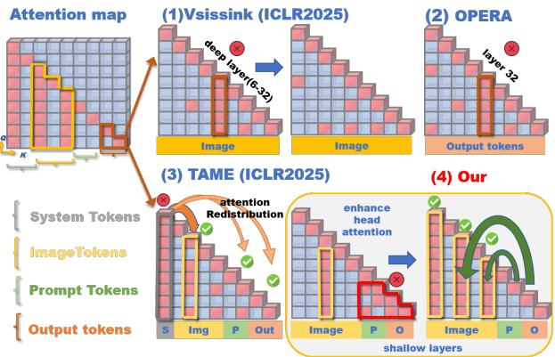  
Figure 5: Differences in analysis perspectives between OPERA (Huang et al., 2024), TAME (Tang et al., 2025), Vissink (Kang et al., 2025) and our method.

## Difference between These Methods:

EVAS differs from existing methods while remaining non-conflicting and even complementary. Existing methods primarily adjust decoding strategies by modifying logits. For example, OPERA (Huang et al., 2024), DOPRA(Wei and Zhang, 2024) and MCA-LLaVA(Zhao et al., 2025) identify that anchor output token can lead to hallucinated token generation and try to penalize anchor tokens logits. TAME(Tang et al., 2025) focuses on anchor token propagation in all layer, dynamically adjusting these anchor token. Vissink (Kang et al., 2025) found that the vision attention sink in the middle and deep layers converged on some <cls> or image-irrelevant tokens, which was attributed to the massive activation(Sun et al., 2024), so they redistributed the attention of these vision anchor tokens.

## 3 Method

## 3.1 Relationship between Vision Sink and Hallucinations

Popular VLMs, such as LLaVA-1.5 (Liu et al., 2024a), Minigemini (Li et al., 2024d), Instruct-BLIP (Dai et al., 2024), Shikra (Chen et al., 2023), MiniGPT-4 (Zhu et al., 2023), Qwen-VL (Bai et al., 2023), and InternVL (Chen et al., 2024d), consistently exhibit a notable pattern: vision sinks are densely concentrated within the first and second layers, gradually becoming more sparse in deeper layers. As illustrated in Figure 2, Figure 3, and Figure 4, we conclude that a lower density of vision sinks and fewer vision sink heads correlate with an increased likelihood of hallucinations in model outputs. We hypothesize that maintaining dense attention sinks in shallow layers may help alleviate hallucinations, as concentrated attention in the early layers enhances the transfer of image information to subsequent layers. Therefore, a practical method is proposed to reduce hallucinations by ensuring a dense vision sink of attention heads by layer1 and layer2. Please refer to the Appendix for more attention-map visualization results of different LVLMs.

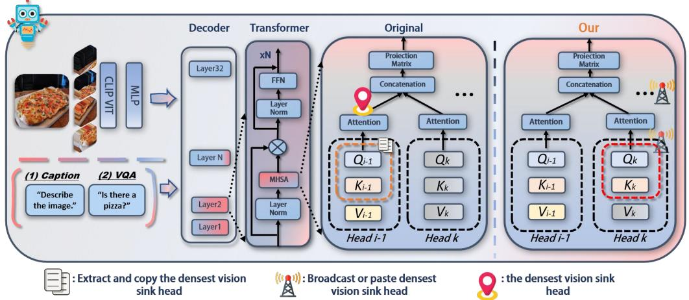  
Figure 6: The structure of Enhancing Shallow Layers Vision Attention Sinks.

## 3.2 Vision Sink

Definition of Mask Matrix M. To ignore diagonal elements in the attention map during calculations, we define a mask matrix M as follows:

$$
M \gets \mathrm { e y e } ( r , c ) - \mathrm { d i a g } ( 1 ) ,\tag{5}
$$

where $\mathrm { e y e } ( r , c )$ generates an identity matrix of size $( r , c )$ , and we set the diagonal elements to zero.

Definition of Vision Sink. Let $h _ { i , j }$ represent the attention map of the j-th head at the i-th layer, with $h _ { i , j } [ x ] [ y ]$ being the element at row x and column y. We define a “vision sink" as the column in the attention map within the image token range (e.g., $k \in [ 3 6 , 6 1 1 ] )$ ), where the average attention score of one element of the column within the image token range exceeds a threshold $\beta .$

For each column $y ,$ the "vision sink" condition is defined as:

$$
\nu i s i o n \ s i n k = \frac { \sum _ { x = k } ^ { r } h _ { i , j } [ x ] [ y ] \cdot M } { r - k } > \beta ,\tag{6}
$$

where $k \in [ 3 6 , 6 1 1 ]$ , M is an upper triangular mask matrix.

Definition of Dense Vision Sink Head: For a head (i, j), we calculate the proportion of columns that meet the vision sink condition, denoted as $\alpha ^ { i , j }$ If this proportion of vision sinks within the range of image tokens (e.g., 576) exceeds a preset threshold γ, we classify the head as a "dense vision sink head." which is defined as follows:

$$
\alpha ^ { i , j } = \frac { \mathrm { N u m } ( \nu i s i o n s i n k ) } { 5 7 6 } \geq \gamma .\tag{7}
$$

where $\alpha ^ { i , j }$ represents the attention density score of the j-th head at the i-th layer. Num(vision sink) is the count of columns that satisfy the vision sink condition. $\gamma$ is the threshold for determining whether a head qualifies as a "dense vision sink head."

If $\alpha ^ { i , j } \geq \gamma$ , then the attention head (i, j) is identified as a "dense vision sink head."

## 3.3 Enhancing Attention Vision Sink

As mentioned above, we introduce a training-free, plug-and-play method called Enhancing Vision Attention Sinks (EVAS) to keep attention heads densely concentrated in the early layers. This approach identifies the attention head with the most dense attention sinks and broadcasts its attention map across other heads. This is to reinforce the attention pattern of a particular head or to broadcast the attention pattern under certain specific conditions (e.g. when a predefined threshold is exceeded).

The algorithmic process is shown in Algorithm 1, let A be a 4D tensor, where $A [ i ] [ j ]$ denotes the attention matrix of the $j _ { t h }$ head of the $i _ { t h }$ layer. Let $\beta$ be the threshold, image-token-start-index be s, image-token-end-index be e and M be a mask matrix of the same size as $h _ { i , j }$ . We define $h _ { i , j }$ as the attention-map of a head:

Initialization. Set the threshold $\beta$ and initialize the variables: k as a randomly selected index within the range $[ s , e ]$ , where $s = 3 6$ is the starting index of the image tokens and e = 611 is the end index; also initialize $n = 0$ and $H = { \left[ \begin{array} { l } { \quad } \end{array} \right] }$ (an empty list).

Step1: Iteration over Heads. Select a specific attention layer $\textit { i } ( i \in \{ 0 , 1 , 2 \} )$ , iterate on each head $j ( j \in [ 0 , 3 1 ] )$

Step2: Calculate Vision Sinks. For each column y in $h _ { i , j }$ , calculate whether its column is a vision sink based on:

$$
\mathbf { i d } _ { i , j } = \{ ( x , y ) \mid \frac { \sum _ { r = k } ^ { r } h _ { i , j } [ x , y ] \cdot M } { r - k } > \beta \} ,\tag{8}
$$

where $\mathrm { i d } _ { i , j }$ stores the indices $( x , y )$ where the average attention score exceeds $\beta$

Step3: Store Count of Vision Sinks for each Attention Head. Compute the count of marked indices for each head:

$$
C _ { i , j } = \mathrm { c o u n t } ( \mathrm { i d } _ { i , j } ) ,\tag{9}
$$

then append $( C _ { i , j } , j )$ to H:

$$
H = H \cup \{ ( C _ { i , j } , j ) \} .\tag{10}
$$

Step4: Update Head Index n with Maximum Vision Sinks. Find the index n of the head with the maximum count $C _ { i , j }$ in H:

$$
n = \arg \operatorname* { m a x } _ { ( C _ { i , j } , j ) \in H } C _ { i , j } .\tag{11}
$$

This step dynamically updates n to track the head with the most vision sinks across the layer.

Step5: Enhance Attention Heads across the Layer. For each layer i, set the matrix of head j with the head with the highest number of vision sinks to be the n-th position in $A [ i ]$

$$
\mathrm { f o r } j = 0 , 1 , \ldots , 3 1 : A [ i ] [ j ] = A [ i ] [ n ] .\tag{12}
$$

Algorithm 1 Attention Process Calculation, nonzero() represents an operation with a non-zero index, and $\displaystyle \sum$ represents a sum, $h _ { i , j }$ represents the i layer, j head, k represents the index of token. x and y represent the rows and columns of $h _ { i , j }$ respectively.

1: procedure ATTEN\_PROCESS\_CAL(A)   
2: Step 1: threshold β, n 0 H [ ]   
3: Step 2: Loop over heads in a specific layer $i , i \in$   
$\{ 0 , 1 , { \dot { 2 } } \} \colon$   
4: for $\dot { j } \in \{ 0 , 1 , 2 , \dots , 3 1 \}$ do:   
5: $h _ { i , j } \stackrel { \cdot } {  } A [ i ] [ j ]$   
6: s 36, e 611   
7: Step 3: Calculate significant token indices:   
8: $M \gets ( \mathrm { e y e } ( r , \bar { c } ) - \mathrm { d i a g } ( 1 ) )$   
9: ids nonzero $\begin{array} { r } { \left( \frac { \sum _ { x = k } ^ { r } \overset { . } { h _ { i , j } } [ x , y ] \cdot \mathrm { M } } { r - k } > \beta \right) } \end{array}$   
10: Step 4: Store the count of vision sinks and its   
corresponding head index in H:   
11: $\check { C } _ { i , j } \gets \mathrm { c o u n t } ( \mathrm { i d } _ { i , j } ) , H \gets H \cup \{ ( C _ { i , j } , j ) \}$   
12: Step 5: Update head index n with maximum vi  
sion sinks:   
13: $n = \arg \operatorname* { m a x } _ { ( C _ { i , j } , j ) \in H } C _ { i , j }$   
14: end for   
15: for j [0, 31] do   
16: $A [ i ] [ j ] \longleftarrow A [ i ] [ n ]$   
17: end for   
18: return updated A   
19: end procedure

## 4 Experiment

Baseline. To demonstrate the broad applicability of our method in LVLM architecture, we applied and evaluated the latest models, including LLaVA-v1.5/1.6 (Liu et al., 2024a), Qwen/2-VL (Wang et al., 2024), Intern-VL (Chen et al., 2024d), MiniGPT4 (Li et al., 2024d), Instructblip (Dai et al., 2024) and MiniGemini (Li et al., 2024d).

Evaluation Benchmarks. We conduct evaluations on image benchmarks. For image benchmarks, we assess three categories: (1) Comprehensive benchmarks (MMBench (Liu et al., 2024c), $\mathrm { L L a V A } ^ { \mathrm { W } }$ (Liu et al., 2024a), MM-Vet (Yu et al., 2023); (2) General VQA benchmarks (VizWiz (Gurari et al., 2018), SEED (Li et al., 2023a) and GQA (Hudson and Manning, 2019); (3) Hallucination benchmarks (POPE(Li et al., 2023b), CHAIR (Rohrbach et al., 2018)).

## 4.1 Evaluation Results

CHAIR and POPE Evaluations. EVAS on Hallucination BenchmarksIt is shown in Table 1, that the methods to mitigate hallucinations can be broadly classified into three groups. The first group includes OPERA (Huang et al., 2024), DOPRA (Wei and Zhang, 2024), VCD (Leng et al., 2024),

Table 1: Compare results of SARA with other SOTA methods on POPE, CHAIR and MME datasets. The best performances within each setting are bolded, baseline: LLaVA-1.5-7B. Please note that these results are all reproduced by us.
<table><tr><td rowspan="2">Method</td><td rowspan="2">Venue</td><td colspan="2">POPE</td><td colspan="4">CHAIR</td><td rowspan="2">Exist.↑</td><td colspan="4">MME Count↑</td></tr><tr><td>F1↑</td><td>Acc↑</td><td> $\mathbf { C } _ { S \downarrow }$ </td><td>CI↓</td><td>Recall</td><td>length</td><td></td><td>Pos.↑</td><td>Color↑</td><td>Total↑</td></tr><tr><td>Beam Search</td><td></td><td>85.4</td><td>84.0</td><td>51.0</td><td>15.2</td><td>75.2</td><td>102.2</td><td>175.67</td><td>124.67</td><td>114.00</td><td>151.00</td><td>565.34</td></tr><tr><td>Dola (Chuang et al., 2023)</td><td>ICLR 2024</td><td>80.2</td><td>83.1</td><td>57.0</td><td>15.2</td><td>78.2</td><td>97.5</td><td>180.10</td><td>127.40</td><td>119.30</td><td>154.60</td><td>594.10</td></tr><tr><td>VCD (Leng et al., 2024)</td><td>CVPR 2024</td><td>85.3</td><td>85.0</td><td>51.0</td><td>14.9</td><td>77.2</td><td>101.9</td><td>184.66</td><td>137.33</td><td>128.67</td><td>153.00</td><td>603.66</td></tr><tr><td>OPERA (Huang et al., 2024)</td><td>CVPR 2024</td><td>84.2</td><td>85.2</td><td>47.0</td><td>14.6</td><td>78.5</td><td>95.3</td><td>180.67</td><td>133.33</td><td>111.67</td><td>123.33</td><td>549.00</td></tr><tr><td>DOPRA (Wei and Zhang, 2024)</td><td>MM 2024</td><td>84.6</td><td>84.3</td><td>46.3</td><td>13.8</td><td>78.2</td><td>96.1</td><td>185.67</td><td>138.33</td><td>120.67</td><td>133.00</td><td>577.67</td></tr><tr><td>HALC (Chen et al., 2024c)</td><td>ICML 2024</td><td>83.9</td><td>84.0</td><td>50.2</td><td>12.4</td><td>78.4</td><td>97.2</td><td>190.00</td><td>143.30</td><td>128.30</td><td>160.00</td><td>621.60</td></tr><tr><td>CCA-LLaVA (Xing et al., 2024b)</td><td>NIPS 2024</td><td>86.4</td><td>86.5</td><td>43.0</td><td>11.5</td><td>80.4</td><td>96.6</td><td>190.00</td><td>148.33</td><td>128.33</td><td>153.00</td><td>641.66</td></tr><tr><td>RITUAL (Woo et al., 2024)</td><td>Arxiv 2024</td><td>85.2</td><td>84.3</td><td>45.2</td><td>13.2</td><td>78.3</td><td>99.2</td><td>187.50</td><td>139.58</td><td>125.00</td><td>164.17</td><td>616.25</td></tr><tr><td>AGLA (An et al., 2024)</td><td>CVPR 2025</td><td>84.6</td><td>85.5</td><td>43.0</td><td>14.1</td><td>78.9</td><td>98.8</td><td>195.00</td><td>153.89</td><td>129.44</td><td>156.67</td><td>635.00</td></tr><tr><td>SID (Huo et al., 2025)</td><td>ICLR 2025</td><td>85.6</td><td>85.8</td><td>44.2</td><td>12.2</td><td>73.0</td><td>99.4</td><td>183.90</td><td>132.20</td><td>127.80</td><td>155.90</td><td>599.80</td></tr><tr><td>TAME (Tang et al., 2025)</td><td>ICLR 2025</td><td>85.4</td><td>85.7</td><td>41.3</td><td>12.2</td><td>74.4</td><td>98.8</td><td>183.00</td><td>137.33</td><td>129.00</td><td>154.67</td><td>604.00</td></tr><tr><td>Vissink (Kang et al., 2025)</td><td>ICLR 2025</td><td>86.0</td><td>86.5</td><td>52.4</td><td>14.5</td><td>79.1</td><td>113.0</td><td>190.00</td><td>138.33</td><td>148.33</td><td>155.00</td><td>631.33</td></tr><tr><td>EVAS</td><td></td><td>85.7</td><td>86.0</td><td>36.4</td><td>9.9</td><td>75.2</td><td>97.7</td><td>190.00</td><td>148.33</td><td>128.00</td><td>160.33</td><td>626.66</td></tr></table>

Table 2: Evaluation results of EVAS on general vision-language benchmarks, baseline: LLaVA1.5-7B, Layer = 2, β = 0.002.
<table><tr><td>Method</td><td>MM-Vet ↑</td><td>VizWiz↑</td><td>Seed↑</td><td></td><td>GQA↑ MMB↑</td></tr><tr><td>Baseline</td><td>31.1</td><td>50.1</td><td>57.6</td><td>62.0</td><td>64.2</td></tr><tr><td>VCD(Leng et al., 2024)</td><td>29.4</td><td>50.5</td><td>58.3</td><td>61.6</td><td>61.4</td></tr><tr><td>OPERA(Huang et al., 2024)</td><td>30.0</td><td>52.4</td><td>59.4</td><td>62.0</td><td>64.8</td></tr><tr><td>SID (Huo et al., 2025)</td><td>31.2</td><td>50.8</td><td>58.9</td><td>62.1</td><td>65.0</td></tr><tr><td>TAME (Tang et al., 2025)</td><td>30.5</td><td>51.6</td><td>59.4</td><td>61.7</td><td>65.3</td></tr><tr><td>Ours</td><td>31.7</td><td>53.9</td><td>60.2</td><td>62.3</td><td>65.8</td></tr></table>

HACL (Chen et al., 2024c), RITUAL (Woo et al., 2024)and SID (Huo et al., 2025), which address hallucinations by altering the decoding process. The second group, represented by SFT methods such as CCA-LLaVA (Xing et al., 2024b), adjusts the logits of the end-of-sequence (EOS) symbol to control its positioning, allowing the model to terminate earlier, thus reducing hallucinations. The third group includes Vissink (Kang et al., 2025), TAME (Tang et al., 2025) and EVAS, which aim to adjust attention heads to enhance the truthfulness of the model’s output during inference. Compared to Vissink (Kang et al., 2025) and TAME (Tang et al., 2025), EVAS’s CHAIR performance is more prominent. TAME allocates the attention on the system token to other tokens, but still ignores the visual information, while Vissink only intervenes with the visual attention sink and ignores the contextual association of the text output.

MME and Other Benchmarks/Models Evaluations. It is shown that in Table 2 and Table 3, compared to the baseline model LLaVA1.5, our EVAS method achieves non-negligible gains on all benchmark datasets without introducing additional computation during inferencing. Such performance improvements highlight the potential of EVAS in enhancing LVLM’s general visual perception capabilities.

Table 3: Generalization study of EVAS on other LVLMs models about CHAIR and POPE dataset, metrics are CHAIR , CHAIR and POPE-F1 score.
<table><tr><td>Model</td><td>CHAIRS↓</td><td>CHAIRI↓</td><td>POPE-F1↑</td></tr><tr><td>Qwen2-VL</td><td>25.0</td><td>7.3</td><td>86.6</td></tr><tr><td>+ EVAS</td><td>23.1 (+1.9)</td><td>6.2 (+1.1)</td><td>87.4 (+0.8)</td></tr><tr><td>QwenVL-Chat</td><td>45.6</td><td>12.5</td><td>87.0</td></tr><tr><td>+ EVAS</td><td>44.6 (+1.0)</td><td>11.9 (+0.6)</td><td>87.8 (+0.8)</td></tr><tr><td>MiniGPT-4</td><td>31.8</td><td>9.9</td><td>70.3</td></tr><tr><td>+ EVAS</td><td>30.4 (+1.4)</td><td>9.5 (+0.4)</td><td>70.7 (+0.7)</td></tr><tr><td>Instructblip</td><td>58.8</td><td>23.7</td><td>84.4</td></tr><tr><td>+ EVAS</td><td>56.0 (+2.8)</td><td>15.7 (+8.0)</td><td>85.2 (+0.6)</td></tr><tr><td>Shikra</td><td>55.8</td><td>15.4</td><td>82.5</td></tr><tr><td>+ EVAS</td><td>47.9 (+7.9)</td><td>13.7 (+1.7)</td><td>83.5 (+1.0)</td></tr><tr><td>Mini-Gemini</td><td>32.6</td><td>8.7</td><td>85.6</td></tr><tr><td>+ EVAS</td><td>27.8 (+4.8)</td><td>8.5 (+0.2)</td><td>86.8 (+1.2)</td></tr><tr><td>LLaVA1.5</td><td>47.0</td><td>13.8</td><td>84.9</td></tr><tr><td>+ EVAS</td><td>36.4 (+10.6)</td><td>9.9 (+3.8)</td><td>85.7 (+0.8)</td></tr><tr><td>LLaVA1.6</td><td>42.6</td><td>14.4</td><td>86.5</td></tr><tr><td>+ EVAS</td><td>34.3 (+8.3)</td><td>10.2 (+4.2)</td><td>87.5 (+1.0)</td></tr><tr><td>InternVL</td><td>45.8</td><td>12.9</td><td>86.4</td></tr><tr><td>+ EVAS</td><td>32.4 (+13.4)</td><td>9.0 (+3.9)</td><td>87.8 (+1.4)</td></tr></table>

In contemporary MLLMs, images are processed by a CLIP model, mapped through different projectors, and integrated with LLMs. We hypothesize that the convergence of information flow in the early layers is affected by how different projectors—such as Linear, MLP, Cross-attention, and Q-former—map images to tokens. As shown in Table 3, to test this hypothesis, we apply the EVAS method to various models. Notably, Shikra, LLaVA, Intern-VL, Qwen-VL, and Mini-Gemini use greedy search for decoding, while InstructBLIP uses beam search with a beam size of 5. Despite the different decoding strategies and projectors, all models exhibit a consistent pattern of dense attention sink in the shallow layers and sparse attention sink in the deeper layers. Applying EVAS to these models consistently improves performance, demonstrating its effective plug-and-play capability and broad applicability. In the Appendix, we provide several attention maps for different LVLMs.

Table 4: Results for ablation study of the hyperparameter on CHAIR(Rohrbach et al., 2018) and POPE(Li et al., 2023b) dataset, Threshold: β, : broadcast top head, baseline: LLaVA1.5-7B, metrics: $\mathrm { C H A I R } _ { S } { = } 5 1 . 0 .$ $\mathrm { C H A I R } _ { I } { = } 1 5 . 2$ and POPE-F1-score=84.9.
<table><tr><td rowspan=1 colspan=1>Nβ</td><td rowspan=1 colspan=1>Layer 1Cs↓ $C _ { I \downarrow }$ P-F1↑</td><td rowspan=1 colspan=1>Layer 2 $C _ { s \downarrow }$ C1↓P-F1↑|</td><td rowspan=1 colspan=1>Layer 3Cs↓ C1↓P-F1↑</td></tr><tr><td rowspan=1 colspan=1>10..15|10..20</td><td rowspan=1 colspan=1>39.49.985.441.810.485.3</td><td rowspan=1 colspan=1>|40.6 11.985.236.4 9.985.7</td><td rowspan=1 colspan=1>|49.0 14.385.046.8 13.884.9</td></tr><tr><td rowspan=1 colspan=1>20..1520..20</td><td rowspan=1 colspan=1>41.2 10.385.342.210.985.2</td><td rowspan=1 colspan=1>40.611.785.542.4 11.985.5</td><td rowspan=1 colspan=1>49.8 14.184.949.6 14.084.9</td></tr><tr><td rowspan=1 colspan=1>30..1530..20</td><td rowspan=1 colspan=1>41.611.285.242.0 11.085.1</td><td rowspan=1 colspan=1>44.4 12.085.344.2 12.585.2</td><td rowspan=1 colspan=1>48.4 13.884.948.2 13.784.8</td></tr></table>

## 4.2 Ablation study

Effect of Hyper-parameter. Table 4 presents the ablation study results for the parameters Threshold: $\beta ,$ Layer: $L ,$ Top Head: $\mathcal { N }$ . The experimental results indicate that the configuration with layer=2, $\beta { = } 0 . 0 0 2$ , and ${ \mathcal { N } } { = } \mathrm { t o p } 1$ , yields the best performance, achieving $\mathbf { C } _ { S }$ of 36.6 and $\mathbf { C } _ { I }$ of 9.9.

The improvement achieved by broadcasting the top attention head primarily benefits from the centralization of attention. Since most vision sinks are concentrated in the first and second layers, broadcasting the attention map of the head with the densest vision sink in these layers to the other heads helps unify each head’s focus on visual information, forming a "consensus" attention pattern. Ultimately, the high-density vision sink pattern enables the model to capture key information from the image, effectively reducing hallucinations.

Effect of EVAS on Video Understanding Benchmark. As shown in the Table 5, We conducted validation experiments of the effectiveness of EVAS on LLaVA-onevision (Li et al., 2024a) and VideoLLaMA2 (Cheng et al., 2024). The video understanding and linguistic-related tasks including EgoSchema (Mangalam et al., 2023), MVbench (Li et al., 2024c) and VideoMME (Fu et al., 2024). The results demonstrate that EVAS not only mitigates hallucination and enhances factual consistency, but in turn amplifies these gains to produce significant improvements in all benchmark tests.

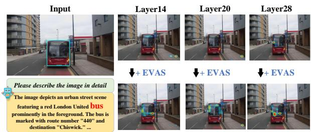  
Figure 7: The attention-map results of LLaVA1.5 and LLaVA1.5 after adding EVAS, which is visualization of attention maps over image for ‘bus’.

Table 5: Generalization study of EVAS on video understanding dataset including EgoSchema (Mangalam et al., 2023), MVBench (Li et al., 2024c) and VideoMME (Fu et al., 2024).
<table><tr><td>Model</td><td>EgoSchema↑</td><td>MVBench↑</td><td>VideoMME↑</td></tr><tr><td>LLaVA-onevision</td><td>60.1</td><td>56.7</td><td>58.29</td></tr><tr><td>+ EVAS</td><td>63.9 (+3.8)</td><td>59.9 (+3.2)</td><td>61.16 (+2.87)</td></tr><tr><td>VideoLLaMA2</td><td>42.2</td><td>45.5</td><td>62.40</td></tr><tr><td>+ EVAS</td><td>45.7 (+3.5)</td><td>49.9(+4.4)</td><td>66.88 (+4.48)</td></tr></table>

## 4.3 Visualization of Attention Maps with EVAS

As shown in Figure 7, which is visualization of attention map with EVAS, We can find that some attention layers/heads that originally do not focus on the correct region will also gradually focus on the correct region when the EVAS is added. EVAS makes the original model pay more attention to the area of objects such as “bus” etc.

This result demonstrates that the EVAS method, which enhances attention heads in shallow/deep layers, improves the model’s generalization ability. It enables the model to focus more on essential regions in the image, strengthening the flow of information and enhancing its overall capabilities.

## 5 Conclusion

In this paper, we introduce a method named Enhancing Vision Attention Sinks to alleviate hallucinations in LVLMs. EVAS is designed to enhance the densities and distribution of image token attention sinks in the shallow layers, thereby mitigating hallucinations. Our extensive benchmark tests on hallucination and generalization experiments demonstrate the effectiveness of EVAS as a training-free approach.

## 6 Acknowledgments

This work was supported by the National Natural Science Foundation NO. 62273235, National Major Scientific Research Instrument Development Project (62227811), the Joint Fund of the Ministry of Education NO. 8091B022101, Deep Blue Program Fund Project, Second Institute of Oceanography, Ministry of Natural Resources.

## 7 Limitations

The results of this paper validate ITI’s (Li et al., 2024b) conclusion that only a subset of attention heads plays a significantly more prominent role. Effectively optimizing these key attention heads is likely to yield substantial improvements in model efficiency and overall performance. To address hallucination issues more fundamentally, we believe that improved alignment of projectors and advanced training methods, such as RLHF, is necessary for more effective resolution.

## References

Wenbin An, Feng Tian, Sicong Leng, Jiahao Nie, Haonan Lin, QianYing Wang, Guang Dai, Ping Chen, and Shijian Lu. 2024. Agla: Mitigating object hallucinations in large vision-language models with assembly of global and local attention. arXiv preprint arXiv:2406.12718.

Jiaqi Bai, Hongcheng Guo, Zhongyuan Peng, Jian Yang, Zhoujun Li, Mohan Li, and Zhihong Tian. 2025. Mitigating hallucinations in large vision-language models by adaptively constraining information flow. In Proceedings of the AAAI Conference on Artificial Intelligence, volume 39, pages 23442–23450.

Jinze Bai, Shuai Bai, Shusheng Yang, Shijie Wang, Sinan Tan, Peng Wang, Junyang Lin, Chang Zhou, and Jingren Zhou. 2023. Qwen-vl: A frontier large vision-language model with versatile abilities. arXiv preprint arXiv:2308.12966.

Liwei Che, Tony Qingze Liu, Jing Jia, Weiyi Qin, Ruixiang Tang, and Vladimir Pavlovic. 2025. Eazy: Eliminating hallucinations in lvlms by zeroing out hallucinatory image tokens. arXiv preprint arXiv:2503.07772.

Beitao Chen, Xinyu Lyu, Lianli Gao, Jingkuan Song, and Heng Tao Shen. 2024a. Alleviating hallucinations in large vision-language models through hallucination-induced optimization. arXiv preprint arXiv:2405.15356.

Beitao Chen, Xinyu Lyu, Lianli Gao, Jingkuan Song, and Heng Tao Shen. 2025a. Attention hijackers: Detect and disentangle attention hijacking in lvlms for hallucination mitigation. arXiv preprint arXiv:2503.08216.

Cong Chen, Mingyu Liu, Chenchen Jing, Yizhou Zhou, Fengyun Rao, Hao Chen, Bo Zhang, and Chunhua Shen. 2025b. Perturbollava: Reducing multimodal hallucinations with perturbative visual training. arXiv preprint arXiv:2503.06486.

Keqin Chen, Zhao Zhang, Weili Zeng, Richong Zhang, Feng Zhu, and Rui Zhao. 2023. Shikra: Unleashing multimodal llm’s referential dialogue magic. arXiv preprint arXiv:2306.15195.

Liang Chen, Haozhe Zhao, Tianyu Liu, Shuai Bai, Junyang Lin, Chang Zhou, and Baobao Chang. 2024b. An image is worth 1/2 tokens after layer 2: Plug-andplay inference acceleration for large vision-language models. 18th European Conference on Computer Vision ECCV 2024.

Zhaorun Chen, Zhuokai Zhao, Hongyin Luo, Huaxiu Yao, Bo Li, and Jiawei Zhou. 2024c. Halc: Object hallucination reduction via adaptive focal-contrast decoding. arXiv preprint arXiv:2403.00425.

Zhe Chen, Jiannan Wu, Wenhai Wang, Weijie Su, Guo Chen, Sen Xing, Muyan Zhong, Qinglong Zhang, Xizhou Zhu, Lewei Lu, et al. 2024d. Internvl: Scaling up vision foundation models and aligning for generic visual-linguistic tasks. In Proceedings of the IEEE/CVF Conference on Computer Vision and Pattern Recognition, pages 24185–24198.

Zesen Cheng, Sicong Leng, Hang Zhang, Yifei Xin, Xin Li, Guanzheng Chen, Yongxin Zhu, Wenqi Zhang, Ziyang Luo, Deli Zhao, et al. 2024. Videollama 2: Advancing spatial-temporal modeling and audio understanding in video-llms. arXiv preprint arXiv:2406.07476.

Yung-Sung Chuang, Yujia Xie, Hongyin Luo, Yoon Kim, James Glass, and Pengcheng He. 2023. Dola: Decoding by contrasting layers improves factuality in large language models. arXiv preprint arXiv:2309.03883.

Karl Cobbe, Vineet Kosaraju, Mohammad Bavarian, Mark Chen, Heewoo Jun, Lukasz Kaiser, Matthias Plappert, Jerry Tworek, Jacob Hilton, Reiichiro Nakano, Christopher Hesse, and John Schulman. 2021. Training verifiers to solve math word problems. arXiv preprint arXiv:2110.14168.

Wenliang Dai, Junnan Li, Dongxu Li, Anthony Meng Huat Tiong, Junqi Zhao, Weisheng Wang, Boyang Li, Pascale N Fung, and Steven Hoi. 2024. Instructblip: Towards general-purpose visionlanguage models with instruction tuning. Advances in Neural Information Processing Systems, 36.

Jinhao Duan, Fei Kong, Hao Cheng, James Diffenderfer, Bhavya Kailkhura, Lichao Sun, Xiaofeng Zhu, Xiaoshuang Shi, and Kaidi Xu. 2025. Truthprint: Mitigating lvlm object hallucination via latent truthful-guided pre-intervention. arXiv preprint arXiv:2503.10602.

Abhimanyu Dubey, Abhinav Jauhri, Abhinav Pandey, Abhishek Kadian, Ahmad Al-Dahle, Aiesha Letman, Akhil Mathur, Alan Schelten, Amy Yang, Angela Fan, et al. 2024. The llama 3 herd of models. arXiv preprint arXiv:2407.21783.

Chaoyou Fu, Yuhan Dai, Yongdong Luo, Lei Li, Shuhuai Ren, Renrui Zhang, Zihan Wang, Chenyu Zhou, Yunhang Shen, Mengdan Zhang, et al. 2024. Video-mme: The first-ever comprehensive evaluation benchmark of multi-modal llms in video analysis. arXiv preprint arXiv:2405.21075.

Xuan Gong, Tianshi Ming, Xinpeng Wang, and Zhihua Wei. 2024. Damro: Dive into the attention mechanism of lvlm to reduce object hallucination. arXiv preprint arXiv:2410.04514.

Tianrui Guan, Fuxiao Liu, Xiyang Wu, Ruiqi Xian, Zongxia Li, Xiaoyu Liu, Xijun Wang, Lichang Chen, Furong Huang, Yaser Yacoob, et al. 2023. Hallusionbench: An advanced diagnostic suite for entangled language hallucination and visual illusion in large vision-language models. arXiv preprint arXiv:2310.14566.

Danna Gurari, Qing Li, Abigale J Stangl, Anhong Guo, Chi Lin, Kristen Grauman, Jiebo Luo, and Jeffrey P Bigham. 2018. Vizwiz grand challenge: Answering visual questions from blind people. In Proceedings of the IEEE conference on computer vision and pattern recognition, pages 3608–3617.

Lei Huang, Weijiang Yu, Weitao Ma, Weihong Zhong, Zhangyin Feng, Haotian Wang, Qianglong Chen, Weihua Peng, Xiaocheng Feng, Bing Qin, et al. 2023. A survey on hallucination in large language models: Principles, taxonomy, challenges, and open questions. arXiv preprint arXiv:2311.05232.

Qidong Huang, Xiaoyi Dong, Pan Zhang, Bin Wang, Conghui He, Jiaqi Wang, Dahua Lin, Weiming Zhang, and Nenghai Yu. 2024. Opera: Alleviating hallucination in multi-modal large language models via over-trust penalty and retrospection-allocation. In Proceedings of the IEEE/CVF Conference on Computer Vision and Pattern Recognition, pages 13418– 13427.

Drew A Hudson and Christopher D Manning. 2019. Gqa: A new dataset for real-world visual reasoning and compositional question answering. In Proceedings of the IEEE/CVF conference on computer vision and pattern recognition, pages 6700–6709.

Fushuo Huo, Wenchao Xu, Zhong Zhang, Haozhao Wang, Zhicheng Chen, and Peilin Zhao. 2025. Selfintrospective decoding: Alleviating hallucinations for large vision-language models. In The Thirteenth International Conference on Learning Representations.

Albert Q Jiang, Alexandre Sablayrolles, Arthur Mensch, Chris Bamford, Devendra Singh Chaplot, Diego de las Casas, Florian Bressand, Gianna Lengyel, Guillaume Lample, Lucile Saulnier, et al. 2023. Mistral 7b. arXiv preprint arXiv:2310.06825.

Chaoya Jiang, Haiyang Xu, Mengfan Dong, Jiaxing Chen, Wei Ye, Ming Yan, Qinghao Ye, Ji Zhang, Fei Huang, and Shikun Zhang. 2024. Hallucination augmented contrastive learning for multimodal large language model. In Proceedings of the IEEE/CVF Conference on Computer Vision and Pattern Recognition, pages 27036–27046.

Seil Kang, Jinyeong Kim, Junhyeok Kim, and Seong Jae Hwang. 2025. See what you are told: Visual attention sink in large multimodal models.

Junho Kim, Hyunjun Kim, Yeonju Kim, and Yong Man Ro. 2024. Code: Contrasting self-generated description to combat hallucination in large multi-modal models. arXiv preprint arXiv:2406.01920.

Sicong Leng, Hang Zhang, Guanzheng Chen, Xin Li, Shijian Lu, Chunyan Miao, and Lidong Bing. 2024. Mitigating object hallucinations in large visionlanguage models through visual contrastive decoding. In Proceedings of the IEEE/CVF Conference on Computer Vision and Pattern Recognition, pages 13872–13882.

Bo Li, Yuanhan Zhang, Dong Guo, Renrui Zhang, Feng Li, Hao Zhang, Kaichen Zhang, Peiyuan Zhang, Yanwei Li, Ziwei Liu, et al. 2024a. Llavaonevision: Easy visual task transfer. arXiv preprint arXiv:2408.03326.

Bohao Li, Rui Wang, Guangzhi Wang, Yuying Ge, Yixiao Ge, and Ying Shan. 2023a. Seed-bench: Benchmarking multimodal llms with generative comprehension. arXiv preprint arXiv:2307.16125.

Kenneth Li, Oam Patel, Fernanda Viégas, Hanspeter Pfister, and Martin Wattenberg. 2024b. Inferencetime intervention: Eliciting truthful answers from a language model. Advances in Neural Information Processing Systems, 36.

Kunchang Li, Yali Wang, Yinan He, Yizhuo Li, Yi Wang, Yi Liu, Zun Wang, Jilan Xu, Guo Chen, Ping Luo, et al. 2024c. Mvbench: A comprehensive multi-modal video understanding benchmark. In Proceedings of the IEEE/CVF Conference on Computer Vision and Pattern Recognition, pages 22195–22206.

Shawn Li, Jiashu Qu, Yuxiao Zhou, Yuehan Qin, Tiankai Yang, and Yue Zhao. 2025a. Treble counterfactual vlms: A causal approach to hallucination. arXiv preprint arXiv:2503.06169.

Shuo Li, Jiajun Sun, Guodong Zheng, Xiaoran Fan, Yujiong Shen, Yi Lu, Zhiheng Xi, Yuming Yang, Wenming Tan, Tao Ji, et al. 2025b. Mitigating object hallucinations in mllms via multi-frequency perturbations. arXiv preprint arXiv:2503.14895.

Yanwei Li, Yuechen Zhang, Chengyao Wang, Zhisheng Zhong, Yixin Chen, Ruihang Chu, Shaoteng Liu, and Jiaya Jia. 2024d. Mini-gemini: Mining the potential of multi-modality vision language models. arXiv preprint arXiv:2403.18814.

Yifan Li, Yifan Du, Kun Zhou, Jinpeng Wang, Wayne Xin Zhao, and Ji-Rong Wen. 2023b. Evaluating object hallucination in large vision-language models. arXiv preprint arXiv:2305.10355.

Stephanie Lin, Jacob Hilton, and Owain Evans. 2021. Truthfulqa: Measuring how models mimic human falsehoods. arXiv preprint arXiv:2109.07958.

Haotian Liu, Chunyuan Li, Qingyang Wu, and Yong Jae Lee. 2024a. Visual instruction tuning. Advances in neural information processing systems, 36.

Shi Liu, Kecheng Zheng, and Wei Chen. 2024b. Paying more attention to image: A training-free method for alleviating hallucination in lvlms. arXiv preprint arXiv:2407.21771.

Yuan Liu, Haodong Duan, Yuanhan Zhang, Bo Li, Songyang Zhang, Wangbo Zhao, Yike Yuan, Jiaqi Wang, Conghui He, Ziwei Liu, et al. 2024c. Mmbench: Is your multi-modal model an all-around player? In European conference on computer vision, pages 216–233. Springer.

Maria Lymperaiou, Giorgos FIlandrianos, Angeliki Dimitriou, Athanasios Voulodimos, and Giorgos Stamou. 2025. Halcece: A framework for explainable hallucination detection through conceptual counterfactuals in image captioning. arXiv preprint arXiv:2503.00436.

Fan Ma, Xiaojie Jin, Heng Wang, Yuchen Xian, Jiashi Feng, and Yi Yang. 2024. Vista-llama: Reducing hallucination in video language models via equal distance to visual tokens. In Proceedings of the IEEE/CVF Conference on Computer Vision and Pattern Recognition, pages 13151–13160.

Karttikeya Mangalam, Raiymbek Akshulakov, and Jitendra Malik. 2023. Egoschema: A diagnostic benchmark for very long-form video language understanding. Advances in Neural Information Processing Systems, 36:46212–46244.

Shunqi Mao, Chaoyi Zhang, and Weidong Cai. 2025. Through the magnifying glass: Adaptive perception magnification for hallucination-free vlm decoding. arXiv preprint arXiv:2503.10183.

Anna Rohrbach, Lisa Anne Hendricks, Kaylee Burns, Trevor Darrell, and Kate Saenko. 2018. Object hallucination in image captioning. arXiv preprint arXiv:1809.02156.

Pritam Sarkar, Sayna Ebrahimi, Ali Etemad, Ahmad Beirami, Sercan Ö Arık, and Tomas Pfister. 2024. Mitigating object hallucination via data augmented contrastive tuning. arXiv preprint arXiv:2405.18654.

Mingjie Sun, Xinlei Chen, J. Zico Kolter, and Zhuang Liu. 2024. Massive activations in large language models. arXiv preprint arXiv:2402.17762.

Wei Suo, Lijun Zhang, Mengyang Sun, Lin Yuanbo Wu, Peng Wang, and Yanning Zhang. 2025. Octopus: Alleviating hallucination via dynamic contrastive decoding. arXiv preprint arXiv:2503.00361.

Feilong Tang, Zile Huang, Chengzhi Liu, Qiang Sun, Harry Yang, and Ser-Nam Lim. 2025. Intervening anchor token: Decoding strategy in alleviating hallucinations for MLLMs. In The Thirteenth International Conference on Learning Representations.

Qwen Team. 2024. Qwen2.5: A party of foundation models.

Chongjun Tu, Peng Ye, Dongzhan Zhou, Lei Bai, Gang Yu, Tao Chen, and Wanli Ouyang. 2025. Attention reallocation: Towards zero-cost and controllable hallucination mitigation of mllms. arXiv preprint arXiv:2503.08342.

Chao Wang, Weiwei Fu, and Yang Zhou. 2025. Tpc: Cross-temporal prediction connection for visionlanguage model hallucination reduction. arXiv preprint arXiv:2503.04457.

Junyang Wang, Yiyang Zhou, Guohai Xu, Pengcheng Shi, Chenlin Zhao, Haiyang Xu, Qinghao Ye, Ming Yan, Ji Zhang, Jihua Zhu, et al. 2023a. Evaluation and analysis of hallucination in large vision-language models. arXiv preprint arXiv:2308.15126.

Lean Wang, Lei Li, Damai Dai, Deli Chen, Hao Zhou, Fandong Meng, Jie Zhou, and Xu Sun. 2023b. Label words are anchors: An information flow perspective for understanding in-context learning. arXiv preprint arXiv:2305.14160.

Peng Wang, Shuai Bai, Sinan Tan, Shijie Wang, Zhihao Fan, Jinze Bai, Keqin Chen, Xuejing Liu, Jialin Wang, Wenbin Ge, Yang Fan, Kai Dang, Mengfei Du, Xuancheng Ren, Rui Men, Dayiheng Liu, Chang Zhou, Jingren Zhou, and Junyang Lin. 2024. Qwen2- vl: Enhancing vision-language model’s perception of the world at any resolution. arXiv preprint arXiv:2409.12191.

Jinfeng Wei and Xiaofeng Zhang. 2024. Dopra: Decoding over-accumulation penalization and re-allocation in specific weighting layer. Proceedings of the 32nd ACM International Conference on Multimedia.

Sangmin Woo, Jaehyuk Jang, Donguk Kim, Yubin Choi, and Changick Kim. 2024. Ritual: Random image transformations as a universal anti-hallucination lever in lvlms. arXiv preprint arXiv:2405.17821.

Guangxuan Xiao, Yuandong Tian, Beidi Chen, Song Han, and Mike Lewis. 2023. Efficient streaming language models with attention sinks. arXiv preprint arXiv:2309.17453.

Wenyi Xiao, Ziwei Huang, Leilei Gan, Wanggui He, Haoyuan Li, Zhelun Yu, Hao Jiang, Fei Wu, and Linchao Zhu. 2024. Detecting and mitigating hallucination in large vision language models via fine-grained ai feedback. arXiv preprint arXiv:2404.14233.

Yun Xing, Yiheng Li, Ivan Laptev, and Shijian Lu. 2024a. Mitigating object hallucination via concentric causal attention. arXiv preprint arXiv:2410.15926.

Yun Xing, Yiheng Li, Ivan Laptev, and Shijian Lu. 2024b. Mitigating object hallucination via concentric causal attention. arXiv preprint arXiv:2410.15926.

Haochen Xue, Feilong Tang, Ming Hu, Yexin Liu, Qidong Huang, Yulong Li, Chengzhi Liu, Zhongxing Xu, Chong Zhang, Chun-Mei Feng, et al. 2025. Mmrc: A large-scale benchmark for understanding multimodal large language model in real-world con versation. arXiv preprint arXiv:2502.11903.

An Yang, Baosong Yang, Binyuan Hui, Bo Zheng, Bowen Yu, Chang Zhou, Chengpeng Li, Chengyuan Li, Dayiheng Liu, Fei Huang, Guanting Dong, Haoran Wei, Huan Lin, Jialong Tang, Jialin Wang, Jian Yang, Jianhong Tu, Jianwei Zhang, Jianxin Ma, Jin Xu, Jingren Zhou, Jinze Bai, Jinzheng He, Junyang Lin, Kai Dang, Keming Lu, Keqin Chen, Kexin Yang, Mei Li, Mingfeng Xue, Na Ni, Pei Zhang, Peng Wang, Ru Peng, Rui Men, Ruize Gao, Runji Lin, Shijie Wang, Shuai Bai, Sinan Tan, Tianhang Zhu, Tianhao Li, Tianyu Liu, Wenbin Ge, Xiaodong Deng, Xiaohuan Zhou, Xingzhang Ren, Xinyu Zhang, Xipin Wei, Xuancheng Ren, Yang Fan, Yang Yao, Yichang Zhang, Yu Wan, Yunfei Chu, Yuqiong Liu, Zeyu Cui, Zhenru Zhang, and Zhihao Fan. 2024. Qwen2 technical report. arXiv preprint arXiv:2407.10671.

Haolin Yang, Feilong Tang, Ming Hu, Qingyu Yin, Yulong Li, Yexin Liu, Zelin Peng, Peng Gao, Junjun He, Zongyuan Ge, et al. 2025a. Scalingnoise: Scaling inference-time search for generating infinite videos. arXiv preprint arXiv:2503.16400.

Haolin Yang, Feilong Tang, Linxiao Zhao, Xiang An, Ming Hu, Huifa Li, Xinlin Zhuang, Boqian Wang, Yifan Lu, Xiaofeng Zhang, et al. 2025b. Streamagent: Towards anticipatory agents for streaming video understanding. arXiv preprint arXiv:2508.01875.

Hao Yin, Guangzong Si, and Zilei Wang. 2025. Clearsight: Visual signal enhancement for object hallucination mitigation in multimodal large language models. arXiv preprint arXiv:2503.13107.

Tianyu Yu, Yuan Yao, Haoye Zhang, Taiwen He, Yifeng Han, Ganqu Cui, Jinyi Hu, Zhiyuan Liu, Hai-Tao Zheng, Maosong Sun, et al. 2024. Rlhf-v: Towards trustworthy mllms via behavior alignment from finegrained correctional human feedback. In Proceedings ofthe IEEE/CVF Conference on Computer Vision and Pattern Recognition, pages 13807–13816.

Weihao Yu, Zhengyuan Yang, Linjie Li, Jianfeng Wang, Kevin Lin, Zicheng Liu, Xinchao Wang, and Lijuan Wang. 2023. Mm-vet: Evaluating large multimodal models for integrated capabilities. arXiv preprint arXiv:2308.02490.

Bohan Zhai, Shijia Yang, Xiangchen Zhao, Chenfeng Xu, Sheng Shen, Dongdi Zhao, Kurt Keutzer, Manling Li, Tan Yan, and Xiangjun Fan. 2023. Halleswitch: Rethinking and controlling object existence

hallucinations in large vision language models for detailed caption. arXiv preprint arXiv:2310.01779.

Xiaofeng Zhang, Yihao Quan, Chen Shen, Xiaosong Yuan, Shaotian Yan, Liang Xie, Wenxiao Wang, Chaochen Gu, Hao Tang, and Jieping Ye. 2024a. From redundancy to relevance: Information flow in lvlms across reasoning tasks. arXiv preprint arXiv:2406.06579.

Xiaofeng Zhang, Chen Shen, Xiaosong Yuan, Shaotian Yan, Liang Xie, Wenxiao Wang, Chaochen Gu, Hao Tang, and Jieping Ye. 2024b. From redundancy to relevance: Enhancing explainability in multimodal large language models. arXiv preprint arXiv:2406.06579.

Xiaofeng Zhang, Fanshuo Zeng, and Chaochen Gu. 2024c. Simignore: Exploring and enhancing multimodal large model complex reasoning via similarity computation. Neural Networks, page 107059.

Xiaofeng Zhang, Fanshuo Zeng, Yihao Quan, Zheng Hui, and Jiawei Yao. 2025. Enhancing multimodal large language models complex reason via similarity computation. AAAI.

Qiyan Zhao, Xiaofeng Zhang, Yiheng Li, Yun Xing, Xiaosong Yuan, Feilong Tang, Sinan Fan, Xuhang Chen, Xu-Yao Zhang, and Da-Han Wang. 2025. Mca-llava: Manhattan causal attention for reducing hallucination in large vision-language models. The 33rd ACM International Conference on Multimedia.

Guanyu Zhou, Yibo Yan, Xin Zou, Kun Wang, Aiwei Liu, and Xuming Hu. 2025. Mitigating modality prior-induced hallucinations in multimodal large language models via deciphering attention causality. In The Thirteenth International Conference on Learning Representations.

Yiyang Zhou, Chenhang Cui, Jaehong Yoon, Linjun Zhang, Zhun Deng, Chelsea Finn, Mohit Bansal, and Huaxiu Yao. 2023. Analyzing and mitigating object hallucination in large vision-language models. arXiv preprint arXiv:2310.00754.

Deyao Zhu, Jun Chen, Xiaoqian Shen, Xiang Li, and Mohamed Elhoseiny. 2023. Minigpt-4: Enhancing vision-language understanding with advanced large language models. arXiv preprint arXiv:2304.10592.

Lanyun Zhu, Deyi Ji, Tianrun Chen, Peng Xu, Jieping Ye, and Jun Liu. 2024. Ibd: Alleviating hallucinations in large vision-language models via imagebiased decoding. arXiv preprint arXiv:2402.18476.

Xinlin Zhuang, Feilong Tang, Haolin Yang, Ming Hu, Huifa Li, Haochen Xue, Yichen Li, Junjun He, Zongyuan Ge, Ying Qian, et al. 2025. Towards efficient medical reasoning with minimal fine-tuning data. arXiv preprint arXiv:2508.01450.

## A Appendix

## A.1 Generalization Study of EVAS on LLM Models

As mentioned above, we find a similar pattern in LLMs and LVLMs. To verify the feasibility of EVAS on LLMs. As shown in Table.6, we chose four models including LLaMA3.1-instruct (Dubey et al., 2024), Ministral-8B-Inst (Jiang et al., 2023), Qwen-2-7B-Inst (Yang et al., 2024) and Qwen-2.5- 7B-Inst (Team, 2024). The datasets are GSM8K (Cobbe et al., 2021) and TruthfulQA (Lin et al., 2021), respectively. The results are shown in Table.6, which demonstrates that EVAS can produce consistency gains in LLM as well.

<table><tr><td>Model</td><td>Dataset</td><td>Metric Baseline</td><td>w/EVAS</td></tr><tr><td rowspan="2">Llama-3.1-8B-Inst(Dubey et al., 2024)</td><td>GSM8K</td><td>Acc ↑ 85.29</td><td>87.25((+1.96)</td></tr><tr><td>Truthful-QA Acc ↑</td><td>49.27</td><td>53.17((+3.90)</td></tr><tr><td rowspan="2">Ministral-8B-Inst (Jiang et al., 2023)</td><td>GSM8K</td><td>Acc ↑ 90.00</td><td>91.36((+1.36)</td></tr><tr><td>Truthful-QA Acc ↑</td><td>47.80</td><td>51.22((+3.42)</td></tr><tr><td rowspan="2">Qwen-2-7B-Inst (Yang et al., 2024)</td><td>GSM8K</td><td>Acc ↑ 88.63</td><td>89.22((+0.59)</td></tr><tr><td>Truthful-QA Acc ↑</td><td>45.85</td><td>46.34((+0.49)</td></tr><tr><td rowspan="2">Qwen-2.5-7B-Inst (Team, 2024)</td><td>GSM8K</td><td>Acc ↑ 92.72</td><td>93.63((+0.91)</td></tr><tr><td>Truthful-QA Acc ↑</td><td>52.68</td><td>56.10((+3.42)</td></tr></table>

Table 6: Generation study of EVAS on LLM models.

## A.2 Why EVAS in Q/K before V

The reason for intervening before V is that the attention matrix attn\_weights (i.e., attention\_map) represents the weight distribution between different queries and keys. EVAS (Enhancing Attention Heads) specifically modifies these weights to adjust the attention distribution. If the intervention happens before V, it allows direct control over the attention concentration during the soft weight allocation stage, making attn\_weights more focused on the relevant image information. The adjusted attn\_weights, when multiplied with V, will more effectively filter out important information.

If the intervention occurs after V, the effect of EVAS will be limited to the final attn\_output value, rather than modifying the attention matrix itself. This makes it harder to effectively control the attention on specific tokens.

Therefore, intervening at the attn\_weights stage before V allows for a more direct impact on the model’s focus on different tokens, thereby improving performance.

## A.3 Comparison of Generation Time

In Figure 9, we compare the generation time of EVAS with existing methods for alleviating hallucinations. Both EVAS and OPERA (Huang et al., 2024) are methods that require attention intervention, and we utilize a standard selfattention implementation. In contrast, other methods such as Greedy, DoLA, VCD, and HALC (Chen et al., 2024c) do not necessitate attention intervention. All methods were tested on a single A100-80GB GPU. Our observations indicate that EVAS achieves a decoding time similar to that of VCD (Leng et al., 2024). It is slightly longer than the Greedy and DoLA (Chuang et al., 2023) methods due to our intervention in the attention weights at layer 1.2 during inference. In comparison, the other methods inevitably introduce additional computational overhead.

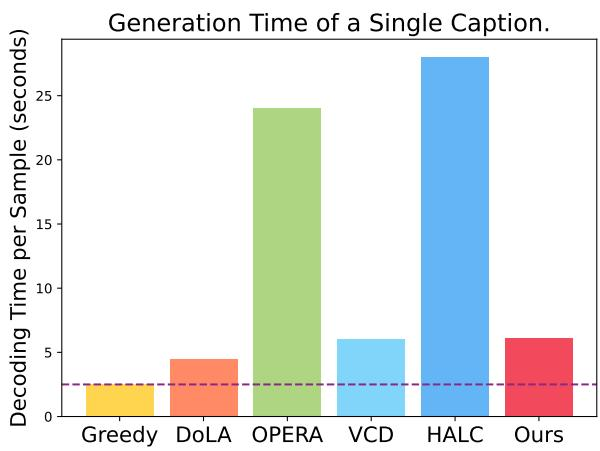  
Figure 9: Generation time of a single response.

## A.4 Experiment results on other hallucination benchmark

In our ablation study, we utilized the Hallusion-Bench dataset (Guan et al., 2023), which is specifically designed to evaluate hallucination phenomena in multimodal large models. Using LLaVA1.5 as the baseline, we incorporated our proposed Enhancing Attention Heads (EVAS) method. The results demonstrated a significant performance improvement after applying EVAS, particularly in reducing hallucinations. Compared to the baseline model, EVAS effectively concentrated the visual attention in shallow attention heads, enhancing the model’s ability to capture relevant regions in images and thereby reducing the likelihood of hallucinations. This indicates that EVAS can significantly improve the robustness and reliability of multimodal reasoning tasks.

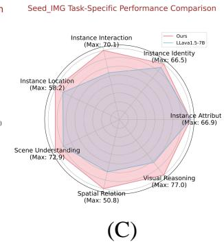

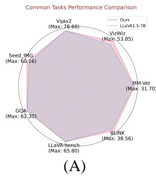

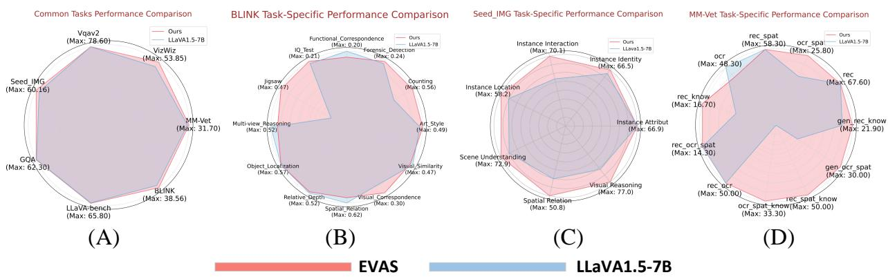

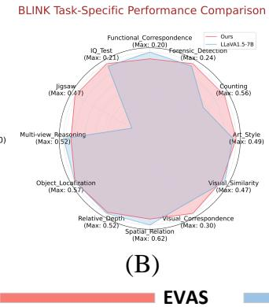

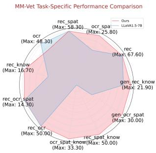

Figure 8: The generalization results on the datasets for the seven multimodal models (MMEs) demonstrate that EVAS combined with LLaVA1.5 enhances the metrics compared to LLaVA1.5 alone. This not only highlights the exceptional performance of EVAS in addressing hallucinations but also reinforces the notion that EVAS can generally enhance the model’s overall performance.
<table><tr><td colspan="4">HallusionBench (Guan et al., 2023)</td></tr><tr><td>split</td><td>method</td><td>aAcc ↑</td><td>fAcc ↑</td><td>qAcc↑</td></tr><tr><td rowspan="2">Overoll</td><td>LLaVA1.5-7B</td><td>35.54154</td><td>17.63006</td><td>11.20879</td></tr><tr><td>w/EVAS</td><td>44.37434</td><td>17.91908</td><td>14.50549</td></tr></table>

## A.5 Qualitative Experiment of Thresholds and Layers

Table 7 presents the results of our ablation experiments, which assess the impact of various thresholds and layers on model performance. We test different thresholds (0.0006, 0.0008, 0.0015, 0.002) and layers (1, 2, 3, 4, 16, 32) to observe their effects on the model’s performance with the CHAIR dataset.

The results show that the model achieves its highest performance on the CHAIRs and CHAIR metrics, with scores of 36.6 and 10.0, respectively, when applying EVAS at the second layer with a threshold of 0.002. However, both metrics significantly decrease as the number of layers increases. This supports our hypothesis that information flow converges in early layers and diverges in deeper layers, and keeping the attention sink dense in shallow layers will effectively alleviate the hallucination. As the depth increases, both CHAIRs and $\mathrm { C H A I R } _ { I }$ values rise and exceed the baseline, suggesting that the likelihood of the model generating hallucinations at deeper layers increases. This occurs because attention sinks become more sparse in deeper layers and the differences between attention heads diminish. Therefore, even if the most densely concentrated attention-sink head is identified and broadcasted to other heads, its impact may still be

Table 7: Qualitative experiment of layer and threshold on CHAIR dataset (baseline: LLaVA-1.5-7B, head=top1).
<table><tr><td>Layer</td><td>Threshold</td><td>CHAIRS↓</td><td>CHAIRI↓</td><td>Recall ↑</td><td>Avg. Len</td></tr><tr><td>1</td><td>0.0006</td><td>46.4</td><td>13.9</td><td>76.9</td><td>96.1</td></tr><tr><td>1</td><td>0.0008</td><td>46.0</td><td>12.9</td><td>77.1</td><td>101.2</td></tr><tr><td>1</td><td>0.0015</td><td>39.4</td><td>9.9</td><td>72.2</td><td>108.6</td></tr><tr><td>1</td><td>0.002</td><td>41.8</td><td>10.4</td><td>72.9</td><td>112.4</td></tr><tr><td>2</td><td>0.0006</td><td>41.4</td><td>12.3</td><td>76.4</td><td>95.6</td></tr><tr><td>2</td><td>0.0008</td><td>43.0</td><td>11.6</td><td>74.9</td><td>100.9</td></tr><tr><td>2</td><td>0.0015</td><td>40.6</td><td>11.9</td><td>74.9</td><td>102.7</td></tr><tr><td>2</td><td>0.002</td><td>36.4</td><td>9.9</td><td>73.9</td><td>97.7</td></tr><tr><td>3</td><td>0.0006</td><td>49.0</td><td>14.3</td><td>78.0</td><td>98.6</td></tr><tr><td>3</td><td>0.0008</td><td>49.4</td><td>14.3</td><td>78.3</td><td>98.4</td></tr><tr><td>3</td><td>0.0015</td><td>49.0</td><td>14.3</td><td>77.9</td><td>98.5</td></tr><tr><td>3</td><td>0.002</td><td>46.8</td><td>13.8</td><td>78.5</td><td>98.7</td></tr><tr><td>4</td><td>0.0006</td><td>46.4</td><td>13.6</td><td>76.9</td><td>96.1</td></tr><tr><td>4</td><td>0.0008</td><td>50.0</td><td>14.7</td><td>78.3</td><td>97.6</td></tr><tr><td>4</td><td>0.0012</td><td>49.6</td><td>14.6</td><td>78.4</td><td>97.7</td></tr><tr><td>4</td><td>0.002</td><td>49.4</td><td>14.5</td><td>78.2</td><td>97.5</td></tr><tr><td>16</td><td>0.0006</td><td>53.0</td><td>14.8</td><td>77.9</td><td>100.9</td></tr><tr><td>16</td><td>0.0008</td><td>49.2</td><td>14.8</td><td>77.4</td><td>100.5</td></tr><tr><td>16</td><td>0.0015</td><td>52.6</td><td>15.0</td><td>78.0</td><td>100.9</td></tr><tr><td>16</td><td>0.002</td><td>47.2</td><td>14.1</td><td>77.3</td><td>98.7</td></tr><tr><td>32</td><td>0.0006</td><td>50.8</td><td>14.4</td><td>78.1</td><td>98.7</td></tr><tr><td>32</td><td>0.008</td><td>50.8</td><td>14.4</td><td>78.1</td><td>98.7</td></tr><tr><td>32</td><td>0.0015</td><td>47.0</td><td>13.8</td><td>76.9</td><td>95.8</td></tr><tr><td>32</td><td>0.002</td><td>53.0</td><td>14.8</td><td>77.9</td><td>100.9</td></tr></table>

limited.

## A.6 Qualitative Experiment of Heads Number

As demonstrated in the previous section, the first two layers contain the most attention sinks. Therefore, we focus on applying the EVAS strategy to these layers. In Table 8, we present a qualitative experiment to assess the impact of increasing the number of attention heads affected. We test this by broadcasting the densest attention head across 4, 8, 16, and 32 heads. For instance, when broadcasting to 4 heads, the attention map from the densest head is duplicated across these 4 heads, while the remaining 28 heads remain unchanged.

Table 8: Qualitative experiment of enhancing head number on CHAIR dataset (baseline: LLaVA-1.5-7B).
<table><tr><td>Layer</td><td>Copy Head</td><td>CHAIRS↓</td><td>CHAIRI↓</td><td>Recall ↑</td><td>Avg. Len</td></tr><tr><td>1</td><td>4</td><td>51.0</td><td>14.7</td><td>78.1</td><td>98.9</td></tr><tr><td>1</td><td>8</td><td>49.4</td><td>14.5</td><td>78.5</td><td>99.5</td></tr><tr><td>1</td><td>16</td><td>48.4</td><td>13.5</td><td>77.1</td><td>99.8</td></tr><tr><td>1</td><td>28</td><td>40.6</td><td>11.8</td><td>74.1</td><td>103.8</td></tr><tr><td>1</td><td>32</td><td>39.4</td><td>9.9</td><td>72.2</td><td>108.6</td></tr><tr><td>2</td><td>4</td><td>50.8</td><td>14.4</td><td>78.1</td><td>98.7</td></tr><tr><td>2</td><td>8</td><td>49.6</td><td>13.7</td><td>77.6</td><td>100.0</td></tr><tr><td>2</td><td>16</td><td>47.4</td><td>14.0</td><td>77.5</td><td>100.5</td></tr><tr><td>2</td><td>28</td><td>42.2</td><td>11.9</td><td>74.9</td><td>98.1</td></tr><tr><td>2</td><td>32</td><td>36.4</td><td>9.9</td><td>73.9</td><td>97.7</td></tr></table>

The results indicate that broadcasting the densest attention head to 32 heads achieves the best performance. This suggests that using the densest attention pattern from the early layers improves the model’s focus on image information, enabling the model to concentrate on global image information rather than allowing attention to converge on specific tokens. This approach significantly helps to alleviate hallucinations. More attention map and results are shown in Figure10, Figure 11, Figure 12, Figure 13, Figure 14, Figure 15, Figure 16, Figure 17, Figure 18, Figure 19.

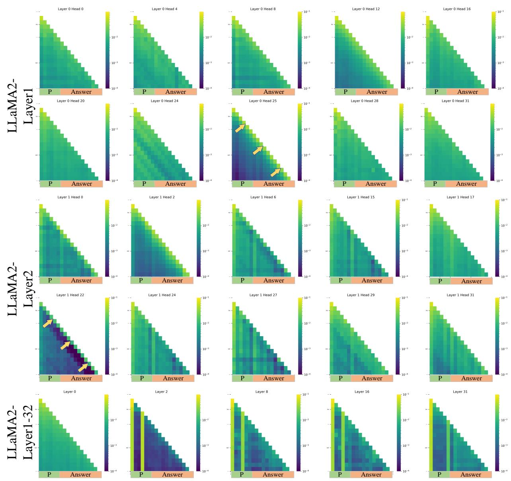  
Figure 10: The attention map of LLaMA2.

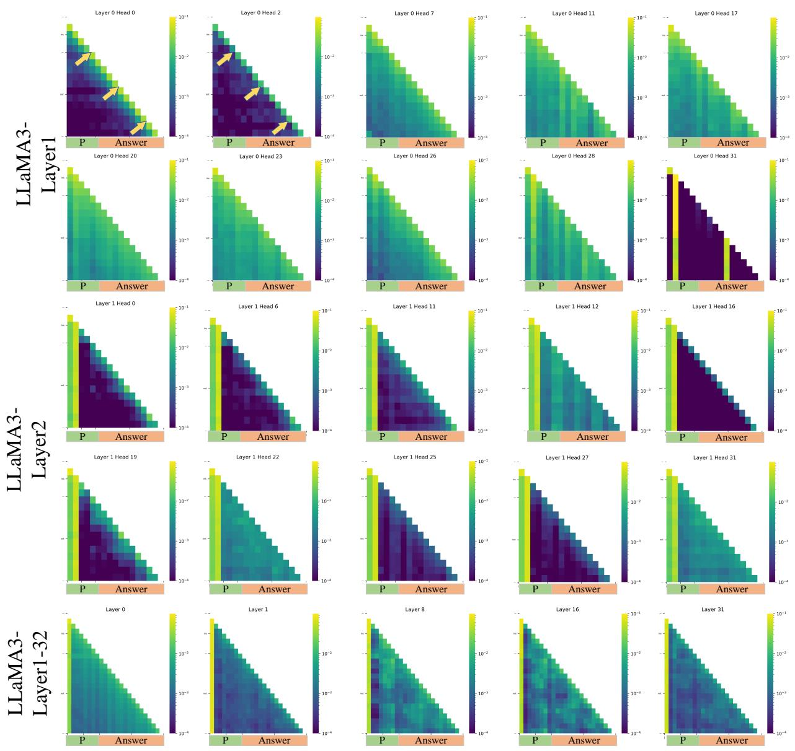  
Figure 11: The attention map of LLaMA3.

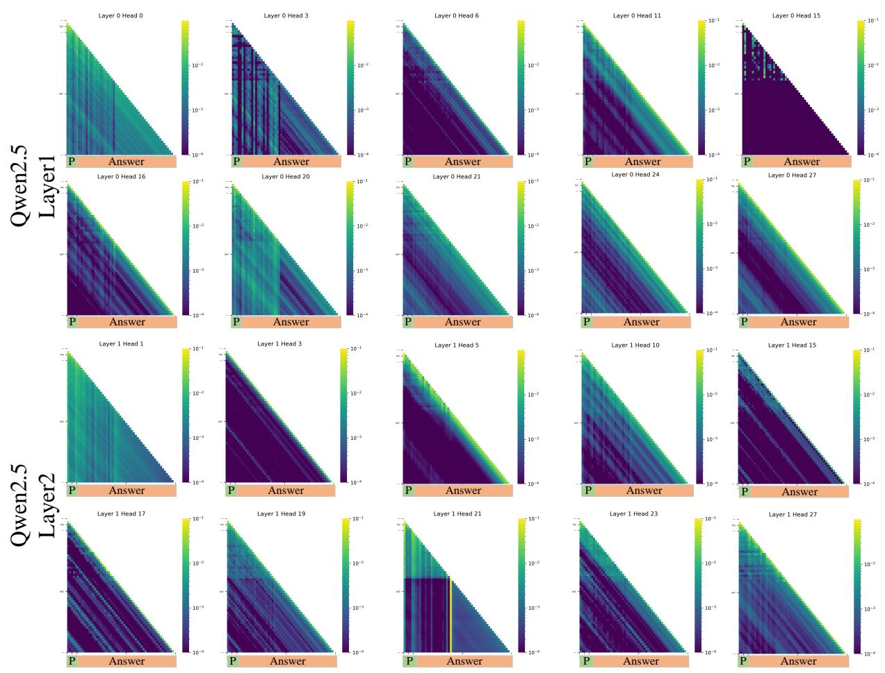  
Figure 12: The attention map of Qwen2.5.

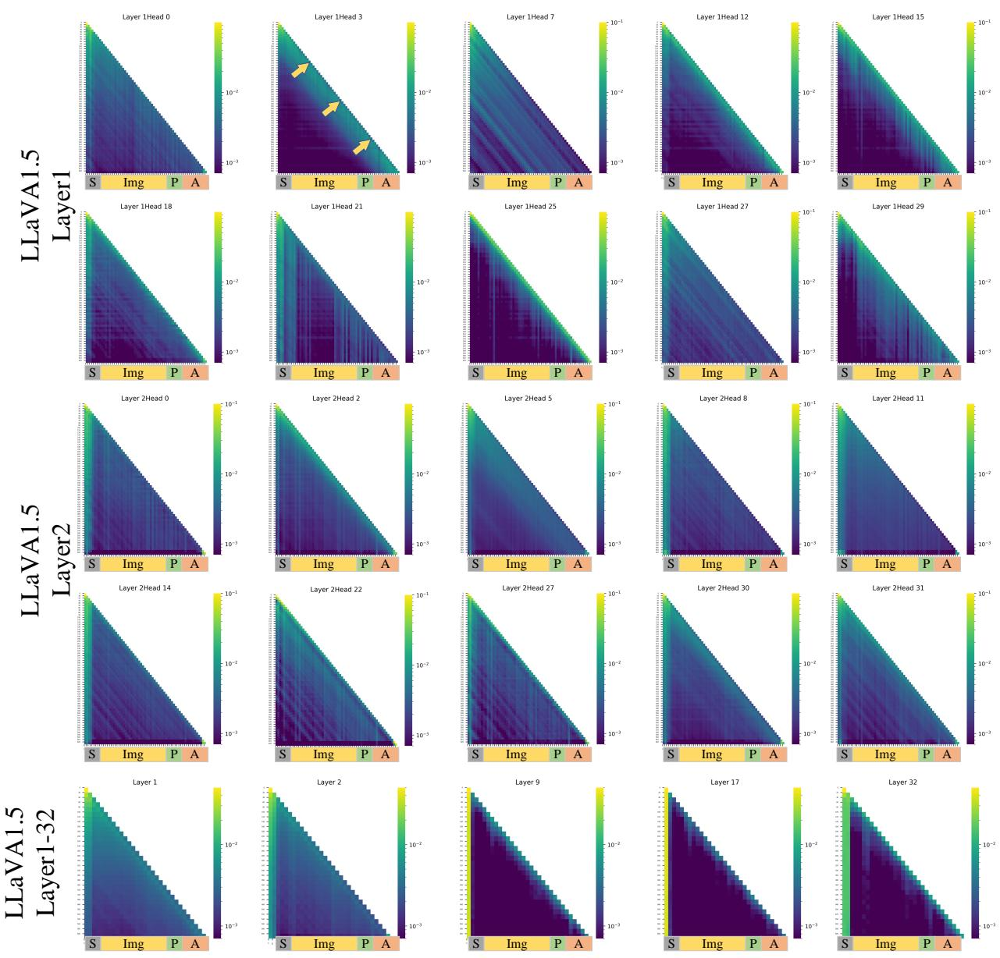  
Figure 13: The attention map of LLaVA1.5.

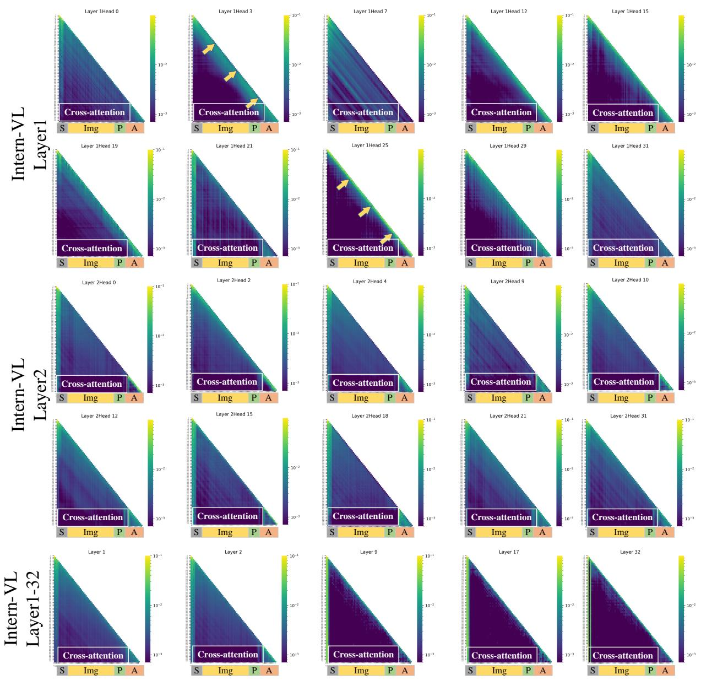  
Figure 14: The attention map of Intern-VL.

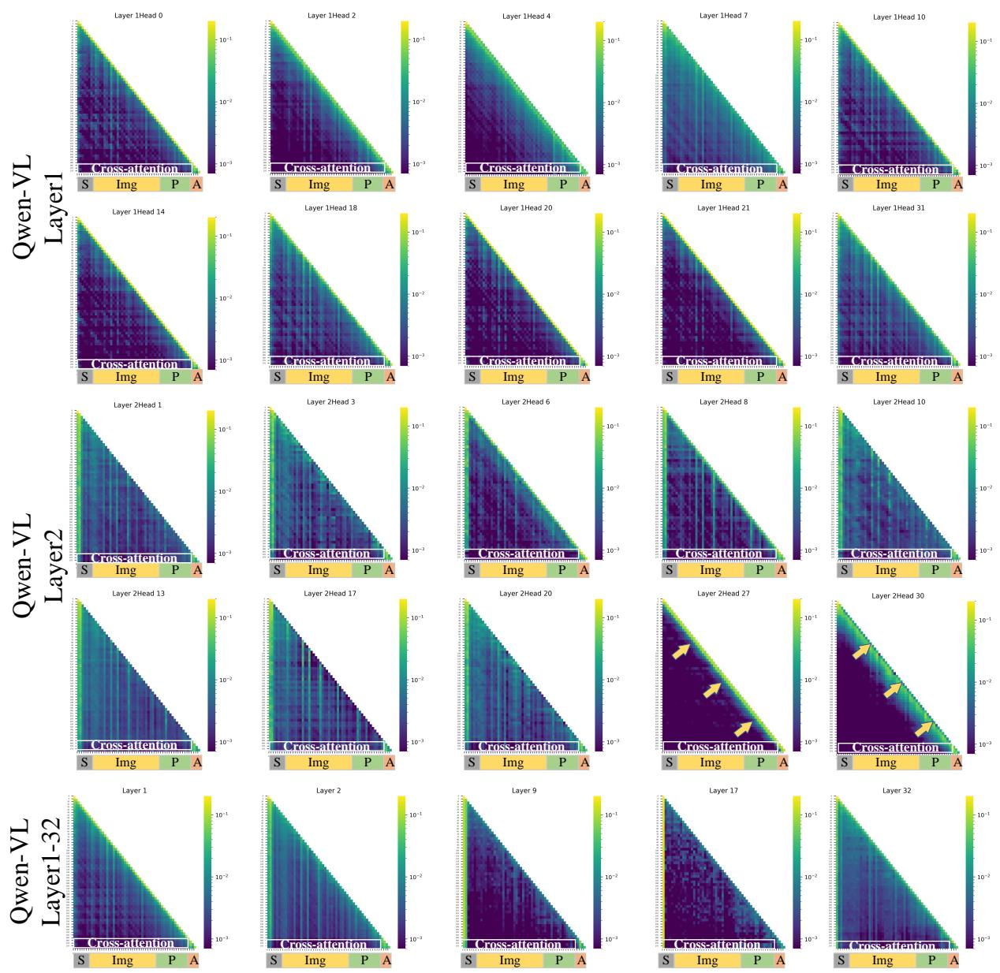  
Figure 15: The attention map of Qwen-VL.

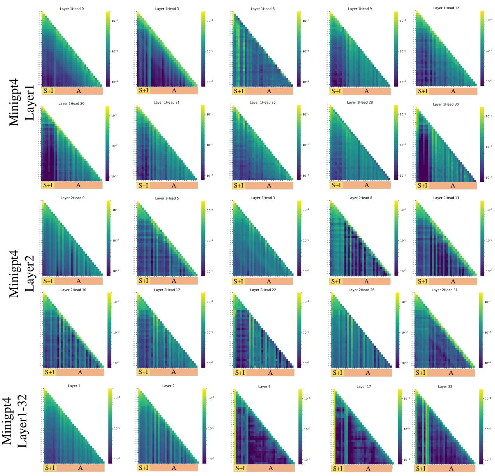  
Figure 16: The attention map of Mini-GPT4.

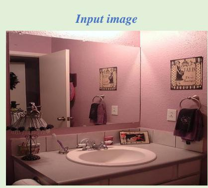

## LLaVA1.5-7B

The image features a bathroom with a sink and a mirror above it. The sink is white, and the mirror is large, covering most of the wall above it. The bathroom has a pink color scheme, giving it a warm and inviting atmosphere.\n\nThere are several items placed around the sink, including a toothbrush, a cup, and a bottle. Above the sink, there are two pictures hanging on the wall, adding a decorative touch to the space. Additionally, there are two towels hanging on the wall, one on the left side and the other on the right side of the mirror.

## LLaVA1.5-7B+EAH

The image features a bathroom with a sink and a mirror. The sink is white, and the mirror is placed above it. The bathroom is decorated with a pink color scheme, giving it a warm and inviting atmosphere. There is a picture hanging on the wall above the sink, adding a personal touch to the space.\n\nIn addition to the sink and mirror, there are several items placed around the bathroom. A bottle can be seen on the counter, and a cup is also present. A toothbrush is located near the sink, indicating that the bathroom is well-used and functional. The overall appearance of the bathroom is clean and well-maintained, making it

a comfortable and pleasant space for daily routines

  
Figure 17: Results of LLaVA1.5 with EVAS, EVAS can significantly reduce hallucinations while maintaining the original sentence length.

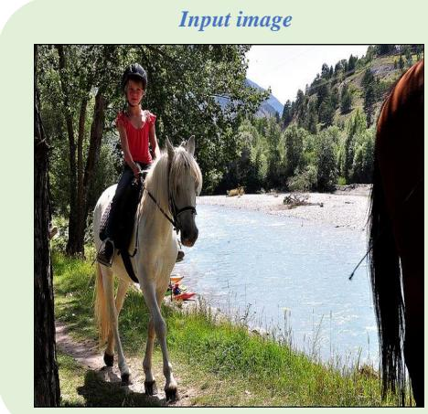

## InternVL-7B

The image features a young girl riding a white horse near a river. The girl is wearing a red shirt and is seated on the horse, which is positioned close to the water. The scene appears to be a peaceful and enjoyable outdoor activity for the girl.\n\nIn the background, there are several boats visible on the water, adding to the scenic atmosphere. Additionally, there are two other people in the scene, one standing

near the left side of the image and another person closer to the right side.

## InternVL-7B+EAH

The image features a young girl riding a white horse along a path near a river. The girl is wearing a red shirt and is seated on the horse, enjoying the ride. The horse is positioned on the left side of the image, and the girl is sitting on its back.\n\nIn the background, there are several boats visible on the river, adding to the scenic atmosphere. The scene appears to be a pleasant outdoor activity for the girl and her horse.

Figure 18: Results of Intern-VL with EVAS, EVAS can significantly reduce hallucinations while maintaining the original sentence length.  
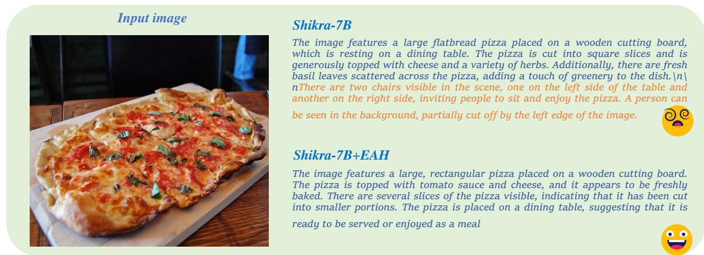  
Figure 19: Results of Shikra with EVAS, EVAS can significantly reduce hallucinations while maintaining the original sentence length.