# Skeletons Matter: Dynamic Data Augmentation for Text-to-Query

Yuchen Ji1♡, Bo Xu2,5\*, Jie Shi3,5♡, Jiaqing Liang1,5♠\*, Deqing Yang1,5♠, Yu Mao4,

1School of Data Science, Fudan University 2School of Computer Science and Technology, Donghua University 3College of Computer Science and Artificial Intelligence, Fudan University 4Ant Group, 5Shanghai Key Laboratory of Data Science ♡{ycji24,jshi22}@m.fudan.edu.cn, 2xubo@dhu.edu.cn ♠{liangjiaqing,yangdeqing,shawyh}@fudan.edu.cn 4{songhao.my,chenhai.ch}@antgroup.com

## Abstract

The task of translating natural language questions into query languages has long been a central focus in semantic parsing. Recent advancements in Large Language Models (LLMs) have significantly accelerated progress in this field. However, existing studies typically focus on a single query language, resulting in methods with limited generalizability across different languages. In this paper, we formally define the Text-to-Query task paradigm, unifying semantic parsing tasks across various query languages. We identify query skeletons as a shared optimization target of Text-to-Query tasks, and propose a general dynamic data augmentation framework that explicitly diagnoses modelspecific weaknesses in handling these skeletons to synthesize targeted training data. Experiments on four Text-to-Query benchmarks demonstrate that our method achieves state-ofthe-art performance using only a small amount of synthesized data, highlighting the efficiency and generality of our approach and laying a solid foundation for unified research on Textto-Query tasks. We release our code at https: //github.com/jjjycaptain/Skeletron

## 1 Introduction

The task of translating natural language questions into query languages (e.g., Text-to-SQL, Text-to-Cypher, Text-to-nGQL) has long been a central focus in semantic parsing (Popescu et al., 2004; Zhong et al., 2017; Guo et al., 2022; Zhou et al., 2024). It aims to facilitate user interaction with databases by allowing input in natural language, thereby improving the efficiency of data access. Given this shared objective and task formulation, in this paper, we unify these related tasks under a single task paradigm, Text-to-Query, and develop general methods for this unified setting. This broader perspective invites us to examine common challenges and optimization opportunities in formal query generation across different query languages. While concrete queries are tied to specific schemas and databases, many of them share the same underlying syntactic and semantic structures once instance-specific elements are stripped away. These abstract structures, which we refer to as query skeletons, reveal recurring patterns in how queries are composed across diverse contexts (see in Figure 1). We argue that query skeletons serve as a key abstraction for understanding model behavior, diagnosing failure cases, and designing generalizable optimization strategies for Text-to-Query tasks.

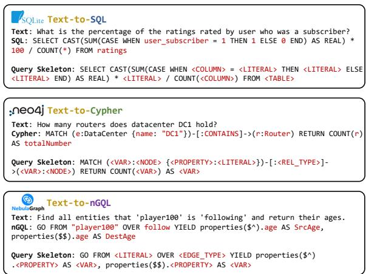  
Figure 1: Examples of query skeletons from three different query languages.

Recently, the advancement of Large Language Models (LLMs; OpenAI et al., 2024; Qwen et al., 2025) has significantly accelerated progress in Textto-Query tasks. Current approaches can be broadly categorized into In-Context Learning (ICL) and Fine-Tuning (FT) paradigms. Specifically, ICLbased methods (Pourreza and Rafiei, 2023; Gao et al., 2023; Wang et al., 2024) rely on sophisticated prompt engineering to guide proprietary LLMs in generating queries, achieving impressive accuracy.

However, these methods face concerns regarding data privacy and high inference costs. As an alternative, FT-based methods leverage open-source LLMs and improve their performance through incremental pre-training and supervised fine-tuning (SFT) (Li et al., 2024; Pourreza and Rafiei, 2024). Many of these methods construct training data using LLM-based data augmentation (Yang et al., 2024b; Li et al., 2025; Tiwari et al., 2025; Zhong et al., 2025).

Despite their promise, existing data augmentation approaches suffer from several key limitations: (i) They overlook the critical value of query skeletons; (ii) Their strategies are static, lacking adaptation to different target model needs, which may result in redundant data with limited benefit, often sampling question types the model already handles well; (iii) They primarily focus on a single query language, which may hinder their applicability to other Text-to-Query tasks. To address these limitations, we propose a dynamic data augmentation method based on query skeletons for Text-to-Query tasks.

Inspired by the theory of diagnostic teaching (Reynolds and Fletcher-Janzen, 2007) in educational psychology, our approach begins with dynamically diagnosing the weaknesses of a target LLM in a target dataset. We first diagnose model failures on the training set to identify query skeletons it struggles with, forming an error-prone skeleton set that reveals its systematic weaknesses. Additionally, To avoid overfitting the synthesized data to a narrow set of skeletons, we train a skeleton generator on the error-prone set to produce novel ones, expanding the set into a more diverse candidate skeleton pool. Then, we introduce a skeletonguided backward-forward data synthesis pipeline, where concrete queries are instantiated from skeletons and back-translated into natural language questions, then verified by reasoning forward from the questions to ensure consistency using chain-ofthought (CoT; Kojima et al., 2022; Wei et al., 2022) prompting. Finally, the data synthesized through the pipeline are used to fine-tune the target LLM, thereby enhancing its understanding of the previously misaligned query skeletons.

In summary, our contributions are threefold:

• We are the first to formally define and systematize the Text-to-Query task paradigm, unifying semantic parsing across a broad range of query languages, and laying the foundation for unified method development.

• We propose a unified data augmentation framework for Text-to-Query tasks that dynamically identifies the query skeletons a model struggles with and generates targeted training examples accordingly, enabling both behavioral analysis and performance improvement across query languages.

• Our method achieves state-of-the-art performance on Four Text-to-Query benchmarks (Spider, BIRD, Text2Cypher and NL2GQL), demonstrating its effectiveness and generality across different Text-to-Query tasks.

## 2 Related Work

Text-to-Query Based On LLM Currently, many Text-to-Query methods are built on the powerful reasoning ability of LLMs. A significant portion of these methods rely on ICL. Some studies select fewshot examples based on input similarity to guide inference (Nan et al., 2023; Zhang et al., 2023a; D’Abramo et al., 2025), while others reduce task complexity by decomposing tasks or questions into simpler substeps (Pourreza and Rafiei, 2023; Dong et al., 2023; Wang et al., 2025; Talaei et al., 2024). Additional works enhance reasoning capabilities through strategies like CoT (Pourreza et al., 2025; Shah et al., 2024) and consistency-driven reasoning (Dong et al., 2023; Gao et al., 2023). However, these ICL methods typically rely on proprietary LLMs, raising concerns about privacy risks and inference costs. To enhance open-source models Text-to-Query abilities, CODES (Li et al., 2024) proposed incremental pretraining on hybrid corpus. Nevertheless, incremental pretraining is resourceintensive and collecting sufficient training corpus is challenging for SQL and even harder for specialized query languages, limiting its applicability across diverse Text-to-Query tasks.

Text-to-Query Data Augmentation Highquality Text-to-Query datasets remain scarce due to the high cost of manual annotation. To mitigate this, many approaches adopt data augmentation to automatically generate examples. Early methods synthesize queries using context-free grammars (CFGs) or rule-based slot filling over SQL skeletons, followed by back translation into natural language questions using Pretrained Language Models (PLMs) or seq2seq models (Hu et al., 2023; Wang et al., 2021; Wu et al., 2021; Zhong et al., 2020). However, these approaches rely on manually crafted CFGs and language-specific rules, limiting their generalizability across Text-to-Query tasks. Moreover, the limitations of conventional neural models often lead to unnatural questions. Recent work typically employs LLMs to synthesize data. SENSE (Yang et al., 2024b), OmniSQL (Li et al., 2025), Auto-Cypher (Tiwari et al., 2025), and SyntheT2C (Zhong et al., 2025) design elaborate pipelines based on LLMs to synthesize high-quality data. Compared with our method, these methods lack explicit modeling and utilization of the query skeleton and follow static generation strategies, which leads to redundancy and limited benefit of augmented data.

## 3 Task Formulation

To support theoretical modeling and generalpurpose solution development, We formally define the Text-to-Query task as:

$$
f ( S , q ) \to Q
$$

where $q$ is the input question, S is the database schema, and $Q$ is the generated query in a language such as SQL, Cypher, or nGQL. The schema S provides structural and semantic context necessary for interpreting the question. Its representation depends on the underlying data model. The following are illustrative examples of schema formulations for common database types:

For relational databases (e.g., SQLite), the schema can be represented as $S = \{ ( t , c , \tau ) \mid t \in$ T , $c \in \mathcal { C } _ { t } , \ \tau \in \mathcal { D } \}$ , where denotes the set of table names, $\mathcal { C } _ { t }$ is the set of columns in table $t ,$ and $\tau$ is the data type of column c.

For graph-based databases (e.g., Neo4j or NebulaGraph), the schema can be represented as $S =$ $\{ ( e _ { 1 } , r , e _ { 2 } ) \mid e _ { 1 } , e _ { 2 } \in \mathcal { E } , \ r \in \mathcal { R } \}$ , where $\mathcal { E }$ is the set of node types, and is the set of relation types.

This formulation provides a unified foundation for developing Text-to-Query models across heterogeneous query languages and databases.

## 4 Method

An overview of our proposed dynamic data augmentation method based on formal query skeletons is shown in Figure 2.

## 4.1 Dynamic Diagnosis on Query Skeletons

Unlike existing Text-to-Query data augmentation methods, our approach is dynamic: it introduces a diagnostic step before augmentation to identify model-specific weaknesses, enabling more targeted, intelligent, and efficient data synthesis.

Given a target LLM and a Text-to-Query dataset, we first perform K-fold cross-validation on the training set to identify cases where the model fails. However, these failure cases can arise from a wide range of issues, including schema-linking errors, misunderstandings of database content, and syntactic mistakes, as noted in prior work (Liu et al., 2025; Li et al., 2023b). Since our goal is to diagnose the ability of an LLM to handle query skeletons, we aim to isolate and focus specifically on this type of error during the diagnostic process.

To achieve this goal, we introduce a structural similarity measure to detect whether a model has generated the correct query skeleton. Specifically, we provide two implementations of this measure, AST-based structural distance and Token-based structural distance, depending on the availability of parsing tools for the target query language.

AST-Based Structural Distance Abstract syntax trees (ASTs) represent the hierarchical structure of code in tree form and are widely used in program analysis for measuring code similarity (Song et al., 2024; Yang et al., 2021). They also serve as a common intermediate representation for parsing query languages (Zhang et al., 2023b; Shen et al., 2024). In this setting, we parse both the predicted and gold queries into ASTs and compare their structural differences. Specifically, we apply the Change Distiller algorithm (Fluri et al., 2007) to compute the minimum set of edit operations (e.g., insert, delete, update, keep, etc.) required to transform one AST into another. We define the AST-based structural distance as the total number of non-keep operations, which reflects the degree of structural discrepancy between the two query skeletons.

Token-Based Structural Distance In principle, all query languages can be parsed into ASTs, as their syntax is inherently hierarchical. However, some less commonly used query languages (e.g., nGQL) lack a mature ecosystem, and open-source parsers for these languages are often unavailable. This creates practical engineering barriers to implementing the AST-based structural distance, even though the method itself remains theoretically applicable. In such scenarios, we provide a structural similarity measure that compares the predicted and gold skeletons using token-level edit distance. Although this approximation is less fine-grained, it still captures structural divergence to a reasonable extent and enables the diagnostic framework to remain applicable across a wide range of query languages. Implementation details of the two structural similarity measures are presented in the Appendix B.

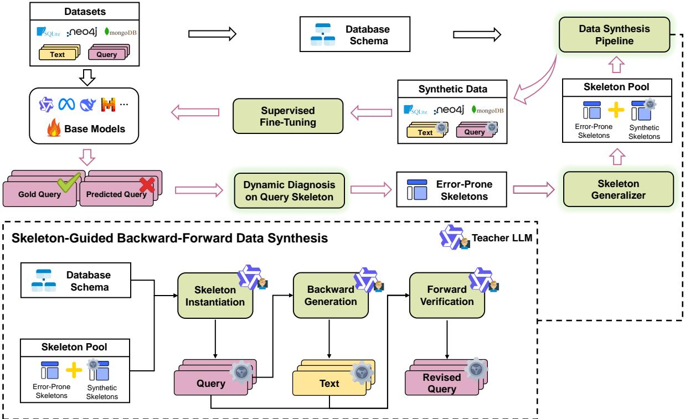  
Figure 2: Our proposed method consists of three key components: (i) Dynamic Diagnosis on Query Skeletons: We analyze model behavior to identify query skeletons it struggles with, constructing an error-prone skeleton set to guide targeted data synthesis. (ii)Skeleton Generalizer: A skeleton generation model is trained on the error-prone set to produce structurally novel skeletons, expanding the diversity of the skeleton pool. (iii) Skeleton-Guided Backward-Forward Data Synthesis: We instantiate skeletons from the pool under diverse schema contexts and synthesize high-quality, targeted training data through a backward-forward generation framework.

Skeleton Error Detection Based on Structural Similarity Measurement The most straightforward way to detect query skeleton errors is to check whether the predicted and gold skeletons yield identical structures. However, this criterion is overly strict and may lead to false positives. Through our analysis of prediction errors, we observed that some predicted and gold skeletons differ slightly in structure but remain semantically equivalent—for example, differing only in the presence of a DISTINCT keyword or a change in a single operator. To mitigate such cases, we introduce a relaxed threshold-based criterion: if the structural distance exceeds a threshold, we classify the sample as a query skeleton error. More discussion on threshold selection is provided in Section 5.7.

Finally, we select skeletons with an error rate above 20% to construct the error-prone skeleton set, which serves as the foundation for the subsequent construction of the skeleton generalizer and data synthesis.

## 4.2 Skeleton Generalizer

Although the error-prone skeleton set already contains a rich and realistic collection of query skeletons, it is inevitable that novel skeletons will appear in test scenarios. If data augmentation is performed using only error-prone skeleton set, the resulting model may fail to handle unseen patterns during evaluation. To address this limitation, We propose to use a skeleton generalizer to generate novel but structurally meaningful skeletons that go beyond the error-prone set.

Specifically, we fine-tune an LLM using the previously collected error-prone skeleton set to learn their underlying patterns, thereby constructing a skeleton generation model capable of producing new skeletons. Building on prior work (Xu et al., 2024; Ding et al., 2024), we extract a portion of the LLM’s instruction template (e.g., “<im\_start>Assistant:”) as a prefix to guide skeleton generation, and fine-tune the model on (pref ix, skeleton) pairs constructed from the error-prone skeleton set. During inference, we follow the same prompt format to induce the generation of novel skeletons. These generated skeletons are then combined with the original error-prone ones to form a comprehensive skeleton pool for data synthesis. Further details about the Skeleton Generalizer can be found in the Appendix C.

## 4.3 Skeleton-Guided Backward-Forward Data Synthesis

To leverage the query skeletons and dynamic diagnosis results, we perform controlled data synthesis with a teacher LLM guided by the constructed skeleton pool. A backward-forward generation framework is adopted to ensure data quality and reliability. The synthesis process consists of the following key steps:

Skeleton Instantiation For each database in the target dataset, we randomly sample a query skeleton from the skeleton pool and prompt the teacher LLM to instantiate it by filling in appropriate schema elements (e.g., tables, columns and nodes) from given database schema. Once the query instantiation is complete, we apply rule-based verification to identify and filter out basic errors such as syntax mistakes, execution failures, and invalid join conditions. This process includes verifying query executability, and checking whether the referenced tables and columns satisfy necessary foreign key constraints (for the Text-to-SQL task).

Backward Generation In this phase, the teacher LLM is prompted to translate the completed query into a corresponding natural language question according to the database schema. Since query languages are formal and semantically unambiguous, this backward translation is substantially easier than the forward direction (i.e., generating queries from natural language), which requires resolving ambiguity in user intent and performing complex schema linking. The clarity of query languages and the relative simplicity of backward generation help ensure the quality of the synthesized questionquery pairs.

Forward Verification Although the skeleton instantiation and backward generation steps provide a reasonable degree of quality assurance, large LLMs can still suffer from hallucinations (Huang et al., 2025; Xu et al., 2025), which may lead to mismatches between the synthesized questions and their corresponding queries. To mitigate this issue, we introduce a forward verification phase, where the teacher LLM is prompted to assess the semantic consistency between the synthesized question and queries using chain-of-thought reasoning (Kojima et al., 2022; Wei et al., 2022), and revise the query if necessary. This process enhances the reliability of the final synthetic dataset.

Finally, we select two open-source models, Qwen2.5-Coder-7B and Qwen2.5-Coder-14B, as base models, and perform SFT using training data synthesized by our data augmentation method. The input sequence for SFT consists of the task description, database schema, and question. We refer to the resulting series of Text-to-Query LLMs as Skeletron. The prompts used in the data synthesis stage are provided in the Appendix.

## 5 Experiments

## 5.1 Evaluation Benchmarks

We evaluate our method on three representative Text-to-Query tasks: Text-to-SQL, Text-to-Cypher and Text-to-nGQL, due to the prominent roles of SQL, Cypher and nGQL in relational and nonrelational databases, respectively.

For the Text-to-SQL task, we evaluate our approach on Spider (Yu et al., 2018) and BIRD (Li et al., 2023b). Spider is a cross-domain dataset covering 200 databases across 138 domains. BIRD is a more realistic and challenging benchmark, containing 95 databases across 37 professional domains. For Spider, we evaluate on both its development and test sets, while for BIRD, we evaluate only on the development set, as the test set is not publicly available.

For the Text-to-Cypher task, We evaluate our approach on Text2Cypher (Ozsoy et al., 2025), a large-scale dataset released by Neo4j. However, many examples in this dataset lack executable databases, making it difficult to evaluate the correctness of generated queries. As a result, we extract a subset of executable examples to form a new benchmark, Text2Cypher-Exec, which contains 22,093 training samples and 2,471 test samples.

For the Text-to-nGQL task, we evaluate our approach on NL2GQL (Zhou et al., 2024) dataset. NL2GQL was manually constructed by humans with assistance from LLMs, followed by subsequent refinement to correct errors and enhance naturalness and diversity. The dataset comprises 3,862 training samples and 1,254 test samples.

## 5.2 Evaluation Metrics

For the Text-to-SQL task, following prior work, we use both EX and TS metrics on Spider, and EX metirc on BIRD. EX measures the proportion of predicted SQL queries that produce the same execution results as the corresponding gold queries. TS is a more reliable metric that checks whether a SQL query yields consistent results with the gold query across multiple database variants constructed via data augmentation. Notably, TS is only available on the Spider dev.

For the Text-to-Cypher and Text-to-nGQL task, as no official scripts are available for the corresponding datasets, we compute EX following a similar evaluation procedure as used in BIRD.

## 5.3 Baselines

LLMs with Zero-Shot Prompting We compare our method against both proprietary and opensource LLMs. The proprietary models include GPT-4o, GPT-4-Turbo, and GPT-4o-mini1, while the open-source models include Qwen2 (Yang et al., 2024a), Qwen2.5 (Qwen et al., 2025), Qwen2.5- Coder (Hui et al., 2024), and Llama3.3 (Grattafiori et al., 2024). These models vary in scale and architecture, providing a diverse and representative baseline for evaluation.

FT-Based Methods We also compare our method with a range of method based on FT. RED-SQL (Li et al., 2023a) proposes a method to decouple schema linking and the skeleton parsing. DTS-SQL (Pourreza and Rafiei, 2024) decomposes finetuning into schema-linking and SQL generation stages. CODES (Li et al., 2024) employs incremental pre-training along with strategic prompt construction. OmniSQL (Li et al., 2025) performs SFT using a large-scale dataset of 2.5 million synthetic examples produced by its scalable framework.

Data Augmentation Methods To conduct a fair comparison with other data augmentation approaches, we adopt the synthetic dataset released by Li et al. (2025) and randomly sample a subset of the same size as our synthesized data for SFT. In addition, we construct two static variants of our synthesis pipeline that exclude the dynamic diagnostic step:

• Question-to-SQL, which first prompts the LLM to generate a question, then translates it into SQL.

• SQL-to-Question, which reverses the order by first generating SQL and then translating it into a corresponding question.

All of these methods are evaluated under the same conditions: we apply SFT to the base model using augmented dataset combined with the BIRD original training set without introducing any other optimization techniques, and adopt the same inference settings as used in Skeletron.

## 5.4 Implementation Details

During the dynamic diagnosis, we adopt an ASTbased structural similarity measure for the Text-to-SQL task, while using a token-based measure for the Text-to-Cypher and Text-to-nGQL tasks, and set the threshold for skeleton error detection to 2. We use Qwen2.5-Coder-14B-Instruct as the base model to train the skeleton generalizer. For data synthesis, we adopt Qwen2.5-72B-Instruct as the teacher model to generate question-SQL pairs under skeleton constraints. In the fine-tuning stage, we combine the original training set with 10,000 synthesized data and fine-tune the base models with a learning rate of 5e-6, a batch size of 64 and a cosine warmup schedule over 2 epochs. In both the skeleton generator and the final fine-tuning stage, we perform full-parameter fine-tuning using a conditional next-token prediction loss.

During inference, we adopt a zero-shot setting and generate one single prediction per question, using greedy decoding. All experiments are conducted on 8 NVIDIA A800 80GB GPUs.

## 5.5 Main Results

Results on the Text-to-SQL Task As shown in Table 1, Skeletron outperforms all baselines on both Spider and BIRD benchmarks, including its teacher model Qwen2.5-72B-Instruct. Unlike previous FT-based methods that often involve additional optimization techniques such as incremental pre-training or value retrieval, Skeletron achieves comparable or better performance using SFT alone. The only exception is on the Spider test set, where it slightly underperforms OmniSQL. However, OmniSQL uses 2.5 million synthetic examples, while Skeletron uses only 10,000, just 1/250 of the data, yet still surpasses it by +0.6% TS on Spider dev and +0.9% EX on BIRD dev.

<table><tr><td>Model/Method</td><td>Spider Dev</td><td>Spider| Test</td><td>BIRD Dev</td></tr><tr><td></td><td>EX TS</td><td>EX</td><td>EX</td></tr><tr><td colspan="4">LLMs (Zero-Shot)</td></tr><tr><td>GPT-4o-mini</td><td>70.4 一</td><td>82.4</td><td>58.8</td></tr><tr><td>GPT-4-Turbo</td><td>72.4</td><td>83.4</td><td>62.0</td></tr><tr><td>GPT-40</td><td>70.9</td><td>83.2</td><td>61.9</td></tr><tr><td>Qwen2.5-72B-Instruct</td><td>74.1</td><td>85.6</td><td>58.7</td></tr><tr><td>Qwen2-72B-Instruct</td><td>83.6 74.2</td><td>83.3</td><td>58.5</td></tr><tr><td>Llama3.3-70B-Instruct</td><td>81.5 68.1</td><td>75.8</td><td>60.0</td></tr><tr><td colspan="4">77.2 FT-Based Methods</td></tr><tr><td>RESDSQL-3B DTS-SQL 7B</td><td>84.1 73.5 85.5</td><td>79.9 84.4</td><td>55.8</td></tr><tr><td>CODES 7B</td><td>85.4 80.3</td><td></td><td>57.2</td></tr><tr><td>OmniSQL 7B</td><td>81.2</td><td>87.9</td><td>63.9</td></tr><tr><td>CODES 15B</td><td>84.9 79.4</td><td></td><td>58.5</td></tr><tr><td>OmniSQL 14B</td><td>81.4</td><td>88.3</td><td>64.2</td></tr><tr><td colspan="4">Our Method</td></tr><tr><td>Skeletron 7B</td><td>85.7</td><td>78.2 84.7 82.0</td><td>61.4</td></tr><tr><td>Skeletron 14B</td><td>87.3</td><td>86.6</td><td>65.1</td></tr></table>

Table 1: Performance comparison on the Text-to-SQL task. Best results are in bold; second-best are underlined.

Table 3 presents a fair comparison of data augmentation methods. Our approach yields the largest performance gains across all settings, significantly improving the base model. Under comparable conditions, the gap between Skeletron and OmniSQL widens substantially, reaching up to 9.5%. It also outperforms both static variants of our method, demonstrating the clear advantage of our synthesis method. Notably, the improvement increases with the difficulty of the question, increasing from 15. 1% to 22. 8%. This benefit comes from the dynamic diagnosis step, which identifies the skeletons the model struggles with (often the more challenging ones) and uses them to construct harder training data.

Results on other Text-to-Query Tasks As shown in Table 2, Skeletron 14B also achieves stateof-the-art performance on the Text-to-Cypher and Text-to-nGQL Tasks, surpassing a range of models with significantly larger parameter sizes. In particular, it outperforms the second-best model, Qwen2.5-Coder-32B-Instruct, which is specifically enhanced for code-related tasks and well-suited for query languages, by a margin of 14.2% on the Textto-Cypher task and by xx% on the Text-to-nGQL task. These results demonstrate that our method is broadly applicable and effective across the full spectrum of Text-to-Query tasks.

<table><tr><td rowspan="2">Model/Method</td><td colspan="2">EX</td></tr><tr><td>Cypher</td><td>nGQL</td></tr><tr><td colspan="3">LLMs (Zero-Shot)</td></tr><tr><td>Qwen2.5-72B-Instruct</td><td>42.9</td><td>26.9</td></tr><tr><td>Qwen2-72B-Instruct</td><td>37.8</td><td>11.1</td></tr><tr><td>Llama3.3-70B-Instruct</td><td>43.3</td><td>18.9</td></tr><tr><td>Qwen2.5-Coder-32B-Instruct</td><td>44.2</td><td>26.5</td></tr><tr><td>Qwen2.5-Coder-14B-Instruct</td><td>39.7</td><td>14.9</td></tr><tr><td>Qwen2.5-Coder-7B-Instruct</td><td>25.9</td><td>5.1</td></tr><tr><td colspan="3">Our Method</td></tr><tr><td>Skeletron 7B</td><td>58.4</td><td>36.7</td></tr><tr><td>Skeletron 14B</td><td>58.6</td><td>45.1</td></tr></table>

Table 2: Performance comparison on additional Text-to-Query tasks. Cypher denotes the Text-to-Cypher task and nGQL denotes the Text-to-nGQL task, where their respective datasets are used as the target datasets for data augmentation.

## 5.6 Ablation Study

To assess the contribution of each component, we conduct ablation studies under four modified settings. As shown in Table 4, removing the synthetic data and training only on the original dataset leads to the most significant performance drop across all benchmarks, demonstrating the high quality and strong utility of our synthesized data. Eliminating Dynamic Diagnosis and instead using the full set of skeletons from the original training set results in reduced performance, highlighting the effectiveness of model-specific augmentation. Disabling the Skeleton Generalizer and relying solely on error-prone skeletons limits structural diversity, resulting in performance decline. Finally, skipping Forward Verification and directly using unverified SQL-question pairs introduces semantic mismatches and hallucinations, negatively impacting performance. In conclusion, each component contributes meaningfully to the overall effectiveness of our method.

## 5.7 More Analysis

Can our method enhance LLMs’ understanding of the skeletons of query languages? We evaluate several state-of-the-art LLMs and our Skeletron 14B on the ability to predict correct query skeletons in Text-to-Query task. The results are shown in Figure 3. We observe that even the most advanced open-source LLMs specialized in code still frequently fail to generate correct skeletons during inference. For instance, Qwen2.5-Coder-32B-Instruct achieves a 35.7% overall error rate on the

<table><tr><td>Base Model</td><td>simple</td><td>moderate</td><td>challenging</td><td>total</td></tr><tr><td>Qwen2.5-Coder-7B</td><td>45.2</td><td>22.0</td><td>20.0</td><td>35.8</td></tr><tr><td>+ BIRD &amp; Q2S Synthetic Data</td><td>64.8</td><td>51.7</td><td>43.5</td><td>58.8</td></tr><tr><td>+ BIRD &amp; S2Q Synthetic Data</td><td>65.7</td><td>51.9</td><td>44.8</td><td>59.6</td></tr><tr><td>+ BIRD &amp; OmniSQL Synthetic Data</td><td>60.4</td><td>41.0</td><td>32.4</td><td>51.9</td></tr><tr><td>+ BIRD &amp; Skeletron Synthetic Data</td><td>67.6</td><td>53.5</td><td>47.6</td><td>61.4</td></tr><tr><td>Qwen2.5-Coder-14B</td><td>57.1</td><td>36.9</td><td>26.2</td><td>48.0</td></tr><tr><td>+ BIRD &amp; Q2S Synthetic Data</td><td>71.0</td><td>55.8</td><td>44.8</td><td>64.0</td></tr><tr><td>+ BIRD &amp; S2Q Synthetic Data</td><td>70.3</td><td>55.4</td><td>42.1</td><td>63.1</td></tr><tr><td>+ BIRD &amp; OmniŚQL Synthetic Data</td><td>65.4</td><td>44.4</td><td>37.9</td><td>56.5</td></tr><tr><td>+ BIRD &amp; Skeletron Synthetic Data</td><td>72.2</td><td>56.0</td><td>49.0</td><td>65.1</td></tr></table>

Table 3: EX performance of the base model after SFT on data synthesized by different augmentation methods across difficulty levels on the BIRD dev dataset. Q2S and S2Q refer to the Question-to-SQL and SQL-to-Question augmentation strategies described in Section 5.3, respectively. BIRD denotes the original training data from the BIRD dataset. Each synthetic dataset is limited to 10,000 examples.

<table><tr><td rowspan="2"></td><td colspan="2">Spider Dev</td><td>Spider Test</td><td>BIRD Dev</td></tr><tr><td>EX</td><td>TS</td><td>EX</td><td>EX</td></tr><tr><td>Skeletron 7B</td><td>85.7</td><td>78.2</td><td>84.7</td><td>61.4</td></tr><tr><td>w/o Synthetic Data</td><td>83.3</td><td>75.6</td><td>82.8</td><td>57.5</td></tr><tr><td>w/o Dynamic Diagnosis</td><td>84.3</td><td>77.7</td><td>84.1</td><td>57.8</td></tr><tr><td>w/o Skeleton Generalizer</td><td>84.3</td><td>76.5</td><td>84.7</td><td>58.5</td></tr><tr><td>w/o Forward Verification</td><td>82.6</td><td>75.0</td><td>84.1</td><td>59.3</td></tr></table>

Table 4: Ablations on the synthetic data and 3 key components of our method.

BIRD dev set, with 26.3% of predictions exhibiting incorrect skeletons, accounting for 73.4% of all errors. This indicates that current LLMs still fall short in reliably handling query languages. In contrast, Skeletron 14B not only reduces the overall error rate but also lowers the skeleton error rate to 24.0%, demonstrating improved understanding of skeletons of query languages.

How to choose the structural distance threshold in dynamic diagnosis? We further investigate how the choice of threshold for structural similarity affects the effectiveness of dynamic diagnosis. As shown in Figure 4, we evaluate model performance on the Text-to-SQL task using different threshold values. We find that setting the threshold too low can lead to overly strict error detection, mistakenly classifying semantically well-aligned predictions as skeleton errors and introducing noisy or unnecessary cases into the augmentation process. Conversely, a threshold that is too high (e.g., 4) may overlook genuinely misaligned skeletons, missing critical opportunities to strengthen the model’s weak points. Although this experiment is based on the Text-to-SQL task, it highlights a general principle for Text-to-Query: the criterion for detecting skeleton errors in dynamic diagnosis should strike a balance between strictness and leniency.

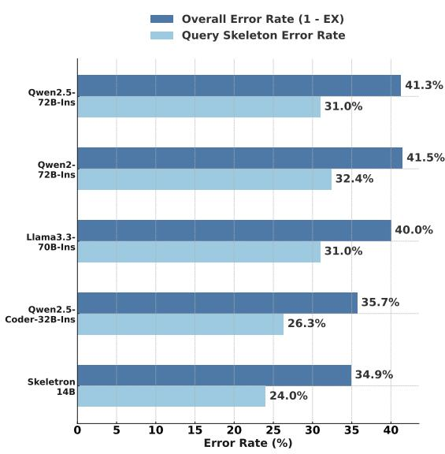  
Figure 3: Comparison of overall error rate (1 - EX) and query skeleton error rate across different LLMs and Skeletron 14B on the BIRD Dev. The method for identifying query skeleton errors follows Section 4.1.

## 6 Conclusion

In this paper, we introduce and formally define the Text-to-Query task paradigm, unifying semantic parsing tasks across various query languages. We identified query skeletons as a critical and universal abstraction for analyzing model behaviors, diagnosing weaknesses, and guiding data synthesis. Based on this abstraction, we proposed a dynamic data augmentation framework that explicitly diagnoses model-specific structural weaknesses and generates targeted, high-quality training examples accordingly. Experimental results across four diverse Text-to-Query benchmarks demonstrated that our approach achieves state-of-the-art performance, even with a limited amount of synthesized training data. These findings not only highlight the efficiency and generality of our method but also lay a robust foundation for future unified research in the Text-to-Query Task.

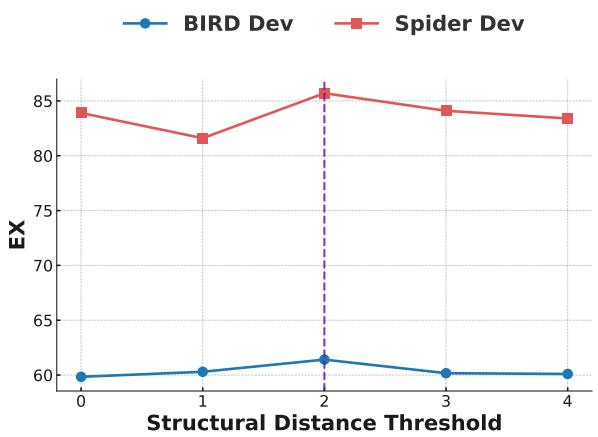  
Figure 4: EX on the BIRD and Spider Dev sets under different structural edit distance thresholds used in the dynamic diagnosis step.

## Limitations

Although our method demonstrates strong performance and generality across multiple query languages, there remain several limitations.

First, beyond the Text-to-SQL domain, the availability of high-quality datasets and standardized evaluation protocols remains limited. As a result, our experiments and baseline comparisons in other domains such as Text-to-Cypher and Text-to-nGQL are relatively constrained. We hope that future work will introduce more comprehensive datasets and unified evaluation settings to better assess our method.

Second, while our data augmentation framework is broadly applicable to different Text-to-Query tasks, the augmentation process is still performed independently for each task. The current setup does not support a unified model that can handle multiple query languages simultaneously. Developing a strong general Text-to-Query model remains an exciting direction for future work.

## 7 Acknowledgments

This work is supported by the Chinese NSF Major Research Plan (No.92270121) and the Fundamental Research Funds for the Central Universities

## References

Jacopo D’Abramo, Andrea Zugarini, and Paolo Torroni. 2025. Investigating large language models for textto-SPARQL generation. In Proceedings of the 4th International Workshop on Knowledge-Augmented Methodsfor Natural Language Processing, pages 66– 80, Albuquerque, New Mexico, USA. Association for Computational Linguistics.

Yuyang Ding, Xinyu Shi, Xiaobo Liang, Juntao Li, Qiaoming Zhu, and Min Zhang. 2024. Unleashing reasoning capability of llms via scalable question synthesis from scratch. Preprint, arXiv:2410.18693.

Xuemei Dong, Chao Zhang, Yuhang Ge, Yuren Mao, Yunjun Gao, lu Chen, Jinshu Lin, and Dongfang Lou. 2023. C3: Zero-shot text-to-sql with chatgpt. Preprint, arXiv:2307.07306.

Beat Fluri, Michael Würsch, Martin Pinzger, and Harald Gall. 2007. Change distilling:tree differencing for fine-grained source code change extraction. Software Engineering, IEEE Transactions on, 33:725–743.

Dawei Gao, Haibin Wang, Yaliang Li, Xiuyu Sun, Yichen Qian, Bolin Ding, and Jingren Zhou. 2023. Text-to-sql empowered by large language models: A benchmark evaluation. CoRR, abs/2308.15363.

Aaron Grattafiori, Abhimanyu Dubey, Abhinav Jauhri, Abhinav Pandey, Abhishek Kadian, Ahmad Al-Dahle, Aiesha Letman, Akhil Mathur, Alan Schelten, Alex Vaughan, Amy Yang, Angela Fan, Anirudh Goyal, Anthony Hartshorn, Aobo Yang, Archi Mitra, Archie Sravankumar, Artem Korenev, Arthur Hinsvark, and 542 others. 2024. The llama 3 herd of models. Preprint, arXiv:2407.21783.

Aibo Guo, Xinyi Li, Guanchen Xiao, Zhen Tan, and Xiang Zhao. 2022. Spcql: A semantic parsing dataset for converting natural language into cypher. In Proceedings ofthe 31st ACM International Conference on Information & Knowledge Management, CIKM ’22, page 3973–3977, New York, NY, USA. Association for Computing Machinery.

Yiqun Hu, Yiyun Zhao, Jiarong Jiang, Wuwei Lan, Henghui Zhu, Anuj Chauhan, Alexander Hanbo Li, Lin Pan, Jun Wang, Chung-Wei Hang, Sheng Zhang, Jiang Guo, Mingwen Dong, Joseph Lilien, Patrick Ng, Zhiguo Wang, Vittorio Castelli, and Bing Xiang. 2023. Importance of synthesizing high-quality data for text-to-SQL parsing. In Findings of the Association for Computational Linguistics: ACL 2023, pages 1327–1343, Toronto, Canada. Association for Computational Linguistics.

Lei Huang, Weijiang Yu, Weitao Ma, Weihong Zhong, Zhangyin Feng, Haotian Wang, Qianglong Chen, Weihua Peng, Xiaocheng Feng, Bing Qin, and Ting Liu. 2025. A survey on hallucination in large language models: Principles, taxonomy, challenges, and

open questions. ACM Transactions on Information Systems, 43(2):1–55.

Binyuan Hui, Jian Yang, Zeyu Cui, Jiaxi Yang, Dayiheng Liu, Lei Zhang, Tianyu Liu, Jiajun Zhang, Bowen Yu, Keming Lu, Kai Dang, Yang Fan, Yichang Zhang, An Yang, Rui Men, Fei Huang, Bo Zheng, Yibo Miao, Shanghaoran Quan, and 5 others. 2024. Qwen2.5-coder technical report. Preprint, arXiv:2409.12186.

Takeshi Kojima, Shixiang Shane Gu, Machel Reid, Yutaka Matsuo, and Yusuke Iwasawa. 2022. Large language models are zero-shot reasoners. In Proceedings of the 36th International Conference on Neural Information Processing Systems, NIPS ’22, Red Hook, NY, USA. Curran Associates Inc.

Haoyang Li, Shang Wu, Xiaokang Zhang, Xinmei Huang, Jing Zhang, Fuxin Jiang, Shuai Wang, Tieying Zhang, Jianjun Chen, Rui Shi, Hong Chen, and Cuiping Li. 2025. Omnisql: Synthesizing high-quality text-to-sql data at scale. Preprint, arXiv:2503.02240.

Haoyang Li, Jing Zhang, Cuiping Li, and Hong Chen. 2023a. Resdsql: decoupling schema linking and skeleton parsing for text-to-sql. In Proceedings of the Thirty-Seventh AAAI Conference on Artificial Intelligence and Thirty-Fifth Conference on Innovative Applications ofArtificial Intelligence and Thirteenth Symposium on Educational Advances in Artificial Intelligence, AAAI’23/IAAI’23/EAAI’23. AAAI Press.

Haoyang Li, Jing Zhang, Hanbing Liu, Ju Fan, Xiaokang Zhang, Jun Zhu, Renjie Wei, Hongyan Pan, Cuiping Li, and Hong Chen. 2024. Codes: Towards building open-source language models for text-to-sql. Proc. ACM Manag. Data, 2(3).

Jinyang Li, Binyuan Hui, GE QU, Jiaxi Yang, Binhua Li, Bowen Li, Bailin Wang, Bowen Qin, Ruiying Geng, Nan Huo, Xuanhe Zhou, Chenhao Ma, Guoliang Li, Kevin Chang, Fei Huang, Reynold Cheng, and Yongbin Li. 2023b. Can LLM already serve as a database interface? a BIg bench for large-scale database grounded text-to-SQLs. In Thirty-seventh Conference on Neural Information Processing Systems Datasets and Benchmarks Track.

Xinyu Liu, Shuyu Shen, Boyan Li, Peixian Ma, Runzhi Jiang, Yuxin Zhang, Ju Fan, Guoliang Li, Nan Tang, and Yuyu Luo. 2025. A survey of nl2sql with large language models: Where are we, and where are we going? Preprint, arXiv:2408.05109.

Linyong Nan, Yilun Zhao, Weijin Zou, Narutatsu Ri, Jaesung Tae, Ellen Zhang, Arman Cohan, and Dragomir Radev. 2023. Enhancing text-to-SQL capabilities of large language models: A study on prompt design strategies. In Findings of the Association for Computational Linguistics: EMNLP 2023, pages 14935–14956, Singapore. Association for Computational Linguistics.

OpenAI, Josh Achiam, Steven Adler, Sandhini Agarwal, Lama Ahmad, Ilge Akkaya, Florencia Leoni Aleman, Diogo Almeida, Janko Altenschmidt, Sam Altman, Shyamal Anadkat, Red Avila, Igor Babuschkin, Suchir Balaji, Valerie Balcom, Paul Baltescu, Haiming Bao, Mohammad Bavarian, Jeff Belgum, and 262 others. 2024. Gpt-4 technical report. Preprint, arXiv:2303.08774.

Makbule Gulcin Ozsoy, Leila Messallem, Jon Besga, and Gianandrea Minneci. 2025. Text2Cypher: Bridging natural language and graph databases. In Proceedings of the Workshop on Generative AI and Knowledge Graphs (GenAIK), pages 100–108, Abu Dhabi, UAE. International Committee on Computational Linguistics.

Ana-Maria Popescu, Alex Armanasu, Oren Etzioni, David Ko, and Alexander Yates. 2004. Modern natural language interfaces to databases: Composing statistical parsing with semantic tractability. In COL-ING 2004: Proceedings of the 20th International Conference on Computational Linguistics, pages 141– 147, Geneva, Switzerland. COLING.

Mohammadreza Pourreza, Hailong Li, Ruoxi Sun, Yeounoh Chung, Shayan Talaei, Gaurav Tarlok Kakkar, Yu Gan, Amin Saberi, Fatma Ozcan, and Sercan O Arik. 2025. CHASE-SQL: Multi-path reasoning and preference optimized candidate selection in text-to-SQL. In The Thirteenth International Conference on Learning Representations.

Mohammadreza Pourreza and Davood Rafiei. 2023. DIN-SQL: Decomposed in-context learning of textto-SQL with self-correction. In Thirty-seventh Conference on Neural Information Processing Systems.

Mohammadreza Pourreza and Davood Rafiei. 2024. DTS-SQL: Decomposed text-to-SQL with small large language models. In Findings of the Associationfor Computational Linguistics: EMNLP 2024, pages 8212–8220, Miami, Florida, USA. Association for Computational Linguistics.

Qwen, :, An Yang, Baosong Yang, Beichen Zhang, Binyuan Hui, Bo Zheng, Bowen Yu, Chengyuan Li, Dayiheng Liu, Fei Huang, Haoran Wei, Huan Lin, Jian Yang, Jianhong Tu, Jianwei Zhang, Jianxin Yang, Jiaxi Yang, Jingren Zhou, and 25 others. 2025. Qwen2.5 technical report. Preprint, arXiv:2412.15115.

Cecil R. Reynolds and Elaine Fletcher-Janzen. 2007. Diagnostic prescriptive teaching. In Cecil R. Reynolds, Kimberly J. Vannest, and Elaine Fletcher-Janzen, editors, Encyclopedia of Special Education, page 772. John Wiley & Sons.

Mili Shah, Joyce Cahoon, Mirco Milletari, Jing Tian, Fotis Psallidas, Andreas Mueller, and Nick Litombe. 2024. Improving LLM-based KGQA for multi-hop question answering with implicit reasoning in fewshot examples. In Proceedings of the 1st Workshop on Knowledge Graphs and Large Language Models

(KaLLM 2024), pages 125–135, Bangkok, Thailand. Association for Computational Linguistics.

Zhili Shen, Pavlos Vougiouklis, Chenxin Diao, Kaustubh Vyas, Yuanyi Ji, and Jeff Z. Pan. 2024. Improving retrieval-augmented text-to-SQL with ASTbased ranking and schema pruning. In Proceedings of the 2024 Conference on Empirical Methods in Natural Language Processing, pages 7865–7879, Miami, Florida, USA. Association for Computational Linguistics.

Yewei Song, Cedric Lothritz, Xunzhu Tang, Tegawendé Bissyandé, and Jacques Klein. 2024. Revisiting code similarity evaluation with abstract syntax tree edit distance. In Proceedings of the 62nd Annual Meeting of the Association for Computational Linguistics (Volume 2: Short Papers), pages 38–46, Bangkok, Thailand. Association for Computational Linguistics.

Shayan Talaei, Mohammadreza Pourreza, Yu-Chen Chang, Azalia Mirhoseini, and Amin Saberi. 2024. Chess: Contextual harnessing for efficient sql synthesis. Preprint, arXiv:2405.16755.

Aman Tiwari, Shiva Krishna Reddy Malay, Vikas Yadav, Masoud Hashemi, and Sathwik Tejaswi Madhusudhan. 2025. Auto-cypher: Improving LLMs on cypher generation via LLM-supervised generationverification framework. In Proceedings ofthe 2025 Conference of the Nations of the Americas Chapter of the Association for Computational Linguistics: Human Language Technologies (Volume 2: Short Papers), pages 623–640, Albuquerque, New Mexico. Association for Computational Linguistics.

Bailin Wang, Wenpeng Yin, Xi Victoria Lin, and Caiming Xiong. 2021. Learning to synthesize data for semantic parsing. In Proceedings of the 2021 Conference of the North American Chapter of the Associationfor Computational Linguistics: Human Language Technologies, pages 2760–2766, Online. Association for Computational Linguistics.

Bing Wang, Changyu Ren, Jian Yang, Xinnian Liang, Jiaqi Bai, LinZheng Chai, Zhao Yan, Qian-Wen Zhang, Di Yin, Xing Sun, and Zhoujun Li. 2025. MAC-SQL: A multi-agent collaborative framework for textto-SQL. In Proceedings of the 31st International Conference on Computational Linguistics, pages 540– 557, Abu Dhabi, UAE. Association for Computational Linguistics.

Dingzirui Wang, Longxu Dou, Xuanliang Zhang, Qingfu Zhu, and Wanxiang Che. 2024. Improving demonstration diversity by human-free fusing for text-to-SQL. In Findings of the Association for Computational Linguistics: EMNLP 2024, pages 1193– 1207, Miami, Florida, USA. Association for Computational Linguistics.

Jason Wei, Xuezhi Wang, Dale Schuurmans, Maarten Bosma, brian ichter, Fei Xia, Ed H. Chi, Quoc V Le, and Denny Zhou. 2022. Chain of thought prompting elicits reasoning in large language models. In Advances in Neural Information Processing Systems.

Kun Wu, Lijie Wang, Zhenghua Li, Ao Zhang, Xinyan Xiao, Hua Wu, Min Zhang, and Haifeng Wang. 2021. Data augmentation with hierarchical SQLto-question generation for cross-domain text-to-SQL parsing. In Proceedings ofthe 2021 Conference on Empirical Methods in Natural Language Processing, pages 8974–8983, Online and Punta Cana, Dominican Republic. Association for Computational Linguistics.

Can Xu, Qingfeng Sun, Kai Zheng, Xiubo Geng, Pu Zhao, Jiazhan Feng, Chongyang Tao, Qingwei Lin, and Daxin Jiang. 2024. WizardLM: Empowering large pre-trained language models to follow complex instructions. In The Twelfth International Conference on Learning Representations.

Ziwei Xu, Sanjay Jain, and Mohan Kankanhalli. 2025. Hallucination is inevitable: An innate limitation of large language models. Preprint, arXiv:2401.11817.

An Yang, Baosong Yang, Binyuan Hui, Bo Zheng, Bowen Yu, Chang Zhou, Chengpeng Li, Chengyuan Li, Dayiheng Liu, Fei Huang, Guanting Dong, Haoran Wei, Huan Lin, Jialong Tang, Jialin Wang, Jian Yang, Jianhong Tu, Jianwei Zhang, Jianxin Ma, and 43 others. 2024a. Qwen2 technical report. Preprint, arXiv:2407.10671.

Jiaxi Yang, Binyuan Hui, Min Yang, Jian Yang, Junyang Lin, and Chang Zhou. 2024b. Synthesizing text-to-SQL data from weak and strong LLMs. In Proceedings of the 62nd Annual Meeting of the Associationfor Computational Linguistics (Volume 1: Long Papers), pages 7864–7875, Bangkok, Thailand. Association for Computational Linguistics.

Shouguo Yang, Long Cheng, Yicheng Zeng, Zhe Lang, Hongsong Zhu, and Zhiqiang Shi. 2021. Asteria: Deep learning-based ast-encoding for cross-platform binary code similarity detection. In 2021 51st Annual IEEE/IFIP International Conference on Dependable Systems and Networks (DSN), pages 224–236.

Tao Yu, Rui Zhang, Kai Yang, Michihiro Yasunaga, Dongxu Wang, Zifan Li, James Ma, Irene Li, Qingning Yao, Shanelle Roman, Zilin Zhang, and Dragomir Radev. 2018. Spider: A large-scale human-labeled dataset for complex and cross-domain semantic parsing and text-to-SQL task. In Proceedings of the 2018 Conference on Empirical Methods in Natural Language Processing, pages 3911–3921, Brussels, Belgium. Association for Computational Linguistics.

Hanchong Zhang, Ruisheng Cao, Lu Chen, Hongshen Xu, and Kai Yu. 2023a. ACT-SQL: In-context learning for text-to-SQL with automatically-generated chain-of-thought. In Findings of the Association for Computational Linguistics: EMNLP 2023, pages 3501–3532, Singapore. Association for Computational Linguistics.

Yi Zhang, Jan Deriu, George Katsogiannis-Meimarakis, Catherine Kosten, Georgia Koutrika, and Kurt Stockinger. 2023b. Sciencebenchmark: A complex

real-world benchmark for evaluating natural language to sql systems. Proc. VLDB Endow., 17(4):685–698.

Victor Zhong, Mike Lewis, Sida I. Wang, and Luke Zettlemoyer. 2020. Grounded adaptation for zeroshot executable semantic parsing. In Proceedings of the 2020 Conference on Empirical Methods in Natural Language Processing (EMNLP), pages 6869– 6882, Online. Association for Computational Linguistics.

Victor Zhong, Caiming Xiong, and Richard Socher. 2017. Seq2sql: Generating structured queries from natural language using reinforcement learning. CoRR, abs/1709.00103.

Zijie Zhong, Linqing Zhong, Zhaoze Sun, Qingyun Jin, Zengchang Qin, and Xiaofan Zhang. 2025. SyntheT2C: Generating synthetic data for fine-tuning large language models on the Text2Cypher task. In Proceedings of the 31st International Conference on Computational Linguistics, pages 672–692, Abu Dhabi, UAE. Association for Computational Linguistics.

Yuhang Zhou, Yu He, Siyu Tian, Yuchen Ni, Zhangyue Yin, Xiang Liu, Chuanjun Ji, Sen Liu, Xipeng Qiu, Guangnan Ye, and Hongfeng Chai. 2024. r3- NL2GQL: A model coordination and knowledge graph alignment approach for NL2GQL. In Findings ofthe Associationfor Computational Linguistics: EMNLP 2024, pages 13679–13692, Miami, Florida, USA. Association for Computational Linguistics.

## A Schema Components

## A.1 SQLite Database

The schema of an SQLite database is organized in the form of DDL statements, including table names, column names, column types, optional column comments, optional sample values, and primary/foreign key constraints. Column comments consist of column descriptions and value illustrations, which are only available in the BIRD dataset. Therefore, they are included exclusively in the BIRD schemas. An example schema is shown in Figure 5.

During the SFT stage, we provide as much contextual information as possible for training. Thus, the schema includes column comments and 3 sample values for each column. However, due to GPU memory limitations, we restrict the input length to below 8192 characters, if the input exceeds this limit, we prioritize retaining the schemas of the gold tables corresponding to the SQL, while discarding the remaining table schemas.

In the data synthesis stage, for the same purpose of providing LLMs with sufficient information to better accomplish the task, we use the complete schema with all available content, except that excessively long sample values in some columns are selectively omitted.

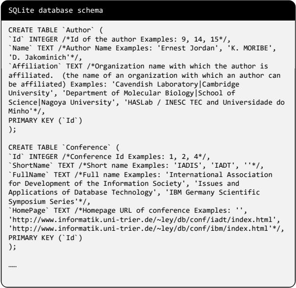  
Figure 5: An example of SQLite database schema.

In the inference stage, following the common evaluation setup (Li et al., 2023b; Yu et al., 2018; Pourreza and Rafiei, 2023), we exclude column comments from the schema and retain only 3 sample values per column along with other mandatory elements.

## A.2 Neo4j Database

The Text2Cypher dataset (Ozsoy et al., 2025) already includes the corresponding database schemas, which we directly use. Each database schema consists of nodes, node properties (with types and sample values), and relation types. An example of a Neo4j database schema is shown in Figure 6.

## A.3 NebulaGraph Database

For the schema of NebulaGraph databases, we follow the setup of Zhou et al. (2024) and organize the graph schema using Python code, which ensures semantic integrity across entities, relationships, and attributes while minimizing information loss.

Specifically, the code-structured schema encodes the graph in terms of Tags and Edges, where Python constructs are employed to provide detailed and precise descriptions: (1) concepts are defined as Python classes; (2) class annotations offer explanatory details; (3) class inheritance captures hierarchical relations; and (4) initialization functions specify the attributes of tags or edges. Figure 7 illustrates an example of such a graph schema.

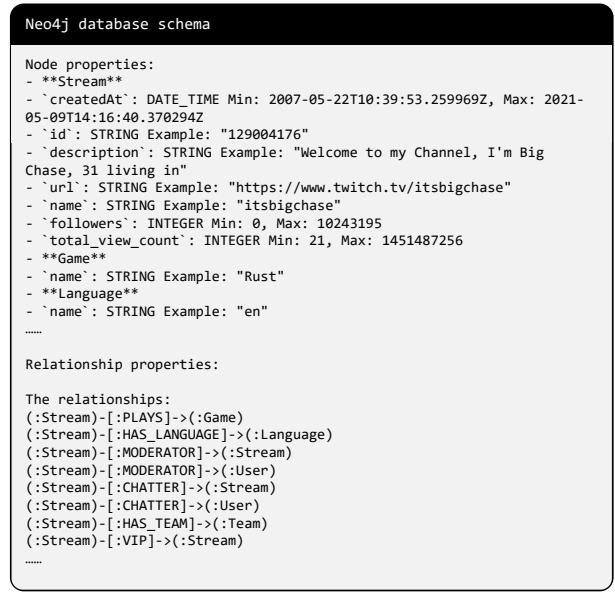  
Figure 6: An example of Neo4j database schema.

## B Implementation of Structural Similarity Measure

For the computation of AST-based structural distance, we leverage SQLGlot2, a comprehensive and generic SQL parser. SQLGlot provides an implementation of the Change Distiller algorithm, which computes the minimal set of edit operations required to transform one SQL AST into another. Further details of this implementation can be found in its documentation3. For token-based structural distance, we simply split queries into tokens using whitespace as the delimiter.

## C Details on Skeleton Generalizer

We fine-tune Qwen2.5-Coder-14B-Instruct with the error-prone skeletons obtained from the dynamic diagnosis step to derive a Skeleton Generalizer. Inspired by prior work (Xu et al., 2024; Ding et al., 2024), we provide only a partial prefix of the LLM’s instruction template to guide the model in generating the corresponding skeletons. Instruction-tuned LLMs such as Qwen2.5-Coder-14B-Instruct have already learned to produce responses based on questionanswer pairs (e.g., "<|im\_start|>User: {instruction}<|im\_end|>\n<|im\_start|>Assistant: {output}<im\_end>"). Since in our setting the model is only used for skeleton synthesis without any specific user questions, and query statements are more likely than questions to appear in the answer position during instruction tuning, we adopt the answer part of the instruction template (i.e., "<|im\_start|>Assistant:") to guide skeleton generation. This setup encourages more diverse skeletons. Nevertheless, to further promote the generation of error-prone skeletons and suppress unrelated content, additional fine-tuning is required.

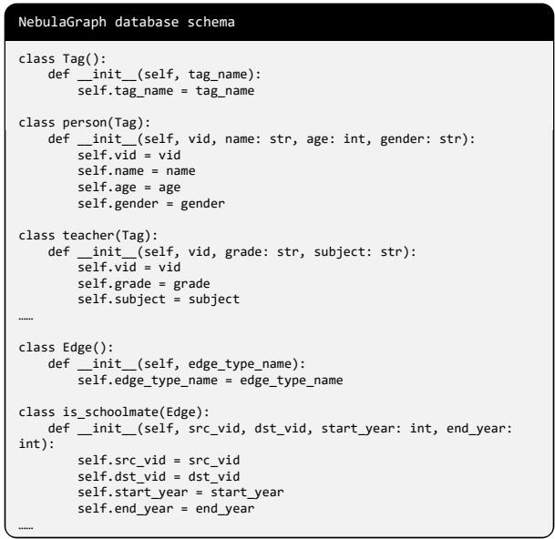

Figure 7: An example of NebulaGraph database schema.  
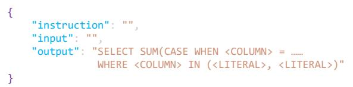  
Figure 8: An example from the fine-tuning dataset in Alpaca format.

Concretely, during fine-tuning we adjust the instruction template to "<|im\_start|>Assistant: {output}<im\_end>". An example from the fine-tuning dataset in Alpaca format is shown in Figure 8. At inference time, we use the same instruction template, and the model can directly output diverse skeletons without requiring any explicit instruction.

## D Skeletons Extraction

To extract the skeletons of SQL queries, we employ SQLGlot to parse SQL queries into ASTs. We then traverse the ASTs to identify all tables, columns, and literals, replacing them with corresponding placeholders to obtain the SQL skeletons. For other query languages such as Cypher and nGQL, due to the lack of powerful open-source parsers, we predefine skeleton extraction rules and leverage LLMs to accomplish the extraction. The extraction rules for Cypher skeletons are illustrated in Figure 9, and those for nGQL skeletons are shown in Figure 10.

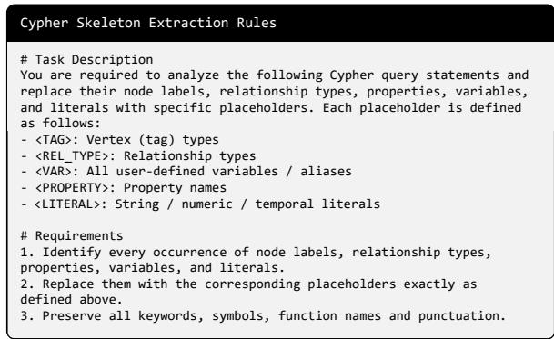

<table><tr><td>Teacher Model</td><td>simple</td><td>moderate</td><td>challenging</td><td>total</td></tr><tr><td>Qwen2.5-14B-Instruct</td><td>64.8</td><td>50.2</td><td>42.1</td><td>58.2</td></tr><tr><td>Qwen2.5-32B-Instruct</td><td>65.2</td><td>50.4</td><td>43.5</td><td>58.7</td></tr><tr><td>Qwen2.5-72B-Instruct</td><td>67.6</td><td>53.5</td><td>47.6</td><td>61.4</td></tr></table>

Table 5: EX performance variations across different teacher models, evaluated on the BIRD dev set using Qwen2.5-Coder-7B as the target model.

Figure 9: Extraction rules for Cypher skeletons.  
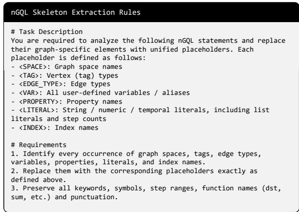  
Figure 10: Extraction rules for nGQL skeletons.

## E Impact of Teacher Models

To examine how our method performs with teacher models of different capacities, we conducted experiments using two smaller models, Qwen2.5- 14B-Instruct and Qwen2.5-32B-Instruct, as alternatives to the original teacher model Qwen2.5-72B-Instruct used in the paper. The base model we used is Qwen2.5-Coder-7B and we evaluate it on the BIRD dataset. As shown in Table 5, while using a weaker teacher does lead to a slight drop in performance, the overall decline is modest, indicating the robustness of our method to the choice of teacher model. At the same time, stronger teacher models do yield better results, suggesting that, when resources permit, such as using larger open-source models or even proprietary ones, the benefits of our method can be further amplified.

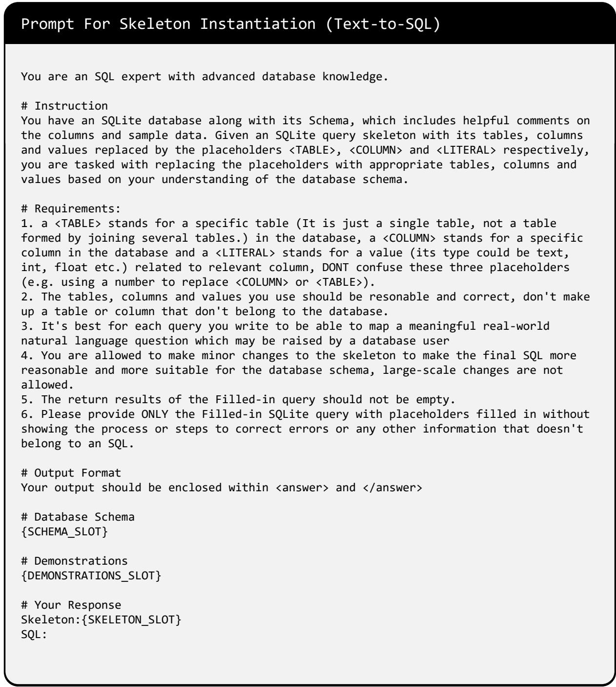  
Figure 11: Prompt for Skeleton Instantiation in the Data Synthesis Pipeline of Text-to-SQL.

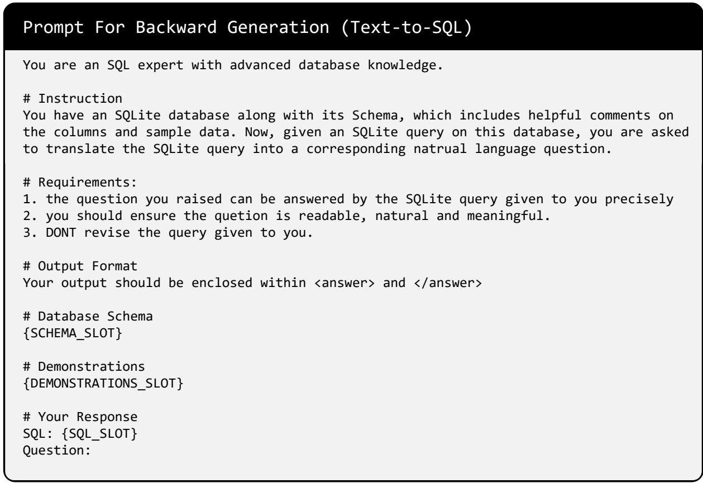  
Figure 12: Prompt for Backward Generation in the Data Synthesis Pipeline of Text-to-SQL.

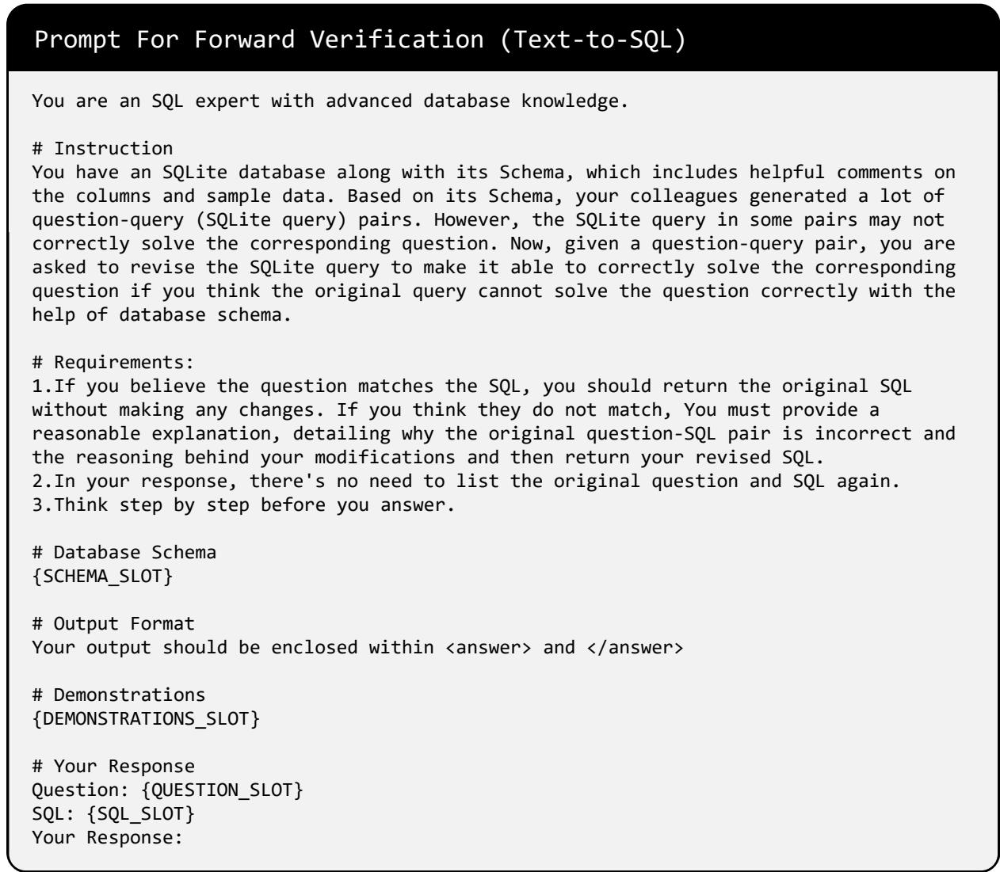  
Figure 13: Prompt for Forward Verification in the Data Synthesis Pipeline of Text-to-SQL.

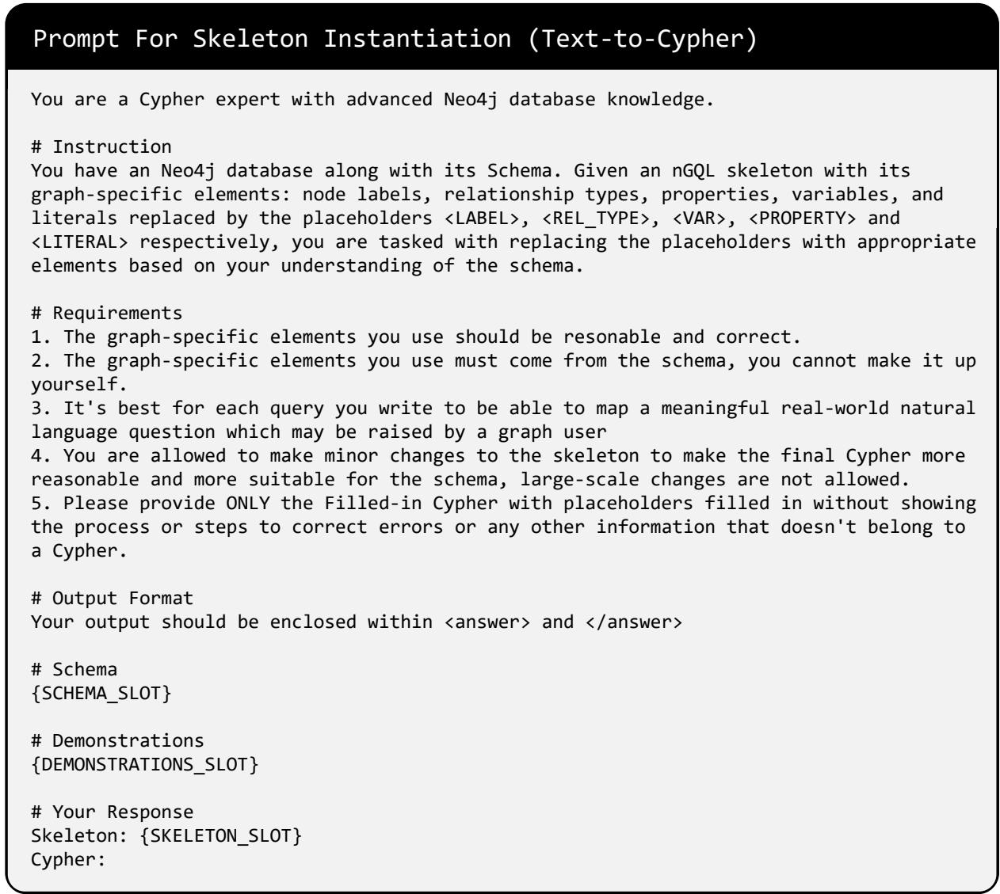  
Figure 14: Prompt for Skeleton Instantiation in the Data Synthesis Pipeline of Text-to-Cypher.

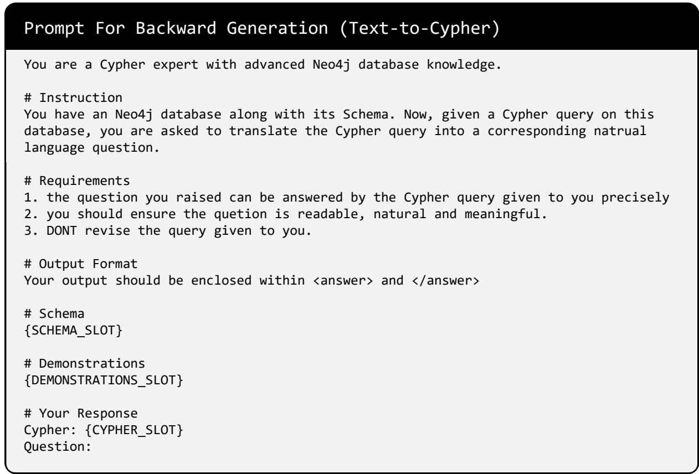  
Figure 15: Prompt for Backward Generation in the Data Synthesis Pipeline of Text-to-Cypher.

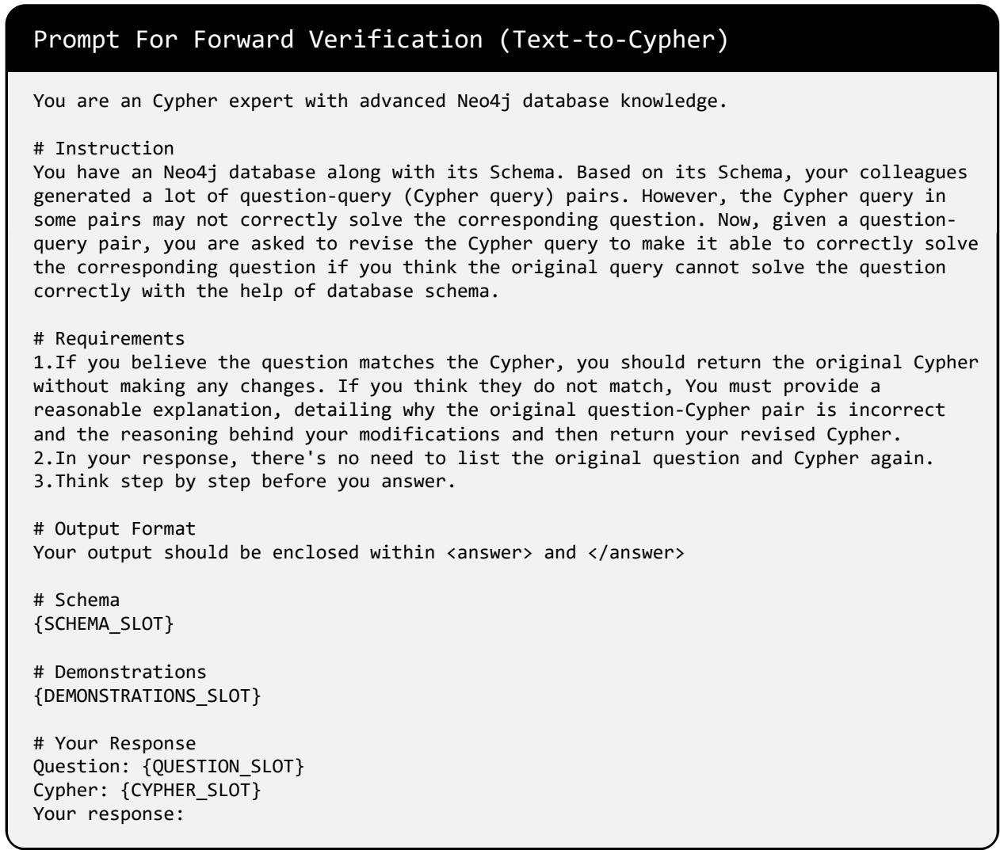  
Figure 16: Prompt for Forward Verification in the Data Synthesis Pipeline of Text-to-Cypher.

Prompt For Skeleton Instantiation (Text-to-nGQL)   
You are an nGQL expert with advanced NebulaGraph database knowledge.   
# Instruction   
You have an NebulaGraph database along with its Schema. Given an nGQL skeleton with its   
graph-specific elements: graph space, vertex types, edge types, variables, properties,   
values and index names replaced by the placeholders <SPACE>, <TAG>, <EDGE\_TYPE>, <VAR>,   
<PROPERTY>, <LITERAL> and <INDEX> respectively, you are tasked with replacing the   
placeholders with appropriate elements based on your understanding of the schema.   
# Requirements   
1. The graph-specific elements you use should be resonable and correct.   
2. The graph-specific elements you use must come from the schema, you cannot make it up   
yourself.   
3. It's best for each query you write to be able to map a meaningful real-world natural   
language question which may be raised by a graph user   
4. You are allowed to make minor changes to the skeleton to make the final nGQL more   
reasonable and more suitable for the schema, large-scale changes are not allowed.   
5. Please provide ONLY the Filled-in nGQL with placeholders filled in without showing   
the process or steps to correct errors or any other information that doesn't belong to   
an nGQL.   
# Reference   
The following is a simple document to provide you with a reference to the common syntax   
of nGQL:   
{REFERENCE\_SLOT}   
# Output Format   
Your output should be enclosed within <answer> and </answer>   
# Schema   
{SCHEMA\_SLOT}   
# Demonstrations   
{DEMONSTRATIONS\_SLOT}   
# Your Response   
Skeleton: {SKELETON\_SLOT}   
nGQL:  
Figure 17: Prompt for Skeleton Instantiation in the Data Synthesis Pipeline of Text-to-nGQL. The {REFER ENCE\_SLOT} part will be replaced with the Code-Structured Skeleton for GQL (including the framework of nGQL keywords) described in Zhou et al. (2024).

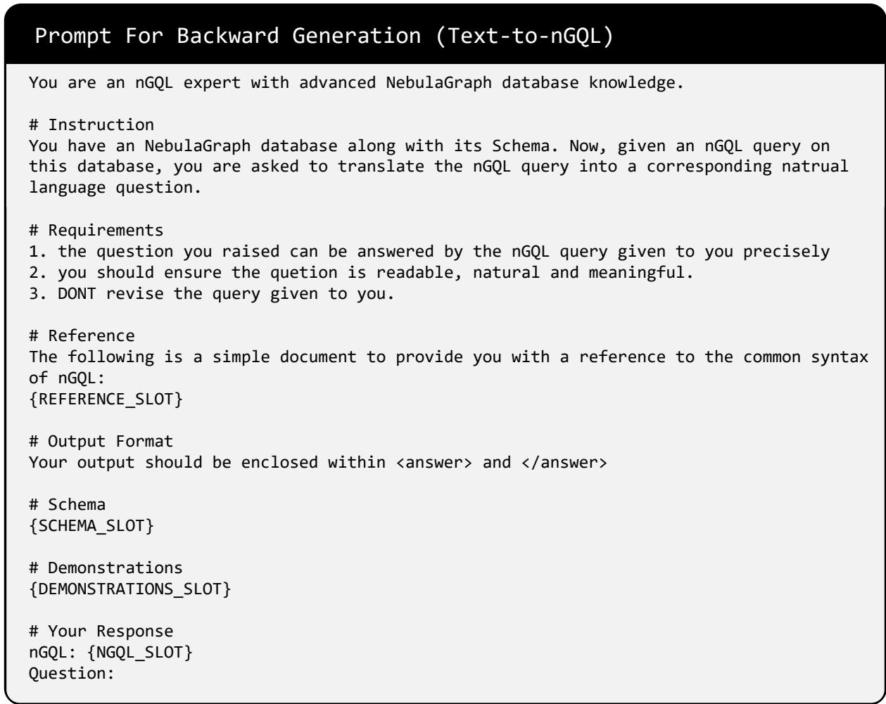  
Figure 18: Prompt for Backward Generation in the Data Synthesis Pipeline of Text-to-nGQL.

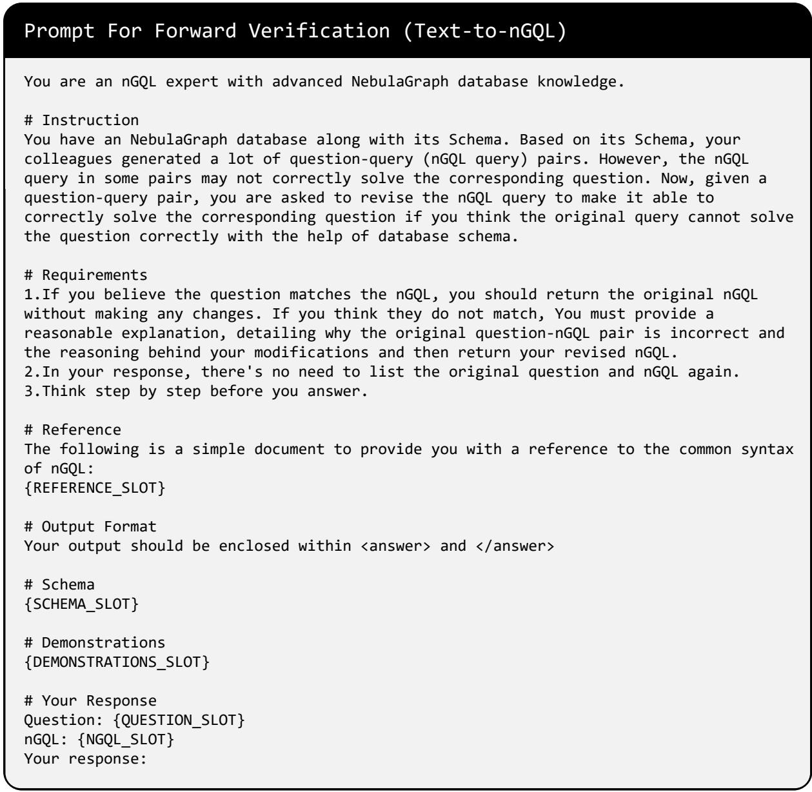  
Figure 19: Prompt for Forward Verification in the Data Synthesis Pipeline of Text-to-nGQL.