# SmartBench: Is Your LLM Truly a Good Chinese Smartphone Assistant?

Xudong Lu\*1,2, Haohao Gao\*1, Renshou Wu\*†1, Shuai Ren1, Xiaoxin Chen1,

Hongsheng Li2B, Fangyuan Li1B

1vivo AI Lab 2CUHK MMLab

∗Equal contribution BCorresponding author †Project lead

luxudong@link,hsli@ee .cuhk.edu.hk gaohaohao,wurenshou,lifangyuan @vivo.com

## Abstract

Large Language Models (LLMs) have become integral to daily life, especially advancing as intelligent assistants through on-device deployment on smartphones. However, existing LLM evaluation benchmarks predominantly focus on objective tasks like mathematics and coding in English, which do not necessarily reflect the practical use cases of on-device LLMs in realworld mobile scenarios, especially for Chinese users. To address these gaps, we introduce SmartBench, the first benchmark designed to evaluate the capabilities of on-device LLMs in Chinese mobile contexts. We analyze functionalities provided by representative smartphone manufacturers and divide them into five categories: text summarization, text Q&A, information extraction, content creation, and notification management, further detailed into 20 specific tasks. For each task, we construct highquality datasets comprising 50 to 200 questionanswer pairs that reflect everyday mobile inter actions, and we develop automated evaluation criteria tailored for these tasks. We conduct comprehensive evaluations of on-device LLMs and MLLMs using SmartBench and also assess their performance after quantized deployment on real smartphone NPUs. Our contri butions provide a standardized framework for evaluating on-device LLMs in Chinese, promoting further development and optimization in this critical area. Code and data will be available at https://github.com/vivo-ai-lab/ SmartBench.

## 1 Introduction

Large Language Models (LLMs) have significantly transformed everyday life in recent years by serving as intelligent, context-aware assistants (OpenAI., 2024; Team et al., 2024; Anthropic, 2023; Anil et al., 2023; Lu et al., 2024a; Jiang et al., 2024; Abdin et al., 2024; Guo et al., 2025). To further enhance the capabilities of LLMs in serving human needs, various academic research and engineering efforts have focused on deploying smaller LLMs on edge devices, such as smartphones (Xue et al., 2024; Yao et al., 2024; Chu et al., 2023, 2024; Lu et al., 2024b). As companions in our daily lives, smartphones serve as crucial platforms for people to experience the capabilities of on-device LLMs. The local deployment of LLMs on end-side smartphones eliminates the need for a network connection, which not only broadens the scope of possible application scenarios but also enhances user privacy by keeping sensitive data processing on the device (Qu et al., 2024; Ding et al., 2024).

The current trend in smartphone technology shows that major manufacturers are increasingly adopting on-device LLMs (Ashkboos et al., 2024), integrating advanced AI capabilities into their devices. Industry leaders such as Apple with OpenELM (Mehta et al., 2024), HUAWEI’s Pangu E (Zeng et al., 2021), Xiaomi’s MiLM (XiaomiTime, 2024), and vivo’s BlueLM-3B (Lu et al., 2024b) have demonstrated significant progress in this domain. These on-device LLMs support various real-time tasks (Wu et al., 2024), offering users seamless and responsive AI-powered mobile interactions (Xu et al., 2024).

However, we find that there are still notable gaps in the comprehensive evaluations for assessing the capabilities of on-device LLMs deployed on smartphones. Traditional LLM evaluations are typically categorized into two dimensions, i.e., objective tasks and subjective tasks. Objective tasks primarily focus on the assessment of knowledge, encompassing areas such as mathematical proficiency with benchmarks like GSM8K (Cobbe et al., 2021) and MATH (Hendrycks et al., 2021), coding competence evaluated through HumanEval (Chen et al., 2021), and multitask accuracy measured by MMLU (Hendrycks et al., 2020). Subjective tasks typically evaluate the model’s ability to generate coherent, contextually appropriate, and human-like responses. These tasks often consider the model’s creativity, fluency, adaptability to nuanced instructions, and alignment with user intent. Subjective evaluation datasets are often derived from userconstructed scenarios (Liu et al., 2023), curated human-chatbot conversations (Lin et al., 2024), and filtered interactions from platforms like Chatbot Arena (Li et al., 2024a,b). For on-device smartphone applications, the evaluation predominantly emphasizes subjective capabilities. Through our investigation, we identify the following critical gaps in existing subjective evaluation benchmarks:

<table><tr><td rowspan=1 colspan=4>Text Summarization</td><td rowspan=1 colspan=3>Text Q&amp;A</td><td rowspan=1 colspan=3>Information Extraction</td></tr><tr><td rowspan=1 colspan=1>DocumentSumm文档摘要</td><td rowspan=1 colspan=1>CallSumm通话摘要</td><td rowspan=1 colspan=1>RecordingSumm录音摘要</td><td rowspan=1 colspan=1>MeetingSumm会议摘要</td><td rowspan=1 colspan=1>DocumentQ&amp;A文档问答</td><td rowspan=1 colspan=1>RetrievalQ&amp;A检索问答</td><td rowspan=1 colspan=1>PersonalQ&amp;A个人问答</td><td rowspan=1 colspan=1>EntityExtraction实体抽取</td><td rowspan=1 colspan=1>RelationExtraction关系抽取</td><td rowspan=1 colspan=1>EventExtraction事件抽取</td></tr><tr><td rowspan=1 colspan=8>Content Creation</td><td rowspan=1 colspan=2>Notification Management</td></tr><tr><td rowspan=1 colspan=1>TextPolishing文本润色</td><td rowspan=1 colspan=1>TextContinuation文本续写</td><td rowspan=1 colspan=1>TextAbbreviation文本缩写</td><td rowspan=1 colspan=1>TextExpansion文本扩写</td><td rowspan=1 colspan=1>TextCreation文本创作</td><td rowspan=1 colspan=1>TextFormatting文本排版</td><td rowspan=1 colspan=1>InstantReply即时回复</td><td rowspan=1 colspan=1>TextCorrection文本纠错</td><td rowspan=1 colspan=1>NotificationSorting通知排序</td><td rowspan=1 colspan=1>MessageSumm消息总结</td></tr></table>

Table 1: We analyze the on-device LLM features currently released on mobile phones by major manufacturers, dividing them into 5 major categories with 20 tasks. Based on this, we propose SmartBench, the first (Chinese) benchmark for assessing the capabilities of on-device LLMs in mobile scenarios.

1) The scenario gap: Current benchmarks emphasize tasks like mathematics and coding (Li et al., 2023; Lin et al., 2024; Li et al., 2024b), which are rarely handled by on-device LLMs in practical applications. Instead, on-device LLMs place greater emphasis on lightweight tasks such as text refinement, and notification processing.

2) The language gap: Mobile users who speak different languages often have varying living environments and language habits. Currently, most evaluation protocols for subjective tasks are all in English. As a market with over 1 billion smartphone users (Statista, 2025), it is crucial to have an evaluation benchmark for LLMs deployed on Chinese-oriented smartphones.

To tackle these gaps, in this paper, starting from a functional investigation of on-device LLMs, we construct SmartBench, the first (Chinese) benchmark for evaluating the capabilities of on-device LLMs in mobile scenarios. Specifically, we analyze the on-device LLM functionalities provided by Apple, HUAWEI, OPPO, vivo, Xiaomi, and HONOR (up to December 2024), dividing them into five categories: text summarization, text Q&A, information extraction, content creation, and notification management. Building on these functionalities, we further refine the 5 categories into 20 tasks, as outlined in Tab. 1. To evaluate each task, we construct 50 to 200 question-answer (QA) pairs per task that reflect everyday life scenarios by screening open-source datasets and generating additional pairs using manual collection or LLMs, resulting in a total of 2973 QA pairs. Evaluations of subjective tasks are commonly conducted using the LLM-as-a-Judge paradigm (Zheng et al., 2023). In SmartBench, we develop detailed automated evaluation criteria for each category/task. We further conduct comprehensive evaluations of multiple on-device LLMs and MLLMs on Smart-Bench and assess their performance after quantized deployment on the NPU of real smartphones.

Our contributions are summarized as follows:

1) We investigate the on-device LLM features offered by representative smartphone manufacturers, organizing them into 5 categories comprising 20 tasks. We then introduce SmartBench, the first Chinese benchmark designed to evaluate the capabilities of on-device LLMs in mobile scenarios, featuring 2973 QA pairs.

2) For each task, we construct high-quality text QA pairs tailored to mobile usage scenarios by screening open-source datasets, manually collecting data, and synthesizing data using LLMs. Additionally, we develop high-quality automated evaluation methods for each category/task.

3) We evaluate the performance of representative end-side LLMs/MLLMs using SmartBench. Additionally, we assess the accuracy of quantized models running on real smartphone NPUs, which offers greater practical value.

## 2 Related Works

## 2.1 Large Language Models on Edge Devices

The deployment of LLMs on edge devices has garnered significant attention in recent years. In the academic community, there are currently numerous open-source LLMs and MLLMs, such as Qwen2.5 3B (Yang et al., 2024b), InternVL 2.5 4B (Chen et al., 2024), and MiniCPM 3.0 4B (Hu et al., 2024a). Most of these models have between

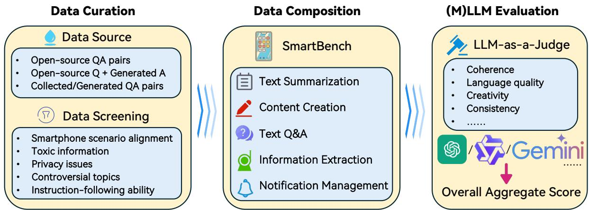  
Figure 1: Overview of SmartBench, including data curation, data composition, and LLM-as-a-Judge evaluation.

3B and 4B parameters, making them well-suited for deployment on edge devices with limited computational capabilities. Besides, major smartphone manufacturers have also introduced their own LLMs, including Gemini Nano by Google, BlueLM by vivo, Magic LM by HONOR, OpenELM by Apple, and MiLM by Xiaomi (Wu et al., 2024). These advancements pave the way for more efficient and powerful AI applications on edge devices.

## 2.2 Benchmarks for Realworld Assistance

How to comprehensively evaluate LLMs has long been a widely researched topic (Chang et al., 2024). The vast majority of benchmarks are designed to assess the knowledge capabilities of these models, including general knowledge (Hendrycks et al., 2020; Wang et al., 2024c; Clark et al., 2018), mathematics and science knowledge (Cobbe et al., 2021; Hendrycks et al., 2021; Rein et al., 2023), and coding ability (Austin et al., 2021; Chen et al., 2021), etc. Recently, there have been new datasets introduced to test the ability of models to handle real users’ questions in the wild (Liu et al., 2023; Lin et al., 2024). These datasets often consist of subjective questions that focus on the creativity and ability of models to follow instructions in real-world usage scenarios (Li et al., 2024b,a, 2023), providing a more direct reflection of user comfort and satisfaction during real-world usage. SmartBench is the first benchmark designed to evaluate the practical functionalities of LLMs deployed on smartphones.

## 2.3 Chinese LLM Benchmarks

With the rapid development of Chinese LLMs (Sun et al., 2021; Team, 2023; Guo et al., 2025), specialized evaluation benchmarks have been established to assess their performance in understanding and generating content within a Chinese context. Prominent Chinese LLM benchmarks include CMRC (Cui et al., 2019), CLUE (Xu et al., 2020), SuperCLUE (Xu et al., 2023), and C-Eval (Huang et al., 2023), etc. Additionally, there are datasets like AlignBench (Liu et al., 2023) designed for evaluating subjective tasks in Chinese. However, SmartBench distinguishes itself by focusing specifically on everyday mobile scenarios, offering a unique perspective on the practical functionalities of on-device LLMs in real-life smartphone usage.

## 2.4 LLM Agent on Smartphones

There is another type of task on mobile phones that helps solve real-world tasks, called mobile agents (Wang et al., 2024a; Zhang et al., 2023a; Chai et al., 2024; Rawles et al., 2024). These tasks often involve executing multi-step commands on the phone based on user instructions (Zhang et al., 2024). In contrast, Smartbench focuses on the functionality of on-device LLMs for handling common daily tasks in a single step, without planning action trajectories or calling external APIs.

## 3 SmartBench

In this section, we present a detailed description of the proposed SmartBench benchmark, specifically focusing on the scenario of smartphone deployment. We cover the data composition (Sec. 3.1), data sources (Sec. 3.2), filtering criteria (Sec. 3.3), and evaluation protocol (Sec. 3.4) used in the construction of the benchmark. The overview of Smart-Bench is illustrated in Fig. 1.

## 3.1 Data Composition

We divide the on-device LLM features released by representative smartphone manufacturers into 5 categories, encompassing a total of 20 tasks.

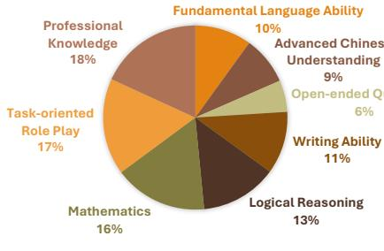  
(A) AlignBench

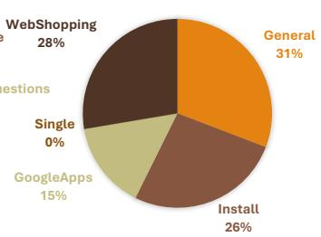  
(B) AitZ (test)

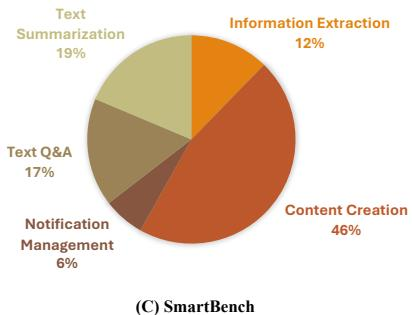  
Figure 2: Data composition comparison between AlignBench (Liu et al., 2023), AitZ (Zhang et al., 2024) and Smart-Bench. AlignBench (zh) is a general benchmark designed for Chinese scenarios, and AitZ (en) is a mobile agent benchmark. SmartBench (zh) is specifically designed for evaluating end-side LLM functionality on smartphones.

1) Text Summarization: This category is focused on providing a concise summary of the text in one sentence and listing key information in bullet points. The benefit of this function is that it allows users to quickly grasp the main ideas and essential details without needing to read through lengthy content. We categorize the content into four scenarios. Document summarization primarily targets emails, scientific knowledge, and news reports. Call summarization focuses on conversations between two people. Recording summarization focuses on recordings that have significant background noise. Meeting summarization specifically refers to the summarization of meetings.

2) Content Creation: This category highlights the functionality of creating content on mobile devices, enabling users to effortlessly share their creations on social media platforms such as Weibo, WeChat Moments, and RedNote (Xiaohongshu). With the widespread use of smartphones, mobile content creation has become increasingly accessible and convenient. We focus on the commonly utilized functions for content creation, i.e., polishing, continuation, abbreviation, expansion, (automatic) creation, formatting, and correction. Additionally, on-device LLMs are employed to refine users’ message replies; therefore, we also incorporate tests for the instant reply functionality.

3) Text Q&A: This feature allows users to quickly obtain information or answer questions through simple text inputs. We categorize it into three scenarios: Document Q&A, where a specific document is provided and questions are answered based on it; Retrieval Q&A, where answers are summarized based on multiple relevant retrieval contents and questions; and Personal Q&A, where information from synthesized personal records (such as memos or personal notes) is used.

4) Information Extraction: This category involves automatically identifying and extracting specific data from text inputs, such as names, dates, addresses, or other relevant information. The information extraction functionality on mobile phones is primarily divided into three aspects: Entity Extraction, which involves identifying and extracting specific entities from text, such as names, locations, dates, etc.; Relation Extraction, which analyzes and extracts relationships between entities, such as “someone works at a certain company”; and Event Extraction, which identifies specific events and their related elements from text, such as time, location, and participants. These functionalities collectively contribute to intelligent applications, such as automatic summarization, smart search, and personalized recommendations.

<table><tr><td>Category</td><td>Count</td><td>t | Input</td><td>Target</td></tr><tr><td>Text Summarization</td><td>550</td><td>1890</td><td>244</td></tr><tr><td>Content Creation</td><td>1377 1</td><td>210</td><td>143</td></tr><tr><td>Text Q&amp;A</td><td>495 1</td><td>930</td><td>115</td></tr><tr><td>Information Extraction</td><td>362 1</td><td>682</td><td>74</td></tr><tr><td>Notification Management</td><td>189 \</td><td>376</td><td>101</td></tr></table>

Table 2: We present the number of QA pairs for each category in SmartBench. For each category, we also provide the average input (query) length and the average target (reference answer) length of all QA pairs.  
Message Summarization Query  
月亮上的海：我家布偶超级爱掉毛，尤其是换季的时候，  
简直就是行走的蒲公英！� 你们有什么好办法吗？在  
线等，挺急的！  
月亮上的海：试过好多种猫粮了，感觉效果都不太明显，  
每天都得吸好多毛，心累...�  
Reference  
月亮上的海：  
很发愁布偶猫掉毛严重的问题，想寻求解决办法。  
Figure 3: Example of the Message Summarization task in SmartBench (English translated version in Fig. 16).

5) Notification Management: Effective notification management on smartphones is essential to minimize distractions, enhance productivity, and ensure timely access to important information. Currently, LLMs deployed on smartphones primarily support two functions: Notification Sorting, which organizes and prioritizes notifications based on degree of urgency or chronological order; and Message Summarization, which condenses lengthy notifications or messages into concise summaries for quick understanding. By intelligently sorting and summarizing information, smartphones equipped with such features can significantly improve efficiency and reduce cognitive overload in our increasingly connected world.

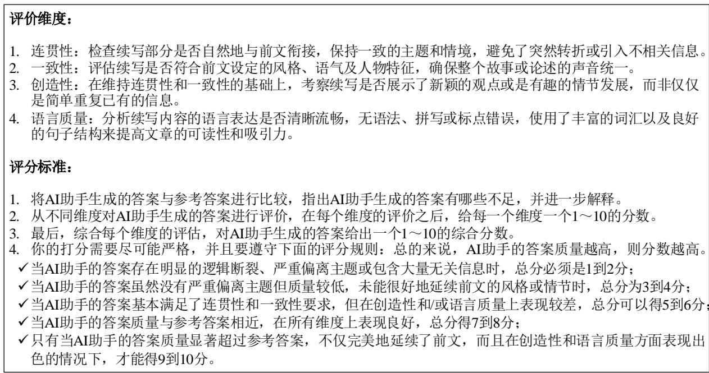  
Figure 4: Evaluation Dimension & Scoring Standard for the text continuation task (English version in Fig. 17).

To facilitate a clear comparison between Smart-Bench and other LLM benchmarks, we analyze their data composition. For the Chinese benchmark, we compare with AlignBench (Liu et al., 2023), while we select AitZ (Zhang et al., 2024) for the mobile agent benchmark, as illustrated in Fig. 2. As shown, AlignBench serves as a more general benchmark for evaluating Chinese LLMs, AitZ focuses more on automated operations on mobile devices, while SmartBench emphasizes common on-device LLM functionalities. Additionally, we provide the number of QA pairs for each category in SmartBench in Tab. 2, along with the average input (query) length and the average target (reference answer) length for each category. Furthermore, to better illustrate the essence of SmartBench for mobile scenarios, we offer an example of the Message Summarization task in Fig. 3.

## 3.2 Data Source

The data for SmartBench is primarily derived from three sources. 1) We screen open-source datasets to select QA pairs that align with smartphone application scenarios. 2) For datasets that provide contextual information but lack appropriate questions and answers, we utilize advanced LLMs, e.g., Qwen-Max (Yang et al., 2024a), Gemini Pro (Reid et al., 2024), to generate corresponding answers for each task. 3) For the lack of open-source data in certain categories, we employ human collection and LLMs to generate QA pairs, followed by manual screening and editing to curate high-quality data.

For Text Summarization, we primarily use content from open-source datasets. For document data, we utilize the dataset from (Xu, 2019), which comprises a substantial Chinese corpus including content from Wikipedia, news reports, etc. For summarizing calls, recordings, and meetings, we draw data from Alimeeting4MUG (Zhang et al., 2023b), LCCC (Wang et al., 2020), VCSum (Wu et al., 2023), WenetSpeech (Zhang et al., 2022), etc. Speech content is converted to text transcriptions using speech-to-text converters in our benchmark, and the reference summaries for the summarization tasks are generated by Qwen-Max.

For Content Creation, we leverage QA pairs from CSCD-NS (Hu et al., 2024b) for text correction. For other tasks, e.g., polishing, abbreviation, expansion, etc, we manually collect and design examples, and then use Gemini Pro and Qwen-Max to generate QA pairs tailored to meet the requirements of daily mobile usage scenarios.

<table><tr><td>Category</td><td>Task</td><td>GPT-40</td><td>BlueLM-3B InternVL2.5-4B MiniCPM3-4B</td><td></td><td></td><td>Qwen2.5-3B Qwen2-VL-2B</td></tr><tr><td rowspan="4">Text Summarization</td><td>Document Summ</td><td>7.05</td><td>7.56 6.89</td><td>7.40</td><td>7.21</td><td>4.37</td></tr><tr><td>Call Summ</td><td>7.03</td><td>7.22 5.43</td><td>6.88</td><td>6.35</td><td>3.48</td></tr><tr><td>Recording Summ</td><td>7.78</td><td>7.63 6.38</td><td>7.45</td><td>7.07</td><td>4.17</td></tr><tr><td>Meeting Summ</td><td>7.73</td><td>7.09 6.23</td><td>6.98</td><td>6.67</td><td>3.75</td></tr><tr><td rowspan="3">Text Q&amp;A</td><td>Document Q&amp;A</td><td>8.83</td><td>9.37 9.36</td><td>8.39</td><td>9.34</td><td>9.15</td></tr><tr><td>Retrieval Q&amp;A</td><td>6.91</td><td>5.89 5.81</td><td>6.76</td><td>6.25</td><td>4.77</td></tr><tr><td>Personal Q&amp;A</td><td>9.78</td><td>9.36 8.89</td><td>8.87</td><td>9.39</td><td>8.83</td></tr><tr><td rowspan="8">Content Creation</td><td>Text Polishing</td><td>7.49</td><td>7.55</td><td>6.17</td><td>7.53</td><td>7.42 6.19</td></tr><tr><td>Text Continuation</td><td>7.63</td><td>7.45 6.89</td><td>7.52</td><td>7.72</td><td>5.96</td></tr><tr><td>Text Abbreviation</td><td>7.49</td><td>8.23 7.43</td><td>8.17</td><td>8.51</td><td>7.51</td></tr><tr><td>Text Expansion</td><td>8.42</td><td>7.44 8.04</td><td>8.74</td><td>8.07</td><td>6.04</td></tr><tr><td>Text Creation</td><td>7.55</td><td>6.93 6.16</td><td>6.89</td><td>6.68</td><td>5.26</td></tr><tr><td>Text Formatting</td><td>6.15</td><td>6.03 5.10</td><td>6.80</td><td>3.69</td><td>1.20</td></tr><tr><td>Instant Reply</td><td>7.62</td><td>6.70 5.90</td><td>6.28</td><td>6.44</td><td>3.14</td></tr><tr><td>Text Correction</td><td>7.03</td><td>3.69</td><td>2.46 3.24</td><td>2.38</td><td>1.17</td></tr><tr><td rowspan="3">Information Extraction</td><td>Entity Extraction</td><td>8.36</td><td>7.82 8.13</td><td>7.58</td><td>6.35</td><td>5.00</td></tr><tr><td>Relation Extraction</td><td>3.54</td><td>5.55</td><td>3.58 4.15</td><td>3.54</td><td>3.04</td></tr><tr><td>Event Extraction</td><td>7.86</td><td>6.79 7.09</td><td>6.20</td><td>6.75</td><td>4.66</td></tr><tr><td rowspan="2">Notification Management</td><td>Message Summ</td><td>7.24</td><td>7.45 7.29</td><td>8.08</td><td>7.86</td><td>5.90</td></tr><tr><td>Notification Sorting</td><td>5.97</td><td>4.78 4.19</td><td>4.85</td><td>4.51</td><td>2.14</td></tr><tr><td rowspan="2">AVG</td><td></td><td>7.37</td><td></td><td></td><td></td><td></td></tr><tr><td></td><td>7.03</td><td>6.37</td><td>6.94</td><td>6.61</td><td>4.79</td></tr></table>

Table 3: Evaluation results using GPT-4 Turbo (gpt-4-turbo-04-09) as the judge LLM. We compare BlueLM-3B, InternVL2.5-4B, MiniCPM3-4B, Qwen2.5-3B, and Qwen2-VL-2B (on-device models) on the whole SmartBench in BF16 precision with GPT-4o (on-cloud model) for reference. The scores assessed by Qwen-Max as the judge LLM are also provided in Tab. 8 in the Appendix.

For text Q&A, we select document Q&A pairs from the CMRC (Cui et al., 2019) dataset. For retrieval-based Q&A, the textual sources are from DuReader 2.0 (He et al., 2017), and the answers are generated by Qwen-Max. For personal Q&A, we design human examples and construct QA pairs (e.g., memos or personal notes) using Qwen-Max.

For Information Extraction, we source textual data for entity extraction from MSRA (Levow, 2006), OntoNotes Release 4.0 (Weischedel et al., 2011), and Weibo (Peng and Dredze, 2016). We use Qwen-Max to generate the corresponding answers. For relation and event extraction, we manually collect example data and generate textual information using Gemini Pro, then produce the corresponding answers with GPT-4 Turbo.

For Notification Management, we find that there is currently no suitable open-source data available for the smartphone platform. Therefore, we create human-designed examples and then use Gemini Pro to generate QA pairs for both notification sorting and message summarization.

## 3.3 Data Screening

After initially collecting all the data for each task, we implement a rigorous screening process involving six domain experts with over five years of mobile AI experience. These specialists evaluate the dataset through dual-layer verification, primarily focusing on five core criteria: alignment with realworld smartphone interaction scenarios, detection of toxic or harmful information, identification of potential privacy leakage risks, flagging of socially controversial or polarizing topics, and comprehensive assessment of instruction-following capabilities of the reference answers.

To be specific, we implement a five-point scoring system (1–5) for each criterion, where 1 = Unacceptable, 2 = Poor, 3 = Fair, 4 = Good, and 5 = Very Good. Human experts score each item across all criteria, and we retain only those with an average score of 3.5, reducing the original 30k dataset to roughly 3k high-quality entries. For items scoring between 3.5 and 4, we perform manual re-labeling to guarantee accuracy and alignment with human judgment. All items are further refined and subjected to dual-layer verification, ensuring rigorous quality control throughout the dataset.

## 3.4 Evaluation Protocol

Since subjective questions often lack an absolutely correct answer and involve multifaceted scoring dimensions, current subjective question evaluation datasets always adopt the “LLM-as-a-Judge” approach for assessment (Liu et al., 2023; Zheng et al., 2023; Li et al., 2024b). In SmartBench, we meticulously design different LLM evaluation prompts for each function category. For Content Creation, Information Extraction, and Notification Management, we especially design distinct scoring prompts for each task. This targeted design makes the scoring more aligned with human perceptions.

<table><tr><td>Category</td><td>Task</td><td colspan="3">BlueLM-3B</td><td colspan="3">Qwen2.5-3B</td></tr><tr><td colspan="2">Precision</td><td>BF16</td><td>INT4</td><td>Retention (%)</td><td>BF16</td><td>INT4</td><td>Retention (%)</td></tr><tr><td rowspan="3">Text Summarization</td><td>Document Summ</td><td>7.22</td><td>4.98</td><td>68.92</td><td>6.89</td><td>4.44</td><td>64.52</td></tr><tr><td>Call Summ</td><td>7.00</td><td>6.77</td><td>96.73</td><td>6.86</td><td>6.29</td><td>91.67</td></tr><tr><td>Recording Summ</td><td>7.15</td><td>6.53</td><td>91.24</td><td>6.94</td><td>5.63</td><td>81.12</td></tr><tr><td rowspan="3">Text Q&amp;A</td><td>Meeting Summ</td><td>6.85</td><td>5.25</td><td>76.65</td><td>6.67</td><td>4.84</td><td>72.61</td></tr><tr><td>Document Q&amp;A</td><td>9.77</td><td>9.54</td><td>97.64</td><td>9.77</td><td>9.38</td><td>96.06</td></tr><tr><td>Retrieval Q&amp;A</td><td>6.13</td><td>5.38</td><td>87.76</td><td>6.38</td><td>5.88</td><td>92.16</td></tr><tr><td rowspan="8">Content Creation</td><td>Personal Q&amp;A</td><td>8.71</td><td>7.58</td><td>87.04</td><td>9.29</td><td>9.15</td><td>98.54</td></tr><tr><td>Text Polishing</td><td>7.57</td><td>7.18</td><td>94.81</td><td>7.54</td><td>7.07</td><td>93.84</td></tr><tr><td>Text Continuation</td><td>7.50</td><td>7.13</td><td>95.06</td><td>7.70</td><td>7.27</td><td>94.37</td></tr><tr><td>Text Abbreviation</td><td>7.81</td><td>7.06</td><td>90.50</td><td>8.23</td><td>7.27</td><td>88.33</td></tr><tr><td>Text Expansion</td><td>8.18</td><td>8.12</td><td>99.28</td><td>8.47</td><td>8.41</td><td>99.31</td></tr><tr><td>Text Creation</td><td>6.82</td><td>6.55</td><td>96.16</td><td>6.50</td><td>6.42</td><td>98.82</td></tr><tr><td>Text Formatting</td><td>6.10</td><td>5.67 6.30</td><td>92.97</td><td>4.33</td><td>3.99</td><td>91.97</td></tr><tr><td>Instant Reply Text Correction</td><td>6.55 2.83</td><td>2.24</td><td>96.18 78.89</td><td>6.20</td><td>5.94</td><td>95.84</td></tr><tr><td rowspan="3">Information Extraction</td><td></td><td>7.15</td><td>7.05</td><td></td><td>1.67</td><td>1.17</td><td>70.00</td></tr><tr><td>Entity Extraction</td><td></td><td></td><td>98.49</td><td>6.13</td><td>6.08</td><td>99.06</td></tr><tr><td>Relation Extraction</td><td>5.73</td><td>5.01 6.06</td><td>87.48</td><td>4.64</td><td>3.62</td><td>78.06</td></tr><tr><td rowspan="2">Notification Management</td><td>Event Extraction</td><td>7.00</td><td>7.80</td><td>86.68</td><td>7.06</td><td>6.05</td><td>85.62</td></tr><tr><td>Message Summ Notification Sorting</td><td>7.92 5.13</td><td>4.83</td><td>98.48 94.14</td><td>8.00 4.90</td><td>7.88</td><td>98.50</td></tr><tr><td colspan="2">AVG</td><td>6.96</td><td>6.35</td><td>91.31</td><td>6.71</td><td>4.74 6.08</td><td>96.71 90.58</td></tr></table>

Table 4: W4A16 evaluation results with 50 questions per task using GPT-4 Turbo as the judge LLM. We deploy BlueLM-3B and Qwen2.5-3B on the NPU of the vivo iQOO 12 smartphone, which is equipped with the Snapdragon 8 Gen 3 SoC. The quantized models are able to maintain an average performance of around 90%.

In SmartBench, each question is assigned a total score of 10 points. For the evaluation prompt of each task, in addition to providing reference answers for each question, we also include detailed scoring guidelines. We first outline the scoring dimensions; for example, in the text continuation task (as in Fig. 4), we assess the answer’s coherence, language quality, creativity, and consistency with the original text. Next, we develop comprehensive scoring standards for each dimension to ensure accurate and consistent grading. The judge LLM first assigns separate scores for each dimension and then provides an overall aggregate score. Especially, for the Text Correction task, which has clearly defined correction answers, the evaluation criterion focuses on the accuracy of the modifications made.

## 4 Experiment

In this section, a series of experiments are conducted. We evaluate the performance of representative on-device LLMs and MLLMs on SmartBench (Sec. 4.1) and conduct human tests to assess the effectiveness of the LLM-as-a-Judge evaluation method (Sec. 4.3). To better align with practical on-device deployment, we also analyze the model performance after quantized inference on the NPU in actual smartphones (Sec. 4.2).

## 4.1 BF16 Precision Evaluation

In this subsection, we evaluate representative ondevice LLMs/MLLMs on SmartBench (BF16 parameter precision). We select BlueLM-3B (Lu et al., 2024b), InternVL2.5-4B (Chen et al., 2024), MiniCPM3-4B (Hu et al., 2024a), Qwen2.5- 3B (Yang et al., 2024b), and Qwen2-VL-2B (Wang et al., 2024b). GPT-4 Turbo (gpt-4-turbo-04-09) is utilized as the judge LLM. We also provide the scores of GPT-4o to compare on-cloud models with on-device models. The results are summarized in

Tab. 3, where BlueLM-3B achieves the highest average score among on-device models. Additionally, we can observe the following trends from the table:

1) For common text-based tasks on mobile devices, such as summarization and questionanswering, existing on-device models have shown satisfactory performance. However, when dealing with tasks that require more rigorous logical reasoning, such as Text Correction, Relation Extraction, and Notification Sorting, the performance of ondevice models still lags behind. We provide several examples in the Appendix. For instance, Fig. 10 demonstrates that all models struggle to identify subtle typos within sentences.

2) Integrating multimodal capabilities into MLLMs might result in a reduction of pure language performance. Specifically, the InternVL2.5- 4B model is developed based on Qwen2.5-3B. While InternVL2.5-4B successfully acquires multimodal functionalities, this enhancement leads to a partial decline in its pure language performance.

3) On-device models still exhibit notable performance gaps compared to the on-cloud model, particularly on the Text Correction task, where they achieve only about half the score of GPT-4o. This suggests that enhancing the reasoning capability of on-device models remains an important area.

4) For a more comprehensive evaluation, we also present the scores assessed by Qwen-Max (qwen-max-longcontext) as the judging LLM in Tab. 8 in the Appendix. It can be observed that although there are slight differences in the average scores, both Qwen-Max and GPT-4 Turbo rank the models in the same order. This demonstrates the robustness of our LLM-as-a-Judge approach.

Remark: We evaluate MLLMs on SmartBench because in on-device deployment scenarios on real smartphones, memory limitations often prevent us from deploying both an LLM and an MLLM on the device. Consequently, this on-device model must simultaneously handle both pure language tasks and multimodal tasks effectively.

## 4.2 INT4 Precision Evaluation on NPU

On-device LLMs are often deployed on the smartphone’s Neural Processing Unit (NPU) to leverage its specialized parallel computational capabilities. In our experiment, we deploy the BlueLM-3B and Qwen2.5-3B models on the NPU of the vivo iQOO 12 smartphone equipped with the Snapdragon 8 Gen 3 SoC. To be specific, we quantize the models to W4A16 using the Qualcomm QNN SDK. Due to the inference speed limitations on the mobile NPU, we select 50 questions per task for inference. The results are shown in Tab. 4. We present the scores for each task (BF16 and INT4) and the capability retention of the INT4 models. Additionally, we provide the evaluation results using Qwen-Max as the judge LLM in Tab. 9 in the Appendix.

1) For most tasks, the quantized models retain over 80% of their original capabilities, with an overall average retention rate of approximately 90%.

2) Although the models can achieve, on average, 90% of the original score on the edge side, they may still generate incorrect responses after quantization. We provide two failure cases of BlueLM-3B in Sec. A.5, where the model exhibits fluency degradation and reduced understanding capability.

3) To offer deeper insights into real-world edgeside deployment, we report the prefilling speed, output token generation speed, and power consumption on the iQOO 12 smartphone using the Qualcomm QNN SDK, as shown in Tab. 5.

## 4.3 Human Test

We use the LLM-as-a-Judge method to assess different on-device models. Therefore, it is important to examine the consistency between the scores given by the judge LLM and those given by humans. We carry out a human test with six human experts in this subsection.

During the auto-evaluation process, the judge LLM assigns a score between 0 and 10 to the output of each model response. Considering that humans might find it challenging to directly score subjective questions, especially tasks like text polishing, we ask human experts to rank the outputs generated by different on-device models (i.e., BlueLM-3B, InternVL2.5-4B, MiniCPM3-4B, Qwen2.5-3B, and Qwen2-VL-2B) for each question. We then use the scores from the judge LLM (Qwen-Max in our setting) to compute model rankings for each question. Finally, we calculate the Pearson correlation between the rankings from the judge LLM and those provided by human experts.

In SmartBench, we meticulously design evaluation dimensions and scoring standards for each task/category. To establish a baseline, we compare our evaluation prompts with those used in MT-Bench. We randomly select 50 questions for each task, with each question containing responses from 5 on-device models. This results in a total of 50 20 5=5000 samples. We conduct human ranking and calculate the Pearson correlation with the judge LLM ranking (our prompt versus MT-Bench prompt), and the results are shown in Tab. 6. Our designed prompt excels in all categories.

<table><tr><td></td><td>#Params</td><td>Context Length</td><td>Prefilling Speed (token/s)</td><td>Output Speed (token/s)</td><td>Power (W)</td></tr><tr><td>BlueLM-3B</td><td>2.7B</td><td>2048</td><td>930.9</td><td>27.1</td><td>6.4</td></tr><tr><td>Qwen2.5-3B</td><td>3.1B</td><td>2048</td><td>873.4</td><td>24.9</td><td>6.8</td></tr></table>

Table 5: Inference speed and power usage of BlueLM-3B and Qwen2.5-3B on iQOO 12 with Qualcomm QNN SDK. Due to its larger parameter size, Qwen2.5-3B exhibits slower inference speed and higher power consumption.
<table><tr><td></td><td>Text Summarization</td><td>Text Q&amp;A</td><td>Content Creation</td><td>Information Extraction</td><td>Notification Management</td><td>AVG</td></tr><tr><td>MT-Bench</td><td>0.8412</td><td>0.8025</td><td>0.6998</td><td>0.7894</td><td>0.8467</td><td>0.7959</td></tr><tr><td>SmartBench</td><td>0.8823</td><td>0.8151</td><td>0.7289</td><td>0.8396</td><td>0.8742</td><td>0.8280</td></tr></table>

Table 6: We compare our LLM-as-a-Judge evaluation method with MT-Bench’s evaluation method using the Pearson correlation score with human rankings. Our evaluation method demonstrates higher consistency with humans.

## 5 Conclusion

In this paper, we present SmartBench, the first benchmark designed to evaluate the capabilities of on-device LLMs in Chinese mobile contexts. By analyzing functionalities offered by leading smartphone manufacturers, we create a standardized framework divided into five key categories and 20 specific tasks, complete with high-quality datasets and tailored evaluation criteria. Our comprehensive evaluations of on-device LLMs and MLLMs using SmartBench highlight the strengths and weaknesses of current models in real-world mobile scenarios. This work fills a critical gap in benchmarking tools for Chinese users, promoting further development and optimization of on-device LLMs in practical mobile applications.

## Limitations

In this paper, we provide SmartBench, the first benchmark designed to evaluate the capabilities of on-device LLMs in Chinese mobile contexts. Our work still has some limitations: 1) With the advancement of technology, the functions of ondevice LLMs will continually evolve. Our investigation only covers up to December 2024. We will continue to update the dataset in line with the release of new features. 2) We have developed SmartBench specifically for the usage scenarios of Chinese users. The usage habits and methods of smartphone users may vary significantly across different countries. Moving forward, we will continue to support multiple languages. 3) The current benchmark focuses on the text modality, whereas mobile applications may also involve vision and audio modalities (e.g., camera input and voice recognition). We plan to incorporate these additional modalities in future versions.

## References

Marah Abdin, Sam Ade Jacobs, Ammar Ahmad Awan, Jyoti Aneja, Ahmed Awadallah, Hany Awadalla, Nguyen Bach, Amit Bahree, Arash Bakhtiari, Harkirat Behl, and 1 others. 2024. Phi-3 technical report: A highly capable language model locally on your phone. arXiv preprint arXiv:2404.14219.

Rohan Anil, Sebastian Borgeaud, Yonghui Wu, Jean-Baptiste Alayrac, Jiahui Yu, Radu Soricut, Johan Schalkwyk, Andrew M Dai, Anja Hauth, Katie Millican, and 1 others. 2023. Gemini: A family of highly capable multimodal models. arXiv preprint arXiv:2312.11805, 1.

Anthropic. 2023. Claude 3. https://www.anthropic. com. Large Language Model.

Saleh Ashkboos, Iman Mirzadeh, Keivan Alizadeh, Mohammad Hossein Sekhavat, Moin Nabi, Mehrdad Farajtabar, and Fartash Faghri. 2024. Computational bottlenecks of training small-scale large language models. arXiv preprint arXiv:2410.19456.

Jacob Austin, Augustus Odena, Maxwell Nye, Maarten Bosma, Henryk Michalewski, David Dohan, Ellen Jiang, Carrie Cai, Michael Terry, Quoc Le, and 1 others. 2021. Program synthesis with large language models. arXiv preprint arXiv:2108.07732.

Yuxiang Chai, Siyuan Huang, Yazhe Niu, Han Xiao, Liang Liu, Dingyu Zhang, Peng Gao, Shuai Ren, and Hongsheng Li. 2024. Amex: Android multiannotation expo dataset for mobile gui agents. arXiv preprint arXiv:2407.17490.

Yupeng Chang, Xu Wang, Jindong Wang, Yuan Wu, Linyi Yang, Kaijie Zhu, Hao Chen, Xiaoyuan Yi, Cunxiang Wang, Yidong Wang, and 1 others. 2024. A survey on evaluation of large language models. ACM Transactions on Intelligent Systems and Technology, 15(3):1–45.

Mark Chen, Jerry Tworek, Heewoo Jun, Qiming Yuan, Henrique Ponde De Oliveira Pinto, Jared Kaplan, Harri Edwards, Yuri Burda, Nicholas Joseph, Greg Brockman, and 1 others. 2021. Evaluating large language models trained on code. arXiv preprint arXiv:2107.03374.

Zhe Chen, Weiyun Wang, Yue Cao, Yangzhou Liu, Zhangwei Gao, Erfei Cui, Jinguo Zhu, Shenglong Ye, Hao Tian, Zhaoyang Liu, and 1 others. 2024. Expanding performance boundaries of open-source multimodal models with model, data, and test-time scaling. arXiv preprint arXiv:2412.05271.

Xiangxiang Chu, Limeng Qiao, Xinyang Lin, Shuang Xu, Yang Yang, Yiming Hu, Fei Wei, Xinyu Zhang, Bo Zhang, Xiaolin Wei, and 1 others. 2023. Mobilevlm: A fast, reproducible and strong vision language assistant for mobile devices. arXiv preprint arXiv:2312.16886.

Xiangxiang Chu, Limeng Qiao, Xinyu Zhang, Shuang Xu, Fei Wei, Yang Yang, Xiaofei Sun, Yiming Hu, Xinyang Lin, Bo Zhang, and 1 others. 2024. Mobilevlm v2: Faster and stronger baseline for vision language model. arXiv preprint arXiv:2402.03766.

Peter Clark, Isaac Cowhey, Oren Etzioni, Tushar Khot, Ashish Sabharwal, Carissa Schoenick, and Oyvind Tafjord. 2018. Think you have solved question answering? try arc, the ai2 reasoning challenge. arXiv:1803.05457v1.

Karl Cobbe, Vineet Kosaraju, Mohammad Bavarian, Mark Chen, Heewoo Jun, Lukasz Kaiser, Matthias Plappert, Jerry Tworek, Jacob Hilton, Reiichiro Nakano, and 1 others. 2021. Training verifiers to solve math word problems. arXiv preprint arXiv:2110.14168.

Yiming Cui, Ting Liu, Wanxiang Che, Li Xiao, Zhipeng Chen, Wentao Ma, Shijin Wang, and Guoping Hu. 2019. A span-extraction dataset for Chinese machine reading comprehension. In Proceedings of the 2019 Conference on Empirical Methods in Natural Language Processing and the 9th International Joint Conference on Natural Language Processing (EMNLP-IJCNLP), pages 5886–5891, Hong Kong, China. Association for Computational Linguistics.

Yucheng Ding, Chaoyue Niu, Fan Wu, Shaojie Tang, Chengfei Lyu, and Guihai Chen. 2024. Enhancing on-device llm inference with historical cloud-based llm interactions. In Proceedings of the 30th ACM SIGKDD Conference on Knowledge Discovery and Data Mining, pages 597–608.

Daya Guo, Dejian Yang, Haowei Zhang, Junxiao Song, Ruoyu Zhang, Runxin Xu, Qihao Zhu, Shirong Ma, Peiyi Wang, Xiao Bi, and 1 others. 2025. Deepseek-r1: Incentivizing reasoning capability in llms via reinforcement learning. arXiv preprint arXiv:2501.12948.

Wei He, Kai Liu, Jing Liu, Yajuan Lyu, Shiqi Zhao, Xinyan Xiao, Yuan Liu, Yizhong Wang, Hua Wu, Qiaoqiao She, and 1 others. 2017. Dureader: a chinese machine reading comprehension dataset from real-world applications. arXiv preprint arXiv:1711.05073.

Dan Hendrycks, Collin Burns, Steven Basart, Andy Zou, Mantas Mazeika, Dawn Song, and Jacob Steinhardt.

2020. Measuring massive multitask language understanding. arXiv preprint arXiv:2009.03300.

Dan Hendrycks, Collin Burns, Saurav Kadavath, Akul Arora, Steven Basart, Eric Tang, Dawn Song, and Jacob Steinhardt. 2021. Measuring mathematical problem solving with the math dataset. arXiv preprint arXiv:2103.03874.

Shengding Hu, Yuge Tu, Xu Han, Chaoqun He, Ganqu Cui, Xiang Long, Zhi Zheng, Yewei Fang, Yuxiang Huang, Weilin Zhao, and 1 others. 2024a. MiniCPM: Unveiling the potential of small language models with scalable training strategies. arXiv preprint arXiv:2404.06395.

Yong Hu, Fandong Meng, and Jie Zhou. 2024b. Cscdns: a chinese spelling check dataset for native speakers. In Proceedings ofthe 62nd Annual Meeting of the Associationfor Computational Linguistics (Volume 1: Long Papers), pages 146–159.

Yuzhen Huang, Yuzhuo Bai, Zhihao Zhu, Junlei Zhang, Jinghan Zhang, Tangjun Su, Junteng Liu, Chuancheng Lv, Yikai Zhang, Jiayi Lei, Yao Fu, Maosong Sun, and Junxian He. 2023. Ceval: A multi-level multi-discipline chinese evaluation suite for foundation models. arXiv preprint arXiv:2305.08322.

Albert Q Jiang, Alexandre Sablayrolles, Antoine Roux, Arthur Mensch, Blanche Savary, Chris Bamford, Devendra Singh Chaplot, Diego de las Casas, Emma Bou Hanna, Florian Bressand, and 1 others. 2024. Mixtral of experts. arXiv preprint arXiv:2401.04088.

Gina-Anne Levow. 2006. The third international Chinese language processing bakeoff: Word segmentation and named entity recognition. In Proceedings of the Fifth SIGHAN Workshop on Chinese Language Processing, pages 108–117, Sydney, Australia. Association for Computational Linguistics.

Tianle Li, Wei-Lin Chiang, Evan Frick, Lisa Dunlap, Tianhao Wu, Banghua Zhu, Joseph E Gonzalez, and Ion Stoica. 2024a. From crowdsourced data to highquality benchmarks: Arena-hard and benchbuilder pipeline. arXiv preprint arXiv:2406.11939.

Tianle Li, Wei-Lin Chiang, Evan Frick, Lisa Dunlap, Banghua Zhu, Joseph E. Gonzalez, and Ion Stoica. 2024b. From live data to high-quality benchmarks: The arena-hard pipeline.

Xuechen Li, Tianyi Zhang, Yann Dubois, Rohan Taori, Ishaan Gulrajani, Carlos Guestrin, Percy Liang, and Tatsunori B. Hashimoto. 2023. Alpacaeval: An automatic evaluator of instruction-following models. https://github.com/tatsu-lab/alpaca eval.

Bill Yuchen Lin, Yuntian Deng, Khyathi Chandu, Faeze Brahman, Abhilasha Ravichander, Valentina Pyatkin, Nouha Dziri, Ronan Le Bras, and Yejin Choi. 2024. Wildbench: Benchmarking llms with challenging tasks from real users in the wild. arXiv preprint arXiv:2406.04770.

Xiao Liu, Xuanyu Lei, Shengyuan Wang, Yue Huang, Zhuoer Feng, Bosi Wen, Jiale Cheng, Pei Ke, Yifan Xu, Weng Lam Tam, and 1 others. 2023. Alignbench: Benchmarking chinese alignment of large language models. arXiv preprint arXiv:2311.18743.

Haoyu Lu, Wen Liu, Bo Zhang, Bingxuan Wang, Kai Dong, Bo Liu, Jingxiang Sun, Tongzheng Ren, Zhuoshu Li, Yaofeng Sun, and 1 others. 2024a. DeepSeek-VL: Towards real-world vision-language understanding. arXiv preprint arXiv:2403.05525.

Xudong Lu, Yinghao Chen, Cheng Chen, Hui Tan, Boheng Chen, Yina Xie, Rui Hu, Guanxin Tan, Renshou Wu, Yan Hu, and 1 others. 2024b. Bluelm-v-3b: Algorithm and system co-design for multimodal large language models on mobile devices. arXiv preprint arXiv:2411.10640.

Sachin Mehta, Mohammad Hossein Sekhavat, Qingqing Cao, Maxwell Horton, Yanzi Jin, Chenfan Sun, Seyed Iman Mirzadeh, Mahyar Najibi, Dmitry Belenko, Peter Zatloukal, and 1 others. 2024. Openelm: An efficient language model family with open training and inference framework. In Workshop on Efficient Systemsfor Foundation Models II@ ICML2024.

OpenAI. 2024. Hello GPT-4o.

Nanyun Peng and Mark Dredze. 2016. Improving named entity recognition for chinese social media with word segmentation representation learning. In Proceedings ofthe 54th Annual Meeting ofthe Associationfor Computational Linguistics (ACL), volume 2, pages 149–155.

Guanqiao Qu, Qiyuan Chen, Wei Wei, Zheng Lin, Xianhao Chen, and Kaibin Huang. 2024. Mobile edge intelligence for large language models: A contemporary survey. arXiv preprint arXiv:2407.18921.

Christopher Rawles, Sarah Clinckemaillie, Yifan Chang, Jonathan Waltz, Gabrielle Lau, Marybeth Fair, Alice Li, William Bishop, Wei Li, Folawiyo Campbell-Ajala, and 1 others. 2024. Androidworld: A dynamic benchmarking environment for autonomous agents. arXiv preprint arXiv:2405.14573.

Machel Reid, Nikolay Savinov, Denis Teplyashin, Dmitry Lepikhin, Timothy Lillicrap, Jean-baptiste Alayrac, Radu Soricut, Angeliki Lazaridou, Orhan Firat, Julian Schrittwieser, and 1 others. 2024. Gemini 1.5: Unlocking multimodal understanding across millions of tokens of context. arXiv preprint arXiv:2403.05530.

David Rein, Betty Li Hou, Asa Cooper Stickland, Jackson Petty, Richard Yuanzhe Pang, Julien Dirani, Julian Michael, and Samuel R Bowman. 2023. Gpqa: A graduate-level google-proof q&a benchmark. arXiv preprint arXiv:2311.12022.

Statista. 2025. Number of smartphone users in china from 2018 to 2022 with a forecast until 2027. https: //www.statista.com/statistics/467160/ forecast-of-smartphone-users-in-china/.

Yu Sun, Shuohuan Wang, Shikun Feng, Siyu Ding, Chao Pang, Junyuan Shang, Jiaxiang Liu, Xuyi Chen, Yanbin Zhao, Yuxiang Lu, and 1 others. 2021. Ernie 3.0: Large-scale knowledge enhanced pre-training for language understanding and generation. arXiv preprint arXiv:2107.02137.

Gemini Team, Petko Georgiev, Ving Ian Lei, Ryan Burnell, Libin Bai, Anmol Gulati, Garrett Tanzer, Damien Vincent, Zhufeng Pan, Shibo Wang, and 1 others. 2024. Gemini 1.5: Unlocking multimodal understanding across millions of tokens of context. arXiv preprint arXiv:2403.05530.

InternLM Team. 2023. Internlm: A multilingual language model with progressively enhanced capabilities. https://github.com/InternLM/ InternLM-techreport.

Junyang Wang, Haiyang Xu, Jiabo Ye, Ming Yan, Weizhou Shen, Ji Zhang, Fei Huang, and Jitao Sang. 2024a. Mobile-agent: Autonomous multi-modal mobile device agent with visual perception. arXiv preprint arXiv:2401.16158.

Peng Wang, Shuai Bai, Sinan Tan, Shijie Wang, Zhihao Fan, Jinze Bai, Keqin Chen, Xuejing Liu, Jialin Wang, Wenbin Ge, Yang Fan, Kai Dang, Mengfei Du, Xuancheng Ren, Rui Men, Dayiheng Liu, Chang Zhou, Jingren Zhou, and Junyang Lin. 2024b. Qwen2-vl: Enhancing vision-language model’s perception of the world at any resolution. arXiv preprint arXiv:2409.12191.

Yida Wang, Pei Ke, Yinhe Zheng, Kaili Huang, Yong Jiang, Xiaoyan Zhu, and Minlie Huang. 2020. A large-scale chinese short-text conversation dataset. In NLPCC.

Yubo Wang, Xueguang Ma, Ge Zhang, Yuansheng Ni, Abhranil Chandra, Shiguang Guo, Weiming Ren, Aaran Arulraj, Xuan He, Ziyan Jiang, and 1 others. 2024c. Mmlu-pro: A more robust and challenging multi-task language understanding benchmark. arXiv preprint arXiv:2406.01574.

Ralph Weischedel, Sameer Pradhan, Lance Ramshaw, Martha Palmer, Nianwen Xue, Mitchell Marcus, Ann Taylor, Craig Greenberg, Eduard Hovy, Robert Belvin, and 1 others. 2011. Ontonotes release 4.0. LDC2011T03, Philadelphia, Penn.: Linguistic Data Consortium, 17.

Han Wu, Mingjie Zhan, Haochen Tan, Zhaohui Hou, Ding Liang, and Linqi Song. 2023. Vcsum: A versatile chinese meeting summarization dataset. arXiv preprint arXiv:2305.05280.

Liangxuan Wu, Yanjie Zhao, Chao Wang, Tianming Liu, and Haoyu Wang. 2024. A first look at llmpowered smartphones. In Proceedings of the 39th IEEE/ACM International Conference on Automated Software Engineering Workshops, pages 208–217.

XiaomiTime. 2024. Xiaomi milm2: How xiaomi’s giant language model evolves to a super intelligent ecosystem by itself.

Bright Xu. 2019. Nlp chinese corpus: Large scale chinese corpus for nlp.

Jiajun Xu, Zhiyuan Li, Wei Chen, Qun Wang, Xin Gao, Qi Cai, and Ziyuan Ling. 2024. On-device language models: A comprehensive review. arXiv preprint arXiv:2409.00088.

Liang Xu, Hai Hu, Xuanwei Zhang, Lu Li, Chenjie Cao, Yudong Li, Yechen Xu, Kai Sun, Dian Yu, Cong Yu, and 1 others. 2020. Clue: A chinese language understanding evaluation benchmark. arXiv preprint arXiv:2004.05986.

Liang Xu, Anqi Li, Lei Zhu, Hang Xue, Changtai Zhu, Kangkang Zhao, Haonan He, Xuanwei Zhang, Qiyue Kang, and Zhenzhong Lan. 2023. Superclue: A comprehensive chinese large language model benchmark. arXiv preprint arXiv:2307.15020.

Zhenliang Xue, Yixin Song, Zeyu Mi, Le Chen, Yubin Xia, and Haibo Chen. 2024. Powerinfer-2: Fast large language model inference on a smartphone. arXiv preprint arXiv:2406.06282.

An Yang, Baosong Yang, Binyuan Hui, Bo Zheng, Bowen Yu, Chang Zhou, Chengpeng Li, Chengyuan Li, Dayiheng Liu, Fei Huang, Guanting Dong, Haoran Wei, Huan Lin, Jialong Tang, Jialin Wang, Jian Yang, Jianhong Tu, Jianwei Zhang, Jianxin Ma, and 43 others. 2024a. Qwen2 technical report. Preprint, arXiv:2407.10671.

An Yang, Baosong Yang, Beichen Zhang, Binyuan Hui, Bo Zheng, Bowen Yu, Chengyuan Li, Dayiheng Liu, Fei Huang, Haoran Wei, and 1 others. 2024b. Qwen2. 5 technical report. arXiv preprint arXiv:2412.15115.

Yuan Yao, Tianyu Yu, Ao Zhang, Chongyi Wang, Junbo Cui, Hongji Zhu, Tianchi Cai, Haoyu Li, Weilin Zhao, Zhihui He, and 1 others. 2024. Minicpm-v: A gpt-4v level mllm on your phone. arXiv preprint arXiv:2408.01800.

Wei Zeng, Xiaozhe Ren, Teng Su, Hui Wang, Yi Liao, Zhiwei Wang, Xin Jiang, ZhenZhang Yang, Kaisheng Wang, Xiaoda Zhang, and 1 others. 2021. Panguα: Large-scale autoregressive pretrained chinese language models with auto-parallel computation. arXiv preprint arXiv:2104.12369.

Binbin Zhang, Hang Lv, Pengcheng Guo, Qijie Shao, Chao Yang, Lei Xie, Xin Xu, Hui Bu, Xiaoyu Chen, Chenchen Zeng, and 1 others. 2022. Wenetspeech: A 10000+ hours multi-domain mandarin corpus for speech recognition. In ICASSP 2022-2022 IEEE International Conference on Acoustics, Speech and Signal Processing (ICASSP), pages 6182–6186. IEEE.

Chi Zhang, Zhao Yang, Jiaxuan Liu, Yucheng Han, Xin Chen, Zebiao Huang, Bin Fu, and Gang Yu. 2023a. Appagent: Multimodal agents as smartphone users. arXiv preprint arXiv:2312.13771.

Jiwen Zhang, Jihao Wu, Yihua Teng, Minghui Liao, Nuo Xu, Xiao Xiao, Zhongyu Wei, and Duyu Tang. 2024. Android in the zoo: Chain-of-action-thought for gui agents. arXiv preprint arXiv:2403.02713.

Qinglin Zhang, Chong Deng, Jiaqing Liu, Hai Yu, Qian Chen, Wen Wang, Zhijie Yan, Jinglin Liu, Yi Ren, and Zhou Zhao. 2023b. Mug: A general meeting understanding and generation benchmark. In ICASSP 2023-2023 IEEE International Conference on Acoustics, Speech and Signal Processing (ICASSP), pages 1–5. IEEE.

Lianmin Zheng, Wei-Lin Chiang, Ying Sheng, Siyuan Zhuang, Zhanghao Wu, Yonghao Zhuang, Zi Lin, Zhuohan Li, Dacheng Li, Eric Xing, and 1 others. 2023. Judging llm-as-a-judge with mt-bench and chatbot arena. Advances in Neural Information Processing Systems, 36:46595–46623.

## A Appendix

A.1 Data License
<table><tr><td>Dataset</td><td>Source</td><td>License</td></tr><tr><td>nlp_chinese_corpus</td><td>https://github.com/brightmart/nlp_chinese_corpus</td><td>MIT License</td></tr><tr><td>WenetSpeech</td><td>https://wenet.org.cn/WenetSpeech/</td><td>CC BY 4.0</td></tr><tr><td>LCCC</td><td>https://github.com/thu-coai/CDial-GPT</td><td>MIT License</td></tr><tr><td>Alimeeting4MUG</td><td>https://modelscope.cn/datasets/modelscope/Alimeeting4MUG/</td><td>CC BY 4.0</td></tr><tr><td>VCSum</td><td>https://github.com/hahahawu/VCSum</td><td>MIT License</td></tr><tr><td>CMRC 2018</td><td>https://ymcui.com/cmrc2018/</td><td>CC BY-SA 4.0</td></tr><tr><td>DuReader-2.0</td><td>https://github.com/baidu/DuReader/tree/master/DuReader-2.0</td><td>Apache License 2.0</td></tr><tr><td>Weibo</td><td>https://github.com/hltcoe/golden-horse</td><td>CC BY-SA 3.0</td></tr><tr><td>MSRA</td><td>https://tianchi.aliyun.com/dataset/144307</td><td>CC BY 4.0</td></tr><tr><td>OntoNotes Release 4.0</td><td>https://www.modelscope.cn/datasets/yingxi/cross_ner</td><td>Apache License 2.0</td></tr><tr><td>CSCD-NS</td><td>https://github.com/nghuyong/cscd-ns</td><td>MIT License</td></tr></table>

Table 7: Data license of the open-source datasets used in SmartBench.

A.2 More Evaluation Results
<table><tr><td></td><td>Task</td><td>BlueLM-3B</td><td>InternVL2.5-4B</td><td>MiniCPM3-4B</td><td>Qwen2.5-3B</td><td>Qwen2-VL-2B</td></tr><tr><td rowspan="4">Text Summarization</td><td>Document Summ</td><td>7.20</td><td>6.98</td><td>6.95</td><td>7.09</td><td>4.74</td></tr><tr><td>Call Summ</td><td>7.27</td><td>5.97</td><td>6.94</td><td>6.58</td><td>4.12</td></tr><tr><td>Recording Summ</td><td>7.13</td><td>6.56</td><td>7.02</td><td>7.00</td><td>4.58</td></tr><tr><td>Meeting Summ</td><td>7.22</td><td>6.70</td><td>7.10</td><td>7.07</td><td>4.36</td></tr><tr><td rowspan="3">Text Q&amp;A</td><td>Document Q&amp;A</td><td>8.45</td><td>8.46</td><td>7.79</td><td>8.63</td><td>8.34</td></tr><tr><td>Retrieval Q&amp;A</td><td>6.14</td><td>5.95</td><td>6.83</td><td>6.33</td><td>4.92</td></tr><tr><td>Personal Q&amp;A</td><td>8.37</td><td>8.30</td><td>8.04</td><td>8.57</td><td>8.16</td></tr><tr><td rowspan="8">Content Creation</td><td>Text Polishing</td><td>6.93</td><td>5.78</td><td>6.90</td><td>6.86</td><td>5.91</td></tr><tr><td>Text Continuation</td><td>7.13</td><td>6.56</td><td>7.19</td><td></td><td></td></tr><tr><td>Text Abbreviation</td><td>7.23</td><td>6.72</td><td>7.40</td><td>7.31 7.63</td><td>5.60 6.52</td></tr><tr><td>Text Expansion</td><td>6.79</td><td>7.04</td><td>7.23</td><td>7.31</td><td>5.72</td></tr><tr><td>Text Creation</td><td>6.73</td><td>5.78</td><td>6.67</td><td>6.63</td><td>5.02</td></tr><tr><td>Text Formatting</td><td>6.35</td><td>5.93</td><td>7.03</td><td>5.25</td><td>2.93</td></tr><tr><td>Instant Reply</td><td>5.60</td><td>5.09</td><td>5.25</td><td>5.26</td><td>3.17</td></tr><tr><td>Text Correction</td><td>3.53</td><td>2.39</td><td>3.48</td><td></td><td></td></tr><tr><td rowspan="3">Information Extraction</td><td>Entity Extraction</td><td>7.77</td><td></td><td></td><td>2.06</td><td>1.24</td></tr><tr><td>Relation Extraction</td><td></td><td>7.40</td><td>7.44</td><td>6.21</td><td>5.00</td></tr><tr><td>Event Extraction</td><td>5.73</td><td>4.13</td><td>4.77</td><td>3.97</td><td>3.65</td></tr><tr><td rowspan="2">Notification Management</td><td></td><td>7.14</td><td>7.32</td><td>6.85</td><td>7.21</td><td>5.17</td></tr><tr><td>Message Summ</td><td>6.92</td><td>6.96</td><td>7.47</td><td>7.62</td><td>5.64</td></tr><tr><td rowspan="2"></td><td>Notification Sorting</td><td>5.38</td><td>4.63</td><td>5.56</td><td>5.21</td><td>2.93</td></tr><tr><td>AVG</td><td>6.75</td><td>6.23</td><td>6.70</td><td>6.49</td><td>4.89</td></tr></table>

Table 8: Evaluation results using Qwen-Max (qwen-max-longcontext) as the judge LLM with BF16 precision.

We present the scores evaluated by Qwen-Max as the judging LLM in Tab. 8 with BF16 precision. When compared to the GPT-4 Turbo results shown in Tab. 3, both Qwen-Max and GPT-4 Turbo rank the models in the same order. This demonstrates the robustness of our LLM-as-a-Judge approach.

We also include the INT4 precision inference performance (evaluated by Qwen-Max) of BlueLM-3B and Qwen2.5-3B on the vivo iQOO 12 smartphone (50 questions per task), along with the performance retention compared to the original BF16 models. As shown in Tab. 9.

<table><tr><td>Category</td><td>Task</td><td colspan="3">BlueLM-3B</td><td colspan="3">Qwen2.5-3B</td></tr><tr><td colspan="2">Precision</td><td>BF16</td><td>INT4</td><td>Retention (%)</td><td>BF16</td><td>INT4</td><td>Retention (%)</td></tr><tr><td rowspan="4">Text Summarization</td><td>Document Summ</td><td>6.89</td><td>5.62</td><td>81.61</td><td>6.67</td><td>4.00</td><td>60.00</td></tr><tr><td>Call Summ</td><td>6.71</td><td>5.89</td><td>87.66</td><td>6.57</td><td>5.43</td><td>82.61</td></tr><tr><td>Recording Summ</td><td>6.95</td><td>6.63</td><td>95.38</td><td>6.95</td><td>6.53</td><td>94.03</td></tr><tr><td>Meeting Summ</td><td>7.39</td><td>5.57</td><td>75.29</td><td>7.10</td><td>5.10</td><td>71.84</td></tr><tr><td rowspan="3">Text Q&amp;A</td><td>Document Q&amp;A</td><td>8.50</td><td>8.32</td><td>97.83</td><td>8.85</td><td>8.77</td><td>99.13</td></tr><tr><td>Retrieval Q&amp;A</td><td>6.19</td><td>5.75</td><td>92.93</td><td>6.31</td><td>6.13</td><td>97.03</td></tr><tr><td>Personal Q&amp;A</td><td>8.06</td><td>7.16</td><td>88.80</td><td>8.42</td><td>8.26</td><td>98.08</td></tr><tr><td rowspan="8">Content Creation</td><td>Text Polishing</td><td>6.89</td><td>6.75</td><td>97.93</td><td>6.82</td><td>6.39</td><td>93.72</td></tr><tr><td>Text Continuation</td><td>7.17</td><td>7.07</td><td>98.60</td><td>7.17</td><td>7.03</td><td>98.14</td></tr><tr><td>Text Abbreviation</td><td>7.26</td><td>7.10</td><td>97.78</td><td>7.61</td><td>7.58</td><td>99.58</td></tr><tr><td>Text Expansion</td><td>7.24</td><td>7.13</td><td>98.54</td><td>7.65</td><td>7.29</td><td>95.38</td></tr><tr><td>Text Creation</td><td>6.96</td><td>6.48</td><td>93.15</td><td>6.62</td><td>6.23</td><td>94.19</td></tr><tr><td>Text Formatting</td><td>6.45</td><td>6.38</td><td>98.93</td><td>5.34</td><td>5.00</td><td>93.55</td></tr><tr><td>Instant Reply</td><td>5.60</td><td>5.21</td><td>93.04</td><td>4.95</td><td>4.15</td><td>83.84</td></tr><tr><td>Text Correction</td><td>3.17</td><td>2.00</td><td>63.16</td><td>1.83</td><td>1.17</td><td>63.64</td></tr><tr><td rowspan="3">Information Extraction</td><td>Entity Extraction</td><td>6.98</td><td>6.66</td><td>95.46</td><td>5.65</td><td>5.34</td><td>94.40</td></tr><tr><td>Relation Extraction</td><td>5.64</td><td>4.77</td><td>84.63</td><td>4.12</td><td>3.81</td><td>92.50</td></tr><tr><td>Event Extraction</td><td>6.90</td><td>6.10</td><td>88.32</td><td>7.32</td><td>6.80</td><td>92.83</td></tr><tr><td rowspan="2">Notification Management</td><td>Message Summ</td><td>7.16</td><td>7.12</td><td>99.44</td><td>7.60</td><td>7.52</td><td>98.95</td></tr><tr><td>Notification Sorting</td><td>5.50</td><td>5.34</td><td>96.95</td><td>5.35</td><td>5.15</td><td>96.20</td></tr><tr><td colspan="2">AVG</td><td>6.68</td><td>6.15</td><td>92.08</td><td>6.45</td><td>5.88</td><td>91.29</td></tr></table>

Table 9: Evaluation results using Qwen-Max (qwen-max-longcontext) as the judge LLM with INT4 precision.

## A.3 Details of Human Annotators

In the Data Screening and Human Test stages, we hire six domain experts with over five years of mobile AI experience. These experts have at least a master’s degree. We pay them a labeling fee of \$20 per hour.

## A.4 Comparison with Traditional Benchmarks

Traditional benchmarks (e.g., MMLU) mainly evaluate the model’s objective knowledge, while Smart-Bench focuses on subjective data aligned with end-side smartphone scenarios, assessing the degree of alignment with human preferences. In practice, due to memory and storage constraints on mobile devices, only a single MLLM can be deployed on the device. We consider the training process from LLM to MLLM. For example, InternVL2.5-4B is trained from Qwen2.5-3B-Instruct. During this process, objective knowledge tends to be preserved, but the subjective (human alignment) performance often degrades.

<table><tr><td></td><td>MMLU</td><td>SmartBench (GPT-4)</td><td>SmartBench (Qwen-Max)</td></tr><tr><td>Qwen2.5-3B</td><td>66.31</td><td>6.61</td><td>6.49</td></tr><tr><td>InternVL2.5-4B</td><td>68.35</td><td>6.37</td><td>6.23</td></tr></table>

MMLU measures objective knowledge, while SmartBench evaluates subjective alignment. We test SmartBench performance using both GPT-4 and Qwen-Max as evaluators. As can be seen, during the training process from LLM to multimodal models, MMLU performance improves due to the injection of new knowledge. However, the subjective performance represented by SmartBench decreases.

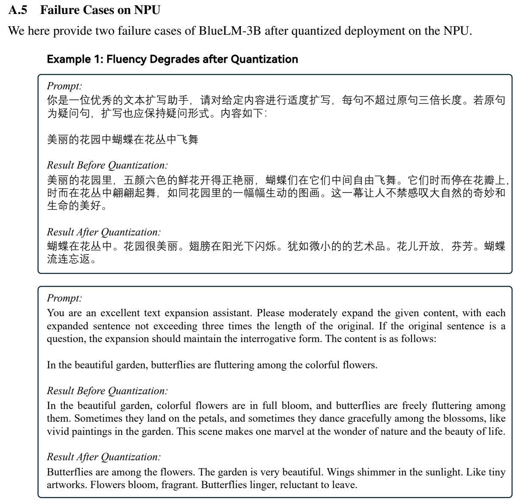  
Figure 5: Failure case after quantization on the NPU.

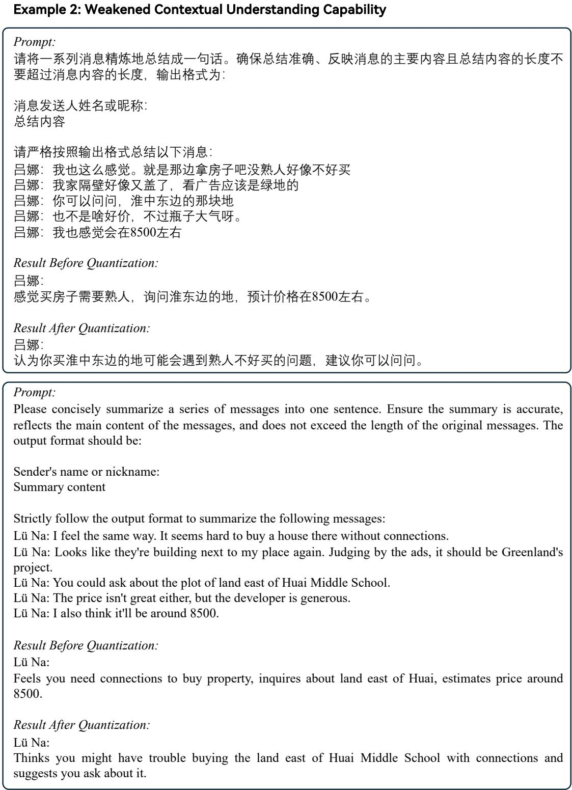  
Figure 6: Failure case after quantization on the NPU.

# A.6 Example Prompt for Generating Task Queries

Help me generate a series of mobile notifications, each in the following format:

Subject (YYYY-MM-DD-HH-MM) [Specific message content]

You can use subjects including but not limited to:   
{'Email from Zhang Wei', 'Delivery Reminder', 'WeChat message from Wang Li', 'Bank of China', 'Bank Account Alert', 'Health App Notification', 'Breaking News Push', 'Traffic Notification', 'Alipay App', 'SMS from Zhang Hua', 'Emergency Weather Alert', 'Traffic Reminder', 'Tencent Meeting', 'Online Meeting Reminder', 'JD Logistics', 'JD Express', 'Delivery Notification', 'Meituan Takeaway', 'Battery Status', 'Taobao', 'Fitness App', 'E-commerce Platform', 'Health Assistant', 'Health APP', 'System Update Prompt', 'Tencent News', 'Takeaway App', 'Security Alert', 'Traffic Fine', 'SMS from Li Lei', 'QQ Mail', 'DingTalk Reminder', 'Bank of Communications', 'Email', 'Bank Card Consumption Alert', 'DingTalk', 'Ctrip Travel', 'China Merchants Bank', 'NetEase Cloud Music', 'Power Company App', 'SF Express', 'Email Notification', 'Schedule Reminder', 'Mobile System Update', 'Meeting Reminder', 'Email Notification', 'WeChat Voice Call from Zhang Wei', 'Shopping Platform', 'Health Code', 'Xiaomi Sports', 'Douban Movie', 'JD Finance', 'Weibo', 'JD', 'Security Center', 'Taobao Notification', 'WeChat message from Wang Qiang', 'Weather', 'SMS from Li Xiao', 'Shopping Discount', 'E-commerce Shopping', 'Health App', 'Sports Health App', 'WeChat Friend Notification', 'Missed Call', 'Mailbox', 'NetEase Mail', 'WeChat message from Li Na', 'Call Reminder', 'Bank Service Alert', 'Bank', 'Logistics Notification', 'Zhihu', 'App Update Notification', 'Power Company Notification', 'Ximalaya', 'Weather Alert', 'Bank Alert', 'Fitness APP', 'Health App Reminder', 'Bank Card', 'Health App', 'Taobao', 'Software Update Reminder', 'Mailbox/QQ Mailbox', 'Social Media Notification', 'Weather Reminder', 'Emergency Alert', 'Mobile Banking', 'New Email Alert', 'Travel Information', 'Network Connection', 'JD Home', 'Music Platform', 'Flight Status', 'Message from Wang Li', 'WeChat Message', 'WeChat Official Account', 'Social App Message', 'Mobile Phone Bill Reminder', 'Takeaway Order', 'Voice/Video Call Invitation', 'Movie Ticketing', 'Keep', 'Taobao Express', 'Didi Chuxing', 'Alipay Notification', 'Music APP', 'JD Mall', 'Alarm Clock', 'Video Conference Reminder', 'SMS/MMS', 'China Mobile', 'System Prompt', 'Tmall Supermarket', 'Breaking News', 'Bank SMS', 'System Reminder', 'Zhihu Daily', 'Alipay', 'System Update', 'SMS', 'WeChat Voice Call from Zhang San’}

Please choose a different subject for each notification. You can generate two types of notifications: categorize them by whether they require user action; for those that need to be handled, please clearly distinguish their urgency; for purely informational notifications that do not require action, feel free to generate them.

Please also generate the correct sorting. The sorting rules are:

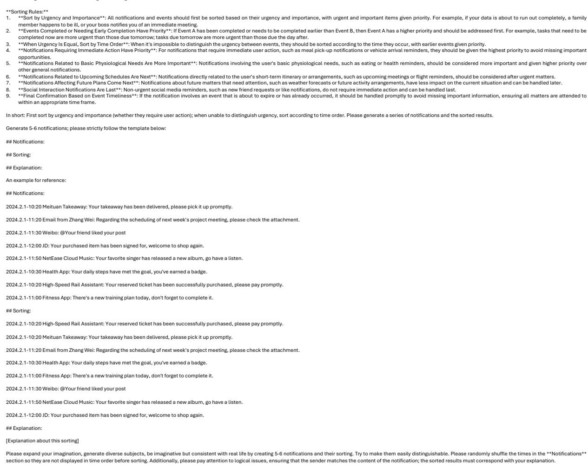  
Figure 7: Prompt for generating mobile notification sorting pairs (en).

## A.7 More Example Cases

We provide examples of SmartBench, along with the inference results of different models using BF16 precision (zh). The corresponding English translation is also provided (en). The numbers in red represent the scores given by Qwen-Max (qwen-max-longcontext).

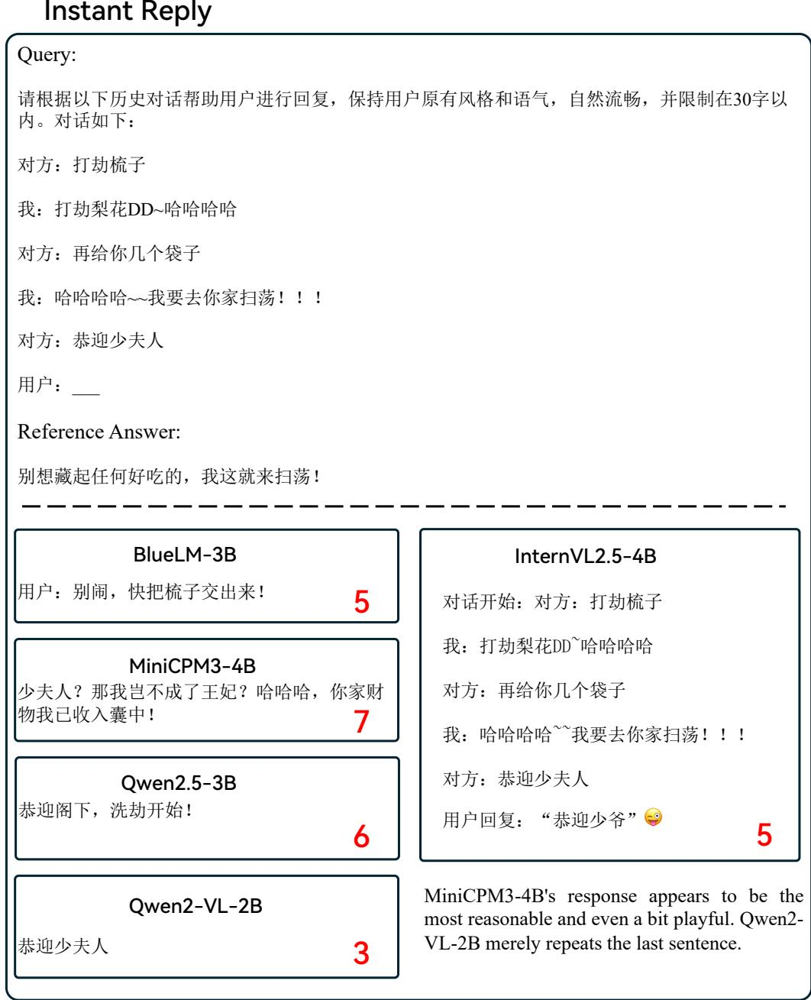  
Figure 8: Instant reply case (zh).

Instant Reply  
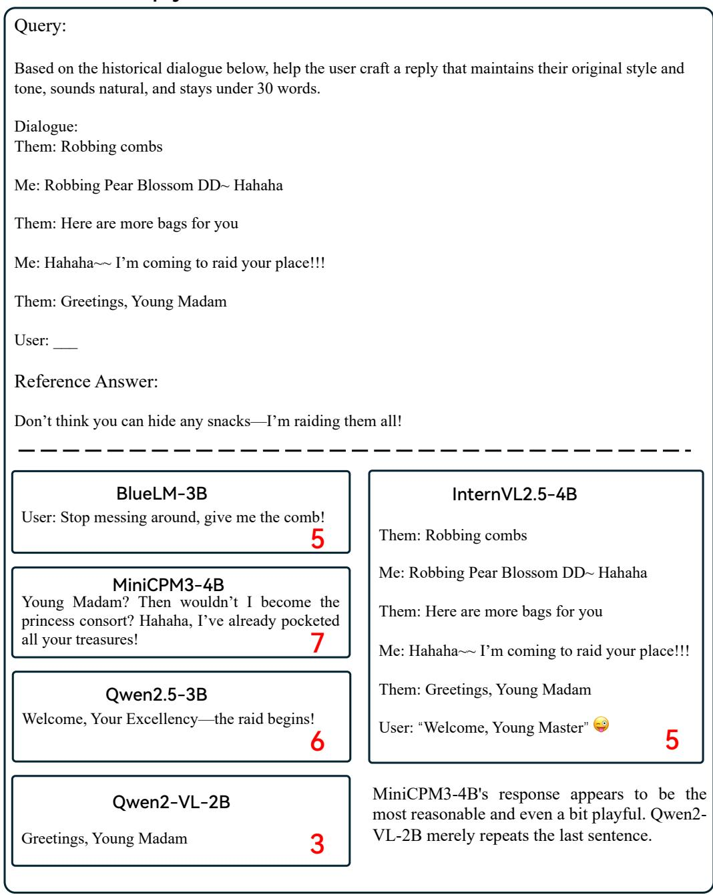  
Figure 9: Instant reply case (en).

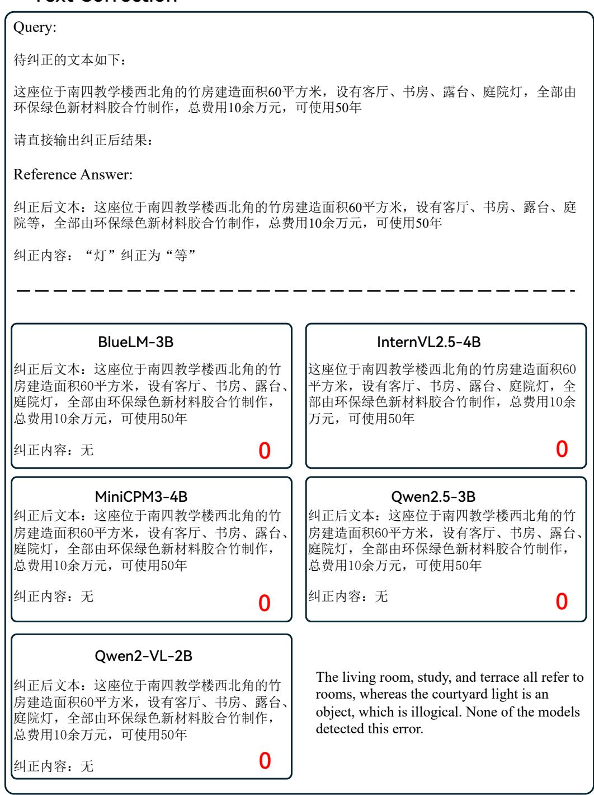  
Figure 10: Text correction case (zh).

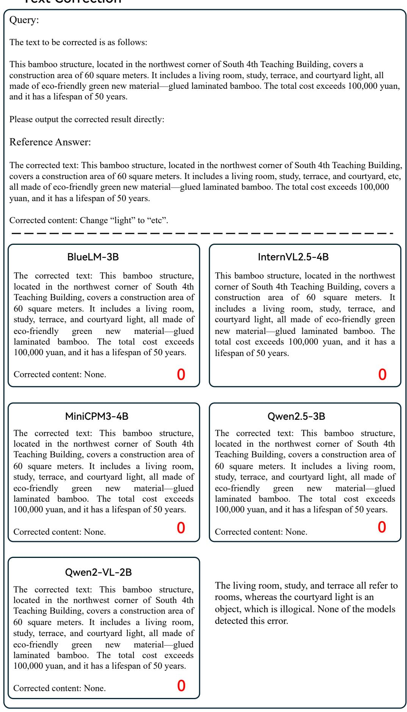  
Figure 11: Text correction case (en).

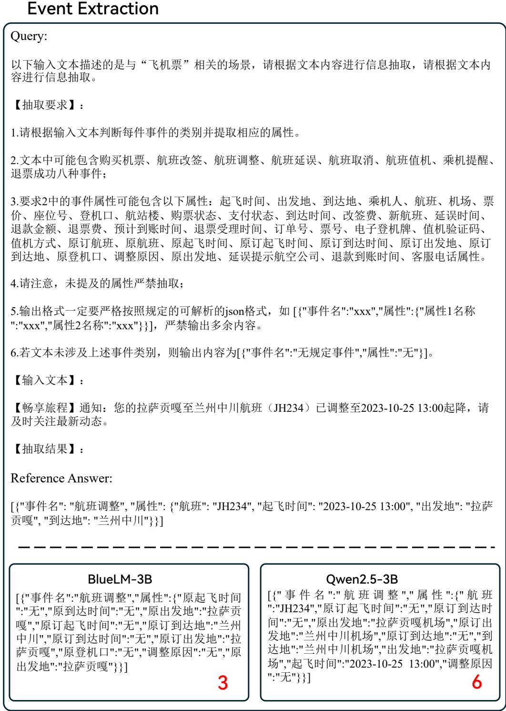  
Figure 12: Event extraction case (zh).

Event Extraction  
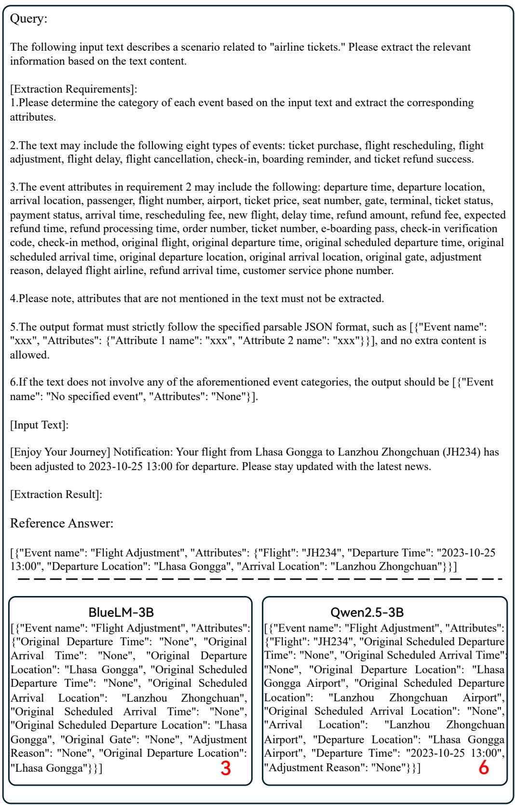  
Figure 13: Event extraction case (en).

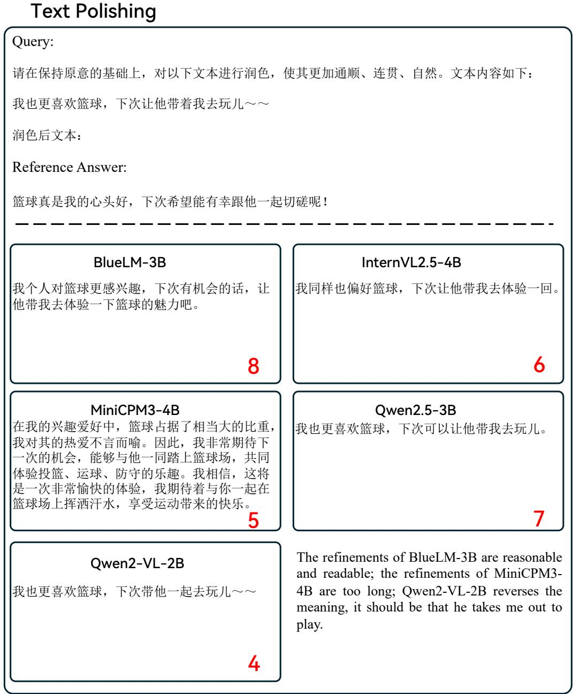  
Figure 14: Text polishing case (zh).

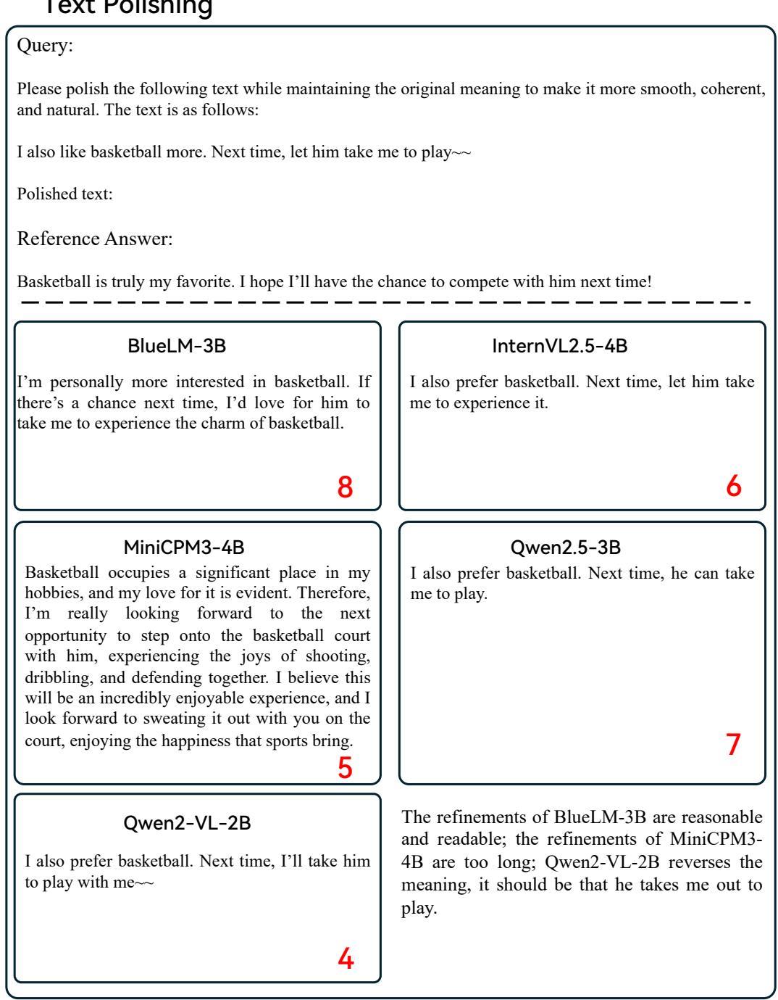  
Figure 15: Text polishing case (en).

A.8 English Translation of Pictures in the Paper  
  
Figure 16: Translated example of the Message Summarization task in SmartBench.

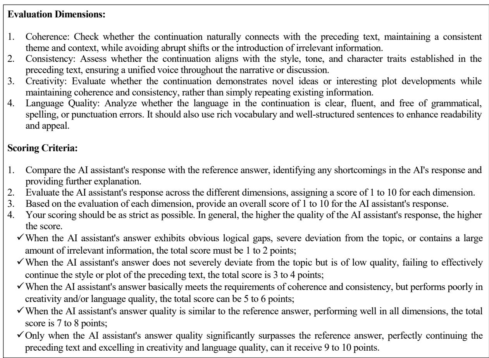  
Figure 17: Evaluation Dimension & Scoring Standard (in English) for the text continuation task.