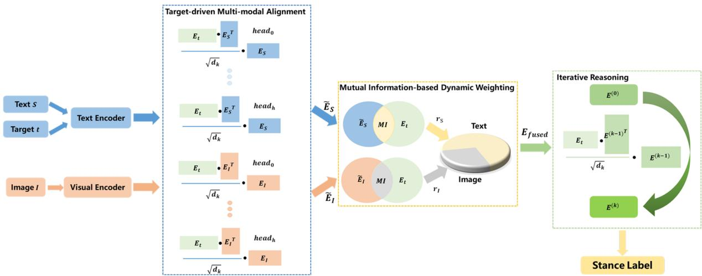

# T-MAD: Target-driven Multimodal Alignment for Stance Detection

Zhaodan Zhang1,2,3, Jin Zhang2,3,\*, Xueqi Cheng2,3, Hui Xu2

1School of Advanced Interdisciplinary Sciences, University of Chinese Academy of Sciences

2State Key Laboratory of AI Safety,

Institute of Computing Technology, Chinese Academy of Sciences

3University of Chinese Academy of Sciences

{zhangzhaodan23s,jinzhang,cxq,xuhui}@ict.ac.cn

## Abstract

Multimodal Stance Detection (MSD) aims to determine a user’s stance - support, oppose, or neutral - toward a target by analyzing multimodal content such as texts and images from social media. Existing MSD methods struggle with generalizing to unseen targets and handling modality inconsistencies. To address these challenges, we propose the Targetdriven Multi-modal Alignment and Dynamic Weighting Model (T-MAD), which combines target-driven multi-modal alignment and dynamic weighting mechanisms to capture targetspecific relationships and balance modality contributions. The model incorporates iterative reasoning to iteratively refine predictions, achieving robust performance in both in-target and zero-shot settings. Experiments on the MMSD and MultiClimate datasets show that T-MAD outperforms state-of-the-art models, with optimal results achieved using RoBERTa, ViT, and an iterative depth of 5. Ablation studies further confirm the importance of multi-modal alignment and dynamic weighting in enhancing model effectiveness.

## 1 Introduction

Multimodal Stance Detection (MSD) identifies a user’s stance - support, oppose, or neutral - toward a target by analyzing multimodal content like texts and images, often from social media (Küçük and Can, 2021; Carnot et al., 2023; Liang et al., 2024). MSD is crucial for sentiment analysis and social media monitoring, as understanding public opinion and user intent is vital (Thakkar et al., 2024; Liu et al., 2024a; Hu et al., 2024; Feng et al., 2024). However, detecting stances across text and images remains challenging due to the complexities of combining these modalities.

Despite progress, existing MSD methods face key limitations (Küçük and Can, 2021; Carnot et al.,

2023; Liang et al., 2024). First, models struggle with unseen targets (Liu et al., 2021a; Liang et al., 2022; Wen and Hauptmann, 2023) as social media content often covers unpredictable topics absent during training. Second, modality inconsistencies (Lei et al., 2024; Yang et al., 2023) arise when text and images present conflicting information. For instance, as shown in figure 1, an image might suggest opposition, while the text expresses support.

Current approaches like MLLM-SD and TMPT utilize large language models and target-specific prompts but face challenges in fine-grained alignment between modalities (Niu et al., 2024; Liang et al., 2024). Similarly, methods such as MultiClimate use advanced models but rely on single-pass inference, limiting flexibility for dynamic adjustments (Wang et al., 2024). These limitations reduce performance, especially in complex scenarios with conflicting data.

To overcome these challenges, we propose the Target-driven Multi-modal Alignment and Dynamic Weighting Model (T-MAD). T-MAD integrates target-driven multi-modal alignment and dynamic weighting mechanisms to address these issues. It extracts embeddings for both text and images and aligns them in a unified semantic space, facilitating meaningful cross-modal interactions. The dynamic weighting mechanism balances modality contributions, particularly in cases of conflicting or incomplete information. An iterative multi-step reasoning chain further refines predictions for robust performance in complex scenarios.

Our contributions are as follows:

• We introduce T-MAD, a target-driven model that enhances generalization to unseen targets by using target-driven alignment and dynamic weighting, improving adaptability and stance detection accuracy in cases of modality conflict.

• We conduct extensive experiments on the

MMSD and MultiClimate datasets, showing that T-MAD outperforms state-of-the-art models in both in-target and zero-shot settings. Additionally, we analyze the impact of text and visual encoder choices, and iterative inference depths, with RoBERTa and ViT yielding the best accuracy, and a depth of 5 optimally balancing accuracy and efficiency.

Text: Four more years!!! #MAGA Target: Donald Trump

Stance:Favor

  
Figure 1: Example of Contradictory Stance: Image Shows Opposition, Text Shows Support for Trump

## 2 Related Work

Multimodal Stance Detection Stance detection has mainly concentrated on textual analysis(Sun et al., 2018; Zheng et al., 2022; Li and Caragea, 2023; Zhang et al., 2020; Ostendorff et al., 2019), with a significant focus on the stance expressed in social media platforms like Twitter(Somasundaran and Wiebe, 2010; Augenstein et al., 2016; Hasan and Ng, 2014; Küçük and Can, 2020). Yet, a recent trend arose that gradually includes images and videos in stance detection(Barel et al., 2025; Khiabani and Zubiaga, 2024). MLLM-SD leverages the comprehension capabilities of LLMs to facilitate a detailed understanding of conversational content coupled with image information(Niu et al., 2024; Lee et al., 2024; Liu et al., 2024b). TMPT uses the target information to prompt the pre-trained models for learning multi-modal stance features (Liang et al., 2024).MultiClimate deploys state-of-the-art vision and language models, as well as multimodal models for MultiClimate stance detection (Wang et al., 2024).

Multimodal Stance Detection Datasets Weinzierl and Harabagiu pioneered the creation of the first multimodal stance detection dataset

MMVax specifically for COVID-19, comprising 11,300 instances (Weinzierl and Harabagiu, 2023). Subsequently, Liang et al. expanded existing text-based stance detection datasets (e.g. TSE2020, WT-WT) by incorporating image content and re-annotation to construct the larger MMSD multimodal stance detection datasets, totaling 17,544 annotated instances (Liang et al., 2024). MultiClimate dataset consists of 100 CCrelated YouTube videos in English with 4, 209 frametranscript pairs (Wang et al., 2024). Multimodal multi-turn conversational stance detection dataset (MmMtCSD) (Niu et al., 2024) encompasses 21,340 instances, with 14,083 of these instances, or 66 %, being related to image content, underscoring the significance of multimodal data inclusion.

## 3 Methodology

Let the dataset $\mathcal { D } = \{ ( S _ { i } , I _ { i } , t _ { i } , y _ { i } ) \} _ { i = 1 } ^ { N }$ consist of $N$ instances, where each instance $( S _ { i } , I _ { i } , t _ { i } , y _ { i } )$ includes an input text $S _ { i }$ , the corresponding image $I _ { i } ,$ and a target $t _ { i }$ . The objective is to determine the stance label $y _ { i }$ for the input $S _ { i }$ and $I _ { i }$ with respect to the target $t _ { i } ,$ where $y _ { i } \in$ favor, against, neutral . The goal of multi-modal stance detection is to predict the stance label $y _ { i }$ for each instance $( S _ { i } , I _ { i } , t _ { i } )$ inferring the stance of the text $S _ { i }$ and image $I _ { i }$ toward the given target $t _ { i }$ , with possible stance labels being favor, against, or neutral.

We propose a method that consists of the following four main steps. The method is shown in figure 2 : 1) Feature Extraction for Multi-modal Alignment: We extract embeddings of the image, text, and target using pre-trained encoders, serving as the foundation for subsequent alignment and reasoning processes; 2) Target-driven Multi-modal Alignment: A multi-head attention mechanism is employed to align the embeddings of the image and text with respect to the target, refining the representations while capturing global associations across modalities; 3) Mutual Information-based Dynamic Weighting: The model assesses the relevance of multimodal information to the target by estimating mutual information, dynamically assigning adaptive weights to image and text embeddings; 4) Iterative Reasoning: A iterative multi-step reasoning process iteratively refines the fused representation of the multimodal inputs and the target to produce the final stance prediction.

  
Figure 2: Architecture of the Target-driven Multi-modal Alignment and Dynamic Weighting Model

## 3.1 Feature Extraction

Given an input image I, text $S ,$ and target $t ,$ our goal is to extract embeddings for each modality that serve as the foundation for subsequent multi-modal stance detection processes.

First, we use a visual encoder to extract the image embedding $E _ { I }$ from the image I:

$$
E _ { I } = f _ { \mathrm { i m a g e } } ( I )\tag{1}
$$

where $f _ { \mathrm { i m a g e } }$ captures both global and local visual features within the image.

For the text $S$ and target t, we employ a pretrained language model to obtain the respective embeddings $E _ { S }$ and $E _ { t }$

$$
E _ { S } = f _ { \mathrm { t e x t } } ( S ) , \quad E _ { t } = f _ { \mathrm { t e x t } } ( t )\tag{2}
$$

where $f _ { \mathrm { t e x t } }$ encodes semantic, contextual, and target-specific information for both the text and target.

At this stage, the extracted embeddings $E _ { I }$ , $E _ { S }$ and $E _ { t }$ are used directly as inputs to multimodal alignment mechanisms.

## 3.2 Target-driven Multi-modal Alignment

We employ a target-driven multi-head cross-modal attention mechanism to align and refine the image and text embeddings $E _ { I }$ and $E _ { S }$ with respect to the target embedding $E _ { t }$ . This mechanism enables the model to learn and capture semantic relationships across modalities. The attention heads work together to refine the embeddings, ensuring a comprehensive understanding of the target-image-text relationship.

The alignment between the target embedding $E _ { t }$ and the image or text embeddings $( E _ { I } , E _ { S } )$ is achieved using multi-head attention. The attention computation is as follows:

$$
\tilde { E } _ { I } = \mathrm { C o n c a t } ( \mathrm { h e a d } _ { 1 } , \dots , \mathrm { h e a d } _ { h } ) W _ { O }\tag{3}
$$

$$
\tilde { E } _ { S } = \mathrm { C o n c a t ( h e a d _ { 1 } , \dots , h e a d } _ { h } ) W _ { O }\tag{4}
$$

where each attention head computes:

$$
\mathbf { h e a d } _ { i } = \mathrm { s o f t m a x } \left( \frac { ( E _ { t } W _ { Q } ^ { i } ) \cdot ( E _ { I } W _ { K } ^ { i } ) ^ { \top } } { \sqrt { d _ { k } } } \right) \cdot ( E _ { I } W _ { V } ^ { i } )\tag{5}
$$

and similarly for $E _ { S }$ . Here, $W _ { Q } ^ { i } , W _ { K } ^ { i } , W _ { V } ^ { i }$ Learnable projection matrices for the i-th head that transform the input embeddings into query, key, and value spaces. $W _ { O } { \mathrm { : } }$ : Output projection matrix that combines the outputs of all heads into a unified embedding. $d _ { k }$ : Dimensionality of the query/key vectors in each head, ensuring scale-invariance. $h \colon$ Number of attention heads, typically set to 12, allowing the model to capture diverse semantic relationships across modalities. The index i ranges from 1 to h.

The output embeddings ${ \tilde { E } } _ { I }$ and $\tilde { E } _ { S }$ are enriched with target-aligned semantic features.

## 3.3 Mutual Information-based Dynamic Weighting

The Mutual Information-based Dynamic Weighting mechanism is a core component of T-MAD, designed to intelligently balance the contributions of the image and text modalities in the final stance prediction. This is particularly crucial for handling modality inconsistencies, where the two modalities convey conflicting or ambiguous signals about the user’s stance towards the target. Instead of using fixed or heuristic weighting schemes, our model dynamically assigns adaptive weights based on a principled measure of each modality’s relevance to the target.

The key insight is that the modality which contains more information about the target should be given greater importance. To quantify this "relevance," we employ Mutual Information (MI), a fundamental concept from information theory that measures the statistical dependence between two random variables. In our context, MI measures how much information the aligned image embedding ${ \tilde { E } } _ { I }$ (or text embedding $\breve { \tilde { E } } _ { S } )$ provides about the target embedding $E _ { t }$ . A higher MI value indicates a stronger semantic association and suggests that the modality is more informative for the stance detection task.

Since MI is intractable to compute directly, we approximate it using a contrastive learning objective. Specifically, we use the InfoNCE loss (van den Oord et al., 2018), which serves as a tractable lower bound on the true mutual information. This process, often referred to as noisecontrastive estimation, works by training the model to distinguish the "positive" target $E _ { t }$ from a set of "negative" target embeddings $\{ E _ { t } ^ { j } \} _ { j = 1 } ^ { N }$

The InfoNCE loss for the image modality is defined as:

$$
\mathcal { L } _ { \mathrm { I n f o N C E } } ^ { \mathrm { i m a g e } } = - \log \frac { \exp \left( { \sin ( \tilde { E } _ { I } , E _ { t } ) / \tau } \right) } { \sum _ { j = 1 } ^ { N } \exp \left( { \sin ( \tilde { E } _ { I } , E _ { t } ^ { j } ) / \tau } \right) }\tag{6}
$$

where ${ \tilde { E } } _ { I }$ is the target-aligned image embedding from the previous step, $E _ { t }$ is the embedding of the correct (positive) target, $E _ { t } ^ { j }$ are the embeddings of N randomly sampled negative targets from the same batch, sim( ) is a similarity function (we use cosine similarity), and $\tau$ is a temperature parameter that controls the concentration of the distribution. A symmetric loss $\mathcal { L } _ { \mathrm { I n f o N C E } } ^ { \mathrm { t e x t } }$ is computed for the text modality using $\tilde { E } _ { S }$ . Similarly, the text modality uses:

$$
\mathcal { L } _ { \mathrm { I n f o N C E } } ^ { \mathrm { t e x t } } = - \log \frac { \exp \left( \sin ( \tilde { E } _ { S } , E _ { t } ) / \tau \right) } { \sum _ { j = 1 } ^ { N } \exp \left( \sin ( \tilde { E } _ { S } , E _ { t } ^ { j } ) / \tau \right) }\tag{7}
$$

Minimizing this loss encourages the model to assign a high similarity score to the positive pair $( \tilde { E } _ { I } , E _ { t } )$ while assigning low scores to the negative pairs $( \tilde { E } _ { I } , E _ { t } ^ { j } )$ . This effectively maximizes the estimated mutual information between the modality and the target.

Based on the estimated MI, we define a relevance score for each modality. These scores are derived from the exponentiated MI to create a positive, non-linear scaling:

$$
r _ { I } = \exp \left( \mathbf { M } ( \tilde { E } _ { I } , E _ { t } ) \right)\tag{8}
$$

$$
r _ { S } = \exp \left( \mathbf { M } ( \tilde { E } _ { S } , E _ { t } ) \right)\tag{9}
$$

In practice, the MI value is approximated by the negative of the corresponding InfoNCE loss (up to a constant).

Finally, the dynamic weighting mechanism computes the final fused multimodal representation $E _ { \mathrm { f u s e d } }$ as a weighted average of the aligned image and text embeddings, with the relevance scores $r _ { I }$ and $r _ { S }$ serving as the weights:

$$
E _ { \mathrm { f u s e d } } = \frac { r _ { I } \cdot \tilde { E } _ { I } + r _ { S } \cdot \tilde { E } _ { S } } { r _ { I } + r _ { S } } + \lambda E _ { t }\tag{10}
$$

The term $\lambda E _ { t }$ (where λ is a balancing factor) explicitly incorporates the target embedding into the final fusion, ensuring that the target’s semantic information remains central. This formulation ensures that the more informative modality (the one with higher MI and thus a higher relevance score) dominates the fused representation, allowing T-MAD to make robust predictions even in the face of conflicting multimodal inputs.

## 3.4 Iterative Reasoning

In this step, we refine the multi-modal fused representation $E _ { \mathrm { f u s e d } }$ , obtained from the previous steps, through an iterative reasoning process. This process iteratively updates the representation by focusing on progressively finer semantic details, guided by the target embedding $E _ { t }$ . The goal is to enhance the representation’s ability to capture nuanced cross-modal relationships, ultimately leading to a more accurate stance prediction.

Initialization The iterative reasoning process begins with the fused representation:

$$
E ^ { ( 0 ) } = E _ { \mathrm { f u s e d } }\tag{11}
$$

where $E _ { \mathrm { f u s e d } }$ combines information from image, text, and target modalities, as computed in the previous step.

Iterative Refinement At each reasoning step $k ,$ multi-head attention is applied to refine the representation. The target embedding $E _ { t }$ serves as the query $Q$ , while the current representation $E ^ { ( k - 1 ) }$ is used as both the keys $K$ and values $V { : }$

$$
\boldsymbol { E } ^ { ( k ) } = \mathbf { M } \mathbf { H } \mathbf { A } ( \boldsymbol { Q } = E _ { t } , K = E ^ { ( k - 1 ) } , V = E ^ { ( k - 1 ) } )\tag{12}
$$

Here, $E ^ { ( k - 1 ) }$ is the representation from the previous step, encoding the progressively refined multimodal information. $E _ { t }$ ensures that each reasoning step remains target-guided, reinforcing the focus on target-related semantics.

Convergence Criteria The reasoning process proceeds iteratively, refining specific aspects of the representation at each step. The process stops when either of the following conditions is met: A fixed number of steps K is reached, or the representation converges, such that the change between $E ^ { ( k ) }$ and $E ^ { ( k - 1 ) }$ falls below a predefined threshold:

$$
\| E ^ { ( k ) } - E ^ { ( k - 1 ) } \| < \epsilon\tag{13}
$$

where ϵ is a small positive constant.

The final refined representation is denoted as:

$$
E ^ { \mathrm { r e f i n e d } } = E ^ { ( K ) }\tag{14}
$$

where K is the number of reasoning steps.

Final Prediction The refined representation Erefined is then passed through a fully connected layer to produce the final stance prediction:

$$
y _ { \mathrm { f i n a l } } = \mathrm { F C } ( E ^ { \mathrm { r e f i n e d } } )\tag{15}
$$

By incorporating iterative reasoning, the model progressively enriches the multi-modal representation $E _ { \mathrm { f u s e d } }$ with finer semantic details, while ensuring alignment with the target embedding $E _ { t }$ . This process enhances the model’s ability to handle incomplete or ambiguous information and to make robust stance predictions across diverse inputs.

## 4 Experiments

## 4.1 Datasets

We evaluate our proposed method on two multimodal stance detection datasets: MMSD and MultiClimate. Detailed statistics for both datasets can be found in the appendices A.

The MMSD dataset (Liang et al., 2024) includes five multimodal stance detection tasks across various domains: MTSE, MCCQ, MWTWT, MRUC, and MTWQ. Each instance consists of text $S _ { i }$ , an image $I _ { i } ,$ a target $t _ { i } ,$ and a stance label $y _ { i }$ . Stance labels include Favor, Against, Neutral, and Unrelated. The dataset is split into training, validation, and test sets for both in-target and zero-shot settings, as detailed in Table 8.

The MultiClimate dataset (Wang et al., 2024) focuses on climate change content, with 100 English YouTube videos and 4,209 frame-transcript pairs. Each pair is annotated with one of three stance labels: Support, Neutral, or Oppose. The dataset is split into 80% training, 10% validation, and 10% testing, as summarized in Table 9.

## 4.2 Evaluation Metrics

For the MMSD dataset, we use the Macro F1- score to measure the model performance. Macro F1-score provides an equal weight to each class, making it suitable for evaluating performance across the various stance categories in MMSD.For the MultiClimate dataset, we use the both accuracy and weighted F1-score as the evaluation metric, given the imbalanced distribution of the Support, Neutral, and Oppose labels in this dataset. The experimental results are averaged over 5 runs to ensure that the final reported results are statistically stable and not influenced by random initialization.

## 4.3 Baseline Models

Text-only Models. We use several text-based models: (1) BERT (Devlin et al., 2019), (2) RoBERTa (Liu et al., 2019), (3) KEBERT (Kawintiranon and Singh, 2022), (4) LLaMA2 (Touvron et al., 2023), and (5) GPT4. For MultiClimate, we also evaluate (6) Llama3 (Dubey et al., 2024) and (7) Gemma2-9B (Team et al., 2024).

Image-only Models. The image-based baselines include (1) ResNet (He et al., 2016), (2) ViT (Dosovitskiy et al., 2021), and (3) SwinT (Liu et al., 2021b).

Multimodal Models. For MMSD, we use (1) ViLT (Kim et al., 2021), (2) CLIP (Radford et al., 2021), (3) BERT+ViT, (4) Qwen-VL (Bai et al., 2023), (5) GPT4-Vision, (6) TMPT (Liang et al., 2024), (7) TMPT+CoT (Liang et al., 2024) and (8)MLLM-SD (Niu et al., 2024). For MultiClimate, we combine BERT with ViT or ResNet50 embeddings, and also use CLIP (Radford et al., 2021), BLIP (Li et al., 2022), IDEFICS (Alayrac et al., 2022), and MLLM-SD (Niu et al., 2024) for stance classification. The baseline models are detailed in the appendixB.

## 4.4 Experiment Settings

We introduce the T-MAD+CWVF model, a variant of our Target-driven Multi-modal Alignment and Dynamic Weighting Model (T-MAD). In this model, we integrate a Confidence-weighted Voting Fusion (CWVF) mechanism to combine stance labels generated by both T-MAD and MLLM, based on their respective confidence scores.

<table><tr><td rowspan="2">Modality</td><td rowspan="2">Method</td><td colspan="2">MTSE</td><td rowspan="2">MCCQ</td><td colspan="5">MWTWT</td><td rowspan="2">MRUC</td><td colspan="2">MTWQ</td></tr><tr><td>DT</td><td>JB</td><td>CQ CA</td><td>CE</td><td>AC</td><td>AH</td><td>DF</td><td>RUS UKR</td><td>MOC TOC</td></tr><tr><td rowspan="5">Textual</td><td>BERT</td><td>48.25</td><td>52.04</td><td>66.57</td><td>75.62</td><td>60.85</td><td>63.05</td><td>59.24</td><td>81.53</td><td>41.25 46.80</td><td>57.77</td><td>45.91</td></tr><tr><td>RoBERTa</td><td>58.39</td><td>60.79</td><td>66.57</td><td>69.56</td><td>65.03</td><td>69.74</td><td>67.99</td><td>79.21</td><td>39.52 57.66</td><td>55.22</td><td>48.88</td></tr><tr><td>KEBERT</td><td>64.50</td><td>69.81</td><td>66.84</td><td>71.67</td><td>67.56</td><td>69.29</td><td>69.74</td><td>80.57</td><td>41.55 59.01</td><td>58.15</td><td>47.75</td></tr><tr><td>LLaMA2</td><td>53.23</td><td>52.67</td><td>47.40</td><td>34.89</td><td>41.95</td><td>49.09</td><td>44.32</td><td>30.21</td><td>38.84 38.54</td><td>55.31</td><td>46.51</td></tr><tr><td>GPT4</td><td>68.74</td><td>66.39</td><td>65.84</td><td>63.14</td><td>65.12</td><td>69.93</td><td>71.62</td><td>52.69</td><td>41.64 53.76</td><td>58.05</td><td>49.81</td></tr><tr><td rowspan="3">Visual</td><td>ResNet</td><td>37.89</td><td>38.59</td><td>47.16</td><td>39.89</td><td>42.20</td><td>43.52 37.05</td><td></td><td>50.34</td><td>35.10 40.00</td><td>42.02</td><td>33.94</td></tr><tr><td>ViT</td><td>40.48</td><td>40.42</td><td>46.64</td><td>46.63</td><td>50.00</td><td>40.16</td><td>46.32</td><td>50.86</td><td>33.31 39.87</td><td>38.63</td><td>35.53</td></tr><tr><td>SwinT</td><td>39.89</td><td>40.43</td><td>48.80</td><td>46.30</td><td>46.99</td><td>41.02</td><td>47.39</td><td>51.32</td><td>35.01 40.89</td><td>35.03</td><td>35.47</td></tr><tr><td rowspan="15">Multi-modal</td><td>BERT+ViT</td><td>41.86</td><td>45.82</td><td>61.32</td><td>63.20</td><td>44.71</td><td>56.45</td><td>46.85</td><td>73.71</td><td>39.28 48.41</td><td>47.47</td><td>40.86</td></tr><tr><td>ViLT</td><td>35.32</td><td>48.24</td><td>47.85</td><td>62.20</td><td>56.44</td><td>58.06</td><td>60.22</td><td>73.66</td><td>34.62 42.41</td><td>44.43</td><td>39.51</td></tr><tr><td>CLIP</td><td>53.22</td><td>65.83</td><td>63.65</td><td>70.93</td><td>67.17</td><td>67.43</td><td>70.86</td><td>79.06</td><td>44.99 59.86</td><td>55.29</td><td>40.98</td></tr><tr><td>Qwen-VL</td><td>43.31</td><td>45.13</td><td>50.51</td><td>43.06</td><td>45.49</td><td>49.79</td><td>46.04</td><td>27.73</td><td>36.50 40.78</td><td>42.14</td><td>39.34</td></tr><tr><td>GPT4-Vision</td><td>70.46</td><td>72.82</td><td>61.63</td><td>44.59</td><td>57.47</td><td>57.49</td><td>57.47</td><td>59.37</td><td>44.83 56.40</td><td>66.72</td><td>56.90</td></tr><tr><td>TMPT</td><td>55.41</td><td>61.61</td><td>67.67</td><td>76.60</td><td>63.19</td><td>67.25</td><td>62.92</td><td>81.19</td><td>43.56 59.24</td><td>55.68</td><td>46.82</td></tr><tr><td>TMPT+CoT</td><td>66.61</td><td>68.75</td><td>71.79</td><td>74.40</td><td>69.96</td><td>68.43</td><td>63.00</td><td>82.71</td><td>45.04 60.52</td><td>68.95</td><td>59.87</td></tr><tr><td>MLLM-SD</td><td>68.4</td><td>70.10</td><td>72.50</td><td>78.20</td><td>70.00</td><td>71.40</td><td>74.60</td><td>84.10</td><td>47.30 63.80</td><td>70.90</td><td>61.20</td></tr><tr><td>BERT+ViT+CWVF</td><td>43.20</td><td>47.10</td><td>62.50</td><td>64.80</td><td>46.10</td><td>57.80</td><td>48.20</td><td>74.90</td><td>40.50 49.60</td><td>48.70</td><td>42.10</td></tr><tr><td>ViLT+CWVF</td><td>36.80</td><td>49.50</td><td>49.10</td><td>63.50</td><td>57.80</td><td>59.40</td><td>61.50</td><td>74.80</td><td>35.90 43.70</td><td>45.80</td><td>40.80</td></tr><tr><td>CLIP+CWVF</td><td></td><td>54.60 67.10</td><td>64.80</td><td>72.10</td><td></td><td>68.50 68.70</td><td>72.10</td><td>80.20</td><td>46.20 61.10</td><td>56.50</td><td>42.30</td></tr><tr><td>Qwen-VL+CWVF</td><td>44.70</td><td>46.50</td><td>51.80</td><td></td><td>44.60</td><td>46.80</td><td>51.10 47.40</td><td>29.10</td><td>37.80 41.90</td><td>43.40</td><td>40.70</td></tr><tr><td>GPT4-V+CWVF</td><td>71.80</td><td>74.10</td><td>62.90</td><td>46.10</td><td>58.80</td><td>58.90</td><td>58.80</td><td>60.70</td><td>46.10 57.80</td><td>68.10</td><td>58.30</td></tr><tr><td>TMPT+CWVF</td><td>56.90</td><td>63.10</td><td>68.90</td><td>78.10</td><td>64.50</td><td>68.60</td><td>64.20</td><td>82.40</td><td>44.90 60.40</td><td>56.90</td><td>48.20</td></tr><tr><td>TMPT+CoT+CWVF 68.20</td><td></td><td>70.40</td><td>73.10</td><td>75.80</td><td>71.30</td><td></td><td>70.1064.50</td><td>83.90</td><td></td><td>46.30 61.8070.20</td><td>61.40</td></tr><tr><td>T-MAD</td><td>71.12</td><td>73.31*</td><td>75.05*</td><td>80.45*</td><td>71.90</td><td></td><td>73.3176.10*</td><td>86.20</td><td></td><td>49.25 65.70 72.80* 63.50</td><td></td></tr><tr><td></td><td>T-MAD+CWVF</td><td>75.00* 77.50*</td><td></td><td>76.20*</td><td>81.30*</td><td></td><td></td><td></td><td></td><td>73.50* 74.80 77.10* 87.30* 50.20 66.9073.5064.30</td><td></td></tr></table>

Table 1: Experimental results (%) of in-target multi-modal stance detection.Results with \* denote the significance tests of our T-MAD over the baseline models at p-value < 0.05.

For MLLM’s output, we use a repeated generation method to estimate confidence. Each input instance $( S _ { i } , I _ { i } , t _ { i } )$ is prompted 5 times, and the confidence score is calculated by the frequency of label appearances. For T-MAD’s output, the confidence score is derived from the softmax probability associated with its predicted label. The CWVF mechanism selects the final label based on the highest confidence score, with preferences given to T-MAD’s output in case of ties.

We utilize several pretrained large language models (MLLMs) in our experiments, such as Qwen2- VL-7B-Instruct (Bai et al., 2023), InternVL2\_5-1B (Chen et al., 2024), Llama-3.2-11B-Vision-Instruct, and deepseek-vl2 (Wu et al., 2024). For text and target embeddings, we use the uncased BERT-base model (Devlin et al., 2019), and for image embeddings, we use the ViT-base model (Dosovitskiy et al., 2021).

For the multi-modal alignment module, we set the dimensionality of the hidden vectors to $d _ { h }$ 768, with 12 attention heads and a dropout rate of 0.1. The maximum reasoning depth K is set to 5 for iterative refinement. The mutual information-based dynamic weighting module uses a temperature parameter of $\tau = 0 . 0 7$ and 256 negative samples. The balancing factor λ for the fused representation is set to 0.5. Details of experimental configurations are provided in the appendix (C).

## 5 Results and Discussion

The following section addresses the three research questions (RQs) that this study seeks to answer:

RQ1: How does the performance of T-MAD compare to state-of-the-art models on the MMSD and MultiClimate datasets?

RQ2: Is each component of the T-MAD effective and contributory to overall performance?

RQ3: How do different text and visual encoder combinations and iterative inference depths affect T-MAD’s performance?

Performance Comparison with State-of-the-Art Models To rigorously evaluate the performance of our proposed T-MAD model, we conducted extensive experiments on the MMSD and Multi-Climate datasets, comparing against a comprehensive suite of state-of-the-art baselines. The results, presented in Tables 1, 2, and 3, demonstrate T-MAD’s superior performance across both in-target

<table><tr><td>Modality</td><td>Method</td><td colspan="2">MTSE</td><td colspan="4">MWTWT</td><td colspan="2">MRUC</td><td colspan="2">MTWQ</td></tr><tr><td></td><td></td><td>DT</td><td>JB</td><td>CA</td><td>CE</td><td>AC</td><td>AH</td><td>RUS</td><td>UKR</td><td>MOC</td><td>TOC</td></tr><tr><td rowspan="5">Textual</td><td>BERT</td><td>32.52</td><td>29.97</td><td>63.55</td><td>61.30</td><td>59.18</td><td>52.89</td><td>22.01</td><td>15.45</td><td>28.04</td><td>9.57</td></tr><tr><td>RoBERTa</td><td>26.60</td><td>32.41</td><td>59.22</td><td>64.86</td><td>57.46</td><td>57.17</td><td>27.10</td><td>19.98</td><td>30.62</td><td>15.84</td></tr><tr><td>KEBERT</td><td>26.17</td><td>31.81</td><td>59.79</td><td>60.74</td><td>59.25</td><td>55.53</td><td>28.29</td><td>17.19</td><td>29.97</td><td>18.89</td></tr><tr><td>LLaMA2</td><td>33.57</td><td>33.92</td><td>32.47</td><td>38.37</td><td>48.06</td><td>36.31</td><td></td><td>36.1338.16</td><td>51.46</td><td>44.10</td></tr><tr><td>GPT4</td><td>70.78</td><td>68.83</td><td>57.19</td><td>60.56</td><td>65.63</td><td>69.01</td><td>40.32</td><td>38.49</td><td>62.10</td><td>52.12</td></tr><tr><td rowspan="3">Visual</td><td>ResNet</td><td>25.52</td><td>29.70</td><td>23.01</td><td>24.11</td><td>25.21</td><td>25.27</td><td>22.5720.19</td><td></td><td>27.59</td><td>24.88</td></tr><tr><td>ViT</td><td>28.63</td><td>29.70</td><td>24.59</td><td>31.48</td><td>34.06</td><td>33.29</td><td></td><td>25.8129.37</td><td>23.51</td><td>29.42</td></tr><tr><td>SwinT</td><td>28.54</td><td>30.85</td><td>28.53</td><td>35.87</td><td>43.32</td><td>37.39</td><td>24.54</td><td>27.99</td><td>19.69</td><td>19.69</td></tr><tr><td rowspan="13"></td><td>BERT+ViT</td><td>26.70</td><td>31.57</td><td>59.21</td><td>59.30</td><td>50.04</td><td>59.22</td><td></td><td>23.3315.21</td><td>24.76</td><td>11.70</td></tr><tr><td>ViLT</td><td>28.08</td><td>29.74</td><td>38.36</td><td>46.00</td><td>51.01</td><td>48.55</td><td></td><td>21.9923.96</td><td>23.54</td><td>19.18</td></tr><tr><td>CLIP</td><td>28.21</td><td>28.99</td><td>55.46</td><td>61.08</td><td>55.46</td><td>59.96</td><td>27.21</td><td>25.46</td><td>21.55</td><td>15.60</td></tr><tr><td>Qwen-VL</td><td>47.62</td><td>46.14</td><td>38.57</td><td>43.36</td><td>47.82</td><td>41.01</td><td></td><td>35.9741.51</td><td>44.32</td><td>44.08</td></tr><tr><td>GPT4-Vision</td><td>72.68</td><td>71.28</td><td>42.23</td><td>45.92</td><td>54.59</td><td>53.19</td><td>42.09</td><td>47.00</td><td>65.00</td><td>52.36</td></tr><tr><td>TMPT</td><td>31.69</td><td>32.65</td><td>66.36</td><td>66.30</td><td>66.39</td><td>64.87</td><td></td><td>23.8724.71</td><td>32.18</td><td>26.48</td></tr><tr><td>MLLM-SD</td><td>55.30</td><td>59.70</td><td>69.80</td><td>68.50</td><td>67.30</td><td>66.80</td><td></td><td>50.4053.10</td><td>47.50</td><td>44.80</td></tr><tr><td>TMPT+CoT</td><td>54.30</td><td>58.46</td><td>67.28</td><td>63.73</td><td>64.87</td><td>54.26</td><td>48.99</td><td>51.75</td><td>45.32</td><td>43.70</td></tr><tr><td>Multi-modal BERT+ViT+CWVF</td><td>28.50</td><td>33.40</td><td>61.70</td><td>61.90</td><td>52.30</td><td>61.50</td><td>25.10</td><td>17.30</td><td>26.90</td><td>13.80</td></tr><tr><td>ViLT+CWVF</td><td>29.90</td><td>31.50</td><td>40.80</td><td>48.50</td><td>53.50</td><td>51.20</td><td></td><td>24.3026.20</td><td>25.80</td><td>21.40</td></tr><tr><td>CLIP+CWVF</td><td>30.10</td><td>30.80</td><td>57.90</td><td>63.50</td><td>57.90</td><td>62.30</td><td></td><td>29.5027.60</td><td>23.80</td><td>17.70</td></tr><tr><td>Qwen-VL+CWVF</td><td>49.80</td><td>48.50</td><td>40.80</td><td>45.90</td><td>50.30</td><td>43.50</td><td></td><td>37.8043.70</td><td>46.90</td><td>46.30</td></tr><tr><td>GPT4-Vision+CWVF</td><td>74.10</td><td>73.50</td><td>44.80</td><td>48.50</td><td>57.30</td><td>55.90</td><td>44.20</td><td>49.30</td><td>67.50</td><td>54.80</td></tr><tr><td>TMPT+CWVF</td><td>33.80</td><td>34.90</td><td>68.90</td><td>68.80</td><td>68.90</td><td>67.50</td><td></td><td>25.9026.80</td><td>34.50</td><td>28.70</td></tr><tr><td>TMPT+CoT+CWVF</td><td>56.80</td><td>60.90</td><td>69.50</td><td>66.20</td><td>67.50</td><td>56.90</td><td>51.20</td><td>53.90</td><td>47.80</td><td>45.90</td></tr><tr><td>T-MAD</td><td>58.10</td><td>62.80</td><td>71.50*</td><td>70.40*</td><td>69.90*</td><td>69.00*</td><td>52.20</td><td>55.60</td><td>49.80</td><td>47.20</td></tr><tr><td>T-MAD+CWVF</td><td>77.20*</td><td>75.60*</td><td>72.40*</td><td>71.80*</td><td>70.80*</td><td>70.20</td><td></td><td>53.5056.4069.30*</td><td></td><td>56.60</td></tr></table>

Table 2: Experimental results (%) of zero-shot multi-modal stance detection. Best scores of each group are in bold. Results with \* denote the significance tests of our T-MAD over the baseline models at p-value < 0.05.

and zero-shot settings.

On the MMSD dataset under the in-target setting (Table 1), T-MAD+CWVF establishes a new state-of-the-art, achieving the highest Macro F1 scores across all five sub-tasks. Its performance is particularly dominant in the MTSE task, where it attains 75.00% and 77.50% Macro F1, respectively. This represents a significant improvement over strong multimodal baselines like GPT4- Vision (70.46% on MTSE-DT) and TMPT+CoT (68.75% on MTSE-JB). Notably, even when other models are enhanced with the same Confidenceweighted Voting Fusion (CWVF) mechanism, T-MAD+CWVF still outperforms them. For instance, GPT4-Vision+CWVF scores 71.80% on MTSE-DT, while TMPT+CoT+CWVF scores 68.20%, both falling short of T-MAD+CWVF’s 75.00%. This indicates that the performance gain is not merely a byproduct of the fusion mechanism but is fundamentally driven by the high quality of T-MAD’s base predictions.

In the more challenging zero-shot setting (Table 2), T-MAD+CWVF’s ability to generalize to unseen targets is further highlighted. It achieves the best results on the majority of sub-tasks, showcasing its robustness. For example, it sets a new high mark of 77.20% on MTSE-DT, significantly surpassing the previous best of 74.10% by GPT4- Vision+CWVF. Similarly, on the MWTWT and MRUC tasks, T-MAD+CWVF demonstrates superior generalization. The consistent outperformance across diverse domains (e.g., elections, corporate mergers, geopolitical conflicts) underscores the model’s effectiveness in adapting to new and unpredictable targets.

The evaluation on the domain-specific MultiClimate dataset (Table 3) further validates T-MAD’s broad applicability. In this zero-shot setting, T-MAD+CWVF achieves a remarkable 78.0% accuracy and 80.8% F1 score, outperforming all other multimodal models, including finetuned variants like IDEFICS. Even the enhanced baseline BERT+ViT+CWVF is surpassed by T-MAD+CWVF. This result is particularly significant as it demonstrates that T-MAD’s architecture is not only effective for social media content but also excels in specialized domains like climate change discourse analysis.

In summary, the experimental results across multiple datasets and settings consistently show that T-MAD+CWVF achieves state-of-the-art performance. Its success stems from the synergy between its core components - the target-driven alignment, dynamic weighting, and iterative reasoning - which produce high-fidelity base predictions. This allows the CWVF mechanism to effectively consolidate the final decision, leading to robust and accurate stance detection in both familiar and novel scenarios.

<table><tr><td>Modality</td><td>Method</td><td>ACC</td><td>F1</td></tr><tr><td rowspan="4">Textual</td><td>BERT</td><td>0.705</td><td>0.705</td></tr><tr><td>Llama3 (zero-shot)</td><td>0.485</td><td>0.451</td></tr><tr><td>Gemma2 (zero-shot)</td><td>0.461</td><td>0.382</td></tr><tr><td>ResNet50</td><td>0.424</td><td>0.399</td></tr><tr><td rowspan="2">Visual</td><td>ViT</td><td>0.460</td><td>0.462</td></tr><tr><td>BERT + ResNet50</td><td>0.717</td><td>0.714</td></tr><tr><td rowspan="17">Multi-modal</td><td>BERT + ViT</td><td></td><td></td></tr><tr><td>CLIP</td><td>0.747</td><td>0.749</td></tr><tr><td>BLIP</td><td>0.431</td><td>0.298</td></tr><tr><td>IDEFICS (zero-shot)</td><td>0.462 0.347</td><td>0.292 0.270</td></tr><tr><td>IDEFICS (fine-tuned)</td><td>0.600</td><td>0.591</td></tr><tr><td>MLLM-SD</td><td>0.735</td><td></td></tr><tr><td>BERT+ResNet50+CWVF</td><td>0.725</td><td>0.740</td></tr><tr><td>BERT+ViT+CWVF</td><td>0.751</td><td>0.723</td></tr><tr><td>CLIP+CWVF</td><td></td><td>0.754 0.315</td></tr><tr><td>BLIP+CWVF</td><td>0.450</td><td></td></tr><tr><td>IDEFICS (zero-shot)+CWVF</td><td>0.480</td><td>0.305</td></tr><tr><td></td><td>0.365</td><td>0.285</td></tr><tr><td>IDEFICS (fine-tuned)+CWVF 0.620</td><td></td><td>0.610</td></tr><tr><td>MLLM-SD</td><td></td><td>0.735 0.740</td></tr><tr><td>T-MAD</td><td></td><td>0.752*0.755*</td></tr><tr><td>T-MAD+CWVF</td><td></td><td>0.780* 0.808*</td></tr><tr><td>HUMAN</td><td>0.826</td><td>0.823</td></tr></table>

Table 3: Text-only, image-only, and multi-modal model results on the MultiClimate test set. Best scores are in bold. Results with \* denote the significance tests of our T-MAD over the baseline models at p-value < 0.05.

Effectiveness of T-MAD Components The ablation study in Table 4 demonstrates the contribution of each component in the T-MAD model. The full T-MAD model achieves the best performance across all tasks, with Macro F1 scores of 72.22 for MTSE, 75.05 for MCCQ, and 80.59 for MWTWT, showing the effectiveness of all model components working together.

When the Target-driven Multi-modal Alignment (TMA) module is removed, the model performance decreases significantly, particularly in MTSE and MCCQ, with Macro F1 scores dropping to 67.10 and 70.00, respectively. This indicates that the alignment between text, image, and target is crucial for maintaining high performance in stance detection tasks.

Removing the Mutual Information-based Dynamic Weighting (DW) mechanism also leads to a noticeable drop in performance, with the Macro

F1 scores for MWTWT and MRUC decreasing to 74.20 and 72.90, respectively. This highlights the importance of dynamically adjusting the weight of each modality to better handle modality inconsistencies and improve prediction accuracy. The

<table><tr><td>Method MTSE MCCQ MWTWT MRUC MTWQ</td></tr><tr><td>72.22 75.05 80.59 78.48 75.15</td></tr><tr><td>T-MAD w/o TMA 67.10 70.00 74.30 72.80 72.10</td></tr><tr><td>w/o DW</td></tr><tr><td>68.00 71.50 74.20 72.90 71.20 69.00 71.80 75.50 73.20 70.30</td></tr><tr><td>w/o IR</td></tr></table>

Table 4: Macro F1-scores of ablation study on T-MAD across all targets in MMSD dataset on in-target multimodal stance detection. Best scores are in bold.

removal of the Iterative Reasoning (IR) mechanism results in a slight decrease in performance, with Macro F1 scores of 69.00 and 71.80 for MTSE and MCCQ. Although the decrease is smaller compared to the removal of other components, it suggests that iterative reasoning does provide additional refinement to the final predictions, especially in tasks with more complex modality interactions.

<table><tr><td>Text</td><td colspan="3">MTSE MCCQ MWTWT MRUC MTWQ</td></tr><tr><td>BERT</td><td>69.22 71.05</td><td>74.45</td><td>76.80 73.25</td></tr><tr><td>RoBERTa</td><td>72.22 75.05</td><td>80.59</td><td>78.48 75.15</td></tr><tr><td>KE-BERT</td><td>69.22 72.20</td><td>75.02</td><td>76.45 71.00</td></tr><tr><td>LLaMA2</td><td>67.95 70.40</td><td>73.10</td><td>74.30 74.20</td></tr><tr><td>GPT-4</td><td>70.45 72.50</td><td>75.10</td><td>76.90 71.80</td></tr></table>

Table 5: Macro F1-scores of T-MAD with different text encoders on MMSD dataset. Best scores are in bold.

<table><tr><td>Visual</td><td>MTSE MCCQ MWTWT MRUC MTWQ</td></tr><tr><td>ResNet50 69.00 70.30</td><td>73.00 73.10 72.50</td></tr><tr><td>ViT 72.22 75.05</td><td>80.59 78.48 75.15</td></tr><tr><td>SwinT 68.50 71.60</td><td>73.90 74.00 72.60</td></tr><tr><td>CLIP 68.80 71.85</td><td>74.20 73.95 71.90</td></tr><tr><td>Qwen-VL 67.80 70.85</td><td>73.50 73.60 70.10</td></tr></table>

Table 6: Macro F1-scores of T-MAD with different visual encoders on MMSD dataset. Best scores are in bold.

Impact of Text and Visual Encoder Combinations and Iterative Inference Depths on T-MAD Performance The performance of T-MAD with different text and visual encoder combinations, as well as varying iterative inference depths, is evaluated across the MMSD and MultiClimate datasets.The results for the MultiClimate dataset are provided in the appendix D.

<table><tr><td colspan="3">Depth MTSE MCCQ MWTWT MRUC MTWQ</td></tr><tr><td>1</td><td>66.50 69.10 72.00</td><td>72.30 73.10</td></tr><tr><td>3</td><td>68.45 71.30 73.90</td><td>73.80 74.50</td></tr><tr><td>5</td><td>72.22 75.05 80.59</td><td>78.48 75.15</td></tr><tr><td>7</td><td>68.80 74.60 74.10</td><td>74.20 74.80</td></tr><tr><td>9</td><td>68.30 73.10 73.50</td><td>73.70 74.20</td></tr></table>

Table 7: Macro F1-scores of T-MAD with different inference depths on MMSD dataset across sub-tasks. Best scores are in bold.

Text and Visual Encoder Combinations: As shown in Table 5, 6, 10 and 11, RoBERTa and ViT consistently achieve the highest Macro F1 scores across both datasets. Specifically, RoBERTa and ViTreaches a Macro F1 of 75.05 on MCCQ, 75.15 on MTWQ and 0.808 on MultiClimate. These results suggest that RoBERTa excels at capturing textual features, enhancing the model’s ability to understand complex textual information, which is crucial for multimodal tasks. On the other hand, ViT shows a stronger capability in capturing finegrained visual features, improving the model’s understanding of visual information. These findings highlight the importance of selecting powerful models for both text and visual encodings to achieve optimal performance in multimodal tasks.

Iterative Inference Depths: As shown in Table 7 and Table 12, the depth of iterative reasoning significantly influences model performance. For both datasets, increasing the inference depth up to 5 steps improves Macro F1 scores, with the highest values achieved at depth 5. Specifically, T-MAD reaches a Macro F1 of 75.15 on MTWQ and 0.808 on MultiClimate at depth 5, demonstrating that deeper iterative reasoning contributes to more accurate stance predictions. However, when the depth is increased to 7 and 9, performance declines, indicating that excessively deep iteration may lead to overfitting or amplified noise, negatively impacting the model’s generalization ability. Therefore, depth 5 is considered the optimal configuration for T-MAD, as it strikes the right balance between high performance and avoiding unnecessary computational complexity.

Overall, the combination of the best text encoder (RoBERTa) and visual encoder (ViT), along with a iterative reasoning depth of 5, provides the most robust performance across both datasets.

Case Study To further illustrate the model’s reasoning process, we analyze a challenging instance from the MMSD dataset where modalities conflict.

The input consists of the text “Four more years!!! #MAGA”, a supportive image caption “Re-elect Trump if you want to age the next four like you have the last four: In dog years.”, and the target “Donald Trump”. While the text is explicitly favorable, the image uses sarcasm, which could be misinterpreted as opposition. Our model first extracts features using RoBERTa and ViT. The target-driven multi-modal alignment mechanism then refines the text and image embeddings by aligning them with the target embedding, ensuring both modalities are interpreted in the context of “Donald Trump”. Subsequently, the mutual information-based dynamic weighting module estimates the relevance of each modality to the target. It assigns a higher weight to the text embedding due to its direct and unambiguous support, while assigning a lower weight to the image due to its indirect and ironic nature. Finally, the iterative reasoning process refines the fused representation over multiple steps, guided by the target, to emphasize the dominant supportive signal. As a result, T-MAD correctly predicts the stance as Favor, aligning with the ground truth and demonstrating its ability to resolve modality conflicts through targeted alignment and dynamic weighting.

## 6 Conclusion

In this work, we proposed T-MAD, a novel model for multimodal stance detection that effectively handles target generalization and modality inconsistency. Our approach consists of four key steps: feature extraction, target-driven multi-modal alignment, mutual information-based dynamic weighting, and iterative reasoning. Experimental results on the MMSD and MultiClimate datasets show that T-MAD outperforms state-of-the-art models, with optimal results achieved using RoBERTa, ViT, and an iterative depth of 5. Ablation studies further confirm the importance of multi-modal alignment and dynamic weighting in enhancing model effectiveness. Despite its strong performance, T-MAD has some limitations, including the computational complexity introduced by the iterative reasoning process, particularly for large datasets or real-time applications. Future work will focus on optimizing the efficiency of the inference process and improving the model’s handling of modality conflicts and generalization to new, unseen data.

## Limitations

One limitation of T-MAD is its partial reliance on labeled training data, which can hinder its ability to generalize to completely unseen targets. While the model incorporates mechanisms to enhance zero-shot performance, it may still struggle with topics or stances that lack sufficient annotated examples, as it has been trained to rely on prior exposure to similar data. Additionally, T-MAD’s use of iterative reasoning chains to gain deeper insights results in significant computational complexity, which limits its applicability for real-time or resource-constrained environments. Despite the dynamic weighting mechanism, extreme modality inconsistencies—where text and image convey entirely contradictory stances—remain a challenge, potentially leading to inaccurate predictions in certain cases. Furthermore, T-MAD’s interpretability is constrained by its complex, multi-step reasoning process, making it difficult to fully understand the rationale behind its predictions in sensitive applications.

## Ethical Considerations

The T-MAD approach to multimodal stance detection must be applied with careful attention to its ethical implications. Given its reliance on diverse data sources, there is a risk that unvetted or biased external data may propagate misinformation or reinforce existing biases within the model. Furthermore, as an automated stance detection system, T-MAD has the potential to influence public opinion and impact social or political dynamics through large-scale analysis. To mitigate these risks, it is essential to ensure transparency in the stance prediction process and implement mechanisms to identify and correct errors. Addressing privacy concerns is also critical, particularly when the model is used to analyze personal or sensitive content from social media. Adherence to data protection regulation is necessary to maintain user trust and uphold ethical standards in multimodal stance detection.

## Acknowledgments

This research was supported by funding from the National Natural Science Foundation of China under Grant No.62441229 for the project "Highquality Dataset Construction". This valuable resource significantly enhanced the reliability and robustness of our experimental results. We would like to extend our sincere gratitude to all those who contributed to this work.

## References

Jean-Baptiste Alayrac, Jeff Donahue, Pauline Luc, Antoine Miech, Iain Barr, Yana Hasson, Karel Lenc, Arthur Mensch, Katherine Millican, Malcolm Reynolds, Roman Ring, Eliza Rutherford, Serkan Cabi, Tengda Han, Zhitao Gong, Sina Samangooei, Marianne Monteiro, Jacob L Menick, Sebastian Borgeaud, Andy Brock, Aida Nematzadeh, Sahand Sharifzadeh, Mikoł aj Binkowski, Ricardo Barreira,´ Oriol Vinyals, Andrew Zisserman, and Karén Simonyan. 2022. Flamingo: a visual language model for few-shot learning. In Advances in Neural Information Processing Systems, volume 35, pages 23716– 23736. Curran Associates, Inc.

Isabelle Augenstein, Tim Rocktäschel, Andreas Vlachos, and Kalina Bontcheva. 2016. Stance detection with bidirectional conditional encoding. In Proceedings ofthe 2016 Conference on Empirical Methods in Natural Language Processing, pages 876–885, Austin, Texas. Association for Computational Linguistics.

Jinze Bai, Shuai Bai, Shusheng Yang, Shijie Wang, Sinan Tan, Peng Wang, Junyang Lin, Chang Zhou, and Jingren Zhou. 2023. Qwen-vl: A versatile visionlanguage model for understanding, localization, text reading, and beyond. Preprint, arXiv:2308.12966.

Guy Barel, Oren Tsur, and Dan Vilenchik. 2025. Acquired TASTE: Multimodal stance detection with textual and structural embeddings. In Proceedings of the 31st International Conference on Computational Linguistics, pages 6492–6504, Abu Dhabi, UAE. Association for Computational Linguistics.

Miriam Louise Carnot, Lorenz Heinemann, Jan Braker, Tobias Schreieder, Johannes Kiesel, Maik Fröbe, Martin Potthast, and Benno Stein. 2023. On stance detection in image retrieval for argumentation. In Proceedings of the 46th International ACM SIGIR Conference on Research and Development in Information Retrieval, SIGIR ’23, page 2562–2571, New York, NY, USA. Association for Computing Machinery.

Zhe Chen, Jiannan Wu, Wenhai Wang, Weijie Su, Guo Chen, Sen Xing, Muyan Zhong, Qinglong Zhang, Xizhou Zhu, Lewei Lu, Bin Li, Ping Luo, Tong Lu, Yu Qiao, and Jifeng Dai. 2024. Intern vl: Scaling up vision foundation models and aligning for generic visual-linguistic tasks. In 2024 IEEE/CVF Conference on Computer Vision and Pattern Recognition (CVPR), pages 24185–24198.

Jacob Devlin, Ming-Wei Chang, Kenton Lee, and Kristina Toutanova. 2019. BERT: Pre-training of deep bidirectional transformers for language understanding. In Proceedings ofthe 2019 Conference of the North American Chapter ofthe Associationfor

Computational Linguistics: Human Language Technologies, Volume 1 (Long and Short Papers), pages 4171–4186, Minneapolis, Minnesota. Association for Computational Linguistics.

Alexey Dosovitskiy, Lucas Beyer, Alexander Kolesnikov, Dirk Weissenborn, Xiaohua Zhai, Thomas Unterthiner, Mostafa Dehghani, Matthias Minderer, Georg Heigold, Sylvain Gelly, Jakob Uszkoreit, and Neil Houlsby. 2021. An image is worth 16x16 words: Transformers for image recognition at scale. In International Conference on Learning Representations.

Abhimanyu Dubey, Abhinav Jauhri, Abhinav Pandey, Abhishek Kadian, Ahmad Al-Dahle, Aiesha Letman, Akhil Mathur, Alan Schelten, Amy Yang, Angela Fan, Anirudh Goyal, Anthony Hartshorn, Aobo Yang, Archi Mitra, Archie Sravankumar, Artem Korenev, Arthur Hinsvark, Arun Rao, Aston Zhang, Aurelien Rodriguez, Austen Gregerson, Ava Spataru, et al. 2024. The llama 3 herd of models. Preprint, arXiv:2407.21783.

Xinyu Feng, Yuming Lin, Lihua He, You Li, Liang Chang, and Ya Zhou. 2024. Knowledge-guided dynamic modality attention fusion framework for multimodal sentiment analysis. In Findings of the Associationfor Computational Linguistics: EMNLP 2024, pages 14755–14766, Miami, Florida, USA. Association for Computational Linguistics.

Kazi Saidul Hasan and Vincent Ng. 2014. Why are you taking this stance? identifying and classifying reasons in ideological debates. In Proceedings of the 2014 Conference on Empirical Methods in Natural Language Processing (EMNLP), pages 751–762, Doha, Qatar. Association for Computational Linguistics.

Kaiming He, Xiangyu Zhang, Shaoqing Ren, and Jian Sun. 2016. Deep residual learning for image recognition. In 2016 IEEE Conference on Computer Vision and Pattern Recognition (CVPR), pages 770–778.

Guimin Hu, Yi Xin, Weimin Lyu, Haojian Huang, Chang Sun, Zhihong Zhu, Lin Gui, and Ruichu Cai. 2024. Recent trends of multimodal affective computing: A survey from NLP perspective. CoRR, abs/2409.07388.

Kornraphop Kawintiranon and Lisa Singh. 2022. PoliB-ERTweet: A pre-trained language model for analyzing political content on Twitter. In Proceedings of the Thirteenth Language Resources and Evaluation Conference, pages 7360–7367, Marseille, France. European Language Resources Association.

Parisa Jamadi Khiabani and Arkaitz Zubiaga. 2024. Few-shot learning for cross-target stance detection by aggregating multimodal embeddings. IEEE Transactions on Computational Social Systems, 11(2):2081– 2090.

Wonjae Kim, Bokyung Son, and Ildoo Kim. 2021. Vilt: Vision-and-language transformer without convolution or region supervision. In Proceedings of the 38th International Conference on Machine Learning, volume 139 of Proceedings of Machine Learning Research, pages 5583–5594. PMLR.

Dilek Küçük and Fazli Can. 2020. Stance detection: A survey. ACM Comput. Surv., 53(1).

Dilek Küçük and Fazli Can. 2021. Stance detection: Concepts, approaches, resources, and outstanding issues. In Proceedings ofthe 44th International ACM SIGIR Conference on Research and Development in Information Retrieval, SIGIR ’21, page 2673–2676, New York, NY, USA. Association for Computing Machinery.

Jaeyoung Lee, Ximing Lu, Jack Hessel, Faeze Brahman, Youngjae Yu, Yonatan Bisk, Yejin Choi, and Saadia Gabriel. 2024. How to train your fact verifier: Knowledge transfer with multimodal open models. In Findings of the Association for Computational Linguistics: EMNLP 2024, pages 13060–13077, Miami, Florida, USA. Association for Computational Linguistics.

Yuxuan Lei, Dingkang Yang, Mingcheng Li, Shunli Wang, Jiawei Chen, and Lihua Zhang. 2024. Textoriented modality reinforcement network for multimodal sentiment analysis from unaligned multimodal sequences. In Artificial Intelligence: Third CAAI International Conference, CICAI 2023, Fuzhou, China, July 22–23, 2023, Revised Selected Papers, Part II, page 189–200, Berlin, Heidelberg. Springer-Verlag.

Junnan Li, Dongxu Li, Caiming Xiong, and Steven Hoi. 2022. BLIP: Bootstrapping language-image pretraining for unified vision-language understanding and generation. In Proceedings ofthe 39th International Conference on Machine Learning, volume 162 of Proceedings of Machine Learning Research, pages 12888–12900. PMLR.

Yingjie Li and Cornelia Caragea. 2023. Distilling calibrated knowledge for stance detection. In Findings of the Associationfor Computational Linguistics: ACL 2023, pages 6316–6329, Toronto, Canada. Association for Computational Linguistics.

Bin Liang, Ang Li, Jingqian Zhao, Lin Gui, Min Yang, Yue Yu, Kam-Fai Wong, and Ruifeng Xu. 2024. Multi-modal stance detection: New datasets and model. In Findings of the Association for Computational Linguistics ACL 2024, pages 12373–12387, Bangkok, Thailand and virtual meeting. Association for Computational Linguistics.

Bin Liang, Qinglin Zhu, Xiang Li, Min Yang, Lin Gui, Yulan He, and Ruifeng Xu. 2022. JointCL: A joint contrastive learning framework for zero-shot stance detection. In Proceedings ofthe 60th Annual Meeting of the Association for Computational Linguistics (Volume 1: Long Papers), pages 81–91, Dublin, Ireland. Association for Computational Linguistics.

Rui Liu, Zheng Lin, Yutong Tan, and Weiping Wang. 2021a. Enhancing zero-shot and few-shot stance detection with commonsense knowledge graph. In Findings of the Association for Computational Linguistics: ACL-IJCNLP 2021, pages 3152–3157, Online. Association for Computational Linguistics.

Yaxin Liu, Yan Zhou, Ziming Li, Jinchuan Zhang, Yu Shang, Chenyang Zhang, and Songlin Hu. 2024a. RNG: reducing multi-level noise and multi-grained semantic gap for joint multimodal aspect-sentiment analysis. CoRR, abs/2405.13059.

Yinhan Liu, Myle Ott, Naman Goyal, Jingfei Du, Mandar Joshi, Danqi Chen, Omer Levy, Mike Lewis, Luke Zettlemoyer, and Veselin Stoyanov. 2019. Roberta: A robustly optimized bert pretraining approach. Preprint, arXiv:1907.11692.

Ze Liu, Yutong Lin, Yue Cao, Han Hu, Yixuan Wei, Zheng Zhang, Stephen Lin, and Baining Guo. 2021b. Swin transformer: Hierarchical vision transformer using shifted windows. In 2021 IEEE/CVF International Conference on Computer Vision (ICCV), pages 9992–10002.

Zhiwei Liu, Tianlin Zhang, Kailai Yang, Paul Thompson, Zeping Yu, and Sophia Ananiadou. 2024b. Emotion detection for misinformation: A review. Information Fusion, 107:102300.

Fuqiang Niu, Zebang Cheng, Xianghua Fu, Xiaojiang Peng, Genan Dai, Yin Chen, Hu Huang, and Bowen Zhang. 2024. Multimodal multi-turn conversation stance detection: A challenge dataset and effective model. Preprint, arXiv:2409.00597.

M. Ostendorff, P. Bourgonje, M. Berger, J. M. Schneider, G. Rehm, and B. Gipp. 2019. Enriching bert with knowledge graph embeddings for document classification.

Alec Radford, Jong Wook Kim, Chris Hallacy, Aditya Ramesh, Gabriel Goh, Sandhini Agarwal, Girish Sastry, Amanda Askell, Pamela Mishkin, Jack Clark, Gretchen Krueger, and Ilya Sutskever. 2021. Learning transferable visual models from natural language supervision. In Proceedings of the 38th International Conference on Machine Learning, volume 139 of Proceedings of Machine Learning Research, pages 8748–8763. PMLR.

Swapna Somasundaran and Janyce Wiebe. 2010. Recognizing stances in ideological on-line debates. In Proceedings ofthe NAACL HLT 2010 Workshop on Computational Approaches to Analysis and Generation ofEmotion in Text, pages 116–124, Los Angeles, CA. Association for Computational Linguistics.

Qingying Sun, Zhongqing Wang, Qiaoming Zhu, and Guodong Zhou. 2018. Stance detection with hierarchical attention network. In Proceedings ofthe 27th International Conference on Computational Linguistics, pages 2399–2409, Santa Fe, New Mexico, USA. Association for Computational Linguistics.

Gemma Team, Morgane Riviere, Shreya Pathak, Pier Giuseppe Sessa, Cassidy Hardin, Surya Bhupatiraju, Léonard Hussenot, Thomas Mesnard, Bobak Shahriari, Alexandre Ramé, Johan Ferret, Peter Liu, Pouya Tafti, Abe Friesen, Michelle Casbon, Sabela Ramos, Ravin Kumar, Charline Le Lan, Sammy Jerome, Anton Tsitsulin, et al. 2024. Gemma 2: Improving open language models at a practical size. Preprint, arXiv:2408.00118.

Gaurish Thakkar, Sherzod Hakimov, and Marko Tadic.´ 2024. M2SA: Multimodal and multilingual model for sentiment analysis of tweets. In Proceedings of the 2024 Joint International Conference on Computational Linguistics, Language Resources and Evaluation (LREC-COLING 2024), pages 10833–10845, Torino, Italia. ELRA and ICCL.

Hugo Touvron, Louis Martin, Kevin Stone, Peter Albert, Amjad Almahairi, Yasmine Babaei, Nikolay Bashlykov, Soumya Batra, Prajjwal Bhargava, Shruti Bhosale, Dan Bikel, Lukas Blecher, Cristian Canton Ferrer, Moya Chen, Guillem Cucurull, David Esiobu, Jude Fernandes, Jeremy Fu, Wenyin Fu, et al. 2023. Llama 2: Open foundation and fine-tuned chat models. Preprint, arXiv:2307.09288.

Aäron van den Oord, Yazhe Li, and Oriol Vinyals. 2018. Representation learning with contrastive predictive coding. CoRR, abs/1807.03748.

Jiawen Wang, Longfei Zuo, Siyao Peng, and Barbara Plank. 2024. Multiclimate: Multimodal stance detection on climate change videos. Preprint, arXiv:2409.18346.

Maxwell Weinzierl and Sanda Harabagiu. 2023. Identification of multimodal stance towards frames of communication. In Proceedings ofthe 2023 Conference on Empirical Methods in Natural Language Processing, pages 12597–12609, Singapore. Association for Computational Linguistics.

Haoyang Wen and Alexander Hauptmann. 2023. Zeroshot and few-shot stance detection on varied topics via conditional generation. In Proceedings of the 61st Annual Meeting of the Association for Computational Linguistics (Volume 2: Short Papers), pages 1491–1499, Toronto, Canada. Association for Computational Linguistics.

Zhiyu Wu, Xiaokang Chen, Zizheng Pan, Xingchao Liu, Wen Liu, Damai Dai, Huazuo Gao, Yiyang Ma, Chengyue Wu, Bingxuan Wang, Zhenda Xie, Yu Wu, Kai Hu, Jiawei Wang, Yaofeng Sun, Yukun Li, Yishi Piao, Kang Guan, Aixin Liu, Xin Xie, Yuxiang You, Kai Dong, Xingkai Yu, Haowei Zhang, Liang Zhao, Yisong Wang, and Chong Ruan. 2024. Deepseekvl2: Mixture-of-experts vision-language models for advanced multimodal understanding. Preprint, arXiv:2412.10302.

Xiaocui Yang, Shi Feng, Daling Wang, Yifei Zhang, and Soujanya Poria. 2023. Few-shot multimodal sentiment analysis based on multimodal probabilistic

fusion prompts. In Proceedings of the 31st ACM International Conference on Multimedia, MM ’23, page 6045–6053, New York, NY, USA. Association for Computing Machinery.

Bowen Zhang, Min Yang, Xutao Li, Yunming Ye, Xiaofei Xu, and Kuai Dai. 2020. Enhancing crosstarget stance detection with transferable semanticemotion knowledge. In Proceedings ofthe 58th Annual Meeting ofthe Associationfor Computational Linguistics, pages 3188–3197, Online. Association for Computational Linguistics.

Kai Zheng, Qingfeng Sun, Yaming Yang, and Fei Xu. 2022. Knowledge stimulated contrastive prompting for low-resource stance detection. In Findings of the Associationfor Computational Linguistics: EMNLP 2022, pages 1168–1178, Abu Dhabi, United Arab Emirates. Association for Computational Linguistics.

## A Datasets

## A.1 MMSD Dataset

The MMSD dataset (Liang et al., 2024) comprises five multimodal stance detection datasets from different domains, designed to support this task: Multi-modal Twitter Stance Election 2020 (MTSE), Multi-modal COVID-CQ (MCCQ), Multi-modal Will-They-Won’t-They (MWTWT), Multi-modal Russo-Ukrainian Conflict (MRUC), and Multimodal Taiwan Question (MTWQ). Each instance in MMSD includes an input text $S _ { i }$ , a corresponding image $I _ { i } ,$ a target $t _ { i } ,$ and a stance label yi. The stance labels vary across domains, including categories such as Favor, Against, Neutral, and Unrelated. The dataset is split into training, validation, and test sets for both in-target and zero-shot scenarios, as detailed in Table 8.

## A.2 MultiClimate Dataset

The MultiClimate dataset (Wang et al., 2024) is focused on climate change-related content and includes 100 English YouTube videos, yielding a total of 4,209 frame-transcript pairs. Each frametranscript pair is annotated with one of three stance labels: Support, Neutral, or Oppose, indicating the stance towards climate change. The dataset is divided into 80% for training, 10% for validation, and 10% for testing, enabling a thorough evaluation within a domain-specific context. Table 9 provides a summary of the data distribution in MultiClimate.

## B Baseline Models

Text-only Models. We use a variety of text-based models: (1) BERT(Devlin et al., 2019), the uncased BERT-base; (2) RoBERTa(Liu et al., 2019), the RoBERTa-base; (3) KEBERT(Kawintiranon and Singh, 2022), a BERTweet-base model with specific knowledge of Twitter political posts; (4) LLaMA2(Touvron et al., 2023), the LLaMA2-70bchat; (5) GPT4. For the MultiClimate dataset, we also use (6) Llama3 (Meta-Llama3-8B) (Dubey et al., 2024) and (7) Gemma2-9B (gemma-2- 9b)(Team et al., 2024), are evaluated in a zero-shot setting with a climate-specific prompt on the Ollama platform.

<table><tr><td>Task</td><td>Dataset</td><td>Target</td><td>Train</td><td>Valid</td><td>Test</td></tr><tr><td rowspan="9">In-target</td><td>MTSE</td><td>DT</td><td>1150</td><td>170</td><td>327</td></tr><tr><td>MCCQ</td><td>JB CQ</td><td>882 934</td><td>128 141⁻</td><td>250 280</td></tr><tr><td></td><td>CVS_ÀET</td><td>1216</td><td>179</td><td>352</td></tr><tr><td></td><td>CI_ESRX MWTWT ANTM_CI AET_HUM</td><td>628 825 674</td><td>91 114 97</td><td>180 238 186</td></tr><tr><td>MRUC</td><td>DIS_FOXA RUS</td><td>2081 777</td><td>306 1ī1</td><td>599 222</td></tr><tr><td></td><td>UKR</td><td>756</td><td>108</td><td>217</td></tr><tr><td>MTWQ</td><td>MOC TOC</td><td>977 1349</td><td>140 193</td><td>280 386</td></tr><tr><td>MTSE</td><td>DT</td><td>1114</td><td>146</td><td>1647</td></tr><tr><td></td><td>JB</td><td>1434</td><td>212</td><td>1260</td></tr><tr><td rowspan="6">Zero-shot</td><td></td><td>CVS_AET 5253</td><td></td><td>737</td><td>1747</td></tr><tr><td>MWTWT</td><td>CI_ESRX</td><td>5994</td><td>841</td><td>899</td></tr><tr><td></td><td>ANTM_CI</td><td>5694</td><td>804</td><td>1177</td></tr><tr><td></td><td>AET_HUM</td><td>5884</td><td>840</td><td>957</td></tr><tr><td>MRUC</td><td>RUS</td><td>945</td><td>136</td><td>1110</td></tr><tr><td></td><td>UKR</td><td></td><td>139</td><td></td></tr><tr><td></td><td></td><td></td><td>971</td><td></td><td>1081</td></tr><tr><td></td><td></td><td>MOC</td><td>1686</td><td>242⁻</td><td>1397</td></tr><tr><td></td><td></td><td></td><td></td><td></td><td></td></tr><tr><td></td><td>MTWQ</td><td>TOC</td><td>1222</td><td>175</td><td>1928</td></tr></table>

Table 8: Overview of MMSD statistics.

<table><tr><td colspan="3">Videos Support Neutral Oppose Total</td></tr><tr><td>Train</td><td>1449</td><td>1036 887 3372</td></tr><tr><td>Dev</td><td>204</td><td>83 130 417</td></tr><tr><td>Test</td><td>194</td><td>73 153 420</td></tr><tr><td>Total</td><td>1847</td><td>1192 1170 4209</td></tr></table>

Table 9: Overview of MultiClimate statistics.

Image-only Models. The image-only baselines include (1) ResNet(He et al., 2016), specifically ResNet-50 v1.5; (2) ViT (Dosovitskiy et al., 2021), the ViT-base-patch16-224; and (3) Swin Transformer (SwinT), the Swinv2-base-patch4- window12-192-22k(Liu et al., 2021b).

Multimodal Models. The multimodal baselines for MMSD include (1) ViLT(Kim et al., 2021), the vilt-b32-mlm; (2) CLIP(Radford et al., 2021), the clip-vit-base-patch32; (3) BERT+ViT, where BERT serves as the textual encoder and ViT as the visual encoder, with concatenation of [CLS] tokens from both modalities for stance detection;

(4) Qwen-VL(Bai et al., 2023), the Qwen-VL-Chat7b; (5) GPT4-Vision; (6) TMPT (Liang et al., 2024), which uses target information to prompt pre-trained models for multimodal stance feature learning; and (7) TMPT+CoT (Liang et al., 2024), a variant of TMPT that utilizes GPT4-Vision to generate a chain of thought from the text and image, which is then concatenated with the text as input for TMPT+CoT. For MultiClimate, our multimodal fusion models combine BERT with ViT or ResNet50 embeddings. Additionally, we employ CLIP(Radford et al., 2021) and BLIP(Li et al., 2022) to capture joint image-text information, as well as IDEFICS (Alayrac et al., 2022), an opensource multimodal large language model, which we prompt with the frame and transcript in both zeroshot and fine-tuned settings to classify the stance as NEUTRAL, SUPPORT, or OPPOSE.

## C Experiment Settings

To leverage the powerful capabilities of large language models (MLLMs), we propose a variant of our Target-driven Multi-modal Alignment and Dynamic Weighting Model (T-MAD), named T-MAD+CWVF. In this variant, we employ a Confidence-weighted Voting Fusion (CWVF) mechanism to combine the stance labels generated independently by MLLM and T-MAD, using their respective confidence scores as the basis for fusion.

For MLLM’s output, we use a repeated generation method to estimate the confidence score. Specifically, for each input instance $( S _ { i } , I _ { i } , t _ { i } )$ , the model is prompted 5 times to generate stance labels. This process involves repeating the generation of stance predictions, and for each prompt, MLLM provides a stance label (either "Favor", "Against", or "Neutral"). Once all 5 labels are generated, the confidence score is calculated by dividing the number of times a specific label appears by the total number of prompts. Mathematically, if label yMLLM appears $N _ { \mathrm { M L L M } }$ times out of the total 5 prompts, the confidence score $C _ { \mathrm { M L L M } }$ is computed as:

$$
C _ { \mathrm { M L M } } = \frac { N _ { \mathrm { M L L M } } } { 5 }
$$

For T-MAD’s output, the confidence score is derived directly from the softmax probability associated with the predicted label. Specifically, for the output label yT-MAD, the confidence score CT-MAD is the probability value obtained from the softmax function applied to the logits produced by the model, which ranges between 0 and 1:

$$
C _ { \mathrm { T - M A D } } = \operatorname { s o f t m a x } ( y _ { \mathrm { T - M A D } } )
$$

In the Confidence-weighted Voting Fusion (CWVF) mechanism, the final stance prediction is determined by comparing the confidence scores of both models. The mechanism prioritizes the label with the higher confidence score from either model. Specifically:

1. If the confidence score of MLLM for label yMLLM is higher than T-MAD’s confidence score for yT-MAD, the final label yfusion is set to yMLLM.

$$
C _ { \mathrm { M L L M } } > C _ { \mathrm { T - M A D } } \Rightarrow y _ { \mathrm { f u s i o n } } = y _ { \mathrm { M L L M } }
$$

2. If T-MAD’s confidence score is higher, the final label is set to yT-MAD.

$$
C _ { \mathrm { T } \mathrm { M A D } } > C _ { \mathrm { M L L M } } \quad \Rightarrow \quad y _ { \mathrm { f u s i o n } } = y _ { \mathrm { T } \mathrm { M A D } }
$$

3. If both confidence scores are equal, T-MAD’s output is preferred as the final label.

$$
C _ { \mathrm { M L L M } } = C _ { \mathrm { T M A D } } \quad \Rightarrow \quad y _ { \mathrm { f u s i o n } } = y _ { \mathrm { T M A D } }
$$

This confidence-based fusion mechanism ensures that the model selects the most reliable stance label, prioritizing the output with higher certainty. This approach is consistently applied during both the training and testing phases, ensuring robust stance predictions across different multimodal instances.

We utilize several pretrained large language models (MLLMs) in our experiments, including Qwen2- VL-7B-Instruct (Bai et al., 2023), InternVL2\_5- 1B(Chen et al., 2024), Llama-3.2-11B-Vision-Instruct and deepseek-vl2 (Wu et al., 2024). These models are used to generate stance labels for the text-image-target instances, which are then combined with the T-MAD outputs using the CWVF mechanism.

For embedding the text and target, we utilize the pretrained uncased BERT-base model (Devlin et al., 2019), which embeds each word in the text S and target t as 768-dimensional embeddings, with $d _ { T } = 7 6 8$

For image embeddings, we employ the pretrained ViT-base model (Dosovitskiy et al., 2021), where each image patch is represented as a 768- dimensional vector, i.e., $d _ { I } = 7 6 8$ . The resolution of each visual patch is set to $1 6 \times 1 6$ pixels.

In the target-driven multi-modal alignment module, we set the dimensionality of the hidden vectors to $d _ { h } = 7 6 8$ . The number of attention heads is set to 12, with a multi-head attention dropout rate of 0.1. In the iterative reasoning chain, the maximum reasoning depth K is set to 5, allowing the model to refine the stance prediction progressively.

For the mutual information-based dynamic weighting module, we set the temperature parameter $\tau = 0 . 0 7$ in the InfoNCE loss, and use 256 negative samples to estimate mutual information between image and target, and text and target embeddings. The balancing factor λ for the fused representation is set to 0.5.

## D MultiClimate Dataset Results (RQ3)

The results for the MultiClimate dataset are provided in the appendix. These results include the performance of T-MAD with different text encoders, visual encoders, and iterative inference depths. The three tables presented in the appendix are as follows:

## D.1 Text Encoders on MultiClimate

The results in Table 10 show the performance of T-MAD with different text encoders on the MultiClimate dataset. RoBERTa outperforms all other text encoders, achieving the highest accuracy (0.780) and Macro F1 score (0.808), demonstrating its ability to effectively capture the nuanced relationships in text data. BERT also performs well, with an accuracy of 0.752 and a macro F1 score of 0.750. In contrast, KE-BERT and LLaMA2 perform relatively poorly, with macro F1 scores below 0.750, highlighting the superiority of RoBERTa in this task. GPT-4 delivers moderate performance with an accuracy of 0.754 and a macro F1 of 0.752, showing that it is competitive but does not surpass RoBERTa.

## D.2 Visual Encoders on MultiClimate

The performance of different visual encoders is presented in Table 11. ViT achieves the highest accuracy (0.780) and Macro F1 score (0.808), demonstrating its excellent ability to process visual features for stance detection. The ResNet50 encoder also performs well, with an accuracy of 0.741 and a macro F1 of 0.770. Qwen-VL achieves decent performance, with a Macro F1 score of 0.773, making it competitive with other models. Swin Transformer and CLIP perform slightly worse, showing that ViT is the most effective visual encoder for this task on the MultiClimate dataset.

<table><tr><td>Text Encoder</td><td>ACC</td><td>Macro F1</td></tr><tr><td>BERT</td><td>0.752</td><td>0.750</td></tr><tr><td>RoBERTa</td><td>0.780</td><td>0.808</td></tr><tr><td>KE-BERT</td><td>0.750</td><td>0.748</td></tr><tr><td>LLaMA2</td><td>0.735</td><td>0.732</td></tr><tr><td>GPT-4</td><td>0.754</td><td>0.752</td></tr></table>

Table 10: Performance of T-MAD with different text encoders on MultiClimate dataset. Best scores are in bold.

<table><tr><td>Visual Encoder</td><td>ACC</td><td>Macro F1</td></tr><tr><td>ResNet50</td><td>0.741</td><td>0.770</td></tr><tr><td>ViT</td><td>0.780</td><td>0.808</td></tr><tr><td>SwinT</td><td>0.748</td><td>0.767</td></tr><tr><td>CLIP</td><td>0.752</td><td>0.750</td></tr><tr><td>Qwen-VL</td><td>0.765</td><td>0.773</td></tr></table>

Table 11: Performance of T-MAD with different visual encoders on MultiClimate dataset. Best scores are in bold.

## D.3 Inference Depths on MultiClimate

<table><tr><td>Depth</td><td>ACC</td><td>Macro F1</td></tr><tr><td>1</td><td>0.728</td><td>0.746</td></tr><tr><td>3</td><td>0.764</td><td>0.782</td></tr><tr><td>5</td><td>0.780</td><td>0.808</td></tr><tr><td>7</td><td>0.767</td><td>0.775</td></tr><tr><td>9</td><td>0.752</td><td>0.750</td></tr></table>

Table 12: Performance of T-MAD with different inference depths on MultiClimate dataset. Best scores are in bold.

Table 12 presents the results for T-MAD with different inference depths on the MultiClimate dataset. The best performance is achieved at an inference depth of 5, with the highest accuracy (0.780) and Macro F1 score (0.808), indicating that this depth strikes the best balance between model performance and computational efficiency. Increasing the depth to 7 or 9 results in a decline in performance, especially in terms of accuracy and Macro F1, with scores dropping to 0.767 and 0.752, respectively. This suggests that while deeper inference can help improve the model’s predictions, it may lead to diminishing returns or overfitting, and a depth of 5 is optimal for the MultiClimate dataset.