# TRACSUM: A New Benchmark for Aspect-Based Summarization with Sentence-Level Traceability in Medical Domain

Bohao Chu<sup>1</sup> Meijie Li<sup>1,2,3</sup> Sameh Frihat<sup>1</sup> Chengyu Gu<sup>1</sup> Georg Lodde<sup>3</sup> Elisabeth Livingstone<sup>3</sup> Norbert Fuhr<sup>1</sup>   
<sup>1</sup>University of Duisburg-Essen, <sup>2</sup>Institute for AI in Medicine (IKIM) <sup>3</sup>University Hospital Essen bohao.chu@uni-due.de

## Abstract

While document summarization with LLMs has enhanced access to textual information, concerns about the factual accuracy of these summaries persist, especially in the medical domain. Tracing source evidence from which summaries are derived enables users to assess their accuracy, thereby alleviating this concern. In this paper, we introduce TRACSUM, a novel benchmark for traceable, aspect-based summarization, in which generated summaries are paired with sentence-level citations, enabling users to trace back to the original context. First, we annotate 500 medical abstracts<sup>1</sup> for seven key medical aspects, yielding 3.5K summarycitations pairs. We then propose a fine-grained evaluation framework for this new task, de signed to assess the completeness and consis tency of generated content using four metrics. Finally, we introduce a summarization pipeline, TRACK-THEN-SUM, which serves as a base line method for comparison. In experiments, we evaluate both this baseline and a set of LLMs on TRACSUM, and conduct a human evaluation to assess the evaluation results. The findings demonstrate that TRACSUM can serve as an effective benchmark for traceable, aspect based summarization tasks. We also observe that explicitly performing sentence-level tracking prior to summarization enhances generation accuracy, while incorporating the full context further improves completeness. Source code and dataset are available at https://github. com/chubohao/TracSum.

## 1 Introduction

New findings observed in clinical trials are published in journal articles, which describe their design and outcomes (Hariton and Locascio, 2018), serving as a crucial foundation for evidence-based medicine (EBM) (Sackett, 1997; Joseph et al., 2024). Ideally, medical professionals would stay current on all medical evidence from these articles to support their decision-making, but this is impractical due to the volume and growth of the evidence base (Marshall et al., 2021; Frihat and Fuhr, 2024).

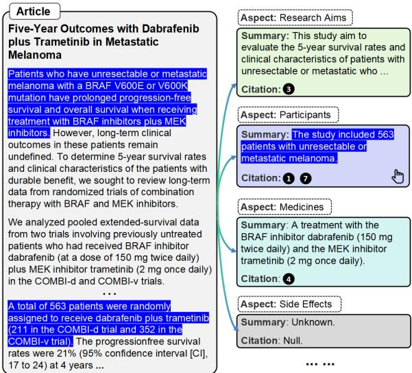  
Figure 1: Schematic diagram of the TRACSUM task, where aspect-based summaries are enriched with sentence-level citations linking back to their corresponding source sentences in the medical article.

Document summarization condenses the input document into a concise and coherent text that retains salient information (Narayan et al., 2018; Zheng et al., 2020; Wang et al., 2022; Zhang et al., 2023b). Recent advancements in document summarization methods have shown promising results in generating overall summaries (Rush et al., 2015; Cheng and Lapata, 2016; See et al., 2017; Paulus et al., 2018). However, when users refer to the same article, their areas of focus can vary significantly (Zhong et al., 2021; Goyal et al., 2022; Zhang et al., 2023b). Rather than an overall summary, they are often more interested in obtaining summaries focused on specific aspects (Yang et al., 2023; Takeshita et al., 2024; Guo and Vosoughi, 2024). Therefore, generating aspect-based summaries to meet diverse user preferences is a natural and important capability for modern summarization systems (Xu et al., 2023; Kolagar and Zarcone, 2024; Takeshita et al., 2024).

Moreover, most current studies in this field (Zhang et al., 2023a,b; Takeshita et al., 2024) focus on unidirectional summarization with LLMs (i.e., article summary). Despite their potential, stateof-the-art LLMs still struggle with factual inaccuracies (Mallen et al., 2023; Min et al., 2023), which pose significant risks when healthcare professionals rely on these summaries for treatment decisions (Burns et al., 2011; Xie et al., 2024). By providing referenced source texts from which summaries are derived (i.e., article summary), users can more easily locate relevant context and verify the generated content, thereby mitigating such concerns (Kambhamettu et al., 2024; Xie et al., 2024; Deng et al., 2024). Therefore, traceable summarization (i.e., article  summary) becomes especially crucial given that summarization systems can generate hallucinated content (Dhuliawala et al., 2024).

To address these two concerns, we introduce TRACSUM, a novel summarization task that generates structured summaries of clinical articles across seven key medical aspects, as shown in Figure 1. These structured summaries not only provide flexibility to meet diverse informational needs but also enable cross-study comparisons, supporting a more comprehensive synthesis of evidence for clinical decision-making. In addition, TRACSUM extends the task by identifying the sentences cited by the summary. In real-world scenarios, this sentencelevel traceable summarization enables users to locate the relevant context and verify the generation. Overall, our key contributions are as follows:

Contribution 1: We propose TRACSUM, a novel benchmark for generating structured summaries of clinical articles across seven key aspects, enriched with sentence-level citations for each summary. To support this task, we construct a new dataset by annotating 500 clinical abstracts, resulting in 3.5K summary–citations pairs (§3).

Contribution 2: We introduce a fine-grained automatic evaluation framework tailored for this task, which assesses the completeness and consistency of the system output by measuring the recall and precision of both generated facts and their corresponding sentence-level citations (§4).

Contribution 3: Inspired by Chain-of-thought (CoT) reasoning (Wei et al., 2022), we propose a summarization pipeline, TRACK-THEN-SUM, which consists of a tracker  and a summarizer . The tracker identifies source sentences relevant to a specific aspect, and the summarizer condenses them into a short summary (§5).

Contribution 4: We evaluate a diverse set of closed- and open-source LLMs on TRACSUM, and conduct a human evaluation to assess the outputs produced by our fine-grained evaluation method. The findings demonstrate that TRACSUM can serve as an effective benchmark for traceable, aspectbased summarization in the medical domain (§6).

## 2 Related Work

## 2.1 Aspect-Based Summarization

Articles describing clinical trials often present information aligned with fixed core aspects, such as PICO<sup>2</sup> elements (Richardson et al., 1995; Schiavenato and Chu, 2021), which represent essential components of medical evidence (Jin and Szolovits, 2018; Joseph et al., 2024). Generating structured summaries for these elements offers flexibility to address diverse informational needs and facilitates cross-study comparisons (Yang et al., 2023; Takeshita et al., 2024), enabling a comprehensive synthesis of evidence for clinical decision-making. To support fine-grained summarization, this work builds upon the PICO framework to generate structured summaries that cover seven medical aspects commonly reported in clinical articles.

## 2.2 Traceable Summarization

Identifying the citations that summaries rely on can help users verify their accuracy (Gao et al., 2023; Xie et al., 2024), particularly in high-stakes domains such as medicine. To support critical examination of summaries and their underlying sources, Kambhamettu et al. (2024) introduced a simple interaction primitive called “traceable text.” In the domain of Question Answering (QA), Gao et al. (2023) showed that enabling LLMs to generate text with passage-level citations improves factual correctness and verifiability. Moreover, several studies on retrieval-augmented generation (RAG) approaches can support document- or paragraph-level traceability (Wang et al., 2024b; Xu et al., 2024; Wang et al., 2024a). Building on this prior work, our research introduces sentence-level traceability of summaries generated by summarization systems, allowing users to directly inspect the source content that supports each summarized aspect.

## 3 TRACSUM Benchmark

## 3.1 Task Description

Given a clinical article and a specific medical aspect, TRACSUM requires summarization systems to generate an aspect-based summary along with the corresponding sentence-level citations from which the summary is derived. Formally, let the input article $d = [ c _ { 1 } , c _ { 2 } , . . . , c _ { n } ]$ be a sequence of uniquely indexed sentences, and let a be a target aspect selected from predefined aspects (§3.2.1). The system ( ′, sum′ d, a) is expected to generate an aspect-specific summary sum′ and a set of cited sentences $\mathcal { C } ^ { \prime } = [ c _ { 1 } ^ { \prime } , c _ { 2 } ^ { \prime } , . . . , c _ { k } ^ { \prime } ]$ , where $c _ { i } ^ { \prime }$ refers to the index of a sentence in d that supports the summary. If the article contains no information relevant to the given aspect, the system should output sum′ “Unknown” and $\mathcal { C } ^ { \prime }  \mathrm { \ " N u l l \ " }$

## 3.2 Dataset Collection

## 3.2.1 Medical Aspects

Building on the PICO framework (§2.1), we define as a set of seven medical aspects commonly reported in clinical articles (as listed in Table 1).

<table><tr><td>Symbol</td><td>Aspect</td><td>Description</td></tr><tr><td>A</td><td>Aims</td><td>Objective</td></tr><tr><td>I</td><td>Intervention</td><td>Treatment Method</td></tr><tr><td>0</td><td>Outcomes</td><td>Results of Predefined Variables</td></tr><tr><td>P</td><td>Participants</td><td>E.g., Diseases, Number</td></tr><tr><td>M</td><td>Medicine</td><td>E.g., Name, Dosage</td></tr><tr><td>D</td><td>Duration</td><td>Treatment Duration</td></tr><tr><td>S</td><td>Side Effects</td><td>Observed Adverse Events</td></tr></table>

Table 1: Definition of seven medical aspects.

## 3.2.2 Source Articles

We initially screened 741 medical abstracts from PubMed<sup>3</sup>, of which 500 were ultimately included. The screening criteria were as follows: (1) the study focuses on melanoma; (2) the publication date is within the past 10 years; (3) the article is written in English; (4) the study is classified as either a Clinical Trial or a Randomized Controlled Trial; and (5) the article is published in a journal ranked in Q1 or Q2 according to the Journal Citation Reports (JCR) (Clarivate Analytics, 2024).

## 3.2.3 Initial Generation With Mistral Large

Manual dataset annotation is often costly and susceptible to stylistic inconsistencies. Consequently, leveraging LLMs to generate supervised datasets has gained popularity due to their strong zero-shot performance (Chen et al., 2024; Asai et al., 2024). In this work, we automatically constructed a draft dataset by prompting Mistral Large (Mistral AI, 2025) to summarize 500 included abstracts, resulting in 3.5K summary–citations pairs, which were subsequently evaluated by human experts using three qualitative metrics (§3.2.4). The prompt structure comprises an abstract, a target aspect, and a type-specific instruction, followed by two demonstration examples. If the abstract lacks relevant information for the specified aspect, the model is instructed to return “Unknown” without generating any alternative response. An example of prompt templates is illustrated in Table 15 in §G.

## 3.2.4 Annotation Process

We recruited six annotators, including three medical students and three NLP researchers, who were compensated in accordance with minimum wage standards in Germany. The annotation process was carried out in two phases. In the first phase, annotators independently evaluated all data instances. In the second phase, data instances that received lower evaluation scores were manually revised. The full annotation guideline is described in §A.

Phase I: Evaluation. To ensure consistency in writing style, each data instance was independently evaluated by two independent annotators, one from the medical domain and one from the NLP domain. The annotators assessed each data instance using three qualitative evaluation metrics (as shown in Table 2) on a 5-point Likert scale, as detailed in §A.4. Evaluating a single article typically takes 10–15 minutes, depending on its complexity.

<table><tr><td>Metric</td><td>Description</td></tr><tr><td>Completeness</td><td>Does the generated summary include all facts for the given aspect?</td></tr><tr><td>Conciseness</td><td>Does the generated summary include any irrelevant or erroneous information?</td></tr><tr><td>Traceability</td><td>Do the citations accurately and sufficiently ground the generated summary?</td></tr></table>

Table 2: Qualitative evaluation metrics.

Phase II: Revision. Out of the 3.5K evaluated data instances, we filtered out 741 (21%) that required further revision. The filtering criteria were as follows: (1) the mean score for any of the three evaluation metrics was below 3.5, or (2) the score difference between annotators exceeded 2.0. Annotators were then instructed to revise both the summaries and their corresponding citations, as illustrated in Figure 8 in §A.

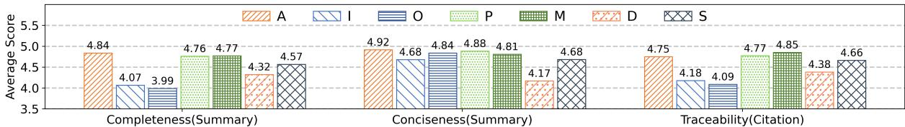  
Figure 2: Human evaluation results (5-point scale) across three qualitative metrics for the seven medical aspects. Completeness and Conciseness for summary evaluation, and Traceability for citation evaluation.

## 3.3 Quality Analysis

To analyze the dataset’s quality, we conducted a statistical analysis of the human evaluation results. Before filtering, the scores across all aspects and metrics are generally above 4.0 (as shown in Figure 2), indicating high overall quality. Of the 741 (21%) filtered instances, 197 concern the O (Outcomes), 174 the I (Intervention), and 171 the D (Duration), suggesting that Mistral Large’s summaries diverge most from human judgment on these three aspects, possibly due to the relatively complex information in the source texts. To assess interannotator agreement (IAA), we report exact match accuracy, within-one accuracy, and mean absolute error, following prior work (Attali and Burstein, 2006; Zhang and Zhou, 2007). The statistical analysis revealed high agreement under the within-one accuracy metric (84.9%), despite a lower exact match accuracy (66.6%) and a mean absolute error of 0.56, indicating acceptable consistency with only minor scoring discrepancies.

## 3.4 Characteristics of the Dataset

Among the 500 abstracts, the average length is 319.89 tokens, with abstract lengths ranging from 25 to 1,104 tokens. Each abstract contains an average of 10.42 sentences, spanning from 1 to 32. In the dataset of 3.5K data instances, 2,862 are positive and 638 are negative<sup>4</sup>. The positive summaries average 28.06 tokens in length, with a range from 3 to 77 tokens. On average, each positive summary cites 1.78 sentences, with a range from 1 to 7. Example data instances are presented in Table 14 (see §F), and more characteristics are described in §B.

## 4 Automatic Evaluation Framework

Clinical texts have two essential characteristics: (1) it must be entirely complete, with no omissions and (2) it must be fully accurate, without any errors (Gao et al., 2023; Xie et al., 2024). In line with these considerations, we propose a finegrained evaluation framework for this new task by extending the methodology of Xie et al. (2024) and Gao et al. (2023), which evaluate completeness (§4.1) and conciseness (§4.2) of generated content through a suite of metrics, as illustrated in Figure 3. Unlike their original definitions, our approach incorporates citation recall and precision to evaluate completeness and conciseness. Before computing these metrics, we first check whether the cited sentences entail the generated summary.

## 4.1 Completeness Evaluation

Building on characteristic (1) of clinical texts, we evaluate completeness — the extent to which clinically significant information is preserved in the system output. Unlike previous work (Van Veen et al., 2023), which assigns an overall score, our approach emphasizes identifying which specific salient information is retained or omitted. As described in §3.1, TRACSUM requires a summarization system to produce both a summary and its associated citations. To evaluate completeness, we introduce claim recall to assess summary content and citation recall to assess citation coverage.

Claim Recall: Following DOCLENS (Xie et al., 2024), we decompose each reference into a list of atomic subclaims using a decomposition model, where each subclaim represents a single factual statement from the reference. Let sum denote the reference, $\mathcal { L } _ { s u m }$ the set of reference subclaims, and sum′ the system-generated summary. We employ a natural language inference (NLI) model to evaluate whether each subclaim $l \in \mathcal { L } _ { s u m }$ is entailed by sum′. Claim recall is computed as $\begin{array} { r } { \frac { 1 } { \left| \mathcal { L } _ { s u m } \right| } \sum _ { l \in \mathcal { L } _ { s u m } } \mathbb { I } [ s u m ^ { \prime } \Rightarrow l ] } \end{array}$ , where $\mathbb { I } [ s u m ^ { \prime } \Rightarrow l ]$ is an indicator function that returns 1 if sum′ entails l, and 0 otherwise.

Citation Recall: In contrast to previous approaches (Gao et al., 2023; Liu et al., 2023; Xie et al., 2024), which consider citations valid if the cited sentences collectively support the summary, our method assesses whether each cited sentence independently supports the output. Let  be the set of citations in the reference and $\mathcal { C } ^ { \prime }$ the set in the system output. A citation is considered recalled if it satisfies the following two conditions: (1) the cited sentence supports the generated summary (c  sum′); and (2) the citation is present in the reference $( c \in { \mathcal { C } } )$ . Citation recall is formally defined as $\begin{array} { r } { \frac { 1 } { | { \mathcal { C } } | } \sum _ { c \in { \mathcal { C } } ^ { \prime } } \mathbb { I } [ c \in { \mathcal { C } } \land c \to s u m ^ { \prime } ] } \end{array}$

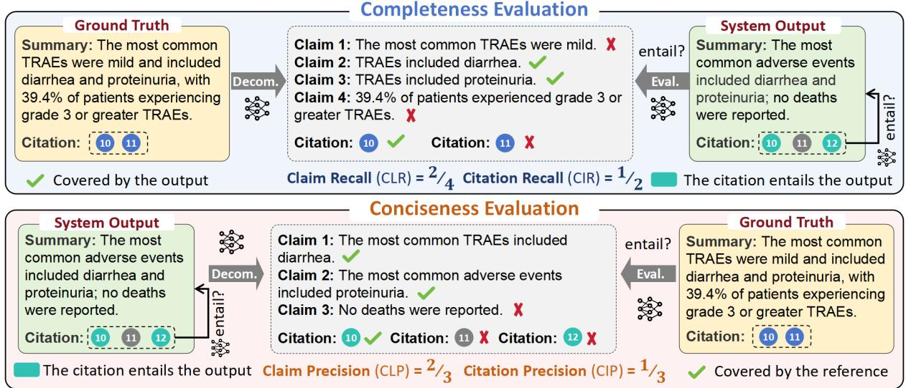  
Figure 3: Overview of the automatic evaluation framework. Completeness is assessed using Claim Recall and Citation Recall, while conciseness is measured by Claim Precision and Citation Precision. Decom. denotes the claim decomposition model, and Eval. refers to the entailment evaluator.

## 4.2 Conciseness Evaluation

In line with characteristic (2), an ideal system output should avoid redundant or incorrect information. We evaluate conciseness as the proportion of generated content that is both factually accurate and salient. To this end, we use two metrics: claim precision, which assesses the informativeness and factual accuracy of the summary, and citation precision, which captures citation redundancy.

Claim Precision: Analogous to claim recall, we first decompose the generated summary into a list of subclaims, then use an evaluator to compute the proportion of these subclaims that are entailed by the reference. Claim precision is defined as $\begin{array} { r } { \frac { 1 } { \left. \mathscr { L } ^ { \prime } { } _ { s u m } \right. } \sum _ { l \in \mathscr { L } ^ { \prime } { } _ { s u m } } \mathbb { I } [ s u m \Rightarrow l ] } \end{array}$ , where $\mathcal { L ^ { ' } } _ { y }$ denotes the set of subclaims extracted from the generated summary sum′.

Citation Precision: To assess whether the output includes unnecessary citations, we introduce citation precision. In line with citation recall, a citation is deemed valid if it satisfies both previously defined conditions $( c \in \mathcal { C } \wedge c \to s u m ^ { \prime } )$ . Citation precision is then calculated as the proportion of system-generated citations that fulfill these criteria.

Algorithm 1: TRACK-THEN-SUM Inference   
Require: Tracker , Summarizer   
Input: article $d = \{ c _ { 1 } , c _ { 2 } , . . . , c _ { n } \}$ and aspect a   
Output: summary sum and its citations ′   
1: ′ ;   
2: foreach $c \in \{ c _ { 1 } , c _ { 2 } , . . . , c _ { n } \}$   
3:  predict relevance given (a, c);   
4: if relevance == Yes then append c to ′;   
5: summary sum′ (a, ′) or (a, ( ′ f.));  
Algorithm 1: TRACK-THEN-SUM inference process.

## 5 Baseline Method

In this section, we introduce our baseline method, TRACK-THEN-SUM (TTS), which consists of a tracker and a summarizer (available in two variants), as illustrated in Figure 10 in §C. The training procedure is detailed in §C.1.

## 5.1 Inference Overview

The TRACK-THEN-SUM generation pipeline contains two phases: tracking and summarization. In the first phase, identifies the sentences most relevant to the given aspect. In the second phase, generates a concise summary based on the selected sentences. Finally, the summary and citations are merged into the output, as shown in Algorithm 1.

## 5.2 Tracker

Data Collection: We first applied sentence tokenization to each abstract in the training set. For each sentence, we generated $( c , a )$ pairs by combining it with every predefined aspect $a \in { \mathcal { A } } .$ . Each pair was labeled with a binary variable y based on the corresponding citations field: if the sentence index appeared in the citations associated with aspect a, we assigned $y = 1$ ; otherwise, $y = 0$ . The resulting training dataset is denoted as $\mathcal { D } _ { \mathcal { T } }$

Training: Given the constructed dataset $\mathcal { D } _ { \mathcal { T } }$ , we initialized tracker $\tau$ using a pre-trained language model (LM) as the backbone. The model was subsequently fine-tuned on $\mathcal { D } _ { \mathcal { T } }$ using a standard binary classification objective which maximizes the loglikelihood of the observed labels:

$$
\operatorname* { m a x } _ { \mathcal { T } } \mathbb { E } _ { ( ( c , a ) , y ) \sim \mathcal { D } _ { \mathcal { T } } } \log p _ { \mathcal { T } } ( y \mid ( c , a ) )
$$

## 5.3 Summarizer

Data Collection: For each summary sum in the training set, we extracted related sentences from the abstract based on the citations field to form the set $\mathcal { C } .$ . Each $\mathcal { C }$ was paired with its associated aspect a, and combined with the sum to form $( ( \mathcal { C } , a )$ , sum). The resulting training dataset is denoted as $\mathcal { D } _ { \cal S }$

Training: Similar to the training of $\tau$ , we initialized summarizer $s$ using a pre-trained LM as the backbone. We then fine-tuned summarizer on $\mathcal { D } _ { \cal S }$ using a standard next-token prediction objective, which maximizes the likelihood of generating the target summary sum given the input $( \mathcal { C } , a )$ pair:

$$
\operatorname* { m a x } _ { S } \mathbb { E } _ { ( ( \mathcal { C } , a ) , s u m ) \sim \mathcal { D } _ { S } } \log p _ { \mathcal { S } } ( s u m \mid C , a )
$$

To investigate the impact of incorporating full context (denoted as $f . )$ , we trained a variant that generates a summary given the input $( \mathcal { C } \oplus f . , a )$

## 6 Experiment

In this section, we aim to address the following research questions: RQ1: How effective is TRACSUM as a benchmark for evaluating LLMs in aspect-based summarization with sentence-level traceability? RQ2: To what extent does the proposed evaluation method align with human judgment, and what role does the evaluator play in this process? RQ3: Which factors most significantly impact the accuracy of traceable summarization? To address these questions, we begin by conducting a preliminary evaluation of several LLMs, including both proprietary models (e.g., GPT-4o (Hurst et al., 2024)) and open-source models (e.g., LLaMA-3.1 (Grattafiori et al., 2024), Mistral (Jiang et al., 2024), and Gemma-3 (Team et al., 2025)).

## 6.1 Experimental Setting

Data Preparation: The TRACSUM dataset was randomly split into training and test sets with an

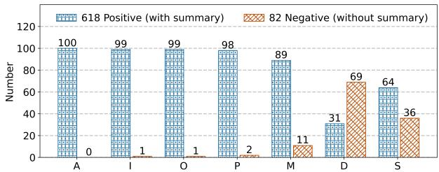  
Figure 4: Distribution of test data across seven aspects.

8:2 ratio. We examined the distribution of samples in the test set across the seven predefined aspects, along with the proportion of positive and negative instances for each, as shown in Figure 4. The results show that while nearly all abstracts contain information related to Aims (A), Intervention (I), and Outcomes (O), only 31% explicitly mention the Duration (D) aspect. The baseline model was fine-tuned on the training set, and both the baseline and LLMs were evaluated on the test set.

Backbone Model Selection: The TRACK-THEN-SUM (TTS) pipeline comprises two components (Tracker  and Summarizer ) that can be initialized with any pre-trained LM. For consistency and ease of deployment, we adopt Llama-3.1-8B (Dubey et al., 2024) as the backbone for both components, with the training details provided in §C.1.

LLMs and Prompt Setting: We selected several widely used instruction-following LLMs for evaluation, as listed in Table 3. All models were evaluated using a two-shot prompting strategy, with each prompt containing one positive and one negative example. To ensure consistency, each model was prompted using its official input format with identical content (see Table 15 in §G), and a fixed temperature of 1.0 was used across all generations. Larger models were accessed via their official APIs, incurring additional usage costs (see §D).

Evaluation Setting: In the preliminary experiment, we adopt Mistral Large (Mistral AI, 2024) as the decomposition model , which is used to break down both the system-generated and reference summaries into a set of atomic subclaims. For the entailment evaluation, we utilize TRUE (Honovich et al., 2022) as the evaluator ϕ. Let $\phi ( p , h )$ denote the output of the NLI model, where the value is 1 if the premise p entails the hypothesis h, and 0 otherwise. The computation process of the evaluation metrics is presented in Algorithm 2.

## 6.2 Preliminary Results

Comparison of LLMs: Table 3 shows the evaluation results of various LLMs along with our proposed method (in two variants). We observe the following: (1) Larger open-source models (e.g., LLaMA-3.1-70B, Mistral-8x7B) consistently outperform smaller ones across all metrics. (2) Proprietary models like GPT-4o and GPT-4o-mini also perform well, with only small differences between them. (3) Our proposed method, fine-tuned from LLaMA-3.1-8B, shows clear improvements over both the base model and other LLMs, particularly on the two citation-based metrics CIR and CIP ( 74.0%), demonstrating their strength in identifying supporting source sentences.

Algorithm 2: Computation Process of Evaluation Metrics   
Require: decomposition model: , NLI model: ϕ   
Input: system output $( s u m ^ { \prime } , \mathcal { C } ^ { \prime } )$ , reference $( s u m , \mathcal { C } )$   
Output: CLR, CIR, CLP, CIP   
1: $m \gets 0 ;$   
2: $\{ l _ { 1 } , l _ { 2 } , . . . , l _ { n } \} \gets \mathcal { E } ( s u m ) ;$   
3: foreach $l _ { i } \in \{ l _ { 1 } , l _ { 2 } , . . . , l _ { n } \}$   
4: ${ \mathrm { i f ~ } } \phi ( s u m ^ { \prime } , l _ { i } ) = = 1$ then m++;   
5: CLR $ m / | \{ l _ { 1 } , l _ { 2 } , . . . , l _ { n } \} |$   
6: $m \gets 0 ;$   
7: foreach $c _ { i } ^ { \prime } \in \mathcal { C } ^ { \prime }$   
8: foreach $l _ { i } ^ { \prime } \in \{ l _ { 1 } ^ { \prime } , l _ { 2 } ^ { \prime } , . . . , l _ { n } ^ { \prime } \}$   
9: $\mathrm { i f } \phi ( c _ { i } ^ { \prime } , \hat { l _ { i } ^ { \prime } } ) = = 1$ then m++; break;   
10: $\mathbf { C I R } \gets m / | \mathcal { C } | ; \mathbf { C I P } \gets m / | \mathcal { C } ^ { \prime } | ;$   
11: $\{ l _ { 1 } ^ { \prime } , l _ { 2 } ^ { \prime } , . . . , l _ { n } ^ { \prime } \} \gets \mathscr { E } ( s u m ^ { \prime } ) ;$   
12: m 0;   
13: foreach $l _ { i } ^ { \prime } \in \{ l _ { 1 } ^ { \prime } , l _ { 2 } ^ { \prime } , . . . , l _ { n } ^ { \prime } \}$   
14: if ϕ(sum, $\overset { \cdot } { l _ { i } ^ { \prime } } ) = = 1$ then m++;   
15: $\mathbf { C L P } \gets m / | \{ l _ { 1 } ^ { \prime } , l _ { 2 } ^ { \prime } , . . . , l _ { n } ^ { \prime } \} | ;$   
Algorithm 2: Computation process of evaluation met  
rics. CLR: Claim Recall. CIR: Citation Recall. CLP:   
Claim Precision. CIP: Citation Precision.

Performance on Completeness and Conciseness: As shown in Table 3, LLMs generally perform better on completeness than on conciseness, suggesting a tendency to generate content that exceeds the scope of the reference data. This may be due to full context visibility during generation, which can cause the models to include content only loosely related to the target aspects.

Does Full Context Help? In the TTS pipeline, we extend the input to the summarizer  by including not only the tracked sentences but also the full context (i.e., the abstract). This modification allows the TTS  f. variant to improve the claim recall CLR $( 6 7 . 1 \% \to \ 7 9 . 8 \% )$ of the generated summaries without substantially compromising performance on other metrics. With the tracker output unchanged, the observed gains may stem from the full context offering useful explanations for abbreviations or domain-specific terminology, thereby helping better interpret the tracked sentences. A detailed case analysis is provided in §E.1.

<table><tr><td rowspan="2">Method</td><td colspan="2">Completeness</td><td colspan="2">Conciseness</td><td colspan="2">F1 Score</td></tr><tr><td>CLR</td><td>CIR</td><td>CLP</td><td>CIP</td><td> $\overline { { F _ { 1 } ^ { \mathrm { c l . } } } }$ </td><td> $\overline { { F _ { 1 } ^ { \mathrm { c i . } } } }$ </td></tr><tr><td>Llama-3.1-8B</td><td>59.2</td><td>62.5</td><td>63.6</td><td>54.8</td><td>61.3</td><td>58.4</td></tr><tr><td>Llama-3.1-70B</td><td>74.7</td><td>77.9</td><td>71.3</td><td>67.7</td><td>72.9</td><td>72.4</td></tr><tr><td>Mistral-7B</td><td>59.1</td><td>59.5</td><td>55.5</td><td>48.4</td><td>57.4</td><td>53.4</td></tr><tr><td>Mistral-8x7B</td><td>61.1</td><td>62.1</td><td>58.9</td><td>58.4</td><td>60.0</td><td>60.2</td></tr><tr><td>Gemma3-12B</td><td>62.8</td><td>66.0</td><td>58.3</td><td>55.3</td><td>60.5</td><td>60.2</td></tr><tr><td>Gemma3-27B</td><td>64.6</td><td>66.4</td><td>57.7</td><td>59.6</td><td>61.0</td><td>63.0</td></tr><tr><td>GPT-40</td><td>74.0</td><td>78.2</td><td>66.2</td><td>63.8</td><td>69.9</td><td>70.3</td></tr><tr><td>GPT-4o-mini</td><td>67.8</td><td>76.0</td><td>67.6</td><td>68.4</td><td>67.7</td><td>72.0</td></tr><tr><td>TTS</td><td>67.1</td><td>76.2</td><td>68.4</td><td>77.0</td><td>67.8</td><td>76.6</td></tr><tr><td>TTS ⊕ f.</td><td>79.8</td><td>74.6</td><td>67.2</td><td>75.0</td><td>73.0</td><td>74.8</td></tr></table>

Table 3: Preliminary evaluation results (%). Bold values indicate the best performance in each metric, underlined values indicate the second-best, and wave underlined values indicate the third-best. $f .$ denotes the configuration where the full context is concatenated to the input of the summarizer . $F _ { 1 } ^ { \mathrm { c l . } }$ <sup>.</sup> and $F _ { 1 } ^ { \mathrm { c i . } }$ <sup>.</sup> represent the F1 scores for claim and citation prediction, respectively.

## 6.3 Agreement with Human Evaluation

To address first sub-question of RQ2, we conducted a human evaluation and measured the agreement between human judgments and the automatic evaluation scores produced by the NLI model (TRUE) using Spearman’s correlation coefficient (ρ) (Kendall and Gibbons, 1990) and Pearson’s correlation coefficient (r) (Sheskin, 2003). We randomly sampled ten abstracts from the test set, and the annotator followed the procedure in Algorithm 2 to evaluate outputs from our TTS $f .$ , as shown in Table 4. The results show an average Spearman’s $\rho = 0 . 6 1 2$ and Pearson’s $r = 0 . 5 7 7$ , indicating a moderate positive correlation between automatic evaluation and human judgments. This suggests that our proposed evaluation framework aligns reasonably well with human assessments, while still leaving room for improvement. A detailed comparison of the final evaluation results is provided in §E.2.

Reference: Subclaims Citations  1, 5   
1. The study included 533 patients.   
2. The patients were treatment-naive.   
3. The patients had unresectable stage III-IV melanoma.   
TTS f. Output: Subclaims Citations  1, 3, 5   
1′. The study involved treatment-naive patients.   
2′. The patients had unresectable stage III-IV melanoma.   
3′. 533 patients received nivolumab plus ipilimumab.   
$\begin{array} { r } { \operatorname { N L I } : r e f e r e n c e  s 1 ^ { \prime } , s 2 ^ { \prime } \downarrow  s 3 ^ { \prime } \acute { x } } \end{array}$ CLR: 66.7%   
Human: reference s1′, s2′, s3′ CLR: 100%   
Reason: "533 patients" is found in the reference.   
Table 4: A case comparing automatic and human evalu  
ation of claim recall (PMID: 37307514, Aspect: P).

## 6.4 Aspect-Wise Performance Analysis

To analyze the performance of the TTS f. variant across the seven aspects, we grouped the data by aspect and computed the four evaluation metrics for each group, as shown in Table 5. We observed substantial variation in the model’s performance across different aspects. Notably, aspects O (Outcomes) and I (Intervention) received lower scores across all four evaluation metrics, likely because the corresponding abstracts often contain a large number of relevant sentences, making precise extraction more challenging. In contrast, aspect D (Duration) achieved relatively higher scores, possibly due to the fact that 69% of its test instances are negative cases (i.e., both the summary and citation are null), which simplifies the task and makes correct predictions easier for the model.

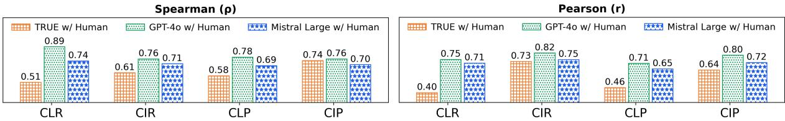  
Figure 5: Spearman (ρ) and Pearson (r) correlations between evaluators and human scores across four metrics.

<table><tr><td rowspan="2">Aspect</td><td colspan="2">Completeness</td><td colspan="2">Conciseness</td><td colspan="2">F1 Score</td></tr><tr><td>CLR</td><td>CIR</td><td>CLP</td><td>CIP</td><td>F1l.</td><td>F1i.</td></tr><tr><td>A</td><td>86.3</td><td>83.2</td><td>71.8</td><td>89.8</td><td>78.4</td><td>86.4</td></tr><tr><td>I</td><td>69.8</td><td>61.4</td><td>51.0</td><td>47.6</td><td>58.9</td><td>53.4</td></tr><tr><td>0</td><td>61.4</td><td>50.2</td><td>48.7</td><td>50.1</td><td>54.2</td><td>50.1</td></tr><tr><td>P</td><td>87.7</td><td>78.4</td><td>80.2</td><td>84.2</td><td>83.7</td><td>81.3</td></tr><tr><td>M</td><td>85.4</td><td>71.9</td><td>75.1</td><td>73.3</td><td>79.9</td><td>72.6</td></tr><tr><td>D</td><td>92.2</td><td>93.6</td><td>81.4</td><td>93.2</td><td>86.4</td><td>93.3</td></tr><tr><td>S</td><td>75.8</td><td>83.5</td><td>62.2</td><td>86.8</td><td>68.3</td><td>85.0</td></tr><tr><td>Avg.</td><td>79.8</td><td>74.6</td><td>67.2</td><td>75.0</td><td>73.0</td><td>74.8</td></tr></table>

Table 5: Aspect-wise performance of method TTS f.

## 6.5 Ablation Studies

Comparison of Entailment Evaluators: To address the second sub-question of RQ2, we experiment with two additional instruction-following LLMs as entailment evaluators: the proprietary GPT-4o (Hurst et al., 2024) and the open-source Mistral-Large (Mistral AI, 2025). Building on the experimental setup described in §6.3, we replace the TRUE model with each of these evaluators to assess the outputs generated by the TTS f. variant. The experiment procedure and results are described in §E.3. We then compute Spearman’s ρ and Pearson’s r to quantify their agreement with human judgments in four metrics, as presented in Figure 5. Our findings reveal that: (1) both GPT-4o $( \rho = 0 . 8 0 ; r = 0 . 7 7 )$ and Mistral-Large $( \rho = 0 . 7 1 ; r = 0 . 7 0 )$ show substantially stronger alignment with human judgments compared to TRUE $( \rho = 0 . 6 1 ; r = 0 . 5 7 )$ ; and (2) GPT-4o achieves a higher correlation with human judgments than Mistral-Large. We found that GPT-4o is better at understanding abbreviations. For instance, it correctly infers that the reference “50 participants were randomized: 23 to observation and 27 to radiation therapy” entails the subclaim “27 participants were assigned to the RT group”, whereas Mistral and TRUE do not.

The Effect of Tracking Order: To address RQ3, we design two variants by modifying the position of the tracker : (i) SUM-THEN-TRACK (STT) places after the summarizer , where first generates an aspect-based summary, and  then retrieves source sentences relevant to that summary; (ii) END-TO-END (ETE) removes the tracker entirely and fine-tunes a single model to generate both summary and citations. The experimental procedures are detailed in §C. We evaluated STT and ETE on the test set, with results shown in Table 6. We observe that: (1) removing the tracker results in a decline in citation-based performance, highlighting the importance of explicit sentence tracking; and (2) while STT improves claim recall, it performs worse on other metrics, likely due to its dependence on pre-generated summaries, which may introduce noise or inaccuracies. These findings emphasize the importance of incorporating tracking early in the summarization process.

<table><tr><td rowspan="2">Method</td><td colspan="2">Completeness</td><td colspan="2">Conciseness</td><td colspan="2">F1 Score</td></tr><tr><td>CLR</td><td>CIR</td><td>CLP</td><td>CIP</td><td>F1l.</td><td>F1i.</td></tr><tr><td>TTS ⊕ f.</td><td>79.8</td><td>74.6</td><td>67.2</td><td>75.0</td><td>73.0</td><td>74.8</td></tr><tr><td>ETE</td><td>80.1</td><td>72.6</td><td>64.1</td><td>71.2</td><td>71.2</td><td>71.9</td></tr><tr><td>STT</td><td>81.2</td><td>62.2</td><td>58.1</td><td>66.4</td><td>67.7</td><td>64.1</td></tr></table>

Table 6: Comparison of the three tracking order variants.

## 7 Conclusion

Motivated by growing concerns over the factual accuracy of system-generated summaries in the medical domain, we present TRACSUM, a novel benchmark for aspect-based summarization that incorporates sentence-level citations. This enables users to trace source content and verify the factual consistency of generated information. Experimental results, which show strong alignment with human judgments, demonstrate that TRACSUM can serve as a reliable benchmark for assessing both the completeness and conciseness of summaries and their citations. Furthermore, we also observe that explicitly performing sentence-level tracking prior to summarization enhances generation accuracy, while incorporating the full context further improves summary completeness.

## Limitations

Our research marks a significant step toward evaluating sentence-level traceability in aspect-based summarization. Nonetheless, it has certain limitations. The dataset in TRACSUM was initially generated by Mistral Large. While this approach helped reduce time and cost, it may also introduce model-specific biases. To address this concern, we implemented two mitigation strategies: (i) we conducted two rounds of human evaluation, followed by manual revision of samples with low scores or inconsistent annotations; and (ii) we excluded Mistral Large from the list of evaluated models to avoid unfair advantages or confirmation bias.

## Acknowledgments

This project is supported by the project WisPerMed (AI for Personalized Medicine), funded by the German Science Foundation (DFG) as RTG 2535.

## References

Akari Asai, Zeqiu Wu, Yizhong Wang, Avirup Sil, and Hannaneh Hajishirzi. 2024. Self-RAG: Learning to retrieve, generate, and critique through self-reflection. In The Twelfth International Conference on Learning Representations.

Yigal Attali and Jill Burstein. 2006. Automated essay scoring with e-rater® v. 2. The Journal ofTechnology, Learning and Assessment, 4(3).

Jacob Benesty, Jingdong Chen, Yiteng Huang, and Israel Cohen. 2009. Pearson correlation coefficient. Noise reduction in speech processing, pages 1–4.

Patricia B Burns, Rod J Rohrich, and Kevin C Chung. 2011. The levels of evidence and their role in evidence-based medicine. Plastic and reconstructive surgery, 128(1):305–310.

Jiawei Chen, Hongyu Lin, Xianpei Han, and Le Sun. 2024. Benchmarking large language models in retrieval-augmented generation. In Proceedings of the AAAI Conference on Artificial Intelligence, volume 38, pages 17754–17762.

Jianpeng Cheng and Mirella Lapata. 2016. Neural summarization by extracting sentences and words. In Proceedings of the 54th Annual Meeting of the Associationfor Computational Linguistics (Volume 1: Long Papers), pages 484–494, Berlin, Germany. Association for Computational Linguistics.

Clarivate Analytics. 2024. Journal Citation Reports. Accessed: 2024-03-12.

Zhenyun Deng, Michael Schlichtkrull, and Andreas Vlachos. 2024. Document-level claim extraction and decontextualisation for fact-checking. In Proceedings of the 62nd Annual Meeting of the Association for Computational Linguistics (Volume 1: Long Papers), pages 11943–11954, Bangkok, Thailand. Association for Computational Linguistics.

Shehzaad Dhuliawala, Mojtaba Komeili, Jing Xu, Roberta Raileanu, Xian Li, Asli Celikyilmaz, and Jason Weston. 2024. Chain-of-verification reduces hallucination in large language models. In Findings of the Association for Computational Linguistics: ACL 2024, pages 3563–3578, Bangkok, Thailand. Association for Computational Linguistics.

Abhimanyu Dubey, Abhinav Jauhri, Abhinav Pandey, Abhishek Kadian, Ahmad Al-Dahle, Aiesha Letman, Akhil Mathur, Alan Schelten, Amy Yang, Angela Fan, et al. 2024. The llama 3 herd of models. arXiv preprint arXiv:2407.21783.

Sameh Frihat and Norbert Fuhr. 2024. Supporting evidence-based medicine by finding both relevant and significant works. arXiv preprint arXiv:2407.18383.

Tianyu Gao, Howard Yen, Jiatong Yu, and Danqi Chen. 2023. Enabling large language models to generate text with citations. In Proceedings ofthe 2023 Conference on Empirical Methods in Natural Language Processing, pages 6465–6488, Singapore. Association for Computational Linguistics.

Tanya Goyal, Nazneen Rajani, Wenhao Liu, and Wojciech Kryscinski. 2022. HydraSum: Disentangling style features in text summarization with multidecoder models. In Proceedings of the 2022 Conference on Empirical Methods in Natural Language Processing, pages 464–479, Abu Dhabi, United Arab Emirates. Association for Computational Linguistics.

Aaron Grattafiori, Abhimanyu Dubey, Abhinav Jauhri, Abhinav Pandey, Abhishek Kadian, Ahmad Al-Dahle, Aiesha Letman, Akhil Mathur, Alan Schelten, Alex Vaughan, et al. 2024. The llama 3 herd of models. arXiv preprint arXiv:2407.21783.

Xiaobo Guo and Soroush Vosoughi. 2024. Disordered-DABS: A benchmark for dynamic aspect-based summarization in disordered texts. In Findings of the Associationfor Computational Linguistics: EMNLP 2024, pages 416–431, Miami, Florida, USA. Association for Computational Linguistics.

Eduardo Hariton and Joseph J Locascio. 2018. Randomised controlled trials—the gold standard for effectiveness research. BJOG: an internationaljournal of obstetrics and gynaecology, 125(13):1716.

Janusz Hauke and Tomasz Kossowski. 2011. Comparison of values of pearson’s and spearman’s correlation coefficients on the same sets of data. Quaestiones Geographicae, 30(2):87–93.

Or Honovich, Roee Aharoni, Jonathan Herzig, Hagai Taitelbaum, Doron Kukliansy, Vered Cohen, Thomas Scialom, Idan Szpektor, Avinatan Hassidim, and Yossi Matias. 2022. TRUE: Re-evaluating factual consistency evaluation. In Proceedings ofthe 2022 Conference of the North American Chapter of the Associationfor Computational Linguistics: Human Language Technologies, pages 3905–3920, Seattle, United States. Association for Computational Linguistics.

Aaron Hurst, Adam Lerer, Adam P Goucher, Adam Perelman, Aditya Ramesh, Aidan Clark, AJ Ostrow, Akila Welihinda, Alan Hayes, Alec Radford, et al. 2024. Gpt-4o system card. arXiv preprint arXiv:2410.21276.

Albert Q Jiang, Alexandre Sablayrolles, Antoine Roux, Arthur Mensch, Blanche Savary, Chris Bamford, Devendra Singh Chaplot, Diego de las Casas, Emma Bou Hanna, Florian Bressand, et al. 2024. Mixtral of experts. arXiv preprint arXiv:2401.04088.

Di Jin and Peter Szolovits. 2018. PICO element detection in medical text via long short-term memory neural networks. In Proceedings ofthe BioNLP 2018 workshop, pages 67–75, Melbourne, Australia. Association for Computational Linguistics.

Sebastian Joseph, Lily Chen, Jan Trienes, Hannah Göke, Monika Coers, Wei Xu, Byron Wallace, and Junyi Jessy Li. 2024. FactPICO: Factuality evaluation for plain language summarization of medical evidence. In Proceedings of the 62nd Annual Meeting of the Association for Computational Linguistics (Volume 1: Long Papers), pages 8437–8464, Bangkok, Thailand. Association for Computational Linguistics.

Hita Kambhamettu, Jamie Flores, and Andrew Head. 2024. Traceable text: Deepening reading of aigenerated summaries with phrase-level provenance links. arXiv preprint arXiv:2409.13099.

Maurice G. Kendall and Jean Dickinson Gibbons. 1990. Rank Correlation Methods, 5th edition. Oxford University Press, New York.

Zahra Kolagar and Alessandra Zarcone. 2024. Hum-Sum: A personalized lecture summarization tool for humanities students using LLMs. In Proceedings of the 1st Workshop on Personalization of Generative AI Systems (PERSONALIZE 2024), pages 36–70, St. Julians, Malta. Association for Computational Linguistics.

Nelson Liu, Tianyi Zhang, and Percy Liang. 2023. Evaluating verifiability in generative search engines. In Findings ofthe Associationfor Computational Linguistics: EMNLP 2023, pages 7001–7025, Singapore. Association for Computational Linguistics.

Alex Mallen, Akari Asai, Victor Zhong, Rajarshi Das, Daniel Khashabi, and Hannaneh Hajishirzi. 2023. When not to trust language models: Investigating effectiveness of parametric and non-parametric memories. In Proceedings of the 61st Annual Meeting of

the Associationfor Computational Linguistics (Volume 1: Long Papers), pages 9802–9822, Toronto, Canada. Association for Computational Linguistics.

Iain James Marshall, Veline L’Esperance, Rachel Marshall, James Thomas, Anna Noel-Storr, Frank Soboczenski, Benjamin Nye, Ani Nenkova, and Byron C Wallace. 2021. State of the evidence: a survey of global disparities in clinical trials. BMJ global health, 6(1):e004145.

Sewon Min, Kalpesh Krishna, Xinxi Lyu, Mike Lewis, Wen-tau Yih, Pang Koh, Mohit Iyyer, Luke Zettlemoyer, and Hannaneh Hajishirzi. 2023. FActScore: Fine-grained atomic evaluation of factual precision in long form text generation. In Proceedings ofthe 2023 Conference on Empirical Methods in Natural Language Processing, pages 12076–12100, Singapore. Association for Computational Linguistics.

Mistral AI. 2024. Mistral large. Accessed: 2025-05-02.

Mistral AI. 2025. Mistral: Introducing the large language model 2407. Accessed: 2025-02-10.

Shashi Narayan, Shay Cohen, and Maria Lapata. 2018. Don’t give me the details, just the summary! topicaware convolutional neural networks for extreme summarization. In 2018 Conference on Empirical Methods in Natural Language Processing, pages 1797–1807. Association for Computational Linguistics.

Romain Paulus, Caiming Xiong, and Richard Socher. 2018. A deep reinforced model for abstractive summarization. In International Conference on Learning Representations.

W Scott Richardson, Mark C Wilson, Jim Nishikawa, and Robert S Hayward. 1995. The well-built clinical question: a key to evidence-based decisions. ACP journal club, 123(3):A12–3.

Alexander M. Rush, Sumit Chopra, and Jason Weston. 2015. A neural attention model for abstractive sentence summarization. In Proceedings of the 2015 Conference on Empirical Methods in Natural Language Processing, pages 379–389, Lisbon, Portugal. Association for Computational Linguistics.

David L Sackett. 1997. Evidence-based medicine. In Seminars in perinatology, volume 21, pages 3–5. Elsevier.

Martin Schiavenato and Frances Chu. 2021. Pico: What it is and what it is not. Nurse education in practice, 56:103194.

Abigail See, Peter J. Liu, and Christopher D. Manning. 2017. Get to the point: Summarization with pointergenerator networks. In Proceedings of the 55th Annual Meeting of the Association for Computational Linguistics (Volume 1: Long Papers), pages 1073– 1083, Vancouver, Canada. Association for Computational Linguistics.

David J. Sheskin. 2003. Handbook ofParametric and Nonparametric Statistical Procedures. Chapman and Hall/CRC.

Sotaro Takeshita, Tommaso Green, Ines Reinig, Kai Eckert, and Simone Ponzetto. 2024. ACLSum: A new dataset for aspect-based summarization of scientific publications. In Proceedings of the 2024 Conference of the North American Chapter of the Associationfor Computational Linguistics: Human Language Technologies (Volume 1: Long Papers), pages 6660–6675, Mexico City, Mexico. Association for Computational Linguistics.

Gemma Team, Aishwarya Kamath, Johan Ferret, Shreya Pathak, Nino Vieillard, Ramona Merhej, Sarah Perrin, Tatiana Matejovicova, Alexandre Ramé, Morgane Rivière, et al. 2025. Gemma 3 technical report. arXiv preprint arXiv:2503.19786.

Dave Van Veen, Cara Van Uden, Louis Blankemeier, Jean-Benoit Delbrouck, Asad Aali, Christian Bluethgen, Anuj Pareek, Malgorzata Polacin, Eduardo Pontes Reis, Anna Seehofnerova, et al. 2023. Clinical text summarization: adapting large language models can outperform human experts. Research square, pages rs–3.

Fei Wang, Kaiqiang Song, Hongming Zhang, Lifeng Jin, Sangwoo Cho, Wenlin Yao, Xiaoyang Wang, Muhao Chen, and Dong Yu. 2022. Salience allocation as guidance for abstractive summarization. In Proceedings ofthe 2022 Conference on Empirical Methods in Natural Language Processing, pages 6094–6106.

Weixuan Wang, Barry Haddow, and Alexandra Birch. 2024a. Retrieval-augmented multilingual knowledge editing. In Proceedings of the 62nd Annual Meeting ofthe Associationfor Computational Linguistics (Volume 1: Long Papers), pages 335–354, Bangkok, Thailand. Association for Computational Linguistics.

Zheng Wang, Shu Teo, Jieer Ouyang, Yongjun Xu, and Wei Shi. 2024b. M-RAG: Reinforcing large language model performance through retrieval-augmented generation with multiple partitions. In Proceedings of the 62nd Annual Meeting of the Association for Computational Linguistics (Volume 1: Long Papers), pages 1966–1978, Bangkok, Thailand. Association for Computational Linguistics.

Jason Wei, Xuezhi Wang, Dale Schuurmans, Maarten Bosma, Fei Xia, Ed Chi, Quoc V Le, Denny Zhou, et al. 2022. Chain-of-thought prompting elicits reasoning in large language models. Advances in neural information processing systems, 35:24824–24837.

Yiqing Xie, Sheng Zhang, Hao Cheng, Pengfei Liu, Zelalem Gero, Cliff Wong, Tristan Naumann, Hoifung Poon, and Carolyn Rose. 2024. DocLens: Multiaspect fine-grained medical text evaluation. In Proceedings ofthe 62nd Annual Meeting ofthe Association for Computational Linguistics (Volume 1: Long Papers), pages 649–679, Bangkok, Thailand. Association for Computational Linguistics.

Hongyan Xu, Hongtao Liu, Zhepeng Lv, Qing Yang, and Wenjun Wang. 2023. Pre-trained personalized review summarization with effective salience estimation. In Findings of the Association for Computational Linguistics: ACL 2023, pages 10743–10754, Toronto, Canada. Association for Computational Linguistics.

Shicheng Xu, Liang Pang, Mo Yu, Fandong Meng, Huawei Shen, Xueqi Cheng, and Jie Zhou. 2024. Unsupervised information refinement training of large language models for retrieval-augmented generation. In Proceedings of the 62nd Annual Meeting of the Associationfor Computational Linguistics (Volume 1: Long Papers), pages 133–145, Bangkok, Thailand. Association for Computational Linguistics.

Xianjun Yang, Kaiqiang Song, Sangwoo Cho, Xiaoyang Wang, Xiaoman Pan, Linda Petzold, and Dong Yu. 2023. OASum: Large-scale open domain aspectbased summarization. In Findings of the Association for Computational Linguistics: ACL 2023, pages 4381–4401, Toronto, Canada. Association for Computational Linguistics.

Min-Ling Zhang and Zhi-Hua Zhou. 2007. Ml-knn: A lazy learning approach to multi-label learning. Pattern recognition, 40(7):2038–2048.

Nan Zhang, Yusen Zhang, Wu Guo, Prasenjit Mitra, and Rui Zhang. 2023a. FaMeSumm: Investigating and improving faithfulness of medical summarization. In Proceedings of the 2023 Conference on Empirical Methods in Natural Language Processing, pages 10915–10931, Singapore. Association for Computational Linguistics.

Yusen Zhang, Yang Liu, Ziyi Yang, Yuwei Fang, Yulong Chen, Dragomir Radev, Chenguang Zhu, Michael Zeng, and Rui Zhang. 2023b. MACSum: Controllable summarization with mixed attributes. Transactions of the Association for Computational Linguistics, 11:787–803.

Chujie Zheng, Kunpeng Zhang, Harry Jiannan Wang, and Ling Fan. 2020. A two-phase approach for abstractive podcast summarization. arXiv preprint arXiv:2011.08291.

Ming Zhong, Da Yin, Tao Yu, Ahmad Zaidi, Mutethia Mutuma, Rahul Jha, Ahmed Hassan Awadallah, Asli Celikyilmaz, Yang Liu, Xipeng Qiu, and Dragomir Radev. 2021. QMSum: A new benchmark for querybased multi-domain meeting summarization. In Proceedings ofthe 2021 Conference ofthe North American Chapter ofthe Associationfor Computational Linguistics: Human Language Technologies, pages 5905–5921, Online. Association for Computational Linguistics.

## Appendix

A Annotation Guideline . . . . . . . . . . . . . 12   
A.1 Annotation Tool .12   
A.2 Consent Statement . 12   
A.3 Task Assignment . . 12   
A.4 Evaluation Phase . . 12   
A.5 Revision Phase . . 13   
B Characteristics of the Dataset . . . . . . . . . 13   
B.1 Source Article Length . . . 13   
B.2 Aspect Coverage in Abstracts . . . . . . . .13   
B.3 Positive and Negative Data . . . . . . . . . . 13   
B.4 Length of Traceable Summaries . . . . . 13   
C Generation Pipelines . . . . . . 13   
C.1 TRACK-THEN-SUM . . 13   
C.2 Tracker 14   
C.3 Summarizer 14   
C.4 TTS f. . 15   
C.5 SUM-THEN-TRACK . . 15   
C.6 END-TO-END .16   
D API Cost . 16   
D.1 Dataset Collection Costs 16   
D.2 Evaluation Costs 16   
E Experiment Analysis . . . . . . . . . . . . . . . . . 16   
E.1 Full Context vs. only . . . . . . . . . 17   
E.2 Agreement with Human Evaluation . . 17   
E.3 Comparison of Entailment Evaluators 18   
F Data Samples . . . . . 19   
G Instructions And Demonstration . . . . . 20   
C.1 LLM Prompt Template . . . . . . . 20   
C.2 For in TRACK-THEN-SUM . . . . . . . . 20   
C.3 For f. in TRACK-THEN-SUM . . . 21   
C.4 For in SUM-THEN-TRACK . . . . . . . . 21   
C.5 For in END-TO-END . 21

## A Annotation Guideline

## A.1 Annotation Tool

We developed a custom interactive annotation tool to support efficient and user-friendly dataset annotation, which is accessible online. The backend was implemented in the Go programming language<sup>5</sup>, chosen for its performance and simplicity. The frontend was built using the Vue.js framework<sup>6</sup>, which enabled a responsive and intuitive user interface, and PostgreSQL<sup>7</sup> served as the database.

## A.2 Consent Statement

Users first register on the tool by providing their email address and selecting their role (medical domain or NLP domain). Registration is subject to approval by an administrator. During the session, only non-personal cookies are collected, and users can choose whether to accept them, as shown in Table 7. Access to the annotation interface is granted only after the user has provided explicit consent.

- I agree to the use of the collected data for research purposes.   
- I agree to the use of functional cookies on this site.

## Table 7: Consent Statement.

## A.3 Task Assignment

Both evaluation and annotation tasks are randomly assigned by administrators, as illustrated in Figure 6. Each data sample is assigned to two annotators from different domains—one from the medical domain and one from the NLP domain. Annotators were instructed not to communicate with each other to maintain data quality and ensure the authenticity of their responses.

  
Figure 6: List of tasks in the annotation tool.

## A.4 Evaluation Phase

n the evaluation phase, the evaluator is required to assess two components of the system output based on three aspects: Completeness (Comprehensiveness), Conciseness (Faithfulness), and Traceability. Each aspect is rated using a 5-point Likert scale, with detailed scoring guidelines provided in Table 8. On the evaluation page, the left panel displays the content of the article (specifically, the abstract section), while the right panel presents summary cards corresponding to seven medical aspects. When the user hovers over a summary card, the relevant sentences in the abstract on the left are highlighted, as illustrated in Figure 7. The highlight remains visible until the user hovers over another summary card, enabling easy traceability to the corresponding source sentences in the article.

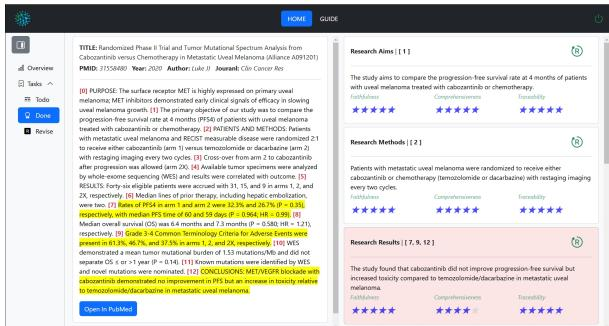  
Figure 7: Evaluation page in the annotation tool.

## A.5 Revision Phase

Out of the 3.5K evaluated data instances, 741 (21%) were filtered for further revision. The filtering criteria were as follows: (1) the mean score for any of the three evaluation metrics was below 3.5, or (2) the score difference between annotators exceeded 2.0. Annotators were then instructed to revise both the summaries and their corresponding citations based on the evaluation results. On the revision page, as illustrated in Figure 8, the left panel displayed the document content, while the right panel showed the summary along with evaluation results from two annotators. Annotators revised the summaries and updated the sentence indices according to the evaluation feedback.

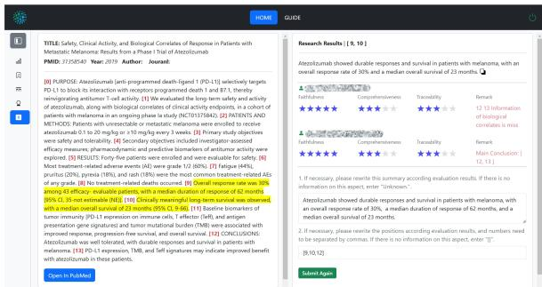  
Figure 8: Revision page in the annotation tool.

## B Characteristics of the Dataset

## B.1 Source Article Length

Among the 500 abstracts, the average length per abstract was 319.89 tokens, with the longest containing 1,104 tokens and the shortest containing only 25. The distribution of token counts across abstracts is illustrated in Figure 9a. Additionally, each abstract contained an average of 10.42 sentences, with sentence counts ranging from 1 to 32. The distribution of sentence counts is shown in Figure 9b.

## B.2 Aspect Coverage in Abstracts

All 500 documents contained information on at least three aspects. Among them, 118 documents covered all seven aspects, and 211 documents covered six aspects, as illustrated in Figure 9c.

## B.3 Proportion of Positive and Negative Data

We analyzed the distribution of positive and negative data samples across seven aspects, as shown in Figure 9d. All 500 abstracts included aspect A (Research Aims), while 499 covered aspect I (Research Methods or Intervention) and aspect O (Research Results or Outcomes). In contrast, aspect D (Treatment Duration) was less common, appearing in only 174 abstracts. Overall, the ratio of positive to negative samples was 2862:638.

## B.4 Length of Traceable Summaries

As shown in Table 9, all 2,862 positive summaries had an average length of 28.06 tokens, with the longest containing 77 tokens and the shortest just 3. On average, each summary cited 1.78 sentences, with the number ranging from 1 to 7. Among all aspects, summaries related to aspect S (Side Effects) had the highest average token count, while those concerning aspect I (Research Methods or Intervention) cited the most sentences.

## C Generation Pipelines

In this section, we provide a detailed description of the design and training of our three baseline methods: TRACK-THEN-SUM, SUM-THEN-TRACK, and END-TO-END.

## C.1 TRACK-THEN-SUM

As illustrated in Figure 10, the TRACK-THEN-SUM generation pipeline consists of two phases: tracking and summarization. In the first phase, the tracker module retrieves the sentences most relevant to the given aspect using a default threshold of 0.5. In the second phase, the summarizer module  generates a concise summary based on the selected sentences. Finally, the summary and the cited sentences are merged to form the final system output.

<table><tr><td>Aspect</td><td>Likert Score</td><td>Score Description</td></tr><tr><td rowspan="5">Completeness</td><td>★★★★★</td><td>All key relevant information from the article is accurately captured.</td></tr><tr><td>★★★★☆</td><td>Most key relevant information from the article is present, with minor omissions.</td></tr><tr><td>★★★☆☆</td><td>Some key relevant information from the article is present, but some is missing.</td></tr><tr><td>★★☆☆☆</td><td>Most key relevant information from the article is missing.</td></tr><tr><td>★☆☆☆☆</td><td>All key relevant information from the article is missing.</td></tr><tr><td rowspan="5">Completeness</td><td>★★★★★</td><td>In the generated summary, all content is relevant to this aspect.</td></tr><tr><td>★★★★☆</td><td>In the generated summary, most content is relevant to this aspect.</td></tr><tr><td>★★★☆☆</td><td>In the generated summary, some content is relevant to this aspect</td></tr><tr><td>★★☆☆☆</td><td>In the generated summary, most content is irrelevant to this aspect.</td></tr><tr><td>★☆☆☆☆</td><td>In the generated summary, all content is irrelevant to this aspect or contains errors.</td></tr><tr><td rowspan="5">Traceability</td><td>★★★★★</td><td>All relevant sentences have been accurately traced (highlighted).</td></tr><tr><td>★★★★☆ ★★★☆☆</td><td>Most relevant sentences have been accurately traced (highlighted).</td></tr><tr><td>★★☆☆☆</td><td>Some relevant sentences have been accurately traced, but some are missing or irrelevant.</td></tr><tr><td>★☆☆☆☆</td><td>Most relevant sentences have not been accurately traced.</td></tr><tr><td></td><td>None of the relevant sentences have been accurately traced.</td></tr></table>

Table 8: Evaluation Criteria and Scoring Guidelines.

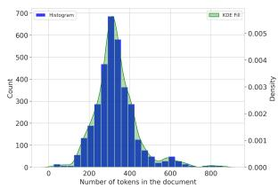  
(a) Distribution of token counts across abstracts.

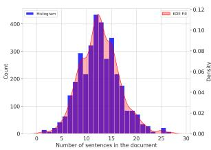  
(b) Distribution of sentence counts across abstracts.

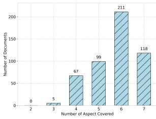  
(c) Aspect coverage across abstracts.

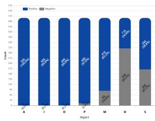  
(d) Proportion of positive and negative data.  
Figure 9: Characteristics of the TRACSUMdataset.

## C.2 Tracker

We implement the sentence tracing task as a binary classification of sentences within the abstract.

Data Collection: We applied sentence tokenization to each abstract in the training set. For every sentence, we created $( c , a )$ pairs by combining it with each predefined aspect $a \in { \mathcal { A } }$ . Each pair was labeled with a binary variable y based on the corresponding citations field: if the sentence index appeared in the citations associated with aspect $^ { a , }$ , we assigned $y = 1$ ; otherwise, $y = 0$ . In total, we obtained 35.5K sentence-aspect-label pairs, forming the training dataset $\mathcal { D } _ { \mathcal { T } }$

Training: Given the constructed dataset $\mathcal { D } _ { \mathcal { T } }$ , we initialized tracker $\tau$ using a pre-trained language model (LM) as the backbone. The model was subsequently fine-tuned on $\mathcal { D } _ { \mathcal { T } }$ using a standard binary classification objective which maximizes the loglikelihood of the observed labels:

$$
\operatorname* { m a x } _ { \mathcal { T } } \mathbb { E } _ { ( ( c , a ) , y ) \sim \mathcal { D } _ { \mathcal { T } } } \log p _ { \mathcal { T } } ( y \mid ( c , a ) )
$$

We fine-tuned the tracker $\tau$ using the QLoRA technique, initializing from the 4-bit quantized version of the LLaMA-3.1-8B-Instruct backbone<sup>8</sup>, on $\mathcal { D } _ { \mathcal { T } }$ . To enable binary classification, we appended a lightweight classification head that maps the model’s output to a single scalar representing the predicted probability. Training was conducted on six NVIDIA A6000 GPUs with a batch size of 32, gradient accumulation steps of 2, and a total of 5 epochs. We employed a learning rate of $1 \times 1 0 ^ { - 5 }$ applied a weight decay of 0.01, set the random seed to 3407 for reproducibility, and used 200 warmup steps. The full training process took 17 hours and 2 minutes.

## C.3 Summarizer

Data Collection: For each summary sum in the training set, we extracted related sentences from the abstract based on the citations field to form the set . Each was paired with its associated aspect $^ { a , }$ and combined with the sum to form $( ( \mathcal { C } , a ) , s u m )$ . In total, we obtained 2.8K citationsaspect-summary pairs, forming the training dataset $\mathcal { D } _ { \mathcal { S } }$

Training: Similar to the training of $\tau$ , we initialized summarizer using a pre-trained LM as the backbone. We then fine-tuned summarizer $\boldsymbol { \mathcal { S } }$ on $\mathcal { D } _ { \mathcal { S } }$ using a standard next-token prediction objective, which maximizes the likelihood of generating the target summary sum given the input ( , a) pair:

$$
\operatorname* { m a x } _ { S } \mathbb { E } _ { ( ( C , a ) , s u m ) \sim \mathcal { D } _ { S } } \log p _ { S } ( s u m \mid C , a )
$$

The input instruction is shown in Table 16. We finetuned Summarizer using the Unsloth framework, starting from the 4-bit version of the LLaMA-3.1- 8B-Instruct base model<sup>9</sup>, on $\mathcal { D } _ { \mathcal { S } }$ . Training was performed on two NVIDIA A6000 GPUs with a batch size of 16, a gradient accumulation step size of 2, and a total of 5 epochs. We used a learning rate of 1e-5, a weight decay of 0.01, a fixed random seed of 3407, and 200 warmup steps. The entire training process took 1 hour and 55 minutes. Additionally, we adopted the train\_on\_responses\_only strategy to focus learning on relevant output segments.

<table><tr><td rowspan="2"></td><td colspan="6">Summary</td><td colspan="8"></td></tr><tr><td>A</td><td>I</td><td>0</td><td>P</td><td>M</td><td>D</td><td>S</td><td>A</td><td>I</td><td>0</td><td>P</td><td>M</td><td>D</td><td>S</td></tr><tr><td>Min</td><td>13</td><td>15</td><td>12</td><td>4</td><td>3</td><td>4</td><td>4</td><td>1</td><td>1</td><td>1</td><td>1</td><td>1</td><td>1</td><td>1</td></tr><tr><td>Max</td><td>56</td><td>73</td><td>77</td><td>69</td><td>77</td><td>75</td><td>75</td><td>5</td><td>7</td><td>6</td><td>5</td><td>6</td><td>5</td><td>4</td></tr><tr><td>Avg.</td><td>29.33</td><td>37.81</td><td>34.75</td><td>25.64</td><td>25.37</td><td>17.82</td><td>25.67</td><td>1.51</td><td>2.33</td><td>2.58</td><td>1.61</td><td>1.74</td><td>1.25</td><td>1.46</td></tr></table>

Table 9: Length of summaries (in tokens) and number of citations (in sentences) in positive samples.

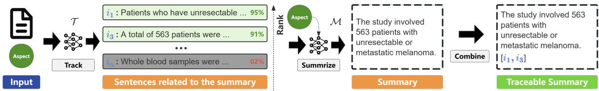  
Figure 10: TRACK-THEN-SUM summarization pipeline.

## <sup>C.4</sup> <sup>TTS</sup> ⊕ <sup>f.</sup>

As mentioned in §5, our TRACK-THEN-SUM method includes two variants, differing only in their input. Specifically, the $\operatorname { T T S } \oplus f .$ variant uses both the set of cited sentences and the full context (i.e., abstract) as input. The input instruction is shown in Table 17. All other settings remain unchanged, except for the batch size, which was set to 8. Under this configuration, training took 8 hours and 36 minutes.

## C.5 SUM-THEN-TRACK

## C.5.1 Inference Overview

As illustrated in Figure 11, the SUM-THEN-TRACK method consists of two phases: summarization and tracking. In the first phase, the summarizer generates an aspect-specific summary sum from an abstract d based on a given aspect a. In the second phase, the tracker identifies the sentences most relevant to this summary using a default similarity threshold of 0.5. Finally, the summary and the corresponding sentences are combined to form the final output, as shown in Algorithm 3.

```perl
Algorithm 3: SUM-THEN-TRACK Inference
Require: Tracker , Summarizer
Input: article $d = \{ c _ { 1 } , c _ { 2 } , . . . , c _ { n } \}$ and aspect a $\in { \mathcal { A } }$
Output: summary sum and its citations ′
1: sum $ S ( a , \dot { d } ) ;$
2: ${ \mathcal { C } } ^ { \prime } \gets \emptyset ;$
3: foreach $c _ { i } \in \{ c _ { 1 } , c _ { 2 } , . . . , c _ { n } \}$
4: predict relevance given (sum, c<sub>i</sub>);
if relevance == Yes then append c to ${ \mathcal { C } } ^ { \prime } ;$
```  
Algorithm 3: SUM-THEN-TRACK inference process.

## C.5.2 Summarizer

Data Collection: We extracted abstract, aspect, and summary fields from the training set, resulting in 2.8K ((d, a), sum) pairs, denoted as $\mathcal { D } _ { \cal S }$

Training: We then initialized summarizer using a pre-trained LM as the backbone. We then finetuned summarizer on $\mathcal { D } _ { \mathcal { S } }$ using a standard nexttoken prediction objective, which maximizes the likelihood of generating the target summary sum given the input (d, a) pair:

$$
\operatorname* { m a x } _ { S } \mathbb { E } _ { ( ( d , a ) , s u m ) \sim \mathcal { D } _ { S } } \log p _ { S } ( s u m \mid d , a )
$$

The input instruction is shown in Table 18. We finetuned Summarizer using the Unsloth framework, starting from the 4-bit version of the LLaMA-3.1- 8B-Instruct base model, on $\mathcal { D } _ { \mathcal { S } }$ . Training was performed on two NVIDIA A6000 GPUs with a batch size of 8, a gradient accumulation step size of 2, and a total of 5 epochs. We used a learning rate of 1e-5, a weight decay of 0.01, a fixed random seed of 3407, and 200 warmup steps. The entire training process took 7 hour and 32 minutes. Additionally, we adopted the train\_on\_responses\_only strategy to focus learning on relevant output segments.

## C.5.3 Tracker

Data Collection: We first applied sentence tokenization to all abstracts in the training set. For each abstract, every sentence c was paired with each summary sum, forming (c, sum) pairs. Each pair was then labeled with y based on the citations field. This process resulted in 35.5k ((c, sum), y) pairs, denoted as $\mathcal { D } _ { \mathcal { T } }$

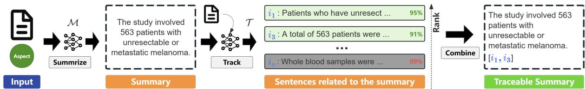  
Figure 11: SUM-THEN-TRACK method pipeline.

Training: Given the constructed dataset $\mathcal { D } _ { \mathcal { T } }$ , we initialized tracker  using a pre-trained language model (LM) as the backbone. The model was subsequently fine-tuned on $\mathcal { D } _ { \mathcal { T } }$ using a standard binary classification objective which maximizes the loglikelihood of the observed labels:

$$
\operatorname* { m a x } _ { T } \mathbb { E } _ { ( ( c , s u m ) , y ) \sim \mathcal { D } _ { T } } \log p _ { T } ( y \mid ( c , s u m ) )
$$

We fine-tuned the tracker  using the QLoRA technique, initializing from the 4-bit quantized version of the LLaMA-3.1-8B-Instruct backbone, on $\mathcal { D } _ { \mathcal { T } }$ . To enable binary classification, we appended a lightweight classification head that maps the model’s output to a single scalar representing the predicted probability. Training was conducted on six NVIDIA A6000 GPUs with a batch size of 32, gradient accumulation steps of 2, and a total of 5 epochs. We employed a learning rate of $1 \times 1 0 ^ { - 5 }$ applied a weight decay of 0.01, set the random seed to 3407 for reproducibility, and used 200 warmup steps. The full training process took 22 hours and 12 minutes.

## C.6 END-TO-END

The END-TO-END approach employs a single model , to jointly perform summarization and sentence tracking, as shown in Figure 12.

## C.6.1 Inference Phase

Given a abstract d and an aspect a , generates a summary focused on a and $\mathcal { C } ^ { \prime }$ on which the summary relies, as illustrated in Algorithm 4.

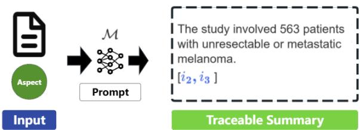  
Figure 12: END-TO-END generation pipeline.

## C.6.2 Training Phase

Data Collection. We extracted abstract, aspect, summary, and citations fields from the training set and then combined them into $( ( d , a )$ , (sum, )) pairs. As a result, we obtained 2.8K training instances, denoted by $\mathcal { D } _ { \mathcal { M } }$

Training. We then initialized with a pre-trained LM and trained it on $\mathcal { D } _ { \mathcal { M } }$ using a standard conditional language modeling objective, maximizing the likelihood:

$$
\operatorname* { m a x } _ { \mathcal { M } } \mathbb { E } _ { ( ( d , a ) , ( s u m , \mathcal { C } ) ) \sim \mathcal { D } _ { \mathcal { M } } } \log p _ { \mathcal { M } } ( s u m , \mathcal { C } \mid d , a )
$$

The input instruction is shown in Table 19. We fine-tuned using the Unsloth framework, starting from the 4-bit version of the LLaMA-3.1-8B-Instruct base model, on $\mathcal { D } _ { \mathcal { M } }$ . Training was performed on two NVIDIA A6000 GPUs with a batch size of 8, a gradient accumulation step size of 2, and a total of 5 epochs. We used a learning rate of 1e-5, a weight decay of 0.01, a fixed random seed of 3407, and 200 warmup steps. The entire training process took 8 hours and 16 minutes. Additionally, we adopted the train\_on\_responses\_only strategy to focus learning on relevant output segments.

## D API Cost

## D.1 Dataset Collection Costs

We initially generated our dataset with the free credits provided by the Mistral-Large API, so the cost for this part is \$0.

## D.2 Evaluation Costs

We incurred approximately \$4.085 in API costs to obtain results from eight different models on the test set, as detailed in Table 10. The test set comprises 700 data samples, each formatted into prompts, resulting in approximately 100K input tokens in total. The number of output tokens varies across LLMs; standard text generation models typically produce around 50K output tokens.

<table><tr><td>Model</td><td>API Src.</td><td>Input Prices</td><td>Output Prices</td><td>Input Length</td><td>Output Length</td><td>Costs</td></tr><tr><td>Llama-3.1-8B-Inst.</td><td>DeepInfra</td><td>$0.03</td><td>$0.05</td><td>131K</td><td>8K</td><td>$0.030</td></tr><tr><td>Llama-3.3-70B-Inst.</td><td>DeepInfra</td><td>$0.23</td><td>$0.40</td><td>131K</td><td>8K</td><td>$0.250</td></tr><tr><td>Mistral-7B-Inst (V0.3).</td><td>DeepInfra</td><td>$0.029</td><td>$0.055</td><td>32K</td><td>8K</td><td>$0.040</td></tr><tr><td>Mistral-8x7B-Inst.</td><td>DeepInfra</td><td>$0.24</td><td>$0.24</td><td>131K</td><td>4K</td><td>$0.600</td></tr><tr><td>Gemma-3-12B-Inst.</td><td>DeepInfra</td><td>$0.05</td><td>$0.100</td><td>128K</td><td>8K</td><td>$0.070</td></tr><tr><td>Gemma-3-27B-Inst.</td><td>DeepInfra</td><td>$0.10</td><td>$0.20</td><td>128K</td><td>8K</td><td>$0.110</td></tr><tr><td>GPT-40</td><td>OpenAI</td><td>$2.50</td><td>$10.0</td><td>128K</td><td>16K</td><td>$2.838</td></tr><tr><td>GPT-4o-mini</td><td>OpenAI</td><td>$0.15</td><td>$0.60</td><td>128K</td><td>16K</td><td>$0.147 SUM : $4.085</td></tr><tr><td colspan="7"></td></tr></table>

Table 10: Details on the use of different model APIs.

Algorithm 4: END-TO-END Inference   
Require: Model   
Input: article $d = \{ c _ { 1 } , c _ { 2 } , . . . , c _ { n } \}$ and aspect $a \in { \mathcal { A } }$   
Output: summary sum and its citations ${ \bf { \hat { \boldsymbol { C } } } } ^ { \prime }$   
1: ${ \mathcal { C } } ^ { \prime } \gets \emptyset ;$   
2: $( s u m , \mathcal { C } ^ { \prime } ) \gets \mathcal { M } ( a , d ) ;$   
Algorithm 4: END-TO-END inference process.

## E Experiment Analysis

## E.1 Full Context vs. only

In this section, we present an example to illustrate how incorporating full context impacts summary generation and, in turn, affects claim recall. When the cited sentences (i.e., the tracker output) remain fixed, providing the full document as additional input enables the summarizer to better resolve abbreviations and domain-specific terminology, thereby enhancing claim recall. As shown in Table 11, $\mathrm { T T S } \oplus f$ resolves the abbreviation “RT” as “radiation therapy”, which leads the NLI model (TRUE) to determine that the subclaim is entailed by the reference text during entailment evaluation. This results in an increase in the overall claim recall score from 2/4 to 3/4.

However, providing additional context beyond the cited sentences may cause the summarizer to incorporate irrelevant or unsupported information (i.e., content not present in the cited sentences), which could reduce claim precision or citationbased metrics. Nonetheless, our evaluation results do not show a noticeable drop in other metrics. This may be attributed to the instruction explicitly directing the summarizer $s$ to generate summaries strictly based on the cited sentences, with the additional context serving only as reference.

## E.2 Agreement with Human Evaluation

To evaluate the relationship between the system outputs and task-level evaluation scores, we employ both Spearman’s correlation coefficient (ρ) (Kendall and Gibbons, 1990) and Pearson’s correlation coefficient (r) (Sheskin, 2003). Pearson’s r measures the strength of a linear relationship between two continuous variables, which is appropriate when assuming interval-scaled outputs and normally distributed scores (Benesty et al., 2009). In contrast, Spearman’s $\rho$ captures monotonic relationships based on rank order, making it more robust to non-linear patterns and outliers (Hauke and Kossowski, 2011). Using both metrics provides a comprehensive view of how well the automatic system outputs align with human-centric evaluation criteria, accounting for both linear trends and ordinal consistency.

Reference: Summary Citations 0, 1, 7   
1′. A total of 50 participants were involved in the study.   
2′. Participants with cutaneous neurotropic melanoma of   
the head and neck.   
3′. 23 participants were assigned to the observation group.   
4′. 27 participants were assigned to the radiation therapy   
group.   
Citation 0: BACKGROUND: Cutaneous neurotropic melanoma (NM)   
of the head and neck (H&N) is prone to local relapse, possibly due to   
difficulties widely excising the tumor. Citation 1: This trial assessed   
radiation therapy (RT) to the primary site after local excision. Citation 7:   
During 2009-2020, 50 participants were randomized: 23 to observation and   
27 to RT.   
TTS Output: Subclaims $\lnot$ Citations 7   
1′. A total of 50 participants were randomized in the study.   
2′. 23 participants were assigned to the observation group.   
3′. 27 participants were assigned to the RT group.   
(TRUE) Claim Recall: 2/4. 1′: ✓, 2′: ✓, 3′: ✗   
TTS f. Output: Subclaims Citations 7   
1′. A total of 50 participants were randomized in the study.   
2′. 23 participants were assigned to the observation group.   
3′. 27 participants were assigned to the radiation therapy   
(RT) group.   
(TRUE) Claim Recall: 3/4. 1′: ✓, 2′: ✓, 3′: ✓  
Table 11: An example of summaries generated by TTS and TTS f, along with their claim recall comparison (PMID: 38851639, Aspect: Patients).

Specifically, we randomly sampled ten abstracts from the test set, and asked the annotator to follow the procedure in Algorithm 2 to assess outputs from the best-performing method $( \mathrm { T T S } \oplus f . )$ using four evaluation metrics. As indicated in Table 12, human evaluations score higher than the TRUE model on most metrics, achieving an F1 score of 74.3 for claims and 76.2 for citations quality. For each of the four evaluation metrics, we computed the

<table><tr><td></td><td colspan="2">Completeness</td><td colspan="2">Conciseness</td><td colspan="2">F1 Score</td></tr><tr><td>Evaluator</td><td>CLR</td><td>CIR</td><td>CLP</td><td>CIP</td><td> $\overline { { F _ { 1 } ^ { \mathrm { c l . } } } }$ </td><td> $F _ { 1 } ^ { \mathrm { c i . } }$ </td></tr><tr><td>Human</td><td>81.1↑</td><td>74.3↑</td><td>68.6↑</td><td>78.1↓</td><td>74.3↑</td><td>76.2↓</td></tr><tr><td>TRUE</td><td>78.2</td><td>73.4</td><td>65.7</td><td>79.5</td><td>71.4</td><td>76.3</td></tr></table>

Table 12: Comparison of evaluation results between human annotator and the TRUE model on 10 sampled abstracts.  
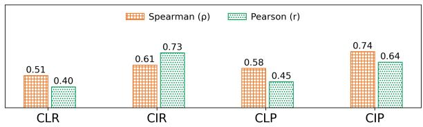  
Figure 13: Spearman’s correlation coefficient (ρ) and Pearson’s correlation coefficient (r) between TRUE and human evaluation scores across four evaluation metrics.

Spearman correlation coefficient (ρ) and Pearson correlation coefficient (r) between the automatic evaluation results and human judgments. As shown in Figure 13, the Spearman correlation coefficient between human and automatic evaluation results is $\rho = 0 . 6 1 2$ , and the Pearson correlation coefficient is $r = 0 . 5 7 7$ . The agreement is relatively lower for claim-related metrics, whereas citation-related metrics demonstrate stronger consistency with human judgments.

## E.3 Comparison of Entailment Evaluators

We experiment with two additional instructionfollowing LLMs as entailment evaluators: the proprietary GPT-4o (Hurst et al., 2024) and the opensource Mistral-Large (Mistral AI, 2025). Building on the experimental setup described in §6.3, we replace the TRUE model with each of these evaluators to assess the outputs generated by the TTS  f. variant. The evaluation results are presented in Table 13. Among the models, GPT-4o produces scores that most closely align with human judgments, followed by Mistral.

<table><tr><td rowspan="2">Evaluator</td><td colspan="2">Completeness</td><td colspan="2">Conciseness</td><td colspan="2">F1 Score</td></tr><tr><td>CLR</td><td>CIR</td><td>CLP</td><td>CIP</td><td> $\overline { { F _ { 1 } ^ { \mathrm { c l . } } } }$ </td><td> $\overline { { F _ { 1 } ^ { \mathrm { c i . } } } }$ </td></tr><tr><td>Human</td><td>81.1</td><td>74.3</td><td>68.6</td><td>78.1</td><td>74.3</td><td>76.2</td></tr><tr><td>TRUE</td><td>78.2</td><td>73.4</td><td>65.7</td><td>79.5</td><td>71.4</td><td>76.3</td></tr><tr><td>GPT-40</td><td>80.2</td><td>77.1</td><td>67.0</td><td>76.2</td><td>73.0</td><td>76.7</td></tr><tr><td>Mistral</td><td>75.6</td><td>76.8</td><td>70.1</td><td>74.5</td><td>72.8</td><td>75.6</td></tr></table>

Table 13: Comparison of evaluation results between human annotator and three entailment evaluators on 10 sampled abstracts.

## F Data Samples of TRACSUM Dataset

<table><tr><td>PMID</td><td>abstract</td><td>aspect</td><td>summary</td><td>citations</td><td></td></tr><tr><td>31638282</td><td>The multinational phase 3 CheckMate 238 trial compared adjuvant therapy with nivolumab versus ipilimumab among patients with resected stage III or IV melanoma (N = 906)...</td><td>d</td><td>Unknown.</td><td>[]</td><td></td></tr><tr><td>33294860</td><td>In this study, we incorporate anal- yses of genome-wide sequence and structural alterations with pre- and on- therapy transcriptomic and T cell reper- toire features in immunotherapy-naive melanoma patients treated with ...</td><td>a</td><td>The study aims to predict response to immune checkpoint blockade by integrating genomic, transcriptomic, and immune repertoire data.</td><td>[4]</td><td></td></tr><tr><td>34650833</td><td>Combination immunotherapy with sequential administration may en- hance metastatic melanoma (MM) pa- tients with long-term disease control. High Dose Aldesleukin/Recombinant Interleukin-2 (HD rIL-2) and ipili- mumab (IPI) offer...</td><td>m</td><td>The study used High Dose Aldesleukin/Recombinant Interleukin-2 (HD rIL-2) at 600,000 IU/kg and ipilimumab (IPI) at 3 mg/kg.</td><td>[1,3]</td><td></td></tr><tr><td>37479483</td><td>BACKGROUND: Continuous combi- nation of MAPK pathway inhibition (MAPKi) and anti-programmed death- (ligand) 1 (PD-(L)1) showed high re- sponse rates, but only limited im- provement in progression-free survival (PFS) at the cost of a high frequency..</td><td>p</td><td>The study involved 33 patients with treatment-naïve BRAFV600E/K- mutant advanced melanoma, with 32 randomized into four cohorts.</td><td>[3,8]</td><td></td></tr><tr><td>33593880</td><td>PURPOSE: Triple-negative breast can- cer (TNBC) is an aggressive disease with limited therapeutic options. An- tibodies targeting programmed cell death protein 1 (PD-1)/PD-1 ligand 1 (PD-L1) have entered the therapeutic landscape in TNBC, but only a minor- ity of patients benefit. A way to reli- ably enhance immunogenicity, T-cell infiltration, and predict responsiveness is critically needed. PATIENTS AND METHODS: Using mouse models of</td><td>i</td><td>This study used mouse models of TNBC to evaluate immune activa- tion and tumor targeting of intra- tumoral IL12 plasmid followed by electroporation (Tavo), conducted a single-arm prospective clinical trial of Tavo monotherapy in patients with treatment-refractory advanced TNBC, and expanded findings using publicly available breast cancer and melanoma datasets.</td><td>[3,4,5]</td><td></td></tr><tr><td>38870745</td><td>TNBC... BACKGROUND: Treatment tions for immunotherapy-refractory melanoma are an unmet need. The MASTERKEY-115 phase II, open- label, multicenter trial evaluated talimogene ...</td><td>op- S</td><td>Treatment-related adverse events (TRAEs), including grade ≥3 TRAEs, serious AEs, and fatal AEs, occurred in 76.1%, 12.7%, 33.8%, and 14.1% of patients, respectively.</td><td>[11]</td><td></td></tr><tr><td>33127652</td><td>PURPOSE: Increasedβ-adrenergic receptor (β-AR) signaling has been shown to promote the creation of an immunosuppressive tumor microenvi- ronment (TME) ...</td><td>0</td><td>The combination of propranolol with pembrolizumab in treatment- naïve metastatic melanoma is safe and shows very promising activity with an objective response rate of 78%.</td><td>[12,14]</td><td></td></tr></table>

Table 14: Seven traceable aspect-based summary samples from TRACSUM dataset.

## G Instructions And Demonstration

## G.1 LLM Prompt Template

## Instructions

Given a document consisting of a set of sentences with a marker attached to the head of each sentence. Based on the demonstrations, please summarize the research questions or aims of this study in one sentence and output the sentence markers involved. If there is no relevant information in the document, answer "Unknown".

## Document

‘[ "0: The EORTC-STBSG coordinated two large trials of adjuvant chemotherapy (CT) in localized high-grade soft tissue sarcoma (STS).", "1: Both studies failed to demonstrate any benefit on overall survival (OS).", "2: The aim of the analysis of these two trials was to identify subgroups of patients who may benefit from adjuvant CT." "3: Individual patient data from two EORTC trials comparing doxorubicin-based CT to observation only in completely resected STS (large resection, R0/marginal resection, R1) were pooled.", ... ]’

## Demonstrations

## Document

‘[ "0: Giant cell tumor of bone (GCTB) is an aggressive primary osteolytic tumor.", "1: GCTB often involves the epiphysis, usually causing substantial pain and functional disability.", "2: Denosumab, a fully human monoclonal antibody against receptor activator of nuclear factor KB ligand (RANKL), is an effective treatment option for patients with advanced GCTB.", "3: This analysis of data from an ongoing, open-label study describes denosumab’s effects on pain and analgesic use in patients with GCTB. " "4: Patients with unresectable disease (e.g. sacral or spinal GCTB, or multiple lesions including pulmonary metastases) were enrolled into Cohort 1 (N = 170), and patients with resectable disease whose planned surgery was associated with severe morbidity (e.g. joint resection, limb amputation, or hemipelvectomy) were enrolled into Cohort 2 (N = 101).", ... ] Summary: The study aims to evaluate the effects of denosumab on pain and analgesic use in patients with giant cell tumor of bone (GCTB).

Citations: [3]

## Document

‘[ "0: Common adverse events associated with nivolumab included fatigue, pruritus, and nausea.", "1: Drug-related adverse events of grade 3 or 4 occurred in 11.7% of the patients treated with nivolumab and 17.6% of those treated with dacarbazine." "2: Nivolumab was associated with significant improvements in overall survival and progression-free survival, as compared with dacarbazine, among previously untreated patients who had metastatic melanoma without a BRAF mutation.", "3: (Funded by Bristol-Myers Squibb; CheckMate 066 ClinicalTrials.gov number, NCT01721772.)." ]’   
Summary: Unknown.

Citations: Null.

Table 15: Instructions and demonstrations for generating summaries on aspect A (research aims). The text denotes placeholders to be replaced with aspect-specific descriptions.

## G.2 Instruction for summarizer in TRACK-THEN-SUM

## Instructions

Summarize the research aims or questions of the study in one clear sentence that includes all key details from the input sentences without omitting important information.

## Sentences

‘[ "The EORTC-STBSG coordinated two large trials of adjuvant chemotherapy (CT) in localized high-grade soft tissue sarcoma (STS).", "Both studies failed to demonstrate any benefit on overall survival (OS).", "The aim of the analysis of these two trials was to identify subgroups of patients who may benefit from adjuvant CT." "Individual patient data from two EORTC trials comparing doxorubicin-based CT to observation only in completely resected STS (large resection, R0/marginal resection, R1) were pooled." ]

## Summary:

Table 16: Instruction used to generate summaries for aspect A (research aims) in the summarization component of TRACK-THEN-SUM. The text denotes placeholders to be replaced with aspect-specific descriptions.

## G.3 Instruction for summarizer ( full context) in TRACK-THEN-SUM

Instructions   
Summarize the research aims or questions of the study in one clear sentence that includes all key details from the input sentences   
without omitting important information. The summary must be based solely on the provided sentences. The full text is for   
reference only and must not be used to introduce any new information not present in the sentences.   
Sentences   
‘[ "The aim of the analysis of these two trials was to identify subgroups of patients who may benefit from adjuvant CT."   
"Individual patient data from two EORTC trials comparing doxorubicin-based CT to observation only in completely resected   
STS (large resection, R0/marginal resection, R1) were pooled." ]   
Full Context   
‘[ "The EORTC-STBSG coordinated two large trials of adjuvant chemotherapy (CT) in localized high-grade soft tissue sarcoma   
(STS).", "Both studies failed to demonstrate any benefit on overall survival (OS).", "The aim of the analysis of these two trials   
was to identify subgroups of patients who may benefit from adjuvant CT." "Individual patient data from two EORTC trials   
comparing doxorubicin-based CT to observation only in completely resected STS (large resection, R0/marginal resection, R1)   
were pooled.", ... ]’   
Summary:

Table 17: Instruction used to generate summaries for aspect A (research aims) in the summarization component of TRACK-THEN-SUM ( f.). The text denotes placeholders to be replaced with aspect-specific descriptions.

## G.4 Instruction for summarizer in SUM-THEN-TRACK

Instructions   
Summarize the research aims or questions of the study in one clear sentence based on the given article.   
Article   
‘[ "The EORTC-STBSG coordinated two large trials of adjuvant chemotherapy (CT) in localized high-grade soft tissue sarcoma   
(STS).", "Both studies failed to demonstrate any benefit on overall survival (OS).", "The aim of the analysis of these two trials   
was to identify subgroups of patients who may benefit from adjuvant CT." "Individual patient data from two EORTC trials   
comparing doxorubicin-based CT to observation only in completely resected STS (large resection, R0/marginal resection, R1)   
were pooled.", ... ]’   
Summary:

Table 18: Instruction used to generate summaries for aspect A (research aims) in the summarization component of SUM-THEN-TRACK. The text denotes placeholders to be replaced with aspect-specific descriptions.

## G.5 Instruction for model in END-TO-END

Instructions   
Given an article, summarize the research aims or questions of the study in one clear sentence and output the index of the cited   
sentences.   
Sentences   
‘[ "0: The EORTC-STBSG coordinated two large trials of adjuvant chemotherapy (CT) in localized high-grade soft tissue   
sarcoma (STS).", "1: Both studies failed to demonstrate any benefit on overall survival (OS).", "2: The aim of the analysis of   
these two trials was to identify subgroups of patients who may benefit from adjuvant CT." "3: Individual patient data from two   
EORTC trials comparing doxorubicin-based CT to observation only in completely resected STS (large resection, R0/marginal   
resection, R1) were pooled.", ... ]’   
Summary:   
Citations:

Table 19: Instruction used to generate summaries for aspect A (research aims) in the END-TO-END. The text denotes placeholders to be replaced with aspect-specific descriptions.