# Think Wider, Detect Sharper: Reinforced Reference Coverage for Document-Level Self-Contradiction Detection

Yuhao Chen, Yuanjie Lyu, Shuochen Liu, Chao Zhang, Junhui Lv, Tong Xu\* University of Science and Technology of China isyuhaochen@mail.ustc.edu.cn tongxu@ustc.edu.cn

## Abstract

Detecting self-contradictions within documents is a challenging task for ensuring textual coherence and reliability. While large language models (LLMs) have advanced in many natural language understanding tasks, document-level self-contradiction detection (DSCD) remains insufficiently studied. Recent approaches leveraging Chain-of-Thought (CoT) prompting aim to enhance reasoning and interpretability; however, they only gain marginal improvement and often introduce inconsistencies across repeated responses. We observe that such inconsistency arises from incomplete reasoning chains that fail to include all relevant contradictory sentences consistently. To address this, we propose a two-stage method that combines supervised fine-tuning (SFT) and reinforcement learning (RL) to enhance DSCD performance. In the SFT phase, a teacher model helps the model learn reasoning patterns, while RL further refines its reasoning ability. Our method incorporates a task-specific reward function to expand the model’s reasoning scope, boosting both accuracy and consistency. On the ContraDoc benchmark, our approach significantly boosts Llama 3.1-8B-Instruct’s accuracy from 38.5% to 51.1%, and consistency from 59.6% to 76.2%. 1

## 1 Introduction

In the field of natural language understanding, contradiction detection has long served as a fundamental benchmark for evaluating a model’s capacity for deep semantic comprehension (Su et al., 2024; Hsu et al., 2021; Li et al., 2024; Zheng et al., 2022). Traditionally, research has focused on identifying sentence-pair inconsistencies by natural language inference(NLI) methods (Lendvai et al., 2016; Badache et al., 2018). However, pairwise approaches are limited in detecting document-level self-contradictions, especially those spanning nonadjacent or multiple sentences. With a computational complexity of $n ( n - 1 ) / 2$ conflict checks for n sentences, these methods are expensive and often fail to capture deeper semantic contradictions involving more than two sentences.

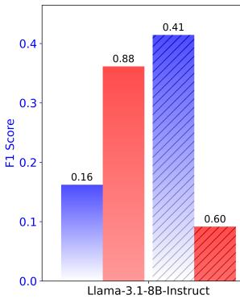

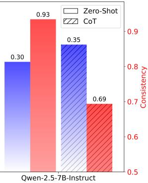  
Figure 1: F1 Score and Consistency of LLaMA and Qwen Models Using Zero-Shot and CoT prompting strategy on ContraDoc. In DSCD tasks, reasoning improves LLM performance but reduces answer consistency, leading to greater variability in responses to the same question and introducing potential unreliability.

To address these challenges, Document-level Self-Contradiction Detection (DSCD) (Hsu et al., 2021) has gained increasing attention. DSCD takes a multi-sentence document as input and predicts a binary label indicating whether any selfcontradictions exist, going beyond pairwise contradiction detection to assess document-level consistency. ContraDoc (Li et al., 2024) extends this concept by not only identifying the presence of contradictions in a document but also localizing the specific sentences in which they occur. Recently, Chain-of-Thought (CoT) (Wei et al., 2022) has been applied to the DSCD task. CoT enables the model to perform step-by-step reasoning to identify where the contradictions lie and why they occur, potentially improving interpretability and accuracy. However, CoT yields only marginal performance gains and introduces inconsistencies in the model’s responses to the same input. As shown in Figure 1, applying the CoT strategy significantly reduces response consistency, thereby undermining the reliability of the model’s predictions.

Why does the model produce different answers to the same question when using CoT? Through indepth case analyses (e.g., Figure 13), we observe that failure cases often stem from incomplete or overly diffuse reasoning based on a limited subset of relevant sentences. In one reasoning instance, the model may focus on a subset of sentences while overlooking others; in another, it shifts attention to a different subset entirely. Consequently, shifts in focus across different attempts can result in inconsistent judgments. This observation raises an important question: Can both accuracy and consistency be improved simultaneously if the reasoning chain takes a more comprehensive account ofpotentially contradictory sentences?

In pursuit of this goal, we propose a method that explicitly trains the model to incorporate all potentially contradictory sentences into the reasoning process. Our approach consists of two key training processes: (1) supervised fine-tuning (SFT) using CoT data distilled from a strong teacher model to help the model learn basic reasoning patterns, and (2) reinforcement learning (RL) for iterative self-improvement, enhancing the model’s overall reasoning ability in DSCD.

In the SFT stage, there is a lack of automatically generated data for the DSCD task. To address data scarcity and high annotation costs, we propose a fully automated DSCD sample synthesis pipeline based on the StorySumm (Subbiah et al., 2024) and REPLIQA (Monteiro et al., 2024) datasets. Then, we use Deepseek R1 to obtain distilled CoT data by running the pipeline. In the RL phase, we employ the GRPO algorithm (Shao et al., 2024), which omits the value function and facilitates selfiterative optimization via multi-output comparison. Our reward function aims to address the challenges in the reasoning process by optimizing multiple dimensions of reasoning. To enhance accuracy, we designed the Accuracy Reward, which focuses on contradiction detection and localization. By encouraging the reasoning chain to cover potentially contradictory sentences, the Reference Coverage Reward promotes the comprehensiveness of the reasoning process. Meanwhile, the Format Reward ensures consistency in the reasoning format, thereby guaranteeing the correctness of the reasoning structure. These designs synergistically guide the model to generate more comprehensive reasoning paths.

Experimental results show our method achieves around 10% improvements over the baseline across tasks, demonstrating its effectiveness. Specifically, Llama-3.1-8b-Instruct improves accuracy by 10.6% on Binary Judgment, and by up to 16.6% in consistency metrics. In summary, this work makes the following three key contributions:

1) To the best of our knowledge, we are the first to consider the problem of consistency in CoT reasoning for the DSCD task and mitigate it using reference coverage-based reinforcement learning. 2) We propose a fully automated pipeline for generating DSC examples, which effectively addresses the bottleneck of costly human annotations.

3) We demonstrate the effectiveness and robustness of our method by training on our constructed out-ofdomain dataset and achieving strong performance on the Contradoc benchmark.

## 2 Related Work

## 2.1 Contradiction Detection

Contradiction detection in text is a critical task in NLU, aimed at identifying inconsistencies or conflicting information within textual data. Most existing research has centered on the NLI framework, where contradictions are evaluated at the sentence-pair level (Lendvai et al., 2016; Badache et al., 2018). Recent efforts have extended contradiction detection to dialogue systems (Zheng et al., 2022; Wen et al., 2024) and question-answering tasks (Fortier-Dubois and Rosati, 2023).

However, identifying self-contradictions at the document level remains a significant challenge due to the increased contextual complexity and long-range dependencies. Hsu et al. (2021) framed DSCD as a binary classification problem. Li et al. (2024) extends this concept and introduces ContraDoc, a manually annotated dataset. Despite this, their work did not fully exploit the capabilities of these models in this field. In this paper, we propose a fully automated pipeline for generating DSC examples and significantly improving model reliability on this task through the RL method.

## 2.2 RL for LLMs Reasoning

RL has demonstrated considerable potential in enhancing the reasoning capabilities of LLMs across various domains, such as mathematics (Guo et al.,

2025), code generation (OpenAI et al., 2025), game (Chen et al., 2025), and RAG (Jin et al., 2025). These tasks often require complex, multistep decision-making, which is challenging for traditional SFT methods.

Initial alignment of model outputs with human preferences was achieved via RLHF (Ouyang et al., 2022; Christiano et al., 2017). To address the complexity of actor-critic methods like PPO (Schulman et al., 2017), more efficient approaches emerged. DPO (Rafailov et al., 2023) simplifies training by removing the learned critic, though its offpolicy nature limits generalization (Pang et al., 2024). More recently, GRPO (Shao et al., 2024) enhances stability through improved advantage estimation. Despite these advancements, RL-based approaches for document-level reasoning, particularly for DSCD, remain underexplored. In this work, we extend the GRPO framework to fine-tune LLMs for DSCD, addressing a crucial yet underinvestigated challenge in long-form reasoning.

## 3 Method

## 3.1 Preliminary

According to the definition in ContraDoc (Li et al., 2024), the DSCD task is divided into two parts: Binary Judgment and Judge then Find. The former requires a binary decision on whether a document d contains a contradiction. Judge then Find additionally requires locating supporting evidence sentences, enabling a more thorough evaluation of the model’s reasoning.

As previously noted, CoT-based models often exhibit inconsistency by producing different answers to the same input. To quantitatively assess this, we represent i-th inference pass as a binary vector $\mathbf { v } ^ { ( i ) } = [ v _ { 1 } ^ { ( i ) } , \ldots , v _ { N } ^ { ( i ) } ] \in \{ 0 , 1 \} ^ { N }$ , where $i \in \{ 1 , \ldots , T \}$ and $v _ { k } ^ { ( i ) } = 1$ if the model’s prediction on the k-th sample is correct, and 0 otherwise. Here, T denotes the total number of independent inference passes performed on the model, and N is the number of evaluation samples. Consistency between two passes $\mathbf { v } ^ { ( i ) }$ and $\mathbf { v } ^ { ( j ) }$ is measured by:

$$
\mathrm { S i m } ( \mathbf { v } ^ { ( i ) } , \mathbf { v } ^ { ( j ) } ) = \frac { 1 } { N } \sum _ { k = 1 } ^ { N } \mathbb { I } \left[ v _ { k } ^ { ( i ) } = v _ { k } ^ { ( j ) } \right] ,\tag{1}
$$

where $\mathbb { I } [ \cdot ]$ is the indicator function. This metric reflects the proportion of matching predictions across two inference passes. The overall consistency of

a model on a given set of samples is then computed as the average pairwise similarity across all inference vectors:

$$
\mathrm { C o n s i s t e n c y } = \frac { 2 } { T ( T - 1 ) } \sum _ { 1 \le i < j \le T } \mathrm { S i m } ( \mathbf { v } ^ { ( i ) } , \mathbf { v } ^ { ( j ) } ) ,\tag{2}
$$

We evaluate performance under both Zero-Shot and CoT prompting strategies. As illustrated in Figure 1, CoT prompting leads to improvements in task performance. However, this enhancement is accompanied by a reduction in response consistency, indicating a trade-off between accuracy and stability in reasoning patterns.

Why does the model give different answers to the same question under CoT prompting? Case analyses (see Section D) reveal that inconsistencies often arise from incomplete or shifting reasoning chains that overlook relevant contradictory sentences. This raises a key question: Can accuracy and consistency be improved by ensuring all potentially contradictory sentences are included in the reasoning process? To address this, we propose a method that explicitly trains the model to incorporate such sentences. Our approach combines (1) SFT using CoT data distilled from a strong teacher model to teach core reasoning patterns, and (2) RL for iterative self-improvement in DSCD.

## 3.2 Construction of the Training Data

Training models require substantial data, but existing approaches rely heavily on manual annotation and lack large-scale, high-quality datasets. To support our two-stage training framework (SFT and RL), we introduce an automated pipeline for generating DSCD training data at scale, addressing the limitations of labor-intensive data construction methods. We define contradiction types and generation methods, enabling LLMs to autonomously select modification locations. This process also provides a rationale for each contradiction and uses LLMs for automatic verification.

We selected two datasets unlikely to be included in LLM training data as the original document sources: StorySumm (Subbiah et al., 2024), consisting of 32 short stories, and REPLIQA (Monteiro et al., 2024), which includes 17 thematic domains. From REPLIQA, we chose two subsets, repliqa\_1 and repliqa\_2, as the basis for our dataset construction. To ensure factual consistency and data diversity, we applied a preprocessing step that separated positive and negative samples, ensuring no pair originated from the same source document. As shown in Figure 2, the pipeline consists of two parts: contradiction generation and contradiction verification. The resulting dataset includes 2,754 positive and 4,276 negative samples.

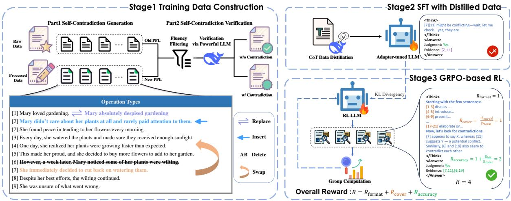  
Figure 2: Overview of our proposed framework. Stage 1: A self-contradictory document is generated by applying one of the operations—insert, replace, delete, or swap—and then verified using LLMs. See Section B for details on the rationale behind generating self-contradictions. Stage 2: A powerful model is used to distill CoT data, which is then used to fine-tune Our model via SFT. Stage 3: A fine-grained reward function is constructed and combined with a GRPO-based RL method to enhance the model’s reasoning coverage.

## 3.2.1 Self-Contradiction Generation

To maximize coverage of self-contradiction, we define six types following prior work (De Marneffe et al., 2008): Attitudinal, Definition, Logical, Factual, Scope, and Temporal. We employ LLMs to develop an automated strategy for generating contradictions via four primary operations: Insert, Delete, Replace, and Swap. By precisely controlling the model’s behavior through tailored prompting techniques, we guide it to generate specific forms of self-contradictory statements. Examples of each operation type are provided in Figure 2.

During implementation, we select a subset of the dataset for contradiction generation. Using DeepSeek-V3 (DeepSeek-AI, 2024), we generate modified samples ${ \hat { d } } _ { i } ,$ along with a set of labeled contradictory statements $\boldsymbol { S } = \{ s _ { 1 } , s _ { 2 } , . . . \}$ and corresponding explanations r, based on carefully designed prompts tailored to each operation type. Detailed prompt templates and the format of the model are provided in the Section B.

## 3.2.2 Self-Contradiction Verification

Maintaining the quality and reliability of the generated self-contradiction data requires rigorous validation. We employ a two-stage verification framework consisting of: (1) Fluency Filtering and (2) Contradiction Verification, aimed at enhancing the quality of the data.

Fluency Filtering. Ensuring comparable fluency between the original and revised documents is essential. Therefore, we adopt the approach proposed in ContraDoc (Li et al., 2024) and refine it by introducing a relative threshold instead of an absolute one, mitigating the impact of document length on perplexity. Specifically, To quantify fluency shifts between the original document d and a candidate modification $\hat { d } _ { i } ,$ we compare their perplexity scores (Jelinek et al., 1977). This ensures that each $\hat { d } _ { i }$ maintains fluency within a permissible range relative to d. Formally, for each $\hat { d } _ { i } .$ , we require:

$$
\frac { p p l ( \hat { d } _ { i } ) } { p p l ( d ) } \leq \theta ,\tag{3}
$$

where $p p l ( \cdot )$ denotes the perplexity of a given document, which we compute using the Llama-3.1- 8B-Instruct model. In our experiments, we adopt a conservative threshold of $\theta \ : = \ : 1 . 0 1$ to ensure that the modified text remains highly fluent and semantically consistent with the original.

Contradiction Verification. While rule-based filtering effectively removes the majority of noncompliant data, a small portion remains. To further refine the dataset, we apply a modelbased approach with customized judgment prompts for more rigorous self-contradiction verification.

Given a modified document $\hat { d } _ { i }$ , a set of modelgenerated contradictory statements ${ \mathcal { S } } ,$ , and a rationale r explaining the contradiction, the verification process evaluates the validity of the contradiction. Verification is conducted by querying an LLM $\mathcal { M } ,$ , formalized as $\mathrm { V e r d i c t } = \mathcal { M } ( \hat { d } _ { i } , \boldsymbol { S } , \boldsymbol { r } )$ , where Verdict indicates whether a valid contradiction is detected. This method differs from DSCD by verifying only local conflicts using suffer reason r. We manually sampled a small portion of the data to validate the process. See Section B.2 for details.

## 3.3 Reinforcement Learning for Broader Reasoning and Sharper Detection

To improve the comprehensiveness of the LLM’s reasoning in the DSCD task, thereby enhancing both accuracy and consistency, we propose a twostage training strategy. In the first stage, we finetune the model by distilling high-quality reasoning chains from DeepSeek-R1 (DeepSeek-AI, 2025), enabling the model to preliminarily acquire effective reasoning capabilities and format. In the second stage, we introduce some task-specific reward functions and apply GRPO (Shao et al., 2024) algorithm to enhance the model’s reasoning comprehensiveness through RL.

## 3.3.1 CoT Data Distillation for SFT

As shown in Figure 1, CoT reasoning improves model performance in DSCD. However, the generated CoT responses often suffer from incomplete logic and incorrect formatting, affecting reward signal sparsity during RL optimization. To overcome these issues, we employ knowledge distillation, utilizing high-quality reasoning chains from the powerful model, DeepSeek-R1, to help the model initially learn more reliable reasoning.

We use DeepSeek-R1’s outputs on the distillation set as supervisory signals. To ensure distillation quality, we only retain responses where the powerful model’s final prediction matches the ground truth. Specifically, for an input sample $x ,$ the teacher model’s answer $y _ { t }$ , its final judgment $a _ { t }$ and the true label $a ^ { * }$ , we select samples satisfying:

$$
\mathcal { D } _ { \mathrm { f l t e r e d } } = \{ ( x , y _ { t } ) \mid a _ { t } = a ^ { * } \} .\tag{4}
$$

Finally, we fine-tune the model using high-quality reasoning chain distillation signals.

## 3.3.2 Rule-based Reinforcement Learning and Reward Design

SFT has preliminarily improved output format, but it falls short of enhancing comprehensive reasoning. Specifically, it does not fully incorporate potentially contradictory sentences into the reasoning chain. As noted by Chu et al. (2025), SFT mainly promotes memorization and lacks generalization ability. Therefore, we adopt the GRPO algorithm, which eliminates the need for a separate value estimator and reduces the amount of data required. Since the training data does not include intermediate annotation information, the RL process mainly relies on reward signals from the final result. We designed three reward functions, namely $R _ { \mathrm { a c c u r a c y } }$ $R _ { \mathrm { c o v e r } }$ , and $R _ { \mathrm { f o r m a t } }$ , to guide the model’s learning.

Accuracy Reward $( R _ { \mathbf { a c c u a r c y } } )$ . To directly reward the accuracy of the model’s responses, we define the Accuracy Reward. For positive samples, the reward reflects both the correctness of the model’s judgment and its ability to identify contradictory sentences. For negative samples, the reward is based solely on the correctness of the judgment. To simplify, we define indicator variables $j = \mathbb { I } ( \mathrm { j u d g e } = \mathrm { T r u e } )$ and e = I(evidence hit = True). Thus, the reward is defined as:

$$
R _ { \mathrm { p o s . } } = j \cdot \left( - 1 \cdot ( 1 - e ) + \left( 1 + { \frac { m } { n } } \right) \cdot e \right) ,\tag{5}
$$

$$
R _ { \mathrm { n e g . } } = j ,\tag{6}
$$

where $m$ denotes the number of correctly matched contradiction sentences, and n is the total number of gold conflict sentences.

This formulation ensures that a correct judgment, where the evidence is accurately identified, is highly rewarded. On the other hand, a correct judgment without valid evidence incurs a penalty, inspired by Evidence Hit Rate (EHR) metric (see Section 4.2). Lastly, an incorrect judgment does not receive any reward. The variable judge is extracted using a regular expression from the content between the <answer>...</answer> tags to determine the model’s final decision. This reward mechanism guides the model toward accuracy while penalizing redundant or irrelevant information, thereby enhancing answer accuracy.

Reference Coverage Reward $( R _ { \mathbf { c o v e r } } )$ . We define the Reference Coverage Reward to quantify the extent to which the model’s reasoning chain incorporates content from the input document, reflecting the comprehensiveness of its reasoning process. It is formally defined as:

$$
R _ { \mathrm { c o v e r } } = \frac { | S _ { \mathrm { c o v e r e d } } | } { | S _ { \mathrm { t o t a l } } | } ,\tag{7}
$$

Specifically, we assign numbered tags [i] to each sentence in the input document to indicate position. Let $S _ { \mathrm { t o t a l } }$ denote the full set of sentences, and $S _ { \mathrm { c o v e r e d } }$ denote the subset of sentences explicitly referenced during the model’s reasoning chain. This subset is derived from span expressions such as $( [ i ] ) , ( [ i - j ] )$ , or $( [ i ] - [ j ] )$ , where each expression indicates a set of sentence indices—e.g., [1-3] denotes the set 1, 2, 3 . Using span expressions reduces the model’s focus on meaningless sentences, improving reasoning efficiency. This recall-style reward encourages the model to incorporate a wider range of relevant content, thereby facilitating more comprehensive and grounded reasoning, further enhancing the model’s accuracy and consistency.

Format Reward $( R _ { \mathbf { f o r m a t } } ) .$ . To prevent forgetting of the response format acquired during the SFT stage throughout RL. We design Format Reward $R _ { \mathrm { f o r m a t } }$ to assess whether the model’s output adheres to a predefined structural format. Specifically, the reward is defined as a binary indicator function:

$$
R _ { \mathrm { f o r m a t } } = \mathbb { I } ( { \mathrm { F o r m a t i s ~ c o r r e c t } } ) ,\tag{8}
$$

An output is considered correctly formatted if it satisfies all of the following conditions: (1) the reasoning process is entirely enclosed within <think>...</think> tags and the final answer is fully encapsulated within <answer>...</answer> tags and explicitly includes the phrases Judgment and Evidence to denote the conclusion and its evidence, respectively; (2) no content appears outside these specified tags. Outputs violating any of these requirements receive zero reward.

## 4 Experiments

## 4.1 Experimental configurations

Dataset. For evaluation, we selected the ContraDoc dataset, a key benchmark for DSCD. For RL, we sampled 1,000 positive and 1,000 negative examples from the constructed Training dataset. Additionally, we applied DeepSeek-R1 distillation to the remaining data to extract 1360 positive samples and 1568 negative instances, which were subsequently used for SFT.

Baseline. Our experiment evaluates two popular open-source instruction-tuned LLMs, Llama-3.1- 8B-Instruct (Llama-3.1) and Qwen-2.5-7B-Instruct (Qwen-2.5). Given the lack of advanced existing methods for the DSCD task, we adopt Zero-Shot and CoT as baselines for comparative analysis.

Hyperparameters. All experiments were conducted on 8 \* NVIDIA L20 GPUs. The reported results represent the average over five independent runs to ensure the stability and reliability of the outcomes. Detailed hyperparameter settings are provided in the Section A.

## 4.2 Evaluation Metrics

We evaluate the model’s performance using standard metrics defined in prior work, including Precision, Recall, F1, and Accuracy. We define $J ( d )$ to detect the presence of document self-contradiction and $V ( E )$ to evaluate whether evidence is correctly identified. For the Judge then Find task, when the model’s answer is yes, we apply the BERTScore (Sun et al., 2022) metric to account for minor linguistic variations. If any selected evidence sentence has a BERTScore Precision or Recall greater than 0.98 compared to the reference, it is considered semantically equivalent to the ground truth and deemed correct. The model’s prediction is deemed correct only when $J ( d ) \wedge V ( E ) = { \mathrm { T r u e } } .$ Additionally, we adopt the EHR metric, which represents the proportion of samples for which correct evidence is successfully identified, given that the model has predicted yes. To assess the model’s stability across multiple responses, we utilize the Consistency metric as defined in Equation (2). Furthermore, we introduce a new metric, Reliability, defined as the product of the model’s F1 and its Consistency: $\mathcal { R } = \mathrm { F } 1 \cdot \mathcal { C }$ , which reflects the overall trustworthiness of the model by jointly capturing its accuracy and stability.

## 4.3 Main Results

RL yields substantial improvements over the baseline in both ACC, F1, and EHR. Table 1 presents a performance comparison between our method and the baseline across two tasks. In the Binary Judgment task, the RL method yields F1 score improvements of 5.3% and 4.7% on Llama-3.1 and Qwen-2.5, respectively, indicating a notable enhancement in judgment accuracy. Even more remarkably, accuracy increases by 10.6% and 4.7% on the two models, respectively, underscoring the efficacy of our method in improving overall classification correctness.

The advantage of our method becomes even more pronounced in the more challenging Judge then Find task. This task places higher demands on the model’s reasoning and information extraction capabilities. Under this setting, the RL strategy leads to F1 improvements of 6.8% and 9.7%, with accuracy gains of 12.6% and 7.2%, respectively. Notably, the Llama-3.1 model shows a dramatic leap in accuracy after incorporating the RL method, suggesting a significant boost in its reasoning ability enabled by our strategy. Furthermore, in terms of EHR, our method achieves additional gains of 4.5% and 11.7% on Llama-3.1 and Qwen-2.5. These results indicate that reinforcement learning not only enhances the final decision-making accuracy but also substantially improves the model’s capability to locate critical supporting information.

<table><tr><td rowspan="2">Model</td><td rowspan="2">Method</td><td colspan="4">Binary Judgment</td><td colspan="5">Judge then Find</td></tr><tr><td>Precision</td><td></td><td>Recall F1 Score</td><td>Acc.</td><td>Precision</td><td>Recall</td><td>F1 Score</td><td>Acc.</td><td>EHR</td></tr><tr><td rowspan="4">Llama-3.1-8B-Instruct</td><td>Zero-Shot</td><td>0.585</td><td>0.183</td><td>0.279</td><td>0.523</td><td>0.435</td><td>0.100</td><td>0.162</td><td>0.481</td><td>0.544</td></tr><tr><td>CoT</td><td>0.518</td><td>0.701</td><td>0.596</td><td>0.521</td><td>0.399</td><td>0.432</td><td>0.415</td><td>0.385</td><td>0.616</td></tr><tr><td>SFT</td><td>0.575</td><td>0.699</td><td>0.631</td><td>0.588</td><td>0.450</td><td>0.423</td><td>0.436</td><td>0.449</td><td>0.605</td></tr><tr><td>Ours</td><td>0.618</td><td>0.683</td><td>0.649</td><td>0.627</td><td>0.517</td><td>0.452</td><td>0.482</td><td>0.511</td><td>0.661</td></tr><tr><td rowspan="4">Qwen-2.5-7B-Instruct</td><td>Zero-Shot</td><td>0.599</td><td>0.447</td><td>0.512</td><td>0.570</td><td>0.434</td><td>0.230</td><td>0.300</td><td>0.461</td><td>0.514</td></tr><tr><td>CoT</td><td>0.569</td><td>0.541</td><td>0.555</td><td>0.562</td><td>0.420</td><td>0.297</td><td>0.348</td><td>0.439</td><td>0.548</td></tr><tr><td>SFT</td><td>0.579</td><td>0.597</td><td>0.588</td><td>0.578</td><td>0.461</td><td>0.372</td><td>0.412</td><td>0.465</td><td>0.623</td></tr><tr><td>Ours</td><td>0.619</td><td>0.586</td><td>0.602</td><td>0.609</td><td>0.519</td><td>0.390</td><td>0.445</td><td>0.511</td><td>0.665</td></tr></table>

Table 1: Performance metrics related to the accuracy of Llama-3.1-8B-Instruct and Qwen-2.5-7B-Instruct on Binary Judgment and Judge then Find Tasks in ContraDoc. The best results are highlighted in bold, and the second-best are underlined. All results are averaged over five runs.

<table><tr><td rowspan="2">Model</td><td rowspan="2">Method</td><td colspan="2">Judge</td><td colspan="2">Judge then find</td></tr><tr><td>Cons.</td><td>Rel.</td><td>Cons.</td><td>Rel.</td></tr><tr><td rowspan="3">Llama-3.1 8B-Instruct</td><td>CoT</td><td>0.585</td><td>0.349</td><td>0.596</td><td>0.247</td></tr><tr><td>SFT</td><td>0.696</td><td>0.439</td><td>0.734</td><td>0.320</td></tr><tr><td>Ours</td><td>0.723</td><td>0.469</td><td>0.762</td><td>0.367</td></tr><tr><td rowspan="3">Qwen2.5 7B-Instruct</td><td>CoT</td><td>0.624</td><td>0.346</td><td>0.694</td><td>0.241</td></tr><tr><td>SFT</td><td>0.670</td><td>0.394</td><td>0.729</td><td>0.300</td></tr><tr><td>Ours</td><td>0.684</td><td>0.412</td><td>0.745</td><td>0.331</td></tr></table>

Table 2: Consistency and Reliability Evaluation of two LLMs on ContraDoc dataset.

RL significantly enhances the consistency and reliability of reasoning chains compared to the baseline. As shown in Table 2, RL significantly improves response consistency compared to COT method. Specifically, RL achieves gains of 16.6% and 5.1% on the Binary Judgment task, and 27.9% and 6.8% on the Judge then Find task, for Llama-3.1 and Qwen-2.5, respectively. Furthermore, in terms of stability metrics, RL outperforms both CoT and SFT methods across models and tasks, as illustrated in Table 2, with particularly notable gains on the Judge then Find task.

Although the consistency scores remain lower than those under the zero-shot setting, this does not undermine the effectiveness of our method. The discrepancy is mainly due to how we compute consistency, based on whether the model’s answers are correct. As shown in Table 1, zero-shot models frequently yield incorrect answers across most evaluation instances. However, these responses often exhibit internal logical coherence, resulting in deceptively high consistency scores. In contrast, our method enhances consistency within the context of reasoning chain more substantively and reliably. This improvement reflects a genuine alignment between correctness and internal coherence, rather than superficial fluency.

## 4.4 Ablation study

<table><tr><td>Model</td><td>Method</td><td>F1</td><td>Acc.</td><td>EHR</td><td>Cons.</td><td>Rel.</td><td>Cov.</td></tr><tr><td rowspan="4">Llama-3.1 8B-Instruct</td><td>SFT</td><td>0.436</td><td>0.449</td><td>0.605</td><td>0.734</td><td>0.320</td><td>0.245</td></tr><tr><td>Rformat</td><td>0.440</td><td>0.459</td><td>0.596</td><td>0.729</td><td>0.334</td><td>0.259</td></tr><tr><td>Rformat&amp;accuracy</td><td>0.450</td><td>0.496</td><td>0.625</td><td>0.757</td><td>0.341</td><td>0.249</td></tr><tr><td>Ours</td><td>0.482</td><td>0.511</td><td>0.661</td><td>0.762</td><td>0.367</td><td>0.849</td></tr><tr><td rowspan="4">Qwen2.5 7B-Instruct</td><td>SFT</td><td>0.412</td><td>0.465</td><td>0.623</td><td>0.729</td><td>0.300</td><td>0.267</td></tr><tr><td> $R _ { \mathrm { f o r m a t } }$ </td><td>0.436</td><td>0.470</td><td>0.662</td><td>0.719</td><td>0.317</td><td>0.270</td></tr><tr><td> $\begin{array} { c } { { R _ { \mathrm { f o r m a t \& a c c u r a c y } } } } \\ { { \mathrm { O u r s } } } \end{array}$ </td><td>0.437</td><td>0.493</td><td>0.630</td><td>0.732</td><td>0.320</td><td>0.268</td></tr><tr><td></td><td>0.445</td><td>0.511</td><td>0.665</td><td>0.745</td><td>0.331</td><td>0.879</td></tr></table>

Table 3: Ablation study results on Judge then Find task. Specifically, $R _ { \mathrm { f o r m a t } }$ denotes the use of only Format Reward, whereas $R _ { \mathrm { f o r m a t } \& \mathrm { a c c } }$ represents the use of both the Format and Accuracy Reward. ‘Cons.’, ‘Rel.’, and ‘Cov. denote the metrics for consistency, reliability, and reasoning sentence coverage rate, respectively.

The ablation results shown in Table 3 demonstrate the effectiveness of each reward in our method. Utilizing only Format Reward improves performance over the SFT, indicating that output structure guidance is beneficial. Adding the Accuracy Reward further enhances F1 and Accuracy, suggesting that direct optimization towards taskspecific objectives is crucial. Our full method achieves the highest scores across all evaluation metrics validating the advantage of thinking comprehensively.

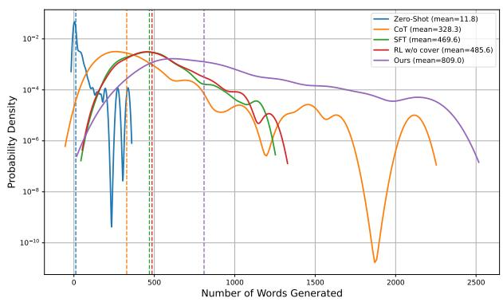  
Figure 3: Comparison of output lengths using different methods on Llama-3.1. RL ${ \mathsf w } / { \mathsf o }$ cover refers to the method that does not incorporate $R _ { \mathrm { c o v e r } }$

## 4.5 Further analysis

A more comprehensive and concise chain of thought is more effective. As shown in Table 3 and Figure 3, the integration of $R _ { \mathrm { c o v e r } }$ markedly enhances the thought coverage rate, increasing it from 24.5% to 84.9%, which corresponds to an improvement by a factor of approximately 3.47. Inevitably, this increase in coverage is accompanied by a 1.72 growth in output length. Notably, this increase is much smaller than the coverage gain, indicating that $R _ { \mathrm { c o v e r } }$ improves information density. We compared the output lengths across different methods, and the results illustrate the highly unstable reasoning pattern of CoT (the pronounced fluctuations in the probability density of output lengths). The model fine-tuned with SFT data distilled from a stronger model produces a more reasonable chain of thought while only slightly increasing output length. RL without $R _ { \mathrm { c o v e r } }$ method yields a more concise reasoning process. In contrast, our method, which reinforces reference coverage, achieves the best performance across all metrics, providing a chain of thought that is both comprehensive and concise.

Enhancing reasoning sentence coverage through RL leads to a more effective use of training samples compared to standard SFT. To investigate whether the inclusion of more data improves performance, we employed the reasoning chain data distillation approach mentioned earlier. Specifically, we distilled the two thousand samples used in the RL process and incorporated them into the original SFT dataset for further fine-tuning. As shown in Figure 4, the results indicate that, despite the increased data number, the performance of SFT\_Plus did not significantly improve and even declined. This suggests that the additional data may have introduced more noise, undermining the model’s effectiveness. In contrast, enhancing reasoning sentence coverage through RL substantially improved model performance, suggesting that it enables more efficient utilization of the available data. This approach notably enhanced the model’s ability to detect self-contradictions at the document level, thereby increasing its reliability.

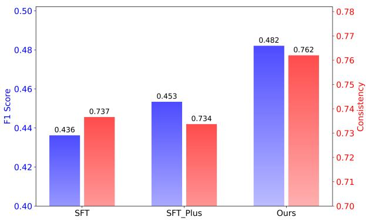  
Figure 4: Comparison of the performance on the Judge then Find task among the baseline SFT, our method, and SFT\_Plus (SFT with additional training data) based on the Llama-3.1-8B-Instruct model.

## 5 Conclusion

In this work, we address the challenge of Document-level Self-Contradiction Detection (DSCD), where Chain-of-Thought (CoT) prompting has shown significant response inconsistency due to incomplete or variable focus during inference. To tackle this issue, we propose a two-stage framework combining supervised fine-tuning with reinforcement learning. Our approach explicitly encourages the model to include all potentially contradictory sentences in its reasoning chain, guided by a novel reward design that balances accuracy, reference coverage, and structural consistency. To the best of our knowledge, we are the first to incorporate reinforcement learning into document-level self-contradiction detection. Experimental results demonstrate substantial improvements in LLMs’ accuracy and consistency, highlighting their enhanced reliability in detecting document-level self-contradictions.

## 6 Limitations

Although our method effectively enhances the performance of LLMs in detecting documentlevel self-contradictions, several limitations remain. Achieving a balance between maintaining a comprehensive reasoning chain and ensuring its conciseness continues to be a significant challenge. Furthermore, due to hardware constraints, our evaluation was restricted to models with approximately 8 billion parameters. Additionally, the lack of publicly available datasets annotated with location-specific information for documentlevel self-contradictions limits the scope of broader evaluation; consequently, all experiments were conducted exclusively on the ContraDoc dataset. Moreover, our current approach to constructing document-level self-contradictions focuses exclusively on the textual modality. The generation and detection of multimodal document-level contradictions, involving images, tables, or other media, represent promising directions for future research.

## 7 Acknowledgements

This work was supported in part by the grants from National Natural Science Foundation of China (No.62222213, U22B2059).

## References

Ismail Badache, Sébastien Fournier, and Adrian-Gabriel Chifu. 2018. Predicting contradiction intensity: Low, strong or very strong? In The 41st International ACM SIGIR Conference on Research & Development in Information Retrieval, pages 1125–1128.

Yuhao Chen, Shuochen Liu, Yuanjie Lyu, Chao Zhang, Jiayao Shi, and Tong Xu. 2025. Xiangqi-r1: Enhancing spatial strategic reasoning in llms for chinese chess via reinforcement learning. arXiv preprint arXiv:2507.12215.

Paul F Christiano, Jan Leike, Tom Brown, Miljan Martic, Shane Legg, and Dario Amodei. 2017. Deep reinforcement learning from human preferences. Advances in neural information processing systems, 30.

Tianzhe Chu, Yuexiang Zhai, Jihan Yang, Shengbang Tong, Saining Xie, Dale Schuurmans, Quoc V Le, Sergey Levine, and Yi Ma. 2025. Sft memorizes, rl generalizes: A comparative study of foundation model post-training. arXiv preprint arXiv:2501.17161.

Marie-Catherine De Marneffe, Anna N Rafferty, and Christopher D Manning. 2008. Finding contradictions in text. In Proceedings of acl-08: Hlt, pages 1039–1047.

DeepSeek-AI. 2024. Deepseek-v3 technical report.

DeepSeek-AI. 2025. Deepseek-r1: Incentivizing reasoning capability in llms via reinforcement learning.

Etienne Fortier-Dubois and Domenic Rosati. 2023. Using contradictions improves question answering systems. In Proceedings ofthe 61st Annual Meeting of the Associationfor Computational Linguistics (Volume 2: Short Papers), pages 827–840.

Daya Guo, Dejian Yang, Haowei Zhang, Junxiao Song, Ruoyu Zhang, Runxin Xu, Qihao Zhu, Shirong Ma, Peiyi Wang, Xiao Bi, et al. 2025. Deepseek-r1: Incentivizing reasoning capability in llms via reinforcement learning. arXiv preprint arXiv:2501.12948.

Cheng Hsu, Cheng-Te Li, Diego Saez-Trumper, and Yi-Zhan Hsu. 2021. Wikicontradiction: Detecting selfcontradiction articles on wikipedia. In 2021 IEEE international conference on big data (Big Data), pages 427–436. IEEE.

Edward J. Hu, Yelong Shen, Phillip Wallis, Zeyuan Allen-Zhu, Yuanzhi Li, Shean Wang, Lu Wang, and Weizhu Chen. 2021. Lora: Low-rank adaptation of large language models.

Fred Jelinek, Robert L Mercer, Lalit R Bahl, and James K Baker. 1977. Perplexity—a measure of the difficulty of speech recognition tasks. The Journal of the Acoustical Society ofAmerica, 62(S1):S63–S63.

Bowen Jin, Hansi Zeng, Zhenrui Yue, Dong Wang, Hamed Zamani, and Jiawei Han. 2025. Searchr1: Training llms to reason and leverage search engines with reinforcement learning. arXiv preprint arXiv:2503.09516.

Diederik P Kingma and Jimmy Ba. 2014. Adam: A method for stochastic optimization. arXiv preprint arXiv:1412.6980.

Piroska Lendvai, Isabelle Augenstein, Kalina Bontcheva, and Thierry Declerck. 2016. Monolingual social media datasets for detecting contradiction and entailment. In Proceedings of the Tenth International Conference on Language Resources and Evaluation (LREC’16), pages 4602–4605.

Jierui Li, Vipul Raheja, and Dhruv Kumar. 2024. Contradoc: Understanding self-contradictions in documents with large language models. In Proceedings ofthe 2024 Conference ofthe North American Chapter of the Association for Computational Linguistics: Human Language Technologies (Volume 1: Long Papers), pages 6509–6523.

Joao Monteiro, Pierre-Andre Noel, Etienne Marcotte, Sai Rajeswar Mudumba, Valentina Zantedeschi, David Vazquez, Nicolas Chapados, Chris Pal, and Perouz Taslakian. 2024. Repliqa: A questionanswering dataset for benchmarking llms on unseen reference content. Advances in Neural Information Processing Systems, 37:24242–24276.

OpenAI, :, Ahmed El-Kishky, Alexander Wei, Andre Saraiva, Borys Minaiev, Daniel Selsam, David Dohan, Francis Song, Hunter Lightman, Ignasi Clavera, Jakub Pachocki, Jerry Tworek, Lorenz Kuhn, Lukasz Kaiser, Mark Chen, Max Schwarzer, Mostafa Rohaninejad, Nat McAleese, o3 contributors, Oleg Mürk, Rhythm Garg, Rui Shu, Szymon Sidor, Vineet Kosaraju, and Wenda Zhou. 2025. Competitive programming with large reasoning models.

Long Ouyang, Jeffrey Wu, Xu Jiang, Diogo Almeida, Carroll Wainwright, Pamela Mishkin, Chong Zhang, Sandhini Agarwal, Katarina Slama, Alex Ray, et al. 2022. Training language models to follow instructions with human feedback. Advances in neural information processing systems, 35:27730–27744.

Richard Yuanzhe Pang, Weizhe Yuan, He He, Kyunghyun Cho, Sainbayar Sukhbaatar, and Jason Weston. 2024. Iterative reasoning preference optimization. Advances in Neural Information Processing Systems, 37:116617–116637.

Rafael Rafailov, Archit Sharma, Eric Mitchell, Christopher D Manning, Stefano Ermon, and Chelsea Finn. 2023. Direct preference optimization: Your language model is secretly a reward model. Advances in Neural Information Processing Systems, 36:53728– 53741.

Samyam Rajbhandari, Olatunji Ruwase, Jeff Rasley, Shaden Smith, and Yuxiong He. 2021. Zero-infinity: Breaking the gpu memory wall for extreme scale deep learning. In Proceedings of the international conferencefor highperformance computing, networking, storage and analysis, pages 1–14.

Jeff Rasley, Samyam Rajbhandari, Olatunji Ruwase, and Yuxiong He. 2020. Deepspeed: System optimizations enable training deep learning models with over 100 billion parameters. In Proceedings of the 26th ACM SIGKDD International Conference on Knowledge Discovery & Data Mining, pages 3505–3506.

John Schulman, Filip Wolski, Prafulla Dhariwal, Alec Radford, and Oleg Klimov. 2017. Proximal policy optimization algorithms. arXiv preprint arXiv:1707.06347.

Zhihong Shao, Peiyi Wang, Qihao Zhu, Runxin Xu, Junxiao Song, Xiao Bi, Haowei Zhang, Mingchuan Zhang, YK Li, Y Wu, et al. 2024. Deepseekmath: Pushing the limits of mathematical reasoning in open language models. arXiv preprint arXiv:2402.03300.

Zhaochen Su, Jun Zhang, Xiaoye Qu, Tong Zhu, Yanshu Li, Jiashuo Sun, Juntao Li, Min Zhang, and Yu Cheng. 2024. Conflictbank: A benchmark for evaluating the influence of knowledge conflicts in llm. arXiv preprint arXiv:2408.12076.

Melanie Subbiah, Faisal Ladhak, Akankshya Mishra, Griffin Thomas Adams, Lydia Chilton, and Kathleen McKeown. 2024. STORYSUMM: Evaluating faithfulness in story summarization. In Proceedings of

the 2024 Conference on Empirical Methods in Natural Language Processing, pages 9988–10005, Miami, Florida, USA. Association for Computational Linguistics.

Tianxiang Sun, Junliang He, Xipeng Qiu, and Xuanjing Huang. 2022. Bertscore is unfair: On social bias in language model-based metrics for text generation. arXiv preprint arXiv:2210.07626.

Qiyao Wang, Shiwen Ni, Huaren Liu, Shule Lu, Guhong Chen, Xi Feng, Chi Wei, Qiang Qu, Hamid Alinejad-Rokny, Yuan Lin, et al. 2024. Autopatent: A multiagent framework for automatic patent generation. arXiv preprint arXiv:2412.09796.

Jason Wei, Xuezhi Wang, Dale Schuurmans, Maarten Bosma, Fei Xia, Ed Chi, Quoc V Le, Denny Zhou, et al. 2022. Chain-of-thought prompting elicits reasoning in large language models. Advances in neural information processing systems, 35:24824–24837.

Xiaofei Wen, Bangzheng Li, Tenghao Huang, and Muhao Chen. 2024. Red teaming language models for processing contradictory dialogues. arXiv preprint arXiv:2405.10128.

Chujie Zheng, Jinfeng Zhou, Yinhe Zheng, Libiao Peng, Zhen Guo, Wenquan Wu, Zheng-Yu Niu, Hua Wu, and Minlie Huang. 2022. Cdconv: A benchmark for contradiction detection in chinese conversations. In Proceedings of the 2022 Conference on Empirical Methods in Natural Language Processing, pages 18– 29.

## A Hyperparameters

All experiments were conducted on 8 \* NVIDIA L20 GPUs. The reported results represent the average over five independent runs to ensure the stability and reliability of the outcomes. During the evaluation, we set the temperature to 0.7, top-p to 0.9, and max\_new\_tokens to 4096.

During Supervised Fine-Tuning (SFT), the model is trained for three epochs on four NVIDIA L20 GPUs with a learning rate of $1 \times 1 0 ^ { - 4 }$ and a gradient accumulation step of 8. Training adopts BF16 mixed precision, gradient checkpointing, and DeepSpeed ZeRO-3 (Rajbhandari et al., 2021; Rasley et al., 2020) with CPU offloading. The maximum sequence length is 4096 tokens. Parameterefficient fine-tuning is performed using LoRA (Hu et al., 2021) with rank 8, α = 32, and a dropout rate of 0.1. The Adam optimizer (Kingma and Ba, 2014) is used with default settings for causal language modeling.

In the Reinforcement Learning (RL) phase, DeepSpeed ZeRO-3 with CPU offloading and BF16 precision are maintained. Training is conducted over one epoch with a learning rate of

$5 \times 1 0 ^ { - 5 }$ , a micro-batch size of 4 per GPU, and a gradient accumulation step of 2. Gradient clipping with a maximum norm of 1.0 is applied. The maximum prompt and completion lengths are set to 8192 and 4096 tokens, respectively. LoRA is again applied with the same configuration as in SFT.

## B Training and Testing Data

## B.1 Training Dataset Sources

We employ two datasets that are highly unlikely to be present in the training data of LLMs: Story-Summ (Subbiah et al., 2024) and REPLIQA (Monteiro et al., 2024). The StorySumm dataset consists of 32 short stories sourced from two fictionoriented subreddits. To ensure both the quality and appropriateness of the content, the dataset excludes posts labeled as NSFW and those that received fewer than three upvotes. These community-vetted stories are concise, usually under one page, and lack user-written summaries. Their limited online visibility further reduces the likelihood of overlap with LLM training corpora, thus serving as a clean benchmark. In contrast, REPLIQA is a large-scale question-answering dataset comprising 17,954 human-authored synthetic documents, each approximately 1,000 words in length. These documents span 17 diverse thematic domains, including cybersecurity, folklore, and others, and depict entirely fictional scenarios, making them particularly well-suited for evaluating LLM generalization to genuinely novel content. From this dataset, we derive two evaluation subsets, denoted as repliqa\_1 and repliqa\_2. To rigorously prevent data leakage during the partitioning process, we filter examples by unique ID prefixes and retain only one instance per prefix, thereby ensuring clear separation between the subsets.

## B.2 Self-Contradiction Generation and Verification

We utilize LLMs to develop an automated strategy for generating contradictions. This process is underpinned by four primary operations: Insert, Delete, Replace, and Swap. Each operation type is illustrated through examples provided in Figure 2.

The implementation begins by selecting a subset of the dataset for contradiction generation. For insert and replace operations, factual sentences are first extracted via queries to LLMs. In contrast, delete and swap require only a single query. We utilize the DeepSeek-V3 (DeepSeek-AI, 2024)

through its online API to generate modified samples $\bar { \hat { d } } _ { i }$ and corresponding contradiction sets = $\{ s _ { 1 } , s _ { 2 } , \ldots \}$ , each with an explanation r. Prompts used for each operation type are shown in Figures 7 to 12, and are designed to ensure alignment with the intended modifications. Outputs with empty or non-compliant JSON structures are discarded.

As shown in Figure 2, in the insert example, the added sentence contradicts the character’s previously established dedication to gardening. In the delete case, removing the explanation that the plants were wilting renders the subsequent action, cutting back on watering, unjustified and illogical. In the replace case, if Mary dislikes gardening, it becomes inconsistent for her to take good care of the flowers and feel happy every day. In the swap case, cutting back on watering before realizing that the plants were growing rapidly introduces a temporal inconsistency, since there would have been no need to reduce watering if the plants were thriving. All four types of operations can lead to self-contradictions within the document.

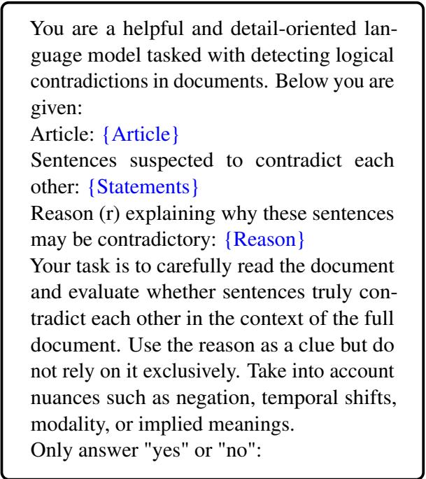  
Figure 5: Prompt template for verifying suspected contradictions in a document.

To rigorously verify self-contradiction, we design specific prompts for positive and negative samples (see Figure 5 and Figure 6). For a positive sample, the model is provided with a modified document $\hat { d } _ { i } .$ a set of contradictory statements , and a rationale r explaining the contradiction. A response of True indicates a valid contradiction, and the sample is retained. Prompt template for negative samples, where only the original document d is provided. This setup mirrors the prompt format used during testing; samples yielding a no response, which indicates no contradiction, are kept. Leveraging the capabilities of the powerful model, this filtering step provides a coarse screening to remove obviously unsuitable documents; however, manual verification does not guarantee 100% accuracy. Therefore, using it directly as a test set is not entirely appropriate.

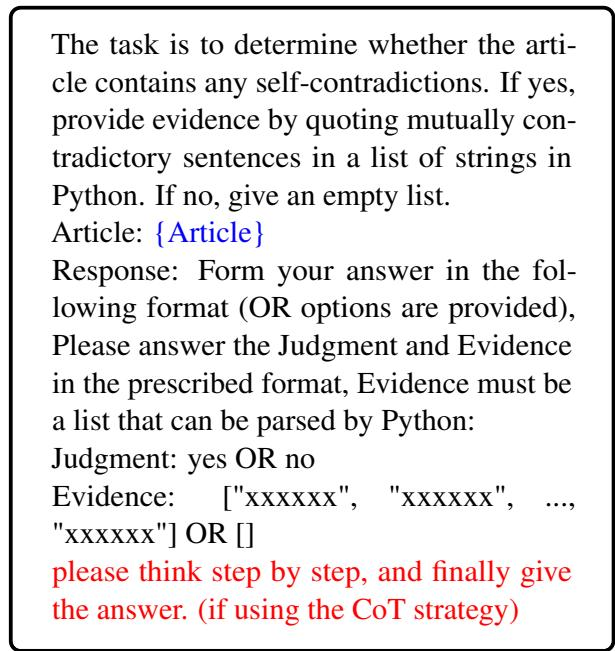  
Figure 6: Prompt template used for evaluation.

## B.3 Data Statistics

We constructed a training dataset with 2,754 positive and 4,276 negative samples. For RL, 1,000 positive and 1,000 negative instances were randomly selected. The remaining data were distilled using DeepSeek-R1, yielding 1,360 positive and 1,568 negative samples for SFT. The evaluation was performed on the ContraDoc dataset, a standard benchmark for document semantic content detection. To examine RL’s data efficiency, we also distilled the RL training data, obtaining 766 positive and 469 negative samples, which were added to the SFT dataset for further experiments.

## C Additional Experiments

## C.1 Generalization to Finer-Grained and Different Scenarios

To more comprehensively validate the robustness and applicability of our approach, we conducted additional experiments on the sentence-level contradiction detection dataset contraDialog (Wang et al., 2024). Specifically, we employed the same backbone model, Llama-3.1-8B-Instruct, as in the main experiments, and performed transfer evaluation using the model trained on contraDoc to ensure comparability and consistency of results. Due to the annotation limitations of the dataset, we only conducted experiments on the binary judgment task.

<table><tr><td>Method</td><td>F1</td><td>Acc.</td><td>Cons.</td><td>Rel.</td></tr><tr><td>Zero-Shot</td><td>0.329</td><td>0.506</td><td>0.772</td><td>0.254</td></tr><tr><td>CoT</td><td>0.592</td><td>0.518</td><td>0.599</td><td>0.355</td></tr><tr><td>Ours</td><td>0.797</td><td>0.782</td><td>0.783</td><td>0.624</td></tr></table>

Table 4: Performance on the contraDialog dataset.

As shown in Table 4, our method substantially outperforms both the zero-shot baseline and CoT prompting across all evaluation metrics, achieving notable improvements in F1, accuracy, consistency, and reliability. These results highlight the strong cross-domain generalizability of our approach, demonstrating its effectiveness in transferring from document-level to sentence-level tasks.

## C.2 Simple Prompting Provides Limited Improvements

We further explored whether simple modifications to the prompting strategy could improve model performance. Specifically, the standard CoT prompt, “Please think step by step,” was revised to a sentence-level variant, referred to as the Cover Prompt, which instructs the model to “Please consider the document sentence-by-sentence.”

<table><tr><td rowspan="2">Method</td><td colspan="4">Binary Judgment</td><td colspan="4">Judge then Find</td></tr><tr><td>Fl</td><td>Acc.</td><td>Cons.</td><td>Rel.</td><td>F1</td><td>Acc.</td><td>Cons.</td><td>Rel.</td></tr><tr><td>CoT</td><td>0.521</td><td>0.596</td><td>0.585</td><td>0.349</td><td>0.399</td><td>0.436</td><td>0.596</td><td>0.247</td></tr><tr><td>Cover Prompt</td><td>0.529</td><td>0.589</td><td>0.642</td><td>0.378</td><td>0.400</td><td>0.411</td><td>0.652</td><td>0.268</td></tr><tr><td>Ours</td><td>0.649</td><td>0.627</td><td>0.723</td><td>0.469</td><td>0.511</td><td>0.482</td><td>0.762</td><td>0.367</td></tr></table>

Table 5: Comparison between standard CoT prompting, sentence-level Cover Prompt, and our method on the ContraDoc dataset.

Experiments were conducted using Llama-3.1- 8B-Instruct on the CONTRADOC dataset. The results are presented in Table 5. Compared with the standard CoT prompt, the Cover Prompt slightly improves F1 and consistency, while leading to a marginal drop in accuracy. Nonetheless, the effect of prompt modification remains limited, as the model often fails to follow sentence-level instructions strictly. In contrast, our method explicitly promotes consistency and coverage, resulting in stronger and more reliable performance, albeit with additional computation.

## C.3 Zero-Shot Evaluation with Large LLM

To further investigate model performance across different scales, we conducted zero-shot evaluations on stronger models via API. The results on the ContraDoc dataset are summarized in Table 6.

Overall, larger models achieve better performance, yet there remains a clear gap from perfect accuracy, highlighting the inherent difficulty of the task. In the simpler Binary Judgment setting, our method significantly improves the performance of an 8B model, bringing it close to that of the much larger 671B DeepSeek-R1. In the more complex Judge-then-Find setting, a noticeable gap persists, primarily due to the limited reasoning capacity of smaller models. Considering that practical applications often require a trade-off between efficiency and performance, enhancing the effectiveness of smaller models remains valuable. In this context, our approach offers a meaningful and applicable solution.

<table><tr><td rowspan="2">Method</td><td colspan="2">Binary Judgment</td><td colspan="2">Judge then Find</td></tr><tr><td>F1</td><td>Acc.</td><td>F1</td><td>Acc.</td></tr><tr><td>Doubao-1.5-pro</td><td>0.702</td><td>0.712</td><td>0.647</td><td>0.652</td></tr><tr><td>DeepSeek-R1</td><td>0.717</td><td>0.696</td><td>0.636</td><td>0.631</td></tr><tr><td>DeepSeek-V3</td><td>0.561</td><td>0.667</td><td>0.526</td><td>0.649</td></tr><tr><td>Ours (8B)</td><td>0.649</td><td>0.627</td><td>0.482</td><td>0.511</td></tr></table>

Table 6: Zero-shot evaluation results on the ContraDoc dataset using larger LLMs via API, compared with our 8B model.

## D Case Study

In this example (see Figure 13), the Zero-Shot approach simply outputs "no" without any accompanying explanation, which is clearly inadequate for practical document-level inconsistency detection systems that require interpretable reasoning. In contrast, the CoT prompting method guides the model to attend to specific sentences (e.g., sentences 9 and 11); however, due to incomplete or fragmented reasoning chains, the model still arrives at an incorrect conclusion. While CoT occasionally identifies the correct point of contradiction, it often arbitrarily overlooks other conflicting information in the document. This variability in focus across different runs results in unstable and inconsistent outputs.

By comparison, our Reinforced Reference Coverage method encourages the model to comprehensively consider relevant content throughout the entire document. This not only promotes a more thorough and balanced reasoning process but also enhances consistency across multiple runs, effectively addressing the instability observed in prior approaches.

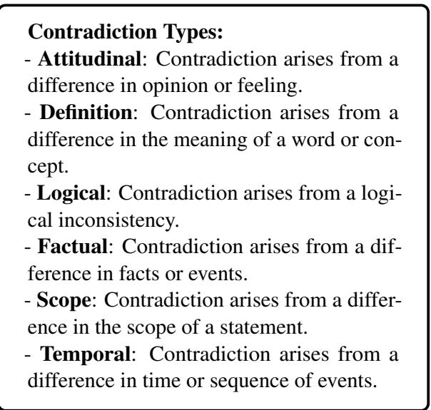  
Figure 7: Definitions of contradiction types used for sentence generation.

From the provided article, extract exactly five sentences corresponding to one of the following categories: Attitudinal, Definition, Logical, Factual, Scope, or Temporal. Please format your response as a Pythonparsable list with exactly five elements, in the following format: ["sentence1", "sentence2", "sentence3", "sentence4", "sentence5"].   
Article: {Article}

Figure 8: Prompt template used to extract factual sentences from the original document.

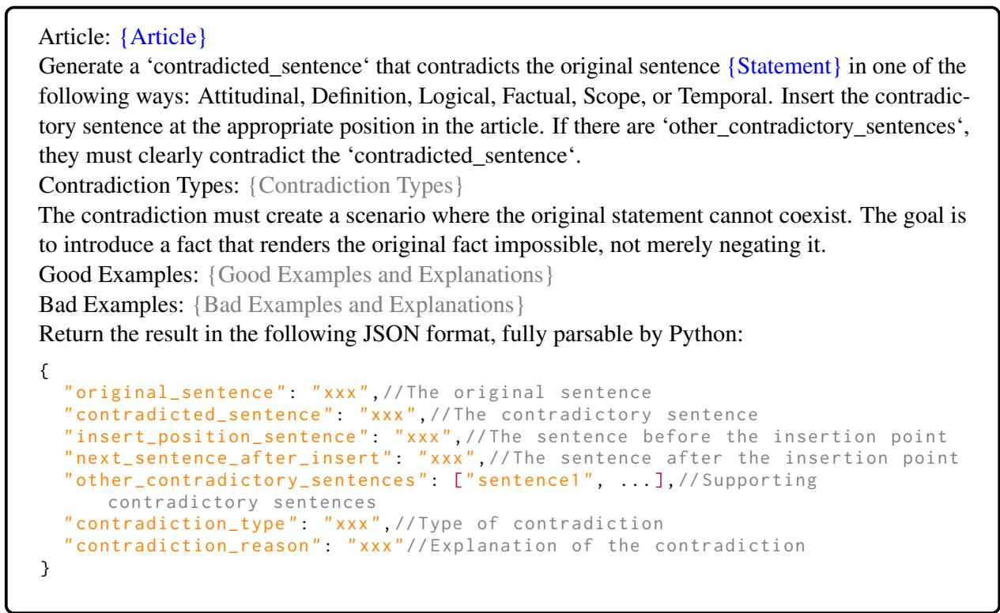  
Figure 9: Prompt template for inserting a contradictory sentence.

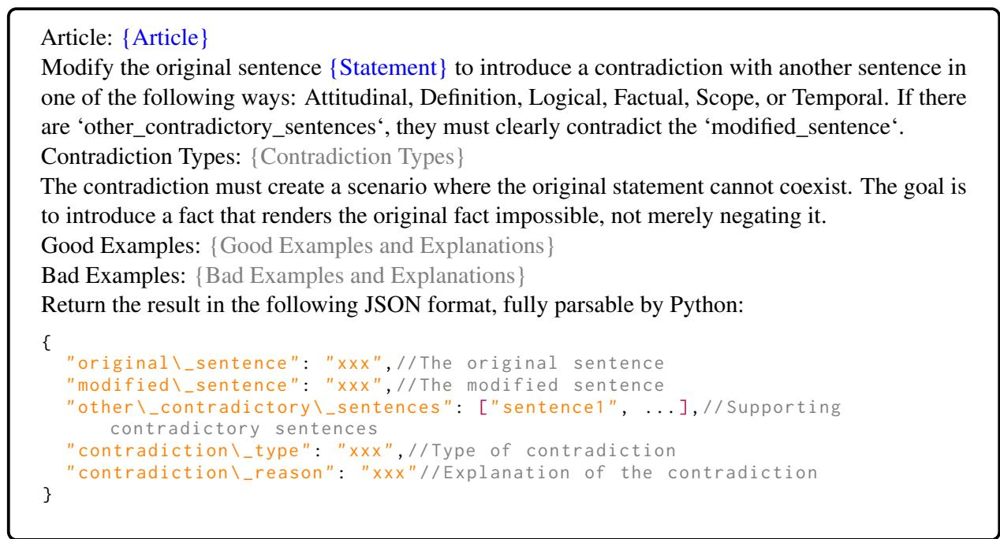  
Figure 10: Prompt template for modifying an original sentence to introduce contradiction.

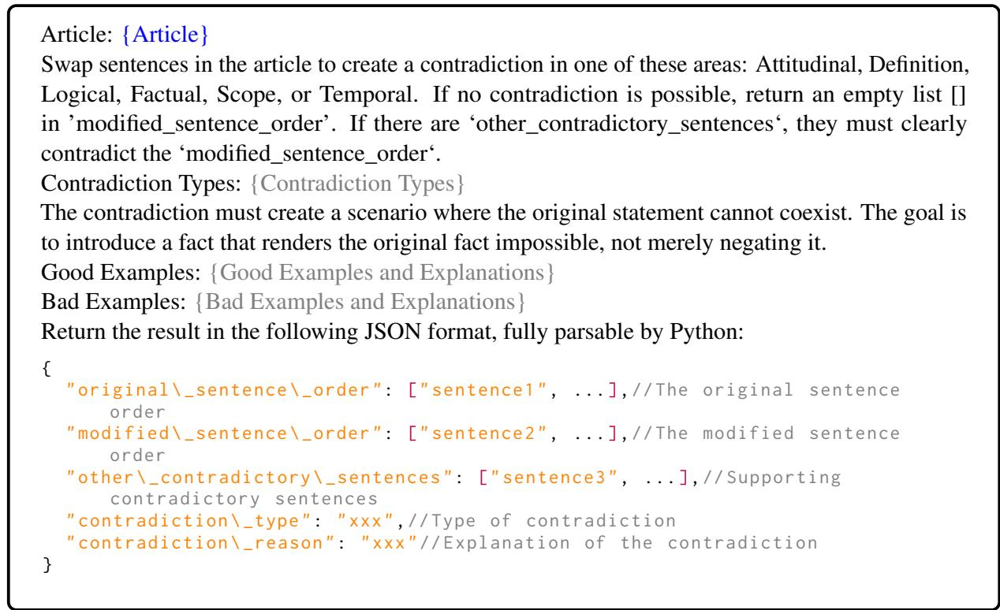  
Figure 11: Prompt template for modifying original sentence order to introduce contradiction.

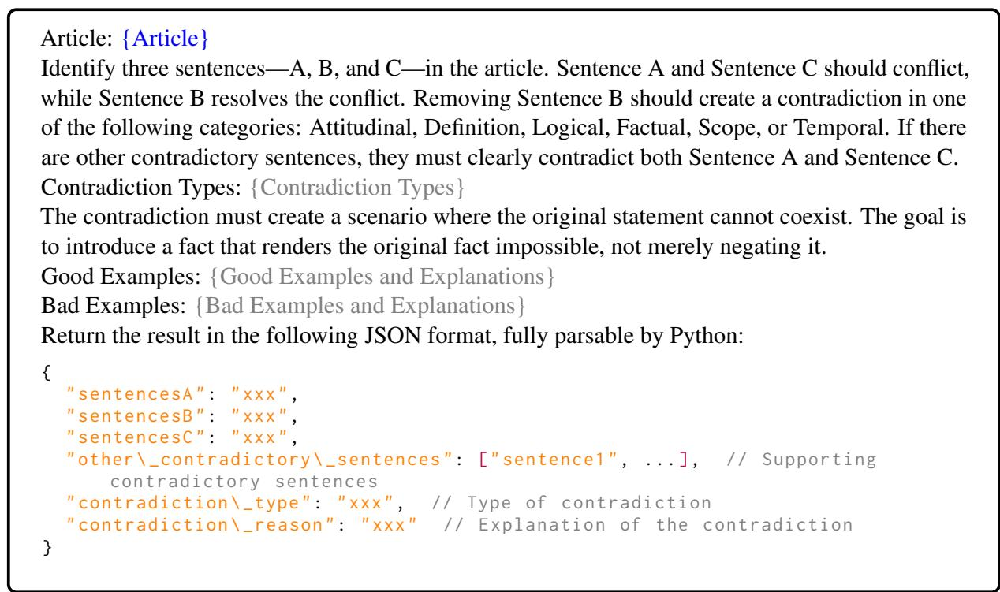  
Figure 12: Prompt template for removing a key sentence to introduce contradiction.

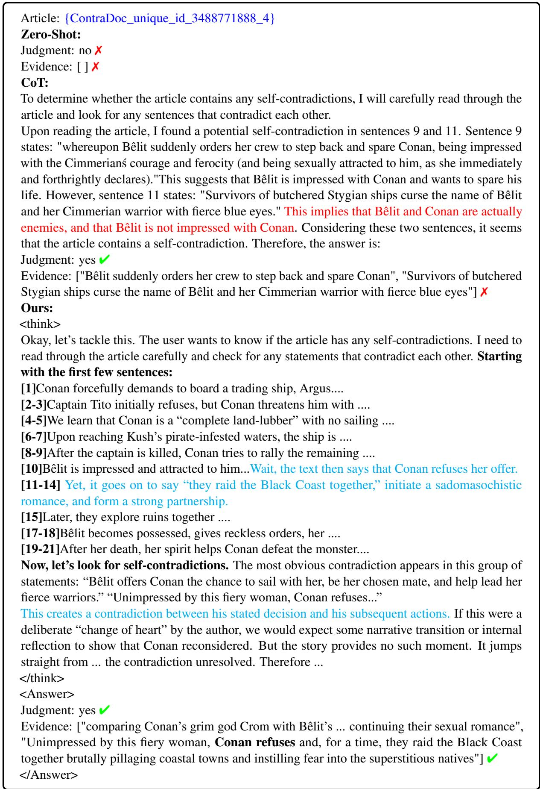  
Figure 13: Comparative Case Study of Llama-3.1-8B-Instruct Under Various Approaches.