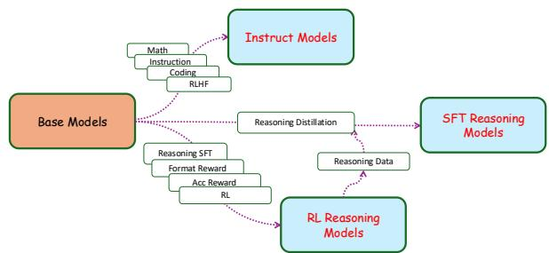
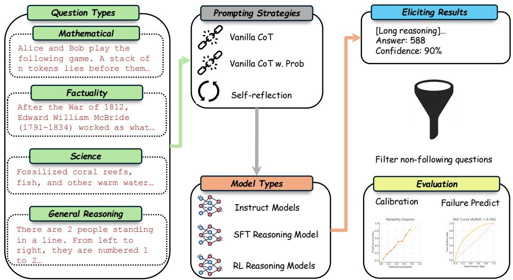
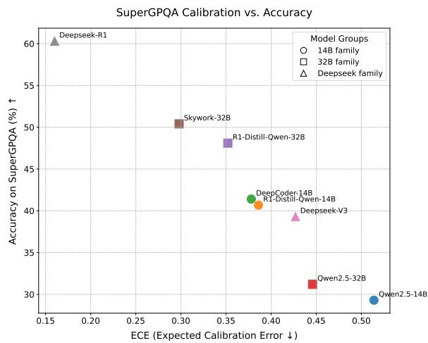
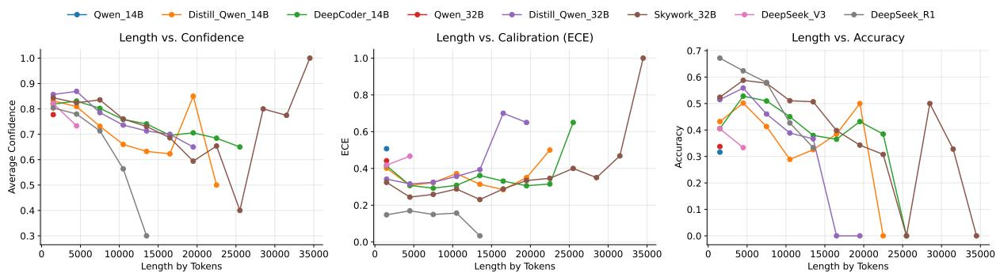

# Thinking Out Loud: Do Reasoning Models Know When They’re Right?

Qingcheng Zeng1∗, Weihao Xuan2,3\*, Leyang Cui4, Rob Voigt5

1Northwestern University, 2The University of Tokyo, 3RIKEN AIP 4Westlake University, 5University of California, Davis

## Abstract

Large reasoning models (LRMs) have recently demonstrated impressive capabilities in com plex reasoning tasks by leveraging increased test-time computation and exhibiting behaviors reminiscent of human-like self-reflection. While LRMs show a clear capacity for valu able self-reflection, how this ability interacts with other model behaviors remains underexplored. We investigate this connection by ana lyzing verbalized confidence, how models ar ticulate their certainty, as a lens into the nature of self-reflection in LRMs. We find that su pervised fine-tuning on reasoning traces (i.e., distillation) and reinforcement learning can improve verbalized calibration in reasoning intensive settings in a progressive, laddered fashion. However, our results also indicate that reasoning models may possess a dimin ished awareness of their own knowledge bound aries, as evidenced by significantly lower “I don’t know” response rates on factuality bench marks. Moreover, we examine the relationship between verbalized confidence and reason ing chains, finding that models tend to express higher confidence when providing shorter or less elaborate reasoning. Our findings highlight how reasoning-oriented training can enhance performance in reasoning-centric tasks while potentially incurring a reasoning tax, a cost reflected in the model’s reduced ability to accurately recognize the limits of its own knowl edge in small-scale models. More broadly, our work showcases how this erosion of knowledge boundaries can compromise model faithfulness, as models grow more confident without a com mensurate understanding of when they should abstain.

## 1 Introduction

Large reasoning models (LRMs) have emerged as a dominant paradigm in the development of large

\*Both authors contributed equally. Correspondence to qcz@u.northwestern.edu

  
Figure 1: An illustration of different pathways of LLM/LRM training; we compare three key categories of models for their calibration performances.

language models (LLMs), achieving state-of-theart performance across a range of complex tasks, including mathematics (Ye et al., 2025; Moshkov et al., 2025), complex reasoning (OpenAI et al., 2024b; DeepSeek-AI et al., 2025a), and coding (OpenAI et al., 2025). A defining characteristic of LRMs is the emergence of self-reflective behaviors, where models appear capable of reassessing and refining their reasoning, sometimes displaying behavior suggestive of a nascent form of introspection that internally assesses whether particular stepwise inferences are likely correct or flawed (e.g. “Wait, but...").

While verbalized uncertainty is widely used to assess calibration in LLMs (Wei et al., 2024; Phan et al., 2025; Wei et al., 2025), its association with the emerging self-reflective behaviors in LRMs remains underexplored. If reasoning models are truly more introspective, their verbalized confidence should better align with actual correctness. This motivates our central research question: Are reasoning models better calibrated? That is, do their improved reasoning capabilities lead to more faithful and reliable confidence estimates?

Prior studies have shown that LLMs often struggle to produce well-calibrated confidence estimates, frequently displaying overconfidence in their verbalized uncertainty. For example, Xiong et al.

(2024) conducted a broad empirical study and found that many instruction-tuned LLMs systematically overstate their certainty across a variety of tasks, regardless of their actual correctness. Moreover, Tian et al. (2023); Xiong et al. (2024); Yang et al. (2024) have highlighted that model calibration is highly sensitive to prompt design, underscoring the fragility and lack of robustness in current approaches to verbalized uncertainty estimation in instruction-tuned models. While prior work suggests that human-inspired prompting strategies, such as chain-of-thought (CoT) or TopK, can enhance calibration, we extend this line of inquiry by investigating whether LRMs, which inherently embed long CoT chains and self-reflective behaviors, can further improve calibration.

In this work, we conduct a comprehensive empirical study to assess the calibration of LRMs across a diverse set of benchmarks spanning mathematics, factuality, scientific reasoning, and general reasoning. To isolate the effects of different training strategies, we evaluate models that share the same base architecture but vary in their post-training procedures. Our analysis focuses on three distinct model categories: (1) instruct models, trained mainly using SFT and general RL for alignment purposes; (2) SFT reasoning models, fine-tuned primarily on long CoT outputs generated by stronger reasoning models; and (3) RL reasoning models, trained with reasoning RL to explicitly optimize reflective reasoning behaviors. An overview of these training pipelines is illustrated in Figure 1. Through systematic pairwise comparisons, our key findings are as follows:

• On reasoning-heavy benchmarks, both SFT reasoning models and RL reasoning models consistently outperform instruction-tuned models in terms of both task accuracy and calibration quality.

• While SFT on reasoning traces leads to substantial performance gains, RL offers additional improvements in calibration, even when the RL training domain (e.g., math) differs from the evaluation domain (e.g., science), highlighting its generalizability.

• On factuality-focused benchmarks, calibration improvements are less consistent: smallscale SFT reasoning models often exhibit worse calibration than instruction-tuned models, while RL reasoning models generally show some recovery. Further analysis indicates that open-source LRMs produce significantly fewer “I don’t know” responses compared to instruction-tuned models, suggesting a reduced awareness of their own knowledge boundaries.

## 2 Related Work

Large Reasoning Models. Following the development of long-chain reasoning models (Ziabari et al., 2025) such as o1 (OpenAI et al., 2024b), a new generation of LLMs has emerged, designed to handle complex, multi-step reasoning tasks. The training of LRMs typically begins with an SFT phase on reasoning-intensive data, a process often referred to as a cold start. Even with limited curated data, this phase has shown strong results; for instance, Ye et al. (2025) demonstrates that finetuning on just 817 human-curated examples can yield substantial improvements on mathematical and reasoning-heavy tasks. Building on this foundation, a second phase applies outcome-based RL to further enhance model performance by promoting self-exploration and reflective reasoning. Notable examples include DeepCoder-14B (Luo et al., 2025), QwQ (Qwen Team, 2025), and DeepSeek-R1 (DeepSeek-AI et al., 2025a), which use RL to refine the introspective and reasoning capabilities of LRMs beyond what SFT alone can achieve.

Uncertainty Quantification. Effectively quantifying uncertainty or confidence in LLMs is critical for assessing whether these models are inherently calibrated. Vashurin et al. (2025) provide a comprehensive benchmark of uncertainty quantification techniques across general-purpose LLMs, highlighting the strong performance of samplingbased methods, such as semantic entropy (Kuhn et al., 2023) and SentenceSAR (Duan et al., 2024), particularly in open-ended generation tasks. However, despite their accuracy, these approaches are computationally expensive, motivating increased interest in verbalized confidence as a lightweight alternative. For instance, Tian et al. (2023) show that verbalized confidence can yield strong calibration in RLHF-trained models. Xuan et al. (2025) explore how vision language models perform in multimodal settings and report that visual reasoning usually enhances better verbalized calibration. Yet, findings remain mixed: Xiong et al. (2024) report that many LLMs systematically overestimate their certainty, leading to poor calibration in practice. In this work, we revisit this issue by systematically comparing instruction-tuned models and reasoning models within a unified evaluation framework to examine how training paradigms affect verbalized calibration behavior.

  
Figure 2: Verbalized confidence evaluation across various tasks, prompting strategies, and model types.

## 3 Experimental Setup

## 3.1 Models

To evaluate the three model variants, we consider the following representative models within each category:

• Instruct models: These include Qwen2.5- 14B-Instruct, Qwen2.5-32B-Instruct (henceforth Qwen2.5-14/32B) (Qwen et al., 2025), and DeepSeek-V3 (DeepSeek-AI et al., 2025b). Specifically, these models were trained using SFT on both reasoning and nonreasoning data, then followed by general RL, mainly for alignment purposes.

• SFT reasoning models: We evaluate DeepSeek-R1-Distill-Qwen-14B/32B (DeepSeek-AI et al., 2025a), both of which are fine-tuned on 800k examples (600k long reasoning chains and 200k non-reasoning data) distilled from the outputs of the intermediate DeepSeek-R1 model.

• RL reasoning models: This category includes DeepCoder-14B-Preview (Luo et al., 2025), Skywork-OR1-32B-Preview (He et al., 2025), and DeepSeek-R1 (DeepSeek-AI et al., 2025a). We chose the former two models because they are trained on top of our evaluated

SFT reasoning models, so that we could directly observe the reasoning RL’s effects.

## 3.2 Datasets

We evaluate the models across the following datasets:

• Math: AIME 2024 and AIME 2025 (MAA Committees), each consisting of 30 challenging mathematical questions designed to test mathematical reasoning skills. We run both datasets five times and report the aggregated results.

• Factuality: SimpleQA (Wei et al., 2024) and FreshQA-2025-04-28 (Vu et al., 2023), two factuality benchmarks that evaluate the ability of language models to answer fact-seeking questions. In evaluation, we adopt the same prompt as in Wei et al. (2024) to categorize responses into correct, incorrect, or not attempted.

• Scientific Reasoning: GPQA-Diamond (Rein et al., 2023), containing 198 graduate-level scientific multiple-choice questions; and SuperGPQA (M-A-P Team et al., 2025), in which we randomly sample 500 questions from easy, medium, and hard levels, totaling 1500 questions.

• General Reasoning: The reasoning portion of LiveBench (White et al., 2024), which we refer as LiveBench-Reasoning, contains 150 reasoning problems which are a harder version of Web of Lies from Big-Bench Hard (Suzgun et al., 2022) and Zebra Puzzles. We also run this dataset five times and report aggregated results.

Building on our experimental setup, we examine how reasoning-focused training affects model calibration across domains. Specifically, we test whether SFT on long reasoning traces improves calibration over general post-training and whether reasoning RL further enhances calibration. Finally, we assess whether these calibration gains transfer to less reasoning-focused domains like factuality, a key test of robustness and generalizability in realworld settings.

## 3.3 Experimental Settings

For model inference, we use the Huggingface Transformers library (Wolf et al., 2020) for all models except the DeepSeek variants, for which we rely on API-based inference. We consistently set the decoding temperature to 0.6 and allow up to 32,000 new tokens to ensure the generation of sufficiently detailed reasoning chains.

For prompting strategies, we evaluate the following approaches: (1) Vanilla chain-of-thought (CoT) prompting: We use a slightly modified version of the method introduced by Wei et al. (2024), incorporating a single CoT component to elicit reasoning from all models; (2) Vanilla CoTprompting with probability mass: Motivated by Yang et al. (2024), who find that requesting confidence estimates as probability scores (ranging from 0.0 to 1.0) can improve calibration, we also test this approach; and (3) Self-reflection prompting: This strategy uses a two-round dialogue, with the first round eliciting an answer and the second prompting the model to evaluate its own confidence. Detailed prompt templates are provided in Appendix A.

## 3.4 Tasks and Metrics

Leveraging the confidence scores elicited from LLMs, we investigate two complementary tasks: calibration and failure prediction (Yuan et al., 2021; Xiong et al., 2022). Calibration assesses how well a model’s predicted confidence matches its actual accuracy. For example, a well-calibrated model should be correct 70% of the time when it assigns 70% confidence to its predictions. In contrast, failure prediction evaluates a model’s ability to distinguish between correct and incorrect predictions based on its confidence scores. Ideally, a model should assign higher confidence to correct answers and lower confidence to incorrect ones.

To quantify calibration performance, we use the Expected Calibration Error (ECE) (Guo et al., 2017), which measures the average discrepancy between predicted confidence and empirical accuracy across bins. Specifically, ECE involves dividing samples into M equal bins by confidence scores, then computing the mean absolute difference between each bin’s accuracy and average confidence: $\begin{array} { r } { \mathrm { E C E } \ = \ \sum _ { m = 1 } ^ { M } \frac { | B _ { m } | } { n } | \mathrm { a c c } ( B _ { m } ) - \mathrm { a v g } \mathrm { C o n f } ( B _ { m } ) | . } \end{array}$ with n as the total number of samples and $B _ { m }$ as the set of samples in the m-th bin. Additionally, to address ECE’s sensitivity to binning strategies and its potential high variance, we also employ the Adaptive Calibration Error (ACE) (Nixon et al., 2019): $\begin{array} { r l } { \mathbf { A C E } } & { { } = } \end{array}$ $\begin{array} { r } { \frac { 1 } { M } \sum _ { m = 1 } ^ { M } | \mathrm { a c c } ( B _ { m } ) - \mathrm { a v g } \mathrm { C o n f } ( B _ { m } ) | } \end{array}$ , which $\mathrm { { d y } \mathrm { { - } } }$ namically adjusts bin boundaries to ensure each bin contains an equal number of samples based on the data distribution. In all experiments, we use M = 10 bins for both ECE and ACE. Specifically, when we are evaluating calibration on factuality benchmarks, we only take attempted questions into calculation.

To assess how well confidence scores distinguish correct from incorrect predictions, we report the AUROC. We also include AUPRC for both positive and negative instances, as it offers complementary insight in imbalanced settings or when model accuracy varies. Finally, we report accuracy as a baseline measure of overall performance.

## 4 Results

The results of our main evaluation are presented in Table 1. As a sanity check, we observe that the overall performance closely aligns with the results reported in prior work (DeepSeek-AI et al., 2025a; Luo et al., 2025). This consistency indicates that the inclusion of confidence elicitation alongside answer generation does not substantially affect the models’ general performance.

## 4.1 General Results

## Observation 1

SFT on reasoning data significantly improves both accuracy and calibration in reasoningdense scenarios.

To evaluate the effect of SFT on reasoning data, we compare SFT and reasoning SFT variants of Qwen2.5 at both 14B and 32B model scales. The results reveal a consistent and notable trend:

<table><tr><td colspan="2"></td><td>Math</td><td colspan="2">Science Reasoning</td><td>General Reasoning</td><td colspan="2">Factuality</td></tr><tr><td>Metric</td><td>Model</td><td>AIME 2024 &amp; 2025</td><td>GPQA-Diamond</td><td>SuperGPQA</td><td>LiveBench-Reasoning</td><td>SimpleQA</td><td>FreshQA</td></tr><tr><td rowspan="8">Acc ↑</td><td>Qwen2.5-14B</td><td>11.3%</td><td>35.8%</td><td>29.3%</td><td>38%</td><td>6.04%</td><td>38.3%</td></tr><tr><td>R1-Distill-Qwen-14B</td><td>46.7%</td><td>54.0%</td><td>40.67%</td><td>58.7%</td><td>5.69%</td><td>32.2%</td></tr><tr><td>DeepCoder-14B</td><td>57.7%</td><td>56.1%</td><td>41.4%</td><td>62.7%</td><td>5.28%</td><td>32.7%</td></tr><tr><td>Qwen2.5-32B</td><td>9.67%</td><td>39.4%</td><td>31.2%</td><td>42.7%</td><td>5.32%</td><td>35.2%</td></tr><tr><td>R1-Distill-Qwen-32B</td><td>65.7%</td><td>62.6%</td><td>48.1%</td><td>73.3%</td><td>7.28%</td><td>36.3%</td></tr><tr><td>Skywork-32B</td><td>51.3%</td><td>63.6%</td><td>50.4%</td><td>84.7%</td><td>6.80%</td><td>36.2%</td></tr><tr><td>DeepSeek-V3</td><td>23.0%</td><td>48.5%</td><td>39.3%</td><td>50.0%</td><td>21.4%</td><td>52.4%</td></tr><tr><td>DeepSeek-R1</td><td>68.0%</td><td>68.7%</td><td>60.3%</td><td>89.3%</td><td>29.7%</td><td>53.5%</td></tr><tr><td rowspan="8">ECE/ACE↓</td><td>Qwen2.5-14B</td><td>0.760/0.759</td><td>0.469/0.466</td><td>0.514/0.511</td><td>0.540/0.536</td><td>0.625/0.625</td><td>0.436/0.432</td></tr><tr><td>R1-Distill-Qwen-14B</td><td>0.342/0.342</td><td>0.244/0.243</td><td>0.386/0.385</td><td>0.265/0.285</td><td>0.719/0.719</td><td>0.523/0.525</td></tr><tr><td>DeepCoder-14B</td><td>0.222/0.227</td><td>0.225/0.233</td><td>0.378/0.377</td><td>0.222/0.227</td><td>0.705/0.705</td><td>0.514/0.514</td></tr><tr><td>Qwen2.5-32B</td><td>0.752/0.751</td><td>0.411/0.406</td><td>0.446/0.444</td><td>0.472/0.472</td><td>0.623/0.622</td><td>0.438/0.440</td></tr><tr><td>R1-Distill-Qwen-32B</td><td>0.240/0.240</td><td>0.217/0.234</td><td>0.352/0.352</td><td>0.152/0.162</td><td>0.702/0.702</td><td>0.483/0.485</td></tr><tr><td>Skywork-32B</td><td>0.183/0.188</td><td>0.174/0.179</td><td>0.298/0.293</td><td>0.074/0.053</td><td>0.624/0.623</td><td>0.442/0.446</td></tr><tr><td>DeepSeek-V3 DeepSeek-R1</td><td>0.570/0.572</td><td>0.354/0.357</td><td>0.427/0.424</td><td>0.389/0.389</td><td>0.515/0.515</td><td>0.356/0.358</td></tr><tr><td></td><td>0.136/0.142</td><td>0.082/0.094</td><td>0.160/0.156</td><td>0.081/0.081</td><td>0.324/0.324</td><td>0.299/0.300</td></tr><tr><td rowspan="8">AUROC ↑</td><td>Qwen2.5-14B</td><td>0.670</td><td>0.637</td><td>0.597</td><td>0.489</td><td>0.622</td><td>0.726</td></tr><tr><td>R1-Distill-Qwen-14B</td><td>0.847</td><td>0.737</td><td>0.633</td><td>0.766</td><td>0.613</td><td>0.754</td></tr><tr><td>DeepCoder-14B</td><td>0.873</td><td>0.779</td><td>0.627</td><td>0.797</td><td>0.632</td><td>0.738</td></tr><tr><td>Qwen2.5-32B</td><td>0.695</td><td>0.603</td><td>0.644</td><td>0.556</td><td>0.615</td><td>0.732</td></tr><tr><td>R1-Distill-Qwen-32B</td><td>0.813</td><td>0.798</td><td>0.659</td><td>0.777</td><td>0.611</td><td>0.769</td></tr><tr><td>Skywork-32B</td><td>0.928</td><td>0.790</td><td>0.665</td><td>0.876</td><td>0.615</td><td>0.789</td></tr><tr><td>DeepSeek-V3</td><td>0.798</td><td>0.719</td><td>0.645</td><td>0.696</td><td>0.695</td><td>0.740</td></tr><tr><td>DeepSeek-R1</td><td>0.942</td><td>0.793</td><td>0.657</td><td>0.908</td><td>0.705</td><td>0.767</td></tr><tr><td rowspan="8">AUPRC-P/AUPRC-N ↑</td><td>Qwen2.5-14B</td><td>0.170/0.941</td><td>0.449/0.731</td><td>0.423/0.768</td><td>0.381/0.600</td><td>0.110/0.949</td><td>0.629/0.765</td></tr><tr><td>R1-Distill-Qwen-14B</td><td>0.816/0.856</td><td>0.742/0.659</td><td>0.536/0.685</td><td>0.794/0.654</td><td>0.096/0.958</td><td>0.615/0.847</td></tr><tr><td>DeepCoder-14B</td><td>0.895/0.846</td><td>0.821/0.672</td><td>0.535/0.678</td><td>0.815/0.690</td><td>0.094/0.965</td><td>0.552/0.822</td></tr><tr><td>Qwen2.5-32B</td><td>0.135/0.959</td><td>0.489/0.668</td><td>0.442/0.776</td><td>0.467/0.632</td><td>0.159/0.917</td><td>0.628/0.785</td></tr><tr><td>R1-Distill-Qwen-32B</td><td>0.870/0.753</td><td>0.868/0.630</td><td>0.641/0.642</td><td>0.896/0.476</td><td>0.111/0.949</td><td>0.676/0.821</td></tr><tr><td>Skywork-32B</td><td>0.957/0.870</td><td>0.870/0.639</td><td>0.656/0.625</td><td>0.974/0.387</td><td>0.100/0.954</td><td>0.658/0.858</td></tr><tr><td>DeepSeek-V3</td><td>0.442/0.933</td><td>0.648/0.711</td><td>0.520/0.734</td><td>0.663/0.690</td><td>0.363/0.879</td><td>0.737/0.724</td></tr><tr><td>DeepSeek-R1</td><td>0.960/0.906</td><td>0.896/0.543</td><td>0.714/0.538</td><td>0.974/0.498</td><td>0.499/0.843</td><td>0.765/0.748</td></tr></table>

Table 1: Performance metrics for all models using the vanilla CoT prompting strategy. Accuracy (Acc) reflects task performance; ECE/ACE, AUROC, and AUPRC-P/N assess calibration and failure prediction. Fewer than 1.5% of instances did not follow instructions and are excluded from analysis. Colors indicate model types: orange for instruct, blue for SFT, and red for RL reasoning models.

  
Figure 3: The relationship between accuracy and ECE on SuperGPQA benchmark. Upper left represents better models.

fine-tuning on long-form reasoning traces substantially improves task accuracy, while also leading to markedly better calibration, reflected in lower ECE and ACE scores. For example, R1-Distill-Qwen-32B improves accuracy on AIME from 9.67% to 65.7%, reduces ECE from 0.752 to 0.240, and boosts AUROC from 0.695 to 0.813, indicating that the model not only becomes more capable but also more aligned in its confidence assessments.

However, we also observe an intriguing side effect: AUPRC-N (which quantifies how well the model can distinguish incorrect answers) often declines following SFT. This suggests that while the model becomes more accurate and confident, its errors become less separable by confidence level, possibly because incorrect predictions now occur in harder or more ambiguous cases, where the model remains relatively confident. This highlights a trade-off where SFT enhances overall capability and confidence calibration, but may obscure signals useful for failure prediction.

Despite this nuance, the overall benefits are clear. Reasoning-oriented SFT significantly improves both task performance and calibration in reasoning-heavy scenarios, and these gains are consistent across different model scales. This indicates that SFT on reasoning traces provides a scalable and effective approach for improving not just accuracy, but also the reliability of verbalized uncertainty in LRMs.

## Observation 2

Reasoning RL provides additional calibration and performance benefits beyond SFT, even in the presence of domain mismatch.

Beyond the improvements achieved through reasoning-oriented SFT, RL further enhances both model performance and calibration. When comparing RL reasoning models such as DeepCoder-14B and Skywork-32B to their SFT-only counterparts, we observe consistent gains in calibration and failure prediction metrics, including lower ECE and higher AUROC scores. While accuracy gains are somewhat task-dependent, the calibration advantage of RL reasoning models is robust across all evaluated reasoning benchmarks. Notably, although DeepSeek-R1 is not a direct RL continuation of DeepSeek-V3, the contrast between the two provides additional evidence that RL-style training meaningfully improves the alignment between confidence and correctness. As shown in Figure 3, we witness a clear trend of the gains from instruct to SFT and finally RL models.

These findings suggest that RL serves as a valuable complement to SFT, encouraging models to develop not only stronger reasoning capabilities but also more trustworthy self-assessment. Furthermore, the fact that DeepCoder and Skywork were fine-tuned with RL on different domains (coding and mathematics, respectively) and developed by independent organizations, yet still exhibit calibration improvements across a wide range of tasks, supports the view that RL-enhanced calibration generalizes across domains. More broadly, this highlights RL as a promising direction for aligning LLMs’ verbalized confidence with actual reliability, a key requirement for deploying these systems in high-stakes or decision-making applications.

## 4.2 A Deep Look into the Factuality Benchmark

## Observation 3

Reasoning models usually show significantly lower “not attempted” responses with nonsignificant accuracy improvement.

While reasoning-oriented training enhances both performance and calibration on complex reasoning tasks, our analysis reveals a potential drawback in domains that demand factual precision and less reasoning. As shown in the performances of SimpleQA and FreshQA, small-scale reasoning models generally exhibit lower calibration compared to instruction-tuned models, though RL reasoning models show a slight improvement over SFT counterparts.

To further investigate this, we first report the number of “not attempted” responses across the models we evaluate, as shown in Table 2. Our results indicate that LRMs usually exhibit significantly lower rates of “I don’t know” responses compared to instruction-tuned models, which were trained with general-purpose RL for alignment 1. However, despite this reduced hesitation, LRMs do not consistently achieve a significantly higher accuracy on factuality benchmarks except DeepSeek-R1. Taken together, these results suggest that smallscale LRMs might have a diminished ability to recognize the limits of their own knowledge.

<table><tr><td>Model Size</td><td>Instruct</td><td>SFT Reasoning</td><td>RL Reasoning</td></tr><tr><td>14B</td><td>1136</td><td>102</td><td>103</td></tr><tr><td>32B</td><td>2492</td><td>76</td><td>63</td></tr><tr><td>DeepSeek</td><td>480</td><td>-</td><td>81</td></tr></table>

Table 2: The total number of “not attempted” responses in SimpleQA and FreshQA.

In Table 3, we delve deeper into our factuality benchmarks by analyzing two types of questions: (1) questions that are answered by both instruction-tuned and reasoning models of the same scale (shared questions), and (2) questions that are not attempted by instruction-tuned models but are answered by same-scale reasoning models. Our results show that, for shared questions, smaller reasoning models generally do not achieve notable accuracy gains and often exhibit worse calibration, particularly in the case of SFT reasoning models. A similar trend is observed in the second category, where smaller reasoning models attempt additional questions but achieve only marginal accuracy and display relatively high calibration error.

In contrast, larger reasoning models such as DeepSeek demonstrate clear performance gains in both categories. Notably, they also show improved calibration on shared questions, indicating that larger-scale models benefit more from reasoningfocused training, both in terms of capability and confidence alignment. These findings suggest that reasoning RL plays an important role in producing more reliable verbalized uncertainty, even in factuality-focused tasks where reasoning is less central.

<table><tr><td>Question Categories</td><td>Model Size</td><td>Metric</td><td>Instruct</td><td>SFT Reasoning</td><td>RL Reasoning</td></tr><tr><td rowspan="5">Shared Attempted</td><td>14B</td><td>Acc</td><td>12.5%</td><td>10.5%</td><td>9.98%</td></tr><tr><td rowspan="2"></td><td>ECE</td><td>0.598</td><td>0.692</td><td>0.684</td></tr><tr><td>Acc</td><td>17.4%</td><td>17.5%</td><td>17.1%</td></tr><tr><td rowspan="2">32B DeepSeek</td><td>ECE</td><td>0.591</td><td>0.640</td><td>0.600</td></tr><tr><td>Acc</td><td>27.5%</td><td></td><td>34.6%</td></tr><tr><td rowspan="5">Only LRMs Attempted</td><td rowspan="2">14B</td><td>ECE</td><td>0.496</td><td></td><td>0.317</td></tr><tr><td>Acc</td><td>0%</td><td>2.37%</td><td>2.75%</td></tr><tr><td rowspan="2">32B</td><td>ECE</td><td>0%</td><td>0.718</td><td>0.690</td></tr><tr><td>Acc</td><td></td><td>3.7%</td><td>3.23%</td></tr><tr><td rowspan="2"></td><td>ECE</td><td>0%</td><td>0.717</td><td>0.653</td></tr><tr><td>DeepSeek</td><td>Acc ECE</td><td></td><td></td><td>11.4% 0.371</td></tr></table>

Table 3: Factuality evaluation results for two question categories across instruct, SFT reasoning, and RL reasoning models. Instruct models do not have ECE for not attempted responses.

## 4.3 Do Prompting Strategies Matter?

We present the ECE results of the three prompting strategies in Table 4. On reasoning benchmarks, RL reasoning models, regardless of model size, consistently achieve the best calibration across all prompting strategies. This finding highlights the stable and robust effect of reasoning RL in improving the alignment between model confidence and accuracy. In contrast, on factuality benchmarks, smaller-scale reasoning models tend to be more miscalibrated than instruction-tuned models, a pattern that persists across different prompting strategies. Notably, it is only among large-scale reasoning models, such as DeepSeek, that we observe consistently improved calibration. This pattern reinforces the idea that both model scale and the application of RL training paradigms play a critical role in achieving generalizable, well-calibrated confidence estimates.

Interestingly, we observe divergent effects of self-reflection (SR) prompting in factuality-focused tasks. In SimpleQA, SR often harms calibration, increasing model overconfidence. Conversely, in FreshQA, SR generally improves calibration, particularly for smaller models. This contrast suggests that the utility of SR prompting may be influenced by dataset-specific characteristics, such as the prevalence of false premises in FreshQA or overall task difficulty. Taken together, these findings indicate that while prompting strategies like SR can modulate calibration in certain contexts, the dominant factors shaping verbalized uncertainty remain the model’s training paradigm and scale, especially the inclusion of RL-based objectives.

## 4.4 A Deep Look Into the Length of Reasoning Chains

In this section, inspired by the concept of Thoughtology (Marjanovic et al.´ , 2025), we analyze the relationship between reasoning chain length and model behavior, focusing on accuracy, verbalized confidence, and calibration (measured by ECE). These results are visualized in Figure 4, using our Science QA benchmarks as the testbed.

Consistent with the findings of Marjanovic et al.´ (2025), we observe that longer reasoning chains are generally associated with lower accuracy. In our analysis, this decline in accuracy is also accompanied by a reduction in verbalized confidence, suggesting that models may internally register when they are failing to answer well as they generate extended reasoning traces. This effect is especially pronounced in DeepSeek-R1, where we observed a significant drop in confidence for longer chains.

However, the relationship between reasoning chain length and calibration is less straightforward. For reasoning chains shorter than 10,000 tokens, ECE remains relatively stable, with no clear trend of improvement or degradation. When chain length exceeds this threshold, we observe a modest increase in ECE for small-scale models, implying that extremely long reasoning chains may introduce additional uncertainty or overconfidence that models do not appropriately adjust for. In DeepSeek-R1, we did not observe excessively long reasoning chains, and ECE remained lower even when surpassing 10,000 tokens, likely due to the more pronounced drop in model confidence.

## 5 Discussion

Our results show that reasoning-oriented training strategies improve performance on complex reasoning tasks. However, their effects on confidence calibration, particularly in factuality-focused benchmarks, are inconsistent.

<table><tr><td rowspan="2">Metric</td><td rowspan="2">Model</td><td colspan="3">AIME 2024 &amp; 2025</td><td colspan="3">GPQA-Diamond</td><td colspan="3">SuperGPQA</td><td colspan="3">LiveBench-Reasoning</td><td colspan="3">SimpleQA</td><td colspan="3">FreshQA</td></tr><tr><td>V</td><td>V.Prob</td><td>SR</td><td>V</td><td>V.Prob</td><td>SR</td><td>V</td><td>V.Prob</td><td>SR</td><td>V</td><td>V.Prob</td><td>SR</td><td>V</td><td>V.Prob</td><td>SR</td><td>V</td><td>V.Prob SR</td></tr><tr><td rowspan="8">ECE↓</td><td>Qwen2.5-14B</td><td>0.760</td><td>0.768</td><td>0.422</td><td>0.469</td><td>0.508</td><td>0.479</td><td>0.514</td><td>0.531</td><td>0.474</td><td>0.540</td><td>0.481</td><td>0.443 0.625</td><td>0.664</td><td></td><td>0.515</td><td>0.436 0.432</td><td>0.287</td></tr><tr><td>R1-Distill-Qwen-14B</td><td>0.342</td><td>0.305</td><td>0.223</td><td>0.244</td><td>0.235</td><td>0.244</td><td>0.386</td><td>0.421</td><td>0.420 0.265</td><td>0.228</td><td>0.199</td><td>0.719</td><td>0.709</td><td>0.738</td><td>0.523</td><td>0.530</td><td>0.477</td></tr><tr><td>DeepCoder-14B</td><td>0.222</td><td>0.260</td><td>0.244</td><td>0.225</td><td>0.220</td><td>0.255</td><td>0.378</td><td>0.400</td><td>0.425 0.222</td><td>0.225</td><td>0.227</td><td>0.705</td><td>0.696</td><td>0.734</td><td>0.514</td><td>0.521</td><td>0.465</td></tr><tr><td>Qwen2.5-32B</td><td>0.752</td><td>0.740</td><td>0.289</td><td>0.411</td><td>0.385</td><td>0.382</td><td>0.446</td><td>0.422</td><td>0.382 0.472</td><td>0.496</td><td>0.473</td><td>0.623</td><td>0.614</td><td>0.506</td><td>0.438</td><td>0.396</td><td>0.389</td></tr><tr><td>R1-Distill-Qwen-32B</td><td>0.240</td><td>0.223</td><td>0.193</td><td>0.217</td><td>0.257</td><td>0.189</td><td>0.352</td><td>0.374</td><td>0.370 0.152</td><td>0.213</td><td>0.100</td><td>0.702</td><td>0.700</td><td>0.725</td><td>0.483</td><td>0.492</td><td>0.439</td></tr><tr><td>Skywork-32B</td><td>0.183</td><td>0.195</td><td>0.076</td><td>0.174</td><td>0.192</td><td>0.208</td><td>0.298</td><td>0.292</td><td>0.338</td><td>0.074 0.037</td><td>0.080</td><td>0.624</td><td>0.617</td><td>0.656</td><td>0.442</td><td>0.442</td><td>0.370</td></tr><tr><td>DeepSeek-V3</td><td>0.570</td><td>0.562</td><td>0.502</td><td>0.354</td><td>0.368</td><td>0.379</td><td>0.427</td><td>0.414</td><td>0.413 0.389</td><td>0.308</td><td>0.309</td><td>0.515</td><td>0.505</td><td>0.500</td><td>0.356</td><td>0.376</td><td>0.338</td></tr><tr><td>DeepSeek-R1</td><td>0.136</td><td>0.142</td><td>0.167</td><td>0.082</td><td>0.074</td><td>0.119</td><td>0.160</td><td>0.162</td><td>0.265</td><td>0.081</td><td>0.071</td><td>0.077 0.324</td><td>0.305</td><td>0.551</td><td>0.301</td><td>0.294</td><td>0.324</td></tr></table>

Table 4: ECE ( ) of models across datasets and prompting strategies. Here, V stands for vanilla CoT, V.Prob stands for vanilla CoT with probability mass, and SR stands for self-reflection.

  
Figure 4: The relationship between length and confidence, calibration, and accuracy on GPQA-Diamond and SuperGPQA benchmarks.

Wei et al. (2024) compared the calibration of OpenAI’s o1 model with GPT-4o (OpenAI et al., 2024a) on factuality tasks, finding that o1 exhibited both better calibration and a higher rate of “not attempted” responses. These results both align with and diverge from our observations. On one hand, we find that open-source LRMs attempt a substantially higher proportion of questions than instruction-tuned models, suggesting a reduced ability to recognize the limits of their knowledge, a potential weakness in current open-source LRM training pipelines. On the other hand, our results confirm that RL reasoning models, such as DeepSeek-R1, show improved calibration relative to their instruction-tuned counterparts, consistent with the o1-vs-GPT-4o comparison. However, reasoning-based SFT alone often leads to degraded calibration on factual benchmarks when compared to instruction-tuned baselines. Interestingly, we observe a partial recovery in calibration performance on factual benchmarks for RL reasoning models, revealing a “U-shaped” trajectory in calibration quality across training paradigms: from instruction tuning, to reasoning SFT, to RL.

These findings contribute to ongoing discussions of the “hallucination tax” in reinforcement finetuning for reasoning performance. Concurrent works (Song et al., 2025; Kirichenko et al., 2025) report that, after reinforcement learning, LRMs attempt answers substantially more often, even on intrinsically unanswerable questions. The authors attribute this “hallucination tax” in LRMs to reward misspecification when abstention would be appropriate. Likewise, Kalai et al. (2025) argues that prevailing training and evaluation protocols reward guessing over acknowledging uncertainty, thereby amplifying hallucination. Taken together, these results underscore the need for more comprehensive evaluation protocols and reward designs for reinforcement learning systems.

Besides, our findings also add to ongoing discussions about the distinct roles of SFT and RL in shaping model generalization. Chu et al. (2025) describe SFT as a process that “memorizes,” while RL “generalizes.” Our results refine this distinction: reasoning-based SFT improves in-domain calibration for complex reasoning tasks but may undermine calibration in domains requiring factual precision. In contrast, RL appears to support the development of more reflective and domain-agnostic confidence estimation, helping models slightly recover their verbalized uncertainty with correctness, even outside the primary distribution of their training data. These insights underscore the importance of balancing capability improvements with faithful self-assessment, especially as LLMs are deployed in increasingly open-ended and high-stakes environments.

Our results suggest that RL improves the calibration of verbalized uncertainty. Unlike samplingbased or post-hoc methods, verbalized confidence provides a natural, interpretable interface for human-AI interaction, allowing users to assess model certainty directly. In this context, calibration becomes essential for trustworthy deployment. We find that RL-trained models show more consistent alignment between expressed confidence and actual correctness, likely due to RL’s ability to foster reflective behavior beyond what SFT offers. As LLMs are increasingly deployed in high-stakes settings, reliable verbalized uncertainty is crucial for effective human-model collaboration.

## Limitations

This paper has two main limitations. First, despite prior work showing that reasoning models can handle code reasoning effectively (OpenAI et al., 2025), we found that most models struggled to output both code snippets and confidence simultaneously. As a result, we excluded code reasoning from our evaluation. Second, while we follow the same evaluation procedure as Wei et al. (2024) for factuality benchmarks, we do not include human verification of the outputs.

## References

Tianzhe Chu, Yuexiang Zhai, Jihan Yang, Shengbang Tong, Saining Xie, Dale Schuurmans, Quoc V. Le, Sergey Levine, and Yi Ma. 2025. Sft memorizes, rl generalizes: A comparative study of foundation model post-training. Preprint, arXiv:2501.17161.

DeepSeek-AI, Daya Guo, Dejian Yang, Haowei Zhang, Junxiao Song, Ruoyu Zhang, Runxin Xu, Qihao Zhu, Shirong Ma, Peiyi Wang, Xiao Bi, Xiaokang Zhang, Xingkai Yu, Yu Wu, Z. F. Wu, Zhibin Gou, Zhihong Shao, Zhuoshu Li, Ziyi Gao, and 181 others. 2025a. Deepseek-r1: Incentivizing reasoning capability in llms via reinforcement learning. Preprint, arXiv:2501.12948.

DeepSeek-AI, Aixin Liu, Bei Feng, Bing Xue, Bingxuan Wang, Bochao Wu, Chengda Lu, Chenggang Zhao, Chengqi Deng, Chenyu Zhang, Chong Ruan, Damai Dai, Daya Guo, Dejian Yang, Deli Chen, Dongjie Ji, Erhang Li, Fangyun Lin, Fucong Dai, and 181 others. 2025b. Deepseek-v3 technical report. Preprint, arXiv:2412.19437.

Jinhao Duan, Hao Cheng, Shiqi Wang, Alex Zavalny, Chenan Wang, Renjing Xu, Bhavya Kailkhura, and

Kaidi Xu. 2024. Shifting attention to relevance: Towards the predictive uncertainty quantification of free-form large language models. In Proceedings of the 62nd Annual Meeting of the Association for Computational Linguistics (Volume 1: Long Papers), pages 5050–5063, Bangkok, Thailand. Association for Computational Linguistics.

Etash Guha, Ryan Marten, Sedrick Keh, Negin Raoof, Georgios Smyrnis, Hritik Bansal, Marianna Nezhurina, Jean Mercat, Trung Vu, Zayne Sprague, Ashima Suvarna, Benjamin Feuer, Liangyu Chen, Zaid Khan, Eric Frankel, Sachin Grover, Caroline Choi, Niklas Muennighoff, Shiye Su, and 31 others. 2025. Openthoughts: Data recipes for reasoning models. Preprint, arXiv:2506.04178.

Chuan Guo, Geoff Pleiss, Yu Sun, and Kilian Q. Weinberger. 2017. On calibration of modern neural networks. In Proceedings ofthe 34th International Conference on Machine Learning, volume 70 of Proceedings of Machine Learning Research, pages 1321– 1330. PMLR.

Jujie He, Jiacai Liu, Chris Yuhao Liu, Rui Yan, Chaojie Wang, Peng Cheng, Xiaoyu Zhang, Fuxiang Zhang, Jiacheng Xu, Wei Shen, Siyuan Li, Liang Zeng, Tianwen Wei, Cheng Cheng, Yang Liu, and Yahui Zhou. 2025. Skywork open reasoner series. Notion Blog.

Adam Tauman Kalai, Ofir Nachum, Santosh S. Vempala, and Edwin Zhang. 2025. Why language models hallucinate. Preprint, arXiv:2509.04664.

Polina Kirichenko, Mark Ibrahim, Kamalika Chaudhuri, and Samuel J. Bell. 2025. Abstentionbench: Reasoning llms fail on unanswerable questions. Preprint, arXiv:2506.09038.

Lorenz Kuhn, Yarin Gal, and Sebastian Farquhar. 2023. Semantic uncertainty: Linguistic invariances for uncertainty estimation in natural language generation. Preprint, arXiv:2302.09664.

Michael Luo, Sijun Tan, Roy Huang, Ameen Patel, Alpay Ariyak, Qingyang Wu, Xiaoxiang Shi, Rachel Xin, Colin Cai, Maurice Weber, Ce Zhang, Erran Li, Raluca Ada Popa, and Ion Stoica. 2025. Deepcoder: A fully open-source 14b coder at o3-mini level. Notion Blog.

M-A-P Team, Xinrun Du, Yifan Yao, Kaijing Ma, Bingli Wang, Tianyu Zheng, Kang Zhu, Minghao Liu, Yiming Liang, Xiaolong Jin, Zhenlin Wei, Chujie Zheng, Kaixing Deng, Shuyue Guo, Shian Jia, Sichao Jiang, Yiyan Liao, Rui Li, Qinrui Li, and 76 others. 2025. Supergpqa: Scaling llm evaluation across 285 graduate disciplines. Preprint, arXiv:2502.14739.

Sara Vera Marjanovic, Arkil Patel, Vaibhav Adlakha,´ Milad Aghajohari, Parishad BehnamGhader, Mehar Bhatia, Aditi Khandelwal, Austin Kraft, Benno Krojer, Xing Han Lù, Nicholas Meade, Dongchan Shin, Amirhossein Kazemnejad, Gaurav Kamath, Marius Mosbach, Karolina Stanczak, and Siva Reddy. 2025.´ Deepseek-r1 thoughtology: Let’s <think> about llm reasoning. Preprint, arXiv:2504.07128.

MAA Committees. Aime problems and solutions. https://artofproblemsolving.com/wiki/ index.php/AIME\_Problems\_and\_Solutions.

Ivan Moshkov, Darragh Hanley, Ivan Sorokin, Shubham Toshniwal, Christof Henkel, Benedikt Schifferer, Wei Du, and Igor Gitman. 2025. Aimo-2 winning solution: Building state-of-the-art mathematical reasoning models with openmathreasoning dataset. arXiv preprint arXiv:2504.16891.

Jeremy Nixon, Michael W Dusenberry, Linchuan Zhang, Ghassen Jerfel, and Dustin Tran. 2019. Measuring calibration in deep learning. In CVPR workshops, volume 2.

OpenAI, :, Ahmed El-Kishky, Alexander Wei, Andre Saraiva, Borys Minaiev, Daniel Selsam, David Dohan, Francis Song, Hunter Lightman, Ignasi Clavera, Jakub Pachocki, Jerry Tworek, Lorenz Kuhn, Lukasz Kaiser, Mark Chen, Max Schwarzer, Mostafa Rohaninejad, Nat McAleese, and 7 others. 2025. Competitive programming with large reasoning models. Preprint, arXiv:2502.06807.

OpenAI, :, Aaron Hurst, Adam Lerer, Adam P. Goucher, Adam Perelman, Aditya Ramesh, Aidan Clark, AJ Ostrow, Akila Welihinda, Alan Hayes, Alec Radford, Aleksander M ˛adry, Alex Baker-Whitcomb, Alex Beutel, Alex Borzunov, Alex Carney, Alex Chow, Alex Kirillov, and 401 others. 2024a. Gpt-4o system card. Preprint, arXiv:2410.21276.

OpenAI, :, Aaron Jaech, Adam Kalai, Adam Lerer, Adam Richardson, Ahmed El-Kishky, Aiden Low, Alec Helyar, Aleksander Madry, Alex Beutel, Alex Carney, Alex Iftimie, Alex Karpenko, Alex Tachard Passos, Alexander Neitz, Alexander Prokofiev, Alexander Wei, Allison Tam, and 244 others. 2024b. Openai o1 system card. Preprint, arXiv:2412.16720.

Long Phan, Alice Gatti, Ziwen Han, Nathaniel Li, Josephina Hu, Hugh Zhang, Chen Bo Calvin Zhang, Mohamed Shaaban, John Ling, Sean Shi, Michael Choi, Anish Agrawal, Arnav Chopra, Adam Khoja, Ryan Kim, Richard Ren, Jason Hausenloy, Oliver Zhang, Mantas Mazeika, and 1090 others. 2025. Humanity’s last exam. Preprint, arXiv:2501.14249.

Qwen, :, An Yang, Baosong Yang, Beichen Zhang, Binyuan Hui, Bo Zheng, Bowen Yu, Chengyuan Li, Dayiheng Liu, Fei Huang, Haoran Wei, Huan Lin, Jian Yang, Jianhong Tu, Jianwei Zhang, Jianxin Yang, Jiaxi Yang, Jingren Zhou, and 25 others. 2025. Qwen2.5 technical report. Preprint, arXiv:2412.15115.

Qwen Team. 2025. Qwq-32b: Embracing the power of reinforcement learning.

David Rein, Betty Li Hou, Asa Cooper Stickland, Jackson Petty, Richard Yuanzhe Pang, Julien Dirani, Julian Michael, and Samuel R. Bowman. 2023. Gpqa: A graduate-level google-proof q&a benchmark. Preprint, arXiv:2311.12022.

Linxin Song, Taiwei Shi, and Jieyu Zhao. 2025. The hallucination tax of reinforcement finetuning. Preprint, arXiv:2505.13988.

Mirac Suzgun, Nathan Scales, Nathanael Schärli, Sebastian Gehrmann, Yi Tay, Hyung Won Chung, Aakanksha Chowdhery, Quoc V. Le, Ed H. Chi, Denny Zhou, and Jason Wei. 2022. Challenging big-bench tasks and whether chain-of-thought can solve them. Preprint, arXiv:2210.09261.

Katherine Tian, Eric Mitchell, Allan Zhou, Archit Sharma, Rafael Rafailov, Huaxiu Yao, Chelsea Finn, and Christopher Manning. 2023. Just ask for calibration: Strategies for eliciting calibrated confidence scores from language models fine-tuned with human feedback. In Proceedings of the 2023 Conference on Empirical Methods in Natural Language Processing, pages 5433–5442, Singapore. Association for Computational Linguistics.

Roman Vashurin, Ekaterina Fadeeva, Artem Vazhentsev, Lyudmila Rvanova, Akim Tsvigun, Daniil Vasilev, Rui Xing, Abdelrahman Boda Sadallah, Kirill Grishchenkov, Sergey Petrakov, Alexander Panchenko, Timothy Baldwin, Preslav Nakov, Maxim Panov, and Artem Shelmanov. 2025. Benchmarking uncertainty quantification methods for large language models with lm-polygraph. Preprint, arXiv:2406.15627.

Tu Vu, Mohit Iyyer, Xuezhi Wang, Noah Constant, Jerry Wei, Jason Wei, Chris Tar, Yun-Hsuan Sung, Denny Zhou, Quoc Le, and Thang Luong. 2023. Freshllms: Refreshing large language models with search engine augmentation. Preprint, arXiv:2310.03214.

Jason Wei, Nguyen Karina, Hyung Won Chung, Yunxin Joy Jiao, Spencer Papay, Amelia Glaese, John Schulman, and William Fedus. 2024. Measuring short-form factuality in large language models. Preprint, arXiv:2411.04368.

Jason Wei, Zhiqing Sun, Spencer Papay, Scott McKinney, Jeffrey Han, Isa Fulford, Hyung Won Chung, Alex Tachard Passos, William Fedus, and Amelia Glaese. 2025. Browsecomp: A simple yet challenging benchmark for browsing agents. Preprint, arXiv:2504.12516.

Colin White, Samuel Dooley, Manley Roberts, Arka Pal, Ben Feuer, Siddhartha Jain, Ravid Shwartz-Ziv, Neel Jain, Khalid Saifullah, Siddartha Naidu, Chinmay Hegde, Yann LeCun, Tom Goldstein, Willie Neiswanger, and Micah Goldblum. 2024. Livebench: A challenging, contamination-free llm benchmark. Preprint, arXiv:2406.19314.

Thomas Wolf, Lysandre Debut, Victor Sanh, Julien Chaumond, Clement Delangue, Anthony Moi, Pierric Cistac, Tim Rault, Rémi Louf, Morgan Funtowicz, Joe Davison, Sam Shleifer, Patrick von Platen, Clara Ma, Yacine Jernite, Julien Plu, Canwen Xu, Teven Le Scao, Sylvain Gugger, and 3 others. 2020. Huggingface’s transformers: State-of-the-art natural language processing. Preprint, arXiv:1910.03771.

Miao Xiong, Zhiyuan Hu, Xinyang Lu, Yifei Li, Jie Fu, Junxian He, and Bryan Hooi. 2024. Can llms express their uncertainty? an empirical evaluation of confidence elicitation in llms. Preprint, arXiv:2306.13063.

Miao Xiong, Shen Li, Wenjie Feng, Ailin Deng, Jihai Zhang, and Bryan Hooi. 2022. Birds of a feather trust together: Knowing when to trust a classifier via adaptive neighborhood aggregation. Preprint, arXiv:2211.16466.

Weihao Xuan, Qingcheng Zeng, Heli Qi, Junjue Wang, and Naoto Yokoya. 2025. Seeing is believing, but how much? a comprehensive analysis of verbalized calibration in vision-language models. Preprint, arXiv:2505.20236.

Daniel Yang, Yao-Hung Hubert Tsai, and Makoto Yamada. 2024. On verbalized confidence scores for llms. Preprint, arXiv:2412.14737.

Yixin Ye, Zhen Huang, Yang Xiao, Ethan Chern, Shijie Xia, and Pengfei Liu. 2025. Limo: Less is more for reasoning. Preprint, arXiv:2502.03387.

Zhuoning Yuan, Yan Yan, Milan Sonka, and Tianbao Yang. 2021. Large-scale robust deep auc maximization: A new surrogate loss and empirical studies on medical image classification. In Proceedings of the IEEE/CVF International Conference on Computer Vision (ICCV), pages 3040–3049.

Alireza S. Ziabari, Nona Ghazizadeh, Zhivar Sourati, Farzan Karimi-Malekabadi, Payam Piray, and Morteza Dehghani. 2025. Reasoning on a spectrum: Aligning llms to system 1 and system 2 thinking. Preprint, arXiv:2502.12470.

## A Prompt Template

## vanilla\_aime\_prompt\_template

Task: Solve the following math problem. Provide your best guess along with a confidence score (0% to 100%).

## Instructions:

\- Please reason step by step.

\- At the end, present your final answer and a confidence score in the following XML format:

<answer>final answer here</answer>

<confidence>confidence score here</confidence>

Example output:

[YOUR\_REASONING]

<answer>123</answer>

<confidence>80%</confidence>

Now, here is the problem:

{problem}

## vanilla\_mc\_prompt\_template

Task: Solve the following multiple-choice problem. Provide your best guess along with a confidence score (0% to 100%).

## Instructions:

\- Carefully read and analyze the problem.

\- Reason through the solution step by step, if helpful. - At the end, present your final answer and a confidence score in the following XML format: <answer>final answer here</answer> <confidence>confidence score here</confidence>

## Example output:

[YOUR\_REASONING]

<answer>A</answer>

<confidence>80%</confidence>

## Now, here is the problem:

{problem}

## vanilla\_simpleqa\_prompt\_template

Task: Solve the following QA problem. Provide your best guess along with a confidence score (0% to 100%).

## Instructions:

\- Carefully read and analyze the problem.

\- Reason through the solution step by step, if helpful. - Reason through the solution step by step, if helpful.

\- At the end, present your final answer and a confidence score in the following XML format: <answer>final answer here</answer> <confidence>confidence score here</confidence>

## Example output:

[YOUR\_REASONING]

<answer>123</answer>

<confidence>80%</confidence>

## Now, here is the problem:

{problem}

## livebench\_reasoning\_prompt\_template

Task: Solve the following reasoning problem. Provide your best guess along with a confidence score (0% to 100%).

## Instructions:

\- Carefully read and analyze the problem.

\- Reason through the solution step by step, if helpful.

\- You might see several questions in the problem. You need to answer all of them and provide your final answer separated by commas.

\- At the end, present your final answer and a confidence score in the following XML format: <answer>final answer here</answer>

<confidence>confidence score here</confidence>

## Example output:

[YOUR\_REASONING]

<answer>no, yes, no</answer>

<confidence>80%</confidence>

## Now, here is the problem:

{problem}

## vanilla\_aime\_prob\_prompt\_template

Task: Solve the following math problem. Provide your best guess along with a confidence probability score (0.0 to 1.0).

## Instructions:

\- Please reason step by step.

\- At the end, present your final answer and a confidence probability score in the following XML format:

<answer>final answer here</answer>

<confidence>confidence probability score

here</confidence>

## Example output:

[YOUR\_REASONING]

<answer>123</answer>

<confidence>0.8</confidence>

## Now, here is the problem:

{problem}

## vanilla\_mc\_prob\_prompt\_template

Task: Solve the following multiple-choice problem. Provide your best guess along with a confidence probability score (0.0 to 1.0).

## Instructions:

\- Carefully read and analyze the problem.

\- Reason through the solution step by step, if helpful.

\- At the end, present your final answer and a confidence probability score in the following XML format:

<answer>final answer here</answer>

<confidence>confidence probability score

here</confidence>

## Example output:

[YOUR\_REASONING]

<answer>A</answer>

<confidence>0.8</confidence>

Now, here is the problem:

{problem}

## vanilla\_simpleqa\_prob\_prompt\_template

Task: Solve the following QA problem. Provide your best guess along with a confidence probability score (0.0 to 1.0).

## Instructions:

\- Carefully read and analyze the problem.

\- Reason through the solution step by step, if helpful.

\- At the end, present your final answer and a confidence probability score in the following XML format:

<answer>final answer here</answer>

<confidence>confidence probability score

here</confidence>

## Example output:

[YOUR\_REASONING]

<answer>123</answer>

<confidence>0.8</confidence>

## Now, here is the problem:

{problem}

## livebench\_reasoning\_prob\_prompt\_templat

Task: Solve the following reasoning problem. Provide your best guess along with a confidence probability score (0.0 to 1.0).

## Instructions:

\- Carefully read and analyze the problem.

\- Reason through the solution step by step, if helpful.

\- You might see several questions in the problem. You need to answer all of them and provide your final answer separated by commas.

\- At the end, present your final answer and a confidence probability score in the following XML format:

<answer>final answer here</answer>

<confidence>confidence

here</confidence>

## Example output:

[YOUR\_REASONING]

<answer>no, yes, no</answer>

<confidence>0.8</confidence>

## Now, here is the problem:

{problem}

## self\_reflection\_aime\_prompt\_template

Task: Solve the following math problem.

## Instructions:

\- Please reason step by step.

\- At the end, present your final answer in the following XML format:

<answer>final answer here</answer>

## Example output:

[YOUR\_REASONING]

<answer>123</answer>

## Now, here is the problem:

{problem}

## self\_reflection\_mc\_prompt\_template

Task: Solve the following multiple-choice problem.

## Instructions:

\- Carefully read and analyze the problem.

\- Reason through the solution step by step, if helpful.

\- At the end, present your final answer in the following

XML format:

<answer>your final answer here</answer>

Example output:

[YOUR\_REASONING]

<answer>A</answer>

Now, here is the problem:

{problem}

## self\_reflection\_simpleqa\_prompt\_template

Task: Solve the following QA problem.

Instructions:

\- Carefully read and analyze the problem.

\- Reason through the solution step by step, if helpful.

\- At the end, present your final answer in the following XML format:

<answer>final answer here</answer>

Example output:

[YOUR\_REASONING]

<answer>123</answer>

## Now, here is the problem:

{problem}

## self\_reflection\_livebench\_reasoning\_prompt

Task: Solve the following reasoning problem.

## Instructions:

\- Carefully read and analyze the problem.

\- Reason through the solution step by step, if helpful.

\- At the end, present your final answer in the following XML format:

<answer>final answer here</answer>

Example output:

[YOUR\_REASONING]

<answer>no, yes, no</answer>

Now, here is the problem:

{problem}

## reflection\_prompt\_template

Task: Reflect on the following problem and solution, and provide a final confidence score to the solution.

Instructions:

\- Carefully read and analyze the problem and solution.

\- Reason through the solution step by step, if helpful.

\- At the end, present your final answer in the following XML format:

<confidence>confidence score here</confidence>

Example output:

[YOUR\_REASONING]

<confidence>80%</confidence>

Now, here is the problem and solution: Problem:

{problem}

Solution:

{solution}

## B More Analyses of Factuality Benchmarks

As noted in the main text, our evaluated SFT reasoning models are fine-tuned from base models without general-purpose RL. To further examine the impact of initialization, we also evaluated two additional SFT reasoning models, OpenThinker2- 32B (Guha et al., 2025) and R1-Distill-Llama-70B (DeepSeek-AI et al., 2025a), both of which are finetuned from instruction-tuned checkpoints rather than base models. Their results are presented in Table 5. These findings indicate that the original trend persists: SFT reasoning models fine-tuned from instruction-tuned checkpoints continue to exhibit significantly lower “not attempted” rates as those initialized from base models.

<table><tr><td>Model Size</td><td>Instruct</td><td>SFT Reasoning</td></tr><tr><td>32B</td><td>2492</td><td>43</td></tr><tr><td>70B</td><td>1107</td><td>78</td></tr></table>

Table 5: The total number of “not attempted” responses in SimpleQA and FreshQA. These SFT reasoning models are trained from instruction-tuned checkpoints.

## C Hyperparameters

Our inferential hyperparameters are shown in Table 6.

## D GenAI Statement

The authors used Cursor for coding support and ChatGPT for writing revisions as needed.

## E License Discussion

In all evaluated models, DeepSeek-released variants (e.g., R1, V3-0324) are licensed under the MIT License, and Qwen-related models follow the Qwen License (Tongyi Qianwen License Agreement or Apache-2.0 where applicable). Both license types permit academic research use, and our use of these models complies with their licensing terms.

<table><tr><td>Model</td><td>Temperature</td><td>top_p</td><td>Seq.Len</td></tr><tr><td>Qwen2.5-14B-Instruct</td><td>0.7</td><td>0.8</td><td>3K</td></tr><tr><td>Qwen2.5-32B-Instruct</td><td>0.7</td><td>0.8</td><td>3K</td></tr><tr><td>DeepSeek-V3</td><td>0.6</td><td>1.0</td><td>8K</td></tr><tr><td>DeepSeek-R1-Distill-Qwen-14B</td><td>0.6</td><td>0.95</td><td>16K</td></tr><tr><td>DeepSeek-R1-Distill-Qwen-32B</td><td>0.6</td><td>0.95</td><td>16K</td></tr><tr><td>DeepCoder-14B-Preview</td><td>0.6</td><td>0.95</td><td>16K</td></tr><tr><td>Skywork-OR1-32B-Preview</td><td>0.6</td><td>0.95</td><td>16K</td></tr><tr><td>DeepSeek-R1</td><td>0.6</td><td>0.95</td><td>16K</td></tr></table>

Table 6: Summary of hyperparameters used for each evaluated model (temperature, top\_p, and generation sequence length).