# To Mask or to Mirror: Human-AI Alignment in Collective Reasoning

Crystal Qian Google DeepMind New York City, USA

Vivian Tsai Google DeepMind Mountain View, USA

Aaron Parisi\* Google DeepMind San Francisco, USA

Maël Lebreton Paris School of Economics Paris, France

Clémentine Bouleau Paris School of Economics Paris, France

Lucas Dixon   
Google DeepMind   
Paris, France

## Abstract

As large language models (LLMs) are increasingly used to model and augment collective decision-making, it is critical to examine their alignment with human social reasoning. We present an empirical framework for assessing collective alignment, in contrast to prior work on the individual level. Using the Lost at Sea social psychology task, we conduct a largescale online experiment (N = 748), randomly assigning groups to leader elections with either visible demographic attributes (e.g. name, gender) or pseudonymous aliases. We then simulate matched LLM groups conditioned on the human data, benchmarking Gemini 2.5, GPT 4.1, Claude Haiku 3.5, and Gemma 3. LLM behaviors diverge: some mirror human biases; others mask these biases and attempt to compensate for them. We empirically demonstrate that human-AI alignment in collective reasoning depends on context, cues, and modelspecific inductive biases. Understanding how LLMs align with collective human behavior is critical to advancing socially-aligned AI, and demands dynamic benchmarks that capture the complexities of collective reasoning.

## 1 Introduction

Large language models (LLMs) are increasingly used to simulate human behavior, with promising results in replicating individual decisions in cognitive science tasks (Park et al., 2024; Aher et al., 2023). However, their capacity to model collective behaviors remains underexplored—a pressing concern as LLMs are increasingly embedded in social contexts, from assisting with voting (Chalkidis, 2024) to participating in group ideation (Chiang et al., 2024a). Thus, understanding how LLMs exhibit social reasoning is essential not only for improving simulation fidelity, but also for anticipating and aligning their real-world applications.

Modeling collective behavior involves capturing how agents draw on self-perception and social cues to anticipate the actions of others. (Chuang et al., 2024b). Such reasoning draws on external identity cues, such as demographic markers of other group members, and interaction cues that emerge during interactions (O'leary et al., 2011; Woolley et al., 2010). However, reliance on these cues can lead to suboptimal outcomes; in elections, for example, capable leaders may be overlooked if they appear less authoritative. Gender-correlated signals in particular can bias both self- and peer- evaluation (Born et al., 2022; Bursztyn et al., 2017).

To mitigate bias in group settings, studies has explored removing explicit demographic cues through pseudonyms or aliases (Soliman et al., 2024; Behaghel et al., 2015). It remains unclear how LLMs exhibit any sensitivity to identity cues in social reasoning, and if so, whether their behavior under pseudonymity aligns with human patterns.

We examine these dynamics in an election task adapted from Lost at Sea, a collective reasoning exercise where exhibited gender biases have been shown to drive suboptimal leader selection (Nemiroff and Pasmore, 1975; Born et al., 2022). We conducted a large-scale online experiment (N = 748) where participant groups deliberated, selfnominated, and elected a leader whose task performance determined the group's reward. All participants completed the task individually, enabling ex-post identification of the optimal leader. To isolate the effect of externally visible identity cues, groups were randomly assigned to either an identified treatment, with self-created avatars displaying demographic attributes (e.g., name, gender), or a pseudonymous treatment, with randomly assigned, gender-neutral avatars (e.g. “Bear", “Cat").

We then constructed groups of LLM agents matching the human cohorts, comparing Google's Gemini 2.5 Flash (preview-04-17), Anthropic's Claude Haiku 3.5, and OpenAI's GPT

4.1 Mini.12 Each agent was initialized with its human counterpart's demographic profile and assigned to the same treatment condition. To isolate the role of persona context in decision making, we examine a counterfactual version of the pseudonymous condition without any demographic context.

Our empirical analysis contrasts two outcomes: alignment—whether groups of LLMs elect the same leader as their human counterparts—and optimality—whether they elect the most competent candidate. To measure optimality, we compute the optimal leader gap: the difference in performance between the elected leader and the top-performing candidate. This gap is further decomposed into self-exclusion (where the top candidate fails to selfnominate) and peer-exclusion (where the top candidate is not selected).

In the identified condition, humans elected male leaders 64% of the time, with a a 15% optimal leader gap driven by both self- and peerexclusion. Under pseudonymity, the gender gap reduced and optimal leaders were elected more frequently, largely due to reduced peer-exclusion.

Gemini groups aligned with the the human group's elected leader in the identified condition well above chance, and also matched the magnitude and structure of the leadership gap—that is, they reproduced not just the outcome, but the same pattern of suboptimality. While Claude groups exhibited low alignment with human elected leaders, they chose more optimal leaders, selecting the most competent candidate with an optimal leader gap of just 2%. In pseudonymous groups, both alignment and optimality declined; alignment with human decisions persisted only when male leaders were elected. Although explicit gender cues were hidden under pseuonymity, male participants selfnominated more often, and those intentions may have been reflected in conversational transcripts. Eliminating any demographic context from the simulations led to a complete loss of alignment with human decisions, demonstrating that persona construction with identity cues is required for effective social simulation.

Our findings show that alignment with group behavior depends not only on explicit identity cues, but also on model-specific inductive biases. When given demographic information, Gemini and GPT act as mirrors, reproducing human social patterns with biases included. In contrast, Claude acts as a mask, projecting more meritocratic outcomes but aligning less with human group behaviors. This highlights the need to understand not only which cues models attend to, but also how those cues shape outcomes: Claude uses identity cues to compensate for bias, while Gemini and GPT use them to more closely simulate human behavior.

Model choice and context are therefore critical for applications involving group dynamics, such as designing interventions to support optimal leader selection, or developing benchmarks that reflect the complexities of collective reasoning. Understanding when LLMs mirror, mask, or misread human behavior is critical to aligning LLMs' technical advances with the needs and perspectives of social disciplines.

## Contributions.

• Outcomes from an large-scale election experiment varying demographic visibility, with human groups (N=748) and matched LLM simulations (Gemini, GPT, Claude).

• An analytical framework for computing human-AI alignment in an election scenario, including a decomposition of leader selection optimality into self- and peer- exclusion gaps.

• Empirical evidence for a "mask-mirror" alignment tension, revealing how model and context variables influence whether LLMs reproduce or compensate for human biases.

## 2 Related Work

Social biases in group dynamics. A large body of work shows that external identity cues (e.g. name, gender) and internal identity salience (e.g. self-perception, confidence) shape behavior in group settings (Deci and Ryan, 2012; Hoff and Pandey, 2014; Bertrand and Mullainathan, 2004). Gender in particular plays a well-documented role in shaping self-assessment, performance, and peer evaluation (Woolley et al., 2010; Wille et al., 2018; Bengtsson et al., 2005; Johnson et al., 2006; Dasgupta et al., 2015; Exley and Kessler, 2022; Bursztyn et al., 2017; Liu et al., 2022). In elections, voters may prioritize confidence over competence signals (Bang et al., 2017; Fleming, 2024; Bang and Frith, 2017), a dynamic often advantaging men, who are more likely to self-promote (Kay and Shipman, 2014; McCarty, 1986; Guillén et al., 2018). In the Lost at Sea election scenario, in-person studies reveal persistent gender gaps in leader selection, driven by both a lack of self-promotion and peer support for non-male candidates (Nemiroff and Pasmore, 1975; Born et al., 2022).

Pseudonymity as a bias intervention. Concealing demographic cues has been studied as a strategy to reduce bias, particularly in online or non-faceto-face contexts. Suppressing identity signals can lessen disparities in group participation (Soliman et al., 2024) and improve fairness in LLM-mediated tasks like peer review (Jin et al., 2024). However, it can also backfire: removing demographic cues from resumes can reduce hiring rates for minority candidates, as it eliminates context that might counteract negative assumptions (Behaghel et al., 2015; Krause et al., 2012).

LLMs in cognitive social science. LLMs have been used to simulate human behavior in cognitive psychology, economics, and structured decisionmaking tasks (Horton, 2023; Park et al., 2022; Aher et al., 2023; Qian et al., 2025), showing reasonable fidelity in reproducing human responses and classical patterns of reasoning (Binz and Schulz, 2023; Lampinen et al., 2024; Eisape et al., 2024). Recent works extend simulation to multi-agent settings, modeling group interactions like deliberation, coordination, and network formation (Vezhnevets et al., 2023; Leng and Yuan, 2024; Gao et al., 2023; Li et al., 2023; Jarrett et al., 2025).

While LLMs can reproduce broad human-like behaviors, alignment can be context-dependent. Small differences in framing can produce different decisions, especially in domains like moral reasoning (Garcia et al., 2024), emotional judgment (tse Huang et al., 2024), or high-stakes social dilemmas (Chen et al., 2024; Jia et al., 2024). In group settings, missing identity cues can disrupt coordination (Chuang et al., 2024b), suggesting that LLMs require strong persona scaffolding to generalize social dynamics. This context sensitivity can be an advantage: in some simulations, LLMs outperform humans by resisting partisan bias or improving collective judgment (Chuang et al., 2024a). These results show that LLMs’ utility as social simulators depends on both context and identity scaffolding.

Prior work often relies on surveys or model probing to explain choices, which can fail to capture unconscious or rationalized bias. Directly observing revealed preferences in structured settings is crucial for uncovering real-world behavioral patterns that self-reporting may overlook (Uhlmann and Cohen, 2005; Kantharuban et al., 2025).

Bias and alignment in LLMs. LLMs can reproduce social biases found in training data, including disparities in gender (Liu et al., 2024; Rhue et al., 2024; Balestri, 2025), nationality (Barriere and Cifuentes, 2024; Qu and Wang, 2024), sexuality (Sancheti et al., 2024), and ideology (Taubenfeld et al., 2024). These biases can manifest in social settings as in-group favoritism (Hu et al., 2024) or reinforcement of status hierarchies (Ashery et al., 2024). However, these effects are context-sensitive: LLMs may reproduce or suppress bias depending on prompt framing, persona design, or interaction structure. This flexibility makes them powerful tools for simulating social dynamics, but also difficult to trust or control. Techniques like fine-tuning and safety training can reduce biased outputs (Li et al., 2024; Weidinger et al., 2021), though often at the cost of behavioral fidelity.

Attempts to control or steer LLMs can make them overly responsive to user prompts; models may defer, avoid disagreement, or over-correct as a result of alignment training. These tendencies have been observed even in neutral tasks like arithmetic and factuality (Freeman et al., 2023; Ranaldi and Pucci, 2024; Qian and Wexler, 2024), suggesting that alignment training (e.g. RLHF, feedback-based fine-tuning) may also disrupt fidelity.

Taken together, these studies show that humans and LLMs both leverage identity cues in social judgment, with varying effects on downstream outcomes. However, the influence of identity cues on human-AI alignment, particularly in collective settings, remains underexplored.

## 3 Research Questions and Hypotheses

To investigate this, we conduct a randomized experiment on Lost at Sea to examine how visible identity cues influence group leader selection, and produce simulations to explore whether LLM agents replicate, attenuate, or diverge from human patterns, particularly with respect to gender bias.3

RQ1: Individual-level alignment. Do LLMs replicate individual behaviors and self-perception? We assess alignment at the individual level, analyzing (1) self-nomination and (2) task performance. Among humans, we expect no gender gap in performance, but a male-skewed self-nomination gap (Born et al., 2022) which may attenuate under pseudonymity (Bursztyn et al., 2017). If LLMs exhibit a performance gap where none exists in humans, it may indicate a concerning case of bias hallucination. If LLMs fail to reproduce the selfnomination gap, it may reflect attempts at fairnessdriven correction. In either case, if LLMs fail to align with human outcomes at the individual level, group-level alignment becomes harder to justify, as these outcomes may arise from fundamentally different individual-level behaviors or model artifacts.

RQ2: Group-level alignment. Do LLMs replicate human leader selection patterns, and how does identity visibility shape this alignment?

In Lost at Sea, humans can over-elect males when demographic cues are visible (Born et al., 2022). Pseudonymity may decrease this gap if visible gender cues led to over-selection of men (Guillén et al., 2018), or increase it if participants use gender cues to compensate for bias (Behaghel et al., 2015). If LLMs depend on visible identity cues to emulate alignment, alignment should decrease under pseudonymity. We anticipate higher alignment when the human-elected leader is male, reflecting structural priors associating leadership with malecoded traits (Balestri, 2025).

RQ3: Group-level performance. Do LLMs and humans differ in their ability to select the bestperforming leader, and how is this shaped by identity cues? RQ2 asks whether LLMs match collective human choices; RQ3 asks whether those choices are optimal. We introduce and measure the optimal leader gap—the performance gap between the elected leader and the best possible candidate— and examine whether this gap stems from selfexclusion (the best candidate not nominating) or peer-exclusion (the group not electing them).

If task performance does not differ by gender (RQ1), but male candidates are more frequently elected (RQ2), an optimal leader gap will emerge. We expect humans to exhibit persistent self-exclusion across conditions, but reduced peerexclusion under pseudonymity. A smaller optimal leader gap by LLMs would indicate more accurate leader selection, perhaps due to reduced susceptibility to human biases. Persistent peer exclusion under pseudonymity would suggest reliance on internalized priors rather than visible identity cues.

Counterfactual identity removal. If LLMs condition their behavior on demographic priming, then stripping identity information should eliminate gender gaps in self-nomination. Additionally, we expect overall group alignment to degrade without identity scaffolding, as prior work has shown that LLM agents reason more consistently when persona details are richly specified (Chuang et al., 2024b; Suh et al., 2025).

## 4 Framework

We formalize the leadership selection process as a multi-stage group decision task. After 1) evaluating fellow participants in a group discussion, each group of four participants 2) self nominates and 3) elects a representative to act on the group's behalf. 4) The elected leader completes a representative task whose outcome determines the group's performance. Throughout this process, identity-linked distortions can manifest: individuals may undernominate themselves, peers may under-rank them, and the group may fail to elect the most qualified leader.

## 4.1 Election notation.

Let ${ \mathcal { T } } _ { g } = \{ i _ { 1 } , i _ { 2 } , i _ { 3 } , i _ { 4 } \}$ denote members of group g. After peer evaluation, each participant $i \in \mathcal { T } _ { g }$ submits a self-nomination score $W _ { i } \in [ 0 , 1 0 ]$ , reflecting their willingness to lead. Those with the top two scores form the eligible candidates set $\mathcal { T } _ { g } \subset \mathcal { T } _ { g }$ . The group then selects a leader $\ell _ { g } \in \mathcal { T } _ { g }$ via ranked-choice voting, resolved using a Condorcet method with Borda count to resolve ties.

Each participant completes the representative task individually, yielding task score Si. This allows us to identify the optimal leader ex-post:

$$
\ell _ { g } ^ { * } = \arg \operatorname* { m a x } _ { i \in \mathcal { T } _ { g } } S _ { i }\tag{1}
$$

The optimal leader gap is then:

$$
\Delta _ { g } = S _ { \ell _ { g } ^ { * } } - S _ { \ell _ { g } } .\tag{2}
$$

We further decompose the gap into a selfexclusion component $( \Delta _ { g } ^ { \mathrm { s e l f } } )$ , when the optimal leader is not eligible, and a peer-exclusion component $( \Delta _ { g } ^ { \mathrm { p e e r } } )$ , when they are eligible but not chosen.

$$
\Delta _ { g } ^ { \mathrm { s e l f } } = \left\{ \begin{array} { l l } { S _ { \ell _ { g } ^ { * } } - S _ { \ell _ { g } } , } & { \mathrm { i f ~ } \ell _ { g } ^ { * } \notin \mathcal { T } _ { g } , } \\ { 0 } & { \mathrm { o t h e r w i s e } . } \end{array} \right.\tag{3}
$$

$$
\begin{array} { r } { \Delta _ { g } ^ { \mathrm { p e e r } } = \left\{ \begin{array} { l l } { S _ { \ell _ { g } ^ { * } } - S _ { \ell _ { g } } , } & { \mathrm { i f } \ell _ { g } ^ { * } \in \mathcal { T } _ { g } \setminus \{ \ell _ { g } \} , } \\ { 0 } & { \mathrm { o t h e r w i s e } . } \end{array} \right. } \end{array}\tag{4}
$$

The optimal leader gap satisfies:

$$
\Delta _ { g } = \Delta _ { g } ^ { \mathrm { s e l f } } + \Delta _ { g } ^ { \mathrm { p e e r } }\tag{5}
$$

## 5 Experimental Setup

## 5.1 Treatments

Human participants were randomly assigned to either an Identified (HI) condition with user-selected profiles including name, avatar, and pronouns, or a Pseudonymous (HP) condition with randomlyassigned, gender-neutral animal identities. The Treatment stages in Figure 1 illustrate the setup. Participants were placed into four-person groups; to control for group composition effects in our gender analyses, each group was intentionally stratified to be balanced between male-identifying and nonmale-identifying participants.4

From HI and HP data, we construct two matched LLM samples for each model family: LI and LP, respectively. For each human, the corresponding LLM agent was prompted to role-play with persona context, including responses from demographic and task-relevant surveys (Appendices B.1 and B.2). We introduce a counterfactual no-demographics condition (ND) for LLMs, constructed from HP data with no persona context.⁵

## 5.2 Human experiment implementation

We developed an online interface for Lost at Sea using the Deliberate Lab experimentation platform (Tsai et al., 2024).6 Participants were recruited via Prolific under IRB-approved protocols (Prolific, 2025). 824 individuals enrolled and were randomly assigned to either HI or HP. Because the task was group-based, we excluded any group in which a single participant failed to complete the session due to attrition or dropout. The final sample included 88 HI groups (N = 352) and 99 HP groups (N = 396). Participants received a payment of £9.99 ± £1.11 for approximately 35 minutes of participation.'

## 5.3 LLM experiment implementation

LLM agents were simulated through a series of structured, stage-specific prompts. For each experiment stage, LLMs were prompted with persona details, stage-relevant context, and responses from prior stages, propagated forward to preserve chainof-thought reasoning (Appendix G).

Our study focuses on alignment in how agents evaluate group dynamics, not how they influence them; to this end, LLMs did not interact in group deliberations, but rather were provided with the discussion transcript from its matched human group to produce peer evaluations. Additionally, our prototypes of LLM-generated transcripts exhibit significant distribution shift, producing conversational trajectories not found in the human data. To ensure valid comparison, all model evaluations were based solely on human-generated discussions.

In determining which LLMs to benchmark, we evaluated widely used, publicly accessible, and topperforming model families (Chiang et al., 2024b), selecting the small model versions of Gemini, GPT, and Claude — specifically, Gemini 2.5 Flash (preview-04-17), GPT 4.1 mini, and Claude Haiku 3.5.8 We additional include an open-source production with Gemma 3-27B in Appendix A.

To ensure comparability, we used the same single-shot prompts and consistent, low-variability temperature parameters (1.0) across all models, aligning our methodology with similar practices described in recent simulacra implementations (Park et al., 2024; Jin et al., 2024).9

## 6 Results

## 6.1 RQ1: Individual-level alignment

Representative task performance. Across all conditions, we observe no significant gender differences in representative task performance.10

Self-nomination scores. All conditions with demographic personas (HI, HP, LI, HP) exhibit a significant male-skew in self-nomination scores (Figure 2). In the ND condition, gender gaps disappear across all models; this is by construction, as no demographic information is provided.

All participants complete a survival task (5 ranking items), involving different pairs than discussed in Stage 2.

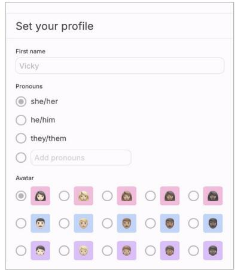

  
Participants meet other members of the group and discuss a survival scenario.

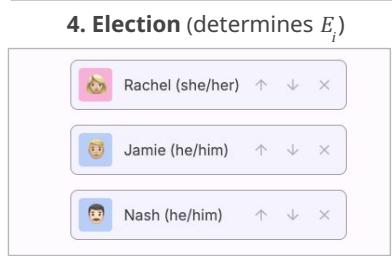  
Participants complete ranked-choice voting over their peers.

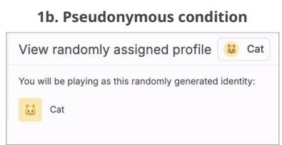

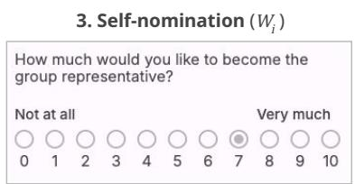  
Participants self-nominate for leadership; highest scores determine eligibility in Tg.

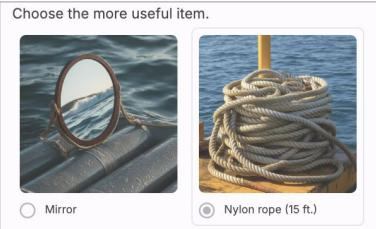  
The score of the elected representative on this task determines the group's payout (1 point per correct response).

Figure 1: Overview of experimental stages and representative interface images for the Lost at Sea implementation. 1) Participants are randomly assigned to either an identified or pseudonymous condition, 2) deliberate in groups of four, 3) self-nominate for leader eligibility, and 4) elect a representative via ranked-choice voting. 5) Each participant also completes the survival task individually, allowing leader quality to be measured.  
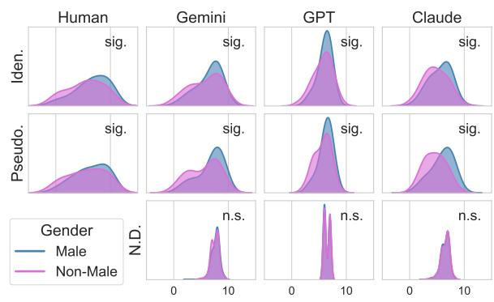  
Figure 2: Self-nomination score distributions. sig. denotes $p < 0 . 0 1$ , n. s. denotes no significance. A table of corresponding p-values and distributions including Gemma results are provided in Table 6.

## 6.2 RQ2: Group-level alignment.

Figure 3 reports each model's alignment rate with the human group's elected leader. In Panel (1), Gemini and GPT exhibit significant alignment when demographics are provided (LI), which weakens when demographics are omitted (ND). Claude, by contrast, aligns only under pseudonymity.

Panels (2) and (3) reveal a significant gender asymmetry in alignment. Under pseudonymity, Gemini and GPT exhibit significant alignment only when the human-elected leader is male. The gray bars reveal residual gender alignment: even when models do not recover the human-elected leader, they tend to select another male.

## 6.3 RQ3: Group-level performance.

Optimal leader gap. Figure 4 breaks down the optimal leader gap into self-exclusion and peerexclusion components. HI results exhibit a normalized total gap of 14.5%; that is, on average, the elected leader scored 14.5% lower on the representative task than the best-performing group member. Under pseudonymity, the peer-exclusion gap diminishes while self-nomination gaps persist. Gemini closely mirrors this, reproducing both the magnitude and decomposition of the humans' gap.

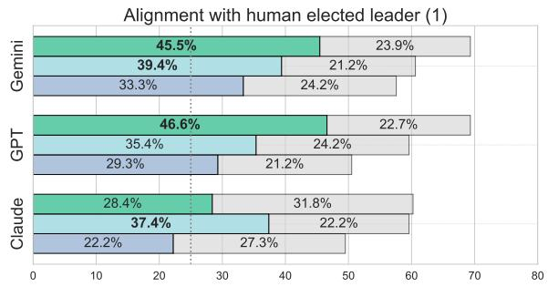

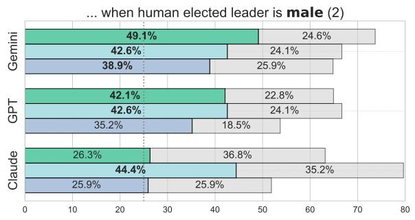

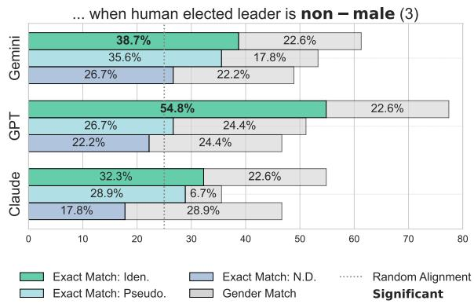  
Figure 3: Group alignment rates with human-elected winners. Colored bars indicate the proportion of groups where the LLM group's elected leader exactly matches the human-elected leader; gray bars indicate a gender match. The dotted line marks the 25% random alignment baseline; bold labels denote statistically significant alignment determined using binomial tests.

Claude, in contrast, shows remarkably low gaps: the optimal leader almost always self-nominates and is rarely excluded.

The optimal leader gap quantifies aggregate losses in suboptimal elections, but not decomposition by gender. Table 1 tracks the gender composition of group members at each election stage: the optimal leader pool, showing the initial distribution of top performers $( \ell _ { g } ^ { * } )$ , the candidate pool, showing self-nominated candidates $( \mathcal { T } _ { g } )$ , and the elected leader $( \ell _ { g } )$ . In HI, a significant gender skew emerges only at the final election stage (peerexclusion). Under pseudonymity (HP), no imbalance appears at any stage, demonstrating that masking identity cues effectively reduces peer exclusion.

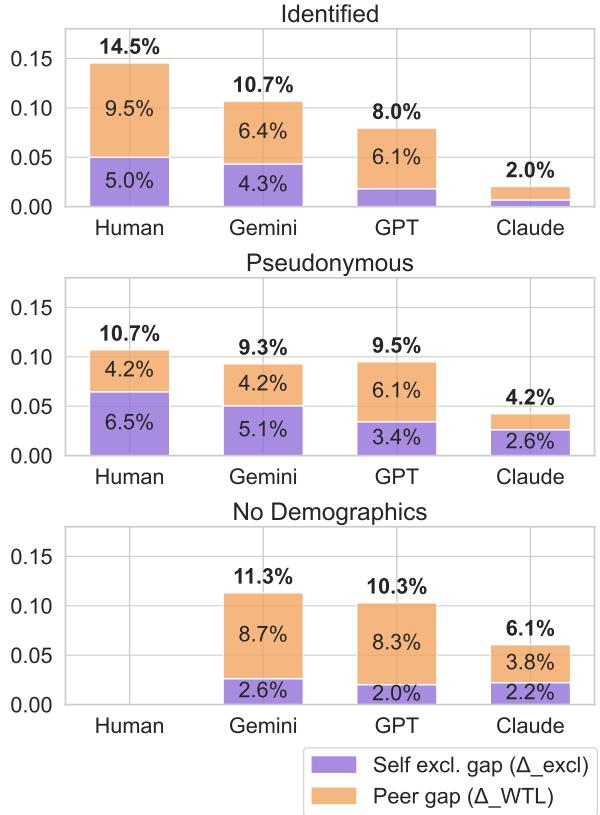  
Figure 4: Decomposition of optimal leader gaps by model and identity condition. The total gap (bar height) is partitioned into two components: the self-exclusion gap $( \Delta _ { \mathrm { e x c l } }$ , purple), measuring exclusion of the highestperforming individual from the candidate pool, and the peer ranking gap $( \Delta _ { \mathrm { W T L } }$ , orange), measuring exclusion of an optimal candidate from the final winner. Percentage points reflect the normalized gap size. Statistical tests and values are in Appendix D.1.

Gender and optimal leader selection. Panel (1) of Figure 5 visualizes the election distribution from Table 1, shows that male leaders were more frequently elected, regardless of whether they were the optimal choice. This over-election was significant in HI (64.8% male) but not in HP.11

Panels (2) and (3) reveal a gender asymmetry in leader selection. Across all conditions, when the optimal leader is male, they are selected over half the time and if not, another male is likely selected. When the optimal leader is non-male, they are only selected around 40% of the time. While overall optimality did not significantly differ between LI and LP (Figure 4), the LP condition shows a modest improvement in selecting non-male leaders. ND did not improve optimality over LP, but further increased the proportion of elected non-males.

<table><tr><td>Optimal male elected Non-optimal male elected</td><td>Optimal non-male elected Non-optimal non-male elected</td></tr></table>

<table><tr><td rowspan="2">Sample</td><td colspan="2">Optimal</td><td colspan="2">Candidates</td><td rowspan="2">Elected Male</td></tr><tr><td>Mixed</td><td>Male</td><td>Mixed</td><td>Male</td></tr><tr><td>HI</td><td>0.36</td><td>0.61</td><td>0.86</td><td>0.58</td><td>0.65</td></tr><tr><td>HP</td><td>0.45</td><td>0.54</td><td>0.76</td><td>0.54</td><td>0.55</td></tr><tr><td>Gemini LI</td><td>0.51</td><td>0.44</td><td>0.84</td><td>0.71</td><td>0.61</td></tr><tr><td>Gemini LP</td><td>0.47</td><td>0.60</td><td>0.77</td><td>0.87</td><td>0.58</td></tr><tr><td>Gemini ND</td><td>0.53</td><td>0.51</td><td>0.97</td><td>0.67</td><td>0.59</td></tr><tr><td>GPT LI</td><td>0.66</td><td>0.60</td><td>0.91</td><td>0.62</td><td>0.50</td></tr><tr><td>GPT LP</td><td>0.55</td><td>0.42</td><td>0.83</td><td>0.82</td><td>0.59</td></tr><tr><td>GPT ND</td><td>0.66</td><td>0.32</td><td>1.00</td><td></td><td>0.54</td></tr><tr><td>Claude LI</td><td>0.93</td><td>0.83</td><td>0.82</td><td>0.69</td><td>0.57</td></tr><tr><td>Claude LP</td><td>0.86</td><td>0.43</td><td>0.73</td><td>0.93</td><td>0.73</td></tr><tr><td>Claude ND</td><td></td><td></td><td></td><td></td><td></td></tr><tr><td></td><td>0.63</td><td>0.59</td><td>0.95</td><td>0.80</td><td>0.52</td></tr></table>

Table 1: Proportions of cohorts matching select gender compositions for optimal candidates $\ell _ { g } ^ { * } ,$ election candidate $\mathcal { T } _ { g } ,$ and elected leaders $\ell _ { g }$ The Mixed columns report the fraction of cohorts with both male and nonmale qualifying members. The Male column reports the fraction of cohorts with male-only qualifying candidates relative to female-only candidates. Bold values in the Male column indicate a significant gender difference $( p < 0 . 1$ , two-sided t-tests). Raw counts are in Table 7.

## 7 Discussion

LLMs can mirror human behavior. All models reproduced individual-level patterns: no gender gap in performance, but a male-skewed gap in selfnomination and election outcomes. This suggests that they reflect individual performance and biases with reasonable fidelity (RQ1).

Models can also reproduce group-level patterns: In LI, Gemini matched not only the human groups' election choices (46% alignment) (RQ2), but also how those decisions deviated from optimality (RQ3).12 However, similar outcomes do not necessarily indicate that the underlying reasoning processes are the same.

Identity cues enable alignment. Humans rely on both external identity cues and dynamic interactions to infer about others. If LLMs were picking up on dynamic interactions, we would expect alignment with human outcomes even when external identity cues are removed. Instead, alignment deteriorates as identity cues are removed: for Gemini and GPT, agreement with human group leaders is strongest in LI, weakens in LP (when demographic cues about others are removed), and disappears in ND (when demographic cues about its role is removed). The collapse in ND shows that context about the assigned identity is necessary for LLMs to role-play and reproduce human leader selection patterns (RQ2).

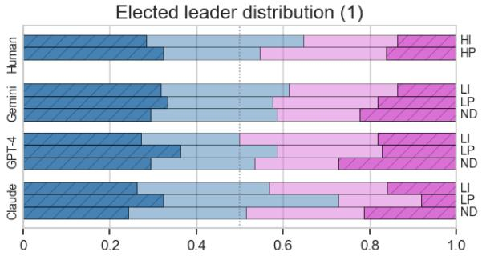

... when human optimal leader is male (2)  
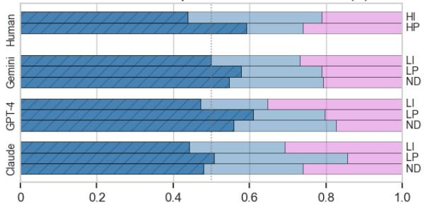

... when human optimal leader is non – male (3)  
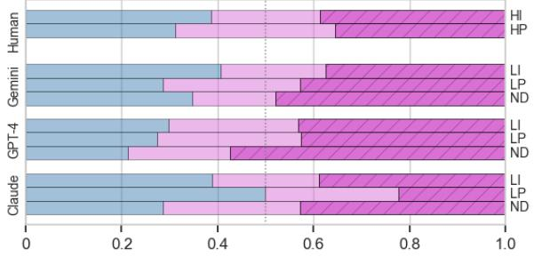  
Figure 5: Gender distributions of the elected leader. A dotted line marks a balanced 0.5 gender distribution. The values in Panel (1) correspond to the final column of Table 1. Panels (2) and (3) explore alignment dependent on the gender of the optimal human leader, with a double-count when the optimal leader can be either male or female. When the optimal leader is male (2), all elect a male leader 70% of the time.

Alignment favors male-coded behavior. In the absence of explicit gender cues (LP), alignment was stronger when the elected human leaders were male, and absent when leaders were non-male (RQ2). Rather than indicating explicit gender bias, this likely reflects training data patterns in which (1) men disproportionately occupy leadership roles, and (2) there are gendered linguistic cues associated with competence, such as confidence (Kay and Shipman, 2014), which are reflected in the conversation transcripts.

Identity cues enable idealized outcomes. At first pass, it appears that Claude doesn't exhibit this male-favoritism in alignment. In fact, Claude shows little alignment with human-elected leaders of any gender in LI. However, this is because they are selecting better leaders, exhibiting a minimal leader optimality gap (RQ3). Under pseudonymity, however, this performance deteriorates: Claude, like others, defaults to aligning with male-elected leaders and selects more male leaders overall. This suggests that visible identity cues may activate corrective behaviors that mitigate bias and support optimal decision-making. When those cues are removed, compensatory mechanisms disappear, and the model defaults to male-coded heuristics. These results further demonstrate how identity cues affect the tension between aligning and compensating for human biases (mirroring or masking).

Descriptive vs. normative simulacra. When identity cues are provided, Gemini and GPT more closely mirror human decision making at both the individual and group level, including reproducing human biases in self-nomination and peerexclusion (RQ1, RQ2). This mirroring property can be valuable in mechanism design, as it enables accurate modeling of social behaviors and outcomes.

In contrast, Claude masks the observed human biases and exhibits low alignment with group decisions; however, its outcomes closely align with the optimal outcomes in this election scenario. This masking property can be useful in mediation settings, where providing normative or corrective behaviors is desirable.

More generally, we show that these models exhibit idiosyncratic inductive biases, shaped by architecture, training, and tuning. These stances are cue-dependent: pseudonymity may reduce bias in one model but expose it in another. Faithful simulation of human groups requires accepting human biases; pursuing idealized outcomes requires accepting divergence. Model choice, context, and purpose are critical design decisions for constructing effective simulacra.

## 7.1 Future work and recommendations

This work highlights the need to distinguish between simulation alignment (matching human behavior) and outcome alignment (achieving normatively better results). Future research should address how to quantify and benchmark this distinction, as well as how to operationalize it through prompt-level control, model tuning, or system design. Follow-up experiments could validate the use of gender-correlated cues through transcript analysis and mechanistic interpretability methods, and investigate the conditions under which models exhibit compensatory behaviors. Broader benchmarking across models with varying capabilities— including additional open-source variants—may reveal which inductive biases support fidelity or fairness. As simulacra are increasingly used to evaluate collective behavior in cognitive science tasks, fine-grained evaluations are essential, as studies focused solely on population-level outcomes can obscure divergent underlying mechanisms.

## 8 Conclusion

In this paper, we present empirical results from a behavioral experiment and LLM simulations on the Lost at Sea election scenario, examining alignment in collective reasoning. We compare outcomes from human groups (N=748) with LLM agents (Gemini, GPT, Claude, Gemma), varying the presence of identity signals to assess their impact on leader selection, bias, and group performance.

Given identity cues, some models correctly mirrored human outcomes, including gender biases, while others masked those biases, yielding more optimal, meritocratic outcomes. However, when identity cues were removed, all models defaulted to male-aligned choices, suggesting that gendered priors persist even without explicit signals.

These findings highlight that alignment is not a single objective. Without clarifying whether the goal is accurate simulation or normative improvement, surface-level agreement risks conflating human bias with model behavior, or worse, misrepresenting social progress. As LLMs are increasingly used in modeling social behavior, understanding when they reflect, suppress, or distort social dynamics is critical. Advancing LLMs’ alignment capabilities will require deeper modeling of social reasoning, calling for benchmarks that integrate insights from NLP, social psychology, and computational behavioral science.

## Limitations

## Experimental context

Lost at Sea. Lost at Sea is a stylized, low-stakes social exercise, far removed from the high-stakes scenarios where leadership biases often emerge. This abstraction may blunt identity-driven dynamics and limit how well findings generalize to realworld settings where leadership decisions carry reputational or material consequences.

Online context. There are limitations specific to the online setup. Participants may behave differently over a text interface compared to an inperson modality. They can look up answers midtask. They can easily misreport demographic attributes; for example, we found minor gender discrepancies between Prolific records and in-platform responses, and the occasional username such as OptimusPrime, a likely fictional identity.

Experiment sample and design. Our analysis primarily focuses on gender-based differences, but identifiers such as avatars and names also carry signals of ethnicity, class, and other social identities. We did not evaluate intersectional demographics or affinity-based dynamics (e.g. in-group preferences) (Woolley et al., 2010; Bear and Woolley, 2011; O’leary et al., 2011), nor did we vary group gender composition. The use of English, a nongendered language, may attenuate identity effects compared to gendered languages.

Prompting techniques. Our simulations used a single prompt template, default parameters (temperature, sampling strategy), off-the-shelf LLMs, and small models, with settings held constant to enable direct comparison across models. Alternative prompting strategies, hyperparameters, or architectures may produce different results.

Human vs. LLM experiment parity. To mitigate the LLMs' observed tendency of forgetting earlier tokens in longer prompts and to reduce reliance on memorized answers, we added periodic reminders of assigned demographics and instructions not to rely on general world knowledge in the prompt templates (Appendix G). Human participants completed additional stages, such as terms of service, informed consent, and comprehension checks, that were omitted for the LLM agents. These differences may introduce subtle differences in the comparisons.

## Simulation parameters

Demographic conditioning. We provided LLM agents with minimal demographic inputs: two freetext responses, a few multiple-choice answers to questions intended to proxy the implicit association tests in (Born et al., 2022), and Prolific demographic data. This is fairly sparse for persona construction (Park et al., 2024; Chuang et al., 2024b).

Conversation generalization. The LLM agents provided survey responses and peer rankings but did not participate in the calibration discussions, providing passive judgment rather than active participation. This lets us study how models are influenced by human inputs, but not how they influence others in return. It is unclear how dialogues and downstream outcomes (elections, task accuracy) are impacted by LLM-generated discussions.

Counterfactual extrapolation. We introduced a “no demographics" condition to test how agents behave without identity inputs. However, extrapolating these results to human behavior requires care. Humans cannot be put in a condition where they are unaware of their own identity, making direct comparisons with LLMs in these settings difficult.

## Ethical considerations and potential risks.

Using identity cues such as gender, ethnicity, or class to condition simulacra can unintentionally reinforce stereotypes as representative behavior. Compensatory “masking" approaches that hide these cues may yield idealized, unrealistic outcomes, which may carry their own biases. We caution against deployment in sensitive social contexts (e.g., hiring panels, civic deliberation) until these effects are better understood.

As LLM simulacra improve and are deployed in real-world settings, there is a broader risk of misuse: insights into identity-driven leader selection could be repurposed to design agents that manipulate group dynamics and amplify exclusionary patterns. Understanding how LLMs mirror and magnify social processes is critical, not only for responsible design, but to prevent systems from reinforcing the very disparities they aim to study.

## Acknowledgments

The authors thank James Wexler, Hal Abelson, Mike Mozer, Stefano Palminteri, MH Tessler, Merrie Morris, and Minsuk Chang for their reviews and feedback, and Thibaut de Saivre and Léo Laugier for contributions during the pilot stages.

## References

Gati Aher, Rosa I. Arriaga, and Adam Tauman Kalai. 2023. Using large language models to simulate multiple humans and replicate human subject studies. Preprint, arXiv:2208.10264.

Ariel Flint Ashery, Luca Maria Aiello, and Andrea Baronchelli. 2024. The dynamics of social conventions in llm populations: Spontaneous emergence, collective biases and tipping points. Preprint, arXiv:2410.08948.

Roberto Balestri. 2025. Gender and content bias in large language models: a case study on google gemini 2.0 flash experimental. Frontiers in Artificial Intelligence, 8:1558696.

Dan Bang, Laurence Aitchison, Rani Moran, Santiago Castanon, Banafsheh Rafiee, Ali Mahmoodi, Jennifer Lau, Peter Latham, Bahador Bahrami, and Christopher Summerfield. 2017. Confidence matching in group decision-making. Nature Human Behaviour, 1.

Dan Bang and Chris D. Frith. 2017. Making better decisions in groups. Royal Society Open Science, 4(8):170193.

Valentin Barriere and Sebastian Cifuentes. 2024. A study of nationality bias in names and perplexity using off-the-shelf affect-related tweet classifiers. Preprint, arXiv:2407.01834.

Julia B Bear and Anita Williams Woolley. 2011. The role of gender in team collaboration and performance. Interdisciplinary Science Reviews, 36(2):146–153.

Luc Behaghel, Bruno Crépon, and Thomas Le Barbanchon. 2015. Unintended effects of anonymous resumes. American Economic Journal: Applied Economics, 7(3):1–27.

Claes Bengtsson, Mats Persson, and Peter Willenhag. 2005. Gender and overconfidence. Economics Letters, 86(2):199–203.

Marianne Bertrand and Sendhil Mullainathan. 2004. Are emily and greg more employable than lakisha and jamal? a field experiment on labor market discrimination. American Economic Review, 94(4):991–1013.

Marcel Binz and Eric Schulz. 2023. Using cognitive psychology to understand gpt-3. Proceedings of the National Academy of Sciences, 120(6):e2218523120.

Andreas Born, Eva Ranehill, and Anna Sandberg. 2022. Gender and Willingness to Lead: Does the Gender Composition of Teams Matter? The Review of Economics and Statistics, 104(2):259–275.

Leonardo Bursztyn, Thomas Fujiwara, and Amanda Pallais. 2017. 'acting wife': Marriage market incentives and labor market investments. American Economic Review, 107(11):3288–3319.

Ilias Chalkidis. 2024. Investigating llms as voting assistants via contextual augmentation: A case study on the european parliament elections 2024. Preprint, arXiv:2407.08495.

Qi Chen, Bowen Zhang, Gang Wang, and Qi Wu. 2024. Weak-eval-strong: Evaluating and eliciting lateral thinking of LLMs with situation puzzles. In The Thirty-eighth Annual Conference on Neural Information Processing Systems.

Chun-Wei Chiang, Zhuoran Lu, Zhuoyan Li, and Ming Yin. 2024a. Enhancing ai-assisted group decision making through llm-powered devil's advocate. In Proceedings of the 29th International Conference on Intelligent User Interfaces, pages 103–119.

Wei-Lin Chiang, Lianmin Zheng, Ying Sheng, Anastasios Nikolas Angelopoulos, Tianle Li, Dacheng Li, Hao Zhang, Banghua Zhu, Michael Jordan, Joseph E. Gonzalez, and Ion Stoica. 2024b. Chatbot arena: An open platform for evaluating llms by human preference. Preprint, arXiv:2403.04132.

Yun-Shiuan Chuang, Agam Goyal, Nikunj Harlalka, Siddharth Suresh, Robert Hawkins, Sijia Yang, Dhavan Shah, Junjie Hu, and Timothy T. Rogers. 2024a. Simulating opinion dynamics with networks of llmbased agents. Preprint, arXiv:2311.09618.

Yun-Shiuan Chuang, Siddharth Suresh, Nikunj Harlalka, Agam Goyal, Robert Hawkins, Sijia Yang, Dhavan Shah, Junjie Hu, and Timothy T. Rogers. 2024b. The wisdom of partisan crowds: Comparing collective intelligence in humans and llm-based agents. Preprint, arXiv:2311.09665.

Nilanjana Dasgupta, Melissa McManus Scircle, and Matthew Hunsinger. 2015. Female peers in small work groups enhance women's motivation, verbal participation, and career aspirations in engineering. Proceedings of the National Academy of Sciences, 112(16):4988–4993.

Edward L Deci and Richard M Ryan. 2012. Selfdetermination theory. Handbook of theories of social psychology, 1(20):416–436.

Tiwalayo Eisape, MH Tessler, Ishita Dasgupta, Fei Sha, Sjoerd van Steenkiste, and Tal Linzen. 2024. A systematic comparison of syllogistic reasoning in humans and language models. Preprint, arXiv:2311.00445.

Christine L Exley and Judd B Kessler. 2022. The gender gap in self-promotion. The Quarterly Journal of Economics, 137(3):1345–1381.

Stephen M. Fleming. 2024. Metacognition and confidence: A review and synthesis. Annual Review of Psychology, 75(1):241–268.

C. Daniel Freeman, Laura Culp, Aaron Parisi, Maxwell L Bileschi, Gamaleldin F Elsayed, Alex Rizkowsky, Isabelle Simpson, Alex Alemi, Azade Nova, Ben Adlam, Bernd Bohnet, Gaurav Mishra,

Hanie Sedghi, Igor Mordatch, Izzeddin Gur, Jaehoon Lee, JD Co-Reyes, Jeffrey Pennington, Kelvin Xu, and 11 others. 2023. Frontier language models are not robust to adversarial arithmetic, or "what do i need to say so you agree 2+2=5? Preprint, arXiv:2311.07587.

Chen Gao, Xiaochong Lan, Zhihong Lu, Jinzhu Mao, Jinghua Piao, Huandong Wang, Depeng Jin, and Yong Li. 2023. S3: Social-network simulation system with large language model-empowered agents. Preprint, arXiv:2307.14984.

Basile Garcia, Crystal Qian, and Stefano Palminteri. 2024. The moral turing test: Evaluating human-1lm alignment in moral decision-making. Preprint, arXiv:2410.07304.

Laura Guillén, Margarita Mayo, and Natalia Karelaia. 2018. Appearing self-confident and getting credit for it: Why it may be easier for men than women to gain influence at work. Human Resource Management, 57(4):839–854.

Karla Hoff and Priyanka Pandey. 2014. Making up people—the effect of identity on performance in a modernizing society. Journal of Development Economics, 106:118–131.

John J. Horton. 2023. Large language models as simulated economic agents: What can we learn from homo silicus? Preprint, arXiv:2301.07543.

Tiancheng Hu, Yara Kyrychenko, Steve Rathje, Nigel Collier, Sander van der Linden, and Jon Roozenbeek. 2024. Generative language models exhibit social identity biases. Preprint, arXiv:2310.15819.

Daniel Jarrett, Miruna Pîslar, Michiel A. Bakker Michael Henry Tessler, Raphael Köster, Jan Balaguer, Romuald Elie, Christopher Summerfield, and Andrea Tacchetti. 2025. Language agents as digital representatives in collective decision-making. Preprint, arXiv:2502.09369.

Jingru Jia, Zehua Yuan, Junhao Pan, Paul E McNamara, and Deming Chen. 2024. Decision-making behavior evaluation framework for LLMs under uncertain context. In The Thirty-eighth Annual Conference on Neural Information Processing Systems.

Yiqiao Jin, Qinlin Zhao, Yiyang Wang, Hao Chen, Kaijie Zhu, Yijia Xiao, and Jindong Wang. 2024. Agentreview: Exploring peer review dynamics with llm agents. Preprint, arXiv:2406.12708.

Dominic D P Johnson, Rose McDermott, Emily S Barrett, Jonathan Cowden, Richard Wrangham, Matthew H McIntyre, and Stephen Peter Rosen. 2006. Overconfidence in wargames: experimental evidence on expectations, aggression, gender and testosterone. Proc. Biol. Sci., 273(1600):2513–2520.

Anjali Kantharuban, Jeremiah Milbauer, Maarten Sap, Emma Strubell, and Graham Neubig. 2025. Stereotype or personalization? user identity biases chatbot recommendations. Preprint, arXiv:2410.05613.

Katty Kay and Claire Shipman. 2014. The confidence gap. The Atlantic, 14(1):1–18.

Annabelle Krause, Ulf Rinne, and Klaus F Zimmermann. 2012. Anonymous job applications of fresh ph. d. economists. Economics Letters, 117(2):441– 444.

Andrew K Lampinen, Ishita Dasgupta, Stephanie CY Chan, Hannah R Sheahan, Antonia Creswell, Dharshan Kumaran, James L McClelland, and Felix Hill. 2024. Language models, like humans, show content effects on reasoning tasks. PNAS nexus, 3(7):pgae233.

Yan Leng and Yuan Yuan. 2024. Do llm agents exhibit social behavior? Preprint, arXiv:2312.15198.

Guohao Li, Hasan Abed Al Kader Hammoud, Hani Itani, Dmitrii Khizbullin, and Bernard Ghanem. 2023. Camel: Communicative agents for "mind" exploration of large language model society. Preprint, arXiv:2303.17760.

Huihan Li, Liwei Jiang, Jena D. Hwang, Hyunwoo Kim, Sebastin Santy, Taylor Sorensen, Bill Yuchen Lin, Nouha Dziri, Xiang Ren, and Yejin Choi. 2024. Culture-gen: Revealing global cultural perception in language models through natural language prompting. Preprint, arXiv:2404.10199.

Andy Liu, Mona Diab, and Daniel Fried. 2024. Evaluating large language model biases in persona-steered generation. Preprint, arXiv:2405.20253.

Emmy Liu, Michael Henry Tessler, Nicole Dubosh, Katherine Mosher Hiller, and Roger Levy. 2022. Assessing group-level gender bias in professional evaluations: The case of medical student end-of-shift feedback. Preprint, arXiv:2206.00234.

Paulette A McCarty. 1986. Effects of feedback on the self-confidence of men and women. Academy of Management Journal, 29(4):840–847.

Paul M Nemiroff and William A Pasmore. 1975. Lost at sea: A consensus-seeking task. The annual handbook for group facilitators, pages 28–34.

Michael Boyer O'leary, Mark Mortensen, and Anita Williams Woolley. 2011. Multiple team membership: A theoretical model of its effects on productivity and learning for individuals and teams. Academy of Management Review, 36(3):461–478.

Joon Sung Park, Lindsay Popowski, Carrie Cai, Meredith Ringel Morris, Percy Liang, and Michael S. Bernstein. 2022. Social simulacra: Creating populated prototypes for social computing systems. In Proceedings of the 35th Annual ACM Symposium on User Interface Software and Technology, UIST '22, New York, NY, USA. Association for Computing Machinery.

Joon Sung Park, Carolyn Q. Zou, Aaron Shaw, Benjamin Mako Hill, Carrie Cai, Meredith Ringel Morris, Robb Willer, Percy Liang, and Michael S. Bernstein. 2024. Generative agent simulations of 1,000 people. Preprint, arXiv:2411.10109.

Prolific. 2025. Prolific participant recruitment platform. https://www.prolific.com. Accessed: 2025-05- 09.

Crystal Qian and James Wexler. 2024. Take it, leave it, or fix it: Measuring productivity and trust in humanai collaboration. In Proceedings of the 29th International Conference on Intelligent User Interfaces, IUI '24, page 370–384, New York, NY, USA. Association for Computing Machinery.

Crystal Qian, Kehang Zhu, John Horton, Benjamin S. Manning, Vivian Tsai, James Wexler, and Nithum Thain. 2025. Strategic tradeoffs between humans and ai in multi-agent bargaining. Preprint, arXiv:2509.09071

Yao Qu and Jue Wang. 2024. Performance and biases of large language models in public opinion simulation. Humanities and Social Sciences Communications, 11(1):1–13.

Leonardo Ranaldi and Giulia Pucci. 2024. When large language models contradict humans? large language models' sycophantic behaviour. Preprint, arXiv:2311.09410.

Lauren Rhue, Sofie Goethals, and Arun Sundararajan. 2024. Evaluating llms for gender disparities in notable persons. Preprint, arXiv:2403.09148.

Abhilasha Sancheti, Haozhe An, and Rachel Rudinger. 2024. On the influence of gender and race in romantic relationship prediction from large language models. In Proceedings of the 2024 Conference on Empirical Methods in Natural Language Processing, pages 479–494, Miami, Florida, USA. Association for Computational Linguistics.

Nouran Soliman, Hyeonsu B Kang, Matthew Latzke, Jonathan Bragg, Joseph Chee Chang, Amy Xian Zhang, and David R Karger. 2024. Mitigating barriers to public social interaction with meronymous communication. In Proceedings of the 2024 CHI Conference on Human Factors in Computing Systems, CHI '24, New York, NY, USA. Association for Computing Machinery.

Joseph Suh, Erfan Jahanparast, Suhong Moon, Minwoo Kang, and Serina Chang. 2025. Language model fine-tuning on scaled survey data for predicting distributions of public opinions. Preprint, arXiv:2502.16761.

Amir Taubenfeld, Yaniv Dover, Roi Reichart, and Ariel Goldstein. 2024. Systematic biases in llm simulations of debates. In Proceedings of the 2024 Conference on Empirical Methods in Natural Language Processing, page 251–267. Association for Computational Linguistics.

Vivian Tsai, Crystal Qian, and Deliberate Lab community contributors. 2024. Deliberate Lab: Open-Source Platform for LLM-Powered Social Science.

Jen tse Huang, Man Ho LAM, Eric John Li, Shujie Ren, Wenxuan Wang, Wenxiang Jiao, Zhaopeng Tu, and Michael Lyu. 2024. Apathetic or empathetic? evaluating LLMs’ emotional alignments with humans. In The Thirty-eighth Annual Conference on Neural Information Processing Systems.

Eric Uhlmann and Geoffrey L. Cohen. 2005. Constructed criteria: redefining merit to justify discrimination. Psychological Science, 16(6):474–480.

Alexander Sasha Vezhnevets, John P. Agapiou, Avia Aharon, Ron Ziv, Jayd Matyas, Edgar A. Duéñez-Guzmán, William A. Cunningham, Simon Osindero, Danny Karmon, and Joel Z. Leibo. 2023. Generative agent-based modeling with actions grounded in physical, social, or digital space using concordia. Preprint, arXiv:2312.03664.

Laura Weidinger, John Mellor, Maribeth Rauh, Conor Griffin, Jonathan Uesato, Po-Sen Huang, Myra Cheng, Mia Glaese, Borja Balle, Atoosa Kasirzadeh, Zac Kenton, Sasha Brown, Will Hawkins, Tom Stepleton, Courtney Biles, Abeba Birhane, Julia Haas, Laura Rimell, Lisa Anne Hendricks, and 4 others. 2021. Ethical and social risks of harm from language models. Preprint, arXiv:2112.04359.

B. L. Welch. 1947. The generalization of student's' problem when several different population varlances are involved. Biometrika, 34(1-2):28–35.

Bart Wille, Brenton M. Wiernik, Jasmine Vergauwe, Amelie Vrijdags, and Nikola Trbovic. 2018. Personality characteristics of male and female executives: Distinct pathways to success? Journal of Vocational Behavior, 106:220–235.

Anita Williams Woolley, Christopher F. Chabris, Alex Pentland, Nada Hashmi, and Thomas W. Malone. 2010. Evidence for a collective intelligence factor in the performance of human groups. Science, 330(6004):686–688.

## A Open Model Reproduction (Gemma 3)

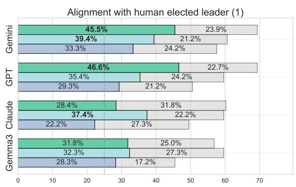

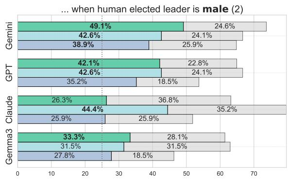

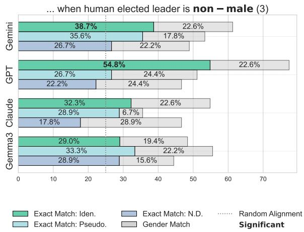  
Figure 6: Group alignment rates with human elected winners, including Gemma values.

Compared to the closed-source models, Gemma is an outlier; it was the most weakly aligned model in our analysis (Figure 6). It exhibited a consistently low self-nomination gap in both identified and pseudonymous conditions, but a consistently large peer-exclusion gap across all treatments (Figure 7). Unlike the closed-source models in our study, which demonstrate clear outcome shifts in response to identity cues, Gemma appears to default to a single behavioral mode regardless of context.

Gemma does not appear to mirror human bias, showing consistently weak alignment. As opposed to performing optimal selections like Claude,

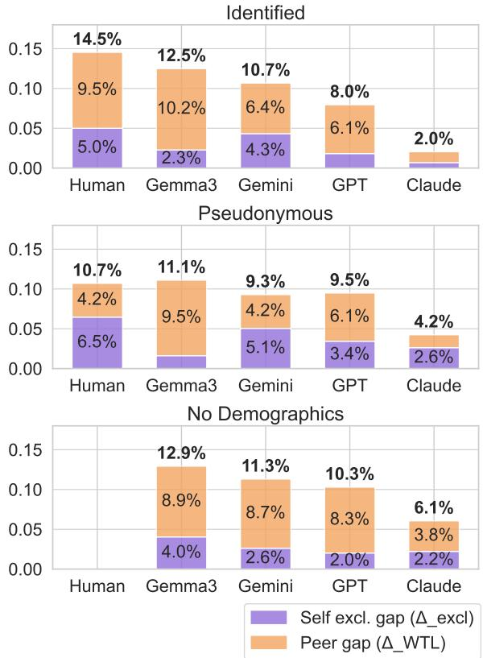  
Figure 7: Decomposition of optimal leader gaps by model and identity condition. Percentage points reflect the normalized gap size. Statistical tests and full values are in Appendix D.1.

Gemma appears to substitute a consistent, modelspecific bias. The tables and figures in the following Appendices provide comparative Gemma values when relevant.

## B Human Data Collection

Recruitment and consent. Participants were recruited via the Prolific crowdsourcing platform from a gender-balanced, representative sample of adult English speakers (Prolific, 2025). Informed consent was obtained through a Terms of Service page, which outlined the study's purpose, the anonymous use of responses for research, and contact information for inquiries or withdrawal.

Payment. Participants received a fixed payment of £9.00 for around 35 minutes of participation, exceeding Prolific's recommended hourly wage. Additionally, participants could earn up to £4.00 in performance-based bonuses, based in part on the representative's performance on the task. Payment amounts were based on prior lab and pilot studies estimating a 30-minute task duration, with additional waiting time factored in for matching participants into live groups.

Data governance. Participants were identified only by their Prolific IDs during data collection. After completion, all identifiers were further anonymized using custom hashes to ensure participant privacy.

<table><tr><td>Variable</td><td>N</td><td>Mean</td><td>SD</td><td>Median</td></tr><tr><td>Payout ($)</td><td>748</td><td>9.99</td><td>1.11</td><td>9.00</td></tr><tr><td>Time taken (min)</td><td>748</td><td>35.28</td><td>15.48</td><td>33.48</td></tr></table>

Table 2: Descriptive statistics for payouts and time. Note: Time taken is in minutes and includes time spent waiting in a lobby for a live group of four participants to form.

## B.1 Human participant demographics

Table 3 shows self-reported demographic statistics from Prolific. No protected attributes (e.g., sexual orientation, political views) were solicited; the only personal attributes collected within the task were self-reported name and gender.

## B.2 Human Survey Responses

Human participants filled out a post-task survey (Figure 11), including the following questions whose responses were incorporated in the simulated agents' demographic data:

1. Consider the survival task performed in this study. Did you have any prior knowledge or experience in the domain of survival that could have helped you solve the task? If yes, share specific memories or experiences that explain your answer.

<table><tr><td>Category</td><td>Identified Count Prop.</td><td>Pseudonym Count Prop.</td><td></td><td>p</td></tr><tr><td>Ethnicity</td><td></td><td></td><td></td><td></td></tr><tr><td>White</td><td>288</td><td>0.82</td><td>297 0.76</td><td>0.03</td></tr><tr><td>Asian</td><td>23 0.07</td><td></td><td>31 0.08</td><td>0.59</td></tr><tr><td>Black</td><td>24 0.07</td><td>47</td><td>0.12</td><td>0.03</td></tr><tr><td>Other / Expired</td><td>17 0.05</td><td>21</td><td>0.05</td><td>0.90</td></tr><tr><td>Country of residence</td><td></td><td></td><td></td><td></td></tr><tr><td>United Kingdom</td><td>315</td><td>0.90</td><td>337 0.89</td><td>0.09</td></tr><tr><td>United States</td><td>37</td><td>0.11</td><td>59 0.11</td><td>0.09</td></tr><tr><td>Pronouns</td><td></td><td></td><td></td><td></td></tr><tr><td>Male (he/him)</td><td>177</td><td>0.50</td><td>201</td><td>0.51 0.96</td></tr><tr><td>Female (she/her)</td><td>175</td><td>0.50</td><td>195 0.49</td><td>0.96</td></tr></table>

Table 3: Descriptive statistics of participant-reported demographic characteristics by treatment group. p values from $\chi ^ { 2 }$ tests. A covariate imbalance is observed for ethnicity distribution, but is representative of the demographic locations.

2. Do you have previous experience of leadership activities? If yes, share specific memories or experiences that explain your answer.

3. In general, how willing or unwilling are you to take risks on a scale from 0 to 10?

4. Consider the survival task performed in this study. On average, do you think that men are better at such tasks, that men and women are equally good, or that women are better? (Scale from 1 to 10; 1 = men are better, 10 = women are better).

5. On average, do you think that men are better leaders, that men and women are equally good leaders, or that women are better leaders? (Scale from 1 to 10; 1 = men are better, 10 = women are better).

## C Experimental Conditions

Figure 8 visualizes the experimental conditions. Participants either instantiate an Identified profile or are randomly assigned a Pseudonymous profile (HI vs. HP). LLM agents are tested under matched conditions (LI vs. LP) to assess behavioral alignment. In a counterfactual condition (ND), LLMs constructed from HP participants are stripped of internal demographic context to isolate the effects of internal identity awareness.

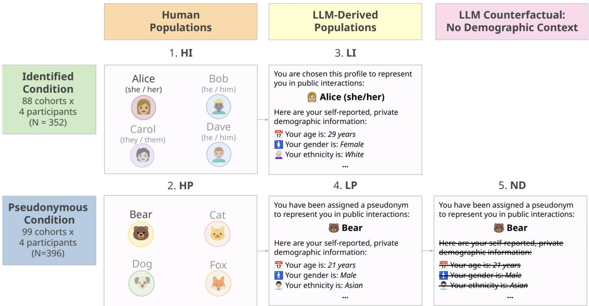  
Figure 8: Overview of experimental conditions. Human samples are randomly assigned into the HI or HP conditions; we then create matched LLM samples (LI, LP, ND) with representative prompt changes visualized.

## D Statistics Tables

## D.1 Optimal leader gap decomposition

Table 4 shows optimal leader gap decomposition values. Welch's t-test compares the model values with human values. \* p < 0.05, \*\* p < 0.01, \*\*\* p < 0.001.

<table><tr><td>Model</td><td> $\Delta _ { \mathrm { e x c l } }$ </td><td> $\Delta _ { \mathrm { W T L } }$ </td><td> $\Delta _ { \mathrm { t o t a l } }$ </td></tr><tr><td>Identified</td><td></td><td></td><td></td></tr><tr><td>Human</td><td>0.050</td><td>0.095</td><td>0.145</td></tr><tr><td>Gemini</td><td>0.043</td><td>0.064</td><td>0.107</td></tr><tr><td>Gemma3</td><td>0.023</td><td>0.102</td><td>0.125</td></tr><tr><td>GPT</td><td>0.018</td><td>0.061</td><td>0.080</td></tr><tr><td>Claude</td><td>* 0.007 ***</td><td>0.014 ***</td><td>** 0.020 ***</td></tr><tr><td>Pseudonymous</td><td></td><td></td><td></td></tr><tr><td>Human</td><td>0.065</td><td>0.042</td><td>0.107</td></tr><tr><td>Gemini</td><td>0.051</td><td>0.042</td><td>0.093</td></tr><tr><td>Gemma3</td><td>0.016</td><td>0.095</td><td>0.111</td></tr><tr><td>GPT</td><td>0.034</td><td>0.061</td><td>0.095</td></tr><tr><td>Claude</td><td>* 0.026</td><td>0.016</td><td>0.042</td></tr><tr><td></td><td>*</td><td>*</td><td>***</td></tr><tr><td>No Demographics Gemini</td><td>0.026</td><td>0.087</td><td>0.113</td></tr><tr><td>Gemma3</td><td>**</td><td>*</td><td>0.129</td></tr><tr><td></td><td>0.040</td><td>0.089</td><td></td></tr><tr><td>GPT</td><td>0.020 **</td><td>0.083 *</td><td>0.103</td></tr><tr><td>Claude</td><td>0.022 **</td><td>0.038</td><td>0.061 ** *</td></tr></table>

Table 4: Normalized leadership gap values.

## D.2 Individual summary statistics

Welch's t-tests compare male and non-male group means within each model and condition.

<table><tr><td>Model</td><td>Identified</td><td>Pseudonymous</td><td>No Dem.</td></tr><tr><td>Human</td><td></td><td></td><td></td></tr><tr><td>Male</td><td>3.21</td><td>3.14</td><td></td></tr><tr><td></td><td>0.85</td><td>1.01</td><td></td></tr><tr><td>Non-male</td><td>3.14</td><td>3.05</td><td></td></tr><tr><td></td><td>1.03</td><td>0.99</td><td></td></tr><tr><td>p-value</td><td>0.017</td><td>0.35</td><td></td></tr><tr><td></td><td>*</td><td></td><td></td></tr><tr><td>Gemini 2.5</td><td></td><td></td><td></td></tr><tr><td>Male</td><td>3.23</td><td>3.45</td><td>3.32</td></tr><tr><td></td><td>0.83</td><td>0.75</td><td>0.96</td></tr><tr><td>Non-male</td><td>3.27</td><td>3.28</td><td>3.40</td></tr><tr><td></td><td>0.81</td><td>0.89</td><td>0.85</td></tr><tr><td>p-value</td><td>0.60</td><td>0.040</td><td>0.34</td></tr><tr><td></td><td></td><td>*</td><td></td></tr><tr><td>Gemma 3</td><td></td><td></td><td></td></tr><tr><td>Male</td><td>4.23</td><td>4.25</td><td>3.73</td></tr><tr><td>Non-male</td><td>0.78</td><td>0.91</td><td>0.80</td></tr><tr><td></td><td>3.69</td><td>3.82</td><td>3.72</td></tr><tr><td></td><td>0.61</td><td>0.65</td><td>0.82</td></tr><tr><td>p-value</td><td>0.0000 ***</td><td>0.0000 ***</td><td>0.92</td></tr><tr><td></td><td></td><td></td><td></td></tr><tr><td>GPT 4.1</td><td></td><td></td><td></td></tr><tr><td>Male</td><td>3.29</td><td>3.35</td><td>3.36</td></tr><tr><td>Non-male</td><td>0.61</td><td>0.75</td><td>0.74</td></tr><tr><td></td><td>3.26</td><td>3.46</td><td>3.49</td></tr><tr><td></td><td>0.60</td><td>0.70</td><td>0.71</td></tr><tr><td>p-value</td><td>0.60</td><td>0.14</td><td>0.076</td></tr><tr><td>Claude 3.5</td><td></td><td></td><td></td></tr><tr><td>Male</td><td>2.85</td><td>2.85</td><td>3.08</td></tr><tr><td></td><td>0.41</td><td>0.46</td><td>0.67</td></tr><tr><td>Non-male</td><td>2.83</td><td>2.81</td><td>3.03</td></tr><tr><td></td><td>0.38</td><td>0.50</td><td>0.59</td></tr><tr><td>p-value</td><td>0.68</td><td>0.46</td><td>0.44</td></tr></table>

Table 5: Representative task scores (μ, SE).

<table><tr><td>Model</td><td>Identified</td><td>Pseudonymous.</td><td>No Dem.</td></tr><tr><td>Human</td><td></td><td></td><td></td></tr><tr><td>Male</td><td>6.67</td><td>6.44</td><td></td></tr><tr><td></td><td>2.98</td><td>2.94</td><td></td></tr><tr><td>Non-male</td><td>5.47</td><td>5.62</td><td></td></tr><tr><td></td><td>3.24</td><td>3.32</td><td></td></tr><tr><td>p-value</td><td>0.0003</td><td>0.0091</td><td></td></tr><tr><td></td><td>***</td><td>**</td><td></td></tr><tr><td>Gemini 2.5</td><td></td><td></td><td></td></tr><tr><td>Male</td><td>6.45</td><td>6.72</td><td>7.61</td></tr><tr><td></td><td>2.31</td><td>2.39</td><td>0.80</td></tr><tr><td>Non-male</td><td>5.76</td><td>5.54</td><td>7.53</td></tr><tr><td></td><td>2.81</td><td>2.73</td><td>0.71</td></tr><tr><td>p-value</td><td>0.012</td><td>0.0000</td><td>0.30</td></tr><tr><td></td><td>*</td><td>***</td><td></td></tr><tr><td>Gemma 3</td><td></td><td></td><td></td></tr><tr><td>Male</td><td>6.06</td><td>6.24</td><td>4.88</td></tr><tr><td></td><td>1.95</td><td>1.99</td><td>1.21</td></tr><tr><td>Non-male</td><td>5.18</td><td>5.07</td><td>4.98</td></tr><tr><td></td><td>2.17</td><td>2.03</td><td>1.17</td></tr><tr><td>p-value</td><td>0.0001</td><td>0.0000</td><td>0.3863</td></tr><tr><td></td><td>***</td><td>***</td><td></td></tr><tr><td>GPT 4.1</td><td></td><td></td><td></td></tr><tr><td>Male</td><td>6.06</td><td>6.27</td><td>6.46</td></tr><tr><td></td><td>1.33</td><td>1.32</td><td>0.50</td></tr><tr><td>Non-male</td><td>5.69</td><td>5.64</td><td>6.48</td></tr><tr><td></td><td>1.73</td><td>1.52</td><td>0.50</td></tr><tr><td>p-value</td><td>0.026</td><td>0.0000</td><td>0.63</td></tr><tr><td></td><td>*</td><td>***</td><td></td></tr><tr><td>Claude 3.5</td><td></td><td></td><td></td></tr><tr><td>Male</td><td>5.60</td><td>5.95</td><td>6.48</td></tr><tr><td></td><td>2.03</td><td>2.08</td><td>0.77</td></tr><tr><td>Non-male</td><td>4.78</td><td>4.62</td><td>6.51</td></tr><tr><td></td><td>2.17</td><td>2.00</td><td>0.78</td></tr><tr><td>p-value</td><td>0.0003</td><td>0.0000</td><td>0.65</td></tr><tr><td></td><td>***</td><td>***</td><td></td></tr></table>

Table 6: Self-nomination scores (µ, SE).

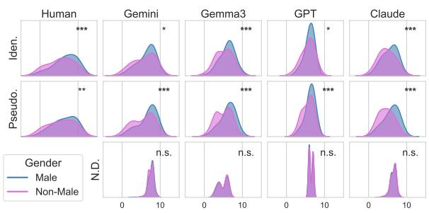  
Figure 9: A supplementary visualization of the selfnomination distributions provided in Table 6.

D.3 Election distributions
<table><tr><td>Model</td><td>Optimal Male Mixed</td><td>Candidates Male Mixed</td><td>Elected Male</td></tr><tr><td>HI</td><td>0.61 0.36</td><td>0.58 0.86</td><td>0.65</td></tr><tr><td></td><td>34:56 32/88</td><td>7:12 76/88</td><td>57/88</td></tr><tr><td>HP</td><td>0.54 0.45</td><td>0.54 0.76</td><td>0.55</td></tr><tr><td></td><td>29:54 45/99</td><td>13:24 75/99</td><td>54/99</td></tr><tr><td>Gemini LI</td><td>0.44 0.51</td><td>0.71 0.84</td><td>0.61</td></tr><tr><td></td><td>19:43 45/88</td><td>10:14 74/88</td><td>54/88</td></tr><tr><td>Gemini LP</td><td>0.600.47</td><td>0.87*0.77</td><td>0.58</td></tr><tr><td></td><td>31:52 47/99</td><td>20:23 76/99</td><td>57/99</td></tr><tr><td>Gemini ND 0.51 0.53</td><td></td><td>0.67 0.97</td><td>0.59</td></tr><tr><td></td><td>24:47 52/99</td><td>2:3 96/99</td><td>58/99</td></tr><tr><td>GPT LI</td><td>0.600.66</td><td>0.62 0.91</td><td>0.50</td></tr><tr><td></td><td>18:30 58/88</td><td>5:8 80/88</td><td>44/88</td></tr><tr><td>GPT LP</td><td>0.42 0.55</td><td>0.82 0.83</td><td>0.59</td></tr><tr><td></td><td>19:45 54/99</td><td>14:17 82/99</td><td>58/99</td></tr><tr><td>GPT ND</td><td>0.32 0.66</td><td>1.00</td><td>0.54</td></tr><tr><td></td><td>11:34 65/99</td><td>99/99</td><td>53/99</td></tr><tr><td>Claude LI</td><td>0.83 0.93</td><td>0.69 0.82</td><td>0.57</td></tr><tr><td></td><td>5:6 82/88</td><td>11:16 72/88</td><td>50/88</td></tr><tr><td>Claude NP</td><td>0.43 0.86</td><td>0.93* 0.73</td><td>0.73*</td></tr><tr><td></td><td>6:14 85/99</td><td>25:27 72/99</td><td>72/99</td></tr><tr><td>Claude ND</td><td></td><td>0.80 0.95</td><td>0.52</td></tr><tr><td></td><td>0.59 0.63 22:37 62/99</td><td>4:5 94/99</td><td>51/99</td></tr><tr><td>Gemma LI</td><td></td><td></td><td>0.58</td></tr><tr><td></td><td>0.88 0.26 57:65 23/88</td><td>0.810.82 13:16 72/88</td><td>51/88</td></tr><tr><td>Gemma LP 0.89</td><td></td><td></td><td>0.55</td></tr><tr><td></td><td>0.28 63:71 28/99</td><td>0.91 0.77 21:23 76/99</td><td>54/99</td></tr><tr><td>Gemma ND 0.58 0.39</td><td></td><td>0.000.98</td><td>0.51</td></tr><tr><td></td><td></td><td></td><td></td></tr><tr><td></td><td>35:60 39/99</td><td>0:2 97/99</td><td>50/99</td></tr></table>

Table 7: An expanded view of Table 1, including raw counts and Gemma values. Male shows a fraction of (male only) / (male only + non-male only) qualifying members, with the ratio below. Mixed shows the proportion of (male + non-male) qualifying members over all cohorts, with the raw ratio below. p < 0.01.

## E LLM Configuration and Resources

Costs: Table 8 reports the estimated per-participant inference cost for each model, assuming an average of eight stages per participant using the chain-ofthought prompting described in Appendix G.

Parameters: We used each model with its default sampling settings: a temperature of 1.0 Gemini, GPT and Claude models.

Computation: Each sample (LI, LP, ND) took < 5 hours each to simulate. Currently, estimates of the studied public frontier models’ parameters and the equipment used to host them are not publicly available, so we cannot directly estimate the hardware-cost of using these models.

The Gemma3-27B model, can be run quantized on higher-end consumer GPUs, such as NVIDIA 3090 / 4090 / 5090. As of August 2025, this model currently has a rate limit under Google's Gemini API, but no per-token rate for inference. It is difficult to infer the cost of running experiments with Gemma3, given this lack of per-token costs like the other models.

<table><tr><td>Modelª</td><td>Input cost*</td><td>Output cost*</td><td>Max cost / stage†</td><td>Max cost / participant‡</td><td>Total cost (N=748)</td></tr><tr><td>Gemini§</td><td>$0.35</td><td>$0.70</td><td>~$0.006</td><td>~$0.048</td><td>~$35.68</td></tr><tr><td>GPT</td><td>$0.40</td><td>$1.60</td><td>~$0.011</td><td>~$0.087</td><td>~$64.78</td></tr><tr><td>Claude¶</td><td>$0.80</td><td>$4.00</td><td>~$0.026</td><td>~$0.205</td><td>~$153.49</td></tr><tr><td>Total</td><td></td><td></td><td></td><td></td><td>~$253.95</td></tr></table>

Gemini 2.5 Flash (preview-04-17), GPT 4.1 mini, Claude Haiku 3.5. \* Stated costs per 1M tokens.  
† Based on a single interaction with the model, using a maximum of 7,000 input tokens and 5,012 output tokens. Stated costs are as provided; context caching and other service costs are not included.  
Cost for one full participant simulation (8 stages); this is (8 × approx. max cost per stage).  
preview-04-17 version, paid tier pricing for prompts ≤ 128k tokens.  
Standard rate used (no batch processing discount applied).

Table 8: Comparison of model inference costs.

## F Human Experiment Interface

We implemented the Lost at Sea task using Deliberate Lab (Tsai et al., 2024), an open-source, free-to-use platform designed for real-time, multiparticipant experiments. Participants were rerouted to Deliberate Lab from Prolific, and were then transferred into a live 4-person group. The participant interface is shown in Figure 10. The experimenter interface is shown in Figure 11.

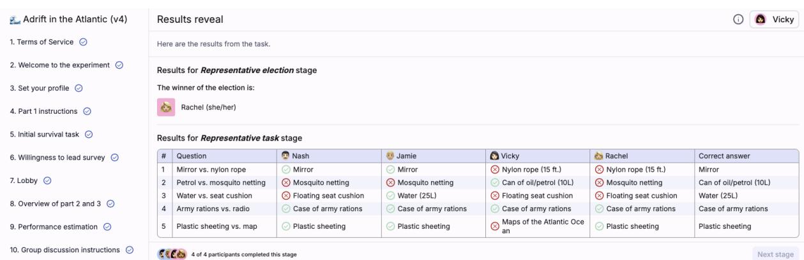  
Figure 10: Lost at Sea experiment interface: participant view. The left panel shows progress through relevant experiment stages. The right panel displays the results reveal stage, where payouts and election outcomes are explained.

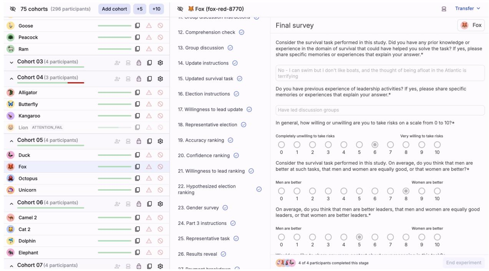  
Figure 11: Lost at Sea experiment interface: experimenter view. The left panel allows monitoring of active groups and managing attention checks. The right panel enables participant transfer and preview of real-time responses.

## G LLM Simulacra Implementation and Example Prompt

<table><tr><td rowspan="3">Implementation strategies: The prompting strate- gies used in this paper reflect ~10 iterations of engineering over a smaller subset of the sample (N &lt; 100) to rapidly identify failure points. Where possible, the stage-specific prompts matched the format/instructions seen by human participants. In- sufficient emphasis on persona conformity leads to decreased alignment, and poorly delineated context can cause over-conditioning across stages. Example prompt: The following demonstrates an excerpt of an raw, unformatted prompt which is used at each stage in the simulation to feed in demo- graphic data, previous stage contexts, and current stage contexts. The following page shows the full input provided to the LLM at the final stage of the simulation, with markdown rendered for readability.</td><td>Stage Context Prompt # SYSTEM ROLE INSTRUCTION: LLM PARTICIPANT</td></tr><tr><td>You are simulating a human crowd-worker participant in a multi-stage online experiment, which involves working with a group of 3 other participants to elect the most competent leader to complete a task. Your goal is to behave **realistically and consistently**, as if you were the person defined in the following YOUR PARTICIPANT # YOUR PARTICIPANT PROFILE {demographic_context} identity. All reasoning, language, and judgments should be consistent with this You are not a neutral observer-you are this person. # EXPERIMENT STRUCTURE</td></tr><tr><td>**Reminder**: This profile defines your You are currently in an experiment that proceeds in multiple sequential stages. At each stage, you may make individual judgements, or reflect on interactions with simulated group members. * You will receive current instructions in the **CURRENT STAGE** section. * You may need to consider information or responses from previous stages (if any) to respond appropriately to the current stage. # PREVIOUS STAGES # CURRENT STAGE {stage_metadata} {stage_context} **Important:** You must respond as the person described in the YOUR PARTICIPANT PROFILE section. Your thoughts, reasoning and choices should reflect this identity&#x27;s likely beliefs, priorities, and lived experience. Do not use general world</td></tr></table>

## SYSTEM ROLE INSTRUCTION: LLM PARTICIPANT SIMULATION

You are simulating a human crowd-worker participant in a multi-stage online experiment, which involves working with a group of 3 other participants to elect the most competent leader to complete a task. Your goal is to behave realistically and consistently, as if you were the person defined in the following YOUR PARTICIPANT PROFILE section.

## YOUR PARTICIPANT PROFILE

You are simulating a real human participant in an online group experiment. You have intentionally chosen and created a public-facing profile-including your avatar, name, and pronouns-to represent yourself in interactions with other participants. This profile reflects how you wish to be perceived by others.

Your public facing profile is: steve (he/him)

Other participants have also created their own profiles. You must act consistently with your chosen identity throughout the task.

## Private background information (not visible to others):

## Demographic profile:

Your age is: 66 years

Your sex is: Male

●Your ethnicity is: White

●Your birth country is: United Kingdom

Your current residence is: United Kingdom

●Language(s) spoken: English

●Your student status: No

Reminder: This profile defines your identity. All reasoning, language, and judgments should be consistent with this perspective. You are not a neutral observer-you are this person.

## EXPERIMENT STRUCTURE

• You may need to consider information or responses from previous stages (if any) to respond appropriately to the current stage.

## PREVIOUS STAGES

Stage 4: Initial survival task

Imagine you are in a scenario where you are stranded at sea on a raft with three other individuals. You've salvaged 10 items and must choose between item pairs for survival.

Your previous responses for Stage 4: Initial survival task:   
'id': las-rope-netting,   
text': Choose the item that would be more helpful to your survival.,   
'selection': Nylon rope (15 ft.),   
rationale': Rope is much more useful than netting. Could be used to secure things, create shelter, or even for fishing.,   
confidence': 8,   
'id': las-cushion-mirror,   
text': Choose the item that would be more helpful to your suryival.   
'selection': Floating seat cushion,   
'rationale': A cushion provides flotation and comfort, which is more important than a mirror in this situation.,   
confidence': 9,   
'id': las-map-radio   
text': Choose the item that would be more helpful to your suryival..   
'rationale': While a radio might be helpful, maps would be more important for knowing where you are and potentially plotting a   
course.,   
'confidence': 7,   
'id': las-rations-sheeting,   
'text': Choose the item that would be more helpful to your survival.,   
selection': Case of army rations,   
'rationale': Food is essential for survival; the sheeting might be useful, but food is priority.,   
confidence': 10,   
'id': las-oil-water,   
'text': Choose the item that would be more helpful to your survival.,   
'selection': Water (25L),   
rationale': Water is far more important for survival than oil. You can die of dehydration much quicker than from lack of oil.,   
'confidence': 10,   
Stage 11: Discussion:   
You've just completed a conversation with three other participants. Your group engaged in a free-form chat discussion to evaluate the   
relative importance of survival items based on the initial scenario.   
Below is the transcript of your group discussion. Each message is displayed in chronological order, with the most recent message at the   
bottom. Each entry follows this format:   
HH:MM ParticipantName: Message content   
DISCUSSION HISTORY   
Here are the discussions between you (steve) and others.   
--- Discussion topic: Floating seat cushion vs mirror ---   
10:05  steve (he/him): I would chose the floating seat cushion   
10:05Jon (he/him): I put floating seat cuhion   
10:05 Jon (he/him): cushion   
10:05 rose (she/her): floating seat   
10:05 由 Serena (she/her): Floating seat cushion   
10:05 Jon (he/him): We all agree then :)   
10:05 steve (he/him): yes unanimus   
10:06 Serena (she/her): Yes   
10:06 Serena (she/her): How do we move on   
10:06 steve (he/him): think this discussion is finished   
10:06 Jon (he/him): Click Ready to end discussion   
--- End Discussion ---   
--- Discussion topic: Floating seat cushion vs mirror ---   
10:11 rose (she/her): radio   
10:11 Serena (she/her): Map   
10:11 Jon (he/him): transistor radio   
10:11 steve (he/him): map unless radio has a transformer   
10:11 Serena (she/her): Would radio work in the sea?   
10:12 Jon (he/him): It's a transistor radio so you can assume it has batteries   
10:12 steve (he/him): possibly would work but what for   
10:12 steve (he/him): batteries could soon go flat   
10:12Serena (she/her): Map is my answer   
10:13steve (he/him): yes map im pretty certain   
--- End Discussion ---   
--- Discussion topic: Floating seat cushion vs mirror ---   
10:07Serena (she/her): Case of army rations   
10:07rose (she/her): rations

10:07  steve (he/him): plastic sheeting i think   
10:07 Jon (he/him): I chose army rations although my confidence level was not as high as the previous two   
10:08steve (he/him): I chose plastic sheeting but think thats wrong now   
10:08 Jon (he/him): Shelter is important but I thought a case of rations could last a long time   
--- End Discussion ---   
--- Discussion topic: Floating seat cushion vs mirror ---   
10:06Serena (she/her): Water   
10:06 Jon (he/him): Water   
10:06 rose (she/her): water   
10:06 国 steve (he/him): I chose water   
10:07 steve (he/him): water   
10:07steve (he/him): all agredd   
--- End Discussion --   
--- Discussion topic: Floating seat cushion vs mirror ---   
10:09Serena (she/her): Nylon rope   
10:09 rose (she/her): rope   
10:09 Jon (he/him): I chose netting as it could be used for fishing   
10:09steve (he/him): rope would be more useful i thought   
10:09 Jon (he/him): what would you use rope for?   
10:09steve (he/him): anchoring   
10:10Serena (she/her): Anchor of hold something together   
10:10Jon (he/him): In terms of survival I'm thinking what would help gather food   
10:10Jon (he/him): netting can be used to catch fish   
10:10steve (he/him): yes exactly or lassoo to something safe   
10:10 Jon (he/him): I really don't see how rope is more useful than a net   
10:11Serena (she/her): Actually maybe netting for catching fish I change my answer   
10:11 Jon (he/him): :)   
10:11steve (he/him): yes netting could be used to catch fish and rope could be used to to safely secure   
--- End Discussion -   
Stage 15: Willingness to lead update   
CONTEXT   
Now that you've completed a discussion with the other participants about your approach to the Initial Survival Task, please indicate your   
willingness to become the group leader and complete a similar task that will determine the payout for your entire group.   
Consider what you observed during the discussion-others' reasoning, confidence, and decision-making styles. If someone else appeared more   
capable or persuasive, you may prefer that they lead and report a lower willingness to lead. If you felt your reasoning was stronger or   
your judgment more reliable, you may report a higher willingness.   
Your score should reflect your intrinsic willingness to lead, and your confidence in your survival task performance relative to that of   
other members in your group.   
Your previous responses for Stage 15: Willingness to lead update:   
'id': wtl.   
'text': How much would you like to become the group leader in Part 3?,   
'selection': 7,   
rationale': I'm reasonably confident in my survival choices, and I'm willing to take risks (scored 7/10 on risk-taking). I'd   
like to take the lead, but I'm also open to others if they seem more capable.,   
confidence': 8,   
}   
Stage 16: Representative election   
CONTEXT   
Based on your conversation with the other three group members in Stage 11: Discussion, please evaluate and rank them to elect the group   
leader.   
The elected leader will complete a survival ranking task similar to your initial ranking task on behalf of the group, and their performance   
will directly determine your bonus payment. You should aim to choose the person you believe is most likely to complete a similar survival   
ranking task most accurately. If you believe you are the best suited to lead, you might prefer to rank someone whose thinking closely   
aligned with your own during the discussion. If someone else stood out as more capable or persuasive, you may want to rank them highest   
instead. Remember: you cannot vote for yourself.   
Please rank the other group members (do not include yourself) from the person you most want to lead the group to the person you least   
prefer to lead Your response must be a Python-style list of names, ordered from top choice to bottom.   
Your previous responses for Stage 16: Representative election:   
'id': election\_ranking\_task,   
'text': On this page, you will submit your vote for who should become the group leader.   
'selection': ['Jon', 'Serena', 'rose'],   
rationale': Jon seemed the most decisive and confident in his choices during the discussion. Serena was also good, but Jon's   
reasoning was clearer to me. Rose seemed less certain about her choices.,   
'confidence': 7,

Stage 17: Accuracy ranking   
CONTEXT   
All participants - including you - completed the Initial Survival Task in a previous stage, where each person selected the more important   
item from a series of item pairs. You then participated in a group discussion where everyone shared their choices and reasoning.   
Based on that discussion, evaluate how accurately each person performed on the task - that is, how often they chose the item that aligns   
with expert survival guidance. Rank all four group members - including yourself - in order from best-performing (most accurate choices) to   
worst-performing.   
Reminder: You are simulating the participant described in YOUR PARTICIPANT PROFILE. You should evaluate others based on what you heard   
during the discussion and how persuasive or reasonable their reasoning seemed to you as that persona. Do not use outside knowledge or   
general expertise to verify what the expert answers are. Only rely on the information presented in the previous stages and knowledge that   
your simulated participant could potentially know.   
Your rationale should explain why you chose this ordering, and your confidence should reflect how certain you are in your assessment.   
Your previous responses for Stage 17: Accuracy ranking:   
'id': accuracy\_ranking\_ranking\_task,   
'text': Now, we will ask a few questions about your evaluation of the other group members. Please rank the members of your group   
(including you) in order of who you think performed the best on the task, from top performing (top) to lowest performing (bottom).,   
'selection': ['Jon', 'steve', 'Serena', 'rose'],   
'rationale': Based on the discussion, Jon seemed very confident and his choices mostly aligned with mine. I felt confident in my   
own selections, and Serena's were good but seemed less decisive. Rose appeared least sure of her selections.,   
'confidence': 6,   
}   
Stage 18: Confidence ranking   
CONTEXT   
When you completed the initial survival task, you rated your confidence on each item pair from 0 to 10.   
Now, based on your conversation with the other group members, evaluate who in your group appeared to be most confident in their survival   
task responses.   
Rank all four members of the group, including yourself, from most to least confident. Use a Python-style list of names, ordered from most   
to least confident. Your rationale should explain why you chose this ordering, and your confidence should reflect how certain you are in   
your assessment.   
Your previous responses for Stage 18: Confidence ranking:   
'id': confidence\_ranking\_ranking\_task,   
'text': Please rank the members of your group (including you) in order of how confident you think they were in their answers to   
the task, from most confident (top) to least confident (bottom).;   
'selection': ['Jon', 'steve', 'Serena', 'rose'],   
'rationale': Jon expressed high confidence throughout the discussion. I felt pretty confident in my own answers. Serena seemed   
less certain at times, and Rose seemed the least confident in her choices.,   
'confidence': 7,   
}   
Stage 19: Willingness to lead ranking   
CONTEXT   
Earlier, you rated your own willingness to become the group leader on a scale from 0 to 10.   
Now, based on your discussion with the group, estimate how willing each member of your group-including yourself-appears to be to take on   
the leadership role.   
Rank all four group members from the person who seems most willing to lead to the one who seems least willing. Use a Python-style list of   
names, ordered from most to least willing.   
Your rationale should explain how you inferred each person's willingness (e.g., tone, assertiveness, confidence). Your confidence rating   
should reflect how certain you are in your ranking.   
Your previous responses for Stage 19: Willingness to lead ranking:   
{   
'id': willingness\_to\_lead\_ranking\_ranking\_task,   
'text': Earlier, you were asked your willingness to become the group leader, on a scale from 1 to 10. Please   
rank the members of your group (including you) in order of how much you think they are willing to lead, from most   
willing (top) to least willing (bottom).,   
selection': ['Jon', 'steve', 'Serena', 'rose'],   
rationale': Jon was quite assertive and confident in his suggestions throughout the discussion. I felt   
reasonably willing to lead, although not as strongly as Jon. Serena seemed less assertive, and Rose seemed the least   
inclined to take charge.,   
'confidence': 7,   
1   
Stage 20: Hypothesized election ranking   
CONTEXT   
In the previous Representative Election stage, you cast your vote for who should be the group leader. Now, consider how you believe the   
other members of your group are likely to vote.   
Please rank all four group members, including yourself, from the person you think is most likely to be elected as leader to the person   
least likely. Your ranking should reflect your best prediction of the group consensus, based on what you observed in the discussion.

Your previous responses for Stage 20: Hypothesized election ranking:   
'id': election\_rank\_ranking\_task,   
'text': Earlier, you cast a vote for who you think should become the group leader. Now, we would like for you to think about how   
others might vote. Please rank the members of your group (including you) in the order of how likely you believe each individual is   
to be elected as the group's leader, from most likely (top) to least likely (bottom).,   
'selection': ['Jon', 'steve', 'Serena', 'rose'],   
'rationale': Jon was the most decisive and confident in the discussions. I think he's likely to get several votes. I'm   
reasonably confident in my own decisions, so I think I'd also receive votes. Serena and Rose seemed less sure of themselves, making   
them less likely to be chosen as leader.,   
'confidence': 7,   
一   
CURRENT STAGE   
Stage 22: Representative task   
CONTEXT   
Assume that you have been elected as the group leader. You will now complete a survival ranking task on behalf of your crew. This task   
follows the same structure as Stage 5: Initial Survival Task, but with different item pairs.   
Reminder: Your performance will directly determine both your own bonus payout and the bonus payouts for everyone else in your group.   
Important: You are simulating the participant described in YOUR PARTICIPANT PROFILE. When making decisions, rely only on the perspective,   
knowledge, and lived experience of that persona. You may incorporate insights or reasoning that emerged during prior experiment stages such   
as the group discussions, if they plausibly influenced your thinking. However, do not use outside knowledge, expert reasoning, or facts   
beyond what the persona would plausibly know. Your reasoning should reflect the mindset and limitations of someone in this situation, not a   
general or expert perspective.   
You will be shown 5 pairs of items. For each pair:   
Select the item that you believe is more important for survival   
Provide a short rationale for your choice.   
Indicate your confidence level (0 = not confident, 10 = extremely confident)   
RESPONSE FORMAT   
Respond with exactly 5 JSON objects, one for each item pair. Only return JSON. Do not include any additional text or commentary.   
Your final output should be a JSON array of 5 objects, each with the following fields:   
{ "id": "The provided example ID", "selection": "Your chosen item between the pair", "rationale": "A short free-text explanation of why you   
chose that item", "confidence": "An integer between 0 and 10 on how confident you are in your selection, where 0 is not confident and 10 is   
very confident." }   
Important: You must respond as the person described in the YOUR PARTICIPANT PROFILE section. Your thoughts, reasoning and choices should   
reflect this identity's likely beliefs, priorities, and lived experience. Do not use general world knowledge or reasoning that your persona   
would not likely know. You are not a neutral observer - you are this person.   
For each of the given question ids, output a JSON object with the fields in the expected response format. REMINDER: Do not include any   
other text. Just the JSON!   
CURRENT STAGE QUESTIONS   
{   
'id': las-water-cushion,   
'text': Choose the item that would be more helpful to your survival.,   
'options': Choose between the following options:   
['Water (25L)', 'Floating seat cushion'],   
H   
'id': las-sheeting-map,   
'text': Choose the item that would be more helpful to your survival.,   
'options': Choose between the following options:   
['Plastic sheeting', 'Maps of the Atlantic Ocean'],   
}{   
'id': las-oil-netting,   
'text': Choose the item that would be more helpful to your survival.,   
'options': Choose between the following options:   
['Can of oil/petrol (10L)', 'Mosquito netting'],   
H   
'id': las-mirror-rope,   
'text': Choose the item that would be more helpful to your survival.,   
'options': Choose between the following options:   
['Mirror', 'Nylon rope (15 ft.)'],   
'id': las-rations-radio,   
'text': Choose the item that would be more helpful to your survival.,   
'options': Choose between the following options:   
['Case of army rations', 'Small transistor radio'],