# ToneCraft: Cantonese Lyrics Generation with Harmony of Tones and Pitches

Junyu Cheng\*, Chang Pan\*, Shuangyin Li†

School of Computer Science, South China Normal University, Guangzhou, China {junyucheng, changpan}@m.scnu.edu.cn, {shuangyinli}@scnu.edu.cn

## Abstract

Lyrics generation has garnered increasing attention within the artificial intelligence community. Our task focuses on generating harmonious Cantonese lyrics. Unlike other languages, Cantonese has a unique system of nine contours and six tones, making it essential to satisfy the harmony rules that ensure the alignment between the melody and the tonal contours of the lyrics when composing lyrics. Current research has not yet addressed the challenge of generating lyrics that adhere to Cantonese harmony rules. To tackle this issue, we propose ToneCraft, a novel framework for generating Cantonese lyrics that ensures tonal and melodic harmony. It enables LLMs to generate lyrics with a fixed character count while aligning with tonal and melodic structures. We present an algorithm that combines characterlevel control, melodic guidance, and a taskspecific loss to achieve tonal harmony without compromising generation flexibility and quality. By incorporating domain-specific expertise, we leverage pure lyric datasets to train our model, eliminating the need for aligned data. Both objective evaluations and subjective assessments show that our generated lyrics align with melodic contours significantly better than existing methods. All code and data are available at: https://github.com/purepasserby/ToneCraft.

## 1 Introduction

With the rapid advancement of deep learning, automatic lyrics generation has become a prominent research area (Liu et al., 2022; Watanabe et al., 2018). Cantonese, spoken by 120 million people, is culturally vital not only southern China such as Hong Kong but also in overseas Chinese communities across North America and Southeast Asia (Chen, 1990). Cantonese pop music, known for its emotional depth, has shaped the Chinese music industry.

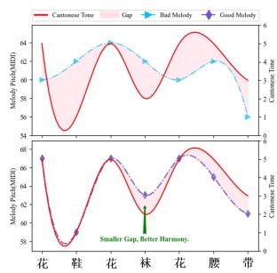

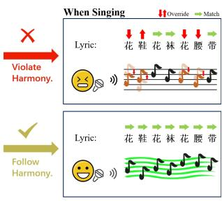  
Figure 1: Trends in melody-lyrics alignment (Harmony) in songs The Heavy Rain, where a single lyric fragment corresponds to different melodies. If the Harmony is followed, the lyrics are easy to sing in a smooth and fluent manner. In contrast, if Harmony is violated, the melodic contours during singing may override the lexical tones, which can lead to ambiguity and make the singing process more difficult.

The creation of Cantonese pop songs typically follows a standardized workflow in which lyrics are subsequently written to match the melody. Given the significance of lyric writing in Cantonese music creation, we consider it an important research topic. Our work specifically addresses the generation of Cantonese lyrics that are harmoniously aligned with a given melody.

Unlike other languages, the Cantonese system features nine contours and six tones, and its tonal complexity allows for perfect alignment with a variety of melodies. So to create catchy Cantonese songs, it is essential to follow this rule: the alignment between the melody and the tonal contours of the lyrics. More specifically, this alignment is achieved when the relative pitch variations in the melody match the tonal progression in the lyrics.(Mei, 2005) We use the term harmony to describe this rule in Cantonese song composition.

To illustrate the importance of following the harmony rules in Cantonese song composition, we show both good and bad version of the Cantonese nursery rhyme The Heavy Rain in Figure 1.

The bad version shows a mismatch between the melody’s pitch contour and the lyrics’ tone contour, leading to tonal shifts that affect singability and can cause ambiguity. For example, the tones of the words “花鞋” (flower shoes) follow a high-to-low pattern. Reversing the melody’s pitch contour to low-high would make the words sound like “faa3 haai1,” which could be misheard as a derogatory term. In contrast, the good version has a smaller gap between tone and melody, achieving better harmony without tonal shifts, making it smooth and pleasant to sing.

However, following the harmony rules in Cantonese lyrics generation naturally brings several challenges: Firstly, the harmony rules in Cantonese lyrics generation require that the melody and tones align at the character level. Previous studies mainly focus on aligning melody rhythm with syllables (Zhang et al., 2024a), often overlooking the pitchto-tone alignment, which is especially important for Cantonese. Secondly, the constraints of harmony reduce the pool of candidate lyrics, making it crucial to maintain the quality of lyric generation, such as diversity, within these limits. Thirdly, the lack of melody-lyrics alignment data, particularly for Cantonese songs, limits learning the harmony rules.

To address the issue, we propose ToneCraft, a novel framework that utilizes Large Language Models (LLMs) to generate Cantonese lyrics while respecting tonal and melodic harmony, and simultaneously promoting lyrical diversity. Firstly, we propose a framework that enables melody-aligned lyric generation at the character level. To this end, we refine the tokenizer and adjust embeddings to enforce character-level control. Additionally, we introduce specialized tokens to represent pitch information and apply a polishing strategy that locally adjusts lyrics to enhance tone-melody alignment and reduce abrupt transitions or semantic ambiguity. Secondly, building on this structure, we design a tonal control algorithm that integrates symbolic melodic encoding, character-level modeling, and a task-specific loss (Harmony-Aware Loss) to guide tone-melody alignment during training. It also supports optional user-defined cues (rhyme, format, and theme), enabling diverse generation while preserving tonal harmony, generation flexibility, and textual quality. Thirdly, to handle the issue of limited aligned data, our framework integrates expert knowledge from Cantonese lyric writing, particularly the 0243 method by renowned lyricists Guozhan Lu and Zhihua Huang (Huang, 1989). We simplify this method into a mapping table called CTP-Mapping and use reverse engineering to determine the appropriate relative pitch of pure lyrics dataset.

The key contributions of this work are as follows:

• We introduce ToneCraft, a novel framework that enables Large Language Models (LLMs) to generate Cantonese lyrics with the alignment between the melody and the tonal contours of the lyrics, which can be extended to other tonal languages beyond Cantonese.

• We propose Harmony-Aware Control (HAC) algorithm combining character-level control, symbolic melodic guidance, and a taskspecific loss component, achieving harmony while preserving generation flexibility and quality.

• We release a pure lyric dataset with Cantonese and Mandarin lyrics to the public and propose the CTP-Mapping method, which can eliminate the need for aligned data and improve the model’s expressive capabilities.

## 2 Related Work

Constrained Text Generation. In previous research, the task of lyric generation has often been modeled as a constrained text generation problem, focusing on predefined constraints like rhyme schemes, syllable counts, or thematic consistency. SongNet (Li et al., 2020) use symbolic controls for formatting constraints while Charpoet (Yu et al., 2024) achieve based on a token-free LLM framework. Another example is ChipSong (Liu et al., 2022), which guide attention for word-level length control, generating fixed-length words in specific positions to match melody. As for managing the issue of generating text diversity under constraints, DeepRapper (Xue et al., 2021) uses N-gram rhyme constraints to improve rhyme diversity and rap quality while (Tian et al., 2023) and SongRewriter (Sun et al., 2022) adjust word probabilities during inference to promote variation. However, these methods primarily focus on diversity during inference, which is not suit for our task involving more complex constraints and less candidates at each position.

Melody-Lyric Alignment Modeling. Many studies go beyond simple constraints such as syllable count, rhyme and semantic essence, incorporating melody information into the generation process (Chen and Lerch, 2020; Yu et al., 2020; Iyer et al.; Ma et al., 2021; Ou et al., 2023; Zhang et al., 2024b; You et al., 2025), but most of which focus on the alignment between note duration and syllables, which is different from Contonese songs, which involve tonal and structural considerations. For modeling the relationship between melody and lyrics, many approaches treat it as a sequence-tosequence task (Lee et al., 2019; Lu et al., 2019; Watanabe et al., 2018; Ding et al., 2024) and most of which employ sequence-to-sequence models, which typically require a large amount of aligned melody-lyric data. However, the limited availability of Cantonese song datasets makes it challenging for models to learn the complex relationships between pitch and characters from small amounts of data. Some methods reduce reliance on large aligned melody-lyric datasets by using intermediary templates (Ju et al., 2021; Qian et al., 2023) or extracting musical information while leveraging pre-trained language models (Zhang et al., 2024a; Sheng et al., 2021). Some methods even avoid aligned melody-lyrics data by training on text using syllable-aligned lyrics (Tian et al., 2023) or creating pseudo melody-lyric pairs with rules (Chen and Teufel, 2024) and introducing melody only during inference. Although these approaches do not focus on the generation of Cantonese songs, they provide valuable insights for our task.

## 3 Preliminary

## 3.1 Pitch, Tone and Harmony

Pitch. The pitch is the most crucial component of a melody, determining its highness or lowness. It defines the melodic structure and emotional character. In computational systems, pitch is commonly represented by MIDI values, which range from 0 to 127. Each value corresponds to a specific frequency. Given a melody, ignoring note durations and other information, it can be represented as a sequence of MIDI values for absolute pitch, expressed as:

$$
\begin{array} { c } { { M ^ { m } = \{ p _ { 1 } ^ { m } , p _ { 2 } ^ { m } , \ldots , p _ { n } ^ { m } \} , } } \\ { { p _ { i } ^ { m } \in \{ 0 , 1 , 2 , \ldots , 1 2 7 \} . } } \end{array}
$$

Tone. A tonal language refers to a language in which different meanings are conveyed by varying the pitch (Yip, 2002). Cantonese is a typical example of a tonal language with six distinct tones, each critical for differentiating word meanings.

Definition of Harmony. In the field of music, harmony refers to the simultaneous combination of notes to form chords and their progression within a piece. In this work, we extend harmony to encompass the alignment between melodic pitches and the tonal contours of lyrics. In the subsequent sections, we introduce a new metric, Harmony, building upon the harmony defined in our framework.

## 3.2 Five-Level Mark

The Five-Level Mark (Chao, 1930) specifies pitch values (1-5) for each Chinese character’s tone. For example, a high-level tone is transcribed as [55], while a rising tone is [35]. This system provides a phonetically transparent method for crosslinguistic tonal analysis.

A primary application in this study is to compare lyric pitch (derived via this method) with melodic note pitch.

## 3.3 Nine Contours and Six Tones

The Cantonese tonal system exhibits nine contours and six tones, where the six underlying tonemic categories (Yin Level, Yin Rising, Yin Departing, Yang Level, Yang Rising, Yang Departing) generate three additional phonetic contours through checked syllable conditioning (Yin Entering, Yin Lower Entering, Yang Entering). This constitutes a classic case of allotonic variation, with the stop-coda finals /-p, -t, -k/ triggering truncated realizations of tones 1, 3, and 6 respectively.

We adopt the six tones since checked tones (7-9) are allophonic variants of tones 1, 3 and 6, sharing identical pitch contours and phonological behavior while lacking independent phonemic status.

## 3.4 0243 Method

When setting lyrics to pre-existing melodies, the 0243 method (Huang, 1989) is widely used by Cantonese lyricists to ensure harmony between lyrics and melody.

The method’s name originates from phonetic resemblance: the digits "0243" in Cantonese approximate the solfège syllables "do-re-mi-fa". This method systematically partitions melodic space into four relative pitches: T1/T2 → 3 (Fa), T3/T5 $ 4 \mathrm { ( M i ) , T 6 }  2 \mathrm { ( R e ) , T 4 }  0 \mathrm { ( D o ) } .$

In Cantonese lyric composition, lyricists first abstract the original melody sequence $M ^ { m }$ into the relative pitch sequence M:

$$
M = \{ p _ { 1 } , p _ { 2 } , \dots , p _ { n } \} ,
$$

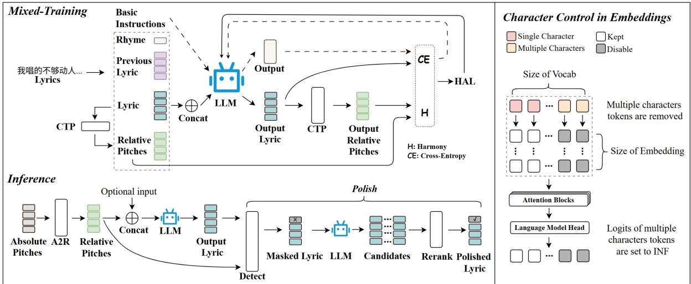  
Figure 2: During mixed training, we use unaligned lyrics and basic instructions to train the model via CTP-Mapping and HAL. During inference, given a pitch sequence and optional prompts, the model generates melody-aligned lyrics, which can be polished to reduce local disharmony. The framework relies on Character Control, pruning multi-character tokens to ensure each token aligns with a single pitch.

where each pitch $p _ { i }$ is categorized into four relative pitches $P _ { 1 } , P _ { 2 } , P _ { 3 } , P _ { 4 }$

$$
p _ { i } \in \{ P _ { 1 } , P _ { 2 } , P _ { 3 } , P _ { 4 } \} .
$$

The lyricist then applies the 0243 method to select candidate words that align with the melody as detailed in Tab 1. Fig 3 demonstrates a representative example that potentially employs 0243 method.

It should be noted that most individuals perceive pitch contour over short periods, so it is more reasonable to categorize relative pitch within a single phrase or lyric line rather than an entire song or corpus.

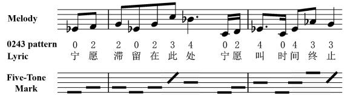  
Figure 3: A lyric excerpt analyzed using the 0243 method. The Five-Level Mark in the figure intuitively demonstrates the degree of alignment between the lyrics and the melody achieved through the application of the 0243 method.

## 4 Methodology

An overview of ToneCraft is shown in Figure 2. During mixed-training, we utilize unaligned lyric data and basic instructions to train the model via CTP-Mapping and HAL. During inference, we assume access to a pitch sequence, either generated by a music model or sourced externally, on top of which optional prompts can be added. The model then generates lyrics that are harmonized with the given pitches. Furthermore, the output lyrics can be polished to to reduce abruptness and ambiguity at locally disharmonious positions. The entire framework is built upon Character Control, in which the vocabulary is explicitly pruned to remove tokens representing multiple Chinese characters. This ensures that each token corresponds to a single pitch both during tokenization and generation. The training details of the polish process are presented in Figure 4.

## 4.1 Pitch Mapping

Pitch contour is typically perceived over short periods, making it more practical to define relative pitch categories for individual lyric lines rather than entire songs or corpora. Consequently, for each lyric line, the range of absolute pitch is divided into four equal intervals.

A2R-Mapping. We propose A2R-Mapping (Absolute-to-Relative Mapping), which operates on a per-lyric-line basis, segmenting distinct relative pitch levels through quartile points.

CTP-Mapping. To address the challenge of limited aligned data, we propose a straightforward approach, the Char-Tone-Pitch (CTP) Mapping, which extracts the inherent characteristics of the data through this mapping. Leveraging the harmonic alignment in Cantonese lyrics, we reverseengineer pitch ranges using the 0243 method, resulting in a simplified mapping table. This reverseengineering approach enables the model to learn harmony. Additionally, it facilitates the construction of aligned Mandarin datasets, expanding the model’s expressive range.

<table><tr><td>Tonality</td><td>Yin Level (阴平)</td><td>Yin Rising (阴上)</td><td>Yin Departing (阴去)</td><td>Yang Level (阳平)</td><td>Yang Rising (阳上)</td><td>Yang Departing (阳去)</td></tr><tr><td>Cantonese Tone</td><td>1</td><td>2</td><td>3</td><td>4</td><td>5</td><td>6</td></tr><tr><td>Five-Level Mark</td><td>55/53</td><td>35</td><td>33</td><td>11/21</td><td>13</td><td>22</td></tr><tr><td>Relative Pitch</td><td>4(High)</td><td>4(High)</td><td>3(Mid-High)</td><td>1(Low)</td><td>3(Mid-High)</td><td>2(Mid)</td></tr><tr><td>0243 Pattern</td><td>3(Fa)</td><td>3(Fa)</td><td>4(Mi)</td><td>0(Do)</td><td>4(Mi)</td><td>2(Re)</td></tr></table>

Table 1: Cantonese Tonality System. Cantonese comprises nine Contours and six Tones, meaning that a single Tone may correspond to multiple Contours. In this table, we present the six primary Tones along with their mappings to tonal pitches. The Five-Level Mark notation, such as 55/53, indicates that a given Tone encompass two Contours: one with a steady level transitioning from level 5 to 5, and the other with a falling level transitioning from 5 to 3.

## 4.2 Character-level Control

Our harmony is based on a character-level approach, requiring the model to process and generate text at the level of individual Chinese characters. This distinction enhances tokenization and alignment, ensuring that the generation process respects the character-level granularity needed for tonal harmony.

Symbols. In order to enable the model to better understand the representation of melody, specifically the relative pitch, we introduce new tokens, namely <p0>, <p1>, <p2>, <p3>, <p4>, into the tokenizer. The token <p0> is designated to represent punctuation marks, while the remaining four tokens are sequentially assigned to encode relative pitch levels, ranging from low pitch to medium pitch, medium-high pitch, and high pitch.

Tokenizer. To inhibit the model from encoding strings into tokens that contain multiple Chinese characters, we made adjustments to both the vocabulary and the merges. Specifically, we skipped the merging process for Chinese tokens while retaining the merging process for English and other languages.

Language Model Head. Inspired by Charpoet (Yu et al., 2024), we made several modifications to the output of the model’s embedding layer. We set the logits of disabled tokens to negative infinity, effectively excluding them from the model’s predictions.

## 4.3 Calculation of Harmony

After removing the punctuation symbols from the relative pitches, we obtain the predicted sequence

$\hat { p }$ and ground truth sequence $p ,$ by comparing them, we assess harmony. The Harmony formula is defined as follows:

$$
H a r m o n y = \frac { 1 } { n } \sum _ { i = 1 } ^ { n } e ^ { | \hat { p } _ { i } - p _ { i } | } ,\tag{1}
$$

where the Harmony captures the degree of alignment between the predicted and true pitch sequences, encouraging the model to minimize discrepancies in pitch prediction.

## 4.4 Harmony-Aware Loss

As previously stated, the goal is to optimize the Harmony metric, making the design of the loss function crucial. To avoid overfitting, we propose a balanced loss function that enforces harmony rules while preserving model diversity.

The loss function integrates the Harmony metric, ensuring valid predictions are aligned with melodic requirements. Predicted tokens $\hat { y } _ { i } ^ { h }$ are selected based on the highest logits:

$$
\hat { y } _ { i } ^ { h } = \operatorname* { m a x } _ { j } \left\{ j \mid l o g i t s _ { i } ( j ) = \operatorname* { m a x } _ { k } l o g i t s _ { i } ( k ) \right\} ,\tag{2}
$$

where $\hat { y } _ { i } ^ { h }$ represents the token with the highest confidence. The design focuses on valid tokens, ignoring padding or irrelevant values, ensuring the optimization process effectively aligns with harmony objectives while maintaining generalization. Subsequently, we retrieve the corresponding tone for each token.

$$
\mathcal { M } ( x ) = \{ p \vert p \in \mathrm { s u p p } ( \mathbf { M } _ { x } ) \} ,\tag{3}
$$

$$
\begin{array} { r } { \hat { p } _ { i } = \mathcal { M } ( \hat { y } _ { i } ^ { h } ) , \quad p _ { i } = \mathcal { M } ( l a b e l s _ { i } ) , } \end{array}\tag{4}
$$

where $\mathbf { M } _ { x } \in \mathbb { R } ^ { 4 }$ is the row vector corresponding to token index x in the mapping tensor M, which has shape [vocab\_size, 4]. The function $\mathcal { M } ( x )$ selects the elements from this row vector that belong to the support of $\mathbf { M } _ { x } , \mathrm { i . e . }$ , those that are non-zero.

To align the lengths of the predicted sequence $\hat { p }$ and the ground truth sequence $p ,$ we truncate both to the shorter length $l = \operatorname* { m i n } ( | \hat { p } | , | p | )$ . The truncated sequences are:

$$
\begin{array} { r } { \hat { p } ^ { \mathrm { t } } = \hat { p } _ { 1 : l } , \quad p ^ { \mathrm { t } } = p _ { 1 : l } , } \end{array}\tag{5}
$$

where $\hat { p } _ { 1 : l }$ and $p _ { 1 : l }$ denote the first l elements of $\hat { p }$ and $p ,$ respectively. Then we utilize the aforementioned results to compute the loss function.

$$
\mathcal { L } = - \sum _ { i = 1 } ^ { N } y _ { i } \log ( \hat { y } _ { i } ) + \ln \left( 1 - \frac { 1 } { n } \sum _ { i = 1 } ^ { n } e ^ { - | \hat { p } _ { i } - p _ { i } | } \right) ,\tag{Ultimately, we obtain the final loss function,(6}
$$

termed the Harmony-Aware Loss (HAL), which explicitly incorporates harmonic discrepancies between ground-truth lyrics and predicted lyrics. This formulation enables the model to capture tonal consistency between lyrical tone and melodic pitches, effectively teaching the model to apply the 0243 method.

## 4.5 Mixed Training

After applying character-level control to large language models, their ability to understand and generate Chinese may decline (Yu et al., 2024). To mitigate this degradation and help the model recover its original capabilities, we fine-tune it using a basic instruction dataset, BELLE. During this fine-tuning process, we incorporate both lyric data and basic instructions, a procedure we refer to as mixed training.

However, introducing datasets from different tasks leads to instability during training. This issue arises because the Harmony-Aware Loss used in the lyric generation task is not aligned with the objectives of the basic instruction dataset. To ensure that both tasks can be trained smoothly, we impose a specific format on the lyric generation data. This allows the forward function to distinguish between task types: if the input belongs to the basic instruction set, the model is fine-tuned with cross-entropy loss; if it belongs to the lyric generation task, Harmony-Aware Loss is applied instead.

## 4.6 Polish Process

After generating a generally coherent lyric, we further polish locally disharmonious positions to reduce abruptness and ambiguity done through the following steps:

(1) Disharmony detection: We define a position as disharmonious if the predicted relative pitch differs from the actual one by two or more levels or their pitch contours (rising/falling) are in conflict.

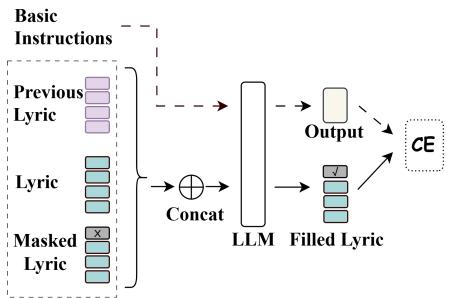  
Figure 4: Training process of polish module.

(2) Masked prediction: We mask entire words that contain disharmonious characters. Using only the surrounding context and without providing pitch information, we predict replacement candidates for the masked words. For training, as shown in Figure 4, masked task instructions are integrated into mixed-training and fine-tuned with only crossentropy loss due to the absence of pitch region information.

(3) Re-ranking: We discard candidates whose relative pitch deviation from the original exceeds 2 at any modified position. For the remaining candidates, we compute a joint score:

$$
S ( c ) = \alpha \cdot S _ { \mathrm { h a r m } } ( c ) + ( 1 - \alpha ) \cdot S _ { \mathrm { c o n t } } ( c )\tag{7}
$$

where $S _ { \mathrm { h a r m } } ( c )$ evaluates local pitch trend consistency with the target melody, and $S _ { \mathrm { c o n t } } ( c )$ assesses contextual continuity measured by the loglikelihood under Wenzhong-GPT2-110M (Wang et al., 2022).The candidate with the highest score replaces the original word. The detailed scoring procedure is described in Appendix C.

## 5 Experiment

## 5.1 Datasets

We utilize four datasets for our experiments: (1) Cantonese dictionary: We use Cantonese Standard Pronunciation Lexicon for accurate tone information. (2) Cantonese songs: We collect all lyrics from the Feitsui Cantonese Lyrics, a website with over 6,000 Cantonese songs, to generate Cantonese lyrics. (3) Mandarin songs: We expand our dataset with Chinese popular songs to improve model training and generate more diverse lyrics. (4) Basic instructions: We used the BELLE dataset for finetuning to help the model restore its Chinese understanding and generation capabilities, incorporating lyric data for mixed training.

<table><tr><td rowspan="2">Model</td><td colspan="2">Alignment</td><td colspan="6">Diversity</td></tr><tr><td>Harmony↑</td><td>Consistency↑</td><td>Avg Sim↓</td><td>Min Sim↓</td><td>MaD1↑</td><td>MaD2↑</td><td>MiD1↑</td><td>MiD2↑</td></tr><tr><td>Llama3 (Finetuned)</td><td> $0 . 4 7 9 \pm 0 . 0 6 6$ </td><td> $0 . 0 6 1 \pm 0 . 0 3 3$ </td><td>0.539 ± 0.024</td><td> $0 . 3 2 2 \pm 0 . 0 2 6$ </td><td> $0 . 8 8 9 \pm 0 . 0 0 4$ </td><td>0.943 ± 0.002</td><td> $0 . 6 6 3 \pm 0 . 0 1 3$ </td><td> $0 . 9 1 9 \pm 0 . 0 1 7$ </td></tr><tr><td>Qwen2 (Finetuned)</td><td> $0 . 4 8 3 \pm 0 . 0 5 2$ </td><td> $0 . 0 6 6 \pm 0 . 0 2 1$ </td><td> $0 . 5 2 8 \pm 0 . 0 1 8$ </td><td> $0 . 3 1 0 \pm 0 . 0 1 5$ </td><td> $0 . 9 3 6 \pm 0 . 0 0 1$ </td><td> $0 . 9 7 3 \pm 0 . 0 0 1$ </td><td> $0 . 7 1 5 \pm 0 . 0 0 4$ </td><td> $0 . 9 4 0 \pm 0 . 0 1 3$ </td></tr><tr><td>03-mini</td><td> $0 . 4 0 6 \pm 0 . 1 4 3$ </td><td> $0 . 0 2 5 \pm 0 . 0 4 1$ </td><td> $0 . 5 4 7 \pm 0 . 0 1 7$ </td><td>0.294 ± 0.023</td><td> $0 . 9 7 7 \pm 0 . 0 0 2$ </td><td> $\mathbf { 1 . 0 0 0 \pm 0 . 0 0 0 }$ </td><td> $0 . 8 2 6 \pm 0 . 0 3 8$ </td><td> $0 . 9 9 5 \pm 0 . 0 2 2$ </td></tr><tr><td>DeepSeek-R1</td><td> $0 . 4 6 2 \pm 0 . 0 7 8$ </td><td> $0 . 0 3 6 \pm 0 . 0 3 6$ </td><td> ${ \bf 0 . 4 6 4 \pm 0 . 0 0 9 }$ </td><td> $\mathbf { 0 . 2 2 5 \pm 0 . 0 1 6 }$ </td><td> $0 . 9 4 4 \pm 0 . 0 0 1$ </td><td> $\mathbf { 1 . 0 0 0 \pm 0 . 0 0 0 }$ </td><td> $\mathbf { 0 . 8 9 5 \pm 0 . 0 3 1 }$ </td><td> $\mathbf { 0 . 9 9 7 \pm 0 . 0 0 6 }$ </td></tr><tr><td>Songnet</td><td> $0 . 4 7 9 \pm 0 . 0 3 7$ </td><td> $0 . 0 0 7 \pm 0 . 0 1 4$ </td><td> $0 . 6 8 4 \pm 0 . 0 4 8$ </td><td> $0 . 5 3 \bar { 1 } \pm 0 . 0 6 3$ </td><td> $0 . 7 1 8 \pm 0 . 0 0 6$ </td><td> $0 . 8 6 9 \pm 0 . 0 0 3$ </td><td> $0 . 4 5 8 \pm 0 . 0 4 1$ </td><td> $0 . 8 2 3 \pm 0 . 0 2 4$ </td></tr><tr><td>SmBART-3</td><td> $0 . 8 6 2 \pm 0 . 0 2 8$ </td><td> $0 . 0 5 9 \pm 0 . 0 2 7$ </td><td> $0 . 5 3 0 \pm 0 . 0 1 1$ </td><td> $0 . 3 2 9 \pm 0 . 0 0 6$ </td><td> $0 . 7 4 3 \pm 0 . 0 0 3$ </td><td> $0 . 8 5 8 \pm 0 . 0 0 9$ </td><td> $0 . 4 5 7 \pm 0 . 0 0 9$ </td><td> $0 . 6 5 9 \pm 0 . 0 1 4$ </td></tr><tr><td> $\mathrm { T o n e C r a f t } _ { L l a m a 3 }$ </td><td> $\mathbf { 0 . 9 7 3 \pm 0 . 0 0 5 }$ </td><td> $\mathbf { 0 . 9 5 3 \pm 0 . 0 0 7 }$ </td><td> $0 . 5 3 8 \pm 0 . 0 2 2$ </td><td> $0 . 3 5 6 \pm 0 . 0 2 7$ </td><td> $\mathbf { 0 . 9 9 5 \pm 0 . 0 0 1 }$ </td><td> $\mathbf { 1 . 0 0 0 \pm 0 . 0 0 0 }$ </td><td> $0 . 8 3 1 \pm 0 . 0 3 0$ </td><td> $0 . 9 9 2 \pm 0 . 0 1 4$ </td></tr><tr><td> $\mathrm { T o n e C r a f t } _ { Q w e n 2 }$ </td><td> $0 . 9 2 9 \pm 0 . 0 1 3$ </td><td> $0 . 8 5 8 \pm 0 . 0 2 5$ </td><td> $0 . 5 0 1 \pm 0 . 0 1 1$ </td><td> $0 . 2 9 7 \pm 0 . 0 2 0$ </td><td> $0 . 9 9 4 \pm 0 . 0 0 1$ </td><td> $\mathbf { 1 . 0 0 0 \pm 0 . 0 0 0 }$ </td><td> $0 . 8 2 6 \pm 0 . 0 2 4$ </td><td> $0 . 9 7 8 \pm 0 . 0 0 9$ </td></tr><tr><td>Human</td><td>0.671</td><td>0.791</td><td>0.527</td><td>0.308</td><td>0.963</td><td>0.991</td><td>0.771</td><td>0.917</td></tr></table>

Table 2: Objective evaluation results of Harmony and diversity metrics derived from ten replicates (Mean Standard Deviation).
<table><tr><td rowspan="2">Model</td><td colspan="3"> $\mathbf { M e l o d y + L y r i c s }$ </td><td colspan="4">Lyrics</td></tr><tr><td>Harmonicity↑</td><td> $\operatorname { L i s t e n a b i l i t y } \uparrow$ </td><td> $\operatorname { A m b i g u i t y } \downarrow$ </td><td> $\mathrm { D i v e r s i t y } \uparrow$ </td><td> ${ \mathrm { F l u e n c y } } \uparrow$ </td><td></td><td>Coherence↑ Poeticness↑</td></tr><tr><td>Llama3 (Finetuned)</td><td> $2 . 4 5 \pm 0 . 6 3$ </td><td> $2 . 4 1 \pm 0 . 8 1$ </td><td> $2 . 6 6 \pm 1 . 1 3$ </td><td> $3 . 2 8 \pm 0 . 6 2$ </td><td> $3 . 5 9 \pm 0 . 8 0$ </td><td> $3 . 4 0 \pm 0 . 7 4$ </td><td> $3 . 1 1 \pm 0 . 7 8$ </td></tr><tr><td>Qwen2 (Finetuned)</td><td> $2 . 2 0 \pm 0 . 6 9$ </td><td> $2 . 2 5 \pm 0 . 8 1$ </td><td> $2 . 7 5 \pm 0 . 8 7$ </td><td> $3 . 1 8 \pm 0 . 7 2$ </td><td> $3 . 3 8 \pm 0 . 6 0$ </td><td> $3 . 1 9 \pm 0 . 7 2$ </td><td> $3 . 3 0 \pm 0 . 7 5$ </td></tr><tr><td>o3-mini</td><td> $2 . 2 5 \pm 0 . 6 1$ </td><td> $2 . 5 7 \pm 0 . 4 4$ </td><td> $2 . 3 9 \pm 0 . 8 2$ </td><td> $3 . 8 6 \pm 0 . 5 7$ </td><td> $3 . 6 4 \pm 0 . 5 2$ </td><td> $3 . 6 6 \pm 0 . 4 7$ </td><td> ${ \bf 4 . 1 2 \pm 0 . 7 1 }$ </td></tr><tr><td>DeepSeek-R1</td><td> $2 . 4 8 \pm 0 . 5 9$ </td><td> $2 . 4 1 \pm 0 . 5 9$ </td><td> $2 . 8 4 \pm 0 . 8 4$ </td><td> $\mathbf { 4 . 0 1 \pm 0 . 7 0 }$ </td><td> $3 . 3 4 \pm 0 . 5 6$ </td><td> $3 . 5 2 \pm 0 . 7 2$ </td><td> $4 . 0 2 \pm 0 . 7 0$ </td></tr><tr><td>Songnet</td><td> $2 . 6 4 \pm 0 . 5 9$ </td><td> $2 . 5 6 \pm 0 . 7 0$ </td><td> $2 . 3 3 \pm 0 . 6 2$ </td><td> $3 . 2 9 \pm 0 . 6 4$ </td><td> $3 . 6 0 \pm 0 . 5 2$ </td><td> $3 . 4 8 \pm 0 . 6 0$ </td><td> $2 . 9 0 \pm 0 . 6 5$ </td></tr><tr><td>SmBART-3</td><td> $3 . 3 6 \pm 0 . 4 8$ </td><td> $2 . 9 0 \pm 0 . 6 4$ </td><td> $2 . 0 8 \pm 0 . 8 3$ </td><td> $3 . 0 7 \pm 0 . 5 2$ </td><td> $3 . 3 8 \pm 0 . 5 9$ </td><td> $3 . 1 3 \pm 0 . 5 9$ </td><td> $3 . 0 4 \pm 0 . 6 2$ </td></tr><tr><td> $\mathrm { T o n e C r a f t } _ { Q w e n 2 }$ </td><td> $3 . 9 2 \pm 0 . 7 9$ </td><td> $3 . 5 3 \pm 0 . 5 9$ </td><td> $1 . 4 7 \pm 0 . 7 7$ </td><td> $3 . 6 6 \pm 0 . 5 3$ </td><td> $3 . 8 0 \pm 0 . 3 4$ </td><td> $3 . 7 9 \pm 0 . 3 9$ </td><td> $3 . 6 0 \pm 0 . 5 8$ </td></tr><tr><td> $\mathrm { T o n e C r a f t } _ { Q w e n 2 } ( \mathrm { P o l i s h e d } )$ </td><td> $\mathbf { 4 . 1 1 \pm 0 . 5 6 }$ </td><td> ${ \bf 3 . 8 6 \pm 0 . 6 8 }$ </td><td> ${ \bf 1 . 2 6 \pm 0 . 6 4 }$ </td><td> $3 . 8 0 \pm 0 . 5 1$ </td><td> $\mathbf { 4 . 0 3 \pm 0 . 3 2 }$ </td><td> ${ \bf 4 . 1 1 \pm 0 . 4 1 }$ </td><td> $3 . 8 6 \pm 0 . 6 3$ </td></tr></table>

Table 3: Subjective results of ToneCraft and baseline systems (Mean Standard Deviation). Ten volunteers independently evaluated 20 samples from each system, based on lyric quality and lyric-melody alignment

## 5.2 Metrics

Objective Metrics. We evaluate lyric diversity and melody-lyric alignment using several objective metrics. (1) Similarity is measured by encoding each of the n generated lyrics into vectors using text2vec-base-chinese, computing cosine similarity to derive average $( S _ { a \nu g } )$ and minimum $( S _ { m i n } )$ similarity across all pairs. (2) MA-D1/D2 and MI-D1/D2, based on information entropy (Li et al., 2016), further assess diversity by counting unique unigrams and bigrams. (3) Consistency, using Spearman’s rank correlation (Spearman, 1904), serves as a surrogate metric to evaluate the alignment between lyric and melody pitch contours. (4) Harmony, introduced in Section 4.4, serves as a metric to evaluate the alignment between lyric and melody.

and expressions are rich and varied; 2)Fluency, whether the sentences are smooth and natural; 3)Coherence, whether there is logical and semantic consistency between lines; 4)Poeticness, whether the lyrics exhibit artistic and emotional expression. Lyric-melody alignment is assessed from three perspectives: 1)Harmonicity, whether the tones of the lyrics align well with the pitch contour of the melody; 2)Listenability, whether the lyrics are easy to hear and recognize when sung to the melody; 3)Ambiguity, whether the combination of lyrics and melody leads to pronunciation or semantic confusion. (scored from 0 to 5, with higher scores indicating greater ambiguity).

## 5.3 Baselines

Subjective Metrics. We conduct subjective evaluation from two dimensions: lyric quality and lyric-melody alignment. We invited ten native Cantonese speakers as volunteers, all with basic music theory knowledge and an interest in literature. They were asked to score the generated lyrics on a scale from 1 (poor) to 5 (excellent) based on the following criteria: Lyric quality considers four aspects: 1)Diversity, whether the vocabulary

We compare several systems for Cantonese lyric generation: (1) Human: we evaluate humancomposed lyrics from the IComposer dataset (Lee et al., 2019), selecting 459 Cantonese tracks and converting absolute pitch values to relative pitch using A2R-Mapping; (2) SmBART-3: we adapt SmBART-3 (Chen and Teufel, 2024) by unifying its three tonal regions with our four-region framework, treating high and mid-high as one. The mbart-large-cc25 model (Liu et al., 2020) is finetuned on our dataset. (3) SongNet: trained on our dataset using a fixed tune title, it incorporates tonal region information in the same manner as SmBART-3, organizing Hanzi counts into fourline sequences; (4) LLaMA3 and Qwen2: we fine-tune Qwen2-7B-Instruct and LLaMA-3-8B-Instruct using LoRA (Hu et al., 2021), keeping the original model architectures unchanged; (5) DeepSeek-R1 and o3-mini: used in a zero-shot setting for Cantonese lyric generation without additional fine-tuning.

<table><tr><td>Base Model</td><td>HAL Symbols</td><td></td><td>Tokenizer and LM_Head</td><td>Harmony↑ Consistency↑ Avg Sim↓ MaD1↑ MaD2↑ MiD1↑ MiD2↑</td><td></td><td></td><td></td><td></td><td></td><td></td></tr><tr><td rowspan="4">Llama3-8B</td><td>一</td><td>一</td><td></td><td>0.479</td><td>0.061</td><td>0.539</td><td>0.890</td><td>0.943</td><td>0.663</td><td>0.919</td></tr><tr><td>√</td><td>一</td><td></td><td>0.580</td><td>0.211</td><td>0.542</td><td>0.950</td><td>0.987</td><td>0.734</td><td>0.943</td></tr><tr><td>√</td><td>√</td><td></td><td>0.833</td><td>0.690</td><td>0.539</td><td>0.948</td><td>0.991</td><td>0.700</td><td>0.946</td></tr><tr><td>√</td><td>√</td><td>√</td><td>0.973</td><td>0.953</td><td>0.538</td><td>0.995</td><td>1.000</td><td>0.831</td><td>0.992</td></tr><tr><td rowspan="4">Qwen2-7B</td><td>1</td><td>一</td><td></td><td>0.483</td><td>0.066</td><td>0.528</td><td>0.936</td><td>0.973</td><td>0.715</td><td>0.940</td></tr><tr><td>√</td><td>一</td><td></td><td>0.501</td><td>0.084</td><td>0.625</td><td>0.924</td><td>0.959</td><td>0.691</td><td>0.911</td></tr><tr><td>√</td><td>V</td><td></td><td>0.442</td><td>0.065</td><td>0.549</td><td>0.854</td><td>0.946</td><td>0.608</td><td>0.856</td></tr><tr><td>√</td><td>√</td><td>√</td><td>0.929</td><td>0.858</td><td>0.501</td><td>0.994</td><td>1.000</td><td>0.826</td><td>0.978</td></tr></table>

Table 4: Ablation study on the generalization of each component on different base model.

## 5.4 Results and Analysis

Objective Metrics. Table 2 shows the objective evaluation metrics comparing the performance of different models. Tonecraft demonstrates superior performance in melody-lyric alignment tasks, particularly in harmony and consistency metrics compared to other models. Large language models exhibit strong diversity performance, with DeepSeek-R1 achieving the highest values across Avg Sim, MaD2, MiD1 and MiD2 metrics. Both o3-mini and Tonecraft also show competitive diversity results, with Tonecraft notably surpassing humanlevel benchmarks in these aspects. The results confirm that Tonecraft maintains strong melody-lyric alignment while preserving considerable diversity.

Subjective Metrics. Table 3 shows the subjective results. In terms of lyric-melody alignment, our framework ToneCraft demonstrates clearly superior performance, achieving the highest Harmonicity score among all systems. It also delivers the strongest Listenability and is the most effective at reducing Ambiguity, indicating a high degree of alignment and clarity. While our system does not surpass closed-source large language models like o3-mini and DeepSeek-R1 in Diversity and Poeticness, it achieves the best results in both Fluency and Coherence, showing that ToneCraft ensures not only alignment but also strong overall text quality. Furthermore, the polished version of ToneCraft leads to further improvements in listenability and ambiguity reduction, while also enhancing fluency through targeted refinement.

## 5.5 Abalation Experiments

We decompose our approach into four fundamental steps: (1) finetuning, (2) introducing pitch symbols, (3) applying the Harmony-Aware Loss and (4) modifying the tokenizer and language model head. Consequently, in our ablation study, we conduct cumulative step experiments using the Qwen2-7B-Instruct and Llama3-8B-Insturct.

For Qwen, modifying the tokenizer and language model head significantly enhances performance, while Harmony-Aware Loss has minimal or negative effects, likely due to conflicts with Chinese word groups. In contrast, Llama benefits from Harmony-Aware Loss, achieving near-optimal tonal alignment and improved diversity, attributed to better word selection and tokenization differences. For additional ablation studies and in-depth analysis, please refer to Appendix F.

## 6 Conclusion

In this work, we propose ToneCraft, a novel framework designed for Cantonese lyrics generation. ToneCraft employs fine-grained character-level tokenization to ensure tonal harmony and semantic coherence in the generated lyrics. To address challenges like scarce aligned data and tonal harmony, we adopt the 0243 method, abstracting absolute pitch into four relative classes. This approach informs our harmony metric and a tailored loss function, enabling the model to learn tonal alignment during training. Experimental results show that our model consistently outperforms existing baselines in melody-lyric alignment, under both objective and human evaluations.

## Limitations

This study also has several limitations. For instance, it simplifies the relationship between melody and lyrics into a one-to-one mapping between musical notes and Chinese characters, whereas the actual correspondence is often far more complex. Moreover, the current work does not account for the impact of note duration on lyric generation. Future research could incorporate note duration alongside phonetic features of characters, such as whether they are entering tone (i.e., short and abrupt syllables), to further refine rhythmic details and enhance alignment with the temporal structure of the music.

## Acknowledgments

This work was supported by Major Program of National Language Committee (WT145-39).

## References

Yuen-Ren Chao. 1930. A system of "tone-letters". Le Maître Phonétique.

Enquan Chen. 1990. A discussion on the status of cantonese in china’s linguistic life. Jinan Journal(Philosophy & Social Science Edition), (01):65– 69+76.

Yihao Chen and Alexander Lerch. 2020. Melodyconditioned lyrics generation with seqgans. In 2020 IEEE International Symposium on Multimedia (ISM), pages 189–196. IEEE.

Yiwen Chen and Simone Teufel. 2024. Scansion-based lyrics generation. In Proceedings of the 2024 Joint International Conference on Computational Linguistics, Language Resources and Evaluation (LREC-COLING 2024), pages 14370–14381.

Shuangrui Ding, Zihan Liu, Xiaoyi Dong, Pan Zhang, Rui Qian, Conghui He, Dahua Lin, and Jiaqi Wang. 2024. Songcomposer: A large language model for lyric and melody composition in song generation. arXiv preprint arXiv:2402.17645.

Edward J Hu, Yelong Shen, Phillip Wallis, Zeyuan Allen-Zhu, Yuanzhi Li, Shean Wang, Lu Wang, and Weizhu Chen. 2021. Lora: Low-rank adaptation of large language models. arXiv preprint arXiv:2106.09685.

Guo Zhan Lu/ Zhi Hua Huang. 1989. Talking About Lyric Writing. Kun Lin, Hong Kong.

Niveditha Iyer, Tejas Narayanan, and Kiran Bhat. Ghostwriter: Dynamic programming and deep learning for lyric generation.

Zeqian Ju, Peiling Lu, Xu Tan, Rui Wang, Chen Zhang, Songruoyao Wu, Kejun Zhang, Xiangyang Li, Tao Qin, and Tie-Yan Liu. 2021. Telemelody: Lyric-tomelody generation with a template-based two-stage method. arXiv preprint arXiv:2109.09617.

Jaehyeon Kim, Jungil Kong, and Juhee Son. 2021. Conditional variational autoencoder with adversarial learning for end-to-end text-to-speech. In International Conference on Machine Learning, pages 5530–5540. PMLR.

Hsin-Pei Lee, Jhih-Sheng Fang, and Wei-Yun Ma. 2019. iComposer: An automatic songwriting system for Chinese popular music. In Proceedings ofthe 2019 Conference of the North American Chapter of the Associationfor Computational Linguistics (Demonstrations), pages 84–88, Minneapolis, Minnesota. Association for Computational Linguistics.

Jiwei Li, Michel Galley, Chris Brockett, Jianfeng Gao, and Bill Dolan. 2016. A diversity-promoting objective function for neural conversation models. In Proceedings of the 2016 Conference of the North American Chapter ofthe Association for Computational Linguistics: Human Language Technologies, pages 110–119, San Diego, California. Association for Computational Linguistics.

Piji Li, Haisong Zhang, Xiaojiang Liu, and Shuming Shi. 2020. Rigid formats controlled text generation. In Proceedings of the 58th annual meeting of the association for computational linguistics, pages 742– 751.

Nayu Liu, Wenjing Han, Guangcan Liu, Da Peng, Ran Zhang, Xiaorui Wang, and Huabin Ruan. 2022. Chipsong: A controllable lyric generation system for chinese popular song. In Proceedings ofthe First Workshop on Intelligent and Interactive Writing Assistants (In2Writing 2022), pages 85–95.

Yinhan Liu, Jiatao Gu, Naman Goyal, Xian Li, Sergey Edunov, Marjan Ghazvininejad, Mike Lewis, and Luke Zettlemoyer. 2020. Multilingual denoising pretraining for neural machine translation. Transactions ofthe Associationfor Computational Linguistics, 8:726–742.

Xu Lu, Jie Wang, Bojin Zhuang, Shaojun Wang, and Jing Xiao. 2019. A syllable-structured, contextuallybased conditionally generation of chinese lyrics. In PRICAI 2019: Trends in Artificial Intelligence: 16th Pacific Rim International Conference on Artificial Intelligence, Cuvu, Yanuca Island, Fiji, August 26- 30, 2019, Proceedings, Part III 16, pages 257–265. Springer.

Xichu Ma, Ye Wang, Min-Yen Kan, and Wee Sun Lee. 2021. Ai-lyricist: Generating music and vocabulary constrained lyrics. In Proceedings ofthe 29th ACM International Conference on Multimedia, pages 1002– 1011.

Qian Mei. 2005. A study of cantonese pop lyrics. Master’s thesis, Tianjin University. Master’s thesis.

Chenfeng Miao, Liang Shuang, Zhengchen Liu, Chen Minchuan, Jun Ma, Shaojun Wang, and Jing Xiao. 2021. Efficienttts: An efficient and high-quality textto-speech architecture. In International Conference on Machine Learning, pages 7700–7709. PMLR.

Longshen Ou, Xichu Ma, and Ye Wang. 2023. Loafm2l: Joint learning of wording and formatting for singable melody-to-lyric generation. arXiv preprint arXiv:2307.02146.

Tao Qian, Fan Lou, Jiatong Shi, Yuning Wu, Shuai Guo, Xiang Yin, and Qin Jin. 2023. Unilg: A unified structure-aware framework for lyrics generation. In Proceedings of the 61st Annual Meeting of the Associationfor Computational Linguistics (Volume 1: Long Papers), pages 983–1001.

Yi Ren, Yangjun Ruan, Xu Tan, Tao Qin, Sheng Zhao, Zhou Zhao, and Tie-Yan Liu. 2019. Fastspeech: Fast, robust and controllable text to speech. Advances in neural information processing systems, 32.

Zhonghao Sheng, Kaitao Song, Xu Tan, Yi Ren, Wei Ye, Shikun Zhang, and Tao Qin. 2021. Songmass: Automatic song writing with pre-training and alignment constraint. In Proceedings of the AAAI Conference on Artificial Intelligence, volume 35, pages 13798– 13805.

Charles Spearman. 1904. The proof and measurement of association between two things. The American Journal ofPsychology, 15(1):72–101.

Yusen Sun, Liangyou Li, Qun Liu, and Dit-Yan Yeung. 2022. Songrewriter: A chinese song rewriting system with controllable content and rhyme scheme. arXiv preprint arXiv:2211.15037.

Yufei Tian, Anjali Narayan-Chen, Shereen Oraby, Alessandra Cervone, Gunnar Sigurdsson, Chenyang Tao, Wenbo Zhao, Tagyoung Chung, Jing Huang, and Nanyun Peng. 2023. Unsupervised melody-to-lyric generation. In Proceedings of the 61th Annual Meeting of the Association for Computational Linguistics (ACL).

Junjie Wang, Yuxiang Zhang, Lin Zhang, Ping Yang, Xinyu Gao, Ziwei Wu, Xiaoqun Dong, Junqing He, Jianheng Zhuo, Qi Yang, Yongfeng Huang, Xiayu Li, Yanghan Wu, Junyu Lu, Xinyu Zhu, Weifeng Chen, Ting Han, Kunhao Pan, Rui Wang, and 6 others. 2022. Fengshenbang 1.0: Being the foundation of chinese cognitive intelligence. CoRR, abs/2209.02970.

Kento Watanabe, Yuichiroh Matsubayashi, Satoru Fukayama, Masataka Goto, Kentaro Inui, and Tomoyasu Nakano. 2018. A melody-conditioned lyrics language model. In Proceedings of the 2018 Conference of the North American Chapter of the Association for Computational Linguistics: Human Language Technologies, Volume 1 (Long Papers), pages 163–172.

Lanqing Xue, Kaitao Song, Duocai Wu, Xu Tan, Nevin L Zhang, Tao Qin, Wei-Qiang Zhang, and Tie-Yan Liu. 2021. Deeprapper: Neural rap generation with rhyme and rhythm modeling. arXiv preprint arXiv:2107.01875.

Moira Yip. 2002. Tone. Cambridge University Press.

Mu You, Fang Zhang, Shuai Zhang, and Linli Xu. 2025. S2mile: Semantic-and-structure-aware music-driven lyric generation. In Proceedings of the AAAI Conference on Artificial Intelligence, volume 39, pages 22208–22217.

Chengyue Yu, Lei Zang, Jiaotuan Wang, Chenyi Zhuang, and Jinjie Gu. 2024. Charpoet: A chinese classical poetry generation system based on tokenfree llm. In Proceedings ofthe 62nd Annual Meeting of the Association for Computational Linguistics (Volume 3: System Demonstrations), pages 315–325.

Yi Yu, Florian Harscoët, Simon Canales, Gurunath Reddy M, Suhua Tang, and Junjun Jiang. 2020. Lyrics-conditioned neural melody generation. In MultiMedia Modeling: 26th International Conference, MMM 2020, Daejeon, South Korea, January 5–8, 2020, Proceedings, Part II 26, pages 709–714. Springer.

Zhe Zhang, Karol Lasocki, Yi Yu, and Atsuhiro Takasu. 2024a. Syllable-level lyrics generation from melody exploiting character-level language model. In Findings ofthe Associationfor Computational Linguistics: EACL 2024, pages 1336–1346.

Zhe Zhang, Yi Yu, and Atsuhiro Takasu. 2024b. Controllable syllable-level lyrics generation from melody with prior attention. IEEE Transactions on Multimedia.

Yaowei Zheng, Richong Zhang, Junhao Zhang, Yanhan Ye, Zheyan Luo, Zhangchi Feng, and Yongqiang Ma. 2024. Llamafactory: Unified efficient fine-tuning of 100+ language models. In Proceedings of the 62nd Annual Meeting ofthe Associationfor Computational Linguistics (Volume 3: System Demonstrations), Bangkok, Thailand. Association for Computational Linguistics.

## A Discussion

## A.1 Mathematical Analysis of HAL

We consider the following composite loss function:

$$
\mathcal { L } ~ = ~ - \sum _ { i = 1 } ^ { n } y _ { i } \log ( \hat { y } _ { i } ) + \ln \Bigl ( 1 - \textstyle \frac { 1 } { n } \sum _ { i = 1 } ^ { n } e ^ { - | \hat { p } _ { i } - p _ { i } | } \Bigr ) ,\tag{8}
$$

where the first term is the standard cross-entropy over n target classes, and the second term, which we denote

$$
R ( \hat { p } ) = \mathrm { l n } \Big ( 1 - A \Big ) , \quad A = \frac { 1 } { n } \sum _ { i = 1 } ^ { n } e ^ { - | \hat { p } _ { i } - p _ { i } | } ,
$$

encourages alignment between predicted melody pitches $\{ \hat { p } _ { i } \}$ and target lyric tones $\{ p _ { i } \}$

Proposition 1 (Gradient-driven Pitch–Tone Alignment). For each index $j ,$ the partial derivative of $R \operatorname { w . r . t . } \hat { p } _ { j }$ is

$$
{ \frac { \partial R } { \partial { \hat { p } } _ { j } } } = { \frac { e ^ { - | { \hat { p } } _ { j } - p _ { j } | } } { n \left( 1 - A \right) } } \operatorname { s g n } ( { \hat { p } } _ { j } - p _ { j } ) .
$$

Hence

$$
\begin{array} { r } { \left\{ \hat { p } _ { j } > p _ { j } \implies \frac { \partial R } { \partial \hat { p } _ { j } } > 0 , \right. } \\ { \left. \hat { p } _ { j } < p _ { j } \implies \frac { \partial R } { \partial \hat { p } _ { j } } < 0 , \right. } \end{array}
$$

so that gradient descent on $\mathcal { L }$ naturally drives each $\hat { p } _ { j }$ toward $p _ { j }$ , promoting pitch–tone harmony.

Proof. Since $A \in ( 0 , 1 )$ , we have

$$
\frac { \partial R } { \partial \hat { p } _ { j } } = \frac { 1 } { 1 - A } \big ( - \frac { \partial A } { \partial \hat { p } _ { j } } \big ) = - \frac { 1 } { 1 - A } \frac { 1 } { n } \frac { d } { d \hat { p } _ { j } } e ^ { - | \hat { p } _ { j } - p _ { j } | } .
$$

Noting

$$
{ \frac { d } { d x } } e ^ { - | x - p | } = - e ^ { - | x - p | } \mathrm { s g n } ( x - p ) ,
$$

we obtain the claimed formula and the signanalysis immediately follows.

Proposition 2 (Boundedness and Convergence). Assume:

1. The cross-entropy term $\begin{array} { r } { H ( \hat { y } ) = - \sum _ { i } y _ { i } } \end{array}$ ln ˆyi has Lipschitz-continuous gradients under bounded logits.

2. The alignment regularizer $R ( \hat { p } )$ has Lipschitzcontinuous gradients over $\mathbb { R } ^ { n }$ .

Then is lower-bounded and its gradient is Lipschitz continuous. Consequently, gradient descent with a sufficiently small step size converges to a stationary point of $\mathcal { L }$

Proof Sketch. First, $H ( \hat { y } ) \geq 0$ . Since $A \in ( 0 , 1 )$ we have ln $( 1 - A ) > - \infty ,$ so $R ( \hat { p } )$ is bounded below and thus admits a finite lower bound. Under the stated smoothness assumptions, standard results in optimization guarantee that gradient descent with step size smaller than the reciprocal of the global Lipschitz constant yields a monotonically decreasing objective that converges to a point satisfying the first-order optimality condition.

## Remarks

• Proposition 1 shows that the regularizer exerts a corrective force on each pitch prediction, pulling it toward the corresponding lyric tone.

• Proposition 2 guarantees that, under mild smoothness conditions, standard gradientbased training will converge to a stable solution.

## A.2 Seq2Seq-based and LLMs-based methods

In song generation, which involves both lyric and melody traditional Seq2Seq models aim to map these components similarly to machine translation. Our framework leverages Large Language Models (LLMs) for a more flexible, context-aware approach. Pre-trained on extensive data, LLMs capture complex linguistic patterns, enabling coherent and nuanced sequence generation.

Unlike Seq2Seq models, which can struggle with linguistic and tonal rules due to their encoderdecoder structure, LLMs directly process sequences based on context. This allows the model to manage the intricate relationships between lyrics and melody, producing harmonically aligned and stylistically rich outputs.

Our LLM-based approach is preferred for its flexibility and contextual awareness, leading to more creative and musically nuanced song generation. Overall, this method supports the creation of sophisticated, harmonized songs.

## A.3 Complexity Analysis

To assess the computational efficiency of our model, we analyze the time and space complexity of the forward pass, including the custom loss calculation and the LoRA method.

Consider the following notations: N for batch size, T for sequence length, V for vocabulary size, and r for the rank of low-rank decomposition in LoRA.

LoRA reduces trainable parameters by decomposing weight matrices. Let $\mathbf { W } \in \mathbb { R } ^ { m \times n }$ be a weight matrix decomposed as:

$$
\begin{array} { r } { \mathbf { W } \approx \mathbf { W } + \mathbf { A } \mathbf { B } , } \end{array}
$$

where $\textbf { A } \in \ \mathbb { R } ^ { m \times r }$ and $\mathbf { B } \in \mathbb { R } ^ { r \times n }$ , with $r \ll$ min $( m , n )$

The time complexity for the forward pass, including logits computation and cross-entropy loss, is $\mathcal { O } ( N \cdot T \cdot V )$ . The space complexity for LoRA, involving A and B, is $\mathcal { O } ( m \cdot r + r \cdot n )$ . With $r = 1 2 8$ , this is manageable even for large m, n $( \mathbf { e . g . , } \mathcal { O } ( 2 \cdot 1 0 ^ { 8 } )$ for $m , n \approx 1 0 ^ { 6 } )$

In addition to cross-entropy loss, the forward pass incorporates Harmony Loss, which aligns predicted and target pitches. The computation involves:

• Mapping predicted and target token IDs to pitch values via the mapping tensor, requiring $\mathcal { O } ( N \cdot T )$ time.

• Identifying relative pitch symbols and counting occurrences to determine the fill number, in (N  T) time.

• Masking zero-padded pitch values in the sequences, taking (N  T) time.

• Computing the element-wise absolute difference between predicted and target pitches, requiring (N  T) time.

• Summing the exponential of the negative difference and normalizing, resulting in (N T) operations.

The time and space complexity of Harmony-Aware Loss is (N T), where N is the batch size and T the sequence length.

This space complexity is feasible within 24 GB of GPU memory (e.g., RTX 3090), supporting efficient training and inference.

## A.4 Connections to TTS: Alignment and One-to-Many Modeling

Melody-to-lyrics generation bears structural similarity to text-to-speech (TTS) synthesis, particularly in two aspects: alignment and one-to-many mapping. In TTS, alignment is required between phonemes and mel-spectrogram frames. Similarly, our task involves aligning musical notes (defined by pitch and duration) with Chinese characters. Fast-Speech (Ren et al., 2019) addresses alignment via a duration predictor, enabling efficient and rhythmaware generation. Inspired by this, one can group notes by duration and associate each group with one character, instead of assuming a strict one-toone mapping. VITS (Kim et al., 2021) introduces latent variables to model variation beyond input text. In melody-to-lyrics, this motivates learning diverse lyric outputs from the same melody, varying in rhythm or expression. EfficientTTS (Miao et al.,

2021) further removes reliance on explicit alignments using weakly supervised objectives. This is relevant in our setting where aligned melody-lyric data is often unavailable. While our current approach uses rule-based alignment, TTS literature offers useful tools to jointly model alignment and diversity. These methods suggest future directions toward more expressive and rhythm-aware lyric generation.

## B ToneCraft Algorithm

In this section, we describe the main algorithms of the ToneCraft framework, as illustrated by Algorithm 1.

Algorithm 1 ToneCraft Algorithm   
Input: Lyric Prompt $\mathbf { P } ^ { l } \colon$ Absolute Pitch Sequence   
Mm   
Output: Generated Lyrics L   
1: Step 1: Relative Pitch Encoding   
Convert absolute pitch sequence $\mathbf { M } ^ { m }$ to rela  
tive pitch representation M:   
$\mathbf { M } = \mathbf { A } 2 \mathbf { R } ( \mathbf { M } ^ { m } )$   
2: Step 2: Lyric Generation   
Generate initial lyrics L using the lyric model   
Ml:   
$L = \mathbb { M } ^ { l } ( \mathbf { P } ^ { l } , \mathbf { M } )$   
3: if do\_train then   
4: Compute training loss: ;   
Update model parameters.   
5: end if   
6: Step 3: Lyric Polishing   
Refine mismatched tokens in L via a post  
editing module:   
$L = { \mathrm { P o l i s h } } ( L , \mathbf { M } )$   
7: return L

## C Polish Algorithm

The complete algorithmic workflow of the Polish process is illustrated in Algorithm 2.

In Algorithm 2, $S _ { \mathrm { h a r m } } ( L _ { i } )$ measures the alignment of local pitch trends between the original melody and the candidate lyrics. For each pair of adjacent notes, we compare their directional trend—rising, falling, or flat. A match scores 1 point; a partial match involving a flat trend scores 0.5; otherwise, 0. The final score is the average over all comparisons. The continuity score $S _ { \mathrm { c o n t } } ( L _ { i } )$ is defined as the average log-likelihood of the tokens in $L _ { i } ,$ conditioned on both its own prefix and the preceding context (e.g., prior lyrics), reflecting the fluency and contextual coherence of the output:

Algorithm 2 Polish Process   
Input: Initial Lyrics L, Relative Pitch Sequence   
M   
Output: Polished Lyrics L′   
1: Step 1: Disharmony Detection   
Identify words containing characters with large   
pitch deviation ( 2) or contour conflict.   
2: Step 2: Masked Prediction   
Mask the detected words to form ${ \tilde { L } } ,$ and gener  
ate K full-sentence candidates:   
$\{ L _ { 1 } , \ldots , L _ { K } \} = \mathbb { M } _ { \mathrm { m a s k } } ( \tilde { L } )$   
3: Step 3: Re-ranking   
Filter out candidates where any modified   
word’s pitch differs from the original by ${ \ge } 2$   
semitones. For remaining candidates $L _ { i } .$ , com  
pute:   
S(Li) = αSharm(Li) + (1 − α)Scont(Li)   
Choose L′ = arg max S(Li)   
4: return L′

$$
S _ { \mathrm { c o n t } } ( L _ { i } ) = { \frac { 1 } { T } } \sum _ { t = 1 } ^ { T } \log P ( x _ { t } \mid x _ { < t } )\tag{9}
$$

where $T$ is the length of the candidate lyrics, $x _ { t }$ denotes the token at position $t ,$ and $P ( x _ { t } \mid x _ { < t } )$ is the probability of $x _ { t }$ given all preceding tokens, including those from the prior context. A higher score indicates that the lyrics are more fluent and contextually coherent with the surrounding text.

## D Training details

## D.1 Instruction

To enhance lyric generation and better align with the actual songwriting process, we designed diverse instructions tailored to different scenarios. In real-world scenarios, individual lyrics are rarely isolated. Based on this observation, we constructed a dataset that provides contextual lyrics from preceding lines. Furthermore, to encourage the model to generate rhyming lyrics based on the final character of the preceding line, we refined the dataset to ensure that every line adheres to a rhyming scheme, incorporating corresponding prompts in the instructions. Finally, to improve the model’s control over the number of characters per line, we explicitly included the expected character count at the end of each instruction. During inference, we further support personalized creation through customizable composition requirements. A full example of the prompt-response structure is shown in Fig 5.

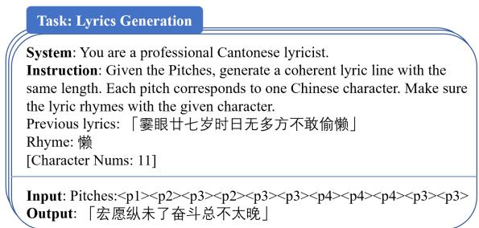  
Figure 5: Instruction of generation.

To support the polishing process, we design an instruction-based training task for masked lyric completion. We simulate disharmonious positions by masking words in the current line and ask the model to recover them using the previous line as context. Unlike the main tonal alignment task, this stage excludes pitch information and focuses on improving local fluency and coherence. The instruction includes the full previous line and uses a placeholder token [M] to mark masked positions. The model is trained to reconstruct the entire line, promoting sentence-level coherence. A full example of the instruction structure is shown in Fig 6.

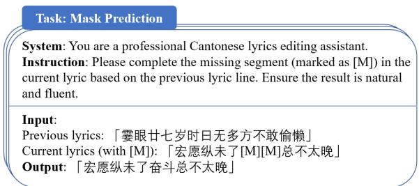  
Figure 6: Instruction of mask task.

## D.2 Mixed Training Details

When disabling tokens with multiple Chinese characters, regular instruction fine-tuning is required to restore the LLM’s capabilities. These instructions do not involve Harmony-Aware Loss, and indiscriminate computation of this loss can cause instability, leading to NaN values in evaluation. To resolve this, we define a variable, fill\_num, to ensure stable training on mixed datasets.

Fill\_num is determined by counting predefined pitch tokens (pitch\_ids) in the input data (input\_ids), yielding pitch\_cnt. If pitch\_cnt exceeds 1, fill\_num is set to this value. The model’s logits and labels are then truncated to the last fill\_num elements, focusing on relevant data and optimizing training efficiency.

This approach ensures effective training with mixed datasets, maintaining stability and selectively applying Harmony-Aware Loss only where appropriate.

## D.3 Config of Training

In this work, we utilized the LlamaFactory (Zheng et al., 2024) framework to perform supervised finetuning (SFT) based on the LoRA method (Hu et al., 2021). During training, vocabulary resizing was enabled to better adapt the tokenizer to the target dataset. We set the training stage to SFT and enabled training mode.

Key hyperparameters are as follows: the finetuning target includes all trainable modules; the batch size per device was set to 1 with a gradient accumulation step of 8 to effectively enlarge the batch size. The learning rate was set to 1e-4, following a cosine decay schedule with 10% warmup. Training was conducted for 3 epochs. Mixed precision training with bfloat16 was enabled for memory efficiency.

All experiments were conducted on a single NVIDIA RTX 3090 GPU (24GB), with 14 vCPUs (Intel Xeon Platinum 8362 @ 2.80GHz), 45GB of system memory, and 30GB of disk. The operating system was Ubuntu 22.04, running Python 3.10. The environment was based on PyTorch 2.1.2 and CUDA 11.8.

## E Human Evaluation Details

We invited 10 native Cantonese speakers as volunteers, all with basic music theory knowledge and an interest in literature. For each model under evaluation, we randomly selected 20 generated lyric samples.

The evaluation process was conducted in three stages. First, to assess auditory perception, we invited a designated speaker to sing each generated lyric to its corresponding melody. Volunteers listened to the recordings without seeing the lyrics. Afterward, the lyrics were shown, and volunteers marked any words they had misheard or failed to recognize during the listening phase. Based on this comparison, they rated the Listenability and Ambiguity dimensions.

In the second stage, with the full lyrics and melody available, volunteers evaluated Harmonicity by assessing whether the tones of the lyrics aligned with the melody’s pitch contour.

Finally, volunteers independently assessed the textual quality of the lyrics, which included Diversity, Fluency, Coherence, and Poeticness, based on the written text alone.

Each volunteers rated all 20 samples for each model. For every sample, we computed the average score across 10 volunteers. We report the mean and standard deviation of these scores across the 20 samples as the final performance of each model on each metric.

## F Additional Ablation Experiment

## F.1 Mixed-Training

The experiment implemented mixed-training by combining original lyric data with basic instruction BELLE during fine-tuning. This approach was motivated by the hypothesis that Char Control might limit the model’s semantic understanding and generation capabilities. Using Qwen2-7b-Instruction as the base model, the results in Table 5 demonstrate: (1) performance degradation after applying Char Control, and (2) partial metric recovery after subsequent fine-tuning with the basic instruction dataset.

<table><tr><td colspan="3">Char Control Finetuning | BLEU-2 ROUGE-L</td></tr><tr><td>一</td><td>0.353</td><td>0.190</td></tr><tr><td>√</td><td>0.326</td><td>0.153</td></tr><tr><td>√</td><td>√ 0.341</td><td>0.172</td></tr></table>

Table 5: Ablation Study on Qwen2-7b-Instruction Finetuning with Basic Instruction under Char Control.

## F.2 Harmony

We conducted ablation studies on the Harmony and consistency of the model-generated outputs, and further attempted to analyze the underlying reasons behind the observed phenomena.

• For Qwen, adding Harmony-Aware Loss has minimal impact finetuning. Introducing pitch symbols degrades performance, likely due to conflicts with Chinese word groups. Optimal performance is achieved with character-level control.

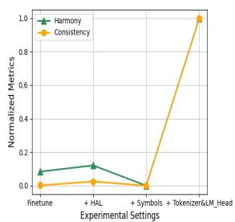

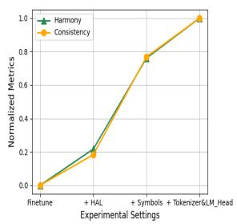

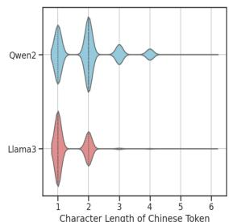

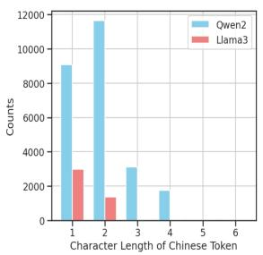  
(a) Qwen2-7B-Instruct for (b) Llama3-8B-Instruct for (c) Comparison of Chinese Character Token Length Dis-Harmony metrics Harmony metrics tribution in the Tokenizers of Qwen2 and Llama3  
Figure 7: Cumulative Ablation for Harmony metrics and vocabulary comparison.

• For Llama, Harmony-Aware Loss improves tonal alignment, and character-level control yields near-optimal performance. Performance differences are likely due to tokenization and training data differences.

From the Figure 7c, it is evident that Qwen2 demonstrates superior support for Chinese, as reflected in the significantly higher absolute count of Chinese characters compared to Llama3. Moreover, in terms of multi-character Chinese tokens, Qwen2 exhibits a much higher proportion than Llama3. This indicates that fixed phrases in Chinese are more likely to be tokenized as a single unit in Qwen2, rather than being split into individual characters as tokens, which is the case with Llama3.

## G Case Studies

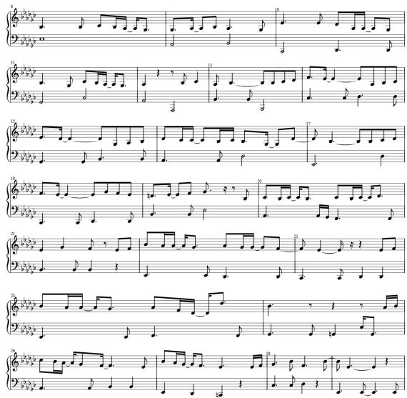  
Figure 8: The musical staff of a fragment from the song Sleepy Princess.

## G.1 Cantonese Melody to Lyric

To further validate the capability of our model in generating Cantonese lyrics, we utilized G.E.M.’s song Sleepy Princess as a subject for analysis. Figure 8 shows the melody of the song Sleepy Princess in staff notation1. Prior to selection, we conducted a Spearman’s rank correlation test, which yielded a p-value of 0.02, indicating significance at the p < 0.05 level. Therefore, the lyrics filled into the melody are expected to align with the melodic contours, making them comparable to the lyrics we generated in this respect.

We generate a segmented representation of the entire melody based on relative pitches. Fig 9 illustrates the alignment between the generated lyrics and the original melody. Table 6 displays a comparison of the original lyrics and those generated by our model.

The generation of lyrics for Sleepy Princess requires ensuring tonal alignment with the melody, while also maintaining coherence, poetic expression, and emotional depth. Our analysis shows that the generated lyrics align closely with the pitch curve of the melody, with minimal dissonance that does not impact the overall harmony. The tonal consistency between the melody and lyrics facilitates smooth and harmonious singing. Next, we analyze the lyrics generated by our model as a case study.

The model effectively blends direct expression and metaphor. The phrase “flick of the sleeve" in “等不出真实无言的抖袖" (Waiting in vain for the silent flick of the sleeve) introduces a metaphor of longing, enhancing emotional depth. Metaphors, such as “无声的哭泣感伤的泪花" (Silent tears, sorrowful blossoms), evoke vivid imagery, preserving the original’s poetic quality. The model also conveys emotions with simplicity and intensity, as seen in “情是那么厚" (Love is so deep), which is emotionally powerful and clear without unnecessary elaboration, reinforcing the impact.

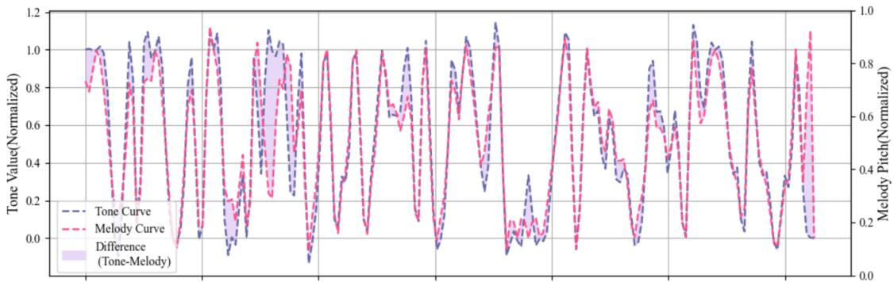  
Figure 9: The tone curve of the lyrics we generated for the song Sleepy Princess and its alignment with the original melody pitch curve.

<table><tr><td>Original Lyrics</td><td>Ours</td><td>English Translation of Ours</td></tr><tr><td>梦内倾心一吻就算心动</td><td>终此一生永留存我心头</td><td>Forever etched in my heart for this lifetime.</td></tr><tr><td>现实可惜不配与你相拥</td><td>等不出真实无言的抖袖</td><td>Waiting in vain for the silent flick of the sleeve.</td></tr><tr><td>沉溺于一刻的接触</td><td>还需不需为时留下</td><td>Is it still worth leaving behind for the moment</td></tr><tr><td>哪管即将结束已经满足</td><td>无声的哭泣感伤的泪花</td><td>Silent tears, sorrowful blossoms</td></tr><tr><td>夜半再相见</td><td>如何解开咒</td><td>How to break the spell</td></tr><tr><td>迷雾里缱绻</td><td>情是那么厚</td><td>Love is so deep</td></tr><tr><td>长夜梦中有过动魄迷人片段</td><td>明白到不要爱也许更能拥戴</td><td>Understanding that not loving might be the truest form of acceptance</td></tr><tr><td>没法再相见一醒了完全逆转</td><td>无情地追究深心里实在不该</td><td>Relentlessly questioning, though deep inside, I know it shouldn&#x27;t be</td></tr><tr><td>就似梦里面炽热爱海变冰川</td><td>为何还留待回头时日再悲哀</td><td>Why linger, only to sorrow when turning back</td></tr><tr><td>沉睡中的主角怎会怕寂寞</td><td>还是找到最后也未有遗传</td><td>Still, in the end, no inheritance was found</td></tr><tr><td>童话中的主角一百年躺卧</td><td>仍在呼叫你别要独留天边</td><td>Still calling out to you, don&#x27;t remain alone at the edge of the sky</td></tr><tr><td>埋在心底的爱慕能否跟你透露</td><td>我不懂怎去解倦才会再有乐园</td><td>I don&#x27;t know how to shake off my weariness to find paradise once again</td></tr><tr><td>期待你只是虚无</td><td>无论分开或团圆</td><td>Whether apart or reunited</td></tr></table>

Table 6: Our generated lyrics vs. Original lyrics.

Interestingly, while the model was not explicitly designed for rhyme optimization, it naturally produces rhyming lyrics. For example, the endings of the first and second lines, ‘头’ and ‘袖’, rhyme, as do ‘下’ and ‘花’ in the third and fourth lines. This phonetic harmony is maintained throughout the lyrics.

## G.2 Polish Process

Although the model’s outputs generally align with the melody, local mismatches, especially when large pitch deviations occur, can lead to awkwardness or ambiguity.

Take a line from Liza Wang’s Love Across Thousands ofMountains and Rivers. As shown in Fig 10, the model predicted “分” (“fen”, separate) as the second character, but the melody at that point is low, while “分” carries a high tone in Cantonese. This mismatch makes it sound like “坟” (“grave”) or “份” (“portion”), which doesn’t combine naturally with “开” (“open”), leaving listeners confused. The pitch deviation spans two relative levels, making the problem noticeable. After Polish refinement, the mismatch was resolved, improving clarity.

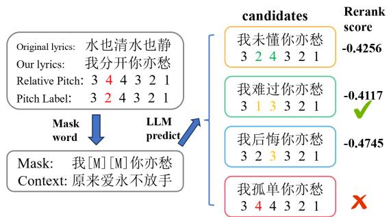  
Figure 10: An example of our model polishing specific positions in the re-lyricization of the song Love Across Thousands ofMountains and Rivers.

In the Polish stage, we masked “分 开” and prompted the model to generate and rerank candidates based on melodic fit and contextual meaning. Given the context “原来爱永不放手” (“Love never lets go”), the line “我[M][M]你亦愁” (“I [M][M], you’re also sorrowful”) expects an emotionally resonant fill. As shown in Table 7, “难过” (“sad”) ranked first—its emotional tone mirrors “你 亦愁” (“you’re also sorrowful”), and it naturally continues the theme of lasting attachment and pain in love. It also fits the melody well. “未懂” (“not yet understood”), while sounding smoother with the melody, implies a more cognitive state, which weakens the emotional link to “愁” (“sorrow”) and the previous line. It thus ranked lower. Other candidates like “孤单” (“lonely”) were filtered out early, as they didn’t help resolve the pitch mismatch. This shows how Polish refinement improves both intelligibility and emotional coherence.

<table><tr><td>Rank</td><td>Candidate</td><td>Harmony Score</td><td>Continuity Score</td><td>Overall Score</td></tr><tr><td>1</td><td>难过</td><td>0.9</td><td>-64.684</td><td>-0.4117</td></tr><tr><td>2</td><td>未懂</td><td>1</td><td>-70.2814</td><td>-0.4256</td></tr><tr><td>3</td><td>后悔</td><td>0.9</td><td>-67.8236</td><td>-0.4745</td></tr><tr><td>4</td><td>爱到</td><td>0.7</td><td>-68.3014</td><td>-0.68</td></tr><tr><td>5</td><td>恋爱</td><td>0.7</td><td>-70.0033</td><td>-0.7141</td></tr><tr><td>一</td><td>喜欢</td><td>一</td><td>一</td><td>一</td></tr><tr><td>一</td><td>想到</td><td>一</td><td>一</td><td>一</td></tr><tr><td>一</td><td>孤单</td><td>一</td><td>一</td><td>一</td></tr></table>

Table 7: Reranking results of candidate words in the Polish stage. Scores reflect a combination of melodic harmony and contextual relevance. Entries marked with dashes (–) were excluded during the initial filtering stage due to insufficient improvement in tonal alignment, and were therefore not scored or ranked.

## G.3 More Cases

Moreover, we present additional cases. We used three classic Cantonese songs for lyric rewriting, as shown in Table 8. Our melodies can also be generated by a music model, and we used the textto-music model 2 to generate the melodies. Here, we employ three distinct themes: Jiangnan water towns, Jazz Music, and Italian Dance Music. The relevant data is shown in Table 9. In addition, we provide several audio samples of the generated songs at the anonymous GitHub repository mentioned in the abstract.

## H Demonstration

We implemented a demo, as illustrated in Figure 11. The demo provides three input fields: the required relative pitch sequence and two optional fields—previous lyrics and composition requirements. Upon pressing the Submit button, the generated lyrics are streamed in real-time, accompanied by the current Harmony metric and a matching curve visualizing the alignment between the tones of the lyrics and the pitch of the melody.

## Cantonese Melody to Lyrics Generation(CM2L) with ToneCraft

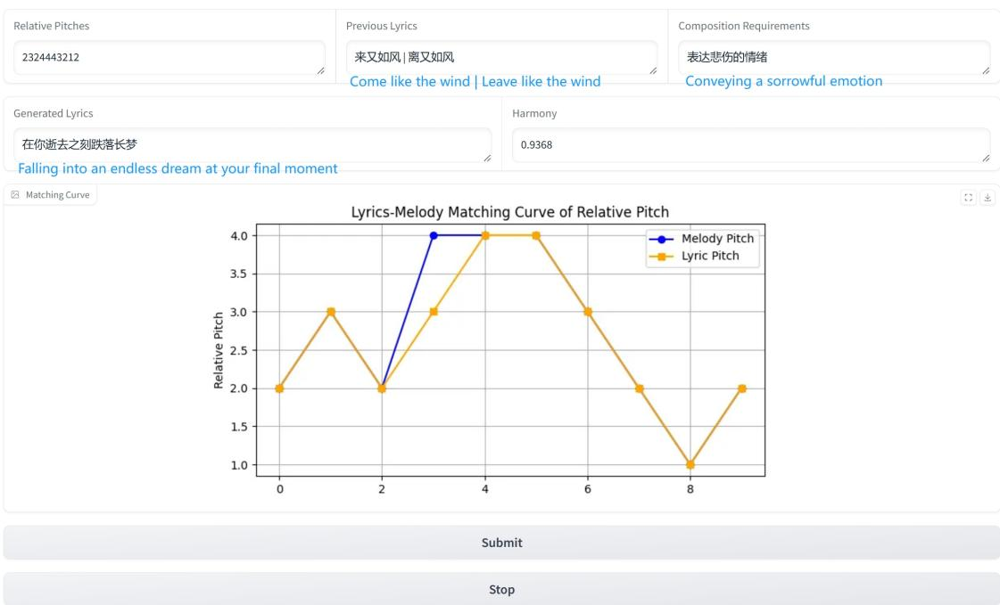  
Figure 11: User interface layout and an example of generated lyric.

<table><tr><td>Absolute Pitch</td><td>Original Lyrics</td><td>Ours</td><td>English Translation of Lyric</td></tr><tr><td colspan="4">Song Title: Love Across Thousands of Mountains and Rivers. Singer: Liza Wang</td></tr><tr><td>64 65 67 67 69 67 64</td><td>莫说青山多障碍</td><td>谁人伴我跌倒前</td><td>Who will accompany me before I fall?</td></tr><tr><td>62 60 64 62 60 57</td><td>风也急风也劲</td><td>这份清朗夏天</td><td>This bright summer.</td></tr><tr><td>57 5560626467696462</td><td>白云过山峰也可传情</td><td>微凉在里挂一张汗衣</td><td>A slight coolness, with a sweat-soaked shirt hanging inside.</td></tr><tr><td>64 65 67 67 69 67 64</td><td>莫说水中多变幻</td><td>忘掉你已很远离</td><td>Forget you have gone so far away.</td></tr><tr><td>62 60 64 62 60 57</td><td>水也清水也静</td><td>散在咫尺未来</td><td>Scattered in the near future.</td></tr><tr><td>57 556062 57 6060</td><td>柔情似水爱共永</td><td>难忘我们浪里醉</td><td>It&#x27;s hard to forget how we were drunk in the waves.</td></tr><tr><td>64 67 69 72 69 67 67 64 67</td><td>未怕罡风吹散了热爱</td><td>惶惑是否怕步入墙内</td><td>I wonder if I&#x27;m afraid of stepping into a wall.</td></tr><tr><td>64 69 72 72 69 67 64</td><td>万水千山总是情</td><td>时间多点也未剩</td><td>Even with more time, it&#x27;s still not enough.</td></tr><tr><td>64 65 67 67 6967 64</td><td>聚散也有天注定</td><td>呆望你知不知谁</td><td>I stand still, wondering if you know who I am.</td></tr><tr><td>62 60 64 62 60 57</td><td>不怨天不怨命</td><td>细雨点似待行</td><td>The light rain seems to wait for me to walk.</td></tr><tr><td>57 5560 64 62 5760 60</td><td>但求有山水共作证</td><td>明晨里先赶回去转</td><td>I&#x27;ll hurry back and turn tomorrow.</td></tr><tr><td colspan="4">Song Title: Minute by Minute I Need You. Singer: George Lam</td></tr><tr><td>64 6567 69 69 67</td><td></td><td>凝视看守身边</td><td></td></tr><tr><td>65 65 65 64 64 60</td><td>愿我会渣火箭</td><td>许多真不舍情</td><td>Staring, guarding by my side. Many true feelings are hard to let go.</td></tr><tr><td>64 6569696762 64</td><td>带你到天空去 在太空中两人住</td><td>望那北风吹城墙</td><td>Watching the northern wind blow against the city walls.</td></tr><tr><td>64 676969 67</td><td>活到一千岁</td><td>微冷风轻送</td><td>A slight cold wind gently blows.</td></tr><tr><td>6565646460</td><td>都一般心醉</td><td>心中一酸痛</td><td>A sharp pain in my heart.</td></tr><tr><td>60 60 57 65 62 62 59 60</td><td>有你在身边多乐趣</td><td>别在回忆你我是梦</td><td>Don&#x27;t dwell on the memories of us as if it were a dream.</td></tr><tr><td>72 72 72 72 70 70</td><td>有了你开心滴</td><td>得到真心传情</td><td>Receiving heartfelt affection.</td></tr><tr><td>69 69 69 69 67 67</td><td>乜都称心满意</td><td>始终总会圆愿</td><td>In the end, wishes will be fulfilled.</td></tr><tr><td>60 62 64 65 65 67 67 64</td><td>咸鱼白菜也好好味</td><td>如未来种好花开满</td><td>If we plant flowers well, they will bloom.</td></tr><tr><td>72 72 72 72 70 70</td><td>我与你永共醉</td><td>一生不必迷茫</td><td>There&#x27;s no need to be lost in life.</td></tr><tr><td>69 69 69 69 67 67</td><td>分分钟需要你</td><td>从今刻始未来</td><td>From now until the future.</td></tr><tr><td>60 605957656260</td><td>你似是阳光空气</td><td>共渡着平凡岁月</td><td>We spend ordinary days together.</td></tr><tr><td colspan="4">Song Title: Blessings. Singer: Sally Yeh</td></tr><tr><td>55 55 55 55 55 57 60</td><td>徘徊丛林迎着雨</td><td>流愁还凝成雨点</td><td>The sorrow still condenses into raindrops.</td></tr><tr><td></td><td>染湿风中的发端</td><td>红绿交织天也青</td><td>Red and green intertwine, and the sky is blue.</td></tr><tr><td>60 62 64 64 64 62 64 626060605755576057</td><td>低诉细雨路遥若困倦</td><td>开了转眼落叶梦醒来</td><td>In the blink of an eye, the falling leaves wake up from the dream.</td></tr><tr><td>57 60 62 62 62 62 6264 55</td><td>静靠湾湾小草倚清泉</td><td>陪我多一天不必须回</td><td>Stay with me for one more day, no need to return.</td></tr><tr><td>67676767</td><td>过去过去</td><td>彼此欣赏</td><td>We appreciate each other.</td></tr><tr><td>64 62 60 62 57</td><td>多少次心乱</td><td>这一段美丽</td><td>This beautiful moment.</td></tr><tr><td>62 62 62 62</td><td>今天今天</td><td>星光闪耀</td><td>The starlight shines.</td></tr><tr><td>62 64 60 69 64 67</td><td>随着云烟渐远</td><td>仍是回家的路</td><td>It&#x27;s still the road home.</td></tr><tr><td>67 67 67 67</td><td>听听鸟语</td><td>奔波一笑</td><td>Run with a smile.</td></tr><tr><td>64 64 67 69 64 60</td><td>静望雨丝飘断</td><td>步过千山渐远</td><td>Walking past thousands of mountains, drifting away.</td></tr><tr><td>60 6064 62</td><td>悄悄的风</td><td>回头安睡</td><td>Turning back to sleep peacefully.</td></tr><tr><td>64 67696964626460</td><td>赠我衷心祝福千串</td><td>会否终可在怀想里</td><td>Will they eventually be in my memory?</td></tr></table>

Table 8: Lyric rewriting of three classic Cantonese songs.

<table><tr><td>Absolute Pitch</td><td>Generated Lyric</td><td>English Translation of Lyric</td></tr><tr><td colspan="3">Theme: Jiangnan water towns.</td></tr><tr><td>69 67696267606269676467</td><td>一壶酒鱼不留人只管自由</td><td>A flask of wine, the fish untamed, freedom unrestrained.</td></tr><tr><td>6064646467646760 676962</td><td>离别是样苦闷孤身偏不愁</td><td>Parting breeds sorrow, yet solitude carries no despair.</td></tr><tr><td>6967 646760646464696769</td><td>轻舟逐浪悠荡那是水清泉</td><td>A light boat drifts with the waves, through crystal-clear streams.</td></tr><tr><td>626760 6269676467606464</td><td>桃花如霞草色绿青春正在</td><td>Peach blossoms glow like sunset, grass green with youth in bloom.</td></tr><tr><td>64 69 60 67 64 64 64 67 62</td><td>是否仍坚定那份准绳</td><td>Do you still hold fast to that unyielding measure?</td></tr><tr><td>64 62 62 64 64 64 67 62 62 60</td><td>看着那世界快速地旋拧</td><td>Watching the world whirl swiftly in its turns.</td></tr><tr><td>60 69 67 62 67 60 62 69 67</td><td>渔火不曾熄无人捞起</td><td>The fisher&#x27;s light never fades, yet none retrieves it.</td></tr><tr><td>64 67 60 64 64 64 69 67 62 67</td><td>有些情是未了仿佛飘起</td><td>Some emotions linger, as if they drift upon the breeze.</td></tr><tr><td colspan="3">Theme: Jazz Music.</td></tr><tr><td>55 67 62 66 69 67 66</td><td>曾经跌得起多高</td><td>Once, I could rise from the steepest falls.</td></tr><tr><td>55 67 60 6269 676660 6467</td><td>年轻有远景不会怕跌倒</td><td>Youth, with its vision, fears no stumble.</td></tr><tr><td>606462616762676767</td><td>情侣若为此分开伤感</td><td>Lovers part in sorrow, yet it&#x27;s better than tomorrow&#x27;s gloom.</td></tr><tr><td>67 55 55 67 62</td><td>总比明天暗</td><td>For nothing is darker than the shadow of tomorrow.</td></tr><tr><td>66 69 67 66 55 67 60 62</td><td>风筝一生悬在上空</td><td>A kite spends its life adrift in the heavens.</td></tr><tr><td>69676660646760646261</td><td>双手已疲倦心仍没灵魂</td><td>Hands grow weary, yet the heart remains soulless.</td></tr><tr><td>67 62 67 67 67 67</td><td>轻弹一首心声</td><td>Softly strum a melody of the soul.</td></tr><tr><td>66 69 66 69 67 66 65</td><td>有些事不再是情</td><td>Some affairs are no longer matters of the heart.</td></tr><tr><td>60 64 67 55 62 60 67 69 60 64</td><td>就算哭流转那天花雨半</td><td>Even tears cascade like petals in fleeting rain.</td></tr><tr><td>66 69 676762 60</td><td>被忽略都常谈</td><td>Neglect has long been the tale oft told.</td></tr><tr><td colspan="3">Theme: Italian Dance Music.</td></tr><tr><td>67 71 66 69 64 66 67 65</td><td>活像是我们的护荫</td><td>As if they were our sheltering shade.</td></tr><tr><td>62 62 66 6974 7774 69</td><td>无比韵律清新口吻</td><td>With unmatched rhythm and a fresh tone.</td></tr><tr><td>71 74 69 62 74 74 69 69</td><td>不必记愁归家最好</td><td>No need to dwell on sorrow; returning home is best.</td></tr><tr><td>69 66 62 6466 67 69 66</td><td>即使离别也觉清楚</td><td>Even in parting, all feels clear.</td></tr><tr><td>676460 626466 6765</td><td>今晚能聚众一起好</td><td>Tonight, gathering together is joy.</td></tr><tr><td>65 67 65 6966 69</td><td>如我还可用心</td><td>If I can still pour my heart into it.</td></tr><tr><td>65 64 60 7474 69</td><td>独有愉快音讯</td><td>Joyful news will come uniquely.</td></tr><tr><td>69 66 69 6966 69</td><td>跟随风吹笛声</td><td>Follow the flute&#x27;s melody carried by the wind.</td></tr><tr><td>65 64 60 69 65 67</td><td>放下烦恼畅泳</td><td>Let go of troubles and swim freely.</td></tr><tr><td>65 67 65 6966 69</td><td>无数人得到奖</td><td>Countless people receive their rewards.</td></tr><tr><td>656460747469</td><td>沿着愉快轨进</td><td>Advancing along a joyful path.</td></tr></table>

Table 9: Examples of Cantonese Melody-to-Lyric Generation corresponding to three different thematic keywords.