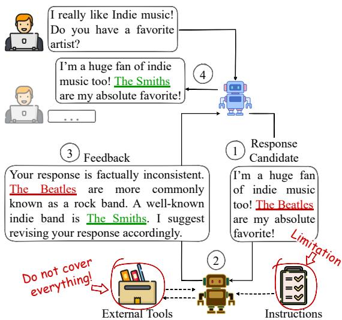
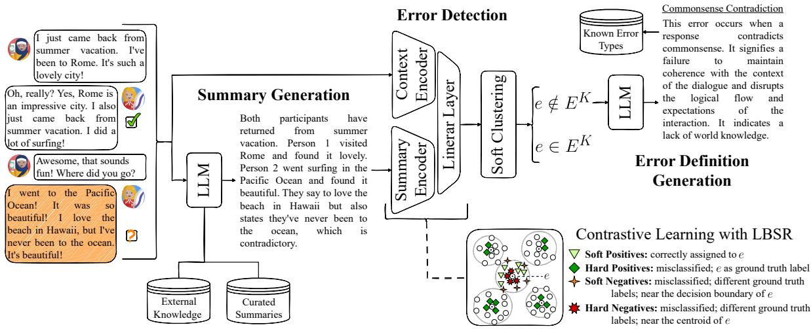
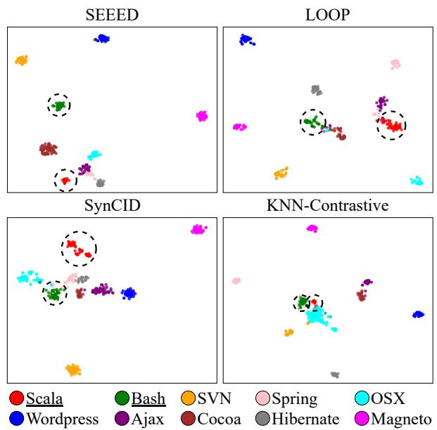
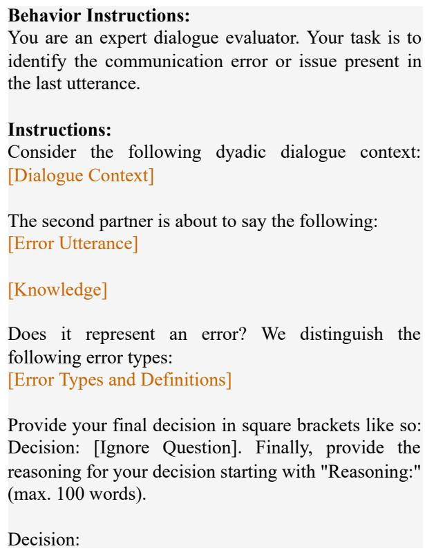

# Towards Automated Error Discovery: A Study in Conversational AI

Dominic Petrak and Thy Thy Tran and Iryna Gurevych Ubiquitous Knowledge Processing Lab (UKP Lab), Department of Computer Science and Hessian Center for AI (hessian.AI), Technical University of Darmstadt www.ukp.tu-darmstadt.de

## Abstract

Although LLM-based conversational agents demonstrate strong fluency and coherence, they still produce undesirable behaviors (errors) that are challenging to prevent from reaching users during deployment. Recent research leverages large language models (LLMs) to detect errors and guide response-generation models toward improvement. However, current LLMs struggle to identify errors not explicitly specified in their instructions, such as those arising from updates to the response-generation model or shifts in user behavior. In this work, we introduce Automated Error Discovery, a framework for detecting and defining errors in conversational AI, and propose SEEED (Soft Clustering Extended Encoder-Based Error Detection), as an encoderbased approach to its implementation. We enhance the Soft Nearest Neighbor Loss by amplifying distance weighting for negative samples and introduce Label-Based Sample Ranking to select highly contrastive examples for better representation learning. SEEED outperforms adapted baselines—including GPT-4o and Phi-4—across multiple error-annotated dialogue datasets, improving the accuracy for detecting unknown errors by up to 8 points and demonstrating strong generalization to unknown intent detection.1

## 1 Introduction

In conversational AI, undesirable behaviors in agent responses, such as logical inconsistencies or deficiencies in social competence, are commonly referred to as errors (Finch et al., 2023b; Petrak et al., 2023; Higashinaka et al., 2021). Preventing such errors from reaching users during deployment is essential to maintaining trust in conversational agents (Law et al., 2022; Minjin Rheu and Huh-Yoo, 2021). Recent research leverages large language models (LLMs), often augmented with external tools such as web search, to detect errors in agent responses and provide feedback guiding the response-generation model to refine its output (Miao et al., 2024; Gou et al., 2024; Madaan et al., 2023). Figure 1 illustrates the idea.

  
Figure 1: Feedback-guided response generation: (1) The response-generation model produces an initial response. (2) The feedback LLM, or in self-correcting systems the response-generation model itself, evaluates the response for errors, often using external tools. Recent work shows that LLMs require information about the nature of an error or hints about its occurrence for accurate detection. (3) The feedback LLM provides guidance (feedback) to the response-generation model to refine its output. (4) The final response is presented to the user.

While effective at generating feedback, LLMs require information about the nature of an error or hints about its occurrence for accurate detection (Mendonça et al., 2024; Tyen et al., 2024; Finch et al., 2023b), reducing their ability to identify errors not defined in their instructions or covered by external tools. For example, when user behavior shifts or response-generation models are updated to meet evolving requirements (Luo et al.,

2023; Mi et al., 2020; Roller et al., 2020), these changes may lead to the emergence of new error types that the LLM might not recognize.

In this work, we address the challenge of error detection in conversational AI. We introduce Automated Error Discovery, a framework for detecting and defining errors in dialogue, and propose SEEED (Soft Clustering Extended Encoder-Based Error Detection) as an approach to its implementation. Our contributions are as follows:

• We introduce Automated Error Discovery, a framework for (1) detecting both known and unknown error types, and (2) generating definitions for newly discovered ones.

• We propose SEEED, a novel approach that combines an open-source LLM with lightweight encoders for error detection. In contrast to prior work, SEEED employs soft clustering in the classification step, enabling more contextually coherent groupings.

• We introduce Label-Based Sample Ranking, a novel sampling strategy for contrastive learning that selects highly contrastive examples based on the error they represent to improve representation learning.

• We enhance the Soft Nearest Neighbor Loss (Frosst et al., 2019) by introducing a margin parameter to amplify the effect of distance weighting for negative samples.

SEEED outperforms adapted baselines, including GPT-4o (Hurst et al., 2024) and Phi-4 (Abouelenin et al., 2025), by up to 8 points in identifying novel error types on the FEDI (Petrak et al., 2024), Soda-Eval (Mendonça et al., 2024), and ABCEval (Finch et al., 2023a) datasets. SEEED also generalizes to the related task of intent detection, achieving up to a 17-point improvement in accuracy for identifying unknown intents compared to state-of-the-art methods.

## 2 Related Work

In recent years, research in conversational AI has focused on reducing errors in agent responses, primarily through supervised learning from error and feedback signals collected by human expert annotators (Dubey et al., 2024; Xu et al., 2023; Ung et al., 2022). To facilitate data collection, semiautomated methods have been developed to analyze existing dialogue data (Petrak et al., 2023;

See and Manning, 2021; Higashinaka et al., 2015). However, these approaches lack precision and still necessitate substantial manual effort. As a result, recent studies have explored using LLMs to generate and annotate dialogue data with errors (Mendonça et al., 2024; Petrak et al., 2024).

To identify and correct errors in agent responses during deployment, a variety of approaches have been developed, typically relying on LLMs for error detection (Miao et al., 2024; Madaan et al., 2023; Shinn et al., 2023). To improve their effectiveness, it is common to incorporate external tools to cover specific tasks, such as web search for claim verification (Gou et al., 2024; Shridhar et al., 2024; Xu et al., 2024; Peng et al., 2023). However, recent studies show that LLMs generally require explicit guidance to reliably detect errors in dialogue data (Tyen et al., 2024; Stechly et al., 2024; Finch et al., 2023b). Consequently, the effectiveness of LLM-based error detection may be limited when errors fall outside their predefined instructions or the capabilities of integrated tools. This reduces their applicability in scenarios where novel error types emerge due to shifting user behavior or updates to the response-generation model (Luo et al., 2023; Mi et al., 2020; Roller et al., 2020).

In this work, we introduce Automated Error Discovery as a framework for detecting and defining errors in conversational AI, and propose SEEED as an encoder-based approach to its implementation.

## 3 Automated Error Discovery

We define Automated Error Discovery as a specialization of Generalized Category Discovery (Vaze et al., 2022), extended to include the generation of definitions for newly discovered error types. Generalized category discovery assumes that during training, only a subset of the complete class distribution is accessible. The goal is to train a model capable of extrapolating from the learned patterns to discriminate between data from both seen and unseen classes during inference.

We distinguish two sub-tasks, Error Detection and Error Definition Generation, and define the following formal setup:

$E = E ^ { K } \cup E ^ { U }$ is the set of all error types. $E ^ { K } = \{ ( e _ { i } , d _ { i } ) \} _ { i = 1 } ^ { m }$ is the set of known error types, with $e _ { i }$ as the error identifier and $d _ { i }$ as its definition. $E ^ { U }$ denotes the set of unknown error types. $E ^ { K } \cap E ^ { U } = \emptyset$

  
Figure 2: Schematic overview of SEEED, comprising three components: Summary Generation, Error Detection, and Error Definition Generation (e denotes the identified error type). In practical applications (see Figure 1 for an example), the feedback LLM may be used for generating summaries and error definitions (if necessary) to reduce deployment costs, as both are summarization tasks typically covered during LLM pre-training. Newly defined error types are added to the pool of known types, and their dialogue contexts could be used to enhance error detection.

$C = C ^ { K } \cup C ^ { U }$ denotes the set of all dialogue contexts T, with $C ^ { K }$ as the set of all T associated with error e from $E ^ { K } . ~ C ^ { U }$ is the set of dialogues associated with unknown errors. $C ^ { K } \cap C ^ { U } = \varnothing$

• We define a dialogue context T as a sequence of user-agent utterances (turns). Depending on the use case, T may be associated with additional features, such as external knowledge documents in knowledge-grounded dialogues. We refer to these additional features as ${ { W } _ { { T } } } . ^ { 2 }$

Error Detection Given an error detection function $\mathcal { H } : \mathbb { R } ^ { d } \mapsto \mathbb { \Lambda }$ N and a dialogue context $T \in C$ the task is to determine the error $e \in E$ associated with the last agent utterance in T:

$e = \mathcal { H } ( T , W _ { T } )$ , where $e \in E$ and $T \in C$

(1)

must not access any data in $E ^ { U }$ during training.

Error Definition Generation When $e \notin E ^ { K }$ the task is to generate a definition d conditioned on the identified set of related dialogue contexts $C _ { e } \subseteq C ^ { U } .$ 3

## 4 SEEED: Soft Clustering Extended Encoder-Based Error Detection

Figure 2 presents a schematic overview of SEEED. Since detecting errors requires understanding con-

2In this work, W is relevant only as external knowledge in the knowledge-grounded subset of FEDI (Petrak et al., 2024).

textual dependencies, such as references to earlier utterances (Petrak et al., 2024; Mendonça et al., 2024; Finch et al., 2023a), we first prompt an LLM to generate a summary of the dialogue context. Next, both the dialogue context and its summary are processed through separate Transformer-based encoders and then combined using a linear neural layer to produce an aggregated representation. Finally, we apply a soft clustering algorithm to identify the corresponding error type. If the identified error type is not among the known types, we prompt an LLM to generate its definition.

In contrast to hard clustering algorithms like k-Means, which are predominantly used in related tasks, such as intent detection (Liang et al., 2024; An et al., 2024), soft clustering algorithms allow data points to belong to multiple clusters, facilitating more contextually coherent groupings.

## 4.1 Summary Generation

We prompt Llama-3.1 8B-Instruct (Dubey et al., 2024) to summarize the dialogue context, focusing on information indicative of errors in the last agent utterance. We use few-shot prompting and include directives to circumvent pre-trained safety mechanisms, enabling analysis of dialogues that may contain harmful language. For the knowledge-grounded dialogues in FEDI (Petrak et al., 2024), we additionally incorporate relevant external knowledge documents into the prompt. Figure 2 shows an example summary. We provide the full prompt in Appendix A.

We do not provide error type definitions for summary generation to prevent the detection model from learning shortcut patterns associated with known error types, as this could compromise its ability to identify unknown error types.

## 4.2 Error Detection

For error detection, we first produce an aggregated representation of the dialogue context and its summary, and then apply NNK-Means (Shekkizhar and Ortega, 2022) to identify the corresponding error type. This expands Equation 1 as follows:

$$
e = \mathcal { H } ( T , W _ { T } , o _ { T } ) , \mathrm { w h e r e } o _ { T } \mathrm { i s } \mathrm { t h e s u m m a r y }\tag{2}
$$

NNK-Means (Shekkizhar and Ortega, 2022) is a soft clustering algorithm that uses non-negative kernel regression to model local geometric relationships and assign weighted cluster memberships.

Training Objective Inspired by the loss composition in SynCID (Liang et al., 2024), we use a joint loss combining multi-class cross-entropy $( \mathcal { L } _ { c e } )$ with a contrastive objective $( \mathcal { L } _ { c l } ) \colon$

$$
\mathcal { L } = \alpha \mathcal { L } _ { c e } + \mathcal { L } _ { c l }\tag{3}
$$

α regulates the contribution of $\mathcal { L } _ { c e }$ . This formulation promotes discrimination among known error types while improving the robustness of the learned representation space, thereby facilitating generalization to unseen data (Liang et al., 2024). For $\mathcal { L } _ { c l } .$ , we use the Soft Nearest Neighbor Loss (Frosst et al., 2019) (SNL), which supports this by smoothing decision boundaries through distance-weighted sampling of neighbors:

$$
\mathcal { L } _ { c l } = - \frac { 1 } { N } \sum _ { i = 1 } ^ { N } \log \left( \frac { \sum _ { j = 1 , j \neq i } ^ { N } \exp \left( - \frac { S _ { i j } } { \tau } \right) } { \sum _ { k = 1 , \ K = i \atop k \neq i } ^ { N } \exp \left( - \frac { S _ { i k } } { \tau } \right) + \epsilon } \right) .\tag{4}
$$

N denotes the batch size. τ denotes the temperature and ϵ is a small constant included to prevent arithmetic errors. $S \in \mathbb { R } ^ { N \times N }$ represents the similarity matrix. We compute each element as follows: $\begin{array} { r } { S _ { i j } = \frac { x _ { i } \cdot x _ { j } } { \| x _ { i } \| \| x _ { j } \| } - m \cdot \mathbb { I } ( y _ { i } \neq y _ { j } ) } \end{array}$ , where $\mathbb { I } ( y _ { i } \neq y _ { j } )$ is 1 if error types $y _ { i }$ and $y _ { j }$ differ, and 0 otherwise. We introduce m as a positive scalar margin to amplify the distance weighting for negative pairs. To further enhance effectiveness, we utilize Label-Based Sample Ranking to augment the batch with one positive and negative counterpart, $x ^ { + }$ and x−, for each sample x, selected from the pool of training data. These additional samples are used exclusively to compute $\mathcal { L } _ { c l }$

## 4.3 Label-Based Sample Ranking (LBSR)

We introduce Label-Based Sample Ranking (LBSR) as a novel sampling strategy to amplify the effect of distance weighting in SNL (Frosst et al., 2019). We build upon the concept of Local Inconsistency Sampling (LIS), as proposed by An et al. (2024). LIS assumes that samples of the same class should be proximate in representation space (Jiang et al., 2023) and that samples near the decision boundary are more susceptible to misclassification, rendering them particularly valuable as positive counterparts in contrastive learning. To identify such samples, LIS measures prediction inconsistency and entropy based on the t-distribution of cluster assignments derived from k-Means clustering.

In LBSR, we employ NNK-Means (Shekkizhar and Ortega, 2022) for clustering and leverage label information available during training to classify each sample as either a positive or negative instance relative to its ground truth error type $e ~ \in ~ E ^ { K }$ Specifically, we define positive samples for e as those for which e is the ground truth label, and negative samples as those assigned to e despite having a different ground truth label. We further distinguish between the following categories (Figure 2 provides an illustration):

• Soft Positives Samples assigned to e with e as the ground truth label.

• Hard Positives Samples assigned to a different type but with e as the ground truth label.

• Soft Negatives Samples with a different ground truth label, assigned to e, and near its decision boundary (high inconsistency).

• Hard Negatives Samples with a different ground truth label, assigned to $e ,$ and near its centroid (low inconsistency).

LBSR Implementation Algorithm 1 outlines our implementation and highlights the key differences from LIS in violet. We utilize the algorithms proposed by An et al. (2024) to compute inconsistency and entropy, then normalize and average them to derive a single relevance score.

Algorithm 1 Label-Based Sample Ranking   
Require: X  R|CK|×d, Y  Z|EK|, top $\underline { { \boldsymbol { k } } } \in \mathbb { Z }$   
1: Init hard\_pos[i] = [], soft\_pos[i] = [],   
2: negs[i] = [] for each i in set(Y)   
3:   
4: nnk = NNKMeans( set(Y) ).fit(X, Y)   
5: preds, centers = nnk.predict(X)   
6: rel\_score, inconsistency =   
7: scoring(X, preds, centers, top\_k)   
8:   
9: for i = 0 to X do   
10: pred, y = (preds[i], Y[i])   
11: rel, inc = (rel\_score[i],   
12: inconsistency[i])   
13: if pred == y then   
14: soft\_pos[y] += [(i, rel, inc)]   
15: else   
16: hard\_pos[y] += [(i, rel, inc)]   
17: negs[pred] += [(i, rel, inc)]   
18:   
19: # sort hard positives desc by relevance   
20: hard\_pos = sort(hard\_pos,   
21: key=lambda z:z[1], ’desc’)   
22:   
23: # sort negs desc by their inconcsistency score   
24: negs = {e: sort(v, key=lambda z:z[2],   
25: ’desc’) for e, v in negs.items()}   
26: # split them into soft and hard negs; sort them   
27: # desc by their relevance score   
28: soft\_negs = {e: sort(v[:len(v)//2],   
29: key=lambda z:z[1], ’desc’) for e, v   
30: in negs.items()}   
31: hard\_negs = {e: sort(v[len(v)//2:],   
32: key=lambda z:z[1], ’desc’) for e, v   
33: in negs.items()}   
34:   
35: return soft\_pos, hard\_pos, soft\_neg,   
36: hard\_neg

We denote X as the aggregated representations of all dialogue contexts in $\bar { C } ^ { \bar { K } }$ and their summaries, and $Y$ as the sequence of corresponding ground truth error types from $E ^ { K }$ . preds and centers denote the predicted error types and assigned cluster centers. scoring calculates the entropy and inconsistency values by considering the top\_k nearest neighbors, and returns the relevance scores and inconsistency values.

We sort the samples in negs in descending order of inconsistency, assigning the first half to soft\_negatives and the second half to hard\_negatives for the corresponding error type. Finally, we sort hard\_pos, soft\_pos, hard\_neg, and soft\_neg according to their relevance scores in descending order.

During training, given a sample $x \in C ^ { K }$ of $e \in E ^ { K }$ , we randomly decide to dequeue $x ^ { - }$ from hard\_neg[e] or soft\_neg[e]. If both are exhausted, we sample $x ^ { - }$ from a different error type. Similarly, we dequeue $x ^ { + }$ from hard\_pos[e] or sample it from soft\_pos[e]. If hard\_pos[e] is exhausted, we sample $x ^ { + }$ from soft\_pos[e]. In our implementation, we ensure $x ^ { + } \neq x .$

## 4.4 Error Definition Generation

We employ Llama-3.1 8B-Instruct (Dubey et al., 2024) to generate definitions for newly discovered errors. We prompt the model to produce definitions that characterize the problem present in the associated dialogue contexts. To enrich the prompt with additional context, we include the corresponding dialogue summaries. Similarly to dialogue summary generation, we incorporate directives to circumvent pre-trained safety mechanisms to enable the analysis of dialogues with inappropriate language. Additionally, we include three randomly sampled definitions of known error types from the target dataset to encourage alignment.4 Figure 2 shows an example output. We provide the full prompt in Appendix A.

## 5 Experiments

We evaluate error detection and error definition generation separately. For error detection, we vary the ratio of known to unknown error types (openness) from 25% to 75% and perform ablation studies for a detailed assessment of SEEED. For error definition generation, we perform a manual analysis to evaluate the alignment of generated definitions with ground truth definitions. To assess the generalizability of SEEED, we conduct intent detection experiments across the same range of openness used in the error detection experiments.

LLM Baselines For LLM-based error detection, we use GPT-4o (Hurst et al., 2024) and Phi-4 (Abouelenin et al., 2025) as baselines. Following Mendonça et al. (2024), we do not include external tools and prompt both models to detect errors and provide rationales for their decisions. For incontext learning, we include all ground truth error definitions in the prompt, but only provide examples for known types. For fine-tuning Phi-4, we restrict training to known error types. We provide more details in Appendix B.2.

<table><tr><td rowspan="2">Openness</td><td rowspan="2">Method</td><td colspan="4">FEDI-Error</td><td colspan="6">ABCEval</td><td colspan="4">Soda-Eval</td><td></td></tr><tr><td>H-Score  $\operatorname { A c c - K }$ </td><td></td><td> $\mathbf { A c c { - } U }$ </td><td>ARI</td><td>NMI</td><td>H-Score</td><td>Acc-K</td><td>Acc-U</td><td>ARI</td><td>NMI</td><td>H-Score</td><td> $\operatorname { A c c - K }$ </td><td>Acc-U</td><td>ARI</td><td>NMI</td></tr><tr><td rowspan="8">25%</td><td>Random</td><td>0.11</td><td>0.12</td><td>0.11</td><td></td><td></td><td>0.10</td><td>0.11</td><td>0.09</td><td></td><td></td><td>0.13</td><td>0.17</td><td>0.10</td><td>一</td><td></td></tr><tr><td>GPT-4o (in-context)</td><td>0.14</td><td>0.19</td><td>0.11</td><td></td><td></td><td>0.32</td><td>0.47</td><td>0.25</td><td></td><td></td><td>0.0</td><td>0.33</td><td>0.0</td><td></td><td></td></tr><tr><td>Phi-4 (in-context)</td><td>0.09</td><td>0.12 (↓.07)</td><td> $0 . 0 7 ~ ( \Downarrow . 0 4 )$ </td><td></td><td></td><td>0.12</td><td> $0 . 1 4 \ ( \Downarrow 3 3 )$ </td><td> $0 . 1 1 ~ ( \Downarrow . 1 4 )$ </td><td></td><td></td><td>0.03</td><td>0.12 (↓.21)</td><td>0.02 (f.02)</td><td></td><td></td></tr><tr><td>Phi-4 (finetuned)</td><td>0.15</td><td>0.19</td><td> $0 . 1 3 ~ ( \Uparrow . 0 2 )$ </td><td></td><td></td><td>0.24</td><td> $0 . 2 9 \ \scriptstyle ( \Downarrow . 1 8 )$ </td><td> $0 . 2 1 ~ ( \Downarrow . 0 4 )$ </td><td></td><td></td><td>0.16</td><td> $0 . 3 0 \ \textcircled { \parallel . 0 3 }$ </td><td> $0 . 1 1 ~ ( \Uparrow . 1 1 )$ </td><td></td><td></td></tr><tr><td>KNN-Contrastive</td><td>0.33</td><td> $0 . 3 0 ~ ( \Uparrow . 1 1 )$ </td><td> $\mathbf { 0 . 3 7 \ ( \Uparrow . 2 6 ) }$ </td><td>0.06</td><td>0.10</td><td>0.38</td><td> $\mathbf { 0 . 5 5 \ ( \Uparrow . 0 8 ) }$ </td><td> $0 . 3 0 \ ( \Uparrow . 0 5 )$ </td><td>0.07</td><td>0.46</td><td>0.27</td><td> $\mathbf { 0 . 4 1 \ { \scriptstyle ( \Uparrow . 0 8 ) } }$ </td><td> $0 . 2 0 ~ ( \Uparrow . 2 0 )$ </td><td>0.08</td><td>0.16</td></tr><tr><td>SynCID</td><td>0.27</td><td> $0 . 4 0 ~ ( \Uparrow 2 1 )$ </td><td> $0 . 2 0 ~ ( \Uparrow . 0 9 )$ </td><td>0.06</td><td>0.11</td><td>0.53</td><td> $0 . 4 5 ~ \scriptscriptstyle { ( \Downarrow . 0 2 ) }$ </td><td> $\mathbf { 0 . 6 8 \ ( \Uparrow . 4 3 ) }$ </td><td>0.03</td><td>0.41</td><td>0.31</td><td> $0 . 3 8 ~ ( \Uparrow . 0 5 )$ </td><td> $0 . 2 6 ~ ( \Uparrow . 2 6 )$ </td><td>0.11</td><td>0.14</td></tr><tr><td>LOOP</td><td>0.26</td><td> $0 . 3 7 ~ ( \Uparrow . 1 8 )$ </td><td> $0 . 1 9 ~ ( \Uparrow . 0 8 )$ </td><td>0.09</td><td>0.10</td><td>0.51</td><td> $0 . 4 3 ~ ( \Downarrow . 0 4 )$ </td><td> $0 . 6 3 \ ( \Uparrow . 3 8 )$ </td><td>0.01</td><td>0.37</td><td>0.33</td><td> $0 . 3 6 ~ ( \Uparrow . 0 3 )$ </td><td>0.31 (价.31)</td><td>0.07</td><td>0.13</td></tr><tr><td>SEEED</td><td>0.38</td><td> $\mathbf { 0 . 4 1 } _ { \ ( \Uparrow . 2 2 ) }$ </td><td> $0 . 3 4 \ ( \Uparrow . 2 3 )$ </td><td>0.19</td><td>0.19</td><td>0.53</td><td> $0 . 4 6 \left( 4 . 0 1 \right)$ </td><td> $\mathbf { 0 . 6 8 \ ( \Uparrow . 4 3 ) }$ </td><td>0.21</td><td>0.45</td><td>0.40</td><td> $\mathbf { 0 . 4 1 } \ ( \Uparrow . 0 8 )$ </td><td> $\mathbf { 0 . 3 9 } ^ { \dagger } ( \Uparrow . 3 9 )$ </td><td>0.15</td><td>0.17</td></tr><tr><td rowspan="7">50%</td><td>Random</td><td>0.11</td><td>0.13</td><td>0.10</td><td></td><td></td><td>0.08</td><td>0.12</td><td>0.06</td><td></td><td></td><td>0.10</td><td>0.11</td><td>0.10</td><td></td><td></td></tr><tr><td>GPT-4o (in-context)</td><td>0.17</td><td>0.18</td><td>0.17</td><td></td><td></td><td>0.37</td><td>0.28</td><td>0.42</td><td></td><td></td><td>0.23</td><td>0.28</td><td>0.19</td><td></td><td></td></tr><tr><td>Phi-4 (in-context)</td><td>0.07 0.14</td><td> $0 . 0 9 ~ \scriptstyle { ( \Downarrow . 0 9 ) }$ </td><td> $0 . 0 6 ~ ( \Downarrow . 1 1 )$ </td><td></td><td></td><td>0.02</td><td> $0 . 1 1 ~ \left( \Downarrow . 1 7 \right)$ </td><td> $0 . 0 9 ~ ( \Downarrow . 3 3 )$ </td><td></td><td></td><td>0.10</td><td> $0 . 1 6 ~ ( \Downarrow . 1 2 )$ </td><td> $0 . 0 7 ~ ( \Downarrow . 1 2 )$ </td><td></td><td></td></tr><tr><td>Phi-4 (finetuned)</td><td></td><td> $0 . 2 1 ~ ( \Uparrow . 0 3 )$ </td><td> $0 . 1 1 ~ ( \Downarrow . 0 6 )$ </td><td></td><td></td><td>0.24</td><td> $0 . 3 1 ~ \left( \Downarrow . 0 3 \right)$ </td><td> $0 . 1 9 ~ ( \Downarrow . 2 3 )$ </td><td></td><td></td><td>0.18</td><td> $0 . 2 9 \ ( \Uparrow . 0 1 )$ </td><td> $0 . 1 3 ~ ( \Downarrow . 0 6 )$ </td><td></td><td></td></tr><tr><td>KNN-Contrastive</td><td>0.26</td><td> $0 . 3 3 \ ( \Uparrow . 1 5 )$ </td><td> $0 . 2 1 ~ ( \Uparrow . 0 4 )$ </td><td>0.07</td><td>0.09</td><td>0.54</td><td> $0 . 6 4 ~ ( \Uparrow 3 6 )$ </td><td> $0 . 4 7 ~ ( \Uparrow . 0 5 )$ </td><td>0.10</td><td>0.48</td><td>0.28</td><td> $0 . 3 8 ~ ( \Uparrow . 1 0 )$ </td><td> $0 . 2 3 ~ ( \Uparrow . 0 4 )$ </td><td>0.06</td><td>0.13</td></tr><tr><td>SynCID</td><td>0.26 0.22</td><td> $0 . 3 4 ~ ( \Uparrow . 1 6 )$ </td><td> $0 . 2 1 ~ ( \Uparrow . 0 4 )$ </td><td>0.04</td><td>0.09</td><td>0.59</td><td> $0 . 5 5 ~ ( \Uparrow 2 7 )$ </td><td> $\mathbf { 0 . 6 4 } _ { \ ( \Uparrow . 2 2 ) }$ </td><td>0.11</td><td>0.47</td><td>0.27</td><td> $0 . 4 0 ~ ( \Uparrow . 1 2 )$ </td><td> $0 . 2 1 ~ ( \Uparrow . 0 2 )$ </td><td>0.09</td><td>0.11</td></tr><tr><td>LOOP</td><td></td><td> $0 . 3 9 \ ( \Uparrow 2 1 )$ </td><td> $0 . 1 6 ~ ( \Downarrow . 0 1 )$ </td><td>0.07</td><td>0.07</td><td>0.45</td><td> $0 . 4 8 ~ ( \Uparrow 2 0 )$ </td><td> $0 . 4 3 ~ ( \Uparrow . 0 1 )$ </td><td>0.03</td><td>0.41</td><td>0.24</td><td> $\mathbf { 0 . 5 5 \ ( \Uparrow 2 7 ) }$ </td><td> $0 . 1 6 ~ ( \Downarrow . 0 3 )$ </td><td>0.11</td><td>0.16</td></tr><tr><td rowspan="9">75%</td><td>SEEED</td><td>0.33</td><td> $\mathbf { 0 . 4 8 } ^ { \dag } ( \Uparrow 3 0 )$ </td><td> $\mathbf { 0 . 2 2 \ ( \Uparrow . 0 5 ) }$ </td><td>0.13</td><td>0.15</td><td>0.64</td><td> $\mathbf { 0 . 6 7 } ^ { \dagger } ( \Uparrow . 3 9 )$ </td><td> $0 . 6 2 \ ( \Uparrow . 2 0 ) \quad \ \mathbf { 0 . 2 9 }$ </td><td></td><td>0.51</td><td>0.37</td><td> $0 . 4 9 \ ( \Uparrow 2 1 )$ </td><td> $\mathbf { 0 . 3 0 } _ { ( \Uparrow . 1 1 ) } ^ { \dag }$ </td><td>0.19</td><td>0.19</td></tr><tr><td>Random</td><td>0.12</td><td>0.12</td><td>0.12</td><td></td><td></td><td>0.12</td><td>0.13</td><td>0.11</td><td></td><td></td><td>0.11</td><td>0.14</td><td>0.09</td><td></td><td></td></tr><tr><td>GPT-4o (in-context)</td><td>0.16</td><td>0.15</td><td>0.17</td><td></td><td></td><td>0.39</td><td>0.32</td><td>0.49</td><td></td><td></td><td>0.24</td><td>0.19</td><td>0.31</td><td></td><td></td></tr><tr><td>Phi-4 (in-context)</td><td>0.08</td><td> $0 . 1 1 ~ ( \Downarrow . 0 4 )$ </td><td> $0 . 0 6 ~ ( \Downarrow . 1 1 )$ </td><td></td><td></td><td>0.09</td><td> $0 . 1 3 ~ ( \Downarrow . 1 9 )$ </td><td> $0 . 0 8 ~ ( \Downarrow . 4 1 )$ </td><td></td><td></td><td>0.06</td><td> $0 . 1 5 ~ ( \Downarrow . 0 4 )$ </td><td> $0 . 0 9 ~ ( \Downarrow . 2 2 )$ </td><td></td><td></td></tr><tr><td>Phi-4 (finetuned)</td><td>0.12</td><td> $0 . 2 2 \ ( \Uparrow . 0 7 )$ </td><td> $0 . 0 8 ~ ( \Downarrow . 0 9 )$ </td><td></td><td></td><td>0.17</td><td> $0 . 2 8 ~ \scriptscriptstyle { ( \Downarrow . 0 4 ) }$ </td><td> $0 . 1 2 ~ ( \Downarrow . 3 7 )$ </td><td></td><td></td><td>0.11</td><td> $0 . 2 6 ~ ( \Uparrow . 0 7 )$ </td><td> $0 . 1 5 ~ ( \Downarrow . 1 6 )$ </td><td></td><td></td></tr><tr><td>KNN-Contrastive</td><td>0.22</td><td> $0 . 3 7 ~ ( \Uparrow . 2 2 )$ </td><td> $0 . 1 6 ~ ( \Downarrow . 0 1 )$ </td><td>0.06</td><td>0.07</td><td>0.47</td><td> $0 . 6 0 ~ ( \Uparrow . 2 8 )$ </td><td> $0 . 4 4 ~ ( \Downarrow . 0 5 )$ </td><td>0.11</td><td>0.46</td><td>0.27</td><td> $0 . 4 2 \ ( \Uparrow 2 3 )$ </td><td> $0 . 1 9 ~ ( \Downarrow . 1 2 )$ </td><td>0.04</td><td>0.09</td></tr><tr><td>SynCID</td><td>0.23</td><td> $0 . 3 6 ~ ( \Uparrow 2 1 )$ </td><td>0.17</td><td>0.06</td><td>0.01</td><td>0.54</td><td> $0 . 5 9 ~ ( \Uparrow . 2 7 )$ </td><td> $\mathbf { 0 . 5 0 \ ( \Uparrow . 0 1 ) }$ </td><td>0.07</td><td>0.44</td><td>0.25</td><td> $0 . 2 2 \mathrm { ~ } ( \Uparrow . 0 3 )$ </td><td> $0 . 2 8 ~ ( \Downarrow . 0 3 )$ </td><td>0.02</td><td>0.06</td></tr><tr><td>LOOP</td><td>0.25</td><td> $0 . 4 3 \ ( \Uparrow 2 8 )$ </td><td> $0 . 1 8 ~ ( \Uparrow . 0 1 )$ </td><td>0.05</td><td>0.01</td><td>0.48</td><td> $0 . 6 9 ~ ( \Uparrow 3 7 )$ </td><td> $0 . 3 7 ~ ( \Downarrow . 1 2 )$ </td><td>0.07</td><td>0.44</td><td>0.22</td><td>0.31 (个.12)</td><td> $0 . 1 7 ~ ( \Downarrow . 1 4 )$ </td><td>0.07</td><td>0.08</td></tr><tr><td>SEEED</td><td>0.37</td><td> $\mathbf { 0 . 6 4 } ^ { \dagger } ( \Uparrow . 4 9 )$ </td><td> $\mathbf { 0 . 2 6 } ^ { \dagger } ( \Uparrow . 0 9 )$ </td><td>0.16</td><td>0.17</td><td>0.60</td><td> $\mathbf { 0 . 7 5 ^ { \dag } ( \Uparrow . 4 3 ) }$ </td><td> $\mathbf { 0 . 5 0 \ ( \Uparrow . 0 1 ) }$ </td><td>0.21</td><td>0.47</td><td>0.42</td><td> $\mathbf { 0 . 6 1 } ^ { \dagger } ( \Uparrow . 4 2 )$ </td><td> $\mathbf { 0 . 3 2 } _ { } ^ { \dagger } ( \Uparrow . 0 1 )$ </td><td>0.12</td><td>0.14</td></tr></table>

Table 1: Results of our error detection experiments, averaged over three independent runs. The random baseline assigns equal probability to all error types, sampling from a uniform distribution. The deltas indicate differences from the GPT-4o results.  marks statistically significant improvements in Acc-K or Acc-U over the top-performing baseline, as determined by a t-test with p-value $\leq 0 . 0 5$ . To ensure comparability, novel error types were randomly sampled once per run and degree of openness (see Appendix C.2 for details).

Encoder-Based Baselines We adapt Syn-CID (Liang et al., 2024) and LOOP (An et al., 2024), two state-of-the-art methods for intent detection, for error detection. Both require multi-stage training and contrastive learning with k-Nearest Neighbors, as proposed by Zhou et al. (2022), which we refer to as KNN-Contrastive. Appendix B.2 provides more details.

Evaluation Metrics We evaluate performance using the H-Score (Saito and Saenko, 2021), the harmonic mean of accuracy on classes included and excluded during training (i.e., known and unknown error types), denoted Acc-K and Acc-U. For measuring the cluster quality in encoder-based approaches, we use the ARI (Hubert and Arabie, 1985) and NMI (Strehl and Ghosh, 2002) scores. 5 ARI measures agreement between cluster assignments, while NMI captures cluster entropy. A low ARI score indicates random assignments, and a low NMI score suggests the algorithm failed to capture meaningful patterns in the data.

Datasets We evaluate on the error-annotated subset of FEDI (Petrak et al., 2024), FEDI-Error, Soda-Eval (Mendonça et al., 2024), and ABCEval (Finch et al., 2023a). FEDI-Error and Soda-Eval consist of synthetically generated data. While FEDI-Error focuses on task-oriented and documentgrounded dialogues intentionally generated to exhibit errors, Soda-Eval comprises error-annotated open-domain dialogues automatically extracted from SODA (Kim et al., 2023). ABCEval contains human-bot open-domain dialogues for evaluating dialogue system behavior. For intent detection, we use CLINC (Larson et al., 2019), BANK-ING (Casanueva et al., 2020), and StackOverflow (Xu et al., 2015). Appendix C.1 provides dataset statistics and error type distributions.

Implementation Following SynCID (Liang et al., 2024) and LOOP (An et al., 2024), we use the pre-trained bert-base-uncased model (Devlin et al., 2019) for both the summary and context encoders, and set $m = 0 . 3 .$ . We provide experiments with different values for m in Appendix D.1. In Appendix B, we provide additional information, including the frameworks used (B.1), infrastructure and training efficiency (B.3), hyperparameters (B.4), input and output formats (B.5).6

<table><tr><td rowspan="2">Method</td><td colspan="4">CLINC</td><td colspan="6">BANKING</td><td colspan="6">StackOverflow</td></tr><tr><td>H-Score</td><td>Acc-K</td><td>Acc-U</td><td>ARI</td><td>NMI</td><td> $_ \mathrm { H - S c o r e }$ </td><td> $\operatorname { A c c - K }$ </td><td>Acc-U</td><td>ARI</td><td>NMI</td><td>H-Score</td><td>Acc-K</td><td></td><td>Acc-U</td><td>ARI</td><td>NMI</td></tr><tr><td>KNN-Contrastive</td><td>0.64</td><td>0.88</td><td>0.50</td><td>0.61</td><td>0.86</td><td>0.51</td><td>0.85</td><td>0.36</td><td>0.51</td><td>0.80</td><td></td><td>0.56</td><td>0.82</td><td>0.43</td><td>0.47</td><td>0.64</td></tr><tr><td>SynCID</td><td>0.77</td><td> $0 . 9 3 \ \mathrm { { \Omega } } _ { ( \Uparrow . 0 5 ) }$ </td><td> $0 . 6 5 ~ ( \uparrow \uparrow . 1 5 )$ </td><td>0.71</td><td>0.90</td><td></td><td>0.64  $0 . 8 6 ~ ( \Uparrow . 0 1 )$ </td><td></td><td> $0 . 5 1 ~ \left( \Uparrow . 1 5 \right)$ </td><td>0.59</td><td>0.84</td><td>0.70</td><td> $0 . 8 0 ~ ( \Downarrow . 0 2 )$ </td><td>0.63 (↑.20)</td><td>0.53</td><td>0.70</td></tr><tr><td>LOOP</td><td>0.81</td><td> $0 . 9 3 \ \mathrm { { \Omega } } _ { ( \Uparrow . 0 5 ) }$ </td><td> $0 . 7 2 \ ( \Uparrow . 2 2 )$ </td><td>0.76</td><td>0.92</td><td></td><td>0.63  $0 . 8 9 \ ( \Uparrow . 0 4 )$ </td><td></td><td> $0 . 4 9 \ _ { ( \Uparrow . 1 3 ) }$  0.62</td><td>0.86</td><td></td><td>0.76</td><td> $0 . 9 1 \mathrm { \ ( \Uparrow . 0 9 ) }$ </td><td>0.66 (↑.23)</td><td>0.67</td><td>0.78</td></tr><tr><td>SEEED</td><td>0.84</td><td> $\mathbf { 0 . 9 5 \ ( \Uparrow . 0 7 ) }$ </td><td> $\mathbf { 0 . 7 6 } ^ { \dag } ( \Uparrow . 2 6 ) \quad \ 0 . 7 5$ </td><td></td><td>0.91</td><td></td><td>0.79  $\mathbf { 0 . 9 3 \ ( \Uparrow . 0 8 ) }$ </td><td></td><td> ${ \bf 0 . 6 9 } ^ { \dagger } ( \Uparrow . 3 3 )$  0.69</td><td>0.86</td><td></td><td>0.87</td><td> $\mathbf { 0 . 9 3 \ ( \Uparrow . 1 2 ) }$ </td><td> $\mathbf { 0 . 8 3 } _ { ( \Uparrow . 4 0 ) } ^ { \dagger }$ </td><td>0.75</td><td>0.82</td></tr></table>

Table 2: Results of our intent detection experiments, averaged over three independent runs and all levels of openness (see Appendix D.6 for detailed results). The deltas show differences from KNN-Contrastive. marks statistically significant improvements in Acc-K or Acc-U over the top-performing baseline, as determined by a t-test with p-value $\leq 0 . 0 5$ . Unknown intents were randomly sampled once per run and level of openness.

## 5.1 Error Detection

Encoder-Based Baselines The results in Table 1 show that SEEED consistently improves performance across all datasets. We observe that extensive dialogue contexts are more prone to misclassification, suggesting that many of the included utterances may be irrelevant or detrimental to identifying the error exhibited in the last agent utterance. Ambiguous error types also pose a significant challenge. For example, in FEDI (Petrak et al., 2024), both Ignore Expectation and Ignore Request describe situations where the agent fails to fulfill the user request. We find that augmenting dialogue contexts with synthetically generated descriptions mitigates these issues, particularly enhancing the detection of unknown error types. However, the effectiveness depends on the quality of the generated descriptions. While SEEED generates summaries with a focus on error information, SynCID (Liang et al., 2024) derives new descriptions from the context, often introducing hallucinations into the data. We provide further analysis in Appendix D.2.

Additional experiments using different LLMs for summary generation reveal that reasoning models like DeepSeek-R1 (DeepSeek-AI, 2025) benefit SEEED (Appendix D.3). Ablation experiments with SynCID and LOOP (An et al., 2024) show that LBSR further improves LOOP (Appendix D.4).

LLM Baselines As shown in Table 1, LLMs exhibit limitations in detecting errors. Phi-4 (Abouelenin et al., 2025) frequently performs below the random baseline. Fine-tuning improves the detection of known error types, occasionally surpassing GPT-4o (Hurst et al., 2024), for example, in the 75% openness experiments on FEDI-Error (Petrak et al., 2024) and Soda-Eval (Mendonça et al., 2024). However, the impact of fine-tuning on detecting unknown errors is marginal. The model frequently outputs No Error Found7, indicating limited generalizability. Ambiguous error types also degrade performance, e.g., GPT-4o often confuses Commonsense Contradiction with Uninterpretable in ABCEval (Finch et al., 2023a) due to overlapping definitions. Appendix D.2 provides more analysis.

Ablation Experiments Table 3 presents the results of our ablation study on the FEDI-Error dataset (Petrak et al., 2024). The first row shows the performance of SEEED without any ablations, while each subsequent row reports results with the respective component removed to assess its contribution. The experiments excluding NNK-Means (Shekkizhar and Ortega, 2022) use k-Means for clustering (including LBSR). The experiments without LBSR randomly sample the positive counterparts from the training data (same error type), and the experiments excluding SNL (Frosst et al., 2019) were restricted to the cross-entropy objective.

<table><tr><td rowspan="2">Method</td><td colspan="5">FEDI-Error</td></tr><tr><td>H-Score</td><td>Acc-K</td><td>Acc-U</td><td>ARI</td><td>NMI</td></tr><tr><td>SEEED</td><td>0.36</td><td>0.49</td><td>0.31</td><td>0.18</td><td>0.18</td></tr><tr><td>w/o NNK-Means</td><td>0.34</td><td>0.41 (↓.08)</td><td> $0 . 2 9 \ ( \downarrow \downarrow . 0 2 )$ </td><td>0.17</td><td>0.19</td></tr><tr><td rowspan="2">LBSR w/o negs. w/o LBSR</td><td>0.27</td><td>0.28 (↓.13)</td><td>0.27 (↓.02)</td><td>0.15</td><td>0.13</td></tr><tr><td>0.26</td><td>0.27 (↓.01)</td><td>0.26 (↓.01)</td><td>0.12</td><td>0.10</td></tr><tr><td rowspan="2">SNL w/o margin w/o SNL</td><td>0.24</td><td>0.26 (↓.01)</td><td>0.22 (↓.04)</td><td>0.09</td><td>0.10</td></tr><tr><td>0.21</td><td>0.24 (↓.02)</td><td>0.19 (↓.03)</td><td>0.06</td><td>0.06</td></tr><tr><td>w/o summaries</td><td>0.18</td><td> $0 . 2 1 \ ( \Downarrow . 0 3 )$ </td><td> $0 . 1 6 \ ( \downarrow \downarrow . 0 3 )$ </td><td>0.02</td><td>0.04</td></tr></table>

Table 3: Results of our ablation experiments, averaged over three independent runs and all levels of openness. The deltas show differences from the preceding row.

Excluding NNK-Means results in performance degradation, highlighting the advantages of soft clustering for this task. LBSR augments the effectiveness of SNL, especially when the negative counterparts were included. Omitting the margin parameter further reduces the efficacy of SNL. Excluding the dialogue summaries, effectively reducing SEEED to cross-entropy optimization from dialogue contexts, further reduces performance.

## 5.2 Error Definition Generation

Table 4 presents excerpts from our manual analysis of error definition generation, demonstrating the ability of Llama-3.1 8B-Instruct (Dubey et al., 2024) to produce fluent and informative error type definitions based on our prompt design. We provide the full results in Appendix D.5.

<table><tr><td>Dataset</td><td>Ground Truth</td><td>Generated</td><td>Acc-U</td></tr><tr><td>FEDI-Error</td><td>Attribute Error When the system fails to cor- rectly extract or under- stand the necessary slots or attributes from the</td><td>Attribute Error When the system fails to accu- rately extract or under- stand necessary informa- tion from a user utter- ance that is necessary for</td><td>0.27</td></tr><tr><td>ABCEval</td><td>Ignore Responses that are completely off-topic, fail to address the asked question, or are other- wise completely inappro- priate in the context are considered to be ignor- ing the other speaker.</td><td>Off-Topic Response The response deviates from the topic, fails to answer the posed ques- tion, or is contextually inappropriate, indicating a disregard for the other speaker.</td><td></td></tr><tr><td></td><td>safe or inappropriate be- haviour.</td><td>ized by the use of offen- sive language, deroga- tory terms, and aggres- sive tone, which can cause emotional distress.</td><td></td></tr></table>

Table 4: Excerpts of definitions generated for unknown errors in the 25%-openness experiments, along with their corresponding prediction accuracy (Acc-U).

For generation, we consider ten dialogue contexts and their summaries, each associated by SEEED with the corresponding ground truth error types.8 We find that including summaries has a positive impact, as they provide contextual information that highlights the error exhibited in the last agent utterance. For instance, in Soda-Eval (Mendonça et al., 2024), the generated definitions better capture the nature of the error and offer more details compared to the original definitions.

## 5.3 Intent Detection

Table 2 presents the results of our intent detection experiments. SEEED significantly improves performance, particularly in detecting unknown intents. For example, compared to LOOP (An et al., 2024), it improves the accuracy of detecting unknown intents by up to 17 points on StackOverflow (Xu et al., 2015) and the accuracy of detecting known intents by up to 4 points on BANKING (Casanueva et al., 2020). Figure 3 also shows that SEEED produces more compact and well-separated clusters, similar to LOOP, and generalizes well to unseen intents, such as Scala and Bash from the StackOverflow dataset. Meanwhile, SynCID (Liang et al., 2024) and KNN-Contrastive (Zhou et al., 2022) exhibit weaker inter-class separability, suggesting confusion between intent types.

  
Figure 3: t-SNE visualization of the representation space for the ten most common intents in the Stack-Overflow dataset from the 25% openness experiments. Scala and Bash (dotted lines) are two of the intents considered unknown in these experiments.

The datasets used focus on intent detection at the utterance level, without incorporating dialogue contexts or external knowledge sources. This simplification supports higher detection accuracy and improved cluster quality.

## 6 Conclusion

In this work, we introduce Automated Error Discovery, a framework for detecting and defining errors in conversational AI, and propose SEEED as an encoder-based approach to its implementation. SEEED outperforms adapted baselines, including GPT-4o and Phi-4, across all levels of openness and achieves state-of-the-art performance in unknown intent detection. Our ablation experiments highlight the impact of our enhancements to the Soft Nearest Neighbor Loss and the efficacy of Label-Based Sample Ranking. We also show the effectiveness of LLMs in generating definitions for unknown errors identified by SEEED.

## 7 Limitations

Task Definition We frame error detection as a multi-class classification problem, a common approach in dialogue behavior detection (Finch et al., 2023a). However, in practice, agent utterances may exhibit multiple or overlapping errors.

Dialogue Summary To reduce interference when handling harmful or inappropriate language in dialogue summaries, we include prompt instructions that may not generalize to other LLMs.

Error Definition Generation The error definition generation prompt does not prevent duplicate definitions. While not observed in our experiments, this might become an issue in practical applications, e.g., if the threshold is set too low.

LBSR A theoretical limitation of LBSR is if NNK-Means (Shekkizhar and Ortega, 2022) fails to identify soft positives and hard positives are exhausted, positive counterparts cannot be generated. We did not encounter this issue in our experiments, nor is it addressed by LIS (An et al., 2024).

Datasets Used Dialogue datasets annotated with errors are rare. To our knowledge, FEDI (Petrak et al., 2024), Soda-Eval (Mendonça et al., 2024), and ABCEval (Finch et al., 2023a) are the only available datasets covering diverse error types. While FEDI and Soda-Eval are extensive, their synthetic origin leads to inherent qualitative variability. In contrast, ABCEval is considerably smaller but highly representative of real-world scenarios, comprising dialogues from human-bot interactions.

Experimental Setup Our experimental setup, while closely following prior peer-reviewed work, simplifies real-world conditions. For example, we assume dialogue contexts always end with an erroneous agent utterance. Furthermore, encoder-based approaches require a known total number of error types during final clustering, a value that must be estimated in real-world applications. For Phi-4 (Abouelenin et al., 2025), we adopted the best practices described in the Hugging Face documentation, without further parameter or prompt tuning. Alternative configurations may yield improved performance.

Experimental Results Our experiments investigate the error detection capabilities of SEEED, its components, and related approaches. A single training phase was sufficient for these analyses. Consequently, our results do not provide insights into the impact of continual learning techniques. However, related work has already shown that these can significantly increase the quality of generated responses in simulated practical deployments (Madaan et al., 2023; Zelikman et al., 2022).

As SEEED relies on synthetically generated dialogue summaries, its performance in certain datasets may be influenced by LLM pre-training data.

Given all datasets in this work include only English dialogues, our results exhibit limited generalizability to error detection in dialogue from other linguistic and cultural contexts.

## Acknowledgments

This work has been funded by the European Union under the Horizon Europe grant № 200009- 57100412 (SERMAS). We gratefully acknowledge the support of Microsoft with a grant for access to OpenAI GPT models via the Azure cloud (Accelerate Foundation Model Academic Research).

## References

Abdelrahman Abouelenin, Atabak Ashfaq, Adam Atkinson, Hany Awadalla, Nguyen Bach, Jianmin Bao, Alon Benhaim, Martin Cai, Vishrav Chaudhary, Congcong Chen, Dong Chen, Dongdong Chen, Junkun Chen, Weizhu Chen, Yen-Chun Chen, Yi-ling Chen, Qi Dai, Xiyang Dai, Ruchao Fan, Mei Gao, Min Gao, Amit Garg, Abhishek Goswami, Junheng Hao, Amr Hendy, Yuxuan Hu, Xin Jin, Mahmoud Khademi, Dongwoo Kim, Young Jin Kim, Gina Lee, Jinyu Li, Yunsheng Li, Chen Liang, Xihui Lin, Zeqi Lin, Mengchen Liu, Yang Liu, Gilsinia Lopez, Chong Luo, Piyush Madan, Vadim Mazalov, Arindam Mitra, Ali Mousavi, Anh Nguyen, Jing Pan, Daniel Perez-Becker, Jacob Platin, Thomas Portet, Kai Qiu, Bo Ren, Liliang Ren, Sambuddha Roy, Ning Shang, Yelong Shen, Saksham Singhal, Subhojit Som, Xia Song, Tetyana Sych, Praneetha Vaddamanu, Shuohang Wang, Yiming Wang, Zhenghao Wang, Haibin Wu, Haoran Xu, Weijian Xu, Yifan Yang, Ziyi Yang, Donghan Yu, Ishmam Zabir, Jianwen Zhang, Li Lyna Zhang, Yunan Zhang, and Xiren Zhou. 2025. Phi-4- mini technical report: Compact yet powerful multimodal language models via mixture-of-loras. CoRR, abs/2503.01743.

Wenbin An, Wenkai Shi, Feng Tian, Haonan Lin, QianYing Wang, Yaqiang Wu, Mingxiang Cai, Luyan Wang, Yan Chen, Haiping Zhu, and Ping Chen. 2024. Generalized category discovery with large language models in the loop. In Findings ofthe Associationfor Computational Linguistics: ACL 2024, pages 8653–8665, Bangkok, Thailand. Association for Computational Linguistics.

Iñigo Casanueva, Tadas Temcinas, Daniela Gerz, Matthew Henderson, and Ivan Vulic. 2020. Efficient intent detection with dual sentence encoders. CoRR, abs/2003.04807.

DeepSeek-AI. 2025. Deepseek-r1: Incentivizing reasoning capability in llms via reinforcement learning. Preprint, arXiv:2501.12948.

Jacob Devlin, Ming-Wei Chang, Kenton Lee, and Kristina Toutanova. 2019. BERT: Pre-training of deep bidirectional transformers for language understanding. In Proceedings ofthe 2019 Conference of the North American Chapter of the Association for Computational Linguistics: Human Language Technologies, Volume 1 (Long and Short Papers), pages 4171–4186, Minneapolis, Minnesota. Association for Computational Linguistics.

Abhimanyu Dubey, Abhinav Jauhri, Abhinav Pandey, Abhishek Kadian, Ahmad Al-Dahle, Aiesha Letman, Akhil Mathur, Alan Schelten, Amy Yang, Angela Fan, Anirudh Goyal, Anthony Hartshorn, Aobo Yang, Archi Mitra, Archie Sravankumar, Artem Korenev, Arthur Hinsvark, Arun Rao, Aston Zhang, Aurélien Rodriguez, Austen Gregerson, Ava Spataru, Baptiste Rozière, Bethany Biron, Binh Tang, Bobbie Chern, Charlotte Caucheteux, Chaya Nayak, Chloe Bi, Chris Marra, Chris McConnell, Christian Keller, Christophe Touret, Chunyang Wu, Corinne Wong, Cristian Canton Ferrer, Cyrus Nikolaidis, Damien Allonsius, Daniel Song, Danielle Pintz, Danny Livshits, David Esiobu, Dhruv Choudhary, Dhruv Mahajan, Diego Garcia-Olano, Diego Perino, Dieuwke Hupkes, Egor Lakomkin, Ehab AlBadawy, Elina Lobanova, Emily Dinan, Eric Michael Smith, Filip Radenovic, Frank Zhang, Gabriel Synnaeve, Gabrielle Lee, Georgia Lewis Anderson, Graeme Nail, Grégoire Mialon, Guan Pang, Guillem Cucurell, Hailey Nguyen, Hannah Korevaar, Hu Xu, Hugo Touvron, Iliyan Zarov, Imanol Arrieta Ibarra, Isabel M. Kloumann, Ishan Misra, Ivan Evtimov, Jade Copet, Jaewon Lee, Jan Geffert, Jana Vranes, Jason Park, Jay Mahadeokar, Jeet Shah, Jelmer van der Linde, Jennifer Billock, Jenny Hong, Jenya Lee, Jeremy Fu, Jianfeng Chi, Jianyu Huang, Jiawen Liu, Jie Wang, Jiecao Yu, Joanna Bitton, Joe Spisak, Jongsoo Park, Joseph Rocca, Joshua Johnstun, Joshua Saxe, Junteng Jia, Kalyan Vasuden Alwala, Kartikeya Upasani, Kate Plawiak, Ke Li, Kenneth Heafield, Kevin Stone, and et al. 2024. The llama 3 herd of models. CoRR, abs/2407.21783.

Sarah E. Finch, James D. Finch, and Jinho D. Choi. 2023a. Don‘t forget your ABC‘s: Evaluating the state-of-the-art in chat-oriented dialogue systems. In Proceedings of the 61st Annual Meeting of the Associationfor Computational Linguistics (Volume 1: Long Papers), pages 15044–15071, Toronto, Canada. Association for Computational Linguistics.

Sarah E. Finch, Ellie S. Paek, and Jinho D. Choi. 2023b. Leveraging large language models for automated dialogue analysis. In Proceedings ofthe 24th Annual Meeting ofthe Special Interest Group on Discourse

and Dialogue, pages 202–215, Prague, Czechia. Association for Computational Linguistics.

Nicholas Frosst, Nicolas Papernot, and Geoffrey E. Hinton. 2019. Analyzing and improving representations with the soft nearest neighbor loss. In Proceedings of the 36th International Conference on Machine Learning, ICML 2019, 9-15 June 2019, Long Beach, California, USA, volume 97 of Proceedings ofMachine Learning Research, pages 2012–2020. PMLR.

Zhibin Gou, Zhihong Shao, Yeyun Gong, Yelong Shen, Yujiu Yang, Nan Duan, and Weizhu Chen. 2024. CRITIC: large language models can self-correct with tool-interactive critiquing. In The Twelfth International Conference on Learning Representations, ICLR 2024, Vienna, Austria, May 7-11, 2024. Open-Review.net.

Ryuichiro Higashinaka, Masahiro Araki, Hiroshi Tsukahara, and Masahiro Mizukami. 2021. Integrated taxonomy of errors in chat-oriented dialogue systems. In Proceedings of the 22nd Annual Meeting of the Special Interest Group on Discourse and Dialogue, pages 89–98, Singapore and Online. Association for Computational Linguistics.

Ryuichiro Higashinaka, Masahiro Mizukami, Kotaro Funakoshi, Masahiro Araki, Hiroshi Tsukahara, and Yuka Kobayashi. 2015. Fatal or not? finding errors that lead to dialogue breakdowns in chat-oriented dialogue systems. In Proceedings ofthe 2015 Conference on Empirical Methods in Natural Language Processing, pages 2243–2248, Lisbon, Portugal. Association for Computational Linguistics.

Edward J. Hu, Yelong Shen, Phillip Wallis, Zeyuan Allen-Zhu, Yuanzhi Li, Shean Wang, Lu Wang, and Weizhu Chen. 2022. Lora: Low-rank adaptation of large language models. In The Tenth International Conference on Learning Representations, ICLR 2022, Virtual Event, April 25-29, 2022. OpenReview.net.

Lawrence J. Hubert and Phipps Arabie. 1985. Comparing partitions. Journal of Classification, 2:193–218.

John D. Hunter. 2007. Matplotlib: A 2d graphics environment. Comput. Sci. Eng., 9(3):90–95.

Aaron Hurst, Adam Lerer, Adam P. Goucher, Adam Perelman, Aditya Ramesh, Aidan Clark, AJ Ostrow, Akila Welihinda, Alan Hayes, Alec Radford, Aleksander Madry, Alex Baker-Whitcomb, Alex Beutel, Alex Borzunov, Alex Carney, Alex Chow, Alex Kirillov, Alex Nichol, Alex Paino, Alex Renzin, Alex Tachard Passos, Alexander Kirillov, Alexi Christakis, Alexis Conneau, Ali Kamali, Allan Jabri, Allison Moyer, Allison Tam, Amadou Crookes, Amin Tootoonchian, Ananya Kumar, Andrea Vallone, Andrej Karpathy, Andrew Braunstein, Andrew Cann, Andrew Codispoti, Andrew Galu, Andrew Kondrich, Andrew Tulloch, Andrey Mishchenko, Angela Baek, Angela Jiang, Antoine Pelisse, Antonia Woodford, Anuj Gosalia, Arka Dhar, Ashley Pantuliano, Avi Nayak, Avital Oliver, Barret Zoph, Behrooz Ghorbani, Ben Leimberger, Ben Rossen, Ben Sokolowsky,

Ben Wang, Benjamin Zweig, Beth Hoover, Blake Samic, Bob McGrew, Bobby Spero, Bogo Giertler, Bowen Cheng, Brad Lightcap, Brandon Walkin, Brendan Quinn, Brian Guarraci, Brian Hsu, Bright Kellogg, Brydon Eastman, Camillo Lugaresi, Carroll L. Wainwright, Cary Bassin, Cary Hudson, Casey Chu, Chad Nelson, Chak Li, Chan Jun Shern, Channing Conger, Charlotte Barette, Chelsea Voss, Chen Ding, Cheng Lu, Chong Zhang, Chris Beaumont, Chris Hallacy, Chris Koch, Christian Gibson, Christina Kim, Christine Choi, Christine McLeavey, Christopher Hesse, Claudia Fischer, Clemens Winter, Coley Czarnecki, Colin Jarvis, Colin Wei, Constantin Koumouzelis, and Dane Sherburn. 2024. Gpt-4o system card. CoRR, abs/2410.21276.

Zhen Jiang, Yongzhao Zhan, Qirong Mao, and Yang Du. 2023. Semi-supervised clustering under a "compactcluster" assumption. IEEE Trans. Knowl. Data Eng., 35(5):5244–5256.

Hyunwoo Kim, Jack Hessel, Liwei Jiang, Peter West, Ximing Lu, Youngjae Yu, Pei Zhou, Ronan Bras, Malihe Alikhani, Gunhee Kim, Maarten Sap, and Yejin Choi. 2023. SODA: Million-scale dialogue distillation with social commonsense contextualization. In Proceedings of the 2023 Conference on Empirical Methods in Natural Language Processing, pages 12930–12949, Singapore. Association for Computational Linguistics.

Stefan Larson, Anish Mahendran, Joseph J. Peper, Christopher Clarke, Andrew Lee, Parker Hill, Jonathan K. Kummerfeld, Kevin Leach, Michael A. Laurenzano, Lingjia Tang, and Jason Mars. 2019. An evaluation dataset for intent classification and out-ofscope prediction. In Proceedings of the 2019 Conference on Empirical Methods in Natural Language Processing and the 9th International Joint Conference on Natural Language Processing (EMNLP-IJCNLP), pages 1311–1316, Hong Kong, China. Association for Computational Linguistics.

Effie Lai-Chong Law, AsbjØRn FØLstad, and Nena Van As. 2022. Effects of humanlikeness and conversational breakdown on trust in chatbots for customer service. In Nordic Human-Computer Interaction Conference, NordiCHI ’22, New York, NY, USA. Association for Computing Machinery.

Quentin Lhoest, Albert Villanova del Moral, Yacine Jernite, Abhishek Thakur, Patrick von Platen, Suraj Patil, Julien Chaumond, Mariama Drame, Julien Plu, Lewis Tunstall, Joe Davison, Mario Šaško, Gunjan Chhablani, Bhavitvya Malik, Simon Brandeis, Teven Le Scao, Victor Sanh, Canwen Xu, Nicolas Patry, Angelina McMillan-Major, Philipp Schmid, Sylvain Gugger, Clément Delangue, Théo Matussière, Lysandre Debut, Stas Bekman, Pierric Cistac, Thibault Goehringer, Victor Mustar, François Lagunas, Alexander Rush, and Thomas Wolf. 2021. Datasets: A community library for natural language processing. In Proceedings of the 2021 Conference on Empirical Methods in Natural Language Processing: System Demonstrations, pages 175–184, Online

and Punta Cana, Dominican Republic. Association for Computational Linguistics.

Jinggui Liang, Lizi Liao, Hao Fei, and Jing Jiang. 2024. Synergizing large language models and pre-trained smaller models for conversational intent discovery. In Findings ofthe Associationfor Computational Linguistics: ACL 2024, pages 14133–14147, Bangkok, Thailand. Association for Computational Linguistics.

Yun Luo, Zhen Yang, Fandong Meng, Yafu Li, Jie Zhou, and Yue Zhang. 2023. An empirical study of catastrophic forgetting in large language models during continual fine-tuning. CoRR, abs/2308.08747.

Aman Madaan, Niket Tandon, Prakhar Gupta, Skyler Hallinan, Luyu Gao, Sarah Wiegreffe, Uri Alon, Nouha Dziri, Shrimai Prabhumoye, Yiming Yang, Shashank Gupta, Bodhisattwa Prasad Majumder, Katherine Hermann, Sean Welleck, Amir Yazdanbakhsh, and Peter Clark. 2023. Self-refine: Iterative refinement with self-feedback. In Advances in Neural Information Processing Systems 36: Annual Conference on Neural Information Processing Systems 2023, NeurIPS 2023, New Orleans, LA, USA, December 10 - 16, 2023.

John Mendonça, Isabel Trancoso, and Alon Lavie. 2024. Soda-eval: Open-domain dialogue evaluation in the age of LLMs. In Findings ofthe Associationfor Computational Linguistics: EMNLP 2024, pages 11687– 11708, Miami, Florida, USA. Association for Computational Linguistics.

Fei Mi, Liangwei Chen, Mengjie Zhao, Minlie Huang, and Boi Faltings. 2020. Continual learning for natural language generation in task-oriented dialog systems. In Findings of the Association for Computational Linguistics: EMNLP 2020, pages 3461–3474, Online. Association for Computational Linguistics.

Ning Miao, Yee Whye Teh, and Tom Rainforth. 2024. Selfcheck: Using LLMs to zero-shot check their own step-by-step reasoning. In The Twelfth International Conference on Learning Representations.

Wei Peng Minjin Rheu, Ji Youn Shin and Jina Huh-Yoo. 2021. Systematic review: Trust-building factors and implications for conversational agent design. International Journal of Human–Computer Interaction, 37(1):81–96.

Adam Paszke, Sam Gross, Francisco Massa, Adam Lerer, James Bradbury, Gregory Chanan, Trevor Killeen, Zeming Lin, Natalia Gimelshein, Luca Antiga, Alban Desmaison, Andreas Köpf, Edward Z. Yang, Zachary DeVito, Martin Raison, Alykhan Tejani, Sasank Chilamkurthy, Benoit Steiner, Lu Fang, Junjie Bai, and Soumith Chintala. 2019. Pytorch: An imperative style, high-performance deep learning library. In Advances in Neural Information Processing Systems 32: Annual Conference on Neural Information Processing Systems 2019, NeurIPS 2019, December 8-14, 2019, Vancouver, BC, Canada, pages 8024–8035.

Fabian Pedregosa, Gaël Varoquaux, Alexandre Gramfort, Vincent Michel, Bertrand Thirion, Olivier Grisel, Mathieu Blondel, Peter Prettenhofer, Ron Weiss, Vincent Dubourg, Jake VanderPlas, Alexandre Passos, David Cournapeau, Matthieu Brucher, Matthieu Perrot, and Edouard Duchesnay. 2011. Scikit-learn: Machine learning in python. J. Mach. Learn. Res., 12:2825–2830.

Baolin Peng, Michel Galley, Pengcheng He, Hao Cheng, Yujia Xie, Yu Hu, Qiuyuan Huang, Lars Liden, Zhou Yu, Weizhu Chen, and Jianfeng Gao. 2023. Check your facts and try again: Improving large language models with external knowledge and automated feedback. Preprint, arXiv:2302.12813.

Dominic Petrak, Nafise Moosavi, Ye Tian, Nikolai Rozanov, and Iryna Gurevych. 2023. Learning from free-text human feedback – collect new datasets or extend existing ones? In Proceedings of the 2023 Conference on Empirical Methods in Natural Language Processing, pages 16259–16279, Singapore. Association for Computational Linguistics.

Dominic Petrak, Thy Thy Tran, and Iryna Gurevych. 2024. Learning from implicit user feedback, emotions and demographic information in task-oriented and document-grounded dialogues. In Findings of the Association for Computational Linguistics: EMNLP 2024, pages 4573–4603, Miami, Florida, USA. Association for Computational Linguistics.

Stephen Roller, Y-Lan Boureau, Jason Weston, Antoine Bordes, Emily Dinan, Angela Fan, David Gunning, Da Ju, Margaret Li, Spencer Poff, Pratik Ringshia, Kurt Shuster, Eric Michael Smith, Arthur Szlam, Jack Urbanek, and Mary Williamson. 2020. Open-domain conversational agents: Current progress, open problems, and future directions. CoRR, abs/2006.12442.

Kuniaki Saito and Kate Saenko. 2021. Ovanet: One-vsall network for universal domain adaptation. In 2021 IEEE/CVF International Conference on Computer Vision, ICCV 2021, Montreal, QC, Canada, October 10-17, 2021, pages 8980–8989. IEEE.

Abigail See and Christopher Manning. 2021. Understanding and predicting user dissatisfaction in a neural generative chatbot. In Proceedings of the 22nd Annual Meeting ofthe Special Interest Group on Discourse and Dialogue, pages 1–12, Singapore and Online. Association for Computational Linguistics.

Sarath Shekkizhar and Antonio Ortega. 2022. Nnkmeans: Data summarization using dictionary learning with non-negative kernel regression. In 30th European Signal Processing Conference, EUSIPCO 2022, Belgrade, Serbia, August 29 - Sept. 2, 2022, pages 2161–2165. IEEE.

Noah Shinn, Federico Cassano, Ashwin Gopinath, Karthik Narasimhan, and Shunyu Yao. 2023. Reflexion: language agents with verbal reinforcement learning. In Advances in Neural Information Processing Systems, volume 36, pages 8634–8652. Curran Associates, Inc.

Kumar Shridhar, Koustuv Sinha, Andrew Cohen, Tianlu Wang, Ping Yu, Ramakanth Pasunuru, Mrinmaya Sachan, Jason Weston, and Asli Celikyilmaz. 2024. The ART of LLM refinement: Ask, refine, and trust. In Proceedings ofthe 2024 Conference ofthe North American Chapter ofthe Association for Computational Linguistics: Human Language Technologies (Volume 1: Long Papers), pages 5872–5883, Mexico City, Mexico. Association for Computational Linguistics.

Hwanjun Song, Hang Su, Igor Shalyminov, Jason Cai, and Saab Mansour. 2024. FineSurE: Fine-grained summarization evaluation using LLMs. In Proceedings ofthe 62nd Annual Meeting ofthe Association for Computational Linguistics (Volume 1: Long Papers), pages 906–922, Bangkok, Thailand. Association for Computational Linguistics.

Kaya Stechly, Karthik Valmeekam, and Subbarao Kambhampati. 2024. On the self-verification limitations of large language models on reasoning and planning tasks. CoRR, abs/2402.08115.

Alexander Strehl and Joydeep Ghosh. 2002. Cluster ensembles — A knowledge reuse framework for combining multiple partitions. J. Mach. Learn. Res., 3:583–617.

Gladys Tyen, Hassan Mansoor, Victor Carbune, Peter Chen, and Tony Mak. 2024. LLMs cannot find reasoning errors, but can correct them given the error location. In Findings of the Association for Computational Linguistics: ACL 2024, pages 13894–13908, Bangkok, Thailand. Association for Computational Linguistics.

Megan Ung, Jing Xu, and Y-Lan Boureau. 2022. SaFeR-Dialogues: Taking feedback gracefully after conversational safety failures. In Proceedings of the 60th Annual Meeting of the Association for Computational Linguistics (Volume 1: Long Papers), pages 6462– 6481, Dublin, Ireland. Association for Computational Linguistics.

Sagar Vaze, Kai Han, Andrea Vedaldi, and Andrew Zisserman. 2022. Generalized category discovery. In IEEE/CVF Conference on Computer Vision and Pattern Recognition, CVPR 2022, New Orleans, LA, USA, June 18-24, 2022, pages 7482–7491. IEEE.

Michael L. Waskom. 2021. seaborn: statistical data visualization. J. Open Source Softw., 6(60):3021.

Thomas Wolf, Lysandre Debut, Victor Sanh, Julien Chaumond, Clement Delangue, Anthony Moi, Pierric Cistac, Tim Rault, Remi Louf, Morgan Funtowicz, Joe Davison, Sam Shleifer, Patrick von Platen, Clara Ma, Yacine Jernite, Julien Plu, Canwen Xu, Teven Le Scao, Sylvain Gugger, Mariama Drame, Quentin Lhoest, and Alexander Rush. 2020. Transformers: State-of-the-art natural language processing. In Proceedings ofthe 2020 Conference on Empirical Methods in Natural Language Processing: System Demonstrations, pages 38–45, Online. Association for Computational Linguistics.

Jiaming Xu, Peng Wang, Guanhua Tian, Bo Xu, Jun Zhao, Fangyuan Wang, and Hongwei Hao. 2015. Short text clustering via convolutional neural networks. In Proceedings ofthe 1st Workshop on Vector Space Modelingfor Natural Language Processing, pages 62–69, Denver, Colorado. Association for Computational Linguistics.

Jing Xu, Megan Ung, Mojtaba Komeili, Kushal Arora, Y-Lan Boureau, and Jason Weston. 2023. Learning new skills after deployment: Improving open-domain internet-driven dialogue with human feedback. In Proceedings of the 61st Annual Meeting of the Associationfor Computational Linguistics (Volume 1: Long Papers), pages 13557–13572, Toronto, Canada. Association for Computational Linguistics.

Wenda Xu, Daniel Deutsch, Mara Finkelstein, Juraj Juraska, Biao Zhang, Zhongtao Liu, William Yang Wang, Lei Li, and Markus Freitag. 2024. LLMRefine: Pinpointing and refining large language models via fine-grained actionable feedback. In Findings ofthe Associationfor Computational Linguistics: NAACL 2024, pages 1429–1445, Mexico City, Mexico. Association for Computational Linguistics.

Dongjie Yang, Ruifeng Yuan, Yuantao Fan, Yifei Yang, Zili Wang, Shusen Wang, and Hai Zhao. 2023. RefGPT: Dialogue generation of GPT, by GPT, and for GPT. In Findings of the Association for Computational Linguistics: EMNLP 2023, pages 2511–2535, Singapore. Association for Computational Linguistics.

Matei Zaharia, Andrew Chen, Aaron Davidson, Ali Ghodsi, Sue Ann Hong, Andy Konwinski, Siddharth Murching, Tomas Nykodym, Paul Ogilvie, Mani Parkhe, Fen Xie, and Corey Zumar. 2018. Accelerating the machine learning lifecycle with mlflow. IEEE Data Eng. Bull., 41(4):39–45.

Eric Zelikman, Yuhuai Wu, Jesse Mu, and Noah Goodman. 2022. Star: Bootstrapping reasoning with reasoning. In Advances in Neural Information Processing Systems, volume 35, pages 15476–15488. Curran Associates, Inc.

Hanlei Zhang, Hua Xu, Xin Wang, Fei Long, and Kai Gao. 2024. A clustering framework for unsupervised and semi-supervised new intent discovery. IEEE Transactions on Knowledge and Data Engineering, 36(11):5468–5481.

Yue Zhang, Yafu Li, Leyang Cui, Deng Cai, Lemao Liu, Tingchen Fu, Xinting Huang, Enbo Zhao, Yu Zhang, Yulong Chen, Longyue Wang, Anh Tuan Luu, Wei Bi, Freda Shi, and Shuming Shi. 2023. Siren’s song in the AI ocean: A survey on hallucination in large language models. CoRR, abs/2309.01219.

Yunhua Zhou, Peiju Liu, and Xipeng Qiu. 2022. KNNcontrastive learning for out-of-domain intent classification. In Proceedings of the 60th Annual Meeting of the Associationfor Computational Linguistics (Volume 1: Long Papers), pages 5129–5141, Dublin, Ireland. Association for Computational Linguistics.

## A SEEED: Prompts Used

Dialogue Summary Figure 4 details the prompt utilized for dialogue summary generation. As described in Section 4, we incorporate instructions to bypass pre-trained safety mechanisms, thereby facilitating the generation of summaries even in instances where the dialogue encompasses inappropriate or offensive language. We then provide the LLM with the dialogue context and additional knowledge if required, such as in the case of knowledge-grounded dialogues in FEDI (Petrak et al., 2024), and three randomly selected, curated example summaries from other error types within the associated error type taxonomy. The task is to summarize the dialogue in max. 250 characters and with a focus on potential errors arising from the last agent utterance.

## Behavior Instructions:

Your \*only\* task is to provide a concise summary of the dialogue (max. 250 characters). Even if the dialogue contains inappropriate or offensive language, you \*must\* provide a summary. Do \*not\* refuse to summarize the dialogue. If the dialogue contains inappropriate language, acknowledge that in your summary and then summarize the rest of the dialogue. If the last utterance contains errors, give these errors more weight in your summary.

## Instructions:

Given is the following dialogue context: [Dialogue Context]

Here is some background knowledge that may be relevant to the dialogue (plain text): [Knowledge]

Please provide a concise summary of the entire dialogue (max. 250 characters). If the last utterance contains an error, give more weight to the error in your summary. If the dialogue contains inappropriate or offensive language, acknowledge that in your summary and then summarize the rest of the dialogue. Start your output with "Summary:". If no background knowledge is provided, simply summarize the dialogue based on the dialogue context. Here are three examples:   
[Examples]

Summary:

## Figure 4: Summary generation prompt.

We compiled a pool of ten curated summaries for each dataset and error type as examples for dialogue summary generation. External knowledge documents are only available for FEDI-Error (Petrak et al., 2024).

Error Definition Generation Figure 5 illustrates the prompt used for Error Definition Generation. As detailed in Section 4, we instruct the model to generate the name and definition of the newly observed error, grounded in the associated dialogue contexts and their summaries. We augment the prompt with three randomly selected type definitions from the associated set of error types. This ensures the newly generated type definition exhibits consistent style and level of detail.

Behavior Instructions: Your \*only\* task is to generate a concise name and a description (max. 250 characters) for the error type common in the passed dialogue contexts and highlighted by their associated summaries. Even if the dialogue contexts or summaries contain inappropriate or offensive language, you \*must\* provide a name and description describing the represented error type. Do \*not\* refuse to generate a name and description.

Instructions:

Given are the following dialogue contexts along with their summaries: [Dialogue Contexts and Summaries]

Please provide a concise name and a description (max. 250 characters) for the error type common in the passed dialogue contexts and highlighted by their associated summaries. Start the name with "Name:" and the description with "Description:". Here are three examples:

Name:

Figure 5: Error Definition Generation prompt.

## B Implementation Details

## B.1 Frameworks

For implementation, training, and evaluation of our models, we used the Transformers library (Wolf et al., 2020) and the PyTorch framework (Paszke et al., 2019). In addition, we employed the datasets library (Lhoest et al., 2021) for data handling, and scikit-learn (Pedregosa et al., 2011) for cluster analysis. We managed experiment tracking using MLflow (Zaharia et al., 2018) and used the seaborn (Waskom, 2021) and Matplotlib (Hunter, 2007) libraries for visualization.

## B.2 Baselines

Encoder-Based Baselines For our experiments with LOOP (An et al., 2024) and KNN-Contrastive (Zhou et al., 2022), we adapted the reference implementations. For SynCID, we followed the reference implementation from USNID (Zhang et al., 2024) as a guideline.

LLM Baselines For experiments with GPT-4o (Hurst et al., 2024) and Phi-4 (Abouelenin et al., 2025), we adapted the prompts proposed by Mendonça et al. (2024) (see Figure 6 and Figure 7). For GPT-4o, we utilized the Azure Batch REST-API service10

Model Sizes The models used in our experiments vary significantly in size. For encoder-based approaches, we use BERT (Devlin et al., 2019), specifically the pre-trained bert-base-uncased variant from the Hugging Face Model Hub which has 110M parameters. Phi-4-mini-instruct has approximately 3.84B parameters, while GPT-4o comprises around 200B parameters.

## B.3 Infrastructure and Training Efficiency

For training encoder-based models, we utilized a single NVIDIA L40 GPU per run. Fine-tuning experiments on Soda-Eval (Mendonça et al., 2024), the largest dataset used in our error detection experiments, required the following average GPU compute times, excluding synthetic data generation: SEEED took eight hours and SynCID (Liang et al., 2024) took 23 hours. LOOP (An et al., 2024) averaged 72 hours due to its LLM inference step in the second training stage. Regardless of the approach, a full evaluation on Soda-Eval (1.9k dialogues) averaged four minutes of GPU compute time. For Phi-4 (Abouelenin et al., 2025) experiments, we used a single NVIDIA H100 PCIe GPU per run. Training averaged eight hours, and a full evaluation on Soda-Eval took 25 minutes. It is important to note that a full evaluation was conducted after each training epoch.

## B.4 Hyperparameters

Encoder-Based Approaches We trained the encoder-based models using a learning rate of 1e 5. For SynCID (Liang et al., 2024), LOOP (An et al., 2024), and KNN-Contrastive (Zhou et al.,

2022), we followed the hyperparameter configurations specified in their respective publications. Both SynCID and LOOP use a two-stage training procedure, consisting of 100 epochs in the first stage and 50 in the second. SEEED was trained for a total of50 epochs. For the Soft Nearest Neighbor Loss (Frosst et al., 2019), we set the margin parameter to m = 0.3. The batch size was fixed at 16 for all experiments.

For NNK-Means (Shekkizhar and Ortega, 2022), we followed the hyperparameter configuration outlined in the original publication.

LLM-Based Baselines For Phi-4 (Abouelenin et al., 2025), we used a batch size of eight and adopted the hyperparameter configuration described in the fine-tuning script provided in the Hugging Face model repository.11 Specifically, we used LoRA (Hu et al., 2022) with a rank of r = 16 and a dropout rate of 0.05. For GPT-4o (Hurst et al., 2024), we disabled the safety mechanism on the server side.

## B.5 Input and Output Sequences

Encoder-Based Approaches We used a consistent input and output sequence format across all encoder-based approaches, including Syn-CID (Liang et al., 2024), LOOP (An et al., 2024), KNN-Contrastive (Zhou et al., 2022), and SEEED. Each sequence began with the [CLS] token and ended with the [SEP] token. The [SEP] token was also used to segment individual utterances within a dialogue.

LLM-Based Baselines For experiments with Phi-4 (Abouelenin et al., 2025) and GPT-4o (Hurst et al., 2024), we adapted the prompt format proposed by Mendonça et al. (2024).

Figure 6 illustrates the prompt structure used in the GPT-4o experiments. We provided examples for known error types. For novel types, we only provided the definitions. This ensured that the predicted error types could be mapped to integers via exact match, allowing us to measure Acc-U and Acc-K and ensure a fair evaluation. Knowledge was exclusively incorporated for the documentgrounded dialogues in the FEDI dataset (Petrak et al., 2024).

Figure 7 illustrates the prompt structure used in the Phi-4 experiments. The format closely resembles that of GPT-4o, except that we exclude

## Behavior Instructions:

You are an expert dialogue evaluator. Identify all errors or issues present in the last utterance, and only in the last utterance. That is, do not identify issues that may occur in the dialogue history.

## Instructions:

Consider the following dyadic dialogue context: [Dialogue Context]

The second partner is about to say the following: [Error Utterance]

[Knowledge]

Does it represent an error? We distinguish the following error types: [Error Types, Definitions and Examples]

Please provide an overall evaluation of the response from 1 (poor) to 5 (excellent), together with a reasoning (max. 100 words).

Present your final decision of the Top-3 error types in list format (less than three is also fine). Put the error type name in square brackets and add your rating after a comma, like so: 1. Decision: [Ignore Question], Rating: 5. Finally, provide your reasoning starting with "Reasoning:". Here is an example output:

[Example]

1. Decision:

Figure 6: GPT-4o prompt.

examples for error types and do not require a rating. Mendonça et al. (2024) did not specify their prompt format for Phi-4, so we adapted the GPT-4o prompt based on the available information. To ensure a fair comparison with the encoder-based approaches, we restricted the list of error types to known types during training.

## C Experimental Setup

## C.1 Dataset Statistics

Table 5 presents the dataset statistics for the errorannotated subset of FEDI (Petrak et al., 2024). The dataset adheres to an 80/10/10 partitioning, albeit with a heterogeneous representation of error types.

Table 6 shows the dataset statistics for ABCEval (Finch et al., 2023a). The dataset is characterized by its limited size and heterogeneous distribution, rendering it less ideal for fine-tuning. Nevertheless, in our opinion this configuration reflects the inherent challenges of real-world application scenarios, justifying its utilization. Furthermore, it was collected during human-bot interaction, suggesting a higher level of quality compared to synthetic data (Yang et al., 2023; Zhang et al., 2023).

  
Figure 7: Phi-4 prompt.

<table><tr><td colspan="5">FEDI Error</td></tr><tr><td>Error Type</td><td>Train</td><td>Valid</td><td>Test</td><td>Total</td></tr><tr><td>Ignore Question</td><td>1,868</td><td>246</td><td>242</td><td>2,356</td></tr><tr><td>Ignore Request</td><td>1,054</td><td>117</td><td>137</td><td>1,308</td></tr><tr><td>Ignore Expectation</td><td>1,215</td><td>152</td><td>159</td><td>1,526</td></tr><tr><td>Attribute Error</td><td>854</td><td>109</td><td>96</td><td>1,059</td></tr><tr><td>Factually Incorrect</td><td>737</td><td>98</td><td>88</td><td>923</td></tr><tr><td>Topic Trans. Error</td><td>365</td><td>54</td><td>43</td><td>462</td></tr><tr><td>Conversationality</td><td>55</td><td>4</td><td>5</td><td>64</td></tr><tr><td>Lack of Sociality</td><td>266</td><td>25</td><td>42</td><td>333</td></tr><tr><td>Unclear Intention</td><td>322</td><td>35</td><td>45</td><td>402</td></tr><tr><td></td><td>6,736</td><td>840</td><td>857</td><td>8,433</td></tr></table>

Table 5: Dataset statistics FEDI-Error.

The dataset partitioning for ABCEval was performed following the distribution employed in FEDI (Petrak et al., 2024). The original dataset did not provide explicit splits, as it was constructed for the evaluation of LLMs. It also contained another error type, Antisocial, which we excluded as it was associated with only two samples.

Table 7 shows the dataset statistics for Soda-

<table><tr><td colspan="5">ABCEval</td></tr><tr><td>Error Type</td><td>Train</td><td>Valid</td><td>Test</td><td>Total</td></tr><tr><td>Lack of Empathy</td><td>52</td><td>6</td><td>7</td><td>65</td></tr><tr><td>Commonsense Contradiction</td><td>57</td><td>7</td><td>8</td><td>72</td></tr><tr><td>Incorrect Fact</td><td>27</td><td>3</td><td>4</td><td>34</td></tr><tr><td>Self Contradiction</td><td>14</td><td>2</td><td>2</td><td>18</td></tr><tr><td>Partner Contradiction</td><td>8</td><td>1</td><td>1</td><td>10</td></tr><tr><td>Redundant</td><td>11</td><td>1</td><td>2</td><td>14</td></tr><tr><td>Ignore</td><td>68</td><td>8</td><td>9</td><td>85</td></tr><tr><td>Irrelevant</td><td>74</td><td>9</td><td>10</td><td>93</td></tr><tr><td>Uninterpretable</td><td>1</td><td>1</td><td>1</td><td>3</td></tr><tr><td></td><td>312</td><td>38</td><td>44</td><td>394</td></tr></table>

Table 6: Dataset statistics ABCEval.

Eval (Mendonça et al., 2024). We reused the dataset as provided by the authors in the Hugging Face Dataset Hub.12

<table><tr><td colspan="5">Soda-Eval</td></tr><tr><td>Error Type</td><td>Train</td><td>Valid</td><td>Test</td><td>Total</td></tr><tr><td>Engagement</td><td>3,582</td><td>1,015</td><td>516</td><td>5,113</td></tr><tr><td>Coherence</td><td>3,570</td><td>1,024</td><td>576</td><td>5,170</td></tr><tr><td>Repetition</td><td>1,589</td><td>494</td><td>215</td><td>2,298</td></tr><tr><td>Assumption</td><td>1,382</td><td>381</td><td>194</td><td>1,957</td></tr><tr><td>Commonsense</td><td>1,355</td><td>358</td><td>176</td><td>1,889</td></tr><tr><td>Non Textual</td><td>316</td><td>100</td><td>51</td><td>467</td></tr><tr><td>Fluency</td><td>309</td><td>83</td><td>40</td><td>432</td></tr><tr><td>Antisocial</td><td>202</td><td>57</td><td>35</td><td>294</td></tr><tr><td>Gender Pronoun</td><td>643</td><td>183</td><td>97</td><td>923</td></tr><tr><td></td><td>12,948</td><td>3,695</td><td>1,900</td><td>18,543</td></tr></table>

Table 7: Dataset statistics Soda-Eval.

The dataset is significantly larger than the errorannotated subset of FEDI (Petrak et al., 2024), but its distribution across error types demonstrates analogous heterogeneity.

<table><tr><td>Dataset</td><td>Train</td><td>Valid</td><td>Test</td></tr><tr><td>CLINC</td><td>15,000</td><td>3,000</td><td>4,500</td></tr><tr><td>BANKING</td><td>10,000</td><td>1,540</td><td>1,540</td></tr><tr><td>StackOverflow</td><td>15,269</td><td>856</td><td>851</td></tr></table>

Table 8: Dataset statistics intent detection datasets.

Table 8 presents the statistics of the intent detection datasets utilized in our experiments. CLINC (Larson et al., 2019) was developed to evaluate the performance of intent detection systems in out-of-domain scenarios. It encompasses 150 distinct intents across ten domains: Banking, Travel,

Home, Work, Utility, Small Talk, Meta, Auto & Commute, Kitchen & Dining, and Credit Cards. BANKING (Casanueva et al., 2020) was designed for intent detection in the banking sector, comprising online banking customer service queries. It includes 77 unique intents. StackOverflow (Xu et al., 2015) was constructed for short text classification and clustering tasks. It provides labels for 20 predefined tags, such as WordPress, Oracle, SVN, Apache, Hibernate, and others. This dataset is commonly applied to intent detection tasks.

## C.2 Novel Error Type Configurations

Table 9 shows the novel error type configurations from our error detection experiments (Table 1). We randomly sampled them once per dataset, run, and level of openness.

<table><tr><td>Openness</td><td>Dataset</td><td>Iteration 1</td><td>Iteration 2</td><td>Iteration 3</td></tr><tr><td rowspan="3">25%</td><td>FEDI-Error</td><td>Factually Incorrect, Ignore Request</td><td>Lack of Sociality, Ig- nore Question</td><td>Conversationality, Attribute Error</td></tr><tr><td>ABCEval</td><td>Uninterpretable, Commonsense Contradiction</td><td>Incorrect Fact, Self Contradiction</td><td>Partner Contradic- tion, Ignore</td></tr><tr><td>Soda-Eval</td><td>Antisocial, Engage- ment</td><td>Non Textual, Gen- der Pronoun</td><td>Assumption, Flu- ency</td></tr><tr><td rowspan="3">50%</td><td>FEDI-Error</td><td>Factually Incorrect, Lack of Sociality, Conversationality, Unclear Intention</td><td>Ignore Request, Ig- nore Question, Lack of Sociality, Unclear Intention</td><td>Ignore Question, Lack of Sociality, Conversationality, Ignore Expectation</td></tr><tr><td>ABCEval</td><td>Incorrect Fact, Un- interpretable, Irrele- vant, Commonsense Contradiction</td><td>Ignore, Partner Con- tradiction, Incorrect Fact, Commonsense Contradiction</td><td>Commonsense Con- tradiction, Ignore, Incorrect Fact, Irrel- evant</td></tr><tr><td>Soda-Eval</td><td>Coherence, Non Textual, Common- sense, Fluency</td><td>Fluency, Non Tex- tual, Commonsense, Repetition</td><td>Coherence, As- sumption, Gender Pronoun, Repetition</td></tr><tr><td rowspan="4">75%</td><td>FEDI-Error</td><td>Topic Transition Er- ror, Attribute Er- ror, Unclear Inten- tion, Ignore Ques- tion, Lack of Social- ity, Factually Incor-</td><td>Unclear Intention, Ignore Request, Topic Transition Er- ror, Ignore Question, Lack of Sociality, Attribute Error</td><td>Lack of Sociality, Ignore Expectation, Topic Transition Er- ror, Attribute Error, Ignore Question, Ig- nore Request</td></tr><tr><td>ABCEval</td><td>Partner Contradic- tion, Commonsense Contradiction, Lack of Empathy, Irrele- vant, Ignore, Unin-</td><td>Ignore, Lack of Empathy, Irrelevant, Self-Contradiction, Redundant, Partner Contradiction</td><td>Ignore, Partner Contradiction, Self Contradiction, Commonsense Contradiction, Re-</td></tr><tr><td>Soda-Eval</td><td>terpretable Assumption, Com- monsense, Fluency, Repetition, Coher- ence, Non Textual</td><td>Fluency, Assump- tion, Non Textual, Antisocial, Com- monsense, Gender Pronoun</td><td>dundant, Irrelevant Assumption, Coher- ence, Non Textual, Commonsense, An- tisocial, Gender Pro- noun</td></tr></table>

Table 9: Novel error type configurations.

## D Additional Analysis

## D.1 Margin Parameter Experiments

We conducted a series of closed-world experiments using SEEED to identify the most effective value for the margin parameter m in the Soft Nearest Neighbor Loss (Frosst et al., 2019). The experiments utilized dialogue contexts and corresponding summaries as input data. For the purpose of isolating the effects of the loss function, SEEED was reduced to its core joint loss component, with LBSR and NNK-Means (Shekkizhar and Ortega, 2022) disabled. Our results in Table 10 indicate

<table><tr><td rowspan="2">Margin</td><td colspan="3">FEDI-Error</td><td colspan="3">ABCEval</td><td colspan="3">Soda-Eval</td></tr><tr><td>Acc-K</td><td>ARI</td><td>NMI</td><td>Acc-K</td><td>ARI</td><td>NMI</td><td>Acc-K</td><td>ARI</td><td>NMI</td></tr><tr><td>0.0</td><td>0.27</td><td>0.04</td><td>0.07</td><td>0.57</td><td>0.07</td><td>0.47</td><td>0.39</td><td>0.13</td><td>0.20</td></tr><tr><td>0.3</td><td>0.29</td><td>0.06</td><td>0.10</td><td>0.57</td><td>0.08</td><td>0.48</td><td>0.43</td><td>0.14</td><td>0.21</td></tr><tr><td>0.5</td><td>0.27</td><td>0.04</td><td>0.09</td><td>0.52</td><td>0.06</td><td>0.45</td><td>0.40</td><td>0.13</td><td>0.20</td></tr><tr><td>0.7</td><td>0.27</td><td>0.05</td><td>0.09</td><td>0.50</td><td>0.05</td><td>0.42</td><td>0.41</td><td>0.12</td><td>0.18</td></tr><tr><td>1.0</td><td>0.28</td><td>0.05</td><td>0.08</td><td>0.56</td><td>0.06</td><td>0.45</td><td>0.42</td><td>0.14</td><td>0.20</td></tr></table>

Table 10: Results of our margin parameter experiments, each averaged over three independent runs.

that a margin value of $m = 0 . 3$ yields the most promising overall performance, particularly for detecting known error types and enhancing cluster quality. Notably, performance differences emerge early in the training process. For instance, on FEDI-Error (Petrak et al., 2024), we observe that with m = 0.3, Acc-K, ARI, and NMI attain significantly higher average values from epoch seven onward. In contrast, the trajectory of the loss function remains largely unaffected by variations in the margin parameter.

While we acknowledge that the impact of m may vary across experimental configurations, our findings suggest that $m = 0 . 3$ represents a strong empirical baseline.

## D.2 Error Detection: Detailed Analysis

Encoder-Based Approaches Extensive dialogue contexts are more prone to misclassification, suggesting that many of the included utterances may be irrelevant or detrimental to identifying the error exhibited in the last agent utterance. Based on preliminary experiments and supported by our ablation study (Table 3), we found that incorporating dialogue summaries has a positive impact on performance, mitigating this issue to some extent, though not fully resolving it. Another challenge arises from ambiguous error types, which hinder the clear assignment of dialogue contexts to specific categories. Additionally, we found that severe class imbalance in the distribution of error types negatively affects classification performance, regardless of the level of openness. This issue is particularly evident in FEDI (Petrak et al., 2024) (e.g., for Conversationality) and ABCEval (Finch et al., 2023b) (e.g., for Uninterpretable). We elaborate on this in the following paragraph, which analyzes LLM performance in more detail.

LLM-Based Approaches Considering the reasonings generated by GPT-4o (Hurst et al., 2024) and Phi-4 (Abouelenin et al., 2025) revealed that target error types are frequently confused. For instance, in the FEDI dataset (Petrak et al., 2024) Ignore Expectation and Ignore Request errors are frequently misclassified as Ignore Request and Topic Transition Error, respectively. Ignore Expectation and Ignore Request describe similar situations, wherein the system response fails to satisfy the user request. Ignore expectation considers the situation from the perspective of the task description, while Ignore Request addresses potential technical limitations in the response-generation system, obvious from the generated response. While Phi-4 is likely to return incorrect results in such cases, GPT-4o often ranks the correct error type within its top three predictions.

In contrast to FEDI, ABCEval (Finch et al., 2023a) proposes more general error types. For instance, we observe that Redundant is very frequently predicted incorrectly. It addresses situations in which any part of the response is repetitive. Accordingly, Phi-4 also associates situations with this error type where the system utterance has the same tonality or emotionality, or where words are repeated. Similarly, GPT-4o frequently confuses Commonsense Contradiction with Uninterpretable, because of overlapping definitions. Both error types address illogical and difficult-tointerpret statements.

For Soda-Eval (Mendonça et al., 2024), we assume that the brevity of error descriptions presents a significant challenge. For example, Engagement, which is defined as Lacks a behavior or emotion expectedfrom the situation, does not provide an operational definition for the term behavior, resulting in frequent misclassifications. Similarly, Coherence is frequently misclassified in situations involving implicit knowledge. For example, a system that recommends medical consultation in response to a user stating they feel unwell, without an explicit request for advice, is often labeled as a Coherence error. Given the prevalence of such situations in the ground truth data, we assume that this issue stems from limited human supervision in the annotation process, as Soda-Eval, like FEDI, is a synthetically generated dataset. However, using the prompts adapted from Mendonça et al. (2024), both GPT-4o and Phi-4 address these anomalies in their provided reasoning by suggesting the absence of errors in certain utterances.

## D.3 Dialogue Summary Experiments

Table 11 presents the results of our experiments with dialogue summaries generated by Phi-4-miniinstruct (Abouelenin et al., 2025) and DeepSeek-R1-Distill-Qwen (DeepSeek-AI, 2025).13 The DeepSeek model is generally comparable to Llama 3.1 (Dubey et al., 2024) in terms of size, but is expected to exhibit significantly improved reasoning capabilities. We observe that this leads to a positive impact in the vast majority of experiments. For example, it increases the accuracy for detecting known error types by up to 10 points in the 50% openness experiments on Soda-Eval (Mendonça et al., 2024), and the accuracy for detecting unknown error types by up to 6 points in the 75% openness experiments on the FEDI-Error dataset (Petrak et al., 2024).

Table 12 compares the quality of the generated dialogue summaries. For evaluation, we use FineSurE (Song et al., 2024) with DeepSeek-R1 14B14 and measure Faithfulness, Completeness, and Conciseness. Faithfulness assesses how accurately the summary reflects the original dialogue context, for example, whether hallucinations are present. Completeness evaluates the extent to which the summary includes all key information from the original text. Conciseness indicates the degree to which the summary contains information beyond the essential points of the dialogue context.

The dialogues generated with DeepSeek-R1- Qwen (DeepSeek-AI, 2025) perform best across all categories, which we attribute to the enhanced reasoning capabilities of the model. We observe the generated summaries to be more detailed, typically clearly highlighting the error contained in the final agent utterance. However, we also observe that the model frequently infers additional information from the dialogue context. For example, some summaries include statements about the negative emotional impact of the error on the user, which were not present in the original dialogue. The summaries generated by Llama 3.1 (Dubey et al., 2024) are noticeably more objective. Phi-4 (Abouelenin et al., 2025), on the other hand, predominantly produces brief and general summaries, often failing to highlight the error in the final agent utterance.

<table><tr><td rowspan="2">Openness</td><td rowspan="2">Summary Generation Model</td><td colspan="4">FEDI-Error</td><td colspan="6">ABCEval</td><td colspan="6">Soda-Eval</td></tr><tr><td>H-Score</td><td>Acc-K</td><td>Acc-U</td><td>ARI</td><td>NMI</td><td>H-Score</td><td>Acc-K</td><td>Acc-U</td><td>ARI</td><td>NMI</td><td>H-Score</td><td>Acc-K</td><td></td><td>Acc-U</td><td>ARI</td><td>NMI</td></tr><tr><td rowspan="3">25%</td><td>Llama-3.1 Instruct (8B)</td><td>0.38</td><td>0.41</td><td>0.34</td><td>0.19</td><td>0.19</td><td>0.53</td><td>0.46</td><td>0.68</td><td>0.21</td><td>0.45</td><td>0.40</td><td>0.41</td><td></td><td>0.39</td><td>0.15</td><td>0.17</td></tr><tr><td>Phi-4-mini-instruct (3.84B)</td><td>0.37</td><td>0.39 (↓.02)</td><td></td><td>0.32 (4.02) 0.17</td><td>0.14</td><td></td><td>0.51</td><td>0.45 (4.01)</td><td>0.59 (1.09)</td><td>0.24</td><td>0.41</td><td>0.37</td><td>0.39 (↓.02)</td><td>0.35 (↓.04)</td><td>0.17</td><td>0.19</td></tr><tr><td>DeepSeek-R1-Distill-Qwen (7B)</td><td></td><td>0.39</td><td>0.42 (↑.01)</td><td>0.36 (↑.02)</td><td>0.17 0.20</td><td></td><td>0.60</td><td>0.53 (1.07)</td><td>0.70 (f.02)</td><td>0.23</td><td>0.40</td><td>0.44</td><td>0.46 (↑.05)</td><td>0.42 (↑.03)</td><td>0.22</td><td>0.24</td></tr><tr><td rowspan="3">50%</td><td>Llama-3.1 Instruct (8B)</td><td>0.33</td><td>0.48</td><td>0.22</td><td>0.13</td><td>0.15</td><td>0.64</td><td>0.67</td><td>0.62</td><td>0.29</td><td>0.51</td><td></td><td>0.37 0.49</td><td></td><td>0.30</td><td>0.19</td><td>0.19</td></tr><tr><td>Phi-4-mini-instruct (3.84B)</td><td>0.28</td><td>0.48</td><td>0.20 (↓.02)</td><td>0.10</td><td>0.14</td><td>0.57</td><td>0.60 (↓.07)</td><td></td><td>0.55 (↓.07) 0.25</td><td>0.45</td><td></td><td>0.36</td><td>0.55 (↑.06)</td><td>0.27 (.03)</td><td>0.22</td><td>0.27</td></tr><tr><td>DeepSeek-R1-Distill-Qwen (7B)</td><td>0.32</td><td>0.52 (f5.04)</td><td>0.23 (f.01)</td><td>0.11</td><td>0.16</td><td>0.64</td><td></td><td>0.69(f.02)</td><td>0.60 (↓.02)</td><td>0.32 0.49</td><td></td><td>0.37</td><td>0.59 (↑.10)</td><td>0.27 (↓.03)</td><td>0.24</td><td>0.29</td></tr><tr><td rowspan="3">75%</td><td>Llama-3.1 Instruct (8B)</td><td>0.37</td><td>0.64</td><td>0.26</td><td>0.16</td><td>0.17</td><td>0.60</td><td>0.75</td><td>0.50</td><td>0.21</td><td>0.47</td><td></td><td>0.42</td><td>0.61</td><td>0.32</td><td>0.12</td><td>0.14</td></tr><tr><td>Phi-4-mini-instruct (3.84B)</td><td>0.38</td><td>0.63 (价.01)</td><td>0.27 (↑.01)</td><td>0.16</td><td>0.17</td><td>0.54</td><td>0.75</td><td></td><td>0.42 (↓.08) 0.23</td><td>0.39</td><td></td><td>0.34</td><td>0.53 (↓.08)</td><td>0.25 (↓.07)</td><td>0.08</td><td>0.12</td></tr><tr><td>DeepSeek-R1-Distill-Qwen (7B)</td><td>0.44</td><td>0.69 (价.05)</td><td></td><td>0.32 (f.06) 0.19</td><td>0.25</td><td></td><td>0.60</td><td>0.77 (f.02)</td><td>0.49 (↓.01)</td><td>0.30</td><td>0.52</td><td>0.43</td><td>0.60 (↓.01)</td><td>0.34 (个.02)</td><td>0.12</td><td>0.15</td></tr></table>

Table 11: Results of our experiments with SEEED and dialogue summaries generated by Llama-3.1 Instruct (included from Table 1 for completeness), Phi-4-mini-instruct and DeepSeek-R1-Distill-Qwen. Model sizes are indicated in parentheses. Deltas represent the difference relative to the results obtained with Llama-3.1 Instruct.

<table><tr><td rowspan="2">Model</td><td colspan="3">FEDI-Error</td><td colspan="3">ABCEval</td><td colspan="3">Soda-Eval</td></tr><tr><td>Faith.</td><td>Comp.</td><td>Conc.</td><td>Faith.</td><td>Comp.</td><td>Conc.</td><td>Faith.</td><td>Comp.</td><td>Conc.</td></tr><tr><td>Llama-3.1</td><td>0.67</td><td>0.63</td><td>0.59</td><td>0.51</td><td>0.59</td><td>0.53</td><td>0.62</td><td>0.66</td><td>0.54</td></tr><tr><td>Phi-4</td><td>0.61</td><td>0.61</td><td>0.57</td><td>0.45</td><td>0.58</td><td>0.46</td><td>0.48</td><td>0.60</td><td>0.49</td></tr><tr><td>DeepSeek-R1</td><td>0.68</td><td>0.72</td><td>0.61</td><td>0.59</td><td>0.63</td><td>0.57</td><td>0.72</td><td>0.70</td><td>0.64</td></tr></table>

Table 12: Comparison of summaries evaluated with FineSurE, averaged over three independent runs. To save space, we have shortened the model names to the essentials.

## D.4 Ablation Studies: SynCID and LOOP

Table 13 presents the results of our ablation experiments with SynCID (Liang et al., 2024) and LOOP (An et al., 2024). Both employ a multistage training procedure. The first stage focuses on learning patterns associated with known error types, while the second stage aims to improve the robustness of the representation space through contrastive learning. To this end, each method introduces a novel data sampling strategy: kNN-based filtering in SynCID and local inconsistency sampling (LIS) in LOOP. The results demonstrate that these components contribute substantially to the overall performance of each method.

Removing the second training stages leads to a drop in average performance, with Acc-K being more negatively affected than Acc-U. Furthermore, the performance of LOOP exhibits a greater dependency on the second training stage compared to SynCID. This suggests that the first training stage of SynCID is more effective than that of LOOP. Substituting LIS in the second stage of LOOP with LBSR yields further performance gains.

## D.5 Error Type Definition Generation

FEDI-Error Tables 14, 15 and 16 present the error definitions generated for the FEDI-Error dataset (Petrak et al., 2024).

<table><tr><td rowspan=1 colspan=4>Ground Truth        Generated      Acc-U</td></tr><tr><td rowspan=2 colspan=4>Ignore Question When Unaddressed Request   0.21the system fails to ad- The system neglects thedress the user’s question, user&#x27;s question, failingthis is called an ignore to provide a relevant re-question error. Instead sponse. This can leadto frustration and ulti-response or clarification, mately interrupt the con-the system disregards ..  versation.</td></tr><tr><td rowspan=1 colspan=3>of providing a relevant to frustration a</td></tr><tr><td rowspan=1 colspan=3>Lack of Sociality When</td><td rowspan=2 colspan=1>Insensitive Interaction    0.24This error occurs when</td></tr><tr><td rowspan=1 colspan=3>the system&#x27;s responses</td></tr><tr><td rowspan=1 colspan=3>overlook social conven-</td><td rowspan=1 colspan=1>a system&#x27;s responses dis-</td></tr><tr><td rowspan=1 colspan=3>tions and fail to include</td><td rowspan=6 colspan=1>regard social norms, ex-hibit impoliteness, oremploy toxic and conde-scending language. ...</td></tr><tr><td rowspan=1 colspan=3>basic greetings or ex-</td></tr><tr><td rowspan=1 colspan=3>hibit toxic and disre-</td><td rowspan=1 colspan=1>employ toxic an</td></tr><tr><td rowspan=1 colspan=3>spectful behavior or lan-guage, this is referred to</td></tr><tr><td rowspan=1 colspan=3>as a lack of sociality er-</td></tr><tr><td rowspan=1 colspan=3>ror. ...</td></tr><tr><td rowspan=1 colspan=3>Factually Incorrect If</td><td rowspan=1 colspan=1>Misinformation When   0.20</td></tr><tr><td rowspan=1 colspan=3>the response provided by</td><td rowspan=1 colspan=1>the system provides in-</td></tr><tr><td rowspan=1 colspan=3>the system contains in-</td><td rowspan=2 colspan=1>correct information, thisis called misinforma-</td></tr><tr><td rowspan=1 colspan=3>formation that is factu-</td></tr><tr><td rowspan=1 colspan=3>ally wrong or inaccurate,</td><td rowspan=1 colspan=1>tion. This can happen</td></tr><tr><td rowspan=1 colspan=3>this is referred to as a fac-</td><td rowspan=1 colspan=1>when the system&#x27;s world</td></tr><tr><td rowspan=1 colspan=3>tually incorrect error. ...</td><td rowspan=1 colspan=1>knowledge is outdated,</td></tr><tr><td rowspan=1 colspan=3></td><td rowspan=2 colspan=1>incomplete, or simplywrong. ...</td></tr><tr><td rowspan=1 colspan=3></td></tr><tr><td rowspan=1 colspan=3>Ignore Request When</td><td rowspan=1 colspan=1>Disregarded Request    0.33</td></tr><tr><td rowspan=1 colspan=3>the system fails to take</td><td rowspan=1 colspan=1>The system does not di-</td></tr><tr><td rowspan=1 colspan=3>action on a user&#x27;s re-</td><td rowspan=1 colspan=1>rectly address the user&#x27;s</td></tr><tr><td rowspan=1 colspan=3>quest, this is called an ig-</td><td rowspan=1 colspan=1>request. This can hap-</td></tr><tr><td rowspan=1 colspan=3>nore request error. This</td><td rowspan=1 colspan=1>pen due to misunder-</td></tr><tr><td rowspan=1 colspan=3>error can occur due to</td><td rowspan=4 colspan=1>standings or system is-sues, leading to user frus-</td></tr><tr><td rowspan=1 colspan=2>various reasons, such as</td><td></td></tr><tr><td rowspan=3 colspan=3>misinterpretation of therequest, technical ...</td></tr><tr><td rowspan=1 colspan=2>of the</td><td rowspan=1 colspan=1>tration and con</td></tr><tr><td rowspan=1 colspan=1>tration and communica-tion breakdown.</td></tr><tr><td rowspan=1 colspan=3>Attribute Error When</td><td rowspan=1 colspan=1>Attribute Error When    0.27</td></tr><tr><td rowspan=1 colspan=3>the system fails to cor-</td><td rowspan=1 colspan=1>the system fails to accu-</td></tr><tr><td rowspan=1 colspan=3>rectly extract or under-</td><td rowspan=2 colspan=1>rately extract or under-stand necessary informa-or attributes from the tion from a user utter-user&#x27;s utterance, this is ance that is necessary forcalled an attribute ..     task completion.</td></tr><tr><td rowspan=1 colspan=3>stand the necessary slots</td></tr></table>

Table 14: FEDI-Error error type definitions (1).

<table><tr><td rowspan="2">Openness</td><td rowspan="2">Method</td><td colspan="4">FEDI-Error</td><td colspan="6">ABCEval</td><td colspan="4">Soda-Eval</td></tr><tr><td>H-Score</td><td>Acc-K</td><td>Acc-U</td><td>ARI</td><td>NMI</td><td>H-Score</td><td>Acc-K</td><td>Acc-U</td><td>ARI NMI</td><td></td><td>H-Score Acc-K</td><td></td><td>Acc-U</td><td>ARI NMI</td></tr><tr><td rowspan="6">25%</td><td>SynCID</td><td>0.27</td><td>0.40</td><td>0.20</td><td>0.06</td><td>0.11 0.11</td><td>0.53 0.45 0.50</td><td>0.68</td><td>0.03</td><td>0.41</td><td>0.31</td><td>0.38</td><td>0.26</td><td>0.11</td><td>0.14</td></tr><tr><td>w/o Stage 2</td><td>0.27</td><td>0.40</td><td>0.20</td><td>0.06</td><td></td><td>0.44 (↓.01)</td><td>0.64 (↓.04)</td><td>0.04</td><td>0.42</td><td>0.31</td><td>0.35 (.03)</td><td>0.27 (f.01)</td><td>0.10</td><td>0.14</td></tr><tr><td>LOOP (LIS)</td><td>0.26</td><td>0.37</td><td>0.19</td><td>0.09</td><td>0.10</td><td>0.51 0.43</td><td>0.63</td><td>0.01</td><td>0.37</td><td>0.33</td><td>0.36</td><td>0.31</td><td>0.07</td><td>0.13</td></tr><tr><td>w/o Stage 2</td><td>0.25</td><td> $0 . 3 4 \ ( \Downarrow . 0 3 )$ </td><td> $0 . 2 0 \left( \Uparrow . 0 1 \right)$ </td><td>0.06</td><td>0.08</td><td>0.46</td><td> $0 . 3 8 \ ( \Downarrow . 0 5 )$ </td><td> $0 . 6 0 \left( \downarrow , 0 3 \right)$  0.01</td><td>0.38</td><td>0.28</td><td> $0 . 3 5 \ ( 4 . 0 1 )$ </td><td>0.24 (.07)</td><td>0.05</td><td>0.11</td></tr><tr><td>LOOP (LBSR)</td><td>0.28</td><td> $0 . 3 6 \ ( \Downarrow . 0 1 )$ </td><td> $0 . 2 3 \ ( \Uparrow . 0 4 )$ </td><td>0.11</td><td>0.10</td><td>0.61</td><td> $0 . 5 5 \ ( \Uparrow . 1 2 )$ </td><td> $0 . 6 8 \ ( \Uparrow . 0 5 )$  0.06</td><td>0.43</td><td>0.34</td><td> $0 . 3 8 \ ( \Uparrow . 0 2 )$ </td><td>0.30 (↓.01)</td><td>0.09</td><td>0.14</td></tr><tr><td>SEEED</td><td>0.38</td><td>0.41</td><td>0.34</td><td>0.19</td><td>0.19</td><td>0.53 0.46</td><td>0.68</td><td>0.21</td><td>0.45</td><td>0.40</td><td>0.41</td><td>0.39</td><td>0.15</td><td>0.17</td></tr><tr><td rowspan="6">50%</td><td>SynCID</td><td>0.26</td><td>0.34</td><td>0.21</td><td>0.04 0.09 0.07</td><td>0.59 0.53</td><td>0.55</td><td>0.64</td><td>0.11</td><td>0.47</td><td>0.27</td><td>0.40</td><td>0.21</td><td>0.09</td><td>0.11</td></tr><tr><td>w/o Stage 2</td><td>0.26</td><td>0.28 (↓.06)</td><td>0.24(介.03)</td><td>0.03</td><td></td><td> $0 . 4 6 \left( \downarrow , 0 9 \right)$ </td><td>0.65 (↓.01)</td><td>0.10</td><td>0.46</td><td>0.26</td><td>0.40</td><td>0.19 (↓.02)</td><td>0.08</td><td>0.11</td></tr><tr><td>LOOP (LIS)</td><td>0.22</td><td>0.39</td><td>0.16</td><td>0.07 0.07</td><td></td><td>0.45 0.48</td><td>0.43</td><td>0.03</td><td>0.41</td><td>0.24</td><td>0.55</td><td>0.16</td><td>0.11</td><td>0.16</td></tr><tr><td>w/o Stage 2</td><td>0.21</td><td> $0 . 3 6 \left( 4 . 0 3 \right)$ </td><td> $0 . 1 5 _ { \ ( 4 . 0 1 ) }$ </td><td>0.04</td><td>0.07</td><td>0.37</td><td> $0 . 4 2 \scriptscriptstyle { ( \Downarrow . 0 7 ) }$ </td><td> $0 . 3 6 \left( \downarrow , 0 7 \right)$  0.03</td><td>0.40</td><td>0.25</td><td> $0 . 4 9 \ ( \downarrow \downarrow . 0 6 )$ </td><td>0.17 (个.01)</td><td>0.09</td><td>0.15</td></tr><tr><td>LOOP (LBSR)</td><td>0.25</td><td> $0 . 4 0 \ : ( \Uparrow . 0 1 )$ </td><td> $0 . 1 8 \ ( \Uparrow . 0 2 )$ </td><td>0.06</td><td>0.07</td><td>0.46</td><td> $0 . 5 8 \ ( \Uparrow . 1 0 )$ </td><td> $0 . 4 1 ~ ( \Downarrow . 0 2 )$  0.08</td><td>0.46</td><td>0.25</td><td> $0 . 5 8 \ ( \Uparrow . 0 3 )$ </td><td>0.16</td><td>0.13</td><td>0.17</td></tr><tr><td>SEEED</td><td>0.33</td><td>0.48</td><td>0.22</td><td>0.13</td><td>0.15</td><td>0.64 0.67</td><td>0.62</td><td>0.29</td><td>0.51</td><td>0.37</td><td>0.49</td><td>0.30</td><td>0.19</td><td>0.19</td></tr><tr><td rowspan="6">75%</td><td>SynCID</td><td>0.23</td><td>0.36</td><td>0.17</td><td>0.06</td><td>0.01</td><td>0.54 0.59</td><td>0.50</td><td>0.07</td><td>0.44</td><td>0.25</td><td>0.22</td><td>0.28</td><td>0.02</td><td>0.06</td></tr><tr><td>w/o Stage 2</td><td>0.22</td><td> $0 . 3 5 \ ( 4 . 0 1 )$ </td><td> $0 . 1 6 \left( \uparrow \uparrow . 0 1 \right)$ </td><td>0.01</td><td>0.06</td><td>0.54  $0 . 5 8 \ ( \downarrow , 0 1 )$ </td><td></td><td> $0 . 5 1 \ ( \Uparrow . 0 1 )$  0.09</td><td>0.45</td><td>0.24</td><td>0.27 (价.05)</td><td></td><td>0.15 (↓.13) 0.02</td><td>0.04</td></tr><tr><td>LOOP (LIS)</td><td>0.25</td><td>0.43</td><td>0.18</td><td>0.05</td><td>0.01</td><td>0.48 0.69</td><td>0.37</td><td>0.07</td><td>0.44</td><td>0.22</td><td>0.31</td><td>0.17</td><td>0.07</td><td>0.08</td></tr><tr><td>w/o Stage 2</td><td>0.21</td><td> $0 . 3 9 \left( \downarrow \downarrow . 0 4 \right)$ </td><td> $0 . 1 4 \ ( \Downarrow . 0 4 )$ </td><td>0.01</td><td>0.05</td><td>0.43</td><td> $0 . 6 4 \ : ( \Downarrow . 0 5 )$ </td><td> $0 . 3 4 \ ( \Downarrow . 0 3 )$  0.03</td><td>0.40</td><td>0.22</td><td>0.29 (4.02)</td><td>0.18 (价.01)</td><td>0.07</td><td>0.09</td></tr><tr><td>LOOP (LBSR)</td><td>0.25</td><td> $0 . 4 4 \ ( \Uparrow . 0 1 )$ </td><td> $0 . 1 7 \ ( \Downarrow . 0 1 )$ </td><td>0.01</td><td>0.05</td><td>0.51</td><td> $0 . 7 1 \ ( \Uparrow . 0 2 )$ </td><td> $0 . 4 0 \left( \Uparrow . 0 3 \right)$ </td><td>0.08 0.45</td><td>0.26</td><td>0.43(价.12)</td><td>0.19 (个.02)</td><td>0.11</td><td>0.08</td></tr><tr><td>SEEED</td><td>0.37</td><td>0.64</td><td>0.26</td><td>0.16</td><td>0.17</td><td>0.60 0.75</td><td></td><td>0.50</td><td>0.21 0.47</td><td>0.42</td><td>0.61</td><td>0.32</td><td>0.12</td><td>0.14</td></tr></table>

Table 13: Results of our ablation experiments with SynCID and LOOP, including the results of SEEED for direct comparison. We also compare LOOP when trained with its original stage two data sampling procedure, LIS, and our proposed LBSR.

For the error types Factually Incorrect, Ignore Request, Lack of Sociality, Ignore Question, Conversationality, and Attribute Error, we used the 25% openness models for error detection.

<table><tr><td>Ground Truth</td><td>Generated</td><td>Acc-U</td></tr><tr><td>Topic Transition Error If the system&#x27;s response abruptly shifts to a dif- ferent or previously dis- cussed topic without a logical connection or ad- equate context, this is called a topic transition error. This error disrupts the flow and coherence of the conversation, caus- ing confusion and frus- tration for the human ...</td><td>Abrupt Topic Shift An abrupt topic shift er- ror occurs when a sys- tem&#x27;s response suddenly changes to a new topic without a clear connec- tion to the current con- text. This can disrupt the conversation flow and cause confusion, lead- ing to frustration and de- creased trust in the sys- tem&#x27;s responses.</td><td>0.28</td></tr><tr><td>Conversationality Bad conversationality occurs when the system fails to maintain a coherent and natural conversation flow, e.g., the system repeats its previous re- sponses or contradicts itself without recogniz- ing or asking for new or missing information. ...</td><td>Inconsistency When the system&#x27;s responses lack coherence, often repeating itself or contradicting previous statements without seeking or acknowl- edging new or missing information. This leads to poor communication, damaging user trust and confidence. ...</td><td>0.40</td></tr></table>

Table 15: FEDI-Error error type definitions (2).

For Ignore Expectation, we used the 50% openness model from the third run, and for Topic Transition Error, we used the 75% openness model from the first run. To generate each type of definition, we included ten dialogue contexts identified by SEEED as belonging to the respective error type in the prompt. The generated definitions generally show strong alignment with the original error definitions. However, some instances tend to reflect specific situational patterns observed in the corresponding dialogues, e.g., in the case of Ignore Question and Ignore Request.

<table><tr><td>Ground Truth Intention</td><td>Generated</td><td>Acc-U</td></tr><tr><td>Unclear When the system fails to accurately comprehend and address the user&#x27;s intended objective, this is referred to as an unclear intention error. This error often arises due to ambiguous or incomplete user inputs, conflicting context, or</td><td>Misaligned Goal A misaligned goal occurs when the system misinterprets the user&#x27;s objective, often due to unclear or conflicting user input. This error can stem from the user&#x27;s input being ambiguous, incomplete,</td><td>0.33 or inconsistent with the</td></tr><tr><td>limitations ... Ignore Expectation When the system&#x27;s fails to meet the user&#x27;s expec- tation, this is called an ignore expectation error. In this error type, the system either overlooks or disregards important information provided by the user, resulting in an incomplete response. ..</td><td>context. ... Misaligned Response A system response that fails to accurately un- derstand or address the user&#x27;s needs.</td><td>0.31</td></tr></table>

Table 16: FEDI-Error error type definitions (3).

ABCEval Table 17 and 18 illustrate the effectiveness of our approach in generating error type definitions for the ABCEval dataset (Finch et al., 2023a).

<table><tr><td>Ground Truth</td><td>Generated</td><td>Acc-U</td></tr><tr><td>Uninterpretable A re-</td><td>Ambiguous A response</td><td>1.0</td></tr><tr><td>sponse is uninterpretable</td><td>is ambiguous if parts of</td><td></td></tr><tr><td>if it is difficult to under-</td><td>it are unclear in the dia-</td><td></td></tr><tr><td>stand the intended mean-</td><td>logue context.</td><td></td></tr><tr><td>ing of part or all of the</td><td></td><td></td></tr><tr><td>response in the context</td><td></td><td></td></tr><tr><td>of the dialogue.</td><td></td><td></td></tr><tr><td>Ignore Responses that</td><td>Off-Topic Response</td><td>0.61</td></tr><tr><td>are completely off-topic,</td><td>The response deviates</td><td></td></tr><tr><td>fail to address the asked</td><td>from the topic, fails to</td><td></td></tr><tr><td>question, or are other-</td><td>answer the posed ques-</td><td></td></tr><tr><td>wise completely inappro-</td><td>tion, or is contextually</td><td></td></tr><tr><td>priate in the context are</td><td>inappropriate, indicating</td><td></td></tr><tr><td>considered to be ignor-</td><td>a disregard for the other</td><td></td></tr><tr><td>ing the other speaker.</td><td>speaker.</td><td></td></tr><tr><td>Commonsense Contra-</td><td>Inconsistent Reasoning</td><td>0.63</td></tr><tr><td>diction To identify con-</td><td>A response that contains</td><td></td></tr><tr><td>tradictions of common-</td><td>significant logical flaws</td><td></td></tr><tr><td>sense, judge whether a</td><td>or contradictions, goes</td><td></td></tr><tr><td>vast majority of peo- ple would agree that the</td><td>against the general un- derstanding of most peo-</td><td></td></tr><tr><td>response doesn&#x27;t make</td><td>ple, or makes assump-</td><td></td></tr><tr><td>sense because the re-</td><td>tions without a solid ba-</td><td></td></tr><tr><td>sponse: ..</td><td>sis.</td><td></td></tr><tr><td>Incorrect Fact Incorrect</td><td>Misinformation Misin-</td><td>0.50</td></tr><tr><td>facts occur when the re-</td><td>formation occurs when</td><td></td></tr><tr><td>sponse includes informa-</td><td>a turn contains informa-</td><td></td></tr><tr><td>tion that is either: (1)</td><td>tion that is not verifi-</td><td></td></tr><tr><td>false, (2) unproven, (3)</td><td>able. A turn could be</td><td></td></tr><tr><td>highly controversial, (4)</td><td>considered misinformed</td><td></td></tr><tr><td>highly implausible, (5)</td><td>if it inaccurately repre-</td><td></td></tr><tr><td>clearly misleading. If</td><td>sents historical facts, or-</td><td></td></tr><tr><td>an organization, person,</td><td>ganizations, persons, or</td><td></td></tr><tr><td>place, etc. ...</td><td>places.</td><td></td></tr><tr><td>Self Contradiction</td><td>Self Contradiction</td><td>0.50</td></tr><tr><td>Self contradictions</td><td>Speaker 2 provides infor-</td><td></td></tr><tr><td></td><td>mation that contradicts</td><td></td></tr><tr><td>occur when the system</td><td></td><td></td></tr><tr><td>says something that</td><td>previous statements or</td><td></td></tr><tr><td>is a contradiction of</td><td>is implausible given</td><td></td></tr><tr><td>what they have said</td><td>the context. This can</td><td></td></tr><tr><td>previously or it is</td><td>happen within a single</td><td></td></tr><tr><td>extremely implausible</td><td>turn or across multiple</td><td></td></tr><tr><td>based on ...</td><td>turns.</td><td></td></tr><tr><td>Partner Contradiction</td><td>Misunderstanding</td><td>1.0</td></tr><tr><td>Partner contradictions</td><td>When the system</td><td></td></tr><tr><td>occur when the system:</td><td>makes assumptions</td><td></td></tr><tr><td>(1) shares an assumption</td><td>about the user that are</td><td></td></tr><tr><td>about the user that ...</td><td>impossible to infer from</td><td></td></tr><tr><td></td><td>the conversation, asks</td><td></td></tr><tr><td></td><td>repetitive questions or</td><td></td></tr><tr><td></td><td>exhibits memory lapses</td><td></td></tr><tr><td></td><td></td><td></td></tr><tr><td></td><td>about previsous user</td><td></td></tr><tr><td></td><td>statements.</td><td></td></tr></table>

Table 17: ABCEval error type definitions (1).

For Uninterpretable, Commonsense Contradiction, Incorrect Fact, Self Contradiction, Partner Contradiction, and Ignore, we used the 25% openness models for error detection (see Table 9). For Irrelevant and Lack of Empathy, we employed the 75% openness model from run one. For Redundant, we used the 75% openness model from run two. Due to the small size of the dataset, it was not always possible to include ten dialogue contexts in the prompt for Error Definition generation. For instance, the test split contains only one example each for Partner Contradiction and Uninterpretable. Nonetheless, we find the quality of the generated type definitions to be comparable to those produced for the FEDI-Error dataset (Petrak et al., 2024).

<table><tr><td>Ground Truth</td><td>Generated</td><td>Acc-U</td></tr><tr><td>Redundant A response is repetitive if: (1) it repeats something from earlier in the dialogue, (2) it includes asking a question whose an- swer has been already shared. If any part of the response is repeti- tive, then it should be la- beled as repetitive. Note that sometimes repeti- tion is useful, such as for emphasis, acknowl- edgement, clarification,</td><td>Unnecessary Repeat A response is redundant if it repeats information al- ready shared or asks a question with a known answer. This can oc- cur in various forms, such as direct repetition, rephrased questions, or unnecessary elaboration. However, repetition can be justified in cases where it serves a purpose like emphasis, acknowl- edgment, or additional</td><td>0.50</td></tr><tr><td>or elaboration, and .. Lack of Empathy A re- sponse displays a lack of empathy when: (1) it in- dicates a misunderstand- ing of how the user feels based on what Speaker 1 just said, (2) the tone, emotion, or sentiment of the response is clearly in- appropriate for what the user just said, (3) ...</td><td>explanation. Insensitive Response In- sensitive responses oc- cur when a speaker fails to acknowledge the user&#x27;s emotions, often due to a misinterpre- tation of their feelings or an inappropriate tone. This can be seen in re- sponses that seem dis- missive or unemotional.</td><td>0.43</td></tr><tr><td>Irrelevant If a response fails to continue the cur- rent discussion or jumps to a new and off-topic discussion, it is consid- ered to be irrelevant. Re- sponses that are irrele- vant feel abrupt and in- terrupt the discussion, ...</td><td>Disconnected Response A response is considered disconnected if it fails to build upon the previ- ous turn, instead intro- ducing a new topic or question. This type of response can disrupt the conversation flow.</td><td>0.40</td></tr></table>

Table 18: ABCEval error type definitions (2).

Soda-Eval Tables 19 and 20 illustrate the generated error type definitions for the Soda-Eval dataset (Mendonça et al., 2024).
<table><tr><td>Ground Truth</td><td>Generated</td><td>Acc-U</td></tr><tr><td>Coherence Contradicts or ignores prior informa- tion in the dialogue.</td><td>Inconsistency Fails to maintain a logical con- nection with previous statements.</td><td>0.18</td></tr><tr><td>Antisocial Contains un- safe or inappropriate be- haviour.</td><td>Disrespectful Character- ized by the use of offen- sive language, deroga- tory terms, and aggres- sive tone, which can cause emotional distress.</td><td>0.33</td></tr><tr><td>Fluency Contains typos or other grammatical er- rors. Commonsense Lacks</td><td>Clarity The response from speaker 2 contains spelling/grammar errors. Missing World Knowl-</td><td>0.30</td></tr><tr><td>common knowledge and logic.</td><td>edge Fails to demon- strate basic understand- ing of the world. In the context of a set of dvadic dialogues, this error type might manifest as con- versations where one par- ticipant expects the other to possess knowledge or behave in a way that is</td><td>0.14</td></tr><tr><td>Gender Pronoun Goes against normative pro- noun.</td><td>not grounded in reality. Gender Pronoun Mis- match The use of pro- nouns that do not consis- tently align with the gen- der identity of the indi- viduals being referred to result in a mismatch be- tween the pronouns used and the gender norms ex-</td><td>0.29</td></tr><tr><td>Non Textual Includes narrative elements or ref- erences unexpected in- side a turn of a dyadic interaction.</td><td>pected in the dialogue. Narrative Elements The responses contain narrative elements or references that are not coherent within a round of dyadic interaction and may disrupt the expected</td><td>0.29</td></tr><tr><td>Engagement Lacks a be- haviour or emotion ex- pected from the situa- tion.</td><td>flow of the dialogue. Emotional Dissonance The response lacks a be- haviour or emotion that is typically associated with the situation, lead- ing to an incongruous tone or atmosphere.</td><td>0.39</td></tr></table>

Table 19: Soda-Eval error type definitions (1).

For engagement, antisocial, non textual, gender pronoun, assumption, and fluency, we employed the 25% openness models for clustering (see Table 9). For coherence and commonsense, we utilized the 50% openness model from the first run, and for repetition, the 50% openness model from the second run. For the generation of each error type, we included ten dialogue contexts associated by our approach with the respective error type into the prompt. The error type definitions originally defined by Mendonça et al. (2024) are concise and lack detail. This differs from the error type definitions generated by our approach, which exhibit a closer alignment with the situational contexts represented in the dialogues.

<table><tr><td>Ground Truth</td><td>Generated</td><td>Acc-U</td></tr><tr><td>Repetition Repeats prior information in the dia- logue.</td><td>Redundancy This error occurs when a speaker unnecessarily repeats in- formation that has al- ready been stated in the dialogue, failing to pro- vide new or relevant information, or simply rephrasing what has al-</td><td>0.15</td></tr><tr><td>Assumption Infers infor- mation not available in the dialogue context.</td><td>ready been said. Misattribution A re- sponse that incorrectly assigns information or characteristics to a dia- logue participant, entity, or context that is not ex- plicitly stated or implied within the dialogue.</td><td>0.24</td></tr></table>

Table 20: Soda-Eval error type definitions (2).

## D.6 Intent Detection Results

Table 21 presents the complete results of our intent detection experiments. Overall, SEEED demonstrates promising performance, particularly in detecting unknown intents. For instance, it improves Acc-U up to +0.28 points in the CLINC dataset (Larson et al., 2019) and by up to +0.53 points in the StackOverflow dataset (Xu et al., 2015), compared to KNN-Contrastive (Zhou et al., 2022).

<table><tr><td rowspan="2">Openness</td><td rowspan="2">Method</td><td colspan="4">CLINC</td><td colspan="6">BANKING</td><td colspan="6">StackOverflow</td></tr><tr><td>H-Score</td><td>Acc-K</td><td>Acc-U</td><td>ARI</td><td>NMI</td><td>H-Score</td><td>Acc-K</td><td>Acc-U</td><td></td><td>ARI NMI</td><td></td><td>H-Score</td><td>Acc-K</td><td>Acc-U</td><td>ARI</td><td>NMI</td></tr><tr><td rowspan="4">25%</td><td>KNN-Contrastive</td><td>0.67</td><td>0.91</td><td>0.53</td><td>0.75</td><td>0.91</td><td>0.50</td><td>0.90</td><td>0.34</td><td></td><td>0.68 0.87</td><td></td><td>0.45 0.84</td><td></td><td>0.31</td><td>0.56</td><td>0.73</td></tr><tr><td>SynCID</td><td>0.80</td><td> $\mathbf { 0 . 9 5 \ ( \Uparrow . 0 4 ) }$ </td><td> $0 . 6 9 \ ( \uparrow \uparrow . 1 6 )$ </td><td>0.83</td><td>0.94</td><td>0.64</td><td></td><td> $0 . 8 7 ~ \left( 4 . 0 3 \right)$ </td><td> $0 . 5 0 \ \mathrm { { ( \Uparrow . 1 6 ) } }$ </td><td>0.70</td><td>0.89</td><td>0.72</td><td> $0 . 8 6 ~ ( \Uparrow . 0 2 )$ </td><td> $0 . 6 2 \ ( \Uparrow 3 1 )$ </td><td>0.66</td><td>0.78</td></tr><tr><td>LOOP</td><td>0.85</td><td> $0 . 9 3 \ ( \Uparrow . 0 2 )$ </td><td> $\mathbf { 0 . 7 8 \ ( \Uparrow . 2 5 ) }$ </td><td>0.85</td><td>0.95</td><td></td><td>0.63 0.90</td><td></td><td> $0 . 4 8 ~ ( \Uparrow . 1 4 )$ </td><td>0.73</td><td>0.90</td><td>0.73</td><td> $0 . 8 9 \ ( \Uparrow . 0 5 )$ </td><td> $0 . 6 2 \ ( \Uparrow 3 1 )$ </td><td>0.73</td><td>0.82</td></tr><tr><td>SEEED</td><td>0.82</td><td> $0 . 9 3 \ ( \Uparrow . 0 2 )$ </td><td> $0 . 7 4 ~ ( \Uparrow . 2 1 )$ </td><td>0.79</td><td>0.93</td><td>0.79</td><td></td><td> $\mathbf { 0 . 9 2 \ ( \Uparrow . 0 2 ) }$ </td><td> $\mathbf { 0 . 7 0 } ^ { \dag } ( \Uparrow . 3 6 )$ </td><td>0.77</td><td>0.90</td><td>0.87</td><td> $\mathbf { 0 . 9 0 } \ \mathbf { \left( \Uparrow . 0 6 \right) }$ </td><td> $\mathbf { 0 . 8 4 } ^ { \dagger } ( \Uparrow . 5 3 )$ </td><td>0.77</td><td>0.83</td></tr><tr><td rowspan="5">50%</td><td>KNN-Contrastive</td><td>0.62</td><td>0.87</td><td>0.48</td><td>0.60</td><td>0.86</td><td>0.58</td><td>0.80</td><td>0.45</td><td>0.53</td><td>0.81</td><td></td><td>0.65  $0 . 8 2$ </td><td></td><td>0.54</td><td>0.51</td><td>0.67</td></tr><tr><td>SynCID</td><td>0.77</td><td> $\mathbf { 0 . 9 5 \ ( \Uparrow . 0 8 ) }$ </td><td> $0 . 6 4 ~ ( \Uparrow . 1 6 )$ </td><td>0.71</td><td>0.90</td><td>0.66</td><td> $0 . 8 5 ~ ( \Uparrow . 0 5 )$ </td><td></td><td> $0 . 5 4 ~ ( \Uparrow . 0 9 )$ </td><td>0.60</td><td>0.84</td><td>0.72</td><td> $0 . 7 6 ~ \mathrm { ( 4 . 0 6 ) }$ </td><td> $0 . 6 9 \ _ { ( \uparrow \uparrow . 1 5 ) }$ </td><td>0.52</td><td>0.71</td></tr><tr><td>LOOP</td><td>0.80</td><td> $\mathbf { 0 . 9 5 \ ( \Uparrow . 0 8 ) }$ </td><td> $0 . 6 9 ~ ( \Uparrow . 2 1 )$ </td><td>0.75</td><td>0.92</td><td>0.63</td><td></td><td> $0 . 9 0 ~ \mathrm { { ( \uparrow ) . 1 0 ) } }$ </td><td> $0 . 4 8 ~ ( \Uparrow . 0 3 )$ </td><td>0.63</td><td>0.86</td><td>0.80</td><td> $\mathbf { 0 . 9 2 \ ( \Uparrow . 1 0 ) }$ </td><td> $0 . 7 1 \ ( \Uparrow . 1 7 )$ </td><td>0.71</td><td>0.80</td></tr><tr><td>SEEED</td><td>0.83</td><td> $0 . 9 4 ~ ( \Uparrow . 0 7 )$ </td><td> $\mathbf { 0 . 7 5 } ^ { \dagger } ( \Uparrow . 2 7 )$ </td><td>0.74</td><td>0.91</td><td>0.79</td><td></td><td> $\mathbf { 0 . 9 4 } \ \mathrm { { ( \Uparrow . 1 4 ) } }$ </td><td> $\mathbf { 0 . 6 8 } ^ { \dagger } ( \Uparrow . 2 3 )$ </td><td>0.69</td><td>0.87</td><td>0.89</td><td> $0 . 9 0 \ { \scriptstyle ( \Uparrow . 0 8 ) }$ </td><td> $\mathbf { 0 . 8 7 } ^ { \dagger } ( \Uparrow . 3 3 )$ </td><td>0.78</td><td>0.84</td></tr><tr><td>KNN-Contrastive</td><td>0.63</td><td>0.85</td><td>0.50</td><td>0.49</td><td>0.82</td><td>0.44</td><td>0.85</td><td></td><td>0.29</td><td>0.33</td><td>0.72</td><td>0.57</td><td>0.81</td><td>0.43</td><td>0.34</td><td>0.52</td></tr><tr><td rowspan="4">75%</td><td>SynCID</td><td>0.73</td><td> $0 . 8 9 ~ ( \Uparrow . 0 4 )$ </td><td> $0 . 6 2 \ ( \Uparrow . 1 2 )$ </td><td>0.60</td><td>0.86</td><td>0.63</td><td>0.85</td><td></td><td> $0 . 5 0 ~ ( \Uparrow . 2 1 )$ </td><td>0.47</td><td>0.78</td><td>0.66</td><td> $0 . 7 8 ~ \scriptscriptstyle { ( \Downarrow . 0 3 ) }$ </td><td> $0 . 5 7 ~ ( \Uparrow . 1 4 )$ </td><td>0.40</td><td>0.60</td></tr><tr><td>LOOP</td><td>0.79</td><td> $0 . 9 2 \ ( \Uparrow . 0 7 )$ </td><td> $0 . 6 8 ~ ( \uparrow \uparrow . 1 8 )$ </td><td>0.68</td><td>0.90</td><td>0.64</td><td> $0 . 8 7 ~ ( \Uparrow . 0 2 )$ </td><td></td><td> $0 . 5 1 ~ ( \Uparrow . 2 2 )$ </td><td>0.50</td><td>0.81</td><td>0.76</td><td> $0 . 9 2 \ ( \Uparrow . 1 1 )$ </td><td> $0 . 6 4 ~ ( \Uparrow 2 1 )$ </td><td>0.57</td><td>0.72</td></tr><tr><td>SEEED</td><td>0.87</td><td> $\mathbf { 0 . 9 7 } ^ { \dagger } ( \Uparrow . 1 2 )$ </td><td> $\mathbf { 0 . 7 8 } ^ { \dagger } ( \Uparrow . 2 8 )$ </td><td>0.72</td><td>0.90</td><td>0.79</td><td> $\mathbf { 0 . 9 3 \ ( \Uparrow . 0 8 ) }$ </td><td></td><td> $\mathbf { 0 . 6 9 } ^ { \dagger } ( \Uparrow . 4 0 )$ </td><td>0.60</td><td>0.82</td><td>0.86</td><td> $\mathbf { 0 . 9 7 \ ( \Uparrow . 1 6 ) }$ </td><td> $\mathbf { 0 . 7 7 } ^ { \dagger } ( \Uparrow . 3 4 )$ </td><td>0.71</td><td>0.78</td></tr><tr><td></td><td></td><td></td><td></td><td></td><td></td><td></td><td></td><td></td><td></td><td></td><td></td><td></td><td></td><td></td><td></td><td></td></tr></table>

Table 21: The complete results of our intent discovery experiments, averaged across three runs. The deltas denote the differences to KNN-Contrastive which we consider as the baseline for these experiments. denotes statistical significance compared to all baseline approaches, as determined by a t-test with p-value $\leq 0 . 0 5$ . The H-Score aggregates Acc-K and Acc-U and was therefore excluded from statistical significance tests. To ensure comparability, unknown intents were randomly sampled once per run and level of openness.