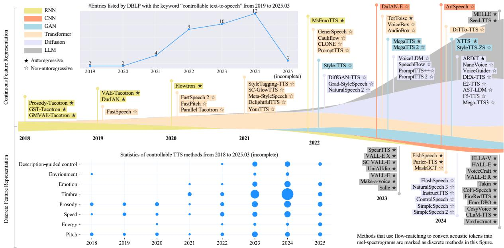
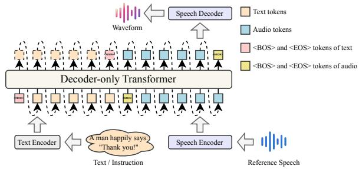
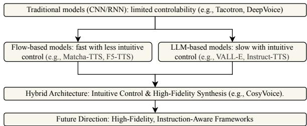
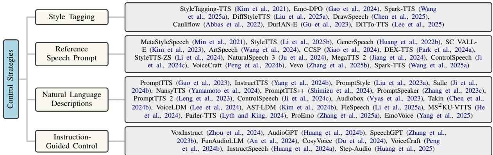
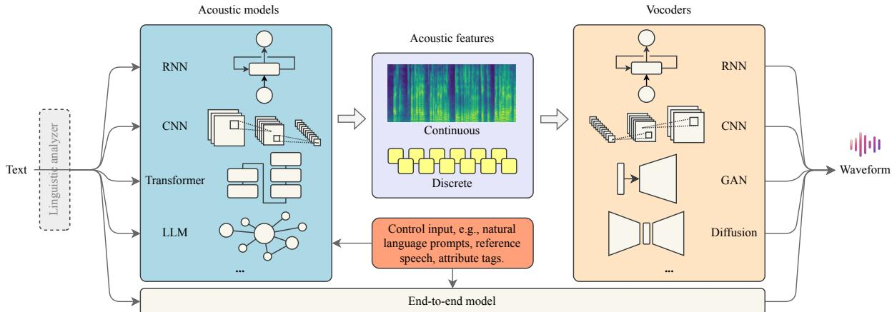
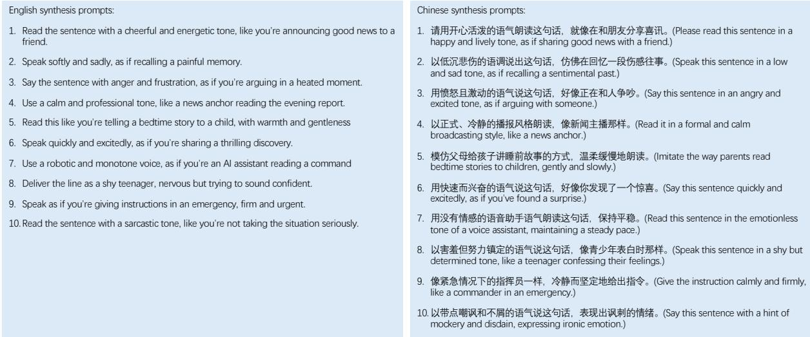

# Towards Controllable Speech Synthesis in the Era of Large Language Models: A Systematic Survey

Tianxin Xie1, Yan Rong1, Pengfei Zhang1, Wenwu Wang2, Li Liu1\*, 1The Hong Kong University of Science and Technology (Guangzhou), 2University of Surrey \*Correspondence to Li Liu: avrillliu@hkust-gz.edu.cn

## Abstract

Text-to-speech (TTS) has advanced from generating natural-sounding speech to enabling fine-grained control over attributes like emotion, timbre, and style. Driven by rising industrial demand and breakthroughs in deep learning, e.g., diffusion and large language models (LLMs), controllable TTS has become a rapidly growing research area. This survey provides the first comprehensive review of controllable TTS methods, from traditional control techniques to emerging approaches using natural language prompts. We categorize model architectures, control strategies, and feature representations, while also summarizing challenges, datasets, and evaluations in controllable TTS. This survey aims to guide researchers and practitioners by offering a clear taxonomy and highlighting future directions in this fast-evolving field. One can visit https://github.com/imxtx/ awesome-controllabe-speech-synthesis for a comprehensive paper list and updates.

## 1 Introduction

Speech synthesis, also known as text-to-speech (TTS), aims to generate human-like speech from text (Dutoit, 1997), and has found broad applications in personal assistants (López et al., 2018), entertainment (Wang et al., 2019), and robotics (Marge et al., 2022). Recently, the success of large language models such as ChatGPT (OpenAI, 2022) has renewed interest in TTS for natural and intuitive human-computer interaction. Meanwhile, fine-grained control over speech attributes, such as emotion, timbre, and style, has become a key focus in both academia and industry, unlocking more expressive and personalized voice generation.

In the past decade, deep learning has driven remarkable advances in TTS, enabling high-quality synthesis (Tan et al., 2024; Ren et al., 2019; Du et al., 2024) and stronger control over speech attributes (Wang et al., 2018; Li et al., 2021; Zhou et al., 2024). Recent methods have expanded TTS to multi-modal inputs, including images (Rong and Liu, 2025) and videos (Choi et al., 2023). Meanwhile, the rise of LLMs (Zhao et al., 2023) has enabled controllable TTS guided by language prompts (Guo et al., 2023; Huang et al., 2024a), opening new possibilities for customized voice synthesis. Integrating TTS into LLMs has also gained extensive attention (Peng et al., 2024a). This rapid progress underscores the need for a comprehensive and timely survey to clarify current trends and guide future directions in controllable TTS.

While several surveys have examined parametric (Zen et al., 2009) and deep learning–based TTS (Triantafyllopoulos et al., 2023), they overlook TTS controllability and recent advances such as description–based methods (Guo et al., 2023; Yamamoto et al., 2024). The key differences between our survey and earlier work are: 1) Different Scope: Klatt (1987) provided the first review of formant-based, concatenative, and articulatory TTS, with a strong focus on text analysis. Later, Tabet and Boughazi (2011); King (2014) explored statistics-based techniques. With the advent of neural networks, Ning et al. (2019); Tan et al. (2021b); Zhang et al. (2023a) surveyed neural model–based TTS, focusing on acoustics and vocoders. However, they rarely discuss the controllability. 2) Closer to Current Demands: The need for controllable TTS is rapidly growing in industries like filmmaking, gaming, robotics, and virtual assistants. Yet, existing surveys rarely explore the gaps between current control techniques and real-world demands.

To fill this gap, we present the first comprehensive survey of emerging controllable TTS methods. We first define the core tasks (Sec. 2) and, as shown in Fig. 1, trace the evolution of methods across model architectures (Sec. 3.1), control strategies (Sec. 3.2), and feature representations (Sec. 3.3). We further summarize relevant datasets and evaluation metrics (Sec. 4), and discuss current challenges and future research directions (Sec. 5). For a history of controllable TTS and an overview of the TTS pipeline, see Appendices A.1 and A.2.

  
Figure 1: Recent trends in controllable TTS regarding architectures, feature representations, and control abilities.

## 2 Main Tasks in Controllable TTS

Prosody Control is the most basic task in controllable TTS, aiming to manipulate low-level acoustic features such as pitch (Łancucki ´ , 2021), duration (Wang et al., 2025a), and energy (Chen et al., 2025). Prosody control ensures naturalness and expressiveness in TTS and is essential for rendering emphasis, rhythm, and nuance in speech.

Timbre Control aims to manipulate the acoustic characteristics that define voice quality (e.g., gender, age, nasality), enabling control over how a voice sounds beyond content and prosody. It supports personalized TTS (Du et al., 2024), voice conversion (Zhang et al., 2025b), and speaker identity editing (Huang et al., 2024a).

Emotion Control aims to enable the synthesis of emotional speech by manipulating the affective state of the generated voice (Kim et al., 2021). This improves human-computer interaction, storytelling (Rong et al., 2025b), and supports emotionally adaptive systems such as virtual assistants.

Style Control aims to control higher-level attributes of speech such as tone, formality, and discourse mode (e.g., newscast) (Zhou et al., 2024; Yang et al., 2024b). This is critical for adapting the speaking behavior of TTS systems to different contexts, audiences, and communication goals.

Language Control aims to enable TTS systems to synthesize speech in multiple languages (Zhang et al., 2023d), dialects (Di et al., 2024), or codeswitched contexts (Chen et al., 2024d). It facilitates cross-lingual communication, multilingual agents, and regionally tailored speech applications.

Environment Control aims to simulate the acoustic characteristics of a specific setting, such as a park, office, or seaside, by conditioning synthesis on background noise and spatial cues (Lee et al., 2024; Kim et al., 2024b; Zhang et al., 2025c). Speech environment control is useful in filmmaking and audiobooks.

## 3 Methods in Controllable TTS

This section reviews controllable TTS from three perspectives: model architectures, feature representations, and control strategies, as shown in Fig. 1.

## 3.1 Model Architectures

The architectures of controllable TTS are primarily divided into two types, i.e., non-autoregressive (NAR) and autoregressive (AR) (See Table 1).

## 3.1.1 Non-Autoregressive Approaches

Non-autoregressive TTS models generate the entire output speech sequence $\mathbf { y } = ( y _ { 1 } , y _ { 2 } , \dots , y _ { T } )$ in parallel given the input $\mathbf { x } = ( x _ { 1 } , x _ { 2 } , \ldots , x _ { T } )$

$$
\underset { \theta } { \operatorname { a r g m a x } } = P ( \mathbf { y } | \mathbf { x } ; \theta ) ,\tag{1}
$$

where $\theta$ denotes model parameters. In this part, we investigate the transformer, variational autoencoder (VAE), diffusion, and flow-based methods.

<table><tr><td>Method (Non-autoregressive)</td><td rowspan="2">Zero-shot</td><td rowspan="2"></td><td rowspan="2">Controlability Emo. Env. Des.</td><td colspan="7"></td><td rowspan="2">Vocoder</td><td rowspan="2">Feature MelS MelS</td><td rowspan="2">2019.05 2020.06</td><td rowspan="2">Release</td></tr><tr><td>FastSpeech (Ren et al., 2019)</td><td>Pit. Ene.</td><td>Spe.</td><td>Pro.</td><td>Tim.</td><td>Acoustic Model Transformer</td><td>Model Architectures WaveGlow (Prenger et al., 2019)</td></tr><tr><td rowspan="9">FastSpeech 2 (Ren et al., 2021a) FastPitch (Łańcucki, 2021) Parallel Tacotron (Elias et al., 2021a) StyleTagging-TT$ (Kim et al., 2021) SC-GlowTTS (Casanova et al., 2021) Meta-StyleSpeech (Min et al., 2021)</td><td></td><td>ンンン</td><td></td><td></td><td></td><td></td><td></td><td>Transformer Transformer Transformer + VAE + CNN Transformer + CNN Transformer + Flow Transformer</td><td></td><td>Parallel WaveGAN (Yamamoto et al., 2020) WaveRNN (Kalchbrenner et al., 2018) WaveGlow HiFi-GAN (Kong et al., 2020) HiFi-GAN</td><td rowspan="9">MelS MelS MelS MelS MelS MelS MelS LinS MelS MelS + LinS MelS MelS MelS Latent Feature MelS MelS MelS MelS Latent Feature MelS MelS MelS MelS MelS Waveform MelS MelS Token Token Token Token MelS MeI Token MelS Token MelS MelS + Energy + F0 Token Token Token + MelS MelS MelS MelS MelS Token MelS MelS MelS MelS cIS</td><td rowspan="9">Feature LinS MelS Md MelS MelS MelS Token Token Token Token</td><td rowspan="9">2020.06 2020.10 2021.04 2021.06 2021.06 2021.11 2021.12 2022.05 2022.05 2022.06 2022.07 2022.11 2022.11 2023.04 2023.05 2023.06 2023.06 2023.07 2023.09 2023.09 2023.09 2023.09 2023.10 2023.10 2023.11 2023.11 2023.12 2024.04 2024.04 2024.05 2024.06 2024.06 2024.06 2024.06 2024.06 2024.06 2024.06 2024.07 2024.07 2024.08 2024.09 2024.09 2024.09 2024.09 2024.10 2024.10 2024.11 2024.12 2024.12 2025.01 2025.01 2025.01 Release 2018.03 2018.03 2018.12 2019.02 2019.09 2020.07 2022.01 2023.01 2023.02 2023.03 2023.05 2023.05 2023.06 2023.07 2023.08 2023.10 2024.01 2024.02 2024.04 2024.05 2024.06 2024.06 2024.06 2024.06 2024.06 2024.06 2024.07 2024.07 2024.08 2024.09 2024.09 2024.09 2024.09 2024.10</td></tr><tr><td>DelightfulTTS (Liu et al., 2021) YourTTS (Casanova et al., 2022) StyleTTS (Li et al., 2025b) GenerSpeech (Huang et al., 2022b) ArtSpeech (Wang et al., 2024) CCSP (Xiao et al., 2024) MS2KU-VTTS (He et al., 2024) MaskGCT (Wang et al., 2025b)</td><td></td><td></td><td></td><td>vンv</td><td></td><td>Transformer + CNN Transformer + Flow CNN + RNN Transformer + Flow BERT + Flow Transformer + CNN BERT + Transformer Score-based Diffusion</td><td>MelGAN (Kumar et al., 2019) HiFiNet (Liu et al., 2021) HiFi-GAN HiFi-GAN HiFi-GAN UP WaveNet (Jiao et al., 2021) WaveNet (Van Den Oord et al., 2016)</td></tr><tr><td>Cauliflow (Àbbas et al., 2022) CLONE (Liu et al., 2022) PromptTTS (Guo et al., 2023) Grad-StyleSpeech (Kang et al., 2023) NaturaÍSpeech 2 (Shen et al., 2024) PromptStyle (Liu et al., 2023a)</td><td>ンンンン</td><td></td><td>S</td><td></td><td></td><td>Diffusion</td></tr><tr><td>StyleTTS 2 (Li et al., 2023) VoiceBox (Le et al., 2024) MegaTTS 2 (Jiang et al., 2024) PromptTTS 2 (Leng et al., 2023) VoiceLDM (Lee et al., 2024)</td><td></td><td>ハンンン&gt;</td><td>ノンンンンンンンン</td><td></td><td>VITS + Flow Flow-based Diffusion + GAN Transformer + Flow Decoder-only Transformer + GAN</td><td>RVQ-based (Shen et al., 2024) HiFi-GAN HifiGAN / iSTFTNet (Kaneko et al., 2022) HiFi-GAN HiFi-GAN</td></tr><tr><td>DurlAN-E (Gu et al., 2023) PromptTTS++ (Shimizu et al., 2024) SpeechFlow (Liu et al., 2024a) P-Flow (Kim et al., 2024c) E3 TTS (Gao et al., 2023)</td><td></td><td></td><td></td><td></td><td>Diffusion Diffusion CNN + RNN Transformer + Diffusion Transformer + Flow</td><td>RVQ-based (Leng et al., 2023) HiFi-GAN HiFi-GAN Big VGAN (gil Lee et al., 2023)</td></tr><tr><td>HierSpeech++ (Lee et al., 2023b) Audiobox (Vyas et al., 2023) FlashSpeech (Ye et al., 2024) NaturalSpeech 3 (Ju et al., 2024)</td><td></td><td></td><td></td><td></td><td>Transformer + Flow Diffusion Transformer + VAE + Flow Transformer + Flow</td><td>HiFi-GAN HiFi-GAN Not required BigVGAN HiFi-GAN</td></tr><tr><td>InstructT TS (Yang et al., 2024b) ControlSpeech (Ji et al., 2024c) AST-LDM (Kim et al., 2024b) SimpleSpeech (Yang et al., 2024c)</td><td></td><td></td><td></td><td></td><td>Latent Consistency Model Transformer + Díffusion Transformer + Diffusion Transformer + Diffusion Diffusion + VAE Transformer + Diffusion</td><td>EnCodec FACodec (Ju et al., 2024) HiFi-GAN FACodec HiFi-GAN</td></tr><tr><td>DiTTo-TTS (Lee et al., 2025) E2 TTS (Eskimez et al., 2024) MobileSpeech (Ji et al., 2024a) DEX-TTS (Park et al., 2024a)</td><td></td><td></td><td></td><td></td><td>DiT + VAE Transformer + Flow Transformer Diffusion RNN + CNN Diffusion Flow-based DiT DiT + Flow</td><td>SQ Codec (Yang et al., 2024c) BigVGAN BigVGAN Vocos (Siuzdak, 2024) HiFi-GAN HiFI-GAN</td></tr><tr><td>SimpleSpeech 2 (Yang et al., 2024a) E1 TTS (Liu et aI., 2025b) StyleTTS-ZS (Li et al., 2024) NansyTTS (Yamamoto et al., 2024) NanoVoice (Park et al., 2024b)</td><td></td><td></td><td></td><td></td><td>Flow-based Diffusion + GAN Transformer Diffusion Transformer</td><td>RVQ-based (Xiao et al., 2024) SQ Codec BigVGAN Mel-based Decoder (Li et al., 2024) NANSY++ (Yamamoto et al., 2024) BigVGAN BigVGAN</td></tr><tr><td>EmoSphere++ (Cho et al., 2024) EmoDubber (Cong et al., 2024) HED (Inoue et al., 2024) DiffStyleTTS (Liu et al., 2025a) DrawSpeech (Chen et al., 2025) ProEmo (Zhang et al., 2025a)</td><td>Zero-shot</td><td>S</td><td></td><td></td><td></td><td>Transformer + Flow Transformer + Flow Transformer + Flow</td></tr><tr><td></td><td></td><td>√ Pit.</td><td></td><td></td><td></td><td></td></tr><tr><td colspan="3"></td><td></td><td></td><td></td><td></td><td></td></tr><tr><td rowspan="9"></td><td></td><td></td><td></td><td>1 Controlability Tim.</td><td></td><td></td><td>Flow-based Diffusion Transformer + Diffusion Diffusion Transformer</td><td>BigVGAN Flow-based (Cong et al., 2024) Vocos HiFi-GAN</td></tr><tr><td>Method (Autoregressive) Prosody-Tacotron (Skerry-Ryan et al., 2018) GST-Tacotron (Stanton et al., 2018)</td><td></td><td>Ene.</td><td>Spe. Pro.</td><td>Emo. Env.</td><td>Des. Acoustic Model RNN</td><td>Model Architectures</td><td>HiFi-GAN HiFi-GAN</td></tr><tr><td>GMVAE-Tacotron (Hsu et al., 2018) VAE-Tacotron (Zhang et al., 2019) DurIAN (Yu et al., 2020) Flowtron (Valle et al., 2020)</td><td></td><td></td><td>SンV</td><td></td><td></td><td>CNN + RNN VAE</td><td>Vocoder Griffin-Lim WaveNet WaveRNN</td></tr><tr><td>MsEmoTTS (Lei et al., 2022) VALL-E (Wang et al., 2023a) SpearTTS (Kharitonov et al., 2023) VALL-E X (Zhang et al., 2023d) Make-A-Voice (Huang et al., 2023b) TorToise (Betker, 2023) MegaTTS (Jiang et al, 2023) SC VALL-È (Kim et al., 2023)</td><td></td><td></td><td></td><td></td><td></td><td>VAE + CNN + RNN CNN + RNN CNN + RNN CNN + RNN Decoder-only Transformer</td><td>WaveNet Multi-band WaveRNN (Yu et al., 2020) WaveGlow WaveRNN EnCodec</td></tr><tr><td></td><td></td><td></td><td></td><td></td><td>Decoder-only Transformer Decoder-only Transformer Encoder-decoder Transformer Decoder-only Transformer + Diffusion Decoder-only Transformer + GAN</td><td></td><td></td></tr><tr><td>Salle (Ji et al., 2024b) UniAudio (Yang et al., 2023b) ELLA-V (Song et al., 2024) Base TTS (Łajszczak et al., 2024)</td><td></td><td></td><td></td><td></td><td></td><td></td><td>SoundStream (Zeghidour et al., 2021) EnCodec Unit-based (Huang et al., 2023b) UnivNet (Jang et al., 2021) HiFi-GAN</td></tr><tr><td></td><td></td><td></td><td></td><td></td><td>Decoder-only Transformer Decoder-only Transformer Decoder-only Transformer Decoder-only Transformer Decoder-only Transformer Encoder-decoder Transformer</td><td>EnCodec EnCodec EnCodec</td><td>MelS MelS Token Token</td></tr><tr><td></td><td></td><td></td><td></td><td></td><td></td><td></td><td></td></tr><tr><td></td><td></td><td></td><td></td><td></td><td></td><td></td><td></td></tr><tr><td>Spark-TTS (Wang et al., 2025a) ÉmoVoice (Yang et al., 2025)</td><td></td><td></td><td></td><td></td><td></td><td></td><td></td><td></td><td rowspan="8">Token Token Token Token + MelS Token MelS Token Token Latent Feature Token Token + MelS Token MelS Token Token + MelS Token + MelS Token + MelS Token + MelS Token Token Token + MelS Token + MelS Latent Feature LinS + MelS</td></tr><tr><td>CLaM-TTS (Kim et al., 2024a) RALL-E (Xin et al., 2024) ARDiT (Liu et al., 2024b) VALL-E R (Han et al., 2024) VALL-E 2 (Chen et al., 2024a) Seed-TTS (Anastassiou et al., 2024) VoiceCraft (Peng et al., 2024b) XTTS (Casanova et al., 2024) CosyVoice (Du et al., 2024)</td><td></td><td></td><td></td><td></td><td></td><td></td><td>Decoder-only Transformer Decoder-only DiT Decoder-only Transformer Decoder-only Transformer Decoder-only Transformer + DiT</td><td>EnCodec HiFi-GAN + BigVGAN BigVGAN SoundStream</td></tr><tr><td></td><td></td><td></td><td></td><td></td><td></td><td></td><td></td><td></td></tr><tr><td></td><td></td><td></td><td></td><td></td><td></td><td></td><td>Decoder-only Transformer Decoder-only Transformer Decoder-only Transformer + Flow</td><td></td></tr><tr><td></td><td></td><td></td><td></td><td></td><td></td><td></td><td></td><td>BigVGAN Vocos Vocos Unknown HiFi-GAN</td></tr><tr><td></td><td></td><td></td><td></td><td></td><td></td><td></td><td></td><td></td></tr><tr><td></td><td></td><td></td><td></td><td></td><td></td><td></td><td></td><td></td></tr><tr><td></td><td></td><td></td><td></td><td></td><td></td><td></td><td></td><td></td></tr><tr><td></td><td></td><td></td><td></td><td></td><td></td><td></td><td></td><td></td></tr><tr><td></td><td></td><td></td><td></td><td></td><td></td><td></td><td></td><td></td></tr><tr><td></td><td></td><td></td><td></td><td></td><td></td><td></td><td></td><td></td></tr><tr><td></td><td></td><td></td><td></td><td></td><td></td><td></td><td></td><td></td></tr><tr><td>MELLE (Meng et al., 2024)</td><td></td><td></td><td></td><td></td><td></td><td>Decoder-only Transformer</td><td></td><td></td></tr><tr><td></td><td></td><td></td><td></td><td></td><td></td><td></td><td></td><td>HiFi-GAN-based (Casanova et al., 2024)</td></tr><tr><td>VoxInstruct (Zhou et al., 2024)</td><td></td><td></td><td></td><td></td><td></td><td>Decoder-only Transformer</td><td></td><td>HiFi-GAN</td></tr><tr><td></td><td></td><td></td><td></td><td></td><td></td><td></td><td></td><td>HiFi-GAN</td></tr><tr><td>Emo-DPO (Gao et al., 2024) FireRedTTS (Guo et al., 2024a)</td><td></td><td></td><td></td><td></td><td></td><td>Decoder-only Transformer Decoder-only Transformer + Flow</td><td></td><td></td></tr><tr><td></td><td></td><td></td><td></td><td></td><td></td><td></td><td></td><td>Vocos HiFi-GAN BigVGAN BigVGAN HiFi-GAN EnCodec Firefly-GAN (Liao et al., 2024)</td></tr><tr><td>CoFi-Speech (Guo et al., 2024b)</td><td></td><td></td><td></td><td></td><td></td><td>Decoder-only Transformer</td><td></td><td></td></tr><tr><td>Step-Audio (Huang et al., 2025) Vevo (Zhang et al., 2025b)</td><td></td><td></td><td></td><td></td><td></td><td></td><td></td><td>HiFi-GAN HiFi-GAN WaveVAE (Zhu et al., 2024)</td></tr><tr><td>Takin (Chen et al., 2024b) HALL-E (Nishimura et al., 2024) FishSpeech (Liao et al., 2024) SLAM-Omni (Chen et al., 2024c) IST-LM (Yang et al., 2024e) KALL-E (Zhu et al., 2024) IDEA-TTS (Lu et al., 2025) FleSpeech (Li et al., 2025a)</td><td></td><td></td><td></td><td></td><td></td><td>Decoder-only Transformer + Flow Decoder-only Transformer Decoder-only Transformer Decoder-only Transformer Decoder-only Transformer Decoder-only Transformer</td></table>

Abbreviations: Pit(ch), Ene(rgy), Spe(ed), Pro(sody), Tim(bre), Emo(tion), Env(ironment), Des(cription). MelS: Mel Spectrogram. LinS: Linear Spectrogram.

Table 1: A summary of existing controllable neural-based methods.

Transformer-based Methods. Transformers enable efficient context modeling and parallel TTS. FastSpeech (Ren et al., 2019) introduced a nonautoregressive transformer that improves inference speed and stability via duration prediction. Fast-Speech 2 (Ren et al., 2021a) adds pitch and energy control, removing the need for distillation and boosting voice quality. FastPitch (Łancucki´ , 2021) further incorporates direct pitch prediction into its architecture, enabling pitch manipulation.

VAE-based Methods. VAEs enable structured, continuous latent representations by optimizing a variational lower bound. VAEs have been leveraged to enhance prosody, emotion, and style control. Hsu et al. (2018) proposed a hierarchical VAE to control noise and speaking rate. Zhang et al. (2019) introduced disentangled VAE representations for effective prosody and emotion transfer. Parallel Tacotron (Elias et al., 2021b) uses a VAEbased residual encoder with iterative spectrogram loss to improve speech naturalness. CLONE (Liu et al., 2022) further improves prosody and energy modeling using conditional VAEs with normalizing flows (Kobyzev et al., 2020) and adversarial training, achieving state-of-the-art quality and control. These advances underscore VAEs’ versatility in expressive and controllable speech synthesis.

Diffusion-based Methods. Diffusion models (Ho et al., 2020) generate speech by reversing a noise injection process: noise is gradually added during the forward phase and removed in the reverse phase to synthesize high-quality audio. NaturalSpeech 2 (Shen et al., 2024) uses a latent diffusion-based codec with quantized latent vectors, while NaturalSpeech 3 (Ju et al., 2024) decomposes speech into independent attribute subspaces with factorized diffusion-based codecs. DEX-TTS (Park et al., 2024a) improves diffusion transformer (DiT)-based networks via overlapping patches and frequency-aware embeddings. E3 TTS (Gao et al., 2023) eliminates intermediate features by directly modeling waveforms through diffusion. Text-to-audio models such as AudioLDM (Liu et al., 2023b) and Make-An-Audio (Huang et al., 2023a) can also generate speech using latent diffusion models.

Flow-based Methods. Flow models use invertible flows (Rezende and Mohamed, 2015; Lipman et al., 2023) to map speech features to simple distributions, typically Gaussians (Prenger et al., 2019), enabling direct, high-fidelity generation via inversion. Recent models adopt flow-matching (Lipman et al., 2023) for efficient, non-autoregressive synthesis: Audiobox (Vyas et al., 2023), P-Flow (Kim et al., 2024c), and VoiceBox (Le et al., 2024) consider TTS as speech infilling tasks, predicting masked mel-spectrograms. FlashSpeech (Ye et al., 2024) trains a latent consistency model using adversarial training, achieving one- or two-step synthesis. Inspired by audio infilling, E2 TTS (Eskimez et al., 2024) uses filler-augmented text sequences to generate mel-spectrograms with human-level quality. F5-TTS (Chen et al., 2024d) builds on this with ConvNeXt v2 (Woo et al., 2023) to enhance textspeech alignment by directly learning flows conditioned on text and reference speech. E1 TTS (Liu et al., 2025b) distills rectified flow-based diffusion models (Liu et al., 2023c) into one-step generators via distribution matching, reducing sampling cost.

## 3.1.2 Autoregressive Approaches

Autoregressive TTS models predict the speech sequence $\mathbf { y } = ( y _ { 1 } , \dots , y _ { T } )$ given input x as:

$$
\underset { \theta } { \operatorname { a r g m a x } } = \prod _ { t = 1 } ^ { T } P ( y _ { t } | y _ { < t } , \mathbf { x } ; \theta ) ,\tag{2}
$$

where each frame $y _ { t }$ depends on all previous outputs $y _ { < t }$ and the transcript x. While this enables effective modeling of implicit duration and longrange context, autoregressive TTS models suffer from slower inference, making them more suitable for applications where flexibility is prioritized over speed. This part investigates recurrent neural networks (RNN) and LLM-based methods.

  
Figure 2: The typical architecture of LLM-based TTS.

RNN-based Methods. RNNs enable naturalsounding speech synthesis with adjustable prosody, pitch, and emotion. Prosody-Tacotron (Skerry-Ryan et al., 2018) extends Tacotron (Wang et al., 2017) by introducing explicit prosodic controls. Wang et al. (2018) proposed Global Style Tokens (GST), enabling unsupervised style transfer. Emotion-controllable models such as Li et al. (2021) introduced emotion embeddings and style alignment to modulate emotional intensity. MsEmoTTS (Lei et al., 2022) refined this with a hierarchical structure capturing emotion at global, utterance, and local levels, enabling more nuanced synthesis. These developments bring synthetic speech significantly closer to human expressiveness.

LLM-based Methods. LLM-based TTS is inspired by the success of in-context learning in LLMs. As illustrated in Fig. 2, these approaches typically input target text or instructions with an optional reference speech, using autoregressive decoder-only transformers to generate speech tokens or features, which are then decoded into waveforms. VALL-E (Wang et al., 2023a) pioneered LLM-based zero-shot TTS by framing it as a conditional language modeling task. It uses En-Codec (Défossez et al., 2023a) to discretize waveforms into tokens and adopts a two-stage pipeline: an autoregressive model generates coarse audio tokens, followed by a non-autoregressive model for iterative refinement. This hierarchical modeling of semantic and acoustic tokens has laid the groundwork for many subsequent methods, such as VALL-E X (Zhang et al., 2023d), ELLA-V (Song et al., 2024), RALL-E (Xin et al., 2024), VALL-E R (Han et al., 2024), MELLE (Meng et al., 2024), and HALL-E (Nishimura et al., 2024). Beyond the VALL-E series, recent work has further improved text-speech alignment, quality, and robustness. SpearTTS (Kharitonov et al., 2023) and Make-a-Voice (Huang et al., 2023b) leverage semantic tokens to better bridge text and acoustic features. FireRedTTS (Guo et al., 2024a) refines the tokenizer architecture for improved reconstruction quality. CoFi-Speech (Guo et al., 2024b) adopts a coarse-to-fine, multi-scale generation strategy to produce natural, intelligible speech.

## 3.1.3 Research Trend

Traditional CNN/RNN TTS models face inherent constraints. RNNs (e.g., Tacotron) are slow due to autoregressive inference and struggle with long-term dependencies. CNNs (e.g., Deep Voice) lack global prosody modeling. Both require explicit feature engineering for attributes like emotion and often trade synthesis quality for efficiency (e.g., WaveNet’s high fidelity but high latency). Flow-based models (e.g., Matcha-TTS, F5-TTS) enable non-autoregressive, parallel synthesis with probabilistic control over acoustic features, improving speed and flexibility but increasing training complexity and dataset requirements. LLM-based models (e.g., VALL-E, InstructTTS) offer natural language-driven control and zero-shot voice cloning, supporting context-aware synthesis, but suffer from high computational cost and potential acoustic artifacts from discrete tokeniza tion. Hybrid architectures (e.g., CosyVoice) integrate LLM-guided semantic conditioning into flowbased generators, combining high-fidelity synthesis with intuitive, instruction-based control. Users can specify attributes like emotion or speaking style in natural language without compromising audio quality. Future controllable TTS should balance efficiency, fidelity, and expressiveness, generaliz ing across voices, styles, and languages. Bridging instruction-based control and acoustic precision remains a key challenge, motivating advances in modular architectures, instruction grounding, and speech-text-instruction alignment. Fig. 3 summarizes the evolution and future direction of TTS model architectures.

## 3.2 Control Strategies

As illustrated in Fig. 4, control strategies in TTS can be broadly categorized into four types: style tagging, reference speech prompt, natural language descriptions, and instruction-guided control.

  
Figure 3: The evolution of TTS model architectures

## 3.2.1 Style Tagging

This paradigm enables the adjustment of key attributes such as pitch, energy, speech rate, and emotion, which can be controlled using either categorical labels or continuous values. “Tagging” refers to using a control signal to control a specific speech attribute. 1) Some approaches use discrete labels to control speech attributes. For example, StyleTagging-TTS (Kim et al., 2021) denotes speech styles with short phrases or words (e.g., angry, happy), learning the relationship between linguistic and style embeddings. Emo-DPO (Gao et al., 2024) enables emotion control through Direct Preference Optimization (DPO) (Rafailov et al., 2023) with LLMs. Spark-TTS (Wang et al., 2025a) provides coarse and fine-grained control, allowing pitch and speaking rate modifications via specially designed tokens and reference speech. 2) Other methods adjust continuous input signals. DiffStyleTTS (Liu et al., 2025a) models prosody hierarchically, enabling control over pitch, energy, duration, and style via guiding scale factors. DrawSpeech (Chen et al., 2025) lets users sketch prosody contours, which are refined and converted into detailed speech by a diffusion model, offering control over intonation. 3) Speech attributes can be controlled by modifying latentfeatures. Cauliflow (Abbas et al., 2022) adjusts speech rate and pausing through a flow-based model conditioned on user-defined parameters. DiTTo-TTS (Lee et al., 2025) uses a DiT to control speech rate by modifying latent length predictions. These methods show great potential in controlling speech attributes by adjusting input signals or latent variables. However, these methods are limited in expressive diversity, as they can only model a small set of pre-defined attributes.

## 3.2.2 Reference Speech Prompt

This paradigm aims to customize the synthesized voice using only a few seconds of reference speech. Similar to LLM-based methods, it takes both text and reference speech as input to a conditional TTS model, which generates speech based on both semantic and acoustic features. MetaStyle-Speech (Min et al., 2021) employs adaptive normalization for style conditioning, enabling robust zero-shot performance. GenerSpeech (Huang et al., 2022b) introduces a multilevel style adapter for improved zero-shot style transfer to out-of-domain custom voices. SC VALL-E (Kim et al., 2023) integrates style tokens and scale factors for controlling emotion, speaking style, and other acoustic features in the generated speech. DEX-TTS (Park et al., 2024a) separates time-invariant and time-variant style components, allowing the extraction of diverse styles. StyleTTS-ZS (Li et al., 2024) uses distilled time-varying style diffusion to capture varied speaker identities and prosodies. MegaTTS 2 (Jiang et al., 2024) introduces an acoustic autoencoder to separate prosody and timbre in the latent space, enabling style transfer to any timbre. ControlSpeech (Ji et al., 2024c) employs bidirectional attention and parallel decoding to control timbre, style, and content in a zero-shot manner.

  
Figure 4: A taxonomy of controllable TTS from the perspective of control strategies.

## 3.2.3 Natural Language Descriptions

Recent studies have explored controlling speech attributes using natural language descriptions, offering better user-friendliness. PromptTTS (Guo et al., 2023) uses manually annotated prompts to describe five key speech attributes. InstructTTS (Yang et al., 2024b) introduces a three-stage training procedure to extract semantics from natural language prompts. NansyTTS (Yamamoto et al., 2024) enables cross-lingual control by pairing a TTS model with a description controller trained on a different language using shared timbre and style representations. To address the limitations of textual prompts in capturing speaker characteristics,

PromptTTS++ (Shimizu et al., 2024) enhances prompt richness by using additional speaker description prompts. PromptTTS 2 (Leng et al., 2023) introduces a variation network to model residual variability beyond the prompt. Further efforts extend controllability to the environmental context. VoiceLDM (Lee et al., 2024) and AST-LDM (Kim et al., 2024b) extend AudioLDM (Liu et al., 2023b) by incorporating content prompts to enable environmental conditioning. MS2KU-VTTS (He et al., 2024) further enhances environmental perception by mixing environmental images into the prompt, enabling more immersive speech generation.

## 3.2.4 Instruction-Guided Synthesis

Description-based TTS methods separate inputs into content and description prompts, diverging from the unified instruction formats used in chatbots. To address this, VoxInstruct (Zhou et al., 2024) reframes TTS as a general instruction-tospeech task, where a single natural language prompt conveys both content and style descriptions. CosyVoice (Du et al., 2024) enhances this paradigm using supervised semantic tokens derived from ASR models. It combines LLM-driven token generation with flow-matching synthesis, enabling precise control over speaker identity, emotion, pitch, speed, and paralinguistic cues through natural language instructions. AudioGPT (Huang et al., 2024b) is a multimodal LLM-based agent, incorporating multiple modules for speech understanding, synthesis, and style conversion. StepAudio (Huang et al., 2025) introduces a speech-text model with an instruction-driven TTS module, enabling dynamic control over dialects, emotions, singing, rapping, and speaking styles. These advancements push toward more intuitive, instructiondriven speech generation.

## 3.2.5 Instruction-Guided Editing

Some methods also support speech editing via user instructions. VoiceCraft (Peng et al., 2024b) uses a decoder-only transformer with causal masking and delayed stacking for bidirectional, contextaware instruction-guided editing, such as insertion, deletion, and substitution, while maintaining high naturalness. InstructSpeech (Huang et al., 2024a) trains a multi-task LLM on <instruction, input, output> triplets with task embeddings and hierarchical adapters, allowing content and acoustic attributes control. It supports flexible, free-form speech editing and task adaptation by multi-step reasoning.

## 3.2.6 Research Trend

The evolution of TTS control has moved from basic attribute manipulation to sophisticated, instructionguided synthesis, reflecting AI’s trend toward intuitive, fine-grained control. Early methods like style tagging controlled predefined attributes (e.g., pitch, emotion) but offered limited expressive diversity. Reference speech prompts enabled zeroshot TTS and voice cloning, separating timbre from style for greater personalization. To improve user-friendliness, natural language descriptions (e.g., PromptTTS) allowed users to specify vocal characteristics through text. The latest advance, instruction-guided control, leverages LLMs to interpret free-form instructions combining content and style. Systems like VoxInstruct and CosyVoice generate nuanced speech, including paralinguistic sounds, enabling highly precise, user-centric synthesis. Overall, the progression from tags to natural instructions shows a clear trajectory toward more expressive, personalized, and intuitive TTS, driven by LLM integration. Table 2 in the Appendix provides a summary of the strengths and weaknesses of each control strategy.

## 3.3 Feature Representations

The learning and choice of feature representations critically affect flexibility, naturalness, and controllability. This subsection discusses speech attribute disentanglement and compares continuous and discrete representations, highlighting their trade-offs.

Speech Attribute Disentanglement. Attribute disentanglement aims to isolate distinct speech factors, such as speaker identity, emotion, prosody, and content, into separate latent representations. The two main approaches are: 1) Adversarial training (Goodfellow et al., 2020) uses auxiliary classifiers to penalize the presence of unwanted attributes in a latent space. An encoder learns to “fool” these classifiers, resulting in representations that are invariant to specific attributes like speaker (Yang et al., 2021; Hsu et al., 2019; Lee et al., 2021), emotion (Li et al., 2022), and style (Li et al., 2023). 2) Information bottleneck uses small-capacity or independent encoder branches to isolate attributes. Each branch encodes one factor (e.g., content, prosody) (Ju et al., 2024), often with adversarial or reconstruction losses to discourage leakage of other information. These methods are often combined. Regularization via KL divergence (Lu et al., 2023) or quantization (Zhang et al., 2025b) also plays a key role in enforcing disentanglement.

Continuous Representations. Continuous representations model speech in a continuous feature space, preserving acoustic details. The key advantages are: 1) Fine-grained detail retention for natural and expressive synthesis; 2) Inherent encoding of prosody, pitch, and emotion, aiding controllable and emotional TTS; 3) Enable smooth audio reconstruction without quantization artifacts. GAN-based (Kong et al., 2020; Yamamoto et al., 2020), VAE-based (Lee et al., 2023b, 2025), flowbased (Kim et al., 2024d; Casanova et al., 2022), and diffusion-based methods (Kong et al., 2021; Huang et al., 2022a) often utilize continuous feature representations. However, they are computationally intensive and demand large models and datasets for high-fidelity audio generation.

Discrete Tokens. Discrete token-based TTS uses quantized units or phoneme-like tokens as acoustic features, which are often derived from quantization (Zeghidour et al., 2021) or learned embeddings (Hsu et al., 2021). The advantages of discrete tokens are: 1) Discrete tokens can encode phonemes or sub-word units, making them concise and computationally efficient. 2) Discrete tokens often allow TTS systems to require fewer samples to learn and generalize, compared with continuous features. 3) Using discrete tokens simplifies cross-modal TTS applications like descriptionbased TTS, as they are suitable for LLM training. LLM-based methods (Zhou et al., 2024; Yang et al., 2024b; Du et al., 2024) often adopt discrete tokens as acoustic features. However, discrete feature learning may cause information loss or lack the nuanced details in continuous features.

Table 1 summarizes the features used in existing methods. We also compare speech quantization and tokenization in Appendix A.3 and summarize open-source methods in Table 5 in the Appendix.

## 4 Datasets and Evaluation Methods

## 4.1 Datasets

Fully controllable TTS systems require large, diverse, and finely annotated datasets to generate expressive, attribute-controllable speech. There are mainly three types of datasets for controllable TTS:

Tag-based Datasets. Tag-based datasets contain speech recordings annotated with predefined discrete attribute labels that describe various aspects of the speech audio (Zhou et al., 2022; Busso et al., 2008; Ringeval et al., 2013; Bagher Zadeh et al., 2018). Common attributes include pitch, energy, speaking rate, age, gender, emotion, emphasis, accent, and topic. By leveraging attribute labels, models can dynamically adjust specific speech characteristics, enabling more expressive synthesis.

Description-based Datasets. Description-based datasets pair speech samples with rich, free-form textual descriptions that capture nuanced attributes such as intonation, prosody, speaking style, and emotional tone (Guo et al., 2023; Ji et al., 2024b; Jin et al., 2024; Lyth and King, 2024). Unlike tagbased datasets with predefined categorical labels, these datasets allow models to interpret and generate speech from natural language prompts, enabling context-aware and highly expressive synthesis.

Dialogue Datasets. Dialogue datasets (Byrne et al., 2019; Lee et al., 2023a; Yang et al., 2022) contain multi-turn conversational speech involving two or more speakers, emphasizing natural interaction features such as turn-taking, contextual dependencies, speaker intent, pauses, and prosodic variation. These datasets are essential for generating dynamic and contextually appropriate speech for interactive systems.

By leveraging these datasets, researchers can develop more expressive, context-aware, and highly controllable TTS models. Table 3 in the Appendix summarizes publicly available datasets.

## 4.2 Evaluation Methods

## 4.2.1 Objective and Subjective Metrics

Objective Metrics. Objective metrics enable automated and reproducible evaluation. Mel Cepstral Distortion (MCD) (Kominek et al., 2008) quantifies spectral distance between synthesized and reference speech. MCD below 4 suggests good synthesis, while values above 6 imply distortion. Fréchet DeepSpeech Distance (FDSD) (Binkowski´ et al., 2020) evaluates speech quality by measuring the distributional distance between synthesized and real speech in the embedding space of a pretrained speech recognition model, such as Deep-Speech (Hannun et al., 2014). It compares the mean and covariance of extracted features; thus, a lower FDSD indicates higher perceptual similarity. Word Error Rate (WER) (Wikipedia, 2024) quantifies speech intelligibility by comparing recognized and reference transcripts. Cosine Similarity assesses speaker similarity by comparing speaker embeddings (extracted using models like ECAPA-TDNN (Desplanques et al., 2020) or xvectors (Snyder et al., 2018)) of synthesized and reference speech. Higher values indicate better voice cloning. Perceptual Evaluation of Speech Quality (PESQ) (Rix et al., 2001) evaluates the intelligibility and distortion of synthesized speech by modeling human auditory perception.

Subjective Metrics. Subjective metrics assess the perceptual quality of synthesized speech based on human judgments, capturing aspects like expressiveness and style similarity. Mean Opinion Score (MOS) rates synthesized speech (e.g., naturalness) on a 1–5 scale. Though effective in capturing human perception, MOS is costly for largescale use. Comparison MOS (CMOS) (Loizou, 2011) assesses relative quality by asking participants compare paired samples. Both are averaged across listeners. AB/ABX Tests present listeners with two samples (AB) by different methods or two plus a reference (ABX) to judge preference or closeness to the reference. They are very common in evaluating fine-grained or zero-shot TTS. Appendix A.4 details the metric computations, while Table 4 summarizes the most commonly used ones.

## 4.2.2 Model-based Evaluation

Model-based evaluation is also an emerging technique, e.g., automatic MOS evaluation (Lian et al., 2025) and GPT-based evaluation (Rong et al., 2025b,a). To evaluate the controllability of existing TTS models, we designed a pipeline using Google Gemini to assess synthesized speech along three dimensions, i.e., instruction following, naturalness, and expressiveness, which are not well captured by traditional metrics. Details of this evaluation are provided in Appendix A.5.

## 5 Challenges and Future Directions

## 5.1 Challenges

Fine-Grained Attribute Control. Emotion and other vocal traits are often intertwined and span multiple granularities, making fine-grained control especially difficult. This requires high-resolution annotations and advanced models capable of capturing subtle attribute variations. While descriptionbased methods like VoxInstruct (Zhou et al., 2024) allow control via attribute descriptions, precisely targeting a specific granularity or enabling multiscale, fine-grained control remains a big challenge.

Feature Disentanglement. Fully controllable TTS requires effective feature disentanglement, yet extracting meaningful and independent speech attributes is challenging due to their interdependence and context sensitivity. For instance, modifying pitch can also affect emotion and naturalness. To address this, prior work (An et al., 2022; Wang et al., 2023b) leverages pre-trained models on tasks like emotion classification and adversarial training to guide feature separation. However, designing disentanglement methods for more subtle prosodic attributes, such as sarcasm, remains an open challenge and merits further research.

Scarcity of Datasets. Effective control requires training data that spans a wide range of styles, emotions, accents, and prosodic patterns. Largescale datasets like GigaSpeech (Chen et al., 2021) and TextrolSpeech (Ji et al., 2024b) exist, but lack the content and scenario diversity, e.g., comedies, thrillers, and cartoons. Fine-grained, attributespecific annotations are another bottleneck. Manual labeling is expensive, laborious, requires expertise, and is often inconsistent, especially for subjective traits like emotion. Most datasets offer only coarse labels (e.g., gender, age, emotions). While datasets like SpeechCraft (Jin et al., 2024) and Parler-TTS (Lyth and King, 2024) include textual descriptions, none provide annotations across varying conditions within the same speaker.

## 5.2 Future Directions

Instruction-Guided Fine-Grained Speech Synthesis and Editing. Natural language-driven control of fine-grained speech attributes remains underexplored. Most existing methods support only a limited set of controllable attributes. While models like VoxInstruct (Zhou et al., 2024) and CosyVoice (Du et al., 2024) show promise in controlling emotion, timbre, and style, they often produce speech that deviates from user intent, requiring multiple synthesis attempts. Similarly, speech editing methods (Tae et al., 2022; Tan et al., 2021a) typically rely on conditional models with fixed inputs, offering limited flexibility for fine-grained, instruction-guided modifications. Thus, developing disentangled representations that support precise control through user instructions is promising.

Expressive Multimodal Speech Synthesis. Synthesizing speech from multimodal inputs such as texts, images, and videos has broad industrial applications in storytelling, film, and gaming. While prior work (Goto et al., 2020; Lu et al., 2022; Rong and Liu, 2025) explores this direction, current methods struggle to effectively extract and utilize rich multimodal information. Generating expressive, engaging speech for complex visual content remains a promising area for future research.

Zero-shot Long Speech and Conversational Synthesis with Emotion Consistency. Zero-shot TTS enables voice cloning and style transfer without fine-tuning (Wang et al., 2025b; Chen et al., 2024d; Du et al., 2024), yet struggles with generating long, content-emotion consistent speech due to limited reference input. Overcoming this challenge is key to advancing long speech synthesis. Besides, conversational TTS, often cascaded and context-unaware, produces robotic and unexpressive speech. Recent advances leverage LLMs and discrete speech tokens (Fang et al., 2025; Zhang et al., 2023b), but context-aware, emotionally rich conversational TTS remains underexplored.

Large-Scale Dataset Generation. Dataset construction is critical for both fine-grained control and editing tasks. Researchers can leverage pre-trained speech analysis models to annotate attributes like pitch, energy, emotion, gender, and age. From these annotations, tools like ChatGPT can generate diverse natural language descriptions of speech characteristics. For speech editing, pre-trained models can assist with tasks such as word substitution, pitch adjustment, and emotion conversion, while ChatGPT can provide varied and semantically rich editing instructions for training and evaluation. In addition, multi-agent systems can also be utilized to generate long-form and diverse speech content.

## 6 Conclusion

This survey provides a comprehensive review of controllable TTS methods, covering model architectures, control strategies, and feature representations. We also summarize commonly used datasets and evaluation metrics, discuss major challenges, and highlight promising future directions. To the best of our knowledge, this is the first comprehensive survey dedicated to controllable TTS.

## 7 Limitations

We acknowledge several limitations that may affect the completeness of our survey. First, this survey does not explore the interactions between controllable attributes. Most existing studies focus on modeling each factor, such as emotion, speaker identity, or prosody, as an independent variable. However, understanding how these attributes influence one another during synthesis could lead to more effective and flexible control strategies. Second, we do not address the efficiency of current controllable TTS systems. It is important to note that approaches guided by descriptions or instructions often involve considerable computational cost, largely due to their reliance on large language model-based codecs and complex crossmodal architectures. Third, we have not discussed the broader societal implications of controllable TTS, such as the risks associated with deepfake generation or adversarial attacks. Finally, this survey does not cover related research areas, including speech enhancement, speech separation, speech pretraining, and speech-to-speech translation, which may offer valuable insights or complementary techniques. Overcoming these limitations presents important opportunities for future research to deepen our understanding and improve the design of controllable TTS systems.

## 8 Ethics Statements

The literature search and review were conducted using sources such as Google Scholar, arXiv, DBLP, Scopus, and ChatGPT. All referenced papers included in this survey were thoroughly read, analyzed, and categorized by the authors. Portions of the original content in this survey were paraphrased and refined with the assistance of ChatGPT.

## 9 Acknowledgement

This work was supported by the National Natural Science Foundation of China (No. 62471420), GuangDong Basic and Applied Basic Research Foundation (2025A1515012296), and CCF-Tencent Rhino-Bird Open Research Fund.

## References

Ammar Abbas, Thomas Merritt, Alexis Moinet, Sri Karlapati, Ewa Muszynska, Simon Slangen, Elia Gatti, and Thomas Drugman. 2022. Expressive, variable, and controllable duration modelling in TTS. arXiv preprint arXiv:2206.14165.

Jonathan Allen, M Sharon Hunnicutt, Dennis H Klatt, Robert C Armstrong, and David B Pisoni. 1987. From Text to Speech: The MITalk System. Cambridge University Press.

Felipe Almeida and Geraldo Xexéo. 2019. Word embeddings: A survey. arXiv preprint arXiv:1901.09069.

Keyu An, Qian Chen, Chong Deng, Zhihao Du, Changfeng Gao, Zhifu Gao, Yue Gu, Ting He, Hangrui Hu, Kai Hu, and 1 others. 2024. FunAudioLLM: Voice understanding and generation foundation models for natural interaction between humans and LLMs. arXiv preprint arXiv:2407.04051.

Xiaochun An, Frank K Soong, and Lei Xie. 2022. Disentangling style and speaker attributes for TTS style transfer. IEEE/ACM Transactions on Audio, Speech, and Language Processing, 30:646–658.

Philip Anastassiou, Jiawei Chen, Jitong Chen, Yuanzhe Chen, Zhuo Chen, Ziyi Chen, Jian Cong, Lelai Deng, Chuang Ding, Lu Gao, and 1 others. 2024. Seed-TTS: A family of high-quality versatile speech generation models. arXiv preprint arXiv:2406.02430.

Rosana Ardila, Megan Branson, Kelly Davis, Michael Kohler, Josh Meyer, Michael Henretty, Reuben Morais, Lindsay Saunders, Francis Tyers, and Gregor Weber. 2020. Common Voice: A massivelymultilingual speech corpus. In Proceedings of the Twelfth Language Resources and Evaluation Conference, pages 4218–4222.

Alexei Baevski, Wei-Ning Hsu, Qiantong Xu, Arun Babu, Jiatao Gu, and Michael Auli. 2022. Data2vec: A general framework for self-supervised learning in speech, vision and language. In International Conference on Machine Learning, pages 1298–1312.

Alexei Baevski, Steffen Schneider, and Michael Auli. 2020a. vq-wav2vec: Self-supervised learning of discrete speech representations. In International Conference on Learning Representations.

Alexei Baevski, Yuhao Zhou, Abdelrahman Mohamed, and Michael Auli. 2020b. wav2vec 2.0: A framework for self-supervised learning of speech representations. Advances in Neural Information Processing Systems, 33:12449–12460.

AmirAli Bagher Zadeh, Paul Pu Liang, Soujanya Poria, Erik Cambria, and Louis-Philippe Morency. 2018. Multimodal language analysis in the wild: CMU-MOSEI dataset and interpretable dynamic fusion graph. In Proceedings of the 56th Annual Meeting of the Associationfor Computational Linguistics (Volume 1: Long Papers), pages 2236–2246.

Loïc Barrault, Yu-An Chung, Mariano Coria Meglioli, David Dale, Ning Dong, Mark Duppenthaler, Paul-Ambroise Duquenne, Brian Ellis, Hady Elsahar, Justin Haaheim, and 1 others. 2023. Seamless: Multilingual expressive and streaming speech translation. arXiv preprint arXiv:2312.05187.

James Betker. 2023. Better speech synthesis through scaling. arXiv preprint arXiv:2305.07243.

Mikołaj Binkowski, Jeff Donahue, Sander Dieleman,´ Aidan Clark, Erich Elsen, Norman Casagrande, Luis C. Cobo, and Karen Simonyan. 2020. High fidelity speech synthesis with adversarial networks. In International Conference on Learning Representations.

Tom Brown, Benjamin Mann, Nick Ryder, Melanie Subbiah, Jared D Kaplan, Prafulla Dhariwal, Arvind Neelakantan, Pranav Shyam, Girish Sastry, Amanda Askell, Sandhini Agarwal, Ariel Herbert-Voss, Gretchen Krueger, Tom Henighan, Rewon Child, Aditya Ramesh, Daniel Ziegler, Jeffrey Wu, Clemens Winter, and 12 others. 2020. Language models are few-shot learners. In Advances in Neural Information Processing Systems, volume 33, pages 1877–1901.

Murtaza Bulut, Shrikanth S Narayanan, and Ann K Syrdal. 2002. Expressive speech synthesis using a concatenative synthesizer. In Proceedings of the Annual Conference ofthe International Speech Communication Association, pages 1265–1268.

Carlos Busso, Murtaza Bulut, Chi-Chun Lee, Abe Kazemzadeh, Emily Mower, Samuel Kim, Jeannette N Chang, Sungbok Lee, and Shrikanth S Narayanan. 2008. IEMOCAP: Interactive emotional dyadic motion capture database. Language Resources and Evaluation, 42:335–359.

Bill Byrne, Karthik Krishnamoorthi, Chinnadhurai Sankar, Arvind Neelakantan, Daniel Duckworth, Semih Yavuz, Ben Goodrich, Amit Dubey, Andy Cedilnik, and Kyu-Young Kim. 2019. Taskmaster-1: Toward a realistic and diverse dialog dataset. arXiv preprint arXiv:1909.05358.

Edresson Casanova, Kelly Davis, Eren Gölge, Görkem Göknar, Iulian Gulea, Logan Hart, Aya Aljafari, Joshua Meyer, Reuben Morais, Samuel Olayemi, and Julian Weber. 2024. XTTS: a massively multilingual zero-shot text-to-speech model. In Conference ofthe International Speech Communication Association, pages 4978–4982.

Edresson Casanova, Christopher Shulby, Eren Gölge, Nicolas Michael Müller, Frederico Santos De Oliveira, Arnaldo Candido Junior, Anderson da Silva Soares, Sandra Maria Aluisio, and Moacir Antonelli Ponti. 2021. SC-GlowTTS: An efficient zero-shot multi-speaker text-to-speech model. arXiv preprint arXiv:2104.05557.

Edresson Casanova, Julian Weber, Christopher D Shulby, Arnaldo Candido Junior, Eren Gölge, and Moacir A Ponti. 2022. YourTTS: Towards zero-shot multi-speaker TTS and zero-shot voice conversion for everyone. In International Conference on Machine Learning, pages 2709–2720.

Guoguo Chen, Shuzhou Chai, Guan-Bo Wang, Jiayu Du, Wei-Qiang Zhang, Chao Weng, Dan Su, Daniel Povey, Jan Trmal, Junbo Zhang, Mingjie Jin, Sanjeev

Khudanpur, Shinji Watanabe, Shuaijiang Zhao, Wei Zou, Xiangang Li, Xuchen Yao, Yongqing Wang, Zhao You, and Zhiyong Yan. 2021. GigaSpeech: An evolving, multi-domain ASR corpus with 10,000 hours of transcribed audio. In Annual Conference ofthe International Speech Communication Association, pages 3670–3674.

Sanyuan Chen, Shujie Liu, Long Zhou, Yanqing Liu, Xu Tan, Jinyu Li, Sheng Zhao, Yao Qian, and Furu Wei. 2024a. VALL-E 2: Neural codec language models are human parity zero-shot text to speech synthesizers. arXiv preprint arXiv:2406.05370.

Sijing Chen, Yuan Feng, Laipeng He, Tianwei He, Wendi He, Yanni Hu, Bin Lin, Yiting Lin, Yu Pan, Pengfei Tan, and 1 others. 2024b. Takin: A cohort of superior quality zero-shot speech generation models. arXiv preprint arXiv:2409.12139.

Weidong Chen, Shan Yang, Guangzhi Li, and Xixin Wu. 2025. DrawSpeech: Expressive speech synthesis using prosodic sketches as control conditions. In IEEE International Conference on Acoustics, Speech and Signal Processing, pages 1–5.

Wenxi Chen, Ziyang Ma, Ruiqi Yan, Yuzhe Liang, Xiquan Li, Ruiyang Xu, Zhikang Niu, Yanqiao Zhu, Yifan Yang, Zhanxun Liu, and 1 others. 2024c. SLAM-Omni: Timbre-controllable voice interaction system with single-stage training. arXiv preprint arXiv:2412.15649.

Xinxiong Chen, Lei Xu, Zhiyuan Liu, Maosong Sun, and Huan-Bo Luan. 2015. Joint learning of character and word embeddings. In Twenty-fourth International Joint Conference on Artificial Intelligence, pages 1236–1242.

Yushen Chen, Zhikang Niu, Ziyang Ma, Keqi Deng, Chunhui Wang, Jian Zhao, Kai Yu, and Xie Chen. 2024d. F5-TTS: A fairytaler that fakes fluent and faithful speech with flow matching. arXiv preprint arXiv:2410.06885.

Deok-Hyeon Cho, Hyung-Seok Oh, Seung-Bin Kim, and Seong-Whan Lee. 2024. EmoSphere++: Emotion-controllable zero-shot text-to-speech via emotion-adaptive spherical vector. arXiv preprint arXiv:2411.02625.

Jeongsoo Choi, Joanna Hong, and Yong Man Ro. 2023. DiffV2S: Diffusion-based video-to-speech synthesis with vision-guided speaker embedding. In Proceedings ofthe IEEE/CVF International Conference on Computer Vision, pages 7812–7821.

Aakanksha Chowdhery, Sharan Narang, Jacob Devlin, Maarten Bosma, Gaurav Mishra, Adam Roberts, Paul Barham, Hyung Won Chung, Charles Sutton, Sebastian Gehrmann, and 1 others. 2023. PaLM: Scaling language modeling with pathways. Journal ofMachine Learning Research, 24(240):1–113.

Gaoxiang Cong, Jiadong Pan, Liang Li, Yuankai Qi, Yuxin Peng, Anton van den Hengel, Jian Yang, and

Qingming Huang. 2024. EmoDubber: Towards high quality and emotion controllable movie dubbing. arXiv preprint arXiv:2412.08988.

Erica Cooper, Cheng-I Lai, Yusuke Yasuda, Fuming Fang, Xin Wang, Nanxin Chen, and Junichi Yamagishi. 2020. Zero-shot multi-speaker text-to-speech with state-of-the-art neural speaker embeddings. In IEEE International Conference on Acoustics, Speech and Signal Processing, pages 6184–6188.

Alexandre Défossez, Jade Copet, Gabriel Synnaeve, and Yossi Adi. 2023a. High fidelity neural audio compression. Transactions on Machine Learning Research, pages 1–19.

Alexandre Défossez, Jade Copet, Gabriel Synnaeve, and Yossi Adi. 2023b. High fidelity neural audio compression. Transactions on Machine Learning Research.

Alexandre Défossez, Laurent Mazaré, Manu Orsini, Amélie Royer, Patrick Pérez, Hervé Jégou, Edouard Grave, and Neil Zeghidour. 2024. Moshi: a speechtext foundation model for real-time dialogue. arXiv preprint arXiv:2410.00037.

Brecht Desplanques, Jenthe Thienpondt, and Kris Demuynck. 2020. ECAPA-TDNN: emphasized channel attention, propagation and aggregation in TDNN based speaker verification. In 21st Annual Conference ofthe International Speech Communication Association, pages 3830–3834.

Jacob Devlin, Ming-Wei Chang, Kenton Lee, and Kristina Toutanova. 2019. BERT: Pre-training of deep bidirectional transformers for language understanding. In Proceedings ofthe Conference ofthe Associationfor Computational Linguistics, pages 4171– 4186.

Xinhan Di, Zihao Chen, Yunming Liang, Junjie Zheng, Yihua Wang, and Chaofan Ding. 2024. Bailing-TTS: Chinese dialectal speech synthesis towards humanlike spontaneous representation. arXiv preprint arXiv:2408.00284.

Chris Donahue, Julian McAuley, and Miller Puckette. 2018. Adversarial audio synthesis. In International Conference on Learning Representations.

Zhihao Du, Qian Chen, Shiliang Zhang, Kai Hu, Heng Lu, Yexin Yang, Hangrui Hu, Siqi Zheng, Yue Gu, Ziyang Ma, and 1 others. 2024. CosyVoice: A scalable multilingual zero-shot text-to-speech synthesizer based on supervised semantic tokens. arXiv preprint arXiv:2407.05407.

Thierry Dutoit. 1997. An Introduction to Text-to-Speech Synthesis, volume 3. Springer Science & Business Media.

Isaac Elias, Heiga Zen, Jonathan Shen, Yu Zhang, Ye Jia, Ron J Weiss, and Yonghui Wu. 2021a. Par allel Tacotron: Non-autoregressive and controllable TTS. In IEEE International Conference on Acoustics, Speech and Signal Processing, pages 5709–5713.

Isaac Elias, Heiga Zen, Jonathan Shen, Yu Zhang, Ye Jia, Ron J Weiss, and Yonghui Wu. 2021b. Parallel Tacotron: Non-autoregressive and controllable TTS. In IEEE International Conference on Acoustics, Speech and Signal Processing, pages 5709–5713.

Sefik Emre Eskimez, Xiaofei Wang, Manthan Thakker, Canrun Li, Chung-Hsien Tsai, Zhen Xiao, Hemin Yang, Zirun Zhu, Min Tang, Xu Tan, and 1 others. 2024. E2 TTS: Embarrassingly easy fully nonautoregressive zero-shot TTS. In IEEE Spoken Language Technology Workshop, pages 682–689.

Yuchen Fan, Yao Qian, Frank K Soong, and Lei He. 2015. Multi-speaker modeling and speaker adaptation for DNN-based TTS synthesis. In IEEE International Conference on Acoustics, Speech and Signal Processing, pages 4475–4479.

Yuchen Fan, Yao Qian, Feng-Long Xie, and Frank K Soong. 2014. TTS synthesis with bidirectional LSTM based recurrent neural networks. In Proceedings of the Annual Conference of the International Speech Communication Association, pages 1964–1968.

Qingkai Fang, Shoutao Guo, Yan Zhou, Zhengrui Ma, Shaolei Zhang, and Yang Feng. 2025. LLaMA-Omni: Seamless speech interaction with large language models. In International Conference on Learning Representations, pages 1–18.

T Fukada, K Tokuda, T Kobayashi, and S Imai. 1992. An adaptive algorithm for mel-cepstral analysis of speech. In IEEE International Conference on Acoustics, Speech, and Signal Processing, volume 1, pages 137–140.

Xiaoxue Gao, Chen Zhang, Yiming Chen, Huayun Zhang, and Nancy F Chen. 2024. Emo-DPO: Controllable emotional speech synthesis through direct preference optimization. arXiv preprint arXiv:2409.10157.

Yuan Gao, Nobuyuki Morioka, Yu Zhang, and Nanxin Chen. 2023. E3 TTS: Easy end-to-end diffusionbased text to speech. In IEEE Automatic Speech Recognition and Understanding Workshop, pages 1– 8.

Sang gil Lee, Wei Ping, Boris Ginsburg, Bryan Catanzaro, and Sungroh Yoon. 2023. BigVGAN: A universal neural vocoder with large-scale training. In The Eleventh International Conference on Learning Representations.

Ian Goodfellow, Jean Pouget-Abadie, Mehdi Mirza, Bing Xu, David Warde-Farley, Sherjil Ozair, Aaron Courville, and Yoshua Bengio. 2020. Generative adversarial networks. Communications ofthe ACM, 63(11):139–144.

Shunsuke Goto, Kotaro Onishi, Yuki Saito, Kentaro Tachibana, and Koichiro Mori. 2020. Face2Speech: Towards multi-speaker text-to-speech synthesis using an embedding vector predicted from a face image. In

Proceedings of the Annual Conference of the International Speech Communication Association, pages 1321–1325.

Yu Gu, Yianrao Bian, Guangzhi Lei, Chao Weng, and Dan Su. 2023. DurIAN-E: Duration informed attention network for expressive text-to-speech synthesis. arXiv preprint arXiv:2309.12792.

Hao-Han Guo, Kun Liu, Fei-Yu Shen, Yi-Chen Wu, Feng-Long Xie, Kun Xie, and Kai-Tuo Xu. 2024a. FireRedTTS: A foundation text-to-speech framework for industry-level generative speech applications. arXiv preprint arXiv:2409.03283.

Haohan Guo, Fenglong Xie, Dongchao Yang, Xixin Wu, and Helen Meng. 2024b. Speaking from coarse to fine: Improving neural codec language model via multi-scale speech coding and generation. arXiv preprint arXiv:2409.11630.

Zhifang Guo, Yichong Leng, Yihan Wu, Sheng Zhao, and Xu Tan. 2023. PromptTTS: Controllable text-tospeech with text descriptions. In IEEE International Conference on Acoustics, Speech and Signal Processing, pages 1–5.

Bing Han, Long Zhou, Shujie Liu, Sanyuan Chen, Lingwei Meng, Yanming Qian, Yanqing Liu, Sheng Zhao, Jinyu Li, and Furu Wei. 2024. VALL-E R: Robust and efficient zero-shot text-to-speech synthesis via monotonic alignment. arXiv preprint arXiv:2406.07855.

Awni Hannun, Carl Case, Jared Casper, Bryan Catanzaro, Greg Diamos, Erich Elsen, Ryan Prenger, Sanjeev Satheesh, Shubho Sengupta, Adam Coates, and 1 others. 2014. Deep Speech: Scaling up end-to-end speech recognition. arXiv preprint arXiv:1412.5567.

Shuwei He, Rui Liu, and Haizhou Li. 2024. Multisource spatial knowledge understanding for immersive visual text-to-speech. arXiv preprint arXiv:2410.14101.

Martin Heusel, Hubert Ramsauer, Thomas Unterthiner, Bernhard Nessler, and Sepp Hochreiter. 2017. GANs trained by a two time-scale update rule converge to a local Nash equilibrium. Advances in Neural Information Processing Systems, 30.

Jonathan Ho, Ajay Jain, and Pieter Abbeel. 2020. Denoising diffusion probabilistic models. Advances in Neural Information Processing Systems, 33:6840– 6851.

Wei-Ning Hsu, Benjamin Bolte, Yao-Hung Hubert Tsai, Kushal Lakhotia, Ruslan Salakhutdinov, and Abdelrahman Mohamed. 2021. HuBERT: Self-supervised speech representation learning by masked prediction of hidden units. IEEE/ACM Transactions on Audio, Speech, and Language Processing, 29:3451–3460.

Wei-Ning Hsu, Yu Zhang, Ron J. Weiss, Yu-An Chung, Yuxuan Wang, Yonghui Wu, and James Glass. 2019. Disentangling correlated speaker and noise for

speech synthesis via data augmentation and adversarial factorization. In ICASSP 2019 - 2019 IEEE International Conference on Acoustics, Speech and Signal Processing (ICASSP), pages 5901–5905.

Wei-Ning Hsu, Yu Zhang, Ron J Weiss, Heiga Zen, Yonghui Wu, Yuxuan Wang, Yuan Cao, Ye Jia, Zhifeng Chen, Jonathan Shen, and 1 others. 2018. Hierarchical generative modeling for controllable speech synthesis. In International Conference on Learning Representations.

Ailin Huang, Boyong Wu, Bruce Wang, Chao Yan, Chen Hu, Chengli Feng, Fei Tian, Feiyu Shen, Jingbei Li, Mingrui Chen, and 1 others. 2025. Step-Audio: Unified understanding and generation in intelligent speech interaction. arXiv preprint arXiv:2502.11946.

Rongjie Huang, Ruofan Hu, Yongqi Wang, Zehan Wang, Xize Cheng, Ziyue Jiang, Zhenhui Ye, Dongchao Yang, Luping Liu, Peng Gao, and Zhou Zhao. 2024a. InstructSpeech: Following speech editing instructions via large language models. In Forty-first International Conference on Machine Learning.

Rongjie Huang, Jiawei Huang, Dongchao Yang, Yi Ren, Luping Liu, Mingze Li, Zhenhui Ye, Jinglin Liu, Xiang Yin, and Zhou Zhao. 2023a. Make-An-Audio: Text-to-audio generation with prompt-enhanced diffusion models. In International Conference on Machine Learning, pages 13916–13932.

Rongjie Huang, Max W. Y. Lam, Jun Wang, Dan Su, Dong Yu, Yi Ren, and Zhou Zhao. 2022a. FastDiff: A fast conditional diffusion model for high-quality speech synthesis. In Proceedings ofthe Thirty-First International Joint Conference on Artificial Intelligence, pages 4157–4163.

Rongjie Huang, Mingze Li, Dongchao Yang, Jiatong Shi, Xuankai Chang, Zhenhui Ye, Yuning Wu, Zhiqing Hong, Jiawei Huang, Jinglin Liu, and 1 others. 2024b. AudioGPT: Understanding and generating speech, music, sound, and talking head. In Proceedings of the AAAI Conference on Artificial Intelligence, volume 38, pages 23802–23804.

Rongjie Huang, Yi Ren, Jinglin Liu, Chenye Cui, and Zhou Zhao. 2022b. GenerSpeech: Towards style transfer for generalizable out-of-domain text-tospeech. In Advances in Neural Information Processing Systems, pages 1–14.

Rongjie Huang, Chunlei Zhang, Yongqi Wang, Dongchao Yang, Luping Liu, Zhenhui Ye, Ziyue Jiang, Chao Weng, Zhou Zhao, and Dong Yu. 2023b. Make-A-Voice: Unified voice synthesis with discrete representation. arXiv preprint arXiv:2305.19269.

Andrew J. Hunt and Alan W. Black. 1996. Unit selection in a concatenative speech synthesis system using a large speech database. In IEEE International Conference on Acoustics, Speech, and Signal Processing, volume 1, pages 373–376.

Sho Inoue, Kun Zhou, Shuai Wang, and Haizhou Li. 2024. Hierarchical control of emotion rendering in speech synthesis. arXiv preprint arXiv:2412.12498.

Fumitada Itakura. 1975. Line spectrum representation of linear predictor coefficients of speech signals. The Journal of the Acoustical Society of America, 57(S1):S35–S35.

Won Jang, Dan Lim, Jaesam Yoon, Bongwan Kim, and Juntae Kim. 2021. UnivNet: A neural vocoder with multi-resolution spectrogram discriminators for highfidelity waveform generation. In Annual Conference ofthe International Speech Communication Association, pages 2207–2211.

Myeonghun Jeong, Hyeongju Kim, Sung Jun Cheon, Byoung Jin Choi, and Nam Soo Kim. 2021. Diff-TTS: A denoising diffusion model for text-to-speech. In Proceedings ofthe Annual Conference ofthe International Speech Communication Association, pages 3605–3609.

Shengpeng Ji, Ziyue Jiang, Hanting Wang, Jialong Zuo, and Zhou Zhao. 2024a. MobileSpeech: A fast and high-fidelity framework for mobile zero-shot text-tospeech. In The 62nd Annual Meeting ofthe Association for Computational Linguistics, pages 13588– 13600.

Shengpeng Ji, Ziyue Jiang, Wen Wang, Yifu Chen, Minghui Fang, Jialong Zuo, Qian Yang, Xize Cheng, Zehan Wang, Ruiqi Li, Ziang Zhang, Xiaoda Yang, Rongjie Huang, Yidi Jiang, Qian Chen, Siqi Zheng, and Zhou Zhao. 2025. WavTokenizer: an efficient acoustic discrete codec tokenizer for audio language modeling. In The Thirteenth International Confer ence on Learning Representations.

Shengpeng Ji, Jialong Zuo, Minghui Fang, Ziyue Jiang, Feiyang Chen, Xinyu Duan, Baoxing Huai, and Zhou Zhao. 2024b. TextrolSpeech: A text style control speech corpus with codec language text-to-speech models. In IEEE International Conference on Acoustics, Speech and Signal Processing, pages 10301– 10305.

Shengpeng Ji, Jialong Zuo, Wen Wang, Minghui Fang, Siqi Zheng, Qian Chen, Ziyue Jiang, Hai Huang, Zehan Wang, Xize Cheng, and 1 others. 2024c. ControlSpeech: Towards simultaneous zero-shot speaker cloning and zero-shot language style control with decoupled codec. arXiv preprint arXiv:2406.01205.

Ziyue Jiang, Jinglin Liu, Yi Ren, Jinzheng He, Zhenhui Ye, Shengpeng Ji, Qian Yang, Chen Zhang, Pengfei Wei, Chunfeng Wang, and 1 others. 2024. Mega-TTS 2: Boosting prompting mechanisms for zeroshot speech synthesis. In The Twelfth International Conference on Learning Representations.

Ziyue Jiang, Yi Ren, Zhenhui Ye, Jinglin Liu, Chen Zhang, Qian Yang, Shengpeng Ji, Rongjie Huang, Chunfeng Wang, Xiang Yin, and 1 others. 2023. Mega-TTS: Zero-shot text-to-speech at scale with intrinsic inductive bias. arXiv preprint arXiv:2306.03509.

Yunlong Jiao, Adam Gabrys, Georgi Tinchev, Bar-´ tosz Putrycz, Daniel Korzekwa, and Viacheslav Klimkov. 2021. Universal neural vocoding with parallel WaveNet. In IEEE International Conference on Acoustics, Speech and Signal Processing, pages 6044–6048.

Zeyu Jin, Jia Jia, Qixin Wang, Kehan Li, Shuoyi Zhou, Songtao Zhou, Xiaoyu Qin, and Zhiyong Wu. 2024. SpeechCraft: A fine-grained expressive speech dataset with natural language description. In Proceedings ofthe 32nd ACM International Conference on Multimedia, pages 1255–1264.

Zeqian Ju, Yuancheng Wang, Kai Shen, Xu Tan, Detai Xin, Dongchao Yang, Eric Liu, Yichong Leng, Kaitao Song, Siliang Tang, Zhizheng Wu, Tao Qin, Xiangyang Li, Wei Ye, Shikun Zhang, Jiang Bian, Lei He, Jinyu Li, and sheng zhao. 2024. NaturalSpeech 3: Zero-shot speech synthesis with factorized codec and diffusion models. In International Conference on Machine Learning, pages 1–19.

Nal Kalchbrenner, Erich Elsen, Karen Simonyan, Seb Noury, Norman Casagrande, Edward Lockhart, Florian Stimberg, Aaron Oord, Sander Dieleman, and Koray Kavukcuoglu. 2018. Efficient neural audio synthesis. In International Conference on Machine Learning, pages 2410–2419.

Takuhiro Kaneko, Kou Tanaka, Hirokazu Kameoka, and Shogo Seki. 2022. istftnet: Fast and lightweight mel-spectrogram vocoder incorporating inverse shorttime Fourier transform. In IEEE International Conference on Acoustics, Speech and Signal Processing, pages 6207–6211.

Minki Kang, Dongchan Min, and Sung Ju Hwang. 2023. Grad-StyleSpeech: Any-speaker adaptive textto-speech synthesis with diffusion models. In IEEE International Conference on Acoustics, Speech and Signal Processing, pages 1–5.

Hideki Kawahara, Ikuyo Masuda-Katsuse, and Alain De Cheveigne. 1999. Restructuring speech representations using a pitch-adaptive time–frequency smoothing and an instantaneous-frequency-based F0 extraction: Possible role of a repetitive structure in sounds. Speech Communication, 27(3-4):187–207.

Eugene Kharitonov, Damien Vincent, Zalán Borsos, Raphaël Marinier, Sertan Girgin, Olivier Pietquin, Matt Sharifi, Marco Tagliasacchi, and Neil Zeghidour. 2023. Speak, read and prompt: High-fidelity text-to-speech with minimal supervision. Transactions ofthe Associationfor Computational Linguistics, 11:1703–1718.

Daegyeom Kim, Seongho Hong, and Yong-Hoon Choi. 2023. SC VALL-E: Style-controllable zeroshot text to speech synthesizer. arXiv preprint arXiv:2307.10550.

Jaehyeon Kim, Keon Lee, Seungjun Chung, and Jaewoong Cho. 2024a. CLaM-TTS: Improving neural codec language model for zero-shot text-to-speech. arXiv preprint arXiv:2404.02781.

Minchan Kim, Sung Jun Cheon, Byoung Jin Choi, Jong Jin Kim, and Nam Soo Kim. 2021. Expressive text-to-speech using style tag. Annual Conference ofthe International Speech Communication Association, pages 4663–4667.

Miseul Kim, Soo-Whan Chung, Youna Ji, Hong-Goo Kang, and Min-Seok Choi. 2024b. Speak in the Scene: Diffusion-based acoustic scene transfer toward immersive speech generation. In Annual Conference ofthe International Speech Communication Association, pages 4883–4887.

Sungwon Kim, Kevin Shih, Joao Felipe Santos, Evelina Bakhturina, Mikyas Desta, Rafael Valle, Sungroh Yoon, Bryan Catanzaro, and 1 others. 2024c. P-Flow: a fast and data-efficient zero-shot TTS through speech prompting. Advances in Neural Information Processing Systems, 36.

Sungwon Kim, Kevin Shih, Joao Felipe Santos, Evelina Bakhturina, Mikyas Desta, Rafael Valle, Sungroh Yoon, Bryan Catanzaro, and 1 others. 2024d. P-Flow: a fast and data-efficient zero-shot TTS through speech prompting. Advances in Neural Information Processing Systems, 36:74213–74228.

Simon King. 2014. Measuring a decade of progress in text-to-speech. Loquens, 1(1):e006–e006.

Dennis H Klatt. 1987. Review of text-to-speech conversion for english. The Journal of the Acoustical Society ofAmerica, 82(3):737–793.

Ivan Kobyzev, Simon JD Prince, and Marcus A Brubaker. 2020. Normalizing flows: An introduction and review of current methods. IEEE Transactions on Pattern Analysis and Machine Intelligence, 43(11):3964–3979.

John Kominek, Tanja Schultz, and Alan W Black. 2008. Synthesizer voice quality of new languages calibrated with mean mel cepstral distortion. In Spoken Language Technologies for Under-Resourced Languages, pages 63–68.

Jungil Kong, Jaehyeon Kim, and Jaekyoung Bae. 2020. HiFi-GAN: Generative adversarial networks for efficient and high fidelity speech synthesis. Advances in Neural Information Processing Systems, 33:17022– 17033.

Zhifeng Kong, Wei Ping, Jiaji Huang, Kexin Zhao, and Bryan Catanzaro. 2021. DiffWave: A versatile diffusion model for audio synthesis. In International Conference on Learning Representations, pages 1– 17.

Kundan Kumar, Rithesh Kumar, Thibault De Boissiere, Lucas Gestin, Wei Zhen Teoh, Jose Sotelo, Alexandre De Brebisson, Yoshua Bengio, and Aaron C Courville. 2019. MelGAN: Generative adversarial networks for conditional waveform synthesis. Advances in Neural Information Processing Systems, 32:14920–14921.

Rithesh Kumar, Prem Seetharaman, Alejandro Luebs, Ishaan Kumar, and Kundan Kumar. 2024. Highfidelity audio compression with improved RVQGAN. Advances in Neural Information Processing Systems, 36.

Mateusz Łajszczak, Guillermo Cámbara, Yang Li, Fatih Beyhan, Arent van Korlaar, Fan Yang, Arnaud Joly, Álvaro Martín-Cortinas, Ammar Abbas, Adam Michalski, and 1 others. 2024. BASE TTS: Lessons from building a billion-parameter text-tospeech model on 100k hours of data. arXiv preprint arXiv:2402.08093.

Adrian Łancucki. 2021. FastPitch: Parallel text-to-´ speech with pitch prediction. In IEEE International Conference on Acoustics, Speech and Signal Processing, pages 6588–6592.

Matthew Le, Apoorv Vyas, Bowen Shi, Brian Karrer, Leda Sari, Rashel Moritz, Mary Williamson, Vimal Manohar, Yossi Adi, Jay Mahadeokar, and 1 others. 2024. Voicebox: Text-guided multilingual universal speech generation at scale. Advances in Neural Information Processing Systems, 36.

Keon Lee, Dong Won Kim, Jaehyeon Kim, Seungjun Chung, and Jaewoong Cho. 2025. DiTTo-TTS: Diffusion transformers for scalable text-to-speech without domain-specific factors. In The Thirteenth International Conference on Learning Representations.

Keon Lee, Kyumin Park, and Daeyoung Kim. 2023a. DailyTalk: Spoken dialogue dataset for conversational text-to-speech. In IEEE International Conference on Acoustics, Speech and Signal Processing, pages 1–5.

Sang-Hoon Lee, Ha-Yeong Choi, Seung-Bin Kim, and Seong-Whan Lee. 2023b. HierSpeech++: Bridging the gap between semantic and acoustic representation of speech by hierarchical variational inference for zero-shot speech synthesis. arXiv preprint arXiv:2311.12454.

Sang-Hoon Lee, Hyun-Wook Yoon, Hyeong-Rae Noh, Ji-Hoon Kim, and Seong-Whan Lee. 2021. Multispectrogan: High-diversity and high-fidelity spectrogram generation with adversarial style combination for speech synthesis. In Proceedings of the AAAI Conference on Artificial Intelligence, volume 35, pages 13198–13206.

Yeonghyeon Lee, Inmo Yeon, Juhan Nam, and Joon Son Chung. 2024. VoiceLDM: Text-to-speech with environmental context. In IEEE International Conference on Acoustics, Speech and Signal Processing, pages 12566–12571.

Yi Lei, Shan Yang, Xinsheng Wang, and Lei Xie. 2022. MsEmoTTS: Multi-scale emotion transfer, prediction, and control for emotional speech synthesis. IEEE/ACM Transactions on Audio, Speech, and Language Processing, 30:853–864.

Yichong Leng, Zhifang Guo, Kai Shen, Xu Tan, Zeqian Ju, Yanqing Liu, Yufei Liu, Dongchao Yang, Leying Zhang, Kaitao Song, and 1 others. 2023. PromptTTS 2: Describing and generating voices with text prompt. In The Twelfth International Conference on Learning Representations.

Hanzhao Li, Yuke Li, Xinsheng Wang, Jingbin Hu, Qicong Xie, Shan Yang, and Lei Xie. 2025a. FleSpeech: Flexibly controllable speech generation with various prompts. arXiv preprint arXiv:2501.04644.

Tao Li, Xinsheng Wang, Qicong Xie, Zhichao Wang, and Lei Xie. 2022. Cross-speaker emotion disentangling and transfer for end-to-end speech synthesis. IEEE/ACM Transactions on Audio, Speech, and Language Processing, 30:1448–1460.

Tao Li, Shan Yang, Liumeng Xue, and Lei Xie. 2021. Controllable emotion transfer for end-to-end speech synthesis. In 12th International Symposium on Chinese Spoken Language Processing, pages 1–5.

Yinghao Aaron Li, Cong Han, and Nima Mesgarani. 2025b. StyleTTS: A style-based generative model for natural and diverse text-to-speech synthesis. IEEE Journal of Selected Topics in Signal Processing, 19(1):283–296.

Yinghao Aaron Li, Cong Han, Vinay S Raghavan, Gavin Mischler, and Nima Mesgarani. 2023. StyleTTS 2: Towards human-level text-to-speech through style diffusion and adversarial training with large speech language models. In 37th Conference on Neural Information Processing Systems, pages 1–28.

Yinghao Aaron Li, Xilin Jiang, Cong Han, and Nima Mesgarani. 2024. StyleTTS-ZS: Efficient highquality zero-shot text-to-speech synthesis with distilled time-varying style diffusion. arXiv preprint arXiv:2409.10058.

Zhicheng Lian, Lizhi Wang, and Hua Huang. 2025. APG-MOS: Auditory perception guided-MOS predictor for synthetic speech. arXiv preprint arXiv:2504.20447.

Shijia Liao, Yuxuan Wang, Tianyu Li, Yifan Cheng, Ruoyi Zhang, Rongzhi Zhou, and Yijin Xing. 2024. Fish-Speech: Leveraging large language models for advanced multilingual text-to-speech synthesis. arXiv preprint arXiv:2411.01156.

Zhen-Hua Ling, Korin Richmond, Junichi Yamagishi, and Ren-Hua Wang. 2009. Integrating articulatory features into HMM-based parametric speech synthesis. IEEE Transactions on Audio, Speech, and Language Processing, 17(6):1171–1185.

Yaron Lipman, Ricky T. Q. Chen, Heli Ben-Hamu, Maximilian Nickel, and Matthew Le. 2023. Flow matching for generative modeling. In The Eleventh International Conference on Learning Representations.

Alexander H Liu, Matthew Le, Apoorv Vyas, Bowen Shi, Andros Tjandra, and Wei-Ning Hsu. 2024a. Generative pre-training for speech with flow matching. In The Twelfth International Conference on Learning Representations.

Guanghou Liu, Yongmao Zhang, Yi Lei, Yunlin Chen, Rui Wang, Zhifei Li, and Lei Xie. 2023a. Prompt-Style: Controllable style transfer for text-to-speech with natural language descriptions. arXiv preprint arXiv:2305.19522.

Haohe Liu, Zehua Chen, Yi Yuan, Xinhao Mei, Xubo Liu, Danilo Mandic, Wenwu Wang, and Mark D Plumbley. 2023b. AudioLDM: text-to-audio generation with latent diffusion models. In Proceedings of the 40th International Conference on Machine Learning, pages 21450–21474.

Jiaxuan Liu, Zhaoci Liu, Yajun Hu, Yingying Gao, Shilei Zhang, and Zhenhua Ling. 2025a. Diff-StyleTTS: Diffusion-based hierarchical prosody modeling for text-to-speech with diverse and controllable styles. In Proceedings of the 31st International Conference on Computational Linguistics, pages 5265– 5272.

Xingchao Liu, Chengyue Gong, and Qiang Liu. 2023c. Flow straight and fast: Learning to generate and transfer data with rectified flow. In The Eleventh International Conference on Learning Representations.

Yanqing Liu, Zhihang Xu, Gang Wang, Kuan Chen, Bohan Li, Xu Tan, Jinzhu Li, Lei He, and Sheng Zhao. 2021. DelightfulTTS: The Microsoft speech synthesis system for blizzard challenge 2021. arXiv preprint arXiv:2110.12612.

Zhengxi Liu, Qiao Tian, Chenxu Hu, Xudong Liu, Menglin Wu, Yuping Wang, Hang Zhao, and Yuxuan Wang. 2022. Controllable and lossless nonautoregressive end-to-end text-to-speech. arXiv preprint arXiv:2207.06088.

Zhijun Liu, Shuai Wang, Sho Inoue, Qibing Bai, and Haizhou Li. 2024b. Autoregressive diffusion transformer for text-to-speech synthesis. arXiv preprint arXiv:2406.05551.

Zhijun Liu, Shuai Wang, Pengcheng Zhu, Mengxiao Bi, and Haizhou Li. 2025b. E1 TTS: Simple and fast non-autoregressive TTS. In IEEE International Conference on Acoustics, Speech and Signal Processing, pages 1–5.

Steven R Livingstone and Frank A Russo. 2018. The ryerson audio-visual database of emotional speech and song (RAVDESS): A dynamic, multimodal set of facial and vocal expressions in North American English. PloS One, 13(5):e0196391.

Philipos C Loizou. 2011. Speech quality assessment. In Multimedia Analysis, Processing and Communications, pages 623–654. Springer.

Gustavo López, Luis Quesada, and Luis A. Guerrero. 2018. Alexa vs. Siri vs. Cortana vs. Google assistant: A comparison of speech-based natural user interfaces. In Advances in Human Factors and Systems Interaction, pages 241–250.

Hui Lu, Xixin Wu, Zhiyong Wu, and Helen Meng. 2023. SpeechTripleNet: End-to-end disentangled speech representation learning for content, timbre and prosody. In Proceedings of the 31st ACM International Conference on Multimedia, pages 2829– 2837.

Junchen Lu, Berrak Sisman, Rui Liu, Mingyang Zhang, and Haizhou Li. 2022. VisualTTS: TTS with accurate lip-speech synchronization for automatic voice over. In IEEE International Conference on Acoustics, Speech and Signal Processing, pages 8032–8036.

Ye-Xin Lu, Hui-Peng Du, Zheng-Yan Sheng, Yang Ai, and Zhen-Hua Ling. 2025. Incremental disentanglement for environment-aware zero-shot text-tospeech synthesis. In IEEE International Conference on Acoustics, Speech and Signal Processing, pages 1–5.

Dan Lyth and Simon King. 2024. Natural language guidance of high-fidelity text-to-speech with synthetic annotations. arXiv preprint arXiv:2402.01912.

Matthew Marge, Carol Espy-Wilson, Nigel G Ward, Abeer Alwan, Yoav Artzi, Mohit Bansal, Gil Blankenship, Joyce Chai, Hal Daumé III, Debadeepta Dey, and 1 others. 2022. Spoken language interaction with robots: Recommendations for future research. Computer Speech & Language, 71:101255.

Lingwei Meng, Long Zhou, Shujie Liu, Sanyuan Chen, Bing Han, Shujie Hu, Yanqing Liu, Jinyu Li, Sheng Zhao, Xixin Wu, and 1 others. 2024. Autoregressive speech synthesis without vector quantization. arXiv preprint arXiv:2407.08551.

Dongchan Min, Dong Bok Lee, Eunho Yang, and Sung Ju Hwang. 2021. Meta-StyleSpeech: Multispeaker adaptive text-to-speech generation. In International Conference on Machine Learning, pages 7748–7759. PMLR.

Gabriel Mittag, Babak Naderi, Assmaa Chehadi, and Sebastian Möller. 2021. Nisqa: A deep cnn-selfattention model for multidimensional speech quality prediction with crowdsourced datasets. In Interspeech 2021, pages 2127–2131.

Yishuang Ning, Sheng He, Zhiyong Wu, Chunxiao Xing, and Liang-Jie Zhang. 2019. A review of deep learning based speech synthesis. Applied Sciences, 9(19):4050.

Yuto Nishimura, Takumi Hirose, Masanari Ohi, Hideki Nakayama, and Nakamasa Inoue. 2024. HALL-E: Hierarchical neural codec language model for minutelong zero-shot text-to-speech synthesis. arXiv preprint arXiv:2410.04380.

Takashi Nose, Junichi Yamagishi, Takashi Masuko, and Takao Kobayashi. 2007. A style control technique for HMM-based expressive speech synthesis. IEICE Transactions on Information and Systems, 90(9):1406–1413.

OpenAI. 2022. Introducing ChatGPT. https:// openai.com/index/chatgpt/. Accessed: 2024-10- 22.

Hyun Joon Park, Jin Sob Kim, Wooseok Shin, and Sung Won Han. 2024a. DEX-TTS: Diffusion-based expressive text-to-speech with style modeling on time variability. arXiv preprint arXiv:2406.19135.

Nohil Park, Heeseung Kim, Che Hyun Lee, Jooyoung Choi, Jiheum Yeom, and Sungroh Yoon. 2024b. NanoVoice: Efficient speaker-adaptive textto-speech for multiple speakers. arXiv preprint arXiv:2409.15760.

Jing Peng, Yucheng Wang, Yu Xi, Xu Li, Xizhuo Zhang, and Kai Yu. 2024a. A survey on speech large language models. arXiv preprint arXiv:2410.18908.

Puyuan Peng, Po-Yao Huang, Shang-Wen Li, Abdelrahman Mohamed, and David Harwath. 2024b. Voice-Craft: Zero-shot speech editing and text-to-speech in the wild. In Proceedings ofthe 62nd Annual Meeting ofthe Associationfor Computational Linguistics (Volume 1: Long Papers), pages 12442–12462.

Ryan Prenger, Rafael Valle, and Bryan Catanzaro. 2019. WaveGlow: A flow-based generative network for speech synthesis. In IEEE International Conference on Acoustics, Speech and Signal Processing, pages 3617–3621.

David W Purcell and Kevin G Munhall. 2006. Adaptive control of vowel formant frequency: Evidence from real-time formant manipulation. The Journal of the Acoustical Society ofAmerica, 120(2):966–977.

Lawrence R Rabiner. 1968. Digital-formant synthesizer for speech-synthesis studies. The Journal ofthe Acoustical Society ofAmerica, 43(4):822–828.

Alec Radford, Jong Wook Kim, Tao Xu, Greg Brockman, Christine McLeavey, and Ilya Sutskever. 2023. Robust speech recognition via large-scale weak supervision. In International Conference on Machine Learning, pages 28492–28518.

Rafael Rafailov, Archit Sharma, Eric Mitchell, Christopher D Manning, Stefano Ermon, and Chelsea Finn. 2023. Direct preference optimization: Your language model is secretly a reward model. Advances in Neural Information Processing Systems, 36:53728– 53741.

Colin Raffel, Noam Shazeer, Adam Roberts, Katherine Lee, Sharan Narang, Michael Matena, Yanqi Zhou, Wei Li, and Peter J Liu. 2020. Exploring the limits of transfer learning with a unified text-to-text transformer. Journal ofMachine Learning Research, 21(140):1–67.

Yi Ren, Chenxu Hu, Xu Tan, Tao Qin, Sheng Zhao, Zhou Zhao, and Tie-Yan Liu. 2021a. FastSpeech 2: Fast and high-quality end-to-end text to speech. In International Conference on Learning Representations.

Yi Ren, Chenxu Hu, Xu Tan, Tao Qin, Sheng Zhao, Zhou Zhao, and Tie-Yan Liu. 2021b. FastSpeech 2: Fast and high-quality end-to-end text to speech. In International Conference on Learning Representations, pages 1–15.

Yi Ren, Yangjun Ruan, Xu Tan, Tao Qin, Sheng Zhao, Zhou Zhao, and Tie-Yan Liu. 2019. FastSpeech: Fast, robust and controllable text to speech. Advances in Neural Information Processing Systems, 32:1–10.

Danilo Rezende and Shakir Mohamed. 2015. Variational inference with normalizing flows. In International Conference on Machine Learning, pages 1530–1538.

Fabien Ringeval, Andreas Sonderegger, Juergen Sauer, and Denis Lalanne. 2013. Introducing the RECOLA multimodal corpus of remote collaborative and affective interactions. In 10th IEEE International Conference and Workshops on Automatic Face and Gesture Recognition, pages 1–8.

A.W. Rix, J.G. Beerends, M.P. Hollier, and A.P. Hekstra. 2001. Perceptual evaluation of speech quality-a new method for speech quality assessment of telephone networks and codecs. In 2001 IEEE International Conference on Acoustics, Speech, and Signal Processing. Proceedings, pages 749–752.

Yan Rong and Li Liu. 2025. Seeing your speech style: A novel zero-shot identity-disentanglement face-based voice conversion. In Proceedings ofthe AAAI Conference on Artificial Intelligence, volume 39, pages 25092–25100.

Yan Rong, Jinting Wang, Guangzhi Lei, Shan Yang, and Li Liu. 2025a. Audiogenie: A training-free multi-agent framework for diverse multimodality-to-multiaudio generation. arXiv preprint arXiv:2505.22053.

Yan Rong, Shan Yang, Guangzhi Lei, and Li Liu. 2025b. Dopamine audiobook: A training-free MLLM agent for emotional and human-like audiobook generation. arXiv preprint arXiv:2504.11002.

Takaaki Saeki, Detai Xin, Wataru Nakata, Tomoki Koriyama, Shinnosuke Takamichi, and Hiroshi Saruwatari. 2022. Utmos: Utokyo-sarulab system for voicemos challenge 2022. In Interspeech 2022, pages 4521–4525.

Jonathan Shen, Ruoming Pang, Ron J Weiss, Mike Schuster, Navdeep Jaitly, Zongheng Yang, Zhifeng Chen, Yu Zhang, Yuxuan Wang, Rj Skerrv-Ryan, and 1 others. 2018. Natural TTS synthesis by conditioning WaveNet on mel spectrogram predictions. In IEEE International Conference on Acoustics, Speech and Signal Processing, pages 4779–4783.

Kai Shen, Zeqian Ju, Xu Tan, Eric Liu, Yichong Leng, Lei He, Tao Qin, sheng zhao, and Jiang Bian. 2024. NaturalSpeech 2: Latent diffusion models are natural and zero-shot speech and singing synthesizers. In International Conference on Learning Representations, pages 1–25.

Yao Shi, Hui Bu, Xin Xu, Shaoji Zhang, and Ming Li. 2021. AISHELL-3: A multi-speaker mandarin TTS corpus. In Conference of the International Speech Communication Association, pages 2756–2760.

Reo Shimizu, Ryuichi Yamamoto, Masaya Kawamura, Yuma Shirahata, Hironori Doi, Tatsuya Komatsu, and Kentaro Tachibana. 2024. PromptTTS++: Controlling speaker identity in prompt-based text-to-speech using natural language descriptions. In IEEE International Conference on Acoustics, Speech and Signal Processing, pages 12672–12676.

Hubert Siuzdak. 2024. Vocos: Closing the gap between time-domain and Fourier-based neural vocoders for high-quality audio synthesis. In The Twelfth International Conference on Learning Representations.

RJ Skerry-Ryan, Eric Battenberg, Ying Xiao, Yuxuan Wang, Daisy Stanton, Joel Shor, Ron Weiss, Rob Clark, and Rif A Saurous. 2018. Towards end-to-end prosody transfer for expressive speech synthesis with tacotron. In International Conference on Machine Learning, pages 4693–4702.

David Snyder, Daniel Garcia-Romero, Gregory Sell, Daniel Povey, and Sanjeev Khudanpur. 2018. X-Vectors: Robust dnn embeddings for speaker recognition. In IEEE International Conference on Acoustics, Speech and Signal Processing, pages 5329–5333.

Yakun Song, Zhuo Chen, Xiaofei Wang, Ziyang Ma, and Xie Chen. 2024. ELLA-V: Stable neural codec language modeling with alignment-guided sequence reordering. arXiv preprint arXiv:2401.07333.

Daisy Stanton, Yuxuan Wang, and RJ Skerry-Ryan. 2018. Predicting expressive speaking style from text in end-to-end speech synthesis. In IEEE Spoken Language Technology Workshop, pages 595–602. IEEE.

Youcef Tabet and Mohamed Boughazi. 2011. Speech synthesis techniques. a survey. In International Workshop on Systems, Signal Processing and their Applications, pages 67–70.

Jaesung Tae, Hyeongju Kim, and Taesu Kim. 2022. EdiTTS: Score-based editing for controllable text-tospeech. In Annual Conference of the International Speech Communication Association, pages 421–425.

Daxin Tan, Liqun Deng, Yu Ting Yeung, Xin Jiang, Xiao Chen, and Tan Lee. 2021a. EditSpeech: A text based speech editing system using partial inference and bidirectional fusion. In IEEE Automatic Speech Recognition and Understanding Workshop, pages 626–633.

Xu Tan, Jiawei Chen, Haohe Liu, Jian Cong, Chen Zhang, Yanqing Liu, Xi Wang, Yichong Leng, Yuanhao Yi, Lei He, Sheng Zhao, Tao Qin, Frank Soong, and Tie-Yan Liu. 2024. NaturalSpeech: End-to-end text-to-speech synthesis with human-level quality. IEEE Transactions on Pattern Analysis and Machine Intelligence, 46(6):4234–4245.

Xu Tan, Tao Qin, Frank Soong, and Tie-Yan Liu. 2021b. A survey on neural speech synthesis. arXiv preprint arXiv:2106.15561.

K. Tokuda, T. Yoshimura, T. Masuko, T. Kobayashi, and T. Kitamura. 2000. Speech parameter generation algorithms for HMM-based speech synthesis. In IEEE International Conference on Acoustics, Speech, and Signal Processing, volume 3, pages 1315–1318.

Toloka. 2024. Crowd labeled emotions and speech characteristics. https://huggingface.co/datasets/ toloka/CLESC. Accessed: 2024-03-23.

Andreas Triantafyllopoulos, Björn W Schuller, Gökçe ˙Iymen, Metin Sezgin, Xiangheng He, Zijiang Yang, Panagiotis Tzirakis, Shuo Liu, Silvan Mertes, Elisabeth André, and 1 others. 2023. An overview of affective speech synthesis and conversion in the deep learning era. Proceedings ofthe IEEE, 111(10):1355– 1381.

Se-Yun Um, Sangshin Oh, Kyungguen Byun, Inseon Jang, ChungHyun Ahn, and Hong-Goo Kang. 2020. Emotional speech synthesis with rich and granularized control. In IEEE International Conference on Acoustics, Speech and Signal Processing, pages 7254– 7258.

Rafael Valle, Kevin Shih, Ryan Prenger, and Bryan Catanzaro. 2020. Flowtron: an autoregressive flowbased generative network for text-to-speech synthesis. arXiv preprint arXiv:2005.05957.

Aaron Van Den Oord, Sander Dieleman, Heiga Zen, Karen Simonyan, Oriol Vinyals, Alex Graves, Nal Kalchbrenner, Andrew Senior, Koray Kavukcuoglu, and 1 others. 2016. WaveNet: A generative model for raw audio. In 9th ISCA Speech Synthesis Workshop, volume 12, page 125.

Apoorv Vyas, Bowen Shi, Matthew Le, Andros Tjandra, Yi-Chiao Wu, Baishan Guo, Jiemin Zhang, Xinyue Zhang, Robert Adkins, William Ngan, and 1 others. 2023. Audiobox: Unified audio generation with natural language prompts. arXiv preprint arXiv:2312.15821.

Chengyi Wang, Sanyuan Chen, Yu Wu, Ziqiang Zhang, Long Zhou, Shujie Liu, Zhuo Chen, Yanqing Liu, Huaming Wang, Jinyu Li, and 1 others. 2023a. Neural codec language models are zeroshot text to speech synthesizers. arXiv preprint arXiv:2301.02111.

Wenbin Wang, Yang Song, and Sanjay Jha. 2023b. Generalizable zero-shot speaker adaptive speech synthesis with disentangled representations. In Annual Conference ofthe International Speech Communication Association 2023, pages 4454–4458.

Xinsheng Wang, Mingqi Jiang, Ziyang Ma, Ziyu Zhang, Songxiang Liu, Linqin Li, Zheng Liang, Qixi Zheng, Rui Wang, Xiaoqin Feng, and 1 others. 2025a. Spark-TTS: An efficient llm-based text-to-speech model with single-stream decoupled speech tokens. arXiv preprint arXiv:2503.01710.

Yuancheng Wang, Haoyue Zhan, Liwei Liu, Ruihong Zeng, Haotian Guo, Jiachen Zheng, Qiang Zhang, Xueyao Zhang, Shunsi Zhang, and Zhizheng Wu. 2025b. MaskGCT: Zero-shot text-to-speech with masked generative codec transformer. In International Conference on Learning Representations, pages 1–24.

Yujia Wang, Wenguan Wang, Wei Liang, and Lap-Fai Yu. 2019. Comic-guided speech synthesis. ACM Transactions on Graphics, 38(6):1–14.

Yuxuan Wang, R. J. Skerry-Ryan, Daisy Stanton, Yonghui Wu, Ron J. Weiss, Navdeep Jaitly, Zongheng Yang, Ying Xiao, Zhifeng Chen, Samy Bengio, Quoc V. Le, Yannis Agiomyrgiannakis, Rob Clark, and Rif A. Saurous. 2017. Tacotron: Towards end-toend speech synthesis. In Annual Conference of the International Speech Communication Association, pages 4006–4010.

Yuxuan Wang, Daisy Stanton, Yu Zhang, RJ-Skerry Ryan, Eric Battenberg, Joel Shor, Ying Xiao, Ye Jia, Fei Ren, and Rif A Saurous. 2018. Style Tokens: Unsupervised style modeling, control and transfer in end-to-end speech synthesis. In International Conference on Machine Learning, pages 5167–5176.

Zhongxu Wang, Yujia Wang, Mingzhu Li, and Hua Huang. 2024. ArtSpeech: Adaptive text-to-speech synthesis with articulatory representations. In Proceedings ofthe 32nd ACM International Conference on Multimedia, pages 535–544.

Wikipedia. 2024. Word error rate. https:// en.wikipedia.org/wiki/Word\_error\_rate. Accessed: 2024-12-07.

Wikipedia. 2025. Mean opinion score. https://en. wikipedia.org/wiki/Mean\_opinion\_score. Accessed: 2024-12-07.

Sanghyun Woo, Shoubhik Debnath, Ronghang Hu, Xinlei Chen, Zhuang Liu, In So Kweon, and Saining Xie. 2023. ConvNeXt V2: Co-designing and scaling convnets with masked autoencoders. In Proceedings of the IEEE/CVF Conference on Computer Vision and Pattern Recognition, pages 16133–16142.

Johan Wouters and Michael W Macon. 2001. Control of spectral dynamics in concatenative speech synthesis. IEEE Transactions on Speech and Audio Processing, 9(1):30–38.

Yujia Xiao, Xi Wang, Xu Tan, Lei He, Xinfa Zhu, Sheng Zhao, and Tan Lee. 2024. Contrastive context-speech pretraining for expressive text-to-speech synthesis. In Proceedings ofthe 32nd ACM International Conference on Multimedia, pages 2099–2107.

Detai Xin, Xu Tan, Kai Shen, Zeqian Ju, Dongchao Yang, Yuancheng Wang, Shinnosuke Takamichi, Hiroshi Saruwatari, Shujie Liu, Jinyu Li, and 1 others. 2024. RALL-E: Robust codec language modeling with chain-of-thought prompting for text-to-speech synthesis. arXiv preprint arXiv:2404.03204.

Junichi Yamagishi, Takashi Nose, Heiga Zen, Zhen-Hua Ling, Tomoki Toda, Keiichi Tokuda, Simon King, and Steve Renals. 2009. Robust speaker-adaptive HMM-based text-to-speech synthesis. IEEE Transactions on Audio, Speech, and Language Processing, 17(6):1208–1230.

Junichi Yamagishi, Koji Onishi, Takashi Masuko, and Takao Kobayashi. 2003. Modeling of various speaking styles and emotions for HMM-based speech synthesis. In Proceedings ofthe Annual Conference of the International Speech Communication Association, pages 2461–2464.

Ryuichi Yamamoto, Yuma Shirahata, Masaya Kawamura, and Kentaro Tachibana. 2024. Descriptionbased controllable text-to-speech with cross-lingual voice control. arXiv preprint arXiv:2409.17452.

Ryuichi Yamamoto, Eunwoo Song, and Jae-Min Kim. 2020. Parallel WaveGAN: A fast waveform generation model based on generative adversarial networks with multi-resolution spectrogram. In IEEE International Conference on Acoustics, Speech and Signal Processing, pages 6199–6203.

Dongchao Yang, Rongjie Huang, Yuanyuan Wang, Haohan Guo, Dading Chong, Songxiang Liu, Xixin Wu, and Helen Meng. 2024a. SimpleSpeech 2: Towards simple and efficient text-to-speech with flow-based scalar latent transformer diffusion models. arXiv preprint arXiv:2408.13893.

Dongchao Yang, Songxiang Liu, Rongjie Huang, Jinchuan Tian, Chao Weng, and Yuexian Zou. 2023a. HiFi-Codec: Group-residual vector quantization for high fidelity audio codec. arXiv preprint arXiv:2305.02765.

Dongchao Yang, Songxiang Liu, Rongjie Huang, Chao Weng, and Helen Meng. 2024b. InstructTTS: Modelling expressive TTS in discrete latent space with natural language style prompt. IEEE/ACM Transactions on Audio, Speech, and Language Processing, 32:2913–2925.

Dongchao Yang, Jinchuan Tian, Xu Tan, Rongjie Huang, Songxiang Liu, Xuankai Chang, Jiatong Shi, Sheng Zhao, Jiang Bian, Xixin Wu, and 1 others. 2023b. UniAudio: An audio foundation model toward universal audio generation. arXiv preprint arXiv:2310.00704.

Dongchao Yang, Dingdong Wang, Haohan Guo, Xueyuan Chen, Xixin Wu, and Helen Meng. 2024c. SimpleSpeech: Towards simple and efficient text-tospeech with scalar latent transformer diffusion models. In Proceedings ofthe Annual Conference ofthe International Speech Communication Association, pages 4398–4402.

Guanrou Yang, Chen Yang, Qian Chen, Ziyang Ma, Wenxi Chen, Wen Wang, Tianrui Wang, Yifan Yang, Zhikang Niu, Wenrui Liu, and 1 others. 2025. EmoVoice: LLM-based emotional text-to-speech model with freestyle text prompting. arXiv preprint arXiv:2504.12867.

Jinhyeok Yang, Jae-Sung Bae, Taejun Bak, Young-Ik Kim, and Hoon-Young Cho. 2021. GANSpeech: Adversarial training for high-fidelity multi-speaker speech synthesis. In 22nd Annual Conference ofthe International Speech Communication Association, pages 2202–2206.

Qian Yang, Jialong Zuo, Zhe Su, Ziyue Jiang, Mingze Li, Zhou Zhao, Feiyang Chen, Zhefeng Wang, and Baoxing Huai. 2024d. MSceneSpeech: A multiscene speech dataset for expressive speech synthesis. In Annual Conference of the International Speech Communication Association 2024, pages 1845–1849.

Yifan Yang, Ziyang Ma, Shujie Liu, Jinyu Li, Hui Wang, Lingwei Meng, Haiyang Sun, Yuzhe Liang, Ruiyang Xu, Yuxuan Hu, and 1 others. 2024e. Interleaved speech-text language models are simple streaming text to speech synthesizers. arXiv preprint arXiv:2412.16102.

Zehui Yang, Yifan Chen, Lei Luo, Runyan Yang, Lingxuan Ye, Gaofeng Cheng, Ji Xu, Yaohui Jin, Qingqing Zhang, Pengyuan Zhang, and 1 others. 2022. Open Source MagicData-RAMC: A rich annotated mandarin conversational (RAMC) speech dataset. arXiv preprint arXiv:2203.16844.

Zhen Ye, Zeqian Ju, Haohe Liu, Xu Tan, Jianyi Chen, Yiwen Lu, Peiwen Sun, Jiahao Pan, Weizhen Bian, Shulin He, and 1 others. 2024. FlashSpeech: Efficient zero-shot speech synthesis. In Proceedings of the 32nd ACM International Conference on Multimedia, pages 6998–7007.

Takayoshi Yoshimura, Keiichi Tokuda, Takashi Masuko, Takao Kobayashi, and Tadashi Kitamura. 1999. Simultaneous modeling of spectrum, pitch and duration in HMM-based speech synthesis. In 6th European Conference on Speech Communication and Technology, pages 2347–2350.

Chengzhu Yu, Heng Lu, Na Hu, Meng Yu, Chao Weng, Kun Xu, Peng Liu, Deyi Tuo, Shiyin Kang, Guangzhi Lei, and 1 others. 2020. DurIAN: Duration informed attention network for speech synthesis. In Proceedings of the Annual Conference of the International Speech Communication Association, pages 2027– 2031.

Neil Zeghidour, Alejandro Luebs, Ahmed Omran, Jan Skoglund, and Marco Tagliasacchi. 2021. SoundStream: An end-to-end neural audio codec. IEEE/ACM Transactions on Audio, Speech, and Language Processing, 30:495–507.

Heiga Zen, Andrew Senior, and Mike Schuster. 2013. Statistical parametric speech synthesis using deep neural networks. In IEEE International Conference on Acoustics, Speech and Signal Processing, pages 7962–7966.

Heiga Zen, Keiichi Tokuda, and Alan W Black. 2009. Statistical parametric speech synthesis. Speech Communication, 51(11):1039–1064.

Binbin Zhang, Hang Lv, Pengcheng Guo, Qijie Shao, Chao Yang, Lei Xie, Xin Xu, Hui Bu, Xiaoyu Chen, Chenchen Zeng, and 1 others. 2022. WenetSpeech: A 10000+ hours multi-domain mandarin corpus for speech recognition. In IEEE International Conference on Acoustics, Speech and Signal Processing, pages 6182–6186.

Chenshuang Zhang, Chaoning Zhang, Sheng Zheng, Mengchun Zhang, Maryam Qamar, Sung-Ho Bae, and In So Kweon. 2023a. A survey on audio diffusion models: Text to speech synthesis and enhancement in generative AI. arXiv preprint arXiv:2303.13336.

Dong Zhang, Shimin Li, Xin Zhang, Jun Zhan, Pengyu Wang, Yaqian Zhou, and Xipeng Qiu. 2023b. SpeechGPT: Empowering large language models with intrinsic cross-modal conversational abilities. In Findings of the Association for Computational Linguistics: EMNLP, pages 15757–15773.

Shaozuo Zhang, Ambuj Mehrish, Yingting Li, and Soujanya Poria. 2025a. PROEMO: Prompt-driven textto-speech synthesis based on emotion and intensity control. arXiv preprint arXiv:2501.06276.

Xin Zhang, Dong Zhang, Shimin Li, Yaqian Zhou, and Xipeng Qiu. 2024. SpeechTokenizer: Unified speech tokenizer for speech language models. In The Twelfth International Conference on Learning Representations.

Xueyao Zhang, Xiaohui Zhang, Kainan Peng, Zhenyu Tang, Vimal Manohar, Yingru Liu, Jeff Hwang, Dangna Li, Yuhao Wang, Julian Chan, Yuan Huang, Zhizheng Wu, and Mingbo Ma. 2025b. Vevo: Controllable zero-shot voice imitation with selfsupervised disentanglement. In The Thirteenth International Conference on Learning Representations.

Ya-Jie Zhang, Shifeng Pan, Lei He, and Zhen-Hua Ling. 2019. Learning latent representations for style control and transfer in end-to-end speech synthesis. In IEEE International Conference on Acoustics, Speech and Signal Processing, pages 6945–6949.

Yehang Zhang, Xinli Xu, Xiaojie Xu, Li Liu, and Yingcong Chen. 2025c. Long-video audio synthesis with multi-agent collaboration. arXiv preprint arXiv:2503.10719.

Yongmao Zhang, Guanghou Liu, Yi Lei, Yunlin Chen, Hao Yin, Lei Xie, and Zhifei Li. 2023c. Promptspeaker: Speaker generation based on text descriptions. In IEEE Automatic Speech Recognition and Understanding Workshop, pages 1–7. IEEE.

Ziqiang Zhang, Long Zhou, Chengyi Wang, Sanyuan Chen, Yu Wu, Shujie Liu, Zhuo Chen, Yanqing Liu, Huaming Wang, Jinyu Li, and 1 others. 2023d. Speak foreign languages with your own voice: Crosslingual neural codec language modeling. arXiv preprint arXiv:2303.03926.

Wayne Xin Zhao, Kun Zhou, Junyi Li, Tianyi Tang, Xiaolei Wang, Yupeng Hou, Yingqian Min, Beichen Zhang, Junjie Zhang, Zican Dong, and 1 others. 2023. A survey of large language models. arXiv preprint arXiv:2303.18223, 1(2).

Kun Zhou, Berrak Sisman, Rui Liu, and Haizhou Li. 2022. Emotional voice conversion: Theory, databases and ESD. Speech Communication, 137:1– 18.

Yixuan Zhou, Xiaoyu Qin, Zeyu Jin, Shuoyi Zhou, Shun Lei, Songtao Zhou, Zhiyong Wu, and Jia Jia. 2024. VoxInstruct: Expressive human instruction-to-speech generation with unified multilingual codec language modelling. In Proceedings of the 32nd ACM International Conference on Multimedia, pages 554–563.

Xinfa Zhu, Wenjie Tian, and Lei Xie. 2024. Autoregressive speech synthesis with next-distribution prediction. arXiv preprint arXiv:2412.16846.

## A Appendix

## A.1 The History of Controllable TTS

Controllable TTS aims to steer various aspects of synthesized speech, including pitch, energy, speed, prosody, timbre, emotion, gender, and speaking style. This subsection briefly reviews its development, from early methods to recent advancements. Early Methods. Early controllable TTS systems were primarily based on rule-based, concatenative, and statistical approaches. Rule-based systems, such as formant synthesis (Rabiner, 1968; Allen et al., 1987; Purcell and Munhall, 2006), used handcrafted rules to adjust acoustic parameters like pitch and duration, enabling basic prosody control. Concatenative systems (Hunt and Black, 1996; Wouters and Macon, 2001; Bulut et al., 2002) generated speech by stitching pre-recorded speech units together, allowing prosody modifications through pitch and timing adjustments. Later, Hidden Markov model (HMM)-based statistical methods (Nose et al., 2007; Ling et al., 2009; Tokuda et al., 2000) modeled the relationship between linguistic features and acoustic outputs, offering

<table><tr><td>Control Strategy</td><td>Core Idea</td><td>Key Features</td><td>Pros &amp; Cons</td></tr><tr><td>Style Tagging</td><td>Control specific attributes using predefined tags.</td><td>Direct control over at- tributes like emotion and pitch.</td><td>Pros: Simple to implement. Cons: Limited expres- sive diversity, cannot achieve fine-grained or com- bined control.</td></tr><tr><td>Reference Speech Prompts</td><td>Use a short audio clip as a reference for style.</td><td>Enables zero-shot TTS and voice cloning; sepa- rates timbre and style.</td><td>Pros: High degree of personalization, more flexible control. Cons: Relies on high-quality reference au- dio, less intuitive control dimensions.</td></tr><tr><td>Natural Language Descriptions</td><td>Describe desired voice characteristics in text.</td><td>User-friendly control via natural language (e.g., &quot;speak calmly&quot;).</td><td>Pros: High interpretability, user-friendly. Cons: Lim- ited freedom and accuracy of description, potential for model misunderstanding.</td></tr><tr><td>Instruction-Guided Control</td><td>Use LLMs to interpret free-form instructions.</td><td>Combines content and style instructions; can generate paralinguistic sounds.</td><td>Pros: Extremely high control precision and freedom, understands complex instructions. Cons: Strong de- pendency on LLMs, high system complexity.</td></tr></table>

Table 2: Summary of the pros and cons of each control strategy.
<table><tr><td rowspan="2">Dataset</td><td rowspan="2">Hours (at least)</td><td rowspan="2">#Speakers (at least)</td><td colspan="8">Labels</td><td rowspan="2"></td><td rowspan="2">Dia.</td><td rowspan="2">Lang</td><td rowspan="2">Release Time</td></tr><tr><td>Pit.</td><td>Ene.</td><td></td><td>Spe.</td><td>Age</td><td>Gen.</td><td>Emo. Emp.</td><td>Acc.</td><td>Top.</td></tr><tr><td>IEMOCAP (Busso et al., 2008)</td><td>12</td><td>10</td><td>√</td><td>√</td><td>√</td><td></td><td>√</td><td>√</td><td></td><td></td><td></td><td>Des.</td><td></td><td>en</td><td>2008</td></tr><tr><td>RECOLA (Ringeval et al., 2013)</td><td>3.8</td><td>46</td><td></td><td></td><td></td><td></td><td></td><td>√</td><td></td><td></td><td></td><td></td><td></td><td>fr</td><td>2013</td></tr><tr><td>RAVDESS (Livingstone and Russo, 2018)</td><td>1</td><td>24</td><td></td><td></td><td></td><td>√</td><td></td><td>√</td><td></td><td></td><td></td><td></td><td></td><td>en</td><td>2018</td></tr><tr><td>CMU-MOSEI (Bagher Zadeh et al., 2018)</td><td>65</td><td>1,000</td><td></td><td></td><td></td><td></td><td></td><td>√</td><td></td><td></td><td></td><td></td><td></td><td>en</td><td>2018</td></tr><tr><td>Taskmaster-1 (Byrne et al., 2019)</td><td>1</td><td>1</td><td></td><td></td><td></td><td></td><td></td><td></td><td></td><td></td><td></td><td></td><td>V</td><td>en</td><td>2019</td></tr><tr><td>AISHELL-3 (Shi et al., 2021)</td><td>85</td><td>218</td><td></td><td></td><td></td><td>√</td><td>√</td><td></td><td></td><td>√</td><td></td><td></td><td></td><td>zh</td><td>2020</td></tr><tr><td>Common Voice (Ardila et al., 2020)</td><td>2,500</td><td>50,000</td><td></td><td></td><td></td><td>√</td><td>√</td><td></td><td></td><td>√</td><td></td><td></td><td></td><td>multi</td><td>2020</td></tr><tr><td>ESD (Zhou et al., 2022)</td><td>29</td><td>10</td><td></td><td></td><td></td><td></td><td></td><td>√</td><td></td><td></td><td></td><td></td><td></td><td>en,zh</td><td>2021</td></tr><tr><td>GigaSpeech (Chen et al., 2021)</td><td>10,000</td><td>1</td><td></td><td></td><td></td><td></td><td></td><td></td><td></td><td></td><td>√</td><td></td><td></td><td>en</td><td>2021</td></tr><tr><td>WenetSpeech (Zhang et al., 2022)</td><td>10,000</td><td>1</td><td></td><td></td><td></td><td></td><td></td><td></td><td></td><td></td><td>√</td><td></td><td></td><td>zh</td><td>2021</td></tr><tr><td>PromptSpeech (Guo et al., 2023)</td><td>/</td><td>/</td><td>√</td><td>√</td><td>√</td><td></td><td>√</td><td></td><td></td><td></td><td></td><td>√</td><td></td><td>en</td><td>2022</td></tr><tr><td>MagicData-RAMC (Yang et al., 2022)</td><td>180</td><td>663</td><td></td><td></td><td></td><td></td><td></td><td></td><td></td><td></td><td>√</td><td></td><td>√</td><td>zh</td><td>2022</td></tr><tr><td>DailyTalk (Lee et al., 2023a)</td><td>20</td><td>2</td><td></td><td></td><td></td><td></td><td></td><td>√</td><td></td><td></td><td>√</td><td></td><td>√</td><td>en</td><td>2023</td></tr><tr><td>TextrolSpeech (Ji et al., 2024b)</td><td>330</td><td>1,324</td><td>√</td><td>√</td><td>√</td><td></td><td>√</td><td>√</td><td></td><td></td><td></td><td>√</td><td></td><td>en</td><td>2023</td></tr><tr><td>CLESC (Toloka, 2024)</td><td>&lt;1</td><td>/</td><td>√</td><td>√</td><td>√</td><td></td><td></td><td>√</td><td></td><td></td><td></td><td></td><td></td><td>en</td><td>2024</td></tr><tr><td>VccmDataset (Ji et al., 2024c)</td><td>330</td><td>1,324</td><td>√</td><td>√</td><td>√</td><td></td><td>√</td><td>√</td><td></td><td></td><td></td><td>√</td><td></td><td>en</td><td>2024</td></tr><tr><td>MSceneSpeech (Yang et al., 2024d)</td><td>13</td><td>13</td><td></td><td></td><td></td><td></td><td></td><td></td><td></td><td></td><td>√</td><td></td><td></td><td>zh</td><td>2024</td></tr><tr><td>Parler-TTS (Lyth and King, 2024)</td><td>50,000</td><td>/</td><td>√</td><td></td><td>√</td><td></td><td>√</td><td>√</td><td>√</td><td>√</td><td></td><td>√</td><td></td><td>en</td><td>2024</td></tr><tr><td>SpeechCraft (Jin et al., 2024)</td><td>2,391</td><td>3,200</td><td>√</td><td>√</td><td>√</td><td>√</td><td>√</td><td>√</td><td></td><td></td><td>√</td><td>√</td><td></td><td>en,zh</td><td>2024</td></tr></table>

Abbreviations: Pit(ch), Ene(rgy)=volume, Spe(ed), Gen(der), Emo(tion), Emp(hasis), Acc(ent), Top(ic), Des(cription), Dia(logue).

Table 3: A summary of publicly available speech datasets for controllable TTS.
<table><tr><td>Metric</td><td>Type</td><td>Eval Target</td><td>GT Required</td></tr><tr><td>MCD (Kominek et al., 2008)↓</td><td>Objective</td><td>Acoustic similarity</td><td>√</td></tr><tr><td>FDSD (Bińkowski et al., 2020)↓</td><td>Objective</td><td>Acoustic similarity</td><td>√</td></tr><tr><td>WER (Wikipedia, 2024)↓</td><td>Objective</td><td>Intelligibility</td><td>√</td></tr><tr><td>Cosine (Desplanques et al., 2020)↓ Objective</td><td></td><td>Speaker similarity</td><td>√</td></tr><tr><td>PESQ (Rix et al., 2001)↑</td><td>Objective</td><td>Perceptual quality</td><td>√</td></tr><tr><td>MOS (Wikipedia, 2025)↑</td><td>Subjective</td><td>Preference</td><td></td></tr><tr><td>CMOS (Loizou, 2011)↑</td><td>Subjective</td><td>Preference</td><td></td></tr><tr><td>AB Test</td><td>Subjective</td><td>Preference</td><td></td></tr><tr><td>ABX Test</td><td>Subjective Perceptual similarity</td><td></td><td>√</td></tr></table>

GT: Ground truth, : Lower is better, : Higher is better.

Table 4: Widely used evaluation metrics.

greater flexibility in controlling prosody and speaking rate. These systems also introduced speaker adaptation (Yamagishi et al., 2009) and limited emotional control (Yamagishi et al., 2003), and require less storage and provide smoother transitions than concatenative methods.

Neural Synthesis. The emergence of deep learning revolutionized TTS, leading to the development of neural model-based systems capable of producing more natural, expressive, and controllable speech. Early models like WaveNet (Van Den Oord et al., 2016) and Tacotron (Wang et al., 2017) demonstrated the potential for prosody control through explicit conditioning (Shen et al., 2018; Ren et al., 2021b). Neural TTS further enhanced speaker control through speaker embeddings and adaptation techniques (Fan et al., 2015; Casanova et al., 2022), while advances in emotional modeling (Lei et al., 2022; Um et al., 2020) enabled the synthesis of speech with specific affective tones. Recent models have also achieved manipulation of timbre (Wang et al., 2025b; Shen et al., 2024) and style (Li et al., 2025b; Huang et al., 2022b), fostering the research in zero-shot TTS and voice cloning (Cooper et al., 2020). In addition, methods for fine-grained content control (Peng et al., 2024b; Tan et al., 2021a) have made it possible to emphasize or edit specific words in synthesized speech.

LLM-based Synthesis. More recently, LLMbased approaches have further advanced controllable TTS. Leveraging models like BERT (Devlin et al., 2019), GPT (Brown et al., 2020), T5 (Raffel et al., 2020), and PaLM (Chowdhery et al., 2023), LLMs bring superior context modeling and intuitive control to speech synthesis (Guo et al., 2023; Zhou et al., 2024). By interpreting natural language prompts, such as describing a speaker’s emotion, age, or style, LLMs can infer nuanced attributes and steer the generation process accordingly. This enables dynamic, fine-grained control over prosody, emotion, style, and speaker identity (Yang et al., 2024b; Gao et al., 2024), marking a big step toward more flexible and intuitive TTS systems.

## A.2 Overview of the TTS Pipeline

In this section, we provide an overview of the general pipeline that supports controllable TTS technologies. Fig. 5 depicts the general pipeline of controllable TTS, containing various model architectures and feature representations.

A TTS pipeline generally contains three key components, i.e., linguistic analyzer, acoustic model, and speech vocoder, where a conditional input, e.g., prompts, can be processed for controllable speech synthesis. Linguistic analyzer aims to extract linguistic features, e.g., phoneme duration and position, syllable stress, and utterance level, from the input text, which is a necessary step in HMMbased methods (Yoshimura et al., 1999; Tokuda et al., 2000) and a few neural model-based methods (Zen et al., 2013; Fan et al., 2014), but is timeconsuming and error-prone. Acoustic model is a parametric or neural model that predicts the acoustic features from the input texts. Modern neural acoustic models like Tacotron (Wang et al., 2017) and later works (Ren et al., 2019, 2021b; Jeong et al., 2021) directly take character (Chen et al., 2015) or word embeddings (Almeida and Xexéo, 2019) as input, which is much more efficient than previous methods. Speech vocoder is the last component that converts the intermediate acoustic features into a waveform that can be played back. This step bridges the gap between the acoustic features and the actual sounds produced, helping to generate high-quality, natural-sounding speech (Van Den Oord et al., 2016; Kong et al., 2020). Besides, some end-to-end methods use a single model to encode the input and decode the speech waveforms without generating intermediate features like melspectrograms. One can refer to Tan et al. (2021b) for a more comprehensive and detailed review of acoustic models and vocoders.

## A.3 Speech Quantization vs. Tokenization.

It is worth noting that quantization and tokenization serve distinct purposes in speech processing. Quantization is primarily used for high-fidelity compression, reducing the precision of numerical representations (e.g., from 32-bit floating point to 8-bit integers) while preserving model performance. In speech synthesis, quantization is often used in waveform generation (e.g., codec-based approaches like EnCodec (Défossez et al., 2023b)) and neural vocoders to compress audio signals without significant loss of perceptual quality. Tokenization, on the other hand, is a discretization process that segments continuous data into meaningful units. In speech tasks, tokenization extracts semantically relevant representations such as phonemes, characters, or learned speech units (e.g., HuBERT (Hsu et al., 2021) and Wav2Vec 2.0 (Baevski et al., 2020b)). This makes tokenization particularly suitable for speech-to-text (ASR), TTS, and multimodal NLP tasks, where aligning speech with textual information is crucial. Tokenization also facilitates training language models on speech data by enabling linguistic or learned unit-based processing rather than raw audio waveform modeling. Table 5 in Appendix A.3 summarizes popular open-source speech quantization and tokenization methods. Table 1 summarizes the acoustic features of representative methods.

## A.4 Evaluation Metric Computations

The performance of controllable TTS often requires objective and subjective evaluation. We introduce common evaluation metrics in this subsection.

Objective Evaluation Metrics. Objective metrics offer automated and reproducible evaluations. Mel Cepstral Distortion (MCD) (Kominek et al., 2008) measures the spectral distance between synthesized and reference speech, reflecting how closely the generated audio matches the target in terms of acoustic features. A lower MCD value indicates a higher similarity between synthesized and reference speech, meaning better speech synthesis quality. Typically, an MCD value below 4 suggests good quality, while values above 6 may indicate significant distortion. The MCD is computed as

Figure 5: General pipeline of controllable TTS from the perspective of network structure. Linguistic analysis is necessary for parametric and a few neural methods but is no longer needed for most modern neural methods. In this paper, we only review neural model-based controllable TTS methods and do not investigate acoustic features (e.g., MFCC (Fukada et al., 1992), LSP (Itakura, 1975), F0 (Kawahara et al., 1999)) used in early TTS methods.
<table><tr><td>Method</td><td>Modeling</td><td>Code</td><td>Year</td></tr><tr><td>VQ-Wav2Vec (Baevski et al., 2020a)</td><td>SSCP</td><td>https://github.com/facebookresearch/fairseq/tree/main/examples/wav2vec#vq-wav2vec</td><td>2019</td></tr><tr><td>Wav2Vec 2.0 (Baevski et al., 2020b)</td><td>SSCP</td><td>https://github.com/facebookresearch/fairseq/tree/main/examples/wav2vec</td><td>2019</td></tr><tr><td>HuBERT (Hsu et al., 2021)</td><td>SSCP</td><td>https://github.com/facebookresearch/fairseq/tree/main/examples/hubert</td><td>2021</td></tr><tr><td>Whisper Encoder (Radford et al., 2023)</td><td>SSCP</td><td>https://github.com/openai/whisper</td><td>2022</td></tr><tr><td>Data2vec (Baevski et al., 2022)</td><td>SSCP</td><td>https://github.com/facebookresearch/fairseq/tree/main/examples/data2vec</td><td>2022</td></tr><tr><td>W2v-BERT 2.0 (Barrault et al., 2023)</td><td>SSCP</td><td>https://huggingface.co/facebook/w2v-bert-2.0</td><td>2023</td></tr><tr><td>SoundStream (Zeghidour et al., 2021)</td><td>RVQ-GAN</td><td>https://github.com/wesbz/SoundStream</td><td>2021</td></tr><tr><td>Encodec (Défossez et al., 2023b)</td><td>RVQ-GAN</td><td>https://github.com/facebookresearch/encodec</td><td>2022</td></tr><tr><td>HiFi-Codec (Yang et al., 2023a)</td><td>RVQ-GAN</td><td>https://github.com/yangdongchao/AcademiCodec</td><td>2023</td></tr><tr><td>SpeechTokenizer (Zhang et al., 2024)</td><td>RVQ-GAN</td><td>https://github.com/ZhangXInFD/SpeechTokenizer</td><td>2023</td></tr><tr><td>Descript Audio Codec (Kumar et al., 2024)</td><td>RVQ-GAN</td><td>https://github.com/descriptinc/descript-audio-codec</td><td>2023</td></tr><tr><td>Mimi Codec (Défossez et al., 2024)</td><td>RVQ-GAN</td><td>https://github.com/kyutai-labs/moshi</td><td>2024</td></tr><tr><td>WavTokenizer (Ji et al., 2025)</td><td>VQ-GAN</td><td>https://github.com/jishengpeng/WavTokenizer</td><td>2024</td></tr></table>

SSCP: Self-supervised context (token) prediction, RVQ: Residual vector quantization (Zeghidour et al., 2021).

Table 5: Popular open-source speech quantization and tokenization methods.

follows:

$$
M C D = \frac { 1 0 } { \ln 1 0 } \cdot \sqrt { 2 \sum _ { d = 1 } ^ { D } ( c _ { d } ^ { ( s y n ) } - c _ { d } ^ { ( r e f ) } ) ^ { 2 } } ,\tag{3}
$$

where $c _ { d } ^ { ( s y n ) }$ represents the d-th Mel Cepstral Coefficient (MCC) of the synthesized speech, $c _ { d } ^ { ( r e f ) }$ represents the d-th MCC of the reference speech, D is the number of MCC, and $\scriptstyle { \frac { 1 0 } { \ln 1 0 } } \ \approx \ 4 . 3 4 2$ is a constant factor that converts the logarithm to a decibel scale.

Fréchet DeepSpeech Distance (FDSD) (Binkowski et al.´ , 2020) is another metric designed to evaluate the quality and naturalness of synthesized speech. It is inspired by the Fréchet Inception Distance (FID) (Heusel et al., 2017) used in image generation but adapted to speech by leveraging a deep speech recognition model. FDSD measures the statistical distance between the distributions of real (reference) and synthesized speech in the feature space of a pretrained speech recognition model, such as Deep Speech (Hannun et al., 2014). By comparing the mean and covariance of the extracted feature representations, FDSD provides a perceptually relevant assessment of speech synthesis quality. A lower FDSD means the synthesized speech is more similar to real speech. FDSD can be computed as:

$$
F D S D = | | \mu _ { s } - \mu _ { r } | | ^ { 2 } + \mathrm { T r } ( \Sigma _ { s } + \Sigma _ { r } - 2 ( \Sigma _ { s } \Sigma _ { r } ) ^ { 1 / 2 } ) ,\tag{4}
$$

where $\mu _ { s }$ and $\Sigma _ { s }$ are the mean and covariance of the embeddings from the synthesized speech, $\mu _ { r }$ and $\Sigma _ { r }$ are the mean and covariance of the embeddings from the real (reference) speech, $| | \mu _ { s } - \mu _ { r } | | ^ { 2 }$ represents the squared Euclidean distance between the means, Tr( ) denotes the trace of a matrix, and $\left( \Sigma _ { s } \Sigma _ { r } \right) ^ { 1 / 2 }$ is the geometric mean of the covariance matrices.

For intelligibility, the Word Error Rate (WER) (Wikipedia, 2024) is used. It measures the difference between the recognized transcript and the reference transcript by computing the number of errors made in the transcription process. WER is computed as:

$$
W E R = \frac { S + D + I } { N } ,\tag{5}
$$

where S is the number of substitutions (wrong word in place of the correct word), D is the number of deletions (missed words), I is the number of insertions (extra words added), and N is the total number of words in the reference transcript.

Cosine similarity (on speaker embeddings) measures similarity between the speaker embeddings of synthesized and reference speech. It can be used to evaluate zero-shot TTS (voice cloning) methods, where higher values indicate better speaker similarity. Given two speaker embeddings, $\mathbf { e _ { 1 } }$ and $\mathbf { e _ { 2 } }$ their cosine similarity is defined as:

$$
C o s S i m ( \mathbf { e _ { 1 } } , \mathbf { e _ { 2 } } ) = \frac { \mathbf { e _ { 1 } } \cdot \mathbf { e _ { 2 } } } { \| \mathbf { e _ { 1 } } \| \| \mathbf { e _ { 2 } } \| } ,\tag{6}
$$

where speaker embeddings can be extracted from a pre-trained speaker embedding model (e.g., ECAPA-TDNN (Desplanques et al., 2020) and xvectors (Snyder et al., 2018)).

Perceptual Evaluation of Speech Quality (PESQ) (Rix et al., 2001) is another objective metric designed to evaluate speech quality by comparing degraded audio with a clean reference. It is widely used in telecommunications and speech synthesis. PESQ models human auditory perception, producing a score in the range [ 0.5, 4.5] that reflects intelligibility and distortion under various conditions, including noise or compression. PESQ involves complex perceptual modeling, its core components can be summarized as:

$$
P E S Q = a _ { 0 } + a _ { 1 } \cdot D _ { f r a m e } + a _ { 2 } \cdot D _ { t i m e } ,\tag{7}
$$

where $D _ { f r a m e }$ is the frame-by-frame perceptual distortion, $D _ { t i m e }$ is the time-domain distortion, and a , a , a are regression coefficients. One can refer to (Rix et al., 2001) for details.

Signal-to-Noise Ratio (SNR) measures the ratio of signal power to noise power. A higher SNR indicates a cleaner signal with less noise, while a lower SNR suggests that noise is dominating the signal. However, in TTS, noise can come from different sources, such as artifacts from vocoders, neural network distortions, or background noise in dataset recordings. A direct computation of SNR in TTS requires a reference clean speech signal $( x [ n ] )$ ), a synthesized (or noisy) speech signal $( y [ n ] )$ , and extracting the noise component $( e [ n ] = y [ n ]$ $x [ n ] )$ from the synthesized signal. The SNR for TTS systems can be computed as:

$$
S N R = 1 0 \log _ { 1 0 } \left( \frac { P _ { \mathrm { s i g n a l } } } { P _ { \mathrm { n o i s e } } } \right) ,\tag{8}
$$

where $\begin{array} { r } { P _ { \mathrm { s i g n a l } } ~ = ~ \frac { 1 } { N } \sum _ { n = 1 } ^ { N } x [ n ] ^ { 2 } } \end{array}$ and $P _ { \mathrm { n o i s e } } =$ $\textstyle { \frac { 1 } { N } } \sum _ { n = 1 } ^ { N } e [ n ] ^ { 2 }$

Subjective Evaluation Metrics. The Mean Opinion Score (MOS) (Wikipedia, 2025) is the most commonly used subjective metric. In MOS evaluations, listeners rate various aspects, such as naturalness, expressiveness, quality, intelligibility, et al., of synthesized speech on a scale from 1 to 5, where higher scores indicate better quality. MOS captures human perception effectively, but is expensive for large-scale evaluations.

Comparison Mean Opinion Score (CMOS) (Loizou, 2011) further evaluates relative quality differences between two TTS audio samples. Participants listen to paired samples and rate their preference on a scale (e.g., -3 to $+ 3$ , where negative values favor the first sample). CMOS is used to measure subtle improvements in TTS systems, complementing absolute MOS ratings. MOS and CMOS scores are computed as the average scores across all listeners:

$$
M O S / C M O S = \frac { 1 } { N } \sum _ { i = 1 } ^ { N } s _ { i } ,\tag{9}
$$

where $s _ { i }$ is the score given by the i-th listener, and N is the number of listeners.

AB and ABX tests are also popular in evaluating TTS methods. An AB test involves presenting two versions of a synthesized speech (from different TTS models) to human listeners and asking them to choose which they prefer. The goal is to assess which model produces better-sounding speech based on certain criteria, such as naturalness, intelligibility, or clarity. In an ABX test, listeners compare two synthesized speech samples to a reference speech sample and determine which one is closer in terms of timbre, prosody, emotion, and other relevant features. ABX tests are widely used in evaluating zero-shot TTS methods. The AB/ABX test score for a model m is:

$$
S c o r e _ { A B } / S c o r e _ { A B X } = \frac { N _ { m } } { N } ,\tag{10}
$$

where $N _ { m }$ represents the number of listeners who prefer the speech synthesized by model m, and N denotes the total number of listeners.

Table 4 summarizes widely used metrics for TTS.

## A.5 A Google Gemini-Based Experimental Evaluation of TTS Controllability

We designed an evaluation pipeline using Gemini to assess synthesized speech in terms of instruction following, naturalness, and expressiveness, because these dimensions are not well captured by traditional metrics. Conventional scores like MCD, WER, PESQ, speaker similarity, and MOS/CMOS are excluded, as our goal is to explore the feasibility of using multimodal large language models (MLLMs) as subjective evaluators.

## A.5.1 Implementation details

Models. Due to time constraints, we only evaluate a total of 10 models: 8 open-source systems (F5-TTS, CosyVoice, CosyVoice2, Vevo, Spark-TTS, MaskGCT, PromptTTS, and VoxInstruct) and 2 commercial TTS systems (ElevenLabs and Mini-Max TTS).

Tasks. Zero-shot TTS and description-based synthesis. For each model, we synthesize 20 speech samples (10 in English and 10 in Chinese) for each task.

Dataset. For zero-shot TTS, we sampled 10 English utterances from the MSP-Podcast dataset and 10 Chinese utterances from Emo-Emilia to serve as reference speech prompts. For description-based synthesis, we used ChatGPT to generate diverse textual descriptions as shown in Fig. 6.

Metrics Clarification:

• Instruction Following

– Purpose: To assess how accurately the synthesized audio follows the given instruction regarding speech characteristics such as timing, emphasis, and pacing.

– Focus: Measures the controllability and fidelity of the model in executing userspecified directives.

## • Naturalness

– Purpose: To evaluate how natural the audio sounds—whether it resembles human speech or exhibits synthetic, robotic qualities.

– Focus: Measures the perceptual audio quality and realism of the synthesized speech.

## • Expressiveness

– Purpose: To judge the emotional richness and prosodic variation in the audio, such as tone, intensity, and nuance.

– Focus: Measures the model’s ability to convey expressive and emotionally engaging speech.

Gemini Prompts.

The prompt we use for the evaluation is as follows:

SYSTEM\_PROMPT: You are a strict quality evaluator for synthesized speech. Given an audio file of a speech sample, its transcript, and an instruction describing the intended speech characteristics, please rate the audio based on the following three aspects, using the defined criteria. Output ONLY a JSON dictionary with the keys instruction\_following, naturalness, and expressiveness, each assigned an integer value from 1 to 5. The evaluation rubrics are as follows:

## 1. Instruction Following (1–5):

• 1 point: The audio completely ignores the instruction; it does not follow the intended timing, emphasis, or pacing.

• 2 points: It loosely follows the instructions but misses key elements or timing in parts.

• 3 points: Generally follows the instruction with minor lapses in emphasis or pacing.

• 4 points: Clearly follows the instruction with only slight deviations.

• 5 points: Perfectly follows every aspect of the instruction with clear emphasis and precise pacing.

## 2. Naturalness (1–5):

• 1 point: The audio sounds fully synthetic or robotic; extremely unnatural.

• 2 points: Noticeably synthetic; some unnatural artifacts remain.

• 3 points: Moderately natural with occasional synthetic artifacts.

• 4 points: Largely natural sounding with minor imperfections.

• 5 points: Completely natural; indistinguishable from a human recording.

## 3. Expressiveness (1–5):

  
Figure 6: Textual descriptions generated by ChatGPT

• 1 point: The audio is flat and monotone; no emotional variation.

• 2 points: Minimal expressiveness; emotions are weak or inconsistent.

• 3 points: Reasonably expressive with some highlights, but could be stronger.

• 4 points: Clearly expressive with only slight under- or over-emphasis.

• 5 points: Exceptionally expressive; full emotional richness and nuance.

USER\_PROMPT: The synthesized speech is {audio}. The transcript of the audio is: “{transcript}". The instruction for the audio is: “{instruction}".

## A.5.2 Results: Model-level Performance Comparison

As shown in Table 6, in the zero-shot setting, among the six models, Vevo performs best in both naturalness (4.43±0.55) and expressiveness (4.32±0.75), indicating strong general quality without explicit guidance. CosyVoice, CosyVoice 2, and F5-TTS follow closely with similar scores ( 4.2), while SparkTTS and MaskGCT lag behind, especially in naturalness.

In the instruction-based setting, all models show a clear improvement across all metrics. CosyVoice achieves the highest overall scores, with instruction following at 4.81±0.28, naturalness at 4.92±0.24, and expressiveness at 4.78±0.29. Other strong performers include MiniMax TTS and EmoVoice, both exceeding 4.6 in most dimensions. Even the lowestscoring instruction-based method (VoxInstruct) outperforms the best zero-shot model in every aspect.

## A.5.3 Results: The Reliability of Multimodal LLM-based Evaluation

We also compare the proposed metrics with existing automated evaluation methods, namely NISQA (Mittag et al., 2021) and UTMOS (Saeki et al., 2022). Specifically, we use 96 synthesized samples to compute the Pearson correlation coefficients between the predicted scores from each method and human ratings, aiming to assess how well each method aligns with human perception.

As shown in Table 7, although the absolute Pearson correlation coefficients of our method are relatively modest, our approach consistently outperforms both NISQA and UTMOS across all three evaluation dimensions: instruction following, naturalness, and expressiveness.

These results suggest that existing automated metrics like NISQA and UTMOS, which are primarily designed for general speech quality assessment, may not capture nuanced attributes such as speaker intent or expressive delivery in controllable TTS tasks.

In contrast, our metric, tailored for instructionbased synthesis evaluation, better reflects human judgments, particularly in aspects beyond raw audio quality. This supports the need for task-specific evaluation frameworks when benchmarking modern controllable TTS systems.

## A.5.4 Conclusion

To some extent, the proposed MLLM-based evaluation pipeline is able to predict human-aligned scores for instruction following, naturalness, and expressiveness. We also find that it offers promising potential for automated evaluation of control-

<table><tr><td>Task</td><td>Method</td><td>Instruction Following (Gemeni 2.5 Flash / Human)</td><td>Naturalness (Gemeni 2.5 Flash / Human)</td><td>Expressiveness (Gemeni 2.5 Flash / Human)</td></tr><tr><td rowspan="6">Zero-shot</td><td>F5-TTS</td><td></td><td>4.27±0.87</td><td>4.21±0.78</td></tr><tr><td>CosyVoice</td><td></td><td>4.20±0.82</td><td>4.17±0.83</td></tr><tr><td>CosyVoice 2</td><td></td><td>4.25±0.58</td><td>4.20±0.63</td></tr><tr><td>Vevo</td><td></td><td>4.43±0.55</td><td>4.32±0.75</td></tr><tr><td>SparkTTS</td><td></td><td>3.68±0.80</td><td>3.83±0.79</td></tr><tr><td>MaskGCT</td><td></td><td>3.91±0.88</td><td>4.08±0.81</td></tr><tr><td rowspan="6">Instruction-based</td><td>CosyVoice</td><td>4.81±0.28</td><td>4.92±0.24</td><td>4.78±0.29</td></tr><tr><td>CosyVoice 2</td><td>4.61±0.49</td><td>4.85±0.31</td><td>4.63±0.52</td></tr><tr><td>EmoVoice</td><td>4.67±0.44</td><td>4.80±0.36</td><td>4.67±0.44</td></tr><tr><td>VoxInstruct</td><td>4.45±0.50</td><td>4.83±0.32</td><td>4.50±0.52</td></tr><tr><td>ElevenLabs</td><td>4.52±0.67</td><td>4.85±0.31</td><td>4.63±0.57</td></tr><tr><td>MiniMax TTS</td><td>4.67±0.36</td><td>4.87±0.27</td><td>4.63±0.44</td></tr></table>

Table 6: The evaluation of the controllability of open-source and commercial TTS systems.

<table><tr><td></td><td>Instruction Following</td><td>Naturalness</td><td>Expressiveness</td></tr><tr><td>NISQA (Mittag et al., 2021)</td><td></td><td>0.01</td><td>-0.03</td></tr><tr><td>UTMOS (Saeki et al., 2022)</td><td></td><td>-0.10</td><td>-0.17</td></tr><tr><td>Ours</td><td>0.12</td><td>0.17</td><td>0.14</td></tr></table>

Table 7: The alignment between model-based evaluation and human preference.

## lable TTS.

In future work, we plan to enhance our survey by designing a more robust and reliable MLLM-based evaluation framework and conducting a comprehensive benchmark of existing controllable TTS methods.