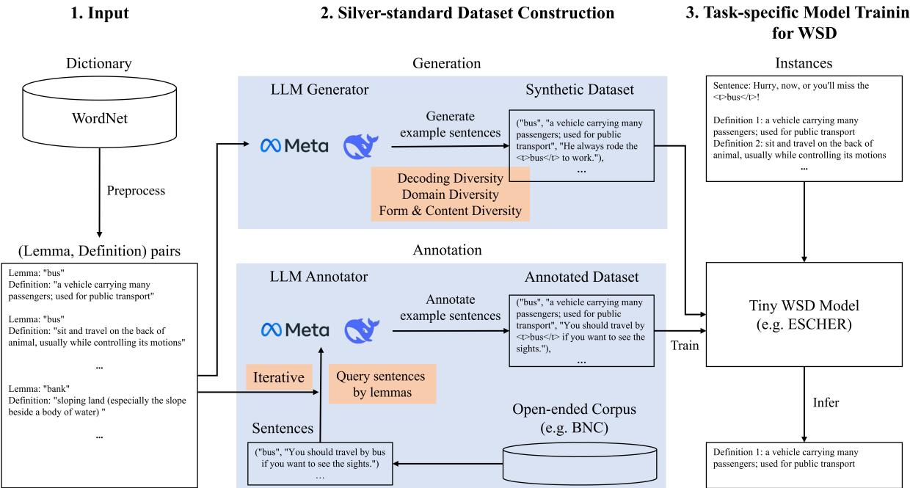
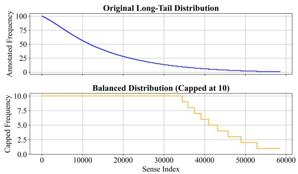
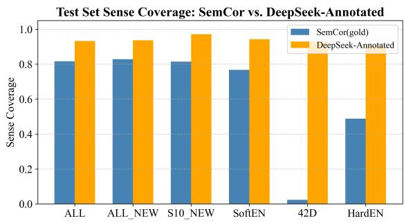
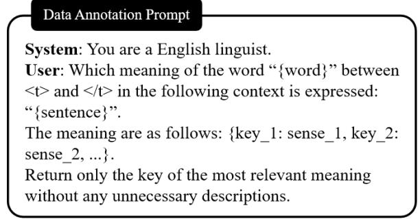

# Towards General-Domain Word Sense Disambiguation: Distilling Large Language Model into Compact Disambiguator

Liqiang Ming1 and Sheng-hua Zhong1\* and Yuncong Li2† 1College of Computer Science and Software Engineering, Shenzhen University 2EnCopilot Inc., Shenzhen, China mingliqiang2023@email.szu.edu.cn csshzhong@szu.edu.cn, liyuncong@encopilot.com

## Abstract

Word Sense Disambiguation (WSD) aims to determine the correct meaning of a word in context from a predefined inventory, and remains a fundamental challenge in natural language understanding. Existing methods rely heavily on manually annotated data, which limits coverage and generalization. In this work, we propose a scalable framework that leverages large language models (LLMs) as knowledge distillers to construct silver-standard WSD corpora. We explore generation-based distillation, where diverse examples are synthesized for dictionary senses, and annotation-based distillation, where LLMs assign sense labels to polysemous words within real-world corpus sentences. The resulting data is used to train tiny models. Extensive experiments show that models distilled from LLM-generated data outperform those trained on gold-standard corpora, especially on general-domain benchmarks. Our annotationbased model, after balancing sense distribution, achieves 50% F1 gain on the most challenging test set and the best distilled model can match or even exceed the performance of its LLM teacher, despite having over 1000 times fewer parameters. These results demonstrate the effectiveness of LLM-based distillation for building accurate, generalizable, and efficient WSD systems.

## 1 Introduction

Word Sense Disambiguation (WSD) is a fundamental task in natural language processing (NLP), which aims to select the most appropriate sense of a target word from a predefined inventory, such as WordNet (Miller et al., 1990), based on its surrounding context (Barba et al., 2021a; Maru et al., 2022). For instance, as shown in Table 1, given the context “He always rode the bus to work” and the target word “bus”, the goal is to identify the correct sense (e.g., a vehicle for public transport) among its multiple definitions (glosses). WSD plays a crucial role in enabling machines to understand natural language and helping language learners to ease their study (Orlando et al., 2022).

<table><tr><td rowspan=1 colspan=1>Context</td><td rowspan=1 colspan=1>He always rode the bus to work.</td></tr><tr><td rowspan=1 colspan=1>Definition 1</td><td rowspan=1 colspan=1>a vehicle carrying many passengers; usedfor public transport</td></tr><tr><td rowspan=1 colspan=1>Definition 2</td><td rowspan=1 colspan=1>the topology of a network whose compo-nents are connected by a busbar</td></tr><tr><td rowspan=1 colspan=1>Definition 3</td><td rowspan=1 colspan=1>an electrical conductor that makes a com-mon connection between several circuits</td></tr><tr><td rowspan=1 colspan=1>Definition 4</td><td rowspan=1 colspan=1>a car that is old and unreliable</td></tr></table>

Table 1: An example of word sense disambiguation for the target word bus. The correct sense is underlined.

Over the past decade, WSD research has made notable progress, supported by manually annotated corpora and WordNet-based glosses. Existing methods fall into two broad categories. One enhances disambiguation architectures using pretrained language models and gloss encoders, such as ESC (Barba et al., 2021a), ConSeC (Barba et al., 2021c), and RTWE (Zhang et al., 2023b). The other leverages multilingual signals and external knowledge, including BabelNet alignment (Luan et al., 2020) and cross-lingual transfer (Kang et al., 2023). While effective in domain-specific settings, these methods rely heavily on labor-intensive manual annotations, which limits scale and domain diversity. Consequently, models trained on such data often struggle to generalize to real-world or out-of-distribution scenarios (Maru et al., 2022).

To tackle data scarcity and poor generalization, there are two promising directions. One is to directly employ large language models (LLMs) to improve the generalization ability of small models, as LLMs have demonstrated strong performance across various tasks (Ravi et al., 2024; Li et al., 2024; Liang et al., 2024). The other is to expand training data with broader coverage to mitigate the limitations of manually annotated resources.

Despite their strengths, directly using LLMs for WSD poses practical limitations. First, LLMs demand substantial computation and incur high inference latency, making them unsuitable for realtime or large-scale online applications. Second, prior studies (Kocon et al. ´ , 2023; He et al., 2024) have shown that LLMs, as general-purpose models, often underperform on tasks like WiC (Wordin-Context) and WSD that require deep semantic understanding and precise sense distinctions due to their “jack of all trades, master of none” nature. Their predictions may fail to capture subtle contextual cues needed for accurate disambiguation.

To overcome these limitations, we adopt the latter direction and propose a knowledge distillation framework that leverages LLMs to construct largescale, silver-standard and general-domain WSD training corpora. We explore two distinct distillation approaches: (i) generation-based distillation, where LLMs generate diverse example sentences for dictionary senses to create synthetic training data; and (ii) annotation-based distillation, where LLMs assign sense labels to polysemous words from a large open-ended corpus. The resulting datasets are used to fine-tune a compact WSD model, ensuring both efficiency and strong disambiguation performance.

We conduct a comprehensive evaluation of both approaches under a unified setting across domainspecific and general-domain test sets. Our main contributions are:

• We propose a scalable and adaptable framework for general-domain WSD that leverages LLMs to generate or annotate sense-labeled examples, enabling the training of compact models without manual annotation.

• We explore decoding and prompt-level diversity strategies for generation-based distillation, highlighting the trade-off between diversity and definition accuracy.

• We introduce an incremental annotation procedure on large-scale real-world corpora using LLMs, and show its effectiveness in enhancing generalization and sense coverage.

• Experiments demonstrate that our distilled model achieves strong general-domain performance. With balanced training data, it surpasses gold-data-trained models by over 50%

F1 on the hardest benchmark. In the annotation setting, our small model matches or even surpasses the disambiguation performance of its LLM teacher in most cases, despite having far fewer parameters.

## 2 Related Work

## 2.1 Knowledge Distillation and LLM-based Data Annotation

The distillation of knowledge from LLMs has emerged as a promising approach to building efficient downstream models while avoiding the high computational cost of direct LLM inference. Among the various strategies, two widely adopted distillation paradigms are data annotation and data generation (Xu et al., 2024). In the annotation paradigm, LLMs are treated as automatic labelers that assign task-specific labels such as entity types, sentiments, or word senses to unlabeled text. This method has proven effective in tasks such as named entity recognition (NER), where Zhou et al. (2023) used ChatGPT to annotate a large corpus and finetune a compact model that outperformed both the LLMs and the supervised baselines.

We extend this approach to the more semantically demanding task of WSD. By prompting LLMs to assign WordNet senses to raw sentences, we produce large-scale labeled data for supervised training. This enables the construction of largescale and high-quality training sets without human effort and enhances the disambiguation and generalization abilities of smaller models.

## 2.2 LLM-based Text Data Generation for Model Training

Data generation is another major distillation strategy, where LLMs synthesize task-specific examples under zero-shot or few-shot settings. This approach has been widely used in tasks such as sentiment analysis (Zhang et al., 2023a) and natural language inference (Ye et al., 2022), and is known for its scalability and flexibility.

To improve quality, recent work has focused on balancing diversity and accuracy. For instance, Yu et al. (2024) used attribute-controlled prompts to boost coverage, while Gupta et al. (2023) introduced multi-step self-correction to ensure consistency. However, most existing studies target shallow classification tasks, whereas WSD requires finer-grained semantic distinctions and broader contextual understanding, posing greater challenges.

  
Figure 1: Overall framework of our method. Given only a dictionary as input, we construct a silver-standard WSD training dataset using either diverse example generation or LLM-based annotation, then train a compact WSD model. “Iterative” refers to conducting multiple rounds of annotation, where each round traverses all lemmas, selects an unlabeled sentence for each, performs incremental annotation, and adds the result to the growing cumulative set.

We explore zero-shot generation for $\mathrm { \bf W S D , }$ focusing on producing diverse and extensive examples. Combined with annotated data, this strategy enriches training sets and improves small model performance in broad-domain disambiguation.

## 3 Methodology

This section introduces our framework for constructing general-domain training data for WSD via knowledge distillation from LLMs. As illustrated in Figure 1, our framework consists of three stages: (i) dictionary-based input specification, (ii) construction of a silver-standard dataset through either generation or annotation, (iii) task-specific small model training for WSD. Both of our two distillation approaches share the same inputs and model training at the start and finish of the process.

## 3.1 Input

Our framework requires only a general-purpose sense inventory as input, which can be any dictionary that provides definitions for words. In this study, we use WordNet (Miller et al., 1990), the most widely adopted resource in WSD research, which offers fine-grained sense distinctions and broad lexical coverage (Proietti et al., 2024), containing 147,306 lemmas and 206,941 distinct sense entries represented as (lemma, POS, definition)

triples. Such granularity makes it suitable for building comprehensive disambiguation datasets.

We extract all polysemous lemmas and their candidate sense definitions from WordNet, excluding monosemous words that do not require disambiguation. The resulting lemma-definition pairs $( l _ { i } , d _ { i } )$ serve as semantic anchors for downstream data construction. Formally, we obtain a set of n pairs $( l _ { 1 } , d _ { 1 } ) , ( l _ { 2 } , d _ { 2 } ) , \dots , ( l _ { n } , d _ { n } )$ , where $l _ { i }$ denotes a lemma, and $d _ { i }$ is its corresponding definition.

## 3.2 Silver-Standard Dataset Construction

To create the training data, we explore two distinct knowledge distillation approaches from LLMs: generation-based and annotation-based. Both aim to construct general-domain silver-standard datasets that enhance sense coverage and diversify disambiguation scenarios, but they differ in strategies and data sources. The generation method relies on lexicon-guided controlled synthesis, while the annotation method leverages real-world corpus contexts. Each method includes its own tailored strategies to maximize the lexical and domain variety of the constructed examples.

## 3.2.1 LLM-Based Example Generation from Dictionary

This approach generates disambiguation instances directly from the extracted lemma-definition pairs using LLMs. For each pair $( l _ { i } , d _ { i } )$ , we apply a diversity strategy $V$ and use an LLM generator $G$ to produce t distinct example sentences that demonstrate the target sense. Each sentence $s _ { i }$ includes the target word marked with $\sphericalangle \ t >$ and $< / { \sf t } >$ tags. The final synthetic dataset $D _ { \mathrm { s y n } }$ is defined as:

$$
D _ { \operatorname { s y n } } = \bigcup _ { j = 1 } ^ { t } \bigcup _ { i = 1 } ^ { n } G ( l _ { i } , d _ { i } , V )\tag{1}
$$

To improve coverage and diversity, we design two types of diversity strategy to guide the generation process.

Decoding-Based Diversity. We vary decoding parameters such as temperature, top-k, and topp sampling to introduce randomness and lexical variation. Temperature controls sampling sharpness, top-k restricts selection to the most probable k tokens, and top-p selects from the smallest set of tokens whose cumulative probability exceeds a threshold $p .$ These methods offer a simple yet effective way to increase variability, although they may still be limited in semantic scope.

Prompt-Based Diversity. We further introduce diversity at the prompt level to guide the LLM to generate examples with explicit domain or stylistic variation:

• DomGen (Domain-Guided Generation): This strategy randomly samples domain labels from 42D, a corpus aligned with 42 domains defined in BabelNet (Navigli and Ponzetto, 2012), and inserts them into prompts. The LLM is instructed to produce examples situated within the specified domain, and the resulting outputs are tagged with domain labels $( | < \mathsf { d } > \{ \mathsf { D O M A I N } \} < / \mathsf { d } > )$ for downstream filtering and analysis.

• DivGen (Form & Content Diversity): Inspired by Tevet and Berant (2020), this strategy injects variation in both syntactic form and semantic content. Compared to DomGen, it is more general and flexible, mitigating hallucinations caused by forced domain alignment. It includes two settings: $\operatorname { D i v } \mathbf { G e n _ { o n c e } }$ generates all diverse examples in one pass, while $\operatorname { D i v } \mathbf { G e n } _ { i t e r }$ uses dialog-based iteration to ensure that each generated example is different from the previous.

These prompt-level strategies significantly enhance semantic coverage and output variety, and are key components in our generation-based distillation approach. Detailed prompt design and result analysis can be found in Appendix A.

## 3.2.2 LLM-Based Annotation Through Corpus

Annotation-based distillation aims to construct a large-scale silver-standard dataset for WSD by annotating real-world examples from an open-ended corpus using LLMs. To build a comprehensive and diverse instance library to be annotated, we begin by extracting sentence-level data from the British National Corpus (BNC) (Consortium et al., 2007), a representative sample of modern, diverse language usage. The BNC consists of documents from various domains and contains approximately 100 million words spanning different text genres, including both written and spoken forms from contemporary British English. In contrast, SemCor (Miller et al., 1993), the most commonly used manually annotated gold standard training set in WSD, is sampled from the much smaller Brown corpus (Francis and Kucera, 1979) (approximately 1 million words reflecting 1950s–1960s American English). The BNC’s size and domain breadth make it suitable for capturing diverse sense usage.

Corpus Preparation. Let denote the 4049 BNC documents. We segment each document into sentences using a segmentation function $\sec ( d )$ and filter by length to retain sentences between 4 and 128 tokens. This step helps remove meaningless short sentences and noisy long ones that may result from improper segmentation in the original document. The resulting sentence set is defined as:

$$
S _ { f } = \{ s \in \bigcup _ { d \in \mathcal { C } } \sec ( d ) : 4 \leq L ( s ) \leq 1 2 8 \}\tag{2}
$$

We then classify these sentences based on polysemous words defined in WordNet. Let $\mathcal { W } _ { \mathrm { p o l y } }$ denote the set of all polysemous lemma-pos pairs in WordNet. For each sentence $s \in S _ { f }$ , we extract the set of tokens corresponding to these words:

$$
T ( s ) = \{ w \in s : l p ( w ) \in \mathcal { W } _ { \mathrm { p o l y } } \}\tag{3}
$$

where $l p ( w )$ denotes the lemma-pos pair of word w.

For each x $\in \mathcal { W } _ { \mathrm { p o l y } }$ , we collect all sentences that contain at least one word w such that $l p ( w ) = x$ The instance set for each $x$ is defined as:

$$
D _ { x } = \{ s \in S _ { f } : \exists w \in s \mathrm { ~ s u c h ~ t h a t ~ } l p ( w ) = x \}\tag{4}
$$

After removing lemma-pos pairs with no matching sentences, we obtain a filtered set $\mathcal { W } _ { \mathrm { p o l y } } ^ { \prime } \subset$ $\mathcal { W } _ { \mathrm { p o l y } }$ , with $| \mathcal { W } _ { \mathrm { p o l y } } ^ { \prime } | = 2 2 , 1 6 1$ . The final unlabeled instance library is:

$$
D _ { \mathrm { u n l a b e l e d } } = \bigcup _ { x \in \mathcal { W } _ { \mathrm { p o l y } } ^ { \prime } } D _ { x }\tag{5}
$$

This results in 47,807,191 instances. Each instance is a pair $( s , w )$ , where s is a sentence and w is a polysemous word to be disambiguated. A single sentence may yield multiple instances if it contains multiple target words.

Incremental Annotation. In the unlabeled instance library $D _ { \mathrm { u n l a b e l e d } }$ , each polysemous word $x \in \mathcal { W } _ { \mathrm { p o l y } } ^ { \prime }$ is associated with a set of candidate sentences $\mathrm { \bar { \it D } } _ { x } ^ { \mathrm { \bar { \it } } }$ . Our goal is to obtain a silver-standard annotation for each polysemous word by leveraging a LLM as an annotator. To do so, we perform the following incremental annotation process over n iterations (with n up to 100).

For each polysemous word x $\in \mathcal { W } _ { \mathrm { p o l y } } ^ { \prime }$ and for each iteration $k \in \{ 1 , 2 , \dots , n \}$ , we randomly select an unlabeled candidate instance $s _ { x } ^ { ( k ) } \in D _ { x }$ that has not been annotated in any previous iteration. Let $C ( x )$ denote the list of candidate senses for x as provided by WordNet. We then apply the LLM annotator with a pre-defined annotation template (see Figure 4), which is adapted from Kocon et al.´ (2023), to the pair $( s _ { x } ^ { ( k ) } , C ( x ) )$ . Formally, the annotation operation is represented as:

$$
a _ { x } ^ { ( k ) } = \mathrm { A n n o t a t e } ( s _ { x } ^ { ( k ) } , C ( x ) )\tag{6}
$$

where $a _ { x } ^ { ( k ) }$ is the sense annotation for x obtained in iteration k. And the annotation set for iteration k is defined as:

$$
A ^ { ( k ) } = \{ ( x , s _ { x } ^ { ( k ) } , a _ { x } ^ { ( k ) } ) : x \in \mathcal { W } _ { \mathrm { p o l y } } ^ { \prime } \}\tag{7}
$$

After completing one full iteration over all polysemous words, each x is associated with one annotated instance. We then mark x as annotated for that iteration to avoid redundant selection in subsequent rounds.

This process is repeated for n rounds, and the cumulative annotated set is given by:

$$
D _ { \mathrm { a n n o } } = \bigcup _ { k = 1 } ^ { n } A ^ { ( k ) }\tag{8}
$$

Thus, after n rounds, each polysemous word x can have up to n annotated instances (excluding any erroneous ones). As n increases, the dataset grows incrementally, yielding a richer corpus for downstream WSD training.

Finally, to mitigate the imbalance in annotated senses, we apply a frequency-based filtering step. We limit the number of annotated instances per sense to 10. If a sense occurs more than 10 times $D _ { \mathrm { a n n o } }$ , we retain only 10 randomly selected examples. This encourages better generalization by preventing dominant senses from overwhelming rare ones.

## 3.3 Task-Specific Small Model Training for WSD

Once the training dataset is prepared, either through generation $( D _ { \mathrm { s y n } } )$ or annotation $( D _ { \mathrm { a n n o } } )$ , we proceed to train a dedicated WSD model. Each training instance is represented as a quadruple $( w , s , D , d _ { t } )$ , where w is the target word to be disambiguated, s is the sentence in which w appears, with <t> and ${ < } / { \sf t } >$ tags marking its span, $D = \{ d _ { 1 } , \dots , d _ { m } \}$ is the set of candidate definitions for the lemma-pos pair of w extracted from WordNet, and $d _ { t }$ is the correct definition label.

We use ESCHER (Barba et al., 2021a), a BARTbased tiny WSD model. ESCHER jointly encodes the sentence and candidate definitions, and treats WSD as a span extraction task. It provides a strong balance between efficiency and accuracy, making it suitable for deployment in practical WSD systems. We train ESCHER following the original protocol of Barba et al. (2021a). Concretely, we replace the original SemCor training set with our silver datasets and use SemEval-2007 (Pradhan et al., 2007) as the validation set. All model architecture choices and training hyperparameters follow the public ESCHER repository1 defaults. For reproducibility, we use the publicly released training code from Barba et al. (2021a) without modifying the core codebase, making only minimal adjustments to align input formats to our dataset.

## 4 Experiments

## 4.1 Experimental Settings

Evaluation Framework. Since our goal is to construct disambiguation data suitable for general use, we divided test sets into two categories to thoroughly assess the performance of our silver standard data:

<table><tr><td rowspan="2">Diversity Strategy</td><td rowspan="2">Generation Method</td><td rowspan="2">Decoding Parameter</td><td rowspan="2">ALL</td><td colspan="3">Domain-Specific Sets</td><td colspan="2">General-Domain Sets HardEN</td><td rowspan="2">Diversity Metric</td><td rowspan="2">Definition Accuarcy DS-DA</td></tr><tr><td>ALL_NEW</td><td>S10_NEW</td><td>SoftEN</td><td>42D</td><td>Distinct-n</td></tr><tr><td rowspan="2">Baseline</td><td>EXMAKER(K1) SimGen</td><td></td><td></td><td>60.8</td><td>67.4</td><td>64.3</td><td>60.3</td><td>33.6</td><td>=</td><td></td></tr><tr><td></td><td>Temperature=1</td><td>65.74</td><td>63.35</td><td>74.55</td><td>67.83</td><td>67.84</td><td>34.45</td><td>0.691</td><td>0.913</td></tr><tr><td rowspan="6">Decoding-based Diversity</td><td rowspan="6">SimGen</td><td>Temperature=0.5</td><td>64.59</td><td>61.81</td><td>70.05</td><td>65.87</td><td>68.11</td><td>34.66</td><td>0.486</td><td>0.895</td></tr><tr><td>Temperature=1.5</td><td>66.61</td><td>64.69</td><td>74.24</td><td>68.70</td><td>68.65</td><td>38.45</td><td>0.816</td><td>0.875</td></tr><tr><td>Top-k=5</td><td>64.84</td><td>61.72</td><td>70.58</td><td>65.78</td><td>65.41</td><td>32.98</td><td>0.664</td><td>0.903</td></tr><tr><td>Top-k=40</td><td>63.84</td><td>60.97</td><td>72.46</td><td>65.35</td><td>67.03</td><td>35.08</td><td>0.685</td><td>0.891</td></tr><tr><td>Top-k=80</td><td>64.14</td><td>61.13</td><td>72.15</td><td>65.47</td><td>67.84</td><td>35.92</td><td>0.686</td><td>0.903</td></tr><tr><td>Nucleus p=0.9</td><td>63.96</td><td>61.54</td><td>70.37</td><td>65.44</td><td>68.38</td><td>36.97</td><td>0.623</td><td>0.900</td></tr><tr><td rowspan="3">Prompt-based</td><td>DomGen</td><td>Temperature=1</td><td>63.85</td><td>60.40</td><td>69.63</td><td>64.31</td><td>70.00</td><td>39.08</td><td>0.902</td><td>0.729</td></tr><tr><td>DivGenonce</td><td>Temperature=1</td><td>67.09</td><td>64.69</td><td>73.82</td><td>68.66</td><td>69.73</td><td>39.08</td><td>0.928</td><td>0.785</td></tr><tr><td>DivGeniter Llama-3.1-70B-Labeling-ESCHER*</td><td>Temperature=1</td><td>68.41 74.48</td><td>67.56 75.98</td><td>74.35 79.48</td><td>71.23 71.89</td><td>70.81 78.98</td><td>39.92 43.28</td><td>0.920 0.935</td><td>0.812 0.842</td></tr></table>

Table 2: Comparison of generation methods under different diversity strategies and the performance of annotation methods in equivalent settings (\* indicates that the scale of annotated data is similar to that of generated data). The unified generator for all diversification methods is Llama-3.1-70B-Instruct. F1 score is used for disambiguation evaluation, Distinct-n for diversity evaluation, and DS-DA serves as a reference for word sense accuracy.

• Domain-specific test sets: includes ALL, ALL\_NEW, S10\_NEW, and SoftEN, which reflect distributions similar to manually annotated data and are focused on specific, limited domains where models trained on manually annotated data perform well.

• General-domain test sets: includes 42D and HardEN. These sets are designed to challenge models in diverse, unfamiliar, or out-ofdistribution contexts. 42D spans a broad range of domains, while HardEN specifically consists of instances that are not correctly disambiguated by any system in prior benchmarks.

In detail, the dataset named ALL is the union of six sub-datasets from the standard evaluation framework proposed by Raganato et al. (2017), with SemEval-07 (Pradhan et al., 2007) commonly used as a validation set in prior work, and we adopt the same setting. The other five test sets are based on a new benchmark proposed by Maru et al. (2022). Among these, 42D is a multi-domain challenge set, ALL\_NEW and S10\_NEW are amended versions of ALL and SemEval-2010 Task 17 (Agirre et al., 2010), respectively. SoftEN contains instances correctly disambiguated by at least one system, while HardEN includes instances that none of the systems was able to disambiguate correctly. Detailed dataset statistics are presented in Appendix C.

It is worth noting that the difficulty of HardEN may arise from two potential factors. The first is that its data distribution may involve a crossdomain shift, which makes it substantially different from the distribution of conventional training data and thus limits the model’s ability to generalize. The second is that HardEN may include inherently difficult disambiguation instances that are challenging even for human annotators. Based on our examination of the examples, we consider the former, namely domain mismatch, to be the more likely cause. Therefore, we categorize HardEN as part of the general-domain test sets.

Evaluation Metrics. We use the distinct-n metric (Tevet and Berant, 2020) to measure the lexical diversity of generated examples. It ranges from 0 to 1, with higher values indicating greater variation in n-grams. For WSD performance, we report the commonly used F1 score. To assess whether each silver example accurately expresses the intended sense, we created a definition accuracy evaluator based on DeepSeek-v3 (DS-DA). For more details about this automated indicator, see Appendix D.

Comparison Systems. To evaluate the effectiveness of our data generation and annotation methods, we compare the following systems on three aspects:

(1) Synthetic Data Generation. We follow the setting of Barba et al. (2021b), generating 6 sentences per lemma-definition pair using Llama-3.1- 70B-Instruct as the sentence generator across all diversity strategies. As a baseline, we include a simple prompting approach, SimGen, which generates six sentences independently without applying any diversity-enhancing mechanisms, serving to isolate the impact of our diversity strategies. Additionally, we compare against the K1 dataset introduced by Maru et al. (2022), which is constructed using the EXMAKER encoder-decoder architecture (Barba et al., 2021b).

(2) Generation vs. Annotation Distillation. To assess whether generation-based or annotationbased distillation is more effective, we construct a silver dataset of equal scale using the annotation method, again leveraging Llama-3.1-70B-Instruct.

<table><tr><td rowspan="2">Method</td><td rowspan="2">Param Size</td><td colspan="4">Domain-Specific Sets</td><td rowspan="2">General-Domain Sets 42D HardEN</td></tr><tr><td>ALL</td><td>ALL_NEW</td><td>S10_NEW</td><td>SoftEN</td></tr><tr><td>ESCHER(SemCor)</td><td>406M</td><td>80.7</td><td>81.6</td><td>82.1</td><td>86.8</td><td>54.1 0.0</td></tr><tr><td>Llama-3.1-8B-Inference</td><td>8B</td><td>69.83</td><td>68.54</td><td>68.27</td><td>70.93 60.27</td><td>32.56</td></tr><tr><td>Llama-3.1-8B-Labeling-ESCHER</td><td>406M</td><td>74.77</td><td>75.62</td><td>75.6</td><td>78.48 62.16</td><td>33.73</td></tr><tr><td>Llama-3.1-70B-Inference</td><td>70B</td><td>76.48</td><td>77.99</td><td>80.84</td><td>80.68 72.97</td><td>47.27</td></tr><tr><td>Llama-3.1-70B-Labeling-ESCHER</td><td>406M</td><td>78.53</td><td>80.31</td><td>81.78</td><td>83.32 73.24</td><td>41.39</td></tr><tr><td>Llama-3.1-405B-Inference</td><td>405B</td><td>78.67</td><td>81.29</td><td>82.09</td><td>84.2 73.24</td><td>46.64</td></tr><tr><td>Llama-3.1-405B-Labeling-ESCHER</td><td>406M</td><td>79.32</td><td>81.72</td><td>82.51</td><td>84.77</td><td>74.59 40.76</td></tr><tr><td>Deepseek-v3-0324-Inference</td><td>685B</td><td>79.90</td><td>82.55</td><td>83.98</td><td>85.24</td><td>78.92 49.58</td></tr><tr><td>Deepseek-v3-Labeling-ESCHER</td><td>406M</td><td>79.88</td><td>81.86</td><td>83.98</td><td>85.36</td><td>75.14 42.23</td></tr><tr><td>Deepseek-v3-Labeling-ESCHER†</td><td>406M</td><td>78.59</td><td>81.72</td><td>83.25</td><td>84.63</td><td>77.03 50.00</td></tr><tr><td>Deepseek-v3-Labeling-ESCHER(+SemCor)</td><td>406M</td><td>81.35</td><td>83.89</td><td>85.76</td><td>88.12</td><td>62.70 15.45</td></tr></table>

Table 3: Comparison results of the LLMs annotation distillation methods. SemCor refers to manually annotated gold standard data, and +SemCor indicates the combination of manually annotated and LLMs annotated data. indicates that the distribution of all annotated senses has been balanced by setting an upper threshold of 10. F1 score is used for disambiguation evaluation.

Both datasets are used to train ESCHER under identical settings. The annotation-based system is referred to as Llama-3.1-70B-Labeling-ESCHER\*.

(3) Annotation-Based Comparisons. We further benchmark against multiple annotation baselines. First, we train ESCHER directly on the human-annotated SemCor corpus to represent goldstandard supervision. Second, we compare our distilled small model to the LLM itself used for direct disambiguation via prompting. Finally, we explore whether combining human-labeled gold data with LLM-labeled silver data yields performance gains over either source alone.

Specific statistics and cost analysis regarding our use of LLMs to generate or annotate data can be found in Appendix E.

## 4.2 Experimental Results and Analysis

## 4.2.1 Effect of LLM-based Diverse Generation Distillation

In Table 2, we report the experimental results of both decoding-based diversity strategies and prompt-based strategies that inject diversity descriptions. Compared to the previous BART-based EXMAKER approach, our method using Llama-3.1-70B-Instruct achieves substantial performance gains, demonstrating the advantage of LLMs in generating semantically rich examples.

Among the diversity strategies, prompt-based methods generally perform better than decodingbased ones, especially on general-domain test sets. For example, the performance on HardEN improves by nearly 5% in F1 score. This improvement is largely due to higher lexical diversity, with distinct-n values often exceeding 0.9. However, these methods tend to reduce definition accuracy compared to simpler baselines like SimGen, which generates examples independently without additional diversity prompts. In some cases, such as DomGen, performance on domain-specific test sets even falls below SimGen. One likely reason is that forcing the model to generate examples in unfamiliar or low-frequency domains may lead to hallucinations or meaningless outputs. This highlights the need to ensure both diversity and quality, consistent with the issues pointed out by Chung et al. (2023). A promising solution is to use discriminative models or LLMs themselves as evaluation tools to identify and filter low-quality examples, following the idea of LLM-as-a-judge (Zheng et al., 2023; Zhang et al., 2024).

Despite the benefits of diverse generation, compared to the annotation method in the last row of Table 2, annotation-based distillation consistently shows stronger performance under comparable settings. This may result from a better balance between diversity and definition accuracy. Several factors contribute to this advantage. First, annotation uses natural sentences drawn from real corpora, providing more authentic and complex contexts that help models generalize. Second, Annotation tasks only require the model to identify the meaning of words within the context, making it easier to ensure semantic consistency compared to the dual objectives of "content generation + semantic representation". Third, real-world corpora cover a wider range of domains and styles, while generated examples may tend to focus on frequent or prototypical patterns, limiting generalization. Finally, generated content may contain internal model biases or hallucinations, which are less likely to affect examples based on fixed contexts. For these reasons, we focus on annotation-based approaches in the following sections, particularly comparing LLMlabeled data with human-annotated data to analyze their relative strengths.

## 4.2.2 Impact of LLM-based Silver Data Annotation Distillation

Table 3 shows the results of annotation-based distillation, where LLMs are used to label unlabeled sentences for training the tiny model ESCHER. Similar to the generation-based approach, compared with the gold-standard SemCor dataset, LLM-annotated data significantly improves general-domain performance. For instance, ESCHER distilled from LLaMA-3.1-8B achieves an F1 score of 62.16 on 42D and 33.73 on HardEN, far surpassing the SemCor-trained model (54.1 and 0.0 respectively), validating the advantage of leveraging LLMs as distillation sources for enhancing general-domain disambiguation capability.

Across most test sets, distilled ESCHER models achieve comparable or better results than their LLM teachers. This indicates that ESCHER not only captures knowledge from LLMs but also benefits from its specialized structure. The only exception is HardEN, where performance lags behind the teacher. This may be due to the small size of the test set (476 instances), making it sensitive to distributional shifts.

In our experiments, we compare annotations from four LLMs with increasing capability: LLaMA-3.1-8B, LLaMA-3.1-70B, LLaMA-3.1- 405B, and DeepSeek-v3-0324. And we find stronger LLMs provide higher-quality annotations, leading to better distilled models. For example, DeepSeek-v3 annotations yield the best ESCHER performance on most test sets. However, as the LLM becomes larger, the gap between teacher and student narrows, suggesting the increasing difficulty of fully distilling knowledge from extremely large LLMs using a relatively small model.

As shown in Figure 2, the annotated data from DeepSeek follows a long-tailed distribution, with frequent senses heavily dominating. To mitigate this, we constructed a balanced version by capping each sense at 10 instances, resulting in Deepseek-v3-Labeling-ESCHER†. This improves general-domain performance, especially achieving an F1 score of 50.00 on HardEN, while slightly reducing accuracy on domain-specific sets, likely due to fewer overall training examples.

  
Figure 2: Annotated sense frequency distribution before (top) and after (bottom) frequency balancing. The cap was set to 10 to reduce skewness caused by highfrequency senses.

Finally, combining DeepSeek annotations with SemCor in a ratio of approximately 1:1 yields state-of-the-art results on domain-specific sets (e.g., 88.12 F1 score on SoftEN). However, this hybrid model performs poorly on general-domain sets, with only 15.45 F1 score on HardEN, showing that while manual annotations offer high-quality supervision, their domain limitations may restrict the generalizability of trained models, especially in challenging or unseen domains.

## 4.2.3 Comparison of Human and LLM-Annotated Data

To further investigate the advantages of LLMannotated silver data over human-annotated gold data, we analyzed the coverage of senses in both SemCor and DeepSeek-annotated data set $D _ { \mathrm { a n n o } } ^ { d s v 3 }$ SemCor includes a total of 22,494 unique polysemous word senses across all disambiguation instances, while $D _ { \mathrm { a n n o } } ^ { d s v 3 }$ contains 58,530 distinct senses, approximately 2.6 times more than Sem-Cor. This wider coverage allows the small model to learn a broader range of sense distinctions, thereby enhancing its generalization capability. This helps explain the superior performance of the LLMdistilled models on general-domain datasets.

Moreover, the broader sense inventory in $D _ { \mathrm { a n n o } } ^ { d s v 3 }$ also leads to better test set coverage. Specifically, we define sense coverage as the proportion of word senses in a test set that also appear in the training data. A higher coverage indicates that more test instances have their candidate senses represented during training, giving the model a better chance of making accurate predictions at inference time. Figure 3 presents a comparative analysis between Sem-

Table 4: Ablation experiment results for exploring disambiguation performance attribution.
<table><tr><td>Dataset</td><td>ALL</td><td>ALL_NEW</td><td>S10 NEW</td><td>SoftEN</td><td>42D</td><td>HardEN</td></tr><tr><td>A</td><td>73.52</td><td>74.14</td><td>77.94</td><td>77.37</td><td>63.88</td><td>34.66</td></tr><tr><td>B</td><td>73.24</td><td>73.17</td><td>75.71</td><td>76.33</td><td>64.86</td><td>33.82</td></tr><tr><td>C</td><td>72.71</td><td>72.81</td><td>77.74</td><td>76.26</td><td>61.08</td><td>34.03</td></tr><tr><td>D</td><td>68.19</td><td>66.65</td><td>72.15</td><td>69.56</td><td>54.59</td><td>32.56</td></tr></table>

  
Figure 3: Comparison of polysemous sense coverage on each test set between SemCor and DeepSeek-annotated dataset. Broader coverage from LLM annotation enhances generalization in downstream disambiguation.

Cor and $D _ { \mathrm { a n n o } } ^ { d s v 3 }$ , showing that the LLM-annotated data provides significantly broader coverage across all test sets, especially in general-domain and outof-distribution scenarios.

## 4.2.4 Ablation Study: Coverage, Volume, and Distribution Balance

To disentangle the effects of sense coverage, data volume, and distribution balance on WSD performance, we sampled controlled subsets from the DeepSeek-annotated corpus and trained ESCHER under the same settings. The constructed datasets are:

• A (Baseline): randomly sample 10,000 sense types from the DeepSeek-annotated data, with 10 instances per sense, resulting in a total of 100,000 instances.

• B (Reduced volume): a subset of A, with 5 instances per sense, for a total of 50,000 instances. (Isolates the effect of data volume; same sense types and uniform distribution as A, but fewer instances.)

• C (Imbalanced distribution): same 10,000 sense types as in A, with a long-tailed instance distribution, total size still 100,000. (Isolates the effect of distribution balance; same volume and types as A, but with an imbalanced distribution.)

• D (Reduced coverage): randomly sample 5,000 sense types from A, with 20 instances per sense, totaling 100,000 instances. (Isolates the effect of sense coverage; same total volume and uniform distribution as A, but covering fewer senses.)

The results of the ablation experiment for the attribution of the disambiguation performance are shown in Table 4. By comparing these ablation settings to the baseline (Dataset A), we observe that sense coverage has the most pronounced impact on model performance, as evidenced by the largest performance drop with Dataset D. Data volume and distribution balance also affect performance, but to a lesser extent compared to sense coverage. These findings align with and further reinforce the central motivation of our work: that broadening sense coverage through large-scale data collection is key to improving general-domain WSD performance.

## 5 Conclusion

We propose a scalable framework for WSD that distills LLM into compact models using synthetic or LLM-annotated data. Our experiments show that both strategies significantly improve generaldomain performance, with annotation-based distillation proving especially effective. Prompt-based generation enhances diversity but may compromise semantic accuracy, while annotation benefits from realistic context and broader sense coverage. Remarkably, the distilled models often match or surpass their LLM teachers despite being much smaller in the annotation-based approach. We also find that combining LLM-annotated data with goldstandard data yields new state-of-the-art results on domain-specific benchmarks, suggesting that hybrid corpora offer complementary strengths. These results highlight the value of LLMs not only for inference but also as corpus constructors. Overall, the generation-based method offers a more straightforward and efficient pipeline, yet its lack of quality control often results in subpar performance. In contrast, the annotation-based method achieves notably better disambiguation results, albeit at the cost of annotating a substantial amount of redundant instances, particularly for common senses.

## Limitations

First, in the generation-based distillation setting, although we employ diversity strategies along domain, form, and content dimensions, they still fall short of capturing the fine-grained variety found in real-world disambiguation contexts. More advanced and controllable generation methods are needed. Second, silver data produced by LLMs through either generation or annotation is not always reliable. Strictly constrained prompts are especially prone to hallucination or semantic drift. Post-processing techniques such as filtering or correction may further improve data quality and model performance. Third, the general-domain test sets used in this study are relatively small, which may limit comprehensive evaluation. We leave the construction of larger and more representative benchmarks for general-domain WSD to future work.

## Acknowledgments

This research was funded by the National Natural Science Foundation of China (62472291), Guangdong Basic and Applied Basic Research Foundation (2025A1515012154, 2023A1515012685), Open Fund of National Engineering Laboratory for Big Data System Computing Technology (Grant No. SZU-BDSC-OF2024-14).

## References

Eneko Agirre, Oier Lopez De Lacalle, Christiane Fellbaum, Shu-Kai Hsieh, Maurizio Tesconi, Monica Monachini, Piek Vossen, and Roxane Segers. 2010. Semeval-2010 task 17: All-words word sense disambiguation on a specific domain. In Proceedings ofthe 5th international workshop on semantic evaluation, pages 75–80.

Edoardo Barba, Tommaso Pasini, and Roberto Navigli. 2021a. Esc: Redesigning wsd with extractive sense comprehension. In Proceedings of the 2021 Conference of the North American Chapter of the Associationfor Computational Linguistics: Human Language Technologies, pages 4661–4672.

Edoardo Barba, Luigi Procopio, Caterina Lacerra, Tommaso Pasini, Roberto Navigli, and 1 others. 2021b. Exemplification modeling: Can you give me an example, please? In IJCAI, pages 3779–3785.

Edoardo Barba, Luigi Procopio, and Roberto Navigli. 2021c. Consec: Word sense disambiguation as continuous sense comprehension. In Proceedings ofthe 2021 Conference on Empirical Methods in Natural Language Processing, pages 1492–1503.

John Chung, Ece Kamar, and Saleema Amershi. 2023. Increasing diversity while maintaining accuracy: Text data generation with large language models and human interventions. In Proceedings of the 61st Annual Meeting ofthe Associationfor Computational Linguistics (Volume 1: Long Papers), pages 575–593.

BNC Consortium and 1 others. 2007. British national corpus. Oxford Text Archive Core Collection.

W Nelson Francis and Henry Kucera. 1979. Brown corpus manual. Letters to the Editor, 5(2):7.

Himanshu Gupta, Kevin Scaria, Ujjwala Anantheswaran, Shreyas Verma, Mihir Parmar, Saurabh Arjun Sawant, Swaroop Mishra, and Chitta Baral. 2023. Targen: Targeted data generation with large language models. arXiv preprint arXiv:2310.17876.

Xingwei He, Zhenghao Lin, Yeyun Gong, A-Long Jin, Hang Zhang, Chen Lin, Jian Jiao, Siu Ming Yiu, Nan Duan, and Weizhu Chen. 2024. AnnoLLM: Making large language models to be better crowdsourced annotators. In Proceedings of the 2024 Conference of the North American Chapter ofthe Associationfor Computational Linguistics: Human Language Technologies (Volume 6: Industry Track), pages 165–190, Mexico City, Mexico. Association for Computational Linguistics.

Ari Holtzman, Jan Buys, Li Du, Maxwell Forbes, and Yejin Choi. 2019. The curious case of neural text degeneration. arXiv preprint arXiv:1904.09751.

Haoqiang Kang, Terra Blevins, and Luke Zettlemoyer. 2023. Translate to disambiguate: Zero-shot multilingual word sense disambiguation with pretrained language models. arXiv preprint arXiv:2304.13803.

Jan Kocon, Igor Cichecki, Oliwier Kaszyca, Mateusz´ Kochanek, Dominika Szydło, Joanna Baran, Julita Bielaniewicz, Marcin Gruza, Arkadiusz Janz, Kamil Kanclerz, and 1 others. 2023. Chatgpt: Jack of all trades, master of none. Information Fusion, 99:101861.

Xiang Li, Shizhu He, Fangyu Lei, JunYang JunYang, Tianhuang Su, Kang Liu, and Jun Zhao. 2024. Teaching small language models to reason for knowledgeintensive multi-hop question answering. In Findings of the Association for Computational Linguistics: ACL 2024, pages 7804–7816.

Jinggui Liang, Lizi Liao, Hao Fei, and Jing Jiang. 2024. Synergizing large language models and pre-trained smaller models for conversational intent discovery. In Findings of the Association for Computational Linguistics ACL 2024, pages 14133–14147.

Yixing Luan, Bradley Hauer, Lili Mou, and Grzegorz Kondrak. 2020. Improving word sense disambiguation with translations. In Proceedings of the 2020 Conference on Empirical Methods in Natural Language Processing (EMNLP), pages 4055–4065.

Marco Maru, Simone Conia, Michele Bevilacqua, and Roberto Navigli. 2022. Nibbling at the hard core of word sense disambiguation. In Proceedings of the 60th Annual Meeting of the Association for Computational Linguistics (Volume 1: Long Papers), pages 4724–4737.

Yu Meng, Jiaxin Huang, Yu Zhang, and Jiawei Han. 2022. Generating training data with language models: Towards zero-shot language understanding. Advances in Neural Information Processing Systems, 35:462–477.

George A Miller, Richard Beckwith, Christiane Fellbaum, Derek Gross, and Katherine J Miller. 1990. Introduction to wordnet: An on-line lexical database. International journal oflexicography, 3(4):235–244.

George A Miller, Claudia Leacock, Randee Tengi, and Ross T Bunker. 1993. A semantic concordance. In Human Language Technology: Proceedings of a Workshop Held at Plainsboro, New Jersey, March 21-24, 1993.

Roberto Navigli and Simone Paolo Ponzetto. 2012. Babelnet: The automatic construction, evaluation and application of a wide-coverage multilingual semantic network. Artificial intelligence, 193:217–250.

Riccardo Orlando, Simone Conia, Stefano Faralli, Roberto Navigli, and 1 others. 2022. Universal semantic annotator: the first unified api for wsd, srl and semantic parsing. In Proceedings of the Thirteenth Language Resources and Evaluation Conference, pages 2634–2641.

Sameer Pradhan, Edward Loper, Dmitriy Dligach, and Martha Palmer. 2007. Semeval-2007 task-17: English lexical sample, srl and all words. In Proceedings ofthefourth international workshop on semantic evaluations (SemEval-2007), pages 87–92.

Lorenzo Proietti, Stefano Perrella, Simone Tedeschi, Giulia Vulpis, Leonardo Lavalle, Andrea Sanchietti, Andrea Ferrari, Roberto Navigli, and 1 others. 2024. Analyzing homonymy disambiguation capabilities of pretrained language models. In Proceedings of the 2024 Joint International Conference on Computational Linguistics, Language Resources and Evaluation (LREC-COLING 2024), pages 924–938. ELRA and ICCL.

Alessandro Raganato, Jose Camacho-Collados, Roberto Navigli, and 1 others. 2017. Word sense disambiguation: a uinified evaluation framework and empirical comparison. In Proceedings ofthe 15th Conference of the European Chapter of the Association for Computational Linguistics: Volume 1, Long Papers, volume 1, pages 99–110.

Sahithya Ravi, Patrick Huber, Akshat Shrivastava, Vered Shwartz, and Arash Einolghozati. 2024. Small but funny: A feedback-driven approach to humor distillation. In Proceedings of the 62nd Annual Meeting of the Associationfor Computational Linguistics (Volume 1: Long Papers), pages 13078–13090, Bangkok, Thailand. Association for Computational Linguistics.

Guy Tevet and Jonathan Berant. 2020. Evaluating the evaluation of diversity in natural language generation. arXiv preprint arXiv:2004.02990.

Xiaohan Xu, Ming Li, Chongyang Tao, Tao Shen, Reynold Cheng, Jinyang Li, Can Xu, Dacheng Tao, and Tianyi Zhou. 2024. A survey on knowledge distillation of large language models. arXiv preprint arXiv:2402.13116.

Jiacheng Ye, Jiahui Gao, Qintong Li, Hang Xu, Jiangtao Feng, Zhiyong Wu, Tao Yu, and Lingpeng Kong. 2022. Zerogen: Efficient zero-shot learning via dataset generation. arXiv preprint arXiv:2202.07922.

Yue Yu, Yuchen Zhuang, Jieyu Zhang, Yu Meng, Alexander J Ratner, Ranjay Krishna, Jiaming Shen, and Chao Zhang. 2024. Large language model as attributed training data generator: A tale of diversity and bias. Advances in Neural Information Processing Systems, 36.

Lunjun Zhang, Arian Hosseini, Hritik Bansal, Mehran Kazemi, Aviral Kumar, and Rishabh Agarwal. 2024. Generative verifiers: Reward modeling as next-token prediction. arXiv preprint arXiv:2408.15240.

Wenxuan Zhang, Yue Deng, Bing Liu, Sinno Jialin Pan, and Lidong Bing. 2023a. Sentiment analysis in the era of large language models: A reality check. arXiv preprint arXiv:2305.15005.

Xuefeng Zhang, Richong Zhang, Xiaoyang Li, Fanshuang Kong, Junfan Chen, Samuel Mensah, and Yongyi Mao. 2023b. Word sense disambiguation by refining target word embedding. In Proceedings of the ACM Web Conference 2023, pages 1405–1414.

Lianmin Zheng, Wei-Lin Chiang, Ying Sheng, Siyuan Zhuang, Zhanghao Wu, Yonghao Zhuang, Zi Lin, Zhuohan Li, Dacheng Li, Eric Xing, and 1 others. 2023. Judging llm-as-a-judge with mt-bench and chatbot arena. Advances in Neural Information Processing Systems, 36:46595–46623.

Wenxuan Zhou, Sheng Zhang, Yu Gu, Muhao Chen, and Hoifung Poon. 2023. Universalner: Targeted distillation from large language models for open named entity recognition. arXiv preprint arXiv:2308.03279.

## A Diversity Generation Prompts and Results Analysis

## A.1 Diversity Generation Prompts

We provide here the full prompt templates used in our prompt-based diversity strategies and the generative baseline SimGen (needs to iterate 6 times). The parameter settings for the decoding-based diversity strategies worked in SimGen were referenced from the works of Meng et al. (2022), Ye et al. (2022), and Holtzman et al. (2019).

<table><tr><td rowspan=1 colspan=1>GenerationMethod</td><td rowspan=1 colspan=1>Main Generation Result</td></tr><tr><td rowspan=1 colspan=1>SimGen</td><td rowspan=1 colspan=1>1. The fashion and music of the &lt;t&gt;1970s&lt;/t&gt; continue to influence modern pop culture.2. The film was a nostalgic tribute to the fashion and music of the &lt;t&gt;1970s&lt;/t&gt;, with bell-bottom jeans and disco balls making appearancesthroughout.3. The fashion trends of the &lt;t&gt;1970s&lt;/t&gt;, characterized by bell-bottom jeans and platform shoes, have seen a revival in recent years.4. The fashion trends of the &lt;t&gt;1970s&lt;/t&gt; were characterized by bell-bottom jeans and platform shoes.5. The fashion of the &lt;t&gt;1970s&lt;/t&gt; was characterized by bell-bottom jeans, platform shoes, and big hair.6. The fashion trend of bell-bottom jeans originated in the &lt;t&gt;1970s&lt;/t&gt;.</td></tr><tr><td rowspan=1 colspan=1>DomGen</td><td rowspan=1 colspan=1>1. The popular TV show was a cultural phenomenon during the &lt;t&gt;1970s&lt;/t&gt; when disco and bell-bottom jeans were all the rage. |&lt;d&gt;MEDIA&lt;/d&gt;2. The mathematician&#x27;s groundbreaking research on fractals was published in a series of papers throughout the &lt;t&gt;1970s&lt;/t&gt;. |&lt;d&gt;MATHEMATICS&lt;/d&gt;3. The architecture of the Museum of Modern Art, designed by I.M. Pei, reflects the futuristic style popularized in the &lt;t&gt;1970s&lt;/t&gt;.|&lt;d&gt;ART_ARCHITECTURE_AND_ARCHAEOLOGY&lt;/d&gt;4. The discovery of the first transitional metal complexes in the &lt;t&gt;1970s&lt;/t&gt; revolutionized the field of organometallic chemistry.|&lt;d&gt;CHEMISTRY AND MINERALOGY&lt;/d&gt;5. The Voyager 1 spacecraft, launched in the &lt;t&gt;1970s&lt;/t&gt;, has traveled further than any human-made object in space.|&lt;d&gt;PHYSICS AND ASTRONOMY&lt;/d&gt;6. The oil tanker crisis of the &lt;t&gt;1970s&lt;/t&gt; had a significant impact on the global shipping industry and international relations. |&lt;d&gt;NAUTICS&lt;/d&gt;</td></tr><tr><td rowspan=1 colspan=1>DivGen</td><td rowspan=1 colspan=1>1. The rise of disco culture in the &lt;t&gt;1970s&lt;/t&gt; was marked by flashy outfits and iconic dance moves.2. As a renowned historian, Dr. Thompson has written extensively on the social and political upheavals of the &lt;t&gt;1970s&lt;/t&gt;, including the Watergate scandaland the Iranian Revolution.3. The &lt;t&gt;1970s&lt;/t&gt; saw a surge in environmental activism, with the establishment of the Environmental Protection Agency (EPA) in 1970 and the passage oflandmark legislation like the Clean Water Act.4. With its vibrant psychedelic colors and funky patterns, the retro-inspired fashion brand is a nod to the eclectic style of the &lt;t&gt;1970s&lt;/t&gt;.5. According to the economic report, the &lt;t&gt;1970s&lt;/t&gt; experienced a period of stagflation, characterized by high inflation rates and stagnant economic growth.6. Set against the backdrop of the &lt;t&gt;1970s&lt;/t&gt;, the coming-of-age novel explores themes of identity, rebellion, and social change in a small Midwestern town.These example sentences aim to showcase a range of diversity in form and content, including:* Varying example lengths and structures (simple, complex, compound)* Different domains and topics (history, fashion, economics, literature, culture)* Various vocabulary and tone (formal, informal, technical, conversational)* Different example styles (declarative, descriptive, analytical, narrative)</td></tr></table>

Table 5: Examples of primary generated results for "1970s" defined as "the decade from 1970 to 1979" using diversity generation methods.

## SimGen Prompt:

Please generate an example sentence for the target lemma "{lemma}" under the definition: "{definition}"

Note that mark the target word related to lemma in the generated sentence with <t></t> tag.

The example sentence must be returned in the following format:

11 11 11   
... <t>{target\_word}</t> ...   
11 11 11

## DivGen Prompt:

Please generate 6 very diverse example sentences for the target lemma "{lemma}" under the definition: "{definition}", with diversity in both form (varying sentence length, vocabulary, syntax, etc.) and content (different domains, styles, emotional tone, etc.). Ensure that these generated sentences are as different as possible in terms of these aspects while always maintaining the specified definition of the target lemma.

Note that mark the target word related to lemma in the generated sentence with <t></t> tag.

The example sentences must be returned in the following format:

1. ... <t>{target\_word}</t> ...   
2. ... <t>{target\_word}</t> ...   
3. ... <t>{target\_word}</t> ...   
n n n

## DomGen Prompt:

Please generate 6 very diverse example sentences in different domains for the target lemma "{lemma}" under the definition: "{definition}" Here is the list of domains you should choose from: {domain\_1, domain\_2, ..., domain\_6}

Ensure that the domain name for each generated example sentence is appended at the end of the sentence with <d></d> tag.

Note that mark the target word related to lemma in the generated sentence with <t></t> tag and each generated sentence always maintain the specified definition of the target lemma.

The example sentences must be returned in the following format:

n1 n n   
1. ... <t>{target\_word}</t> ... |<d>{domain\_1}</d>   
2. ... <t>{target\_word}</t> ... |<d>{domain\_2}</d>   
3. ... <t>{target\_word}</t> ... |<d>{domain\_3}</d>   
4. ... <t>{target\_word}</t> ... |<d>{domain\_4}</d>   
5. ... <t>{target\_word}</t> ... |<d>{domain\_5}</d>   
6. ... <t>{target\_word}</t> ... |<d>{domain\_6}</d>   
n n n

Table 5 showcases the results of six examples generated by Llama-3.1-70B-Instruct for the definition "the decade from 1970 to 1979" under the lemma "1970s," using three different generation methods.

We observe distinct characteristics among the methods: (i) In the baseline SimGen method, the generated examples exhibit significant repetition in vocabulary and expressions. Phrases such as "fashion trends" and "bell-bottom jeans" appear multiple times, and all six examples focus on the theme of "fashion culture," indicating a marked lack of diversity. This observation highlights the importance of introducing diversity-enhancing strategies to better approximate comprehensive real-world data. (ii) The DomGen method addresses this by appending domain tags (e.g., "|<d>MEDIA</d>") to the end of each example, generating six example sentences across different domains for the same definition, thereby preventing thematic repetition. (iii) The DivGen method prompts LLMs to generate examples with diversity in both form and content. Additionally, the model self-analyzes the generated examples, identifying dimensions of diversity, such as "example lengths and structures". This method not only broadens the range of diversity but also mitigates the hallucination effects caused by strict constraints through adaptive analysis.

## B Pre-defined Annotation Template

  
Figure 4: Sense annotation template for the LLM annotator.

<table><tr><td>Testset</td><td>#Lemmas</td><td>#Senses</td><td>#All Senses in WordNet</td><td>#Examples</td></tr><tr><td>ALL</td><td>2659</td><td>3612</td><td>11996</td><td>7253</td></tr><tr><td>ALL_NEW</td><td>1701</td><td>2367</td><td>9843</td><td>4917</td></tr><tr><td>S10_NEW</td><td>359</td><td>418</td><td>2117</td><td>955</td></tr><tr><td>42D</td><td>297</td><td>317</td><td>1678</td><td>370</td></tr><tr><td>softEN</td><td>1995</td><td>2695</td><td>11061</td><td>5766</td></tr><tr><td>hardEN</td><td>287</td><td>323</td><td>2345</td><td>476</td></tr></table>

Table 6: Statistic of test datasets. #Lemmas, #Senses, #Examples denote the number of lemma, definition triplets (lemma, POS, definition), example sentences, respectively. #All Senses in WordNet means all defintion triplets extracted from WordNet via lemmas.

## D Definition Sense Accuracy Evaluator

Inspired by He et al. (2024), we design a definition accuracy evaluator using LLMs to assess whether each generated or annotated example correctly expresses the intended sense. Specifically, we build a two-step Chain-of-Thought evaluator based on DeepSeek-v3-0324 to estimate the semantic alignment between an example sentence $s _ { i }$ and a given lemma-definition pair $( l _ { i } , d _ { i } )$ . For each triplet $( l _ { i } , d _ { i } , s _ { i } )$ , we employ a two-stage prompting strategy. In the first step, we prompt the model with an instruction such as "Determine whether the target word (marked with <t> and </t> tags) completely matches the meaning in the context," which encourages thorough semantic analysis. In the second step, we follow up with a decision prompt like "Based on this, please give your judgment: YES or NO" to obtain a final answer grounded in the previous reasoning.

We found that this step-by-step approach yields more reliable assessments than directly requesting a binary judgment. When bypassing the reasoning step, DeepSeek often returned identical outputs for the same sentence paired with different definitions, suggesting superficial matching behavior. Finally, we validated the evaluator’s reliability on the goldstandard human-annotated corpus SemCor, where it achieved a sense accuracy of 88.6%, which is reasonably close to the 91.1% inter-annotator agreement reported by human language experts on goldstandard data (Maru et al., 2022). This relatively small gap suggests that DeepSeek can serve as an approximate, large-scale quality assessment tool and demonstrates its usefulness as an automatic reference metric.

## E Silver Data Statistics and Cost Analysis

In our experimental workflow, the synthetic dataset $D _ { s y n }$ was constructed by generating 6 example sentences for each of the 13,748 lemma-definition pairs that appear in both WordNet and our evaluation test sets. This results in a total of 82,488 instances, excluding a negligible number of failed generations.

Building upon this, we conducted large-scale annotation experiments after our pilot study indicated that the annotation-based approach outperforms the generation-based one. For example, using DeepSeek as the LLM, we performed 100 rounds of annotation, obtaining 1,537,010 annotated instances, which correspond to 1,214,835 unique sentences (since a single sentence may contain multiple target words). The part-of-speech distribution of these labeled instances is as follows: 56.0% nouns, 20.3% verbs, 20.6% adjectives, and 3.1% adverbs, consistent with the four major categories defined in WordNet.

The inference cost of LLMs includes the time cost required to complete silver data construction and the monetary cost of tokens spent calling APIs on third-party platforms.

For generation, we employed Llama-3.1-70B-Instruct to produce approximately 80K example sentences for 13,748 lemma-definition pairs that appeared in all test sets (6 examples / pair). The cost of completing all the generation experiments was less than \$100, and because the amount of data was not large, the time cost here was also relatively small.

For annotation, we conducted around 1.5M instances over 100 rounds using various LLMs:

• Llama-3.1-70B: \$50

• Deepseek-v3: \$200

• Llama-3.1-405B: \$400

Each annotation prompt was relatively short and required only a sense ID as output, so the token cost is relative low. By parallelizing 10 annotation agents, we achieved an annotation speed of 30K sentences/hour, allowing the entire corpus to be annotated within 2–3 days.

Thus, both from the perspectives of efficiency and cost-effectiveness, leveraging LLMs for largescale sense annotation offers clear advantages over manual annotation.