(b) DARS Framework produce more effective reflections.

# Two Heads Are Better Than One: Dual-Model Verbal Reflection at Inference-Time

Jiazheng Li1 Yuxiang Zhou1,6 Junru Lu4 Gladys Tyen5\*

Lin Gui1 Cesare Aloisi2 Yulan He1,3

1King’s College London 2AQA 3The Alan Turing Institute

4Tencent YouTu Lab 5University of Cambridge

6Queen Mary University of London

caloisi@aqa.org.uk, junrulu@tencent.com, gladys.tyen@cl.cam.ac.uk, {jiazheng.li, yuxiang.zhou, lin.gui, yulan.he}@kcl.ac.uk

## Abstract

Although preference optimization methods have improved reasoning performance in Large Language Models (LLMs), they often lack transparency regarding why one reasoning outcome is preferred over another. This limitation is especially critical in Automated Student Answer Scoring (ASAS), where explainability is essential to justify assessment outcomes. Verbal reinforcement learning offers the potential to generate explicit reflection, but it tends to produce superficial critiques that can harm assessment performance. Existing LLMs also struggle to reliably detect subtle reasoning errors in ASAS tasks. Moreover, manually identifying intermediate reasoning errors is expensive and difficult to scale. To address these challenges, we introduce a contrastive reflection synthesis pipeline that generates precise verbal feedback by identifying discrepancies in structure reasoning graph paths. Leveraging these synthetic reflection data, we propose DARS, a Dual-model Reflective Scoring framework featuring a dedicated Critic model trained for effective reflection. DARS achieves strong performance and consistently outperforms existing ASAS baselines across all evaluation metrics. Extensive experiments further provide novel insights into the value of reflection data, framework design, and the scaling behavior of DARS.1

## 1 Introduction

Automated Student Answer Scoring (ASAS) is a crucial educational NLP task that aims to automate the intricate reasoning process performed by human graders. It offers the potential for faster and more consistent assessment at scale. To enhance transparency in automated decisions, recent studies have incorporated Large Language Models (LLMs) to generate free-form rationales alongside scoring (Li et al., 2023a, 2025a). However, these generated rationales are often partially correct, mixing valid logic with subtle yet impactful errors (Li et al., 2025b).

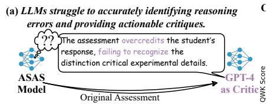

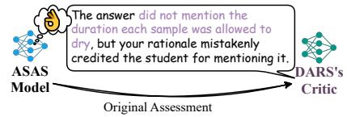

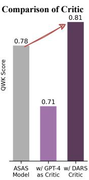  
Figure 1: Left (a): LLMs often fail to localize reasoning errors (Huang et al., 2024), limiting their performance in verbal RL. Left (b): DARS leverages a contrastive reflection synthesis pipeline to generate precise error-correction feedback, which guides the ASAS model to generate better scoring results with more accurate rationales. Right: While using GPT-4 as the Critic results in lower ASAS performance, our DARS Critic yields improved results in verbal RL.

Recent work has attempted to improve rationale quality by fine-tuning LLMs with Direct Preference Optimization (DPO) on synthetic preference pairs (Chen et al., 2024a; Lu et al., 2024b). While DPO captures which assessment is preferred, it fails to explain why (Rafailov et al., 2024; Lu et al., 2024a, 2025), leaving key reasoning steps opaque. Verbal Reinforcement Learning (VRL) addresses the gap by explicitly critiquing and revising model reasoning (Shinn et al., 2023; Wei Jie et al., 2024). However, LLMs struggle to self-correct due to their limited ability to accurately detect and locate reasoning errors (Yan et al., 2024, 2025).

As illustrated in Figure 1, evaluating whether a student answer addresses all key answer elements is non-trivial. Even advanced models such as GPT-4 often overlook flawed steps and produce vague, superficial reflections (Kamoi et al., 2024b), affecting the effectiveness of self-correction. The lack of high-quality annotations further compounds this challenge (Liu et al., 2024a). We argue that these limitations arise from the sequential decoding paradigm of current LLMs, which struggle to represent and reason over the graph-like conceptual structures underlying assessment decision-making process (LeCun, 2022). Effective self-correction requires reasoning to be decomposed into discrete components (Subramaniam et al., 2025), akin to “nodes” in a graph, that can be individually inspected and revised.

To this end, we propose a contrastive reflection synthesis pipeline (Section 3.1) that transforms preference-based reasoning path pairs into targeted, fine-grained verbal critiques without using of human annotation. Given a student response and a set of key answer elements, we construct a reasoning tree through progressive binary comparisons, where each decision reflects the presence or absence of a key answer element. By comparing the paths taken by two assessments over the same tree, we can localize the exact nodes at which their reasoning diverges and automatically generate targeted error messages (Figure 1, DARS Critic).

Building on these generated critiques, we train DARS, a DuAl-model Reflective Scoring framework comprising dedicated Reasoner and Critic models (Section 3.2). The Reasoner produces an initial score and rationale; while the Critic delivers both verbal reflection to the Reasoner and a termination token that signals convergence, enabling effective VRL without relying on oracle labels or manuallydefined thresholds.

In summary, our contributions are as follows:

1. We propose a contrastive reflection synthesis pipeline that automatically transforms binary preferences into fine-grained error-correction reflections.

2. We present DARS, to enable effective Verbal RL for ASAS reasoning. The Critic is innovatively designed to be capable of reflect reasoning errors and determining reasoning convergence.

3. Extensive experiments show that DARS consistently outperforms baselines, even in scarce data settings, scales with model size, and generalize across different LLM base models.

## 2 Preliminary

Existing ASAS systems primarily aim to automate teachers’ complex reasoning processes on the assessment of short answer questions, typically operating within a classification paradigm (Larkey, 1998; Dong et al., 2017). Existing datasets only contain annotated student answer and score pairs. Therefore, ASAS systems take various contextual input, including question prompts, key answer elements (e.g., keywords or phrases that qualify for marks), marking rubrics (e.g., criteria for assigning scores), and student responses, and are trained to predict a score as output.

Given a single question, the dataset can be represented as $D = \{ ( x _ { i } , y _ { i } ) \} _ { i = 1 } ^ { N }$ , where $x _ { i }$ denotes a student’s response and $y _ { i }$ represents the corresponding score assigned by human assessors. Let $\bar { \kappa } = \{ k _ { j } \} _ { j = 1 } ^ { M }$ represent the set of key answer elements for the current question, where M is the number of distinct elements expected in a complete answer. The scoring process can be formalized using a question-specific scoring function $f _ { r } ( \cdot )$ which determines the final score based on the extend to which student’s response includes the required elements:

$$
y _ { i } = f _ { r } ( \mathbf { v } ( x _ { i } , K ) ) ,\tag{1}
$$

where $\mathbf { v } ( x _ { i } , K ) \in \mathbb { R } ^ { M }$ is a multi-hot vector indicating the presence of each key element $k _ { j } \in \mathcal { K }$ in the student response $x _ { i }$ . This coverage vector is then mapped to the final score through $f _ { r } .$ . However, due to the complexity of the reasoning process and annotation costs, such intermediate assessment states are not available within current datasets.

To bridge this gap in intermediate steps, a recent approach (Li et al., 2024a) leverages a structured thought tree generated by LLMs to mimic the human assessment process (as illustrated in Figure 2). Formally, for each student answer $x _ { i }$ we construct an assessment decisions thought tree ${ \mathcal T } = \{ \mathcal Z _ { \ell } \} _ { \ell = 1 } ^ { d }$ following Li et al. Each distinct tree path $\mathcal { Z } _ { \ell }$ encodes binary decisions over M key elements:

$$
\hat { \mathbf { v } } ( \mathcal { Z } _ { \ell } ) = [ z _ { 1 } ^ { ( \ell ) } , z _ { 2 } ^ { ( \ell ) } , \dots , z _ { M } ^ { ( \ell ) } ] ,\tag{2}
$$

where $z _ { j } ^ { ( \ell ) } \in \{ 0 , 1 \}$ indicates whether the $j ^ { \mathrm { t h } }$ key element is correctly answered or not. We define reasoning paths that yield a correct score as the human preferred or chosen path $( \mathcal { Z } _ { \ell } ^ { \mathrm { c H o s E N } } )$ , and paths that yield an incorrect score as the human rejected path $( \mathcal { Z } _ { \ell } ^ { \mathrm { R E J E C T } } )$ . The rationales $r _ { \mathrm { C H O S E N } }$ and rREJECT are then derived by summarizing the intermediate decisions along their respective reasoning paths.

## 3 DARS: Dual-Model Reflective Scoring

We introduce DARS, a dual-model framework that pairs a Reasoner ( ) with a Critic (C) . The

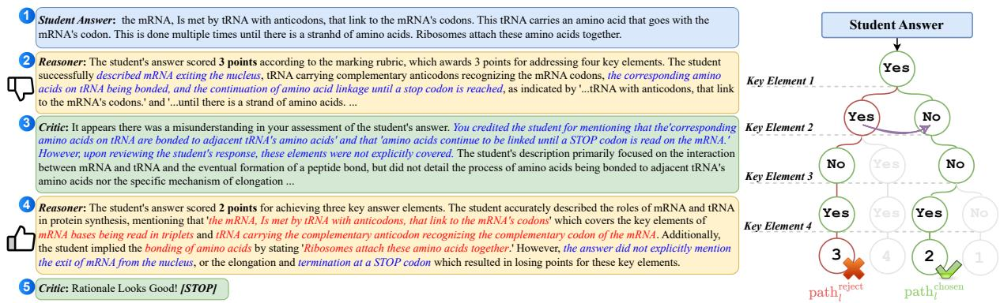  
Figure 2: (Left) An example conversation between the Reasoner and Critic in the DARS framework. (Right) A thought tree constructed from a single student answer. Structured thought tree paths are generated by an LLM and used to produce free-text reasoning outcomes (e.g., 2 , 4 ). Discrepancies between distinct reasoning paths are identified and used to prompt the LLM to generate a verbal reflection (e.g., 3 ), explicitly highlighting errors in the rejected reasoning trace. Text related to the Reasoner’s initial mistake is highlighted in blue, while corrections introduced during refinement are marked in red. 1 denotes the framework’s input (question context omitted for brevity), and the final Reasoner response before Critic termination ( 4 ) represents the framework’s output. A detailed explanation of the example is provided in §B.1.

Critic supplies explicit, free-form verbal reflections that iteratively steer the Reasoner’s thought process. The DARS framework adopt a two-stage design: Stage 1, Contrastive Reflection Synthesis (§3.1), constructs synthetic reflection data by comparing pairs of structured reasoning paths (“thought trees”) for the same student answer, to pinpoint where a rejected rationale diverges from a chosen one. Stage 2, Dual-Model Training & Inference (§3.2), uses supervised fine-tuning (SFT) to train a Reasoner and a Critic on these data. At inference, the Reasoner proposes an assessment and the Critic either provides a reflection for revision or terminates the loop. Importantly, no tree is constructed at inference, and no reinforcement learning is used in training; the critique-and-revise behavior arises from SFT-trained models interacting on-policy at test time.

## 3.1 Contrastive Reflection Synthesis

Human graders do not inspect an answer sequentially; instead, they mentally traverse a conceptual graph, where nodes represent key answer elements. In contrast, the sequential nature of LLM processing linearises this graph, often interleaving correct and incorrect claims, which obscures the exact source of the error. Therefore, naively prompting an LLM to reflect on its own errors typically produces vague, superficial, or uninformative rationales2 (Yin et al., 2024; Jiang et al., 2025).

Our pipeline restores this missing structural representation by converting each reasoning preference pair into a fine-grained error critique that explains “why rREJECT is inferior to $r _ { \mathrm { C H O S E N } }$ ” using divergent nodes to identify the minimal sub-graph responsible for the discrepancy. These targeted critiques give the Critic module a precise mechanism for verbal reinforcement learning, enabling it to generate clear guidance for error correction.

According to Equation (2), for each student answer $x _ { i }$ we construct a thought tree ${ \mathcal T } = \{ { \mathcal Z } _ { \ell } \} _ { \ell = 1 } ^ { d }$ Nodes in vˆ inherit the partial decision vector of their ancestors, while edges represent the incremental “reveal” of one additional element, mirroring a breadth-first traversal of the graph.

## Step 1: Identify Discrepancy in Reasoning Paths

Given a preference pair $( r _ { \mathrm { R E J E C T } } , r _ { \mathrm { C H O S E N } } )$ , we align each rationale with its original path and compute a signed difference vector:

$$
\Delta \mathbf { v } = \hat { \mathbf { v } } \big ( \mathcal { Z } _ { \ell } ^ { \mathrm { C H O S E N } } \big ) - \hat { \mathbf { v } } \big ( \mathcal { Z } _ { \ell } ^ { \mathrm { R E J E C T } } \big ) ,
$$

and $\mathcal { Z } _ { \ell } ^ { \mathrm { R E J E C T } }$ . Each component $\Delta _ { j }$ in $\Delta \mathbf { v }$ flags a node where the chosen (or rejected) path newly asserts the presence of the key element $k _ { j }$ , thereby localising points of divergence.

$$
\Delta _ { j } = { \left\{ \begin{array} { l l } { 1 } & { { \mathrm { i f ~ } } \mathrm { d e c i s i o n ~ f o r ~ } k _ { j } { \mathrm { ~ c h a n g e d ~ f r o m ~ } } 0 { \mathrm { ~ t o ~ } } 1 , } \\ { - 1 } & { { \mathrm { i f ~ } } \mathrm { d e c i s i o n ~ f o r ~ } k _ { j } { \mathrm { ~ c h a n g e d ~ f r o m ~ } } 1 { \mathrm { ~ t o ~ } } 0 , } \\ { 0 } & { { \mathrm { i f ~ d e c i s i o n ~ i s ~ t h e ~ s a m e } } . } \end{array} \right. }
$$

Because every $k _ { j }$ is tied to an explicit rubric criterion, $\Delta \mathbf { v }$ directly identifies the sub-graph responsible for diverging scores. We convert each non-zero component into a natural-language structural $h i n t ^ { 3 }$ that highlights the differences in the intermediate assessment decisions $( { \mathrm { e . g . ~ } } r _ { \mathrm { { R E J E C T } } }$ missed $k _ { j }$ that the student has already included):

$$
\begin{array} { r } { \mathrm { h i n t } _ { \Delta \mathbf { v } } = \mathrm { P r o m p t } ( \Delta \mathbf { v } , \mathcal { K } ) . } \end{array}\tag{3}
$$

## Step 2: Generate Synthetic Reflections

After identifying discrepancies and constructing the hint prompt, we prompt an LLM (e.g., GPT-4- turbo) to generate a verbal reflection between the preference pair $r _ { \mathrm { R E J E C T } }$ and rCHOSEN:

$$
r _ { \mathrm { r e f l e c t } } = \mathsf { L L M } _ { \theta } ( x _ { i } , r _ { \mathrm { R E J E C T } } , r _ { \mathrm { C H O S E N } } , \mathrm { h i n t } _ { \Delta \mathbf { v } } ) ,\tag{4}
$$

Because the hint anchors the prompt in the concept graph, the model tends to produce concise, node-level critiques such as “You marked PHOTO-SYNTHESIS PRODUCES OXYGEN absent, but the answer states ‘plants release $\underline { { O _ { 2 } } } ,$ satisfying node $k _ { 3 } .$ .” We record this free-text reflection as rreflect.

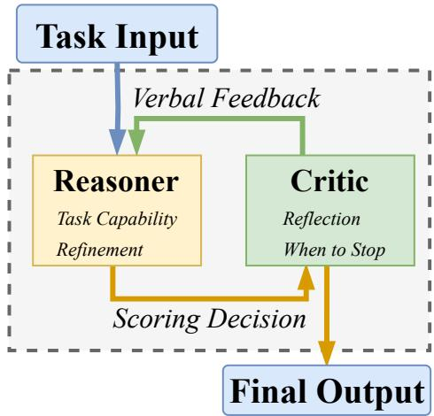  
Figure 3: Illustration of DARS Framework.

## 3.2 Dual-Model Training & Inference

Figure 3 outlines how the Reasoner and Critic cooperate at inference time. Starting from a student answer, the Reasoner drafts an initial scoring rationale. The Critic then either (i) provides a targeted reflection to prompt a revision from the Reasoner, or (ii) outputs a special [STOP] token to terminate the loop. This iterative dialogue continues until the Critic determines that the reasoning has converged.

## Training Reasoner and Critic Models

Build on the synthetic reflection data generated, we create diverse data combinations to train the Reasoner and the Critic on refinement and reflection capabilities. For clarity we reference the numbered turns in Figure 2.4

Reasoner (R) The training data for the Reasoner is designed to include two capabilities:

Task Capability:  takes 1 (question context and student answer) as input, and predicts $\textcircled{2}$ (an initial assessment r).

Refinement: takes $\textcircled{1} \& \textcircled{2}$ (assessment histories, e.g., rREJECT), with 3 (verbal reflection generated by $\mathcal { C } \mathrm { ~ , ~ e . g . , ~ } r _ { \mathrm { r e f l e c t } } )$ as input, and predict 4 (an refined assessment, e.g., rCHOSEN).

Critic (C) The training data for the Critic is designed to include two capabilities:

Reflection: If the assessment is incorrect, is trained to take previous assessment histories (e.g., $\textcircled { 1 } \textcircled { - 2 } \textcircled { 1 } \textcircled { 1 } \textcircled { - 4 } )$ as input, and predict $\textcircled{3}$ (a reflec-$r _ { \mathrm { r e f l e c t } }$ for wrong assessment) as output.

When to Stop:  takes $\mathcal { R } \mathrm { { s } }$ previous assessment outcome, either from single-round $\textcircled{1} - \textcircled{ 2 }$ or multirounds $\textcircled{1} - \textcircled{4}$ as input, and validate the correctness of the assessment. If the assessment is correct, $\mathcal { C }$ predict $\textcircled{5}$ , a special token [STOP] that signals the termination of the reasoning loop and outputs the final assessment generated by $\mathcal { R }$

The Critic is trained to supply two complementary feedbacks in natural language: (1) Reflection that diagnose specific reasoning flaws, and (2) When to Stop that decides when the assessment has converged. Both capabilities are learned without the need of oracle labels, or setting maximum iteration limits, overcoming those weaknesses in prior work (Shinn et al., 2023; Kim et al., 2023).

## Inference-Time Iterative Refinement

Once the Reasoner and Critic models are trained, they could collaborate to refine the assessment rationale at inference time through iterative conversations. At each iteration step t,  generates an assessment trajectory $\hat { y } _ { r } ^ { 0 } , \hat { y } _ { r } ^ { 1 } , . . . , \hat { y } _ { r } ^ { T }$

Initialization: $\hat { y } _ { r } ^ { 0 } = \mathcal { R } ( x _ { i } )$

Iterative Reflection:

$$
\left\{ \begin{array} { l l } { \hat { y } _ { r } ^ { ( t + 1 ) } = \mathcal { R } \Big ( \hat { y } _ { r } ^ { t } , \mathcal { C } ( \hat { y } _ { r } ^ { t } ) \Big ) , } & { \mathrm { i f } \mathcal { C } ( \hat { y } _ { r } ^ { t } ) = \mathrm { R e f l e c t } , } \\ { \hat { y } _ { r } ^ { T } = \hat { y } _ { r } ^ { t } , } & { \mathrm { i f } \mathcal { C } ( \hat { y } _ { r } ^ { t } ) = [ \mathrm { S T O P } ] . } \end{array} \right.
$$

$\mathcal { C } ( \cdot )$ checks the correctness of $\hat { y } _ { r } ^ { t }$ . If refinement is needed, it generates a verbal reflection for $\mathcal { R }$ to refine $\hat { y } _ { r } ^ { t }$ . Otherwise, [STOP] is triggered, and final assessment $\hat { y } _ { r } ^ { T }$ from is the output.

## 4 Experiments

## 4.1 Experimental Setup

Datasets We use two data sources, consisting of a total of six different datasets, for our experiments: (1) The Hewlett Foundation Short Answer Scoring (ASAP) dataset (Hamner et al., 2012), which contains short essay responses across science and biology topics (we exclude essay-like or multimodal subsets); and (2) A proprietary dataset comprising student responses to biology exam questions, where human-assigned scores are provided.5

Evaluation Metrics We evaluate the assessment performance using Accuracy (ACC), macro F1 (F1), and Quadratic Weighted Kappa (QWK).

Baselines We compare with four baselines:6 PLM Classifier: A text classifier built on a pre-trained Deberta-v3-large model (He et al., 2023) and fine-tuned on various datasets.

SFT: A Reasoner-only, supervised fine-tuning baseline trained with datasets released by (Li et al., 2024a) (e.g, takes 1 as input, predicts 2 ).

DPO: A DPO approach that performed preference optimization with synthetic reasoning preference data as presented in (Li et al., 2024a) (e.g, takes 1 as input, optimize 4 2 ). The base model used is the SFT baseline.

GPT-4 as Critic A dual-model VRL baseline (Dong et al., 2024), where Reasoner is trained within our framework, and gpt-4-turbo is used as the Critic to give verbal reflection instructions (e.g, 3 & 5 are generated by GPT-4).

## 4.2 Overall Comparison

In this section, we provide a comprehensive evaluation of both scoring performance and rationale quality. As shown in Table 1, we compare our dualmodel reasoning framework (DARS) against four baselines, including both classification and generative approaches. All methods, including ours, were trained using the same LLaMA 3B model. Our results indicate that ourframework overcomes the data scarcity issue, maintains balanced improvements across all evaluation metrics and outperforms state-of-the-art Reasoner-only and preference optimization methods. Furthermore, our Critic model proves to be more effective than the ‘GPT-4 as Critic’ baseline, highlighting its ability to provide more specialized and precise reflection to guide the Reasoner model.

Classifier Baseline The PLM Classifier serves as a strong baseline as it is directly fine-tuned on student answer scoring data. While it exhibits strong performance across all metrics, the classification approach lacks explainability, as it only generates scores without providing rationales.

Single Model Reasoning Baselines The Reasoner-only baselines, including SFT and DPO, aim to improve explainability by generating rationales for scoring decisions. However, these methods generally underperform compared to classification-based approaches, particularly on the proprietary datasets, where data scarcity presents a major challenge. The preference optimization method consistently shows modest improvements over the SFT base model in terms of QWK scores. However, these improvements come at the cost ofdeclines in F1 (-4%) and ACC scores (-1%), suggesting a tendency to overfit to preference annotations (Chowdhury et al., 2024; Mitchell, 2023). Moreover, the implicit preference optimization process lacks transparency, making the Reasoner-only DPO approach less reliable.

GPT-4 as Critic Baseline We also evaluate a dual-model variant where GPT-4 serves as the Critic to generate reflection-based instructions for refinement. However, after multiple refinements, performance significantly declined across all datasets and evaluation metrics (DARS Reasoner only vs. GPT-4 as Critic). This indicates that despite GPT-4’s strong general capabilities, it struggles to produce specialized and precise reflections for refining the Reasoner’s output7.

Ours DARS Framework DARS demonstrates significant improvementsfrom the initial to the final iteration across all datasets, highlighting the efficacy ofdual model reasoning, and test-time rationale refinement. The DARS Reasoner only performance is measured on the Reasoner’sfirst-pass predictions (e.g. Reasoner predicts 2 based on 1 ), while the Reflect w/ Critic results are generated from DARS, i.e. the final refined Reasoner output before the loop is terminated by the Critic model (e.g. 4 ). Compared to the preference optimization baseline (SFT to DPO), our framework ((DARS) Reasoner only to Reasoner+Critic) not only outperforms on average ACC, F1, and QWK scores but also maintains a balanced enhancement across all metrics even under data scarcity (improved 5% for ACC, 11% for F1, and 2% for QWK). Compared with GPT-4 as the Critic, our Critic model more effectively reflects on wrongly assessed rationales and guides the Reasoner outputs to be closer to the oracle labels (18%-34% better in metrics). Specifically, Reasoner+Critic surpasses the Reasoner only assessment result across all datasets and metrics (3%-7% improvement). Statistically, Reasoner+Critic significantly outperforms the state-ofthe-art baselines (SFT and DPO)8.

<table><tr><td rowspan="2">Methods</td><td colspan="3">Classification Baseline</td><td colspan="10">Generative Baselines (Single Model Reasoning)</td><td colspan="6">Dual-Model Reasoning with Critic Models</td></tr><tr><td colspan="3">PLM Classifier</td><td colspan="3">SFT</td><td colspan="3">DPO</td><td colspan="3">(DARS) Reasoner only</td><td colspan="3">GPT-4 as Critic</td><td colspan="3">(DARS) Reasoner+Critic</td></tr><tr><td>Datasets</td><td>ACC</td><td>F1</td><td>QWK</td><td>ACC</td><td>F1</td><td>QWK</td><td>ACC</td><td>F1</td><td>QWK</td><td>ACC</td><td>F1</td><td>QWK</td><td>ACC</td><td>F1</td><td>QWK</td><td>ACCt,*</td><td>F1†,*</td><td>QWK*</td></tr><tr><td>ASAP 1</td><td>0.7767</td><td>0.7805</td><td>0.8528</td><td>0.6968</td><td>0.7073</td><td>0.8277</td><td>0.6895</td><td>0.5655</td><td>0.8051</td><td>0.6480</td><td>0.6606</td><td>0.8073</td><td>0.5181</td><td>0.5106</td><td>0.6349</td><td>0.7274</td><td>0.7315</td><td>0.8100</td></tr><tr><td>ASAP 2</td><td>0.6798</td><td>0.6817</td><td>0.8187</td><td>0.7324</td><td>0.7468</td><td>0.8420</td><td>0.6761</td><td>0.6783</td><td>0.8033</td><td>0.6925</td><td>0.7074</td><td>0.8136</td><td>0.5869</td><td>0.5636</td><td>0.6532</td><td>0.7136</td><td>0.7303</td><td>0.8277</td></tr><tr><td>ASAP 5</td><td>0.8625</td><td>0.6055</td><td>0.8187</td><td>0.8495</td><td>0.5600</td><td>0.8203</td><td>0.8612</td><td>0.6449</td><td>0.8001</td><td>0.8545</td><td>0.5424</td><td>0.7766</td><td>0.8177</td><td>0.5119</td><td>0.6340</td><td>0.8645</td><td>0.6303</td><td>0.8326</td></tr><tr><td>ASAP 6</td><td>0.8891</td><td>0.6118</td><td>0.8426</td><td>0.8314</td><td>0.5513</td><td>0.7273</td><td>0.8314</td><td>0.5420</td><td>0.7522</td><td>0.8280</td><td>0.5628</td><td>0.7232</td><td>0.8130</td><td>0.4265</td><td>0.4754</td><td>0.8648</td><td>0.5988</td><td>0.8016</td></tr><tr><td>Pty 1</td><td>0.6787</td><td>0.6784</td><td>0.8853</td><td>0.5236</td><td>0.5197</td><td>0.8082</td><td>0.5236</td><td>0.4670</td><td>0.8196</td><td>0.5551</td><td>0.5584</td><td>0.8221</td><td>0.4134</td><td>0.3407</td><td>0.6018</td><td>0.5709</td><td>0.5653</td><td>0.8253</td></tr><tr><td>Pty 2</td><td>0.6224</td><td>0.6355</td><td>0.8385</td><td>0.5459</td><td>0.5377</td><td>0.7004</td><td>0.5561</td><td>0.5600</td><td>0.7599</td><td>0.5765</td><td>0.5752</td><td>0.7604</td><td>0.5357</td><td>0.5219</td><td>0.7688</td><td>0.6071</td><td>0.6059</td><td>0.7705</td></tr><tr><td>Overall</td><td>0.7515</td><td>0.6656</td><td>0.8428</td><td>0.6966</td><td>0.6038</td><td>0.7877</td><td>0.6897</td><td>0.5763</td><td>0.7900</td><td>0.6925</td><td>0.6011</td><td>0.7839</td><td>0.6141</td><td>0.4792</td><td>0.6280</td><td>0.7247</td><td>0.6437</td><td>0.8113</td></tr></table>

Table 1: Comparison of assessment performance across baseline and Reasoner only preference optimization methods. Generative methods are indicated with a gray background . All methods were reproduced or trained using the same LLaMA 3B model as the base. We highlighted the highest values for ACC ( ), F1 Score ( ), and QWK ( ) among generative methods in bold. The overall performance is calculated as the average across all datasets. Symbols and indicate statistical significance compared to SFT and DPO by each metric, respectively.

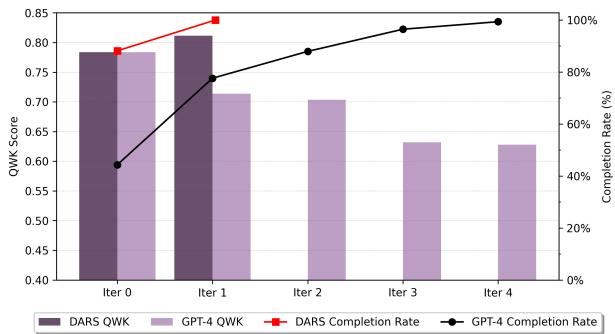  
Figure 4: Performance and completion rate, where DARS outperforms GPT-4 with less iterations.

To show the effectiveness of our Critic model in reflection and determine when to stop, as illustrated in Figure 4, we visualize the performance trend and completion rate comparison between DARS’s iterative reasoning process and GPT-4 as the Critic model. Our method requires only two iterations to achieve a significant improvement over iteration 0- the Reasoner’s initial prediction. In contrast, GPT-4 takes nearly four iterations to reach termination, and shows a clear trend of performance degradation across all metrics as the iterations progress.

## 4.3 Quality Evaluation for Reflection

To further analyze the transparency and correctness of the generated reflections, we conducted a human evaluation of the Critic-Reasoner interactions. We assessed the quality of the Critic’s reflections and the subsequent Reasoner’s refinements. The evaluation results are visualized in Figure 5.

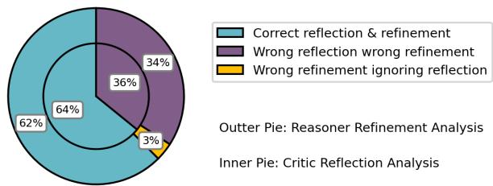  
Figure 5: Qualitative analysis on reflection and refinement.

Our findings indicate that the Critic model accurately identified assessment errors in 64% of cases, effectively localizing errors in scoring rationales. This aligns with previous observations (Tyen et al., 2024), which suggest that LLMs can correct errors when provided with proper error localization. However, in 36% of cases, the Critic’s reflections were inaccurate, often due to misinterpretation of the student’s answer and the scope of the key answer elements. Such inaccuracies had cascading effects: in 34% of cases, the Critic’s incorrect guidance misled the Reasoner, leading to further wrong assessments. We also observed that in 3% of instances, the Reasoner ignored the Critic’s feedback (despite correct or incorrect) and still produced erroneous outcomes.These results indicate that our Reasoner can follow the Critic’s guidance 97% of the time for refinement. Overall, these results highlight the critical role of a strong Critic for generating explainable, verbal reflection instructions, so that the Reasoner could effectively refine its predictions. Further error analysis (§B.3) and case studies (§B.6) are provided in the Appendix.

## 4.4 Scaling Experiment for DARS Framework

Given that our Reasoner and Critic models are trained independently, we study the effect of model size on the performance of DARS using four Qwen model variants (3B, 7B, 14B, and 32B) (Qwen-Team, 2024). We trained each model using identical datasets, training procedures, and hyperparameters, resulting in a total of 16 distinct Reasoner and Critic combinations.

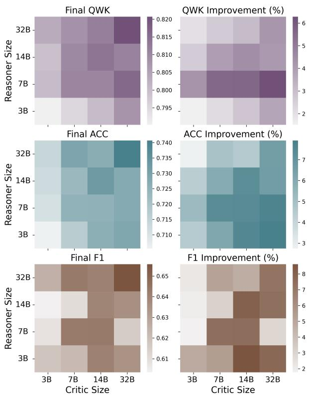  
Figure 6: Scaling experiments for DARS.

We present the overall performance and performance improvements9 in Figure 6. Unlike observations in prior studies (Welleck et al., 2023; Akyurek et al., 2023; Paul et al., 2024), ourfindings suggest that increasing the Critic’s size (horizontal direction, left to right) leads to greater performance gains (ACC and QWK), more so than increasing the Reasoner’s size (vertical direction, bottom to top). This suggests that a larger Critic provides more precise evaluation and reflection, which the Reasoner relies upon for refinement10. Although larger Critic models generally improve F1 scores, this trend is not as pronounced, due to imbalances in dataset sizes and label distributions11.

## 4.5 Ablation Studies on DARS

Can the Reasoner Refine Effectively Without Strong Task Capability? To investigate whether the Reasoner can perform refinement without a strong task capability, we trained two “weak” Reasoners with Qwen 3B and LLaMA 3B with weaker rationale training data12, following Li et al. (2023a). As shown in Figure 7, all the DARS frameworks with a “weak” Reasoner dropped more than 10% in overall performance across all metrics, even with access to high-quality reflection data and a strong Critic model. This result shows that without a strong task capability, the Reasoner cannot perform refinement effectively.

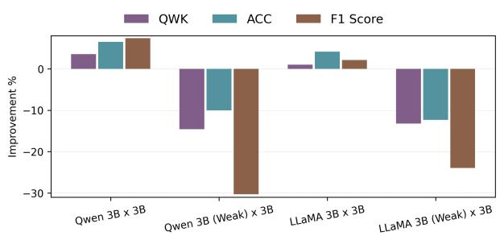  
Figure 7: DARS refine with “weak” Reasoner model.

Does Refinement Ability Benefit Reasoner’s Task Capability? To further investigate the impact of refinement data on task performance, we trained two models: LLaMA 3B w/o Refinement and LLaMA 8B w/o Refinement by excluding the multi-turn reflection refinement data from the Reasoner’s training sets. We report the Reasoner-only’s performance in Figure 8. We observe that evaluation result for Reasoner’s w/o refinement models dropped nearly 5% in all metrics compared with including refinement data, indicating the error correction data (e.g. training the model to refine from errors) can boost the Reasoner’s task capability. This observation align closely with previous findings (Tong et al., 2024; Kamoi et al., 2024b). We also show that reflection data can effectively regulate preference optimization training in §B.5.

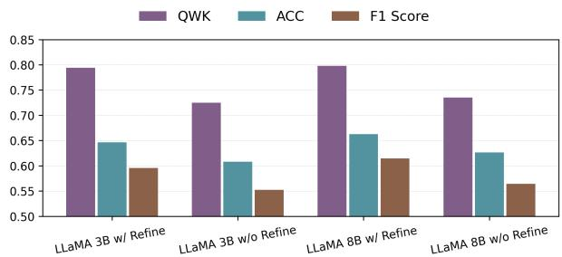  
Figure 8: Ablation on the refinement data for Reasoner.

Can a Single Model Perform Both Reasoning and Reflection? We explore whether merging the training data of both the Reasoner and Critic to train a single model would enable effective selfreflection. We trained two self-reflection models Qwen 3B (Self) and LLaMA 3B (Self). Figure 9 shows a significant decline in the iterative refinement process, with a negative performance improvement rate. This unified model struggles to accurately determine when to terminate the refinement process and failed to provide useful reflection instructions. These findings align with prior observations (Huang et al., 2024), suggesting that “two heads are better than one”–a single model cannot effectively balance both reasoning and critique.

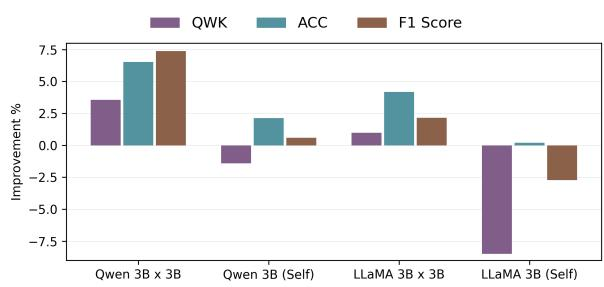  
Figure 9: Combine dual-model into a single one.

## 4.6 Generalization Studies

Can Critic Effectively Reflect on Unseen Questions? In Figure 10, we evaluate the ability of the Critic model to generalize to unseen questions. To do this, we trained two versions of Critic: one with exposure to our proprietary datasets (Critic Seen) and one without (Critic Unseen). We use LLaMA 3B as the base model. Our results reveal that the Critic Unseen model, despite its lack ofexposure to all datasets, still enhances the Reasoner’s original assessments (+1% in QWK), albeit with slightly reduced effectiveness compared to the Critic Seen model (-3% in QWK). These findings show that the Critic can still provide meaningful feedback even

when it has not been explicitly trained on new data.  
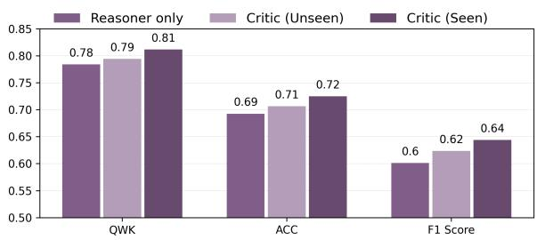  
Figure 10: DARS Critic reflects on unseen questions.

Adaptability Beyond Model Sizes and Architectures Figure 11(a) illustrates our exploration of the performance across various base models, including LLaMA 3B, 8B and Qwen 3B, 7B. The results show minimal variance in performance across different model sizes and architectures, demonstrating that our training method is highly adaptable. Furthermore, Figure 11(b) explores the feasibility

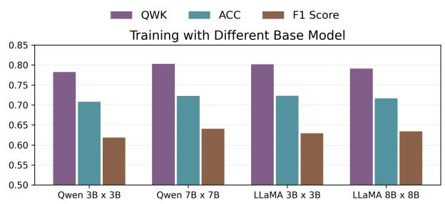

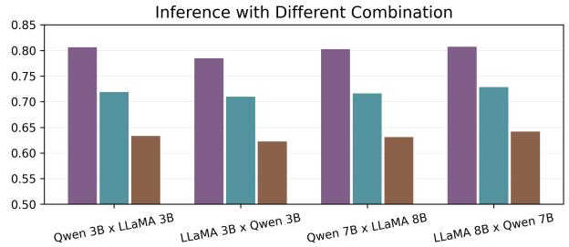  
Figure 11: Generalization analysis on size, architecture and inference combinations.

of using different base models for the Reasoner and Critic at inference time, such as pairing a Qwen Reasoner with a LLaMA Critic. Our findings indicate consistent performance irrespective of model combinations. This highlights the robustness of our framework, due to its use of text for effective interactions between Critic and Reasoner.

## 5 Related Work

Verbal Reinforcement Learning for Self-Reflection VRL has emerged as a promising approach for enhancing LLM reasoning at inference time (Huang et al., 2024; Kamoi et al., 2024b).

Early methods relied on self-reflection mechanisms where LLMs refined outputs using contextual cues (Chen et al., 2024b; Jiang et al., 2023; Welleck et al., 2023). However, studies show that LLMs struggle to self-correct reliably (Li et al., 2024b; Tyen et al., 2024; Chen and Shu, 2024; Kamoi et al., 2024a). To address this, trained critic models have been used to generate verbal feedback for LLM correction (Welleck et al., 2023; Akyurek et al., 2023; Paul et al., 2024), though they primarily focus on single-step feedback. More complex reasoning tasks typically rely on Oracle labels for correction (Shinn et al., 2023; Kim et al., 2023). Our work introduces a dual-model framework where a Critic independently provides more detailed, trace-level reflections, eliminating the need for Oracle labels in verification.

Explainable Automated Student Answer Scoring ASAS is traditionally treated as a text classification problem (Larkey, 1998; Taghipour and Ng, 2016), with efforts to improve transparency via feature analysis (Dong and Zhang, 2016; Vanga et al., 2023; Li et al., 2023b) and attention visualization (Alikaniotis et al., 2016; Yang et al., 2020). Recent approaches incorporate rationale generation for enhanced explainability and transparency (Li et al., 2023a; Zhao et al., 2025) but often underperform compared to classification-based methods. Li et al. (2024a) proposed a thought tree framework to model human assessment processes, leveraging LLMs for structured scoring rationales. Our work builds upon this by not only explaining decisions but also improving the transparency of assessment refinement process, through iterative LLM reasoning improvements.

## 6 Conclusion and Discussion

We proposed a novel approach to enhance reasoning through a dual-model framework, and also introduced a contrastive reflection synthesis pipeline, which generates more targeted verbal reflections. Our framework, consisting of a dedicated Reasoner and Critic, enables effective reasoning refinement without relying on oracle labels. Moreover, our carefully designed training process equips both models with capabilities that extend beyond taskspecific reasoning. The Reasoner not only solves problems but also learns to refine its reasoning based on feedback, while the Critic not only identifies errors but also learns when to stop, ensuring efficient reasoning improvement.

## Limitations

This study has several limitations. First, the training process requires substantial computational resources. While our framework minimizes the need for future retraining, the SFT training for both the Reasoner and Critic involves additional data points to enhance the model’s various capabilities, leading to higher training FLOPs than single Reasoner approaches. Second, the generalizability of our framework to tasks beyond ASAS remains unexplored. Although we conducted a comprehensive evaluation across six datasets, our focus was predominantly on the ASAS task. Future work should investigate the applicability of the proposed framework to a broader range of tasks. For instance, while math and code reasoning problems may not necessitate a binary structured thought-tree approach, they could benefit from pre-defined rules to verify the correctness of intermediate steps and then identify path discrepancies. Finally, our prompt design was not exhaustively optimized. Future work could incorporate in-context learning (Zhou et al., 2024) and chain-of-thought prompting (Wei et al., 2022) to further improve performance.

## Ethics Statement

This study utilized both public and proprietary datasets of anonymized student responses, none of which contain sensitive or personally identifiable information. We thoroughly reviewed the LLMs’ outputs and did not identify any instances of harmful content or exposure of personal information. Nevertheless, before deploying our framework in high-stakes examination settings, experts must carefully evaluate its assessment decisions and the underlying rationales to ensure reliability and fairness.

## Acknowledgments

This work was supported in part by the UK Engineering and Physical Sciences Research Council through a Turing AI Fellowship (grant no. EP/V020579/1, EP/V020579/2) and a Prosperity Partnership project with AQA (UKRI566). Jiazheng Li is funded by a PhD scholarship provided by AQA. We thank Hainiu Xu and Ruobing Wang for their advice on formatting for this paper.

## References

AI@Meta. 2024. Llama 3 model card.

Afra Feyza Akyurek, Ekin Akyurek, Ashwin Kalyan, Peter Clark, Derry Tanti Wijaya, and Niket Tandon. 2023. RL4F: Generating natural language feedback with reinforcement learning for repairing model outputs. In Proceedings of the 61st Annual Meeting of the Associationfor Computational Linguistics (Volume 1: Long Papers).

Dimitrios Alikaniotis, Helen Yannakoudakis, and Marek Rei. 2016. Automatic text scoring using neural networks. In Proceedings of the 54th Annual Meeting of the Associationfor Computational Linguistics (Volume 1: Long Papers).

Canyu Chen and Kai Shu. 2024. Can LLM-generated misinformation be detected? In The Twelfth International Conference on Learning Representations.

Guoxin Chen, Minpeng Liao, Chengxi Li, and Kai Fan. 2024a. Step-level value preference optimization for mathematical reasoning. In Findings ofthe Association for Computational Linguistics: EMNLP 2024.

Xinyun Chen, Maxwell Lin, Nathanael Schärli, and Denny Zhou. 2024b. Teaching large language models to self-debug. In The Twelfth International Conference on Learning Representations.

Sayak Ray Chowdhury, Anush Kini, and Nagarajan Natarajan. 2024. Provably robust dpo: aligning language models with noisy feedback. In Proceedings of the 41st International Conference on Machine Learning.

Fei Dong and Yue Zhang. 2016. Automatic features for essay scoring – an empirical study. In Proceedings of the 2016 Conference on Empirical Methods in Natural Language Processing.

Fei Dong, Yue Zhang, and Jie Yang. 2017. Attentionbased recurrent convolutional neural network for automatic essay scoring. In Proceedings of the 21st Conference on Computational Natural Language Learning (CoNLL 2017).

Yihong Dong, Kangcheng Luo, Xue Jiang, Zhi Jin, and Ge Li. 2024. PACE: Improving prompt with actorcritic editing for large language model. In Findings of the Associationfor Computational Linguistics: ACL 2024. Association for Computational Linguistics.

Ben Hamner, Jaison Morgan, Mark Shermis Lynnvandev, and Tom Vander Ark. 2012. The hewlett foundation: Automated essay scoring.

Pengcheng He, Jianfeng Gao, and Weizhu Chen. 2023. DeBERTav3: Improving deBERTa using ELECTRAstyle pre-training with gradient-disentangled embedding sharing. In The Eleventh International Conference on Learning Representations.

Jie Huang, Xinyun Chen, Swaroop Mishra, Huaixiu Steven Zheng, Adams Wei Yu, Xinying Song, and Denny Zhou. 2024. Large language models cannot self-correct reasoning yet. In The Twelfth International Conference on Learning Representations.

Yuxin Jiang, Bo Huang, Yufei Wang, Xingshan Zeng, Liangyou Li, Yasheng Wang, Xin Jiang, Lifeng Shang, Ruiming Tang, and Wei Wang. 2025. Bridging and modeling correlations in pairwise data for direct preference optimization. In The Thirteenth International Conference on Learning Representations.

Zhengbao Jiang, Frank Xu, Luyu Gao, Zhiqing Sun, Qian Liu, Jane Dwivedi-Yu, Yiming Yang, Jamie Callan, and Graham Neubig. 2023. Active retrieval augmented generation. In Proceedings ofthe 2023 Conference on Empirical Methods in Natural Language Processing.

Ryo Kamoi, Sarkar Snigdha Sarathi Das, Renze Lou, Jihyun Janice Ahn, Yilun Zhao, Xiaoxin Lu, Nan Zhang, Yusen Zhang, Haoran Ranran Zhang, Sujeeth Reddy Vummanthala, Salika Dave, Shaobo Qin, Arman Cohan, Wenpeng Yin, and Rui Zhang. 2024a. Evaluating LLMs at detecting errors in LLM responses. In First Conference on Language Modeling.

Ryo Kamoi, Yusen Zhang, Nan Zhang, Jiawei Han, and Rui Zhang. 2024b. When can LLMs actually correct their own mistakes? a critical survey of selfcorrection of LLMs. Transactions ofthe Association for Computational Linguistics.

Geunwoo Kim, Pierre Baldi, and Stephen Marcus McAleer. 2023. Language models can solve computer tasks. In Thirty-seventh Conference on Neural Information Processing Systems.

Woosuk Kwon, Zhuohan Li, Siyuan Zhuang, Ying Sheng, Lianmin Zheng, Cody Hao Yu, Joseph E. Gonzalez, Hao Zhang, and Ion Stoica. 2023. Efficient memory management for large language model serving with pagedattention. In Proceedings of the ACM SIGOPS 29th Symposium on Operating Systems Principles.

Leah S. Larkey. 1998. Automatic essay grading using text categorization techniques. In Proceedings ofthe 21st Annual International ACM SIGIR Conference on Research and Development in Information Retrieval, SIGIR ’98.

Yann LeCun. 2022. A path towards autonomous machine intelligence. OpenReview, version 0.9.2.

Jiazheng Li, Artem Bobrov, David West, Cesare Aloisi, and Yulan He. 2025a. An automated explainable educational assessment system built on llms. Proceedings of the AAAI Conference on Artificial Intelligence.

Jiazheng Li, Lin Gui, Yuxiang Zhou, David West, Cesare Aloisi, and Yulan He. 2023a. Distilling Chat-GPT for explainable automated student answer assessment. In Findings of the Association for Computational Linguistics: EMNLP 2023.

Jiazheng Li, Zhaoyue Sun, Bin Liang, Lin Gui, and Yulan He. 2023b. CUE: An uncertainty interpretation framework for text classifiers built on pre-trained language models. In The 39th Conference on Uncertainty in Artificial Intelligence.

Jiazheng Li, Hainiu Xu, Zhaoyue Sun, Yuxiang Zhou, David West, Cesare Aloisi, and Yulan He. 2024a. Calibrating LLMs with preference optimization on thought trees for generating rationale in science question scoring. In Findings ofthe Associationfor Computational Linguistics: EMNLP 2024.

Jiazheng Li, Hanqi Yan, and Yulan He. 2025b. Drift: Enhancing LLM faithfulness in rationale generation via dual-reward probabilistic inference. In Proceedings ofthe 63rd Annual Meeting ofthe Association for Computational Linguistics.

Jiazheng Li, Runcong Zhao, Yongxin Yang, Yulan He, and Lin Gui. 2023c. Overprompt: Enhancing chat-GPT through efficient in-context learning. In R0- FoMo:Robustness ofFew-shot and Zero-shot Learning in Large Foundation Models.

Yanhong Li, Chenghao Yang, and Allyson Ettinger. 2024b. When hindsight is not 20/20: Testing limits on reflective thinking in large language models. In Findings of the Association for Computational Linguistics: NAACL 2024.

Ruibo Liu, Jerry Wei, Fangyu Liu, Chenglei Si, Yanzhe Zhang, Jinmeng Rao, Steven Zheng, Daiyi Peng, Diyi Yang, Denny Zhou, and Andrew M. Dai. 2024a. Best practices and lessons learned on synthetic data. In First Conference on Language Modeling.

Zhihan Liu, Miao Lu, Shenao Zhang, Boyi Liu, Hongyi Guo, Yingxiang Yang, Jose Blanchet, and Zhaoran Wang. 2024b. Provably mitigating overoptimization in RLHF: Your SFT loss is implicitly an adversarial regularizer. In The Thirty-eighth Annual Conference on Neural Information Processing Systems.

Junru Lu, Jiazheng Li, Siyu An, Meng Zhao, Yulan He, Di Yin, and Xing Sun. 2024a. Eliminating biased length reliance of direct preference optimization via down-sampled KL divergence. In Proceedings of the 2024 Conference on Empirical Methods in Natural Language Processing.

Junru Lu, Jiazheng Li, Guodong Shen, Lin Gui, Siyu An, Yulan He, Di Yin, and Xing Sun. 2025. RoleMRC: A fine-grained composite benchmark for role-playing and instruction-following. In Findings ofthe Associationfor Computational Linguistics: ACL 2025.

Zimu Lu, Aojun Zhou, Ke Wang, Houxing Ren, Weikang Shi, Junting Pan, and Mingjie Zhan. 2024b. Step-controlled dpo: Leveraging stepwise

error for enhanced mathematical reasoning. ArXiv, abs/2407.00782.

Elijah Mayfield and Alan W Black. 2020. Should you fine-tune BERT for automated essay scoring? In Proceedings ofthe Fifteenth Workshop on Innovative Use ofNLPfor Building Educational Applications.

Eric Mitchell. 2023. A note on dpo with noisy preferences & relationship to ipo.

OpenAI, Josh Achiam, Steven Adler, Sandhini Agarwal, Lama Ahmad, Ilge Akkaya, Florencia Leoni Aleman, Diogo Almeida, Janko Altenschmidt, Sam Altman, Shyamal Anadkat, and 1 others. 2024. Gpt-4 technical report. Preprint, arXiv:2303.08774.

Debjit Paul, Mete Ismayilzada, Maxime Peyrard, Beatriz Borges, Antoine Bosselut, Robert West, and Boi Faltings. 2024. REFINER: Reasoning feedback on intermediate representations. In Proceedings ofthe 18th Conference ofthe European Chapter ofthe Association for Computational Linguistics (Volume 1: Long Papers).

Qwen, An Yang, Baosong Yang, Beichen Zhang, Binyuan Hui, Bo Zheng, Bowen Yu, Chengyuan Li, Dayiheng Liu, Fei Huang, Haoran Wei, Huan Lin, Jian Yang, Jianhong Tu, Jianwei Zhang, Jianxin Yang, Jiaxin Yang, Jingren Zhou, Junyang Lin, and 24 others. 2024. Qwen2.5 technical report.

QwenTeam. 2024. Qwen2.5: A party of foundation models.

Rafael Rafailov, Yaswanth Chittepu, Ryan Park, Harshit Sikchi, Joey Hejna, W. Bradley Knox, Chelsea Finn, and Scott Niekum. 2024. Scaling laws for reward model overoptimization in direct alignment algorithms. In The Thirty-eighth Annual Conference on Neural Information Processing Systems.

Noah Shinn, Federico Cassano, Ashwin Gopinath, Karthik R Narasimhan, and Shunyu Yao. 2023. Reflexion: language agents with verbal reinforcement learning. In Thirty-seventh Conference on Neural Information Processing Systems.

Vighnesh Subramaniam, Yilun Du, Joshua B. Tenenbaum, Antonio Torralba, Shuang Li, and Igor Mordatch. 2025. Multiagent finetuning: Self improvement with diverse reasoning chains. In The Thirteenth International Conference on Learning Representations.

Kaveh Taghipour and Hwee Tou Ng. 2016. A neural approach to automated essay scoring. In Proceedings of the 2016 Conference on Empirical Methods in Natural Language Processing.

Yongqi Tong, Dawei Li, Sizhe Wang, Yujia Wang, Fei Teng, and Jingbo Shang. 2024. Can LLMs learn from previous mistakes? investigating LLMs’ errors to boost for reasoning. In Proceedings of the 62nd Annual Meeting ofthe Associationfor Computational Linguistics (Volume 1: Long Papers).

Gladys Tyen, Hassan Mansoor, Victor Carbune, Peter Chen, and Tony Mak. 2024. LLMs cannot find reasoning errors, but can correct them given the error location. In Findings ofthe Associationfor Computational Linguistics: ACL 2024.

Roopchand Reddy Vanga, C. Sindhu, M. S. Bharath, T. Charandeep Reddy, and Meghana Kanneganti. 2023. Autograder: A feature-based quantitative essay grading system using bert. In ICT Infrastructure and Computing.

Jason Wei, Xuezhi Wang, Dale Schuurmans, Maarten Bosma, Fei Xia, Ed Chi, Quoc V Le, Denny Zhou, and 1 others. 2022. Chain-of-thought prompting elicits reasoning in large language models. Advances in neural information processing systems, 35:24824– 24837.

Yeo Wei Jie, Ranjan Satapathy, Rick Goh, and Erik Cambria. 2024. How interpretable are reasoning explanations from prompting large language models? In Findings of the Association for Computational Linguistics: NAACL 2024.

Sean Welleck, Ximing Lu, Peter West, Faeze Brahman, Tianxiao Shen, Daniel Khashabi, and Yejin Choi. 2023. Generating sequences by learning to self-correct. In The Eleventh International Conference on Learning Representations.

Hanqi Yan, Linhai Zhang, Jiazheng Li, Zhenyi Shen, and Yulan He. 2025. Position: LLMs need a bayesian meta-reasoning framework for more robust and generalizable reasoning. In Forty-second International Conference on Machine Learning Position Paper Track.

Hanqi Yan, Qinglin Zhu, Xinyu Wang, Lin Gui, and Yulan He. 2024. Mirror: Multiple-perspective selfreflection method for knowledge-rich reasoning. In Proceedings ofthe 62nd Annual Meeting ofthe Associationfor Computational Linguistics.

Ruosong Yang, Jiannong Cao, Zhiyuan Wen, Youzheng Wu, and Xiaodong He. 2020. Enhancing automated essay scoring performance via fine-tuning pre-trained language models with combination of regression and ranking. In Findings of the Association for Computational Linguistics: EMNLP 2020.

Yueqin Yin, Zhendong Wang, Yi Gu, Hai Huang, Weizhu Chen, and Mingyuan Zhou. 2024. Relative preference optimization: Enhancing llm alignment through contrasting responses across identical and diverse prompts. ArXiv, abs/2402.10958.

Runcong Zhao, Artem Bobrov, Jiazheng Li, and Yulan He. 2025. Learnlens: Llm-enabled personalised, curriculum-grounded feedback with educators in the loop. Preprint, arXiv:2507.04295.

Yaowei Zheng, Richong Zhang, Junhao Zhang, Yanhan Ye, and Zheyan Luo. 2024. LlamaFactory: Unified efficient fine-tuning of 100+ language models. In

Proceedings ofthe 62nd Annual Meeting ofthe Associationfor Computational Linguistics (Volume 3: System Demonstrations).

Yuxiang Zhou, Jiazheng Li, Yanzheng Xiang, Hanqi Yan, Lin Gui, and Yulan He. 2024. The mystery of in-context learning: A comprehensive survey on interpretation and analysis. In Proceedings of the 2024 Conference on Empirical Methods in Natural Language Processing.

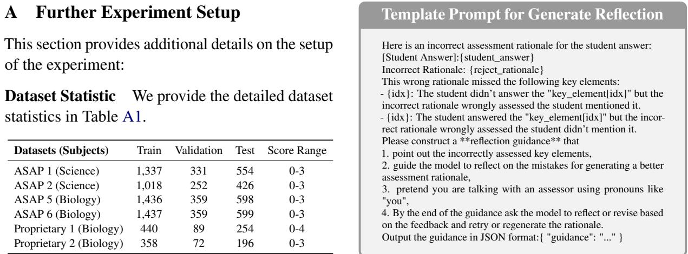

<table><tr><td>Datasets (Subjects)</td><td>Train</td><td>Validation</td><td>Test</td><td>Score Range</td></tr><tr><td>ASAP 1 (Science)</td><td>1,337</td><td>331</td><td>554</td><td>0-3</td></tr><tr><td>ASAP 2 (Science)</td><td>1,018</td><td>252</td><td>426</td><td>0-3</td></tr><tr><td>ASAP 5 (Biology)</td><td>1,436</td><td>359</td><td>598</td><td>0-3</td></tr><tr><td>ASAP 6 (Biology)</td><td>1,437</td><td>359</td><td>599</td><td>0-3</td></tr><tr><td>Proprietary 1 (Biology)</td><td>440</td><td>89</td><td>254</td><td>0-4</td></tr><tr><td>Proprietary 2 (Biology)</td><td>358</td><td>72</td><td>196</td><td>0-3</td></tr></table>

Table A1: Dataset statistics.

Proprietary Dataset The dataset provided by our project partner, a reputable national examination service. They applied a strict anonymization process before sharing the data with us. While we can report our experimental results using this data without share it with others.

Classification Baseline The input to the text classifier consists of concatenated question-related information (including the question prompt, key answer elements, and marking rubric) along with the student answer, separated by newlines. The classifier is trained to predict scores. Following previous studies, we trained a separate model for each dataset and evaluated it using the original test splits (Mayfield and Black, 2020). We employed DeBERTa-v3-large as the base pre-trained language model (He et al., 2023). The reported results are averaged over five runs with different random seeds (210, 102, 231, 314, 146). The hyperparameter settings are provided in Table A2.

<table><tr><td>Hyperparameter</td><td>Value</td></tr><tr><td>Learning Rate</td><td>2e-5</td></tr><tr><td>Batch Size</td><td>16</td></tr><tr><td>Epochs</td><td>15</td></tr><tr><td>Warmup Steps</td><td>100</td></tr><tr><td>Weight Decay</td><td>0.1</td></tr><tr><td>Optimizer</td><td>Adam</td></tr><tr><td>Adam Epsilon</td><td>1e-8</td></tr></table>

Table A2: Classification hyper-parameters setting.  
Figure A1: The Prompt Template for Contrastive Reflection Synthesis.

Generative Baselines For generative baselines, the input to the model comprises the question context and student answers, with the model generating assessment rationales in textual form. The results are averaged over three runs with different random seeds. Unlike prior work (Li et al., 2024a), we conducted full parameter training using bfloat16 precision. All generative models were trained using the LLaMA-factory framework (Zheng et al., 2024). The hyper-parameter settings are provided in Table A3.

<table><tr><td>Hyperparameter</td><td>SFT</td><td>DPO</td></tr><tr><td>Learning Rate</td><td>1e-5</td><td>1e-5</td></tr><tr><td>Batch Size</td><td>4</td><td>4</td></tr><tr><td>Gradient Accumulation</td><td>4</td><td>4</td></tr><tr><td>Epochs</td><td>4.0</td><td>3.0</td></tr><tr><td>Warmup Ratio</td><td>0.1</td><td>0.1</td></tr><tr><td>LR Scheduler Type</td><td>cosine</td><td>cosine</td></tr><tr><td>Optimizer</td><td>Adam</td><td>Adam</td></tr><tr><td>Adam Epsilon</td><td>1e-8</td><td>1e-8</td></tr><tr><td>DPO ftx</td><td></td><td>0.5</td></tr><tr><td></td><td></td><td></td></tr><tr><td>DPOβ</td><td>一</td><td>0.1</td></tr></table>

Table A3: Generative hyper-parameters setting.

API Use for Synthetic Data Generation We utilized gpt-4-turbo (OpenAI et al., 2024) as the LLM to generate synthetic reflection data, as described in §3.1. All inference parameters were kept at their default values. The prompt template is presented in Figure A1 (Li et al., 2023c).

DARS Framework We trained both the Reasoner and Critic models using full parameters training with bfloat16 precision. All models were evaluated using greedy decoding. Except for the scaling experiment, all results were averaged over three different runs. The hyper-parameter settings are provided in Table A4. We train the Reasoner and Critic models using synthetic data we generated, as introduced in our methodology part. All those models are solely trained on the original train split, as shown in Table A1. The validation split was only used to select the best checkpoint, and the Test split was never seen by the model until the evaluation.

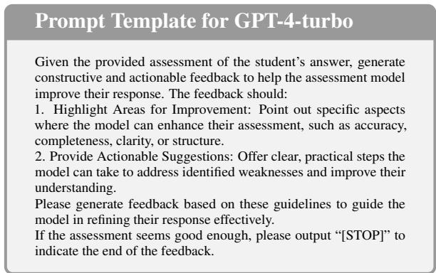  
Figure A2: Prompt template for GPT-4-turbo as critic.

<table><tr><td>Hyperparameter</td><td>Value</td></tr><tr><td>Learning Rate Batch Size - Model Size ≤ 8B - Model Size &gt; 8B Gradient Accumulation</td><td>2e-5 16 8</td></tr><tr><td>- Model Size ≤ 8B - Model Size &gt; 8B Epochs</td><td>1 2 1.0</td></tr><tr><td>Warmup Ratio Weight Decay LR Šcheduler Type Optimizer Adam Epsilon</td><td>0.05 0.02 cosine Adam 1e-8</td></tr></table>

Table A4: DARS framework hyper-parameters settings.

API Use for GPT-4-turbo Critic Baseline We utilized gpt-4-turbo-2024-04-09 (OpenAI et al., 2024) as the Critic LLM to generate reflection data. The temperature is set as 0.7 and the maximum token generation is limited to 1,024. The prompt template is presented in Figure A2.

Base Models, Computational Environment, and Inference Setup In this study, we utilized six different models downloaded from HuggingFace Transformers 13. We adhered to the licensing terms of all involved models. meta-llama/Llama-3.2-3B-Instruct (LLaMA 3B), meta-llama/Llama-3.1-8B-Instruct (LLaMA 8B) from (AI@Meta, 2024), and Qwen/Qwen2.5-3B-Instruct (Qwen 3B), Qwen/Qwen2.5-7B-Instruct (Qwen 7B), Qwen/Qwen2.5-14B-Instruct (Qwen 14B), Qwen/Qwen2.5-32B-Instruct (Qwen 32B) from (QwenTeam, 2024; Qwen et al., 2024).

All generative models were trained using either 4 A100 80G or 4 H100 GPUs.

To ensure reproducibility, all evaluations are done using zero-shot prompting with greedy decoding and a temperature of 0. Inference of LLMs is carried out using vLLM (Kwon et al., 2023). We utilized the same prompt templates and score extractor as released by (Li et al., 2024a). Prompt templates for ASAP 1 (Figure A8), ASAP 2 (Figure A9), ASAP 5 (Figure A3), and ASAP 6 (Figure A4) can also be found in each case studies.

Manual Evaluation Setup We randomly sampled 20 instances from each dataset and manually examined the reflection and refinement generated. The outputs were derived from a single run using the LLaMA 3B Reasoner and LLaMA 3B Critic model, as reported in Table 1. The annotations were conducted by the authors of this paper. We categorized the errors using the following schema.

Evaluation on Critic’s Reflection Errors in the Critic model’s reflections were classified as follows:

• Correct Reflection: The Critic model accurately identified errors in the previous assessment, ensuring faithfulness to both the student’s answer and the question content.

• Incorrect Reflection: The Critic model either misinterpreted the meaning of the student’s answer or the scope of key answer elements, leading to incorrect identification of errors or the identification of errors that were not coherent to the given content.

Evaluation on Reasoner’s Refinement We classify the error made by the Reasoner model in refinement into the following three categories:

• Correct Refinement: The situation the Reasoner model successfully refined its previous mistakes based on the Critic’s reflection.

• Wrong Refinement Obeyed Reflection: The situation Reasoner model made an error because it faithfully followed the Critic’s wrong reflection.

• Wrong Refinement Ignored Reflection: The situation in which the Reasoner model introduced a new error, deviating from the Critic’s reflection.

## B Further Experiment Result

## B.1 Explanation for Main Example

As illustrated in Figure A3, we present the complete example corresponding to Figure 3.

Initially, the Reasoner takes the question prompt as input and generates its first assessment decision

2 . However, in this first attempt, the model incorrectly evaluates the student’s response by crediting key elements such as “. . . described mRNA exiting the nucleus. . . ” and “. . . the corresponding amino acids on tRNA being bonded, and the continuation of amino acid linkage until a stop codon is reached,. . . ” which were not explicitly mentioned.

The Critic model then takes both the question prompt 1 and the Reasoner’s initial assessment 2 as input to generate a reflection instruction 3 . The Critic accurately identifies the Reasoner’s misjudgment, stating: “You credited the student for mentioning that the ‘corresponding amino acids on tRNA are bonded to adjacent tRNA’s amino acids and that ‘amino acids continue to be linked until a STOP codon is read on the mRNA.’ However, upon reviewing the student’s response, these elements were not explicitly covered.” The Critic further instructs the Reasoner to “Please revisit the student’s answer and your rationale, considering these points, and try to generate a more precise assessment that reflects the actual content of the student’s response.”

Subsequently, the Reasoner incorporates the chat history and the Critic’s feedback ( 1 , 2 , 3 ) as input to generate a revised assessment decision. The newly generated Reasoner output ⃝4 accurately identifies the key elements in the student’s response and corrects the final score assessment.

Finally, the Critic evaluates the updated assessment and generates a termination token, “[STOP],” indicating the end of the reasoning loop. This process demonstrates the iterative refinement capability of the proposed dual-model framework, ensuring accurate and explainable assessment evaluations.

## B.2 Case Studies on GPT-4-turbo as Critic

The case study in Figure A4 highlights the limitations of using GPT-4-turbo as a Critic model. GPT-4-turbo generated feedback tends to be vague, overemphasizing surface-level details while lacking contextual relevance and actionable insights. It struggles to provide precise guidance for improving assessments, often failing to align with key rubric elements and offering inconsistent or generalized reflection instructions. Specifically, the original Reasoner’s assessment is correct, but the GPT-4- turbo fails to evaluate the assessment and didn’t terminate the iterative refinement process. These shortcomings hinder its effectiveness in refining assessment rationales, underscoring the need for a more tailored Critic model that delivers targeted, domain-specific feedback for accurate and meaningful evaluation.

## B.3 Detailed Error Analysis

As shown in Figure A5, we provide an in-depth analysis of the Critic model’s effectiveness using a single run with the LLaMA 3B Reasoner and LLaMA 3B Critic model.

Label Distribution The first row of the Figure A5 presents an analysis of the overall label distribution changes across iterations. As shown in (a), the label distribution shifts closer to the ground-truth distribution after the second iteration with the Critic model’s guidance. This trend is further supported by the confusion matrices in (b) and (c), where the second iteration exhibits a more pronounced diagonal pattern, indicating improved alignment with ground-truth labels. In contrast, the first iteration shows a bias towards scores of 0 and 1.

Score Transitions To gain deeper insights into label transitions, the second row of the Figure A5 examines label changes across iterations. As shown in (d), while our framework does not guarantee perfect label corrections, the majority of transitions move from incorrect to correct labels. This underscores the potential to further refine the collaboration between the Critic and Reasoner models to minimize cases where correct predictions are mistakenly altered. Additionally, (e) and (f) display the top 10 transitions from correct to incorrect and incorrect to correct labels, respectively. The results reveal that most label changes occur between scores of 1 and 3, with the majority involving a single-point difference, reflecting patterns observed in human assessment behaviour.

## B.4 Two Smaller Models May Better Than a Larger One

As illustrated in Figure A6, DARS, which employs a dual-model setup with LLaMA 3B Reasoner and Critic, outperforms a single LLaMA 8B DPO model. This finding further reinforces that “two heads are better than one”, demonstrating that two smaller 3B models working together can achieve better results than a single, larger 8B Reasoner. This superior performance may be due to the fact that LLaMA 3B is a distilled variant of the 8B version (AI@Meta, 2024).

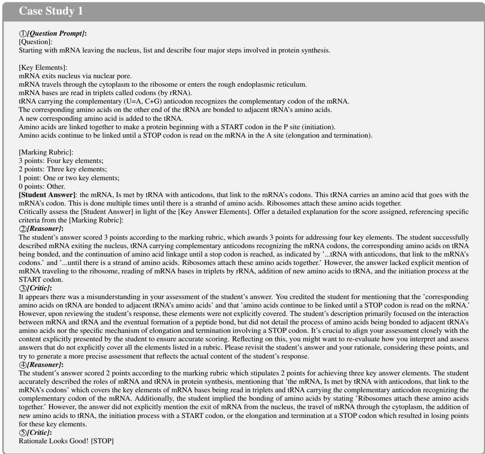  
Figure A3: The full example as presented in Figure 3.

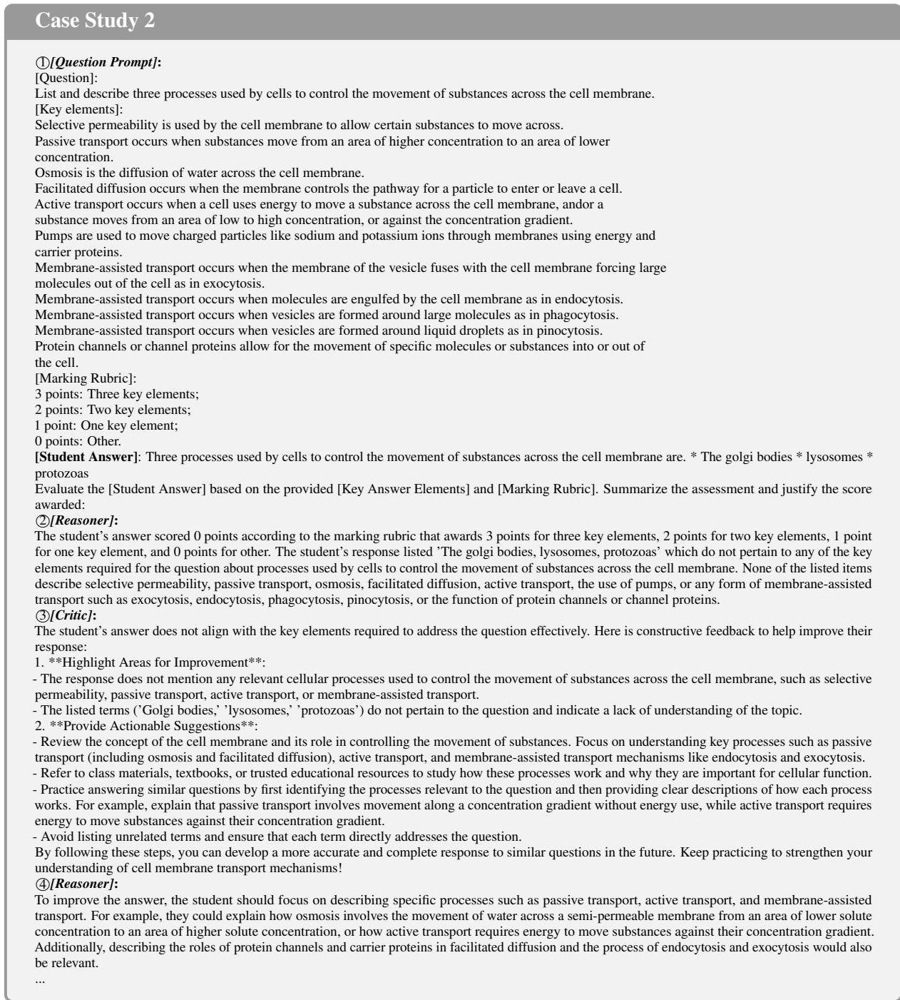  
Figure A4: Prompting GPT-4-turbo failed to act as effective critic model.

(e) Top 10 Correct to Incorrect Transitions  
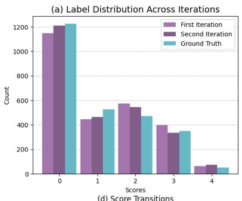

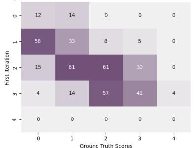

(c) Confusion Matrix: Second Iteration vs Ground Truth  
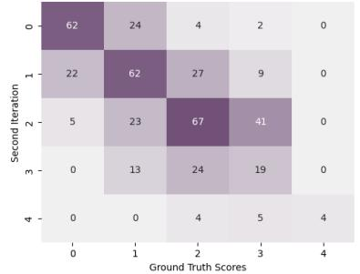

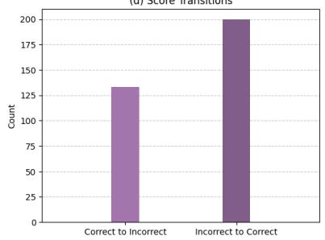

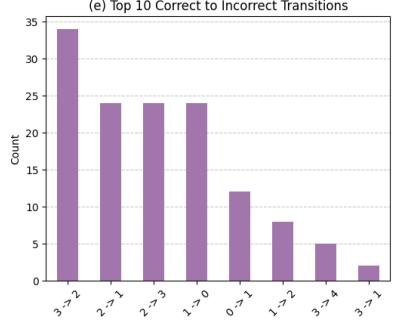

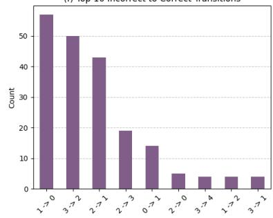  
Figure A5: Visualization of detailed error analysis for the iterative reasoning process.

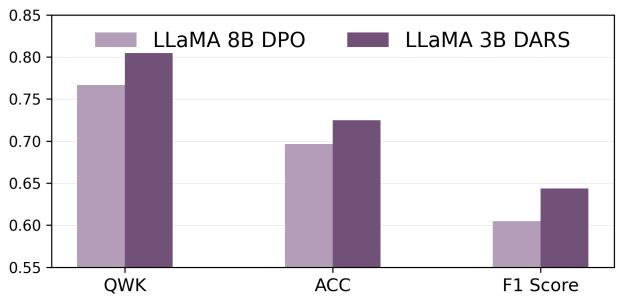  
Figure A6: Comparison of DARS with LLaMA 8B DPO.

B.5 Can Refinement Data Enhance Preference Optimization for the Reasoner?  
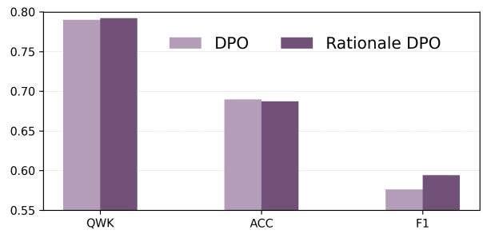  
Figure A7: Regulating DPO training with generated reflections.

Inspired by (Liu et al., 2024b), we propose a robust preference optimization baseline by incorporating an additional SFT loss on the synthetic reflection data to regularize the DPO training process. As illustrated in Figure A7, the inclusion of regularization on reflection data leads to slight improvements in QWK and F1 scores compared with vanilla DPO. These results suggest that refinement data can also serve as an effective regularizer even for single-reasoner training methods, enhancing both performance and stability during preference optimisation.

## B.6 Case Studies on Our Framework

Critic Oversees Errors and Misinterpret Scopes As shown in Figure A8, the correct assessment of the student’s answer is actually 1 point, not 2 or 3. Although the student lists three items, the first item (volume of vinegar) cleanly maps to the “additional information” that is missing from the procedure. The other two points are either too vague or already addressed in the procedure (e.g., “Determine the mass of each sample” is mentioned, and the procedure does not necessarily require the exact measuring method). Therefore, the response only provides one distinct piece of new information that truly helps replicate the experiment.

The reasoner miscounted the distinct, missing details in the student’s answer. The critic model fails to point this oversee. Although three items were listed—vinegar volume, distilled water volume, and mass measurement method—only one (the amount of vinegar) was truly new. The other two were too vague or already in the procedure, leading the reasoner to mistakenly award 2 and 3 points instead of the correct score of 1.

Critic Correctly Identify Intermediate Errors Even Final Scores are Correct As shown in Figure A9, the “reasoner” ultimately awarded the correct score of 2 points but incorrectly characterized the student’s conclusion as valid. The “critic” accurately identified that while the conclusion (“plastic C will take the most weight”) was not supported by the data, the student still described two valid improvements (more trials, ensuring uniform sample length). This discrepancy shows that the critic model can detect errors in the reasoning—namely, that the conclusion is wrong—even when the final numerical score is correct for other reasons (i.e., providing two legitimate design improvements).

## B.7 Case Study: Comparing Critic’s Output with Different Sizes

In Figure A10, Qwen3B (the reasoner) mistakenly awards the student’s answer 2points rather than the 0 points warranted by the rubric. Comparing critic responses of different model sizes highlights varied degrees of thoroughness in their feedback. Qwen 3B’s critic, for instance, repeatedly instructs that “it’s important to ensure that the key elements of each biological process are correctly identified and matched ...” yet does not provide concrete steps for revising the assessment. By contrast, Qwen7B merely remarks “Rationale Looks Good! [STOP],” signalling an abrupt end to any meaningful revision. Progressing to Qwen 14B, the critic offers more constructive guidance by urging: “You might want to revisit the student’s answer and compare it directly with the key elements required by the rubric.” Finally, Qwen 32B delivers the most comprehensive feedback, emphasizing “It’s important to verify that the terms and processes described align correctly with biological definitions and mechanisms before awarding points based on the rubric” and detailing how the student’s descriptions deviate from correct scientific definitions. This gradual increase in clarity, depth, and actionable insights indicates that larger model sizes (14B and 32B) are more effective at diagnosing errors and recommending precise revisions.

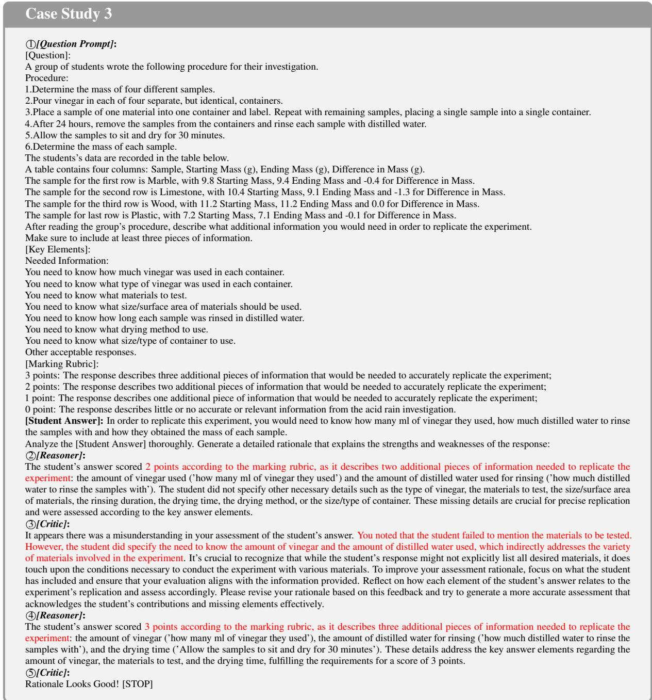  
Figure A8: An example that both Reasoner and Critic oversee the mistakes.

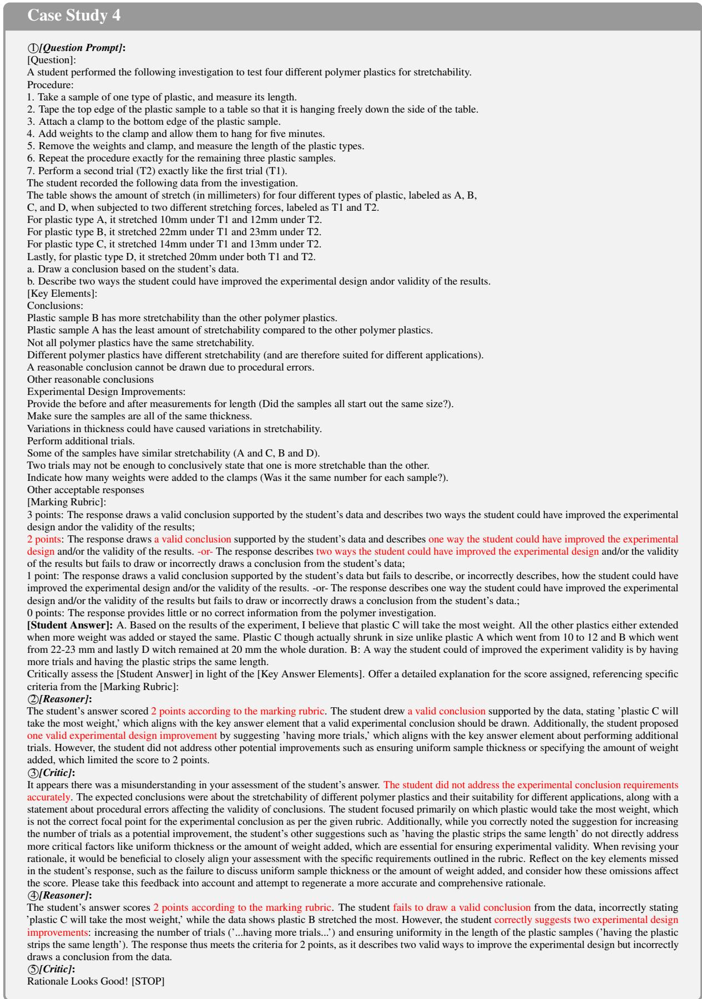  
Figure A9: An example that Critic can identify intermediate errors even final scores are correct.

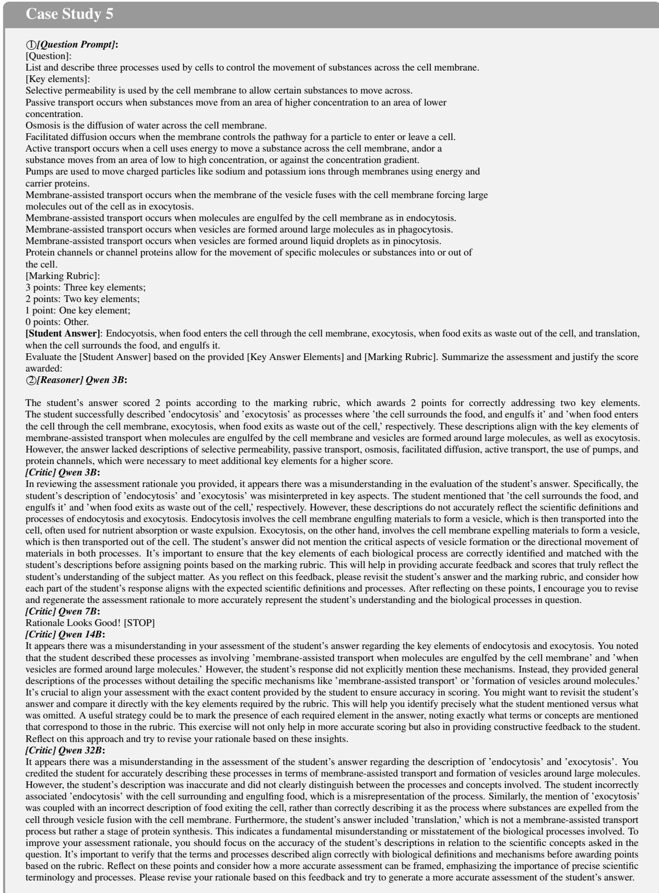  
Figure A10: Comparing Critic model’s output with different parameter sizes.