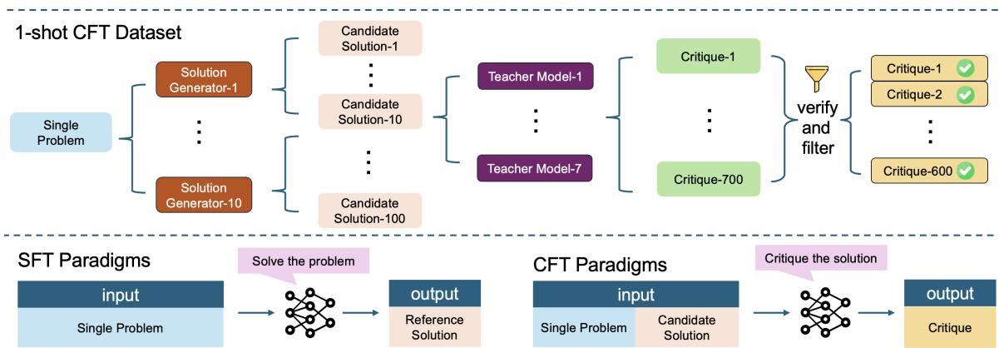
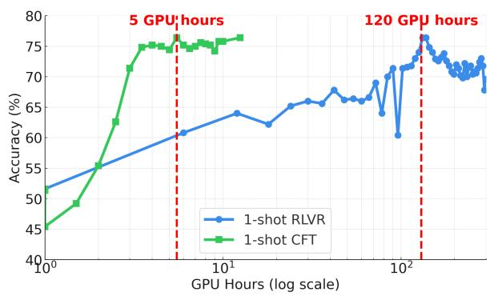
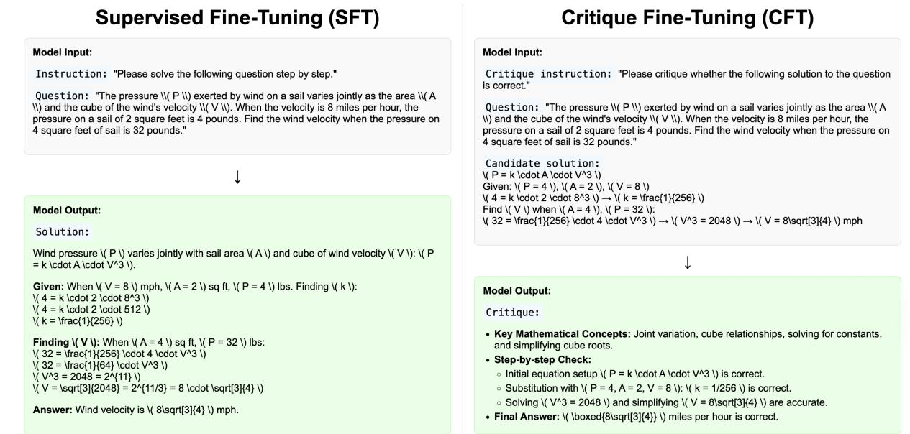

# Unleashing the Reasoning Potential of Pre-trained LLMs by Critique Fine-Tuning on One Problem

Yubo Wang1,2, Ping Nie5, Kai Zou3, Lijun Wu4, Wenhu Chen1,2 1University of Waterloo, 2Vector Institute, 3Netmind.AI, 4Shanghai AI Lab, 5Independent https://tiger-ai-lab.github.io/One-Shot-CFT

## Abstract

We have witnessed that strong LLMs like Qwen-Math, MiMo, and Phi-4 possess immense reasoning potential inherited from the pre-training stage. With reinforcement learning (RL), these models can improve dramatically on reasoning tasks. Recent studies have shown that even RL on a single problem (Wang et al., 2025a) can unleash these models’ reasoning capabilities. However, RL is not only expensive but also unstable. Even one-shot RL requires hundreds of GPU hours. This raises a critical question: Is there a more efficient way to unleash the reasoning potential of these powerful base LLMs? In this work, we demonstrate that Critique Fine-Tuning (CFT) on only one problem can effectively unleash the reasoning potential of LLMs. Our method constructs critique data by collecting diverse model-generated solutions to a single problem and using teacher LLMs to provide detailed critiques. We finetune Qwen and Llama family models, ranging from 1.5B to 14B parameters, on the CFT data and observe significant performance gains across diverse reasoning tasks. For example, with just 5 GPU hours of training, Qwen-Math-7B-CFT show an average improvement of 15% on six math benchmarks and 16% on three logic reasoning benchmarks. These results are comparable to or even surpass the results from RL with 20x less compute. Ablation studies reveal the robustness of one-shot CFT across different prompt problems. These results highlight oneshot CFT as a simple, general, and computeefficient approach to unleashing the reasoning capabilities of modern LLMs.

## 1 Introduction

Large language models (LLMs) have achieved impressive results on mathematical and scientific reasoning tasks (Achiam et al., 2023; Yang et al., 2025; Hendrycks et al., 2021; Lewkowycz et al., 2022; Wang et al., 2024; Du et al., 2025), showcasing strong generalization and reasoning capabilities.

Among post-training methods, reinforcement learning with verifiable rewards (RLVR) (Guo et al., 2025) enables models to learn via trial-and-error exploration (Zeng et al., 2025; Ma et al., 2025; Wang et al., 2025a), even with a single example. This suggests base models possess substantial untapped reasoning potential.

However, RLVR is resource-intensive (e.g., requiring over 100 GPU hours for a 7B model (Wang et al., 2025a)) and often unstable due to nonstationarity and plasticity loss (Dang and Ngo, 2025; Goldie et al., 2024; Igl et al., 2020). Supervised fine-tuning (SFT) offers stability but relies on large, high-quality datasets to avoid overfitting (Abdin et al., 2025; Liu et al., 2024), which are scarce for many reasoning tasks.

Critique Fine-Tuning (CFT) (Wang et al., 2025b) emerges as a promising alternative, exposing models to diverse error patterns via critiques of incorrect solutions. This diversity mitigates overfitting and enhances reasoning. We ask: Can critiques from a single problem suffice to unleash LLMs’ reasoning potential, matching RLVR effectiveness at minimal cost? We investigate one-shot CFT as a compute-efficient post-training method for mathematical and logical reasoning. As shown in Figure 1, we generate diverse candidate solutions to a single problem using open-source models, obtain detailed critiques from strong teacher LLMs, and fine-tune Qwen and Llama models (1.5B–14B parameters) on the resulting compact datasets.

Experiments show one-shot CFT delivers substantial gains: up to 15% average accuracy improvement on six math benchmarks (e.g., >20% on Minerva (Lewkowycz et al., 2022), Olympiad-Bench (He et al., 2024), and AMC-23) using only 5 GPU hours, and 16% average gain on three BIG-Bench Extra Hard (BBEH) subtasks (Kazemi et al., 2025) (Causal Understanding, DisambiguationQA, Time Arithmetic). Ablations confirm robustness across seed problems and model combinations.

  
Figure 1: Overview of 1-shot CFT dataset construction and differences from SFT. Top: Generate, critique, and filter solutions to a single problem. Bottom: SFT generates reference solutions; CFT critiques candidates for deeper error analysis.

Overall, one-shot CFT is a simple, robust, and efficient paradigm for unlocking LLMs’ reasoning in mathematical and logical domains.

## 2 Method

In this section, we detail our dataset construction and training scheme for one-shot CFT.

## 2.1 One-shot CFT Dataset Construction

To assess one-shot CFT, we construct critique datasets from a single seed problem, following oneshot RLVR protocols (Wang et al., 2025a).

We select seed math problems from the Deep-ScaleR subset, focusing on four representative ones (π1, π2, π13, π1209) for comparison with prior work (full details in Appendix A.4). For each seed, we generate 100 diverse candidate solutions using 10 open-source models (e.g., Qwen2.5- Math-7B-Instruct (Yang et al., 2024), Qwen3 variants (Yang et al., 2025), MiMo-7B (Xia et al., 2025), DeepSeek-R1 (Guo et al., 2025), and Phi-4- reasoning (Abdin et al., 2025); see Fig. ??).

These solutions are then critiqued by 7 highperforming proprietary teacher models (e.g., Claude-3/3.5-Sonnet (Anthropic, 2025), GPT-4 variants (OpenAI, 2025a; Achiam et al., 2023), O3-Mini (OpenAI, 2025b), and O1-2024 (Jaech et al., 2024)), yielding 700 initial critiques per seed. We filter for quality and consistency, subsample to 600 critiques per dataset for uniformity (detailed statistics in Appendix A.3).

## 2.2 Training

Following CFT (Wang et al., 2025b), each training instance concatenates the seed problem x and a candidate solution y as input, with the teacher critique c as the target output (i.e., model learns to generate c given (x, y)). Unlike SFT, which trains direct solution generation, CFT emphasizes error analysis and critiquing (see Appendix Figure 3 for a visual comparison; templates and examples in Appendix A.1). We use full-parameter instruction tuning with a learning rate of $5 \times 1 0 ^ { - 6 }$ , cosine schedule, 0.1 warmup ratio, and global batch size of 512. Hyperparameters are consistent across models (Qwen and Llama, 1.5B–14B parameters) and seeds for fair comparison.

## 3 Experiments on Math Reasoning

## 3.1 Setup

We conduct our experiments on four backbone models: Qwen2.5-Math-1.5B, Qwen2.5-Math-7B, Llama-3.2-3B-Instruct, and Qwen2.5-14B. For seed question selection, we follow one-shot RLVR protocols and choose the same four representative problems: π1, π2, π13, and $\pi _ { 1 2 0 9 }$ . The corresponding CFT training datasets are denoted as dsr-cft-p0 to dsr-cft-p3.

For fair comparison with supervised fine-tuning (SFT), we employ the full DeepScaleR dataset (40.9K examples) as the training data for our Full SFT baseline. Additionally, for the one-example SFT (SFT-1ex) condition, we select π1 as the seed problem and use the same 7 closed-source API models to generate 100 diverse solutions. We then verify all 700 generated solutions against the ground-truth answer, retaining 600 correct responses for our final SFT (1 ex) dataset.

We include sober baseline scores from Hochlehnert et al. (2025) for standardized comparison, highlighting underestimation in prior Qwen evaluations. We evaluate on six math benchmarks and smaller benchmarks (AIME25, AIME24, AMC23) are averaged over 32 runs for stability.

<table><tr><td>Model</td><td>Method</td><td>Math-500</td><td>Minerva</td><td>Olympiad</td><td>AIME24</td><td>AIME25</td><td>AMC23</td><td>AVG</td></tr><tr><td rowspan="6">Qwen2.5-Math-1.5B</td><td>base</td><td>35.8</td><td>11.0</td><td>22.1</td><td>15.0</td><td>2.5</td><td>40.0</td><td>21.1</td></tr><tr><td>base (sober)</td><td>51.7</td><td>11.3</td><td>26.0</td><td>11.3</td><td>5.7</td><td>44.0</td><td>25.0</td></tr><tr><td>SFT (1 ex)</td><td>37.2</td><td>9.6</td><td>22.7</td><td>3.1</td><td>0.0</td><td>38.3</td><td>18.5</td></tr><tr><td>SFT (full)</td><td>49</td><td>14.3</td><td>23.2</td><td>7.9</td><td>2.1</td><td>35.8</td><td>22.2</td></tr><tr><td>RL (1 ex)</td><td>72.4</td><td>26.8</td><td>33.3</td><td>11.7</td><td>7.1</td><td>51.6</td><td>33.8</td></tr><tr><td>CFT (1 ex)</td><td>66.6</td><td>30.1</td><td>30.4</td><td>10.4</td><td>8.8</td><td>50.6</td><td>32.8</td></tr><tr><td></td><td>Δ = CFT - base</td><td>+30.8</td><td>+19.1</td><td>+8.3</td><td>-4.6</td><td>+6.3</td><td>+10.6</td><td>+11.7</td></tr><tr><td rowspan="6">Llama3.2-3B-Instruct</td><td>base</td><td>40.8</td><td>15.8</td><td>13.2</td><td>8.3</td><td>1.7</td><td>25.3</td><td>17.5</td></tr><tr><td>SFT (1 ex)</td><td>41.4</td><td>13.2</td><td>11.7</td><td>2.7</td><td>0.0</td><td>23.2</td><td>15.4</td></tr><tr><td>SFT (full)</td><td>43.2</td><td>14.7</td><td>12.1</td><td>3.1</td><td>1.7</td><td>24.3</td><td>16.5</td></tr><tr><td>RL (1 ex)</td><td>45.8</td><td>16.5</td><td>17.0</td><td>7.9</td><td>1.2</td><td>25.3</td><td>19.0</td></tr><tr><td>CFT (1 ex)</td><td>49.0</td><td>21.0</td><td>15.3</td><td>9.2</td><td>2.9</td><td>32.5</td><td>21.7</td></tr><tr><td>∆ = CFT - base</td><td>+8.2</td><td>+5.2</td><td>+2.1</td><td>+0.9</td><td>+1.2</td><td>+7.2</td><td>+4.2</td></tr><tr><td rowspan="6">Qwen2.5-Math-7B</td><td>base</td><td>58.6</td><td>17.3</td><td>17.5</td><td>16.7</td><td>10.8</td><td>43.1</td><td>27.3</td></tr><tr><td>base (sober)</td><td>64.3</td><td>17.3</td><td>26.0</td><td>20.7</td><td>8.7</td><td>56.2</td><td>32.2</td></tr><tr><td>SFT (1 ex)</td><td>53.8</td><td>14.3</td><td>18.2</td><td>12.1</td><td>6.7</td><td>32.5</td><td>22.9</td></tr><tr><td>SFT (full)</td><td>58.6</td><td>24.6</td><td>27.6</td><td>10.0</td><td>7.1</td><td>45.3</td><td>28.9</td></tr><tr><td>RL (1 ex)</td><td>79.2</td><td>27.9</td><td>39.1</td><td>23.8</td><td>10.8</td><td>60.3</td><td>40.2</td></tr><tr><td>CFT (1 ex)</td><td>76.4</td><td>40.4</td><td>39.3</td><td>18.8</td><td>14.6</td><td>63.4</td><td>42.2</td></tr><tr><td></td><td>∆ = CFT - base</td><td>+17.8</td><td>+23.1</td><td>+21.8</td><td>+2.1</td><td>+3.8</td><td>+20.3</td><td>+14.9</td></tr><tr><td rowspan="5">Qwen2.5-14B</td><td>base</td><td>60.4</td><td>22.4</td><td>27.9</td><td>3.8</td><td>3.8</td><td>44.1</td><td>27.1</td></tr><tr><td>SFT (1 ex)</td><td>63.8</td><td>19.5</td><td>20.9</td><td>5.0</td><td>1.2</td><td>36.9</td><td>24.6</td></tr><tr><td>SFT (full)</td><td>65.2</td><td>24.2</td><td>22.7</td><td>2.6</td><td>1.7</td><td>38.3</td><td>25.8</td></tr><tr><td>CFT (1 ex)</td><td>71.2</td><td>43.8</td><td>34.8</td><td>12.5</td><td>8.3</td><td>45.3</td><td>36.0</td></tr><tr><td>Δ = CFT - base</td><td>+10.8</td><td>+21.4</td><td>+6.9</td><td>+8.7</td><td>+4.5</td><td>+1.2</td><td>+8.9</td></tr></table>

Table 1: Performance (%) on mathematical benchmarks. The base results are measured using the same prompt and evaluation setting with SFT and CFT. The base (sober) is taken from Hochlehnert et al. (2025) with a more comprehensive evaluation. The RL (1 ex) results are from Wang et al. (2025a). The delta rows show the performance difference between CFT (1 ex) and the base.
<table><tr><td>Training Data</td><td>Seed Score (/100)</td><td></td><td>Math-500 Minerva Math</td><td>Olympiad</td><td>AIME25</td><td>AIME24</td><td>AMC23</td><td>AVG</td></tr><tr><td>baseline</td><td>-</td><td>52.6</td><td>17.3</td><td>17.5</td><td>10.8</td><td>16.7</td><td>43.1</td><td>26.3</td></tr><tr><td>dsr-cft-p0</td><td>49.0</td><td>77.0</td><td>40.4</td><td>39.3</td><td>14.6</td><td>18.8</td><td>63.4</td><td>42.2</td></tr><tr><td>dsr-cft-p1</td><td>93.0</td><td>72.4</td><td>35.7</td><td>32.1</td><td>15.8</td><td>20.0</td><td>51.6</td><td>37.9</td></tr><tr><td>dsr-cft-p2</td><td>83.0</td><td>77.0</td><td>33.1</td><td>39.1</td><td>12.1</td><td>13.8</td><td>57.2</td><td>38.7</td></tr><tr><td>dsr-cft-p3</td><td>10.0</td><td>72.6</td><td>32.4</td><td>35.4</td><td>7.1</td><td>10.4</td><td>59.7</td><td>36.3</td></tr><tr><td>dsr-cft-p0,p1,p2,p3</td><td>58.8</td><td>74.6</td><td>34.6</td><td>35.4</td><td>13.3</td><td>17.1</td><td>65.3</td><td>40.1</td></tr></table>

Table 2: Comparison of performance (%) with different seed math problems on Qwen-2.5-Math-7B

## 3.2 Main Results

Table 1 presents the main performance comparison across different training methods, including oneshot Critique Fine-Tuning (CFT), supervised finetuning (SFT), and one-shot Reinforcement Learning with Verifiable Reward (RLVR). For validation, we randomly select 500 math problems from the MATH dataset (excluding those in the MATH-500 benchmark) to construct the validation set. During training, all models are checkpointed every 10 steps. The checkpoint with the highest validation score is selected for final evaluation.

CFT significantly improves upon the backbone. Across all model scales, one-shot CFT consistently improves reasoning accuracy over the base models. Even when evaluated against the more rigorous sober baseline scores by Hochlehnert et al. (2025),

CFT demonstrates substantial gains. For instance, on Qwen2.5-Math-7B, the backbone accuracy is revised to 32.2%, and one-shot CFT still achieves 42.2%, delivering a +10.0 point improvement.

CFT outperforms SFT even with full data. Under the same one-shot setting, CFT substantially outperforms SFT. For Qwen2.5-Math-7B, one-shot SFT achieves 22.9%, while one-shot CFT reaches 42.2%. Notably, one-shot CFT also surpasses SFT trained on the full dataset (25.6%), highlighting the superior generalization and reasoning gains from the critique supervision signal.

CFT competes with or surpasses one-shot RLVR. CFT shows stronger results than RLVR in most settings. On Qwen2.5-Math-7B and Llama-3.2-3B-Instruct, one-shot CFT outperforms RLVR by +2.0 and +2.1 points, respectively. On Qwen2.5-Math-1.5B, CFT is slightly behind RLVR (by 1 point).

<table><tr><td>Solution Generators</td><td>Math-500</td><td>Minerva</td><td>Olympiad</td><td>AIME25</td><td>AIME24</td><td>AMC23</td><td>Avg</td></tr><tr><td>1 generator (Phi-4)</td><td>75.8</td><td>32.0</td><td>35.4</td><td>7.1</td><td>16.7</td><td>58.8</td><td>37.6</td></tr><tr><td>1 generator (Qwen2.5)</td><td>74.4</td><td>30.5</td><td>35.6</td><td>9.6</td><td>17.1</td><td>64.7</td><td>38.7</td></tr><tr><td>10 generators (mixed)</td><td>76.4</td><td>40.4</td><td>39.3</td><td>14.6</td><td>18.8</td><td>63.4</td><td>42.2</td></tr></table>

Table 3: Full ablation results on the diversity of solution generators in one-shot CFT

## 3.3 Training Efficiency Comparison

As shown in Figure 2, one-shot CFT achieves significantly higher training efficiency than one-shot RLVR. With only 5 GPU hours, CFT surpasses 75% accuracy on the Math-500 and quickly stabilizes. In contrast, RLVR requires over 120 GPU hours to reach a similar level of performance and exhibits greater fluctuations during training.

This efficiency advantage is primarily due to the high computational cost of reinforcement learning, which requires many iterations to propagate reward signals. In contrast, CFT benefits from direct and dense critique supervision, enabling much faster and more stable training. Consequently, oneshot CFT matches or surpasses RLVR performance while using only about 1/15 to 1/20 of the compute.

## 3.4 Effectiveness of Seed Examples

Table 2 shows one-shot CFT performance across seeds, with dsr-cft-p0 (π1) yielding the highest average accuracy. We assess seed difficulty by grading 100 Qwen2.5-Math-7B solutions via Qwen3- 32B (prompt in Appendix A.2), scoring 1 (correct), 0.5 (partial), or 0 (incorrect). Moderate-difficulty seeds like $\pi _ { 1 }$ provide balanced solutions for richer critiques. Overall, CFT is robust to seed choice, favoring moderate difficulty.

  
Figure 2: Comparing Model accuracy on Math-500, v.s. the training cost. For the Qwen2.5-Math-7B trained with 1-shot RL and 1-shot CFT.

## 3.5 Diversity of Candidate Solutions

We compare diversity effects on $\pi _ { 1 }$ using single generators (Phi-4-Reasoning-Plus or Qwen2.5- Math-7B-Instruct, each producing 100 solutions)

versus our mixed approach (100 from 10 generators). Table 3 shows single generators yield 38.7% and 37.6% averages, while mixed achieves 42.2%. This demonstrates that greater diversity in candidate solutions leads to richer error types and reasoning patterns, enabling more effective CFT.

## 4 Experiments on Logic Reasoning

We evaluate one-shot CFT on three BBEH subtasks: Causal Understanding, DisambiguationQA, and Time Arithmetic, each testing advanced logic and containing 200 questions, except for the DisambiguationQA subtask, which has 120 questions.

## 4.1 Experimental Setup

We fine-tune Qwen2.5-Math-7B on one example per subtask (1-shot CFT) or a merged dataset (3 examples total), comparing to 1-shot SFT. Critiques are generated from few-shot examples using teacher models. Evaluation uses accuracy on BBEH test sets, assessing in-domain and crossdomain performance.

## 4.2 Main Results

Table 4 summarizes the performance of one-shot CFT and SFT on the three BBEH subtasks.

In-Domain Performance. One-shot CFT consistently outperforms one-shot SFT across all three subtasks when fine-tuned on an in-domain example. For instance, on Causal Understanding, one-shot CFT achieves an accuracy of 41.5%, compared to 27.5% for one-shot SFT. Similarly, for DisambiguationQA and Time Arithmetic, one-shot CFT achieves 25.0% and 14.0%, respectively, outperforming their SFT counterparts.

Cross-Task Generalization. One-shot CFT demonstrates strong cross-task generalization. When fine-tuned on a single example from Causal Understanding, the model achieves 25.0% on DisambiguationQA and 9.0% on Time Arithmetic, significantly surpassing the performance of SFT. Similar trends are observed when the model is fine-tuned on examples from the other two tasks.

<table><tr><td>Model</td><td>Causal Understanding</td><td>DisambiguationQA</td><td>Time Arithmetic</td><td>Average</td></tr><tr><td>Qwen2.5-Math-7B</td><td>24.0</td><td>5.0</td><td>2.5</td><td>10.5</td></tr><tr><td colspan="5">Fine-tuned on 1 problem from Causal Understanding</td></tr><tr><td>SFT (1 ex)</td><td>27.5</td><td>11.7</td><td>2.0</td><td>13.7</td></tr><tr><td>CFT (1 ex)</td><td>41.5</td><td>25.0</td><td>9.0</td><td>25.2</td></tr><tr><td colspan="5">Fine-tuned on 1 problem from DisambiguationQA</td></tr><tr><td>SFT (1 ex)</td><td>20.5</td><td>9.2</td><td>2.0</td><td>10.6</td></tr><tr><td>CFT (1 ex)</td><td>34.5</td><td>24.2</td><td>2.5</td><td>20.4</td></tr><tr><td colspan="5">Fine-tuned on 1 problem from Time Arithmetic</td></tr><tr><td>SFT (1 ex)</td><td>24.5</td><td>10.8</td><td>5.0</td><td>13.4</td></tr><tr><td>CFT (1 ex)</td><td>37.0</td><td>28.3</td><td>14.0</td><td>26.4</td></tr><tr><td colspan="5">Fine-tuned on 3 problems from the above tasks.</td></tr><tr><td>SFT (3 ex)</td><td>29.5</td><td>11.7</td><td>6.5</td><td>15.9</td></tr><tr><td>CFT (3 ex)</td><td>36.5</td><td>28.3</td><td>15.5</td><td>26.8</td></tr></table>

Table 4: Performance of Qwen2.5-Math-7B on three BIG-Bench Extra Hard (BBEH) logic reasoning subtasks. For each subtask, SFT and CFT are performed using a single example from that subtask, and evaluated on all three tasks. The in-domain (diagonal) results and all results in the last two rows (merged CFT/SFT) are highlighted. The last two rows show results when merging the three problems into a single three-example training set, evaluating generalization across all three subtasks. Best results in each column are in bold.

Multi-Task Fine-Tuning. Fine-tuning on a merged dataset containing one example from each subtask further boosts model performance. Oneshot CFT achieves 36.5%, 28.3%, and 15.5% accuracy on Causal Understanding, DisambiguationQA, and Time Arithmetic, respectively, outperforming one-shot SFT, which achieves 29.5%, 11.7%, and 6.5%.

## 4.3 Ablation Study: Impact of Model Scale on Logic Reasoning

<table><tr><td>Model</td><td>DisambiguationQA</td></tr><tr><td>Qwen3-4B-Base</td><td>15.0</td></tr><tr><td>SFT (1 ex)</td><td>18.3</td></tr><tr><td>CFT (1 ex)</td><td>33.3</td></tr><tr><td>Qwen2.5-Math-7B</td><td>5.0</td></tr><tr><td>SFT (1 ex)</td><td>9.2</td></tr><tr><td>CFT (1 ex)</td><td>24.2</td></tr><tr><td>Qwen2.5-14B</td><td>9.2</td></tr><tr><td>SFT (1 ex)</td><td>13.3</td></tr><tr><td>CFT (1 ex)</td><td>36.6</td></tr></table>

Table 5: Ablation study on the impact of model scale for the DisambiguationQA task. CFT consistently outperforms both base and SFT across all model sizes.

To further understand the effectiveness of CFT at different model scales, we conduct an ablation study on the DisambiguationQA logic reasoning task, comparing base, SFT (1 ex), and CFT (1 ex) settings across several model sizes. As shown in Table 5, one-shot CFT delivers substantial improvements over both base and SFT (1 ex) regardless of size, with boosts more pronounced at larger scales—for example, Qwen2.5-14B-CFT (1 ex) achieves 36.6% accuracy vs. 9.2% base and 13.3% SFT (1 ex). This pattern holds for smaller models, providing consistent gains. These results validate CFT’s robustness in unleashing reasoning across LLM scales in logic tasks.

In summary, experiments on the BBEH benchmark demonstrate the effectiveness of one-shot CFT in logic reasoning tasks across both in-domain and cross-domain scenarios. One-shot CFT consistently outperforms SFT in three diverse subtasks, achieving substantial improvements in accuracy. Moreover, the method exhibits strong cross-task generalization, aligning with findings in mathematical reasoning. These results highlight the potential of CFT to enhance reasoning capabilities in challenging benchmarks with minimal data.

## 5 Conclusion

This work introduces and investigates one-shot Critique Fine-Tuning (CFT) as an efficient and effective method for unleashing the reasoning capabilities of LLMs. Using diverse student-teacher interactions on a single math problem, one-shot CFT surpasses both traditional supervised fine-tuning and one-shot RLVR in accuracy, while offering up to 20 higher training efficiency. Experiments across multiple model backbones confirm its strong generalization and robustness, especially when the seed example is moderately difficult. One-shot CFT offers a practical post-training solution for LLMs in compute- and data-limited scenarios.

## Limitations

Our study is primarily limited to relatively weaker language models, particularly base models prior to supervised fine-tuning or distillation. When applied to already strong reasoning-oriented LLMs, our method yields mixed results. This suggests that our approach is most effective at unleashing latent capabilities in less-aligned models. However, for models that have undergone extensive alignment, our algorithm does not consistently yield further improvements. Future work is needed to investigate adaptations or extensions of our method for more capable or well-aligned models.

## References

Marah Abdin, Sahaj Agarwal, Ahmed Awadallah, Vidhisha Balachandran, Harkirat Behl, Lingjiao Chen, Gustavo de Rosa, Suriya Gunasekar, Mojan Javaheripi, Neel Joshi, and 1 others. 2025. Phi-4-reasoning technical report. arXiv preprint arXiv:2504.21318.

Josh Achiam, Steven Adler, Sandhini Agarwal, Lama Ahmad, Ilge Akkaya, Florencia Leoni Aleman, Diogo Almeida, Janko Altenschmidt, Sam Altman, Shyamal Anadkat, and 1 others. 2023. Gpt-4 technical report. arXiv preprint arXiv:2303.08774.

Anthropic. 2025. Claude 3.7 sonnet. https://www. anthropic.com/claude/sonnet. Accessed: 2025- 05-18.

Quy-Anh Dang and Chris Ngo. 2025. Reinforcement learning for reasoning in small llms: What works and what doesn’t. arXiv preprint arXiv:2503.16219.

Xinrun Du, Yifan Yao, Kaijing Ma, Bingli Wang, Tianyu Zheng, King Zhu, Minghao Liu, Yiming Liang, Xiaolong Jin, Zhenlin Wei, and 1 others. 2025. Supergpqa: Scaling llm evaluation across 285 graduate disciplines. arXiv preprint arXiv:2502.14739.

Alexander D Goldie, Chris Lu, Matthew T Jackson, Shimon Whiteson, and Jakob Foerster. 2024. Can learned optimization make reinforcement learning less difficult? Advances in Neural Information Pro cessing Systems, 37:5454–5497.

Daya Guo, Dejian Yang, Haowei Zhang, Junxiao Song, Ruoyu Zhang, Runxin Xu, Qihao Zhu, Shirong Ma, Peiyi Wang, Xiao Bi, and 1 others. 2025. Deepseek-r1: Incentivizing reasoning capability in llms via reinforcement learning. arXiv preprint arXiv:2501.12948.

Chaoqun He, Renjie Luo, Yuzhuo Bai, Shengding Hu, Zhen Thai, Junhao Shen, Jinyi Hu, Xu Han, Yujie Huang, Yuxiang Zhang, and 1 others. 2024. Olympiadbench: A challenging benchmark for promoting agi with olympiad-level bilingual multimodal

scientific problems. In Proceedings ofthe 62nd Annual Meeting ofthe Associationfor Computational Linguistics (Volume 1: Long Papers), pages 3828– 3850.

Dan Hendrycks, Collin Burns, Saurav Kadavath, Akul Arora, Steven Basart, Eric Tang, Dawn Song, and Jacob Steinhardt. 2021. Measuring mathematical problem solving with the math dataset. arXiv preprint arXiv:2103.03874.

Andreas Hochlehnert, Hardik Bhatnagar, Vishaal Udandarao, Samuel Albanie, Ameya Prabhu, and Matthias Bethge. 2025. A sober look at progress in language model reasoning: Pitfalls and paths to reproducibility. arXiv preprint arXiv:2504.07086.

Maximilian Igl, Gregory Farquhar, Jelena Luketina, Wendelin Boehmer, and Shimon Whiteson. 2020. Transient non-stationarity and generalisation in deep reinforcement learning. arXiv preprint arXiv:2006.05826.

Aaron Jaech, Adam Kalai, Adam Lerer, Adam Richardson, Ahmed El-Kishky, Aiden Low, Alec Helyar, Aleksander Madry, Alex Beutel, Alex Carney, and 1 others. 2024. Openai o1 system card. arXiv preprint arXiv:2412.16720.

Mehran Kazemi, Bahare Fatemi, Hritik Bansal, John Palowitch, Chrysovalantis Anastasiou, Sanket Vaibhav Mehta, Lalit K Jain, Virginia Aglietti, Disha Jindal, Peter Chen, and 1 others. 2025. Big-bench extra hard. arXiv preprint arXiv:2502.19187.

Aitor Lewkowycz, Anders Andreassen, David Dohan, Ethan Dyer, Henryk Michalewski, Vinay Ramasesh, Ambrose Slone, Cem Anil, Imanol Schlag, Theo Gutman-Solo, and 1 others. 2022. Solving quantitative reasoning problems with language models. Advances in Neural Information Processing Systems, 35:3843–3857.

Zihan Liu, Yang Chen, Mohammad Shoeybi, Bryan Catanzaro, and Wei Ping. 2024. Acemath: Advancing frontier math reasoning with post-training and reward modeling. arXiv preprint arXiv:2412.15084.

Xueguang Ma, Qian Liu, Dongfu Jiang, Ge Zhang, Zejun Ma, and Wenhu Chen. 2025. General-reasoner: Advancing llm reasoning across all domains. arXiv preprint arXiv:2505.14652.

OpenAI. 2025a. Gpt-4.1. https://openai.com/ index/gpt-4-1/. Accessed: 2025-05-18.

OpenAI. 2025b. Introducing o3 and o4 mini. https://openai.com/index/ introducing-o3-and-o4-mini/. Accessed: 2025-05-18.

Yiping Wang, Qing Yang, Zhiyuan Zeng, Liliang Ren, Lucas Liu, Baolin Peng, Hao Cheng, Xuehai He, Kuan Wang, Jianfeng Gao, and 1 others. 2025a. Reinforcement learning for reasoning in large language models with one training example. arXiv preprint arXiv:2504.20571.

Yubo Wang, Xueguang Ma, Ge Zhang, Yuansheng Ni, Abhranil Chandra, Shiguang Guo, Weiming Ren, Aaran Arulraj, Xuan He, Ziyan Jiang, and 1 others. 2024. Mmlu-pro: A more robust and challenging multi-task language understanding benchmark. In The Thirty-eight Conference on Neural Information Processing Systems Datasets and Benchmarks Track.

Yubo Wang, Xiang Yue, and Wenhu Chen. 2025b. Critique fine-tuning: Learning to critique is more effective than learning to imitate. arXiv preprint arXiv:2501.17703.

Bingquan Xia, Bowen Shen, Dawei Zhu, Di Zhang, Gang Wang, Hailin Zhang, Huaqiu Liu, Jiebao Xiao, Jinhao Dong, Liang Zhao, and 1 others. 2025. Mimo: Unlocking the reasoning potential of language model– from pretraining to posttraining. arXiv preprint arXiv:2505.07608.

An Yang, Anfeng Li, Baosong Yang, Beichen Zhang, Binyuan Hui, Bo Zheng, Bowen Yu, Chang Gao, Chengen Huang, Chenxu Lv, and 1 others. 2025. Qwen3 technical report. arXiv preprint arXiv:2505.09388.

An Yang, Beichen Zhang, Binyuan Hui, Bofei Gao, Bowen Yu, Chengpeng Li, Dayiheng Liu, Jianhong Tu, Jingren Zhou, Junyang Lin, and 1 others. 2024. Qwen2. 5-math technical report: Toward mathematical expert model via self-improvement. arXiv preprint arXiv:2409.12122.

Weihao Zeng, Yuzhen Huang, Qian Liu, Wei Liu, Keqing He, Zejun Ma, and Junxian He. 2025. Simplerlzoo: Investigating and taming zero reinforcement learning for open base models in the wild. arXiv preprint arXiv:2503.18892.

## A Appendix

## A.1 Training Data Format and Example

Each training sample follows a conversational format, consisting of a user prompt (including a math problem and a candidate solution) and a teacherprovided critique as the target output. The structure is as follows:

## Instruction Template:

• role: user content: Instruction, question and candidate solution

• role: assistant content: Teacher critique

## Concrete Example: User message:

Please critique whether the following solution to the question is correct.

## Question:

The pressure P exerted by wind on a sail varies jointly as the area A of the sail and the cube of the wind’s velocity V. When the velocity is 8 miles per hour, the pressure on a sail of 2 square feet is 4 pounds. Find the wind velocity when the pressure on 4 square feet of sail is 32 pounds.

## Solution:

To solve the problem, we start by expressing the relationship between the pressure P, the area A, and the wind’s velocity V mathematically. Since the pressure varies jointly as the area of the sail and the cube of the wind’s velocity, we can write:

P = kAV3   
where k is a constant of proportionality. We are given that when the velocity is 8 miles per hour, the pressure on a sail of 2 square feet is 4 pounds. We can use this information to find the value of k. Substituting P = 4, A = 2, and V = 8 into the equation, we get:   
4 = k 2 83   
83 = 512   
4 = k 2 512   
4 = k 1024   
k = 4/1024 = 1/256 Now that we have the value of k, we can use it to find the wind velocity when the pressure on 4 square feet of sail is 32 pounds. Substituting P = 32, A = 4, and k = 1/256 into the equation P = kAV3, we get:   
32 = (1/256) 4 V3   
32 = (4V3)/256 = V3/64   
V3 = 32 64   
V3 = 2048   
V = √3 2048 = 12   
Therefore, the wind velocity when the pressure on 4 square feet of sail is 32 pounds is:   
12

## Assistant message:

Critique: Let me analyze this solution:

1. Key Mathematical Concepts:   
- Joint variation   
- Cube relationship   
- Solving for constants using given   
conditions   
- Cube roots   
2. Step-by-Step Check:   
Initial equation setup $\ l { P } ~ = ~ k { A } V ^ { 3 }$ is   
correct   
First substitution with P = 4, A = 2,   
V = 8 is correct   
Calculation of 83 = 512 is correct   
Finding k = 4/(2 512) = 1/256 is   
correct   
Second equation setup with P = 32,   
A = 4 is correct   
Algebra to solve for $V ^ { 3 }$ is correct   
Final calculation of √3 2048 = 12 is   
correct

3. Solution Verification:   
Let’s verify the final answer:   
When V = 12, A = 4, and k = 1/256:   
P = (1/256)(4)(123)   
P = (1/256)(4)(1728)   
P = (1728  4)/256   
P = 32

The student’s solution is completely correct. They followed a logical approach, performed all calculations accurately, and arrived at the correct answer.

12 miles per hour

Conclusion: right [END]

This format is used for all training examples in our CFT experiments.

## A.2 Prompts

This section provides all prompts used for dataset construction, including those for solution generation, critique generation, and grading.

Solution Generation Prompts We used different prompts for each solution generator model:

## • Qwen3 and MiMo:

Please reason step by step to find a solution to the following question, and put your final answer within \boxed{}.

## • Qwen2.5:

<|im\_start|>system   
Please reason step by step, and   
put your final answer within   
\boxed{}.<|im\_end|>   
<|im\_start|>user   
{question}<|im\_end|>   
<|im\_start|>assistant

## • Phi-4:

<|im\_start|>system<|im\_sep|>   
Please reason step by step, and   
put your final answer within   
\boxed{}.<|im\_end|>   
<|im\_start|>user<|im\_sep|>   
{question}<|im\_end|>   
<|im\_start|>assistant<|im\_sep|>

## Critique Generation Prompt

You are a mathematics expert. Analyze if the student’s solution to the given question is correct. Follow these steps: 1. Identify the key mathematical concepts and correct approach. 2. Check each step of the student’s solution. 3. If incorrect, point out errors and provide the correct solution, putting your final answer within \boxed{}. Conclude with "Conclusion: right/wrong [END]"

{question}

{solution}

Grading Prompt Below is the English prompt used for grading student answers with three discrete scores:

You are a grader for a mathematics exam. Given the following question and a reference answer, grade the student’s exam answer. Only give one of three possible scores: 1 point (mostly correct), 0.5 points (partially correct), or 0 points (seriously incorrect). Put your score in Final Grade: \boxed{}.

## A.3 Dataset Statistics

For each seed problem, we start with 700 critiques (100 candidate solutions 7 teacher critiques). After filtering out incorrect or inconsistent critiques, we remove 43, 16, 22, and 68 examples for π1, π2, $\pi _ { 1 3 } ,$ and π1209, respectively. To ensure fair comparison, we subsample to 600 critiques per seed by removing the longest and shortest samples.

Table 6 summarizes the dataset statistics, including average input and output token counts and difficulty ratings. The problems vary in difficulty: π2 and $\pi _ { 1 3 }$ are easy, π1 is medium, and $\pi _ { 1 2 0 9 }$ is hard.

<table><tr><td>Training Dataset</td><td>Problem ID</td><td>Input Tokens</td><td>Output Tokens</td><td>Difficulty Level</td></tr><tr><td>dsr-cft-p0</td><td>π1</td><td>736</td><td>614</td><td>Medium</td></tr><tr><td>dsr-cft-p1</td><td>π2</td><td>779</td><td>621</td><td>Easy</td></tr><tr><td>dsr-cft-p2</td><td>π13</td><td>1763</td><td>1024</td><td>Easy</td></tr><tr><td>dsr-cft-p3</td><td>π1209</td><td>1136</td><td>992</td><td>Hard</td></tr></table>

Table 6: Statistics of the training datasets for one-shot CFT. Each dataset contains 600 critique examples per seed problem. Token counts are averaged across all examples in the dataset.

## A.4 Seed Problem Descriptions

Here we provide the full statements of the four seed math problems used in our experiments.

$\pi _ { 1 }$ : The pressure P exerted by wind on a sail varies jointly as the area A of the sail and the cube of the wind’s velocity V . When the velocity is 8 miles per hour, the pressure on a sail of 2 square feet is 4 pounds. Find the wind velocity when the pressure on 4 square feet of sail is 32 pounds.

• $\pi _ { 2 } { : }$ How many positive divisors do 9240 and 13860 have in common?

$\pi _ { 1 3 } \colon$ Given that circle C passes through points $P ( 0 , - 4 ) , Q ( 2 , 0 )$ , and $R ( 3 , - 1 )$ ).

(1) Find the equation of circle C.

(2) If the line l : mx $+ y - 1 = 0$ intersects circle C at points A and B, and $| A B | = 4 .$ find the value of m.

$\pi _ { 1 2 0 9 } .$ : Define the derivative of the $( n - 1 )$ th derivative as the nth derivative $( n \in N ^ { * } , n \geq$ 2), that is, $f ^ { ( n ) } ( x ) = [ f ^ { ( n - 1 ) } ( x ) ] ^ { \prime }$ . They are denoted as $f ^ { \prime \prime } ( x ) , f ^ { \prime \prime \prime } ( x ) , f ^ { ( 4 ) } ( x ) , . . . , f ^ { ( n ) } ( x )$ If $f ( x ) = x e ^ { x }$ , then the 2023rd derivative of the function $f ( x )$ at the point $( 0 , f ^ { ( 2 0 2 3 ) } ( 0 ) )$ has a y-intercept on the x-axis of

## A.5 Method Illustrations

This subsection provides supplementary visuals to clarify key aspects of our one-shot CFT methodology. The following figure illustrates the differences between traditional Supervised Fine-Tuning (SFT) and Critique Fine-Tuning (CFT) through example inputs and outputs.

## A.6 Use of AI Assistance

We used ChatGPT to capture grammar errors in the manuscript.

## A.7 Potential Risks

Our work focuses on improving mathematical reasoning in large language models. Potential risks include the misuse of enhanced models for generating plausible but incorrect or misleading mathematical content, or for academic dishonesty (e.g., automated solution generation in educational settings). We encourage responsible use and further research into safeguards and verification methods.

## A.8 License for Artifacts

All code and data released with this work are provided under the MIT License. Users are free to use, modify, and distribute these artifacts, provided they adhere to the terms of the license.

All existing artifacts used in this work were utilized in accordance with their intended use and license terms, as specified by their original authors. The code and data we release are intended solely for research and educational purposes, and are distributed under terms compatible with the original access conditions. Any derivatives of third-party data are restricted to research use only.

## A.9 Data Privacy and Offensive Content

All data used in this work were sourced from publicly available mathematical problem sets and do not contain any personally identifying information or offensive content. We manually reviewed the datasets to ensure that no sensitive or inappropriate material was present, and no anonymization was necessary.

  
Figure 3: Comparison between Supervised Fine-Tuning (SFT) and Critique Fine-Tuning (CFT). SFT generates solutions directly, while CFT critiques candidate solutions for correctness.

## A.10 Documentation of Artifacts

We provide documentation for all released artifacts, including descriptions of the datasets, code usage instructions, and details of supported benchmarks. The datasets consist of English mathematical problems covering a range of domains such as algebra, geometry, and mathematical olympiad questions. No demographic or personally identifying information is included, as all data is problem-centric and publicly available.

## A.11 Parameters for Packages

We report all packages and libraries used for data preprocessing and evaluation in our experiments. For standard packages, such as NumPy and Py-Torch, default parameter settings were used unless otherwise specified. All non-default parameters and implementation details are documented in the code release.

## A.12 Case Study

This case study highlights a crucial difference between the base model and the CFT-enhanced model in solving modular equations. The base model (step-0) attempts to find integer solutions to 14u 46 (mod 100) by directly checking possible values, but the solutions it finds (u = 34 and u = 79) do not actually satisfy the original congruence. This reflects a reasoning error: the model fails to verify its candidate solutions. As a result, the final answer is incorrect.

In contrast, after one-shot Critique Fine-Tuning (step-20 and step-50), the model correctly applies the Extended Euclidean Algorithm to solve the congruence, finds the true solutions (u = 39 and u = 895), and accurately computes the average as 64. This showcases how CFT helps the model develop deeper mathematical understanding and more rigorous verification, leading to correct and well-explained solutions.

Question:What is the average of the two smallest positive integer solutions to the congruence \$\$14u equiv 46 pmod100 ?\$\$ Answer: 64 Output (step0): To solve the congruence \$14u equiv 46 pmod100\$, we need to find the integer solutions for \$u\$ [...]We can use the Extended Euclidean Algorithm to find the modular inverse. Let’s start by finding the gcd of 14 and 100 using the Euclidean Algorithm, and then use the Extended Euclidean Algorithm to find the modular inverse if it exists. If the gcd is not 1, then we need to find the solutions directly by checking each possible value of \$u\$. Let’s implement this in Python. [Python Code] output n34.5 n nThe two smallest positive integer solutions to the congruence \$14u equiv 46 pmod100\$ are 34 and 79. The average of these two solutions is \$frac34 $+ 7 9 2 = 5 6 . 5 \ S$ . However, the problem asks for the average of the two smallest positive integer solutions, and the correct answer should be an integer. Let’s verify the solutions and the average again.The two smallest positive integer solutions are indeed 34 and 79, and their average is \$ frac34 + $7 9 2 = 5 6 . 5 \ S$ . Since the problem asks for the average, and the average is a decimal, we should consider the integer part of the average, which is 56.Therefore, the fina answer is \$ boxed56\$. Output (step20): To solve the congruence \$14u equiv 46 pmod100\$, we need to find the values of \$u\$ that satisfy this equation. Let’s go through the steps: [...] We can use the Extended Euclidean Algorithm to find this inverse.3. $^ { * * } \mathrm { U s e }$ the Extended Euclidean Algorithm:\*\* We need to find \$x\$ and \$y\$ such that: \$ 7x + 50y = 1 \$ Using the Euclidean Algorithm: \$ 50 $= 7 \setminus \operatorname { c d o t } 7 + 1 \ S \ S 1 = 5 0 - 7$ cdot $7 \$ 50$ , the inverse of 7 modulo 50 is \$-7\$, which is equivalent to \$43\$ modulo 50 (since $\$ 7+50=434.$ \*\*Solve for $\$ 123,45$ Now we can multiply both sides of the congruence \$7u equiv 23 pmod50\$ by 43: \$ u equiv 23 cdot 43 pmod50 \$ Let’s calculate \$23 cdot 43 mod 50\$: \$ 23 cdot 43 = 989 \$ \$ 989 div $5 0 = 1 9$ text remainder ${ 3 9 } \$ 50,$ \$u equiv 39 pmod50\$.5. \*\*Find the two smallest positive integer solutions:\*\* The general solution to the congruence is $\$ 123,456$ for any integer \$k\$. The two smallest positive integer solutions are when $\$ 123$ and $\$ 123,4$ $u _ { 1 } = 3 9 \ S \ S \ : u _ { 2 } = 3 9 + 5 0 = 8 9 \mathbb { S } \ : 6 .$ \*\*Calculate the average:\*\* The average of the two smallest positive integer solutions is: \$ frac39 $+ 8 9 2 = \dot { { \mathrm { \sc ~ \alpha ~ } } } \mathrm { f r a c } 1 2 8 2 = 6 4 \mathfrak { F }$ Let’s verify this with Python code to ensure accuracy. [Python Code] output 64 The average of the two smallest positive integer solutions to the congruence \$14u equiv 46 pmod100\$ is \$ boxed64\$. Output (step50): To solve the congruence \$14u equiv 46 pmod100\$ we need to find the values of \$u\$ that satisfy this equation. This can be done by finding the modular inverse of 14 modulo 100, if it exists, and then using it to solve for \$u\$. First, we need to check if 14 has an inverse modulo 100. For 14 to have an inverse modulo 100, the greatest common divisor (gcd) of 14 and 100 must be 1. However, since \$ gcd(14, 100) = 2\$, 14 does not have an inverse modulo 100. Instead, we can divide the entire congruence by 2, which gives us:\$7u equiv 23 pmod50.\$ Now, we need to find the modular inverse of 7 modulo 50. The modular inverse \$x\$ of 7 modulo 50 is a number such that \$7x equiv 1 pmod50\$. We can use the Extended Euclidean Algorithm to find this inverse. Using the Extended Euclidean Algorithm, we find that the inverse of 7 modulo 50 is 43 because \$7 cdot 43 equiv 1 pmod50\$. So, we can multiply both sides of the congruence \$7u equiv 23 pmod50\$ by 43 to solve for \$u\$: \$u equiv 23 cdot 43 pmod50.\$ Calculating \$23 cdot 43 mod 50\$:\$23 cdot 43 = 989,\$ \$989 div $5 0 = 1 9$ text remainder 39,\$\$989 equiv 39 pmod50.\$ So, \$u equiv 39 pmod50\$. This means that the general solution for \$u\$ is \$u = 39 + 50k\$ for any integer \$k\$. The two smallest positive integer solutions are when \$k = 0\$ and $\bar { \mathbb { S } } \mathbf { k } = 1 \mathbb { S } ,$ , giving us $\$ 10395$ and \$u = 89\$. The average of these two solutions $\mathrm { i s } { \cdot } \bar { \Phi } \backslash \mathrm { f r a c } 3 9 + 8 9 2 = \backslash \mathrm { f r a c } 1 2 8 2 = 6 4 . \mathbb { S } \mathrm { S o } ,$ the final answer is \$ boxed64\$.Conclusion: $\mathrm { \ r i g h t ^ { \prime \prime } }$

Table 7: Case Study: Question, Answer, and Progressive Outputs