# Unstructured Evidence Attribution for Long Context Query Focused Summarization

Dustin Wright\*\ Zain Muhammad Mujahid\ Lu WangZ

Isabelle Augenstein\ David JurgensZ^

\Department of Computer Science, University of Copenhagen ZDepartment of Computer Science and Engineering, University of Michigan ^School of Information, University of Michigan

## Abstract

Large language models (LLMs) are capable of generating coherent summaries from very long contexts given a user query, and extracting and citing evidence spans helps improve the trustworthiness of these summaries. Whereas previous work has focused on evidence citation with fixed levels of granularity (e.g. sentence, paragraph, document, etc.), we propose to extract unstructured (i.e., spans of any length) evidence in order to acquire more relevant and consistent evidence than in the fixed granularity case. We show how existing systems struggle to copy and properly cite unstructured evidence, which also tends to be “lost-in-the-middle”. To help models perform this task, we create the Summaries with Unstructured Evidence Text dataset (SUnsET), a synthetic dataset generated using a novel pipeline, which can be used as training supervision for unstructured evidence summarization. We demonstrate across 5 LLMs and 4 datasets spanning human written, synthetic, single, and multi-document settings that LLMs adapted with SUnsET generate more relevant and factually consistent evidence with their summaries, extract evidence from more diverse locations in their context, and can generate more relevant and consistent summaries than baselines with no fine-tuning and fixed granularity evidence. We release SUnsET and our generation code to the public.<sup>1</sup>

## 1 Introduction

At the frontier of the capabilities of natural language processing (NLP) systems such as large language models (LLMs) is the ability to handle long contexts such as books and research papers, and summarize them based on queries (Koh et al., 2023; Su et al., 2024; Beltagy et al., 2020; Reid et al., 2024). While LLMs have progressed much on this (Edge et al., 2024), people prefer traditional retrieval sources (e.g., search engines) for critical queries due to transparency and provenance (Worledge et al., 2024). Citing evidence in the summary addresses this, with prior work first segmenting the context into spans at fixed levels or granularity (e.g., sentences or documents, see Li et al. 2023) and having models select evidence from among these segments to support the summary. As has been noted both in work on multi-document summarization (Ernst et al., 2024; Xiao, 2023) and automated fact checking (Wan et al., 2021), this approach is suboptimal for acquiring the most salient text in the context to support the summary, resulting in either too much or not enough information. In order to improve the precision of evidence in longcontext query focused summarization (LCQFS), we propose to study unstructured evidence citation, where any span of arbitrary length within the context can be used as evidence.

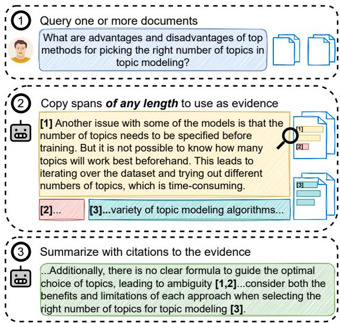  
Figure 1: Summarization with unstructured evidence requires a model to retrieve spans of any arbitrary length from the context to support individual sentences in the summary. Example given from Llama 3.1 8B trained on our dataset (SUnsET).

In the unstructured evidence setup, a model must first copy spans from the context and subsequently use those spans as evidence in the summary (see Figure 1). As we will show, simply prompting LLMs to perform this task with no other intervention leads to poor performance. Thus, we need to adapt models, e.g. through fine-tuning or in-context learning. For this, no suitable training data exist which consists of examples of long documents, queries, summaries, and extracted evidence pointing to arbitrary spans in the documents. Based on the size and cost of other datasets for LCQFS (Asai et al., 2024; Laban et al., 2024; Santosh et al., 2024), this would take an extensive amount of time, money, and expertise to create manually.

To address this, we present a synthetic dataset called the Summaries with Unstructured Evidence Text dataset (SUnsET). SUnsET is generated using a novel pipeline, resulting in long documents paired with queries, summaries, and evidence spans. We show that the data in SUnsET are high quality and diverse, comparable to human written data. Using SUnsET, we perform experiments across 5 models and 4 test datasets (including single- and multi-document, human and synthetic data), leading to the following findings: 1) for base LLMs with no fine tuning, extracting and citing unstructured evidence is challenging, and evidence is often lost-in-the-middle; 2) training on documents with shuffled structure (facilitated by SUnsET) can help mitigate lost-in-the-middle, and 3) learning to cite unstructured evidence improves citation accuracy and coverage over fixed-granularity evidence, and additionally improves summary quality.

In sum, our contributions are:

• A synthetic dataset (SUnsET) generated using a novel pipeline

• The first study on unstructured evidence citation for LCQFS, demonstrating that models adapted with SUnsET produce higher quality evidence and summaries than baselines

• An analysis of and method to reduce the lostin-the-middle problem with unstructued evidence

## 2 Challenges in LCQFS

LCQFS requires a model to be able to simultaneously ingest a large number of context tokens (possibly from multiple documents), retrieve and attend to relevant information in this context given a query, and integrate this information into a factually consistent and relevant summary. LLMs, with their increasingly large context sizes, have proven to be particularly adept at performing this task (Zhang et al., 2024a; Edge et al., 2024; Russak et al., 2024). Yet, a number of challenges remain, both in dealing with long contexts and with producing queryfocused summaries (Li et al., 2024; Russak et al., 2024; Bai et al., 2024; Liu et al., 2024b; Shaham et al., 2023; Ravaut et al., 2024; Laban et al., 2024; Worledge et al., 2024; Ji et al., 2023; Ernst et al., 2024). The main foci of our work are evidence attribution (Laban et al., 2024; Worledge et al., 2024; Li et al., 2023; Ernst et al., 2024; Fierro et al., 2024) and evidence being lost-in-the-middle (Liu et al., 2024b; Ravaut et al., 2024), described next.

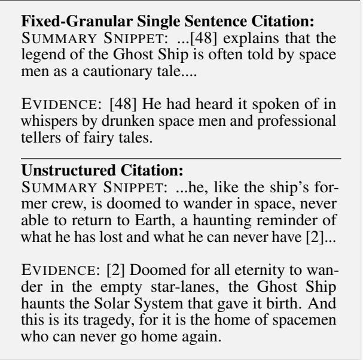  
Figure 2: Examples of fixed-granular and unstructured evidence generated by models in our study. Fixed granular citations may include irrelevant or not enough information to support their citing sentences. Unstructured evidence allows for more flexible and precise evidence.

## 2.1 Evidence Attribution

Improving the ability of LLMs to both generate relevant summaries and provide accurate attributions has the potential to help improve their usefulness, transparency, and trustworthiness. Recent work has started to explore this direction for LCQFS, including SummHay (Laban et al., 2024) and OpenScholar (Asai et al., 2024). However, most works focus on fixed-granularity evidence (e.g., spans, sentences, paragraphs, or documents, Li et al. (2023)). Being able to flexibly cite evidence of any arbitrary length can lead to higher quality summaries which use precise pieces of evidence from the context (Wan et al., 2021; Ernst et al., 2024; Xiao, 2023), as opposed to full documents which contain irrelevant information or individual sentences which may contain not enough information (see e.g., Figure 2). To the best of our knowledge, we provide a first study on unstructured evidence citation in LCQFS with LLMs.

## 2.2 Lost-in-the-Middle

LLMs suffer from positional preferences in their learned attention (Liu et al., 2024b), oftentimes preferring early or late tokens in their context (Zhang et al., 2024b). While this problem was originally demonstrated on retrieval-augmented-generation (RAG) tasks with explicit answers such as question answering, follow-up work has shown its persistence in more abstractive tasks such as summarization (Ravaut et al., 2024) and query focused multidocument summarization (Laban et al., 2024). A number of solutions have been proposed, most of which rely on manipulating either the positions of tokens in the context or the positional embeddings of LLMs in order to remove their intrinsic bias (Wang et al., 2025; He et al., 2024; Zhang et al., 2024b). We explore and document this problem at the level of unstructured evidence citation, demonstrating how evidence is extracted unevenly across documents, and how this problem can be mitigated using purely synthetic data.

## 3 Learning to Use Unstructured Evidence

Our task is: given a query about a long input consisting of one or more documents, generate a response to the query which cites arbitrary length text spans from the input. This introduces challenges over the fixed-granularity case (Laban et al., 2024; Asai et al., 2024; Li et al., 2023), as targeted, precise evidence spans must be accurately copied from the context which are relevant and consistent with the summary sentences. While challenging, this can lead to summaries with more accurate and supportive evidence (Ernst et al. 2024).

Large scale synthetic datasets are useful for finetuning task specific models at a lower cost than manual annotation (Ziegler et al., 2024; Honovich et al., 2023; Wang et al., 2023; Chen et al., 2024; Xu et al., 2024). To train LLMs to use unstructured evidence, we create SUnsET, a synthetic dataset based on a novel inductive generation pipeline. Training is performed using adapters (Houlsby et al., 2019) to improve unstructured evidence ci-

P1. Titles: Generate N unique titles of fiction and non-fiction documents.   
P2. Document outline: Given a title, generate an outline broken down into discrete sections. P3. Queries, summaries, and evidence: Given a document title and outline, generate 5 questions, 5 responses, and supporting passages that will be included in the document.   
P4. Document sections: Generate each section of the document one at a time. Ensure that evidence passages are included verbatim.   
P5. Refinement: For each question, summary, evidence tuple, refine the summary and evidence based on the document.   
P6. Validation: For each question, summary, evidence tuple, validate that the summary fully addresses the question, is faithful to the document, and includes inline attribution to evidence passages.

Figure 3: Six stage inductive data generation pipeline. The full prompts for each stage are given in Appendix A Figure 9 - Figure 17.

tation and mitigate the lost in the middle problem. For the latter, previous work has shown that finetuning with data augmentation (e.g., shuffling documents; Zhang et al., 2024b) can help achieve this. Given this, we construct SUnsET so that documents are modular: documents are broken down into discrete sections, so that data augmentation through shuffling document sections (thus shuffling global structure) is possible. We first present the inductive pipeline approach used to generate SUnsET, followed by our two fine-tuning schemes.

## 3.1 Generating SUnsET

Our pipeline generates long documents paired with queries, and summaries which address those queries. Each summary additionally includes citations which reference relevant text spans in the original document. We make several design decisions intended to overcome known problems in synthetic data generation, including the potential for low diversity (Honovich et al., 2023; Wang et al., 2023) and labeling errors (Chen et al., 2024). This includes taking a six stage pipeline approach which generates synthetic data inductively, and validation steps which refine summaries, refine evidence, and reject bad summaries and evidence.

The full generation process is described in Figure 3, with prompts provided in Appendix A. Diversity in document topic and type is accomplished by first generating document titles which seed the subsequent steps. We inductively build up each [1] Writing the unwritable requires a recognition of the limitations of language, and a willingness to push against those boundaries.

document, starting with the queries, summaries, and evidence passages. When generating evidence, each evidence passage is assigned to a section in the document so that evidence can be distributed precisely. The summaries, queries, and assigned evidence are then used as context to generate each section of the document one at a time. This makes documents modular, which we take advantage of during training to study lost-in-the-middle. Following this, the queries, summaries, and evidence are refined by using the final document as context. Finally, we filter out poor summaries and evidence by prompting to predict if the summaries fully address the query and are fully supported by the document (see Figure 4 for an example). In total we generate 2,352 synthetic documents, giving us 11,309 document, question, summary tuples.

Cost Comparison Manually annotating data of the kind in SUnsET is highly expensive, requiring annotators to read long sets of documents with long summaries and verifying the quality of the references. As a comparison, SQuALITY (Wang et al., 2022) is a similar dataset to ours in terms of document and response size, and they paid Upwork workers \$13 to write each response, followed by \$8 to review each response in their data. As we generated 11,309 responses in SUnsET, this alone would have cost \$237,468. In contrast, generating SUnsET, including documents, questions, responses, and evidence, cost around \$200.

Figure 4: Snippets from a SUnsET document.
<table><tr><td colspan="4">SUnsET</td><td colspan="2">Non-Pipelined</td><td colspan="2">Title + Doc</td></tr><tr><td>Metric</td><td>Q</td><td>S</td><td>D</td><td>Q S</td><td>D</td><td>Q S D</td></tr><tr><td>TTR</td><td>0.75</td><td>0.84</td><td>0.82</td><td>0.67 0.80</td><td>0.35</td><td>0.63 0.78 0.35</td></tr><tr><td>Cos</td><td>0.81</td><td>0.73</td><td>0.68</td><td>0.73 0.72</td><td>0.04</td><td>0.66 0.61 0.04</td></tr><tr><td>Len</td><td></td><td>13.45 226.5 3767.4</td><td></td><td>9.85 23.79474.8</td><td></td><td>10.21 24.45 433.8</td></tr></table>

Table 1: Statistics and diversity metrics of synthetic data. Metrics are average type-token ratio (TTR) Bestgen (2023), embedding cosine distance (Cos), and average word length (Len). Columns differentiate between (Q)uestion, (S)ummary and (D)ocument metrics in each dataset. Bold is highest diversity across datasets.
<table><tr><td></td><td>Dataset Topic Diversity</td></tr><tr><td>Non-Pipelined</td><td>0.506</td></tr><tr><td>Title + Doc</td><td>0.356</td></tr><tr><td>SQuALITY (human, stories)</td><td>0.705</td></tr><tr><td>LexAbSumm (human, legal text)</td><td>0.673</td></tr><tr><td>ScholarQABench (human, scientific docs)</td><td>0.695</td></tr><tr><td>SUnsET</td><td>0.679</td></tr></table>

Table 2: Topic diversity scores using the approach from Terragni et al. (2021). Shading indicates magnitude of diversity score.

Evaluation We evaluate both the quality and diversity of data generated using this pipeline. For quality, we asked two independent annotators (NLP researchers unaffiliated with the project) three questions for 100 question, summary, evidence tuples: Q1) Does the summary address the question?; Q2) Is the summary well structured and organized; and Q3) Does the evidence fully support the summary? Annotators responded to each question with one of the following values: 1 - Not at all; 2 - Somewhat; 3 - Completely. We find that the data is very high quality, acquiring scores of 2.99 for Q1, 2.97 for Q2, and 2.90 for Q3, with an exact agreement rate of 93.67% across all 300 annotations.

To validate SUnsET diversity, we generate two baseline datasets. The first is generated by combining all the steps in Figure 3 into one prompt, forcing the model to simultaneously perform all tasks to generate each example (called Non-Pipelined). The second includes a title generation step to seed each document (called Title + Doc, see Figure 18 in Appendix A for prompts). We compare each dataset using samples of 100 documents along lexical and semantic diversity metrics in Table 1. Further, in

Table 2 we compare the topic diversity (following Terragni et al. 2021) between these datasets, as well as three human-written datasets: SQuALITY (Wang et al., 2022), LexAbSumm (Santosh et al., 2024), and ScholarQABench (Asai et al., 2024), (see Appendix C. Our approach generates longer documents with longer summaries than baseline non-pipelined approaches, which also tend to be much more diverse. Additionally, our pipeline produces documents with topic diversity similar to that of human written datasets.

## 3.2 Training Complementary Adapters

Previous work has demonstrated that altering the position embeddings of LLMs either directly or through fine-tuning can help to overcome positional biases (Hsieh et al., 2024; Zhang et al., 2024b). We design SUnsET documents so that they are modular, having global coherence at the level of the full document and local coherence at the level of discrete sections. Given this, we experiment with position-aware and position-agnostic training in order to observe their impact on evidence selection and quality, as well as summary quality. For position-aware training, we concatenate all document sections together in their natural order to construct the context, while for position-agnostic training, we shuffle the document sections before concatenating them, thus randomizing the global structure of the position embeddings while maintaining the local structure. This gives us two adapters for each model in our experiments. The prompt we use for training is provided in Appendix A Figure 19, and all training is performed using supervised finetuning on SUnsET data using LoRA (Hu et al., 2022). In all cases we fine tune using the Huggingface Transformers implementation of LoRA (Hu et al., 2022) with a rank and α of 16 applied to all linear operators of each model.

## 3.3 Summarizing with Unstructured Evidence

To generate summaries with unstructured evidence, we use the prompt from Asai et al. (2024), altering it to include unstructured evidence extraction as a first step. The full prompt is given in Figure 19 in Appendix A. We use this prompt for both inference and supervised fine-tuning on SUnsET. To deal with long contexts, we divide-and-conquer by chunking each document by the model’s maximum token length, summarize each chunk, and finally summarize the summaries. Thus, the output for each document, query pair is a summary, evidence\_list pair containing the summary and a list of evidence text from the context.

## 4 Experiments and Results

Our experiments focus on three research questions:

• RQ1: How well can LLMs extract and use unstructured evidence?

• RQ2: Is evidence lost-in-the-middle?

• RQ3: Does learning to cite unstructured evidence improve summary quality?

Test Data We use four test datasets (full descriptions in Appendix B). These include three human written datasets, forcing models trained on SUnsET to generalize beyond synthetic data. These are: SQuALITY (Wang et al. 2022, short sci-fi novels, single document, average context length: 5,200 tokens); LexAbSumm (Santosh et al. 2024, long legal documents, single document, average context length: 14,357 tokens); SummHay (Laban et al. 2024, synthetic conversations and news, multi-document, average haystack context length: 93,000 tokens); and ScholarQABench (Asai et al. 2024, Computer Science research papers, multidocument, average context length: 16,341 tokens). We present here the average results from sampling evenly across datasets, results on individual datasets are presented in Appendix D.

Models We test Llama 3.2 1B, Llama 3.2 3B, Llama 3.1 8B (Dubey et al., 2024), Mistral Nemo 2407, and Mixtral 8x7B.<sup>2</sup> We compare four settings for each LLM: base models with fixed granularity evidence (Fixed Gran.), base models with unstructured evidence citation (Unstruct. Base), training adapters on SUnsET (+ SunSET), and training adapters on shuffled SUnsET documents (+ Shuffled). Additionally, we provide an upper bound estimate on performance using GPT 4o mini with no fine-tuning.

Evaluation We evaluate our models using autoraters (Gu et al., 2024; Zheng et al., 2023; Liu et al., 2023) along two dimensions. These dimensions are Relevance and Consistency. Given a source text, a target text, and optionally a query, Relevance measures how well the target covers the main points of the source, as well as how much irrelevant or redundant information it contains. Consistency measures to what degree the target contains any factual errors with respect to the source.

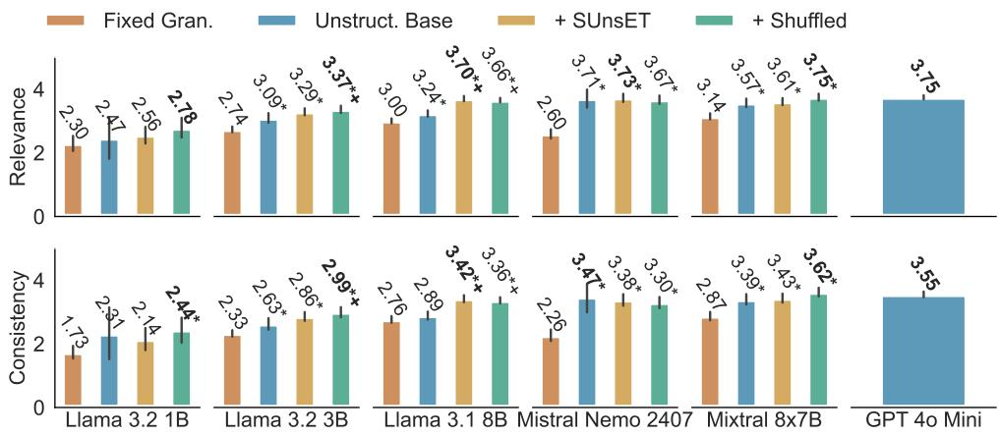  
Figure 5: Average relevance and consistency of evidence texts with respect to their citation sentences measured using an autorater (DeepSeek-V3; Liu et al., 2023) based on prompts which have previously undergone human evaluation for quality (Liu et al., 2025). Bold indicates best performance for a given model; “\*” and “+” indicate statistical significance above the fixed granularity and non-fine-tuned unstructured baselines, respectively, based on non-overlapping 95% confidence intervals.

<table><tr><td>Model</td><td>Exact Match</td><td>50% Match</td><td># Evidence</td></tr><tr><td>Llama 3.2 1B</td><td>0.0</td><td>35.71</td><td>14</td></tr><tr><td>+ SUnsET</td><td>7.69</td><td>43.26</td><td>208</td></tr><tr><td>+ Shuffle</td><td>5.15</td><td>22.68</td><td>97</td></tr><tr><td>Llama 3.2 3B</td><td>25.57</td><td>90.11</td><td>1345</td></tr><tr><td>+ SUnsET</td><td>52.77</td><td>85.62</td><td>3720</td></tr><tr><td>+ Shuffle</td><td>32.99</td><td>74.07</td><td>2337</td></tr><tr><td>Llama 3.1 8B</td><td>43.93</td><td>83.12</td><td>3412</td></tr><tr><td>+ SUnsET</td><td>78.36</td><td>97.21</td><td>4690</td></tr><tr><td>+ Shuffle</td><td>54.53</td><td>88.51</td><td>4684</td></tr><tr><td>Mistral Nemo 2407</td><td>5.48</td><td>66.13</td><td>310</td></tr><tr><td>+ SUnsET</td><td>82.20</td><td>97.29</td><td>2107</td></tr><tr><td>+ Shuffle</td><td>72.38</td><td>95.76</td><td>1959</td></tr><tr><td>Mixtral 8x7B</td><td>5.79</td><td>91.25</td><td>3452</td></tr><tr><td>+ SUnsET</td><td>33.82</td><td>90.47</td><td>4208</td></tr><tr><td>+ Shuffle</td><td>29.29</td><td>90.74</td><td>4288</td></tr><tr><td>GPT-4o-mini</td><td>11.06</td><td>96.32</td><td>8159</td></tr></table>

Table 3: Evidence copy rates. We measure exact string match (i.e. when the evidence sentence exactly appears in the context) as well as 50% overlap between the extracted evidence and the longest common substring.

Both scores are measured on a scale from 1-5 using DeepSeek-V3 (Liu et al., 2024a).<sup>3</sup> We use prompts which have been previously validated to correlate well with human annotations of relevance and consistancy (listed in Appendix A Figure 21 and Figure 22) (Liu et al., 2025).

## 4.1 RQ1: Can LLMs Use Unstructured Evidence?

Using the datasets and models just described, we first test how well models can copy and utilize unstructued evidence (i.e., any span of arbitrary length from the context). We look at two aspects: evidence copy accuracy, and evidence quality.

Copy Accuracy To study copy accuracy, we match each piece of evidence to its longest common substring (LCS) in the context. We present the rate of exact evidence match and 50% LCS overlap for all models aggregated across all datasets in Table 3. We see that without fine-tuning, models struggle to copy evidence from the context. This includes GPT 4o mini, which only copies perfectly 11% of the time. SUnsET helps models learn to copy evidence spans in all cases except for the smallest model (Llama 3.2 1B). We see that the number of citations also dramatically increases.

Evidence Quality Next, we measure evidence quality based on the relevance and consistency of evidence spans with their citing sentences using the autorater setup previously mentioned. We look at two aspects: the average citation quality (Figure 5) and the citation F1 score (Figure 6), which balances citation quality with the total number of sentences that contain a citation. We calculate the latter similarly to Asai et al. (2024): for a given summary, evidence\_list pair, we extract all citations from each sentence and normalize their relevance and consistency scores to lie between 0 and 100. For precision, we average these scores over the number of citations, and for recall, we average the scores over the number of sentences in the summary.

We find that the average citation quality of unstructured evidence is better than fixed granularity evidence (Figure 5). This validates the unstructured evidence approach, where flexible evidence extraction enables higher quality citations to source texts. We also see that models’ ability to extract quality evidence is improved by SUnsET, where our results are on par with GPT 4o Mini. When balancing citation quality and citation quantity (Figure 6), we see that learning to use unstructured evidence with SUnsET leads to statistically significant improvements over fixedgranularity and non-fine-tuned baselines across models. This is particularly the case for medium to larger models. For smaller models (particularly, Llama 3.1 1B), simply fine-tuning for such a complex task is insufficient, where all settings struggle to extract and use evidence. Non-shuffled training is often better than shuffled training, though shuffled training also improves citation quality by a large margin. When balancing for recall, fixedgranularity evidence tends to be better than unstructured evidence without fine-tuning, which makes sense as a model only needs to generate references in the fixed-granularity case. Thus, the primary benefits to citation quality by learning from SUnsET are two-fold: the quality of the evidence itself improves, and the rate of citation improves.

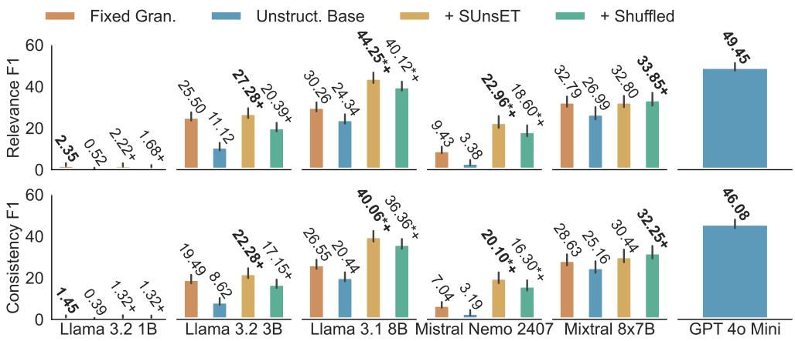  
Figure 6: Relevance and consistency F1 scores. Bold best performance for a given model; “\*” and “+” indicate statistical significance above the fixed granularity and non-fine-tuned unstructured baselines, respectively, based on non-overlapping 95% confidence intervals.

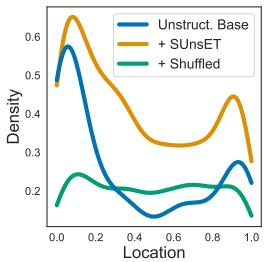  
(a) Llama 3.2 3B

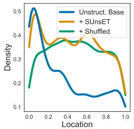  
(b) Llama 3.1 8B

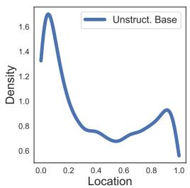  
(c) GPT 4o Mini

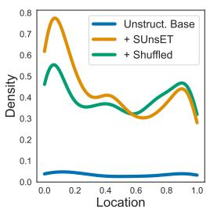  
(d) Mistral Nemo 2407

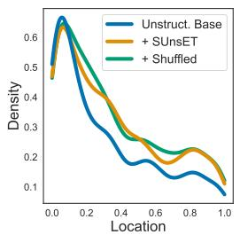  
(e) Mixtral 8x7B

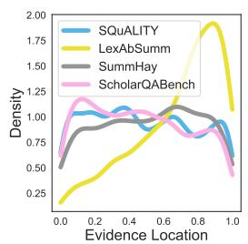  
(f) Test Datasets  
Figure 7: Distribution of location of extracted evidence in the provided source context for different methods. Test dataset evidence location is measured by comparing to reference summaries.

## 4.2 RQ2: Is evidence lost-in-the-middle?

Next, we quantify to what extent unstructured evidence is lost in the middle. For this, we match extracted evidence to its relative location in the document context (based on 50% LCS overlap) and plot the distributions in Figure 7. As a point of reference, we also plot the distribution of summary sentence locations within the test set documents by matching ground truth reference summaries to their relative locations in their context documents.<sup>4</sup>

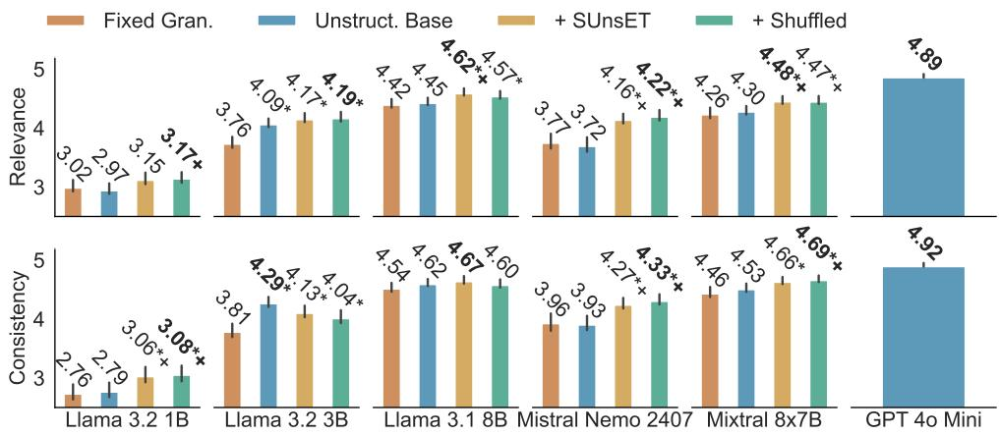  
Figure 8: Relevance and consistency of generated summaries. Bold best performance for a given model; “\*” and “+” indicate statistical significance above the fixed granularity and non-fine-tuned unstructured baselines, respectively, based on non-overlapping 95% confidence intervals.

We find that evidence is lost in the middle for all non-fine-tuned models, most often appearing at the beginning or end of the context. This includes GPT 4o Mini, which has a sharp spike of evidence in the early context. This stands in contrast to ground truth summary location distributions, which are uniform in all cases except for LexAbSumm which has a bias for evidence at the end of the context. In general, training on SUnsET without shuffling increases the rate of evidence extraction, and can help decrease the bias. Shuffling on the other hand, increases the rate of evidence extraction and decreases the bias in all cases except for Mixtral 8x7B. Thus, the modular nature of SUnsET documents, where global structure can be shuffled while local structure is maintained, can be utilized to help reduce positional biases in evidence selection, better reflecting the natural distribution of evidence based on reference data.

## 4.3 RQ3: Is Summary Quality Improved?

Finally, we test if using unstructured evidence has a positive impact on summary quality. To do so, we measure the relevance and consistency of every summary with respect to its context and query.

Our results are presented in Figure 8 (results on individual datasets are given in Appendix D).

First, for fixed granularity evidence the summaries tend to be similar or slightly lower in quality than unstructured with no fine-tuning, further motivating the unstructured approach. This is likely because the unstructured evidence task has two subtasks: salient evidence selection, followed by summarization, which has been linked to improvements in summary quality (Ernst et al., 2024). Second, we find that training on SUnsET leads to statistically significant improvements in summary quality over both baselines. Standard and shuffled training on SUnsET generally lead to similar gains in performance over unstructured with no fine-tuning, meaning the selection of which approach comes down to a tradeoff between overall evidence quality (where standard has a slight edge) and evidence diversity (where shuffled has an edge). To observe the effect of number of training samples from SUnsET, we perform an ablation where we fine-tune on different number of samples in Appendix E Figure 23 and Figure 24, finding that best performance only requires around 3k samples. Third, by measuring Pearson’s R correlation between citation and summary scores, we find a moderate correlation (0.35 for Relevance and 0.34 for Consistency), demonstrating a relationship between the quality of the citations and the quality of the summaries. Ultimately, we show the unstructured evidence setup can lead to better evidence and summaries, and demonstrate the utility of SUnsET for learning the task across diverse, human written data.

## 5 Discussion and Conclusion

Citing precise evidence spans of any arbitrary length for LCQFS has the potential to improve user trust in LLM summaries, as well as the quality of the evidence. Our study highlights salient challenges in this task, contrasts it with the fixedgranular approach, and demonstrates an effective method towards solving it. With no intervention, evidence is lost-in-the-middle, which we show across many settings for the case of unstructured evidence. They additionally struggle to accurately copy arbitrary length evidence from their contexts by default. Our proposed dataset, SUnsET, serves as a useful and inexpensive synthetic dataset to mitigate these issues. This intervention is at training time, meaning the inference cost is lower than for complex reasoning and inference chains. In addition to improving evidence quality, overall summary quality is improved. We hope this work can be built upon to help create more reliable, trustworthy, and useful summarization systems.

## Acknowledgements

DW is supported by a Danish Data Science Academy postdoctoral fellowship (grant: 2023- 1425). LW is supported in part by the National Science Foundation through grant IIS-2046016. This research was co-funded by Pioneer Centre for AI, DNRF grant number P1.

## Limitations

While our approach offers several benefits, there are notable areas to improve upon. Generating unstructured evidence directly can be prone to hallucination, while it is critical for the evidence to be exactly correct. A more precise RAG approach may offer some benefits. While shuffling during training helps the model to pull evidence more evenly, this also reduces the benefits in terms of evidence quality. A more targeted approach based on directly altering positional embeddings may be more appropriate for this (Hsieh et al., 2024). We experiment with documents using a fixed number of sections in this study; allowing for variable-length documents could deliver greater improvements in performance. Additionally, we acknowledge potential prompt bias influencing model outputs, and that synthetic data may have characteristics which differ from human-written texts. Despite our efforts to mitigate these effects, they persist as a challenge, and using techniques such as APO (Pryzant et al.,

2023) could address these issues. Finally, while SUnsET data is domain agnostic, it could be worth exploring how domain-aware data could help for more targeted applications (e.g., in the legal domain).

## Ethical Implications

LLMs are capable of generating convincing summaries from long contexts, and learning to generate unstructured supporting evidence from the source context can help improve their reliability and transparency. This approach is more flexible than the fixed-granularity approach, but generation will likely always be prone to errors. Validating that generated evidence is authentic is then crucial, as an incorrect citation presented as a ground truth fact could potentially be more harmful than no citation at all.

Additionally, synthetic data is clearly useful for learning to cite unstructured evidence. But synthetic data comes with its own ethical issues, including plagiarism and copyright infringement. More work on LLM trust and safety is needed to effectively mitigate this, as we are benefitting technologically from unknowing people’s free labor.

## References

A Asai, E Chen, K Chen, J Luo, X Qiu, H Peng, M Tan, M Yasunaga, P Liang, and L Dong. 2024. OpenScholar: Synthesizing Scientific Literature with Retrieval-Augmented Language Models. arXiv preprint arXiv:2411.14199.

Yushi Bai, Xin Lv, Jiajie Zhang, Hongchang Lyu, Jiankai Tang, Zhidian Huang, Zhengxiao Du, Xiao Liu, Aohan Zeng, Lei Hou, Yuxiao Dong, Jie Tang, and Juanzi Li. 2024. LongBench: A bilingual, multitask benchmark for long context understanding. In Proceedings of the 62nd Annual Meeting of the Associationfor Computational Linguistics (Volume 1: Long Papers), ACL 2024, Bangkok, Thailand, August 11-16, 2024, pages 3119–3137. Association for Computational Linguistics.

Iz Beltagy, Matthew E Peters, and Arman Cohan. 2020. Longformer: The long-document transformer. arXiv preprint arXiv:2004.05150.

Yves Bestgen. 2023. Measuring lexical diversity in texts: The twofold length problem. arXiv preprint arXiv:2307.04626.

Steven Bird. 2006. NLTK: the natural language toolkit. In ACL 2006, 21st International Conference on Computational Linguistics and 44th Annual Meeting of

the Associationfor Computational Linguistics, Proceedings ofthe Conference, Sydney, Australia, 17-21 July 2006. The Association for Computer Linguistics.

Lichang Chen, Shiyang Li, Jun Yan, Hai Wang, Kalpa Gunaratna, Vikas Yadav, Zheng Tang, Vijay Srinivasan, Tianyi Zhou, Heng Huang, and Hongxia Jin. 2024. AlpaGasus: Training a better alpaca with fewer data. In The Twelfth International Conference on Learning Representations, ICLR 2024, Vienna, Austria, May 7-11, 2024. OpenReview.net.

Abhimanyu Dubey, Abhinav Jauhri, Abhinav Pandey, Abhishek Kadian, Ahmad Al-Dahle, Aiesha Letman, Akhil Mathur, Alan Schelten, Amy Yang, Angela Fan, Anirudh Goyal, Anthony Hartshorn, Aobo Yang, Archi Mitra, Archie Sravankumar, Artem Korenev, Arthur Hinsvark, Arun Rao, Aston Zhang, Aurélien Rodriguez, Austen Gregerson, Ava Spataru, Baptiste Rozière, Bethany Biron, Binh Tang, Bobbie Chern, Charlotte Caucheteux, Chaya Nayak, Chloe Bi, Chris Marra, Chris McConnell, Christian Keller, Christophe Touret, Chunyang Wu, Corinne Wong, Cristian Canton Ferrer, Cyrus Nikolaidis, Damien Allonsius, Daniel Song, Danielle Pintz, Danny Livshits, David Esiobu, Dhruv Choudhary, Dhruv Mahajan, Diego Garcia-Olano, Diego Perino, Dieuwke Hupkes, Egor Lakomkin, Ehab AlBadawy, Elina Lobanova, Emily Dinan, Eric Michael Smith, Filip Radenovic, Frank Zhang, Gabriel Synnaeve, Gabrielle Lee, Georgia Lewis Anderson, Graeme Nail, Grégoire Mialon, Guan Pang, Guillem Cucurell, Hailey Nguyen, Hannah Korevaar, Hu Xu, Hugo Touvron, Iliyan Zarov, Imanol Arrieta Ibarra, Isabel M. Kloumann, Ishan Misra, Ivan Evtimov, Jade Copet, Jaewon Lee, Jan Geffert, Jana Vranes, Jason Park, Jay Mahadeokar, Jeet Shah, Jelmer van der Linde, Jennifer Billock, Jenny Hong, Jenya Lee, Jeremy Fu, Jianfeng Chi, Jianyu Huang, Jiawen Liu, Jie Wang, Jiecao Yu, Joanna Bitton, Joe Spisak, Jongsoo Park, Joseph Rocca, Joshua Johnstun, Joshua Saxe, Junteng Jia, Kalyan Vasuden Alwala, Kartikeya Upasani, Kate Plawiak, Ke Li, Kenneth Heafield, Kevin Stone, and et al. 2024. The Llama 3 herd of models. arXiv preprint arXiv:2407.21783.

Darren Edge, Ha Trinh, Newman Cheng, Joshua Bradley, Alex Chao, Apurva Mody, Steven Truitt, Dasha Metropolitansky, Robert Osazuwa Ness, and Jonathan Larson. 2024. From Local to Global: A Graph RAG Approach to Query-Focused Summarization. arXiv preprint arXiv:2404.16130.

Ori Ernst, Ori Shapira, Aviv Slobodkin, Sharon Adar, Mohit Bansal, Jacob Goldberger, Ran Levy, and Ido Dagan. 2024. The power of summary-source alignments. In Findings of the Association for Computational Linguistics, ACL 2024, Bangkok, Thailand and virtual meeting, August 11-16, 2024, pages 6527– 6548. Association for Computational Linguistics.

Constanza Fierro, Reinald Kim Amplayo, Fantine Huot, Nicola De Cao, Joshua Maynez, Shashi Narayan, and Mirella Lapata. 2024. Learning to plan and generate text with citations. In Proceedings of the

62nd Annual Meeting ofthe Associationfor Computational Linguistics (Volume 1: Long Papers), ACL 2024, Bangkok, Thailand, August 11-16, 2024, pages 11397–11417. Association for Computational Linguistics.

Jiawei Gu, Xuhui Jiang, Zhichao Shi, Hexiang Tan, Xuehao Zhai, Chengjin Xu, Wei Li, Yinghan Shen, Shengjie Ma, Honghao Liu, et al. 2024. A Survey on LLM-as-a-Judge. arXiv preprint arXiv:2411.15594.

Junqing He, Kunhao Pan, Xiaoqun Dong, Zhuoyang Song, LiuYiBo LiuYiBo, Qianguosun Qianguosun, Yuxin Liang, Hao Wang, Enming Zhang, and Jiaxing Zhang. 2024. Never Lost in the Middle: Mastering long-context question answering with positionagnostic decompositional training. In Proceedings of the 62nd Annual Meeting of the Association for Computational Linguistics (Volume 1: Long Papers), ACL 2024, Bangkok, Thailand, August 11-16, 2024, pages 13628–13642. Association for Computational Linguistics.

Or Honovich, Thomas Scialom, Omer Levy, and Timo Schick. 2023. Unnatural instructions: Tuning language models with (almost) no human labor. In Proceedings of the 61st Annual Meeting of the Associationfor Computational Linguistics (Volume 1: Long Papers), ACL 2023, Toronto, Canada, July 9-14, 2023, pages 14409–14428. Association for Computational Linguistics.

Neil Houlsby, Andrei Giurgiu, Stanislaw Jastrzebski, Bruna Morrone, Quentin de Laroussilhe, Andrea Gesmundo, Mona Attariyan, and Sylvain Gelly. 2019. Parameter-efficient transfer learning for NLP. In Proceedings ofthe 36th International Conference on Machine Learning, ICML 2019, 9-15 June 2019, Long Beach, California, USA, volume 97 of Proceedings of Machine Learning Research, pages 2790–2799. PMLR.

Cheng-Yu Hsieh, Yung-Sung Chuang, Chun-Liang Li, Zifeng Wang, Long T. Le, Abhishek Kumar, James R. Glass, Alexander Ratner, Chen-Yu Lee, Ranjay Krishna, and Tomas Pfister. 2024. Found in the middle: Calibrating positional attention bias improves long context utilization. In Findings of the Association for Computational Linguistics, ACL 2024, Bangkok, Thailand and virtual meeting, August 11-16, 2024, pages 14982–14995. Association for Computational Linguistics.

Edward J. Hu, Yelong Shen, Phillip Wallis, Zeyuan Allen-Zhu, Yuanzhi Li, Shean Wang, Lu Wang, and Weizhu Chen. 2022. LoRA: Low-rank adaptation of large language models. In The Tenth International Conference on Learning Representations, ICLR 2022, Virtual Event, April 25-29, 2022. OpenReview.net.

Ziwei Ji, Nayeon Lee, Rita Frieske, Tiezheng Yu, Dan Su, Yan Xu, Etsuko Ishii, Yejin Bang, Andrea Madotto, and Pascale Fung. 2023. Survey of hallucination in natural language generation. ACM Comput. Surv., 55(12):248:1–248:38.

Huan Yee Koh, Jiaxin Ju, Ming Liu, and Shirui Pan. 2023. An empirical survey on long document summarization: Datasets, models, and metrics. ACM Comput. Surv., 55(8):154:1–154:35.

Philippe Laban, Alexander R. Fabbri, Caiming Xiong, and Chien-Sheng Wu. 2024. Summary of a haystack: A challenge to long-context LLMs and RAG systems. In Proceedings of the 2024 Conference on Empirical Methods in Natural Language Processing, EMNLP 2024, Miami, FL, USA, November 12-16, 2024, pages 9885–9903. Association for Computational Linguistics.

Dongfang Li, Zetian Sun, Xinshuo Hu, Zhenyu Liu, Ziyang Chen, Baotian Hu, Aiguo Wu, and Min Zhang. 2023. A survey of large language models attribution. arXiv preprint arXiv:2311.03731.

Jiaqi Li, Mengmeng Wang, Zilong Zheng, and Muhan Zhang. 2024. LooGLE: Can long-context language models understand long contexts? In Proceedings of the 62nd Annual Meeting of the Association for Computational Linguistics (Volume 1: Long Papers), ACL 2024, Bangkok, Thailand, August 11-16, 2024, pages 16304–16333. Association for Computational Linguistics.

Aixin Liu, Bei Feng, Bing Xue, Bingxuan Wang, Bochao Wu, Chengda Lu, Chenggang Zhao, Chengqi Deng, Chenyu Zhang, Chong Ruan, et al. 2024a. DeepSeek-V3 technical report. arXiv preprint arXiv:2412.19437.

Gabrielle Kaili-May Liu, Bowen Shi, Avi Caciularu, Idan Szpektor, and Arman Cohan. 2025. MDCure: A scalable pipeline for multi-document instructionfollowing. In Proceedings ofthe 63rd Annual Meeting of the Association for Computational Linguistics (Volume 1: Long Papers), ACL 2025, Vienna, Austria, July 27 - August 1, 2025, pages 29258–29296. Association for Computational Linguistics.

Nelson F. Liu, Kevin Lin, John Hewitt, Ashwin Paranjape, Michele Bevilacqua, Fabio Petroni, and Percy Liang. 2024b. Lost in the middle: How language models use long contexts. Trans. Assoc. Comput. Linguistics, 12:157–173.

Yang Liu, Dan Iter, Yichong Xu, Shuohang Wang, Ruochen Xu, and Chenguang Zhu. 2023. G-Eval: NLG evaluation using GPT-4 with better human alignment. In Proceedings of the 2023 Conference on Empirical Methods in Natural Language Processing, EMNLP 2023, Singapore, December 6-10, 2023, pages 2511–2522. Association for Computational Linguistics.

Reid Pryzant, Dan Iter, Jerry Li, Yin Tat Lee, Chenguang Zhu, and Michael Zeng. 2023. Automatic prompt optimization with "gradient descent" and beam search. In Proceedings ofthe 2023 Conference on Empirical Methods in Natural Language Processing, EMNLP 2023, Singapore, December 6-10, 2023, pages 7957–7968. Association for Computational Linguistics.

Mathieu Ravaut, Aixin Sun, Nancy F. Chen, and Shafiq Joty. 2024. On context utilization in summarization with large language models. In Proceedings of the 62nd Annual Meeting of the Association for Computational Linguistics (Volume 1: Long Papers), ACL 2024, Bangkok, Thailand, August 11-16, 2024, pages 2764–2781. Association for Computational Linguistics.

Machel Reid, Nikolay Savinov, Denis Teplyashin, Dmitry Lepikhin, Timothy P. Lillicrap, Jean-Baptiste Alayrac, Radu Soricut, Angeliki Lazaridou, Orhan Firat, Julian Schrittwieser, Ioannis Antonoglou, Rohan Anil, Sebastian Borgeaud, Andrew M. Dai, Katie Millican, Ethan Dyer, Mia Glaese, Thibault Sottiaux, Benjamin Lee, Fabio Viola, Malcolm Reynolds, Yuanzhong Xu, James Molloy, Jilin Chen, Michael Isard, Paul Barham, Tom Hennigan, Ross McIlroy, Melvin Johnson, Johan Schalkwyk, Eli Collins, Eliza Rutherford, Erica Moreira, Kareem Ayoub, Megha Goel, Clemens Meyer, Gregory Thornton, Zhen Yang, Henryk Michalewski, Zaheer Abbas, Nathan Schucher, Ankesh Anand, Richard Ives, James Keeling, Karel Lenc, Salem Haykal, Siamak Shakeri, Pranav Shyam, Aakanksha Chowdhery, Roman Ring, Stephen Spencer, Eren Sezener, and et al. 2024. Gemini 1.5: Unlocking multimodal understanding across millions of tokens of context. arXiv preprint arXiv:2403.05530.

Nils Reimers and Iryna Gurevych. 2019. Sentence-BERT: Sentence embeddings using Siamese BERTnetworks. In Proceedings ofthe 2019 Conference on Empirical Methods in Natural Language Processing and the 9th International Joint Conference on Natural Language Processing, EMNLP-IJCNLP 2019, Hong Kong, China, November 3-7, 2019, pages 3980– 3990. Association for Computational Linguistics.

Melisa Russak, Umar Jamil, Christopher Bryant, Kiran Kamble, Axel Magnuson, Mateusz Russak, and Waseem AlShikh. 2024. Writing in the margins: Better inference pattern for long context retrieval. arXiv preprint arXiv:2408.14906.

T. Y. S. S. Santosh, Mahmoud Aly, and Matthias Grabmair. 2024. LexAbSumm: Aspect-based summarization of legal decisions. In Proceedings of the 2024 Joint International Conference on Computational Linguistics, Language Resources and Evaluation, LREC/COLING 2024, 20-25 May, 2024, Torino, Italy, pages 10422–10431. ELRA and ICCL.

Uri Shaham, Maor Ivgi, Avia Efrat, Jonathan Berant, and Omer Levy. 2023. ZeroSCROLLS: A zero-shot benchmark for long text understanding. In Findings of the Association for Computational Linguistics: EMNLP 2023, Singapore, December 6-10, 2023, pages 7977–7989. Association for Computational Linguistics.

Jianlin Su, Murtadha H. M. Ahmed, Yu Lu, Shengfeng Pan, Wen Bo, and Yunfeng Liu. 2024. RoFormer: Enhanced transformer with rotary position embedding. Neurocomputing, 568:127063.

Silvia Terragni, Elisabetta Fersini, Bruno Giovanni Galuzzi, Pietro Tropeano, and Antonio Candelieri. 2021. OCTIS: Comparing and optimizing topic models is simple! In Proceedings of the 16th Conference ofthe European Chapter ofthe Associationfor Computational Linguistics: System Demonstrations, EACL 2021, Online, April 19-23, 2021, pages 263– 270. Association for Computational Linguistics.

Hai Wan, Haicheng Chen, Jianfeng Du, Weilin Luo, and Rongzhen Ye. 2021. A DQN-based approach to finding precise evidences for fact verification. In Proceedings of the 59th Annual Meeting of the Association for Computational Linguistics and the 11th International Joint Conference on Natural Language Processing, ACL/IJCNLP 2021, (Volume 1: Long Papers), Virtual Event, August 1-6, 2021, pages 1030– 1039. Association for Computational Linguistics.

Alex Wang, Richard Yuanzhe Pang, Angelica Chen, Jason Phang, and Samuel R. Bowman. 2022. SQuAL-ITY: Building a long-document summarization dataset the hard way. In Proceedings of the 2022 Conference on Empirical Methods in Natural Language Processing, EMNLP 2022, Abu Dhabi, United Arab Emirates, December 7-11, 2022, pages 1139– 1156. Association for Computational Linguistics.

Yizhong Wang, Yeganeh Kordi, Swaroop Mishra, Alisa Liu, Noah A. Smith, Daniel Khashabi, and Hannaneh Hajishirzi. 2023. Self-Instruct: Aligning language models with self-generated instructions. In Proceedings of the 61st Annual Meeting of the Association for Computational Linguistics (Volume 1: Long Papers), ACL 2023, Toronto, Canada, July 9-14, 2023, pages 13484–13508. Association for Computational Linguistics.

Ziqi Wang, Hanlin Zhang, Xiner Li, Kuan-Hao Huang, Chi Han, Shuiwang Ji, Sham M. Kakade, Hao Peng, and Heng Ji. 2025. Eliminating position bias of language models: A mechanistic approach. In The Thirteenth International Conference on Learning Representations, ICLR 2025, Singapore, April 24-28, 2025. OpenReview.net.

Theodora Worledge, Tatsunori Hashimoto, and Carlos Guestrin. 2024. The Extractive-Abstractive Spectrum: Uncovering verifiability trade-offs in LLM generations. arXiv preprint arXiv:2411.17375.

Min Xiao. 2023. Multi-doc hybrid summarization via salient representation learning. In Proceedings of the The 61st Annual Meeting ofthe Associationfor Computational Linguistics: Industry Track, ACL 2023, Toronto, Canada, July 9-14, 2023, pages 379–389. Association for Computational Linguistics.

Can Xu, Qingfeng Sun, Kai Zheng, Xiubo Geng, Pu Zhao, Jiazhan Feng, Chongyang Tao, Qingwei Lin, and Daxin Jiang. 2024. WizardLM: Empowering large pre-trained language models to follow complex instructions. In The Twelfth International Conference on Learning Representations, ICLR 2024, Vienna, Austria, May 7-11, 2024. OpenReview.net.

Tianyi Zhang, Faisal Ladhak, Esin Durmus, Percy Liang, Kathleen R. McKeown, and Tatsunori B. Hashimoto. 2024a. Benchmarking large language models for news summarization. Trans. Assoc. Comput. Linguistics, 12:39–57.

Zheng Zhang, Fan Yang, Ziyan Jiang, Zheng Chen, Zhengyang Zhao, Chengyuan Ma, Liang Zhao, and Yang Liu. 2024b. Position-aware parameter efficient fine-tuning approach for reducing positional bias in LLMs. arXiv preprint arXiv:2404.01430.

Lianmin Zheng, Wei-Lin Chiang, Ying Sheng, Siyuan Zhuang, Zhanghao Wu, Yonghao Zhuang, Zi Lin, Zhuohan Li, Dacheng Li, Eric P. Xing, Hao Zhang, Joseph E. Gonzalez, and Ion Stoica. 2023. Judging LLM-as-a-Judge with MT-Bench and Chatbot Arena. In Advances in Neural Information Processing Systems 36: Annual Conference on Neural Information Processing Systems 2023, NeurIPS 2023, New Orleans, LA, USA, December 10 - 16, 2023.

Ingo Ziegler, Abdullatif Köksal, Desmond Elliott, and Hinrich Schütze. 2024. CRAFT Your Dataset: Taskspecific synthetic dataset generation through corpus retrieval and augmentation. arXiv preprint arXiv:2409.02098.

## A List of Prompts

The full set of prompts used in this study are listed in the figures below.

## A.1 Synthetic Data Generation Prompts

The prompts used to generated synthetic data are given in Figure 9 – Figure 17.

## A.2 Training and Inference Prompt

The prompt used for training and inference is given in Figure 19

## A.3 Evaluation Prompts

The prompt used to measure relevance is given in Figure 21 and the prompt used to measure consistency is given in Figure 22.

## B Full Dataset Descriptions

The test datasets we use in this study include:

SQuALITY (Wang et al., 2022) is a singledocument task created from public domain short sci-fi stories where expert annotators create original summaries, providing both an overall narrative and detailed responses to specific questions, challenging models to capture broad context as well as fine-grained information.

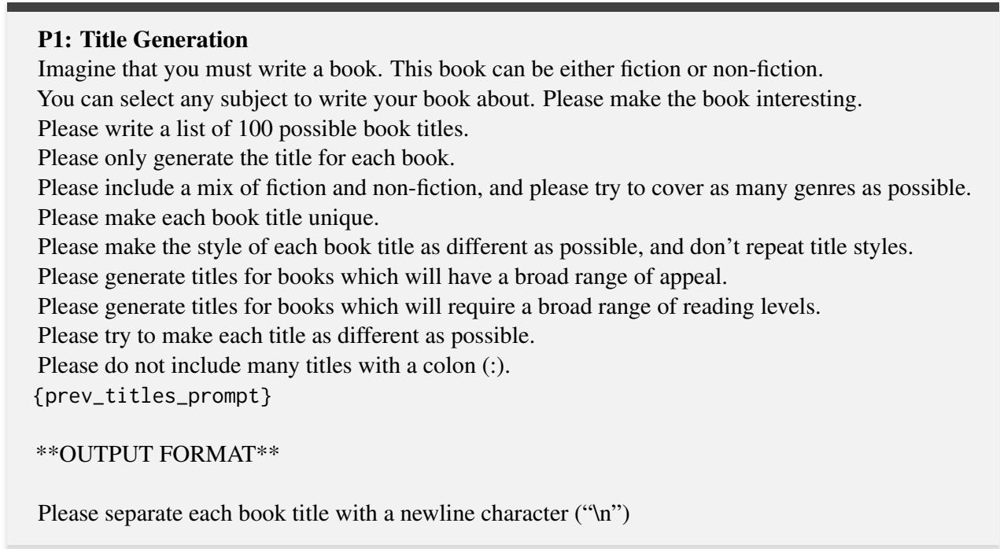  
Figure 9: Title generation prompt. {prev\_titles\_prompt} is filled with prompts of previously generated titles.

LexAbSumm (Santosh et al., 2024) is a singledocument task which contains legal judgments from the European Court of Human Rights, focusing on aspect-specific summaries that distill complex legal arguments.

SummHay (Laban et al., 2024) is a multidocument task composed of large-scale “haystacks” of documents with embedded “insights” which are relevant to the queries.

ScholarQABench (Asai et al., 2024) is a multidocument task focused on scientific literature, comprising expert-crafted queries and extended answers drawn from a broad corpus of open-access research papers.

## C Topic Diversity Comparison

We have measured the topic diversity of SUnsET using the topic diversity approach from (Terragni et al., 2021). This uses LDA to identify 200 topics across each document, sums up the number of unique words in the first 200 words of each topic, and averages this over a maximum of 200 words \* 200 topics (so the score is 1 if each topic has at least 200 unique words, see https: //github.com/MIND-Lab/OCTIS). We compare this to the two baseline datasets, as well as the human test data, finding that the data in SUnsET is indeed diverse and comparable to human data.

## D Results on Individual Datasets

Results on individual datasets are given in Table 4 (citation precision), Table 5 (citation recall), and Table 6 (F1 score based on citation precision and recall). We see that citation precision is almost uniformly improved across datasets when using unstructured evidence. In other words, when evidence is used within a summary, the evidence is higher quality than fixed granularity evidence in all but 3 cases. This quality is generally further improved by learning from SUnsET. Recall is also improved by learning from SUnsET, and is often better than fixed granularity evidence where a model simply needs to generate reference numbers (as opposed to unstructured where the evidence must also be copied, making the task more challenging). For Llama 3.1 8B and Nemo, overall F1 score is better across all datasets, while for Mixtral and the smaller Llama models the results are mixed across datasets. This is generally because the recall of the fixed granular case tends to be slightly higher, despite referencing lower quality evidences on average. However, when looking at the averages across datasets (Figure 6), we see that learning to cite unstructured evidence with SUnsET leads to the best overall performance.

For summary quality (Table 7), unstructured evidence leads to the best summaries across models and datasets most often, including the best overall performance with SUnsET fine-tuned models within each dataset. The results on smaller models are more mixed across datasets, likely due to the difficulty for smaller models to learn the unstructured evidence task in general. Learning from SUnsET appears to be especially useful for improving summaries on multi-document datasets (SummHay and SQuALITY), which always see improvements over the unstructured baseline.

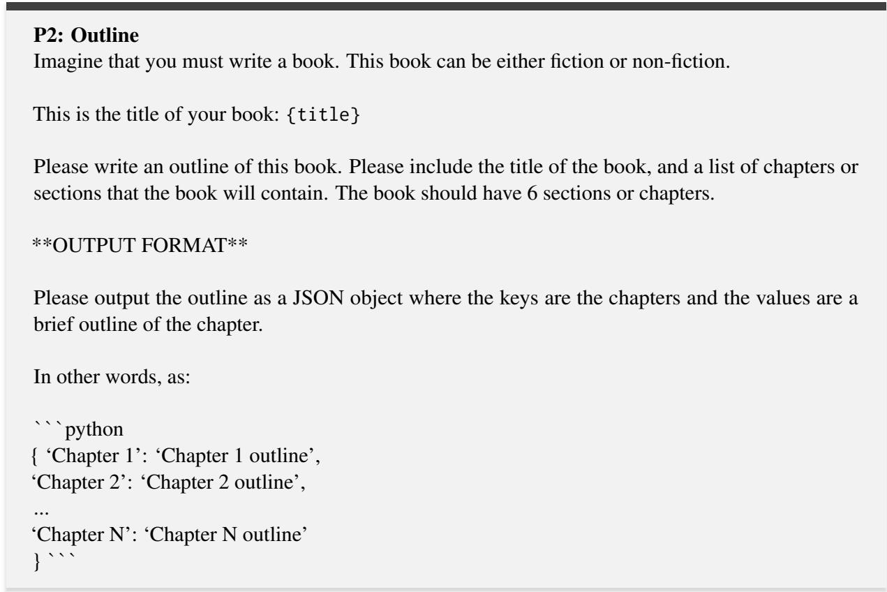  
Figure 10: Outline generation prompt. The {title} field is replaced with the title of one document.

## E Training Data Requirements

To observe the impact of number of SUnsET training samples on summary quality, we plot relevance and consistency vs. number of training samples for SQuALITY and ScholarQABench in Figure 23 and Figure 24. Interestingly, we find that performance generally peaks with only a modest amount of data (around 1k-3k samples depending on the model) at which point performance plateaus or slightly drops. It is likely that performance peaks when there is enough data to largely cover the distribution of data which is relevant for learning the task. Thus, more data does not result in more gains in performance, leading to the plateaus we see. We could potentially see additional performance gains by controlling the style of document generated, for example generating data which matches the target domain.

## F Data Availability Statement

We create SUnsET in this work, as well as the code to generate SUnsET, which we release freely to the public under the MIT license.<sup>5</sup> The data are generated as sets of fiction and non-fiction books in English.

## G Model Descriptions

Table Table 8 presents the full set of Huggingface model identifiers for the LLMs used in our experiments. The model cards containing relevant information on number of parameters, context length, vocabulary size, etc. are available on their model page on the Huggingface website. All training and inference are performed using 1-2 Nvidia A100 GPUs with 48GB of memory. Prior to training we ran a brief hyperparameter search to find the parameters used in this study, sweeping over the following values (selected values in bold):

Imagine that you must write a book. You are given the following outline of the book

Please write a list of 5 questions about the book which summarize the book.

Please separate each question with a single newline character (“\n”)

Figure 11: Query generation prompt. The {outline} is filled with the outline generated by Figure 10.

• Learning rate: [1e-6, 5e-4] (5e-5)

• Batch size: {2, 4, 8, 16, 32}

• Warmup steps: {0, 10, 50, 100, 150, 200, 300}

• Train epochs: {1, 2, 3, 4, 5, 8, 10, 12, 20} summary) given by GPT 4o mini and DeepSeek-V3, finding a strong correlation of 73.29. This indicates the robustness of our evaluation which relies on DeepSeek-V3.

• Lora rank: {2, 4, 8, 12, 16, 32}

## H Software Package Parameters

• NLTK (Bird, 2006): We use the punkt sentence tokenizer for sentence tokenization

• VLLM: We use top p sampling at 90% with a temperature of 1. for inference. We set maximum new generated tokens to 2,000

• OpenAI GPT 4o Mini: We use top p sampling at 90% with a temperature of 1 for all prompts except title generation (temperature set to 1.2) and filtering (deterministic highest probability token output).

• DeepSeek-V3: We use top p sampling at 90% with a temperature of 1 for all prompts.

## I Evaluation Robustness

We use autoraters (i.e. LLM as a judge) for much of our evaluation. While we use a previously validated prompting and modeling setup (Liu et al., 2025), we use DeepSeek-V3 as our autorater due to its high performance and low cost. We validated the robustness of DeepSeek-V3 as an autorater by taking a sample of 710 outputs summaries from our evaluation and re-evaluating them with GPT 4o Mini (Liu et al., 2023). We measure the Pearson’s R correlation between the ratings (2 ratings per

<table><tr><td></td><td colspan="2"> $\mathrm { S L T ^ { S } }$ </td><td colspan="2"> $\mathrm { L A S } ^ { \mathrm { S } }$ </td><td colspan="2"> $\mathrm { S M H ^ { M } }$ </td><td colspan="2"> ${ \bf S } { \bf Q } { \bf B } ^ { \bf M }$ </td></tr><tr><td>Model</td><td> $\mathrm { R e l _ { P r e c } }$ </td><td> $\mathrm { C o n } _ { \mathrm { P r e c } }$ </td><td> $\mathrm { R e l _ { P r e c } }$ </td><td> $\mathrm { C o n } _ { \mathrm { P r e c } }$ </td><td> $\mathrm { R e l _ { P r e c } }$ </td><td> $\mathrm { C o n } _ { \mathrm { P r e c } }$ </td><td> $\mathrm { R e l _ { P r e c } }$ </td><td> $\mathrm { C o n } _ { \mathrm { P r e c } }$ </td></tr><tr><td>Llama 3.2 1B</td><td>12.50</td><td>12.50</td><td>30.94</td><td>20.51</td><td>50.00</td><td>0.00</td><td>37.50</td><td>50.00</td></tr><tr><td>Fixed Gran.</td><td>19.86</td><td>4.10</td><td>39.22</td><td>25.86</td><td>25.94</td><td>8.88</td><td>21.82</td><td>11.47</td></tr><tr><td>+ SUnsET</td><td>18.80</td><td>10.61</td><td>41.27</td><td>32.05</td><td>0.00</td><td>0.00</td><td>45.18</td><td>24.08</td></tr><tr><td>+ Shuffled</td><td>28.60</td><td>13.01</td><td>50.34</td><td>48.86</td><td>50.00</td><td>0.00</td><td>62.38</td><td>48.20</td></tr><tr><td>Llama 3.2 3B</td><td>34.27</td><td>20.34</td><td>62.30</td><td>55.77</td><td>54.34</td><td>44.53</td><td>52.39</td><td>39.86</td></tr><tr><td>Fixed Gran.</td><td>34.84</td><td>15.24</td><td>62.02</td><td>56.35</td><td>24.59</td><td>24.91</td><td>35.86</td><td>29.97</td></tr><tr><td>+ SUnsET</td><td>45.17</td><td>25.65</td><td>61.16</td><td>53.96</td><td>64.75</td><td>59.25</td><td>52.91</td><td>45.00</td></tr><tr><td>+ Shuffled</td><td>44.28</td><td>27.20</td><td>62.76</td><td>54.42</td><td>65.76</td><td>62.84</td><td>60.98</td><td>56.37</td></tr><tr><td>Llama 3.1 8B</td><td>42.69</td><td>27.70</td><td>67.18</td><td>61.79</td><td>62.72</td><td>57.14</td><td>49.95</td><td>39.24</td></tr><tr><td>Fixed Gran.</td><td>44.45</td><td>26.84</td><td>59.66</td><td>54.80</td><td>39.14</td><td>39.00</td><td>50.21</td><td>49.70</td></tr><tr><td>+ SUnsET</td><td>50.91</td><td>33.71</td><td>75.21</td><td>70.45</td><td>74.31</td><td>70.96</td><td>67.36</td><td>61.17</td></tr><tr><td>+ Shuffled</td><td>53.13</td><td>36.79</td><td>73.78</td><td>68.99</td><td>70.55</td><td>67.15</td><td>64.70</td><td>61.12</td></tr><tr><td>Mistral Nemo 2407</td><td>31.67</td><td>14.00</td><td>60.27</td><td>53.41</td><td>73.78</td><td>73.78</td><td>69.49</td><td>61.38</td></tr><tr><td>Fixed Gran.</td><td>32.44</td><td>19.12</td><td>60.28</td><td>54.00</td><td>29.59</td><td>25.97</td><td>37.86</td><td>28.03</td></tr><tr><td>+ SUnsET</td><td>57.34</td><td>36.90</td><td>78.96</td><td>78.69</td><td>73.62</td><td>70.84</td><td>71.44</td><td>66.50</td></tr><tr><td>+ Shuffled</td><td>56.07</td><td>38.18</td><td>78.97</td><td>78.39</td><td>70.58</td><td>65.37</td><td>64.97</td><td>61.20</td></tr><tr><td>Mixtral 8x7B</td><td>47.82</td><td>32.79</td><td>81.58</td><td>83.76</td><td>68.54</td><td>66.53</td><td>53.67</td><td>48.02</td></tr><tr><td>Fixed Gran.</td><td>43.78</td><td>24.11</td><td>64.14</td><td>61.01</td><td>37.43</td><td>29.62</td><td>61.32</td><td>67.63</td></tr><tr><td>+ SUnsET</td><td>50.74</td><td>35.96</td><td>82.94</td><td>82.94</td><td>69.77</td><td>69.82</td><td>60.82</td><td>57.49</td></tr><tr><td>+ Shuffled</td><td>52.52</td><td>38.71</td><td>84.19</td><td>85.29</td><td>73.80</td><td>73.33</td><td>61.94</td><td>59.22</td></tr><tr><td>GPT 4o Mini</td><td>60.11</td><td>52.11</td><td>77.92</td><td>74.76</td><td>77.09</td><td>75.57</td><td>57.49</td><td>49.18</td></tr></table>

Table 4: Relevance and consistency precision of evidence sentences with respect to their citances. Precision measures the average citation quality within a given summary. Bold indicates best overall performance, Underline indicates best performance for individual models. <sup>S</sup> indicates single document tasks, <sup>M</sup> indicates multi-document. SQ is SQuALITY, LAS is LexAbSumm, SMH is SummHay, and SQB is ScholarQABench

```jsonl
P3.2: Initial Summaries and Evidence
Imagine that you are writing a book. This is an outline of the book
{outline}
Please address the following question about the book:
{question}
Please write a summary which addresses the question. Please make the summary as specific and
detail oriented as possible. Please include actual examples from the book when possible. Please do
not write more than is absolutely necessary.
After you write the summary, please write exact quotes and passages you will include in the book,
from which the summary could be written. Please include at least {n_evidence} of these passages,
which you intend to include verbatim in the book. Please indicate the exact chapter where the
passages will be written in a separate field.
**OUTPUT FORMAT**
Please a JSON object with two fields: “summary”, “evidence”, and “chapter”. The summary field
should have the summary. The evidence field should have a list of evidence sentences from the
book. The chapter field should have the exact chapter where the corresponding evidence sentence
will appear. Please only indicate the chapter number for this field. There should be the same
number of elements in the “evidence” field as there are in the “chapter” field. In other words, as:
```python
{
‘summary’: ‘Summary text’,
‘evidence’: [‘evidence sentence 1’, ‘evidence sentence 2’, ...]
‘chapter’: [1, 4, ...]
}
```  
Figure 12: Initial summary and evidence generation prompt. The {outline} and {question} fields are filled by the output of the previous prompts, while the {n\_evidence} field is filled by a random number between 5 and 10.

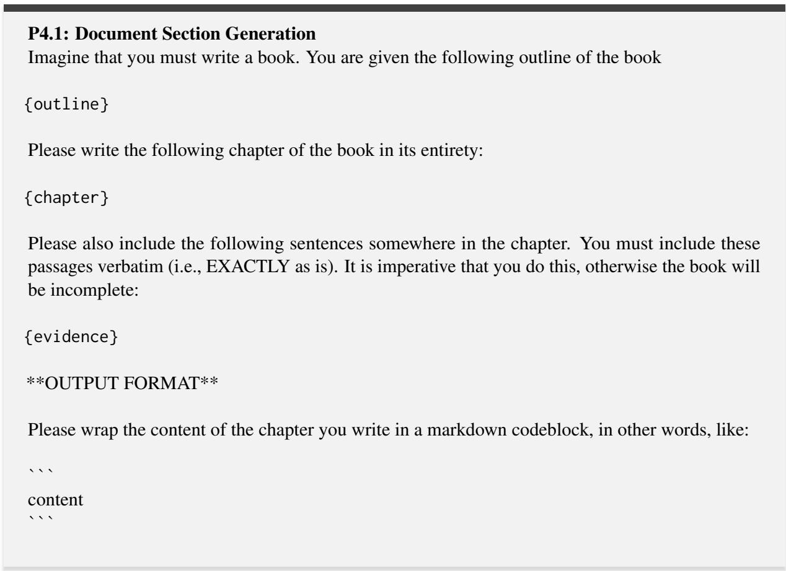  
Figure 13: Document section generation prompt. The {chapter} field is filled by the title of the section being generated, as given in the outline.

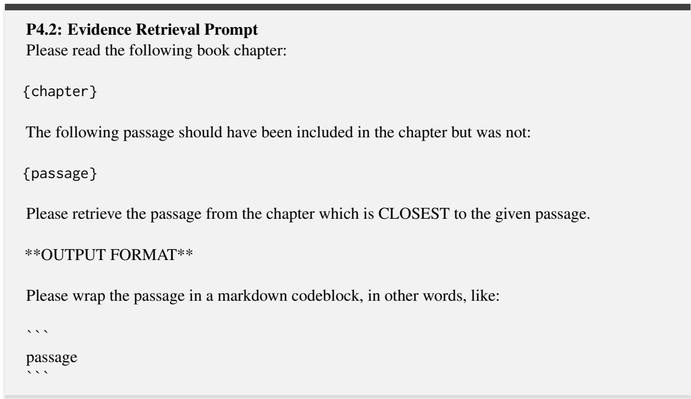  
Figure 14: Prompt to retrieve evidence from the document when previously generated evidence is not included verbatim. The {passage} field is filled with one piece of evidence that was supposed to be included in the section.

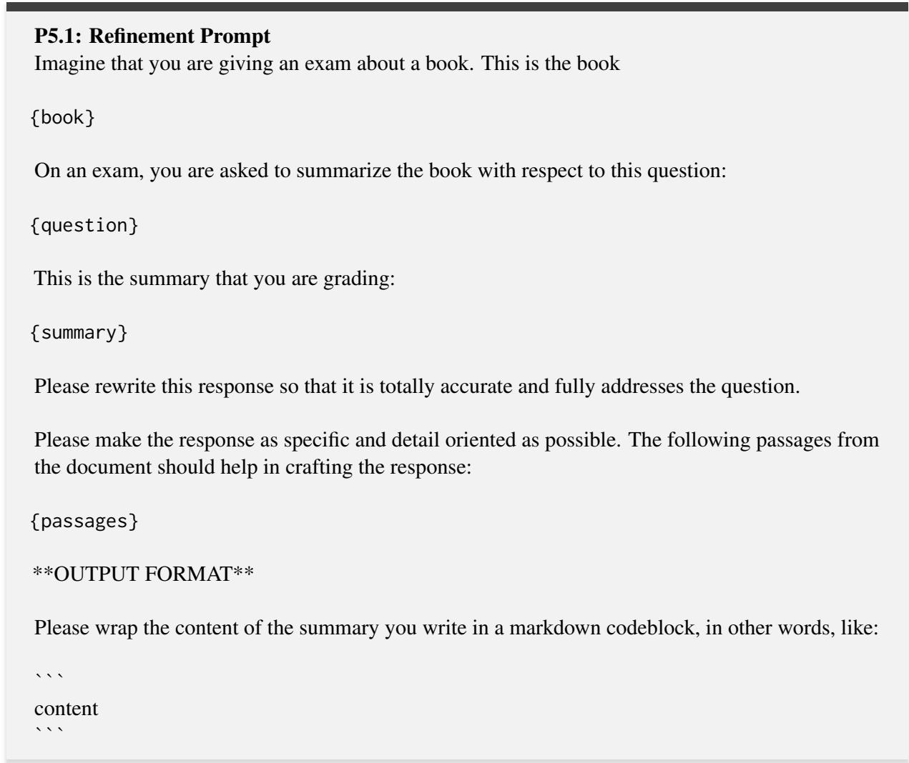  
Figure 15: Summary refinement prompt after content has been generated. The {book} field is filled with the entire document, where each section is concatenated together. Other fields are filled with the output from the previous prompts.

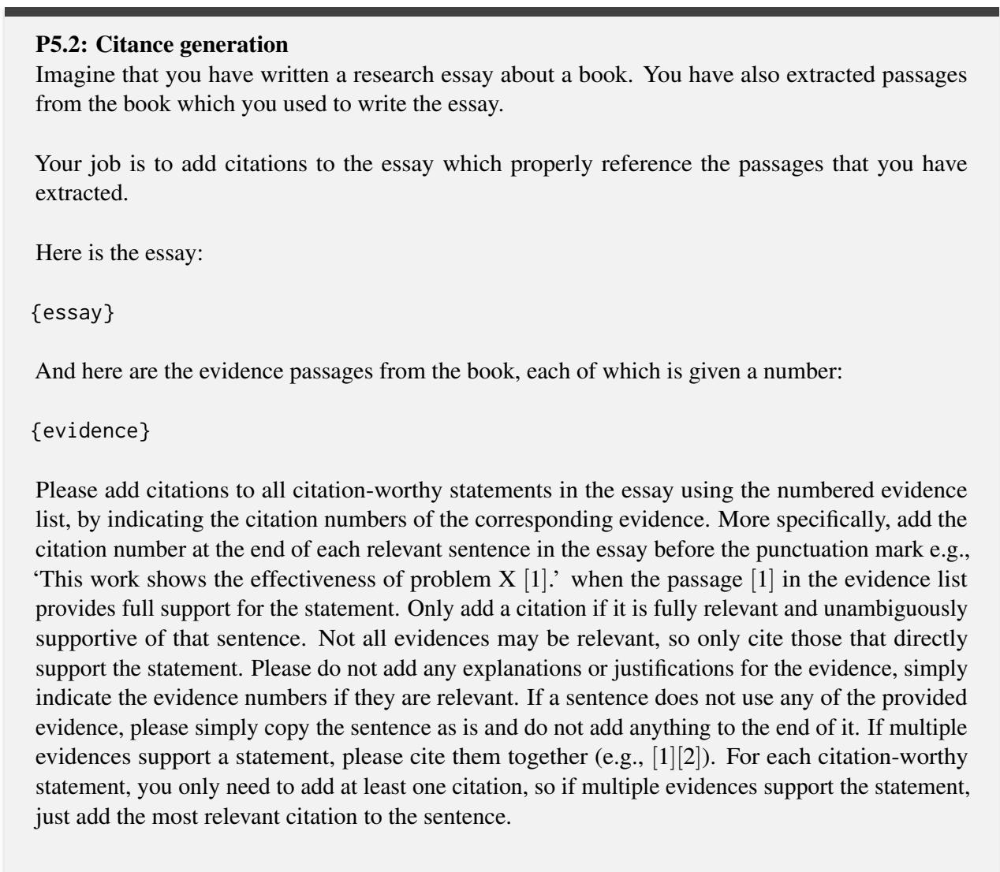  
Figure 16: Prompt to add citation references to sentences based on extracted evidence. The {essay} field is filled with a summary and the {evidence} field is filled with its corresponding evidence.

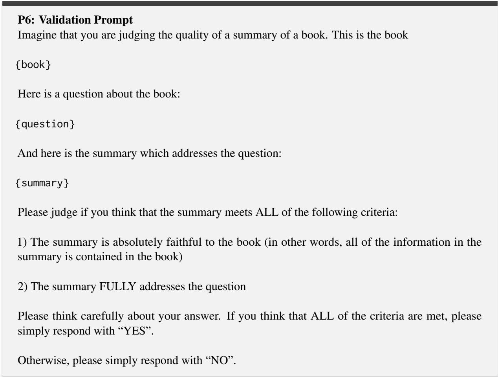  
Figure 17: Prompt to add citation references to sentences based on extracted evidence. Fields are filled with the output of previous prompts.

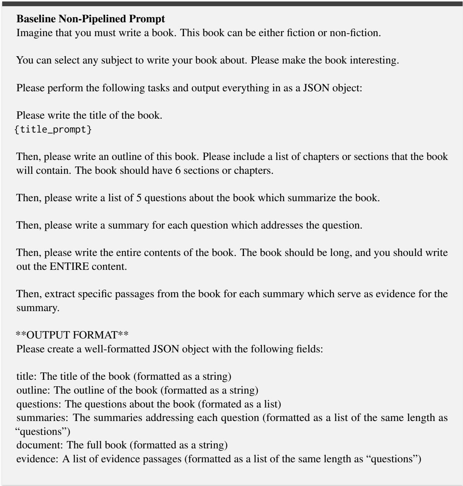  
Figure 18: Baseline non-pipelined prompt that we use as a point of comparison. The field {title\_prompt} is empty for the baseline without diversity enforced, and filled with a list of previous titles and the prompt “Please do not use any of the following titles:”.

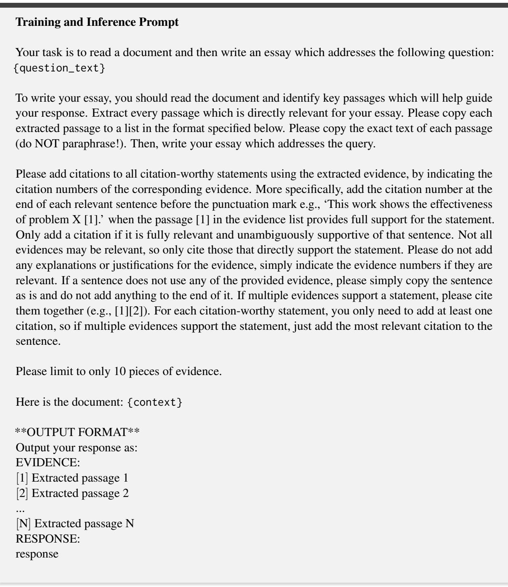  
Figure 19: Full prompt used for fine-tuning and inference. The {question\_text} field is filled with a single query, and the {context} field is filled with the document context.

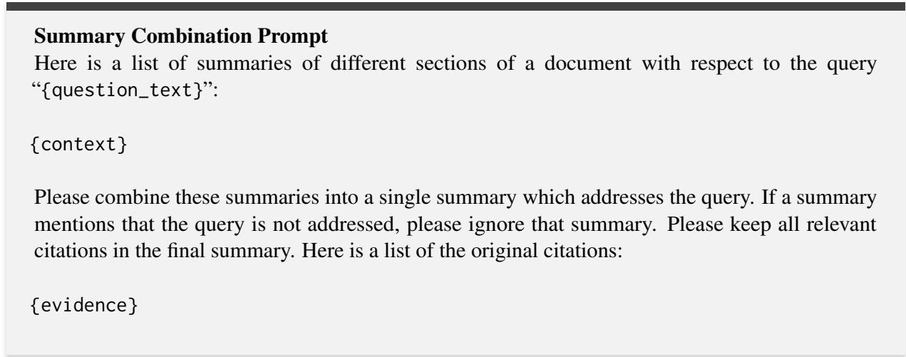  
Figure 20: Prompt to combine section summaries into one final summary.

<table><tr><td></td><td colspan="2"> $\mathrm { S L T ^ { S } }$ </td><td colspan="2"> $\mathrm { L A S } ^ { \mathrm { S } }$ </td><td colspan="2"> $\mathrm { S M H ^ { M } }$ </td><td colspan="2"> ${ \bf S } { \bf Q } { \bf B } ^ { \bf M }$ </td></tr><tr><td>Model</td><td> $\mathrm { R e l _ { R e c } }$ </td><td> $\mathbf { C o n } _ { \mathrm { R e c } }$ </td><td> $\mathrm { R e l _ { R e c } }$ </td><td> $\mathbf { C o n } _ { \mathrm { R e c } }$ </td><td> $\mathrm { R e l _ { R e c } }$ </td><td> $\mathbf { C o n } _ { \mathrm { R e c } }$ </td><td> $\mathrm { R e l _ { R e c } }$ </td><td> $\mathbf { C o n } _ { \mathrm { R e c } }$ </td></tr><tr><td>Llama 3.2 1B</td><td>0.10</td><td>0.10</td><td>0.94</td><td>0.69</td><td>0.27</td><td>0.00</td><td>0.06</td><td>0.08</td></tr><tr><td>Fixed Gran.</td><td>0.33</td><td>0.12</td><td>5.24</td><td>3.42</td><td>0.28</td><td>0.15</td><td>1.88</td><td>1.14</td></tr><tr><td>+ SUnsET</td><td>0.82</td><td>0.43</td><td>4.06</td><td>2.45</td><td>0.00</td><td>0.00</td><td>2.40</td><td>0.93</td></tr><tr><td>+ Shuffled</td><td>1.26</td><td>0.52</td><td>2.01</td><td>1.94</td><td>0.05</td><td>0.00</td><td>0.48</td><td>0.41</td></tr><tr><td>Llama 3.2 3B</td><td>4.85</td><td>2.82</td><td>11.64</td><td>10.13</td><td>5.75</td><td>4.90</td><td>11.22</td><td>8.36</td></tr><tr><td>Fixed Gran.</td><td>18.13</td><td>7.45</td><td>39.63</td><td>35.85</td><td>0.93</td><td>0.78</td><td>24.02</td><td>20.37</td></tr><tr><td>+ SUnsET</td><td>20.14</td><td>11.86</td><td>26.95</td><td>23.70</td><td>26.68</td><td>24.54</td><td>10.18</td><td>8.80</td></tr><tr><td>+ Shuffled</td><td>11.09</td><td>6.85</td><td>14.56</td><td>12.55</td><td>22.24</td><td>20.82</td><td>11.53</td><td>11.07</td></tr><tr><td>Llama 3.1 8B</td><td>8.90</td><td>5.61</td><td>22.41</td><td>20.76</td><td>25.52</td><td>23.23</td><td>16.68</td><td>13.17</td></tr><tr><td>Fixed Gran.</td><td>14.88</td><td>8.98</td><td>36.83</td><td>33.73</td><td>12.22</td><td>12.19</td><td>33.55</td><td>32.60</td></tr><tr><td>+ SUnsET</td><td>21.32</td><td>14.28</td><td>41.31</td><td>38.72</td><td>47.39</td><td>45.45</td><td>35.28</td><td>32.47</td></tr><tr><td>+ Shuffled</td><td>16.80</td><td>11.70</td><td>35.13</td><td>32.78</td><td>42.35</td><td>40.44</td><td>32.31</td><td>30.86</td></tr><tr><td>Mistral Nemo 2407</td><td>0.47</td><td>0.20</td><td>1.13</td><td>1.08</td><td>5.18</td><td>5.17</td><td>4.94</td><td>4.54</td></tr><tr><td>Fixed Gran.</td><td>5.39</td><td>3.26</td><td>10.40</td><td>9.34</td><td>2.64</td><td>2.39</td><td>12.04</td><td>8.79</td></tr><tr><td>+ SUnsET</td><td>17.48</td><td>11.30</td><td>19.93</td><td>19.66</td><td>16.63</td><td>15.80</td><td>17.68</td><td>16.59</td></tr><tr><td>+ Shuffled</td><td>13.81</td><td>9.38</td><td>19.59</td><td>19.14</td><td>16.17</td><td>15.06</td><td>13.54</td><td>13.00</td></tr><tr><td>Mixtral 8x7B</td><td>15.47</td><td>11.04</td><td>29.99</td><td>30.85</td><td>29.87</td><td>28.54</td><td>13.92</td><td>12.46</td></tr><tr><td>Fixed Gran.</td><td>33.32</td><td>18.68</td><td>36.40</td><td>34.42</td><td>6.32</td><td>5.75</td><td>34.11</td><td>37.82</td></tr><tr><td>+ SUnsET</td><td>19.06</td><td>13.64</td><td>30.65</td><td>30.68</td><td>37.91</td><td>37.31</td><td>23.06</td><td>21.80</td></tr><tr><td>+ Shuffled</td><td>20.40</td><td>15.40</td><td>31.82</td><td>32.08</td><td>39.55</td><td>38.65</td><td>27.00</td><td>26.22</td></tr><tr><td>GPT 4o Mini</td><td>28.38</td><td>23.86</td><td>51.15</td><td>49.07</td><td>55.03</td><td>53.93</td><td>25.82</td><td>21.99</td></tr></table>

Table 5: Relevance and consistency recall of evidence sentences with respect to their citances. Recall measures citation quality and averages based on the total number of sentences in a summary. This penalizes models which produce fewer citations. Bold indicates best overall performance, Underline indicates best performance for individual models. <sup>S</sup> indicates single document tasks, <sup>M</sup> indicates multi-document. SQ is SQuALITY, LAS is LexAbSumm, SMH is SummHay, and SQB is ScholarQABench

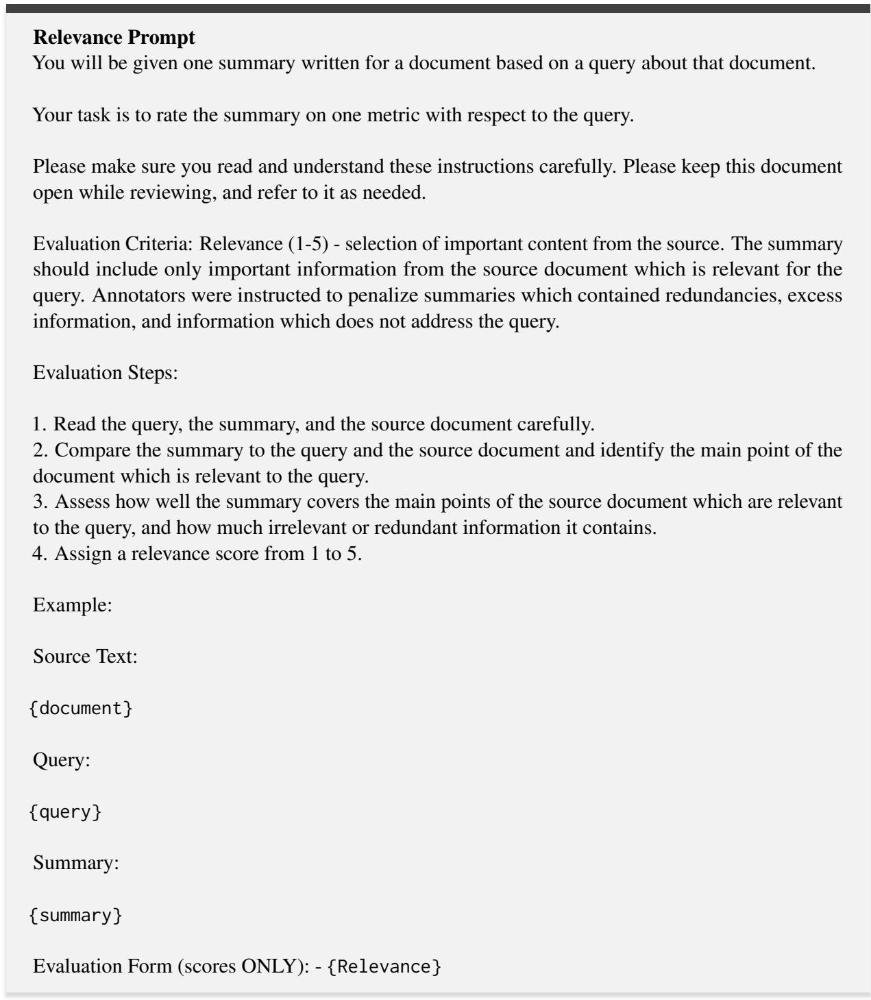  
Figure 21: Relevance evaluation prompt from (Liu et al., 2025). The {document} field is filled with the document context and the {summary} field is filled with a summary. When used to evaluate summarization, the {query} field is filled with the query used to generate the summary. For citation evaluation, the {query} field and all references to queries are removed from the prompt.

## Consistency Prompt

You will be given one summary written for a document based on a query about that document.

Your task is to rate the summary on one metric.

Please make sure you read and understand these instructions carefully. Please keep this document open while reviewing, and refer to it as needed.

Evaluation Criteria:

Consistency (1-5) - the factual alignment between the summary and the summarized source with respect to the query. A factually consistent summary contains only statements that are entailed by the source document. Annotators were also asked to penalize summaries that contained hallucinated facts.

Evaluation Steps:

1. Read the source document carefully and identify the main facts and details it presents with respect to the query.

2. Read the summary and compare it to the source document. Check if the summary contains any factual errors that are not supported by the source document.

3. Assign a score for consistency based on the Evaluation Criteria.

Example:

Source Text:

{document}

Query:

{query}

Summary:

{summary}

Evaluation Form (scores ONLY): - {Consistency}

Figure 22: Consistency evaluation prompt from (Liu et al., 2025). The {document} field is filled with the document context and the {summary} field is filled with a summary. When used to evaluate summarization, the {query} field is filled with the query used to generate the summary. For citation evaluation, the {query} field and all references to queries are removed from the prompt.

<table><tr><td colspan="2"> $\operatorname { S L T } ^ { \mathrm { S } }$ </td><td colspan="2"> $\mathrm { L A S } ^ { \mathrm { S } }$ </td><td colspan="2"> $\mathrm { S M H ^ { M } }$ </td><td colspan="2"> ${ \bf S } { \bf Q } { \bf B } ^ { \bf M }$ </td></tr><tr><td>Model</td><td> $\mathrm { R e l _ { F 1 } }$ </td><td> $\mathrm { C o n } _ { \mathrm { F } 1 }$ </td><td> $\mathrm { R e l _ { F 1 } }$ </td><td> $\mathrm { C o n } _ { \mathrm { F 1 } }$ </td><td> $\mathrm { R e l _ { F 1 } }$ </td><td> $\mathrm { C o n } _ { \mathrm { F 1 } }$ </td><td> $\mathrm { R e l _ { F 1 } }$   $\mathrm { C o n } _ { \mathrm { F l } }$ </td></tr><tr><td>Llama 3.2 1B</td><td>0.14</td><td>0.14</td><td>1.22</td><td>0.84</td><td>0.36</td><td>0.00 0.11</td><td>0.14</td></tr><tr><td>Fixed Gran.</td><td>0.40</td><td>0.13</td><td>6.67</td><td>4.40</td><td>0.39 0.19</td><td>2.27</td><td>1.35</td></tr><tr><td>+ SUnsET</td><td>1.18</td><td>0.62</td><td>5.43</td><td>3.59</td><td>0.00 0.00</td><td>3.13</td><td>1.26</td></tr><tr><td>+ Shuffled</td><td>1.85</td><td>0.80</td><td>3.14</td><td>3.04</td><td>0.08</td><td>0.00 0.85</td><td>0.72</td></tr><tr><td>Llama 3.2 3B</td><td>6.61</td><td>3.86</td><td>15.17</td><td>13.29</td><td>7.66</td><td>6.52</td><td>14.12 10.54</td></tr><tr><td>Fixed Gran.</td><td>21.71</td><td>9.02</td><td>45.80</td><td>41.44</td><td>1.37</td><td>1.13 27.77</td><td>23.49</td></tr><tr><td>+ SUnsET</td><td>25.36</td><td>14.76</td><td>33.42</td><td>29.40</td><td>32.21</td><td>29.59 13.76</td><td>11.85</td></tr><tr><td>+ Shuffled</td><td>15.14</td><td>9.33</td><td>19.45</td><td>16.80</td><td>26.78</td><td>25.15 17.45</td><td>16.55</td></tr><tr><td>Llama 3.1 8B</td><td>11.66</td><td>7.38</td><td>28.89</td><td>26.76</td><td>32.07</td><td>29.17</td><td>20.73 16.32</td></tr><tr><td>Fixed Gran.</td><td>18.90</td><td>11.32</td><td>42.44</td><td>38.86</td><td>14.29</td><td>14.23 38.56</td><td>37.64</td></tr><tr><td>+ SUnsET</td><td>27.69</td><td>18.48</td><td>50.78</td><td>47.62</td><td>53.62</td><td>51.43 44.03</td><td>40.49</td></tr><tr><td>+ Shuffled</td><td>23.13</td><td>16.12</td><td>44.16</td><td>41.18</td><td>48.72</td><td>46.50 41.49</td><td>39.59</td></tr><tr><td>Mistral Nemo 2407</td><td>0.53</td><td>0.23</td><td>1.36</td><td>1.29</td><td>6.68</td><td>6.68</td><td>6.08 5.54</td></tr><tr><td>Fixed Gran.</td><td>6.61</td><td>3.93</td><td>13.36</td><td>11.95</td><td>3.71</td><td>3.36 15.05</td><td>11.03</td></tr><tr><td>+ SUnsET</td><td>21.71</td><td>13.99</td><td>23.38</td><td>23.09</td><td>20.73</td><td>19.71 22.00</td><td>20.61</td></tr><tr><td>+ Shuffled</td><td>17.67</td><td>11.96</td><td>22.85</td><td>22.42</td><td>19.82</td><td>18.38 16.87</td><td>16.14</td></tr><tr><td>Mixtral 8x7B</td><td>17.83</td><td>12.64</td><td>34.27</td><td>35.23</td><td>33.40</td><td>32.02</td><td>17.30 15.48</td></tr><tr><td>Fixed Gran.</td><td>36.35</td><td>20.33</td><td>42.34</td><td>40.15</td><td>8.45</td><td>7.46 40.06</td><td>44.40</td></tr><tr><td>+ SUnsET</td><td>22.60</td><td>16.11</td><td>35.81</td><td>35.81</td><td>42.91</td><td>42.27</td><td>28.61 26.94</td></tr><tr><td>+ Shuffled</td><td>23.79</td><td>17.85</td><td>37.21</td><td>37.57</td><td>43.89</td><td>42.98</td><td>32.25 31.16</td></tr><tr><td>GPT 4o Mini</td><td>37.39</td><td>31.70</td><td>61.17</td><td>58.68</td><td>63.61</td><td>62.35</td><td>33.71 28.63</td></tr></table>

Table 6: Relevance and consistency F1 of evidence sentences with respect to their citances. We follow a similar setup to (Laban et al., 2024; Asai et al., 2024) where we measure citation precision and recall in order to calculate an overall F1 score for both relevance and consistency. Bold indicates best overall performance, Underline indicates best performance for individual models. <sup>S</sup> indicates single document tasks, <sup>M</sup> indicates multi-document. SQ is SQuALITY, LAS is LexAbSumm, SMH is SummHay, and SQB is ScholarQABench

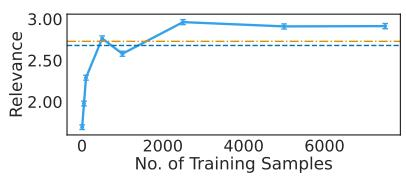

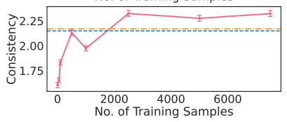  
(a) Llama 3.2 1B

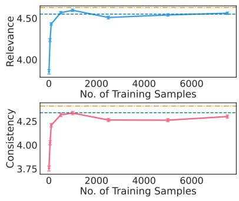  
(b) Llama 3.1 8B

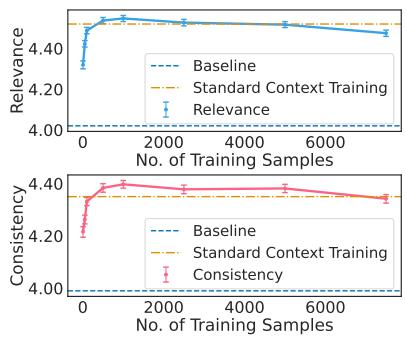  
(c) Mixtral 8x7B  
Figure 23: SQuALITY: Relevance and consistency performance vs. number of synthetic training samples.

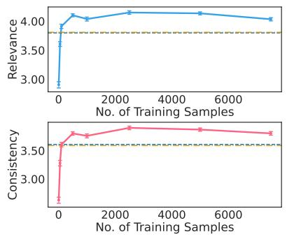

<table><tr><td></td><td colspan="2"> $\operatorname { S L T } ^ { \mathrm { S } }$ </td><td colspan="2"> $\mathrm { L A S } ^ { \mathrm { S } }$ </td><td colspan="2"> $\mathbf { S M H ^ { M } }$ </td><td colspan="2"> ${ \bf S } { \bf Q } { \bf B } ^ { { \bf M } }$ </td></tr><tr><td>Model</td><td>Rel</td><td>Con</td><td>Rel</td><td>Con</td><td>Rel</td><td>Con</td><td>Rel</td><td>Con</td></tr><tr><td>Llama 3.2 1B</td><td>2.28</td><td>1.63</td><td>3.09</td><td>2.88</td><td>3.52</td><td>3.70</td><td>2.90</td><td>2.93</td></tr><tr><td>Fixed Gran.</td><td>2.42</td><td>1.49</td><td>3.28</td><td>2.81</td><td>3.09</td><td>3.32</td><td>3.28</td><td>3.36</td></tr><tr><td>+ SUnsET</td><td>2.60</td><td>2.23</td><td>2.99</td><td>2.75</td><td>3.82</td><td>4.04</td><td>3.17</td><td>3.02</td></tr><tr><td>+ Shuffled</td><td>2.57</td><td>2.15</td><td>3.06</td><td>2.78</td><td>3.83</td><td>4.35</td><td>3.18</td><td>3.07</td></tr><tr><td>Llama 3.2 3B</td><td>3.66</td><td>3.52</td><td>4.26</td><td>4.49</td><td>4.47</td><td>4.83</td><td>3.99</td><td>4.21</td></tr><tr><td>Fixed Gran.</td><td>3.40</td><td>3.11</td><td>4.12</td><td>4.34</td><td>3.45</td><td>3.53</td><td>4.04</td><td>4.28</td></tr><tr><td>+ SUnsET</td><td>3.49</td><td>3.10</td><td>4.13</td><td>4.17</td><td>4.73</td><td>4.91</td><td>4.26</td><td>4.20</td></tr><tr><td>+ Shuffled</td><td>3.16</td><td>2.68</td><td>4.17</td><td>4.13</td><td>4.88</td><td>4.95</td><td>4.36</td><td>4.20</td></tr><tr><td>Llama 3.1 8B</td><td>4.26</td><td>4.44</td><td>4.60</td><td>4.81</td><td>4.84</td><td>4.92</td><td>4.07</td><td>4.24</td></tr><tr><td>Fixed Gran.</td><td>4.23</td><td>4.34</td><td>4.59</td><td>4.79</td><td>4.43</td><td>4.55</td><td>4.52</td><td>4.59</td></tr><tr><td>+ SUnsET</td><td>4.23</td><td>4.24</td><td>4.65</td><td>4.81</td><td>4.89</td><td>4.98</td><td>4.58</td><td>4.55</td></tr><tr><td>+ Shuffled</td><td>4.08</td><td>4.02</td><td>4.66</td><td>4.75</td><td>4.92</td><td>4.98</td><td>4.68</td><td>4.69</td></tr><tr><td>Mistral Nemo 2407</td><td>4.15</td><td>4.15</td><td>3.52</td><td>3.70</td><td>4.05</td><td>4.37</td><td>3.09</td><td>3.25</td></tr><tr><td>Fixed Gran.</td><td>4.12</td><td>4.26</td><td>4.42</td><td>4.68</td><td>2.54</td><td>2.62</td><td>4.06</td><td>4.23</td></tr><tr><td>+ SUnsET</td><td>4.29</td><td>4.31</td><td>4.24</td><td>4.39</td><td>4.52</td><td>4.66</td><td>3.65</td><td>3.77</td></tr><tr><td>+ Shuffled</td><td>4.41</td><td>4.38</td><td>4.35</td><td>4.46</td><td>4.50</td><td>4.73</td><td>3.76</td><td>3.86</td></tr><tr><td>Mixtral 8x7B</td><td>4.21</td><td>4.47</td><td>4.43</td><td>4.73</td><td>4.46</td><td>4.67</td><td>4.09</td><td>4.27</td></tr><tr><td>Fixed Gran.</td><td>4.46</td><td>4.63</td><td>4.46</td><td>4.71</td><td>3.93</td><td>4.08</td><td>4.19</td><td>4.43</td></tr><tr><td>+ SUnsET</td><td>4.48</td><td>4.64</td><td>4.54</td><td>4.79</td><td>4.49</td><td>4.74</td><td>4.29</td><td>4.43</td></tr><tr><td>+ Shuffled</td><td>4.55</td><td>4.67</td><td>4.56</td><td>4.81</td><td>4.55</td><td>4.78</td><td>4.20</td><td>4.43</td></tr><tr><td>GPT 4o Mini</td><td>4.77</td><td>4.85</td><td>4.87</td><td>4.93</td><td>4.98</td><td>5.00</td><td>4.93</td><td>4.94</td></tr></table>

Table 7: Relevance and consistency of generated summaries. Relevance and consistency are measured using an autorater (DeepSeek-V3) (Liu et al., 2023) based on previously validated prompts (Liu et al., 2025). Bold indicates best overall performance, Underline indicates best performance for individual models. <sup>S</sup> indicates single document tasks, <sup>M</sup> indicates multi-document. SQ is SQuALITY, LAS is LexAbSumm, SMH is SummHay, and SQB is ScholarQABench.

(a) Llama 3.2 1B  
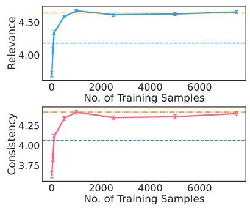  
(b) Llama 3.1 8B

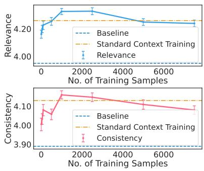  
(c) Mixtral 8x7B  
Figure 24: ScholarQABench: Relevance and consistency performance vs. number of synthetic training samples.

<table><tr><td>Model</td><td>Huggingface Identifier</td></tr><tr><td>Llama 3.2 1B</td><td>meta-1lama/Llama-3.2-1B-Instruct</td></tr><tr><td>Llama 3.2 3B</td><td>meta-1lama/Llama-3.2-3B-Instruct</td></tr><tr><td>Llama 3.1 8B</td><td>meta-1lama/Meta-Llama-3.1-8B-Instruct</td></tr><tr><td>Mistral Nemo 2407</td><td>mistralai/Mistral-Nemo-Instruct-2407</td></tr><tr><td>Mixtral 8x7B</td><td> $\mathtt { m i s t r a l a i / M i x t r a l - 8 x 7 B - I n s t r u c t - v \theta _ { 1 } } \mathtt { d }$ </td></tr></table>

Table 8: Huggingface identifiers for models used in our experiments.