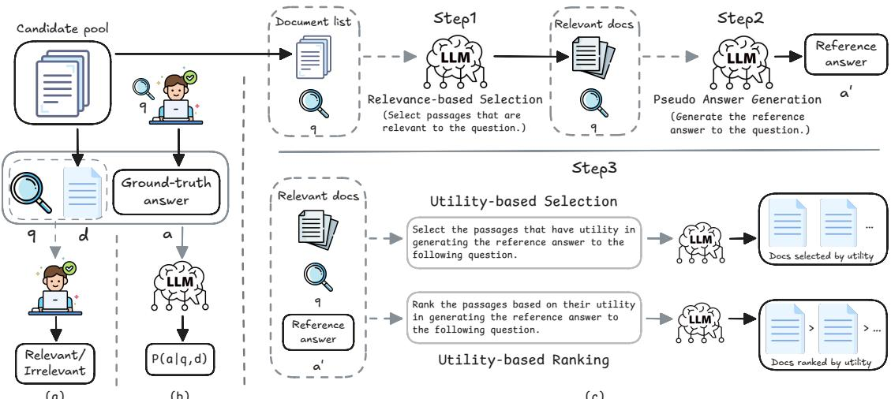
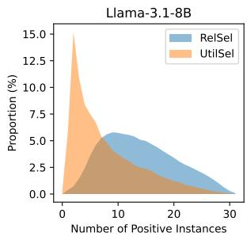
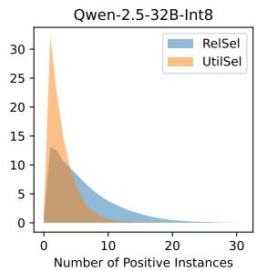
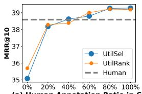
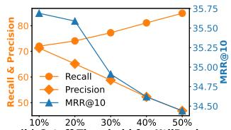
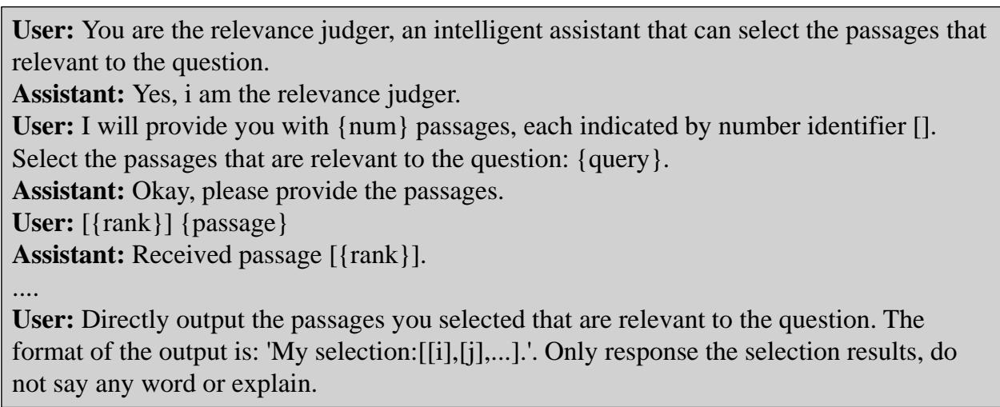
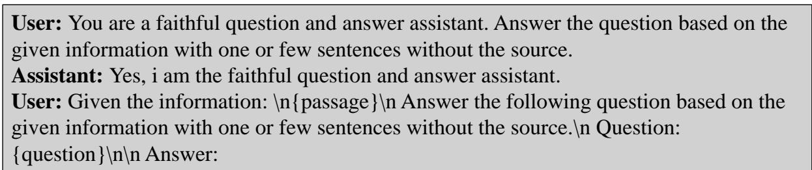
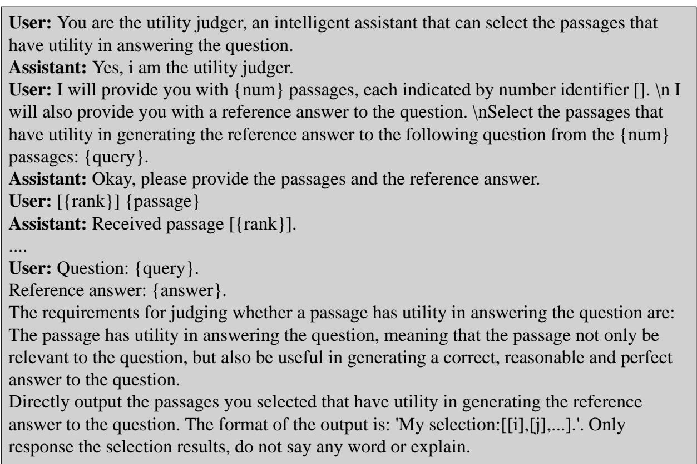
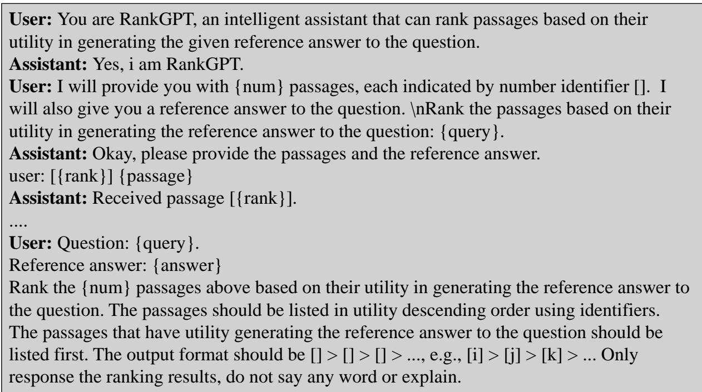

# Utility-Focused LLM Annotation for Retrieval and Retrieval-Augmented Generation

Hengran Zhang 1,2\* Minghao Tang 1,2\* Keping Bi1,2† Jiafeng Guo1,2† Shihao Liu3 Daiting Shi3 Dawei Yin3 Xueqi Cheng1,2

1State Key Laboratory of AI Safety, Institute of Computing Technology,

Chinese Academy of Sciences

2University of Chinese Academy of Sciences 3 Baidu Inc. {zhanghengran22z, tangminghao25s, bikeping, guojiafeng, cxq}@ict.ac.cn, {liushihao02, shidaiting01}@baidu.com, yindawei@acm.org

## Abstract

This paper explores the use of large language models (LLMs) for annotating document utility in training retrieval and retrieval-augmented generation (RAG) systems, aiming to reduce dependence on costly human annotations. We address the gap between retrieval relevance and generative utility by employing LLMs to annotate document utility. To effectively utilize multiple positive samples per query, we introduce a novel loss that maximizes their summed marginal likelihood. Using the Qwen-2.5-32B model, we annotate utility on the MS MARCO dataset and conduct retrieval experiments on MS MARCO and BEIR, as well as RAG experiments on MS MARCO QA, NQ, and HotpotQA. Our results show that LLM-generated annotations enhance out-of-domain retrieval performance and improve RAG outcomes compared to models trained solely on human annotations or downstream QA metrics. Furthermore, combining LLM annotations with just 20% of human labels achieves performance comparable to using full human annotations. Our study offers a comprehensive approach to utilizing LLM annotations for initializing QA systems on new corpora. Our code and data are available at https://github. com/Trustworthy-Information-Access/ Utility-Focused-LLM-Annotation.

## 1 Introduction

Information retrieval (IR) has long been essential for information seeking, and retrieval-augmented generation (RAG) is increasingly recognized as a key strategy for reducing hallucinations in large language models (LLMs) in the modern landscape of information access (Shuster et al., 2021; Zamani et al., 2022; Ram et al., 2023). Typically, retrieval models rely on human annotations of querydocument relevance for training and evaluation. In RAG, the goal shifts towards optimizing the final question answering (QA) performance using results from effective retrievers, with less emphasis on retrieval performance itself. Given the high cost of human annotation and the promising potential of LLMs for relevance judgments (Rahmani et al., 2024), we aim to explore whether LLM-generated annotations can effectively replace human annotations in training models for retrieval and RAG. This is particularly crucial for initializing QA systems based on a reference corpus without annotations.

There is a gap between the objectives of retrieval and RAG. Retrieval focuses on topical relevance, while RAG requires reference documents to be useful for generation (i.e., utility). In other words, results considered relevant by a retriever may not be useful for an LLM during generation. Aware of this mismatch, researchers have shifted from using relevance annotations as document labels to assessing LLM performance on downstream tasks with the document as its label (Shi et al., 2024; Lewis et al., 2020; Izacard et al., 2023; Glass et al., 2022; Zamani and Bendersky, 2024; Gao et al., 2024). This includes metrics such as the likelihood of generating ground-truth answers (Shi et al., 2024) or exact match scores between generated and ground-truth answers (Zamani and Bendersky, 2024). Another approach involves prompting LLMs to select documents with utility from relevance-oriented retrieval results for use in RAG (Zhang et al., 2024a,b). Studies from both approaches have demonstrated improved RAG performance.

Despite their effectiveness, both approaches have limitations. The first approach requires manually labeled ground-truth answers to assess downstream task performance, which results in substantial QA annotation costs. Additionally, retrievers trained on the performance of a specific task may struggle to generalize to other downstream tasks or even different evaluation metrics within the same task. This issue is exacerbated when dealing with non-factoid questions, where accurate evaluation is challenging, making it less feasible to use QA performance as training objectives for retrieval. In contrast, the second approach, which leverages LLMs to select useful documents for generation (Zhang et al., 2024a,b), does not require human annotation and is not confined to specific tasks or metrics. However, the selection is from initially retrieved results and cannot scale to the entire corpus during inference due to prohibitive costs.

To address these limitations, this paper proposes using LLMs to annotate document utility for retriever training, aiming to identify useful documents from the entire collection for RAG. We focus on four research questions (RQs): (RQ1) What is the optimal training strategy when multiple annotated positive samples are available for a query, in terms of data ingestion and retriever optimization? (RQ2) How do retrievers trained with LLM-annotated utility compare to those trained with human-annotated relevance in both in-domain and out-of-domain retrieval? (RQ3) Can LLMannotated data enhance retrieval performance when human labels are already available? (RQ4) Do retrievers trained with utility-focused LLM annotations result in better RAG performance compared to those trained with downstream task performance metrics and human annotations in both in-domain and out-of-domain collections?

To study the research questions, we employ a state-of-the-art open-source LLM, Qwen-2.5-32B-Int8 (Yang et al., 2024), to annotate the utility of hard negatives in the MS MARCO dataset (Nguyen et al., 2016). In contrast to human annotation on MS MARCO, which has one positive sample per query, Qwen annotates an average of 2.9 positive samples per query. Optimizing the standard joint likelihood of the multiple positives results in significant performance regression. To address the challenges posed by multiple positives, we introduce a novel loss function, SumMargLH, which maximizes their summed marginal likelihood and performs significantly better. For retrieval evaluation, we compare retrievers trained with LLM and human annotations on the MS MARCO Dev set and BEIR (Thakur et al., 2021). For RAG evaluation, we assess the retrievers on the MS MARCO QA task and two QA tasks with retrieval collections also included in BEIR, i.e., NQ (Kwiatkowski et al., 2019) and HotpotQA (Yang et al., 2018). Our findings include: 1) LLM annotations alone result in worse in-domain retrieval performance but better out-of-domain performance compared to human annotations; 2) Combining LLM annotations with 20% of human annotations achieves similar performance to models trained with 100% human labels; 3) Retrievers trained with both LLM and human annotations using curriculum learning significantly outperform those using only human annotations; 4) The findings for RAG performance are consistent with the retrieval performance regarding both in-domain and out-of-domain datasets. We summarize our contributions as follows:

• We introduce a comprehensive solution for data annotation using LLMs for retrieval and RAG, along with corresponding training strategies.

• We conduct an extensive study on the use of LLM-annotated utility to train retrievers for both in-domain and out-of-domain retrieval and RAG.

• Extensive experiments and analyses demonstrate the advantages of leveraging utility-focused LLM annotations for retrieval and RAG, particularly for out-of-domain data.

• We enhance the MS MARCO dataset with LLM annotations, providing passage labels for approximately 500K queries, which can facilitate research on false negatives, weak supervision, and retrieval evaluation by LLMs.

Our work offers a viable and promising solution for initiating QA systems on new corpora, especially when human annotations are unavailable and budgets are limited.

## 2 Related Work

## 2.1 First-Stage Retrieval

Initially, the first-stage retrieval models were predominantly classical term-based models, such as BM25 (Robertson et al., 2009), which combines term matching with TF-IDF weighting. To address the semantic mismatch limitations of classical termbased models, neural information retrieval (IR) emerged by leveraging neural networks to learn semantic representations (Huang et al., 2013; Guo et al., 2016). Subsequently, pre-trained language model (PLM)-based retrievers have been extensively explored (Xiao et al., 2022; Wang et al., 2023; Izacard et al., 2021a; Ma et al., 2021; Ren et al., 2021). More recently, LLMs have been directly applied as first-stage retrieval models (Ma et al., 2024; Springer et al., 2024; Zhang et al., 2025; Li et al., 2024), demonstrating unprecedented potential in IR.

  
Figure 1: Different annotation methodologies: (a) Human annotation, (b) Using downstream task performance as utility score, (c) Our utility-focused annotation pipeline. The prompts are illustrative, see Appendix G for details.

## 2.2 Utility-Focused RAG

There is a gap between the objectives of retrieval and RAG. Retrieval focuses on topical relevance, while RAG requires reference documents to be useful for effective generation. To address this issue, current research mainly focuses on two approaches: 1. Verbalized utility judgments, which directly utilized LLMs for selecting useful documents from the retrieved document list (Zhang et al., 2024b,a; Zhao et al., 2024). 2. Utility-optimized retriever, which involves transferring the preference of LLMs to the retriever. Two primary optimization signals are commonly employed: (a) the likelihood of generating the ground truth answers given the query and document (Shi et al., 2024; Lewis et al., 2020; Izacard et al., 2023; Glass et al., 2022; Bacciu et al., 2023); (b) evaluation metrics of the downstream tasks (Zamani and Bendersky, 2024; Gao et al., 2024; Wang et al., 2024), such as exact match. This approach relies on ground truth answers for specific downstream tasks and limits generalization.

## 2.3 Automatic Annotation with LLMs

In the field of information retrieval, many studies (Thomas et al., 2024; Rahmani et al., 2024; Takehi et al., 2024; Ni et al., 2024; Zhang et al., 2024a) have explored the annotation capabilities of LLMs for relevance judgments. However, these studies predominantly focus on small evaluation datasets, lacking a comprehensive investigation into the annotation capabilities of LLMs to scale to the entire training datasets for retrieval-related task.

## 3 Utility-Focused LLM Annotation

Figure 1(a)&(b) illustrates two primary types of document labels used in retriever training for RAG:

human-annotated relevance labels and utility scores derived from downstream tasks. Retrievers trained using human-annotated relevance typically focus on aboutness and topic-relatedness. In contrast, utility scores, which are estimated based on downstream tasks, such as the probability of LLMs generating the correct answer given a document, are more beneficial for RAG (Shi et al., 2024). Building on the insight that LLMs can effectively assess utility for RAG (Zhang et al., 2024b), we introduce a utility-focused LLM annotation pipeline for training retrievers, as depicted in Figure 1(c). This approach is designed for both initial retrieval stages and RAG, aiming to minimize the manual effort required for annotating document relevance and ground-truth answers.

## 3.1 Annotation Methodology

Annotation Pool Construction. Given a query, the majority of documents in a corpus are irrelevant, making it impractical to annotate the utility of every document with LLMs. A common practice is to compile a candidate pool by aggregating documents retrieved by effective retrievers, such as unsupervised methods like BM25 (Robertson et al., 2009), and retrievers trained on other collections. We adopt a similar approach in our study. Our annotation process is based on the widely used retrieval benchmark, the MS MARCO passage set (Nguyen et al., 2016). It is well-known that MS MARCO typically includes only one annotated positive example per query and many false negatives due to under-annotation (Craswell et al., 2020, 2021).

Retrievers trained with MS MARCO typically gather a pool of hard negatives $\{ d _ { i } ^ { - } \} _ { i = 1 } ^ { n }$ , from which a subset of m samples is randomly selected.

  
Figure 2: Positive annotation distribution of different annotators at various stages.

These sampled hard negatives, along with the single positive $d ^ { + }$ and in-batch negatives, are then used for contrastive learning. To neutralize the impact of hard negatives when comparing the retrievers trained with human and LLM annotations, we utilize the same collection of positives and hard negatives as in Ma et al. (2024) (from BM25 and CoCondenser (Gao et al., 2021)) for LLM annotation. This ensures that all comparison models have the same set of n + 1 annotated documents for each query, differing only in their annotations. m + 1 instances are selected for training in each epoch, including positives and randomly sampled negatives $( n = 3 0 , m = 1 5$ in this paper). To study the effect of whether human-annotated positives are included in the annotation pool, we compare the performance of consistently including and excluding human-annotated positives in training. As presented in Appendix B.1, the essential conclusions are similar to those we report in Section 5.

Annotation Methods. After collecting the candidate pool, we apply three annotation methods, as illustrated in Figure 1(c): relevance-based selection (RelSel), utility-based selection (UtilSel), and utility-based ranking (UtilRank). In RelSel, we begin with an initial filtering step where an LLM is used to select a subset of documents that are topically relevant to the query. Next, we employ the utility judgment method from Zhang et al. (2024b), which involves generating a pseudo-answer based on the output from RelSel and assessing document utility for downstream generation using the pseudorelevant documents and pseudo-answer. This listwise comparison enables the LLM to make accurate relative judgments. In UtilSel, the LLM selects the subset of useful documents. In contrast, UtilRank asks the LLM to rank the input documents according to their utility, then the top k% documents are annotated as positive (k = 10 in our main experiments). The float number is rounded down, and if the result is zero, a single document will be marked as positive. UtilSel can flexibly determine the number of useful documents, whereas UtilRank allows for different thresholds to balance the precision and recall of LLM annotations. All the annotation prompts are detailed in Appendix G.

<table><tr><td rowspan="2">LLM</td><td>Precision</td><td>Recall</td><td colspan="2">Avg Number</td></tr><tr><td>RS US UR</td><td>RS US UR</td><td>RS</td><td>US UR</td></tr><tr><td>Llama Qwen 15.1 29.5 71.3 92.8 84.8 72.0</td><td>7.1 11.9 36.5</td><td>97.6 91.6 41.0</td><td>13.8 7.7 1.2 6.2 2.9 1.0</td><td></td></tr></table>

Table 1: Precision and Recall (%) of human positive under different annotations. “RS”, “US”, “UR” mean “RelSel”, “UtilSel”, “UtilRank”, respectively.

## 3.2 Statistics of LLM Annotations

We employ two well-known open-source LLMs of different sizes for annotation: LlaMa-3.1- 8B-Instruct (Llama-3.1-8B) (Dubey et al., 2024) and Qwen-2.5-32B-Instruct with GPTQ-quantized (Frantar et al., 2022) 8-bit version (Qwen-2.5-32B-Int8) (Yang et al., 2024).

Positive Annotation Distribution. Figure 2 shows the distribution of positive annotations made by RelSel and UtilSel (UtilRank is not shown since its number of positives is determined by the threshold k%). The average number section in Table 1 provides the specific average number of positive annotations. We find that the instances considered useful by LLMs are significantly fewer than those they identify as relevant, consistent with the findings in Zhang et al. (2024a). Additionally, the stronger model (i.e., Qwen) tends to select fewer useful documents.

Annotation Quality Evaluation. We compare the consistency of annotations by LLMs and humans. Considering human labels as the ground-truth, the precision and recall of the LLM-marked positives for each method are shown in Table 1. It reveals that 1) UtilSel has higher precision and lower recall than RelSel, 2) Qwen is more accurate than Llama in selecting the human positive (precision doubled with some real drop). As we know, there are false negatives in the annotation pool. We also manually checked around 200 LLM annotations and found that LLM-annotated positives are more than actual positives. This means that LLM should be stricter to be more accurate. Qwen has fewer false-positive issues, and its UtilRank has the best overall precision and recall trade-off. Since Qwen has better annotation quality, our experiments in Section 5 are all based on its annotations.

## 3.3 Training with Utility Annotations

Loss Function. Dense retrievers are typically trained to maximize the likelihood of a positive sample d+ compared to a negative passage set $D ^ { \cdot }$ which usually includes hard negatives and in-batch negatives (Karpukhin et al., 2020). Given a query $q ,$ the probability of a document d to be positive in $\{ d ^ { + } \} \cup D ^ { - }$ is calculated as:

$$
P ( d | q , d ^ { + } , D ^ { - } ) = \frac { \exp ( s ( q , d ) ) } { \sum _ { d ^ { \prime } \in \{ d ^ { + } \} \cup D ^ { - } } \exp ( s ( q , d ^ { \prime } ) ) } ,\tag{1}
$$

where $s ( q , d )$ is the matching score of $q$ and $d .$

SingleLH. As many large-scale retrieval datasets, such as MS MARCO, only have one relevant instance per query, the loss function is usually maximizing the likelihood of the single positive:

$$
\begin{array} { r } { \mathcal { L } _ { s } ( q , d ^ { + } , D ^ { - } ) = - \log P ( d ^ { + } | q , d ^ { + } , D ^ { - } ) . } \end{array}\tag{2}
$$

Since LLMs have multiple positive annotations, SingleLH cannot be used directly.

Rand1LH. A straightforward approach is to randomly sample one positive instance per query in each epoch and use the standard SingleLH for training, which we name as Rand1LH.

JointLH. Another common way is to enlarge $\{ d ^ { + } \}$ to a positive passage set $D ^ { + } ( | D ^ { + } | \geq 1 )$ and optimize the joint likelihood of each positive instance in $D ^ { + }$ :

$$
\mathcal { L } _ { s } ( q , D ^ { + } , D ^ { - } ) = - \log \prod _ { d ^ { + } \in D ^ { + } } P ( d ^ { + } | q , D ^ { + } , D ^ { - } ) .\tag{3}
$$

This function may not be robust to low-quality annotations, as even a single false positive can significantly affect the overall loss. As noted in Section 3.2, LLM annotations include false positives, which can make this loss function suboptimal.

SumMargLH. Considering the quality of LLM annotation may be unstable, we propose a novel objective that maximizes the summed marginal likelihood of each positive instance in $D ^ { + }$ , i.e.,

$$
\mathcal { L } _ { s } ( q , D ^ { + } , D ^ { - } ) = - \log \sum _ { d ^ { + } \in D ^ { + } } P ( d ^ { + } | q , D ^ { + } , D ^ { - } ) .\tag{4}
$$

It optimizes the overall likelihood of instances in $D ^ { + }$ to be positive, and does not require the likelihood of each positive to be maximized. Thus, it relaxes the optimization towards potentially false positives, and can better leverage LLM annotations (shown in Section 6).

Combining Human and LLM Annotations. When budgets allow, human-labeled data can be used alongside LLM annotations rather than relying solely on the latter. Given that human annotations typically have higher quality than those from LLMs, simply merging and treating them equally may not be effective. Therefore, we propose using curriculum learning (Bengio et al., 2009) (CL) to integrate the two types of data, starting with training retrievers on the lower-quality LLM annotations and subsequently refining them with higherquality human annotations.

## 4 Experimental Setup

## 4.1 Datasets

Retrieval Datasets. As in many existing works (Xiao et al., 2022; Guo et al., 2022), we train all retrievers on the MS MARCO training set, with about 503K queries and 8.8 million passages. Retrieval evaluation is conducted on the MS MARCO Dev set, TREC DL 19/20 (Craswell et al., 2020, 2021) with more human annotations, and the 14 public retrieval datasets across various domains with diverse downstream tasks in BEIR (Thakur et al., 2021) benchmark, excluding MS MARCO. RAG Datasets. We use the MS MARCO QA, which has the ground-truth answers for the queries in the MS MARCO retrieval dataset, to evaluate the RAG performance when using Llama-3.1-8B and Qwen-2.5-32B-Int8 as generators. Similarly, for two subsets of BEIR, i.e., NQ (Kwiatkowski et al., 2019) and HotpotQA (Yang et al., 2018), we use the ground-truth answers of the questions to evaluate the RAG performance with the two generators. Detailed information about the datasets can be found in Appendix D.1.

## 4.2 Baselines

Our comparisons of data annotation methods are based on the pretrained version of two representative retrievers, RetroMAE (Xiao et al., 2022) and Contriever (Izacard et al., 2021a) (before finetuning). Our baselines include retrievers trained with human annotations and downstream task performance (shown in Figure 1(a)&(b) respectively):

• Human: Retrievers trained with original human annotations in MS MARCO using SingleLH.

• REPLUG (Shi et al., 2024): The likelihood of the ground-truth answer given each passage is used as its utility label. Retrievers are optimized towards negative KL divergence between the distribution of passage utility labels and their relevance scores (see Appendix A.2 for details).

• REPLUG (CL 20%/100%): This approach initially trains the model with utility scores and then updates the model with either 20% randomly selected or 100% of the human annotations using curriculum learning.

<table><tr><td rowspan="3">Annotation</td><td colspan="6">RetroMAE</td><td colspan="6">Contriever</td></tr><tr><td colspan="3">Human Test</td><td colspan="3"></td><td colspan="3">Human Test</td><td colspan="3">Hybrid Test</td></tr><tr><td>Dev</td><td></td><td>DL19</td><td>DL20</td><td></td><td>M@10 N@10</td><td>Dev</td><td></td><td>DL19</td><td>DL20</td><td></td><td>M@10 N@10</td></tr><tr><td>Human</td><td>38.6</td><td>98.6</td><td>68.2</td><td>M@10 R@1000 N@10 N@10 71.6</td><td>83.7</td><td>63.1</td><td>35.6</td><td>M@10 R@1000 N@10 N@10 97.6</td><td>68.5</td><td>67.9</td><td>82.2</td><td>62.0</td></tr><tr><td>REPLUG</td><td>33.8⁻</td><td>94.7⁻</td><td>65.5</td><td>58.7</td><td>75.7⁻</td><td></td><td>31.4⁻</td><td>93.1⁻</td><td>64.3</td><td>59.7</td><td>79.4</td><td>53.2</td></tr><tr><td>UtilSel</td><td>35.3-†</td><td> $9 7 . 7 \AA ^ { - \dagger }$ </td><td>68.0</td><td>71.0</td><td> ${ \bf 8 7 . 5 ^ { + \dagger } }$ </td><td>54.3⁻  $6 5 . 8 ^ { + \dagger }$ </td><td> $3 3 . 3 \AA ^ { - \dagger }$ </td><td>96.8-†</td><td>67.8</td><td>67.8</td><td>85.0†</td><td>63.7†</td></tr><tr><td>UtilRank</td><td> $3 5 . 7 \AA ^ { - \dagger }$ </td><td>97.8-†</td><td>67.1</td><td>71.0</td><td> $8 6 . 1 ^ { \dagger }$ </td><td> $\underline { { { \bf 6 6 . 1 } } } ^ { + \dagger }$ </td><td> $\underline { { 3 3 . 6 } } ^ { - \dagger }$ </td><td> $9 6 . 8 ^ { - \dagger }$ </td><td>70.8</td><td>68.8</td><td>84.6†</td><td>63.7†</td></tr><tr><td>REPLUG (CL 20%)</td><td>36.6⁻</td><td>98.3⁻</td><td>69.5</td><td>67.8</td><td>81.7</td><td> $6 0 . 2 ^ { - }$ </td><td>33.7⁻</td><td>97.2-</td><td>68.4</td><td>66.6</td><td>82.9</td><td>59.4⁻</td></tr><tr><td>UtilSel (CL 20%)</td><td> $3 8 . 2 ^ { \dagger }$ </td><td> $9 8 . 5 ^ { \dagger }$ </td><td>69.6</td><td>71.4</td><td>83.4</td><td> $6 5 . 5 ^ { + \dagger }$ </td><td> $3 5 . 3 ^ { \dagger }$ </td><td>97.4</td><td>69.3</td><td>68.7</td><td> $8 5 . 4 ^ { + }$ </td><td>63.4†</td></tr><tr><td>UtilRank (CL 20%)</td><td> $3 8 . 3 ^ { \dagger }$ </td><td>98.4</td><td>70.5</td><td>70.0</td><td>84.3</td><td> $6 4 . 6 ^ { \dagger }$ </td><td>35.6†</td><td>97.4</td><td>70.4</td><td>70.1</td><td> ${ \mathbf { 8 6 . 1 } } ^ { + }$ </td><td>64.0†</td></tr><tr><td>REPLUG (CL 100%) 38.7</td><td></td><td>98.6</td><td>69.5</td><td>69.7</td><td>83.7</td><td>63.1</td><td>35.5</td><td>97.7</td><td>68.0</td><td>69.1</td><td>80.7</td><td>59.0⁻</td></tr><tr><td>UtilSel (CL 100%)</td><td> $\underline { { { \bf 3 9 . 3 } } } ^ { + \dagger }$ </td><td>98.6</td><td>70.5</td><td>70.9</td><td>84.7</td><td> $6 4 . 7 ^ { + \dagger }$ </td><td> $\underline { { { 3 6 . 6 } ^ { + \dag } } }$ </td><td>97.8</td><td>69.3</td><td>68.4</td><td> $8 5 . 7 \AA ^ { + \dagger }$ </td><td> $6 3 . 8 ^ { + \dagger }$ </td></tr><tr><td>UtilRank (CL 100%)</td><td> $3 9 . 2 ^ { + \dagger }$ </td><td>98.7</td><td>69.6</td><td>69.9</td><td>84.2</td><td>64.2</td><td> $3 6 . 5 ^ { + \dagger }$ </td><td>97.8</td><td>69.9</td><td>69.2</td><td> $8 5 . 2 ^ { + \dagger }$ </td><td> $6 3 . 9 ^ { + \dagger }$ </td></tr><tr><td></td><td></td><td></td><td></td><td></td><td></td><td></td><td></td><td></td><td></td><td></td><td></td><td></td></tr></table>

Table 2: Retrieval performance (%) of different annotation methods. “M@k”, “R@k”, “N@k” mean “MRR@k”, “Recall@k”, and $\mathbf { \tilde { \Sigma } } \mathbf { N D C G } @ \mathbf { k } ^ { \prime \prime }$ respectively. “+”, “−”, and “†” indicate significant improvements and decrements over Human, and significant improvements over REPLUG within the same group, respectively, using a two-sided paired t-test $( p < 0 . 0 5 )$ . underline and Bold indicate the best performance within each group and overall.

Similarly, our methods include using LLM annotations alone (UtilSel, UtilRank), and combining them with 20%/100% human annotations using curriculum learning. Implementation details of each method can be found in Appendix D.2.

## 4.3 Evaluation

Human annotations often contain many false negatives due to under-annotation, and humans may have different preferences from LLMs. Evaluating retrieval performance using human labels as ground truth may be unfair to models trained with LLM annotations. To create a more balanced comparison set with more relevance labels and fewer false negatives, we randomly sampled 200 queries from the MS MARCO Dev set. For each query, we collected a candidate pool by merging the top 20 retrieved passages from various retrievers (Human, REPLUG, UtilSel, UtilRank) and used GPT-4omini (Hurst et al., 2024) to select positive instances from the pool based on the ground-truth answer, using the UtilSel prompt (see Appendix G). Both the original human and GPT-annotated positives are considered new golden labels. We refer to this combined set as the Hybrid Test and the set with only human annotations as the Human Test.

We evaluate retrievers trained with MS MARCO annotated data by humans or LLMs under both in-domain settings (MS MARCO Dev, TREC DL 19/20, MS MARCO Hybrid Test) and out-ofdomain settings (14 BEIR datasets). The retrieved results are then directly fed to generators to assess downstream QA performance on MS MARCO QA and two BEIR datasets, NQ and HotpotQA. Detailed evaluation metrics for retrieval and RAG are provided in Appendix D.3.

## 5 Experimental Results

## 5.1 Retrieval Performance

In-domain Results. Table 2 shows the overall in-domain retrieval performance. Main findings include: 1) On human-labeled test sets, models trained with human relevance annotations perform better than using LLM annotations alone, and they are both better than training with downstream task performance (REPLUG). 2) When combining 20% human labels, the model performance of UtilSel and UtilRank has no significant difference with using all the human annotations. This means that UtilSel and UtilRank can save about 80% human effort on this dataset to achieve similar performance. 3) With 100% human annotations, UtilSel and Util-Rank can achieve significant improvements over using human annotations alone, which confirms the efficacy of our annotation and training strategy as a data augmentation approach. 4) Regarding both human and GPT-4 annotated golden labels, UtilSel and UtilRank significantly outperform models trained with human annotations alone, indicating their potential in a fairer setting.

Out-of-domain (OOD) Results. Table 3 and Table 12 (in Appendix E.1) report the zero-shot retrieval performance of RetroMAE and Contriever trained with different annotations. We observe the following: 1) Both UtilSel and UtilRank exhibit superior out-of-domain (OOD) performance compared to retrievers trained solely on MS MARCO human annotations. This indicates that reliance on MS MARCO human labels may lead to model overfitting to the corpus. The fact that UtilSel outperforms UtilRank and it utilizes more LLM annotations than UtilRank, as shown in Table 1, further supports this observation. 2) When incorporating 20% or 100% human labels during training, the OOD retrieval performance decreases compared to not using them, reinforcing the first point. These findings suggest a trade-off between in-domain and OOD retrieval performance, which can be adjusted by varying the mix of MS MARCO human labels with LLM annotations.

<table><tr><td rowspan="2">Datasets BM25 Human REPLUG UtilSel</td><td rowspan="2"></td><td rowspan="2"></td><td rowspan="2"></td><td rowspan="2"></td><td rowspan="2">UtilRank</td><td colspan="3">Curriculum Learning, 20%</td><td colspan="3">Curriculum Learning, 100%</td></tr><tr><td></td><td>REPLUG UtilSel UtilRank</td><td></td><td>REPLUG</td><td>UtilSel UtilRank</td><td></td></tr><tr><td>DBPedia</td><td>31.8</td><td>36.0</td><td>29.1</td><td>38.0</td><td>37.9</td><td>35.9</td><td>37.4</td><td>37.4</td><td>36.1</td><td>37.1</td><td>37.5</td></tr><tr><td>FiQA</td><td>23.6</td><td>29.7</td><td>24.9</td><td>32.6</td><td>31.6</td><td>30.8</td><td>32.1</td><td>31.3</td><td>31.3</td><td>31.6</td><td>30.4</td></tr><tr><td>NQ</td><td>30.6</td><td>49.2</td><td>41.2</td><td>53.5</td><td>53.9</td><td>48.0</td><td>51.4</td><td>51.9</td><td>50.1</td><td>51.9</td><td>51.7</td></tr><tr><td>HotpotQA</td><td>63.3</td><td>58.4</td><td>57.4</td><td>59.6</td><td>59.6</td><td>60.2</td><td>60.0</td><td>59.8</td><td>60.5</td><td>60.1</td><td>59.5</td></tr><tr><td>NFCorpus</td><td>32.2</td><td>32.8</td><td>30.3</td><td>33.9</td><td>34.0</td><td>33.9</td><td>34.2</td><td>33.8</td><td>33.7</td><td>34.0</td><td>33.4</td></tr><tr><td>T-COVID</td><td>59.5</td><td>63.4</td><td>54.2</td><td>66.1</td><td>64.5</td><td>68.5</td><td>65.0</td><td>67.5</td><td>71.8</td><td>64.8</td><td>68.0</td></tr><tr><td>Touche</td><td>44.2</td><td>24.2</td><td>18.9</td><td>28.5</td><td>26.6</td><td>27.0</td><td>24.7</td><td>28.0</td><td>25.4</td><td>22.6</td><td>25.7</td></tr><tr><td>CQA</td><td>32.5</td><td>32.2</td><td>29.2</td><td>32.3</td><td>30.7</td><td>33.2</td><td>33.9</td><td>33.0</td><td>32.8</td><td>32.9</td><td>32.8</td></tr><tr><td>ArguAna</td><td>39.7</td><td>30.5</td><td>22.7</td><td>34.1</td><td>25.0</td><td>32.9</td><td>36.4</td><td>29.3</td><td>29.0</td><td>30.8</td><td>28.1</td></tr><tr><td>C-FEVER</td><td>16.5</td><td>18.0</td><td>13.2</td><td>19.5</td><td>16.4</td><td>17.9</td><td>16.5</td><td>15.3</td><td>18.4</td><td>18.5</td><td>16.8</td></tr><tr><td>FEVER</td><td>65.1</td><td>66.6</td><td>66.1</td><td>73.8</td><td>73.1</td><td>72.3</td><td>69.9</td><td>72.4</td><td>71.1</td><td>70.1</td><td>71.0</td></tr><tr><td>Quora</td><td>78.9</td><td>86.2</td><td>76.9</td><td>85.4</td><td>85.3</td><td>85.3</td><td>86.1</td><td>85.9</td><td>85.7</td><td>86.4</td><td>86.5</td></tr><tr><td>SCIDOCS</td><td>14.1</td><td>13.4</td><td>13.5</td><td>14.3</td><td>13.6</td><td>14.5</td><td>14.4</td><td>13.9</td><td>13.9</td><td>13.7</td><td>13.6</td></tr><tr><td>SciFact</td><td>67.9</td><td>63.1</td><td>59.3</td><td>62.8</td><td>63.2</td><td>63.2</td><td>64.2</td><td>63.8</td><td>63.6</td><td>64.1</td><td>64.9</td></tr><tr><td>Average</td><td>42.9</td><td>43.1</td><td>38.4</td><td>45.3</td><td>43.9</td><td>44.5</td><td>44.7</td><td>44.5</td><td>44.5</td><td>44.2</td><td>44.3</td></tr></table>

Table 3: Zero-shot retrieval performance (NDCG@10, %) of different retrievers (RetroMAE backbone) trained with various annotations. Bold and underlined represent the best and second best performance, respectively.

<table><tr><td rowspan="2">Annotation</td><td rowspan="2">Recall</td><td colspan="4">Generator: Llama-3.1-8B</td><td colspan="4">Generator: Qwen-2.5-32B-Int8</td></tr><tr><td>BLEU-3 BLEU-4 ROUGE-L BERT-score BLEU-3 BLEU-4 ROUGE-L BERT-score</td><td></td><td></td><td></td><td></td><td></td><td></td><td></td></tr><tr><td>Human</td><td>24.7</td><td>17.2</td><td>14.2</td><td>35.7</td><td>67.8</td><td>15.8</td><td>12.6</td><td>34.3</td><td>67.4</td></tr><tr><td>REPLUG</td><td>21.7⁻</td><td>15.7</td><td>12.9</td><td> $3 3 . 8 ^ { - }$ </td><td> $6 6 . 7 ^ { - }$ </td><td>14.7</td><td>11.6</td><td> $3 2 . 4 ^ { - }$ </td><td> $6 6 . 2 ^ { - }$ </td></tr><tr><td>UtilSel</td><td>22.3⁻</td><td>16.3</td><td>13.4</td><td> $3 4 . 7 \AA ^ { - \dagger }$ </td><td> $6 7 . 4 ^ { - \dagger }$ </td><td>14.9</td><td>11.7</td><td> $3 3 . 5 ^ { - \dagger }$ </td><td> $6 7 . 1 ^ { - \dagger }$ </td></tr><tr><td>UtilRank</td><td>22.6</td><td>16.6</td><td>13.6</td><td> $3 5 . 1 ^ { - \dagger }$ </td><td> $6 7 . 5 ^ { - \dagger }$ </td><td>15.2</td><td>12.0</td><td> $3 3 . 9 ^ { - \dagger }$ </td><td> $6 7 . 3 ^ { - \dagger }$ </td></tr><tr><td>REPLUG (CL 20%)</td><td>23.2</td><td>16.7</td><td>13.7</td><td> $3 4 . 9 ^ { - }$ </td><td> $6 7 . 4 ^ { - }$ </td><td>15.2</td><td>12.1</td><td> $3 3 . 6 ^ { - }$ </td><td>67.1⁻</td></tr><tr><td>UtilSel (CL 20%)</td><td>24.6†</td><td>17.4</td><td>14.3</td><td> $3 5 . 4 ^ { \dagger }$ </td><td> $6 7 . 7 ^ { \dagger }$ </td><td>15.8</td><td>12.6</td><td>34.2†</td><td> $6 7 . 4 ^ { \dagger }$ </td></tr><tr><td>UtilRank (CL 20%)</td><td>24.6†</td><td>17.4</td><td>14.4</td><td> $3 5 . 6 ^ { \dagger }$ </td><td> $6 7 . 8 ^ { \dagger }$ </td><td>15.8</td><td>12.6</td><td>34.3†</td><td> $6 7 . 5 ^ { \dagger }$ </td></tr><tr><td>REPLUG (CL 100%)</td><td>25.0</td><td>17.2</td><td>14.2</td><td>35.8</td><td> $6 7 . 8$ </td><td>15.8</td><td>12.6</td><td> $3 4 . 4$ </td><td> $6 7 . 5$ </td></tr><tr><td>UtilSel (CL 100%)</td><td>25.6+</td><td>17.8</td><td>14.8</td><td>36.0</td><td> ${ \bf 6 8 . 0 ^ { + \dagger } }$ </td><td>16.2</td><td>12.9</td><td> ${ \underline { { 3 4 . 6 } } } ^ { + \dagger }$ </td><td> ${ \bf 6 7 . 7 ^ { + \dagger } }$ </td></tr><tr><td>UtilRank (CL 100%)</td><td> $2 5 . 5 ^ { + }$ </td><td>17.7</td><td>14.7</td><td>35.9</td><td> ${ \underline { { { \bf 6 8 . 0 } } } } ^ { + \dagger }$ </td><td>16.2</td><td>12.9</td><td> $\underline { { 3 4 . 6 ^ { + \dagger } } }$ </td><td> ${ \underline { { { \bf 6 7 . 7 } } } } ^ { + \dagger }$ </td></tr></table>

Table 4: RAG performance (%) of different retrievers (RetroMAE backbone) trained with various MS MARCO annotations on MS MARCO QA dataset. The symbols $^ + , \bar { } \cdot \cdot$ , and † are defined in Table 2. Bold and underline are also defined in Table 2. The official BLEU evaluation for MS MARCO QA targets the entire queries, not individual queries, thus no significance tests are conducted.

## 5.2 RAG Performance

In-domain Results. In Table 4, we present the RAG performance on MS MARCO QA using passages from retrievers (based on RetroMAE) compared in Section 5.1 for RAG. The findings are consistent with the first three conclusions regarding in-domain retrieval discussed in 5.1, which is expected as more accurate retrieval enhances generation. This confirms that UtilSel and UtilRank can significantly reduce human annotation efforts while maintaining comparable RAG performance. Notably, REPLUG performs the poorest among the methods, differing from results in Shi et al. (2024). This discrepancy could arise because we used RE-PLUG for static utility annotation, whereas the original paper iteratively updated retrievers based on generation performance for RAG.

OOD Results. Similarly, we assess the RAG performance based on MS MARCO-trained retrievers on NQ and HotpotQA. Results are shown in Table 5. Key findings include: 1) UtilSel and UtilRank consistently yield the best RAG performance across most generators and datasets (particularly on NQ), highlighting the potential of utility-focused LLM annotation in initializing QA systems. 2) On NQ, the best RAG performance is observed when no human annotations are used, mirroring the retrieval performance trend across many BEIR datasets (in Table 3). In contrast, on HotpotQA, retrieval performance is improved when human labels are used, while RAG is not enhanced. These results suggest that human annotations do not significantly benefit UtilSel and UtilRank for OOD RAG.

<table><tr><td rowspan="3">Annotation</td><td colspan="6">NQ</td><td colspan="6">HotpotQA</td></tr><tr><td rowspan="2">Recall</td><td colspan="2">Llama</td><td colspan="2">Qwen</td><td rowspan="2"></td><td rowspan="2">Recall</td><td colspan="2">Llama</td><td colspan="2">Qwen</td></tr><tr><td>EM</td><td>F1</td><td>EM</td><td>F1</td><td>EM</td><td>F1</td><td>EM</td><td>F1</td></tr><tr><td>Human</td><td>56.7</td><td>42.8</td><td>56.4</td><td>43.6</td><td>57.9</td><td>54.8</td><td>31.5</td><td></td><td>42.6</td><td>38.6</td><td>50.7</td></tr><tr><td>REPLUG</td><td> $4 6 . 2 \AA ^ { - }$ </td><td> $4 1 . 1 ^ { - }$ </td><td> $5 3 . 7 ^ { - }$ </td><td> $4 1 . 6 ^ { - }$ </td><td> $5 5 . 0 ^ { - }$ </td><td> $5 3 . 3 ^ { - }$ </td><td></td><td> $3 0 . 6 ^ { - }$ </td><td> $4 1 . 6 ^ { - }$ </td><td>38.0</td><td> $5 0 . 0 ^ { - }$ </td></tr><tr><td>UtilSel UtilRank</td><td> $6 1 . 1 ^ { + \dagger }$ </td><td> $4 4 . 4 ^ { + \dagger }$ </td><td> $5 8 . 8 ^ { + \dagger }$ </td><td>44.9†</td><td> $5 9 . 8 ^ { + \dagger }$ </td><td> $5 5 . 8 ^ { + \dagger }$ </td><td></td><td>31.9†</td><td> $\underline { { 4 3 . 2 } } ^ { \dagger }$ </td><td>39.0†</td><td> $5 1 . 1 ^ { \dagger }$ </td></tr><tr><td></td><td> $\underline { { { \bf 6 2 . 0 } } } ^ { + \dagger }$ </td><td> $4 5 . 4 ^ { + \dagger }$ </td><td> $\underline { { { \pmb 5 9 . 8 } } } ^ { + \dagger }$ </td><td> $\underline { { { \bf 4 5 . 9 } } } ^ { + \dagger }$ </td><td> ${ \underline { { { \bf 6 0 . 0 } } } } ^ { + \dagger }$ </td><td> $5 5 . 9 ^ { + \dagger }$ </td><td></td><td>31.4†</td><td>43.0†</td><td>38.7</td><td> $5 1 . 0 ^ { \dagger }$ </td></tr><tr><td>REPLUG (CL 20%)</td><td> $5 5 . 0 ^ { - }$ </td><td>43.3</td><td>56.9</td><td> $4 4 . 7$ </td><td>58.4</td><td> $5 6 . 5 ^ { + }$ </td><td></td><td>31.3</td><td>42.6</td><td>38.6</td><td>50.7</td></tr><tr><td>UtilSel (CL 20%)</td><td> $\underline { { 5 9 . 8 } } ^ { + \dagger }$ </td><td> $4 3 . 4$ </td><td> $5 8 . 0 ^ { + }$ </td><td> $4 4 . 9 ^ { + }$ </td><td> $5 9 . 3 ^ { + }$ </td><td> $5 6 . 2 ^ { + }$ </td><td></td><td>31.9</td><td>43.0</td><td>38.8</td><td>51.0</td></tr><tr><td>UtilRank (CL 20%)</td><td> $5 9 . 7 ^ { + \dagger }$ </td><td> $4 4 . 7 ^ { + }$ </td><td> $5 8 . 9 ^ { + \dagger }$ </td><td> $4 5 . 6 ^ { + }$ </td><td> $5 9 . 7 ^ { + \dagger }$ </td><td> $5 6 . 2 ^ { + }$ </td><td></td><td>31.5</td><td>42.9</td><td>39.0</td><td>51.3</td></tr><tr><td>REPLUG (CL 100%)</td><td> $5 8 . 2 ^ { + }$ </td><td>43.5</td><td>57.2</td><td> $4 5 . 3 ^ { + }$ </td><td> $5 9 . 2 ^ { + }$ </td><td> ${ \underline { { 5 7 . 1 } } } ^ { + }$ </td><td></td><td>31.8</td><td> $4 3 . 3 ^ { + }$ </td><td>38.8</td><td>51.1</td></tr><tr><td>UtilSel (CL 100%)</td><td> $5 9 . 9 ^ { + \dagger }$ </td><td>43.7</td><td>57.5</td><td> $4 5 . 4 ^ { + }$ </td><td> $5 9 . 8 ^ { + }$ </td><td> $5 6 . 6 ^ { + }$ </td><td></td><td>31.7</td><td>43.2</td><td>38.7</td><td>50.8</td></tr><tr><td>UtilRank (CL 100%)</td><td> $5 9 . 4 ^ { + \dagger }$ </td><td>43.8</td><td> $5 7 . 8 ^ { + }$ </td><td> $4 5 . 0 ^ { + }$ </td><td> $5 9 . 1 ^ { + }$ </td><td> $5 6 . 0 ^ { + }$ </td><td></td><td>31.4</td><td>42.9</td><td>38.4</td><td>50.7</td></tr></table>

Table 5: RAG performance (%) of different retrievers (RetroMAE backbone) trained with various MS MARCO annotations on the NQ and HotpotQA datasets. The symbols $^ + , -$ , and † are defined in Table 2. Bold and underline are also defined in Table 2. “Llama” and “Qwen” are “Llama- $3 . 1 { - } 8 \mathbf { B } ^ { \prime 3 }$ and “Qwen-2.5-32B-Int8”, respectively.

## 6 Further Analysis

<table><tr><td>Method/Component</td><td>Variants</td><td>MRR@10 R@1000</td><td></td></tr><tr><td>Human</td><td>-</td><td>38.6</td><td>98.6</td></tr><tr><td rowspan="2">LLM Annotator</td><td>Llama-8B</td><td>33.0</td><td>97.4</td></tr><tr><td>Qwen-32B-Int8</td><td>35.3</td><td>97.7</td></tr><tr><td rowspan="3">Annotation Strategy</td><td>RelSel</td><td>33.5</td><td>97.9</td></tr><tr><td>UtilSel</td><td>35.3</td><td>97.7</td></tr><tr><td>UtilRank</td><td>35.7</td><td>97.8</td></tr><tr><td rowspan="3">Training Loss</td><td>Rand1LH</td><td>34.5</td><td>97.9</td></tr><tr><td>JointLH</td><td>34.0</td><td>97.5</td></tr><tr><td>SumMargLH</td><td>35.3</td><td>97.7</td></tr><tr><td rowspan="2">+20% Human Labels</td><td>Positive Union</td><td>33.2</td><td>97.2</td></tr><tr><td>CL</td><td>38.2</td><td>98.5</td></tr></table>

Table 6: Controlled experiments using LLM annotations for training. See Appendix D.2 for detailed settings.

Comparison of Strategy Variants. Table 6 compares the variants of our annotation method and training strategies regarding the retrieval performance on MS MARCO. The default setting for each component when using LLM annotations for training is Qwen, UtilSel, and SumMargLH. Key findings are: 1) Within the same GPU memory, the quantized version of larger LLMs has better capacity than smaller ones (Qwen better than LLama); 2) UtilSel and UtilRank lead to better performance than RelSel, indicating stricter annotation criterion is needed; 3) When multiple positives exist, Sum-MargLH achieves the best performance, indicating its robustness to potential noise introduced by LLM annotations. 4) When integrating human annotations, training with higher-quality human annotations at last outperforms optimizing towards the union of positives from humans and LLMs.

data used in CL.

Cutoff Threshold for UtilRank. As illustrated in Figure 3, smaller thresholds result in higher precision while lower recall regarding human-labeled ground truth, and better in-domain retrieval performance. This again confirms that stricter criteria and fewer positives lead to better in-domain retrieval performance. It is not surprising since this results in a positive-to-negative ratio more closely aligned with the distribution encountered during inference.

Human Annotation Ratio in CL. Figure 3 shows the retrieval performance of using different ratios of human annotations in CL on the MS MARCO Dev set. It indicates that the in-domain retrieval performance increases with more human-labeled

  
Figure 3: (a): Retrieval performance (%) with different human annotation ratios in curriculum learning; (b): Annotation quality evaluation (%) and retrieval performance (%) with different thresholds for UtilRank.

## 7 Conclusion

In this work, we explore the use of LLMs to annotate large-scale retrieval training datasets with a focus on utility to reduce dependence on costly human annotations. Experiments show that retrievers trained with utility annotations outperform retrievers trained with human annotations in out-ofdomain settings on both retrieval and RAG tasks. Furthermore, we investigate combining LLM annotations with human annotations by curriculum learning. Interestingly, with only 20% of human annotations, the performance of the retriever trained on utility annotations has no significant decline over full human annotations. Moreover, with 100% human annotations yields a significant improvement over training solely on human annotations. This highlights the effectiveness of LLM-generated annotations as weak supervision in the early stages of training. Our study offers a comprehensive approach to utilizing LLM annotations for initializing QA systems on new corpora.

## 8 Limitations

There are several limitations that should be acknowledged: 1) Our annotation pool is constructed using human-annotated positives and hard negatives retrieved by other models. It may not fully reflect real-world annotation scenarios, where candidates are typically retrieved using unsupervised methods like BM25 or retrievers trained on other data. We analyze the impact of including humanlabeled positives in Appendix B.1. 2) Due to time and resource constraints, we did not adopt stronger LLMs for annotation, though they may offer further improvements. Moreover, our annotations are limited to MS MARCO, a standard dataset for retrieval. Extending this approach to RAG datasets like NQ remains a promising direction, as our analysis suggests that similar trends would likely hold. To further investigate this, we leverage a SOTA open-source LLM, Qwen3-32B (Yang et al., 2025), for annotation on the NQ dataset. The results are shown in Appendix C. The conclusion is that LLM annotations can achieve comparable performance to relevance annotations based on human answers.

## 9 Ethics Statement

Our research does not rely on personally identifiable information. All datasets, pre-trained IR models, and LLMs used in this study are publicly available, and we have properly cited all relevant sources. We firmly believe in the principles of open research and the scientific value of reproducibility. To this end, we have made all our code, data, and trained models associated with this paper publicly available on GitHub.

## Acknowledgements

This work was supported by several grants, including the National Natural Science Foundation of China (Grant Nos. 62441229 and 62302486), the Innovation Funding of ICT CAS (Grant No. E361140 and No.E561010), the CAS Special Research Assistant Funding Project, the project under Grant No. JCKY2022130C039, and the Strategic Priority Research Program of the CAS (Grant No. XDB0680102).

## References

Andrea Bacciu, Florin Cuconasu, Federico Siciliano, Fabrizio Silvestri, Nicola Tonellotto, and Giovanni Trappolini. 2023. Rraml: reinforced retrieval augmented machine learning. arXiv preprint arXiv:2307.12798.

Yoshua Bengio, Jérôme Louradour, Ronan Collobert, and Jason Weston. 2009. Curriculum learning. In Proceedings ofthe 26th annual international conference on machine learning, pages 41–48.

Alexander Bondarenko, Maik Fröbe, Meriem Beloucif, Lukas Gienapp, Yamen Ajjour, Alexander Panchenko, Chris Biemann, Benno Stein, Henning Wachsmuth, Martin Potthast, and 1 others. 2020. Overview of touché 2020: argument retrieval. In Experimental IR Meets Multilinguality, Multimodality, and Interaction: 11th International Conference of the CLEF Association, CLEF 2020, Thessaloniki, Greece, September 22–25, 2020, Proceedings 11, pages 384–395. Springer.

Vera Boteva, Demian Gholipour, Artem Sokolov, and Stefan Riezler. 2016. A full-text learning to rank dataset for medical information retrieval. In Advances in Information Retrieval: 38th European Conference on IR Research, ECIR 2016, Padua, Italy, March 20–23, 2016. Proceedings 38, pages 716–722. Springer.

Arman Cohan, Sergey Feldman, Iz Beltagy, Doug Downey, and Daniel S Weld. 2020. Specter: Document-level representation learning using citation-informed transformers. In 58th Annual Meeting of the Association for Computational Linguistics, ACL 2020, pages 2270–2282. Association for Computational Linguistics (ACL).

Nick Craswell. 2009. Mean reciprocal rank. Encyclopedia of database systems, pages 1703–1703.

Nick Craswell, Bhaskar Mitra, Emine Yilmaz, and Daniel Campos. 2021. Overview of the trec 2020 deep learning track. corr abs/2102.07662 (2021). arXiv preprint arXiv:2102.07662.

Nick Craswell, Bhaskar Mitra, Emine Yilmaz, Daniel Campos, and Ellen M Voorhees. 2020. Overview of the trec 2019 deep learning track. arXiv preprint arXiv:2003.07820.

Thomas Diggelmann, Jordan Boyd-Graber, Jannis Bulian, Massimiliano Ciaramita, and Markus Leippold. 2020. Climate-fever: A dataset for verification of real-world climate claims. arXiv preprint arXiv:2012.00614.

Abhimanyu Dubey, Abhinav Jauhri, Abhinav Pandey, Abhishek Kadian, Ahmad Al-Dahle, Aiesha Letman, Akhil Mathur, Alan Schelten, Amy Yang, Angela Fan, and 1 others. 2024. The llama 3 herd of models. arXiv preprint arXiv:2407.21783.

Elias Frantar, Saleh Ashkboos, Torsten Hoefler, and Dan Alistarh. 2022. Gptq: Accurate post-training quantization for generative pre-trained transformers. arXiv preprint arXiv:2210.17323.

Jingsheng Gao, Linxu Li, Weiyuan Li, Yuzhuo Fu, and Bin Dai. 2024. Smartrag: Jointly learn rag-related tasks from the environment feedback. arXiv preprint arXiv:2410.18141.

Luyu Gao and Jamie Callan. 2021a. Condenser: a pre-training architecture for dense retrieval. arXiv preprint arXiv:2104.08253.

Luyu Gao and Jamie Callan. 2021b. Unsupervised corpus aware language model pre-training for dense passage retrieval. arXiv preprint arXiv:2108.05540.

Luyu Gao, Zhuyun Dai, and Jamie Callan. 2021. Rethink training of bert rerankers in multi-stage retrieval pipeline. In Advances in Information Retrieval: 43rd European Conference on IR Research, ECIR 2021, Virtual Event, March 28–April 1, 2021, Proceedings, Part II 43, pages 280–286. Springer.

Fabrizio Gilardi, Meysam Alizadeh, and Maël Kubli. 2023. Chatgpt outperforms crowd workers for text-annotation tasks. Proceedings of the National Academy ofSciences, 120(30):e2305016120.

Michael Glass, Gaetano Rossiello, Md Faisal Mahbub Chowdhury, Ankita Rajaram Naik, Pengshan Cai, and Alfio Gliozzo. 2022. Re2g: Retrieve, rerank, generate. arXiv preprint arXiv:2207.06300.

Jiafeng Guo, Yinqiong Cai, Yixing Fan, Fei Sun, Ruqing Zhang, and Xueqi Cheng. 2022. Semantic models for the first-stage retrieval: A comprehensive review. ACM Transactions on Information Systems (TOIS), 40(4):1–42.

Jiafeng Guo, Yixing Fan, Qingyao Ai, and W Bruce Croft. 2016. A deep relevance matching model for ad-hoc retrieval. In Proceedings ofthe 25th ACM international on conference on information and knowledge management, pages 55–64.

Faegheh Hasibi, Fedor Nikolaev, Chenyan Xiong, Krisztian Balog, Svein Erik Bratsberg, Alexander Kotov, and Jamie Callan. 2017. Dbpedia-entity v2: a test collection for entity search. In Proceedings of the 40th International ACM SIGIR Conference on Research and Development in Information Retrieval, pages 1265–1268.

Doris Hoogeveen, Karin M Verspoor, and Timothy Baldwin. 2015. Cqadupstack: A benchmark data set for community question-answering research. In Proceedings of the 20th Australasian document computing symposium, pages 1–8.

Po-Sen Huang, Xiaodong He, Jianfeng Gao, Li Deng, Alex Acero, and Larry Heck. 2013. Learning deep structured semantic models for web search using clickthrough data. In Proceedings ofthe 22nd ACM international conference on Information & Knowledge Management, pages 2333–2338.

Aaron Hurst, Adam Lerer, Adam P Goucher, Adam Perelman, Aditya Ramesh, Aidan Clark, AJ Ostrow, Akila Welihinda, Alan Hayes, Alec Radford, and 1 others. 2024. Gpt-4o system card. arXiv preprint arXiv:2410.21276.

Gautier Izacard, Mathilde Caron, Lucas Hosseini, Sebastian Riedel, Piotr Bojanowski, Armand Joulin, and Edouard Grave. 2021a. Unsupervised dense information retrieval with contrastive learning. arXiv preprint arXiv:2112.09118.

Gautier Izacard, Mathilde Caron, Lucas Hosseini, Sebastian Riedel, Piotr Bojanowski, Armand Joulin, and Edouard Grave. 2021b. Unsupervised dense information retrieval with contrastive learning.

Gautier Izacard, Patrick Lewis, Maria Lomeli, Lucas Hosseini, Fabio Petroni, Timo Schick, Jane Dwivedi-Yu, Armand Joulin, Sebastian Riedel, and Edouard Grave. 2023. Atlas: Few-shot learning with retrieval augmented language models. Journal of Machine Learning Research, 24(251):1–43.

Kalervo Järvelin and Jaana Kekäläinen. 2002. Cumulated gain-based evaluation of ir techniques. ACM Transactions on Information Systems (TOIS), 20(4):422–446.

Vladimir Karpukhin, Barlas Oguz, Sewon Min, Patrick ˘ Lewis, Ledell Wu, Sergey Edunov, Danqi Chen, and Wen-tau Yih. 2020. Dense passage retrieval for open-domain question answering. arXiv preprint arXiv:2004.04906.

Tom Kwiatkowski, Jennimaria Palomaki, Olivia Redfield, Michael Collins, Ankur Parikh, Chris Alberti, Danielle Epstein, Illia Polosukhin, Jacob Devlin, Kenton Lee, and 1 others. 2019. Natural questions: a benchmark for question answering research. Transactions of the Association for Computational Linguistics, 7:453–466.

Patrick Lewis, Ethan Perez, Aleksandra Piktus, Fabio Petroni, Vladimir Karpukhin, Naman Goyal, Heinrich Küttler, Mike Lewis, Wen-tau Yih, Tim Rocktäschel, and 1 others. 2020. Retrieval-augmented generation for knowledge-intensive nlp tasks. Advances in Neural Information Processing Systems, 33:9459–9474.

Chaofan Li, Zheng Liu, Shitao Xiao, Yingxia Shao, and Defu Lian. 2024. Llama2vec: Unsupervised adaptation of large language models for dense retrieval. In Proceedings of the 62nd Annual Meeting of the Associationfor Computational Linguistics (Volume 1: Long Papers), pages 3490–3500.

Chin-Yew Lin. 2004. Rouge: A package for automatic evaluation of summaries. In Text summarization branches out, pages 74–81.

Jimmy Lin, Xueguang Ma, Sheng-Chieh Lin, Jheng-Hong Yang, Ronak Pradeep, and Rodrigo Nogueira. 2021. Pyserini: A python toolkit for reproducible information retrieval research with sparse and dense representations. In Proceedings of the 44th International ACM SIGIR Conference on Research and Development in Information Retrieval, pages 2356– 2362.

Xinyu Ma, Jiafeng Guo, Ruqing Zhang, Yixing Fan, Yingyan Li, and Xueqi Cheng. 2021. B-prop: bootstrapped pre-training with representative words prediction for ad-hoc retrieval. In Proceedings of the 44th International ACM SIGIR Conference on Research and Development in Information Retrieval, pages 1513–1522.

Xueguang Ma, Liang Wang, Nan Yang, Furu Wei, and Jimmy Lin. 2024. Fine-tuning llama for multi-stage text retrieval. In Proceedings of the 47th International ACM SIGIR Conference on Research and Development in Information Retrieval, pages 2421– 2425.

Macedo Maia, Siegfried Handschuh, André Freitas, Brian Davis, Ross McDermott, Manel Zarrouk, and Alexandra Balahur. 2018. Www’18 open challenge: financial opinion mining and question answering. In Companion proceedings of the the web conference 2018, pages 1941–1942.

Tri Nguyen, Mir Rosenberg, Xia Song, Jianfeng Gao, Saurabh Tiwary, Rangan Majumder, and Li Deng. 2016. Ms marco: A human-generated machine reading comprehension dataset.

Jingwei Ni, Tobias Schimanski, Meihong Lin, Mrinmaya Sachan, Elliott Ash, and Markus Leippold. 2024. Diras: Efficient llm-assisted annotation of document relevance in retrieval augmented generation. arXiv preprint arXiv:2406.14162.

Kishore Papineni, Salim Roukos, Todd Ward, and Wei-Jing Zhu. 2002. Bleu: a method for automatic evaluation of machine translation. In Proceedings ofthe 40th annual meeting of the Association for Computational Linguistics, pages 311–318.

Hossein A Rahmani, Emine Yilmaz, Nick Craswell, Bhaskar Mitra, Paul Thomas, Charles LA Clarke, Mohammad Aliannejadi, Clemencia Siro, and Guglielmo Faggioli. 2024. Llmjudge: Llms for relevance judgments. arXiv preprint arXiv:2408.08896.

Ori Ram, Yoav Levine, Itay Dalmedigos, Dor Muhlgay, Amnon Shashua, Kevin Leyton-Brown, and Yoav Shoham. 2023. In-context retrieval-augmented language models. Transactions of the Association for Computational Linguistics, 11:1316–1331.

Ruiyang Ren, Yingqi Qu, Jing Liu, Wayne Xin Zhao, Qiaoqiao She, Hua Wu, Haifeng Wang, and Ji-Rong Wen. 2021. Rocketqav2: A joint training method for dense passage retrieval and passage re-ranking. In Proceedings of the 2021 Conference on Empirical Methods in Natural Language Processing, pages 2825–2835.

Stephen Robertson, Hugo Zaragoza, and 1 others. 2009. The probabilistic relevance framework: Bm25 and beyond. Foundations and Trends® in Information Retrieval, 3(4):333–389.

Weijia Shi, Sewon Min, Michihiro Yasunaga, Minjoon Seo, Richard James, Mike Lewis, Luke Zettlemoyer, and Wen-tau Yih. 2024. Replug: Retrievalaugmented black-box language models. In Proceedings ofthe 2024 Conference ofthe North American Chapter of the Association for Computational Linguistics: Human Language Technologies (Volume 1: Long Papers), pages 8364–8377.

Kurt Shuster, Spencer Poff, Moya Chen, Douwe Kiela, and Jason Weston. 2021. Retrieval augmentation reduces hallucination in conversation. arXiv preprint arXiv:2104.07567.

Jacob Mitchell Springer, Suhas Kotha, Daniel Fried, Graham Neubig, and Aditi Raghunathan. 2024. Repetition improves language model embeddings. arXiv preprint arXiv:2402.15449.

Rikiya Takehi, Ellen M Voorhees, and Tetsuya Sakai. 2024. Llm-assisted relevance assessments: When should we ask llms for help? arXiv preprint arXiv:2411.06877.

Nandan Thakur, Nils Reimers, Andreas Rücklé, Abhishek Srivastava, and Iryna Gurevych. 2021. Beir: A heterogeneous benchmark for zero-shot evaluation of information retrieval models. In Thirty-fifth Conference on Neural Information Processing Systems Datasets and Benchmarks Track (Round 2).

Paul Thomas, Seth Spielman, Nick Craswell, and Bhaskar Mitra. 2024. Large language models can accurately predict searcher preferences. In Proceedings ofthe 47th International ACM SIGIR Conference on Research and Development in Information Retrieval, pages 1930–1940.

James Thorne, Andreas Vlachos, Christos Christodoulopoulos, and Arpit Mittal. 2018. Fever: a large-scale dataset for fact extraction and verification. arXiv preprint arXiv:1803.05355.

Ellen Voorhees, Tasmeer Alam, Steven Bedrick, Dina Demner-Fushman, William R Hersh, Kyle Lo, Kirk Roberts, Ian Soboroff, and Lucy Lu Wang. 2021. Trec-covid: constructing a pandemic information retrieval test collection. In ACM SIGIR Forum, volume 54, pages 1–12. ACM New York, NY, USA.

Henning Wachsmuth, Shahbaz Syed, and Benno Stein. 2018. Retrieval of the best counterargument without prior topic knowledge. In Proceedings of the 56th Annual Meeting of the Association for Computational Linguistics (Volume 1: Long Papers), pages 241–251.

David Wadden, Shanchuan Lin, Kyle Lo, Lucy Lu Wang, Madeleine van Zuylen, Arman Cohan, and Hannaneh Hajishirzi. 2020. Fact or fiction: Verifying scientific claims. arXiv preprint arXiv:2004.14974.

Dingmin Wang, Qiuyuan Huang, Matthew Jackson, and Jianfeng Gao. 2024. Retrieve what you need: A mutual learning framework for open-domain question answering. Transactions of the Association for Computational Linguistics, 12:247–263.

Liang Wang, Nan Yang, Xiaolong Huang, Binxing Jiao, Linjun Yang, Daxin Jiang, Rangan Majumder, and Furu Wei. 2022. Simlm: Pre-training with representation bottleneck for dense passage retrieval. arXiv preprint arXiv:2207.02578.

Liang Wang, Nan Yang, Xiaolong Huang, Binxing Jiao, Linjun Yang, Daxin Jiang, Rangan Majumder, and Furu Wei. 2023. Simlm: Pre-training with representation bottleneck for dense passage retrieval. In The 61st Annual Meeting OfThe Association For Computational Linguistics.

Shitao Xiao, Zheng Liu, Yingxia Shao, and Zhao Cao. 2022. Retromae: Pre-training retrieval-oriented language models via masked auto-encoder. In Proceedings of the 2022 Conference on Empirical Methods in Natural Language Processing, pages 538–548.

Lee Xiong, Chenyan Xiong, Ye Li, Kwok-Fung Tang, Jialin Liu, Paul Bennett, Junaid Ahmed, and Arnold Overwijk. 2020. Approximate nearest neighbor negative contrastive learning for dense text retrieval. arXiv preprint arXiv:2007.00808.

An Yang, Anfeng Li, Baosong Yang, Beichen Zhang, Binyuan Hui, Bo Zheng, Bowen Yu, Chang Gao, Chengen Huang, Chenxu Lv, and 1 others. 2025. Qwen3 technical report. arXiv preprint arXiv:2505.09388.

An Yang, Baosong Yang, Beichen Zhang, Binyuan Hui, Bo Zheng, Bowen Yu, Chengyuan Li, Dayiheng Liu, Fei Huang, Haoran Wei, and 1 others. 2024. Qwen2. 5 technical report. arXiv preprint arXiv:2412.15115.

Zhilin Yang, Peng Qi, Saizheng Zhang, Yoshua Bengio, William Cohen, Ruslan Salakhutdinov, and Christopher D Manning. 2018. Hotpotqa: A dataset for diverse, explainable multi-hop question answering. In Proceedings of the 2018 Conference on Empirical Methods in Natural Language Processing, pages 2369–2380.

Hamed Zamani and Michael Bendersky. 2024. Stochastic rag: End-to-end retrieval-augmented generation through expected utility maximization. In Proceedings of the 47th International ACM SIGIR Conference on Research and Development in Information Retrieval, pages 2641–2646.

Hamed Zamani, Fernando Diaz, Mostafa Dehghani, Donald Metzler, and Michael Bendersky. 2022. Retrieval-enhanced machine learning. In Proceedings of the 45th International ACM SIGIR Conference on Research and Development in Information Retrieval, pages 2875–2886.

Jingtao Zhan, Jiaxin Mao, Yiqun Liu, Jiafeng Guo, Min Zhang, and Shaoping Ma. 2021. Optimizing dense retrieval model training with hard negatives. In Proceedings ofthe 44th International ACM SIGIR Conference on Research and Development in Information Retrieval, pages 1503–1512.

Hengran Zhang, Keping Bi, Jiafeng Guo, and Xueqi Cheng. 2024a. Iterative utility judgment framework via llms inspired by relevance in philosophy. arXiv preprint arXiv:2406.11290.

Hengran Zhang, Keping Bi, Jiafeng Guo, Xiaojie Sun, Shihao Liu, Daiting Shi, Dawei Yin, and Xueqi Cheng. 2025. Unleashing the power of llms in dense retrieval with query likelihood modeling. arXiv preprint arXiv:2504.05216.

Hengran Zhang, Ruqing Zhang, Jiafeng Guo, Maarten de Rijke, Yixing Fan, and Xueqi Cheng. 2024b. Are large language models good at utility judgments? In Proceedings of the 47th International ACM SIGIR Conference on Research and Development in Information Retrieval, pages 1941–1951.

Tianyi Zhang, Varsha Kishore, Felix Wu, Kilian Q Weinberger, and Yoav Artzi. 2019. Bertscore: Evaluating text generation with bert. arXiv preprint arXiv:1904.09675.

Qingfei Zhao, Ruobing Wang, Yukuo Cen, Daren Zha, Shicheng Tan, Yuxiao Dong, and Jie Tang. 2024. Longrag: A dual-perspective retrieval-augmented generation paradigm for long-context question answering. In Proceedings ofthe 2024 Conference on Empirical Methods in Natural Language Processing, pages 22600–22632.

## A Preliminary

## A.1 Typical Dense Retrieval Models

Dense retrieval models primarily employ a twotower architecture of pre-trained language models, $. . . , \mathcal { R } _ { q } ( \cdot )$ and $\mathcal { R } _ { d } ( \cdot )$ , to encode query and passage into fixed-length dense vectors. The relevance between the query q and passage d is $s ( q , d )$ , i.e.,

$$
s ( q , d ) = f < \mathcal { R } _ { q } ( q ) , \mathcal { R } _ { d } ( d ) > ,\tag{5}
$$

<table><tr><td rowspan="2">Annotation</td><td colspan="4">Human Test</td><td colspan="2">Hybrid Test</td></tr><tr><td>MRR@10 Recall@1000 DL19 (NDCG@10) DL20 (NDCG@10) MRR@10 NDCG@10</td><td></td><td></td><td></td><td></td><td></td></tr><tr><td>Human</td><td>38.6</td><td>98.6</td><td>68.2</td><td>71.6</td><td>83.7</td><td>63.1</td></tr><tr><td>Exclusion (0%)</td><td>31.2</td><td>97.1⁻</td><td>64.6</td><td>70.2</td><td>84.5</td><td>63.3</td></tr><tr><td>Exclusion (CL 20%) 37.4</td><td></td><td>98.5</td><td>70.5</td><td>69.4</td><td>84.2</td><td>63.0⁻</td></tr><tr><td>Exclusion (CL 30%) 38.2</td><td></td><td>98.5</td><td>69.3</td><td>70.4</td><td>85.0</td><td>64.2+</td></tr><tr><td>Random (0%)</td><td>35.3⁻</td><td>97.7⁻</td><td>68.0</td><td>71.0</td><td>87.5+</td><td>65.8+</td></tr><tr><td>Random (CL 20%)</td><td>38.2</td><td>98.5</td><td>69.6</td><td>71.4</td><td>83.4</td><td>65.5+</td></tr><tr><td>Inclusion (0%)</td><td>36.1⁻</td><td>98.1⁻</td><td>69.0</td><td>71.3</td><td>87.7</td><td> $6 6 . 7 ^ { + }$ </td></tr><tr><td>Inclusion (CL 20%)</td><td>38.2</td><td>98.6</td><td>70.9</td><td>70.7</td><td>84.2</td><td> $6 4 . 6 ^ { + }$ </td></tr></table>

Table 7: Retrieval performance (%) with different UtilSel annotation labels on whether human-annotated relevant passage is included or not during training (i.e., Exclusion, Random, Inclusion) using RetroMAE backbone. $ + , \egroup ,$ and “−” indicate significant improvements and decrements over Human using a two-sided paired t-test $( p < 0 . 0 5 )$ .

<table><tr><td></td><td></td><td colspan="2">Random</td><td colspan="3">Exclusion</td><td colspan="2">Inclusion</td></tr><tr><td>Dataset</td><td>Human</td><td></td><td>0% (CL, 20%)</td><td>0%</td><td>(CL, 20%) (CL, 30%)</td><td></td><td>0%</td><td>(CL, 20%)</td></tr><tr><td>DBPedia FiQA NQ HotpotQA</td><td>36.0 29.7 49.2 58.4</td><td>38.0 32.6 53.5</td><td>37.4 32.1 51.4</td><td>39.0 30.1 52.2</td><td>37.3 32.8 51.0</td><td>37.1 31.2 51.8</td><td>38.8 32.6 53.7</td><td>37.0 32.3 51.0</td></tr></table>

Table 8: Zero-shot retrieval performance (NDCG@10, %) with different UtilSel annotation labels on whether human-annotated relevant passage is included or not during training using RetroMAE backbone

where $f < \cdot >$ is usually implemented as a simple metric, $\mathrm { e . g . }$ , dot product and cosine similarity. $\mathscr { R } _ { q } ( \cdot )$ and $\mathcal { R } _ { d } ( \cdot )$ usually share the parameters.

## A.2 Downstream Task Performance as Utility Score

Considering the downstream task for the retriever, i.e., RAG, the goals of the retriever and generator in RAG are different and can be mismatched. To alleviate this issue, the utility of retrieval information $f _ { u } ( q , d , a )$ , where a is the ground truth answer, enables the retriever to be more effectively alignment with the generator. $f _ { u } ( q , d , a )$ mainly has two ways: directly model how likely the candidate passages can generate the ground truth answer (Shi et al., 2024), i.e., $P ( a | q , d )$ , which computes the likelihood of the ground truth answer; and measure the divergence of model output $L L M ( q , d )$ and the answer a using evaluation metrics (Zamani and Bendersky, 2024), e.g., EM, i.e., $E M ( a , L L M ( q , d ) )$ . Given the query q and candidate passage list $D = [ d _ { 1 } , d _ { 2 } , . . . , d _ { n } ]$ , where $n \ = \ | D |$ The optimization of the retriever is to minimize the KL divergence between the relevance distribution $R ~ = ~ \{ s ^ { \prime } ( q , d _ { i } ) \} _ { i = 1 } ^ { N }$ , where $s ^ { \prime } ( q , d _ { i } )$ is the relevance $s ( q , d _ { i } )$ from retriever after softmax operation, and utility distribution $U = \{ f _ { u } ^ { \prime } ( q , d _ { i } , a ) \} _ { i = 1 } ^ { N }$ , where $f _ { u } ^ { \prime } ( \cdot )$ is the utility function $f _ { u } ( \cdot )$ from generator after softmax:

$$
K L ( U | | R ) = \sum _ { i = 1 } ^ { N } U ( d _ { i } ) l o g ( \frac { U ( d _ { i } ) } { R ( d _ { i } ) } ) .\tag{6}
$$

## B Additional Analyses of Training Strategies

## B.1 Impact of Human Annotated Positive

When generating LLM annotations, the model relies on a pool that includes human-annotated positives and retrieved negatives. To examine whether the presence of human-annotated positives in this pool influences retriever training, we compare three strategies: 1. Random: The default strategy in our main experiments. Positives and negatives of each query are randomly sampled from all LLM annotationed positive and negative instances, respectively, without distinguishing human-annotated examples during retriever training. 2. Exclusion: Human-annotated positives are explicitly excluded during retriever training. Sepcifically, passages for each query during training are randomly selected from the LLM annotations which excluding human-annotated passages. 3. Inclusion: Human-annotated positives for each query are always included during training, the rest are randomly sampled from the remaining LLM-labeled passages.

<table><tr><td>Annotation</td><td>Top20</td><td>Top40</td><td>Top60</td><td>Top80</td><td>Top100</td></tr><tr><td>Human (First1LH)</td><td>81.9</td><td>85.0</td><td>86.5</td><td>87.0</td><td>87.8</td></tr><tr><td>UtilSel (First1LH)</td><td>81.2</td><td>84.5</td><td>86.4</td><td>87.3</td><td>88.2</td></tr><tr><td>UtilSel (SumMargLH)</td><td>81.6</td><td>84.8</td><td>86.4</td><td>87.2</td><td>88.0</td></tr></table>

Table 9: Retrieval performance (%) of different annotation methods on the NQ dataset using Qwen3-32B annotation. All three groups of results do not have significant differences with $\mathrm { p } < 0 . 0 5$

Tables 7 and 8 report in-domain and out-ofdomain retrieval performance under three sampling strategies. We draw three main observations: 1. Excluding human positives substantially degrades performance, highlighting their importance as high--quality signals. As shown in Table 1, LLMs consistently recall human positives, indicating their strong alignment with human judgments. Removing them reduces annotation quality and hinders retriever training. Conversely, explicitly including human positives in each batch yields the best results. 2. Despite the initial performance gap under the Exclusion setting, introducing 30% human-labeled data in the second stage of curriculum learning effectively closes the gap. The resulting model performs on par with those trained using the full human set, suggesting that LLM-generated negatives and non-human positives still provide valuable learning signals when combined with even partial human supervision. 3. For OOD performance, the Exclusion setting outperforms the model trained purely on human labels, consistent with the main findings under the Random setting.

## B.2 Positive Sampling Strategies

LLM annotations might yield multiple positive instances. If the loss function is SumMargLH or JointLH, for their positive selection during training for each query, we devised three strategies: 1. Pos-one: randomly select one annotated positive instance, and sample the remaining examples from other positives and negatives; 2. Pos-avg: compute the average number of positive instances per query from LLM annotations, then sample this number of positives randomly for each query, with the rest sampled from negatives; 3. Pos-all: include all annotated positive instances whenever available, and sample the remaining examples from negatives (ensuring at least one negative instance is included).

As shown in Table 10, these positive sampling strategies have limited effect on standard retriever training using LLM annotations, but show a more noticeable impact in the curriculum learning setting. This may be because human-labeled data typically contain fewer positive examples, making the Pos-one strategy more aligned with their distribution than Pos-all, thereby reducing distribution mismatch during curriculum learning.

<table><tr><td>Sampling</td><td colspan="2">MRR@10 Recall@1000</td></tr><tr><td>Pos-one</td><td>35.1</td><td>97.7</td></tr><tr><td>Pos-avg Pos-all</td><td>35.1</td><td>97.7 97.7</td></tr><tr><td></td><td>35.3</td><td></td></tr><tr><td>Pos-one (CL)</td><td>38.2</td><td>98.5</td></tr><tr><td>Pos-all (CL)</td><td>37.8</td><td>98.5</td></tr></table>

Table 10: Effect of positive sampling strategies in training, evaluated under the UtilSel annotations.

## C Additional Analyses on NQ Dataset

We conduct annotations on a more realistic scenario for NQ to show the efficacy of our utility-focused annotation pipeline: (a) We constructed annotation candidates using unsupervised (BM25) and two out-of-domain retrievers trained on MS MARCO, i.e., our UtilSel trained on MS MARCO (Retro-MAE backbone) and LLM-QL (Zhang et al., 2025). (b) We annotated candidates via Qwen3-32B (Yang et al., 2025) (a state-of-the-art open-source LLM) to build the training set. We trained retrievers using RetroMAE as the backbone with different annotations on NQ, including the original relevance annotations based on human answers, and our LLM annotations, as shown in Table 9. Following the standard practice for NQ (Karpukhin et al., 2020), we used the First1LH setting (maximizing the likelihood of the first positive) for the original data, where only the first provided positive passage is used. For our LLM-annotated data, we experimented with both First1LH and SumMargLH loss. Our results demonstrate that our utility-focused LLM annotation approach can achieve similar performance compared to the original relevance annotation based on human-annotated answers, saving considerable manual labeling effort.

<table><tr><td></td><td colspan="3">Retrieval</td><td colspan="3">RAG</td></tr><tr><td>Datasets</td><td>MS MARCO Dev</td><td>TREC DL-19</td><td>TREC DL-20</td><td>MS MARCO-QA</td><td>NQ</td><td>HotpotQA</td></tr><tr><td>#Queries</td><td>6980</td><td>43</td><td>54</td><td>6980</td><td>2255</td><td>7405</td></tr><tr><td>#Rel.Passage per query</td><td>1.1</td><td>95.4</td><td>66.8</td><td>1.1</td><td>1.2</td><td>2</td></tr><tr><td>#Graded.Retrieval labels</td><td>2</td><td></td><td>4</td><td></td><td>2</td><td>2</td></tr></table>

Table 11: Statistics of retrieval and RAG datasets.

## D Detailed Experimental Settings

## D.1 Retrieval and RAG Datasets

Retrieval Datasets. Three human-annotated test collections are used for in-domain retrieval evaluation: the MS MARCO Dev set (Nguyen et al., 2016), which comprises 6980 queries, and TREC DL19/DL20 (Craswell et al., 2020, 2021), which include 43 and 54 queries from MS MARCO Dev set. DL19 and DL20 have more humanannotated relevant passages, with each query having an average of around 95 and 67 positives, respectively. We further evaluate the zero-shot performance of our retrievers on 14 publicly available datasets from the BEIR benchmark, excluding MS MARCO (Nguyen et al., 2016), which is used for training. The evaluation datasets include TREC-COVID (Voorhees et al., 2021), NFCorpus (Boteva et al., 2016), NQ (Kwiatkowski et al., 2019), HotpotQA (Yang et al., 2018), FiQA (Maia et al., 2018), ArguAna (Wachsmuth et al., 2018), Touche (Bondarenko et al., 2020), Quora, DBPedia (Hasibi et al., 2017), SCIDOCS (Cohan et al., 2020), FEVER (Thorne et al., 2018), Climate-FEVER (Diggelmann et al., 2020), SciFact (Wadden et al., 2020), and CQA (Hoogeveen et al., 2015).

RAG Datasets. For the in-domain setting, we use the MS MARCO QA dataset, which contains ground-truth answers for MS MARCO Dev queries on in-domain RAG evaluation. For the out-of-domain setting, we use two factoid question datasets in the BEIR benchmark for RAG evaluation: NQ (Kwiatkowski et al., 2019), which consists of real questions issued to the Google search engine, and HotpotQA (Yang et al., 2018), which consists of QA pairs requiring multi-hop reasoning gathered via Amazon Mechanical Turk. We used the queries with ground truth answers from 3,452 queries on NQ and then collected 2,255 queries for RAG evaluation. Table 11 shows detailed statistics of the in-domain retrieval datasets and all RAG datasets used in our work.

## D.2 Implementation Details

The retriever is trained for 2 epochs using the AdamW optimizer with a batch size of 16 (per device) and a learning rate of 3e-5. Training is conducted on a machine with 8 Nvidia A800 (80GB) GPUs. To ensure reproducibility of the single run, the random seed that will be set at the beginning of training using the default value. In the second stage of curriculum learning, the retriever is further trained for 1 epoch with the same hyper-parameters, except that the learning rate is re-initialized to 3e-5.

Unless otherwise specified, we use Qwen-2.5- 32B-Int8 as the annotator, adopt the SumMargLH loss with UtilSel annotations, and apply the Pos-all strategy for selecting positives. During curriculum learning, the positive sampling strategy is switched to Pos-one (see Appendix B.2 for details). Due to the top 10% ranked list of UtilRank containing an average of one positive, and SumMargLH have no advantage in UtilRank, we use Rand1LH loss for training under UtilRank.

For RAG evaluation, the retrieved passages are directly fed to LLMs. We use top-1 passage for MS MARCO QA and top-5 passages for NQ and HotpotQA. The rationale for these choices is discussed in Appendix E.2.

The original REPLUG (Shi et al., 2024) uses Contriever (Izacard et al., 2021b) and optimizes the retriever by aligning its relevance scores with LLMderived utility scores via KL divergence. Our setup follows the overall REPLUG framework but differs in two key aspects: we adopt the same retriever backbone as in other experiments for fair comparison, and use static negatives during training instead of dynamically generated ones.

## D.3 Evaluation Metrics

To evaluate retrieval performance, we employ three standard metrics: Mean Reciprocal Rank (MRR) (Craswell, 2009), Recall and Normalized Discounted Cumulative Gain (NDCG) (Järvelin and Kekäläinen, 2002). To evaluate RAG performance, we adopt two different approaches based on the nature of the datasets: 1. For datasets that include non-factoid QA, such as MS MARCO, we evaluate answer generation performance using ROUGE (Lin, 2004), BLEU (Papineni et al., 2002) 1, and

<table><tr><td colspan="5">Human REPLUG UtilSel UtilRank</td><td colspan="2">Curriculum Learning, 20% Curriculum Learning, 100%</td><td colspan="3"></td></tr><tr><td>Datasets</td><td></td><td></td><td></td><td></td><td>REPLUG UtilSel UtilRank REPLUG UtilSel UtilRank</td><td></td><td></td><td></td><td></td><td></td></tr><tr><td>DBPedia</td><td>34.5</td><td>26.6</td><td>37.3</td><td>36.9</td><td>33.7</td><td>36.3</td><td>36.8</td><td>35.9</td><td>36.7</td><td>36.8</td></tr><tr><td>FiQA</td><td>28.3</td><td>22.5</td><td>30.1</td><td>29.3</td><td>28.3</td><td>29.4</td><td>29.6</td><td>29.2</td><td>29.5</td><td>29.2</td></tr><tr><td>NQ</td><td>47.2</td><td>37.0</td><td>50.7</td><td>50.7</td><td>43.5</td><td>48.2</td><td>49.2</td><td>47.0</td><td>48.9</td><td>49.9</td></tr><tr><td>HotpotQA</td><td>55.1</td><td>49.9</td><td>56.8</td><td>55.5</td><td>55.9</td><td>56.9</td><td>56.7</td><td>56.9</td><td>57.0</td><td>56.9</td></tr><tr><td>NFCorpus</td><td>30.4</td><td>28.0</td><td>31.3</td><td>31.1</td><td>31.6</td><td>31.3</td><td>30.9</td><td>31.5</td><td>31.8</td><td>31.5</td></tr><tr><td>T-COVID</td><td>49.9</td><td>26.9</td><td>53.4</td><td>55.1</td><td>34.8</td><td>59.1</td><td>62.2</td><td>48.7</td><td>56.6</td><td>56.7</td></tr><tr><td>Touche</td><td>20.1</td><td>14.7 24.6</td><td>23.7</td><td>26.6</td><td>14.1</td><td>21.0</td><td>26.0</td><td>17.0</td><td>21.4</td><td>24.4</td></tr><tr><td>CQA</td><td>28.6</td><td>4.6</td><td>28.9</td><td>26.5</td><td>29.9</td><td>30.9</td><td>29.9</td><td>28.1</td><td>29.5</td><td>29.5</td></tr><tr><td>ArguAna</td><td>16.9 14.3</td><td>8.9</td><td>30.3</td><td>25.3</td><td>24.5</td><td>34.2</td><td>32.3</td><td>20.4</td><td>28.3</td><td>27.9</td></tr><tr><td>C-FEVER</td><td>64.4</td><td>57.8</td><td>20.0</td><td>17.3 68.2</td><td>16.4 61.4</td><td>17.3</td><td>16.4</td><td>17.5</td><td>17.4</td><td>17.2</td></tr><tr><td>FEVER</td><td>85.1</td><td>67.7</td><td>67.0 84.3</td><td>84.6</td><td>82.6</td><td>62.4 85.0</td><td>66.1 85.0</td><td>67.0 84.5</td><td>64.6</td><td>67.6</td></tr><tr><td>Quora SCIDOCS</td><td>12.2</td><td>10.2</td><td>13.2</td><td>12.2</td><td>13.2</td><td>13.2</td><td>12.9</td><td>12.4</td><td>85.5 13.1</td><td>85.5</td></tr><tr><td>SciFact</td><td>61.7</td><td>54.8</td><td>64.8</td><td>61.6</td><td>62.2</td><td>65.5</td><td>62.9</td><td>63.7</td><td>65.7</td><td>13.0</td></tr><tr><td></td><td></td><td></td><td></td><td></td><td></td><td></td><td></td><td></td><td></td><td>62.7</td></tr><tr><td>Average</td><td>39.2</td><td>31.0</td><td>42.3</td><td>41.5</td><td>38.0</td><td>42.2</td><td>42.6</td><td>40.0</td><td>41.8</td><td>42.1</td></tr></table>

Table 12: Zero-shot retrieval performance (NDCG@10, %) of different retrievers (Contriever backbone).

<table><tr><td colspan="10">Top-k Annotation Recall</td></tr><tr><td></td><td></td><td></td><td colspan="4"></td><td colspan="4">BLUE-3 BLUE-4 ROUGE-L BERT-score BLUE-3 BLUE-4 ROUGE-L BERT-score</td></tr><tr><td></td><td>Human</td><td>24.7</td><td>17.2</td><td>14.2</td><td>35.7</td><td>67.8</td><td>15.8</td><td>12.6</td><td>34.3</td><td>67.4</td></tr><tr><td>Top 1 UtilSel</td><td>REPLUG</td><td>21.7</td><td>15.7</td><td>12.9</td><td>33.8</td><td>66.7</td><td>14.7</td><td>11.6</td><td>32.4</td><td>66.2</td></tr><tr><td></td><td></td><td>22.3</td><td>16.3</td><td>13.4</td><td>34.7</td><td>67.4</td><td>14.9</td><td>11.7</td><td>33.5</td><td>67.1</td></tr><tr><td></td><td>UtilRank</td><td>22.6</td><td>16.6</td><td>13.6</td><td>35.1</td><td>67.5</td><td>15.2</td><td>12.0</td><td>33.9</td><td>67.3</td></tr><tr><td></td><td>Human</td><td>55.4</td><td>13.4</td><td>11.4</td><td>33.9</td><td>66.0</td><td>14.2</td><td>11.1</td><td>33.4</td><td>67.0</td></tr><tr><td>Top 5</td><td>REPLUG</td><td>48.4</td><td>13.8</td><td>11.4</td><td>32.9</td><td>65.8</td><td>13.9</td><td>10.8</td><td>32.8</td><td></td></tr><tr><td></td><td></td><td></td><td></td><td></td><td></td><td></td><td></td><td></td><td></td><td>66.7</td></tr><tr><td></td><td>UtilSel UtilRank</td><td>51.5 51.6</td><td>14.3 14.4</td><td>11.8 11.9</td><td>33.3 33.3</td><td>66.1 66.1</td><td>13.7 13.8</td><td>10.7 10.7</td><td>33.0 32.9</td><td>66.8 66.8</td></tr></table>

Table 13: RAG performance with different top-k on MS MARCO QA dataset (RetroMAE backbone).

BERT-Score (Zhang et al., 2019) 2. 2. For factoid QA datasets, such as NQ and HotpotQA, we use Exact Match (EM) and F1 score as main metrics.

## E Supplementary Experimental Results

## E.1 Zero-shot Retrieval Performance Using Contriever Backbone

Table 12 compares the zero-shot retrieval performance of various retrievers built on the Contriever backbone. All models are trained on MS MARCO using different annotation strategies, including human labels, REPLUG, utility-based annotations (UtilSel and UtilRank), and corresponding curriculum learning variants.

## E.2 Top-k in RAG

Our top-k choices in RAG evaluation reflect the characteristics of each dataset: 1. MS MARCO QA focuses primarily on non-factoid questions. As shown in Table 13, including more passages tends to introduce irrelevant or verbose content, which lead to lower RAG performance. Therefore, we use top-1 passage for evaluation. 2. HotpotQA is a multi-hop factoid QA dataset, which naturally benefits from access to multiple supporting passages. Hence, we adopt top-5 passages (NQ also uses top-5 passages for consistency).

## E.3 Comparison with Reported Retrieval Results in Prior Work

In this section, we summarize the retrieval performance of several representative dense retrievers on MS MARCO and BEIR, based on results reported in their original papers.

Table 14 shows performance on MS MARCO. Compared to the original results, our reproduction of RetroMAE shows slight differences. This can be attributed to the use of different hard negatives: while the original model used BM25-mined negatives, we employ a combination of BM25 and coCondenser negatives, which are more diverse and challenging. This leads to improved performance on MS MARCO by enhancing the ability to distinguish fine-grained semantic differences.

Table 15 reports zero-shot performance on BEIR, measured by NDCG@10 across 14 datasets. Both RetroMAE and Contriever show a performance drop compared to their original results. We attribute this to the following factors: 1. For Retro-MAE: Our reimplementation uses stronger hard negatives during MS MARCO fine-tuning, which improves in-domain performance but may hinder generalization. Additionally, our model version is pre-trained on MS MARCO, whereas the original version was pre-trained on English Wikipedia and BookCorpus, which offer broader domain diversity and improved transferability. 2. For Contriever: The original paper uses only one hard negative per query and relies mainly on in-batch negatives, a strategy that mitigates overfitting and preserves generalization. In contrast, our setting introduces more difficult negatives, improving MS MARCO performance but leading to a drop on BEIR. Moreover, we adopt a unified setup for all models and use [CLS] pooling, whereas the original Contriever uses mean pooling, which may also contribute to the performance difference.

<table><tr><td rowspan="2">Method</td><td rowspan="2">Pre-training</td><td rowspan="2">Hard Negatives</td><td colspan="2">Dev</td><td colspan="2">DL19 DL20</td></tr><tr><td>M@ 10 R@ 1000 N@ 10 N@10</td><td></td><td></td><td></td></tr><tr><td>BM25 (Lin et al., 2021)</td><td>No</td><td></td><td>18.4</td><td>85.3</td><td>50.6</td><td>48.0</td></tr><tr><td>DPR (Karpukhin et al., 2020) Condenser (Gao and Callan, 2021a) RetroMAE (Xiao et al., 2022)</td><td>No Yes Yes</td><td>Static(BM25) Static(BM25) Static(BM25)</td><td>31.4 33.8 35.5</td><td>95.3 96.1 97.6</td><td>59.0 64.8</td><td></td></tr><tr><td>ANCE (Xiong et al., 2020) ADORÉ (Zhan et al., 2021) CoCondenser (Gao and Caílan, 2021b) SimLM (Wang et al., 2022) RetroMAE</td><td>No No Yes Yes Yes</td><td>Dynamic Dynamic Dynamic Dynamic Static(CoCondenser+BM25)</td><td>33.0 34.7 38.2 39.1 38.6</td><td>95.9 98.4 98.6 98.6</td><td>64.8 68.3 71.2 69.8 68.2</td><td>68.4 69.2</td></tr></table>

Table 14: Retrieval performance on MS MARCO (measured by MRR@10, Recall@1000, NDCG@10).

<table><tr><td rowspan="2">Datasets</td><td>Static(BM25)</td><td>Dynamic</td><td colspan="2">Static(CoCondenser+BM25)</td></tr><tr><td>RetroMAE (Xiao et al., 2022) Contriever (Izacard et al., 2021b) RetroMAE</td><td></td><td></td><td>Contriever</td></tr><tr><td>MS MARCO</td><td>一</td><td>40.7</td><td>45.2</td><td>42.1</td></tr><tr><td>DBPedia</td><td>39.0</td><td>41.3</td><td>36.0</td><td>34.5</td></tr><tr><td>FiQA</td><td>31.6</td><td>32.9</td><td>29.7</td><td>28.3</td></tr><tr><td>NQ</td><td>51.8</td><td>49.8</td><td>49.2</td><td>47.2</td></tr><tr><td>HotpotQA</td><td>63.5</td><td>63.8</td><td>58.4</td><td>55.1</td></tr><tr><td>NFCorpus</td><td>30.8</td><td>32.8</td><td>32.8</td><td>30.4</td></tr><tr><td>T-COVID</td><td>77.2</td><td>59.6</td><td>63.4</td><td>49.9</td></tr><tr><td>Touche</td><td>23.7</td><td>23.0</td><td>24.2</td><td>20.1</td></tr><tr><td>CQA</td><td>31.7</td><td>34.5</td><td>32.2</td><td>28.6</td></tr><tr><td>ArguAna</td><td>43.3</td><td>44.6</td><td>30.5</td><td>16.9</td></tr><tr><td>C-FEVER</td><td>23.2</td><td>23.7</td><td>18.0</td><td>14.3</td></tr><tr><td>FEVER</td><td>77.4</td><td>75.8</td><td>66.6</td><td>64.4</td></tr><tr><td>Quora</td><td>84.7</td><td>86.5</td><td>86.2</td><td>85.1</td></tr><tr><td>SCIDOCS</td><td>15.0</td><td>16.5</td><td>13.4</td><td>12.2</td></tr><tr><td>SciFact</td><td>65.3</td><td>67.7</td><td>63.1</td><td>61.7</td></tr><tr><td>Average</td><td>47.0*</td><td>46.6</td><td>43.1</td><td>39.2</td></tr></table>

Table 15: Zero-shot retrieval performance (NDCG@10, %) on 14 BEIR datasets. MS MARCO is reported for reference but excluded from the average. Note that the original RetroMAE reports average performance over 18 datasets, while our reproduction only considers 14 publicly available datasets.

## E.4 Further Analysis for SumMargLH

From Table 16, we can observe the following: 1) When the number of positive instances is small, the advantage of SumMargLH over Rand1LH is limited. However, as the number increases, Sum-MargLH generally yields better performance. 2) When the average number of positives is similar, UtilSel outperforms UtilRank, suggesting that LLM-selected positives may be more effective than those chosen by thresholding.

<table><tr><td colspan="3">Loss Function Annotation Threshold Avg SumMargLH Rand1LH</td></tr><tr><td colspan="3"></td></tr><tr><td rowspan="4">UtilRank</td><td>10% 1.0 35.6</td><td>35.7</td></tr><tr><td>20% 1.3</td><td>35.4 35.6</td></tr><tr><td>30% 1.7</td><td>35.1 34.9</td></tr><tr><td>40% 2.3 34.7</td><td>34.6 34.4</td></tr><tr><td>UtilSel</td><td>50% 3.0 2.9</td><td>34.6 35.3 34.5</td></tr></table>

Table 16: Retrieval performance (MRR@10) on MS MARCO Dev using different loss functions across various annotation settings under RetroMAE backbone. “Avg” means the average number of positive instances.

## F Efficiency and Cost

According to Gilardi et al. (2023), the cost of human annotation is approximately \$0.09 per annotation on MTurk, a crowd-sourcing platform. Each query requires annotations for 31 passages, and there are a total of 491,007 queries, leading to a total human annotation cost of \$1,369,910. We utilize cloud computing resources, where the cost of using an A800 80GB GPU is assumed to be \$0.8 per hour3. Our utility-focused annotation process requires a total of 53 hours on an 8  A800 GPU machine using the Qwen-2.5-32B-Int8, resulting in a GPU computing cost of \$339. For the REPLUG method, the annotation process takes 70 hours, costing \$448 in GPU computing. However, REPLUG requires human-annotated answers for each query, bringing the total to \$44,639. More details are provided in Table 17. Although human annotation achieves superior performance on the in-domain dataset, the cost of such annotation is substantial. In contrast, the utility-focused annotation offers the lowest annotation cost, with performance second only to that of human annotation.

<table><tr><td>Annotation Cost($)</td><td colspan="3">Time(h) MRR@10 R@1000</td></tr><tr><td>Human</td><td>1,369,910</td><td>一</td><td>38.6 98.6</td></tr><tr><td>REPLUG</td><td>44,639</td><td>70+ 33.8</td><td>94.7</td></tr><tr><td>UtilSel</td><td>339</td><td>53 35.3</td><td>97.7</td></tr><tr><td>UtilSel (CL 20%) 274,321</td><td></td><td>一</td><td>38.2 98.5</td></tr></table>

Table 17: Retrieval performance (%) of different annotations on MS MARCO Dev and corresponding annotation cost. “R@k” means “Recall@k”.

Relevance-based selection, pseudo-answer generation, utility-based selection, and utility-based ranking prompts are shown in Figure 4, Figure 5, Figure 6, and Figure 7, respectively.

## G Prompts for Annotation via LLMs

  
Figure 4: Relevance-based selection prompt for LLMs.

  
Figure 5: Pseudo-answer generation prompt for LLMs.

  
Figure 6: Utility-based selection prompt for LLMs.

  
Figure 7: Utility-based ranking prompt for LLMs.