# VC4VG: Optimizing Video Captions for Text-to-Video Generation

Yang Du1\*, Zhuoran Lin2∗, Kaiqiang Song2∗, Biao Wang2, Zhicheng Zheng2, Tiezheng Ge2, Bo Zheng2, Qin Jin 1†

1School of Information, Renmin University of China, 2Taobao & Tmall Group of Alibaba,

## Abstract

Recent advances in text-to-video (T2V) generation highlight the critical role of highquality video-text pairs in training models capable of producing coherent and instructionaligned videos. However, strategies for optimizing video captions specifically for T2V training remain underexplored. In this paper, we introduce VC4VG (Video Captioning for Video Generation), a comprehensive caption optimization framework tailored to the needs of T2V models. We begin by analyzing caption content from a T2V perspective, decomposing the essential elements required for video reconstruction into multiple dimensions, and proposing a principled caption design methodology. To support evaluation, we construct VC4VG-Bench, a new benchmark featuring fine-grained, multi-dimensional, and necessity-graded metrics aligned with T2Vspecific requirements. Extensive T2V finetuning experiments demonstrate a strong correlation between improved caption quality and video generation performance, validating the effectiveness of our approach. We release all benchmark tools and code1 to support further research.

## 1 Introduction

Text-to-video (T2V) generation has witnessed rapid progress in recent years, marked by impressive systems such as Sora (OpenAI, 2024) and Kling(Kuaishou, 2024). A core driver behind these advancements is the availability of largescale, high-quality video-caption pairs that enable T2V models to generate visually rich and instruction-aligned content. However, acquiring such high-quality video-text pairs remains a major bottleneck: although large volumes of video data are readily available online, most lack accurate textual annotations or are labeled with lowquality captions. To bridge this gap, recent largescale datasets have increasingly relied on automated captioning powered by multimodal large language models (MLLMs) (Chen et al., 2024; Wang et al., 2023).

As a result, emerging T2V systems (e.g., Open-Sora (Zheng et al., 2024), CogVideoX (Yang et al., 2024b)) and curated datasets (e.g., Open-Vid (Nan et al., 2024), ShareGPT4Video (Chen et al., 2025a), Miradata (Ju et al., 2025)) have adopted pseudo-caption generation as a key preprocessing step. Despite this trend, there remains a critical gap: no existing work provides a systematic caption optimization framework that aligns caption design, evaluation, and T2V training in a unified, feedback-driven loop. Meanwhile, existing video captioning benchmarks suffer from two key limitations: 1) They rely on outdated metrics (e.g., BLEU (Papineni et al., 2002), CIDEr (Vedantam et al., 2015)) designed for short and generic captions. 2) They lack evaluation protocols tailored to the specific needs of video generation tasks (e.g., AuroraCap (Chai et al., 2024), Dream-1K (Wang et al., 2024a)).

To address these limitations, we propose VC4VG (Video Captioning for Video Generation), a comprehensive caption optimization framework specifically designed to enhance T2V training. As illustrated in Figure 1, VC4VG consists of three key components:

Dimension-Aware Caption Optimization: From a T2V generation perspective, we analyze the core visual-linguistic elements required for video reconstruction and decompose captions into five essential dimensions: (1) subject attributes, (2) environmental context, (3) motion dynamics, (4) camera parameters, and (5) atmospheric/stylistic elements. We hypothesize that rich and accurate coverage across these dimensions contributes directly to improve video generation performance. We therefore optimize raw captions generated by the captioner according to these dimensions.

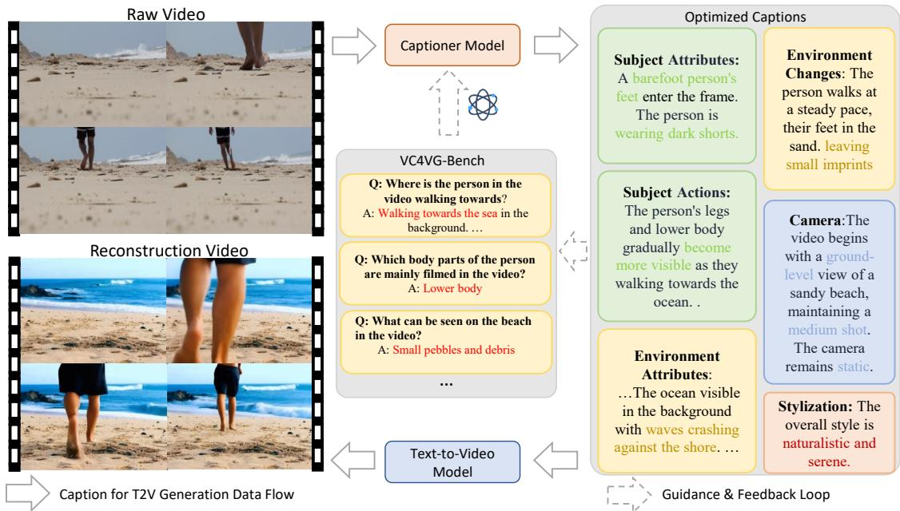  
Figure 1: Overview of the video caption optimization framework for text-to-video (T2V) generation. The original video is transformed into textual descriptions via captioners. These captions are then optimized according to dimensions that we consider essential for video reconstruction and instruct by VC4VG-Bench evaluation. Finally, optimized captions are used during T2V models’ training and generating videos.

To investigate how dimensional optimizations enhance T2V generation relative to other caption models, and to enable efficient large-scale captioning on datasets with over 10M videos, we build a custom MLLM captioner, LLaVA-Video-Gen-7B. It builds on LLaVA-Video (Zhang et al., 2024), augmented with Gemini 1.5 Pro (Team et al., 2024) and temporal-sensitive data from RTime (Du et al., 2024), and supports scalable, locally deployable, high-quality caption generation. VC4VG-Bench — A T2V-Generation-Oriented Benchmark: We introduce VC4VG-Bench, a hierarchical, LLM-assisted benchmark comprising 1,000 human-annotated Video–QA pairs. These QAs span multi-level visual content, from highlevel themes to fine-grained visual details. To measure caption effectiveness, we introduce a necessity-based hierarchy that distinguishes core from supplementary content for video reconstruction. This allows for automated, LLM-as-judge evaluations that align well with human assessments, enabling scalable and accurate evaluation of captioning quality from a generation-oriented perspective and providing actionable insights for model selection and data optimization in text-tovideo generation.

Closed-Loop Validation via T2V Fine-tuning: To validate the practical utility of our framework, we fine-tune CogVideoX (Yang et al., 2024b) on three versions of a 72K-sample video-caption dataset curated from OpenVid-1M (Nan et al., 2024), using captions generated by different methods, including CogVLM2-Caption (Yang et al., 2024b), LLaVA-Video-7B (Zhang et al., 2024), and our proposed LLaVA-Video-Gen-7B (served as a proof-of-concept implementation of our optimization framework). Quantitative results on VBench (Huang et al., 2024a,b) and MovieGen-Bench (Polyak et al., 2024), together with qualitative studies, show that generation quality correlates strongly with the richness and necessity alignment of caption content across our defined dimensions, validating the effectiveness of our optimization strategy.

Our main contributions are threefold: 1) We systematically decompose video captioning into five key dimensions critical to video reconstruction, providing guidance for scalable caption generation. 2) We propose a benchmark with 1,000 human-verified QA pairs and an automated evaluation protocol tailored to T2V needs. 3) We demonstrate, through fine-tuning experiments, that improvements in caption content directly enhance video generation quality, validating our caption optimization strategy.

## 2 VC4VG

we propose VC4VG (Video Captioning for Video Generation), a comprehensive caption optimization strategy tailored for enhancing T2V training. In this section, we first present caption information dimensions decomposed from the essential requirements of T2V reconstruction, accompanied by the development of LLaVA-Video-Gen, a captioner for large-scale video captioning in Section 2.1. We then introduce VC4VG-Bench, a novel benchmark specifically designed for video captioning from the text-to-video generation perspective in Section 2.2.

## 2.1 Caption Optimization

High-quality video-caption pairs are essential for effective T2V training. We hypothesize that rich and accurate coverage across key dimensions in captions directly enhances video generation performance. To validate this, we systematically decompose video captioning into five critical dimensions ensuring comprehensive yet flexible coverage of essential content. This decomposition is grounded in a systematic analysis of the fundamental requirements of T2V generation, drawing inspiration from practices used by professional video creators. These dimensions include:

• Camera Parameter Specification: Camera parameters capture the perspective from which the content is viewed which shapes narrative framing and viewer engagement. They critically govern text-to-video generation through three key dimensions: (1) shot size defining subject scale relative to the frame, (2) camera angles specifying viewpoint orientation, and (3) movement patterns describing dynamic transitions inferred by analyzing scene context and static reference objects. Special techniques like slow motion or macro shots are explicitly annotated as shot technology modifiers.

• Subject Attributes: A clearly defined subject serves as the semantic core of the scene and is essential for T2V models to generate meaningful, instruction-aligned content. We define subjects as the primary objects in a video, characterized by two key visual aspects: 1) basic properties such as quantity, appearance, clothing, and accessories; 2) spatial relationships among subjects, including their positions and interactions.

• Motion Dynamics: Motion is the defining feature of video compared to static images and its accurate modeling is essential for achieving temporal coherence. We define motion dynamics through three core elements: (1) Gradual environmental changes over time, (2) Sequential actions broken down into detailed limb movements, and (3) Movement paths showing direction and position changes when subjects travel through scenes.

• Environmental Contexts: The environment defines the spatial and visual setting in which the subject appears, directly influencing lighting, composition, and physical interactions. This dimension is fundamental to building a believable world. We set environment descriptions encompass: (1) Spatiotemporal attributes (lighting conditions, weather, time-of-day), (2) Geospatial layout with object placements, and all elements are grounded in visually observable evidence without subjective interpretation.

• Stylization Guidelines: This dimension determines the final artistic rendering, influencing the overall appearance to meet user-specific stylistic preferences. We summarize high level visual aspects through: (1) Emotional ambiance conveyed via color grading and motion patterns, (2) Stylistic descriptors (e.g., anime, cyberpunk) governing rendering pipelines. These are derived from low-level visual cues rather than external semantic knowledge.

2.1.1 LLaVA-Video-Gen:A Proof-of-Concept While powerful, existing MLLMs like LLaVA-Video-7B (Zhang et al., 2024) lack explicit optimization for generating the complex, instructiondriven descriptions required for high-quality T2V training. To reduce this gap and validate our framework, we introduce LLaVA-Video-Gen, a 7B-parameter expert captioner as a proof-ofconcept for our framework. This model is developed by distilling Gemini 1.5 Pro (Team et al., 2024), into the more efficient LLaVA-Video-7B architecture. Our data curation and fine-tuning pipeline consists of two complementary stages.

General-Purpose Captioning Data Curation. First, to enhance the foundational capability to follow complex instructions for diverse visual concepts, we curate a high-quality dataset from WebVid-10M (Bain et al., 2021). Our multistep filtering process is designed to maximize data quality and diversity. We initially select videos with durations between 5 and 15 seconds to ensure sufficient content richness while aligning with typical T2V generation lengths. To foster content diversity, we employ Qwen2VL (Wang et al., 2024b) to extract content tags (e.g., subject, environment) for balanced sampling across different concepts. A subsequent data cleaning pipeline (in Appendix A) further filters this subset based on aesthetic quality and motion intensity, resulting in 200K high-quality videos. Crucially, we discard the original, often noisy WebVid captions and use Gemini 1.5 Pro to generate entirely new, detailed descriptions, ensuring high linguistic consistency and semantic depth.

Temporal Reasoning Enhancement. Second, to specifically enhance the model’s temporal reasoning—a known weakness in many MLLMs—we incorporate the RTime dataset (Du et al., 2024). RTime contains 21K videos featuring distinct forward and reversed semantics (e.g., "opening a door" vs. "closing a door"), each paired with manually verified short captions. We leverage these concise, high-confidence captions as contextual prompts to guide Gemini 1.5 Pro in generating long-form, temporally-aware descriptions. The resulting data, structured as (video, forward\_caption, reversed\_caption) triples, is naturally suited for Direct Preference Optimization (DPO) (Rafailov et al., 2023).

Fine-tuning. Using the comprehensive collection of generated captions, we fine-tune the LLaVA-Video-7B model using Low-Rank Adaptation (LoRA) (Hu et al., 2022). For each video, we uniformly sample 32 frames for training. The DPO-based fine-tuning on the RTime data further sharpens the model’s ability to distinguish and describe temporal sequences, yielding our expert captioner, LLaVA-Video-Gen. Additional ablation studies are provided in Appendix C.1.

## 2.2 VC4VG-Bench

To quantitatively evaluate caption coverage accuracy across critical video reconstruction dimensions and assess corresponding T2V generation improvements, we introduce VC4VG-Bench, an automated evaluation caption benchmark for T2V.

## 2.2.1 Evaluation Dimensions and Videos

Aligning with the characteristics of a detailed caption necessary to generate high-quality video, our benchmark encompasses evaluations in five critical dimensions of videos mentioned in Section 2.1. Therefore, in terms of video collection, rather than achieving diversity through disparate data sources, we prioritize the diversity of videos across the five evaluation dimensions. The evaluation videos are curated from Pixabay2, chosen for their high aesthetic quality and rich visual detail, with durations typically ranging from 5 to 20 seconds.

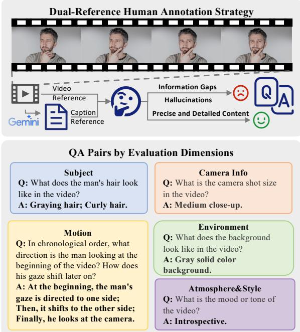  
Figure 2: The core framework of evaluation QApairs, structured around five key assessment dimensions. Leveraging dual-reference (video content & textual captions) enables multimodal alignment verification, effectively assisting human annotation to ensure accuracy and comprehensive coverage in evaluation QA-pairs.

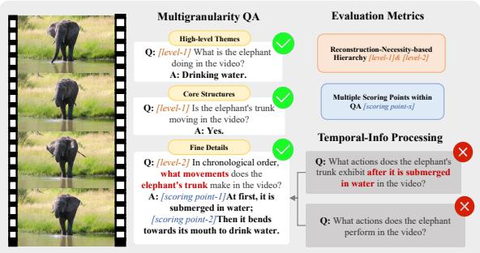  
Figure 3: Illustration of the multi-granularity evaluation QA-pair system specifically designed for video generation tasks. Featuring moderate information clustering in temporal processing, the hierarchical QA-pair architecture based on reconstruction-necessity incorporates multiple scoring points to comprehensively assess caption quality in video generation tasks.

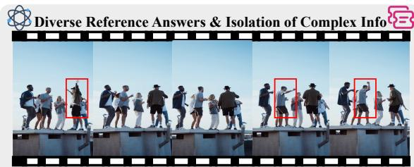  
Q: Which young people in the video have arm movements while dancing? What specific movements are they doing? A: The man wearing a hat/green jacket has arm movements; The man wearing a hat/green jacket raises both his arms; The third white man/light brown short-haired man also has arm movements; The third white man/light brown short-haired man raises one arm.

Figure 4: Separating scoring metrics: (1) presence of arm movements and (2) movement specificity, to systematically isolate complex information evaluation. Concurrently, character-specific features (e.g., wearing hat, wearing green jacket) are leveraged to formulate diverse reference answers, and therefore enhance answer adaptability across diverse caption.

## 2.2.2 Evaluation QA Design

In terms of evaluation QA system design, We adopt a similar divide-and-conquer strategy by AuroraCap (Chai et al., 2024).

Human Annotation Strategy Unlike Aurora-Cap (Chai et al., 2024)’s approach, which relies on manually refined ground-truth captions derived from LLM-generated outputs and fully automates QA generation using GPT-4 (OpenAI, 2023) with predefined prompts, our QA pairs are entirely human-annotated as shown in Figure 2. Annotators simultaneously reference both the original video content and Gemini-1.5-Pro (Team et al., 2024) generated captions—the latter of which may contain information omissions or hallucinations. This dual-reference methodology creates a complementary framework where human visual interpretation and multi-modal model understanding jointly establish a holistic and precise comprehension of video content.

We opt for manual QA annotation over manual caption refinement to ensure that our QA design incorporates diverse granularity and complexity levels to assess nuanced information reconstruction. Directly generating QA pairs by LLMs exhibits the inherent reliability limitations.

Temporal Information Processing In terms of question formulation, temporal information introduces significant complexity, particularly when considering sequences of actions (e.g., motion trajectories of subjects or camera operations) that involve chronological ordering, concurrent events, or causal relationships.

We address this by clustering temporally correlated information (e.g., sequences of hand movements) for evaluation. This design is motivated by two primary considerations: First, aggregating multiple temporal elements into a single question (e.g., "What sequential actions did the subject perform?") would substantially increase the difficulty of answer formulation and evaluation. Second, decomposing sequences into individual actions risks introducing conditional dependencies (e.g., "What occurred after Action 1?"), which becomes unmanageable if the caption omits or misrepresents prerequisite actions (e.g., Action 1).

General QA Formulation To further enhance assessment robustness against variations in captioner outputs (e.g., linguistic diversity, descriptive paradigms, accuracy, comprehensiveness, and granularity), we implement three general strategies as shown in Figure 3 and Figure 4:

1) Multigranularity QA supplementation: Incorporating questions that assess both fine-grained details (e.g., enumerating specific hand movements) and high-level assertions (e.g., presence/absence of hand actions);

2) Isolation of complex information: Separating challenging elements (e.g., left/right hand distinctions) from broader contextual descriptions to avoid conflated evaluations;

3) Diversified reference answers: Accommodating multiple valid descriptions for ambiguous entities (e.g., “the man on the left” vs. “the man wearing a black hat”) through semantically equivalent answer variants.

## 2.2.3 Evaluation Metrics

In the design of evaluation metrics, we allocate scores based on the informational density of each QA pair. For QA pairs containing substantial information, we decompose answers into multiple scoring points to enable precise score distribution while reducing the complexity of automated evaluation.

Reconstruction-necessity-based Hierarchy. We stratify QA pairs into two levels according to their necessity for video reconstruction. This hierarchy reflects our expectation that captions should prioritize accurate coverage of information critical to video fidelity. Regarding the classification criteria for reconstruction-necessity-based hierarchy, information pertaining to high-level concepts and core structures is predominantly categorized as Level-1 necessity, while fine details are generally assigned to Level-2 necessity. Concurrently, the dimension of information or its visual saliency level within the video context also impacts necessity classification. For instance, although both represent fine details, the color of the dress of the subject female (as the visual focus) would be classified as Level-1 necessity, whereas the color of background curtains (secondary visual elements) would typically fall under Level-2 necessity.

<table><tr><td>Caption Model</td><td>Environment Score/%</td><td>Subject Score/%</td><td>Motion Score/%</td><td>Camera Score/%</td><td>Atmosphere&amp;style Score/%</td><td>Necessity-L1 Score/%</td><td>Necessity-L2 Score/%</td><td>Total score Score/%</td></tr><tr><td>ShareCaptioner-Video-7B (Chen et al., 2025a)</td><td>196/43.5</td><td>103/22.3</td><td>85/25.4</td><td>48/33.1</td><td>12/70.6</td><td>284/46.3</td><td>160/20.1</td><td>444/31.5</td></tr><tr><td>Vriptor (Yang et al., 2024a)</td><td>208/46.1</td><td>126/27.3</td><td>60/17.9</td><td>31/21.4</td><td>16/94.1</td><td>303/49.3</td><td>138/17.3</td><td>441/31.3</td></tr><tr><td>VideoLLaMA3-7B (Zhang et al., 2025)</td><td>119/26.4</td><td>106/22.9</td><td>88/26.3</td><td>17/11.7</td><td>14/82.4</td><td>232/37.8</td><td>112/14.1</td><td>344/24.4</td></tr><tr><td>Qwen2VL-7B (Wang et al., 2024b)</td><td>179/39.7</td><td>134/29</td><td>98/29.3</td><td>23/15.9</td><td>12/70.6</td><td>296/48.2</td><td>150/18.8</td><td>446/31.6</td></tr><tr><td>CogVLM2-Caption (Yang et al., 2024b)</td><td>216/47.9</td><td>174/37.7</td><td>93/27.8</td><td>14/9.7</td><td>13/76.5</td><td>317/51.6</td><td>193/24.2</td><td>510/36.2</td></tr><tr><td>LLaVA-Video-7B (Zhang et al., 2024)</td><td>287/63.6</td><td>211/45.7</td><td>110/32.8</td><td>28/19.3</td><td>15/88.2</td><td>367/59.8</td><td>284/35.7</td><td>651/46.2</td></tr><tr><td>Gemini 1.5 Pro (Team et al., 2024)</td><td>278/61.6</td><td>255/55.2</td><td>119/35.5</td><td>44/30.3</td><td>17/100.0</td><td>374/60.9</td><td>339/42.6</td><td>713/50.6</td></tr><tr><td>LLaVA-Video-Gen-7B(Ours)</td><td>304/67.4</td><td>256/55.4</td><td>154/46.0</td><td>74/51.0</td><td>16/94.1</td><td>459/74.8</td><td>345/43.3</td><td>804/57.0</td></tr><tr><td>Gemini 1.5 Pro-MiraData (Ju et al., 2025)</td><td>335/74.3</td><td>287/62.1</td><td>163/48.7</td><td>77/53.1</td><td>16/94.1</td><td>471/76.7</td><td>407/51.1</td><td>878/62.3</td></tr><tr><td>Gemini 1.5 Pro-VC4VG (Team et al., 2024)</td><td>372/82.5</td><td>328/71.0</td><td>170/50.7</td><td>85/58.6</td><td>17/100.0</td><td>513/83.6</td><td>459/57.7</td><td>972/68.9</td></tr></table>

Table 1: Quantitative captioning evaluation results comparison between free-generated and content-constrained models. The best results of video captioning methods are marked in bold and the second-best are underlined. It is important to note that due to inherent differences of model and variations in prompt engineering strategies, the caption results do not reflect their absolute performance capabilities. For free-generated setting, models response using the uniform prompt "Please describe this video in detail".

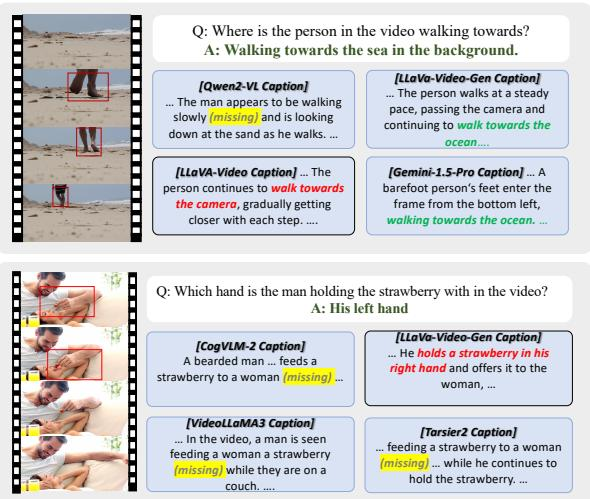  
Figure 5: Illustration of representative examples of video caption performance on the benchmark, demonstrating variations in action descriptions.

## 2.2.4 Automated Evaluation Results

We adopt the LLM-as-judge paradigm to implement automated evaluation, leveraging GPT-4o for extracting target information from captions and determining whether predefined scoring criteria are adequately addressed. The pipeline achieved a consistency rate over 80% with human judgments, which demonstrates the reliability of our framework.

As demonstrated in Table 1, under the freegenerated setting, mainstream MLLMs and specialized captioners exhibit significant performance variations on our benchmark. Gemini-1.5-Pro demonstrates relative advantages overall. However, without explicit prompt guidance, it tends to generate concise and generalized captions that frequently omit details essential for video reconstruction.

CogVLM2-Caption (Yang et al., 2024b), ShareCaptioner-Video-7B (Chen et al., 2025a) and Vriptor (Yang et al., 2024a), despite being specialized captioning models, exhibit deficiencies across multiple dimensions and therefore struggle to generate captions that effectively support text-to-video applications.

Under the prompt engineering setting, we compared two data synthesis strategies for T2V tasks, MiraData (Ju et al., 2025) and our VC4VG, using Gemini-1.5-Pro. Both approaches emphasize comprehensive descriptions across video dimensions, where the former requires structured caption output while the latter imposes no format restrictions. Benchmark results demonstrate that Gemini-1.5-Pro-VC4VG achieves significantly higher scores than Gemini-1.5-Pro-MiraData, which in turn significantly outperforms Gemini-1.5-Pro under free-generated setting. This suggests that while MiraData’s synthesis strategy can effectively align with critical dimensions of T2V tasks, there remains room for improvement.

Our captioning model trained on Gemini-1.5-Pro-VC4VG data demonstrates competitive performance on the benchmark. Compared to Gemini-1.5-Pro under free-generated setting, it shows significant improvements at the primary necessity-level, approaching the performance level of Gemini-1.5-Pro-MiraData. This indicates that the captions generated by our model can accurately and comprehensively describe the highly essential information across various dimensions required for video reconstruction.

## 3 T2V Generation Experiments

In this section, we present experimental results and analysis of applying different captioning methods to CogVideoX-5B (Yang et al., 2024b) T2V model training. Section 3.1 details our training preparation including video sources, captioning methodologies, and parameter configurations. We subsequently demonstrate the effectiveness of video-caption pairs generated by different captioning models for T2V model training in Section 3.2.

## 3.1 Experimental Settings

Video Source and Preprocessing: We curated approximately 72K videos from OpenVid-1M (Nan et al., 2024) through rigorous filtering based on aesthetic quality and temporal consistency. To mitigate aspect ratio distortion caused by resolution mismatches during training, we implement adaptive resizing and cropping based on each video’s original aspect ratio. Given that CogVideoX-5B generates 6-second videos with 49 frames at 8 frames per second (fps), we temporally segment all source videos into 6-second clips through random sampling to ensure motion consistency. This refined dataset serves as our primary video source for validating different captioning methodologies.

Captioning Methods: Consistent with the captioning guidelines in Table 1, we employ the following models for video caption generation: (1)CogVLM2-Caption (Yang et al., 2024b) is adopted during the training of CogVideoX to convert video data into textual descriptions. This alignment tends to ensure consistency between the fine-tuning phase and CogVideoX’s training paradigm. (2)LLaVA-Video-7B (Zhang et al., 2024) extends the LLaVA-Onevision (Li et al., 2024) through fine-tuning on the LLaVA-Video-178K which containing detailed caption annotations, enabling the generation of comprehensive and fine-grained video descriptions. (3)LLaVA-

Video-Gen represents our expert captioner model introduced in Section 2.1, which is distilled from Gemini 1.5 Pro with prompt enhanced on dimensions mentioned in Sec 2.1.

T2V Model Setting: We conduct full-parameter fine-tuning of CogVideoX-5B, a widely adopted open-source DiT-based T2V generation model, using the original training configuration: 49-frame sampling, 720×480 resolution, learning rate of 2e-5, and 64×NVIDIA H20 GPUs for 5 epochs. During inference, we maintain identical resolution and frame count as in training, configured with 8 fps to generate approximately 6-second videos. The CogVideoXDPMScheduler (Lu et al., 2022a,b) is employed with 50 steps and guidance of scale 6 throughout inference phases.

## 3.2 Experimental Results Comparison

## 3.2.1 Automatic Quantitative Evaluation

Automatic Metrics. We employ several metrics in VBench (Huang et al., 2024a), a widely adopted benchmark for automated evaluation of T2V generation quality, to assess models trained with different captioning methods. Given that our training utilizes extended captions containing richer visual details and motion descriptions, we adopt the official GPT-enhanced prompts from VBench repository for generation. As shown in Table 2, LLaVA-Video-Gen demonstrates superior overall performance in most of the metrics, especially for semantic understanding such as multiple objects, spatial relationship and scene. The performance ranking aligns with our VC4VG-Bench scores from Table 1, validating our benchmark’s effectiveness for evaluating training captions.

## 3.2.2 Human-annotated GSB Quantitative Evaluation

To enable fine-grained evaluation of T2V generation fidelity, we curate 200 samples from MovieGenBench (Polyak et al., 2024). Using Gemini-1.5-Pro, we generate Miradatastyle prompts with MovieGen-produced videos as reference, then reconstruct videos through each T2V model. Three domain experts perform blind assessments comparing LLaVA-Video-Gen against its closest-performing counterparts (LLaVA-Video-7B and CogVLM-Caption) through side-by-side evaluation using GSB (Good, Same, Bad) scoring criteria across five reconstruction dimensions.

CogVideoX-5B
<table><tr><td>Captioning Models</td><td>Subject Consistency</td><td>|Background Consistency</td><td>Temporal Flickering</td><td>Motion Smoothness</td><td>Dynamic Degree</td><td>Aesthetic Quality</td><td>Imaging Quality</td><td>Object Class</td></tr><tr><td>CogVideoX-5B</td><td>92.93%</td><td>94.41%</td><td>97.95%</td><td>97.76%</td><td>68.06%</td><td>61.93%</td><td>61.26%</td><td>82.20%</td></tr><tr><td>+CogVLM2-Caption</td><td>93.60%</td><td>95.31%</td><td>95.45%</td><td>98.73%</td><td>58.33%</td><td>63.43%</td><td>64.02%</td><td>88.37%</td></tr><tr><td>+LLaVA-Video-7B</td><td>93.59%</td><td>95.12%</td><td>98.53%</td><td>98.79%</td><td>59.72%</td><td>64.00%</td><td>63.47%</td><td>87.74%</td></tr><tr><td>+LLaVA-Video-Gen(Ours)</td><td>94.25%</td><td>95.58%</td><td>98.20%</td><td>98.56%</td><td>59.72%</td><td>65.16%</td><td>65.95%</td><td>90.98%</td></tr><tr><td>Captioning Models</td><td>Multiple Objects</td><td>Color</td><td>Spatial Relationship</td><td>Scene</td><td>| Temporal | Style</td><td>Appearance Style</td><td>Overall Consistency</td><td>Total Score</td></tr><tr><td>CogVideoX-5B</td><td>57.62%</td><td>78.63%</td><td>60.66%</td><td>51.67%</td><td>24.95%</td><td>23.99%</td><td>27.07%</td><td>79.97%</td></tr><tr><td>+CogVLM2-Caption</td><td>63.33%</td><td>79.58%</td><td>73.45%</td><td>56.32%</td><td>25.60%</td><td>24.68%</td><td>27.55%</td><td>81.54%</td></tr><tr><td>+LLaVA-Video-7B</td><td>70.88%</td><td>85.21%</td><td>71.37%</td><td>53.85%</td><td>25.78%</td><td>24.16%</td><td>27.59%</td><td>81.79%</td></tr><tr><td>+LLaVA-Video-Gen(Ours)</td><td>77.90%</td><td>75.84%</td><td>75.65%</td><td>59.88%</td><td>25.64%</td><td>24.56%</td><td>27.70%</td><td>82.50%</td></tr></table>

Table 2: Quantitative VBench evaluation results comparison between T2V models trained with captions generated by different models. We use all dimension gpt enhanced prompts in vbench and sample once for each prompt. The best results of video captioning methods are marked in bold.
<table><tr><td>Captioning Models</td><td>Environment G/S/B/%</td><td>Subject G/S/B/%</td><td>Motion G/S/B/%</td><td>Camera G/S/B/%</td><td>Atmosphere&amp;style G/S/B/%</td><td>Overall G/S/B/%</td></tr><tr><td>LLaVA-Video-Gen</td><td></td><td></td><td></td><td></td><td></td><td></td></tr><tr><td>-vs LLaVA-Video-7B</td><td>26.5/72/1.5</td><td>50/44/6</td><td>23.5/68.5/8</td><td>0.5/98.5/1</td><td>1/99/0</td><td>61/28.5/10.5</td></tr><tr><td>-vs CogVLM2-Caption</td><td>16/82.5/1.5</td><td>28.5/62.5/9</td><td>23.5/68.5/8</td><td>1/97.5/1.5</td><td>0/99.5/0.5</td><td>37.5/51/11.5</td></tr></table>

Table 3: Quantitative human-annotated evaluation results. The evaluation compares the performance of LLaVA-Video-Gen, against two baseline models: LLaVA-Video-7B and CogVLM2-Caption. Human annotators assessed video outputs from these models based on 200 samples from the MovieGenBench dataset, which are annotated with prompts in miradata-style (Ju et al., 2025) For each comparison, evaluators rated whether LLaVA-Video-Gen’s output was Good (G), Same (S), or Bad (B) relative to the baseline across several criteria. The scores are presented as G:S:B percentages, indicating the proportion of times LLaVA-Video-Gen is judged superior, equivalent, or inferior to the respective baseline for each dimension.

Our findings in Table 3 reveal three key insights: (1) Information gains in Environment, Subject, and Motion dimensions directly correlate with T2V generation improvements; (2) Comparable performance on Atmosphere attributes across models aligns with VC4VG-Bench’s lower task difficulty for this dimension; (3) For Camera properties, while models effectively control shot size and angles, movement patterns prove challenging due to MLLMs’ limited capability in understanding fine-grained temporal dynamics - a limitation exacerbated by MovieGenBench’s sparse coverage of complex camera motions. Collectively, these empirical results validate that our dimension-aware optimization strategy effectively guides T2V training data curation.

## 3.2.3 Qualitative Evaluation

We choose samples for Figure 6 and Figure 7 to visualize representative cases. The T2V model fine-tuned on captions generated by different models demonstrates t2v improvements in scene detail preservation and instruction adherence compared to the raw CogVideoX-5B.

MovieGen Ground Truth  
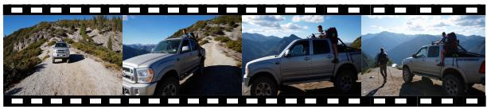

LLaVA-Video-Gen(Ours)  
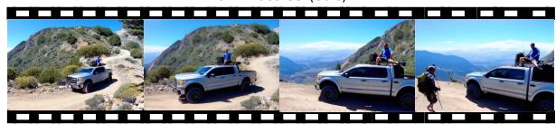

CogVLM2-Caption  
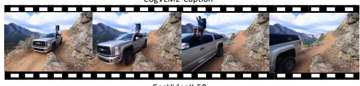

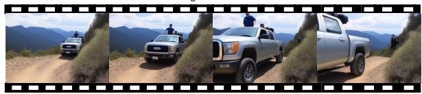  
Figure 6: Qualitative evaluation of different T2V models’ reconstruction performance. Please zoom in for a better view.

## 4 Related Works

Video-Text Dataset. High-quality T2V models require video-text datasets with scene details and instruction alignment for effective training. Existing datasets primarily fall into three categories: human-annotated (Xu et al., 2016; Du et al., 2024; Wang et al., 2019; Anne Hendricks et al., 2017), metadata-derived captions from video platforms (Bain et al., 2021), and automatically generated captions (Miech et al., 2019; Chen et al., 2024; Wang et al., 2023; Yang et al., 2024a; Nan et al., 2024; Ju et al., 2025). Traditional automation methods like ASR transcription (Miech et al., 2019; Xue et al., 2022) achieve scale but exhibit weak video-text semantic alignment, making them suboptimal for generative tasks.

Modern multimodal LLMs (MLLMs) demonstrate enhanced visual description capabilities, driving their adoption in T2V training corpus generation (Chen et al., 2024; Wang et al., 2023; Nan et al., 2024; Zheng et al., 2024; Hong et al., 2022; Yang et al., 2024b; Kong et al., 2024; Polyak et al., 2024; Ju et al., 2025; Chen et al., 2025a; Yang et al., 2024a). Datasets like Panda-70M (Chen et al., 2024) and InternVid (Wang et al., 2023) only produce short captions. Current solutions prioritize fine-grained dense video descriptions through MLLM-based approaches: OpenSora (Zheng et al., 2024) leverages PLLaVA (Xu et al., 2024), CogVideoX (Yang et al., 2024b; Hong et al., 2022) employs its proprietary CogVLM2-Cap, OpenVid utilizes LLaVA-1.6 (Liu et al., 2024), and Mira-Data (Ju et al., 2025) adopts cost-intensive GPT-4V (Zhang et al., 2023) annotations. Most methods adopt approaches without specialized frameworks for optimizing video generation elements. InstanceCap (Fan et al., 2024) generates dense structural captions through a complex pipeline and suffers from significant efficiency bottlenecks compared to end-to-end generation methods, ultimately limiting its scalability.

Evaluation of Video Captioning. As the capabilities of video captioning have advanced, the associated benchmarks have evolved from traditional short-caption evaluation(e.g., MSR-VTT (Xu et al., 2016), VATEX (Wang et al., 2019)) and metrics(e.g., METEOR (Banerjee and Lavie, 2005) CIDEr (Vedantam et al., 2015), BLEU (Papineni et al., 2002), ROUGE-L (Lin, 2004)), to address long-form captioning challenges. Notably, AuroraCap (Chai et al., 2024) introduced VDC (Chai et al., 2024), along with an LLM-based evaluation metrics VDCScore, overcoming limitations of direct caption assessment through LLMs. Dream-1K (Wang et al., 2024a) and CaReBench (Xu et al., 2025) focus more extensively on human-annotated video captions and tailored evaluation methods. However, these benchmarks are primarily designed for video captioning in the context of video understanding rather than video generation. Although VidCap-Bench (Chen et al., 2025b) aligns its evaluation design with the key metrics for T2V generation, its training-free T2V verification mechanism inadequately demonstrates that models performing well on this benchmark can effectively serve as training data for high-quality T2V generation. In this paper, we propose a novel benchmark specifically designed for T2V tasks and empirically validate its consistency with actual generation quality through real-world T2V training experiments.

## 5 Conclusion

In this paper, we present VC4VG, a comprehensive video caption optimization framework designed for T2V models. Our framework systematically decomposes video captioning into five key dimensions that are critical for video reconstruction, thereby providing practical guidance for scalable caption generation. Building on this decomposition, we further introduce VC4VG-Bench, a specialized benchmark that emphasizes multidimensional video descriptions tailored to T2V generation scenarios. Through fine-tuning experiments, we demonstrate a clear correlation between enhanced caption quality and improved video generation performance, validating the effectiveness of our approach. We hope that our framework will support the community in developing higherquality video captions for T2V models and, ultimately, more powerful video generation systems.

## Limitations

Our VC4VG-Bench automates the evaluation of open-ended video captioning. While demonstrating high correlation with human judgment, subtle biases may still exist. Furthermore, performance can fluctuate due to varying model configurations, including different video processing techniques and prompt engineering strategies. Consequently, the reported metrics primarily reflect caption quality under specific experimental settings, rather than the fundamental performance differences between the models.

## Ethical Considerations

Regarding ethical considerations, it is important to acknowledge that Text-to-Video models may generate biased or harmful content. Such outputs can potentially perpetuate stereotypes or disseminate misinformation. We emphasize the critical need for responsible model application. Developers are encouraged to implement robust safeguards to mitigate these risks.

## Acknowledgments

This work was sponsored by CCF-ALIMAMA TECH Kangaroo Fund (NO. CCF-ALIMAMA OF 2024007).

## References

Lisa Anne Hendricks, Oliver Wang, Eli Shechtman, Josef Sivic, Trevor Darrell, and Bryan Russell. 2017. Localizing moments in video with natural language. In Proceedings ofthe IEEE international conference on computer vision, pages 5803–5812.

Max Bain, Arsha Nagrani, Gül Varol, and Andrew Zisserman. 2021. Frozen in time: A joint video and image encoder for end-to-end retrieval. In IEEE International Conference on Computer Vision.

Satanjeev Banerjee and Alon Lavie. 2005. Meteor: An automatic metric for mt evaluation with improved correlation with human judgments. In Proceedings of the acl workshop on intrinsic and extrinsic evaluation measures for machine translation and/or summarization, pages 65–72.

Wenhao Chai, Enxin Song, Yilun Du, Chenlin Meng, Vashisht Madhavan, Omer Bar-Tal, Jeng-Neng Hwang, Saining Xie, and Christopher D. Manning. 2024. Auroracap: Efficient, performant video detailed captioning and a new benchmark. arXiv preprint arXiv:2410.03051.

Lin Chen, Xilin Wei, Jinsong Li, Xiaoyi Dong, Pan Zhang, Yuhang Zang, Zehui Chen, Haodong Duan, Zhenyu Tang, Li Yuan, and 1 others. 2025a. Sharegpt4video: Improving video understanding and generation with better captions. Advances in Neural Information Processing Systems, 37:19472– 19495.

Tsai-Shien Chen, Aliaksandr Siarohin, Willi Menapace, Ekaterina Deyneka, Hsiang-wei Chao, Byung Eun Jeon, Yuwei Fang, Hsin-Ying Lee, Jian Ren, Ming-Hsuan Yang, and Sergey Tulyakov. 2024. Panda-70m: Captioning 70m videos with multiple cross-modality teachers. In Proceedings of

the IEEE/CVF Conference on Computer Vision and Pattern Recognition.

Xinlong Chen, Yuanxing Zhang, Chongling Rao, Yushuo Guan, Jiaheng Liu, Fuzheng Zhang, Chengru Song, Qiang Liu, Di Zhang, and Tieniu Tan. 2025b. Vidcapbench: A comprehensive benchmark of video captioning for controllable text-to-video generation. arXiv preprint arXiv:2502.12782.

Yang Du, Yuqi Liu, and Qin Jin. 2024. Reversed in time: A novel temporal-emphasized benchmark for cross-modal video-text retrieval. In Proceedings of the 32th ACM International Conference on Multimedia, page 5260–5269.

Tiehan Fan, Kepan Nan, Rui Xie, Penghao Zhou, Zhenheng Yang, Chaoyou Fu, Xiang Li, Jian Yang, and Ying Tai. 2024. Instancecap: Improving text-tovideo generation via instance-aware structured caption. Preprint, arXiv:2412.09283.

Wenyi Hong, Ming Ding, Wendi Zheng, Xinghan Liu, and Jie Tang. 2022. Cogvideo: Large-scale pretraining for text-to-video generation via transformers. arXiv preprint arXiv:2205.15868.

Edward J Hu, Yelong Shen, Phillip Wallis, Zeyuan Allen-Zhu, Yuanzhi Li, Shean Wang, Lu Wang, Weizhu Chen, and 1 others. 2022. Lora: Low-rank adaptation of large language models. ICLR, 1(2):3.

Ziqi Huang, Yinan He, Jiashuo Yu, Fan Zhang, Chenyang Si, Yuming Jiang, Yuanhan Zhang, Tianxing Wu, Qingyang Jin, Nattapol Chanpaisit, Yaohui Wang, Xinyuan Chen, Limin Wang, Dahua Lin, Yu Qiao, and Ziwei Liu. 2024a. VBench: Comprehensive benchmark suite for video generative models. In Proceedings ofthe IEEE/CVF Conference on Computer Vision and Pattern Recognition.

Ziqi Huang, Fan Zhang, Xiaojie Xu, Yinan He, Jiashuo Yu, Ziyue Dong, Qianli Ma, Nattapol Chanpaisit, Chenyang Si, Yuming Jiang, Yaohui Wang, Xinyuan Chen, Ying-Cong Chen, Limin Wang, Dahua Lin, Yu Qiao, and Ziwei Liu. 2024b. Vbench++: Comprehensive and versatile benchmark suite for video generative models. arXiv preprint arXiv:2411.13503.

Xuan Ju, Yiming Gao, Zhaoyang Zhang, Ziyang Yuan, Xintao Wang, Ailing Zeng, Yu Xiong, Qiang Xu, and Ying Shan. 2025. Miradata: A large-scale video dataset with long durations and structured captions. Advances in Neural Information Processing Systems, 37:48955–48970.

Weijie Kong, Qi Tian, Zijian Zhang, Rox Min, Zuozhuo Dai, Jin Zhou, Jiangfeng Xiong, Xin Li, Bo Wu, Jianwei Zhang, Kathrina Wu, Qin Lin, Aladdin Wang, Andong Wang, Changlin Li, Duojun Huang, Fang Yang, Hao Tan, Hongmei Wang, and 34 others. 2024. Hunyuanvideo: A systematic framework for large video generative models.

Kuaishou. 2024. Kling. https://kling.kuaishou. com.

Bo Li, Yuanhan Zhang, Dong Guo, Renrui Zhang, Feng Li, Hao Zhang, Kaichen Zhang, Yanwei Li, Ziwei Liu, and Chunyuan Li. 2024. Llavaonevision: Easy visual task transfer. arXiv preprint arXiv:2408.03326.

Chin-Yew Lin. 2004. Rouge: A package for automatic evaluation of summaries. In Text summarization branches out, pages 74–81.

Haotian Liu, Chunyuan Li, Yuheng Li, Bo Li, Yuanhan Zhang, Sheng Shen, and Yong Jae Lee. 2024. Llavanext: Improved reasoning, ocr, and world knowledge.

Cheng Lu, Yuhao Zhou, Fan Bao, Jianfei Chen, Chongxuan Li, and Jun Zhu. 2022a. Dpm-solver: A fast ode solver for diffusion probabilistic model sampling in around 10 steps. Advances in Neural Information Processing Systems, 35:5775–5787.

Cheng Lu, Yuhao Zhou, Fan Bao, Jianfei Chen, Chongxuan Li, and Jun Zhu. 2022b. Dpm-solver++: Fast solver for guided sampling of diffusion probabilistic models. arXiv preprint arXiv:2211.01095.

Antoine Miech, Dimitri Zhukov, Jean-Baptiste Alayrac, Makarand Tapaswi, Ivan Laptev, and Josef Sivic. 2019. HowTo100M: Learning a Text-Video Embedding by Watching Hundred Million Narrated Video Clips. In ICCV.

Kepan Nan, Rui Xie, Penghao Zhou, Tiehan Fan, Zhenheng Yang, Zhijie Chen, Xiang Li, Jian Yang, and Ying Tai. 2024. Openvid-1m: A large-scale highquality dataset for text-to-video generation. arXiv preprint arXiv:2407.02371. Accepted at the 13th International Conference on Learning Representations (ICLR 2025).

OpenAI. 2023. GPT-4 technical report. arXiv preprint arXiv:2303.08774.

OpenAI. 2024. Sora: Generating videos from text. https://openai.com/blog/sora.

Kishore Papineni, Salim Roukos, Todd Ward, and Wei-Jing Zhu. 2002. Bleu: a method for automatic evaluation of machine translation. In Proceedings ofthe 40th annual meeting of the Association for Computational Linguistics, pages 311–318.

Adam Polyak, Amit Zohar, Andrew Brown, Andros Tjandra, Animesh Sinha, Ann Lee, Apoorv Vyas, Bowen Shi, Chih-Yao Ma, Ching-Yao Chuang, David Yan, Dhruv Choudhary, Dingkang Wang, Geet Sethi, Guan Pang, Haoyu Ma, Ishan Misra, Ji Hou, Jialiang Wang, and 69 others. 2024. Movie gen: A cast of media foundation models. Preprint, arXiv:2410.13720.

Rafael Rafailov, Archit Sharma, Eric Mitchell, Christopher D Manning, Stefano Ermon, and Chelsea Finn. 2023. Direct preference optimization: Your language model is secretly a reward model. Advances in neural information processing systems, 36:53728–53741.

Gemini Team, Petko Georgiev, Ving Ian Lei, Ryan Burnell, Libin Bai, Anmol Gulati, Garrett Tanzer, Damien Vincent, Zhufeng Pan, Shibo Wang, and 1 others. 2024. Gemini 1.5: Unlocking multimodal understanding across millions of tokens of context. arXiv preprint arXiv:2403.05530.

Zachary Teed and Jia Deng. 2020. Raft: Recurrent all-pairs field transforms for optical flow. In Computer Vision–ECCV 2020: 16th European Conference, Glasgow, UK, August 23–28, 2020, Proceedings, Part II 16, pages 402–419. Springer.

Ramakrishna Vedantam, C Lawrence Zitnick, and Devi Parikh. 2015. Cider: Consensus-based image description evaluation. In Proceedings of the IEEE conference on computer vision and pattern recognition, pages 4566–4575.

Jiawei Wang, Liping Yuan, Yuchen Zhang, and Haomiao Sun. 2024a. Tarsier: Recipes for training and evaluating large video description models. Preprint, arXiv:2407.00634.

Peng Wang, Shuai Bai, Sinan Tan, Shijie Wang, Zhihao Fan, Jinze Bai, Keqin Chen, Xuejing Liu, Jialin Wang, Wenbin Ge, Yang Fan, Kai Dang, Mengfei Du, Xuancheng Ren, Rui Men, Dayiheng Liu, Chang Zhou, Jingren Zhou, and Junyang Lin. 2024b. Qwen2-vl: Enhancing vision-language model’s perception of the world at any resolution. arXiv preprint arXiv:2409.12191.

Xin Wang, Jiawei Wu, Junkun Chen, Lei Li, Yuan-Fang Wang, and William Yang Wang. 2019. Vatex: A large-scale, high-quality multilingual dataset for video-and-language research. In Proceedings of the IEEE/CVF international conference on computer vision, pages 4581–4591.

Yi Wang, Yinan He, Yizhuo Li, Kunchang Li, Jiashuo Yu, Xin Ma, Xinhao Li, Guo Chen, Xinyuan Chen, Yaohui Wang, and 1 others. 2023. Internvid: A large-scale video-text dataset for multimodal understanding and generation. In The Twelfth International Conference on Learning Representations.

Haoning Wu, Erli Zhang, Liang Liao, Chaofeng Chen, Jingwen Hou Hou, Annan Wang, Wenxiu Sun Sun, Qiong Yan, and Weisi Lin. 2023. Exploring video quality assessment on user generated contents from aesthetic and technical perspectives. In International Conference on Computer Vision (ICCV).

Jun Xu, Tao Mei, Ting Yao, and Yong Rui. 2016. Msrvtt: A large video description dataset for bridging video and language. In Proceedings of the IEEE conference on computer vision and pattern recognition, pages 5288–5296.

Lin Xu, Yilin Zhao, Daquan Zhou, Zhijie Lin, See Kiong Ng, and Jiashi Feng. 2024. Pllava: Parameter-free llava extension from images to videos for video dense captioning. arXiv preprint arXiv:2404.16994.

Yifan Xu, Xinhao Li, Yichun Yang, Desen Meng, Rui Huang, and Limin Wang. 2025. Carebench: A fine-grained benchmark for video captioning and retrieval. Preprint, arXiv:2501.00513.

Hongwei Xue, Tiankai Hang, Yanhong Zeng, Yuchong Sun, Bei Liu, Huan Yang, Jianlong Fu, and Baining Guo. 2022. Advancing high-resolution videolanguage representation with large-scale video transcriptions. In International Conference on Computer Vision and Pattern Recognition (CVPR).

Dongjie Yang, Suyuan Huang, Chengqiang Lu, Xiaodong Han, Haoxin Zhang, Yan Gao, Yao Hu, and Hai Zhao. 2024a. Vript: A video is worth thousands of words. Advances in Neural Information Processing Systems, 37:57240–57261.

Zhuoyi Yang, Jiayan Teng, Wendi Zheng, Ming Ding, Shiyu Huang, Jiazheng Xu, Yuanming Yang, Wenyi Hong, Xiaohan Zhang, Guanyu Feng, and 1 others. 2024b. Cogvideox: Text-to-video diffusion models with an expert transformer. arXiv preprint arXiv:2408.06072.

Boqiang Zhang, Kehan Li, Zesen Cheng, Zhiqiang Hu, Yuqian Yuan, Guanzheng Chen, Sicong Leng, Yuming Jiang, Hang Zhang, Xin Li, Peng Jin, Wenqi Zhang, Fan Wang, Lidong Bing, and Deli Zhao. 2025. Videollama 3: Frontier multimodal foundation models for image and video understanding. arXiv preprint arXiv:2501.13106.

Xinlu Zhang, Yujie Lu, Weizhi Wang, An Yan, Jun Yan, Lianke Qin, Heng Wang, Xifeng Yan, William Yang Wang, and Linda Ruth Petzold. 2023. Gpt-4v(ision) as a generalist evaluator for visionlanguage tasks. Preprint, arXiv:2311.01361.

Yuanhan Zhang, Jinming Wu, Wei Li, Bo Li, Zejun Ma, Ziwei Liu, and Chunyuan Li. 2024. Video instruction tuning with synthetic data. arXiv preprint arXiv:2410.02713.

Zangwei Zheng, Xiangyu Peng, Tianji Yang, Chenhui Shen, Shenggui Li, Hongxin Liu, Yukun Zhou, Tianyi Li, and Yang You. 2024. Open-sora: Democratizing efficient video production for all.

## A Video Filtering Details

We implemented a proprietary data cleaning pipeline to rigorously process the OpenVid-1M (Nan et al., 2024) dataset, ultimately curating 72K high-quality videos. The pipeline integrates the following critical components:

<table><tr><td>Satistics</td><td>QA Pair</td><td>Scoring Point</td><td>Avg Point/Pair</td></tr><tr><td>Subject</td><td>293</td><td>462</td><td>1.6</td></tr><tr><td>Environment</td><td>306</td><td>450</td><td>1.5</td></tr><tr><td>Atmosphere&amp;Style</td><td>17</td><td>17</td><td>1.0</td></tr><tr><td>Motion</td><td>208</td><td>335</td><td>1.6</td></tr><tr><td>Camera Info</td><td>132</td><td>145</td><td>1.1</td></tr><tr><td>Necessity-L1</td><td>1</td><td>614</td><td>1</td></tr><tr><td>Necessity-L2</td><td>1</td><td>796</td><td>1</td></tr><tr><td>Total</td><td>956</td><td>1410</td><td>1.5</td></tr></table>

Table 4: VC4VG-Bench Statistics.

• Text Overlay Detection: Detects excessive subtitles or text overlays in videos, filtering out frames with significant content obstruction.

• Aesthetic Score and DOVER++ (Wu et al., 2023): Evaluates visual quality by sampling multiple frames per video clip, applying the DOVER++ assesses overall video quality, considering technical and aesthetic factors, to discard low-quality videos.

• Video Classification & Frame-level Filtering: we developed a classification model to detect low-quality content categories, including frosted-border videos and PPT-style slideshows. We filters videos with transitional effects (e.g., fade-in/fade-out) through per-frame analysis to ensure content consistency.

• Optical Flow-based Motion Intensity Resampling: Utilizes the RAFT (Teed and Deng, 2020) model to compute optical flow from video frames, quantifying motion intensity distribution to guide training data resampling.

## B VC4VG-Bench Details

## B.1 Statistics

We show the statistics of VC4VG-Bench in Table 4. As illustrated, the distribution of QA pairs across different dimensions is intentionally nonuniform. This design choice reflects the relative importance and information richness of each dimension in the context of text-to-video generation.

Specifically, dimensions such as Subject, Environment, and Motion are fundamental to producing coherent and meaningful video content. They typically carry the majority of the semantic information within a video description. Therefore, we

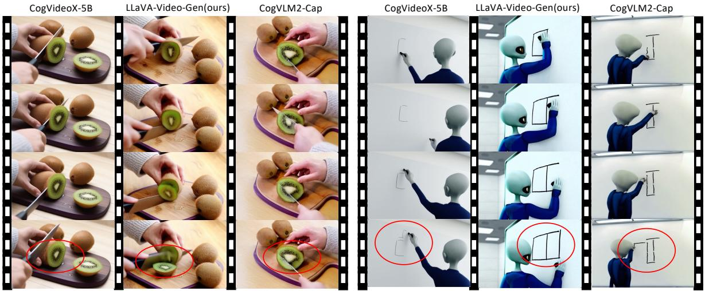  
Prompt main idea: A pair of hands wearing a light grey knitted sweater place a kiwi fruit on a wooden cutting board. The other hand holds a knife with a black handle. The knife begins to slice down the kiwi fruit, revealing the fruit's glistening juicy texture and pattern of black seeds. Two whole kiwi fruits are placed next to the one being cut.  
Prompt main idea: An alien with smooth light grey skin and large black eyes, wearing a dark blue jumpsuit, stood in front of a whiteboard in a brightly lit classroom, holding a black marker. The alien first drew a square on the whiteboard, then carefully moved to the right and drew a second square next to the first.

Figure 7: Qualitative comparison of CogVideoX-5B between raw checkpoint and versions trained on captions generated by LLaVA-Video-Gen and CogVLM2-Cap. Due to space limitations, only the main idea of the prompt is shown. The red circles highlight the main distinguishing points of the generated videos. Please zoom in for a better view.

allocate a larger portion of our annotation budget to these core dimensions, resulting in a higher number of QA pairs to ensure comprehensive evaluation of these essential aspects.

In contrast, the Atmosphere & Style dimension, while important for personalization and artistic expression, is often more subjective and can be described with fewer words. To maintain a high standard of objectivity in our benchmark, we adopt a conservative annotation strategy for this category. We create QA pairs for Atmosphere & Style only when such attributes are visually distinct and could be described objectively. For videos that lack a clear and discernible style, no QA pair is assigned for this dimension. This deliberate approach explains why Atmosphere & Style has the fewest QA pairs. This rationale ensures that our benchmark effectively prioritizes the most critical and objectively measurable aspects of video generation.

## B.2 Prompt Template

In the automated evaluation process, we first extract question-relevant content from the generated captions, then assess the extracted information by comparing it with reference answers. The corresponding prompt template for this evaluation pipeline is demonstrated in Figure 9. We employ

GPT-4o-0806 version as the evaluation judge, utilizing its reasoning capabilities to perform content alignment analysis and scoring.

## B.3 Video Collection

Video selection was primarily based on diversity across caption dimensions, which inherently ensures content diversity in the visual domain.Figure 8 presents video examples from our benchmark, demonstrating the corresponding video diversity across various dimensions.

## C Other Experiments Details

## C.1 Ablation Study of LLaVA-Video-Gen

To validate the effectiveness of our training strategy and dissect the contributions of each component, we conduct a thorough ablation study for LLaVA-Video-Gen on the VC4VG-Bench. We evaluate four distinct model variants to isolate the impact of our data curation and fine-tuning methods. The variants are as follows:

• LLaVA-Video-7B: The original pre-trained model, evaluated with simple prompts as a baseline (equivalent to our reporting in Table 2).

• LLaVA-Video-PE: The original model without any fine-tuning, but prompted with our complex, multi-dimensional instructions to assess the impact of prompt engineering alone.

<table><tr><td>Caption Model</td><td>Environment Score/%</td><td>Subject Score/%</td><td>Motion Score/%</td><td>Camera Score/%</td><td>Atmosphere&amp;style Score/%</td><td>Total score score/%</td></tr><tr><td>LLaVA-Video-7B (Baseline)</td><td>287/63.6</td><td>211/45.7</td><td>110/32.8</td><td>28/19.3</td><td>15/88.2</td><td>651/46.2</td></tr><tr><td>LLaVA-Video-PE (w/o fine-tuning)</td><td>240/53.2</td><td>183/39.6</td><td>117/34.9</td><td>44/30.3</td><td>15/88.2</td><td>599/42.5</td></tr><tr><td>LLaVA-Video-Gen-SFT (w/o RTime)</td><td>289/64.1</td><td>258/55.8</td><td>146/43.6</td><td>71/49.0</td><td>16/94.1</td><td>780/55.3</td></tr><tr><td>LLaVA-Video-Gen (Final)</td><td>304/67.4</td><td>256/55.4</td><td>154/46.0</td><td>74/51.0</td><td>16/94.1</td><td>804/57.0</td></tr></table>

Table 5: Ablation study of LLaVA-Video-Gen on the VC4VG-Bench. We evaluate the impact of our curated WebVid data (SFT) and the RTime dataset (DPO). ’PE’ denotes Prompt Engineering. Best results are in bold.

• LLaVA-Video-Gen-SFT: The model after SFT on our curated 200K WebVid subset, but without the subsequent temporal enhancement stage.

• LLaVA-Video-Gen: Our final model, which undergoes both SFT on the WebVid data and DPO on the RTime dataset.

The results, presented in Table 5, clearly demonstrate the efficacy of our methods. The results confirm that 1) Prompt engineering alone offers limited improvement and may even degrade performance; 2) SFT on our high-quality WebVid subset leads to substantial gains; 3) DPO with RTime yields additional improvements, especially in motion and camera dimensions.

## C.2 Ablation Study of T2V Training Steps

As illustrated in Figure 10, we fine-tune CogVideoX-5B for 5 epochs (1,600 steps) using captions generated by our LLaVA-Video-Gen framework. Based on VBench evaluations (Huang et al., 2024a), which measure quality score, semantic score, and total score through line chart analysis, we observe peak performance at 1,200 training steps. We therefore select the 1200- step checkpoint for final evaluation. To ensure fair comparison in Section 4.2, all baseline caption methods are evaluated under identical training configurations using their respective 1200-step checkpoints.

## C.3 Qualitative Analysis

We present a qualitative comparison between our LLaVA-Video-Gen and CogVLM2-Caption in Figure 7.

## D Reproducibility Statement

We will release our benchmark and corresponding codes for reproducibility.

## E License

This work is licensed under the Creative Commons Attribution-NonCommercial 4.0 International License (CC BY-NC 4.0).

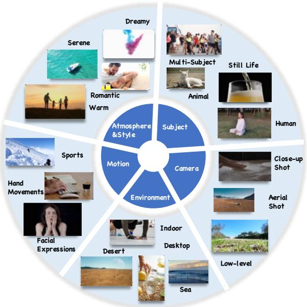  
Figure 8: Video Examples from Benchmark

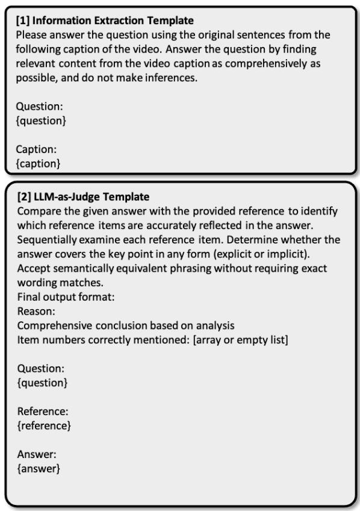

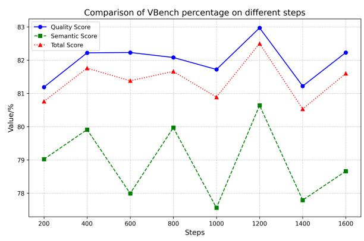  
Figure 10: Comparison of VBench score percentage on different steps.  
Figure 9: Automated Evaluation Prompt Template