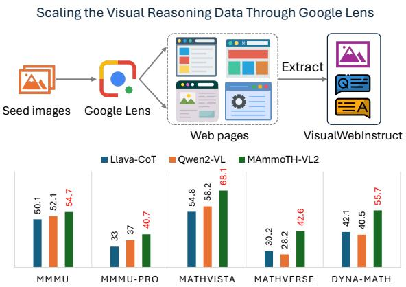
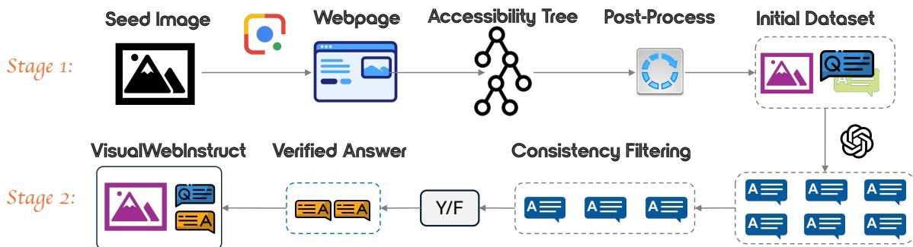
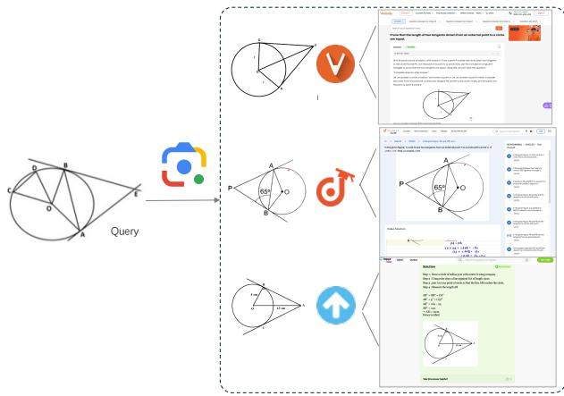
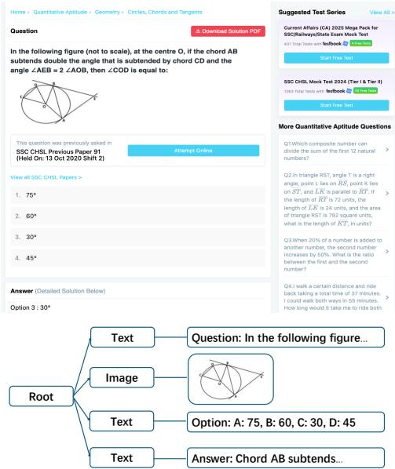
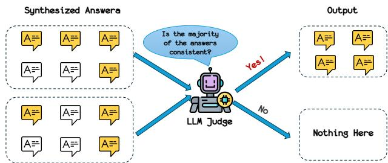
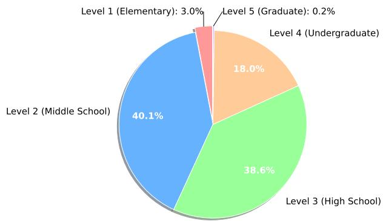
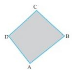
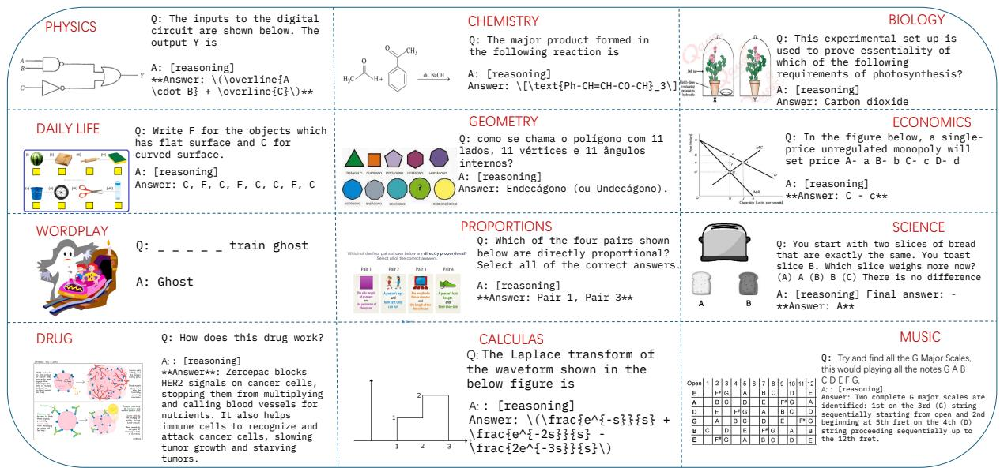

# VisualWebInstruct: Scaling up Multimodal Instruction Data through Web Search

Yiming Jia1,2\*, Jiachen Li3, Xiang Yue4, Bo Li5, Ping Nie6, Kai Zou7, Wenhu Chen2

1University of Toronto, 2University of Waterloo, 3University of California, Santa Barbara, 4Carnegie Mellon University, 5Nanyang Technological University, 6Independent, 7Netmind.ai Correspondence: yiming.jia@mail.utoronto.ca, wenhuchen@uwaterloo.ca

## Abstract

Vision-Language Models have made signif icant progress on many perception-focused tasks. However, their progress on reasoningfocused tasks remains limited due to the lack of high-quality and diverse training data. In this work, we aim to address the scarcity of reasoning-focused multimodal datasets. We propose VisualWebInstruct, a novel approach that leverages search engines to create a diverse and high-quality dataset spanning multiple disciplines, including mathematics, physics, finance, and chemistry, etc. Starting with a meticulously selected set of 30,000 seed images, we employ Google Image Search to identify websites containing similar images. We collect and process HTML data from over 700K unique URLs. Through a pipeline of content extraction, filtering, and synthesis, we construct a dataset of approximately 900K question-answer (QA) pairs, with 40% consisting of visual QA pairs and the remaining comprising text-based QA pairs. Models finetuned on VisualWebInstruct demonstrate significant performance improvements: (1) finetuning on Llava-OV results in 10-20 absolute points improvement across benchmarks, and (2) fine-tuning from MAmmoTH-VL yields a 5 absolute points gain across benchmarks. Our best model, MAmmoTH-VL2, achieves the best known performance with SFT without RL within the 10B parameter class on MMMU-Pro (40.7), MathVerse (42.6), and DynaMath (55.7). These results highlight the effectiveness of our dataset in enhancing the reasoning capabilities of vision-language models for complex multimodal tasks.

## 1 Introduction

Vision-Language Models (VLMs) have shown progress in perceptual tasks like VQA (Antol et al., 2015) and DocVQA (Mathew et al., 2021), yet struggle with complex reasoning tasks such as

  
Figure 1: Overview of our automated data curation approach and major experimental results.

MMMU (Yue et al., 2024) and MathVista (Lu et al., 2023). A major bottleneck is the scarcity of reasoning-focused training data. Existing datasets are limited by narrow focus on specific image types (FigureQA (Kahou et al., 2017), ChartQA (Masry et al., 2022)), reliance on synthetic images (CLEVR (Johnson et al., 2017)), or insufficient complexity (AI2D (Kembhavi et al., 2016), ScienceQA (Saikh et al., 2022)).

Inspired by WebInstruct (Yue et al., 2025), we aim to mine naturally existing reasoning-focused instruction data from the internet. However, directly applying WebInstruct’s approach to the multimodal domain presents significant challenges. While WebInstruct retrieves reasoning-focused text data from Common Crawl, this method is infeasible for multimodal content due to two key limitations: (1) the absence of a comparable large-scale multimodal database similar to Common Crawl, and (2) the high unreliability of existing multimodal information retrieval models. To overcome these obstacles, as illustrated in Figure 1, we leverage commercial web image search tools like Google Image Search (Zhang and Rui, 2013), which offer superior coverage and accuracy. Starting with

<table><tr><td>Dataset</td><td>Size</td><td>Source &amp; Domains</td><td>Coverage</td></tr><tr><td>ScienceQA</td><td>21K</td><td>Elementary and high school science</td><td>Science Q&amp;A, diagrams, K-12 Exam</td></tr><tr><td>IconQA</td><td>107K</td><td>Abstract diagrams and visual reasoning</td><td>Visual reasoning, diagrams</td></tr><tr><td>Geo170K</td><td>170K</td><td>Synthesized from LLMs</td><td>Geometry</td></tr><tr><td>CLEVR</td><td>700K</td><td>Synthesized from rules</td><td>Shapes</td></tr><tr><td>FigureQA</td><td>1.3M</td><td>Synthesized from rules</td><td>Bar, Line, Pie</td></tr><tr><td>ChartQA</td><td>23K</td><td>Charts from Staista, Pew, etc</td><td>Charts</td></tr><tr><td>Math360V</td><td>260K</td><td>FigureQA, CLEVR, IconQA, etc</td><td>Math reasoning, diagrams</td></tr><tr><td>Mulberry</td><td>260K</td><td>Geo3K, IconQA, ChartQA, ScienceQA, etc</td><td>Geo, Figure, Medical, K-12 Exam</td></tr><tr><td>Llava-CoT</td><td>100K</td><td>ChartQA, AI2D, GeoQA, CLEVR, etc</td><td>Geo, General VQA, K-12 Exam</td></tr><tr><td>VISUALWEBINSTRUCT</td><td>906K</td><td>Internet (Homework Website, Forums, etc)</td><td>All Above + College Exams</td></tr></table>

Table 1: Comparison between our dataset and the existing datasets. VISUALWEBINSTRUCT is the most diverse dataset with very broad coverage of disciplines and image types.

30,000 seed images across disciplines including Accounting, Chemistry, Mathematics, and Physics, we use these as queries to identify websites with similar visual content. During our extraction process, we discover that these websites contain not only visual QA content but also valuable text-only examples, which we intentionally preserve to enhance model training across both modalities.

Through subsequent extraction and refinement processes, including consistency verification and alignment with source content, we develop VI-SUALWEBINSTRUCT, containing approximately 900K QA pairs (40% visual QA with 163,743 unique images) that preserve both the visual and textual information necessary for complex reasoning tasks. Table 1 compares VISUALWEBIN-STRUCT with other datasets in terms of source and coverage. Fine-tuning MAmmoTH-VL (Guo et al., 2024) on VISUALWEBINSTRUCT creates MAmmoTH-VL2, which achieves the best known performance with SFT without RL within the 10B parameter class on complex reasoning benchmarks including MMMU-Pro-std (40.7%), MMVet (64.5%), and Dyna-Math (55.7%), outperforming competitors like InternVL2.5 (Chen et al., 2024) and Phi-4-Mini (Abouelenin et al., 2025).

Our contributions can be summarized as follows: (1) We propose a scalable pipeline for acquiring high-quality multimodal reasoning data from the internet, ensuring both scalability and quality.

(2) We introduce VISUALWEBINSTRUCT, a diverse and comprehensive multimodal instruction dataset, which we will publicly release to the research community.

(3) We develop MAmmoTH-VL2, a 7B-parameter vision-language model fine-tuned on VISUALWE-BINSTRUCT, achieving the best known performance with SFT without RL among models of comparable size and excelling in complex visual reasoning tasks.

## 2 Stage 1: Mining Data from the Internet

Our data mining pipeline follows a systematic approach to extract image-rich QA pairs from the internet, as illustrated in Figure 2. We begin with approximately 30K scientific images as seed data spanning multiple disciplines. We employ Google Image Search to identify visually similar content, gathering 758,490 unique URLs. After filtering out irrelevant domains, we construct accessibility trees for the relevant websites to extract meaningful content, preserving both textual and visual information while eliminating non-essential elements. We then leverage the Gemini 1.5 Flash model in a two-stage process: first to automatically extract QA pairs from the accessibility trees and then to filter these pairs based on comprehensive quality criteria, including question validity and image relevance, ensuring the educational value and integrity of the final dataset.

## 2.1 Seed Data collecting

Due to the limited availability of image-rich QA datasets and the predominant focus on mathematics in existing datasets, creating a comprehensive QA dataset that incorporates diverse subjects and abundant visual content is essential. Our seed dataset consists of approximately 30,000 images from multiple high-quality educational sources, including K12 educational forums (42.4%), geometry problems (33.3%), MMMU dev split samples (21.2%), and educational reference materials (3.1%). These images span multiple disciplines, including mathematics, physics, accounting, chemistry, engineering, and biology, ensuring both subject diversity and visual richness. Detailed composition statistics are provided in Appendix A.

  
Figure 2: Comprehensive Pipeline for VISUALWEBINSTRUCT Dataset Generation. The workflow illustrates our multi-stage approach for creating high-quality multimodal instruction data. Stage 1: starting with seed images, we leverage Google Image search to identify relevant webpages, which are processed into accessibility trees. The raw QA pairs are extracted from the trees and refined through a post-processing step to ensure the validity the data. Stage 2: we first generate multiple synthesized answers for consistency filtering, then align these with original web-sourced content to enhance the accuracy of the answers.

## 2.2 Google Image Searching

Using the seed images, we conducted Google Image searches to find visually similar content across the web. Leveraging Google Lens (Figure 3), we collected approximately 60 URLs per image, resulting in a total of 1,747,634 URLs containing visually similar content. Many websites with nonpermissive licenses implement anti-crawling mechanisms, and we ensured compliance by avoiding data collection from such sources. We applied rigorous deduplication and filtering, removing URLs from domains unlikely to contain educational content (e.g., video platforms and image repositories). This refinement yielded 758,490 unique, high-quality URLs for further processing. By using images as primary search keys, we ensured strong visual and contextual connections between the collected data and our seed dataset, effectively preserving the original distribution while significantly expanding its coverage.

## 2.3 Accessibility Tree Building

After filtering out irrelevant domains, we processed the HTML content of each remaining URL to construct accessibility trees that capture essential textual and visual information. As illustrated in Figure 4, our implementation focuses on extracting meaningful text content and image elements while filtering out non-essential components such as navigation menus, advertisements, and auxiliary elements. We developed a tree-based structure where each node represents either textual content or an image, preserving the hierarchical relationships present in the original HTML while removing unnecessary markup and styling information. The resulting accessibility trees provide a clean, hierarchical representation of each webpage’s content, making subsequent QA pair extraction more efficient and reliable.

  
Figure 3: Example of Google Lens search functionality for circle geometry problems.

## 2.4 QA Pairs Extraction

After constructing accessibility trees, we use the Gemini 1.5 Flash model to identify and extract high-quality QA pairs from the web content. We designed a structured prompt that instructs the model to extract the complete text of the question, identify relevant images related to the question, and extract the complete details of the solution while preserving mathematical notation and step-by-step explanations. This approach maintains the educational integrity of the extracted content by preserving its original formatting, mathematical expressions, and logical structure, ensuring technical accuracy throughout the extraction process. Through this method, we extracted a total of 421,320 raw QA pairs from the webpages, with approximately 60% containing images.

  
Figure 4: Example of an accessibility tree structure extracted from an educational website.

We then implemented a post-processing stage using the Gemini 1.5 Flash model to ensure dataset quality by evaluating both textual content and images. Our evaluation framework assessed two key criteria: question validity and meaningfulness, as well as the relevance and clarity of question-related images. By prompting Gemini to verify whether images are properly referenced, clear, visible, and contribute to understanding the question, we established strict validation criteria for retaining QA pairs. This post-processing step significantly improved dataset quality by removing incomplete, unclear, or irrelevant content while preserving educational integrity and effectiveness. Our analysis shows that out of 421,320 processed pairs, 361,015 (85.7%) were valid, while 60,305 were filtered out as invalid. Similarly, out of 449,859 total images processed, 331,818 (73.76%) were deemed valid and relevant to their corresponding questions.

## 3 Stage 2: Dataset Refinement

After Stage 1, we obtain a large amount of raw data from the Internet. However, this data contains a notable level of noise. For instance, more than half of the questions lack corresponding answers due to various issues, such as (1) membership requirements, (2) interaction requirements, and (3) the absence of an answer. Thus, a second round of refinement is necessary to further improve the dataset quality.

## 3.1 Answer Refinement

We implemented a comprehensive refinement process to ensure consistency and quality in our dataset. This step was critical in addressing potential variations or inconsistencies in the extracted answers, thereby creating a high-fidelity dataset for model training.

Our refinement methodology leveraged GPT-4o’s capabilities in a two-stage process. First, for each question and its associated images, we prompted GPT-4o (Hurst et al., 2024)1 to generate four different answer variations. This approach allowed us to obtain multiple perspectives on each question. Next, we employed GPT-4o as an LLM judge to determine whether the synthesized responses aligned with each other. As illustrated in Figure 5, we evaluated whether the conclusions were mutually consistent across these responses. This evaluation was particularly important for questions in domains such as mathematics and physics, where precision and correctness are paramount. Only when more than half of the synthesized responses demonstrated consistency did we retain the question along with the consistent responses. This rigorous consistency check served as an additional quality filter, ensuring that our dataset contained highly accurate and unambiguous answers that could be reliably used for training.

Through this refinement process, we successfully created a dataset in which all responses were systematically generated by GPT-4o, ensuring a consistent style and level of quality throughout the collection. The resulting dataset comprises 1.04 million QA pairs spanning multiple disciplines, representing one of the largest collections of consistency-verified multimodal instruction data.

## 3.2 Answer Alignment

The final step in our quality assurance process involved answer alignment to further enhance accuracy. While the previous refinement step generated consistent answers using GPT-4o, we recognized the importance of validating these against authoritative content from the original web sources.

  
Figure 5: Illustration of our consistency checking methodology using LLM judge.

In this step, we used Gemini-2.0-Flash to measure the alignment between GPT-generated responses and the original extracted answers, if available. In cases where the comparison indicated inconsistency, we preserved the original web-sourced answer. Conversely, when the Gemini model determined strong alignment between the generated and web-sourced answers, we retained the GPTgenerated version. Through this alignment process, we combined the consistency of model-generated content with the authority of original educational materials in a balanced manner.

## 4 Dataset Statistics

Knowledge Domain Distribution: The statistics presented in Table 2 illustrate the distribution of knowledge domains in our dataset, VISUALWE-BINSTRUCT. While the major categories are shown in the table, the "Others" category (6.60%) comprises General Knowledge (2.45%), Computer Science (2.25%), Biology (1.40%), and humanities subjects, including Language/Literature (0.25%), Social Sciences (0.20%), and Arts (0.05%). This distribution reflects the dataset’s strong quantitative orientation while ensuring sufficient breadth.

Educational Difficulty: Figure 6 presents the educational difficulty distribution across different academic levels. The dataset is primarily concentrated at middle school (40.1%) and high school (38.6%) levels, with a substantial portion at undergraduate level (18.0%). The relatively small proportions at elementary (3.0%) and graduate (0.2%) levels indicate that our dataset focuses on intermediate to advanced educational content rather than either very basic or highly specialized material, which aligns well with the typical difficulty range of reasoning tasks in benchmarks.

Pipeline Statistics: Table 3 summarizes the statistics after each step of the VISUALWEBINSTRUCT pipeline, showing the data progression through two main stages. Our approach effectively scaled the initial 30,000 seed images into a comprehensive multimodal instruction dataset containing 900K instruction data. The final dataset includes 347,313 image-associated QA pairs (approximately 38% of the total) supported by 163,743 unique images. The total pipeline cost of approximately \$10,771 demonstrates the cost-effectiveness of our approach (see Appendix B for detailed cost analysis).

Image Distribution per QA Pair: Analysis of the image-text associations reveals that 68% of QA pairs contain a single image, 22% contain two images, and the remaining 10% contain three or more images. This distribution reflects the natural complexity of educational content, where most problems can be understood with a single diagram or figure, while more complex scenarios require multiple visual aids.

Human Evaluation: To assess the quality of our dataset, we conducted human evaluation on 200 randomly sampled QA pairs. The evaluation results demonstrate excellent question quality, with 99.0% of questions showing high clarity and 95.5% exhibiting strong image relevance, indicating that our questions are well-formulated and tightly connected to their associated images. For answer quality assessment, we observed solid performance metrics, achieving 77.5% answer accuracy and 82.0% answer completeness. These results validate the effectiveness of our multi-stage answer refinement process in producing high-quality multimodal instruction data.

Dataset Integrity: We also conducted thorough decontamination checking to ensure our training dataset does not contain any data from the evaluation benchmarks, thereby maintaining the integrity of our experimental results.

<table><tr><td>Category</td><td>Percentage</td><td>Num of QA Pairs</td></tr><tr><td>Math</td><td>62.50%</td><td>566K</td></tr><tr><td>Physics</td><td>14.50%</td><td>132K</td></tr><tr><td>Finance</td><td>7.25%</td><td>66K</td></tr><tr><td>Chemistry</td><td>4.80%</td><td>43K</td></tr><tr><td>Engineering</td><td>4.35%</td><td>39K</td></tr><tr><td>Others</td><td>6.60%</td><td>60K</td></tr></table>

Table 2: Distribution of Categories

## 5 Experiments

We detail the training and evaluation details of our experiments in this section.

<table><tr><td>Processing Stage</td><td>Total QA Pairs</td><td>Image-Associated QA</td><td>Unique Questions</td><td>Total Images</td><td>Unique Images</td></tr><tr><td colspan="6">Stage 1: Mining Data from the Internet</td></tr><tr><td>QA Pairs Extraction</td><td>421,320</td><td>248,643</td><td>421,320</td><td>552,269</td><td>362,728</td></tr><tr><td>Post-Processing</td><td>361,015</td><td>159,059</td><td>361,015</td><td>331,818</td><td>212,530</td></tr><tr><td colspan="6">Stage 2: Dataset Refinement</td></tr><tr><td>Answer Refinement</td><td>1,041,598</td><td>407,218</td><td>257,201</td><td>577,455</td><td>167,493</td></tr><tr><td>Answer Alignment</td><td>906,160</td><td>347,313</td><td>257,201</td><td>475,099</td><td>163,743</td></tr></table>

Table 3: Statistics of different milestones in the data processing pipeline of VISUALWEBINSTRUCT.

  
Figure 6: Educational difficulty distribution

## 5.1 Training Setup

For our experiments, we directly employed a supervised fine-tuning (SFT) approach on an existing MAmmoTH-VL checkpoint on our VISUAL-WEBINSTRUCT dataset. We refer to our resulting model as MAmmoTH-VL2. The architecture consists of a language tower based on Qwen2.5-7B-Instruct (Yang et al., 2024), a vision tower using SigLip (Zhai et al., 2023), and a projector module connecting these components, following Llava-OneVision (Liu et al., 2023a; Li et al., 2024a).

To enhance data diversity, we employed a data mixing strategy that combined our VISUALWE-BINSTRUCT dataset with modified LlaVA-CoT (Xu et al., 2025) (with CoT prompting tags removed) in a 9:1 ratio, resulting in approximately 900K samples from VISUALWEBINSTRUCT and 100K samples from the modified LlaVA-CoT dataset. This mixing strategy empirically improved our model’s performance across diverse visual reasoning tasks.

This fine-tuning approach enabled MAmmoTH-VL2 to leverage the strong multimodal foundation of MAmmoTH-VL while enhancing its performance on our targeted visual reasoning tasks that require multi-step deliberation with visual context. Complete training configuration details are provided in Appendix D.

## 5.2 Evaluation Setup

We evaluated MAmmoTH-VL2 on seven multimodal reasoning benchmarks: MMMU, MMMU-Pro, MathVista, MMVet, MathVerse, and Dynamath. Using greedy decoding in a zero-shot setting, we compared our model against three categories of models: (1) closed-source models (GPT-4o, Gemini-1.5-Pro, Claude-3.5-Sonnet), (2) opensource vision-language models (e.g., Qwen2-VL, InternVL2.5), and (3) reasoning-enhanced visionlanguage models (e.g., Llava-CoT, Mulberry). Detailed descriptions of all evaluation benchmarks are provided in Appendix E.1, model categories and descriptions are detailed in Appendix E.2, and complete evaluation methodology is described in Appendix E.3.

## 5.3 Experimental Results

In this section, we evaluate our results from different perspectives. The table 4 presents the performance of MAmmoTH-VL2 compared to various multimodal models across seven benchmarks. Our analysis reveals several important findings regarding the effectiveness of models fine-tuned on VI-SUALWEBINSTRUCT.

Overall Performance MAmmoTH-VL2 achieves an average accuracy of 50.4% across all benchmarks, outperforming other open-source visionlanguage models of comparable size trained with SFT. This represents a significant improvement over standard vision-language models like Qwen2- VL (43.8%), LLaVA-OV (40.8%), and Molmo (37.5%). It even beats the very recent model like InternVL2.5 (Chen et al., 2024) and Phi-4-mini-Multimodal (Abouelenin et al., 2025).

Mathematical Reasoning Capabilities MAmmoTH-VL2 demonstrates particularly strong performance on mathematical reasoning tasks. On MathVista, our model achieves 68.1% accuracy, surpassing all the open-source and closed-source models in the table. The model’s performance on MathVerse (42.6%) and Dyna-Math (55.7%) further confirms its enhanced capability for visual reasoning.

<table><tr><td>Model</td><td>Size</td><td>MMMU val</td><td>MMMU-Pro standard</td><td>MMMU-Pro vision</td><td>MathVista testmini</td><td>MMVet test</td><td>MathVerse testmini</td><td>Dyna-Math test</td><td>Avg</td></tr><tr><td colspan="10">Closed-sourced Models</td></tr><tr><td>GPT-40</td><td></td><td>69.1</td><td>54.0</td><td>49.7</td><td>63.8</td><td>76.2</td><td>50.2</td><td>63.7</td><td>61.0</td></tr><tr><td>Gemini-1.5-Pro</td><td></td><td>59.1</td><td>49.4</td><td>65.8</td><td>63.9</td><td>64.0</td><td>41.2</td><td>64.8</td><td>58.3</td></tr><tr><td>Claude-3.5-Sonnet</td><td></td><td>68.3</td><td>55.0</td><td>48.0</td><td>67.7</td><td>75.4</td><td>44.2</td><td>60.5</td><td>59.9</td></tr><tr><td colspan="10">Open-source General Vision-Language Models</td></tr><tr><td>Molmo</td><td>8B</td><td>45.3</td><td>28.3</td><td>18.9</td><td>51.6</td><td>58.0</td><td>18.9</td><td>41.6</td><td>37.5</td></tr><tr><td>Llava-OV</td><td>7B</td><td>48.8</td><td>29.5</td><td>18.7</td><td>63.2</td><td>58.6</td><td>26.2</td><td>40.3</td><td>40.8</td></tr><tr><td>Llama-3.2-Inst</td><td>11B</td><td>50.7</td><td>33.0</td><td>23.7</td><td>51.5</td><td>59.3</td><td>31.6</td><td>40.5</td><td>41.5</td></tr><tr><td>Qwen2-VL</td><td>7B</td><td>52.1</td><td>37.0</td><td>26.9</td><td>58.2</td><td>62.0</td><td>28.2</td><td>42.1</td><td>43.8</td></tr><tr><td>MAmmoTH-VL</td><td>7B</td><td>50.8</td><td>33.2</td><td>25.3</td><td>66.0</td><td>62.3</td><td>34.2</td><td>44.7</td><td>45.2</td></tr><tr><td>InternVL2.5</td><td>7B</td><td>55.8</td><td>38.2</td><td>30.4</td><td>64.4</td><td>62.8</td><td>39.5</td><td>49.8</td><td>48.7</td></tr><tr><td>Phi-4-mini</td><td>5.6B</td><td>55.1</td><td>39.7</td><td>31.2</td><td>62.4</td><td>60.5</td><td>37.6</td><td>51.4</td><td>48.6</td></tr><tr><td>DeepSeek-VL2</td><td>27B</td><td>51.1</td><td>31.4</td><td>24.3</td><td>62.8</td><td></td><td></td><td></td><td></td></tr><tr><td>Llava-CoT-L</td><td>11B</td><td>50.1</td><td>31.6</td><td>20.4</td><td>54.8</td><td>60.3</td><td>30.2</td><td>44.8</td><td>41.7</td></tr><tr><td>Llava-CoT-M</td><td>7B</td><td>51.4</td><td>33.0</td><td>23.7</td><td>63.8</td><td>58.6</td><td>39.4</td><td>48.3</td><td>45.5</td></tr><tr><td>LlamaV-o1</td><td>11B</td><td>49.1</td><td>31.5</td><td>22.4</td><td>54.4</td><td>63.6</td><td></td><td></td><td></td></tr><tr><td>Mulberry</td><td>7B</td><td>55.0</td><td>36.8</td><td>23.6</td><td>63.1</td><td>60.9</td><td>31.0</td><td>45.1</td><td>45.0</td></tr><tr><td>Insight-V MM-Eureka</td><td>8B 8B</td><td>50.2 49.2</td><td>30.7</td><td>20.5</td><td>59.9 67.1</td><td>60.8 60.7</td><td>28.7</td><td>47.8</td><td>42.6</td></tr><tr><td></td><td></td><td></td><td></td><td></td><td></td><td></td><td>40.4</td><td></td><td></td></tr><tr><td>MAmmoTH-VL2</td><td>7B</td><td>54.7</td><td>40.7</td><td>26.3</td><td>68.1</td><td>64.5</td><td>42.6</td><td>55.7</td><td>50.4</td></tr><tr><td>∆ over SoTA</td><td></td><td>-1.1</td><td>+1.0</td><td>-4.9</td><td>+2.1</td><td>+0.9</td><td>+3.1</td><td>+4.3</td><td>+1.7</td></tr></table>

Table 4: Evaluation Results of our model and other baseline models. Most of the baseline results are taken from other papers. The best and second-best results across all open-source models are highlighted in bold and underlined.
<table><tr><td>Training Data</td><td>MMMU val</td><td>MMMU-Pro standard</td><td>MMMU-Pro vision</td><td>MathVista testmini</td><td>MMVet test</td><td>MathVerse testmini</td><td>Dyna-Math test</td><td>Avg</td></tr><tr><td colspan="10">Training from LLava-OV-mid</td></tr><tr><td></td><td>40.1</td><td>21.2</td><td>12.2</td><td>36.0</td><td>32.1</td><td>18.1</td><td>24.4</td><td>26.3</td></tr><tr><td>Llava-CoT</td><td>40.8</td><td>25.8</td><td>14.6</td><td>45.7</td><td>47.5</td><td>27.2</td><td>33.9</td><td>33.6</td></tr><tr><td>Ours</td><td>45.3</td><td>31.5</td><td>20.9</td><td>43.9</td><td>57.6</td><td>27.4</td><td>40.3</td><td>38.1</td></tr><tr><td>Ours+Llava-CoT</td><td>47.6</td><td>31.6</td><td>20.9</td><td>48.8</td><td>51.7</td><td>34.9</td><td>42.3</td><td>39.7</td></tr><tr><td colspan="9">Training from MAmmoTH-VL</td></tr><tr><td></td><td>50.8</td><td>34.8</td><td>25.3</td><td>66.0</td><td>62.3</td><td>34.2</td><td>44.7</td><td>45.4</td></tr><tr><td>Llava-CoT</td><td>51.4</td><td>35.2</td><td>24.6</td><td>63.8</td><td>58.7</td><td>39.4</td><td>48.3</td><td>45.9</td></tr><tr><td>Ours</td><td>52.6</td><td>38.6</td><td>29.0</td><td>65.9</td><td>61.8</td><td>39.4</td><td>55.7</td><td>49.0</td></tr><tr><td>Ours+Llava-CoT</td><td>54.7</td><td>40.7</td><td>26.3</td><td>68.1</td><td>64.5</td><td>42.6</td><td>55.7</td><td>50.4</td></tr></table>

Table 5: Ablation Results of our experiments. We show experimental results from different backbones to show the impact of consistency filtering and data mixing with Llava-CoT. The best performance is highlighted in bold.

<table><tr><td colspan="5">Model MMMU MathVista MMLU-Pro GSM8K</td></tr><tr><td colspan="5">MAmmoTH Variants</td></tr><tr><td>MAmmoTH-VL</td><td>50.8</td><td>66.0</td><td>27.7</td><td>67.9</td></tr><tr><td>Visual only</td><td>54.0</td><td>67.6</td><td>40.1</td><td>80.9</td></tr><tr><td>Visual + Text</td><td>54.7</td><td>68.1</td><td>44.5</td><td>84.2</td></tr><tr><td colspan="5">Other Vision-Language Models</td></tr><tr><td>Qwen2-VL</td><td>52.1</td><td>58.2</td><td>34.4</td><td>78.4</td></tr><tr><td>InternVL2.5</td><td>55.8</td><td>64.4</td><td>46.0</td><td>72.4</td></tr></table>

Table 6: Performance comparison of MAmmoTH-VL variants and other vision-language models.

Complex Reasoning Tasks On MMMU-Pro-std with 10 options, MAmmoTH-VL2 achieves 40.7% accuracy, showing a significant improvement over other 7B models such as LLaVA-OV (29.5%) and Qwen2-VL (37.0%). This demonstrates that our approach effectively enhances the model’s ability to perform complex reasoning across diverse domains beyond mathematics.

Comparison with Reasoning-Enhanced Models Among the reasoning-enhanced vision-language models like Llava-CoT, Mulberry (Yao et al., 2024), LlamaV-o1 (Thawakar et al., 2025) and Insight-V (Dong et al., 2024), MAmmoTH-VL2 demonstrates competitive performance, achieving results comparable to or better than specialized models like LlaVA-CoT and Mulberry. For instance, on MMMU-Pro Vision, our model achieves 26.3% accuracy, outperforming LlaVA-CoTM’s 23.7%. Notably, other reasoning-enhanced models often utilize complex methodologies in either the training or inference stage to enhance their chain-of-thought abilities, which makes the development process and deployment more complicated. In contrast, MAmmoTH-VL2 achieves much better reasoning capabilities through our straightforward SFT on VISUALWEBINSTRUCT, offering a simpler yet effective solution compared to the other approaches.

These results confirm that fine-tuning on VI-SUALWEBINSTRUCT significantly enhances the model’s reasoning capabilities. The consistent performance improvements across diverse benchmarks from non math-related and math-related domains demonstrate the effectiveness of our approach in developing more capable multimodal reasoning models. We believe our dataset can be utilized to augment future vision-language models.

## 5.4 Ablation Study

Llava-CoT Contribution: Table 5 demonstrates the complementary nature of VISUALWEBIN-STRUCT and existing datasets. For Llava-OV-mid, the baseline (26.3% average) improves to 33.6% with Llava-CoT and 38.1% with VISUALWEBIN-STRUCT, while their combination achieves 39.7%. The stronger MAmmoTH-VL baseline (45.4%) improves to 49.0% with VISUALWEBINSTRUCT and 50.4% with the combined approach, showing significant gains across MMMU variants and Dyna-Math. These results highlight an important distinction: our pipeline and VISUALWEBIN-STRUCT dataset provide diverse real-world visual reasoning examples enhancing general capabilities, while a small portion (10%) of benchmark-aligned Llava-CoT helps bridge the distribution gap between benchmarks and real-world educational content—a standard practice in leading models like InternVL and Qwen-VL. The consistent pattern across both models demonstrates that our approach significantly improves visual reasoning regardless of model strength, with weaker models showing larger relative gains.

Text-only Data Contribution: Our pipeline produces both visual and text-only QA pairs, with text pairs constituting approximately 60% of our dataset. As shown in Table 6, including text QA pairs consistently improves performance across all benchmarks. This enhancement stems from two key factors: (1) the cognitive similarities between text and visual reasoning within the same domain, enabling effective cross-modality knowledge transfer, and (2) prevention of catastrophic forgetting of text reasoning capabilities during visual fine-tuning. The impact is particularly evident in text reasoning benchmarks, where our complete dataset improves GSM8K performance by +16.3% compared to visual-only training. This also aligns with approaches adopted by leading models like InternVL2.5, Qwen2-VL, and Phi-4-mini, all of which leverage mixed modality training data, underscoring that high-quality text data is essential for robust multimodal reasoning models.

## 5.5 Performance on Non-Reasoning Multimodal Tasks

To evaluate whether our reasoning-enhanced training affects performance on simpler multimodal tasks that require only direct answers without explanations, we tested MAmmoTH-VL2 on two representative non-reasoning benchmarks: POPE (Yes/No visual question answering) and TextVQA (reading text from images). Table 7 presents the comparative results.

<table><tr><td>Model</td><td>POPE</td><td>TextVQA</td></tr><tr><td>MAmmoTH-VL (baseline)</td><td>88.0%</td><td>75.4%</td></tr><tr><td>MAmmoTH-VL2 (ours)</td><td>86.9%</td><td>73.3%</td></tr><tr><td>Change from baseline</td><td>-1.1%</td><td>-2.1%</td></tr><tr><td>Qwen2.5-VL</td><td>87.2%</td><td>79.5%</td></tr><tr><td>Qwen2-VL</td><td>89.8%</td><td>80.0%</td></tr></table>

Table 7: Performance on Non-Reasoning Multimodal Benchmarks

The results demonstrate that reasoning training does not significantly compromise performance on simple tasks. The 1-2% differences between MAmmoTH-VL and MAmmoTH-VL2 fall within typical experimental variance and are not statistically significant. Furthermore, the performance gaps with Qwen models (0.3-2.9% on POPE, 6.2- 6.7% on TextVQA) are consistent across both our baseline and reasoning-enhanced models, indicating these differences stem from architectural choices rather than reasoning specialization.

## 6 Related Works

## 6.1 Multimodal Instruction Data

Creating high-quality multimodal datasets remains a significant challenge in advancing MLLMs. Current approaches face critical limitations, particularly in balancing quality and scale. Humanannotated datasets provide high-precision, contextually appropriate data (Xu et al., 2024; Deitke et al., 2024; McKinzie et al., 2024; Sun et al., 2023) but suffer from prohibitive costs and scalability constraints. Meanwhile, methods leveraging existing academic datasets (Tong et al., 2024; Liu et al., 2023b) offer more cost-effective alternatives but lack the diversity and reasoning complexity needed for advanced multimodal reasoning tasks. This limitation is particularly evident in the scarcity of largescale, reasoning-focused multimodal datasets that can be efficiently produced. Our work addresses these challenges by proposing a novel, scalable methodology for constructing multimodal instruction datasets that maintain both the quality and reasoning complexity.

## 6.2 Multimodal Large Language Models

Multimodal Large Language Models have advanced with proprietary models like GPT-4o (Hurst et al., 2024) and Gemini (Team et al., 2024) achieving superior performance, while opensource alternatives including LLaVA (Li et al., 2024b), MiniGPT-4 (Zhu et al., 2023), and Qwen-VL (Wang et al., 2024) have progressed through connector-based approaches (Li et al., 2023) and various reasoning enhancement techniques (Xu et al., 2025; Hu et al., 2024); however, these models face a critical limitation: the scarcity of largescale visual reasoning datasets (Bai et al., 2024), which our work addresses by tackling the supervised fine-tuning data bottleneck while building on the connector-training paradigm.

## 7 Conclusion

In this paper, we present VisualWebInstruct, a novel approach to constructing large-scale multimodal reasoning datasets without relying on expensive human annotation. We are the first to systematically leverage Google Image Search for mining high-quality visual reasoning data from the web, demonstrating that commercial search engines can serve as powerful tools for automated dataset creation.

Our two-stage pipeline successfully transforms 30K seed images into a comprehensive dataset of 906K question-answer pairs, with 347K containing visual content across diverse disciplines including mathematics, physics, chemistry, finance, and engineering. The automated approach achieves remarkable cost-efficiency at approximately \$10,771 total cost, representing a fraction of traditional dataset creation expenses while maintaining high quality through rigorous filtering and consistency verification.

The effectiveness of our approach is demonstrated through substantial performance improvements: MAmmoTH-VL2, fine-tuned on VisualWebInstruct, achieves state-of-the-art results among 7B parameter models with supervised fine-tuning, including 40.7% on MMMU-Pro, 42.6% on Math-Verse, and 55.7% on DynaMath. Importantly, our rigorous contamination prevention measures ensure these gains reflect genuine learning rather than data leakage, with 0.000% contamination rate across all evaluation benchmarks.

Our work addresses a critical bottleneck in multimodal AI development by providing both a scalable methodology and a high-quality dataset that significantly enhances reasoning capabilities without compromising performance on simpler tasks. The success of web-based data mining opens new possibilities for automated dataset construction across various domains.

## 8 Limitations

Despite the promising results achieved with VISU-ALWEBINSTRUCT, we acknowledge several limitations in our approach:

Data Limitations: Our multi-stage filtering process, while thorough, cannot completely eliminate noise and inconsistencies inherent in web-sourced data. The web-based collection process introduces dependency on available online educational resources, which may vary in quality across domains. Additionally, there are notable distributional imbalances in our dataset, with mathematics representing 62.50% of the content, potentially limiting the model’s capabilities in underrepresented domains such as biology (1.40%), humanities, and arts (under 0.5%). This imbalance reflects the availability of visual reasoning content on the web but may propagate existing biases in educational resource distribution. Examples demonstrating the breadth of disciplines covered in our dataset can be found

in Appendix F.2.2.

Methodological Limitations: Our pipeline relies on proprietary systems (Google Image Search) and LLM-based filtering (Gemini and GPT-4o), which could affect reproducibility and introduce biases from these foundation models. The multi-stage refinement process, while improving quality, may also inadvertently prioritize certain reasoning patterns or problem-solving approaches that align with the evaluation criteria of these models. Furthermore, our consistency checking may occasionally filter out valid but unconventional or innovative solution methods.

Evaluation Limitations: While our evaluation demonstrates significant improvements across multiple benchmarks, the assessment primarily focuses on academic and structured reasoning tasks. Realworld visual reasoning often involves ambiguous, open-ended scenarios that may not be fully captured by our current evaluation framework.

Scalability and Accessibility: The computational resources required for the dataset construction, including web crawling, image search, content extraction, and LLM-based filtering, may present barriers to reproducibility for research groups with limited computational resources.

Future Work: To address these limitations and further enhance dataset quality, several promising directions emerge. First, diversifying data collection through integration of multiple search engines (Bing Visual Search, TinEye, Yandex Images) and similarity threshold tuning could balance relevance with diversity while expanding beyond our current 758K unique sources. Second, developing more accessible and open-source alternatives for the dataset construction pipeline would reduce barriers for research groups with limited computational resources. Third, expanding evaluation frameworks to include more diverse, real-world reasoning scenarios would better capture the full spectrum of visual reasoning capabilities.

Additionally, investigating mechanisms to detect and mitigate potential biases introduced during the dataset construction process would improve fairness and robustness. Active diversification strategies during seed selection and targeted domainspecific data collection could further balance the current mathematical focus (62.5%) with underrepresented areas like biology and humanities. We also believe our dataset provides a strong foundation for reinforcement learning-based training, potentially enabling even more significant performance gains, representing an exciting direction for scaling both data quality and model capabilities.

## Acknowledgement

This research was supported by NetMind.Ai for providing cloud compute. Also, we also want to thank Google DeepMind for generous support for Gemini credits. A large part of our data processing pipeline is benefited from the credits.

## References

Abdelrahman Abouelenin, Atabak Ashfaq, Adam Atkinson, Hany Awadalla, Nguyen Bach, Jianmin Bao, Alon Benhaim, Martin Cai, Vishrav Chaudhary, Congcong Chen, Dong Chen, Dongdong Chen, Junkun Chen, Weizhu Chen, Yen-Chun Chen, Yi ling Chen, Qi Dai, Xiyang Dai, Ruchao Fan, and 54 others. 2025. Phi-4-mini technical report: Compact yet powerful multimodal language models via mixture-of-loras.

Stanislaw Antol, Aishwarya Agrawal, Jiasen Lu, Margaret Mitchell, Dhruv Batra, C Lawrence Zitnick, and Devi Parikh. 2015. Vqa: Visual question answering. In Proceedings ofthe IEEE international conference on computer vision, pages 2425–2433.

Tianyi Bai, Hao Liang, Binwang Wan, Yanran Xu, Xi Li, Shiyu Li, Ling Yang, Bozhou Li, Yifan Wang, Bin Cui, Ping Huang, Jiulong Shan, Conghui He, Binhang Yuan, and Wentao Zhang. 2024. A survey of multimodal large language model from a data-centric perspective. Preprint, arXiv:2405.16640.

Zhe Chen, Weiyun Wang, Yue Cao, Yangzhou Liu, Zhangwei Gao, Erfei Cui, Jinguo Zhu, Shenglong Ye, Hao Tian, Zhaoyang Liu, and 1 others. 2024. Expanding performance boundaries of open-source multimodal models with model, data, and test-time scaling. arXiv preprint arXiv:2412.05271.

Matt Deitke, Christopher Clark, Sangho Lee, Rohun Tripathi, Yue Yang, Jae Sung Park, Mohammadreza Salehi, Niklas Muennighoff, Kyle Lo, Luca Soldaini, Jiasen Lu, Taira Anderson, Erin Bransom, Kiana Ehsani, Huong Ngo, YenSung Chen, Ajay Patel, Mark Yatskar, Chris Callison-Burch, and 31 others. 2024. Molmo and pixmo: Open weights and open data for state-of-the-art vision-language models. Preprint, arXiv:2409.17146.

Yuhao Dong, Zuyan Liu, Hai-Long Sun, Jingkang Yang, Winston Hu, Yongming Rao, and Ziwei Liu. 2024. Insight-v: Exploring long-chain visual reasoning with multimodal large language models. arXiv preprint arXiv:2411.14432.

Jarvis Guo, Tuney Zheng, Yuelin Bai, Bo Li, Yubo Wang, King Zhu, Yizhi Li, Graham Neubig, Wenhu Chen, and Xiang Yue. 2024. Mammoth-vl: Eliciting multimodal reasoning with instruction tuning at scale. arXiv preprint arXiv:2412.05237.

Hanxu Hu, Simon Yu, Pinzhen Chen, and Edoardo M. Ponti. 2024. Fine-tuning large language models with sequential instructions. Preprint, arXiv:2403.07794.

Aaron Hurst, Adam Lerer, Adam P Goucher, Adam Perelman, Aditya Ramesh, Aidan Clark, AJ Ostrow, Akila Welihinda, Alan Hayes, Alec Radford, and 1 others. 2024. Gpt-4o system card. arXiv preprint arXiv:2410.21276.

Justin Johnson, Bharath Hariharan, Laurens Van Der Maaten, Li Fei-Fei, C Lawrence Zitnick, and Ross Girshick. 2017. Clevr: A diagnostic dataset for compositional language and elementary visual reasoning. In Proceedings of the IEEE conference on computer vision and pattern recognition, pages 2901–2910.

Samira Ebrahimi Kahou, Vincent Michalski, Adam Atkinson, Ákos Kádár, Adam Trischler, and Yoshua Bengio. 2017. Figureqa: An annotated figure dataset for visual reasoning. arXiv preprint arXiv:1710.07300.

Aniruddha Kembhavi, Mike Salvato, Eric Kolve, Minjoon Seo, Hannaneh Hajishirzi, and Ali Farhadi. 2016. A diagram is worth a dozen images. Preprint, arXiv:1603.07396.

Bo Li, Yuanhan Zhang, Dong Guo, Renrui Zhang, Feng Li, Hao Zhang, Kaichen Zhang, Peiyuan Zhang, Yanwei Li, Ziwei Liu, and 1 others. 2024a. Llavaonevision: Easy visual task transfer. arXiv preprint arXiv:2408.03326.

Bo Li, Yuanhan Zhang, Dong Guo, Renrui Zhang, Feng Li, Hao Zhang, Kaichen Zhang, Peiyuan Zhang, Yanwei Li, Ziwei Liu, and 1 others. 2024b. Llavaonevision: Easy visual task transfer. arXiv preprint arXiv:2408.03326.

Junnan Li, Dongxu Li, Silvio Savarese, and Steven Hoi. 2023. Blip-2: Bootstrapping language-image pretraining with frozen image encoders and large language models. Preprint, arXiv:2301.12597.

Haotian Liu, Chunyuan Li, Qingyang Wu, and Yong Jae Lee. 2023a. Visual instruction tuning. Advances in neural information processing systems, 36:34892– 34916.

Xiao Liu, Yanan Zheng, Zhengxiao Du, Ming Ding, Yujie Qian, Zhilin Yang, and Jie Tang. 2023b. Gpt understands, too. Preprint, arXiv:2103.10385.

Pan Lu, Hritik Bansal, Tony Xia, Jiacheng Liu, Chunyuan Li, Hannaneh Hajishirzi, Hao Cheng, Kai-Wei Chang, Michel Galley, and Jianfeng Gao. 2023. Mathvista: Evaluating mathematical reasoning of foundation models in visual contexts. arXiv preprint arXiv:2310.02255.

Ahmed Masry, Do Xuan Long, Jia Qing Tan, Shafiq Joty, and Enamul Hoque. 2022. Chartqa: A benchmark for question answering about charts with visual and logical reasoning. arXiv preprint arXiv:2203.10244.

Minesh Mathew, Dimosthenis Karatzas, and CV Jawahar. 2021. Docvqa: A dataset for vqa on document images. In Proceedings ofthe IEEE/CVF winter conference on applications of computer vision, pages 2200–2209.

Brandon McKinzie, Zhe Gan, Jean-Philippe Fauconnier, Sam Dodge, Bowen Zhang, Philipp Dufter, Dhruti Shah, Xianzhi Du, Futang Peng, Floris Weers, Anton Belyi, Haotian Zhang, Karanjeet Singh, Doug Kang, Ankur Jain, Hongyu Hè, Max Schwarzer, Tom Gunter, Xiang Kong, and 13 others. 2024. Mm1: Methods, analysis & insights from multimodal llm pre-training. Preprint, arXiv:2403.09611.

Tanik Saikh, Tirthankar Ghosal, Amish Mittal, Asif Ekbal, and Pushpak Bhattacharyya. 2022. Scienceqa: A novel resource for question answering on scholarly articles. International Journal on Digital Libraries, 23(3):289–301.

Zhiqing Sun, Sheng Shen, Shengcao Cao, Haotian Liu, Chunyuan Li, Yikang Shen, Chuang Gan, Liang-Yan Gui, Yu-Xiong Wang, Yiming Yang, Kurt Keutzer, and Trevor Darrell. 2023. Aligning large multimodal models with factually augmented rlhf. Preprint, arXiv:2309.14525.

Gemini Team, Petko Georgiev, Ving Ian Lei, Ryan Burnell, Libin Bai, Anmol Gulati, Garrett Tanzer, Damien Vincent, Zhufeng Pan, Shibo Wang, and 1 others. 2024. Gemini 1.5: Unlocking multimodal understanding across millions of tokens of context. arXiv preprint arXiv:2403.05530.

Omkar Thawakar, Dinura Dissanayake, Ketan More, Ritesh Thawkar, Ahmed Heakl, Noor Ahsan, Yuhao Li, Mohammed Zumri, Jean Lahoud, Rao Muhammad Anwer, and 1 others. 2025. Llamav-o1: Rethinking step-by-step visual reasoning in llms. arXiv preprint arXiv:2501.06186.

Shengbang Tong, Ellis Brown, Penghao Wu, Sanghyun Woo, Manoj Middepogu, Sai Charitha Akula, Jihan Yang, Shusheng Yang, Adithya Iyer, Xichen Pan, Ziteng Wang, Rob Fergus, Yann LeCun, and Saining Xie. 2024. Cambrian-1: A fully open, visioncentric exploration of multimodal llms. Preprint, arXiv:2406.16860.

Peng Wang, Shuai Bai, Sinan Tan, Shijie Wang, Zhihao Fan, Jinze Bai, Keqin Chen, Xuejing Liu, Jialin Wang, Wenbin Ge, Yang Fan, Kai Dang, Mengfei Du, Xuancheng Ren, Rui Men, Dayiheng Liu, Chang Zhou, Jingren Zhou, and Junyang Lin. 2024. Qwen2-vl: Enhancing vision-language model’s perception of the world at any resolution. Preprint, arXiv:2409.12191.

Guowei Xu, Peng Jin, Hao Li, Yibing Song, Lichao Sun, and Li Yuan. 2025. Llava-cot: Let vision language models reason step-by-step. Preprint, arXiv:2411.10440.

Zhiyang Xu, Chao Feng, Rulin Shao, Trevor Ashby, Ying Shen, Di Jin, Yu Cheng, Qifan Wang, and

Lifu Huang. 2024. Vision-flan: Scaling humanlabeled tasks in visual instruction tuning. Preprint, arXiv:2402.11690.

An Yang, Baosong Yang, Beichen Zhang, Binyuan Hui, Bo Zheng, Bowen Yu, Chengyuan Li, Dayiheng Liu, Fei Huang, Haoran Wei, and 1 others. 2024. Qwen2. 5 technical report. arXiv preprint arXiv:2412.15115.

Huanjin Yao, Jiaxing Huang, Wenhao Wu, Jingyi Zhang, Yibo Wang, Shunyu Liu, Yingjie Wang, Yuxin Song, Haocheng Feng, Li Shen, and Dacheng Tao. 2024. Mulberry: Empowering mllm with o1-like reasoning and reflection via collective monte carlo tree search. Preprint, arXiv:2412.18319.

Xiang Yue, Yuansheng Ni, Kai Zhang, Tianyu Zheng, Ruoqi Liu, Ge Zhang, Samuel Stevens, Dongfu Jiang, Weiming Ren, Yuxuan Sun, and 1 others. 2024. Mmmu: A massive multi-discipline multimodal understanding and reasoning benchmark for expert agi. In Proceedings of the IEEE/CVF Conference on Computer Vision and Pattern Recognition, pages 9556– 9567.

Xiang Yue, Tianyu Zheng, Ge Zhang, and Wenhu Chen. 2025. Mammoth2: Scaling instructions from the web. Advances in Neural Information Processing Systems, 37:90629–90660.

Xiaohua Zhai, Basil Mustafa, Alexander Kolesnikov, and Lucas Beyer. 2023. Sigmoid loss for language image pre-training. In Proceedings ofthe IEEE/CVF international conference on computer vision, pages 11975–11986.

Lei Zhang and Yong Rui. 2013. Image search—from thousands to billions in 20 years. ACM Transactions on Multimedia Computing, Communications, and Applications (TOMM), 9(1s):1–20.

Deyao Zhu, Jun Chen, Xiaoqian Shen, Xiang Li, and Mohamed Elhoseiny. 2023. Minigpt-4: Enhancing vision-language understanding with advanced large language models. Preprint, arXiv:2304.10592.

## A Seed Data Composition

Our seed dataset comprises approximately 30,000 carefully curated images spanning multiple educational domains. Table 8 presents the detailed breakdown of our seed data sources.

<table><tr><td>Source Category</td><td>Number of Images</td><td>Percentage</td></tr><tr><td>K12 Educational Forums</td><td>12,701</td><td>42.4%</td></tr><tr><td>Geometry Problems</td><td>9,999</td><td>33.3%</td></tr><tr><td>MMMU Dev Split Samples</td><td>6,376</td><td>21.2%</td></tr><tr><td>Educational Reference Materials</td><td>924</td><td>3.1%</td></tr><tr><td>Total</td><td>30,000</td><td>100.0%</td></tr></table>

Table 8: Seed Data Composition by Source

<table><tr><td>Domain</td><td>Number of Images</td></tr><tr><td>Mathematics</td><td>505</td></tr><tr><td>Physics</td><td>408</td></tr><tr><td>Chemistry</td><td>603</td></tr><tr><td>Finance</td><td>355</td></tr><tr><td>Accounting</td><td>380</td></tr><tr><td>Architecture</td><td>551</td></tr><tr><td>Mechanical Engineering</td><td>429</td></tr><tr><td>Energy and Power</td><td>432</td></tr><tr><td>Economics</td><td>267</td></tr><tr><td>Psychology</td><td>305</td></tr><tr><td>Public Health</td><td>509</td></tr><tr><td>Other domains</td><td>1,632</td></tr><tr><td>Total</td><td>6,376</td></tr></table>

Table 9: MMMU Dev Split Domain Distribution

Table 9 shows the detailed domain distribution of the MMMU dev split samples, which were used exclusively for seed image collection via Google Image Search, ensuring no data leakage to evaluation sets.

## B Pipeline Cost

<table><tr><td>Stage</td><td>Calls Cost($)</td><td></td><td>Stage</td><td>Calls Cost($)</td></tr><tr><td>QA Extract</td><td>758K</td><td>455</td><td>Answer Refine</td><td>1.81M</td></tr><tr><td>Post-Process</td><td>421K</td><td>168</td><td>Answer Align</td><td>257K</td></tr></table>

Table 10: Cost breakdown by pipeline stage.

Table 10 shows the cost breakdown of our VisualWebInstruct pipeline. The total investment of approximately \$10,771 is highly cost-effective compared to traditional dataset creation methods. The largest expense is in the Answer Refinement stage (\$9,851), which ensures high-quality instruction-answer pairs. The modest costs for QA Extraction (\$455), Post-Processing (\$168), and Answer Alignment (\$297) highlight our automated pipeline’s efficiency. By leveraging web resources rather than creating data from scratch or using expensive human annotation, we achieve substantial cost savings while maintaining dataset quality and diversity. For context, contemporary multimodal AI model training often requires investments in the millions of dollars. Our pipeline’s total cost represents just a fraction of typical training budgets while effectively addressing a critical bottleneck in vision-language model development: the acquisition of high-quality multimodal reasoning data.

## C Data Leakage Prevention

To ensure the integrity of our evaluation results and prevent data contamination between our training dataset and evaluation benchmarks, we implemented a comprehensive two-stage decontamination pipeline.

## C.1 Stage 1: URL-Level Pre-filtering During Data Collection

During the initial data collection phase, we proactively filtered potentially problematic URLs to prevent benchmark data inclusion at the source level. From our initial pool of 758,490 candidate URLs, we systematically excluded high-risk domains that could potentially host evaluation benchmark data.

Exclusion Categories:

• Dataset hosting platforms: archive.org, kaggle.com, huggingface.co

• Academic venues: openreview.net, neurips.cc, icml.cc

• Direct benchmark domains: mathvista.github.io, mmmu-benchmark.github.io

Through this pre-filtering process, we excluded 237 high-risk URLs (0.03% of total candidates) and retained 758,490 URLs (99.97%) from legitimate educational sources. This proactive approach successfully prevented benchmark data inclusion at the source level.

## C.2 Stage 2: Multimodal Content-Level Verification

After extracting content from the filtered URLs, we implemented a rigorous multimodal content verification system to detect any potential contamination that might have escaped the URL-level filtering.

Verification Methodology:

• Applied comprehensive multimodal fuzzy matching with strict similarity thresholds:

– Text similarity threshold: 85%

– Image similarity threshold: 90%

• Verified against all major evaluation benchmarks used in our study

• Used representative sampling (50,000 training samples) to ensure computational feasibility while maintaining statistical validity

## C.3 Contamination Detection Results

Table 11 presents the comprehensive results of our multimodal contamination detection across all evaluation benchmarks.

<table><tr><td>Benchmark</td><td>Samples</td><td>True Duplicates</td><td>Text Similar, Diff Images</td><td>Contamination Rate</td></tr><tr><td>MMMU val</td><td>900</td><td>0</td><td>4</td><td>0.000%</td></tr><tr><td>MMMU-Pro standard</td><td>1,730</td><td>0</td><td>7</td><td>0.000%</td></tr><tr><td>MathVista testmini</td><td>1,000</td><td>0</td><td>12</td><td>0.000%</td></tr><tr><td>MMVet test</td><td>218</td><td>0</td><td>3</td><td>0.000%</td></tr><tr><td>MathVerse testmini</td><td>788</td><td>0</td><td>2</td><td>0.000%</td></tr><tr><td>DynaMath test</td><td>501</td><td>0</td><td>1</td><td>0.000%</td></tr><tr><td>Total</td><td>5,137</td><td>0</td><td>29</td><td>0.000%</td></tr></table>

Table 11: Multimodal Contamination Detection Results

Our verification process achieved a 0.000% contamination rate across all benchmarks, with no true multimodal duplicates detected. While we identified 29 instances of text similarity with different images, these represent legitimate educational content covering similar topics rather than actual benchmark contamination, as evidenced by the different associated images. This rigorous two-stage decontamination process ensures that our training dataset contains no direct copies of evaluation benchmark questions, confirming that the substantial performance improvements demonstrated by models trained on VISUAL-WEBINSTRUCT are attributable to genuine learning from diverse, high-quality educational content rather than memorization of evaluation data.

## D Training Setup

<table><tr><td rowspan=1 colspan=4>Model Architecture</td><td rowspan=1 colspan=2>Data Processing</td></tr><tr><td rowspan=1 colspan=3>Base Language ModelVision EncoderVision-Language ConnectorVision Select LayerPatch Merge TypeStarting Checkpoint</td><td rowspan=1 colspan=1>Qwen/Qwen2.5-7B-Instructgoogle/siglip-so400m-patch14-384MLP-based projector (2-layer with GELU)-2 (second-to-last layer)spatial_unpadMAmmoTH-VL</td><td rowspan=1 colspan=1>Image Aspect RatioImage Grid PinpointsGroup by ModalityImage Start/End TokensImage Patch TokenLazy Preprocessing</td><td rowspan=1 colspan=1>anyres_max_4(1x1),...,(6x66)EnabledDisabledDisabledEnabled</td></tr><tr><td rowspan=1 colspan=4>Training Configuration</td><td rowspan=1 colspan=2>Dataset Configuration</td></tr><tr><td rowspan=1 colspan=3>Training EpochsBatch SizeMaximum Sequence LengthLearning RateVision Tower Learning RateWeight DecayWarmup RatioLR Scheduler</td><td rowspan=1 colspan=1>12568,192 tokens1e-5 (language and projector)2e-60.00.03Cosine</td><td rowspan=1 colspan=1>Primary DatasetAdditional DatasetPrompt Template</td><td rowspan=1 colspan=1>VisualWebInstructLlaVA-CoT (9:1 ratio)qwen_2_5</td></tr><tr><td rowspan=1 colspan=4>Tunable Components</td><td rowspan=1 colspan=2>Optimization</td></tr><tr><td rowspan=1 colspan=3>Language ModelVision Tower</td><td rowspan=2 colspan=1>EnabledEnabledEnabledEnabledEnabled (inductor)</td><td rowspan=2 colspan=1>Distributed TrainingTF32 PrecisionMixed PrecisionTF32 Precision</td><td rowspan=2 colspan=1>DeepSpeed Zero-3EnabledBF16Enabled</td></tr><tr><td rowspan=1 colspan=3>Gradient CheckpointingTorch Compile</td><td rowspan=1 colspan=1>er</td></tr></table>

Table 12: Training Configuration of MAmmoTH-VL2

## E Evaluation Setup

## E.1 Benchmark Descriptions

<table><tr><td rowspan=1 colspan=1>Benchmark</td><td rowspan=1 colspan=1>Description</td></tr><tr><td rowspan=1 colspan=1>MMMU</td><td rowspan=1 colspan=1>University-level problems across 30 disciplines; 11.5K questions requiring integration of visualand textual information; college and graduate-level difficulty</td></tr><tr><td rowspan=1 colspan=1>MMMU-ProVision</td><td rowspan=1 colspan=1>Focuses on visual reasoning abilities with more challenging visual components</td></tr><tr><td rowspan=1 colspan=1>MMMU-ProStandard</td><td rowspan=1 colspan=1>Extended version with more challenging problems and more distractor options (6-8 options vs.4-5 in MMMU)</td></tr><tr><td rowspan=1 colspan=1>MathVista</td><td rowspan=1 colspan=1>6,141 problems across 6 categories and 24 subcategories; requires interpretation of charts,diagrams, and visual scenes to solve mathematical problems</td></tr><tr><td rowspan=1 colspan=1>MMVet</td><td rowspan=1 colspan=1>200 questions assessing visual recognition, OCR, spatial reasoning, and chart understandingacross diverse contexts</td></tr><tr><td rowspan=1 colspan=1>MathVerse</td><td rowspan=1 colspan=1>Emphasizes visual mathematical reasoning with minimal text hints; requires deriving mathemati-cal insights primarily from visual content</td></tr><tr><td rowspan=1 colspan=1>Dynamath</td><td rowspan=1 colspan=1>Problems requiring temporal reasoning, visual extrapolation, and understanding cause-effectrelationships in mathematical scenarios</td></tr><tr><td rowspan=1 colspan=1>GSM8k</td><td rowspan=1 colspan=1>8,500 high-quality grade school math word problems; tests multi-step mathematical reasoningabilities requiring 2-8 steps to solve; focuses on arithmetic operations and logical problem-solving</td></tr><tr><td rowspan=1 colspan=1>Dynamath</td><td rowspan=1 colspan=1>Problems requiring temporal reasoning, visual extrapolation, and understanding cause-effectrelationships in mathematical scenarios</td></tr></table>

Table 13: Description of evaluation benchmarks used in our study.

## E.2 Model Categories

<table><tr><td rowspan=1 colspan=1>Category</td><td rowspan=1 colspan=1>Models</td><td rowspan=1 colspan=1>Description</td></tr><tr><td rowspan=1 colspan=1>Closed-source</td><td rowspan=1 colspan=1>GPT-40Gemini-1.5-ProClaude-3.5-Sonnet</td><td rowspan=1 colspan=1>OpenAI&#x27;s multimodal model with strong visual understandingGoogle&#x27;s advanced model with long-context capabilitiesAnthropic&#x27;s model known for nuanced reasoning</td></tr><tr><td rowspan=1 colspan=1>Open-sourceVision-Language</td><td rowspan=1 colspan=1>Molmo (8B)LLaVA-OV(7B)Llama-3.2(11B)Qwen2-VL(7B)MAmmoTH-VL (7B)InternVL2.5(7B)Phi-4-mini(5.6B)DeepSeek-VL2</td><td rowspan=1 colspan=1>General-purpose vision-language modelLarge Language and Vision Assistant with One VisionMeta&#x27;s multimodal model based on Llama architectureAlibaba&#x27;s vision-language model built on Qwen2Vision-language model with multilingual capabilitiesEnhanced visual understanding modelMicrosoft&#x27;s compact multimodal modelDeepSeek&#x27;s advanced vision-language model</td></tr><tr><td rowspan=1 colspan=1>Reasoning-EnhancedVision-Language</td><td rowspan=1 colspan=1>Llava-CoT-L(11B)Llava-CoTM(7B)LlamaV-o1(11B)Mulberry (7B)Insight-V (8B)MM-Eureka</td><td rowspan=1 colspan=1>LLaVA with chain-of-thought reasoning capabilitiesCompact version of LlaVA-CoT based on MAmmoTH-VLVision-enhanced Llama with reasoning capabilitiesVLM optimized with tree search techniquesVision-language model with enhanced reasoningMultimodal model trained with reinforcement learning</td></tr></table>

Table 14: Categories and descriptions of models compared in our evaluation.

## E.3 Evaluation Methodology

<table><tr><td rowspan=1 colspan=1>Component</td><td rowspan=1 colspan=1>Specification</td></tr><tr><td rowspan=1 colspan=1>Evaluation Framework</td><td rowspan=1 colspan=1>LMMsEval</td></tr><tr><td rowspan=1 colspan=1>Decoding Strategy</td><td rowspan=1 colspan=1>Greedy decoding (temperature = 0)</td></tr><tr><td rowspan=1 colspan=1>Evaluation Mode</td><td rowspan=1 colspan=1>Zero-shot (no demonstration examples provided)</td></tr><tr><td rowspan=1 colspan=1>Metrics</td><td rowspan=1 colspan=1>Accuracy scores for multiple-choice questions; exact match for short-form answers</td></tr><tr><td rowspan=1 colspan=1>Answer Extraction</td><td rowspan=1 colspan=1>Consistent regex-based answer parsing across all models</td></tr><tr><td rowspan=1 colspan=1>Hardware</td><td rowspan=1 colspan=1>8× NVIDIA A100 80GB GPUs for evaluation</td></tr><tr><td rowspan=1 colspan=1>Reporting</td><td rowspan=1 colspan=1>Overall scores and subsection-specific performance where relevant; aver-age score across all benchmarks for holistic evaluation</td></tr></table>

Table 15: Evaluation methodology used in our experiments.

## F Failure Case Analysis of MAmmoTH-VL2

<table><tr><td>Error Category</td><td>Percentage (%)</td></tr><tr><td>Multi-step reasoning failures</td><td>48</td></tr><tr><td>Domain-specific terminology misunderstandings</td><td>32</td></tr><tr><td>Visual-textual integration errors</td><td>20</td></tr></table>

Table 16: Distribution of error categories from analysis of 100 random test examples.

Multi-step reasoning failures (48%) occur when models struggle with sequential dependencies in complex problems. Domain-specific terminology misunderstandings (32%) are particularly prevalent in specialized technical fields. Visual-textual integration errors (20%) happen when models fail to properly connect visual elements with corresponding text descriptions.

## F.1 Prompt for Each Stage

## QA Pairs Extraction

"""Analyze this webpage content and extract questions, images, and complete solution details in Markdown format.   
Please format your response as follows:   
\*\*Question 1:\*\*   
[complete question text]   
\*\*Images:\*\*   
\* [First image URL if available]   
\* [Second image URL if available]   
[continue for each additional image...]   
\*\*Solution:\*\*   
[Copy the complete solution text from the webpage, including all steps, explanations, and calculations]   
\*\*Images in Solution:\*\*   
\* [First image URL if available]   
\* [Second image URL if available]   
[continue for each additional image...]   
[repeat for each additional question...]   
Requirements:   
- Keep the complete solution text exactly as shown in the webpage - Use Markdown formatting throughout the response   
- Mark missing content as "Not found"   
- For images, include URL only   
- For multiple questions, number them sequentially   
- Do not summarize or modify the solution text   
- Preserve all mathematical notations and formulas   
- Keep all step-by-step explanations intact   
- Preserve all line breaks and indentation in solution text   
- If there is no question in the content, mark it as "Not found"   
- If the webpage is empty or missing, return nothing   
Webpage content:   
{Accessibility Tree}   
11 11 11

QA Pairs Validation   
"""Please analyze this question-answer pair and its images:   
Question: complete question text   
Solution: complete solution text   
Your tasks:   
1. Determine if the question is meaningful and valid.   
2. For the question images (if any), determine if each is:   
- Properly referenced in the question   
- Clear and visible   
- Actually helps understand the question   
3. For the solution images (if any), determine if each is:   
- Helps explain the solution   
Notes:   
- Image indices start from 0 (e.g., first image is index 0, second is index 1, etc.)   
- Images should be marked as valid if they show the actual content being discussed   
- Images should be marked as invalid only if they are:   
\* Completely irrelevant to the question/solution   
\* Corrupted or unreadable   
\* Duplicate or redundant   
Question Images:   
[Images loaded here] Solution Images (starting a new section, indexes reset to 0):   
[Images loaded here] Please respond in this exact format:   
QUESTION\_VALID: [yes/no]   
ANALYSIS: [Brief explanation of why the question is valid/invalid]   
QUESTION\_IMAGES: [comma-separated list of valid image indices starting from 0]   
QUESTION\_IMAGES\_REASON: [Brief explanation for each image decision]   
SOLUTION\_IMAGES: [comma-separated list of valid image indices starting from 0]   
SOLUTION\_IMAGES\_REASON: [Brief explanation for each image decision]   
CRITICAL RESPONSE FORMAT INSTRUCTIONS:   
- You MUST respond using EXACTLY this format with no additional text   
- Use ONLY numeric indices for images, starting from 0   
- If no images are valid, use an empty string   
- Be precise and use actual numbers   
- Always use numeric indices (0,1,2...)   
- Use empty string for no images (e.g., "SOLUTION\_IMAGES: ")   
- Do not add explanatory text in the indices field   
n n n

Answer Refinement   
"""Please solve the following problem step-by-step, providing a clear and comprehensive   
explanation:   
[PROBLEM]   
Structure your response with numbered sections and subsections as follows:   
(1) Key Components: - Identify the main elements or concepts in the problem - Explain their roles   
or functions - Highlight important relationships between components   
(2) Underlying Principles: - Describe the fundamental mechanisms or processes involved - Explain   
relevant theories, frameworks, or systems - Connect these principles to the specific context of   
the problem   
(3) Step-by-Step Analysis: - Break down the problem into logical stages - For each stage, explain   
what happens and why - Use clear cause-and-effect relationships to show progression   
(4) Integration: - Connect the various elements to show how they work together - Explain interactions   
between different processes or components - Demonstrate how these interactions lead to the overall   
outcome   
(5) Comprehensive Answer: - Provide a concise summary that directly answers the original question   
- Include the most important points from your analysis - Ensure your answer is complete but   
accessible   
Throughout your explanation: - Use clear, precise language appropriate to the subject - Present   
information in a logical sequence - Use bullet points for clarity when listing related items -   
Connect each section to the central question being asked """

Consistency Checking """Please analyze the consistency between the following answers to the same   
question:   
Question: [QUESTION\_TEXT]   
Answer 1: [ANSWER\_1]   
Answer 2: [ANSWER\_2]   
Answer 3: [ANSWER\_3]   
Answer 4: [ANSWER\_4]   
Your tasks:   
1. Determine if more than half of the answers are consistent with each other in terms of:   
- Final answer/conclusion (Do they reach the same result?)   
- Reasoning process (Are the solution approaches compatible?)   
- Key facts (Are factual claims consistent?)   
- Calculations (Do calculations lead to the same results, if applicable?)   
Notes:   
- Focus on substantive consistency, not differences in wording   
- For math/science questions, pay special attention to numerical results   
- Answers reaching the same conclusion via different valid methods are consistent   
- Mark as CONSISTENT only if more than half of the answers agree on the core solution   
- Even if there are minor variations, if the key conclusions match, consider them consistent   
Please respond in this exact format:   
CONSISTENCY: [CONSISTENT/INCONSISTENT]   
CONSISTENT\_INDICES: [Comma-separated indices of consistent answers, e.g., "0,1,3"]   
REASON: [Brief explanation why answers are consistent or inconsistent (1-2 sentences)]   
CRITICAL RESPONSE FORMAT INSTRUCTIONS:   
- You MUST respond using EXACTLY this format with no additional text   
- Use ONLY "CONSISTENT" if more than half of the answers are consistent with each other   
- Use "INCONSISTENT" if half or fewer answers are consistent with each other   
- For CONSISTENT\_INDICES, list the indices (starting from 0) of answers that form the consistent   
group   
- Provide a brief, concise explanation in the REASON field   
n1 1 n1

Answer Alignment   
"""Given the question and the provided image(s), compare these two answers and determine if they   
are aligned.   
Question: question   
GPT’s Answer: gptanswer   
Real Answer: realanswer   
Example of Aligned Answers:   
Question: What is 2 + 2?   
GPT Answer: 4   
Real Answer: 4   
Example of Misaligned Answers:   
Question: What is derivative of x2?   
GPT Answer: 2x + 1   
Real Answer: 2x   
Are these answers aligned? Respond with just ’Yes’ or ’No’ on the first line. Provide a brief   
explanation on the second line."""

## F.2 Example of QA Pair

## F.2.1 Web Answer vs. GPT Answer

Question: How many angles does a quadrilateral have? A. 1 B. 2 C. 3 D. 4

Web Answer: Right Answer is: D SOLUTION An angle is made up of two rays starting from a common initial point (or a common vertex). A quadrilateral has 4 angles. Consider quadrilateral ABCD. It can be seen here that there are 4 angles here; ∠ A , ∠ B , ∠ C and ∠ D .

GPT Answer1: To determine how many angles a quadrilateral has, let's reason through it step by step: 1. \*\*Definition of a Quadrilateral\*\*: A quadrilateral is a polygon with four sides. 2. \*\*Understanding Angles\*\*: In any polygon, the number of angles is equal to the number of sides because each angle is formed where two sides meet. 3. \*\*Applying the Definition\*\*: Since a quadrilateral has four sides, by definition, it will also have four angles. 4. \*\*Double-check with Examples\*\*: Consider common examples of quadrilaterals like squares, rectangles, and diamonds—all these shapes have four angles. So, based on the above reasoning, the quadrilateral depicted in the image has four angles. Answer: D. 4

GPT Answer2: To determine how many angles a quadrilateral has, let's break it down step by step: 1. \*\*Definition of a Quadrilateral\*\*: A quadrilateral is a polygon with four sides. 2. \*\*Interior Angles in a Quadrilateral\*\*: By definition, any polygon with four sides (a quadrilateral) will have four interior angles. 3. \*\*Examples and Properties\*\*: - Consider a square, rectangle, or any general quadrilateral. Each has four corners, and at each corner, there is an angle formed between two sides. - A rectangle, for example, has four right angles. A rhombus has four angles, the sum of which is also 360 degrees. 4. \*\*Summation of Angles\*\*: The sum of the interior angles of any quadrilateral is 360 degrees. This sum indicates there must be four angles, as each angle contributes to this total. 5. \*\*Checking against other Shapes\*\*: - A triangle, which is a threesided polygon, has three angles. - Extending to more sides, a pentagon (five-sided polygon) has five angles. - This shows the number of angles is directly determined by the number of sides of the polygon. Based on the above reasoning, a quadrilateral has 4 angles. Hence, the correct answer is: \`Answer: 4\`

GPT Answer3: A quadrilateral is a polygon with four sides. By definition, a polygon has the same number of angles as it does sides. Therefore: 1. A quadrilateral has four sides. 2. Since it has four sides, it will also have four angles. Thus, a quadrilateral has four angles. Answer: D. 4

GPT Answer4: A quadrilateral is a polygon with four sides. By definition, any polygon with \( n \) sides will also have \( n \) angles. Since a quadrilateral has 4 sides, it must also have 4 angles. Let's break this down: 1. Identify the shape: The given shape is a quadrilateral. 2. Determine the number of sides: A quadrilateral has 4 sides. 3. Determine the number of angles: In any polygon, the number of angles is equal to the number of sides. Therefore, a quadrilateral has 4 angles. Answer: D. 4

F.2.2 More Samples  
  
Our pipeline naturally produces data across numerous disciplines beyond mathematics, reflecting the natural distribution of educational material on the web. The dataset contains entirely novel content not found in any existing multimodal datasets, offering a significant contribution of fresh educational examples.