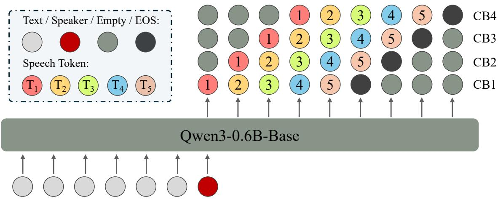
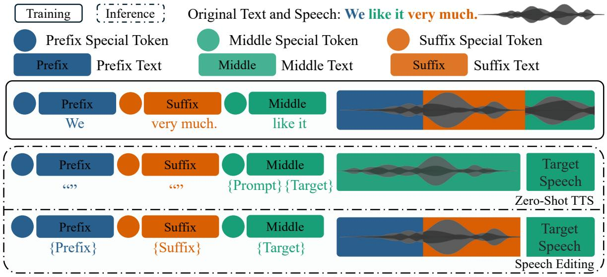
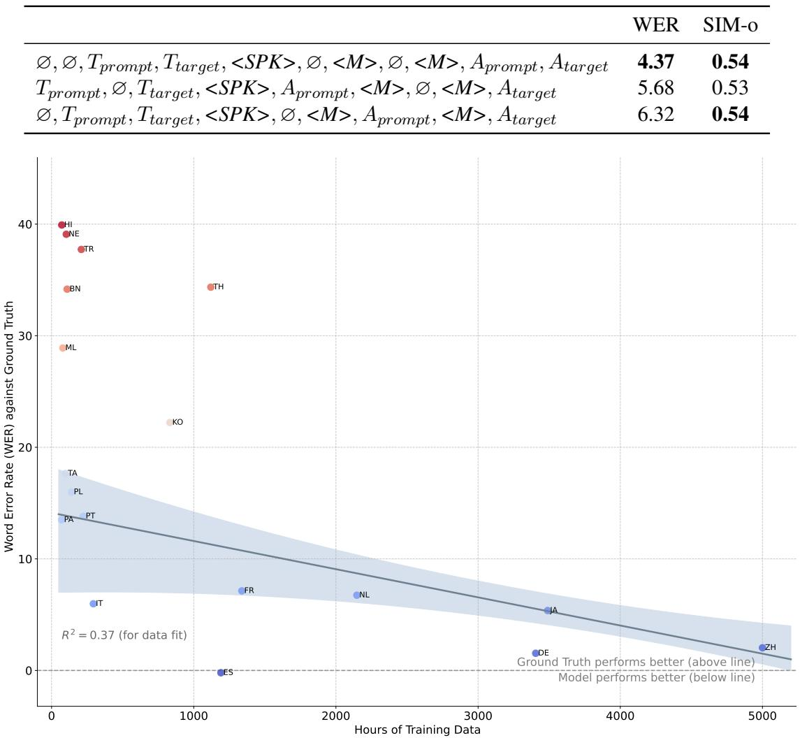
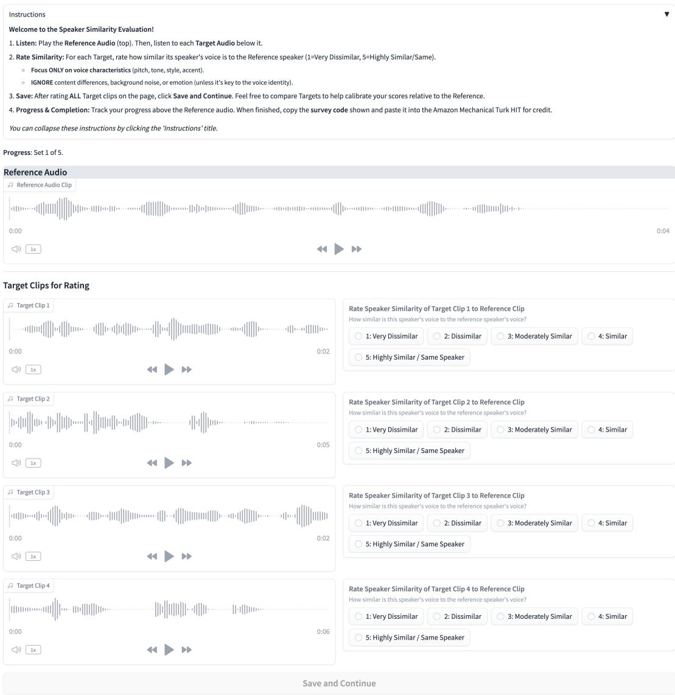
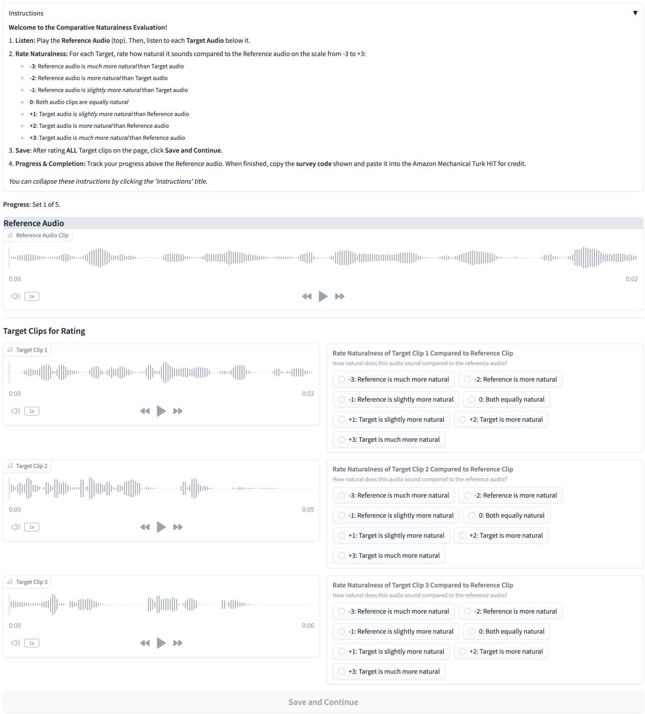
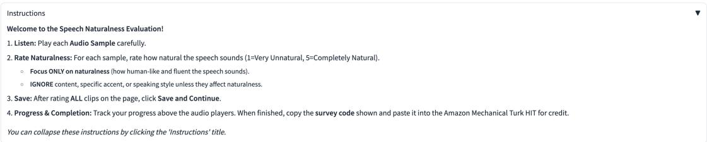
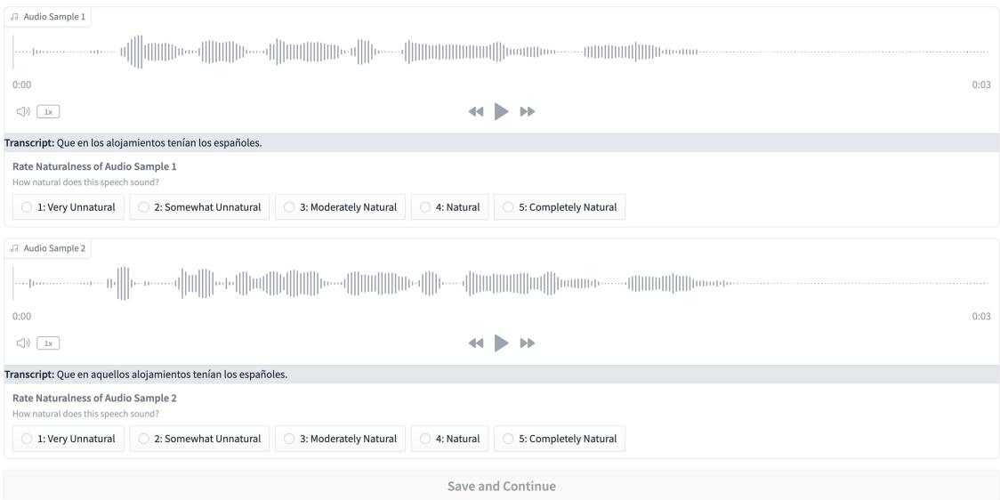
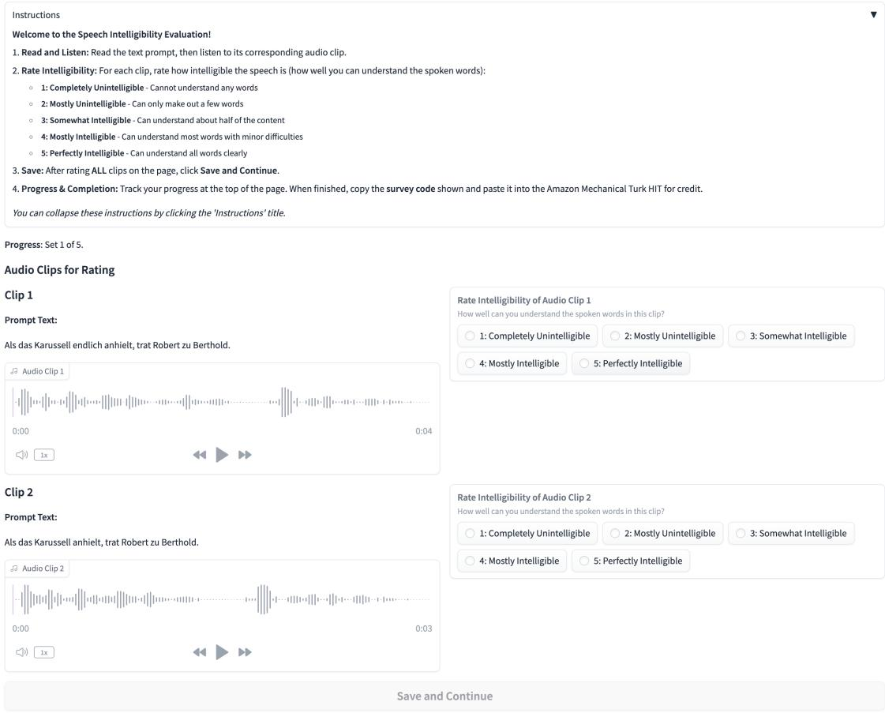

# VoiceCraft-X: Unifying Multilingual, Voice-Cloning Speech Synthesis and Speech Editing

Zhisheng Zheng1, Puyuan Peng1, Anuj Diwan1, Cong Phuoc Huynh2, Xiaohang Sun2, Zhu Liu2, Vimal Bhat2, David Harwath1†

1University of Texas at Austin, 2Amazon

## Abstract

We introduce VoiceCraft-X, an autoregressive neural codec language model which unifies multilingual speech editing and zero-shot Textto-Speech (TTS) synthesis across 11 languages: English, Mandarin, Korean, Japanese, Spanish, French, German, Dutch, Italian, Portuguese, and Polish. VoiceCraft-X utilizes the Qwen3 large language model for phoneme-free crosslingual text processing and a novel token reordering mechanism with time-aligned text and speech tokens to handle both tasks as a single sequence generation problem. The model generates high-quality, natural-sounding speech, seamlessly creating new audio or editing existing recordings within one framework. VoiceCraft-X shows robust performance in diverse linguistic settings, even with limited perlanguage data, underscoring the power of unified autoregressive approaches for advancing complex, real-world multilingual speech applications. Audio samples are available at https: //zhishengzheng.com/voicecraft-x/.

## 1 Introduction

Highly realistic speech generation is an indispensable technology for voice assistants, content dubbing, accessibility tools, and creative media. Speech generation can be broken down into several sub-problems: creating new audio via Text-To-Speech synthesis (TTS) or editing part of an existing recording while ensuring voice consistency with the remainder of the original speech. Despite their shared goal of producing natural speech, TTS and speech editing are typically treated as separate problems, especially in multilingual settings, which leaves practitioners without a single model that can both edit and synthesize speech across languages.

Over the past several years, the quality of TTS models has improved significantly, particularly in the zero-shot setting in which a model generates speech in a new speaker’s voice given a short (e.g. 3 second) audio prompt. Transformer-based neural networks have been central to this progress, leading to three broad paradigms: (i) autoregressive (AR), (ii) non-autoregressive (Non-AR), and (iii) hybrid models. AR models, such as VALL-E (Wang et al., 2023) and its successors (Zhang et al., 2023b; Han et al., 2024; Xin et al., 2024; Chen et al., 2024a; Song et al., 2025; Yang et al., 2025), generate frame-level speech tokens sequentially, where the tokens are typically derived from a neural audio codec (Défossez et al., 2022; Zeghidour et al., 2021; Zhang et al., 2023a). These models are able to perform voice-cloning TTS via Transformer language models’ in-context learning ability, demonstrating high-quality speech synthesis. Non-AR models include flow-matching models such as F5-TTS (Chen et al., 2024b), as well as diffusion models such as NaturalSpeech 2/3 (Shen et al., 2023; Ju et al., 2024). These models predict all tokens representing an utterance in parallel via iterative refinement. Hybrid approaches such as Seed-TTS (Anastassiou et al., 2024), CosyVoice (Du et al., 2024b,c) and MaskGCT (Wang et al., 2024) aim to combine the strengths of both paradigms. While these models deliver impressive zero-shot quality, most of the models are either monolingual or focus on a handful of high-resource languages such as English and Chinese. This is likely due to the fact that these models are data-hungry, often requiring 10K-100K hours of training speech for SOTA performance.

The quest for broader linguistic inclusivity across the world’s 7,000 spoken languages (Eberhard et al., 2024) has driven research in multilingual speech generation. Efforts include curating large corpora (e.g., VoxPopuliTTS (Liu et al., 2025), Fish-Speech (Liao et al., 2024)) and training multilingual TTS architectures like VoiceBox (Le et al., 2023), CLAM-TTS (Kim et al., 2024) and XTTS (Casanova et al., 2024). Yet even the most capable multilingual systems treat speech editing as a separate task—or ignore it altogether—leaving users without a unified solution.

In this paper we address this gap, by introducing VoiceCraft-X, a unified autoregressive neural codec language model that performs both speech editing and zero-shot TTS in 11 languages: English (en), Mandarin (zh), Korean (ko), Japanese (ja), Spanish (es), French (fr), German (de), Dutch (nl), Italian (it), Portuguese (pt) and Polish (pl). Our contributions are threefold:

1. We introduce VoiceCraft-X, a single autoregressive model that unifies multilingual speech editing and zero-shot Text-to-Speech (TTS) across 11 languages.

2. Our approach leverages the Qwen3 large language model for cross-lingual text processing, without the need for phonetic pronunciation lexicons. We also propose a novel token reordering mechanism that time-aligns text and speech, enabling a unified sequence generation approach for both editing and synthesis.

3. We demonstrate VoiceCraft-X’s robust generation of high-quality, natural-sounding speech across diverse languages, even with limited per-language data, and will release our code and model to the community.

## 2 Related Work

## 2.1 Speech Editing

Speech editing aims to correct mispronunciations, stutters, or recording artifacts while producing speech that is indistinguishable from natural audio. Recent approaches leverage Transformer and diffusion architectures. Borsos et al. (2022) perform audio infilling with a Transformer that maintains speaker identity and prosody, generalizing to unseen speakers. Le et al. (2023) use flow matching for versatile speech infilling, and Peng et al. (2024) show that a neural-codec language model with token infilling can concurrently handle editing and synthesis. F5-TTS (Chen et al., 2024b) and MaskGCT (Wang et al., 2024) extend this idea with flow-matching or diffusion, respectively. Despite these advances, most works are monolingual, motivating a unified multilingual solution.

## 2.2 Zero-Shot Speech Synthesis

The zero-shot Text-to-Speech (TTS) synthesis task entails generating speech in a new speaker’s voice from a short audio prompt, without assuming that the new speaker was seen during training. Recent progress is largely driven by Transformer-based neural networks, falling into autoregressive (AR), non-autoregressive (non-AR), and hybrid.

Autoregressive (AR) models generate speech tokens sequentially. VALL-E (Wang et al., 2023) pioneered neural codec language models for highquality zero-shot TTS via in-context learning, with subsequent works (Zhang et al., 2023b; Han et al., 2024; Chen et al., 2024a; Xin et al., 2024; Song et al., 2025; Kharitonov et al., 2023; Łajszczak et al., 2024; Peng et al., 2024; Guo et al., 2024) further refining this paradigm. Non-Autoregressive (Non-AR) models aim for faster generation by predicting tokens in parallel or using iterative refinement. Examples include flow-matching models like VoiceBox (Le et al., 2023) and diffusion-based models such as NaturalSpeech 2 (Shen et al., 2023), NaturalSpeech 3 (Ju et al., 2024), and DiTTo-TTS (Lee et al., 2024). Other notable non-AR approaches include Unicats (Du et al., 2024a), SimpleSpeech (Yang et al., 2024b,a), E2-TTS (Eskimez et al., 2024), F5-TTS (Chen et al., 2024b) and Mega-TTS 3 (Jiang et al., 2025). Hybrid systems combine aspects of both AR and non-AR methods. Seed-TTS (Anastassiou et al., 2024) uses a two-stage architecture, while CosyVoice (Du et al., 2024b,c) and MaskGCT (Wang et al., 2024) also represent efforts to balance quality, speed, and controllability. In this work, VoiceCraft-X follows the codec language modeling method of Voice-Craft (Peng et al., 2024) and enables high-quality, zero-shot multilingual speech synthesis within its unified editing and generation framework.

## 2.3 Multilingual Speech Generation

Prior work on multilingual speech synthesis largely pursues two complementary goals: (i) expanding language coverage and (ii) achieving zero-shot robustness to unseen speakers and languages.

On the data side, Saeki et al. (2024) show that pairing self-supervised speech representations with unsupervised text alignment scales TTS to 100 + languages, even when only scant transcriptions exist. Large curated corpora amplify these gains: VoxPopuliTTS (Liu et al., 2025) refines 30,000 hours of English, French and Spanish speech; Fish-Speech (Liao et al., 2024) goes further, training on 720,000 hours while using an LLM to sidestep language-specific G2P rules. Model architectures have evolved in parallel. VoiceBox (Le et al., 2023) adopts non-autoregressive flow matching, delivering cross-lingual zero-shot TTS in six languages via in-context learning. XTTS (Casanova et al., 2024), extending Tortoise (Betker, 2023), combines a Perceiver Resampler with a speaker-consistency loss to reach 16 languages with speaker cloning. CLAM-TTS (Kim et al., 2024) improves codec language model compression with probabilistic residual vector quantization, enabling single-step multi-token generation. However, these models often treat synthesis as a distinct task from speech editing. The challenge of unifying high-quality, multilingual speech editing with robust multilingual speech synthesis within a single, open-source, and fully autoregressive model architecture remains largely unaddressed.

  
Figure 1: Architecture Overview. This diagram illustrates the training process for the VoiceCraft-X model. The model takes text and a speaker embedding as input and is trained to predict sequences of speech tokens. The labels CB1-CB4 represent codec tokens from different codebooks.

## 3 Method

## 3.1 Overview

VoiceCraft-X evolves VoiceCraft (Peng et al., 2024) into a truly multilingual speech-editing and synthesis system, treating both tasks as a single sequencegeneration problem over neural codec tokens. The core of this system, as illustrated in Figure 1, is the Qwen3 (Qwen-Team, 2025) large language model. Qwen3 natively supports text input in 119 languages and dialects, which we leverage as the crosslingual input text tokenizer for VoiceCraft-X. This eliminates the cumbersome phoneme-conversion step that was integral to the original VoiceCraft, resulting in a simplified pipeline with a shared tokenizer across languages, without the need to curate pronunciation lexicons for each language.

A further key innovation in VoiceCraft-X is its enhanced data layout: it interleaves text tokens and speech tokens in a single, time-ordered stream, whereas VoiceCraft reordered only the speech tokens. Enforcing this alignment between linguistic content and its acoustic realization yields more consistent and natural-sounding speech.

## 3.2 Speaker Embedding

In addition to the speech tokens representing the prompt speech, VoiceCraft-X also takes as input a speaker embedding vector extracted from this prompt speech. We follow the approach of CosyVoice (Du et al., 2024b) by using a pre-trained voiceprint model1 to extract the speaker embedding. The resulting vector is then passed through a linear projection layer. This projection maps the speaker embedding to match Qwen3’s input dimension.

## 3.3 Speech Tokenization

We utilize the EnCodec (Défossez et al., 2022) neural audio codec model to tokenize the input utterance. Specifically, we train a modified version of the tokenizer which outputs a sequence of four parallel token streams at a 50Hz framerate. The tokens are discretized with residual vector quantization (RVQ) with a vocabulary size of 2048 at each quantization layer.

## 3.4 Token Reordering

VoiceCraft-X employs several token reordering steps, illustrated in Figure 2, to unify speech editing and synthesis. We assume that our training examples consist of utterance waveforms accompanied by time-aligned word transcriptions (we use the Montreal Forced Aligner (MFA) (McAuliffe et al., 2017) in our work). During training, a text transcription is randomly segmented into prefix, middle, and suffix portions. These are then rearranged into a "prefix-suffix-middle" sequence, where the "middle" segment serves as the prediction target. Finally, the corresponding speech tokens for each segment are reordered identically based on the alignment timings. This ensures a monotonic alignment between the text and speech tokens, even when performing speech edits which require infilling tokens in the middle of the speech sequence. This rearrangement serves to mirror the use case in which a user wishes to modify some, but not all of the words in an utterance - by using this rearrangement, the model can be trained to predict the speech tokens within the middle of an utterance, conditioned on the preceding (prefix) and following (suffix) speech tokens in addition to the desired text transcription.

## 3.5 Causal Masking and Delay Pattern

Following the token reordering, a learnable <MASK> token is inserted at two locations within the text-speech input sequence: one $< M A S K > \mathrm { t o }$ ken is inserted at the boundary between the prefix and suffix speech tokens, and a second <MASK> token is placed between the suffix audio tokens and the middle (target) audio tokens. These tokens serve to inform the model of the boundaries between the segments.

During training, the model is tasked with autoregressively predicting all audio tokens: encompassing those in the prefix, suffix, and the middle (target) segments. This prediction is optimized using a standard language modeling objective, where the cross-entropy loss function is applied to every token in the sequence. By training the model to predict not only the target segment but also the known prefix and suffix segments, it receives gradients for every timestep, resulting in faster training.

To model the K parallel token sequences output by the EnCodec tokenizer autoregressively, we incorporate the “Delay Pattern” proposed by MusicGen (Copet et al., 2023). Instead of predicting all K codebooks for a given audio timestep t simultaneously or flattening all codebooks across all timesteps into one long sequence, delay patterning inserts a cumulative time delay of one timestep per RVQ layer to the EnCodec token sequences. As a result, the prediction for the speech token at codebook level k at timestep t can be conditioned on the model’s predictions for codebook levels 1 through $k - 1$ associated with the same timestep t.

## 3.6 Inference

Figure 2 shows how, at inference time, VoiceCraft-X performs speech editing and zero-shot text-tospeech by preparing an input sequence based on the "prefix-suffix-middle" reordering of text and speech tokens. The system then autoregressively generates the neural codec tokens for the target audio segment.

Speech editing Let $T _ { P } , A _ { P }$ be the prefix text/audio, $T _ { S } , A _ { S }$ the suffix, and $T _ { M } ^ { \mathrm { n e w } }$ the usersupplied replacement text for the middle segment. The model input is the concatenation

$$
T _ { P } , T _ { S } , T _ { M } ^ { \mathrm { n e w } } , < S P K > , A _ { P } , < M > , A _ { S } , < M > ,
$$

where ${ < S P K > }$ is a speaker embedding token and ${ < } M >$ is the (learnable) mask token. The decoder predicts the middle-segment audio tokens ${ \hat { A } } _ { M } .$ , which we splice between $A _ { P }$ and $A _ { S }$ before decoding the entire sequence with the EnCodec decoder network to create a seamless edit.

Zero-shot TTS If a prompt text $( T _ { p r o m p t } )$ and its corresponding prompt speech are provided, we concatenate the prompt text and the target text $( T _ { t a r g e t } )$ to form the middle text segment, and a speaker embedding is extracted from the prompt speech. If no such prompt is provided, we set the prompt text $( T _ { p r o m p t } )$ to empty and randomly generate a speaker embedding. The final input is as follows:

$$
\begin{array} { l } { { T _ { P } , \ T _ { S } , \ T _ { p r o m p t } , \ T _ { t a r g e t } , } } \\ { { < S P K > , \ A _ { P } , \ < M > , \ A _ { S } , \ < M > , \ A _ { p r o m p t } , } } \end{array}
$$

where ${ \cal T } _ { P } = { \cal T } _ { S } = \emptyset , { \cal A } _ { P } = { \cal A } _ { S } = \emptyset$ , and $T _ { p r o m p t } = A _ { p r o m p t } = \emptyset$ if no prompt is provided.

## 4 Experiments

## 4.1 Setup

Training Dataset. We combined speech data across public datasets over 11 languages, amounting to a total of approximately 32K hours (detailed statistics provided in Appendix §A.1). The sampling rate for all audio is 16 kHz. Audio segments longer than 25 seconds were discarded. For MLS dataset (Pratap et al., 2020), misalignment issues were particularly prominent, with approximately 20% of samples having extra or missing words in the transcript at the beginning or end. We found that this negatively impacted model performance for English, and subsequently removed utterances whose transcriptions differed significantly from those produced by the Whisper (Radford et al., 2023) model. While we found similar problems with the non-English European language data in MLS, we anecdotally observed better performance on those languages without performing this filtering. We speculate that this is due to the fact that the amount of available training data for those languages is already relatively low, and the performance improvements brought by the additional training data outweigh the detriments brought by transcription noise.

  
Figure 2: Illustration of Token Reordering

Evaluation Dataset. For evaluating Text-to-Speech (TTS) performance, we curated an evaluation dataset from several established benchmarks. For English, we utilized the Seed-TTS test-en set (Anastassiou et al., 2024) (1088 samples sourced from Common Voice (Ardila et al., 2019)). For Mandarin, we employed the Seed-TTS test-zh set (2020 samples from DiDiSpeech (Guo et al., 2021)). Korean and Japanese evaluations were conducted using 200 randomly selected samples from KsponSpeech (Bang et al., 2020) and KokoroSpeech (Iida, 2021), respectively. For the remaining seven languages supported by our model (Spanish, French, German, Dutch, Italian, Portuguese, and Polish), we randomly selected 100 samples for each language from their corresponding Multilingual LibriSpeech (MLS) (Pratap et al., 2020) test sets. To evaluate speech editing, we randomly selected 100-300 samples per language from these TTS test datasets and then utilized Gemini (Team et al., 2023) to perform insertion, deletion, or substitution operations on the textual portions of these samples, with specific details available in the appendix §A.2. We conducted subjective evaluation over a subset of languages (English, Chinese, French, Italian, Portuguese, and Spanish) using a random subset of the evaluation set: 40 English samples, 50 Chinese, and 20 for others.

Training. Our model utilizes Encodec (Défossez et al., 2022) as the speech tokenizer. We retrain the model with some modifications, namely using 4 Residual Vector Quantization (RVQ) codebooks, each containing 2048 entries, and a framerate of 50Hz on audio recorded at 16 kHz. We retrain the model with our multilingual speech data. Other than those, the training process adheres to the methodology outlined in the work by (Défossez et al., 2022). Additional configuration specifics can be found in Section §B.1. To combine the parallel speech tokens when using them as input to the Transformer LM, at each timestep we sum the embeddings of the tokens across the four codebooks.

We use Qwen3-0.6B-Base as both the text tokenizer and the Transformer LM backbone (details are provided in Appendix B.2). The outputs from the final Transformer layer are then projected into four distinct linear layers, each producing the logits for one of the codec tokens. The model comprises 613 million total parameters (457 million excluding embeddings). The codebook weights α are set to $( 1 . 0 , 0 . 8 , 0 . 6 , 0 . 4 )$ , influencing the contribution of each codebook during training (as further detailed in our loss formulation §B.3). For model training, we employ the AdamW optimizer (Loshchilov and Hutter, 2017) with a learning rate of 4 $\times 1 0 ^ { - 3 }$ $\beta _ { 1 } = 0 . 9 , \beta _ { 2 } = 0 . 9 9 9$ , an epsilon of $1 \times 1 0 ^ { - 6 }$ , and a weight decay of 0.01. A learning rate scheduler is utilized, featuring a linear warm-up for the initial 50K steps, followed by a linear decay for the remainder of the 5, 000K total training steps. Gradient accumulation is performed over 8 micro-batches. The training of the multilingual VoiceCraft-X model took approximately one week on 16 NVIDIA A100 40GB GPUs.

Inference Figure 2 shows how, at inference time, VoiceCraft-X performs speech editing and zeroshot text-to-speech by preparing an input sequence based on the "prefix-suffix-middle" reordering of text and speech tokens; the model then autoregressively predicts the corresponding neural codec tokens for the target audio segment. Notably, the token reordering mechanism significantly enhances inference stability. This largely prevents repeating token loops, an issue in the original Voice-Craft which could cause artifacts (e.g., excessive silences) and required multi-sample filtering. Consequently, VoiceCraft-X reliably generates highquality speech in a single pass without needing this filtering step. In all experiments, we employ nucleus sampling (Holtzman et al., 2019) with TopK = 20, TopP = 1.0, and a temperature of 1.

Baselines. For the English and Chinese Zeroshot TTS tasks, we compared our model with FireRedTTS (Guo et al., 2024), MaskGCT (Wang et al., 2024), F5-TTS (Chen et al., 2024b), CosyVoice (Du et al., 2024b), and CosyVoice 2 (Du et al., 2024c). For English, we also included Voice-Craft (Peng et al., 2024) in our comparison. For the remaining languages, we benchmarked our model against the multilingual XTTS (Casanova et al., 2024) model, considering both its v1 and v2 versions. For speech editing, we compared VoiceCraft-X with the original VoiceCraft (Peng et al., 2024) model on English.

Metrics. We used a combination of subjective and objective measures. Objectively, we use Word Error Rate (WER) as an automatic proxy for the intelligibility of the synthesized speech; this is calculated using Paraformer-zh (Gao et al., 2023) for Chinese and Whisper-large-v3 (Radford et al., 2023) for other languages. Additionally, speaker similarity (SIM-o) is objectively measured by computing the cosine similarity of speaker embeddings, which are extracted from both the generated and original target speech using a WavLM-based speaker verification model (Chen et al., 2022). Subjective evaluations involved human annotators (see Appendix C for details) who provide Comparative Mean Opinion Scores (CMOS) and Similarity Mean Opinion Scores (SMOS) for TTS, and Naturalness Mean Opinion Scores (NMOS) and Intelligibility Mean Opinion Scores (IMOS) for speech editing. For CMOS, evaluators assess the naturalness of the synthesized speech in comparison to the ground truth, while for SMOS, they directly score the similarity between the synthesized speech and the initial speech prompt. For NMOS and IMOS, evaluators respectively assess the naturalness and intelligibility of the synthesized and original speech.

## 4.2 Zero-Shot TTS

We evaluated VoiceCraft-X’s zero-shot TTS performance across 11 languages, and the results are shown in Table 1. For Chinese, VoiceCraft-X was trained on a modest 5K hours of data, a fraction of that used by leading models (often exceeding 50K hours). Consequently, while its CER of 3.29 was higher than these specialized models, this was achieved with substantially less data, and its speaker similarity and subjective scores reflected this data disparity. In English, VoiceCraft-X, trained on 14K hours, showed marked improvements over its predecessor, VoiceCraft, reducing its WER from 5.28 to 4.37 and enhancing SIM-o from 0.51 to 0.54. Critically, its CMOS score of 0.632 was the highest among compared models, indicating superior perceived naturalness. While some models trained on significantly larger datasets achieved lower WERs, VoiceCraft-X’s subjective quality in English was highly competitive.

For the remaining nine languages, VoiceCraft-X, compared to XTTS (versions v1 and v2), showed strong overall performance with varying focuses. VoiceCraft-X particularly excelled in European languages like German (WER significantly better than XTTS-v2 by over 50%), Spanish (WER over 40% better than XTTS-v2 and below the ground truth), and Italian (higher data efficiency), as well as in Korean (CER reduced by over 20%). However, in languages such as Japanese and Dutch, or for those where VoiceCraft-X had considerably less training data like Portuguese and Polish, XTTS-v2 achieved lower error rates. Nevertheless, VoiceCraft-X was often favored by evaluators for its better speaker similarity, naturalness, and intelligibility. (Further results are in the appendix §C).

Table 1: Zero-Shot TTS performance across different models and languages. ‡Training Hours for XTTS-v2 may be an underestimation as the model is continuously updated and specific training data has not been fully disclosed. "-" indicates data not available or not applicable. \*For Chinese, Korean and Japanese, figures in the WER columns represent Character Error Rate (CER). †Scores reported in baseline papers.
<table><tr><td rowspan="2"></td><td colspan="5">Chinese*</td><td colspan="5">English</td></tr><tr><td>Train (hrs)</td><td>WER</td><td>SIM-o</td><td>CMOS</td><td>SMOS</td><td>Train (hrs)</td><td>WER</td><td>SIM-o</td><td>CMOS</td><td>SMOS</td></tr><tr><td>Ground Truth</td><td>-</td><td>1.25</td><td>0.75</td><td>0.0</td><td>3.38</td><td>-</td><td>2.14</td><td>0.73</td><td>0.0</td><td>3.36</td></tr><tr><td>MaskGCT (Wang et al., 2024)</td><td>49.9K</td><td>2.27†</td><td>0.77†</td><td>-</td><td>-</td><td>46.8K</td><td>2.62†</td><td>0.72†</td><td>一</td><td>-</td></tr><tr><td>F5-TTS (Chen et al., 2024b)</td><td>49.9K</td><td>1.56†</td><td>0.76</td><td></td><td></td><td>46.8K</td><td>1.83†</td><td>0.67†</td><td></td><td>-</td></tr><tr><td>FireRedTTS (Guo et al., 2024)</td><td>110K</td><td>1.21</td><td>0.65</td><td>-0.28</td><td>2.82</td><td>40K</td><td>9.08</td><td>0.45</td><td>0.27</td><td>2.97</td></tr><tr><td>CosyVoice (Du et al., 2024b)</td><td>130K 130K</td><td>3.49 1.35</td><td>0.75 0.75</td><td>0.18</td><td>3.64</td><td>30K</td><td>3.89</td><td>0.64</td><td>0.50</td><td>3.48</td></tr><tr><td>Cosy Voice 2 (Du et al., 2024c)</td><td></td><td></td><td></td><td>-0.01</td><td>3.86</td><td>30K</td><td>2.69</td><td>0.65</td><td>0.59</td><td>3.69</td></tr><tr><td>VoiceCraft (Peng et al., 2024) VoiceCraft-X</td><td>5K</td><td>3.29</td><td>0.68</td><td>-0.39</td><td>2.94</td><td>9K 14.5K</td><td>5.28 4.20</td><td>0.51 0.54</td><td>0.44 0.63</td><td>3.27 3.43</td></tr><tr><td></td><td>Korean*</td><td></td><td></td><td colspan="3">Japanese*</td><td colspan="5">Dutch</td></tr><tr><td></td><td>Train (hrs)</td><td>WER</td><td>SIM-o</td><td colspan="3">Train (hrs)</td><td colspan="5">Train (hrs)</td></tr><tr><td>Ground Truth</td><td></td><td>8.89</td><td></td><td></td><td>WER 9.72</td><td>0.79</td><td></td><td>WER 9.54</td><td>SIM-o 0.65</td><td></td></tr><tr><td>XTTS-v1</td><td></td><td></td><td></td><td>一</td><td></td><td></td><td></td><td>78.17</td><td>0.41</td><td></td></tr><tr><td>XTTS-v2</td><td>539</td><td>40.89</td><td>0.62</td><td>57</td><td>11.61</td><td>0.64</td><td>74</td><td>12.62</td><td>0.59</td><td></td></tr><tr><td>VoiceCraft-X</td><td>832</td><td>31.11</td><td>0.56</td><td>3489</td><td>15.09</td><td>0.66</td><td>2147</td><td>16.28</td><td>0.61</td><td></td></tr><tr><td></td><td colspan="3">Italian</td><td colspan="3">Portuguese</td><td colspan="5">Polish</td></tr><tr><td></td><td>Train (hrs)</td><td>WER</td><td>SIM-o</td><td>Train (hrs)</td><td>WER</td><td>SIM-o</td><td>Train (hrs)</td><td>WER</td><td></td><td>SIM-o</td></tr><tr><td>Ground Truth</td><td></td><td>9.48</td><td>0.68</td><td></td><td>8.75</td><td>0.69</td><td></td><td>8.81</td><td>0.72</td><td></td></tr><tr><td>XTTS-v1</td><td></td><td>73.12</td><td>0.32</td><td></td><td>48.93</td><td>0.33</td><td></td><td>96.15</td><td></td><td>0.41</td></tr><tr><td>XTTS-v2</td><td>1297÷</td><td>15.52</td><td>0.56</td><td>2387÷</td><td>13.48</td><td>0.58</td><td>199</td><td>9.47</td><td></td><td>0.62</td></tr><tr><td>VoiceCraft-X</td><td>294</td><td>15.46</td><td>0.54</td><td>223</td><td>22.57</td><td>0.56</td><td>139</td><td>24.80</td><td></td><td>0.61</td></tr><tr><td></td><td colspan="3">French</td><td colspan="3">German</td><td colspan="4">Spanish</td></tr><tr><td></td><td>Train (hrs)</td><td>WER</td><td>SIM-o</td><td>Train (hrs)</td><td>WER</td><td>SIM-o</td><td>Train (hrs)</td><td>WER</td><td>SIM-o</td><td></td></tr><tr><td>Ground Truth</td><td>-</td><td>6.09</td><td>0.68</td><td>-</td><td>6.64</td><td>0.69</td><td>-</td><td>4.87</td><td></td><td>0.73</td></tr><tr><td>XTTS-v1</td><td></td><td>38.34</td><td>0.35</td><td></td><td>11.37</td><td>0.35</td><td></td><td>20.84</td><td></td><td>0.37</td></tr><tr><td>XTTS-v2</td><td>2216</td><td>5.45</td><td>0.58</td><td>3584</td><td>16.50</td><td>0.59</td><td>1514</td><td>8.11</td><td></td><td>0.58</td></tr><tr><td>VoiceCraft-X</td><td>1338</td><td>13.22</td><td>0.59</td><td>3405</td><td>8.19</td><td>0.60</td><td>1191</td><td>4.67</td><td>0.63</td><td></td></tr></table>

## 4.3 Transfer Learning for Multilingual TTS

To explore the benefits of multilingual training, especially for lower-resource languages, we finetuned monolingual models on individual languages starting from different pre-trained checkpoints, comparing these against training from scratch and the multilingual model (detailed in Table 2).

The universal advantage of pre-training over “from Scratch” models is paramount, especially for languages with limited data. For instance, Italian (294 hours) and Polish (139 hours) saw their WERs plummet from over 140 and 160 to under 14 and 20 respectively, demonstrating pre-training’s crucial role in transferring foundational knowledge and overcoming data scarcity. Even higher-resource languages like Spanish, French and German benefited significantly. Fine-tuning from an English model initialization proved highly effective for European languages (Germanic, Romance, Slavic), leveraging linguistic similarities and robust acoustic modeling, with gains particularly vital for lowdata scenarios (Italian, Portuguese, Polish). Korean showed better CER with a Japanese checkpoint (42.08) than Chinese (49.11), aligning with typological closeness. Conversely, Japanese experienced negative transfer from Chinese (CER 36.18 vs. 22.36 from scratch).

Furthermore, fine-tuning from the “multilingual checkpoint” frequently yielded superior WER/CER compared to an English-only checkpoint for a range of languages including Spanish, Dutch, Italian, Portuguese, Polish, and Japanese. This advantage held across varying data volumes (e.g., Polish 139 hours, Japanese 3489 hours), suggesting that pre-training on a diverse linguistic set fosters more generalized and transferable representations than exposure to

Table 2: Cross-lingual transfer learning performance on zero-shot TTS task. Comparison of fine-tuning from different pre-trained models versus training from scratch for various target languages. Character Error Rate (CER) for Korean and Japanese, indicated by \*. "-" indicates data not available or not applicable.
<table><tr><td rowspan="2">Language</td><td rowspan="2">#Hours</td><td colspan="2">Multilingual</td><td colspan="2">from Scratch</td><td colspan="2">from English</td><td colspan="2">from Chinese/Japanese</td><td colspan="2">from Multilingual</td></tr><tr><td>WER</td><td>SIM-o</td><td>WER</td><td>SIM-o</td><td>WER</td><td>SIM-o</td><td>WER</td><td>SIM-o</td><td>WER</td><td>SIM-o</td></tr><tr><td>Korean*</td><td>832</td><td>31.11</td><td>0.56</td><td>45.79</td><td>0.51</td><td>42.10</td><td>0.54</td><td>49.11/42.08</td><td>0.50/0.52</td><td>41.36</td><td>0.53</td></tr><tr><td>Japanese*</td><td>3489</td><td>15.09</td><td>0.66</td><td>22.36</td><td>0.62</td><td></td><td></td><td>36.18</td><td>0.61</td><td>19.35</td><td>0.67</td></tr><tr><td>Spanish</td><td>1191</td><td>4.67</td><td>0.63</td><td>7.08</td><td>0.38</td><td>4.54</td><td>0.47</td><td></td><td></td><td>3.30</td><td>0.52</td></tr><tr><td>French</td><td>1338</td><td>13.22</td><td>0.60</td><td>18.85</td><td>0.43</td><td>12.50</td><td>0.49</td><td></td><td></td><td>16.39</td><td>0.53</td></tr><tr><td>German</td><td>3405</td><td>8.19</td><td>0.60</td><td>6.43</td><td>0.43</td><td>5.93</td><td>0.50</td><td></td><td></td><td>7.25</td><td>0.53</td></tr><tr><td>Dutch</td><td>2147</td><td>16.28</td><td>0.61</td><td>16.85</td><td>0.37</td><td>16.02</td><td>0.35</td><td></td><td></td><td>11.78</td><td>0.46</td></tr><tr><td>Italian</td><td>294</td><td>15.46</td><td>0.54</td><td>142.30</td><td>0.22</td><td>13.97</td><td>0.36</td><td></td><td></td><td>13.93</td><td>0.46</td></tr><tr><td>Portuguese</td><td>223</td><td>22.57</td><td>0.56</td><td>91.89</td><td>0.26</td><td>15.87</td><td>0.46</td><td></td><td></td><td>14.74</td><td>0.55</td></tr><tr><td>Polish</td><td>139</td><td>24.80</td><td>0.61</td><td>163.08</td><td>0.25</td><td>20.73</td><td>0.46</td><td></td><td></td><td>19.47</td><td>0.55</td></tr></table>

English alone, capturing a broader array of phonetic and prosodic patterns.

Finally, the original multilingual model’s speaker similarity is significantly higher than models fine-tuned from other checkpoints for nearly all languages. This indicates that joint training on diverse linguistic data, leveraging collective data volume, allows the model to disentangle speakerspecific characteristics from language-specific features. This robust performance across varied languages suggests it learns a more abstract, shared representation space for speech, facilitating both high-fidelity synthesis and strong cross-lingual capabilities. While fine-tuning on single language data may impact this disentanglement ability, as evidenced by SIM-o drops in many such cases.

## 4.4 Speech Editing

Table 3: Performance on English speech editing.
<table><tr><td></td><td>WER</td><td>NMOS</td><td>IMOS</td></tr><tr><td>Original</td><td>2.42</td><td>3.78</td><td>3.79</td></tr><tr><td>VoiceCraft</td><td>5.99</td><td>3.87</td><td>3.87</td></tr><tr><td>VoiceCraft-X</td><td>5.62</td><td>3.68</td><td>3.79</td></tr></table>

For English speech editing (Table 3), VoiceCraft-X demonstrated a better Word Error Rate (WER) than VoiceCraft. Both models produced edited speech that listeners found to be highly natural (NMOS) and intelligible (IMOS), comparable to the original recordings. VoiceCraft’s slightly higher scores in these subjective tests are not surprising, given its monolingual English focus, especially considering both models have similar parameter counts and amounts of English training data.

For multilingual speech editing in other languages—a capability where comparative baselines are notably scarce as most models do not support multilingual editing—we conducted subjective

Table 4: Subjective performance on speech editing.
<table><tr><td rowspan="2"></td><td colspan="2">Original</td><td colspan="2">Edited</td></tr><tr><td>NMOS</td><td>IMOS</td><td>NMOS</td><td>IMOS</td></tr><tr><td>French</td><td>3.62</td><td>4.10</td><td>3.13</td><td>3.60</td></tr><tr><td>Italian</td><td>4.38</td><td>4.78</td><td>3.77</td><td>4.28</td></tr><tr><td>Portuguese</td><td>4.42</td><td>4.98</td><td>2.63</td><td>3.78</td></tr><tr><td>Spanish</td><td>3.80</td><td>3.93</td><td>3.58</td><td>3.78</td></tr></table>

MOS evaluations. These evaluations focused on a subset of languages (French, Italian, Portuguese, and Spanish) for which MTurk annotators were available, with results presented in Table 4. The evaluations demonstrate VoiceCraft-X’s effective performance in this challenging scenario. While naturalness (NMOS) scores for edited speech are, as anticipated, lower than the original recordings, intelligibility (IMOS) remains high across these languages. Particularly for Spanish and Italian, where edited NMOS and IMOS scores closely matched the original audio, these findings underscore VoiceCraft-X’s significant and unique capability for coherent, comprehensible multilingual speech editing.

## 5 Conclusion

We present VoiceCraft-X, an autoregressive neural codec language model that successfully unifies multilingual speech editing and Text-to-Speech (TTS) synthesis. Leveraging the Qwen3 LLM and a novel token reordering strategy, VoiceCraft-X supports eleven languages, producing high-quality, naturalsounding speech. Our model demonstrates robust performance across diverse conditions and shows that a unified framework can effectively advance both speech editing and synthesis in multilingual contexts, even with limited data for some languages. This work underscores the potential of autoregressive models for complex, real-world speech generation tasks.

## Limitations

One key limitation is the scale of our training data. Although VoiceCraft-X performs well with approximately 32,578 hours across eleven languages, this is notably less than some state-of-the-art models. This comparative data scarcity, particularly for lower-resource languages in our set, may limit the model’s capacity to capture the full spectrum of speech nuances as effectively as systems trained on more extensive datasets.

Secondly, while the model’s multilingual support is a core feature, its current reach of eleven languages (with around 20-30 explored internally) only scratches the surface of global linguistic diversity. Expanding coverage to more languages, especially under-resourced ones, remains a significant challenge that would require substantial data curation and potential model adaptations to address varied linguistic features.

Finally, further investigation into model size scalability is also warranted. The current VoiceCraft-X utilizes the Qwen3-0.6B architecture; exploring larger model variants could unlock enhanced learning capabilities and higher fidelity in speech synthesis and editing. Systematically assessing different model sizes is crucial for optimizing the balance between performance improvements and computational demands.

## Ethical Implications

The development of advanced speech models like VoiceCraft-X, which possesses strong zero-shot voice cloning and multilingual editing capabilities, carries significant ethical responsibilities. We acknowledge the potential for misuse of this technology. Malicious actors could exploit it for unauthorized voice cloning, impersonation, the creation of convincing deepfakes for fraudulent purposes, or the generation of misinformation and propaganda. These risks are particularly pronounced given the model’s ability to operate across eleven languages, broadening the potential scope for misuse on a global scale.

The zero-shot nature of VoiceCraft-X lowers the barrier to entry for creating high-fidelity synthetic audio, making it accessible to a wider range of actors beyond those with specialized technical expertise. This accessibility amplifies the dual-use nature of the technology; while it empowers creativity and accessibility, it also provides a powerful tool for deception.

We recognize that technical solutions alone are insufficient to address these societal challenges. The proliferation of convincing synthetic media necessitates a broader, collaborative effort involving researchers, platform companies, policymakers, and the public to develop new norms, regulations, and educational initiatives around the responsible creation and consumption of digital content.

To mitigate these risks, we are committed to a responsible release of our model and code. We strongly advocate for the research community to explore and develop robust safeguards, such as audio watermarking and detection tools, to help distinguish between authentic and synthesized audio. Such advancements are crucial for building a safer information ecosystem, but are only possible if open-source versions ofthese models are available for researchers to utilize. Our release will be accompanied by strict intended-use guidelines and a license that explicitly prohibits malicious applications, such as impersonating public figures or private individuals without their explicit consent. We believe that by fostering an open yet cautious approach, we can encourage further research into safety measures while providing a valuable tool for beneficial applications and advancing the field of speech technology responsibly.

## Acknowledgments

This work was supported by Amazon.com, PO No. 2D-16003984 through the Amazon-UT Austin HUB. We thank Sanyuan Chen, Zhikang Niu, Chen Yang, Tianrui Wang, Yushen Chen, Yifan Yang, Xie Chen for their constructive feedback.

## References

Philip Anastassiou, Jiawei Chen, Jitong Chen, Yuanzhe Chen, Zhuo Chen, Ziyi Chen, Jian Cong, Lelai Deng, Chuang Ding, Lu Gao, and 1 others. 2024. Seed-tts: A family of high-quality versatile speech generation models. arXiv preprint arXiv:2406.02430.

Rosana Ardila, Megan Branson, Kelly Davis, Michael Henretty, Michael Kohler, Josh Meyer, Reuben Morais, Lindsay Saunders, Francis M Tyers, and Gregor Weber. 2019. Common voice: A massivelymultilingual speech corpus. arXiv preprint arXiv:1912.06670.

Jeong-Uk Bang, Seung Yun, Seung-Hi Kim, Mu-Yeol Choi, Min-Kyu Lee, Yeo-Jeong Kim, Dong-Hyun Kim, Jun Park, Young-Jik Lee, and Sang-Hun Kim. 2020. Ksponspeech: Korean spontaneous speech

corpus for automatic speech recognition. Applied Sciences.

James Betker. 2023. Better speech synthesis through scaling. arXiv preprint arXiv:2305.07243.

Zalán Borsos, Matt Sharifi, and Marco Tagliasacchi. 2022. Speechpainter: Text-conditioned speech inpainting. arXiv preprint arXiv:2202.07273.

Edresson Casanova, Kelly Davis, Eren Gölge, Görkem Göknar, Iulian Gulea, Logan Hart, Aya Aljafari, Joshua Meyer, Reuben Morais, Samuel Olayemi, and 1 others. 2024. Xtts: a massively multilingual zero-shot text-to-speech model. arXiv preprint arXiv:2406.04904.

Guoguo Chen, Shuzhou Chai, Guanbo Wang, Jiayu Du, Wei-Qiang Zhang, Chao Weng, Dan Su, Daniel Povey, Jan Trmal, Junbo Zhang, and 1 others. 2021. Gigaspeech: An evolving, multi-domain asr corpus with 10,000 hours of transcribed audio. arXiv preprint arXiv:2106.06909.

Sanyuan Chen, Shujie Liu, Long Zhou, Yanqing Liu, Xu Tan, Jinyu Li, Sheng Zhao, Yao Qian, and Furu Wei. 2024a. Vall-e 2: Neural codec language models are human parity zero-shot text to speech synthesizers. arXiv preprint arXiv:2406.05370.

Sanyuan Chen, Chengyi Wang, Zhengyang Chen, Yu Wu, Shujie Liu, Zhuo Chen, Jinyu Li, Naoyuki Kanda, Takuya Yoshioka, Xiong Xiao, and 1 others. 2022. Wavlm: Large-scale self-supervised pretraining for full stack speech processing. In Journal JSTSP.

Yushen Chen, Zhikang Niu, Ziyang Ma, Keqi Deng, Chunhui Wang, Jian Zhao, Kai Yu, and Xie Chen. 2024b. F5-tts: A fairytaler that fakes fluent and faithful speech with flow matching. arXiv preprint arXiv:2410.06885.

Jade Copet, Felix Kreuk, Itai Gat, Tal Remez, David Kant, Gabriel Synnaeve, Yossi Adi, and Alexandre Défossez. 2023. Simple and controllable music generation. In Proc. NeurIPS.

Alexandre Défossez, Jade Copet, Gabriel Synnaeve, and Yossi Adi. 2022. High fidelity neural audio compression. arXiv preprint arXiv:2210.13438.

Chenpeng Du, Yiwei Guo, Feiyu Shen, Zhijun Liu, Zheng Liang, Xie Chen, Shuai Wang, Hui Zhang, and Kai Yu. 2024a. Unicats: A unified context-aware textto-speech framework with contextual vq-diffusion and vocoding. In Proc. AAAI.

Jiayu Du, Xingyu Na, Xuechen Liu, and Hui Bu. 2018. Aishell-2: Transforming mandarin asr research into industrial scale. arXiv preprint arXiv:1808.10583.

Zhihao Du, Qian Chen, Shiliang Zhang, Kai Hu, Heng Lu, Yexin Yang, Hangrui Hu, Siqi Zheng, Yue Gu, Ziyang Ma, and 1 others. 2024b. Cosyvoice: A scalable multilingual zero-shot text-to-speech synthesizer

based on supervised semantic tokens. arXiv preprint arXiv:2407.05407.

Zhihao Du, Yuxuan Wang, Qian Chen, Xian Shi, Xiang Lv, Tianyu Zhao, Zhifu Gao, Yexin Yang, Changfeng Gao, Hui Wang, and 1 others. 2024c. Cosyvoice 2: Scalable streaming speech synthesis with large language models. arXiv preprint arXiv:2412.10117.

David M. Eberhard, Gary F. Simons, and Charles D. Fennig, editors. 2024. Ethnologue: Languages of the World, twenty-seventh edition. SIL International, Dallas, Texas.

Sefik Emre Eskimez, Xiaofei Wang, Manthan Thakker, Canrun Li, Chung-Hsien Tsai, Zhen Xiao, Hemin Yang, Zirun Zhu, Min Tang, Xu Tan, and 1 others. 2024. E2 tts: Embarrassingly easy fully nonautoregressive zero-shot tts. In Proc. SLT.

Zhifu Gao, Zerui Li, Jiaming Wang, Haoneng Luo, Xian Shi, Mengzhe Chen, Yabin Li, Lingyun Zuo, Zhihao Du, Zhangyu Xiao, and 1 others. 2023. Funasr: A fundamental end-to-end speech recognition toolkit. arXiv preprint arXiv:2305.11013.

Hao-Han Guo, Yao Hu, Kun Liu, Fei-Yu Shen, Xu Tang, Yi-Chen Wu, Feng-Long Xie, Kun Xie, and Kai-Tuo Xu. 2024. Fireredtts: A foundation text-to-speech framework for industry-level generative speech applications. arXiv preprint arXiv:2409.03283.

Tingwei Guo, Cheng Wen, Dongwei Jiang, Ne Luo, Ruixiong Zhang, Shuaijiang Zhao, Wubo Li, Cheng Gong, Wei Zou, Kun Han, and 1 others. 2021. Didispeech: A large scale mandarin speech corpus. In Proc. ICASSP.

Bing Han, Long Zhou, Shujie Liu, Sanyuan Chen, Lingwei Meng, Yanming Qian, Yanqing Liu, Sheng Zhao, Jinyu Li, and Furu Wei. 2024. Vall-e r: Robust and efficient zero-shot text-to-speech synthesis via monotonic alignment. arXiv preprint arXiv:2406.07855.

Ari Holtzman, Jan Buys, Li Du, Maxwell Forbes, and Yejin Choi. 2019. The curious case of neural text degeneration. arXiv preprint arXiv:1904.09751.

Katsuya Iida. 2021. Kokoro speech dataset. https://github.com/kaiidams/ Kokoro-Speech-Dataset.

Ziyue Jiang, Yi Ren, Ruiqi Li, Shengpeng Ji, Boyang Zhang, Zhenhui Ye, Chen Zhang, Bai Jionghao, Xiaoda Yang, Jialong Zuo, and 1 others. 2025. Megatts 3: Sparse alignment enhanced latent diffusion transformer for zero-shot speech synthesis. arXiv preprint arXiv:2502.18924.

Zeqian Ju, Yuancheng Wang, Kai Shen, Xu Tan, Detai Xin, Dongchao Yang, Yanqing Liu, Yichong Leng, Kaitao Song, Siliang Tang, and 1 others. 2024. Naturalspeech 3: Zero-shot speech synthesis with factorized codec and diffusion models. arXiv preprint arXiv:2403.03100.

Eugene Kharitonov, Damien Vincent, Zalán Borsos, Raphaël Marinier, Sertan Girgin, Olivier Pietquin, Matt Sharifi, Marco Tagliasacchi, and Neil Zeghidour. 2023. Speak, read and prompt: High-fidelity text-to-speech with minimal supervision. In journal TACL.

Jaehyeon Kim, Keon Lee, Seungjun Chung, and Jaewoong Cho. 2024. Clam-tts: Improving neural codec language model for zero-shot text-to-speech. In Proc. ICLR.

Diederik P Kingma and Jimmy Ba. 2014. Adam: A method for stochastic optimization. arXiv preprint arXiv:1412.6980.

Yuma Koizumi, Heiga Zen, Shigeki Karita, Yifan Ding, Kohei Yatabe, Nobuyuki Morioka, Michiel Bacchiani, Yu Zhang, Wei Han, and Ankur Bapna. 2023. Libritts-r: A restored multi-speaker text-to-speech corpus. arXiv preprint arXiv:2305.18802.

Mateusz Łajszczak, Guillermo Cámbara, Yang Li, Fatih Beyhan, Arent Van Korlaar, Fan Yang, Arnaud Joly, Álvaro Martín-Cortinas, Ammar Abbas, Adam Michalski, and 1 others. 2024. Base tts: Lessons from building a billion-parameter text-tospeech model on 100k hours of data. arXiv preprint arXiv:2402.08093.

Matthew Le, Apoorv Vyas, Bowen Shi, Brian Karrer, Leda Sari, Rashel Moritz, Mary Williamson, Vimal Manohar, Yossi Adi, Jay Mahadeokar, and 1 others. 2023. Voicebox: Text-guided multilingual universal speech generation at scale. In Proc. NeurIPS.

Keon Lee, Dong Won Kim, Jaehyeon Kim, and Jaewoong Cho. 2024. Ditto-tts: Efficient and scalable zero-shot text-to-speech with diffusion transformer. arXiv preprint arXiv:2406.11427.

Shijia Liao, Yuxuan Wang, Tianyu Li, Yifan Cheng, Ruoyi Zhang, Rongzhi Zhou, and Yijin Xing. 2024. Fish-speech: Leveraging large language models for advanced multilingual text-to-speech synthesis. arXiv preprint arXiv:2411.01156.

Wenrui Liu, Jionghao Bai, Xize Cheng, Jialong Zuo, Ziyue Jiang, Shengpeng Ji, Minghui Fang, Xiaoda Yang, Qian Yang, and Zhou Zhao. 2025. Voxpopulitts: a large-scale multilingual tts corpus for zeroshot speech generation. In Proc. COLING.

Ilya Loshchilov and Frank Hutter. 2017. Decoupled weight decay regularization. arXiv preprint arXiv:1711.05101.

Linhan Ma, Dake Guo, Kun Song, Yuepeng Jiang, Shuai Wang, Liumeng Xue, Weiming Xu, Huan Zhao, Binbin Zhang, and Lei Xie. 2024. Wenetspeech4tts: A 12,800-hour mandarin tts corpus for large speech generation model benchmark. arXiv preprint arXiv:2406.05763.

Magic Data. 2019. Magicdata mandarin chinese read speech corpus.

Michael McAuliffe, Michaela Socolof, Sarah Mihuc, Michael Wagner, and Morgan Sonderegger. 2017. Montreal forced aligner: Trainable text-speech alignment using kaldi. In Proc. Interspeech.

Frederico S Oliveira, Edresson Casanova, Arnaldo Candido Junior, Anderson S Soares, and Arlindo R Galvão Filho. 2023. Cml-tts: A multilingual dataset for speech synthesis in low-resource languages. In Proc. TSD.

Puyuan Peng, Po-Yao Huang, Shang-Wen Li, Abdelrahman Mohamed, and David Harwath. 2024. Voicecraft: Zero-shot speech editing and text-to-speech in the wild. arXiv preprint arXiv:2403.16973.

Vineel Pratap, Qiantong Xu, Anuroop Sriram, Gabriel Synnaeve, and Ronan Collobert. 2020. Mls: A largescale multilingual dataset for speech research. arXiv preprint arXiv:2012.03411.

Qwen-Team. 2025. Qwen3.

Alec Radford, Jong Wook Kim, Tao Xu, Greg Brockman, Christine McLeavey, and Ilya Sutskever. 2023. Robust speech recognition via large-scale weak supervision. In Proc. ICML.

Takaaki Saeki, Gary Wang, Nobuyuki Morioka, Isaac Elias, Kyle Kastner, Andrew Rosenberg, Bhuvana Ramabhadran, Heiga Zen, Françoise Beaufays, and Hadar Shemtov. 2024. Extending multilingual speech synthesis to 100+ languages without transcribed data. In Proc. ICASSP.

Kai Shen, Zeqian Ju, Xu Tan, Yanqing Liu, Yichong Leng, Lei He, Tao Qin, Sheng Zhao, and Jiang Bian. 2023. Naturalspeech 2: Latent diffusion models are natural and zero-shot speech and singing synthesizers. arXiv preprint arXiv:2304.09116.

Yakun Song, Zhuo Chen, Xiaofei Wang, Ziyang Ma, and Xie Chen. 2025. Ella-v: Stable neural codec language modeling with alignment-guided sequence reordering. In Proc. AAAI.

Gemini Team, Rohan Anil, Sebastian Borgeaud, Jean-Baptiste Alayrac, Jiahui Yu, Radu Soricut, Johan Schalkwyk, Andrew M Dai, Anja Hauth, Katie Millican, and 1 others. 2023. Gemini: a family of highly capable multimodal models. arXiv preprint arXiv:2312.11805.

Chengyi Wang, Sanyuan Chen, Yu Wu, Ziqiang Zhang, Long Zhou, Shujie Liu, Zhuo Chen, Yanqing Liu, Huaming Wang, Jinyu Li, and 1 others. 2023. Neural codec language models are zero-shot text to speech synthesizers. arXiv preprint arXiv:2301.02111.

Yuancheng Wang, Haoyue Zhan, Liwei Liu, Ruihong Zeng, Haotian Guo, Jiachen Zheng, Qiang Zhang, Xueyao Zhang, Shunsi Zhang, and Zhizheng Wu. 2024. Maskgct: Zero-shot text-to-speech with masked generative codec transformer. arXiv preprint arXiv:2409.00750.

Detai Xin, Xu Tan, Kai Shen, Zeqian Ju, Dongchao Yang, Yuancheng Wang, Shinnosuke Takamichi, Hiroshi Saruwatari, Shujie Liu, Jinyu Li, and 1 others. 2024. Rall-e: Robust codec language modeling with chain-of-thought prompting for text-to-speech synthesis. arXiv preprint arXiv:2404.03204.

Dongchao Yang, Rongjie Huang, Yuanyuan Wang, Haohan Guo, Dading Chong, Songxiang Liu, Xixin Wu, and Helen Meng. 2024a. Simplespeech 2: Towards simple and efficient text-to-speech with flow-based scalar latent transformer diffusion models. arXiv preprint arXiv:2408.13893.

Dongchao Yang, Dingdong Wang, Haohan Guo, Xueyuan Chen, Xixin Wu, and Helen Meng. 2024b. Simplespeech: Towards simple and efficient text-tospeech with scalar latent transformer diffusion models. arXiv preprint arXiv:2406.02328.

Yifan Yang, Shujie Liu, Jinyu Li, Yuxuan Hu, Haibin Wu, Hui Wang, Jianwei Yu, Lingwei Meng, Haiyang Sun, Yanqing Liu, and 1 others. 2025. Pseudoautoregressive neural codec language models for efficient zero-shot text-to-speech synthesis. arXiv preprint arXiv:2504.10352.

Yue Yin. 2023. Reazonspeech: A free and massive corpus for japanese asr.

Neil Zeghidour, Alejandro Luebs, Ahmed Omran, Jan Skoglund, and Marco Tagliasacchi. 2021. Soundstream: An end-to-end neural audio codec. In Journal TASLPRO.

Xin Zhang, Dong Zhang, Shimin Li, Yaqian Zhou, and Xipeng Qiu. 2023a. Speechtokenizer: Unified speech tokenizer for speech large language models. arXiv preprint arXiv:2308.16692.

Ziqiang Zhang, Long Zhou, Chengyi Wang, Sanyuan Chen, Yu Wu, Shujie Liu, Zhuo Chen, Yanqing Liu, Huaming Wang, Jinyu Li, and 1 others. 2023b. Speak foreign languages with your own voice: Crosslingual neural codec language modeling. arXiv preprint arXiv:2303.03926.

## A Dataset

## A.1 Training Dataset Statistics

The training datasets for each language are as shown in Table 5. For all of them, we remove all YouTube clips.

Table 5: Speech-corpus statistics used for training (total: 32 578 h).
<table><tr><td>Language</td><td>Dataset(s)</td><td>Hours</td></tr><tr><td rowspan="3">English</td><td>LibriTTS-R (Koizumi et al., 2023)</td><td>516</td></tr><tr><td>GigaSpeech (Chen et al., 2021)</td><td>5 783</td></tr><tr><td>MLS (Pratap et al., 2020)</td><td>8 235</td></tr><tr><td rowspan="3">Chinese</td><td>WenetSpeech4TTS (Ma et al., 2024)</td><td>3 282</td></tr><tr><td>AISHELL-2 (Du et al., 2018)</td><td>997</td></tr><tr><td>MAGICDATA (Magic Data, 2019)</td><td>707</td></tr><tr><td>Korean</td><td>KsponSpeech (Bang et al., 2020)</td><td>832</td></tr><tr><td>Japanese</td><td>ReazonSpeech (Yin, 2023)</td><td>3 489</td></tr><tr><td>Spanish French</td><td></td><td>1 191 1 338</td></tr><tr><td>German</td><td></td><td>3 405</td></tr><tr><td>Dutch</td><td>MLS (Pratap et al., 2020)</td><td>2 147</td></tr><tr><td>Italian</td><td>CML-TTS (Oliveira et al., 2023)</td><td></td></tr><tr><td></td><td></td><td>294</td></tr><tr><td>Portuguese</td><td></td><td>223</td></tr><tr><td>Polish</td><td></td><td>139</td></tr><tr><td>Total</td><td></td><td>32 578</td></tr></table>

## A.2 Speech Editing Dataset

To create a comprehensive evaluation set for speech editing, we began by selecting a subset of samples from the Text-to-Speech (TTS) evaluation datasets described in Section 4.1. For each language, 100- 300 original text samples were chosen.

Unlike RealEdit (Peng et al., 2024), which relies on manual, sentence-by-sentence human annotation and modification, a process that limits its scalability across many languages, we employed the powerful multilingual capabilities of the Gemini language model (Team et al., 2023) to systematically introduce textual modifications to the original sentences. The goal was to generate edited versions that reflect common editing scenarios. To achieve this, Gemini was instructed to perform exactly one of the following specified operations on each original sentence:

• Insertion: Adding a sequence of new words into the original sentence.

• Deletion: Removing a sequence of words from the original sentence.

• Substitution: Replacing a sequence of words in the original sentence with a new sequence of words.

To ensure diversity in the complexity and scope of edits, the length of the modified segments was varied. Specifically, all edits involved at least two contiguous words. The modifications ranged from short (2–3 words), to medium (4–6 words), and occasionally longer spans (7–10 words). We show examples in Table 6.

## B Implementational Details

## B.1 Encodec Model

The Encodec model we employ operates with a stride of 320 samples, corresponding to a codec frame rate of 50 Hz when processing audio recorded at 16 kHz. Its encoder begins with a base channel dimension of 64, which doubles at each of the five successive convolutional layers. Following (Défossez et al., 2022), we utilize the opensource audiocraft repository3 for training. Specifically, we sample one-second speech segments from the multilingual dataset (shown in Table 5) and train for 200 epochs with a batch size of 832. Optimization is performed using the Adam algorithm (Kingma and Ba, 2014) with a base learning rate of 5e-5.

## B.2 Qwen3 Base Model

The Qwen3-0.6B-Base model4, foundational to VoiceCraft-X, is a causal language model with 0.6 billion total parameters, of which 0.44 billion are non-embedding parameters. It features 28 Transformer layers, a hidden dimension of 1024, and a feed-forward network (FFN) dimension of 3072, along with 16 attention heads. The model employs Grouped-Query Attention (16 query heads and 8 key/value heads) and supports a context length of 32,768 tokens. A key factor in its suitability for VoiceCraft-X’s multilingual requirements is its pretraining on 36 trillion tokens across 119 languages. This pre-training utilized a diverse, high-quality data mix that included multilingual texts, books, and synthetic data. Furthermore, the model incorporates architectural refinements such as qk layernorm and benefits from a three-stage pre-training process designed for robust long-context handling.

Table 6: Examples of the multilingual speech editing dataset.
<table><tr><td>Language</td><td>Edit Types</td><td>Original</td><td>Edited</td></tr><tr><td rowspan="3">English</td><td>Substitution</td><td>Since I&#x27;ve gotten a dog, the regular visits of the fox have stopped.</td><td>Since I&#x27;ve gotten a dog, the nightly disturbances have stopped.</td></tr><tr><td>Insertion</td><td>Increment the order quantity if you require more than one item.</td><td>Increment the order quantity in the online form if you require more than one item.</td></tr><tr><td>Deletion</td><td>A bus shuttle took us from the airport to the metro.</td><td>A bus shuttle took us to the metro.</td></tr><tr><td rowspan="3">Chinese</td><td>Substitution</td><td>女主在等男主回来，事情挺多，不会无聊。</td><td>女主在等男主回来，手头上的事情多得不可思议，不会无聊。</td></tr><tr><td>Insertion</td><td>那无边无际的大海啊，不会因时间的推移而变化。</td><td>那无边无际的大海啊，其波澜壮阔的景象不会因时间的推移而变 化。</td></tr><tr><td>Deletion</td><td>丈夫又惊又怕，再次放下了斧子，朝四周张望。</td><td>丈夫再次放下了斧子，朝四周张望。</td></tr><tr><td rowspan="3">Korean</td><td>Substitution</td><td></td><td>月</td></tr><tr><td>Insertion</td><td></td><td>.</td></tr><tr><td>Deletion</td><td></td><td></td></tr><tr><td rowspan="3">Japanese</td><td>Substitution</td><td>般学生よりはずっと金持に違いないと信じていますそうです ともとK君はうなずいた。</td><td>般学生よりはずっと裕福な家庭環境に違いないと信じていま すそうですともとK君はうなずいた。</td></tr><tr><td>Insertion</td><td>田中もそう申しておりました。それから、先生に是非お目にか かってお</td><td>田中も全く同じようにそう申しておりました。それから、先生 に是非お目にかかってお</td></tr><tr><td>Deletion</td><td>私は興味にみちた眼をもってそれらの人を迎えたり送ったりし た事さえある。</td><td>私は興味にみちた眼をもって事さえある。</td></tr><tr><td rowspan="3">Spanish</td><td>Substitution</td><td>Los troyanos han vencido a los griegos en el llano.</td><td>Los troyanos han derrotado completamente a los griegos en el llano.</td></tr><tr><td>Insertion</td><td>Tan esbelta y tan velera que consumió todos sus ahorros.</td><td>Tan esbelta y tan velera que rápidamente consumió todos sus ahorros.</td></tr><tr><td>Deletion</td><td>La corrección que merodeaba aún por allí, y las bolsitas de cera, lo iluminaron suficientemente.</td><td>La corrección que merodeaba, y las bolsitas de cera, lo iluminaron suficientemente.</td></tr><tr><td rowspan="3">French</td><td>Substitution</td><td>Alors le malheureux navire s&#x27;enfonça plus rapidement.</td><td>Alors le malheureux navire s&#x27;enfonça dans les abîmes profonds.</td></tr><tr><td>Insertion</td><td>Je m&#x27;étonne que vous m&#x27;ayez prêté de pareils sentiments.</td><td>Je m&#x27;étonne, vraiment et très sincèrement, que vous m&#x27;ayez prêté de pareils sentiments.</td></tr><tr><td>Deletion</td><td>C&#x27;est quand elle est accomplie, qu&#x27;elle semble possible aux êtres du commun.</td><td>C&#x27;est quand elle est accomplie, qu&#x27;elle semble possible.</td></tr><tr><td rowspan="3">German</td><td>Substitution</td><td>Dasselbe gilt für die so komplizierte Entwicklung der Sexualfunktion.</td><td>Dasselbe gilt für die außerordentlich komplizierte Entwicklung der Sexualfunktion.</td></tr><tr><td>Insertion</td><td>Aber schon hatte sich das Luftschiff fortgeschnellt.</td><td>Aber schon hatte sich das feindliche Luftschiff fortgeschnellt</td></tr><tr><td>Deletion</td><td>Und in des Schiffs Kielwasser schwammen Grüngoldne Schlangen hinterher.</td><td>Und in des Schiffs Kielwasser schwammen hinterher.</td></tr><tr><td rowspan="3">Italian</td><td>Substitution</td><td>Il professor Gori scattò in piedi, urlando: Lasciate!</td><td>Il professor Gori balzò improvvisamente in piedi, urlando: Lasciate!</td></tr><tr><td>Insertion</td><td>Il terzo, che&#x27;l cibo vostro sia da bestia</td><td>Il terzo comandamento importante, che&#x27;l cibo vostro sia da bestia.</td></tr><tr><td>Deletion</td><td>Non era mai venuto neppure una volta a visitarla, è vero.</td><td>Non era mai venuto a visitarla, è vero.</td></tr><tr><td rowspan="4">Portuguese</td><td>Substitution</td><td>Astros! Qual é o mundo, Em torno ao qual rodais Por esse firmamento?</td><td>Astros! Qual é o mundo, Pelo qual vocês todos rodais Por esse firmamento?</td></tr><tr><td>Insertion</td><td>Indagando com os olhos atilados o vôo do corvo.</td><td>Indagando atentamente e curiosamente com os olhos atilados o vôo do corvo.</td></tr><tr><td>Deletion</td><td>Era preciso decidir entre os seus desejos de vingar o sexo e as</td><td>Era preciso decidir entre os seus desejos e as conveniências da sua</td></tr><tr><td>Substitution</td><td>conveniências da sua posição. Het is slechts een zeer vage veronderstelling.</td><td>posição. Het is slechts een interessante maar onbewezen veronderstelling.</td></tr><tr><td rowspan="3">Dutch</td><td>Insertion</td><td>Wij zullen Toby bij ons houden, want hij kan ons nog van dienst zijn.</td><td>Wij zullen Toby bij ons houden voorlopig in ieder geval, want hij kan ons nog van dienst zijn.</td></tr><tr><td>Deletion</td><td>En het oudste jongetje kwam mij vertellen, dat ze honger en kou</td><td>En het oudste jongetje kwam mij vertellen.</td></tr><tr><td>Substitution</td><td>leden. Pozostawało tylko osnuć na nich poprzeczne drabinki.</td><td>Pozostawało tylko zbudować solidne rusztowanie.</td></tr><tr><td rowspan="3">Polish</td><td>Insertion</td><td>Jest on jedynym puklerzem niewinnej pluskwy polnej</td><td>Jest on jedynym skutecznym i niezawodnym puklerzem niewinnej</td></tr><tr><td></td><td></td><td>pluskwy polnej.</td></tr><tr><td>Deletion</td><td>Podniecenie nerwów sprawiło, żem zaraz w ciągu pierwszych minut dostrzegł światło.</td><td>Podniecenie nerwów sprawiło, żem dostrzegł światło.</td></tr></table>

## B.3 Loss Design

VoiceCraft-X is trained as an autoregressive model to predict a sequence of neural codec tokens. Given the input context, which includes text tokens, speaker embeddings, and potentially prefix/suffix audio tokens, the model predicts the target audio tokens one by one. The overall training objective is a weighted cross-entropy loss, designed to enhance learning efficiency and focus on the crucial aspects of the speech generation task.

Let the sequence of all ground truth speech tokens (encompassing prefix, suffix, and middle segments, and structured according to the delay pattern described in Section 3.5) be denoted by $Z = ( z _ { 1 } , z _ { 2 } , \dots , z _ { N } )$ , where N is the total number of tokens in the flattened sequence. Each token $z _ { i }$ in this sequence corresponds to an original codec token $Y _ { t _ { i } , k _ { i } }$ from timestep $t _ { i }$ and the $k _ { i } .$ -th codebook of the EnCodec output (where $K = 4$ is the total number of codebooks). The model predicts the probability distribution for each token $\hat { z } _ { i }$ conditioned on previous tokens and the input context.

The total loss  is a sum of individual crossentropy losses for each token, with two layers of weighting:

1. Codebook Weighting: As mentioned in Section 4.1, each of the $K = 4$ parallel codebooks contributes differently to the overall perceptual quality. We assign weights $\alpha =$ $( \alpha _ { 1 } , \alpha _ { 2 } , \alpha _ { 3 } , \alpha _ { 4 } ) \ : = \ : ( 1 . 0 , 0 . 8 , 0 . 6 , 0 . 4 )$ to the tokens from codebook 1 to 4, respectively. So, for a token $z _ { i }$ corresponding to $Y _ { t _ { i } , k _ { i } }$ , its codebook weight is $\alpha _ { k _ { i } }$

2. Segment Weighting: While the model is trained to predict tokens for all three segments (prefix, middle, and suffix) to improve training efficacy and contextual understanding, the primary goal is the accurate generation of the "middle" (target) segment. To reflect this, we introduce segment-specific weights. Tokens belonging to the "prefix" and "suffix" segments are assigned a weight $w _ { s e g } = 1$ . Tokens belonging to the "middle" segment, which is the primary target for generation or editing, are assigned a higher weight $w _ { s e g } = 3 .$ . Let $w _ { s e g } ( z _ { i } )$ denote the segment weight for token $z _ { i }$

Combining these, the total loss $\mathcal { L }$ is formulated

$$
\mathcal { L } = \sum _ { i = 1 } ^ { N } w _ { s e g } ( z _ { i } ) \cdot \alpha _ { k _ { i } } \cdot L _ { C E } ( \hat { z } _ { i } , z _ { i } )
$$

where $L _ { C E } ( \hat { z } _ { i } , z _ { i } )$ is the cross-entropy loss for predicting token $z _ { i }$ . This weighted loss function guides the model to prioritize the generation of the target audio segment while still learning from the context provided by the prefix and suffix, and appropriately valuing the contribution of each codebook.

## C Subjective Evaluation

## C.1 Setup

To compute our subjective evaluation metrics (SMOS and CMOS for TTS, NMOS and IMOS for Speech Editing), for all languages except Chinese, we recruited Amazon Mechanical Turk workers with a minimum approval rate of 98% and at least 1000 successful HITs. We manually recruited university students for Chinese. We filtered workers by the following countries in Table 7 for each of our languages:

<table><tr><td>Language</td><td>Countries</td></tr><tr><td>English</td><td>United States</td></tr><tr><td>Chinese</td><td>China</td></tr><tr><td>French</td><td>Belgium, Canada, France, Luxembourg, Switzerland</td></tr><tr><td>Italian</td><td>Italy</td></tr><tr><td>Portuguese</td><td>Brazil, Portugal</td></tr><tr><td>Spanish</td><td>Argentina, Chile, Colombia, Mexico, Spain, United States</td></tr></table>

Table 7: Countries used to filter crowdworkers for each language

Each sample was annotated by 3 different annotators. We display annotation UIs for our metrics in Figures 4, 5, 6 and 7.

## C.2 Additional Results

A scarcity of Amazon Mechanical Turk workers for less common languages prevented us from collecting subjective evaluation results for all targeted languages. Consequently, the SMOS results for French, Italian, Portuguese, and Spanish on the Zero-Shot TTS task that we were able to gather are detailed in Table 8.

Table 8: SMOS on Zero-Shot TTS.
<table><tr><td>Model</td><td>French</td><td>Italian</td><td>Portuguese</td><td>Spanish</td></tr><tr><td>Ground Truth</td><td>3.07</td><td>3.57</td><td>4.15</td><td>3.42</td></tr><tr><td>XTTS-v1</td><td>2.07</td><td>2.00</td><td>1.63</td><td>2.83</td></tr><tr><td>XTTS-v2</td><td>2.23</td><td>2.75</td><td>2.48</td><td>3.22</td></tr><tr><td>VoiceCraft-X</td><td>3.58</td><td>3.30</td><td>2.87</td><td>3.58</td></tr></table>

## D Ablations

## D.1 Reordering Mechanism

Table 9: Impact of token reordering in a low-resource scenario. Models were trained from scratch: one on English (585h LibriTTS-R), the other on Chinese (601h WenetSpeech4TTS Premium subset).

<table><tr><td></td><td colspan="2">English</td><td colspan="2">Chinese</td></tr><tr><td></td><td>WER↓</td><td>SIM-o↑</td><td>CER↓</td><td>SIM-o↑</td></tr><tr><td>w/o Reordering</td><td>104.02</td><td>0.31</td><td>262.25</td><td>0.29</td></tr><tr><td>w/ Reordering</td><td>11.60</td><td>0.32</td><td>19.25</td><td>0.46</td></tr></table>

For this ablation study, considering the lowresource nature of most languages, we used LibriTTS-R (Koizumi et al., 2023) and the Wenet-Speech4TTS Premium (Ma et al., 2024) subset as training data. LibriTTS-R contains 585 hours of speech, while the WenetSpeech4TTS Premium subset includes 601 hours5. Models were trained for 15 epochs, both with and without the reordering mechanism. The final epoch was then evaluated on the Seed-TTS test set. As can be seen from Table 9, the model using the reordering mechanism shows significant performance improvements across all objective evaluation metrics on both the English and Chinese datasets. Specifically, the WER for English dropped dramatically from 104.02 to 11.60, and the CER for Chinese also decreased sharply from 262.25 to 19.25. Concurrently, the SIM-o scores for both languages also showed noticeable increases, indicating an improvement in the quality and naturalness of the synthesized speech. These results strongly demonstrate that the reordering mechanism is very effective in training under lowresource scenarios.

## D.2 Position of Prompt in Zero-Shot TTS Inference

The token reordering mechanism, integral to our training methodology, introduces flexibility in how prompts are structured during zero-shot Text-to-Speech (TTS) inference. To determine the optimal placement, we evaluated several configurations for incorporating the prompt text $( T _ { p r o m p t } )$ and prompt audio $( A _ { p r o m p t } )$ into the input sequence. These configurations are detailed in Table 10.

Our evaluation, based on WER and SIM-o, revealed that placing the prompt at the beginning of the "middle" segment yields the most favorable overall performance. Specifically, structuring the input such that the prompt text precedes the target text within the middle text segment (i.e., $T _ { P } = \emptyset , T _ { S } = \emptyset , T _ { M } = ( T _ { p r o m p t } , T _ { t a r g e t } )$ , with $A _ { p r o m p t }$ appended after the mask tokens and before where $A _ { t a r g e t }$ would be generated) resulted in a WER of 4.37, which is notably better than the alternative placements.

## E Code-Switching

A desirable characteristic of a multilingual Text-to-Speech (TTS) model is its ability to generate codeswitched speech—that is, speech that fluidly transitions between languages. Although our model was trained exclusively on monolingual data, meaning code-switched speech is an out-of-distribution phenomenon for it, the model still demonstrated a certain capacity for code-switching without needing additional language identifiers for inputs in different languages.

We also observed that the model tends to perform better when the initial language of the target text matches the language of the prompt. Conversely, if the starting language of the target text differs from the prompt, the model’s performance may be significantly worse. We have made codeswitched samples available on our demo page.

## F Cross-lingual Finetuning Hours on Zero-Shot TTS

To further assess VoiceCraft-X’s adaptability and the impact of data quantity, we extended fine-tuning experiments across diverse languages. Building on cross-lingual transfer insights (Section §4.3), we examined the correlation between per-language fine-tuning data volume and zero-shot Text-to-Speech (TTS) quality.

Figure 3 illustrates these findings, plotting perlanguage fine-tuning data volume (x-axis) against the relative Word Error Rate (WER) from zero-shot TTS (y-axis). This relative WER, the difference between Whisper’s WER on synthesized versus ground-truth audio, offers a normalized measure of intelligibility. The figure generally shows that more fine-tuning data improves pronunciation accuracy, especially for languages sharing similarities with VoiceCraft-X’s initial training set. However, this correlation is not universally linear. For languages like Korean and Thai, a moderate data increase (around 1000 hours) did not yield significant WER improvements. This plateauing suggests that for such languages, substantial gains may require much larger or more diverse datasets, or different fine-tuning approaches.

Table 10: WER and SIM-o of different prompt positions in zero-shot TTS inference on Seed-TTS test-en set.
<table><tr><td></td><td>WER</td><td>SIM-o</td></tr><tr><td> $\emptyset , \emptyset , T _ { p r o m p t } , T _ { t a r g e t } , < S P K > , \emptyset , < M > , \emptyset , < M > , A _ { p r o m p t } , A _ { t a r g e t }$ </td><td>4.37</td><td>0.54</td></tr><tr><td> $T _ { p r o m p t } , \emptyset , T _ { t a r g e t } , < S P K > , A _ { p r o m p t } , < M > , \emptyset , < M > , A _ { t a r g e t }$ </td><td>5.68</td><td>0.53</td></tr><tr><td> $\emptyset , T _ { p r o m p t } , T _ { t a r g e t } , < S P K > , \emptyset , < M > , A _ { p r o m p t } , < M > , A _ { t a r g e t }$ </td><td>6.32</td><td>0.54</td></tr></table>

  
Figure 3: Relationship between per-language fine-tuning data and zero-shot TTS quality. Each point represents a target language, positioned by the number of hours used to fine-tune VoiceCraft-X (x-axis) and the relative Word Error Rate – the difference between Whisper’s WER on synthesized audio and its WER on ground-truth audio.

  
Figure 4: SMOS Annotation UI

  
Figure 5: CMOS Annotation UI

  
Figure 6: NMOS Annotation UI

  
Figure 7: IMOS Annotation UI