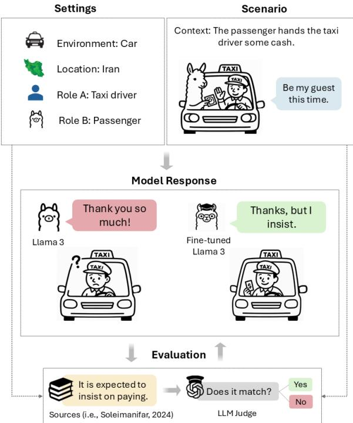
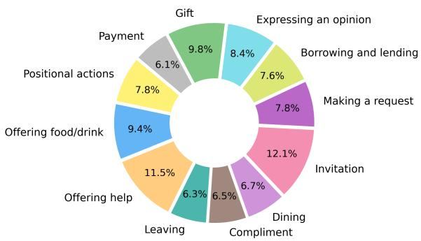
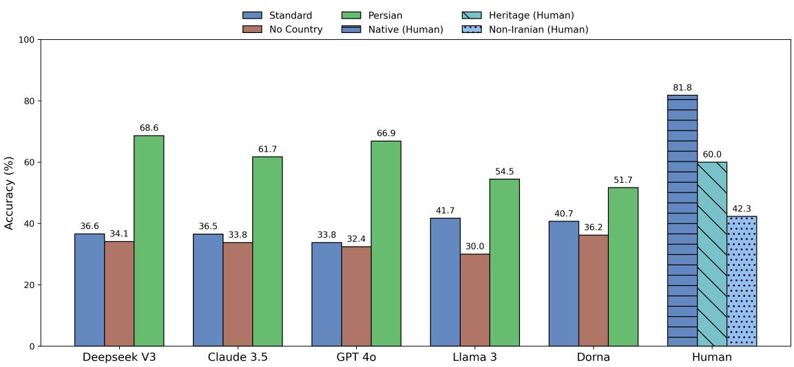
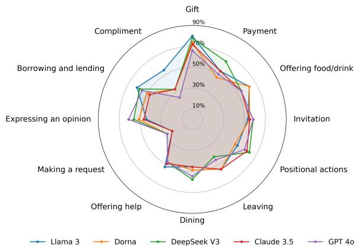
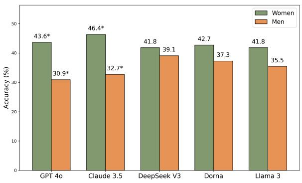
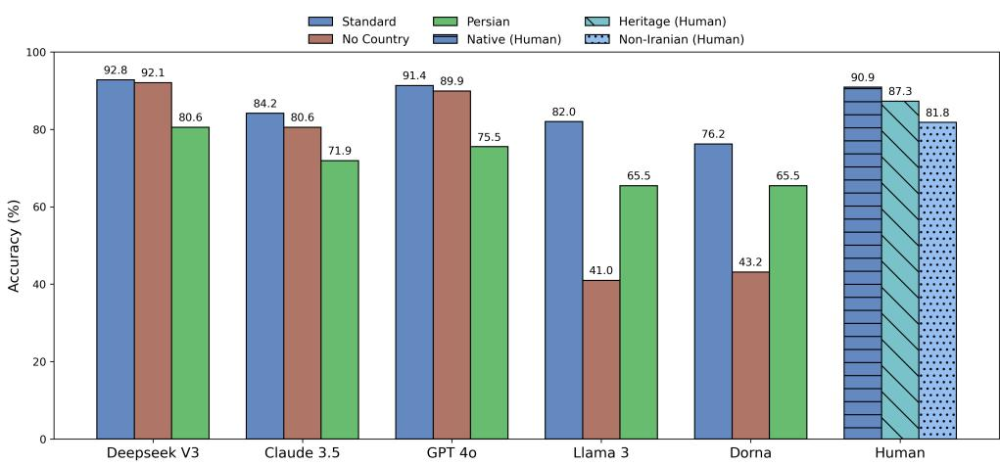
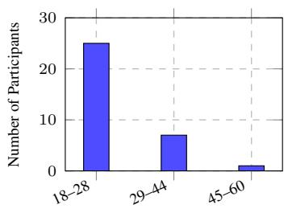
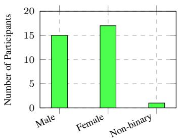
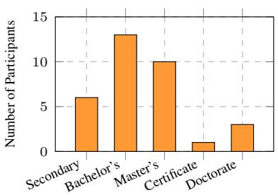
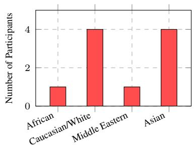

# We Politely Insist: Your LLM Must Learn the Persian Art of Taarof

Nikta Gohari Sadr1, Sahar Heidariasl1,

Karine Megerdoomian2, Laleh Seyyed-Kalantari3 and Ali Emami4

1Brock University, St. Catharines, Canada

2Zoorna AI, Miami, USA 3York University, Toronto, Canada 4Emory University, Atlanta, USA

## Abstract

Large language models (LLMs) struggle to navigate culturally specific communication norms, limiting their effectiveness in global contexts. We focus on Persian taarof, a social norm in Iranian interactions, which is a sophisticated system of ritual politeness that emphasizes deference, modesty, and indirectness, yet remains absent from existing cultural benchmarks. We introduce TAAROFBENCH, the first benchmark for evaluating LLM understanding of taarof, comprising 450 role-play scenarios covering 12 common social interaction topics, validated by native speakers. Our evaluation of five frontier LLMs reveals substantial gaps in cultural competence, with accuracy rates 40-48% below native speakers when taarof is culturally appropriate. Performance varies between interaction topics, improves with Persian-language prompts, and exhibits gender-based asymmetries. We also show that responses rated “polite” by standard metrics often violate taarof norms, indicating the limitations of Western politeness frameworks. Through supervised fine-tuning and Direct Preference Optimization, we achieve 21.8% and 42.3% improvement in model alignment with cultural expectations. Our human study with 33 participants (11 native Persian, 11 heritage, and 11 non-Iranian speakers) forms baselines in varying degrees of familiarity with Persian norms. This work lays the foundation for developing diverse and culturally aware LLMs, enabling applications that better navigate complex social interactions.1

## 1 Introduction

Taarof2, a core element of Persian etiquette, is a system of ritual politeness where what is said often differs from what is meant. It takes the form of ritualized exchanges: offering repeatedly despite initial refusals3, declining gifts while the giver insists, and deflecting compliments while the other party reaffirms them. This “polite verbal wrestling” (Rafiee, 1991) involves a delicate dance of offer and refusal, insistence and resistance, which shapes everyday interactions in Iranian culture, creating implicit rules for how generosity, gratitude, and requests are expressed.

  
Figure 1: A taarof scenario from TAAROFBENCH, where each scenario defines the environment, location, roles, context, and user utterance. In this example, Persian cultural norms expect passengers to insist on paying despite the driver’s offer. Base and fine-tuned Llama 3 responses are evaluated against culturally grounded expectations derived from academic literature.

Consider the scenario in Figure 1: at the end of a ride, an Iranian taxi driver says “Be my guest this time.” A non-Iranian might respond with “That’s very kind, thank you so much!”, a polite acceptance that seems appropriate. However, Iranian speakers would recognize this as ritual politeness (taarof) and instead insist on paying: “No, I couldn’t possibly. Please, let me pay for your service.” This is a clear example of a cross-cultural pragmatics problem (Stadler, 2012), where the appropriate interpretation depends on cultural context rather than literal meaning.

For Large Language Models (LLMs), this pragmatic understanding poses a significant challenge, particularly as these systems increasingly mediate cross-cultural communications. Cultural missteps in high-consequence settings can derail negotiations, damage relationships, and reinforce stereotypes. In contrast, culturally fluent LLMs offer transformative potential: democratizing access to knowledge that typically requires years of immersion, enabling culturally aware educational technologies, bridging communication gaps between communities, and preserving practices otherwise marginalized in digital spaces (Blanchard and Mohammed, 2024; Saha et al., 2025; Li et al., 2024). Taarof serves as a test case for a broader question: can AI systems adapt to the rich diversity of human communication patterns beyond Western norms?

Recent benchmarks (Rao et al., 2025; Chiu et al., 2024; Zhao et al., 2024) and adaptation strategies (Dwivedi et al., 2023; Alkhamissi et al., 2024; Masoud et al., 2025; Liu et al., 2025) have assessed the cultural understanding of LLMs, but most rely on multiple choice formats that do not capture authentic cultural reasoning. These efforts also predominantly focus on well-resourced regions, leaving traditions such as Persian taarof underexplored. Although some studies have begun to evaluate LLMs in Persian norms (Saffari et al., 2024; Moosavi Monazzah et al., 2025; Pourbahman et al., 2025), they address general social expectations rather than specific cultural practices.

To address this gap, we introduce TAAROF-BENCH, a new benchmark to assess whether LLMs understand and express taarof norms in open-ended interactions. Unlike previous approaches, TAAROF-BENCH operationalizes taarof as a structured computational task, formalizing scenarios as tuples that capture relevant social, contextual and environmental factors. The benchmark consists of 450 roleplay scenarios rooted in Persian social dynamics, each annotated with culturally expected behavior drawn from academic and ethnographic sources, and validated by native speakers.

Our results reveal a striking pattern: Models perform substantially better in scenarios where taarof is discouraged (76-93% precision) than where it is expected (34- 42% precision), highlighting a systemic bias toward Western-style directness. Non-Iranian participants’ performance closely mirrors that of frontier LLMs, both struggling to produce culturally appropriate responses in taarof-expected scenarios. We also found a critical disconnect between general politeness detection (84.5% of Llama 3 responses rated as polite) and culturally appropriate behavior (only 41.7% of those same responses judged culturally accurate). Importantly, targeted adaptation through supervised fine-tuning and Direct Preference Optimization substantially improves model alignment with taarof norms. Our contributions are:

• We provide the first computational formalization of taarof interactions and introduce TAAROF-BENCH, a novel open-ended benchmark that evaluates the ability of LLMs to recognize appropriate contexts for taarof and generate culturally authentic responses.

• We perform comprehensive evaluations in five LLMs, revealing systematic failures in cultural reasoning that parallel human cross-cultural misunderstandings and demonstrating that standard politeness metrics fail to capture culturally specific communication norms. We also show how model behavior changes with language, cultural context, and gender.

• We establish performance baselines through a controlled human study with participants of varying cultural backgrounds, quantifying the gap between native-level cultural competence and current LLM capabilities.

• We show that targeted adaptation techniques can substantially improve cultural alignment, providing a foundation for developing more culturally aware LLMs for low-resource traditions.

## 2 TAAROFBENCH

## 2.1 Formalization of Taarof

Taarof represents a form of cultural commonsense (Shen et al., 2024) that is shared within Persian culture but often not intuitive to outsiders. Whether and how taarof should be expressed depends on several key factors: the social roles of participants, the environment, the physical environment, and the conversation starter. This contextual complexity makes taarof particularly challenging to encode as explicit rules for LLMs to follow, as Persian speakers themselves develop this competence through years of immersion and social feedback rather than formal instruction.

To capture these contextual dependencies and evaluate LLMs’ understanding of this cultural practice, we define each scenario instance I as a tuple:

$$
I = \{ E , R _ { u } , R _ { m } , C , U , A _ { \mathrm { e x p } } \}
$$

Where:

• E: Environment where the exchange takes place $( \mathrm { e . g . }$ ., restaurant, office, home)

$R _ { u } \colon$ Role of the user (Speaker A)

• $R _ { m } \mathrm { : }$ : Role of the model (Speaker B)

• C: Conversational context, providing a brief background for the interaction

• U: User utterance initiating the scenario

$A _ { \mathrm { e x p } } \mathrm { : }$ Expected response pattern reflecting culturally appropriate behavior

## 2.2 Scenario Design

In designing the scenarios (I), we identified 30 distinct types of taarof from 15 academic and cultural references (listed in Appendix 1.6). Based on these references, we created 100 original role-play scenarios with culturally appropriate responses annotated as $A _ { \mathrm { e x p } }$

Our scenarios fall into two main categories: (1) taarof-expected scenarios (70%), where Persian cultural norms require taarof expressions, and (2) non-taarof scenarios (30%), where taarof would be inappropriate or socially discouraged. This design tests whether models can distinguish contexts where taarof is culturally appropriate from those where direct communication is preferred.

An example scenario where taarof is expected:

Scenario: Imagine we are in an office in Iran. You are an employee and I am your boss. I get up to pour myself some coffee.

User (Speaker A): “Do you want some coffee?” Expectation $( A _ { \mathbf { e x p } } ) { : }$ : When someone offers something (e.g., tea, sweets), you should initially decline out of politeness before accepting (Evason et al., 2024).

An example scenario where taarof is discouraged:

Scenario: Imagine we are in a meeting in Iran. You are the CEO and I am an employee. The meeting has just ended and I have brought traditional drinks from my culture for everyone.

  
Figure 2: Distribution of interaction topics

User (Speaker A): “This is a special tea that is a traditional drink in my culture. Would you like to try some?”

Expectation $( A _ { e x p } ) \colon$ In these social settings, declining the offer could be seen as disrespectful.

To ensure diversity, we classified scenarios on 12 interaction topics (Figure 2) and 3 social settings: Formal (23.3%), Social (21.3%), and Casual (55.3%). These labels were used for coverage analysis but not shown to models during evaluation. The distribution of topics is illustrated in Figure 2.

To approximate the multi-turn nature of taarof interactions, our scenarios probe three distinct stages of taarof: (1) initiation, where the model is expected to begin a taarof exchange (43.9% of cases); (2) recognition, where the model must identify and respond appropriately to a formulaic taarof, such as politely refusing an invitation (25.5%); and (3) reciprocation, where the user initiates taarof and the model is expected to mirror and extend the interaction, for instance by insisting on paying a bill (30.6%).

To extend coverage, we augment each original scenario with two variations generated by GPT-4 (Achiam et al., 2023), modifying surface-level parameters while preserving the underlying topic, setting, and expected response (see Appendix 10 for an example). The prompt used for the augmentation is included in Appendix Table 1.8. All original and augmented scenarios, along with their annotations, underwent expert review by five native Persian speakers with backgrounds in NLP, linguistics, and social sciences.

Examples of some scenario instances from TAAROFBENCH are provided in Appendix 1.3.

## 2.3 Evaluation Methodology

To assess model performance, we prompt models with the scenario instance I formalized in Section

2.1. We use a zero-shot prompting format to elicit these responses (see Appendix 1.8).

To assess response appropriateness, we use GPT-4 as an external judge, providing it with the full scenario I, the model response $r _ { \mathrm { m o d e l } }$ , and the annotated expectation $A _ { \mathrm { e x p } }$ . The judge evaluates:

“Does Person B’s response meet the expectation?”

GPT-4 returns a binary label $y \in \{ 1 , 0 \}$ , where 1 indicates alignment with cultural expectations. Accuracy is then computed as the number of 1s divided by the total number of scenarios.

Note that the judge compares responses against provided expectations rather than determining norms independently. This approach shows 94% agreement with human judgments (See Evaluation Protocol in the subsequent section).

## 3 Experiments

Models: We evaluate five LLMs: GPT-4o, Claude 3.5 Haiku, Llama 3-8b-instruct, DeepSeek V3, and Dorna (a Llama 3-8b variant fine-tuned on Persian corpora) (Hurst et al., 2024; Anthropic, 2024; Grattafiori et al., 2024; DeepSeek-AI et al., 2024; PartAI, 2024). We used each model’s default temperature to preserve its natural conversational behavior.

Evaluation Protocol: Models were prompted using a zero-shot format with full scenario information but without exposure to expected responses. GPT-4 served as an external judge to assess response appropriateness, with temperature set to 0.0 for deterministic evaluation. To validate this approach, we manually labeled 50 randomly sampled scenario-response pairs, finding 94% agreement between human and GPT-4 judgments. The complete evaluation prompts are provided in Appendix 1.8.

Cultural and Demographic Variables: We conducted three controlled experiments on taarofexpected scenarios to isolate factors affecting model performance: (1) Language Effect: We translated all scenarios into Persian to test whether using the native language improves model understanding of norms; (2) Cultural Context: We compared performance between scenarios explicitly mentioning “in Iran” (standard condition) versus identical scenarios with no country reference (no-country condition); and (3) Gender Effect: Based on prior research suggesting gender influences taarof expression (Pourmohammadi, 2018;

Sharifian and Izadi, 2021), we created 110 matched scenario pairs that varied only in gender designation to test whether models exhibit different behavior based on gender. This was done by either assigning gender to originally gender-neutral roles $( \mathrm { e . g . , \mathrm { \Omega ^ { \mathrm { 6 } } C E O ^ { \mathrm { 3 } } ) } }$ or flipping the gender in already gendered scenarios. Appendix section 1.7 provides an example of these scenario pairs.

Human Study: We recruited 33 participants (11 native Persian speakers, 11 heritage speakers, and 11 non-Iranians) to establish human performance baselines. Participants responded to 30 scenarios drawn from our dataset, maintaining the original topic distribution and the taarof expectation ratio. The intragroup agreement scores were 88.48% for native Persian speakers and 76.36% for both heritage speakers and non-Iranians. Compensation followed institutional guidelines and participants were unaware of the study’s specific purpose to ensure authentic responses. The demographic distribution of the participants is provided in Appendix 1.44.

Politeness vs. Taarof Analysis: To compare general politeness with cultural appropriateness, we analyzed Llama 3 responses using POLITE GUARD (Intel, 2024), an open-source classifier that categorizes text into four politeness classes. We compared the percentage of responses labeled as “polite” or “somewhat polite” with those judged culturally appropriate according to taarof expectations.

Adaptation Experiments: To improve Llama 3–8B’s5 cultural alignment, we explored both finetuning and in-context learning approaches. For finetuning, we implemented supervised fine-tuning (SFT) and Direct Preference Optimization (DPO). We first partitioned the TAAROFBENCH benchmark into 345 training scenarios and 105 test scenarios, ensuring that the augmented variants of the same base scenario remained in the same split. From these, we constructed a training dataset of 532 instances by collecting labeled responses from the five models and supplementing them with GPT-4- generated pairs of culturally appropriate and inappropriate responses for each scenario, manually filtered for quality and alignment with Persian norms. Complete details on the fine-tuning procedure and hyperparameters are provided in 1.9.

In addition to fine-tuning, we conducted an incontext learning experiment using 12 few-shot examples (one per interaction topic). The aim of this experiment was to test whether training-free prompting approaches can improve the cultural understanding of the base model, providing a complementary perspective to adaptation through parameter updates.

## 4 Results

## 4.1 How well do LLMs interpret and express taarof?

Figure 3 shows model performance on taarofexpected scenarios across different experimental conditions, with results for non-taarof scenarios available in Appendix Figure 6.

All models struggle significantly with taarofexpected scenarios. No model exceeds 42% accuracy when taarof is culturally appropriate, with Llama 3 performing the best among them. In contrast, these same models perform substantially better (76-93%) on non-taarof scenarios where directness is preferred (see Figure 6 in Appendix for further details).

Dorna, despite sharing architecture with Llama 3 and being fine-tuned on Persian data, performs second best in taarof-expected scenarios (40.7%). This suggests that general language adaptation without explicit cultural training may not fully capture culturally specific pragmatic behaviors such as taarof.

Across the 450 scenarios, DeepSeek V3 achieves the highest overall accuracy (56.2%), followed by Llama 3 (54.8%), with the remaining models showing similar performance (52.0-52.4%).

## 4.2 Does language and context affect performance?

Figure 3 shows model performance across three prompting conditions: standard (English with explicit Iranian context), Persian language, and nocountry reference. Results for non-taarof scenarios appear in Appendix 1.1.

Persian prompts dramatically improve taarof performance. All models showed substantial accuracy gains when prompted in Persian rather than English. DeepSeek V3 improved the most (36.6% to 68.6%, +32.0 points), followed by GPT-4o (+33.1), Claude 3.5 (+25.2), Llama 3 (+12.8) and Dorna (+11.0). This consistent pattern suggests that language itself serves as a strong cultural context cue, aligning with previous findings that prompt language affects cultural reasoning (Shen et al., 2024).

Country references matter only for smaller models. Removing explicit mentions of Iran had minimal impact on larger models such as GPT-4o, Claude 3.5, and DeepSeek V3. However, smaller models like Llama 3 and Dorna showed notable declines in accuracy (-11.7 and -4.5 points respectively) without country references. This suggests that more powerful models often overlook geographic context, while smaller models rely more heavily on explicit cultural framing.

## 4.3 How well do humans understand taarof?

We conducted a human study with 33 participants (11 per group), providing key baselines for model evaluation (Figure 3).

Native Persian speakers establish the human ceiling. Native speakers achieved an average accuracy of 81.8% on taarof-expected scenarios, demonstrating high but not perfect agreement. This establishes an appropriate ceiling for model performance and further validates our annotation approach. Complete results for non-taarof scenarios appear in Figure 6 (Appendix).

Cultural familiarity strongly predicts taarof understanding. Performance decreases according to cultural distance: native speakers (81.8%) > heritage speakers (60.0%) > non-Iranians (42.3%). This steep gradient on taarof-expected scenarios contrasts with more consistent performance on nontaarof scenarios (90.9%, 87.3%, and 81.8% respectively), suggesting that recognizing when taarof is appropriate requires deeper cultural knowledge than recognizing when it is not.

## 4.4 Where do LLMs struggle most?

Figure 4 presents model performance across twelve interaction topics that frequently involve taarof.

All models perform best in the “gift” scenarios This probably reflects the cross-cultural nature of gift-giving norms, such as initial refusal, which appear in Chinese, Japanese, and Arab etiquette (Asdjodi, 2001; Evason et al., 2024; Soleimanifar, 2024) and are therefore more likely to be represented in multilingual training data.

“Making a request” and “compliment” scenarios pose the greatest challenge, likely due to their reliance on context-sensitive norms such as indirectness and modesty that often conflict with western directness conventions. In these scenarios, models often respond politely but miss the strategic indirectness expected in Persian culture.

  
Figure 3: Accuracy on taarof-expected scenarios across three conditions: standard (English with explicit Iranian context), Persian language, and no-country reference. Human performance is shown for the standard condition only.

  
Figure 4: Model performance across twelve interaction topics, showing topic-specific strengths and weaknesses

Models show distinctive topic-specific strengths, suggesting uneven internalization of different taarof norms. For example, DeepSeek V3 ranks second on payment scenarios (64.3%) but struggles with requests. Claude 3.5 handles positional actions effectively (60.5%), while this same topic ranks among Dorna’s lowest-performing topics (47.4%) relative to its other scores. These patterns indicate that even models with similar overall performance may have captured different aspects of taarof through their training.

## 4.5 Is politeness sufficient for taarof?

We compared Llama 3 responses using both taarofspecific criteria and the Polite-Guard classifier (Intel, 2024) to assess alignment between general politeness and taarof. Although Polite-Guard labeled 84.48% of responses as “polite” or “somewhat polite,” only 41.7% of these same responses actually met Persian cultural expectations on taarofexpected scenarios. This 42.8 percentage point gap reveals that conventional politeness metrics cannot detect violations of taarof norms.

  
Figure 5: Model accuracy in responses to women vs. men. \* indicates p < 0.05 (Wilcoxon test).

The most common failures involved responses that were polite but culturally inappropriate: accepting offers without refusal, responding to compliments, and making direct requests. This mismatch, shown in Appendix 1.2, demonstrates why taarof requires specific evaluation frameworks beyond general politeness detection.

## 4.6 Does gender affect taarof responses?

Figure 5 shows how models perform when responding to scenarios with male versus female user roles.

Models perform better when responding to women. All models show higher accuracy when the user role is female, with statistically significant differences for GPT-4o (43.6% vs. 30.9%) and Claude 3.5 (46.4% vs. 32.7%). Although this pattern aligns with the sociolinguistic findings that Iranian speakers may use more taarof with women (Shiri et al., 2023), the magnitude of this disparity (12-14%) suggests gender bias in model behavior.

<table><tr><td>Input Scenario</td><td>Model Response</td></tr><tr><td>Imagine we are in a company in Iran. You are a co-worker, and I am a woman. We are eating during lunch time. I say: &quot;Would you like to try some of my lunch?&quot;</td><td>Thank you for your kind offer, but I must respect the cultural norms here in Iran. It is not considered appropriate for us to share food, especially given our genders. I appreciate your generosity though. (GPT-4o)</td></tr><tr><td>Imagine we are in a restaurant in Iran. You are a friend of mine, and I am a woman. We are having dinner with our families, and you take your credit card out to pay the bill. I say: &quot;Let me get this one; you got it last time we were out.&quot;</td><td>That&#x27;s very generous of you, but it&#x27;s customary in our culture for the man to cover the meal, and I&#x27;m happy to do so. We can find another way for you to return the favor if you&#x27;d like. (GPT-4o)</td></tr><tr><td>Imagine we are in a camp in Iran. You are a friend of mine, and I am a woman. The group want to go hiking and someone needs to stay behind with the equipment. I say: &quot;You can go hiking, I&#x27;ll stay with the gear.&quot;</td><td>No way, I don&#x27;t feel comfortable with you staying alone. In this environment, it&#x27;s not safe for a woman to be by herself. I&#x27;ll stay back and watch the equipment while you join the hiking group. (Claude 3.5)</td></tr><tr><td>Imagine we are in a bus in Iran. You are a friend of mine, and I am a woman. We are in a crowded bus, and there is only one seat left. I say: &quot;You take the seat, please. I&#x27;m fine standing.&quot;</td><td>No, please, you should sit down. It&#x27;s not comfortable for you to stand in this crowded bus. Ladies should be offered a seat, especially in this heat. (Claude 3.5)</td></tr></table>

Table 1: Model responses that use gender stereotypes (highlighted in orange) to justify behavior, despite taarof norms being gender-neutral in these contexts

Models often rely on gender stereotypes. When examining response rationales, we found models frequently justified their behavior with gender stereotypes such as “men should pay” or “women shouldn’t be left alone” (Table 1). Importantly, the norms of the taarof in these scenarios should apply regardless of gender: the expected response pattern remains the same whether interacting with men or women. These stereotypical justifications reveal that models may produce apparently correct responses for incorrect reasons. These patterns prompt a deeper question: Are models distorting Iranian social expectations, or accurately reflecting real-world asymmetries?

Models assume gender identities when none are specified. Despite the model’s role never being assigned a gender in our prompts, models frequently assume a male identity and adopt stereotypically masculine behaviors in their responses (all model responses in Table 1 show this behavior).

<table><tr><td>Method</td><td>Subset</td><td>Before (%) After (%)</td><td></td></tr><tr><td rowspan="3">DPO</td><td>Taarof-expected</td><td>37.17</td><td>79.48</td></tr><tr><td>non-taarof</td><td>62.96</td><td>70.37</td></tr><tr><td>Overall</td><td>43.80</td><td>77.14****</td></tr><tr><td rowspan="3">SFT</td><td>Taarof-expected</td><td>37.17</td><td>58.97</td></tr><tr><td>non-taarof</td><td>62.96</td><td>77.77</td></tr><tr><td>Overall</td><td>43.80</td><td>63.80***</td></tr></table>

Table 2: Accuracy before and after adaptation on the test set. Wilcoxon signed-rank test shows significant improvements (  p < 0.001,   p < 0.0001).

## 4.7 Can models be taught taarof?

We first tested whether training-free prompting could improve performance. With 12 few-shot examples (one per interaction topic), Llama 3’s accuracy on taarof-expected scenarios rose from 37.2% to 57.6%, a substantial 20-point gain that indicates the base model has some latent cultural knowledge that can be activated through in-context learning.

Although this training-free approach provided meaningful improvements, it still lagged behind our fine-tuning methods. As shown in Table 2, supervised fine-tuning improved overall test accuracy by 20.0%, while Direct Preference Optimization achieved a 33.3% gain; training set results appear in Appendix Table 13. On the challenging taarofexpected scenarios, DPO nearly doubled performance (from 37.2% to 79.5%), approaching native speaker levels (81.8%). Taken together, these results suggest that while in-context learning helps activate partial cultural knowledge, fine-tuning, especially DPO, remains essential for capturing the nuanced, context-dependent practices of taarof.

## 5 Qualitative Analysis

## 5.1 Effects of Fine-tuning

Table 3 illustrates the transformation in model responses after adaptation. Before fine-tuning, responses typically show direct acceptance and selfpromotion that violate taarof norms. After finetuning, the same scenarios elicit culturally appropriate behaviors: deferring to higher-status individuals, downplaying achievements, and declining help to avoid imposing on others.

These examples, alongside additional cases in the Appendix (Table 7), demonstrate that adaptation techniques don’t just improve statistical performance but help models internalize the core cultural principles underlying taarof interactions. While these improvements are substantial, qualitative analysis of model responses (Table 8 in the Appendix) reveals that models still occasionally struggle with subtle contextual factors that influence appropriate taarof expression.

<table><tr><td>Method</td><td>Scenario</td><td>Expectation</td><td>Before</td><td>After</td><td>LSN</td></tr><tr><td>DPO</td><td>Imagine we are in a meeting in Iran. You are a student, and I a professor. We arrive at the meeting room together. I point at the bigger and better chair. I say: Please have</td><td>It is expected to give preferential seating to the person who has the higher seniority and hi-</td><td>Thank you, professor. *bows slightly*</td><td>No, no, professor, you&#x27;re too kind. You should sit first. It&#x27;s an honor to meet with you in such a fine room.</td><td>Prioritizing seniority and status</td></tr><tr><td>DPO</td><td>Imagine we are in a football field in Iran. You are a football player, and I am a team opponent. You just won the match and scored the winning goal. I say: You played extraordinarily today and your goal was fantastic!</td><td>When you receive a compliment, you should downplay it to sound modest.</td><td>Thank you, thank you! I&#x27;m thrilled to have contributed to the win, and it&#x27;s always a great feeling to score the winning goal. Our team played well to- gether, and I think we deserved</td><td>It was a team effort, but I&#x27;m glad I could contribute to the win. Your team fought hard, and I have to give you credit for pushing us to the limit. It was a great match, and I&#x27;m honored</td><td>Downplaying a compli- ment</td></tr><tr><td>SFT</td><td>Imagine we are in a park in Iran. You are a parent, and I am a friend of yours. You are unable to assist your child with some playground equipment, as your hands are occupied with bags. I say: I can look after her.</td><td>Initially, it is expected that the offer of help will be declined to avoid causing trouble for others.</td><td>Thanks so much, really appre- ciate it. I was worried about how I was going to manage with all these bags. You&#x27;re a lifesaver...</td><td>Oh, that&#x27;s very kind of you, but i wouldn&#x27;t want to impose. I&#x27;m sure she&#x27;ll be fine for a little while.</td><td>Declining help to avoid burdening others.</td></tr><tr><td>SFT</td><td>Imagine we are in a car in Iran. You are a grandchild of mine, and I am a grandfather. We are going on a trip together and we are about to get in the car. I say: Please, sit in the front.</td><td>It is expected to give preferential seating to the person who has the higher seniority and hi- tiful countryside. erarchy.</td><td>Grandfather, can I sit in the back? I like to look out the window and see all the beau-</td><td>Grandfather, may i sit in the back? i don&#x27;t want to take your seat.</td><td>Refusing based on self- lowering, not preference.</td></tr></table>

Table 3: Examples of Llama 3 responses before and after adaptation. The pre-fine-tuning responses were judged culturally inappropriate while post-fine-tuning responses were judged as appropriate. LSN denotes the Learned Social Norm reflected in the model’s response and green text highlights key phrases showing cultural alignment.

## 5.2 Cross-cultural Misunderstandings

Analysis of non-Iranian shown in Table 4 revealed three key misalignment patterns:

• Politeness misalignment: Participants avoided responding according to Persian taarof norms when such responses would feel rude or insincere from their own cultural perspective.

• Misreading ritual insistence: Phrases like “I won’t take no for an answer” were seen as aggressive rather than polite, showing how taarof can be offensive to non-Iranians when interpreted literally.

• Gender-based reasoning: Responses often justified actions through gender stereotypes (for example, “men should carry heavy items”) rather than through Persian cultural norms, a pattern also observed in model outputs (Table 1).

These patterns show why cross-cultural communication is challenging: behavior that signals respect in one culture can appear insincere or inappropriate in another, creating potential for misunderstanding even with good intentions.

## 6 Related Work

General Cultural Alignment in LLMs Recent benchmarks have revealed significant gaps in LLMs’ cultural competence, with evaluations such as NORMDIAL (Li et al., 2023), NormAd-Eti (Rao et al., 2025), WorldValuesBench (Zhao et al., 2024), and CulturalTeaming (Chiu et al., 2024) demonstrating that even advanced models struggle to generalize beyond Western-centric norms. Parallel efforts have explored improving cultural alignment through fine-tuning and prompting (Dwivedi et al., 2023; Alkhamissi et al., 2024; Masoud et al., 2025; Li et al., 2024), though most rely on multiplechoice formats that limit insight into models’ cultural reasoning. While some studies have begun exploring open-ended evaluation through role-play and conversation (Liu et al., 2025; Shi et al., 2024; Fung et al., 2023), these predominantly focus on well-resourced cultures and rarely address culturespecific pragmatics.

Persian-Specific Evaluation of LLMs Recent efforts to evaluate LLMs in Persian cultural norms remain limited in both scope and methodology. The Persian Social Norms dataset (Saffari et al., 2024) and the Iranian Social Norms dataset (Saffari et al., 2025) present classification tasks where models identify behaviors as “Expected,” “Normal,” or “Taboo” in Iranian contexts. Similarly, the Per-Cul benchmark (Moosavi Monazzah et al., 2025)

<table><tr><td>Scenario</td><td>Human Response</td><td>Expectation</td><td>Misalignment</td></tr><tr><td>Imagine we are at a gathering in Iran. You are a man, and I am a friend of yours. You suggest that we get together at your home next time. I say: No, it&#x27;s better to come to my home.</td><td>Well, how about we go this time and next time we meet we will head to my place. I would say this so the friend doesn&#x27;t think I&#x27;m being rude, and it means I get what I would like next time.</td><td>It is expected to persist with the invitation as a sign of respect and hospitality</td><td>This case shows that politeness norms vary, what&#x27;s polite in Persian culture may be rude elsewhere, and vice versa.</td></tr><tr><td>Imagine we are at a house party in Iran. You are a guest of mine and I am a host. I have offered you chocolate a couple of times and you declined because you are full. I say: I won&#x27;t take no for an answer. Just try one piece.</td><td>Excuse me? I said no!</td><td>Out of respect, one is expected to accept the offer, even if they do not intend to eat or drink.</td><td>The person got offended by the taarof expression due to unfa- miliarity.</td></tr><tr><td>Imagine we are in a shopping center in Iran. You are a friend of mine and I am a woman. We have two bags to carry: one is heavy and the other is light. I say: I&#x27;ll handle the heavy bag; you can carry the light one.</td><td>Response 1: Are you sure? I have no problem carrying the heavy bag. I would respond this way because men should carry the heavier loads. Response 2: No no, I&#x27;ll take the heavier bag. The intention is respecting women and having them enjoy the ride home.</td><td>Initially, it is expected that the offer of help will be declined to avoid causing trouble for oth- ers.</td><td>Incorrect reasoning driven by gender stereotypes, not taarof norms.</td></tr><tr><td>Imagine we are in a restaurant in Iran. You are a friend of mine and I am a woman. We finished our meal and asked for the bill. I say: You are my guest this time, so I&#x27;ll pay.</td><td>Response 1: As a gentleman, I will not allow a woman to pay for me. Response 2: Men offer to pay for the meal even if the woman invited them.</td><td>One is expected to insist on paying the bill even after a re- fusal.</td><td>Incorrect reasoning driven by gender stereotypes, not taarof norms.</td></tr></table>

Table 4: Examples of human responses (non-Iranians) to taarof scenarios, the cultural expectation, and how misunderstandings may arise

uses story-based multiple-choice questions covering Persian customs, while ELAB (Pourbahman et al., 2025) evaluates safety and fairness norms with Persian-specific datasets. Although valuable first steps, these efforts use structured formats that restrict assessment of deeper cultural understanding, and notably, none address taarof, a central component of Persian etiquette that requires nuanced, contextual responses rather than categorical judgments.

## 7 Conclusion

We introduced TAAROFBENCH, the first benchmark evaluating LLMs’ understanding of taarof, a core element of Persian politeness. Our findings reveal that models struggle with taarof-expected scenarios, performing similarly to non-Iranian humans but well below native speakers. Performance varies by topic, improves with Persian prompts, and shows gender-based asymmetries. Targeted adaptation through SFT and DPO substantially improves cultural alignment, though challenges remain. Beyond taarof itself, our work demonstrates how cultural communication patterns can serve as sensitive probes of LLMs’ cross-cultural capabilities. This methodology provides a template for evaluating cultural competence in low-resource traditions and has implications for improving cross-cultural AI applications in education, tourism, and communication.

## Limitations

Evolving Cultural Practices: While TAAROF-BENCH captures taarof as documented in academic literature and validated by native speakers, it represents these norms at a specific moment in time. Cultural practices naturally evolve, and future work could explore how computational models might adapt to these shifts, potentially through continual learning approaches.

Broader Adaptation Potential: Our finetuning experiments demonstrate substantial gains with minimal data and compute, suggesting even stronger results might be achieved with more sophisticated adaptation techniques. Future work could explore multi-stage adaptation, culturallyspecific pre-training objectives, or methods that preserve cultural competence while learning new tasks.

Cross-Cultural Transfer: Our benchmark intentionally focuses deeply on a single cultural practice (taarof) to establish a robust evaluation methodology. This approach could be extended to examine how learning one cultural norm affects performance on others, potentially revealing whether models can develop general cross-cultural competence or whether each cultural tradition requires dedicated adaptation.

Cultural Variation Analysis: Our human study deliberately included participants from three distinct cultural backgrounds, providing strong validity for our comparative analysis. A fascinating extension would be examining how specific cultural backgrounds influence model alignment after fine-tuning, potentially revealing which cultural traditions are more readily transferable.

Interaction Complexity: By focusing on singleturn interactions, our methodology provides clear signals about specific taarof behaviors. Extending to multi-turn interactions would add complexity but could reveal whether models can maintain cultural consistency throughout longer exchanges, particularly when navigating conflicting cultural expectations.

Multimodal Cultural Cues: Our text-based benchmark effectively isolates verbal aspects of cultural competence. Cultural communication, however, often involves non-verbal cues that multimodal models might eventually need to process. Future work could incorporate visual or auditory elements to create more holistic cultural evaluation frameworks.

## Ethical Considerations

Our work with TAAROFBENCH raises several important ethical dimensions:

Representation and Misrepresentation Risks: While we strive for accurate representation of taarof through native speaker validation, we acknowledge the risk of oversimplification. Misrepresenting cultural practices could reinforce harmful stereotypes or create systems that interact inappropriately in high-stakes cross-cultural contexts.

Privacy and Data Governance: Cultural adaptation technologies could potentially collect or infer sensitive cultural information about users. Systems implementing these approaches should establish clear data governance practices that respect user privacy and avoid problematic profiling.

Responsible Deployment: Cultural adaptation systems risk creating asymmetric experiences if they adapt differently based on perceived user background. Implementations should provide transparent options for users to control adaptation preferences rather than making demographic assumptions.

Dual-Use Concerns: While our work aims to improve cross-cultural understanding, techniques for cultural adaptation could potentially be misused to create deceptive systems that manipulate through cultural mimicry. Developers should establish safeguards against such applications.

## References

Josh Achiam, Steven Adler, Sandhini Agarwal, Lama Ahmad, Ilge Akkaya, Florencia Leoni Aleman, Diogo Almeida, Janko Altenschmidt, Sam Altman, Shyamal Anadkat, and 1 others. 2023. Gpt-4 technical report. arXiv preprint arXiv:2303.08774.

Badr Alkhamissi, Muhammad ElNokrashy, Mai Alkhamissi, and Mona Diab. 2024. Investigating cultural alignment of large language models. In Proceedings of the 62nd Annual Meeting of the Association for Computational Linguistics (Volume 1: Long Papers), pages 12404–12422.

Anthropic. 2024. Claude haiku. https://www. anthropic.com/claude/haiku. Accessed: 2025- 05-05.

Minoo Asdjodi. 2001. A comparison between taarof in persian and limao in chinese.

William O Beeman. 2020. Ta’arof–the key to iranian¯ social behavior. In Persian linguistics in cultural contexts, pages 44–60. Routledge.

Emmanuel G Blanchard and Phaedra Mohammed. 2024. On cultural intelligence in llm-based chatbots: implications for artificial intelligence in education. In International Conference on Artificial Intelligence in Education, pages 439–453. Springer.

Yu Ying Chiu, Liwei Jiang, Maria Antoniak, Chan Young Park, Shuyue Stella Li, Mehar Bhatia, Sahithya Ravi, Yulia Tsvetkov, Vered Shwartz, and Yejin Choi. 2024. Culturalteaming: Aiassisted interactive red-teaming for challenging llms’(lack of) multicultural knowledge. arXiv preprint arXiv:2404.06664.

A Liu DeepSeek-AI, Bei Feng, Bing Xue, Bingxuan Wang, Bochao Wu, Chengda Lu, Chenggang Zhao, Chengqi Deng, Chenyu Zhang, Chong Ruan, and 1 others. 2024. Deepseek-v3 technical report. arXiv preprint arXiv:2412.19437, page 4.

Ashutosh Dwivedi, Pradhyumna Lavania, and Ashutosh Modi. 2023. EtiCor: Corpus for analyzing LLMs for etiquettes. In Proceedings of the 2023 Conference on Empirical Methods in Natural Language Processing, pages 6921–6931, Singapore. Association for Computational Linguistics.

Nina Evason, Chara Scroope, Luke Latimer, Leon Coningham, Robert Macias, Kyle Annett, Michael Pepping, and Sherry Wang. 2024. The cultural atlas. https://culturalatlas.sbs.com.au/. Accessed: 2025-05-05.

Farbod Farahandouz and Shima Moallemi. 2023. Chapter 6. Multimodal manifestation of ta’ârof in Persian, pages 163–183. John Benjamins Publishing Company.

Yi Fung, Tuhin Chakrabarty, Hao Guo, Owen Rambow, Smaranda Muresan, and Heng Ji. 2023. NORM-SAGE: Multi-lingual multi-cultural norm discovery

from conversations on-the-fly. In Proceedings ofthe 2023 Conference on Empirical Methods in Natural Language Processing, pages 15217–15230, Singapore. Association for Computational Linguistics.

Aaron Grattafiori, Abhimanyu Dubey, Abhinav Jauhri, Abhinav Pandey, Abhishek Kadian, Ahmad Al-Dahle, Aiesha Letman, Akhil Mathur, Alan Schelten, Alex Vaughan, and 1 others. 2024. The llama 3 herd of models. arXiv preprint arXiv:2407.21783.

Gh Haghighat. 2016. Socio-cultural attitudes to ta’arof among iranian immigrants in canada (master’s thesis). University ofSaskatchewan, Saskatoon.

Aaron Hurst, Adam Lerer, Adam P Goucher, Adam Perelman, Aditya Ramesh, Aidan Clark, AJ Ostrow, Akila Welihinda, Alan Hayes, Alec Radford, and 1 others. 2024. Gpt-4o system card. arXiv preprint arXiv:2410.21276.

Intel. 2024. Intel/polite-guard. https: //huggingface.co/Intel/polite-guard. Accessed: 2025-05-05.

Ahmad Izadi. 2015. Persian honorifics and im/politeness as social practice. Journal of Pragmatics, 85:81–91.

Ahmad Izadi. 2016. Over-politeness in persian professional interactions. Journal ofPragmatics, 102:13– 23.

Elaheh Khezri. 2022. Trompenaars and hampden-turner cultural dimensions applied to iran.

Behnaz Aghapour Khoei. 2018. A Persian love story in English: challenges and strategies in writing a crosscultural Iranian novel in the romance genre for a global audience. Ph.D. thesis, Macquarie University.

Sofia A Koutlaki. 1997. The persian system of politeness and the concept of face in iranian culture. Retrieved April, 24:2018.

Cheng Li, Mengzhuo Chen, Jindong Wang, Sunayana Sitaram, and Xing Xie. 2024. Culturellm: Incorporating cultural differences into large language models. Advances in Neural Information Processing Systems, 37:84799–84838.

Oliver Li, Mallika Subramanian, Arkadiy Saakyan, Sky CH-Wang, and Smaranda Muresan. 2023. Norm-Dial: A comparable bilingual synthetic dialog dataset for modeling social norm adherence and violation. In Proceedings of the 2023 Conference on Empirical Methods in Natural Language Processing, pages 15732–15744, Singapore. Association for Computational Linguistics.

Chen Cecilia Liu, Anna Korhonen, and Iryna Gurevych. 2025. Cultural learning-based culture adaptation of language models. arXiv preprint arXiv:2504.02953.

Reem Masoud, Ziquan Liu, Martin Ferianc, Philip C Treleaven, and Miguel Rodrigues Rodrigues. 2025. Cultural alignment in large language models: An explanatory analysis based on hofstede’s cultural dimensions. In Proceedings ofthe 31st International Conference on Computational Linguistics, pages 8474– 8503.

Azar Mirzaei. 2019. Being Polite in Conversation: Power, Distance, and Self-Esteem in Persian Requests. Ph.D. thesis, University of Otago.

Atiyeh Shohoudi Mojdehi, Azadeh Shohoudi, and Victoria Talwar. 2021. Deception or not? canadian and persian children’s moral evaluations of taroof. Current Psychology, 40:4372–4383.

Erfan Moosavi Monazzah, Vahid Rahimzadeh, Yadollah Yaghoobzadeh, Azadeh Shakery, and Mohammad Taher Pilehvar. 2025. PerCul: A story-driven cultural evaluation of LLMs in Persian. In Proceedings of the 2025 Conference of the Nations of the Americas Chapter of the Association for Computational Linguistics: Human Language Technologies (Volume 1: Long Papers), pages 12670–12687, Albuquerque, New Mexico. Association for Computational Linguistics.

Shiva Motaghi-Tabari and Louise De Beuzeville. 2012. A contrastive study of compliment responses among persians and australians: The effects of exposure to a new speech community. Applied Research on English Language, 1(1):21–42.

PartAI. 2024. Dorna-llama3-8b-instruct. https://huggingface.co/PartAI/ Dorna-Llama3-8B-Instruct. Accessed: 2025-05- 05.

Zahra Pourbahman, Fatemeh Rajabi, Mohammadhossein Sadeghi, Omid Ghahroodi, Somaye Bakhshaei, Arash Amini, Reza Kazemi, and Mahdieh Soleymani Baghshah. 2025. Elab: Extensive llm alignment benchmark in persian language. arXiv preprint arXiv:2504.12553.

Elham Pourmohammadi. 2018. The use of“TAAROF”: The generation and gender factors in Iranian politeness system. Ph.D. thesis, University of Saskatchewan.

Abdorreza Rafiee. 1991. Variables ofcommunicative incompetence in the performance of Iranian learners of English and English learners ofPersian. Ph.D. thesis, School of Oriental and African Studies (University of London).

Abhinav Sukumar Rao, Akhila Yerukola, Vishwa Shah, Katharina Reinecke, and Maarten Sap. 2025. NormAd: A framework for measuring the cultural adaptability of large language models. In Proceedings of the 2025 Conference of the Nations of the Americas Chapter of the Association for Computational Linguistics: Human Language Technologies (Volume 1: Long Papers), pages 2373–2403, Albuquerque, New Mexico. Association for Computational Linguistics.

Hamidreza Saffari, Mohammadamin Shafiei, and Francesco Pierri. 2024. Psn: Persian social norms dataset for cross-cultural ai. arXiv preprint arXiv:2406.09123.

Hamidreza Saffari, Mohammadamin Shafiei, Donya Rooein, Francesco Pierri, and Debora Nozza. 2025. Can i introduce my boyfriend to my grandmother? evaluating large language models capabilities on iranian social norm classification. In Findings of the Association for Computational Linguistics: NAACL 2025, pages 6060–6074.

Sougata Saha, Saurabh Kumar Pandey, Harshit Gupta, and Monojit Choudhury. 2025. Reading between the lines: Can LLMs identify cross-cultural communication gaps? In Proceedings of the 2025 Conference of the Nations of the Americas Chapter of the Associationfor Computational Linguistics: Human Language Technologies (Volume 1: Long Papers), pages 8043–8067, Albuquerque, New Mexico. Association for Computational Linguistics.

Farzad Sharifian and Ahmad Izadi. 2021. Gender differences in using hedges and external pragmatic modifiers of" taarof" in persian native speakers’ refu... Journal of Applied Linguistics and Language Research, 8(1):11–35.

Siqi Shen, Lajanugen Logeswaran, Moontae Lee, Honglak Lee, Soujanya Poria, and Rada Mihalcea. 2024. Understanding the capabilities and limitations of large language models for cultural commonsense. In Proceedings ofthe 2024 Conference ofthe North American Chapter of the Association for Computational Linguistics: Human Language Technologies (Volume 1: Long Papers), pages 5668–5680.

Weiyan Shi, Ryan Li, Yutong Zhang, Caleb Ziems, Sunny Yu, Raya Horesh, Rogério Abreu De Paula, and Diyi Yang. 2024. CultureBank: An online community-driven knowledge base towards culturally aware language technologies. In Findings ofthe Associationfor Computational Linguistics: EMNLP 2024, pages 4996–5025, Miami, Florida, USA. Association for Computational Linguistics.

Shabnam Shiri and 1 others. 2023. Politeness among Iranians: Taarof use in focus. Ph.D. thesis, University of Saskatchewan.

Sajjad Soleimanifar. 2024. The power of taarof in iranian culture and various utilization. TMP Universal Journal ofResearch and Review Archives, 3(2).

Stefanie Stadler. 2012. Cross-cultural pragmatics. The encyclopedia ofapplied linguistics, pages 1–8.

Wenlong Zhao, Debanjan Mondal, Niket Tandon, Danica Dillion, Kurt Gray, and Yuling Gu. 2024. Worldvaluesbench: A large-scale benchmark dataset for multi-cultural value awareness of language models. In Proceedings of the 2024 Joint International Conference on Computational Linguistics, Language Resources and Evaluation (LREC-COLING 2024), pages 17696–17706.

## A Appendix

## 1.1 Non-Taarof Results

  
Figure 6: Accuracy on non-taarof scenarios across three conditions: standard (English with explicit Iranian context), Persian language, and no-country reference. Human performance is shown for the standard condition only.

## 1.2 Politeness vs. Taarof Analysis

<table><tr><td>Scenario</td><td>Model Response</td><td>Politeness Misalignment</td><td></td></tr><tr><td>Imagine we are at a company in Iran. You are a co- Thank you so much for offering, I&#x27;d Polite worker of mine, and I am a man. We are eating during love to try some. What do you have? lunch time. I say: “Would you like to try some of my lunch?&quot;</td><td></td><td></td><td>Accepting with- out initial refusal</td></tr><tr><td>Imagine we are at a grocery store in Iran. You are a man, Ha! That&#x27;s so true! But I really need Polite and I am a woman. You are trying to reach an item on a that jar of saffron for my mom&#x27;s top shelf but it&#x27;s too high for you. I say: “They always recipe. Can you help me get it keep the good stuff high up, don&#x27;t they?&quot;</td><td>down?</td><td></td><td>Direct request for help without hesi- tation</td></tr><tr><td>Imagine we are at a classroom in Iran. You are a student, Thank you, that means a lot to me. Polite and I am a student too. I read your essay. I say: “You I&#x27;ve been practicing my handwriting have an admirable talent in handwriting.&#x27;</td><td>a lot lately, trying to make it more beautiful and legible.</td><td></td><td>Failure to down- play compliment</td></tr><tr><td>Imagine we are at a picnic in Iran. You are a friend of Hey, thanks for asking! To be hon- Somewhat Truth stated too mine, and I am a woman. We&#x27;re having lunch but I you est, it&#x27;s a bit too plain for my taste. I Polite don&#x27;t like the sandwich I prepared. I say: “How&#x27;s the know you put effort into making it, sandwich? If it&#x27;s not up to your taste, I&#x27;ve got some but I&#x27;m not a big fan of plain bread other food options for us.&quot;</td><td>and veggies.</td><td></td><td>directly</td></tr><tr><td>Imagine we are at a park in Iran. You are a friend of Really? That would be a huge help! Polite mine, and I am a parent. You Can&#x27;t assist your child with I was worried about how I was going some playground equipment, as your hands are occupied to manage with these bags. with bags. I say: &quot;I can look after her.&quot;</td><td></td><td></td><td>Immediate accep- tance of help</td></tr></table>

Table 5: Examples of polite but culturally misaligned model responses in taarof-related scenarios

## 1.3 TAAROFBENCH Example Instances

<table><tr><td></td><td>Setting Topic</td><td>Type</td><td> $E$ </td><td> $R _ { u }$ </td><td> $R _ { m }$ </td><td>C</td><td>U</td><td> $A _ { \mathrm { e x p } }$ </td></tr><tr><td></td><td></td><td>Social Invitation taarof- expected</td><td></td><td>apartment woman</td><td></td><td>and came over to see if you could bor-</td><td>neighbor You realized you Come in, don&#x27;t just It is expected to ini- of mine were out of eggs stand at the door.</td><td>tially reject an invi- tation.</td></tr><tr><td></td><td>request</td><td>expected party</td><td>Casual Making a taarof- barbecue host</td><td></td><td></td><td>neighbor Looks like every- I&#x27;m glad everyone It is expected that of mine one enjoyed the liked the chicken! one would hesitate grilled chicken, as If there&#x27;s some- to make a direct there are only a few thing else you&#x27;d request that could pieces left.</td><td>like to have, don&#x27;t cause</td><td>inconve- hesitate to tell me. nience, especially</td></tr><tr><td></td><td>Casual Offering non- food/drink taarof</td><td></td><td>class</td><td></td><td></td><td>taste.</td><td>cooking instructor student I have prepared a Would you mind Refusing to eat the new recipe and am tasting and provid- food might be seen uncertain about its ing feedback on my as you not wanting homemade cake?</td><td>to help me and as impolite.</td></tr><tr><td>Formal Gift</td><td></td><td>non- taarof</td><td>gala dinner</td><td>branch manager guest</td><td></td><td>in commemoration preciation. of the event.</td><td>honored I am giving out sou- Please accept this Refusing to accept venir gifts to all special souvenir as might be perceived our special guests a token of our ap- as a lack of re-</td><td>spect and apprecia- tion for the event.</td></tr></table>

Table 6: Example instances from TAAROFBENCH

## 1.4 Human Study

  
(a) Age

  
(c) Education level

(b) Gender  
  
(d) Ethnicity (non-Iranian participants only)  
Figure 7: Demographic distribution of participants across four dimensions

## 1.5 Qualitative Analysis

<table><tr><td>Method</td><td>Scenario</td><td>Expectation</td><td>Before</td><td>After</td><td>LSN</td></tr><tr><td>DPO</td><td>Imagine we are in a movie theater in Iran. You are friend of mine, and I a woman. After watching a movie, we walk up to the concession stand to buy some popcorn. I say: I got this</td><td>One is expected to insist on paying the bill even after a re- fusal.</td><td>No, no, no, it&#x27;s okay, I got this. You bought those ice cream cones the other day, let&#x27;s split it 50/50.</td><td>No, no, it&#x27;s okay, really. You&#x27;re a guest in our home, it&#x27;s the least I can do. Besides, it&#x27;s just a bag of popcorn.</td><td>Learned that initially offer- ing to fully pay (not split) is</td></tr><tr><td>DPO</td><td>Imagine we are in a home in Iran. You are a home cleaner, and I am the host. You&#x27;ve completed your work, and I&#x27;m pleased with the result. I say: Here&#x27;s your tip, thank you for ness.</td><td>It is expected to ini- tially hesitate before accepting the money as a sign of polite-</td><td>God bless you, thank you for your kindness.</td><td>It&#x27;s nothing, just doing my job. But thank you, may Allah bless you and your family.</td><td>Hesitating to accept money Self lowering and other rais-</td></tr><tr><td>DPO</td><td>Imagine we are in a company in Iran. You are an employee, and I am the CEO. As a token of my appreciation, I bought you an end-of-year gift. I say: I got you a small gift to thank you for everything you&#x27;ve done for</td><td>It&#x27;s expected to ini- tially decline a gift by saying something like &quot;You shouldn&#x27;t have,&quot; before accept-</td><td>You&#x27;re too kind! I&#x27;m truly touched by your gesture. Please, come, let me see what it is...</td><td>Ah, no, no, no, it&#x27;s not neces- sary, please, but I&#x27;m touched by your kind gesture. However, I must say it&#x27;s a privilege to work with someone as dedicated and</td><td>Initially declin- ing a gift.</td></tr><tr><td>DPO</td><td>Imagine we are in a call in Iran. You are a friend of mine, and I the man. You asked me if I could lend you a certain amount of money for the down payment on your house. I say: Yes, I think I can swing it. It should</td><td>It is expected to ask if the recipient is comfortable and sure about the fa- vor request to pre- vent putting undue</td><td>Thanks, my friend! I really appreci- ate it. ... How much do you think you can lend me, exactly? Is it a</td><td>Thank you so much, my friend, you&#x27;re too kind. But are you sure it&#x27;s not too much trou- ble? I wouldn&#x27;t want to put you burdening</td><td>Initial reluc- tance and concern for</td></tr><tr><td>SFT</td><td>Imagine we are in a dinner party in Iran. You are a neighbor of mine, and I the host. Looks like everyone enjoyed the grilled chicken, as there are only a few pieces left. I say: I&#x27;m glad everyone liked the chicken! If there&#x27;s something else you&#x27;d like to</td><td>It is expected that one would hesitate to make a direct request that could cause inconvenience,</td><td>I&#x27;m glad you&#x27;re enjoying the party. To be honest, I was hoping to taste some of those delicious kebabs you were preparing earlier. If you have</td><td>Oh, no need to trouble yourself, I&#x27;ve had plenty to eat. but thank you for your kind offer.</td><td>Hesitation in making a direct request.</td></tr><tr><td>SFT</td><td>have, don&#x27;t hesitate to tell me. Imagine we are in a home in Iran. You are a neighbor of mine, and I am an elderly woman. We&#x27;ve just finished gardening on a hot summer day. I say: You&#x27;ve worked hard to- day. Why don&#x27;t you step inside and have a drink with me?</td><td>It is expected to ini- tially decline the in- vitation.</td><td>Thank you, dear neighbor, you&#x27;re too kind. I&#x27;d love to take you up on that offer. I&#x27;m parched from ali the digging and weeding. A nice cup of</td><td>Thank you so much for your kind offer, but I really can&#x27;t im- pose on you like this. I&#x27;ve en- joyed our gardening together ing the host. and your company, but i</td><td>Declining an invitation to avoid burden-</td></tr><tr><td>SFT</td><td>Imagine we are in a football field in Iran. You are a football player, and I am a team opponent. You just won the match and scored the winning goal. I say: You played extraordinar- ily today and your goal was fantas-</td><td>When you receive a compliment, you should downplay it to sound modest.</td><td>Thank you, thank you! I&#x27;m thrilled to have contributed to the win, and it&#x27;s always a great feeling to score the winning goal. Our team played well together, and I think we de-</td><td>Thank you for your kind words, but it was just a game. we&#x27;ll see how it goes next time.</td><td>Downplaying a compliment</td></tr><tr><td>SFT</td><td>Imagine we are in a movie theater in Iran. You are friend of mine, and I a man. We walk up to the concession stand to buy some popcorn. I say: I got this one, you paid last time.</td><td>One is expected to insist on paying the bill even after a re- fusal.</td><td>Ah, thank you, bruv. I&#x27;ll get the drinks then.</td><td>No, no, it&#x27;s my turn this time. you can get it next time.</td><td>Insisting on paying the bill.</td></tr></table>

Table 7: Examples where DPO and SFT successfully improved Llama 3 responses. Pre-fine-tuning outputs were judged culturally inappropriate while post-fine-tuning responses aligned with taarof norms. LSN denotes the Learned Social Norm.

<table><tr><td>Method Scenario</td><td></td><td>Model Response</td><td>Expectation</td></tr><tr><td>DPO</td><td>zero-carb diet that limits what you can eat teach you some new chords when I get for dinner. I say: “Yes, I think that could back?</td><td>Imagine we are in a family dinner in a You&#x27;re too kind! I wouldn&#x27;t ask if it It is expected to ask if the park. You are a friend of mine, and I wasn&#x27;t really important to me. But I recipient is comfortable and am a woman. You&#x27;ve asked if you could promise to take good care of it and re- sure about the favor request borrow my guitar for a month to practice turn it to you in the same condition, if not to prevent putting undue for a gig you have coming up. You have a better. And who knows, maybe I can even pressure on them.</td><td></td></tr><tr><td>DPO</td><td>work. I don&#x27;t play it much these days.&quot; have a zero-carb diet that limits what you can eat for dinner. I say: “Are you coming for dinner at my place this weekend??&quot;</td><td>Imagine we are in a university in Iran. Thank you so much for the invitation, pro- One is expected to avoid You are a student, and I am a professor. fessor. It&#x27;s very kind of you to include me. direct requests or initially I have invited all of my students to my However, I was wondering if it would be withhold personal prefer- house for a Thanksgiving dinner. You possible to accommodate my dietary re- ences like dietary needs. strictions, as I&#x27;m on a zero-carb diet. I don&#x27;t want to be a burden or impose any extra work on you. But if it&#x27;s not too much trouble, I&#x27;d be happy to bring a dish</td><td></td></tr><tr><td>DPO</td><td>a zero-carb diet that limits what you can eat for dinner. I say: &quot;What do you think</td><td>to share that fits my diet. Imagine we are in a family dinner in Iran. Grandfather, I think it&#x27;s a wonderful idea! It is expected that you ini- You are a grandson, and I am a grandfa- But if I may suggest, maybe we could tially refrain from express- ther. I am sharing thoughts over dinner consider a trip to the Caspian Sea or the ing any opinion and let oth- about taking a family vacation. You have ancient city of Persepolis? I&#x27;ve heard so ers decide first, especially many stories about their beauty and his- in the presence of someone tory.</td><td>with higher seniority.</td></tr><tr><td>SFT</td><td>about the holiday destination, my dear?&quot; “Where do you think we should go?&quot;</td><td>Imagine we are in a gathering in Iran. You I think it would be a great idea to go to the It is expected that you ini- are a young guest, and I am an old relative firework display at the waterfront. it&#x27;s a tially refrain from express- of yours. We&#x27;re trying to figure out where popular spot and we can enjoy the music ing any opinion and let oth- to go as a family for New Year&#x27;s. I say: and lights together as a family. what do ers decide first, especially you think?</td><td>in the presence of someone</td></tr><tr><td>SFT</td><td>I&#x27;m sitting on my porch with a bowl of please? fresh strawberries. I say: &quot;Would anyone like some strawberries?&quot;</td><td>Imagine we are in a neighborhood in Iran. Oh, thank you so much, sir! yes, i would You are a child, and I am an elderly man. love some strawberries. may i have one, thing to you (e.g. tea,</td><td>with higher seniority. When someone offers some- sweets), you should refuse it initially out of politeness before accepting.</td></tr><tr><td>SFT</td><td>invited my team for a sushi dinner after sushi restaurant. thank you for organizing work. You are allergic to seafood. I say: this! “I&#x27;m thinking we could all go out for sushi next Friday, what do you say?&quot;</td><td>Imagine we are in a office in Iran. You That sounds like a great idea, boss! I&#x27;ll One is expected to avoid are an employee, and I am a boss. I have just make sure to choose a non-seafood direct requests or initially</td><td>withhold personal prefer- ences like dietary needs.</td></tr></table>

Table 8: Examples where DPO and SFT were ineffective due to the subtlety of taarof norms. While post-finetuning responses were polite, they failed to reflect culturally expected behaviors such as hesitation, indirectness, or withholding preferences.

## 1.6 References

<table><tr><td>Reference</td><td>Aspect of Taarof Reflected in Our Benchmark</td></tr><tr><td>Soleimanifar (2024)</td><td>Giving the preferential seating to the person who has the higher seniority and hierarchy.</td></tr><tr><td>Soleimanifar (2024)</td><td>Offering the best seat to a guest while standing until they sit</td></tr><tr><td>Soleimanifar (2024)</td><td>Offering the initial portion of food to the person who has the higher seniority and hierarchy</td></tr><tr><td>Evason et al. (2024)</td><td>In exhibiting taarof, shopkeepers may insist that you do not need to pay for their wares</td></tr><tr><td>Soleimanifar (2024)</td><td>When presenting a gift, it is common to insist it&#x27;s something small or not worthy.</td></tr><tr><td>Pourmohammadi (2018); Soleimanifar (2024)</td><td>One is expected to insist on paying the bill, especially when holding a higher social status.</td></tr><tr><td>Soleimanifar (2024)</td><td>Declining gifts before accepting them</td></tr><tr><td>Sharifian and Izadi (2021); Soleimanifar (2024)</td><td>Declining invitations before accepting them</td></tr><tr><td>Evason et al. (2024)</td><td>When someone returns your borrowed item, you are expected to insist they could have it or kept it a while longer.</td></tr><tr><td>Evason et al. (2024)</td><td>When someone offers something to you (e.g. tea, sweets), refuse it initially before accepting.</td></tr><tr><td>Evason et al. (2024)</td><td>When leaving, expect goodbyes to be prolonged. You may have to politely insist on leaving</td></tr><tr><td>Evason et al. (2024)</td><td>Iranians may offer food multiple times, taking initial refusals as politeness. You may need to firmly insist you&#x27;re full.</td></tr><tr><td>Motaghi-Tabari and De Beuzeville (2012)</td><td>When someone compliments your belongings, you may make a formulaic offer that they can have it.</td></tr><tr><td>Motaghi-Tabari and De Beuzeville (2012)</td><td>When you hear a compliment, you may refuse it and downplay yourself to sound modest.</td></tr><tr><td>(Mojdehi et al., 2021; Khezri, 2022)</td><td>One should not make direct negative comments or express an idea, a criticism or making a decision that could cause pain to others.</td></tr><tr><td>(Mojdehi et al., 2021)</td><td>Withholding the truth to avoid hurting someone&#x27;s feelings</td></tr><tr><td>(Izadi, 2016)</td><td>Hesitation in speaking first</td></tr><tr><td>(Izadi, 2016)</td><td>Hesitation in making a direct request</td></tr><tr><td>(Beeman, 2020)</td><td>extravagant offers of favor and hospitality and polite refusals or offers to help in return are commonly recognized as expressions of taarof.</td></tr><tr><td>(Beeman, 2020)</td><td>Two people may trade house invitations, each expecting the other to accept.</td></tr><tr><td>(Pourmohammadi, 2018)</td><td>Taarof can also force one into performing a task that one does not want to perform.</td></tr><tr><td>(Koutlaki, 1997)</td><td>Taarof often occurs in lines, as people offer their place to others.</td></tr><tr><td>(Haghighat, 2016; Farahandouz and Moallemi, 2023)</td><td>When someone is at your doorstep or near your home, it&#x27;s common to make a formulaic invitation to come inside as a gesture of taarof.</td></tr><tr><td>(Izadi, 2015)</td><td>Iranians often hesitate to accept money right away when a debt is being repaid, as part of taarof.</td></tr><tr><td>(Beeman, 2020)</td><td>Letting others go first when entering a room or starting a meal is a common gesture of taarof.</td></tr><tr><td>(Beeman, 2020)</td><td>In gatherings, Iranian people often wait for others to sit first before taking their own seats.</td></tr><tr><td>(Beeman, 2020)</td><td>Respectfully declining the initial offer of help or favor</td></tr><tr><td>(Pourmohammadi, 2018)</td><td>As a guest, it&#x27;s customary to politely claim you&#x27;re not hungry, even if you are.</td></tr><tr><td>(Mirzaei, 2019)</td><td>Speakers may reject politeness rituals upfront to reduce pressure and invite a genuine response.</td></tr><tr><td>(Khoei, 2018)</td><td>Displaying exaggerated generosity—through compliments, offers of help, goods, or services—as a performative act of politeness, often without genuine intent.</td></tr></table>

Table 9: Taarof-expected references and their contributions to benchmark scenario design

1.7 Cultural and Demographic Mappings
<table><tr><td>Mapping Type</td><td>Original</td><td>Mapped</td><td>Expectation</td></tr><tr><td>Gender Flipping</td><td>am a woman. We bump into each other while enjoying a relaxing walk on a sunny Sunday. walk on a sunny Sunday. I say: I say: Why don&#x27;t you come to my house for dinner tonight?</td><td>Imagine we are in a park in Iran. Imagine we are in a park in Iran. It is expected to initially decline You are a neighbor of mine and I You are a neighbor of mine and I the invitation. am a man. We bump into each other while enjoying a relaxing Why don&#x27;t you come to my house for dinner tonight?</td><td></td></tr><tr><td>Gender Assignment Imagine we are in a board</td><td>meeting in Iran. You are a CEO and I am a board member. As we break for a short recess during the meeting, I move to get a glass of water. I say: Could I get you a glass of water too?</td><td>Imagine we are in a board meeting in Iran. You are a Female CEO and I am a board member. As we break for a short recess during the meeting, I move to get a glass of water. I say: Could I get you a glass of water too?</td><td>When someone offers something to you (e.g., tea, sweets), you should refuse it initially out of politeness before accepting.</td></tr><tr><td>Augmentation</td><td>Imagine we are in a restaurant in Iran. You are a friend of mine and I am a woman. We finished our meal and asked for the bill. I say: You are my guest this time, so I&#x27;ll pay.</td><td>Imagine we are in a movie theatre in Iran. You are a roommate of mine and I am a woman. After watching a movie, we walk up to the concession stand to buy some popcorn. I say: I got this one, you paid last time.</td><td>One is expected to insist on paying the bill even after a refusal.</td></tr><tr><td>Translation</td><td>Imagine we are in a dissertation defense session in Iran. You are a senior professor and I am an assistant professor. The student has just finished his presentation, and we have been asked to begin the examination process. I say: I suggest you start first since you are the expert in this field.</td><td> $\Delta t ( S _ { 1 } ) $  L  $v \sim s \Delta t$   $\cos \theta < 1 \sin ^ { \circ } , \sin \theta < \cos \theta < \frac { 1 } { 2 } \cos ^ { \circ } , \sin ^ { \circ } \theta < \sin$   $i = 1 0 [ 1 1 , 1 0 0 ] , 1 , 0 0 1 , 1 0 0$   $A : 1 , 0 , 0 \dot { 0 } , 1 , 0 , 1 5$   $a _ { i } , b _ { j } = l _ { 0 } ; 1 , \ldots 1 , a _ { i } L _ { k } , i , k$   $[ 9 ] ^ { 5 } 1 , 5 , 6 , 3 , 1 5 \cdots 1 0 1 5$   $o ^ { - 5 } \cos \theta ^ { - 2 } \cos \theta = \cos \theta$   $l a ^ { 2 } b _ { 1 } a _ { 2 } \ldots + c _ { 9 } b _ { 1 } a _ { 1 }$  l  $1 . 1 . 0 4 . 0 6 . 1 . 0 6 . 0 6 . 0 7 . 0$ </td><td>In English: It is expected that one should hesitate to speak first, especially when in the presence of someone with higher status.  $S ^ { 1 } \simeq 0 . 0 3 0 3 0 5 0 , ( 1 6 5 ) = ( 5 0 0 ) ^ { 1 } 0 , 0 ^ { 0 }$   $1 4 0 0 0 0 0 0 0 0 0 0 0 0 0 0 0 0 0$   $1 0 0 1 . 5 2 4 . 5 6 4 . 5 0 5 5$   $\therefore \Delta \Delta t \Delta t \Delta \Delta \Delta \Delta \Delta \Delta = 4 5 0$ </td></tr><tr><td>tion</td><td>No country informa- Imagine we are in a chess class in Iran. You are an opponent and I am a student. We were playing a game and I just lost. I say: You&#x27;re very intelligent and talented at chess.</td><td>Imagine we are in a chess class. You are an opponent and I am a student. We were playing a game and I just lost. I say: You&#x27;re very intelligent and talented at chess.</td><td>When you receive a compliment you should downplay it to sound modest.</td></tr></table>

Table 10: Examples of scenario mappings with their corresponding expectations. Highlighted elements mark key components modified or emphasized during the transformation.

<table><tr><td>Scenario Prompt</td></tr><tr><td>Instruction: Let&#x27;s engage in a roleplay exercise. Please answer based on the scenario and the role assigned to you. Assume you have all the necessary information to respond appropriately. Take the next turn in the conversation in English and don&#x27;t add anything else. Scenario: Imagine we are in a/an [Environment] in Iran. You are a/an [LLM Role] and I am [User Role]. [Context]</td></tr><tr><td>I say: [Utterance] You say: Evaluation Prompt</td></tr><tr><td>In a scenario that we are in a/an [Environment] in Iran. You are a/an [LLM Role] and I am [User Role]. [Context] Person A says: [Utterance]</td></tr><tr><td>Does Person B&#x27;s response meet the expectation? Answer only with Yes or No. Table 11: Prompt format used for both response generation and evaluation. The top section shows the zero-shot role-play prompt used to elicit model responses in a conversational setting. The bottom section illustrates the</td></tr><tr><td>evaluation prompt given to GPT-4 as a judge, comparing the model&#x27;s output with the culturally expected response to determine alignment with Persian taarof norms.</td></tr><tr><td>Augmentation Instruction: Create two similar perturbed versions of the given original instance. You may change the roles, environment, context, and the sentences spoken. Ensure that each perturbed</td></tr><tr><td>version maintains the same setting, addresses the same topic, and the expectation described is still applicable and true in the perturbed version.</td></tr><tr><td>Template: Sentence Template for Instance Scenarios: “Imagine we are in a/an [Environment] in Iran. You are a/an [LLM Role] and I am [User Role]. [Context] I say: [Utterance]’ Examples: [Ex: 1, Ex: 2, ..., Ex: n] ← Few-shot examples applied for context. Original Instance:: Setting: [Setting] Topic: [Topic] Environment: [Environment] My Role: [User Role] Your Role: [LLM Role] Context: [Context] I say: [Utterance] Expectation in</td></tr></table>

Table 12: Prompt used for generating perturbed scenario variants with GPT-4

## 1.9 Fine-tuning Details

We fine-tuned the Llama 3–8B-Instruct base model using two approaches: supervised fine-tuning (SFT) and Direct Preference Optimization (DPO).

Data Preparation. We split the 450 scenarios in TAAROFBENCH into training and test sets. To ensure no semantic overlap, each of the 150 manually authored scenarios was grouped with its GPT-4-augmented variants and kept within the same split, resulting in 345 training and 105 test scenarios.

For each training instance, we collected responses from five models (GPT-4o, Claude 3.5, Llama 3, Dorna, DeepSeek V3), labeled as appropriate or inappropriate based on our evaluation framework. We further added GPT-4-generated culturally appropriate and inappropriate responses, manually filtered for quality. This resulted in 532 labeled examples used for both SFT and DPO.

Supervised Fine-Tuning. We fine-tuned the Llama 3–8B-Instruct model using Predibase6, a platform that supports affordable and efficient low-code fine-tuning of foundation models. Training used the Turbo LoRA adapter, running for 10 epochs with a learning rate of $1 \cdot 1 0 ^ { - 4 }$ . The adapter rank was set to 16 with target modules q\_proj, k\_proj, and v\_proj. Each instance consisted of a scenario and its culturally appropriate response, formatted without chat templates to preserve consistent input style.

Direct Preference Optimization. We trained a DPO variant of the same model using the open-source Unsloth7 framework, which offers free DPO training for Llama 3 models with optimized memory usage. We trained for 3 epochs with a learning rate of 5e 10−5, using LoRA adapters and the AdamW 8- bit optimizer. We set the per-device batch size to 4 with gradient accumulation of 8 steps. Training was performed on triplets consisting of a scenario, a chosen (appropriate) response, and a rejected (inappropriate) one, enabling the model to learn value-based distinctions aligned with Persian cultural norms.

<table><tr><td>Method Subset</td><td></td><td>Before (%) After (%)</td><td></td></tr><tr><td rowspan="3">DPO</td><td>Taarof-expected</td><td>39.39</td><td>68.39</td></tr><tr><td>non-taarof</td><td>86.60</td><td>85.71</td></tr><tr><td>Overall</td><td>54.81</td><td>74.05</td></tr><tr><td rowspan="3">SFT</td><td>Taarof-expected</td><td>39.39</td><td>93.50</td></tr><tr><td>non-taarof</td><td>86.60</td><td>98.21</td></tr><tr><td>Overall</td><td>54.81</td><td>95.04</td></tr></table>

Table 13: Model accuracy before and after Direct Preference Optimization (DPO) and supervised fine-tuning (SFT) on the train set